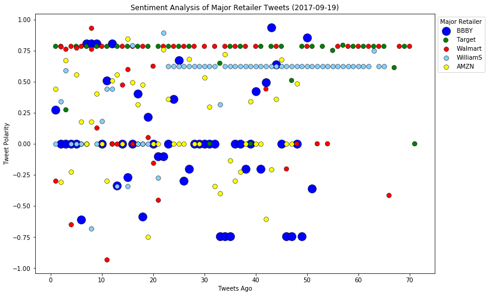
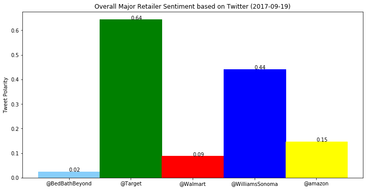

```python
import tweepy
import json
import numpy as np
import pandas as pd
import matplotlib.pyplot as plt
from datetime import datetime

from vaderSentiment.vaderSentiment import SentimentIntensityAnalyzer
analyzer = SentimentIntensityAnalyzer()

consumer_key = "Ed4RNulN1lp7AbOooHa9STCoU"
consumer_secret = "P7cUJlmJZq0VaCY0Jg7COliwQqzK0qYEyUF9Y0idx4ujb3ZlW5"
access_token = "839621358724198402-dzdOsx2WWHrSuBwyNUiqSEnTivHozAZ"
access_token_secret = "dCZ80uNRbFDjxdU2EckmNiSckdoATach6Q8zb7YYYE5ER"

auth = tweepy.OAuthHandler(consumer_key, consumer_secret)
auth.set_access_token(access_token, access_token_secret)
api = tweepy.API(auth, parser=tweepy.parsers.JSONParser())

```


```python
search_term = ("@BedBathBeyond", "@Target", "@Walmart","@WilliamsSonoma", "@amazon")

rows=[]

min_tweets = 5
max_tweets = 10000
max_followers = 2500
max_following = 2500
lang = "en"

rows=[]

for term in search_term:
        
    public_tweets = api.search(term, count=100, result_type="recent")    
    #print(json.dumps(public_tweets, indent = 2, separators=(',', ': ')))
    ctr=1
    for tweet in public_tweets["statuses"]:       
        print(">>> "+str(ctr)+" <<<")
        print(json.dumps(tweet, indent = 2, separators=(',', ': ')))
        ctr+=1
    
        if (tweet["user"]["followers_count"] < max_followers and
            tweet["user"]["statuses_count"] > min_tweets and
            tweet["user"]["statuses_count"] < max_tweets and
            tweet["user"]["friends_count"] < max_following and
            tweet["user"]["lang"] == lang):
            
            compound = analyzer.polarity_scores(tweet["text"])["compound"]
            positive = analyzer.polarity_scores(tweet["text"])["pos"]            
            neutral = analyzer.polarity_scores(tweet["text"])["neu"]
            negative = analyzer.polarity_scores(tweet["text"])["neg"]   
            txt=tweet["text"]
            dttm=datetime.strptime(tweet["created_at"] , '%a %b %d %H:%M:%S %z %Y')
                
            rows.append((term,txt,dttm,0,compound,positive,neutral,negative))        
    
sentim_df=pd.DataFrame(rows, columns=["Major Retailer","Tweet","DateTime","Tweets Ago","Compound", "Positive", "Neutral", "Negative"])

```

    >>> 1 <<<
    {
      "created_at": "Tue Sep 19 21:25:08 +0000 2017",
      "id": 910253447026495489,
      "id_str": "910253447026495489",
      "text": "Get up to a $50 gift card with purchase of select KitchenAid products at @BedBathBeyond https://t.co/siCMaVaieZ",
      "truncated": false,
      "entities": {
        "hashtags": [],
        "symbols": [],
        "user_mentions": [
          {
            "screen_name": "BedBathBeyond",
            "name": "Bed Bath & Beyond",
            "id": 372817561,
            "id_str": "372817561",
            "indices": [
              73,
              87
            ]
          }
        ],
        "urls": [
          {
            "url": "https://t.co/siCMaVaieZ",
            "expanded_url": "http://ow.ly/3lXV30f8Asq",
            "display_url": "ow.ly/3lXV30f8Asq",
            "indices": [
              88,
              111
            ]
          }
        ]
      },
      "metadata": {
        "iso_language_code": "en",
        "result_type": "recent"
      },
      "source": "<a href=\"http://www.hootsuite.com\" rel=\"nofollow\">Hootsuite</a>",
      "in_reply_to_status_id": null,
      "in_reply_to_status_id_str": null,
      "in_reply_to_user_id": null,
      "in_reply_to_user_id_str": null,
      "in_reply_to_screen_name": null,
      "user": {
        "id": 43166812,
        "id_str": "43166812",
        "name": "Savings.com",
        "screen_name": "savings",
        "location": "Los Angeles, CA",
        "description": "Coupons and deals to make your shopping experience a little easier.",
        "url": "https://t.co/p6hTMWyxoq",
        "entities": {
          "url": {
            "urls": [
              {
                "url": "https://t.co/p6hTMWyxoq",
                "expanded_url": "https://www.savings.com",
                "display_url": "savings.com",
                "indices": [
                  0,
                  23
                ]
              }
            ]
          },
          "description": {
            "urls": []
          }
        },
        "protected": false,
        "followers_count": 35359,
        "friends_count": 4153,
        "listed_count": 732,
        "created_at": "Thu May 28 18:34:46 +0000 2009",
        "favourites_count": 10752,
        "utc_offset": -25200,
        "time_zone": "Pacific Time (US & Canada)",
        "geo_enabled": false,
        "verified": true,
        "statuses_count": 26056,
        "lang": "en",
        "contributors_enabled": false,
        "is_translator": false,
        "is_translation_enabled": false,
        "profile_background_color": "000000",
        "profile_background_image_url": "http://pbs.twimg.com/profile_background_images/862182191/4792aa83d5a6a9726349c27f75c319ef.png",
        "profile_background_image_url_https": "https://pbs.twimg.com/profile_background_images/862182191/4792aa83d5a6a9726349c27f75c319ef.png",
        "profile_background_tile": true,
        "profile_image_url": "http://pbs.twimg.com/profile_images/642393998775070721/BtNpqyuW_normal.png",
        "profile_image_url_https": "https://pbs.twimg.com/profile_images/642393998775070721/BtNpqyuW_normal.png",
        "profile_banner_url": "https://pbs.twimg.com/profile_banners/43166812/1441993652",
        "profile_link_color": "093CEC",
        "profile_sidebar_border_color": "FFFFFF",
        "profile_sidebar_fill_color": "FFFFFF",
        "profile_text_color": "333333",
        "profile_use_background_image": true,
        "has_extended_profile": false,
        "default_profile": false,
        "default_profile_image": false,
        "following": false,
        "follow_request_sent": false,
        "notifications": false,
        "translator_type": "none"
      },
      "geo": null,
      "coordinates": null,
      "place": null,
      "contributors": null,
      "is_quote_status": false,
      "retweet_count": 0,
      "favorite_count": 0,
      "favorited": false,
      "retweeted": false,
      "possibly_sensitive": false,
      "lang": "en"
    }
    >>> 2 <<<
    {
      "created_at": "Tue Sep 19 21:14:16 +0000 2017",
      "id": 910250712034152449,
      "id_str": "910250712034152449",
      "text": "@LizMacDonaldFOX @FoxNews I would go to @BedBathBeyond to buy men's care products but they're way too high on prices.",
      "truncated": false,
      "entities": {
        "hashtags": [],
        "symbols": [],
        "user_mentions": [
          {
            "screen_name": "LizMacDonaldFOX",
            "name": "Elizabeth MacDonald",
            "id": 2229044521,
            "id_str": "2229044521",
            "indices": [
              0,
              16
            ]
          },
          {
            "screen_name": "FoxNews",
            "name": "Fox News",
            "id": 1367531,
            "id_str": "1367531",
            "indices": [
              17,
              25
            ]
          },
          {
            "screen_name": "BedBathBeyond",
            "name": "Bed Bath & Beyond",
            "id": 372817561,
            "id_str": "372817561",
            "indices": [
              40,
              54
            ]
          }
        ],
        "urls": []
      },
      "metadata": {
        "iso_language_code": "en",
        "result_type": "recent"
      },
      "source": "<a href=\"http://twitter.com/download/android\" rel=\"nofollow\">Twitter for Android</a>",
      "in_reply_to_status_id": null,
      "in_reply_to_status_id_str": null,
      "in_reply_to_user_id": 2229044521,
      "in_reply_to_user_id_str": "2229044521",
      "in_reply_to_screen_name": "LizMacDonaldFOX",
      "user": {
        "id": 1571383212,
        "id_str": "1571383212",
        "name": "Politics",
        "screen_name": "PoliticsUSmore",
        "location": "",
        "description": "",
        "url": null,
        "entities": {
          "description": {
            "urls": []
          }
        },
        "protected": false,
        "followers_count": 78,
        "friends_count": 156,
        "listed_count": 6,
        "created_at": "Fri Jul 05 21:44:36 +0000 2013",
        "favourites_count": 41,
        "utc_offset": null,
        "time_zone": null,
        "geo_enabled": true,
        "verified": false,
        "statuses_count": 7700,
        "lang": "en",
        "contributors_enabled": false,
        "is_translator": false,
        "is_translation_enabled": false,
        "profile_background_color": "C0DEED",
        "profile_background_image_url": "http://abs.twimg.com/images/themes/theme1/bg.png",
        "profile_background_image_url_https": "https://abs.twimg.com/images/themes/theme1/bg.png",
        "profile_background_tile": false,
        "profile_image_url": "http://pbs.twimg.com/profile_images/675006511375065093/4BQ5_z5L_normal.jpg",
        "profile_image_url_https": "https://pbs.twimg.com/profile_images/675006511375065093/4BQ5_z5L_normal.jpg",
        "profile_link_color": "1DA1F2",
        "profile_sidebar_border_color": "C0DEED",
        "profile_sidebar_fill_color": "DDEEF6",
        "profile_text_color": "333333",
        "profile_use_background_image": true,
        "has_extended_profile": false,
        "default_profile": true,
        "default_profile_image": false,
        "following": false,
        "follow_request_sent": false,
        "notifications": false,
        "translator_type": "none"
      },
      "geo": null,
      "coordinates": null,
      "place": {
        "id": "00f424d474454ea0",
        "url": "https://api.twitter.com/1.1/geo/id/00f424d474454ea0.json",
        "place_type": "city",
        "name": "Brownsburg",
        "full_name": "Brownsburg, IN",
        "country_code": "US",
        "country": "United States",
        "contained_within": [],
        "bounding_box": {
          "type": "Polygon",
          "coordinates": [
            [
              [
                -86.439701,
                39.800082
              ],
              [
                -86.326794,
                39.800082
              ],
              [
                -86.326794,
                39.912651
              ],
              [
                -86.439701,
                39.912651
              ]
            ]
          ]
        },
        "attributes": {}
      },
      "contributors": null,
      "is_quote_status": false,
      "retweet_count": 0,
      "favorite_count": 0,
      "favorited": false,
      "retweeted": false,
      "lang": "en"
    }
    >>> 3 <<<
    {
      "created_at": "Tue Sep 19 21:09:15 +0000 2017",
      "id": 910249452111302656,
      "id_str": "910249452111302656",
      "text": "RT @peta: We won't be silenced! PETA purchases stock for @bedbathbeyond to urge company to stop selling cruel down items. https://t.co/6sbg\u2026",
      "truncated": false,
      "entities": {
        "hashtags": [],
        "symbols": [],
        "user_mentions": [
          {
            "screen_name": "peta",
            "name": "PETA",
            "id": 9890492,
            "id_str": "9890492",
            "indices": [
              3,
              8
            ]
          },
          {
            "screen_name": "BedBathBeyond",
            "name": "Bed Bath & Beyond",
            "id": 372817561,
            "id_str": "372817561",
            "indices": [
              57,
              71
            ]
          }
        ],
        "urls": []
      },
      "metadata": {
        "iso_language_code": "en",
        "result_type": "recent"
      },
      "source": "<a href=\"http://twitter.com/#!/download/ipad\" rel=\"nofollow\">Twitter for iPad</a>",
      "in_reply_to_status_id": null,
      "in_reply_to_status_id_str": null,
      "in_reply_to_user_id": null,
      "in_reply_to_user_id_str": null,
      "in_reply_to_screen_name": null,
      "user": {
        "id": 2738029822,
        "id_str": "2738029822",
        "name": "Christopher",
        "screen_name": "christhompsont1",
        "location": "Daventry, UK",
        "description": "Vegetarian, animal defender and activist, atheist, republican, pro-choice",
        "url": "https://t.co/WqF2uIKEcr",
        "entities": {
          "url": {
            "urls": [
              {
                "url": "https://t.co/WqF2uIKEcr",
                "expanded_url": "http://www.daventryvegetarians.btck.co.uk",
                "display_url": "daventryvegetarians.btck.co.uk",
                "indices": [
                  0,
                  23
                ]
              }
            ]
          },
          "description": {
            "urls": []
          }
        },
        "protected": false,
        "followers_count": 176,
        "friends_count": 230,
        "listed_count": 5,
        "created_at": "Sat Aug 09 10:33:05 +0000 2014",
        "favourites_count": 1019,
        "utc_offset": null,
        "time_zone": null,
        "geo_enabled": false,
        "verified": false,
        "statuses_count": 1646,
        "lang": "en-gb",
        "contributors_enabled": false,
        "is_translator": false,
        "is_translation_enabled": false,
        "profile_background_color": "000000",
        "profile_background_image_url": "http://abs.twimg.com/images/themes/theme1/bg.png",
        "profile_background_image_url_https": "https://abs.twimg.com/images/themes/theme1/bg.png",
        "profile_background_tile": false,
        "profile_image_url": "http://pbs.twimg.com/profile_images/826499760097992704/tKgPsQg__normal.jpg",
        "profile_image_url_https": "https://pbs.twimg.com/profile_images/826499760097992704/tKgPsQg__normal.jpg",
        "profile_banner_url": "https://pbs.twimg.com/profile_banners/2738029822/1485887875",
        "profile_link_color": "00B32A",
        "profile_sidebar_border_color": "000000",
        "profile_sidebar_fill_color": "000000",
        "profile_text_color": "000000",
        "profile_use_background_image": false,
        "has_extended_profile": true,
        "default_profile": false,
        "default_profile_image": false,
        "following": false,
        "follow_request_sent": false,
        "notifications": false,
        "translator_type": "none"
      },
      "geo": null,
      "coordinates": null,
      "place": null,
      "contributors": null,
      "retweeted_status": {
        "created_at": "Sun Sep 17 21:15:04 +0000 2017",
        "id": 909526138652938241,
        "id_str": "909526138652938241",
        "text": "We won't be silenced! PETA purchases stock for @bedbathbeyond to urge company to stop selling cruel down items.\u2026 https://t.co/GP40XBo8hE",
        "truncated": true,
        "entities": {
          "hashtags": [],
          "symbols": [],
          "user_mentions": [
            {
              "screen_name": "BedBathBeyond",
              "name": "Bed Bath & Beyond",
              "id": 372817561,
              "id_str": "372817561",
              "indices": [
                47,
                61
              ]
            }
          ],
          "urls": [
            {
              "url": "https://t.co/GP40XBo8hE",
              "expanded_url": "https://twitter.com/i/web/status/909526138652938241",
              "display_url": "twitter.com/i/web/status/9\u2026",
              "indices": [
                113,
                136
              ]
            }
          ]
        },
        "metadata": {
          "iso_language_code": "en",
          "result_type": "recent"
        },
        "source": "<a href=\"http://sproutsocial.com\" rel=\"nofollow\">Sprout Social</a>",
        "in_reply_to_status_id": null,
        "in_reply_to_status_id_str": null,
        "in_reply_to_user_id": null,
        "in_reply_to_user_id_str": null,
        "in_reply_to_screen_name": null,
        "user": {
          "id": 9890492,
          "id_str": "9890492",
          "name": "PETA",
          "screen_name": "peta",
          "location": "Los Angeles, CA / Norfolk, VA",
          "description": "Animals are not ours to eat, wear, experiment on, or use for entertainment.\n\nFollow for breaking animal news, easy ways to take action, #vegan tips, and more!",
          "url": "https://t.co/5exYWbXgaE",
          "entities": {
            "url": {
              "urls": [
                {
                  "url": "https://t.co/5exYWbXgaE",
                  "expanded_url": "http://peta.org",
                  "display_url": "peta.org",
                  "indices": [
                    0,
                    23
                  ]
                }
              ]
            },
            "description": {
              "urls": []
            }
          },
          "protected": false,
          "followers_count": 1040186,
          "friends_count": 4755,
          "listed_count": 8248,
          "created_at": "Fri Nov 02 16:29:30 +0000 2007",
          "favourites_count": 73682,
          "utc_offset": -25200,
          "time_zone": "Pacific Time (US & Canada)",
          "geo_enabled": true,
          "verified": true,
          "statuses_count": 300407,
          "lang": "en",
          "contributors_enabled": false,
          "is_translator": false,
          "is_translation_enabled": false,
          "profile_background_color": "4BC1E0",
          "profile_background_image_url": "http://pbs.twimg.com/profile_background_images/378800000014006477/96abe68ce434bf3651ccbf92d061b474.jpeg",
          "profile_background_image_url_https": "https://pbs.twimg.com/profile_background_images/378800000014006477/96abe68ce434bf3651ccbf92d061b474.jpeg",
          "profile_background_tile": false,
          "profile_image_url": "http://pbs.twimg.com/profile_images/881970510065782784/qhHsPUyz_normal.jpg",
          "profile_image_url_https": "https://pbs.twimg.com/profile_images/881970510065782784/qhHsPUyz_normal.jpg",
          "profile_banner_url": "https://pbs.twimg.com/profile_banners/9890492/1501597815",
          "profile_link_color": "4B39D1",
          "profile_sidebar_border_color": "FFFFFF",
          "profile_sidebar_fill_color": "FFFFFF",
          "profile_text_color": "09090A",
          "profile_use_background_image": true,
          "has_extended_profile": false,
          "default_profile": false,
          "default_profile_image": false,
          "following": false,
          "follow_request_sent": false,
          "notifications": false,
          "translator_type": "none"
        },
        "geo": null,
        "coordinates": null,
        "place": null,
        "contributors": null,
        "is_quote_status": false,
        "retweet_count": 108,
        "favorite_count": 133,
        "favorited": false,
        "retweeted": false,
        "possibly_sensitive": false,
        "lang": "en"
      },
      "is_quote_status": false,
      "retweet_count": 108,
      "favorite_count": 0,
      "favorited": false,
      "retweeted": false,
      "lang": "en"
    }
    >>> 4 <<<
    {
      "created_at": "Tue Sep 19 21:08:59 +0000 2017",
      "id": 910249386260746240,
      "id_str": "910249386260746240",
      "text": "Our Sandstone bath accessories... now available at @BedBathBeyond https://t.co/2hZVrrfCVq #homedecor\u2026 https://t.co/Z9mw6nTeO9",
      "truncated": true,
      "entities": {
        "hashtags": [
          {
            "text": "homedecor",
            "indices": [
              90,
              100
            ]
          }
        ],
        "symbols": [],
        "user_mentions": [
          {
            "screen_name": "BedBathBeyond",
            "name": "Bed Bath & Beyond",
            "id": 372817561,
            "id_str": "372817561",
            "indices": [
              51,
              65
            ]
          }
        ],
        "urls": [
          {
            "url": "https://t.co/2hZVrrfCVq",
            "expanded_url": "https://www.bedbathandbeyond.com/store/product/shell-rummel-sand-stone-bath-ensemble/236702?Keyword=shell+rummel",
            "display_url": "bedbathandbeyond.com/store/product/\u2026",
            "indices": [
              66,
              89
            ]
          },
          {
            "url": "https://t.co/Z9mw6nTeO9",
            "expanded_url": "https://twitter.com/i/web/status/910249386260746240",
            "display_url": "twitter.com/i/web/status/9\u2026",
            "indices": [
              102,
              125
            ]
          }
        ]
      },
      "metadata": {
        "iso_language_code": "en",
        "result_type": "recent"
      },
      "source": "<a href=\"http://twitter.com\" rel=\"nofollow\">Twitter Web Client</a>",
      "in_reply_to_status_id": null,
      "in_reply_to_status_id_str": null,
      "in_reply_to_user_id": null,
      "in_reply_to_user_id_str": null,
      "in_reply_to_screen_name": null,
      "user": {
        "id": 18567925,
        "id_str": "18567925",
        "name": "Shell Rummel",
        "screen_name": "shellartistree",
        "location": "",
        "description": "Designer / Artist / Design Studio ~ Home Decor, Textiles, Fine Art...Lover of modern simplicity, organic lines, warm light & saltwater IG: https://t.co/8BCstKlVSK",
        "url": "https://t.co/mtzNKhD4zA",
        "entities": {
          "url": {
            "urls": [
              {
                "url": "https://t.co/mtzNKhD4zA",
                "expanded_url": "http://shellrummel.com",
                "display_url": "shellrummel.com",
                "indices": [
                  0,
                  23
                ]
              }
            ]
          },
          "description": {
            "urls": [
              {
                "url": "https://t.co/8BCstKlVSK",
                "expanded_url": "http://bit.ly/2gGMxh4",
                "display_url": "bit.ly/2gGMxh4",
                "indices": [
                  139,
                  162
                ]
              }
            ]
          }
        },
        "protected": false,
        "followers_count": 3747,
        "friends_count": 1375,
        "listed_count": 484,
        "created_at": "Fri Jan 02 23:58:53 +0000 2009",
        "favourites_count": 5824,
        "utc_offset": -14400,
        "time_zone": "Eastern Time (US & Canada)",
        "geo_enabled": false,
        "verified": false,
        "statuses_count": 25683,
        "lang": "en",
        "contributors_enabled": false,
        "is_translator": false,
        "is_translation_enabled": false,
        "profile_background_color": "8BABA0",
        "profile_background_image_url": "http://pbs.twimg.com/profile_background_images/470280900/final_twitter_background.jpg",
        "profile_background_image_url_https": "https://pbs.twimg.com/profile_background_images/470280900/final_twitter_background.jpg",
        "profile_background_tile": false,
        "profile_image_url": "http://pbs.twimg.com/profile_images/712272595941466112/e5pes3K3_normal.jpg",
        "profile_image_url_https": "https://pbs.twimg.com/profile_images/712272595941466112/e5pes3K3_normal.jpg",
        "profile_banner_url": "https://pbs.twimg.com/profile_banners/18567925/1471370252",
        "profile_link_color": "847571",
        "profile_sidebar_border_color": "1D6D72",
        "profile_sidebar_fill_color": "E2E3B0",
        "profile_text_color": "333333",
        "profile_use_background_image": true,
        "has_extended_profile": false,
        "default_profile": false,
        "default_profile_image": false,
        "following": false,
        "follow_request_sent": false,
        "notifications": false,
        "translator_type": "none"
      },
      "geo": null,
      "coordinates": null,
      "place": null,
      "contributors": null,
      "is_quote_status": false,
      "retweet_count": 0,
      "favorite_count": 0,
      "favorited": false,
      "retweeted": false,
      "possibly_sensitive": false,
      "lang": "en"
    }
    >>> 5 <<<
    {
      "created_at": "Tue Sep 19 21:05:13 +0000 2017",
      "id": 910248436942954501,
      "id_str": "910248436942954501",
      "text": "Love seeing our products in the #NYC Showrooms for #marketweek ~ Bath collections available online via\u2026 https://t.co/XIDm5a5I0w",
      "truncated": true,
      "entities": {
        "hashtags": [
          {
            "text": "NYC",
            "indices": [
              32,
              36
            ]
          },
          {
            "text": "marketweek",
            "indices": [
              51,
              62
            ]
          }
        ],
        "symbols": [],
        "user_mentions": [],
        "urls": [
          {
            "url": "https://t.co/XIDm5a5I0w",
            "expanded_url": "https://twitter.com/i/web/status/910248436942954501",
            "display_url": "twitter.com/i/web/status/9\u2026",
            "indices": [
              104,
              127
            ]
          }
        ]
      },
      "metadata": {
        "iso_language_code": "en",
        "result_type": "recent"
      },
      "source": "<a href=\"http://twitter.com\" rel=\"nofollow\">Twitter Web Client</a>",
      "in_reply_to_status_id": null,
      "in_reply_to_status_id_str": null,
      "in_reply_to_user_id": null,
      "in_reply_to_user_id_str": null,
      "in_reply_to_screen_name": null,
      "user": {
        "id": 18567925,
        "id_str": "18567925",
        "name": "Shell Rummel",
        "screen_name": "shellartistree",
        "location": "",
        "description": "Designer / Artist / Design Studio ~ Home Decor, Textiles, Fine Art...Lover of modern simplicity, organic lines, warm light & saltwater IG: https://t.co/8BCstKlVSK",
        "url": "https://t.co/mtzNKhD4zA",
        "entities": {
          "url": {
            "urls": [
              {
                "url": "https://t.co/mtzNKhD4zA",
                "expanded_url": "http://shellrummel.com",
                "display_url": "shellrummel.com",
                "indices": [
                  0,
                  23
                ]
              }
            ]
          },
          "description": {
            "urls": [
              {
                "url": "https://t.co/8BCstKlVSK",
                "expanded_url": "http://bit.ly/2gGMxh4",
                "display_url": "bit.ly/2gGMxh4",
                "indices": [
                  139,
                  162
                ]
              }
            ]
          }
        },
        "protected": false,
        "followers_count": 3747,
        "friends_count": 1375,
        "listed_count": 484,
        "created_at": "Fri Jan 02 23:58:53 +0000 2009",
        "favourites_count": 5824,
        "utc_offset": -14400,
        "time_zone": "Eastern Time (US & Canada)",
        "geo_enabled": false,
        "verified": false,
        "statuses_count": 25683,
        "lang": "en",
        "contributors_enabled": false,
        "is_translator": false,
        "is_translation_enabled": false,
        "profile_background_color": "8BABA0",
        "profile_background_image_url": "http://pbs.twimg.com/profile_background_images/470280900/final_twitter_background.jpg",
        "profile_background_image_url_https": "https://pbs.twimg.com/profile_background_images/470280900/final_twitter_background.jpg",
        "profile_background_tile": false,
        "profile_image_url": "http://pbs.twimg.com/profile_images/712272595941466112/e5pes3K3_normal.jpg",
        "profile_image_url_https": "https://pbs.twimg.com/profile_images/712272595941466112/e5pes3K3_normal.jpg",
        "profile_banner_url": "https://pbs.twimg.com/profile_banners/18567925/1471370252",
        "profile_link_color": "847571",
        "profile_sidebar_border_color": "1D6D72",
        "profile_sidebar_fill_color": "E2E3B0",
        "profile_text_color": "333333",
        "profile_use_background_image": true,
        "has_extended_profile": false,
        "default_profile": false,
        "default_profile_image": false,
        "following": false,
        "follow_request_sent": false,
        "notifications": false,
        "translator_type": "none"
      },
      "geo": null,
      "coordinates": null,
      "place": null,
      "contributors": null,
      "is_quote_status": false,
      "retweet_count": 0,
      "favorite_count": 2,
      "favorited": false,
      "retweeted": false,
      "possibly_sensitive": false,
      "lang": "en"
    }
    >>> 6 <<<
    {
      "created_at": "Tue Sep 19 20:48:57 +0000 2017",
      "id": 910244344191442944,
      "id_str": "910244344191442944",
      "text": "Bad news: @BedBathBeyond stocks fell 18%. Good news: they fell into Valeron Estate 100% sateen-weave silk sheets: https://t.co/Htjgikj2Ba",
      "truncated": false,
      "entities": {
        "hashtags": [],
        "symbols": [],
        "user_mentions": [
          {
            "screen_name": "BedBathBeyond",
            "name": "Bed Bath & Beyond",
            "id": 372817561,
            "id_str": "372817561",
            "indices": [
              10,
              24
            ]
          }
        ],
        "urls": [
          {
            "url": "https://t.co/Htjgikj2Ba",
            "expanded_url": "https://www.cnbc.com/2017/09/19/bed-bath-beyond-shares-fall-18-percent-after-worse-than-expected-sales.html",
            "display_url": "cnbc.com/2017/09/19/bed\u2026",
            "indices": [
              114,
              137
            ]
          }
        ]
      },
      "metadata": {
        "iso_language_code": "en",
        "result_type": "recent"
      },
      "source": "<a href=\"http://twitter.com\" rel=\"nofollow\">Twitter Web Client</a>",
      "in_reply_to_status_id": null,
      "in_reply_to_status_id_str": null,
      "in_reply_to_user_id": null,
      "in_reply_to_user_id_str": null,
      "in_reply_to_screen_name": null,
      "user": {
        "id": 14787705,
        "id_str": "14787705",
        "name": "DragonFlyEye",
        "screen_name": "dragonflyeye",
        "location": "Rochester, NY",
        "description": "#Science. #Technology, #ROC. #Geek perspectives. NSF-Anything.  RTs are not endorsements: they mean I want to have your baby.",
        "url": "https://t.co/MXCO0lxTOY",
        "entities": {
          "url": {
            "urls": [
              {
                "url": "https://t.co/MXCO0lxTOY",
                "expanded_url": "http://dragonflyeye.net",
                "display_url": "dragonflyeye.net",
                "indices": [
                  0,
                  23
                ]
              }
            ]
          },
          "description": {
            "urls": []
          }
        },
        "protected": false,
        "followers_count": 13044,
        "friends_count": 13861,
        "listed_count": 295,
        "created_at": "Thu May 15 15:50:22 +0000 2008",
        "favourites_count": 11461,
        "utc_offset": -14400,
        "time_zone": "America/Detroit",
        "geo_enabled": true,
        "verified": false,
        "statuses_count": 89952,
        "lang": "en",
        "contributors_enabled": false,
        "is_translator": false,
        "is_translation_enabled": false,
        "profile_background_color": "FFFFFF",
        "profile_background_image_url": "http://pbs.twimg.com/profile_background_images/147387608/dfe_stamp_twitter_logo_cropped.png",
        "profile_background_image_url_https": "https://pbs.twimg.com/profile_background_images/147387608/dfe_stamp_twitter_logo_cropped.png",
        "profile_background_tile": false,
        "profile_image_url": "http://pbs.twimg.com/profile_images/861605817853685761/m96aXuE4_normal.jpg",
        "profile_image_url_https": "https://pbs.twimg.com/profile_images/861605817853685761/m96aXuE4_normal.jpg",
        "profile_banner_url": "https://pbs.twimg.com/profile_banners/14787705/1436897676",
        "profile_link_color": "990F26",
        "profile_sidebar_border_color": "555555",
        "profile_sidebar_fill_color": "EEEEEE",
        "profile_text_color": "333333",
        "profile_use_background_image": true,
        "has_extended_profile": true,
        "default_profile": false,
        "default_profile_image": false,
        "following": false,
        "follow_request_sent": false,
        "notifications": false,
        "translator_type": "none"
      },
      "geo": null,
      "coordinates": null,
      "place": null,
      "contributors": null,
      "is_quote_status": false,
      "retweet_count": 0,
      "favorite_count": 1,
      "favorited": false,
      "retweeted": false,
      "possibly_sensitive": false,
      "lang": "en"
    }
    >>> 7 <<<
    {
      "created_at": "Tue Sep 19 20:39:02 +0000 2017",
      "id": 910241845636141057,
      "id_str": "910241845636141057",
      "text": "$BBBY company buyback algos in 5th gear overdrive as stock craters -18% on Q2 earnings results @BedBathBeyond",
      "truncated": false,
      "entities": {
        "hashtags": [],
        "symbols": [
          {
            "text": "BBBY",
            "indices": [
              0,
              5
            ]
          }
        ],
        "user_mentions": [
          {
            "screen_name": "BedBathBeyond",
            "name": "Bed Bath & Beyond",
            "id": 372817561,
            "id_str": "372817561",
            "indices": [
              95,
              109
            ]
          }
        ],
        "urls": []
      },
      "metadata": {
        "iso_language_code": "en",
        "result_type": "recent"
      },
      "source": "<a href=\"http://twitter.com/download/iphone\" rel=\"nofollow\">Twitter for iPhone</a>",
      "in_reply_to_status_id": null,
      "in_reply_to_status_id_str": null,
      "in_reply_to_user_id": null,
      "in_reply_to_user_id_str": null,
      "in_reply_to_screen_name": null,
      "user": {
        "id": 2379296515,
        "id_str": "2379296515",
        "name": "C\u00c6TUS",
        "screen_name": "caetuscap",
        "location": "",
        "description": "special situation investments.",
        "url": null,
        "entities": {
          "description": {
            "urls": []
          }
        },
        "protected": false,
        "followers_count": 421,
        "friends_count": 157,
        "listed_count": 12,
        "created_at": "Sat Mar 08 20:46:35 +0000 2014",
        "favourites_count": 1,
        "utc_offset": null,
        "time_zone": null,
        "geo_enabled": false,
        "verified": false,
        "statuses_count": 1783,
        "lang": "en",
        "contributors_enabled": false,
        "is_translator": false,
        "is_translation_enabled": false,
        "profile_background_color": "131516",
        "profile_background_image_url": "http://abs.twimg.com/images/themes/theme14/bg.gif",
        "profile_background_image_url_https": "https://abs.twimg.com/images/themes/theme14/bg.gif",
        "profile_background_tile": true,
        "profile_image_url": "http://pbs.twimg.com/profile_images/809641822528163841/qHxY4TX8_normal.jpg",
        "profile_image_url_https": "https://pbs.twimg.com/profile_images/809641822528163841/qHxY4TX8_normal.jpg",
        "profile_banner_url": "https://pbs.twimg.com/profile_banners/2379296515/1481868907",
        "profile_link_color": "0565F5",
        "profile_sidebar_border_color": "FFFFFF",
        "profile_sidebar_fill_color": "EFEFEF",
        "profile_text_color": "333333",
        "profile_use_background_image": false,
        "has_extended_profile": false,
        "default_profile": false,
        "default_profile_image": false,
        "following": false,
        "follow_request_sent": false,
        "notifications": false,
        "translator_type": "none"
      },
      "geo": null,
      "coordinates": null,
      "place": null,
      "contributors": null,
      "is_quote_status": false,
      "retweet_count": 0,
      "favorite_count": 0,
      "favorited": false,
      "retweeted": false,
      "lang": "en"
    }
    >>> 8 <<<
    {
      "created_at": "Tue Sep 19 20:36:14 +0000 2017",
      "id": 910241143459377153,
      "id_str": "910241143459377153",
      "text": "@BedBathBeyond #Grabyourwallet https://t.co/0ui28k36Yu",
      "truncated": false,
      "entities": {
        "hashtags": [
          {
            "text": "Grabyourwallet",
            "indices": [
              15,
              30
            ]
          }
        ],
        "symbols": [],
        "user_mentions": [
          {
            "screen_name": "BedBathBeyond",
            "name": "Bed Bath & Beyond",
            "id": 372817561,
            "id_str": "372817561",
            "indices": [
              0,
              14
            ]
          }
        ],
        "urls": [
          {
            "url": "https://t.co/0ui28k36Yu",
            "expanded_url": "https://twitter.com/MarketWatch/status/910240354728804358",
            "display_url": "twitter.com/MarketWatch/st\u2026",
            "indices": [
              31,
              54
            ]
          }
        ]
      },
      "metadata": {
        "iso_language_code": "und",
        "result_type": "recent"
      },
      "source": "<a href=\"http://twitter.com/download/android\" rel=\"nofollow\">Twitter for Android</a>",
      "in_reply_to_status_id": null,
      "in_reply_to_status_id_str": null,
      "in_reply_to_user_id": 372817561,
      "in_reply_to_user_id_str": "372817561",
      "in_reply_to_screen_name": "BedBathBeyond",
      "user": {
        "id": 851528787590352901,
        "id_str": "851528787590352901",
        "name": "DoWhat'sRight",
        "screen_name": "DoWhatsRight77",
        "location": "",
        "description": "",
        "url": null,
        "entities": {
          "description": {
            "urls": []
          }
        },
        "protected": false,
        "followers_count": 95,
        "friends_count": 311,
        "listed_count": 1,
        "created_at": "Mon Apr 10 20:14:18 +0000 2017",
        "favourites_count": 6827,
        "utc_offset": null,
        "time_zone": null,
        "geo_enabled": false,
        "verified": false,
        "statuses_count": 7885,
        "lang": "en",
        "contributors_enabled": false,
        "is_translator": false,
        "is_translation_enabled": false,
        "profile_background_color": "F5F8FA",
        "profile_background_image_url": null,
        "profile_background_image_url_https": null,
        "profile_background_tile": false,
        "profile_image_url": "http://pbs.twimg.com/profile_images/857656099968872448/coAwoqju_normal.jpg",
        "profile_image_url_https": "https://pbs.twimg.com/profile_images/857656099968872448/coAwoqju_normal.jpg",
        "profile_banner_url": "https://pbs.twimg.com/profile_banners/851528787590352901/1493316083",
        "profile_link_color": "1DA1F2",
        "profile_sidebar_border_color": "C0DEED",
        "profile_sidebar_fill_color": "DDEEF6",
        "profile_text_color": "333333",
        "profile_use_background_image": true,
        "has_extended_profile": false,
        "default_profile": true,
        "default_profile_image": false,
        "following": false,
        "follow_request_sent": false,
        "notifications": false,
        "translator_type": "none"
      },
      "geo": null,
      "coordinates": null,
      "place": null,
      "contributors": null,
      "is_quote_status": true,
      "quoted_status_id": 910240354728804358,
      "quoted_status_id_str": "910240354728804358",
      "quoted_status": {
        "created_at": "Tue Sep 19 20:33:06 +0000 2017",
        "id": 910240354728804358,
        "id_str": "910240354728804358",
        "text": "Bed Bath &amp; Beyond earnings miss widely, stock halted https://t.co/0FZB8qcvni",
        "truncated": false,
        "entities": {
          "hashtags": [],
          "symbols": [],
          "user_mentions": [],
          "urls": [
            {
              "url": "https://t.co/0FZB8qcvni",
              "expanded_url": "http://on.mktw.net/2f96Jpy",
              "display_url": "on.mktw.net/2f96Jpy",
              "indices": [
                57,
                80
              ]
            }
          ]
        },
        "metadata": {
          "iso_language_code": "und",
          "result_type": "recent"
        },
        "source": "<a href=\"http://www.socialflow.com\" rel=\"nofollow\">SocialFlow</a>",
        "in_reply_to_status_id": null,
        "in_reply_to_status_id_str": null,
        "in_reply_to_user_id": null,
        "in_reply_to_user_id_str": null,
        "in_reply_to_screen_name": null,
        "user": {
          "id": 624413,
          "id_str": "624413",
          "name": "MarketWatch",
          "screen_name": "MarketWatch",
          "location": "",
          "description": "News, personal finance & commentary from MarketWatch. Tweets by @SAFmedia, @jessmarmor, @slangwise.",
          "url": "http://t.co/0HcV671qZB",
          "entities": {
            "url": {
              "urls": [
                {
                  "url": "http://t.co/0HcV671qZB",
                  "expanded_url": "http://www.marketwatch.com/",
                  "display_url": "marketwatch.com",
                  "indices": [
                    0,
                    22
                  ]
                }
              ]
            },
            "description": {
              "urls": []
            }
          },
          "protected": false,
          "followers_count": 3481870,
          "friends_count": 184,
          "listed_count": 22728,
          "created_at": "Thu Jan 11 05:15:48 +0000 2007",
          "favourites_count": 2642,
          "utc_offset": -14400,
          "time_zone": "Eastern Time (US & Canada)",
          "geo_enabled": false,
          "verified": true,
          "statuses_count": 199182,
          "lang": "en",
          "contributors_enabled": false,
          "is_translator": false,
          "is_translation_enabled": false,
          "profile_background_color": "408D52",
          "profile_background_image_url": "http://pbs.twimg.com/profile_background_images/832787332/01d7da7138acf7100d1fcd33c7f0d57d.png",
          "profile_background_image_url_https": "https://pbs.twimg.com/profile_background_images/832787332/01d7da7138acf7100d1fcd33c7f0d57d.png",
          "profile_background_tile": false,
          "profile_image_url": "http://pbs.twimg.com/profile_images/705601245596090368/Z6xUOnRg_normal.jpg",
          "profile_image_url_https": "https://pbs.twimg.com/profile_images/705601245596090368/Z6xUOnRg_normal.jpg",
          "profile_banner_url": "https://pbs.twimg.com/profile_banners/624413/1398380735",
          "profile_link_color": "408D52",
          "profile_sidebar_border_color": "FFFFFF",
          "profile_sidebar_fill_color": "F0F7F2",
          "profile_text_color": "333333",
          "profile_use_background_image": true,
          "has_extended_profile": false,
          "default_profile": false,
          "default_profile_image": false,
          "following": false,
          "follow_request_sent": false,
          "notifications": false,
          "translator_type": "none"
        },
        "geo": null,
        "coordinates": null,
        "place": null,
        "contributors": null,
        "is_quote_status": false,
        "retweet_count": 12,
        "favorite_count": 13,
        "favorited": false,
        "retweeted": false,
        "possibly_sensitive": false,
        "lang": "en"
      },
      "retweet_count": 0,
      "favorite_count": 0,
      "favorited": false,
      "retweeted": false,
      "possibly_sensitive": false,
      "lang": "und"
    }
    >>> 9 <<<
    {
      "created_at": "Tue Sep 19 19:42:08 +0000 2017",
      "id": 910227527133577216,
      "id_str": "910227527133577216",
      "text": "Encourage @BedBathBeyond to Be Down-Free! https://t.co/F8PyFb1JyC via @PETA",
      "truncated": false,
      "entities": {
        "hashtags": [],
        "symbols": [],
        "user_mentions": [
          {
            "screen_name": "BedBathBeyond",
            "name": "Bed Bath & Beyond",
            "id": 372817561,
            "id_str": "372817561",
            "indices": [
              10,
              24
            ]
          },
          {
            "screen_name": "peta",
            "name": "PETA",
            "id": 9890492,
            "id_str": "9890492",
            "indices": [
              70,
              75
            ]
          }
        ],
        "urls": [
          {
            "url": "https://t.co/F8PyFb1JyC",
            "expanded_url": "http://peta.vg/20j3",
            "display_url": "peta.vg/20j3",
            "indices": [
              42,
              65
            ]
          }
        ]
      },
      "metadata": {
        "iso_language_code": "en",
        "result_type": "recent"
      },
      "source": "<a href=\"http://twitter.com\" rel=\"nofollow\">Twitter Web Client</a>",
      "in_reply_to_status_id": null,
      "in_reply_to_status_id_str": null,
      "in_reply_to_user_id": null,
      "in_reply_to_user_id_str": null,
      "in_reply_to_screen_name": null,
      "user": {
        "id": 8291312,
        "id_str": "8291312",
        "name": "Cora Lee Healy",
        "screen_name": "khorah",
        "location": "California",
        "description": "Freelance artist. Co-owner (with artist George  Barr)   of https://t.co/bMEaoa3K2b   fantasy & Sci-Fi t-shirts & gifts\nand https://t.co/JndDMcFJwF\nfor Goth",
        "url": "http://t.co/dn99LdmUu5",
        "entities": {
          "url": {
            "urls": [
              {
                "url": "http://t.co/dn99LdmUu5",
                "expanded_url": "http://about.me/khorah",
                "display_url": "about.me/khorah",
                "indices": [
                  0,
                  22
                ]
              }
            ]
          },
          "description": {
            "urls": [
              {
                "url": "https://t.co/bMEaoa3K2b",
                "expanded_url": "http://EnchantedThingamajig.com",
                "display_url": "EnchantedThingamajig.com",
                "indices": [
                  59,
                  82
                ]
              },
              {
                "url": "https://t.co/JndDMcFJwF",
                "expanded_url": "http://www.zazzle.com/vamporium",
                "display_url": "zazzle.com/vamporium",
                "indices": [
                  123,
                  146
                ]
              }
            ]
          }
        },
        "protected": false,
        "followers_count": 316,
        "friends_count": 445,
        "listed_count": 26,
        "created_at": "Sun Aug 19 20:19:01 +0000 2007",
        "favourites_count": 5349,
        "utc_offset": -25200,
        "time_zone": "Pacific Time (US & Canada)",
        "geo_enabled": false,
        "verified": false,
        "statuses_count": 45402,
        "lang": "en",
        "contributors_enabled": false,
        "is_translator": false,
        "is_translation_enabled": false,
        "profile_background_color": "071BB0",
        "profile_background_image_url": "http://pbs.twimg.com/profile_background_images/5265917/dragon_magic_small_.jpg",
        "profile_background_image_url_https": "https://pbs.twimg.com/profile_background_images/5265917/dragon_magic_small_.jpg",
        "profile_background_tile": true,
        "profile_image_url": "http://pbs.twimg.com/profile_images/1541337911/tw_12516295_1315937643_normal.jpg",
        "profile_image_url_https": "https://pbs.twimg.com/profile_images/1541337911/tw_12516295_1315937643_normal.jpg",
        "profile_banner_url": "https://pbs.twimg.com/profile_banners/8291312/1442296779",
        "profile_link_color": "1F5CC7",
        "profile_sidebar_border_color": "0114B7",
        "profile_sidebar_fill_color": "A8DC38",
        "profile_text_color": "000000",
        "profile_use_background_image": true,
        "has_extended_profile": false,
        "default_profile": false,
        "default_profile_image": false,
        "following": false,
        "follow_request_sent": false,
        "notifications": false,
        "translator_type": "none"
      },
      "geo": null,
      "coordinates": null,
      "place": null,
      "contributors": null,
      "is_quote_status": false,
      "retweet_count": 0,
      "favorite_count": 0,
      "favorited": false,
      "retweeted": false,
      "possibly_sensitive": false,
      "lang": "en"
    }
    >>> 10 <<<
    {
      "created_at": "Tue Sep 19 19:40:41 +0000 2017",
      "id": 910227161524576256,
      "id_str": "910227161524576256",
      "text": "RT @peta: We won't be silenced! PETA purchases stock for @bedbathbeyond to urge company to stop selling cruel down items. https://t.co/6sbg\u2026",
      "truncated": false,
      "entities": {
        "hashtags": [],
        "symbols": [],
        "user_mentions": [
          {
            "screen_name": "peta",
            "name": "PETA",
            "id": 9890492,
            "id_str": "9890492",
            "indices": [
              3,
              8
            ]
          },
          {
            "screen_name": "BedBathBeyond",
            "name": "Bed Bath & Beyond",
            "id": 372817561,
            "id_str": "372817561",
            "indices": [
              57,
              71
            ]
          }
        ],
        "urls": []
      },
      "metadata": {
        "iso_language_code": "en",
        "result_type": "recent"
      },
      "source": "<a href=\"http://twitter.com\" rel=\"nofollow\">Twitter Web Client</a>",
      "in_reply_to_status_id": null,
      "in_reply_to_status_id_str": null,
      "in_reply_to_user_id": null,
      "in_reply_to_user_id_str": null,
      "in_reply_to_screen_name": null,
      "user": {
        "id": 8291312,
        "id_str": "8291312",
        "name": "Cora Lee Healy",
        "screen_name": "khorah",
        "location": "California",
        "description": "Freelance artist. Co-owner (with artist George  Barr)   of https://t.co/bMEaoa3K2b   fantasy & Sci-Fi t-shirts & gifts\nand https://t.co/JndDMcFJwF\nfor Goth",
        "url": "http://t.co/dn99LdmUu5",
        "entities": {
          "url": {
            "urls": [
              {
                "url": "http://t.co/dn99LdmUu5",
                "expanded_url": "http://about.me/khorah",
                "display_url": "about.me/khorah",
                "indices": [
                  0,
                  22
                ]
              }
            ]
          },
          "description": {
            "urls": [
              {
                "url": "https://t.co/bMEaoa3K2b",
                "expanded_url": "http://EnchantedThingamajig.com",
                "display_url": "EnchantedThingamajig.com",
                "indices": [
                  59,
                  82
                ]
              },
              {
                "url": "https://t.co/JndDMcFJwF",
                "expanded_url": "http://www.zazzle.com/vamporium",
                "display_url": "zazzle.com/vamporium",
                "indices": [
                  123,
                  146
                ]
              }
            ]
          }
        },
        "protected": false,
        "followers_count": 316,
        "friends_count": 445,
        "listed_count": 26,
        "created_at": "Sun Aug 19 20:19:01 +0000 2007",
        "favourites_count": 5349,
        "utc_offset": -25200,
        "time_zone": "Pacific Time (US & Canada)",
        "geo_enabled": false,
        "verified": false,
        "statuses_count": 45402,
        "lang": "en",
        "contributors_enabled": false,
        "is_translator": false,
        "is_translation_enabled": false,
        "profile_background_color": "071BB0",
        "profile_background_image_url": "http://pbs.twimg.com/profile_background_images/5265917/dragon_magic_small_.jpg",
        "profile_background_image_url_https": "https://pbs.twimg.com/profile_background_images/5265917/dragon_magic_small_.jpg",
        "profile_background_tile": true,
        "profile_image_url": "http://pbs.twimg.com/profile_images/1541337911/tw_12516295_1315937643_normal.jpg",
        "profile_image_url_https": "https://pbs.twimg.com/profile_images/1541337911/tw_12516295_1315937643_normal.jpg",
        "profile_banner_url": "https://pbs.twimg.com/profile_banners/8291312/1442296779",
        "profile_link_color": "1F5CC7",
        "profile_sidebar_border_color": "0114B7",
        "profile_sidebar_fill_color": "A8DC38",
        "profile_text_color": "000000",
        "profile_use_background_image": true,
        "has_extended_profile": false,
        "default_profile": false,
        "default_profile_image": false,
        "following": false,
        "follow_request_sent": false,
        "notifications": false,
        "translator_type": "none"
      },
      "geo": null,
      "coordinates": null,
      "place": null,
      "contributors": null,
      "retweeted_status": {
        "created_at": "Sun Sep 17 21:15:04 +0000 2017",
        "id": 909526138652938241,
        "id_str": "909526138652938241",
        "text": "We won't be silenced! PETA purchases stock for @bedbathbeyond to urge company to stop selling cruel down items.\u2026 https://t.co/GP40XBo8hE",
        "truncated": true,
        "entities": {
          "hashtags": [],
          "symbols": [],
          "user_mentions": [
            {
              "screen_name": "BedBathBeyond",
              "name": "Bed Bath & Beyond",
              "id": 372817561,
              "id_str": "372817561",
              "indices": [
                47,
                61
              ]
            }
          ],
          "urls": [
            {
              "url": "https://t.co/GP40XBo8hE",
              "expanded_url": "https://twitter.com/i/web/status/909526138652938241",
              "display_url": "twitter.com/i/web/status/9\u2026",
              "indices": [
                113,
                136
              ]
            }
          ]
        },
        "metadata": {
          "iso_language_code": "en",
          "result_type": "recent"
        },
        "source": "<a href=\"http://sproutsocial.com\" rel=\"nofollow\">Sprout Social</a>",
        "in_reply_to_status_id": null,
        "in_reply_to_status_id_str": null,
        "in_reply_to_user_id": null,
        "in_reply_to_user_id_str": null,
        "in_reply_to_screen_name": null,
        "user": {
          "id": 9890492,
          "id_str": "9890492",
          "name": "PETA",
          "screen_name": "peta",
          "location": "Los Angeles, CA / Norfolk, VA",
          "description": "Animals are not ours to eat, wear, experiment on, or use for entertainment.\n\nFollow for breaking animal news, easy ways to take action, #vegan tips, and more!",
          "url": "https://t.co/5exYWbXgaE",
          "entities": {
            "url": {
              "urls": [
                {
                  "url": "https://t.co/5exYWbXgaE",
                  "expanded_url": "http://peta.org",
                  "display_url": "peta.org",
                  "indices": [
                    0,
                    23
                  ]
                }
              ]
            },
            "description": {
              "urls": []
            }
          },
          "protected": false,
          "followers_count": 1040186,
          "friends_count": 4755,
          "listed_count": 8248,
          "created_at": "Fri Nov 02 16:29:30 +0000 2007",
          "favourites_count": 73682,
          "utc_offset": -25200,
          "time_zone": "Pacific Time (US & Canada)",
          "geo_enabled": true,
          "verified": true,
          "statuses_count": 300407,
          "lang": "en",
          "contributors_enabled": false,
          "is_translator": false,
          "is_translation_enabled": false,
          "profile_background_color": "4BC1E0",
          "profile_background_image_url": "http://pbs.twimg.com/profile_background_images/378800000014006477/96abe68ce434bf3651ccbf92d061b474.jpeg",
          "profile_background_image_url_https": "https://pbs.twimg.com/profile_background_images/378800000014006477/96abe68ce434bf3651ccbf92d061b474.jpeg",
          "profile_background_tile": false,
          "profile_image_url": "http://pbs.twimg.com/profile_images/881970510065782784/qhHsPUyz_normal.jpg",
          "profile_image_url_https": "https://pbs.twimg.com/profile_images/881970510065782784/qhHsPUyz_normal.jpg",
          "profile_banner_url": "https://pbs.twimg.com/profile_banners/9890492/1501597815",
          "profile_link_color": "4B39D1",
          "profile_sidebar_border_color": "FFFFFF",
          "profile_sidebar_fill_color": "FFFFFF",
          "profile_text_color": "09090A",
          "profile_use_background_image": true,
          "has_extended_profile": false,
          "default_profile": false,
          "default_profile_image": false,
          "following": false,
          "follow_request_sent": false,
          "notifications": false,
          "translator_type": "none"
        },
        "geo": null,
        "coordinates": null,
        "place": null,
        "contributors": null,
        "is_quote_status": false,
        "retweet_count": 108,
        "favorite_count": 133,
        "favorited": false,
        "retweeted": false,
        "possibly_sensitive": false,
        "lang": "en"
      },
      "is_quote_status": false,
      "retweet_count": 108,
      "favorite_count": 0,
      "favorited": false,
      "retweeted": false,
      "lang": "en"
    }
    >>> 11 <<<
    {
      "created_at": "Tue Sep 19 19:21:59 +0000 2017",
      "id": 910222456752877568,
      "id_str": "910222456752877568",
      "text": "\u2764\ufe0f the FedEx delivery notifications via text message from @BedBathBeyond . That's what I call good\u2026 https://t.co/87ItL5kZqA",
      "truncated": true,
      "entities": {
        "hashtags": [],
        "symbols": [],
        "user_mentions": [
          {
            "screen_name": "BedBathBeyond",
            "name": "Bed Bath & Beyond",
            "id": 372817561,
            "id_str": "372817561",
            "indices": [
              58,
              72
            ]
          }
        ],
        "urls": [
          {
            "url": "https://t.co/87ItL5kZqA",
            "expanded_url": "https://twitter.com/i/web/status/910222456752877568",
            "display_url": "twitter.com/i/web/status/9\u2026",
            "indices": [
              100,
              123
            ]
          }
        ]
      },
      "metadata": {
        "iso_language_code": "en",
        "result_type": "recent"
      },
      "source": "<a href=\"http://twitter.com/download/iphone\" rel=\"nofollow\">Twitter for iPhone</a>",
      "in_reply_to_status_id": null,
      "in_reply_to_status_id_str": null,
      "in_reply_to_user_id": null,
      "in_reply_to_user_id_str": null,
      "in_reply_to_screen_name": null,
      "user": {
        "id": 4860691035,
        "id_str": "4860691035",
        "name": "Stephanie Clarke",
        "screen_name": "Steph_ClarkeB2B",
        "location": "",
        "description": "Director, Content Marketing @quadient",
        "url": "https://t.co/jT203aDwuC",
        "entities": {
          "url": {
            "urls": [
              {
                "url": "https://t.co/jT203aDwuC",
                "expanded_url": "http://www.quadient.com",
                "display_url": "quadient.com",
                "indices": [
                  0,
                  23
                ]
              }
            ]
          },
          "description": {
            "urls": []
          }
        },
        "protected": false,
        "followers_count": 199,
        "friends_count": 255,
        "listed_count": 44,
        "created_at": "Fri Jan 29 16:17:49 +0000 2016",
        "favourites_count": 124,
        "utc_offset": -25200,
        "time_zone": "Pacific Time (US & Canada)",
        "geo_enabled": false,
        "verified": false,
        "statuses_count": 378,
        "lang": "en",
        "contributors_enabled": false,
        "is_translator": false,
        "is_translation_enabled": false,
        "profile_background_color": "000000",
        "profile_background_image_url": "http://abs.twimg.com/images/themes/theme1/bg.png",
        "profile_background_image_url_https": "https://abs.twimg.com/images/themes/theme1/bg.png",
        "profile_background_tile": false,
        "profile_image_url": "http://pbs.twimg.com/profile_images/728741988724408320/3zHRhB_y_normal.jpg",
        "profile_image_url_https": "https://pbs.twimg.com/profile_images/728741988724408320/3zHRhB_y_normal.jpg",
        "profile_banner_url": "https://pbs.twimg.com/profile_banners/4860691035/1505222123",
        "profile_link_color": "89C9FA",
        "profile_sidebar_border_color": "000000",
        "profile_sidebar_fill_color": "000000",
        "profile_text_color": "000000",
        "profile_use_background_image": false,
        "has_extended_profile": false,
        "default_profile": false,
        "default_profile_image": false,
        "following": false,
        "follow_request_sent": false,
        "notifications": false,
        "translator_type": "none"
      },
      "geo": null,
      "coordinates": null,
      "place": null,
      "contributors": null,
      "is_quote_status": false,
      "retweet_count": 0,
      "favorite_count": 1,
      "favorited": false,
      "retweeted": false,
      "possibly_sensitive": false,
      "lang": "en"
    }
    >>> 12 <<<
    {
      "created_at": "Tue Sep 19 19:11:25 +0000 2017",
      "id": 910219799657046016,
      "id_str": "910219799657046016",
      "text": "Fans in all the right places! Hey Derek! @BedBathBeyond @ToxicBebop #WindowsCommunity https://t.co/HPQtHxlhzk",
      "truncated": false,
      "entities": {
        "hashtags": [
          {
            "text": "WindowsCommunity",
            "indices": [
              68,
              85
            ]
          }
        ],
        "symbols": [],
        "user_mentions": [
          {
            "screen_name": "BedBathBeyond",
            "name": "Bed Bath & Beyond",
            "id": 372817561,
            "id_str": "372817561",
            "indices": [
              41,
              55
            ]
          },
          {
            "screen_name": "ToxicBebop",
            "name": "ToxicBebop",
            "id": 862344247458115584,
            "id_str": "862344247458115584",
            "indices": [
              56,
              67
            ]
          }
        ],
        "urls": [],
        "media": [
          {
            "id": 910219790169419776,
            "id_str": "910219790169419776",
            "indices": [
              86,
              109
            ],
            "media_url": "http://pbs.twimg.com/media/DKHAE5yUMAA_mNa.jpg",
            "media_url_https": "https://pbs.twimg.com/media/DKHAE5yUMAA_mNa.jpg",
            "url": "https://t.co/HPQtHxlhzk",
            "display_url": "pic.twitter.com/HPQtHxlhzk",
            "expanded_url": "https://twitter.com/FinneyAmanda2/status/910219799657046016/photo/1",
            "type": "photo",
            "sizes": {
              "medium": {
                "w": 900,
                "h": 1200,
                "resize": "fit"
              },
              "thumb": {
                "w": 150,
                "h": 150,
                "resize": "crop"
              },
              "small": {
                "w": 510,
                "h": 680,
                "resize": "fit"
              },
              "large": {
                "w": 1536,
                "h": 2048,
                "resize": "fit"
              }
            }
          }
        ]
      },
      "extended_entities": {
        "media": [
          {
            "id": 910219790169419776,
            "id_str": "910219790169419776",
            "indices": [
              86,
              109
            ],
            "media_url": "http://pbs.twimg.com/media/DKHAE5yUMAA_mNa.jpg",
            "media_url_https": "https://pbs.twimg.com/media/DKHAE5yUMAA_mNa.jpg",
            "url": "https://t.co/HPQtHxlhzk",
            "display_url": "pic.twitter.com/HPQtHxlhzk",
            "expanded_url": "https://twitter.com/FinneyAmanda2/status/910219799657046016/photo/1",
            "type": "photo",
            "sizes": {
              "medium": {
                "w": 900,
                "h": 1200,
                "resize": "fit"
              },
              "thumb": {
                "w": 150,
                "h": 150,
                "resize": "crop"
              },
              "small": {
                "w": 510,
                "h": 680,
                "resize": "fit"
              },
              "large": {
                "w": 1536,
                "h": 2048,
                "resize": "fit"
              }
            }
          }
        ]
      },
      "metadata": {
        "iso_language_code": "en",
        "result_type": "recent"
      },
      "source": "<a href=\"http://twitter.com/download/iphone\" rel=\"nofollow\">Twitter for iPhone</a>",
      "in_reply_to_status_id": null,
      "in_reply_to_status_id_str": null,
      "in_reply_to_user_id": null,
      "in_reply_to_user_id_str": null,
      "in_reply_to_screen_name": null,
      "user": {
        "id": 3515358262,
        "id_str": "3515358262",
        "name": "Amanda Finney",
        "screen_name": "FinneyAmanda2",
        "location": "",
        "description": "@Microsoft #WindowsCommunity Broadway. Politics. And everything in between|Former @hillaryclinton& @ofa| @newhousesu & @wakeforest alum I @TeachforAmerica GNO",
        "url": "https://t.co/uYKWTJEm2l",
        "entities": {
          "url": {
            "urls": [
              {
                "url": "https://t.co/uYKWTJEm2l",
                "expanded_url": "http://amandafinney.com",
                "display_url": "amandafinney.com",
                "indices": [
                  0,
                  23
                ]
              }
            ]
          },
          "description": {
            "urls": []
          }
        },
        "protected": false,
        "followers_count": 300,
        "friends_count": 1588,
        "listed_count": 3,
        "created_at": "Tue Sep 01 18:49:39 +0000 2015",
        "favourites_count": 249,
        "utc_offset": null,
        "time_zone": null,
        "geo_enabled": false,
        "verified": false,
        "statuses_count": 426,
        "lang": "en",
        "contributors_enabled": false,
        "is_translator": false,
        "is_translation_enabled": false,
        "profile_background_color": "C0DEED",
        "profile_background_image_url": "http://abs.twimg.com/images/themes/theme1/bg.png",
        "profile_background_image_url_https": "https://abs.twimg.com/images/themes/theme1/bg.png",
        "profile_background_tile": false,
        "profile_image_url": "http://pbs.twimg.com/profile_images/794247231197085702/jBaK2ooC_normal.jpg",
        "profile_image_url_https": "https://pbs.twimg.com/profile_images/794247231197085702/jBaK2ooC_normal.jpg",
        "profile_banner_url": "https://pbs.twimg.com/profile_banners/3515358262/1460588908",
        "profile_link_color": "1DA1F2",
        "profile_sidebar_border_color": "C0DEED",
        "profile_sidebar_fill_color": "DDEEF6",
        "profile_text_color": "333333",
        "profile_use_background_image": true,
        "has_extended_profile": true,
        "default_profile": true,
        "default_profile_image": false,
        "following": false,
        "follow_request_sent": false,
        "notifications": false,
        "translator_type": "none"
      },
      "geo": null,
      "coordinates": null,
      "place": null,
      "contributors": null,
      "is_quote_status": false,
      "retweet_count": 0,
      "favorite_count": 1,
      "favorited": false,
      "retweeted": false,
      "possibly_sensitive": false,
      "lang": "en"
    }
    >>> 13 <<<
    {
      "created_at": "Tue Sep 19 19:10:39 +0000 2017",
      "id": 910219606614188032,
      "id_str": "910219606614188032",
      "text": "@25Shaunthesheep @ElisaJordana sad her relatives arent helping her furniture shop. They helped her lease that place\u2026 https://t.co/Ui0sC9n84L",
      "truncated": true,
      "entities": {
        "hashtags": [],
        "symbols": [],
        "user_mentions": [
          {
            "screen_name": "25Shaunthesheep",
            "name": "Shaun",
            "id": 877589779944046592,
            "id_str": "877589779944046592",
            "indices": [
              0,
              16
            ]
          },
          {
            "screen_name": "ElisaJordana",
            "name": "Elisa Jordana",
            "id": 339290784,
            "id_str": "339290784",
            "indices": [
              17,
              30
            ]
          }
        ],
        "urls": [
          {
            "url": "https://t.co/Ui0sC9n84L",
            "expanded_url": "https://twitter.com/i/web/status/910219606614188032",
            "display_url": "twitter.com/i/web/status/9\u2026",
            "indices": [
              117,
              140
            ]
          }
        ]
      },
      "metadata": {
        "iso_language_code": "en",
        "result_type": "recent"
      },
      "source": "<a href=\"http://twitter.com\" rel=\"nofollow\">Twitter Web Client</a>",
      "in_reply_to_status_id": 910170427472748544,
      "in_reply_to_status_id_str": "910170427472748544",
      "in_reply_to_user_id": 877589779944046592,
      "in_reply_to_user_id_str": "877589779944046592",
      "in_reply_to_screen_name": "25Shaunthesheep",
      "user": {
        "id": 885031335882051584,
        "id_str": "885031335882051584",
        "name": "Deplorable Condition",
        "screen_name": "CNNSucksDotWang",
        "location": "Clovis, CA",
        "description": "Im Commander H.D. Wang & Im 4 TRUMP! I used 2 fall victim 2 Twitters INANE TOS policy. Ive had so many accts:/ This 1 seems good! Give me a follow Trumpers!",
        "url": "https://t.co/L8VUJylDXS",
        "entities": {
          "url": {
            "urls": [
              {
                "url": "https://t.co/L8VUJylDXS",
                "expanded_url": "http://ImissmyFuckCNNdotWangname.wang",
                "display_url": "ImissmyFuckCNNdotWangname.wang",
                "indices": [
                  0,
                  23
                ]
              }
            ]
          },
          "description": {
            "urls": []
          }
        },
        "protected": false,
        "followers_count": 36,
        "friends_count": 30,
        "listed_count": 0,
        "created_at": "Wed Jul 12 07:01:28 +0000 2017",
        "favourites_count": 1913,
        "utc_offset": null,
        "time_zone": null,
        "geo_enabled": false,
        "verified": false,
        "statuses_count": 2427,
        "lang": "en",
        "contributors_enabled": false,
        "is_translator": false,
        "is_translation_enabled": false,
        "profile_background_color": "000000",
        "profile_background_image_url": "http://abs.twimg.com/images/themes/theme1/bg.png",
        "profile_background_image_url_https": "https://abs.twimg.com/images/themes/theme1/bg.png",
        "profile_background_tile": false,
        "profile_image_url": "http://pbs.twimg.com/profile_images/898492163817746432/Olq5_LF4_normal.jpg",
        "profile_image_url_https": "https://pbs.twimg.com/profile_images/898492163817746432/Olq5_LF4_normal.jpg",
        "profile_banner_url": "https://pbs.twimg.com/profile_banners/885031335882051584/1503051652",
        "profile_link_color": "E81C4F",
        "profile_sidebar_border_color": "000000",
        "profile_sidebar_fill_color": "000000",
        "profile_text_color": "000000",
        "profile_use_background_image": false,
        "has_extended_profile": false,
        "default_profile": false,
        "default_profile_image": false,
        "following": false,
        "follow_request_sent": false,
        "notifications": false,
        "translator_type": "none"
      },
      "geo": null,
      "coordinates": null,
      "place": null,
      "contributors": null,
      "is_quote_status": false,
      "retweet_count": 0,
      "favorite_count": 0,
      "favorited": false,
      "retweeted": false,
      "lang": "en"
    }
    >>> 14 <<<
    {
      "created_at": "Tue Sep 19 19:10:36 +0000 2017",
      "id": 910219593033093120,
      "id_str": "910219593033093120",
      "text": "I'm at @BedBathBeyond in Valencia, CA https://t.co/v06SooFFwo",
      "truncated": false,
      "entities": {
        "hashtags": [],
        "symbols": [],
        "user_mentions": [
          {
            "screen_name": "BedBathBeyond",
            "name": "Bed Bath & Beyond",
            "id": 372817561,
            "id_str": "372817561",
            "indices": [
              7,
              21
            ]
          }
        ],
        "urls": [
          {
            "url": "https://t.co/v06SooFFwo",
            "expanded_url": "https://www.swarmapp.com/c/fjLtLVLSvSA",
            "display_url": "swarmapp.com/c/fjLtLVLSvSA",
            "indices": [
              38,
              61
            ]
          }
        ]
      },
      "metadata": {
        "iso_language_code": "en",
        "result_type": "recent"
      },
      "source": "<a href=\"http://foursquare.com\" rel=\"nofollow\">Foursquare</a>",
      "in_reply_to_status_id": null,
      "in_reply_to_status_id_str": null,
      "in_reply_to_user_id": null,
      "in_reply_to_user_id_str": null,
      "in_reply_to_screen_name": null,
      "user": {
        "id": 64848375,
        "id_str": "64848375",
        "name": "Brian Humphrey GPS",
        "screen_name": "brianstatus",
        "location": "",
        "description": "Geospatial and automated status information for Brian Humphrey. NOTE: This account is a bot. Brian's primary *personal* Twitter account is @BrianHumphrey",
        "url": null,
        "entities": {
          "description": {
            "urls": []
          }
        },
        "protected": false,
        "followers_count": 599,
        "friends_count": 1,
        "listed_count": 20,
        "created_at": "Tue Aug 11 22:39:47 +0000 2009",
        "favourites_count": 3,
        "utc_offset": -25200,
        "time_zone": "Pacific Time (US & Canada)",
        "geo_enabled": true,
        "verified": false,
        "statuses_count": 14253,
        "lang": "en",
        "contributors_enabled": false,
        "is_translator": false,
        "is_translation_enabled": false,
        "profile_background_color": "C0DEED",
        "profile_background_image_url": "http://abs.twimg.com/images/themes/theme1/bg.png",
        "profile_background_image_url_https": "https://abs.twimg.com/images/themes/theme1/bg.png",
        "profile_background_tile": false,
        "profile_image_url": "http://pbs.twimg.com/profile_images/622960894/Earth_normal.jpg",
        "profile_image_url_https": "https://pbs.twimg.com/profile_images/622960894/Earth_normal.jpg",
        "profile_link_color": "1DA1F2",
        "profile_sidebar_border_color": "C0DEED",
        "profile_sidebar_fill_color": "DDEEF6",
        "profile_text_color": "333333",
        "profile_use_background_image": true,
        "has_extended_profile": false,
        "default_profile": true,
        "default_profile_image": false,
        "following": false,
        "follow_request_sent": false,
        "notifications": false,
        "translator_type": "none"
      },
      "geo": {
        "type": "Point",
        "coordinates": [
          34.3849368,
          -118.57009735
        ]
      },
      "coordinates": {
        "type": "Point",
        "coordinates": [
          -118.57009735,
          34.3849368
        ]
      },
      "place": {
        "id": "00ab310716dc2504",
        "url": "https://api.twitter.com/1.1/geo/id/00ab310716dc2504.json",
        "place_type": "city",
        "name": "Stevenson Ranch",
        "full_name": "Stevenson Ranch, CA",
        "country_code": "US",
        "country": "United States",
        "contained_within": [],
        "bounding_box": {
          "type": "Polygon",
          "coordinates": [
            [
              [
                -118.622276,
                34.366596
              ],
              [
                -118.560263,
                34.366596
              ],
              [
                -118.560263,
                34.4180643
              ],
              [
                -118.622276,
                34.4180643
              ]
            ]
          ]
        },
        "attributes": {}
      },
      "contributors": null,
      "is_quote_status": false,
      "retweet_count": 0,
      "favorite_count": 0,
      "favorited": false,
      "retweeted": false,
      "possibly_sensitive": false,
      "lang": "en"
    }
    >>> 15 <<<
    {
      "created_at": "Tue Sep 19 18:34:38 +0000 2017",
      "id": 910210541083340800,
      "id_str": "910210541083340800",
      "text": "RT @BedBathBeyond: Use these six tools to keep guests happy and warm at your outdoor party. https://t.co/K132gNDvWF https://t.co/vuWyjQHaKy",
      "truncated": false,
      "entities": {
        "hashtags": [],
        "symbols": [],
        "user_mentions": [
          {
            "screen_name": "BedBathBeyond",
            "name": "Bed Bath & Beyond",
            "id": 372817561,
            "id_str": "372817561",
            "indices": [
              3,
              17
            ]
          }
        ],
        "urls": [
          {
            "url": "https://t.co/K132gNDvWF",
            "expanded_url": "http://bit.ly/2ffCBwc",
            "display_url": "bit.ly/2ffCBwc",
            "indices": [
              92,
              115
            ]
          }
        ],
        "media": [
          {
            "id": 910179192427261952,
            "id_str": "910179192427261952",
            "indices": [
              116,
              139
            ],
            "media_url": "http://pbs.twimg.com/media/DKGbJzaUMAAxdi3.jpg",
            "media_url_https": "https://pbs.twimg.com/media/DKGbJzaUMAAxdi3.jpg",
            "url": "https://t.co/vuWyjQHaKy",
            "display_url": "pic.twitter.com/vuWyjQHaKy",
            "expanded_url": "https://twitter.com/BedBathBeyond/status/910179194549690368/photo/1",
            "type": "photo",
            "sizes": {
              "small": {
                "w": 641,
                "h": 484,
                "resize": "fit"
              },
              "thumb": {
                "w": 150,
                "h": 150,
                "resize": "crop"
              },
              "medium": {
                "w": 641,
                "h": 484,
                "resize": "fit"
              },
              "large": {
                "w": 641,
                "h": 484,
                "resize": "fit"
              }
            },
            "source_status_id": 910179194549690368,
            "source_status_id_str": "910179194549690368",
            "source_user_id": 372817561,
            "source_user_id_str": "372817561"
          }
        ]
      },
      "extended_entities": {
        "media": [
          {
            "id": 910179192427261952,
            "id_str": "910179192427261952",
            "indices": [
              116,
              139
            ],
            "media_url": "http://pbs.twimg.com/media/DKGbJzaUMAAxdi3.jpg",
            "media_url_https": "https://pbs.twimg.com/media/DKGbJzaUMAAxdi3.jpg",
            "url": "https://t.co/vuWyjQHaKy",
            "display_url": "pic.twitter.com/vuWyjQHaKy",
            "expanded_url": "https://twitter.com/BedBathBeyond/status/910179194549690368/photo/1",
            "type": "photo",
            "sizes": {
              "small": {
                "w": 641,
                "h": 484,
                "resize": "fit"
              },
              "thumb": {
                "w": 150,
                "h": 150,
                "resize": "crop"
              },
              "medium": {
                "w": 641,
                "h": 484,
                "resize": "fit"
              },
              "large": {
                "w": 641,
                "h": 484,
                "resize": "fit"
              }
            },
            "source_status_id": 910179194549690368,
            "source_status_id_str": "910179194549690368",
            "source_user_id": 372817561,
            "source_user_id_str": "372817561"
          }
        ]
      },
      "metadata": {
        "iso_language_code": "en",
        "result_type": "recent"
      },
      "source": "<a href=\"http://www.hootsuite.com\" rel=\"nofollow\">Hootsuite</a>",
      "in_reply_to_status_id": null,
      "in_reply_to_status_id_str": null,
      "in_reply_to_user_id": null,
      "in_reply_to_user_id_str": null,
      "in_reply_to_screen_name": null,
      "user": {
        "id": 129830237,
        "id_str": "129830237",
        "name": "Arboretum Shopping",
        "screen_name": "thearboretumNC",
        "location": "",
        "description": "",
        "url": "http://t.co/h5idCNWezz",
        "entities": {
          "url": {
            "urls": [
              {
                "url": "http://t.co/h5idCNWezz",
                "expanded_url": "http://shoparboretum.com",
                "display_url": "shoparboretum.com",
                "indices": [
                  0,
                  22
                ]
              }
            ]
          },
          "description": {
            "urls": []
          }
        },
        "protected": false,
        "followers_count": 752,
        "friends_count": 80,
        "listed_count": 33,
        "created_at": "Mon Apr 05 15:01:15 +0000 2010",
        "favourites_count": 268,
        "utc_offset": null,
        "time_zone": null,
        "geo_enabled": false,
        "verified": false,
        "statuses_count": 3947,
        "lang": "en",
        "contributors_enabled": false,
        "is_translator": false,
        "is_translation_enabled": false,
        "profile_background_color": "C0DEED",
        "profile_background_image_url": "http://abs.twimg.com/images/themes/theme1/bg.png",
        "profile_background_image_url_https": "https://abs.twimg.com/images/themes/theme1/bg.png",
        "profile_background_tile": false,
        "profile_image_url": "http://pbs.twimg.com/profile_images/486536180557545472/kO28bigc_normal.png",
        "profile_image_url_https": "https://pbs.twimg.com/profile_images/486536180557545472/kO28bigc_normal.png",
        "profile_banner_url": "https://pbs.twimg.com/profile_banners/129830237/1430502280",
        "profile_link_color": "1DA1F2",
        "profile_sidebar_border_color": "C0DEED",
        "profile_sidebar_fill_color": "DDEEF6",
        "profile_text_color": "333333",
        "profile_use_background_image": true,
        "has_extended_profile": false,
        "default_profile": true,
        "default_profile_image": false,
        "following": false,
        "follow_request_sent": false,
        "notifications": false,
        "translator_type": "none"
      },
      "geo": null,
      "coordinates": null,
      "place": null,
      "contributors": null,
      "retweeted_status": {
        "created_at": "Tue Sep 19 16:30:04 +0000 2017",
        "id": 910179194549690368,
        "id_str": "910179194549690368",
        "text": "Use these six tools to keep guests happy and warm at your outdoor party. https://t.co/K132gNDvWF https://t.co/vuWyjQHaKy",
        "truncated": false,
        "entities": {
          "hashtags": [],
          "symbols": [],
          "user_mentions": [],
          "urls": [
            {
              "url": "https://t.co/K132gNDvWF",
              "expanded_url": "http://bit.ly/2ffCBwc",
              "display_url": "bit.ly/2ffCBwc",
              "indices": [
                73,
                96
              ]
            }
          ],
          "media": [
            {
              "id": 910179192427261952,
              "id_str": "910179192427261952",
              "indices": [
                97,
                120
              ],
              "media_url": "http://pbs.twimg.com/media/DKGbJzaUMAAxdi3.jpg",
              "media_url_https": "https://pbs.twimg.com/media/DKGbJzaUMAAxdi3.jpg",
              "url": "https://t.co/vuWyjQHaKy",
              "display_url": "pic.twitter.com/vuWyjQHaKy",
              "expanded_url": "https://twitter.com/BedBathBeyond/status/910179194549690368/photo/1",
              "type": "photo",
              "sizes": {
                "small": {
                  "w": 641,
                  "h": 484,
                  "resize": "fit"
                },
                "thumb": {
                  "w": 150,
                  "h": 150,
                  "resize": "crop"
                },
                "medium": {
                  "w": 641,
                  "h": 484,
                  "resize": "fit"
                },
                "large": {
                  "w": 641,
                  "h": 484,
                  "resize": "fit"
                }
              }
            }
          ]
        },
        "extended_entities": {
          "media": [
            {
              "id": 910179192427261952,
              "id_str": "910179192427261952",
              "indices": [
                97,
                120
              ],
              "media_url": "http://pbs.twimg.com/media/DKGbJzaUMAAxdi3.jpg",
              "media_url_https": "https://pbs.twimg.com/media/DKGbJzaUMAAxdi3.jpg",
              "url": "https://t.co/vuWyjQHaKy",
              "display_url": "pic.twitter.com/vuWyjQHaKy",
              "expanded_url": "https://twitter.com/BedBathBeyond/status/910179194549690368/photo/1",
              "type": "photo",
              "sizes": {
                "small": {
                  "w": 641,
                  "h": 484,
                  "resize": "fit"
                },
                "thumb": {
                  "w": 150,
                  "h": 150,
                  "resize": "crop"
                },
                "medium": {
                  "w": 641,
                  "h": 484,
                  "resize": "fit"
                },
                "large": {
                  "w": 641,
                  "h": 484,
                  "resize": "fit"
                }
              }
            }
          ]
        },
        "metadata": {
          "iso_language_code": "en",
          "result_type": "recent"
        },
        "source": "<a href=\"http://percolate.com\" rel=\"nofollow\">Percolate</a>",
        "in_reply_to_status_id": null,
        "in_reply_to_status_id_str": null,
        "in_reply_to_user_id": null,
        "in_reply_to_user_id_str": null,
        "in_reply_to_screen_name": null,
        "user": {
          "id": 372817561,
          "id_str": "372817561",
          "name": "Bed Bath & Beyond",
          "screen_name": "BedBathBeyond",
          "location": "",
          "description": "Welcome to our page where you'll find tips & solutions for your home and beyond. Need help? Send us a message! Share your finds with #bedbathandbeyond.",
          "url": "https://t.co/7HM9ztnXEa",
          "entities": {
            "url": {
              "urls": [
                {
                  "url": "https://t.co/7HM9ztnXEa",
                  "expanded_url": "http://www.bedbathandbeyond.com",
                  "display_url": "bedbathandbeyond.com",
                  "indices": [
                    0,
                    23
                  ]
                }
              ]
            },
            "description": {
              "urls": []
            }
          },
          "protected": false,
          "followers_count": 164527,
          "friends_count": 3269,
          "listed_count": 772,
          "created_at": "Tue Sep 13 13:38:54 +0000 2011",
          "favourites_count": 167,
          "utc_offset": -14400,
          "time_zone": "Eastern Time (US & Canada)",
          "geo_enabled": false,
          "verified": true,
          "statuses_count": 60836,
          "lang": "en",
          "contributors_enabled": false,
          "is_translator": false,
          "is_translation_enabled": false,
          "profile_background_color": "B2DFDA",
          "profile_background_image_url": "http://pbs.twimg.com/profile_background_images/458951269357346817/j6lU8AEd.jpeg",
          "profile_background_image_url_https": "https://pbs.twimg.com/profile_background_images/458951269357346817/j6lU8AEd.jpeg",
          "profile_background_tile": false,
          "profile_image_url": "http://pbs.twimg.com/profile_images/1994411385/Profile_Pic_-_New_normal.jpg",
          "profile_image_url_https": "https://pbs.twimg.com/profile_images/1994411385/Profile_Pic_-_New_normal.jpg",
          "profile_banner_url": "https://pbs.twimg.com/profile_banners/372817561/1504105723",
          "profile_link_color": "444CA6",
          "profile_sidebar_border_color": "FFFFFF",
          "profile_sidebar_fill_color": "FFFFFF",
          "profile_text_color": "0B35B5",
          "profile_use_background_image": false,
          "has_extended_profile": false,
          "default_profile": false,
          "default_profile_image": false,
          "following": false,
          "follow_request_sent": false,
          "notifications": false,
          "translator_type": "none"
        },
        "geo": null,
        "coordinates": null,
        "place": null,
        "contributors": null,
        "is_quote_status": false,
        "retweet_count": 4,
        "favorite_count": 1,
        "favorited": false,
        "retweeted": false,
        "possibly_sensitive": false,
        "lang": "en"
      },
      "is_quote_status": false,
      "retweet_count": 4,
      "favorite_count": 0,
      "favorited": false,
      "retweeted": false,
      "possibly_sensitive": false,
      "lang": "en"
    }
    >>> 16 <<<
    {
      "created_at": "Tue Sep 19 18:23:14 +0000 2017",
      "id": 910207672573661184,
      "id_str": "910207672573661184",
      "text": "RT @BedBathBeyond: Use these six tools to keep guests happy and warm at your outdoor party. https://t.co/K132gNDvWF https://t.co/vuWyjQHaKy",
      "truncated": false,
      "entities": {
        "hashtags": [],
        "symbols": [],
        "user_mentions": [
          {
            "screen_name": "BedBathBeyond",
            "name": "Bed Bath & Beyond",
            "id": 372817561,
            "id_str": "372817561",
            "indices": [
              3,
              17
            ]
          }
        ],
        "urls": [
          {
            "url": "https://t.co/K132gNDvWF",
            "expanded_url": "http://bit.ly/2ffCBwc",
            "display_url": "bit.ly/2ffCBwc",
            "indices": [
              92,
              115
            ]
          }
        ],
        "media": [
          {
            "id": 910179192427261952,
            "id_str": "910179192427261952",
            "indices": [
              116,
              139
            ],
            "media_url": "http://pbs.twimg.com/media/DKGbJzaUMAAxdi3.jpg",
            "media_url_https": "https://pbs.twimg.com/media/DKGbJzaUMAAxdi3.jpg",
            "url": "https://t.co/vuWyjQHaKy",
            "display_url": "pic.twitter.com/vuWyjQHaKy",
            "expanded_url": "https://twitter.com/BedBathBeyond/status/910179194549690368/photo/1",
            "type": "photo",
            "sizes": {
              "small": {
                "w": 641,
                "h": 484,
                "resize": "fit"
              },
              "thumb": {
                "w": 150,
                "h": 150,
                "resize": "crop"
              },
              "medium": {
                "w": 641,
                "h": 484,
                "resize": "fit"
              },
              "large": {
                "w": 641,
                "h": 484,
                "resize": "fit"
              }
            },
            "source_status_id": 910179194549690368,
            "source_status_id_str": "910179194549690368",
            "source_user_id": 372817561,
            "source_user_id_str": "372817561"
          }
        ]
      },
      "extended_entities": {
        "media": [
          {
            "id": 910179192427261952,
            "id_str": "910179192427261952",
            "indices": [
              116,
              139
            ],
            "media_url": "http://pbs.twimg.com/media/DKGbJzaUMAAxdi3.jpg",
            "media_url_https": "https://pbs.twimg.com/media/DKGbJzaUMAAxdi3.jpg",
            "url": "https://t.co/vuWyjQHaKy",
            "display_url": "pic.twitter.com/vuWyjQHaKy",
            "expanded_url": "https://twitter.com/BedBathBeyond/status/910179194549690368/photo/1",
            "type": "photo",
            "sizes": {
              "small": {
                "w": 641,
                "h": 484,
                "resize": "fit"
              },
              "thumb": {
                "w": 150,
                "h": 150,
                "resize": "crop"
              },
              "medium": {
                "w": 641,
                "h": 484,
                "resize": "fit"
              },
              "large": {
                "w": 641,
                "h": 484,
                "resize": "fit"
              }
            },
            "source_status_id": 910179194549690368,
            "source_status_id_str": "910179194549690368",
            "source_user_id": 372817561,
            "source_user_id_str": "372817561"
          }
        ]
      },
      "metadata": {
        "iso_language_code": "en",
        "result_type": "recent"
      },
      "source": "<a href=\"http://twitter.com\" rel=\"nofollow\">Twitter Web Client</a>",
      "in_reply_to_status_id": null,
      "in_reply_to_status_id_str": null,
      "in_reply_to_user_id": null,
      "in_reply_to_user_id_str": null,
      "in_reply_to_screen_name": null,
      "user": {
        "id": 892853495895695360,
        "id_str": "892853495895695360",
        "name": "Sophia Grant",
        "screen_name": "SophiaGrant1944",
        "location": "V",
        "description": "Lover of #life. Beat the odds. #compassion #family #friends #ocean #beach #mountains #sky #sunrise #sunset #snow #flowers #books #boomer #woman #survivor",
        "url": null,
        "entities": {
          "description": {
            "urls": []
          }
        },
        "protected": false,
        "followers_count": 251,
        "friends_count": 560,
        "listed_count": 0,
        "created_at": "Wed Aug 02 21:03:56 +0000 2017",
        "favourites_count": 27,
        "utc_offset": null,
        "time_zone": null,
        "geo_enabled": false,
        "verified": false,
        "statuses_count": 222,
        "lang": "en",
        "contributors_enabled": false,
        "is_translator": false,
        "is_translation_enabled": false,
        "profile_background_color": "F5F8FA",
        "profile_background_image_url": null,
        "profile_background_image_url_https": null,
        "profile_background_tile": false,
        "profile_image_url": "http://pbs.twimg.com/profile_images/892856226916192256/xKe2TCvr_normal.jpg",
        "profile_image_url_https": "https://pbs.twimg.com/profile_images/892856226916192256/xKe2TCvr_normal.jpg",
        "profile_banner_url": "https://pbs.twimg.com/profile_banners/892853495895695360/1501708564",
        "profile_link_color": "1DA1F2",
        "profile_sidebar_border_color": "C0DEED",
        "profile_sidebar_fill_color": "DDEEF6",
        "profile_text_color": "333333",
        "profile_use_background_image": true,
        "has_extended_profile": true,
        "default_profile": true,
        "default_profile_image": false,
        "following": false,
        "follow_request_sent": false,
        "notifications": false,
        "translator_type": "none"
      },
      "geo": null,
      "coordinates": null,
      "place": null,
      "contributors": null,
      "retweeted_status": {
        "created_at": "Tue Sep 19 16:30:04 +0000 2017",
        "id": 910179194549690368,
        "id_str": "910179194549690368",
        "text": "Use these six tools to keep guests happy and warm at your outdoor party. https://t.co/K132gNDvWF https://t.co/vuWyjQHaKy",
        "truncated": false,
        "entities": {
          "hashtags": [],
          "symbols": [],
          "user_mentions": [],
          "urls": [
            {
              "url": "https://t.co/K132gNDvWF",
              "expanded_url": "http://bit.ly/2ffCBwc",
              "display_url": "bit.ly/2ffCBwc",
              "indices": [
                73,
                96
              ]
            }
          ],
          "media": [
            {
              "id": 910179192427261952,
              "id_str": "910179192427261952",
              "indices": [
                97,
                120
              ],
              "media_url": "http://pbs.twimg.com/media/DKGbJzaUMAAxdi3.jpg",
              "media_url_https": "https://pbs.twimg.com/media/DKGbJzaUMAAxdi3.jpg",
              "url": "https://t.co/vuWyjQHaKy",
              "display_url": "pic.twitter.com/vuWyjQHaKy",
              "expanded_url": "https://twitter.com/BedBathBeyond/status/910179194549690368/photo/1",
              "type": "photo",
              "sizes": {
                "small": {
                  "w": 641,
                  "h": 484,
                  "resize": "fit"
                },
                "thumb": {
                  "w": 150,
                  "h": 150,
                  "resize": "crop"
                },
                "medium": {
                  "w": 641,
                  "h": 484,
                  "resize": "fit"
                },
                "large": {
                  "w": 641,
                  "h": 484,
                  "resize": "fit"
                }
              }
            }
          ]
        },
        "extended_entities": {
          "media": [
            {
              "id": 910179192427261952,
              "id_str": "910179192427261952",
              "indices": [
                97,
                120
              ],
              "media_url": "http://pbs.twimg.com/media/DKGbJzaUMAAxdi3.jpg",
              "media_url_https": "https://pbs.twimg.com/media/DKGbJzaUMAAxdi3.jpg",
              "url": "https://t.co/vuWyjQHaKy",
              "display_url": "pic.twitter.com/vuWyjQHaKy",
              "expanded_url": "https://twitter.com/BedBathBeyond/status/910179194549690368/photo/1",
              "type": "photo",
              "sizes": {
                "small": {
                  "w": 641,
                  "h": 484,
                  "resize": "fit"
                },
                "thumb": {
                  "w": 150,
                  "h": 150,
                  "resize": "crop"
                },
                "medium": {
                  "w": 641,
                  "h": 484,
                  "resize": "fit"
                },
                "large": {
                  "w": 641,
                  "h": 484,
                  "resize": "fit"
                }
              }
            }
          ]
        },
        "metadata": {
          "iso_language_code": "en",
          "result_type": "recent"
        },
        "source": "<a href=\"http://percolate.com\" rel=\"nofollow\">Percolate</a>",
        "in_reply_to_status_id": null,
        "in_reply_to_status_id_str": null,
        "in_reply_to_user_id": null,
        "in_reply_to_user_id_str": null,
        "in_reply_to_screen_name": null,
        "user": {
          "id": 372817561,
          "id_str": "372817561",
          "name": "Bed Bath & Beyond",
          "screen_name": "BedBathBeyond",
          "location": "",
          "description": "Welcome to our page where you'll find tips & solutions for your home and beyond. Need help? Send us a message! Share your finds with #bedbathandbeyond.",
          "url": "https://t.co/7HM9ztnXEa",
          "entities": {
            "url": {
              "urls": [
                {
                  "url": "https://t.co/7HM9ztnXEa",
                  "expanded_url": "http://www.bedbathandbeyond.com",
                  "display_url": "bedbathandbeyond.com",
                  "indices": [
                    0,
                    23
                  ]
                }
              ]
            },
            "description": {
              "urls": []
            }
          },
          "protected": false,
          "followers_count": 164527,
          "friends_count": 3269,
          "listed_count": 772,
          "created_at": "Tue Sep 13 13:38:54 +0000 2011",
          "favourites_count": 167,
          "utc_offset": -14400,
          "time_zone": "Eastern Time (US & Canada)",
          "geo_enabled": false,
          "verified": true,
          "statuses_count": 60836,
          "lang": "en",
          "contributors_enabled": false,
          "is_translator": false,
          "is_translation_enabled": false,
          "profile_background_color": "B2DFDA",
          "profile_background_image_url": "http://pbs.twimg.com/profile_background_images/458951269357346817/j6lU8AEd.jpeg",
          "profile_background_image_url_https": "https://pbs.twimg.com/profile_background_images/458951269357346817/j6lU8AEd.jpeg",
          "profile_background_tile": false,
          "profile_image_url": "http://pbs.twimg.com/profile_images/1994411385/Profile_Pic_-_New_normal.jpg",
          "profile_image_url_https": "https://pbs.twimg.com/profile_images/1994411385/Profile_Pic_-_New_normal.jpg",
          "profile_banner_url": "https://pbs.twimg.com/profile_banners/372817561/1504105723",
          "profile_link_color": "444CA6",
          "profile_sidebar_border_color": "FFFFFF",
          "profile_sidebar_fill_color": "FFFFFF",
          "profile_text_color": "0B35B5",
          "profile_use_background_image": false,
          "has_extended_profile": false,
          "default_profile": false,
          "default_profile_image": false,
          "following": false,
          "follow_request_sent": false,
          "notifications": false,
          "translator_type": "none"
        },
        "geo": null,
        "coordinates": null,
        "place": null,
        "contributors": null,
        "is_quote_status": false,
        "retweet_count": 4,
        "favorite_count": 1,
        "favorited": false,
        "retweeted": false,
        "possibly_sensitive": false,
        "lang": "en"
      },
      "is_quote_status": false,
      "retweet_count": 4,
      "favorite_count": 0,
      "favorited": false,
      "retweeted": false,
      "possibly_sensitive": false,
      "lang": "en"
    }
    >>> 17 <<<
    {
      "created_at": "Tue Sep 19 18:16:17 +0000 2017",
      "id": 910205924341673985,
      "id_str": "910205924341673985",
      "text": "RT @BedBathBeyond: Use these six tools to keep guests happy and warm at your outdoor party. https://t.co/K132gNDvWF https://t.co/vuWyjQHaKy",
      "truncated": false,
      "entities": {
        "hashtags": [],
        "symbols": [],
        "user_mentions": [
          {
            "screen_name": "BedBathBeyond",
            "name": "Bed Bath & Beyond",
            "id": 372817561,
            "id_str": "372817561",
            "indices": [
              3,
              17
            ]
          }
        ],
        "urls": [
          {
            "url": "https://t.co/K132gNDvWF",
            "expanded_url": "http://bit.ly/2ffCBwc",
            "display_url": "bit.ly/2ffCBwc",
            "indices": [
              92,
              115
            ]
          }
        ],
        "media": [
          {
            "id": 910179192427261952,
            "id_str": "910179192427261952",
            "indices": [
              116,
              139
            ],
            "media_url": "http://pbs.twimg.com/media/DKGbJzaUMAAxdi3.jpg",
            "media_url_https": "https://pbs.twimg.com/media/DKGbJzaUMAAxdi3.jpg",
            "url": "https://t.co/vuWyjQHaKy",
            "display_url": "pic.twitter.com/vuWyjQHaKy",
            "expanded_url": "https://twitter.com/BedBathBeyond/status/910179194549690368/photo/1",
            "type": "photo",
            "sizes": {
              "small": {
                "w": 641,
                "h": 484,
                "resize": "fit"
              },
              "thumb": {
                "w": 150,
                "h": 150,
                "resize": "crop"
              },
              "medium": {
                "w": 641,
                "h": 484,
                "resize": "fit"
              },
              "large": {
                "w": 641,
                "h": 484,
                "resize": "fit"
              }
            },
            "source_status_id": 910179194549690368,
            "source_status_id_str": "910179194549690368",
            "source_user_id": 372817561,
            "source_user_id_str": "372817561"
          }
        ]
      },
      "extended_entities": {
        "media": [
          {
            "id": 910179192427261952,
            "id_str": "910179192427261952",
            "indices": [
              116,
              139
            ],
            "media_url": "http://pbs.twimg.com/media/DKGbJzaUMAAxdi3.jpg",
            "media_url_https": "https://pbs.twimg.com/media/DKGbJzaUMAAxdi3.jpg",
            "url": "https://t.co/vuWyjQHaKy",
            "display_url": "pic.twitter.com/vuWyjQHaKy",
            "expanded_url": "https://twitter.com/BedBathBeyond/status/910179194549690368/photo/1",
            "type": "photo",
            "sizes": {
              "small": {
                "w": 641,
                "h": 484,
                "resize": "fit"
              },
              "thumb": {
                "w": 150,
                "h": 150,
                "resize": "crop"
              },
              "medium": {
                "w": 641,
                "h": 484,
                "resize": "fit"
              },
              "large": {
                "w": 641,
                "h": 484,
                "resize": "fit"
              }
            },
            "source_status_id": 910179194549690368,
            "source_status_id_str": "910179194549690368",
            "source_user_id": 372817561,
            "source_user_id_str": "372817561"
          }
        ]
      },
      "metadata": {
        "iso_language_code": "en",
        "result_type": "recent"
      },
      "source": "<a href=\"http://twitter.com/download/android\" rel=\"nofollow\">Twitter for Android</a>",
      "in_reply_to_status_id": null,
      "in_reply_to_status_id_str": null,
      "in_reply_to_user_id": null,
      "in_reply_to_user_id_str": null,
      "in_reply_to_screen_name": null,
      "user": {
        "id": 862701505639571456,
        "id_str": "862701505639571456",
        "name": "Melissa Calante",
        "screen_name": "melissa_calante",
        "location": "Miami, FL",
        "description": "",
        "url": null,
        "entities": {
          "description": {
            "urls": []
          }
        },
        "protected": false,
        "followers_count": 14,
        "friends_count": 37,
        "listed_count": 0,
        "created_at": "Thu May 11 16:10:41 +0000 2017",
        "favourites_count": 1169,
        "utc_offset": -14400,
        "time_zone": "Eastern Time (US & Canada)",
        "geo_enabled": false,
        "verified": false,
        "statuses_count": 601,
        "lang": "en",
        "contributors_enabled": false,
        "is_translator": false,
        "is_translation_enabled": false,
        "profile_background_color": "000000",
        "profile_background_image_url": "http://abs.twimg.com/images/themes/theme1/bg.png",
        "profile_background_image_url_https": "https://abs.twimg.com/images/themes/theme1/bg.png",
        "profile_background_tile": false,
        "profile_image_url": "http://abs.twimg.com/sticky/default_profile_images/default_profile_normal.png",
        "profile_image_url_https": "https://abs.twimg.com/sticky/default_profile_images/default_profile_normal.png",
        "profile_link_color": "1B95E0",
        "profile_sidebar_border_color": "000000",
        "profile_sidebar_fill_color": "000000",
        "profile_text_color": "000000",
        "profile_use_background_image": false,
        "has_extended_profile": true,
        "default_profile": false,
        "default_profile_image": true,
        "following": false,
        "follow_request_sent": false,
        "notifications": false,
        "translator_type": "none"
      },
      "geo": null,
      "coordinates": null,
      "place": null,
      "contributors": null,
      "retweeted_status": {
        "created_at": "Tue Sep 19 16:30:04 +0000 2017",
        "id": 910179194549690368,
        "id_str": "910179194549690368",
        "text": "Use these six tools to keep guests happy and warm at your outdoor party. https://t.co/K132gNDvWF https://t.co/vuWyjQHaKy",
        "truncated": false,
        "entities": {
          "hashtags": [],
          "symbols": [],
          "user_mentions": [],
          "urls": [
            {
              "url": "https://t.co/K132gNDvWF",
              "expanded_url": "http://bit.ly/2ffCBwc",
              "display_url": "bit.ly/2ffCBwc",
              "indices": [
                73,
                96
              ]
            }
          ],
          "media": [
            {
              "id": 910179192427261952,
              "id_str": "910179192427261952",
              "indices": [
                97,
                120
              ],
              "media_url": "http://pbs.twimg.com/media/DKGbJzaUMAAxdi3.jpg",
              "media_url_https": "https://pbs.twimg.com/media/DKGbJzaUMAAxdi3.jpg",
              "url": "https://t.co/vuWyjQHaKy",
              "display_url": "pic.twitter.com/vuWyjQHaKy",
              "expanded_url": "https://twitter.com/BedBathBeyond/status/910179194549690368/photo/1",
              "type": "photo",
              "sizes": {
                "small": {
                  "w": 641,
                  "h": 484,
                  "resize": "fit"
                },
                "thumb": {
                  "w": 150,
                  "h": 150,
                  "resize": "crop"
                },
                "medium": {
                  "w": 641,
                  "h": 484,
                  "resize": "fit"
                },
                "large": {
                  "w": 641,
                  "h": 484,
                  "resize": "fit"
                }
              }
            }
          ]
        },
        "extended_entities": {
          "media": [
            {
              "id": 910179192427261952,
              "id_str": "910179192427261952",
              "indices": [
                97,
                120
              ],
              "media_url": "http://pbs.twimg.com/media/DKGbJzaUMAAxdi3.jpg",
              "media_url_https": "https://pbs.twimg.com/media/DKGbJzaUMAAxdi3.jpg",
              "url": "https://t.co/vuWyjQHaKy",
              "display_url": "pic.twitter.com/vuWyjQHaKy",
              "expanded_url": "https://twitter.com/BedBathBeyond/status/910179194549690368/photo/1",
              "type": "photo",
              "sizes": {
                "small": {
                  "w": 641,
                  "h": 484,
                  "resize": "fit"
                },
                "thumb": {
                  "w": 150,
                  "h": 150,
                  "resize": "crop"
                },
                "medium": {
                  "w": 641,
                  "h": 484,
                  "resize": "fit"
                },
                "large": {
                  "w": 641,
                  "h": 484,
                  "resize": "fit"
                }
              }
            }
          ]
        },
        "metadata": {
          "iso_language_code": "en",
          "result_type": "recent"
        },
        "source": "<a href=\"http://percolate.com\" rel=\"nofollow\">Percolate</a>",
        "in_reply_to_status_id": null,
        "in_reply_to_status_id_str": null,
        "in_reply_to_user_id": null,
        "in_reply_to_user_id_str": null,
        "in_reply_to_screen_name": null,
        "user": {
          "id": 372817561,
          "id_str": "372817561",
          "name": "Bed Bath & Beyond",
          "screen_name": "BedBathBeyond",
          "location": "",
          "description": "Welcome to our page where you'll find tips & solutions for your home and beyond. Need help? Send us a message! Share your finds with #bedbathandbeyond.",
          "url": "https://t.co/7HM9ztnXEa",
          "entities": {
            "url": {
              "urls": [
                {
                  "url": "https://t.co/7HM9ztnXEa",
                  "expanded_url": "http://www.bedbathandbeyond.com",
                  "display_url": "bedbathandbeyond.com",
                  "indices": [
                    0,
                    23
                  ]
                }
              ]
            },
            "description": {
              "urls": []
            }
          },
          "protected": false,
          "followers_count": 164527,
          "friends_count": 3269,
          "listed_count": 772,
          "created_at": "Tue Sep 13 13:38:54 +0000 2011",
          "favourites_count": 167,
          "utc_offset": -14400,
          "time_zone": "Eastern Time (US & Canada)",
          "geo_enabled": false,
          "verified": true,
          "statuses_count": 60836,
          "lang": "en",
          "contributors_enabled": false,
          "is_translator": false,
          "is_translation_enabled": false,
          "profile_background_color": "B2DFDA",
          "profile_background_image_url": "http://pbs.twimg.com/profile_background_images/458951269357346817/j6lU8AEd.jpeg",
          "profile_background_image_url_https": "https://pbs.twimg.com/profile_background_images/458951269357346817/j6lU8AEd.jpeg",
          "profile_background_tile": false,
          "profile_image_url": "http://pbs.twimg.com/profile_images/1994411385/Profile_Pic_-_New_normal.jpg",
          "profile_image_url_https": "https://pbs.twimg.com/profile_images/1994411385/Profile_Pic_-_New_normal.jpg",
          "profile_banner_url": "https://pbs.twimg.com/profile_banners/372817561/1504105723",
          "profile_link_color": "444CA6",
          "profile_sidebar_border_color": "FFFFFF",
          "profile_sidebar_fill_color": "FFFFFF",
          "profile_text_color": "0B35B5",
          "profile_use_background_image": false,
          "has_extended_profile": false,
          "default_profile": false,
          "default_profile_image": false,
          "following": false,
          "follow_request_sent": false,
          "notifications": false,
          "translator_type": "none"
        },
        "geo": null,
        "coordinates": null,
        "place": null,
        "contributors": null,
        "is_quote_status": false,
        "retweet_count": 4,
        "favorite_count": 1,
        "favorited": false,
        "retweeted": false,
        "possibly_sensitive": false,
        "lang": "en"
      },
      "is_quote_status": false,
      "retweet_count": 4,
      "favorite_count": 0,
      "favorited": false,
      "retweeted": false,
      "possibly_sensitive": false,
      "lang": "en"
    }
    >>> 18 <<<
    {
      "created_at": "Tue Sep 19 18:14:22 +0000 2017",
      "id": 910205439094198273,
      "id_str": "910205439094198273",
      "text": "Este a\u00f1o, @BedBathBeyond ha reportado una ca\u00edda de los beneficios seguidamente. $BBBY https://t.co/luWHPhZmpv",
      "truncated": false,
      "entities": {
        "hashtags": [],
        "symbols": [
          {
            "text": "BBBY",
            "indices": [
              80,
              85
            ]
          }
        ],
        "user_mentions": [
          {
            "screen_name": "BedBathBeyond",
            "name": "Bed Bath & Beyond",
            "id": 372817561,
            "id_str": "372817561",
            "indices": [
              10,
              24
            ]
          }
        ],
        "urls": [],
        "media": [
          {
            "id": 910205346156830722,
            "id_str": "910205346156830722",
            "indices": [
              86,
              109
            ],
            "media_url": "http://pbs.twimg.com/media/DKGy8JpW4AIa7MB.jpg",
            "media_url_https": "https://pbs.twimg.com/media/DKGy8JpW4AIa7MB.jpg",
            "url": "https://t.co/luWHPhZmpv",
            "display_url": "pic.twitter.com/luWHPhZmpv",
            "expanded_url": "https://twitter.com/WallStreetEasy/status/910205439094198273/photo/1",
            "type": "photo",
            "sizes": {
              "small": {
                "w": 680,
                "h": 680,
                "resize": "fit"
              },
              "thumb": {
                "w": 150,
                "h": 150,
                "resize": "crop"
              },
              "large": {
                "w": 1200,
                "h": 1200,
                "resize": "fit"
              },
              "medium": {
                "w": 1200,
                "h": 1200,
                "resize": "fit"
              }
            }
          }
        ]
      },
      "extended_entities": {
        "media": [
          {
            "id": 910205346156830722,
            "id_str": "910205346156830722",
            "indices": [
              86,
              109
            ],
            "media_url": "http://pbs.twimg.com/media/DKGy8JpW4AIa7MB.jpg",
            "media_url_https": "https://pbs.twimg.com/media/DKGy8JpW4AIa7MB.jpg",
            "url": "https://t.co/luWHPhZmpv",
            "display_url": "pic.twitter.com/luWHPhZmpv",
            "expanded_url": "https://twitter.com/WallStreetEasy/status/910205439094198273/photo/1",
            "type": "photo",
            "sizes": {
              "small": {
                "w": 680,
                "h": 680,
                "resize": "fit"
              },
              "thumb": {
                "w": 150,
                "h": 150,
                "resize": "crop"
              },
              "large": {
                "w": 1200,
                "h": 1200,
                "resize": "fit"
              },
              "medium": {
                "w": 1200,
                "h": 1200,
                "resize": "fit"
              }
            }
          }
        ]
      },
      "metadata": {
        "iso_language_code": "es",
        "result_type": "recent"
      },
      "source": "<a href=\"http://twitter.com\" rel=\"nofollow\">Twitter Web Client</a>",
      "in_reply_to_status_id": null,
      "in_reply_to_status_id_str": null,
      "in_reply_to_user_id": null,
      "in_reply_to_user_id_str": null,
      "in_reply_to_screen_name": null,
      "user": {
        "id": 3229111961,
        "id_str": "3229111961",
        "name": "Wall Street Easy",
        "screen_name": "WallStreetEasy",
        "location": "",
        "description": "Eleva tu eficiencia y efectividad en la Bolsa de NY con https://t.co/fIrRMt0ilg \u27a1\ufe0fAn\u00e1lisis experto f\u00e1cil de entender por \ud83d\udce9. \n\nNosotros investigamos. T\u00fa decides.",
        "url": "https://t.co/mEZF1txlp5",
        "entities": {
          "url": {
            "urls": [
              {
                "url": "https://t.co/mEZF1txlp5",
                "expanded_url": "http://www.wallstreeteasy.com",
                "display_url": "wallstreeteasy.com",
                "indices": [
                  0,
                  23
                ]
              }
            ]
          },
          "description": {
            "urls": [
              {
                "url": "https://t.co/fIrRMt0ilg",
                "expanded_url": "http://wallstreeteasy.com",
                "display_url": "wallstreeteasy.com",
                "indices": [
                  56,
                  79
                ]
              }
            ]
          }
        },
        "protected": false,
        "followers_count": 187,
        "friends_count": 124,
        "listed_count": 1,
        "created_at": "Sat May 02 21:20:43 +0000 2015",
        "favourites_count": 95,
        "utc_offset": -25200,
        "time_zone": "Pacific Time (US & Canada)",
        "geo_enabled": false,
        "verified": false,
        "statuses_count": 580,
        "lang": "es",
        "contributors_enabled": false,
        "is_translator": false,
        "is_translation_enabled": false,
        "profile_background_color": "C0DEED",
        "profile_background_image_url": "http://abs.twimg.com/images/themes/theme1/bg.png",
        "profile_background_image_url_https": "https://abs.twimg.com/images/themes/theme1/bg.png",
        "profile_background_tile": false,
        "profile_image_url": "http://pbs.twimg.com/profile_images/838844089084874758/O9GANMrC_normal.jpg",
        "profile_image_url_https": "https://pbs.twimg.com/profile_images/838844089084874758/O9GANMrC_normal.jpg",
        "profile_banner_url": "https://pbs.twimg.com/profile_banners/3229111961/1499292627",
        "profile_link_color": "1DA1F2",
        "profile_sidebar_border_color": "C0DEED",
        "profile_sidebar_fill_color": "DDEEF6",
        "profile_text_color": "333333",
        "profile_use_background_image": true,
        "has_extended_profile": false,
        "default_profile": true,
        "default_profile_image": false,
        "following": false,
        "follow_request_sent": false,
        "notifications": false,
        "translator_type": "none"
      },
      "geo": null,
      "coordinates": null,
      "place": null,
      "contributors": null,
      "is_quote_status": false,
      "retweet_count": 0,
      "favorite_count": 0,
      "favorited": false,
      "retweeted": false,
      "possibly_sensitive": false,
      "lang": "es"
    }
    >>> 19 <<<
    {
      "created_at": "Tue Sep 19 17:55:22 +0000 2017",
      "id": 910200660829917184,
      "id_str": "910200660829917184",
      "text": "@BedBathBeyond https://t.co/8wiO2SWjqY\n\nThis one in pear once we have enough money for it!! \ud83d\ude0d\ud83d\ude0d",
      "truncated": false,
      "entities": {
        "hashtags": [],
        "symbols": [],
        "user_mentions": [
          {
            "screen_name": "BedBathBeyond",
            "name": "Bed Bath & Beyond",
            "id": 372817561,
            "id_str": "372817561",
            "indices": [
              0,
              14
            ]
          }
        ],
        "urls": [
          {
            "url": "https://t.co/8wiO2SWjqY",
            "expanded_url": "https://www.bedbathandbeyond.com/store/product/kitchenaid-reg-artisan-reg-5-qt-stand-mixer/102986?opbthead=true&ta=typeahead&Keyword=kitchenaid-mixer",
            "display_url": "bedbathandbeyond.com/store/product/\u2026",
            "indices": [
              15,
              38
            ]
          }
        ]
      },
      "metadata": {
        "iso_language_code": "en",
        "result_type": "recent"
      },
      "source": "<a href=\"http://twitter.com\" rel=\"nofollow\">Twitter Web Client</a>",
      "in_reply_to_status_id": 910200274211368960,
      "in_reply_to_status_id_str": "910200274211368960",
      "in_reply_to_user_id": 372817561,
      "in_reply_to_user_id_str": "372817561",
      "in_reply_to_screen_name": "BedBathBeyond",
      "user": {
        "id": 23885704,
        "id_str": "23885704",
        "name": "Sally Kay McPherson",
        "screen_name": "sallykaymcp",
        "location": "",
        "description": "24. LSU and KLSU alum. Louisiana native, lived in England for a year. Desperately trying to make my life seem like a quirky television show.",
        "url": null,
        "entities": {
          "description": {
            "urls": []
          }
        },
        "protected": false,
        "followers_count": 348,
        "friends_count": 973,
        "listed_count": 8,
        "created_at": "Thu Mar 12 03:26:19 +0000 2009",
        "favourites_count": 2239,
        "utc_offset": -18000,
        "time_zone": "Central Time (US & Canada)",
        "geo_enabled": false,
        "verified": false,
        "statuses_count": 4928,
        "lang": "en",
        "contributors_enabled": false,
        "is_translator": false,
        "is_translation_enabled": false,
        "profile_background_color": "001329",
        "profile_background_image_url": "http://pbs.twimg.com/profile_background_images/289943764/x62c9b720d7602bb8f7fef690a4adb4c.jpg",
        "profile_background_image_url_https": "https://pbs.twimg.com/profile_background_images/289943764/x62c9b720d7602bb8f7fef690a4adb4c.jpg",
        "profile_background_tile": false,
        "profile_image_url": "http://pbs.twimg.com/profile_images/834819008796844032/Q3d9kcK1_normal.jpg",
        "profile_image_url_https": "https://pbs.twimg.com/profile_images/834819008796844032/Q3d9kcK1_normal.jpg",
        "profile_banner_url": "https://pbs.twimg.com/profile_banners/23885704/1487871309",
        "profile_link_color": "94D487",
        "profile_sidebar_border_color": "F7B565",
        "profile_sidebar_fill_color": "000B17",
        "profile_text_color": "004358",
        "profile_use_background_image": true,
        "has_extended_profile": true,
        "default_profile": false,
        "default_profile_image": false,
        "following": false,
        "follow_request_sent": false,
        "notifications": false,
        "translator_type": "none"
      },
      "geo": null,
      "coordinates": null,
      "place": null,
      "contributors": null,
      "is_quote_status": false,
      "retweet_count": 0,
      "favorite_count": 0,
      "favorited": false,
      "retweeted": false,
      "possibly_sensitive": false,
      "lang": "en"
    }
    >>> 20 <<<
    {
      "created_at": "Tue Sep 19 17:53:52 +0000 2017",
      "id": 910200280406478848,
      "id_str": "910200280406478848",
      "text": "RT @BedBathBeyond: @sallykaymcp Haha! Which mixer are you picking?",
      "truncated": false,
      "entities": {
        "hashtags": [],
        "symbols": [],
        "user_mentions": [
          {
            "screen_name": "BedBathBeyond",
            "name": "Bed Bath & Beyond",
            "id": 372817561,
            "id_str": "372817561",
            "indices": [
              3,
              17
            ]
          },
          {
            "screen_name": "sallykaymcp",
            "name": "Sally Kay McPherson",
            "id": 23885704,
            "id_str": "23885704",
            "indices": [
              19,
              31
            ]
          }
        ],
        "urls": []
      },
      "metadata": {
        "iso_language_code": "en",
        "result_type": "recent"
      },
      "source": "<a href=\"https://mobile.twitter.com\" rel=\"nofollow\">Mobile Web (M2)</a>",
      "in_reply_to_status_id": null,
      "in_reply_to_status_id_str": null,
      "in_reply_to_user_id": null,
      "in_reply_to_user_id_str": null,
      "in_reply_to_screen_name": null,
      "user": {
        "id": 910200122084126721,
        "id_str": "910200122084126721",
        "name": "BUY FOLLO\u20a9ERS :tyz",
        "screen_name": "WillardsonChel1",
        "location": "",
        "description": "Check the first tw\u00e8\u00e8t for the Ii\u0149k \n\nref:ffzwohrjwb",
        "url": null,
        "entities": {
          "description": {
            "urls": []
          }
        },
        "protected": false,
        "followers_count": 4,
        "friends_count": 0,
        "listed_count": 0,
        "created_at": "Tue Sep 19 17:53:14 +0000 2017",
        "favourites_count": 0,
        "utc_offset": null,
        "time_zone": null,
        "geo_enabled": false,
        "verified": false,
        "statuses_count": 279,
        "lang": "en",
        "contributors_enabled": false,
        "is_translator": false,
        "is_translation_enabled": false,
        "profile_background_color": "F5F8FA",
        "profile_background_image_url": null,
        "profile_background_image_url_https": null,
        "profile_background_tile": false,
        "profile_image_url": "http://pbs.twimg.com/profile_images/910200235686875137/L1kGAf3v_normal.jpg",
        "profile_image_url_https": "https://pbs.twimg.com/profile_images/910200235686875137/L1kGAf3v_normal.jpg",
        "profile_link_color": "1DA1F2",
        "profile_sidebar_border_color": "C0DEED",
        "profile_sidebar_fill_color": "DDEEF6",
        "profile_text_color": "333333",
        "profile_use_background_image": true,
        "has_extended_profile": false,
        "default_profile": true,
        "default_profile_image": false,
        "following": false,
        "follow_request_sent": false,
        "notifications": false,
        "translator_type": "none"
      },
      "geo": null,
      "coordinates": null,
      "place": null,
      "contributors": null,
      "retweeted_status": {
        "created_at": "Tue Sep 19 17:53:50 +0000 2017",
        "id": 910200274211368960,
        "id_str": "910200274211368960",
        "text": "@sallykaymcp Haha! Which mixer are you picking?",
        "truncated": false,
        "entities": {
          "hashtags": [],
          "symbols": [],
          "user_mentions": [
            {
              "screen_name": "sallykaymcp",
              "name": "Sally Kay McPherson",
              "id": 23885704,
              "id_str": "23885704",
              "indices": [
                0,
                12
              ]
            }
          ],
          "urls": []
        },
        "metadata": {
          "iso_language_code": "en",
          "result_type": "recent"
        },
        "source": "<a href=\"http://percolate.com\" rel=\"nofollow\">Percolate</a>",
        "in_reply_to_status_id": 910153330541948928,
        "in_reply_to_status_id_str": "910153330541948928",
        "in_reply_to_user_id": 23885704,
        "in_reply_to_user_id_str": "23885704",
        "in_reply_to_screen_name": "sallykaymcp",
        "user": {
          "id": 372817561,
          "id_str": "372817561",
          "name": "Bed Bath & Beyond",
          "screen_name": "BedBathBeyond",
          "location": "",
          "description": "Welcome to our page where you'll find tips & solutions for your home and beyond. Need help? Send us a message! Share your finds with #bedbathandbeyond.",
          "url": "https://t.co/7HM9ztnXEa",
          "entities": {
            "url": {
              "urls": [
                {
                  "url": "https://t.co/7HM9ztnXEa",
                  "expanded_url": "http://www.bedbathandbeyond.com",
                  "display_url": "bedbathandbeyond.com",
                  "indices": [
                    0,
                    23
                  ]
                }
              ]
            },
            "description": {
              "urls": []
            }
          },
          "protected": false,
          "followers_count": 164527,
          "friends_count": 3269,
          "listed_count": 772,
          "created_at": "Tue Sep 13 13:38:54 +0000 2011",
          "favourites_count": 167,
          "utc_offset": -14400,
          "time_zone": "Eastern Time (US & Canada)",
          "geo_enabled": false,
          "verified": true,
          "statuses_count": 60836,
          "lang": "en",
          "contributors_enabled": false,
          "is_translator": false,
          "is_translation_enabled": false,
          "profile_background_color": "B2DFDA",
          "profile_background_image_url": "http://pbs.twimg.com/profile_background_images/458951269357346817/j6lU8AEd.jpeg",
          "profile_background_image_url_https": "https://pbs.twimg.com/profile_background_images/458951269357346817/j6lU8AEd.jpeg",
          "profile_background_tile": false,
          "profile_image_url": "http://pbs.twimg.com/profile_images/1994411385/Profile_Pic_-_New_normal.jpg",
          "profile_image_url_https": "https://pbs.twimg.com/profile_images/1994411385/Profile_Pic_-_New_normal.jpg",
          "profile_banner_url": "https://pbs.twimg.com/profile_banners/372817561/1504105723",
          "profile_link_color": "444CA6",
          "profile_sidebar_border_color": "FFFFFF",
          "profile_sidebar_fill_color": "FFFFFF",
          "profile_text_color": "0B35B5",
          "profile_use_background_image": false,
          "has_extended_profile": false,
          "default_profile": false,
          "default_profile_image": false,
          "following": false,
          "follow_request_sent": false,
          "notifications": false,
          "translator_type": "none"
        },
        "geo": null,
        "coordinates": null,
        "place": null,
        "contributors": null,
        "is_quote_status": false,
        "retweet_count": 1,
        "favorite_count": 1,
        "favorited": false,
        "retweeted": false,
        "lang": "en"
      },
      "is_quote_status": false,
      "retweet_count": 1,
      "favorite_count": 0,
      "favorited": false,
      "retweeted": false,
      "lang": "en"
    }
    >>> 21 <<<
    {
      "created_at": "Tue Sep 19 17:42:24 +0000 2017",
      "id": 910197395421585408,
      "id_str": "910197395421585408",
      "text": "This place is like sensory overload... (at @BedBathBeyond in McDonough, GA) https://t.co/MYnR3vDMkW",
      "truncated": false,
      "entities": {
        "hashtags": [],
        "symbols": [],
        "user_mentions": [
          {
            "screen_name": "BedBathBeyond",
            "name": "Bed Bath & Beyond",
            "id": 372817561,
            "id_str": "372817561",
            "indices": [
              43,
              57
            ]
          }
        ],
        "urls": [
          {
            "url": "https://t.co/MYnR3vDMkW",
            "expanded_url": "https://www.swarmapp.com/c/3XEuYOrJQRG",
            "display_url": "swarmapp.com/c/3XEuYOrJQRG",
            "indices": [
              76,
              99
            ]
          }
        ]
      },
      "metadata": {
        "iso_language_code": "en",
        "result_type": "recent"
      },
      "source": "<a href=\"http://foursquare.com\" rel=\"nofollow\">Foursquare</a>",
      "in_reply_to_status_id": null,
      "in_reply_to_status_id_str": null,
      "in_reply_to_user_id": null,
      "in_reply_to_user_id_str": null,
      "in_reply_to_screen_name": null,
      "user": {
        "id": 22723261,
        "id_str": "22723261",
        "name": "Don Dunlap",
        "screen_name": "orgelfreude",
        "location": "Henry County GA USA",
        "description": "Changing the world; one student at a time...",
        "url": "http://t.co/UvnuljqEnA",
        "entities": {
          "url": {
            "urls": [
              {
                "url": "http://t.co/UvnuljqEnA",
                "expanded_url": "http://business.henrycounty.com/list/member/donald-dunlap-mcdonough-186.htm",
                "display_url": "business.henrycounty.com/list/member/do\u2026",
                "indices": [
                  0,
                  22
                ]
              }
            ]
          },
          "description": {
            "urls": []
          }
        },
        "protected": false,
        "followers_count": 628,
        "friends_count": 706,
        "listed_count": 14,
        "created_at": "Wed Mar 04 02:53:57 +0000 2009",
        "favourites_count": 235,
        "utc_offset": -14400,
        "time_zone": "America/New_York",
        "geo_enabled": true,
        "verified": false,
        "statuses_count": 16004,
        "lang": "en",
        "contributors_enabled": false,
        "is_translator": false,
        "is_translation_enabled": false,
        "profile_background_color": "C0DEED",
        "profile_background_image_url": "http://abs.twimg.com/images/themes/theme1/bg.png",
        "profile_background_image_url_https": "https://abs.twimg.com/images/themes/theme1/bg.png",
        "profile_background_tile": false,
        "profile_image_url": "http://pbs.twimg.com/profile_images/2658065942/f17f9514f57efbc07abe73fc010d484d_normal.png",
        "profile_image_url_https": "https://pbs.twimg.com/profile_images/2658065942/f17f9514f57efbc07abe73fc010d484d_normal.png",
        "profile_banner_url": "https://pbs.twimg.com/profile_banners/22723261/1348826239",
        "profile_link_color": "1DA1F2",
        "profile_sidebar_border_color": "C0DEED",
        "profile_sidebar_fill_color": "DDEEF6",
        "profile_text_color": "333333",
        "profile_use_background_image": true,
        "has_extended_profile": false,
        "default_profile": true,
        "default_profile_image": false,
        "following": false,
        "follow_request_sent": false,
        "notifications": false,
        "translator_type": "none"
      },
      "geo": {
        "type": "Point",
        "coordinates": [
          33.46766526,
          -84.21847434
        ]
      },
      "coordinates": {
        "type": "Point",
        "coordinates": [
          -84.21847434,
          33.46766526
        ]
      },
      "place": {
        "id": "7142eb97ae21e839",
        "url": "https://api.twitter.com/1.1/geo/id/7142eb97ae21e839.json",
        "place_type": "admin",
        "name": "Georgia",
        "full_name": "Georgia, USA",
        "country_code": "US",
        "country": "United States",
        "contained_within": [],
        "bounding_box": {
          "type": "Polygon",
          "coordinates": [
            [
              [
                -85.605166,
                30.355644
              ],
              [
                -80.742567,
                30.355644
              ],
              [
                -80.742567,
                35.000771
              ],
              [
                -85.605166,
                35.000771
              ]
            ]
          ]
        },
        "attributes": {}
      },
      "contributors": null,
      "is_quote_status": false,
      "retweet_count": 0,
      "favorite_count": 0,
      "favorited": false,
      "retweeted": false,
      "possibly_sensitive": false,
      "lang": "en"
    }
    >>> 22 <<<
    {
      "created_at": "Tue Sep 19 17:15:12 +0000 2017",
      "id": 910190551231815680,
      "id_str": "910190551231815680",
      "text": "RT @BedBathBeyond: Use these six tools to keep guests happy and warm at your outdoor party. https://t.co/K132gNDvWF https://t.co/vuWyjQHaKy",
      "truncated": false,
      "entities": {
        "hashtags": [],
        "symbols": [],
        "user_mentions": [
          {
            "screen_name": "BedBathBeyond",
            "name": "Bed Bath & Beyond",
            "id": 372817561,
            "id_str": "372817561",
            "indices": [
              3,
              17
            ]
          }
        ],
        "urls": [
          {
            "url": "https://t.co/K132gNDvWF",
            "expanded_url": "http://bit.ly/2ffCBwc",
            "display_url": "bit.ly/2ffCBwc",
            "indices": [
              92,
              115
            ]
          }
        ],
        "media": [
          {
            "id": 910179192427261952,
            "id_str": "910179192427261952",
            "indices": [
              116,
              139
            ],
            "media_url": "http://pbs.twimg.com/media/DKGbJzaUMAAxdi3.jpg",
            "media_url_https": "https://pbs.twimg.com/media/DKGbJzaUMAAxdi3.jpg",
            "url": "https://t.co/vuWyjQHaKy",
            "display_url": "pic.twitter.com/vuWyjQHaKy",
            "expanded_url": "https://twitter.com/BedBathBeyond/status/910179194549690368/photo/1",
            "type": "photo",
            "sizes": {
              "small": {
                "w": 641,
                "h": 484,
                "resize": "fit"
              },
              "thumb": {
                "w": 150,
                "h": 150,
                "resize": "crop"
              },
              "medium": {
                "w": 641,
                "h": 484,
                "resize": "fit"
              },
              "large": {
                "w": 641,
                "h": 484,
                "resize": "fit"
              }
            },
            "source_status_id": 910179194549690368,
            "source_status_id_str": "910179194549690368",
            "source_user_id": 372817561,
            "source_user_id_str": "372817561"
          }
        ]
      },
      "extended_entities": {
        "media": [
          {
            "id": 910179192427261952,
            "id_str": "910179192427261952",
            "indices": [
              116,
              139
            ],
            "media_url": "http://pbs.twimg.com/media/DKGbJzaUMAAxdi3.jpg",
            "media_url_https": "https://pbs.twimg.com/media/DKGbJzaUMAAxdi3.jpg",
            "url": "https://t.co/vuWyjQHaKy",
            "display_url": "pic.twitter.com/vuWyjQHaKy",
            "expanded_url": "https://twitter.com/BedBathBeyond/status/910179194549690368/photo/1",
            "type": "photo",
            "sizes": {
              "small": {
                "w": 641,
                "h": 484,
                "resize": "fit"
              },
              "thumb": {
                "w": 150,
                "h": 150,
                "resize": "crop"
              },
              "medium": {
                "w": 641,
                "h": 484,
                "resize": "fit"
              },
              "large": {
                "w": 641,
                "h": 484,
                "resize": "fit"
              }
            },
            "source_status_id": 910179194549690368,
            "source_status_id_str": "910179194549690368",
            "source_user_id": 372817561,
            "source_user_id_str": "372817561"
          }
        ]
      },
      "metadata": {
        "iso_language_code": "en",
        "result_type": "recent"
      },
      "source": "<a href=\"https://roundteam.co\" rel=\"nofollow\">RoundTeam</a>",
      "in_reply_to_status_id": null,
      "in_reply_to_status_id_str": null,
      "in_reply_to_user_id": null,
      "in_reply_to_user_id_str": null,
      "in_reply_to_screen_name": null,
      "user": {
        "id": 745442163719176193,
        "id_str": "745442163719176193",
        "name": "Sabrina",
        "screen_name": "meetourlife",
        "location": "Florida, USA",
        "description": "Loving wife | child of Christ | Blogger | Farmhouse lover | Renovating, decorating & sharing our 1970's fixer upper | blog: https://t.co/vwwDRo3B2x",
        "url": "https://t.co/pCne9J2s3W",
        "entities": {
          "url": {
            "urls": [
              {
                "url": "https://t.co/pCne9J2s3W",
                "expanded_url": "http://www.meetourlife.com",
                "display_url": "meetourlife.com",
                "indices": [
                  0,
                  23
                ]
              }
            ]
          },
          "description": {
            "urls": [
              {
                "url": "https://t.co/vwwDRo3B2x",
                "expanded_url": "http://meetourlife.com",
                "display_url": "meetourlife.com",
                "indices": [
                  124,
                  147
                ]
              }
            ]
          }
        },
        "protected": false,
        "followers_count": 175,
        "friends_count": 142,
        "listed_count": 26,
        "created_at": "Wed Jun 22 02:23:56 +0000 2016",
        "favourites_count": 33,
        "utc_offset": null,
        "time_zone": null,
        "geo_enabled": false,
        "verified": false,
        "statuses_count": 9702,
        "lang": "en",
        "contributors_enabled": false,
        "is_translator": false,
        "is_translation_enabled": false,
        "profile_background_color": "000000",
        "profile_background_image_url": "http://abs.twimg.com/images/themes/theme1/bg.png",
        "profile_background_image_url_https": "https://abs.twimg.com/images/themes/theme1/bg.png",
        "profile_background_tile": false,
        "profile_image_url": "http://pbs.twimg.com/profile_images/745443564016939008/aUThWKfg_normal.jpg",
        "profile_image_url_https": "https://pbs.twimg.com/profile_images/745443564016939008/aUThWKfg_normal.jpg",
        "profile_banner_url": "https://pbs.twimg.com/profile_banners/745442163719176193/1479423572",
        "profile_link_color": "AFD4C6",
        "profile_sidebar_border_color": "000000",
        "profile_sidebar_fill_color": "000000",
        "profile_text_color": "000000",
        "profile_use_background_image": false,
        "has_extended_profile": true,
        "default_profile": false,
        "default_profile_image": false,
        "following": false,
        "follow_request_sent": false,
        "notifications": false,
        "translator_type": "none"
      },
      "geo": null,
      "coordinates": null,
      "place": null,
      "contributors": null,
      "retweeted_status": {
        "created_at": "Tue Sep 19 16:30:04 +0000 2017",
        "id": 910179194549690368,
        "id_str": "910179194549690368",
        "text": "Use these six tools to keep guests happy and warm at your outdoor party. https://t.co/K132gNDvWF https://t.co/vuWyjQHaKy",
        "truncated": false,
        "entities": {
          "hashtags": [],
          "symbols": [],
          "user_mentions": [],
          "urls": [
            {
              "url": "https://t.co/K132gNDvWF",
              "expanded_url": "http://bit.ly/2ffCBwc",
              "display_url": "bit.ly/2ffCBwc",
              "indices": [
                73,
                96
              ]
            }
          ],
          "media": [
            {
              "id": 910179192427261952,
              "id_str": "910179192427261952",
              "indices": [
                97,
                120
              ],
              "media_url": "http://pbs.twimg.com/media/DKGbJzaUMAAxdi3.jpg",
              "media_url_https": "https://pbs.twimg.com/media/DKGbJzaUMAAxdi3.jpg",
              "url": "https://t.co/vuWyjQHaKy",
              "display_url": "pic.twitter.com/vuWyjQHaKy",
              "expanded_url": "https://twitter.com/BedBathBeyond/status/910179194549690368/photo/1",
              "type": "photo",
              "sizes": {
                "small": {
                  "w": 641,
                  "h": 484,
                  "resize": "fit"
                },
                "thumb": {
                  "w": 150,
                  "h": 150,
                  "resize": "crop"
                },
                "medium": {
                  "w": 641,
                  "h": 484,
                  "resize": "fit"
                },
                "large": {
                  "w": 641,
                  "h": 484,
                  "resize": "fit"
                }
              }
            }
          ]
        },
        "extended_entities": {
          "media": [
            {
              "id": 910179192427261952,
              "id_str": "910179192427261952",
              "indices": [
                97,
                120
              ],
              "media_url": "http://pbs.twimg.com/media/DKGbJzaUMAAxdi3.jpg",
              "media_url_https": "https://pbs.twimg.com/media/DKGbJzaUMAAxdi3.jpg",
              "url": "https://t.co/vuWyjQHaKy",
              "display_url": "pic.twitter.com/vuWyjQHaKy",
              "expanded_url": "https://twitter.com/BedBathBeyond/status/910179194549690368/photo/1",
              "type": "photo",
              "sizes": {
                "small": {
                  "w": 641,
                  "h": 484,
                  "resize": "fit"
                },
                "thumb": {
                  "w": 150,
                  "h": 150,
                  "resize": "crop"
                },
                "medium": {
                  "w": 641,
                  "h": 484,
                  "resize": "fit"
                },
                "large": {
                  "w": 641,
                  "h": 484,
                  "resize": "fit"
                }
              }
            }
          ]
        },
        "metadata": {
          "iso_language_code": "en",
          "result_type": "recent"
        },
        "source": "<a href=\"http://percolate.com\" rel=\"nofollow\">Percolate</a>",
        "in_reply_to_status_id": null,
        "in_reply_to_status_id_str": null,
        "in_reply_to_user_id": null,
        "in_reply_to_user_id_str": null,
        "in_reply_to_screen_name": null,
        "user": {
          "id": 372817561,
          "id_str": "372817561",
          "name": "Bed Bath & Beyond",
          "screen_name": "BedBathBeyond",
          "location": "",
          "description": "Welcome to our page where you'll find tips & solutions for your home and beyond. Need help? Send us a message! Share your finds with #bedbathandbeyond.",
          "url": "https://t.co/7HM9ztnXEa",
          "entities": {
            "url": {
              "urls": [
                {
                  "url": "https://t.co/7HM9ztnXEa",
                  "expanded_url": "http://www.bedbathandbeyond.com",
                  "display_url": "bedbathandbeyond.com",
                  "indices": [
                    0,
                    23
                  ]
                }
              ]
            },
            "description": {
              "urls": []
            }
          },
          "protected": false,
          "followers_count": 164527,
          "friends_count": 3269,
          "listed_count": 772,
          "created_at": "Tue Sep 13 13:38:54 +0000 2011",
          "favourites_count": 167,
          "utc_offset": -14400,
          "time_zone": "Eastern Time (US & Canada)",
          "geo_enabled": false,
          "verified": true,
          "statuses_count": 60836,
          "lang": "en",
          "contributors_enabled": false,
          "is_translator": false,
          "is_translation_enabled": false,
          "profile_background_color": "B2DFDA",
          "profile_background_image_url": "http://pbs.twimg.com/profile_background_images/458951269357346817/j6lU8AEd.jpeg",
          "profile_background_image_url_https": "https://pbs.twimg.com/profile_background_images/458951269357346817/j6lU8AEd.jpeg",
          "profile_background_tile": false,
          "profile_image_url": "http://pbs.twimg.com/profile_images/1994411385/Profile_Pic_-_New_normal.jpg",
          "profile_image_url_https": "https://pbs.twimg.com/profile_images/1994411385/Profile_Pic_-_New_normal.jpg",
          "profile_banner_url": "https://pbs.twimg.com/profile_banners/372817561/1504105723",
          "profile_link_color": "444CA6",
          "profile_sidebar_border_color": "FFFFFF",
          "profile_sidebar_fill_color": "FFFFFF",
          "profile_text_color": "0B35B5",
          "profile_use_background_image": false,
          "has_extended_profile": false,
          "default_profile": false,
          "default_profile_image": false,
          "following": false,
          "follow_request_sent": false,
          "notifications": false,
          "translator_type": "none"
        },
        "geo": null,
        "coordinates": null,
        "place": null,
        "contributors": null,
        "is_quote_status": false,
        "retweet_count": 4,
        "favorite_count": 1,
        "favorited": false,
        "retweeted": false,
        "possibly_sensitive": false,
        "lang": "en"
      },
      "is_quote_status": false,
      "retweet_count": 4,
      "favorite_count": 0,
      "favorited": false,
      "retweeted": false,
      "possibly_sensitive": false,
      "lang": "en"
    }
    >>> 23 <<<
    {
      "created_at": "Tue Sep 19 16:48:32 +0000 2017",
      "id": 910183841222021120,
      "id_str": "910183841222021120",
      "text": "RT @thecookingguy: COOLEST #SCHOOL #LUNCHBOX: A #BENTOBOOK. Your #kids will \u2665 a lunch box disguised as a #book! \n@BedBathBeyond https://t.c\u2026",
      "truncated": false,
      "entities": {
        "hashtags": [
          {
            "text": "SCHOOL",
            "indices": [
              27,
              34
            ]
          },
          {
            "text": "LUNCHBOX",
            "indices": [
              35,
              44
            ]
          },
          {
            "text": "BENTOBOOK",
            "indices": [
              48,
              58
            ]
          },
          {
            "text": "kids",
            "indices": [
              65,
              70
            ]
          },
          {
            "text": "book",
            "indices": [
              105,
              110
            ]
          }
        ],
        "symbols": [],
        "user_mentions": [
          {
            "screen_name": "thecookingguy",
            "name": "Sam the Cooking Guy",
            "id": 26696841,
            "id_str": "26696841",
            "indices": [
              3,
              17
            ]
          },
          {
            "screen_name": "BedBathBeyond",
            "name": "Bed Bath & Beyond",
            "id": 372817561,
            "id_str": "372817561",
            "indices": [
              113,
              127
            ]
          }
        ],
        "urls": []
      },
      "metadata": {
        "iso_language_code": "en",
        "result_type": "recent"
      },
      "source": "<a href=\"https://mobile.twitter.com\" rel=\"nofollow\">Mobile Web (M2)</a>",
      "in_reply_to_status_id": null,
      "in_reply_to_status_id_str": null,
      "in_reply_to_user_id": null,
      "in_reply_to_user_id_str": null,
      "in_reply_to_screen_name": null,
      "user": {
        "id": 910183442041786370,
        "id_str": "910183442041786370",
        "name": "BUY FOLLO\u20a9ERS :iay",
        "screen_name": "BalsleyHarlan",
        "location": "",
        "description": "Check the first tw\u00e8\u00e8t for the Ii\u0149k \n\nref:eoslnfrxzn",
        "url": null,
        "entities": {
          "description": {
            "urls": []
          }
        },
        "protected": false,
        "followers_count": 3,
        "friends_count": 0,
        "listed_count": 0,
        "created_at": "Tue Sep 19 16:46:57 +0000 2017",
        "favourites_count": 0,
        "utc_offset": null,
        "time_zone": null,
        "geo_enabled": false,
        "verified": false,
        "statuses_count": 282,
        "lang": "en",
        "contributors_enabled": false,
        "is_translator": false,
        "is_translation_enabled": false,
        "profile_background_color": "F5F8FA",
        "profile_background_image_url": null,
        "profile_background_image_url_https": null,
        "profile_background_tile": false,
        "profile_image_url": "http://pbs.twimg.com/profile_images/910183751849615360/XuDeDtwE_normal.jpg",
        "profile_image_url_https": "https://pbs.twimg.com/profile_images/910183751849615360/XuDeDtwE_normal.jpg",
        "profile_link_color": "1DA1F2",
        "profile_sidebar_border_color": "C0DEED",
        "profile_sidebar_fill_color": "DDEEF6",
        "profile_text_color": "333333",
        "profile_use_background_image": true,
        "has_extended_profile": false,
        "default_profile": true,
        "default_profile_image": false,
        "following": false,
        "follow_request_sent": false,
        "notifications": false,
        "translator_type": "none"
      },
      "geo": null,
      "coordinates": null,
      "place": null,
      "contributors": null,
      "retweeted_status": {
        "created_at": "Tue Sep 19 16:48:30 +0000 2017",
        "id": 910183833584017408,
        "id_str": "910183833584017408",
        "text": "COOLEST #SCHOOL #LUNCHBOX: A #BENTOBOOK. Your #kids will \u2665 a lunch box disguised as a #book! \n@BedBathBeyond\u2026 https://t.co/G4SAiS8qLx",
        "truncated": true,
        "entities": {
          "hashtags": [
            {
              "text": "SCHOOL",
              "indices": [
                8,
                15
              ]
            },
            {
              "text": "LUNCHBOX",
              "indices": [
                16,
                25
              ]
            },
            {
              "text": "BENTOBOOK",
              "indices": [
                29,
                39
              ]
            },
            {
              "text": "kids",
              "indices": [
                46,
                51
              ]
            },
            {
              "text": "book",
              "indices": [
                86,
                91
              ]
            }
          ],
          "symbols": [],
          "user_mentions": [
            {
              "screen_name": "BedBathBeyond",
              "name": "Bed Bath & Beyond",
              "id": 372817561,
              "id_str": "372817561",
              "indices": [
                94,
                108
              ]
            }
          ],
          "urls": [
            {
              "url": "https://t.co/G4SAiS8qLx",
              "expanded_url": "https://twitter.com/i/web/status/910183833584017408",
              "display_url": "twitter.com/i/web/status/9\u2026",
              "indices": [
                110,
                133
              ]
            }
          ]
        },
        "metadata": {
          "iso_language_code": "en",
          "result_type": "recent"
        },
        "source": "<a href=\"http://twitter.com/download/iphone\" rel=\"nofollow\">Twitter for iPhone</a>",
        "in_reply_to_status_id": null,
        "in_reply_to_status_id_str": null,
        "in_reply_to_user_id": null,
        "in_reply_to_user_id_str": null,
        "in_reply_to_screen_name": null,
        "user": {
          "id": 26696841,
          "id_str": "26696841",
          "name": "Sam the Cooking Guy",
          "screen_name": "thecookingguy",
          "location": "San Diego, CA",
          "description": "Cook, TV/Online, Author. NEW TV EPSIODES OUT NOW https://t.co/kN9lZ3Dnra",
          "url": "https://t.co/kN9lZ3Dnra",
          "entities": {
            "url": {
              "urls": [
                {
                  "url": "https://t.co/kN9lZ3Dnra",
                  "expanded_url": "http://www.thecookingguy.com",
                  "display_url": "thecookingguy.com",
                  "indices": [
                    0,
                    23
                  ]
                }
              ]
            },
            "description": {
              "urls": [
                {
                  "url": "https://t.co/kN9lZ3Dnra",
                  "expanded_url": "http://www.thecookingguy.com",
                  "display_url": "thecookingguy.com",
                  "indices": [
                    49,
                    72
                  ]
                }
              ]
            }
          },
          "protected": false,
          "followers_count": 15306,
          "friends_count": 1199,
          "listed_count": 504,
          "created_at": "Thu Mar 26 05:36:13 +0000 2009",
          "favourites_count": 55,
          "utc_offset": -25200,
          "time_zone": "Pacific Time (US & Canada)",
          "geo_enabled": true,
          "verified": false,
          "statuses_count": 5265,
          "lang": "en",
          "contributors_enabled": false,
          "is_translator": false,
          "is_translation_enabled": false,
          "profile_background_color": "C6E2EE",
          "profile_background_image_url": "http://pbs.twimg.com/profile_background_images/453601110/Screen_Shot_2012-03-19_at_8.22.53_PM.png",
          "profile_background_image_url_https": "https://pbs.twimg.com/profile_background_images/453601110/Screen_Shot_2012-03-19_at_8.22.53_PM.png",
          "profile_background_tile": true,
          "profile_image_url": "http://pbs.twimg.com/profile_images/468902160348872704/2rJY_wsX_normal.jpeg",
          "profile_image_url_https": "https://pbs.twimg.com/profile_images/468902160348872704/2rJY_wsX_normal.jpeg",
          "profile_banner_url": "https://pbs.twimg.com/profile_banners/26696841/1430015971",
          "profile_link_color": "1B95E0",
          "profile_sidebar_border_color": "C6E2EE",
          "profile_sidebar_fill_color": "DAECF4",
          "profile_text_color": "663B12",
          "profile_use_background_image": true,
          "has_extended_profile": true,
          "default_profile": false,
          "default_profile_image": false,
          "following": false,
          "follow_request_sent": false,
          "notifications": false,
          "translator_type": "none"
        },
        "geo": null,
        "coordinates": null,
        "place": null,
        "contributors": null,
        "is_quote_status": false,
        "retweet_count": 1,
        "favorite_count": 1,
        "favorited": false,
        "retweeted": false,
        "possibly_sensitive": false,
        "lang": "en"
      },
      "is_quote_status": false,
      "retweet_count": 1,
      "favorite_count": 0,
      "favorited": false,
      "retweeted": false,
      "lang": "en"
    }
    >>> 24 <<<
    {
      "created_at": "Tue Sep 19 16:48:30 +0000 2017",
      "id": 910183833584017408,
      "id_str": "910183833584017408",
      "text": "COOLEST #SCHOOL #LUNCHBOX: A #BENTOBOOK. Your #kids will \u2665 a lunch box disguised as a #book! \n@BedBathBeyond\u2026 https://t.co/G4SAiS8qLx",
      "truncated": true,
      "entities": {
        "hashtags": [
          {
            "text": "SCHOOL",
            "indices": [
              8,
              15
            ]
          },
          {
            "text": "LUNCHBOX",
            "indices": [
              16,
              25
            ]
          },
          {
            "text": "BENTOBOOK",
            "indices": [
              29,
              39
            ]
          },
          {
            "text": "kids",
            "indices": [
              46,
              51
            ]
          },
          {
            "text": "book",
            "indices": [
              86,
              91
            ]
          }
        ],
        "symbols": [],
        "user_mentions": [
          {
            "screen_name": "BedBathBeyond",
            "name": "Bed Bath & Beyond",
            "id": 372817561,
            "id_str": "372817561",
            "indices": [
              94,
              108
            ]
          }
        ],
        "urls": [
          {
            "url": "https://t.co/G4SAiS8qLx",
            "expanded_url": "https://twitter.com/i/web/status/910183833584017408",
            "display_url": "twitter.com/i/web/status/9\u2026",
            "indices": [
              110,
              133
            ]
          }
        ]
      },
      "metadata": {
        "iso_language_code": "en",
        "result_type": "recent"
      },
      "source": "<a href=\"http://twitter.com/download/iphone\" rel=\"nofollow\">Twitter for iPhone</a>",
      "in_reply_to_status_id": null,
      "in_reply_to_status_id_str": null,
      "in_reply_to_user_id": null,
      "in_reply_to_user_id_str": null,
      "in_reply_to_screen_name": null,
      "user": {
        "id": 26696841,
        "id_str": "26696841",
        "name": "Sam the Cooking Guy",
        "screen_name": "thecookingguy",
        "location": "San Diego, CA",
        "description": "Cook, TV/Online, Author. NEW TV EPSIODES OUT NOW https://t.co/kN9lZ3Dnra",
        "url": "https://t.co/kN9lZ3Dnra",
        "entities": {
          "url": {
            "urls": [
              {
                "url": "https://t.co/kN9lZ3Dnra",
                "expanded_url": "http://www.thecookingguy.com",
                "display_url": "thecookingguy.com",
                "indices": [
                  0,
                  23
                ]
              }
            ]
          },
          "description": {
            "urls": [
              {
                "url": "https://t.co/kN9lZ3Dnra",
                "expanded_url": "http://www.thecookingguy.com",
                "display_url": "thecookingguy.com",
                "indices": [
                  49,
                  72
                ]
              }
            ]
          }
        },
        "protected": false,
        "followers_count": 15306,
        "friends_count": 1199,
        "listed_count": 504,
        "created_at": "Thu Mar 26 05:36:13 +0000 2009",
        "favourites_count": 55,
        "utc_offset": -25200,
        "time_zone": "Pacific Time (US & Canada)",
        "geo_enabled": true,
        "verified": false,
        "statuses_count": 5265,
        "lang": "en",
        "contributors_enabled": false,
        "is_translator": false,
        "is_translation_enabled": false,
        "profile_background_color": "C6E2EE",
        "profile_background_image_url": "http://pbs.twimg.com/profile_background_images/453601110/Screen_Shot_2012-03-19_at_8.22.53_PM.png",
        "profile_background_image_url_https": "https://pbs.twimg.com/profile_background_images/453601110/Screen_Shot_2012-03-19_at_8.22.53_PM.png",
        "profile_background_tile": true,
        "profile_image_url": "http://pbs.twimg.com/profile_images/468902160348872704/2rJY_wsX_normal.jpeg",
        "profile_image_url_https": "https://pbs.twimg.com/profile_images/468902160348872704/2rJY_wsX_normal.jpeg",
        "profile_banner_url": "https://pbs.twimg.com/profile_banners/26696841/1430015971",
        "profile_link_color": "1B95E0",
        "profile_sidebar_border_color": "C6E2EE",
        "profile_sidebar_fill_color": "DAECF4",
        "profile_text_color": "663B12",
        "profile_use_background_image": true,
        "has_extended_profile": true,
        "default_profile": false,
        "default_profile_image": false,
        "following": false,
        "follow_request_sent": false,
        "notifications": false,
        "translator_type": "none"
      },
      "geo": null,
      "coordinates": null,
      "place": null,
      "contributors": null,
      "is_quote_status": false,
      "retweet_count": 1,
      "favorite_count": 1,
      "favorited": false,
      "retweeted": false,
      "possibly_sensitive": false,
      "lang": "en"
    }
    >>> 25 <<<
    {
      "created_at": "Tue Sep 19 16:33:33 +0000 2017",
      "id": 910180069565435904,
      "id_str": "910180069565435904",
      "text": "@JennifersHome @NewTimesFood @foodandwine @epicurious @WFM_Orlando @SlowFoodMiami @floridacitygas @BedBathBeyond\u2026 https://t.co/H0pQk4XMlW",
      "truncated": true,
      "entities": {
        "hashtags": [],
        "symbols": [],
        "user_mentions": [
          {
            "screen_name": "JennifersHome",
            "name": "Jennifer's Homemade",
            "id": 3189213846,
            "id_str": "3189213846",
            "indices": [
              0,
              14
            ]
          },
          {
            "screen_name": "NewTimesFood",
            "name": "Miami New Times Food",
            "id": 37821472,
            "id_str": "37821472",
            "indices": [
              15,
              28
            ]
          },
          {
            "screen_name": "foodandwine",
            "name": "Food & Wine",
            "id": 30278532,
            "id_str": "30278532",
            "indices": [
              29,
              41
            ]
          },
          {
            "screen_name": "epicurious",
            "name": "epicurious",
            "id": 16145224,
            "id_str": "16145224",
            "indices": [
              42,
              53
            ]
          },
          {
            "screen_name": "WFM_Orlando",
            "name": "Whole Foods Orlando",
            "id": 53143052,
            "id_str": "53143052",
            "indices": [
              54,
              66
            ]
          },
          {
            "screen_name": "SlowFoodMiami",
            "name": "Slow Food Miami",
            "id": 87697628,
            "id_str": "87697628",
            "indices": [
              67,
              81
            ]
          },
          {
            "screen_name": "floridacitygas",
            "name": "Florida City Gas",
            "id": 79272798,
            "id_str": "79272798",
            "indices": [
              82,
              97
            ]
          },
          {
            "screen_name": "BedBathBeyond",
            "name": "Bed Bath & Beyond",
            "id": 372817561,
            "id_str": "372817561",
            "indices": [
              98,
              112
            ]
          }
        ],
        "urls": [
          {
            "url": "https://t.co/H0pQk4XMlW",
            "expanded_url": "https://twitter.com/i/web/status/910180069565435904",
            "display_url": "twitter.com/i/web/status/9\u2026",
            "indices": [
              114,
              137
            ]
          }
        ]
      },
      "metadata": {
        "iso_language_code": "en",
        "result_type": "recent"
      },
      "source": "<a href=\"http://twitter.com\" rel=\"nofollow\">Twitter Web Client</a>",
      "in_reply_to_status_id": 910158949122441216,
      "in_reply_to_status_id_str": "910158949122441216",
      "in_reply_to_user_id": 3189213846,
      "in_reply_to_user_id_str": "3189213846",
      "in_reply_to_screen_name": "JennifersHome",
      "user": {
        "id": 2558112953,
        "id_str": "2558112953",
        "name": "Flowtech Safety",
        "screen_name": "flowtechsafety",
        "location": "New York  845. 621. SAFE(7233)",
        "description": "Flowtech Safety Systems #gassafety #COsafety Life saving system detects Natural Gas, Propane & CO leaks in any premise. Alarms & automatically shuts off the gas",
        "url": "https://t.co/Qc4lkX5ca7",
        "entities": {
          "url": {
            "urls": [
              {
                "url": "https://t.co/Qc4lkX5ca7",
                "expanded_url": "http://www.flowtechsafetysystems.com",
                "display_url": "flowtechsafetysystems.com",
                "indices": [
                  0,
                  23
                ]
              }
            ]
          },
          "description": {
            "urls": []
          }
        },
        "protected": false,
        "followers_count": 726,
        "friends_count": 2080,
        "listed_count": 12,
        "created_at": "Thu May 22 01:22:00 +0000 2014",
        "favourites_count": 89,
        "utc_offset": -14400,
        "time_zone": "Eastern Time (US & Canada)",
        "geo_enabled": false,
        "verified": false,
        "statuses_count": 9341,
        "lang": "en",
        "contributors_enabled": false,
        "is_translator": false,
        "is_translation_enabled": true,
        "profile_background_color": "0084B4",
        "profile_background_image_url": "http://abs.twimg.com/images/themes/theme2/bg.gif",
        "profile_background_image_url_https": "https://abs.twimg.com/images/themes/theme2/bg.gif",
        "profile_background_tile": false,
        "profile_image_url": "http://pbs.twimg.com/profile_images/485972392473133057/UoJoEbu3_normal.jpeg",
        "profile_image_url_https": "https://pbs.twimg.com/profile_images/485972392473133057/UoJoEbu3_normal.jpeg",
        "profile_banner_url": "https://pbs.twimg.com/profile_banners/2558112953/1404699382",
        "profile_link_color": "EF4036",
        "profile_sidebar_border_color": "FFFFFF",
        "profile_sidebar_fill_color": "DDEEF6",
        "profile_text_color": "333333",
        "profile_use_background_image": true,
        "has_extended_profile": false,
        "default_profile": false,
        "default_profile_image": false,
        "following": false,
        "follow_request_sent": false,
        "notifications": false,
        "translator_type": "none"
      },
      "geo": null,
      "coordinates": null,
      "place": null,
      "contributors": null,
      "is_quote_status": false,
      "retweet_count": 0,
      "favorite_count": 1,
      "favorited": false,
      "retweeted": false,
      "possibly_sensitive": false,
      "lang": "en"
    }
    >>> 26 <<<
    {
      "created_at": "Tue Sep 19 14:47:18 +0000 2017",
      "id": 910153330541948928,
      "id_str": "910153330541948928",
      "text": "They should add a little cafe to all @BedBathBeyond s so poor newlyweds can use their gift cards to eat there \ud83d\ude02\ud83d\ude02 #jkimgettingakitchenaid",
      "truncated": false,
      "entities": {
        "hashtags": [
          {
            "text": "jkimgettingakitchenaid",
            "indices": [
              113,
              136
            ]
          }
        ],
        "symbols": [],
        "user_mentions": [
          {
            "screen_name": "BedBathBeyond",
            "name": "Bed Bath & Beyond",
            "id": 372817561,
            "id_str": "372817561",
            "indices": [
              37,
              51
            ]
          }
        ],
        "urls": []
      },
      "metadata": {
        "iso_language_code": "en",
        "result_type": "recent"
      },
      "source": "<a href=\"http://twitter.com\" rel=\"nofollow\">Twitter Web Client</a>",
      "in_reply_to_status_id": null,
      "in_reply_to_status_id_str": null,
      "in_reply_to_user_id": null,
      "in_reply_to_user_id_str": null,
      "in_reply_to_screen_name": null,
      "user": {
        "id": 23885704,
        "id_str": "23885704",
        "name": "Sally Kay McPherson",
        "screen_name": "sallykaymcp",
        "location": "",
        "description": "24. LSU and KLSU alum. Louisiana native, lived in England for a year. Desperately trying to make my life seem like a quirky television show.",
        "url": null,
        "entities": {
          "description": {
            "urls": []
          }
        },
        "protected": false,
        "followers_count": 348,
        "friends_count": 973,
        "listed_count": 8,
        "created_at": "Thu Mar 12 03:26:19 +0000 2009",
        "favourites_count": 2239,
        "utc_offset": -18000,
        "time_zone": "Central Time (US & Canada)",
        "geo_enabled": false,
        "verified": false,
        "statuses_count": 4928,
        "lang": "en",
        "contributors_enabled": false,
        "is_translator": false,
        "is_translation_enabled": false,
        "profile_background_color": "001329",
        "profile_background_image_url": "http://pbs.twimg.com/profile_background_images/289943764/x62c9b720d7602bb8f7fef690a4adb4c.jpg",
        "profile_background_image_url_https": "https://pbs.twimg.com/profile_background_images/289943764/x62c9b720d7602bb8f7fef690a4adb4c.jpg",
        "profile_background_tile": false,
        "profile_image_url": "http://pbs.twimg.com/profile_images/834819008796844032/Q3d9kcK1_normal.jpg",
        "profile_image_url_https": "https://pbs.twimg.com/profile_images/834819008796844032/Q3d9kcK1_normal.jpg",
        "profile_banner_url": "https://pbs.twimg.com/profile_banners/23885704/1487871309",
        "profile_link_color": "94D487",
        "profile_sidebar_border_color": "F7B565",
        "profile_sidebar_fill_color": "000B17",
        "profile_text_color": "004358",
        "profile_use_background_image": true,
        "has_extended_profile": true,
        "default_profile": false,
        "default_profile_image": false,
        "following": false,
        "follow_request_sent": false,
        "notifications": false,
        "translator_type": "none"
      },
      "geo": null,
      "coordinates": null,
      "place": null,
      "contributors": null,
      "is_quote_status": false,
      "retweet_count": 0,
      "favorite_count": 0,
      "favorited": false,
      "retweeted": false,
      "lang": "en"
    }
    >>> 27 <<<
    {
      "created_at": "Tue Sep 19 11:58:13 +0000 2017",
      "id": 910110777666789376,
      "id_str": "910110777666789376",
      "text": "RT @Good360: After a family lost everything in a fire, a @BedBathBeyond donation gave them they new hope they needed. Learn more: https://t\u2026",
      "truncated": false,
      "entities": {
        "hashtags": [],
        "symbols": [],
        "user_mentions": [
          {
            "screen_name": "Good360",
            "name": "Good360",
            "id": 53135927,
            "id_str": "53135927",
            "indices": [
              3,
              11
            ]
          },
          {
            "screen_name": "BedBathBeyond",
            "name": "Bed Bath & Beyond",
            "id": 372817561,
            "id_str": "372817561",
            "indices": [
              57,
              71
            ]
          }
        ],
        "urls": []
      },
      "metadata": {
        "iso_language_code": "en",
        "result_type": "recent"
      },
      "source": "<a href=\"http://twitter.com/download/android\" rel=\"nofollow\">Twitter for Android</a>",
      "in_reply_to_status_id": null,
      "in_reply_to_status_id_str": null,
      "in_reply_to_user_id": null,
      "in_reply_to_user_id_str": null,
      "in_reply_to_screen_name": null,
      "user": {
        "id": 756640781390245891,
        "id_str": "756640781390245891",
        "name": "Narayanan Moolanghat",
        "screen_name": "moolanghat",
        "location": "Navi Mumbai, India",
        "description": "one cast,one religion,one god for humanity",
        "url": null,
        "entities": {
          "description": {
            "urls": []
          }
        },
        "protected": false,
        "followers_count": 764,
        "friends_count": 877,
        "listed_count": 362,
        "created_at": "Sat Jul 23 00:03:15 +0000 2016",
        "favourites_count": 9296,
        "utc_offset": null,
        "time_zone": null,
        "geo_enabled": true,
        "verified": false,
        "statuses_count": 31307,
        "lang": "en",
        "contributors_enabled": false,
        "is_translator": false,
        "is_translation_enabled": false,
        "profile_background_color": "F5F8FA",
        "profile_background_image_url": null,
        "profile_background_image_url_https": null,
        "profile_background_tile": false,
        "profile_image_url": "http://pbs.twimg.com/profile_images/756840745999405056/M8OA2GRp_normal.jpg",
        "profile_image_url_https": "https://pbs.twimg.com/profile_images/756840745999405056/M8OA2GRp_normal.jpg",
        "profile_banner_url": "https://pbs.twimg.com/profile_banners/756640781390245891/1469279862",
        "profile_link_color": "1DA1F2",
        "profile_sidebar_border_color": "C0DEED",
        "profile_sidebar_fill_color": "DDEEF6",
        "profile_text_color": "333333",
        "profile_use_background_image": true,
        "has_extended_profile": true,
        "default_profile": true,
        "default_profile_image": false,
        "following": false,
        "follow_request_sent": false,
        "notifications": false,
        "translator_type": "none"
      },
      "geo": null,
      "coordinates": null,
      "place": null,
      "contributors": null,
      "retweeted_status": {
        "created_at": "Mon Sep 18 13:40:15 +0000 2017",
        "id": 909774069859520512,
        "id_str": "909774069859520512",
        "text": "After a family lost everything in a fire, a @BedBathBeyond donation gave them they new hope they needed. Learn more\u2026 https://t.co/flUhx1MxZQ",
        "truncated": true,
        "entities": {
          "hashtags": [],
          "symbols": [],
          "user_mentions": [
            {
              "screen_name": "BedBathBeyond",
              "name": "Bed Bath & Beyond",
              "id": 372817561,
              "id_str": "372817561",
              "indices": [
                44,
                58
              ]
            }
          ],
          "urls": [
            {
              "url": "https://t.co/flUhx1MxZQ",
              "expanded_url": "https://twitter.com/i/web/status/909774069859520512",
              "display_url": "twitter.com/i/web/status/9\u2026",
              "indices": [
                117,
                140
              ]
            }
          ]
        },
        "metadata": {
          "iso_language_code": "en",
          "result_type": "recent"
        },
        "source": "<a href=\"http://www.hootsuite.com\" rel=\"nofollow\">Hootsuite</a>",
        "in_reply_to_status_id": null,
        "in_reply_to_status_id_str": null,
        "in_reply_to_user_id": null,
        "in_reply_to_user_id_str": null,
        "in_reply_to_screen_name": null,
        "user": {
          "id": 53135927,
          "id_str": "53135927",
          "name": "Good360",
          "screen_name": "Good360",
          "location": "Alexandria, VA",
          "description": "Changing the world by helping distribute corporate product donations to nonprofits all over the globe. We make giving more simple, efficient and effective.",
          "url": "http://t.co/WC2bBVTbiG",
          "entities": {
            "url": {
              "urls": [
                {
                  "url": "http://t.co/WC2bBVTbiG",
                  "expanded_url": "http://www.good360.org",
                  "display_url": "good360.org",
                  "indices": [
                    0,
                    22
                  ]
                }
              ]
            },
            "description": {
              "urls": []
            }
          },
          "protected": false,
          "followers_count": 8752,
          "friends_count": 5608,
          "listed_count": 296,
          "created_at": "Thu Jul 02 17:56:39 +0000 2009",
          "favourites_count": 1339,
          "utc_offset": -14400,
          "time_zone": "Eastern Time (US & Canada)",
          "geo_enabled": true,
          "verified": true,
          "statuses_count": 4501,
          "lang": "en",
          "contributors_enabled": false,
          "is_translator": false,
          "is_translation_enabled": false,
          "profile_background_color": "FFFFFF",
          "profile_background_image_url": "http://pbs.twimg.com/profile_background_images/407550507/twitter_bgIMG.png",
          "profile_background_image_url_https": "https://pbs.twimg.com/profile_background_images/407550507/twitter_bgIMG.png",
          "profile_background_tile": false,
          "profile_image_url": "http://pbs.twimg.com/profile_images/850050438321680384/Gih_46Au_normal.jpg",
          "profile_image_url_https": "https://pbs.twimg.com/profile_images/850050438321680384/Gih_46Au_normal.jpg",
          "profile_banner_url": "https://pbs.twimg.com/profile_banners/53135927/1483628075",
          "profile_link_color": "10CF53",
          "profile_sidebar_border_color": "FFFFFF",
          "profile_sidebar_fill_color": "FFFFFF",
          "profile_text_color": "474647",
          "profile_use_background_image": true,
          "has_extended_profile": false,
          "default_profile": false,
          "default_profile_image": false,
          "following": false,
          "follow_request_sent": false,
          "notifications": false,
          "translator_type": "none"
        },
        "geo": null,
        "coordinates": null,
        "place": null,
        "contributors": null,
        "is_quote_status": false,
        "retweet_count": 4,
        "favorite_count": 3,
        "favorited": false,
        "retweeted": false,
        "possibly_sensitive": false,
        "lang": "en"
      },
      "is_quote_status": false,
      "retweet_count": 4,
      "favorite_count": 0,
      "favorited": false,
      "retweeted": false,
      "lang": "en"
    }
    >>> 28 <<<
    {
      "created_at": "Tue Sep 19 11:33:04 +0000 2017",
      "id": 910104448369913856,
      "id_str": "910104448369913856",
      "text": "RT @peta: We won't be silenced! PETA purchases stock for @bedbathbeyond to urge company to stop selling cruel down items. https://t.co/6sbg\u2026",
      "truncated": false,
      "entities": {
        "hashtags": [],
        "symbols": [],
        "user_mentions": [
          {
            "screen_name": "peta",
            "name": "PETA",
            "id": 9890492,
            "id_str": "9890492",
            "indices": [
              3,
              8
            ]
          },
          {
            "screen_name": "BedBathBeyond",
            "name": "Bed Bath & Beyond",
            "id": 372817561,
            "id_str": "372817561",
            "indices": [
              57,
              71
            ]
          }
        ],
        "urls": []
      },
      "metadata": {
        "iso_language_code": "en",
        "result_type": "recent"
      },
      "source": "<a href=\"http://twitter.com\" rel=\"nofollow\">Twitter Web Client</a>",
      "in_reply_to_status_id": null,
      "in_reply_to_status_id_str": null,
      "in_reply_to_user_id": null,
      "in_reply_to_user_id_str": null,
      "in_reply_to_screen_name": null,
      "user": {
        "id": 3398778093,
        "id_str": "3398778093",
        "name": "Jaap Tuinen",
        "screen_name": "TuinenJaap",
        "location": "",
        "description": "PUT ME ON A LIST AND YOU WILL BE BLOCKED",
        "url": null,
        "entities": {
          "description": {
            "urls": []
          }
        },
        "protected": false,
        "followers_count": 540,
        "friends_count": 1697,
        "listed_count": 71,
        "created_at": "Sat Aug 01 15:11:41 +0000 2015",
        "favourites_count": 2929,
        "utc_offset": -25200,
        "time_zone": "Pacific Time (US & Canada)",
        "geo_enabled": false,
        "verified": false,
        "statuses_count": 13969,
        "lang": "de",
        "contributors_enabled": false,
        "is_translator": false,
        "is_translation_enabled": false,
        "profile_background_color": "000000",
        "profile_background_image_url": "http://abs.twimg.com/images/themes/theme7/bg.gif",
        "profile_background_image_url_https": "https://abs.twimg.com/images/themes/theme7/bg.gif",
        "profile_background_tile": false,
        "profile_image_url": "http://pbs.twimg.com/profile_images/881480939473448962/z4N82WPu_normal.jpg",
        "profile_image_url_https": "https://pbs.twimg.com/profile_images/881480939473448962/z4N82WPu_normal.jpg",
        "profile_banner_url": "https://pbs.twimg.com/profile_banners/3398778093/1498996475",
        "profile_link_color": "1B95E0",
        "profile_sidebar_border_color": "000000",
        "profile_sidebar_fill_color": "000000",
        "profile_text_color": "000000",
        "profile_use_background_image": false,
        "has_extended_profile": false,
        "default_profile": false,
        "default_profile_image": false,
        "following": false,
        "follow_request_sent": false,
        "notifications": false,
        "translator_type": "none"
      },
      "geo": null,
      "coordinates": null,
      "place": null,
      "contributors": null,
      "retweeted_status": {
        "created_at": "Sun Sep 17 21:15:04 +0000 2017",
        "id": 909526138652938241,
        "id_str": "909526138652938241",
        "text": "We won't be silenced! PETA purchases stock for @bedbathbeyond to urge company to stop selling cruel down items.\u2026 https://t.co/GP40XBo8hE",
        "truncated": true,
        "entities": {
          "hashtags": [],
          "symbols": [],
          "user_mentions": [
            {
              "screen_name": "BedBathBeyond",
              "name": "Bed Bath & Beyond",
              "id": 372817561,
              "id_str": "372817561",
              "indices": [
                47,
                61
              ]
            }
          ],
          "urls": [
            {
              "url": "https://t.co/GP40XBo8hE",
              "expanded_url": "https://twitter.com/i/web/status/909526138652938241",
              "display_url": "twitter.com/i/web/status/9\u2026",
              "indices": [
                113,
                136
              ]
            }
          ]
        },
        "metadata": {
          "iso_language_code": "en",
          "result_type": "recent"
        },
        "source": "<a href=\"http://sproutsocial.com\" rel=\"nofollow\">Sprout Social</a>",
        "in_reply_to_status_id": null,
        "in_reply_to_status_id_str": null,
        "in_reply_to_user_id": null,
        "in_reply_to_user_id_str": null,
        "in_reply_to_screen_name": null,
        "user": {
          "id": 9890492,
          "id_str": "9890492",
          "name": "PETA",
          "screen_name": "peta",
          "location": "Los Angeles, CA / Norfolk, VA",
          "description": "Animals are not ours to eat, wear, experiment on, or use for entertainment.\n\nFollow for breaking animal news, easy ways to take action, #vegan tips, and more!",
          "url": "https://t.co/5exYWbXgaE",
          "entities": {
            "url": {
              "urls": [
                {
                  "url": "https://t.co/5exYWbXgaE",
                  "expanded_url": "http://peta.org",
                  "display_url": "peta.org",
                  "indices": [
                    0,
                    23
                  ]
                }
              ]
            },
            "description": {
              "urls": []
            }
          },
          "protected": false,
          "followers_count": 1040186,
          "friends_count": 4755,
          "listed_count": 8248,
          "created_at": "Fri Nov 02 16:29:30 +0000 2007",
          "favourites_count": 73682,
          "utc_offset": -25200,
          "time_zone": "Pacific Time (US & Canada)",
          "geo_enabled": true,
          "verified": true,
          "statuses_count": 300407,
          "lang": "en",
          "contributors_enabled": false,
          "is_translator": false,
          "is_translation_enabled": false,
          "profile_background_color": "4BC1E0",
          "profile_background_image_url": "http://pbs.twimg.com/profile_background_images/378800000014006477/96abe68ce434bf3651ccbf92d061b474.jpeg",
          "profile_background_image_url_https": "https://pbs.twimg.com/profile_background_images/378800000014006477/96abe68ce434bf3651ccbf92d061b474.jpeg",
          "profile_background_tile": false,
          "profile_image_url": "http://pbs.twimg.com/profile_images/881970510065782784/qhHsPUyz_normal.jpg",
          "profile_image_url_https": "https://pbs.twimg.com/profile_images/881970510065782784/qhHsPUyz_normal.jpg",
          "profile_banner_url": "https://pbs.twimg.com/profile_banners/9890492/1501597815",
          "profile_link_color": "4B39D1",
          "profile_sidebar_border_color": "FFFFFF",
          "profile_sidebar_fill_color": "FFFFFF",
          "profile_text_color": "09090A",
          "profile_use_background_image": true,
          "has_extended_profile": false,
          "default_profile": false,
          "default_profile_image": false,
          "following": false,
          "follow_request_sent": false,
          "notifications": false,
          "translator_type": "none"
        },
        "geo": null,
        "coordinates": null,
        "place": null,
        "contributors": null,
        "is_quote_status": false,
        "retweet_count": 108,
        "favorite_count": 133,
        "favorited": false,
        "retweeted": false,
        "possibly_sensitive": false,
        "lang": "en"
      },
      "is_quote_status": false,
      "retweet_count": 108,
      "favorite_count": 0,
      "favorited": false,
      "retweeted": false,
      "lang": "en"
    }
    >>> 29 <<<
    {
      "created_at": "Tue Sep 19 10:54:09 +0000 2017",
      "id": 910094657601851393,
      "id_str": "910094657601851393",
      "text": "I'm at @BedBathBeyond in Niagara Falls, NY https://t.co/osbxsbEUeC",
      "truncated": false,
      "entities": {
        "hashtags": [],
        "symbols": [],
        "user_mentions": [
          {
            "screen_name": "BedBathBeyond",
            "name": "Bed Bath & Beyond",
            "id": 372817561,
            "id_str": "372817561",
            "indices": [
              7,
              21
            ]
          }
        ],
        "urls": [
          {
            "url": "https://t.co/osbxsbEUeC",
            "expanded_url": "https://www.swarmapp.com/c/4A8pgfp9vNZ",
            "display_url": "swarmapp.com/c/4A8pgfp9vNZ",
            "indices": [
              43,
              66
            ]
          }
        ]
      },
      "metadata": {
        "iso_language_code": "en",
        "result_type": "recent"
      },
      "source": "<a href=\"http://foursquare.com\" rel=\"nofollow\">Foursquare</a>",
      "in_reply_to_status_id": null,
      "in_reply_to_status_id_str": null,
      "in_reply_to_user_id": null,
      "in_reply_to_user_id_str": null,
      "in_reply_to_screen_name": null,
      "user": {
        "id": 2353774209,
        "id_str": "2353774209",
        "name": "Michael C",
        "screen_name": "mrc0810",
        "location": "Cheektowaga, NY",
        "description": "",
        "url": null,
        "entities": {
          "description": {
            "urls": []
          }
        },
        "protected": false,
        "followers_count": 38,
        "friends_count": 47,
        "listed_count": 1,
        "created_at": "Thu Feb 20 03:40:19 +0000 2014",
        "favourites_count": 219,
        "utc_offset": null,
        "time_zone": null,
        "geo_enabled": true,
        "verified": false,
        "statuses_count": 971,
        "lang": "en",
        "contributors_enabled": false,
        "is_translator": false,
        "is_translation_enabled": false,
        "profile_background_color": "C0DEED",
        "profile_background_image_url": "http://abs.twimg.com/images/themes/theme1/bg.png",
        "profile_background_image_url_https": "https://abs.twimg.com/images/themes/theme1/bg.png",
        "profile_background_tile": false,
        "profile_image_url": "http://pbs.twimg.com/profile_images/772060929223749632/3kXK2SzU_normal.jpg",
        "profile_image_url_https": "https://pbs.twimg.com/profile_images/772060929223749632/3kXK2SzU_normal.jpg",
        "profile_link_color": "1DA1F2",
        "profile_sidebar_border_color": "C0DEED",
        "profile_sidebar_fill_color": "DDEEF6",
        "profile_text_color": "333333",
        "profile_use_background_image": true,
        "has_extended_profile": false,
        "default_profile": true,
        "default_profile_image": false,
        "following": false,
        "follow_request_sent": false,
        "notifications": false,
        "translator_type": "none"
      },
      "geo": {
        "type": "Point",
        "coordinates": [
          43.09392663,
          -78.97488842
        ]
      },
      "coordinates": {
        "type": "Point",
        "coordinates": [
          -78.97488842,
          43.09392663
        ]
      },
      "place": {
        "id": "eec8e86da985fc44",
        "url": "https://api.twitter.com/1.1/geo/id/eec8e86da985fc44.json",
        "place_type": "city",
        "name": "Niagara Falls",
        "full_name": "Niagara Falls, NY",
        "country_code": "US",
        "country": "United States",
        "contained_within": [],
        "bounding_box": {
          "type": "Polygon",
          "coordinates": [
            [
              [
                -79.075086,
                43.07079
              ],
              [
                -78.942516,
                43.07079
              ],
              [
                -78.942516,
                43.132798
              ],
              [
                -79.075086,
                43.132798
              ]
            ]
          ]
        },
        "attributes": {}
      },
      "contributors": null,
      "is_quote_status": false,
      "retweet_count": 0,
      "favorite_count": 0,
      "favorited": false,
      "retweeted": false,
      "possibly_sensitive": false,
      "lang": "en"
    }
    >>> 30 <<<
    {
      "created_at": "Tue Sep 19 10:47:09 +0000 2017",
      "id": 910092895805431808,
      "id_str": "910092895805431808",
      "text": "What's on your brand?@BedBathBeyond @amazon @eBay @Macys  @Target #izodmemoryfoam #bathroom #showermat\u2026 https://t.co/Ypt8yprCL0",
      "truncated": true,
      "entities": {
        "hashtags": [
          {
            "text": "izodmemoryfoam",
            "indices": [
              66,
              81
            ]
          },
          {
            "text": "bathroom",
            "indices": [
              82,
              91
            ]
          },
          {
            "text": "showermat",
            "indices": [
              92,
              102
            ]
          }
        ],
        "symbols": [],
        "user_mentions": [
          {
            "screen_name": "BedBathBeyond",
            "name": "Bed Bath & Beyond",
            "id": 372817561,
            "id_str": "372817561",
            "indices": [
              21,
              35
            ]
          },
          {
            "screen_name": "amazon",
            "name": "Amazon.com",
            "id": 20793816,
            "id_str": "20793816",
            "indices": [
              36,
              43
            ]
          },
          {
            "screen_name": "eBay",
            "name": "eBay",
            "id": 19709040,
            "id_str": "19709040",
            "indices": [
              44,
              49
            ]
          },
          {
            "screen_name": "Macys",
            "name": "Macy's",
            "id": 50687788,
            "id_str": "50687788",
            "indices": [
              50,
              56
            ]
          },
          {
            "screen_name": "Target",
            "name": "Target",
            "id": 89084561,
            "id_str": "89084561",
            "indices": [
              58,
              65
            ]
          }
        ],
        "urls": [
          {
            "url": "https://t.co/Ypt8yprCL0",
            "expanded_url": "https://twitter.com/i/web/status/910092895805431808",
            "display_url": "twitter.com/i/web/status/9\u2026",
            "indices": [
              104,
              127
            ]
          }
        ]
      },
      "metadata": {
        "iso_language_code": "en",
        "result_type": "recent"
      },
      "source": "<a href=\"http://twitter.com/download/iphone\" rel=\"nofollow\">Twitter for iPhone</a>",
      "in_reply_to_status_id": null,
      "in_reply_to_status_id_str": null,
      "in_reply_to_user_id": null,
      "in_reply_to_user_id_str": null,
      "in_reply_to_screen_name": null,
      "user": {
        "id": 3178199909,
        "id_str": "3178199909",
        "name": "Eployed.com",
        "screen_name": "Eployed",
        "location": "Massachusetts, USA",
        "description": "The Official Twitter feed of https://t.co/IIoPuwdiYw",
        "url": "https://t.co/IIoPuwdiYw",
        "entities": {
          "url": {
            "urls": [
              {
                "url": "https://t.co/IIoPuwdiYw",
                "expanded_url": "http://www.Eployed.com",
                "display_url": "Eployed.com",
                "indices": [
                  0,
                  23
                ]
              }
            ]
          },
          "description": {
            "urls": [
              {
                "url": "https://t.co/IIoPuwdiYw",
                "expanded_url": "http://www.Eployed.com",
                "display_url": "Eployed.com",
                "indices": [
                  29,
                  52
                ]
              }
            ]
          }
        },
        "protected": false,
        "followers_count": 1243,
        "friends_count": 4953,
        "listed_count": 113,
        "created_at": "Fri Apr 17 22:54:48 +0000 2015",
        "favourites_count": 766,
        "utc_offset": -25200,
        "time_zone": "Pacific Time (US & Canada)",
        "geo_enabled": true,
        "verified": false,
        "statuses_count": 2675,
        "lang": "en",
        "contributors_enabled": false,
        "is_translator": false,
        "is_translation_enabled": false,
        "profile_background_color": "C0DEED",
        "profile_background_image_url": "http://abs.twimg.com/images/themes/theme1/bg.png",
        "profile_background_image_url_https": "https://abs.twimg.com/images/themes/theme1/bg.png",
        "profile_background_tile": false,
        "profile_image_url": "http://pbs.twimg.com/profile_images/756561525133938688/_iLkM15d_normal.jpg",
        "profile_image_url_https": "https://pbs.twimg.com/profile_images/756561525133938688/_iLkM15d_normal.jpg",
        "profile_banner_url": "https://pbs.twimg.com/profile_banners/3178199909/1469213460",
        "profile_link_color": "1DA1F2",
        "profile_sidebar_border_color": "C0DEED",
        "profile_sidebar_fill_color": "DDEEF6",
        "profile_text_color": "333333",
        "profile_use_background_image": true,
        "has_extended_profile": false,
        "default_profile": true,
        "default_profile_image": false,
        "following": false,
        "follow_request_sent": false,
        "notifications": false,
        "translator_type": "none"
      },
      "geo": null,
      "coordinates": null,
      "place": null,
      "contributors": null,
      "is_quote_status": false,
      "retweet_count": 0,
      "favorite_count": 0,
      "favorited": false,
      "retweeted": false,
      "possibly_sensitive": false,
      "lang": "en"
    }
    >>> 31 <<<
    {
      "created_at": "Tue Sep 19 10:37:23 +0000 2017",
      "id": 910090435313274881,
      "id_str": "910090435313274881",
      "text": "RT @peta: We won't be silenced! PETA purchases stock for @bedbathbeyond to urge company to stop selling cruel down items. https://t.co/6sbg\u2026",
      "truncated": false,
      "entities": {
        "hashtags": [],
        "symbols": [],
        "user_mentions": [
          {
            "screen_name": "peta",
            "name": "PETA",
            "id": 9890492,
            "id_str": "9890492",
            "indices": [
              3,
              8
            ]
          },
          {
            "screen_name": "BedBathBeyond",
            "name": "Bed Bath & Beyond",
            "id": 372817561,
            "id_str": "372817561",
            "indices": [
              57,
              71
            ]
          }
        ],
        "urls": []
      },
      "metadata": {
        "iso_language_code": "en",
        "result_type": "recent"
      },
      "source": "<a href=\"http://twitter.com/download/iphone\" rel=\"nofollow\">Twitter for iPhone</a>",
      "in_reply_to_status_id": null,
      "in_reply_to_status_id_str": null,
      "in_reply_to_user_id": null,
      "in_reply_to_user_id_str": null,
      "in_reply_to_screen_name": null,
      "user": {
        "id": 2918781871,
        "id_str": "2918781871",
        "name": "Nikki",
        "screen_name": "nikkiadilla",
        "location": "Malaysia",
        "description": "takde life sorry \ud83d\ude10",
        "url": null,
        "entities": {
          "description": {
            "urls": []
          }
        },
        "protected": false,
        "followers_count": 300,
        "friends_count": 223,
        "listed_count": 0,
        "created_at": "Thu Dec 04 15:25:17 +0000 2014",
        "favourites_count": 2978,
        "utc_offset": 21600,
        "time_zone": "Urumqi",
        "geo_enabled": true,
        "verified": false,
        "statuses_count": 11149,
        "lang": "en",
        "contributors_enabled": false,
        "is_translator": false,
        "is_translation_enabled": false,
        "profile_background_color": "000000",
        "profile_background_image_url": "http://pbs.twimg.com/profile_background_images/636798639327698944/6jAuc8cR.jpg",
        "profile_background_image_url_https": "https://pbs.twimg.com/profile_background_images/636798639327698944/6jAuc8cR.jpg",
        "profile_background_tile": true,
        "profile_image_url": "http://pbs.twimg.com/profile_images/896023984642203649/TNpnst67_normal.jpg",
        "profile_image_url_https": "https://pbs.twimg.com/profile_images/896023984642203649/TNpnst67_normal.jpg",
        "profile_banner_url": "https://pbs.twimg.com/profile_banners/2918781871/1502379988",
        "profile_link_color": "F58EA8",
        "profile_sidebar_border_color": "000000",
        "profile_sidebar_fill_color": "000000",
        "profile_text_color": "000000",
        "profile_use_background_image": true,
        "has_extended_profile": true,
        "default_profile": false,
        "default_profile_image": false,
        "following": false,
        "follow_request_sent": false,
        "notifications": false,
        "translator_type": "none"
      },
      "geo": null,
      "coordinates": null,
      "place": null,
      "contributors": null,
      "retweeted_status": {
        "created_at": "Sun Sep 17 21:15:04 +0000 2017",
        "id": 909526138652938241,
        "id_str": "909526138652938241",
        "text": "We won't be silenced! PETA purchases stock for @bedbathbeyond to urge company to stop selling cruel down items.\u2026 https://t.co/GP40XBo8hE",
        "truncated": true,
        "entities": {
          "hashtags": [],
          "symbols": [],
          "user_mentions": [
            {
              "screen_name": "BedBathBeyond",
              "name": "Bed Bath & Beyond",
              "id": 372817561,
              "id_str": "372817561",
              "indices": [
                47,
                61
              ]
            }
          ],
          "urls": [
            {
              "url": "https://t.co/GP40XBo8hE",
              "expanded_url": "https://twitter.com/i/web/status/909526138652938241",
              "display_url": "twitter.com/i/web/status/9\u2026",
              "indices": [
                113,
                136
              ]
            }
          ]
        },
        "metadata": {
          "iso_language_code": "en",
          "result_type": "recent"
        },
        "source": "<a href=\"http://sproutsocial.com\" rel=\"nofollow\">Sprout Social</a>",
        "in_reply_to_status_id": null,
        "in_reply_to_status_id_str": null,
        "in_reply_to_user_id": null,
        "in_reply_to_user_id_str": null,
        "in_reply_to_screen_name": null,
        "user": {
          "id": 9890492,
          "id_str": "9890492",
          "name": "PETA",
          "screen_name": "peta",
          "location": "Los Angeles, CA / Norfolk, VA",
          "description": "Animals are not ours to eat, wear, experiment on, or use for entertainment.\n\nFollow for breaking animal news, easy ways to take action, #vegan tips, and more!",
          "url": "https://t.co/5exYWbXgaE",
          "entities": {
            "url": {
              "urls": [
                {
                  "url": "https://t.co/5exYWbXgaE",
                  "expanded_url": "http://peta.org",
                  "display_url": "peta.org",
                  "indices": [
                    0,
                    23
                  ]
                }
              ]
            },
            "description": {
              "urls": []
            }
          },
          "protected": false,
          "followers_count": 1040186,
          "friends_count": 4755,
          "listed_count": 8248,
          "created_at": "Fri Nov 02 16:29:30 +0000 2007",
          "favourites_count": 73682,
          "utc_offset": -25200,
          "time_zone": "Pacific Time (US & Canada)",
          "geo_enabled": true,
          "verified": true,
          "statuses_count": 300407,
          "lang": "en",
          "contributors_enabled": false,
          "is_translator": false,
          "is_translation_enabled": false,
          "profile_background_color": "4BC1E0",
          "profile_background_image_url": "http://pbs.twimg.com/profile_background_images/378800000014006477/96abe68ce434bf3651ccbf92d061b474.jpeg",
          "profile_background_image_url_https": "https://pbs.twimg.com/profile_background_images/378800000014006477/96abe68ce434bf3651ccbf92d061b474.jpeg",
          "profile_background_tile": false,
          "profile_image_url": "http://pbs.twimg.com/profile_images/881970510065782784/qhHsPUyz_normal.jpg",
          "profile_image_url_https": "https://pbs.twimg.com/profile_images/881970510065782784/qhHsPUyz_normal.jpg",
          "profile_banner_url": "https://pbs.twimg.com/profile_banners/9890492/1501597815",
          "profile_link_color": "4B39D1",
          "profile_sidebar_border_color": "FFFFFF",
          "profile_sidebar_fill_color": "FFFFFF",
          "profile_text_color": "09090A",
          "profile_use_background_image": true,
          "has_extended_profile": false,
          "default_profile": false,
          "default_profile_image": false,
          "following": false,
          "follow_request_sent": false,
          "notifications": false,
          "translator_type": "none"
        },
        "geo": null,
        "coordinates": null,
        "place": null,
        "contributors": null,
        "is_quote_status": false,
        "retweet_count": 108,
        "favorite_count": 133,
        "favorited": false,
        "retweeted": false,
        "possibly_sensitive": false,
        "lang": "en"
      },
      "is_quote_status": false,
      "retweet_count": 108,
      "favorite_count": 0,
      "favorited": false,
      "retweeted": false,
      "lang": "en"
    }
    >>> 32 <<<
    {
      "created_at": "Tue Sep 19 09:12:55 +0000 2017",
      "id": 910069179230777345,
      "id_str": "910069179230777345",
      "text": "RT @peta: We won't be silenced! PETA purchases stock for @bedbathbeyond to urge company to stop selling cruel down items. https://t.co/6sbg\u2026",
      "truncated": false,
      "entities": {
        "hashtags": [],
        "symbols": [],
        "user_mentions": [
          {
            "screen_name": "peta",
            "name": "PETA",
            "id": 9890492,
            "id_str": "9890492",
            "indices": [
              3,
              8
            ]
          },
          {
            "screen_name": "BedBathBeyond",
            "name": "Bed Bath & Beyond",
            "id": 372817561,
            "id_str": "372817561",
            "indices": [
              57,
              71
            ]
          }
        ],
        "urls": []
      },
      "metadata": {
        "iso_language_code": "en",
        "result_type": "recent"
      },
      "source": "<a href=\"http://twitter.com/download/iphone\" rel=\"nofollow\">Twitter for iPhone</a>",
      "in_reply_to_status_id": null,
      "in_reply_to_status_id_str": null,
      "in_reply_to_user_id": null,
      "in_reply_to_user_id_str": null,
      "in_reply_to_screen_name": null,
      "user": {
        "id": 1559876762,
        "id_str": "1559876762",
        "name": "\u0251\u00ed\u04bd\u0572\u0540",
        "screen_name": "Lucky_Pauper",
        "location": "Anak Jati Kelantan",
        "description": "\u2764\ufe0fI'm addicting to all the bad thing \u2764\ufe0f22 y/o\u2764\ufe0finsta : aienzz_ \u2764\ufe0f kik : aienzzakey",
        "url": null,
        "entities": {
          "description": {
            "urls": []
          }
        },
        "protected": false,
        "followers_count": 2815,
        "friends_count": 2182,
        "listed_count": 5,
        "created_at": "Mon Jul 01 07:04:19 +0000 2013",
        "favourites_count": 112,
        "utc_offset": 28800,
        "time_zone": "Kuala Lumpur",
        "geo_enabled": true,
        "verified": false,
        "statuses_count": 18242,
        "lang": "en",
        "contributors_enabled": false,
        "is_translator": false,
        "is_translation_enabled": false,
        "profile_background_color": "E60000",
        "profile_background_image_url": "http://pbs.twimg.com/profile_background_images/536201222550601729/DKYZR6Br.jpeg",
        "profile_background_image_url_https": "https://pbs.twimg.com/profile_background_images/536201222550601729/DKYZR6Br.jpeg",
        "profile_background_tile": true,
        "profile_image_url": "http://pbs.twimg.com/profile_images/719862645071851520/4YQjrKVP_normal.jpg",
        "profile_image_url_https": "https://pbs.twimg.com/profile_images/719862645071851520/4YQjrKVP_normal.jpg",
        "profile_banner_url": "https://pbs.twimg.com/profile_banners/1559876762/1495111528",
        "profile_link_color": "DD2E44",
        "profile_sidebar_border_color": "000000",
        "profile_sidebar_fill_color": "DDEEF6",
        "profile_text_color": "333333",
        "profile_use_background_image": true,
        "has_extended_profile": true,
        "default_profile": false,
        "default_profile_image": false,
        "following": false,
        "follow_request_sent": false,
        "notifications": false,
        "translator_type": "none"
      },
      "geo": null,
      "coordinates": null,
      "place": null,
      "contributors": null,
      "retweeted_status": {
        "created_at": "Sun Sep 17 21:15:04 +0000 2017",
        "id": 909526138652938241,
        "id_str": "909526138652938241",
        "text": "We won't be silenced! PETA purchases stock for @bedbathbeyond to urge company to stop selling cruel down items.\u2026 https://t.co/GP40XBo8hE",
        "truncated": true,
        "entities": {
          "hashtags": [],
          "symbols": [],
          "user_mentions": [
            {
              "screen_name": "BedBathBeyond",
              "name": "Bed Bath & Beyond",
              "id": 372817561,
              "id_str": "372817561",
              "indices": [
                47,
                61
              ]
            }
          ],
          "urls": [
            {
              "url": "https://t.co/GP40XBo8hE",
              "expanded_url": "https://twitter.com/i/web/status/909526138652938241",
              "display_url": "twitter.com/i/web/status/9\u2026",
              "indices": [
                113,
                136
              ]
            }
          ]
        },
        "metadata": {
          "iso_language_code": "en",
          "result_type": "recent"
        },
        "source": "<a href=\"http://sproutsocial.com\" rel=\"nofollow\">Sprout Social</a>",
        "in_reply_to_status_id": null,
        "in_reply_to_status_id_str": null,
        "in_reply_to_user_id": null,
        "in_reply_to_user_id_str": null,
        "in_reply_to_screen_name": null,
        "user": {
          "id": 9890492,
          "id_str": "9890492",
          "name": "PETA",
          "screen_name": "peta",
          "location": "Los Angeles, CA / Norfolk, VA",
          "description": "Animals are not ours to eat, wear, experiment on, or use for entertainment.\n\nFollow for breaking animal news, easy ways to take action, #vegan tips, and more!",
          "url": "https://t.co/5exYWbXgaE",
          "entities": {
            "url": {
              "urls": [
                {
                  "url": "https://t.co/5exYWbXgaE",
                  "expanded_url": "http://peta.org",
                  "display_url": "peta.org",
                  "indices": [
                    0,
                    23
                  ]
                }
              ]
            },
            "description": {
              "urls": []
            }
          },
          "protected": false,
          "followers_count": 1040186,
          "friends_count": 4755,
          "listed_count": 8248,
          "created_at": "Fri Nov 02 16:29:30 +0000 2007",
          "favourites_count": 73682,
          "utc_offset": -25200,
          "time_zone": "Pacific Time (US & Canada)",
          "geo_enabled": true,
          "verified": true,
          "statuses_count": 300407,
          "lang": "en",
          "contributors_enabled": false,
          "is_translator": false,
          "is_translation_enabled": false,
          "profile_background_color": "4BC1E0",
          "profile_background_image_url": "http://pbs.twimg.com/profile_background_images/378800000014006477/96abe68ce434bf3651ccbf92d061b474.jpeg",
          "profile_background_image_url_https": "https://pbs.twimg.com/profile_background_images/378800000014006477/96abe68ce434bf3651ccbf92d061b474.jpeg",
          "profile_background_tile": false,
          "profile_image_url": "http://pbs.twimg.com/profile_images/881970510065782784/qhHsPUyz_normal.jpg",
          "profile_image_url_https": "https://pbs.twimg.com/profile_images/881970510065782784/qhHsPUyz_normal.jpg",
          "profile_banner_url": "https://pbs.twimg.com/profile_banners/9890492/1501597815",
          "profile_link_color": "4B39D1",
          "profile_sidebar_border_color": "FFFFFF",
          "profile_sidebar_fill_color": "FFFFFF",
          "profile_text_color": "09090A",
          "profile_use_background_image": true,
          "has_extended_profile": false,
          "default_profile": false,
          "default_profile_image": false,
          "following": false,
          "follow_request_sent": false,
          "notifications": false,
          "translator_type": "none"
        },
        "geo": null,
        "coordinates": null,
        "place": null,
        "contributors": null,
        "is_quote_status": false,
        "retweet_count": 108,
        "favorite_count": 133,
        "favorited": false,
        "retweeted": false,
        "possibly_sensitive": false,
        "lang": "en"
      },
      "is_quote_status": false,
      "retweet_count": 108,
      "favorite_count": 0,
      "favorited": false,
      "retweeted": false,
      "lang": "en"
    }
    >>> 33 <<<
    {
      "created_at": "Tue Sep 19 08:51:48 +0000 2017",
      "id": 910063864724762624,
      "id_str": "910063864724762624",
      "text": "@bedbathbeyond Please stop selling items containing down https://t.co/4KGe5CUhVO",
      "truncated": false,
      "entities": {
        "hashtags": [],
        "symbols": [],
        "user_mentions": [
          {
            "screen_name": "BedBathBeyond",
            "name": "Bed Bath & Beyond",
            "id": 372817561,
            "id_str": "372817561",
            "indices": [
              0,
              14
            ]
          }
        ],
        "urls": [
          {
            "url": "https://t.co/4KGe5CUhVO",
            "expanded_url": "https://youtu.be/ivUOLW1MTkg",
            "display_url": "youtu.be/ivUOLW1MTkg",
            "indices": [
              57,
              80
            ]
          }
        ]
      },
      "metadata": {
        "iso_language_code": "en",
        "result_type": "recent"
      },
      "source": "<a href=\"http://twitter.com\" rel=\"nofollow\">Twitter Web Client</a>",
      "in_reply_to_status_id": null,
      "in_reply_to_status_id_str": null,
      "in_reply_to_user_id": 372817561,
      "in_reply_to_user_id_str": "372817561",
      "in_reply_to_screen_name": "BedBathBeyond",
      "user": {
        "id": 41160647,
        "id_str": "41160647",
        "name": "Vegan Future",
        "screen_name": "veganfuture",
        "location": "",
        "description": "Vegan Future raises awareness about the cruelty of the meat, egg and dairy industries and promotes the health and environmental benefits of veganism.",
        "url": "http://t.co/XmF4WKyj5G",
        "entities": {
          "url": {
            "urls": [
              {
                "url": "http://t.co/XmF4WKyj5G",
                "expanded_url": "http://veganfuture.wordpress.com/",
                "display_url": "veganfuture.wordpress.com",
                "indices": [
                  0,
                  22
                ]
              }
            ]
          },
          "description": {
            "urls": []
          }
        },
        "protected": false,
        "followers_count": 82214,
        "friends_count": 13574,
        "listed_count": 1235,
        "created_at": "Tue May 19 17:20:08 +0000 2009",
        "favourites_count": 7422,
        "utc_offset": 3600,
        "time_zone": "Dublin",
        "geo_enabled": false,
        "verified": false,
        "statuses_count": 49318,
        "lang": "en",
        "contributors_enabled": false,
        "is_translator": false,
        "is_translation_enabled": false,
        "profile_background_color": "C0DEED",
        "profile_background_image_url": "http://pbs.twimg.com/profile_background_images/341162446/twitter-vf-box.jpg",
        "profile_background_image_url_https": "https://pbs.twimg.com/profile_background_images/341162446/twitter-vf-box.jpg",
        "profile_background_tile": true,
        "profile_image_url": "http://pbs.twimg.com/profile_images/463367350364803074/fax_M7LX_normal.jpeg",
        "profile_image_url_https": "https://pbs.twimg.com/profile_images/463367350364803074/fax_M7LX_normal.jpeg",
        "profile_banner_url": "https://pbs.twimg.com/profile_banners/41160647/1399311056",
        "profile_link_color": "0084B4",
        "profile_sidebar_border_color": "C0DEED",
        "profile_sidebar_fill_color": "DDEEF6",
        "profile_text_color": "333333",
        "profile_use_background_image": true,
        "has_extended_profile": false,
        "default_profile": false,
        "default_profile_image": false,
        "following": false,
        "follow_request_sent": false,
        "notifications": false,
        "translator_type": "none"
      },
      "geo": null,
      "coordinates": null,
      "place": null,
      "contributors": null,
      "is_quote_status": false,
      "retweet_count": 0,
      "favorite_count": 0,
      "favorited": false,
      "retweeted": false,
      "possibly_sensitive": false,
      "lang": "en"
    }
    >>> 34 <<<
    {
      "created_at": "Tue Sep 19 04:05:04 +0000 2017",
      "id": 909991708946989056,
      "id_str": "909991708946989056",
      "text": "Teach My Learning Kits @BedBathBeyond #Shoptoday https://t.co/oqzQ09rn0D https://t.co/VMaTWph3ga",
      "truncated": false,
      "entities": {
        "hashtags": [
          {
            "text": "Shoptoday",
            "indices": [
              38,
              48
            ]
          }
        ],
        "symbols": [],
        "user_mentions": [
          {
            "screen_name": "BedBathBeyond",
            "name": "Bed Bath & Beyond",
            "id": 372817561,
            "id_str": "372817561",
            "indices": [
              23,
              37
            ]
          }
        ],
        "urls": [
          {
            "url": "https://t.co/oqzQ09rn0D",
            "expanded_url": "http://ow.ly/BECL30feW8Q",
            "display_url": "ow.ly/BECL30feW8Q",
            "indices": [
              49,
              72
            ]
          }
        ],
        "media": [
          {
            "id": 909991705902043136,
            "id_str": "909991705902043136",
            "indices": [
              73,
              96
            ],
            "media_url": "http://pbs.twimg.com/media/DKDwoprX0AAVtch.jpg",
            "media_url_https": "https://pbs.twimg.com/media/DKDwoprX0AAVtch.jpg",
            "url": "https://t.co/VMaTWph3ga",
            "display_url": "pic.twitter.com/VMaTWph3ga",
            "expanded_url": "https://twitter.com/teachmy/status/909991708946989056/photo/1",
            "type": "photo",
            "sizes": {
              "medium": {
                "w": 200,
                "h": 200,
                "resize": "fit"
              },
              "large": {
                "w": 200,
                "h": 200,
                "resize": "fit"
              },
              "thumb": {
                "w": 150,
                "h": 150,
                "resize": "crop"
              },
              "small": {
                "w": 200,
                "h": 200,
                "resize": "fit"
              }
            }
          }
        ]
      },
      "extended_entities": {
        "media": [
          {
            "id": 909991705902043136,
            "id_str": "909991705902043136",
            "indices": [
              73,
              96
            ],
            "media_url": "http://pbs.twimg.com/media/DKDwoprX0AAVtch.jpg",
            "media_url_https": "https://pbs.twimg.com/media/DKDwoprX0AAVtch.jpg",
            "url": "https://t.co/VMaTWph3ga",
            "display_url": "pic.twitter.com/VMaTWph3ga",
            "expanded_url": "https://twitter.com/teachmy/status/909991708946989056/photo/1",
            "type": "photo",
            "sizes": {
              "medium": {
                "w": 200,
                "h": 200,
                "resize": "fit"
              },
              "large": {
                "w": 200,
                "h": 200,
                "resize": "fit"
              },
              "thumb": {
                "w": 150,
                "h": 150,
                "resize": "crop"
              },
              "small": {
                "w": 200,
                "h": 200,
                "resize": "fit"
              }
            }
          }
        ]
      },
      "metadata": {
        "iso_language_code": "en",
        "result_type": "recent"
      },
      "source": "<a href=\"http://www.hootsuite.com\" rel=\"nofollow\">Hootsuite</a>",
      "in_reply_to_status_id": null,
      "in_reply_to_status_id_str": null,
      "in_reply_to_user_id": null,
      "in_reply_to_user_id_str": null,
      "in_reply_to_screen_name": null,
      "user": {
        "id": 16337229,
        "id_str": "16337229",
        "name": "Teach My",
        "screen_name": "teachmy",
        "location": "Everywhere",
        "description": "Teach My, Award Winning Learning Kits - Bond. Teach. Play...20 Mins A Day - Mom Entrepreneur http://t.co/wzhsf5JG7W http://t.co/EeXN251C22",
        "url": "http://t.co/zwtigJgTxK",
        "entities": {
          "url": {
            "urls": [
              {
                "url": "http://t.co/zwtigJgTxK",
                "expanded_url": "http://www.teachmy.com",
                "display_url": "teachmy.com",
                "indices": [
                  0,
                  22
                ]
              }
            ]
          },
          "description": {
            "urls": [
              {
                "url": "http://t.co/wzhsf5JG7W",
                "expanded_url": "http://facebook.teachmy.com",
                "display_url": "facebook.teachmy.com",
                "indices": [
                  93,
                  115
                ]
              },
              {
                "url": "http://t.co/EeXN251C22",
                "expanded_url": "http://pinterest.com/teachmy/",
                "display_url": "pinterest.com/teachmy/",
                "indices": [
                  116,
                  138
                ]
              }
            ]
          }
        },
        "protected": false,
        "followers_count": 13102,
        "friends_count": 9258,
        "listed_count": 735,
        "created_at": "Wed Sep 17 21:10:08 +0000 2008",
        "favourites_count": 3128,
        "utc_offset": -14400,
        "time_zone": "Eastern Time (US & Canada)",
        "geo_enabled": true,
        "verified": false,
        "statuses_count": 96961,
        "lang": "en",
        "contributors_enabled": false,
        "is_translator": false,
        "is_translation_enabled": false,
        "profile_background_color": "FFFFFF",
        "profile_background_image_url": "http://pbs.twimg.com/profile_background_images/203002581/twitterlogo.gif",
        "profile_background_image_url_https": "https://pbs.twimg.com/profile_background_images/203002581/twitterlogo.gif",
        "profile_background_tile": false,
        "profile_image_url": "http://pbs.twimg.com/profile_images/2524870349/526n8oehvl824g7pno3j_normal.jpeg",
        "profile_image_url_https": "https://pbs.twimg.com/profile_images/2524870349/526n8oehvl824g7pno3j_normal.jpeg",
        "profile_banner_url": "https://pbs.twimg.com/profile_banners/16337229/1373412269",
        "profile_link_color": "FF9933",
        "profile_sidebar_border_color": "FF9933",
        "profile_sidebar_fill_color": "FFFFFF",
        "profile_text_color": "333333",
        "profile_use_background_image": true,
        "has_extended_profile": false,
        "default_profile": false,
        "default_profile_image": false,
        "following": false,
        "follow_request_sent": false,
        "notifications": false,
        "translator_type": "none"
      },
      "geo": null,
      "coordinates": null,
      "place": null,
      "contributors": null,
      "is_quote_status": false,
      "retweet_count": 0,
      "favorite_count": 0,
      "favorited": false,
      "retweeted": false,
      "possibly_sensitive": false,
      "lang": "en"
    }
    >>> 35 <<<
    {
      "created_at": "Tue Sep 19 03:23:13 +0000 2017",
      "id": 909981173648171010,
      "id_str": "909981173648171010",
      "text": "I'll definitely be here all night @BedBathBeyond (minus the beyond)",
      "truncated": false,
      "entities": {
        "hashtags": [],
        "symbols": [],
        "user_mentions": [
          {
            "screen_name": "BedBathBeyond",
            "name": "Bed Bath & Beyond",
            "id": 372817561,
            "id_str": "372817561",
            "indices": [
              34,
              48
            ]
          }
        ],
        "urls": []
      },
      "metadata": {
        "iso_language_code": "en",
        "result_type": "recent"
      },
      "source": "<a href=\"http://twitter.com/download/android\" rel=\"nofollow\">Twitter for Android</a>",
      "in_reply_to_status_id": null,
      "in_reply_to_status_id_str": null,
      "in_reply_to_user_id": null,
      "in_reply_to_user_id_str": null,
      "in_reply_to_screen_name": null,
      "user": {
        "id": 737511201479921666,
        "id_str": "737511201479921666",
        "name": "Michael Hilliard",
        "screen_name": "just_mike72",
        "location": "On Earth ",
        "description": "Ask a nigga \u270c\u270c",
        "url": "https://t.co/MwGXS2K9hR",
        "entities": {
          "url": {
            "urls": [
              {
                "url": "https://t.co/MwGXS2K9hR",
                "expanded_url": "http://m.me/cavetvnewz",
                "display_url": "m.me/cavetvnewz",
                "indices": [
                  0,
                  23
                ]
              }
            ]
          },
          "description": {
            "urls": []
          }
        },
        "protected": false,
        "followers_count": 29,
        "friends_count": 120,
        "listed_count": 0,
        "created_at": "Tue May 31 05:09:07 +0000 2016",
        "favourites_count": 49,
        "utc_offset": null,
        "time_zone": null,
        "geo_enabled": true,
        "verified": false,
        "statuses_count": 162,
        "lang": "en",
        "contributors_enabled": false,
        "is_translator": false,
        "is_translation_enabled": false,
        "profile_background_color": "F5F8FA",
        "profile_background_image_url": null,
        "profile_background_image_url_https": null,
        "profile_background_tile": false,
        "profile_image_url": "http://pbs.twimg.com/profile_images/904647151116058624/TtYlqthr_normal.jpg",
        "profile_image_url_https": "https://pbs.twimg.com/profile_images/904647151116058624/TtYlqthr_normal.jpg",
        "profile_banner_url": "https://pbs.twimg.com/profile_banners/737511201479921666/1484888610",
        "profile_link_color": "1DA1F2",
        "profile_sidebar_border_color": "C0DEED",
        "profile_sidebar_fill_color": "DDEEF6",
        "profile_text_color": "333333",
        "profile_use_background_image": true,
        "has_extended_profile": true,
        "default_profile": true,
        "default_profile_image": false,
        "following": false,
        "follow_request_sent": false,
        "notifications": false,
        "translator_type": "none"
      },
      "geo": null,
      "coordinates": null,
      "place": {
        "id": "4ec01c9dbc693497",
        "url": "https://api.twitter.com/1.1/geo/id/4ec01c9dbc693497.json",
        "place_type": "admin",
        "name": "Florida",
        "full_name": "Florida, USA",
        "country_code": "US",
        "country": "United States",
        "contained_within": [],
        "bounding_box": {
          "type": "Polygon",
          "coordinates": [
            [
              [
                -87.634643,
                24.396308
              ],
              [
                -79.974307,
                24.396308
              ],
              [
                -79.974307,
                31.001056
              ],
              [
                -87.634643,
                31.001056
              ]
            ]
          ]
        },
        "attributes": {}
      },
      "contributors": null,
      "is_quote_status": false,
      "retweet_count": 0,
      "favorite_count": 0,
      "favorited": false,
      "retweeted": false,
      "lang": "en"
    }
    >>> 36 <<<
    {
      "created_at": "Tue Sep 19 02:40:11 +0000 2017",
      "id": 909970346903707648,
      "id_str": "909970346903707648",
      "text": "dear @BedBathBeyond , This is why you're going to lose to @amazon  36 hours after I placed an order, you're still \"processing\" it.  Pathetic",
      "truncated": false,
      "entities": {
        "hashtags": [],
        "symbols": [],
        "user_mentions": [
          {
            "screen_name": "BedBathBeyond",
            "name": "Bed Bath & Beyond",
            "id": 372817561,
            "id_str": "372817561",
            "indices": [
              5,
              19
            ]
          },
          {
            "screen_name": "amazon",
            "name": "Amazon.com",
            "id": 20793816,
            "id_str": "20793816",
            "indices": [
              58,
              65
            ]
          }
        ],
        "urls": []
      },
      "metadata": {
        "iso_language_code": "en",
        "result_type": "recent"
      },
      "source": "<a href=\"http://twitter.com\" rel=\"nofollow\">Twitter Web Client</a>",
      "in_reply_to_status_id": null,
      "in_reply_to_status_id_str": null,
      "in_reply_to_user_id": null,
      "in_reply_to_user_id_str": null,
      "in_reply_to_screen_name": null,
      "user": {
        "id": 513675893,
        "id_str": "513675893",
        "name": "Old Arrack",
        "screen_name": "OldArrack",
        "location": "USA",
        "description": "Consumer Advocate - Couldn't care less what you have to say - NEVER read replies or @ mentions. You'll never have satisfaction your reply was read.",
        "url": null,
        "entities": {
          "description": {
            "urls": []
          }
        },
        "protected": false,
        "followers_count": 12,
        "friends_count": 39,
        "listed_count": 0,
        "created_at": "Sat Mar 03 22:31:13 +0000 2012",
        "favourites_count": 11,
        "utc_offset": -25200,
        "time_zone": "Pacific Time (US & Canada)",
        "geo_enabled": false,
        "verified": false,
        "statuses_count": 260,
        "lang": "en",
        "contributors_enabled": false,
        "is_translator": false,
        "is_translation_enabled": false,
        "profile_background_color": "C0DEED",
        "profile_background_image_url": "http://abs.twimg.com/images/themes/theme1/bg.png",
        "profile_background_image_url_https": "https://abs.twimg.com/images/themes/theme1/bg.png",
        "profile_background_tile": false,
        "profile_image_url": "http://pbs.twimg.com/profile_images/727559834350985216/U_MhhpX7_normal.jpg",
        "profile_image_url_https": "https://pbs.twimg.com/profile_images/727559834350985216/U_MhhpX7_normal.jpg",
        "profile_link_color": "1DA1F2",
        "profile_sidebar_border_color": "C0DEED",
        "profile_sidebar_fill_color": "DDEEF6",
        "profile_text_color": "333333",
        "profile_use_background_image": true,
        "has_extended_profile": false,
        "default_profile": true,
        "default_profile_image": false,
        "following": false,
        "follow_request_sent": false,
        "notifications": false,
        "translator_type": "none"
      },
      "geo": null,
      "coordinates": null,
      "place": null,
      "contributors": null,
      "is_quote_status": false,
      "retweet_count": 0,
      "favorite_count": 0,
      "favorited": false,
      "retweeted": false,
      "lang": "en"
    }
    >>> 37 <<<
    {
      "created_at": "Tue Sep 19 01:52:25 +0000 2017",
      "id": 909958325785300993,
      "id_str": "909958325785300993",
      "text": "@Groupon @lordandtaylor @BedBathBeyond &amp; yes I know you can change your settings but that's a hassle and who ACTUAL\u2026 https://t.co/B8LOImlCT9",
      "truncated": true,
      "entities": {
        "hashtags": [],
        "symbols": [],
        "user_mentions": [
          {
            "screen_name": "Groupon",
            "name": "Groupon",
            "id": 114478604,
            "id_str": "114478604",
            "indices": [
              0,
              8
            ]
          },
          {
            "screen_name": "lordandtaylor",
            "name": "Lord & Taylor",
            "id": 16890261,
            "id_str": "16890261",
            "indices": [
              9,
              23
            ]
          },
          {
            "screen_name": "BedBathBeyond",
            "name": "Bed Bath & Beyond",
            "id": 372817561,
            "id_str": "372817561",
            "indices": [
              24,
              38
            ]
          }
        ],
        "urls": [
          {
            "url": "https://t.co/B8LOImlCT9",
            "expanded_url": "https://twitter.com/i/web/status/909958325785300993",
            "display_url": "twitter.com/i/web/status/9\u2026",
            "indices": [
              121,
              144
            ]
          }
        ]
      },
      "metadata": {
        "iso_language_code": "en",
        "result_type": "recent"
      },
      "source": "<a href=\"http://twitter.com/download/iphone\" rel=\"nofollow\">Twitter for iPhone</a>",
      "in_reply_to_status_id": 909957975401431040,
      "in_reply_to_status_id_str": "909957975401431040",
      "in_reply_to_user_id": 253352373,
      "in_reply_to_user_id_str": "253352373",
      "in_reply_to_screen_name": "kvlanza",
      "user": {
        "id": 253352373,
        "id_str": "253352373",
        "name": "Katie Lanza",
        "screen_name": "kvlanza",
        "location": "New York, NY",
        "description": "all opinions are my own",
        "url": "https://t.co/IidvZ6Br37",
        "entities": {
          "url": {
            "urls": [
              {
                "url": "https://t.co/IidvZ6Br37",
                "expanded_url": "http://miadolcevita.com",
                "display_url": "miadolcevita.com",
                "indices": [
                  0,
                  23
                ]
              }
            ]
          },
          "description": {
            "urls": []
          }
        },
        "protected": false,
        "followers_count": 473,
        "friends_count": 473,
        "listed_count": 5,
        "created_at": "Thu Feb 17 02:15:10 +0000 2011",
        "favourites_count": 2869,
        "utc_offset": -18000,
        "time_zone": "Quito",
        "geo_enabled": false,
        "verified": false,
        "statuses_count": 5551,
        "lang": "en",
        "contributors_enabled": false,
        "is_translator": false,
        "is_translation_enabled": false,
        "profile_background_color": "FFF04D",
        "profile_background_image_url": "http://pbs.twimg.com/profile_background_images/414579314/1209494329sttqwxS.jpg",
        "profile_background_image_url_https": "https://pbs.twimg.com/profile_background_images/414579314/1209494329sttqwxS.jpg",
        "profile_background_tile": true,
        "profile_image_url": "http://pbs.twimg.com/profile_images/763379963747643392/TpNWl-C2_normal.jpg",
        "profile_image_url_https": "https://pbs.twimg.com/profile_images/763379963747643392/TpNWl-C2_normal.jpg",
        "profile_banner_url": "https://pbs.twimg.com/profile_banners/253352373/1482384127",
        "profile_link_color": "F5ABB5",
        "profile_sidebar_border_color": "FFF8AD",
        "profile_sidebar_fill_color": "F6FFD1",
        "profile_text_color": "333333",
        "profile_use_background_image": true,
        "has_extended_profile": true,
        "default_profile": false,
        "default_profile_image": false,
        "following": false,
        "follow_request_sent": false,
        "notifications": false,
        "translator_type": "none"
      },
      "geo": null,
      "coordinates": null,
      "place": null,
      "contributors": null,
      "is_quote_status": false,
      "retweet_count": 0,
      "favorite_count": 0,
      "favorited": false,
      "retweeted": false,
      "lang": "en"
    }
    >>> 38 <<<
    {
      "created_at": "Tue Sep 19 01:51:02 +0000 2017",
      "id": 909957975401431040,
      "id_str": "909957975401431040",
      "text": "Companies that send more than one email in a 12 hour period \u27a1\ufe0f unsubscribe \n\nI'm \ud83d\udc40 at you @Groupon @lordandtaylor @BedBathBeyond",
      "truncated": false,
      "entities": {
        "hashtags": [],
        "symbols": [],
        "user_mentions": [
          {
            "screen_name": "Groupon",
            "name": "Groupon",
            "id": 114478604,
            "id_str": "114478604",
            "indices": [
              90,
              98
            ]
          },
          {
            "screen_name": "lordandtaylor",
            "name": "Lord & Taylor",
            "id": 16890261,
            "id_str": "16890261",
            "indices": [
              99,
              113
            ]
          },
          {
            "screen_name": "BedBathBeyond",
            "name": "Bed Bath & Beyond",
            "id": 372817561,
            "id_str": "372817561",
            "indices": [
              114,
              128
            ]
          }
        ],
        "urls": []
      },
      "metadata": {
        "iso_language_code": "en",
        "result_type": "recent"
      },
      "source": "<a href=\"http://twitter.com/download/iphone\" rel=\"nofollow\">Twitter for iPhone</a>",
      "in_reply_to_status_id": null,
      "in_reply_to_status_id_str": null,
      "in_reply_to_user_id": null,
      "in_reply_to_user_id_str": null,
      "in_reply_to_screen_name": null,
      "user": {
        "id": 253352373,
        "id_str": "253352373",
        "name": "Katie Lanza",
        "screen_name": "kvlanza",
        "location": "New York, NY",
        "description": "all opinions are my own",
        "url": "https://t.co/IidvZ6Br37",
        "entities": {
          "url": {
            "urls": [
              {
                "url": "https://t.co/IidvZ6Br37",
                "expanded_url": "http://miadolcevita.com",
                "display_url": "miadolcevita.com",
                "indices": [
                  0,
                  23
                ]
              }
            ]
          },
          "description": {
            "urls": []
          }
        },
        "protected": false,
        "followers_count": 473,
        "friends_count": 473,
        "listed_count": 5,
        "created_at": "Thu Feb 17 02:15:10 +0000 2011",
        "favourites_count": 2869,
        "utc_offset": -18000,
        "time_zone": "Quito",
        "geo_enabled": false,
        "verified": false,
        "statuses_count": 5551,
        "lang": "en",
        "contributors_enabled": false,
        "is_translator": false,
        "is_translation_enabled": false,
        "profile_background_color": "FFF04D",
        "profile_background_image_url": "http://pbs.twimg.com/profile_background_images/414579314/1209494329sttqwxS.jpg",
        "profile_background_image_url_https": "https://pbs.twimg.com/profile_background_images/414579314/1209494329sttqwxS.jpg",
        "profile_background_tile": true,
        "profile_image_url": "http://pbs.twimg.com/profile_images/763379963747643392/TpNWl-C2_normal.jpg",
        "profile_image_url_https": "https://pbs.twimg.com/profile_images/763379963747643392/TpNWl-C2_normal.jpg",
        "profile_banner_url": "https://pbs.twimg.com/profile_banners/253352373/1482384127",
        "profile_link_color": "F5ABB5",
        "profile_sidebar_border_color": "FFF8AD",
        "profile_sidebar_fill_color": "F6FFD1",
        "profile_text_color": "333333",
        "profile_use_background_image": true,
        "has_extended_profile": true,
        "default_profile": false,
        "default_profile_image": false,
        "following": false,
        "follow_request_sent": false,
        "notifications": false,
        "translator_type": "none"
      },
      "geo": null,
      "coordinates": null,
      "place": null,
      "contributors": null,
      "is_quote_status": false,
      "retweet_count": 0,
      "favorite_count": 2,
      "favorited": false,
      "retweeted": false,
      "lang": "en"
    }
    >>> 39 <<<
    {
      "created_at": "Tue Sep 19 01:06:15 +0000 2017",
      "id": 909946705528766464,
      "id_str": "909946705528766464",
      "text": "@BedBathBeyond Does the Kikkerland Zip&amp;Flip Bear Travel Pillow have clips so I can attach it on to the flight luggage? Both brown &amp;black.",
      "truncated": false,
      "entities": {
        "hashtags": [],
        "symbols": [],
        "user_mentions": [
          {
            "screen_name": "BedBathBeyond",
            "name": "Bed Bath & Beyond",
            "id": 372817561,
            "id_str": "372817561",
            "indices": [
              0,
              14
            ]
          }
        ],
        "urls": []
      },
      "metadata": {
        "iso_language_code": "en",
        "result_type": "recent"
      },
      "source": "<a href=\"http://twitter.com\" rel=\"nofollow\">Twitter Web Client</a>",
      "in_reply_to_status_id": null,
      "in_reply_to_status_id_str": null,
      "in_reply_to_user_id": 372817561,
      "in_reply_to_user_id_str": "372817561",
      "in_reply_to_screen_name": "BedBathBeyond",
      "user": {
        "id": 196981213,
        "id_str": "196981213",
        "name": "YoonJungChay",
        "screen_name": "yjchaay",
        "location": "",
        "description": "",
        "url": null,
        "entities": {
          "description": {
            "urls": []
          }
        },
        "protected": false,
        "followers_count": 10,
        "friends_count": 14,
        "listed_count": 2,
        "created_at": "Thu Sep 30 11:15:45 +0000 2010",
        "favourites_count": 0,
        "utc_offset": 32400,
        "time_zone": "Seoul",
        "geo_enabled": true,
        "verified": false,
        "statuses_count": 1,
        "lang": "en",
        "contributors_enabled": false,
        "is_translator": false,
        "is_translation_enabled": false,
        "profile_background_color": "C0DEED",
        "profile_background_image_url": "http://pbs.twimg.com/profile_background_images/157564956/helendardik_newpattern_150a.jpg",
        "profile_background_image_url_https": "https://pbs.twimg.com/profile_background_images/157564956/helendardik_newpattern_150a.jpg",
        "profile_background_tile": true,
        "profile_image_url": "http://pbs.twimg.com/profile_images/1314808264/__________IMG_3185_normal.JPG",
        "profile_image_url_https": "https://pbs.twimg.com/profile_images/1314808264/__________IMG_3185_normal.JPG",
        "profile_link_color": "0084B4",
        "profile_sidebar_border_color": "C0DEED",
        "profile_sidebar_fill_color": "DDEEF6",
        "profile_text_color": "333333",
        "profile_use_background_image": true,
        "has_extended_profile": false,
        "default_profile": false,
        "default_profile_image": false,
        "following": false,
        "follow_request_sent": false,
        "notifications": false,
        "translator_type": "none"
      },
      "geo": null,
      "coordinates": null,
      "place": null,
      "contributors": null,
      "is_quote_status": false,
      "retweet_count": 0,
      "favorite_count": 0,
      "favorited": false,
      "retweeted": false,
      "lang": "en"
    }
    >>> 40 <<<
    {
      "created_at": "Tue Sep 19 01:05:49 +0000 2017",
      "id": 909946597710188545,
      "id_str": "909946597710188545",
      "text": "RT @DonaldBNYC: @BedBathBeyond @TheDemCoalition - you will lose my business because of your ties to Trump, please sever them immediately #B\u2026",
      "truncated": false,
      "entities": {
        "hashtags": [],
        "symbols": [],
        "user_mentions": [
          {
            "screen_name": "DonaldBNYC",
            "name": "Donald Buckley",
            "id": 20876653,
            "id_str": "20876653",
            "indices": [
              3,
              14
            ]
          },
          {
            "screen_name": "BedBathBeyond",
            "name": "Bed Bath & Beyond",
            "id": 372817561,
            "id_str": "372817561",
            "indices": [
              16,
              30
            ]
          },
          {
            "screen_name": "TheDemCoalition",
            "name": "The Dem Coalition",
            "id": 713839291210792960,
            "id_str": "713839291210792960",
            "indices": [
              31,
              47
            ]
          }
        ],
        "urls": []
      },
      "metadata": {
        "iso_language_code": "en",
        "result_type": "recent"
      },
      "source": "<a href=\"https://mobile.twitter.com\" rel=\"nofollow\">Mobile Web (M2)</a>",
      "in_reply_to_status_id": null,
      "in_reply_to_status_id_str": null,
      "in_reply_to_user_id": null,
      "in_reply_to_user_id_str": null,
      "in_reply_to_screen_name": null,
      "user": {
        "id": 909946431821185024,
        "id_str": "909946431821185024",
        "name": "BUY FOLLO\u20a9ERS :dwd",
        "screen_name": "AugustAngelica1",
        "location": "",
        "description": "Check the first tw\u00e8\u00e8t for the Ii\u0149k \n\nref:dlgokvubpp",
        "url": null,
        "entities": {
          "description": {
            "urls": []
          }
        },
        "protected": false,
        "followers_count": 3,
        "friends_count": 0,
        "listed_count": 0,
        "created_at": "Tue Sep 19 01:05:10 +0000 2017",
        "favourites_count": 0,
        "utc_offset": null,
        "time_zone": null,
        "geo_enabled": false,
        "verified": false,
        "statuses_count": 269,
        "lang": "en",
        "contributors_enabled": false,
        "is_translator": false,
        "is_translation_enabled": false,
        "profile_background_color": "F5F8FA",
        "profile_background_image_url": null,
        "profile_background_image_url_https": null,
        "profile_background_tile": false,
        "profile_image_url": "http://pbs.twimg.com/profile_images/909946547227553793/2uEBugQe_normal.jpg",
        "profile_image_url_https": "https://pbs.twimg.com/profile_images/909946547227553793/2uEBugQe_normal.jpg",
        "profile_link_color": "1DA1F2",
        "profile_sidebar_border_color": "C0DEED",
        "profile_sidebar_fill_color": "DDEEF6",
        "profile_text_color": "333333",
        "profile_use_background_image": true,
        "has_extended_profile": false,
        "default_profile": true,
        "default_profile_image": false,
        "following": false,
        "follow_request_sent": false,
        "notifications": false,
        "translator_type": "none"
      },
      "geo": null,
      "coordinates": null,
      "place": null,
      "contributors": null,
      "retweeted_status": {
        "created_at": "Tue Sep 19 01:05:01 +0000 2017",
        "id": 909946396350042112,
        "id_str": "909946396350042112",
        "text": "@BedBathBeyond @TheDemCoalition - you will lose my business because of your ties to Trump, please sever them immediately #BoycottTrump",
        "truncated": false,
        "entities": {
          "hashtags": [
            {
              "text": "BoycottTrump",
              "indices": [
                121,
                134
              ]
            }
          ],
          "symbols": [],
          "user_mentions": [
            {
              "screen_name": "BedBathBeyond",
              "name": "Bed Bath & Beyond",
              "id": 372817561,
              "id_str": "372817561",
              "indices": [
                0,
                14
              ]
            },
            {
              "screen_name": "TheDemCoalition",
              "name": "The Dem Coalition",
              "id": 713839291210792960,
              "id_str": "713839291210792960",
              "indices": [
                15,
                31
              ]
            }
          ],
          "urls": []
        },
        "metadata": {
          "iso_language_code": "en",
          "result_type": "recent"
        },
        "source": "<a href=\"http://twitter.com/download/iphone\" rel=\"nofollow\">Twitter for iPhone</a>",
        "in_reply_to_status_id": null,
        "in_reply_to_status_id_str": null,
        "in_reply_to_user_id": 372817561,
        "in_reply_to_user_id_str": "372817561",
        "in_reply_to_screen_name": "BedBathBeyond",
        "user": {
          "id": 20876653,
          "id_str": "20876653",
          "name": "Donald Buckley",
          "screen_name": "DonaldBNYC",
          "location": "",
          "description": "Apologizing to every country in the world, every day, for the tragic joke that is @potus.",
          "url": null,
          "entities": {
            "description": {
              "urls": []
            }
          },
          "protected": false,
          "followers_count": 526,
          "friends_count": 1012,
          "listed_count": 11,
          "created_at": "Sat Feb 14 22:44:28 +0000 2009",
          "favourites_count": 98,
          "utc_offset": -14400,
          "time_zone": "Eastern Time (US & Canada)",
          "geo_enabled": true,
          "verified": false,
          "statuses_count": 1254,
          "lang": "en",
          "contributors_enabled": false,
          "is_translator": false,
          "is_translation_enabled": false,
          "profile_background_color": "FFF04D",
          "profile_background_image_url": "http://pbs.twimg.com/profile_background_images/655104935416217600/eWcWnj1g.jpg",
          "profile_background_image_url_https": "https://pbs.twimg.com/profile_background_images/655104935416217600/eWcWnj1g.jpg",
          "profile_background_tile": false,
          "profile_image_url": "http://pbs.twimg.com/profile_images/848560501709778944/T3wjhzjj_normal.jpg",
          "profile_image_url_https": "https://pbs.twimg.com/profile_images/848560501709778944/T3wjhzjj_normal.jpg",
          "profile_banner_url": "https://pbs.twimg.com/profile_banners/20876653/1490985276",
          "profile_link_color": "0099CC",
          "profile_sidebar_border_color": "181A1E",
          "profile_sidebar_fill_color": "252429",
          "profile_text_color": "666666",
          "profile_use_background_image": true,
          "has_extended_profile": false,
          "default_profile": false,
          "default_profile_image": false,
          "following": false,
          "follow_request_sent": false,
          "notifications": false,
          "translator_type": "none"
        },
        "geo": null,
        "coordinates": null,
        "place": null,
        "contributors": null,
        "is_quote_status": false,
        "retweet_count": 1,
        "favorite_count": 0,
        "favorited": false,
        "retweeted": false,
        "lang": "en"
      },
      "is_quote_status": false,
      "retweet_count": 1,
      "favorite_count": 0,
      "favorited": false,
      "retweeted": false,
      "lang": "en"
    }
    >>> 41 <<<
    {
      "created_at": "Tue Sep 19 01:05:01 +0000 2017",
      "id": 909946396350042112,
      "id_str": "909946396350042112",
      "text": "@BedBathBeyond @TheDemCoalition - you will lose my business because of your ties to Trump, please sever them immediately #BoycottTrump",
      "truncated": false,
      "entities": {
        "hashtags": [
          {
            "text": "BoycottTrump",
            "indices": [
              121,
              134
            ]
          }
        ],
        "symbols": [],
        "user_mentions": [
          {
            "screen_name": "BedBathBeyond",
            "name": "Bed Bath & Beyond",
            "id": 372817561,
            "id_str": "372817561",
            "indices": [
              0,
              14
            ]
          },
          {
            "screen_name": "TheDemCoalition",
            "name": "The Dem Coalition",
            "id": 713839291210792960,
            "id_str": "713839291210792960",
            "indices": [
              15,
              31
            ]
          }
        ],
        "urls": []
      },
      "metadata": {
        "iso_language_code": "en",
        "result_type": "recent"
      },
      "source": "<a href=\"http://twitter.com/download/iphone\" rel=\"nofollow\">Twitter for iPhone</a>",
      "in_reply_to_status_id": null,
      "in_reply_to_status_id_str": null,
      "in_reply_to_user_id": 372817561,
      "in_reply_to_user_id_str": "372817561",
      "in_reply_to_screen_name": "BedBathBeyond",
      "user": {
        "id": 20876653,
        "id_str": "20876653",
        "name": "Donald Buckley",
        "screen_name": "DonaldBNYC",
        "location": "",
        "description": "Apologizing to every country in the world, every day, for the tragic joke that is @potus.",
        "url": null,
        "entities": {
          "description": {
            "urls": []
          }
        },
        "protected": false,
        "followers_count": 526,
        "friends_count": 1012,
        "listed_count": 11,
        "created_at": "Sat Feb 14 22:44:28 +0000 2009",
        "favourites_count": 98,
        "utc_offset": -14400,
        "time_zone": "Eastern Time (US & Canada)",
        "geo_enabled": true,
        "verified": false,
        "statuses_count": 1254,
        "lang": "en",
        "contributors_enabled": false,
        "is_translator": false,
        "is_translation_enabled": false,
        "profile_background_color": "FFF04D",
        "profile_background_image_url": "http://pbs.twimg.com/profile_background_images/655104935416217600/eWcWnj1g.jpg",
        "profile_background_image_url_https": "https://pbs.twimg.com/profile_background_images/655104935416217600/eWcWnj1g.jpg",
        "profile_background_tile": false,
        "profile_image_url": "http://pbs.twimg.com/profile_images/848560501709778944/T3wjhzjj_normal.jpg",
        "profile_image_url_https": "https://pbs.twimg.com/profile_images/848560501709778944/T3wjhzjj_normal.jpg",
        "profile_banner_url": "https://pbs.twimg.com/profile_banners/20876653/1490985276",
        "profile_link_color": "0099CC",
        "profile_sidebar_border_color": "181A1E",
        "profile_sidebar_fill_color": "252429",
        "profile_text_color": "666666",
        "profile_use_background_image": true,
        "has_extended_profile": false,
        "default_profile": false,
        "default_profile_image": false,
        "following": false,
        "follow_request_sent": false,
        "notifications": false,
        "translator_type": "none"
      },
      "geo": null,
      "coordinates": null,
      "place": null,
      "contributors": null,
      "is_quote_status": false,
      "retweet_count": 1,
      "favorite_count": 0,
      "favorited": false,
      "retweeted": false,
      "lang": "en"
    }
    >>> 42 <<<
    {
      "created_at": "Tue Sep 19 01:01:42 +0000 2017",
      "id": 909945563373756416,
      "id_str": "909945563373756416",
      "text": "Found #lego tape @BedBathBeyond the other day! https://t.co/idbKoAkhuc",
      "truncated": false,
      "entities": {
        "hashtags": [
          {
            "text": "lego",
            "indices": [
              6,
              11
            ]
          }
        ],
        "symbols": [],
        "user_mentions": [
          {
            "screen_name": "BedBathBeyond",
            "name": "Bed Bath & Beyond",
            "id": 372817561,
            "id_str": "372817561",
            "indices": [
              17,
              31
            ]
          }
        ],
        "urls": [
          {
            "url": "https://t.co/idbKoAkhuc",
            "expanded_url": "https://www.instagram.com/p/BZNBDuYgjyI/",
            "display_url": "instagram.com/p/BZNBDuYgjyI/",
            "indices": [
              47,
              70
            ]
          }
        ]
      },
      "metadata": {
        "iso_language_code": "en",
        "result_type": "recent"
      },
      "source": "<a href=\"http://instagram.com\" rel=\"nofollow\">Instagram</a>",
      "in_reply_to_status_id": null,
      "in_reply_to_status_id_str": null,
      "in_reply_to_user_id": null,
      "in_reply_to_user_id_str": null,
      "in_reply_to_screen_name": null,
      "user": {
        "id": 2275072975,
        "id_str": "2275072975",
        "name": "Builder Family",
        "screen_name": "builderfamily",
        "location": "",
        "description": "I'm a LEGO fan sharing his love and fun playing with LEGO.",
        "url": "https://t.co/HMMDEMOqgY",
        "entities": {
          "url": {
            "urls": [
              {
                "url": "https://t.co/HMMDEMOqgY",
                "expanded_url": "https://www.youtube.com/channel/UCcyzjyPN615zJeRJU8zwusQ",
                "display_url": "youtube.com/channel/UCcyzj\u2026",
                "indices": [
                  0,
                  23
                ]
              }
            ]
          },
          "description": {
            "urls": []
          }
        },
        "protected": false,
        "followers_count": 127,
        "friends_count": 47,
        "listed_count": 2,
        "created_at": "Fri Jan 03 20:44:05 +0000 2014",
        "favourites_count": 28,
        "utc_offset": -25200,
        "time_zone": "Pacific Time (US & Canada)",
        "geo_enabled": false,
        "verified": false,
        "statuses_count": 240,
        "lang": "en",
        "contributors_enabled": false,
        "is_translator": false,
        "is_translation_enabled": false,
        "profile_background_color": "C0DEED",
        "profile_background_image_url": "http://abs.twimg.com/images/themes/theme1/bg.png",
        "profile_background_image_url_https": "https://abs.twimg.com/images/themes/theme1/bg.png",
        "profile_background_tile": false,
        "profile_image_url": "http://pbs.twimg.com/profile_images/419286496118439936/uqevjsPc_normal.jpeg",
        "profile_image_url_https": "https://pbs.twimg.com/profile_images/419286496118439936/uqevjsPc_normal.jpeg",
        "profile_banner_url": "https://pbs.twimg.com/profile_banners/2275072975/1388800914",
        "profile_link_color": "1DA1F2",
        "profile_sidebar_border_color": "C0DEED",
        "profile_sidebar_fill_color": "DDEEF6",
        "profile_text_color": "333333",
        "profile_use_background_image": true,
        "has_extended_profile": false,
        "default_profile": true,
        "default_profile_image": false,
        "following": false,
        "follow_request_sent": false,
        "notifications": false,
        "translator_type": "none"
      },
      "geo": null,
      "coordinates": null,
      "place": null,
      "contributors": null,
      "is_quote_status": false,
      "retweet_count": 0,
      "favorite_count": 0,
      "favorited": false,
      "retweeted": false,
      "possibly_sensitive": false,
      "lang": "en"
    }
    >>> 43 <<<
    {
      "created_at": "Tue Sep 19 00:51:12 +0000 2017",
      "id": 909942918038933504,
      "id_str": "909942918038933504",
      "text": "RT @peta: We won't be silenced! PETA purchases stock for @bedbathbeyond to urge company to stop selling cruel down items. https://t.co/6sbg\u2026",
      "truncated": false,
      "entities": {
        "hashtags": [],
        "symbols": [],
        "user_mentions": [
          {
            "screen_name": "peta",
            "name": "PETA",
            "id": 9890492,
            "id_str": "9890492",
            "indices": [
              3,
              8
            ]
          },
          {
            "screen_name": "BedBathBeyond",
            "name": "Bed Bath & Beyond",
            "id": 372817561,
            "id_str": "372817561",
            "indices": [
              57,
              71
            ]
          }
        ],
        "urls": []
      },
      "metadata": {
        "iso_language_code": "en",
        "result_type": "recent"
      },
      "source": "<a href=\"http://twitter.com/download/android\" rel=\"nofollow\">Twitter for Android</a>",
      "in_reply_to_status_id": null,
      "in_reply_to_status_id_str": null,
      "in_reply_to_user_id": null,
      "in_reply_to_user_id_str": null,
      "in_reply_to_screen_name": null,
      "user": {
        "id": 39669817,
        "id_str": "39669817",
        "name": "brian Equality brown",
        "screen_name": "brianfromnj",
        "location": "",
        "description": "equal rights for all ,stop the hate",
        "url": null,
        "entities": {
          "description": {
            "urls": []
          }
        },
        "protected": false,
        "followers_count": 889,
        "friends_count": 2377,
        "listed_count": 33,
        "created_at": "Wed May 13 02:46:27 +0000 2009",
        "favourites_count": 42205,
        "utc_offset": -14400,
        "time_zone": "America/New_York",
        "geo_enabled": true,
        "verified": false,
        "statuses_count": 22839,
        "lang": "en",
        "contributors_enabled": false,
        "is_translator": false,
        "is_translation_enabled": false,
        "profile_background_color": "000000",
        "profile_background_image_url": "http://abs.twimg.com/images/themes/theme5/bg.gif",
        "profile_background_image_url_https": "https://abs.twimg.com/images/themes/theme5/bg.gif",
        "profile_background_tile": false,
        "profile_image_url": "http://pbs.twimg.com/profile_images/874949862290202624/rsVdFy29_normal.jpg",
        "profile_image_url_https": "https://pbs.twimg.com/profile_images/874949862290202624/rsVdFy29_normal.jpg",
        "profile_banner_url": "https://pbs.twimg.com/profile_banners/39669817/1504486237",
        "profile_link_color": "9266CC",
        "profile_sidebar_border_color": "000000",
        "profile_sidebar_fill_color": "000000",
        "profile_text_color": "000000",
        "profile_use_background_image": false,
        "has_extended_profile": true,
        "default_profile": false,
        "default_profile_image": false,
        "following": false,
        "follow_request_sent": false,
        "notifications": false,
        "translator_type": "none"
      },
      "geo": null,
      "coordinates": null,
      "place": null,
      "contributors": null,
      "retweeted_status": {
        "created_at": "Sun Sep 17 21:15:04 +0000 2017",
        "id": 909526138652938241,
        "id_str": "909526138652938241",
        "text": "We won't be silenced! PETA purchases stock for @bedbathbeyond to urge company to stop selling cruel down items.\u2026 https://t.co/GP40XBo8hE",
        "truncated": true,
        "entities": {
          "hashtags": [],
          "symbols": [],
          "user_mentions": [
            {
              "screen_name": "BedBathBeyond",
              "name": "Bed Bath & Beyond",
              "id": 372817561,
              "id_str": "372817561",
              "indices": [
                47,
                61
              ]
            }
          ],
          "urls": [
            {
              "url": "https://t.co/GP40XBo8hE",
              "expanded_url": "https://twitter.com/i/web/status/909526138652938241",
              "display_url": "twitter.com/i/web/status/9\u2026",
              "indices": [
                113,
                136
              ]
            }
          ]
        },
        "metadata": {
          "iso_language_code": "en",
          "result_type": "recent"
        },
        "source": "<a href=\"http://sproutsocial.com\" rel=\"nofollow\">Sprout Social</a>",
        "in_reply_to_status_id": null,
        "in_reply_to_status_id_str": null,
        "in_reply_to_user_id": null,
        "in_reply_to_user_id_str": null,
        "in_reply_to_screen_name": null,
        "user": {
          "id": 9890492,
          "id_str": "9890492",
          "name": "PETA",
          "screen_name": "peta",
          "location": "Los Angeles, CA / Norfolk, VA",
          "description": "Animals are not ours to eat, wear, experiment on, or use for entertainment.\n\nFollow for breaking animal news, easy ways to take action, #vegan tips, and more!",
          "url": "https://t.co/5exYWbXgaE",
          "entities": {
            "url": {
              "urls": [
                {
                  "url": "https://t.co/5exYWbXgaE",
                  "expanded_url": "http://peta.org",
                  "display_url": "peta.org",
                  "indices": [
                    0,
                    23
                  ]
                }
              ]
            },
            "description": {
              "urls": []
            }
          },
          "protected": false,
          "followers_count": 1040186,
          "friends_count": 4755,
          "listed_count": 8248,
          "created_at": "Fri Nov 02 16:29:30 +0000 2007",
          "favourites_count": 73682,
          "utc_offset": -25200,
          "time_zone": "Pacific Time (US & Canada)",
          "geo_enabled": true,
          "verified": true,
          "statuses_count": 300407,
          "lang": "en",
          "contributors_enabled": false,
          "is_translator": false,
          "is_translation_enabled": false,
          "profile_background_color": "4BC1E0",
          "profile_background_image_url": "http://pbs.twimg.com/profile_background_images/378800000014006477/96abe68ce434bf3651ccbf92d061b474.jpeg",
          "profile_background_image_url_https": "https://pbs.twimg.com/profile_background_images/378800000014006477/96abe68ce434bf3651ccbf92d061b474.jpeg",
          "profile_background_tile": false,
          "profile_image_url": "http://pbs.twimg.com/profile_images/881970510065782784/qhHsPUyz_normal.jpg",
          "profile_image_url_https": "https://pbs.twimg.com/profile_images/881970510065782784/qhHsPUyz_normal.jpg",
          "profile_banner_url": "https://pbs.twimg.com/profile_banners/9890492/1501597815",
          "profile_link_color": "4B39D1",
          "profile_sidebar_border_color": "FFFFFF",
          "profile_sidebar_fill_color": "FFFFFF",
          "profile_text_color": "09090A",
          "profile_use_background_image": true,
          "has_extended_profile": false,
          "default_profile": false,
          "default_profile_image": false,
          "following": false,
          "follow_request_sent": false,
          "notifications": false,
          "translator_type": "none"
        },
        "geo": null,
        "coordinates": null,
        "place": null,
        "contributors": null,
        "is_quote_status": false,
        "retweet_count": 108,
        "favorite_count": 133,
        "favorited": false,
        "retweeted": false,
        "possibly_sensitive": false,
        "lang": "en"
      },
      "is_quote_status": false,
      "retweet_count": 108,
      "favorite_count": 0,
      "favorited": false,
      "retweeted": false,
      "lang": "en"
    }
    >>> 44 <<<
    {
      "created_at": "Tue Sep 19 00:40:06 +0000 2017",
      "id": 909940125995585536,
      "id_str": "909940125995585536",
      "text": "All these penalties are like getting those big blue @BedBathBeyond coupons 5 times a day in the mail.",
      "truncated": false,
      "entities": {
        "hashtags": [],
        "symbols": [],
        "user_mentions": [
          {
            "screen_name": "BedBathBeyond",
            "name": "Bed Bath & Beyond",
            "id": 372817561,
            "id_str": "372817561",
            "indices": [
              52,
              66
            ]
          }
        ],
        "urls": []
      },
      "metadata": {
        "iso_language_code": "en",
        "result_type": "recent"
      },
      "source": "<a href=\"http://twitter.com/download/iphone\" rel=\"nofollow\">Twitter for iPhone</a>",
      "in_reply_to_status_id": null,
      "in_reply_to_status_id_str": null,
      "in_reply_to_user_id": null,
      "in_reply_to_user_id_str": null,
      "in_reply_to_screen_name": null,
      "user": {
        "id": 101585389,
        "id_str": "101585389",
        "name": "Katie Williams",
        "screen_name": "KatieSpins",
        "location": "New York",
        "description": "I've never done a good thing. #LGR #GoT",
        "url": "https://t.co/3CvrUKl6ah",
        "entities": {
          "url": {
            "urls": [
              {
                "url": "https://t.co/3CvrUKl6ah",
                "expanded_url": "http://www.kate-elden.com",
                "display_url": "kate-elden.com",
                "indices": [
                  0,
                  23
                ]
              }
            ]
          },
          "description": {
            "urls": []
          }
        },
        "protected": false,
        "followers_count": 387,
        "friends_count": 192,
        "listed_count": 11,
        "created_at": "Sun Jan 03 22:11:42 +0000 2010",
        "favourites_count": 4535,
        "utc_offset": -14400,
        "time_zone": "Eastern Time (US & Canada)",
        "geo_enabled": false,
        "verified": false,
        "statuses_count": 4525,
        "lang": "en",
        "contributors_enabled": false,
        "is_translator": false,
        "is_translation_enabled": false,
        "profile_background_color": "FFFFFF",
        "profile_background_image_url": "http://pbs.twimg.com/profile_background_images/79562038/rock_roll_035_jefferson_airplane.jpg",
        "profile_background_image_url_https": "https://pbs.twimg.com/profile_background_images/79562038/rock_roll_035_jefferson_airplane.jpg",
        "profile_background_tile": true,
        "profile_image_url": "http://pbs.twimg.com/profile_images/859546404909404160/Io2yirUE_normal.jpg",
        "profile_image_url_https": "https://pbs.twimg.com/profile_images/859546404909404160/Io2yirUE_normal.jpg",
        "profile_banner_url": "https://pbs.twimg.com/profile_banners/101585389/1475373500",
        "profile_link_color": "FF8C00",
        "profile_sidebar_border_color": "DFDFDF",
        "profile_sidebar_fill_color": "FFFFFF",
        "profile_text_color": "1E2C3D",
        "profile_use_background_image": true,
        "has_extended_profile": false,
        "default_profile": false,
        "default_profile_image": false,
        "following": false,
        "follow_request_sent": false,
        "notifications": false,
        "translator_type": "none"
      },
      "geo": null,
      "coordinates": null,
      "place": null,
      "contributors": null,
      "is_quote_status": false,
      "retweet_count": 0,
      "favorite_count": 2,
      "favorited": false,
      "retweeted": false,
      "lang": "en"
    }
    >>> 45 <<<
    {
      "created_at": "Mon Sep 18 23:10:19 +0000 2017",
      "id": 909917529535012864,
      "id_str": "909917529535012864",
      "text": "I love our flag and apparently @BedBathBeyond understands that! #chicago #chicagoflag https://t.co/PI041w2mpn",
      "truncated": false,
      "entities": {
        "hashtags": [
          {
            "text": "chicago",
            "indices": [
              64,
              72
            ]
          },
          {
            "text": "chicagoflag",
            "indices": [
              73,
              85
            ]
          }
        ],
        "symbols": [],
        "user_mentions": [
          {
            "screen_name": "BedBathBeyond",
            "name": "Bed Bath & Beyond",
            "id": 372817561,
            "id_str": "372817561",
            "indices": [
              31,
              45
            ]
          }
        ],
        "urls": [
          {
            "url": "https://t.co/PI041w2mpn",
            "expanded_url": "https://www.instagram.com/p/BZM0cf1HJZP/",
            "display_url": "instagram.com/p/BZM0cf1HJZP/",
            "indices": [
              86,
              109
            ]
          }
        ]
      },
      "metadata": {
        "iso_language_code": "en",
        "result_type": "recent"
      },
      "source": "<a href=\"http://instagram.com\" rel=\"nofollow\">Instagram</a>",
      "in_reply_to_status_id": null,
      "in_reply_to_status_id_str": null,
      "in_reply_to_user_id": null,
      "in_reply_to_user_id_str": null,
      "in_reply_to_screen_name": null,
      "user": {
        "id": 287994501,
        "id_str": "287994501",
        "name": "proudnpierced",
        "screen_name": "proudnpierced",
        "location": "Chicago",
        "description": "You can find my Tom Daley posts here, https://t.co/6Ro0urQ4m6",
        "url": null,
        "entities": {
          "description": {
            "urls": [
              {
                "url": "https://t.co/6Ro0urQ4m6",
                "expanded_url": "https://www.instagram.com/daley.daily/",
                "display_url": "instagram.com/daley.daily/",
                "indices": [
                  38,
                  61
                ]
              }
            ]
          }
        },
        "protected": false,
        "followers_count": 180,
        "friends_count": 168,
        "listed_count": 12,
        "created_at": "Tue Apr 26 01:58:23 +0000 2011",
        "favourites_count": 4013,
        "utc_offset": null,
        "time_zone": null,
        "geo_enabled": true,
        "verified": false,
        "statuses_count": 7214,
        "lang": "en",
        "contributors_enabled": false,
        "is_translator": false,
        "is_translation_enabled": false,
        "profile_background_color": "000000",
        "profile_background_image_url": "http://abs.twimg.com/images/themes/theme9/bg.gif",
        "profile_background_image_url_https": "https://abs.twimg.com/images/themes/theme9/bg.gif",
        "profile_background_tile": false,
        "profile_image_url": "http://pbs.twimg.com/profile_images/682719452060766208/8CCPRznG_normal.jpg",
        "profile_image_url_https": "https://pbs.twimg.com/profile_images/682719452060766208/8CCPRznG_normal.jpg",
        "profile_banner_url": "https://pbs.twimg.com/profile_banners/287994501/1467823933",
        "profile_link_color": "3B94D9",
        "profile_sidebar_border_color": "000000",
        "profile_sidebar_fill_color": "000000",
        "profile_text_color": "000000",
        "profile_use_background_image": false,
        "has_extended_profile": false,
        "default_profile": false,
        "default_profile_image": false,
        "following": false,
        "follow_request_sent": false,
        "notifications": false,
        "translator_type": "none"
      },
      "geo": null,
      "coordinates": null,
      "place": null,
      "contributors": null,
      "is_quote_status": false,
      "retweet_count": 0,
      "favorite_count": 0,
      "favorited": false,
      "retweeted": false,
      "possibly_sensitive": false,
      "lang": "en"
    }
    >>> 46 <<<
    {
      "created_at": "Mon Sep 18 23:04:05 +0000 2017",
      "id": 909915963683983360,
      "id_str": "909915963683983360",
      "text": "@BoathouseBath @JCPinBath @foodloveguide @BathChron @Hamptons_Bath @BombsOasis @BedBathBeyond @InigoBCBath\u2026 https://t.co/CjMDLkE5lP",
      "truncated": true,
      "entities": {
        "hashtags": [],
        "symbols": [],
        "user_mentions": [
          {
            "screen_name": "BoathouseBath",
            "name": "The Boathouse, Bath",
            "id": 325149783,
            "id_str": "325149783",
            "indices": [
              0,
              14
            ]
          },
          {
            "screen_name": "JCPinBath",
            "name": "JCP in Bath",
            "id": 217102932,
            "id_str": "217102932",
            "indices": [
              15,
              25
            ]
          },
          {
            "screen_name": "foodloveguide",
            "name": "Bath Food Love",
            "id": 806097268948566016,
            "id_str": "806097268948566016",
            "indices": [
              26,
              40
            ]
          },
          {
            "screen_name": "BathChron",
            "name": "Bath Chronicle",
            "id": 20516729,
            "id_str": "20516729",
            "indices": [
              41,
              51
            ]
          },
          {
            "screen_name": "Hamptons_Bath",
            "name": "Hamptons Bath",
            "id": 2848160273,
            "id_str": "2848160273",
            "indices": [
              52,
              66
            ]
          },
          {
            "screen_name": "BombsOasis",
            "name": "Bath Bombs Monthly",
            "id": 832817509535510530,
            "id_str": "832817509535510530",
            "indices": [
              67,
              78
            ]
          },
          {
            "screen_name": "BedBathBeyond",
            "name": "Bed Bath & Beyond",
            "id": 372817561,
            "id_str": "372817561",
            "indices": [
              79,
              93
            ]
          },
          {
            "screen_name": "InigoBCBath",
            "name": "Inigo Bath",
            "id": 1637693742,
            "id_str": "1637693742",
            "indices": [
              94,
              106
            ]
          }
        ],
        "urls": [
          {
            "url": "https://t.co/CjMDLkE5lP",
            "expanded_url": "https://twitter.com/i/web/status/909915963683983360",
            "display_url": "twitter.com/i/web/status/9\u2026",
            "indices": [
              108,
              131
            ]
          }
        ]
      },
      "metadata": {
        "iso_language_code": "en",
        "result_type": "recent"
      },
      "source": "<a href=\"http://twitter.com\" rel=\"nofollow\">Twitter Web Client</a>",
      "in_reply_to_status_id": 909831089925103616,
      "in_reply_to_status_id_str": "909831089925103616",
      "in_reply_to_user_id": 325149783,
      "in_reply_to_user_id_str": "325149783",
      "in_reply_to_screen_name": "BoathouseBath",
      "user": {
        "id": 2381075023,
        "id_str": "2381075023",
        "name": "Your Offers",
        "screen_name": "Youroffersnow",
        "location": "Los Angeles, CA",
        "description": "",
        "url": null,
        "entities": {
          "description": {
            "urls": []
          }
        },
        "protected": false,
        "followers_count": 20396,
        "friends_count": 3450,
        "listed_count": 4,
        "created_at": "Sun Mar 09 21:44:58 +0000 2014",
        "favourites_count": 727,
        "utc_offset": 3600,
        "time_zone": "London",
        "geo_enabled": false,
        "verified": false,
        "statuses_count": 33,
        "lang": "en",
        "contributors_enabled": false,
        "is_translator": false,
        "is_translation_enabled": false,
        "profile_background_color": "000000",
        "profile_background_image_url": "http://abs.twimg.com/images/themes/theme1/bg.png",
        "profile_background_image_url_https": "https://abs.twimg.com/images/themes/theme1/bg.png",
        "profile_background_tile": false,
        "profile_image_url": "http://pbs.twimg.com/profile_images/891607646712848386/oX50hHue_normal.jpg",
        "profile_image_url_https": "https://pbs.twimg.com/profile_images/891607646712848386/oX50hHue_normal.jpg",
        "profile_banner_url": "https://pbs.twimg.com/profile_banners/2381075023/1501410958",
        "profile_link_color": "E81C4F",
        "profile_sidebar_border_color": "000000",
        "profile_sidebar_fill_color": "000000",
        "profile_text_color": "000000",
        "profile_use_background_image": false,
        "has_extended_profile": false,
        "default_profile": false,
        "default_profile_image": false,
        "following": false,
        "follow_request_sent": false,
        "notifications": false,
        "translator_type": "none"
      },
      "geo": null,
      "coordinates": null,
      "place": null,
      "contributors": null,
      "is_quote_status": false,
      "retweet_count": 0,
      "favorite_count": 1,
      "favorited": false,
      "retweeted": false,
      "lang": "en"
    }
    >>> 47 <<<
    {
      "created_at": "Mon Sep 18 22:46:35 +0000 2017",
      "id": 909911556741386240,
      "id_str": "909911556741386240",
      "text": "RT @HappytobeDee: Found this nifty droid at @BedBathBeyond...check out my review of this cool tech toy!  https://t.co/5SECiy0u5e #sphero #F\u2026",
      "truncated": false,
      "entities": {
        "hashtags": [
          {
            "text": "sphero",
            "indices": [
              129,
              136
            ]
          }
        ],
        "symbols": [],
        "user_mentions": [
          {
            "screen_name": "HappytobeDee",
            "name": "Denedriane(Dee)Dean",
            "id": 457823372,
            "id_str": "457823372",
            "indices": [
              3,
              16
            ]
          },
          {
            "screen_name": "BedBathBeyond",
            "name": "Bed Bath & Beyond",
            "id": 372817561,
            "id_str": "372817561",
            "indices": [
              44,
              58
            ]
          }
        ],
        "urls": [
          {
            "url": "https://t.co/5SECiy0u5e",
            "expanded_url": "http://bit.ly/2ykWDdm",
            "display_url": "bit.ly/2ykWDdm",
            "indices": [
              105,
              128
            ]
          }
        ]
      },
      "metadata": {
        "iso_language_code": "en",
        "result_type": "recent"
      },
      "source": "<a href=\"https://roundteam.co\" rel=\"nofollow\">RoundTeam</a>",
      "in_reply_to_status_id": null,
      "in_reply_to_status_id_str": null,
      "in_reply_to_user_id": null,
      "in_reply_to_user_id_str": null,
      "in_reply_to_screen_name": null,
      "user": {
        "id": 61675887,
        "id_str": "61675887",
        "name": "Saving You Dinero",
        "screen_name": "Janellcp",
        "location": "Louisville, KY",
        "description": "I am Louisville blogger who loves to create recipes, give you tips to make life easier, and share products I love! https://t.co/jAatyAzREa",
        "url": "http://t.co/k70sS1Xjse",
        "entities": {
          "url": {
            "urls": [
              {
                "url": "http://t.co/k70sS1Xjse",
                "expanded_url": "http://www.savingyoudinero.com",
                "display_url": "savingyoudinero.com",
                "indices": [
                  0,
                  22
                ]
              }
            ]
          },
          "description": {
            "urls": [
              {
                "url": "https://t.co/jAatyAzREa",
                "expanded_url": "http://www.savingyoudinero.com/hire-me/",
                "display_url": "savingyoudinero.com/hire-me/",
                "indices": [
                  115,
                  138
                ]
              }
            ]
          }
        },
        "protected": false,
        "followers_count": 39277,
        "friends_count": 25307,
        "listed_count": 613,
        "created_at": "Fri Jul 31 03:08:07 +0000 2009",
        "favourites_count": 632,
        "utc_offset": -14400,
        "time_zone": "Eastern Time (US & Canada)",
        "geo_enabled": false,
        "verified": false,
        "statuses_count": 87513,
        "lang": "en",
        "contributors_enabled": false,
        "is_translator": false,
        "is_translation_enabled": false,
        "profile_background_color": "1A1B1F",
        "profile_background_image_url": "http://abs.twimg.com/images/themes/theme9/bg.gif",
        "profile_background_image_url_https": "https://abs.twimg.com/images/themes/theme9/bg.gif",
        "profile_background_tile": false,
        "profile_image_url": "http://pbs.twimg.com/profile_images/617858710405185536/hvtG1nGS_normal.jpg",
        "profile_image_url_https": "https://pbs.twimg.com/profile_images/617858710405185536/hvtG1nGS_normal.jpg",
        "profile_banner_url": "https://pbs.twimg.com/profile_banners/61675887/1488935421",
        "profile_link_color": "2FC2EF",
        "profile_sidebar_border_color": "181A1E",
        "profile_sidebar_fill_color": "252429",
        "profile_text_color": "666666",
        "profile_use_background_image": true,
        "has_extended_profile": true,
        "default_profile": false,
        "default_profile_image": false,
        "following": false,
        "follow_request_sent": false,
        "notifications": false,
        "translator_type": "none"
      },
      "geo": null,
      "coordinates": null,
      "place": null,
      "contributors": null,
      "retweeted_status": {
        "created_at": "Mon Sep 18 17:02:02 +0000 2017",
        "id": 909824848716845057,
        "id_str": "909824848716845057",
        "text": "Found this nifty droid at @BedBathBeyond...check out my review of this cool tech toy!  https://t.co/5SECiy0u5e #sphero #FindTheForce",
        "truncated": false,
        "entities": {
          "hashtags": [
            {
              "text": "sphero",
              "indices": [
                111,
                118
              ]
            },
            {
              "text": "FindTheForce",
              "indices": [
                119,
                132
              ]
            }
          ],
          "symbols": [],
          "user_mentions": [
            {
              "screen_name": "BedBathBeyond",
              "name": "Bed Bath & Beyond",
              "id": 372817561,
              "id_str": "372817561",
              "indices": [
                26,
                40
              ]
            }
          ],
          "urls": [
            {
              "url": "https://t.co/5SECiy0u5e",
              "expanded_url": "http://bit.ly/2ykWDdm",
              "display_url": "bit.ly/2ykWDdm",
              "indices": [
                87,
                110
              ]
            }
          ]
        },
        "metadata": {
          "iso_language_code": "en",
          "result_type": "recent"
        },
        "source": "<a href=\"http://bufferapp.com\" rel=\"nofollow\">Buffer</a>",
        "in_reply_to_status_id": null,
        "in_reply_to_status_id_str": null,
        "in_reply_to_user_id": null,
        "in_reply_to_user_id_str": null,
        "in_reply_to_screen_name": null,
        "user": {
          "id": 457823372,
          "id_str": "457823372",
          "name": "Denedriane(Dee)Dean",
          "screen_name": "HappytobeDee",
          "location": "VA",
          "description": "Refreshing others with God's love! Travel writer at @TravelingMoms https://t.co/cPbWjp5eZK #TMOM #FirstWords",
          "url": "https://t.co/ll0XPvBXDA",
          "entities": {
            "url": {
              "urls": [
                {
                  "url": "https://t.co/ll0XPvBXDA",
                  "expanded_url": "http://bit.ly/RefreshingTalkMeetDee",
                  "display_url": "bit.ly/RefreshingTalk\u2026",
                  "indices": [
                    0,
                    23
                  ]
                }
              ]
            },
            "description": {
              "urls": [
                {
                  "url": "https://t.co/cPbWjp5eZK",
                  "expanded_url": "http://bit.ly/SerendipityTMOM",
                  "display_url": "bit.ly/SerendipityTMOM",
                  "indices": [
                    67,
                    90
                  ]
                }
              ]
            }
          },
          "protected": false,
          "followers_count": 3134,
          "friends_count": 3077,
          "listed_count": 220,
          "created_at": "Sat Jan 07 21:27:40 +0000 2012",
          "favourites_count": 15274,
          "utc_offset": -14400,
          "time_zone": "Eastern Time (US & Canada)",
          "geo_enabled": false,
          "verified": false,
          "statuses_count": 37916,
          "lang": "en",
          "contributors_enabled": false,
          "is_translator": false,
          "is_translation_enabled": false,
          "profile_background_color": "C0DEED",
          "profile_background_image_url": "http://pbs.twimg.com/profile_background_images/378800000109369969/7833c9adf9b03c5ca765295afffcf019.jpeg",
          "profile_background_image_url_https": "https://pbs.twimg.com/profile_background_images/378800000109369969/7833c9adf9b03c5ca765295afffcf019.jpeg",
          "profile_background_tile": true,
          "profile_image_url": "http://pbs.twimg.com/profile_images/669161439651737600/ed5S0qbK_normal.jpg",
          "profile_image_url_https": "https://pbs.twimg.com/profile_images/669161439651737600/ed5S0qbK_normal.jpg",
          "profile_banner_url": "https://pbs.twimg.com/profile_banners/457823372/1465843502",
          "profile_link_color": "0084B4",
          "profile_sidebar_border_color": "FFFFFF",
          "profile_sidebar_fill_color": "DDEEF6",
          "profile_text_color": "333333",
          "profile_use_background_image": true,
          "has_extended_profile": false,
          "default_profile": false,
          "default_profile_image": false,
          "following": false,
          "follow_request_sent": false,
          "notifications": false,
          "translator_type": "none"
        },
        "geo": null,
        "coordinates": null,
        "place": null,
        "contributors": null,
        "is_quote_status": false,
        "retweet_count": 1,
        "favorite_count": 0,
        "favorited": false,
        "retweeted": false,
        "possibly_sensitive": false,
        "lang": "en"
      },
      "is_quote_status": false,
      "retweet_count": 1,
      "favorite_count": 0,
      "favorited": false,
      "retweeted": false,
      "possibly_sensitive": false,
      "lang": "en"
    }
    >>> 48 <<<
    {
      "created_at": "Mon Sep 18 22:23:16 +0000 2017",
      "id": 909905692156456961,
      "id_str": "909905692156456961",
      "text": "#LastTimeITriedTo go to @BedBathBeyond I had no 20% coupons. I turn right back around.",
      "truncated": false,
      "entities": {
        "hashtags": [
          {
            "text": "LastTimeITriedTo",
            "indices": [
              0,
              17
            ]
          }
        ],
        "symbols": [],
        "user_mentions": [
          {
            "screen_name": "BedBathBeyond",
            "name": "Bed Bath & Beyond",
            "id": 372817561,
            "id_str": "372817561",
            "indices": [
              24,
              38
            ]
          }
        ],
        "urls": []
      },
      "metadata": {
        "iso_language_code": "en",
        "result_type": "recent"
      },
      "source": "<a href=\"http://twitter.com/download/iphone\" rel=\"nofollow\">Twitter for iPhone</a>",
      "in_reply_to_status_id": null,
      "in_reply_to_status_id_str": null,
      "in_reply_to_user_id": null,
      "in_reply_to_user_id_str": null,
      "in_reply_to_screen_name": null,
      "user": {
        "id": 3025847685,
        "id_str": "3025847685",
        "name": "Cincin",
        "screen_name": "ylahackett",
        "location": "",
        "description": "Fun, devoted mom & wife, protecter of my dogs & strong black woman!",
        "url": null,
        "entities": {
          "description": {
            "urls": []
          }
        },
        "protected": false,
        "followers_count": 76,
        "friends_count": 317,
        "listed_count": 4,
        "created_at": "Mon Feb 09 01:38:14 +0000 2015",
        "favourites_count": 441,
        "utc_offset": null,
        "time_zone": null,
        "geo_enabled": false,
        "verified": false,
        "statuses_count": 2467,
        "lang": "en",
        "contributors_enabled": false,
        "is_translator": false,
        "is_translation_enabled": false,
        "profile_background_color": "C0DEED",
        "profile_background_image_url": "http://abs.twimg.com/images/themes/theme1/bg.png",
        "profile_background_image_url_https": "https://abs.twimg.com/images/themes/theme1/bg.png",
        "profile_background_tile": false,
        "profile_image_url": "http://pbs.twimg.com/profile_images/882788688874393601/7ECHOFv4_normal.jpg",
        "profile_image_url_https": "https://pbs.twimg.com/profile_images/882788688874393601/7ECHOFv4_normal.jpg",
        "profile_link_color": "1DA1F2",
        "profile_sidebar_border_color": "C0DEED",
        "profile_sidebar_fill_color": "DDEEF6",
        "profile_text_color": "333333",
        "profile_use_background_image": true,
        "has_extended_profile": false,
        "default_profile": true,
        "default_profile_image": false,
        "following": false,
        "follow_request_sent": false,
        "notifications": false,
        "translator_type": "none"
      },
      "geo": null,
      "coordinates": null,
      "place": null,
      "contributors": null,
      "is_quote_status": false,
      "retweet_count": 0,
      "favorite_count": 0,
      "favorited": false,
      "retweeted": false,
      "lang": "en"
    }
    >>> 49 <<<
    {
      "created_at": "Mon Sep 18 22:12:00 +0000 2017",
      "id": 909902855854809088,
      "id_str": "909902855854809088",
      "text": "RT @BedBathBeyond: @My_MassAppeal We are so sorry. Please send us a direct message so we can assist you.",
      "truncated": false,
      "entities": {
        "hashtags": [],
        "symbols": [],
        "user_mentions": [
          {
            "screen_name": "BedBathBeyond",
            "name": "Bed Bath & Beyond",
            "id": 372817561,
            "id_str": "372817561",
            "indices": [
              3,
              17
            ]
          },
          {
            "screen_name": "My_MassAppeal",
            "name": "Neci's Sweets \ud83c\udf69",
            "id": 199377841,
            "id_str": "199377841",
            "indices": [
              19,
              33
            ]
          }
        ],
        "urls": []
      },
      "metadata": {
        "iso_language_code": "en",
        "result_type": "recent"
      },
      "source": "<a href=\"http://twitter.com/download/iphone\" rel=\"nofollow\">Twitter for iPhone</a>",
      "in_reply_to_status_id": null,
      "in_reply_to_status_id_str": null,
      "in_reply_to_user_id": null,
      "in_reply_to_user_id_str": null,
      "in_reply_to_screen_name": null,
      "user": {
        "id": 199377841,
        "id_str": "199377841",
        "name": "Neci's Sweets \ud83c\udf69",
        "screen_name": "My_MassAppeal",
        "location": "",
        "description": "Let go and let the universe \u2728 wssu \ud83c\udf1cCake Lady!!",
        "url": "https://t.co/AS4WpKT0pW",
        "entities": {
          "url": {
            "urls": [
              {
                "url": "https://t.co/AS4WpKT0pW",
                "expanded_url": "https://poshmark.com/closet/shopwithjayy",
                "display_url": "poshmark.com/closet/shopwit\u2026",
                "indices": [
                  0,
                  23
                ]
              }
            ]
          },
          "description": {
            "urls": []
          }
        },
        "protected": false,
        "followers_count": 1164,
        "friends_count": 630,
        "listed_count": 6,
        "created_at": "Wed Oct 06 18:23:25 +0000 2010",
        "favourites_count": 2635,
        "utc_offset": -18000,
        "time_zone": "Quito",
        "geo_enabled": true,
        "verified": false,
        "statuses_count": 47649,
        "lang": "en",
        "contributors_enabled": false,
        "is_translator": false,
        "is_translation_enabled": false,
        "profile_background_color": "EBEBEB",
        "profile_background_image_url": "http://pbs.twimg.com/profile_background_images/764026471/acacb1670ab439376ee36e314163a98e.jpeg",
        "profile_background_image_url_https": "https://pbs.twimg.com/profile_background_images/764026471/acacb1670ab439376ee36e314163a98e.jpeg",
        "profile_background_tile": true,
        "profile_image_url": "http://pbs.twimg.com/profile_images/881401959311220736/QCwhpGsy_normal.jpg",
        "profile_image_url_https": "https://pbs.twimg.com/profile_images/881401959311220736/QCwhpGsy_normal.jpg",
        "profile_banner_url": "https://pbs.twimg.com/profile_banners/199377841/1502855538",
        "profile_link_color": "05BEF7",
        "profile_sidebar_border_color": "FFFFFF",
        "profile_sidebar_fill_color": "95E8EC",
        "profile_text_color": "333333",
        "profile_use_background_image": true,
        "has_extended_profile": true,
        "default_profile": false,
        "default_profile_image": false,
        "following": false,
        "follow_request_sent": false,
        "notifications": false,
        "translator_type": "none"
      },
      "geo": null,
      "coordinates": null,
      "place": null,
      "contributors": null,
      "retweeted_status": {
        "created_at": "Mon Sep 18 21:53:33 +0000 2017",
        "id": 909898213892620288,
        "id_str": "909898213892620288",
        "text": "@My_MassAppeal We are so sorry. Please send us a direct message so we can assist you.",
        "truncated": false,
        "entities": {
          "hashtags": [],
          "symbols": [],
          "user_mentions": [
            {
              "screen_name": "My_MassAppeal",
              "name": "Neci's Sweets \ud83c\udf69",
              "id": 199377841,
              "id_str": "199377841",
              "indices": [
                0,
                14
              ]
            }
          ],
          "urls": []
        },
        "metadata": {
          "iso_language_code": "en",
          "result_type": "recent"
        },
        "source": "<a href=\"http://percolate.com\" rel=\"nofollow\">Percolate</a>",
        "in_reply_to_status_id": 909605363951001600,
        "in_reply_to_status_id_str": "909605363951001600",
        "in_reply_to_user_id": 199377841,
        "in_reply_to_user_id_str": "199377841",
        "in_reply_to_screen_name": "My_MassAppeal",
        "user": {
          "id": 372817561,
          "id_str": "372817561",
          "name": "Bed Bath & Beyond",
          "screen_name": "BedBathBeyond",
          "location": "",
          "description": "Welcome to our page where you'll find tips & solutions for your home and beyond. Need help? Send us a message! Share your finds with #bedbathandbeyond.",
          "url": "https://t.co/7HM9ztnXEa",
          "entities": {
            "url": {
              "urls": [
                {
                  "url": "https://t.co/7HM9ztnXEa",
                  "expanded_url": "http://www.bedbathandbeyond.com",
                  "display_url": "bedbathandbeyond.com",
                  "indices": [
                    0,
                    23
                  ]
                }
              ]
            },
            "description": {
              "urls": []
            }
          },
          "protected": false,
          "followers_count": 164527,
          "friends_count": 3269,
          "listed_count": 772,
          "created_at": "Tue Sep 13 13:38:54 +0000 2011",
          "favourites_count": 167,
          "utc_offset": -14400,
          "time_zone": "Eastern Time (US & Canada)",
          "geo_enabled": false,
          "verified": true,
          "statuses_count": 60836,
          "lang": "en",
          "contributors_enabled": false,
          "is_translator": false,
          "is_translation_enabled": false,
          "profile_background_color": "B2DFDA",
          "profile_background_image_url": "http://pbs.twimg.com/profile_background_images/458951269357346817/j6lU8AEd.jpeg",
          "profile_background_image_url_https": "https://pbs.twimg.com/profile_background_images/458951269357346817/j6lU8AEd.jpeg",
          "profile_background_tile": false,
          "profile_image_url": "http://pbs.twimg.com/profile_images/1994411385/Profile_Pic_-_New_normal.jpg",
          "profile_image_url_https": "https://pbs.twimg.com/profile_images/1994411385/Profile_Pic_-_New_normal.jpg",
          "profile_banner_url": "https://pbs.twimg.com/profile_banners/372817561/1504105723",
          "profile_link_color": "444CA6",
          "profile_sidebar_border_color": "FFFFFF",
          "profile_sidebar_fill_color": "FFFFFF",
          "profile_text_color": "0B35B5",
          "profile_use_background_image": false,
          "has_extended_profile": false,
          "default_profile": false,
          "default_profile_image": false,
          "following": false,
          "follow_request_sent": false,
          "notifications": false,
          "translator_type": "none"
        },
        "geo": null,
        "coordinates": null,
        "place": null,
        "contributors": null,
        "is_quote_status": false,
        "retweet_count": 1,
        "favorite_count": 1,
        "favorited": false,
        "retweeted": false,
        "lang": "en"
      },
      "is_quote_status": false,
      "retweet_count": 1,
      "favorite_count": 0,
      "favorited": false,
      "retweeted": false,
      "lang": "en"
    }
    >>> 50 <<<
    {
      "created_at": "Mon Sep 18 22:02:10 +0000 2017",
      "id": 909900382134001666,
      "id_str": "909900382134001666",
      "text": "RT @Good360: After a family lost everything in a fire, a @BedBathBeyond donation gave them they new hope they needed. Learn more: https://t\u2026",
      "truncated": false,
      "entities": {
        "hashtags": [],
        "symbols": [],
        "user_mentions": [
          {
            "screen_name": "Good360",
            "name": "Good360",
            "id": 53135927,
            "id_str": "53135927",
            "indices": [
              3,
              11
            ]
          },
          {
            "screen_name": "BedBathBeyond",
            "name": "Bed Bath & Beyond",
            "id": 372817561,
            "id_str": "372817561",
            "indices": [
              57,
              71
            ]
          }
        ],
        "urls": []
      },
      "metadata": {
        "iso_language_code": "en",
        "result_type": "recent"
      },
      "source": "<a href=\"https://mobile.twitter.com\" rel=\"nofollow\">Twitter Lite</a>",
      "in_reply_to_status_id": null,
      "in_reply_to_status_id_str": null,
      "in_reply_to_user_id": null,
      "in_reply_to_user_id_str": null,
      "in_reply_to_screen_name": null,
      "user": {
        "id": 275735174,
        "id_str": "275735174",
        "name": "Lori Bertman",
        "screen_name": "LoriBertman",
        "location": "Baton Rouge, Louisiana",
        "description": "Philanthropy CEO. Disaster Expert. Mother. Writer. Fashionista. @ThinkGlobalTL Creator. Thought Leader. Dot Connector. Fundraising Consultant. #GirlGotRange\u2122",
        "url": "http://t.co/yQOKQHm7",
        "entities": {
          "url": {
            "urls": [
              {
                "url": "http://t.co/yQOKQHm7",
                "expanded_url": "http://penningtonfamilyfoundation.org",
                "display_url": "penningtonfamilyfoundation.org",
                "indices": [
                  0,
                  20
                ]
              }
            ]
          },
          "description": {
            "urls": []
          }
        },
        "protected": false,
        "followers_count": 544,
        "friends_count": 311,
        "listed_count": 39,
        "created_at": "Fri Apr 01 22:05:59 +0000 2011",
        "favourites_count": 229,
        "utc_offset": -18000,
        "time_zone": "Central Time (US & Canada)",
        "geo_enabled": false,
        "verified": false,
        "statuses_count": 1957,
        "lang": "en",
        "contributors_enabled": false,
        "is_translator": false,
        "is_translation_enabled": false,
        "profile_background_color": "352726",
        "profile_background_image_url": "http://pbs.twimg.com/profile_background_images/444170459806846976/uhTJ5-F3.jpeg",
        "profile_background_image_url_https": "https://pbs.twimg.com/profile_background_images/444170459806846976/uhTJ5-F3.jpeg",
        "profile_background_tile": false,
        "profile_image_url": "http://pbs.twimg.com/profile_images/1296476878/Lori_Bertman_color__smile_-smaller_normal.jpg",
        "profile_image_url_https": "https://pbs.twimg.com/profile_images/1296476878/Lori_Bertman_color__smile_-smaller_normal.jpg",
        "profile_banner_url": "https://pbs.twimg.com/profile_banners/275735174/1394734029",
        "profile_link_color": "D02B55",
        "profile_sidebar_border_color": "FFFFFF",
        "profile_sidebar_fill_color": "99CC33",
        "profile_text_color": "3E4415",
        "profile_use_background_image": true,
        "has_extended_profile": false,
        "default_profile": false,
        "default_profile_image": false,
        "following": false,
        "follow_request_sent": false,
        "notifications": false,
        "translator_type": "none"
      },
      "geo": null,
      "coordinates": null,
      "place": null,
      "contributors": null,
      "retweeted_status": {
        "created_at": "Mon Sep 18 13:40:15 +0000 2017",
        "id": 909774069859520512,
        "id_str": "909774069859520512",
        "text": "After a family lost everything in a fire, a @BedBathBeyond donation gave them they new hope they needed. Learn more\u2026 https://t.co/flUhx1MxZQ",
        "truncated": true,
        "entities": {
          "hashtags": [],
          "symbols": [],
          "user_mentions": [
            {
              "screen_name": "BedBathBeyond",
              "name": "Bed Bath & Beyond",
              "id": 372817561,
              "id_str": "372817561",
              "indices": [
                44,
                58
              ]
            }
          ],
          "urls": [
            {
              "url": "https://t.co/flUhx1MxZQ",
              "expanded_url": "https://twitter.com/i/web/status/909774069859520512",
              "display_url": "twitter.com/i/web/status/9\u2026",
              "indices": [
                117,
                140
              ]
            }
          ]
        },
        "metadata": {
          "iso_language_code": "en",
          "result_type": "recent"
        },
        "source": "<a href=\"http://www.hootsuite.com\" rel=\"nofollow\">Hootsuite</a>",
        "in_reply_to_status_id": null,
        "in_reply_to_status_id_str": null,
        "in_reply_to_user_id": null,
        "in_reply_to_user_id_str": null,
        "in_reply_to_screen_name": null,
        "user": {
          "id": 53135927,
          "id_str": "53135927",
          "name": "Good360",
          "screen_name": "Good360",
          "location": "Alexandria, VA",
          "description": "Changing the world by helping distribute corporate product donations to nonprofits all over the globe. We make giving more simple, efficient and effective.",
          "url": "http://t.co/WC2bBVTbiG",
          "entities": {
            "url": {
              "urls": [
                {
                  "url": "http://t.co/WC2bBVTbiG",
                  "expanded_url": "http://www.good360.org",
                  "display_url": "good360.org",
                  "indices": [
                    0,
                    22
                  ]
                }
              ]
            },
            "description": {
              "urls": []
            }
          },
          "protected": false,
          "followers_count": 8752,
          "friends_count": 5608,
          "listed_count": 296,
          "created_at": "Thu Jul 02 17:56:39 +0000 2009",
          "favourites_count": 1339,
          "utc_offset": -14400,
          "time_zone": "Eastern Time (US & Canada)",
          "geo_enabled": true,
          "verified": true,
          "statuses_count": 4501,
          "lang": "en",
          "contributors_enabled": false,
          "is_translator": false,
          "is_translation_enabled": false,
          "profile_background_color": "FFFFFF",
          "profile_background_image_url": "http://pbs.twimg.com/profile_background_images/407550507/twitter_bgIMG.png",
          "profile_background_image_url_https": "https://pbs.twimg.com/profile_background_images/407550507/twitter_bgIMG.png",
          "profile_background_tile": false,
          "profile_image_url": "http://pbs.twimg.com/profile_images/850050438321680384/Gih_46Au_normal.jpg",
          "profile_image_url_https": "https://pbs.twimg.com/profile_images/850050438321680384/Gih_46Au_normal.jpg",
          "profile_banner_url": "https://pbs.twimg.com/profile_banners/53135927/1483628075",
          "profile_link_color": "10CF53",
          "profile_sidebar_border_color": "FFFFFF",
          "profile_sidebar_fill_color": "FFFFFF",
          "profile_text_color": "474647",
          "profile_use_background_image": true,
          "has_extended_profile": false,
          "default_profile": false,
          "default_profile_image": false,
          "following": false,
          "follow_request_sent": false,
          "notifications": false,
          "translator_type": "none"
        },
        "geo": null,
        "coordinates": null,
        "place": null,
        "contributors": null,
        "is_quote_status": false,
        "retweet_count": 4,
        "favorite_count": 3,
        "favorited": false,
        "retweeted": false,
        "possibly_sensitive": false,
        "lang": "en"
      },
      "is_quote_status": false,
      "retweet_count": 4,
      "favorite_count": 0,
      "favorited": false,
      "retweeted": false,
      "lang": "en"
    }
    >>> 51 <<<
    {
      "created_at": "Mon Sep 18 21:58:29 +0000 2017",
      "id": 909899451992551424,
      "id_str": "909899451992551424",
      "text": "Why is my stuff from @BedBathBeyond taking SO LONG to get here \ud83d\ude14",
      "truncated": false,
      "entities": {
        "hashtags": [],
        "symbols": [],
        "user_mentions": [
          {
            "screen_name": "BedBathBeyond",
            "name": "Bed Bath & Beyond",
            "id": 372817561,
            "id_str": "372817561",
            "indices": [
              21,
              35
            ]
          }
        ],
        "urls": []
      },
      "metadata": {
        "iso_language_code": "en",
        "result_type": "recent"
      },
      "source": "<a href=\"http://twitter.com/download/iphone\" rel=\"nofollow\">Twitter for iPhone</a>",
      "in_reply_to_status_id": null,
      "in_reply_to_status_id_str": null,
      "in_reply_to_user_id": null,
      "in_reply_to_user_id_str": null,
      "in_reply_to_screen_name": null,
      "user": {
        "id": 2978092167,
        "id_str": "2978092167",
        "name": "NotYoGirl",
        "screen_name": "_courtneyyyxox",
        "location": "Monessen, PA",
        "description": "esthetician/nail tech. mother. 25.",
        "url": null,
        "entities": {
          "description": {
            "urls": []
          }
        },
        "protected": false,
        "followers_count": 5114,
        "friends_count": 4850,
        "listed_count": 9,
        "created_at": "Wed Jan 14 14:23:19 +0000 2015",
        "favourites_count": 14703,
        "utc_offset": null,
        "time_zone": null,
        "geo_enabled": false,
        "verified": false,
        "statuses_count": 34705,
        "lang": "en",
        "contributors_enabled": false,
        "is_translator": false,
        "is_translation_enabled": false,
        "profile_background_color": "C0DEED",
        "profile_background_image_url": "http://abs.twimg.com/images/themes/theme1/bg.png",
        "profile_background_image_url_https": "https://abs.twimg.com/images/themes/theme1/bg.png",
        "profile_background_tile": false,
        "profile_image_url": "http://pbs.twimg.com/profile_images/910118802712612866/R7D2RQp2_normal.jpg",
        "profile_image_url_https": "https://pbs.twimg.com/profile_images/910118802712612866/R7D2RQp2_normal.jpg",
        "profile_banner_url": "https://pbs.twimg.com/profile_banners/2978092167/1489157487",
        "profile_link_color": "1DA1F2",
        "profile_sidebar_border_color": "C0DEED",
        "profile_sidebar_fill_color": "DDEEF6",
        "profile_text_color": "333333",
        "profile_use_background_image": true,
        "has_extended_profile": true,
        "default_profile": true,
        "default_profile_image": false,
        "following": false,
        "follow_request_sent": false,
        "notifications": false,
        "translator_type": "none"
      },
      "geo": null,
      "coordinates": null,
      "place": null,
      "contributors": null,
      "is_quote_status": false,
      "retweet_count": 0,
      "favorite_count": 0,
      "favorited": false,
      "retweeted": false,
      "lang": "en"
    }
    >>> 52 <<<
    {
      "created_at": "Mon Sep 18 21:20:08 +0000 2017",
      "id": 909889802434174977,
      "id_str": "909889802434174977",
      "text": "More savings on Sistema\u00ae 20-Piece Food Storage Set @BedBathBeyond https://t.co/hV8akwUSpx #deals #food #storage",
      "truncated": false,
      "entities": {
        "hashtags": [
          {
            "text": "deals",
            "indices": [
              90,
              96
            ]
          },
          {
            "text": "food",
            "indices": [
              97,
              102
            ]
          },
          {
            "text": "storage",
            "indices": [
              103,
              111
            ]
          }
        ],
        "symbols": [],
        "user_mentions": [
          {
            "screen_name": "BedBathBeyond",
            "name": "Bed Bath & Beyond",
            "id": 372817561,
            "id_str": "372817561",
            "indices": [
              51,
              65
            ]
          }
        ],
        "urls": [
          {
            "url": "https://t.co/hV8akwUSpx",
            "expanded_url": "https://goo.gl/5Nbyp7",
            "display_url": "goo.gl/5Nbyp7",
            "indices": [
              66,
              89
            ]
          }
        ]
      },
      "metadata": {
        "iso_language_code": "en",
        "result_type": "recent"
      },
      "source": "<a href=\"http://www.hootsuite.com\" rel=\"nofollow\">Hootsuite</a>",
      "in_reply_to_status_id": null,
      "in_reply_to_status_id_str": null,
      "in_reply_to_user_id": null,
      "in_reply_to_user_id_str": null,
      "in_reply_to_screen_name": null,
      "user": {
        "id": 4004075332,
        "id_str": "4004075332",
        "name": "Skout Deals",
        "screen_name": "skoutdeals",
        "location": "Austin, TX",
        "description": "#1 Deal Finding App \ud83d\udcf2 Deals, sales, & coupons near you. Everything 25% OFF to FREE. Made with love by Deal Finders. #deals #coupons #freebies #local #discount",
        "url": "https://t.co/ayUReLqXIG",
        "entities": {
          "url": {
            "urls": [
              {
                "url": "https://t.co/ayUReLqXIG",
                "expanded_url": "http://www.skoutdeals.com/",
                "display_url": "skoutdeals.com",
                "indices": [
                  0,
                  23
                ]
              }
            ]
          },
          "description": {
            "urls": []
          }
        },
        "protected": false,
        "followers_count": 812,
        "friends_count": 1570,
        "listed_count": 12,
        "created_at": "Tue Oct 20 18:52:52 +0000 2015",
        "favourites_count": 616,
        "utc_offset": -14400,
        "time_zone": "Eastern Time (US & Canada)",
        "geo_enabled": false,
        "verified": false,
        "statuses_count": 1063,
        "lang": "en",
        "contributors_enabled": false,
        "is_translator": false,
        "is_translation_enabled": false,
        "profile_background_color": "000000",
        "profile_background_image_url": "http://abs.twimg.com/images/themes/theme1/bg.png",
        "profile_background_image_url_https": "https://abs.twimg.com/images/themes/theme1/bg.png",
        "profile_background_tile": false,
        "profile_image_url": "http://pbs.twimg.com/profile_images/905675105682034688/cdbcenRT_normal.jpg",
        "profile_image_url_https": "https://pbs.twimg.com/profile_images/905675105682034688/cdbcenRT_normal.jpg",
        "profile_banner_url": "https://pbs.twimg.com/profile_banners/4004075332/1482884501",
        "profile_link_color": "FF5435",
        "profile_sidebar_border_color": "000000",
        "profile_sidebar_fill_color": "000000",
        "profile_text_color": "000000",
        "profile_use_background_image": false,
        "has_extended_profile": false,
        "default_profile": false,
        "default_profile_image": false,
        "following": false,
        "follow_request_sent": false,
        "notifications": false,
        "translator_type": "none"
      },
      "geo": null,
      "coordinates": null,
      "place": null,
      "contributors": null,
      "is_quote_status": false,
      "retweet_count": 0,
      "favorite_count": 0,
      "favorited": false,
      "retweeted": false,
      "possibly_sensitive": false,
      "lang": "en"
    }
    >>> 53 <<<
    {
      "created_at": "Mon Sep 18 20:38:26 +0000 2017",
      "id": 909879307006341120,
      "id_str": "909879307006341120",
      "text": "RT @peta: We won't be silenced! PETA purchases stock for @bedbathbeyond to urge company to stop selling cruel down items. https://t.co/6sbg\u2026",
      "truncated": false,
      "entities": {
        "hashtags": [],
        "symbols": [],
        "user_mentions": [
          {
            "screen_name": "peta",
            "name": "PETA",
            "id": 9890492,
            "id_str": "9890492",
            "indices": [
              3,
              8
            ]
          },
          {
            "screen_name": "BedBathBeyond",
            "name": "Bed Bath & Beyond",
            "id": 372817561,
            "id_str": "372817561",
            "indices": [
              57,
              71
            ]
          }
        ],
        "urls": []
      },
      "metadata": {
        "iso_language_code": "en",
        "result_type": "recent"
      },
      "source": "<a href=\"http://www.tweetcaster.com\" rel=\"nofollow\">TweetCaster for Android</a>",
      "in_reply_to_status_id": null,
      "in_reply_to_status_id_str": null,
      "in_reply_to_user_id": null,
      "in_reply_to_user_id_str": null,
      "in_reply_to_screen_name": null,
      "user": {
        "id": 20255553,
        "id_str": "20255553",
        "name": "Heart of the Matter",
        "screen_name": "cleaninggirl",
        "location": "Green, Green Grass of Wales",
        "description": "Vegan, Animal Right's Activist, eco-warrior, LGBT supporter. Fan of Bones, AW, GCB, XF & JAG. Trying to make a difference to the world",
        "url": "https://t.co/WsSaOESkXB",
        "entities": {
          "url": {
            "urls": [
              {
                "url": "https://t.co/WsSaOESkXB",
                "expanded_url": "http://cleaninggirl.livejournal.com",
                "display_url": "cleaninggirl.livejournal.com",
                "indices": [
                  0,
                  23
                ]
              }
            ]
          },
          "description": {
            "urls": []
          }
        },
        "protected": false,
        "followers_count": 3748,
        "friends_count": 201,
        "listed_count": 912,
        "created_at": "Fri Feb 06 17:51:45 +0000 2009",
        "favourites_count": 646,
        "utc_offset": 3600,
        "time_zone": "London",
        "geo_enabled": true,
        "verified": false,
        "statuses_count": 465697,
        "lang": "en",
        "contributors_enabled": false,
        "is_translator": false,
        "is_translation_enabled": false,
        "profile_background_color": "ECE8DB",
        "profile_background_image_url": "http://pbs.twimg.com/profile_background_images/144946613/Bild19.png",
        "profile_background_image_url_https": "https://pbs.twimg.com/profile_background_images/144946613/Bild19.png",
        "profile_background_tile": true,
        "profile_image_url": "http://pbs.twimg.com/profile_images/909169299377532928/GZJgEss1_normal.jpg",
        "profile_image_url_https": "https://pbs.twimg.com/profile_images/909169299377532928/GZJgEss1_normal.jpg",
        "profile_banner_url": "https://pbs.twimg.com/profile_banners/20255553/1503011158",
        "profile_link_color": "981CEB",
        "profile_sidebar_border_color": "FFFFFF",
        "profile_sidebar_fill_color": "DAECF4",
        "profile_text_color": "663B12",
        "profile_use_background_image": true,
        "has_extended_profile": true,
        "default_profile": false,
        "default_profile_image": false,
        "following": false,
        "follow_request_sent": false,
        "notifications": false,
        "translator_type": "none"
      },
      "geo": null,
      "coordinates": null,
      "place": null,
      "contributors": null,
      "retweeted_status": {
        "created_at": "Sun Sep 17 21:15:04 +0000 2017",
        "id": 909526138652938241,
        "id_str": "909526138652938241",
        "text": "We won't be silenced! PETA purchases stock for @bedbathbeyond to urge company to stop selling cruel down items.\u2026 https://t.co/GP40XBo8hE",
        "truncated": true,
        "entities": {
          "hashtags": [],
          "symbols": [],
          "user_mentions": [
            {
              "screen_name": "BedBathBeyond",
              "name": "Bed Bath & Beyond",
              "id": 372817561,
              "id_str": "372817561",
              "indices": [
                47,
                61
              ]
            }
          ],
          "urls": [
            {
              "url": "https://t.co/GP40XBo8hE",
              "expanded_url": "https://twitter.com/i/web/status/909526138652938241",
              "display_url": "twitter.com/i/web/status/9\u2026",
              "indices": [
                113,
                136
              ]
            }
          ]
        },
        "metadata": {
          "iso_language_code": "en",
          "result_type": "recent"
        },
        "source": "<a href=\"http://sproutsocial.com\" rel=\"nofollow\">Sprout Social</a>",
        "in_reply_to_status_id": null,
        "in_reply_to_status_id_str": null,
        "in_reply_to_user_id": null,
        "in_reply_to_user_id_str": null,
        "in_reply_to_screen_name": null,
        "user": {
          "id": 9890492,
          "id_str": "9890492",
          "name": "PETA",
          "screen_name": "peta",
          "location": "Los Angeles, CA / Norfolk, VA",
          "description": "Animals are not ours to eat, wear, experiment on, or use for entertainment.\n\nFollow for breaking animal news, easy ways to take action, #vegan tips, and more!",
          "url": "https://t.co/5exYWbXgaE",
          "entities": {
            "url": {
              "urls": [
                {
                  "url": "https://t.co/5exYWbXgaE",
                  "expanded_url": "http://peta.org",
                  "display_url": "peta.org",
                  "indices": [
                    0,
                    23
                  ]
                }
              ]
            },
            "description": {
              "urls": []
            }
          },
          "protected": false,
          "followers_count": 1040186,
          "friends_count": 4755,
          "listed_count": 8248,
          "created_at": "Fri Nov 02 16:29:30 +0000 2007",
          "favourites_count": 73682,
          "utc_offset": -25200,
          "time_zone": "Pacific Time (US & Canada)",
          "geo_enabled": true,
          "verified": true,
          "statuses_count": 300407,
          "lang": "en",
          "contributors_enabled": false,
          "is_translator": false,
          "is_translation_enabled": false,
          "profile_background_color": "4BC1E0",
          "profile_background_image_url": "http://pbs.twimg.com/profile_background_images/378800000014006477/96abe68ce434bf3651ccbf92d061b474.jpeg",
          "profile_background_image_url_https": "https://pbs.twimg.com/profile_background_images/378800000014006477/96abe68ce434bf3651ccbf92d061b474.jpeg",
          "profile_background_tile": false,
          "profile_image_url": "http://pbs.twimg.com/profile_images/881970510065782784/qhHsPUyz_normal.jpg",
          "profile_image_url_https": "https://pbs.twimg.com/profile_images/881970510065782784/qhHsPUyz_normal.jpg",
          "profile_banner_url": "https://pbs.twimg.com/profile_banners/9890492/1501597815",
          "profile_link_color": "4B39D1",
          "profile_sidebar_border_color": "FFFFFF",
          "profile_sidebar_fill_color": "FFFFFF",
          "profile_text_color": "09090A",
          "profile_use_background_image": true,
          "has_extended_profile": false,
          "default_profile": false,
          "default_profile_image": false,
          "following": false,
          "follow_request_sent": false,
          "notifications": false,
          "translator_type": "none"
        },
        "geo": null,
        "coordinates": null,
        "place": null,
        "contributors": null,
        "is_quote_status": false,
        "retweet_count": 108,
        "favorite_count": 133,
        "favorited": false,
        "retweeted": false,
        "possibly_sensitive": false,
        "lang": "en"
      },
      "is_quote_status": false,
      "retweet_count": 108,
      "favorite_count": 0,
      "favorited": false,
      "retweeted": false,
      "lang": "en"
    }
    >>> 54 <<<
    {
      "created_at": "Mon Sep 18 20:30:36 +0000 2017",
      "id": 909877337294036992,
      "id_str": "909877337294036992",
      "text": "@BedBathBeyond OMG amazing nights sleep https://t.co/604Rm1FAaX",
      "truncated": false,
      "entities": {
        "hashtags": [],
        "symbols": [],
        "user_mentions": [
          {
            "screen_name": "BedBathBeyond",
            "name": "Bed Bath & Beyond",
            "id": 372817561,
            "id_str": "372817561",
            "indices": [
              0,
              14
            ]
          }
        ],
        "urls": [],
        "media": [
          {
            "id": 909877323750453249,
            "id_str": "909877323750453249",
            "indices": [
              40,
              63
            ],
            "media_url": "http://pbs.twimg.com/media/DKCImu9UMAEzsOW.jpg",
            "media_url_https": "https://pbs.twimg.com/media/DKCImu9UMAEzsOW.jpg",
            "url": "https://t.co/604Rm1FAaX",
            "display_url": "pic.twitter.com/604Rm1FAaX",
            "expanded_url": "https://twitter.com/CathBrad/status/909877337294036992/photo/1",
            "type": "photo",
            "sizes": {
              "medium": {
                "w": 675,
                "h": 1200,
                "resize": "fit"
              },
              "small": {
                "w": 383,
                "h": 680,
                "resize": "fit"
              },
              "thumb": {
                "w": 150,
                "h": 150,
                "resize": "crop"
              },
              "large": {
                "w": 1152,
                "h": 2048,
                "resize": "fit"
              }
            }
          }
        ]
      },
      "extended_entities": {
        "media": [
          {
            "id": 909877323750453249,
            "id_str": "909877323750453249",
            "indices": [
              40,
              63
            ],
            "media_url": "http://pbs.twimg.com/media/DKCImu9UMAEzsOW.jpg",
            "media_url_https": "https://pbs.twimg.com/media/DKCImu9UMAEzsOW.jpg",
            "url": "https://t.co/604Rm1FAaX",
            "display_url": "pic.twitter.com/604Rm1FAaX",
            "expanded_url": "https://twitter.com/CathBrad/status/909877337294036992/photo/1",
            "type": "photo",
            "sizes": {
              "medium": {
                "w": 675,
                "h": 1200,
                "resize": "fit"
              },
              "small": {
                "w": 383,
                "h": 680,
                "resize": "fit"
              },
              "thumb": {
                "w": 150,
                "h": 150,
                "resize": "crop"
              },
              "large": {
                "w": 1152,
                "h": 2048,
                "resize": "fit"
              }
            }
          }
        ]
      },
      "metadata": {
        "iso_language_code": "en",
        "result_type": "recent"
      },
      "source": "<a href=\"http://twitter.com/download/android\" rel=\"nofollow\">Twitter for Android</a>",
      "in_reply_to_status_id": null,
      "in_reply_to_status_id_str": null,
      "in_reply_to_user_id": 372817561,
      "in_reply_to_user_id_str": "372817561",
      "in_reply_to_screen_name": "BedBathBeyond",
      "user": {
        "id": 23632835,
        "id_str": "23632835",
        "name": "Cathy Bradford",
        "screen_name": "CathBrad",
        "location": "Georgia, USA",
        "description": "LIVE LIFE TO THE FULLEST",
        "url": null,
        "entities": {
          "description": {
            "urls": []
          }
        },
        "protected": false,
        "followers_count": 3223,
        "friends_count": 4996,
        "listed_count": 202,
        "created_at": "Tue Mar 10 18:54:23 +0000 2009",
        "favourites_count": 41828,
        "utc_offset": -14400,
        "time_zone": "America/New_York",
        "geo_enabled": false,
        "verified": false,
        "statuses_count": 101451,
        "lang": "en",
        "contributors_enabled": false,
        "is_translator": false,
        "is_translation_enabled": false,
        "profile_background_color": "0099B9",
        "profile_background_image_url": "http://abs.twimg.com/images/themes/theme4/bg.gif",
        "profile_background_image_url_https": "https://abs.twimg.com/images/themes/theme4/bg.gif",
        "profile_background_tile": false,
        "profile_image_url": "http://pbs.twimg.com/profile_images/902548177470930944/rIXctldE_normal.jpg",
        "profile_image_url_https": "https://pbs.twimg.com/profile_images/902548177470930944/rIXctldE_normal.jpg",
        "profile_banner_url": "https://pbs.twimg.com/profile_banners/23632835/1504019398",
        "profile_link_color": "0099B9",
        "profile_sidebar_border_color": "5ED4DC",
        "profile_sidebar_fill_color": "95E8EC",
        "profile_text_color": "3C3940",
        "profile_use_background_image": true,
        "has_extended_profile": false,
        "default_profile": false,
        "default_profile_image": false,
        "following": false,
        "follow_request_sent": false,
        "notifications": false,
        "translator_type": "none"
      },
      "geo": null,
      "coordinates": null,
      "place": null,
      "contributors": null,
      "is_quote_status": false,
      "retweet_count": 0,
      "favorite_count": 0,
      "favorited": false,
      "retweeted": false,
      "possibly_sensitive": false,
      "lang": "en"
    }
    >>> 55 <<<
    {
      "created_at": "Mon Sep 18 20:10:14 +0000 2017",
      "id": 909872212781535232,
      "id_str": "909872212781535232",
      "text": "Don't forget to submit your dorm decor photos for our #haverhome Instagram contest by Sept. 30! Big prizes include\u2026 https://t.co/yl3hIjjl80",
      "truncated": true,
      "entities": {
        "hashtags": [
          {
            "text": "haverhome",
            "indices": [
              54,
              64
            ]
          }
        ],
        "symbols": [],
        "user_mentions": [],
        "urls": [
          {
            "url": "https://t.co/yl3hIjjl80",
            "expanded_url": "https://twitter.com/i/web/status/909872212781535232",
            "display_url": "twitter.com/i/web/status/9\u2026",
            "indices": [
              116,
              139
            ]
          }
        ]
      },
      "metadata": {
        "iso_language_code": "en",
        "result_type": "recent"
      },
      "source": "<a href=\"http://www.hootsuite.com\" rel=\"nofollow\">Hootsuite</a>",
      "in_reply_to_status_id": null,
      "in_reply_to_status_id_str": null,
      "in_reply_to_user_id": null,
      "in_reply_to_user_id_str": null,
      "in_reply_to_screen_name": null,
      "user": {
        "id": 115127371,
        "id_str": "115127371",
        "name": "Haverford College",
        "screen_name": "haverfordedu",
        "location": "Haverford, PA",
        "description": "The official account of Haverford College. Maintained by College Communications.",
        "url": "http://t.co/4RHaxgIxS8",
        "entities": {
          "url": {
            "urls": [
              {
                "url": "http://t.co/4RHaxgIxS8",
                "expanded_url": "http://www.haverford.edu",
                "display_url": "haverford.edu",
                "indices": [
                  0,
                  22
                ]
              }
            ]
          },
          "description": {
            "urls": []
          }
        },
        "protected": false,
        "followers_count": 6347,
        "friends_count": 391,
        "listed_count": 192,
        "created_at": "Wed Feb 17 18:03:13 +0000 2010",
        "favourites_count": 1335,
        "utc_offset": -14400,
        "time_zone": "Eastern Time (US & Canada)",
        "geo_enabled": true,
        "verified": true,
        "statuses_count": 6481,
        "lang": "en",
        "contributors_enabled": false,
        "is_translator": false,
        "is_translation_enabled": false,
        "profile_background_color": "A20000",
        "profile_background_image_url": "http://pbs.twimg.com/profile_background_images/378800000027119595/04d87c0d5c40b6359aeae1c25894f5ba.png",
        "profile_background_image_url_https": "https://pbs.twimg.com/profile_background_images/378800000027119595/04d87c0d5c40b6359aeae1c25894f5ba.png",
        "profile_background_tile": false,
        "profile_image_url": "http://pbs.twimg.com/profile_images/378800000152631914/86f0165fc2cb3d3127751e2f2cd37056_normal.jpeg",
        "profile_image_url_https": "https://pbs.twimg.com/profile_images/378800000152631914/86f0165fc2cb3d3127751e2f2cd37056_normal.jpeg",
        "profile_banner_url": "https://pbs.twimg.com/profile_banners/115127371/1493054760",
        "profile_link_color": "2BA6CB",
        "profile_sidebar_border_color": "000000",
        "profile_sidebar_fill_color": "FFF4D1",
        "profile_text_color": "333333",
        "profile_use_background_image": true,
        "has_extended_profile": false,
        "default_profile": false,
        "default_profile_image": false,
        "following": false,
        "follow_request_sent": false,
        "notifications": false,
        "translator_type": "none"
      },
      "geo": null,
      "coordinates": null,
      "place": null,
      "contributors": null,
      "is_quote_status": false,
      "retweet_count": 0,
      "favorite_count": 1,
      "favorited": false,
      "retweeted": false,
      "possibly_sensitive": false,
      "lang": "en"
    }
    >>> 56 <<<
    {
      "created_at": "Mon Sep 18 20:02:47 +0000 2017",
      "id": 909870337516539904,
      "id_str": "909870337516539904",
      "text": "@BedBathBeyond your website is not working on Chrome or Firefox...smh",
      "truncated": false,
      "entities": {
        "hashtags": [],
        "symbols": [],
        "user_mentions": [
          {
            "screen_name": "BedBathBeyond",
            "name": "Bed Bath & Beyond",
            "id": 372817561,
            "id_str": "372817561",
            "indices": [
              0,
              14
            ]
          }
        ],
        "urls": []
      },
      "metadata": {
        "iso_language_code": "en",
        "result_type": "recent"
      },
      "source": "<a href=\"http://twitter.com/download/android\" rel=\"nofollow\">Twitter for Android</a>",
      "in_reply_to_status_id": null,
      "in_reply_to_status_id_str": null,
      "in_reply_to_user_id": 372817561,
      "in_reply_to_user_id_str": "372817561",
      "in_reply_to_screen_name": "BedBathBeyond",
      "user": {
        "id": 245510964,
        "id_str": "245510964",
        "name": "Cindy LeeLee",
        "screen_name": "Leelee_77",
        "location": "On the Beach",
        "description": "",
        "url": null,
        "entities": {
          "description": {
            "urls": []
          }
        },
        "protected": false,
        "followers_count": 12,
        "friends_count": 17,
        "listed_count": 0,
        "created_at": "Mon Jan 31 21:26:55 +0000 2011",
        "favourites_count": 1226,
        "utc_offset": -25200,
        "time_zone": "Pacific Time (US & Canada)",
        "geo_enabled": false,
        "verified": false,
        "statuses_count": 431,
        "lang": "en",
        "contributors_enabled": false,
        "is_translator": false,
        "is_translation_enabled": false,
        "profile_background_color": "FFF04D",
        "profile_background_image_url": "http://abs.twimg.com/images/themes/theme19/bg.gif",
        "profile_background_image_url_https": "https://abs.twimg.com/images/themes/theme19/bg.gif",
        "profile_background_tile": false,
        "profile_image_url": "http://pbs.twimg.com/profile_images/529773118303109120/5Dem7lAb_normal.jpeg",
        "profile_image_url_https": "https://pbs.twimg.com/profile_images/529773118303109120/5Dem7lAb_normal.jpeg",
        "profile_banner_url": "https://pbs.twimg.com/profile_banners/245510964/1419115074",
        "profile_link_color": "0099CC",
        "profile_sidebar_border_color": "FFF8AD",
        "profile_sidebar_fill_color": "F6FFD1",
        "profile_text_color": "333333",
        "profile_use_background_image": true,
        "has_extended_profile": false,
        "default_profile": false,
        "default_profile_image": false,
        "following": false,
        "follow_request_sent": false,
        "notifications": false,
        "translator_type": "none"
      },
      "geo": null,
      "coordinates": null,
      "place": null,
      "contributors": null,
      "is_quote_status": false,
      "retweet_count": 0,
      "favorite_count": 0,
      "favorited": false,
      "retweeted": false,
      "lang": "en"
    }
    >>> 57 <<<
    {
      "created_at": "Mon Sep 18 20:00:09 +0000 2017",
      "id": 909869674090901505,
      "id_str": "909869674090901505",
      "text": "Next panelist for the Executive Panel\u2013Audrey Stavish: VP of Registry Marketing, Strategic Partnerships, &amp; Customer\u2026 https://t.co/PCeIREtLJ3",
      "truncated": true,
      "entities": {
        "hashtags": [],
        "symbols": [],
        "user_mentions": [],
        "urls": [
          {
            "url": "https://t.co/PCeIREtLJ3",
            "expanded_url": "https://twitter.com/i/web/status/909869674090901505",
            "display_url": "twitter.com/i/web/status/9\u2026",
            "indices": [
              120,
              143
            ]
          }
        ]
      },
      "metadata": {
        "iso_language_code": "en",
        "result_type": "recent"
      },
      "source": "<a href=\"http://www.hubspot.com/\" rel=\"nofollow\">HubSpot</a>",
      "in_reply_to_status_id": null,
      "in_reply_to_status_id_str": null,
      "in_reply_to_user_id": null,
      "in_reply_to_user_id_str": null,
      "in_reply_to_screen_name": null,
      "user": {
        "id": 3132366056,
        "id_str": "3132366056",
        "name": "TEDxStLouisWomen",
        "screen_name": "TEDxStlWomen",
        "location": "St. Louis, MO",
        "description": "In association with global TEDWomen, TEDxStLouisWomen is a one-day conference of women speakers sharing passion, ideas and insights.",
        "url": "http://t.co/72W5NXHxGv",
        "entities": {
          "url": {
            "urls": [
              {
                "url": "http://t.co/72W5NXHxGv",
                "expanded_url": "http://www.tedxstlouis.com/tedxstlouiswomen/",
                "display_url": "tedxstlouis.com/tedxstlouiswom\u2026",
                "indices": [
                  0,
                  22
                ]
              }
            ]
          },
          "description": {
            "urls": []
          }
        },
        "protected": false,
        "followers_count": 280,
        "friends_count": 83,
        "listed_count": 18,
        "created_at": "Thu Apr 02 17:42:06 +0000 2015",
        "favourites_count": 159,
        "utc_offset": null,
        "time_zone": null,
        "geo_enabled": true,
        "verified": false,
        "statuses_count": 314,
        "lang": "en",
        "contributors_enabled": false,
        "is_translator": false,
        "is_translation_enabled": false,
        "profile_background_color": "000000",
        "profile_background_image_url": "http://abs.twimg.com/images/themes/theme1/bg.png",
        "profile_background_image_url_https": "https://abs.twimg.com/images/themes/theme1/bg.png",
        "profile_background_tile": false,
        "profile_image_url": "http://pbs.twimg.com/profile_images/584048739335053312/GrBMo4wD_normal.png",
        "profile_image_url_https": "https://pbs.twimg.com/profile_images/584048739335053312/GrBMo4wD_normal.png",
        "profile_banner_url": "https://pbs.twimg.com/profile_banners/3132366056/1466184695",
        "profile_link_color": "FF0000",
        "profile_sidebar_border_color": "000000",
        "profile_sidebar_fill_color": "000000",
        "profile_text_color": "000000",
        "profile_use_background_image": false,
        "has_extended_profile": false,
        "default_profile": false,
        "default_profile_image": false,
        "following": false,
        "follow_request_sent": false,
        "notifications": false,
        "translator_type": "none"
      },
      "geo": null,
      "coordinates": null,
      "place": null,
      "contributors": null,
      "is_quote_status": false,
      "retweet_count": 1,
      "favorite_count": 4,
      "favorited": false,
      "retweeted": false,
      "possibly_sensitive": false,
      "lang": "en"
    }
    >>> 58 <<<
    {
      "created_at": "Mon Sep 18 19:44:25 +0000 2017",
      "id": 909865714424668160,
      "id_str": "909865714424668160",
      "text": "RT @BedBathBeyond: Use these cleaning hacks to shine up your home in less time than a summer shower. https://t.co/vc29pO7eXw https://t.co/v\u2026",
      "truncated": false,
      "entities": {
        "hashtags": [],
        "symbols": [],
        "user_mentions": [
          {
            "screen_name": "BedBathBeyond",
            "name": "Bed Bath & Beyond",
            "id": 372817561,
            "id_str": "372817561",
            "indices": [
              3,
              17
            ]
          }
        ],
        "urls": [
          {
            "url": "https://t.co/vc29pO7eXw",
            "expanded_url": "http://bit.ly/2whyfeN",
            "display_url": "bit.ly/2whyfeN",
            "indices": [
              101,
              124
            ]
          }
        ]
      },
      "metadata": {
        "iso_language_code": "en",
        "result_type": "recent"
      },
      "source": "<a href=\"http://twitter.com\" rel=\"nofollow\">Twitter Web Client</a>",
      "in_reply_to_status_id": null,
      "in_reply_to_status_id_str": null,
      "in_reply_to_user_id": null,
      "in_reply_to_user_id_str": null,
      "in_reply_to_screen_name": null,
      "user": {
        "id": 892853495895695360,
        "id_str": "892853495895695360",
        "name": "Sophia Grant",
        "screen_name": "SophiaGrant1944",
        "location": "V",
        "description": "Lover of #life. Beat the odds. #compassion #family #friends #ocean #beach #mountains #sky #sunrise #sunset #snow #flowers #books #boomer #woman #survivor",
        "url": null,
        "entities": {
          "description": {
            "urls": []
          }
        },
        "protected": false,
        "followers_count": 251,
        "friends_count": 560,
        "listed_count": 0,
        "created_at": "Wed Aug 02 21:03:56 +0000 2017",
        "favourites_count": 27,
        "utc_offset": null,
        "time_zone": null,
        "geo_enabled": false,
        "verified": false,
        "statuses_count": 222,
        "lang": "en",
        "contributors_enabled": false,
        "is_translator": false,
        "is_translation_enabled": false,
        "profile_background_color": "F5F8FA",
        "profile_background_image_url": null,
        "profile_background_image_url_https": null,
        "profile_background_tile": false,
        "profile_image_url": "http://pbs.twimg.com/profile_images/892856226916192256/xKe2TCvr_normal.jpg",
        "profile_image_url_https": "https://pbs.twimg.com/profile_images/892856226916192256/xKe2TCvr_normal.jpg",
        "profile_banner_url": "https://pbs.twimg.com/profile_banners/892853495895695360/1501708564",
        "profile_link_color": "1DA1F2",
        "profile_sidebar_border_color": "C0DEED",
        "profile_sidebar_fill_color": "DDEEF6",
        "profile_text_color": "333333",
        "profile_use_background_image": true,
        "has_extended_profile": true,
        "default_profile": true,
        "default_profile_image": false,
        "following": false,
        "follow_request_sent": false,
        "notifications": false,
        "translator_type": "none"
      },
      "geo": null,
      "coordinates": null,
      "place": null,
      "contributors": null,
      "retweeted_status": {
        "created_at": "Mon Aug 21 17:30:04 +0000 2017",
        "id": 899685045669044226,
        "id_str": "899685045669044226",
        "text": "Use these cleaning hacks to shine up your home in less time than a summer shower. https://t.co/vc29pO7eXw https://t.co/vhyZbvjn4Y",
        "truncated": false,
        "entities": {
          "hashtags": [],
          "symbols": [],
          "user_mentions": [],
          "urls": [
            {
              "url": "https://t.co/vc29pO7eXw",
              "expanded_url": "http://bit.ly/2whyfeN",
              "display_url": "bit.ly/2whyfeN",
              "indices": [
                82,
                105
              ]
            }
          ],
          "media": [
            {
              "id": 899685043525664769,
              "id_str": "899685043525664769",
              "indices": [
                106,
                129
              ],
              "media_url": "http://pbs.twimg.com/media/DHxSx8UUQAEY2XO.jpg",
              "media_url_https": "https://pbs.twimg.com/media/DHxSx8UUQAEY2XO.jpg",
              "url": "https://t.co/vhyZbvjn4Y",
              "display_url": "pic.twitter.com/vhyZbvjn4Y",
              "expanded_url": "https://twitter.com/BedBathBeyond/status/899685045669044226/photo/1",
              "type": "photo",
              "sizes": {
                "small": {
                  "w": 650,
                  "h": 501,
                  "resize": "fit"
                },
                "thumb": {
                  "w": 150,
                  "h": 150,
                  "resize": "crop"
                },
                "large": {
                  "w": 650,
                  "h": 501,
                  "resize": "fit"
                },
                "medium": {
                  "w": 650,
                  "h": 501,
                  "resize": "fit"
                }
              }
            }
          ]
        },
        "extended_entities": {
          "media": [
            {
              "id": 899685043525664769,
              "id_str": "899685043525664769",
              "indices": [
                106,
                129
              ],
              "media_url": "http://pbs.twimg.com/media/DHxSx8UUQAEY2XO.jpg",
              "media_url_https": "https://pbs.twimg.com/media/DHxSx8UUQAEY2XO.jpg",
              "url": "https://t.co/vhyZbvjn4Y",
              "display_url": "pic.twitter.com/vhyZbvjn4Y",
              "expanded_url": "https://twitter.com/BedBathBeyond/status/899685045669044226/photo/1",
              "type": "photo",
              "sizes": {
                "small": {
                  "w": 650,
                  "h": 501,
                  "resize": "fit"
                },
                "thumb": {
                  "w": 150,
                  "h": 150,
                  "resize": "crop"
                },
                "large": {
                  "w": 650,
                  "h": 501,
                  "resize": "fit"
                },
                "medium": {
                  "w": 650,
                  "h": 501,
                  "resize": "fit"
                }
              }
            }
          ]
        },
        "metadata": {
          "iso_language_code": "en",
          "result_type": "recent"
        },
        "source": "<a href=\"http://percolate.com\" rel=\"nofollow\">Percolate</a>",
        "in_reply_to_status_id": null,
        "in_reply_to_status_id_str": null,
        "in_reply_to_user_id": null,
        "in_reply_to_user_id_str": null,
        "in_reply_to_screen_name": null,
        "user": {
          "id": 372817561,
          "id_str": "372817561",
          "name": "Bed Bath & Beyond",
          "screen_name": "BedBathBeyond",
          "location": "",
          "description": "Welcome to our page where you'll find tips & solutions for your home and beyond. Need help? Send us a message! Share your finds with #bedbathandbeyond.",
          "url": "https://t.co/7HM9ztnXEa",
          "entities": {
            "url": {
              "urls": [
                {
                  "url": "https://t.co/7HM9ztnXEa",
                  "expanded_url": "http://www.bedbathandbeyond.com",
                  "display_url": "bedbathandbeyond.com",
                  "indices": [
                    0,
                    23
                  ]
                }
              ]
            },
            "description": {
              "urls": []
            }
          },
          "protected": false,
          "followers_count": 164527,
          "friends_count": 3269,
          "listed_count": 772,
          "created_at": "Tue Sep 13 13:38:54 +0000 2011",
          "favourites_count": 167,
          "utc_offset": -14400,
          "time_zone": "Eastern Time (US & Canada)",
          "geo_enabled": false,
          "verified": true,
          "statuses_count": 60836,
          "lang": "en",
          "contributors_enabled": false,
          "is_translator": false,
          "is_translation_enabled": false,
          "profile_background_color": "B2DFDA",
          "profile_background_image_url": "http://pbs.twimg.com/profile_background_images/458951269357346817/j6lU8AEd.jpeg",
          "profile_background_image_url_https": "https://pbs.twimg.com/profile_background_images/458951269357346817/j6lU8AEd.jpeg",
          "profile_background_tile": false,
          "profile_image_url": "http://pbs.twimg.com/profile_images/1994411385/Profile_Pic_-_New_normal.jpg",
          "profile_image_url_https": "https://pbs.twimg.com/profile_images/1994411385/Profile_Pic_-_New_normal.jpg",
          "profile_banner_url": "https://pbs.twimg.com/profile_banners/372817561/1504105723",
          "profile_link_color": "444CA6",
          "profile_sidebar_border_color": "FFFFFF",
          "profile_sidebar_fill_color": "FFFFFF",
          "profile_text_color": "0B35B5",
          "profile_use_background_image": false,
          "has_extended_profile": false,
          "default_profile": false,
          "default_profile_image": false,
          "following": false,
          "follow_request_sent": false,
          "notifications": false,
          "translator_type": "none"
        },
        "geo": null,
        "coordinates": null,
        "place": null,
        "contributors": null,
        "is_quote_status": false,
        "retweet_count": 6,
        "favorite_count": 10,
        "favorited": false,
        "retweeted": false,
        "possibly_sensitive": false,
        "lang": "en"
      },
      "is_quote_status": false,
      "retweet_count": 6,
      "favorite_count": 0,
      "favorited": false,
      "retweeted": false,
      "possibly_sensitive": false,
      "lang": "en"
    }
    >>> 59 <<<
    {
      "created_at": "Mon Sep 18 19:44:11 +0000 2017",
      "id": 909865656262316032,
      "id_str": "909865656262316032",
      "text": "RT @BedBathBeyond: These 10 kitchen products are both eye candy and essential items. https://t.co/GBts8KZWIJ https://t.co/iYRVihnInh",
      "truncated": false,
      "entities": {
        "hashtags": [],
        "symbols": [],
        "user_mentions": [
          {
            "screen_name": "BedBathBeyond",
            "name": "Bed Bath & Beyond",
            "id": 372817561,
            "id_str": "372817561",
            "indices": [
              3,
              17
            ]
          }
        ],
        "urls": [
          {
            "url": "https://t.co/GBts8KZWIJ",
            "expanded_url": "http://bit.ly/2wVndfp",
            "display_url": "bit.ly/2wVndfp",
            "indices": [
              85,
              108
            ]
          }
        ],
        "media": [
          {
            "id": 908004866911436800,
            "id_str": "908004866911436800",
            "indices": [
              109,
              132
            ],
            "media_url": "http://pbs.twimg.com/media/DJnhnZqVAAAs7KX.jpg",
            "media_url_https": "https://pbs.twimg.com/media/DJnhnZqVAAAs7KX.jpg",
            "url": "https://t.co/iYRVihnInh",
            "display_url": "pic.twitter.com/iYRVihnInh",
            "expanded_url": "https://twitter.com/BedBathBeyond/status/908004869109202944/photo/1",
            "type": "photo",
            "sizes": {
              "large": {
                "w": 650,
                "h": 471,
                "resize": "fit"
              },
              "medium": {
                "w": 650,
                "h": 471,
                "resize": "fit"
              },
              "thumb": {
                "w": 150,
                "h": 150,
                "resize": "crop"
              },
              "small": {
                "w": 650,
                "h": 471,
                "resize": "fit"
              }
            },
            "source_status_id": 908004869109202944,
            "source_status_id_str": "908004869109202944",
            "source_user_id": 372817561,
            "source_user_id_str": "372817561"
          }
        ]
      },
      "extended_entities": {
        "media": [
          {
            "id": 908004866911436800,
            "id_str": "908004866911436800",
            "indices": [
              109,
              132
            ],
            "media_url": "http://pbs.twimg.com/media/DJnhnZqVAAAs7KX.jpg",
            "media_url_https": "https://pbs.twimg.com/media/DJnhnZqVAAAs7KX.jpg",
            "url": "https://t.co/iYRVihnInh",
            "display_url": "pic.twitter.com/iYRVihnInh",
            "expanded_url": "https://twitter.com/BedBathBeyond/status/908004869109202944/photo/1",
            "type": "photo",
            "sizes": {
              "large": {
                "w": 650,
                "h": 471,
                "resize": "fit"
              },
              "medium": {
                "w": 650,
                "h": 471,
                "resize": "fit"
              },
              "thumb": {
                "w": 150,
                "h": 150,
                "resize": "crop"
              },
              "small": {
                "w": 650,
                "h": 471,
                "resize": "fit"
              }
            },
            "source_status_id": 908004869109202944,
            "source_status_id_str": "908004869109202944",
            "source_user_id": 372817561,
            "source_user_id_str": "372817561"
          }
        ]
      },
      "metadata": {
        "iso_language_code": "en",
        "result_type": "recent"
      },
      "source": "<a href=\"http://twitter.com\" rel=\"nofollow\">Twitter Web Client</a>",
      "in_reply_to_status_id": null,
      "in_reply_to_status_id_str": null,
      "in_reply_to_user_id": null,
      "in_reply_to_user_id_str": null,
      "in_reply_to_screen_name": null,
      "user": {
        "id": 892853495895695360,
        "id_str": "892853495895695360",
        "name": "Sophia Grant",
        "screen_name": "SophiaGrant1944",
        "location": "V",
        "description": "Lover of #life. Beat the odds. #compassion #family #friends #ocean #beach #mountains #sky #sunrise #sunset #snow #flowers #books #boomer #woman #survivor",
        "url": null,
        "entities": {
          "description": {
            "urls": []
          }
        },
        "protected": false,
        "followers_count": 251,
        "friends_count": 560,
        "listed_count": 0,
        "created_at": "Wed Aug 02 21:03:56 +0000 2017",
        "favourites_count": 27,
        "utc_offset": null,
        "time_zone": null,
        "geo_enabled": false,
        "verified": false,
        "statuses_count": 222,
        "lang": "en",
        "contributors_enabled": false,
        "is_translator": false,
        "is_translation_enabled": false,
        "profile_background_color": "F5F8FA",
        "profile_background_image_url": null,
        "profile_background_image_url_https": null,
        "profile_background_tile": false,
        "profile_image_url": "http://pbs.twimg.com/profile_images/892856226916192256/xKe2TCvr_normal.jpg",
        "profile_image_url_https": "https://pbs.twimg.com/profile_images/892856226916192256/xKe2TCvr_normal.jpg",
        "profile_banner_url": "https://pbs.twimg.com/profile_banners/892853495895695360/1501708564",
        "profile_link_color": "1DA1F2",
        "profile_sidebar_border_color": "C0DEED",
        "profile_sidebar_fill_color": "DDEEF6",
        "profile_text_color": "333333",
        "profile_use_background_image": true,
        "has_extended_profile": true,
        "default_profile": true,
        "default_profile_image": false,
        "following": false,
        "follow_request_sent": false,
        "notifications": false,
        "translator_type": "none"
      },
      "geo": null,
      "coordinates": null,
      "place": null,
      "contributors": null,
      "retweeted_status": {
        "created_at": "Wed Sep 13 16:30:05 +0000 2017",
        "id": 908004869109202944,
        "id_str": "908004869109202944",
        "text": "These 10 kitchen products are both eye candy and essential items. https://t.co/GBts8KZWIJ https://t.co/iYRVihnInh",
        "truncated": false,
        "entities": {
          "hashtags": [],
          "symbols": [],
          "user_mentions": [],
          "urls": [
            {
              "url": "https://t.co/GBts8KZWIJ",
              "expanded_url": "http://bit.ly/2wVndfp",
              "display_url": "bit.ly/2wVndfp",
              "indices": [
                66,
                89
              ]
            }
          ],
          "media": [
            {
              "id": 908004866911436800,
              "id_str": "908004866911436800",
              "indices": [
                90,
                113
              ],
              "media_url": "http://pbs.twimg.com/media/DJnhnZqVAAAs7KX.jpg",
              "media_url_https": "https://pbs.twimg.com/media/DJnhnZqVAAAs7KX.jpg",
              "url": "https://t.co/iYRVihnInh",
              "display_url": "pic.twitter.com/iYRVihnInh",
              "expanded_url": "https://twitter.com/BedBathBeyond/status/908004869109202944/photo/1",
              "type": "photo",
              "sizes": {
                "large": {
                  "w": 650,
                  "h": 471,
                  "resize": "fit"
                },
                "medium": {
                  "w": 650,
                  "h": 471,
                  "resize": "fit"
                },
                "thumb": {
                  "w": 150,
                  "h": 150,
                  "resize": "crop"
                },
                "small": {
                  "w": 650,
                  "h": 471,
                  "resize": "fit"
                }
              }
            }
          ]
        },
        "extended_entities": {
          "media": [
            {
              "id": 908004866911436800,
              "id_str": "908004866911436800",
              "indices": [
                90,
                113
              ],
              "media_url": "http://pbs.twimg.com/media/DJnhnZqVAAAs7KX.jpg",
              "media_url_https": "https://pbs.twimg.com/media/DJnhnZqVAAAs7KX.jpg",
              "url": "https://t.co/iYRVihnInh",
              "display_url": "pic.twitter.com/iYRVihnInh",
              "expanded_url": "https://twitter.com/BedBathBeyond/status/908004869109202944/photo/1",
              "type": "photo",
              "sizes": {
                "large": {
                  "w": 650,
                  "h": 471,
                  "resize": "fit"
                },
                "medium": {
                  "w": 650,
                  "h": 471,
                  "resize": "fit"
                },
                "thumb": {
                  "w": 150,
                  "h": 150,
                  "resize": "crop"
                },
                "small": {
                  "w": 650,
                  "h": 471,
                  "resize": "fit"
                }
              }
            }
          ]
        },
        "metadata": {
          "iso_language_code": "en",
          "result_type": "recent"
        },
        "source": "<a href=\"http://percolate.com\" rel=\"nofollow\">Percolate</a>",
        "in_reply_to_status_id": null,
        "in_reply_to_status_id_str": null,
        "in_reply_to_user_id": null,
        "in_reply_to_user_id_str": null,
        "in_reply_to_screen_name": null,
        "user": {
          "id": 372817561,
          "id_str": "372817561",
          "name": "Bed Bath & Beyond",
          "screen_name": "BedBathBeyond",
          "location": "",
          "description": "Welcome to our page where you'll find tips & solutions for your home and beyond. Need help? Send us a message! Share your finds with #bedbathandbeyond.",
          "url": "https://t.co/7HM9ztnXEa",
          "entities": {
            "url": {
              "urls": [
                {
                  "url": "https://t.co/7HM9ztnXEa",
                  "expanded_url": "http://www.bedbathandbeyond.com",
                  "display_url": "bedbathandbeyond.com",
                  "indices": [
                    0,
                    23
                  ]
                }
              ]
            },
            "description": {
              "urls": []
            }
          },
          "protected": false,
          "followers_count": 164527,
          "friends_count": 3269,
          "listed_count": 772,
          "created_at": "Tue Sep 13 13:38:54 +0000 2011",
          "favourites_count": 167,
          "utc_offset": -14400,
          "time_zone": "Eastern Time (US & Canada)",
          "geo_enabled": false,
          "verified": true,
          "statuses_count": 60836,
          "lang": "en",
          "contributors_enabled": false,
          "is_translator": false,
          "is_translation_enabled": false,
          "profile_background_color": "B2DFDA",
          "profile_background_image_url": "http://pbs.twimg.com/profile_background_images/458951269357346817/j6lU8AEd.jpeg",
          "profile_background_image_url_https": "https://pbs.twimg.com/profile_background_images/458951269357346817/j6lU8AEd.jpeg",
          "profile_background_tile": false,
          "profile_image_url": "http://pbs.twimg.com/profile_images/1994411385/Profile_Pic_-_New_normal.jpg",
          "profile_image_url_https": "https://pbs.twimg.com/profile_images/1994411385/Profile_Pic_-_New_normal.jpg",
          "profile_banner_url": "https://pbs.twimg.com/profile_banners/372817561/1504105723",
          "profile_link_color": "444CA6",
          "profile_sidebar_border_color": "FFFFFF",
          "profile_sidebar_fill_color": "FFFFFF",
          "profile_text_color": "0B35B5",
          "profile_use_background_image": false,
          "has_extended_profile": false,
          "default_profile": false,
          "default_profile_image": false,
          "following": false,
          "follow_request_sent": false,
          "notifications": false,
          "translator_type": "none"
        },
        "geo": null,
        "coordinates": null,
        "place": null,
        "contributors": null,
        "is_quote_status": false,
        "retweet_count": 2,
        "favorite_count": 7,
        "favorited": false,
        "retweeted": false,
        "possibly_sensitive": false,
        "lang": "en"
      },
      "is_quote_status": false,
      "retweet_count": 2,
      "favorite_count": 0,
      "favorited": false,
      "retweeted": false,
      "possibly_sensitive": false,
      "lang": "en"
    }
    >>> 60 <<<
    {
      "created_at": "Mon Sep 18 19:40:04 +0000 2017",
      "id": 909864617844736000,
      "id_str": "909864617844736000",
      "text": "RT @peta: We won't be silenced! PETA purchases stock for @bedbathbeyond to urge company to stop selling cruel down items. https://t.co/6sbg\u2026",
      "truncated": false,
      "entities": {
        "hashtags": [],
        "symbols": [],
        "user_mentions": [
          {
            "screen_name": "peta",
            "name": "PETA",
            "id": 9890492,
            "id_str": "9890492",
            "indices": [
              3,
              8
            ]
          },
          {
            "screen_name": "BedBathBeyond",
            "name": "Bed Bath & Beyond",
            "id": 372817561,
            "id_str": "372817561",
            "indices": [
              57,
              71
            ]
          }
        ],
        "urls": []
      },
      "metadata": {
        "iso_language_code": "en",
        "result_type": "recent"
      },
      "source": "<a href=\"http://twitter.com\" rel=\"nofollow\">Twitter Web Client</a>",
      "in_reply_to_status_id": null,
      "in_reply_to_status_id_str": null,
      "in_reply_to_user_id": null,
      "in_reply_to_user_id_str": null,
      "in_reply_to_screen_name": null,
      "user": {
        "id": 376923159,
        "id_str": "376923159",
        "name": "adrianne burnikel",
        "screen_name": "AdrianneLeadGen",
        "location": "",
        "description": "Make Good http://t.co/cdHV0SmBWE your home page",
        "url": null,
        "entities": {
          "description": {
            "urls": [
              {
                "url": "http://t.co/cdHV0SmBWE",
                "expanded_url": "http://search.com",
                "display_url": "search.com",
                "indices": [
                  10,
                  32
                ]
              }
            ]
          }
        },
        "protected": false,
        "followers_count": 26,
        "friends_count": 75,
        "listed_count": 3,
        "created_at": "Tue Sep 20 18:31:55 +0000 2011",
        "favourites_count": 631,
        "utc_offset": null,
        "time_zone": null,
        "geo_enabled": true,
        "verified": false,
        "statuses_count": 1161,
        "lang": "en",
        "contributors_enabled": false,
        "is_translator": false,
        "is_translation_enabled": false,
        "profile_background_color": "C0DEED",
        "profile_background_image_url": "http://abs.twimg.com/images/themes/theme1/bg.png",
        "profile_background_image_url_https": "https://abs.twimg.com/images/themes/theme1/bg.png",
        "profile_background_tile": false,
        "profile_image_url": "http://pbs.twimg.com/profile_images/531092271849304064/VjW-sFz3_normal.jpeg",
        "profile_image_url_https": "https://pbs.twimg.com/profile_images/531092271849304064/VjW-sFz3_normal.jpeg",
        "profile_banner_url": "https://pbs.twimg.com/profile_banners/376923159/1415457201",
        "profile_link_color": "1DA1F2",
        "profile_sidebar_border_color": "C0DEED",
        "profile_sidebar_fill_color": "DDEEF6",
        "profile_text_color": "333333",
        "profile_use_background_image": true,
        "has_extended_profile": false,
        "default_profile": true,
        "default_profile_image": false,
        "following": false,
        "follow_request_sent": false,
        "notifications": false,
        "translator_type": "none"
      },
      "geo": null,
      "coordinates": null,
      "place": null,
      "contributors": null,
      "retweeted_status": {
        "created_at": "Sun Sep 17 21:15:04 +0000 2017",
        "id": 909526138652938241,
        "id_str": "909526138652938241",
        "text": "We won't be silenced! PETA purchases stock for @bedbathbeyond to urge company to stop selling cruel down items.\u2026 https://t.co/GP40XBo8hE",
        "truncated": true,
        "entities": {
          "hashtags": [],
          "symbols": [],
          "user_mentions": [
            {
              "screen_name": "BedBathBeyond",
              "name": "Bed Bath & Beyond",
              "id": 372817561,
              "id_str": "372817561",
              "indices": [
                47,
                61
              ]
            }
          ],
          "urls": [
            {
              "url": "https://t.co/GP40XBo8hE",
              "expanded_url": "https://twitter.com/i/web/status/909526138652938241",
              "display_url": "twitter.com/i/web/status/9\u2026",
              "indices": [
                113,
                136
              ]
            }
          ]
        },
        "metadata": {
          "iso_language_code": "en",
          "result_type": "recent"
        },
        "source": "<a href=\"http://sproutsocial.com\" rel=\"nofollow\">Sprout Social</a>",
        "in_reply_to_status_id": null,
        "in_reply_to_status_id_str": null,
        "in_reply_to_user_id": null,
        "in_reply_to_user_id_str": null,
        "in_reply_to_screen_name": null,
        "user": {
          "id": 9890492,
          "id_str": "9890492",
          "name": "PETA",
          "screen_name": "peta",
          "location": "Los Angeles, CA / Norfolk, VA",
          "description": "Animals are not ours to eat, wear, experiment on, or use for entertainment.\n\nFollow for breaking animal news, easy ways to take action, #vegan tips, and more!",
          "url": "https://t.co/5exYWbXgaE",
          "entities": {
            "url": {
              "urls": [
                {
                  "url": "https://t.co/5exYWbXgaE",
                  "expanded_url": "http://peta.org",
                  "display_url": "peta.org",
                  "indices": [
                    0,
                    23
                  ]
                }
              ]
            },
            "description": {
              "urls": []
            }
          },
          "protected": false,
          "followers_count": 1040186,
          "friends_count": 4755,
          "listed_count": 8248,
          "created_at": "Fri Nov 02 16:29:30 +0000 2007",
          "favourites_count": 73682,
          "utc_offset": -25200,
          "time_zone": "Pacific Time (US & Canada)",
          "geo_enabled": true,
          "verified": true,
          "statuses_count": 300407,
          "lang": "en",
          "contributors_enabled": false,
          "is_translator": false,
          "is_translation_enabled": false,
          "profile_background_color": "4BC1E0",
          "profile_background_image_url": "http://pbs.twimg.com/profile_background_images/378800000014006477/96abe68ce434bf3651ccbf92d061b474.jpeg",
          "profile_background_image_url_https": "https://pbs.twimg.com/profile_background_images/378800000014006477/96abe68ce434bf3651ccbf92d061b474.jpeg",
          "profile_background_tile": false,
          "profile_image_url": "http://pbs.twimg.com/profile_images/881970510065782784/qhHsPUyz_normal.jpg",
          "profile_image_url_https": "https://pbs.twimg.com/profile_images/881970510065782784/qhHsPUyz_normal.jpg",
          "profile_banner_url": "https://pbs.twimg.com/profile_banners/9890492/1501597815",
          "profile_link_color": "4B39D1",
          "profile_sidebar_border_color": "FFFFFF",
          "profile_sidebar_fill_color": "FFFFFF",
          "profile_text_color": "09090A",
          "profile_use_background_image": true,
          "has_extended_profile": false,
          "default_profile": false,
          "default_profile_image": false,
          "following": false,
          "follow_request_sent": false,
          "notifications": false,
          "translator_type": "none"
        },
        "geo": null,
        "coordinates": null,
        "place": null,
        "contributors": null,
        "is_quote_status": false,
        "retweet_count": 108,
        "favorite_count": 133,
        "favorited": false,
        "retweeted": false,
        "possibly_sensitive": false,
        "lang": "en"
      },
      "is_quote_status": false,
      "retweet_count": 108,
      "favorite_count": 0,
      "favorited": false,
      "retweeted": false,
      "lang": "en"
    }
    >>> 61 <<<
    {
      "created_at": "Mon Sep 18 19:30:38 +0000 2017",
      "id": 909862247731798021,
      "id_str": "909862247731798021",
      "text": "RT @peta: We won't be silenced! PETA purchases stock for @bedbathbeyond to urge company to stop selling cruel down items. https://t.co/6sbg\u2026",
      "truncated": false,
      "entities": {
        "hashtags": [],
        "symbols": [],
        "user_mentions": [
          {
            "screen_name": "peta",
            "name": "PETA",
            "id": 9890492,
            "id_str": "9890492",
            "indices": [
              3,
              8
            ]
          },
          {
            "screen_name": "BedBathBeyond",
            "name": "Bed Bath & Beyond",
            "id": 372817561,
            "id_str": "372817561",
            "indices": [
              57,
              71
            ]
          }
        ],
        "urls": []
      },
      "metadata": {
        "iso_language_code": "en",
        "result_type": "recent"
      },
      "source": "<a href=\"http://nonprofittweets.measuredvoice.com\" rel=\"nofollow\">Great Non-Profit Tweets</a>",
      "in_reply_to_status_id": null,
      "in_reply_to_status_id_str": null,
      "in_reply_to_user_id": null,
      "in_reply_to_user_id_str": null,
      "in_reply_to_screen_name": null,
      "user": {
        "id": 2458807652,
        "id_str": "2458807652",
        "name": "Non-Profit Tweets",
        "screen_name": "greatNPtweets",
        "location": "",
        "description": "Using data to highlight great Non-Profit communication.\r\nFrom Measured Voice.",
        "url": "http://t.co/KZraIo8xGj",
        "entities": {
          "url": {
            "urls": [
              {
                "url": "http://t.co/KZraIo8xGj",
                "expanded_url": "http://nonprofittweets.measuredvoice.com",
                "display_url": "nonprofittweets.measuredvoice.com",
                "indices": [
                  0,
                  22
                ]
              }
            ]
          },
          "description": {
            "urls": []
          }
        },
        "protected": false,
        "followers_count": 806,
        "friends_count": 1,
        "listed_count": 301,
        "created_at": "Tue Apr 22 22:59:43 +0000 2014",
        "favourites_count": 0,
        "utc_offset": null,
        "time_zone": null,
        "geo_enabled": false,
        "verified": false,
        "statuses_count": 73928,
        "lang": "en",
        "contributors_enabled": false,
        "is_translator": false,
        "is_translation_enabled": false,
        "profile_background_color": "C0DEED",
        "profile_background_image_url": "http://abs.twimg.com/images/themes/theme1/bg.png",
        "profile_background_image_url_https": "https://abs.twimg.com/images/themes/theme1/bg.png",
        "profile_background_tile": false,
        "profile_image_url": "http://pbs.twimg.com/profile_images/458742493744353281/BmfTKBNc_normal.png",
        "profile_image_url_https": "https://pbs.twimg.com/profile_images/458742493744353281/BmfTKBNc_normal.png",
        "profile_link_color": "1DA1F2",
        "profile_sidebar_border_color": "C0DEED",
        "profile_sidebar_fill_color": "DDEEF6",
        "profile_text_color": "333333",
        "profile_use_background_image": true,
        "has_extended_profile": false,
        "default_profile": true,
        "default_profile_image": false,
        "following": false,
        "follow_request_sent": false,
        "notifications": false,
        "translator_type": "none"
      },
      "geo": null,
      "coordinates": null,
      "place": null,
      "contributors": null,
      "retweeted_status": {
        "created_at": "Sun Sep 17 21:15:04 +0000 2017",
        "id": 909526138652938241,
        "id_str": "909526138652938241",
        "text": "We won't be silenced! PETA purchases stock for @bedbathbeyond to urge company to stop selling cruel down items.\u2026 https://t.co/GP40XBo8hE",
        "truncated": true,
        "entities": {
          "hashtags": [],
          "symbols": [],
          "user_mentions": [
            {
              "screen_name": "BedBathBeyond",
              "name": "Bed Bath & Beyond",
              "id": 372817561,
              "id_str": "372817561",
              "indices": [
                47,
                61
              ]
            }
          ],
          "urls": [
            {
              "url": "https://t.co/GP40XBo8hE",
              "expanded_url": "https://twitter.com/i/web/status/909526138652938241",
              "display_url": "twitter.com/i/web/status/9\u2026",
              "indices": [
                113,
                136
              ]
            }
          ]
        },
        "metadata": {
          "iso_language_code": "en",
          "result_type": "recent"
        },
        "source": "<a href=\"http://sproutsocial.com\" rel=\"nofollow\">Sprout Social</a>",
        "in_reply_to_status_id": null,
        "in_reply_to_status_id_str": null,
        "in_reply_to_user_id": null,
        "in_reply_to_user_id_str": null,
        "in_reply_to_screen_name": null,
        "user": {
          "id": 9890492,
          "id_str": "9890492",
          "name": "PETA",
          "screen_name": "peta",
          "location": "Los Angeles, CA / Norfolk, VA",
          "description": "Animals are not ours to eat, wear, experiment on, or use for entertainment.\n\nFollow for breaking animal news, easy ways to take action, #vegan tips, and more!",
          "url": "https://t.co/5exYWbXgaE",
          "entities": {
            "url": {
              "urls": [
                {
                  "url": "https://t.co/5exYWbXgaE",
                  "expanded_url": "http://peta.org",
                  "display_url": "peta.org",
                  "indices": [
                    0,
                    23
                  ]
                }
              ]
            },
            "description": {
              "urls": []
            }
          },
          "protected": false,
          "followers_count": 1040186,
          "friends_count": 4755,
          "listed_count": 8248,
          "created_at": "Fri Nov 02 16:29:30 +0000 2007",
          "favourites_count": 73682,
          "utc_offset": -25200,
          "time_zone": "Pacific Time (US & Canada)",
          "geo_enabled": true,
          "verified": true,
          "statuses_count": 300407,
          "lang": "en",
          "contributors_enabled": false,
          "is_translator": false,
          "is_translation_enabled": false,
          "profile_background_color": "4BC1E0",
          "profile_background_image_url": "http://pbs.twimg.com/profile_background_images/378800000014006477/96abe68ce434bf3651ccbf92d061b474.jpeg",
          "profile_background_image_url_https": "https://pbs.twimg.com/profile_background_images/378800000014006477/96abe68ce434bf3651ccbf92d061b474.jpeg",
          "profile_background_tile": false,
          "profile_image_url": "http://pbs.twimg.com/profile_images/881970510065782784/qhHsPUyz_normal.jpg",
          "profile_image_url_https": "https://pbs.twimg.com/profile_images/881970510065782784/qhHsPUyz_normal.jpg",
          "profile_banner_url": "https://pbs.twimg.com/profile_banners/9890492/1501597815",
          "profile_link_color": "4B39D1",
          "profile_sidebar_border_color": "FFFFFF",
          "profile_sidebar_fill_color": "FFFFFF",
          "profile_text_color": "09090A",
          "profile_use_background_image": true,
          "has_extended_profile": false,
          "default_profile": false,
          "default_profile_image": false,
          "following": false,
          "follow_request_sent": false,
          "notifications": false,
          "translator_type": "none"
        },
        "geo": null,
        "coordinates": null,
        "place": null,
        "contributors": null,
        "is_quote_status": false,
        "retweet_count": 108,
        "favorite_count": 133,
        "favorited": false,
        "retweeted": false,
        "possibly_sensitive": false,
        "lang": "en"
      },
      "is_quote_status": false,
      "retweet_count": 108,
      "favorite_count": 0,
      "favorited": false,
      "retweeted": false,
      "lang": "en"
    }
    >>> 62 <<<
    {
      "created_at": "Mon Sep 18 19:08:54 +0000 2017",
      "id": 909856777247842305,
      "id_str": "909856777247842305",
      "text": "RT @peta: We won't be silenced! PETA purchases stock for @bedbathbeyond to urge company to stop selling cruel down items. https://t.co/6sbg\u2026",
      "truncated": false,
      "entities": {
        "hashtags": [],
        "symbols": [],
        "user_mentions": [
          {
            "screen_name": "peta",
            "name": "PETA",
            "id": 9890492,
            "id_str": "9890492",
            "indices": [
              3,
              8
            ]
          },
          {
            "screen_name": "BedBathBeyond",
            "name": "Bed Bath & Beyond",
            "id": 372817561,
            "id_str": "372817561",
            "indices": [
              57,
              71
            ]
          }
        ],
        "urls": []
      },
      "metadata": {
        "iso_language_code": "en",
        "result_type": "recent"
      },
      "source": "<a href=\"http://twitter.com\" rel=\"nofollow\">Twitter Web Client</a>",
      "in_reply_to_status_id": null,
      "in_reply_to_status_id_str": null,
      "in_reply_to_user_id": null,
      "in_reply_to_user_id_str": null,
      "in_reply_to_screen_name": null,
      "user": {
        "id": 904496107635560448,
        "id_str": "904496107635560448",
        "name": "CJ Minnaar",
        "screen_name": "cjmi99",
        "location": "Canada",
        "description": "Student, animal lover, vegetarian, and geek against climate change",
        "url": null,
        "entities": {
          "description": {
            "urls": []
          }
        },
        "protected": false,
        "followers_count": 32,
        "friends_count": 209,
        "listed_count": 0,
        "created_at": "Mon Sep 04 00:07:31 +0000 2017",
        "favourites_count": 129,
        "utc_offset": null,
        "time_zone": null,
        "geo_enabled": false,
        "verified": false,
        "statuses_count": 31,
        "lang": "en",
        "contributors_enabled": false,
        "is_translator": false,
        "is_translation_enabled": false,
        "profile_background_color": "000000",
        "profile_background_image_url": "http://abs.twimg.com/images/themes/theme1/bg.png",
        "profile_background_image_url_https": "https://abs.twimg.com/images/themes/theme1/bg.png",
        "profile_background_tile": false,
        "profile_image_url": "http://pbs.twimg.com/profile_images/904501329846050816/P8gqMlhT_normal.jpg",
        "profile_image_url_https": "https://pbs.twimg.com/profile_images/904501329846050816/P8gqMlhT_normal.jpg",
        "profile_banner_url": "https://pbs.twimg.com/profile_banners/904496107635560448/1504484824",
        "profile_link_color": "339909",
        "profile_sidebar_border_color": "000000",
        "profile_sidebar_fill_color": "000000",
        "profile_text_color": "000000",
        "profile_use_background_image": false,
        "has_extended_profile": false,
        "default_profile": false,
        "default_profile_image": false,
        "following": false,
        "follow_request_sent": false,
        "notifications": false,
        "translator_type": "none"
      },
      "geo": null,
      "coordinates": null,
      "place": null,
      "contributors": null,
      "retweeted_status": {
        "created_at": "Sun Sep 17 21:15:04 +0000 2017",
        "id": 909526138652938241,
        "id_str": "909526138652938241",
        "text": "We won't be silenced! PETA purchases stock for @bedbathbeyond to urge company to stop selling cruel down items.\u2026 https://t.co/GP40XBo8hE",
        "truncated": true,
        "entities": {
          "hashtags": [],
          "symbols": [],
          "user_mentions": [
            {
              "screen_name": "BedBathBeyond",
              "name": "Bed Bath & Beyond",
              "id": 372817561,
              "id_str": "372817561",
              "indices": [
                47,
                61
              ]
            }
          ],
          "urls": [
            {
              "url": "https://t.co/GP40XBo8hE",
              "expanded_url": "https://twitter.com/i/web/status/909526138652938241",
              "display_url": "twitter.com/i/web/status/9\u2026",
              "indices": [
                113,
                136
              ]
            }
          ]
        },
        "metadata": {
          "iso_language_code": "en",
          "result_type": "recent"
        },
        "source": "<a href=\"http://sproutsocial.com\" rel=\"nofollow\">Sprout Social</a>",
        "in_reply_to_status_id": null,
        "in_reply_to_status_id_str": null,
        "in_reply_to_user_id": null,
        "in_reply_to_user_id_str": null,
        "in_reply_to_screen_name": null,
        "user": {
          "id": 9890492,
          "id_str": "9890492",
          "name": "PETA",
          "screen_name": "peta",
          "location": "Los Angeles, CA / Norfolk, VA",
          "description": "Animals are not ours to eat, wear, experiment on, or use for entertainment.\n\nFollow for breaking animal news, easy ways to take action, #vegan tips, and more!",
          "url": "https://t.co/5exYWbXgaE",
          "entities": {
            "url": {
              "urls": [
                {
                  "url": "https://t.co/5exYWbXgaE",
                  "expanded_url": "http://peta.org",
                  "display_url": "peta.org",
                  "indices": [
                    0,
                    23
                  ]
                }
              ]
            },
            "description": {
              "urls": []
            }
          },
          "protected": false,
          "followers_count": 1040186,
          "friends_count": 4755,
          "listed_count": 8248,
          "created_at": "Fri Nov 02 16:29:30 +0000 2007",
          "favourites_count": 73682,
          "utc_offset": -25200,
          "time_zone": "Pacific Time (US & Canada)",
          "geo_enabled": true,
          "verified": true,
          "statuses_count": 300407,
          "lang": "en",
          "contributors_enabled": false,
          "is_translator": false,
          "is_translation_enabled": false,
          "profile_background_color": "4BC1E0",
          "profile_background_image_url": "http://pbs.twimg.com/profile_background_images/378800000014006477/96abe68ce434bf3651ccbf92d061b474.jpeg",
          "profile_background_image_url_https": "https://pbs.twimg.com/profile_background_images/378800000014006477/96abe68ce434bf3651ccbf92d061b474.jpeg",
          "profile_background_tile": false,
          "profile_image_url": "http://pbs.twimg.com/profile_images/881970510065782784/qhHsPUyz_normal.jpg",
          "profile_image_url_https": "https://pbs.twimg.com/profile_images/881970510065782784/qhHsPUyz_normal.jpg",
          "profile_banner_url": "https://pbs.twimg.com/profile_banners/9890492/1501597815",
          "profile_link_color": "4B39D1",
          "profile_sidebar_border_color": "FFFFFF",
          "profile_sidebar_fill_color": "FFFFFF",
          "profile_text_color": "09090A",
          "profile_use_background_image": true,
          "has_extended_profile": false,
          "default_profile": false,
          "default_profile_image": false,
          "following": false,
          "follow_request_sent": false,
          "notifications": false,
          "translator_type": "none"
        },
        "geo": null,
        "coordinates": null,
        "place": null,
        "contributors": null,
        "is_quote_status": false,
        "retweet_count": 108,
        "favorite_count": 133,
        "favorited": false,
        "retweeted": false,
        "possibly_sensitive": false,
        "lang": "en"
      },
      "is_quote_status": false,
      "retweet_count": 108,
      "favorite_count": 0,
      "favorited": false,
      "retweeted": false,
      "lang": "en"
    }
    >>> 63 <<<
    {
      "created_at": "Mon Sep 18 18:39:41 +0000 2017",
      "id": 909849425970909184,
      "id_str": "909849425970909184",
      "text": "RT @peta: We won't be silenced! PETA purchases stock for @bedbathbeyond to urge company to stop selling cruel down items. https://t.co/6sbg\u2026",
      "truncated": false,
      "entities": {
        "hashtags": [],
        "symbols": [],
        "user_mentions": [
          {
            "screen_name": "peta",
            "name": "PETA",
            "id": 9890492,
            "id_str": "9890492",
            "indices": [
              3,
              8
            ]
          },
          {
            "screen_name": "BedBathBeyond",
            "name": "Bed Bath & Beyond",
            "id": 372817561,
            "id_str": "372817561",
            "indices": [
              57,
              71
            ]
          }
        ],
        "urls": []
      },
      "metadata": {
        "iso_language_code": "en",
        "result_type": "recent"
      },
      "source": "<a href=\"http://twitter.com/download/android\" rel=\"nofollow\">Twitter for Android</a>",
      "in_reply_to_status_id": null,
      "in_reply_to_status_id_str": null,
      "in_reply_to_user_id": null,
      "in_reply_to_user_id_str": null,
      "in_reply_to_screen_name": null,
      "user": {
        "id": 889651615,
        "id_str": "889651615",
        "name": "Vee Caldwell",
        "screen_name": "nacona_v",
        "location": "North Carolina, USA",
        "description": "Advocate 4 Animals & their Rights.  Protect and Respect Our Meaningful Environment. \n#OpSeaWorld  #BLACKFISH\n#KeepItWild  #RetireLolita",
        "url": null,
        "entities": {
          "description": {
            "urls": []
          }
        },
        "protected": false,
        "followers_count": 181,
        "friends_count": 279,
        "listed_count": 18,
        "created_at": "Thu Oct 18 20:10:10 +0000 2012",
        "favourites_count": 3260,
        "utc_offset": -14400,
        "time_zone": "America/New_York",
        "geo_enabled": false,
        "verified": false,
        "statuses_count": 5123,
        "lang": "en",
        "contributors_enabled": false,
        "is_translator": false,
        "is_translation_enabled": false,
        "profile_background_color": "000000",
        "profile_background_image_url": "http://abs.twimg.com/images/themes/theme5/bg.gif",
        "profile_background_image_url_https": "https://abs.twimg.com/images/themes/theme5/bg.gif",
        "profile_background_tile": false,
        "profile_image_url": "http://pbs.twimg.com/profile_images/860917996885336064/JUOxbcai_normal.jpg",
        "profile_image_url_https": "https://pbs.twimg.com/profile_images/860917996885336064/JUOxbcai_normal.jpg",
        "profile_banner_url": "https://pbs.twimg.com/profile_banners/889651615/1493332068",
        "profile_link_color": "981CEB",
        "profile_sidebar_border_color": "000000",
        "profile_sidebar_fill_color": "000000",
        "profile_text_color": "000000",
        "profile_use_background_image": false,
        "has_extended_profile": true,
        "default_profile": false,
        "default_profile_image": false,
        "following": false,
        "follow_request_sent": false,
        "notifications": false,
        "translator_type": "none"
      },
      "geo": null,
      "coordinates": null,
      "place": null,
      "contributors": null,
      "retweeted_status": {
        "created_at": "Sun Sep 17 21:15:04 +0000 2017",
        "id": 909526138652938241,
        "id_str": "909526138652938241",
        "text": "We won't be silenced! PETA purchases stock for @bedbathbeyond to urge company to stop selling cruel down items.\u2026 https://t.co/GP40XBo8hE",
        "truncated": true,
        "entities": {
          "hashtags": [],
          "symbols": [],
          "user_mentions": [
            {
              "screen_name": "BedBathBeyond",
              "name": "Bed Bath & Beyond",
              "id": 372817561,
              "id_str": "372817561",
              "indices": [
                47,
                61
              ]
            }
          ],
          "urls": [
            {
              "url": "https://t.co/GP40XBo8hE",
              "expanded_url": "https://twitter.com/i/web/status/909526138652938241",
              "display_url": "twitter.com/i/web/status/9\u2026",
              "indices": [
                113,
                136
              ]
            }
          ]
        },
        "metadata": {
          "iso_language_code": "en",
          "result_type": "recent"
        },
        "source": "<a href=\"http://sproutsocial.com\" rel=\"nofollow\">Sprout Social</a>",
        "in_reply_to_status_id": null,
        "in_reply_to_status_id_str": null,
        "in_reply_to_user_id": null,
        "in_reply_to_user_id_str": null,
        "in_reply_to_screen_name": null,
        "user": {
          "id": 9890492,
          "id_str": "9890492",
          "name": "PETA",
          "screen_name": "peta",
          "location": "Los Angeles, CA / Norfolk, VA",
          "description": "Animals are not ours to eat, wear, experiment on, or use for entertainment.\n\nFollow for breaking animal news, easy ways to take action, #vegan tips, and more!",
          "url": "https://t.co/5exYWbXgaE",
          "entities": {
            "url": {
              "urls": [
                {
                  "url": "https://t.co/5exYWbXgaE",
                  "expanded_url": "http://peta.org",
                  "display_url": "peta.org",
                  "indices": [
                    0,
                    23
                  ]
                }
              ]
            },
            "description": {
              "urls": []
            }
          },
          "protected": false,
          "followers_count": 1040186,
          "friends_count": 4755,
          "listed_count": 8248,
          "created_at": "Fri Nov 02 16:29:30 +0000 2007",
          "favourites_count": 73682,
          "utc_offset": -25200,
          "time_zone": "Pacific Time (US & Canada)",
          "geo_enabled": true,
          "verified": true,
          "statuses_count": 300407,
          "lang": "en",
          "contributors_enabled": false,
          "is_translator": false,
          "is_translation_enabled": false,
          "profile_background_color": "4BC1E0",
          "profile_background_image_url": "http://pbs.twimg.com/profile_background_images/378800000014006477/96abe68ce434bf3651ccbf92d061b474.jpeg",
          "profile_background_image_url_https": "https://pbs.twimg.com/profile_background_images/378800000014006477/96abe68ce434bf3651ccbf92d061b474.jpeg",
          "profile_background_tile": false,
          "profile_image_url": "http://pbs.twimg.com/profile_images/881970510065782784/qhHsPUyz_normal.jpg",
          "profile_image_url_https": "https://pbs.twimg.com/profile_images/881970510065782784/qhHsPUyz_normal.jpg",
          "profile_banner_url": "https://pbs.twimg.com/profile_banners/9890492/1501597815",
          "profile_link_color": "4B39D1",
          "profile_sidebar_border_color": "FFFFFF",
          "profile_sidebar_fill_color": "FFFFFF",
          "profile_text_color": "09090A",
          "profile_use_background_image": true,
          "has_extended_profile": false,
          "default_profile": false,
          "default_profile_image": false,
          "following": false,
          "follow_request_sent": false,
          "notifications": false,
          "translator_type": "none"
        },
        "geo": null,
        "coordinates": null,
        "place": null,
        "contributors": null,
        "is_quote_status": false,
        "retweet_count": 108,
        "favorite_count": 133,
        "favorited": false,
        "retweeted": false,
        "possibly_sensitive": false,
        "lang": "en"
      },
      "is_quote_status": false,
      "retweet_count": 108,
      "favorite_count": 0,
      "favorited": false,
      "retweeted": false,
      "lang": "en"
    }
    >>> 64 <<<
    {
      "created_at": "Mon Sep 18 18:13:30 +0000 2017",
      "id": 909842835062579200,
      "id_str": "909842835062579200",
      "text": "RT @peta: We won't be silenced! PETA purchases stock for @bedbathbeyond to urge company to stop selling cruel down items. https://t.co/6sbg\u2026",
      "truncated": false,
      "entities": {
        "hashtags": [],
        "symbols": [],
        "user_mentions": [
          {
            "screen_name": "peta",
            "name": "PETA",
            "id": 9890492,
            "id_str": "9890492",
            "indices": [
              3,
              8
            ]
          },
          {
            "screen_name": "BedBathBeyond",
            "name": "Bed Bath & Beyond",
            "id": 372817561,
            "id_str": "372817561",
            "indices": [
              57,
              71
            ]
          }
        ],
        "urls": []
      },
      "metadata": {
        "iso_language_code": "en",
        "result_type": "recent"
      },
      "source": "<a href=\"http://twitter.com/download/iphone\" rel=\"nofollow\">Twitter for iPhone</a>",
      "in_reply_to_status_id": null,
      "in_reply_to_status_id_str": null,
      "in_reply_to_user_id": null,
      "in_reply_to_user_id_str": null,
      "in_reply_to_screen_name": null,
      "user": {
        "id": 764230709481439234,
        "id_str": "764230709481439234",
        "name": "Pixel_Wolf\ud83c\udff3\ufe0f\u200d\ud83c\udf08",
        "screen_name": "pixlewolf23",
        "location": "Keep Breathing Everyone",
        "description": "He/Him | I am great at being gay | I hope you have a good day\u2764\ufe0f HEYO, Jacy here, Marcus is amazing",
        "url": null,
        "entities": {
          "description": {
            "urls": []
          }
        },
        "protected": false,
        "followers_count": 351,
        "friends_count": 309,
        "listed_count": 4,
        "created_at": "Fri Aug 12 22:42:54 +0000 2016",
        "favourites_count": 35742,
        "utc_offset": -25200,
        "time_zone": "Pacific Time (US & Canada)",
        "geo_enabled": false,
        "verified": false,
        "statuses_count": 13087,
        "lang": "en",
        "contributors_enabled": false,
        "is_translator": false,
        "is_translation_enabled": false,
        "profile_background_color": "F5F8FA",
        "profile_background_image_url": null,
        "profile_background_image_url_https": null,
        "profile_background_tile": false,
        "profile_image_url": "http://pbs.twimg.com/profile_images/907150255749320706/5UkjWs4w_normal.jpg",
        "profile_image_url_https": "https://pbs.twimg.com/profile_images/907150255749320706/5UkjWs4w_normal.jpg",
        "profile_banner_url": "https://pbs.twimg.com/profile_banners/764230709481439234/1505512449",
        "profile_link_color": "1DA1F2",
        "profile_sidebar_border_color": "C0DEED",
        "profile_sidebar_fill_color": "DDEEF6",
        "profile_text_color": "333333",
        "profile_use_background_image": true,
        "has_extended_profile": true,
        "default_profile": true,
        "default_profile_image": false,
        "following": false,
        "follow_request_sent": false,
        "notifications": false,
        "translator_type": "none"
      },
      "geo": null,
      "coordinates": null,
      "place": null,
      "contributors": null,
      "retweeted_status": {
        "created_at": "Sun Sep 17 21:15:04 +0000 2017",
        "id": 909526138652938241,
        "id_str": "909526138652938241",
        "text": "We won't be silenced! PETA purchases stock for @bedbathbeyond to urge company to stop selling cruel down items.\u2026 https://t.co/GP40XBo8hE",
        "truncated": true,
        "entities": {
          "hashtags": [],
          "symbols": [],
          "user_mentions": [
            {
              "screen_name": "BedBathBeyond",
              "name": "Bed Bath & Beyond",
              "id": 372817561,
              "id_str": "372817561",
              "indices": [
                47,
                61
              ]
            }
          ],
          "urls": [
            {
              "url": "https://t.co/GP40XBo8hE",
              "expanded_url": "https://twitter.com/i/web/status/909526138652938241",
              "display_url": "twitter.com/i/web/status/9\u2026",
              "indices": [
                113,
                136
              ]
            }
          ]
        },
        "metadata": {
          "iso_language_code": "en",
          "result_type": "recent"
        },
        "source": "<a href=\"http://sproutsocial.com\" rel=\"nofollow\">Sprout Social</a>",
        "in_reply_to_status_id": null,
        "in_reply_to_status_id_str": null,
        "in_reply_to_user_id": null,
        "in_reply_to_user_id_str": null,
        "in_reply_to_screen_name": null,
        "user": {
          "id": 9890492,
          "id_str": "9890492",
          "name": "PETA",
          "screen_name": "peta",
          "location": "Los Angeles, CA / Norfolk, VA",
          "description": "Animals are not ours to eat, wear, experiment on, or use for entertainment.\n\nFollow for breaking animal news, easy ways to take action, #vegan tips, and more!",
          "url": "https://t.co/5exYWbXgaE",
          "entities": {
            "url": {
              "urls": [
                {
                  "url": "https://t.co/5exYWbXgaE",
                  "expanded_url": "http://peta.org",
                  "display_url": "peta.org",
                  "indices": [
                    0,
                    23
                  ]
                }
              ]
            },
            "description": {
              "urls": []
            }
          },
          "protected": false,
          "followers_count": 1040186,
          "friends_count": 4755,
          "listed_count": 8248,
          "created_at": "Fri Nov 02 16:29:30 +0000 2007",
          "favourites_count": 73682,
          "utc_offset": -25200,
          "time_zone": "Pacific Time (US & Canada)",
          "geo_enabled": true,
          "verified": true,
          "statuses_count": 300407,
          "lang": "en",
          "contributors_enabled": false,
          "is_translator": false,
          "is_translation_enabled": false,
          "profile_background_color": "4BC1E0",
          "profile_background_image_url": "http://pbs.twimg.com/profile_background_images/378800000014006477/96abe68ce434bf3651ccbf92d061b474.jpeg",
          "profile_background_image_url_https": "https://pbs.twimg.com/profile_background_images/378800000014006477/96abe68ce434bf3651ccbf92d061b474.jpeg",
          "profile_background_tile": false,
          "profile_image_url": "http://pbs.twimg.com/profile_images/881970510065782784/qhHsPUyz_normal.jpg",
          "profile_image_url_https": "https://pbs.twimg.com/profile_images/881970510065782784/qhHsPUyz_normal.jpg",
          "profile_banner_url": "https://pbs.twimg.com/profile_banners/9890492/1501597815",
          "profile_link_color": "4B39D1",
          "profile_sidebar_border_color": "FFFFFF",
          "profile_sidebar_fill_color": "FFFFFF",
          "profile_text_color": "09090A",
          "profile_use_background_image": true,
          "has_extended_profile": false,
          "default_profile": false,
          "default_profile_image": false,
          "following": false,
          "follow_request_sent": false,
          "notifications": false,
          "translator_type": "none"
        },
        "geo": null,
        "coordinates": null,
        "place": null,
        "contributors": null,
        "is_quote_status": false,
        "retweet_count": 108,
        "favorite_count": 133,
        "favorited": false,
        "retweeted": false,
        "possibly_sensitive": false,
        "lang": "en"
      },
      "is_quote_status": false,
      "retweet_count": 108,
      "favorite_count": 0,
      "favorited": false,
      "retweeted": false,
      "lang": "en"
    }
    >>> 65 <<<
    {
      "created_at": "Mon Sep 18 18:06:22 +0000 2017",
      "id": 909841037555830785,
      "id_str": "909841037555830785",
      "text": "goes with plaid! .@ZitomerPharmacy .@GarberHardware .@BedBathBeyond .@ContainerStore .@bhphoto https://t.co/Icz8wvE2uR",
      "truncated": false,
      "entities": {
        "hashtags": [],
        "symbols": [],
        "user_mentions": [
          {
            "screen_name": "ZitomerPharmacy",
            "name": "Zitomer",
            "id": 118756315,
            "id_str": "118756315",
            "indices": [
              18,
              34
            ]
          },
          {
            "screen_name": "GarberHardware",
            "name": "Garber Hardware",
            "id": 57472516,
            "id_str": "57472516",
            "indices": [
              36,
              51
            ]
          },
          {
            "screen_name": "BedBathBeyond",
            "name": "Bed Bath & Beyond",
            "id": 372817561,
            "id_str": "372817561",
            "indices": [
              53,
              67
            ]
          },
          {
            "screen_name": "ContainerStore",
            "name": "The Container Store",
            "id": 92293468,
            "id_str": "92293468",
            "indices": [
              69,
              84
            ]
          },
          {
            "screen_name": "bhphoto",
            "name": "B&H Photo",
            "id": 16513394,
            "id_str": "16513394",
            "indices": [
              86,
              94
            ]
          }
        ],
        "urls": [],
        "media": [
          {
            "id": 909840875517353986,
            "id_str": "909840875517353986",
            "indices": [
              95,
              118
            ],
            "media_url": "http://pbs.twimg.com/media/DKBndKtXoAIPdGD.jpg",
            "media_url_https": "https://pbs.twimg.com/media/DKBndKtXoAIPdGD.jpg",
            "url": "https://t.co/Icz8wvE2uR",
            "display_url": "pic.twitter.com/Icz8wvE2uR",
            "expanded_url": "https://twitter.com/mygostrap/status/909841037555830785/photo/1",
            "type": "photo",
            "sizes": {
              "medium": {
                "w": 1200,
                "h": 900,
                "resize": "fit"
              },
              "small": {
                "w": 680,
                "h": 510,
                "resize": "fit"
              },
              "thumb": {
                "w": 150,
                "h": 150,
                "resize": "crop"
              },
              "large": {
                "w": 2048,
                "h": 1536,
                "resize": "fit"
              }
            }
          }
        ]
      },
      "extended_entities": {
        "media": [
          {
            "id": 909840875517353986,
            "id_str": "909840875517353986",
            "indices": [
              95,
              118
            ],
            "media_url": "http://pbs.twimg.com/media/DKBndKtXoAIPdGD.jpg",
            "media_url_https": "https://pbs.twimg.com/media/DKBndKtXoAIPdGD.jpg",
            "url": "https://t.co/Icz8wvE2uR",
            "display_url": "pic.twitter.com/Icz8wvE2uR",
            "expanded_url": "https://twitter.com/mygostrap/status/909841037555830785/photo/1",
            "type": "photo",
            "sizes": {
              "medium": {
                "w": 1200,
                "h": 900,
                "resize": "fit"
              },
              "small": {
                "w": 680,
                "h": 510,
                "resize": "fit"
              },
              "thumb": {
                "w": 150,
                "h": 150,
                "resize": "crop"
              },
              "large": {
                "w": 2048,
                "h": 1536,
                "resize": "fit"
              }
            }
          }
        ]
      },
      "metadata": {
        "iso_language_code": "en",
        "result_type": "recent"
      },
      "source": "<a href=\"http://twitter.com\" rel=\"nofollow\">Twitter Web Client</a>",
      "in_reply_to_status_id": null,
      "in_reply_to_status_id_str": null,
      "in_reply_to_user_id": null,
      "in_reply_to_user_id_str": null,
      "in_reply_to_screen_name": null,
      "user": {
        "id": 532510722,
        "id_str": "532510722",
        "name": "goStrap",
        "screen_name": "mygostrap",
        "location": "NYC",
        "description": "GoStrap is a patented, after-market accessory that affixes to most any handheld mobile device to augment the user's grip and prevent drops!",
        "url": "http://t.co/7RZcLmVID1",
        "entities": {
          "url": {
            "urls": [
              {
                "url": "http://t.co/7RZcLmVID1",
                "expanded_url": "http://mygostrap.com",
                "display_url": "mygostrap.com",
                "indices": [
                  0,
                  22
                ]
              }
            ]
          },
          "description": {
            "urls": []
          }
        },
        "protected": false,
        "followers_count": 44,
        "friends_count": 145,
        "listed_count": 0,
        "created_at": "Wed Mar 21 17:56:42 +0000 2012",
        "favourites_count": 101,
        "utc_offset": -14400,
        "time_zone": "Eastern Time (US & Canada)",
        "geo_enabled": true,
        "verified": false,
        "statuses_count": 534,
        "lang": "en",
        "contributors_enabled": false,
        "is_translator": false,
        "is_translation_enabled": false,
        "profile_background_color": "C0DEED",
        "profile_background_image_url": "http://pbs.twimg.com/profile_background_images/681924713/afb245ced8d29128e034f3a23ab13ca9.jpeg",
        "profile_background_image_url_https": "https://pbs.twimg.com/profile_background_images/681924713/afb245ced8d29128e034f3a23ab13ca9.jpeg",
        "profile_background_tile": true,
        "profile_image_url": "http://pbs.twimg.com/profile_images/756660322711330816/7P6rCXj2_normal.jpg",
        "profile_image_url_https": "https://pbs.twimg.com/profile_images/756660322711330816/7P6rCXj2_normal.jpg",
        "profile_banner_url": "https://pbs.twimg.com/profile_banners/532510722/1469234607",
        "profile_link_color": "040D01",
        "profile_sidebar_border_color": "000000",
        "profile_sidebar_fill_color": "DDEEF6",
        "profile_text_color": "333333",
        "profile_use_background_image": true,
        "has_extended_profile": false,
        "default_profile": false,
        "default_profile_image": false,
        "following": false,
        "follow_request_sent": false,
        "notifications": false,
        "translator_type": "none"
      },
      "geo": null,
      "coordinates": null,
      "place": null,
      "contributors": null,
      "is_quote_status": false,
      "retweet_count": 0,
      "favorite_count": 1,
      "favorited": false,
      "retweeted": false,
      "possibly_sensitive": false,
      "lang": "en"
    }
    >>> 66 <<<
    {
      "created_at": "Mon Sep 18 17:47:31 +0000 2017",
      "id": 909836296448864256,
      "id_str": "909836296448864256",
      "text": "I'm at @BedBathBeyond in Clearwater, FL https://t.co/HQaONE2Gew",
      "truncated": false,
      "entities": {
        "hashtags": [],
        "symbols": [],
        "user_mentions": [
          {
            "screen_name": "BedBathBeyond",
            "name": "Bed Bath & Beyond",
            "id": 372817561,
            "id_str": "372817561",
            "indices": [
              7,
              21
            ]
          }
        ],
        "urls": [
          {
            "url": "https://t.co/HQaONE2Gew",
            "expanded_url": "https://www.swarmapp.com/c/6Kq10TmJhad",
            "display_url": "swarmapp.com/c/6Kq10TmJhad",
            "indices": [
              40,
              63
            ]
          }
        ]
      },
      "metadata": {
        "iso_language_code": "en",
        "result_type": "recent"
      },
      "source": "<a href=\"http://foursquare.com\" rel=\"nofollow\">Foursquare</a>",
      "in_reply_to_status_id": null,
      "in_reply_to_status_id_str": null,
      "in_reply_to_user_id": null,
      "in_reply_to_user_id_str": null,
      "in_reply_to_screen_name": null,
      "user": {
        "id": 16260386,
        "id_str": "16260386",
        "name": "Donna",
        "screen_name": "ditto1292",
        "location": "Palm Harbor, FL",
        "description": "",
        "url": null,
        "entities": {
          "description": {
            "urls": []
          }
        },
        "protected": false,
        "followers_count": 106,
        "friends_count": 674,
        "listed_count": 2,
        "created_at": "Fri Sep 12 18:23:46 +0000 2008",
        "favourites_count": 112,
        "utc_offset": -18000,
        "time_zone": "Central Time (US & Canada)",
        "geo_enabled": false,
        "verified": false,
        "statuses_count": 4879,
        "lang": "en",
        "contributors_enabled": false,
        "is_translator": false,
        "is_translation_enabled": false,
        "profile_background_color": "C0DEED",
        "profile_background_image_url": "http://abs.twimg.com/images/themes/theme1/bg.png",
        "profile_background_image_url_https": "https://abs.twimg.com/images/themes/theme1/bg.png",
        "profile_background_tile": false,
        "profile_image_url": "http://pbs.twimg.com/profile_images/378800000657977260/d0e10aec817b6fbb314fe7a4290a26bf_normal.jpeg",
        "profile_image_url_https": "https://pbs.twimg.com/profile_images/378800000657977260/d0e10aec817b6fbb314fe7a4290a26bf_normal.jpeg",
        "profile_banner_url": "https://pbs.twimg.com/profile_banners/16260386/1348243130",
        "profile_link_color": "1DA1F2",
        "profile_sidebar_border_color": "C0DEED",
        "profile_sidebar_fill_color": "DDEEF6",
        "profile_text_color": "333333",
        "profile_use_background_image": true,
        "has_extended_profile": false,
        "default_profile": true,
        "default_profile_image": false,
        "following": false,
        "follow_request_sent": false,
        "notifications": false,
        "translator_type": "none"
      },
      "geo": null,
      "coordinates": null,
      "place": null,
      "contributors": null,
      "is_quote_status": false,
      "retweet_count": 0,
      "favorite_count": 0,
      "favorited": false,
      "retweeted": false,
      "possibly_sensitive": false,
      "lang": "en"
    }
    >>> 67 <<<
    {
      "created_at": "Mon Sep 18 17:13:53 +0000 2017",
      "id": 909827833584906240,
      "id_str": "909827833584906240",
      "text": "Encourage @BedBathBeyond to #BeDownFree #WearYourOwnSkin https://t.co/M7yTd1ADDg via @PETA",
      "truncated": false,
      "entities": {
        "hashtags": [
          {
            "text": "BeDownFree",
            "indices": [
              28,
              39
            ]
          },
          {
            "text": "WearYourOwnSkin",
            "indices": [
              40,
              56
            ]
          }
        ],
        "symbols": [],
        "user_mentions": [
          {
            "screen_name": "BedBathBeyond",
            "name": "Bed Bath & Beyond",
            "id": 372817561,
            "id_str": "372817561",
            "indices": [
              10,
              24
            ]
          },
          {
            "screen_name": "peta",
            "name": "PETA",
            "id": 9890492,
            "id_str": "9890492",
            "indices": [
              85,
              90
            ]
          }
        ],
        "urls": [
          {
            "url": "https://t.co/M7yTd1ADDg",
            "expanded_url": "http://peta.vg/20j3",
            "display_url": "peta.vg/20j3",
            "indices": [
              57,
              80
            ]
          }
        ]
      },
      "metadata": {
        "iso_language_code": "fr",
        "result_type": "recent"
      },
      "source": "<a href=\"http://twitter.com\" rel=\"nofollow\">Twitter Web Client</a>",
      "in_reply_to_status_id": null,
      "in_reply_to_status_id_str": null,
      "in_reply_to_user_id": null,
      "in_reply_to_user_id_str": null,
      "in_reply_to_screen_name": null,
      "user": {
        "id": 480827754,
        "id_str": "480827754",
        "name": "vanesa ramos castill",
        "screen_name": "vanesaramos6",
        "location": "northolt, London",
        "description": "I'm the voice of voiceless animals who will always fight for their rights and wellbeing. On the process of creating my own charity and become an activist aider.",
        "url": null,
        "entities": {
          "description": {
            "urls": []
          }
        },
        "protected": false,
        "followers_count": 87,
        "friends_count": 45,
        "listed_count": 30,
        "created_at": "Wed Feb 01 23:32:31 +0000 2012",
        "favourites_count": 570,
        "utc_offset": null,
        "time_zone": null,
        "geo_enabled": true,
        "verified": false,
        "statuses_count": 5268,
        "lang": "es",
        "contributors_enabled": false,
        "is_translator": false,
        "is_translation_enabled": false,
        "profile_background_color": "C0DEED",
        "profile_background_image_url": "http://abs.twimg.com/images/themes/theme1/bg.png",
        "profile_background_image_url_https": "https://abs.twimg.com/images/themes/theme1/bg.png",
        "profile_background_tile": false,
        "profile_image_url": "http://pbs.twimg.com/profile_images/685496550101917696/VPzYOkYT_normal.png",
        "profile_image_url_https": "https://pbs.twimg.com/profile_images/685496550101917696/VPzYOkYT_normal.png",
        "profile_banner_url": "https://pbs.twimg.com/profile_banners/480827754/1469914306",
        "profile_link_color": "1DA1F2",
        "profile_sidebar_border_color": "C0DEED",
        "profile_sidebar_fill_color": "DDEEF6",
        "profile_text_color": "333333",
        "profile_use_background_image": true,
        "has_extended_profile": true,
        "default_profile": true,
        "default_profile_image": false,
        "following": false,
        "follow_request_sent": false,
        "notifications": false,
        "translator_type": "none"
      },
      "geo": null,
      "coordinates": null,
      "place": null,
      "contributors": null,
      "is_quote_status": false,
      "retweet_count": 0,
      "favorite_count": 0,
      "favorited": false,
      "retweeted": false,
      "possibly_sensitive": false,
      "lang": "fr"
    }
    >>> 68 <<<
    {
      "created_at": "Mon Sep 18 17:12:03 +0000 2017",
      "id": 909827371716546560,
      "id_str": "909827371716546560",
      "text": "RT @Good360: After a family lost everything in a fire, a @BedBathBeyond donation gave them they new hope they needed. Learn more: https://t\u2026",
      "truncated": false,
      "entities": {
        "hashtags": [],
        "symbols": [],
        "user_mentions": [
          {
            "screen_name": "Good360",
            "name": "Good360",
            "id": 53135927,
            "id_str": "53135927",
            "indices": [
              3,
              11
            ]
          },
          {
            "screen_name": "BedBathBeyond",
            "name": "Bed Bath & Beyond",
            "id": 372817561,
            "id_str": "372817561",
            "indices": [
              57,
              71
            ]
          }
        ],
        "urls": []
      },
      "metadata": {
        "iso_language_code": "en",
        "result_type": "recent"
      },
      "source": "<a href=\"http://twitter.com\" rel=\"nofollow\">Twitter Web Client</a>",
      "in_reply_to_status_id": null,
      "in_reply_to_status_id_str": null,
      "in_reply_to_user_id": null,
      "in_reply_to_user_id_str": null,
      "in_reply_to_screen_name": null,
      "user": {
        "id": 47661695,
        "id_str": "47661695",
        "name": "Richard Barney",
        "screen_name": "richardbarney",
        "location": "",
        "description": "Husband, father, son, rabid Dolphins, Wizards, Caps, and Nationals fan, author, goofball, and EVP of Biz Dev @Good360. All this and more!",
        "url": "http://t.co/SyX140il0S",
        "entities": {
          "url": {
            "urls": [
              {
                "url": "http://t.co/SyX140il0S",
                "expanded_url": "http://www.linkedin.com/in/rbarney/",
                "display_url": "linkedin.com/in/rbarney/",
                "indices": [
                  0,
                  22
                ]
              }
            ]
          },
          "description": {
            "urls": []
          }
        },
        "protected": false,
        "followers_count": 73,
        "friends_count": 81,
        "listed_count": 10,
        "created_at": "Tue Jun 16 16:07:56 +0000 2009",
        "favourites_count": 115,
        "utc_offset": -14400,
        "time_zone": "America/New_York",
        "geo_enabled": true,
        "verified": false,
        "statuses_count": 382,
        "lang": "en",
        "contributors_enabled": false,
        "is_translator": false,
        "is_translation_enabled": false,
        "profile_background_color": "C0DEED",
        "profile_background_image_url": "http://abs.twimg.com/images/themes/theme1/bg.png",
        "profile_background_image_url_https": "https://abs.twimg.com/images/themes/theme1/bg.png",
        "profile_background_tile": false,
        "profile_image_url": "http://pbs.twimg.com/profile_images/604384848325648384/eKm6CNq-_normal.jpg",
        "profile_image_url_https": "https://pbs.twimg.com/profile_images/604384848325648384/eKm6CNq-_normal.jpg",
        "profile_banner_url": "https://pbs.twimg.com/profile_banners/47661695/1502196959",
        "profile_link_color": "1DA1F2",
        "profile_sidebar_border_color": "C0DEED",
        "profile_sidebar_fill_color": "DDEEF6",
        "profile_text_color": "333333",
        "profile_use_background_image": true,
        "has_extended_profile": false,
        "default_profile": true,
        "default_profile_image": false,
        "following": false,
        "follow_request_sent": false,
        "notifications": false,
        "translator_type": "none"
      },
      "geo": null,
      "coordinates": null,
      "place": null,
      "contributors": null,
      "retweeted_status": {
        "created_at": "Mon Sep 18 13:40:15 +0000 2017",
        "id": 909774069859520512,
        "id_str": "909774069859520512",
        "text": "After a family lost everything in a fire, a @BedBathBeyond donation gave them they new hope they needed. Learn more\u2026 https://t.co/flUhx1MxZQ",
        "truncated": true,
        "entities": {
          "hashtags": [],
          "symbols": [],
          "user_mentions": [
            {
              "screen_name": "BedBathBeyond",
              "name": "Bed Bath & Beyond",
              "id": 372817561,
              "id_str": "372817561",
              "indices": [
                44,
                58
              ]
            }
          ],
          "urls": [
            {
              "url": "https://t.co/flUhx1MxZQ",
              "expanded_url": "https://twitter.com/i/web/status/909774069859520512",
              "display_url": "twitter.com/i/web/status/9\u2026",
              "indices": [
                117,
                140
              ]
            }
          ]
        },
        "metadata": {
          "iso_language_code": "en",
          "result_type": "recent"
        },
        "source": "<a href=\"http://www.hootsuite.com\" rel=\"nofollow\">Hootsuite</a>",
        "in_reply_to_status_id": null,
        "in_reply_to_status_id_str": null,
        "in_reply_to_user_id": null,
        "in_reply_to_user_id_str": null,
        "in_reply_to_screen_name": null,
        "user": {
          "id": 53135927,
          "id_str": "53135927",
          "name": "Good360",
          "screen_name": "Good360",
          "location": "Alexandria, VA",
          "description": "Changing the world by helping distribute corporate product donations to nonprofits all over the globe. We make giving more simple, efficient and effective.",
          "url": "http://t.co/WC2bBVTbiG",
          "entities": {
            "url": {
              "urls": [
                {
                  "url": "http://t.co/WC2bBVTbiG",
                  "expanded_url": "http://www.good360.org",
                  "display_url": "good360.org",
                  "indices": [
                    0,
                    22
                  ]
                }
              ]
            },
            "description": {
              "urls": []
            }
          },
          "protected": false,
          "followers_count": 8752,
          "friends_count": 5608,
          "listed_count": 296,
          "created_at": "Thu Jul 02 17:56:39 +0000 2009",
          "favourites_count": 1339,
          "utc_offset": -14400,
          "time_zone": "Eastern Time (US & Canada)",
          "geo_enabled": true,
          "verified": true,
          "statuses_count": 4501,
          "lang": "en",
          "contributors_enabled": false,
          "is_translator": false,
          "is_translation_enabled": false,
          "profile_background_color": "FFFFFF",
          "profile_background_image_url": "http://pbs.twimg.com/profile_background_images/407550507/twitter_bgIMG.png",
          "profile_background_image_url_https": "https://pbs.twimg.com/profile_background_images/407550507/twitter_bgIMG.png",
          "profile_background_tile": false,
          "profile_image_url": "http://pbs.twimg.com/profile_images/850050438321680384/Gih_46Au_normal.jpg",
          "profile_image_url_https": "https://pbs.twimg.com/profile_images/850050438321680384/Gih_46Au_normal.jpg",
          "profile_banner_url": "https://pbs.twimg.com/profile_banners/53135927/1483628075",
          "profile_link_color": "10CF53",
          "profile_sidebar_border_color": "FFFFFF",
          "profile_sidebar_fill_color": "FFFFFF",
          "profile_text_color": "474647",
          "profile_use_background_image": true,
          "has_extended_profile": false,
          "default_profile": false,
          "default_profile_image": false,
          "following": false,
          "follow_request_sent": false,
          "notifications": false,
          "translator_type": "none"
        },
        "geo": null,
        "coordinates": null,
        "place": null,
        "contributors": null,
        "is_quote_status": false,
        "retweet_count": 4,
        "favorite_count": 3,
        "favorited": false,
        "retweeted": false,
        "possibly_sensitive": false,
        "lang": "en"
      },
      "is_quote_status": false,
      "retweet_count": 4,
      "favorite_count": 0,
      "favorited": false,
      "retweeted": false,
      "lang": "en"
    }
    >>> 69 <<<
    {
      "created_at": "Mon Sep 18 17:02:02 +0000 2017",
      "id": 909824848716845057,
      "id_str": "909824848716845057",
      "text": "Found this nifty droid at @BedBathBeyond...check out my review of this cool tech toy!  https://t.co/5SECiy0u5e #sphero #FindTheForce",
      "truncated": false,
      "entities": {
        "hashtags": [
          {
            "text": "sphero",
            "indices": [
              111,
              118
            ]
          },
          {
            "text": "FindTheForce",
            "indices": [
              119,
              132
            ]
          }
        ],
        "symbols": [],
        "user_mentions": [
          {
            "screen_name": "BedBathBeyond",
            "name": "Bed Bath & Beyond",
            "id": 372817561,
            "id_str": "372817561",
            "indices": [
              26,
              40
            ]
          }
        ],
        "urls": [
          {
            "url": "https://t.co/5SECiy0u5e",
            "expanded_url": "http://bit.ly/2ykWDdm",
            "display_url": "bit.ly/2ykWDdm",
            "indices": [
              87,
              110
            ]
          }
        ]
      },
      "metadata": {
        "iso_language_code": "en",
        "result_type": "recent"
      },
      "source": "<a href=\"http://bufferapp.com\" rel=\"nofollow\">Buffer</a>",
      "in_reply_to_status_id": null,
      "in_reply_to_status_id_str": null,
      "in_reply_to_user_id": null,
      "in_reply_to_user_id_str": null,
      "in_reply_to_screen_name": null,
      "user": {
        "id": 457823372,
        "id_str": "457823372",
        "name": "Denedriane(Dee)Dean",
        "screen_name": "HappytobeDee",
        "location": "VA",
        "description": "Refreshing others with God's love! Travel writer at @TravelingMoms https://t.co/cPbWjp5eZK #TMOM #FirstWords",
        "url": "https://t.co/ll0XPvBXDA",
        "entities": {
          "url": {
            "urls": [
              {
                "url": "https://t.co/ll0XPvBXDA",
                "expanded_url": "http://bit.ly/RefreshingTalkMeetDee",
                "display_url": "bit.ly/RefreshingTalk\u2026",
                "indices": [
                  0,
                  23
                ]
              }
            ]
          },
          "description": {
            "urls": [
              {
                "url": "https://t.co/cPbWjp5eZK",
                "expanded_url": "http://bit.ly/SerendipityTMOM",
                "display_url": "bit.ly/SerendipityTMOM",
                "indices": [
                  67,
                  90
                ]
              }
            ]
          }
        },
        "protected": false,
        "followers_count": 3134,
        "friends_count": 3077,
        "listed_count": 220,
        "created_at": "Sat Jan 07 21:27:40 +0000 2012",
        "favourites_count": 15274,
        "utc_offset": -14400,
        "time_zone": "Eastern Time (US & Canada)",
        "geo_enabled": false,
        "verified": false,
        "statuses_count": 37916,
        "lang": "en",
        "contributors_enabled": false,
        "is_translator": false,
        "is_translation_enabled": false,
        "profile_background_color": "C0DEED",
        "profile_background_image_url": "http://pbs.twimg.com/profile_background_images/378800000109369969/7833c9adf9b03c5ca765295afffcf019.jpeg",
        "profile_background_image_url_https": "https://pbs.twimg.com/profile_background_images/378800000109369969/7833c9adf9b03c5ca765295afffcf019.jpeg",
        "profile_background_tile": true,
        "profile_image_url": "http://pbs.twimg.com/profile_images/669161439651737600/ed5S0qbK_normal.jpg",
        "profile_image_url_https": "https://pbs.twimg.com/profile_images/669161439651737600/ed5S0qbK_normal.jpg",
        "profile_banner_url": "https://pbs.twimg.com/profile_banners/457823372/1465843502",
        "profile_link_color": "0084B4",
        "profile_sidebar_border_color": "FFFFFF",
        "profile_sidebar_fill_color": "DDEEF6",
        "profile_text_color": "333333",
        "profile_use_background_image": true,
        "has_extended_profile": false,
        "default_profile": false,
        "default_profile_image": false,
        "following": false,
        "follow_request_sent": false,
        "notifications": false,
        "translator_type": "none"
      },
      "geo": null,
      "coordinates": null,
      "place": null,
      "contributors": null,
      "is_quote_status": false,
      "retweet_count": 1,
      "favorite_count": 0,
      "favorited": false,
      "retweeted": false,
      "possibly_sensitive": false,
      "lang": "en"
    }
    >>> 70 <<<
    {
      "created_at": "Mon Sep 18 16:29:49 +0000 2017",
      "id": 909816741932519424,
      "id_str": "909816741932519424",
      "text": "@DeathWishCoffee @BedBathBeyond #truth",
      "truncated": false,
      "entities": {
        "hashtags": [
          {
            "text": "truth",
            "indices": [
              32,
              38
            ]
          }
        ],
        "symbols": [],
        "user_mentions": [
          {
            "screen_name": "DeathWishCoffee",
            "name": "Death Wish Coffee",
            "id": 400210040,
            "id_str": "400210040",
            "indices": [
              0,
              16
            ]
          },
          {
            "screen_name": "BedBathBeyond",
            "name": "Bed Bath & Beyond",
            "id": 372817561,
            "id_str": "372817561",
            "indices": [
              17,
              31
            ]
          }
        ],
        "urls": []
      },
      "metadata": {
        "iso_language_code": "und",
        "result_type": "recent"
      },
      "source": "<a href=\"http://twitter.com/download/iphone\" rel=\"nofollow\">Twitter for iPhone</a>",
      "in_reply_to_status_id": 909794282340577286,
      "in_reply_to_status_id_str": "909794282340577286",
      "in_reply_to_user_id": 400210040,
      "in_reply_to_user_id_str": "400210040",
      "in_reply_to_screen_name": "DeathWishCoffee",
      "user": {
        "id": 1342461120,
        "id_str": "1342461120",
        "name": "Timothy Crawford",
        "screen_name": "Xouluemei",
        "location": "West Des Moines, Iowa",
        "description": "Human",
        "url": null,
        "entities": {
          "description": {
            "urls": []
          }
        },
        "protected": false,
        "followers_count": 50,
        "friends_count": 17,
        "listed_count": 3,
        "created_at": "Wed Apr 10 17:44:18 +0000 2013",
        "favourites_count": 194,
        "utc_offset": -18000,
        "time_zone": "Central Time (US & Canada)",
        "geo_enabled": true,
        "verified": false,
        "statuses_count": 1794,
        "lang": "en",
        "contributors_enabled": false,
        "is_translator": false,
        "is_translation_enabled": false,
        "profile_background_color": "FF6F00",
        "profile_background_image_url": "http://pbs.twimg.com/profile_background_images/840844333/076e3caed758a1c18c91a0e9cae3368f.jpeg",
        "profile_background_image_url_https": "https://pbs.twimg.com/profile_background_images/840844333/076e3caed758a1c18c91a0e9cae3368f.jpeg",
        "profile_background_tile": false,
        "profile_image_url": "http://pbs.twimg.com/profile_images/821838200004087808/9SsV3ySl_normal.jpg",
        "profile_image_url_https": "https://pbs.twimg.com/profile_images/821838200004087808/9SsV3ySl_normal.jpg",
        "profile_banner_url": "https://pbs.twimg.com/profile_banners/1342461120/1484776538",
        "profile_link_color": "FF8C00",
        "profile_sidebar_border_color": "000000",
        "profile_sidebar_fill_color": "F6F6F6",
        "profile_text_color": "333333",
        "profile_use_background_image": true,
        "has_extended_profile": true,
        "default_profile": false,
        "default_profile_image": false,
        "following": false,
        "follow_request_sent": false,
        "notifications": false,
        "translator_type": "none"
      },
      "geo": null,
      "coordinates": null,
      "place": null,
      "contributors": null,
      "is_quote_status": false,
      "retweet_count": 0,
      "favorite_count": 0,
      "favorited": false,
      "retweeted": false,
      "lang": "und"
    }
    >>> 71 <<<
    {
      "created_at": "Mon Sep 18 16:29:40 +0000 2017",
      "id": 909816702707396608,
      "id_str": "909816702707396608",
      "text": "RT @DeathWishCoffee: @Xouluemei @BedBathBeyond Bed, Brew, Beyond has a nice ring to it.",
      "truncated": false,
      "entities": {
        "hashtags": [],
        "symbols": [],
        "user_mentions": [
          {
            "screen_name": "DeathWishCoffee",
            "name": "Death Wish Coffee",
            "id": 400210040,
            "id_str": "400210040",
            "indices": [
              3,
              19
            ]
          },
          {
            "screen_name": "Xouluemei",
            "name": "Timothy Crawford",
            "id": 1342461120,
            "id_str": "1342461120",
            "indices": [
              21,
              31
            ]
          },
          {
            "screen_name": "BedBathBeyond",
            "name": "Bed Bath & Beyond",
            "id": 372817561,
            "id_str": "372817561",
            "indices": [
              32,
              46
            ]
          }
        ],
        "urls": []
      },
      "metadata": {
        "iso_language_code": "en",
        "result_type": "recent"
      },
      "source": "<a href=\"http://twitter.com/download/iphone\" rel=\"nofollow\">Twitter for iPhone</a>",
      "in_reply_to_status_id": null,
      "in_reply_to_status_id_str": null,
      "in_reply_to_user_id": null,
      "in_reply_to_user_id_str": null,
      "in_reply_to_screen_name": null,
      "user": {
        "id": 1342461120,
        "id_str": "1342461120",
        "name": "Timothy Crawford",
        "screen_name": "Xouluemei",
        "location": "West Des Moines, Iowa",
        "description": "Human",
        "url": null,
        "entities": {
          "description": {
            "urls": []
          }
        },
        "protected": false,
        "followers_count": 50,
        "friends_count": 17,
        "listed_count": 3,
        "created_at": "Wed Apr 10 17:44:18 +0000 2013",
        "favourites_count": 194,
        "utc_offset": -18000,
        "time_zone": "Central Time (US & Canada)",
        "geo_enabled": true,
        "verified": false,
        "statuses_count": 1794,
        "lang": "en",
        "contributors_enabled": false,
        "is_translator": false,
        "is_translation_enabled": false,
        "profile_background_color": "FF6F00",
        "profile_background_image_url": "http://pbs.twimg.com/profile_background_images/840844333/076e3caed758a1c18c91a0e9cae3368f.jpeg",
        "profile_background_image_url_https": "https://pbs.twimg.com/profile_background_images/840844333/076e3caed758a1c18c91a0e9cae3368f.jpeg",
        "profile_background_tile": false,
        "profile_image_url": "http://pbs.twimg.com/profile_images/821838200004087808/9SsV3ySl_normal.jpg",
        "profile_image_url_https": "https://pbs.twimg.com/profile_images/821838200004087808/9SsV3ySl_normal.jpg",
        "profile_banner_url": "https://pbs.twimg.com/profile_banners/1342461120/1484776538",
        "profile_link_color": "FF8C00",
        "profile_sidebar_border_color": "000000",
        "profile_sidebar_fill_color": "F6F6F6",
        "profile_text_color": "333333",
        "profile_use_background_image": true,
        "has_extended_profile": true,
        "default_profile": false,
        "default_profile_image": false,
        "following": false,
        "follow_request_sent": false,
        "notifications": false,
        "translator_type": "none"
      },
      "geo": null,
      "coordinates": null,
      "place": null,
      "contributors": null,
      "retweeted_status": {
        "created_at": "Mon Sep 18 15:00:34 +0000 2017",
        "id": 909794282340577286,
        "id_str": "909794282340577286",
        "text": "@Xouluemei @BedBathBeyond Bed, Brew, Beyond has a nice ring to it.",
        "truncated": false,
        "entities": {
          "hashtags": [],
          "symbols": [],
          "user_mentions": [
            {
              "screen_name": "Xouluemei",
              "name": "Timothy Crawford",
              "id": 1342461120,
              "id_str": "1342461120",
              "indices": [
                0,
                10
              ]
            },
            {
              "screen_name": "BedBathBeyond",
              "name": "Bed Bath & Beyond",
              "id": 372817561,
              "id_str": "372817561",
              "indices": [
                11,
                25
              ]
            }
          ],
          "urls": []
        },
        "metadata": {
          "iso_language_code": "en",
          "result_type": "recent"
        },
        "source": "<a href=\"http://twitter.com\" rel=\"nofollow\">Twitter Web Client</a>",
        "in_reply_to_status_id": 909229381628940290,
        "in_reply_to_status_id_str": "909229381628940290",
        "in_reply_to_user_id": 1342461120,
        "in_reply_to_user_id_str": "1342461120",
        "in_reply_to_screen_name": "Xouluemei",
        "user": {
          "id": 400210040,
          "id_str": "400210040",
          "name": "Death Wish Coffee",
          "screen_name": "DeathWishCoffee",
          "location": "Round Lake, NY",
          "description": "World's Strongest Coffee",
          "url": "https://t.co/ilqhTuGWJp",
          "entities": {
            "url": {
              "urls": [
                {
                  "url": "https://t.co/ilqhTuGWJp",
                  "expanded_url": "http://deathwishcoffee.com",
                  "display_url": "deathwishcoffee.com",
                  "indices": [
                    0,
                    23
                  ]
                }
              ]
            },
            "description": {
              "urls": []
            }
          },
          "protected": false,
          "followers_count": 62658,
          "friends_count": 5354,
          "listed_count": 344,
          "created_at": "Fri Oct 28 17:30:11 +0000 2011",
          "favourites_count": 22879,
          "utc_offset": -25200,
          "time_zone": "Pacific Time (US & Canada)",
          "geo_enabled": true,
          "verified": true,
          "statuses_count": 15850,
          "lang": "en",
          "contributors_enabled": false,
          "is_translator": false,
          "is_translation_enabled": false,
          "profile_background_color": "000000",
          "profile_background_image_url": "http://pbs.twimg.com/profile_background_images/445940222400806912/Rr_L82ZQ.jpeg",
          "profile_background_image_url_https": "https://pbs.twimg.com/profile_background_images/445940222400806912/Rr_L82ZQ.jpeg",
          "profile_background_tile": false,
          "profile_image_url": "http://pbs.twimg.com/profile_images/752508564363681792/mB2NeMaV_normal.jpg",
          "profile_image_url_https": "https://pbs.twimg.com/profile_images/752508564363681792/mB2NeMaV_normal.jpg",
          "profile_banner_url": "https://pbs.twimg.com/profile_banners/400210040/1502114084",
          "profile_link_color": "CC0000",
          "profile_sidebar_border_color": "000000",
          "profile_sidebar_fill_color": "A4D6C6",
          "profile_text_color": "7D8A3A",
          "profile_use_background_image": true,
          "has_extended_profile": false,
          "default_profile": false,
          "default_profile_image": false,
          "following": false,
          "follow_request_sent": false,
          "notifications": false,
          "translator_type": "none"
        },
        "geo": null,
        "coordinates": null,
        "place": null,
        "contributors": null,
        "is_quote_status": false,
        "retweet_count": 1,
        "favorite_count": 1,
        "favorited": false,
        "retweeted": false,
        "lang": "en"
      },
      "is_quote_status": false,
      "retweet_count": 1,
      "favorite_count": 0,
      "favorited": false,
      "retweeted": false,
      "lang": "en"
    }
    >>> 72 <<<
    {
      "created_at": "Mon Sep 18 16:20:33 +0000 2017",
      "id": 909814409811206144,
      "id_str": "909814409811206144",
      "text": "RT @Good360: After a family lost everything in a fire, a @BedBathBeyond donation gave them they new hope they needed. Learn more: https://t\u2026",
      "truncated": false,
      "entities": {
        "hashtags": [],
        "symbols": [],
        "user_mentions": [
          {
            "screen_name": "Good360",
            "name": "Good360",
            "id": 53135927,
            "id_str": "53135927",
            "indices": [
              3,
              11
            ]
          },
          {
            "screen_name": "BedBathBeyond",
            "name": "Bed Bath & Beyond",
            "id": 372817561,
            "id_str": "372817561",
            "indices": [
              57,
              71
            ]
          }
        ],
        "urls": []
      },
      "metadata": {
        "iso_language_code": "en",
        "result_type": "recent"
      },
      "source": "<a href=\"http://twitter.com/download/android\" rel=\"nofollow\">Twitter for Android</a>",
      "in_reply_to_status_id": null,
      "in_reply_to_status_id_str": null,
      "in_reply_to_user_id": null,
      "in_reply_to_user_id_str": null,
      "in_reply_to_screen_name": null,
      "user": {
        "id": 2232425557,
        "id_str": "2232425557",
        "name": "Hope From The Heart",
        "screen_name": "hopefromheart",
        "location": "Brighton, CO",
        "description": "Giving others Hope by doing what is in our Hearts. Helping our community one person at a time!  Google+ https://t.co/Iwrs98IlZj \n#Charity",
        "url": "https://t.co/Ge7o4PsNPC",
        "entities": {
          "url": {
            "urls": [
              {
                "url": "https://t.co/Ge7o4PsNPC",
                "expanded_url": "https://www.hopefromtheheart.org/",
                "display_url": "hopefromtheheart.org",
                "indices": [
                  0,
                  23
                ]
              }
            ]
          },
          "description": {
            "urls": [
              {
                "url": "https://t.co/Iwrs98IlZj",
                "expanded_url": "https://plus.google.com/u/0/",
                "display_url": "plus.google.com/u/0/",
                "indices": [
                  104,
                  127
                ]
              }
            ]
          }
        },
        "protected": false,
        "followers_count": 502,
        "friends_count": 421,
        "listed_count": 27,
        "created_at": "Fri Dec 06 04:09:53 +0000 2013",
        "favourites_count": 2535,
        "utc_offset": -21600,
        "time_zone": "Mountain Time (US & Canada)",
        "geo_enabled": true,
        "verified": false,
        "statuses_count": 5423,
        "lang": "en",
        "contributors_enabled": false,
        "is_translator": false,
        "is_translation_enabled": false,
        "profile_background_color": "000000",
        "profile_background_image_url": "http://abs.twimg.com/images/themes/theme1/bg.png",
        "profile_background_image_url_https": "https://abs.twimg.com/images/themes/theme1/bg.png",
        "profile_background_tile": false,
        "profile_image_url": "http://pbs.twimg.com/profile_images/704142552157462529/J0Y2tegD_normal.jpg",
        "profile_image_url_https": "https://pbs.twimg.com/profile_images/704142552157462529/J0Y2tegD_normal.jpg",
        "profile_banner_url": "https://pbs.twimg.com/profile_banners/2232425557/1456715640",
        "profile_link_color": "19CF86",
        "profile_sidebar_border_color": "000000",
        "profile_sidebar_fill_color": "000000",
        "profile_text_color": "000000",
        "profile_use_background_image": false,
        "has_extended_profile": false,
        "default_profile": false,
        "default_profile_image": false,
        "following": false,
        "follow_request_sent": false,
        "notifications": false,
        "translator_type": "none"
      },
      "geo": null,
      "coordinates": null,
      "place": null,
      "contributors": null,
      "retweeted_status": {
        "created_at": "Mon Sep 18 13:40:15 +0000 2017",
        "id": 909774069859520512,
        "id_str": "909774069859520512",
        "text": "After a family lost everything in a fire, a @BedBathBeyond donation gave them they new hope they needed. Learn more\u2026 https://t.co/flUhx1MxZQ",
        "truncated": true,
        "entities": {
          "hashtags": [],
          "symbols": [],
          "user_mentions": [
            {
              "screen_name": "BedBathBeyond",
              "name": "Bed Bath & Beyond",
              "id": 372817561,
              "id_str": "372817561",
              "indices": [
                44,
                58
              ]
            }
          ],
          "urls": [
            {
              "url": "https://t.co/flUhx1MxZQ",
              "expanded_url": "https://twitter.com/i/web/status/909774069859520512",
              "display_url": "twitter.com/i/web/status/9\u2026",
              "indices": [
                117,
                140
              ]
            }
          ]
        },
        "metadata": {
          "iso_language_code": "en",
          "result_type": "recent"
        },
        "source": "<a href=\"http://www.hootsuite.com\" rel=\"nofollow\">Hootsuite</a>",
        "in_reply_to_status_id": null,
        "in_reply_to_status_id_str": null,
        "in_reply_to_user_id": null,
        "in_reply_to_user_id_str": null,
        "in_reply_to_screen_name": null,
        "user": {
          "id": 53135927,
          "id_str": "53135927",
          "name": "Good360",
          "screen_name": "Good360",
          "location": "Alexandria, VA",
          "description": "Changing the world by helping distribute corporate product donations to nonprofits all over the globe. We make giving more simple, efficient and effective.",
          "url": "http://t.co/WC2bBVTbiG",
          "entities": {
            "url": {
              "urls": [
                {
                  "url": "http://t.co/WC2bBVTbiG",
                  "expanded_url": "http://www.good360.org",
                  "display_url": "good360.org",
                  "indices": [
                    0,
                    22
                  ]
                }
              ]
            },
            "description": {
              "urls": []
            }
          },
          "protected": false,
          "followers_count": 8752,
          "friends_count": 5608,
          "listed_count": 296,
          "created_at": "Thu Jul 02 17:56:39 +0000 2009",
          "favourites_count": 1339,
          "utc_offset": -14400,
          "time_zone": "Eastern Time (US & Canada)",
          "geo_enabled": true,
          "verified": true,
          "statuses_count": 4501,
          "lang": "en",
          "contributors_enabled": false,
          "is_translator": false,
          "is_translation_enabled": false,
          "profile_background_color": "FFFFFF",
          "profile_background_image_url": "http://pbs.twimg.com/profile_background_images/407550507/twitter_bgIMG.png",
          "profile_background_image_url_https": "https://pbs.twimg.com/profile_background_images/407550507/twitter_bgIMG.png",
          "profile_background_tile": false,
          "profile_image_url": "http://pbs.twimg.com/profile_images/850050438321680384/Gih_46Au_normal.jpg",
          "profile_image_url_https": "https://pbs.twimg.com/profile_images/850050438321680384/Gih_46Au_normal.jpg",
          "profile_banner_url": "https://pbs.twimg.com/profile_banners/53135927/1483628075",
          "profile_link_color": "10CF53",
          "profile_sidebar_border_color": "FFFFFF",
          "profile_sidebar_fill_color": "FFFFFF",
          "profile_text_color": "474647",
          "profile_use_background_image": true,
          "has_extended_profile": false,
          "default_profile": false,
          "default_profile_image": false,
          "following": false,
          "follow_request_sent": false,
          "notifications": false,
          "translator_type": "none"
        },
        "geo": null,
        "coordinates": null,
        "place": null,
        "contributors": null,
        "is_quote_status": false,
        "retweet_count": 4,
        "favorite_count": 3,
        "favorited": false,
        "retweeted": false,
        "possibly_sensitive": false,
        "lang": "en"
      },
      "is_quote_status": false,
      "retweet_count": 4,
      "favorite_count": 0,
      "favorited": false,
      "retweeted": false,
      "lang": "en"
    }
    >>> 73 <<<
    {
      "created_at": "Mon Sep 18 16:14:45 +0000 2017",
      "id": 909812948545212416,
      "id_str": "909812948545212416",
      "text": "RT @peta: We won't be silenced! PETA purchases stock for @bedbathbeyond to urge company to stop selling cruel down items. https://t.co/6sbg\u2026",
      "truncated": false,
      "entities": {
        "hashtags": [],
        "symbols": [],
        "user_mentions": [
          {
            "screen_name": "peta",
            "name": "PETA",
            "id": 9890492,
            "id_str": "9890492",
            "indices": [
              3,
              8
            ]
          },
          {
            "screen_name": "BedBathBeyond",
            "name": "Bed Bath & Beyond",
            "id": 372817561,
            "id_str": "372817561",
            "indices": [
              57,
              71
            ]
          }
        ],
        "urls": []
      },
      "metadata": {
        "iso_language_code": "en",
        "result_type": "recent"
      },
      "source": "<a href=\"http://twitter.com/download/android\" rel=\"nofollow\">Twitter for Android</a>",
      "in_reply_to_status_id": null,
      "in_reply_to_status_id_str": null,
      "in_reply_to_user_id": null,
      "in_reply_to_user_id_str": null,
      "in_reply_to_screen_name": null,
      "user": {
        "id": 3308968451,
        "id_str": "3308968451",
        "name": "Emma & O",
        "screen_name": "VegangiirlNYC",
        "location": "New York, NY ",
        "description": "O my 22 yr old baby girl (1995 - March 24, 2017) LGBTQ Animal Rights Activist  \ud83d\udc08 Atheist Vegan \ud83d\udc83\ud83c\udfff",
        "url": "https://t.co/Yvevn3DJZp",
        "entities": {
          "url": {
            "urls": [
              {
                "url": "https://t.co/Yvevn3DJZp",
                "expanded_url": "https://www.instagram.com/p/BXOAdmDBVYu/",
                "display_url": "instagram.com/p/BXOAdmDBVYu/",
                "indices": [
                  0,
                  23
                ]
              }
            ]
          },
          "description": {
            "urls": []
          }
        },
        "protected": false,
        "followers_count": 566,
        "friends_count": 327,
        "listed_count": 9,
        "created_at": "Fri Jun 05 05:28:12 +0000 2015",
        "favourites_count": 62499,
        "utc_offset": null,
        "time_zone": null,
        "geo_enabled": false,
        "verified": false,
        "statuses_count": 25973,
        "lang": "en",
        "contributors_enabled": false,
        "is_translator": false,
        "is_translation_enabled": false,
        "profile_background_color": "C0DEED",
        "profile_background_image_url": "http://abs.twimg.com/images/themes/theme1/bg.png",
        "profile_background_image_url_https": "https://abs.twimg.com/images/themes/theme1/bg.png",
        "profile_background_tile": false,
        "profile_image_url": "http://pbs.twimg.com/profile_images/857990294121402368/wd5h6cUZ_normal.jpg",
        "profile_image_url_https": "https://pbs.twimg.com/profile_images/857990294121402368/wd5h6cUZ_normal.jpg",
        "profile_banner_url": "https://pbs.twimg.com/profile_banners/3308968451/1496178858",
        "profile_link_color": "1DA1F2",
        "profile_sidebar_border_color": "C0DEED",
        "profile_sidebar_fill_color": "DDEEF6",
        "profile_text_color": "333333",
        "profile_use_background_image": true,
        "has_extended_profile": false,
        "default_profile": true,
        "default_profile_image": false,
        "following": false,
        "follow_request_sent": false,
        "notifications": false,
        "translator_type": "none"
      },
      "geo": null,
      "coordinates": null,
      "place": null,
      "contributors": null,
      "retweeted_status": {
        "created_at": "Sun Sep 17 21:15:04 +0000 2017",
        "id": 909526138652938241,
        "id_str": "909526138652938241",
        "text": "We won't be silenced! PETA purchases stock for @bedbathbeyond to urge company to stop selling cruel down items.\u2026 https://t.co/GP40XBo8hE",
        "truncated": true,
        "entities": {
          "hashtags": [],
          "symbols": [],
          "user_mentions": [
            {
              "screen_name": "BedBathBeyond",
              "name": "Bed Bath & Beyond",
              "id": 372817561,
              "id_str": "372817561",
              "indices": [
                47,
                61
              ]
            }
          ],
          "urls": [
            {
              "url": "https://t.co/GP40XBo8hE",
              "expanded_url": "https://twitter.com/i/web/status/909526138652938241",
              "display_url": "twitter.com/i/web/status/9\u2026",
              "indices": [
                113,
                136
              ]
            }
          ]
        },
        "metadata": {
          "iso_language_code": "en",
          "result_type": "recent"
        },
        "source": "<a href=\"http://sproutsocial.com\" rel=\"nofollow\">Sprout Social</a>",
        "in_reply_to_status_id": null,
        "in_reply_to_status_id_str": null,
        "in_reply_to_user_id": null,
        "in_reply_to_user_id_str": null,
        "in_reply_to_screen_name": null,
        "user": {
          "id": 9890492,
          "id_str": "9890492",
          "name": "PETA",
          "screen_name": "peta",
          "location": "Los Angeles, CA / Norfolk, VA",
          "description": "Animals are not ours to eat, wear, experiment on, or use for entertainment.\n\nFollow for breaking animal news, easy ways to take action, #vegan tips, and more!",
          "url": "https://t.co/5exYWbXgaE",
          "entities": {
            "url": {
              "urls": [
                {
                  "url": "https://t.co/5exYWbXgaE",
                  "expanded_url": "http://peta.org",
                  "display_url": "peta.org",
                  "indices": [
                    0,
                    23
                  ]
                }
              ]
            },
            "description": {
              "urls": []
            }
          },
          "protected": false,
          "followers_count": 1040186,
          "friends_count": 4755,
          "listed_count": 8248,
          "created_at": "Fri Nov 02 16:29:30 +0000 2007",
          "favourites_count": 73682,
          "utc_offset": -25200,
          "time_zone": "Pacific Time (US & Canada)",
          "geo_enabled": true,
          "verified": true,
          "statuses_count": 300407,
          "lang": "en",
          "contributors_enabled": false,
          "is_translator": false,
          "is_translation_enabled": false,
          "profile_background_color": "4BC1E0",
          "profile_background_image_url": "http://pbs.twimg.com/profile_background_images/378800000014006477/96abe68ce434bf3651ccbf92d061b474.jpeg",
          "profile_background_image_url_https": "https://pbs.twimg.com/profile_background_images/378800000014006477/96abe68ce434bf3651ccbf92d061b474.jpeg",
          "profile_background_tile": false,
          "profile_image_url": "http://pbs.twimg.com/profile_images/881970510065782784/qhHsPUyz_normal.jpg",
          "profile_image_url_https": "https://pbs.twimg.com/profile_images/881970510065782784/qhHsPUyz_normal.jpg",
          "profile_banner_url": "https://pbs.twimg.com/profile_banners/9890492/1501597815",
          "profile_link_color": "4B39D1",
          "profile_sidebar_border_color": "FFFFFF",
          "profile_sidebar_fill_color": "FFFFFF",
          "profile_text_color": "09090A",
          "profile_use_background_image": true,
          "has_extended_profile": false,
          "default_profile": false,
          "default_profile_image": false,
          "following": false,
          "follow_request_sent": false,
          "notifications": false,
          "translator_type": "none"
        },
        "geo": null,
        "coordinates": null,
        "place": null,
        "contributors": null,
        "is_quote_status": false,
        "retweet_count": 108,
        "favorite_count": 133,
        "favorited": false,
        "retweeted": false,
        "possibly_sensitive": false,
        "lang": "en"
      },
      "is_quote_status": false,
      "retweet_count": 108,
      "favorite_count": 0,
      "favorited": false,
      "retweeted": false,
      "lang": "en"
    }
    >>> 74 <<<
    {
      "created_at": "Mon Sep 18 15:38:28 +0000 2017",
      "id": 909803817226702850,
      "id_str": "909803817226702850",
      "text": "RT @peta: We won't be silenced! PETA purchases stock for @bedbathbeyond to urge company to stop selling cruel down items. https://t.co/6sbg\u2026",
      "truncated": false,
      "entities": {
        "hashtags": [],
        "symbols": [],
        "user_mentions": [
          {
            "screen_name": "peta",
            "name": "PETA",
            "id": 9890492,
            "id_str": "9890492",
            "indices": [
              3,
              8
            ]
          },
          {
            "screen_name": "BedBathBeyond",
            "name": "Bed Bath & Beyond",
            "id": 372817561,
            "id_str": "372817561",
            "indices": [
              57,
              71
            ]
          }
        ],
        "urls": []
      },
      "metadata": {
        "iso_language_code": "en",
        "result_type": "recent"
      },
      "source": "<a href=\"http://twitter.com/#!/download/ipad\" rel=\"nofollow\">Twitter for iPad</a>",
      "in_reply_to_status_id": null,
      "in_reply_to_status_id_str": null,
      "in_reply_to_user_id": null,
      "in_reply_to_user_id_str": null,
      "in_reply_to_screen_name": null,
      "user": {
        "id": 3025427433,
        "id_str": "3025427433",
        "name": "Patricia mccarthy",
        "screen_name": "pat35083377",
        "location": "whitby",
        "description": "Former district nurse. partner in our gift shop in Whitby with my brother. metal fan. tattoo addict animal lover.",
        "url": "https://t.co/jbdSEus9Bn",
        "entities": {
          "url": {
            "urls": [
              {
                "url": "https://t.co/jbdSEus9Bn",
                "expanded_url": "http://www.patacakebakery.co.uk",
                "display_url": "patacakebakery.co.uk",
                "indices": [
                  0,
                  23
                ]
              }
            ]
          },
          "description": {
            "urls": []
          }
        },
        "protected": false,
        "followers_count": 682,
        "friends_count": 80,
        "listed_count": 147,
        "created_at": "Sun Feb 08 19:51:26 +0000 2015",
        "favourites_count": 5315,
        "utc_offset": null,
        "time_zone": null,
        "geo_enabled": true,
        "verified": false,
        "statuses_count": 72833,
        "lang": "en",
        "contributors_enabled": false,
        "is_translator": false,
        "is_translation_enabled": false,
        "profile_background_color": "C0DEED",
        "profile_background_image_url": "http://abs.twimg.com/images/themes/theme1/bg.png",
        "profile_background_image_url_https": "https://abs.twimg.com/images/themes/theme1/bg.png",
        "profile_background_tile": false,
        "profile_image_url": "http://pbs.twimg.com/profile_images/821822899153727489/Zt7W-YeQ_normal.jpg",
        "profile_image_url_https": "https://pbs.twimg.com/profile_images/821822899153727489/Zt7W-YeQ_normal.jpg",
        "profile_banner_url": "https://pbs.twimg.com/profile_banners/3025427433/1484772824",
        "profile_link_color": "1DA1F2",
        "profile_sidebar_border_color": "C0DEED",
        "profile_sidebar_fill_color": "DDEEF6",
        "profile_text_color": "333333",
        "profile_use_background_image": true,
        "has_extended_profile": false,
        "default_profile": true,
        "default_profile_image": false,
        "following": false,
        "follow_request_sent": false,
        "notifications": false,
        "translator_type": "none"
      },
      "geo": null,
      "coordinates": null,
      "place": null,
      "contributors": null,
      "retweeted_status": {
        "created_at": "Sun Sep 17 21:15:04 +0000 2017",
        "id": 909526138652938241,
        "id_str": "909526138652938241",
        "text": "We won't be silenced! PETA purchases stock for @bedbathbeyond to urge company to stop selling cruel down items.\u2026 https://t.co/GP40XBo8hE",
        "truncated": true,
        "entities": {
          "hashtags": [],
          "symbols": [],
          "user_mentions": [
            {
              "screen_name": "BedBathBeyond",
              "name": "Bed Bath & Beyond",
              "id": 372817561,
              "id_str": "372817561",
              "indices": [
                47,
                61
              ]
            }
          ],
          "urls": [
            {
              "url": "https://t.co/GP40XBo8hE",
              "expanded_url": "https://twitter.com/i/web/status/909526138652938241",
              "display_url": "twitter.com/i/web/status/9\u2026",
              "indices": [
                113,
                136
              ]
            }
          ]
        },
        "metadata": {
          "iso_language_code": "en",
          "result_type": "recent"
        },
        "source": "<a href=\"http://sproutsocial.com\" rel=\"nofollow\">Sprout Social</a>",
        "in_reply_to_status_id": null,
        "in_reply_to_status_id_str": null,
        "in_reply_to_user_id": null,
        "in_reply_to_user_id_str": null,
        "in_reply_to_screen_name": null,
        "user": {
          "id": 9890492,
          "id_str": "9890492",
          "name": "PETA",
          "screen_name": "peta",
          "location": "Los Angeles, CA / Norfolk, VA",
          "description": "Animals are not ours to eat, wear, experiment on, or use for entertainment.\n\nFollow for breaking animal news, easy ways to take action, #vegan tips, and more!",
          "url": "https://t.co/5exYWbXgaE",
          "entities": {
            "url": {
              "urls": [
                {
                  "url": "https://t.co/5exYWbXgaE",
                  "expanded_url": "http://peta.org",
                  "display_url": "peta.org",
                  "indices": [
                    0,
                    23
                  ]
                }
              ]
            },
            "description": {
              "urls": []
            }
          },
          "protected": false,
          "followers_count": 1040186,
          "friends_count": 4755,
          "listed_count": 8248,
          "created_at": "Fri Nov 02 16:29:30 +0000 2007",
          "favourites_count": 73682,
          "utc_offset": -25200,
          "time_zone": "Pacific Time (US & Canada)",
          "geo_enabled": true,
          "verified": true,
          "statuses_count": 300407,
          "lang": "en",
          "contributors_enabled": false,
          "is_translator": false,
          "is_translation_enabled": false,
          "profile_background_color": "4BC1E0",
          "profile_background_image_url": "http://pbs.twimg.com/profile_background_images/378800000014006477/96abe68ce434bf3651ccbf92d061b474.jpeg",
          "profile_background_image_url_https": "https://pbs.twimg.com/profile_background_images/378800000014006477/96abe68ce434bf3651ccbf92d061b474.jpeg",
          "profile_background_tile": false,
          "profile_image_url": "http://pbs.twimg.com/profile_images/881970510065782784/qhHsPUyz_normal.jpg",
          "profile_image_url_https": "https://pbs.twimg.com/profile_images/881970510065782784/qhHsPUyz_normal.jpg",
          "profile_banner_url": "https://pbs.twimg.com/profile_banners/9890492/1501597815",
          "profile_link_color": "4B39D1",
          "profile_sidebar_border_color": "FFFFFF",
          "profile_sidebar_fill_color": "FFFFFF",
          "profile_text_color": "09090A",
          "profile_use_background_image": true,
          "has_extended_profile": false,
          "default_profile": false,
          "default_profile_image": false,
          "following": false,
          "follow_request_sent": false,
          "notifications": false,
          "translator_type": "none"
        },
        "geo": null,
        "coordinates": null,
        "place": null,
        "contributors": null,
        "is_quote_status": false,
        "retweet_count": 108,
        "favorite_count": 133,
        "favorited": false,
        "retweeted": false,
        "possibly_sensitive": false,
        "lang": "en"
      },
      "is_quote_status": false,
      "retweet_count": 108,
      "favorite_count": 0,
      "favorited": false,
      "retweeted": false,
      "lang": "en"
    }
    >>> 75 <<<
    {
      "created_at": "Mon Sep 18 15:16:36 +0000 2017",
      "id": 909798318041124867,
      "id_str": "909798318041124867",
      "text": "@FlatScreenClean @LoriGreiner @BedBathBeyond Thanks for asking!  Bed Bath and Beyond sells our 8 pack of 8 stickers and 8 magnets for $9.99",
      "truncated": false,
      "entities": {
        "hashtags": [],
        "symbols": [],
        "user_mentions": [
          {
            "screen_name": "FlatScreenClean",
            "name": "Rugani & Rugani LLC.",
            "id": 448107030,
            "id_str": "448107030",
            "indices": [
              0,
              16
            ]
          },
          {
            "screen_name": "LoriGreiner",
            "name": "Lori Greiner",
            "id": 31869934,
            "id_str": "31869934",
            "indices": [
              17,
              29
            ]
          },
          {
            "screen_name": "BedBathBeyond",
            "name": "Bed Bath & Beyond",
            "id": 372817561,
            "id_str": "372817561",
            "indices": [
              30,
              44
            ]
          }
        ],
        "urls": []
      },
      "metadata": {
        "iso_language_code": "en",
        "result_type": "recent"
      },
      "source": "<a href=\"http://sproutsocial.com\" rel=\"nofollow\">Sprout Social</a>",
      "in_reply_to_status_id": 909127549405552640,
      "in_reply_to_status_id_str": "909127549405552640",
      "in_reply_to_user_id": 448107030,
      "in_reply_to_user_id_str": "448107030",
      "in_reply_to_screen_name": "FlatScreenClean",
      "user": {
        "id": 3123701681,
        "id_str": "3123701681",
        "name": "Good Hangups",
        "screen_name": "GoodHangups",
        "location": "",
        "description": "GoodHangups turns your wall into a Magnet Board. Perfect for hanging Posters, Prints, Photos, and much more. \nAs seen on Shark Tank!",
        "url": "http://t.co/uof6ndZ4nW",
        "entities": {
          "url": {
            "urls": [
              {
                "url": "http://t.co/uof6ndZ4nW",
                "expanded_url": "http://www.goodhangups.com",
                "display_url": "goodhangups.com",
                "indices": [
                  0,
                  22
                ]
              }
            ]
          },
          "description": {
            "urls": []
          }
        },
        "protected": false,
        "followers_count": 388,
        "friends_count": 42,
        "listed_count": 15,
        "created_at": "Sat Mar 28 12:41:53 +0000 2015",
        "favourites_count": 414,
        "utc_offset": null,
        "time_zone": null,
        "geo_enabled": true,
        "verified": false,
        "statuses_count": 668,
        "lang": "en",
        "contributors_enabled": false,
        "is_translator": false,
        "is_translation_enabled": false,
        "profile_background_color": "C6E2EE",
        "profile_background_image_url": "http://pbs.twimg.com/profile_background_images/581800939381653504/HfjeK4pj.jpg",
        "profile_background_image_url_https": "https://pbs.twimg.com/profile_background_images/581800939381653504/HfjeK4pj.jpg",
        "profile_background_tile": true,
        "profile_image_url": "http://pbs.twimg.com/profile_images/581799075588153345/xoSutS3a_normal.png",
        "profile_image_url_https": "https://pbs.twimg.com/profile_images/581799075588153345/xoSutS3a_normal.png",
        "profile_banner_url": "https://pbs.twimg.com/profile_banners/3123701681/1481824386",
        "profile_link_color": "ABB8C2",
        "profile_sidebar_border_color": "C0DEED",
        "profile_sidebar_fill_color": "DDEEF6",
        "profile_text_color": "333333",
        "profile_use_background_image": true,
        "has_extended_profile": false,
        "default_profile": false,
        "default_profile_image": false,
        "following": false,
        "follow_request_sent": false,
        "notifications": false,
        "translator_type": "none"
      },
      "geo": null,
      "coordinates": null,
      "place": null,
      "contributors": null,
      "is_quote_status": false,
      "retweet_count": 0,
      "favorite_count": 0,
      "favorited": false,
      "retweeted": false,
      "lang": "en"
    }
    >>> 76 <<<
    {
      "created_at": "Mon Sep 18 15:14:55 +0000 2017",
      "id": 909797891610423296,
      "id_str": "909797891610423296",
      "text": "@LoriGreiner @BedBathBeyond Lori, it is truly a joy to work with you and are so excited you got us into Bed Bath &amp; Beyond! You are amazing!",
      "truncated": false,
      "entities": {
        "hashtags": [],
        "symbols": [],
        "user_mentions": [
          {
            "screen_name": "LoriGreiner",
            "name": "Lori Greiner",
            "id": 31869934,
            "id_str": "31869934",
            "indices": [
              0,
              12
            ]
          },
          {
            "screen_name": "BedBathBeyond",
            "name": "Bed Bath & Beyond",
            "id": 372817561,
            "id_str": "372817561",
            "indices": [
              13,
              27
            ]
          }
        ],
        "urls": []
      },
      "metadata": {
        "iso_language_code": "en",
        "result_type": "recent"
      },
      "source": "<a href=\"http://sproutsocial.com\" rel=\"nofollow\">Sprout Social</a>",
      "in_reply_to_status_id": 909125057498144768,
      "in_reply_to_status_id_str": "909125057498144768",
      "in_reply_to_user_id": 31869934,
      "in_reply_to_user_id_str": "31869934",
      "in_reply_to_screen_name": "LoriGreiner",
      "user": {
        "id": 3123701681,
        "id_str": "3123701681",
        "name": "Good Hangups",
        "screen_name": "GoodHangups",
        "location": "",
        "description": "GoodHangups turns your wall into a Magnet Board. Perfect for hanging Posters, Prints, Photos, and much more. \nAs seen on Shark Tank!",
        "url": "http://t.co/uof6ndZ4nW",
        "entities": {
          "url": {
            "urls": [
              {
                "url": "http://t.co/uof6ndZ4nW",
                "expanded_url": "http://www.goodhangups.com",
                "display_url": "goodhangups.com",
                "indices": [
                  0,
                  22
                ]
              }
            ]
          },
          "description": {
            "urls": []
          }
        },
        "protected": false,
        "followers_count": 388,
        "friends_count": 42,
        "listed_count": 15,
        "created_at": "Sat Mar 28 12:41:53 +0000 2015",
        "favourites_count": 414,
        "utc_offset": null,
        "time_zone": null,
        "geo_enabled": true,
        "verified": false,
        "statuses_count": 668,
        "lang": "en",
        "contributors_enabled": false,
        "is_translator": false,
        "is_translation_enabled": false,
        "profile_background_color": "C6E2EE",
        "profile_background_image_url": "http://pbs.twimg.com/profile_background_images/581800939381653504/HfjeK4pj.jpg",
        "profile_background_image_url_https": "https://pbs.twimg.com/profile_background_images/581800939381653504/HfjeK4pj.jpg",
        "profile_background_tile": true,
        "profile_image_url": "http://pbs.twimg.com/profile_images/581799075588153345/xoSutS3a_normal.png",
        "profile_image_url_https": "https://pbs.twimg.com/profile_images/581799075588153345/xoSutS3a_normal.png",
        "profile_banner_url": "https://pbs.twimg.com/profile_banners/3123701681/1481824386",
        "profile_link_color": "ABB8C2",
        "profile_sidebar_border_color": "C0DEED",
        "profile_sidebar_fill_color": "DDEEF6",
        "profile_text_color": "333333",
        "profile_use_background_image": true,
        "has_extended_profile": false,
        "default_profile": false,
        "default_profile_image": false,
        "following": false,
        "follow_request_sent": false,
        "notifications": false,
        "translator_type": "none"
      },
      "geo": null,
      "coordinates": null,
      "place": null,
      "contributors": null,
      "is_quote_status": false,
      "retweet_count": 0,
      "favorite_count": 0,
      "favorited": false,
      "retweeted": false,
      "lang": "en"
    }
    >>> 77 <<<
    {
      "created_at": "Mon Sep 18 15:00:34 +0000 2017",
      "id": 909794282340577286,
      "id_str": "909794282340577286",
      "text": "@Xouluemei @BedBathBeyond Bed, Brew, Beyond has a nice ring to it.",
      "truncated": false,
      "entities": {
        "hashtags": [],
        "symbols": [],
        "user_mentions": [
          {
            "screen_name": "Xouluemei",
            "name": "Timothy Crawford",
            "id": 1342461120,
            "id_str": "1342461120",
            "indices": [
              0,
              10
            ]
          },
          {
            "screen_name": "BedBathBeyond",
            "name": "Bed Bath & Beyond",
            "id": 372817561,
            "id_str": "372817561",
            "indices": [
              11,
              25
            ]
          }
        ],
        "urls": []
      },
      "metadata": {
        "iso_language_code": "en",
        "result_type": "recent"
      },
      "source": "<a href=\"http://twitter.com\" rel=\"nofollow\">Twitter Web Client</a>",
      "in_reply_to_status_id": 909229381628940290,
      "in_reply_to_status_id_str": "909229381628940290",
      "in_reply_to_user_id": 1342461120,
      "in_reply_to_user_id_str": "1342461120",
      "in_reply_to_screen_name": "Xouluemei",
      "user": {
        "id": 400210040,
        "id_str": "400210040",
        "name": "Death Wish Coffee",
        "screen_name": "DeathWishCoffee",
        "location": "Round Lake, NY",
        "description": "World's Strongest Coffee",
        "url": "https://t.co/ilqhTuGWJp",
        "entities": {
          "url": {
            "urls": [
              {
                "url": "https://t.co/ilqhTuGWJp",
                "expanded_url": "http://deathwishcoffee.com",
                "display_url": "deathwishcoffee.com",
                "indices": [
                  0,
                  23
                ]
              }
            ]
          },
          "description": {
            "urls": []
          }
        },
        "protected": false,
        "followers_count": 62658,
        "friends_count": 5354,
        "listed_count": 344,
        "created_at": "Fri Oct 28 17:30:11 +0000 2011",
        "favourites_count": 22879,
        "utc_offset": -25200,
        "time_zone": "Pacific Time (US & Canada)",
        "geo_enabled": true,
        "verified": true,
        "statuses_count": 15850,
        "lang": "en",
        "contributors_enabled": false,
        "is_translator": false,
        "is_translation_enabled": false,
        "profile_background_color": "000000",
        "profile_background_image_url": "http://pbs.twimg.com/profile_background_images/445940222400806912/Rr_L82ZQ.jpeg",
        "profile_background_image_url_https": "https://pbs.twimg.com/profile_background_images/445940222400806912/Rr_L82ZQ.jpeg",
        "profile_background_tile": false,
        "profile_image_url": "http://pbs.twimg.com/profile_images/752508564363681792/mB2NeMaV_normal.jpg",
        "profile_image_url_https": "https://pbs.twimg.com/profile_images/752508564363681792/mB2NeMaV_normal.jpg",
        "profile_banner_url": "https://pbs.twimg.com/profile_banners/400210040/1502114084",
        "profile_link_color": "CC0000",
        "profile_sidebar_border_color": "000000",
        "profile_sidebar_fill_color": "A4D6C6",
        "profile_text_color": "7D8A3A",
        "profile_use_background_image": true,
        "has_extended_profile": false,
        "default_profile": false,
        "default_profile_image": false,
        "following": false,
        "follow_request_sent": false,
        "notifications": false,
        "translator_type": "none"
      },
      "geo": null,
      "coordinates": null,
      "place": null,
      "contributors": null,
      "is_quote_status": false,
      "retweet_count": 1,
      "favorite_count": 1,
      "favorited": false,
      "retweeted": false,
      "lang": "en"
    }
    >>> 78 <<<
    {
      "created_at": "Mon Sep 18 15:00:27 +0000 2017",
      "id": 909794253794136064,
      "id_str": "909794253794136064",
      "text": "RT @Christo06609509: #studentlifehappens @BedBathBeyond https://t.co/Fjlw0jKNXD",
      "truncated": false,
      "entities": {
        "hashtags": [
          {
            "text": "studentlifehappens",
            "indices": [
              21,
              40
            ]
          }
        ],
        "symbols": [],
        "user_mentions": [
          {
            "screen_name": "Christo06609509",
            "name": "Christopher Andrews",
            "id": 584976313,
            "id_str": "584976313",
            "indices": [
              3,
              19
            ]
          },
          {
            "screen_name": "BedBathBeyond",
            "name": "Bed Bath & Beyond",
            "id": 372817561,
            "id_str": "372817561",
            "indices": [
              41,
              55
            ]
          }
        ],
        "urls": [],
        "media": [
          {
            "id": 758442116624293890,
            "id_str": "758442116624293890",
            "indices": [
              56,
              79
            ],
            "media_url": "http://pbs.twimg.com/media/CoaHFjAWIAIn5Hd.jpg",
            "media_url_https": "https://pbs.twimg.com/media/CoaHFjAWIAIn5Hd.jpg",
            "url": "https://t.co/Fjlw0jKNXD",
            "display_url": "pic.twitter.com/Fjlw0jKNXD",
            "expanded_url": "https://twitter.com/Christo06609509/status/758442120269168641/photo/1",
            "type": "photo",
            "sizes": {
              "small": {
                "w": 443,
                "h": 680,
                "resize": "fit"
              },
              "thumb": {
                "w": 150,
                "h": 150,
                "resize": "crop"
              },
              "large": {
                "w": 480,
                "h": 737,
                "resize": "fit"
              },
              "medium": {
                "w": 480,
                "h": 737,
                "resize": "fit"
              }
            },
            "source_status_id": 758442120269168641,
            "source_status_id_str": "758442120269168641",
            "source_user_id": 584976313,
            "source_user_id_str": "584976313"
          }
        ]
      },
      "extended_entities": {
        "media": [
          {
            "id": 758442116624293890,
            "id_str": "758442116624293890",
            "indices": [
              56,
              79
            ],
            "media_url": "http://pbs.twimg.com/media/CoaHFjAWIAIn5Hd.jpg",
            "media_url_https": "https://pbs.twimg.com/media/CoaHFjAWIAIn5Hd.jpg",
            "url": "https://t.co/Fjlw0jKNXD",
            "display_url": "pic.twitter.com/Fjlw0jKNXD",
            "expanded_url": "https://twitter.com/Christo06609509/status/758442120269168641/photo/1",
            "type": "photo",
            "sizes": {
              "small": {
                "w": 443,
                "h": 680,
                "resize": "fit"
              },
              "thumb": {
                "w": 150,
                "h": 150,
                "resize": "crop"
              },
              "large": {
                "w": 480,
                "h": 737,
                "resize": "fit"
              },
              "medium": {
                "w": 480,
                "h": 737,
                "resize": "fit"
              }
            },
            "source_status_id": 758442120269168641,
            "source_status_id_str": "758442120269168641",
            "source_user_id": 584976313,
            "source_user_id_str": "584976313"
          }
        ]
      },
      "metadata": {
        "iso_language_code": "und",
        "result_type": "recent"
      },
      "source": "<a href=\"http://twitter.com\" rel=\"nofollow\">Twitter Web Client</a>",
      "in_reply_to_status_id": null,
      "in_reply_to_status_id_str": null,
      "in_reply_to_user_id": null,
      "in_reply_to_user_id_str": null,
      "in_reply_to_screen_name": null,
      "user": {
        "id": 868147254107844608,
        "id_str": "868147254107844608",
        "name": "Sofia Baxter",
        "screen_name": "Sofia30061694",
        "location": "",
        "description": "",
        "url": null,
        "entities": {
          "description": {
            "urls": []
          }
        },
        "protected": false,
        "followers_count": 14,
        "friends_count": 2,
        "listed_count": 0,
        "created_at": "Fri May 26 16:50:09 +0000 2017",
        "favourites_count": 993,
        "utc_offset": null,
        "time_zone": null,
        "geo_enabled": false,
        "verified": false,
        "statuses_count": 992,
        "lang": "ru",
        "contributors_enabled": false,
        "is_translator": false,
        "is_translation_enabled": false,
        "profile_background_color": "F5F8FA",
        "profile_background_image_url": null,
        "profile_background_image_url_https": null,
        "profile_background_tile": false,
        "profile_image_url": "http://pbs.twimg.com/profile_images/874673847731183617/6YMf01oT_normal.jpg",
        "profile_image_url_https": "https://pbs.twimg.com/profile_images/874673847731183617/6YMf01oT_normal.jpg",
        "profile_link_color": "1DA1F2",
        "profile_sidebar_border_color": "C0DEED",
        "profile_sidebar_fill_color": "DDEEF6",
        "profile_text_color": "333333",
        "profile_use_background_image": true,
        "has_extended_profile": false,
        "default_profile": true,
        "default_profile_image": false,
        "following": false,
        "follow_request_sent": false,
        "notifications": false,
        "translator_type": "none"
      },
      "geo": null,
      "coordinates": null,
      "place": null,
      "contributors": null,
      "retweeted_status": {
        "created_at": "Wed Jul 27 23:21:07 +0000 2016",
        "id": 758442120269168641,
        "id_str": "758442120269168641",
        "text": "#studentlifehappens @BedBathBeyond https://t.co/Fjlw0jKNXD",
        "truncated": false,
        "entities": {
          "hashtags": [
            {
              "text": "studentlifehappens",
              "indices": [
                0,
                19
              ]
            }
          ],
          "symbols": [],
          "user_mentions": [
            {
              "screen_name": "BedBathBeyond",
              "name": "Bed Bath & Beyond",
              "id": 372817561,
              "id_str": "372817561",
              "indices": [
                20,
                34
              ]
            }
          ],
          "urls": [],
          "media": [
            {
              "id": 758442116624293890,
              "id_str": "758442116624293890",
              "indices": [
                35,
                58
              ],
              "media_url": "http://pbs.twimg.com/media/CoaHFjAWIAIn5Hd.jpg",
              "media_url_https": "https://pbs.twimg.com/media/CoaHFjAWIAIn5Hd.jpg",
              "url": "https://t.co/Fjlw0jKNXD",
              "display_url": "pic.twitter.com/Fjlw0jKNXD",
              "expanded_url": "https://twitter.com/Christo06609509/status/758442120269168641/photo/1",
              "type": "photo",
              "sizes": {
                "small": {
                  "w": 443,
                  "h": 680,
                  "resize": "fit"
                },
                "thumb": {
                  "w": 150,
                  "h": 150,
                  "resize": "crop"
                },
                "large": {
                  "w": 480,
                  "h": 737,
                  "resize": "fit"
                },
                "medium": {
                  "w": 480,
                  "h": 737,
                  "resize": "fit"
                }
              }
            }
          ]
        },
        "extended_entities": {
          "media": [
            {
              "id": 758442116624293890,
              "id_str": "758442116624293890",
              "indices": [
                35,
                58
              ],
              "media_url": "http://pbs.twimg.com/media/CoaHFjAWIAIn5Hd.jpg",
              "media_url_https": "https://pbs.twimg.com/media/CoaHFjAWIAIn5Hd.jpg",
              "url": "https://t.co/Fjlw0jKNXD",
              "display_url": "pic.twitter.com/Fjlw0jKNXD",
              "expanded_url": "https://twitter.com/Christo06609509/status/758442120269168641/photo/1",
              "type": "photo",
              "sizes": {
                "small": {
                  "w": 443,
                  "h": 680,
                  "resize": "fit"
                },
                "thumb": {
                  "w": 150,
                  "h": 150,
                  "resize": "crop"
                },
                "large": {
                  "w": 480,
                  "h": 737,
                  "resize": "fit"
                },
                "medium": {
                  "w": 480,
                  "h": 737,
                  "resize": "fit"
                }
              }
            }
          ]
        },
        "metadata": {
          "iso_language_code": "und",
          "result_type": "recent"
        },
        "source": "<a href=\"http://www.tagkast.com/\" rel=\"nofollow\">Tagkast</a>",
        "in_reply_to_status_id": null,
        "in_reply_to_status_id_str": null,
        "in_reply_to_user_id": null,
        "in_reply_to_user_id_str": null,
        "in_reply_to_screen_name": null,
        "user": {
          "id": 584976313,
          "id_str": "584976313",
          "name": "Christopher Andrews",
          "screen_name": "Christo06609509",
          "location": "",
          "description": "",
          "url": null,
          "entities": {
            "description": {
              "urls": []
            }
          },
          "protected": false,
          "followers_count": 17,
          "friends_count": 136,
          "listed_count": 0,
          "created_at": "Sat May 19 18:06:12 +0000 2012",
          "favourites_count": 4,
          "utc_offset": null,
          "time_zone": null,
          "geo_enabled": false,
          "verified": false,
          "statuses_count": 104,
          "lang": "en",
          "contributors_enabled": false,
          "is_translator": false,
          "is_translation_enabled": false,
          "profile_background_color": "C0DEED",
          "profile_background_image_url": "http://abs.twimg.com/images/themes/theme1/bg.png",
          "profile_background_image_url_https": "https://abs.twimg.com/images/themes/theme1/bg.png",
          "profile_background_tile": false,
          "profile_image_url": "http://pbs.twimg.com/profile_images/433329882144047104/vLUZ8ava_normal.jpeg",
          "profile_image_url_https": "https://pbs.twimg.com/profile_images/433329882144047104/vLUZ8ava_normal.jpeg",
          "profile_link_color": "1DA1F2",
          "profile_sidebar_border_color": "C0DEED",
          "profile_sidebar_fill_color": "DDEEF6",
          "profile_text_color": "333333",
          "profile_use_background_image": true,
          "has_extended_profile": false,
          "default_profile": true,
          "default_profile_image": false,
          "following": false,
          "follow_request_sent": false,
          "notifications": false,
          "translator_type": "none"
        },
        "geo": null,
        "coordinates": null,
        "place": null,
        "contributors": null,
        "is_quote_status": false,
        "retweet_count": 1,
        "favorite_count": 2,
        "favorited": false,
        "retweeted": false,
        "possibly_sensitive": false,
        "lang": "und"
      },
      "is_quote_status": false,
      "retweet_count": 1,
      "favorite_count": 0,
      "favorited": false,
      "retweeted": false,
      "possibly_sensitive": false,
      "lang": "und"
    }
    >>> 79 <<<
    {
      "created_at": "Mon Sep 18 14:56:56 +0000 2017",
      "id": 909793366166061056,
      "id_str": "909793366166061056",
      "text": "@peta @BedBathBeyond Shameful to support animalcruelty like this .@BedBathBeyond \nSleep on these products will give\u2026 https://t.co/N6pEF6pliq",
      "truncated": true,
      "entities": {
        "hashtags": [],
        "symbols": [],
        "user_mentions": [
          {
            "screen_name": "peta",
            "name": "PETA",
            "id": 9890492,
            "id_str": "9890492",
            "indices": [
              0,
              5
            ]
          },
          {
            "screen_name": "BedBathBeyond",
            "name": "Bed Bath & Beyond",
            "id": 372817561,
            "id_str": "372817561",
            "indices": [
              6,
              20
            ]
          },
          {
            "screen_name": "BedBathBeyond",
            "name": "Bed Bath & Beyond",
            "id": 372817561,
            "id_str": "372817561",
            "indices": [
              66,
              80
            ]
          }
        ],
        "urls": [
          {
            "url": "https://t.co/N6pEF6pliq",
            "expanded_url": "https://twitter.com/i/web/status/909793366166061056",
            "display_url": "twitter.com/i/web/status/9\u2026",
            "indices": [
              117,
              140
            ]
          }
        ]
      },
      "metadata": {
        "iso_language_code": "en",
        "result_type": "recent"
      },
      "source": "<a href=\"http://twitter.com\" rel=\"nofollow\">Twitter Web Client</a>",
      "in_reply_to_status_id": 909526138652938241,
      "in_reply_to_status_id_str": "909526138652938241",
      "in_reply_to_user_id": 9890492,
      "in_reply_to_user_id_str": "9890492",
      "in_reply_to_screen_name": "peta",
      "user": {
        "id": 388708143,
        "id_str": "388708143",
        "name": "Cat_Kapow",
        "screen_name": "Cat_Kapow",
        "location": "Asia based moggy ex street cat",
        "description": "Well read, thinking #cat #activist Crusader #animal kingdom. #Environmental defender.  I speak from experience its a jungle out there. End #DogCatMeatTrade \ud83d\ude3c\ud83d\udc3e",
        "url": null,
        "entities": {
          "description": {
            "urls": []
          }
        },
        "protected": false,
        "followers_count": 2006,
        "friends_count": 5001,
        "listed_count": 8,
        "created_at": "Tue Oct 11 06:29:03 +0000 2011",
        "favourites_count": 3207,
        "utc_offset": -25200,
        "time_zone": "Pacific Time (US & Canada)",
        "geo_enabled": false,
        "verified": false,
        "statuses_count": 10615,
        "lang": "en",
        "contributors_enabled": false,
        "is_translator": false,
        "is_translation_enabled": false,
        "profile_background_color": "C0DEED",
        "profile_background_image_url": "http://abs.twimg.com/images/themes/theme1/bg.png",
        "profile_background_image_url_https": "https://abs.twimg.com/images/themes/theme1/bg.png",
        "profile_background_tile": false,
        "profile_image_url": "http://pbs.twimg.com/profile_images/907590822375325697/6HS-XnP3_normal.jpg",
        "profile_image_url_https": "https://pbs.twimg.com/profile_images/907590822375325697/6HS-XnP3_normal.jpg",
        "profile_banner_url": "https://pbs.twimg.com/profile_banners/388708143/1495490790",
        "profile_link_color": "1DA1F2",
        "profile_sidebar_border_color": "C0DEED",
        "profile_sidebar_fill_color": "DDEEF6",
        "profile_text_color": "333333",
        "profile_use_background_image": true,
        "has_extended_profile": false,
        "default_profile": true,
        "default_profile_image": false,
        "following": false,
        "follow_request_sent": false,
        "notifications": false,
        "translator_type": "none"
      },
      "geo": null,
      "coordinates": null,
      "place": null,
      "contributors": null,
      "is_quote_status": false,
      "retweet_count": 0,
      "favorite_count": 0,
      "favorited": false,
      "retweeted": false,
      "lang": "en"
    }
    >>> 80 <<<
    {
      "created_at": "Mon Sep 18 14:53:22 +0000 2017",
      "id": 909792468719222784,
      "id_str": "909792468719222784",
      "text": "RT @peta: We won't be silenced! PETA purchases stock for @bedbathbeyond to urge company to stop selling cruel down items. https://t.co/6sbg\u2026",
      "truncated": false,
      "entities": {
        "hashtags": [],
        "symbols": [],
        "user_mentions": [
          {
            "screen_name": "peta",
            "name": "PETA",
            "id": 9890492,
            "id_str": "9890492",
            "indices": [
              3,
              8
            ]
          },
          {
            "screen_name": "BedBathBeyond",
            "name": "Bed Bath & Beyond",
            "id": 372817561,
            "id_str": "372817561",
            "indices": [
              57,
              71
            ]
          }
        ],
        "urls": []
      },
      "metadata": {
        "iso_language_code": "en",
        "result_type": "recent"
      },
      "source": "<a href=\"http://twitter.com\" rel=\"nofollow\">Twitter Web Client</a>",
      "in_reply_to_status_id": null,
      "in_reply_to_status_id_str": null,
      "in_reply_to_user_id": null,
      "in_reply_to_user_id_str": null,
      "in_reply_to_screen_name": null,
      "user": {
        "id": 15936868,
        "id_str": "15936868",
        "name": "VNN",
        "screen_name": "VeganNewsNet",
        "location": "Veganic Planet",
        "description": "Vegan News for The Animals ~ Our Planet ~ Your Health... LIFE! #GoVegan #EatClean #BeKind #AnimalRights #Farm365 #PlantBased #ClimateChange #ClimateAction",
        "url": null,
        "entities": {
          "description": {
            "urls": []
          }
        },
        "protected": false,
        "followers_count": 28141,
        "friends_count": 16044,
        "listed_count": 705,
        "created_at": "Thu Aug 21 21:02:38 +0000 2008",
        "favourites_count": 18434,
        "utc_offset": -25200,
        "time_zone": "Pacific Time (US & Canada)",
        "geo_enabled": false,
        "verified": false,
        "statuses_count": 65546,
        "lang": "en",
        "contributors_enabled": false,
        "is_translator": false,
        "is_translation_enabled": false,
        "profile_background_color": "FFFFFF",
        "profile_background_image_url": "http://pbs.twimg.com/profile_background_images/643309607/4srcdow5pigu9zhx16dc.png",
        "profile_background_image_url_https": "https://pbs.twimg.com/profile_background_images/643309607/4srcdow5pigu9zhx16dc.png",
        "profile_background_tile": true,
        "profile_image_url": "http://pbs.twimg.com/profile_images/887309156692242432/Lf931xh5_normal.jpg",
        "profile_image_url_https": "https://pbs.twimg.com/profile_images/887309156692242432/Lf931xh5_normal.jpg",
        "profile_banner_url": "https://pbs.twimg.com/profile_banners/15936868/1398232105",
        "profile_link_color": "7F0CAD",
        "profile_sidebar_border_color": "FFFFFF",
        "profile_sidebar_fill_color": "D3CED6",
        "profile_text_color": "008080",
        "profile_use_background_image": true,
        "has_extended_profile": false,
        "default_profile": false,
        "default_profile_image": false,
        "following": false,
        "follow_request_sent": false,
        "notifications": false,
        "translator_type": "none"
      },
      "geo": null,
      "coordinates": null,
      "place": null,
      "contributors": null,
      "retweeted_status": {
        "created_at": "Sun Sep 17 21:15:04 +0000 2017",
        "id": 909526138652938241,
        "id_str": "909526138652938241",
        "text": "We won't be silenced! PETA purchases stock for @bedbathbeyond to urge company to stop selling cruel down items.\u2026 https://t.co/GP40XBo8hE",
        "truncated": true,
        "entities": {
          "hashtags": [],
          "symbols": [],
          "user_mentions": [
            {
              "screen_name": "BedBathBeyond",
              "name": "Bed Bath & Beyond",
              "id": 372817561,
              "id_str": "372817561",
              "indices": [
                47,
                61
              ]
            }
          ],
          "urls": [
            {
              "url": "https://t.co/GP40XBo8hE",
              "expanded_url": "https://twitter.com/i/web/status/909526138652938241",
              "display_url": "twitter.com/i/web/status/9\u2026",
              "indices": [
                113,
                136
              ]
            }
          ]
        },
        "metadata": {
          "iso_language_code": "en",
          "result_type": "recent"
        },
        "source": "<a href=\"http://sproutsocial.com\" rel=\"nofollow\">Sprout Social</a>",
        "in_reply_to_status_id": null,
        "in_reply_to_status_id_str": null,
        "in_reply_to_user_id": null,
        "in_reply_to_user_id_str": null,
        "in_reply_to_screen_name": null,
        "user": {
          "id": 9890492,
          "id_str": "9890492",
          "name": "PETA",
          "screen_name": "peta",
          "location": "Los Angeles, CA / Norfolk, VA",
          "description": "Animals are not ours to eat, wear, experiment on, or use for entertainment.\n\nFollow for breaking animal news, easy ways to take action, #vegan tips, and more!",
          "url": "https://t.co/5exYWbXgaE",
          "entities": {
            "url": {
              "urls": [
                {
                  "url": "https://t.co/5exYWbXgaE",
                  "expanded_url": "http://peta.org",
                  "display_url": "peta.org",
                  "indices": [
                    0,
                    23
                  ]
                }
              ]
            },
            "description": {
              "urls": []
            }
          },
          "protected": false,
          "followers_count": 1040186,
          "friends_count": 4755,
          "listed_count": 8248,
          "created_at": "Fri Nov 02 16:29:30 +0000 2007",
          "favourites_count": 73682,
          "utc_offset": -25200,
          "time_zone": "Pacific Time (US & Canada)",
          "geo_enabled": true,
          "verified": true,
          "statuses_count": 300407,
          "lang": "en",
          "contributors_enabled": false,
          "is_translator": false,
          "is_translation_enabled": false,
          "profile_background_color": "4BC1E0",
          "profile_background_image_url": "http://pbs.twimg.com/profile_background_images/378800000014006477/96abe68ce434bf3651ccbf92d061b474.jpeg",
          "profile_background_image_url_https": "https://pbs.twimg.com/profile_background_images/378800000014006477/96abe68ce434bf3651ccbf92d061b474.jpeg",
          "profile_background_tile": false,
          "profile_image_url": "http://pbs.twimg.com/profile_images/881970510065782784/qhHsPUyz_normal.jpg",
          "profile_image_url_https": "https://pbs.twimg.com/profile_images/881970510065782784/qhHsPUyz_normal.jpg",
          "profile_banner_url": "https://pbs.twimg.com/profile_banners/9890492/1501597815",
          "profile_link_color": "4B39D1",
          "profile_sidebar_border_color": "FFFFFF",
          "profile_sidebar_fill_color": "FFFFFF",
          "profile_text_color": "09090A",
          "profile_use_background_image": true,
          "has_extended_profile": false,
          "default_profile": false,
          "default_profile_image": false,
          "following": false,
          "follow_request_sent": false,
          "notifications": false,
          "translator_type": "none"
        },
        "geo": null,
        "coordinates": null,
        "place": null,
        "contributors": null,
        "is_quote_status": false,
        "retweet_count": 108,
        "favorite_count": 133,
        "favorited": false,
        "retweeted": false,
        "possibly_sensitive": false,
        "lang": "en"
      },
      "is_quote_status": false,
      "retweet_count": 108,
      "favorite_count": 0,
      "favorited": false,
      "retweeted": false,
      "lang": "en"
    }
    >>> 81 <<<
    {
      "created_at": "Mon Sep 18 14:28:27 +0000 2017",
      "id": 909786196955582464,
      "id_str": "909786196955582464",
      "text": "@peta @BedBathBeyond Thanks PETA \ud83d\ude18\ud83d\ude18",
      "truncated": false,
      "entities": {
        "hashtags": [],
        "symbols": [],
        "user_mentions": [
          {
            "screen_name": "peta",
            "name": "PETA",
            "id": 9890492,
            "id_str": "9890492",
            "indices": [
              0,
              5
            ]
          },
          {
            "screen_name": "BedBathBeyond",
            "name": "Bed Bath & Beyond",
            "id": 372817561,
            "id_str": "372817561",
            "indices": [
              6,
              20
            ]
          }
        ],
        "urls": []
      },
      "metadata": {
        "iso_language_code": "en",
        "result_type": "recent"
      },
      "source": "<a href=\"http://twitter.com/#!/download/ipad\" rel=\"nofollow\">Twitter for iPad</a>",
      "in_reply_to_status_id": 909526138652938241,
      "in_reply_to_status_id_str": "909526138652938241",
      "in_reply_to_user_id": 9890492,
      "in_reply_to_user_id_str": "9890492",
      "in_reply_to_screen_name": "peta",
      "user": {
        "id": 3230648830,
        "id_str": "3230648830",
        "name": "MrsP",
        "screen_name": "MrsPetitions",
        "location": "Good Old Blighty ",
        "description": "I would be so grateful if you could sign & share these petitions to make this world a better place. #AnimalRights #Vegan #Environment #Petitions CAN BE GRAPHIC",
        "url": null,
        "entities": {
          "description": {
            "urls": []
          }
        },
        "protected": false,
        "followers_count": 2283,
        "friends_count": 2290,
        "listed_count": 59,
        "created_at": "Sun May 03 13:53:37 +0000 2015",
        "favourites_count": 63406,
        "utc_offset": -25200,
        "time_zone": "Pacific Time (US & Canada)",
        "geo_enabled": false,
        "verified": false,
        "statuses_count": 46433,
        "lang": "en",
        "contributors_enabled": false,
        "is_translator": false,
        "is_translation_enabled": false,
        "profile_background_color": "C0DEED",
        "profile_background_image_url": "http://abs.twimg.com/images/themes/theme1/bg.png",
        "profile_background_image_url_https": "https://abs.twimg.com/images/themes/theme1/bg.png",
        "profile_background_tile": false,
        "profile_image_url": "http://pbs.twimg.com/profile_images/901844537861181440/WspfHqey_normal.jpg",
        "profile_image_url_https": "https://pbs.twimg.com/profile_images/901844537861181440/WspfHqey_normal.jpg",
        "profile_banner_url": "https://pbs.twimg.com/profile_banners/3230648830/1497011051",
        "profile_link_color": "1DA1F2",
        "profile_sidebar_border_color": "C0DEED",
        "profile_sidebar_fill_color": "DDEEF6",
        "profile_text_color": "333333",
        "profile_use_background_image": true,
        "has_extended_profile": false,
        "default_profile": true,
        "default_profile_image": false,
        "following": false,
        "follow_request_sent": false,
        "notifications": false,
        "translator_type": "none"
      },
      "geo": null,
      "coordinates": null,
      "place": null,
      "contributors": null,
      "is_quote_status": false,
      "retweet_count": 0,
      "favorite_count": 0,
      "favorited": false,
      "retweeted": false,
      "lang": "en"
    }
    >>> 82 <<<
    {
      "created_at": "Mon Sep 18 14:27:56 +0000 2017",
      "id": 909786069847113728,
      "id_str": "909786069847113728",
      "text": "RT @peta: We won't be silenced! PETA purchases stock for @bedbathbeyond to urge company to stop selling cruel down items. https://t.co/6sbg\u2026",
      "truncated": false,
      "entities": {
        "hashtags": [],
        "symbols": [],
        "user_mentions": [
          {
            "screen_name": "peta",
            "name": "PETA",
            "id": 9890492,
            "id_str": "9890492",
            "indices": [
              3,
              8
            ]
          },
          {
            "screen_name": "BedBathBeyond",
            "name": "Bed Bath & Beyond",
            "id": 372817561,
            "id_str": "372817561",
            "indices": [
              57,
              71
            ]
          }
        ],
        "urls": []
      },
      "metadata": {
        "iso_language_code": "en",
        "result_type": "recent"
      },
      "source": "<a href=\"http://twitter.com/#!/download/ipad\" rel=\"nofollow\">Twitter for iPad</a>",
      "in_reply_to_status_id": null,
      "in_reply_to_status_id_str": null,
      "in_reply_to_user_id": null,
      "in_reply_to_user_id_str": null,
      "in_reply_to_screen_name": null,
      "user": {
        "id": 3230648830,
        "id_str": "3230648830",
        "name": "MrsP",
        "screen_name": "MrsPetitions",
        "location": "Good Old Blighty ",
        "description": "I would be so grateful if you could sign & share these petitions to make this world a better place. #AnimalRights #Vegan #Environment #Petitions CAN BE GRAPHIC",
        "url": null,
        "entities": {
          "description": {
            "urls": []
          }
        },
        "protected": false,
        "followers_count": 2283,
        "friends_count": 2290,
        "listed_count": 59,
        "created_at": "Sun May 03 13:53:37 +0000 2015",
        "favourites_count": 63406,
        "utc_offset": -25200,
        "time_zone": "Pacific Time (US & Canada)",
        "geo_enabled": false,
        "verified": false,
        "statuses_count": 46433,
        "lang": "en",
        "contributors_enabled": false,
        "is_translator": false,
        "is_translation_enabled": false,
        "profile_background_color": "C0DEED",
        "profile_background_image_url": "http://abs.twimg.com/images/themes/theme1/bg.png",
        "profile_background_image_url_https": "https://abs.twimg.com/images/themes/theme1/bg.png",
        "profile_background_tile": false,
        "profile_image_url": "http://pbs.twimg.com/profile_images/901844537861181440/WspfHqey_normal.jpg",
        "profile_image_url_https": "https://pbs.twimg.com/profile_images/901844537861181440/WspfHqey_normal.jpg",
        "profile_banner_url": "https://pbs.twimg.com/profile_banners/3230648830/1497011051",
        "profile_link_color": "1DA1F2",
        "profile_sidebar_border_color": "C0DEED",
        "profile_sidebar_fill_color": "DDEEF6",
        "profile_text_color": "333333",
        "profile_use_background_image": true,
        "has_extended_profile": false,
        "default_profile": true,
        "default_profile_image": false,
        "following": false,
        "follow_request_sent": false,
        "notifications": false,
        "translator_type": "none"
      },
      "geo": null,
      "coordinates": null,
      "place": null,
      "contributors": null,
      "retweeted_status": {
        "created_at": "Sun Sep 17 21:15:04 +0000 2017",
        "id": 909526138652938241,
        "id_str": "909526138652938241",
        "text": "We won't be silenced! PETA purchases stock for @bedbathbeyond to urge company to stop selling cruel down items.\u2026 https://t.co/GP40XBo8hE",
        "truncated": true,
        "entities": {
          "hashtags": [],
          "symbols": [],
          "user_mentions": [
            {
              "screen_name": "BedBathBeyond",
              "name": "Bed Bath & Beyond",
              "id": 372817561,
              "id_str": "372817561",
              "indices": [
                47,
                61
              ]
            }
          ],
          "urls": [
            {
              "url": "https://t.co/GP40XBo8hE",
              "expanded_url": "https://twitter.com/i/web/status/909526138652938241",
              "display_url": "twitter.com/i/web/status/9\u2026",
              "indices": [
                113,
                136
              ]
            }
          ]
        },
        "metadata": {
          "iso_language_code": "en",
          "result_type": "recent"
        },
        "source": "<a href=\"http://sproutsocial.com\" rel=\"nofollow\">Sprout Social</a>",
        "in_reply_to_status_id": null,
        "in_reply_to_status_id_str": null,
        "in_reply_to_user_id": null,
        "in_reply_to_user_id_str": null,
        "in_reply_to_screen_name": null,
        "user": {
          "id": 9890492,
          "id_str": "9890492",
          "name": "PETA",
          "screen_name": "peta",
          "location": "Los Angeles, CA / Norfolk, VA",
          "description": "Animals are not ours to eat, wear, experiment on, or use for entertainment.\n\nFollow for breaking animal news, easy ways to take action, #vegan tips, and more!",
          "url": "https://t.co/5exYWbXgaE",
          "entities": {
            "url": {
              "urls": [
                {
                  "url": "https://t.co/5exYWbXgaE",
                  "expanded_url": "http://peta.org",
                  "display_url": "peta.org",
                  "indices": [
                    0,
                    23
                  ]
                }
              ]
            },
            "description": {
              "urls": []
            }
          },
          "protected": false,
          "followers_count": 1040186,
          "friends_count": 4755,
          "listed_count": 8248,
          "created_at": "Fri Nov 02 16:29:30 +0000 2007",
          "favourites_count": 73682,
          "utc_offset": -25200,
          "time_zone": "Pacific Time (US & Canada)",
          "geo_enabled": true,
          "verified": true,
          "statuses_count": 300407,
          "lang": "en",
          "contributors_enabled": false,
          "is_translator": false,
          "is_translation_enabled": false,
          "profile_background_color": "4BC1E0",
          "profile_background_image_url": "http://pbs.twimg.com/profile_background_images/378800000014006477/96abe68ce434bf3651ccbf92d061b474.jpeg",
          "profile_background_image_url_https": "https://pbs.twimg.com/profile_background_images/378800000014006477/96abe68ce434bf3651ccbf92d061b474.jpeg",
          "profile_background_tile": false,
          "profile_image_url": "http://pbs.twimg.com/profile_images/881970510065782784/qhHsPUyz_normal.jpg",
          "profile_image_url_https": "https://pbs.twimg.com/profile_images/881970510065782784/qhHsPUyz_normal.jpg",
          "profile_banner_url": "https://pbs.twimg.com/profile_banners/9890492/1501597815",
          "profile_link_color": "4B39D1",
          "profile_sidebar_border_color": "FFFFFF",
          "profile_sidebar_fill_color": "FFFFFF",
          "profile_text_color": "09090A",
          "profile_use_background_image": true,
          "has_extended_profile": false,
          "default_profile": false,
          "default_profile_image": false,
          "following": false,
          "follow_request_sent": false,
          "notifications": false,
          "translator_type": "none"
        },
        "geo": null,
        "coordinates": null,
        "place": null,
        "contributors": null,
        "is_quote_status": false,
        "retweet_count": 108,
        "favorite_count": 133,
        "favorited": false,
        "retweeted": false,
        "possibly_sensitive": false,
        "lang": "en"
      },
      "is_quote_status": false,
      "retweet_count": 108,
      "favorite_count": 0,
      "favorited": false,
      "retweeted": false,
      "lang": "en"
    }
    >>> 83 <<<
    {
      "created_at": "Mon Sep 18 14:19:57 +0000 2017",
      "id": 909784058342903813,
      "id_str": "909784058342903813",
      "text": "Encourage @BedBathBeyond to Be Down-Free! https://t.co/SjeufF4I6v via @PETA",
      "truncated": false,
      "entities": {
        "hashtags": [],
        "symbols": [],
        "user_mentions": [
          {
            "screen_name": "BedBathBeyond",
            "name": "Bed Bath & Beyond",
            "id": 372817561,
            "id_str": "372817561",
            "indices": [
              10,
              24
            ]
          },
          {
            "screen_name": "peta",
            "name": "PETA",
            "id": 9890492,
            "id_str": "9890492",
            "indices": [
              70,
              75
            ]
          }
        ],
        "urls": [
          {
            "url": "https://t.co/SjeufF4I6v",
            "expanded_url": "http://peta.vg/20j3",
            "display_url": "peta.vg/20j3",
            "indices": [
              42,
              65
            ]
          }
        ]
      },
      "metadata": {
        "iso_language_code": "en",
        "result_type": "recent"
      },
      "source": "<a href=\"http://twitter.com\" rel=\"nofollow\">Twitter Web Client</a>",
      "in_reply_to_status_id": null,
      "in_reply_to_status_id_str": null,
      "in_reply_to_user_id": null,
      "in_reply_to_user_id_str": null,
      "in_reply_to_screen_name": null,
      "user": {
        "id": 2190404310,
        "id_str": "2190404310",
        "name": "Cristina Economides",
        "screen_name": "mynefeli",
        "location": "Athens",
        "description": "Clinical Counseling Psychologist.",
        "url": "http://t.co/yMVCGglqL5",
        "entities": {
          "url": {
            "urls": [
              {
                "url": "http://t.co/yMVCGglqL5",
                "expanded_url": "http://about.me/mynefeli",
                "display_url": "about.me/mynefeli",
                "indices": [
                  0,
                  22
                ]
              }
            ]
          },
          "description": {
            "urls": []
          }
        },
        "protected": false,
        "followers_count": 653,
        "friends_count": 941,
        "listed_count": 85,
        "created_at": "Tue Nov 12 14:00:10 +0000 2013",
        "favourites_count": 2262,
        "utc_offset": null,
        "time_zone": null,
        "geo_enabled": false,
        "verified": false,
        "statuses_count": 41641,
        "lang": "el",
        "contributors_enabled": false,
        "is_translator": false,
        "is_translation_enabled": false,
        "profile_background_color": "C0DEED",
        "profile_background_image_url": "http://abs.twimg.com/images/themes/theme1/bg.png",
        "profile_background_image_url_https": "https://abs.twimg.com/images/themes/theme1/bg.png",
        "profile_background_tile": false,
        "profile_image_url": "http://pbs.twimg.com/profile_images/491569660051980288/M7khvSs2_normal.png",
        "profile_image_url_https": "https://pbs.twimg.com/profile_images/491569660051980288/M7khvSs2_normal.png",
        "profile_link_color": "1DA1F2",
        "profile_sidebar_border_color": "C0DEED",
        "profile_sidebar_fill_color": "DDEEF6",
        "profile_text_color": "333333",
        "profile_use_background_image": true,
        "has_extended_profile": false,
        "default_profile": true,
        "default_profile_image": false,
        "following": false,
        "follow_request_sent": false,
        "notifications": false,
        "translator_type": "none"
      },
      "geo": null,
      "coordinates": null,
      "place": null,
      "contributors": null,
      "is_quote_status": false,
      "retweet_count": 0,
      "favorite_count": 0,
      "favorited": false,
      "retweeted": false,
      "possibly_sensitive": false,
      "lang": "en"
    }
    >>> 84 <<<
    {
      "created_at": "Mon Sep 18 14:11:42 +0000 2017",
      "id": 909781982493777920,
      "id_str": "909781982493777920",
      "text": "Encourage @BedBathBeyond to Be Down-Free! https://t.co/fbfbdmXZzj via @PETA",
      "truncated": false,
      "entities": {
        "hashtags": [],
        "symbols": [],
        "user_mentions": [
          {
            "screen_name": "BedBathBeyond",
            "name": "Bed Bath & Beyond",
            "id": 372817561,
            "id_str": "372817561",
            "indices": [
              10,
              24
            ]
          },
          {
            "screen_name": "peta",
            "name": "PETA",
            "id": 9890492,
            "id_str": "9890492",
            "indices": [
              70,
              75
            ]
          }
        ],
        "urls": [
          {
            "url": "https://t.co/fbfbdmXZzj",
            "expanded_url": "http://peta.vg/20j3",
            "display_url": "peta.vg/20j3",
            "indices": [
              42,
              65
            ]
          }
        ]
      },
      "metadata": {
        "iso_language_code": "en",
        "result_type": "recent"
      },
      "source": "<a href=\"http://twitter.com/download/iphone\" rel=\"nofollow\">Twitter for iPhone</a>",
      "in_reply_to_status_id": null,
      "in_reply_to_status_id_str": null,
      "in_reply_to_user_id": null,
      "in_reply_to_user_id_str": null,
      "in_reply_to_screen_name": null,
      "user": {
        "id": 55029378,
        "id_str": "55029378",
        "name": "thehealthsalon",
        "screen_name": "TheHealthSalon",
        "location": "",
        "description": "",
        "url": null,
        "entities": {
          "description": {
            "urls": []
          }
        },
        "protected": false,
        "followers_count": 118,
        "friends_count": 1355,
        "listed_count": 8,
        "created_at": "Wed Jul 08 21:07:56 +0000 2009",
        "favourites_count": 14,
        "utc_offset": -18000,
        "time_zone": "Quito",
        "geo_enabled": false,
        "verified": false,
        "statuses_count": 17238,
        "lang": "en",
        "contributors_enabled": false,
        "is_translator": false,
        "is_translation_enabled": false,
        "profile_background_color": "C0DEED",
        "profile_background_image_url": "http://abs.twimg.com/images/themes/theme1/bg.png",
        "profile_background_image_url_https": "https://abs.twimg.com/images/themes/theme1/bg.png",
        "profile_background_tile": false,
        "profile_image_url": "http://pbs.twimg.com/profile_images/418463798077689856/aFAnZ692_normal.jpeg",
        "profile_image_url_https": "https://pbs.twimg.com/profile_images/418463798077689856/aFAnZ692_normal.jpeg",
        "profile_link_color": "1DA1F2",
        "profile_sidebar_border_color": "C0DEED",
        "profile_sidebar_fill_color": "DDEEF6",
        "profile_text_color": "333333",
        "profile_use_background_image": true,
        "has_extended_profile": false,
        "default_profile": true,
        "default_profile_image": false,
        "following": false,
        "follow_request_sent": false,
        "notifications": false,
        "translator_type": "none"
      },
      "geo": null,
      "coordinates": null,
      "place": null,
      "contributors": null,
      "is_quote_status": false,
      "retweet_count": 0,
      "favorite_count": 0,
      "favorited": false,
      "retweeted": false,
      "possibly_sensitive": false,
      "lang": "en"
    }
    >>> 85 <<<
    {
      "created_at": "Mon Sep 18 14:03:43 +0000 2017",
      "id": 909779975359868933,
      "id_str": "909779975359868933",
      "text": "RT @peta: We won't be silenced! PETA purchases stock for @bedbathbeyond to urge company to stop selling cruel down items. https://t.co/6sbg\u2026",
      "truncated": false,
      "entities": {
        "hashtags": [],
        "symbols": [],
        "user_mentions": [
          {
            "screen_name": "peta",
            "name": "PETA",
            "id": 9890492,
            "id_str": "9890492",
            "indices": [
              3,
              8
            ]
          },
          {
            "screen_name": "BedBathBeyond",
            "name": "Bed Bath & Beyond",
            "id": 372817561,
            "id_str": "372817561",
            "indices": [
              57,
              71
            ]
          }
        ],
        "urls": []
      },
      "metadata": {
        "iso_language_code": "en",
        "result_type": "recent"
      },
      "source": "<a href=\"http://twitter.com/download/android\" rel=\"nofollow\">Twitter for Android</a>",
      "in_reply_to_status_id": null,
      "in_reply_to_status_id_str": null,
      "in_reply_to_user_id": null,
      "in_reply_to_user_id_str": null,
      "in_reply_to_screen_name": null,
      "user": {
        "id": 2245386155,
        "id_str": "2245386155",
        "name": "Nancy Siebert",
        "screen_name": "nancyjsiebert",
        "location": "",
        "description": "",
        "url": null,
        "entities": {
          "description": {
            "urls": []
          }
        },
        "protected": false,
        "followers_count": 2171,
        "friends_count": 304,
        "listed_count": 75,
        "created_at": "Thu Dec 26 20:51:38 +0000 2013",
        "favourites_count": 37180,
        "utc_offset": null,
        "time_zone": null,
        "geo_enabled": true,
        "verified": false,
        "statuses_count": 163964,
        "lang": "en",
        "contributors_enabled": false,
        "is_translator": false,
        "is_translation_enabled": false,
        "profile_background_color": "642D8B",
        "profile_background_image_url": "http://abs.twimg.com/images/themes/theme10/bg.gif",
        "profile_background_image_url_https": "https://abs.twimg.com/images/themes/theme10/bg.gif",
        "profile_background_tile": true,
        "profile_image_url": "http://pbs.twimg.com/profile_images/495979554410737665/NGGXsuQu_normal.jpeg",
        "profile_image_url_https": "https://pbs.twimg.com/profile_images/495979554410737665/NGGXsuQu_normal.jpeg",
        "profile_banner_url": "https://pbs.twimg.com/profile_banners/2245386155/1407085829",
        "profile_link_color": "FF0000",
        "profile_sidebar_border_color": "65B0DA",
        "profile_sidebar_fill_color": "7AC3EE",
        "profile_text_color": "3D1957",
        "profile_use_background_image": true,
        "has_extended_profile": false,
        "default_profile": false,
        "default_profile_image": false,
        "following": false,
        "follow_request_sent": false,
        "notifications": false,
        "translator_type": "none"
      },
      "geo": null,
      "coordinates": null,
      "place": null,
      "contributors": null,
      "retweeted_status": {
        "created_at": "Sun Sep 17 21:15:04 +0000 2017",
        "id": 909526138652938241,
        "id_str": "909526138652938241",
        "text": "We won't be silenced! PETA purchases stock for @bedbathbeyond to urge company to stop selling cruel down items.\u2026 https://t.co/GP40XBo8hE",
        "truncated": true,
        "entities": {
          "hashtags": [],
          "symbols": [],
          "user_mentions": [
            {
              "screen_name": "BedBathBeyond",
              "name": "Bed Bath & Beyond",
              "id": 372817561,
              "id_str": "372817561",
              "indices": [
                47,
                61
              ]
            }
          ],
          "urls": [
            {
              "url": "https://t.co/GP40XBo8hE",
              "expanded_url": "https://twitter.com/i/web/status/909526138652938241",
              "display_url": "twitter.com/i/web/status/9\u2026",
              "indices": [
                113,
                136
              ]
            }
          ]
        },
        "metadata": {
          "iso_language_code": "en",
          "result_type": "recent"
        },
        "source": "<a href=\"http://sproutsocial.com\" rel=\"nofollow\">Sprout Social</a>",
        "in_reply_to_status_id": null,
        "in_reply_to_status_id_str": null,
        "in_reply_to_user_id": null,
        "in_reply_to_user_id_str": null,
        "in_reply_to_screen_name": null,
        "user": {
          "id": 9890492,
          "id_str": "9890492",
          "name": "PETA",
          "screen_name": "peta",
          "location": "Los Angeles, CA / Norfolk, VA",
          "description": "Animals are not ours to eat, wear, experiment on, or use for entertainment.\n\nFollow for breaking animal news, easy ways to take action, #vegan tips, and more!",
          "url": "https://t.co/5exYWbXgaE",
          "entities": {
            "url": {
              "urls": [
                {
                  "url": "https://t.co/5exYWbXgaE",
                  "expanded_url": "http://peta.org",
                  "display_url": "peta.org",
                  "indices": [
                    0,
                    23
                  ]
                }
              ]
            },
            "description": {
              "urls": []
            }
          },
          "protected": false,
          "followers_count": 1040186,
          "friends_count": 4755,
          "listed_count": 8248,
          "created_at": "Fri Nov 02 16:29:30 +0000 2007",
          "favourites_count": 73682,
          "utc_offset": -25200,
          "time_zone": "Pacific Time (US & Canada)",
          "geo_enabled": true,
          "verified": true,
          "statuses_count": 300407,
          "lang": "en",
          "contributors_enabled": false,
          "is_translator": false,
          "is_translation_enabled": false,
          "profile_background_color": "4BC1E0",
          "profile_background_image_url": "http://pbs.twimg.com/profile_background_images/378800000014006477/96abe68ce434bf3651ccbf92d061b474.jpeg",
          "profile_background_image_url_https": "https://pbs.twimg.com/profile_background_images/378800000014006477/96abe68ce434bf3651ccbf92d061b474.jpeg",
          "profile_background_tile": false,
          "profile_image_url": "http://pbs.twimg.com/profile_images/881970510065782784/qhHsPUyz_normal.jpg",
          "profile_image_url_https": "https://pbs.twimg.com/profile_images/881970510065782784/qhHsPUyz_normal.jpg",
          "profile_banner_url": "https://pbs.twimg.com/profile_banners/9890492/1501597815",
          "profile_link_color": "4B39D1",
          "profile_sidebar_border_color": "FFFFFF",
          "profile_sidebar_fill_color": "FFFFFF",
          "profile_text_color": "09090A",
          "profile_use_background_image": true,
          "has_extended_profile": false,
          "default_profile": false,
          "default_profile_image": false,
          "following": false,
          "follow_request_sent": false,
          "notifications": false,
          "translator_type": "none"
        },
        "geo": null,
        "coordinates": null,
        "place": null,
        "contributors": null,
        "is_quote_status": false,
        "retweet_count": 108,
        "favorite_count": 133,
        "favorited": false,
        "retweeted": false,
        "possibly_sensitive": false,
        "lang": "en"
      },
      "is_quote_status": false,
      "retweet_count": 108,
      "favorite_count": 0,
      "favorited": false,
      "retweeted": false,
      "lang": "en"
    }
    >>> 86 <<<
    {
      "created_at": "Mon Sep 18 13:40:15 +0000 2017",
      "id": 909774069859520512,
      "id_str": "909774069859520512",
      "text": "After a family lost everything in a fire, a @BedBathBeyond donation gave them they new hope they needed. Learn more\u2026 https://t.co/flUhx1MxZQ",
      "truncated": true,
      "entities": {
        "hashtags": [],
        "symbols": [],
        "user_mentions": [
          {
            "screen_name": "BedBathBeyond",
            "name": "Bed Bath & Beyond",
            "id": 372817561,
            "id_str": "372817561",
            "indices": [
              44,
              58
            ]
          }
        ],
        "urls": [
          {
            "url": "https://t.co/flUhx1MxZQ",
            "expanded_url": "https://twitter.com/i/web/status/909774069859520512",
            "display_url": "twitter.com/i/web/status/9\u2026",
            "indices": [
              117,
              140
            ]
          }
        ]
      },
      "metadata": {
        "iso_language_code": "en",
        "result_type": "recent"
      },
      "source": "<a href=\"http://www.hootsuite.com\" rel=\"nofollow\">Hootsuite</a>",
      "in_reply_to_status_id": null,
      "in_reply_to_status_id_str": null,
      "in_reply_to_user_id": null,
      "in_reply_to_user_id_str": null,
      "in_reply_to_screen_name": null,
      "user": {
        "id": 53135927,
        "id_str": "53135927",
        "name": "Good360",
        "screen_name": "Good360",
        "location": "Alexandria, VA",
        "description": "Changing the world by helping distribute corporate product donations to nonprofits all over the globe. We make giving more simple, efficient and effective.",
        "url": "http://t.co/WC2bBVTbiG",
        "entities": {
          "url": {
            "urls": [
              {
                "url": "http://t.co/WC2bBVTbiG",
                "expanded_url": "http://www.good360.org",
                "display_url": "good360.org",
                "indices": [
                  0,
                  22
                ]
              }
            ]
          },
          "description": {
            "urls": []
          }
        },
        "protected": false,
        "followers_count": 8752,
        "friends_count": 5608,
        "listed_count": 296,
        "created_at": "Thu Jul 02 17:56:39 +0000 2009",
        "favourites_count": 1339,
        "utc_offset": -14400,
        "time_zone": "Eastern Time (US & Canada)",
        "geo_enabled": true,
        "verified": true,
        "statuses_count": 4501,
        "lang": "en",
        "contributors_enabled": false,
        "is_translator": false,
        "is_translation_enabled": false,
        "profile_background_color": "FFFFFF",
        "profile_background_image_url": "http://pbs.twimg.com/profile_background_images/407550507/twitter_bgIMG.png",
        "profile_background_image_url_https": "https://pbs.twimg.com/profile_background_images/407550507/twitter_bgIMG.png",
        "profile_background_tile": false,
        "profile_image_url": "http://pbs.twimg.com/profile_images/850050438321680384/Gih_46Au_normal.jpg",
        "profile_image_url_https": "https://pbs.twimg.com/profile_images/850050438321680384/Gih_46Au_normal.jpg",
        "profile_banner_url": "https://pbs.twimg.com/profile_banners/53135927/1483628075",
        "profile_link_color": "10CF53",
        "profile_sidebar_border_color": "FFFFFF",
        "profile_sidebar_fill_color": "FFFFFF",
        "profile_text_color": "474647",
        "profile_use_background_image": true,
        "has_extended_profile": false,
        "default_profile": false,
        "default_profile_image": false,
        "following": false,
        "follow_request_sent": false,
        "notifications": false,
        "translator_type": "none"
      },
      "geo": null,
      "coordinates": null,
      "place": null,
      "contributors": null,
      "is_quote_status": false,
      "retweet_count": 4,
      "favorite_count": 3,
      "favorited": false,
      "retweeted": false,
      "possibly_sensitive": false,
      "lang": "en"
    }
    >>> 87 <<<
    {
      "created_at": "Mon Sep 18 12:25:35 +0000 2017",
      "id": 909755277007884289,
      "id_str": "909755277007884289",
      "text": "@peta @BedBathBeyond I wish somebody would start pulling his freaking hair out like that and see how he likes it ...despicable",
      "truncated": false,
      "entities": {
        "hashtags": [],
        "symbols": [],
        "user_mentions": [
          {
            "screen_name": "peta",
            "name": "PETA",
            "id": 9890492,
            "id_str": "9890492",
            "indices": [
              0,
              5
            ]
          },
          {
            "screen_name": "BedBathBeyond",
            "name": "Bed Bath & Beyond",
            "id": 372817561,
            "id_str": "372817561",
            "indices": [
              6,
              20
            ]
          }
        ],
        "urls": []
      },
      "metadata": {
        "iso_language_code": "en",
        "result_type": "recent"
      },
      "source": "<a href=\"http://twitter.com/download/iphone\" rel=\"nofollow\">Twitter for iPhone</a>",
      "in_reply_to_status_id": 909526138652938241,
      "in_reply_to_status_id_str": "909526138652938241",
      "in_reply_to_user_id": 9890492,
      "in_reply_to_user_id_str": "9890492",
      "in_reply_to_screen_name": "peta",
      "user": {
        "id": 885823961820475395,
        "id_str": "885823961820475395",
        "name": "Kathy",
        "screen_name": "abbeycheech1",
        "location": "",
        "description": "Love animals ,stop dog and cat meat trade!! ban trophy hunting! part of the resistance. impeach trump! nullify the election!",
        "url": null,
        "entities": {
          "description": {
            "urls": []
          }
        },
        "protected": false,
        "followers_count": 127,
        "friends_count": 425,
        "listed_count": 4,
        "created_at": "Fri Jul 14 11:31:05 +0000 2017",
        "favourites_count": 337,
        "utc_offset": null,
        "time_zone": null,
        "geo_enabled": true,
        "verified": false,
        "statuses_count": 4029,
        "lang": "en",
        "contributors_enabled": false,
        "is_translator": false,
        "is_translation_enabled": false,
        "profile_background_color": "F5F8FA",
        "profile_background_image_url": null,
        "profile_background_image_url_https": null,
        "profile_background_tile": false,
        "profile_image_url": "http://abs.twimg.com/sticky/default_profile_images/default_profile_normal.png",
        "profile_image_url_https": "https://abs.twimg.com/sticky/default_profile_images/default_profile_normal.png",
        "profile_link_color": "1DA1F2",
        "profile_sidebar_border_color": "C0DEED",
        "profile_sidebar_fill_color": "DDEEF6",
        "profile_text_color": "333333",
        "profile_use_background_image": true,
        "has_extended_profile": false,
        "default_profile": true,
        "default_profile_image": true,
        "following": false,
        "follow_request_sent": false,
        "notifications": false,
        "translator_type": "none"
      },
      "geo": null,
      "coordinates": null,
      "place": null,
      "contributors": null,
      "is_quote_status": false,
      "retweet_count": 0,
      "favorite_count": 0,
      "favorited": false,
      "retweeted": false,
      "lang": "en"
    }
    >>> 88 <<<
    {
      "created_at": "Mon Sep 18 12:25:22 +0000 2017",
      "id": 909755223803072512,
      "id_str": "909755223803072512",
      "text": "Upcoming Quarterly Earnings \u2013 BBBY. @BedBathBeyond @CNBC #stocks #earnings #markets #cnbc #trading #Finance #Stock \nhttps://t.co/HJ96NM5DG8",
      "truncated": false,
      "entities": {
        "hashtags": [
          {
            "text": "stocks",
            "indices": [
              57,
              64
            ]
          },
          {
            "text": "earnings",
            "indices": [
              65,
              74
            ]
          },
          {
            "text": "markets",
            "indices": [
              75,
              83
            ]
          },
          {
            "text": "cnbc",
            "indices": [
              84,
              89
            ]
          },
          {
            "text": "trading",
            "indices": [
              90,
              98
            ]
          },
          {
            "text": "Finance",
            "indices": [
              99,
              107
            ]
          },
          {
            "text": "Stock",
            "indices": [
              108,
              114
            ]
          }
        ],
        "symbols": [],
        "user_mentions": [
          {
            "screen_name": "BedBathBeyond",
            "name": "Bed Bath & Beyond",
            "id": 372817561,
            "id_str": "372817561",
            "indices": [
              36,
              50
            ]
          },
          {
            "screen_name": "CNBC",
            "name": "CNBC",
            "id": 20402945,
            "id_str": "20402945",
            "indices": [
              51,
              56
            ]
          }
        ],
        "urls": [
          {
            "url": "https://t.co/HJ96NM5DG8",
            "expanded_url": "https://arshakandriasov.com/upcoming-quarterly-earnings-bbby/",
            "display_url": "arshakandriasov.com/upcoming-quart\u2026",
            "indices": [
              116,
              139
            ]
          }
        ]
      },
      "metadata": {
        "iso_language_code": "en",
        "result_type": "recent"
      },
      "source": "<a href=\"http://twitter.com/download/android\" rel=\"nofollow\">Twitter for Android</a>",
      "in_reply_to_status_id": null,
      "in_reply_to_status_id_str": null,
      "in_reply_to_user_id": null,
      "in_reply_to_user_id_str": null,
      "in_reply_to_screen_name": null,
      "user": {
        "id": 817199508908077056,
        "id_str": "817199508908077056",
        "name": "Arshak Andriasov",
        "screen_name": "AndriasovArshak",
        "location": "Philadelphia ",
        "description": "A Blogger on Health, Cinema, Finance, Music, Art, Self Improvement, Tech, Sports, and Food.",
        "url": "https://t.co/rs4nffEUyo",
        "entities": {
          "url": {
            "urls": [
              {
                "url": "https://t.co/rs4nffEUyo",
                "expanded_url": "http://www.arshakandriasov.com/blog",
                "display_url": "arshakandriasov.com/blog",
                "indices": [
                  0,
                  23
                ]
              }
            ]
          },
          "description": {
            "urls": []
          }
        },
        "protected": false,
        "followers_count": 51,
        "friends_count": 77,
        "listed_count": 3,
        "created_at": "Fri Jan 06 02:42:00 +0000 2017",
        "favourites_count": 510,
        "utc_offset": null,
        "time_zone": null,
        "geo_enabled": true,
        "verified": false,
        "statuses_count": 861,
        "lang": "en",
        "contributors_enabled": false,
        "is_translator": false,
        "is_translation_enabled": false,
        "profile_background_color": "F5F8FA",
        "profile_background_image_url": null,
        "profile_background_image_url_https": null,
        "profile_background_tile": false,
        "profile_image_url": "http://pbs.twimg.com/profile_images/874244058062999553/UHqgPMQY_normal.jpg",
        "profile_image_url_https": "https://pbs.twimg.com/profile_images/874244058062999553/UHqgPMQY_normal.jpg",
        "profile_banner_url": "https://pbs.twimg.com/profile_banners/817199508908077056/1497271002",
        "profile_link_color": "1DA1F2",
        "profile_sidebar_border_color": "C0DEED",
        "profile_sidebar_fill_color": "DDEEF6",
        "profile_text_color": "333333",
        "profile_use_background_image": true,
        "has_extended_profile": true,
        "default_profile": true,
        "default_profile_image": false,
        "following": false,
        "follow_request_sent": false,
        "notifications": false,
        "translator_type": "none"
      },
      "geo": null,
      "coordinates": null,
      "place": null,
      "contributors": null,
      "is_quote_status": false,
      "retweet_count": 0,
      "favorite_count": 0,
      "favorited": false,
      "retweeted": false,
      "possibly_sensitive": false,
      "lang": "en"
    }
    >>> 89 <<<
    {
      "created_at": "Mon Sep 18 12:24:30 +0000 2017",
      "id": 909755004088668161,
      "id_str": "909755004088668161",
      "text": "RT @peta: We won't be silenced! PETA purchases stock for @bedbathbeyond to urge company to stop selling cruel down items. https://t.co/6sbg\u2026",
      "truncated": false,
      "entities": {
        "hashtags": [],
        "symbols": [],
        "user_mentions": [
          {
            "screen_name": "peta",
            "name": "PETA",
            "id": 9890492,
            "id_str": "9890492",
            "indices": [
              3,
              8
            ]
          },
          {
            "screen_name": "BedBathBeyond",
            "name": "Bed Bath & Beyond",
            "id": 372817561,
            "id_str": "372817561",
            "indices": [
              57,
              71
            ]
          }
        ],
        "urls": []
      },
      "metadata": {
        "iso_language_code": "en",
        "result_type": "recent"
      },
      "source": "<a href=\"http://twitter.com/download/iphone\" rel=\"nofollow\">Twitter for iPhone</a>",
      "in_reply_to_status_id": null,
      "in_reply_to_status_id_str": null,
      "in_reply_to_user_id": null,
      "in_reply_to_user_id_str": null,
      "in_reply_to_screen_name": null,
      "user": {
        "id": 885823961820475395,
        "id_str": "885823961820475395",
        "name": "Kathy",
        "screen_name": "abbeycheech1",
        "location": "",
        "description": "Love animals ,stop dog and cat meat trade!! ban trophy hunting! part of the resistance. impeach trump! nullify the election!",
        "url": null,
        "entities": {
          "description": {
            "urls": []
          }
        },
        "protected": false,
        "followers_count": 127,
        "friends_count": 425,
        "listed_count": 4,
        "created_at": "Fri Jul 14 11:31:05 +0000 2017",
        "favourites_count": 337,
        "utc_offset": null,
        "time_zone": null,
        "geo_enabled": true,
        "verified": false,
        "statuses_count": 4029,
        "lang": "en",
        "contributors_enabled": false,
        "is_translator": false,
        "is_translation_enabled": false,
        "profile_background_color": "F5F8FA",
        "profile_background_image_url": null,
        "profile_background_image_url_https": null,
        "profile_background_tile": false,
        "profile_image_url": "http://abs.twimg.com/sticky/default_profile_images/default_profile_normal.png",
        "profile_image_url_https": "https://abs.twimg.com/sticky/default_profile_images/default_profile_normal.png",
        "profile_link_color": "1DA1F2",
        "profile_sidebar_border_color": "C0DEED",
        "profile_sidebar_fill_color": "DDEEF6",
        "profile_text_color": "333333",
        "profile_use_background_image": true,
        "has_extended_profile": false,
        "default_profile": true,
        "default_profile_image": true,
        "following": false,
        "follow_request_sent": false,
        "notifications": false,
        "translator_type": "none"
      },
      "geo": null,
      "coordinates": null,
      "place": null,
      "contributors": null,
      "retweeted_status": {
        "created_at": "Sun Sep 17 21:15:04 +0000 2017",
        "id": 909526138652938241,
        "id_str": "909526138652938241",
        "text": "We won't be silenced! PETA purchases stock for @bedbathbeyond to urge company to stop selling cruel down items.\u2026 https://t.co/GP40XBo8hE",
        "truncated": true,
        "entities": {
          "hashtags": [],
          "symbols": [],
          "user_mentions": [
            {
              "screen_name": "BedBathBeyond",
              "name": "Bed Bath & Beyond",
              "id": 372817561,
              "id_str": "372817561",
              "indices": [
                47,
                61
              ]
            }
          ],
          "urls": [
            {
              "url": "https://t.co/GP40XBo8hE",
              "expanded_url": "https://twitter.com/i/web/status/909526138652938241",
              "display_url": "twitter.com/i/web/status/9\u2026",
              "indices": [
                113,
                136
              ]
            }
          ]
        },
        "metadata": {
          "iso_language_code": "en",
          "result_type": "recent"
        },
        "source": "<a href=\"http://sproutsocial.com\" rel=\"nofollow\">Sprout Social</a>",
        "in_reply_to_status_id": null,
        "in_reply_to_status_id_str": null,
        "in_reply_to_user_id": null,
        "in_reply_to_user_id_str": null,
        "in_reply_to_screen_name": null,
        "user": {
          "id": 9890492,
          "id_str": "9890492",
          "name": "PETA",
          "screen_name": "peta",
          "location": "Los Angeles, CA / Norfolk, VA",
          "description": "Animals are not ours to eat, wear, experiment on, or use for entertainment.\n\nFollow for breaking animal news, easy ways to take action, #vegan tips, and more!",
          "url": "https://t.co/5exYWbXgaE",
          "entities": {
            "url": {
              "urls": [
                {
                  "url": "https://t.co/5exYWbXgaE",
                  "expanded_url": "http://peta.org",
                  "display_url": "peta.org",
                  "indices": [
                    0,
                    23
                  ]
                }
              ]
            },
            "description": {
              "urls": []
            }
          },
          "protected": false,
          "followers_count": 1040186,
          "friends_count": 4755,
          "listed_count": 8248,
          "created_at": "Fri Nov 02 16:29:30 +0000 2007",
          "favourites_count": 73682,
          "utc_offset": -25200,
          "time_zone": "Pacific Time (US & Canada)",
          "geo_enabled": true,
          "verified": true,
          "statuses_count": 300407,
          "lang": "en",
          "contributors_enabled": false,
          "is_translator": false,
          "is_translation_enabled": false,
          "profile_background_color": "4BC1E0",
          "profile_background_image_url": "http://pbs.twimg.com/profile_background_images/378800000014006477/96abe68ce434bf3651ccbf92d061b474.jpeg",
          "profile_background_image_url_https": "https://pbs.twimg.com/profile_background_images/378800000014006477/96abe68ce434bf3651ccbf92d061b474.jpeg",
          "profile_background_tile": false,
          "profile_image_url": "http://pbs.twimg.com/profile_images/881970510065782784/qhHsPUyz_normal.jpg",
          "profile_image_url_https": "https://pbs.twimg.com/profile_images/881970510065782784/qhHsPUyz_normal.jpg",
          "profile_banner_url": "https://pbs.twimg.com/profile_banners/9890492/1501597815",
          "profile_link_color": "4B39D1",
          "profile_sidebar_border_color": "FFFFFF",
          "profile_sidebar_fill_color": "FFFFFF",
          "profile_text_color": "09090A",
          "profile_use_background_image": true,
          "has_extended_profile": false,
          "default_profile": false,
          "default_profile_image": false,
          "following": false,
          "follow_request_sent": false,
          "notifications": false,
          "translator_type": "none"
        },
        "geo": null,
        "coordinates": null,
        "place": null,
        "contributors": null,
        "is_quote_status": false,
        "retweet_count": 108,
        "favorite_count": 133,
        "favorited": false,
        "retweeted": false,
        "possibly_sensitive": false,
        "lang": "en"
      },
      "is_quote_status": false,
      "retweet_count": 108,
      "favorite_count": 0,
      "favorited": false,
      "retweeted": false,
      "lang": "en"
    }
    >>> 90 <<<
    {
      "created_at": "Mon Sep 18 10:19:09 +0000 2017",
      "id": 909723459575533570,
      "id_str": "909723459575533570",
      "text": "RT @peta: We won't be silenced! PETA purchases stock for @bedbathbeyond to urge company to stop selling cruel down items. https://t.co/6sbg\u2026",
      "truncated": false,
      "entities": {
        "hashtags": [],
        "symbols": [],
        "user_mentions": [
          {
            "screen_name": "peta",
            "name": "PETA",
            "id": 9890492,
            "id_str": "9890492",
            "indices": [
              3,
              8
            ]
          },
          {
            "screen_name": "BedBathBeyond",
            "name": "Bed Bath & Beyond",
            "id": 372817561,
            "id_str": "372817561",
            "indices": [
              57,
              71
            ]
          }
        ],
        "urls": []
      },
      "metadata": {
        "iso_language_code": "en",
        "result_type": "recent"
      },
      "source": "<a href=\"http://twitter.com/#!/download/ipad\" rel=\"nofollow\">Twitter for iPad</a>",
      "in_reply_to_status_id": null,
      "in_reply_to_status_id_str": null,
      "in_reply_to_user_id": null,
      "in_reply_to_user_id_str": null,
      "in_reply_to_screen_name": null,
      "user": {
        "id": 712353021750071297,
        "id_str": "712353021750071297",
        "name": "Val",
        "screen_name": "poisonvaly",
        "location": "Bastogne, Belgique",
        "description": "Je suis dr\u00f4le, intelligente, cultiv\u00e9e, gentille, sympathique et \u00e9tonnamment c\u00e9libataire !",
        "url": null,
        "entities": {
          "description": {
            "urls": []
          }
        },
        "protected": false,
        "followers_count": 296,
        "friends_count": 105,
        "listed_count": 21,
        "created_at": "Tue Mar 22 18:59:30 +0000 2016",
        "favourites_count": 57682,
        "utc_offset": null,
        "time_zone": null,
        "geo_enabled": false,
        "verified": false,
        "statuses_count": 7754,
        "lang": "fr",
        "contributors_enabled": false,
        "is_translator": false,
        "is_translation_enabled": false,
        "profile_background_color": "F5F8FA",
        "profile_background_image_url": null,
        "profile_background_image_url_https": null,
        "profile_background_tile": false,
        "profile_image_url": "http://pbs.twimg.com/profile_images/712410484184653824/GuuZ0Cwe_normal.jpg",
        "profile_image_url_https": "https://pbs.twimg.com/profile_images/712410484184653824/GuuZ0Cwe_normal.jpg",
        "profile_banner_url": "https://pbs.twimg.com/profile_banners/712353021750071297/1458686910",
        "profile_link_color": "1DA1F2",
        "profile_sidebar_border_color": "C0DEED",
        "profile_sidebar_fill_color": "DDEEF6",
        "profile_text_color": "333333",
        "profile_use_background_image": true,
        "has_extended_profile": true,
        "default_profile": true,
        "default_profile_image": false,
        "following": false,
        "follow_request_sent": false,
        "notifications": false,
        "translator_type": "none"
      },
      "geo": null,
      "coordinates": null,
      "place": null,
      "contributors": null,
      "retweeted_status": {
        "created_at": "Sun Sep 17 21:15:04 +0000 2017",
        "id": 909526138652938241,
        "id_str": "909526138652938241",
        "text": "We won't be silenced! PETA purchases stock for @bedbathbeyond to urge company to stop selling cruel down items.\u2026 https://t.co/GP40XBo8hE",
        "truncated": true,
        "entities": {
          "hashtags": [],
          "symbols": [],
          "user_mentions": [
            {
              "screen_name": "BedBathBeyond",
              "name": "Bed Bath & Beyond",
              "id": 372817561,
              "id_str": "372817561",
              "indices": [
                47,
                61
              ]
            }
          ],
          "urls": [
            {
              "url": "https://t.co/GP40XBo8hE",
              "expanded_url": "https://twitter.com/i/web/status/909526138652938241",
              "display_url": "twitter.com/i/web/status/9\u2026",
              "indices": [
                113,
                136
              ]
            }
          ]
        },
        "metadata": {
          "iso_language_code": "en",
          "result_type": "recent"
        },
        "source": "<a href=\"http://sproutsocial.com\" rel=\"nofollow\">Sprout Social</a>",
        "in_reply_to_status_id": null,
        "in_reply_to_status_id_str": null,
        "in_reply_to_user_id": null,
        "in_reply_to_user_id_str": null,
        "in_reply_to_screen_name": null,
        "user": {
          "id": 9890492,
          "id_str": "9890492",
          "name": "PETA",
          "screen_name": "peta",
          "location": "Los Angeles, CA / Norfolk, VA",
          "description": "Animals are not ours to eat, wear, experiment on, or use for entertainment.\n\nFollow for breaking animal news, easy ways to take action, #vegan tips, and more!",
          "url": "https://t.co/5exYWbXgaE",
          "entities": {
            "url": {
              "urls": [
                {
                  "url": "https://t.co/5exYWbXgaE",
                  "expanded_url": "http://peta.org",
                  "display_url": "peta.org",
                  "indices": [
                    0,
                    23
                  ]
                }
              ]
            },
            "description": {
              "urls": []
            }
          },
          "protected": false,
          "followers_count": 1040186,
          "friends_count": 4755,
          "listed_count": 8248,
          "created_at": "Fri Nov 02 16:29:30 +0000 2007",
          "favourites_count": 73682,
          "utc_offset": -25200,
          "time_zone": "Pacific Time (US & Canada)",
          "geo_enabled": true,
          "verified": true,
          "statuses_count": 300407,
          "lang": "en",
          "contributors_enabled": false,
          "is_translator": false,
          "is_translation_enabled": false,
          "profile_background_color": "4BC1E0",
          "profile_background_image_url": "http://pbs.twimg.com/profile_background_images/378800000014006477/96abe68ce434bf3651ccbf92d061b474.jpeg",
          "profile_background_image_url_https": "https://pbs.twimg.com/profile_background_images/378800000014006477/96abe68ce434bf3651ccbf92d061b474.jpeg",
          "profile_background_tile": false,
          "profile_image_url": "http://pbs.twimg.com/profile_images/881970510065782784/qhHsPUyz_normal.jpg",
          "profile_image_url_https": "https://pbs.twimg.com/profile_images/881970510065782784/qhHsPUyz_normal.jpg",
          "profile_banner_url": "https://pbs.twimg.com/profile_banners/9890492/1501597815",
          "profile_link_color": "4B39D1",
          "profile_sidebar_border_color": "FFFFFF",
          "profile_sidebar_fill_color": "FFFFFF",
          "profile_text_color": "09090A",
          "profile_use_background_image": true,
          "has_extended_profile": false,
          "default_profile": false,
          "default_profile_image": false,
          "following": false,
          "follow_request_sent": false,
          "notifications": false,
          "translator_type": "none"
        },
        "geo": null,
        "coordinates": null,
        "place": null,
        "contributors": null,
        "is_quote_status": false,
        "retweet_count": 108,
        "favorite_count": 133,
        "favorited": false,
        "retweeted": false,
        "possibly_sensitive": false,
        "lang": "en"
      },
      "is_quote_status": false,
      "retweet_count": 108,
      "favorite_count": 0,
      "favorited": false,
      "retweeted": false,
      "lang": "en"
    }
    >>> 91 <<<
    {
      "created_at": "Mon Sep 18 09:21:13 +0000 2017",
      "id": 909708880900493312,
      "id_str": "909708880900493312",
      "text": "RT @peta: We won't be silenced! PETA purchases stock for @bedbathbeyond to urge company to stop selling cruel down items. https://t.co/6sbg\u2026",
      "truncated": false,
      "entities": {
        "hashtags": [],
        "symbols": [],
        "user_mentions": [
          {
            "screen_name": "peta",
            "name": "PETA",
            "id": 9890492,
            "id_str": "9890492",
            "indices": [
              3,
              8
            ]
          },
          {
            "screen_name": "BedBathBeyond",
            "name": "Bed Bath & Beyond",
            "id": 372817561,
            "id_str": "372817561",
            "indices": [
              57,
              71
            ]
          }
        ],
        "urls": []
      },
      "metadata": {
        "iso_language_code": "en",
        "result_type": "recent"
      },
      "source": "<a href=\"http://twitter.com/download/iphone\" rel=\"nofollow\">Twitter for iPhone</a>",
      "in_reply_to_status_id": null,
      "in_reply_to_status_id_str": null,
      "in_reply_to_user_id": null,
      "in_reply_to_user_id_str": null,
      "in_reply_to_screen_name": null,
      "user": {
        "id": 56095049,
        "id_str": "56095049",
        "name": "Kirsten Mcloughlin",
        "screen_name": "Meercat80",
        "location": "",
        "description": "",
        "url": null,
        "entities": {
          "description": {
            "urls": []
          }
        },
        "protected": false,
        "followers_count": 22,
        "friends_count": 113,
        "listed_count": 0,
        "created_at": "Sun Jul 12 13:48:00 +0000 2009",
        "favourites_count": 1347,
        "utc_offset": 3600,
        "time_zone": "London",
        "geo_enabled": false,
        "verified": false,
        "statuses_count": 886,
        "lang": "en",
        "contributors_enabled": false,
        "is_translator": false,
        "is_translation_enabled": false,
        "profile_background_color": "642D8B",
        "profile_background_image_url": "http://abs.twimg.com/images/themes/theme10/bg.gif",
        "profile_background_image_url_https": "https://abs.twimg.com/images/themes/theme10/bg.gif",
        "profile_background_tile": true,
        "profile_image_url": "http://pbs.twimg.com/profile_images/309855213/ip6udc_normal.jpg",
        "profile_image_url_https": "https://pbs.twimg.com/profile_images/309855213/ip6udc_normal.jpg",
        "profile_link_color": "FF0000",
        "profile_sidebar_border_color": "65B0DA",
        "profile_sidebar_fill_color": "7AC3EE",
        "profile_text_color": "3D1957",
        "profile_use_background_image": true,
        "has_extended_profile": false,
        "default_profile": false,
        "default_profile_image": false,
        "following": false,
        "follow_request_sent": false,
        "notifications": false,
        "translator_type": "none"
      },
      "geo": null,
      "coordinates": null,
      "place": null,
      "contributors": null,
      "retweeted_status": {
        "created_at": "Sun Sep 17 21:15:04 +0000 2017",
        "id": 909526138652938241,
        "id_str": "909526138652938241",
        "text": "We won't be silenced! PETA purchases stock for @bedbathbeyond to urge company to stop selling cruel down items.\u2026 https://t.co/GP40XBo8hE",
        "truncated": true,
        "entities": {
          "hashtags": [],
          "symbols": [],
          "user_mentions": [
            {
              "screen_name": "BedBathBeyond",
              "name": "Bed Bath & Beyond",
              "id": 372817561,
              "id_str": "372817561",
              "indices": [
                47,
                61
              ]
            }
          ],
          "urls": [
            {
              "url": "https://t.co/GP40XBo8hE",
              "expanded_url": "https://twitter.com/i/web/status/909526138652938241",
              "display_url": "twitter.com/i/web/status/9\u2026",
              "indices": [
                113,
                136
              ]
            }
          ]
        },
        "metadata": {
          "iso_language_code": "en",
          "result_type": "recent"
        },
        "source": "<a href=\"http://sproutsocial.com\" rel=\"nofollow\">Sprout Social</a>",
        "in_reply_to_status_id": null,
        "in_reply_to_status_id_str": null,
        "in_reply_to_user_id": null,
        "in_reply_to_user_id_str": null,
        "in_reply_to_screen_name": null,
        "user": {
          "id": 9890492,
          "id_str": "9890492",
          "name": "PETA",
          "screen_name": "peta",
          "location": "Los Angeles, CA / Norfolk, VA",
          "description": "Animals are not ours to eat, wear, experiment on, or use for entertainment.\n\nFollow for breaking animal news, easy ways to take action, #vegan tips, and more!",
          "url": "https://t.co/5exYWbXgaE",
          "entities": {
            "url": {
              "urls": [
                {
                  "url": "https://t.co/5exYWbXgaE",
                  "expanded_url": "http://peta.org",
                  "display_url": "peta.org",
                  "indices": [
                    0,
                    23
                  ]
                }
              ]
            },
            "description": {
              "urls": []
            }
          },
          "protected": false,
          "followers_count": 1040186,
          "friends_count": 4755,
          "listed_count": 8248,
          "created_at": "Fri Nov 02 16:29:30 +0000 2007",
          "favourites_count": 73682,
          "utc_offset": -25200,
          "time_zone": "Pacific Time (US & Canada)",
          "geo_enabled": true,
          "verified": true,
          "statuses_count": 300407,
          "lang": "en",
          "contributors_enabled": false,
          "is_translator": false,
          "is_translation_enabled": false,
          "profile_background_color": "4BC1E0",
          "profile_background_image_url": "http://pbs.twimg.com/profile_background_images/378800000014006477/96abe68ce434bf3651ccbf92d061b474.jpeg",
          "profile_background_image_url_https": "https://pbs.twimg.com/profile_background_images/378800000014006477/96abe68ce434bf3651ccbf92d061b474.jpeg",
          "profile_background_tile": false,
          "profile_image_url": "http://pbs.twimg.com/profile_images/881970510065782784/qhHsPUyz_normal.jpg",
          "profile_image_url_https": "https://pbs.twimg.com/profile_images/881970510065782784/qhHsPUyz_normal.jpg",
          "profile_banner_url": "https://pbs.twimg.com/profile_banners/9890492/1501597815",
          "profile_link_color": "4B39D1",
          "profile_sidebar_border_color": "FFFFFF",
          "profile_sidebar_fill_color": "FFFFFF",
          "profile_text_color": "09090A",
          "profile_use_background_image": true,
          "has_extended_profile": false,
          "default_profile": false,
          "default_profile_image": false,
          "following": false,
          "follow_request_sent": false,
          "notifications": false,
          "translator_type": "none"
        },
        "geo": null,
        "coordinates": null,
        "place": null,
        "contributors": null,
        "is_quote_status": false,
        "retweet_count": 108,
        "favorite_count": 133,
        "favorited": false,
        "retweeted": false,
        "possibly_sensitive": false,
        "lang": "en"
      },
      "is_quote_status": false,
      "retweet_count": 108,
      "favorite_count": 0,
      "favorited": false,
      "retweeted": false,
      "lang": "en"
    }
    >>> 92 <<<
    {
      "created_at": "Mon Sep 18 09:12:58 +0000 2017",
      "id": 909706804174581760,
      "id_str": "909706804174581760",
      "text": "@peta @BedBathBeyond Buy products using down alternatives!",
      "truncated": false,
      "entities": {
        "hashtags": [],
        "symbols": [],
        "user_mentions": [
          {
            "screen_name": "peta",
            "name": "PETA",
            "id": 9890492,
            "id_str": "9890492",
            "indices": [
              0,
              5
            ]
          },
          {
            "screen_name": "BedBathBeyond",
            "name": "Bed Bath & Beyond",
            "id": 372817561,
            "id_str": "372817561",
            "indices": [
              6,
              20
            ]
          }
        ],
        "urls": []
      },
      "metadata": {
        "iso_language_code": "en",
        "result_type": "recent"
      },
      "source": "<a href=\"http://twitter.com/download/iphone\" rel=\"nofollow\">Twitter for iPhone</a>",
      "in_reply_to_status_id": 909526138652938241,
      "in_reply_to_status_id_str": "909526138652938241",
      "in_reply_to_user_id": 9890492,
      "in_reply_to_user_id_str": "9890492",
      "in_reply_to_screen_name": "peta",
      "user": {
        "id": 141001772,
        "id_str": "141001772",
        "name": "kathleen lund coates",
        "screen_name": "blondeditor",
        "location": "Santa Rosa, CA",
        "description": "Journalist/newspaper editor, based in North San Francisco Bay Area. Freelance editor-writer-consultant. Wife to Michael, mom to Kristal & cats Murphy and Molly.",
        "url": null,
        "entities": {
          "description": {
            "urls": []
          }
        },
        "protected": false,
        "followers_count": 47,
        "friends_count": 75,
        "listed_count": 0,
        "created_at": "Thu May 06 23:04:21 +0000 2010",
        "favourites_count": 1548,
        "utc_offset": -25200,
        "time_zone": "Pacific Time (US & Canada)",
        "geo_enabled": false,
        "verified": false,
        "statuses_count": 253,
        "lang": "en",
        "contributors_enabled": false,
        "is_translator": false,
        "is_translation_enabled": false,
        "profile_background_color": "C0DEED",
        "profile_background_image_url": "http://abs.twimg.com/images/themes/theme1/bg.png",
        "profile_background_image_url_https": "https://abs.twimg.com/images/themes/theme1/bg.png",
        "profile_background_tile": false,
        "profile_image_url": "http://pbs.twimg.com/profile_images/2813615673/7641f85a0c1e807542b1d379843e389c_normal.jpeg",
        "profile_image_url_https": "https://pbs.twimg.com/profile_images/2813615673/7641f85a0c1e807542b1d379843e389c_normal.jpeg",
        "profile_banner_url": "https://pbs.twimg.com/profile_banners/141001772/1493928230",
        "profile_link_color": "1DA1F2",
        "profile_sidebar_border_color": "C0DEED",
        "profile_sidebar_fill_color": "DDEEF6",
        "profile_text_color": "333333",
        "profile_use_background_image": true,
        "has_extended_profile": true,
        "default_profile": true,
        "default_profile_image": false,
        "following": false,
        "follow_request_sent": false,
        "notifications": false,
        "translator_type": "none"
      },
      "geo": null,
      "coordinates": null,
      "place": null,
      "contributors": null,
      "is_quote_status": false,
      "retweet_count": 0,
      "favorite_count": 0,
      "favorited": false,
      "retweeted": false,
      "lang": "en"
    }
    >>> 93 <<<
    {
      "created_at": "Mon Sep 18 08:54:59 +0000 2017",
      "id": 909702277786677248,
      "id_str": "909702277786677248",
      "text": "RT @peta: We won't be silenced! PETA purchases stock for @bedbathbeyond to urge company to stop selling cruel down items. https://t.co/6sbg\u2026",
      "truncated": false,
      "entities": {
        "hashtags": [],
        "symbols": [],
        "user_mentions": [
          {
            "screen_name": "peta",
            "name": "PETA",
            "id": 9890492,
            "id_str": "9890492",
            "indices": [
              3,
              8
            ]
          },
          {
            "screen_name": "BedBathBeyond",
            "name": "Bed Bath & Beyond",
            "id": 372817561,
            "id_str": "372817561",
            "indices": [
              57,
              71
            ]
          }
        ],
        "urls": []
      },
      "metadata": {
        "iso_language_code": "en",
        "result_type": "recent"
      },
      "source": "<a href=\"http://twitter.com/download/iphone\" rel=\"nofollow\">Twitter for iPhone</a>",
      "in_reply_to_status_id": null,
      "in_reply_to_status_id_str": null,
      "in_reply_to_user_id": null,
      "in_reply_to_user_id_str": null,
      "in_reply_to_screen_name": null,
      "user": {
        "id": 894988123150712832,
        "id_str": "894988123150712832",
        "name": "Linda Thomson",
        "screen_name": "LindaTh06088381",
        "location": "",
        "description": "",
        "url": null,
        "entities": {
          "description": {
            "urls": []
          }
        },
        "protected": false,
        "followers_count": 14,
        "friends_count": 135,
        "listed_count": 0,
        "created_at": "Tue Aug 08 18:26:11 +0000 2017",
        "favourites_count": 27,
        "utc_offset": null,
        "time_zone": null,
        "geo_enabled": false,
        "verified": false,
        "statuses_count": 190,
        "lang": "en",
        "contributors_enabled": false,
        "is_translator": false,
        "is_translation_enabled": false,
        "profile_background_color": "F5F8FA",
        "profile_background_image_url": null,
        "profile_background_image_url_https": null,
        "profile_background_tile": false,
        "profile_image_url": "http://abs.twimg.com/sticky/default_profile_images/default_profile_normal.png",
        "profile_image_url_https": "https://abs.twimg.com/sticky/default_profile_images/default_profile_normal.png",
        "profile_link_color": "1DA1F2",
        "profile_sidebar_border_color": "C0DEED",
        "profile_sidebar_fill_color": "DDEEF6",
        "profile_text_color": "333333",
        "profile_use_background_image": true,
        "has_extended_profile": false,
        "default_profile": true,
        "default_profile_image": true,
        "following": false,
        "follow_request_sent": false,
        "notifications": false,
        "translator_type": "none"
      },
      "geo": null,
      "coordinates": null,
      "place": null,
      "contributors": null,
      "retweeted_status": {
        "created_at": "Sun Sep 17 21:15:04 +0000 2017",
        "id": 909526138652938241,
        "id_str": "909526138652938241",
        "text": "We won't be silenced! PETA purchases stock for @bedbathbeyond to urge company to stop selling cruel down items.\u2026 https://t.co/GP40XBo8hE",
        "truncated": true,
        "entities": {
          "hashtags": [],
          "symbols": [],
          "user_mentions": [
            {
              "screen_name": "BedBathBeyond",
              "name": "Bed Bath & Beyond",
              "id": 372817561,
              "id_str": "372817561",
              "indices": [
                47,
                61
              ]
            }
          ],
          "urls": [
            {
              "url": "https://t.co/GP40XBo8hE",
              "expanded_url": "https://twitter.com/i/web/status/909526138652938241",
              "display_url": "twitter.com/i/web/status/9\u2026",
              "indices": [
                113,
                136
              ]
            }
          ]
        },
        "metadata": {
          "iso_language_code": "en",
          "result_type": "recent"
        },
        "source": "<a href=\"http://sproutsocial.com\" rel=\"nofollow\">Sprout Social</a>",
        "in_reply_to_status_id": null,
        "in_reply_to_status_id_str": null,
        "in_reply_to_user_id": null,
        "in_reply_to_user_id_str": null,
        "in_reply_to_screen_name": null,
        "user": {
          "id": 9890492,
          "id_str": "9890492",
          "name": "PETA",
          "screen_name": "peta",
          "location": "Los Angeles, CA / Norfolk, VA",
          "description": "Animals are not ours to eat, wear, experiment on, or use for entertainment.\n\nFollow for breaking animal news, easy ways to take action, #vegan tips, and more!",
          "url": "https://t.co/5exYWbXgaE",
          "entities": {
            "url": {
              "urls": [
                {
                  "url": "https://t.co/5exYWbXgaE",
                  "expanded_url": "http://peta.org",
                  "display_url": "peta.org",
                  "indices": [
                    0,
                    23
                  ]
                }
              ]
            },
            "description": {
              "urls": []
            }
          },
          "protected": false,
          "followers_count": 1040186,
          "friends_count": 4755,
          "listed_count": 8248,
          "created_at": "Fri Nov 02 16:29:30 +0000 2007",
          "favourites_count": 73682,
          "utc_offset": -25200,
          "time_zone": "Pacific Time (US & Canada)",
          "geo_enabled": true,
          "verified": true,
          "statuses_count": 300407,
          "lang": "en",
          "contributors_enabled": false,
          "is_translator": false,
          "is_translation_enabled": false,
          "profile_background_color": "4BC1E0",
          "profile_background_image_url": "http://pbs.twimg.com/profile_background_images/378800000014006477/96abe68ce434bf3651ccbf92d061b474.jpeg",
          "profile_background_image_url_https": "https://pbs.twimg.com/profile_background_images/378800000014006477/96abe68ce434bf3651ccbf92d061b474.jpeg",
          "profile_background_tile": false,
          "profile_image_url": "http://pbs.twimg.com/profile_images/881970510065782784/qhHsPUyz_normal.jpg",
          "profile_image_url_https": "https://pbs.twimg.com/profile_images/881970510065782784/qhHsPUyz_normal.jpg",
          "profile_banner_url": "https://pbs.twimg.com/profile_banners/9890492/1501597815",
          "profile_link_color": "4B39D1",
          "profile_sidebar_border_color": "FFFFFF",
          "profile_sidebar_fill_color": "FFFFFF",
          "profile_text_color": "09090A",
          "profile_use_background_image": true,
          "has_extended_profile": false,
          "default_profile": false,
          "default_profile_image": false,
          "following": false,
          "follow_request_sent": false,
          "notifications": false,
          "translator_type": "none"
        },
        "geo": null,
        "coordinates": null,
        "place": null,
        "contributors": null,
        "is_quote_status": false,
        "retweet_count": 108,
        "favorite_count": 133,
        "favorited": false,
        "retweeted": false,
        "possibly_sensitive": false,
        "lang": "en"
      },
      "is_quote_status": false,
      "retweet_count": 108,
      "favorite_count": 0,
      "favorited": false,
      "retweeted": false,
      "lang": "en"
    }
    >>> 94 <<<
    {
      "created_at": "Mon Sep 18 06:38:01 +0000 2017",
      "id": 909667809617235969,
      "id_str": "909667809617235969",
      "text": "RT @BedBathBeyond: Do your goals for fall, include being more organized, active, rested, and relaxed? Here\u2019s what you need to succeed. http\u2026",
      "truncated": false,
      "entities": {
        "hashtags": [],
        "symbols": [],
        "user_mentions": [
          {
            "screen_name": "BedBathBeyond",
            "name": "Bed Bath & Beyond",
            "id": 372817561,
            "id_str": "372817561",
            "indices": [
              3,
              17
            ]
          }
        ],
        "urls": []
      },
      "metadata": {
        "iso_language_code": "en",
        "result_type": "recent"
      },
      "source": "<a href=\"http://twitter.com/download/iphone\" rel=\"nofollow\">Twitter for iPhone</a>",
      "in_reply_to_status_id": null,
      "in_reply_to_status_id_str": null,
      "in_reply_to_user_id": null,
      "in_reply_to_user_id_str": null,
      "in_reply_to_screen_name": null,
      "user": {
        "id": 849318527374852103,
        "id_str": "849318527374852103",
        "name": "Delta Omicron",
        "screen_name": "DOdeltasigma",
        "location": "Indiana, PA",
        "description": "We are the Delta Sigma chapter of Delta Omicron at Indiana University of Pennsylvania. Follow us to see what our chapter is up to!",
        "url": null,
        "entities": {
          "description": {
            "urls": []
          }
        },
        "protected": false,
        "followers_count": 11,
        "friends_count": 22,
        "listed_count": 0,
        "created_at": "Tue Apr 04 17:51:31 +0000 2017",
        "favourites_count": 2,
        "utc_offset": null,
        "time_zone": null,
        "geo_enabled": false,
        "verified": false,
        "statuses_count": 9,
        "lang": "en",
        "contributors_enabled": false,
        "is_translator": false,
        "is_translation_enabled": false,
        "profile_background_color": "F5F8FA",
        "profile_background_image_url": null,
        "profile_background_image_url_https": null,
        "profile_background_tile": false,
        "profile_image_url": "http://pbs.twimg.com/profile_images/909601623294595072/os-lpJEi_normal.jpg",
        "profile_image_url_https": "https://pbs.twimg.com/profile_images/909601623294595072/os-lpJEi_normal.jpg",
        "profile_banner_url": "https://pbs.twimg.com/profile_banners/849318527374852103/1505700116",
        "profile_link_color": "1DA1F2",
        "profile_sidebar_border_color": "C0DEED",
        "profile_sidebar_fill_color": "DDEEF6",
        "profile_text_color": "333333",
        "profile_use_background_image": true,
        "has_extended_profile": false,
        "default_profile": true,
        "default_profile_image": false,
        "following": false,
        "follow_request_sent": false,
        "notifications": false,
        "translator_type": "none"
      },
      "geo": null,
      "coordinates": null,
      "place": null,
      "contributors": null,
      "retweeted_status": {
        "created_at": "Wed Sep 06 16:30:04 +0000 2017",
        "id": 905468149423759361,
        "id_str": "905468149423759361",
        "text": "Do your goals for fall, include being more organized, active, rested, and relaxed? Here\u2019s what you need to succeed.\u2026 https://t.co/oaIJP0Qgbm",
        "truncated": true,
        "entities": {
          "hashtags": [],
          "symbols": [],
          "user_mentions": [],
          "urls": [
            {
              "url": "https://t.co/oaIJP0Qgbm",
              "expanded_url": "https://twitter.com/i/web/status/905468149423759361",
              "display_url": "twitter.com/i/web/status/9\u2026",
              "indices": [
                117,
                140
              ]
            }
          ]
        },
        "metadata": {
          "iso_language_code": "en",
          "result_type": "recent"
        },
        "source": "<a href=\"http://percolate.com\" rel=\"nofollow\">Percolate</a>",
        "in_reply_to_status_id": null,
        "in_reply_to_status_id_str": null,
        "in_reply_to_user_id": null,
        "in_reply_to_user_id_str": null,
        "in_reply_to_screen_name": null,
        "user": {
          "id": 372817561,
          "id_str": "372817561",
          "name": "Bed Bath & Beyond",
          "screen_name": "BedBathBeyond",
          "location": "",
          "description": "Welcome to our page where you'll find tips & solutions for your home and beyond. Need help? Send us a message! Share your finds with #bedbathandbeyond.",
          "url": "https://t.co/7HM9ztnXEa",
          "entities": {
            "url": {
              "urls": [
                {
                  "url": "https://t.co/7HM9ztnXEa",
                  "expanded_url": "http://www.bedbathandbeyond.com",
                  "display_url": "bedbathandbeyond.com",
                  "indices": [
                    0,
                    23
                  ]
                }
              ]
            },
            "description": {
              "urls": []
            }
          },
          "protected": false,
          "followers_count": 164527,
          "friends_count": 3269,
          "listed_count": 772,
          "created_at": "Tue Sep 13 13:38:54 +0000 2011",
          "favourites_count": 167,
          "utc_offset": -14400,
          "time_zone": "Eastern Time (US & Canada)",
          "geo_enabled": false,
          "verified": true,
          "statuses_count": 60836,
          "lang": "en",
          "contributors_enabled": false,
          "is_translator": false,
          "is_translation_enabled": false,
          "profile_background_color": "B2DFDA",
          "profile_background_image_url": "http://pbs.twimg.com/profile_background_images/458951269357346817/j6lU8AEd.jpeg",
          "profile_background_image_url_https": "https://pbs.twimg.com/profile_background_images/458951269357346817/j6lU8AEd.jpeg",
          "profile_background_tile": false,
          "profile_image_url": "http://pbs.twimg.com/profile_images/1994411385/Profile_Pic_-_New_normal.jpg",
          "profile_image_url_https": "https://pbs.twimg.com/profile_images/1994411385/Profile_Pic_-_New_normal.jpg",
          "profile_banner_url": "https://pbs.twimg.com/profile_banners/372817561/1504105723",
          "profile_link_color": "444CA6",
          "profile_sidebar_border_color": "FFFFFF",
          "profile_sidebar_fill_color": "FFFFFF",
          "profile_text_color": "0B35B5",
          "profile_use_background_image": false,
          "has_extended_profile": false,
          "default_profile": false,
          "default_profile_image": false,
          "following": false,
          "follow_request_sent": false,
          "notifications": false,
          "translator_type": "none"
        },
        "geo": null,
        "coordinates": null,
        "place": null,
        "contributors": null,
        "is_quote_status": false,
        "retweet_count": 7,
        "favorite_count": 10,
        "favorited": false,
        "retweeted": false,
        "possibly_sensitive": false,
        "lang": "en"
      },
      "is_quote_status": false,
      "retweet_count": 7,
      "favorite_count": 0,
      "favorited": false,
      "retweeted": false,
      "lang": "en"
    }
    >>> 95 <<<
    {
      "created_at": "Mon Sep 18 06:29:51 +0000 2017",
      "id": 909665756161376256,
      "id_str": "909665756161376256",
      "text": "RT @Heter0Sapien: @FarmerBill1995 @ellrhys @peta @BedBathBeyond @CanadaGooseInc It's the same feeling dude. How is it any different? It's t\u2026",
      "truncated": false,
      "entities": {
        "hashtags": [],
        "symbols": [],
        "user_mentions": [
          {
            "screen_name": "Heter0Sapien",
            "name": "Hetero Sapien",
            "id": 855146060523741190,
            "id_str": "855146060523741190",
            "indices": [
              3,
              16
            ]
          },
          {
            "screen_name": "FarmerBill1995",
            "name": "Bill",
            "id": 908658467749154818,
            "id_str": "908658467749154818",
            "indices": [
              18,
              33
            ]
          },
          {
            "screen_name": "ellrhys",
            "name": "Jo Frances Matthews",
            "id": 410284997,
            "id_str": "410284997",
            "indices": [
              34,
              42
            ]
          },
          {
            "screen_name": "peta",
            "name": "PETA",
            "id": 9890492,
            "id_str": "9890492",
            "indices": [
              43,
              48
            ]
          },
          {
            "screen_name": "BedBathBeyond",
            "name": "Bed Bath & Beyond",
            "id": 372817561,
            "id_str": "372817561",
            "indices": [
              49,
              63
            ]
          },
          {
            "screen_name": "CanadaGooseInc",
            "name": "Canada Goose",
            "id": 54886503,
            "id_str": "54886503",
            "indices": [
              64,
              79
            ]
          }
        ],
        "urls": []
      },
      "metadata": {
        "iso_language_code": "en",
        "result_type": "recent"
      },
      "source": "<a href=\"http://twitter.com/download/android\" rel=\"nofollow\">Twitter for Android</a>",
      "in_reply_to_status_id": null,
      "in_reply_to_status_id_str": null,
      "in_reply_to_user_id": null,
      "in_reply_to_user_id_str": null,
      "in_reply_to_screen_name": null,
      "user": {
        "id": 410284997,
        "id_str": "410284997",
        "name": "Jo Frances Matthews",
        "screen_name": "ellrhys",
        "location": "Kent UK",
        "description": "Masters in Education; BSc Psychology; NASENCO. Animal protector/rescuer and Green Party member.",
        "url": null,
        "entities": {
          "description": {
            "urls": []
          }
        },
        "protected": false,
        "followers_count": 559,
        "friends_count": 707,
        "listed_count": 23,
        "created_at": "Fri Nov 11 22:09:02 +0000 2011",
        "favourites_count": 11603,
        "utc_offset": 3600,
        "time_zone": "Europe/London",
        "geo_enabled": false,
        "verified": false,
        "statuses_count": 24178,
        "lang": "en",
        "contributors_enabled": false,
        "is_translator": false,
        "is_translation_enabled": false,
        "profile_background_color": "ACDED6",
        "profile_background_image_url": "http://abs.twimg.com/images/themes/theme18/bg.gif",
        "profile_background_image_url_https": "https://abs.twimg.com/images/themes/theme18/bg.gif",
        "profile_background_tile": false,
        "profile_image_url": "http://pbs.twimg.com/profile_images/871337727303831552/oyVWvm_l_normal.jpg",
        "profile_image_url_https": "https://pbs.twimg.com/profile_images/871337727303831552/oyVWvm_l_normal.jpg",
        "profile_banner_url": "https://pbs.twimg.com/profile_banners/410284997/1498557882",
        "profile_link_color": "038543",
        "profile_sidebar_border_color": "EEEEEE",
        "profile_sidebar_fill_color": "F6F6F6",
        "profile_text_color": "333333",
        "profile_use_background_image": true,
        "has_extended_profile": false,
        "default_profile": false,
        "default_profile_image": false,
        "following": false,
        "follow_request_sent": false,
        "notifications": false,
        "translator_type": "none"
      },
      "geo": null,
      "coordinates": null,
      "place": null,
      "contributors": null,
      "retweeted_status": {
        "created_at": "Sun Sep 17 23:39:25 +0000 2017",
        "id": 909562467579318273,
        "id_str": "909562467579318273",
        "text": "@FarmerBill1995 @ellrhys @peta @BedBathBeyond @CanadaGooseInc It's the same feeling dude. How is it any different?\u2026 https://t.co/YpYlEH5fsS",
        "truncated": true,
        "entities": {
          "hashtags": [],
          "symbols": [],
          "user_mentions": [
            {
              "screen_name": "FarmerBill1995",
              "name": "Bill",
              "id": 908658467749154818,
              "id_str": "908658467749154818",
              "indices": [
                0,
                15
              ]
            },
            {
              "screen_name": "ellrhys",
              "name": "Jo Frances Matthews",
              "id": 410284997,
              "id_str": "410284997",
              "indices": [
                16,
                24
              ]
            },
            {
              "screen_name": "peta",
              "name": "PETA",
              "id": 9890492,
              "id_str": "9890492",
              "indices": [
                25,
                30
              ]
            },
            {
              "screen_name": "BedBathBeyond",
              "name": "Bed Bath & Beyond",
              "id": 372817561,
              "id_str": "372817561",
              "indices": [
                31,
                45
              ]
            },
            {
              "screen_name": "CanadaGooseInc",
              "name": "Canada Goose",
              "id": 54886503,
              "id_str": "54886503",
              "indices": [
                46,
                61
              ]
            }
          ],
          "urls": [
            {
              "url": "https://t.co/YpYlEH5fsS",
              "expanded_url": "https://twitter.com/i/web/status/909562467579318273",
              "display_url": "twitter.com/i/web/status/9\u2026",
              "indices": [
                116,
                139
              ]
            }
          ]
        },
        "metadata": {
          "iso_language_code": "en",
          "result_type": "recent"
        },
        "source": "<a href=\"http://twitter.com\" rel=\"nofollow\">Twitter Web Client</a>",
        "in_reply_to_status_id": 909556664348508160,
        "in_reply_to_status_id_str": "909556664348508160",
        "in_reply_to_user_id": 908658467749154818,
        "in_reply_to_user_id_str": "908658467749154818",
        "in_reply_to_screen_name": "FarmerBill1995",
        "user": {
          "id": 855146060523741190,
          "id_str": "855146060523741190",
          "name": "Hetero Sapien",
          "screen_name": "Heter0Sapien",
          "location": "Pyong Yang, North Korea",
          "description": "Higher than a stoner on the moon.\nAnd I rap, check Hetero Sapien on Youtube if you want. I'm into internals and compounds and shit like that.",
          "url": "https://t.co/zZH30RmY1S",
          "entities": {
            "url": {
              "urls": [
                {
                  "url": "https://t.co/zZH30RmY1S",
                  "expanded_url": "https://www.youtube.com/watch?v=YkymYHM5hOI",
                  "display_url": "youtube.com/watch?v=YkymYH\u2026",
                  "indices": [
                    0,
                    23
                  ]
                }
              ]
            },
            "description": {
              "urls": []
            }
          },
          "protected": false,
          "followers_count": 33,
          "friends_count": 80,
          "listed_count": 0,
          "created_at": "Thu Apr 20 19:48:03 +0000 2017",
          "favourites_count": 4084,
          "utc_offset": null,
          "time_zone": null,
          "geo_enabled": false,
          "verified": false,
          "statuses_count": 548,
          "lang": "en",
          "contributors_enabled": false,
          "is_translator": false,
          "is_translation_enabled": false,
          "profile_background_color": "F5F8FA",
          "profile_background_image_url": null,
          "profile_background_image_url_https": null,
          "profile_background_tile": false,
          "profile_image_url": "http://pbs.twimg.com/profile_images/855147378013351937/n8kJjU3C_normal.jpg",
          "profile_image_url_https": "https://pbs.twimg.com/profile_images/855147378013351937/n8kJjU3C_normal.jpg",
          "profile_banner_url": "https://pbs.twimg.com/profile_banners/855146060523741190/1492718032",
          "profile_link_color": "1DA1F2",
          "profile_sidebar_border_color": "C0DEED",
          "profile_sidebar_fill_color": "DDEEF6",
          "profile_text_color": "333333",
          "profile_use_background_image": true,
          "has_extended_profile": true,
          "default_profile": true,
          "default_profile_image": false,
          "following": false,
          "follow_request_sent": false,
          "notifications": false,
          "translator_type": "none"
        },
        "geo": null,
        "coordinates": null,
        "place": null,
        "contributors": null,
        "is_quote_status": false,
        "retweet_count": 1,
        "favorite_count": 2,
        "favorited": false,
        "retweeted": false,
        "lang": "en"
      },
      "is_quote_status": false,
      "retweet_count": 1,
      "favorite_count": 0,
      "favorited": false,
      "retweeted": false,
      "lang": "en"
    }
    >>> 96 <<<
    {
      "created_at": "Mon Sep 18 06:21:23 +0000 2017",
      "id": 909663625341734912,
      "id_str": "909663625341734912",
      "text": "RT @peta: We won't be silenced! PETA purchases stock for @bedbathbeyond to urge company to stop selling cruel down items. https://t.co/6sbg\u2026",
      "truncated": false,
      "entities": {
        "hashtags": [],
        "symbols": [],
        "user_mentions": [
          {
            "screen_name": "peta",
            "name": "PETA",
            "id": 9890492,
            "id_str": "9890492",
            "indices": [
              3,
              8
            ]
          },
          {
            "screen_name": "BedBathBeyond",
            "name": "Bed Bath & Beyond",
            "id": 372817561,
            "id_str": "372817561",
            "indices": [
              57,
              71
            ]
          }
        ],
        "urls": []
      },
      "metadata": {
        "iso_language_code": "en",
        "result_type": "recent"
      },
      "source": "<a href=\"http://twitter.com/download/android\" rel=\"nofollow\">Twitter for Android</a>",
      "in_reply_to_status_id": null,
      "in_reply_to_status_id_str": null,
      "in_reply_to_user_id": null,
      "in_reply_to_user_id_str": null,
      "in_reply_to_screen_name": null,
      "user": {
        "id": 1111122252,
        "id_str": "1111122252",
        "name": "Maud",
        "screen_name": "Maud2607",
        "location": "Barcelone, Espagne",
        "description": "seriesaddict  -  #OM #RCT",
        "url": null,
        "entities": {
          "description": {
            "urls": []
          }
        },
        "protected": false,
        "followers_count": 1678,
        "friends_count": 1070,
        "listed_count": 67,
        "created_at": "Tue Jan 22 10:02:24 +0000 2013",
        "favourites_count": 43228,
        "utc_offset": 7200,
        "time_zone": "Paris",
        "geo_enabled": false,
        "verified": false,
        "statuses_count": 97379,
        "lang": "fr",
        "contributors_enabled": false,
        "is_translator": false,
        "is_translation_enabled": false,
        "profile_background_color": "ACDED6",
        "profile_background_image_url": "http://pbs.twimg.com/profile_background_images/459345143452033024/wRqplakv.jpeg",
        "profile_background_image_url_https": "https://pbs.twimg.com/profile_background_images/459345143452033024/wRqplakv.jpeg",
        "profile_background_tile": false,
        "profile_image_url": "http://pbs.twimg.com/profile_images/730791232310509568/GJtU7BIr_normal.jpg",
        "profile_image_url_https": "https://pbs.twimg.com/profile_images/730791232310509568/GJtU7BIr_normal.jpg",
        "profile_banner_url": "https://pbs.twimg.com/profile_banners/1111122252/1463069551",
        "profile_link_color": "05857A",
        "profile_sidebar_border_color": "FFFFFF",
        "profile_sidebar_fill_color": "F6F6F6",
        "profile_text_color": "333333",
        "profile_use_background_image": true,
        "has_extended_profile": true,
        "default_profile": false,
        "default_profile_image": false,
        "following": false,
        "follow_request_sent": false,
        "notifications": false,
        "translator_type": "none"
      },
      "geo": null,
      "coordinates": null,
      "place": null,
      "contributors": null,
      "retweeted_status": {
        "created_at": "Sun Sep 17 21:15:04 +0000 2017",
        "id": 909526138652938241,
        "id_str": "909526138652938241",
        "text": "We won't be silenced! PETA purchases stock for @bedbathbeyond to urge company to stop selling cruel down items.\u2026 https://t.co/GP40XBo8hE",
        "truncated": true,
        "entities": {
          "hashtags": [],
          "symbols": [],
          "user_mentions": [
            {
              "screen_name": "BedBathBeyond",
              "name": "Bed Bath & Beyond",
              "id": 372817561,
              "id_str": "372817561",
              "indices": [
                47,
                61
              ]
            }
          ],
          "urls": [
            {
              "url": "https://t.co/GP40XBo8hE",
              "expanded_url": "https://twitter.com/i/web/status/909526138652938241",
              "display_url": "twitter.com/i/web/status/9\u2026",
              "indices": [
                113,
                136
              ]
            }
          ]
        },
        "metadata": {
          "iso_language_code": "en",
          "result_type": "recent"
        },
        "source": "<a href=\"http://sproutsocial.com\" rel=\"nofollow\">Sprout Social</a>",
        "in_reply_to_status_id": null,
        "in_reply_to_status_id_str": null,
        "in_reply_to_user_id": null,
        "in_reply_to_user_id_str": null,
        "in_reply_to_screen_name": null,
        "user": {
          "id": 9890492,
          "id_str": "9890492",
          "name": "PETA",
          "screen_name": "peta",
          "location": "Los Angeles, CA / Norfolk, VA",
          "description": "Animals are not ours to eat, wear, experiment on, or use for entertainment.\n\nFollow for breaking animal news, easy ways to take action, #vegan tips, and more!",
          "url": "https://t.co/5exYWbXgaE",
          "entities": {
            "url": {
              "urls": [
                {
                  "url": "https://t.co/5exYWbXgaE",
                  "expanded_url": "http://peta.org",
                  "display_url": "peta.org",
                  "indices": [
                    0,
                    23
                  ]
                }
              ]
            },
            "description": {
              "urls": []
            }
          },
          "protected": false,
          "followers_count": 1040186,
          "friends_count": 4755,
          "listed_count": 8248,
          "created_at": "Fri Nov 02 16:29:30 +0000 2007",
          "favourites_count": 73682,
          "utc_offset": -25200,
          "time_zone": "Pacific Time (US & Canada)",
          "geo_enabled": true,
          "verified": true,
          "statuses_count": 300407,
          "lang": "en",
          "contributors_enabled": false,
          "is_translator": false,
          "is_translation_enabled": false,
          "profile_background_color": "4BC1E0",
          "profile_background_image_url": "http://pbs.twimg.com/profile_background_images/378800000014006477/96abe68ce434bf3651ccbf92d061b474.jpeg",
          "profile_background_image_url_https": "https://pbs.twimg.com/profile_background_images/378800000014006477/96abe68ce434bf3651ccbf92d061b474.jpeg",
          "profile_background_tile": false,
          "profile_image_url": "http://pbs.twimg.com/profile_images/881970510065782784/qhHsPUyz_normal.jpg",
          "profile_image_url_https": "https://pbs.twimg.com/profile_images/881970510065782784/qhHsPUyz_normal.jpg",
          "profile_banner_url": "https://pbs.twimg.com/profile_banners/9890492/1501597815",
          "profile_link_color": "4B39D1",
          "profile_sidebar_border_color": "FFFFFF",
          "profile_sidebar_fill_color": "FFFFFF",
          "profile_text_color": "09090A",
          "profile_use_background_image": true,
          "has_extended_profile": false,
          "default_profile": false,
          "default_profile_image": false,
          "following": false,
          "follow_request_sent": false,
          "notifications": false,
          "translator_type": "none"
        },
        "geo": null,
        "coordinates": null,
        "place": null,
        "contributors": null,
        "is_quote_status": false,
        "retweet_count": 108,
        "favorite_count": 133,
        "favorited": false,
        "retweeted": false,
        "possibly_sensitive": false,
        "lang": "en"
      },
      "is_quote_status": false,
      "retweet_count": 108,
      "favorite_count": 0,
      "favorited": false,
      "retweeted": false,
      "lang": "en"
    }
    >>> 97 <<<
    {
      "created_at": "Mon Sep 18 06:19:26 +0000 2017",
      "id": 909663135321038850,
      "id_str": "909663135321038850",
      "text": "RT @peta: We won't be silenced! PETA purchases stock for @bedbathbeyond to urge company to stop selling cruel down items. https://t.co/6sbg\u2026",
      "truncated": false,
      "entities": {
        "hashtags": [],
        "symbols": [],
        "user_mentions": [
          {
            "screen_name": "peta",
            "name": "PETA",
            "id": 9890492,
            "id_str": "9890492",
            "indices": [
              3,
              8
            ]
          },
          {
            "screen_name": "BedBathBeyond",
            "name": "Bed Bath & Beyond",
            "id": 372817561,
            "id_str": "372817561",
            "indices": [
              57,
              71
            ]
          }
        ],
        "urls": []
      },
      "metadata": {
        "iso_language_code": "en",
        "result_type": "recent"
      },
      "source": "<a href=\"http://twitter.com\" rel=\"nofollow\">Twitter Web Client</a>",
      "in_reply_to_status_id": null,
      "in_reply_to_status_id_str": null,
      "in_reply_to_user_id": null,
      "in_reply_to_user_id_str": null,
      "in_reply_to_screen_name": null,
      "user": {
        "id": 182663887,
        "id_str": "182663887",
        "name": "Simon Ashworth Wood",
        "screen_name": "Simon_A_Wood",
        "location": "Australia",
        "description": "Let's build a world of peace, equality & human rights for everyone! :D",
        "url": "https://t.co/ibUqeLoCWz",
        "entities": {
          "url": {
            "urls": [
              {
                "url": "https://t.co/ibUqeLoCWz",
                "expanded_url": "https://twibbon.com/Support/i-support-a-nuclearban",
                "display_url": "twibbon.com/Support/i-supp\u2026",
                "indices": [
                  0,
                  23
                ]
              }
            ]
          },
          "description": {
            "urls": []
          }
        },
        "protected": false,
        "followers_count": 7148,
        "friends_count": 7041,
        "listed_count": 164,
        "created_at": "Wed Aug 25 03:06:37 +0000 2010",
        "favourites_count": 61085,
        "utc_offset": 36000,
        "time_zone": "Sydney",
        "geo_enabled": false,
        "verified": false,
        "statuses_count": 53350,
        "lang": "en",
        "contributors_enabled": false,
        "is_translator": false,
        "is_translation_enabled": false,
        "profile_background_color": "000000",
        "profile_background_image_url": "http://abs.twimg.com/images/themes/theme1/bg.png",
        "profile_background_image_url_https": "https://abs.twimg.com/images/themes/theme1/bg.png",
        "profile_background_tile": false,
        "profile_image_url": "http://pbs.twimg.com/profile_images/876079696496050177/X8Yf4nSJ_normal.jpg",
        "profile_image_url_https": "https://pbs.twimg.com/profile_images/876079696496050177/X8Yf4nSJ_normal.jpg",
        "profile_banner_url": "https://pbs.twimg.com/profile_banners/182663887/1504421532",
        "profile_link_color": "19CF86",
        "profile_sidebar_border_color": "000000",
        "profile_sidebar_fill_color": "000000",
        "profile_text_color": "000000",
        "profile_use_background_image": false,
        "has_extended_profile": false,
        "default_profile": false,
        "default_profile_image": false,
        "following": false,
        "follow_request_sent": false,
        "notifications": false,
        "translator_type": "none"
      },
      "geo": null,
      "coordinates": null,
      "place": null,
      "contributors": null,
      "retweeted_status": {
        "created_at": "Sun Sep 17 21:15:04 +0000 2017",
        "id": 909526138652938241,
        "id_str": "909526138652938241",
        "text": "We won't be silenced! PETA purchases stock for @bedbathbeyond to urge company to stop selling cruel down items.\u2026 https://t.co/GP40XBo8hE",
        "truncated": true,
        "entities": {
          "hashtags": [],
          "symbols": [],
          "user_mentions": [
            {
              "screen_name": "BedBathBeyond",
              "name": "Bed Bath & Beyond",
              "id": 372817561,
              "id_str": "372817561",
              "indices": [
                47,
                61
              ]
            }
          ],
          "urls": [
            {
              "url": "https://t.co/GP40XBo8hE",
              "expanded_url": "https://twitter.com/i/web/status/909526138652938241",
              "display_url": "twitter.com/i/web/status/9\u2026",
              "indices": [
                113,
                136
              ]
            }
          ]
        },
        "metadata": {
          "iso_language_code": "en",
          "result_type": "recent"
        },
        "source": "<a href=\"http://sproutsocial.com\" rel=\"nofollow\">Sprout Social</a>",
        "in_reply_to_status_id": null,
        "in_reply_to_status_id_str": null,
        "in_reply_to_user_id": null,
        "in_reply_to_user_id_str": null,
        "in_reply_to_screen_name": null,
        "user": {
          "id": 9890492,
          "id_str": "9890492",
          "name": "PETA",
          "screen_name": "peta",
          "location": "Los Angeles, CA / Norfolk, VA",
          "description": "Animals are not ours to eat, wear, experiment on, or use for entertainment.\n\nFollow for breaking animal news, easy ways to take action, #vegan tips, and more!",
          "url": "https://t.co/5exYWbXgaE",
          "entities": {
            "url": {
              "urls": [
                {
                  "url": "https://t.co/5exYWbXgaE",
                  "expanded_url": "http://peta.org",
                  "display_url": "peta.org",
                  "indices": [
                    0,
                    23
                  ]
                }
              ]
            },
            "description": {
              "urls": []
            }
          },
          "protected": false,
          "followers_count": 1040186,
          "friends_count": 4755,
          "listed_count": 8248,
          "created_at": "Fri Nov 02 16:29:30 +0000 2007",
          "favourites_count": 73682,
          "utc_offset": -25200,
          "time_zone": "Pacific Time (US & Canada)",
          "geo_enabled": true,
          "verified": true,
          "statuses_count": 300407,
          "lang": "en",
          "contributors_enabled": false,
          "is_translator": false,
          "is_translation_enabled": false,
          "profile_background_color": "4BC1E0",
          "profile_background_image_url": "http://pbs.twimg.com/profile_background_images/378800000014006477/96abe68ce434bf3651ccbf92d061b474.jpeg",
          "profile_background_image_url_https": "https://pbs.twimg.com/profile_background_images/378800000014006477/96abe68ce434bf3651ccbf92d061b474.jpeg",
          "profile_background_tile": false,
          "profile_image_url": "http://pbs.twimg.com/profile_images/881970510065782784/qhHsPUyz_normal.jpg",
          "profile_image_url_https": "https://pbs.twimg.com/profile_images/881970510065782784/qhHsPUyz_normal.jpg",
          "profile_banner_url": "https://pbs.twimg.com/profile_banners/9890492/1501597815",
          "profile_link_color": "4B39D1",
          "profile_sidebar_border_color": "FFFFFF",
          "profile_sidebar_fill_color": "FFFFFF",
          "profile_text_color": "09090A",
          "profile_use_background_image": true,
          "has_extended_profile": false,
          "default_profile": false,
          "default_profile_image": false,
          "following": false,
          "follow_request_sent": false,
          "notifications": false,
          "translator_type": "none"
        },
        "geo": null,
        "coordinates": null,
        "place": null,
        "contributors": null,
        "is_quote_status": false,
        "retweet_count": 108,
        "favorite_count": 133,
        "favorited": false,
        "retweeted": false,
        "possibly_sensitive": false,
        "lang": "en"
      },
      "is_quote_status": false,
      "retweet_count": 108,
      "favorite_count": 0,
      "favorited": false,
      "retweeted": false,
      "lang": "en"
    }
    >>> 98 <<<
    {
      "created_at": "Mon Sep 18 05:37:48 +0000 2017",
      "id": 909652655907078144,
      "id_str": "909652655907078144",
      "text": "RT @LoriGreiner: Can now find my @GoodHangups from #sharktank @BedBathBeyond ! Instantly turn ANY surface to a magnet board-no fuss no dama\u2026",
      "truncated": false,
      "entities": {
        "hashtags": [
          {
            "text": "sharktank",
            "indices": [
              51,
              61
            ]
          }
        ],
        "symbols": [],
        "user_mentions": [
          {
            "screen_name": "LoriGreiner",
            "name": "Lori Greiner",
            "id": 31869934,
            "id_str": "31869934",
            "indices": [
              3,
              15
            ]
          },
          {
            "screen_name": "GoodHangups",
            "name": "Good Hangups",
            "id": 3123701681,
            "id_str": "3123701681",
            "indices": [
              33,
              45
            ]
          },
          {
            "screen_name": "BedBathBeyond",
            "name": "Bed Bath & Beyond",
            "id": 372817561,
            "id_str": "372817561",
            "indices": [
              62,
              76
            ]
          }
        ],
        "urls": []
      },
      "metadata": {
        "iso_language_code": "en",
        "result_type": "recent"
      },
      "source": "<a href=\"http://twitter.com/download/android\" rel=\"nofollow\">Twitter for Android</a>",
      "in_reply_to_status_id": null,
      "in_reply_to_status_id_str": null,
      "in_reply_to_user_id": null,
      "in_reply_to_user_id_str": null,
      "in_reply_to_screen_name": null,
      "user": {
        "id": 2382252330,
        "id_str": "2382252330",
        "name": "Steven Olvera, Sr.",
        "screen_name": "OlveraSteven",
        "location": "Sacramento California ",
        "description": "",
        "url": null,
        "entities": {
          "description": {
            "urls": []
          }
        },
        "protected": false,
        "followers_count": 118,
        "friends_count": 781,
        "listed_count": 2,
        "created_at": "Mon Mar 10 14:52:03 +0000 2014",
        "favourites_count": 5438,
        "utc_offset": null,
        "time_zone": null,
        "geo_enabled": true,
        "verified": false,
        "statuses_count": 5094,
        "lang": "en",
        "contributors_enabled": false,
        "is_translator": false,
        "is_translation_enabled": false,
        "profile_background_color": "C0DEED",
        "profile_background_image_url": "http://abs.twimg.com/images/themes/theme1/bg.png",
        "profile_background_image_url_https": "https://abs.twimg.com/images/themes/theme1/bg.png",
        "profile_background_tile": false,
        "profile_image_url": "http://pbs.twimg.com/profile_images/449233402802106370/GkRNLSYc_normal.jpeg",
        "profile_image_url_https": "https://pbs.twimg.com/profile_images/449233402802106370/GkRNLSYc_normal.jpeg",
        "profile_banner_url": "https://pbs.twimg.com/profile_banners/2382252330/1395940563",
        "profile_link_color": "1DA1F2",
        "profile_sidebar_border_color": "C0DEED",
        "profile_sidebar_fill_color": "DDEEF6",
        "profile_text_color": "333333",
        "profile_use_background_image": true,
        "has_extended_profile": false,
        "default_profile": true,
        "default_profile_image": false,
        "following": false,
        "follow_request_sent": false,
        "notifications": false,
        "translator_type": "none"
      },
      "geo": null,
      "coordinates": null,
      "place": null,
      "contributors": null,
      "retweeted_status": {
        "created_at": "Sat Sep 16 18:41:19 +0000 2017",
        "id": 909125057498144768,
        "id_str": "909125057498144768",
        "text": "Can now find my @GoodHangups from #sharktank @BedBathBeyond ! Instantly turn ANY surface to a magnet board-no fuss\u2026 https://t.co/Vrk7Zue0Cx",
        "truncated": true,
        "entities": {
          "hashtags": [
            {
              "text": "sharktank",
              "indices": [
                34,
                44
              ]
            }
          ],
          "symbols": [],
          "user_mentions": [
            {
              "screen_name": "GoodHangups",
              "name": "Good Hangups",
              "id": 3123701681,
              "id_str": "3123701681",
              "indices": [
                16,
                28
              ]
            },
            {
              "screen_name": "BedBathBeyond",
              "name": "Bed Bath & Beyond",
              "id": 372817561,
              "id_str": "372817561",
              "indices": [
                45,
                59
              ]
            }
          ],
          "urls": [
            {
              "url": "https://t.co/Vrk7Zue0Cx",
              "expanded_url": "https://twitter.com/i/web/status/909125057498144768",
              "display_url": "twitter.com/i/web/status/9\u2026",
              "indices": [
                116,
                139
              ]
            }
          ]
        },
        "metadata": {
          "iso_language_code": "en",
          "result_type": "recent"
        },
        "source": "<a href=\"http://twitter.com/download/iphone\" rel=\"nofollow\">Twitter for iPhone</a>",
        "in_reply_to_status_id": null,
        "in_reply_to_status_id_str": null,
        "in_reply_to_user_id": null,
        "in_reply_to_user_id_str": null,
        "in_reply_to_screen_name": null,
        "user": {
          "id": 31869934,
          "id_str": "31869934",
          "name": "Lori Greiner",
          "screen_name": "LoriGreiner",
          "location": "",
          "description": "Inventor, Entrepreneur, Best-Selling Author & Shark on ABC\u2019s #SharkTank. 120 patents, 450+ products. Show on @QVC. Order my book: https://t.co/ainSsqd3BH",
          "url": "http://t.co/xVrZISaLgA",
          "entities": {
            "url": {
              "urls": [
                {
                  "url": "http://t.co/xVrZISaLgA",
                  "expanded_url": "http://www.LoriGreiner.com",
                  "display_url": "LoriGreiner.com",
                  "indices": [
                    0,
                    22
                  ]
                }
              ]
            },
            "description": {
              "urls": [
                {
                  "url": "https://t.co/ainSsqd3BH",
                  "expanded_url": "http://bit.ly/17NJ3xY",
                  "display_url": "bit.ly/17NJ3xY",
                  "indices": [
                    130,
                    153
                  ]
                }
              ]
            }
          },
          "protected": false,
          "followers_count": 1634151,
          "friends_count": 632,
          "listed_count": 3407,
          "created_at": "Thu Apr 16 15:04:44 +0000 2009",
          "favourites_count": 9002,
          "utc_offset": -14400,
          "time_zone": "Eastern Time (US & Canada)",
          "geo_enabled": true,
          "verified": true,
          "statuses_count": 9265,
          "lang": "en",
          "contributors_enabled": false,
          "is_translator": false,
          "is_translation_enabled": false,
          "profile_background_color": "FFFFFF",
          "profile_background_image_url": "http://pbs.twimg.com/profile_background_images/561227288356741121/2ZBZrZZT.jpeg",
          "profile_background_image_url_https": "https://pbs.twimg.com/profile_background_images/561227288356741121/2ZBZrZZT.jpeg",
          "profile_background_tile": false,
          "profile_image_url": "http://pbs.twimg.com/profile_images/909255225650716672/znCkfZtr_normal.jpg",
          "profile_image_url_https": "https://pbs.twimg.com/profile_images/909255225650716672/znCkfZtr_normal.jpg",
          "profile_banner_url": "https://pbs.twimg.com/profile_banners/31869934/1411421251",
          "profile_link_color": "120C12",
          "profile_sidebar_border_color": "FFFFFF",
          "profile_sidebar_fill_color": "C4C3CF",
          "profile_text_color": "333333",
          "profile_use_background_image": true,
          "has_extended_profile": false,
          "default_profile": false,
          "default_profile_image": false,
          "following": false,
          "follow_request_sent": false,
          "notifications": false,
          "translator_type": "none"
        },
        "geo": null,
        "coordinates": null,
        "place": null,
        "contributors": null,
        "is_quote_status": false,
        "retweet_count": 31,
        "favorite_count": 157,
        "favorited": false,
        "retweeted": false,
        "possibly_sensitive": false,
        "lang": "en"
      },
      "is_quote_status": false,
      "retweet_count": 31,
      "favorite_count": 0,
      "favorited": false,
      "retweeted": false,
      "lang": "en"
    }
    >>> 99 <<<
    {
      "created_at": "Mon Sep 18 05:37:04 +0000 2017",
      "id": 909652472821633025,
      "id_str": "909652472821633025",
      "text": "RT @peta: We won't be silenced! PETA purchases stock for @bedbathbeyond to urge company to stop selling cruel down items. https://t.co/6sbg\u2026",
      "truncated": false,
      "entities": {
        "hashtags": [],
        "symbols": [],
        "user_mentions": [
          {
            "screen_name": "peta",
            "name": "PETA",
            "id": 9890492,
            "id_str": "9890492",
            "indices": [
              3,
              8
            ]
          },
          {
            "screen_name": "BedBathBeyond",
            "name": "Bed Bath & Beyond",
            "id": 372817561,
            "id_str": "372817561",
            "indices": [
              57,
              71
            ]
          }
        ],
        "urls": []
      },
      "metadata": {
        "iso_language_code": "en",
        "result_type": "recent"
      },
      "source": "<a href=\"http://twitter.com/#!/download/ipad\" rel=\"nofollow\">Twitter for iPad</a>",
      "in_reply_to_status_id": null,
      "in_reply_to_status_id_str": null,
      "in_reply_to_user_id": null,
      "in_reply_to_user_id_str": null,
      "in_reply_to_screen_name": null,
      "user": {
        "id": 79468158,
        "id_str": "79468158",
        "name": "Ricardo Dur\u00e1n",
        "screen_name": "ricardoduranm",
        "location": "M\u00e9xico",
        "description": "",
        "url": null,
        "entities": {
          "description": {
            "urls": []
          }
        },
        "protected": false,
        "followers_count": 128,
        "friends_count": 580,
        "listed_count": 10,
        "created_at": "Sat Oct 03 14:04:31 +0000 2009",
        "favourites_count": 1863,
        "utc_offset": -18000,
        "time_zone": "Mexico City",
        "geo_enabled": false,
        "verified": false,
        "statuses_count": 11713,
        "lang": "es",
        "contributors_enabled": false,
        "is_translator": false,
        "is_translation_enabled": false,
        "profile_background_color": "1A1B1F",
        "profile_background_image_url": "http://pbs.twimg.com/profile_background_images/212928959/130606__5_.JPG",
        "profile_background_image_url_https": "https://pbs.twimg.com/profile_background_images/212928959/130606__5_.JPG",
        "profile_background_tile": false,
        "profile_image_url": "http://pbs.twimg.com/profile_images/477169152323751936/QeOyahOs_normal.jpeg",
        "profile_image_url_https": "https://pbs.twimg.com/profile_images/477169152323751936/QeOyahOs_normal.jpeg",
        "profile_link_color": "2FC2EF",
        "profile_sidebar_border_color": "181A1E",
        "profile_sidebar_fill_color": "252429",
        "profile_text_color": "666666",
        "profile_use_background_image": true,
        "has_extended_profile": false,
        "default_profile": false,
        "default_profile_image": false,
        "following": false,
        "follow_request_sent": false,
        "notifications": false,
        "translator_type": "none"
      },
      "geo": null,
      "coordinates": null,
      "place": null,
      "contributors": null,
      "retweeted_status": {
        "created_at": "Sun Sep 17 21:15:04 +0000 2017",
        "id": 909526138652938241,
        "id_str": "909526138652938241",
        "text": "We won't be silenced! PETA purchases stock for @bedbathbeyond to urge company to stop selling cruel down items.\u2026 https://t.co/GP40XBo8hE",
        "truncated": true,
        "entities": {
          "hashtags": [],
          "symbols": [],
          "user_mentions": [
            {
              "screen_name": "BedBathBeyond",
              "name": "Bed Bath & Beyond",
              "id": 372817561,
              "id_str": "372817561",
              "indices": [
                47,
                61
              ]
            }
          ],
          "urls": [
            {
              "url": "https://t.co/GP40XBo8hE",
              "expanded_url": "https://twitter.com/i/web/status/909526138652938241",
              "display_url": "twitter.com/i/web/status/9\u2026",
              "indices": [
                113,
                136
              ]
            }
          ]
        },
        "metadata": {
          "iso_language_code": "en",
          "result_type": "recent"
        },
        "source": "<a href=\"http://sproutsocial.com\" rel=\"nofollow\">Sprout Social</a>",
        "in_reply_to_status_id": null,
        "in_reply_to_status_id_str": null,
        "in_reply_to_user_id": null,
        "in_reply_to_user_id_str": null,
        "in_reply_to_screen_name": null,
        "user": {
          "id": 9890492,
          "id_str": "9890492",
          "name": "PETA",
          "screen_name": "peta",
          "location": "Los Angeles, CA / Norfolk, VA",
          "description": "Animals are not ours to eat, wear, experiment on, or use for entertainment.\n\nFollow for breaking animal news, easy ways to take action, #vegan tips, and more!",
          "url": "https://t.co/5exYWbXgaE",
          "entities": {
            "url": {
              "urls": [
                {
                  "url": "https://t.co/5exYWbXgaE",
                  "expanded_url": "http://peta.org",
                  "display_url": "peta.org",
                  "indices": [
                    0,
                    23
                  ]
                }
              ]
            },
            "description": {
              "urls": []
            }
          },
          "protected": false,
          "followers_count": 1040186,
          "friends_count": 4755,
          "listed_count": 8248,
          "created_at": "Fri Nov 02 16:29:30 +0000 2007",
          "favourites_count": 73682,
          "utc_offset": -25200,
          "time_zone": "Pacific Time (US & Canada)",
          "geo_enabled": true,
          "verified": true,
          "statuses_count": 300407,
          "lang": "en",
          "contributors_enabled": false,
          "is_translator": false,
          "is_translation_enabled": false,
          "profile_background_color": "4BC1E0",
          "profile_background_image_url": "http://pbs.twimg.com/profile_background_images/378800000014006477/96abe68ce434bf3651ccbf92d061b474.jpeg",
          "profile_background_image_url_https": "https://pbs.twimg.com/profile_background_images/378800000014006477/96abe68ce434bf3651ccbf92d061b474.jpeg",
          "profile_background_tile": false,
          "profile_image_url": "http://pbs.twimg.com/profile_images/881970510065782784/qhHsPUyz_normal.jpg",
          "profile_image_url_https": "https://pbs.twimg.com/profile_images/881970510065782784/qhHsPUyz_normal.jpg",
          "profile_banner_url": "https://pbs.twimg.com/profile_banners/9890492/1501597815",
          "profile_link_color": "4B39D1",
          "profile_sidebar_border_color": "FFFFFF",
          "profile_sidebar_fill_color": "FFFFFF",
          "profile_text_color": "09090A",
          "profile_use_background_image": true,
          "has_extended_profile": false,
          "default_profile": false,
          "default_profile_image": false,
          "following": false,
          "follow_request_sent": false,
          "notifications": false,
          "translator_type": "none"
        },
        "geo": null,
        "coordinates": null,
        "place": null,
        "contributors": null,
        "is_quote_status": false,
        "retweet_count": 108,
        "favorite_count": 133,
        "favorited": false,
        "retweeted": false,
        "possibly_sensitive": false,
        "lang": "en"
      },
      "is_quote_status": false,
      "retweet_count": 108,
      "favorite_count": 0,
      "favorited": false,
      "retweeted": false,
      "lang": "en"
    }
    >>> 100 <<<
    {
      "created_at": "Mon Sep 18 04:43:13 +0000 2017",
      "id": 909638918907351041,
      "id_str": "909638918907351041",
      "text": "RT @peta: We won't be silenced! PETA purchases stock for @bedbathbeyond to urge company to stop selling cruel down items. https://t.co/6sbg\u2026",
      "truncated": false,
      "entities": {
        "hashtags": [],
        "symbols": [],
        "user_mentions": [
          {
            "screen_name": "peta",
            "name": "PETA",
            "id": 9890492,
            "id_str": "9890492",
            "indices": [
              3,
              8
            ]
          },
          {
            "screen_name": "BedBathBeyond",
            "name": "Bed Bath & Beyond",
            "id": 372817561,
            "id_str": "372817561",
            "indices": [
              57,
              71
            ]
          }
        ],
        "urls": []
      },
      "metadata": {
        "iso_language_code": "en",
        "result_type": "recent"
      },
      "source": "<a href=\"http://twitter.com/download/android\" rel=\"nofollow\">Twitter for Android</a>",
      "in_reply_to_status_id": null,
      "in_reply_to_status_id_str": null,
      "in_reply_to_user_id": null,
      "in_reply_to_user_id_str": null,
      "in_reply_to_screen_name": null,
      "user": {
        "id": 748795853070954496,
        "id_str": "748795853070954496",
        "name": "Gabrielle Wawryniak",
        "screen_name": "GWawryniak",
        "location": "Li\u00e9vin, France",
        "description": "",
        "url": null,
        "entities": {
          "description": {
            "urls": []
          }
        },
        "protected": false,
        "followers_count": 72,
        "friends_count": 443,
        "listed_count": 0,
        "created_at": "Fri Jul 01 08:30:18 +0000 2016",
        "favourites_count": 570,
        "utc_offset": null,
        "time_zone": null,
        "geo_enabled": false,
        "verified": false,
        "statuses_count": 2427,
        "lang": "fr",
        "contributors_enabled": false,
        "is_translator": false,
        "is_translation_enabled": false,
        "profile_background_color": "F5F8FA",
        "profile_background_image_url": null,
        "profile_background_image_url_https": null,
        "profile_background_tile": false,
        "profile_image_url": "http://pbs.twimg.com/profile_images/748806060698267648/ZyKLUO8B_normal.jpg",
        "profile_image_url_https": "https://pbs.twimg.com/profile_images/748806060698267648/ZyKLUO8B_normal.jpg",
        "profile_link_color": "1DA1F2",
        "profile_sidebar_border_color": "C0DEED",
        "profile_sidebar_fill_color": "DDEEF6",
        "profile_text_color": "333333",
        "profile_use_background_image": true,
        "has_extended_profile": true,
        "default_profile": true,
        "default_profile_image": false,
        "following": false,
        "follow_request_sent": false,
        "notifications": false,
        "translator_type": "none"
      },
      "geo": null,
      "coordinates": null,
      "place": null,
      "contributors": null,
      "retweeted_status": {
        "created_at": "Sun Sep 17 21:15:04 +0000 2017",
        "id": 909526138652938241,
        "id_str": "909526138652938241",
        "text": "We won't be silenced! PETA purchases stock for @bedbathbeyond to urge company to stop selling cruel down items.\u2026 https://t.co/GP40XBo8hE",
        "truncated": true,
        "entities": {
          "hashtags": [],
          "symbols": [],
          "user_mentions": [
            {
              "screen_name": "BedBathBeyond",
              "name": "Bed Bath & Beyond",
              "id": 372817561,
              "id_str": "372817561",
              "indices": [
                47,
                61
              ]
            }
          ],
          "urls": [
            {
              "url": "https://t.co/GP40XBo8hE",
              "expanded_url": "https://twitter.com/i/web/status/909526138652938241",
              "display_url": "twitter.com/i/web/status/9\u2026",
              "indices": [
                113,
                136
              ]
            }
          ]
        },
        "metadata": {
          "iso_language_code": "en",
          "result_type": "recent"
        },
        "source": "<a href=\"http://sproutsocial.com\" rel=\"nofollow\">Sprout Social</a>",
        "in_reply_to_status_id": null,
        "in_reply_to_status_id_str": null,
        "in_reply_to_user_id": null,
        "in_reply_to_user_id_str": null,
        "in_reply_to_screen_name": null,
        "user": {
          "id": 9890492,
          "id_str": "9890492",
          "name": "PETA",
          "screen_name": "peta",
          "location": "Los Angeles, CA / Norfolk, VA",
          "description": "Animals are not ours to eat, wear, experiment on, or use for entertainment.\n\nFollow for breaking animal news, easy ways to take action, #vegan tips, and more!",
          "url": "https://t.co/5exYWbXgaE",
          "entities": {
            "url": {
              "urls": [
                {
                  "url": "https://t.co/5exYWbXgaE",
                  "expanded_url": "http://peta.org",
                  "display_url": "peta.org",
                  "indices": [
                    0,
                    23
                  ]
                }
              ]
            },
            "description": {
              "urls": []
            }
          },
          "protected": false,
          "followers_count": 1040186,
          "friends_count": 4755,
          "listed_count": 8248,
          "created_at": "Fri Nov 02 16:29:30 +0000 2007",
          "favourites_count": 73682,
          "utc_offset": -25200,
          "time_zone": "Pacific Time (US & Canada)",
          "geo_enabled": true,
          "verified": true,
          "statuses_count": 300407,
          "lang": "en",
          "contributors_enabled": false,
          "is_translator": false,
          "is_translation_enabled": false,
          "profile_background_color": "4BC1E0",
          "profile_background_image_url": "http://pbs.twimg.com/profile_background_images/378800000014006477/96abe68ce434bf3651ccbf92d061b474.jpeg",
          "profile_background_image_url_https": "https://pbs.twimg.com/profile_background_images/378800000014006477/96abe68ce434bf3651ccbf92d061b474.jpeg",
          "profile_background_tile": false,
          "profile_image_url": "http://pbs.twimg.com/profile_images/881970510065782784/qhHsPUyz_normal.jpg",
          "profile_image_url_https": "https://pbs.twimg.com/profile_images/881970510065782784/qhHsPUyz_normal.jpg",
          "profile_banner_url": "https://pbs.twimg.com/profile_banners/9890492/1501597815",
          "profile_link_color": "4B39D1",
          "profile_sidebar_border_color": "FFFFFF",
          "profile_sidebar_fill_color": "FFFFFF",
          "profile_text_color": "09090A",
          "profile_use_background_image": true,
          "has_extended_profile": false,
          "default_profile": false,
          "default_profile_image": false,
          "following": false,
          "follow_request_sent": false,
          "notifications": false,
          "translator_type": "none"
        },
        "geo": null,
        "coordinates": null,
        "place": null,
        "contributors": null,
        "is_quote_status": false,
        "retweet_count": 108,
        "favorite_count": 133,
        "favorited": false,
        "retweeted": false,
        "possibly_sensitive": false,
        "lang": "en"
      },
      "is_quote_status": false,
      "retweet_count": 108,
      "favorite_count": 0,
      "favorited": false,
      "retweeted": false,
      "lang": "en"
    }
    >>> 1 <<<
    {
      "created_at": "Tue Sep 19 22:23:32 +0000 2017",
      "id": 910268144966672384,
      "id_str": "910268144966672384",
      "text": "RT @OriginalFunko: RT &amp; follow @OriginalFunko for the chance to win a @Target exclusive flocked Bob Ross Pop! &amp; Art of Chill bundle! https:\u2026",
      "truncated": false,
      "entities": {
        "hashtags": [],
        "symbols": [],
        "user_mentions": [
          {
            "screen_name": "OriginalFunko",
            "name": "Funko",
            "id": 1378000488,
            "id_str": "1378000488",
            "indices": [
              3,
              17
            ]
          },
          {
            "screen_name": "OriginalFunko",
            "name": "Funko",
            "id": 1378000488,
            "id_str": "1378000488",
            "indices": [
              35,
              49
            ]
          },
          {
            "screen_name": "Target",
            "name": "Target",
            "id": 89084561,
            "id_str": "89084561",
            "indices": [
              74,
              81
            ]
          }
        ],
        "urls": []
      },
      "metadata": {
        "iso_language_code": "en",
        "result_type": "recent"
      },
      "source": "<a href=\"http://twitter.com/download/android\" rel=\"nofollow\">Twitter for Android</a>",
      "in_reply_to_status_id": null,
      "in_reply_to_status_id_str": null,
      "in_reply_to_user_id": null,
      "in_reply_to_user_id_str": null,
      "in_reply_to_screen_name": null,
      "user": {
        "id": 148364873,
        "id_str": "148364873",
        "name": "Hannah (Pandamental)",
        "screen_name": "hanner_banner",
        "location": "Largo, FL",
        "description": "Food \ud83c\udf55 + Games\ud83d\udd79 = Life                                                          PSN, Xbox, & Instagram: Pandamental             Best Gamestop GA you'll meet!",
        "url": "https://t.co/nfDGCY5TnH",
        "entities": {
          "url": {
            "urls": [
              {
                "url": "https://t.co/nfDGCY5TnH",
                "expanded_url": "https://www.facebook.com/pandamentalcosplay/",
                "display_url": "facebook.com/pandamentalcos\u2026",
                "indices": [
                  0,
                  23
                ]
              }
            ]
          },
          "description": {
            "urls": []
          }
        },
        "protected": false,
        "followers_count": 96,
        "friends_count": 157,
        "listed_count": 7,
        "created_at": "Wed May 26 14:25:58 +0000 2010",
        "favourites_count": 825,
        "utc_offset": -18000,
        "time_zone": "Quito",
        "geo_enabled": true,
        "verified": false,
        "statuses_count": 2320,
        "lang": "en",
        "contributors_enabled": false,
        "is_translator": false,
        "is_translation_enabled": false,
        "profile_background_color": "FFFFFF",
        "profile_background_image_url": "http://pbs.twimg.com/profile_background_images/378800000006750625/ca61873ea685c07df58569cd5bf083c3.png",
        "profile_background_image_url_https": "https://pbs.twimg.com/profile_background_images/378800000006750625/ca61873ea685c07df58569cd5bf083c3.png",
        "profile_background_tile": true,
        "profile_image_url": "http://pbs.twimg.com/profile_images/892937542022045696/fa-yAyTP_normal.jpg",
        "profile_image_url_https": "https://pbs.twimg.com/profile_images/892937542022045696/fa-yAyTP_normal.jpg",
        "profile_banner_url": "https://pbs.twimg.com/profile_banners/148364873/1498703520",
        "profile_link_color": "981CEB",
        "profile_sidebar_border_color": "FFFFFF",
        "profile_sidebar_fill_color": "000000",
        "profile_text_color": "696969",
        "profile_use_background_image": true,
        "has_extended_profile": true,
        "default_profile": false,
        "default_profile_image": false,
        "following": false,
        "follow_request_sent": false,
        "notifications": false,
        "translator_type": "none"
      },
      "geo": null,
      "coordinates": null,
      "place": null,
      "contributors": null,
      "retweeted_status": {
        "created_at": "Tue Sep 19 14:02:05 +0000 2017",
        "id": 910141950963183617,
        "id_str": "910141950963183617",
        "text": "RT &amp; follow @OriginalFunko for the chance to win a @Target exclusive flocked Bob Ross Pop! &amp; Art of Chill bundle!\u2026 https://t.co/oTErPPWpYH",
        "truncated": true,
        "entities": {
          "hashtags": [],
          "symbols": [],
          "user_mentions": [
            {
              "screen_name": "OriginalFunko",
              "name": "Funko",
              "id": 1378000488,
              "id_str": "1378000488",
              "indices": [
                16,
                30
              ]
            },
            {
              "screen_name": "Target",
              "name": "Target",
              "id": 89084561,
              "id_str": "89084561",
              "indices": [
                55,
                62
              ]
            }
          ],
          "urls": [
            {
              "url": "https://t.co/oTErPPWpYH",
              "expanded_url": "https://twitter.com/i/web/status/910141950963183617",
              "display_url": "twitter.com/i/web/status/9\u2026",
              "indices": [
                123,
                146
              ]
            }
          ]
        },
        "metadata": {
          "iso_language_code": "en",
          "result_type": "recent"
        },
        "source": "<a href=\"http://sproutsocial.com\" rel=\"nofollow\">Sprout Social</a>",
        "in_reply_to_status_id": null,
        "in_reply_to_status_id_str": null,
        "in_reply_to_user_id": null,
        "in_reply_to_user_id_str": null,
        "in_reply_to_screen_name": null,
        "user": {
          "id": 1378000488,
          "id_str": "1378000488",
          "name": "Funko",
          "screen_name": "OriginalFunko",
          "location": "Everett, WA",
          "description": "Funko is a pop culture licensing & collectibles company. Support: @PoweredbyFunko https://t.co/xHZ8KZtn0M https://t.co/UNIpDWVpgg",
          "url": "http://t.co/0W4J4qri4v",
          "entities": {
            "url": {
              "urls": [
                {
                  "url": "http://t.co/0W4J4qri4v",
                  "expanded_url": "http://www.funko.com",
                  "display_url": "funko.com",
                  "indices": [
                    0,
                    22
                  ]
                }
              ]
            },
            "description": {
              "urls": [
                {
                  "url": "https://t.co/xHZ8KZtn0M",
                  "expanded_url": "http://www.instagram.com/OriginalFunko",
                  "display_url": "instagram.com/OriginalFunko",
                  "indices": [
                    82,
                    105
                  ]
                },
                {
                  "url": "https://t.co/UNIpDWVpgg",
                  "expanded_url": "http://www.facebook.com/OriginalFunko",
                  "display_url": "facebook.com/OriginalFunko",
                  "indices": [
                    106,
                    129
                  ]
                }
              ]
            }
          },
          "protected": false,
          "followers_count": 578429,
          "friends_count": 3409,
          "listed_count": 1985,
          "created_at": "Wed Apr 24 21:18:18 +0000 2013",
          "favourites_count": 20205,
          "utc_offset": -25200,
          "time_zone": "Arizona",
          "geo_enabled": false,
          "verified": true,
          "statuses_count": 31612,
          "lang": "en",
          "contributors_enabled": false,
          "is_translator": false,
          "is_translation_enabled": false,
          "profile_background_color": "000000",
          "profile_background_image_url": "http://pbs.twimg.com/profile_background_images/710091244035121153/ZViCguL0.jpg",
          "profile_background_image_url_https": "https://pbs.twimg.com/profile_background_images/710091244035121153/ZViCguL0.jpg",
          "profile_background_tile": false,
          "profile_image_url": "http://pbs.twimg.com/profile_images/875392314541096962/e6C4F4jj_normal.jpg",
          "profile_image_url_https": "https://pbs.twimg.com/profile_images/875392314541096962/e6C4F4jj_normal.jpg",
          "profile_banner_url": "https://pbs.twimg.com/profile_banners/1378000488/1505571710",
          "profile_link_color": "D10000",
          "profile_sidebar_border_color": "FFFFFF",
          "profile_sidebar_fill_color": "DDEEF6",
          "profile_text_color": "333333",
          "profile_use_background_image": true,
          "has_extended_profile": true,
          "default_profile": false,
          "default_profile_image": false,
          "following": false,
          "follow_request_sent": false,
          "notifications": false,
          "translator_type": "none"
        },
        "geo": null,
        "coordinates": null,
        "place": null,
        "contributors": null,
        "is_quote_status": false,
        "retweet_count": 11296,
        "favorite_count": 4316,
        "favorited": false,
        "retweeted": false,
        "possibly_sensitive": false,
        "lang": "en"
      },
      "is_quote_status": false,
      "retweet_count": 11296,
      "favorite_count": 0,
      "favorited": false,
      "retweeted": false,
      "lang": "en"
    }
    >>> 2 <<<
    {
      "created_at": "Tue Sep 19 22:23:23 +0000 2017",
      "id": 910268106026524672,
      "id_str": "910268106026524672",
      "text": "RT @OriginalFunko: RT &amp; follow @OriginalFunko for the chance to win a @Target exclusive flocked Bob Ross Pop! &amp; Art of Chill bundle! https:\u2026",
      "truncated": false,
      "entities": {
        "hashtags": [],
        "symbols": [],
        "user_mentions": [
          {
            "screen_name": "OriginalFunko",
            "name": "Funko",
            "id": 1378000488,
            "id_str": "1378000488",
            "indices": [
              3,
              17
            ]
          },
          {
            "screen_name": "OriginalFunko",
            "name": "Funko",
            "id": 1378000488,
            "id_str": "1378000488",
            "indices": [
              35,
              49
            ]
          },
          {
            "screen_name": "Target",
            "name": "Target",
            "id": 89084561,
            "id_str": "89084561",
            "indices": [
              74,
              81
            ]
          }
        ],
        "urls": []
      },
      "metadata": {
        "iso_language_code": "en",
        "result_type": "recent"
      },
      "source": "<a href=\"http://twitter.com/download/iphone\" rel=\"nofollow\">Twitter for iPhone</a>",
      "in_reply_to_status_id": null,
      "in_reply_to_status_id_str": null,
      "in_reply_to_user_id": null,
      "in_reply_to_user_id_str": null,
      "in_reply_to_screen_name": null,
      "user": {
        "id": 1497214004,
        "id_str": "1497214004",
        "name": "TheMemeinator",
        "screen_name": "ZacharyShahait",
        "location": "",
        "description": "",
        "url": null,
        "entities": {
          "description": {
            "urls": []
          }
        },
        "protected": false,
        "followers_count": 83,
        "friends_count": 392,
        "listed_count": 0,
        "created_at": "Mon Jun 10 03:01:38 +0000 2013",
        "favourites_count": 62,
        "utc_offset": null,
        "time_zone": null,
        "geo_enabled": false,
        "verified": false,
        "statuses_count": 543,
        "lang": "en",
        "contributors_enabled": false,
        "is_translator": false,
        "is_translation_enabled": false,
        "profile_background_color": "C0DEED",
        "profile_background_image_url": "http://abs.twimg.com/images/themes/theme1/bg.png",
        "profile_background_image_url_https": "https://abs.twimg.com/images/themes/theme1/bg.png",
        "profile_background_tile": false,
        "profile_image_url": "http://pbs.twimg.com/profile_images/753372481273016320/O6vUsOpO_normal.jpg",
        "profile_image_url_https": "https://pbs.twimg.com/profile_images/753372481273016320/O6vUsOpO_normal.jpg",
        "profile_link_color": "1DA1F2",
        "profile_sidebar_border_color": "C0DEED",
        "profile_sidebar_fill_color": "DDEEF6",
        "profile_text_color": "333333",
        "profile_use_background_image": true,
        "has_extended_profile": true,
        "default_profile": true,
        "default_profile_image": false,
        "following": false,
        "follow_request_sent": false,
        "notifications": false,
        "translator_type": "none"
      },
      "geo": null,
      "coordinates": null,
      "place": null,
      "contributors": null,
      "retweeted_status": {
        "created_at": "Tue Sep 19 14:02:05 +0000 2017",
        "id": 910141950963183617,
        "id_str": "910141950963183617",
        "text": "RT &amp; follow @OriginalFunko for the chance to win a @Target exclusive flocked Bob Ross Pop! &amp; Art of Chill bundle!\u2026 https://t.co/oTErPPWpYH",
        "truncated": true,
        "entities": {
          "hashtags": [],
          "symbols": [],
          "user_mentions": [
            {
              "screen_name": "OriginalFunko",
              "name": "Funko",
              "id": 1378000488,
              "id_str": "1378000488",
              "indices": [
                16,
                30
              ]
            },
            {
              "screen_name": "Target",
              "name": "Target",
              "id": 89084561,
              "id_str": "89084561",
              "indices": [
                55,
                62
              ]
            }
          ],
          "urls": [
            {
              "url": "https://t.co/oTErPPWpYH",
              "expanded_url": "https://twitter.com/i/web/status/910141950963183617",
              "display_url": "twitter.com/i/web/status/9\u2026",
              "indices": [
                123,
                146
              ]
            }
          ]
        },
        "metadata": {
          "iso_language_code": "en",
          "result_type": "recent"
        },
        "source": "<a href=\"http://sproutsocial.com\" rel=\"nofollow\">Sprout Social</a>",
        "in_reply_to_status_id": null,
        "in_reply_to_status_id_str": null,
        "in_reply_to_user_id": null,
        "in_reply_to_user_id_str": null,
        "in_reply_to_screen_name": null,
        "user": {
          "id": 1378000488,
          "id_str": "1378000488",
          "name": "Funko",
          "screen_name": "OriginalFunko",
          "location": "Everett, WA",
          "description": "Funko is a pop culture licensing & collectibles company. Support: @PoweredbyFunko https://t.co/xHZ8KZtn0M https://t.co/UNIpDWVpgg",
          "url": "http://t.co/0W4J4qri4v",
          "entities": {
            "url": {
              "urls": [
                {
                  "url": "http://t.co/0W4J4qri4v",
                  "expanded_url": "http://www.funko.com",
                  "display_url": "funko.com",
                  "indices": [
                    0,
                    22
                  ]
                }
              ]
            },
            "description": {
              "urls": [
                {
                  "url": "https://t.co/xHZ8KZtn0M",
                  "expanded_url": "http://www.instagram.com/OriginalFunko",
                  "display_url": "instagram.com/OriginalFunko",
                  "indices": [
                    82,
                    105
                  ]
                },
                {
                  "url": "https://t.co/UNIpDWVpgg",
                  "expanded_url": "http://www.facebook.com/OriginalFunko",
                  "display_url": "facebook.com/OriginalFunko",
                  "indices": [
                    106,
                    129
                  ]
                }
              ]
            }
          },
          "protected": false,
          "followers_count": 578429,
          "friends_count": 3409,
          "listed_count": 1985,
          "created_at": "Wed Apr 24 21:18:18 +0000 2013",
          "favourites_count": 20205,
          "utc_offset": -25200,
          "time_zone": "Arizona",
          "geo_enabled": false,
          "verified": true,
          "statuses_count": 31612,
          "lang": "en",
          "contributors_enabled": false,
          "is_translator": false,
          "is_translation_enabled": false,
          "profile_background_color": "000000",
          "profile_background_image_url": "http://pbs.twimg.com/profile_background_images/710091244035121153/ZViCguL0.jpg",
          "profile_background_image_url_https": "https://pbs.twimg.com/profile_background_images/710091244035121153/ZViCguL0.jpg",
          "profile_background_tile": false,
          "profile_image_url": "http://pbs.twimg.com/profile_images/875392314541096962/e6C4F4jj_normal.jpg",
          "profile_image_url_https": "https://pbs.twimg.com/profile_images/875392314541096962/e6C4F4jj_normal.jpg",
          "profile_banner_url": "https://pbs.twimg.com/profile_banners/1378000488/1505571710",
          "profile_link_color": "D10000",
          "profile_sidebar_border_color": "FFFFFF",
          "profile_sidebar_fill_color": "DDEEF6",
          "profile_text_color": "333333",
          "profile_use_background_image": true,
          "has_extended_profile": true,
          "default_profile": false,
          "default_profile_image": false,
          "following": false,
          "follow_request_sent": false,
          "notifications": false,
          "translator_type": "none"
        },
        "geo": null,
        "coordinates": null,
        "place": null,
        "contributors": null,
        "is_quote_status": false,
        "retweet_count": 11296,
        "favorite_count": 4316,
        "favorited": false,
        "retweeted": false,
        "possibly_sensitive": false,
        "lang": "en"
      },
      "is_quote_status": false,
      "retweet_count": 11296,
      "favorite_count": 0,
      "favorited": false,
      "retweeted": false,
      "lang": "en"
    }
    >>> 3 <<<
    {
      "created_at": "Tue Sep 19 22:23:14 +0000 2017",
      "id": 910268068495900672,
      "id_str": "910268068495900672",
      "text": "RT @ZackRyder: .@OriginalFunko Red Stormtrooper will be available for purchase on @target .com by REDcard holders only beginning 10/1/17 #S\u2026",
      "truncated": false,
      "entities": {
        "hashtags": [],
        "symbols": [],
        "user_mentions": [
          {
            "screen_name": "ZackRyder",
            "name": "Zack Ryder",
            "id": 28301551,
            "id_str": "28301551",
            "indices": [
              3,
              13
            ]
          },
          {
            "screen_name": "OriginalFunko",
            "name": "Funko",
            "id": 1378000488,
            "id_str": "1378000488",
            "indices": [
              16,
              30
            ]
          },
          {
            "screen_name": "Target",
            "name": "Target",
            "id": 89084561,
            "id_str": "89084561",
            "indices": [
              82,
              89
            ]
          }
        ],
        "urls": []
      },
      "metadata": {
        "iso_language_code": "en",
        "result_type": "recent"
      },
      "source": "<a href=\"http://twitter.com/download/android\" rel=\"nofollow\">Twitter for Android</a>",
      "in_reply_to_status_id": null,
      "in_reply_to_status_id_str": null,
      "in_reply_to_user_id": null,
      "in_reply_to_user_id_str": null,
      "in_reply_to_screen_name": null,
      "user": {
        "id": 363972924,
        "id_str": "363972924",
        "name": "Crown V",
        "screen_name": "EnsignRoan",
        "location": "",
        "description": "A thirty something train wreck you won't want to look away from. Trekkie. Gamer. Destroyer!",
        "url": null,
        "entities": {
          "description": {
            "urls": []
          }
        },
        "protected": false,
        "followers_count": 637,
        "friends_count": 2864,
        "listed_count": 22,
        "created_at": "Mon Aug 29 00:35:40 +0000 2011",
        "favourites_count": 25414,
        "utc_offset": -25200,
        "time_zone": "Pacific Time (US & Canada)",
        "geo_enabled": false,
        "verified": false,
        "statuses_count": 19179,
        "lang": "en",
        "contributors_enabled": false,
        "is_translator": false,
        "is_translation_enabled": false,
        "profile_background_color": "642D8B",
        "profile_background_image_url": "http://pbs.twimg.com/profile_background_images/424389498/Starfleet.jpg",
        "profile_background_image_url_https": "https://pbs.twimg.com/profile_background_images/424389498/Starfleet.jpg",
        "profile_background_tile": true,
        "profile_image_url": "http://pbs.twimg.com/profile_images/744997043240767488/8IDrkU9R_normal.jpg",
        "profile_image_url_https": "https://pbs.twimg.com/profile_images/744997043240767488/8IDrkU9R_normal.jpg",
        "profile_banner_url": "https://pbs.twimg.com/profile_banners/363972924/1390604995",
        "profile_link_color": "FF0000",
        "profile_sidebar_border_color": "65B0DA",
        "profile_sidebar_fill_color": "7AC3EE",
        "profile_text_color": "3D1957",
        "profile_use_background_image": true,
        "has_extended_profile": false,
        "default_profile": false,
        "default_profile_image": false,
        "following": false,
        "follow_request_sent": false,
        "notifications": false,
        "translator_type": "none"
      },
      "geo": null,
      "coordinates": null,
      "place": null,
      "contributors": null,
      "retweeted_status": {
        "created_at": "Mon Sep 18 18:55:16 +0000 2017",
        "id": 909853343501180928,
        "id_str": "909853343501180928",
        "text": ".@OriginalFunko Red Stormtrooper will be available for purchase on @target .com by REDcard holders only beginning 1\u2026 https://t.co/ivqKFjjTzI",
        "truncated": true,
        "entities": {
          "hashtags": [],
          "symbols": [],
          "user_mentions": [
            {
              "screen_name": "OriginalFunko",
              "name": "Funko",
              "id": 1378000488,
              "id_str": "1378000488",
              "indices": [
                1,
                15
              ]
            },
            {
              "screen_name": "Target",
              "name": "Target",
              "id": 89084561,
              "id_str": "89084561",
              "indices": [
                67,
                74
              ]
            }
          ],
          "urls": [
            {
              "url": "https://t.co/ivqKFjjTzI",
              "expanded_url": "https://twitter.com/i/web/status/909853343501180928",
              "display_url": "twitter.com/i/web/status/9\u2026",
              "indices": [
                117,
                140
              ]
            }
          ]
        },
        "metadata": {
          "iso_language_code": "en",
          "result_type": "recent"
        },
        "source": "<a href=\"http://twitter.com/download/iphone\" rel=\"nofollow\">Twitter for iPhone</a>",
        "in_reply_to_status_id": null,
        "in_reply_to_status_id_str": null,
        "in_reply_to_user_id": null,
        "in_reply_to_user_id_str": null,
        "in_reply_to_screen_name": null,
        "user": {
          "id": 28301551,
          "id_str": "28301551",
          "name": "Zack Ryder",
          "screen_name": "ZackRyder",
          "location": "Long Island, NY & Orlando, FL",
          "description": "THE LAST BROSKI #WWWYKI",
          "url": null,
          "entities": {
            "description": {
              "urls": []
            }
          },
          "protected": false,
          "followers_count": 2211400,
          "friends_count": 909,
          "listed_count": 8090,
          "created_at": "Thu Apr 02 07:53:18 +0000 2009",
          "favourites_count": 6660,
          "utc_offset": -14400,
          "time_zone": "Eastern Time (US & Canada)",
          "geo_enabled": true,
          "verified": true,
          "statuses_count": 33388,
          "lang": "en",
          "contributors_enabled": false,
          "is_translator": false,
          "is_translation_enabled": true,
          "profile_background_color": "642D8B",
          "profile_background_image_url": "http://pbs.twimg.com/profile_background_images/378800000081701430/df4c2aea9a78004dc8004bb698ea283e.jpeg",
          "profile_background_image_url_https": "https://pbs.twimg.com/profile_background_images/378800000081701430/df4c2aea9a78004dc8004bb698ea283e.jpeg",
          "profile_background_tile": true,
          "profile_image_url": "http://pbs.twimg.com/profile_images/902554019192684549/FsjpMDUe_normal.jpg",
          "profile_image_url_https": "https://pbs.twimg.com/profile_images/902554019192684549/FsjpMDUe_normal.jpg",
          "profile_banner_url": "https://pbs.twimg.com/profile_banners/28301551/1460265848",
          "profile_link_color": "FF0000",
          "profile_sidebar_border_color": "FFFFFF",
          "profile_sidebar_fill_color": "7AC3EE",
          "profile_text_color": "3D1957",
          "profile_use_background_image": true,
          "has_extended_profile": false,
          "default_profile": false,
          "default_profile_image": false,
          "following": false,
          "follow_request_sent": false,
          "notifications": false,
          "translator_type": "none"
        },
        "geo": null,
        "coordinates": null,
        "place": null,
        "contributors": null,
        "is_quote_status": false,
        "retweet_count": 173,
        "favorite_count": 856,
        "favorited": false,
        "retweeted": false,
        "possibly_sensitive": false,
        "lang": "en"
      },
      "is_quote_status": false,
      "retweet_count": 173,
      "favorite_count": 0,
      "favorited": false,
      "retweeted": false,
      "lang": "en"
    }
    >>> 4 <<<
    {
      "created_at": "Tue Sep 19 22:23:13 +0000 2017",
      "id": 910268063991427072,
      "id_str": "910268063991427072",
      "text": "RT @Target: Open for a surprise. \ud83d\ude0a https://t.co/RV4aK3eSyv",
      "truncated": false,
      "entities": {
        "hashtags": [],
        "symbols": [],
        "user_mentions": [
          {
            "screen_name": "Target",
            "name": "Target",
            "id": 89084561,
            "id_str": "89084561",
            "indices": [
              3,
              10
            ]
          }
        ],
        "urls": [],
        "media": [
          {
            "id": 902614444445798400,
            "id_str": "902614444445798400",
            "indices": [
              35,
              58
            ],
            "media_url": "http://pbs.twimg.com/media/DIa7DhJUEAANGA5.jpg",
            "media_url_https": "https://pbs.twimg.com/media/DIa7DhJUEAANGA5.jpg",
            "url": "https://t.co/RV4aK3eSyv",
            "display_url": "pic.twitter.com/RV4aK3eSyv",
            "expanded_url": "https://twitter.com/Target/status/902614450485723136/photo/1",
            "type": "photo",
            "sizes": {
              "thumb": {
                "w": 150,
                "h": 150,
                "resize": "crop"
              },
              "large": {
                "w": 852,
                "h": 2048,
                "resize": "fit"
              },
              "medium": {
                "w": 499,
                "h": 1200,
                "resize": "fit"
              },
              "small": {
                "w": 283,
                "h": 680,
                "resize": "fit"
              }
            },
            "source_status_id": 902614450485723136,
            "source_status_id_str": "902614450485723136",
            "source_user_id": 89084561,
            "source_user_id_str": "89084561"
          }
        ]
      },
      "extended_entities": {
        "media": [
          {
            "id": 902614444445798400,
            "id_str": "902614444445798400",
            "indices": [
              35,
              58
            ],
            "media_url": "http://pbs.twimg.com/media/DIa7DhJUEAANGA5.jpg",
            "media_url_https": "https://pbs.twimg.com/media/DIa7DhJUEAANGA5.jpg",
            "url": "https://t.co/RV4aK3eSyv",
            "display_url": "pic.twitter.com/RV4aK3eSyv",
            "expanded_url": "https://twitter.com/Target/status/902614450485723136/photo/1",
            "type": "photo",
            "sizes": {
              "thumb": {
                "w": 150,
                "h": 150,
                "resize": "crop"
              },
              "large": {
                "w": 852,
                "h": 2048,
                "resize": "fit"
              },
              "medium": {
                "w": 499,
                "h": 1200,
                "resize": "fit"
              },
              "small": {
                "w": 283,
                "h": 680,
                "resize": "fit"
              }
            },
            "source_status_id": 902614450485723136,
            "source_status_id_str": "902614450485723136",
            "source_user_id": 89084561,
            "source_user_id_str": "89084561"
          }
        ]
      },
      "metadata": {
        "iso_language_code": "en",
        "result_type": "recent"
      },
      "source": "<a href=\"http://twitter.com/download/iphone\" rel=\"nofollow\">Twitter for iPhone</a>",
      "in_reply_to_status_id": null,
      "in_reply_to_status_id_str": null,
      "in_reply_to_user_id": null,
      "in_reply_to_user_id_str": null,
      "in_reply_to_screen_name": null,
      "user": {
        "id": 2789826359,
        "id_str": "2789826359",
        "name": "michaela \u2600\ufe0f",
        "screen_name": "michaelahwilke",
        "location": "Burton, America",
        "description": "have patience, god isn't finished yet.",
        "url": null,
        "entities": {
          "description": {
            "urls": []
          }
        },
        "protected": false,
        "followers_count": 138,
        "friends_count": 173,
        "listed_count": 1,
        "created_at": "Sun Sep 28 19:47:29 +0000 2014",
        "favourites_count": 317,
        "utc_offset": null,
        "time_zone": null,
        "geo_enabled": false,
        "verified": false,
        "statuses_count": 4601,
        "lang": "en",
        "contributors_enabled": false,
        "is_translator": false,
        "is_translation_enabled": false,
        "profile_background_color": "C0DEED",
        "profile_background_image_url": "http://abs.twimg.com/images/themes/theme1/bg.png",
        "profile_background_image_url_https": "https://abs.twimg.com/images/themes/theme1/bg.png",
        "profile_background_tile": false,
        "profile_image_url": "http://pbs.twimg.com/profile_images/906918893696020480/oz5a4k6U_normal.jpg",
        "profile_image_url_https": "https://pbs.twimg.com/profile_images/906918893696020480/oz5a4k6U_normal.jpg",
        "profile_banner_url": "https://pbs.twimg.com/profile_banners/2789826359/1502649087",
        "profile_link_color": "1DA1F2",
        "profile_sidebar_border_color": "C0DEED",
        "profile_sidebar_fill_color": "DDEEF6",
        "profile_text_color": "333333",
        "profile_use_background_image": true,
        "has_extended_profile": true,
        "default_profile": true,
        "default_profile_image": false,
        "following": false,
        "follow_request_sent": false,
        "notifications": false,
        "translator_type": "none"
      },
      "geo": null,
      "coordinates": null,
      "place": null,
      "contributors": null,
      "retweeted_status": {
        "created_at": "Tue Aug 29 19:30:29 +0000 2017",
        "id": 902614450485723136,
        "id_str": "902614450485723136",
        "text": "Open for a surprise. \ud83d\ude0a https://t.co/RV4aK3eSyv",
        "truncated": false,
        "entities": {
          "hashtags": [],
          "symbols": [],
          "user_mentions": [],
          "urls": [],
          "media": [
            {
              "id": 902614444445798400,
              "id_str": "902614444445798400",
              "indices": [
                23,
                46
              ],
              "media_url": "http://pbs.twimg.com/media/DIa7DhJUEAANGA5.jpg",
              "media_url_https": "https://pbs.twimg.com/media/DIa7DhJUEAANGA5.jpg",
              "url": "https://t.co/RV4aK3eSyv",
              "display_url": "pic.twitter.com/RV4aK3eSyv",
              "expanded_url": "https://twitter.com/Target/status/902614450485723136/photo/1",
              "type": "photo",
              "sizes": {
                "thumb": {
                  "w": 150,
                  "h": 150,
                  "resize": "crop"
                },
                "large": {
                  "w": 852,
                  "h": 2048,
                  "resize": "fit"
                },
                "medium": {
                  "w": 499,
                  "h": 1200,
                  "resize": "fit"
                },
                "small": {
                  "w": 283,
                  "h": 680,
                  "resize": "fit"
                }
              }
            }
          ]
        },
        "extended_entities": {
          "media": [
            {
              "id": 902614444445798400,
              "id_str": "902614444445798400",
              "indices": [
                23,
                46
              ],
              "media_url": "http://pbs.twimg.com/media/DIa7DhJUEAANGA5.jpg",
              "media_url_https": "https://pbs.twimg.com/media/DIa7DhJUEAANGA5.jpg",
              "url": "https://t.co/RV4aK3eSyv",
              "display_url": "pic.twitter.com/RV4aK3eSyv",
              "expanded_url": "https://twitter.com/Target/status/902614450485723136/photo/1",
              "type": "photo",
              "sizes": {
                "thumb": {
                  "w": 150,
                  "h": 150,
                  "resize": "crop"
                },
                "large": {
                  "w": 852,
                  "h": 2048,
                  "resize": "fit"
                },
                "medium": {
                  "w": 499,
                  "h": 1200,
                  "resize": "fit"
                },
                "small": {
                  "w": 283,
                  "h": 680,
                  "resize": "fit"
                }
              }
            }
          ]
        },
        "metadata": {
          "iso_language_code": "en",
          "result_type": "recent"
        },
        "source": "<a href=\"http://twitter.com/download/iphone\" rel=\"nofollow\">Twitter for iPhone</a>",
        "in_reply_to_status_id": null,
        "in_reply_to_status_id_str": null,
        "in_reply_to_user_id": null,
        "in_reply_to_user_id_str": null,
        "in_reply_to_screen_name": null,
        "user": {
          "id": 89084561,
          "id_str": "89084561",
          "name": "Target",
          "screen_name": "Target",
          "location": "",
          "description": "Expect More, Pay Less. Sharing that Target feeling. Guest service questions \u2192 @AskTarget",
          "url": "https://t.co/z2FdrFw3ap",
          "entities": {
            "url": {
              "urls": [
                {
                  "url": "https://t.co/z2FdrFw3ap",
                  "expanded_url": "http://www.target.com",
                  "display_url": "target.com",
                  "indices": [
                    0,
                    23
                  ]
                }
              ]
            },
            "description": {
              "urls": []
            }
          },
          "protected": false,
          "followers_count": 1921985,
          "friends_count": 2617,
          "listed_count": 7754,
          "created_at": "Wed Nov 11 02:20:36 +0000 2009",
          "favourites_count": 8292,
          "utc_offset": -18000,
          "time_zone": "Central Time (US & Canada)",
          "geo_enabled": true,
          "verified": true,
          "statuses_count": 49399,
          "lang": "en",
          "contributors_enabled": false,
          "is_translator": false,
          "is_translation_enabled": false,
          "profile_background_color": "1A1B1F",
          "profile_background_image_url": "http://pbs.twimg.com/profile_background_images/449263226010599424/Mz_We7rZ.jpeg",
          "profile_background_image_url_https": "https://pbs.twimg.com/profile_background_images/449263226010599424/Mz_We7rZ.jpeg",
          "profile_background_tile": false,
          "profile_image_url": "http://pbs.twimg.com/profile_images/661555137924612096/o8AqVwHg_normal.png",
          "profile_image_url_https": "https://pbs.twimg.com/profile_images/661555137924612096/o8AqVwHg_normal.png",
          "profile_banner_url": "https://pbs.twimg.com/profile_banners/89084561/1504282384",
          "profile_link_color": "DD2E44",
          "profile_sidebar_border_color": "FFFFFF",
          "profile_sidebar_fill_color": "DBDBDB",
          "profile_text_color": "333333",
          "profile_use_background_image": true,
          "has_extended_profile": false,
          "default_profile": false,
          "default_profile_image": false,
          "following": false,
          "follow_request_sent": false,
          "notifications": false,
          "translator_type": "none"
        },
        "geo": null,
        "coordinates": null,
        "place": null,
        "contributors": null,
        "is_quote_status": false,
        "retweet_count": 33997,
        "favorite_count": 75250,
        "favorited": false,
        "retweeted": false,
        "possibly_sensitive": false,
        "lang": "en"
      },
      "is_quote_status": false,
      "retweet_count": 33997,
      "favorite_count": 0,
      "favorited": false,
      "retweeted": false,
      "possibly_sensitive": false,
      "lang": "en"
    }
    >>> 5 <<<
    {
      "created_at": "Tue Sep 19 22:23:08 +0000 2017",
      "id": 910268043913236480,
      "id_str": "910268043913236480",
      "text": "RT @OriginalFunko: RT &amp; follow @OriginalFunko for the chance to win a @Target exclusive flocked Bob Ross Pop! &amp; Art of Chill bundle! https:\u2026",
      "truncated": false,
      "entities": {
        "hashtags": [],
        "symbols": [],
        "user_mentions": [
          {
            "screen_name": "OriginalFunko",
            "name": "Funko",
            "id": 1378000488,
            "id_str": "1378000488",
            "indices": [
              3,
              17
            ]
          },
          {
            "screen_name": "OriginalFunko",
            "name": "Funko",
            "id": 1378000488,
            "id_str": "1378000488",
            "indices": [
              35,
              49
            ]
          },
          {
            "screen_name": "Target",
            "name": "Target",
            "id": 89084561,
            "id_str": "89084561",
            "indices": [
              74,
              81
            ]
          }
        ],
        "urls": []
      },
      "metadata": {
        "iso_language_code": "en",
        "result_type": "recent"
      },
      "source": "<a href=\"http://twitter.com/download/android\" rel=\"nofollow\">Twitter for Android</a>",
      "in_reply_to_status_id": null,
      "in_reply_to_status_id_str": null,
      "in_reply_to_user_id": null,
      "in_reply_to_user_id_str": null,
      "in_reply_to_screen_name": null,
      "user": {
        "id": 347928354,
        "id_str": "347928354",
        "name": "FCC MLS BOUND!!!",
        "screen_name": "richjeep6",
        "location": "Cincinnati,Oh",
        "description": "Die Hard Saints Fan!!!Kevin Harvick Rules!!",
        "url": null,
        "entities": {
          "description": {
            "urls": []
          }
        },
        "protected": false,
        "followers_count": 24,
        "friends_count": 41,
        "listed_count": 0,
        "created_at": "Wed Aug 03 16:03:00 +0000 2011",
        "favourites_count": 497,
        "utc_offset": null,
        "time_zone": null,
        "geo_enabled": false,
        "verified": false,
        "statuses_count": 924,
        "lang": "en",
        "contributors_enabled": false,
        "is_translator": false,
        "is_translation_enabled": false,
        "profile_background_color": "642D8B",
        "profile_background_image_url": "http://abs.twimg.com/images/themes/theme10/bg.gif",
        "profile_background_image_url_https": "https://abs.twimg.com/images/themes/theme10/bg.gif",
        "profile_background_tile": true,
        "profile_image_url": "http://pbs.twimg.com/profile_images/889125335878512645/tuQ_YJkc_normal.jpg",
        "profile_image_url_https": "https://pbs.twimg.com/profile_images/889125335878512645/tuQ_YJkc_normal.jpg",
        "profile_link_color": "FF0000",
        "profile_sidebar_border_color": "65B0DA",
        "profile_sidebar_fill_color": "7AC3EE",
        "profile_text_color": "3D1957",
        "profile_use_background_image": true,
        "has_extended_profile": false,
        "default_profile": false,
        "default_profile_image": false,
        "following": false,
        "follow_request_sent": false,
        "notifications": false,
        "translator_type": "none"
      },
      "geo": null,
      "coordinates": null,
      "place": null,
      "contributors": null,
      "retweeted_status": {
        "created_at": "Tue Sep 19 14:02:05 +0000 2017",
        "id": 910141950963183617,
        "id_str": "910141950963183617",
        "text": "RT &amp; follow @OriginalFunko for the chance to win a @Target exclusive flocked Bob Ross Pop! &amp; Art of Chill bundle!\u2026 https://t.co/oTErPPWpYH",
        "truncated": true,
        "entities": {
          "hashtags": [],
          "symbols": [],
          "user_mentions": [
            {
              "screen_name": "OriginalFunko",
              "name": "Funko",
              "id": 1378000488,
              "id_str": "1378000488",
              "indices": [
                16,
                30
              ]
            },
            {
              "screen_name": "Target",
              "name": "Target",
              "id": 89084561,
              "id_str": "89084561",
              "indices": [
                55,
                62
              ]
            }
          ],
          "urls": [
            {
              "url": "https://t.co/oTErPPWpYH",
              "expanded_url": "https://twitter.com/i/web/status/910141950963183617",
              "display_url": "twitter.com/i/web/status/9\u2026",
              "indices": [
                123,
                146
              ]
            }
          ]
        },
        "metadata": {
          "iso_language_code": "en",
          "result_type": "recent"
        },
        "source": "<a href=\"http://sproutsocial.com\" rel=\"nofollow\">Sprout Social</a>",
        "in_reply_to_status_id": null,
        "in_reply_to_status_id_str": null,
        "in_reply_to_user_id": null,
        "in_reply_to_user_id_str": null,
        "in_reply_to_screen_name": null,
        "user": {
          "id": 1378000488,
          "id_str": "1378000488",
          "name": "Funko",
          "screen_name": "OriginalFunko",
          "location": "Everett, WA",
          "description": "Funko is a pop culture licensing & collectibles company. Support: @PoweredbyFunko https://t.co/xHZ8KZtn0M https://t.co/UNIpDWVpgg",
          "url": "http://t.co/0W4J4qri4v",
          "entities": {
            "url": {
              "urls": [
                {
                  "url": "http://t.co/0W4J4qri4v",
                  "expanded_url": "http://www.funko.com",
                  "display_url": "funko.com",
                  "indices": [
                    0,
                    22
                  ]
                }
              ]
            },
            "description": {
              "urls": [
                {
                  "url": "https://t.co/xHZ8KZtn0M",
                  "expanded_url": "http://www.instagram.com/OriginalFunko",
                  "display_url": "instagram.com/OriginalFunko",
                  "indices": [
                    82,
                    105
                  ]
                },
                {
                  "url": "https://t.co/UNIpDWVpgg",
                  "expanded_url": "http://www.facebook.com/OriginalFunko",
                  "display_url": "facebook.com/OriginalFunko",
                  "indices": [
                    106,
                    129
                  ]
                }
              ]
            }
          },
          "protected": false,
          "followers_count": 578429,
          "friends_count": 3409,
          "listed_count": 1985,
          "created_at": "Wed Apr 24 21:18:18 +0000 2013",
          "favourites_count": 20205,
          "utc_offset": -25200,
          "time_zone": "Arizona",
          "geo_enabled": false,
          "verified": true,
          "statuses_count": 31612,
          "lang": "en",
          "contributors_enabled": false,
          "is_translator": false,
          "is_translation_enabled": false,
          "profile_background_color": "000000",
          "profile_background_image_url": "http://pbs.twimg.com/profile_background_images/710091244035121153/ZViCguL0.jpg",
          "profile_background_image_url_https": "https://pbs.twimg.com/profile_background_images/710091244035121153/ZViCguL0.jpg",
          "profile_background_tile": false,
          "profile_image_url": "http://pbs.twimg.com/profile_images/875392314541096962/e6C4F4jj_normal.jpg",
          "profile_image_url_https": "https://pbs.twimg.com/profile_images/875392314541096962/e6C4F4jj_normal.jpg",
          "profile_banner_url": "https://pbs.twimg.com/profile_banners/1378000488/1505571710",
          "profile_link_color": "D10000",
          "profile_sidebar_border_color": "FFFFFF",
          "profile_sidebar_fill_color": "DDEEF6",
          "profile_text_color": "333333",
          "profile_use_background_image": true,
          "has_extended_profile": true,
          "default_profile": false,
          "default_profile_image": false,
          "following": false,
          "follow_request_sent": false,
          "notifications": false,
          "translator_type": "none"
        },
        "geo": null,
        "coordinates": null,
        "place": null,
        "contributors": null,
        "is_quote_status": false,
        "retweet_count": 11296,
        "favorite_count": 4316,
        "favorited": false,
        "retweeted": false,
        "possibly_sensitive": false,
        "lang": "en"
      },
      "is_quote_status": false,
      "retweet_count": 11296,
      "favorite_count": 0,
      "favorited": false,
      "retweeted": false,
      "lang": "en"
    }
    >>> 6 <<<
    {
      "created_at": "Tue Sep 19 22:23:01 +0000 2017",
      "id": 910268015651864576,
      "id_str": "910268015651864576",
      "text": "RT @OriginalFunko: RT &amp; follow @OriginalFunko for the chance to win a @Target exclusive flocked Bob Ross Pop! &amp; Art of Chill bundle! https:\u2026",
      "truncated": false,
      "entities": {
        "hashtags": [],
        "symbols": [],
        "user_mentions": [
          {
            "screen_name": "OriginalFunko",
            "name": "Funko",
            "id": 1378000488,
            "id_str": "1378000488",
            "indices": [
              3,
              17
            ]
          },
          {
            "screen_name": "OriginalFunko",
            "name": "Funko",
            "id": 1378000488,
            "id_str": "1378000488",
            "indices": [
              35,
              49
            ]
          },
          {
            "screen_name": "Target",
            "name": "Target",
            "id": 89084561,
            "id_str": "89084561",
            "indices": [
              74,
              81
            ]
          }
        ],
        "urls": []
      },
      "metadata": {
        "iso_language_code": "en",
        "result_type": "recent"
      },
      "source": "<a href=\"http://twitter.com/download/iphone\" rel=\"nofollow\">Twitter for iPhone</a>",
      "in_reply_to_status_id": null,
      "in_reply_to_status_id_str": null,
      "in_reply_to_user_id": null,
      "in_reply_to_user_id_str": null,
      "in_reply_to_screen_name": null,
      "user": {
        "id": 610133905,
        "id_str": "610133905",
        "name": "Kris Maher",
        "screen_name": "Mirozel",
        "location": "",
        "description": "Gamer, parent, and the uncanny ability to deal with @Nerd_Ferguson_",
        "url": null,
        "entities": {
          "description": {
            "urls": []
          }
        },
        "protected": false,
        "followers_count": 13,
        "friends_count": 29,
        "listed_count": 0,
        "created_at": "Sat Jun 16 17:00:13 +0000 2012",
        "favourites_count": 44,
        "utc_offset": null,
        "time_zone": null,
        "geo_enabled": false,
        "verified": false,
        "statuses_count": 101,
        "lang": "en",
        "contributors_enabled": false,
        "is_translator": false,
        "is_translation_enabled": false,
        "profile_background_color": "C0DEED",
        "profile_background_image_url": "http://abs.twimg.com/images/themes/theme1/bg.png",
        "profile_background_image_url_https": "https://abs.twimg.com/images/themes/theme1/bg.png",
        "profile_background_tile": false,
        "profile_image_url": "http://pbs.twimg.com/profile_images/2313826153/image_normal.jpg",
        "profile_image_url_https": "https://pbs.twimg.com/profile_images/2313826153/image_normal.jpg",
        "profile_link_color": "1DA1F2",
        "profile_sidebar_border_color": "C0DEED",
        "profile_sidebar_fill_color": "DDEEF6",
        "profile_text_color": "333333",
        "profile_use_background_image": true,
        "has_extended_profile": false,
        "default_profile": true,
        "default_profile_image": false,
        "following": false,
        "follow_request_sent": false,
        "notifications": false,
        "translator_type": "none"
      },
      "geo": null,
      "coordinates": null,
      "place": null,
      "contributors": null,
      "retweeted_status": {
        "created_at": "Tue Sep 19 14:02:05 +0000 2017",
        "id": 910141950963183617,
        "id_str": "910141950963183617",
        "text": "RT &amp; follow @OriginalFunko for the chance to win a @Target exclusive flocked Bob Ross Pop! &amp; Art of Chill bundle!\u2026 https://t.co/oTErPPWpYH",
        "truncated": true,
        "entities": {
          "hashtags": [],
          "symbols": [],
          "user_mentions": [
            {
              "screen_name": "OriginalFunko",
              "name": "Funko",
              "id": 1378000488,
              "id_str": "1378000488",
              "indices": [
                16,
                30
              ]
            },
            {
              "screen_name": "Target",
              "name": "Target",
              "id": 89084561,
              "id_str": "89084561",
              "indices": [
                55,
                62
              ]
            }
          ],
          "urls": [
            {
              "url": "https://t.co/oTErPPWpYH",
              "expanded_url": "https://twitter.com/i/web/status/910141950963183617",
              "display_url": "twitter.com/i/web/status/9\u2026",
              "indices": [
                123,
                146
              ]
            }
          ]
        },
        "metadata": {
          "iso_language_code": "en",
          "result_type": "recent"
        },
        "source": "<a href=\"http://sproutsocial.com\" rel=\"nofollow\">Sprout Social</a>",
        "in_reply_to_status_id": null,
        "in_reply_to_status_id_str": null,
        "in_reply_to_user_id": null,
        "in_reply_to_user_id_str": null,
        "in_reply_to_screen_name": null,
        "user": {
          "id": 1378000488,
          "id_str": "1378000488",
          "name": "Funko",
          "screen_name": "OriginalFunko",
          "location": "Everett, WA",
          "description": "Funko is a pop culture licensing & collectibles company. Support: @PoweredbyFunko https://t.co/xHZ8KZtn0M https://t.co/UNIpDWVpgg",
          "url": "http://t.co/0W4J4qri4v",
          "entities": {
            "url": {
              "urls": [
                {
                  "url": "http://t.co/0W4J4qri4v",
                  "expanded_url": "http://www.funko.com",
                  "display_url": "funko.com",
                  "indices": [
                    0,
                    22
                  ]
                }
              ]
            },
            "description": {
              "urls": [
                {
                  "url": "https://t.co/xHZ8KZtn0M",
                  "expanded_url": "http://www.instagram.com/OriginalFunko",
                  "display_url": "instagram.com/OriginalFunko",
                  "indices": [
                    82,
                    105
                  ]
                },
                {
                  "url": "https://t.co/UNIpDWVpgg",
                  "expanded_url": "http://www.facebook.com/OriginalFunko",
                  "display_url": "facebook.com/OriginalFunko",
                  "indices": [
                    106,
                    129
                  ]
                }
              ]
            }
          },
          "protected": false,
          "followers_count": 578429,
          "friends_count": 3409,
          "listed_count": 1985,
          "created_at": "Wed Apr 24 21:18:18 +0000 2013",
          "favourites_count": 20205,
          "utc_offset": -25200,
          "time_zone": "Arizona",
          "geo_enabled": false,
          "verified": true,
          "statuses_count": 31612,
          "lang": "en",
          "contributors_enabled": false,
          "is_translator": false,
          "is_translation_enabled": false,
          "profile_background_color": "000000",
          "profile_background_image_url": "http://pbs.twimg.com/profile_background_images/710091244035121153/ZViCguL0.jpg",
          "profile_background_image_url_https": "https://pbs.twimg.com/profile_background_images/710091244035121153/ZViCguL0.jpg",
          "profile_background_tile": false,
          "profile_image_url": "http://pbs.twimg.com/profile_images/875392314541096962/e6C4F4jj_normal.jpg",
          "profile_image_url_https": "https://pbs.twimg.com/profile_images/875392314541096962/e6C4F4jj_normal.jpg",
          "profile_banner_url": "https://pbs.twimg.com/profile_banners/1378000488/1505571710",
          "profile_link_color": "D10000",
          "profile_sidebar_border_color": "FFFFFF",
          "profile_sidebar_fill_color": "DDEEF6",
          "profile_text_color": "333333",
          "profile_use_background_image": true,
          "has_extended_profile": true,
          "default_profile": false,
          "default_profile_image": false,
          "following": false,
          "follow_request_sent": false,
          "notifications": false,
          "translator_type": "none"
        },
        "geo": null,
        "coordinates": null,
        "place": null,
        "contributors": null,
        "is_quote_status": false,
        "retweet_count": 11296,
        "favorite_count": 4316,
        "favorited": false,
        "retweeted": false,
        "possibly_sensitive": false,
        "lang": "en"
      },
      "is_quote_status": false,
      "retweet_count": 11296,
      "favorite_count": 0,
      "favorited": false,
      "retweeted": false,
      "lang": "en"
    }
    >>> 7 <<<
    {
      "created_at": "Tue Sep 19 22:22:55 +0000 2017",
      "id": 910267989517262848,
      "id_str": "910267989517262848",
      "text": "RT @OriginalFunko: RT &amp; follow @OriginalFunko for the chance to win a @Target exclusive flocked Bob Ross Pop! &amp; Art of Chill bundle! https:\u2026",
      "truncated": false,
      "entities": {
        "hashtags": [],
        "symbols": [],
        "user_mentions": [
          {
            "screen_name": "OriginalFunko",
            "name": "Funko",
            "id": 1378000488,
            "id_str": "1378000488",
            "indices": [
              3,
              17
            ]
          },
          {
            "screen_name": "OriginalFunko",
            "name": "Funko",
            "id": 1378000488,
            "id_str": "1378000488",
            "indices": [
              35,
              49
            ]
          },
          {
            "screen_name": "Target",
            "name": "Target",
            "id": 89084561,
            "id_str": "89084561",
            "indices": [
              74,
              81
            ]
          }
        ],
        "urls": []
      },
      "metadata": {
        "iso_language_code": "en",
        "result_type": "recent"
      },
      "source": "<a href=\"http://twitter.com/download/iphone\" rel=\"nofollow\">Twitter for iPhone</a>",
      "in_reply_to_status_id": null,
      "in_reply_to_status_id_str": null,
      "in_reply_to_user_id": null,
      "in_reply_to_user_id_str": null,
      "in_reply_to_screen_name": null,
      "user": {
        "id": 869297500426862592,
        "id_str": "869297500426862592",
        "name": "Harassed",
        "screen_name": "South_Wars52",
        "location": "Hayward, CA",
        "description": "Consumer of films, the books of comic, and the games of video",
        "url": null,
        "entities": {
          "description": {
            "urls": []
          }
        },
        "protected": false,
        "followers_count": 34,
        "friends_count": 211,
        "listed_count": 0,
        "created_at": "Mon May 29 21:00:49 +0000 2017",
        "favourites_count": 3085,
        "utc_offset": null,
        "time_zone": null,
        "geo_enabled": false,
        "verified": false,
        "statuses_count": 344,
        "lang": "en",
        "contributors_enabled": false,
        "is_translator": false,
        "is_translation_enabled": false,
        "profile_background_color": "F5F8FA",
        "profile_background_image_url": null,
        "profile_background_image_url_https": null,
        "profile_background_tile": false,
        "profile_image_url": "http://pbs.twimg.com/profile_images/893589382543753216/64aprnrZ_normal.jpg",
        "profile_image_url_https": "https://pbs.twimg.com/profile_images/893589382543753216/64aprnrZ_normal.jpg",
        "profile_banner_url": "https://pbs.twimg.com/profile_banners/869297500426862592/1496092837",
        "profile_link_color": "1DA1F2",
        "profile_sidebar_border_color": "C0DEED",
        "profile_sidebar_fill_color": "DDEEF6",
        "profile_text_color": "333333",
        "profile_use_background_image": true,
        "has_extended_profile": true,
        "default_profile": true,
        "default_profile_image": false,
        "following": false,
        "follow_request_sent": false,
        "notifications": false,
        "translator_type": "none"
      },
      "geo": null,
      "coordinates": null,
      "place": null,
      "contributors": null,
      "retweeted_status": {
        "created_at": "Tue Sep 19 14:02:05 +0000 2017",
        "id": 910141950963183617,
        "id_str": "910141950963183617",
        "text": "RT &amp; follow @OriginalFunko for the chance to win a @Target exclusive flocked Bob Ross Pop! &amp; Art of Chill bundle!\u2026 https://t.co/oTErPPWpYH",
        "truncated": true,
        "entities": {
          "hashtags": [],
          "symbols": [],
          "user_mentions": [
            {
              "screen_name": "OriginalFunko",
              "name": "Funko",
              "id": 1378000488,
              "id_str": "1378000488",
              "indices": [
                16,
                30
              ]
            },
            {
              "screen_name": "Target",
              "name": "Target",
              "id": 89084561,
              "id_str": "89084561",
              "indices": [
                55,
                62
              ]
            }
          ],
          "urls": [
            {
              "url": "https://t.co/oTErPPWpYH",
              "expanded_url": "https://twitter.com/i/web/status/910141950963183617",
              "display_url": "twitter.com/i/web/status/9\u2026",
              "indices": [
                123,
                146
              ]
            }
          ]
        },
        "metadata": {
          "iso_language_code": "en",
          "result_type": "recent"
        },
        "source": "<a href=\"http://sproutsocial.com\" rel=\"nofollow\">Sprout Social</a>",
        "in_reply_to_status_id": null,
        "in_reply_to_status_id_str": null,
        "in_reply_to_user_id": null,
        "in_reply_to_user_id_str": null,
        "in_reply_to_screen_name": null,
        "user": {
          "id": 1378000488,
          "id_str": "1378000488",
          "name": "Funko",
          "screen_name": "OriginalFunko",
          "location": "Everett, WA",
          "description": "Funko is a pop culture licensing & collectibles company. Support: @PoweredbyFunko https://t.co/xHZ8KZtn0M https://t.co/UNIpDWVpgg",
          "url": "http://t.co/0W4J4qri4v",
          "entities": {
            "url": {
              "urls": [
                {
                  "url": "http://t.co/0W4J4qri4v",
                  "expanded_url": "http://www.funko.com",
                  "display_url": "funko.com",
                  "indices": [
                    0,
                    22
                  ]
                }
              ]
            },
            "description": {
              "urls": [
                {
                  "url": "https://t.co/xHZ8KZtn0M",
                  "expanded_url": "http://www.instagram.com/OriginalFunko",
                  "display_url": "instagram.com/OriginalFunko",
                  "indices": [
                    82,
                    105
                  ]
                },
                {
                  "url": "https://t.co/UNIpDWVpgg",
                  "expanded_url": "http://www.facebook.com/OriginalFunko",
                  "display_url": "facebook.com/OriginalFunko",
                  "indices": [
                    106,
                    129
                  ]
                }
              ]
            }
          },
          "protected": false,
          "followers_count": 578429,
          "friends_count": 3409,
          "listed_count": 1985,
          "created_at": "Wed Apr 24 21:18:18 +0000 2013",
          "favourites_count": 20205,
          "utc_offset": -25200,
          "time_zone": "Arizona",
          "geo_enabled": false,
          "verified": true,
          "statuses_count": 31612,
          "lang": "en",
          "contributors_enabled": false,
          "is_translator": false,
          "is_translation_enabled": false,
          "profile_background_color": "000000",
          "profile_background_image_url": "http://pbs.twimg.com/profile_background_images/710091244035121153/ZViCguL0.jpg",
          "profile_background_image_url_https": "https://pbs.twimg.com/profile_background_images/710091244035121153/ZViCguL0.jpg",
          "profile_background_tile": false,
          "profile_image_url": "http://pbs.twimg.com/profile_images/875392314541096962/e6C4F4jj_normal.jpg",
          "profile_image_url_https": "https://pbs.twimg.com/profile_images/875392314541096962/e6C4F4jj_normal.jpg",
          "profile_banner_url": "https://pbs.twimg.com/profile_banners/1378000488/1505571710",
          "profile_link_color": "D10000",
          "profile_sidebar_border_color": "FFFFFF",
          "profile_sidebar_fill_color": "DDEEF6",
          "profile_text_color": "333333",
          "profile_use_background_image": true,
          "has_extended_profile": true,
          "default_profile": false,
          "default_profile_image": false,
          "following": false,
          "follow_request_sent": false,
          "notifications": false,
          "translator_type": "none"
        },
        "geo": null,
        "coordinates": null,
        "place": null,
        "contributors": null,
        "is_quote_status": false,
        "retweet_count": 11296,
        "favorite_count": 4316,
        "favorited": false,
        "retweeted": false,
        "possibly_sensitive": false,
        "lang": "en"
      },
      "is_quote_status": false,
      "retweet_count": 11296,
      "favorite_count": 0,
      "favorited": false,
      "retweeted": false,
      "lang": "en"
    }
    >>> 8 <<<
    {
      "created_at": "Tue Sep 19 22:22:51 +0000 2017",
      "id": 910267972752756736,
      "id_str": "910267972752756736",
      "text": "RT @OriginalFunko: RT &amp; follow @OriginalFunko for the chance to win a @Target exclusive flocked Bob Ross Pop! &amp; Art of Chill bundle! https:\u2026",
      "truncated": false,
      "entities": {
        "hashtags": [],
        "symbols": [],
        "user_mentions": [
          {
            "screen_name": "OriginalFunko",
            "name": "Funko",
            "id": 1378000488,
            "id_str": "1378000488",
            "indices": [
              3,
              17
            ]
          },
          {
            "screen_name": "OriginalFunko",
            "name": "Funko",
            "id": 1378000488,
            "id_str": "1378000488",
            "indices": [
              35,
              49
            ]
          },
          {
            "screen_name": "Target",
            "name": "Target",
            "id": 89084561,
            "id_str": "89084561",
            "indices": [
              74,
              81
            ]
          }
        ],
        "urls": []
      },
      "metadata": {
        "iso_language_code": "en",
        "result_type": "recent"
      },
      "source": "<a href=\"http://twitter.com/download/android\" rel=\"nofollow\">Twitter for Android</a>",
      "in_reply_to_status_id": null,
      "in_reply_to_status_id_str": null,
      "in_reply_to_user_id": null,
      "in_reply_to_user_id_str": null,
      "in_reply_to_screen_name": null,
      "user": {
        "id": 796979942659682304,
        "id_str": "796979942659682304",
        "name": "ElCucuy Gaming",
        "screen_name": "ElCucuy_08",
        "location": "",
        "description": "Casual Gamer...Achievement Junkie - 100,330 GamerScore...Made in America with Mexican parts...Xbox One GT - oo7 El Cucuy\n                Streamer at Mixer",
        "url": "https://t.co/4MR5Hk9vFa",
        "entities": {
          "url": {
            "urls": [
              {
                "url": "https://t.co/4MR5Hk9vFa",
                "expanded_url": "http://mixer.com/oo7_El_Cucuy",
                "display_url": "mixer.com/oo7_El_Cucuy",
                "indices": [
                  0,
                  23
                ]
              }
            ]
          },
          "description": {
            "urls": []
          }
        },
        "protected": false,
        "followers_count": 119,
        "friends_count": 406,
        "listed_count": 2,
        "created_at": "Fri Nov 11 07:36:40 +0000 2016",
        "favourites_count": 879,
        "utc_offset": null,
        "time_zone": null,
        "geo_enabled": false,
        "verified": false,
        "statuses_count": 527,
        "lang": "en",
        "contributors_enabled": false,
        "is_translator": false,
        "is_translation_enabled": false,
        "profile_background_color": "F5F8FA",
        "profile_background_image_url": null,
        "profile_background_image_url_https": null,
        "profile_background_tile": false,
        "profile_image_url": "http://pbs.twimg.com/profile_images/901204157712838656/ueaqi1mn_normal.jpg",
        "profile_image_url_https": "https://pbs.twimg.com/profile_images/901204157712838656/ueaqi1mn_normal.jpg",
        "profile_banner_url": "https://pbs.twimg.com/profile_banners/796979942659682304/1505053434",
        "profile_link_color": "1DA1F2",
        "profile_sidebar_border_color": "C0DEED",
        "profile_sidebar_fill_color": "DDEEF6",
        "profile_text_color": "333333",
        "profile_use_background_image": true,
        "has_extended_profile": true,
        "default_profile": true,
        "default_profile_image": false,
        "following": false,
        "follow_request_sent": false,
        "notifications": false,
        "translator_type": "none"
      },
      "geo": null,
      "coordinates": null,
      "place": null,
      "contributors": null,
      "retweeted_status": {
        "created_at": "Tue Sep 19 14:02:05 +0000 2017",
        "id": 910141950963183617,
        "id_str": "910141950963183617",
        "text": "RT &amp; follow @OriginalFunko for the chance to win a @Target exclusive flocked Bob Ross Pop! &amp; Art of Chill bundle!\u2026 https://t.co/oTErPPWpYH",
        "truncated": true,
        "entities": {
          "hashtags": [],
          "symbols": [],
          "user_mentions": [
            {
              "screen_name": "OriginalFunko",
              "name": "Funko",
              "id": 1378000488,
              "id_str": "1378000488",
              "indices": [
                16,
                30
              ]
            },
            {
              "screen_name": "Target",
              "name": "Target",
              "id": 89084561,
              "id_str": "89084561",
              "indices": [
                55,
                62
              ]
            }
          ],
          "urls": [
            {
              "url": "https://t.co/oTErPPWpYH",
              "expanded_url": "https://twitter.com/i/web/status/910141950963183617",
              "display_url": "twitter.com/i/web/status/9\u2026",
              "indices": [
                123,
                146
              ]
            }
          ]
        },
        "metadata": {
          "iso_language_code": "en",
          "result_type": "recent"
        },
        "source": "<a href=\"http://sproutsocial.com\" rel=\"nofollow\">Sprout Social</a>",
        "in_reply_to_status_id": null,
        "in_reply_to_status_id_str": null,
        "in_reply_to_user_id": null,
        "in_reply_to_user_id_str": null,
        "in_reply_to_screen_name": null,
        "user": {
          "id": 1378000488,
          "id_str": "1378000488",
          "name": "Funko",
          "screen_name": "OriginalFunko",
          "location": "Everett, WA",
          "description": "Funko is a pop culture licensing & collectibles company. Support: @PoweredbyFunko https://t.co/xHZ8KZtn0M https://t.co/UNIpDWVpgg",
          "url": "http://t.co/0W4J4qri4v",
          "entities": {
            "url": {
              "urls": [
                {
                  "url": "http://t.co/0W4J4qri4v",
                  "expanded_url": "http://www.funko.com",
                  "display_url": "funko.com",
                  "indices": [
                    0,
                    22
                  ]
                }
              ]
            },
            "description": {
              "urls": [
                {
                  "url": "https://t.co/xHZ8KZtn0M",
                  "expanded_url": "http://www.instagram.com/OriginalFunko",
                  "display_url": "instagram.com/OriginalFunko",
                  "indices": [
                    82,
                    105
                  ]
                },
                {
                  "url": "https://t.co/UNIpDWVpgg",
                  "expanded_url": "http://www.facebook.com/OriginalFunko",
                  "display_url": "facebook.com/OriginalFunko",
                  "indices": [
                    106,
                    129
                  ]
                }
              ]
            }
          },
          "protected": false,
          "followers_count": 578429,
          "friends_count": 3409,
          "listed_count": 1985,
          "created_at": "Wed Apr 24 21:18:18 +0000 2013",
          "favourites_count": 20205,
          "utc_offset": -25200,
          "time_zone": "Arizona",
          "geo_enabled": false,
          "verified": true,
          "statuses_count": 31612,
          "lang": "en",
          "contributors_enabled": false,
          "is_translator": false,
          "is_translation_enabled": false,
          "profile_background_color": "000000",
          "profile_background_image_url": "http://pbs.twimg.com/profile_background_images/710091244035121153/ZViCguL0.jpg",
          "profile_background_image_url_https": "https://pbs.twimg.com/profile_background_images/710091244035121153/ZViCguL0.jpg",
          "profile_background_tile": false,
          "profile_image_url": "http://pbs.twimg.com/profile_images/875392314541096962/e6C4F4jj_normal.jpg",
          "profile_image_url_https": "https://pbs.twimg.com/profile_images/875392314541096962/e6C4F4jj_normal.jpg",
          "profile_banner_url": "https://pbs.twimg.com/profile_banners/1378000488/1505571710",
          "profile_link_color": "D10000",
          "profile_sidebar_border_color": "FFFFFF",
          "profile_sidebar_fill_color": "DDEEF6",
          "profile_text_color": "333333",
          "profile_use_background_image": true,
          "has_extended_profile": true,
          "default_profile": false,
          "default_profile_image": false,
          "following": false,
          "follow_request_sent": false,
          "notifications": false,
          "translator_type": "none"
        },
        "geo": null,
        "coordinates": null,
        "place": null,
        "contributors": null,
        "is_quote_status": false,
        "retweet_count": 11296,
        "favorite_count": 4316,
        "favorited": false,
        "retweeted": false,
        "possibly_sensitive": false,
        "lang": "en"
      },
      "is_quote_status": false,
      "retweet_count": 11296,
      "favorite_count": 0,
      "favorited": false,
      "retweeted": false,
      "lang": "en"
    }
    >>> 9 <<<
    {
      "created_at": "Tue Sep 19 22:22:50 +0000 2017",
      "id": 910267968684220417,
      "id_str": "910267968684220417",
      "text": "RT @OriginalFunko: RT &amp; follow @OriginalFunko for the chance to win a @Target exclusive flocked Bob Ross Pop! &amp; Art of Chill bundle! https:\u2026",
      "truncated": false,
      "entities": {
        "hashtags": [],
        "symbols": [],
        "user_mentions": [
          {
            "screen_name": "OriginalFunko",
            "name": "Funko",
            "id": 1378000488,
            "id_str": "1378000488",
            "indices": [
              3,
              17
            ]
          },
          {
            "screen_name": "OriginalFunko",
            "name": "Funko",
            "id": 1378000488,
            "id_str": "1378000488",
            "indices": [
              35,
              49
            ]
          },
          {
            "screen_name": "Target",
            "name": "Target",
            "id": 89084561,
            "id_str": "89084561",
            "indices": [
              74,
              81
            ]
          }
        ],
        "urls": []
      },
      "metadata": {
        "iso_language_code": "en",
        "result_type": "recent"
      },
      "source": "<a href=\"http://twitter.com/download/iphone\" rel=\"nofollow\">Twitter for iPhone</a>",
      "in_reply_to_status_id": null,
      "in_reply_to_status_id_str": null,
      "in_reply_to_user_id": null,
      "in_reply_to_user_id_str": null,
      "in_reply_to_screen_name": null,
      "user": {
        "id": 4039516948,
        "id_str": "4039516948",
        "name": "Real Pop Unboxing!",
        "screen_name": "realpopunboxing",
        "location": "OC + Oslo",
        "description": "Funko POPs!\u270c|Series| Asturias\u2693|Espa\u00f1a| Me pod\u00e9is llamar Cris\ud83d\ude4b\ud83c\udffc\ud83d\udc85\ud83c\udffc\ud83d\udc84Y seguirme tambi\u00e9n en Instagram: realpopunboxing",
        "url": "https://t.co/rCwTs6hcIX",
        "entities": {
          "url": {
            "urls": [
              {
                "url": "https://t.co/rCwTs6hcIX",
                "expanded_url": "http://www.facebook.com/realpopunboxing",
                "display_url": "facebook.com/realpopunboxing",
                "indices": [
                  0,
                  23
                ]
              }
            ]
          },
          "description": {
            "urls": []
          }
        },
        "protected": false,
        "followers_count": 415,
        "friends_count": 103,
        "listed_count": 12,
        "created_at": "Sun Oct 25 14:27:29 +0000 2015",
        "favourites_count": 3721,
        "utc_offset": null,
        "time_zone": null,
        "geo_enabled": false,
        "verified": false,
        "statuses_count": 3157,
        "lang": "es",
        "contributors_enabled": false,
        "is_translator": false,
        "is_translation_enabled": false,
        "profile_background_color": "C0DEED",
        "profile_background_image_url": "http://abs.twimg.com/images/themes/theme1/bg.png",
        "profile_background_image_url_https": "https://abs.twimg.com/images/themes/theme1/bg.png",
        "profile_background_tile": false,
        "profile_image_url": "http://pbs.twimg.com/profile_images/672453045532364800/nGJDZlUT_normal.jpg",
        "profile_image_url_https": "https://pbs.twimg.com/profile_images/672453045532364800/nGJDZlUT_normal.jpg",
        "profile_banner_url": "https://pbs.twimg.com/profile_banners/4039516948/1496320965",
        "profile_link_color": "1DA1F2",
        "profile_sidebar_border_color": "C0DEED",
        "profile_sidebar_fill_color": "DDEEF6",
        "profile_text_color": "333333",
        "profile_use_background_image": true,
        "has_extended_profile": true,
        "default_profile": true,
        "default_profile_image": false,
        "following": false,
        "follow_request_sent": false,
        "notifications": false,
        "translator_type": "none"
      },
      "geo": null,
      "coordinates": null,
      "place": null,
      "contributors": null,
      "retweeted_status": {
        "created_at": "Tue Sep 19 14:02:05 +0000 2017",
        "id": 910141950963183617,
        "id_str": "910141950963183617",
        "text": "RT &amp; follow @OriginalFunko for the chance to win a @Target exclusive flocked Bob Ross Pop! &amp; Art of Chill bundle!\u2026 https://t.co/oTErPPWpYH",
        "truncated": true,
        "entities": {
          "hashtags": [],
          "symbols": [],
          "user_mentions": [
            {
              "screen_name": "OriginalFunko",
              "name": "Funko",
              "id": 1378000488,
              "id_str": "1378000488",
              "indices": [
                16,
                30
              ]
            },
            {
              "screen_name": "Target",
              "name": "Target",
              "id": 89084561,
              "id_str": "89084561",
              "indices": [
                55,
                62
              ]
            }
          ],
          "urls": [
            {
              "url": "https://t.co/oTErPPWpYH",
              "expanded_url": "https://twitter.com/i/web/status/910141950963183617",
              "display_url": "twitter.com/i/web/status/9\u2026",
              "indices": [
                123,
                146
              ]
            }
          ]
        },
        "metadata": {
          "iso_language_code": "en",
          "result_type": "recent"
        },
        "source": "<a href=\"http://sproutsocial.com\" rel=\"nofollow\">Sprout Social</a>",
        "in_reply_to_status_id": null,
        "in_reply_to_status_id_str": null,
        "in_reply_to_user_id": null,
        "in_reply_to_user_id_str": null,
        "in_reply_to_screen_name": null,
        "user": {
          "id": 1378000488,
          "id_str": "1378000488",
          "name": "Funko",
          "screen_name": "OriginalFunko",
          "location": "Everett, WA",
          "description": "Funko is a pop culture licensing & collectibles company. Support: @PoweredbyFunko https://t.co/xHZ8KZtn0M https://t.co/UNIpDWVpgg",
          "url": "http://t.co/0W4J4qri4v",
          "entities": {
            "url": {
              "urls": [
                {
                  "url": "http://t.co/0W4J4qri4v",
                  "expanded_url": "http://www.funko.com",
                  "display_url": "funko.com",
                  "indices": [
                    0,
                    22
                  ]
                }
              ]
            },
            "description": {
              "urls": [
                {
                  "url": "https://t.co/xHZ8KZtn0M",
                  "expanded_url": "http://www.instagram.com/OriginalFunko",
                  "display_url": "instagram.com/OriginalFunko",
                  "indices": [
                    82,
                    105
                  ]
                },
                {
                  "url": "https://t.co/UNIpDWVpgg",
                  "expanded_url": "http://www.facebook.com/OriginalFunko",
                  "display_url": "facebook.com/OriginalFunko",
                  "indices": [
                    106,
                    129
                  ]
                }
              ]
            }
          },
          "protected": false,
          "followers_count": 578429,
          "friends_count": 3409,
          "listed_count": 1985,
          "created_at": "Wed Apr 24 21:18:18 +0000 2013",
          "favourites_count": 20205,
          "utc_offset": -25200,
          "time_zone": "Arizona",
          "geo_enabled": false,
          "verified": true,
          "statuses_count": 31612,
          "lang": "en",
          "contributors_enabled": false,
          "is_translator": false,
          "is_translation_enabled": false,
          "profile_background_color": "000000",
          "profile_background_image_url": "http://pbs.twimg.com/profile_background_images/710091244035121153/ZViCguL0.jpg",
          "profile_background_image_url_https": "https://pbs.twimg.com/profile_background_images/710091244035121153/ZViCguL0.jpg",
          "profile_background_tile": false,
          "profile_image_url": "http://pbs.twimg.com/profile_images/875392314541096962/e6C4F4jj_normal.jpg",
          "profile_image_url_https": "https://pbs.twimg.com/profile_images/875392314541096962/e6C4F4jj_normal.jpg",
          "profile_banner_url": "https://pbs.twimg.com/profile_banners/1378000488/1505571710",
          "profile_link_color": "D10000",
          "profile_sidebar_border_color": "FFFFFF",
          "profile_sidebar_fill_color": "DDEEF6",
          "profile_text_color": "333333",
          "profile_use_background_image": true,
          "has_extended_profile": true,
          "default_profile": false,
          "default_profile_image": false,
          "following": false,
          "follow_request_sent": false,
          "notifications": false,
          "translator_type": "none"
        },
        "geo": null,
        "coordinates": null,
        "place": null,
        "contributors": null,
        "is_quote_status": false,
        "retweet_count": 11296,
        "favorite_count": 4316,
        "favorited": false,
        "retweeted": false,
        "possibly_sensitive": false,
        "lang": "en"
      },
      "is_quote_status": false,
      "retweet_count": 11296,
      "favorite_count": 0,
      "favorited": false,
      "retweeted": false,
      "lang": "en"
    }
    >>> 10 <<<
    {
      "created_at": "Tue Sep 19 22:22:33 +0000 2017",
      "id": 910267899469758465,
      "id_str": "910267899469758465",
      "text": "Came home to a gift from @target #redcard Pretty amazing marketing and an amazing way to reach\u2026 https://t.co/QfHAyhNeij",
      "truncated": false,
      "entities": {
        "hashtags": [
          {
            "text": "redcard",
            "indices": [
              33,
              41
            ]
          }
        ],
        "symbols": [],
        "user_mentions": [
          {
            "screen_name": "Target",
            "name": "Target",
            "id": 89084561,
            "id_str": "89084561",
            "indices": [
              25,
              32
            ]
          }
        ],
        "urls": [
          {
            "url": "https://t.co/QfHAyhNeij",
            "expanded_url": "https://www.instagram.com/p/BZPTxsyD69B/",
            "display_url": "instagram.com/p/BZPTxsyD69B/",
            "indices": [
              96,
              119
            ]
          }
        ]
      },
      "metadata": {
        "iso_language_code": "en",
        "result_type": "recent"
      },
      "source": "<a href=\"http://instagram.com\" rel=\"nofollow\">Instagram</a>",
      "in_reply_to_status_id": null,
      "in_reply_to_status_id_str": null,
      "in_reply_to_user_id": null,
      "in_reply_to_user_id_str": null,
      "in_reply_to_screen_name": null,
      "user": {
        "id": 2533996041,
        "id_str": "2533996041",
        "name": "Jim C",
        "screen_name": "Jim_C13",
        "location": "Pennsylvania, USA",
        "description": "Director Purchasing & Merchandising  @famoussmokeshop",
        "url": null,
        "entities": {
          "description": {
            "urls": []
          }
        },
        "protected": false,
        "followers_count": 183,
        "friends_count": 123,
        "listed_count": 14,
        "created_at": "Wed May 07 14:34:30 +0000 2014",
        "favourites_count": 911,
        "utc_offset": null,
        "time_zone": null,
        "geo_enabled": true,
        "verified": false,
        "statuses_count": 1986,
        "lang": "en",
        "contributors_enabled": false,
        "is_translator": false,
        "is_translation_enabled": false,
        "profile_background_color": "C0DEED",
        "profile_background_image_url": "http://abs.twimg.com/images/themes/theme1/bg.png",
        "profile_background_image_url_https": "https://abs.twimg.com/images/themes/theme1/bg.png",
        "profile_background_tile": false,
        "profile_image_url": "http://pbs.twimg.com/profile_images/481974901835042816/dX8WNzyO_normal.jpeg",
        "profile_image_url_https": "https://pbs.twimg.com/profile_images/481974901835042816/dX8WNzyO_normal.jpeg",
        "profile_link_color": "1DA1F2",
        "profile_sidebar_border_color": "C0DEED",
        "profile_sidebar_fill_color": "DDEEF6",
        "profile_text_color": "333333",
        "profile_use_background_image": true,
        "has_extended_profile": false,
        "default_profile": true,
        "default_profile_image": false,
        "following": false,
        "follow_request_sent": false,
        "notifications": false,
        "translator_type": "none"
      },
      "geo": null,
      "coordinates": null,
      "place": null,
      "contributors": null,
      "is_quote_status": false,
      "retweet_count": 0,
      "favorite_count": 0,
      "favorited": false,
      "retweeted": false,
      "possibly_sensitive": false,
      "lang": "en"
    }
    >>> 11 <<<
    {
      "created_at": "Tue Sep 19 22:22:31 +0000 2017",
      "id": 910267888476540928,
      "id_str": "910267888476540928",
      "text": "RT @OriginalFunko: RT &amp; follow @OriginalFunko for the chance to win a @Target exclusive flocked Bob Ross Pop! &amp; Art of Chill bundle! https:\u2026",
      "truncated": false,
      "entities": {
        "hashtags": [],
        "symbols": [],
        "user_mentions": [
          {
            "screen_name": "OriginalFunko",
            "name": "Funko",
            "id": 1378000488,
            "id_str": "1378000488",
            "indices": [
              3,
              17
            ]
          },
          {
            "screen_name": "OriginalFunko",
            "name": "Funko",
            "id": 1378000488,
            "id_str": "1378000488",
            "indices": [
              35,
              49
            ]
          },
          {
            "screen_name": "Target",
            "name": "Target",
            "id": 89084561,
            "id_str": "89084561",
            "indices": [
              74,
              81
            ]
          }
        ],
        "urls": []
      },
      "metadata": {
        "iso_language_code": "en",
        "result_type": "recent"
      },
      "source": "<a href=\"https://mobile.twitter.com\" rel=\"nofollow\">Twitter Lite</a>",
      "in_reply_to_status_id": null,
      "in_reply_to_status_id_str": null,
      "in_reply_to_user_id": null,
      "in_reply_to_user_id_str": null,
      "in_reply_to_screen_name": null,
      "user": {
        "id": 2726359785,
        "id_str": "2726359785",
        "name": "One ring Dave",
        "screen_name": "Darkdog7812",
        "location": "Tuscaloosa Al",
        "description": "Formerly HC 19' now HSHS 19'",
        "url": "https://t.co/IaghNWqyKC",
        "entities": {
          "url": {
            "urls": [
              {
                "url": "https://t.co/IaghNWqyKC",
                "expanded_url": "http://www.cnn.com",
                "display_url": "cnn.com",
                "indices": [
                  0,
                  23
                ]
              }
            ]
          },
          "description": {
            "urls": []
          }
        },
        "protected": false,
        "followers_count": 2,
        "friends_count": 12,
        "listed_count": 0,
        "created_at": "Sun Jul 27 14:39:46 +0000 2014",
        "favourites_count": 4,
        "utc_offset": null,
        "time_zone": null,
        "geo_enabled": false,
        "verified": false,
        "statuses_count": 50,
        "lang": "en",
        "contributors_enabled": false,
        "is_translator": false,
        "is_translation_enabled": false,
        "profile_background_color": "C0DEED",
        "profile_background_image_url": "http://abs.twimg.com/images/themes/theme1/bg.png",
        "profile_background_image_url_https": "https://abs.twimg.com/images/themes/theme1/bg.png",
        "profile_background_tile": false,
        "profile_image_url": "http://pbs.twimg.com/profile_images/904369764889489410/fvW04SHf_normal.jpg",
        "profile_image_url_https": "https://pbs.twimg.com/profile_images/904369764889489410/fvW04SHf_normal.jpg",
        "profile_link_color": "1DA1F2",
        "profile_sidebar_border_color": "C0DEED",
        "profile_sidebar_fill_color": "DDEEF6",
        "profile_text_color": "333333",
        "profile_use_background_image": true,
        "has_extended_profile": false,
        "default_profile": true,
        "default_profile_image": false,
        "following": false,
        "follow_request_sent": false,
        "notifications": false,
        "translator_type": "none"
      },
      "geo": null,
      "coordinates": null,
      "place": null,
      "contributors": null,
      "retweeted_status": {
        "created_at": "Tue Sep 19 14:02:05 +0000 2017",
        "id": 910141950963183617,
        "id_str": "910141950963183617",
        "text": "RT &amp; follow @OriginalFunko for the chance to win a @Target exclusive flocked Bob Ross Pop! &amp; Art of Chill bundle!\u2026 https://t.co/oTErPPWpYH",
        "truncated": true,
        "entities": {
          "hashtags": [],
          "symbols": [],
          "user_mentions": [
            {
              "screen_name": "OriginalFunko",
              "name": "Funko",
              "id": 1378000488,
              "id_str": "1378000488",
              "indices": [
                16,
                30
              ]
            },
            {
              "screen_name": "Target",
              "name": "Target",
              "id": 89084561,
              "id_str": "89084561",
              "indices": [
                55,
                62
              ]
            }
          ],
          "urls": [
            {
              "url": "https://t.co/oTErPPWpYH",
              "expanded_url": "https://twitter.com/i/web/status/910141950963183617",
              "display_url": "twitter.com/i/web/status/9\u2026",
              "indices": [
                123,
                146
              ]
            }
          ]
        },
        "metadata": {
          "iso_language_code": "en",
          "result_type": "recent"
        },
        "source": "<a href=\"http://sproutsocial.com\" rel=\"nofollow\">Sprout Social</a>",
        "in_reply_to_status_id": null,
        "in_reply_to_status_id_str": null,
        "in_reply_to_user_id": null,
        "in_reply_to_user_id_str": null,
        "in_reply_to_screen_name": null,
        "user": {
          "id": 1378000488,
          "id_str": "1378000488",
          "name": "Funko",
          "screen_name": "OriginalFunko",
          "location": "Everett, WA",
          "description": "Funko is a pop culture licensing & collectibles company. Support: @PoweredbyFunko https://t.co/xHZ8KZtn0M https://t.co/UNIpDWVpgg",
          "url": "http://t.co/0W4J4qri4v",
          "entities": {
            "url": {
              "urls": [
                {
                  "url": "http://t.co/0W4J4qri4v",
                  "expanded_url": "http://www.funko.com",
                  "display_url": "funko.com",
                  "indices": [
                    0,
                    22
                  ]
                }
              ]
            },
            "description": {
              "urls": [
                {
                  "url": "https://t.co/xHZ8KZtn0M",
                  "expanded_url": "http://www.instagram.com/OriginalFunko",
                  "display_url": "instagram.com/OriginalFunko",
                  "indices": [
                    82,
                    105
                  ]
                },
                {
                  "url": "https://t.co/UNIpDWVpgg",
                  "expanded_url": "http://www.facebook.com/OriginalFunko",
                  "display_url": "facebook.com/OriginalFunko",
                  "indices": [
                    106,
                    129
                  ]
                }
              ]
            }
          },
          "protected": false,
          "followers_count": 578429,
          "friends_count": 3409,
          "listed_count": 1985,
          "created_at": "Wed Apr 24 21:18:18 +0000 2013",
          "favourites_count": 20205,
          "utc_offset": -25200,
          "time_zone": "Arizona",
          "geo_enabled": false,
          "verified": true,
          "statuses_count": 31612,
          "lang": "en",
          "contributors_enabled": false,
          "is_translator": false,
          "is_translation_enabled": false,
          "profile_background_color": "000000",
          "profile_background_image_url": "http://pbs.twimg.com/profile_background_images/710091244035121153/ZViCguL0.jpg",
          "profile_background_image_url_https": "https://pbs.twimg.com/profile_background_images/710091244035121153/ZViCguL0.jpg",
          "profile_background_tile": false,
          "profile_image_url": "http://pbs.twimg.com/profile_images/875392314541096962/e6C4F4jj_normal.jpg",
          "profile_image_url_https": "https://pbs.twimg.com/profile_images/875392314541096962/e6C4F4jj_normal.jpg",
          "profile_banner_url": "https://pbs.twimg.com/profile_banners/1378000488/1505571710",
          "profile_link_color": "D10000",
          "profile_sidebar_border_color": "FFFFFF",
          "profile_sidebar_fill_color": "DDEEF6",
          "profile_text_color": "333333",
          "profile_use_background_image": true,
          "has_extended_profile": true,
          "default_profile": false,
          "default_profile_image": false,
          "following": false,
          "follow_request_sent": false,
          "notifications": false,
          "translator_type": "none"
        },
        "geo": null,
        "coordinates": null,
        "place": null,
        "contributors": null,
        "is_quote_status": false,
        "retweet_count": 11296,
        "favorite_count": 4316,
        "favorited": false,
        "retweeted": false,
        "possibly_sensitive": false,
        "lang": "en"
      },
      "is_quote_status": false,
      "retweet_count": 11296,
      "favorite_count": 0,
      "favorited": false,
      "retweeted": false,
      "lang": "en"
    }
    >>> 12 <<<
    {
      "created_at": "Tue Sep 19 22:22:09 +0000 2017",
      "id": 910267797661470721,
      "id_str": "910267797661470721",
      "text": "RT @OriginalFunko: RT &amp; follow @OriginalFunko for the chance to win a @Target exclusive flocked Bob Ross Pop! &amp; Art of Chill bundle! https:\u2026",
      "truncated": false,
      "entities": {
        "hashtags": [],
        "symbols": [],
        "user_mentions": [
          {
            "screen_name": "OriginalFunko",
            "name": "Funko",
            "id": 1378000488,
            "id_str": "1378000488",
            "indices": [
              3,
              17
            ]
          },
          {
            "screen_name": "OriginalFunko",
            "name": "Funko",
            "id": 1378000488,
            "id_str": "1378000488",
            "indices": [
              35,
              49
            ]
          },
          {
            "screen_name": "Target",
            "name": "Target",
            "id": 89084561,
            "id_str": "89084561",
            "indices": [
              74,
              81
            ]
          }
        ],
        "urls": []
      },
      "metadata": {
        "iso_language_code": "en",
        "result_type": "recent"
      },
      "source": "<a href=\"http://twitter.com/download/iphone\" rel=\"nofollow\">Twitter for iPhone</a>",
      "in_reply_to_status_id": null,
      "in_reply_to_status_id_str": null,
      "in_reply_to_user_id": null,
      "in_reply_to_user_id_str": null,
      "in_reply_to_screen_name": null,
      "user": {
        "id": 15448512,
        "id_str": "15448512",
        "name": "Alex",
        "screen_name": "alexoey",
        "location": "Marshall, MN",
        "description": "A writer and photographer with a thing for sports, card collecting, sarcasm, my kids and humor few others get.",
        "url": "https://t.co/p4UU3GwTiP",
        "entities": {
          "url": {
            "urls": [
              {
                "url": "https://t.co/p4UU3GwTiP",
                "expanded_url": "http://alexoey.wordpress.com",
                "display_url": "alexoey.wordpress.com",
                "indices": [
                  0,
                  23
                ]
              }
            ]
          },
          "description": {
            "urls": []
          }
        },
        "protected": false,
        "followers_count": 687,
        "friends_count": 1805,
        "listed_count": 22,
        "created_at": "Wed Jul 16 00:51:03 +0000 2008",
        "favourites_count": 3350,
        "utc_offset": -18000,
        "time_zone": "Central Time (US & Canada)",
        "geo_enabled": false,
        "verified": false,
        "statuses_count": 9084,
        "lang": "en",
        "contributors_enabled": false,
        "is_translator": false,
        "is_translation_enabled": false,
        "profile_background_color": "131516",
        "profile_background_image_url": "http://abs.twimg.com/images/themes/theme14/bg.gif",
        "profile_background_image_url_https": "https://abs.twimg.com/images/themes/theme14/bg.gif",
        "profile_background_tile": true,
        "profile_image_url": "http://pbs.twimg.com/profile_images/820088482064461824/PB2G-YQ5_normal.jpg",
        "profile_image_url_https": "https://pbs.twimg.com/profile_images/820088482064461824/PB2G-YQ5_normal.jpg",
        "profile_banner_url": "https://pbs.twimg.com/profile_banners/15448512/1381889112",
        "profile_link_color": "009999",
        "profile_sidebar_border_color": "EEEEEE",
        "profile_sidebar_fill_color": "EFEFEF",
        "profile_text_color": "333333",
        "profile_use_background_image": true,
        "has_extended_profile": false,
        "default_profile": false,
        "default_profile_image": false,
        "following": false,
        "follow_request_sent": false,
        "notifications": false,
        "translator_type": "none"
      },
      "geo": null,
      "coordinates": null,
      "place": null,
      "contributors": null,
      "retweeted_status": {
        "created_at": "Tue Sep 19 14:02:05 +0000 2017",
        "id": 910141950963183617,
        "id_str": "910141950963183617",
        "text": "RT &amp; follow @OriginalFunko for the chance to win a @Target exclusive flocked Bob Ross Pop! &amp; Art of Chill bundle!\u2026 https://t.co/oTErPPWpYH",
        "truncated": true,
        "entities": {
          "hashtags": [],
          "symbols": [],
          "user_mentions": [
            {
              "screen_name": "OriginalFunko",
              "name": "Funko",
              "id": 1378000488,
              "id_str": "1378000488",
              "indices": [
                16,
                30
              ]
            },
            {
              "screen_name": "Target",
              "name": "Target",
              "id": 89084561,
              "id_str": "89084561",
              "indices": [
                55,
                62
              ]
            }
          ],
          "urls": [
            {
              "url": "https://t.co/oTErPPWpYH",
              "expanded_url": "https://twitter.com/i/web/status/910141950963183617",
              "display_url": "twitter.com/i/web/status/9\u2026",
              "indices": [
                123,
                146
              ]
            }
          ]
        },
        "metadata": {
          "iso_language_code": "en",
          "result_type": "recent"
        },
        "source": "<a href=\"http://sproutsocial.com\" rel=\"nofollow\">Sprout Social</a>",
        "in_reply_to_status_id": null,
        "in_reply_to_status_id_str": null,
        "in_reply_to_user_id": null,
        "in_reply_to_user_id_str": null,
        "in_reply_to_screen_name": null,
        "user": {
          "id": 1378000488,
          "id_str": "1378000488",
          "name": "Funko",
          "screen_name": "OriginalFunko",
          "location": "Everett, WA",
          "description": "Funko is a pop culture licensing & collectibles company. Support: @PoweredbyFunko https://t.co/xHZ8KZtn0M https://t.co/UNIpDWVpgg",
          "url": "http://t.co/0W4J4qri4v",
          "entities": {
            "url": {
              "urls": [
                {
                  "url": "http://t.co/0W4J4qri4v",
                  "expanded_url": "http://www.funko.com",
                  "display_url": "funko.com",
                  "indices": [
                    0,
                    22
                  ]
                }
              ]
            },
            "description": {
              "urls": [
                {
                  "url": "https://t.co/xHZ8KZtn0M",
                  "expanded_url": "http://www.instagram.com/OriginalFunko",
                  "display_url": "instagram.com/OriginalFunko",
                  "indices": [
                    82,
                    105
                  ]
                },
                {
                  "url": "https://t.co/UNIpDWVpgg",
                  "expanded_url": "http://www.facebook.com/OriginalFunko",
                  "display_url": "facebook.com/OriginalFunko",
                  "indices": [
                    106,
                    129
                  ]
                }
              ]
            }
          },
          "protected": false,
          "followers_count": 578429,
          "friends_count": 3409,
          "listed_count": 1985,
          "created_at": "Wed Apr 24 21:18:18 +0000 2013",
          "favourites_count": 20205,
          "utc_offset": -25200,
          "time_zone": "Arizona",
          "geo_enabled": false,
          "verified": true,
          "statuses_count": 31612,
          "lang": "en",
          "contributors_enabled": false,
          "is_translator": false,
          "is_translation_enabled": false,
          "profile_background_color": "000000",
          "profile_background_image_url": "http://pbs.twimg.com/profile_background_images/710091244035121153/ZViCguL0.jpg",
          "profile_background_image_url_https": "https://pbs.twimg.com/profile_background_images/710091244035121153/ZViCguL0.jpg",
          "profile_background_tile": false,
          "profile_image_url": "http://pbs.twimg.com/profile_images/875392314541096962/e6C4F4jj_normal.jpg",
          "profile_image_url_https": "https://pbs.twimg.com/profile_images/875392314541096962/e6C4F4jj_normal.jpg",
          "profile_banner_url": "https://pbs.twimg.com/profile_banners/1378000488/1505571710",
          "profile_link_color": "D10000",
          "profile_sidebar_border_color": "FFFFFF",
          "profile_sidebar_fill_color": "DDEEF6",
          "profile_text_color": "333333",
          "profile_use_background_image": true,
          "has_extended_profile": true,
          "default_profile": false,
          "default_profile_image": false,
          "following": false,
          "follow_request_sent": false,
          "notifications": false,
          "translator_type": "none"
        },
        "geo": null,
        "coordinates": null,
        "place": null,
        "contributors": null,
        "is_quote_status": false,
        "retweet_count": 11296,
        "favorite_count": 4316,
        "favorited": false,
        "retweeted": false,
        "possibly_sensitive": false,
        "lang": "en"
      },
      "is_quote_status": false,
      "retweet_count": 11296,
      "favorite_count": 0,
      "favorited": false,
      "retweeted": false,
      "lang": "en"
    }
    >>> 13 <<<
    {
      "created_at": "Tue Sep 19 22:21:59 +0000 2017",
      "id": 910267755944914944,
      "id_str": "910267755944914944",
      "text": "RT @OriginalFunko: RT &amp; follow @OriginalFunko for the chance to win a @Target exclusive flocked Bob Ross Pop! &amp; Art of Chill bundle! https:\u2026",
      "truncated": false,
      "entities": {
        "hashtags": [],
        "symbols": [],
        "user_mentions": [
          {
            "screen_name": "OriginalFunko",
            "name": "Funko",
            "id": 1378000488,
            "id_str": "1378000488",
            "indices": [
              3,
              17
            ]
          },
          {
            "screen_name": "OriginalFunko",
            "name": "Funko",
            "id": 1378000488,
            "id_str": "1378000488",
            "indices": [
              35,
              49
            ]
          },
          {
            "screen_name": "Target",
            "name": "Target",
            "id": 89084561,
            "id_str": "89084561",
            "indices": [
              74,
              81
            ]
          }
        ],
        "urls": []
      },
      "metadata": {
        "iso_language_code": "en",
        "result_type": "recent"
      },
      "source": "<a href=\"http://twitter.com/download/android\" rel=\"nofollow\">Twitter for Android</a>",
      "in_reply_to_status_id": null,
      "in_reply_to_status_id_str": null,
      "in_reply_to_user_id": null,
      "in_reply_to_user_id_str": null,
      "in_reply_to_screen_name": null,
      "user": {
        "id": 468699228,
        "id_str": "468699228",
        "name": "Ishmael Garcia",
        "screen_name": "ishmael_y",
        "location": "\"Where no man has ever gone.\"",
        "description": "Hope to be a future author.",
        "url": null,
        "entities": {
          "description": {
            "urls": []
          }
        },
        "protected": false,
        "followers_count": 21,
        "friends_count": 30,
        "listed_count": 0,
        "created_at": "Thu Jan 19 20:29:20 +0000 2012",
        "favourites_count": 467,
        "utc_offset": null,
        "time_zone": null,
        "geo_enabled": false,
        "verified": false,
        "statuses_count": 256,
        "lang": "en",
        "contributors_enabled": false,
        "is_translator": false,
        "is_translation_enabled": false,
        "profile_background_color": "000000",
        "profile_background_image_url": "http://abs.twimg.com/images/themes/theme1/bg.png",
        "profile_background_image_url_https": "https://abs.twimg.com/images/themes/theme1/bg.png",
        "profile_background_tile": false,
        "profile_image_url": "http://pbs.twimg.com/profile_images/858751670921998336/an3wPaGd_normal.jpg",
        "profile_image_url_https": "https://pbs.twimg.com/profile_images/858751670921998336/an3wPaGd_normal.jpg",
        "profile_banner_url": "https://pbs.twimg.com/profile_banners/468699228/1481766992",
        "profile_link_color": "3B94D9",
        "profile_sidebar_border_color": "000000",
        "profile_sidebar_fill_color": "000000",
        "profile_text_color": "000000",
        "profile_use_background_image": false,
        "has_extended_profile": false,
        "default_profile": false,
        "default_profile_image": false,
        "following": false,
        "follow_request_sent": false,
        "notifications": false,
        "translator_type": "none"
      },
      "geo": null,
      "coordinates": null,
      "place": null,
      "contributors": null,
      "retweeted_status": {
        "created_at": "Tue Sep 19 14:02:05 +0000 2017",
        "id": 910141950963183617,
        "id_str": "910141950963183617",
        "text": "RT &amp; follow @OriginalFunko for the chance to win a @Target exclusive flocked Bob Ross Pop! &amp; Art of Chill bundle!\u2026 https://t.co/oTErPPWpYH",
        "truncated": true,
        "entities": {
          "hashtags": [],
          "symbols": [],
          "user_mentions": [
            {
              "screen_name": "OriginalFunko",
              "name": "Funko",
              "id": 1378000488,
              "id_str": "1378000488",
              "indices": [
                16,
                30
              ]
            },
            {
              "screen_name": "Target",
              "name": "Target",
              "id": 89084561,
              "id_str": "89084561",
              "indices": [
                55,
                62
              ]
            }
          ],
          "urls": [
            {
              "url": "https://t.co/oTErPPWpYH",
              "expanded_url": "https://twitter.com/i/web/status/910141950963183617",
              "display_url": "twitter.com/i/web/status/9\u2026",
              "indices": [
                123,
                146
              ]
            }
          ]
        },
        "metadata": {
          "iso_language_code": "en",
          "result_type": "recent"
        },
        "source": "<a href=\"http://sproutsocial.com\" rel=\"nofollow\">Sprout Social</a>",
        "in_reply_to_status_id": null,
        "in_reply_to_status_id_str": null,
        "in_reply_to_user_id": null,
        "in_reply_to_user_id_str": null,
        "in_reply_to_screen_name": null,
        "user": {
          "id": 1378000488,
          "id_str": "1378000488",
          "name": "Funko",
          "screen_name": "OriginalFunko",
          "location": "Everett, WA",
          "description": "Funko is a pop culture licensing & collectibles company. Support: @PoweredbyFunko https://t.co/xHZ8KZtn0M https://t.co/UNIpDWVpgg",
          "url": "http://t.co/0W4J4qri4v",
          "entities": {
            "url": {
              "urls": [
                {
                  "url": "http://t.co/0W4J4qri4v",
                  "expanded_url": "http://www.funko.com",
                  "display_url": "funko.com",
                  "indices": [
                    0,
                    22
                  ]
                }
              ]
            },
            "description": {
              "urls": [
                {
                  "url": "https://t.co/xHZ8KZtn0M",
                  "expanded_url": "http://www.instagram.com/OriginalFunko",
                  "display_url": "instagram.com/OriginalFunko",
                  "indices": [
                    82,
                    105
                  ]
                },
                {
                  "url": "https://t.co/UNIpDWVpgg",
                  "expanded_url": "http://www.facebook.com/OriginalFunko",
                  "display_url": "facebook.com/OriginalFunko",
                  "indices": [
                    106,
                    129
                  ]
                }
              ]
            }
          },
          "protected": false,
          "followers_count": 578429,
          "friends_count": 3409,
          "listed_count": 1985,
          "created_at": "Wed Apr 24 21:18:18 +0000 2013",
          "favourites_count": 20205,
          "utc_offset": -25200,
          "time_zone": "Arizona",
          "geo_enabled": false,
          "verified": true,
          "statuses_count": 31612,
          "lang": "en",
          "contributors_enabled": false,
          "is_translator": false,
          "is_translation_enabled": false,
          "profile_background_color": "000000",
          "profile_background_image_url": "http://pbs.twimg.com/profile_background_images/710091244035121153/ZViCguL0.jpg",
          "profile_background_image_url_https": "https://pbs.twimg.com/profile_background_images/710091244035121153/ZViCguL0.jpg",
          "profile_background_tile": false,
          "profile_image_url": "http://pbs.twimg.com/profile_images/875392314541096962/e6C4F4jj_normal.jpg",
          "profile_image_url_https": "https://pbs.twimg.com/profile_images/875392314541096962/e6C4F4jj_normal.jpg",
          "profile_banner_url": "https://pbs.twimg.com/profile_banners/1378000488/1505571710",
          "profile_link_color": "D10000",
          "profile_sidebar_border_color": "FFFFFF",
          "profile_sidebar_fill_color": "DDEEF6",
          "profile_text_color": "333333",
          "profile_use_background_image": true,
          "has_extended_profile": true,
          "default_profile": false,
          "default_profile_image": false,
          "following": false,
          "follow_request_sent": false,
          "notifications": false,
          "translator_type": "none"
        },
        "geo": null,
        "coordinates": null,
        "place": null,
        "contributors": null,
        "is_quote_status": false,
        "retweet_count": 11296,
        "favorite_count": 4316,
        "favorited": false,
        "retweeted": false,
        "possibly_sensitive": false,
        "lang": "en"
      },
      "is_quote_status": false,
      "retweet_count": 11296,
      "favorite_count": 0,
      "favorited": false,
      "retweeted": false,
      "lang": "en"
    }
    >>> 14 <<<
    {
      "created_at": "Tue Sep 19 22:21:57 +0000 2017",
      "id": 910267747711488000,
      "id_str": "910267747711488000",
      "text": "RT @OriginalFunko: RT &amp; follow @OriginalFunko for the chance to win a @Target exclusive flocked Bob Ross Pop! &amp; Art of Chill bundle! https:\u2026",
      "truncated": false,
      "entities": {
        "hashtags": [],
        "symbols": [],
        "user_mentions": [
          {
            "screen_name": "OriginalFunko",
            "name": "Funko",
            "id": 1378000488,
            "id_str": "1378000488",
            "indices": [
              3,
              17
            ]
          },
          {
            "screen_name": "OriginalFunko",
            "name": "Funko",
            "id": 1378000488,
            "id_str": "1378000488",
            "indices": [
              35,
              49
            ]
          },
          {
            "screen_name": "Target",
            "name": "Target",
            "id": 89084561,
            "id_str": "89084561",
            "indices": [
              74,
              81
            ]
          }
        ],
        "urls": []
      },
      "metadata": {
        "iso_language_code": "en",
        "result_type": "recent"
      },
      "source": "<a href=\"http://twitter.com\" rel=\"nofollow\">Twitter Web Client</a>",
      "in_reply_to_status_id": null,
      "in_reply_to_status_id_str": null,
      "in_reply_to_user_id": null,
      "in_reply_to_user_id_str": null,
      "in_reply_to_screen_name": null,
      "user": {
        "id": 352342668,
        "id_str": "352342668",
        "name": "Traveldog",
        "screen_name": "Traveldogtales",
        "location": "",
        "description": "",
        "url": "http://t.co/QCcAFAWsJm",
        "entities": {
          "url": {
            "urls": [
              {
                "url": "http://t.co/QCcAFAWsJm",
                "expanded_url": "http://www.twitch.tv/traveldog",
                "display_url": "twitch.tv/traveldog",
                "indices": [
                  0,
                  22
                ]
              }
            ]
          },
          "description": {
            "urls": []
          }
        },
        "protected": false,
        "followers_count": 652,
        "friends_count": 1590,
        "listed_count": 123,
        "created_at": "Wed Aug 10 13:51:25 +0000 2011",
        "favourites_count": 1262,
        "utc_offset": -14400,
        "time_zone": "Eastern Time (US & Canada)",
        "geo_enabled": false,
        "verified": false,
        "statuses_count": 18712,
        "lang": "en",
        "contributors_enabled": false,
        "is_translator": false,
        "is_translation_enabled": false,
        "profile_background_color": "C0DEED",
        "profile_background_image_url": "http://abs.twimg.com/images/themes/theme1/bg.png",
        "profile_background_image_url_https": "https://abs.twimg.com/images/themes/theme1/bg.png",
        "profile_background_tile": false,
        "profile_image_url": "http://pbs.twimg.com/profile_images/456472376847237120/V2MYwHXn_normal.jpeg",
        "profile_image_url_https": "https://pbs.twimg.com/profile_images/456472376847237120/V2MYwHXn_normal.jpeg",
        "profile_link_color": "1DA1F2",
        "profile_sidebar_border_color": "C0DEED",
        "profile_sidebar_fill_color": "DDEEF6",
        "profile_text_color": "333333",
        "profile_use_background_image": true,
        "has_extended_profile": false,
        "default_profile": true,
        "default_profile_image": false,
        "following": false,
        "follow_request_sent": false,
        "notifications": false,
        "translator_type": "none"
      },
      "geo": null,
      "coordinates": null,
      "place": null,
      "contributors": null,
      "retweeted_status": {
        "created_at": "Tue Sep 19 14:02:05 +0000 2017",
        "id": 910141950963183617,
        "id_str": "910141950963183617",
        "text": "RT &amp; follow @OriginalFunko for the chance to win a @Target exclusive flocked Bob Ross Pop! &amp; Art of Chill bundle!\u2026 https://t.co/oTErPPWpYH",
        "truncated": true,
        "entities": {
          "hashtags": [],
          "symbols": [],
          "user_mentions": [
            {
              "screen_name": "OriginalFunko",
              "name": "Funko",
              "id": 1378000488,
              "id_str": "1378000488",
              "indices": [
                16,
                30
              ]
            },
            {
              "screen_name": "Target",
              "name": "Target",
              "id": 89084561,
              "id_str": "89084561",
              "indices": [
                55,
                62
              ]
            }
          ],
          "urls": [
            {
              "url": "https://t.co/oTErPPWpYH",
              "expanded_url": "https://twitter.com/i/web/status/910141950963183617",
              "display_url": "twitter.com/i/web/status/9\u2026",
              "indices": [
                123,
                146
              ]
            }
          ]
        },
        "metadata": {
          "iso_language_code": "en",
          "result_type": "recent"
        },
        "source": "<a href=\"http://sproutsocial.com\" rel=\"nofollow\">Sprout Social</a>",
        "in_reply_to_status_id": null,
        "in_reply_to_status_id_str": null,
        "in_reply_to_user_id": null,
        "in_reply_to_user_id_str": null,
        "in_reply_to_screen_name": null,
        "user": {
          "id": 1378000488,
          "id_str": "1378000488",
          "name": "Funko",
          "screen_name": "OriginalFunko",
          "location": "Everett, WA",
          "description": "Funko is a pop culture licensing & collectibles company. Support: @PoweredbyFunko https://t.co/xHZ8KZtn0M https://t.co/UNIpDWVpgg",
          "url": "http://t.co/0W4J4qri4v",
          "entities": {
            "url": {
              "urls": [
                {
                  "url": "http://t.co/0W4J4qri4v",
                  "expanded_url": "http://www.funko.com",
                  "display_url": "funko.com",
                  "indices": [
                    0,
                    22
                  ]
                }
              ]
            },
            "description": {
              "urls": [
                {
                  "url": "https://t.co/xHZ8KZtn0M",
                  "expanded_url": "http://www.instagram.com/OriginalFunko",
                  "display_url": "instagram.com/OriginalFunko",
                  "indices": [
                    82,
                    105
                  ]
                },
                {
                  "url": "https://t.co/UNIpDWVpgg",
                  "expanded_url": "http://www.facebook.com/OriginalFunko",
                  "display_url": "facebook.com/OriginalFunko",
                  "indices": [
                    106,
                    129
                  ]
                }
              ]
            }
          },
          "protected": false,
          "followers_count": 578429,
          "friends_count": 3409,
          "listed_count": 1985,
          "created_at": "Wed Apr 24 21:18:18 +0000 2013",
          "favourites_count": 20205,
          "utc_offset": -25200,
          "time_zone": "Arizona",
          "geo_enabled": false,
          "verified": true,
          "statuses_count": 31612,
          "lang": "en",
          "contributors_enabled": false,
          "is_translator": false,
          "is_translation_enabled": false,
          "profile_background_color": "000000",
          "profile_background_image_url": "http://pbs.twimg.com/profile_background_images/710091244035121153/ZViCguL0.jpg",
          "profile_background_image_url_https": "https://pbs.twimg.com/profile_background_images/710091244035121153/ZViCguL0.jpg",
          "profile_background_tile": false,
          "profile_image_url": "http://pbs.twimg.com/profile_images/875392314541096962/e6C4F4jj_normal.jpg",
          "profile_image_url_https": "https://pbs.twimg.com/profile_images/875392314541096962/e6C4F4jj_normal.jpg",
          "profile_banner_url": "https://pbs.twimg.com/profile_banners/1378000488/1505571710",
          "profile_link_color": "D10000",
          "profile_sidebar_border_color": "FFFFFF",
          "profile_sidebar_fill_color": "DDEEF6",
          "profile_text_color": "333333",
          "profile_use_background_image": true,
          "has_extended_profile": true,
          "default_profile": false,
          "default_profile_image": false,
          "following": false,
          "follow_request_sent": false,
          "notifications": false,
          "translator_type": "none"
        },
        "geo": null,
        "coordinates": null,
        "place": null,
        "contributors": null,
        "is_quote_status": false,
        "retweet_count": 11296,
        "favorite_count": 4316,
        "favorited": false,
        "retweeted": false,
        "possibly_sensitive": false,
        "lang": "en"
      },
      "is_quote_status": false,
      "retweet_count": 11296,
      "favorite_count": 0,
      "favorited": false,
      "retweeted": false,
      "lang": "en"
    }
    >>> 15 <<<
    {
      "created_at": "Tue Sep 19 22:21:52 +0000 2017",
      "id": 910267725192286209,
      "id_str": "910267725192286209",
      "text": "RT @Target: Where do pirates shop? #TalkLikeAPirateDay https://t.co/ah14hif5mN",
      "truncated": false,
      "entities": {
        "hashtags": [
          {
            "text": "TalkLikeAPirateDay",
            "indices": [
              35,
              54
            ]
          }
        ],
        "symbols": [],
        "user_mentions": [
          {
            "screen_name": "Target",
            "name": "Target",
            "id": 89084561,
            "id_str": "89084561",
            "indices": [
              3,
              10
            ]
          }
        ],
        "urls": [],
        "media": [
          {
            "id": 910165303346135040,
            "id_str": "910165303346135040",
            "indices": [
              55,
              78
            ],
            "media_url": "http://pbs.twimg.com/media/DKGOhWjVAAAWiD6.jpg",
            "media_url_https": "https://pbs.twimg.com/media/DKGOhWjVAAAWiD6.jpg",
            "url": "https://t.co/ah14hif5mN",
            "display_url": "pic.twitter.com/ah14hif5mN",
            "expanded_url": "https://twitter.com/Target/status/910165533206700032/photo/1",
            "type": "photo",
            "sizes": {
              "large": {
                "w": 1024,
                "h": 768,
                "resize": "fit"
              },
              "small": {
                "w": 680,
                "h": 510,
                "resize": "fit"
              },
              "thumb": {
                "w": 150,
                "h": 150,
                "resize": "crop"
              },
              "medium": {
                "w": 1024,
                "h": 768,
                "resize": "fit"
              }
            },
            "source_status_id": 910165533206700032,
            "source_status_id_str": "910165533206700032",
            "source_user_id": 89084561,
            "source_user_id_str": "89084561"
          }
        ]
      },
      "extended_entities": {
        "media": [
          {
            "id": 910165303346135040,
            "id_str": "910165303346135040",
            "indices": [
              55,
              78
            ],
            "media_url": "http://pbs.twimg.com/media/DKGOhWjVAAAWiD6.jpg",
            "media_url_https": "https://pbs.twimg.com/media/DKGOhWjVAAAWiD6.jpg",
            "url": "https://t.co/ah14hif5mN",
            "display_url": "pic.twitter.com/ah14hif5mN",
            "expanded_url": "https://twitter.com/Target/status/910165533206700032/photo/1",
            "type": "photo",
            "sizes": {
              "large": {
                "w": 1024,
                "h": 768,
                "resize": "fit"
              },
              "small": {
                "w": 680,
                "h": 510,
                "resize": "fit"
              },
              "thumb": {
                "w": 150,
                "h": 150,
                "resize": "crop"
              },
              "medium": {
                "w": 1024,
                "h": 768,
                "resize": "fit"
              }
            },
            "source_status_id": 910165533206700032,
            "source_status_id_str": "910165533206700032",
            "source_user_id": 89084561,
            "source_user_id_str": "89084561"
          }
        ]
      },
      "metadata": {
        "iso_language_code": "en",
        "result_type": "recent"
      },
      "source": "<a href=\"http://twitter.com/download/android\" rel=\"nofollow\">Twitter for Android</a>",
      "in_reply_to_status_id": null,
      "in_reply_to_status_id_str": null,
      "in_reply_to_user_id": null,
      "in_reply_to_user_id_str": null,
      "in_reply_to_screen_name": null,
      "user": {
        "id": 15538071,
        "id_str": "15538071",
        "name": "sheponline",
        "screen_name": "sheponline",
        "location": "",
        "description": "",
        "url": null,
        "entities": {
          "description": {
            "urls": []
          }
        },
        "protected": false,
        "followers_count": 91,
        "friends_count": 285,
        "listed_count": 2,
        "created_at": "Tue Jul 22 22:06:04 +0000 2008",
        "favourites_count": 499,
        "utc_offset": -18000,
        "time_zone": "Central Time (US & Canada)",
        "geo_enabled": true,
        "verified": false,
        "statuses_count": 442,
        "lang": "en",
        "contributors_enabled": false,
        "is_translator": false,
        "is_translation_enabled": false,
        "profile_background_color": "C0DEED",
        "profile_background_image_url": "http://abs.twimg.com/images/themes/theme1/bg.png",
        "profile_background_image_url_https": "https://abs.twimg.com/images/themes/theme1/bg.png",
        "profile_background_tile": false,
        "profile_image_url": "http://pbs.twimg.com/profile_images/2549459374/82ci7a3tvdq2h7vwlimk_normal.jpeg",
        "profile_image_url_https": "https://pbs.twimg.com/profile_images/2549459374/82ci7a3tvdq2h7vwlimk_normal.jpeg",
        "profile_link_color": "1DA1F2",
        "profile_sidebar_border_color": "C0DEED",
        "profile_sidebar_fill_color": "DDEEF6",
        "profile_text_color": "333333",
        "profile_use_background_image": true,
        "has_extended_profile": false,
        "default_profile": true,
        "default_profile_image": false,
        "following": false,
        "follow_request_sent": false,
        "notifications": false,
        "translator_type": "none"
      },
      "geo": null,
      "coordinates": null,
      "place": null,
      "contributors": null,
      "retweeted_status": {
        "created_at": "Tue Sep 19 15:35:47 +0000 2017",
        "id": 910165533206700032,
        "id_str": "910165533206700032",
        "text": "Where do pirates shop? #TalkLikeAPirateDay https://t.co/ah14hif5mN",
        "truncated": false,
        "entities": {
          "hashtags": [
            {
              "text": "TalkLikeAPirateDay",
              "indices": [
                23,
                42
              ]
            }
          ],
          "symbols": [],
          "user_mentions": [],
          "urls": [],
          "media": [
            {
              "id": 910165303346135040,
              "id_str": "910165303346135040",
              "indices": [
                43,
                66
              ],
              "media_url": "http://pbs.twimg.com/media/DKGOhWjVAAAWiD6.jpg",
              "media_url_https": "https://pbs.twimg.com/media/DKGOhWjVAAAWiD6.jpg",
              "url": "https://t.co/ah14hif5mN",
              "display_url": "pic.twitter.com/ah14hif5mN",
              "expanded_url": "https://twitter.com/Target/status/910165533206700032/photo/1",
              "type": "photo",
              "sizes": {
                "large": {
                  "w": 1024,
                  "h": 768,
                  "resize": "fit"
                },
                "small": {
                  "w": 680,
                  "h": 510,
                  "resize": "fit"
                },
                "thumb": {
                  "w": 150,
                  "h": 150,
                  "resize": "crop"
                },
                "medium": {
                  "w": 1024,
                  "h": 768,
                  "resize": "fit"
                }
              }
            }
          ]
        },
        "extended_entities": {
          "media": [
            {
              "id": 910165303346135040,
              "id_str": "910165303346135040",
              "indices": [
                43,
                66
              ],
              "media_url": "http://pbs.twimg.com/media/DKGOhWjVAAAWiD6.jpg",
              "media_url_https": "https://pbs.twimg.com/media/DKGOhWjVAAAWiD6.jpg",
              "url": "https://t.co/ah14hif5mN",
              "display_url": "pic.twitter.com/ah14hif5mN",
              "expanded_url": "https://twitter.com/Target/status/910165533206700032/photo/1",
              "type": "photo",
              "sizes": {
                "large": {
                  "w": 1024,
                  "h": 768,
                  "resize": "fit"
                },
                "small": {
                  "w": 680,
                  "h": 510,
                  "resize": "fit"
                },
                "thumb": {
                  "w": 150,
                  "h": 150,
                  "resize": "crop"
                },
                "medium": {
                  "w": 1024,
                  "h": 768,
                  "resize": "fit"
                }
              }
            }
          ]
        },
        "metadata": {
          "iso_language_code": "en",
          "result_type": "recent"
        },
        "source": "<a href=\"http://twitter.com/download/iphone\" rel=\"nofollow\">Twitter for iPhone</a>",
        "in_reply_to_status_id": null,
        "in_reply_to_status_id_str": null,
        "in_reply_to_user_id": null,
        "in_reply_to_user_id_str": null,
        "in_reply_to_screen_name": null,
        "user": {
          "id": 89084561,
          "id_str": "89084561",
          "name": "Target",
          "screen_name": "Target",
          "location": "",
          "description": "Expect More, Pay Less. Sharing that Target feeling. Guest service questions \u2192 @AskTarget",
          "url": "https://t.co/z2FdrFw3ap",
          "entities": {
            "url": {
              "urls": [
                {
                  "url": "https://t.co/z2FdrFw3ap",
                  "expanded_url": "http://www.target.com",
                  "display_url": "target.com",
                  "indices": [
                    0,
                    23
                  ]
                }
              ]
            },
            "description": {
              "urls": []
            }
          },
          "protected": false,
          "followers_count": 1921985,
          "friends_count": 2617,
          "listed_count": 7754,
          "created_at": "Wed Nov 11 02:20:36 +0000 2009",
          "favourites_count": 8292,
          "utc_offset": -18000,
          "time_zone": "Central Time (US & Canada)",
          "geo_enabled": true,
          "verified": true,
          "statuses_count": 49399,
          "lang": "en",
          "contributors_enabled": false,
          "is_translator": false,
          "is_translation_enabled": false,
          "profile_background_color": "1A1B1F",
          "profile_background_image_url": "http://pbs.twimg.com/profile_background_images/449263226010599424/Mz_We7rZ.jpeg",
          "profile_background_image_url_https": "https://pbs.twimg.com/profile_background_images/449263226010599424/Mz_We7rZ.jpeg",
          "profile_background_tile": false,
          "profile_image_url": "http://pbs.twimg.com/profile_images/661555137924612096/o8AqVwHg_normal.png",
          "profile_image_url_https": "https://pbs.twimg.com/profile_images/661555137924612096/o8AqVwHg_normal.png",
          "profile_banner_url": "https://pbs.twimg.com/profile_banners/89084561/1504282384",
          "profile_link_color": "DD2E44",
          "profile_sidebar_border_color": "FFFFFF",
          "profile_sidebar_fill_color": "DBDBDB",
          "profile_text_color": "333333",
          "profile_use_background_image": true,
          "has_extended_profile": false,
          "default_profile": false,
          "default_profile_image": false,
          "following": false,
          "follow_request_sent": false,
          "notifications": false,
          "translator_type": "none"
        },
        "geo": null,
        "coordinates": null,
        "place": null,
        "contributors": null,
        "is_quote_status": false,
        "retweet_count": 884,
        "favorite_count": 2913,
        "favorited": false,
        "retweeted": false,
        "possibly_sensitive": false,
        "lang": "en"
      },
      "is_quote_status": false,
      "retweet_count": 884,
      "favorite_count": 0,
      "favorited": false,
      "retweeted": false,
      "possibly_sensitive": false,
      "lang": "en"
    }
    >>> 16 <<<
    {
      "created_at": "Tue Sep 19 22:21:50 +0000 2017",
      "id": 910267719366320128,
      "id_str": "910267719366320128",
      "text": "RT @OriginalFunko: RT &amp; follow @OriginalFunko for the chance to win a @Target exclusive flocked Bob Ross Pop! &amp; Art of Chill bundle! https:\u2026",
      "truncated": false,
      "entities": {
        "hashtags": [],
        "symbols": [],
        "user_mentions": [
          {
            "screen_name": "OriginalFunko",
            "name": "Funko",
            "id": 1378000488,
            "id_str": "1378000488",
            "indices": [
              3,
              17
            ]
          },
          {
            "screen_name": "OriginalFunko",
            "name": "Funko",
            "id": 1378000488,
            "id_str": "1378000488",
            "indices": [
              35,
              49
            ]
          },
          {
            "screen_name": "Target",
            "name": "Target",
            "id": 89084561,
            "id_str": "89084561",
            "indices": [
              74,
              81
            ]
          }
        ],
        "urls": []
      },
      "metadata": {
        "iso_language_code": "en",
        "result_type": "recent"
      },
      "source": "<a href=\"http://twitter.com/download/android\" rel=\"nofollow\">Twitter for Android</a>",
      "in_reply_to_status_id": null,
      "in_reply_to_status_id_str": null,
      "in_reply_to_user_id": null,
      "in_reply_to_user_id_str": null,
      "in_reply_to_screen_name": null,
      "user": {
        "id": 1687153844,
        "id_str": "1687153844",
        "name": "Nightfyre",
        "screen_name": "_Nightfyre",
        "location": "Basement, Germany",
        "description": "|Proud Member of Team Meme|  The search for the extra chromosome begins...\n#skinhubsquad",
        "url": "https://t.co/NL2mIzssf5",
        "entities": {
          "url": {
            "urls": [
              {
                "url": "https://t.co/NL2mIzssf5",
                "expanded_url": "http://steamcommunity.com/id/mrnightfyre",
                "display_url": "steamcommunity.com/id/mrnightfyre",
                "indices": [
                  0,
                  23
                ]
              }
            ]
          },
          "description": {
            "urls": []
          }
        },
        "protected": false,
        "followers_count": 30,
        "friends_count": 258,
        "listed_count": 0,
        "created_at": "Wed Aug 21 01:45:34 +0000 2013",
        "favourites_count": 3652,
        "utc_offset": -25200,
        "time_zone": "Pacific Time (US & Canada)",
        "geo_enabled": false,
        "verified": false,
        "statuses_count": 246,
        "lang": "en",
        "contributors_enabled": false,
        "is_translator": false,
        "is_translation_enabled": false,
        "profile_background_color": "000000",
        "profile_background_image_url": "http://abs.twimg.com/images/themes/theme1/bg.png",
        "profile_background_image_url_https": "https://abs.twimg.com/images/themes/theme1/bg.png",
        "profile_background_tile": false,
        "profile_image_url": "http://pbs.twimg.com/profile_images/880286105077141504/TKmgWoYZ_normal.jpg",
        "profile_image_url_https": "https://pbs.twimg.com/profile_images/880286105077141504/TKmgWoYZ_normal.jpg",
        "profile_banner_url": "https://pbs.twimg.com/profile_banners/1687153844/1498710752",
        "profile_link_color": "981CEB",
        "profile_sidebar_border_color": "000000",
        "profile_sidebar_fill_color": "000000",
        "profile_text_color": "000000",
        "profile_use_background_image": false,
        "has_extended_profile": false,
        "default_profile": false,
        "default_profile_image": false,
        "following": false,
        "follow_request_sent": false,
        "notifications": false,
        "translator_type": "none"
      },
      "geo": null,
      "coordinates": null,
      "place": null,
      "contributors": null,
      "retweeted_status": {
        "created_at": "Tue Sep 19 14:02:05 +0000 2017",
        "id": 910141950963183617,
        "id_str": "910141950963183617",
        "text": "RT &amp; follow @OriginalFunko for the chance to win a @Target exclusive flocked Bob Ross Pop! &amp; Art of Chill bundle!\u2026 https://t.co/oTErPPWpYH",
        "truncated": true,
        "entities": {
          "hashtags": [],
          "symbols": [],
          "user_mentions": [
            {
              "screen_name": "OriginalFunko",
              "name": "Funko",
              "id": 1378000488,
              "id_str": "1378000488",
              "indices": [
                16,
                30
              ]
            },
            {
              "screen_name": "Target",
              "name": "Target",
              "id": 89084561,
              "id_str": "89084561",
              "indices": [
                55,
                62
              ]
            }
          ],
          "urls": [
            {
              "url": "https://t.co/oTErPPWpYH",
              "expanded_url": "https://twitter.com/i/web/status/910141950963183617",
              "display_url": "twitter.com/i/web/status/9\u2026",
              "indices": [
                123,
                146
              ]
            }
          ]
        },
        "metadata": {
          "iso_language_code": "en",
          "result_type": "recent"
        },
        "source": "<a href=\"http://sproutsocial.com\" rel=\"nofollow\">Sprout Social</a>",
        "in_reply_to_status_id": null,
        "in_reply_to_status_id_str": null,
        "in_reply_to_user_id": null,
        "in_reply_to_user_id_str": null,
        "in_reply_to_screen_name": null,
        "user": {
          "id": 1378000488,
          "id_str": "1378000488",
          "name": "Funko",
          "screen_name": "OriginalFunko",
          "location": "Everett, WA",
          "description": "Funko is a pop culture licensing & collectibles company. Support: @PoweredbyFunko https://t.co/xHZ8KZtn0M https://t.co/UNIpDWVpgg",
          "url": "http://t.co/0W4J4qri4v",
          "entities": {
            "url": {
              "urls": [
                {
                  "url": "http://t.co/0W4J4qri4v",
                  "expanded_url": "http://www.funko.com",
                  "display_url": "funko.com",
                  "indices": [
                    0,
                    22
                  ]
                }
              ]
            },
            "description": {
              "urls": [
                {
                  "url": "https://t.co/xHZ8KZtn0M",
                  "expanded_url": "http://www.instagram.com/OriginalFunko",
                  "display_url": "instagram.com/OriginalFunko",
                  "indices": [
                    82,
                    105
                  ]
                },
                {
                  "url": "https://t.co/UNIpDWVpgg",
                  "expanded_url": "http://www.facebook.com/OriginalFunko",
                  "display_url": "facebook.com/OriginalFunko",
                  "indices": [
                    106,
                    129
                  ]
                }
              ]
            }
          },
          "protected": false,
          "followers_count": 578429,
          "friends_count": 3409,
          "listed_count": 1985,
          "created_at": "Wed Apr 24 21:18:18 +0000 2013",
          "favourites_count": 20205,
          "utc_offset": -25200,
          "time_zone": "Arizona",
          "geo_enabled": false,
          "verified": true,
          "statuses_count": 31612,
          "lang": "en",
          "contributors_enabled": false,
          "is_translator": false,
          "is_translation_enabled": false,
          "profile_background_color": "000000",
          "profile_background_image_url": "http://pbs.twimg.com/profile_background_images/710091244035121153/ZViCguL0.jpg",
          "profile_background_image_url_https": "https://pbs.twimg.com/profile_background_images/710091244035121153/ZViCguL0.jpg",
          "profile_background_tile": false,
          "profile_image_url": "http://pbs.twimg.com/profile_images/875392314541096962/e6C4F4jj_normal.jpg",
          "profile_image_url_https": "https://pbs.twimg.com/profile_images/875392314541096962/e6C4F4jj_normal.jpg",
          "profile_banner_url": "https://pbs.twimg.com/profile_banners/1378000488/1505571710",
          "profile_link_color": "D10000",
          "profile_sidebar_border_color": "FFFFFF",
          "profile_sidebar_fill_color": "DDEEF6",
          "profile_text_color": "333333",
          "profile_use_background_image": true,
          "has_extended_profile": true,
          "default_profile": false,
          "default_profile_image": false,
          "following": false,
          "follow_request_sent": false,
          "notifications": false,
          "translator_type": "none"
        },
        "geo": null,
        "coordinates": null,
        "place": null,
        "contributors": null,
        "is_quote_status": false,
        "retweet_count": 11296,
        "favorite_count": 4316,
        "favorited": false,
        "retweeted": false,
        "possibly_sensitive": false,
        "lang": "en"
      },
      "is_quote_status": false,
      "retweet_count": 11296,
      "favorite_count": 0,
      "favorited": false,
      "retweeted": false,
      "lang": "en"
    }
    >>> 17 <<<
    {
      "created_at": "Tue Sep 19 22:21:41 +0000 2017",
      "id": 910267679633747969,
      "id_str": "910267679633747969",
      "text": "RT @OriginalFunko: RT &amp; follow @OriginalFunko for the chance to win a @Target exclusive flocked Bob Ross Pop! &amp; Art of Chill bundle! https:\u2026",
      "truncated": false,
      "entities": {
        "hashtags": [],
        "symbols": [],
        "user_mentions": [
          {
            "screen_name": "OriginalFunko",
            "name": "Funko",
            "id": 1378000488,
            "id_str": "1378000488",
            "indices": [
              3,
              17
            ]
          },
          {
            "screen_name": "OriginalFunko",
            "name": "Funko",
            "id": 1378000488,
            "id_str": "1378000488",
            "indices": [
              35,
              49
            ]
          },
          {
            "screen_name": "Target",
            "name": "Target",
            "id": 89084561,
            "id_str": "89084561",
            "indices": [
              74,
              81
            ]
          }
        ],
        "urls": []
      },
      "metadata": {
        "iso_language_code": "en",
        "result_type": "recent"
      },
      "source": "<a href=\"http://twitter.com/#!/download/ipad\" rel=\"nofollow\">Twitter for iPad</a>",
      "in_reply_to_status_id": null,
      "in_reply_to_status_id_str": null,
      "in_reply_to_user_id": null,
      "in_reply_to_user_id_str": null,
      "in_reply_to_screen_name": null,
      "user": {
        "id": 338019880,
        "id_str": "338019880",
        "name": "Noel 3.1415926",
        "screen_name": "Noel3_1415926",
        "location": "Inside Every Circle",
        "description": "Infinite & Irrational",
        "url": null,
        "entities": {
          "description": {
            "urls": []
          }
        },
        "protected": false,
        "followers_count": 42,
        "friends_count": 90,
        "listed_count": 0,
        "created_at": "Mon Jul 18 23:13:20 +0000 2011",
        "favourites_count": 1180,
        "utc_offset": -14400,
        "time_zone": "Eastern Time (US & Canada)",
        "geo_enabled": false,
        "verified": false,
        "statuses_count": 123,
        "lang": "en",
        "contributors_enabled": false,
        "is_translator": false,
        "is_translation_enabled": false,
        "profile_background_color": "000000",
        "profile_background_image_url": "http://abs.twimg.com/images/themes/theme1/bg.png",
        "profile_background_image_url_https": "https://abs.twimg.com/images/themes/theme1/bg.png",
        "profile_background_tile": false,
        "profile_image_url": "http://pbs.twimg.com/profile_images/584376162052366337/uQ6n56iI_normal.png",
        "profile_image_url_https": "https://pbs.twimg.com/profile_images/584376162052366337/uQ6n56iI_normal.png",
        "profile_banner_url": "https://pbs.twimg.com/profile_banners/338019880/1428161097",
        "profile_link_color": "9266CC",
        "profile_sidebar_border_color": "000000",
        "profile_sidebar_fill_color": "000000",
        "profile_text_color": "000000",
        "profile_use_background_image": false,
        "has_extended_profile": false,
        "default_profile": false,
        "default_profile_image": false,
        "following": false,
        "follow_request_sent": false,
        "notifications": false,
        "translator_type": "none"
      },
      "geo": null,
      "coordinates": null,
      "place": null,
      "contributors": null,
      "retweeted_status": {
        "created_at": "Tue Sep 19 14:02:05 +0000 2017",
        "id": 910141950963183617,
        "id_str": "910141950963183617",
        "text": "RT &amp; follow @OriginalFunko for the chance to win a @Target exclusive flocked Bob Ross Pop! &amp; Art of Chill bundle!\u2026 https://t.co/oTErPPWpYH",
        "truncated": true,
        "entities": {
          "hashtags": [],
          "symbols": [],
          "user_mentions": [
            {
              "screen_name": "OriginalFunko",
              "name": "Funko",
              "id": 1378000488,
              "id_str": "1378000488",
              "indices": [
                16,
                30
              ]
            },
            {
              "screen_name": "Target",
              "name": "Target",
              "id": 89084561,
              "id_str": "89084561",
              "indices": [
                55,
                62
              ]
            }
          ],
          "urls": [
            {
              "url": "https://t.co/oTErPPWpYH",
              "expanded_url": "https://twitter.com/i/web/status/910141950963183617",
              "display_url": "twitter.com/i/web/status/9\u2026",
              "indices": [
                123,
                146
              ]
            }
          ]
        },
        "metadata": {
          "iso_language_code": "en",
          "result_type": "recent"
        },
        "source": "<a href=\"http://sproutsocial.com\" rel=\"nofollow\">Sprout Social</a>",
        "in_reply_to_status_id": null,
        "in_reply_to_status_id_str": null,
        "in_reply_to_user_id": null,
        "in_reply_to_user_id_str": null,
        "in_reply_to_screen_name": null,
        "user": {
          "id": 1378000488,
          "id_str": "1378000488",
          "name": "Funko",
          "screen_name": "OriginalFunko",
          "location": "Everett, WA",
          "description": "Funko is a pop culture licensing & collectibles company. Support: @PoweredbyFunko https://t.co/xHZ8KZtn0M https://t.co/UNIpDWVpgg",
          "url": "http://t.co/0W4J4qri4v",
          "entities": {
            "url": {
              "urls": [
                {
                  "url": "http://t.co/0W4J4qri4v",
                  "expanded_url": "http://www.funko.com",
                  "display_url": "funko.com",
                  "indices": [
                    0,
                    22
                  ]
                }
              ]
            },
            "description": {
              "urls": [
                {
                  "url": "https://t.co/xHZ8KZtn0M",
                  "expanded_url": "http://www.instagram.com/OriginalFunko",
                  "display_url": "instagram.com/OriginalFunko",
                  "indices": [
                    82,
                    105
                  ]
                },
                {
                  "url": "https://t.co/UNIpDWVpgg",
                  "expanded_url": "http://www.facebook.com/OriginalFunko",
                  "display_url": "facebook.com/OriginalFunko",
                  "indices": [
                    106,
                    129
                  ]
                }
              ]
            }
          },
          "protected": false,
          "followers_count": 578429,
          "friends_count": 3409,
          "listed_count": 1985,
          "created_at": "Wed Apr 24 21:18:18 +0000 2013",
          "favourites_count": 20205,
          "utc_offset": -25200,
          "time_zone": "Arizona",
          "geo_enabled": false,
          "verified": true,
          "statuses_count": 31612,
          "lang": "en",
          "contributors_enabled": false,
          "is_translator": false,
          "is_translation_enabled": false,
          "profile_background_color": "000000",
          "profile_background_image_url": "http://pbs.twimg.com/profile_background_images/710091244035121153/ZViCguL0.jpg",
          "profile_background_image_url_https": "https://pbs.twimg.com/profile_background_images/710091244035121153/ZViCguL0.jpg",
          "profile_background_tile": false,
          "profile_image_url": "http://pbs.twimg.com/profile_images/875392314541096962/e6C4F4jj_normal.jpg",
          "profile_image_url_https": "https://pbs.twimg.com/profile_images/875392314541096962/e6C4F4jj_normal.jpg",
          "profile_banner_url": "https://pbs.twimg.com/profile_banners/1378000488/1505571710",
          "profile_link_color": "D10000",
          "profile_sidebar_border_color": "FFFFFF",
          "profile_sidebar_fill_color": "DDEEF6",
          "profile_text_color": "333333",
          "profile_use_background_image": true,
          "has_extended_profile": true,
          "default_profile": false,
          "default_profile_image": false,
          "following": false,
          "follow_request_sent": false,
          "notifications": false,
          "translator_type": "none"
        },
        "geo": null,
        "coordinates": null,
        "place": null,
        "contributors": null,
        "is_quote_status": false,
        "retweet_count": 11296,
        "favorite_count": 4316,
        "favorited": false,
        "retweeted": false,
        "possibly_sensitive": false,
        "lang": "en"
      },
      "is_quote_status": false,
      "retweet_count": 11296,
      "favorite_count": 0,
      "favorited": false,
      "retweeted": false,
      "lang": "en"
    }
    >>> 18 <<<
    {
      "created_at": "Tue Sep 19 22:21:36 +0000 2017",
      "id": 910267659450712071,
      "id_str": "910267659450712071",
      "text": "RT @OriginalFunko: RT &amp; follow @OriginalFunko for the chance to win a @Target exclusive flocked Bob Ross Pop! &amp; Art of Chill bundle! https:\u2026",
      "truncated": false,
      "entities": {
        "hashtags": [],
        "symbols": [],
        "user_mentions": [
          {
            "screen_name": "OriginalFunko",
            "name": "Funko",
            "id": 1378000488,
            "id_str": "1378000488",
            "indices": [
              3,
              17
            ]
          },
          {
            "screen_name": "OriginalFunko",
            "name": "Funko",
            "id": 1378000488,
            "id_str": "1378000488",
            "indices": [
              35,
              49
            ]
          },
          {
            "screen_name": "Target",
            "name": "Target",
            "id": 89084561,
            "id_str": "89084561",
            "indices": [
              74,
              81
            ]
          }
        ],
        "urls": []
      },
      "metadata": {
        "iso_language_code": "en",
        "result_type": "recent"
      },
      "source": "<a href=\"http://twitter.com/download/android\" rel=\"nofollow\">Twitter for Android</a>",
      "in_reply_to_status_id": null,
      "in_reply_to_status_id_str": null,
      "in_reply_to_user_id": null,
      "in_reply_to_user_id_str": null,
      "in_reply_to_screen_name": null,
      "user": {
        "id": 2155567526,
        "id_str": "2155567526",
        "name": "justin lilley",
        "screen_name": "spyderslayer1",
        "location": "",
        "description": "",
        "url": null,
        "entities": {
          "description": {
            "urls": []
          }
        },
        "protected": false,
        "followers_count": 26,
        "friends_count": 147,
        "listed_count": 0,
        "created_at": "Fri Oct 25 20:16:32 +0000 2013",
        "favourites_count": 84,
        "utc_offset": null,
        "time_zone": null,
        "geo_enabled": false,
        "verified": false,
        "statuses_count": 670,
        "lang": "en",
        "contributors_enabled": false,
        "is_translator": false,
        "is_translation_enabled": false,
        "profile_background_color": "C0DEED",
        "profile_background_image_url": "http://abs.twimg.com/images/themes/theme1/bg.png",
        "profile_background_image_url_https": "https://abs.twimg.com/images/themes/theme1/bg.png",
        "profile_background_tile": false,
        "profile_image_url": "http://pbs.twimg.com/profile_images/727861298302701569/f6mADSgt_normal.jpg",
        "profile_image_url_https": "https://pbs.twimg.com/profile_images/727861298302701569/f6mADSgt_normal.jpg",
        "profile_link_color": "1DA1F2",
        "profile_sidebar_border_color": "C0DEED",
        "profile_sidebar_fill_color": "DDEEF6",
        "profile_text_color": "333333",
        "profile_use_background_image": true,
        "has_extended_profile": false,
        "default_profile": true,
        "default_profile_image": false,
        "following": false,
        "follow_request_sent": false,
        "notifications": false,
        "translator_type": "none"
      },
      "geo": null,
      "coordinates": null,
      "place": null,
      "contributors": null,
      "retweeted_status": {
        "created_at": "Tue Sep 19 14:02:05 +0000 2017",
        "id": 910141950963183617,
        "id_str": "910141950963183617",
        "text": "RT &amp; follow @OriginalFunko for the chance to win a @Target exclusive flocked Bob Ross Pop! &amp; Art of Chill bundle!\u2026 https://t.co/oTErPPWpYH",
        "truncated": true,
        "entities": {
          "hashtags": [],
          "symbols": [],
          "user_mentions": [
            {
              "screen_name": "OriginalFunko",
              "name": "Funko",
              "id": 1378000488,
              "id_str": "1378000488",
              "indices": [
                16,
                30
              ]
            },
            {
              "screen_name": "Target",
              "name": "Target",
              "id": 89084561,
              "id_str": "89084561",
              "indices": [
                55,
                62
              ]
            }
          ],
          "urls": [
            {
              "url": "https://t.co/oTErPPWpYH",
              "expanded_url": "https://twitter.com/i/web/status/910141950963183617",
              "display_url": "twitter.com/i/web/status/9\u2026",
              "indices": [
                123,
                146
              ]
            }
          ]
        },
        "metadata": {
          "iso_language_code": "en",
          "result_type": "recent"
        },
        "source": "<a href=\"http://sproutsocial.com\" rel=\"nofollow\">Sprout Social</a>",
        "in_reply_to_status_id": null,
        "in_reply_to_status_id_str": null,
        "in_reply_to_user_id": null,
        "in_reply_to_user_id_str": null,
        "in_reply_to_screen_name": null,
        "user": {
          "id": 1378000488,
          "id_str": "1378000488",
          "name": "Funko",
          "screen_name": "OriginalFunko",
          "location": "Everett, WA",
          "description": "Funko is a pop culture licensing & collectibles company. Support: @PoweredbyFunko https://t.co/xHZ8KZtn0M https://t.co/UNIpDWVpgg",
          "url": "http://t.co/0W4J4qri4v",
          "entities": {
            "url": {
              "urls": [
                {
                  "url": "http://t.co/0W4J4qri4v",
                  "expanded_url": "http://www.funko.com",
                  "display_url": "funko.com",
                  "indices": [
                    0,
                    22
                  ]
                }
              ]
            },
            "description": {
              "urls": [
                {
                  "url": "https://t.co/xHZ8KZtn0M",
                  "expanded_url": "http://www.instagram.com/OriginalFunko",
                  "display_url": "instagram.com/OriginalFunko",
                  "indices": [
                    82,
                    105
                  ]
                },
                {
                  "url": "https://t.co/UNIpDWVpgg",
                  "expanded_url": "http://www.facebook.com/OriginalFunko",
                  "display_url": "facebook.com/OriginalFunko",
                  "indices": [
                    106,
                    129
                  ]
                }
              ]
            }
          },
          "protected": false,
          "followers_count": 578429,
          "friends_count": 3409,
          "listed_count": 1985,
          "created_at": "Wed Apr 24 21:18:18 +0000 2013",
          "favourites_count": 20205,
          "utc_offset": -25200,
          "time_zone": "Arizona",
          "geo_enabled": false,
          "verified": true,
          "statuses_count": 31612,
          "lang": "en",
          "contributors_enabled": false,
          "is_translator": false,
          "is_translation_enabled": false,
          "profile_background_color": "000000",
          "profile_background_image_url": "http://pbs.twimg.com/profile_background_images/710091244035121153/ZViCguL0.jpg",
          "profile_background_image_url_https": "https://pbs.twimg.com/profile_background_images/710091244035121153/ZViCguL0.jpg",
          "profile_background_tile": false,
          "profile_image_url": "http://pbs.twimg.com/profile_images/875392314541096962/e6C4F4jj_normal.jpg",
          "profile_image_url_https": "https://pbs.twimg.com/profile_images/875392314541096962/e6C4F4jj_normal.jpg",
          "profile_banner_url": "https://pbs.twimg.com/profile_banners/1378000488/1505571710",
          "profile_link_color": "D10000",
          "profile_sidebar_border_color": "FFFFFF",
          "profile_sidebar_fill_color": "DDEEF6",
          "profile_text_color": "333333",
          "profile_use_background_image": true,
          "has_extended_profile": true,
          "default_profile": false,
          "default_profile_image": false,
          "following": false,
          "follow_request_sent": false,
          "notifications": false,
          "translator_type": "none"
        },
        "geo": null,
        "coordinates": null,
        "place": null,
        "contributors": null,
        "is_quote_status": false,
        "retweet_count": 11296,
        "favorite_count": 4316,
        "favorited": false,
        "retweeted": false,
        "possibly_sensitive": false,
        "lang": "en"
      },
      "is_quote_status": false,
      "retweet_count": 11296,
      "favorite_count": 0,
      "favorited": false,
      "retweeted": false,
      "lang": "en"
    }
    >>> 19 <<<
    {
      "created_at": "Tue Sep 19 22:21:29 +0000 2017",
      "id": 910267629205671936,
      "id_str": "910267629205671936",
      "text": "RT @OriginalFunko: RT &amp; follow @OriginalFunko for the chance to win a @Target exclusive flocked Bob Ross Pop! &amp; Art of Chill bundle! https:\u2026",
      "truncated": false,
      "entities": {
        "hashtags": [],
        "symbols": [],
        "user_mentions": [
          {
            "screen_name": "OriginalFunko",
            "name": "Funko",
            "id": 1378000488,
            "id_str": "1378000488",
            "indices": [
              3,
              17
            ]
          },
          {
            "screen_name": "OriginalFunko",
            "name": "Funko",
            "id": 1378000488,
            "id_str": "1378000488",
            "indices": [
              35,
              49
            ]
          },
          {
            "screen_name": "Target",
            "name": "Target",
            "id": 89084561,
            "id_str": "89084561",
            "indices": [
              74,
              81
            ]
          }
        ],
        "urls": []
      },
      "metadata": {
        "iso_language_code": "en",
        "result_type": "recent"
      },
      "source": "<a href=\"http://twitter.com/download/android\" rel=\"nofollow\">Twitter for Android</a>",
      "in_reply_to_status_id": null,
      "in_reply_to_status_id_str": null,
      "in_reply_to_user_id": null,
      "in_reply_to_user_id_str": null,
      "in_reply_to_screen_name": null,
      "user": {
        "id": 3296107297,
        "id_str": "3296107297",
        "name": "Weebo",
        "screen_name": "Weebo_Smash",
        "location": "",
        "description": "[Cody] [Male] Otaku and watcher of all movies. I post random pics. Open to talking to new people so feel for to chat ^_^",
        "url": null,
        "entities": {
          "description": {
            "urls": []
          }
        },
        "protected": false,
        "followers_count": 332,
        "friends_count": 136,
        "listed_count": 15,
        "created_at": "Sun Jul 26 20:32:03 +0000 2015",
        "favourites_count": 8987,
        "utc_offset": null,
        "time_zone": null,
        "geo_enabled": false,
        "verified": false,
        "statuses_count": 7502,
        "lang": "en",
        "contributors_enabled": false,
        "is_translator": false,
        "is_translation_enabled": false,
        "profile_background_color": "C0DEED",
        "profile_background_image_url": "http://abs.twimg.com/images/themes/theme1/bg.png",
        "profile_background_image_url_https": "https://abs.twimg.com/images/themes/theme1/bg.png",
        "profile_background_tile": false,
        "profile_image_url": "http://pbs.twimg.com/profile_images/817899020026871808/Wypqk9_B_normal.jpg",
        "profile_image_url_https": "https://pbs.twimg.com/profile_images/817899020026871808/Wypqk9_B_normal.jpg",
        "profile_banner_url": "https://pbs.twimg.com/profile_banners/3296107297/1452023933",
        "profile_link_color": "1DA1F2",
        "profile_sidebar_border_color": "C0DEED",
        "profile_sidebar_fill_color": "DDEEF6",
        "profile_text_color": "333333",
        "profile_use_background_image": true,
        "has_extended_profile": true,
        "default_profile": true,
        "default_profile_image": false,
        "following": false,
        "follow_request_sent": false,
        "notifications": false,
        "translator_type": "none"
      },
      "geo": null,
      "coordinates": null,
      "place": null,
      "contributors": null,
      "retweeted_status": {
        "created_at": "Tue Sep 19 14:02:05 +0000 2017",
        "id": 910141950963183617,
        "id_str": "910141950963183617",
        "text": "RT &amp; follow @OriginalFunko for the chance to win a @Target exclusive flocked Bob Ross Pop! &amp; Art of Chill bundle!\u2026 https://t.co/oTErPPWpYH",
        "truncated": true,
        "entities": {
          "hashtags": [],
          "symbols": [],
          "user_mentions": [
            {
              "screen_name": "OriginalFunko",
              "name": "Funko",
              "id": 1378000488,
              "id_str": "1378000488",
              "indices": [
                16,
                30
              ]
            },
            {
              "screen_name": "Target",
              "name": "Target",
              "id": 89084561,
              "id_str": "89084561",
              "indices": [
                55,
                62
              ]
            }
          ],
          "urls": [
            {
              "url": "https://t.co/oTErPPWpYH",
              "expanded_url": "https://twitter.com/i/web/status/910141950963183617",
              "display_url": "twitter.com/i/web/status/9\u2026",
              "indices": [
                123,
                146
              ]
            }
          ]
        },
        "metadata": {
          "iso_language_code": "en",
          "result_type": "recent"
        },
        "source": "<a href=\"http://sproutsocial.com\" rel=\"nofollow\">Sprout Social</a>",
        "in_reply_to_status_id": null,
        "in_reply_to_status_id_str": null,
        "in_reply_to_user_id": null,
        "in_reply_to_user_id_str": null,
        "in_reply_to_screen_name": null,
        "user": {
          "id": 1378000488,
          "id_str": "1378000488",
          "name": "Funko",
          "screen_name": "OriginalFunko",
          "location": "Everett, WA",
          "description": "Funko is a pop culture licensing & collectibles company. Support: @PoweredbyFunko https://t.co/xHZ8KZtn0M https://t.co/UNIpDWVpgg",
          "url": "http://t.co/0W4J4qri4v",
          "entities": {
            "url": {
              "urls": [
                {
                  "url": "http://t.co/0W4J4qri4v",
                  "expanded_url": "http://www.funko.com",
                  "display_url": "funko.com",
                  "indices": [
                    0,
                    22
                  ]
                }
              ]
            },
            "description": {
              "urls": [
                {
                  "url": "https://t.co/xHZ8KZtn0M",
                  "expanded_url": "http://www.instagram.com/OriginalFunko",
                  "display_url": "instagram.com/OriginalFunko",
                  "indices": [
                    82,
                    105
                  ]
                },
                {
                  "url": "https://t.co/UNIpDWVpgg",
                  "expanded_url": "http://www.facebook.com/OriginalFunko",
                  "display_url": "facebook.com/OriginalFunko",
                  "indices": [
                    106,
                    129
                  ]
                }
              ]
            }
          },
          "protected": false,
          "followers_count": 578429,
          "friends_count": 3409,
          "listed_count": 1985,
          "created_at": "Wed Apr 24 21:18:18 +0000 2013",
          "favourites_count": 20205,
          "utc_offset": -25200,
          "time_zone": "Arizona",
          "geo_enabled": false,
          "verified": true,
          "statuses_count": 31612,
          "lang": "en",
          "contributors_enabled": false,
          "is_translator": false,
          "is_translation_enabled": false,
          "profile_background_color": "000000",
          "profile_background_image_url": "http://pbs.twimg.com/profile_background_images/710091244035121153/ZViCguL0.jpg",
          "profile_background_image_url_https": "https://pbs.twimg.com/profile_background_images/710091244035121153/ZViCguL0.jpg",
          "profile_background_tile": false,
          "profile_image_url": "http://pbs.twimg.com/profile_images/875392314541096962/e6C4F4jj_normal.jpg",
          "profile_image_url_https": "https://pbs.twimg.com/profile_images/875392314541096962/e6C4F4jj_normal.jpg",
          "profile_banner_url": "https://pbs.twimg.com/profile_banners/1378000488/1505571710",
          "profile_link_color": "D10000",
          "profile_sidebar_border_color": "FFFFFF",
          "profile_sidebar_fill_color": "DDEEF6",
          "profile_text_color": "333333",
          "profile_use_background_image": true,
          "has_extended_profile": true,
          "default_profile": false,
          "default_profile_image": false,
          "following": false,
          "follow_request_sent": false,
          "notifications": false,
          "translator_type": "none"
        },
        "geo": null,
        "coordinates": null,
        "place": null,
        "contributors": null,
        "is_quote_status": false,
        "retweet_count": 11296,
        "favorite_count": 4316,
        "favorited": false,
        "retweeted": false,
        "possibly_sensitive": false,
        "lang": "en"
      },
      "is_quote_status": false,
      "retweet_count": 11296,
      "favorite_count": 0,
      "favorited": false,
      "retweeted": false,
      "lang": "en"
    }
    >>> 20 <<<
    {
      "created_at": "Tue Sep 19 22:21:16 +0000 2017",
      "id": 910267576453931009,
      "id_str": "910267576453931009",
      "text": "RT @OriginalFunko: RT &amp; follow @OriginalFunko for the chance to win a @Target exclusive flocked Bob Ross Pop! &amp; Art of Chill bundle! https:\u2026",
      "truncated": false,
      "entities": {
        "hashtags": [],
        "symbols": [],
        "user_mentions": [
          {
            "screen_name": "OriginalFunko",
            "name": "Funko",
            "id": 1378000488,
            "id_str": "1378000488",
            "indices": [
              3,
              17
            ]
          },
          {
            "screen_name": "OriginalFunko",
            "name": "Funko",
            "id": 1378000488,
            "id_str": "1378000488",
            "indices": [
              35,
              49
            ]
          },
          {
            "screen_name": "Target",
            "name": "Target",
            "id": 89084561,
            "id_str": "89084561",
            "indices": [
              74,
              81
            ]
          }
        ],
        "urls": []
      },
      "metadata": {
        "iso_language_code": "en",
        "result_type": "recent"
      },
      "source": "<a href=\"http://twitter.com/download/android\" rel=\"nofollow\">Twitter for Android</a>",
      "in_reply_to_status_id": null,
      "in_reply_to_status_id_str": null,
      "in_reply_to_user_id": null,
      "in_reply_to_user_id_str": null,
      "in_reply_to_screen_name": null,
      "user": {
        "id": 853349623087476736,
        "id_str": "853349623087476736",
        "name": "Jacob hall",
        "screen_name": "Jacobha11",
        "location": "",
        "description": "Board",
        "url": null,
        "entities": {
          "description": {
            "urls": []
          }
        },
        "protected": false,
        "followers_count": 14,
        "friends_count": 245,
        "listed_count": 0,
        "created_at": "Sat Apr 15 20:49:39 +0000 2017",
        "favourites_count": 166,
        "utc_offset": null,
        "time_zone": null,
        "geo_enabled": false,
        "verified": false,
        "statuses_count": 339,
        "lang": "en",
        "contributors_enabled": false,
        "is_translator": false,
        "is_translation_enabled": false,
        "profile_background_color": "F5F8FA",
        "profile_background_image_url": null,
        "profile_background_image_url_https": null,
        "profile_background_tile": false,
        "profile_image_url": "http://pbs.twimg.com/profile_images/885570284312547330/vtRxoc7-_normal.jpg",
        "profile_image_url_https": "https://pbs.twimg.com/profile_images/885570284312547330/vtRxoc7-_normal.jpg",
        "profile_banner_url": "https://pbs.twimg.com/profile_banners/853349623087476736/1499971382",
        "profile_link_color": "1DA1F2",
        "profile_sidebar_border_color": "C0DEED",
        "profile_sidebar_fill_color": "DDEEF6",
        "profile_text_color": "333333",
        "profile_use_background_image": true,
        "has_extended_profile": true,
        "default_profile": true,
        "default_profile_image": false,
        "following": false,
        "follow_request_sent": false,
        "notifications": false,
        "translator_type": "none"
      },
      "geo": null,
      "coordinates": null,
      "place": null,
      "contributors": null,
      "retweeted_status": {
        "created_at": "Tue Sep 19 14:02:05 +0000 2017",
        "id": 910141950963183617,
        "id_str": "910141950963183617",
        "text": "RT &amp; follow @OriginalFunko for the chance to win a @Target exclusive flocked Bob Ross Pop! &amp; Art of Chill bundle!\u2026 https://t.co/oTErPPWpYH",
        "truncated": true,
        "entities": {
          "hashtags": [],
          "symbols": [],
          "user_mentions": [
            {
              "screen_name": "OriginalFunko",
              "name": "Funko",
              "id": 1378000488,
              "id_str": "1378000488",
              "indices": [
                16,
                30
              ]
            },
            {
              "screen_name": "Target",
              "name": "Target",
              "id": 89084561,
              "id_str": "89084561",
              "indices": [
                55,
                62
              ]
            }
          ],
          "urls": [
            {
              "url": "https://t.co/oTErPPWpYH",
              "expanded_url": "https://twitter.com/i/web/status/910141950963183617",
              "display_url": "twitter.com/i/web/status/9\u2026",
              "indices": [
                123,
                146
              ]
            }
          ]
        },
        "metadata": {
          "iso_language_code": "en",
          "result_type": "recent"
        },
        "source": "<a href=\"http://sproutsocial.com\" rel=\"nofollow\">Sprout Social</a>",
        "in_reply_to_status_id": null,
        "in_reply_to_status_id_str": null,
        "in_reply_to_user_id": null,
        "in_reply_to_user_id_str": null,
        "in_reply_to_screen_name": null,
        "user": {
          "id": 1378000488,
          "id_str": "1378000488",
          "name": "Funko",
          "screen_name": "OriginalFunko",
          "location": "Everett, WA",
          "description": "Funko is a pop culture licensing & collectibles company. Support: @PoweredbyFunko https://t.co/xHZ8KZtn0M https://t.co/UNIpDWVpgg",
          "url": "http://t.co/0W4J4qri4v",
          "entities": {
            "url": {
              "urls": [
                {
                  "url": "http://t.co/0W4J4qri4v",
                  "expanded_url": "http://www.funko.com",
                  "display_url": "funko.com",
                  "indices": [
                    0,
                    22
                  ]
                }
              ]
            },
            "description": {
              "urls": [
                {
                  "url": "https://t.co/xHZ8KZtn0M",
                  "expanded_url": "http://www.instagram.com/OriginalFunko",
                  "display_url": "instagram.com/OriginalFunko",
                  "indices": [
                    82,
                    105
                  ]
                },
                {
                  "url": "https://t.co/UNIpDWVpgg",
                  "expanded_url": "http://www.facebook.com/OriginalFunko",
                  "display_url": "facebook.com/OriginalFunko",
                  "indices": [
                    106,
                    129
                  ]
                }
              ]
            }
          },
          "protected": false,
          "followers_count": 578429,
          "friends_count": 3409,
          "listed_count": 1985,
          "created_at": "Wed Apr 24 21:18:18 +0000 2013",
          "favourites_count": 20205,
          "utc_offset": -25200,
          "time_zone": "Arizona",
          "geo_enabled": false,
          "verified": true,
          "statuses_count": 31612,
          "lang": "en",
          "contributors_enabled": false,
          "is_translator": false,
          "is_translation_enabled": false,
          "profile_background_color": "000000",
          "profile_background_image_url": "http://pbs.twimg.com/profile_background_images/710091244035121153/ZViCguL0.jpg",
          "profile_background_image_url_https": "https://pbs.twimg.com/profile_background_images/710091244035121153/ZViCguL0.jpg",
          "profile_background_tile": false,
          "profile_image_url": "http://pbs.twimg.com/profile_images/875392314541096962/e6C4F4jj_normal.jpg",
          "profile_image_url_https": "https://pbs.twimg.com/profile_images/875392314541096962/e6C4F4jj_normal.jpg",
          "profile_banner_url": "https://pbs.twimg.com/profile_banners/1378000488/1505571710",
          "profile_link_color": "D10000",
          "profile_sidebar_border_color": "FFFFFF",
          "profile_sidebar_fill_color": "DDEEF6",
          "profile_text_color": "333333",
          "profile_use_background_image": true,
          "has_extended_profile": true,
          "default_profile": false,
          "default_profile_image": false,
          "following": false,
          "follow_request_sent": false,
          "notifications": false,
          "translator_type": "none"
        },
        "geo": null,
        "coordinates": null,
        "place": null,
        "contributors": null,
        "is_quote_status": false,
        "retweet_count": 11296,
        "favorite_count": 4316,
        "favorited": false,
        "retweeted": false,
        "possibly_sensitive": false,
        "lang": "en"
      },
      "is_quote_status": false,
      "retweet_count": 11296,
      "favorite_count": 0,
      "favorited": false,
      "retweeted": false,
      "lang": "en"
    }
    >>> 21 <<<
    {
      "created_at": "Tue Sep 19 22:21:10 +0000 2017",
      "id": 910267550310686720,
      "id_str": "910267550310686720",
      "text": "RT @OriginalFunko: RT &amp; follow @OriginalFunko for the chance to win a @Target exclusive flocked Bob Ross Pop! &amp; Art of Chill bundle! https:\u2026",
      "truncated": false,
      "entities": {
        "hashtags": [],
        "symbols": [],
        "user_mentions": [
          {
            "screen_name": "OriginalFunko",
            "name": "Funko",
            "id": 1378000488,
            "id_str": "1378000488",
            "indices": [
              3,
              17
            ]
          },
          {
            "screen_name": "OriginalFunko",
            "name": "Funko",
            "id": 1378000488,
            "id_str": "1378000488",
            "indices": [
              35,
              49
            ]
          },
          {
            "screen_name": "Target",
            "name": "Target",
            "id": 89084561,
            "id_str": "89084561",
            "indices": [
              74,
              81
            ]
          }
        ],
        "urls": []
      },
      "metadata": {
        "iso_language_code": "en",
        "result_type": "recent"
      },
      "source": "<a href=\"http://twitter.com/download/iphone\" rel=\"nofollow\">Twitter for iPhone</a>",
      "in_reply_to_status_id": null,
      "in_reply_to_status_id_str": null,
      "in_reply_to_user_id": null,
      "in_reply_to_user_id_str": null,
      "in_reply_to_screen_name": null,
      "user": {
        "id": 2167374411,
        "id_str": "2167374411",
        "name": "Joey Cola",
        "screen_name": "JoeyColaOnline",
        "location": "",
        "description": "#SleazeMaster #StaySleazyMyFriends",
        "url": null,
        "entities": {
          "description": {
            "urls": []
          }
        },
        "protected": false,
        "followers_count": 111,
        "friends_count": 193,
        "listed_count": 0,
        "created_at": "Mon Nov 04 03:30:52 +0000 2013",
        "favourites_count": 8,
        "utc_offset": null,
        "time_zone": null,
        "geo_enabled": false,
        "verified": false,
        "statuses_count": 284,
        "lang": "en",
        "contributors_enabled": false,
        "is_translator": false,
        "is_translation_enabled": false,
        "profile_background_color": "C0DEED",
        "profile_background_image_url": "http://abs.twimg.com/images/themes/theme1/bg.png",
        "profile_background_image_url_https": "https://abs.twimg.com/images/themes/theme1/bg.png",
        "profile_background_tile": false,
        "profile_image_url": "http://pbs.twimg.com/profile_images/834586440839340032/gEDQAldc_normal.jpg",
        "profile_image_url_https": "https://pbs.twimg.com/profile_images/834586440839340032/gEDQAldc_normal.jpg",
        "profile_banner_url": "https://pbs.twimg.com/profile_banners/2167374411/1487816141",
        "profile_link_color": "1DA1F2",
        "profile_sidebar_border_color": "C0DEED",
        "profile_sidebar_fill_color": "DDEEF6",
        "profile_text_color": "333333",
        "profile_use_background_image": true,
        "has_extended_profile": false,
        "default_profile": true,
        "default_profile_image": false,
        "following": false,
        "follow_request_sent": false,
        "notifications": false,
        "translator_type": "none"
      },
      "geo": null,
      "coordinates": null,
      "place": null,
      "contributors": null,
      "retweeted_status": {
        "created_at": "Tue Sep 19 14:02:05 +0000 2017",
        "id": 910141950963183617,
        "id_str": "910141950963183617",
        "text": "RT &amp; follow @OriginalFunko for the chance to win a @Target exclusive flocked Bob Ross Pop! &amp; Art of Chill bundle!\u2026 https://t.co/oTErPPWpYH",
        "truncated": true,
        "entities": {
          "hashtags": [],
          "symbols": [],
          "user_mentions": [
            {
              "screen_name": "OriginalFunko",
              "name": "Funko",
              "id": 1378000488,
              "id_str": "1378000488",
              "indices": [
                16,
                30
              ]
            },
            {
              "screen_name": "Target",
              "name": "Target",
              "id": 89084561,
              "id_str": "89084561",
              "indices": [
                55,
                62
              ]
            }
          ],
          "urls": [
            {
              "url": "https://t.co/oTErPPWpYH",
              "expanded_url": "https://twitter.com/i/web/status/910141950963183617",
              "display_url": "twitter.com/i/web/status/9\u2026",
              "indices": [
                123,
                146
              ]
            }
          ]
        },
        "metadata": {
          "iso_language_code": "en",
          "result_type": "recent"
        },
        "source": "<a href=\"http://sproutsocial.com\" rel=\"nofollow\">Sprout Social</a>",
        "in_reply_to_status_id": null,
        "in_reply_to_status_id_str": null,
        "in_reply_to_user_id": null,
        "in_reply_to_user_id_str": null,
        "in_reply_to_screen_name": null,
        "user": {
          "id": 1378000488,
          "id_str": "1378000488",
          "name": "Funko",
          "screen_name": "OriginalFunko",
          "location": "Everett, WA",
          "description": "Funko is a pop culture licensing & collectibles company. Support: @PoweredbyFunko https://t.co/xHZ8KZtn0M https://t.co/UNIpDWVpgg",
          "url": "http://t.co/0W4J4qri4v",
          "entities": {
            "url": {
              "urls": [
                {
                  "url": "http://t.co/0W4J4qri4v",
                  "expanded_url": "http://www.funko.com",
                  "display_url": "funko.com",
                  "indices": [
                    0,
                    22
                  ]
                }
              ]
            },
            "description": {
              "urls": [
                {
                  "url": "https://t.co/xHZ8KZtn0M",
                  "expanded_url": "http://www.instagram.com/OriginalFunko",
                  "display_url": "instagram.com/OriginalFunko",
                  "indices": [
                    82,
                    105
                  ]
                },
                {
                  "url": "https://t.co/UNIpDWVpgg",
                  "expanded_url": "http://www.facebook.com/OriginalFunko",
                  "display_url": "facebook.com/OriginalFunko",
                  "indices": [
                    106,
                    129
                  ]
                }
              ]
            }
          },
          "protected": false,
          "followers_count": 578429,
          "friends_count": 3409,
          "listed_count": 1985,
          "created_at": "Wed Apr 24 21:18:18 +0000 2013",
          "favourites_count": 20205,
          "utc_offset": -25200,
          "time_zone": "Arizona",
          "geo_enabled": false,
          "verified": true,
          "statuses_count": 31612,
          "lang": "en",
          "contributors_enabled": false,
          "is_translator": false,
          "is_translation_enabled": false,
          "profile_background_color": "000000",
          "profile_background_image_url": "http://pbs.twimg.com/profile_background_images/710091244035121153/ZViCguL0.jpg",
          "profile_background_image_url_https": "https://pbs.twimg.com/profile_background_images/710091244035121153/ZViCguL0.jpg",
          "profile_background_tile": false,
          "profile_image_url": "http://pbs.twimg.com/profile_images/875392314541096962/e6C4F4jj_normal.jpg",
          "profile_image_url_https": "https://pbs.twimg.com/profile_images/875392314541096962/e6C4F4jj_normal.jpg",
          "profile_banner_url": "https://pbs.twimg.com/profile_banners/1378000488/1505571710",
          "profile_link_color": "D10000",
          "profile_sidebar_border_color": "FFFFFF",
          "profile_sidebar_fill_color": "DDEEF6",
          "profile_text_color": "333333",
          "profile_use_background_image": true,
          "has_extended_profile": true,
          "default_profile": false,
          "default_profile_image": false,
          "following": false,
          "follow_request_sent": false,
          "notifications": false,
          "translator_type": "none"
        },
        "geo": null,
        "coordinates": null,
        "place": null,
        "contributors": null,
        "is_quote_status": false,
        "retweet_count": 11296,
        "favorite_count": 4316,
        "favorited": false,
        "retweeted": false,
        "possibly_sensitive": false,
        "lang": "en"
      },
      "is_quote_status": false,
      "retweet_count": 11296,
      "favorite_count": 0,
      "favorited": false,
      "retweeted": false,
      "lang": "en"
    }
    >>> 22 <<<
    {
      "created_at": "Tue Sep 19 22:20:54 +0000 2017",
      "id": 910267481599696896,
      "id_str": "910267481599696896",
      "text": "RT @OriginalFunko: RT &amp; follow @OriginalFunko for the chance to win a @Target exclusive flocked Bob Ross Pop! &amp; Art of Chill bundle! https:\u2026",
      "truncated": false,
      "entities": {
        "hashtags": [],
        "symbols": [],
        "user_mentions": [
          {
            "screen_name": "OriginalFunko",
            "name": "Funko",
            "id": 1378000488,
            "id_str": "1378000488",
            "indices": [
              3,
              17
            ]
          },
          {
            "screen_name": "OriginalFunko",
            "name": "Funko",
            "id": 1378000488,
            "id_str": "1378000488",
            "indices": [
              35,
              49
            ]
          },
          {
            "screen_name": "Target",
            "name": "Target",
            "id": 89084561,
            "id_str": "89084561",
            "indices": [
              74,
              81
            ]
          }
        ],
        "urls": []
      },
      "metadata": {
        "iso_language_code": "en",
        "result_type": "recent"
      },
      "source": "<a href=\"http://twitter.com/#!/download/ipad\" rel=\"nofollow\">Twitter for iPad</a>",
      "in_reply_to_status_id": null,
      "in_reply_to_status_id_str": null,
      "in_reply_to_user_id": null,
      "in_reply_to_user_id_str": null,
      "in_reply_to_screen_name": null,
      "user": {
        "id": 3432587594,
        "id_str": "3432587594",
        "name": "Logan Walters",
        "screen_name": "ReadierDuck",
        "location": "",
        "description": "So, this is what it feels like.",
        "url": null,
        "entities": {
          "description": {
            "urls": []
          }
        },
        "protected": false,
        "followers_count": 39,
        "friends_count": 120,
        "listed_count": 0,
        "created_at": "Thu Sep 03 03:18:50 +0000 2015",
        "favourites_count": 3712,
        "utc_offset": null,
        "time_zone": null,
        "geo_enabled": false,
        "verified": false,
        "statuses_count": 844,
        "lang": "en",
        "contributors_enabled": false,
        "is_translator": false,
        "is_translation_enabled": false,
        "profile_background_color": "C0DEED",
        "profile_background_image_url": "http://abs.twimg.com/images/themes/theme1/bg.png",
        "profile_background_image_url_https": "https://abs.twimg.com/images/themes/theme1/bg.png",
        "profile_background_tile": false,
        "profile_image_url": "http://pbs.twimg.com/profile_images/639303198721703936/1lmjryRR_normal.jpg",
        "profile_image_url_https": "https://pbs.twimg.com/profile_images/639303198721703936/1lmjryRR_normal.jpg",
        "profile_banner_url": "https://pbs.twimg.com/profile_banners/3432587594/1497589615",
        "profile_link_color": "1DA1F2",
        "profile_sidebar_border_color": "C0DEED",
        "profile_sidebar_fill_color": "DDEEF6",
        "profile_text_color": "333333",
        "profile_use_background_image": true,
        "has_extended_profile": false,
        "default_profile": true,
        "default_profile_image": false,
        "following": false,
        "follow_request_sent": false,
        "notifications": false,
        "translator_type": "none"
      },
      "geo": null,
      "coordinates": null,
      "place": null,
      "contributors": null,
      "retweeted_status": {
        "created_at": "Tue Sep 19 14:02:05 +0000 2017",
        "id": 910141950963183617,
        "id_str": "910141950963183617",
        "text": "RT &amp; follow @OriginalFunko for the chance to win a @Target exclusive flocked Bob Ross Pop! &amp; Art of Chill bundle!\u2026 https://t.co/oTErPPWpYH",
        "truncated": true,
        "entities": {
          "hashtags": [],
          "symbols": [],
          "user_mentions": [
            {
              "screen_name": "OriginalFunko",
              "name": "Funko",
              "id": 1378000488,
              "id_str": "1378000488",
              "indices": [
                16,
                30
              ]
            },
            {
              "screen_name": "Target",
              "name": "Target",
              "id": 89084561,
              "id_str": "89084561",
              "indices": [
                55,
                62
              ]
            }
          ],
          "urls": [
            {
              "url": "https://t.co/oTErPPWpYH",
              "expanded_url": "https://twitter.com/i/web/status/910141950963183617",
              "display_url": "twitter.com/i/web/status/9\u2026",
              "indices": [
                123,
                146
              ]
            }
          ]
        },
        "metadata": {
          "iso_language_code": "en",
          "result_type": "recent"
        },
        "source": "<a href=\"http://sproutsocial.com\" rel=\"nofollow\">Sprout Social</a>",
        "in_reply_to_status_id": null,
        "in_reply_to_status_id_str": null,
        "in_reply_to_user_id": null,
        "in_reply_to_user_id_str": null,
        "in_reply_to_screen_name": null,
        "user": {
          "id": 1378000488,
          "id_str": "1378000488",
          "name": "Funko",
          "screen_name": "OriginalFunko",
          "location": "Everett, WA",
          "description": "Funko is a pop culture licensing & collectibles company. Support: @PoweredbyFunko https://t.co/xHZ8KZtn0M https://t.co/UNIpDWVpgg",
          "url": "http://t.co/0W4J4qri4v",
          "entities": {
            "url": {
              "urls": [
                {
                  "url": "http://t.co/0W4J4qri4v",
                  "expanded_url": "http://www.funko.com",
                  "display_url": "funko.com",
                  "indices": [
                    0,
                    22
                  ]
                }
              ]
            },
            "description": {
              "urls": [
                {
                  "url": "https://t.co/xHZ8KZtn0M",
                  "expanded_url": "http://www.instagram.com/OriginalFunko",
                  "display_url": "instagram.com/OriginalFunko",
                  "indices": [
                    82,
                    105
                  ]
                },
                {
                  "url": "https://t.co/UNIpDWVpgg",
                  "expanded_url": "http://www.facebook.com/OriginalFunko",
                  "display_url": "facebook.com/OriginalFunko",
                  "indices": [
                    106,
                    129
                  ]
                }
              ]
            }
          },
          "protected": false,
          "followers_count": 578429,
          "friends_count": 3409,
          "listed_count": 1985,
          "created_at": "Wed Apr 24 21:18:18 +0000 2013",
          "favourites_count": 20205,
          "utc_offset": -25200,
          "time_zone": "Arizona",
          "geo_enabled": false,
          "verified": true,
          "statuses_count": 31612,
          "lang": "en",
          "contributors_enabled": false,
          "is_translator": false,
          "is_translation_enabled": false,
          "profile_background_color": "000000",
          "profile_background_image_url": "http://pbs.twimg.com/profile_background_images/710091244035121153/ZViCguL0.jpg",
          "profile_background_image_url_https": "https://pbs.twimg.com/profile_background_images/710091244035121153/ZViCguL0.jpg",
          "profile_background_tile": false,
          "profile_image_url": "http://pbs.twimg.com/profile_images/875392314541096962/e6C4F4jj_normal.jpg",
          "profile_image_url_https": "https://pbs.twimg.com/profile_images/875392314541096962/e6C4F4jj_normal.jpg",
          "profile_banner_url": "https://pbs.twimg.com/profile_banners/1378000488/1505571710",
          "profile_link_color": "D10000",
          "profile_sidebar_border_color": "FFFFFF",
          "profile_sidebar_fill_color": "DDEEF6",
          "profile_text_color": "333333",
          "profile_use_background_image": true,
          "has_extended_profile": true,
          "default_profile": false,
          "default_profile_image": false,
          "following": false,
          "follow_request_sent": false,
          "notifications": false,
          "translator_type": "none"
        },
        "geo": null,
        "coordinates": null,
        "place": null,
        "contributors": null,
        "is_quote_status": false,
        "retweet_count": 11296,
        "favorite_count": 4316,
        "favorited": false,
        "retweeted": false,
        "possibly_sensitive": false,
        "lang": "en"
      },
      "is_quote_status": false,
      "retweet_count": 11296,
      "favorite_count": 0,
      "favorited": false,
      "retweeted": false,
      "lang": "en"
    }
    >>> 23 <<<
    {
      "created_at": "Tue Sep 19 22:20:34 +0000 2017",
      "id": 910267400108601346,
      "id_str": "910267400108601346",
      "text": "RT @OriginalFunko: RT &amp; follow @OriginalFunko for the chance to win a @Target exclusive flocked Bob Ross Pop! &amp; Art of Chill bundle! https:\u2026",
      "truncated": false,
      "entities": {
        "hashtags": [],
        "symbols": [],
        "user_mentions": [
          {
            "screen_name": "OriginalFunko",
            "name": "Funko",
            "id": 1378000488,
            "id_str": "1378000488",
            "indices": [
              3,
              17
            ]
          },
          {
            "screen_name": "OriginalFunko",
            "name": "Funko",
            "id": 1378000488,
            "id_str": "1378000488",
            "indices": [
              35,
              49
            ]
          },
          {
            "screen_name": "Target",
            "name": "Target",
            "id": 89084561,
            "id_str": "89084561",
            "indices": [
              74,
              81
            ]
          }
        ],
        "urls": []
      },
      "metadata": {
        "iso_language_code": "en",
        "result_type": "recent"
      },
      "source": "<a href=\"http://twitter.com\" rel=\"nofollow\">Twitter Web Client</a>",
      "in_reply_to_status_id": null,
      "in_reply_to_status_id_str": null,
      "in_reply_to_user_id": null,
      "in_reply_to_user_id_str": null,
      "in_reply_to_screen_name": null,
      "user": {
        "id": 2470146294,
        "id_str": "2470146294",
        "name": "Sandra High",
        "screen_name": "addisonhigh2014",
        "location": "Oregon",
        "description": "",
        "url": null,
        "entities": {
          "description": {
            "urls": []
          }
        },
        "protected": false,
        "followers_count": 467,
        "friends_count": 700,
        "listed_count": 96,
        "created_at": "Wed Apr 30 01:30:45 +0000 2014",
        "favourites_count": 1851,
        "utc_offset": -25200,
        "time_zone": "Pacific Time (US & Canada)",
        "geo_enabled": false,
        "verified": false,
        "statuses_count": 30771,
        "lang": "en",
        "contributors_enabled": false,
        "is_translator": false,
        "is_translation_enabled": false,
        "profile_background_color": "C0DEED",
        "profile_background_image_url": "http://abs.twimg.com/images/themes/theme1/bg.png",
        "profile_background_image_url_https": "https://abs.twimg.com/images/themes/theme1/bg.png",
        "profile_background_tile": false,
        "profile_image_url": "http://pbs.twimg.com/profile_images/461677852690108416/GA6Sktah_normal.jpeg",
        "profile_image_url_https": "https://pbs.twimg.com/profile_images/461677852690108416/GA6Sktah_normal.jpeg",
        "profile_banner_url": "https://pbs.twimg.com/profile_banners/2470146294/1398907582",
        "profile_link_color": "00ADB3",
        "profile_sidebar_border_color": "C0DEED",
        "profile_sidebar_fill_color": "DDEEF6",
        "profile_text_color": "333333",
        "profile_use_background_image": true,
        "has_extended_profile": false,
        "default_profile": false,
        "default_profile_image": false,
        "following": false,
        "follow_request_sent": false,
        "notifications": false,
        "translator_type": "none"
      },
      "geo": null,
      "coordinates": null,
      "place": null,
      "contributors": null,
      "retweeted_status": {
        "created_at": "Tue Sep 19 14:02:05 +0000 2017",
        "id": 910141950963183617,
        "id_str": "910141950963183617",
        "text": "RT &amp; follow @OriginalFunko for the chance to win a @Target exclusive flocked Bob Ross Pop! &amp; Art of Chill bundle!\u2026 https://t.co/oTErPPWpYH",
        "truncated": true,
        "entities": {
          "hashtags": [],
          "symbols": [],
          "user_mentions": [
            {
              "screen_name": "OriginalFunko",
              "name": "Funko",
              "id": 1378000488,
              "id_str": "1378000488",
              "indices": [
                16,
                30
              ]
            },
            {
              "screen_name": "Target",
              "name": "Target",
              "id": 89084561,
              "id_str": "89084561",
              "indices": [
                55,
                62
              ]
            }
          ],
          "urls": [
            {
              "url": "https://t.co/oTErPPWpYH",
              "expanded_url": "https://twitter.com/i/web/status/910141950963183617",
              "display_url": "twitter.com/i/web/status/9\u2026",
              "indices": [
                123,
                146
              ]
            }
          ]
        },
        "metadata": {
          "iso_language_code": "en",
          "result_type": "recent"
        },
        "source": "<a href=\"http://sproutsocial.com\" rel=\"nofollow\">Sprout Social</a>",
        "in_reply_to_status_id": null,
        "in_reply_to_status_id_str": null,
        "in_reply_to_user_id": null,
        "in_reply_to_user_id_str": null,
        "in_reply_to_screen_name": null,
        "user": {
          "id": 1378000488,
          "id_str": "1378000488",
          "name": "Funko",
          "screen_name": "OriginalFunko",
          "location": "Everett, WA",
          "description": "Funko is a pop culture licensing & collectibles company. Support: @PoweredbyFunko https://t.co/xHZ8KZtn0M https://t.co/UNIpDWVpgg",
          "url": "http://t.co/0W4J4qri4v",
          "entities": {
            "url": {
              "urls": [
                {
                  "url": "http://t.co/0W4J4qri4v",
                  "expanded_url": "http://www.funko.com",
                  "display_url": "funko.com",
                  "indices": [
                    0,
                    22
                  ]
                }
              ]
            },
            "description": {
              "urls": [
                {
                  "url": "https://t.co/xHZ8KZtn0M",
                  "expanded_url": "http://www.instagram.com/OriginalFunko",
                  "display_url": "instagram.com/OriginalFunko",
                  "indices": [
                    82,
                    105
                  ]
                },
                {
                  "url": "https://t.co/UNIpDWVpgg",
                  "expanded_url": "http://www.facebook.com/OriginalFunko",
                  "display_url": "facebook.com/OriginalFunko",
                  "indices": [
                    106,
                    129
                  ]
                }
              ]
            }
          },
          "protected": false,
          "followers_count": 578429,
          "friends_count": 3409,
          "listed_count": 1985,
          "created_at": "Wed Apr 24 21:18:18 +0000 2013",
          "favourites_count": 20205,
          "utc_offset": -25200,
          "time_zone": "Arizona",
          "geo_enabled": false,
          "verified": true,
          "statuses_count": 31612,
          "lang": "en",
          "contributors_enabled": false,
          "is_translator": false,
          "is_translation_enabled": false,
          "profile_background_color": "000000",
          "profile_background_image_url": "http://pbs.twimg.com/profile_background_images/710091244035121153/ZViCguL0.jpg",
          "profile_background_image_url_https": "https://pbs.twimg.com/profile_background_images/710091244035121153/ZViCguL0.jpg",
          "profile_background_tile": false,
          "profile_image_url": "http://pbs.twimg.com/profile_images/875392314541096962/e6C4F4jj_normal.jpg",
          "profile_image_url_https": "https://pbs.twimg.com/profile_images/875392314541096962/e6C4F4jj_normal.jpg",
          "profile_banner_url": "https://pbs.twimg.com/profile_banners/1378000488/1505571710",
          "profile_link_color": "D10000",
          "profile_sidebar_border_color": "FFFFFF",
          "profile_sidebar_fill_color": "DDEEF6",
          "profile_text_color": "333333",
          "profile_use_background_image": true,
          "has_extended_profile": true,
          "default_profile": false,
          "default_profile_image": false,
          "following": false,
          "follow_request_sent": false,
          "notifications": false,
          "translator_type": "none"
        },
        "geo": null,
        "coordinates": null,
        "place": null,
        "contributors": null,
        "is_quote_status": false,
        "retweet_count": 11296,
        "favorite_count": 4316,
        "favorited": false,
        "retweeted": false,
        "possibly_sensitive": false,
        "lang": "en"
      },
      "is_quote_status": false,
      "retweet_count": 11296,
      "favorite_count": 0,
      "favorited": false,
      "retweeted": false,
      "lang": "en"
    }
    >>> 24 <<<
    {
      "created_at": "Tue Sep 19 22:20:32 +0000 2017",
      "id": 910267389501165568,
      "id_str": "910267389501165568",
      "text": "RT @sandcrawlercast: To win one of these @Target @OriginalFunko exclusives! Just RT and Send us a pic of your #Funko Collection by midnight\u2026",
      "truncated": false,
      "entities": {
        "hashtags": [
          {
            "text": "Funko",
            "indices": [
              110,
              116
            ]
          }
        ],
        "symbols": [],
        "user_mentions": [
          {
            "screen_name": "sandcrawlercast",
            "name": "Sandcrawler Podcast",
            "id": 769409599854215168,
            "id_str": "769409599854215168",
            "indices": [
              3,
              19
            ]
          },
          {
            "screen_name": "Target",
            "name": "Target",
            "id": 89084561,
            "id_str": "89084561",
            "indices": [
              41,
              48
            ]
          },
          {
            "screen_name": "OriginalFunko",
            "name": "Funko",
            "id": 1378000488,
            "id_str": "1378000488",
            "indices": [
              49,
              63
            ]
          }
        ],
        "urls": []
      },
      "metadata": {
        "iso_language_code": "en",
        "result_type": "recent"
      },
      "source": "<a href=\"http://twitter.com/download/android\" rel=\"nofollow\">Twitter for Android</a>",
      "in_reply_to_status_id": null,
      "in_reply_to_status_id_str": null,
      "in_reply_to_user_id": null,
      "in_reply_to_user_id_str": null,
      "in_reply_to_screen_name": null,
      "user": {
        "id": 886636345376079872,
        "id_str": "886636345376079872",
        "name": "Jorge Guevara",
        "screen_name": "Jorge_2123",
        "location": "Brownsville, TX",
        "description": "Soccer Music Classic Rock Metal Movies Television",
        "url": null,
        "entities": {
          "description": {
            "urls": []
          }
        },
        "protected": false,
        "followers_count": 2,
        "friends_count": 42,
        "listed_count": 0,
        "created_at": "Sun Jul 16 17:19:12 +0000 2017",
        "favourites_count": 34,
        "utc_offset": null,
        "time_zone": null,
        "geo_enabled": false,
        "verified": false,
        "statuses_count": 84,
        "lang": "en",
        "contributors_enabled": false,
        "is_translator": false,
        "is_translation_enabled": false,
        "profile_background_color": "F5F8FA",
        "profile_background_image_url": null,
        "profile_background_image_url_https": null,
        "profile_background_tile": false,
        "profile_image_url": "http://pbs.twimg.com/profile_images/888590687914131458/hLCPOmyW_normal.jpg",
        "profile_image_url_https": "https://pbs.twimg.com/profile_images/888590687914131458/hLCPOmyW_normal.jpg",
        "profile_banner_url": "https://pbs.twimg.com/profile_banners/886636345376079872/1500691501",
        "profile_link_color": "1DA1F2",
        "profile_sidebar_border_color": "C0DEED",
        "profile_sidebar_fill_color": "DDEEF6",
        "profile_text_color": "333333",
        "profile_use_background_image": true,
        "has_extended_profile": true,
        "default_profile": true,
        "default_profile_image": false,
        "following": false,
        "follow_request_sent": false,
        "notifications": false,
        "translator_type": "none"
      },
      "geo": null,
      "coordinates": null,
      "place": null,
      "contributors": null,
      "retweeted_status": {
        "created_at": "Mon Sep 18 23:09:27 +0000 2017",
        "id": 909917311632646145,
        "id_str": "909917311632646145",
        "text": "To win one of these @Target @OriginalFunko exclusives! Just RT and Send us a pic of your #Funko Collection by midni\u2026 https://t.co/G6XinlAi6m",
        "truncated": true,
        "entities": {
          "hashtags": [
            {
              "text": "Funko",
              "indices": [
                89,
                95
              ]
            }
          ],
          "symbols": [],
          "user_mentions": [
            {
              "screen_name": "Target",
              "name": "Target",
              "id": 89084561,
              "id_str": "89084561",
              "indices": [
                20,
                27
              ]
            },
            {
              "screen_name": "OriginalFunko",
              "name": "Funko",
              "id": 1378000488,
              "id_str": "1378000488",
              "indices": [
                28,
                42
              ]
            }
          ],
          "urls": [
            {
              "url": "https://t.co/G6XinlAi6m",
              "expanded_url": "https://twitter.com/i/web/status/909917311632646145",
              "display_url": "twitter.com/i/web/status/9\u2026",
              "indices": [
                117,
                140
              ]
            }
          ]
        },
        "metadata": {
          "iso_language_code": "en",
          "result_type": "recent"
        },
        "source": "<a href=\"http://twitter.com/download/iphone\" rel=\"nofollow\">Twitter for iPhone</a>",
        "in_reply_to_status_id": null,
        "in_reply_to_status_id_str": null,
        "in_reply_to_user_id": null,
        "in_reply_to_user_id_str": null,
        "in_reply_to_screen_name": null,
        "user": {
          "id": 769409599854215168,
          "id_str": "769409599854215168",
          "name": "Sandcrawler Podcast",
          "screen_name": "sandcrawlercast",
          "location": "Ontario and Massachusetts",
          "description": "A Star Wars Collectors' Show hosted by @DengarDan & @MikeTarkin -find us at https://t.co/ZKi1S4bQUd Part of the @Retrozapped Podcast Network!",
          "url": "https://t.co/cc91keoZL5",
          "entities": {
            "url": {
              "urls": [
                {
                  "url": "https://t.co/cc91keoZL5",
                  "expanded_url": "http://retrozap.com/sandcrawler",
                  "display_url": "retrozap.com/sandcrawler",
                  "indices": [
                    0,
                    23
                  ]
                }
              ]
            },
            "description": {
              "urls": [
                {
                  "url": "https://t.co/ZKi1S4bQUd",
                  "expanded_url": "http://thesandcrawler.net",
                  "display_url": "thesandcrawler.net",
                  "indices": [
                    76,
                    99
                  ]
                }
              ]
            }
          },
          "protected": false,
          "followers_count": 530,
          "friends_count": 212,
          "listed_count": 23,
          "created_at": "Sat Aug 27 05:41:58 +0000 2016",
          "favourites_count": 1371,
          "utc_offset": null,
          "time_zone": null,
          "geo_enabled": false,
          "verified": false,
          "statuses_count": 2853,
          "lang": "en",
          "contributors_enabled": false,
          "is_translator": false,
          "is_translation_enabled": false,
          "profile_background_color": "000000",
          "profile_background_image_url": "http://abs.twimg.com/images/themes/theme1/bg.png",
          "profile_background_image_url_https": "https://abs.twimg.com/images/themes/theme1/bg.png",
          "profile_background_tile": false,
          "profile_image_url": "http://pbs.twimg.com/profile_images/898232906367221760/aeSUjy2G_normal.jpg",
          "profile_image_url_https": "https://pbs.twimg.com/profile_images/898232906367221760/aeSUjy2G_normal.jpg",
          "profile_banner_url": "https://pbs.twimg.com/profile_banners/769409599854215168/1505794791",
          "profile_link_color": "FAB81E",
          "profile_sidebar_border_color": "000000",
          "profile_sidebar_fill_color": "000000",
          "profile_text_color": "000000",
          "profile_use_background_image": false,
          "has_extended_profile": true,
          "default_profile": false,
          "default_profile_image": false,
          "following": false,
          "follow_request_sent": false,
          "notifications": false,
          "translator_type": "none"
        },
        "geo": null,
        "coordinates": null,
        "place": null,
        "contributors": null,
        "is_quote_status": false,
        "retweet_count": 37,
        "favorite_count": 32,
        "favorited": false,
        "retweeted": false,
        "possibly_sensitive": false,
        "lang": "en"
      },
      "is_quote_status": false,
      "retweet_count": 37,
      "favorite_count": 0,
      "favorited": false,
      "retweeted": false,
      "lang": "en"
    }
    >>> 25 <<<
    {
      "created_at": "Tue Sep 19 22:20:24 +0000 2017",
      "id": 910267355720065024,
      "id_str": "910267355720065024",
      "text": "RT @OriginalFunko: RT &amp; follow @OriginalFunko for the chance to win a @Target exclusive flocked Bob Ross Pop! &amp; Art of Chill bundle! https:\u2026",
      "truncated": false,
      "entities": {
        "hashtags": [],
        "symbols": [],
        "user_mentions": [
          {
            "screen_name": "OriginalFunko",
            "name": "Funko",
            "id": 1378000488,
            "id_str": "1378000488",
            "indices": [
              3,
              17
            ]
          },
          {
            "screen_name": "OriginalFunko",
            "name": "Funko",
            "id": 1378000488,
            "id_str": "1378000488",
            "indices": [
              35,
              49
            ]
          },
          {
            "screen_name": "Target",
            "name": "Target",
            "id": 89084561,
            "id_str": "89084561",
            "indices": [
              74,
              81
            ]
          }
        ],
        "urls": []
      },
      "metadata": {
        "iso_language_code": "en",
        "result_type": "recent"
      },
      "source": "<a href=\"http://twitter.com/download/iphone\" rel=\"nofollow\">Twitter for iPhone</a>",
      "in_reply_to_status_id": null,
      "in_reply_to_status_id_str": null,
      "in_reply_to_user_id": null,
      "in_reply_to_user_id_str": null,
      "in_reply_to_screen_name": null,
      "user": {
        "id": 780132667417251840,
        "id_str": "780132667417251840",
        "name": "Emily",
        "screen_name": "emilyy_shannon",
        "location": "",
        "description": "the emily shannon",
        "url": null,
        "entities": {
          "description": {
            "urls": []
          }
        },
        "protected": false,
        "followers_count": 95,
        "friends_count": 340,
        "listed_count": 0,
        "created_at": "Sun Sep 25 19:51:36 +0000 2016",
        "favourites_count": 23212,
        "utc_offset": null,
        "time_zone": null,
        "geo_enabled": true,
        "verified": false,
        "statuses_count": 2374,
        "lang": "en",
        "contributors_enabled": false,
        "is_translator": false,
        "is_translation_enabled": false,
        "profile_background_color": "F5F8FA",
        "profile_background_image_url": null,
        "profile_background_image_url_https": null,
        "profile_background_tile": false,
        "profile_image_url": "http://pbs.twimg.com/profile_images/875791939735494656/ReHd8Lc__normal.jpg",
        "profile_image_url_https": "https://pbs.twimg.com/profile_images/875791939735494656/ReHd8Lc__normal.jpg",
        "profile_banner_url": "https://pbs.twimg.com/profile_banners/780132667417251840/1501967181",
        "profile_link_color": "1DA1F2",
        "profile_sidebar_border_color": "C0DEED",
        "profile_sidebar_fill_color": "DDEEF6",
        "profile_text_color": "333333",
        "profile_use_background_image": true,
        "has_extended_profile": true,
        "default_profile": true,
        "default_profile_image": false,
        "following": false,
        "follow_request_sent": false,
        "notifications": false,
        "translator_type": "none"
      },
      "geo": null,
      "coordinates": null,
      "place": null,
      "contributors": null,
      "retweeted_status": {
        "created_at": "Tue Sep 19 14:02:05 +0000 2017",
        "id": 910141950963183617,
        "id_str": "910141950963183617",
        "text": "RT &amp; follow @OriginalFunko for the chance to win a @Target exclusive flocked Bob Ross Pop! &amp; Art of Chill bundle!\u2026 https://t.co/oTErPPWpYH",
        "truncated": true,
        "entities": {
          "hashtags": [],
          "symbols": [],
          "user_mentions": [
            {
              "screen_name": "OriginalFunko",
              "name": "Funko",
              "id": 1378000488,
              "id_str": "1378000488",
              "indices": [
                16,
                30
              ]
            },
            {
              "screen_name": "Target",
              "name": "Target",
              "id": 89084561,
              "id_str": "89084561",
              "indices": [
                55,
                62
              ]
            }
          ],
          "urls": [
            {
              "url": "https://t.co/oTErPPWpYH",
              "expanded_url": "https://twitter.com/i/web/status/910141950963183617",
              "display_url": "twitter.com/i/web/status/9\u2026",
              "indices": [
                123,
                146
              ]
            }
          ]
        },
        "metadata": {
          "iso_language_code": "en",
          "result_type": "recent"
        },
        "source": "<a href=\"http://sproutsocial.com\" rel=\"nofollow\">Sprout Social</a>",
        "in_reply_to_status_id": null,
        "in_reply_to_status_id_str": null,
        "in_reply_to_user_id": null,
        "in_reply_to_user_id_str": null,
        "in_reply_to_screen_name": null,
        "user": {
          "id": 1378000488,
          "id_str": "1378000488",
          "name": "Funko",
          "screen_name": "OriginalFunko",
          "location": "Everett, WA",
          "description": "Funko is a pop culture licensing & collectibles company. Support: @PoweredbyFunko https://t.co/xHZ8KZtn0M https://t.co/UNIpDWVpgg",
          "url": "http://t.co/0W4J4qri4v",
          "entities": {
            "url": {
              "urls": [
                {
                  "url": "http://t.co/0W4J4qri4v",
                  "expanded_url": "http://www.funko.com",
                  "display_url": "funko.com",
                  "indices": [
                    0,
                    22
                  ]
                }
              ]
            },
            "description": {
              "urls": [
                {
                  "url": "https://t.co/xHZ8KZtn0M",
                  "expanded_url": "http://www.instagram.com/OriginalFunko",
                  "display_url": "instagram.com/OriginalFunko",
                  "indices": [
                    82,
                    105
                  ]
                },
                {
                  "url": "https://t.co/UNIpDWVpgg",
                  "expanded_url": "http://www.facebook.com/OriginalFunko",
                  "display_url": "facebook.com/OriginalFunko",
                  "indices": [
                    106,
                    129
                  ]
                }
              ]
            }
          },
          "protected": false,
          "followers_count": 578429,
          "friends_count": 3409,
          "listed_count": 1985,
          "created_at": "Wed Apr 24 21:18:18 +0000 2013",
          "favourites_count": 20205,
          "utc_offset": -25200,
          "time_zone": "Arizona",
          "geo_enabled": false,
          "verified": true,
          "statuses_count": 31612,
          "lang": "en",
          "contributors_enabled": false,
          "is_translator": false,
          "is_translation_enabled": false,
          "profile_background_color": "000000",
          "profile_background_image_url": "http://pbs.twimg.com/profile_background_images/710091244035121153/ZViCguL0.jpg",
          "profile_background_image_url_https": "https://pbs.twimg.com/profile_background_images/710091244035121153/ZViCguL0.jpg",
          "profile_background_tile": false,
          "profile_image_url": "http://pbs.twimg.com/profile_images/875392314541096962/e6C4F4jj_normal.jpg",
          "profile_image_url_https": "https://pbs.twimg.com/profile_images/875392314541096962/e6C4F4jj_normal.jpg",
          "profile_banner_url": "https://pbs.twimg.com/profile_banners/1378000488/1505571710",
          "profile_link_color": "D10000",
          "profile_sidebar_border_color": "FFFFFF",
          "profile_sidebar_fill_color": "DDEEF6",
          "profile_text_color": "333333",
          "profile_use_background_image": true,
          "has_extended_profile": true,
          "default_profile": false,
          "default_profile_image": false,
          "following": false,
          "follow_request_sent": false,
          "notifications": false,
          "translator_type": "none"
        },
        "geo": null,
        "coordinates": null,
        "place": null,
        "contributors": null,
        "is_quote_status": false,
        "retweet_count": 11296,
        "favorite_count": 4316,
        "favorited": false,
        "retweeted": false,
        "possibly_sensitive": false,
        "lang": "en"
      },
      "is_quote_status": false,
      "retweet_count": 11296,
      "favorite_count": 0,
      "favorited": false,
      "retweeted": false,
      "lang": "en"
    }
    >>> 26 <<<
    {
      "created_at": "Tue Sep 19 22:20:20 +0000 2017",
      "id": 910267338699755520,
      "id_str": "910267338699755520",
      "text": "@itsmegsconley @Target Good luck\ud83d\udc97",
      "truncated": false,
      "entities": {
        "hashtags": [],
        "symbols": [],
        "user_mentions": [
          {
            "screen_name": "itsmegsconley",
            "name": "Megan Conley",
            "id": 3107067088,
            "id_str": "3107067088",
            "indices": [
              0,
              14
            ]
          },
          {
            "screen_name": "Target",
            "name": "Target",
            "id": 89084561,
            "id_str": "89084561",
            "indices": [
              15,
              22
            ]
          }
        ],
        "urls": []
      },
      "metadata": {
        "iso_language_code": "en",
        "result_type": "recent"
      },
      "source": "<a href=\"http://twitter.com/download/android\" rel=\"nofollow\">Twitter for Android</a>",
      "in_reply_to_status_id": 910250953508577287,
      "in_reply_to_status_id_str": "910250953508577287",
      "in_reply_to_user_id": 3107067088,
      "in_reply_to_user_id_str": "3107067088",
      "in_reply_to_screen_name": "itsmegsconley",
      "user": {
        "id": 735133136,
        "id_str": "735133136",
        "name": "cyn/ check pinned\ud83d\ude0d",
        "screen_name": "cynsutherland97",
        "location": "Montr\u00e9al, Qu\u00e9bec",
        "description": "kenny's girl\ud83d\ude48\u2764\nSpencer's girl\ud83d\ude48\u2764\ntaylor's caniff girl\ud83d\udc9c\nMy friends and family are greater than yours\ud83d\udc9c\n20\ud83d\udc9d\nDrew ,wes &spencer follow\ud83d\ude48\npop \ud83c\udfb6\nmusic is life\ud83d\ude48",
        "url": "https://t.co/dBHlIBhfHo",
        "entities": {
          "url": {
            "urls": [
              {
                "url": "https://t.co/dBHlIBhfHo",
                "expanded_url": "http://facebook.com",
                "display_url": "facebook.com",
                "indices": [
                  0,
                  23
                ]
              }
            ]
          },
          "description": {
            "urls": []
          }
        },
        "protected": false,
        "followers_count": 1602,
        "friends_count": 4363,
        "listed_count": 5,
        "created_at": "Fri Aug 03 16:15:25 +0000 2012",
        "favourites_count": 24553,
        "utc_offset": -14400,
        "time_zone": "Eastern Time (US & Canada)",
        "geo_enabled": false,
        "verified": false,
        "statuses_count": 5652,
        "lang": "en",
        "contributors_enabled": false,
        "is_translator": false,
        "is_translation_enabled": false,
        "profile_background_color": "000000",
        "profile_background_image_url": "http://abs.twimg.com/images/themes/theme10/bg.gif",
        "profile_background_image_url_https": "https://abs.twimg.com/images/themes/theme10/bg.gif",
        "profile_background_tile": false,
        "profile_image_url": "http://pbs.twimg.com/profile_images/907400805036195840/Tmg8qysp_normal.jpg",
        "profile_image_url_https": "https://pbs.twimg.com/profile_images/907400805036195840/Tmg8qysp_normal.jpg",
        "profile_banner_url": "https://pbs.twimg.com/profile_banners/735133136/1502822446",
        "profile_link_color": "9266CC",
        "profile_sidebar_border_color": "000000",
        "profile_sidebar_fill_color": "000000",
        "profile_text_color": "000000",
        "profile_use_background_image": false,
        "has_extended_profile": true,
        "default_profile": false,
        "default_profile_image": false,
        "following": false,
        "follow_request_sent": false,
        "notifications": false,
        "translator_type": "none"
      },
      "geo": null,
      "coordinates": null,
      "place": null,
      "contributors": null,
      "is_quote_status": false,
      "retweet_count": 0,
      "favorite_count": 0,
      "favorited": false,
      "retweeted": false,
      "lang": "en"
    }
    >>> 27 <<<
    {
      "created_at": "Tue Sep 19 22:20:15 +0000 2017",
      "id": 910267321209540609,
      "id_str": "910267321209540609",
      "text": "RT @OriginalFunko: RT &amp; follow @OriginalFunko for the chance to win a @Target exclusive flocked Bob Ross Pop! &amp; Art of Chill bundle! https:\u2026",
      "truncated": false,
      "entities": {
        "hashtags": [],
        "symbols": [],
        "user_mentions": [
          {
            "screen_name": "OriginalFunko",
            "name": "Funko",
            "id": 1378000488,
            "id_str": "1378000488",
            "indices": [
              3,
              17
            ]
          },
          {
            "screen_name": "OriginalFunko",
            "name": "Funko",
            "id": 1378000488,
            "id_str": "1378000488",
            "indices": [
              35,
              49
            ]
          },
          {
            "screen_name": "Target",
            "name": "Target",
            "id": 89084561,
            "id_str": "89084561",
            "indices": [
              74,
              81
            ]
          }
        ],
        "urls": []
      },
      "metadata": {
        "iso_language_code": "en",
        "result_type": "recent"
      },
      "source": "<a href=\"http://twitter.com/download/iphone\" rel=\"nofollow\">Twitter for iPhone</a>",
      "in_reply_to_status_id": null,
      "in_reply_to_status_id_str": null,
      "in_reply_to_user_id": null,
      "in_reply_to_user_id_str": null,
      "in_reply_to_screen_name": null,
      "user": {
        "id": 23903753,
        "id_str": "23903753",
        "name": "Courtney B",
        "screen_name": "magnolia788",
        "location": "The Cleve",
        "description": "Perpetual student chugging through grad school while living it up in downtown Cleveland",
        "url": null,
        "entities": {
          "description": {
            "urls": []
          }
        },
        "protected": false,
        "followers_count": 55,
        "friends_count": 247,
        "listed_count": 0,
        "created_at": "Thu Mar 12 05:22:25 +0000 2009",
        "favourites_count": 2010,
        "utc_offset": -14400,
        "time_zone": "Eastern Time (US & Canada)",
        "geo_enabled": true,
        "verified": false,
        "statuses_count": 894,
        "lang": "en",
        "contributors_enabled": false,
        "is_translator": false,
        "is_translation_enabled": false,
        "profile_background_color": "C0DEED",
        "profile_background_image_url": "http://abs.twimg.com/images/themes/theme1/bg.png",
        "profile_background_image_url_https": "https://abs.twimg.com/images/themes/theme1/bg.png",
        "profile_background_tile": false,
        "profile_image_url": "http://pbs.twimg.com/profile_images/850829097634680832/9WEl7iUC_normal.jpg",
        "profile_image_url_https": "https://pbs.twimg.com/profile_images/850829097634680832/9WEl7iUC_normal.jpg",
        "profile_banner_url": "https://pbs.twimg.com/profile_banners/23903753/1401810934",
        "profile_link_color": "1DA1F2",
        "profile_sidebar_border_color": "C0DEED",
        "profile_sidebar_fill_color": "DDEEF6",
        "profile_text_color": "333333",
        "profile_use_background_image": true,
        "has_extended_profile": false,
        "default_profile": true,
        "default_profile_image": false,
        "following": false,
        "follow_request_sent": false,
        "notifications": false,
        "translator_type": "none"
      },
      "geo": null,
      "coordinates": null,
      "place": null,
      "contributors": null,
      "retweeted_status": {
        "created_at": "Tue Sep 19 14:02:05 +0000 2017",
        "id": 910141950963183617,
        "id_str": "910141950963183617",
        "text": "RT &amp; follow @OriginalFunko for the chance to win a @Target exclusive flocked Bob Ross Pop! &amp; Art of Chill bundle!\u2026 https://t.co/oTErPPWpYH",
        "truncated": true,
        "entities": {
          "hashtags": [],
          "symbols": [],
          "user_mentions": [
            {
              "screen_name": "OriginalFunko",
              "name": "Funko",
              "id": 1378000488,
              "id_str": "1378000488",
              "indices": [
                16,
                30
              ]
            },
            {
              "screen_name": "Target",
              "name": "Target",
              "id": 89084561,
              "id_str": "89084561",
              "indices": [
                55,
                62
              ]
            }
          ],
          "urls": [
            {
              "url": "https://t.co/oTErPPWpYH",
              "expanded_url": "https://twitter.com/i/web/status/910141950963183617",
              "display_url": "twitter.com/i/web/status/9\u2026",
              "indices": [
                123,
                146
              ]
            }
          ]
        },
        "metadata": {
          "iso_language_code": "en",
          "result_type": "recent"
        },
        "source": "<a href=\"http://sproutsocial.com\" rel=\"nofollow\">Sprout Social</a>",
        "in_reply_to_status_id": null,
        "in_reply_to_status_id_str": null,
        "in_reply_to_user_id": null,
        "in_reply_to_user_id_str": null,
        "in_reply_to_screen_name": null,
        "user": {
          "id": 1378000488,
          "id_str": "1378000488",
          "name": "Funko",
          "screen_name": "OriginalFunko",
          "location": "Everett, WA",
          "description": "Funko is a pop culture licensing & collectibles company. Support: @PoweredbyFunko https://t.co/xHZ8KZtn0M https://t.co/UNIpDWVpgg",
          "url": "http://t.co/0W4J4qri4v",
          "entities": {
            "url": {
              "urls": [
                {
                  "url": "http://t.co/0W4J4qri4v",
                  "expanded_url": "http://www.funko.com",
                  "display_url": "funko.com",
                  "indices": [
                    0,
                    22
                  ]
                }
              ]
            },
            "description": {
              "urls": [
                {
                  "url": "https://t.co/xHZ8KZtn0M",
                  "expanded_url": "http://www.instagram.com/OriginalFunko",
                  "display_url": "instagram.com/OriginalFunko",
                  "indices": [
                    82,
                    105
                  ]
                },
                {
                  "url": "https://t.co/UNIpDWVpgg",
                  "expanded_url": "http://www.facebook.com/OriginalFunko",
                  "display_url": "facebook.com/OriginalFunko",
                  "indices": [
                    106,
                    129
                  ]
                }
              ]
            }
          },
          "protected": false,
          "followers_count": 578429,
          "friends_count": 3409,
          "listed_count": 1985,
          "created_at": "Wed Apr 24 21:18:18 +0000 2013",
          "favourites_count": 20205,
          "utc_offset": -25200,
          "time_zone": "Arizona",
          "geo_enabled": false,
          "verified": true,
          "statuses_count": 31612,
          "lang": "en",
          "contributors_enabled": false,
          "is_translator": false,
          "is_translation_enabled": false,
          "profile_background_color": "000000",
          "profile_background_image_url": "http://pbs.twimg.com/profile_background_images/710091244035121153/ZViCguL0.jpg",
          "profile_background_image_url_https": "https://pbs.twimg.com/profile_background_images/710091244035121153/ZViCguL0.jpg",
          "profile_background_tile": false,
          "profile_image_url": "http://pbs.twimg.com/profile_images/875392314541096962/e6C4F4jj_normal.jpg",
          "profile_image_url_https": "https://pbs.twimg.com/profile_images/875392314541096962/e6C4F4jj_normal.jpg",
          "profile_banner_url": "https://pbs.twimg.com/profile_banners/1378000488/1505571710",
          "profile_link_color": "D10000",
          "profile_sidebar_border_color": "FFFFFF",
          "profile_sidebar_fill_color": "DDEEF6",
          "profile_text_color": "333333",
          "profile_use_background_image": true,
          "has_extended_profile": true,
          "default_profile": false,
          "default_profile_image": false,
          "following": false,
          "follow_request_sent": false,
          "notifications": false,
          "translator_type": "none"
        },
        "geo": null,
        "coordinates": null,
        "place": null,
        "contributors": null,
        "is_quote_status": false,
        "retweet_count": 11296,
        "favorite_count": 4316,
        "favorited": false,
        "retweeted": false,
        "possibly_sensitive": false,
        "lang": "en"
      },
      "is_quote_status": false,
      "retweet_count": 11296,
      "favorite_count": 0,
      "favorited": false,
      "retweeted": false,
      "lang": "en"
    }
    >>> 28 <<<
    {
      "created_at": "Tue Sep 19 22:20:10 +0000 2017",
      "id": 910267297872449536,
      "id_str": "910267297872449536",
      "text": "RT @OriginalFunko: RT &amp; follow @OriginalFunko for the chance to win a @Target exclusive flocked Bob Ross Pop! &amp; Art of Chill bundle! https:\u2026",
      "truncated": false,
      "entities": {
        "hashtags": [],
        "symbols": [],
        "user_mentions": [
          {
            "screen_name": "OriginalFunko",
            "name": "Funko",
            "id": 1378000488,
            "id_str": "1378000488",
            "indices": [
              3,
              17
            ]
          },
          {
            "screen_name": "OriginalFunko",
            "name": "Funko",
            "id": 1378000488,
            "id_str": "1378000488",
            "indices": [
              35,
              49
            ]
          },
          {
            "screen_name": "Target",
            "name": "Target",
            "id": 89084561,
            "id_str": "89084561",
            "indices": [
              74,
              81
            ]
          }
        ],
        "urls": []
      },
      "metadata": {
        "iso_language_code": "en",
        "result_type": "recent"
      },
      "source": "<a href=\"http://twitter.com/download/android\" rel=\"nofollow\">Twitter for Android</a>",
      "in_reply_to_status_id": null,
      "in_reply_to_status_id_str": null,
      "in_reply_to_user_id": null,
      "in_reply_to_user_id_str": null,
      "in_reply_to_screen_name": null,
      "user": {
        "id": 65885661,
        "id_str": "65885661",
        "name": "Inma XXIVk \ud83c\udfb6",
        "screen_name": "inmany",
        "location": "Madrid, Espa\u00f1a",
        "description": "M\u00fasica + Conciertos | HOOLIGAN 4ever | Enganchada al cine y las series | Funkoadicta | Friki 24/7",
        "url": "https://t.co/UNjIRVq5ME",
        "entities": {
          "url": {
            "urls": [
              {
                "url": "https://t.co/UNjIRVq5ME",
                "expanded_url": "https://elblogdeinmany.tumblr.com/",
                "display_url": "elblogdeinmany.tumblr.com",
                "indices": [
                  0,
                  23
                ]
              }
            ]
          },
          "description": {
            "urls": []
          }
        },
        "protected": false,
        "followers_count": 2651,
        "friends_count": 2068,
        "listed_count": 75,
        "created_at": "Sat Aug 15 12:14:39 +0000 2009",
        "favourites_count": 18306,
        "utc_offset": 7200,
        "time_zone": "Madrid",
        "geo_enabled": true,
        "verified": false,
        "statuses_count": 43659,
        "lang": "es",
        "contributors_enabled": false,
        "is_translator": false,
        "is_translation_enabled": false,
        "profile_background_color": "1A1B1F",
        "profile_background_image_url": "http://pbs.twimg.com/profile_background_images/824017238/38a799b9142a84e5c680f8a870a5df65.jpeg",
        "profile_background_image_url_https": "https://pbs.twimg.com/profile_background_images/824017238/38a799b9142a84e5c680f8a870a5df65.jpeg",
        "profile_background_tile": true,
        "profile_image_url": "http://pbs.twimg.com/profile_images/869716813936021505/K2AtydQZ_normal.jpg",
        "profile_image_url_https": "https://pbs.twimg.com/profile_images/869716813936021505/K2AtydQZ_normal.jpg",
        "profile_banner_url": "https://pbs.twimg.com/profile_banners/65885661/1479461387",
        "profile_link_color": "050505",
        "profile_sidebar_border_color": "000000",
        "profile_sidebar_fill_color": "17305C",
        "profile_text_color": "BDBBBD",
        "profile_use_background_image": true,
        "has_extended_profile": true,
        "default_profile": false,
        "default_profile_image": false,
        "following": false,
        "follow_request_sent": false,
        "notifications": false,
        "translator_type": "regular"
      },
      "geo": null,
      "coordinates": null,
      "place": null,
      "contributors": null,
      "retweeted_status": {
        "created_at": "Tue Sep 19 14:02:05 +0000 2017",
        "id": 910141950963183617,
        "id_str": "910141950963183617",
        "text": "RT &amp; follow @OriginalFunko for the chance to win a @Target exclusive flocked Bob Ross Pop! &amp; Art of Chill bundle!\u2026 https://t.co/oTErPPWpYH",
        "truncated": true,
        "entities": {
          "hashtags": [],
          "symbols": [],
          "user_mentions": [
            {
              "screen_name": "OriginalFunko",
              "name": "Funko",
              "id": 1378000488,
              "id_str": "1378000488",
              "indices": [
                16,
                30
              ]
            },
            {
              "screen_name": "Target",
              "name": "Target",
              "id": 89084561,
              "id_str": "89084561",
              "indices": [
                55,
                62
              ]
            }
          ],
          "urls": [
            {
              "url": "https://t.co/oTErPPWpYH",
              "expanded_url": "https://twitter.com/i/web/status/910141950963183617",
              "display_url": "twitter.com/i/web/status/9\u2026",
              "indices": [
                123,
                146
              ]
            }
          ]
        },
        "metadata": {
          "iso_language_code": "en",
          "result_type": "recent"
        },
        "source": "<a href=\"http://sproutsocial.com\" rel=\"nofollow\">Sprout Social</a>",
        "in_reply_to_status_id": null,
        "in_reply_to_status_id_str": null,
        "in_reply_to_user_id": null,
        "in_reply_to_user_id_str": null,
        "in_reply_to_screen_name": null,
        "user": {
          "id": 1378000488,
          "id_str": "1378000488",
          "name": "Funko",
          "screen_name": "OriginalFunko",
          "location": "Everett, WA",
          "description": "Funko is a pop culture licensing & collectibles company. Support: @PoweredbyFunko https://t.co/xHZ8KZtn0M https://t.co/UNIpDWVpgg",
          "url": "http://t.co/0W4J4qri4v",
          "entities": {
            "url": {
              "urls": [
                {
                  "url": "http://t.co/0W4J4qri4v",
                  "expanded_url": "http://www.funko.com",
                  "display_url": "funko.com",
                  "indices": [
                    0,
                    22
                  ]
                }
              ]
            },
            "description": {
              "urls": [
                {
                  "url": "https://t.co/xHZ8KZtn0M",
                  "expanded_url": "http://www.instagram.com/OriginalFunko",
                  "display_url": "instagram.com/OriginalFunko",
                  "indices": [
                    82,
                    105
                  ]
                },
                {
                  "url": "https://t.co/UNIpDWVpgg",
                  "expanded_url": "http://www.facebook.com/OriginalFunko",
                  "display_url": "facebook.com/OriginalFunko",
                  "indices": [
                    106,
                    129
                  ]
                }
              ]
            }
          },
          "protected": false,
          "followers_count": 578429,
          "friends_count": 3409,
          "listed_count": 1985,
          "created_at": "Wed Apr 24 21:18:18 +0000 2013",
          "favourites_count": 20205,
          "utc_offset": -25200,
          "time_zone": "Arizona",
          "geo_enabled": false,
          "verified": true,
          "statuses_count": 31612,
          "lang": "en",
          "contributors_enabled": false,
          "is_translator": false,
          "is_translation_enabled": false,
          "profile_background_color": "000000",
          "profile_background_image_url": "http://pbs.twimg.com/profile_background_images/710091244035121153/ZViCguL0.jpg",
          "profile_background_image_url_https": "https://pbs.twimg.com/profile_background_images/710091244035121153/ZViCguL0.jpg",
          "profile_background_tile": false,
          "profile_image_url": "http://pbs.twimg.com/profile_images/875392314541096962/e6C4F4jj_normal.jpg",
          "profile_image_url_https": "https://pbs.twimg.com/profile_images/875392314541096962/e6C4F4jj_normal.jpg",
          "profile_banner_url": "https://pbs.twimg.com/profile_banners/1378000488/1505571710",
          "profile_link_color": "D10000",
          "profile_sidebar_border_color": "FFFFFF",
          "profile_sidebar_fill_color": "DDEEF6",
          "profile_text_color": "333333",
          "profile_use_background_image": true,
          "has_extended_profile": true,
          "default_profile": false,
          "default_profile_image": false,
          "following": false,
          "follow_request_sent": false,
          "notifications": false,
          "translator_type": "none"
        },
        "geo": null,
        "coordinates": null,
        "place": null,
        "contributors": null,
        "is_quote_status": false,
        "retweet_count": 11296,
        "favorite_count": 4316,
        "favorited": false,
        "retweeted": false,
        "possibly_sensitive": false,
        "lang": "en"
      },
      "is_quote_status": false,
      "retweet_count": 11296,
      "favorite_count": 0,
      "favorited": false,
      "retweeted": false,
      "lang": "en"
    }
    >>> 29 <<<
    {
      "created_at": "Tue Sep 19 22:20:02 +0000 2017",
      "id": 910267265316261888,
      "id_str": "910267265316261888",
      "text": "RT @OriginalFunko: RT &amp; follow @OriginalFunko for the chance to win a @Target exclusive flocked Bob Ross Pop! &amp; Art of Chill bundle! https:\u2026",
      "truncated": false,
      "entities": {
        "hashtags": [],
        "symbols": [],
        "user_mentions": [
          {
            "screen_name": "OriginalFunko",
            "name": "Funko",
            "id": 1378000488,
            "id_str": "1378000488",
            "indices": [
              3,
              17
            ]
          },
          {
            "screen_name": "OriginalFunko",
            "name": "Funko",
            "id": 1378000488,
            "id_str": "1378000488",
            "indices": [
              35,
              49
            ]
          },
          {
            "screen_name": "Target",
            "name": "Target",
            "id": 89084561,
            "id_str": "89084561",
            "indices": [
              74,
              81
            ]
          }
        ],
        "urls": []
      },
      "metadata": {
        "iso_language_code": "en",
        "result_type": "recent"
      },
      "source": "<a href=\"http://twitter.com\" rel=\"nofollow\">Twitter Web Client</a>",
      "in_reply_to_status_id": null,
      "in_reply_to_status_id_str": null,
      "in_reply_to_user_id": null,
      "in_reply_to_user_id_str": null,
      "in_reply_to_screen_name": null,
      "user": {
        "id": 1957799281,
        "id_str": "1957799281",
        "name": "slenderchris",
        "screen_name": "slenderchris228",
        "location": "",
        "description": "",
        "url": null,
        "entities": {
          "description": {
            "urls": []
          }
        },
        "protected": false,
        "followers_count": 18,
        "friends_count": 157,
        "listed_count": 1,
        "created_at": "Sun Oct 13 01:19:52 +0000 2013",
        "favourites_count": 339,
        "utc_offset": null,
        "time_zone": null,
        "geo_enabled": false,
        "verified": false,
        "statuses_count": 1348,
        "lang": "en",
        "contributors_enabled": false,
        "is_translator": false,
        "is_translation_enabled": false,
        "profile_background_color": "642D8B",
        "profile_background_image_url": "http://abs.twimg.com/images/themes/theme10/bg.gif",
        "profile_background_image_url_https": "https://abs.twimg.com/images/themes/theme10/bg.gif",
        "profile_background_tile": true,
        "profile_image_url": "http://pbs.twimg.com/profile_images/582717405014712321/kYbuOCzT_normal.jpg",
        "profile_image_url_https": "https://pbs.twimg.com/profile_images/582717405014712321/kYbuOCzT_normal.jpg",
        "profile_banner_url": "https://pbs.twimg.com/profile_banners/1957799281/1427765722",
        "profile_link_color": "FF0000",
        "profile_sidebar_border_color": "65B0DA",
        "profile_sidebar_fill_color": "7AC3EE",
        "profile_text_color": "3D1957",
        "profile_use_background_image": true,
        "has_extended_profile": false,
        "default_profile": false,
        "default_profile_image": false,
        "following": false,
        "follow_request_sent": false,
        "notifications": false,
        "translator_type": "none"
      },
      "geo": null,
      "coordinates": null,
      "place": null,
      "contributors": null,
      "retweeted_status": {
        "created_at": "Tue Sep 19 14:02:05 +0000 2017",
        "id": 910141950963183617,
        "id_str": "910141950963183617",
        "text": "RT &amp; follow @OriginalFunko for the chance to win a @Target exclusive flocked Bob Ross Pop! &amp; Art of Chill bundle!\u2026 https://t.co/oTErPPWpYH",
        "truncated": true,
        "entities": {
          "hashtags": [],
          "symbols": [],
          "user_mentions": [
            {
              "screen_name": "OriginalFunko",
              "name": "Funko",
              "id": 1378000488,
              "id_str": "1378000488",
              "indices": [
                16,
                30
              ]
            },
            {
              "screen_name": "Target",
              "name": "Target",
              "id": 89084561,
              "id_str": "89084561",
              "indices": [
                55,
                62
              ]
            }
          ],
          "urls": [
            {
              "url": "https://t.co/oTErPPWpYH",
              "expanded_url": "https://twitter.com/i/web/status/910141950963183617",
              "display_url": "twitter.com/i/web/status/9\u2026",
              "indices": [
                123,
                146
              ]
            }
          ]
        },
        "metadata": {
          "iso_language_code": "en",
          "result_type": "recent"
        },
        "source": "<a href=\"http://sproutsocial.com\" rel=\"nofollow\">Sprout Social</a>",
        "in_reply_to_status_id": null,
        "in_reply_to_status_id_str": null,
        "in_reply_to_user_id": null,
        "in_reply_to_user_id_str": null,
        "in_reply_to_screen_name": null,
        "user": {
          "id": 1378000488,
          "id_str": "1378000488",
          "name": "Funko",
          "screen_name": "OriginalFunko",
          "location": "Everett, WA",
          "description": "Funko is a pop culture licensing & collectibles company. Support: @PoweredbyFunko https://t.co/xHZ8KZtn0M https://t.co/UNIpDWVpgg",
          "url": "http://t.co/0W4J4qri4v",
          "entities": {
            "url": {
              "urls": [
                {
                  "url": "http://t.co/0W4J4qri4v",
                  "expanded_url": "http://www.funko.com",
                  "display_url": "funko.com",
                  "indices": [
                    0,
                    22
                  ]
                }
              ]
            },
            "description": {
              "urls": [
                {
                  "url": "https://t.co/xHZ8KZtn0M",
                  "expanded_url": "http://www.instagram.com/OriginalFunko",
                  "display_url": "instagram.com/OriginalFunko",
                  "indices": [
                    82,
                    105
                  ]
                },
                {
                  "url": "https://t.co/UNIpDWVpgg",
                  "expanded_url": "http://www.facebook.com/OriginalFunko",
                  "display_url": "facebook.com/OriginalFunko",
                  "indices": [
                    106,
                    129
                  ]
                }
              ]
            }
          },
          "protected": false,
          "followers_count": 578429,
          "friends_count": 3409,
          "listed_count": 1985,
          "created_at": "Wed Apr 24 21:18:18 +0000 2013",
          "favourites_count": 20205,
          "utc_offset": -25200,
          "time_zone": "Arizona",
          "geo_enabled": false,
          "verified": true,
          "statuses_count": 31612,
          "lang": "en",
          "contributors_enabled": false,
          "is_translator": false,
          "is_translation_enabled": false,
          "profile_background_color": "000000",
          "profile_background_image_url": "http://pbs.twimg.com/profile_background_images/710091244035121153/ZViCguL0.jpg",
          "profile_background_image_url_https": "https://pbs.twimg.com/profile_background_images/710091244035121153/ZViCguL0.jpg",
          "profile_background_tile": false,
          "profile_image_url": "http://pbs.twimg.com/profile_images/875392314541096962/e6C4F4jj_normal.jpg",
          "profile_image_url_https": "https://pbs.twimg.com/profile_images/875392314541096962/e6C4F4jj_normal.jpg",
          "profile_banner_url": "https://pbs.twimg.com/profile_banners/1378000488/1505571710",
          "profile_link_color": "D10000",
          "profile_sidebar_border_color": "FFFFFF",
          "profile_sidebar_fill_color": "DDEEF6",
          "profile_text_color": "333333",
          "profile_use_background_image": true,
          "has_extended_profile": true,
          "default_profile": false,
          "default_profile_image": false,
          "following": false,
          "follow_request_sent": false,
          "notifications": false,
          "translator_type": "none"
        },
        "geo": null,
        "coordinates": null,
        "place": null,
        "contributors": null,
        "is_quote_status": false,
        "retweet_count": 11296,
        "favorite_count": 4316,
        "favorited": false,
        "retweeted": false,
        "possibly_sensitive": false,
        "lang": "en"
      },
      "is_quote_status": false,
      "retweet_count": 11296,
      "favorite_count": 0,
      "favorited": false,
      "retweeted": false,
      "lang": "en"
    }
    >>> 30 <<<
    {
      "created_at": "Tue Sep 19 22:19:55 +0000 2017",
      "id": 910267233875750912,
      "id_str": "910267233875750912",
      "text": "RT @TargetForYou: @joegill88 @Target Thank you for pointing out this tragic situation in one of our stores. We will send you a $500 gift ca\u2026",
      "truncated": false,
      "entities": {
        "hashtags": [],
        "symbols": [],
        "user_mentions": [
          {
            "screen_name": "TargetForYou",
            "name": "Target Customer Serv",
            "id": 768273258974064640,
            "id_str": "768273258974064640",
            "indices": [
              3,
              16
            ]
          },
          {
            "screen_name": "joegill88",
            "name": "Joe Gill",
            "id": 15649530,
            "id_str": "15649530",
            "indices": [
              18,
              28
            ]
          },
          {
            "screen_name": "Target",
            "name": "Target",
            "id": 89084561,
            "id_str": "89084561",
            "indices": [
              29,
              36
            ]
          }
        ],
        "urls": []
      },
      "metadata": {
        "iso_language_code": "en",
        "result_type": "recent"
      },
      "source": "<a href=\"http://twitter.com\" rel=\"nofollow\">Twitter Web Client</a>",
      "in_reply_to_status_id": null,
      "in_reply_to_status_id_str": null,
      "in_reply_to_user_id": null,
      "in_reply_to_user_id_str": null,
      "in_reply_to_screen_name": null,
      "user": {
        "id": 907772871098892288,
        "id_str": "907772871098892288",
        "name": "Briana Abbas",
        "screen_name": "abbas_briana",
        "location": "",
        "description": "",
        "url": null,
        "entities": {
          "description": {
            "urls": []
          }
        },
        "protected": false,
        "followers_count": 3,
        "friends_count": 7,
        "listed_count": 1,
        "created_at": "Wed Sep 13 01:08:12 +0000 2017",
        "favourites_count": 0,
        "utc_offset": null,
        "time_zone": null,
        "geo_enabled": false,
        "verified": false,
        "statuses_count": 3,
        "lang": "en",
        "contributors_enabled": false,
        "is_translator": false,
        "is_translation_enabled": false,
        "profile_background_color": "F5F8FA",
        "profile_background_image_url": null,
        "profile_background_image_url_https": null,
        "profile_background_tile": false,
        "profile_image_url": "http://abs.twimg.com/sticky/default_profile_images/default_profile_normal.png",
        "profile_image_url_https": "https://abs.twimg.com/sticky/default_profile_images/default_profile_normal.png",
        "profile_link_color": "1DA1F2",
        "profile_sidebar_border_color": "C0DEED",
        "profile_sidebar_fill_color": "DDEEF6",
        "profile_text_color": "333333",
        "profile_use_background_image": true,
        "has_extended_profile": false,
        "default_profile": true,
        "default_profile_image": true,
        "following": false,
        "follow_request_sent": false,
        "notifications": false,
        "translator_type": "none"
      },
      "geo": null,
      "coordinates": null,
      "place": null,
      "contributors": null,
      "retweeted_status": {
        "created_at": "Wed Aug 24 02:35:55 +0000 2016",
        "id": 768275618202984448,
        "id_str": "768275618202984448",
        "text": "@joegill88 @Target Thank you for pointing out this tragic situation in one of our stores. We will send you a $500 gift card.",
        "truncated": false,
        "entities": {
          "hashtags": [],
          "symbols": [],
          "user_mentions": [
            {
              "screen_name": "joegill88",
              "name": "Joe Gill",
              "id": 15649530,
              "id_str": "15649530",
              "indices": [
                0,
                10
              ]
            },
            {
              "screen_name": "Target",
              "name": "Target",
              "id": 89084561,
              "id_str": "89084561",
              "indices": [
                11,
                18
              ]
            }
          ],
          "urls": []
        },
        "metadata": {
          "iso_language_code": "en",
          "result_type": "recent"
        },
        "source": "<a href=\"http://twitter.com\" rel=\"nofollow\">Twitter Web Client</a>",
        "in_reply_to_status_id": 767889570516049921,
        "in_reply_to_status_id_str": "767889570516049921",
        "in_reply_to_user_id": 15649530,
        "in_reply_to_user_id_str": "15649530",
        "in_reply_to_screen_name": "joegill88",
        "user": {
          "id": 768273258974064640,
          "id_str": "768273258974064640",
          "name": "Target Customer Serv",
          "screen_name": "TargetForYou",
          "location": "",
          "description": "",
          "url": null,
          "entities": {
            "description": {
              "urls": []
            }
          },
          "protected": false,
          "followers_count": 7,
          "friends_count": 21,
          "listed_count": 6,
          "created_at": "Wed Aug 24 02:26:33 +0000 2016",
          "favourites_count": 0,
          "utc_offset": null,
          "time_zone": null,
          "geo_enabled": false,
          "verified": false,
          "statuses_count": 3,
          "lang": "en",
          "contributors_enabled": false,
          "is_translator": false,
          "is_translation_enabled": false,
          "profile_background_color": "F5F8FA",
          "profile_background_image_url": null,
          "profile_background_image_url_https": null,
          "profile_background_tile": false,
          "profile_image_url": "http://pbs.twimg.com/profile_images/768274440908070912/hgbvRVJx_normal.jpg",
          "profile_image_url_https": "https://pbs.twimg.com/profile_images/768274440908070912/hgbvRVJx_normal.jpg",
          "profile_banner_url": "https://pbs.twimg.com/profile_banners/768273258974064640/1472005933",
          "profile_link_color": "1DA1F2",
          "profile_sidebar_border_color": "C0DEED",
          "profile_sidebar_fill_color": "DDEEF6",
          "profile_text_color": "333333",
          "profile_use_background_image": true,
          "has_extended_profile": false,
          "default_profile": true,
          "default_profile_image": false,
          "following": false,
          "follow_request_sent": false,
          "notifications": false,
          "translator_type": "none"
        },
        "geo": null,
        "coordinates": null,
        "place": null,
        "contributors": null,
        "is_quote_status": false,
        "retweet_count": 1,
        "favorite_count": 0,
        "favorited": false,
        "retweeted": false,
        "lang": "en"
      },
      "is_quote_status": false,
      "retweet_count": 1,
      "favorite_count": 0,
      "favorited": false,
      "retweeted": false,
      "lang": "en"
    }
    >>> 31 <<<
    {
      "created_at": "Tue Sep 19 22:19:54 +0000 2017",
      "id": 910267230075736064,
      "id_str": "910267230075736064",
      "text": "RT @OriginalFunko: RT &amp; follow @OriginalFunko for the chance to win a @Target exclusive flocked Bob Ross Pop! &amp; Art of Chill bundle! https:\u2026",
      "truncated": false,
      "entities": {
        "hashtags": [],
        "symbols": [],
        "user_mentions": [
          {
            "screen_name": "OriginalFunko",
            "name": "Funko",
            "id": 1378000488,
            "id_str": "1378000488",
            "indices": [
              3,
              17
            ]
          },
          {
            "screen_name": "OriginalFunko",
            "name": "Funko",
            "id": 1378000488,
            "id_str": "1378000488",
            "indices": [
              35,
              49
            ]
          },
          {
            "screen_name": "Target",
            "name": "Target",
            "id": 89084561,
            "id_str": "89084561",
            "indices": [
              74,
              81
            ]
          }
        ],
        "urls": []
      },
      "metadata": {
        "iso_language_code": "en",
        "result_type": "recent"
      },
      "source": "<a href=\"http://twitter.com\" rel=\"nofollow\">Twitter Web Client</a>",
      "in_reply_to_status_id": null,
      "in_reply_to_status_id_str": null,
      "in_reply_to_user_id": null,
      "in_reply_to_user_id_str": null,
      "in_reply_to_screen_name": null,
      "user": {
        "id": 7476412,
        "id_str": "7476412",
        "name": "rfin",
        "screen_name": "rfin",
        "location": "",
        "description": "",
        "url": null,
        "entities": {
          "description": {
            "urls": []
          }
        },
        "protected": false,
        "followers_count": 246,
        "friends_count": 331,
        "listed_count": 19,
        "created_at": "Sat Jul 14 20:37:12 +0000 2007",
        "favourites_count": 1294,
        "utc_offset": -18000,
        "time_zone": "Central Time (US & Canada)",
        "geo_enabled": false,
        "verified": false,
        "statuses_count": 10312,
        "lang": "en",
        "contributors_enabled": false,
        "is_translator": false,
        "is_translation_enabled": false,
        "profile_background_color": "9AE4E8",
        "profile_background_image_url": "http://abs.twimg.com/images/themes/theme1/bg.png",
        "profile_background_image_url_https": "https://abs.twimg.com/images/themes/theme1/bg.png",
        "profile_background_tile": false,
        "profile_image_url": "http://pbs.twimg.com/profile_images/477261167463649280/2_Ch_pF4_normal.jpeg",
        "profile_image_url_https": "https://pbs.twimg.com/profile_images/477261167463649280/2_Ch_pF4_normal.jpeg",
        "profile_banner_url": "https://pbs.twimg.com/profile_banners/7476412/1402622882",
        "profile_link_color": "0000FF",
        "profile_sidebar_border_color": "87BC44",
        "profile_sidebar_fill_color": "E0FF92",
        "profile_text_color": "000000",
        "profile_use_background_image": true,
        "has_extended_profile": false,
        "default_profile": false,
        "default_profile_image": false,
        "following": false,
        "follow_request_sent": false,
        "notifications": false,
        "translator_type": "none"
      },
      "geo": null,
      "coordinates": null,
      "place": null,
      "contributors": null,
      "retweeted_status": {
        "created_at": "Tue Sep 19 14:02:05 +0000 2017",
        "id": 910141950963183617,
        "id_str": "910141950963183617",
        "text": "RT &amp; follow @OriginalFunko for the chance to win a @Target exclusive flocked Bob Ross Pop! &amp; Art of Chill bundle!\u2026 https://t.co/oTErPPWpYH",
        "truncated": true,
        "entities": {
          "hashtags": [],
          "symbols": [],
          "user_mentions": [
            {
              "screen_name": "OriginalFunko",
              "name": "Funko",
              "id": 1378000488,
              "id_str": "1378000488",
              "indices": [
                16,
                30
              ]
            },
            {
              "screen_name": "Target",
              "name": "Target",
              "id": 89084561,
              "id_str": "89084561",
              "indices": [
                55,
                62
              ]
            }
          ],
          "urls": [
            {
              "url": "https://t.co/oTErPPWpYH",
              "expanded_url": "https://twitter.com/i/web/status/910141950963183617",
              "display_url": "twitter.com/i/web/status/9\u2026",
              "indices": [
                123,
                146
              ]
            }
          ]
        },
        "metadata": {
          "iso_language_code": "en",
          "result_type": "recent"
        },
        "source": "<a href=\"http://sproutsocial.com\" rel=\"nofollow\">Sprout Social</a>",
        "in_reply_to_status_id": null,
        "in_reply_to_status_id_str": null,
        "in_reply_to_user_id": null,
        "in_reply_to_user_id_str": null,
        "in_reply_to_screen_name": null,
        "user": {
          "id": 1378000488,
          "id_str": "1378000488",
          "name": "Funko",
          "screen_name": "OriginalFunko",
          "location": "Everett, WA",
          "description": "Funko is a pop culture licensing & collectibles company. Support: @PoweredbyFunko https://t.co/xHZ8KZtn0M https://t.co/UNIpDWVpgg",
          "url": "http://t.co/0W4J4qri4v",
          "entities": {
            "url": {
              "urls": [
                {
                  "url": "http://t.co/0W4J4qri4v",
                  "expanded_url": "http://www.funko.com",
                  "display_url": "funko.com",
                  "indices": [
                    0,
                    22
                  ]
                }
              ]
            },
            "description": {
              "urls": [
                {
                  "url": "https://t.co/xHZ8KZtn0M",
                  "expanded_url": "http://www.instagram.com/OriginalFunko",
                  "display_url": "instagram.com/OriginalFunko",
                  "indices": [
                    82,
                    105
                  ]
                },
                {
                  "url": "https://t.co/UNIpDWVpgg",
                  "expanded_url": "http://www.facebook.com/OriginalFunko",
                  "display_url": "facebook.com/OriginalFunko",
                  "indices": [
                    106,
                    129
                  ]
                }
              ]
            }
          },
          "protected": false,
          "followers_count": 578429,
          "friends_count": 3409,
          "listed_count": 1985,
          "created_at": "Wed Apr 24 21:18:18 +0000 2013",
          "favourites_count": 20205,
          "utc_offset": -25200,
          "time_zone": "Arizona",
          "geo_enabled": false,
          "verified": true,
          "statuses_count": 31612,
          "lang": "en",
          "contributors_enabled": false,
          "is_translator": false,
          "is_translation_enabled": false,
          "profile_background_color": "000000",
          "profile_background_image_url": "http://pbs.twimg.com/profile_background_images/710091244035121153/ZViCguL0.jpg",
          "profile_background_image_url_https": "https://pbs.twimg.com/profile_background_images/710091244035121153/ZViCguL0.jpg",
          "profile_background_tile": false,
          "profile_image_url": "http://pbs.twimg.com/profile_images/875392314541096962/e6C4F4jj_normal.jpg",
          "profile_image_url_https": "https://pbs.twimg.com/profile_images/875392314541096962/e6C4F4jj_normal.jpg",
          "profile_banner_url": "https://pbs.twimg.com/profile_banners/1378000488/1505571710",
          "profile_link_color": "D10000",
          "profile_sidebar_border_color": "FFFFFF",
          "profile_sidebar_fill_color": "DDEEF6",
          "profile_text_color": "333333",
          "profile_use_background_image": true,
          "has_extended_profile": true,
          "default_profile": false,
          "default_profile_image": false,
          "following": false,
          "follow_request_sent": false,
          "notifications": false,
          "translator_type": "none"
        },
        "geo": null,
        "coordinates": null,
        "place": null,
        "contributors": null,
        "is_quote_status": false,
        "retweet_count": 11296,
        "favorite_count": 4316,
        "favorited": false,
        "retweeted": false,
        "possibly_sensitive": false,
        "lang": "en"
      },
      "is_quote_status": false,
      "retweet_count": 11296,
      "favorite_count": 0,
      "favorited": false,
      "retweeted": false,
      "lang": "en"
    }
    >>> 32 <<<
    {
      "created_at": "Tue Sep 19 22:19:35 +0000 2017",
      "id": 910267150815961088,
      "id_str": "910267150815961088",
      "text": "RT @OriginalFunko: RT &amp; follow @OriginalFunko for the chance to win a @Target exclusive flocked Bob Ross Pop! &amp; Art of Chill bundle! https:\u2026",
      "truncated": false,
      "entities": {
        "hashtags": [],
        "symbols": [],
        "user_mentions": [
          {
            "screen_name": "OriginalFunko",
            "name": "Funko",
            "id": 1378000488,
            "id_str": "1378000488",
            "indices": [
              3,
              17
            ]
          },
          {
            "screen_name": "OriginalFunko",
            "name": "Funko",
            "id": 1378000488,
            "id_str": "1378000488",
            "indices": [
              35,
              49
            ]
          },
          {
            "screen_name": "Target",
            "name": "Target",
            "id": 89084561,
            "id_str": "89084561",
            "indices": [
              74,
              81
            ]
          }
        ],
        "urls": []
      },
      "metadata": {
        "iso_language_code": "en",
        "result_type": "recent"
      },
      "source": "<a href=\"http://twitter.com/download/android\" rel=\"nofollow\">Twitter for Android</a>",
      "in_reply_to_status_id": null,
      "in_reply_to_status_id_str": null,
      "in_reply_to_user_id": null,
      "in_reply_to_user_id_str": null,
      "in_reply_to_screen_name": null,
      "user": {
        "id": 851144245704626178,
        "id_str": "851144245704626178",
        "name": "Steven Applegarth",
        "screen_name": "sda727live",
        "location": "Missouri, USA",
        "description": "Just me, my wife, and my dog. Sounds like a country song. I need a new bio...",
        "url": null,
        "entities": {
          "description": {
            "urls": []
          }
        },
        "protected": false,
        "followers_count": 17,
        "friends_count": 113,
        "listed_count": 0,
        "created_at": "Sun Apr 09 18:46:16 +0000 2017",
        "favourites_count": 46,
        "utc_offset": null,
        "time_zone": null,
        "geo_enabled": false,
        "verified": false,
        "statuses_count": 66,
        "lang": "en",
        "contributors_enabled": false,
        "is_translator": false,
        "is_translation_enabled": false,
        "profile_background_color": "F5F8FA",
        "profile_background_image_url": null,
        "profile_background_image_url_https": null,
        "profile_background_tile": false,
        "profile_image_url": "http://pbs.twimg.com/profile_images/856998751814115329/YKYVDw8w_normal.jpg",
        "profile_image_url_https": "https://pbs.twimg.com/profile_images/856998751814115329/YKYVDw8w_normal.jpg",
        "profile_link_color": "1DA1F2",
        "profile_sidebar_border_color": "C0DEED",
        "profile_sidebar_fill_color": "DDEEF6",
        "profile_text_color": "333333",
        "profile_use_background_image": true,
        "has_extended_profile": true,
        "default_profile": true,
        "default_profile_image": false,
        "following": false,
        "follow_request_sent": false,
        "notifications": false,
        "translator_type": "none"
      },
      "geo": null,
      "coordinates": null,
      "place": null,
      "contributors": null,
      "retweeted_status": {
        "created_at": "Tue Sep 19 14:02:05 +0000 2017",
        "id": 910141950963183617,
        "id_str": "910141950963183617",
        "text": "RT &amp; follow @OriginalFunko for the chance to win a @Target exclusive flocked Bob Ross Pop! &amp; Art of Chill bundle!\u2026 https://t.co/oTErPPWpYH",
        "truncated": true,
        "entities": {
          "hashtags": [],
          "symbols": [],
          "user_mentions": [
            {
              "screen_name": "OriginalFunko",
              "name": "Funko",
              "id": 1378000488,
              "id_str": "1378000488",
              "indices": [
                16,
                30
              ]
            },
            {
              "screen_name": "Target",
              "name": "Target",
              "id": 89084561,
              "id_str": "89084561",
              "indices": [
                55,
                62
              ]
            }
          ],
          "urls": [
            {
              "url": "https://t.co/oTErPPWpYH",
              "expanded_url": "https://twitter.com/i/web/status/910141950963183617",
              "display_url": "twitter.com/i/web/status/9\u2026",
              "indices": [
                123,
                146
              ]
            }
          ]
        },
        "metadata": {
          "iso_language_code": "en",
          "result_type": "recent"
        },
        "source": "<a href=\"http://sproutsocial.com\" rel=\"nofollow\">Sprout Social</a>",
        "in_reply_to_status_id": null,
        "in_reply_to_status_id_str": null,
        "in_reply_to_user_id": null,
        "in_reply_to_user_id_str": null,
        "in_reply_to_screen_name": null,
        "user": {
          "id": 1378000488,
          "id_str": "1378000488",
          "name": "Funko",
          "screen_name": "OriginalFunko",
          "location": "Everett, WA",
          "description": "Funko is a pop culture licensing & collectibles company. Support: @PoweredbyFunko https://t.co/xHZ8KZtn0M https://t.co/UNIpDWVpgg",
          "url": "http://t.co/0W4J4qri4v",
          "entities": {
            "url": {
              "urls": [
                {
                  "url": "http://t.co/0W4J4qri4v",
                  "expanded_url": "http://www.funko.com",
                  "display_url": "funko.com",
                  "indices": [
                    0,
                    22
                  ]
                }
              ]
            },
            "description": {
              "urls": [
                {
                  "url": "https://t.co/xHZ8KZtn0M",
                  "expanded_url": "http://www.instagram.com/OriginalFunko",
                  "display_url": "instagram.com/OriginalFunko",
                  "indices": [
                    82,
                    105
                  ]
                },
                {
                  "url": "https://t.co/UNIpDWVpgg",
                  "expanded_url": "http://www.facebook.com/OriginalFunko",
                  "display_url": "facebook.com/OriginalFunko",
                  "indices": [
                    106,
                    129
                  ]
                }
              ]
            }
          },
          "protected": false,
          "followers_count": 578429,
          "friends_count": 3409,
          "listed_count": 1985,
          "created_at": "Wed Apr 24 21:18:18 +0000 2013",
          "favourites_count": 20205,
          "utc_offset": -25200,
          "time_zone": "Arizona",
          "geo_enabled": false,
          "verified": true,
          "statuses_count": 31612,
          "lang": "en",
          "contributors_enabled": false,
          "is_translator": false,
          "is_translation_enabled": false,
          "profile_background_color": "000000",
          "profile_background_image_url": "http://pbs.twimg.com/profile_background_images/710091244035121153/ZViCguL0.jpg",
          "profile_background_image_url_https": "https://pbs.twimg.com/profile_background_images/710091244035121153/ZViCguL0.jpg",
          "profile_background_tile": false,
          "profile_image_url": "http://pbs.twimg.com/profile_images/875392314541096962/e6C4F4jj_normal.jpg",
          "profile_image_url_https": "https://pbs.twimg.com/profile_images/875392314541096962/e6C4F4jj_normal.jpg",
          "profile_banner_url": "https://pbs.twimg.com/profile_banners/1378000488/1505571710",
          "profile_link_color": "D10000",
          "profile_sidebar_border_color": "FFFFFF",
          "profile_sidebar_fill_color": "DDEEF6",
          "profile_text_color": "333333",
          "profile_use_background_image": true,
          "has_extended_profile": true,
          "default_profile": false,
          "default_profile_image": false,
          "following": false,
          "follow_request_sent": false,
          "notifications": false,
          "translator_type": "none"
        },
        "geo": null,
        "coordinates": null,
        "place": null,
        "contributors": null,
        "is_quote_status": false,
        "retweet_count": 11296,
        "favorite_count": 4316,
        "favorited": false,
        "retweeted": false,
        "possibly_sensitive": false,
        "lang": "en"
      },
      "is_quote_status": false,
      "retweet_count": 11296,
      "favorite_count": 0,
      "favorited": false,
      "retweeted": false,
      "lang": "en"
    }
    >>> 33 <<<
    {
      "created_at": "Tue Sep 19 22:19:33 +0000 2017",
      "id": 910267143673057280,
      "id_str": "910267143673057280",
      "text": "@Walmart and @Target have the same bathroom policy . Who knew ? #tcot",
      "truncated": false,
      "entities": {
        "hashtags": [
          {
            "text": "tcot",
            "indices": [
              64,
              69
            ]
          }
        ],
        "symbols": [],
        "user_mentions": [
          {
            "screen_name": "Walmart",
            "name": "Walmart",
            "id": 17137891,
            "id_str": "17137891",
            "indices": [
              0,
              8
            ]
          },
          {
            "screen_name": "Target",
            "name": "Target",
            "id": 89084561,
            "id_str": "89084561",
            "indices": [
              13,
              20
            ]
          }
        ],
        "urls": []
      },
      "metadata": {
        "iso_language_code": "en",
        "result_type": "recent"
      },
      "source": "<a href=\"http://twitter.com/download/iphone\" rel=\"nofollow\">Twitter for iPhone</a>",
      "in_reply_to_status_id": null,
      "in_reply_to_status_id_str": null,
      "in_reply_to_user_id": 17137891,
      "in_reply_to_user_id_str": "17137891",
      "in_reply_to_screen_name": "Walmart",
      "user": {
        "id": 630352618,
        "id_str": "630352618",
        "name": "Janet Crow",
        "screen_name": "crow_janet",
        "location": "",
        "description": "Christ follower , wife , mom , grandmother ; retweets not necessarily agreement . I am social and fiscal conservative .",
        "url": null,
        "entities": {
          "description": {
            "urls": []
          }
        },
        "protected": false,
        "followers_count": 693,
        "friends_count": 1513,
        "listed_count": 25,
        "created_at": "Sun Jul 08 16:45:37 +0000 2012",
        "favourites_count": 5246,
        "utc_offset": null,
        "time_zone": null,
        "geo_enabled": false,
        "verified": false,
        "statuses_count": 11208,
        "lang": "en",
        "contributors_enabled": false,
        "is_translator": false,
        "is_translation_enabled": false,
        "profile_background_color": "C0DEED",
        "profile_background_image_url": "http://abs.twimg.com/images/themes/theme1/bg.png",
        "profile_background_image_url_https": "https://abs.twimg.com/images/themes/theme1/bg.png",
        "profile_background_tile": false,
        "profile_image_url": "http://pbs.twimg.com/profile_images/590639626571931649/VXkiYgKu_normal.jpg",
        "profile_image_url_https": "https://pbs.twimg.com/profile_images/590639626571931649/VXkiYgKu_normal.jpg",
        "profile_link_color": "1DA1F2",
        "profile_sidebar_border_color": "C0DEED",
        "profile_sidebar_fill_color": "DDEEF6",
        "profile_text_color": "333333",
        "profile_use_background_image": true,
        "has_extended_profile": false,
        "default_profile": true,
        "default_profile_image": false,
        "following": false,
        "follow_request_sent": false,
        "notifications": false,
        "translator_type": "none"
      },
      "geo": null,
      "coordinates": null,
      "place": null,
      "contributors": null,
      "is_quote_status": false,
      "retweet_count": 0,
      "favorite_count": 0,
      "favorited": false,
      "retweeted": false,
      "lang": "en"
    }
    >>> 34 <<<
    {
      "created_at": "Tue Sep 19 22:19:30 +0000 2017",
      "id": 910267132289671169,
      "id_str": "910267132289671169",
      "text": "RT @OriginalFunko: RT &amp; follow @OriginalFunko for the chance to win a @Target exclusive flocked Bob Ross Pop! &amp; Art of Chill bundle! https:\u2026",
      "truncated": false,
      "entities": {
        "hashtags": [],
        "symbols": [],
        "user_mentions": [
          {
            "screen_name": "OriginalFunko",
            "name": "Funko",
            "id": 1378000488,
            "id_str": "1378000488",
            "indices": [
              3,
              17
            ]
          },
          {
            "screen_name": "OriginalFunko",
            "name": "Funko",
            "id": 1378000488,
            "id_str": "1378000488",
            "indices": [
              35,
              49
            ]
          },
          {
            "screen_name": "Target",
            "name": "Target",
            "id": 89084561,
            "id_str": "89084561",
            "indices": [
              74,
              81
            ]
          }
        ],
        "urls": []
      },
      "metadata": {
        "iso_language_code": "en",
        "result_type": "recent"
      },
      "source": "<a href=\"http://twitter.com/download/android\" rel=\"nofollow\">Twitter for Android</a>",
      "in_reply_to_status_id": null,
      "in_reply_to_status_id_str": null,
      "in_reply_to_user_id": null,
      "in_reply_to_user_id_str": null,
      "in_reply_to_screen_name": null,
      "user": {
        "id": 4807149555,
        "id_str": "4807149555",
        "name": "Liam \ud83c\udfae",
        "screen_name": "LiamGranny97",
        "location": "Star City",
        "description": "Memes and Stuff",
        "url": null,
        "entities": {
          "description": {
            "urls": []
          }
        },
        "protected": false,
        "followers_count": 198,
        "friends_count": 634,
        "listed_count": 0,
        "created_at": "Thu Jan 14 20:01:59 +0000 2016",
        "favourites_count": 5062,
        "utc_offset": null,
        "time_zone": null,
        "geo_enabled": false,
        "verified": false,
        "statuses_count": 1191,
        "lang": "en",
        "contributors_enabled": false,
        "is_translator": false,
        "is_translation_enabled": false,
        "profile_background_color": "F5F8FA",
        "profile_background_image_url": null,
        "profile_background_image_url_https": null,
        "profile_background_tile": false,
        "profile_image_url": "http://pbs.twimg.com/profile_images/901184860370472960/yDJd_yNa_normal.jpg",
        "profile_image_url_https": "https://pbs.twimg.com/profile_images/901184860370472960/yDJd_yNa_normal.jpg",
        "profile_banner_url": "https://pbs.twimg.com/profile_banners/4807149555/1499088996",
        "profile_link_color": "1DA1F2",
        "profile_sidebar_border_color": "C0DEED",
        "profile_sidebar_fill_color": "DDEEF6",
        "profile_text_color": "333333",
        "profile_use_background_image": true,
        "has_extended_profile": true,
        "default_profile": true,
        "default_profile_image": false,
        "following": false,
        "follow_request_sent": false,
        "notifications": false,
        "translator_type": "none"
      },
      "geo": null,
      "coordinates": null,
      "place": null,
      "contributors": null,
      "retweeted_status": {
        "created_at": "Tue Sep 19 14:02:05 +0000 2017",
        "id": 910141950963183617,
        "id_str": "910141950963183617",
        "text": "RT &amp; follow @OriginalFunko for the chance to win a @Target exclusive flocked Bob Ross Pop! &amp; Art of Chill bundle!\u2026 https://t.co/oTErPPWpYH",
        "truncated": true,
        "entities": {
          "hashtags": [],
          "symbols": [],
          "user_mentions": [
            {
              "screen_name": "OriginalFunko",
              "name": "Funko",
              "id": 1378000488,
              "id_str": "1378000488",
              "indices": [
                16,
                30
              ]
            },
            {
              "screen_name": "Target",
              "name": "Target",
              "id": 89084561,
              "id_str": "89084561",
              "indices": [
                55,
                62
              ]
            }
          ],
          "urls": [
            {
              "url": "https://t.co/oTErPPWpYH",
              "expanded_url": "https://twitter.com/i/web/status/910141950963183617",
              "display_url": "twitter.com/i/web/status/9\u2026",
              "indices": [
                123,
                146
              ]
            }
          ]
        },
        "metadata": {
          "iso_language_code": "en",
          "result_type": "recent"
        },
        "source": "<a href=\"http://sproutsocial.com\" rel=\"nofollow\">Sprout Social</a>",
        "in_reply_to_status_id": null,
        "in_reply_to_status_id_str": null,
        "in_reply_to_user_id": null,
        "in_reply_to_user_id_str": null,
        "in_reply_to_screen_name": null,
        "user": {
          "id": 1378000488,
          "id_str": "1378000488",
          "name": "Funko",
          "screen_name": "OriginalFunko",
          "location": "Everett, WA",
          "description": "Funko is a pop culture licensing & collectibles company. Support: @PoweredbyFunko https://t.co/xHZ8KZtn0M https://t.co/UNIpDWVpgg",
          "url": "http://t.co/0W4J4qri4v",
          "entities": {
            "url": {
              "urls": [
                {
                  "url": "http://t.co/0W4J4qri4v",
                  "expanded_url": "http://www.funko.com",
                  "display_url": "funko.com",
                  "indices": [
                    0,
                    22
                  ]
                }
              ]
            },
            "description": {
              "urls": [
                {
                  "url": "https://t.co/xHZ8KZtn0M",
                  "expanded_url": "http://www.instagram.com/OriginalFunko",
                  "display_url": "instagram.com/OriginalFunko",
                  "indices": [
                    82,
                    105
                  ]
                },
                {
                  "url": "https://t.co/UNIpDWVpgg",
                  "expanded_url": "http://www.facebook.com/OriginalFunko",
                  "display_url": "facebook.com/OriginalFunko",
                  "indices": [
                    106,
                    129
                  ]
                }
              ]
            }
          },
          "protected": false,
          "followers_count": 578429,
          "friends_count": 3409,
          "listed_count": 1985,
          "created_at": "Wed Apr 24 21:18:18 +0000 2013",
          "favourites_count": 20205,
          "utc_offset": -25200,
          "time_zone": "Arizona",
          "geo_enabled": false,
          "verified": true,
          "statuses_count": 31612,
          "lang": "en",
          "contributors_enabled": false,
          "is_translator": false,
          "is_translation_enabled": false,
          "profile_background_color": "000000",
          "profile_background_image_url": "http://pbs.twimg.com/profile_background_images/710091244035121153/ZViCguL0.jpg",
          "profile_background_image_url_https": "https://pbs.twimg.com/profile_background_images/710091244035121153/ZViCguL0.jpg",
          "profile_background_tile": false,
          "profile_image_url": "http://pbs.twimg.com/profile_images/875392314541096962/e6C4F4jj_normal.jpg",
          "profile_image_url_https": "https://pbs.twimg.com/profile_images/875392314541096962/e6C4F4jj_normal.jpg",
          "profile_banner_url": "https://pbs.twimg.com/profile_banners/1378000488/1505571710",
          "profile_link_color": "D10000",
          "profile_sidebar_border_color": "FFFFFF",
          "profile_sidebar_fill_color": "DDEEF6",
          "profile_text_color": "333333",
          "profile_use_background_image": true,
          "has_extended_profile": true,
          "default_profile": false,
          "default_profile_image": false,
          "following": false,
          "follow_request_sent": false,
          "notifications": false,
          "translator_type": "none"
        },
        "geo": null,
        "coordinates": null,
        "place": null,
        "contributors": null,
        "is_quote_status": false,
        "retweet_count": 11296,
        "favorite_count": 4316,
        "favorited": false,
        "retweeted": false,
        "possibly_sensitive": false,
        "lang": "en"
      },
      "is_quote_status": false,
      "retweet_count": 11296,
      "favorite_count": 0,
      "favorited": false,
      "retweeted": false,
      "lang": "en"
    }
    >>> 35 <<<
    {
      "created_at": "Tue Sep 19 22:19:25 +0000 2017",
      "id": 910267111016222720,
      "id_str": "910267111016222720",
      "text": "RT @OriginalFunko: RT &amp; follow @OriginalFunko for the chance to win a @Target exclusive flocked Bob Ross Pop! &amp; Art of Chill bundle! https:\u2026",
      "truncated": false,
      "entities": {
        "hashtags": [],
        "symbols": [],
        "user_mentions": [
          {
            "screen_name": "OriginalFunko",
            "name": "Funko",
            "id": 1378000488,
            "id_str": "1378000488",
            "indices": [
              3,
              17
            ]
          },
          {
            "screen_name": "OriginalFunko",
            "name": "Funko",
            "id": 1378000488,
            "id_str": "1378000488",
            "indices": [
              35,
              49
            ]
          },
          {
            "screen_name": "Target",
            "name": "Target",
            "id": 89084561,
            "id_str": "89084561",
            "indices": [
              74,
              81
            ]
          }
        ],
        "urls": []
      },
      "metadata": {
        "iso_language_code": "en",
        "result_type": "recent"
      },
      "source": "<a href=\"http://twitter.com\" rel=\"nofollow\">Twitter Web Client</a>",
      "in_reply_to_status_id": null,
      "in_reply_to_status_id_str": null,
      "in_reply_to_user_id": null,
      "in_reply_to_user_id_str": null,
      "in_reply_to_screen_name": null,
      "user": {
        "id": 865177544559034369,
        "id_str": "865177544559034369",
        "name": "Tony Co",
        "screen_name": "CptYi",
        "location": "Brighton, England",
        "description": "Love a good comp :)",
        "url": null,
        "entities": {
          "description": {
            "urls": []
          }
        },
        "protected": false,
        "followers_count": 53,
        "friends_count": 938,
        "listed_count": 0,
        "created_at": "Thu May 18 12:09:35 +0000 2017",
        "favourites_count": 103,
        "utc_offset": -25200,
        "time_zone": "Pacific Time (US & Canada)",
        "geo_enabled": false,
        "verified": false,
        "statuses_count": 1801,
        "lang": "en",
        "contributors_enabled": false,
        "is_translator": false,
        "is_translation_enabled": false,
        "profile_background_color": "000000",
        "profile_background_image_url": "http://abs.twimg.com/images/themes/theme1/bg.png",
        "profile_background_image_url_https": "https://abs.twimg.com/images/themes/theme1/bg.png",
        "profile_background_tile": false,
        "profile_image_url": "http://pbs.twimg.com/profile_images/865178779701755904/j3Zuk-x4_normal.jpg",
        "profile_image_url_https": "https://pbs.twimg.com/profile_images/865178779701755904/j3Zuk-x4_normal.jpg",
        "profile_banner_url": "https://pbs.twimg.com/profile_banners/865177544559034369/1504179051",
        "profile_link_color": "000000",
        "profile_sidebar_border_color": "000000",
        "profile_sidebar_fill_color": "000000",
        "profile_text_color": "000000",
        "profile_use_background_image": false,
        "has_extended_profile": true,
        "default_profile": false,
        "default_profile_image": false,
        "following": false,
        "follow_request_sent": false,
        "notifications": false,
        "translator_type": "none"
      },
      "geo": null,
      "coordinates": null,
      "place": null,
      "contributors": null,
      "retweeted_status": {
        "created_at": "Tue Sep 19 14:02:05 +0000 2017",
        "id": 910141950963183617,
        "id_str": "910141950963183617",
        "text": "RT &amp; follow @OriginalFunko for the chance to win a @Target exclusive flocked Bob Ross Pop! &amp; Art of Chill bundle!\u2026 https://t.co/oTErPPWpYH",
        "truncated": true,
        "entities": {
          "hashtags": [],
          "symbols": [],
          "user_mentions": [
            {
              "screen_name": "OriginalFunko",
              "name": "Funko",
              "id": 1378000488,
              "id_str": "1378000488",
              "indices": [
                16,
                30
              ]
            },
            {
              "screen_name": "Target",
              "name": "Target",
              "id": 89084561,
              "id_str": "89084561",
              "indices": [
                55,
                62
              ]
            }
          ],
          "urls": [
            {
              "url": "https://t.co/oTErPPWpYH",
              "expanded_url": "https://twitter.com/i/web/status/910141950963183617",
              "display_url": "twitter.com/i/web/status/9\u2026",
              "indices": [
                123,
                146
              ]
            }
          ]
        },
        "metadata": {
          "iso_language_code": "en",
          "result_type": "recent"
        },
        "source": "<a href=\"http://sproutsocial.com\" rel=\"nofollow\">Sprout Social</a>",
        "in_reply_to_status_id": null,
        "in_reply_to_status_id_str": null,
        "in_reply_to_user_id": null,
        "in_reply_to_user_id_str": null,
        "in_reply_to_screen_name": null,
        "user": {
          "id": 1378000488,
          "id_str": "1378000488",
          "name": "Funko",
          "screen_name": "OriginalFunko",
          "location": "Everett, WA",
          "description": "Funko is a pop culture licensing & collectibles company. Support: @PoweredbyFunko https://t.co/xHZ8KZtn0M https://t.co/UNIpDWVpgg",
          "url": "http://t.co/0W4J4qri4v",
          "entities": {
            "url": {
              "urls": [
                {
                  "url": "http://t.co/0W4J4qri4v",
                  "expanded_url": "http://www.funko.com",
                  "display_url": "funko.com",
                  "indices": [
                    0,
                    22
                  ]
                }
              ]
            },
            "description": {
              "urls": [
                {
                  "url": "https://t.co/xHZ8KZtn0M",
                  "expanded_url": "http://www.instagram.com/OriginalFunko",
                  "display_url": "instagram.com/OriginalFunko",
                  "indices": [
                    82,
                    105
                  ]
                },
                {
                  "url": "https://t.co/UNIpDWVpgg",
                  "expanded_url": "http://www.facebook.com/OriginalFunko",
                  "display_url": "facebook.com/OriginalFunko",
                  "indices": [
                    106,
                    129
                  ]
                }
              ]
            }
          },
          "protected": false,
          "followers_count": 578429,
          "friends_count": 3409,
          "listed_count": 1985,
          "created_at": "Wed Apr 24 21:18:18 +0000 2013",
          "favourites_count": 20205,
          "utc_offset": -25200,
          "time_zone": "Arizona",
          "geo_enabled": false,
          "verified": true,
          "statuses_count": 31612,
          "lang": "en",
          "contributors_enabled": false,
          "is_translator": false,
          "is_translation_enabled": false,
          "profile_background_color": "000000",
          "profile_background_image_url": "http://pbs.twimg.com/profile_background_images/710091244035121153/ZViCguL0.jpg",
          "profile_background_image_url_https": "https://pbs.twimg.com/profile_background_images/710091244035121153/ZViCguL0.jpg",
          "profile_background_tile": false,
          "profile_image_url": "http://pbs.twimg.com/profile_images/875392314541096962/e6C4F4jj_normal.jpg",
          "profile_image_url_https": "https://pbs.twimg.com/profile_images/875392314541096962/e6C4F4jj_normal.jpg",
          "profile_banner_url": "https://pbs.twimg.com/profile_banners/1378000488/1505571710",
          "profile_link_color": "D10000",
          "profile_sidebar_border_color": "FFFFFF",
          "profile_sidebar_fill_color": "DDEEF6",
          "profile_text_color": "333333",
          "profile_use_background_image": true,
          "has_extended_profile": true,
          "default_profile": false,
          "default_profile_image": false,
          "following": false,
          "follow_request_sent": false,
          "notifications": false,
          "translator_type": "none"
        },
        "geo": null,
        "coordinates": null,
        "place": null,
        "contributors": null,
        "is_quote_status": false,
        "retweet_count": 11296,
        "favorite_count": 4316,
        "favorited": false,
        "retweeted": false,
        "possibly_sensitive": false,
        "lang": "en"
      },
      "is_quote_status": false,
      "retweet_count": 11296,
      "favorite_count": 0,
      "favorited": false,
      "retweeted": false,
      "lang": "en"
    }
    >>> 36 <<<
    {
      "created_at": "Tue Sep 19 22:19:12 +0000 2017",
      "id": 910267056947449856,
      "id_str": "910267056947449856",
      "text": "RT @OriginalFunko: RT &amp; follow @OriginalFunko for the chance to win a @Target exclusive flocked Bob Ross Pop! &amp; Art of Chill bundle! https:\u2026",
      "truncated": false,
      "entities": {
        "hashtags": [],
        "symbols": [],
        "user_mentions": [
          {
            "screen_name": "OriginalFunko",
            "name": "Funko",
            "id": 1378000488,
            "id_str": "1378000488",
            "indices": [
              3,
              17
            ]
          },
          {
            "screen_name": "OriginalFunko",
            "name": "Funko",
            "id": 1378000488,
            "id_str": "1378000488",
            "indices": [
              35,
              49
            ]
          },
          {
            "screen_name": "Target",
            "name": "Target",
            "id": 89084561,
            "id_str": "89084561",
            "indices": [
              74,
              81
            ]
          }
        ],
        "urls": []
      },
      "metadata": {
        "iso_language_code": "en",
        "result_type": "recent"
      },
      "source": "<a href=\"http://twitter.com/download/iphone\" rel=\"nofollow\">Twitter for iPhone</a>",
      "in_reply_to_status_id": null,
      "in_reply_to_status_id_str": null,
      "in_reply_to_user_id": null,
      "in_reply_to_user_id_str": null,
      "in_reply_to_screen_name": null,
      "user": {
        "id": 2694975918,
        "id_str": "2694975918",
        "name": "Name cannot be blank",
        "screen_name": "Tibris",
        "location": "",
        "description": "bio",
        "url": null,
        "entities": {
          "description": {
            "urls": []
          }
        },
        "protected": false,
        "followers_count": 30,
        "friends_count": 203,
        "listed_count": 3,
        "created_at": "Thu Jul 31 07:02:13 +0000 2014",
        "favourites_count": 33,
        "utc_offset": null,
        "time_zone": null,
        "geo_enabled": true,
        "verified": false,
        "statuses_count": 549,
        "lang": "en",
        "contributors_enabled": false,
        "is_translator": false,
        "is_translation_enabled": false,
        "profile_background_color": "C0DEED",
        "profile_background_image_url": "http://abs.twimg.com/images/themes/theme1/bg.png",
        "profile_background_image_url_https": "https://abs.twimg.com/images/themes/theme1/bg.png",
        "profile_background_tile": false,
        "profile_image_url": "http://pbs.twimg.com/profile_images/892928003763617792/NHZm2M8J_normal.jpg",
        "profile_image_url_https": "https://pbs.twimg.com/profile_images/892928003763617792/NHZm2M8J_normal.jpg",
        "profile_banner_url": "https://pbs.twimg.com/profile_banners/2694975918/1406790577",
        "profile_link_color": "1DA1F2",
        "profile_sidebar_border_color": "C0DEED",
        "profile_sidebar_fill_color": "DDEEF6",
        "profile_text_color": "333333",
        "profile_use_background_image": true,
        "has_extended_profile": false,
        "default_profile": true,
        "default_profile_image": false,
        "following": false,
        "follow_request_sent": false,
        "notifications": false,
        "translator_type": "none"
      },
      "geo": null,
      "coordinates": null,
      "place": null,
      "contributors": null,
      "retweeted_status": {
        "created_at": "Tue Sep 19 14:02:05 +0000 2017",
        "id": 910141950963183617,
        "id_str": "910141950963183617",
        "text": "RT &amp; follow @OriginalFunko for the chance to win a @Target exclusive flocked Bob Ross Pop! &amp; Art of Chill bundle!\u2026 https://t.co/oTErPPWpYH",
        "truncated": true,
        "entities": {
          "hashtags": [],
          "symbols": [],
          "user_mentions": [
            {
              "screen_name": "OriginalFunko",
              "name": "Funko",
              "id": 1378000488,
              "id_str": "1378000488",
              "indices": [
                16,
                30
              ]
            },
            {
              "screen_name": "Target",
              "name": "Target",
              "id": 89084561,
              "id_str": "89084561",
              "indices": [
                55,
                62
              ]
            }
          ],
          "urls": [
            {
              "url": "https://t.co/oTErPPWpYH",
              "expanded_url": "https://twitter.com/i/web/status/910141950963183617",
              "display_url": "twitter.com/i/web/status/9\u2026",
              "indices": [
                123,
                146
              ]
            }
          ]
        },
        "metadata": {
          "iso_language_code": "en",
          "result_type": "recent"
        },
        "source": "<a href=\"http://sproutsocial.com\" rel=\"nofollow\">Sprout Social</a>",
        "in_reply_to_status_id": null,
        "in_reply_to_status_id_str": null,
        "in_reply_to_user_id": null,
        "in_reply_to_user_id_str": null,
        "in_reply_to_screen_name": null,
        "user": {
          "id": 1378000488,
          "id_str": "1378000488",
          "name": "Funko",
          "screen_name": "OriginalFunko",
          "location": "Everett, WA",
          "description": "Funko is a pop culture licensing & collectibles company. Support: @PoweredbyFunko https://t.co/xHZ8KZtn0M https://t.co/UNIpDWVpgg",
          "url": "http://t.co/0W4J4qri4v",
          "entities": {
            "url": {
              "urls": [
                {
                  "url": "http://t.co/0W4J4qri4v",
                  "expanded_url": "http://www.funko.com",
                  "display_url": "funko.com",
                  "indices": [
                    0,
                    22
                  ]
                }
              ]
            },
            "description": {
              "urls": [
                {
                  "url": "https://t.co/xHZ8KZtn0M",
                  "expanded_url": "http://www.instagram.com/OriginalFunko",
                  "display_url": "instagram.com/OriginalFunko",
                  "indices": [
                    82,
                    105
                  ]
                },
                {
                  "url": "https://t.co/UNIpDWVpgg",
                  "expanded_url": "http://www.facebook.com/OriginalFunko",
                  "display_url": "facebook.com/OriginalFunko",
                  "indices": [
                    106,
                    129
                  ]
                }
              ]
            }
          },
          "protected": false,
          "followers_count": 578429,
          "friends_count": 3409,
          "listed_count": 1985,
          "created_at": "Wed Apr 24 21:18:18 +0000 2013",
          "favourites_count": 20205,
          "utc_offset": -25200,
          "time_zone": "Arizona",
          "geo_enabled": false,
          "verified": true,
          "statuses_count": 31612,
          "lang": "en",
          "contributors_enabled": false,
          "is_translator": false,
          "is_translation_enabled": false,
          "profile_background_color": "000000",
          "profile_background_image_url": "http://pbs.twimg.com/profile_background_images/710091244035121153/ZViCguL0.jpg",
          "profile_background_image_url_https": "https://pbs.twimg.com/profile_background_images/710091244035121153/ZViCguL0.jpg",
          "profile_background_tile": false,
          "profile_image_url": "http://pbs.twimg.com/profile_images/875392314541096962/e6C4F4jj_normal.jpg",
          "profile_image_url_https": "https://pbs.twimg.com/profile_images/875392314541096962/e6C4F4jj_normal.jpg",
          "profile_banner_url": "https://pbs.twimg.com/profile_banners/1378000488/1505571710",
          "profile_link_color": "D10000",
          "profile_sidebar_border_color": "FFFFFF",
          "profile_sidebar_fill_color": "DDEEF6",
          "profile_text_color": "333333",
          "profile_use_background_image": true,
          "has_extended_profile": true,
          "default_profile": false,
          "default_profile_image": false,
          "following": false,
          "follow_request_sent": false,
          "notifications": false,
          "translator_type": "none"
        },
        "geo": null,
        "coordinates": null,
        "place": null,
        "contributors": null,
        "is_quote_status": false,
        "retweet_count": 11296,
        "favorite_count": 4316,
        "favorited": false,
        "retweeted": false,
        "possibly_sensitive": false,
        "lang": "en"
      },
      "is_quote_status": false,
      "retweet_count": 11296,
      "favorite_count": 0,
      "favorited": false,
      "retweeted": false,
      "lang": "en"
    }
    >>> 37 <<<
    {
      "created_at": "Tue Sep 19 22:19:09 +0000 2017",
      "id": 910267043164823558,
      "id_str": "910267043164823558",
      "text": "RT @OriginalFunko: RT &amp; follow @OriginalFunko for the chance to win a @Target exclusive flocked Bob Ross Pop! &amp; Art of Chill bundle! https:\u2026",
      "truncated": false,
      "entities": {
        "hashtags": [],
        "symbols": [],
        "user_mentions": [
          {
            "screen_name": "OriginalFunko",
            "name": "Funko",
            "id": 1378000488,
            "id_str": "1378000488",
            "indices": [
              3,
              17
            ]
          },
          {
            "screen_name": "OriginalFunko",
            "name": "Funko",
            "id": 1378000488,
            "id_str": "1378000488",
            "indices": [
              35,
              49
            ]
          },
          {
            "screen_name": "Target",
            "name": "Target",
            "id": 89084561,
            "id_str": "89084561",
            "indices": [
              74,
              81
            ]
          }
        ],
        "urls": []
      },
      "metadata": {
        "iso_language_code": "en",
        "result_type": "recent"
      },
      "source": "<a href=\"http://twitter.com/download/android\" rel=\"nofollow\">Twitter for Android</a>",
      "in_reply_to_status_id": null,
      "in_reply_to_status_id_str": null,
      "in_reply_to_user_id": null,
      "in_reply_to_user_id_str": null,
      "in_reply_to_screen_name": null,
      "user": {
        "id": 342314637,
        "id_str": "342314637",
        "name": "Sailor Meteor \u2604(Ren)",
        "screen_name": "SMeteorx314",
        "location": "Somewhere & Nowhere An Ocean? ",
        "description": "I \u2665 SAILOR MOON, I \u2665 PIE, & I am A.K.A. SAILOR METEOR / (part-time Mermaid) = A World Traveler (xD Lol Literally I am a Sailor!)\u2693\ufe0f",
        "url": null,
        "entities": {
          "description": {
            "urls": []
          }
        },
        "protected": false,
        "followers_count": 235,
        "friends_count": 411,
        "listed_count": 8,
        "created_at": "Mon Jul 25 20:28:26 +0000 2011",
        "favourites_count": 7070,
        "utc_offset": -25200,
        "time_zone": "Pacific Time (US & Canada)",
        "geo_enabled": true,
        "verified": false,
        "statuses_count": 4368,
        "lang": "en",
        "contributors_enabled": false,
        "is_translator": false,
        "is_translation_enabled": false,
        "profile_background_color": "C0DEED",
        "profile_background_image_url": "http://abs.twimg.com/images/themes/theme1/bg.png",
        "profile_background_image_url_https": "https://abs.twimg.com/images/themes/theme1/bg.png",
        "profile_background_tile": false,
        "profile_image_url": "http://pbs.twimg.com/profile_images/904442544494329856/O4nPpu1A_normal.jpg",
        "profile_image_url_https": "https://pbs.twimg.com/profile_images/904442544494329856/O4nPpu1A_normal.jpg",
        "profile_banner_url": "https://pbs.twimg.com/profile_banners/342314637/1491715785",
        "profile_link_color": "1DA1F2",
        "profile_sidebar_border_color": "C0DEED",
        "profile_sidebar_fill_color": "DDEEF6",
        "profile_text_color": "333333",
        "profile_use_background_image": true,
        "has_extended_profile": true,
        "default_profile": true,
        "default_profile_image": false,
        "following": false,
        "follow_request_sent": false,
        "notifications": false,
        "translator_type": "none"
      },
      "geo": null,
      "coordinates": null,
      "place": null,
      "contributors": null,
      "retweeted_status": {
        "created_at": "Tue Sep 19 14:02:05 +0000 2017",
        "id": 910141950963183617,
        "id_str": "910141950963183617",
        "text": "RT &amp; follow @OriginalFunko for the chance to win a @Target exclusive flocked Bob Ross Pop! &amp; Art of Chill bundle!\u2026 https://t.co/oTErPPWpYH",
        "truncated": true,
        "entities": {
          "hashtags": [],
          "symbols": [],
          "user_mentions": [
            {
              "screen_name": "OriginalFunko",
              "name": "Funko",
              "id": 1378000488,
              "id_str": "1378000488",
              "indices": [
                16,
                30
              ]
            },
            {
              "screen_name": "Target",
              "name": "Target",
              "id": 89084561,
              "id_str": "89084561",
              "indices": [
                55,
                62
              ]
            }
          ],
          "urls": [
            {
              "url": "https://t.co/oTErPPWpYH",
              "expanded_url": "https://twitter.com/i/web/status/910141950963183617",
              "display_url": "twitter.com/i/web/status/9\u2026",
              "indices": [
                123,
                146
              ]
            }
          ]
        },
        "metadata": {
          "iso_language_code": "en",
          "result_type": "recent"
        },
        "source": "<a href=\"http://sproutsocial.com\" rel=\"nofollow\">Sprout Social</a>",
        "in_reply_to_status_id": null,
        "in_reply_to_status_id_str": null,
        "in_reply_to_user_id": null,
        "in_reply_to_user_id_str": null,
        "in_reply_to_screen_name": null,
        "user": {
          "id": 1378000488,
          "id_str": "1378000488",
          "name": "Funko",
          "screen_name": "OriginalFunko",
          "location": "Everett, WA",
          "description": "Funko is a pop culture licensing & collectibles company. Support: @PoweredbyFunko https://t.co/xHZ8KZtn0M https://t.co/UNIpDWVpgg",
          "url": "http://t.co/0W4J4qri4v",
          "entities": {
            "url": {
              "urls": [
                {
                  "url": "http://t.co/0W4J4qri4v",
                  "expanded_url": "http://www.funko.com",
                  "display_url": "funko.com",
                  "indices": [
                    0,
                    22
                  ]
                }
              ]
            },
            "description": {
              "urls": [
                {
                  "url": "https://t.co/xHZ8KZtn0M",
                  "expanded_url": "http://www.instagram.com/OriginalFunko",
                  "display_url": "instagram.com/OriginalFunko",
                  "indices": [
                    82,
                    105
                  ]
                },
                {
                  "url": "https://t.co/UNIpDWVpgg",
                  "expanded_url": "http://www.facebook.com/OriginalFunko",
                  "display_url": "facebook.com/OriginalFunko",
                  "indices": [
                    106,
                    129
                  ]
                }
              ]
            }
          },
          "protected": false,
          "followers_count": 578429,
          "friends_count": 3409,
          "listed_count": 1985,
          "created_at": "Wed Apr 24 21:18:18 +0000 2013",
          "favourites_count": 20205,
          "utc_offset": -25200,
          "time_zone": "Arizona",
          "geo_enabled": false,
          "verified": true,
          "statuses_count": 31612,
          "lang": "en",
          "contributors_enabled": false,
          "is_translator": false,
          "is_translation_enabled": false,
          "profile_background_color": "000000",
          "profile_background_image_url": "http://pbs.twimg.com/profile_background_images/710091244035121153/ZViCguL0.jpg",
          "profile_background_image_url_https": "https://pbs.twimg.com/profile_background_images/710091244035121153/ZViCguL0.jpg",
          "profile_background_tile": false,
          "profile_image_url": "http://pbs.twimg.com/profile_images/875392314541096962/e6C4F4jj_normal.jpg",
          "profile_image_url_https": "https://pbs.twimg.com/profile_images/875392314541096962/e6C4F4jj_normal.jpg",
          "profile_banner_url": "https://pbs.twimg.com/profile_banners/1378000488/1505571710",
          "profile_link_color": "D10000",
          "profile_sidebar_border_color": "FFFFFF",
          "profile_sidebar_fill_color": "DDEEF6",
          "profile_text_color": "333333",
          "profile_use_background_image": true,
          "has_extended_profile": true,
          "default_profile": false,
          "default_profile_image": false,
          "following": false,
          "follow_request_sent": false,
          "notifications": false,
          "translator_type": "none"
        },
        "geo": null,
        "coordinates": null,
        "place": null,
        "contributors": null,
        "is_quote_status": false,
        "retweet_count": 11296,
        "favorite_count": 4316,
        "favorited": false,
        "retweeted": false,
        "possibly_sensitive": false,
        "lang": "en"
      },
      "is_quote_status": false,
      "retweet_count": 11296,
      "favorite_count": 0,
      "favorited": false,
      "retweeted": false,
      "lang": "en"
    }
    >>> 38 <<<
    {
      "created_at": "Tue Sep 19 22:19:08 +0000 2017",
      "id": 910267040115691520,
      "id_str": "910267040115691520",
      "text": "RT @TargetNews: This is not a drill: @rihanna\u2019s nail color in the latest issue of @ELLEmagazine is less than $10 at @Target https://t.co/co\u2026",
      "truncated": false,
      "entities": {
        "hashtags": [],
        "symbols": [],
        "user_mentions": [
          {
            "screen_name": "TargetNews",
            "name": "Target News",
            "id": 344114452,
            "id_str": "344114452",
            "indices": [
              3,
              14
            ]
          },
          {
            "screen_name": "rihanna",
            "name": "Rihanna",
            "id": 79293791,
            "id_str": "79293791",
            "indices": [
              37,
              45
            ]
          },
          {
            "screen_name": "ELLEmagazine",
            "name": "ELLE Magazine (US)",
            "id": 20177423,
            "id_str": "20177423",
            "indices": [
              82,
              95
            ]
          },
          {
            "screen_name": "Target",
            "name": "Target",
            "id": 89084561,
            "id_str": "89084561",
            "indices": [
              116,
              123
            ]
          }
        ],
        "urls": []
      },
      "metadata": {
        "iso_language_code": "en",
        "result_type": "recent"
      },
      "source": "<a href=\"http://twitter.com/download/iphone\" rel=\"nofollow\">Twitter for iPhone</a>",
      "in_reply_to_status_id": null,
      "in_reply_to_status_id_str": null,
      "in_reply_to_user_id": null,
      "in_reply_to_user_id_str": null,
      "in_reply_to_screen_name": null,
      "user": {
        "id": 95320987,
        "id_str": "95320987",
        "name": "Nicole",
        "screen_name": "CaptainColiee",
        "location": "",
        "description": "22. Rad Tech \u2620\ufe0f. Target.",
        "url": null,
        "entities": {
          "description": {
            "urls": []
          }
        },
        "protected": false,
        "followers_count": 172,
        "friends_count": 173,
        "listed_count": 1,
        "created_at": "Tue Dec 08 01:13:57 +0000 2009",
        "favourites_count": 385,
        "utc_offset": -18000,
        "time_zone": "Central Time (US & Canada)",
        "geo_enabled": false,
        "verified": false,
        "statuses_count": 8699,
        "lang": "en",
        "contributors_enabled": false,
        "is_translator": false,
        "is_translation_enabled": false,
        "profile_background_color": "EDC3A4",
        "profile_background_image_url": "http://pbs.twimg.com/profile_background_images/674799207/d74d9836579788ebadbce2bbe551bc9f.jpeg",
        "profile_background_image_url_https": "https://pbs.twimg.com/profile_background_images/674799207/d74d9836579788ebadbce2bbe551bc9f.jpeg",
        "profile_background_tile": true,
        "profile_image_url": "http://pbs.twimg.com/profile_images/879772065720659969/-Dst4Oq7_normal.jpg",
        "profile_image_url_https": "https://pbs.twimg.com/profile_images/879772065720659969/-Dst4Oq7_normal.jpg",
        "profile_banner_url": "https://pbs.twimg.com/profile_banners/95320987/1349183836",
        "profile_link_color": "664023",
        "profile_sidebar_border_color": "000000",
        "profile_sidebar_fill_color": "B3B3B3",
        "profile_text_color": "FFFFFF",
        "profile_use_background_image": true,
        "has_extended_profile": true,
        "default_profile": false,
        "default_profile_image": false,
        "following": false,
        "follow_request_sent": false,
        "notifications": false,
        "translator_type": "none"
      },
      "geo": null,
      "coordinates": null,
      "place": null,
      "contributors": null,
      "retweeted_status": {
        "created_at": "Tue Sep 19 20:14:14 +0000 2017",
        "id": 910235606575394816,
        "id_str": "910235606575394816",
        "text": "This is not a drill: @rihanna\u2019s nail color in the latest issue of @ELLEmagazine is less than $10 at @Target\u2026 https://t.co/gUZR4FN0er",
        "truncated": true,
        "entities": {
          "hashtags": [],
          "symbols": [],
          "user_mentions": [
            {
              "screen_name": "rihanna",
              "name": "Rihanna",
              "id": 79293791,
              "id_str": "79293791",
              "indices": [
                21,
                29
              ]
            },
            {
              "screen_name": "ELLEmagazine",
              "name": "ELLE Magazine (US)",
              "id": 20177423,
              "id_str": "20177423",
              "indices": [
                66,
                79
              ]
            },
            {
              "screen_name": "Target",
              "name": "Target",
              "id": 89084561,
              "id_str": "89084561",
              "indices": [
                100,
                107
              ]
            }
          ],
          "urls": [
            {
              "url": "https://t.co/gUZR4FN0er",
              "expanded_url": "https://twitter.com/i/web/status/910235606575394816",
              "display_url": "twitter.com/i/web/status/9\u2026",
              "indices": [
                109,
                132
              ]
            }
          ]
        },
        "metadata": {
          "iso_language_code": "en",
          "result_type": "recent"
        },
        "source": "<a href=\"http://twitter.com\" rel=\"nofollow\">Twitter Web Client</a>",
        "in_reply_to_status_id": null,
        "in_reply_to_status_id_str": null,
        "in_reply_to_user_id": null,
        "in_reply_to_user_id_str": null,
        "in_reply_to_screen_name": null,
        "user": {
          "id": 344114452,
          "id_str": "344114452",
          "name": "Target News",
          "screen_name": "TargetNews",
          "location": "",
          "description": "The official Twitter handle for @Target company news, partnerships, events, A Bullseye View stories and more.",
          "url": "https://t.co/CiuZ5Il4P9",
          "entities": {
            "url": {
              "urls": [
                {
                  "url": "https://t.co/CiuZ5Il4P9",
                  "expanded_url": "http://Target.com/abullseyeview",
                  "display_url": "Target.com/abullseyeview",
                  "indices": [
                    0,
                    23
                  ]
                }
              ]
            },
            "description": {
              "urls": []
            }
          },
          "protected": false,
          "followers_count": 37654,
          "friends_count": 839,
          "listed_count": 379,
          "created_at": "Thu Jul 28 15:28:51 +0000 2011",
          "favourites_count": 409,
          "utc_offset": -18000,
          "time_zone": "Central Time (US & Canada)",
          "geo_enabled": true,
          "verified": true,
          "statuses_count": 8153,
          "lang": "en",
          "contributors_enabled": false,
          "is_translator": false,
          "is_translation_enabled": false,
          "profile_background_color": "FFFFFF",
          "profile_background_image_url": "http://pbs.twimg.com/profile_background_images/456901431/120321_targetcity2.png",
          "profile_background_image_url_https": "https://pbs.twimg.com/profile_background_images/456901431/120321_targetcity2.png",
          "profile_background_tile": false,
          "profile_image_url": "http://pbs.twimg.com/profile_images/875790033466253312/x_sNESCE_normal.jpg",
          "profile_image_url_https": "https://pbs.twimg.com/profile_images/875790033466253312/x_sNESCE_normal.jpg",
          "profile_banner_url": "https://pbs.twimg.com/profile_banners/344114452/1400861192",
          "profile_link_color": "CC0000",
          "profile_sidebar_border_color": "FFFFFF",
          "profile_sidebar_fill_color": "FFFFFF",
          "profile_text_color": "333333",
          "profile_use_background_image": false,
          "has_extended_profile": false,
          "default_profile": false,
          "default_profile_image": false,
          "following": false,
          "follow_request_sent": false,
          "notifications": false,
          "translator_type": "none"
        },
        "geo": null,
        "coordinates": null,
        "place": null,
        "contributors": null,
        "is_quote_status": false,
        "retweet_count": 5,
        "favorite_count": 18,
        "favorited": false,
        "retweeted": false,
        "possibly_sensitive": false,
        "lang": "en"
      },
      "is_quote_status": false,
      "retweet_count": 5,
      "favorite_count": 0,
      "favorited": false,
      "retweeted": false,
      "lang": "en"
    }
    >>> 39 <<<
    {
      "created_at": "Tue Sep 19 22:19:03 +0000 2017",
      "id": 910267019097817088,
      "id_str": "910267019097817088",
      "text": "Check out this #CalPolyPomona recruitment team! We kicked off #Fall2017 campus season with a bang! #D206 #G292\u2026 https://t.co/lBHrfcGiwF",
      "truncated": true,
      "entities": {
        "hashtags": [
          {
            "text": "CalPolyPomona",
            "indices": [
              15,
              29
            ]
          },
          {
            "text": "Fall2017",
            "indices": [
              62,
              71
            ]
          },
          {
            "text": "D206",
            "indices": [
              99,
              104
            ]
          },
          {
            "text": "G292",
            "indices": [
              105,
              110
            ]
          }
        ],
        "symbols": [],
        "user_mentions": [],
        "urls": [
          {
            "url": "https://t.co/lBHrfcGiwF",
            "expanded_url": "https://twitter.com/i/web/status/910267019097817088",
            "display_url": "twitter.com/i/web/status/9\u2026",
            "indices": [
              112,
              135
            ]
          }
        ]
      },
      "metadata": {
        "iso_language_code": "en",
        "result_type": "recent"
      },
      "source": "<a href=\"http://twitter.com/download/iphone\" rel=\"nofollow\">Twitter for iPhone</a>",
      "in_reply_to_status_id": null,
      "in_reply_to_status_id_str": null,
      "in_reply_to_user_id": null,
      "in_reply_to_user_id_str": null,
      "in_reply_to_screen_name": null,
      "user": {
        "id": 3553146072,
        "id_str": "3553146072",
        "name": "Amanda Flood",
        "screen_name": "Amanda_TGT",
        "location": "Redlands, CA",
        "description": "Amanda Flood, Target Senior Recruiter, MBA Candidate University of Redlands, CSUSB Alumni Business Marketing & Sports and Entertainment",
        "url": null,
        "entities": {
          "description": {
            "urls": []
          }
        },
        "protected": false,
        "followers_count": 1405,
        "friends_count": 3983,
        "listed_count": 29,
        "created_at": "Sun Sep 13 21:22:53 +0000 2015",
        "favourites_count": 3048,
        "utc_offset": -25200,
        "time_zone": "Pacific Time (US & Canada)",
        "geo_enabled": true,
        "verified": false,
        "statuses_count": 1628,
        "lang": "en",
        "contributors_enabled": false,
        "is_translator": false,
        "is_translation_enabled": false,
        "profile_background_color": "C0DEED",
        "profile_background_image_url": "http://abs.twimg.com/images/themes/theme1/bg.png",
        "profile_background_image_url_https": "https://abs.twimg.com/images/themes/theme1/bg.png",
        "profile_background_tile": false,
        "profile_image_url": "http://pbs.twimg.com/profile_images/844687252617752577/EUynE_5u_normal.jpg",
        "profile_image_url_https": "https://pbs.twimg.com/profile_images/844687252617752577/EUynE_5u_normal.jpg",
        "profile_banner_url": "https://pbs.twimg.com/profile_banners/3553146072/1454956184",
        "profile_link_color": "1DA1F2",
        "profile_sidebar_border_color": "C0DEED",
        "profile_sidebar_fill_color": "DDEEF6",
        "profile_text_color": "333333",
        "profile_use_background_image": true,
        "has_extended_profile": true,
        "default_profile": true,
        "default_profile_image": false,
        "following": false,
        "follow_request_sent": false,
        "notifications": false,
        "translator_type": "none"
      },
      "geo": null,
      "coordinates": null,
      "place": null,
      "contributors": null,
      "is_quote_status": false,
      "retweet_count": 1,
      "favorite_count": 4,
      "favorited": false,
      "retweeted": false,
      "possibly_sensitive": false,
      "lang": "en"
    }
    >>> 40 <<<
    {
      "created_at": "Tue Sep 19 22:18:47 +0000 2017",
      "id": 910266949539713025,
      "id_str": "910266949539713025",
      "text": "RT @OriginalFunko: RT &amp; follow @OriginalFunko for the chance to win a @Target exclusive flocked Bob Ross Pop! &amp; Art of Chill bundle! https:\u2026",
      "truncated": false,
      "entities": {
        "hashtags": [],
        "symbols": [],
        "user_mentions": [
          {
            "screen_name": "OriginalFunko",
            "name": "Funko",
            "id": 1378000488,
            "id_str": "1378000488",
            "indices": [
              3,
              17
            ]
          },
          {
            "screen_name": "OriginalFunko",
            "name": "Funko",
            "id": 1378000488,
            "id_str": "1378000488",
            "indices": [
              35,
              49
            ]
          },
          {
            "screen_name": "Target",
            "name": "Target",
            "id": 89084561,
            "id_str": "89084561",
            "indices": [
              74,
              81
            ]
          }
        ],
        "urls": []
      },
      "metadata": {
        "iso_language_code": "en",
        "result_type": "recent"
      },
      "source": "<a href=\"http://twitter.com/download/android\" rel=\"nofollow\">Twitter for Android</a>",
      "in_reply_to_status_id": null,
      "in_reply_to_status_id_str": null,
      "in_reply_to_user_id": null,
      "in_reply_to_user_id_str": null,
      "in_reply_to_screen_name": null,
      "user": {
        "id": 315526542,
        "id_str": "315526542",
        "name": "Kurt",
        "screen_name": "kurtmanpe",
        "location": "Syracuse, NY",
        "description": "Wish I was an Imagineer. Disney fanatic! Let's go Crunch!",
        "url": null,
        "entities": {
          "description": {
            "urls": []
          }
        },
        "protected": false,
        "followers_count": 190,
        "friends_count": 1118,
        "listed_count": 8,
        "created_at": "Sun Jun 12 01:15:02 +0000 2011",
        "favourites_count": 8576,
        "utc_offset": -14400,
        "time_zone": "Eastern Time (US & Canada)",
        "geo_enabled": true,
        "verified": false,
        "statuses_count": 3645,
        "lang": "en",
        "contributors_enabled": false,
        "is_translator": false,
        "is_translation_enabled": false,
        "profile_background_color": "C0DEED",
        "profile_background_image_url": "http://pbs.twimg.com/profile_background_images/733039334/f0c2b35c1e1a8a70113dbe76be80c562.png",
        "profile_background_image_url_https": "https://pbs.twimg.com/profile_background_images/733039334/f0c2b35c1e1a8a70113dbe76be80c562.png",
        "profile_background_tile": true,
        "profile_image_url": "http://pbs.twimg.com/profile_images/458042031529422850/Dg2nLedi_normal.jpeg",
        "profile_image_url_https": "https://pbs.twimg.com/profile_images/458042031529422850/Dg2nLedi_normal.jpeg",
        "profile_banner_url": "https://pbs.twimg.com/profile_banners/315526542/1467858468",
        "profile_link_color": "0084B4",
        "profile_sidebar_border_color": "FFFFFF",
        "profile_sidebar_fill_color": "DDEEF6",
        "profile_text_color": "333333",
        "profile_use_background_image": true,
        "has_extended_profile": false,
        "default_profile": false,
        "default_profile_image": false,
        "following": false,
        "follow_request_sent": false,
        "notifications": false,
        "translator_type": "none"
      },
      "geo": null,
      "coordinates": null,
      "place": null,
      "contributors": null,
      "retweeted_status": {
        "created_at": "Tue Sep 19 14:02:05 +0000 2017",
        "id": 910141950963183617,
        "id_str": "910141950963183617",
        "text": "RT &amp; follow @OriginalFunko for the chance to win a @Target exclusive flocked Bob Ross Pop! &amp; Art of Chill bundle!\u2026 https://t.co/oTErPPWpYH",
        "truncated": true,
        "entities": {
          "hashtags": [],
          "symbols": [],
          "user_mentions": [
            {
              "screen_name": "OriginalFunko",
              "name": "Funko",
              "id": 1378000488,
              "id_str": "1378000488",
              "indices": [
                16,
                30
              ]
            },
            {
              "screen_name": "Target",
              "name": "Target",
              "id": 89084561,
              "id_str": "89084561",
              "indices": [
                55,
                62
              ]
            }
          ],
          "urls": [
            {
              "url": "https://t.co/oTErPPWpYH",
              "expanded_url": "https://twitter.com/i/web/status/910141950963183617",
              "display_url": "twitter.com/i/web/status/9\u2026",
              "indices": [
                123,
                146
              ]
            }
          ]
        },
        "metadata": {
          "iso_language_code": "en",
          "result_type": "recent"
        },
        "source": "<a href=\"http://sproutsocial.com\" rel=\"nofollow\">Sprout Social</a>",
        "in_reply_to_status_id": null,
        "in_reply_to_status_id_str": null,
        "in_reply_to_user_id": null,
        "in_reply_to_user_id_str": null,
        "in_reply_to_screen_name": null,
        "user": {
          "id": 1378000488,
          "id_str": "1378000488",
          "name": "Funko",
          "screen_name": "OriginalFunko",
          "location": "Everett, WA",
          "description": "Funko is a pop culture licensing & collectibles company. Support: @PoweredbyFunko https://t.co/xHZ8KZtn0M https://t.co/UNIpDWVpgg",
          "url": "http://t.co/0W4J4qri4v",
          "entities": {
            "url": {
              "urls": [
                {
                  "url": "http://t.co/0W4J4qri4v",
                  "expanded_url": "http://www.funko.com",
                  "display_url": "funko.com",
                  "indices": [
                    0,
                    22
                  ]
                }
              ]
            },
            "description": {
              "urls": [
                {
                  "url": "https://t.co/xHZ8KZtn0M",
                  "expanded_url": "http://www.instagram.com/OriginalFunko",
                  "display_url": "instagram.com/OriginalFunko",
                  "indices": [
                    82,
                    105
                  ]
                },
                {
                  "url": "https://t.co/UNIpDWVpgg",
                  "expanded_url": "http://www.facebook.com/OriginalFunko",
                  "display_url": "facebook.com/OriginalFunko",
                  "indices": [
                    106,
                    129
                  ]
                }
              ]
            }
          },
          "protected": false,
          "followers_count": 578429,
          "friends_count": 3409,
          "listed_count": 1985,
          "created_at": "Wed Apr 24 21:18:18 +0000 2013",
          "favourites_count": 20205,
          "utc_offset": -25200,
          "time_zone": "Arizona",
          "geo_enabled": false,
          "verified": true,
          "statuses_count": 31612,
          "lang": "en",
          "contributors_enabled": false,
          "is_translator": false,
          "is_translation_enabled": false,
          "profile_background_color": "000000",
          "profile_background_image_url": "http://pbs.twimg.com/profile_background_images/710091244035121153/ZViCguL0.jpg",
          "profile_background_image_url_https": "https://pbs.twimg.com/profile_background_images/710091244035121153/ZViCguL0.jpg",
          "profile_background_tile": false,
          "profile_image_url": "http://pbs.twimg.com/profile_images/875392314541096962/e6C4F4jj_normal.jpg",
          "profile_image_url_https": "https://pbs.twimg.com/profile_images/875392314541096962/e6C4F4jj_normal.jpg",
          "profile_banner_url": "https://pbs.twimg.com/profile_banners/1378000488/1505571710",
          "profile_link_color": "D10000",
          "profile_sidebar_border_color": "FFFFFF",
          "profile_sidebar_fill_color": "DDEEF6",
          "profile_text_color": "333333",
          "profile_use_background_image": true,
          "has_extended_profile": true,
          "default_profile": false,
          "default_profile_image": false,
          "following": false,
          "follow_request_sent": false,
          "notifications": false,
          "translator_type": "none"
        },
        "geo": null,
        "coordinates": null,
        "place": null,
        "contributors": null,
        "is_quote_status": false,
        "retweet_count": 11296,
        "favorite_count": 4316,
        "favorited": false,
        "retweeted": false,
        "possibly_sensitive": false,
        "lang": "en"
      },
      "is_quote_status": false,
      "retweet_count": 11296,
      "favorite_count": 0,
      "favorited": false,
      "retweeted": false,
      "lang": "en"
    }
    >>> 41 <<<
    {
      "created_at": "Tue Sep 19 22:18:47 +0000 2017",
      "id": 910266948205850624,
      "id_str": "910266948205850624",
      "text": "RT @Target: Where do pirates shop? #TalkLikeAPirateDay https://t.co/ah14hif5mN",
      "truncated": false,
      "entities": {
        "hashtags": [
          {
            "text": "TalkLikeAPirateDay",
            "indices": [
              35,
              54
            ]
          }
        ],
        "symbols": [],
        "user_mentions": [
          {
            "screen_name": "Target",
            "name": "Target",
            "id": 89084561,
            "id_str": "89084561",
            "indices": [
              3,
              10
            ]
          }
        ],
        "urls": [],
        "media": [
          {
            "id": 910165303346135040,
            "id_str": "910165303346135040",
            "indices": [
              55,
              78
            ],
            "media_url": "http://pbs.twimg.com/media/DKGOhWjVAAAWiD6.jpg",
            "media_url_https": "https://pbs.twimg.com/media/DKGOhWjVAAAWiD6.jpg",
            "url": "https://t.co/ah14hif5mN",
            "display_url": "pic.twitter.com/ah14hif5mN",
            "expanded_url": "https://twitter.com/Target/status/910165533206700032/photo/1",
            "type": "photo",
            "sizes": {
              "large": {
                "w": 1024,
                "h": 768,
                "resize": "fit"
              },
              "small": {
                "w": 680,
                "h": 510,
                "resize": "fit"
              },
              "thumb": {
                "w": 150,
                "h": 150,
                "resize": "crop"
              },
              "medium": {
                "w": 1024,
                "h": 768,
                "resize": "fit"
              }
            },
            "source_status_id": 910165533206700032,
            "source_status_id_str": "910165533206700032",
            "source_user_id": 89084561,
            "source_user_id_str": "89084561"
          }
        ]
      },
      "extended_entities": {
        "media": [
          {
            "id": 910165303346135040,
            "id_str": "910165303346135040",
            "indices": [
              55,
              78
            ],
            "media_url": "http://pbs.twimg.com/media/DKGOhWjVAAAWiD6.jpg",
            "media_url_https": "https://pbs.twimg.com/media/DKGOhWjVAAAWiD6.jpg",
            "url": "https://t.co/ah14hif5mN",
            "display_url": "pic.twitter.com/ah14hif5mN",
            "expanded_url": "https://twitter.com/Target/status/910165533206700032/photo/1",
            "type": "photo",
            "sizes": {
              "large": {
                "w": 1024,
                "h": 768,
                "resize": "fit"
              },
              "small": {
                "w": 680,
                "h": 510,
                "resize": "fit"
              },
              "thumb": {
                "w": 150,
                "h": 150,
                "resize": "crop"
              },
              "medium": {
                "w": 1024,
                "h": 768,
                "resize": "fit"
              }
            },
            "source_status_id": 910165533206700032,
            "source_status_id_str": "910165533206700032",
            "source_user_id": 89084561,
            "source_user_id_str": "89084561"
          }
        ]
      },
      "metadata": {
        "iso_language_code": "en",
        "result_type": "recent"
      },
      "source": "<a href=\"http://twitter.com/download/iphone\" rel=\"nofollow\">Twitter for iPhone</a>",
      "in_reply_to_status_id": null,
      "in_reply_to_status_id_str": null,
      "in_reply_to_user_id": null,
      "in_reply_to_user_id_str": null,
      "in_reply_to_screen_name": null,
      "user": {
        "id": 779568761128968192,
        "id_str": "779568761128968192",
        "name": "Andrew McGinley",
        "screen_name": "andrew_target",
        "location": "Kansas, USA",
        "description": "Produce/Meat team leader #1759",
        "url": null,
        "entities": {
          "description": {
            "urls": []
          }
        },
        "protected": false,
        "followers_count": 319,
        "friends_count": 607,
        "listed_count": 8,
        "created_at": "Sat Sep 24 06:30:51 +0000 2016",
        "favourites_count": 5985,
        "utc_offset": null,
        "time_zone": null,
        "geo_enabled": false,
        "verified": false,
        "statuses_count": 4194,
        "lang": "en",
        "contributors_enabled": false,
        "is_translator": false,
        "is_translation_enabled": false,
        "profile_background_color": "F5F8FA",
        "profile_background_image_url": null,
        "profile_background_image_url_https": null,
        "profile_background_tile": false,
        "profile_image_url": "http://pbs.twimg.com/profile_images/779570723773829120/bqHLN8pr_normal.jpg",
        "profile_image_url_https": "https://pbs.twimg.com/profile_images/779570723773829120/bqHLN8pr_normal.jpg",
        "profile_banner_url": "https://pbs.twimg.com/profile_banners/779568761128968192/1474699172",
        "profile_link_color": "1DA1F2",
        "profile_sidebar_border_color": "C0DEED",
        "profile_sidebar_fill_color": "DDEEF6",
        "profile_text_color": "333333",
        "profile_use_background_image": true,
        "has_extended_profile": true,
        "default_profile": true,
        "default_profile_image": false,
        "following": false,
        "follow_request_sent": false,
        "notifications": false,
        "translator_type": "none"
      },
      "geo": null,
      "coordinates": null,
      "place": null,
      "contributors": null,
      "retweeted_status": {
        "created_at": "Tue Sep 19 15:35:47 +0000 2017",
        "id": 910165533206700032,
        "id_str": "910165533206700032",
        "text": "Where do pirates shop? #TalkLikeAPirateDay https://t.co/ah14hif5mN",
        "truncated": false,
        "entities": {
          "hashtags": [
            {
              "text": "TalkLikeAPirateDay",
              "indices": [
                23,
                42
              ]
            }
          ],
          "symbols": [],
          "user_mentions": [],
          "urls": [],
          "media": [
            {
              "id": 910165303346135040,
              "id_str": "910165303346135040",
              "indices": [
                43,
                66
              ],
              "media_url": "http://pbs.twimg.com/media/DKGOhWjVAAAWiD6.jpg",
              "media_url_https": "https://pbs.twimg.com/media/DKGOhWjVAAAWiD6.jpg",
              "url": "https://t.co/ah14hif5mN",
              "display_url": "pic.twitter.com/ah14hif5mN",
              "expanded_url": "https://twitter.com/Target/status/910165533206700032/photo/1",
              "type": "photo",
              "sizes": {
                "large": {
                  "w": 1024,
                  "h": 768,
                  "resize": "fit"
                },
                "small": {
                  "w": 680,
                  "h": 510,
                  "resize": "fit"
                },
                "thumb": {
                  "w": 150,
                  "h": 150,
                  "resize": "crop"
                },
                "medium": {
                  "w": 1024,
                  "h": 768,
                  "resize": "fit"
                }
              }
            }
          ]
        },
        "extended_entities": {
          "media": [
            {
              "id": 910165303346135040,
              "id_str": "910165303346135040",
              "indices": [
                43,
                66
              ],
              "media_url": "http://pbs.twimg.com/media/DKGOhWjVAAAWiD6.jpg",
              "media_url_https": "https://pbs.twimg.com/media/DKGOhWjVAAAWiD6.jpg",
              "url": "https://t.co/ah14hif5mN",
              "display_url": "pic.twitter.com/ah14hif5mN",
              "expanded_url": "https://twitter.com/Target/status/910165533206700032/photo/1",
              "type": "photo",
              "sizes": {
                "large": {
                  "w": 1024,
                  "h": 768,
                  "resize": "fit"
                },
                "small": {
                  "w": 680,
                  "h": 510,
                  "resize": "fit"
                },
                "thumb": {
                  "w": 150,
                  "h": 150,
                  "resize": "crop"
                },
                "medium": {
                  "w": 1024,
                  "h": 768,
                  "resize": "fit"
                }
              }
            }
          ]
        },
        "metadata": {
          "iso_language_code": "en",
          "result_type": "recent"
        },
        "source": "<a href=\"http://twitter.com/download/iphone\" rel=\"nofollow\">Twitter for iPhone</a>",
        "in_reply_to_status_id": null,
        "in_reply_to_status_id_str": null,
        "in_reply_to_user_id": null,
        "in_reply_to_user_id_str": null,
        "in_reply_to_screen_name": null,
        "user": {
          "id": 89084561,
          "id_str": "89084561",
          "name": "Target",
          "screen_name": "Target",
          "location": "",
          "description": "Expect More, Pay Less. Sharing that Target feeling. Guest service questions \u2192 @AskTarget",
          "url": "https://t.co/z2FdrFw3ap",
          "entities": {
            "url": {
              "urls": [
                {
                  "url": "https://t.co/z2FdrFw3ap",
                  "expanded_url": "http://www.target.com",
                  "display_url": "target.com",
                  "indices": [
                    0,
                    23
                  ]
                }
              ]
            },
            "description": {
              "urls": []
            }
          },
          "protected": false,
          "followers_count": 1921985,
          "friends_count": 2617,
          "listed_count": 7754,
          "created_at": "Wed Nov 11 02:20:36 +0000 2009",
          "favourites_count": 8292,
          "utc_offset": -18000,
          "time_zone": "Central Time (US & Canada)",
          "geo_enabled": true,
          "verified": true,
          "statuses_count": 49399,
          "lang": "en",
          "contributors_enabled": false,
          "is_translator": false,
          "is_translation_enabled": false,
          "profile_background_color": "1A1B1F",
          "profile_background_image_url": "http://pbs.twimg.com/profile_background_images/449263226010599424/Mz_We7rZ.jpeg",
          "profile_background_image_url_https": "https://pbs.twimg.com/profile_background_images/449263226010599424/Mz_We7rZ.jpeg",
          "profile_background_tile": false,
          "profile_image_url": "http://pbs.twimg.com/profile_images/661555137924612096/o8AqVwHg_normal.png",
          "profile_image_url_https": "https://pbs.twimg.com/profile_images/661555137924612096/o8AqVwHg_normal.png",
          "profile_banner_url": "https://pbs.twimg.com/profile_banners/89084561/1504282384",
          "profile_link_color": "DD2E44",
          "profile_sidebar_border_color": "FFFFFF",
          "profile_sidebar_fill_color": "DBDBDB",
          "profile_text_color": "333333",
          "profile_use_background_image": true,
          "has_extended_profile": false,
          "default_profile": false,
          "default_profile_image": false,
          "following": false,
          "follow_request_sent": false,
          "notifications": false,
          "translator_type": "none"
        },
        "geo": null,
        "coordinates": null,
        "place": null,
        "contributors": null,
        "is_quote_status": false,
        "retweet_count": 884,
        "favorite_count": 2913,
        "favorited": false,
        "retweeted": false,
        "possibly_sensitive": false,
        "lang": "en"
      },
      "is_quote_status": false,
      "retweet_count": 884,
      "favorite_count": 0,
      "favorited": false,
      "retweeted": false,
      "possibly_sensitive": false,
      "lang": "en"
    }
    >>> 42 <<<
    {
      "created_at": "Tue Sep 19 22:18:28 +0000 2017",
      "id": 910266870913277952,
      "id_str": "910266870913277952",
      "text": "RT @OriginalFunko: RT &amp; follow @OriginalFunko for the chance to win a @Target exclusive flocked Bob Ross Pop! &amp; Art of Chill bundle! https:\u2026",
      "truncated": false,
      "entities": {
        "hashtags": [],
        "symbols": [],
        "user_mentions": [
          {
            "screen_name": "OriginalFunko",
            "name": "Funko",
            "id": 1378000488,
            "id_str": "1378000488",
            "indices": [
              3,
              17
            ]
          },
          {
            "screen_name": "OriginalFunko",
            "name": "Funko",
            "id": 1378000488,
            "id_str": "1378000488",
            "indices": [
              35,
              49
            ]
          },
          {
            "screen_name": "Target",
            "name": "Target",
            "id": 89084561,
            "id_str": "89084561",
            "indices": [
              74,
              81
            ]
          }
        ],
        "urls": []
      },
      "metadata": {
        "iso_language_code": "en",
        "result_type": "recent"
      },
      "source": "<a href=\"http://twitter.com/download/iphone\" rel=\"nofollow\">Twitter for iPhone</a>",
      "in_reply_to_status_id": null,
      "in_reply_to_status_id_str": null,
      "in_reply_to_user_id": null,
      "in_reply_to_user_id_str": null,
      "in_reply_to_screen_name": null,
      "user": {
        "id": 723172340905873409,
        "id_str": "723172340905873409",
        "name": "Yanuun",
        "screen_name": "MunchingGinger",
        "location": "Kerry, Ireland",
        "description": "New Pok\u00e9Tuber ! Add me on snapchat at Yanuun !! Subscribe to me at Yanuun  on YouTube !",
        "url": null,
        "entities": {
          "description": {
            "urls": []
          }
        },
        "protected": false,
        "followers_count": 146,
        "friends_count": 386,
        "listed_count": 1,
        "created_at": "Thu Apr 21 15:31:36 +0000 2016",
        "favourites_count": 6700,
        "utc_offset": null,
        "time_zone": null,
        "geo_enabled": false,
        "verified": false,
        "statuses_count": 436,
        "lang": "en",
        "contributors_enabled": false,
        "is_translator": false,
        "is_translation_enabled": false,
        "profile_background_color": "000000",
        "profile_background_image_url": "http://abs.twimg.com/images/themes/theme1/bg.png",
        "profile_background_image_url_https": "https://abs.twimg.com/images/themes/theme1/bg.png",
        "profile_background_tile": false,
        "profile_image_url": "http://pbs.twimg.com/profile_images/903011349231538176/-OGEHsE1_normal.jpg",
        "profile_image_url_https": "https://pbs.twimg.com/profile_images/903011349231538176/-OGEHsE1_normal.jpg",
        "profile_banner_url": "https://pbs.twimg.com/profile_banners/723172340905873409/1489165021",
        "profile_link_color": "FF691F",
        "profile_sidebar_border_color": "000000",
        "profile_sidebar_fill_color": "000000",
        "profile_text_color": "000000",
        "profile_use_background_image": false,
        "has_extended_profile": true,
        "default_profile": false,
        "default_profile_image": false,
        "following": false,
        "follow_request_sent": false,
        "notifications": false,
        "translator_type": "none"
      },
      "geo": null,
      "coordinates": null,
      "place": null,
      "contributors": null,
      "retweeted_status": {
        "created_at": "Tue Sep 19 14:02:05 +0000 2017",
        "id": 910141950963183617,
        "id_str": "910141950963183617",
        "text": "RT &amp; follow @OriginalFunko for the chance to win a @Target exclusive flocked Bob Ross Pop! &amp; Art of Chill bundle!\u2026 https://t.co/oTErPPWpYH",
        "truncated": true,
        "entities": {
          "hashtags": [],
          "symbols": [],
          "user_mentions": [
            {
              "screen_name": "OriginalFunko",
              "name": "Funko",
              "id": 1378000488,
              "id_str": "1378000488",
              "indices": [
                16,
                30
              ]
            },
            {
              "screen_name": "Target",
              "name": "Target",
              "id": 89084561,
              "id_str": "89084561",
              "indices": [
                55,
                62
              ]
            }
          ],
          "urls": [
            {
              "url": "https://t.co/oTErPPWpYH",
              "expanded_url": "https://twitter.com/i/web/status/910141950963183617",
              "display_url": "twitter.com/i/web/status/9\u2026",
              "indices": [
                123,
                146
              ]
            }
          ]
        },
        "metadata": {
          "iso_language_code": "en",
          "result_type": "recent"
        },
        "source": "<a href=\"http://sproutsocial.com\" rel=\"nofollow\">Sprout Social</a>",
        "in_reply_to_status_id": null,
        "in_reply_to_status_id_str": null,
        "in_reply_to_user_id": null,
        "in_reply_to_user_id_str": null,
        "in_reply_to_screen_name": null,
        "user": {
          "id": 1378000488,
          "id_str": "1378000488",
          "name": "Funko",
          "screen_name": "OriginalFunko",
          "location": "Everett, WA",
          "description": "Funko is a pop culture licensing & collectibles company. Support: @PoweredbyFunko https://t.co/xHZ8KZtn0M https://t.co/UNIpDWVpgg",
          "url": "http://t.co/0W4J4qri4v",
          "entities": {
            "url": {
              "urls": [
                {
                  "url": "http://t.co/0W4J4qri4v",
                  "expanded_url": "http://www.funko.com",
                  "display_url": "funko.com",
                  "indices": [
                    0,
                    22
                  ]
                }
              ]
            },
            "description": {
              "urls": [
                {
                  "url": "https://t.co/xHZ8KZtn0M",
                  "expanded_url": "http://www.instagram.com/OriginalFunko",
                  "display_url": "instagram.com/OriginalFunko",
                  "indices": [
                    82,
                    105
                  ]
                },
                {
                  "url": "https://t.co/UNIpDWVpgg",
                  "expanded_url": "http://www.facebook.com/OriginalFunko",
                  "display_url": "facebook.com/OriginalFunko",
                  "indices": [
                    106,
                    129
                  ]
                }
              ]
            }
          },
          "protected": false,
          "followers_count": 578429,
          "friends_count": 3409,
          "listed_count": 1985,
          "created_at": "Wed Apr 24 21:18:18 +0000 2013",
          "favourites_count": 20205,
          "utc_offset": -25200,
          "time_zone": "Arizona",
          "geo_enabled": false,
          "verified": true,
          "statuses_count": 31612,
          "lang": "en",
          "contributors_enabled": false,
          "is_translator": false,
          "is_translation_enabled": false,
          "profile_background_color": "000000",
          "profile_background_image_url": "http://pbs.twimg.com/profile_background_images/710091244035121153/ZViCguL0.jpg",
          "profile_background_image_url_https": "https://pbs.twimg.com/profile_background_images/710091244035121153/ZViCguL0.jpg",
          "profile_background_tile": false,
          "profile_image_url": "http://pbs.twimg.com/profile_images/875392314541096962/e6C4F4jj_normal.jpg",
          "profile_image_url_https": "https://pbs.twimg.com/profile_images/875392314541096962/e6C4F4jj_normal.jpg",
          "profile_banner_url": "https://pbs.twimg.com/profile_banners/1378000488/1505571710",
          "profile_link_color": "D10000",
          "profile_sidebar_border_color": "FFFFFF",
          "profile_sidebar_fill_color": "DDEEF6",
          "profile_text_color": "333333",
          "profile_use_background_image": true,
          "has_extended_profile": true,
          "default_profile": false,
          "default_profile_image": false,
          "following": false,
          "follow_request_sent": false,
          "notifications": false,
          "translator_type": "none"
        },
        "geo": null,
        "coordinates": null,
        "place": null,
        "contributors": null,
        "is_quote_status": false,
        "retweet_count": 11296,
        "favorite_count": 4316,
        "favorited": false,
        "retweeted": false,
        "possibly_sensitive": false,
        "lang": "en"
      },
      "is_quote_status": false,
      "retweet_count": 11296,
      "favorite_count": 0,
      "favorited": false,
      "retweeted": false,
      "lang": "en"
    }
    >>> 43 <<<
    {
      "created_at": "Tue Sep 19 22:18:26 +0000 2017",
      "id": 910266862306394114,
      "id_str": "910266862306394114",
      "text": "RT @OriginalFunko: RT &amp; follow @OriginalFunko for the chance to win a @Target exclusive flocked Bob Ross Pop! &amp; Art of Chill bundle! https:\u2026",
      "truncated": false,
      "entities": {
        "hashtags": [],
        "symbols": [],
        "user_mentions": [
          {
            "screen_name": "OriginalFunko",
            "name": "Funko",
            "id": 1378000488,
            "id_str": "1378000488",
            "indices": [
              3,
              17
            ]
          },
          {
            "screen_name": "OriginalFunko",
            "name": "Funko",
            "id": 1378000488,
            "id_str": "1378000488",
            "indices": [
              35,
              49
            ]
          },
          {
            "screen_name": "Target",
            "name": "Target",
            "id": 89084561,
            "id_str": "89084561",
            "indices": [
              74,
              81
            ]
          }
        ],
        "urls": []
      },
      "metadata": {
        "iso_language_code": "en",
        "result_type": "recent"
      },
      "source": "<a href=\"http://twitter.com/download/iphone\" rel=\"nofollow\">Twitter for iPhone</a>",
      "in_reply_to_status_id": null,
      "in_reply_to_status_id_str": null,
      "in_reply_to_user_id": null,
      "in_reply_to_user_id_str": null,
      "in_reply_to_screen_name": null,
      "user": {
        "id": 885305355072184320,
        "id_str": "885305355072184320",
        "name": "UsuarioDelUniverso",
        "screen_name": "UsuarioUniverso",
        "location": "Tijuana, Baja California",
        "description": "No sea shismoso",
        "url": "https://t.co/wTCJ8VNx2h",
        "entities": {
          "url": {
            "urls": [
              {
                "url": "https://t.co/wTCJ8VNx2h",
                "expanded_url": "https://m.youtube.com/channel/UCNZ46mvCtUwrgzOGQIDBB_A",
                "display_url": "m.youtube.com/channel/UCNZ46\u2026",
                "indices": [
                  0,
                  23
                ]
              }
            ]
          },
          "description": {
            "urls": []
          }
        },
        "protected": false,
        "followers_count": 8,
        "friends_count": 212,
        "listed_count": 0,
        "created_at": "Thu Jul 13 01:10:19 +0000 2017",
        "favourites_count": 61,
        "utc_offset": null,
        "time_zone": null,
        "geo_enabled": false,
        "verified": false,
        "statuses_count": 157,
        "lang": "es",
        "contributors_enabled": false,
        "is_translator": false,
        "is_translation_enabled": false,
        "profile_background_color": "F5F8FA",
        "profile_background_image_url": null,
        "profile_background_image_url_https": null,
        "profile_background_tile": false,
        "profile_image_url": "http://pbs.twimg.com/profile_images/891501317893398528/JV1jU0G1_normal.jpg",
        "profile_image_url_https": "https://pbs.twimg.com/profile_images/891501317893398528/JV1jU0G1_normal.jpg",
        "profile_banner_url": "https://pbs.twimg.com/profile_banners/885305355072184320/1499908625",
        "profile_link_color": "1DA1F2",
        "profile_sidebar_border_color": "C0DEED",
        "profile_sidebar_fill_color": "DDEEF6",
        "profile_text_color": "333333",
        "profile_use_background_image": true,
        "has_extended_profile": true,
        "default_profile": true,
        "default_profile_image": false,
        "following": false,
        "follow_request_sent": false,
        "notifications": false,
        "translator_type": "none"
      },
      "geo": null,
      "coordinates": null,
      "place": null,
      "contributors": null,
      "retweeted_status": {
        "created_at": "Tue Sep 19 14:02:05 +0000 2017",
        "id": 910141950963183617,
        "id_str": "910141950963183617",
        "text": "RT &amp; follow @OriginalFunko for the chance to win a @Target exclusive flocked Bob Ross Pop! &amp; Art of Chill bundle!\u2026 https://t.co/oTErPPWpYH",
        "truncated": true,
        "entities": {
          "hashtags": [],
          "symbols": [],
          "user_mentions": [
            {
              "screen_name": "OriginalFunko",
              "name": "Funko",
              "id": 1378000488,
              "id_str": "1378000488",
              "indices": [
                16,
                30
              ]
            },
            {
              "screen_name": "Target",
              "name": "Target",
              "id": 89084561,
              "id_str": "89084561",
              "indices": [
                55,
                62
              ]
            }
          ],
          "urls": [
            {
              "url": "https://t.co/oTErPPWpYH",
              "expanded_url": "https://twitter.com/i/web/status/910141950963183617",
              "display_url": "twitter.com/i/web/status/9\u2026",
              "indices": [
                123,
                146
              ]
            }
          ]
        },
        "metadata": {
          "iso_language_code": "en",
          "result_type": "recent"
        },
        "source": "<a href=\"http://sproutsocial.com\" rel=\"nofollow\">Sprout Social</a>",
        "in_reply_to_status_id": null,
        "in_reply_to_status_id_str": null,
        "in_reply_to_user_id": null,
        "in_reply_to_user_id_str": null,
        "in_reply_to_screen_name": null,
        "user": {
          "id": 1378000488,
          "id_str": "1378000488",
          "name": "Funko",
          "screen_name": "OriginalFunko",
          "location": "Everett, WA",
          "description": "Funko is a pop culture licensing & collectibles company. Support: @PoweredbyFunko https://t.co/xHZ8KZtn0M https://t.co/UNIpDWVpgg",
          "url": "http://t.co/0W4J4qri4v",
          "entities": {
            "url": {
              "urls": [
                {
                  "url": "http://t.co/0W4J4qri4v",
                  "expanded_url": "http://www.funko.com",
                  "display_url": "funko.com",
                  "indices": [
                    0,
                    22
                  ]
                }
              ]
            },
            "description": {
              "urls": [
                {
                  "url": "https://t.co/xHZ8KZtn0M",
                  "expanded_url": "http://www.instagram.com/OriginalFunko",
                  "display_url": "instagram.com/OriginalFunko",
                  "indices": [
                    82,
                    105
                  ]
                },
                {
                  "url": "https://t.co/UNIpDWVpgg",
                  "expanded_url": "http://www.facebook.com/OriginalFunko",
                  "display_url": "facebook.com/OriginalFunko",
                  "indices": [
                    106,
                    129
                  ]
                }
              ]
            }
          },
          "protected": false,
          "followers_count": 578429,
          "friends_count": 3409,
          "listed_count": 1985,
          "created_at": "Wed Apr 24 21:18:18 +0000 2013",
          "favourites_count": 20205,
          "utc_offset": -25200,
          "time_zone": "Arizona",
          "geo_enabled": false,
          "verified": true,
          "statuses_count": 31612,
          "lang": "en",
          "contributors_enabled": false,
          "is_translator": false,
          "is_translation_enabled": false,
          "profile_background_color": "000000",
          "profile_background_image_url": "http://pbs.twimg.com/profile_background_images/710091244035121153/ZViCguL0.jpg",
          "profile_background_image_url_https": "https://pbs.twimg.com/profile_background_images/710091244035121153/ZViCguL0.jpg",
          "profile_background_tile": false,
          "profile_image_url": "http://pbs.twimg.com/profile_images/875392314541096962/e6C4F4jj_normal.jpg",
          "profile_image_url_https": "https://pbs.twimg.com/profile_images/875392314541096962/e6C4F4jj_normal.jpg",
          "profile_banner_url": "https://pbs.twimg.com/profile_banners/1378000488/1505571710",
          "profile_link_color": "D10000",
          "profile_sidebar_border_color": "FFFFFF",
          "profile_sidebar_fill_color": "DDEEF6",
          "profile_text_color": "333333",
          "profile_use_background_image": true,
          "has_extended_profile": true,
          "default_profile": false,
          "default_profile_image": false,
          "following": false,
          "follow_request_sent": false,
          "notifications": false,
          "translator_type": "none"
        },
        "geo": null,
        "coordinates": null,
        "place": null,
        "contributors": null,
        "is_quote_status": false,
        "retweet_count": 11296,
        "favorite_count": 4316,
        "favorited": false,
        "retweeted": false,
        "possibly_sensitive": false,
        "lang": "en"
      },
      "is_quote_status": false,
      "retweet_count": 11296,
      "favorite_count": 0,
      "favorited": false,
      "retweeted": false,
      "lang": "en"
    }
    >>> 44 <<<
    {
      "created_at": "Tue Sep 19 22:18:17 +0000 2017",
      "id": 910266825266438144,
      "id_str": "910266825266438144",
      "text": "RT @OriginalFunko: RT &amp; follow @OriginalFunko for the chance to win a @Target exclusive flocked Bob Ross Pop! &amp; Art of Chill bundle! https:\u2026",
      "truncated": false,
      "entities": {
        "hashtags": [],
        "symbols": [],
        "user_mentions": [
          {
            "screen_name": "OriginalFunko",
            "name": "Funko",
            "id": 1378000488,
            "id_str": "1378000488",
            "indices": [
              3,
              17
            ]
          },
          {
            "screen_name": "OriginalFunko",
            "name": "Funko",
            "id": 1378000488,
            "id_str": "1378000488",
            "indices": [
              35,
              49
            ]
          },
          {
            "screen_name": "Target",
            "name": "Target",
            "id": 89084561,
            "id_str": "89084561",
            "indices": [
              74,
              81
            ]
          }
        ],
        "urls": []
      },
      "metadata": {
        "iso_language_code": "en",
        "result_type": "recent"
      },
      "source": "<a href=\"http://twitter.com/download/android\" rel=\"nofollow\">Twitter for Android</a>",
      "in_reply_to_status_id": null,
      "in_reply_to_status_id_str": null,
      "in_reply_to_user_id": null,
      "in_reply_to_user_id_str": null,
      "in_reply_to_screen_name": null,
      "user": {
        "id": 2313398042,
        "id_str": "2313398042",
        "name": "sadang",
        "screen_name": "AnnelouruolennA",
        "location": "tirosoritirosoritirosoritiroso",
        "description": "Broad the way.\n  \nHolly the wood.\n\n\u03b4\u03b9\u03cc\u03bd\u03b7\n\u2022-\u2022\u2022 --- \u2022-\u2022 \u2022 -\u2022 \u2022\u2022--",
        "url": "https://t.co/UFwtp4rPIW",
        "entities": {
          "url": {
            "urls": [
              {
                "url": "https://t.co/UFwtp4rPIW",
                "expanded_url": "https://ask.fm/AnnelourRS",
                "display_url": "ask.fm/AnnelourRS",
                "indices": [
                  0,
                  23
                ]
              }
            ]
          },
          "description": {
            "urls": []
          }
        },
        "protected": false,
        "followers_count": 481,
        "friends_count": 201,
        "listed_count": 5,
        "created_at": "Mon Jan 27 10:15:50 +0000 2014",
        "favourites_count": 20879,
        "utc_offset": 28800,
        "time_zone": "Beijing",
        "geo_enabled": true,
        "verified": false,
        "statuses_count": 18676,
        "lang": "en",
        "contributors_enabled": false,
        "is_translator": false,
        "is_translation_enabled": false,
        "profile_background_color": "1A1B1F",
        "profile_background_image_url": "http://pbs.twimg.com/profile_background_images/616206250695471104/p8hCWLIt.jpg",
        "profile_background_image_url_https": "https://pbs.twimg.com/profile_background_images/616206250695471104/p8hCWLIt.jpg",
        "profile_background_tile": true,
        "profile_image_url": "http://pbs.twimg.com/profile_images/905353975741923329/bPqfJPvK_normal.jpg",
        "profile_image_url_https": "https://pbs.twimg.com/profile_images/905353975741923329/bPqfJPvK_normal.jpg",
        "profile_banner_url": "https://pbs.twimg.com/profile_banners/2313398042/1504688224",
        "profile_link_color": "CFB53B",
        "profile_sidebar_border_color": "FFFFFF",
        "profile_sidebar_fill_color": "F6F6F6",
        "profile_text_color": "333333",
        "profile_use_background_image": true,
        "has_extended_profile": true,
        "default_profile": false,
        "default_profile_image": false,
        "following": false,
        "follow_request_sent": false,
        "notifications": false,
        "translator_type": "none"
      },
      "geo": null,
      "coordinates": null,
      "place": null,
      "contributors": null,
      "retweeted_status": {
        "created_at": "Tue Sep 19 14:02:05 +0000 2017",
        "id": 910141950963183617,
        "id_str": "910141950963183617",
        "text": "RT &amp; follow @OriginalFunko for the chance to win a @Target exclusive flocked Bob Ross Pop! &amp; Art of Chill bundle!\u2026 https://t.co/oTErPPWpYH",
        "truncated": true,
        "entities": {
          "hashtags": [],
          "symbols": [],
          "user_mentions": [
            {
              "screen_name": "OriginalFunko",
              "name": "Funko",
              "id": 1378000488,
              "id_str": "1378000488",
              "indices": [
                16,
                30
              ]
            },
            {
              "screen_name": "Target",
              "name": "Target",
              "id": 89084561,
              "id_str": "89084561",
              "indices": [
                55,
                62
              ]
            }
          ],
          "urls": [
            {
              "url": "https://t.co/oTErPPWpYH",
              "expanded_url": "https://twitter.com/i/web/status/910141950963183617",
              "display_url": "twitter.com/i/web/status/9\u2026",
              "indices": [
                123,
                146
              ]
            }
          ]
        },
        "metadata": {
          "iso_language_code": "en",
          "result_type": "recent"
        },
        "source": "<a href=\"http://sproutsocial.com\" rel=\"nofollow\">Sprout Social</a>",
        "in_reply_to_status_id": null,
        "in_reply_to_status_id_str": null,
        "in_reply_to_user_id": null,
        "in_reply_to_user_id_str": null,
        "in_reply_to_screen_name": null,
        "user": {
          "id": 1378000488,
          "id_str": "1378000488",
          "name": "Funko",
          "screen_name": "OriginalFunko",
          "location": "Everett, WA",
          "description": "Funko is a pop culture licensing & collectibles company. Support: @PoweredbyFunko https://t.co/xHZ8KZtn0M https://t.co/UNIpDWVpgg",
          "url": "http://t.co/0W4J4qri4v",
          "entities": {
            "url": {
              "urls": [
                {
                  "url": "http://t.co/0W4J4qri4v",
                  "expanded_url": "http://www.funko.com",
                  "display_url": "funko.com",
                  "indices": [
                    0,
                    22
                  ]
                }
              ]
            },
            "description": {
              "urls": [
                {
                  "url": "https://t.co/xHZ8KZtn0M",
                  "expanded_url": "http://www.instagram.com/OriginalFunko",
                  "display_url": "instagram.com/OriginalFunko",
                  "indices": [
                    82,
                    105
                  ]
                },
                {
                  "url": "https://t.co/UNIpDWVpgg",
                  "expanded_url": "http://www.facebook.com/OriginalFunko",
                  "display_url": "facebook.com/OriginalFunko",
                  "indices": [
                    106,
                    129
                  ]
                }
              ]
            }
          },
          "protected": false,
          "followers_count": 578429,
          "friends_count": 3409,
          "listed_count": 1985,
          "created_at": "Wed Apr 24 21:18:18 +0000 2013",
          "favourites_count": 20205,
          "utc_offset": -25200,
          "time_zone": "Arizona",
          "geo_enabled": false,
          "verified": true,
          "statuses_count": 31612,
          "lang": "en",
          "contributors_enabled": false,
          "is_translator": false,
          "is_translation_enabled": false,
          "profile_background_color": "000000",
          "profile_background_image_url": "http://pbs.twimg.com/profile_background_images/710091244035121153/ZViCguL0.jpg",
          "profile_background_image_url_https": "https://pbs.twimg.com/profile_background_images/710091244035121153/ZViCguL0.jpg",
          "profile_background_tile": false,
          "profile_image_url": "http://pbs.twimg.com/profile_images/875392314541096962/e6C4F4jj_normal.jpg",
          "profile_image_url_https": "https://pbs.twimg.com/profile_images/875392314541096962/e6C4F4jj_normal.jpg",
          "profile_banner_url": "https://pbs.twimg.com/profile_banners/1378000488/1505571710",
          "profile_link_color": "D10000",
          "profile_sidebar_border_color": "FFFFFF",
          "profile_sidebar_fill_color": "DDEEF6",
          "profile_text_color": "333333",
          "profile_use_background_image": true,
          "has_extended_profile": true,
          "default_profile": false,
          "default_profile_image": false,
          "following": false,
          "follow_request_sent": false,
          "notifications": false,
          "translator_type": "none"
        },
        "geo": null,
        "coordinates": null,
        "place": null,
        "contributors": null,
        "is_quote_status": false,
        "retweet_count": 11296,
        "favorite_count": 4316,
        "favorited": false,
        "retweeted": false,
        "possibly_sensitive": false,
        "lang": "en"
      },
      "is_quote_status": false,
      "retweet_count": 11296,
      "favorite_count": 0,
      "favorited": false,
      "retweeted": false,
      "lang": "en"
    }
    >>> 45 <<<
    {
      "created_at": "Tue Sep 19 22:18:11 +0000 2017",
      "id": 910266798435532800,
      "id_str": "910266798435532800",
      "text": "RT @OriginalFunko: RT &amp; follow @OriginalFunko for the chance to win a @Target exclusive flocked Bob Ross Pop! &amp; Art of Chill bundle! https:\u2026",
      "truncated": false,
      "entities": {
        "hashtags": [],
        "symbols": [],
        "user_mentions": [
          {
            "screen_name": "OriginalFunko",
            "name": "Funko",
            "id": 1378000488,
            "id_str": "1378000488",
            "indices": [
              3,
              17
            ]
          },
          {
            "screen_name": "OriginalFunko",
            "name": "Funko",
            "id": 1378000488,
            "id_str": "1378000488",
            "indices": [
              35,
              49
            ]
          },
          {
            "screen_name": "Target",
            "name": "Target",
            "id": 89084561,
            "id_str": "89084561",
            "indices": [
              74,
              81
            ]
          }
        ],
        "urls": []
      },
      "metadata": {
        "iso_language_code": "en",
        "result_type": "recent"
      },
      "source": "<a href=\"http://twitter.com/download/android\" rel=\"nofollow\">Twitter for Android</a>",
      "in_reply_to_status_id": null,
      "in_reply_to_status_id_str": null,
      "in_reply_to_user_id": null,
      "in_reply_to_user_id_str": null,
      "in_reply_to_screen_name": null,
      "user": {
        "id": 429356759,
        "id_str": "429356759",
        "name": "TheJoeFresh",
        "screen_name": "thejoefresh",
        "location": "P-dale, Fresh Coast",
        "description": "proud father of 2\nProud Mohrrior. 5\u00d7 #THTC win 1\u00d7 #TOTD\n#SkolVikings #GoKingsGo #WeArePhx\nYankees \n#RIPDeanMontgomery",
        "url": null,
        "entities": {
          "description": {
            "urls": []
          }
        },
        "protected": false,
        "followers_count": 660,
        "friends_count": 825,
        "listed_count": 14,
        "created_at": "Mon Dec 05 21:39:43 +0000 2011",
        "favourites_count": 30717,
        "utc_offset": null,
        "time_zone": null,
        "geo_enabled": false,
        "verified": false,
        "statuses_count": 18321,
        "lang": "en",
        "contributors_enabled": false,
        "is_translator": false,
        "is_translation_enabled": false,
        "profile_background_color": "C0DEED",
        "profile_background_image_url": "http://abs.twimg.com/images/themes/theme1/bg.png",
        "profile_background_image_url_https": "https://abs.twimg.com/images/themes/theme1/bg.png",
        "profile_background_tile": false,
        "profile_image_url": "http://pbs.twimg.com/profile_images/867422364291788800/0ZiUEoCr_normal.jpg",
        "profile_image_url_https": "https://pbs.twimg.com/profile_images/867422364291788800/0ZiUEoCr_normal.jpg",
        "profile_banner_url": "https://pbs.twimg.com/profile_banners/429356759/1463161982",
        "profile_link_color": "1DA1F2",
        "profile_sidebar_border_color": "C0DEED",
        "profile_sidebar_fill_color": "DDEEF6",
        "profile_text_color": "333333",
        "profile_use_background_image": true,
        "has_extended_profile": false,
        "default_profile": true,
        "default_profile_image": false,
        "following": false,
        "follow_request_sent": false,
        "notifications": false,
        "translator_type": "none"
      },
      "geo": null,
      "coordinates": null,
      "place": null,
      "contributors": null,
      "retweeted_status": {
        "created_at": "Tue Sep 19 14:02:05 +0000 2017",
        "id": 910141950963183617,
        "id_str": "910141950963183617",
        "text": "RT &amp; follow @OriginalFunko for the chance to win a @Target exclusive flocked Bob Ross Pop! &amp; Art of Chill bundle!\u2026 https://t.co/oTErPPWpYH",
        "truncated": true,
        "entities": {
          "hashtags": [],
          "symbols": [],
          "user_mentions": [
            {
              "screen_name": "OriginalFunko",
              "name": "Funko",
              "id": 1378000488,
              "id_str": "1378000488",
              "indices": [
                16,
                30
              ]
            },
            {
              "screen_name": "Target",
              "name": "Target",
              "id": 89084561,
              "id_str": "89084561",
              "indices": [
                55,
                62
              ]
            }
          ],
          "urls": [
            {
              "url": "https://t.co/oTErPPWpYH",
              "expanded_url": "https://twitter.com/i/web/status/910141950963183617",
              "display_url": "twitter.com/i/web/status/9\u2026",
              "indices": [
                123,
                146
              ]
            }
          ]
        },
        "metadata": {
          "iso_language_code": "en",
          "result_type": "recent"
        },
        "source": "<a href=\"http://sproutsocial.com\" rel=\"nofollow\">Sprout Social</a>",
        "in_reply_to_status_id": null,
        "in_reply_to_status_id_str": null,
        "in_reply_to_user_id": null,
        "in_reply_to_user_id_str": null,
        "in_reply_to_screen_name": null,
        "user": {
          "id": 1378000488,
          "id_str": "1378000488",
          "name": "Funko",
          "screen_name": "OriginalFunko",
          "location": "Everett, WA",
          "description": "Funko is a pop culture licensing & collectibles company. Support: @PoweredbyFunko https://t.co/xHZ8KZtn0M https://t.co/UNIpDWVpgg",
          "url": "http://t.co/0W4J4qri4v",
          "entities": {
            "url": {
              "urls": [
                {
                  "url": "http://t.co/0W4J4qri4v",
                  "expanded_url": "http://www.funko.com",
                  "display_url": "funko.com",
                  "indices": [
                    0,
                    22
                  ]
                }
              ]
            },
            "description": {
              "urls": [
                {
                  "url": "https://t.co/xHZ8KZtn0M",
                  "expanded_url": "http://www.instagram.com/OriginalFunko",
                  "display_url": "instagram.com/OriginalFunko",
                  "indices": [
                    82,
                    105
                  ]
                },
                {
                  "url": "https://t.co/UNIpDWVpgg",
                  "expanded_url": "http://www.facebook.com/OriginalFunko",
                  "display_url": "facebook.com/OriginalFunko",
                  "indices": [
                    106,
                    129
                  ]
                }
              ]
            }
          },
          "protected": false,
          "followers_count": 578429,
          "friends_count": 3409,
          "listed_count": 1985,
          "created_at": "Wed Apr 24 21:18:18 +0000 2013",
          "favourites_count": 20205,
          "utc_offset": -25200,
          "time_zone": "Arizona",
          "geo_enabled": false,
          "verified": true,
          "statuses_count": 31612,
          "lang": "en",
          "contributors_enabled": false,
          "is_translator": false,
          "is_translation_enabled": false,
          "profile_background_color": "000000",
          "profile_background_image_url": "http://pbs.twimg.com/profile_background_images/710091244035121153/ZViCguL0.jpg",
          "profile_background_image_url_https": "https://pbs.twimg.com/profile_background_images/710091244035121153/ZViCguL0.jpg",
          "profile_background_tile": false,
          "profile_image_url": "http://pbs.twimg.com/profile_images/875392314541096962/e6C4F4jj_normal.jpg",
          "profile_image_url_https": "https://pbs.twimg.com/profile_images/875392314541096962/e6C4F4jj_normal.jpg",
          "profile_banner_url": "https://pbs.twimg.com/profile_banners/1378000488/1505571710",
          "profile_link_color": "D10000",
          "profile_sidebar_border_color": "FFFFFF",
          "profile_sidebar_fill_color": "DDEEF6",
          "profile_text_color": "333333",
          "profile_use_background_image": true,
          "has_extended_profile": true,
          "default_profile": false,
          "default_profile_image": false,
          "following": false,
          "follow_request_sent": false,
          "notifications": false,
          "translator_type": "none"
        },
        "geo": null,
        "coordinates": null,
        "place": null,
        "contributors": null,
        "is_quote_status": false,
        "retweet_count": 11296,
        "favorite_count": 4316,
        "favorited": false,
        "retweeted": false,
        "possibly_sensitive": false,
        "lang": "en"
      },
      "is_quote_status": false,
      "retweet_count": 11296,
      "favorite_count": 0,
      "favorited": false,
      "retweeted": false,
      "lang": "en"
    }
    >>> 46 <<<
    {
      "created_at": "Tue Sep 19 22:18:11 +0000 2017",
      "id": 910266797579837440,
      "id_str": "910266797579837440",
      "text": "@PopVinyls @Target @OriginalFunko Yes, please!",
      "truncated": false,
      "entities": {
        "hashtags": [],
        "symbols": [],
        "user_mentions": [
          {
            "screen_name": "PopVinyls",
            "name": "PopVinyls.com",
            "id": 625768380,
            "id_str": "625768380",
            "indices": [
              0,
              10
            ]
          },
          {
            "screen_name": "Target",
            "name": "Target",
            "id": 89084561,
            "id_str": "89084561",
            "indices": [
              11,
              18
            ]
          },
          {
            "screen_name": "OriginalFunko",
            "name": "Funko",
            "id": 1378000488,
            "id_str": "1378000488",
            "indices": [
              19,
              33
            ]
          }
        ],
        "urls": []
      },
      "metadata": {
        "iso_language_code": "en",
        "result_type": "recent"
      },
      "source": "<a href=\"http://twitter.com\" rel=\"nofollow\">Twitter Web Client</a>",
      "in_reply_to_status_id": 909927378658394113,
      "in_reply_to_status_id_str": "909927378658394113",
      "in_reply_to_user_id": 625768380,
      "in_reply_to_user_id_str": "625768380",
      "in_reply_to_screen_name": "PopVinyls",
      "user": {
        "id": 15301226,
        "id_str": "15301226",
        "name": "Christian",
        "screen_name": "xianlayva",
        "location": "San Francisco, CA, USA",
        "description": "Programs Coordinator at UCSF working on losing weight, pursuing interests in language and art, and hoping to someday work in a creative or artistic environment.",
        "url": null,
        "entities": {
          "description": {
            "urls": []
          }
        },
        "protected": false,
        "followers_count": 761,
        "friends_count": 1963,
        "listed_count": 20,
        "created_at": "Wed Jul 02 19:59:28 +0000 2008",
        "favourites_count": 647,
        "utc_offset": null,
        "time_zone": null,
        "geo_enabled": true,
        "verified": false,
        "statuses_count": 8232,
        "lang": "en",
        "contributors_enabled": false,
        "is_translator": false,
        "is_translation_enabled": false,
        "profile_background_color": "4F0884",
        "profile_background_image_url": "http://pbs.twimg.com/profile_background_images/725271790327472129/6y_StF4z.jpg",
        "profile_background_image_url_https": "https://pbs.twimg.com/profile_background_images/725271790327472129/6y_StF4z.jpg",
        "profile_background_tile": false,
        "profile_image_url": "http://pbs.twimg.com/profile_images/588578345224261635/E_5WJHgU_normal.jpg",
        "profile_image_url_https": "https://pbs.twimg.com/profile_images/588578345224261635/E_5WJHgU_normal.jpg",
        "profile_banner_url": "https://pbs.twimg.com/profile_banners/15301226/1429163074",
        "profile_link_color": "350A7A",
        "profile_sidebar_border_color": "000000",
        "profile_sidebar_fill_color": "00E1F0",
        "profile_text_color": "9DB5F1",
        "profile_use_background_image": true,
        "has_extended_profile": true,
        "default_profile": false,
        "default_profile_image": false,
        "following": false,
        "follow_request_sent": false,
        "notifications": false,
        "translator_type": "none"
      },
      "geo": null,
      "coordinates": null,
      "place": null,
      "contributors": null,
      "is_quote_status": false,
      "retweet_count": 0,
      "favorite_count": 0,
      "favorited": false,
      "retweeted": false,
      "lang": "en"
    }
    >>> 47 <<<
    {
      "created_at": "Tue Sep 19 22:18:10 +0000 2017",
      "id": 910266795096817664,
      "id_str": "910266795096817664",
      "text": "RT @OriginalFunko: RT &amp; follow @OriginalFunko for the chance to win a @Target exclusive flocked Bob Ross Pop! &amp; Art of Chill bundle! https:\u2026",
      "truncated": false,
      "entities": {
        "hashtags": [],
        "symbols": [],
        "user_mentions": [
          {
            "screen_name": "OriginalFunko",
            "name": "Funko",
            "id": 1378000488,
            "id_str": "1378000488",
            "indices": [
              3,
              17
            ]
          },
          {
            "screen_name": "OriginalFunko",
            "name": "Funko",
            "id": 1378000488,
            "id_str": "1378000488",
            "indices": [
              35,
              49
            ]
          },
          {
            "screen_name": "Target",
            "name": "Target",
            "id": 89084561,
            "id_str": "89084561",
            "indices": [
              74,
              81
            ]
          }
        ],
        "urls": []
      },
      "metadata": {
        "iso_language_code": "en",
        "result_type": "recent"
      },
      "source": "<a href=\"http://twitter.com/download/android\" rel=\"nofollow\">Twitter for Android</a>",
      "in_reply_to_status_id": null,
      "in_reply_to_status_id_str": null,
      "in_reply_to_user_id": null,
      "in_reply_to_user_id_str": null,
      "in_reply_to_screen_name": null,
      "user": {
        "id": 124541254,
        "id_str": "124541254",
        "name": "Chris Palacios",
        "screen_name": "Reaper2057",
        "location": "",
        "description": "",
        "url": null,
        "entities": {
          "description": {
            "urls": []
          }
        },
        "protected": false,
        "followers_count": 159,
        "friends_count": 841,
        "listed_count": 4,
        "created_at": "Fri Mar 19 18:56:24 +0000 2010",
        "favourites_count": 8,
        "utc_offset": -25200,
        "time_zone": "Pacific Time (US & Canada)",
        "geo_enabled": false,
        "verified": false,
        "statuses_count": 643,
        "lang": "en",
        "contributors_enabled": false,
        "is_translator": false,
        "is_translation_enabled": false,
        "profile_background_color": "1A1B1F",
        "profile_background_image_url": "http://abs.twimg.com/images/themes/theme9/bg.gif",
        "profile_background_image_url_https": "https://abs.twimg.com/images/themes/theme9/bg.gif",
        "profile_background_tile": false,
        "profile_image_url": "http://pbs.twimg.com/profile_images/762829406846930944/jAjtLus1_normal.jpg",
        "profile_image_url_https": "https://pbs.twimg.com/profile_images/762829406846930944/jAjtLus1_normal.jpg",
        "profile_link_color": "2FC2EF",
        "profile_sidebar_border_color": "181A1E",
        "profile_sidebar_fill_color": "252429",
        "profile_text_color": "666666",
        "profile_use_background_image": true,
        "has_extended_profile": false,
        "default_profile": false,
        "default_profile_image": false,
        "following": false,
        "follow_request_sent": false,
        "notifications": false,
        "translator_type": "none"
      },
      "geo": null,
      "coordinates": null,
      "place": null,
      "contributors": null,
      "retweeted_status": {
        "created_at": "Tue Sep 19 14:02:05 +0000 2017",
        "id": 910141950963183617,
        "id_str": "910141950963183617",
        "text": "RT &amp; follow @OriginalFunko for the chance to win a @Target exclusive flocked Bob Ross Pop! &amp; Art of Chill bundle!\u2026 https://t.co/oTErPPWpYH",
        "truncated": true,
        "entities": {
          "hashtags": [],
          "symbols": [],
          "user_mentions": [
            {
              "screen_name": "OriginalFunko",
              "name": "Funko",
              "id": 1378000488,
              "id_str": "1378000488",
              "indices": [
                16,
                30
              ]
            },
            {
              "screen_name": "Target",
              "name": "Target",
              "id": 89084561,
              "id_str": "89084561",
              "indices": [
                55,
                62
              ]
            }
          ],
          "urls": [
            {
              "url": "https://t.co/oTErPPWpYH",
              "expanded_url": "https://twitter.com/i/web/status/910141950963183617",
              "display_url": "twitter.com/i/web/status/9\u2026",
              "indices": [
                123,
                146
              ]
            }
          ]
        },
        "metadata": {
          "iso_language_code": "en",
          "result_type": "recent"
        },
        "source": "<a href=\"http://sproutsocial.com\" rel=\"nofollow\">Sprout Social</a>",
        "in_reply_to_status_id": null,
        "in_reply_to_status_id_str": null,
        "in_reply_to_user_id": null,
        "in_reply_to_user_id_str": null,
        "in_reply_to_screen_name": null,
        "user": {
          "id": 1378000488,
          "id_str": "1378000488",
          "name": "Funko",
          "screen_name": "OriginalFunko",
          "location": "Everett, WA",
          "description": "Funko is a pop culture licensing & collectibles company. Support: @PoweredbyFunko https://t.co/xHZ8KZtn0M https://t.co/UNIpDWVpgg",
          "url": "http://t.co/0W4J4qri4v",
          "entities": {
            "url": {
              "urls": [
                {
                  "url": "http://t.co/0W4J4qri4v",
                  "expanded_url": "http://www.funko.com",
                  "display_url": "funko.com",
                  "indices": [
                    0,
                    22
                  ]
                }
              ]
            },
            "description": {
              "urls": [
                {
                  "url": "https://t.co/xHZ8KZtn0M",
                  "expanded_url": "http://www.instagram.com/OriginalFunko",
                  "display_url": "instagram.com/OriginalFunko",
                  "indices": [
                    82,
                    105
                  ]
                },
                {
                  "url": "https://t.co/UNIpDWVpgg",
                  "expanded_url": "http://www.facebook.com/OriginalFunko",
                  "display_url": "facebook.com/OriginalFunko",
                  "indices": [
                    106,
                    129
                  ]
                }
              ]
            }
          },
          "protected": false,
          "followers_count": 578429,
          "friends_count": 3409,
          "listed_count": 1985,
          "created_at": "Wed Apr 24 21:18:18 +0000 2013",
          "favourites_count": 20205,
          "utc_offset": -25200,
          "time_zone": "Arizona",
          "geo_enabled": false,
          "verified": true,
          "statuses_count": 31612,
          "lang": "en",
          "contributors_enabled": false,
          "is_translator": false,
          "is_translation_enabled": false,
          "profile_background_color": "000000",
          "profile_background_image_url": "http://pbs.twimg.com/profile_background_images/710091244035121153/ZViCguL0.jpg",
          "profile_background_image_url_https": "https://pbs.twimg.com/profile_background_images/710091244035121153/ZViCguL0.jpg",
          "profile_background_tile": false,
          "profile_image_url": "http://pbs.twimg.com/profile_images/875392314541096962/e6C4F4jj_normal.jpg",
          "profile_image_url_https": "https://pbs.twimg.com/profile_images/875392314541096962/e6C4F4jj_normal.jpg",
          "profile_banner_url": "https://pbs.twimg.com/profile_banners/1378000488/1505571710",
          "profile_link_color": "D10000",
          "profile_sidebar_border_color": "FFFFFF",
          "profile_sidebar_fill_color": "DDEEF6",
          "profile_text_color": "333333",
          "profile_use_background_image": true,
          "has_extended_profile": true,
          "default_profile": false,
          "default_profile_image": false,
          "following": false,
          "follow_request_sent": false,
          "notifications": false,
          "translator_type": "none"
        },
        "geo": null,
        "coordinates": null,
        "place": null,
        "contributors": null,
        "is_quote_status": false,
        "retweet_count": 11296,
        "favorite_count": 4316,
        "favorited": false,
        "retweeted": false,
        "possibly_sensitive": false,
        "lang": "en"
      },
      "is_quote_status": false,
      "retweet_count": 11296,
      "favorite_count": 0,
      "favorited": false,
      "retweeted": false,
      "lang": "en"
    }
    >>> 48 <<<
    {
      "created_at": "Tue Sep 19 22:17:59 +0000 2017",
      "id": 910266748162727936,
      "id_str": "910266748162727936",
      "text": "RT @OriginalFunko: RT &amp; follow @OriginalFunko for the chance to win a @Target exclusive flocked Bob Ross Pop! &amp; Art of Chill bundle! https:\u2026",
      "truncated": false,
      "entities": {
        "hashtags": [],
        "symbols": [],
        "user_mentions": [
          {
            "screen_name": "OriginalFunko",
            "name": "Funko",
            "id": 1378000488,
            "id_str": "1378000488",
            "indices": [
              3,
              17
            ]
          },
          {
            "screen_name": "OriginalFunko",
            "name": "Funko",
            "id": 1378000488,
            "id_str": "1378000488",
            "indices": [
              35,
              49
            ]
          },
          {
            "screen_name": "Target",
            "name": "Target",
            "id": 89084561,
            "id_str": "89084561",
            "indices": [
              74,
              81
            ]
          }
        ],
        "urls": []
      },
      "metadata": {
        "iso_language_code": "en",
        "result_type": "recent"
      },
      "source": "<a href=\"http://twitter.com\" rel=\"nofollow\">Twitter Web Client</a>",
      "in_reply_to_status_id": null,
      "in_reply_to_status_id_str": null,
      "in_reply_to_user_id": null,
      "in_reply_to_user_id_str": null,
      "in_reply_to_screen_name": null,
      "user": {
        "id": 380583745,
        "id_str": "380583745",
        "name": "Sankazy",
        "screen_name": "CharreRayan",
        "location": "",
        "description": "Save a tree, eat a beaver",
        "url": null,
        "entities": {
          "description": {
            "urls": []
          }
        },
        "protected": false,
        "followers_count": 36,
        "friends_count": 287,
        "listed_count": 0,
        "created_at": "Mon Sep 26 22:04:59 +0000 2011",
        "favourites_count": 237,
        "utc_offset": 7200,
        "time_zone": "Paris",
        "geo_enabled": false,
        "verified": false,
        "statuses_count": 1026,
        "lang": "fr",
        "contributors_enabled": false,
        "is_translator": false,
        "is_translation_enabled": false,
        "profile_background_color": "000000",
        "profile_background_image_url": "http://abs.twimg.com/images/themes/theme1/bg.png",
        "profile_background_image_url_https": "https://abs.twimg.com/images/themes/theme1/bg.png",
        "profile_background_tile": false,
        "profile_image_url": "http://pbs.twimg.com/profile_images/527355208213331968/Zh2UyQZb_normal.jpeg",
        "profile_image_url_https": "https://pbs.twimg.com/profile_images/527355208213331968/Zh2UyQZb_normal.jpeg",
        "profile_banner_url": "https://pbs.twimg.com/profile_banners/380583745/1414566228",
        "profile_link_color": "1B95E0",
        "profile_sidebar_border_color": "000000",
        "profile_sidebar_fill_color": "000000",
        "profile_text_color": "000000",
        "profile_use_background_image": false,
        "has_extended_profile": true,
        "default_profile": false,
        "default_profile_image": false,
        "following": false,
        "follow_request_sent": false,
        "notifications": false,
        "translator_type": "none"
      },
      "geo": null,
      "coordinates": null,
      "place": null,
      "contributors": null,
      "retweeted_status": {
        "created_at": "Tue Sep 19 14:02:05 +0000 2017",
        "id": 910141950963183617,
        "id_str": "910141950963183617",
        "text": "RT &amp; follow @OriginalFunko for the chance to win a @Target exclusive flocked Bob Ross Pop! &amp; Art of Chill bundle!\u2026 https://t.co/oTErPPWpYH",
        "truncated": true,
        "entities": {
          "hashtags": [],
          "symbols": [],
          "user_mentions": [
            {
              "screen_name": "OriginalFunko",
              "name": "Funko",
              "id": 1378000488,
              "id_str": "1378000488",
              "indices": [
                16,
                30
              ]
            },
            {
              "screen_name": "Target",
              "name": "Target",
              "id": 89084561,
              "id_str": "89084561",
              "indices": [
                55,
                62
              ]
            }
          ],
          "urls": [
            {
              "url": "https://t.co/oTErPPWpYH",
              "expanded_url": "https://twitter.com/i/web/status/910141950963183617",
              "display_url": "twitter.com/i/web/status/9\u2026",
              "indices": [
                123,
                146
              ]
            }
          ]
        },
        "metadata": {
          "iso_language_code": "en",
          "result_type": "recent"
        },
        "source": "<a href=\"http://sproutsocial.com\" rel=\"nofollow\">Sprout Social</a>",
        "in_reply_to_status_id": null,
        "in_reply_to_status_id_str": null,
        "in_reply_to_user_id": null,
        "in_reply_to_user_id_str": null,
        "in_reply_to_screen_name": null,
        "user": {
          "id": 1378000488,
          "id_str": "1378000488",
          "name": "Funko",
          "screen_name": "OriginalFunko",
          "location": "Everett, WA",
          "description": "Funko is a pop culture licensing & collectibles company. Support: @PoweredbyFunko https://t.co/xHZ8KZtn0M https://t.co/UNIpDWVpgg",
          "url": "http://t.co/0W4J4qri4v",
          "entities": {
            "url": {
              "urls": [
                {
                  "url": "http://t.co/0W4J4qri4v",
                  "expanded_url": "http://www.funko.com",
                  "display_url": "funko.com",
                  "indices": [
                    0,
                    22
                  ]
                }
              ]
            },
            "description": {
              "urls": [
                {
                  "url": "https://t.co/xHZ8KZtn0M",
                  "expanded_url": "http://www.instagram.com/OriginalFunko",
                  "display_url": "instagram.com/OriginalFunko",
                  "indices": [
                    82,
                    105
                  ]
                },
                {
                  "url": "https://t.co/UNIpDWVpgg",
                  "expanded_url": "http://www.facebook.com/OriginalFunko",
                  "display_url": "facebook.com/OriginalFunko",
                  "indices": [
                    106,
                    129
                  ]
                }
              ]
            }
          },
          "protected": false,
          "followers_count": 578429,
          "friends_count": 3409,
          "listed_count": 1985,
          "created_at": "Wed Apr 24 21:18:18 +0000 2013",
          "favourites_count": 20205,
          "utc_offset": -25200,
          "time_zone": "Arizona",
          "geo_enabled": false,
          "verified": true,
          "statuses_count": 31612,
          "lang": "en",
          "contributors_enabled": false,
          "is_translator": false,
          "is_translation_enabled": false,
          "profile_background_color": "000000",
          "profile_background_image_url": "http://pbs.twimg.com/profile_background_images/710091244035121153/ZViCguL0.jpg",
          "profile_background_image_url_https": "https://pbs.twimg.com/profile_background_images/710091244035121153/ZViCguL0.jpg",
          "profile_background_tile": false,
          "profile_image_url": "http://pbs.twimg.com/profile_images/875392314541096962/e6C4F4jj_normal.jpg",
          "profile_image_url_https": "https://pbs.twimg.com/profile_images/875392314541096962/e6C4F4jj_normal.jpg",
          "profile_banner_url": "https://pbs.twimg.com/profile_banners/1378000488/1505571710",
          "profile_link_color": "D10000",
          "profile_sidebar_border_color": "FFFFFF",
          "profile_sidebar_fill_color": "DDEEF6",
          "profile_text_color": "333333",
          "profile_use_background_image": true,
          "has_extended_profile": true,
          "default_profile": false,
          "default_profile_image": false,
          "following": false,
          "follow_request_sent": false,
          "notifications": false,
          "translator_type": "none"
        },
        "geo": null,
        "coordinates": null,
        "place": null,
        "contributors": null,
        "is_quote_status": false,
        "retweet_count": 11296,
        "favorite_count": 4316,
        "favorited": false,
        "retweeted": false,
        "possibly_sensitive": false,
        "lang": "en"
      },
      "is_quote_status": false,
      "retweet_count": 11296,
      "favorite_count": 0,
      "favorited": false,
      "retweeted": false,
      "lang": "en"
    }
    >>> 49 <<<
    {
      "created_at": "Tue Sep 19 22:17:59 +0000 2017",
      "id": 910266747600625664,
      "id_str": "910266747600625664",
      "text": "RT @OriginalFunko: RT &amp; follow @OriginalFunko for the chance to win a @Target exclusive flocked Bob Ross Pop! &amp; Art of Chill bundle! https:\u2026",
      "truncated": false,
      "entities": {
        "hashtags": [],
        "symbols": [],
        "user_mentions": [
          {
            "screen_name": "OriginalFunko",
            "name": "Funko",
            "id": 1378000488,
            "id_str": "1378000488",
            "indices": [
              3,
              17
            ]
          },
          {
            "screen_name": "OriginalFunko",
            "name": "Funko",
            "id": 1378000488,
            "id_str": "1378000488",
            "indices": [
              35,
              49
            ]
          },
          {
            "screen_name": "Target",
            "name": "Target",
            "id": 89084561,
            "id_str": "89084561",
            "indices": [
              74,
              81
            ]
          }
        ],
        "urls": []
      },
      "metadata": {
        "iso_language_code": "en",
        "result_type": "recent"
      },
      "source": "<a href=\"http://twitter.com/download/iphone\" rel=\"nofollow\">Twitter for iPhone</a>",
      "in_reply_to_status_id": null,
      "in_reply_to_status_id_str": null,
      "in_reply_to_user_id": null,
      "in_reply_to_user_id_str": null,
      "in_reply_to_screen_name": null,
      "user": {
        "id": 2921340464,
        "id_str": "2921340464",
        "name": "Reece Anderson",
        "screen_name": "andojrj",
        "location": "",
        "description": "",
        "url": null,
        "entities": {
          "description": {
            "urls": []
          }
        },
        "protected": false,
        "followers_count": 25,
        "friends_count": 69,
        "listed_count": 1,
        "created_at": "Sun Dec 07 06:26:08 +0000 2014",
        "favourites_count": 290,
        "utc_offset": null,
        "time_zone": null,
        "geo_enabled": false,
        "verified": false,
        "statuses_count": 1053,
        "lang": "en-gb",
        "contributors_enabled": false,
        "is_translator": false,
        "is_translation_enabled": false,
        "profile_background_color": "C0DEED",
        "profile_background_image_url": "http://abs.twimg.com/images/themes/theme1/bg.png",
        "profile_background_image_url_https": "https://abs.twimg.com/images/themes/theme1/bg.png",
        "profile_background_tile": false,
        "profile_image_url": "http://pbs.twimg.com/profile_images/578135285122248704/Fu_cdniK_normal.jpg",
        "profile_image_url_https": "https://pbs.twimg.com/profile_images/578135285122248704/Fu_cdniK_normal.jpg",
        "profile_banner_url": "https://pbs.twimg.com/profile_banners/2921340464/1426674412",
        "profile_link_color": "1DA1F2",
        "profile_sidebar_border_color": "C0DEED",
        "profile_sidebar_fill_color": "DDEEF6",
        "profile_text_color": "333333",
        "profile_use_background_image": true,
        "has_extended_profile": true,
        "default_profile": true,
        "default_profile_image": false,
        "following": false,
        "follow_request_sent": false,
        "notifications": false,
        "translator_type": "none"
      },
      "geo": null,
      "coordinates": null,
      "place": null,
      "contributors": null,
      "retweeted_status": {
        "created_at": "Tue Sep 19 14:02:05 +0000 2017",
        "id": 910141950963183617,
        "id_str": "910141950963183617",
        "text": "RT &amp; follow @OriginalFunko for the chance to win a @Target exclusive flocked Bob Ross Pop! &amp; Art of Chill bundle!\u2026 https://t.co/oTErPPWpYH",
        "truncated": true,
        "entities": {
          "hashtags": [],
          "symbols": [],
          "user_mentions": [
            {
              "screen_name": "OriginalFunko",
              "name": "Funko",
              "id": 1378000488,
              "id_str": "1378000488",
              "indices": [
                16,
                30
              ]
            },
            {
              "screen_name": "Target",
              "name": "Target",
              "id": 89084561,
              "id_str": "89084561",
              "indices": [
                55,
                62
              ]
            }
          ],
          "urls": [
            {
              "url": "https://t.co/oTErPPWpYH",
              "expanded_url": "https://twitter.com/i/web/status/910141950963183617",
              "display_url": "twitter.com/i/web/status/9\u2026",
              "indices": [
                123,
                146
              ]
            }
          ]
        },
        "metadata": {
          "iso_language_code": "en",
          "result_type": "recent"
        },
        "source": "<a href=\"http://sproutsocial.com\" rel=\"nofollow\">Sprout Social</a>",
        "in_reply_to_status_id": null,
        "in_reply_to_status_id_str": null,
        "in_reply_to_user_id": null,
        "in_reply_to_user_id_str": null,
        "in_reply_to_screen_name": null,
        "user": {
          "id": 1378000488,
          "id_str": "1378000488",
          "name": "Funko",
          "screen_name": "OriginalFunko",
          "location": "Everett, WA",
          "description": "Funko is a pop culture licensing & collectibles company. Support: @PoweredbyFunko https://t.co/xHZ8KZtn0M https://t.co/UNIpDWVpgg",
          "url": "http://t.co/0W4J4qri4v",
          "entities": {
            "url": {
              "urls": [
                {
                  "url": "http://t.co/0W4J4qri4v",
                  "expanded_url": "http://www.funko.com",
                  "display_url": "funko.com",
                  "indices": [
                    0,
                    22
                  ]
                }
              ]
            },
            "description": {
              "urls": [
                {
                  "url": "https://t.co/xHZ8KZtn0M",
                  "expanded_url": "http://www.instagram.com/OriginalFunko",
                  "display_url": "instagram.com/OriginalFunko",
                  "indices": [
                    82,
                    105
                  ]
                },
                {
                  "url": "https://t.co/UNIpDWVpgg",
                  "expanded_url": "http://www.facebook.com/OriginalFunko",
                  "display_url": "facebook.com/OriginalFunko",
                  "indices": [
                    106,
                    129
                  ]
                }
              ]
            }
          },
          "protected": false,
          "followers_count": 578429,
          "friends_count": 3409,
          "listed_count": 1985,
          "created_at": "Wed Apr 24 21:18:18 +0000 2013",
          "favourites_count": 20205,
          "utc_offset": -25200,
          "time_zone": "Arizona",
          "geo_enabled": false,
          "verified": true,
          "statuses_count": 31612,
          "lang": "en",
          "contributors_enabled": false,
          "is_translator": false,
          "is_translation_enabled": false,
          "profile_background_color": "000000",
          "profile_background_image_url": "http://pbs.twimg.com/profile_background_images/710091244035121153/ZViCguL0.jpg",
          "profile_background_image_url_https": "https://pbs.twimg.com/profile_background_images/710091244035121153/ZViCguL0.jpg",
          "profile_background_tile": false,
          "profile_image_url": "http://pbs.twimg.com/profile_images/875392314541096962/e6C4F4jj_normal.jpg",
          "profile_image_url_https": "https://pbs.twimg.com/profile_images/875392314541096962/e6C4F4jj_normal.jpg",
          "profile_banner_url": "https://pbs.twimg.com/profile_banners/1378000488/1505571710",
          "profile_link_color": "D10000",
          "profile_sidebar_border_color": "FFFFFF",
          "profile_sidebar_fill_color": "DDEEF6",
          "profile_text_color": "333333",
          "profile_use_background_image": true,
          "has_extended_profile": true,
          "default_profile": false,
          "default_profile_image": false,
          "following": false,
          "follow_request_sent": false,
          "notifications": false,
          "translator_type": "none"
        },
        "geo": null,
        "coordinates": null,
        "place": null,
        "contributors": null,
        "is_quote_status": false,
        "retweet_count": 11296,
        "favorite_count": 4316,
        "favorited": false,
        "retweeted": false,
        "possibly_sensitive": false,
        "lang": "en"
      },
      "is_quote_status": false,
      "retweet_count": 11296,
      "favorite_count": 0,
      "favorited": false,
      "retweeted": false,
      "lang": "en"
    }
    >>> 50 <<<
    {
      "created_at": "Tue Sep 19 22:17:53 +0000 2017",
      "id": 910266722384564224,
      "id_str": "910266722384564224",
      "text": "RT @OrphanBlack: Don't want #OrphanBlack to end? Season 5 is now available at @Target \ud83d\udc40 \n\nhttps://t.co/sIG7BPmSKV",
      "truncated": false,
      "entities": {
        "hashtags": [
          {
            "text": "OrphanBlack",
            "indices": [
              28,
              40
            ]
          }
        ],
        "symbols": [],
        "user_mentions": [
          {
            "screen_name": "OrphanBlack",
            "name": "Orphan Black",
            "id": 818284082,
            "id_str": "818284082",
            "indices": [
              3,
              15
            ]
          },
          {
            "screen_name": "Target",
            "name": "Target",
            "id": 89084561,
            "id_str": "89084561",
            "indices": [
              78,
              85
            ]
          }
        ],
        "urls": [
          {
            "url": "https://t.co/sIG7BPmSKV",
            "expanded_url": "http://bit.ly/OBS5Target",
            "display_url": "bit.ly/OBS5Target",
            "indices": [
              90,
              113
            ]
          }
        ]
      },
      "metadata": {
        "iso_language_code": "en",
        "result_type": "recent"
      },
      "source": "<a href=\"http://twitter.com/download/iphone\" rel=\"nofollow\">Twitter for iPhone</a>",
      "in_reply_to_status_id": null,
      "in_reply_to_status_id_str": null,
      "in_reply_to_user_id": null,
      "in_reply_to_user_id_str": null,
      "in_reply_to_screen_name": null,
      "user": {
        "id": 3022513187,
        "id_str": "3022513187",
        "name": "Steven Cesario \\|/",
        "screen_name": "StevenJCesario",
        "location": "Stamford, CT",
        "description": "Confidence is not, \"they will like me.\" Confidence instead is, \"I'll be fine if they don't.\" - Christina Victoria Grimmie \ud83d\udc9a \\|/ #CGForever",
        "url": "https://t.co/lPRUZ2HDj4",
        "entities": {
          "url": {
            "urls": [
              {
                "url": "https://t.co/lPRUZ2HDj4",
                "expanded_url": "http://christinagrimmiefoundation.org",
                "display_url": "christinagrimmiefoundation.org",
                "indices": [
                  0,
                  23
                ]
              }
            ]
          },
          "description": {
            "urls": []
          }
        },
        "protected": false,
        "followers_count": 800,
        "friends_count": 2079,
        "listed_count": 46,
        "created_at": "Sat Feb 07 01:39:54 +0000 2015",
        "favourites_count": 59252,
        "utc_offset": -14400,
        "time_zone": "Eastern Time (US & Canada)",
        "geo_enabled": true,
        "verified": false,
        "statuses_count": 57002,
        "lang": "en",
        "contributors_enabled": false,
        "is_translator": false,
        "is_translation_enabled": false,
        "profile_background_color": "C0DEED",
        "profile_background_image_url": "http://abs.twimg.com/images/themes/theme1/bg.png",
        "profile_background_image_url_https": "https://abs.twimg.com/images/themes/theme1/bg.png",
        "profile_background_tile": false,
        "profile_image_url": "http://pbs.twimg.com/profile_images/903282853072568321/qqnI2_8t_normal.jpg",
        "profile_image_url_https": "https://pbs.twimg.com/profile_images/903282853072568321/qqnI2_8t_normal.jpg",
        "profile_banner_url": "https://pbs.twimg.com/profile_banners/3022513187/1504194390",
        "profile_link_color": "1DA1F2",
        "profile_sidebar_border_color": "C0DEED",
        "profile_sidebar_fill_color": "DDEEF6",
        "profile_text_color": "333333",
        "profile_use_background_image": true,
        "has_extended_profile": true,
        "default_profile": true,
        "default_profile_image": false,
        "following": false,
        "follow_request_sent": false,
        "notifications": false,
        "translator_type": "none"
      },
      "geo": null,
      "coordinates": null,
      "place": null,
      "contributors": null,
      "retweeted_status": {
        "created_at": "Tue Sep 19 18:43:00 +0000 2017",
        "id": 910212646997127168,
        "id_str": "910212646997127168",
        "text": "Don't want #OrphanBlack to end? Season 5 is now available at @Target \ud83d\udc40 \n\nhttps://t.co/sIG7BPmSKV",
        "truncated": false,
        "entities": {
          "hashtags": [
            {
              "text": "OrphanBlack",
              "indices": [
                11,
                23
              ]
            }
          ],
          "symbols": [],
          "user_mentions": [
            {
              "screen_name": "Target",
              "name": "Target",
              "id": 89084561,
              "id_str": "89084561",
              "indices": [
                61,
                68
              ]
            }
          ],
          "urls": [
            {
              "url": "https://t.co/sIG7BPmSKV",
              "expanded_url": "http://bit.ly/OBS5Target",
              "display_url": "bit.ly/OBS5Target",
              "indices": [
                73,
                96
              ]
            }
          ]
        },
        "metadata": {
          "iso_language_code": "en",
          "result_type": "recent"
        },
        "source": "<a href=\"https://about.twitter.com/products/tweetdeck\" rel=\"nofollow\">TweetDeck</a>",
        "in_reply_to_status_id": null,
        "in_reply_to_status_id_str": null,
        "in_reply_to_user_id": null,
        "in_reply_to_user_id_str": null,
        "in_reply_to_screen_name": null,
        "user": {
          "id": 818284082,
          "id_str": "818284082",
          "name": "Orphan Black",
          "screen_name": "OrphanBlack",
          "location": "BBC America",
          "description": "Official Twitter for #OrphanBlack on @BBCAmerica.  #ThankYouCloneClub",
          "url": "https://t.co/LJNmeQ2Zzj",
          "entities": {
            "url": {
              "urls": [
                {
                  "url": "https://t.co/LJNmeQ2Zzj",
                  "expanded_url": "http://bit.ly/OBWhereToWatch",
                  "display_url": "bit.ly/OBWhereToWatch",
                  "indices": [
                    0,
                    23
                  ]
                }
              ]
            },
            "description": {
              "urls": []
            }
          },
          "protected": false,
          "followers_count": 312004,
          "friends_count": 3548,
          "listed_count": 2113,
          "created_at": "Tue Sep 11 22:05:43 +0000 2012",
          "favourites_count": 33522,
          "utc_offset": -14400,
          "time_zone": "Eastern Time (US & Canada)",
          "geo_enabled": true,
          "verified": true,
          "statuses_count": 14461,
          "lang": "en",
          "contributors_enabled": false,
          "is_translator": false,
          "is_translation_enabled": false,
          "profile_background_color": "201C38",
          "profile_background_image_url": "http://pbs.twimg.com/profile_background_images/700379928886382593/buF5i5Fi.jpg",
          "profile_background_image_url_https": "https://pbs.twimg.com/profile_background_images/700379928886382593/buF5i5Fi.jpg",
          "profile_background_tile": false,
          "profile_image_url": "http://pbs.twimg.com/profile_images/892065995879141376/y3xbfCWP_normal.jpg",
          "profile_image_url_https": "https://pbs.twimg.com/profile_images/892065995879141376/y3xbfCWP_normal.jpg",
          "profile_banner_url": "https://pbs.twimg.com/profile_banners/818284082/1502596756",
          "profile_link_color": "171A31",
          "profile_sidebar_border_color": "FFFFFF",
          "profile_sidebar_fill_color": "EFEFEF",
          "profile_text_color": "333333",
          "profile_use_background_image": true,
          "has_extended_profile": false,
          "default_profile": false,
          "default_profile_image": false,
          "following": false,
          "follow_request_sent": false,
          "notifications": false,
          "translator_type": "none"
        },
        "geo": null,
        "coordinates": null,
        "place": null,
        "contributors": null,
        "is_quote_status": false,
        "retweet_count": 66,
        "favorite_count": 397,
        "favorited": false,
        "retweeted": false,
        "possibly_sensitive": false,
        "lang": "en"
      },
      "is_quote_status": false,
      "retweet_count": 66,
      "favorite_count": 0,
      "favorited": false,
      "retweeted": false,
      "possibly_sensitive": false,
      "lang": "en"
    }
    >>> 51 <<<
    {
      "created_at": "Tue Sep 19 22:17:44 +0000 2017",
      "id": 910266686573486081,
      "id_str": "910266686573486081",
      "text": "RT @OriginalFunko: RT &amp; follow @OriginalFunko for the chance to win a @Target exclusive flocked Bob Ross Pop! &amp; Art of Chill bundle! https:\u2026",
      "truncated": false,
      "entities": {
        "hashtags": [],
        "symbols": [],
        "user_mentions": [
          {
            "screen_name": "OriginalFunko",
            "name": "Funko",
            "id": 1378000488,
            "id_str": "1378000488",
            "indices": [
              3,
              17
            ]
          },
          {
            "screen_name": "OriginalFunko",
            "name": "Funko",
            "id": 1378000488,
            "id_str": "1378000488",
            "indices": [
              35,
              49
            ]
          },
          {
            "screen_name": "Target",
            "name": "Target",
            "id": 89084561,
            "id_str": "89084561",
            "indices": [
              74,
              81
            ]
          }
        ],
        "urls": []
      },
      "metadata": {
        "iso_language_code": "en",
        "result_type": "recent"
      },
      "source": "<a href=\"http://twitter.com/download/iphone\" rel=\"nofollow\">Twitter for iPhone</a>",
      "in_reply_to_status_id": null,
      "in_reply_to_status_id_str": null,
      "in_reply_to_user_id": null,
      "in_reply_to_user_id_str": null,
      "in_reply_to_screen_name": null,
      "user": {
        "id": 2185025443,
        "id_str": "2185025443",
        "name": "Bevan L",
        "screen_name": "bevanlandt",
        "location": "",
        "description": "where the fuck I am",
        "url": null,
        "entities": {
          "description": {
            "urls": []
          }
        },
        "protected": false,
        "followers_count": 28,
        "friends_count": 75,
        "listed_count": 0,
        "created_at": "Sat Nov 09 20:49:28 +0000 2013",
        "favourites_count": 139,
        "utc_offset": null,
        "time_zone": null,
        "geo_enabled": false,
        "verified": false,
        "statuses_count": 28,
        "lang": "en",
        "contributors_enabled": false,
        "is_translator": false,
        "is_translation_enabled": false,
        "profile_background_color": "C0DEED",
        "profile_background_image_url": "http://abs.twimg.com/images/themes/theme1/bg.png",
        "profile_background_image_url_https": "https://abs.twimg.com/images/themes/theme1/bg.png",
        "profile_background_tile": false,
        "profile_image_url": "http://pbs.twimg.com/profile_images/802760571712114688/CyblwuIJ_normal.jpg",
        "profile_image_url_https": "https://pbs.twimg.com/profile_images/802760571712114688/CyblwuIJ_normal.jpg",
        "profile_banner_url": "https://pbs.twimg.com/profile_banners/2185025443/1471924844",
        "profile_link_color": "1DA1F2",
        "profile_sidebar_border_color": "C0DEED",
        "profile_sidebar_fill_color": "DDEEF6",
        "profile_text_color": "333333",
        "profile_use_background_image": true,
        "has_extended_profile": false,
        "default_profile": true,
        "default_profile_image": false,
        "following": false,
        "follow_request_sent": false,
        "notifications": false,
        "translator_type": "none"
      },
      "geo": null,
      "coordinates": null,
      "place": null,
      "contributors": null,
      "retweeted_status": {
        "created_at": "Tue Sep 19 14:02:05 +0000 2017",
        "id": 910141950963183617,
        "id_str": "910141950963183617",
        "text": "RT &amp; follow @OriginalFunko for the chance to win a @Target exclusive flocked Bob Ross Pop! &amp; Art of Chill bundle!\u2026 https://t.co/oTErPPWpYH",
        "truncated": true,
        "entities": {
          "hashtags": [],
          "symbols": [],
          "user_mentions": [
            {
              "screen_name": "OriginalFunko",
              "name": "Funko",
              "id": 1378000488,
              "id_str": "1378000488",
              "indices": [
                16,
                30
              ]
            },
            {
              "screen_name": "Target",
              "name": "Target",
              "id": 89084561,
              "id_str": "89084561",
              "indices": [
                55,
                62
              ]
            }
          ],
          "urls": [
            {
              "url": "https://t.co/oTErPPWpYH",
              "expanded_url": "https://twitter.com/i/web/status/910141950963183617",
              "display_url": "twitter.com/i/web/status/9\u2026",
              "indices": [
                123,
                146
              ]
            }
          ]
        },
        "metadata": {
          "iso_language_code": "en",
          "result_type": "recent"
        },
        "source": "<a href=\"http://sproutsocial.com\" rel=\"nofollow\">Sprout Social</a>",
        "in_reply_to_status_id": null,
        "in_reply_to_status_id_str": null,
        "in_reply_to_user_id": null,
        "in_reply_to_user_id_str": null,
        "in_reply_to_screen_name": null,
        "user": {
          "id": 1378000488,
          "id_str": "1378000488",
          "name": "Funko",
          "screen_name": "OriginalFunko",
          "location": "Everett, WA",
          "description": "Funko is a pop culture licensing & collectibles company. Support: @PoweredbyFunko https://t.co/xHZ8KZtn0M https://t.co/UNIpDWVpgg",
          "url": "http://t.co/0W4J4qri4v",
          "entities": {
            "url": {
              "urls": [
                {
                  "url": "http://t.co/0W4J4qri4v",
                  "expanded_url": "http://www.funko.com",
                  "display_url": "funko.com",
                  "indices": [
                    0,
                    22
                  ]
                }
              ]
            },
            "description": {
              "urls": [
                {
                  "url": "https://t.co/xHZ8KZtn0M",
                  "expanded_url": "http://www.instagram.com/OriginalFunko",
                  "display_url": "instagram.com/OriginalFunko",
                  "indices": [
                    82,
                    105
                  ]
                },
                {
                  "url": "https://t.co/UNIpDWVpgg",
                  "expanded_url": "http://www.facebook.com/OriginalFunko",
                  "display_url": "facebook.com/OriginalFunko",
                  "indices": [
                    106,
                    129
                  ]
                }
              ]
            }
          },
          "protected": false,
          "followers_count": 578429,
          "friends_count": 3409,
          "listed_count": 1985,
          "created_at": "Wed Apr 24 21:18:18 +0000 2013",
          "favourites_count": 20205,
          "utc_offset": -25200,
          "time_zone": "Arizona",
          "geo_enabled": false,
          "verified": true,
          "statuses_count": 31612,
          "lang": "en",
          "contributors_enabled": false,
          "is_translator": false,
          "is_translation_enabled": false,
          "profile_background_color": "000000",
          "profile_background_image_url": "http://pbs.twimg.com/profile_background_images/710091244035121153/ZViCguL0.jpg",
          "profile_background_image_url_https": "https://pbs.twimg.com/profile_background_images/710091244035121153/ZViCguL0.jpg",
          "profile_background_tile": false,
          "profile_image_url": "http://pbs.twimg.com/profile_images/875392314541096962/e6C4F4jj_normal.jpg",
          "profile_image_url_https": "https://pbs.twimg.com/profile_images/875392314541096962/e6C4F4jj_normal.jpg",
          "profile_banner_url": "https://pbs.twimg.com/profile_banners/1378000488/1505571710",
          "profile_link_color": "D10000",
          "profile_sidebar_border_color": "FFFFFF",
          "profile_sidebar_fill_color": "DDEEF6",
          "profile_text_color": "333333",
          "profile_use_background_image": true,
          "has_extended_profile": true,
          "default_profile": false,
          "default_profile_image": false,
          "following": false,
          "follow_request_sent": false,
          "notifications": false,
          "translator_type": "none"
        },
        "geo": null,
        "coordinates": null,
        "place": null,
        "contributors": null,
        "is_quote_status": false,
        "retweet_count": 11296,
        "favorite_count": 4316,
        "favorited": false,
        "retweeted": false,
        "possibly_sensitive": false,
        "lang": "en"
      },
      "is_quote_status": false,
      "retweet_count": 11296,
      "favorite_count": 0,
      "favorited": false,
      "retweeted": false,
      "lang": "en"
    }
    >>> 52 <<<
    {
      "created_at": "Tue Sep 19 22:17:41 +0000 2017",
      "id": 910266674615586818,
      "id_str": "910266674615586818",
      "text": "RT @OriginalFunko: RT &amp; follow @OriginalFunko for the chance to win a @Target exclusive flocked Bob Ross Pop! &amp; Art of Chill bundle! https:\u2026",
      "truncated": false,
      "entities": {
        "hashtags": [],
        "symbols": [],
        "user_mentions": [
          {
            "screen_name": "OriginalFunko",
            "name": "Funko",
            "id": 1378000488,
            "id_str": "1378000488",
            "indices": [
              3,
              17
            ]
          },
          {
            "screen_name": "OriginalFunko",
            "name": "Funko",
            "id": 1378000488,
            "id_str": "1378000488",
            "indices": [
              35,
              49
            ]
          },
          {
            "screen_name": "Target",
            "name": "Target",
            "id": 89084561,
            "id_str": "89084561",
            "indices": [
              74,
              81
            ]
          }
        ],
        "urls": []
      },
      "metadata": {
        "iso_language_code": "en",
        "result_type": "recent"
      },
      "source": "<a href=\"http://twitter.com/download/android\" rel=\"nofollow\">Twitter for Android</a>",
      "in_reply_to_status_id": null,
      "in_reply_to_status_id_str": null,
      "in_reply_to_user_id": null,
      "in_reply_to_user_id_str": null,
      "in_reply_to_screen_name": null,
      "user": {
        "id": 1535256228,
        "id_str": "1535256228",
        "name": "Sonny Maria DiAndrea",
        "screen_name": "Sonny_D_Light",
        "location": "Orlando, Fl. from New York ",
        "description": "The Vine died on a tree that we may be R O O T E D in Him eternally- SD",
        "url": null,
        "entities": {
          "description": {
            "urls": []
          }
        },
        "protected": false,
        "followers_count": 168,
        "friends_count": 226,
        "listed_count": 8,
        "created_at": "Thu Jun 20 23:31:13 +0000 2013",
        "favourites_count": 1871,
        "utc_offset": null,
        "time_zone": null,
        "geo_enabled": true,
        "verified": false,
        "statuses_count": 2772,
        "lang": "en",
        "contributors_enabled": false,
        "is_translator": false,
        "is_translation_enabled": false,
        "profile_background_color": "C0DEED",
        "profile_background_image_url": "http://pbs.twimg.com/profile_background_images/378800000039624135/b0397a718aec41c354c6c4eeeeba63af.jpeg",
        "profile_background_image_url_https": "https://pbs.twimg.com/profile_background_images/378800000039624135/b0397a718aec41c354c6c4eeeeba63af.jpeg",
        "profile_background_tile": true,
        "profile_image_url": "http://pbs.twimg.com/profile_images/891187000648376320/MmALJ8oq_normal.jpg",
        "profile_image_url_https": "https://pbs.twimg.com/profile_images/891187000648376320/MmALJ8oq_normal.jpg",
        "profile_banner_url": "https://pbs.twimg.com/profile_banners/1535256228/1491610022",
        "profile_link_color": "0084B4",
        "profile_sidebar_border_color": "000000",
        "profile_sidebar_fill_color": "DDEEF6",
        "profile_text_color": "333333",
        "profile_use_background_image": true,
        "has_extended_profile": true,
        "default_profile": false,
        "default_profile_image": false,
        "following": false,
        "follow_request_sent": false,
        "notifications": false,
        "translator_type": "none"
      },
      "geo": null,
      "coordinates": null,
      "place": null,
      "contributors": null,
      "retweeted_status": {
        "created_at": "Tue Sep 19 14:02:05 +0000 2017",
        "id": 910141950963183617,
        "id_str": "910141950963183617",
        "text": "RT &amp; follow @OriginalFunko for the chance to win a @Target exclusive flocked Bob Ross Pop! &amp; Art of Chill bundle!\u2026 https://t.co/oTErPPWpYH",
        "truncated": true,
        "entities": {
          "hashtags": [],
          "symbols": [],
          "user_mentions": [
            {
              "screen_name": "OriginalFunko",
              "name": "Funko",
              "id": 1378000488,
              "id_str": "1378000488",
              "indices": [
                16,
                30
              ]
            },
            {
              "screen_name": "Target",
              "name": "Target",
              "id": 89084561,
              "id_str": "89084561",
              "indices": [
                55,
                62
              ]
            }
          ],
          "urls": [
            {
              "url": "https://t.co/oTErPPWpYH",
              "expanded_url": "https://twitter.com/i/web/status/910141950963183617",
              "display_url": "twitter.com/i/web/status/9\u2026",
              "indices": [
                123,
                146
              ]
            }
          ]
        },
        "metadata": {
          "iso_language_code": "en",
          "result_type": "recent"
        },
        "source": "<a href=\"http://sproutsocial.com\" rel=\"nofollow\">Sprout Social</a>",
        "in_reply_to_status_id": null,
        "in_reply_to_status_id_str": null,
        "in_reply_to_user_id": null,
        "in_reply_to_user_id_str": null,
        "in_reply_to_screen_name": null,
        "user": {
          "id": 1378000488,
          "id_str": "1378000488",
          "name": "Funko",
          "screen_name": "OriginalFunko",
          "location": "Everett, WA",
          "description": "Funko is a pop culture licensing & collectibles company. Support: @PoweredbyFunko https://t.co/xHZ8KZtn0M https://t.co/UNIpDWVpgg",
          "url": "http://t.co/0W4J4qri4v",
          "entities": {
            "url": {
              "urls": [
                {
                  "url": "http://t.co/0W4J4qri4v",
                  "expanded_url": "http://www.funko.com",
                  "display_url": "funko.com",
                  "indices": [
                    0,
                    22
                  ]
                }
              ]
            },
            "description": {
              "urls": [
                {
                  "url": "https://t.co/xHZ8KZtn0M",
                  "expanded_url": "http://www.instagram.com/OriginalFunko",
                  "display_url": "instagram.com/OriginalFunko",
                  "indices": [
                    82,
                    105
                  ]
                },
                {
                  "url": "https://t.co/UNIpDWVpgg",
                  "expanded_url": "http://www.facebook.com/OriginalFunko",
                  "display_url": "facebook.com/OriginalFunko",
                  "indices": [
                    106,
                    129
                  ]
                }
              ]
            }
          },
          "protected": false,
          "followers_count": 578429,
          "friends_count": 3409,
          "listed_count": 1985,
          "created_at": "Wed Apr 24 21:18:18 +0000 2013",
          "favourites_count": 20205,
          "utc_offset": -25200,
          "time_zone": "Arizona",
          "geo_enabled": false,
          "verified": true,
          "statuses_count": 31612,
          "lang": "en",
          "contributors_enabled": false,
          "is_translator": false,
          "is_translation_enabled": false,
          "profile_background_color": "000000",
          "profile_background_image_url": "http://pbs.twimg.com/profile_background_images/710091244035121153/ZViCguL0.jpg",
          "profile_background_image_url_https": "https://pbs.twimg.com/profile_background_images/710091244035121153/ZViCguL0.jpg",
          "profile_background_tile": false,
          "profile_image_url": "http://pbs.twimg.com/profile_images/875392314541096962/e6C4F4jj_normal.jpg",
          "profile_image_url_https": "https://pbs.twimg.com/profile_images/875392314541096962/e6C4F4jj_normal.jpg",
          "profile_banner_url": "https://pbs.twimg.com/profile_banners/1378000488/1505571710",
          "profile_link_color": "D10000",
          "profile_sidebar_border_color": "FFFFFF",
          "profile_sidebar_fill_color": "DDEEF6",
          "profile_text_color": "333333",
          "profile_use_background_image": true,
          "has_extended_profile": true,
          "default_profile": false,
          "default_profile_image": false,
          "following": false,
          "follow_request_sent": false,
          "notifications": false,
          "translator_type": "none"
        },
        "geo": null,
        "coordinates": null,
        "place": null,
        "contributors": null,
        "is_quote_status": false,
        "retweet_count": 11296,
        "favorite_count": 4316,
        "favorited": false,
        "retweeted": false,
        "possibly_sensitive": false,
        "lang": "en"
      },
      "is_quote_status": false,
      "retweet_count": 11296,
      "favorite_count": 0,
      "favorited": false,
      "retweeted": false,
      "lang": "en"
    }
    >>> 53 <<<
    {
      "created_at": "Tue Sep 19 22:17:40 +0000 2017",
      "id": 910266669540499462,
      "id_str": "910266669540499462",
      "text": "RT @OriginalFunko: RT &amp; follow @OriginalFunko for the chance to win a @Target exclusive flocked Bob Ross Pop! &amp; Art of Chill bundle! https:\u2026",
      "truncated": false,
      "entities": {
        "hashtags": [],
        "symbols": [],
        "user_mentions": [
          {
            "screen_name": "OriginalFunko",
            "name": "Funko",
            "id": 1378000488,
            "id_str": "1378000488",
            "indices": [
              3,
              17
            ]
          },
          {
            "screen_name": "OriginalFunko",
            "name": "Funko",
            "id": 1378000488,
            "id_str": "1378000488",
            "indices": [
              35,
              49
            ]
          },
          {
            "screen_name": "Target",
            "name": "Target",
            "id": 89084561,
            "id_str": "89084561",
            "indices": [
              74,
              81
            ]
          }
        ],
        "urls": []
      },
      "metadata": {
        "iso_language_code": "en",
        "result_type": "recent"
      },
      "source": "<a href=\"http://twitter.com/#!/download/ipad\" rel=\"nofollow\">Twitter for iPad</a>",
      "in_reply_to_status_id": null,
      "in_reply_to_status_id_str": null,
      "in_reply_to_user_id": null,
      "in_reply_to_user_id_str": null,
      "in_reply_to_screen_name": null,
      "user": {
        "id": 1382176525,
        "id_str": "1382176525",
        "name": "Ryan Gardner",
        "screen_name": "ryanvilla2000",
        "location": "Uk",
        "description": "",
        "url": null,
        "entities": {
          "description": {
            "urls": []
          }
        },
        "protected": false,
        "followers_count": 24,
        "friends_count": 38,
        "listed_count": 0,
        "created_at": "Fri Apr 26 15:18:02 +0000 2013",
        "favourites_count": 66,
        "utc_offset": -25200,
        "time_zone": "Pacific Time (US & Canada)",
        "geo_enabled": false,
        "verified": false,
        "statuses_count": 325,
        "lang": "en",
        "contributors_enabled": false,
        "is_translator": false,
        "is_translation_enabled": false,
        "profile_background_color": "C0DEED",
        "profile_background_image_url": "http://abs.twimg.com/images/themes/theme1/bg.png",
        "profile_background_image_url_https": "https://abs.twimg.com/images/themes/theme1/bg.png",
        "profile_background_tile": false,
        "profile_image_url": "http://pbs.twimg.com/profile_images/685973878070468608/puEH-hDS_normal.jpg",
        "profile_image_url_https": "https://pbs.twimg.com/profile_images/685973878070468608/puEH-hDS_normal.jpg",
        "profile_banner_url": "https://pbs.twimg.com/profile_banners/1382176525/1452383718",
        "profile_link_color": "1DA1F2",
        "profile_sidebar_border_color": "C0DEED",
        "profile_sidebar_fill_color": "DDEEF6",
        "profile_text_color": "333333",
        "profile_use_background_image": true,
        "has_extended_profile": false,
        "default_profile": true,
        "default_profile_image": false,
        "following": false,
        "follow_request_sent": false,
        "notifications": false,
        "translator_type": "none"
      },
      "geo": null,
      "coordinates": null,
      "place": null,
      "contributors": null,
      "retweeted_status": {
        "created_at": "Tue Sep 19 14:02:05 +0000 2017",
        "id": 910141950963183617,
        "id_str": "910141950963183617",
        "text": "RT &amp; follow @OriginalFunko for the chance to win a @Target exclusive flocked Bob Ross Pop! &amp; Art of Chill bundle!\u2026 https://t.co/oTErPPWpYH",
        "truncated": true,
        "entities": {
          "hashtags": [],
          "symbols": [],
          "user_mentions": [
            {
              "screen_name": "OriginalFunko",
              "name": "Funko",
              "id": 1378000488,
              "id_str": "1378000488",
              "indices": [
                16,
                30
              ]
            },
            {
              "screen_name": "Target",
              "name": "Target",
              "id": 89084561,
              "id_str": "89084561",
              "indices": [
                55,
                62
              ]
            }
          ],
          "urls": [
            {
              "url": "https://t.co/oTErPPWpYH",
              "expanded_url": "https://twitter.com/i/web/status/910141950963183617",
              "display_url": "twitter.com/i/web/status/9\u2026",
              "indices": [
                123,
                146
              ]
            }
          ]
        },
        "metadata": {
          "iso_language_code": "en",
          "result_type": "recent"
        },
        "source": "<a href=\"http://sproutsocial.com\" rel=\"nofollow\">Sprout Social</a>",
        "in_reply_to_status_id": null,
        "in_reply_to_status_id_str": null,
        "in_reply_to_user_id": null,
        "in_reply_to_user_id_str": null,
        "in_reply_to_screen_name": null,
        "user": {
          "id": 1378000488,
          "id_str": "1378000488",
          "name": "Funko",
          "screen_name": "OriginalFunko",
          "location": "Everett, WA",
          "description": "Funko is a pop culture licensing & collectibles company. Support: @PoweredbyFunko https://t.co/xHZ8KZtn0M https://t.co/UNIpDWVpgg",
          "url": "http://t.co/0W4J4qri4v",
          "entities": {
            "url": {
              "urls": [
                {
                  "url": "http://t.co/0W4J4qri4v",
                  "expanded_url": "http://www.funko.com",
                  "display_url": "funko.com",
                  "indices": [
                    0,
                    22
                  ]
                }
              ]
            },
            "description": {
              "urls": [
                {
                  "url": "https://t.co/xHZ8KZtn0M",
                  "expanded_url": "http://www.instagram.com/OriginalFunko",
                  "display_url": "instagram.com/OriginalFunko",
                  "indices": [
                    82,
                    105
                  ]
                },
                {
                  "url": "https://t.co/UNIpDWVpgg",
                  "expanded_url": "http://www.facebook.com/OriginalFunko",
                  "display_url": "facebook.com/OriginalFunko",
                  "indices": [
                    106,
                    129
                  ]
                }
              ]
            }
          },
          "protected": false,
          "followers_count": 578429,
          "friends_count": 3409,
          "listed_count": 1985,
          "created_at": "Wed Apr 24 21:18:18 +0000 2013",
          "favourites_count": 20205,
          "utc_offset": -25200,
          "time_zone": "Arizona",
          "geo_enabled": false,
          "verified": true,
          "statuses_count": 31612,
          "lang": "en",
          "contributors_enabled": false,
          "is_translator": false,
          "is_translation_enabled": false,
          "profile_background_color": "000000",
          "profile_background_image_url": "http://pbs.twimg.com/profile_background_images/710091244035121153/ZViCguL0.jpg",
          "profile_background_image_url_https": "https://pbs.twimg.com/profile_background_images/710091244035121153/ZViCguL0.jpg",
          "profile_background_tile": false,
          "profile_image_url": "http://pbs.twimg.com/profile_images/875392314541096962/e6C4F4jj_normal.jpg",
          "profile_image_url_https": "https://pbs.twimg.com/profile_images/875392314541096962/e6C4F4jj_normal.jpg",
          "profile_banner_url": "https://pbs.twimg.com/profile_banners/1378000488/1505571710",
          "profile_link_color": "D10000",
          "profile_sidebar_border_color": "FFFFFF",
          "profile_sidebar_fill_color": "DDEEF6",
          "profile_text_color": "333333",
          "profile_use_background_image": true,
          "has_extended_profile": true,
          "default_profile": false,
          "default_profile_image": false,
          "following": false,
          "follow_request_sent": false,
          "notifications": false,
          "translator_type": "none"
        },
        "geo": null,
        "coordinates": null,
        "place": null,
        "contributors": null,
        "is_quote_status": false,
        "retweet_count": 11296,
        "favorite_count": 4316,
        "favorited": false,
        "retweeted": false,
        "possibly_sensitive": false,
        "lang": "en"
      },
      "is_quote_status": false,
      "retweet_count": 11296,
      "favorite_count": 0,
      "favorited": false,
      "retweeted": false,
      "lang": "en"
    }
    >>> 54 <<<
    {
      "created_at": "Tue Sep 19 22:17:39 +0000 2017",
      "id": 910266664830345217,
      "id_str": "910266664830345217",
      "text": "RT @OriginalFunko: RT &amp; follow @OriginalFunko for the chance to win a @Target exclusive flocked Bob Ross Pop! &amp; Art of Chill bundle! https:\u2026",
      "truncated": false,
      "entities": {
        "hashtags": [],
        "symbols": [],
        "user_mentions": [
          {
            "screen_name": "OriginalFunko",
            "name": "Funko",
            "id": 1378000488,
            "id_str": "1378000488",
            "indices": [
              3,
              17
            ]
          },
          {
            "screen_name": "OriginalFunko",
            "name": "Funko",
            "id": 1378000488,
            "id_str": "1378000488",
            "indices": [
              35,
              49
            ]
          },
          {
            "screen_name": "Target",
            "name": "Target",
            "id": 89084561,
            "id_str": "89084561",
            "indices": [
              74,
              81
            ]
          }
        ],
        "urls": []
      },
      "metadata": {
        "iso_language_code": "en",
        "result_type": "recent"
      },
      "source": "<a href=\"http://twitter.com/download/android\" rel=\"nofollow\">Twitter for Android</a>",
      "in_reply_to_status_id": null,
      "in_reply_to_status_id_str": null,
      "in_reply_to_user_id": null,
      "in_reply_to_user_id_str": null,
      "in_reply_to_screen_name": null,
      "user": {
        "id": 233045991,
        "id_str": "233045991",
        "name": "SoxyGal",
        "screen_name": "Roky726",
        "location": "Boston",
        "description": "Red Sox are life. Love photography, especially sports - @photosbysoxygal\nPlease ask permission before using photos thanks!",
        "url": "https://t.co/ddLpVj3qZd",
        "entities": {
          "url": {
            "urls": [
              {
                "url": "https://t.co/ddLpVj3qZd",
                "expanded_url": "http://1-lauren-b.artistwebsites.com/index.html",
                "display_url": "1-lauren-b.artistwebsites.com/index.html",
                "indices": [
                  0,
                  23
                ]
              }
            ]
          },
          "description": {
            "urls": []
          }
        },
        "protected": false,
        "followers_count": 3895,
        "friends_count": 3625,
        "listed_count": 55,
        "created_at": "Sun Jan 02 03:46:06 +0000 2011",
        "favourites_count": 2776,
        "utc_offset": -14400,
        "time_zone": "Eastern Time (US & Canada)",
        "geo_enabled": false,
        "verified": false,
        "statuses_count": 12172,
        "lang": "en",
        "contributors_enabled": false,
        "is_translator": false,
        "is_translation_enabled": false,
        "profile_background_color": "8F0E71",
        "profile_background_image_url": "http://abs.twimg.com/images/themes/theme17/bg.gif",
        "profile_background_image_url_https": "https://abs.twimg.com/images/themes/theme17/bg.gif",
        "profile_background_tile": false,
        "profile_image_url": "http://pbs.twimg.com/profile_images/906170776172331008/2IfqEjl0_normal.jpg",
        "profile_image_url_https": "https://pbs.twimg.com/profile_images/906170776172331008/2IfqEjl0_normal.jpg",
        "profile_banner_url": "https://pbs.twimg.com/profile_banners/233045991/1504968221",
        "profile_link_color": "CC3366",
        "profile_sidebar_border_color": "FFFFFF",
        "profile_sidebar_fill_color": "E5507E",
        "profile_text_color": "362720",
        "profile_use_background_image": true,
        "has_extended_profile": true,
        "default_profile": false,
        "default_profile_image": false,
        "following": false,
        "follow_request_sent": false,
        "notifications": false,
        "translator_type": "none"
      },
      "geo": null,
      "coordinates": null,
      "place": null,
      "contributors": null,
      "retweeted_status": {
        "created_at": "Tue Sep 19 14:02:05 +0000 2017",
        "id": 910141950963183617,
        "id_str": "910141950963183617",
        "text": "RT &amp; follow @OriginalFunko for the chance to win a @Target exclusive flocked Bob Ross Pop! &amp; Art of Chill bundle!\u2026 https://t.co/oTErPPWpYH",
        "truncated": true,
        "entities": {
          "hashtags": [],
          "symbols": [],
          "user_mentions": [
            {
              "screen_name": "OriginalFunko",
              "name": "Funko",
              "id": 1378000488,
              "id_str": "1378000488",
              "indices": [
                16,
                30
              ]
            },
            {
              "screen_name": "Target",
              "name": "Target",
              "id": 89084561,
              "id_str": "89084561",
              "indices": [
                55,
                62
              ]
            }
          ],
          "urls": [
            {
              "url": "https://t.co/oTErPPWpYH",
              "expanded_url": "https://twitter.com/i/web/status/910141950963183617",
              "display_url": "twitter.com/i/web/status/9\u2026",
              "indices": [
                123,
                146
              ]
            }
          ]
        },
        "metadata": {
          "iso_language_code": "en",
          "result_type": "recent"
        },
        "source": "<a href=\"http://sproutsocial.com\" rel=\"nofollow\">Sprout Social</a>",
        "in_reply_to_status_id": null,
        "in_reply_to_status_id_str": null,
        "in_reply_to_user_id": null,
        "in_reply_to_user_id_str": null,
        "in_reply_to_screen_name": null,
        "user": {
          "id": 1378000488,
          "id_str": "1378000488",
          "name": "Funko",
          "screen_name": "OriginalFunko",
          "location": "Everett, WA",
          "description": "Funko is a pop culture licensing & collectibles company. Support: @PoweredbyFunko https://t.co/xHZ8KZtn0M https://t.co/UNIpDWVpgg",
          "url": "http://t.co/0W4J4qri4v",
          "entities": {
            "url": {
              "urls": [
                {
                  "url": "http://t.co/0W4J4qri4v",
                  "expanded_url": "http://www.funko.com",
                  "display_url": "funko.com",
                  "indices": [
                    0,
                    22
                  ]
                }
              ]
            },
            "description": {
              "urls": [
                {
                  "url": "https://t.co/xHZ8KZtn0M",
                  "expanded_url": "http://www.instagram.com/OriginalFunko",
                  "display_url": "instagram.com/OriginalFunko",
                  "indices": [
                    82,
                    105
                  ]
                },
                {
                  "url": "https://t.co/UNIpDWVpgg",
                  "expanded_url": "http://www.facebook.com/OriginalFunko",
                  "display_url": "facebook.com/OriginalFunko",
                  "indices": [
                    106,
                    129
                  ]
                }
              ]
            }
          },
          "protected": false,
          "followers_count": 578429,
          "friends_count": 3409,
          "listed_count": 1985,
          "created_at": "Wed Apr 24 21:18:18 +0000 2013",
          "favourites_count": 20205,
          "utc_offset": -25200,
          "time_zone": "Arizona",
          "geo_enabled": false,
          "verified": true,
          "statuses_count": 31612,
          "lang": "en",
          "contributors_enabled": false,
          "is_translator": false,
          "is_translation_enabled": false,
          "profile_background_color": "000000",
          "profile_background_image_url": "http://pbs.twimg.com/profile_background_images/710091244035121153/ZViCguL0.jpg",
          "profile_background_image_url_https": "https://pbs.twimg.com/profile_background_images/710091244035121153/ZViCguL0.jpg",
          "profile_background_tile": false,
          "profile_image_url": "http://pbs.twimg.com/profile_images/875392314541096962/e6C4F4jj_normal.jpg",
          "profile_image_url_https": "https://pbs.twimg.com/profile_images/875392314541096962/e6C4F4jj_normal.jpg",
          "profile_banner_url": "https://pbs.twimg.com/profile_banners/1378000488/1505571710",
          "profile_link_color": "D10000",
          "profile_sidebar_border_color": "FFFFFF",
          "profile_sidebar_fill_color": "DDEEF6",
          "profile_text_color": "333333",
          "profile_use_background_image": true,
          "has_extended_profile": true,
          "default_profile": false,
          "default_profile_image": false,
          "following": false,
          "follow_request_sent": false,
          "notifications": false,
          "translator_type": "none"
        },
        "geo": null,
        "coordinates": null,
        "place": null,
        "contributors": null,
        "is_quote_status": false,
        "retweet_count": 11296,
        "favorite_count": 4316,
        "favorited": false,
        "retweeted": false,
        "possibly_sensitive": false,
        "lang": "en"
      },
      "is_quote_status": false,
      "retweet_count": 11296,
      "favorite_count": 0,
      "favorited": false,
      "retweeted": false,
      "lang": "en"
    }
    >>> 55 <<<
    {
      "created_at": "Tue Sep 19 22:17:32 +0000 2017",
      "id": 910266635474391040,
      "id_str": "910266635474391040",
      "text": "RT @OriginalFunko: RT &amp; follow @OriginalFunko for the chance to win a @Target exclusive flocked Bob Ross Pop! &amp; Art of Chill bundle! https:\u2026",
      "truncated": false,
      "entities": {
        "hashtags": [],
        "symbols": [],
        "user_mentions": [
          {
            "screen_name": "OriginalFunko",
            "name": "Funko",
            "id": 1378000488,
            "id_str": "1378000488",
            "indices": [
              3,
              17
            ]
          },
          {
            "screen_name": "OriginalFunko",
            "name": "Funko",
            "id": 1378000488,
            "id_str": "1378000488",
            "indices": [
              35,
              49
            ]
          },
          {
            "screen_name": "Target",
            "name": "Target",
            "id": 89084561,
            "id_str": "89084561",
            "indices": [
              74,
              81
            ]
          }
        ],
        "urls": []
      },
      "metadata": {
        "iso_language_code": "en",
        "result_type": "recent"
      },
      "source": "<a href=\"http://twitter.com/download/android\" rel=\"nofollow\">Twitter for Android</a>",
      "in_reply_to_status_id": null,
      "in_reply_to_status_id_str": null,
      "in_reply_to_user_id": null,
      "in_reply_to_user_id_str": null,
      "in_reply_to_screen_name": null,
      "user": {
        "id": 824835596875096065,
        "id_str": "824835596875096065",
        "name": "James",
        "screen_name": "thePheelix",
        "location": "New Jersey, USA",
        "description": "",
        "url": null,
        "entities": {
          "description": {
            "urls": []
          }
        },
        "protected": false,
        "followers_count": 16,
        "friends_count": 482,
        "listed_count": 0,
        "created_at": "Fri Jan 27 04:25:05 +0000 2017",
        "favourites_count": 1017,
        "utc_offset": null,
        "time_zone": null,
        "geo_enabled": true,
        "verified": false,
        "statuses_count": 477,
        "lang": "en",
        "contributors_enabled": false,
        "is_translator": false,
        "is_translation_enabled": false,
        "profile_background_color": "F5F8FA",
        "profile_background_image_url": null,
        "profile_background_image_url_https": null,
        "profile_background_tile": false,
        "profile_image_url": "http://pbs.twimg.com/profile_images/881489360272732160/ubLsYCnK_normal.jpg",
        "profile_image_url_https": "https://pbs.twimg.com/profile_images/881489360272732160/ubLsYCnK_normal.jpg",
        "profile_banner_url": "https://pbs.twimg.com/profile_banners/824835596875096065/1498998417",
        "profile_link_color": "1DA1F2",
        "profile_sidebar_border_color": "C0DEED",
        "profile_sidebar_fill_color": "DDEEF6",
        "profile_text_color": "333333",
        "profile_use_background_image": true,
        "has_extended_profile": true,
        "default_profile": true,
        "default_profile_image": false,
        "following": false,
        "follow_request_sent": false,
        "notifications": false,
        "translator_type": "none"
      },
      "geo": null,
      "coordinates": null,
      "place": null,
      "contributors": null,
      "retweeted_status": {
        "created_at": "Tue Sep 19 14:02:05 +0000 2017",
        "id": 910141950963183617,
        "id_str": "910141950963183617",
        "text": "RT &amp; follow @OriginalFunko for the chance to win a @Target exclusive flocked Bob Ross Pop! &amp; Art of Chill bundle!\u2026 https://t.co/oTErPPWpYH",
        "truncated": true,
        "entities": {
          "hashtags": [],
          "symbols": [],
          "user_mentions": [
            {
              "screen_name": "OriginalFunko",
              "name": "Funko",
              "id": 1378000488,
              "id_str": "1378000488",
              "indices": [
                16,
                30
              ]
            },
            {
              "screen_name": "Target",
              "name": "Target",
              "id": 89084561,
              "id_str": "89084561",
              "indices": [
                55,
                62
              ]
            }
          ],
          "urls": [
            {
              "url": "https://t.co/oTErPPWpYH",
              "expanded_url": "https://twitter.com/i/web/status/910141950963183617",
              "display_url": "twitter.com/i/web/status/9\u2026",
              "indices": [
                123,
                146
              ]
            }
          ]
        },
        "metadata": {
          "iso_language_code": "en",
          "result_type": "recent"
        },
        "source": "<a href=\"http://sproutsocial.com\" rel=\"nofollow\">Sprout Social</a>",
        "in_reply_to_status_id": null,
        "in_reply_to_status_id_str": null,
        "in_reply_to_user_id": null,
        "in_reply_to_user_id_str": null,
        "in_reply_to_screen_name": null,
        "user": {
          "id": 1378000488,
          "id_str": "1378000488",
          "name": "Funko",
          "screen_name": "OriginalFunko",
          "location": "Everett, WA",
          "description": "Funko is a pop culture licensing & collectibles company. Support: @PoweredbyFunko https://t.co/xHZ8KZtn0M https://t.co/UNIpDWVpgg",
          "url": "http://t.co/0W4J4qri4v",
          "entities": {
            "url": {
              "urls": [
                {
                  "url": "http://t.co/0W4J4qri4v",
                  "expanded_url": "http://www.funko.com",
                  "display_url": "funko.com",
                  "indices": [
                    0,
                    22
                  ]
                }
              ]
            },
            "description": {
              "urls": [
                {
                  "url": "https://t.co/xHZ8KZtn0M",
                  "expanded_url": "http://www.instagram.com/OriginalFunko",
                  "display_url": "instagram.com/OriginalFunko",
                  "indices": [
                    82,
                    105
                  ]
                },
                {
                  "url": "https://t.co/UNIpDWVpgg",
                  "expanded_url": "http://www.facebook.com/OriginalFunko",
                  "display_url": "facebook.com/OriginalFunko",
                  "indices": [
                    106,
                    129
                  ]
                }
              ]
            }
          },
          "protected": false,
          "followers_count": 578429,
          "friends_count": 3409,
          "listed_count": 1985,
          "created_at": "Wed Apr 24 21:18:18 +0000 2013",
          "favourites_count": 20205,
          "utc_offset": -25200,
          "time_zone": "Arizona",
          "geo_enabled": false,
          "verified": true,
          "statuses_count": 31612,
          "lang": "en",
          "contributors_enabled": false,
          "is_translator": false,
          "is_translation_enabled": false,
          "profile_background_color": "000000",
          "profile_background_image_url": "http://pbs.twimg.com/profile_background_images/710091244035121153/ZViCguL0.jpg",
          "profile_background_image_url_https": "https://pbs.twimg.com/profile_background_images/710091244035121153/ZViCguL0.jpg",
          "profile_background_tile": false,
          "profile_image_url": "http://pbs.twimg.com/profile_images/875392314541096962/e6C4F4jj_normal.jpg",
          "profile_image_url_https": "https://pbs.twimg.com/profile_images/875392314541096962/e6C4F4jj_normal.jpg",
          "profile_banner_url": "https://pbs.twimg.com/profile_banners/1378000488/1505571710",
          "profile_link_color": "D10000",
          "profile_sidebar_border_color": "FFFFFF",
          "profile_sidebar_fill_color": "DDEEF6",
          "profile_text_color": "333333",
          "profile_use_background_image": true,
          "has_extended_profile": true,
          "default_profile": false,
          "default_profile_image": false,
          "following": false,
          "follow_request_sent": false,
          "notifications": false,
          "translator_type": "none"
        },
        "geo": null,
        "coordinates": null,
        "place": null,
        "contributors": null,
        "is_quote_status": false,
        "retweet_count": 11296,
        "favorite_count": 4316,
        "favorited": false,
        "retweeted": false,
        "possibly_sensitive": false,
        "lang": "en"
      },
      "is_quote_status": false,
      "retweet_count": 11296,
      "favorite_count": 0,
      "favorited": false,
      "retweeted": false,
      "lang": "en"
    }
    >>> 56 <<<
    {
      "created_at": "Tue Sep 19 22:17:29 +0000 2017",
      "id": 910266624204316672,
      "id_str": "910266624204316672",
      "text": "RT @OriginalFunko: RT &amp; follow @OriginalFunko for the chance to win a @Target exclusive flocked Bob Ross Pop! &amp; Art of Chill bundle! https:\u2026",
      "truncated": false,
      "entities": {
        "hashtags": [],
        "symbols": [],
        "user_mentions": [
          {
            "screen_name": "OriginalFunko",
            "name": "Funko",
            "id": 1378000488,
            "id_str": "1378000488",
            "indices": [
              3,
              17
            ]
          },
          {
            "screen_name": "OriginalFunko",
            "name": "Funko",
            "id": 1378000488,
            "id_str": "1378000488",
            "indices": [
              35,
              49
            ]
          },
          {
            "screen_name": "Target",
            "name": "Target",
            "id": 89084561,
            "id_str": "89084561",
            "indices": [
              74,
              81
            ]
          }
        ],
        "urls": []
      },
      "metadata": {
        "iso_language_code": "en",
        "result_type": "recent"
      },
      "source": "<a href=\"http://twitter.com/download/android\" rel=\"nofollow\">Twitter for Android</a>",
      "in_reply_to_status_id": null,
      "in_reply_to_status_id_str": null,
      "in_reply_to_user_id": null,
      "in_reply_to_user_id_str": null,
      "in_reply_to_screen_name": null,
      "user": {
        "id": 1448614495,
        "id_str": "1448614495",
        "name": "Reitho",
        "screen_name": "Ryzlar",
        "location": "",
        "description": "\u24cb\u00a0Random nobody just wanting to keep in touch with the world as it's building itself.",
        "url": null,
        "entities": {
          "description": {
            "urls": []
          }
        },
        "protected": false,
        "followers_count": 66,
        "friends_count": 297,
        "listed_count": 19,
        "created_at": "Wed May 22 10:51:46 +0000 2013",
        "favourites_count": 4817,
        "utc_offset": null,
        "time_zone": null,
        "geo_enabled": false,
        "verified": false,
        "statuses_count": 4742,
        "lang": "fr",
        "contributors_enabled": false,
        "is_translator": false,
        "is_translation_enabled": false,
        "profile_background_color": "C0DEED",
        "profile_background_image_url": "http://abs.twimg.com/images/themes/theme1/bg.png",
        "profile_background_image_url_https": "https://abs.twimg.com/images/themes/theme1/bg.png",
        "profile_background_tile": false,
        "profile_image_url": "http://pbs.twimg.com/profile_images/908342991034646529/ti-MXVKu_normal.jpg",
        "profile_image_url_https": "https://pbs.twimg.com/profile_images/908342991034646529/ti-MXVKu_normal.jpg",
        "profile_banner_url": "https://pbs.twimg.com/profile_banners/1448614495/1451962510",
        "profile_link_color": "1DA1F2",
        "profile_sidebar_border_color": "C0DEED",
        "profile_sidebar_fill_color": "DDEEF6",
        "profile_text_color": "333333",
        "profile_use_background_image": true,
        "has_extended_profile": false,
        "default_profile": true,
        "default_profile_image": false,
        "following": false,
        "follow_request_sent": false,
        "notifications": false,
        "translator_type": "none"
      },
      "geo": null,
      "coordinates": null,
      "place": null,
      "contributors": null,
      "retweeted_status": {
        "created_at": "Tue Sep 19 14:02:05 +0000 2017",
        "id": 910141950963183617,
        "id_str": "910141950963183617",
        "text": "RT &amp; follow @OriginalFunko for the chance to win a @Target exclusive flocked Bob Ross Pop! &amp; Art of Chill bundle!\u2026 https://t.co/oTErPPWpYH",
        "truncated": true,
        "entities": {
          "hashtags": [],
          "symbols": [],
          "user_mentions": [
            {
              "screen_name": "OriginalFunko",
              "name": "Funko",
              "id": 1378000488,
              "id_str": "1378000488",
              "indices": [
                16,
                30
              ]
            },
            {
              "screen_name": "Target",
              "name": "Target",
              "id": 89084561,
              "id_str": "89084561",
              "indices": [
                55,
                62
              ]
            }
          ],
          "urls": [
            {
              "url": "https://t.co/oTErPPWpYH",
              "expanded_url": "https://twitter.com/i/web/status/910141950963183617",
              "display_url": "twitter.com/i/web/status/9\u2026",
              "indices": [
                123,
                146
              ]
            }
          ]
        },
        "metadata": {
          "iso_language_code": "en",
          "result_type": "recent"
        },
        "source": "<a href=\"http://sproutsocial.com\" rel=\"nofollow\">Sprout Social</a>",
        "in_reply_to_status_id": null,
        "in_reply_to_status_id_str": null,
        "in_reply_to_user_id": null,
        "in_reply_to_user_id_str": null,
        "in_reply_to_screen_name": null,
        "user": {
          "id": 1378000488,
          "id_str": "1378000488",
          "name": "Funko",
          "screen_name": "OriginalFunko",
          "location": "Everett, WA",
          "description": "Funko is a pop culture licensing & collectibles company. Support: @PoweredbyFunko https://t.co/xHZ8KZtn0M https://t.co/UNIpDWVpgg",
          "url": "http://t.co/0W4J4qri4v",
          "entities": {
            "url": {
              "urls": [
                {
                  "url": "http://t.co/0W4J4qri4v",
                  "expanded_url": "http://www.funko.com",
                  "display_url": "funko.com",
                  "indices": [
                    0,
                    22
                  ]
                }
              ]
            },
            "description": {
              "urls": [
                {
                  "url": "https://t.co/xHZ8KZtn0M",
                  "expanded_url": "http://www.instagram.com/OriginalFunko",
                  "display_url": "instagram.com/OriginalFunko",
                  "indices": [
                    82,
                    105
                  ]
                },
                {
                  "url": "https://t.co/UNIpDWVpgg",
                  "expanded_url": "http://www.facebook.com/OriginalFunko",
                  "display_url": "facebook.com/OriginalFunko",
                  "indices": [
                    106,
                    129
                  ]
                }
              ]
            }
          },
          "protected": false,
          "followers_count": 578429,
          "friends_count": 3409,
          "listed_count": 1985,
          "created_at": "Wed Apr 24 21:18:18 +0000 2013",
          "favourites_count": 20205,
          "utc_offset": -25200,
          "time_zone": "Arizona",
          "geo_enabled": false,
          "verified": true,
          "statuses_count": 31612,
          "lang": "en",
          "contributors_enabled": false,
          "is_translator": false,
          "is_translation_enabled": false,
          "profile_background_color": "000000",
          "profile_background_image_url": "http://pbs.twimg.com/profile_background_images/710091244035121153/ZViCguL0.jpg",
          "profile_background_image_url_https": "https://pbs.twimg.com/profile_background_images/710091244035121153/ZViCguL0.jpg",
          "profile_background_tile": false,
          "profile_image_url": "http://pbs.twimg.com/profile_images/875392314541096962/e6C4F4jj_normal.jpg",
          "profile_image_url_https": "https://pbs.twimg.com/profile_images/875392314541096962/e6C4F4jj_normal.jpg",
          "profile_banner_url": "https://pbs.twimg.com/profile_banners/1378000488/1505571710",
          "profile_link_color": "D10000",
          "profile_sidebar_border_color": "FFFFFF",
          "profile_sidebar_fill_color": "DDEEF6",
          "profile_text_color": "333333",
          "profile_use_background_image": true,
          "has_extended_profile": true,
          "default_profile": false,
          "default_profile_image": false,
          "following": false,
          "follow_request_sent": false,
          "notifications": false,
          "translator_type": "none"
        },
        "geo": null,
        "coordinates": null,
        "place": null,
        "contributors": null,
        "is_quote_status": false,
        "retweet_count": 11296,
        "favorite_count": 4316,
        "favorited": false,
        "retweeted": false,
        "possibly_sensitive": false,
        "lang": "en"
      },
      "is_quote_status": false,
      "retweet_count": 11296,
      "favorite_count": 0,
      "favorited": false,
      "retweeted": false,
      "lang": "en"
    }
    >>> 57 <<<
    {
      "created_at": "Tue Sep 19 22:17:29 +0000 2017",
      "id": 910266620844609536,
      "id_str": "910266620844609536",
      "text": "RT @Target: Where do pirates shop? #TalkLikeAPirateDay https://t.co/ah14hif5mN",
      "truncated": false,
      "entities": {
        "hashtags": [
          {
            "text": "TalkLikeAPirateDay",
            "indices": [
              35,
              54
            ]
          }
        ],
        "symbols": [],
        "user_mentions": [
          {
            "screen_name": "Target",
            "name": "Target",
            "id": 89084561,
            "id_str": "89084561",
            "indices": [
              3,
              10
            ]
          }
        ],
        "urls": [],
        "media": [
          {
            "id": 910165303346135040,
            "id_str": "910165303346135040",
            "indices": [
              55,
              78
            ],
            "media_url": "http://pbs.twimg.com/media/DKGOhWjVAAAWiD6.jpg",
            "media_url_https": "https://pbs.twimg.com/media/DKGOhWjVAAAWiD6.jpg",
            "url": "https://t.co/ah14hif5mN",
            "display_url": "pic.twitter.com/ah14hif5mN",
            "expanded_url": "https://twitter.com/Target/status/910165533206700032/photo/1",
            "type": "photo",
            "sizes": {
              "large": {
                "w": 1024,
                "h": 768,
                "resize": "fit"
              },
              "small": {
                "w": 680,
                "h": 510,
                "resize": "fit"
              },
              "thumb": {
                "w": 150,
                "h": 150,
                "resize": "crop"
              },
              "medium": {
                "w": 1024,
                "h": 768,
                "resize": "fit"
              }
            },
            "source_status_id": 910165533206700032,
            "source_status_id_str": "910165533206700032",
            "source_user_id": 89084561,
            "source_user_id_str": "89084561"
          }
        ]
      },
      "extended_entities": {
        "media": [
          {
            "id": 910165303346135040,
            "id_str": "910165303346135040",
            "indices": [
              55,
              78
            ],
            "media_url": "http://pbs.twimg.com/media/DKGOhWjVAAAWiD6.jpg",
            "media_url_https": "https://pbs.twimg.com/media/DKGOhWjVAAAWiD6.jpg",
            "url": "https://t.co/ah14hif5mN",
            "display_url": "pic.twitter.com/ah14hif5mN",
            "expanded_url": "https://twitter.com/Target/status/910165533206700032/photo/1",
            "type": "photo",
            "sizes": {
              "large": {
                "w": 1024,
                "h": 768,
                "resize": "fit"
              },
              "small": {
                "w": 680,
                "h": 510,
                "resize": "fit"
              },
              "thumb": {
                "w": 150,
                "h": 150,
                "resize": "crop"
              },
              "medium": {
                "w": 1024,
                "h": 768,
                "resize": "fit"
              }
            },
            "source_status_id": 910165533206700032,
            "source_status_id_str": "910165533206700032",
            "source_user_id": 89084561,
            "source_user_id_str": "89084561"
          }
        ]
      },
      "metadata": {
        "iso_language_code": "en",
        "result_type": "recent"
      },
      "source": "<a href=\"http://twitter.com/download/iphone\" rel=\"nofollow\">Twitter for iPhone</a>",
      "in_reply_to_status_id": null,
      "in_reply_to_status_id_str": null,
      "in_reply_to_user_id": null,
      "in_reply_to_user_id_str": null,
      "in_reply_to_screen_name": null,
      "user": {
        "id": 872266747323265026,
        "id_str": "872266747323265026",
        "name": "Nicole Elisabeth",
        "screen_name": "NicElisabeth_",
        "location": "Orlando, FL",
        "description": "studying @ucf \ud83d\udcad writing for @hercampusucf \ud83d\udd8a blogging + hanging at disney world in my free time!",
        "url": "https://t.co/c42Z1i9R1t",
        "entities": {
          "url": {
            "urls": [
              {
                "url": "https://t.co/c42Z1i9R1t",
                "expanded_url": "http://nicoleelisabeth.com",
                "display_url": "nicoleelisabeth.com",
                "indices": [
                  0,
                  23
                ]
              }
            ]
          },
          "description": {
            "urls": []
          }
        },
        "protected": false,
        "followers_count": 55,
        "friends_count": 111,
        "listed_count": 1,
        "created_at": "Wed Jun 07 01:39:33 +0000 2017",
        "favourites_count": 95,
        "utc_offset": null,
        "time_zone": null,
        "geo_enabled": false,
        "verified": false,
        "statuses_count": 238,
        "lang": "en",
        "contributors_enabled": false,
        "is_translator": false,
        "is_translation_enabled": false,
        "profile_background_color": "F5F8FA",
        "profile_background_image_url": null,
        "profile_background_image_url_https": null,
        "profile_background_tile": false,
        "profile_image_url": "http://pbs.twimg.com/profile_images/886379926810767362/oS6CWYlf_normal.jpg",
        "profile_image_url_https": "https://pbs.twimg.com/profile_images/886379926810767362/oS6CWYlf_normal.jpg",
        "profile_banner_url": "https://pbs.twimg.com/profile_banners/872266747323265026/1499206975",
        "profile_link_color": "1DA1F2",
        "profile_sidebar_border_color": "C0DEED",
        "profile_sidebar_fill_color": "DDEEF6",
        "profile_text_color": "333333",
        "profile_use_background_image": true,
        "has_extended_profile": true,
        "default_profile": true,
        "default_profile_image": false,
        "following": false,
        "follow_request_sent": false,
        "notifications": false,
        "translator_type": "none"
      },
      "geo": null,
      "coordinates": null,
      "place": null,
      "contributors": null,
      "retweeted_status": {
        "created_at": "Tue Sep 19 15:35:47 +0000 2017",
        "id": 910165533206700032,
        "id_str": "910165533206700032",
        "text": "Where do pirates shop? #TalkLikeAPirateDay https://t.co/ah14hif5mN",
        "truncated": false,
        "entities": {
          "hashtags": [
            {
              "text": "TalkLikeAPirateDay",
              "indices": [
                23,
                42
              ]
            }
          ],
          "symbols": [],
          "user_mentions": [],
          "urls": [],
          "media": [
            {
              "id": 910165303346135040,
              "id_str": "910165303346135040",
              "indices": [
                43,
                66
              ],
              "media_url": "http://pbs.twimg.com/media/DKGOhWjVAAAWiD6.jpg",
              "media_url_https": "https://pbs.twimg.com/media/DKGOhWjVAAAWiD6.jpg",
              "url": "https://t.co/ah14hif5mN",
              "display_url": "pic.twitter.com/ah14hif5mN",
              "expanded_url": "https://twitter.com/Target/status/910165533206700032/photo/1",
              "type": "photo",
              "sizes": {
                "large": {
                  "w": 1024,
                  "h": 768,
                  "resize": "fit"
                },
                "small": {
                  "w": 680,
                  "h": 510,
                  "resize": "fit"
                },
                "thumb": {
                  "w": 150,
                  "h": 150,
                  "resize": "crop"
                },
                "medium": {
                  "w": 1024,
                  "h": 768,
                  "resize": "fit"
                }
              }
            }
          ]
        },
        "extended_entities": {
          "media": [
            {
              "id": 910165303346135040,
              "id_str": "910165303346135040",
              "indices": [
                43,
                66
              ],
              "media_url": "http://pbs.twimg.com/media/DKGOhWjVAAAWiD6.jpg",
              "media_url_https": "https://pbs.twimg.com/media/DKGOhWjVAAAWiD6.jpg",
              "url": "https://t.co/ah14hif5mN",
              "display_url": "pic.twitter.com/ah14hif5mN",
              "expanded_url": "https://twitter.com/Target/status/910165533206700032/photo/1",
              "type": "photo",
              "sizes": {
                "large": {
                  "w": 1024,
                  "h": 768,
                  "resize": "fit"
                },
                "small": {
                  "w": 680,
                  "h": 510,
                  "resize": "fit"
                },
                "thumb": {
                  "w": 150,
                  "h": 150,
                  "resize": "crop"
                },
                "medium": {
                  "w": 1024,
                  "h": 768,
                  "resize": "fit"
                }
              }
            }
          ]
        },
        "metadata": {
          "iso_language_code": "en",
          "result_type": "recent"
        },
        "source": "<a href=\"http://twitter.com/download/iphone\" rel=\"nofollow\">Twitter for iPhone</a>",
        "in_reply_to_status_id": null,
        "in_reply_to_status_id_str": null,
        "in_reply_to_user_id": null,
        "in_reply_to_user_id_str": null,
        "in_reply_to_screen_name": null,
        "user": {
          "id": 89084561,
          "id_str": "89084561",
          "name": "Target",
          "screen_name": "Target",
          "location": "",
          "description": "Expect More, Pay Less. Sharing that Target feeling. Guest service questions \u2192 @AskTarget",
          "url": "https://t.co/z2FdrFw3ap",
          "entities": {
            "url": {
              "urls": [
                {
                  "url": "https://t.co/z2FdrFw3ap",
                  "expanded_url": "http://www.target.com",
                  "display_url": "target.com",
                  "indices": [
                    0,
                    23
                  ]
                }
              ]
            },
            "description": {
              "urls": []
            }
          },
          "protected": false,
          "followers_count": 1921985,
          "friends_count": 2617,
          "listed_count": 7754,
          "created_at": "Wed Nov 11 02:20:36 +0000 2009",
          "favourites_count": 8292,
          "utc_offset": -18000,
          "time_zone": "Central Time (US & Canada)",
          "geo_enabled": true,
          "verified": true,
          "statuses_count": 49399,
          "lang": "en",
          "contributors_enabled": false,
          "is_translator": false,
          "is_translation_enabled": false,
          "profile_background_color": "1A1B1F",
          "profile_background_image_url": "http://pbs.twimg.com/profile_background_images/449263226010599424/Mz_We7rZ.jpeg",
          "profile_background_image_url_https": "https://pbs.twimg.com/profile_background_images/449263226010599424/Mz_We7rZ.jpeg",
          "profile_background_tile": false,
          "profile_image_url": "http://pbs.twimg.com/profile_images/661555137924612096/o8AqVwHg_normal.png",
          "profile_image_url_https": "https://pbs.twimg.com/profile_images/661555137924612096/o8AqVwHg_normal.png",
          "profile_banner_url": "https://pbs.twimg.com/profile_banners/89084561/1504282384",
          "profile_link_color": "DD2E44",
          "profile_sidebar_border_color": "FFFFFF",
          "profile_sidebar_fill_color": "DBDBDB",
          "profile_text_color": "333333",
          "profile_use_background_image": true,
          "has_extended_profile": false,
          "default_profile": false,
          "default_profile_image": false,
          "following": false,
          "follow_request_sent": false,
          "notifications": false,
          "translator_type": "none"
        },
        "geo": null,
        "coordinates": null,
        "place": null,
        "contributors": null,
        "is_quote_status": false,
        "retweet_count": 884,
        "favorite_count": 2913,
        "favorited": false,
        "retweeted": false,
        "possibly_sensitive": false,
        "lang": "en"
      },
      "is_quote_status": false,
      "retweet_count": 884,
      "favorite_count": 0,
      "favorited": false,
      "retweeted": false,
      "possibly_sensitive": false,
      "lang": "en"
    }
    >>> 58 <<<
    {
      "created_at": "Tue Sep 19 22:17:28 +0000 2017",
      "id": 910266620181864448,
      "id_str": "910266620181864448",
      "text": "RT @OriginalFunko: RT &amp; follow @OriginalFunko for the chance to win a @Target exclusive flocked Bob Ross Pop! &amp; Art of Chill bundle! https:\u2026",
      "truncated": false,
      "entities": {
        "hashtags": [],
        "symbols": [],
        "user_mentions": [
          {
            "screen_name": "OriginalFunko",
            "name": "Funko",
            "id": 1378000488,
            "id_str": "1378000488",
            "indices": [
              3,
              17
            ]
          },
          {
            "screen_name": "OriginalFunko",
            "name": "Funko",
            "id": 1378000488,
            "id_str": "1378000488",
            "indices": [
              35,
              49
            ]
          },
          {
            "screen_name": "Target",
            "name": "Target",
            "id": 89084561,
            "id_str": "89084561",
            "indices": [
              74,
              81
            ]
          }
        ],
        "urls": []
      },
      "metadata": {
        "iso_language_code": "en",
        "result_type": "recent"
      },
      "source": "<a href=\"http://twitter.com/download/iphone\" rel=\"nofollow\">Twitter for iPhone</a>",
      "in_reply_to_status_id": null,
      "in_reply_to_status_id_str": null,
      "in_reply_to_user_id": null,
      "in_reply_to_user_id_str": null,
      "in_reply_to_screen_name": null,
      "user": {
        "id": 2894095897,
        "id_str": "2894095897",
        "name": "\ud83d\udd78Ooky Spooky Mike\ud83d\udd78",
        "screen_name": "thedoctor010101",
        "location": "Death Star",
        "description": "there is a u in fuck off",
        "url": null,
        "entities": {
          "description": {
            "urls": []
          }
        },
        "protected": false,
        "followers_count": 96,
        "friends_count": 263,
        "listed_count": 1,
        "created_at": "Sat Nov 08 19:22:07 +0000 2014",
        "favourites_count": 362,
        "utc_offset": null,
        "time_zone": null,
        "geo_enabled": true,
        "verified": false,
        "statuses_count": 1043,
        "lang": "en",
        "contributors_enabled": false,
        "is_translator": false,
        "is_translation_enabled": false,
        "profile_background_color": "C0DEED",
        "profile_background_image_url": "http://abs.twimg.com/images/themes/theme1/bg.png",
        "profile_background_image_url_https": "https://abs.twimg.com/images/themes/theme1/bg.png",
        "profile_background_tile": false,
        "profile_image_url": "http://pbs.twimg.com/profile_images/880593061822287872/RPcZ3UfV_normal.jpg",
        "profile_image_url_https": "https://pbs.twimg.com/profile_images/880593061822287872/RPcZ3UfV_normal.jpg",
        "profile_banner_url": "https://pbs.twimg.com/profile_banners/2894095897/1415556146",
        "profile_link_color": "1DA1F2",
        "profile_sidebar_border_color": "C0DEED",
        "profile_sidebar_fill_color": "DDEEF6",
        "profile_text_color": "333333",
        "profile_use_background_image": true,
        "has_extended_profile": true,
        "default_profile": true,
        "default_profile_image": false,
        "following": false,
        "follow_request_sent": false,
        "notifications": false,
        "translator_type": "none"
      },
      "geo": null,
      "coordinates": null,
      "place": null,
      "contributors": null,
      "retweeted_status": {
        "created_at": "Tue Sep 19 14:02:05 +0000 2017",
        "id": 910141950963183617,
        "id_str": "910141950963183617",
        "text": "RT &amp; follow @OriginalFunko for the chance to win a @Target exclusive flocked Bob Ross Pop! &amp; Art of Chill bundle!\u2026 https://t.co/oTErPPWpYH",
        "truncated": true,
        "entities": {
          "hashtags": [],
          "symbols": [],
          "user_mentions": [
            {
              "screen_name": "OriginalFunko",
              "name": "Funko",
              "id": 1378000488,
              "id_str": "1378000488",
              "indices": [
                16,
                30
              ]
            },
            {
              "screen_name": "Target",
              "name": "Target",
              "id": 89084561,
              "id_str": "89084561",
              "indices": [
                55,
                62
              ]
            }
          ],
          "urls": [
            {
              "url": "https://t.co/oTErPPWpYH",
              "expanded_url": "https://twitter.com/i/web/status/910141950963183617",
              "display_url": "twitter.com/i/web/status/9\u2026",
              "indices": [
                123,
                146
              ]
            }
          ]
        },
        "metadata": {
          "iso_language_code": "en",
          "result_type": "recent"
        },
        "source": "<a href=\"http://sproutsocial.com\" rel=\"nofollow\">Sprout Social</a>",
        "in_reply_to_status_id": null,
        "in_reply_to_status_id_str": null,
        "in_reply_to_user_id": null,
        "in_reply_to_user_id_str": null,
        "in_reply_to_screen_name": null,
        "user": {
          "id": 1378000488,
          "id_str": "1378000488",
          "name": "Funko",
          "screen_name": "OriginalFunko",
          "location": "Everett, WA",
          "description": "Funko is a pop culture licensing & collectibles company. Support: @PoweredbyFunko https://t.co/xHZ8KZtn0M https://t.co/UNIpDWVpgg",
          "url": "http://t.co/0W4J4qri4v",
          "entities": {
            "url": {
              "urls": [
                {
                  "url": "http://t.co/0W4J4qri4v",
                  "expanded_url": "http://www.funko.com",
                  "display_url": "funko.com",
                  "indices": [
                    0,
                    22
                  ]
                }
              ]
            },
            "description": {
              "urls": [
                {
                  "url": "https://t.co/xHZ8KZtn0M",
                  "expanded_url": "http://www.instagram.com/OriginalFunko",
                  "display_url": "instagram.com/OriginalFunko",
                  "indices": [
                    82,
                    105
                  ]
                },
                {
                  "url": "https://t.co/UNIpDWVpgg",
                  "expanded_url": "http://www.facebook.com/OriginalFunko",
                  "display_url": "facebook.com/OriginalFunko",
                  "indices": [
                    106,
                    129
                  ]
                }
              ]
            }
          },
          "protected": false,
          "followers_count": 578429,
          "friends_count": 3409,
          "listed_count": 1985,
          "created_at": "Wed Apr 24 21:18:18 +0000 2013",
          "favourites_count": 20205,
          "utc_offset": -25200,
          "time_zone": "Arizona",
          "geo_enabled": false,
          "verified": true,
          "statuses_count": 31612,
          "lang": "en",
          "contributors_enabled": false,
          "is_translator": false,
          "is_translation_enabled": false,
          "profile_background_color": "000000",
          "profile_background_image_url": "http://pbs.twimg.com/profile_background_images/710091244035121153/ZViCguL0.jpg",
          "profile_background_image_url_https": "https://pbs.twimg.com/profile_background_images/710091244035121153/ZViCguL0.jpg",
          "profile_background_tile": false,
          "profile_image_url": "http://pbs.twimg.com/profile_images/875392314541096962/e6C4F4jj_normal.jpg",
          "profile_image_url_https": "https://pbs.twimg.com/profile_images/875392314541096962/e6C4F4jj_normal.jpg",
          "profile_banner_url": "https://pbs.twimg.com/profile_banners/1378000488/1505571710",
          "profile_link_color": "D10000",
          "profile_sidebar_border_color": "FFFFFF",
          "profile_sidebar_fill_color": "DDEEF6",
          "profile_text_color": "333333",
          "profile_use_background_image": true,
          "has_extended_profile": true,
          "default_profile": false,
          "default_profile_image": false,
          "following": false,
          "follow_request_sent": false,
          "notifications": false,
          "translator_type": "none"
        },
        "geo": null,
        "coordinates": null,
        "place": null,
        "contributors": null,
        "is_quote_status": false,
        "retweet_count": 11296,
        "favorite_count": 4316,
        "favorited": false,
        "retweeted": false,
        "possibly_sensitive": false,
        "lang": "en"
      },
      "is_quote_status": false,
      "retweet_count": 11296,
      "favorite_count": 0,
      "favorited": false,
      "retweeted": false,
      "lang": "en"
    }
    >>> 59 <<<
    {
      "created_at": "Tue Sep 19 22:17:14 +0000 2017",
      "id": 910266561201623040,
      "id_str": "910266561201623040",
      "text": "RT @OriginalFunko: RT &amp; follow @OriginalFunko for the chance to win a @Target exclusive flocked Bob Ross Pop! &amp; Art of Chill bundle! https:\u2026",
      "truncated": false,
      "entities": {
        "hashtags": [],
        "symbols": [],
        "user_mentions": [
          {
            "screen_name": "OriginalFunko",
            "name": "Funko",
            "id": 1378000488,
            "id_str": "1378000488",
            "indices": [
              3,
              17
            ]
          },
          {
            "screen_name": "OriginalFunko",
            "name": "Funko",
            "id": 1378000488,
            "id_str": "1378000488",
            "indices": [
              35,
              49
            ]
          },
          {
            "screen_name": "Target",
            "name": "Target",
            "id": 89084561,
            "id_str": "89084561",
            "indices": [
              74,
              81
            ]
          }
        ],
        "urls": []
      },
      "metadata": {
        "iso_language_code": "en",
        "result_type": "recent"
      },
      "source": "<a href=\"http://twitter.com/#!/download/ipad\" rel=\"nofollow\">Twitter for iPad</a>",
      "in_reply_to_status_id": null,
      "in_reply_to_status_id_str": null,
      "in_reply_to_user_id": null,
      "in_reply_to_user_id_str": null,
      "in_reply_to_screen_name": null,
      "user": {
        "id": 2720906836,
        "id_str": "2720906836",
        "name": "Thomas Warne",
        "screen_name": "REDKITEMASTER",
        "location": "",
        "description": "Jim Lee Scott Williams Alex Sinclair HUGE FAN",
        "url": null,
        "entities": {
          "description": {
            "urls": []
          }
        },
        "protected": false,
        "followers_count": 79,
        "friends_count": 378,
        "listed_count": 27,
        "created_at": "Tue Jul 22 17:15:54 +0000 2014",
        "favourites_count": 6554,
        "utc_offset": null,
        "time_zone": null,
        "geo_enabled": false,
        "verified": false,
        "statuses_count": 8070,
        "lang": "en",
        "contributors_enabled": false,
        "is_translator": false,
        "is_translation_enabled": false,
        "profile_background_color": "C0DEED",
        "profile_background_image_url": "http://abs.twimg.com/images/themes/theme1/bg.png",
        "profile_background_image_url_https": "https://abs.twimg.com/images/themes/theme1/bg.png",
        "profile_background_tile": false,
        "profile_image_url": "http://pbs.twimg.com/profile_images/873817286720794624/D83iY7dV_normal.jpg",
        "profile_image_url_https": "https://pbs.twimg.com/profile_images/873817286720794624/D83iY7dV_normal.jpg",
        "profile_banner_url": "https://pbs.twimg.com/profile_banners/2720906836/1455997783",
        "profile_link_color": "1DA1F2",
        "profile_sidebar_border_color": "C0DEED",
        "profile_sidebar_fill_color": "DDEEF6",
        "profile_text_color": "333333",
        "profile_use_background_image": true,
        "has_extended_profile": false,
        "default_profile": true,
        "default_profile_image": false,
        "following": false,
        "follow_request_sent": false,
        "notifications": false,
        "translator_type": "none"
      },
      "geo": null,
      "coordinates": null,
      "place": null,
      "contributors": null,
      "retweeted_status": {
        "created_at": "Tue Sep 19 14:02:05 +0000 2017",
        "id": 910141950963183617,
        "id_str": "910141950963183617",
        "text": "RT &amp; follow @OriginalFunko for the chance to win a @Target exclusive flocked Bob Ross Pop! &amp; Art of Chill bundle!\u2026 https://t.co/oTErPPWpYH",
        "truncated": true,
        "entities": {
          "hashtags": [],
          "symbols": [],
          "user_mentions": [
            {
              "screen_name": "OriginalFunko",
              "name": "Funko",
              "id": 1378000488,
              "id_str": "1378000488",
              "indices": [
                16,
                30
              ]
            },
            {
              "screen_name": "Target",
              "name": "Target",
              "id": 89084561,
              "id_str": "89084561",
              "indices": [
                55,
                62
              ]
            }
          ],
          "urls": [
            {
              "url": "https://t.co/oTErPPWpYH",
              "expanded_url": "https://twitter.com/i/web/status/910141950963183617",
              "display_url": "twitter.com/i/web/status/9\u2026",
              "indices": [
                123,
                146
              ]
            }
          ]
        },
        "metadata": {
          "iso_language_code": "en",
          "result_type": "recent"
        },
        "source": "<a href=\"http://sproutsocial.com\" rel=\"nofollow\">Sprout Social</a>",
        "in_reply_to_status_id": null,
        "in_reply_to_status_id_str": null,
        "in_reply_to_user_id": null,
        "in_reply_to_user_id_str": null,
        "in_reply_to_screen_name": null,
        "user": {
          "id": 1378000488,
          "id_str": "1378000488",
          "name": "Funko",
          "screen_name": "OriginalFunko",
          "location": "Everett, WA",
          "description": "Funko is a pop culture licensing & collectibles company. Support: @PoweredbyFunko https://t.co/xHZ8KZtn0M https://t.co/UNIpDWVpgg",
          "url": "http://t.co/0W4J4qri4v",
          "entities": {
            "url": {
              "urls": [
                {
                  "url": "http://t.co/0W4J4qri4v",
                  "expanded_url": "http://www.funko.com",
                  "display_url": "funko.com",
                  "indices": [
                    0,
                    22
                  ]
                }
              ]
            },
            "description": {
              "urls": [
                {
                  "url": "https://t.co/xHZ8KZtn0M",
                  "expanded_url": "http://www.instagram.com/OriginalFunko",
                  "display_url": "instagram.com/OriginalFunko",
                  "indices": [
                    82,
                    105
                  ]
                },
                {
                  "url": "https://t.co/UNIpDWVpgg",
                  "expanded_url": "http://www.facebook.com/OriginalFunko",
                  "display_url": "facebook.com/OriginalFunko",
                  "indices": [
                    106,
                    129
                  ]
                }
              ]
            }
          },
          "protected": false,
          "followers_count": 578429,
          "friends_count": 3409,
          "listed_count": 1985,
          "created_at": "Wed Apr 24 21:18:18 +0000 2013",
          "favourites_count": 20205,
          "utc_offset": -25200,
          "time_zone": "Arizona",
          "geo_enabled": false,
          "verified": true,
          "statuses_count": 31612,
          "lang": "en",
          "contributors_enabled": false,
          "is_translator": false,
          "is_translation_enabled": false,
          "profile_background_color": "000000",
          "profile_background_image_url": "http://pbs.twimg.com/profile_background_images/710091244035121153/ZViCguL0.jpg",
          "profile_background_image_url_https": "https://pbs.twimg.com/profile_background_images/710091244035121153/ZViCguL0.jpg",
          "profile_background_tile": false,
          "profile_image_url": "http://pbs.twimg.com/profile_images/875392314541096962/e6C4F4jj_normal.jpg",
          "profile_image_url_https": "https://pbs.twimg.com/profile_images/875392314541096962/e6C4F4jj_normal.jpg",
          "profile_banner_url": "https://pbs.twimg.com/profile_banners/1378000488/1505571710",
          "profile_link_color": "D10000",
          "profile_sidebar_border_color": "FFFFFF",
          "profile_sidebar_fill_color": "DDEEF6",
          "profile_text_color": "333333",
          "profile_use_background_image": true,
          "has_extended_profile": true,
          "default_profile": false,
          "default_profile_image": false,
          "following": false,
          "follow_request_sent": false,
          "notifications": false,
          "translator_type": "none"
        },
        "geo": null,
        "coordinates": null,
        "place": null,
        "contributors": null,
        "is_quote_status": false,
        "retweet_count": 11296,
        "favorite_count": 4316,
        "favorited": false,
        "retweeted": false,
        "possibly_sensitive": false,
        "lang": "en"
      },
      "is_quote_status": false,
      "retweet_count": 11296,
      "favorite_count": 0,
      "favorited": false,
      "retweeted": false,
      "lang": "en"
    }
    >>> 60 <<<
    {
      "created_at": "Tue Sep 19 22:17:07 +0000 2017",
      "id": 910266530386018308,
      "id_str": "910266530386018308",
      "text": "Halloween #TargetRunAndDone \u2705 Thanks to today's only 40% off #Cartwheel #Deal @Target \ud83c\udf83 \ud83d\udc7b https://t.co/UL6riOZ5Mh",
      "truncated": false,
      "entities": {
        "hashtags": [
          {
            "text": "TargetRunAndDone",
            "indices": [
              10,
              27
            ]
          },
          {
            "text": "Cartwheel",
            "indices": [
              61,
              71
            ]
          },
          {
            "text": "Deal",
            "indices": [
              72,
              77
            ]
          }
        ],
        "symbols": [],
        "user_mentions": [
          {
            "screen_name": "Target",
            "name": "Target",
            "id": 89084561,
            "id_str": "89084561",
            "indices": [
              78,
              85
            ]
          }
        ],
        "urls": [],
        "media": [
          {
            "id": 910266521359753216,
            "id_str": "910266521359753216",
            "indices": [
              90,
              113
            ],
            "media_url": "http://pbs.twimg.com/media/DKHqlBCUIAA9r5w.jpg",
            "media_url_https": "https://pbs.twimg.com/media/DKHqlBCUIAA9r5w.jpg",
            "url": "https://t.co/UL6riOZ5Mh",
            "display_url": "pic.twitter.com/UL6riOZ5Mh",
            "expanded_url": "https://twitter.com/ValbonaKoxha/status/910266530386018308/photo/1",
            "type": "photo",
            "sizes": {
              "small": {
                "w": 453,
                "h": 680,
                "resize": "fit"
              },
              "medium": {
                "w": 800,
                "h": 1200,
                "resize": "fit"
              },
              "large": {
                "w": 1200,
                "h": 1800,
                "resize": "fit"
              },
              "thumb": {
                "w": 150,
                "h": 150,
                "resize": "crop"
              }
            }
          }
        ]
      },
      "extended_entities": {
        "media": [
          {
            "id": 910266521359753216,
            "id_str": "910266521359753216",
            "indices": [
              90,
              113
            ],
            "media_url": "http://pbs.twimg.com/media/DKHqlBCUIAA9r5w.jpg",
            "media_url_https": "https://pbs.twimg.com/media/DKHqlBCUIAA9r5w.jpg",
            "url": "https://t.co/UL6riOZ5Mh",
            "display_url": "pic.twitter.com/UL6riOZ5Mh",
            "expanded_url": "https://twitter.com/ValbonaKoxha/status/910266530386018308/photo/1",
            "type": "photo",
            "sizes": {
              "small": {
                "w": 453,
                "h": 680,
                "resize": "fit"
              },
              "medium": {
                "w": 800,
                "h": 1200,
                "resize": "fit"
              },
              "large": {
                "w": 1200,
                "h": 1800,
                "resize": "fit"
              },
              "thumb": {
                "w": 150,
                "h": 150,
                "resize": "crop"
              }
            }
          }
        ]
      },
      "metadata": {
        "iso_language_code": "en",
        "result_type": "recent"
      },
      "source": "<a href=\"http://twitter.com/download/iphone\" rel=\"nofollow\">Twitter for iPhone</a>",
      "in_reply_to_status_id": null,
      "in_reply_to_status_id_str": null,
      "in_reply_to_user_id": null,
      "in_reply_to_user_id_str": null,
      "in_reply_to_screen_name": null,
      "user": {
        "id": 1340190247,
        "id_str": "1340190247",
        "name": "Valbona Koxha",
        "screen_name": "ValbonaKoxha",
        "location": "",
        "description": "Tenacious, mother, witty! All views are my own...",
        "url": null,
        "entities": {
          "description": {
            "urls": []
          }
        },
        "protected": false,
        "followers_count": 374,
        "friends_count": 378,
        "listed_count": 9,
        "created_at": "Tue Apr 09 20:49:51 +0000 2013",
        "favourites_count": 8218,
        "utc_offset": null,
        "time_zone": null,
        "geo_enabled": true,
        "verified": false,
        "statuses_count": 1057,
        "lang": "en",
        "contributors_enabled": false,
        "is_translator": false,
        "is_translation_enabled": false,
        "profile_background_color": "C0DEED",
        "profile_background_image_url": "http://abs.twimg.com/images/themes/theme1/bg.png",
        "profile_background_image_url_https": "https://abs.twimg.com/images/themes/theme1/bg.png",
        "profile_background_tile": false,
        "profile_image_url": "http://pbs.twimg.com/profile_images/713801656073367553/wbRNO3PY_normal.jpg",
        "profile_image_url_https": "https://pbs.twimg.com/profile_images/713801656073367553/wbRNO3PY_normal.jpg",
        "profile_banner_url": "https://pbs.twimg.com/profile_banners/1340190247/1384455400",
        "profile_link_color": "1DA1F2",
        "profile_sidebar_border_color": "C0DEED",
        "profile_sidebar_fill_color": "DDEEF6",
        "profile_text_color": "333333",
        "profile_use_background_image": true,
        "has_extended_profile": false,
        "default_profile": true,
        "default_profile_image": false,
        "following": false,
        "follow_request_sent": false,
        "notifications": false,
        "translator_type": "none"
      },
      "geo": null,
      "coordinates": null,
      "place": null,
      "contributors": null,
      "is_quote_status": false,
      "retweet_count": 0,
      "favorite_count": 0,
      "favorited": false,
      "retweeted": false,
      "possibly_sensitive": false,
      "lang": "en"
    }
    >>> 61 <<<
    {
      "created_at": "Tue Sep 19 22:16:52 +0000 2017",
      "id": 910266468184375296,
      "id_str": "910266468184375296",
      "text": "@Target really did lower their prices &amp; I'm loving it.",
      "truncated": false,
      "entities": {
        "hashtags": [],
        "symbols": [],
        "user_mentions": [
          {
            "screen_name": "Target",
            "name": "Target",
            "id": 89084561,
            "id_str": "89084561",
            "indices": [
              0,
              7
            ]
          }
        ],
        "urls": []
      },
      "metadata": {
        "iso_language_code": "en",
        "result_type": "recent"
      },
      "source": "<a href=\"http://twitter.com/download/iphone\" rel=\"nofollow\">Twitter for iPhone</a>",
      "in_reply_to_status_id": null,
      "in_reply_to_status_id_str": null,
      "in_reply_to_user_id": 89084561,
      "in_reply_to_user_id_str": "89084561",
      "in_reply_to_screen_name": "Target",
      "user": {
        "id": 184068821,
        "id_str": "184068821",
        "name": "Jamaica \u2728",
        "screen_name": "_Zhania_",
        "location": "Los Angeles, CA",
        "description": "\u264a\ud83c\uddef\ud83c\uddf2\ud83c\uddfb\ud83c\udde8",
        "url": null,
        "entities": {
          "description": {
            "urls": []
          }
        },
        "protected": false,
        "followers_count": 1434,
        "friends_count": 629,
        "listed_count": 12,
        "created_at": "Sat Aug 28 16:21:41 +0000 2010",
        "favourites_count": 7175,
        "utc_offset": -18000,
        "time_zone": "Central Time (US & Canada)",
        "geo_enabled": true,
        "verified": false,
        "statuses_count": 44254,
        "lang": "en",
        "contributors_enabled": false,
        "is_translator": false,
        "is_translation_enabled": false,
        "profile_background_color": "569FD2",
        "profile_background_image_url": "http://pbs.twimg.com/profile_background_images/402774002/x9daaef47ecf52afb7fb3e9f09e2716e.jpg",
        "profile_background_image_url_https": "https://pbs.twimg.com/profile_background_images/402774002/x9daaef47ecf52afb7fb3e9f09e2716e.jpg",
        "profile_background_tile": true,
        "profile_image_url": "http://pbs.twimg.com/profile_images/905235053743144960/2w0FNGQL_normal.jpg",
        "profile_image_url_https": "https://pbs.twimg.com/profile_images/905235053743144960/2w0FNGQL_normal.jpg",
        "profile_banner_url": "https://pbs.twimg.com/profile_banners/184068821/1501476221",
        "profile_link_color": "78074B",
        "profile_sidebar_border_color": "F1F2E8",
        "profile_sidebar_fill_color": "1E1E1A",
        "profile_text_color": "FF267C",
        "profile_use_background_image": true,
        "has_extended_profile": true,
        "default_profile": false,
        "default_profile_image": false,
        "following": false,
        "follow_request_sent": false,
        "notifications": false,
        "translator_type": "none"
      },
      "geo": null,
      "coordinates": null,
      "place": null,
      "contributors": null,
      "is_quote_status": false,
      "retweet_count": 0,
      "favorite_count": 0,
      "favorited": false,
      "retweeted": false,
      "lang": "en"
    }
    >>> 62 <<<
    {
      "created_at": "Tue Sep 19 22:16:50 +0000 2017",
      "id": 910266459196096512,
      "id_str": "910266459196096512",
      "text": "RT @OriginalFunko: RT &amp; follow @OriginalFunko for the chance to win a @Target exclusive flocked Bob Ross Pop! &amp; Art of Chill bundle! https:\u2026",
      "truncated": false,
      "entities": {
        "hashtags": [],
        "symbols": [],
        "user_mentions": [
          {
            "screen_name": "OriginalFunko",
            "name": "Funko",
            "id": 1378000488,
            "id_str": "1378000488",
            "indices": [
              3,
              17
            ]
          },
          {
            "screen_name": "OriginalFunko",
            "name": "Funko",
            "id": 1378000488,
            "id_str": "1378000488",
            "indices": [
              35,
              49
            ]
          },
          {
            "screen_name": "Target",
            "name": "Target",
            "id": 89084561,
            "id_str": "89084561",
            "indices": [
              74,
              81
            ]
          }
        ],
        "urls": []
      },
      "metadata": {
        "iso_language_code": "en",
        "result_type": "recent"
      },
      "source": "<a href=\"https://mobile.twitter.com\" rel=\"nofollow\">Twitter Lite</a>",
      "in_reply_to_status_id": null,
      "in_reply_to_status_id_str": null,
      "in_reply_to_user_id": null,
      "in_reply_to_user_id_str": null,
      "in_reply_to_screen_name": null,
      "user": {
        "id": 336784221,
        "id_str": "336784221",
        "name": "Celtic_Dreamer7",
        "screen_name": "Celtic_Dreamer7",
        "location": "stateside",
        "description": "Celtic_Dreamer7 - writer, traveler, learner of new things; dreamer;  Slytherin Prefect for life. Smackdown Live and Team blue fan for ever! Go Shane O'Mac!",
        "url": null,
        "entities": {
          "description": {
            "urls": []
          }
        },
        "protected": false,
        "followers_count": 97,
        "friends_count": 107,
        "listed_count": 2,
        "created_at": "Sat Jul 16 22:21:44 +0000 2011",
        "favourites_count": 177,
        "utc_offset": -18000,
        "time_zone": "Central Time (US & Canada)",
        "geo_enabled": false,
        "verified": false,
        "statuses_count": 259,
        "lang": "en",
        "contributors_enabled": false,
        "is_translator": false,
        "is_translation_enabled": false,
        "profile_background_color": "1A1B1F",
        "profile_background_image_url": "http://abs.twimg.com/images/themes/theme9/bg.gif",
        "profile_background_image_url_https": "https://abs.twimg.com/images/themes/theme9/bg.gif",
        "profile_background_tile": false,
        "profile_image_url": "http://pbs.twimg.com/profile_images/1470064483/th_celticicon_normal.png",
        "profile_image_url_https": "https://pbs.twimg.com/profile_images/1470064483/th_celticicon_normal.png",
        "profile_link_color": "2FC2EF",
        "profile_sidebar_border_color": "181A1E",
        "profile_sidebar_fill_color": "252429",
        "profile_text_color": "666666",
        "profile_use_background_image": true,
        "has_extended_profile": false,
        "default_profile": false,
        "default_profile_image": false,
        "following": false,
        "follow_request_sent": false,
        "notifications": false,
        "translator_type": "none"
      },
      "geo": null,
      "coordinates": null,
      "place": null,
      "contributors": null,
      "retweeted_status": {
        "created_at": "Tue Sep 19 14:02:05 +0000 2017",
        "id": 910141950963183617,
        "id_str": "910141950963183617",
        "text": "RT &amp; follow @OriginalFunko for the chance to win a @Target exclusive flocked Bob Ross Pop! &amp; Art of Chill bundle!\u2026 https://t.co/oTErPPWpYH",
        "truncated": true,
        "entities": {
          "hashtags": [],
          "symbols": [],
          "user_mentions": [
            {
              "screen_name": "OriginalFunko",
              "name": "Funko",
              "id": 1378000488,
              "id_str": "1378000488",
              "indices": [
                16,
                30
              ]
            },
            {
              "screen_name": "Target",
              "name": "Target",
              "id": 89084561,
              "id_str": "89084561",
              "indices": [
                55,
                62
              ]
            }
          ],
          "urls": [
            {
              "url": "https://t.co/oTErPPWpYH",
              "expanded_url": "https://twitter.com/i/web/status/910141950963183617",
              "display_url": "twitter.com/i/web/status/9\u2026",
              "indices": [
                123,
                146
              ]
            }
          ]
        },
        "metadata": {
          "iso_language_code": "en",
          "result_type": "recent"
        },
        "source": "<a href=\"http://sproutsocial.com\" rel=\"nofollow\">Sprout Social</a>",
        "in_reply_to_status_id": null,
        "in_reply_to_status_id_str": null,
        "in_reply_to_user_id": null,
        "in_reply_to_user_id_str": null,
        "in_reply_to_screen_name": null,
        "user": {
          "id": 1378000488,
          "id_str": "1378000488",
          "name": "Funko",
          "screen_name": "OriginalFunko",
          "location": "Everett, WA",
          "description": "Funko is a pop culture licensing & collectibles company. Support: @PoweredbyFunko https://t.co/xHZ8KZtn0M https://t.co/UNIpDWVpgg",
          "url": "http://t.co/0W4J4qri4v",
          "entities": {
            "url": {
              "urls": [
                {
                  "url": "http://t.co/0W4J4qri4v",
                  "expanded_url": "http://www.funko.com",
                  "display_url": "funko.com",
                  "indices": [
                    0,
                    22
                  ]
                }
              ]
            },
            "description": {
              "urls": [
                {
                  "url": "https://t.co/xHZ8KZtn0M",
                  "expanded_url": "http://www.instagram.com/OriginalFunko",
                  "display_url": "instagram.com/OriginalFunko",
                  "indices": [
                    82,
                    105
                  ]
                },
                {
                  "url": "https://t.co/UNIpDWVpgg",
                  "expanded_url": "http://www.facebook.com/OriginalFunko",
                  "display_url": "facebook.com/OriginalFunko",
                  "indices": [
                    106,
                    129
                  ]
                }
              ]
            }
          },
          "protected": false,
          "followers_count": 578429,
          "friends_count": 3409,
          "listed_count": 1985,
          "created_at": "Wed Apr 24 21:18:18 +0000 2013",
          "favourites_count": 20205,
          "utc_offset": -25200,
          "time_zone": "Arizona",
          "geo_enabled": false,
          "verified": true,
          "statuses_count": 31612,
          "lang": "en",
          "contributors_enabled": false,
          "is_translator": false,
          "is_translation_enabled": false,
          "profile_background_color": "000000",
          "profile_background_image_url": "http://pbs.twimg.com/profile_background_images/710091244035121153/ZViCguL0.jpg",
          "profile_background_image_url_https": "https://pbs.twimg.com/profile_background_images/710091244035121153/ZViCguL0.jpg",
          "profile_background_tile": false,
          "profile_image_url": "http://pbs.twimg.com/profile_images/875392314541096962/e6C4F4jj_normal.jpg",
          "profile_image_url_https": "https://pbs.twimg.com/profile_images/875392314541096962/e6C4F4jj_normal.jpg",
          "profile_banner_url": "https://pbs.twimg.com/profile_banners/1378000488/1505571710",
          "profile_link_color": "D10000",
          "profile_sidebar_border_color": "FFFFFF",
          "profile_sidebar_fill_color": "DDEEF6",
          "profile_text_color": "333333",
          "profile_use_background_image": true,
          "has_extended_profile": true,
          "default_profile": false,
          "default_profile_image": false,
          "following": false,
          "follow_request_sent": false,
          "notifications": false,
          "translator_type": "none"
        },
        "geo": null,
        "coordinates": null,
        "place": null,
        "contributors": null,
        "is_quote_status": false,
        "retweet_count": 11296,
        "favorite_count": 4316,
        "favorited": false,
        "retweeted": false,
        "possibly_sensitive": false,
        "lang": "en"
      },
      "is_quote_status": false,
      "retweet_count": 11296,
      "favorite_count": 0,
      "favorited": false,
      "retweeted": false,
      "lang": "en"
    }
    >>> 63 <<<
    {
      "created_at": "Tue Sep 19 22:16:49 +0000 2017",
      "id": 910266456612450304,
      "id_str": "910266456612450304",
      "text": "RT @MUSAjournal: \"Influencer Marketing\" lleg\u00f3 para quedarse\n\nEjemplos de @Target, @COVERGIRL y #Band-Aid en EEUU (via @Adweek)\n\nhttps://t.c\u2026",
      "truncated": false,
      "entities": {
        "hashtags": [
          {
            "text": "Band",
            "indices": [
              95,
              100
            ]
          }
        ],
        "symbols": [],
        "user_mentions": [
          {
            "screen_name": "MUSAjournal",
            "name": "MUSA Journal",
            "id": 868167503180161024,
            "id_str": "868167503180161024",
            "indices": [
              3,
              15
            ]
          },
          {
            "screen_name": "Target",
            "name": "Target",
            "id": 89084561,
            "id_str": "89084561",
            "indices": [
              73,
              80
            ]
          },
          {
            "screen_name": "COVERGIRL",
            "name": "COVERGIRL",
            "id": 180418331,
            "id_str": "180418331",
            "indices": [
              82,
              92
            ]
          },
          {
            "screen_name": "Adweek",
            "name": "Adweek",
            "id": 30205586,
            "id_str": "30205586",
            "indices": [
              118,
              125
            ]
          }
        ],
        "urls": []
      },
      "metadata": {
        "iso_language_code": "es",
        "result_type": "recent"
      },
      "source": "<a href=\"http://twitter.com\" rel=\"nofollow\">Twitter Web Client</a>",
      "in_reply_to_status_id": null,
      "in_reply_to_status_id_str": null,
      "in_reply_to_user_id": null,
      "in_reply_to_user_id_str": null,
      "in_reply_to_screen_name": null,
      "user": {
        "id": 86861883,
        "id_str": "86861883",
        "name": "Fernando Zerboni",
        "screen_name": "fzerboni",
        "location": "Buenos Aires",
        "description": "Profesor de Management Digital, Marketing y Estrategia.\nManagement Professor of Digital, Marketing & Stategy.",
        "url": null,
        "entities": {
          "description": {
            "urls": []
          }
        },
        "protected": false,
        "followers_count": 2313,
        "friends_count": 1087,
        "listed_count": 89,
        "created_at": "Mon Nov 02 03:15:32 +0000 2009",
        "favourites_count": 2799,
        "utc_offset": -10800,
        "time_zone": "Buenos Aires",
        "geo_enabled": true,
        "verified": false,
        "statuses_count": 4400,
        "lang": "es",
        "contributors_enabled": false,
        "is_translator": false,
        "is_translation_enabled": false,
        "profile_background_color": "C0DEED",
        "profile_background_image_url": "http://pbs.twimg.com/profile_background_images/378800000106256925/e2d356df0f541e31d84f1f8bfe33b0d6.jpeg",
        "profile_background_image_url_https": "https://pbs.twimg.com/profile_background_images/378800000106256925/e2d356df0f541e31d84f1f8bfe33b0d6.jpeg",
        "profile_background_tile": true,
        "profile_image_url": "http://pbs.twimg.com/profile_images/892146313038639105/OGZAVolo_normal.jpg",
        "profile_image_url_https": "https://pbs.twimg.com/profile_images/892146313038639105/OGZAVolo_normal.jpg",
        "profile_banner_url": "https://pbs.twimg.com/profile_banners/86861883/1501539284",
        "profile_link_color": "0084B4",
        "profile_sidebar_border_color": "FFFFFF",
        "profile_sidebar_fill_color": "DDEEF6",
        "profile_text_color": "333333",
        "profile_use_background_image": true,
        "has_extended_profile": true,
        "default_profile": false,
        "default_profile_image": false,
        "following": false,
        "follow_request_sent": false,
        "notifications": false,
        "translator_type": "none"
      },
      "geo": null,
      "coordinates": null,
      "place": null,
      "contributors": null,
      "retweeted_status": {
        "created_at": "Tue Sep 19 17:38:01 +0000 2017",
        "id": 910196290855858176,
        "id_str": "910196290855858176",
        "text": "\"Influencer Marketing\" lleg\u00f3 para quedarse\n\nEjemplos de @Target, @COVERGIRL y #Band-Aid en EEUU (via @Adweek)\u2026 https://t.co/crTXfEriRY",
        "truncated": true,
        "entities": {
          "hashtags": [
            {
              "text": "Band",
              "indices": [
                78,
                83
              ]
            }
          ],
          "symbols": [],
          "user_mentions": [
            {
              "screen_name": "Target",
              "name": "Target",
              "id": 89084561,
              "id_str": "89084561",
              "indices": [
                56,
                63
              ]
            },
            {
              "screen_name": "COVERGIRL",
              "name": "COVERGIRL",
              "id": 180418331,
              "id_str": "180418331",
              "indices": [
                65,
                75
              ]
            },
            {
              "screen_name": "Adweek",
              "name": "Adweek",
              "id": 30205586,
              "id_str": "30205586",
              "indices": [
                101,
                108
              ]
            }
          ],
          "urls": [
            {
              "url": "https://t.co/crTXfEriRY",
              "expanded_url": "https://twitter.com/i/web/status/910196290855858176",
              "display_url": "twitter.com/i/web/status/9\u2026",
              "indices": [
                111,
                134
              ]
            }
          ]
        },
        "metadata": {
          "iso_language_code": "es",
          "result_type": "recent"
        },
        "source": "<a href=\"https://about.twitter.com/products/tweetdeck\" rel=\"nofollow\">TweetDeck</a>",
        "in_reply_to_status_id": null,
        "in_reply_to_status_id_str": null,
        "in_reply_to_user_id": null,
        "in_reply_to_user_id_str": null,
        "in_reply_to_screen_name": null,
        "user": {
          "id": 868167503180161024,
          "id_str": "868167503180161024",
          "name": "MUSA Journal",
          "screen_name": "MUSAjournal",
          "location": "",
          "description": "Inspiraci\u00f3n para marketineros. Preparada por la comunidad de Profesores y Alumnos de la Universidad de San Andr\u00e9s.",
          "url": null,
          "entities": {
            "description": {
              "urls": []
            }
          },
          "protected": false,
          "followers_count": 71,
          "friends_count": 93,
          "listed_count": 0,
          "created_at": "Fri May 26 18:10:37 +0000 2017",
          "favourites_count": 155,
          "utc_offset": null,
          "time_zone": null,
          "geo_enabled": false,
          "verified": false,
          "statuses_count": 146,
          "lang": "es",
          "contributors_enabled": false,
          "is_translator": false,
          "is_translation_enabled": false,
          "profile_background_color": "000000",
          "profile_background_image_url": "http://abs.twimg.com/images/themes/theme1/bg.png",
          "profile_background_image_url_https": "https://abs.twimg.com/images/themes/theme1/bg.png",
          "profile_background_tile": false,
          "profile_image_url": "http://pbs.twimg.com/profile_images/868168061500739584/N0sRDM8t_normal.jpg",
          "profile_image_url_https": "https://pbs.twimg.com/profile_images/868168061500739584/N0sRDM8t_normal.jpg",
          "profile_banner_url": "https://pbs.twimg.com/profile_banners/868167503180161024/1496084442",
          "profile_link_color": "1B95E0",
          "profile_sidebar_border_color": "000000",
          "profile_sidebar_fill_color": "000000",
          "profile_text_color": "000000",
          "profile_use_background_image": false,
          "has_extended_profile": false,
          "default_profile": false,
          "default_profile_image": false,
          "following": false,
          "follow_request_sent": false,
          "notifications": false,
          "translator_type": "none"
        },
        "geo": null,
        "coordinates": null,
        "place": null,
        "contributors": null,
        "is_quote_status": false,
        "retweet_count": 0,
        "favorite_count": 0,
        "favorited": false,
        "retweeted": false,
        "possibly_sensitive": false,
        "lang": "es"
      },
      "is_quote_status": false,
      "retweet_count": 0,
      "favorite_count": 0,
      "favorited": false,
      "retweeted": false,
      "lang": "es"
    }
    >>> 64 <<<
    {
      "created_at": "Tue Sep 19 22:16:44 +0000 2017",
      "id": 910266432188964864,
      "id_str": "910266432188964864",
      "text": "RT @OriginalFunko: RT &amp; follow @OriginalFunko for the chance to win a @Target exclusive flocked Bob Ross Pop! &amp; Art of Chill bundle! https:\u2026",
      "truncated": false,
      "entities": {
        "hashtags": [],
        "symbols": [],
        "user_mentions": [
          {
            "screen_name": "OriginalFunko",
            "name": "Funko",
            "id": 1378000488,
            "id_str": "1378000488",
            "indices": [
              3,
              17
            ]
          },
          {
            "screen_name": "OriginalFunko",
            "name": "Funko",
            "id": 1378000488,
            "id_str": "1378000488",
            "indices": [
              35,
              49
            ]
          },
          {
            "screen_name": "Target",
            "name": "Target",
            "id": 89084561,
            "id_str": "89084561",
            "indices": [
              74,
              81
            ]
          }
        ],
        "urls": []
      },
      "metadata": {
        "iso_language_code": "en",
        "result_type": "recent"
      },
      "source": "<a href=\"http://twitter.com/download/iphone\" rel=\"nofollow\">Twitter for iPhone</a>",
      "in_reply_to_status_id": null,
      "in_reply_to_status_id_str": null,
      "in_reply_to_user_id": null,
      "in_reply_to_user_id_str": null,
      "in_reply_to_screen_name": null,
      "user": {
        "id": 734611222667071488,
        "id_str": "734611222667071488",
        "name": "Anthony",
        "screen_name": "antho1816",
        "location": "",
        "description": "I have a twitter is that not enough that you have to read my BIO",
        "url": null,
        "entities": {
          "description": {
            "urls": []
          }
        },
        "protected": false,
        "followers_count": 13,
        "friends_count": 88,
        "listed_count": 0,
        "created_at": "Mon May 23 05:05:38 +0000 2016",
        "favourites_count": 66,
        "utc_offset": null,
        "time_zone": null,
        "geo_enabled": true,
        "verified": false,
        "statuses_count": 319,
        "lang": "en",
        "contributors_enabled": false,
        "is_translator": false,
        "is_translation_enabled": false,
        "profile_background_color": "F5F8FA",
        "profile_background_image_url": null,
        "profile_background_image_url_https": null,
        "profile_background_tile": false,
        "profile_image_url": "http://pbs.twimg.com/profile_images/842960350337146888/LnfcCjQ-_normal.jpg",
        "profile_image_url_https": "https://pbs.twimg.com/profile_images/842960350337146888/LnfcCjQ-_normal.jpg",
        "profile_banner_url": "https://pbs.twimg.com/profile_banners/734611222667071488/1489812385",
        "profile_link_color": "1DA1F2",
        "profile_sidebar_border_color": "C0DEED",
        "profile_sidebar_fill_color": "DDEEF6",
        "profile_text_color": "333333",
        "profile_use_background_image": true,
        "has_extended_profile": true,
        "default_profile": true,
        "default_profile_image": false,
        "following": false,
        "follow_request_sent": false,
        "notifications": false,
        "translator_type": "none"
      },
      "geo": null,
      "coordinates": null,
      "place": null,
      "contributors": null,
      "retweeted_status": {
        "created_at": "Tue Sep 19 14:02:05 +0000 2017",
        "id": 910141950963183617,
        "id_str": "910141950963183617",
        "text": "RT &amp; follow @OriginalFunko for the chance to win a @Target exclusive flocked Bob Ross Pop! &amp; Art of Chill bundle!\u2026 https://t.co/oTErPPWpYH",
        "truncated": true,
        "entities": {
          "hashtags": [],
          "symbols": [],
          "user_mentions": [
            {
              "screen_name": "OriginalFunko",
              "name": "Funko",
              "id": 1378000488,
              "id_str": "1378000488",
              "indices": [
                16,
                30
              ]
            },
            {
              "screen_name": "Target",
              "name": "Target",
              "id": 89084561,
              "id_str": "89084561",
              "indices": [
                55,
                62
              ]
            }
          ],
          "urls": [
            {
              "url": "https://t.co/oTErPPWpYH",
              "expanded_url": "https://twitter.com/i/web/status/910141950963183617",
              "display_url": "twitter.com/i/web/status/9\u2026",
              "indices": [
                123,
                146
              ]
            }
          ]
        },
        "metadata": {
          "iso_language_code": "en",
          "result_type": "recent"
        },
        "source": "<a href=\"http://sproutsocial.com\" rel=\"nofollow\">Sprout Social</a>",
        "in_reply_to_status_id": null,
        "in_reply_to_status_id_str": null,
        "in_reply_to_user_id": null,
        "in_reply_to_user_id_str": null,
        "in_reply_to_screen_name": null,
        "user": {
          "id": 1378000488,
          "id_str": "1378000488",
          "name": "Funko",
          "screen_name": "OriginalFunko",
          "location": "Everett, WA",
          "description": "Funko is a pop culture licensing & collectibles company. Support: @PoweredbyFunko https://t.co/xHZ8KZtn0M https://t.co/UNIpDWVpgg",
          "url": "http://t.co/0W4J4qri4v",
          "entities": {
            "url": {
              "urls": [
                {
                  "url": "http://t.co/0W4J4qri4v",
                  "expanded_url": "http://www.funko.com",
                  "display_url": "funko.com",
                  "indices": [
                    0,
                    22
                  ]
                }
              ]
            },
            "description": {
              "urls": [
                {
                  "url": "https://t.co/xHZ8KZtn0M",
                  "expanded_url": "http://www.instagram.com/OriginalFunko",
                  "display_url": "instagram.com/OriginalFunko",
                  "indices": [
                    82,
                    105
                  ]
                },
                {
                  "url": "https://t.co/UNIpDWVpgg",
                  "expanded_url": "http://www.facebook.com/OriginalFunko",
                  "display_url": "facebook.com/OriginalFunko",
                  "indices": [
                    106,
                    129
                  ]
                }
              ]
            }
          },
          "protected": false,
          "followers_count": 578429,
          "friends_count": 3409,
          "listed_count": 1985,
          "created_at": "Wed Apr 24 21:18:18 +0000 2013",
          "favourites_count": 20205,
          "utc_offset": -25200,
          "time_zone": "Arizona",
          "geo_enabled": false,
          "verified": true,
          "statuses_count": 31612,
          "lang": "en",
          "contributors_enabled": false,
          "is_translator": false,
          "is_translation_enabled": false,
          "profile_background_color": "000000",
          "profile_background_image_url": "http://pbs.twimg.com/profile_background_images/710091244035121153/ZViCguL0.jpg",
          "profile_background_image_url_https": "https://pbs.twimg.com/profile_background_images/710091244035121153/ZViCguL0.jpg",
          "profile_background_tile": false,
          "profile_image_url": "http://pbs.twimg.com/profile_images/875392314541096962/e6C4F4jj_normal.jpg",
          "profile_image_url_https": "https://pbs.twimg.com/profile_images/875392314541096962/e6C4F4jj_normal.jpg",
          "profile_banner_url": "https://pbs.twimg.com/profile_banners/1378000488/1505571710",
          "profile_link_color": "D10000",
          "profile_sidebar_border_color": "FFFFFF",
          "profile_sidebar_fill_color": "DDEEF6",
          "profile_text_color": "333333",
          "profile_use_background_image": true,
          "has_extended_profile": true,
          "default_profile": false,
          "default_profile_image": false,
          "following": false,
          "follow_request_sent": false,
          "notifications": false,
          "translator_type": "none"
        },
        "geo": null,
        "coordinates": null,
        "place": null,
        "contributors": null,
        "is_quote_status": false,
        "retweet_count": 11296,
        "favorite_count": 4316,
        "favorited": false,
        "retweeted": false,
        "possibly_sensitive": false,
        "lang": "en"
      },
      "is_quote_status": false,
      "retweet_count": 11296,
      "favorite_count": 0,
      "favorited": false,
      "retweeted": false,
      "lang": "en"
    }
    >>> 65 <<<
    {
      "created_at": "Tue Sep 19 22:16:32 +0000 2017",
      "id": 910266385577758721,
      "id_str": "910266385577758721",
      "text": "RT @OriginalFunko: RT &amp; follow @OriginalFunko for the chance to win a @Target exclusive flocked Bob Ross Pop! &amp; Art of Chill bundle! https:\u2026",
      "truncated": false,
      "entities": {
        "hashtags": [],
        "symbols": [],
        "user_mentions": [
          {
            "screen_name": "OriginalFunko",
            "name": "Funko",
            "id": 1378000488,
            "id_str": "1378000488",
            "indices": [
              3,
              17
            ]
          },
          {
            "screen_name": "OriginalFunko",
            "name": "Funko",
            "id": 1378000488,
            "id_str": "1378000488",
            "indices": [
              35,
              49
            ]
          },
          {
            "screen_name": "Target",
            "name": "Target",
            "id": 89084561,
            "id_str": "89084561",
            "indices": [
              74,
              81
            ]
          }
        ],
        "urls": []
      },
      "metadata": {
        "iso_language_code": "en",
        "result_type": "recent"
      },
      "source": "<a href=\"http://twitter.com/download/android\" rel=\"nofollow\">Twitter for Android</a>",
      "in_reply_to_status_id": null,
      "in_reply_to_status_id_str": null,
      "in_reply_to_user_id": null,
      "in_reply_to_user_id_str": null,
      "in_reply_to_screen_name": null,
      "user": {
        "id": 8083772,
        "id_str": "8083772",
        "name": "Matt Hofmann",
        "screen_name": "hofmann",
        "location": "Indianapolis, IN",
        "description": "Dad, UX researcher, geek, Rebel Legion and 501st Legion member, 2X Purdue grad. Lover of cheese, figuratively and literally.",
        "url": "https://t.co/QpWJNlXfTu",
        "entities": {
          "url": {
            "urls": [
              {
                "url": "https://t.co/QpWJNlXfTu",
                "expanded_url": "http://instagram.com/mwhofmann",
                "display_url": "instagram.com/mwhofmann",
                "indices": [
                  0,
                  23
                ]
              }
            ]
          },
          "description": {
            "urls": []
          }
        },
        "protected": false,
        "followers_count": 688,
        "friends_count": 521,
        "listed_count": 47,
        "created_at": "Thu Aug 09 16:27:14 +0000 2007",
        "favourites_count": 466,
        "utc_offset": -14400,
        "time_zone": "Indiana (East)",
        "geo_enabled": false,
        "verified": false,
        "statuses_count": 28370,
        "lang": "en",
        "contributors_enabled": false,
        "is_translator": false,
        "is_translation_enabled": false,
        "profile_background_color": "1A1B1F",
        "profile_background_image_url": "http://abs.twimg.com/images/themes/theme9/bg.gif",
        "profile_background_image_url_https": "https://abs.twimg.com/images/themes/theme9/bg.gif",
        "profile_background_tile": false,
        "profile_image_url": "http://pbs.twimg.com/profile_images/892741314403594241/TZCyMzCL_normal.jpg",
        "profile_image_url_https": "https://pbs.twimg.com/profile_images/892741314403594241/TZCyMzCL_normal.jpg",
        "profile_banner_url": "https://pbs.twimg.com/profile_banners/8083772/1483457322",
        "profile_link_color": "2FC2EF",
        "profile_sidebar_border_color": "181A1E",
        "profile_sidebar_fill_color": "252429",
        "profile_text_color": "666666",
        "profile_use_background_image": true,
        "has_extended_profile": false,
        "default_profile": false,
        "default_profile_image": false,
        "following": false,
        "follow_request_sent": false,
        "notifications": false,
        "translator_type": "none"
      },
      "geo": null,
      "coordinates": null,
      "place": null,
      "contributors": null,
      "retweeted_status": {
        "created_at": "Tue Sep 19 14:02:05 +0000 2017",
        "id": 910141950963183617,
        "id_str": "910141950963183617",
        "text": "RT &amp; follow @OriginalFunko for the chance to win a @Target exclusive flocked Bob Ross Pop! &amp; Art of Chill bundle!\u2026 https://t.co/oTErPPWpYH",
        "truncated": true,
        "entities": {
          "hashtags": [],
          "symbols": [],
          "user_mentions": [
            {
              "screen_name": "OriginalFunko",
              "name": "Funko",
              "id": 1378000488,
              "id_str": "1378000488",
              "indices": [
                16,
                30
              ]
            },
            {
              "screen_name": "Target",
              "name": "Target",
              "id": 89084561,
              "id_str": "89084561",
              "indices": [
                55,
                62
              ]
            }
          ],
          "urls": [
            {
              "url": "https://t.co/oTErPPWpYH",
              "expanded_url": "https://twitter.com/i/web/status/910141950963183617",
              "display_url": "twitter.com/i/web/status/9\u2026",
              "indices": [
                123,
                146
              ]
            }
          ]
        },
        "metadata": {
          "iso_language_code": "en",
          "result_type": "recent"
        },
        "source": "<a href=\"http://sproutsocial.com\" rel=\"nofollow\">Sprout Social</a>",
        "in_reply_to_status_id": null,
        "in_reply_to_status_id_str": null,
        "in_reply_to_user_id": null,
        "in_reply_to_user_id_str": null,
        "in_reply_to_screen_name": null,
        "user": {
          "id": 1378000488,
          "id_str": "1378000488",
          "name": "Funko",
          "screen_name": "OriginalFunko",
          "location": "Everett, WA",
          "description": "Funko is a pop culture licensing & collectibles company. Support: @PoweredbyFunko https://t.co/xHZ8KZtn0M https://t.co/UNIpDWVpgg",
          "url": "http://t.co/0W4J4qri4v",
          "entities": {
            "url": {
              "urls": [
                {
                  "url": "http://t.co/0W4J4qri4v",
                  "expanded_url": "http://www.funko.com",
                  "display_url": "funko.com",
                  "indices": [
                    0,
                    22
                  ]
                }
              ]
            },
            "description": {
              "urls": [
                {
                  "url": "https://t.co/xHZ8KZtn0M",
                  "expanded_url": "http://www.instagram.com/OriginalFunko",
                  "display_url": "instagram.com/OriginalFunko",
                  "indices": [
                    82,
                    105
                  ]
                },
                {
                  "url": "https://t.co/UNIpDWVpgg",
                  "expanded_url": "http://www.facebook.com/OriginalFunko",
                  "display_url": "facebook.com/OriginalFunko",
                  "indices": [
                    106,
                    129
                  ]
                }
              ]
            }
          },
          "protected": false,
          "followers_count": 578429,
          "friends_count": 3409,
          "listed_count": 1985,
          "created_at": "Wed Apr 24 21:18:18 +0000 2013",
          "favourites_count": 20205,
          "utc_offset": -25200,
          "time_zone": "Arizona",
          "geo_enabled": false,
          "verified": true,
          "statuses_count": 31612,
          "lang": "en",
          "contributors_enabled": false,
          "is_translator": false,
          "is_translation_enabled": false,
          "profile_background_color": "000000",
          "profile_background_image_url": "http://pbs.twimg.com/profile_background_images/710091244035121153/ZViCguL0.jpg",
          "profile_background_image_url_https": "https://pbs.twimg.com/profile_background_images/710091244035121153/ZViCguL0.jpg",
          "profile_background_tile": false,
          "profile_image_url": "http://pbs.twimg.com/profile_images/875392314541096962/e6C4F4jj_normal.jpg",
          "profile_image_url_https": "https://pbs.twimg.com/profile_images/875392314541096962/e6C4F4jj_normal.jpg",
          "profile_banner_url": "https://pbs.twimg.com/profile_banners/1378000488/1505571710",
          "profile_link_color": "D10000",
          "profile_sidebar_border_color": "FFFFFF",
          "profile_sidebar_fill_color": "DDEEF6",
          "profile_text_color": "333333",
          "profile_use_background_image": true,
          "has_extended_profile": true,
          "default_profile": false,
          "default_profile_image": false,
          "following": false,
          "follow_request_sent": false,
          "notifications": false,
          "translator_type": "none"
        },
        "geo": null,
        "coordinates": null,
        "place": null,
        "contributors": null,
        "is_quote_status": false,
        "retweet_count": 11296,
        "favorite_count": 4316,
        "favorited": false,
        "retweeted": false,
        "possibly_sensitive": false,
        "lang": "en"
      },
      "is_quote_status": false,
      "retweet_count": 11296,
      "favorite_count": 0,
      "favorited": false,
      "retweeted": false,
      "lang": "en"
    }
    >>> 66 <<<
    {
      "created_at": "Tue Sep 19 22:16:28 +0000 2017",
      "id": 910266366485286912,
      "id_str": "910266366485286912",
      "text": "RT @OriginalFunko: RT &amp; follow @OriginalFunko for the chance to win a @Target exclusive flocked Bob Ross Pop! &amp; Art of Chill bundle! https:\u2026",
      "truncated": false,
      "entities": {
        "hashtags": [],
        "symbols": [],
        "user_mentions": [
          {
            "screen_name": "OriginalFunko",
            "name": "Funko",
            "id": 1378000488,
            "id_str": "1378000488",
            "indices": [
              3,
              17
            ]
          },
          {
            "screen_name": "OriginalFunko",
            "name": "Funko",
            "id": 1378000488,
            "id_str": "1378000488",
            "indices": [
              35,
              49
            ]
          },
          {
            "screen_name": "Target",
            "name": "Target",
            "id": 89084561,
            "id_str": "89084561",
            "indices": [
              74,
              81
            ]
          }
        ],
        "urls": []
      },
      "metadata": {
        "iso_language_code": "en",
        "result_type": "recent"
      },
      "source": "<a href=\"http://twitter.com/download/android\" rel=\"nofollow\">Twitter for Android</a>",
      "in_reply_to_status_id": null,
      "in_reply_to_status_id_str": null,
      "in_reply_to_user_id": null,
      "in_reply_to_user_id_str": null,
      "in_reply_to_screen_name": null,
      "user": {
        "id": 842949003549560832,
        "id_str": "842949003549560832",
        "name": "William Shockey",
        "screen_name": "sirwilliam023",
        "location": "United States",
        "description": "funko pop",
        "url": null,
        "entities": {
          "description": {
            "urls": []
          }
        },
        "protected": false,
        "followers_count": 6,
        "friends_count": 32,
        "listed_count": 0,
        "created_at": "Sat Mar 18 04:01:18 +0000 2017",
        "favourites_count": 223,
        "utc_offset": null,
        "time_zone": null,
        "geo_enabled": false,
        "verified": false,
        "statuses_count": 188,
        "lang": "en",
        "contributors_enabled": false,
        "is_translator": false,
        "is_translation_enabled": false,
        "profile_background_color": "F5F8FA",
        "profile_background_image_url": null,
        "profile_background_image_url_https": null,
        "profile_background_tile": false,
        "profile_image_url": "http://pbs.twimg.com/profile_images/843406742285422592/ZX7amEWo_normal.jpg",
        "profile_image_url_https": "https://pbs.twimg.com/profile_images/843406742285422592/ZX7amEWo_normal.jpg",
        "profile_banner_url": "https://pbs.twimg.com/profile_banners/842949003549560832/1489918810",
        "profile_link_color": "1DA1F2",
        "profile_sidebar_border_color": "C0DEED",
        "profile_sidebar_fill_color": "DDEEF6",
        "profile_text_color": "333333",
        "profile_use_background_image": true,
        "has_extended_profile": true,
        "default_profile": true,
        "default_profile_image": false,
        "following": false,
        "follow_request_sent": false,
        "notifications": false,
        "translator_type": "none"
      },
      "geo": null,
      "coordinates": null,
      "place": null,
      "contributors": null,
      "retweeted_status": {
        "created_at": "Tue Sep 19 14:02:05 +0000 2017",
        "id": 910141950963183617,
        "id_str": "910141950963183617",
        "text": "RT &amp; follow @OriginalFunko for the chance to win a @Target exclusive flocked Bob Ross Pop! &amp; Art of Chill bundle!\u2026 https://t.co/oTErPPWpYH",
        "truncated": true,
        "entities": {
          "hashtags": [],
          "symbols": [],
          "user_mentions": [
            {
              "screen_name": "OriginalFunko",
              "name": "Funko",
              "id": 1378000488,
              "id_str": "1378000488",
              "indices": [
                16,
                30
              ]
            },
            {
              "screen_name": "Target",
              "name": "Target",
              "id": 89084561,
              "id_str": "89084561",
              "indices": [
                55,
                62
              ]
            }
          ],
          "urls": [
            {
              "url": "https://t.co/oTErPPWpYH",
              "expanded_url": "https://twitter.com/i/web/status/910141950963183617",
              "display_url": "twitter.com/i/web/status/9\u2026",
              "indices": [
                123,
                146
              ]
            }
          ]
        },
        "metadata": {
          "iso_language_code": "en",
          "result_type": "recent"
        },
        "source": "<a href=\"http://sproutsocial.com\" rel=\"nofollow\">Sprout Social</a>",
        "in_reply_to_status_id": null,
        "in_reply_to_status_id_str": null,
        "in_reply_to_user_id": null,
        "in_reply_to_user_id_str": null,
        "in_reply_to_screen_name": null,
        "user": {
          "id": 1378000488,
          "id_str": "1378000488",
          "name": "Funko",
          "screen_name": "OriginalFunko",
          "location": "Everett, WA",
          "description": "Funko is a pop culture licensing & collectibles company. Support: @PoweredbyFunko https://t.co/xHZ8KZtn0M https://t.co/UNIpDWVpgg",
          "url": "http://t.co/0W4J4qri4v",
          "entities": {
            "url": {
              "urls": [
                {
                  "url": "http://t.co/0W4J4qri4v",
                  "expanded_url": "http://www.funko.com",
                  "display_url": "funko.com",
                  "indices": [
                    0,
                    22
                  ]
                }
              ]
            },
            "description": {
              "urls": [
                {
                  "url": "https://t.co/xHZ8KZtn0M",
                  "expanded_url": "http://www.instagram.com/OriginalFunko",
                  "display_url": "instagram.com/OriginalFunko",
                  "indices": [
                    82,
                    105
                  ]
                },
                {
                  "url": "https://t.co/UNIpDWVpgg",
                  "expanded_url": "http://www.facebook.com/OriginalFunko",
                  "display_url": "facebook.com/OriginalFunko",
                  "indices": [
                    106,
                    129
                  ]
                }
              ]
            }
          },
          "protected": false,
          "followers_count": 578429,
          "friends_count": 3409,
          "listed_count": 1985,
          "created_at": "Wed Apr 24 21:18:18 +0000 2013",
          "favourites_count": 20205,
          "utc_offset": -25200,
          "time_zone": "Arizona",
          "geo_enabled": false,
          "verified": true,
          "statuses_count": 31612,
          "lang": "en",
          "contributors_enabled": false,
          "is_translator": false,
          "is_translation_enabled": false,
          "profile_background_color": "000000",
          "profile_background_image_url": "http://pbs.twimg.com/profile_background_images/710091244035121153/ZViCguL0.jpg",
          "profile_background_image_url_https": "https://pbs.twimg.com/profile_background_images/710091244035121153/ZViCguL0.jpg",
          "profile_background_tile": false,
          "profile_image_url": "http://pbs.twimg.com/profile_images/875392314541096962/e6C4F4jj_normal.jpg",
          "profile_image_url_https": "https://pbs.twimg.com/profile_images/875392314541096962/e6C4F4jj_normal.jpg",
          "profile_banner_url": "https://pbs.twimg.com/profile_banners/1378000488/1505571710",
          "profile_link_color": "D10000",
          "profile_sidebar_border_color": "FFFFFF",
          "profile_sidebar_fill_color": "DDEEF6",
          "profile_text_color": "333333",
          "profile_use_background_image": true,
          "has_extended_profile": true,
          "default_profile": false,
          "default_profile_image": false,
          "following": false,
          "follow_request_sent": false,
          "notifications": false,
          "translator_type": "none"
        },
        "geo": null,
        "coordinates": null,
        "place": null,
        "contributors": null,
        "is_quote_status": false,
        "retweet_count": 11296,
        "favorite_count": 4316,
        "favorited": false,
        "retweeted": false,
        "possibly_sensitive": false,
        "lang": "en"
      },
      "is_quote_status": false,
      "retweet_count": 11296,
      "favorite_count": 0,
      "favorited": false,
      "retweeted": false,
      "lang": "en"
    }
    >>> 67 <<<
    {
      "created_at": "Tue Sep 19 22:16:27 +0000 2017",
      "id": 910266364258119685,
      "id_str": "910266364258119685",
      "text": "RT @OriginalFunko: RT &amp; follow @OriginalFunko for the chance to win a @Target exclusive flocked Bob Ross Pop! &amp; Art of Chill bundle! https:\u2026",
      "truncated": false,
      "entities": {
        "hashtags": [],
        "symbols": [],
        "user_mentions": [
          {
            "screen_name": "OriginalFunko",
            "name": "Funko",
            "id": 1378000488,
            "id_str": "1378000488",
            "indices": [
              3,
              17
            ]
          },
          {
            "screen_name": "OriginalFunko",
            "name": "Funko",
            "id": 1378000488,
            "id_str": "1378000488",
            "indices": [
              35,
              49
            ]
          },
          {
            "screen_name": "Target",
            "name": "Target",
            "id": 89084561,
            "id_str": "89084561",
            "indices": [
              74,
              81
            ]
          }
        ],
        "urls": []
      },
      "metadata": {
        "iso_language_code": "en",
        "result_type": "recent"
      },
      "source": "<a href=\"http://twitter.com/download/iphone\" rel=\"nofollow\">Twitter for iPhone</a>",
      "in_reply_to_status_id": null,
      "in_reply_to_status_id_str": null,
      "in_reply_to_user_id": null,
      "in_reply_to_user_id_str": null,
      "in_reply_to_screen_name": null,
      "user": {
        "id": 224708130,
        "id_str": "224708130",
        "name": "Agloc",
        "screen_name": "Agloc2023",
        "location": "216 CLE",
        "description": "Cleveland is the reason XBL: agloc2023 PSN: agloc2023 LoL IGN: agloc2023",
        "url": null,
        "entities": {
          "description": {
            "urls": []
          }
        },
        "protected": false,
        "followers_count": 403,
        "friends_count": 477,
        "listed_count": 1,
        "created_at": "Thu Dec 09 17:31:49 +0000 2010",
        "favourites_count": 915,
        "utc_offset": -10800,
        "time_zone": "Atlantic Time (Canada)",
        "geo_enabled": true,
        "verified": false,
        "statuses_count": 31220,
        "lang": "en",
        "contributors_enabled": false,
        "is_translator": false,
        "is_translation_enabled": false,
        "profile_background_color": "642D8B",
        "profile_background_image_url": "http://pbs.twimg.com/profile_background_images/234915233/treeyard_09.jpg",
        "profile_background_image_url_https": "https://pbs.twimg.com/profile_background_images/234915233/treeyard_09.jpg",
        "profile_background_tile": true,
        "profile_image_url": "http://pbs.twimg.com/profile_images/651871378103074816/O6QBZ7RZ_normal.jpg",
        "profile_image_url_https": "https://pbs.twimg.com/profile_images/651871378103074816/O6QBZ7RZ_normal.jpg",
        "profile_banner_url": "https://pbs.twimg.com/profile_banners/224708130/1444277265",
        "profile_link_color": "FF0000",
        "profile_sidebar_border_color": "65B0DA",
        "profile_sidebar_fill_color": "7AC3EE",
        "profile_text_color": "3D1957",
        "profile_use_background_image": true,
        "has_extended_profile": false,
        "default_profile": false,
        "default_profile_image": false,
        "following": false,
        "follow_request_sent": false,
        "notifications": false,
        "translator_type": "none"
      },
      "geo": null,
      "coordinates": null,
      "place": null,
      "contributors": null,
      "retweeted_status": {
        "created_at": "Tue Sep 19 14:02:05 +0000 2017",
        "id": 910141950963183617,
        "id_str": "910141950963183617",
        "text": "RT &amp; follow @OriginalFunko for the chance to win a @Target exclusive flocked Bob Ross Pop! &amp; Art of Chill bundle!\u2026 https://t.co/oTErPPWpYH",
        "truncated": true,
        "entities": {
          "hashtags": [],
          "symbols": [],
          "user_mentions": [
            {
              "screen_name": "OriginalFunko",
              "name": "Funko",
              "id": 1378000488,
              "id_str": "1378000488",
              "indices": [
                16,
                30
              ]
            },
            {
              "screen_name": "Target",
              "name": "Target",
              "id": 89084561,
              "id_str": "89084561",
              "indices": [
                55,
                62
              ]
            }
          ],
          "urls": [
            {
              "url": "https://t.co/oTErPPWpYH",
              "expanded_url": "https://twitter.com/i/web/status/910141950963183617",
              "display_url": "twitter.com/i/web/status/9\u2026",
              "indices": [
                123,
                146
              ]
            }
          ]
        },
        "metadata": {
          "iso_language_code": "en",
          "result_type": "recent"
        },
        "source": "<a href=\"http://sproutsocial.com\" rel=\"nofollow\">Sprout Social</a>",
        "in_reply_to_status_id": null,
        "in_reply_to_status_id_str": null,
        "in_reply_to_user_id": null,
        "in_reply_to_user_id_str": null,
        "in_reply_to_screen_name": null,
        "user": {
          "id": 1378000488,
          "id_str": "1378000488",
          "name": "Funko",
          "screen_name": "OriginalFunko",
          "location": "Everett, WA",
          "description": "Funko is a pop culture licensing & collectibles company. Support: @PoweredbyFunko https://t.co/xHZ8KZtn0M https://t.co/UNIpDWVpgg",
          "url": "http://t.co/0W4J4qri4v",
          "entities": {
            "url": {
              "urls": [
                {
                  "url": "http://t.co/0W4J4qri4v",
                  "expanded_url": "http://www.funko.com",
                  "display_url": "funko.com",
                  "indices": [
                    0,
                    22
                  ]
                }
              ]
            },
            "description": {
              "urls": [
                {
                  "url": "https://t.co/xHZ8KZtn0M",
                  "expanded_url": "http://www.instagram.com/OriginalFunko",
                  "display_url": "instagram.com/OriginalFunko",
                  "indices": [
                    82,
                    105
                  ]
                },
                {
                  "url": "https://t.co/UNIpDWVpgg",
                  "expanded_url": "http://www.facebook.com/OriginalFunko",
                  "display_url": "facebook.com/OriginalFunko",
                  "indices": [
                    106,
                    129
                  ]
                }
              ]
            }
          },
          "protected": false,
          "followers_count": 578429,
          "friends_count": 3409,
          "listed_count": 1985,
          "created_at": "Wed Apr 24 21:18:18 +0000 2013",
          "favourites_count": 20205,
          "utc_offset": -25200,
          "time_zone": "Arizona",
          "geo_enabled": false,
          "verified": true,
          "statuses_count": 31612,
          "lang": "en",
          "contributors_enabled": false,
          "is_translator": false,
          "is_translation_enabled": false,
          "profile_background_color": "000000",
          "profile_background_image_url": "http://pbs.twimg.com/profile_background_images/710091244035121153/ZViCguL0.jpg",
          "profile_background_image_url_https": "https://pbs.twimg.com/profile_background_images/710091244035121153/ZViCguL0.jpg",
          "profile_background_tile": false,
          "profile_image_url": "http://pbs.twimg.com/profile_images/875392314541096962/e6C4F4jj_normal.jpg",
          "profile_image_url_https": "https://pbs.twimg.com/profile_images/875392314541096962/e6C4F4jj_normal.jpg",
          "profile_banner_url": "https://pbs.twimg.com/profile_banners/1378000488/1505571710",
          "profile_link_color": "D10000",
          "profile_sidebar_border_color": "FFFFFF",
          "profile_sidebar_fill_color": "DDEEF6",
          "profile_text_color": "333333",
          "profile_use_background_image": true,
          "has_extended_profile": true,
          "default_profile": false,
          "default_profile_image": false,
          "following": false,
          "follow_request_sent": false,
          "notifications": false,
          "translator_type": "none"
        },
        "geo": null,
        "coordinates": null,
        "place": null,
        "contributors": null,
        "is_quote_status": false,
        "retweet_count": 11296,
        "favorite_count": 4316,
        "favorited": false,
        "retweeted": false,
        "possibly_sensitive": false,
        "lang": "en"
      },
      "is_quote_status": false,
      "retweet_count": 11296,
      "favorite_count": 0,
      "favorited": false,
      "retweeted": false,
      "lang": "en"
    }
    >>> 68 <<<
    {
      "created_at": "Tue Sep 19 22:15:52 +0000 2017",
      "id": 910266215649599489,
      "id_str": "910266215649599489",
      "text": "RT @Target: Where do pirates shop? #TalkLikeAPirateDay https://t.co/ah14hif5mN",
      "truncated": false,
      "entities": {
        "hashtags": [
          {
            "text": "TalkLikeAPirateDay",
            "indices": [
              35,
              54
            ]
          }
        ],
        "symbols": [],
        "user_mentions": [
          {
            "screen_name": "Target",
            "name": "Target",
            "id": 89084561,
            "id_str": "89084561",
            "indices": [
              3,
              10
            ]
          }
        ],
        "urls": [],
        "media": [
          {
            "id": 910165303346135040,
            "id_str": "910165303346135040",
            "indices": [
              55,
              78
            ],
            "media_url": "http://pbs.twimg.com/media/DKGOhWjVAAAWiD6.jpg",
            "media_url_https": "https://pbs.twimg.com/media/DKGOhWjVAAAWiD6.jpg",
            "url": "https://t.co/ah14hif5mN",
            "display_url": "pic.twitter.com/ah14hif5mN",
            "expanded_url": "https://twitter.com/Target/status/910165533206700032/photo/1",
            "type": "photo",
            "sizes": {
              "large": {
                "w": 1024,
                "h": 768,
                "resize": "fit"
              },
              "small": {
                "w": 680,
                "h": 510,
                "resize": "fit"
              },
              "thumb": {
                "w": 150,
                "h": 150,
                "resize": "crop"
              },
              "medium": {
                "w": 1024,
                "h": 768,
                "resize": "fit"
              }
            },
            "source_status_id": 910165533206700032,
            "source_status_id_str": "910165533206700032",
            "source_user_id": 89084561,
            "source_user_id_str": "89084561"
          }
        ]
      },
      "extended_entities": {
        "media": [
          {
            "id": 910165303346135040,
            "id_str": "910165303346135040",
            "indices": [
              55,
              78
            ],
            "media_url": "http://pbs.twimg.com/media/DKGOhWjVAAAWiD6.jpg",
            "media_url_https": "https://pbs.twimg.com/media/DKGOhWjVAAAWiD6.jpg",
            "url": "https://t.co/ah14hif5mN",
            "display_url": "pic.twitter.com/ah14hif5mN",
            "expanded_url": "https://twitter.com/Target/status/910165533206700032/photo/1",
            "type": "photo",
            "sizes": {
              "large": {
                "w": 1024,
                "h": 768,
                "resize": "fit"
              },
              "small": {
                "w": 680,
                "h": 510,
                "resize": "fit"
              },
              "thumb": {
                "w": 150,
                "h": 150,
                "resize": "crop"
              },
              "medium": {
                "w": 1024,
                "h": 768,
                "resize": "fit"
              }
            },
            "source_status_id": 910165533206700032,
            "source_status_id_str": "910165533206700032",
            "source_user_id": 89084561,
            "source_user_id_str": "89084561"
          }
        ]
      },
      "metadata": {
        "iso_language_code": "en",
        "result_type": "recent"
      },
      "source": "<a href=\"http://twitter.com/download/iphone\" rel=\"nofollow\">Twitter for iPhone</a>",
      "in_reply_to_status_id": null,
      "in_reply_to_status_id_str": null,
      "in_reply_to_user_id": null,
      "in_reply_to_user_id_str": null,
      "in_reply_to_screen_name": null,
      "user": {
        "id": 281343175,
        "id_str": "281343175",
        "name": "Sam",
        "screen_name": "SamanfaMarie",
        "location": "",
        "description": "really good at opening bottles of wine",
        "url": null,
        "entities": {
          "description": {
            "urls": []
          }
        },
        "protected": false,
        "followers_count": 400,
        "friends_count": 205,
        "listed_count": 3,
        "created_at": "Wed Apr 13 03:22:37 +0000 2011",
        "favourites_count": 30791,
        "utc_offset": -25200,
        "time_zone": "Pacific Time (US & Canada)",
        "geo_enabled": true,
        "verified": false,
        "statuses_count": 15838,
        "lang": "en",
        "contributors_enabled": false,
        "is_translator": false,
        "is_translation_enabled": false,
        "profile_background_color": "3F7547",
        "profile_background_image_url": "http://pbs.twimg.com/profile_background_images/456243859014426626/6SLA6Wru.jpeg",
        "profile_background_image_url_https": "https://pbs.twimg.com/profile_background_images/456243859014426626/6SLA6Wru.jpeg",
        "profile_background_tile": true,
        "profile_image_url": "http://pbs.twimg.com/profile_images/904230693084860416/xCvlS8YH_normal.jpg",
        "profile_image_url_https": "https://pbs.twimg.com/profile_images/904230693084860416/xCvlS8YH_normal.jpg",
        "profile_banner_url": "https://pbs.twimg.com/profile_banners/281343175/1504421427",
        "profile_link_color": "F50525",
        "profile_sidebar_border_color": "FFFFFF",
        "profile_sidebar_fill_color": "E6F6F9",
        "profile_text_color": "333333",
        "profile_use_background_image": false,
        "has_extended_profile": true,
        "default_profile": false,
        "default_profile_image": false,
        "following": false,
        "follow_request_sent": false,
        "notifications": false,
        "translator_type": "none"
      },
      "geo": null,
      "coordinates": null,
      "place": null,
      "contributors": null,
      "retweeted_status": {
        "created_at": "Tue Sep 19 15:35:47 +0000 2017",
        "id": 910165533206700032,
        "id_str": "910165533206700032",
        "text": "Where do pirates shop? #TalkLikeAPirateDay https://t.co/ah14hif5mN",
        "truncated": false,
        "entities": {
          "hashtags": [
            {
              "text": "TalkLikeAPirateDay",
              "indices": [
                23,
                42
              ]
            }
          ],
          "symbols": [],
          "user_mentions": [],
          "urls": [],
          "media": [
            {
              "id": 910165303346135040,
              "id_str": "910165303346135040",
              "indices": [
                43,
                66
              ],
              "media_url": "http://pbs.twimg.com/media/DKGOhWjVAAAWiD6.jpg",
              "media_url_https": "https://pbs.twimg.com/media/DKGOhWjVAAAWiD6.jpg",
              "url": "https://t.co/ah14hif5mN",
              "display_url": "pic.twitter.com/ah14hif5mN",
              "expanded_url": "https://twitter.com/Target/status/910165533206700032/photo/1",
              "type": "photo",
              "sizes": {
                "large": {
                  "w": 1024,
                  "h": 768,
                  "resize": "fit"
                },
                "small": {
                  "w": 680,
                  "h": 510,
                  "resize": "fit"
                },
                "thumb": {
                  "w": 150,
                  "h": 150,
                  "resize": "crop"
                },
                "medium": {
                  "w": 1024,
                  "h": 768,
                  "resize": "fit"
                }
              }
            }
          ]
        },
        "extended_entities": {
          "media": [
            {
              "id": 910165303346135040,
              "id_str": "910165303346135040",
              "indices": [
                43,
                66
              ],
              "media_url": "http://pbs.twimg.com/media/DKGOhWjVAAAWiD6.jpg",
              "media_url_https": "https://pbs.twimg.com/media/DKGOhWjVAAAWiD6.jpg",
              "url": "https://t.co/ah14hif5mN",
              "display_url": "pic.twitter.com/ah14hif5mN",
              "expanded_url": "https://twitter.com/Target/status/910165533206700032/photo/1",
              "type": "photo",
              "sizes": {
                "large": {
                  "w": 1024,
                  "h": 768,
                  "resize": "fit"
                },
                "small": {
                  "w": 680,
                  "h": 510,
                  "resize": "fit"
                },
                "thumb": {
                  "w": 150,
                  "h": 150,
                  "resize": "crop"
                },
                "medium": {
                  "w": 1024,
                  "h": 768,
                  "resize": "fit"
                }
              }
            }
          ]
        },
        "metadata": {
          "iso_language_code": "en",
          "result_type": "recent"
        },
        "source": "<a href=\"http://twitter.com/download/iphone\" rel=\"nofollow\">Twitter for iPhone</a>",
        "in_reply_to_status_id": null,
        "in_reply_to_status_id_str": null,
        "in_reply_to_user_id": null,
        "in_reply_to_user_id_str": null,
        "in_reply_to_screen_name": null,
        "user": {
          "id": 89084561,
          "id_str": "89084561",
          "name": "Target",
          "screen_name": "Target",
          "location": "",
          "description": "Expect More, Pay Less. Sharing that Target feeling. Guest service questions \u2192 @AskTarget",
          "url": "https://t.co/z2FdrFw3ap",
          "entities": {
            "url": {
              "urls": [
                {
                  "url": "https://t.co/z2FdrFw3ap",
                  "expanded_url": "http://www.target.com",
                  "display_url": "target.com",
                  "indices": [
                    0,
                    23
                  ]
                }
              ]
            },
            "description": {
              "urls": []
            }
          },
          "protected": false,
          "followers_count": 1921985,
          "friends_count": 2617,
          "listed_count": 7754,
          "created_at": "Wed Nov 11 02:20:36 +0000 2009",
          "favourites_count": 8292,
          "utc_offset": -18000,
          "time_zone": "Central Time (US & Canada)",
          "geo_enabled": true,
          "verified": true,
          "statuses_count": 49399,
          "lang": "en",
          "contributors_enabled": false,
          "is_translator": false,
          "is_translation_enabled": false,
          "profile_background_color": "1A1B1F",
          "profile_background_image_url": "http://pbs.twimg.com/profile_background_images/449263226010599424/Mz_We7rZ.jpeg",
          "profile_background_image_url_https": "https://pbs.twimg.com/profile_background_images/449263226010599424/Mz_We7rZ.jpeg",
          "profile_background_tile": false,
          "profile_image_url": "http://pbs.twimg.com/profile_images/661555137924612096/o8AqVwHg_normal.png",
          "profile_image_url_https": "https://pbs.twimg.com/profile_images/661555137924612096/o8AqVwHg_normal.png",
          "profile_banner_url": "https://pbs.twimg.com/profile_banners/89084561/1504282384",
          "profile_link_color": "DD2E44",
          "profile_sidebar_border_color": "FFFFFF",
          "profile_sidebar_fill_color": "DBDBDB",
          "profile_text_color": "333333",
          "profile_use_background_image": true,
          "has_extended_profile": false,
          "default_profile": false,
          "default_profile_image": false,
          "following": false,
          "follow_request_sent": false,
          "notifications": false,
          "translator_type": "none"
        },
        "geo": null,
        "coordinates": null,
        "place": null,
        "contributors": null,
        "is_quote_status": false,
        "retweet_count": 884,
        "favorite_count": 2913,
        "favorited": false,
        "retweeted": false,
        "possibly_sensitive": false,
        "lang": "en"
      },
      "is_quote_status": false,
      "retweet_count": 884,
      "favorite_count": 0,
      "favorited": false,
      "retweeted": false,
      "possibly_sensitive": false,
      "lang": "en"
    }
    >>> 69 <<<
    {
      "created_at": "Tue Sep 19 22:15:52 +0000 2017",
      "id": 910266215632949251,
      "id_str": "910266215632949251",
      "text": "@Target order item online $29.99 &amp; get charged full price only 2 have item come w this clearance $14.98 sticker.800\u2026 https://t.co/wnhsKIKuCs",
      "truncated": true,
      "entities": {
        "hashtags": [],
        "symbols": [],
        "user_mentions": [
          {
            "screen_name": "Target",
            "name": "Target",
            "id": 89084561,
            "id_str": "89084561",
            "indices": [
              0,
              7
            ]
          }
        ],
        "urls": [
          {
            "url": "https://t.co/wnhsKIKuCs",
            "expanded_url": "https://twitter.com/i/web/status/910266215632949251",
            "display_url": "twitter.com/i/web/status/9\u2026",
            "indices": [
              121,
              144
            ]
          }
        ]
      },
      "metadata": {
        "iso_language_code": "en",
        "result_type": "recent"
      },
      "source": "<a href=\"http://twitter.com/download/iphone\" rel=\"nofollow\">Twitter for iPhone</a>",
      "in_reply_to_status_id": null,
      "in_reply_to_status_id_str": null,
      "in_reply_to_user_id": 89084561,
      "in_reply_to_user_id_str": "89084561",
      "in_reply_to_screen_name": "Target",
      "user": {
        "id": 108655330,
        "id_str": "108655330",
        "name": "Billy Apostolou",
        "screen_name": "Billy_Apostolou",
        "location": "Maryland",
        "description": "Business Development & Sales for @universal_title. Die hard Orioles & Ravens fan. billy@universaltitle.com",
        "url": "https://t.co/Dg0XOmsHJg",
        "entities": {
          "url": {
            "urls": [
              {
                "url": "https://t.co/Dg0XOmsHJg",
                "expanded_url": "http://www.universaltitle.com",
                "display_url": "universaltitle.com",
                "indices": [
                  0,
                  23
                ]
              }
            ]
          },
          "description": {
            "urls": []
          }
        },
        "protected": false,
        "followers_count": 770,
        "friends_count": 1377,
        "listed_count": 16,
        "created_at": "Tue Jan 26 16:53:10 +0000 2010",
        "favourites_count": 644,
        "utc_offset": -14400,
        "time_zone": "Eastern Time (US & Canada)",
        "geo_enabled": false,
        "verified": false,
        "statuses_count": 3566,
        "lang": "en",
        "contributors_enabled": false,
        "is_translator": false,
        "is_translation_enabled": false,
        "profile_background_color": "131516",
        "profile_background_image_url": "http://abs.twimg.com/images/themes/theme14/bg.gif",
        "profile_background_image_url_https": "https://abs.twimg.com/images/themes/theme14/bg.gif",
        "profile_background_tile": true,
        "profile_image_url": "http://pbs.twimg.com/profile_images/1292645300/21_normal.jpg",
        "profile_image_url_https": "https://pbs.twimg.com/profile_images/1292645300/21_normal.jpg",
        "profile_banner_url": "https://pbs.twimg.com/profile_banners/108655330/1370484919",
        "profile_link_color": "009999",
        "profile_sidebar_border_color": "EEEEEE",
        "profile_sidebar_fill_color": "EFEFEF",
        "profile_text_color": "333333",
        "profile_use_background_image": true,
        "has_extended_profile": true,
        "default_profile": false,
        "default_profile_image": false,
        "following": false,
        "follow_request_sent": false,
        "notifications": false,
        "translator_type": "none"
      },
      "geo": null,
      "coordinates": null,
      "place": null,
      "contributors": null,
      "is_quote_status": false,
      "retweet_count": 0,
      "favorite_count": 0,
      "favorited": false,
      "retweeted": false,
      "possibly_sensitive": false,
      "lang": "en"
    }
    >>> 70 <<<
    {
      "created_at": "Tue Sep 19 22:15:50 +0000 2017",
      "id": 910266208104189953,
      "id_str": "910266208104189953",
      "text": "A single cobalt \ud83d\udc99 chair...\u2800\nThis is probably my favorite piece (of many!) from the @target\u2026 https://t.co/tsTZxSnrOi",
      "truncated": false,
      "entities": {
        "hashtags": [],
        "symbols": [],
        "user_mentions": [
          {
            "screen_name": "Target",
            "name": "Target",
            "id": 89084561,
            "id_str": "89084561",
            "indices": [
              83,
              90
            ]
          }
        ],
        "urls": [
          {
            "url": "https://t.co/tsTZxSnrOi",
            "expanded_url": "https://www.instagram.com/p/BZPTARDgIXI/",
            "display_url": "instagram.com/p/BZPTARDgIXI/",
            "indices": [
              92,
              115
            ]
          }
        ]
      },
      "metadata": {
        "iso_language_code": "en",
        "result_type": "recent"
      },
      "source": "<a href=\"http://instagram.com\" rel=\"nofollow\">Instagram</a>",
      "in_reply_to_status_id": null,
      "in_reply_to_status_id_str": null,
      "in_reply_to_user_id": null,
      "in_reply_to_user_id_str": null,
      "in_reply_to_screen_name": null,
      "user": {
        "id": 3118712358,
        "id_str": "3118712358",
        "name": "StyledToSparkle",
        "screen_name": "StyledToSparkle",
        "location": "Calgary, Alberta",
        "description": "Life & Style for the Real Girl. Blogger & Influencer. All Things Fashion Beauty Travel & Life. Contact for Collaborations | Editor: Carlee Krtolica",
        "url": "https://t.co/jlBRvQKaTR",
        "entities": {
          "url": {
            "urls": [
              {
                "url": "https://t.co/jlBRvQKaTR",
                "expanded_url": "http://www.styledtosparkle.com",
                "display_url": "styledtosparkle.com",
                "indices": [
                  0,
                  23
                ]
              }
            ]
          },
          "description": {
            "urls": []
          }
        },
        "protected": false,
        "followers_count": 1150,
        "friends_count": 507,
        "listed_count": 29,
        "created_at": "Mon Mar 30 22:42:11 +0000 2015",
        "favourites_count": 336,
        "utc_offset": null,
        "time_zone": null,
        "geo_enabled": false,
        "verified": false,
        "statuses_count": 3852,
        "lang": "en",
        "contributors_enabled": false,
        "is_translator": false,
        "is_translation_enabled": false,
        "profile_background_color": "000000",
        "profile_background_image_url": "http://abs.twimg.com/images/themes/theme1/bg.png",
        "profile_background_image_url_https": "https://abs.twimg.com/images/themes/theme1/bg.png",
        "profile_background_tile": false,
        "profile_image_url": "http://pbs.twimg.com/profile_images/587771436741214208/XiDzSZZO_normal.png",
        "profile_image_url_https": "https://pbs.twimg.com/profile_images/587771436741214208/XiDzSZZO_normal.png",
        "profile_banner_url": "https://pbs.twimg.com/profile_banners/3118712358/1494705714",
        "profile_link_color": "F5ABB5",
        "profile_sidebar_border_color": "000000",
        "profile_sidebar_fill_color": "000000",
        "profile_text_color": "000000",
        "profile_use_background_image": false,
        "has_extended_profile": false,
        "default_profile": false,
        "default_profile_image": false,
        "following": false,
        "follow_request_sent": false,
        "notifications": false,
        "translator_type": "none"
      },
      "geo": null,
      "coordinates": null,
      "place": null,
      "contributors": null,
      "is_quote_status": false,
      "retweet_count": 0,
      "favorite_count": 0,
      "favorited": false,
      "retweeted": false,
      "possibly_sensitive": false,
      "lang": "en"
    }
    >>> 71 <<<
    {
      "created_at": "Tue Sep 19 22:15:46 +0000 2017",
      "id": 910266189296828418,
      "id_str": "910266189296828418",
      "text": "RT @Target: Where do pirates shop? #TalkLikeAPirateDay https://t.co/ah14hif5mN",
      "truncated": false,
      "entities": {
        "hashtags": [
          {
            "text": "TalkLikeAPirateDay",
            "indices": [
              35,
              54
            ]
          }
        ],
        "symbols": [],
        "user_mentions": [
          {
            "screen_name": "Target",
            "name": "Target",
            "id": 89084561,
            "id_str": "89084561",
            "indices": [
              3,
              10
            ]
          }
        ],
        "urls": [],
        "media": [
          {
            "id": 910165303346135040,
            "id_str": "910165303346135040",
            "indices": [
              55,
              78
            ],
            "media_url": "http://pbs.twimg.com/media/DKGOhWjVAAAWiD6.jpg",
            "media_url_https": "https://pbs.twimg.com/media/DKGOhWjVAAAWiD6.jpg",
            "url": "https://t.co/ah14hif5mN",
            "display_url": "pic.twitter.com/ah14hif5mN",
            "expanded_url": "https://twitter.com/Target/status/910165533206700032/photo/1",
            "type": "photo",
            "sizes": {
              "large": {
                "w": 1024,
                "h": 768,
                "resize": "fit"
              },
              "small": {
                "w": 680,
                "h": 510,
                "resize": "fit"
              },
              "thumb": {
                "w": 150,
                "h": 150,
                "resize": "crop"
              },
              "medium": {
                "w": 1024,
                "h": 768,
                "resize": "fit"
              }
            },
            "source_status_id": 910165533206700032,
            "source_status_id_str": "910165533206700032",
            "source_user_id": 89084561,
            "source_user_id_str": "89084561"
          }
        ]
      },
      "extended_entities": {
        "media": [
          {
            "id": 910165303346135040,
            "id_str": "910165303346135040",
            "indices": [
              55,
              78
            ],
            "media_url": "http://pbs.twimg.com/media/DKGOhWjVAAAWiD6.jpg",
            "media_url_https": "https://pbs.twimg.com/media/DKGOhWjVAAAWiD6.jpg",
            "url": "https://t.co/ah14hif5mN",
            "display_url": "pic.twitter.com/ah14hif5mN",
            "expanded_url": "https://twitter.com/Target/status/910165533206700032/photo/1",
            "type": "photo",
            "sizes": {
              "large": {
                "w": 1024,
                "h": 768,
                "resize": "fit"
              },
              "small": {
                "w": 680,
                "h": 510,
                "resize": "fit"
              },
              "thumb": {
                "w": 150,
                "h": 150,
                "resize": "crop"
              },
              "medium": {
                "w": 1024,
                "h": 768,
                "resize": "fit"
              }
            },
            "source_status_id": 910165533206700032,
            "source_status_id_str": "910165533206700032",
            "source_user_id": 89084561,
            "source_user_id_str": "89084561"
          }
        ]
      },
      "metadata": {
        "iso_language_code": "en",
        "result_type": "recent"
      },
      "source": "<a href=\"http://twitter.com/download/iphone\" rel=\"nofollow\">Twitter for iPhone</a>",
      "in_reply_to_status_id": null,
      "in_reply_to_status_id_str": null,
      "in_reply_to_user_id": null,
      "in_reply_to_user_id_str": null,
      "in_reply_to_screen_name": null,
      "user": {
        "id": 2962525469,
        "id_str": "2962525469",
        "name": "Leslie Cohen",
        "screen_name": "leslicoh",
        "location": "",
        "description": "#T1133 Softlines Senior Team Leader #D422",
        "url": null,
        "entities": {
          "description": {
            "urls": []
          }
        },
        "protected": false,
        "followers_count": 230,
        "friends_count": 120,
        "listed_count": 11,
        "created_at": "Mon Jan 05 19:00:41 +0000 2015",
        "favourites_count": 4339,
        "utc_offset": -25200,
        "time_zone": "Pacific Time (US & Canada)",
        "geo_enabled": true,
        "verified": false,
        "statuses_count": 1601,
        "lang": "en",
        "contributors_enabled": false,
        "is_translator": false,
        "is_translation_enabled": false,
        "profile_background_color": "C0DEED",
        "profile_background_image_url": "http://abs.twimg.com/images/themes/theme1/bg.png",
        "profile_background_image_url_https": "https://abs.twimg.com/images/themes/theme1/bg.png",
        "profile_background_tile": false,
        "profile_image_url": "http://pbs.twimg.com/profile_images/739216720955592704/GnhmJsUf_normal.jpg",
        "profile_image_url_https": "https://pbs.twimg.com/profile_images/739216720955592704/GnhmJsUf_normal.jpg",
        "profile_link_color": "1DA1F2",
        "profile_sidebar_border_color": "C0DEED",
        "profile_sidebar_fill_color": "DDEEF6",
        "profile_text_color": "333333",
        "profile_use_background_image": true,
        "has_extended_profile": false,
        "default_profile": true,
        "default_profile_image": false,
        "following": false,
        "follow_request_sent": false,
        "notifications": false,
        "translator_type": "none"
      },
      "geo": null,
      "coordinates": null,
      "place": null,
      "contributors": null,
      "retweeted_status": {
        "created_at": "Tue Sep 19 15:35:47 +0000 2017",
        "id": 910165533206700032,
        "id_str": "910165533206700032",
        "text": "Where do pirates shop? #TalkLikeAPirateDay https://t.co/ah14hif5mN",
        "truncated": false,
        "entities": {
          "hashtags": [
            {
              "text": "TalkLikeAPirateDay",
              "indices": [
                23,
                42
              ]
            }
          ],
          "symbols": [],
          "user_mentions": [],
          "urls": [],
          "media": [
            {
              "id": 910165303346135040,
              "id_str": "910165303346135040",
              "indices": [
                43,
                66
              ],
              "media_url": "http://pbs.twimg.com/media/DKGOhWjVAAAWiD6.jpg",
              "media_url_https": "https://pbs.twimg.com/media/DKGOhWjVAAAWiD6.jpg",
              "url": "https://t.co/ah14hif5mN",
              "display_url": "pic.twitter.com/ah14hif5mN",
              "expanded_url": "https://twitter.com/Target/status/910165533206700032/photo/1",
              "type": "photo",
              "sizes": {
                "large": {
                  "w": 1024,
                  "h": 768,
                  "resize": "fit"
                },
                "small": {
                  "w": 680,
                  "h": 510,
                  "resize": "fit"
                },
                "thumb": {
                  "w": 150,
                  "h": 150,
                  "resize": "crop"
                },
                "medium": {
                  "w": 1024,
                  "h": 768,
                  "resize": "fit"
                }
              }
            }
          ]
        },
        "extended_entities": {
          "media": [
            {
              "id": 910165303346135040,
              "id_str": "910165303346135040",
              "indices": [
                43,
                66
              ],
              "media_url": "http://pbs.twimg.com/media/DKGOhWjVAAAWiD6.jpg",
              "media_url_https": "https://pbs.twimg.com/media/DKGOhWjVAAAWiD6.jpg",
              "url": "https://t.co/ah14hif5mN",
              "display_url": "pic.twitter.com/ah14hif5mN",
              "expanded_url": "https://twitter.com/Target/status/910165533206700032/photo/1",
              "type": "photo",
              "sizes": {
                "large": {
                  "w": 1024,
                  "h": 768,
                  "resize": "fit"
                },
                "small": {
                  "w": 680,
                  "h": 510,
                  "resize": "fit"
                },
                "thumb": {
                  "w": 150,
                  "h": 150,
                  "resize": "crop"
                },
                "medium": {
                  "w": 1024,
                  "h": 768,
                  "resize": "fit"
                }
              }
            }
          ]
        },
        "metadata": {
          "iso_language_code": "en",
          "result_type": "recent"
        },
        "source": "<a href=\"http://twitter.com/download/iphone\" rel=\"nofollow\">Twitter for iPhone</a>",
        "in_reply_to_status_id": null,
        "in_reply_to_status_id_str": null,
        "in_reply_to_user_id": null,
        "in_reply_to_user_id_str": null,
        "in_reply_to_screen_name": null,
        "user": {
          "id": 89084561,
          "id_str": "89084561",
          "name": "Target",
          "screen_name": "Target",
          "location": "",
          "description": "Expect More, Pay Less. Sharing that Target feeling. Guest service questions \u2192 @AskTarget",
          "url": "https://t.co/z2FdrFw3ap",
          "entities": {
            "url": {
              "urls": [
                {
                  "url": "https://t.co/z2FdrFw3ap",
                  "expanded_url": "http://www.target.com",
                  "display_url": "target.com",
                  "indices": [
                    0,
                    23
                  ]
                }
              ]
            },
            "description": {
              "urls": []
            }
          },
          "protected": false,
          "followers_count": 1921985,
          "friends_count": 2617,
          "listed_count": 7754,
          "created_at": "Wed Nov 11 02:20:36 +0000 2009",
          "favourites_count": 8292,
          "utc_offset": -18000,
          "time_zone": "Central Time (US & Canada)",
          "geo_enabled": true,
          "verified": true,
          "statuses_count": 49399,
          "lang": "en",
          "contributors_enabled": false,
          "is_translator": false,
          "is_translation_enabled": false,
          "profile_background_color": "1A1B1F",
          "profile_background_image_url": "http://pbs.twimg.com/profile_background_images/449263226010599424/Mz_We7rZ.jpeg",
          "profile_background_image_url_https": "https://pbs.twimg.com/profile_background_images/449263226010599424/Mz_We7rZ.jpeg",
          "profile_background_tile": false,
          "profile_image_url": "http://pbs.twimg.com/profile_images/661555137924612096/o8AqVwHg_normal.png",
          "profile_image_url_https": "https://pbs.twimg.com/profile_images/661555137924612096/o8AqVwHg_normal.png",
          "profile_banner_url": "https://pbs.twimg.com/profile_banners/89084561/1504282384",
          "profile_link_color": "DD2E44",
          "profile_sidebar_border_color": "FFFFFF",
          "profile_sidebar_fill_color": "DBDBDB",
          "profile_text_color": "333333",
          "profile_use_background_image": true,
          "has_extended_profile": false,
          "default_profile": false,
          "default_profile_image": false,
          "following": false,
          "follow_request_sent": false,
          "notifications": false,
          "translator_type": "none"
        },
        "geo": null,
        "coordinates": null,
        "place": null,
        "contributors": null,
        "is_quote_status": false,
        "retweet_count": 884,
        "favorite_count": 2913,
        "favorited": false,
        "retweeted": false,
        "possibly_sensitive": false,
        "lang": "en"
      },
      "is_quote_status": false,
      "retweet_count": 884,
      "favorite_count": 0,
      "favorited": false,
      "retweeted": false,
      "possibly_sensitive": false,
      "lang": "en"
    }
    >>> 72 <<<
    {
      "created_at": "Tue Sep 19 22:15:37 +0000 2017",
      "id": 910266152298975232,
      "id_str": "910266152298975232",
      "text": "RT @OriginalFunko: RT &amp; follow @OriginalFunko for the chance to win a @Target exclusive flocked Bob Ross Pop! &amp; Art of Chill bundle! https:\u2026",
      "truncated": false,
      "entities": {
        "hashtags": [],
        "symbols": [],
        "user_mentions": [
          {
            "screen_name": "OriginalFunko",
            "name": "Funko",
            "id": 1378000488,
            "id_str": "1378000488",
            "indices": [
              3,
              17
            ]
          },
          {
            "screen_name": "OriginalFunko",
            "name": "Funko",
            "id": 1378000488,
            "id_str": "1378000488",
            "indices": [
              35,
              49
            ]
          },
          {
            "screen_name": "Target",
            "name": "Target",
            "id": 89084561,
            "id_str": "89084561",
            "indices": [
              74,
              81
            ]
          }
        ],
        "urls": []
      },
      "metadata": {
        "iso_language_code": "en",
        "result_type": "recent"
      },
      "source": "<a href=\"http://twitter.com\" rel=\"nofollow\">Twitter Web Client</a>",
      "in_reply_to_status_id": null,
      "in_reply_to_status_id_str": null,
      "in_reply_to_user_id": null,
      "in_reply_to_user_id_str": null,
      "in_reply_to_screen_name": null,
      "user": {
        "id": 3054880361,
        "id_str": "3054880361",
        "name": "WorldWide RemiX IND.",
        "screen_name": "WorldWide_RemiX",
        "location": "",
        "description": "Commissions: CLOSED! Trades: OPEN! One Slot! Request: CLOSED! WorldWide RemiX Industries is owned and ran by ALBO",
        "url": "https://t.co/DzJu1wXtu0",
        "entities": {
          "url": {
            "urls": [
              {
                "url": "https://t.co/DzJu1wXtu0",
                "expanded_url": "http://www.furaffinity.net/user/worldwideremix/",
                "display_url": "furaffinity.net/user/worldwide\u2026",
                "indices": [
                  0,
                  23
                ]
              }
            ]
          },
          "description": {
            "urls": []
          }
        },
        "protected": false,
        "followers_count": 51,
        "friends_count": 291,
        "listed_count": 0,
        "created_at": "Mon Feb 23 05:05:47 +0000 2015",
        "favourites_count": 715,
        "utc_offset": -25200,
        "time_zone": "Pacific Time (US & Canada)",
        "geo_enabled": false,
        "verified": false,
        "statuses_count": 624,
        "lang": "en",
        "contributors_enabled": false,
        "is_translator": false,
        "is_translation_enabled": false,
        "profile_background_color": "000000",
        "profile_background_image_url": "http://abs.twimg.com/images/themes/theme1/bg.png",
        "profile_background_image_url_https": "https://abs.twimg.com/images/themes/theme1/bg.png",
        "profile_background_tile": false,
        "profile_image_url": "http://pbs.twimg.com/profile_images/904548698377596928/jvLNF_Mb_normal.jpg",
        "profile_image_url_https": "https://pbs.twimg.com/profile_images/904548698377596928/jvLNF_Mb_normal.jpg",
        "profile_banner_url": "https://pbs.twimg.com/profile_banners/3054880361/1494181756",
        "profile_link_color": "1B95E0",
        "profile_sidebar_border_color": "000000",
        "profile_sidebar_fill_color": "000000",
        "profile_text_color": "000000",
        "profile_use_background_image": false,
        "has_extended_profile": true,
        "default_profile": false,
        "default_profile_image": false,
        "following": false,
        "follow_request_sent": false,
        "notifications": false,
        "translator_type": "none"
      },
      "geo": null,
      "coordinates": null,
      "place": null,
      "contributors": null,
      "retweeted_status": {
        "created_at": "Tue Sep 19 14:02:05 +0000 2017",
        "id": 910141950963183617,
        "id_str": "910141950963183617",
        "text": "RT &amp; follow @OriginalFunko for the chance to win a @Target exclusive flocked Bob Ross Pop! &amp; Art of Chill bundle!\u2026 https://t.co/oTErPPWpYH",
        "truncated": true,
        "entities": {
          "hashtags": [],
          "symbols": [],
          "user_mentions": [
            {
              "screen_name": "OriginalFunko",
              "name": "Funko",
              "id": 1378000488,
              "id_str": "1378000488",
              "indices": [
                16,
                30
              ]
            },
            {
              "screen_name": "Target",
              "name": "Target",
              "id": 89084561,
              "id_str": "89084561",
              "indices": [
                55,
                62
              ]
            }
          ],
          "urls": [
            {
              "url": "https://t.co/oTErPPWpYH",
              "expanded_url": "https://twitter.com/i/web/status/910141950963183617",
              "display_url": "twitter.com/i/web/status/9\u2026",
              "indices": [
                123,
                146
              ]
            }
          ]
        },
        "metadata": {
          "iso_language_code": "en",
          "result_type": "recent"
        },
        "source": "<a href=\"http://sproutsocial.com\" rel=\"nofollow\">Sprout Social</a>",
        "in_reply_to_status_id": null,
        "in_reply_to_status_id_str": null,
        "in_reply_to_user_id": null,
        "in_reply_to_user_id_str": null,
        "in_reply_to_screen_name": null,
        "user": {
          "id": 1378000488,
          "id_str": "1378000488",
          "name": "Funko",
          "screen_name": "OriginalFunko",
          "location": "Everett, WA",
          "description": "Funko is a pop culture licensing & collectibles company. Support: @PoweredbyFunko https://t.co/xHZ8KZtn0M https://t.co/UNIpDWVpgg",
          "url": "http://t.co/0W4J4qri4v",
          "entities": {
            "url": {
              "urls": [
                {
                  "url": "http://t.co/0W4J4qri4v",
                  "expanded_url": "http://www.funko.com",
                  "display_url": "funko.com",
                  "indices": [
                    0,
                    22
                  ]
                }
              ]
            },
            "description": {
              "urls": [
                {
                  "url": "https://t.co/xHZ8KZtn0M",
                  "expanded_url": "http://www.instagram.com/OriginalFunko",
                  "display_url": "instagram.com/OriginalFunko",
                  "indices": [
                    82,
                    105
                  ]
                },
                {
                  "url": "https://t.co/UNIpDWVpgg",
                  "expanded_url": "http://www.facebook.com/OriginalFunko",
                  "display_url": "facebook.com/OriginalFunko",
                  "indices": [
                    106,
                    129
                  ]
                }
              ]
            }
          },
          "protected": false,
          "followers_count": 578429,
          "friends_count": 3409,
          "listed_count": 1985,
          "created_at": "Wed Apr 24 21:18:18 +0000 2013",
          "favourites_count": 20205,
          "utc_offset": -25200,
          "time_zone": "Arizona",
          "geo_enabled": false,
          "verified": true,
          "statuses_count": 31612,
          "lang": "en",
          "contributors_enabled": false,
          "is_translator": false,
          "is_translation_enabled": false,
          "profile_background_color": "000000",
          "profile_background_image_url": "http://pbs.twimg.com/profile_background_images/710091244035121153/ZViCguL0.jpg",
          "profile_background_image_url_https": "https://pbs.twimg.com/profile_background_images/710091244035121153/ZViCguL0.jpg",
          "profile_background_tile": false,
          "profile_image_url": "http://pbs.twimg.com/profile_images/875392314541096962/e6C4F4jj_normal.jpg",
          "profile_image_url_https": "https://pbs.twimg.com/profile_images/875392314541096962/e6C4F4jj_normal.jpg",
          "profile_banner_url": "https://pbs.twimg.com/profile_banners/1378000488/1505571710",
          "profile_link_color": "D10000",
          "profile_sidebar_border_color": "FFFFFF",
          "profile_sidebar_fill_color": "DDEEF6",
          "profile_text_color": "333333",
          "profile_use_background_image": true,
          "has_extended_profile": true,
          "default_profile": false,
          "default_profile_image": false,
          "following": false,
          "follow_request_sent": false,
          "notifications": false,
          "translator_type": "none"
        },
        "geo": null,
        "coordinates": null,
        "place": null,
        "contributors": null,
        "is_quote_status": false,
        "retweet_count": 11296,
        "favorite_count": 4316,
        "favorited": false,
        "retweeted": false,
        "possibly_sensitive": false,
        "lang": "en"
      },
      "is_quote_status": false,
      "retweet_count": 11296,
      "favorite_count": 0,
      "favorited": false,
      "retweeted": false,
      "lang": "en"
    }
    >>> 73 <<<
    {
      "created_at": "Tue Sep 19 22:15:29 +0000 2017",
      "id": 910266119038042113,
      "id_str": "910266119038042113",
      "text": "RT @OriginalFunko: RT &amp; follow @OriginalFunko for the chance to win a @Target exclusive flocked Bob Ross Pop! &amp; Art of Chill bundle! https:\u2026",
      "truncated": false,
      "entities": {
        "hashtags": [],
        "symbols": [],
        "user_mentions": [
          {
            "screen_name": "OriginalFunko",
            "name": "Funko",
            "id": 1378000488,
            "id_str": "1378000488",
            "indices": [
              3,
              17
            ]
          },
          {
            "screen_name": "OriginalFunko",
            "name": "Funko",
            "id": 1378000488,
            "id_str": "1378000488",
            "indices": [
              35,
              49
            ]
          },
          {
            "screen_name": "Target",
            "name": "Target",
            "id": 89084561,
            "id_str": "89084561",
            "indices": [
              74,
              81
            ]
          }
        ],
        "urls": []
      },
      "metadata": {
        "iso_language_code": "en",
        "result_type": "recent"
      },
      "source": "<a href=\"http://twitter.com/download/android\" rel=\"nofollow\">Twitter for Android</a>",
      "in_reply_to_status_id": null,
      "in_reply_to_status_id_str": null,
      "in_reply_to_user_id": null,
      "in_reply_to_user_id_str": null,
      "in_reply_to_screen_name": null,
      "user": {
        "id": 283422252,
        "id_str": "283422252",
        "name": "whitney miller",
        "screen_name": "whitmaceo",
        "location": "lafayette, IN",
        "description": "Founder of F.N.Hostile paintball team (Indianapolis). Member of The Peoples Voice (traditional singers). OklahomeBoy, a million miles from home.",
        "url": null,
        "entities": {
          "description": {
            "urls": []
          }
        },
        "protected": false,
        "followers_count": 310,
        "friends_count": 1003,
        "listed_count": 6,
        "created_at": "Sun Apr 17 07:59:04 +0000 2011",
        "favourites_count": 1757,
        "utc_offset": null,
        "time_zone": null,
        "geo_enabled": false,
        "verified": false,
        "statuses_count": 3443,
        "lang": "en",
        "contributors_enabled": false,
        "is_translator": false,
        "is_translation_enabled": false,
        "profile_background_color": "C0DEED",
        "profile_background_image_url": "http://abs.twimg.com/images/themes/theme1/bg.png",
        "profile_background_image_url_https": "https://abs.twimg.com/images/themes/theme1/bg.png",
        "profile_background_tile": false,
        "profile_image_url": "http://pbs.twimg.com/profile_images/605916496997421056/M9Gj0pg-_normal.jpg",
        "profile_image_url_https": "https://pbs.twimg.com/profile_images/605916496997421056/M9Gj0pg-_normal.jpg",
        "profile_banner_url": "https://pbs.twimg.com/profile_banners/283422252/1433296724",
        "profile_link_color": "1DA1F2",
        "profile_sidebar_border_color": "C0DEED",
        "profile_sidebar_fill_color": "DDEEF6",
        "profile_text_color": "333333",
        "profile_use_background_image": true,
        "has_extended_profile": false,
        "default_profile": true,
        "default_profile_image": false,
        "following": false,
        "follow_request_sent": false,
        "notifications": false,
        "translator_type": "none"
      },
      "geo": null,
      "coordinates": null,
      "place": null,
      "contributors": null,
      "retweeted_status": {
        "created_at": "Tue Sep 19 14:02:05 +0000 2017",
        "id": 910141950963183617,
        "id_str": "910141950963183617",
        "text": "RT &amp; follow @OriginalFunko for the chance to win a @Target exclusive flocked Bob Ross Pop! &amp; Art of Chill bundle!\u2026 https://t.co/oTErPPWpYH",
        "truncated": true,
        "entities": {
          "hashtags": [],
          "symbols": [],
          "user_mentions": [
            {
              "screen_name": "OriginalFunko",
              "name": "Funko",
              "id": 1378000488,
              "id_str": "1378000488",
              "indices": [
                16,
                30
              ]
            },
            {
              "screen_name": "Target",
              "name": "Target",
              "id": 89084561,
              "id_str": "89084561",
              "indices": [
                55,
                62
              ]
            }
          ],
          "urls": [
            {
              "url": "https://t.co/oTErPPWpYH",
              "expanded_url": "https://twitter.com/i/web/status/910141950963183617",
              "display_url": "twitter.com/i/web/status/9\u2026",
              "indices": [
                123,
                146
              ]
            }
          ]
        },
        "metadata": {
          "iso_language_code": "en",
          "result_type": "recent"
        },
        "source": "<a href=\"http://sproutsocial.com\" rel=\"nofollow\">Sprout Social</a>",
        "in_reply_to_status_id": null,
        "in_reply_to_status_id_str": null,
        "in_reply_to_user_id": null,
        "in_reply_to_user_id_str": null,
        "in_reply_to_screen_name": null,
        "user": {
          "id": 1378000488,
          "id_str": "1378000488",
          "name": "Funko",
          "screen_name": "OriginalFunko",
          "location": "Everett, WA",
          "description": "Funko is a pop culture licensing & collectibles company. Support: @PoweredbyFunko https://t.co/xHZ8KZtn0M https://t.co/UNIpDWVpgg",
          "url": "http://t.co/0W4J4qri4v",
          "entities": {
            "url": {
              "urls": [
                {
                  "url": "http://t.co/0W4J4qri4v",
                  "expanded_url": "http://www.funko.com",
                  "display_url": "funko.com",
                  "indices": [
                    0,
                    22
                  ]
                }
              ]
            },
            "description": {
              "urls": [
                {
                  "url": "https://t.co/xHZ8KZtn0M",
                  "expanded_url": "http://www.instagram.com/OriginalFunko",
                  "display_url": "instagram.com/OriginalFunko",
                  "indices": [
                    82,
                    105
                  ]
                },
                {
                  "url": "https://t.co/UNIpDWVpgg",
                  "expanded_url": "http://www.facebook.com/OriginalFunko",
                  "display_url": "facebook.com/OriginalFunko",
                  "indices": [
                    106,
                    129
                  ]
                }
              ]
            }
          },
          "protected": false,
          "followers_count": 578429,
          "friends_count": 3409,
          "listed_count": 1985,
          "created_at": "Wed Apr 24 21:18:18 +0000 2013",
          "favourites_count": 20205,
          "utc_offset": -25200,
          "time_zone": "Arizona",
          "geo_enabled": false,
          "verified": true,
          "statuses_count": 31612,
          "lang": "en",
          "contributors_enabled": false,
          "is_translator": false,
          "is_translation_enabled": false,
          "profile_background_color": "000000",
          "profile_background_image_url": "http://pbs.twimg.com/profile_background_images/710091244035121153/ZViCguL0.jpg",
          "profile_background_image_url_https": "https://pbs.twimg.com/profile_background_images/710091244035121153/ZViCguL0.jpg",
          "profile_background_tile": false,
          "profile_image_url": "http://pbs.twimg.com/profile_images/875392314541096962/e6C4F4jj_normal.jpg",
          "profile_image_url_https": "https://pbs.twimg.com/profile_images/875392314541096962/e6C4F4jj_normal.jpg",
          "profile_banner_url": "https://pbs.twimg.com/profile_banners/1378000488/1505571710",
          "profile_link_color": "D10000",
          "profile_sidebar_border_color": "FFFFFF",
          "profile_sidebar_fill_color": "DDEEF6",
          "profile_text_color": "333333",
          "profile_use_background_image": true,
          "has_extended_profile": true,
          "default_profile": false,
          "default_profile_image": false,
          "following": false,
          "follow_request_sent": false,
          "notifications": false,
          "translator_type": "none"
        },
        "geo": null,
        "coordinates": null,
        "place": null,
        "contributors": null,
        "is_quote_status": false,
        "retweet_count": 11296,
        "favorite_count": 4316,
        "favorited": false,
        "retweeted": false,
        "possibly_sensitive": false,
        "lang": "en"
      },
      "is_quote_status": false,
      "retweet_count": 11296,
      "favorite_count": 0,
      "favorited": false,
      "retweeted": false,
      "lang": "en"
    }
    >>> 74 <<<
    {
      "created_at": "Tue Sep 19 22:15:26 +0000 2017",
      "id": 910266106253737984,
      "id_str": "910266106253737984",
      "text": "RT @OriginalFunko: RT &amp; follow @OriginalFunko for the chance to win a @Target exclusive flocked Bob Ross Pop! &amp; Art of Chill bundle! https:\u2026",
      "truncated": false,
      "entities": {
        "hashtags": [],
        "symbols": [],
        "user_mentions": [
          {
            "screen_name": "OriginalFunko",
            "name": "Funko",
            "id": 1378000488,
            "id_str": "1378000488",
            "indices": [
              3,
              17
            ]
          },
          {
            "screen_name": "OriginalFunko",
            "name": "Funko",
            "id": 1378000488,
            "id_str": "1378000488",
            "indices": [
              35,
              49
            ]
          },
          {
            "screen_name": "Target",
            "name": "Target",
            "id": 89084561,
            "id_str": "89084561",
            "indices": [
              74,
              81
            ]
          }
        ],
        "urls": []
      },
      "metadata": {
        "iso_language_code": "en",
        "result_type": "recent"
      },
      "source": "<a href=\"http://twitter.com/download/iphone\" rel=\"nofollow\">Twitter for iPhone</a>",
      "in_reply_to_status_id": null,
      "in_reply_to_status_id_str": null,
      "in_reply_to_user_id": null,
      "in_reply_to_user_id_str": null,
      "in_reply_to_screen_name": null,
      "user": {
        "id": 831151457881640961,
        "id_str": "831151457881640961",
        "name": "Kelly Byrne",
        "screen_name": "Meeseeks_789",
        "location": "",
        "description": "",
        "url": null,
        "entities": {
          "description": {
            "urls": []
          }
        },
        "protected": false,
        "followers_count": 15,
        "friends_count": 126,
        "listed_count": 0,
        "created_at": "Mon Feb 13 14:42:04 +0000 2017",
        "favourites_count": 1896,
        "utc_offset": null,
        "time_zone": null,
        "geo_enabled": false,
        "verified": false,
        "statuses_count": 55,
        "lang": "en",
        "contributors_enabled": false,
        "is_translator": false,
        "is_translation_enabled": false,
        "profile_background_color": "F5F8FA",
        "profile_background_image_url": null,
        "profile_background_image_url_https": null,
        "profile_background_tile": false,
        "profile_image_url": "http://pbs.twimg.com/profile_images/831167303727190016/Nk7jbF2o_normal.jpg",
        "profile_image_url_https": "https://pbs.twimg.com/profile_images/831167303727190016/Nk7jbF2o_normal.jpg",
        "profile_link_color": "1DA1F2",
        "profile_sidebar_border_color": "C0DEED",
        "profile_sidebar_fill_color": "DDEEF6",
        "profile_text_color": "333333",
        "profile_use_background_image": true,
        "has_extended_profile": false,
        "default_profile": true,
        "default_profile_image": false,
        "following": false,
        "follow_request_sent": false,
        "notifications": false,
        "translator_type": "none"
      },
      "geo": null,
      "coordinates": null,
      "place": null,
      "contributors": null,
      "retweeted_status": {
        "created_at": "Tue Sep 19 14:02:05 +0000 2017",
        "id": 910141950963183617,
        "id_str": "910141950963183617",
        "text": "RT &amp; follow @OriginalFunko for the chance to win a @Target exclusive flocked Bob Ross Pop! &amp; Art of Chill bundle!\u2026 https://t.co/oTErPPWpYH",
        "truncated": true,
        "entities": {
          "hashtags": [],
          "symbols": [],
          "user_mentions": [
            {
              "screen_name": "OriginalFunko",
              "name": "Funko",
              "id": 1378000488,
              "id_str": "1378000488",
              "indices": [
                16,
                30
              ]
            },
            {
              "screen_name": "Target",
              "name": "Target",
              "id": 89084561,
              "id_str": "89084561",
              "indices": [
                55,
                62
              ]
            }
          ],
          "urls": [
            {
              "url": "https://t.co/oTErPPWpYH",
              "expanded_url": "https://twitter.com/i/web/status/910141950963183617",
              "display_url": "twitter.com/i/web/status/9\u2026",
              "indices": [
                123,
                146
              ]
            }
          ]
        },
        "metadata": {
          "iso_language_code": "en",
          "result_type": "recent"
        },
        "source": "<a href=\"http://sproutsocial.com\" rel=\"nofollow\">Sprout Social</a>",
        "in_reply_to_status_id": null,
        "in_reply_to_status_id_str": null,
        "in_reply_to_user_id": null,
        "in_reply_to_user_id_str": null,
        "in_reply_to_screen_name": null,
        "user": {
          "id": 1378000488,
          "id_str": "1378000488",
          "name": "Funko",
          "screen_name": "OriginalFunko",
          "location": "Everett, WA",
          "description": "Funko is a pop culture licensing & collectibles company. Support: @PoweredbyFunko https://t.co/xHZ8KZtn0M https://t.co/UNIpDWVpgg",
          "url": "http://t.co/0W4J4qri4v",
          "entities": {
            "url": {
              "urls": [
                {
                  "url": "http://t.co/0W4J4qri4v",
                  "expanded_url": "http://www.funko.com",
                  "display_url": "funko.com",
                  "indices": [
                    0,
                    22
                  ]
                }
              ]
            },
            "description": {
              "urls": [
                {
                  "url": "https://t.co/xHZ8KZtn0M",
                  "expanded_url": "http://www.instagram.com/OriginalFunko",
                  "display_url": "instagram.com/OriginalFunko",
                  "indices": [
                    82,
                    105
                  ]
                },
                {
                  "url": "https://t.co/UNIpDWVpgg",
                  "expanded_url": "http://www.facebook.com/OriginalFunko",
                  "display_url": "facebook.com/OriginalFunko",
                  "indices": [
                    106,
                    129
                  ]
                }
              ]
            }
          },
          "protected": false,
          "followers_count": 578429,
          "friends_count": 3409,
          "listed_count": 1985,
          "created_at": "Wed Apr 24 21:18:18 +0000 2013",
          "favourites_count": 20205,
          "utc_offset": -25200,
          "time_zone": "Arizona",
          "geo_enabled": false,
          "verified": true,
          "statuses_count": 31612,
          "lang": "en",
          "contributors_enabled": false,
          "is_translator": false,
          "is_translation_enabled": false,
          "profile_background_color": "000000",
          "profile_background_image_url": "http://pbs.twimg.com/profile_background_images/710091244035121153/ZViCguL0.jpg",
          "profile_background_image_url_https": "https://pbs.twimg.com/profile_background_images/710091244035121153/ZViCguL0.jpg",
          "profile_background_tile": false,
          "profile_image_url": "http://pbs.twimg.com/profile_images/875392314541096962/e6C4F4jj_normal.jpg",
          "profile_image_url_https": "https://pbs.twimg.com/profile_images/875392314541096962/e6C4F4jj_normal.jpg",
          "profile_banner_url": "https://pbs.twimg.com/profile_banners/1378000488/1505571710",
          "profile_link_color": "D10000",
          "profile_sidebar_border_color": "FFFFFF",
          "profile_sidebar_fill_color": "DDEEF6",
          "profile_text_color": "333333",
          "profile_use_background_image": true,
          "has_extended_profile": true,
          "default_profile": false,
          "default_profile_image": false,
          "following": false,
          "follow_request_sent": false,
          "notifications": false,
          "translator_type": "none"
        },
        "geo": null,
        "coordinates": null,
        "place": null,
        "contributors": null,
        "is_quote_status": false,
        "retweet_count": 11296,
        "favorite_count": 4316,
        "favorited": false,
        "retweeted": false,
        "possibly_sensitive": false,
        "lang": "en"
      },
      "is_quote_status": false,
      "retweet_count": 11296,
      "favorite_count": 0,
      "favorited": false,
      "retweeted": false,
      "lang": "en"
    }
    >>> 75 <<<
    {
      "created_at": "Tue Sep 19 22:15:23 +0000 2017",
      "id": 910266095961083904,
      "id_str": "910266095961083904",
      "text": "@Target Now we know where Captain Jack Sparrow shops",
      "truncated": false,
      "entities": {
        "hashtags": [],
        "symbols": [],
        "user_mentions": [
          {
            "screen_name": "Target",
            "name": "Target",
            "id": 89084561,
            "id_str": "89084561",
            "indices": [
              0,
              7
            ]
          }
        ],
        "urls": []
      },
      "metadata": {
        "iso_language_code": "en",
        "result_type": "recent"
      },
      "source": "<a href=\"https://mobile.twitter.com\" rel=\"nofollow\">Twitter Lite</a>",
      "in_reply_to_status_id": 910165533206700032,
      "in_reply_to_status_id_str": "910165533206700032",
      "in_reply_to_user_id": 89084561,
      "in_reply_to_user_id_str": "89084561",
      "in_reply_to_screen_name": "Target",
      "user": {
        "id": 896126584012369921,
        "id_str": "896126584012369921",
        "name": "Michele Heinen",
        "screen_name": "MmheinenHeinen",
        "location": "Lakeville, MN",
        "description": "MRI Tech, animal lover, enjoys red wine, love my children",
        "url": null,
        "entities": {
          "description": {
            "urls": []
          }
        },
        "protected": false,
        "followers_count": 5,
        "friends_count": 14,
        "listed_count": 0,
        "created_at": "Fri Aug 11 21:50:01 +0000 2017",
        "favourites_count": 8,
        "utc_offset": null,
        "time_zone": null,
        "geo_enabled": false,
        "verified": false,
        "statuses_count": 12,
        "lang": "en",
        "contributors_enabled": false,
        "is_translator": false,
        "is_translation_enabled": false,
        "profile_background_color": "F5F8FA",
        "profile_background_image_url": null,
        "profile_background_image_url_https": null,
        "profile_background_tile": false,
        "profile_image_url": "http://pbs.twimg.com/profile_images/896157589678981120/2OhoAfsJ_normal.jpg",
        "profile_image_url_https": "https://pbs.twimg.com/profile_images/896157589678981120/2OhoAfsJ_normal.jpg",
        "profile_link_color": "1DA1F2",
        "profile_sidebar_border_color": "C0DEED",
        "profile_sidebar_fill_color": "DDEEF6",
        "profile_text_color": "333333",
        "profile_use_background_image": true,
        "has_extended_profile": true,
        "default_profile": true,
        "default_profile_image": false,
        "following": false,
        "follow_request_sent": false,
        "notifications": false,
        "translator_type": "none"
      },
      "geo": null,
      "coordinates": null,
      "place": null,
      "contributors": null,
      "is_quote_status": false,
      "retweet_count": 0,
      "favorite_count": 0,
      "favorited": false,
      "retweeted": false,
      "lang": "en"
    }
    >>> 76 <<<
    {
      "created_at": "Tue Sep 19 22:15:22 +0000 2017",
      "id": 910266091728982018,
      "id_str": "910266091728982018",
      "text": "RT @OriginalFunko: RT &amp; follow @OriginalFunko for the chance to win a @Target exclusive flocked Bob Ross Pop! &amp; Art of Chill bundle! https:\u2026",
      "truncated": false,
      "entities": {
        "hashtags": [],
        "symbols": [],
        "user_mentions": [
          {
            "screen_name": "OriginalFunko",
            "name": "Funko",
            "id": 1378000488,
            "id_str": "1378000488",
            "indices": [
              3,
              17
            ]
          },
          {
            "screen_name": "OriginalFunko",
            "name": "Funko",
            "id": 1378000488,
            "id_str": "1378000488",
            "indices": [
              35,
              49
            ]
          },
          {
            "screen_name": "Target",
            "name": "Target",
            "id": 89084561,
            "id_str": "89084561",
            "indices": [
              74,
              81
            ]
          }
        ],
        "urls": []
      },
      "metadata": {
        "iso_language_code": "en",
        "result_type": "recent"
      },
      "source": "<a href=\"http://twitter.com/download/android\" rel=\"nofollow\">Twitter for Android</a>",
      "in_reply_to_status_id": null,
      "in_reply_to_status_id_str": null,
      "in_reply_to_user_id": null,
      "in_reply_to_user_id_str": null,
      "in_reply_to_screen_name": null,
      "user": {
        "id": 279097125,
        "id_str": "279097125",
        "name": "Katiebear",
        "screen_name": "StrwbryShrtK",
        "location": "Pottstown/Philly, PA",
        "description": "I'm just a lil bear in a big musical forest! #animallover #autismlife #gingerproblems #musiclover #saveoursharks #leapyearbaby",
        "url": "https://t.co/IlEuR5wzLR",
        "entities": {
          "url": {
            "urls": [
              {
                "url": "https://t.co/IlEuR5wzLR",
                "expanded_url": "http://katiebear1.tumblr.com",
                "display_url": "katiebear1.tumblr.com",
                "indices": [
                  0,
                  23
                ]
              }
            ]
          },
          "description": {
            "urls": []
          }
        },
        "protected": false,
        "followers_count": 704,
        "friends_count": 2202,
        "listed_count": 42,
        "created_at": "Fri Apr 08 15:43:07 +0000 2011",
        "favourites_count": 4830,
        "utc_offset": -14400,
        "time_zone": "Eastern Time (US & Canada)",
        "geo_enabled": false,
        "verified": false,
        "statuses_count": 57815,
        "lang": "en",
        "contributors_enabled": false,
        "is_translator": false,
        "is_translation_enabled": false,
        "profile_background_color": "131516",
        "profile_background_image_url": "http://pbs.twimg.com/profile_background_images/463642216846475268/C6WagyRm.jpeg",
        "profile_background_image_url_https": "https://pbs.twimg.com/profile_background_images/463642216846475268/C6WagyRm.jpeg",
        "profile_background_tile": false,
        "profile_image_url": "http://pbs.twimg.com/profile_images/892340392829517824/BsCSBURZ_normal.jpg",
        "profile_image_url_https": "https://pbs.twimg.com/profile_images/892340392829517824/BsCSBURZ_normal.jpg",
        "profile_banner_url": "https://pbs.twimg.com/profile_banners/279097125/1462665270",
        "profile_link_color": "AD42A9",
        "profile_sidebar_border_color": "FFFFFF",
        "profile_sidebar_fill_color": "252429",
        "profile_text_color": "666666",
        "profile_use_background_image": true,
        "has_extended_profile": true,
        "default_profile": false,
        "default_profile_image": false,
        "following": false,
        "follow_request_sent": false,
        "notifications": false,
        "translator_type": "none"
      },
      "geo": null,
      "coordinates": null,
      "place": null,
      "contributors": null,
      "retweeted_status": {
        "created_at": "Tue Sep 19 14:02:05 +0000 2017",
        "id": 910141950963183617,
        "id_str": "910141950963183617",
        "text": "RT &amp; follow @OriginalFunko for the chance to win a @Target exclusive flocked Bob Ross Pop! &amp; Art of Chill bundle!\u2026 https://t.co/oTErPPWpYH",
        "truncated": true,
        "entities": {
          "hashtags": [],
          "symbols": [],
          "user_mentions": [
            {
              "screen_name": "OriginalFunko",
              "name": "Funko",
              "id": 1378000488,
              "id_str": "1378000488",
              "indices": [
                16,
                30
              ]
            },
            {
              "screen_name": "Target",
              "name": "Target",
              "id": 89084561,
              "id_str": "89084561",
              "indices": [
                55,
                62
              ]
            }
          ],
          "urls": [
            {
              "url": "https://t.co/oTErPPWpYH",
              "expanded_url": "https://twitter.com/i/web/status/910141950963183617",
              "display_url": "twitter.com/i/web/status/9\u2026",
              "indices": [
                123,
                146
              ]
            }
          ]
        },
        "metadata": {
          "iso_language_code": "en",
          "result_type": "recent"
        },
        "source": "<a href=\"http://sproutsocial.com\" rel=\"nofollow\">Sprout Social</a>",
        "in_reply_to_status_id": null,
        "in_reply_to_status_id_str": null,
        "in_reply_to_user_id": null,
        "in_reply_to_user_id_str": null,
        "in_reply_to_screen_name": null,
        "user": {
          "id": 1378000488,
          "id_str": "1378000488",
          "name": "Funko",
          "screen_name": "OriginalFunko",
          "location": "Everett, WA",
          "description": "Funko is a pop culture licensing & collectibles company. Support: @PoweredbyFunko https://t.co/xHZ8KZtn0M https://t.co/UNIpDWVpgg",
          "url": "http://t.co/0W4J4qri4v",
          "entities": {
            "url": {
              "urls": [
                {
                  "url": "http://t.co/0W4J4qri4v",
                  "expanded_url": "http://www.funko.com",
                  "display_url": "funko.com",
                  "indices": [
                    0,
                    22
                  ]
                }
              ]
            },
            "description": {
              "urls": [
                {
                  "url": "https://t.co/xHZ8KZtn0M",
                  "expanded_url": "http://www.instagram.com/OriginalFunko",
                  "display_url": "instagram.com/OriginalFunko",
                  "indices": [
                    82,
                    105
                  ]
                },
                {
                  "url": "https://t.co/UNIpDWVpgg",
                  "expanded_url": "http://www.facebook.com/OriginalFunko",
                  "display_url": "facebook.com/OriginalFunko",
                  "indices": [
                    106,
                    129
                  ]
                }
              ]
            }
          },
          "protected": false,
          "followers_count": 578429,
          "friends_count": 3409,
          "listed_count": 1985,
          "created_at": "Wed Apr 24 21:18:18 +0000 2013",
          "favourites_count": 20205,
          "utc_offset": -25200,
          "time_zone": "Arizona",
          "geo_enabled": false,
          "verified": true,
          "statuses_count": 31612,
          "lang": "en",
          "contributors_enabled": false,
          "is_translator": false,
          "is_translation_enabled": false,
          "profile_background_color": "000000",
          "profile_background_image_url": "http://pbs.twimg.com/profile_background_images/710091244035121153/ZViCguL0.jpg",
          "profile_background_image_url_https": "https://pbs.twimg.com/profile_background_images/710091244035121153/ZViCguL0.jpg",
          "profile_background_tile": false,
          "profile_image_url": "http://pbs.twimg.com/profile_images/875392314541096962/e6C4F4jj_normal.jpg",
          "profile_image_url_https": "https://pbs.twimg.com/profile_images/875392314541096962/e6C4F4jj_normal.jpg",
          "profile_banner_url": "https://pbs.twimg.com/profile_banners/1378000488/1505571710",
          "profile_link_color": "D10000",
          "profile_sidebar_border_color": "FFFFFF",
          "profile_sidebar_fill_color": "DDEEF6",
          "profile_text_color": "333333",
          "profile_use_background_image": true,
          "has_extended_profile": true,
          "default_profile": false,
          "default_profile_image": false,
          "following": false,
          "follow_request_sent": false,
          "notifications": false,
          "translator_type": "none"
        },
        "geo": null,
        "coordinates": null,
        "place": null,
        "contributors": null,
        "is_quote_status": false,
        "retweet_count": 11296,
        "favorite_count": 4316,
        "favorited": false,
        "retweeted": false,
        "possibly_sensitive": false,
        "lang": "en"
      },
      "is_quote_status": false,
      "retweet_count": 11296,
      "favorite_count": 0,
      "favorited": false,
      "retweeted": false,
      "lang": "en"
    }
    >>> 77 <<<
    {
      "created_at": "Tue Sep 19 22:14:57 +0000 2017",
      "id": 910265984975556608,
      "id_str": "910265984975556608",
      "text": "Upset bc @Target\u2019s website told me something was in stock when I looked online right before getting into the store and they didn\u2019t have it.",
      "truncated": false,
      "entities": {
        "hashtags": [],
        "symbols": [],
        "user_mentions": [
          {
            "screen_name": "Target",
            "name": "Target",
            "id": 89084561,
            "id_str": "89084561",
            "indices": [
              9,
              16
            ]
          }
        ],
        "urls": []
      },
      "metadata": {
        "iso_language_code": "en",
        "result_type": "recent"
      },
      "source": "<a href=\"http://twitter.com/download/iphone\" rel=\"nofollow\">Twitter for iPhone</a>",
      "in_reply_to_status_id": null,
      "in_reply_to_status_id_str": null,
      "in_reply_to_user_id": null,
      "in_reply_to_user_id_str": null,
      "in_reply_to_screen_name": null,
      "user": {
        "id": 23704417,
        "id_str": "23704417",
        "name": "Donut",
        "screen_name": "FeministDonut",
        "location": "",
        "description": "Not affiliated with whatever donuts currently mean politically.",
        "url": "https://t.co/8SG48A9ibq",
        "entities": {
          "url": {
            "urls": [
              {
                "url": "https://t.co/8SG48A9ibq",
                "expanded_url": "http://yourmom.com",
                "display_url": "yourmom.com",
                "indices": [
                  0,
                  23
                ]
              }
            ]
          },
          "description": {
            "urls": []
          }
        },
        "protected": false,
        "followers_count": 1881,
        "friends_count": 301,
        "listed_count": 16,
        "created_at": "Wed Mar 11 02:09:21 +0000 2009",
        "favourites_count": 779,
        "utc_offset": -18000,
        "time_zone": "Central Time (US & Canada)",
        "geo_enabled": true,
        "verified": false,
        "statuses_count": 33332,
        "lang": "en",
        "contributors_enabled": false,
        "is_translator": false,
        "is_translation_enabled": false,
        "profile_background_color": "000000",
        "profile_background_image_url": "http://abs.twimg.com/images/themes/theme15/bg.png",
        "profile_background_image_url_https": "https://abs.twimg.com/images/themes/theme15/bg.png",
        "profile_background_tile": false,
        "profile_image_url": "http://pbs.twimg.com/profile_images/895988137998118912/L8kyNw6P_normal.jpg",
        "profile_image_url_https": "https://pbs.twimg.com/profile_images/895988137998118912/L8kyNw6P_normal.jpg",
        "profile_banner_url": "https://pbs.twimg.com/profile_banners/23704417/1493051879",
        "profile_link_color": "7FDBB6",
        "profile_sidebar_border_color": "000000",
        "profile_sidebar_fill_color": "000000",
        "profile_text_color": "000000",
        "profile_use_background_image": false,
        "has_extended_profile": true,
        "default_profile": false,
        "default_profile_image": false,
        "following": false,
        "follow_request_sent": false,
        "notifications": false,
        "translator_type": "none"
      },
      "geo": null,
      "coordinates": null,
      "place": null,
      "contributors": null,
      "is_quote_status": false,
      "retweet_count": 0,
      "favorite_count": 0,
      "favorited": false,
      "retweeted": false,
      "lang": "en"
    }
    >>> 78 <<<
    {
      "created_at": "Tue Sep 19 22:14:39 +0000 2017",
      "id": 910265908786024448,
      "id_str": "910265908786024448",
      "text": "RT @OriginalFunko: RT &amp; follow @OriginalFunko for the chance to win a @Target exclusive flocked Bob Ross Pop! &amp; Art of Chill bundle! https:\u2026",
      "truncated": false,
      "entities": {
        "hashtags": [],
        "symbols": [],
        "user_mentions": [
          {
            "screen_name": "OriginalFunko",
            "name": "Funko",
            "id": 1378000488,
            "id_str": "1378000488",
            "indices": [
              3,
              17
            ]
          },
          {
            "screen_name": "OriginalFunko",
            "name": "Funko",
            "id": 1378000488,
            "id_str": "1378000488",
            "indices": [
              35,
              49
            ]
          },
          {
            "screen_name": "Target",
            "name": "Target",
            "id": 89084561,
            "id_str": "89084561",
            "indices": [
              74,
              81
            ]
          }
        ],
        "urls": []
      },
      "metadata": {
        "iso_language_code": "en",
        "result_type": "recent"
      },
      "source": "<a href=\"http://twitter.com/download/iphone\" rel=\"nofollow\">Twitter for iPhone</a>",
      "in_reply_to_status_id": null,
      "in_reply_to_status_id_str": null,
      "in_reply_to_user_id": null,
      "in_reply_to_user_id_str": null,
      "in_reply_to_screen_name": null,
      "user": {
        "id": 14412191,
        "id_str": "14412191",
        "name": "Ralph",
        "screen_name": "rock33",
        "location": "Raleigh, NC",
        "description": "Technology Evangelist, Super Steeler Fan.",
        "url": "http://t.co/bnT0lZZ54p",
        "entities": {
          "url": {
            "urls": [
              {
                "url": "http://t.co/bnT0lZZ54p",
                "expanded_url": "http://about.me/swartzralph",
                "display_url": "about.me/swartzralph",
                "indices": [
                  0,
                  22
                ]
              }
            ]
          },
          "description": {
            "urls": []
          }
        },
        "protected": false,
        "followers_count": 142,
        "friends_count": 507,
        "listed_count": 2,
        "created_at": "Wed Apr 16 20:06:21 +0000 2008",
        "favourites_count": 73,
        "utc_offset": -18000,
        "time_zone": "Quito",
        "geo_enabled": true,
        "verified": false,
        "statuses_count": 506,
        "lang": "en",
        "contributors_enabled": false,
        "is_translator": false,
        "is_translation_enabled": false,
        "profile_background_color": "131516",
        "profile_background_image_url": "http://abs.twimg.com/images/themes/theme14/bg.gif",
        "profile_background_image_url_https": "https://abs.twimg.com/images/themes/theme14/bg.gif",
        "profile_background_tile": true,
        "profile_image_url": "http://pbs.twimg.com/profile_images/1523762091/ralph_swartz_medium_normal.jpg",
        "profile_image_url_https": "https://pbs.twimg.com/profile_images/1523762091/ralph_swartz_medium_normal.jpg",
        "profile_link_color": "009999",
        "profile_sidebar_border_color": "EEEEEE",
        "profile_sidebar_fill_color": "EFEFEF",
        "profile_text_color": "333333",
        "profile_use_background_image": true,
        "has_extended_profile": false,
        "default_profile": false,
        "default_profile_image": false,
        "following": false,
        "follow_request_sent": false,
        "notifications": false,
        "translator_type": "none"
      },
      "geo": null,
      "coordinates": null,
      "place": null,
      "contributors": null,
      "retweeted_status": {
        "created_at": "Tue Sep 19 14:02:05 +0000 2017",
        "id": 910141950963183617,
        "id_str": "910141950963183617",
        "text": "RT &amp; follow @OriginalFunko for the chance to win a @Target exclusive flocked Bob Ross Pop! &amp; Art of Chill bundle!\u2026 https://t.co/oTErPPWpYH",
        "truncated": true,
        "entities": {
          "hashtags": [],
          "symbols": [],
          "user_mentions": [
            {
              "screen_name": "OriginalFunko",
              "name": "Funko",
              "id": 1378000488,
              "id_str": "1378000488",
              "indices": [
                16,
                30
              ]
            },
            {
              "screen_name": "Target",
              "name": "Target",
              "id": 89084561,
              "id_str": "89084561",
              "indices": [
                55,
                62
              ]
            }
          ],
          "urls": [
            {
              "url": "https://t.co/oTErPPWpYH",
              "expanded_url": "https://twitter.com/i/web/status/910141950963183617",
              "display_url": "twitter.com/i/web/status/9\u2026",
              "indices": [
                123,
                146
              ]
            }
          ]
        },
        "metadata": {
          "iso_language_code": "en",
          "result_type": "recent"
        },
        "source": "<a href=\"http://sproutsocial.com\" rel=\"nofollow\">Sprout Social</a>",
        "in_reply_to_status_id": null,
        "in_reply_to_status_id_str": null,
        "in_reply_to_user_id": null,
        "in_reply_to_user_id_str": null,
        "in_reply_to_screen_name": null,
        "user": {
          "id": 1378000488,
          "id_str": "1378000488",
          "name": "Funko",
          "screen_name": "OriginalFunko",
          "location": "Everett, WA",
          "description": "Funko is a pop culture licensing & collectibles company. Support: @PoweredbyFunko https://t.co/xHZ8KZtn0M https://t.co/UNIpDWVpgg",
          "url": "http://t.co/0W4J4qri4v",
          "entities": {
            "url": {
              "urls": [
                {
                  "url": "http://t.co/0W4J4qri4v",
                  "expanded_url": "http://www.funko.com",
                  "display_url": "funko.com",
                  "indices": [
                    0,
                    22
                  ]
                }
              ]
            },
            "description": {
              "urls": [
                {
                  "url": "https://t.co/xHZ8KZtn0M",
                  "expanded_url": "http://www.instagram.com/OriginalFunko",
                  "display_url": "instagram.com/OriginalFunko",
                  "indices": [
                    82,
                    105
                  ]
                },
                {
                  "url": "https://t.co/UNIpDWVpgg",
                  "expanded_url": "http://www.facebook.com/OriginalFunko",
                  "display_url": "facebook.com/OriginalFunko",
                  "indices": [
                    106,
                    129
                  ]
                }
              ]
            }
          },
          "protected": false,
          "followers_count": 578429,
          "friends_count": 3409,
          "listed_count": 1985,
          "created_at": "Wed Apr 24 21:18:18 +0000 2013",
          "favourites_count": 20205,
          "utc_offset": -25200,
          "time_zone": "Arizona",
          "geo_enabled": false,
          "verified": true,
          "statuses_count": 31612,
          "lang": "en",
          "contributors_enabled": false,
          "is_translator": false,
          "is_translation_enabled": false,
          "profile_background_color": "000000",
          "profile_background_image_url": "http://pbs.twimg.com/profile_background_images/710091244035121153/ZViCguL0.jpg",
          "profile_background_image_url_https": "https://pbs.twimg.com/profile_background_images/710091244035121153/ZViCguL0.jpg",
          "profile_background_tile": false,
          "profile_image_url": "http://pbs.twimg.com/profile_images/875392314541096962/e6C4F4jj_normal.jpg",
          "profile_image_url_https": "https://pbs.twimg.com/profile_images/875392314541096962/e6C4F4jj_normal.jpg",
          "profile_banner_url": "https://pbs.twimg.com/profile_banners/1378000488/1505571710",
          "profile_link_color": "D10000",
          "profile_sidebar_border_color": "FFFFFF",
          "profile_sidebar_fill_color": "DDEEF6",
          "profile_text_color": "333333",
          "profile_use_background_image": true,
          "has_extended_profile": true,
          "default_profile": false,
          "default_profile_image": false,
          "following": false,
          "follow_request_sent": false,
          "notifications": false,
          "translator_type": "none"
        },
        "geo": null,
        "coordinates": null,
        "place": null,
        "contributors": null,
        "is_quote_status": false,
        "retweet_count": 11296,
        "favorite_count": 4316,
        "favorited": false,
        "retweeted": false,
        "possibly_sensitive": false,
        "lang": "en"
      },
      "is_quote_status": false,
      "retweet_count": 11296,
      "favorite_count": 0,
      "favorited": false,
      "retweeted": false,
      "lang": "en"
    }
    >>> 79 <<<
    {
      "created_at": "Tue Sep 19 22:14:36 +0000 2017",
      "id": 910265897687879680,
      "id_str": "910265897687879680",
      "text": "RT @OriginalFunko: RT &amp; follow @OriginalFunko for the chance to win a @Target exclusive flocked Bob Ross Pop! &amp; Art of Chill bundle! https:\u2026",
      "truncated": false,
      "entities": {
        "hashtags": [],
        "symbols": [],
        "user_mentions": [
          {
            "screen_name": "OriginalFunko",
            "name": "Funko",
            "id": 1378000488,
            "id_str": "1378000488",
            "indices": [
              3,
              17
            ]
          },
          {
            "screen_name": "OriginalFunko",
            "name": "Funko",
            "id": 1378000488,
            "id_str": "1378000488",
            "indices": [
              35,
              49
            ]
          },
          {
            "screen_name": "Target",
            "name": "Target",
            "id": 89084561,
            "id_str": "89084561",
            "indices": [
              74,
              81
            ]
          }
        ],
        "urls": []
      },
      "metadata": {
        "iso_language_code": "en",
        "result_type": "recent"
      },
      "source": "<a href=\"http://twitter.com/download/android\" rel=\"nofollow\">Twitter for Android</a>",
      "in_reply_to_status_id": null,
      "in_reply_to_status_id_str": null,
      "in_reply_to_user_id": null,
      "in_reply_to_user_id_str": null,
      "in_reply_to_screen_name": null,
      "user": {
        "id": 848766379209764865,
        "id_str": "848766379209764865",
        "name": "Sell",
        "screen_name": "SellSellc",
        "location": "",
        "description": "",
        "url": null,
        "entities": {
          "description": {
            "urls": []
          }
        },
        "protected": false,
        "followers_count": 7,
        "friends_count": 81,
        "listed_count": 0,
        "created_at": "Mon Apr 03 05:17:28 +0000 2017",
        "favourites_count": 459,
        "utc_offset": null,
        "time_zone": null,
        "geo_enabled": false,
        "verified": false,
        "statuses_count": 214,
        "lang": "de",
        "contributors_enabled": false,
        "is_translator": false,
        "is_translation_enabled": false,
        "profile_background_color": "F5F8FA",
        "profile_background_image_url": null,
        "profile_background_image_url_https": null,
        "profile_background_tile": false,
        "profile_image_url": "http://pbs.twimg.com/profile_images/875009320664133632/l-cRrxQ0_normal.jpg",
        "profile_image_url_https": "https://pbs.twimg.com/profile_images/875009320664133632/l-cRrxQ0_normal.jpg",
        "profile_link_color": "1DA1F2",
        "profile_sidebar_border_color": "C0DEED",
        "profile_sidebar_fill_color": "DDEEF6",
        "profile_text_color": "333333",
        "profile_use_background_image": true,
        "has_extended_profile": false,
        "default_profile": true,
        "default_profile_image": false,
        "following": false,
        "follow_request_sent": false,
        "notifications": false,
        "translator_type": "none"
      },
      "geo": null,
      "coordinates": null,
      "place": null,
      "contributors": null,
      "retweeted_status": {
        "created_at": "Tue Sep 19 14:02:05 +0000 2017",
        "id": 910141950963183617,
        "id_str": "910141950963183617",
        "text": "RT &amp; follow @OriginalFunko for the chance to win a @Target exclusive flocked Bob Ross Pop! &amp; Art of Chill bundle!\u2026 https://t.co/oTErPPWpYH",
        "truncated": true,
        "entities": {
          "hashtags": [],
          "symbols": [],
          "user_mentions": [
            {
              "screen_name": "OriginalFunko",
              "name": "Funko",
              "id": 1378000488,
              "id_str": "1378000488",
              "indices": [
                16,
                30
              ]
            },
            {
              "screen_name": "Target",
              "name": "Target",
              "id": 89084561,
              "id_str": "89084561",
              "indices": [
                55,
                62
              ]
            }
          ],
          "urls": [
            {
              "url": "https://t.co/oTErPPWpYH",
              "expanded_url": "https://twitter.com/i/web/status/910141950963183617",
              "display_url": "twitter.com/i/web/status/9\u2026",
              "indices": [
                123,
                146
              ]
            }
          ]
        },
        "metadata": {
          "iso_language_code": "en",
          "result_type": "recent"
        },
        "source": "<a href=\"http://sproutsocial.com\" rel=\"nofollow\">Sprout Social</a>",
        "in_reply_to_status_id": null,
        "in_reply_to_status_id_str": null,
        "in_reply_to_user_id": null,
        "in_reply_to_user_id_str": null,
        "in_reply_to_screen_name": null,
        "user": {
          "id": 1378000488,
          "id_str": "1378000488",
          "name": "Funko",
          "screen_name": "OriginalFunko",
          "location": "Everett, WA",
          "description": "Funko is a pop culture licensing & collectibles company. Support: @PoweredbyFunko https://t.co/xHZ8KZtn0M https://t.co/UNIpDWVpgg",
          "url": "http://t.co/0W4J4qri4v",
          "entities": {
            "url": {
              "urls": [
                {
                  "url": "http://t.co/0W4J4qri4v",
                  "expanded_url": "http://www.funko.com",
                  "display_url": "funko.com",
                  "indices": [
                    0,
                    22
                  ]
                }
              ]
            },
            "description": {
              "urls": [
                {
                  "url": "https://t.co/xHZ8KZtn0M",
                  "expanded_url": "http://www.instagram.com/OriginalFunko",
                  "display_url": "instagram.com/OriginalFunko",
                  "indices": [
                    82,
                    105
                  ]
                },
                {
                  "url": "https://t.co/UNIpDWVpgg",
                  "expanded_url": "http://www.facebook.com/OriginalFunko",
                  "display_url": "facebook.com/OriginalFunko",
                  "indices": [
                    106,
                    129
                  ]
                }
              ]
            }
          },
          "protected": false,
          "followers_count": 578429,
          "friends_count": 3409,
          "listed_count": 1985,
          "created_at": "Wed Apr 24 21:18:18 +0000 2013",
          "favourites_count": 20205,
          "utc_offset": -25200,
          "time_zone": "Arizona",
          "geo_enabled": false,
          "verified": true,
          "statuses_count": 31612,
          "lang": "en",
          "contributors_enabled": false,
          "is_translator": false,
          "is_translation_enabled": false,
          "profile_background_color": "000000",
          "profile_background_image_url": "http://pbs.twimg.com/profile_background_images/710091244035121153/ZViCguL0.jpg",
          "profile_background_image_url_https": "https://pbs.twimg.com/profile_background_images/710091244035121153/ZViCguL0.jpg",
          "profile_background_tile": false,
          "profile_image_url": "http://pbs.twimg.com/profile_images/875392314541096962/e6C4F4jj_normal.jpg",
          "profile_image_url_https": "https://pbs.twimg.com/profile_images/875392314541096962/e6C4F4jj_normal.jpg",
          "profile_banner_url": "https://pbs.twimg.com/profile_banners/1378000488/1505571710",
          "profile_link_color": "D10000",
          "profile_sidebar_border_color": "FFFFFF",
          "profile_sidebar_fill_color": "DDEEF6",
          "profile_text_color": "333333",
          "profile_use_background_image": true,
          "has_extended_profile": true,
          "default_profile": false,
          "default_profile_image": false,
          "following": false,
          "follow_request_sent": false,
          "notifications": false,
          "translator_type": "none"
        },
        "geo": null,
        "coordinates": null,
        "place": null,
        "contributors": null,
        "is_quote_status": false,
        "retweet_count": 11296,
        "favorite_count": 4316,
        "favorited": false,
        "retweeted": false,
        "possibly_sensitive": false,
        "lang": "en"
      },
      "is_quote_status": false,
      "retweet_count": 11296,
      "favorite_count": 0,
      "favorited": false,
      "retweeted": false,
      "lang": "en"
    }
    >>> 80 <<<
    {
      "created_at": "Tue Sep 19 22:14:32 +0000 2017",
      "id": 910265882198323200,
      "id_str": "910265882198323200",
      "text": "You can now buy a #smartwaterbottle at @Target \ud83d\ude31\u2764\ufe0f\ud83d\udca7\ud83d\ude4c\ud83c\udffc\ud83d\ude0d https://t.co/pvjqvIEC3a",
      "truncated": false,
      "entities": {
        "hashtags": [
          {
            "text": "smartwaterbottle",
            "indices": [
              18,
              35
            ]
          }
        ],
        "symbols": [],
        "user_mentions": [
          {
            "screen_name": "Target",
            "name": "Target",
            "id": 89084561,
            "id_str": "89084561",
            "indices": [
              39,
              46
            ]
          }
        ],
        "urls": [],
        "media": [
          {
            "id": 910265852288782341,
            "id_str": "910265852288782341",
            "indices": [
              55,
              78
            ],
            "media_url": "http://pbs.twimg.com/ext_tw_video_thumb/910265852288782341/pu/img/jBS-VZ0F3bofPT6b.jpg",
            "media_url_https": "https://pbs.twimg.com/ext_tw_video_thumb/910265852288782341/pu/img/jBS-VZ0F3bofPT6b.jpg",
            "url": "https://t.co/pvjqvIEC3a",
            "display_url": "pic.twitter.com/pvjqvIEC3a",
            "expanded_url": "https://twitter.com/SDavis2013/status/910265882198323200/video/1",
            "type": "photo",
            "sizes": {
              "small": {
                "w": 340,
                "h": 340,
                "resize": "fit"
              },
              "thumb": {
                "w": 150,
                "h": 150,
                "resize": "crop"
              },
              "medium": {
                "w": 600,
                "h": 600,
                "resize": "fit"
              },
              "large": {
                "w": 720,
                "h": 720,
                "resize": "fit"
              }
            }
          }
        ]
      },
      "extended_entities": {
        "media": [
          {
            "id": 910265852288782341,
            "id_str": "910265852288782341",
            "indices": [
              55,
              78
            ],
            "media_url": "http://pbs.twimg.com/ext_tw_video_thumb/910265852288782341/pu/img/jBS-VZ0F3bofPT6b.jpg",
            "media_url_https": "https://pbs.twimg.com/ext_tw_video_thumb/910265852288782341/pu/img/jBS-VZ0F3bofPT6b.jpg",
            "url": "https://t.co/pvjqvIEC3a",
            "display_url": "pic.twitter.com/pvjqvIEC3a",
            "expanded_url": "https://twitter.com/SDavis2013/status/910265882198323200/video/1",
            "type": "video",
            "sizes": {
              "small": {
                "w": 340,
                "h": 340,
                "resize": "fit"
              },
              "thumb": {
                "w": 150,
                "h": 150,
                "resize": "crop"
              },
              "medium": {
                "w": 600,
                "h": 600,
                "resize": "fit"
              },
              "large": {
                "w": 720,
                "h": 720,
                "resize": "fit"
              }
            },
            "video_info": {
              "aspect_ratio": [
                1,
                1
              ],
              "duration_millis": 4045,
              "variants": [
                {
                  "bitrate": 1280000,
                  "content_type": "video/mp4",
                  "url": "https://video.twimg.com/ext_tw_video/910265852288782341/pu/vid/720x720/k-XFGpVm-8wMH_tj.mp4"
                },
                {
                  "content_type": "application/x-mpegURL",
                  "url": "https://video.twimg.com/ext_tw_video/910265852288782341/pu/pl/_fTbNLf6yeV-mAyQ.m3u8"
                },
                {
                  "bitrate": 832000,
                  "content_type": "video/mp4",
                  "url": "https://video.twimg.com/ext_tw_video/910265852288782341/pu/vid/480x480/Bdr2CgX9TlN_PqFh.mp4"
                },
                {
                  "bitrate": 320000,
                  "content_type": "video/mp4",
                  "url": "https://video.twimg.com/ext_tw_video/910265852288782341/pu/vid/240x240/cCwnWB3XQtagl6o_.mp4"
                }
              ]
            },
            "additional_media_info": {
              "monetizable": false
            }
          }
        ]
      },
      "metadata": {
        "iso_language_code": "en",
        "result_type": "recent"
      },
      "source": "<a href=\"http://twitter.com/download/iphone\" rel=\"nofollow\">Twitter for iPhone</a>",
      "in_reply_to_status_id": null,
      "in_reply_to_status_id_str": null,
      "in_reply_to_user_id": null,
      "in_reply_to_user_id_str": null,
      "in_reply_to_screen_name": null,
      "user": {
        "id": 1624405628,
        "id_str": "1624405628",
        "name": "Stephen Davis",
        "screen_name": "SDavis2013",
        "location": "Philadelphia, PA",
        "description": "",
        "url": "https://t.co/yrGpzpGm0S",
        "entities": {
          "url": {
            "urls": [
              {
                "url": "https://t.co/yrGpzpGm0S",
                "expanded_url": "http://SDavisHernandez.xyz",
                "display_url": "SDavisHernandez.xyz",
                "indices": [
                  0,
                  23
                ]
              }
            ]
          },
          "description": {
            "urls": []
          }
        },
        "protected": false,
        "followers_count": 49,
        "friends_count": 113,
        "listed_count": 0,
        "created_at": "Sat Jul 27 02:43:35 +0000 2013",
        "favourites_count": 124,
        "utc_offset": null,
        "time_zone": null,
        "geo_enabled": true,
        "verified": false,
        "statuses_count": 120,
        "lang": "en",
        "contributors_enabled": false,
        "is_translator": false,
        "is_translation_enabled": false,
        "profile_background_color": "C0DEED",
        "profile_background_image_url": "http://abs.twimg.com/images/themes/theme1/bg.png",
        "profile_background_image_url_https": "https://abs.twimg.com/images/themes/theme1/bg.png",
        "profile_background_tile": false,
        "profile_image_url": "http://pbs.twimg.com/profile_images/685323828189245440/vvUthiud_normal.jpg",
        "profile_image_url_https": "https://pbs.twimg.com/profile_images/685323828189245440/vvUthiud_normal.jpg",
        "profile_banner_url": "https://pbs.twimg.com/profile_banners/1624405628/1452228911",
        "profile_link_color": "1DA1F2",
        "profile_sidebar_border_color": "C0DEED",
        "profile_sidebar_fill_color": "DDEEF6",
        "profile_text_color": "333333",
        "profile_use_background_image": true,
        "has_extended_profile": true,
        "default_profile": true,
        "default_profile_image": false,
        "following": false,
        "follow_request_sent": false,
        "notifications": false,
        "translator_type": "none"
      },
      "geo": null,
      "coordinates": null,
      "place": null,
      "contributors": null,
      "is_quote_status": false,
      "retweet_count": 0,
      "favorite_count": 0,
      "favorited": false,
      "retweeted": false,
      "possibly_sensitive": false,
      "lang": "en"
    }
    >>> 81 <<<
    {
      "created_at": "Tue Sep 19 22:14:30 +0000 2017",
      "id": 910265874078035968,
      "id_str": "910265874078035968",
      "text": "Pizza &amp; resumes, what a perfect pair. Tomorrow in USU 312 @Target will help you with your resume and feed you. What\u2026 https://t.co/aPohvgFKhJ",
      "truncated": true,
      "entities": {
        "hashtags": [],
        "symbols": [],
        "user_mentions": [
          {
            "screen_name": "Target",
            "name": "Target",
            "id": 89084561,
            "id_str": "89084561",
            "indices": [
              62,
              69
            ]
          }
        ],
        "urls": [
          {
            "url": "https://t.co/aPohvgFKhJ",
            "expanded_url": "https://twitter.com/i/web/status/910265874078035968",
            "display_url": "twitter.com/i/web/status/9\u2026",
            "indices": [
              121,
              144
            ]
          }
        ]
      },
      "metadata": {
        "iso_language_code": "en",
        "result_type": "recent"
      },
      "source": "<a href=\"http://twitter.com\" rel=\"nofollow\">Twitter Web Client</a>",
      "in_reply_to_status_id": null,
      "in_reply_to_status_id_str": null,
      "in_reply_to_user_id": null,
      "in_reply_to_user_id_str": null,
      "in_reply_to_screen_name": null,
      "user": {
        "id": 2869069052,
        "id_str": "2869069052",
        "name": "Career Dev. Center",
        "screen_name": "FS_Careers",
        "location": "Fresno State",
        "description": "Welcome to Fresno State's official Career Development Center (CDC) twitter account! The Career Development Center is located in Thomas Building 103.",
        "url": "http://t.co/98pzvlaxFc",
        "entities": {
          "url": {
            "urls": [
              {
                "url": "http://t.co/98pzvlaxFc",
                "expanded_url": "http://www.fresnostate.edu/careers",
                "display_url": "fresnostate.edu/careers",
                "indices": [
                  0,
                  22
                ]
              }
            ]
          },
          "description": {
            "urls": []
          }
        },
        "protected": false,
        "followers_count": 1370,
        "friends_count": 893,
        "listed_count": 12,
        "created_at": "Tue Oct 21 15:59:07 +0000 2014",
        "favourites_count": 1509,
        "utc_offset": -25200,
        "time_zone": "Tijuana",
        "geo_enabled": true,
        "verified": false,
        "statuses_count": 1619,
        "lang": "en",
        "contributors_enabled": false,
        "is_translator": false,
        "is_translation_enabled": false,
        "profile_background_color": "000000",
        "profile_background_image_url": "http://abs.twimg.com/images/themes/theme1/bg.png",
        "profile_background_image_url_https": "https://abs.twimg.com/images/themes/theme1/bg.png",
        "profile_background_tile": false,
        "profile_image_url": "http://pbs.twimg.com/profile_images/624248008620707840/io3bBnj6_normal.png",
        "profile_image_url_https": "https://pbs.twimg.com/profile_images/624248008620707840/io3bBnj6_normal.png",
        "profile_banner_url": "https://pbs.twimg.com/profile_banners/2869069052/1413997031",
        "profile_link_color": "3B94D9",
        "profile_sidebar_border_color": "000000",
        "profile_sidebar_fill_color": "000000",
        "profile_text_color": "000000",
        "profile_use_background_image": false,
        "has_extended_profile": false,
        "default_profile": false,
        "default_profile_image": false,
        "following": false,
        "follow_request_sent": false,
        "notifications": false,
        "translator_type": "none"
      },
      "geo": null,
      "coordinates": null,
      "place": null,
      "contributors": null,
      "is_quote_status": false,
      "retweet_count": 0,
      "favorite_count": 0,
      "favorited": false,
      "retweeted": false,
      "possibly_sensitive": false,
      "lang": "en"
    }
    >>> 82 <<<
    {
      "created_at": "Tue Sep 19 22:14:19 +0000 2017",
      "id": 910265827429015552,
      "id_str": "910265827429015552",
      "text": "RT @WhatsupDanny: Hey @evilhag saw your vehicle @Target hope you are well! https://t.co/irf0mvhXNf",
      "truncated": false,
      "entities": {
        "hashtags": [],
        "symbols": [],
        "user_mentions": [
          {
            "screen_name": "WhatsupDanny",
            "name": "Daniel Franzese",
            "id": 52299972,
            "id_str": "52299972",
            "indices": [
              3,
              16
            ]
          },
          {
            "screen_name": "evilhag",
            "name": "Aubrey Plaza",
            "id": 19879313,
            "id_str": "19879313",
            "indices": [
              22,
              30
            ]
          },
          {
            "screen_name": "Target",
            "name": "Target",
            "id": 89084561,
            "id_str": "89084561",
            "indices": [
              48,
              55
            ]
          }
        ],
        "urls": [],
        "media": [
          {
            "id": 909842748110286848,
            "id_str": "909842748110286848",
            "indices": [
              75,
              98
            ],
            "media_url": "http://pbs.twimg.com/media/DKBpKKqUMAAhovG.jpg",
            "media_url_https": "https://pbs.twimg.com/media/DKBpKKqUMAAhovG.jpg",
            "url": "https://t.co/irf0mvhXNf",
            "display_url": "pic.twitter.com/irf0mvhXNf",
            "expanded_url": "https://twitter.com/WhatsupDanny/status/909842759636328449/photo/1",
            "type": "photo",
            "sizes": {
              "large": {
                "w": 749,
                "h": 841,
                "resize": "fit"
              },
              "small": {
                "w": 606,
                "h": 680,
                "resize": "fit"
              },
              "thumb": {
                "w": 150,
                "h": 150,
                "resize": "crop"
              },
              "medium": {
                "w": 749,
                "h": 841,
                "resize": "fit"
              }
            },
            "source_status_id": 909842759636328449,
            "source_status_id_str": "909842759636328449",
            "source_user_id": 52299972,
            "source_user_id_str": "52299972"
          }
        ]
      },
      "extended_entities": {
        "media": [
          {
            "id": 909842748110286848,
            "id_str": "909842748110286848",
            "indices": [
              75,
              98
            ],
            "media_url": "http://pbs.twimg.com/media/DKBpKKqUMAAhovG.jpg",
            "media_url_https": "https://pbs.twimg.com/media/DKBpKKqUMAAhovG.jpg",
            "url": "https://t.co/irf0mvhXNf",
            "display_url": "pic.twitter.com/irf0mvhXNf",
            "expanded_url": "https://twitter.com/WhatsupDanny/status/909842759636328449/photo/1",
            "type": "photo",
            "sizes": {
              "large": {
                "w": 749,
                "h": 841,
                "resize": "fit"
              },
              "small": {
                "w": 606,
                "h": 680,
                "resize": "fit"
              },
              "thumb": {
                "w": 150,
                "h": 150,
                "resize": "crop"
              },
              "medium": {
                "w": 749,
                "h": 841,
                "resize": "fit"
              }
            },
            "source_status_id": 909842759636328449,
            "source_status_id_str": "909842759636328449",
            "source_user_id": 52299972,
            "source_user_id_str": "52299972"
          }
        ]
      },
      "metadata": {
        "iso_language_code": "en",
        "result_type": "recent"
      },
      "source": "<a href=\"http://twitter.com/download/iphone\" rel=\"nofollow\">Twitter for iPhone</a>",
      "in_reply_to_status_id": null,
      "in_reply_to_status_id_str": null,
      "in_reply_to_user_id": null,
      "in_reply_to_user_id_str": null,
      "in_reply_to_screen_name": null,
      "user": {
        "id": 255596127,
        "id_str": "255596127",
        "name": "teen hag mish \ud83d\udd2a",
        "screen_name": "heIlhag",
        "location": "baby hags\u2122",
        "description": "welcome to gay hell // cvlt",
        "url": null,
        "entities": {
          "description": {
            "urls": []
          }
        },
        "protected": false,
        "followers_count": 2647,
        "friends_count": 1395,
        "listed_count": 65,
        "created_at": "Mon Feb 21 17:52:24 +0000 2011",
        "favourites_count": 89482,
        "utc_offset": -36000,
        "time_zone": "Hawaii",
        "geo_enabled": true,
        "verified": false,
        "statuses_count": 98799,
        "lang": "en",
        "contributors_enabled": false,
        "is_translator": false,
        "is_translation_enabled": false,
        "profile_background_color": "FFFFFF",
        "profile_background_image_url": "http://pbs.twimg.com/profile_background_images/483611065880567808/FeJQCBl3.jpeg",
        "profile_background_image_url_https": "https://pbs.twimg.com/profile_background_images/483611065880567808/FeJQCBl3.jpeg",
        "profile_background_tile": true,
        "profile_image_url": "http://pbs.twimg.com/profile_images/910139883858956288/hXiI5nPO_normal.jpg",
        "profile_image_url_https": "https://pbs.twimg.com/profile_images/910139883858956288/hXiI5nPO_normal.jpg",
        "profile_banner_url": "https://pbs.twimg.com/profile_banners/255596127/1505828783",
        "profile_link_color": "9266CC",
        "profile_sidebar_border_color": "FFFFFF",
        "profile_sidebar_fill_color": "E5507E",
        "profile_text_color": "362720",
        "profile_use_background_image": true,
        "has_extended_profile": false,
        "default_profile": false,
        "default_profile_image": false,
        "following": false,
        "follow_request_sent": false,
        "notifications": false,
        "translator_type": "none"
      },
      "geo": null,
      "coordinates": null,
      "place": null,
      "contributors": null,
      "retweeted_status": {
        "created_at": "Mon Sep 18 18:13:12 +0000 2017",
        "id": 909842759636328449,
        "id_str": "909842759636328449",
        "text": "Hey @evilhag saw your vehicle @Target hope you are well! https://t.co/irf0mvhXNf",
        "truncated": false,
        "entities": {
          "hashtags": [],
          "symbols": [],
          "user_mentions": [
            {
              "screen_name": "evilhag",
              "name": "Aubrey Plaza",
              "id": 19879313,
              "id_str": "19879313",
              "indices": [
                4,
                12
              ]
            },
            {
              "screen_name": "Target",
              "name": "Target",
              "id": 89084561,
              "id_str": "89084561",
              "indices": [
                30,
                37
              ]
            }
          ],
          "urls": [],
          "media": [
            {
              "id": 909842748110286848,
              "id_str": "909842748110286848",
              "indices": [
                57,
                80
              ],
              "media_url": "http://pbs.twimg.com/media/DKBpKKqUMAAhovG.jpg",
              "media_url_https": "https://pbs.twimg.com/media/DKBpKKqUMAAhovG.jpg",
              "url": "https://t.co/irf0mvhXNf",
              "display_url": "pic.twitter.com/irf0mvhXNf",
              "expanded_url": "https://twitter.com/WhatsupDanny/status/909842759636328449/photo/1",
              "type": "photo",
              "sizes": {
                "large": {
                  "w": 749,
                  "h": 841,
                  "resize": "fit"
                },
                "small": {
                  "w": 606,
                  "h": 680,
                  "resize": "fit"
                },
                "thumb": {
                  "w": 150,
                  "h": 150,
                  "resize": "crop"
                },
                "medium": {
                  "w": 749,
                  "h": 841,
                  "resize": "fit"
                }
              }
            }
          ]
        },
        "extended_entities": {
          "media": [
            {
              "id": 909842748110286848,
              "id_str": "909842748110286848",
              "indices": [
                57,
                80
              ],
              "media_url": "http://pbs.twimg.com/media/DKBpKKqUMAAhovG.jpg",
              "media_url_https": "https://pbs.twimg.com/media/DKBpKKqUMAAhovG.jpg",
              "url": "https://t.co/irf0mvhXNf",
              "display_url": "pic.twitter.com/irf0mvhXNf",
              "expanded_url": "https://twitter.com/WhatsupDanny/status/909842759636328449/photo/1",
              "type": "photo",
              "sizes": {
                "large": {
                  "w": 749,
                  "h": 841,
                  "resize": "fit"
                },
                "small": {
                  "w": 606,
                  "h": 680,
                  "resize": "fit"
                },
                "thumb": {
                  "w": 150,
                  "h": 150,
                  "resize": "crop"
                },
                "medium": {
                  "w": 749,
                  "h": 841,
                  "resize": "fit"
                }
              }
            }
          ]
        },
        "metadata": {
          "iso_language_code": "en",
          "result_type": "recent"
        },
        "source": "<a href=\"http://twitter.com/download/iphone\" rel=\"nofollow\">Twitter for iPhone</a>",
        "in_reply_to_status_id": null,
        "in_reply_to_status_id_str": null,
        "in_reply_to_user_id": null,
        "in_reply_to_user_id_str": null,
        "in_reply_to_screen_name": null,
        "user": {
          "id": 52299972,
          "id_str": "52299972",
          "name": "Daniel Franzese",
          "screen_name": "WhatsupDanny",
          "location": "DTLA/NY/Toronto/FTLaud",
          "description": "it's /Fran.ZAY.see/ Actor/comedian/activist/creative director-partner @TheWinstonBox /AmBEARsador for @ET_AIDS_FDN and @LAMBDAlegal / @joeysaidthat YES to \ud83d\udc8d",
          "url": "https://t.co/rOZ9USqri0",
          "entities": {
            "url": {
              "urls": [
                {
                  "url": "https://t.co/rOZ9USqri0",
                  "expanded_url": "http://Facebook.com/DanielFranzese",
                  "display_url": "Facebook.com/DanielFranzese",
                  "indices": [
                    0,
                    23
                  ]
                }
              ]
            },
            "description": {
              "urls": []
            }
          },
          "protected": false,
          "followers_count": 269704,
          "friends_count": 1716,
          "listed_count": 263,
          "created_at": "Tue Jun 30 04:17:08 +0000 2009",
          "favourites_count": 221703,
          "utc_offset": -25200,
          "time_zone": "Pacific Time (US & Canada)",
          "geo_enabled": true,
          "verified": true,
          "statuses_count": 19032,
          "lang": "en",
          "contributors_enabled": false,
          "is_translator": false,
          "is_translation_enabled": false,
          "profile_background_color": "1A1B1F",
          "profile_background_image_url": "http://pbs.twimg.com/profile_background_images/691397225/f5b19758a56549b8765b2670c3a7923b.png",
          "profile_background_image_url_https": "https://pbs.twimg.com/profile_background_images/691397225/f5b19758a56549b8765b2670c3a7923b.png",
          "profile_background_tile": true,
          "profile_image_url": "http://pbs.twimg.com/profile_images/899690504446660608/OJPM9m49_normal.jpg",
          "profile_image_url_https": "https://pbs.twimg.com/profile_images/899690504446660608/OJPM9m49_normal.jpg",
          "profile_banner_url": "https://pbs.twimg.com/profile_banners/52299972/1398251581",
          "profile_link_color": "ABB8C2",
          "profile_sidebar_border_color": "FFFFFF",
          "profile_sidebar_fill_color": "252429",
          "profile_text_color": "666666",
          "profile_use_background_image": true,
          "has_extended_profile": true,
          "default_profile": false,
          "default_profile_image": false,
          "following": false,
          "follow_request_sent": false,
          "notifications": false,
          "translator_type": "none"
        },
        "geo": null,
        "coordinates": null,
        "place": {
          "id": "3b77caf94bfc81fe",
          "url": "https://api.twitter.com/1.1/geo/id/3b77caf94bfc81fe.json",
          "place_type": "city",
          "name": "Los Angeles",
          "full_name": "Los Angeles, CA",
          "country_code": "US",
          "country": "United States",
          "contained_within": [],
          "bounding_box": {
            "type": "Polygon",
            "coordinates": [
              [
                [
                  -118.668404,
                  33.704538
                ],
                [
                  -118.155409,
                  33.704538
                ],
                [
                  -118.155409,
                  34.337041
                ],
                [
                  -118.668404,
                  34.337041
                ]
              ]
            ]
          },
          "attributes": {}
        },
        "contributors": null,
        "is_quote_status": false,
        "retweet_count": 30,
        "favorite_count": 634,
        "favorited": false,
        "retweeted": false,
        "possibly_sensitive": false,
        "lang": "en"
      },
      "is_quote_status": false,
      "retweet_count": 30,
      "favorite_count": 0,
      "favorited": false,
      "retweeted": false,
      "possibly_sensitive": false,
      "lang": "en"
    }
    >>> 83 <<<
    {
      "created_at": "Tue Sep 19 22:14:17 +0000 2017",
      "id": 910265818986016768,
      "id_str": "910265818986016768",
      "text": "RT @OriginalFunko: RT &amp; follow @OriginalFunko for the chance to win a @Target exclusive flocked Bob Ross Pop! &amp; Art of Chill bundle! https:\u2026",
      "truncated": false,
      "entities": {
        "hashtags": [],
        "symbols": [],
        "user_mentions": [
          {
            "screen_name": "OriginalFunko",
            "name": "Funko",
            "id": 1378000488,
            "id_str": "1378000488",
            "indices": [
              3,
              17
            ]
          },
          {
            "screen_name": "OriginalFunko",
            "name": "Funko",
            "id": 1378000488,
            "id_str": "1378000488",
            "indices": [
              35,
              49
            ]
          },
          {
            "screen_name": "Target",
            "name": "Target",
            "id": 89084561,
            "id_str": "89084561",
            "indices": [
              74,
              81
            ]
          }
        ],
        "urls": []
      },
      "metadata": {
        "iso_language_code": "en",
        "result_type": "recent"
      },
      "source": "<a href=\"http://twitter.com/download/iphone\" rel=\"nofollow\">Twitter for iPhone</a>",
      "in_reply_to_status_id": null,
      "in_reply_to_status_id_str": null,
      "in_reply_to_user_id": null,
      "in_reply_to_user_id_str": null,
      "in_reply_to_screen_name": null,
      "user": {
        "id": 22738973,
        "id_str": "22738973",
        "name": "Matt Moran",
        "screen_name": "mattymo3061",
        "location": "Long Beach, NY",
        "description": "everyone is golden.",
        "url": null,
        "entities": {
          "description": {
            "urls": []
          }
        },
        "protected": false,
        "followers_count": 58,
        "friends_count": 880,
        "listed_count": 1,
        "created_at": "Wed Mar 04 05:34:39 +0000 2009",
        "favourites_count": 179,
        "utc_offset": -14400,
        "time_zone": "Eastern Time (US & Canada)",
        "geo_enabled": false,
        "verified": false,
        "statuses_count": 1202,
        "lang": "en",
        "contributors_enabled": false,
        "is_translator": false,
        "is_translation_enabled": false,
        "profile_background_color": "022330",
        "profile_background_image_url": "http://abs.twimg.com/images/themes/theme15/bg.png",
        "profile_background_image_url_https": "https://abs.twimg.com/images/themes/theme15/bg.png",
        "profile_background_tile": false,
        "profile_image_url": "http://pbs.twimg.com/profile_images/633906665008578560/jF4z55W8_normal.jpg",
        "profile_image_url_https": "https://pbs.twimg.com/profile_images/633906665008578560/jF4z55W8_normal.jpg",
        "profile_banner_url": "https://pbs.twimg.com/profile_banners/22738973/1439897759",
        "profile_link_color": "0084B4",
        "profile_sidebar_border_color": "A8C7F7",
        "profile_sidebar_fill_color": "C0DFEC",
        "profile_text_color": "333333",
        "profile_use_background_image": true,
        "has_extended_profile": false,
        "default_profile": false,
        "default_profile_image": false,
        "following": false,
        "follow_request_sent": false,
        "notifications": false,
        "translator_type": "none"
      },
      "geo": null,
      "coordinates": null,
      "place": null,
      "contributors": null,
      "retweeted_status": {
        "created_at": "Tue Sep 19 14:02:05 +0000 2017",
        "id": 910141950963183617,
        "id_str": "910141950963183617",
        "text": "RT &amp; follow @OriginalFunko for the chance to win a @Target exclusive flocked Bob Ross Pop! &amp; Art of Chill bundle!\u2026 https://t.co/oTErPPWpYH",
        "truncated": true,
        "entities": {
          "hashtags": [],
          "symbols": [],
          "user_mentions": [
            {
              "screen_name": "OriginalFunko",
              "name": "Funko",
              "id": 1378000488,
              "id_str": "1378000488",
              "indices": [
                16,
                30
              ]
            },
            {
              "screen_name": "Target",
              "name": "Target",
              "id": 89084561,
              "id_str": "89084561",
              "indices": [
                55,
                62
              ]
            }
          ],
          "urls": [
            {
              "url": "https://t.co/oTErPPWpYH",
              "expanded_url": "https://twitter.com/i/web/status/910141950963183617",
              "display_url": "twitter.com/i/web/status/9\u2026",
              "indices": [
                123,
                146
              ]
            }
          ]
        },
        "metadata": {
          "iso_language_code": "en",
          "result_type": "recent"
        },
        "source": "<a href=\"http://sproutsocial.com\" rel=\"nofollow\">Sprout Social</a>",
        "in_reply_to_status_id": null,
        "in_reply_to_status_id_str": null,
        "in_reply_to_user_id": null,
        "in_reply_to_user_id_str": null,
        "in_reply_to_screen_name": null,
        "user": {
          "id": 1378000488,
          "id_str": "1378000488",
          "name": "Funko",
          "screen_name": "OriginalFunko",
          "location": "Everett, WA",
          "description": "Funko is a pop culture licensing & collectibles company. Support: @PoweredbyFunko https://t.co/xHZ8KZtn0M https://t.co/UNIpDWVpgg",
          "url": "http://t.co/0W4J4qri4v",
          "entities": {
            "url": {
              "urls": [
                {
                  "url": "http://t.co/0W4J4qri4v",
                  "expanded_url": "http://www.funko.com",
                  "display_url": "funko.com",
                  "indices": [
                    0,
                    22
                  ]
                }
              ]
            },
            "description": {
              "urls": [
                {
                  "url": "https://t.co/xHZ8KZtn0M",
                  "expanded_url": "http://www.instagram.com/OriginalFunko",
                  "display_url": "instagram.com/OriginalFunko",
                  "indices": [
                    82,
                    105
                  ]
                },
                {
                  "url": "https://t.co/UNIpDWVpgg",
                  "expanded_url": "http://www.facebook.com/OriginalFunko",
                  "display_url": "facebook.com/OriginalFunko",
                  "indices": [
                    106,
                    129
                  ]
                }
              ]
            }
          },
          "protected": false,
          "followers_count": 578429,
          "friends_count": 3409,
          "listed_count": 1985,
          "created_at": "Wed Apr 24 21:18:18 +0000 2013",
          "favourites_count": 20205,
          "utc_offset": -25200,
          "time_zone": "Arizona",
          "geo_enabled": false,
          "verified": true,
          "statuses_count": 31612,
          "lang": "en",
          "contributors_enabled": false,
          "is_translator": false,
          "is_translation_enabled": false,
          "profile_background_color": "000000",
          "profile_background_image_url": "http://pbs.twimg.com/profile_background_images/710091244035121153/ZViCguL0.jpg",
          "profile_background_image_url_https": "https://pbs.twimg.com/profile_background_images/710091244035121153/ZViCguL0.jpg",
          "profile_background_tile": false,
          "profile_image_url": "http://pbs.twimg.com/profile_images/875392314541096962/e6C4F4jj_normal.jpg",
          "profile_image_url_https": "https://pbs.twimg.com/profile_images/875392314541096962/e6C4F4jj_normal.jpg",
          "profile_banner_url": "https://pbs.twimg.com/profile_banners/1378000488/1505571710",
          "profile_link_color": "D10000",
          "profile_sidebar_border_color": "FFFFFF",
          "profile_sidebar_fill_color": "DDEEF6",
          "profile_text_color": "333333",
          "profile_use_background_image": true,
          "has_extended_profile": true,
          "default_profile": false,
          "default_profile_image": false,
          "following": false,
          "follow_request_sent": false,
          "notifications": false,
          "translator_type": "none"
        },
        "geo": null,
        "coordinates": null,
        "place": null,
        "contributors": null,
        "is_quote_status": false,
        "retweet_count": 11296,
        "favorite_count": 4316,
        "favorited": false,
        "retweeted": false,
        "possibly_sensitive": false,
        "lang": "en"
      },
      "is_quote_status": false,
      "retweet_count": 11296,
      "favorite_count": 0,
      "favorited": false,
      "retweeted": false,
      "lang": "en"
    }
    >>> 84 <<<
    {
      "created_at": "Tue Sep 19 22:14:11 +0000 2017",
      "id": 910265790514987010,
      "id_str": "910265790514987010",
      "text": "RT @OriginalFunko: RT &amp; follow @OriginalFunko for a chance to WIN a @Target Exclusive Zur-En-Arrh Batman Wobbler. https://t.co/HRomAJwMoj",
      "truncated": false,
      "entities": {
        "hashtags": [],
        "symbols": [],
        "user_mentions": [
          {
            "screen_name": "OriginalFunko",
            "name": "Funko",
            "id": 1378000488,
            "id_str": "1378000488",
            "indices": [
              3,
              17
            ]
          },
          {
            "screen_name": "OriginalFunko",
            "name": "Funko",
            "id": 1378000488,
            "id_str": "1378000488",
            "indices": [
              35,
              49
            ]
          },
          {
            "screen_name": "Target",
            "name": "Target",
            "id": 89084561,
            "id_str": "89084561",
            "indices": [
              72,
              79
            ]
          }
        ],
        "urls": [],
        "media": [
          {
            "id": 906654458238476288,
            "id_str": "906654458238476288",
            "indices": [
              118,
              141
            ],
            "media_url": "http://pbs.twimg.com/media/DJUVbRVUIAAt314.jpg",
            "media_url_https": "https://pbs.twimg.com/media/DJUVbRVUIAAt314.jpg",
            "url": "https://t.co/HRomAJwMoj",
            "display_url": "pic.twitter.com/HRomAJwMoj",
            "expanded_url": "https://twitter.com/OriginalFunko/status/906654460449042433/photo/1",
            "type": "photo",
            "sizes": {
              "medium": {
                "w": 750,
                "h": 708,
                "resize": "fit"
              },
              "small": {
                "w": 680,
                "h": 642,
                "resize": "fit"
              },
              "thumb": {
                "w": 150,
                "h": 150,
                "resize": "crop"
              },
              "large": {
                "w": 750,
                "h": 708,
                "resize": "fit"
              }
            },
            "source_status_id": 906654460449042433,
            "source_status_id_str": "906654460449042433",
            "source_user_id": 1378000488,
            "source_user_id_str": "1378000488"
          }
        ]
      },
      "extended_entities": {
        "media": [
          {
            "id": 906654458238476288,
            "id_str": "906654458238476288",
            "indices": [
              118,
              141
            ],
            "media_url": "http://pbs.twimg.com/media/DJUVbRVUIAAt314.jpg",
            "media_url_https": "https://pbs.twimg.com/media/DJUVbRVUIAAt314.jpg",
            "url": "https://t.co/HRomAJwMoj",
            "display_url": "pic.twitter.com/HRomAJwMoj",
            "expanded_url": "https://twitter.com/OriginalFunko/status/906654460449042433/photo/1",
            "type": "photo",
            "sizes": {
              "medium": {
                "w": 750,
                "h": 708,
                "resize": "fit"
              },
              "small": {
                "w": 680,
                "h": 642,
                "resize": "fit"
              },
              "thumb": {
                "w": 150,
                "h": 150,
                "resize": "crop"
              },
              "large": {
                "w": 750,
                "h": 708,
                "resize": "fit"
              }
            },
            "source_status_id": 906654460449042433,
            "source_status_id_str": "906654460449042433",
            "source_user_id": 1378000488,
            "source_user_id_str": "1378000488"
          }
        ]
      },
      "metadata": {
        "iso_language_code": "en",
        "result_type": "recent"
      },
      "source": "<a href=\"http://twitter.com/download/iphone\" rel=\"nofollow\">Twitter for iPhone</a>",
      "in_reply_to_status_id": null,
      "in_reply_to_status_id_str": null,
      "in_reply_to_user_id": null,
      "in_reply_to_user_id_str": null,
      "in_reply_to_screen_name": null,
      "user": {
        "id": 1033868965,
        "id_str": "1033868965",
        "name": "S",
        "screen_name": "Fai_81",
        "location": "",
        "description": "Geeky Gamer/Mom/Wife/RollerDerbyPlayer, who loves to read, watch shows/movies & learning to cook new things just to list a few things. ~Hugs & Derby Shoves~",
        "url": null,
        "entities": {
          "description": {
            "urls": []
          }
        },
        "protected": false,
        "followers_count": 160,
        "friends_count": 138,
        "listed_count": 7,
        "created_at": "Tue Dec 25 02:12:36 +0000 2012",
        "favourites_count": 5480,
        "utc_offset": -14400,
        "time_zone": "Eastern Time (US & Canada)",
        "geo_enabled": true,
        "verified": false,
        "statuses_count": 5896,
        "lang": "en",
        "contributors_enabled": false,
        "is_translator": false,
        "is_translation_enabled": false,
        "profile_background_color": "C0DEED",
        "profile_background_image_url": "http://abs.twimg.com/images/themes/theme1/bg.png",
        "profile_background_image_url_https": "https://abs.twimg.com/images/themes/theme1/bg.png",
        "profile_background_tile": false,
        "profile_image_url": "http://pbs.twimg.com/profile_images/899365708034953216/30lprqB__normal.jpg",
        "profile_image_url_https": "https://pbs.twimg.com/profile_images/899365708034953216/30lprqB__normal.jpg",
        "profile_banner_url": "https://pbs.twimg.com/profile_banners/1033868965/1498153650",
        "profile_link_color": "1DA1F2",
        "profile_sidebar_border_color": "C0DEED",
        "profile_sidebar_fill_color": "DDEEF6",
        "profile_text_color": "333333",
        "profile_use_background_image": true,
        "has_extended_profile": true,
        "default_profile": true,
        "default_profile_image": false,
        "following": false,
        "follow_request_sent": false,
        "notifications": false,
        "translator_type": "none"
      },
      "geo": null,
      "coordinates": null,
      "place": null,
      "contributors": null,
      "retweeted_status": {
        "created_at": "Sat Sep 09 23:04:02 +0000 2017",
        "id": 906654460449042433,
        "id_str": "906654460449042433",
        "text": "RT &amp; follow @OriginalFunko for a chance to WIN a @Target Exclusive Zur-En-Arrh Batman Wobbler. https://t.co/HRomAJwMoj",
        "truncated": false,
        "entities": {
          "hashtags": [],
          "symbols": [],
          "user_mentions": [
            {
              "screen_name": "OriginalFunko",
              "name": "Funko",
              "id": 1378000488,
              "id_str": "1378000488",
              "indices": [
                16,
                30
              ]
            },
            {
              "screen_name": "Target",
              "name": "Target",
              "id": 89084561,
              "id_str": "89084561",
              "indices": [
                53,
                60
              ]
            }
          ],
          "urls": [],
          "media": [
            {
              "id": 906654458238476288,
              "id_str": "906654458238476288",
              "indices": [
                99,
                122
              ],
              "media_url": "http://pbs.twimg.com/media/DJUVbRVUIAAt314.jpg",
              "media_url_https": "https://pbs.twimg.com/media/DJUVbRVUIAAt314.jpg",
              "url": "https://t.co/HRomAJwMoj",
              "display_url": "pic.twitter.com/HRomAJwMoj",
              "expanded_url": "https://twitter.com/OriginalFunko/status/906654460449042433/photo/1",
              "type": "photo",
              "sizes": {
                "medium": {
                  "w": 750,
                  "h": 708,
                  "resize": "fit"
                },
                "small": {
                  "w": 680,
                  "h": 642,
                  "resize": "fit"
                },
                "thumb": {
                  "w": 150,
                  "h": 150,
                  "resize": "crop"
                },
                "large": {
                  "w": 750,
                  "h": 708,
                  "resize": "fit"
                }
              }
            }
          ]
        },
        "extended_entities": {
          "media": [
            {
              "id": 906654458238476288,
              "id_str": "906654458238476288",
              "indices": [
                99,
                122
              ],
              "media_url": "http://pbs.twimg.com/media/DJUVbRVUIAAt314.jpg",
              "media_url_https": "https://pbs.twimg.com/media/DJUVbRVUIAAt314.jpg",
              "url": "https://t.co/HRomAJwMoj",
              "display_url": "pic.twitter.com/HRomAJwMoj",
              "expanded_url": "https://twitter.com/OriginalFunko/status/906654460449042433/photo/1",
              "type": "photo",
              "sizes": {
                "medium": {
                  "w": 750,
                  "h": 708,
                  "resize": "fit"
                },
                "small": {
                  "w": 680,
                  "h": 642,
                  "resize": "fit"
                },
                "thumb": {
                  "w": 150,
                  "h": 150,
                  "resize": "crop"
                },
                "large": {
                  "w": 750,
                  "h": 708,
                  "resize": "fit"
                }
              }
            }
          ]
        },
        "metadata": {
          "iso_language_code": "en",
          "result_type": "recent"
        },
        "source": "<a href=\"http://sproutsocial.com\" rel=\"nofollow\">Sprout Social</a>",
        "in_reply_to_status_id": null,
        "in_reply_to_status_id_str": null,
        "in_reply_to_user_id": null,
        "in_reply_to_user_id_str": null,
        "in_reply_to_screen_name": null,
        "user": {
          "id": 1378000488,
          "id_str": "1378000488",
          "name": "Funko",
          "screen_name": "OriginalFunko",
          "location": "Everett, WA",
          "description": "Funko is a pop culture licensing & collectibles company. Support: @PoweredbyFunko https://t.co/xHZ8KZtn0M https://t.co/UNIpDWVpgg",
          "url": "http://t.co/0W4J4qri4v",
          "entities": {
            "url": {
              "urls": [
                {
                  "url": "http://t.co/0W4J4qri4v",
                  "expanded_url": "http://www.funko.com",
                  "display_url": "funko.com",
                  "indices": [
                    0,
                    22
                  ]
                }
              ]
            },
            "description": {
              "urls": [
                {
                  "url": "https://t.co/xHZ8KZtn0M",
                  "expanded_url": "http://www.instagram.com/OriginalFunko",
                  "display_url": "instagram.com/OriginalFunko",
                  "indices": [
                    82,
                    105
                  ]
                },
                {
                  "url": "https://t.co/UNIpDWVpgg",
                  "expanded_url": "http://www.facebook.com/OriginalFunko",
                  "display_url": "facebook.com/OriginalFunko",
                  "indices": [
                    106,
                    129
                  ]
                }
              ]
            }
          },
          "protected": false,
          "followers_count": 578429,
          "friends_count": 3409,
          "listed_count": 1985,
          "created_at": "Wed Apr 24 21:18:18 +0000 2013",
          "favourites_count": 20205,
          "utc_offset": -25200,
          "time_zone": "Arizona",
          "geo_enabled": false,
          "verified": true,
          "statuses_count": 31612,
          "lang": "en",
          "contributors_enabled": false,
          "is_translator": false,
          "is_translation_enabled": false,
          "profile_background_color": "000000",
          "profile_background_image_url": "http://pbs.twimg.com/profile_background_images/710091244035121153/ZViCguL0.jpg",
          "profile_background_image_url_https": "https://pbs.twimg.com/profile_background_images/710091244035121153/ZViCguL0.jpg",
          "profile_background_tile": false,
          "profile_image_url": "http://pbs.twimg.com/profile_images/875392314541096962/e6C4F4jj_normal.jpg",
          "profile_image_url_https": "https://pbs.twimg.com/profile_images/875392314541096962/e6C4F4jj_normal.jpg",
          "profile_banner_url": "https://pbs.twimg.com/profile_banners/1378000488/1505571710",
          "profile_link_color": "D10000",
          "profile_sidebar_border_color": "FFFFFF",
          "profile_sidebar_fill_color": "DDEEF6",
          "profile_text_color": "333333",
          "profile_use_background_image": true,
          "has_extended_profile": true,
          "default_profile": false,
          "default_profile_image": false,
          "following": false,
          "follow_request_sent": false,
          "notifications": false,
          "translator_type": "none"
        },
        "geo": null,
        "coordinates": null,
        "place": null,
        "contributors": null,
        "is_quote_status": false,
        "retweet_count": 8149,
        "favorite_count": 2657,
        "favorited": false,
        "retweeted": false,
        "possibly_sensitive": false,
        "lang": "en"
      },
      "is_quote_status": false,
      "retweet_count": 8149,
      "favorite_count": 0,
      "favorited": false,
      "retweeted": false,
      "possibly_sensitive": false,
      "lang": "en"
    }
    >>> 85 <<<
    {
      "created_at": "Tue Sep 19 22:14:04 +0000 2017",
      "id": 910265764426473472,
      "id_str": "910265764426473472",
      "text": "RT @OriginalFunko: RT &amp; follow @OriginalFunko for the chance to win a @Target exclusive flocked Bob Ross Pop! &amp; Art of Chill bundle! https:\u2026",
      "truncated": false,
      "entities": {
        "hashtags": [],
        "symbols": [],
        "user_mentions": [
          {
            "screen_name": "OriginalFunko",
            "name": "Funko",
            "id": 1378000488,
            "id_str": "1378000488",
            "indices": [
              3,
              17
            ]
          },
          {
            "screen_name": "OriginalFunko",
            "name": "Funko",
            "id": 1378000488,
            "id_str": "1378000488",
            "indices": [
              35,
              49
            ]
          },
          {
            "screen_name": "Target",
            "name": "Target",
            "id": 89084561,
            "id_str": "89084561",
            "indices": [
              74,
              81
            ]
          }
        ],
        "urls": []
      },
      "metadata": {
        "iso_language_code": "en",
        "result_type": "recent"
      },
      "source": "<a href=\"http://twitter.com/download/android\" rel=\"nofollow\">Twitter for Android</a>",
      "in_reply_to_status_id": null,
      "in_reply_to_status_id_str": null,
      "in_reply_to_user_id": null,
      "in_reply_to_user_id_str": null,
      "in_reply_to_screen_name": null,
      "user": {
        "id": 1458232033,
        "id_str": "1458232033",
        "name": "\u2618Andrea\u2618",
        "screen_name": "peaches_gray",
        "location": "",
        "description": "I like things that are done well, w/skill & care. A graduate of EMU & MSU. I got kids & pets. I don't have time for nonsense. I \u2764baseball.",
        "url": null,
        "entities": {
          "description": {
            "urls": []
          }
        },
        "protected": false,
        "followers_count": 309,
        "friends_count": 299,
        "listed_count": 11,
        "created_at": "Sat May 25 22:44:12 +0000 2013",
        "favourites_count": 27007,
        "utc_offset": -14400,
        "time_zone": "Eastern Time (US & Canada)",
        "geo_enabled": true,
        "verified": false,
        "statuses_count": 30741,
        "lang": "en",
        "contributors_enabled": false,
        "is_translator": false,
        "is_translation_enabled": false,
        "profile_background_color": "FFF04D",
        "profile_background_image_url": "http://abs.twimg.com/images/themes/theme19/bg.gif",
        "profile_background_image_url_https": "https://abs.twimg.com/images/themes/theme19/bg.gif",
        "profile_background_tile": false,
        "profile_image_url": "http://pbs.twimg.com/profile_images/720602849416212481/Dw_j5lHV_normal.jpg",
        "profile_image_url_https": "https://pbs.twimg.com/profile_images/720602849416212481/Dw_j5lHV_normal.jpg",
        "profile_banner_url": "https://pbs.twimg.com/profile_banners/1458232033/1489750980",
        "profile_link_color": "0099CC",
        "profile_sidebar_border_color": "FFF8AD",
        "profile_sidebar_fill_color": "F6FFD1",
        "profile_text_color": "333333",
        "profile_use_background_image": true,
        "has_extended_profile": true,
        "default_profile": false,
        "default_profile_image": false,
        "following": false,
        "follow_request_sent": false,
        "notifications": false,
        "translator_type": "none"
      },
      "geo": null,
      "coordinates": null,
      "place": null,
      "contributors": null,
      "retweeted_status": {
        "created_at": "Tue Sep 19 14:02:05 +0000 2017",
        "id": 910141950963183617,
        "id_str": "910141950963183617",
        "text": "RT &amp; follow @OriginalFunko for the chance to win a @Target exclusive flocked Bob Ross Pop! &amp; Art of Chill bundle!\u2026 https://t.co/oTErPPWpYH",
        "truncated": true,
        "entities": {
          "hashtags": [],
          "symbols": [],
          "user_mentions": [
            {
              "screen_name": "OriginalFunko",
              "name": "Funko",
              "id": 1378000488,
              "id_str": "1378000488",
              "indices": [
                16,
                30
              ]
            },
            {
              "screen_name": "Target",
              "name": "Target",
              "id": 89084561,
              "id_str": "89084561",
              "indices": [
                55,
                62
              ]
            }
          ],
          "urls": [
            {
              "url": "https://t.co/oTErPPWpYH",
              "expanded_url": "https://twitter.com/i/web/status/910141950963183617",
              "display_url": "twitter.com/i/web/status/9\u2026",
              "indices": [
                123,
                146
              ]
            }
          ]
        },
        "metadata": {
          "iso_language_code": "en",
          "result_type": "recent"
        },
        "source": "<a href=\"http://sproutsocial.com\" rel=\"nofollow\">Sprout Social</a>",
        "in_reply_to_status_id": null,
        "in_reply_to_status_id_str": null,
        "in_reply_to_user_id": null,
        "in_reply_to_user_id_str": null,
        "in_reply_to_screen_name": null,
        "user": {
          "id": 1378000488,
          "id_str": "1378000488",
          "name": "Funko",
          "screen_name": "OriginalFunko",
          "location": "Everett, WA",
          "description": "Funko is a pop culture licensing & collectibles company. Support: @PoweredbyFunko https://t.co/xHZ8KZtn0M https://t.co/UNIpDWVpgg",
          "url": "http://t.co/0W4J4qri4v",
          "entities": {
            "url": {
              "urls": [
                {
                  "url": "http://t.co/0W4J4qri4v",
                  "expanded_url": "http://www.funko.com",
                  "display_url": "funko.com",
                  "indices": [
                    0,
                    22
                  ]
                }
              ]
            },
            "description": {
              "urls": [
                {
                  "url": "https://t.co/xHZ8KZtn0M",
                  "expanded_url": "http://www.instagram.com/OriginalFunko",
                  "display_url": "instagram.com/OriginalFunko",
                  "indices": [
                    82,
                    105
                  ]
                },
                {
                  "url": "https://t.co/UNIpDWVpgg",
                  "expanded_url": "http://www.facebook.com/OriginalFunko",
                  "display_url": "facebook.com/OriginalFunko",
                  "indices": [
                    106,
                    129
                  ]
                }
              ]
            }
          },
          "protected": false,
          "followers_count": 578429,
          "friends_count": 3409,
          "listed_count": 1985,
          "created_at": "Wed Apr 24 21:18:18 +0000 2013",
          "favourites_count": 20205,
          "utc_offset": -25200,
          "time_zone": "Arizona",
          "geo_enabled": false,
          "verified": true,
          "statuses_count": 31612,
          "lang": "en",
          "contributors_enabled": false,
          "is_translator": false,
          "is_translation_enabled": false,
          "profile_background_color": "000000",
          "profile_background_image_url": "http://pbs.twimg.com/profile_background_images/710091244035121153/ZViCguL0.jpg",
          "profile_background_image_url_https": "https://pbs.twimg.com/profile_background_images/710091244035121153/ZViCguL0.jpg",
          "profile_background_tile": false,
          "profile_image_url": "http://pbs.twimg.com/profile_images/875392314541096962/e6C4F4jj_normal.jpg",
          "profile_image_url_https": "https://pbs.twimg.com/profile_images/875392314541096962/e6C4F4jj_normal.jpg",
          "profile_banner_url": "https://pbs.twimg.com/profile_banners/1378000488/1505571710",
          "profile_link_color": "D10000",
          "profile_sidebar_border_color": "FFFFFF",
          "profile_sidebar_fill_color": "DDEEF6",
          "profile_text_color": "333333",
          "profile_use_background_image": true,
          "has_extended_profile": true,
          "default_profile": false,
          "default_profile_image": false,
          "following": false,
          "follow_request_sent": false,
          "notifications": false,
          "translator_type": "none"
        },
        "geo": null,
        "coordinates": null,
        "place": null,
        "contributors": null,
        "is_quote_status": false,
        "retweet_count": 11296,
        "favorite_count": 4316,
        "favorited": false,
        "retweeted": false,
        "possibly_sensitive": false,
        "lang": "en"
      },
      "is_quote_status": false,
      "retweet_count": 11296,
      "favorite_count": 0,
      "favorited": false,
      "retweeted": false,
      "lang": "en"
    }
    >>> 86 <<<
    {
      "created_at": "Tue Sep 19 22:14:04 +0000 2017",
      "id": 910265763201564672,
      "id_str": "910265763201564672",
      "text": "RT @OriginalFunko: RT &amp; follow @OriginalFunko for the chance to win a @Target exclusive flocked Bob Ross Pop! &amp; Art of Chill bundle! https:\u2026",
      "truncated": false,
      "entities": {
        "hashtags": [],
        "symbols": [],
        "user_mentions": [
          {
            "screen_name": "OriginalFunko",
            "name": "Funko",
            "id": 1378000488,
            "id_str": "1378000488",
            "indices": [
              3,
              17
            ]
          },
          {
            "screen_name": "OriginalFunko",
            "name": "Funko",
            "id": 1378000488,
            "id_str": "1378000488",
            "indices": [
              35,
              49
            ]
          },
          {
            "screen_name": "Target",
            "name": "Target",
            "id": 89084561,
            "id_str": "89084561",
            "indices": [
              74,
              81
            ]
          }
        ],
        "urls": []
      },
      "metadata": {
        "iso_language_code": "en",
        "result_type": "recent"
      },
      "source": "<a href=\"http://twitter.com/download/android\" rel=\"nofollow\">Twitter for Android</a>",
      "in_reply_to_status_id": null,
      "in_reply_to_status_id_str": null,
      "in_reply_to_user_id": null,
      "in_reply_to_user_id_str": null,
      "in_reply_to_screen_name": null,
      "user": {
        "id": 872402784196321281,
        "id_str": "872402784196321281",
        "name": "Eli Cabrera",
        "screen_name": "EliCabrera55378",
        "location": "",
        "description": "",
        "url": null,
        "entities": {
          "description": {
            "urls": []
          }
        },
        "protected": false,
        "followers_count": 3,
        "friends_count": 60,
        "listed_count": 0,
        "created_at": "Wed Jun 07 10:40:07 +0000 2017",
        "favourites_count": 85,
        "utc_offset": null,
        "time_zone": null,
        "geo_enabled": false,
        "verified": false,
        "statuses_count": 28,
        "lang": "en",
        "contributors_enabled": false,
        "is_translator": false,
        "is_translation_enabled": false,
        "profile_background_color": "000000",
        "profile_background_image_url": "http://abs.twimg.com/images/themes/theme1/bg.png",
        "profile_background_image_url_https": "https://abs.twimg.com/images/themes/theme1/bg.png",
        "profile_background_tile": false,
        "profile_image_url": "http://pbs.twimg.com/profile_images/894068962866089985/7_Sv5aLI_normal.jpg",
        "profile_image_url_https": "https://pbs.twimg.com/profile_images/894068962866089985/7_Sv5aLI_normal.jpg",
        "profile_link_color": "E81C4F",
        "profile_sidebar_border_color": "000000",
        "profile_sidebar_fill_color": "000000",
        "profile_text_color": "000000",
        "profile_use_background_image": false,
        "has_extended_profile": false,
        "default_profile": false,
        "default_profile_image": false,
        "following": false,
        "follow_request_sent": false,
        "notifications": false,
        "translator_type": "none"
      },
      "geo": null,
      "coordinates": null,
      "place": null,
      "contributors": null,
      "retweeted_status": {
        "created_at": "Tue Sep 19 14:02:05 +0000 2017",
        "id": 910141950963183617,
        "id_str": "910141950963183617",
        "text": "RT &amp; follow @OriginalFunko for the chance to win a @Target exclusive flocked Bob Ross Pop! &amp; Art of Chill bundle!\u2026 https://t.co/oTErPPWpYH",
        "truncated": true,
        "entities": {
          "hashtags": [],
          "symbols": [],
          "user_mentions": [
            {
              "screen_name": "OriginalFunko",
              "name": "Funko",
              "id": 1378000488,
              "id_str": "1378000488",
              "indices": [
                16,
                30
              ]
            },
            {
              "screen_name": "Target",
              "name": "Target",
              "id": 89084561,
              "id_str": "89084561",
              "indices": [
                55,
                62
              ]
            }
          ],
          "urls": [
            {
              "url": "https://t.co/oTErPPWpYH",
              "expanded_url": "https://twitter.com/i/web/status/910141950963183617",
              "display_url": "twitter.com/i/web/status/9\u2026",
              "indices": [
                123,
                146
              ]
            }
          ]
        },
        "metadata": {
          "iso_language_code": "en",
          "result_type": "recent"
        },
        "source": "<a href=\"http://sproutsocial.com\" rel=\"nofollow\">Sprout Social</a>",
        "in_reply_to_status_id": null,
        "in_reply_to_status_id_str": null,
        "in_reply_to_user_id": null,
        "in_reply_to_user_id_str": null,
        "in_reply_to_screen_name": null,
        "user": {
          "id": 1378000488,
          "id_str": "1378000488",
          "name": "Funko",
          "screen_name": "OriginalFunko",
          "location": "Everett, WA",
          "description": "Funko is a pop culture licensing & collectibles company. Support: @PoweredbyFunko https://t.co/xHZ8KZtn0M https://t.co/UNIpDWVpgg",
          "url": "http://t.co/0W4J4qri4v",
          "entities": {
            "url": {
              "urls": [
                {
                  "url": "http://t.co/0W4J4qri4v",
                  "expanded_url": "http://www.funko.com",
                  "display_url": "funko.com",
                  "indices": [
                    0,
                    22
                  ]
                }
              ]
            },
            "description": {
              "urls": [
                {
                  "url": "https://t.co/xHZ8KZtn0M",
                  "expanded_url": "http://www.instagram.com/OriginalFunko",
                  "display_url": "instagram.com/OriginalFunko",
                  "indices": [
                    82,
                    105
                  ]
                },
                {
                  "url": "https://t.co/UNIpDWVpgg",
                  "expanded_url": "http://www.facebook.com/OriginalFunko",
                  "display_url": "facebook.com/OriginalFunko",
                  "indices": [
                    106,
                    129
                  ]
                }
              ]
            }
          },
          "protected": false,
          "followers_count": 578429,
          "friends_count": 3409,
          "listed_count": 1985,
          "created_at": "Wed Apr 24 21:18:18 +0000 2013",
          "favourites_count": 20205,
          "utc_offset": -25200,
          "time_zone": "Arizona",
          "geo_enabled": false,
          "verified": true,
          "statuses_count": 31612,
          "lang": "en",
          "contributors_enabled": false,
          "is_translator": false,
          "is_translation_enabled": false,
          "profile_background_color": "000000",
          "profile_background_image_url": "http://pbs.twimg.com/profile_background_images/710091244035121153/ZViCguL0.jpg",
          "profile_background_image_url_https": "https://pbs.twimg.com/profile_background_images/710091244035121153/ZViCguL0.jpg",
          "profile_background_tile": false,
          "profile_image_url": "http://pbs.twimg.com/profile_images/875392314541096962/e6C4F4jj_normal.jpg",
          "profile_image_url_https": "https://pbs.twimg.com/profile_images/875392314541096962/e6C4F4jj_normal.jpg",
          "profile_banner_url": "https://pbs.twimg.com/profile_banners/1378000488/1505571710",
          "profile_link_color": "D10000",
          "profile_sidebar_border_color": "FFFFFF",
          "profile_sidebar_fill_color": "DDEEF6",
          "profile_text_color": "333333",
          "profile_use_background_image": true,
          "has_extended_profile": true,
          "default_profile": false,
          "default_profile_image": false,
          "following": false,
          "follow_request_sent": false,
          "notifications": false,
          "translator_type": "none"
        },
        "geo": null,
        "coordinates": null,
        "place": null,
        "contributors": null,
        "is_quote_status": false,
        "retweet_count": 11296,
        "favorite_count": 4316,
        "favorited": false,
        "retweeted": false,
        "possibly_sensitive": false,
        "lang": "en"
      },
      "is_quote_status": false,
      "retweet_count": 11296,
      "favorite_count": 0,
      "favorited": false,
      "retweeted": false,
      "lang": "en"
    }
    >>> 87 <<<
    {
      "created_at": "Tue Sep 19 22:13:52 +0000 2017",
      "id": 910265713461481472,
      "id_str": "910265713461481472",
      "text": "RT @OriginalFunko: RT &amp; follow @OriginalFunko for the chance to win a @Target exclusive flocked Bob Ross Pop! &amp; Art of Chill bundle! https:\u2026",
      "truncated": false,
      "entities": {
        "hashtags": [],
        "symbols": [],
        "user_mentions": [
          {
            "screen_name": "OriginalFunko",
            "name": "Funko",
            "id": 1378000488,
            "id_str": "1378000488",
            "indices": [
              3,
              17
            ]
          },
          {
            "screen_name": "OriginalFunko",
            "name": "Funko",
            "id": 1378000488,
            "id_str": "1378000488",
            "indices": [
              35,
              49
            ]
          },
          {
            "screen_name": "Target",
            "name": "Target",
            "id": 89084561,
            "id_str": "89084561",
            "indices": [
              74,
              81
            ]
          }
        ],
        "urls": []
      },
      "metadata": {
        "iso_language_code": "en",
        "result_type": "recent"
      },
      "source": "<a href=\"http://twitter.com/download/iphone\" rel=\"nofollow\">Twitter for iPhone</a>",
      "in_reply_to_status_id": null,
      "in_reply_to_status_id_str": null,
      "in_reply_to_user_id": null,
      "in_reply_to_user_id_str": null,
      "in_reply_to_screen_name": null,
      "user": {
        "id": 779284268,
        "id_str": "779284268",
        "name": "Tay O'Bitz",
        "screen_name": "TayObitz",
        "location": "",
        "description": "Follow Me :) \"you can't change your past but you can let go and start your future\" \u2763\ufe0f5/5/17\u2763\ufe0f",
        "url": null,
        "entities": {
          "description": {
            "urls": []
          }
        },
        "protected": false,
        "followers_count": 365,
        "friends_count": 2268,
        "listed_count": 2,
        "created_at": "Sat Aug 25 01:16:04 +0000 2012",
        "favourites_count": 2909,
        "utc_offset": -10800,
        "time_zone": "Atlantic Time (Canada)",
        "geo_enabled": true,
        "verified": false,
        "statuses_count": 1622,
        "lang": "en",
        "contributors_enabled": false,
        "is_translator": false,
        "is_translation_enabled": false,
        "profile_background_color": "C0DEED",
        "profile_background_image_url": "http://pbs.twimg.com/profile_background_images/378800000061216201/c88d2ca4ff50a225610ac349b9d63378.jpeg",
        "profile_background_image_url_https": "https://pbs.twimg.com/profile_background_images/378800000061216201/c88d2ca4ff50a225610ac349b9d63378.jpeg",
        "profile_background_tile": true,
        "profile_image_url": "http://pbs.twimg.com/profile_images/835155970238054401/oHAdvur6_normal.jpg",
        "profile_image_url_https": "https://pbs.twimg.com/profile_images/835155970238054401/oHAdvur6_normal.jpg",
        "profile_banner_url": "https://pbs.twimg.com/profile_banners/779284268/1414708519",
        "profile_link_color": "0084B4",
        "profile_sidebar_border_color": "FFFFFF",
        "profile_sidebar_fill_color": "DDEEF6",
        "profile_text_color": "333333",
        "profile_use_background_image": true,
        "has_extended_profile": false,
        "default_profile": false,
        "default_profile_image": false,
        "following": false,
        "follow_request_sent": false,
        "notifications": false,
        "translator_type": "none"
      },
      "geo": null,
      "coordinates": null,
      "place": null,
      "contributors": null,
      "retweeted_status": {
        "created_at": "Tue Sep 19 14:02:05 +0000 2017",
        "id": 910141950963183617,
        "id_str": "910141950963183617",
        "text": "RT &amp; follow @OriginalFunko for the chance to win a @Target exclusive flocked Bob Ross Pop! &amp; Art of Chill bundle!\u2026 https://t.co/oTErPPWpYH",
        "truncated": true,
        "entities": {
          "hashtags": [],
          "symbols": [],
          "user_mentions": [
            {
              "screen_name": "OriginalFunko",
              "name": "Funko",
              "id": 1378000488,
              "id_str": "1378000488",
              "indices": [
                16,
                30
              ]
            },
            {
              "screen_name": "Target",
              "name": "Target",
              "id": 89084561,
              "id_str": "89084561",
              "indices": [
                55,
                62
              ]
            }
          ],
          "urls": [
            {
              "url": "https://t.co/oTErPPWpYH",
              "expanded_url": "https://twitter.com/i/web/status/910141950963183617",
              "display_url": "twitter.com/i/web/status/9\u2026",
              "indices": [
                123,
                146
              ]
            }
          ]
        },
        "metadata": {
          "iso_language_code": "en",
          "result_type": "recent"
        },
        "source": "<a href=\"http://sproutsocial.com\" rel=\"nofollow\">Sprout Social</a>",
        "in_reply_to_status_id": null,
        "in_reply_to_status_id_str": null,
        "in_reply_to_user_id": null,
        "in_reply_to_user_id_str": null,
        "in_reply_to_screen_name": null,
        "user": {
          "id": 1378000488,
          "id_str": "1378000488",
          "name": "Funko",
          "screen_name": "OriginalFunko",
          "location": "Everett, WA",
          "description": "Funko is a pop culture licensing & collectibles company. Support: @PoweredbyFunko https://t.co/xHZ8KZtn0M https://t.co/UNIpDWVpgg",
          "url": "http://t.co/0W4J4qri4v",
          "entities": {
            "url": {
              "urls": [
                {
                  "url": "http://t.co/0W4J4qri4v",
                  "expanded_url": "http://www.funko.com",
                  "display_url": "funko.com",
                  "indices": [
                    0,
                    22
                  ]
                }
              ]
            },
            "description": {
              "urls": [
                {
                  "url": "https://t.co/xHZ8KZtn0M",
                  "expanded_url": "http://www.instagram.com/OriginalFunko",
                  "display_url": "instagram.com/OriginalFunko",
                  "indices": [
                    82,
                    105
                  ]
                },
                {
                  "url": "https://t.co/UNIpDWVpgg",
                  "expanded_url": "http://www.facebook.com/OriginalFunko",
                  "display_url": "facebook.com/OriginalFunko",
                  "indices": [
                    106,
                    129
                  ]
                }
              ]
            }
          },
          "protected": false,
          "followers_count": 578429,
          "friends_count": 3409,
          "listed_count": 1985,
          "created_at": "Wed Apr 24 21:18:18 +0000 2013",
          "favourites_count": 20205,
          "utc_offset": -25200,
          "time_zone": "Arizona",
          "geo_enabled": false,
          "verified": true,
          "statuses_count": 31612,
          "lang": "en",
          "contributors_enabled": false,
          "is_translator": false,
          "is_translation_enabled": false,
          "profile_background_color": "000000",
          "profile_background_image_url": "http://pbs.twimg.com/profile_background_images/710091244035121153/ZViCguL0.jpg",
          "profile_background_image_url_https": "https://pbs.twimg.com/profile_background_images/710091244035121153/ZViCguL0.jpg",
          "profile_background_tile": false,
          "profile_image_url": "http://pbs.twimg.com/profile_images/875392314541096962/e6C4F4jj_normal.jpg",
          "profile_image_url_https": "https://pbs.twimg.com/profile_images/875392314541096962/e6C4F4jj_normal.jpg",
          "profile_banner_url": "https://pbs.twimg.com/profile_banners/1378000488/1505571710",
          "profile_link_color": "D10000",
          "profile_sidebar_border_color": "FFFFFF",
          "profile_sidebar_fill_color": "DDEEF6",
          "profile_text_color": "333333",
          "profile_use_background_image": true,
          "has_extended_profile": true,
          "default_profile": false,
          "default_profile_image": false,
          "following": false,
          "follow_request_sent": false,
          "notifications": false,
          "translator_type": "none"
        },
        "geo": null,
        "coordinates": null,
        "place": null,
        "contributors": null,
        "is_quote_status": false,
        "retweet_count": 11296,
        "favorite_count": 4316,
        "favorited": false,
        "retweeted": false,
        "possibly_sensitive": false,
        "lang": "en"
      },
      "is_quote_status": false,
      "retweet_count": 11296,
      "favorite_count": 0,
      "favorited": false,
      "retweeted": false,
      "lang": "en"
    }
    >>> 88 <<<
    {
      "created_at": "Tue Sep 19 22:13:37 +0000 2017",
      "id": 910265650127482880,
      "id_str": "910265650127482880",
      "text": "RT @OriginalFunko: RT &amp; follow @OriginalFunko for the chance to win a @Target exclusive Darth Vader Pop! Deluxe! https://t.co/o9htLQvSWw",
      "truncated": false,
      "entities": {
        "hashtags": [],
        "symbols": [],
        "user_mentions": [
          {
            "screen_name": "OriginalFunko",
            "name": "Funko",
            "id": 1378000488,
            "id_str": "1378000488",
            "indices": [
              3,
              17
            ]
          },
          {
            "screen_name": "OriginalFunko",
            "name": "Funko",
            "id": 1378000488,
            "id_str": "1378000488",
            "indices": [
              35,
              49
            ]
          },
          {
            "screen_name": "Target",
            "name": "Target",
            "id": 89084561,
            "id_str": "89084561",
            "indices": [
              74,
              81
            ]
          }
        ],
        "urls": [],
        "media": [
          {
            "id": 906940846133489664,
            "id_str": "906940846133489664",
            "indices": [
              117,
              140
            ],
            "media_url": "http://pbs.twimg.com/media/DJYZ5PYUMAAHoQ5.jpg",
            "media_url_https": "https://pbs.twimg.com/media/DJYZ5PYUMAAHoQ5.jpg",
            "url": "https://t.co/o9htLQvSWw",
            "display_url": "pic.twitter.com/o9htLQvSWw",
            "expanded_url": "https://twitter.com/OriginalFunko/status/906940849191350272/photo/1",
            "type": "photo",
            "sizes": {
              "medium": {
                "w": 900,
                "h": 556,
                "resize": "fit"
              },
              "thumb": {
                "w": 150,
                "h": 150,
                "resize": "crop"
              },
              "small": {
                "w": 680,
                "h": 420,
                "resize": "fit"
              },
              "large": {
                "w": 900,
                "h": 556,
                "resize": "fit"
              }
            },
            "source_status_id": 906940849191350272,
            "source_status_id_str": "906940849191350272",
            "source_user_id": 1378000488,
            "source_user_id_str": "1378000488"
          }
        ]
      },
      "extended_entities": {
        "media": [
          {
            "id": 906940846133489664,
            "id_str": "906940846133489664",
            "indices": [
              117,
              140
            ],
            "media_url": "http://pbs.twimg.com/media/DJYZ5PYUMAAHoQ5.jpg",
            "media_url_https": "https://pbs.twimg.com/media/DJYZ5PYUMAAHoQ5.jpg",
            "url": "https://t.co/o9htLQvSWw",
            "display_url": "pic.twitter.com/o9htLQvSWw",
            "expanded_url": "https://twitter.com/OriginalFunko/status/906940849191350272/photo/1",
            "type": "photo",
            "sizes": {
              "medium": {
                "w": 900,
                "h": 556,
                "resize": "fit"
              },
              "thumb": {
                "w": 150,
                "h": 150,
                "resize": "crop"
              },
              "small": {
                "w": 680,
                "h": 420,
                "resize": "fit"
              },
              "large": {
                "w": 900,
                "h": 556,
                "resize": "fit"
              }
            },
            "source_status_id": 906940849191350272,
            "source_status_id_str": "906940849191350272",
            "source_user_id": 1378000488,
            "source_user_id_str": "1378000488"
          }
        ]
      },
      "metadata": {
        "iso_language_code": "en",
        "result_type": "recent"
      },
      "source": "<a href=\"http://twitter.com/download/iphone\" rel=\"nofollow\">Twitter for iPhone</a>",
      "in_reply_to_status_id": null,
      "in_reply_to_status_id_str": null,
      "in_reply_to_user_id": null,
      "in_reply_to_user_id_str": null,
      "in_reply_to_screen_name": null,
      "user": {
        "id": 1033868965,
        "id_str": "1033868965",
        "name": "S",
        "screen_name": "Fai_81",
        "location": "",
        "description": "Geeky Gamer/Mom/Wife/RollerDerbyPlayer, who loves to read, watch shows/movies & learning to cook new things just to list a few things. ~Hugs & Derby Shoves~",
        "url": null,
        "entities": {
          "description": {
            "urls": []
          }
        },
        "protected": false,
        "followers_count": 160,
        "friends_count": 138,
        "listed_count": 7,
        "created_at": "Tue Dec 25 02:12:36 +0000 2012",
        "favourites_count": 5480,
        "utc_offset": -14400,
        "time_zone": "Eastern Time (US & Canada)",
        "geo_enabled": true,
        "verified": false,
        "statuses_count": 5896,
        "lang": "en",
        "contributors_enabled": false,
        "is_translator": false,
        "is_translation_enabled": false,
        "profile_background_color": "C0DEED",
        "profile_background_image_url": "http://abs.twimg.com/images/themes/theme1/bg.png",
        "profile_background_image_url_https": "https://abs.twimg.com/images/themes/theme1/bg.png",
        "profile_background_tile": false,
        "profile_image_url": "http://pbs.twimg.com/profile_images/899365708034953216/30lprqB__normal.jpg",
        "profile_image_url_https": "https://pbs.twimg.com/profile_images/899365708034953216/30lprqB__normal.jpg",
        "profile_banner_url": "https://pbs.twimg.com/profile_banners/1033868965/1498153650",
        "profile_link_color": "1DA1F2",
        "profile_sidebar_border_color": "C0DEED",
        "profile_sidebar_fill_color": "DDEEF6",
        "profile_text_color": "333333",
        "profile_use_background_image": true,
        "has_extended_profile": true,
        "default_profile": true,
        "default_profile_image": false,
        "following": false,
        "follow_request_sent": false,
        "notifications": false,
        "translator_type": "none"
      },
      "geo": null,
      "coordinates": null,
      "place": null,
      "contributors": null,
      "retweeted_status": {
        "created_at": "Sun Sep 10 18:02:03 +0000 2017",
        "id": 906940849191350272,
        "id_str": "906940849191350272",
        "text": "RT &amp; follow @OriginalFunko for the chance to win a @Target exclusive Darth Vader Pop! Deluxe! https://t.co/o9htLQvSWw",
        "truncated": false,
        "entities": {
          "hashtags": [],
          "symbols": [],
          "user_mentions": [
            {
              "screen_name": "OriginalFunko",
              "name": "Funko",
              "id": 1378000488,
              "id_str": "1378000488",
              "indices": [
                16,
                30
              ]
            },
            {
              "screen_name": "Target",
              "name": "Target",
              "id": 89084561,
              "id_str": "89084561",
              "indices": [
                55,
                62
              ]
            }
          ],
          "urls": [],
          "media": [
            {
              "id": 906940846133489664,
              "id_str": "906940846133489664",
              "indices": [
                98,
                121
              ],
              "media_url": "http://pbs.twimg.com/media/DJYZ5PYUMAAHoQ5.jpg",
              "media_url_https": "https://pbs.twimg.com/media/DJYZ5PYUMAAHoQ5.jpg",
              "url": "https://t.co/o9htLQvSWw",
              "display_url": "pic.twitter.com/o9htLQvSWw",
              "expanded_url": "https://twitter.com/OriginalFunko/status/906940849191350272/photo/1",
              "type": "photo",
              "sizes": {
                "medium": {
                  "w": 900,
                  "h": 556,
                  "resize": "fit"
                },
                "thumb": {
                  "w": 150,
                  "h": 150,
                  "resize": "crop"
                },
                "small": {
                  "w": 680,
                  "h": 420,
                  "resize": "fit"
                },
                "large": {
                  "w": 900,
                  "h": 556,
                  "resize": "fit"
                }
              }
            }
          ]
        },
        "extended_entities": {
          "media": [
            {
              "id": 906940846133489664,
              "id_str": "906940846133489664",
              "indices": [
                98,
                121
              ],
              "media_url": "http://pbs.twimg.com/media/DJYZ5PYUMAAHoQ5.jpg",
              "media_url_https": "https://pbs.twimg.com/media/DJYZ5PYUMAAHoQ5.jpg",
              "url": "https://t.co/o9htLQvSWw",
              "display_url": "pic.twitter.com/o9htLQvSWw",
              "expanded_url": "https://twitter.com/OriginalFunko/status/906940849191350272/photo/1",
              "type": "photo",
              "sizes": {
                "medium": {
                  "w": 900,
                  "h": 556,
                  "resize": "fit"
                },
                "thumb": {
                  "w": 150,
                  "h": 150,
                  "resize": "crop"
                },
                "small": {
                  "w": 680,
                  "h": 420,
                  "resize": "fit"
                },
                "large": {
                  "w": 900,
                  "h": 556,
                  "resize": "fit"
                }
              }
            }
          ]
        },
        "metadata": {
          "iso_language_code": "en",
          "result_type": "recent"
        },
        "source": "<a href=\"http://sproutsocial.com\" rel=\"nofollow\">Sprout Social</a>",
        "in_reply_to_status_id": null,
        "in_reply_to_status_id_str": null,
        "in_reply_to_user_id": null,
        "in_reply_to_user_id_str": null,
        "in_reply_to_screen_name": null,
        "user": {
          "id": 1378000488,
          "id_str": "1378000488",
          "name": "Funko",
          "screen_name": "OriginalFunko",
          "location": "Everett, WA",
          "description": "Funko is a pop culture licensing & collectibles company. Support: @PoweredbyFunko https://t.co/xHZ8KZtn0M https://t.co/UNIpDWVpgg",
          "url": "http://t.co/0W4J4qri4v",
          "entities": {
            "url": {
              "urls": [
                {
                  "url": "http://t.co/0W4J4qri4v",
                  "expanded_url": "http://www.funko.com",
                  "display_url": "funko.com",
                  "indices": [
                    0,
                    22
                  ]
                }
              ]
            },
            "description": {
              "urls": [
                {
                  "url": "https://t.co/xHZ8KZtn0M",
                  "expanded_url": "http://www.instagram.com/OriginalFunko",
                  "display_url": "instagram.com/OriginalFunko",
                  "indices": [
                    82,
                    105
                  ]
                },
                {
                  "url": "https://t.co/UNIpDWVpgg",
                  "expanded_url": "http://www.facebook.com/OriginalFunko",
                  "display_url": "facebook.com/OriginalFunko",
                  "indices": [
                    106,
                    129
                  ]
                }
              ]
            }
          },
          "protected": false,
          "followers_count": 578429,
          "friends_count": 3409,
          "listed_count": 1985,
          "created_at": "Wed Apr 24 21:18:18 +0000 2013",
          "favourites_count": 20205,
          "utc_offset": -25200,
          "time_zone": "Arizona",
          "geo_enabled": false,
          "verified": true,
          "statuses_count": 31612,
          "lang": "en",
          "contributors_enabled": false,
          "is_translator": false,
          "is_translation_enabled": false,
          "profile_background_color": "000000",
          "profile_background_image_url": "http://pbs.twimg.com/profile_background_images/710091244035121153/ZViCguL0.jpg",
          "profile_background_image_url_https": "https://pbs.twimg.com/profile_background_images/710091244035121153/ZViCguL0.jpg",
          "profile_background_tile": false,
          "profile_image_url": "http://pbs.twimg.com/profile_images/875392314541096962/e6C4F4jj_normal.jpg",
          "profile_image_url_https": "https://pbs.twimg.com/profile_images/875392314541096962/e6C4F4jj_normal.jpg",
          "profile_banner_url": "https://pbs.twimg.com/profile_banners/1378000488/1505571710",
          "profile_link_color": "D10000",
          "profile_sidebar_border_color": "FFFFFF",
          "profile_sidebar_fill_color": "DDEEF6",
          "profile_text_color": "333333",
          "profile_use_background_image": true,
          "has_extended_profile": true,
          "default_profile": false,
          "default_profile_image": false,
          "following": false,
          "follow_request_sent": false,
          "notifications": false,
          "translator_type": "none"
        },
        "geo": null,
        "coordinates": null,
        "place": null,
        "contributors": null,
        "is_quote_status": false,
        "retweet_count": 17630,
        "favorite_count": 6126,
        "favorited": false,
        "retweeted": false,
        "possibly_sensitive": false,
        "lang": "en"
      },
      "is_quote_status": false,
      "retweet_count": 17630,
      "favorite_count": 0,
      "favorited": false,
      "retweeted": false,
      "possibly_sensitive": false,
      "lang": "en"
    }
    >>> 89 <<<
    {
      "created_at": "Tue Sep 19 22:13:32 +0000 2017",
      "id": 910265629688639489,
      "id_str": "910265629688639489",
      "text": "RT @OriginalFunko: RT &amp; follow @OriginalFunko for the chance to win a @Target exclusive flocked Bob Ross Pop! &amp; Art of Chill bundle! https:\u2026",
      "truncated": false,
      "entities": {
        "hashtags": [],
        "symbols": [],
        "user_mentions": [
          {
            "screen_name": "OriginalFunko",
            "name": "Funko",
            "id": 1378000488,
            "id_str": "1378000488",
            "indices": [
              3,
              17
            ]
          },
          {
            "screen_name": "OriginalFunko",
            "name": "Funko",
            "id": 1378000488,
            "id_str": "1378000488",
            "indices": [
              35,
              49
            ]
          },
          {
            "screen_name": "Target",
            "name": "Target",
            "id": 89084561,
            "id_str": "89084561",
            "indices": [
              74,
              81
            ]
          }
        ],
        "urls": []
      },
      "metadata": {
        "iso_language_code": "en",
        "result_type": "recent"
      },
      "source": "<a href=\"http://twitter.com/download/android\" rel=\"nofollow\">Twitter for Android</a>",
      "in_reply_to_status_id": null,
      "in_reply_to_status_id_str": null,
      "in_reply_to_user_id": null,
      "in_reply_to_user_id_str": null,
      "in_reply_to_screen_name": null,
      "user": {
        "id": 4561963883,
        "id_str": "4561963883",
        "name": "Michael Scott Weisen",
        "screen_name": "scott_weisen",
        "location": "",
        "description": "",
        "url": null,
        "entities": {
          "description": {
            "urls": []
          }
        },
        "protected": false,
        "followers_count": 4,
        "friends_count": 37,
        "listed_count": 1,
        "created_at": "Mon Dec 21 23:47:25 +0000 2015",
        "favourites_count": 135,
        "utc_offset": null,
        "time_zone": null,
        "geo_enabled": false,
        "verified": false,
        "statuses_count": 277,
        "lang": "en",
        "contributors_enabled": false,
        "is_translator": false,
        "is_translation_enabled": false,
        "profile_background_color": "F5F8FA",
        "profile_background_image_url": null,
        "profile_background_image_url_https": null,
        "profile_background_tile": false,
        "profile_image_url": "http://abs.twimg.com/sticky/default_profile_images/default_profile_normal.png",
        "profile_image_url_https": "https://abs.twimg.com/sticky/default_profile_images/default_profile_normal.png",
        "profile_link_color": "1DA1F2",
        "profile_sidebar_border_color": "C0DEED",
        "profile_sidebar_fill_color": "DDEEF6",
        "profile_text_color": "333333",
        "profile_use_background_image": true,
        "has_extended_profile": false,
        "default_profile": true,
        "default_profile_image": true,
        "following": false,
        "follow_request_sent": false,
        "notifications": false,
        "translator_type": "none"
      },
      "geo": null,
      "coordinates": null,
      "place": null,
      "contributors": null,
      "retweeted_status": {
        "created_at": "Tue Sep 19 14:02:05 +0000 2017",
        "id": 910141950963183617,
        "id_str": "910141950963183617",
        "text": "RT &amp; follow @OriginalFunko for the chance to win a @Target exclusive flocked Bob Ross Pop! &amp; Art of Chill bundle!\u2026 https://t.co/oTErPPWpYH",
        "truncated": true,
        "entities": {
          "hashtags": [],
          "symbols": [],
          "user_mentions": [
            {
              "screen_name": "OriginalFunko",
              "name": "Funko",
              "id": 1378000488,
              "id_str": "1378000488",
              "indices": [
                16,
                30
              ]
            },
            {
              "screen_name": "Target",
              "name": "Target",
              "id": 89084561,
              "id_str": "89084561",
              "indices": [
                55,
                62
              ]
            }
          ],
          "urls": [
            {
              "url": "https://t.co/oTErPPWpYH",
              "expanded_url": "https://twitter.com/i/web/status/910141950963183617",
              "display_url": "twitter.com/i/web/status/9\u2026",
              "indices": [
                123,
                146
              ]
            }
          ]
        },
        "metadata": {
          "iso_language_code": "en",
          "result_type": "recent"
        },
        "source": "<a href=\"http://sproutsocial.com\" rel=\"nofollow\">Sprout Social</a>",
        "in_reply_to_status_id": null,
        "in_reply_to_status_id_str": null,
        "in_reply_to_user_id": null,
        "in_reply_to_user_id_str": null,
        "in_reply_to_screen_name": null,
        "user": {
          "id": 1378000488,
          "id_str": "1378000488",
          "name": "Funko",
          "screen_name": "OriginalFunko",
          "location": "Everett, WA",
          "description": "Funko is a pop culture licensing & collectibles company. Support: @PoweredbyFunko https://t.co/xHZ8KZtn0M https://t.co/UNIpDWVpgg",
          "url": "http://t.co/0W4J4qri4v",
          "entities": {
            "url": {
              "urls": [
                {
                  "url": "http://t.co/0W4J4qri4v",
                  "expanded_url": "http://www.funko.com",
                  "display_url": "funko.com",
                  "indices": [
                    0,
                    22
                  ]
                }
              ]
            },
            "description": {
              "urls": [
                {
                  "url": "https://t.co/xHZ8KZtn0M",
                  "expanded_url": "http://www.instagram.com/OriginalFunko",
                  "display_url": "instagram.com/OriginalFunko",
                  "indices": [
                    82,
                    105
                  ]
                },
                {
                  "url": "https://t.co/UNIpDWVpgg",
                  "expanded_url": "http://www.facebook.com/OriginalFunko",
                  "display_url": "facebook.com/OriginalFunko",
                  "indices": [
                    106,
                    129
                  ]
                }
              ]
            }
          },
          "protected": false,
          "followers_count": 578429,
          "friends_count": 3409,
          "listed_count": 1985,
          "created_at": "Wed Apr 24 21:18:18 +0000 2013",
          "favourites_count": 20205,
          "utc_offset": -25200,
          "time_zone": "Arizona",
          "geo_enabled": false,
          "verified": true,
          "statuses_count": 31612,
          "lang": "en",
          "contributors_enabled": false,
          "is_translator": false,
          "is_translation_enabled": false,
          "profile_background_color": "000000",
          "profile_background_image_url": "http://pbs.twimg.com/profile_background_images/710091244035121153/ZViCguL0.jpg",
          "profile_background_image_url_https": "https://pbs.twimg.com/profile_background_images/710091244035121153/ZViCguL0.jpg",
          "profile_background_tile": false,
          "profile_image_url": "http://pbs.twimg.com/profile_images/875392314541096962/e6C4F4jj_normal.jpg",
          "profile_image_url_https": "https://pbs.twimg.com/profile_images/875392314541096962/e6C4F4jj_normal.jpg",
          "profile_banner_url": "https://pbs.twimg.com/profile_banners/1378000488/1505571710",
          "profile_link_color": "D10000",
          "profile_sidebar_border_color": "FFFFFF",
          "profile_sidebar_fill_color": "DDEEF6",
          "profile_text_color": "333333",
          "profile_use_background_image": true,
          "has_extended_profile": true,
          "default_profile": false,
          "default_profile_image": false,
          "following": false,
          "follow_request_sent": false,
          "notifications": false,
          "translator_type": "none"
        },
        "geo": null,
        "coordinates": null,
        "place": null,
        "contributors": null,
        "is_quote_status": false,
        "retweet_count": 11296,
        "favorite_count": 4316,
        "favorited": false,
        "retweeted": false,
        "possibly_sensitive": false,
        "lang": "en"
      },
      "is_quote_status": false,
      "retweet_count": 11296,
      "favorite_count": 0,
      "favorited": false,
      "retweeted": false,
      "lang": "en"
    }
    >>> 90 <<<
    {
      "created_at": "Tue Sep 19 22:13:26 +0000 2017",
      "id": 910265605080657920,
      "id_str": "910265605080657920",
      "text": "RT @OriginalFunko: RT &amp; follow @OriginalFunko for the chance to win a @Target exclusive flocked Bob Ross Pop! &amp; Art of Chill bundle! https:\u2026",
      "truncated": false,
      "entities": {
        "hashtags": [],
        "symbols": [],
        "user_mentions": [
          {
            "screen_name": "OriginalFunko",
            "name": "Funko",
            "id": 1378000488,
            "id_str": "1378000488",
            "indices": [
              3,
              17
            ]
          },
          {
            "screen_name": "OriginalFunko",
            "name": "Funko",
            "id": 1378000488,
            "id_str": "1378000488",
            "indices": [
              35,
              49
            ]
          },
          {
            "screen_name": "Target",
            "name": "Target",
            "id": 89084561,
            "id_str": "89084561",
            "indices": [
              74,
              81
            ]
          }
        ],
        "urls": []
      },
      "metadata": {
        "iso_language_code": "en",
        "result_type": "recent"
      },
      "source": "<a href=\"http://twitter.com/download/android\" rel=\"nofollow\">Twitter for Android</a>",
      "in_reply_to_status_id": null,
      "in_reply_to_status_id_str": null,
      "in_reply_to_user_id": null,
      "in_reply_to_user_id_str": null,
      "in_reply_to_screen_name": null,
      "user": {
        "id": 880180141569298432,
        "id_str": "880180141569298432",
        "name": "Lightning LJS",
        "screen_name": "RealLightninLJS",
        "location": "Glade, Air Freshener Can",
        "description": "I am an artist/YouTuber.",
        "url": null,
        "entities": {
          "description": {
            "urls": []
          }
        },
        "protected": false,
        "followers_count": 32,
        "friends_count": 98,
        "listed_count": 0,
        "created_at": "Wed Jun 28 21:44:33 +0000 2017",
        "favourites_count": 1155,
        "utc_offset": null,
        "time_zone": null,
        "geo_enabled": false,
        "verified": false,
        "statuses_count": 223,
        "lang": "en",
        "contributors_enabled": false,
        "is_translator": false,
        "is_translation_enabled": false,
        "profile_background_color": "000000",
        "profile_background_image_url": "http://abs.twimg.com/images/themes/theme1/bg.png",
        "profile_background_image_url_https": "https://abs.twimg.com/images/themes/theme1/bg.png",
        "profile_background_tile": false,
        "profile_image_url": "http://pbs.twimg.com/profile_images/887073343953940481/vvJQdRUR_normal.jpg",
        "profile_image_url_https": "https://pbs.twimg.com/profile_images/887073343953940481/vvJQdRUR_normal.jpg",
        "profile_banner_url": "https://pbs.twimg.com/profile_banners/880180141569298432/1502386652",
        "profile_link_color": "003B6F",
        "profile_sidebar_border_color": "000000",
        "profile_sidebar_fill_color": "000000",
        "profile_text_color": "000000",
        "profile_use_background_image": false,
        "has_extended_profile": false,
        "default_profile": false,
        "default_profile_image": false,
        "following": false,
        "follow_request_sent": false,
        "notifications": false,
        "translator_type": "none"
      },
      "geo": null,
      "coordinates": null,
      "place": null,
      "contributors": null,
      "retweeted_status": {
        "created_at": "Tue Sep 19 14:02:05 +0000 2017",
        "id": 910141950963183617,
        "id_str": "910141950963183617",
        "text": "RT &amp; follow @OriginalFunko for the chance to win a @Target exclusive flocked Bob Ross Pop! &amp; Art of Chill bundle!\u2026 https://t.co/oTErPPWpYH",
        "truncated": true,
        "entities": {
          "hashtags": [],
          "symbols": [],
          "user_mentions": [
            {
              "screen_name": "OriginalFunko",
              "name": "Funko",
              "id": 1378000488,
              "id_str": "1378000488",
              "indices": [
                16,
                30
              ]
            },
            {
              "screen_name": "Target",
              "name": "Target",
              "id": 89084561,
              "id_str": "89084561",
              "indices": [
                55,
                62
              ]
            }
          ],
          "urls": [
            {
              "url": "https://t.co/oTErPPWpYH",
              "expanded_url": "https://twitter.com/i/web/status/910141950963183617",
              "display_url": "twitter.com/i/web/status/9\u2026",
              "indices": [
                123,
                146
              ]
            }
          ]
        },
        "metadata": {
          "iso_language_code": "en",
          "result_type": "recent"
        },
        "source": "<a href=\"http://sproutsocial.com\" rel=\"nofollow\">Sprout Social</a>",
        "in_reply_to_status_id": null,
        "in_reply_to_status_id_str": null,
        "in_reply_to_user_id": null,
        "in_reply_to_user_id_str": null,
        "in_reply_to_screen_name": null,
        "user": {
          "id": 1378000488,
          "id_str": "1378000488",
          "name": "Funko",
          "screen_name": "OriginalFunko",
          "location": "Everett, WA",
          "description": "Funko is a pop culture licensing & collectibles company. Support: @PoweredbyFunko https://t.co/xHZ8KZtn0M https://t.co/UNIpDWVpgg",
          "url": "http://t.co/0W4J4qri4v",
          "entities": {
            "url": {
              "urls": [
                {
                  "url": "http://t.co/0W4J4qri4v",
                  "expanded_url": "http://www.funko.com",
                  "display_url": "funko.com",
                  "indices": [
                    0,
                    22
                  ]
                }
              ]
            },
            "description": {
              "urls": [
                {
                  "url": "https://t.co/xHZ8KZtn0M",
                  "expanded_url": "http://www.instagram.com/OriginalFunko",
                  "display_url": "instagram.com/OriginalFunko",
                  "indices": [
                    82,
                    105
                  ]
                },
                {
                  "url": "https://t.co/UNIpDWVpgg",
                  "expanded_url": "http://www.facebook.com/OriginalFunko",
                  "display_url": "facebook.com/OriginalFunko",
                  "indices": [
                    106,
                    129
                  ]
                }
              ]
            }
          },
          "protected": false,
          "followers_count": 578429,
          "friends_count": 3409,
          "listed_count": 1985,
          "created_at": "Wed Apr 24 21:18:18 +0000 2013",
          "favourites_count": 20205,
          "utc_offset": -25200,
          "time_zone": "Arizona",
          "geo_enabled": false,
          "verified": true,
          "statuses_count": 31612,
          "lang": "en",
          "contributors_enabled": false,
          "is_translator": false,
          "is_translation_enabled": false,
          "profile_background_color": "000000",
          "profile_background_image_url": "http://pbs.twimg.com/profile_background_images/710091244035121153/ZViCguL0.jpg",
          "profile_background_image_url_https": "https://pbs.twimg.com/profile_background_images/710091244035121153/ZViCguL0.jpg",
          "profile_background_tile": false,
          "profile_image_url": "http://pbs.twimg.com/profile_images/875392314541096962/e6C4F4jj_normal.jpg",
          "profile_image_url_https": "https://pbs.twimg.com/profile_images/875392314541096962/e6C4F4jj_normal.jpg",
          "profile_banner_url": "https://pbs.twimg.com/profile_banners/1378000488/1505571710",
          "profile_link_color": "D10000",
          "profile_sidebar_border_color": "FFFFFF",
          "profile_sidebar_fill_color": "DDEEF6",
          "profile_text_color": "333333",
          "profile_use_background_image": true,
          "has_extended_profile": true,
          "default_profile": false,
          "default_profile_image": false,
          "following": false,
          "follow_request_sent": false,
          "notifications": false,
          "translator_type": "none"
        },
        "geo": null,
        "coordinates": null,
        "place": null,
        "contributors": null,
        "is_quote_status": false,
        "retweet_count": 11296,
        "favorite_count": 4316,
        "favorited": false,
        "retweeted": false,
        "possibly_sensitive": false,
        "lang": "en"
      },
      "is_quote_status": false,
      "retweet_count": 11296,
      "favorite_count": 0,
      "favorited": false,
      "retweeted": false,
      "lang": "en"
    }
    >>> 91 <<<
    {
      "created_at": "Tue Sep 19 22:13:18 +0000 2017",
      "id": 910265570855178240,
      "id_str": "910265570855178240",
      "text": "RT @OriginalFunko: RT &amp; follow @OriginalFunko for the chance to win a @Target exclusive flocked Bob Ross Pop! &amp; Art of Chill bundle! https:\u2026",
      "truncated": false,
      "entities": {
        "hashtags": [],
        "symbols": [],
        "user_mentions": [
          {
            "screen_name": "OriginalFunko",
            "name": "Funko",
            "id": 1378000488,
            "id_str": "1378000488",
            "indices": [
              3,
              17
            ]
          },
          {
            "screen_name": "OriginalFunko",
            "name": "Funko",
            "id": 1378000488,
            "id_str": "1378000488",
            "indices": [
              35,
              49
            ]
          },
          {
            "screen_name": "Target",
            "name": "Target",
            "id": 89084561,
            "id_str": "89084561",
            "indices": [
              74,
              81
            ]
          }
        ],
        "urls": []
      },
      "metadata": {
        "iso_language_code": "en",
        "result_type": "recent"
      },
      "source": "<a href=\"http://twitter.com\" rel=\"nofollow\">Twitter Web Client</a>",
      "in_reply_to_status_id": null,
      "in_reply_to_status_id_str": null,
      "in_reply_to_user_id": null,
      "in_reply_to_user_id_str": null,
      "in_reply_to_screen_name": null,
      "user": {
        "id": 3307034891,
        "id_str": "3307034891",
        "name": "legonerdphotos",
        "screen_name": "legonerdphotos",
        "location": "",
        "description": "I'm 17 and doesn't",
        "url": null,
        "entities": {
          "description": {
            "urls": []
          }
        },
        "protected": false,
        "followers_count": 45,
        "friends_count": 97,
        "listed_count": 4,
        "created_at": "Wed Jun 03 13:13:40 +0000 2015",
        "favourites_count": 1667,
        "utc_offset": -25200,
        "time_zone": "Pacific Time (US & Canada)",
        "geo_enabled": false,
        "verified": false,
        "statuses_count": 442,
        "lang": "en",
        "contributors_enabled": false,
        "is_translator": false,
        "is_translation_enabled": false,
        "profile_background_color": "C0DEED",
        "profile_background_image_url": "http://abs.twimg.com/images/themes/theme1/bg.png",
        "profile_background_image_url_https": "https://abs.twimg.com/images/themes/theme1/bg.png",
        "profile_background_tile": false,
        "profile_image_url": "http://pbs.twimg.com/profile_images/814248289142968320/HtL2LrPr_normal.jpg",
        "profile_image_url_https": "https://pbs.twimg.com/profile_images/814248289142968320/HtL2LrPr_normal.jpg",
        "profile_banner_url": "https://pbs.twimg.com/profile_banners/3307034891/1483632489",
        "profile_link_color": "1DA1F2",
        "profile_sidebar_border_color": "C0DEED",
        "profile_sidebar_fill_color": "DDEEF6",
        "profile_text_color": "333333",
        "profile_use_background_image": true,
        "has_extended_profile": true,
        "default_profile": true,
        "default_profile_image": false,
        "following": false,
        "follow_request_sent": false,
        "notifications": false,
        "translator_type": "none"
      },
      "geo": null,
      "coordinates": null,
      "place": null,
      "contributors": null,
      "retweeted_status": {
        "created_at": "Tue Sep 19 14:02:05 +0000 2017",
        "id": 910141950963183617,
        "id_str": "910141950963183617",
        "text": "RT &amp; follow @OriginalFunko for the chance to win a @Target exclusive flocked Bob Ross Pop! &amp; Art of Chill bundle!\u2026 https://t.co/oTErPPWpYH",
        "truncated": true,
        "entities": {
          "hashtags": [],
          "symbols": [],
          "user_mentions": [
            {
              "screen_name": "OriginalFunko",
              "name": "Funko",
              "id": 1378000488,
              "id_str": "1378000488",
              "indices": [
                16,
                30
              ]
            },
            {
              "screen_name": "Target",
              "name": "Target",
              "id": 89084561,
              "id_str": "89084561",
              "indices": [
                55,
                62
              ]
            }
          ],
          "urls": [
            {
              "url": "https://t.co/oTErPPWpYH",
              "expanded_url": "https://twitter.com/i/web/status/910141950963183617",
              "display_url": "twitter.com/i/web/status/9\u2026",
              "indices": [
                123,
                146
              ]
            }
          ]
        },
        "metadata": {
          "iso_language_code": "en",
          "result_type": "recent"
        },
        "source": "<a href=\"http://sproutsocial.com\" rel=\"nofollow\">Sprout Social</a>",
        "in_reply_to_status_id": null,
        "in_reply_to_status_id_str": null,
        "in_reply_to_user_id": null,
        "in_reply_to_user_id_str": null,
        "in_reply_to_screen_name": null,
        "user": {
          "id": 1378000488,
          "id_str": "1378000488",
          "name": "Funko",
          "screen_name": "OriginalFunko",
          "location": "Everett, WA",
          "description": "Funko is a pop culture licensing & collectibles company. Support: @PoweredbyFunko https://t.co/xHZ8KZtn0M https://t.co/UNIpDWVpgg",
          "url": "http://t.co/0W4J4qri4v",
          "entities": {
            "url": {
              "urls": [
                {
                  "url": "http://t.co/0W4J4qri4v",
                  "expanded_url": "http://www.funko.com",
                  "display_url": "funko.com",
                  "indices": [
                    0,
                    22
                  ]
                }
              ]
            },
            "description": {
              "urls": [
                {
                  "url": "https://t.co/xHZ8KZtn0M",
                  "expanded_url": "http://www.instagram.com/OriginalFunko",
                  "display_url": "instagram.com/OriginalFunko",
                  "indices": [
                    82,
                    105
                  ]
                },
                {
                  "url": "https://t.co/UNIpDWVpgg",
                  "expanded_url": "http://www.facebook.com/OriginalFunko",
                  "display_url": "facebook.com/OriginalFunko",
                  "indices": [
                    106,
                    129
                  ]
                }
              ]
            }
          },
          "protected": false,
          "followers_count": 578429,
          "friends_count": 3409,
          "listed_count": 1985,
          "created_at": "Wed Apr 24 21:18:18 +0000 2013",
          "favourites_count": 20205,
          "utc_offset": -25200,
          "time_zone": "Arizona",
          "geo_enabled": false,
          "verified": true,
          "statuses_count": 31612,
          "lang": "en",
          "contributors_enabled": false,
          "is_translator": false,
          "is_translation_enabled": false,
          "profile_background_color": "000000",
          "profile_background_image_url": "http://pbs.twimg.com/profile_background_images/710091244035121153/ZViCguL0.jpg",
          "profile_background_image_url_https": "https://pbs.twimg.com/profile_background_images/710091244035121153/ZViCguL0.jpg",
          "profile_background_tile": false,
          "profile_image_url": "http://pbs.twimg.com/profile_images/875392314541096962/e6C4F4jj_normal.jpg",
          "profile_image_url_https": "https://pbs.twimg.com/profile_images/875392314541096962/e6C4F4jj_normal.jpg",
          "profile_banner_url": "https://pbs.twimg.com/profile_banners/1378000488/1505571710",
          "profile_link_color": "D10000",
          "profile_sidebar_border_color": "FFFFFF",
          "profile_sidebar_fill_color": "DDEEF6",
          "profile_text_color": "333333",
          "profile_use_background_image": true,
          "has_extended_profile": true,
          "default_profile": false,
          "default_profile_image": false,
          "following": false,
          "follow_request_sent": false,
          "notifications": false,
          "translator_type": "none"
        },
        "geo": null,
        "coordinates": null,
        "place": null,
        "contributors": null,
        "is_quote_status": false,
        "retweet_count": 11296,
        "favorite_count": 4316,
        "favorited": false,
        "retweeted": false,
        "possibly_sensitive": false,
        "lang": "en"
      },
      "is_quote_status": false,
      "retweet_count": 11296,
      "favorite_count": 0,
      "favorited": false,
      "retweeted": false,
      "lang": "en"
    }
    >>> 92 <<<
    {
      "created_at": "Tue Sep 19 22:13:12 +0000 2017",
      "id": 910265543701262337,
      "id_str": "910265543701262337",
      "text": "RT @OriginalFunko: RT &amp; follow @OriginalFunko for the chance to win a @Target exclusive flocked Bob Ross Pop! &amp; Art of Chill bundle! https:\u2026",
      "truncated": false,
      "entities": {
        "hashtags": [],
        "symbols": [],
        "user_mentions": [
          {
            "screen_name": "OriginalFunko",
            "name": "Funko",
            "id": 1378000488,
            "id_str": "1378000488",
            "indices": [
              3,
              17
            ]
          },
          {
            "screen_name": "OriginalFunko",
            "name": "Funko",
            "id": 1378000488,
            "id_str": "1378000488",
            "indices": [
              35,
              49
            ]
          },
          {
            "screen_name": "Target",
            "name": "Target",
            "id": 89084561,
            "id_str": "89084561",
            "indices": [
              74,
              81
            ]
          }
        ],
        "urls": []
      },
      "metadata": {
        "iso_language_code": "en",
        "result_type": "recent"
      },
      "source": "<a href=\"http://twitter.com/download/iphone\" rel=\"nofollow\">Twitter for iPhone</a>",
      "in_reply_to_status_id": null,
      "in_reply_to_status_id_str": null,
      "in_reply_to_user_id": null,
      "in_reply_to_user_id_str": null,
      "in_reply_to_screen_name": null,
      "user": {
        "id": 1607298312,
        "id_str": "1607298312",
        "name": "Hector Beltran",
        "screen_name": "OnePhantomGhost",
        "location": "Down South",
        "description": "Family, Games, and Technology... Oh and sports!",
        "url": null,
        "entities": {
          "description": {
            "urls": []
          }
        },
        "protected": false,
        "followers_count": 64,
        "friends_count": 327,
        "listed_count": 6,
        "created_at": "Sat Jul 20 03:25:28 +0000 2013",
        "favourites_count": 22,
        "utc_offset": -14400,
        "time_zone": "Eastern Time (US & Canada)",
        "geo_enabled": false,
        "verified": false,
        "statuses_count": 328,
        "lang": "en",
        "contributors_enabled": false,
        "is_translator": false,
        "is_translation_enabled": false,
        "profile_background_color": "C0DEED",
        "profile_background_image_url": "http://abs.twimg.com/images/themes/theme1/bg.png",
        "profile_background_image_url_https": "https://abs.twimg.com/images/themes/theme1/bg.png",
        "profile_background_tile": false,
        "profile_image_url": "http://pbs.twimg.com/profile_images/378800000159238550/e3d303dced6d27f4eb3f50a824619d5c_normal.jpeg",
        "profile_image_url_https": "https://pbs.twimg.com/profile_images/378800000159238550/e3d303dced6d27f4eb3f50a824619d5c_normal.jpeg",
        "profile_link_color": "1DA1F2",
        "profile_sidebar_border_color": "C0DEED",
        "profile_sidebar_fill_color": "DDEEF6",
        "profile_text_color": "333333",
        "profile_use_background_image": true,
        "has_extended_profile": false,
        "default_profile": true,
        "default_profile_image": false,
        "following": false,
        "follow_request_sent": false,
        "notifications": false,
        "translator_type": "none"
      },
      "geo": null,
      "coordinates": null,
      "place": null,
      "contributors": null,
      "retweeted_status": {
        "created_at": "Tue Sep 19 14:02:05 +0000 2017",
        "id": 910141950963183617,
        "id_str": "910141950963183617",
        "text": "RT &amp; follow @OriginalFunko for the chance to win a @Target exclusive flocked Bob Ross Pop! &amp; Art of Chill bundle!\u2026 https://t.co/oTErPPWpYH",
        "truncated": true,
        "entities": {
          "hashtags": [],
          "symbols": [],
          "user_mentions": [
            {
              "screen_name": "OriginalFunko",
              "name": "Funko",
              "id": 1378000488,
              "id_str": "1378000488",
              "indices": [
                16,
                30
              ]
            },
            {
              "screen_name": "Target",
              "name": "Target",
              "id": 89084561,
              "id_str": "89084561",
              "indices": [
                55,
                62
              ]
            }
          ],
          "urls": [
            {
              "url": "https://t.co/oTErPPWpYH",
              "expanded_url": "https://twitter.com/i/web/status/910141950963183617",
              "display_url": "twitter.com/i/web/status/9\u2026",
              "indices": [
                123,
                146
              ]
            }
          ]
        },
        "metadata": {
          "iso_language_code": "en",
          "result_type": "recent"
        },
        "source": "<a href=\"http://sproutsocial.com\" rel=\"nofollow\">Sprout Social</a>",
        "in_reply_to_status_id": null,
        "in_reply_to_status_id_str": null,
        "in_reply_to_user_id": null,
        "in_reply_to_user_id_str": null,
        "in_reply_to_screen_name": null,
        "user": {
          "id": 1378000488,
          "id_str": "1378000488",
          "name": "Funko",
          "screen_name": "OriginalFunko",
          "location": "Everett, WA",
          "description": "Funko is a pop culture licensing & collectibles company. Support: @PoweredbyFunko https://t.co/xHZ8KZtn0M https://t.co/UNIpDWVpgg",
          "url": "http://t.co/0W4J4qri4v",
          "entities": {
            "url": {
              "urls": [
                {
                  "url": "http://t.co/0W4J4qri4v",
                  "expanded_url": "http://www.funko.com",
                  "display_url": "funko.com",
                  "indices": [
                    0,
                    22
                  ]
                }
              ]
            },
            "description": {
              "urls": [
                {
                  "url": "https://t.co/xHZ8KZtn0M",
                  "expanded_url": "http://www.instagram.com/OriginalFunko",
                  "display_url": "instagram.com/OriginalFunko",
                  "indices": [
                    82,
                    105
                  ]
                },
                {
                  "url": "https://t.co/UNIpDWVpgg",
                  "expanded_url": "http://www.facebook.com/OriginalFunko",
                  "display_url": "facebook.com/OriginalFunko",
                  "indices": [
                    106,
                    129
                  ]
                }
              ]
            }
          },
          "protected": false,
          "followers_count": 578429,
          "friends_count": 3409,
          "listed_count": 1985,
          "created_at": "Wed Apr 24 21:18:18 +0000 2013",
          "favourites_count": 20205,
          "utc_offset": -25200,
          "time_zone": "Arizona",
          "geo_enabled": false,
          "verified": true,
          "statuses_count": 31612,
          "lang": "en",
          "contributors_enabled": false,
          "is_translator": false,
          "is_translation_enabled": false,
          "profile_background_color": "000000",
          "profile_background_image_url": "http://pbs.twimg.com/profile_background_images/710091244035121153/ZViCguL0.jpg",
          "profile_background_image_url_https": "https://pbs.twimg.com/profile_background_images/710091244035121153/ZViCguL0.jpg",
          "profile_background_tile": false,
          "profile_image_url": "http://pbs.twimg.com/profile_images/875392314541096962/e6C4F4jj_normal.jpg",
          "profile_image_url_https": "https://pbs.twimg.com/profile_images/875392314541096962/e6C4F4jj_normal.jpg",
          "profile_banner_url": "https://pbs.twimg.com/profile_banners/1378000488/1505571710",
          "profile_link_color": "D10000",
          "profile_sidebar_border_color": "FFFFFF",
          "profile_sidebar_fill_color": "DDEEF6",
          "profile_text_color": "333333",
          "profile_use_background_image": true,
          "has_extended_profile": true,
          "default_profile": false,
          "default_profile_image": false,
          "following": false,
          "follow_request_sent": false,
          "notifications": false,
          "translator_type": "none"
        },
        "geo": null,
        "coordinates": null,
        "place": null,
        "contributors": null,
        "is_quote_status": false,
        "retweet_count": 11296,
        "favorite_count": 4316,
        "favorited": false,
        "retweeted": false,
        "possibly_sensitive": false,
        "lang": "en"
      },
      "is_quote_status": false,
      "retweet_count": 11296,
      "favorite_count": 0,
      "favorited": false,
      "retweeted": false,
      "lang": "en"
    }
    >>> 93 <<<
    {
      "created_at": "Tue Sep 19 22:13:07 +0000 2017",
      "id": 910265523597914113,
      "id_str": "910265523597914113",
      "text": "RT @OriginalFunko: RT &amp; follow @OriginalFunko for the chance to win a @Target exclusive flocked Bob Ross Pop! &amp; Art of Chill bundle! https:\u2026",
      "truncated": false,
      "entities": {
        "hashtags": [],
        "symbols": [],
        "user_mentions": [
          {
            "screen_name": "OriginalFunko",
            "name": "Funko",
            "id": 1378000488,
            "id_str": "1378000488",
            "indices": [
              3,
              17
            ]
          },
          {
            "screen_name": "OriginalFunko",
            "name": "Funko",
            "id": 1378000488,
            "id_str": "1378000488",
            "indices": [
              35,
              49
            ]
          },
          {
            "screen_name": "Target",
            "name": "Target",
            "id": 89084561,
            "id_str": "89084561",
            "indices": [
              74,
              81
            ]
          }
        ],
        "urls": []
      },
      "metadata": {
        "iso_language_code": "en",
        "result_type": "recent"
      },
      "source": "<a href=\"http://twitter.com/download/android\" rel=\"nofollow\">Twitter for Android</a>",
      "in_reply_to_status_id": null,
      "in_reply_to_status_id_str": null,
      "in_reply_to_user_id": null,
      "in_reply_to_user_id_str": null,
      "in_reply_to_screen_name": null,
      "user": {
        "id": 500454147,
        "id_str": "500454147",
        "name": "Ajani Snowpaw",
        "screen_name": "night_of_keiran",
        "location": "",
        "description": "",
        "url": null,
        "entities": {
          "description": {
            "urls": []
          }
        },
        "protected": false,
        "followers_count": 35,
        "friends_count": 142,
        "listed_count": 2,
        "created_at": "Thu Feb 23 04:40:42 +0000 2012",
        "favourites_count": 883,
        "utc_offset": null,
        "time_zone": null,
        "geo_enabled": false,
        "verified": false,
        "statuses_count": 244,
        "lang": "en",
        "contributors_enabled": false,
        "is_translator": false,
        "is_translation_enabled": false,
        "profile_background_color": "C0DEED",
        "profile_background_image_url": "http://abs.twimg.com/images/themes/theme1/bg.png",
        "profile_background_image_url_https": "https://abs.twimg.com/images/themes/theme1/bg.png",
        "profile_background_tile": false,
        "profile_image_url": "http://pbs.twimg.com/profile_images/754811008967806977/QzCWMGpT_normal.jpg",
        "profile_image_url_https": "https://pbs.twimg.com/profile_images/754811008967806977/QzCWMGpT_normal.jpg",
        "profile_link_color": "1DA1F2",
        "profile_sidebar_border_color": "C0DEED",
        "profile_sidebar_fill_color": "DDEEF6",
        "profile_text_color": "333333",
        "profile_use_background_image": true,
        "has_extended_profile": true,
        "default_profile": true,
        "default_profile_image": false,
        "following": false,
        "follow_request_sent": false,
        "notifications": false,
        "translator_type": "none"
      },
      "geo": null,
      "coordinates": null,
      "place": null,
      "contributors": null,
      "retweeted_status": {
        "created_at": "Tue Sep 19 14:02:05 +0000 2017",
        "id": 910141950963183617,
        "id_str": "910141950963183617",
        "text": "RT &amp; follow @OriginalFunko for the chance to win a @Target exclusive flocked Bob Ross Pop! &amp; Art of Chill bundle!\u2026 https://t.co/oTErPPWpYH",
        "truncated": true,
        "entities": {
          "hashtags": [],
          "symbols": [],
          "user_mentions": [
            {
              "screen_name": "OriginalFunko",
              "name": "Funko",
              "id": 1378000488,
              "id_str": "1378000488",
              "indices": [
                16,
                30
              ]
            },
            {
              "screen_name": "Target",
              "name": "Target",
              "id": 89084561,
              "id_str": "89084561",
              "indices": [
                55,
                62
              ]
            }
          ],
          "urls": [
            {
              "url": "https://t.co/oTErPPWpYH",
              "expanded_url": "https://twitter.com/i/web/status/910141950963183617",
              "display_url": "twitter.com/i/web/status/9\u2026",
              "indices": [
                123,
                146
              ]
            }
          ]
        },
        "metadata": {
          "iso_language_code": "en",
          "result_type": "recent"
        },
        "source": "<a href=\"http://sproutsocial.com\" rel=\"nofollow\">Sprout Social</a>",
        "in_reply_to_status_id": null,
        "in_reply_to_status_id_str": null,
        "in_reply_to_user_id": null,
        "in_reply_to_user_id_str": null,
        "in_reply_to_screen_name": null,
        "user": {
          "id": 1378000488,
          "id_str": "1378000488",
          "name": "Funko",
          "screen_name": "OriginalFunko",
          "location": "Everett, WA",
          "description": "Funko is a pop culture licensing & collectibles company. Support: @PoweredbyFunko https://t.co/xHZ8KZtn0M https://t.co/UNIpDWVpgg",
          "url": "http://t.co/0W4J4qri4v",
          "entities": {
            "url": {
              "urls": [
                {
                  "url": "http://t.co/0W4J4qri4v",
                  "expanded_url": "http://www.funko.com",
                  "display_url": "funko.com",
                  "indices": [
                    0,
                    22
                  ]
                }
              ]
            },
            "description": {
              "urls": [
                {
                  "url": "https://t.co/xHZ8KZtn0M",
                  "expanded_url": "http://www.instagram.com/OriginalFunko",
                  "display_url": "instagram.com/OriginalFunko",
                  "indices": [
                    82,
                    105
                  ]
                },
                {
                  "url": "https://t.co/UNIpDWVpgg",
                  "expanded_url": "http://www.facebook.com/OriginalFunko",
                  "display_url": "facebook.com/OriginalFunko",
                  "indices": [
                    106,
                    129
                  ]
                }
              ]
            }
          },
          "protected": false,
          "followers_count": 578429,
          "friends_count": 3409,
          "listed_count": 1985,
          "created_at": "Wed Apr 24 21:18:18 +0000 2013",
          "favourites_count": 20205,
          "utc_offset": -25200,
          "time_zone": "Arizona",
          "geo_enabled": false,
          "verified": true,
          "statuses_count": 31612,
          "lang": "en",
          "contributors_enabled": false,
          "is_translator": false,
          "is_translation_enabled": false,
          "profile_background_color": "000000",
          "profile_background_image_url": "http://pbs.twimg.com/profile_background_images/710091244035121153/ZViCguL0.jpg",
          "profile_background_image_url_https": "https://pbs.twimg.com/profile_background_images/710091244035121153/ZViCguL0.jpg",
          "profile_background_tile": false,
          "profile_image_url": "http://pbs.twimg.com/profile_images/875392314541096962/e6C4F4jj_normal.jpg",
          "profile_image_url_https": "https://pbs.twimg.com/profile_images/875392314541096962/e6C4F4jj_normal.jpg",
          "profile_banner_url": "https://pbs.twimg.com/profile_banners/1378000488/1505571710",
          "profile_link_color": "D10000",
          "profile_sidebar_border_color": "FFFFFF",
          "profile_sidebar_fill_color": "DDEEF6",
          "profile_text_color": "333333",
          "profile_use_background_image": true,
          "has_extended_profile": true,
          "default_profile": false,
          "default_profile_image": false,
          "following": false,
          "follow_request_sent": false,
          "notifications": false,
          "translator_type": "none"
        },
        "geo": null,
        "coordinates": null,
        "place": null,
        "contributors": null,
        "is_quote_status": false,
        "retweet_count": 11296,
        "favorite_count": 4316,
        "favorited": false,
        "retweeted": false,
        "possibly_sensitive": false,
        "lang": "en"
      },
      "is_quote_status": false,
      "retweet_count": 11296,
      "favorite_count": 0,
      "favorited": false,
      "retweeted": false,
      "lang": "en"
    }
    >>> 94 <<<
    {
      "created_at": "Tue Sep 19 22:13:06 +0000 2017",
      "id": 910265521324609537,
      "id_str": "910265521324609537",
      "text": "RT @OriginalFunko: RT &amp; follow @OriginalFunko for the chance to win a @Target exclusive flocked Bob Ross Pop! &amp; Art of Chill bundle! https:\u2026",
      "truncated": false,
      "entities": {
        "hashtags": [],
        "symbols": [],
        "user_mentions": [
          {
            "screen_name": "OriginalFunko",
            "name": "Funko",
            "id": 1378000488,
            "id_str": "1378000488",
            "indices": [
              3,
              17
            ]
          },
          {
            "screen_name": "OriginalFunko",
            "name": "Funko",
            "id": 1378000488,
            "id_str": "1378000488",
            "indices": [
              35,
              49
            ]
          },
          {
            "screen_name": "Target",
            "name": "Target",
            "id": 89084561,
            "id_str": "89084561",
            "indices": [
              74,
              81
            ]
          }
        ],
        "urls": []
      },
      "metadata": {
        "iso_language_code": "en",
        "result_type": "recent"
      },
      "source": "<a href=\"http://twitter.com/download/iphone\" rel=\"nofollow\">Twitter for iPhone</a>",
      "in_reply_to_status_id": null,
      "in_reply_to_status_id_str": null,
      "in_reply_to_user_id": null,
      "in_reply_to_user_id_str": null,
      "in_reply_to_screen_name": null,
      "user": {
        "id": 2808236482,
        "id_str": "2808236482",
        "name": "em",
        "screen_name": "sppideyy",
        "location": "Maryland, USA",
        "description": "mission report december 16, 1991",
        "url": null,
        "entities": {
          "description": {
            "urls": []
          }
        },
        "protected": false,
        "followers_count": 650,
        "friends_count": 154,
        "listed_count": 11,
        "created_at": "Sun Oct 05 15:43:53 +0000 2014",
        "favourites_count": 25574,
        "utc_offset": null,
        "time_zone": null,
        "geo_enabled": true,
        "verified": false,
        "statuses_count": 17260,
        "lang": "en",
        "contributors_enabled": false,
        "is_translator": false,
        "is_translation_enabled": false,
        "profile_background_color": "000000",
        "profile_background_image_url": "http://abs.twimg.com/images/themes/theme1/bg.png",
        "profile_background_image_url_https": "https://abs.twimg.com/images/themes/theme1/bg.png",
        "profile_background_tile": false,
        "profile_image_url": "http://pbs.twimg.com/profile_images/903081055023980544/vH38VWB2_normal.jpg",
        "profile_image_url_https": "https://pbs.twimg.com/profile_images/903081055023980544/vH38VWB2_normal.jpg",
        "profile_banner_url": "https://pbs.twimg.com/profile_banners/2808236482/1503938479",
        "profile_link_color": "DD2E44",
        "profile_sidebar_border_color": "000000",
        "profile_sidebar_fill_color": "000000",
        "profile_text_color": "000000",
        "profile_use_background_image": false,
        "has_extended_profile": true,
        "default_profile": false,
        "default_profile_image": false,
        "following": false,
        "follow_request_sent": false,
        "notifications": false,
        "translator_type": "none"
      },
      "geo": null,
      "coordinates": null,
      "place": null,
      "contributors": null,
      "retweeted_status": {
        "created_at": "Tue Sep 19 14:02:05 +0000 2017",
        "id": 910141950963183617,
        "id_str": "910141950963183617",
        "text": "RT &amp; follow @OriginalFunko for the chance to win a @Target exclusive flocked Bob Ross Pop! &amp; Art of Chill bundle!\u2026 https://t.co/oTErPPWpYH",
        "truncated": true,
        "entities": {
          "hashtags": [],
          "symbols": [],
          "user_mentions": [
            {
              "screen_name": "OriginalFunko",
              "name": "Funko",
              "id": 1378000488,
              "id_str": "1378000488",
              "indices": [
                16,
                30
              ]
            },
            {
              "screen_name": "Target",
              "name": "Target",
              "id": 89084561,
              "id_str": "89084561",
              "indices": [
                55,
                62
              ]
            }
          ],
          "urls": [
            {
              "url": "https://t.co/oTErPPWpYH",
              "expanded_url": "https://twitter.com/i/web/status/910141950963183617",
              "display_url": "twitter.com/i/web/status/9\u2026",
              "indices": [
                123,
                146
              ]
            }
          ]
        },
        "metadata": {
          "iso_language_code": "en",
          "result_type": "recent"
        },
        "source": "<a href=\"http://sproutsocial.com\" rel=\"nofollow\">Sprout Social</a>",
        "in_reply_to_status_id": null,
        "in_reply_to_status_id_str": null,
        "in_reply_to_user_id": null,
        "in_reply_to_user_id_str": null,
        "in_reply_to_screen_name": null,
        "user": {
          "id": 1378000488,
          "id_str": "1378000488",
          "name": "Funko",
          "screen_name": "OriginalFunko",
          "location": "Everett, WA",
          "description": "Funko is a pop culture licensing & collectibles company. Support: @PoweredbyFunko https://t.co/xHZ8KZtn0M https://t.co/UNIpDWVpgg",
          "url": "http://t.co/0W4J4qri4v",
          "entities": {
            "url": {
              "urls": [
                {
                  "url": "http://t.co/0W4J4qri4v",
                  "expanded_url": "http://www.funko.com",
                  "display_url": "funko.com",
                  "indices": [
                    0,
                    22
                  ]
                }
              ]
            },
            "description": {
              "urls": [
                {
                  "url": "https://t.co/xHZ8KZtn0M",
                  "expanded_url": "http://www.instagram.com/OriginalFunko",
                  "display_url": "instagram.com/OriginalFunko",
                  "indices": [
                    82,
                    105
                  ]
                },
                {
                  "url": "https://t.co/UNIpDWVpgg",
                  "expanded_url": "http://www.facebook.com/OriginalFunko",
                  "display_url": "facebook.com/OriginalFunko",
                  "indices": [
                    106,
                    129
                  ]
                }
              ]
            }
          },
          "protected": false,
          "followers_count": 578429,
          "friends_count": 3409,
          "listed_count": 1985,
          "created_at": "Wed Apr 24 21:18:18 +0000 2013",
          "favourites_count": 20205,
          "utc_offset": -25200,
          "time_zone": "Arizona",
          "geo_enabled": false,
          "verified": true,
          "statuses_count": 31612,
          "lang": "en",
          "contributors_enabled": false,
          "is_translator": false,
          "is_translation_enabled": false,
          "profile_background_color": "000000",
          "profile_background_image_url": "http://pbs.twimg.com/profile_background_images/710091244035121153/ZViCguL0.jpg",
          "profile_background_image_url_https": "https://pbs.twimg.com/profile_background_images/710091244035121153/ZViCguL0.jpg",
          "profile_background_tile": false,
          "profile_image_url": "http://pbs.twimg.com/profile_images/875392314541096962/e6C4F4jj_normal.jpg",
          "profile_image_url_https": "https://pbs.twimg.com/profile_images/875392314541096962/e6C4F4jj_normal.jpg",
          "profile_banner_url": "https://pbs.twimg.com/profile_banners/1378000488/1505571710",
          "profile_link_color": "D10000",
          "profile_sidebar_border_color": "FFFFFF",
          "profile_sidebar_fill_color": "DDEEF6",
          "profile_text_color": "333333",
          "profile_use_background_image": true,
          "has_extended_profile": true,
          "default_profile": false,
          "default_profile_image": false,
          "following": false,
          "follow_request_sent": false,
          "notifications": false,
          "translator_type": "none"
        },
        "geo": null,
        "coordinates": null,
        "place": null,
        "contributors": null,
        "is_quote_status": false,
        "retweet_count": 11296,
        "favorite_count": 4316,
        "favorited": false,
        "retweeted": false,
        "possibly_sensitive": false,
        "lang": "en"
      },
      "is_quote_status": false,
      "retweet_count": 11296,
      "favorite_count": 0,
      "favorited": false,
      "retweeted": false,
      "lang": "en"
    }
    >>> 95 <<<
    {
      "created_at": "Tue Sep 19 22:13:02 +0000 2017",
      "id": 910265502496210944,
      "id_str": "910265502496210944",
      "text": "@meghanMalonso @PatFlynn @Target We miss you, Meghan!!! Come back again for a visit soon! \ud83d\ude0e \ud83c\udf89",
      "truncated": false,
      "entities": {
        "hashtags": [],
        "symbols": [],
        "user_mentions": [
          {
            "screen_name": "meghanMalonso",
            "name": "Meghan Alonso",
            "id": 710669380464410625,
            "id_str": "710669380464410625",
            "indices": [
              0,
              14
            ]
          },
          {
            "screen_name": "PatFlynn",
            "name": "Pat Flynn",
            "id": 14255759,
            "id_str": "14255759",
            "indices": [
              15,
              24
            ]
          },
          {
            "screen_name": "Target",
            "name": "Target",
            "id": 89084561,
            "id_str": "89084561",
            "indices": [
              25,
              32
            ]
          }
        ],
        "urls": []
      },
      "metadata": {
        "iso_language_code": "en",
        "result_type": "recent"
      },
      "source": "<a href=\"http://twitter.com\" rel=\"nofollow\">Twitter Web Client</a>",
      "in_reply_to_status_id": 909749079596523521,
      "in_reply_to_status_id_str": "909749079596523521",
      "in_reply_to_user_id": 710669380464410625,
      "in_reply_to_user_id_str": "710669380464410625",
      "in_reply_to_screen_name": "meghanMalonso",
      "user": {
        "id": 171353623,
        "id_str": "171353623",
        "name": "Laura Petersen",
        "screen_name": "LaptopLaura",
        "location": "Digital Nomad \ud83c\udf0f",
        "description": "I help entrepreneurs write best-selling biz books & leverage psychology in their copy. \ud83d\udcda Free: https://t.co/W5tXO9OBvj  \ud83e\udd13 via #CopyThatPops #LivetoGrind",
        "url": "https://t.co/W5tXO9OBvj",
        "entities": {
          "url": {
            "urls": [
              {
                "url": "https://t.co/W5tXO9OBvj",
                "expanded_url": "http://CopyThatPops.com/free-training",
                "display_url": "CopyThatPops.com/free-training",
                "indices": [
                  0,
                  23
                ]
              }
            ]
          },
          "description": {
            "urls": [
              {
                "url": "https://t.co/W5tXO9OBvj",
                "expanded_url": "http://CopyThatPops.com/free-training",
                "display_url": "CopyThatPops.com/free-training",
                "indices": [
                  95,
                  118
                ]
              }
            ]
          }
        },
        "protected": false,
        "followers_count": 1866,
        "friends_count": 875,
        "listed_count": 570,
        "created_at": "Tue Jul 27 04:24:20 +0000 2010",
        "favourites_count": 6139,
        "utc_offset": -25200,
        "time_zone": "Pacific Time (US & Canada)",
        "geo_enabled": true,
        "verified": false,
        "statuses_count": 9667,
        "lang": "en",
        "contributors_enabled": false,
        "is_translator": false,
        "is_translation_enabled": true,
        "profile_background_color": "8C8981",
        "profile_background_image_url": "http://abs.twimg.com/images/themes/theme3/bg.gif",
        "profile_background_image_url_https": "https://abs.twimg.com/images/themes/theme3/bg.gif",
        "profile_background_tile": true,
        "profile_image_url": "http://pbs.twimg.com/profile_images/789941319535767552/rW3pRkc0_normal.jpg",
        "profile_image_url_https": "https://pbs.twimg.com/profile_images/789941319535767552/rW3pRkc0_normal.jpg",
        "profile_banner_url": "https://pbs.twimg.com/profile_banners/171353623/1496981792",
        "profile_link_color": "14D4E3",
        "profile_sidebar_border_color": "FFFFFF",
        "profile_sidebar_fill_color": "DDEEF6",
        "profile_text_color": "333333",
        "profile_use_background_image": true,
        "has_extended_profile": true,
        "default_profile": false,
        "default_profile_image": false,
        "following": false,
        "follow_request_sent": false,
        "notifications": false,
        "translator_type": "none"
      },
      "geo": null,
      "coordinates": null,
      "place": null,
      "contributors": null,
      "is_quote_status": false,
      "retweet_count": 0,
      "favorite_count": 0,
      "favorited": false,
      "retweeted": false,
      "lang": "en"
    }
    >>> 96 <<<
    {
      "created_at": "Tue Sep 19 22:13:00 +0000 2017",
      "id": 910265496611753984,
      "id_str": "910265496611753984",
      "text": "@shanynhart @Target Any chance you could teach my wife how to do that? haha #savemesomemoney #happywifehappylife",
      "truncated": false,
      "entities": {
        "hashtags": [
          {
            "text": "savemesomemoney",
            "indices": [
              76,
              92
            ]
          },
          {
            "text": "happywifehappylife",
            "indices": [
              93,
              112
            ]
          }
        ],
        "symbols": [],
        "user_mentions": [
          {
            "screen_name": "shanynhart",
            "name": "Shanyn Hart",
            "id": 4874596107,
            "id_str": "4874596107",
            "indices": [
              0,
              11
            ]
          },
          {
            "screen_name": "Target",
            "name": "Target",
            "id": 89084561,
            "id_str": "89084561",
            "indices": [
              12,
              19
            ]
          }
        ],
        "urls": []
      },
      "metadata": {
        "iso_language_code": "en",
        "result_type": "recent"
      },
      "source": "<a href=\"http://twitter.com/download/android\" rel=\"nofollow\">Twitter for Android</a>",
      "in_reply_to_status_id": 910240749027020801,
      "in_reply_to_status_id_str": "910240749027020801",
      "in_reply_to_user_id": 4874596107,
      "in_reply_to_user_id_str": "4874596107",
      "in_reply_to_screen_name": "shanynhart",
      "user": {
        "id": 772191000567619584,
        "id_str": "772191000567619584",
        "name": "Gus",
        "screen_name": "PalmettoPursuit",
        "location": "",
        "description": "#hunt #fish #outdoors | follow my pursuit | \ud83d\udcf8IG: gus.brwn | https://t.co/jbZKTiSR92 coming soon",
        "url": null,
        "entities": {
          "description": {
            "urls": [
              {
                "url": "https://t.co/jbZKTiSR92",
                "expanded_url": "http://PalmettoPursuit.com",
                "display_url": "PalmettoPursuit.com",
                "indices": [
                  60,
                  83
                ]
              }
            ]
          }
        },
        "protected": false,
        "followers_count": 49,
        "friends_count": 60,
        "listed_count": 5,
        "created_at": "Sat Sep 03 21:54:16 +0000 2016",
        "favourites_count": 67,
        "utc_offset": null,
        "time_zone": null,
        "geo_enabled": false,
        "verified": false,
        "statuses_count": 68,
        "lang": "en",
        "contributors_enabled": false,
        "is_translator": false,
        "is_translation_enabled": false,
        "profile_background_color": "F5F8FA",
        "profile_background_image_url": null,
        "profile_background_image_url_https": null,
        "profile_background_tile": false,
        "profile_image_url": "http://pbs.twimg.com/profile_images/904826947942928384/cabP8JQC_normal.jpg",
        "profile_image_url_https": "https://pbs.twimg.com/profile_images/904826947942928384/cabP8JQC_normal.jpg",
        "profile_banner_url": "https://pbs.twimg.com/profile_banners/772191000567619584/1473695407",
        "profile_link_color": "1DA1F2",
        "profile_sidebar_border_color": "C0DEED",
        "profile_sidebar_fill_color": "DDEEF6",
        "profile_text_color": "333333",
        "profile_use_background_image": true,
        "has_extended_profile": true,
        "default_profile": true,
        "default_profile_image": false,
        "following": false,
        "follow_request_sent": false,
        "notifications": false,
        "translator_type": "none"
      },
      "geo": null,
      "coordinates": null,
      "place": null,
      "contributors": null,
      "is_quote_status": false,
      "retweet_count": 0,
      "favorite_count": 0,
      "favorited": false,
      "retweeted": false,
      "lang": "en"
    }
    >>> 97 <<<
    {
      "created_at": "Tue Sep 19 22:12:57 +0000 2017",
      "id": 910265483634524161,
      "id_str": "910265483634524161",
      "text": "RT @OriginalFunko: RT &amp; follow @OriginalFunko for the chance to win a @Target exclusive flocked Bob Ross Pop! &amp; Art of Chill bundle! https:\u2026",
      "truncated": false,
      "entities": {
        "hashtags": [],
        "symbols": [],
        "user_mentions": [
          {
            "screen_name": "OriginalFunko",
            "name": "Funko",
            "id": 1378000488,
            "id_str": "1378000488",
            "indices": [
              3,
              17
            ]
          },
          {
            "screen_name": "OriginalFunko",
            "name": "Funko",
            "id": 1378000488,
            "id_str": "1378000488",
            "indices": [
              35,
              49
            ]
          },
          {
            "screen_name": "Target",
            "name": "Target",
            "id": 89084561,
            "id_str": "89084561",
            "indices": [
              74,
              81
            ]
          }
        ],
        "urls": []
      },
      "metadata": {
        "iso_language_code": "en",
        "result_type": "recent"
      },
      "source": "<a href=\"http://twitter.com/download/iphone\" rel=\"nofollow\">Twitter for iPhone</a>",
      "in_reply_to_status_id": null,
      "in_reply_to_status_id_str": null,
      "in_reply_to_user_id": null,
      "in_reply_to_user_id_str": null,
      "in_reply_to_screen_name": null,
      "user": {
        "id": 2352526278,
        "id_str": "2352526278",
        "name": "Nathan Chew",
        "screen_name": "monkeybuttchew",
        "location": "LA",
        "description": "Making visual the scripted word",
        "url": null,
        "entities": {
          "description": {
            "urls": []
          }
        },
        "protected": false,
        "followers_count": 325,
        "friends_count": 781,
        "listed_count": 43,
        "created_at": "Thu Feb 20 01:52:38 +0000 2014",
        "favourites_count": 42592,
        "utc_offset": null,
        "time_zone": null,
        "geo_enabled": true,
        "verified": false,
        "statuses_count": 7175,
        "lang": "en",
        "contributors_enabled": false,
        "is_translator": false,
        "is_translation_enabled": false,
        "profile_background_color": "C0DEED",
        "profile_background_image_url": "http://abs.twimg.com/images/themes/theme1/bg.png",
        "profile_background_image_url_https": "https://abs.twimg.com/images/themes/theme1/bg.png",
        "profile_background_tile": false,
        "profile_image_url": "http://pbs.twimg.com/profile_images/883350949040869376/mrHrDgaY_normal.jpg",
        "profile_image_url_https": "https://pbs.twimg.com/profile_images/883350949040869376/mrHrDgaY_normal.jpg",
        "profile_link_color": "1DA1F2",
        "profile_sidebar_border_color": "C0DEED",
        "profile_sidebar_fill_color": "DDEEF6",
        "profile_text_color": "333333",
        "profile_use_background_image": true,
        "has_extended_profile": false,
        "default_profile": true,
        "default_profile_image": false,
        "following": false,
        "follow_request_sent": false,
        "notifications": false,
        "translator_type": "none"
      },
      "geo": null,
      "coordinates": null,
      "place": null,
      "contributors": null,
      "retweeted_status": {
        "created_at": "Tue Sep 19 14:02:05 +0000 2017",
        "id": 910141950963183617,
        "id_str": "910141950963183617",
        "text": "RT &amp; follow @OriginalFunko for the chance to win a @Target exclusive flocked Bob Ross Pop! &amp; Art of Chill bundle!\u2026 https://t.co/oTErPPWpYH",
        "truncated": true,
        "entities": {
          "hashtags": [],
          "symbols": [],
          "user_mentions": [
            {
              "screen_name": "OriginalFunko",
              "name": "Funko",
              "id": 1378000488,
              "id_str": "1378000488",
              "indices": [
                16,
                30
              ]
            },
            {
              "screen_name": "Target",
              "name": "Target",
              "id": 89084561,
              "id_str": "89084561",
              "indices": [
                55,
                62
              ]
            }
          ],
          "urls": [
            {
              "url": "https://t.co/oTErPPWpYH",
              "expanded_url": "https://twitter.com/i/web/status/910141950963183617",
              "display_url": "twitter.com/i/web/status/9\u2026",
              "indices": [
                123,
                146
              ]
            }
          ]
        },
        "metadata": {
          "iso_language_code": "en",
          "result_type": "recent"
        },
        "source": "<a href=\"http://sproutsocial.com\" rel=\"nofollow\">Sprout Social</a>",
        "in_reply_to_status_id": null,
        "in_reply_to_status_id_str": null,
        "in_reply_to_user_id": null,
        "in_reply_to_user_id_str": null,
        "in_reply_to_screen_name": null,
        "user": {
          "id": 1378000488,
          "id_str": "1378000488",
          "name": "Funko",
          "screen_name": "OriginalFunko",
          "location": "Everett, WA",
          "description": "Funko is a pop culture licensing & collectibles company. Support: @PoweredbyFunko https://t.co/xHZ8KZtn0M https://t.co/UNIpDWVpgg",
          "url": "http://t.co/0W4J4qri4v",
          "entities": {
            "url": {
              "urls": [
                {
                  "url": "http://t.co/0W4J4qri4v",
                  "expanded_url": "http://www.funko.com",
                  "display_url": "funko.com",
                  "indices": [
                    0,
                    22
                  ]
                }
              ]
            },
            "description": {
              "urls": [
                {
                  "url": "https://t.co/xHZ8KZtn0M",
                  "expanded_url": "http://www.instagram.com/OriginalFunko",
                  "display_url": "instagram.com/OriginalFunko",
                  "indices": [
                    82,
                    105
                  ]
                },
                {
                  "url": "https://t.co/UNIpDWVpgg",
                  "expanded_url": "http://www.facebook.com/OriginalFunko",
                  "display_url": "facebook.com/OriginalFunko",
                  "indices": [
                    106,
                    129
                  ]
                }
              ]
            }
          },
          "protected": false,
          "followers_count": 578429,
          "friends_count": 3409,
          "listed_count": 1985,
          "created_at": "Wed Apr 24 21:18:18 +0000 2013",
          "favourites_count": 20205,
          "utc_offset": -25200,
          "time_zone": "Arizona",
          "geo_enabled": false,
          "verified": true,
          "statuses_count": 31612,
          "lang": "en",
          "contributors_enabled": false,
          "is_translator": false,
          "is_translation_enabled": false,
          "profile_background_color": "000000",
          "profile_background_image_url": "http://pbs.twimg.com/profile_background_images/710091244035121153/ZViCguL0.jpg",
          "profile_background_image_url_https": "https://pbs.twimg.com/profile_background_images/710091244035121153/ZViCguL0.jpg",
          "profile_background_tile": false,
          "profile_image_url": "http://pbs.twimg.com/profile_images/875392314541096962/e6C4F4jj_normal.jpg",
          "profile_image_url_https": "https://pbs.twimg.com/profile_images/875392314541096962/e6C4F4jj_normal.jpg",
          "profile_banner_url": "https://pbs.twimg.com/profile_banners/1378000488/1505571710",
          "profile_link_color": "D10000",
          "profile_sidebar_border_color": "FFFFFF",
          "profile_sidebar_fill_color": "DDEEF6",
          "profile_text_color": "333333",
          "profile_use_background_image": true,
          "has_extended_profile": true,
          "default_profile": false,
          "default_profile_image": false,
          "following": false,
          "follow_request_sent": false,
          "notifications": false,
          "translator_type": "none"
        },
        "geo": null,
        "coordinates": null,
        "place": null,
        "contributors": null,
        "is_quote_status": false,
        "retweet_count": 11296,
        "favorite_count": 4316,
        "favorited": false,
        "retweeted": false,
        "possibly_sensitive": false,
        "lang": "en"
      },
      "is_quote_status": false,
      "retweet_count": 11296,
      "favorite_count": 0,
      "favorited": false,
      "retweeted": false,
      "lang": "en"
    }
    >>> 98 <<<
    {
      "created_at": "Tue Sep 19 22:12:55 +0000 2017",
      "id": 910265473668931586,
      "id_str": "910265473668931586",
      "text": "RT @OriginalFunko: RT &amp; follow @OriginalFunko for the chance to win a @Target exclusive flocked Bob Ross Pop! &amp; Art of Chill bundle! https:\u2026",
      "truncated": false,
      "entities": {
        "hashtags": [],
        "symbols": [],
        "user_mentions": [
          {
            "screen_name": "OriginalFunko",
            "name": "Funko",
            "id": 1378000488,
            "id_str": "1378000488",
            "indices": [
              3,
              17
            ]
          },
          {
            "screen_name": "OriginalFunko",
            "name": "Funko",
            "id": 1378000488,
            "id_str": "1378000488",
            "indices": [
              35,
              49
            ]
          },
          {
            "screen_name": "Target",
            "name": "Target",
            "id": 89084561,
            "id_str": "89084561",
            "indices": [
              74,
              81
            ]
          }
        ],
        "urls": []
      },
      "metadata": {
        "iso_language_code": "en",
        "result_type": "recent"
      },
      "source": "<a href=\"http://twitter.com\" rel=\"nofollow\">Twitter Web Client</a>",
      "in_reply_to_status_id": null,
      "in_reply_to_status_id_str": null,
      "in_reply_to_user_id": null,
      "in_reply_to_user_id_str": null,
      "in_reply_to_screen_name": null,
      "user": {
        "id": 1177801958,
        "id_str": "1177801958",
        "name": "Maggie Jacqueline",
        "screen_name": "unsaltysaltines",
        "location": "",
        "description": "I like to sing and make stuff. Mostly pies.",
        "url": null,
        "entities": {
          "description": {
            "urls": []
          }
        },
        "protected": false,
        "followers_count": 72,
        "friends_count": 363,
        "listed_count": 2,
        "created_at": "Thu Feb 14 05:51:29 +0000 2013",
        "favourites_count": 956,
        "utc_offset": -14400,
        "time_zone": "Eastern Time (US & Canada)",
        "geo_enabled": false,
        "verified": false,
        "statuses_count": 4183,
        "lang": "en",
        "contributors_enabled": false,
        "is_translator": false,
        "is_translation_enabled": false,
        "profile_background_color": "1A1B1F",
        "profile_background_image_url": "http://abs.twimg.com/images/themes/theme9/bg.gif",
        "profile_background_image_url_https": "https://abs.twimg.com/images/themes/theme9/bg.gif",
        "profile_background_tile": false,
        "profile_image_url": "http://pbs.twimg.com/profile_images/889672648053186560/HtKqv09P_normal.jpg",
        "profile_image_url_https": "https://pbs.twimg.com/profile_images/889672648053186560/HtKqv09P_normal.jpg",
        "profile_banner_url": "https://pbs.twimg.com/profile_banners/1177801958/1503274899",
        "profile_link_color": "4B2D63",
        "profile_sidebar_border_color": "000000",
        "profile_sidebar_fill_color": "252429",
        "profile_text_color": "666666",
        "profile_use_background_image": true,
        "has_extended_profile": false,
        "default_profile": false,
        "default_profile_image": false,
        "following": false,
        "follow_request_sent": false,
        "notifications": false,
        "translator_type": "none"
      },
      "geo": null,
      "coordinates": null,
      "place": null,
      "contributors": null,
      "retweeted_status": {
        "created_at": "Tue Sep 19 14:02:05 +0000 2017",
        "id": 910141950963183617,
        "id_str": "910141950963183617",
        "text": "RT &amp; follow @OriginalFunko for the chance to win a @Target exclusive flocked Bob Ross Pop! &amp; Art of Chill bundle!\u2026 https://t.co/oTErPPWpYH",
        "truncated": true,
        "entities": {
          "hashtags": [],
          "symbols": [],
          "user_mentions": [
            {
              "screen_name": "OriginalFunko",
              "name": "Funko",
              "id": 1378000488,
              "id_str": "1378000488",
              "indices": [
                16,
                30
              ]
            },
            {
              "screen_name": "Target",
              "name": "Target",
              "id": 89084561,
              "id_str": "89084561",
              "indices": [
                55,
                62
              ]
            }
          ],
          "urls": [
            {
              "url": "https://t.co/oTErPPWpYH",
              "expanded_url": "https://twitter.com/i/web/status/910141950963183617",
              "display_url": "twitter.com/i/web/status/9\u2026",
              "indices": [
                123,
                146
              ]
            }
          ]
        },
        "metadata": {
          "iso_language_code": "en",
          "result_type": "recent"
        },
        "source": "<a href=\"http://sproutsocial.com\" rel=\"nofollow\">Sprout Social</a>",
        "in_reply_to_status_id": null,
        "in_reply_to_status_id_str": null,
        "in_reply_to_user_id": null,
        "in_reply_to_user_id_str": null,
        "in_reply_to_screen_name": null,
        "user": {
          "id": 1378000488,
          "id_str": "1378000488",
          "name": "Funko",
          "screen_name": "OriginalFunko",
          "location": "Everett, WA",
          "description": "Funko is a pop culture licensing & collectibles company. Support: @PoweredbyFunko https://t.co/xHZ8KZtn0M https://t.co/UNIpDWVpgg",
          "url": "http://t.co/0W4J4qri4v",
          "entities": {
            "url": {
              "urls": [
                {
                  "url": "http://t.co/0W4J4qri4v",
                  "expanded_url": "http://www.funko.com",
                  "display_url": "funko.com",
                  "indices": [
                    0,
                    22
                  ]
                }
              ]
            },
            "description": {
              "urls": [
                {
                  "url": "https://t.co/xHZ8KZtn0M",
                  "expanded_url": "http://www.instagram.com/OriginalFunko",
                  "display_url": "instagram.com/OriginalFunko",
                  "indices": [
                    82,
                    105
                  ]
                },
                {
                  "url": "https://t.co/UNIpDWVpgg",
                  "expanded_url": "http://www.facebook.com/OriginalFunko",
                  "display_url": "facebook.com/OriginalFunko",
                  "indices": [
                    106,
                    129
                  ]
                }
              ]
            }
          },
          "protected": false,
          "followers_count": 578429,
          "friends_count": 3409,
          "listed_count": 1985,
          "created_at": "Wed Apr 24 21:18:18 +0000 2013",
          "favourites_count": 20205,
          "utc_offset": -25200,
          "time_zone": "Arizona",
          "geo_enabled": false,
          "verified": true,
          "statuses_count": 31612,
          "lang": "en",
          "contributors_enabled": false,
          "is_translator": false,
          "is_translation_enabled": false,
          "profile_background_color": "000000",
          "profile_background_image_url": "http://pbs.twimg.com/profile_background_images/710091244035121153/ZViCguL0.jpg",
          "profile_background_image_url_https": "https://pbs.twimg.com/profile_background_images/710091244035121153/ZViCguL0.jpg",
          "profile_background_tile": false,
          "profile_image_url": "http://pbs.twimg.com/profile_images/875392314541096962/e6C4F4jj_normal.jpg",
          "profile_image_url_https": "https://pbs.twimg.com/profile_images/875392314541096962/e6C4F4jj_normal.jpg",
          "profile_banner_url": "https://pbs.twimg.com/profile_banners/1378000488/1505571710",
          "profile_link_color": "D10000",
          "profile_sidebar_border_color": "FFFFFF",
          "profile_sidebar_fill_color": "DDEEF6",
          "profile_text_color": "333333",
          "profile_use_background_image": true,
          "has_extended_profile": true,
          "default_profile": false,
          "default_profile_image": false,
          "following": false,
          "follow_request_sent": false,
          "notifications": false,
          "translator_type": "none"
        },
        "geo": null,
        "coordinates": null,
        "place": null,
        "contributors": null,
        "is_quote_status": false,
        "retweet_count": 11296,
        "favorite_count": 4316,
        "favorited": false,
        "retweeted": false,
        "possibly_sensitive": false,
        "lang": "en"
      },
      "is_quote_status": false,
      "retweet_count": 11296,
      "favorite_count": 0,
      "favorited": false,
      "retweeted": false,
      "lang": "en"
    }
    >>> 99 <<<
    {
      "created_at": "Tue Sep 19 22:12:52 +0000 2017",
      "id": 910265462897995776,
      "id_str": "910265462897995776",
      "text": "RT @OriginalFunko: RT &amp; follow @OriginalFunko for the chance to win a @Target exclusive flocked Bob Ross Pop! &amp; Art of Chill bundle! https:\u2026",
      "truncated": false,
      "entities": {
        "hashtags": [],
        "symbols": [],
        "user_mentions": [
          {
            "screen_name": "OriginalFunko",
            "name": "Funko",
            "id": 1378000488,
            "id_str": "1378000488",
            "indices": [
              3,
              17
            ]
          },
          {
            "screen_name": "OriginalFunko",
            "name": "Funko",
            "id": 1378000488,
            "id_str": "1378000488",
            "indices": [
              35,
              49
            ]
          },
          {
            "screen_name": "Target",
            "name": "Target",
            "id": 89084561,
            "id_str": "89084561",
            "indices": [
              74,
              81
            ]
          }
        ],
        "urls": []
      },
      "metadata": {
        "iso_language_code": "en",
        "result_type": "recent"
      },
      "source": "<a href=\"http://twitter.com/download/android\" rel=\"nofollow\">Twitter for Android</a>",
      "in_reply_to_status_id": null,
      "in_reply_to_status_id_str": null,
      "in_reply_to_user_id": null,
      "in_reply_to_user_id_str": null,
      "in_reply_to_screen_name": null,
      "user": {
        "id": 2861175795,
        "id_str": "2861175795",
        "name": "Cindy Bordelon",
        "screen_name": "cindykbordelon",
        "location": "Reserve, LA",
        "description": "You should know me and who I am. If you don't, then I don't care about you...",
        "url": null,
        "entities": {
          "description": {
            "urls": []
          }
        },
        "protected": false,
        "followers_count": 27,
        "friends_count": 92,
        "listed_count": 1,
        "created_at": "Tue Nov 04 19:12:03 +0000 2014",
        "favourites_count": 932,
        "utc_offset": null,
        "time_zone": null,
        "geo_enabled": false,
        "verified": false,
        "statuses_count": 2922,
        "lang": "en",
        "contributors_enabled": false,
        "is_translator": false,
        "is_translation_enabled": false,
        "profile_background_color": "C0DEED",
        "profile_background_image_url": "http://abs.twimg.com/images/themes/theme1/bg.png",
        "profile_background_image_url_https": "https://abs.twimg.com/images/themes/theme1/bg.png",
        "profile_background_tile": false,
        "profile_image_url": "http://pbs.twimg.com/profile_images/860544988811329540/ZVxtMLar_normal.jpg",
        "profile_image_url_https": "https://pbs.twimg.com/profile_images/860544988811329540/ZVxtMLar_normal.jpg",
        "profile_banner_url": "https://pbs.twimg.com/profile_banners/2861175795/1438627565",
        "profile_link_color": "1DA1F2",
        "profile_sidebar_border_color": "C0DEED",
        "profile_sidebar_fill_color": "DDEEF6",
        "profile_text_color": "333333",
        "profile_use_background_image": true,
        "has_extended_profile": true,
        "default_profile": true,
        "default_profile_image": false,
        "following": false,
        "follow_request_sent": false,
        "notifications": false,
        "translator_type": "none"
      },
      "geo": null,
      "coordinates": null,
      "place": null,
      "contributors": null,
      "retweeted_status": {
        "created_at": "Tue Sep 19 14:02:05 +0000 2017",
        "id": 910141950963183617,
        "id_str": "910141950963183617",
        "text": "RT &amp; follow @OriginalFunko for the chance to win a @Target exclusive flocked Bob Ross Pop! &amp; Art of Chill bundle!\u2026 https://t.co/oTErPPWpYH",
        "truncated": true,
        "entities": {
          "hashtags": [],
          "symbols": [],
          "user_mentions": [
            {
              "screen_name": "OriginalFunko",
              "name": "Funko",
              "id": 1378000488,
              "id_str": "1378000488",
              "indices": [
                16,
                30
              ]
            },
            {
              "screen_name": "Target",
              "name": "Target",
              "id": 89084561,
              "id_str": "89084561",
              "indices": [
                55,
                62
              ]
            }
          ],
          "urls": [
            {
              "url": "https://t.co/oTErPPWpYH",
              "expanded_url": "https://twitter.com/i/web/status/910141950963183617",
              "display_url": "twitter.com/i/web/status/9\u2026",
              "indices": [
                123,
                146
              ]
            }
          ]
        },
        "metadata": {
          "iso_language_code": "en",
          "result_type": "recent"
        },
        "source": "<a href=\"http://sproutsocial.com\" rel=\"nofollow\">Sprout Social</a>",
        "in_reply_to_status_id": null,
        "in_reply_to_status_id_str": null,
        "in_reply_to_user_id": null,
        "in_reply_to_user_id_str": null,
        "in_reply_to_screen_name": null,
        "user": {
          "id": 1378000488,
          "id_str": "1378000488",
          "name": "Funko",
          "screen_name": "OriginalFunko",
          "location": "Everett, WA",
          "description": "Funko is a pop culture licensing & collectibles company. Support: @PoweredbyFunko https://t.co/xHZ8KZtn0M https://t.co/UNIpDWVpgg",
          "url": "http://t.co/0W4J4qri4v",
          "entities": {
            "url": {
              "urls": [
                {
                  "url": "http://t.co/0W4J4qri4v",
                  "expanded_url": "http://www.funko.com",
                  "display_url": "funko.com",
                  "indices": [
                    0,
                    22
                  ]
                }
              ]
            },
            "description": {
              "urls": [
                {
                  "url": "https://t.co/xHZ8KZtn0M",
                  "expanded_url": "http://www.instagram.com/OriginalFunko",
                  "display_url": "instagram.com/OriginalFunko",
                  "indices": [
                    82,
                    105
                  ]
                },
                {
                  "url": "https://t.co/UNIpDWVpgg",
                  "expanded_url": "http://www.facebook.com/OriginalFunko",
                  "display_url": "facebook.com/OriginalFunko",
                  "indices": [
                    106,
                    129
                  ]
                }
              ]
            }
          },
          "protected": false,
          "followers_count": 578429,
          "friends_count": 3409,
          "listed_count": 1985,
          "created_at": "Wed Apr 24 21:18:18 +0000 2013",
          "favourites_count": 20205,
          "utc_offset": -25200,
          "time_zone": "Arizona",
          "geo_enabled": false,
          "verified": true,
          "statuses_count": 31612,
          "lang": "en",
          "contributors_enabled": false,
          "is_translator": false,
          "is_translation_enabled": false,
          "profile_background_color": "000000",
          "profile_background_image_url": "http://pbs.twimg.com/profile_background_images/710091244035121153/ZViCguL0.jpg",
          "profile_background_image_url_https": "https://pbs.twimg.com/profile_background_images/710091244035121153/ZViCguL0.jpg",
          "profile_background_tile": false,
          "profile_image_url": "http://pbs.twimg.com/profile_images/875392314541096962/e6C4F4jj_normal.jpg",
          "profile_image_url_https": "https://pbs.twimg.com/profile_images/875392314541096962/e6C4F4jj_normal.jpg",
          "profile_banner_url": "https://pbs.twimg.com/profile_banners/1378000488/1505571710",
          "profile_link_color": "D10000",
          "profile_sidebar_border_color": "FFFFFF",
          "profile_sidebar_fill_color": "DDEEF6",
          "profile_text_color": "333333",
          "profile_use_background_image": true,
          "has_extended_profile": true,
          "default_profile": false,
          "default_profile_image": false,
          "following": false,
          "follow_request_sent": false,
          "notifications": false,
          "translator_type": "none"
        },
        "geo": null,
        "coordinates": null,
        "place": null,
        "contributors": null,
        "is_quote_status": false,
        "retweet_count": 11296,
        "favorite_count": 4316,
        "favorited": false,
        "retweeted": false,
        "possibly_sensitive": false,
        "lang": "en"
      },
      "is_quote_status": false,
      "retweet_count": 11296,
      "favorite_count": 0,
      "favorited": false,
      "retweeted": false,
      "lang": "en"
    }
    >>> 100 <<<
    {
      "created_at": "Tue Sep 19 22:12:51 +0000 2017",
      "id": 910265458065993728,
      "id_str": "910265458065993728",
      "text": "@angie_jeanVMTL @A_Leigh_ @Dani_Millis @Target @karleykrcilek @JulieEnglar @Rick_Mal @kmeben327 @hartmantiff You al\u2026 https://t.co/hlJZpqKXQn",
      "truncated": true,
      "entities": {
        "hashtags": [],
        "symbols": [],
        "user_mentions": [
          {
            "screen_name": "angie_jeanVMTL",
            "name": "Angie Miller",
            "id": 723523547079954432,
            "id_str": "723523547079954432",
            "indices": [
              0,
              15
            ]
          },
          {
            "screen_name": "A_Leigh_",
            "name": "Amanda Vela",
            "id": 1377648062,
            "id_str": "1377648062",
            "indices": [
              16,
              25
            ]
          },
          {
            "screen_name": "Dani_Millis",
            "name": "Dani Bernhardt",
            "id": 708003244,
            "id_str": "708003244",
            "indices": [
              26,
              38
            ]
          },
          {
            "screen_name": "Target",
            "name": "Target",
            "id": 89084561,
            "id_str": "89084561",
            "indices": [
              39,
              46
            ]
          },
          {
            "screen_name": "karleykrcilek",
            "name": "karleykrcilek",
            "id": 25831851,
            "id_str": "25831851",
            "indices": [
              47,
              61
            ]
          },
          {
            "screen_name": "JulieEnglar",
            "name": "Julie Englar",
            "id": 14948188,
            "id_str": "14948188",
            "indices": [
              62,
              74
            ]
          },
          {
            "screen_name": "Rick_Mal",
            "name": "Rick",
            "id": 746221188,
            "id_str": "746221188",
            "indices": [
              75,
              84
            ]
          },
          {
            "screen_name": "kmeben327",
            "name": "katelyn  marie. \ud83d\udc4c\ud83c\udffc",
            "id": 293235200,
            "id_str": "293235200",
            "indices": [
              85,
              95
            ]
          },
          {
            "screen_name": "hartmantiff",
            "name": "Tiffany Hartman",
            "id": 1849121221,
            "id_str": "1849121221",
            "indices": [
              96,
              108
            ]
          }
        ],
        "urls": [
          {
            "url": "https://t.co/hlJZpqKXQn",
            "expanded_url": "https://twitter.com/i/web/status/910265458065993728",
            "display_url": "twitter.com/i/web/status/9\u2026",
            "indices": [
              117,
              140
            ]
          }
        ]
      },
      "metadata": {
        "iso_language_code": "en",
        "result_type": "recent"
      },
      "source": "<a href=\"http://twitter.com/download/iphone\" rel=\"nofollow\">Twitter for iPhone</a>",
      "in_reply_to_status_id": 910218276008898560,
      "in_reply_to_status_id_str": "910218276008898560",
      "in_reply_to_user_id": 723523547079954432,
      "in_reply_to_user_id_str": "723523547079954432",
      "in_reply_to_screen_name": "angie_jeanVMTL",
      "user": {
        "id": 561127603,
        "id_str": "561127603",
        "name": "Alison Stephen",
        "screen_name": "alisonjstephen",
        "location": "Omaha, NE",
        "description": "Wife, mom, Red and Khaki wearer, works for the Best Company Ever, snow ski enthusist, pinterest addict, crafter, and dog lover!",
        "url": null,
        "entities": {
          "description": {
            "urls": []
          }
        },
        "protected": false,
        "followers_count": 564,
        "friends_count": 417,
        "listed_count": 11,
        "created_at": "Mon Apr 23 13:19:37 +0000 2012",
        "favourites_count": 6079,
        "utc_offset": null,
        "time_zone": null,
        "geo_enabled": false,
        "verified": false,
        "statuses_count": 3497,
        "lang": "en",
        "contributors_enabled": false,
        "is_translator": false,
        "is_translation_enabled": false,
        "profile_background_color": "C0DEED",
        "profile_background_image_url": "http://abs.twimg.com/images/themes/theme1/bg.png",
        "profile_background_image_url_https": "https://abs.twimg.com/images/themes/theme1/bg.png",
        "profile_background_tile": false,
        "profile_image_url": "http://pbs.twimg.com/profile_images/543771425556148224/xeUnvTOM_normal.jpeg",
        "profile_image_url_https": "https://pbs.twimg.com/profile_images/543771425556148224/xeUnvTOM_normal.jpeg",
        "profile_banner_url": "https://pbs.twimg.com/profile_banners/561127603/1459724433",
        "profile_link_color": "1DA1F2",
        "profile_sidebar_border_color": "C0DEED",
        "profile_sidebar_fill_color": "DDEEF6",
        "profile_text_color": "333333",
        "profile_use_background_image": true,
        "has_extended_profile": false,
        "default_profile": true,
        "default_profile_image": false,
        "following": false,
        "follow_request_sent": false,
        "notifications": false,
        "translator_type": "none"
      },
      "geo": null,
      "coordinates": null,
      "place": null,
      "contributors": null,
      "is_quote_status": false,
      "retweet_count": 0,
      "favorite_count": 0,
      "favorited": false,
      "retweeted": false,
      "lang": "en"
    }
    >>> 1 <<<
    {
      "created_at": "Tue Sep 19 22:23:24 +0000 2017",
      "id": 910268113605873664,
      "id_str": "910268113605873664",
      "text": "Superama cierra sus puertas, sea que los vayan a saquear... Bien @walmart https://t.co/8MkkgSiT42",
      "truncated": false,
      "entities": {
        "hashtags": [],
        "symbols": [],
        "user_mentions": [
          {
            "screen_name": "Walmart",
            "name": "Walmart",
            "id": 17137891,
            "id_str": "17137891",
            "indices": [
              65,
              73
            ]
          }
        ],
        "urls": [],
        "media": [
          {
            "id": 910267823305265153,
            "id_str": "910267823305265153",
            "indices": [
              74,
              97
            ],
            "media_url": "http://pbs.twimg.com/media/DKHrwzKUEAEeMfS.jpg",
            "media_url_https": "https://pbs.twimg.com/media/DKHrwzKUEAEeMfS.jpg",
            "url": "https://t.co/8MkkgSiT42",
            "display_url": "pic.twitter.com/8MkkgSiT42",
            "expanded_url": "https://twitter.com/oescalona/status/910268113605873664/photo/1",
            "type": "photo",
            "sizes": {
              "large": {
                "w": 1024,
                "h": 1024,
                "resize": "fit"
              },
              "medium": {
                "w": 1024,
                "h": 1024,
                "resize": "fit"
              },
              "thumb": {
                "w": 150,
                "h": 150,
                "resize": "crop"
              },
              "small": {
                "w": 680,
                "h": 680,
                "resize": "fit"
              }
            }
          }
        ]
      },
      "extended_entities": {
        "media": [
          {
            "id": 910267823305265153,
            "id_str": "910267823305265153",
            "indices": [
              74,
              97
            ],
            "media_url": "http://pbs.twimg.com/media/DKHrwzKUEAEeMfS.jpg",
            "media_url_https": "https://pbs.twimg.com/media/DKHrwzKUEAEeMfS.jpg",
            "url": "https://t.co/8MkkgSiT42",
            "display_url": "pic.twitter.com/8MkkgSiT42",
            "expanded_url": "https://twitter.com/oescalona/status/910268113605873664/photo/1",
            "type": "photo",
            "sizes": {
              "large": {
                "w": 1024,
                "h": 1024,
                "resize": "fit"
              },
              "medium": {
                "w": 1024,
                "h": 1024,
                "resize": "fit"
              },
              "thumb": {
                "w": 150,
                "h": 150,
                "resize": "crop"
              },
              "small": {
                "w": 680,
                "h": 680,
                "resize": "fit"
              }
            }
          }
        ]
      },
      "metadata": {
        "iso_language_code": "es",
        "result_type": "recent"
      },
      "source": "<a href=\"http://twitter.com/download/android\" rel=\"nofollow\">Twitter for Android</a>",
      "in_reply_to_status_id": null,
      "in_reply_to_status_id_str": null,
      "in_reply_to_user_id": null,
      "in_reply_to_user_id_str": null,
      "in_reply_to_screen_name": null,
      "user": {
        "id": 15795503,
        "id_str": "15795503",
        "name": "Dc Osc.",
        "screen_name": "oescalona",
        "location": "Chilangolandia, Mexico DF",
        "description": "Medico, Esposo, Cristiano convencido, cinefilo, orgulloso padre de 2, mexicano y chilango a mucho honra.",
        "url": "https://t.co/5RjWGt7N4I",
        "entities": {
          "url": {
            "urls": [
              {
                "url": "https://t.co/5RjWGt7N4I",
                "expanded_url": "http://www.pelimexic.com",
                "display_url": "pelimexic.com",
                "indices": [
                  0,
                  23
                ]
              }
            ]
          },
          "description": {
            "urls": []
          }
        },
        "protected": false,
        "followers_count": 565,
        "friends_count": 2322,
        "listed_count": 9,
        "created_at": "Sun Aug 10 05:00:37 +0000 2008",
        "favourites_count": 1869,
        "utc_offset": -18000,
        "time_zone": "Mexico City",
        "geo_enabled": true,
        "verified": false,
        "statuses_count": 5831,
        "lang": "es",
        "contributors_enabled": false,
        "is_translator": false,
        "is_translation_enabled": true,
        "profile_background_color": "66FF96",
        "profile_background_image_url": "http://pbs.twimg.com/profile_background_images/396442103/100_2359.JPG",
        "profile_background_image_url_https": "https://pbs.twimg.com/profile_background_images/396442103/100_2359.JPG",
        "profile_background_tile": false,
        "profile_image_url": "http://pbs.twimg.com/profile_images/825227116056702977/j8CppT7W_normal.jpg",
        "profile_image_url_https": "https://pbs.twimg.com/profile_images/825227116056702977/j8CppT7W_normal.jpg",
        "profile_banner_url": "https://pbs.twimg.com/profile_banners/15795503/1485584451",
        "profile_link_color": "FA743E",
        "profile_sidebar_border_color": "3366CC",
        "profile_sidebar_fill_color": "76D656",
        "profile_text_color": "1C1715",
        "profile_use_background_image": true,
        "has_extended_profile": false,
        "default_profile": false,
        "default_profile_image": false,
        "following": false,
        "follow_request_sent": false,
        "notifications": false,
        "translator_type": "none"
      },
      "geo": null,
      "coordinates": null,
      "place": null,
      "contributors": null,
      "is_quote_status": false,
      "retweet_count": 0,
      "favorite_count": 0,
      "favorited": false,
      "retweeted": false,
      "possibly_sensitive": false,
      "lang": "es"
    }
    >>> 2 <<<
    {
      "created_at": "Tue Sep 19 22:22:29 +0000 2017",
      "id": 910267879978864640,
      "id_str": "910267879978864640",
      "text": "#Fedex implements #Radar #FeetTracking. There is no reason we can't get @UPS @Amazon and @Walmart Fleets. $BBRY\u2026 https://t.co/8ZQdAlVTBE",
      "truncated": true,
      "entities": {
        "hashtags": [
          {
            "text": "Fedex",
            "indices": [
              0,
              6
            ]
          },
          {
            "text": "Radar",
            "indices": [
              18,
              24
            ]
          },
          {
            "text": "FeetTracking",
            "indices": [
              25,
              38
            ]
          }
        ],
        "symbols": [
          {
            "text": "BBRY",
            "indices": [
              106,
              111
            ]
          }
        ],
        "user_mentions": [
          {
            "screen_name": "UPS",
            "name": "UPS",
            "id": 158129535,
            "id_str": "158129535",
            "indices": [
              72,
              76
            ]
          },
          {
            "screen_name": "amazon",
            "name": "Amazon.com",
            "id": 20793816,
            "id_str": "20793816",
            "indices": [
              77,
              84
            ]
          },
          {
            "screen_name": "Walmart",
            "name": "Walmart",
            "id": 17137891,
            "id_str": "17137891",
            "indices": [
              89,
              97
            ]
          }
        ],
        "urls": [
          {
            "url": "https://t.co/8ZQdAlVTBE",
            "expanded_url": "https://twitter.com/i/web/status/910267879978864640",
            "display_url": "twitter.com/i/web/status/9\u2026",
            "indices": [
              113,
              136
            ]
          }
        ]
      },
      "metadata": {
        "iso_language_code": "en",
        "result_type": "recent"
      },
      "source": "<a href=\"http://twitter.com/download/android\" rel=\"nofollow\">Twitter for Android</a>",
      "in_reply_to_status_id": null,
      "in_reply_to_status_id_str": null,
      "in_reply_to_user_id": null,
      "in_reply_to_user_id_str": null,
      "in_reply_to_screen_name": null,
      "user": {
        "id": 582283412,
        "id_str": "582283412",
        "name": "David Haist",
        "screen_name": "shitdaavesays",
        "location": "United States of America",
        "description": "There Are No Saints in The Animal Kingdom Only Breakfast & Dinner; Long $BBRY; I Gotta Eat; Tweets are not advice. Owner / Operator @gottaeatthreads",
        "url": "https://t.co/zZLeVZiKvU",
        "entities": {
          "url": {
            "urls": [
              {
                "url": "https://t.co/zZLeVZiKvU",
                "expanded_url": "http://gottaeatthreads.com",
                "display_url": "gottaeatthreads.com",
                "indices": [
                  0,
                  23
                ]
              }
            ]
          },
          "description": {
            "urls": []
          }
        },
        "protected": false,
        "followers_count": 560,
        "friends_count": 400,
        "listed_count": 65,
        "created_at": "Thu May 17 00:12:33 +0000 2012",
        "favourites_count": 10409,
        "utc_offset": null,
        "time_zone": null,
        "geo_enabled": true,
        "verified": false,
        "statuses_count": 9515,
        "lang": "en",
        "contributors_enabled": false,
        "is_translator": false,
        "is_translation_enabled": false,
        "profile_background_color": "000000",
        "profile_background_image_url": "http://abs.twimg.com/images/themes/theme15/bg.png",
        "profile_background_image_url_https": "https://abs.twimg.com/images/themes/theme15/bg.png",
        "profile_background_tile": false,
        "profile_image_url": "http://pbs.twimg.com/profile_images/903828038772776960/G93Hig8f_normal.jpg",
        "profile_image_url_https": "https://pbs.twimg.com/profile_images/903828038772776960/G93Hig8f_normal.jpg",
        "profile_banner_url": "https://pbs.twimg.com/profile_banners/582283412/1504357241",
        "profile_link_color": "89C9FA",
        "profile_sidebar_border_color": "000000",
        "profile_sidebar_fill_color": "000000",
        "profile_text_color": "000000",
        "profile_use_background_image": false,
        "has_extended_profile": false,
        "default_profile": false,
        "default_profile_image": false,
        "following": false,
        "follow_request_sent": false,
        "notifications": false,
        "translator_type": "none"
      },
      "geo": null,
      "coordinates": null,
      "place": null,
      "contributors": null,
      "is_quote_status": false,
      "retweet_count": 0,
      "favorite_count": 0,
      "favorited": false,
      "retweeted": false,
      "possibly_sensitive": false,
      "lang": "en"
    }
    >>> 3 <<<
    {
      "created_at": "Tue Sep 19 22:22:07 +0000 2017",
      "id": 910267787855069184,
      "id_str": "910267787855069184",
      "text": "RT @ParentPalace: Make DIY @Pennzoil oil changes easy at @Walmart &amp; enter to win a VIP experience w/ Guns N' Roses! #DotComDIY #ad https://\u2026",
      "truncated": false,
      "entities": {
        "hashtags": [
          {
            "text": "DotComDIY",
            "indices": [
              120,
              130
            ]
          },
          {
            "text": "ad",
            "indices": [
              131,
              134
            ]
          }
        ],
        "symbols": [],
        "user_mentions": [
          {
            "screen_name": "ParentPalace",
            "name": "Parent Palace",
            "id": 276708253,
            "id_str": "276708253",
            "indices": [
              3,
              16
            ]
          },
          {
            "screen_name": "Pennzoil",
            "name": "Pennzoil",
            "id": 280766138,
            "id_str": "280766138",
            "indices": [
              27,
              36
            ]
          },
          {
            "screen_name": "Walmart",
            "name": "Walmart",
            "id": 17137891,
            "id_str": "17137891",
            "indices": [
              57,
              65
            ]
          }
        ],
        "urls": []
      },
      "metadata": {
        "iso_language_code": "en",
        "result_type": "recent"
      },
      "source": "<a href=\"https://www.linqfuse.com\" rel=\"nofollow\">LinqFuse</a>",
      "in_reply_to_status_id": null,
      "in_reply_to_status_id_str": null,
      "in_reply_to_user_id": null,
      "in_reply_to_user_id_str": null,
      "in_reply_to_screen_name": null,
      "user": {
        "id": 387481770,
        "id_str": "387481770",
        "name": "Tatanisha",
        "screen_name": "tatanishapw",
        "location": "Michigan, USA",
        "description": "I love to share our latest Recipes, Frugal Tips, Table Decor Ideas & Life w/ #Autism. I also love to travel! Sarcasm is my style along w/ good humor! #blogger",
        "url": "http://t.co/W4kHNIXD6x",
        "entities": {
          "url": {
            "urls": [
              {
                "url": "http://t.co/W4kHNIXD6x",
                "expanded_url": "http://www.awortheyread.com",
                "display_url": "awortheyread.com",
                "indices": [
                  0,
                  22
                ]
              }
            ]
          },
          "description": {
            "urls": []
          }
        },
        "protected": false,
        "followers_count": 44855,
        "friends_count": 28006,
        "listed_count": 835,
        "created_at": "Sun Oct 09 04:20:39 +0000 2011",
        "favourites_count": 36248,
        "utc_offset": -14400,
        "time_zone": "Eastern Time (US & Canada)",
        "geo_enabled": true,
        "verified": false,
        "statuses_count": 112345,
        "lang": "en",
        "contributors_enabled": false,
        "is_translator": false,
        "is_translation_enabled": false,
        "profile_background_color": "C6E2EE",
        "profile_background_image_url": "http://abs.twimg.com/images/themes/theme2/bg.gif",
        "profile_background_image_url_https": "https://abs.twimg.com/images/themes/theme2/bg.gif",
        "profile_background_tile": false,
        "profile_image_url": "http://pbs.twimg.com/profile_images/680964208368947200/nK4teZBB_normal.jpg",
        "profile_image_url_https": "https://pbs.twimg.com/profile_images/680964208368947200/nK4teZBB_normal.jpg",
        "profile_banner_url": "https://pbs.twimg.com/profile_banners/387481770/1424531038",
        "profile_link_color": "1F98C7",
        "profile_sidebar_border_color": "C6E2EE",
        "profile_sidebar_fill_color": "DAECF4",
        "profile_text_color": "663B12",
        "profile_use_background_image": true,
        "has_extended_profile": true,
        "default_profile": false,
        "default_profile_image": false,
        "following": false,
        "follow_request_sent": false,
        "notifications": false,
        "translator_type": "none"
      },
      "geo": null,
      "coordinates": null,
      "place": null,
      "contributors": null,
      "retweeted_status": {
        "created_at": "Sat Sep 16 11:36:18 +0000 2017",
        "id": 909018098979753984,
        "id_str": "909018098979753984",
        "text": "Make DIY @Pennzoil oil changes easy at @Walmart &amp; enter to win a VIP experience w/ Guns N' Roses! #DotComDIY #ad\u2026 https://t.co/pkLcHrfqLL",
        "truncated": true,
        "entities": {
          "hashtags": [
            {
              "text": "DotComDIY",
              "indices": [
                102,
                112
              ]
            },
            {
              "text": "ad",
              "indices": [
                113,
                116
              ]
            }
          ],
          "symbols": [],
          "user_mentions": [
            {
              "screen_name": "Pennzoil",
              "name": "Pennzoil",
              "id": 280766138,
              "id_str": "280766138",
              "indices": [
                9,
                18
              ]
            },
            {
              "screen_name": "Walmart",
              "name": "Walmart",
              "id": 17137891,
              "id_str": "17137891",
              "indices": [
                39,
                47
              ]
            }
          ],
          "urls": [
            {
              "url": "https://t.co/pkLcHrfqLL",
              "expanded_url": "https://twitter.com/i/web/status/909018098979753984",
              "display_url": "twitter.com/i/web/status/9\u2026",
              "indices": [
                118,
                141
              ]
            }
          ]
        },
        "metadata": {
          "iso_language_code": "en",
          "result_type": "recent"
        },
        "source": "<a href=\"http://coschedule.com\" rel=\"nofollow\">CoSchedule</a>",
        "in_reply_to_status_id": null,
        "in_reply_to_status_id_str": null,
        "in_reply_to_user_id": null,
        "in_reply_to_user_id_str": null,
        "in_reply_to_screen_name": null,
        "user": {
          "id": 276708253,
          "id_str": "276708253",
          "name": "Parent Palace",
          "screen_name": "ParentPalace",
          "location": "Buffalo, NY",
          "description": "Mom, blogger, entrepreneur - I need more hours in a day! I love to dream big and think outside of the box.",
          "url": "http://t.co/6svnUXZpZH",
          "entities": {
            "url": {
              "urls": [
                {
                  "url": "http://t.co/6svnUXZpZH",
                  "expanded_url": "http://www.ParentPalace.com/",
                  "display_url": "ParentPalace.com",
                  "indices": [
                    0,
                    22
                  ]
                }
              ]
            },
            "description": {
              "urls": []
            }
          },
          "protected": false,
          "followers_count": 14423,
          "friends_count": 3221,
          "listed_count": 254,
          "created_at": "Sun Apr 03 22:47:26 +0000 2011",
          "favourites_count": 4413,
          "utc_offset": -14400,
          "time_zone": "Eastern Time (US & Canada)",
          "geo_enabled": true,
          "verified": false,
          "statuses_count": 38877,
          "lang": "en",
          "contributors_enabled": false,
          "is_translator": false,
          "is_translation_enabled": false,
          "profile_background_color": "FFF04D",
          "profile_background_image_url": "http://abs.twimg.com/images/themes/theme19/bg.gif",
          "profile_background_image_url_https": "https://abs.twimg.com/images/themes/theme19/bg.gif",
          "profile_background_tile": false,
          "profile_image_url": "http://pbs.twimg.com/profile_images/475302734413848577/nB4RVJd1_normal.jpeg",
          "profile_image_url_https": "https://pbs.twimg.com/profile_images/475302734413848577/nB4RVJd1_normal.jpeg",
          "profile_banner_url": "https://pbs.twimg.com/profile_banners/276708253/1369969905",
          "profile_link_color": "0099CC",
          "profile_sidebar_border_color": "FFF8AD",
          "profile_sidebar_fill_color": "F6FFD1",
          "profile_text_color": "333333",
          "profile_use_background_image": true,
          "has_extended_profile": false,
          "default_profile": false,
          "default_profile_image": false,
          "following": false,
          "follow_request_sent": false,
          "notifications": false,
          "translator_type": "none"
        },
        "geo": null,
        "coordinates": null,
        "place": null,
        "contributors": null,
        "is_quote_status": false,
        "retweet_count": 46,
        "favorite_count": 3,
        "favorited": false,
        "retweeted": false,
        "possibly_sensitive": false,
        "lang": "en"
      },
      "is_quote_status": false,
      "retweet_count": 46,
      "favorite_count": 0,
      "favorited": false,
      "retweeted": false,
      "lang": "en"
    }
    >>> 4 <<<
    {
      "created_at": "Tue Sep 19 22:21:50 +0000 2017",
      "id": 910267717269295104,
      "id_str": "910267717269295104",
      "text": "Love our Super Duper Chicken Nuggets? Stock up on more at your nearest @walmart!  #Kidfresh",
      "truncated": false,
      "entities": {
        "hashtags": [
          {
            "text": "Kidfresh",
            "indices": [
              82,
              91
            ]
          }
        ],
        "symbols": [],
        "user_mentions": [
          {
            "screen_name": "Walmart",
            "name": "Walmart",
            "id": 17137891,
            "id_str": "17137891",
            "indices": [
              71,
              79
            ]
          }
        ],
        "urls": []
      },
      "metadata": {
        "iso_language_code": "en",
        "result_type": "recent"
      },
      "source": "<a href=\"http://twitter.com\" rel=\"nofollow\">Twitter Web Client</a>",
      "in_reply_to_status_id": null,
      "in_reply_to_status_id_str": null,
      "in_reply_to_user_id": null,
      "in_reply_to_user_id_str": null,
      "in_reply_to_screen_name": null,
      "user": {
        "id": 34754358,
        "id_str": "34754358",
        "name": "Kidfresh",
        "screen_name": "KidfreshFoods",
        "location": "Frozen aisle, US supermarkets",
        "description": "Tasty frozen kids meals made with hidden veggies and no artificial colors or flavors. https://t.co/ISBrg43TEz",
        "url": "http://t.co/CRbb9WmY2a",
        "entities": {
          "url": {
            "urls": [
              {
                "url": "http://t.co/CRbb9WmY2a",
                "expanded_url": "http://www.kidfresh.com/",
                "display_url": "kidfresh.com",
                "indices": [
                  0,
                  22
                ]
              }
            ]
          },
          "description": {
            "urls": [
              {
                "url": "https://t.co/ISBrg43TEz",
                "expanded_url": "http://bit.ly/KidfreshStoreLocator",
                "display_url": "bit.ly/KidfreshStoreL\u2026",
                "indices": [
                  86,
                  109
                ]
              }
            ]
          }
        },
        "protected": false,
        "followers_count": 9797,
        "friends_count": 2166,
        "listed_count": 149,
        "created_at": "Thu Apr 23 22:32:35 +0000 2009",
        "favourites_count": 332,
        "utc_offset": -14400,
        "time_zone": "Eastern Time (US & Canada)",
        "geo_enabled": true,
        "verified": false,
        "statuses_count": 6727,
        "lang": "en",
        "contributors_enabled": false,
        "is_translator": false,
        "is_translation_enabled": false,
        "profile_background_color": "99CC33",
        "profile_background_image_url": "http://pbs.twimg.com/profile_background_images/127853504/kf_twitter_bg_1024x768.gif",
        "profile_background_image_url_https": "https://pbs.twimg.com/profile_background_images/127853504/kf_twitter_bg_1024x768.gif",
        "profile_background_tile": false,
        "profile_image_url": "http://pbs.twimg.com/profile_images/897119584666255361/5ffYdmb9_normal.jpg",
        "profile_image_url_https": "https://pbs.twimg.com/profile_images/897119584666255361/5ffYdmb9_normal.jpg",
        "profile_banner_url": "https://pbs.twimg.com/profile_banners/34754358/1502724980",
        "profile_link_color": "FF9933",
        "profile_sidebar_border_color": "99CC33",
        "profile_sidebar_fill_color": "FFFFFF",
        "profile_text_color": "333333",
        "profile_use_background_image": true,
        "has_extended_profile": false,
        "default_profile": false,
        "default_profile_image": false,
        "following": false,
        "follow_request_sent": false,
        "notifications": false,
        "translator_type": "none"
      },
      "geo": null,
      "coordinates": null,
      "place": {
        "id": "01a9a39529b27f36",
        "url": "https://api.twitter.com/1.1/geo/id/01a9a39529b27f36.json",
        "place_type": "city",
        "name": "Manhattan",
        "full_name": "Manhattan, NY",
        "country_code": "US",
        "country": "United States",
        "contained_within": [],
        "bounding_box": {
          "type": "Polygon",
          "coordinates": [
            [
              [
                -74.026675,
                40.683935
              ],
              [
                -73.910408,
                40.683935
              ],
              [
                -73.910408,
                40.877483
              ],
              [
                -74.026675,
                40.877483
              ]
            ]
          ]
        },
        "attributes": {}
      },
      "contributors": null,
      "is_quote_status": false,
      "retweet_count": 0,
      "favorite_count": 0,
      "favorited": false,
      "retweeted": false,
      "lang": "en"
    }
    >>> 5 <<<
    {
      "created_at": "Tue Sep 19 22:21:49 +0000 2017",
      "id": 910267714425384960,
      "id_str": "910267714425384960",
      "text": "RT @liveluvtx: I tried #WalmartGrocery w/curbside pickup https://t.co/X5bRdjvg5L Save $10 off your first $50 order @Walmart w/code MOMHACKS\u2026",
      "truncated": false,
      "entities": {
        "hashtags": [
          {
            "text": "WalmartGrocery",
            "indices": [
              23,
              38
            ]
          }
        ],
        "symbols": [],
        "user_mentions": [
          {
            "screen_name": "liveluvtx",
            "name": "Kelly Tomlinson",
            "id": 170498683,
            "id_str": "170498683",
            "indices": [
              3,
              13
            ]
          },
          {
            "screen_name": "Walmart",
            "name": "Walmart",
            "id": 17137891,
            "id_str": "17137891",
            "indices": [
              115,
              123
            ]
          }
        ],
        "urls": [
          {
            "url": "https://t.co/X5bRdjvg5L",
            "expanded_url": "http://bit.ly/2wEuwnw",
            "display_url": "bit.ly/2wEuwnw",
            "indices": [
              57,
              80
            ]
          }
        ]
      },
      "metadata": {
        "iso_language_code": "en",
        "result_type": "recent"
      },
      "source": "<a href=\"http://twitter.com\" rel=\"nofollow\">Twitter Web Client</a>",
      "in_reply_to_status_id": null,
      "in_reply_to_status_id_str": null,
      "in_reply_to_user_id": null,
      "in_reply_to_user_id_str": null,
      "in_reply_to_screen_name": null,
      "user": {
        "id": 52356089,
        "id_str": "52356089",
        "name": "Momma Told Me",
        "screen_name": "pyrodamsel",
        "location": "Southern California",
        "description": "Crazy-Cat Lady, Living Rainbow, Blogging Entrepreneur, Story-Teller",
        "url": "http://t.co/bOWKgNmwhC",
        "entities": {
          "url": {
            "urls": [
              {
                "url": "http://t.co/bOWKgNmwhC",
                "expanded_url": "http://www.mommatoldmeblog.com",
                "display_url": "mommatoldmeblog.com",
                "indices": [
                  0,
                  22
                ]
              }
            ]
          },
          "description": {
            "urls": []
          }
        },
        "protected": false,
        "followers_count": 9978,
        "friends_count": 5885,
        "listed_count": 544,
        "created_at": "Tue Jun 30 09:55:29 +0000 2009",
        "favourites_count": 484,
        "utc_offset": -25200,
        "time_zone": "Arizona",
        "geo_enabled": false,
        "verified": false,
        "statuses_count": 71300,
        "lang": "en",
        "contributors_enabled": false,
        "is_translator": false,
        "is_translation_enabled": false,
        "profile_background_color": "050002",
        "profile_background_image_url": "http://pbs.twimg.com/profile_background_images/448257444154572802/jKqBen0m.png",
        "profile_background_image_url_https": "https://pbs.twimg.com/profile_background_images/448257444154572802/jKqBen0m.png",
        "profile_background_tile": false,
        "profile_image_url": "http://pbs.twimg.com/profile_images/448234051489378304/qFlh8Jbc_normal.jpeg",
        "profile_image_url_https": "https://pbs.twimg.com/profile_images/448234051489378304/qFlh8Jbc_normal.jpeg",
        "profile_banner_url": "https://pbs.twimg.com/profile_banners/52356089/1411499510",
        "profile_link_color": "DB031F",
        "profile_sidebar_border_color": "FFFFFF",
        "profile_sidebar_fill_color": "212020",
        "profile_text_color": "FF0571",
        "profile_use_background_image": true,
        "has_extended_profile": false,
        "default_profile": false,
        "default_profile_image": false,
        "following": false,
        "follow_request_sent": false,
        "notifications": false,
        "translator_type": "none"
      },
      "geo": null,
      "coordinates": null,
      "place": null,
      "contributors": null,
      "retweeted_status": {
        "created_at": "Tue Sep 19 18:15:54 +0000 2017",
        "id": 910205828141129730,
        "id_str": "910205828141129730",
        "text": "I tried #WalmartGrocery w/curbside pickup https://t.co/X5bRdjvg5L Save $10 off your first $50 order @Walmart w/code\u2026 https://t.co/Tn0CSd8Koy",
        "truncated": true,
        "entities": {
          "hashtags": [
            {
              "text": "WalmartGrocery",
              "indices": [
                8,
                23
              ]
            }
          ],
          "symbols": [],
          "user_mentions": [
            {
              "screen_name": "Walmart",
              "name": "Walmart",
              "id": 17137891,
              "id_str": "17137891",
              "indices": [
                100,
                108
              ]
            }
          ],
          "urls": [
            {
              "url": "https://t.co/X5bRdjvg5L",
              "expanded_url": "http://bit.ly/2wEuwnw",
              "display_url": "bit.ly/2wEuwnw",
              "indices": [
                42,
                65
              ]
            },
            {
              "url": "https://t.co/Tn0CSd8Koy",
              "expanded_url": "https://twitter.com/i/web/status/910205828141129730",
              "display_url": "twitter.com/i/web/status/9\u2026",
              "indices": [
                117,
                140
              ]
            }
          ]
        },
        "metadata": {
          "iso_language_code": "en",
          "result_type": "recent"
        },
        "source": "<a href=\"http://twitter.com\" rel=\"nofollow\">Twitter Web Client</a>",
        "in_reply_to_status_id": null,
        "in_reply_to_status_id_str": null,
        "in_reply_to_user_id": null,
        "in_reply_to_user_id_str": null,
        "in_reply_to_screen_name": null,
        "user": {
          "id": 170498683,
          "id_str": "170498683",
          "name": "Kelly Tomlinson",
          "screen_name": "liveluvtx",
          "location": "Austin Texas",
          "description": "Mom of 2 girls and 2 bulldogs. Wife of 1. Chicken Farmer. Traveler. #Austin #Texas #Blogger Social Media Consultant, Twitter Party Host, Instagram Fanatic.",
          "url": "https://t.co/ABEgwla971",
          "entities": {
            "url": {
              "urls": [
                {
                  "url": "https://t.co/ABEgwla971",
                  "expanded_url": "http://livelovetexas.com/about-me/",
                  "display_url": "livelovetexas.com/about-me/",
                  "indices": [
                    0,
                    23
                  ]
                }
              ]
            },
            "description": {
              "urls": []
            }
          },
          "protected": false,
          "followers_count": 47495,
          "friends_count": 19499,
          "listed_count": 1464,
          "created_at": "Sun Jul 25 00:50:35 +0000 2010",
          "favourites_count": 1511,
          "utc_offset": -18000,
          "time_zone": "Central Time (US & Canada)",
          "geo_enabled": false,
          "verified": false,
          "statuses_count": 85115,
          "lang": "en",
          "contributors_enabled": false,
          "is_translator": false,
          "is_translation_enabled": false,
          "profile_background_color": "FFFFFF",
          "profile_background_image_url": "http://pbs.twimg.com/profile_background_images/888741933/396d96528fc0110e2f8716630c96e6aa.png",
          "profile_background_image_url_https": "https://pbs.twimg.com/profile_background_images/888741933/396d96528fc0110e2f8716630c96e6aa.png",
          "profile_background_tile": false,
          "profile_image_url": "http://pbs.twimg.com/profile_images/900709071501709312/ZHqS5bWE_normal.jpg",
          "profile_image_url_https": "https://pbs.twimg.com/profile_images/900709071501709312/ZHqS5bWE_normal.jpg",
          "profile_banner_url": "https://pbs.twimg.com/profile_banners/170498683/1458599491",
          "profile_link_color": "FC807E",
          "profile_sidebar_border_color": "FFFFFF",
          "profile_sidebar_fill_color": "B6D9AC",
          "profile_text_color": "79BAA0",
          "profile_use_background_image": false,
          "has_extended_profile": false,
          "default_profile": false,
          "default_profile_image": false,
          "following": false,
          "follow_request_sent": false,
          "notifications": false,
          "translator_type": "none"
        },
        "geo": null,
        "coordinates": null,
        "place": null,
        "contributors": null,
        "is_quote_status": false,
        "retweet_count": 18,
        "favorite_count": 1,
        "favorited": false,
        "retweeted": false,
        "possibly_sensitive": false,
        "lang": "en"
      },
      "is_quote_status": false,
      "retweet_count": 18,
      "favorite_count": 0,
      "favorited": false,
      "retweeted": false,
      "possibly_sensitive": false,
      "lang": "en"
    }
    >>> 6 <<<
    {
      "created_at": "Tue Sep 19 22:20:51 +0000 2017",
      "id": 910267472170881024,
      "id_str": "910267472170881024",
      "text": "RT @TheTypical_Mom: Let's have a moment of silence for Moms everywhere!! #ad #ouibyyoplait @Walmart #parent\n\nWe deserve some ME time--&gt; htt\u2026",
      "truncated": false,
      "entities": {
        "hashtags": [
          {
            "text": "ad",
            "indices": [
              73,
              76
            ]
          },
          {
            "text": "ouibyyoplait",
            "indices": [
              77,
              90
            ]
          },
          {
            "text": "parent",
            "indices": [
              100,
              107
            ]
          }
        ],
        "symbols": [],
        "user_mentions": [
          {
            "screen_name": "TheTypical_Mom",
            "name": "The Typical Mom",
            "id": 911766210,
            "id_str": "911766210",
            "indices": [
              3,
              18
            ]
          },
          {
            "screen_name": "Walmart",
            "name": "Walmart",
            "id": 17137891,
            "id_str": "17137891",
            "indices": [
              91,
              99
            ]
          }
        ],
        "urls": []
      },
      "metadata": {
        "iso_language_code": "en",
        "result_type": "recent"
      },
      "source": "<a href=\"https://roundteam.co\" rel=\"nofollow\">RoundTeam</a>",
      "in_reply_to_status_id": null,
      "in_reply_to_status_id_str": null,
      "in_reply_to_user_id": null,
      "in_reply_to_user_id_str": null,
      "in_reply_to_screen_name": null,
      "user": {
        "id": 59747580,
        "id_str": "59747580",
        "name": "Janice Brady",
        "screen_name": "bjkbrady",
        "location": "Murrells Inlet, SC",
        "description": "I haven't been everywhere - but it's definitely on my list! #TravelBlogger #FamilyTravel #FoodAllergyChronicles #FoodieFriday #BrandAmbassador #Disney",
        "url": "https://t.co/Wk721NohJz",
        "entities": {
          "url": {
            "urls": [
              {
                "url": "https://t.co/Wk721NohJz",
                "expanded_url": "http://anopensuitcase.com/",
                "display_url": "anopensuitcase.com",
                "indices": [
                  0,
                  23
                ]
              }
            ]
          },
          "description": {
            "urls": []
          }
        },
        "protected": false,
        "followers_count": 24654,
        "friends_count": 12323,
        "listed_count": 3312,
        "created_at": "Fri Jul 24 10:34:24 +0000 2009",
        "favourites_count": 3146,
        "utc_offset": -14400,
        "time_zone": "Eastern Time (US & Canada)",
        "geo_enabled": true,
        "verified": false,
        "statuses_count": 359116,
        "lang": "en",
        "contributors_enabled": false,
        "is_translator": false,
        "is_translation_enabled": false,
        "profile_background_color": "DD2E44",
        "profile_background_image_url": "http://pbs.twimg.com/profile_background_images/649330681919569921/P-Y98q-r.png",
        "profile_background_image_url_https": "https://pbs.twimg.com/profile_background_images/649330681919569921/P-Y98q-r.png",
        "profile_background_tile": true,
        "profile_image_url": "http://pbs.twimg.com/profile_images/731270715983466496/IWnM99FF_normal.jpg",
        "profile_image_url_https": "https://pbs.twimg.com/profile_images/731270715983466496/IWnM99FF_normal.jpg",
        "profile_banner_url": "https://pbs.twimg.com/profile_banners/59747580/1443652418",
        "profile_link_color": "4A913C",
        "profile_sidebar_border_color": "000000",
        "profile_sidebar_fill_color": "000000",
        "profile_text_color": "000000",
        "profile_use_background_image": true,
        "has_extended_profile": true,
        "default_profile": false,
        "default_profile_image": false,
        "following": false,
        "follow_request_sent": false,
        "notifications": false,
        "translator_type": "none"
      },
      "geo": null,
      "coordinates": null,
      "place": null,
      "contributors": null,
      "retweeted_status": {
        "created_at": "Tue Sep 19 22:00:09 +0000 2017",
        "id": 910262261440061440,
        "id_str": "910262261440061440",
        "text": "Let's have a moment of silence for Moms everywhere!! #ad #ouibyyoplait @Walmart #parent\n\nWe deserve some ME time--&gt;\u2026 https://t.co/TtHubNiz44",
        "truncated": true,
        "entities": {
          "hashtags": [
            {
              "text": "ad",
              "indices": [
                53,
                56
              ]
            },
            {
              "text": "ouibyyoplait",
              "indices": [
                57,
                70
              ]
            },
            {
              "text": "parent",
              "indices": [
                80,
                87
              ]
            }
          ],
          "symbols": [],
          "user_mentions": [
            {
              "screen_name": "Walmart",
              "name": "Walmart",
              "id": 17137891,
              "id_str": "17137891",
              "indices": [
                71,
                79
              ]
            }
          ],
          "urls": [
            {
              "url": "https://t.co/TtHubNiz44",
              "expanded_url": "https://twitter.com/i/web/status/910262261440061440",
              "display_url": "twitter.com/i/web/status/9\u2026",
              "indices": [
                120,
                143
              ]
            }
          ]
        },
        "metadata": {
          "iso_language_code": "en",
          "result_type": "recent"
        },
        "source": "<a href=\"http://twitter.com\" rel=\"nofollow\">Twitter Web Client</a>",
        "in_reply_to_status_id": null,
        "in_reply_to_status_id_str": null,
        "in_reply_to_user_id": null,
        "in_reply_to_user_id_str": null,
        "in_reply_to_screen_name": null,
        "user": {
          "id": 911766210,
          "id_str": "911766210",
          "name": "The Typical Mom",
          "screen_name": "TheTypical_Mom",
          "location": "Southern California",
          "description": "Lifestyle Blogger | Traveler | Foodie | Mom \ud83d\udc8c:justine@thetypicalmom.com \u2615\ufe0fFueled by coffee, laughter & a bit of chaos! #SoCal #Blogger #FamilyTravel #Travel",
          "url": "https://t.co/Hxli9ztAWs",
          "entities": {
            "url": {
              "urls": [
                {
                  "url": "https://t.co/Hxli9ztAWs",
                  "expanded_url": "http://www.thetypicalmom.com",
                  "display_url": "thetypicalmom.com",
                  "indices": [
                    0,
                    23
                  ]
                }
              ]
            },
            "description": {
              "urls": []
            }
          },
          "protected": false,
          "followers_count": 36832,
          "friends_count": 21819,
          "listed_count": 1977,
          "created_at": "Mon Oct 29 05:08:12 +0000 2012",
          "favourites_count": 14419,
          "utc_offset": -21600,
          "time_zone": "Mountain Time (US & Canada)",
          "geo_enabled": true,
          "verified": false,
          "statuses_count": 137415,
          "lang": "en",
          "contributors_enabled": false,
          "is_translator": false,
          "is_translation_enabled": false,
          "profile_background_color": "3B94D9",
          "profile_background_image_url": "http://pbs.twimg.com/profile_background_images/613828607228514304/4TE7hcBw.jpg",
          "profile_background_image_url_https": "https://pbs.twimg.com/profile_background_images/613828607228514304/4TE7hcBw.jpg",
          "profile_background_tile": true,
          "profile_image_url": "http://pbs.twimg.com/profile_images/571407820651778048/x13aGfEx_normal.jpeg",
          "profile_image_url_https": "https://pbs.twimg.com/profile_images/571407820651778048/x13aGfEx_normal.jpeg",
          "profile_banner_url": "https://pbs.twimg.com/profile_banners/911766210/1480459535",
          "profile_link_color": "ABB8C2",
          "profile_sidebar_border_color": "FFFFFF",
          "profile_sidebar_fill_color": "7AC3EE",
          "profile_text_color": "3D1957",
          "profile_use_background_image": true,
          "has_extended_profile": false,
          "default_profile": false,
          "default_profile_image": false,
          "following": false,
          "follow_request_sent": false,
          "notifications": false,
          "translator_type": "none"
        },
        "geo": null,
        "coordinates": null,
        "place": null,
        "contributors": null,
        "is_quote_status": false,
        "retweet_count": 3,
        "favorite_count": 0,
        "favorited": false,
        "retweeted": false,
        "possibly_sensitive": false,
        "lang": "en"
      },
      "is_quote_status": false,
      "retweet_count": 3,
      "favorite_count": 0,
      "favorited": false,
      "retweeted": false,
      "lang": "en"
    }
    >>> 7 <<<
    {
      "created_at": "Tue Sep 19 22:20:43 +0000 2017",
      "id": 910267435684524034,
      "id_str": "910267435684524034",
      "text": "RT @Scrappy_Geek: Snacks &amp; Drinks? \u2705\n@Pennzoil motor oil? \u2705\nMore essentials from @Walmart? \u2705\nWe're road trip ready! https://t.co/JOVMv9VS9V\u2026",
      "truncated": false,
      "entities": {
        "hashtags": [],
        "symbols": [],
        "user_mentions": [
          {
            "screen_name": "Scrappy_Geek",
            "name": "Scrappy Geek",
            "id": 845929416,
            "id_str": "845929416",
            "indices": [
              3,
              16
            ]
          },
          {
            "screen_name": "Pennzoil",
            "name": "Pennzoil",
            "id": 280766138,
            "id_str": "280766138",
            "indices": [
              41,
              50
            ]
          },
          {
            "screen_name": "Walmart",
            "name": "Walmart",
            "id": 17137891,
            "id_str": "17137891",
            "indices": [
              85,
              93
            ]
          }
        ],
        "urls": [
          {
            "url": "https://t.co/JOVMv9VS9V",
            "expanded_url": "http://scrappygeek.com/save-fall-foliage-road-trip/",
            "display_url": "scrappygeek.com/save-fall-foli\u2026",
            "indices": [
              120,
              143
            ]
          }
        ]
      },
      "metadata": {
        "iso_language_code": "en",
        "result_type": "recent"
      },
      "source": "<a href=\"http://twitter.com\" rel=\"nofollow\">Twitter Web Client</a>",
      "in_reply_to_status_id": null,
      "in_reply_to_status_id_str": null,
      "in_reply_to_user_id": null,
      "in_reply_to_user_id_str": null,
      "in_reply_to_screen_name": null,
      "user": {
        "id": 18231937,
        "id_str": "18231937",
        "name": "Kim Delatorre",
        "screen_name": "shopwithmemama",
        "location": "Idaho, USA",
        "description": "Mom To 3 Kids, Wife To A Great Guy, Maid To All Of The Above.",
        "url": "https://t.co/XPnTx6AKSf",
        "entities": {
          "url": {
            "urls": [
              {
                "url": "https://t.co/XPnTx6AKSf",
                "expanded_url": "http://shopwithmemama.com",
                "display_url": "shopwithmemama.com",
                "indices": [
                  0,
                  23
                ]
              }
            ]
          },
          "description": {
            "urls": []
          }
        },
        "protected": false,
        "followers_count": 21204,
        "friends_count": 6294,
        "listed_count": 645,
        "created_at": "Fri Dec 19 02:13:16 +0000 2008",
        "favourites_count": 5296,
        "utc_offset": -25200,
        "time_zone": "Pacific Time (US & Canada)",
        "geo_enabled": true,
        "verified": false,
        "statuses_count": 43669,
        "lang": "en",
        "contributors_enabled": false,
        "is_translator": false,
        "is_translation_enabled": false,
        "profile_background_color": "80190B",
        "profile_background_image_url": "http://pbs.twimg.com/profile_background_images/449373384/vintage-retro.jpg",
        "profile_background_image_url_https": "https://pbs.twimg.com/profile_background_images/449373384/vintage-retro.jpg",
        "profile_background_tile": true,
        "profile_image_url": "http://pbs.twimg.com/profile_images/745100949111201792/SumtN8w6_normal.jpg",
        "profile_image_url_https": "https://pbs.twimg.com/profile_images/745100949111201792/SumtN8w6_normal.jpg",
        "profile_banner_url": "https://pbs.twimg.com/profile_banners/18231937/1503527239",
        "profile_link_color": "F58EA8",
        "profile_sidebar_border_color": "E7796A",
        "profile_sidebar_fill_color": "E7796A",
        "profile_text_color": "000000",
        "profile_use_background_image": true,
        "has_extended_profile": true,
        "default_profile": false,
        "default_profile_image": false,
        "following": false,
        "follow_request_sent": false,
        "notifications": false,
        "translator_type": "none"
      },
      "geo": null,
      "coordinates": null,
      "place": null,
      "contributors": null,
      "retweeted_status": {
        "created_at": "Tue Sep 19 10:17:49 +0000 2017",
        "id": 910085511770988545,
        "id_str": "910085511770988545",
        "text": "Snacks &amp; Drinks? \u2705\n@Pennzoil motor oil? \u2705\nMore essentials from @Walmart? \u2705\nWe're road trip ready!\u2026 https://t.co/qTMg9fMOwz",
        "truncated": true,
        "entities": {
          "hashtags": [],
          "symbols": [],
          "user_mentions": [
            {
              "screen_name": "Pennzoil",
              "name": "Pennzoil",
              "id": 280766138,
              "id_str": "280766138",
              "indices": [
                23,
                32
              ]
            },
            {
              "screen_name": "Walmart",
              "name": "Walmart",
              "id": 17137891,
              "id_str": "17137891",
              "indices": [
                67,
                75
              ]
            }
          ],
          "urls": [
            {
              "url": "https://t.co/qTMg9fMOwz",
              "expanded_url": "https://twitter.com/i/web/status/910085511770988545",
              "display_url": "twitter.com/i/web/status/9\u2026",
              "indices": [
                103,
                126
              ]
            }
          ]
        },
        "metadata": {
          "iso_language_code": "en",
          "result_type": "recent"
        },
        "source": "<a href=\"http://twitter.com\" rel=\"nofollow\">Twitter Web Client</a>",
        "in_reply_to_status_id": null,
        "in_reply_to_status_id_str": null,
        "in_reply_to_user_id": null,
        "in_reply_to_user_id_str": null,
        "in_reply_to_screen_name": null,
        "user": {
          "id": 845929416,
          "id_str": "845929416",
          "name": "Scrappy Geek",
          "screen_name": "Scrappy_Geek",
          "location": "New Hampshire",
          "description": "Blogger | Chef | Brand Ambassador | Influencer | https://t.co/zg38OnVs4b\n\nFollow on IG: https://t.co/GSqix2Tvrz",
          "url": "http://t.co/Ymny6DFPwF",
          "entities": {
            "url": {
              "urls": [
                {
                  "url": "http://t.co/Ymny6DFPwF",
                  "expanded_url": "http://andrewceaton.com",
                  "display_url": "andrewceaton.com",
                  "indices": [
                    0,
                    22
                  ]
                }
              ]
            },
            "description": {
              "urls": [
                {
                  "url": "https://t.co/zg38OnVs4b",
                  "expanded_url": "http://scrappygeek.com",
                  "display_url": "scrappygeek.com",
                  "indices": [
                    49,
                    72
                  ]
                },
                {
                  "url": "https://t.co/GSqix2Tvrz",
                  "expanded_url": "https://www.instagram.com/scrappy_geek/",
                  "display_url": "instagram.com/scrappy_geek/",
                  "indices": [
                    88,
                    111
                  ]
                }
              ]
            }
          },
          "protected": false,
          "followers_count": 4265,
          "friends_count": 3678,
          "listed_count": 179,
          "created_at": "Tue Sep 25 17:40:06 +0000 2012",
          "favourites_count": 2678,
          "utc_offset": -14400,
          "time_zone": "Eastern Time (US & Canada)",
          "geo_enabled": false,
          "verified": false,
          "statuses_count": 67734,
          "lang": "en",
          "contributors_enabled": false,
          "is_translator": false,
          "is_translation_enabled": false,
          "profile_background_color": "000000",
          "profile_background_image_url": "http://abs.twimg.com/images/themes/theme14/bg.gif",
          "profile_background_image_url_https": "https://abs.twimg.com/images/themes/theme14/bg.gif",
          "profile_background_tile": false,
          "profile_image_url": "http://pbs.twimg.com/profile_images/561650169070878721/HKl6QNeR_normal.jpeg",
          "profile_image_url_https": "https://pbs.twimg.com/profile_images/561650169070878721/HKl6QNeR_normal.jpeg",
          "profile_banner_url": "https://pbs.twimg.com/profile_banners/845929416/1403032210",
          "profile_link_color": "1B95E0",
          "profile_sidebar_border_color": "000000",
          "profile_sidebar_fill_color": "000000",
          "profile_text_color": "000000",
          "profile_use_background_image": false,
          "has_extended_profile": false,
          "default_profile": false,
          "default_profile_image": false,
          "following": false,
          "follow_request_sent": false,
          "notifications": false,
          "translator_type": "none"
        },
        "geo": null,
        "coordinates": null,
        "place": null,
        "contributors": null,
        "is_quote_status": false,
        "retweet_count": 29,
        "favorite_count": 9,
        "favorited": false,
        "retweeted": false,
        "possibly_sensitive": false,
        "lang": "en"
      },
      "is_quote_status": false,
      "retweet_count": 29,
      "favorite_count": 0,
      "favorited": false,
      "retweeted": false,
      "possibly_sensitive": false,
      "lang": "en"
    }
    >>> 8 <<<
    {
      "created_at": "Tue Sep 19 22:20:19 +0000 2017",
      "id": 910267336208322560,
      "id_str": "910267336208322560",
      "text": "RT @OriginalFunko: RT &amp; follow @OriginalFunko for the chance to win a @Walmart exclusive Cloud City Pop! 3-pack! #ForceFridayII https://t.c\u2026",
      "truncated": false,
      "entities": {
        "hashtags": [
          {
            "text": "ForceFridayII",
            "indices": [
              117,
              131
            ]
          }
        ],
        "symbols": [],
        "user_mentions": [
          {
            "screen_name": "OriginalFunko",
            "name": "Funko",
            "id": 1378000488,
            "id_str": "1378000488",
            "indices": [
              3,
              17
            ]
          },
          {
            "screen_name": "OriginalFunko",
            "name": "Funko",
            "id": 1378000488,
            "id_str": "1378000488",
            "indices": [
              35,
              49
            ]
          },
          {
            "screen_name": "Walmart",
            "name": "Walmart",
            "id": 17137891,
            "id_str": "17137891",
            "indices": [
              74,
              82
            ]
          }
        ],
        "urls": []
      },
      "metadata": {
        "iso_language_code": "en",
        "result_type": "recent"
      },
      "source": "<a href=\"http://twitter.com/download/iphone\" rel=\"nofollow\">Twitter for iPhone</a>",
      "in_reply_to_status_id": null,
      "in_reply_to_status_id_str": null,
      "in_reply_to_user_id": null,
      "in_reply_to_user_id_str": null,
      "in_reply_to_screen_name": null,
      "user": {
        "id": 1033868965,
        "id_str": "1033868965",
        "name": "S",
        "screen_name": "Fai_81",
        "location": "",
        "description": "Geeky Gamer/Mom/Wife/RollerDerbyPlayer, who loves to read, watch shows/movies & learning to cook new things just to list a few things. ~Hugs & Derby Shoves~",
        "url": null,
        "entities": {
          "description": {
            "urls": []
          }
        },
        "protected": false,
        "followers_count": 160,
        "friends_count": 138,
        "listed_count": 7,
        "created_at": "Tue Dec 25 02:12:36 +0000 2012",
        "favourites_count": 5480,
        "utc_offset": -14400,
        "time_zone": "Eastern Time (US & Canada)",
        "geo_enabled": true,
        "verified": false,
        "statuses_count": 5896,
        "lang": "en",
        "contributors_enabled": false,
        "is_translator": false,
        "is_translation_enabled": false,
        "profile_background_color": "C0DEED",
        "profile_background_image_url": "http://abs.twimg.com/images/themes/theme1/bg.png",
        "profile_background_image_url_https": "https://abs.twimg.com/images/themes/theme1/bg.png",
        "profile_background_tile": false,
        "profile_image_url": "http://pbs.twimg.com/profile_images/899365708034953216/30lprqB__normal.jpg",
        "profile_image_url_https": "https://pbs.twimg.com/profile_images/899365708034953216/30lprqB__normal.jpg",
        "profile_banner_url": "https://pbs.twimg.com/profile_banners/1033868965/1498153650",
        "profile_link_color": "1DA1F2",
        "profile_sidebar_border_color": "C0DEED",
        "profile_sidebar_fill_color": "DDEEF6",
        "profile_text_color": "333333",
        "profile_use_background_image": true,
        "has_extended_profile": true,
        "default_profile": true,
        "default_profile_image": false,
        "following": false,
        "follow_request_sent": false,
        "notifications": false,
        "translator_type": "none"
      },
      "geo": null,
      "coordinates": null,
      "place": null,
      "contributors": null,
      "retweeted_status": {
        "created_at": "Fri Sep 01 14:01:05 +0000 2017",
        "id": 903618717883531265,
        "id_str": "903618717883531265",
        "text": "RT &amp; follow @OriginalFunko for the chance to win a @Walmart exclusive Cloud City Pop! 3-pack! #ForceFridayII https://t.co/oHXoVgTNvW",
        "truncated": false,
        "entities": {
          "hashtags": [
            {
              "text": "ForceFridayII",
              "indices": [
                98,
                112
              ]
            }
          ],
          "symbols": [],
          "user_mentions": [
            {
              "screen_name": "OriginalFunko",
              "name": "Funko",
              "id": 1378000488,
              "id_str": "1378000488",
              "indices": [
                16,
                30
              ]
            },
            {
              "screen_name": "Walmart",
              "name": "Walmart",
              "id": 17137891,
              "id_str": "17137891",
              "indices": [
                55,
                63
              ]
            }
          ],
          "urls": [],
          "media": [
            {
              "id": 903618715983347714,
              "id_str": "903618715983347714",
              "indices": [
                113,
                136
              ],
              "media_url": "http://pbs.twimg.com/media/DIpMb0KVAAI1ki5.jpg",
              "media_url_https": "https://pbs.twimg.com/media/DIpMb0KVAAI1ki5.jpg",
              "url": "https://t.co/oHXoVgTNvW",
              "display_url": "pic.twitter.com/oHXoVgTNvW",
              "expanded_url": "https://twitter.com/OriginalFunko/status/903618717883531265/photo/1",
              "type": "photo",
              "sizes": {
                "medium": {
                  "w": 900,
                  "h": 360,
                  "resize": "fit"
                },
                "large": {
                  "w": 900,
                  "h": 360,
                  "resize": "fit"
                },
                "thumb": {
                  "w": 150,
                  "h": 150,
                  "resize": "crop"
                },
                "small": {
                  "w": 680,
                  "h": 272,
                  "resize": "fit"
                }
              }
            }
          ]
        },
        "extended_entities": {
          "media": [
            {
              "id": 903618715983347714,
              "id_str": "903618715983347714",
              "indices": [
                113,
                136
              ],
              "media_url": "http://pbs.twimg.com/media/DIpMb0KVAAI1ki5.jpg",
              "media_url_https": "https://pbs.twimg.com/media/DIpMb0KVAAI1ki5.jpg",
              "url": "https://t.co/oHXoVgTNvW",
              "display_url": "pic.twitter.com/oHXoVgTNvW",
              "expanded_url": "https://twitter.com/OriginalFunko/status/903618717883531265/photo/1",
              "type": "photo",
              "sizes": {
                "medium": {
                  "w": 900,
                  "h": 360,
                  "resize": "fit"
                },
                "large": {
                  "w": 900,
                  "h": 360,
                  "resize": "fit"
                },
                "thumb": {
                  "w": 150,
                  "h": 150,
                  "resize": "crop"
                },
                "small": {
                  "w": 680,
                  "h": 272,
                  "resize": "fit"
                }
              }
            }
          ]
        },
        "metadata": {
          "iso_language_code": "en",
          "result_type": "recent"
        },
        "source": "<a href=\"http://sproutsocial.com\" rel=\"nofollow\">Sprout Social</a>",
        "in_reply_to_status_id": null,
        "in_reply_to_status_id_str": null,
        "in_reply_to_user_id": null,
        "in_reply_to_user_id_str": null,
        "in_reply_to_screen_name": null,
        "user": {
          "id": 1378000488,
          "id_str": "1378000488",
          "name": "Funko",
          "screen_name": "OriginalFunko",
          "location": "Everett, WA",
          "description": "Funko is a pop culture licensing & collectibles company. Support: @PoweredbyFunko https://t.co/xHZ8KZtn0M https://t.co/UNIpDWVpgg",
          "url": "http://t.co/0W4J4qri4v",
          "entities": {
            "url": {
              "urls": [
                {
                  "url": "http://t.co/0W4J4qri4v",
                  "expanded_url": "http://www.funko.com",
                  "display_url": "funko.com",
                  "indices": [
                    0,
                    22
                  ]
                }
              ]
            },
            "description": {
              "urls": [
                {
                  "url": "https://t.co/xHZ8KZtn0M",
                  "expanded_url": "http://www.instagram.com/OriginalFunko",
                  "display_url": "instagram.com/OriginalFunko",
                  "indices": [
                    82,
                    105
                  ]
                },
                {
                  "url": "https://t.co/UNIpDWVpgg",
                  "expanded_url": "http://www.facebook.com/OriginalFunko",
                  "display_url": "facebook.com/OriginalFunko",
                  "indices": [
                    106,
                    129
                  ]
                }
              ]
            }
          },
          "protected": false,
          "followers_count": 578429,
          "friends_count": 3409,
          "listed_count": 1985,
          "created_at": "Wed Apr 24 21:18:18 +0000 2013",
          "favourites_count": 20205,
          "utc_offset": -25200,
          "time_zone": "Arizona",
          "geo_enabled": false,
          "verified": true,
          "statuses_count": 31612,
          "lang": "en",
          "contributors_enabled": false,
          "is_translator": false,
          "is_translation_enabled": false,
          "profile_background_color": "000000",
          "profile_background_image_url": "http://pbs.twimg.com/profile_background_images/710091244035121153/ZViCguL0.jpg",
          "profile_background_image_url_https": "https://pbs.twimg.com/profile_background_images/710091244035121153/ZViCguL0.jpg",
          "profile_background_tile": false,
          "profile_image_url": "http://pbs.twimg.com/profile_images/875392314541096962/e6C4F4jj_normal.jpg",
          "profile_image_url_https": "https://pbs.twimg.com/profile_images/875392314541096962/e6C4F4jj_normal.jpg",
          "profile_banner_url": "https://pbs.twimg.com/profile_banners/1378000488/1505571710",
          "profile_link_color": "D10000",
          "profile_sidebar_border_color": "FFFFFF",
          "profile_sidebar_fill_color": "DDEEF6",
          "profile_text_color": "333333",
          "profile_use_background_image": true,
          "has_extended_profile": true,
          "default_profile": false,
          "default_profile_image": false,
          "following": false,
          "follow_request_sent": false,
          "notifications": false,
          "translator_type": "none"
        },
        "geo": null,
        "coordinates": null,
        "place": null,
        "contributors": null,
        "is_quote_status": false,
        "retweet_count": 8618,
        "favorite_count": 2560,
        "favorited": false,
        "retweeted": false,
        "possibly_sensitive": false,
        "lang": "en"
      },
      "is_quote_status": false,
      "retweet_count": 8618,
      "favorite_count": 0,
      "favorited": false,
      "retweeted": false,
      "lang": "en"
    }
    >>> 9 <<<
    {
      "created_at": "Tue Sep 19 22:20:15 +0000 2017",
      "id": 910267317312880640,
      "id_str": "910267317312880640",
      "text": "RT @BoulderLocavore: Share a cup of Folgers Classic Roast with a neighbor or a friend! @Folgers @Walmart #sharefolgers https://t.co/ywvbMIo\u2026",
      "truncated": false,
      "entities": {
        "hashtags": [
          {
            "text": "sharefolgers",
            "indices": [
              105,
              118
            ]
          }
        ],
        "symbols": [],
        "user_mentions": [
          {
            "screen_name": "BoulderLocavore",
            "name": "Toni Dash",
            "id": 45338274,
            "id_str": "45338274",
            "indices": [
              3,
              19
            ]
          },
          {
            "screen_name": "Folgers",
            "name": "Folgers",
            "id": 321456091,
            "id_str": "321456091",
            "indices": [
              87,
              95
            ]
          },
          {
            "screen_name": "Walmart",
            "name": "Walmart",
            "id": 17137891,
            "id_str": "17137891",
            "indices": [
              96,
              104
            ]
          }
        ],
        "urls": []
      },
      "metadata": {
        "iso_language_code": "en",
        "result_type": "recent"
      },
      "source": "<a href=\"https://www.linqfuse.com\" rel=\"nofollow\">LinqFuse</a>",
      "in_reply_to_status_id": null,
      "in_reply_to_status_id_str": null,
      "in_reply_to_user_id": null,
      "in_reply_to_user_id_str": null,
      "in_reply_to_screen_name": null,
      "user": {
        "id": 232955167,
        "id_str": "232955167",
        "name": "Debra Hawkins",
        "screen_name": "wifeeclectic",
        "location": "",
        "description": "Blogger, Photographer, Book Nerd, Crafter, Whovian, and Foodie.",
        "url": "http://t.co/6Nsp4TzdVe",
        "entities": {
          "url": {
            "urls": [
              {
                "url": "http://t.co/6Nsp4TzdVe",
                "expanded_url": "http://www.housewifeeclectic.com",
                "display_url": "housewifeeclectic.com",
                "indices": [
                  0,
                  22
                ]
              }
            ]
          },
          "description": {
            "urls": []
          }
        },
        "protected": false,
        "followers_count": 6029,
        "friends_count": 779,
        "listed_count": 358,
        "created_at": "Sat Jan 01 21:26:02 +0000 2011",
        "favourites_count": 1525,
        "utc_offset": null,
        "time_zone": null,
        "geo_enabled": false,
        "verified": false,
        "statuses_count": 23785,
        "lang": "en",
        "contributors_enabled": false,
        "is_translator": false,
        "is_translation_enabled": false,
        "profile_background_color": "8B542B",
        "profile_background_image_url": "http://pbs.twimg.com/profile_background_images/332012861/orangebg4load.jpg",
        "profile_background_image_url_https": "https://pbs.twimg.com/profile_background_images/332012861/orangebg4load.jpg",
        "profile_background_tile": false,
        "profile_image_url": "http://pbs.twimg.com/profile_images/712137703605665792/0QDM9tWj_normal.jpg",
        "profile_image_url_https": "https://pbs.twimg.com/profile_images/712137703605665792/0QDM9tWj_normal.jpg",
        "profile_banner_url": "https://pbs.twimg.com/profile_banners/232955167/1421609327",
        "profile_link_color": "9D582E",
        "profile_sidebar_border_color": "D9B17E",
        "profile_sidebar_fill_color": "EADEAA",
        "profile_text_color": "333333",
        "profile_use_background_image": true,
        "has_extended_profile": false,
        "default_profile": false,
        "default_profile_image": false,
        "following": false,
        "follow_request_sent": false,
        "notifications": false,
        "translator_type": "none"
      },
      "geo": null,
      "coordinates": null,
      "place": null,
      "contributors": null,
      "retweeted_status": {
        "created_at": "Fri Sep 15 19:01:42 +0000 2017",
        "id": 908767802256969735,
        "id_str": "908767802256969735",
        "text": "Share a cup of Folgers Classic Roast with a neighbor or a friend! @Folgers @Walmart #sharefolgers\u2026 https://t.co/ZWa6CVEBYo",
        "truncated": true,
        "entities": {
          "hashtags": [
            {
              "text": "sharefolgers",
              "indices": [
                84,
                97
              ]
            }
          ],
          "symbols": [],
          "user_mentions": [
            {
              "screen_name": "Folgers",
              "name": "Folgers",
              "id": 321456091,
              "id_str": "321456091",
              "indices": [
                66,
                74
              ]
            },
            {
              "screen_name": "Walmart",
              "name": "Walmart",
              "id": 17137891,
              "id_str": "17137891",
              "indices": [
                75,
                83
              ]
            }
          ],
          "urls": [
            {
              "url": "https://t.co/ZWa6CVEBYo",
              "expanded_url": "https://twitter.com/i/web/status/908767802256969735",
              "display_url": "twitter.com/i/web/status/9\u2026",
              "indices": [
                99,
                122
              ]
            }
          ]
        },
        "metadata": {
          "iso_language_code": "en",
          "result_type": "recent"
        },
        "source": "<a href=\"http://bufferapp.com\" rel=\"nofollow\">Buffer</a>",
        "in_reply_to_status_id": null,
        "in_reply_to_status_id_str": null,
        "in_reply_to_user_id": null,
        "in_reply_to_user_id_str": null,
        "in_reply_to_screen_name": null,
        "user": {
          "id": 45338274,
          "id_str": "45338274",
          "name": "Toni Dash",
          "screen_name": "BoulderLocavore",
          "location": "Boulder Colorado",
          "description": "Food Blogger | Picture Taker | Recipe Maker | Life Lover | Intrepid Traveler | Gluten Free",
          "url": "https://t.co/yW3344UfmC",
          "entities": {
            "url": {
              "urls": [
                {
                  "url": "https://t.co/yW3344UfmC",
                  "expanded_url": "http://boulderlocavore.com/",
                  "display_url": "boulderlocavore.com",
                  "indices": [
                    0,
                    23
                  ]
                }
              ]
            },
            "description": {
              "urls": []
            }
          },
          "protected": false,
          "followers_count": 41418,
          "friends_count": 21495,
          "listed_count": 700,
          "created_at": "Sun Jun 07 13:28:01 +0000 2009",
          "favourites_count": 23698,
          "utc_offset": -21600,
          "time_zone": "Mountain Time (US & Canada)",
          "geo_enabled": true,
          "verified": false,
          "statuses_count": 59551,
          "lang": "en",
          "contributors_enabled": false,
          "is_translator": false,
          "is_translation_enabled": false,
          "profile_background_color": "B2DFDA",
          "profile_background_image_url": "http://pbs.twimg.com/profile_background_images/171363552/xcc716c5db8bba7d7d53d7f2cd90189b.jpg",
          "profile_background_image_url_https": "https://pbs.twimg.com/profile_background_images/171363552/xcc716c5db8bba7d7d53d7f2cd90189b.jpg",
          "profile_background_tile": false,
          "profile_image_url": "http://pbs.twimg.com/profile_images/664298363324514305/FogVzUKO_normal.jpg",
          "profile_image_url_https": "https://pbs.twimg.com/profile_images/664298363324514305/FogVzUKO_normal.jpg",
          "profile_link_color": "93A644",
          "profile_sidebar_border_color": "EEEEEE",
          "profile_sidebar_fill_color": "FFFFFF",
          "profile_text_color": "333333",
          "profile_use_background_image": true,
          "has_extended_profile": false,
          "default_profile": false,
          "default_profile_image": false,
          "following": false,
          "follow_request_sent": false,
          "notifications": false,
          "translator_type": "none"
        },
        "geo": null,
        "coordinates": null,
        "place": null,
        "contributors": null,
        "is_quote_status": false,
        "retweet_count": 116,
        "favorite_count": 12,
        "favorited": false,
        "retweeted": false,
        "possibly_sensitive": false,
        "lang": "en"
      },
      "is_quote_status": false,
      "retweet_count": 116,
      "favorite_count": 0,
      "favorited": false,
      "retweeted": false,
      "lang": "en"
    }
    >>> 10 <<<
    {
      "created_at": "Tue Sep 19 22:19:44 +0000 2017",
      "id": 910267188707315717,
      "id_str": "910267188707315717",
      "text": "RT @BBWslayer666: Just price matched my new bitch at @Walmart #ad \n\n\u2197 Promoted",
      "truncated": false,
      "entities": {
        "hashtags": [
          {
            "text": "ad",
            "indices": [
              62,
              65
            ]
          }
        ],
        "symbols": [],
        "user_mentions": [
          {
            "screen_name": "BBWslayer666",
            "name": "CloutLord\u2122",
            "id": 3106775230,
            "id_str": "3106775230",
            "indices": [
              3,
              16
            ]
          },
          {
            "screen_name": "Walmart",
            "name": "Walmart",
            "id": 17137891,
            "id_str": "17137891",
            "indices": [
              53,
              61
            ]
          }
        ],
        "urls": []
      },
      "metadata": {
        "iso_language_code": "en",
        "result_type": "recent"
      },
      "source": "<a href=\"http://twitter.com/download/iphone\" rel=\"nofollow\">Twitter for iPhone</a>",
      "in_reply_to_status_id": null,
      "in_reply_to_status_id_str": null,
      "in_reply_to_user_id": null,
      "in_reply_to_user_id_str": null,
      "in_reply_to_screen_name": null,
      "user": {
        "id": 782264894989238272,
        "id_str": "782264894989238272",
        "name": "craig\u26617for7\u1d55\u0308",
        "screen_name": "ahgahse",
        "location": "they/them",
        "description": "OCTOBER 10TH",
        "url": "https://t.co/REgtTRpQ3g",
        "entities": {
          "url": {
            "urls": [
              {
                "url": "https://t.co/REgtTRpQ3g",
                "expanded_url": "https://twitter.com/ahgahse/status/905292287974023168",
                "display_url": "twitter.com/ahgahse/status\u2026",
                "indices": [
                  0,
                  23
                ]
              }
            ]
          },
          "description": {
            "urls": []
          }
        },
        "protected": false,
        "followers_count": 470,
        "friends_count": 112,
        "listed_count": 14,
        "created_at": "Sat Oct 01 17:04:19 +0000 2016",
        "favourites_count": 14558,
        "utc_offset": -25200,
        "time_zone": "Pacific Time (US & Canada)",
        "geo_enabled": false,
        "verified": false,
        "statuses_count": 27638,
        "lang": "en",
        "contributors_enabled": false,
        "is_translator": false,
        "is_translation_enabled": false,
        "profile_background_color": "F5F8FA",
        "profile_background_image_url": null,
        "profile_background_image_url_https": null,
        "profile_background_tile": false,
        "profile_image_url": "http://pbs.twimg.com/profile_images/909974818208063489/dByjGM89_normal.jpg",
        "profile_image_url_https": "https://pbs.twimg.com/profile_images/909974818208063489/dByjGM89_normal.jpg",
        "profile_banner_url": "https://pbs.twimg.com/profile_banners/782264894989238272/1505845089",
        "profile_link_color": "1DA1F2",
        "profile_sidebar_border_color": "C0DEED",
        "profile_sidebar_fill_color": "DDEEF6",
        "profile_text_color": "333333",
        "profile_use_background_image": true,
        "has_extended_profile": false,
        "default_profile": true,
        "default_profile_image": false,
        "following": false,
        "follow_request_sent": false,
        "notifications": false,
        "translator_type": "none"
      },
      "geo": null,
      "coordinates": null,
      "place": null,
      "contributors": null,
      "retweeted_status": {
        "created_at": "Mon Sep 18 00:55:30 +0000 2017",
        "id": 909581613088038912,
        "id_str": "909581613088038912",
        "text": "Just price matched my new bitch at @Walmart #ad \n\n\u2197 Promoted",
        "truncated": false,
        "entities": {
          "hashtags": [
            {
              "text": "ad",
              "indices": [
                44,
                47
              ]
            }
          ],
          "symbols": [],
          "user_mentions": [
            {
              "screen_name": "Walmart",
              "name": "Walmart",
              "id": 17137891,
              "id_str": "17137891",
              "indices": [
                35,
                43
              ]
            }
          ],
          "urls": []
        },
        "metadata": {
          "iso_language_code": "en",
          "result_type": "recent"
        },
        "source": "<a href=\"http://twitter.com/download/iphone\" rel=\"nofollow\">Twitter for iPhone</a>",
        "in_reply_to_status_id": null,
        "in_reply_to_status_id_str": null,
        "in_reply_to_user_id": null,
        "in_reply_to_user_id_str": null,
        "in_reply_to_screen_name": null,
        "user": {
          "id": 3106775230,
          "id_str": "3106775230",
          "name": "CloutLord\u2122",
          "screen_name": "BBWslayer666",
          "location": "",
          "description": "",
          "url": null,
          "entities": {
            "description": {
              "urls": []
            }
          },
          "protected": false,
          "followers_count": 22747,
          "friends_count": 520,
          "listed_count": 166,
          "created_at": "Mon Mar 23 04:42:56 +0000 2015",
          "favourites_count": 26270,
          "utc_offset": null,
          "time_zone": null,
          "geo_enabled": true,
          "verified": false,
          "statuses_count": 24593,
          "lang": "en",
          "contributors_enabled": false,
          "is_translator": false,
          "is_translation_enabled": false,
          "profile_background_color": "C0DEED",
          "profile_background_image_url": "http://abs.twimg.com/images/themes/theme1/bg.png",
          "profile_background_image_url_https": "https://abs.twimg.com/images/themes/theme1/bg.png",
          "profile_background_tile": false,
          "profile_image_url": "http://pbs.twimg.com/profile_images/902647107328155649/2R0QiN_J_normal.jpg",
          "profile_image_url_https": "https://pbs.twimg.com/profile_images/902647107328155649/2R0QiN_J_normal.jpg",
          "profile_banner_url": "https://pbs.twimg.com/profile_banners/3106775230/1504042301",
          "profile_link_color": "1DA1F2",
          "profile_sidebar_border_color": "C0DEED",
          "profile_sidebar_fill_color": "DDEEF6",
          "profile_text_color": "333333",
          "profile_use_background_image": true,
          "has_extended_profile": true,
          "default_profile": true,
          "default_profile_image": false,
          "following": false,
          "follow_request_sent": false,
          "notifications": false,
          "translator_type": "none"
        },
        "geo": null,
        "coordinates": null,
        "place": null,
        "contributors": null,
        "is_quote_status": false,
        "retweet_count": 94,
        "favorite_count": 353,
        "favorited": false,
        "retweeted": false,
        "lang": "en"
      },
      "is_quote_status": false,
      "retweet_count": 94,
      "favorite_count": 0,
      "favorited": false,
      "retweeted": false,
      "lang": "en"
    }
    >>> 11 <<<
    {
      "created_at": "Tue Sep 19 22:19:39 +0000 2017",
      "id": 910267166733344768,
      "id_str": "910267166733344768",
      "text": "RT @alateeqy: @QiQ__ \u0627\u0644\u0641\u0631\u0642 \u0628\u064a\u0646\n\u062f\u0639\u0627\u064a\u0629 @JarirBookstore  \u0627\u0644\u0633\u0644\u0628\u064a\u0629\n\u0647\u0646\u0627... https://t.co/T0TgJIvBg8\n\n\u0648\u0628\u064a\u0646 \u062f\u0639\u0627\u064a\u0629 @Walmart  \u0627\u0644\u0627\u064a\u062c\u0627\u0628\u064a\u0629\n\u0647\u0646\u0627.. https://\u2026",
      "truncated": false,
      "entities": {
        "hashtags": [],
        "symbols": [],
        "user_mentions": [
          {
            "screen_name": "alateeqy",
            "name": "#\u064a\u0627\u0633\u0631_\u0627\u0644\u0639\u062a\u064a\u0642",
            "id": 412052850,
            "id_str": "412052850",
            "indices": [
              3,
              12
            ]
          },
          {
            "screen_name": "QiQ__",
            "name": "\u0643\u0640\u0627\u062a\u0628 100K",
            "id": 3313193287,
            "id_str": "3313193287",
            "indices": [
              14,
              20
            ]
          },
          {
            "screen_name": "JarirBookstore",
            "name": "\u0645\u0643\u062a\u0628\u0629 \u062c\u0631\u064a\u0631",
            "id": 281376243,
            "id_str": "281376243",
            "indices": [
              37,
              52
            ]
          },
          {
            "screen_name": "Walmart",
            "name": "Walmart",
            "id": 17137891,
            "id_str": "17137891",
            "indices": [
              105,
              113
            ]
          }
        ],
        "urls": [
          {
            "url": "https://t.co/T0TgJIvBg8",
            "expanded_url": "https://youtu.be/1nDCDJg8YfU",
            "display_url": "youtu.be/1nDCDJg8YfU",
            "indices": [
              69,
              92
            ]
          }
        ]
      },
      "metadata": {
        "iso_language_code": "ar",
        "result_type": "recent"
      },
      "source": "<a href=\"http://twitter.com/download/iphone\" rel=\"nofollow\">Twitter for iPhone</a>",
      "in_reply_to_status_id": null,
      "in_reply_to_status_id_str": null,
      "in_reply_to_user_id": null,
      "in_reply_to_user_id_str": null,
      "in_reply_to_screen_name": null,
      "user": {
        "id": 4905852879,
        "id_str": "4905852879",
        "name": "ASALA\ud83d\udc95\ud83d\udc95130k",
        "screen_name": "lllo_4",
        "location": "\u0644\u0627 \u0627\u0644\u0647 \u0627\u0644\u0627 \u0627\u0644\u0644\u0647 \u0645\u062d\u0645\u062f \u0631\u0633\u0648\u0644 \u0627\u0644\u0644\u0647",
        "description": "\u2800\u2800\u2800\u2800\u2800\u2800\u2800\u2800\u2800\u2800\u2800\u2800\u2800\u2800\u2800\u2800\u2800\u2800\u2800\u2800\u2800\u2800\u2800\u2800\u2800\u2800\u2800\u2800\u2800\u2800\u2800\u2800\u2800\u2800 \u2800\u2800\u2800\u2800\u2800\u2800\u2800\u2800\u2800\u2800\u2800\u2800\u2800\u2800\u2800\u2800\u2800\u2800\u2800\u2800\u2800\u2800\u2800\u2800\u2800\u2800\u2800\u2800\u2800\u2800\u2800\u2800\u2800\u2800\u2800\u2800\u2800\u2800\u2800 \u2800\u2800",
        "url": null,
        "entities": {
          "description": {
            "urls": []
          }
        },
        "protected": false,
        "followers_count": 125010,
        "friends_count": 121430,
        "listed_count": 181,
        "created_at": "Sat Feb 13 20:06:56 +0000 2016",
        "favourites_count": 5,
        "utc_offset": -25200,
        "time_zone": "Pacific Time (US & Canada)",
        "geo_enabled": false,
        "verified": false,
        "statuses_count": 74687,
        "lang": "ar",
        "contributors_enabled": false,
        "is_translator": false,
        "is_translation_enabled": false,
        "profile_background_color": "F5F8FA",
        "profile_background_image_url": null,
        "profile_background_image_url_https": null,
        "profile_background_tile": false,
        "profile_image_url": "http://pbs.twimg.com/profile_images/895538885161365504/Ta92NwW3_normal.jpg",
        "profile_image_url_https": "https://pbs.twimg.com/profile_images/895538885161365504/Ta92NwW3_normal.jpg",
        "profile_banner_url": "https://pbs.twimg.com/profile_banners/4905852879/1502348086",
        "profile_link_color": "1DA1F2",
        "profile_sidebar_border_color": "C0DEED",
        "profile_sidebar_fill_color": "DDEEF6",
        "profile_text_color": "333333",
        "profile_use_background_image": true,
        "has_extended_profile": false,
        "default_profile": true,
        "default_profile_image": false,
        "following": false,
        "follow_request_sent": false,
        "notifications": false,
        "translator_type": "regular"
      },
      "geo": null,
      "coordinates": null,
      "place": null,
      "contributors": null,
      "retweeted_status": {
        "created_at": "Mon Sep 11 17:53:39 +0000 2017",
        "id": 907301125174546432,
        "id_str": "907301125174546432",
        "text": "@QiQ__ \u0627\u0644\u0641\u0631\u0642 \u0628\u064a\u0646\n\u062f\u0639\u0627\u064a\u0629 @JarirBookstore  \u0627\u0644\u0633\u0644\u0628\u064a\u0629\n\u0647\u0646\u0627... https://t.co/T0TgJIvBg8\n\n\u0648\u0628\u064a\u0646 \u062f\u0639\u0627\u064a\u0629 @Walmart  \u0627\u0644\u0627\u064a\u062c\u0627\u0628\u064a\u0629\n\u0647\u0646\u0627.. https://t.co/yUoIt7GoQi",
        "truncated": false,
        "entities": {
          "hashtags": [],
          "symbols": [],
          "user_mentions": [
            {
              "screen_name": "QiQ__",
              "name": "\u0643\u0640\u0627\u062a\u0628 100K",
              "id": 3313193287,
              "id_str": "3313193287",
              "indices": [
                0,
                6
              ]
            },
            {
              "screen_name": "JarirBookstore",
              "name": "\u0645\u0643\u062a\u0628\u0629 \u062c\u0631\u064a\u0631",
              "id": 281376243,
              "id_str": "281376243",
              "indices": [
                23,
                38
              ]
            },
            {
              "screen_name": "Walmart",
              "name": "Walmart",
              "id": 17137891,
              "id_str": "17137891",
              "indices": [
                91,
                99
              ]
            }
          ],
          "urls": [
            {
              "url": "https://t.co/T0TgJIvBg8",
              "expanded_url": "https://youtu.be/1nDCDJg8YfU",
              "display_url": "youtu.be/1nDCDJg8YfU",
              "indices": [
                55,
                78
              ]
            },
            {
              "url": "https://t.co/yUoIt7GoQi",
              "expanded_url": "https://youtu.be/P4IwOujzRiM",
              "display_url": "youtu.be/P4IwOujzRiM",
              "indices": [
                117,
                140
              ]
            }
          ]
        },
        "metadata": {
          "iso_language_code": "ar",
          "result_type": "recent"
        },
        "source": "<a href=\"http://twitter.com/download/android\" rel=\"nofollow\">Twitter for Android</a>",
        "in_reply_to_status_id": 905761444674854912,
        "in_reply_to_status_id_str": "905761444674854912",
        "in_reply_to_user_id": 412052850,
        "in_reply_to_user_id_str": "412052850",
        "in_reply_to_screen_name": "alateeqy",
        "user": {
          "id": 412052850,
          "id_str": "412052850",
          "name": "#\u064a\u0627\u0633\u0631_\u0627\u0644\u0639\u062a\u064a\u0642",
          "screen_name": "alateeqy",
          "location": "\u0627\u0644\u0631\u064a\u0627\u0636, \u0627\u0644\u0645\u0645\u0644\u0643\u0629 \u0627\u0644\u0639\u0631\u0628\u064a\u0629 \u0627\u0644\u0633\u0639\u0648\u062f",
          "description": "\u200f\u200f\u200f\u200f\u200f\u200f\u200f\u200f\u200f\u200f\u200f\u200f\u200f\u200f\u200f\u200f\u200f\u200f\u200f\u200f\u200f\u200f\u200f\u200f\u200f\u200f\u200f\u200f\u200f\u200f\u200f\u200f\u200f\u200f\u200f\u200f\u200f\u200f\u200f\u200f\u200f\u0644\u0627\u0623\u0643\u062a\u0628 \u0627\u0644\u0634\u0639\u0631 \u0647\u0630\u0627 \u0627\u0644\u0634\u0639\u0631 \u064a\u0643\u062a\u0628\u0646\u064a\u060c\u0623\u062d\u0641\u0638 \u0627\u0644\u0642\u0631\u0622\u0646-\u0648\u0644\u0644\u0647 \u0627\u0644\u062d\u0645\u062f-\u0645\u0624\u0633\u0633#\u0623\u062f\u0628\u064a_\u0633\u0627\u0628\u0643\u060c\u0635\u062f\u0631 \u0644\u064a:\u062d\u062f\u064a\u062b \u0627\u0644\u0635\u0645\u062a \u0648\u0627\u0644\u0631\u062c\u0648\u0639 \u0644\u0644\u0623\u0645\u0627\u0645.\u0627\u0646\u0627 \u0641\u064a \u0627\u0644\u0645\u0641\u0636\u0644\u0629",
          "url": "https://t.co/nSBrP5pqQO",
          "entities": {
            "url": {
              "urls": [
                {
                  "url": "https://t.co/nSBrP5pqQO",
                  "expanded_url": "https://www.facebook.com/y.alatiq",
                  "display_url": "facebook.com/y.alatiq",
                  "indices": [
                    0,
                    23
                  ]
                }
              ]
            },
            "description": {
              "urls": []
            }
          },
          "protected": false,
          "followers_count": 23289,
          "friends_count": 472,
          "listed_count": 50,
          "created_at": "Mon Nov 14 06:25:50 +0000 2011",
          "favourites_count": 4595,
          "utc_offset": 10800,
          "time_zone": "Riyadh",
          "geo_enabled": true,
          "verified": false,
          "statuses_count": 25115,
          "lang": "ar",
          "contributors_enabled": false,
          "is_translator": false,
          "is_translation_enabled": false,
          "profile_background_color": "EBEBEB",
          "profile_background_image_url": "http://abs.twimg.com/images/themes/theme7/bg.gif",
          "profile_background_image_url_https": "https://abs.twimg.com/images/themes/theme7/bg.gif",
          "profile_background_tile": false,
          "profile_image_url": "http://pbs.twimg.com/profile_images/905450741409751041/Jw9k6mVs_normal.jpg",
          "profile_image_url_https": "https://pbs.twimg.com/profile_images/905450741409751041/Jw9k6mVs_normal.jpg",
          "profile_banner_url": "https://pbs.twimg.com/profile_banners/412052850/1460315129",
          "profile_link_color": "990000",
          "profile_sidebar_border_color": "DFDFDF",
          "profile_sidebar_fill_color": "F3F3F3",
          "profile_text_color": "333333",
          "profile_use_background_image": true,
          "has_extended_profile": true,
          "default_profile": false,
          "default_profile_image": false,
          "following": false,
          "follow_request_sent": false,
          "notifications": false,
          "translator_type": "none"
        },
        "geo": null,
        "coordinates": null,
        "place": null,
        "contributors": null,
        "is_quote_status": false,
        "retweet_count": 465,
        "favorite_count": 11,
        "favorited": false,
        "retweeted": false,
        "possibly_sensitive": false,
        "lang": "ar"
      },
      "is_quote_status": false,
      "retweet_count": 465,
      "favorite_count": 0,
      "favorited": false,
      "retweeted": false,
      "possibly_sensitive": false,
      "lang": "ar"
    }
    >>> 12 <<<
    {
      "created_at": "Tue Sep 19 22:19:34 +0000 2017",
      "id": 910267146399297539,
      "id_str": "910267146399297539",
      "text": "RT @OriginalFunko: RT &amp; follow @OriginalFunko for the chance to win a @Walmart exclusive Resistance BB Unit Pop! https://t.co/G5DqtTxoaA",
      "truncated": false,
      "entities": {
        "hashtags": [],
        "symbols": [],
        "user_mentions": [
          {
            "screen_name": "OriginalFunko",
            "name": "Funko",
            "id": 1378000488,
            "id_str": "1378000488",
            "indices": [
              3,
              17
            ]
          },
          {
            "screen_name": "OriginalFunko",
            "name": "Funko",
            "id": 1378000488,
            "id_str": "1378000488",
            "indices": [
              35,
              49
            ]
          },
          {
            "screen_name": "Walmart",
            "name": "Walmart",
            "id": 17137891,
            "id_str": "17137891",
            "indices": [
              74,
              82
            ]
          }
        ],
        "urls": [],
        "media": [
          {
            "id": 904011544756854785,
            "id_str": "904011544756854785",
            "indices": [
              117,
              140
            ],
            "media_url": "http://pbs.twimg.com/media/DIuxtdYVoAEOAH1.jpg",
            "media_url_https": "https://pbs.twimg.com/media/DIuxtdYVoAEOAH1.jpg",
            "url": "https://t.co/G5DqtTxoaA",
            "display_url": "pic.twitter.com/G5DqtTxoaA",
            "expanded_url": "https://twitter.com/OriginalFunko/status/904011547156123649/photo/1",
            "type": "photo",
            "sizes": {
              "small": {
                "w": 680,
                "h": 486,
                "resize": "fit"
              },
              "large": {
                "w": 700,
                "h": 500,
                "resize": "fit"
              },
              "thumb": {
                "w": 150,
                "h": 150,
                "resize": "crop"
              },
              "medium": {
                "w": 700,
                "h": 500,
                "resize": "fit"
              }
            },
            "source_status_id": 904011547156123649,
            "source_status_id_str": "904011547156123649",
            "source_user_id": 1378000488,
            "source_user_id_str": "1378000488"
          }
        ]
      },
      "extended_entities": {
        "media": [
          {
            "id": 904011544756854785,
            "id_str": "904011544756854785",
            "indices": [
              117,
              140
            ],
            "media_url": "http://pbs.twimg.com/media/DIuxtdYVoAEOAH1.jpg",
            "media_url_https": "https://pbs.twimg.com/media/DIuxtdYVoAEOAH1.jpg",
            "url": "https://t.co/G5DqtTxoaA",
            "display_url": "pic.twitter.com/G5DqtTxoaA",
            "expanded_url": "https://twitter.com/OriginalFunko/status/904011547156123649/photo/1",
            "type": "photo",
            "sizes": {
              "small": {
                "w": 680,
                "h": 486,
                "resize": "fit"
              },
              "large": {
                "w": 700,
                "h": 500,
                "resize": "fit"
              },
              "thumb": {
                "w": 150,
                "h": 150,
                "resize": "crop"
              },
              "medium": {
                "w": 700,
                "h": 500,
                "resize": "fit"
              }
            },
            "source_status_id": 904011547156123649,
            "source_status_id_str": "904011547156123649",
            "source_user_id": 1378000488,
            "source_user_id_str": "1378000488"
          }
        ]
      },
      "metadata": {
        "iso_language_code": "en",
        "result_type": "recent"
      },
      "source": "<a href=\"http://twitter.com/download/iphone\" rel=\"nofollow\">Twitter for iPhone</a>",
      "in_reply_to_status_id": null,
      "in_reply_to_status_id_str": null,
      "in_reply_to_user_id": null,
      "in_reply_to_user_id_str": null,
      "in_reply_to_screen_name": null,
      "user": {
        "id": 1033868965,
        "id_str": "1033868965",
        "name": "S",
        "screen_name": "Fai_81",
        "location": "",
        "description": "Geeky Gamer/Mom/Wife/RollerDerbyPlayer, who loves to read, watch shows/movies & learning to cook new things just to list a few things. ~Hugs & Derby Shoves~",
        "url": null,
        "entities": {
          "description": {
            "urls": []
          }
        },
        "protected": false,
        "followers_count": 160,
        "friends_count": 138,
        "listed_count": 7,
        "created_at": "Tue Dec 25 02:12:36 +0000 2012",
        "favourites_count": 5480,
        "utc_offset": -14400,
        "time_zone": "Eastern Time (US & Canada)",
        "geo_enabled": true,
        "verified": false,
        "statuses_count": 5896,
        "lang": "en",
        "contributors_enabled": false,
        "is_translator": false,
        "is_translation_enabled": false,
        "profile_background_color": "C0DEED",
        "profile_background_image_url": "http://abs.twimg.com/images/themes/theme1/bg.png",
        "profile_background_image_url_https": "https://abs.twimg.com/images/themes/theme1/bg.png",
        "profile_background_tile": false,
        "profile_image_url": "http://pbs.twimg.com/profile_images/899365708034953216/30lprqB__normal.jpg",
        "profile_image_url_https": "https://pbs.twimg.com/profile_images/899365708034953216/30lprqB__normal.jpg",
        "profile_banner_url": "https://pbs.twimg.com/profile_banners/1033868965/1498153650",
        "profile_link_color": "1DA1F2",
        "profile_sidebar_border_color": "C0DEED",
        "profile_sidebar_fill_color": "DDEEF6",
        "profile_text_color": "333333",
        "profile_use_background_image": true,
        "has_extended_profile": true,
        "default_profile": true,
        "default_profile_image": false,
        "following": false,
        "follow_request_sent": false,
        "notifications": false,
        "translator_type": "none"
      },
      "geo": null,
      "coordinates": null,
      "place": null,
      "contributors": null,
      "retweeted_status": {
        "created_at": "Sat Sep 02 16:02:03 +0000 2017",
        "id": 904011547156123649,
        "id_str": "904011547156123649",
        "text": "RT &amp; follow @OriginalFunko for the chance to win a @Walmart exclusive Resistance BB Unit Pop! https://t.co/G5DqtTxoaA",
        "truncated": false,
        "entities": {
          "hashtags": [],
          "symbols": [],
          "user_mentions": [
            {
              "screen_name": "OriginalFunko",
              "name": "Funko",
              "id": 1378000488,
              "id_str": "1378000488",
              "indices": [
                16,
                30
              ]
            },
            {
              "screen_name": "Walmart",
              "name": "Walmart",
              "id": 17137891,
              "id_str": "17137891",
              "indices": [
                55,
                63
              ]
            }
          ],
          "urls": [],
          "media": [
            {
              "id": 904011544756854785,
              "id_str": "904011544756854785",
              "indices": [
                98,
                121
              ],
              "media_url": "http://pbs.twimg.com/media/DIuxtdYVoAEOAH1.jpg",
              "media_url_https": "https://pbs.twimg.com/media/DIuxtdYVoAEOAH1.jpg",
              "url": "https://t.co/G5DqtTxoaA",
              "display_url": "pic.twitter.com/G5DqtTxoaA",
              "expanded_url": "https://twitter.com/OriginalFunko/status/904011547156123649/photo/1",
              "type": "photo",
              "sizes": {
                "small": {
                  "w": 680,
                  "h": 486,
                  "resize": "fit"
                },
                "large": {
                  "w": 700,
                  "h": 500,
                  "resize": "fit"
                },
                "thumb": {
                  "w": 150,
                  "h": 150,
                  "resize": "crop"
                },
                "medium": {
                  "w": 700,
                  "h": 500,
                  "resize": "fit"
                }
              }
            }
          ]
        },
        "extended_entities": {
          "media": [
            {
              "id": 904011544756854785,
              "id_str": "904011544756854785",
              "indices": [
                98,
                121
              ],
              "media_url": "http://pbs.twimg.com/media/DIuxtdYVoAEOAH1.jpg",
              "media_url_https": "https://pbs.twimg.com/media/DIuxtdYVoAEOAH1.jpg",
              "url": "https://t.co/G5DqtTxoaA",
              "display_url": "pic.twitter.com/G5DqtTxoaA",
              "expanded_url": "https://twitter.com/OriginalFunko/status/904011547156123649/photo/1",
              "type": "photo",
              "sizes": {
                "small": {
                  "w": 680,
                  "h": 486,
                  "resize": "fit"
                },
                "large": {
                  "w": 700,
                  "h": 500,
                  "resize": "fit"
                },
                "thumb": {
                  "w": 150,
                  "h": 150,
                  "resize": "crop"
                },
                "medium": {
                  "w": 700,
                  "h": 500,
                  "resize": "fit"
                }
              }
            }
          ]
        },
        "metadata": {
          "iso_language_code": "en",
          "result_type": "recent"
        },
        "source": "<a href=\"http://sproutsocial.com\" rel=\"nofollow\">Sprout Social</a>",
        "in_reply_to_status_id": null,
        "in_reply_to_status_id_str": null,
        "in_reply_to_user_id": null,
        "in_reply_to_user_id_str": null,
        "in_reply_to_screen_name": null,
        "user": {
          "id": 1378000488,
          "id_str": "1378000488",
          "name": "Funko",
          "screen_name": "OriginalFunko",
          "location": "Everett, WA",
          "description": "Funko is a pop culture licensing & collectibles company. Support: @PoweredbyFunko https://t.co/xHZ8KZtn0M https://t.co/UNIpDWVpgg",
          "url": "http://t.co/0W4J4qri4v",
          "entities": {
            "url": {
              "urls": [
                {
                  "url": "http://t.co/0W4J4qri4v",
                  "expanded_url": "http://www.funko.com",
                  "display_url": "funko.com",
                  "indices": [
                    0,
                    22
                  ]
                }
              ]
            },
            "description": {
              "urls": [
                {
                  "url": "https://t.co/xHZ8KZtn0M",
                  "expanded_url": "http://www.instagram.com/OriginalFunko",
                  "display_url": "instagram.com/OriginalFunko",
                  "indices": [
                    82,
                    105
                  ]
                },
                {
                  "url": "https://t.co/UNIpDWVpgg",
                  "expanded_url": "http://www.facebook.com/OriginalFunko",
                  "display_url": "facebook.com/OriginalFunko",
                  "indices": [
                    106,
                    129
                  ]
                }
              ]
            }
          },
          "protected": false,
          "followers_count": 578429,
          "friends_count": 3409,
          "listed_count": 1985,
          "created_at": "Wed Apr 24 21:18:18 +0000 2013",
          "favourites_count": 20205,
          "utc_offset": -25200,
          "time_zone": "Arizona",
          "geo_enabled": false,
          "verified": true,
          "statuses_count": 31612,
          "lang": "en",
          "contributors_enabled": false,
          "is_translator": false,
          "is_translation_enabled": false,
          "profile_background_color": "000000",
          "profile_background_image_url": "http://pbs.twimg.com/profile_background_images/710091244035121153/ZViCguL0.jpg",
          "profile_background_image_url_https": "https://pbs.twimg.com/profile_background_images/710091244035121153/ZViCguL0.jpg",
          "profile_background_tile": false,
          "profile_image_url": "http://pbs.twimg.com/profile_images/875392314541096962/e6C4F4jj_normal.jpg",
          "profile_image_url_https": "https://pbs.twimg.com/profile_images/875392314541096962/e6C4F4jj_normal.jpg",
          "profile_banner_url": "https://pbs.twimg.com/profile_banners/1378000488/1505571710",
          "profile_link_color": "D10000",
          "profile_sidebar_border_color": "FFFFFF",
          "profile_sidebar_fill_color": "DDEEF6",
          "profile_text_color": "333333",
          "profile_use_background_image": true,
          "has_extended_profile": true,
          "default_profile": false,
          "default_profile_image": false,
          "following": false,
          "follow_request_sent": false,
          "notifications": false,
          "translator_type": "none"
        },
        "geo": null,
        "coordinates": null,
        "place": null,
        "contributors": null,
        "is_quote_status": false,
        "retweet_count": 14296,
        "favorite_count": 5129,
        "favorited": false,
        "retweeted": false,
        "possibly_sensitive": false,
        "lang": "en"
      },
      "is_quote_status": false,
      "retweet_count": 14296,
      "favorite_count": 0,
      "favorited": false,
      "retweeted": false,
      "possibly_sensitive": false,
      "lang": "en"
    }
    >>> 13 <<<
    {
      "created_at": "Tue Sep 19 22:19:33 +0000 2017",
      "id": 910267143673057280,
      "id_str": "910267143673057280",
      "text": "@Walmart and @Target have the same bathroom policy . Who knew ? #tcot",
      "truncated": false,
      "entities": {
        "hashtags": [
          {
            "text": "tcot",
            "indices": [
              64,
              69
            ]
          }
        ],
        "symbols": [],
        "user_mentions": [
          {
            "screen_name": "Walmart",
            "name": "Walmart",
            "id": 17137891,
            "id_str": "17137891",
            "indices": [
              0,
              8
            ]
          },
          {
            "screen_name": "Target",
            "name": "Target",
            "id": 89084561,
            "id_str": "89084561",
            "indices": [
              13,
              20
            ]
          }
        ],
        "urls": []
      },
      "metadata": {
        "iso_language_code": "en",
        "result_type": "recent"
      },
      "source": "<a href=\"http://twitter.com/download/iphone\" rel=\"nofollow\">Twitter for iPhone</a>",
      "in_reply_to_status_id": null,
      "in_reply_to_status_id_str": null,
      "in_reply_to_user_id": 17137891,
      "in_reply_to_user_id_str": "17137891",
      "in_reply_to_screen_name": "Walmart",
      "user": {
        "id": 630352618,
        "id_str": "630352618",
        "name": "Janet Crow",
        "screen_name": "crow_janet",
        "location": "",
        "description": "Christ follower , wife , mom , grandmother ; retweets not necessarily agreement . I am social and fiscal conservative .",
        "url": null,
        "entities": {
          "description": {
            "urls": []
          }
        },
        "protected": false,
        "followers_count": 693,
        "friends_count": 1513,
        "listed_count": 25,
        "created_at": "Sun Jul 08 16:45:37 +0000 2012",
        "favourites_count": 5246,
        "utc_offset": null,
        "time_zone": null,
        "geo_enabled": false,
        "verified": false,
        "statuses_count": 11208,
        "lang": "en",
        "contributors_enabled": false,
        "is_translator": false,
        "is_translation_enabled": false,
        "profile_background_color": "C0DEED",
        "profile_background_image_url": "http://abs.twimg.com/images/themes/theme1/bg.png",
        "profile_background_image_url_https": "https://abs.twimg.com/images/themes/theme1/bg.png",
        "profile_background_tile": false,
        "profile_image_url": "http://pbs.twimg.com/profile_images/590639626571931649/VXkiYgKu_normal.jpg",
        "profile_image_url_https": "https://pbs.twimg.com/profile_images/590639626571931649/VXkiYgKu_normal.jpg",
        "profile_link_color": "1DA1F2",
        "profile_sidebar_border_color": "C0DEED",
        "profile_sidebar_fill_color": "DDEEF6",
        "profile_text_color": "333333",
        "profile_use_background_image": true,
        "has_extended_profile": false,
        "default_profile": true,
        "default_profile_image": false,
        "following": false,
        "follow_request_sent": false,
        "notifications": false,
        "translator_type": "none"
      },
      "geo": null,
      "coordinates": null,
      "place": null,
      "contributors": null,
      "is_quote_status": false,
      "retweet_count": 0,
      "favorite_count": 0,
      "favorited": false,
      "retweeted": false,
      "lang": "en"
    }
    >>> 14 <<<
    {
      "created_at": "Tue Sep 19 22:19:21 +0000 2017",
      "id": 910267093093900288,
      "id_str": "910267093093900288",
      "text": "RT @TheTypical_Mom: Let's have a moment of silence for Moms everywhere!! #ad #ouibyyoplait @Walmart #parent\n\nWe deserve some ME time--&gt; htt\u2026",
      "truncated": false,
      "entities": {
        "hashtags": [
          {
            "text": "ad",
            "indices": [
              73,
              76
            ]
          },
          {
            "text": "ouibyyoplait",
            "indices": [
              77,
              90
            ]
          },
          {
            "text": "parent",
            "indices": [
              100,
              107
            ]
          }
        ],
        "symbols": [],
        "user_mentions": [
          {
            "screen_name": "TheTypical_Mom",
            "name": "The Typical Mom",
            "id": 911766210,
            "id_str": "911766210",
            "indices": [
              3,
              18
            ]
          },
          {
            "screen_name": "Walmart",
            "name": "Walmart",
            "id": 17137891,
            "id_str": "17137891",
            "indices": [
              91,
              99
            ]
          }
        ],
        "urls": []
      },
      "metadata": {
        "iso_language_code": "en",
        "result_type": "recent"
      },
      "source": "<a href=\"http://twitter.com\" rel=\"nofollow\">Twitter Web Client</a>",
      "in_reply_to_status_id": null,
      "in_reply_to_status_id_str": null,
      "in_reply_to_user_id": null,
      "in_reply_to_user_id_str": null,
      "in_reply_to_screen_name": null,
      "user": {
        "id": 409982100,
        "id_str": "409982100",
        "name": "Heidi Gray",
        "screen_name": "lifewithheidig",
        "location": "Missouri",
        "description": "Fun Travel Food & more\nheidi@lifewithheidi.com\nhttps://t.co/LUEcL8OvB9",
        "url": "https://t.co/LUEcL8OvB9",
        "entities": {
          "url": {
            "urls": [
              {
                "url": "https://t.co/LUEcL8OvB9",
                "expanded_url": "http://www.lifewithheidi.com",
                "display_url": "lifewithheidi.com",
                "indices": [
                  0,
                  23
                ]
              }
            ]
          },
          "description": {
            "urls": [
              {
                "url": "https://t.co/LUEcL8OvB9",
                "expanded_url": "http://www.lifewithheidi.com",
                "display_url": "lifewithheidi.com",
                "indices": [
                  47,
                  70
                ]
              }
            ]
          }
        },
        "protected": false,
        "followers_count": 51097,
        "friends_count": 37287,
        "listed_count": 1090,
        "created_at": "Fri Nov 11 13:42:32 +0000 2011",
        "favourites_count": 15807,
        "utc_offset": -18000,
        "time_zone": "Central Time (US & Canada)",
        "geo_enabled": true,
        "verified": false,
        "statuses_count": 260834,
        "lang": "en",
        "contributors_enabled": false,
        "is_translator": false,
        "is_translation_enabled": false,
        "profile_background_color": "76D2C5",
        "profile_background_image_url": "http://pbs.twimg.com/profile_background_images/572095209714884608/fCcwqbVI.png",
        "profile_background_image_url_https": "https://pbs.twimg.com/profile_background_images/572095209714884608/fCcwqbVI.png",
        "profile_background_tile": false,
        "profile_image_url": "http://pbs.twimg.com/profile_images/549255896807657475/mFryKWgt_normal.jpeg",
        "profile_image_url_https": "https://pbs.twimg.com/profile_images/549255896807657475/mFryKWgt_normal.jpeg",
        "profile_banner_url": "https://pbs.twimg.com/profile_banners/409982100/1471275733",
        "profile_link_color": "D15428",
        "profile_sidebar_border_color": "FFFFFF",
        "profile_sidebar_fill_color": "E5507E",
        "profile_text_color": "362720",
        "profile_use_background_image": false,
        "has_extended_profile": true,
        "default_profile": false,
        "default_profile_image": false,
        "following": false,
        "follow_request_sent": false,
        "notifications": false,
        "translator_type": "none"
      },
      "geo": null,
      "coordinates": null,
      "place": null,
      "contributors": null,
      "retweeted_status": {
        "created_at": "Tue Sep 19 22:00:09 +0000 2017",
        "id": 910262261440061440,
        "id_str": "910262261440061440",
        "text": "Let's have a moment of silence for Moms everywhere!! #ad #ouibyyoplait @Walmart #parent\n\nWe deserve some ME time--&gt;\u2026 https://t.co/TtHubNiz44",
        "truncated": true,
        "entities": {
          "hashtags": [
            {
              "text": "ad",
              "indices": [
                53,
                56
              ]
            },
            {
              "text": "ouibyyoplait",
              "indices": [
                57,
                70
              ]
            },
            {
              "text": "parent",
              "indices": [
                80,
                87
              ]
            }
          ],
          "symbols": [],
          "user_mentions": [
            {
              "screen_name": "Walmart",
              "name": "Walmart",
              "id": 17137891,
              "id_str": "17137891",
              "indices": [
                71,
                79
              ]
            }
          ],
          "urls": [
            {
              "url": "https://t.co/TtHubNiz44",
              "expanded_url": "https://twitter.com/i/web/status/910262261440061440",
              "display_url": "twitter.com/i/web/status/9\u2026",
              "indices": [
                120,
                143
              ]
            }
          ]
        },
        "metadata": {
          "iso_language_code": "en",
          "result_type": "recent"
        },
        "source": "<a href=\"http://twitter.com\" rel=\"nofollow\">Twitter Web Client</a>",
        "in_reply_to_status_id": null,
        "in_reply_to_status_id_str": null,
        "in_reply_to_user_id": null,
        "in_reply_to_user_id_str": null,
        "in_reply_to_screen_name": null,
        "user": {
          "id": 911766210,
          "id_str": "911766210",
          "name": "The Typical Mom",
          "screen_name": "TheTypical_Mom",
          "location": "Southern California",
          "description": "Lifestyle Blogger | Traveler | Foodie | Mom \ud83d\udc8c:justine@thetypicalmom.com \u2615\ufe0fFueled by coffee, laughter & a bit of chaos! #SoCal #Blogger #FamilyTravel #Travel",
          "url": "https://t.co/Hxli9ztAWs",
          "entities": {
            "url": {
              "urls": [
                {
                  "url": "https://t.co/Hxli9ztAWs",
                  "expanded_url": "http://www.thetypicalmom.com",
                  "display_url": "thetypicalmom.com",
                  "indices": [
                    0,
                    23
                  ]
                }
              ]
            },
            "description": {
              "urls": []
            }
          },
          "protected": false,
          "followers_count": 36832,
          "friends_count": 21819,
          "listed_count": 1977,
          "created_at": "Mon Oct 29 05:08:12 +0000 2012",
          "favourites_count": 14419,
          "utc_offset": -21600,
          "time_zone": "Mountain Time (US & Canada)",
          "geo_enabled": true,
          "verified": false,
          "statuses_count": 137415,
          "lang": "en",
          "contributors_enabled": false,
          "is_translator": false,
          "is_translation_enabled": false,
          "profile_background_color": "3B94D9",
          "profile_background_image_url": "http://pbs.twimg.com/profile_background_images/613828607228514304/4TE7hcBw.jpg",
          "profile_background_image_url_https": "https://pbs.twimg.com/profile_background_images/613828607228514304/4TE7hcBw.jpg",
          "profile_background_tile": true,
          "profile_image_url": "http://pbs.twimg.com/profile_images/571407820651778048/x13aGfEx_normal.jpeg",
          "profile_image_url_https": "https://pbs.twimg.com/profile_images/571407820651778048/x13aGfEx_normal.jpeg",
          "profile_banner_url": "https://pbs.twimg.com/profile_banners/911766210/1480459535",
          "profile_link_color": "ABB8C2",
          "profile_sidebar_border_color": "FFFFFF",
          "profile_sidebar_fill_color": "7AC3EE",
          "profile_text_color": "3D1957",
          "profile_use_background_image": true,
          "has_extended_profile": false,
          "default_profile": false,
          "default_profile_image": false,
          "following": false,
          "follow_request_sent": false,
          "notifications": false,
          "translator_type": "none"
        },
        "geo": null,
        "coordinates": null,
        "place": null,
        "contributors": null,
        "is_quote_status": false,
        "retweet_count": 3,
        "favorite_count": 0,
        "favorited": false,
        "retweeted": false,
        "possibly_sensitive": false,
        "lang": "en"
      },
      "is_quote_status": false,
      "retweet_count": 3,
      "favorite_count": 0,
      "favorited": false,
      "retweeted": false,
      "lang": "en"
    }
    >>> 15 <<<
    {
      "created_at": "Tue Sep 19 22:18:55 +0000 2017",
      "id": 910266985597911040,
      "id_str": "910266985597911040",
      "text": "Sad definition of a date.I got those same cookies from @Walmart 2for 3$ no wrk needed pull out 10-12mins or slightl\u2026 https://t.co/BBYgucKzsD",
      "truncated": true,
      "entities": {
        "hashtags": [],
        "symbols": [],
        "user_mentions": [
          {
            "screen_name": "Walmart",
            "name": "Walmart",
            "id": 17137891,
            "id_str": "17137891",
            "indices": [
              55,
              63
            ]
          }
        ],
        "urls": [
          {
            "url": "https://t.co/BBYgucKzsD",
            "expanded_url": "https://twitter.com/i/web/status/910266985597911040",
            "display_url": "twitter.com/i/web/status/9\u2026",
            "indices": [
              117,
              140
            ]
          }
        ]
      },
      "metadata": {
        "iso_language_code": "en",
        "result_type": "recent"
      },
      "source": "<a href=\"http://twitter.com/download/iphone\" rel=\"nofollow\">Twitter for iPhone</a>",
      "in_reply_to_status_id": null,
      "in_reply_to_status_id_str": null,
      "in_reply_to_user_id": null,
      "in_reply_to_user_id_str": null,
      "in_reply_to_screen_name": null,
      "user": {
        "id": 842967910322601985,
        "id_str": "842967910322601985",
        "name": "Gary",
        "screen_name": "Gucci2Shoes",
        "location": "Pahrump, NV",
        "description": "#Lakers and #Raiders #LASports #LANative ADDME on the #NintendoSwitch \ud83d\udd79#SW-8225-4756-3018 #Addme StayingWaxed\ud83c\udf6f\ud83d\udc9a\u267b\ufe0f\ud83c\udf35",
        "url": null,
        "entities": {
          "description": {
            "urls": []
          }
        },
        "protected": false,
        "followers_count": 46,
        "friends_count": 201,
        "listed_count": 0,
        "created_at": "Sat Mar 18 05:16:26 +0000 2017",
        "favourites_count": 461,
        "utc_offset": null,
        "time_zone": null,
        "geo_enabled": false,
        "verified": false,
        "statuses_count": 782,
        "lang": "en",
        "contributors_enabled": false,
        "is_translator": false,
        "is_translation_enabled": false,
        "profile_background_color": "F5F8FA",
        "profile_background_image_url": null,
        "profile_background_image_url_https": null,
        "profile_background_tile": false,
        "profile_image_url": "http://pbs.twimg.com/profile_images/893332319578202112/gVLWAA7S_normal.jpg",
        "profile_image_url_https": "https://pbs.twimg.com/profile_images/893332319578202112/gVLWAA7S_normal.jpg",
        "profile_banner_url": "https://pbs.twimg.com/profile_banners/842967910322601985/1495353990",
        "profile_link_color": "1DA1F2",
        "profile_sidebar_border_color": "C0DEED",
        "profile_sidebar_fill_color": "DDEEF6",
        "profile_text_color": "333333",
        "profile_use_background_image": true,
        "has_extended_profile": true,
        "default_profile": true,
        "default_profile_image": false,
        "following": false,
        "follow_request_sent": false,
        "notifications": false,
        "translator_type": "none"
      },
      "geo": null,
      "coordinates": null,
      "place": null,
      "contributors": null,
      "is_quote_status": true,
      "quoted_status_id": 909619599750189056,
      "quoted_status_id_str": "909619599750189056",
      "quoted_status": {
        "created_at": "Mon Sep 18 03:26:27 +0000 2017",
        "id": 909619599750189056,
        "id_str": "909619599750189056",
        "text": "the best date ever https://t.co/unOmOK9vYg",
        "truncated": false,
        "entities": {
          "hashtags": [],
          "symbols": [],
          "user_mentions": [],
          "urls": [
            {
              "url": "https://t.co/unOmOK9vYg",
              "expanded_url": "https://twitter.com/yur_boy_matt/status/909259861933912064",
              "display_url": "twitter.com/yur_boy_matt/s\u2026",
              "indices": [
                19,
                42
              ]
            }
          ]
        },
        "metadata": {
          "iso_language_code": "en",
          "result_type": "recent"
        },
        "source": "<a href=\"http://twitter.com/download/iphone\" rel=\"nofollow\">Twitter for iPhone</a>",
        "in_reply_to_status_id": null,
        "in_reply_to_status_id_str": null,
        "in_reply_to_user_id": null,
        "in_reply_to_user_id_str": null,
        "in_reply_to_screen_name": null,
        "user": {
          "id": 247493882,
          "id_str": "247493882",
          "name": "alicia",
          "screen_name": "alicia_sosa_",
          "location": "",
          "description": "sc: alicia_sosa \u2022 #SFA21",
          "url": null,
          "entities": {
            "description": {
              "urls": []
            }
          },
          "protected": false,
          "followers_count": 1274,
          "friends_count": 1091,
          "listed_count": 16,
          "created_at": "Fri Feb 04 22:37:48 +0000 2011",
          "favourites_count": 18600,
          "utc_offset": -14400,
          "time_zone": "Eastern Time (US & Canada)",
          "geo_enabled": true,
          "verified": false,
          "statuses_count": 23554,
          "lang": "en",
          "contributors_enabled": false,
          "is_translator": false,
          "is_translation_enabled": false,
          "profile_background_color": "89C9FA",
          "profile_background_image_url": "http://pbs.twimg.com/profile_background_images/628238668/fl2hmc82qiulg6m9ruaa.jpeg",
          "profile_background_image_url_https": "https://pbs.twimg.com/profile_background_images/628238668/fl2hmc82qiulg6m9ruaa.jpeg",
          "profile_background_tile": true,
          "profile_image_url": "http://pbs.twimg.com/profile_images/906678495606181888/k82tFvBX_normal.jpg",
          "profile_image_url_https": "https://pbs.twimg.com/profile_images/906678495606181888/k82tFvBX_normal.jpg",
          "profile_link_color": "3B94D9",
          "profile_sidebar_border_color": "C0DEED",
          "profile_sidebar_fill_color": "DDEEF6",
          "profile_text_color": "333333",
          "profile_use_background_image": false,
          "has_extended_profile": false,
          "default_profile": false,
          "default_profile_image": false,
          "following": false,
          "follow_request_sent": false,
          "notifications": false,
          "translator_type": "none"
        },
        "geo": null,
        "coordinates": null,
        "place": null,
        "contributors": null,
        "is_quote_status": true,
        "quoted_status_id": 909259861933912064,
        "quoted_status_id_str": "909259861933912064",
        "retweet_count": 29100,
        "favorite_count": 64242,
        "favorited": false,
        "retweeted": false,
        "possibly_sensitive": false,
        "lang": "en"
      },
      "retweet_count": 0,
      "favorite_count": 0,
      "favorited": false,
      "retweeted": false,
      "possibly_sensitive": false,
      "lang": "en"
    }
    >>> 16 <<<
    {
      "created_at": "Tue Sep 19 22:18:33 +0000 2017",
      "id": 910266892794892293,
      "id_str": "910266892794892293",
      "text": "Snack  @DiscoverTeddy &amp; NABISCO Multipacks &amp; win a @walmart gift card #WalmartSnacks2Go #contest https://t.co/Vjw5JlhbQa",
      "truncated": false,
      "entities": {
        "hashtags": [
          {
            "text": "WalmartSnacks2Go",
            "indices": [
              78,
              95
            ]
          },
          {
            "text": "contest",
            "indices": [
              96,
              104
            ]
          }
        ],
        "symbols": [],
        "user_mentions": [
          {
            "screen_name": "discoverteddy",
            "name": "Teddy",
            "id": 822545542161068033,
            "id_str": "822545542161068033",
            "indices": [
              7,
              21
            ]
          },
          {
            "screen_name": "Walmart",
            "name": "Walmart",
            "id": 17137891,
            "id_str": "17137891",
            "indices": [
              59,
              67
            ]
          }
        ],
        "urls": [
          {
            "url": "https://t.co/Vjw5JlhbQa",
            "expanded_url": "http://influence-central.com/nabisco-snacktime-sweepstakes/",
            "display_url": "influence-central.com/nabisco-snackt\u2026",
            "indices": [
              105,
              128
            ]
          }
        ]
      },
      "metadata": {
        "iso_language_code": "en",
        "result_type": "recent"
      },
      "source": "<a href=\"http://twitter.com\" rel=\"nofollow\">Twitter Web Client</a>",
      "in_reply_to_status_id": null,
      "in_reply_to_status_id_str": null,
      "in_reply_to_user_id": null,
      "in_reply_to_user_id_str": null,
      "in_reply_to_screen_name": null,
      "user": {
        "id": 338951561,
        "id_str": "338951561",
        "name": "Christine Fox",
        "screen_name": "foxy3311",
        "location": "",
        "description": "",
        "url": null,
        "entities": {
          "description": {
            "urls": []
          }
        },
        "protected": false,
        "followers_count": 25,
        "friends_count": 199,
        "listed_count": 1,
        "created_at": "Wed Jul 20 10:42:09 +0000 2011",
        "favourites_count": 1,
        "utc_offset": -18000,
        "time_zone": "Central Time (US & Canada)",
        "geo_enabled": false,
        "verified": false,
        "statuses_count": 1960,
        "lang": "en",
        "contributors_enabled": false,
        "is_translator": false,
        "is_translation_enabled": false,
        "profile_background_color": "FF6699",
        "profile_background_image_url": "http://abs.twimg.com/images/themes/theme11/bg.gif",
        "profile_background_image_url_https": "https://abs.twimg.com/images/themes/theme11/bg.gif",
        "profile_background_tile": true,
        "profile_image_url": "http://pbs.twimg.com/profile_images/1793116133/Valentine_015_normal.jpg",
        "profile_image_url_https": "https://pbs.twimg.com/profile_images/1793116133/Valentine_015_normal.jpg",
        "profile_link_color": "B40B43",
        "profile_sidebar_border_color": "CC3366",
        "profile_sidebar_fill_color": "E5507E",
        "profile_text_color": "362720",
        "profile_use_background_image": true,
        "has_extended_profile": false,
        "default_profile": false,
        "default_profile_image": false,
        "following": false,
        "follow_request_sent": false,
        "notifications": false,
        "translator_type": "none"
      },
      "geo": null,
      "coordinates": null,
      "place": null,
      "contributors": null,
      "is_quote_status": false,
      "retweet_count": 0,
      "favorite_count": 0,
      "favorited": false,
      "retweeted": false,
      "possibly_sensitive": false,
      "lang": "en"
    }
    >>> 17 <<<
    {
      "created_at": "Tue Sep 19 22:17:13 +0000 2017",
      "id": 910266554079518720,
      "id_str": "910266554079518720",
      "text": "@RebekahRadice @Loulou_Uberkirk @adamsconsulting @nplusg @AnhTNguyen @ZalkaB @Irish_IreneB @catxdavies @SunGroupWP\u2026 https://t.co/5x84w2wjXX",
      "truncated": true,
      "entities": {
        "hashtags": [],
        "symbols": [],
        "user_mentions": [
          {
            "screen_name": "RebekahRadice",
            "name": "Rebekah Radice",
            "id": 26554000,
            "id_str": "26554000",
            "indices": [
              0,
              14
            ]
          },
          {
            "screen_name": "Loulou_Uberkirk",
            "name": "Louise Upchurch",
            "id": 44680094,
            "id_str": "44680094",
            "indices": [
              15,
              31
            ]
          },
          {
            "screen_name": "adamsconsulting",
            "name": "Diana Adams",
            "id": 22516489,
            "id_str": "22516489",
            "indices": [
              32,
              48
            ]
          },
          {
            "screen_name": "nplusg",
            "name": "Natasha G.",
            "id": 2672633273,
            "id_str": "2672633273",
            "indices": [
              49,
              56
            ]
          },
          {
            "screen_name": "AnhTNguyen",
            "name": "Anh Nguyen",
            "id": 21259229,
            "id_str": "21259229",
            "indices": [
              57,
              68
            ]
          },
          {
            "screen_name": "ZalkaB",
            "name": "Zala Bricelj",
            "id": 1308645990,
            "id_str": "1308645990",
            "indices": [
              69,
              76
            ]
          },
          {
            "screen_name": "Irish_IreneB",
            "name": "Miss H\ud83d\udc83\ud83c\udffb",
            "id": 2673301947,
            "id_str": "2673301947",
            "indices": [
              77,
              90
            ]
          },
          {
            "screen_name": "catxdavies",
            "name": "Cat \ud83c\udfac",
            "id": 2869336984,
            "id_str": "2869336984",
            "indices": [
              91,
              102
            ]
          },
          {
            "screen_name": "SunGroupWP",
            "name": "#WinnieSun \u00ae \u2600\ufe0f",
            "id": 284241195,
            "id_str": "284241195",
            "indices": [
              103,
              114
            ]
          }
        ],
        "urls": [
          {
            "url": "https://t.co/5x84w2wjXX",
            "expanded_url": "https://twitter.com/i/web/status/910266554079518720",
            "display_url": "twitter.com/i/web/status/9\u2026",
            "indices": [
              116,
              139
            ]
          }
        ]
      },
      "metadata": {
        "iso_language_code": "en",
        "result_type": "recent"
      },
      "source": "<a href=\"http://twitter.com/download/iphone\" rel=\"nofollow\">Twitter for iPhone</a>",
      "in_reply_to_status_id": 910168876654018560,
      "in_reply_to_status_id_str": "910168876654018560",
      "in_reply_to_user_id": 26554000,
      "in_reply_to_user_id_str": "26554000",
      "in_reply_to_screen_name": "RebekahRadice",
      "user": {
        "id": 2154802629,
        "id_str": "2154802629",
        "name": "Ai Zhang, Ph.D \ud83d\udd25",
        "screen_name": "aiaddysonzhang",
        "location": "South Korea & US",
        "description": "\ud83d\udd38Professor\ud83d\udd38Social Media (Pedagogy) Consultant\ud83d\udd38Team #TwitterSmarter #SocialROI \ud83d\udd38@UofMaryland @SyracuseU Alum\ud83d\udd38Top Writer in Social Media on Medium\ud83d\udd38FB Show",
        "url": "https://t.co/a2fzxXv0NO",
        "entities": {
          "url": {
            "urls": [
              {
                "url": "https://t.co/a2fzxXv0NO",
                "expanded_url": "https://medium.com/@aiaddysonzhang",
                "display_url": "medium.com/@aiaddysonzhang",
                "indices": [
                  0,
                  23
                ]
              }
            ]
          },
          "description": {
            "urls": []
          }
        },
        "protected": false,
        "followers_count": 5286,
        "friends_count": 4859,
        "listed_count": 1249,
        "created_at": "Sat Oct 26 20:35:52 +0000 2013",
        "favourites_count": 19031,
        "utc_offset": -14400,
        "time_zone": "Eastern Time (US & Canada)",
        "geo_enabled": true,
        "verified": false,
        "statuses_count": 39518,
        "lang": "en",
        "contributors_enabled": false,
        "is_translator": false,
        "is_translation_enabled": false,
        "profile_background_color": "000000",
        "profile_background_image_url": "http://abs.twimg.com/images/themes/theme11/bg.gif",
        "profile_background_image_url_https": "https://abs.twimg.com/images/themes/theme11/bg.gif",
        "profile_background_tile": false,
        "profile_image_url": "http://pbs.twimg.com/profile_images/874094720342933504/fCzuST7C_normal.jpg",
        "profile_image_url_https": "https://pbs.twimg.com/profile_images/874094720342933504/fCzuST7C_normal.jpg",
        "profile_banner_url": "https://pbs.twimg.com/profile_banners/2154802629/1505745510",
        "profile_link_color": "4A913C",
        "profile_sidebar_border_color": "000000",
        "profile_sidebar_fill_color": "000000",
        "profile_text_color": "000000",
        "profile_use_background_image": false,
        "has_extended_profile": true,
        "default_profile": false,
        "default_profile_image": false,
        "following": false,
        "follow_request_sent": false,
        "notifications": false,
        "translator_type": "none"
      },
      "geo": null,
      "coordinates": null,
      "place": null,
      "contributors": null,
      "is_quote_status": false,
      "retweet_count": 0,
      "favorite_count": 0,
      "favorited": false,
      "retweeted": false,
      "lang": "en"
    }
    >>> 18 <<<
    {
      "created_at": "Tue Sep 19 22:16:53 +0000 2017",
      "id": 910266471913279488,
      "id_str": "910266471913279488",
      "text": "RT @sttepodcast: RT &amp; follow @sttepodcast &amp; @OriginalFunko for the chance to #win this amazing @Walmart exclusive Pennywise Pop! #ITMovie #\u2026",
      "truncated": false,
      "entities": {
        "hashtags": [
          {
            "text": "win",
            "indices": [
              85,
              89
            ]
          },
          {
            "text": "ITMovie",
            "indices": [
              137,
              145
            ]
          }
        ],
        "symbols": [],
        "user_mentions": [
          {
            "screen_name": "sttepodcast",
            "name": "Skip To The End",
            "id": 2709128076,
            "id_str": "2709128076",
            "indices": [
              3,
              15
            ]
          },
          {
            "screen_name": "sttepodcast",
            "name": "Skip To The End",
            "id": 2709128076,
            "id_str": "2709128076",
            "indices": [
              33,
              45
            ]
          },
          {
            "screen_name": "OriginalFunko",
            "name": "Funko",
            "id": 1378000488,
            "id_str": "1378000488",
            "indices": [
              52,
              66
            ]
          },
          {
            "screen_name": "Walmart",
            "name": "Walmart",
            "id": 17137891,
            "id_str": "17137891",
            "indices": [
              103,
              111
            ]
          }
        ],
        "urls": []
      },
      "metadata": {
        "iso_language_code": "en",
        "result_type": "recent"
      },
      "source": "<a href=\"http://twitter.com/download/iphone\" rel=\"nofollow\">Twitter for iPhone</a>",
      "in_reply_to_status_id": null,
      "in_reply_to_status_id_str": null,
      "in_reply_to_user_id": null,
      "in_reply_to_user_id_str": null,
      "in_reply_to_screen_name": null,
      "user": {
        "id": 53507648,
        "id_str": "53507648",
        "name": "Bethany F",
        "screen_name": "BethFulcher",
        "location": "",
        "description": "",
        "url": null,
        "entities": {
          "description": {
            "urls": []
          }
        },
        "protected": false,
        "followers_count": 1169,
        "friends_count": 5000,
        "listed_count": 820,
        "created_at": "Fri Jul 03 21:43:23 +0000 2009",
        "favourites_count": 47603,
        "utc_offset": 7200,
        "time_zone": "Amsterdam",
        "geo_enabled": false,
        "verified": false,
        "statuses_count": 117732,
        "lang": "en",
        "contributors_enabled": false,
        "is_translator": false,
        "is_translation_enabled": false,
        "profile_background_color": "B2DFDA",
        "profile_background_image_url": "http://abs.twimg.com/images/themes/theme13/bg.gif",
        "profile_background_image_url_https": "https://abs.twimg.com/images/themes/theme13/bg.gif",
        "profile_background_tile": false,
        "profile_image_url": "http://pbs.twimg.com/profile_images/654612442371239937/0P8C0xBA_normal.jpg",
        "profile_image_url_https": "https://pbs.twimg.com/profile_images/654612442371239937/0P8C0xBA_normal.jpg",
        "profile_banner_url": "https://pbs.twimg.com/profile_banners/53507648/1373045917",
        "profile_link_color": "93A644",
        "profile_sidebar_border_color": "EEEEEE",
        "profile_sidebar_fill_color": "FFFFFF",
        "profile_text_color": "333333",
        "profile_use_background_image": true,
        "has_extended_profile": false,
        "default_profile": false,
        "default_profile_image": false,
        "following": false,
        "follow_request_sent": false,
        "notifications": false,
        "translator_type": "none"
      },
      "geo": null,
      "coordinates": null,
      "place": null,
      "contributors": null,
      "retweeted_status": {
        "created_at": "Sat Sep 16 22:10:40 +0000 2017",
        "id": 909177745023946752,
        "id_str": "909177745023946752",
        "text": "RT &amp; follow @sttepodcast &amp; @OriginalFunko for the chance to #win this amazing @Walmart exclusive Pennywise Pop!\u2026 https://t.co/4p2PLgED4s",
        "truncated": true,
        "entities": {
          "hashtags": [
            {
              "text": "win",
              "indices": [
                68,
                72
              ]
            }
          ],
          "symbols": [],
          "user_mentions": [
            {
              "screen_name": "sttepodcast",
              "name": "Skip To The End",
              "id": 2709128076,
              "id_str": "2709128076",
              "indices": [
                16,
                28
              ]
            },
            {
              "screen_name": "OriginalFunko",
              "name": "Funko",
              "id": 1378000488,
              "id_str": "1378000488",
              "indices": [
                35,
                49
              ]
            },
            {
              "screen_name": "Walmart",
              "name": "Walmart",
              "id": 17137891,
              "id_str": "17137891",
              "indices": [
                86,
                94
              ]
            }
          ],
          "urls": [
            {
              "url": "https://t.co/4p2PLgED4s",
              "expanded_url": "https://twitter.com/i/web/status/909177745023946752",
              "display_url": "twitter.com/i/web/status/9\u2026",
              "indices": [
                121,
                144
              ]
            }
          ]
        },
        "metadata": {
          "iso_language_code": "en",
          "result_type": "recent"
        },
        "source": "<a href=\"http://twitter.com/download/iphone\" rel=\"nofollow\">Twitter for iPhone</a>",
        "in_reply_to_status_id": null,
        "in_reply_to_status_id_str": null,
        "in_reply_to_user_id": null,
        "in_reply_to_user_id_str": null,
        "in_reply_to_screen_name": null,
        "user": {
          "id": 2709128076,
          "id_str": "2709128076",
          "name": "Skip To The End",
          "screen_name": "sttepodcast",
          "location": "Location : The Cinema",
          "description": "A movies podcast with Mark, Ben & Gemma. Find us on iTunes, TuneIn, Stitcher & https://t.co/WtbjlvAsLL.",
          "url": "https://t.co/6JisfUEXtn",
          "entities": {
            "url": {
              "urls": [
                {
                  "url": "https://t.co/6JisfUEXtn",
                  "expanded_url": "http://skiptotheend.co.uk",
                  "display_url": "skiptotheend.co.uk",
                  "indices": [
                    0,
                    23
                  ]
                }
              ]
            },
            "description": {
              "urls": [
                {
                  "url": "https://t.co/WtbjlvAsLL",
                  "expanded_url": "http://skiptotheend.podomatic.com",
                  "display_url": "skiptotheend.podomatic.com",
                  "indices": [
                    79,
                    102
                  ]
                }
              ]
            }
          },
          "protected": false,
          "followers_count": 43731,
          "friends_count": 14131,
          "listed_count": 409,
          "created_at": "Tue Aug 05 12:04:39 +0000 2014",
          "favourites_count": 45450,
          "utc_offset": 3600,
          "time_zone": "Dublin",
          "geo_enabled": false,
          "verified": false,
          "statuses_count": 24921,
          "lang": "en",
          "contributors_enabled": false,
          "is_translator": false,
          "is_translation_enabled": false,
          "profile_background_color": "C0DEED",
          "profile_background_image_url": "http://abs.twimg.com/images/themes/theme1/bg.png",
          "profile_background_image_url_https": "https://abs.twimg.com/images/themes/theme1/bg.png",
          "profile_background_tile": false,
          "profile_image_url": "http://pbs.twimg.com/profile_images/875475136853487616/ptEV7Xck_normal.jpg",
          "profile_image_url_https": "https://pbs.twimg.com/profile_images/875475136853487616/ptEV7Xck_normal.jpg",
          "profile_banner_url": "https://pbs.twimg.com/profile_banners/2709128076/1470431278",
          "profile_link_color": "1DA1F2",
          "profile_sidebar_border_color": "C0DEED",
          "profile_sidebar_fill_color": "DDEEF6",
          "profile_text_color": "333333",
          "profile_use_background_image": true,
          "has_extended_profile": false,
          "default_profile": true,
          "default_profile_image": false,
          "following": false,
          "follow_request_sent": false,
          "notifications": false,
          "translator_type": "none"
        },
        "geo": null,
        "coordinates": null,
        "place": null,
        "contributors": null,
        "is_quote_status": false,
        "retweet_count": 508,
        "favorite_count": 196,
        "favorited": false,
        "retweeted": false,
        "possibly_sensitive": false,
        "lang": "en"
      },
      "is_quote_status": false,
      "retweet_count": 508,
      "favorite_count": 0,
      "favorited": false,
      "retweeted": false,
      "lang": "en"
    }
    >>> 19 <<<
    {
      "created_at": "Tue Sep 19 22:16:16 +0000 2017",
      "id": 910266315390234625,
      "id_str": "910266315390234625",
      "text": "Handing out #toosweets \ud83d\udc4c\ud83c\udffe@Walmart  today cuz a guy had a #BulletClub shirt",
      "truncated": false,
      "entities": {
        "hashtags": [
          {
            "text": "toosweets",
            "indices": [
              12,
              22
            ]
          },
          {
            "text": "BulletClub",
            "indices": [
              57,
              68
            ]
          }
        ],
        "symbols": [],
        "user_mentions": [
          {
            "screen_name": "Walmart",
            "name": "Walmart",
            "id": 17137891,
            "id_str": "17137891",
            "indices": [
              25,
              33
            ]
          }
        ],
        "urls": []
      },
      "metadata": {
        "iso_language_code": "en",
        "result_type": "recent"
      },
      "source": "<a href=\"http://twitter.com/download/iphone\" rel=\"nofollow\">Twitter for iPhone</a>",
      "in_reply_to_status_id": null,
      "in_reply_to_status_id_str": null,
      "in_reply_to_user_id": null,
      "in_reply_to_user_id_str": null,
      "in_reply_to_screen_name": null,
      "user": {
        "id": 66798770,
        "id_str": "66798770",
        "name": "Jaron Elijah Hines",
        "screen_name": "jazzyJ_theAlpha",
        "location": "lorain / elyria ohio",
        "description": "they called me jake so here is my stories instagram @jazzy_j_the_alpha  #teamfollowback #ALPHA #alphaclub #winning #Teamsuperman winter is coming",
        "url": null,
        "entities": {
          "description": {
            "urls": []
          }
        },
        "protected": false,
        "followers_count": 147,
        "friends_count": 685,
        "listed_count": 2,
        "created_at": "Tue Aug 18 20:56:17 +0000 2009",
        "favourites_count": 1299,
        "utc_offset": -18000,
        "time_zone": "Quito",
        "geo_enabled": true,
        "verified": false,
        "statuses_count": 6777,
        "lang": "en",
        "contributors_enabled": false,
        "is_translator": false,
        "is_translation_enabled": false,
        "profile_background_color": "1A1B1F",
        "profile_background_image_url": "http://abs.twimg.com/images/themes/theme9/bg.gif",
        "profile_background_image_url_https": "https://abs.twimg.com/images/themes/theme9/bg.gif",
        "profile_background_tile": false,
        "profile_image_url": "http://pbs.twimg.com/profile_images/876844460356849665/lVLSIzOq_normal.jpg",
        "profile_image_url_https": "https://pbs.twimg.com/profile_images/876844460356849665/lVLSIzOq_normal.jpg",
        "profile_banner_url": "https://pbs.twimg.com/profile_banners/66798770/1461476930",
        "profile_link_color": "2FC2EF",
        "profile_sidebar_border_color": "181A1E",
        "profile_sidebar_fill_color": "252429",
        "profile_text_color": "666666",
        "profile_use_background_image": true,
        "has_extended_profile": true,
        "default_profile": false,
        "default_profile_image": false,
        "following": false,
        "follow_request_sent": false,
        "notifications": false,
        "translator_type": "none"
      },
      "geo": null,
      "coordinates": null,
      "place": null,
      "contributors": null,
      "is_quote_status": false,
      "retweet_count": 0,
      "favorite_count": 0,
      "favorited": false,
      "retweeted": false,
      "lang": "en"
    }
    >>> 20 <<<
    {
      "created_at": "Tue Sep 19 22:15:37 +0000 2017",
      "id": 910266153821499392,
      "id_str": "910266153821499392",
      "text": "@Irish_IreneB @ZalkaB @Loulou_Uberkirk @AnhTNguyen @aiaddysonzhang @catxdavies @SunGroupWP @alberMoire @MizMeliz\u2026 https://t.co/0C6pObvI0J",
      "truncated": true,
      "entities": {
        "hashtags": [],
        "symbols": [],
        "user_mentions": [
          {
            "screen_name": "Irish_IreneB",
            "name": "Miss H\ud83d\udc83\ud83c\udffb",
            "id": 2673301947,
            "id_str": "2673301947",
            "indices": [
              0,
              13
            ]
          },
          {
            "screen_name": "ZalkaB",
            "name": "Zala Bricelj",
            "id": 1308645990,
            "id_str": "1308645990",
            "indices": [
              14,
              21
            ]
          },
          {
            "screen_name": "Loulou_Uberkirk",
            "name": "Louise Upchurch",
            "id": 44680094,
            "id_str": "44680094",
            "indices": [
              22,
              38
            ]
          },
          {
            "screen_name": "AnhTNguyen",
            "name": "Anh Nguyen",
            "id": 21259229,
            "id_str": "21259229",
            "indices": [
              39,
              50
            ]
          },
          {
            "screen_name": "aiaddysonzhang",
            "name": "Ai Zhang, Ph.D \ud83d\udd25",
            "id": 2154802629,
            "id_str": "2154802629",
            "indices": [
              51,
              66
            ]
          },
          {
            "screen_name": "catxdavies",
            "name": "Cat \ud83c\udfac",
            "id": 2869336984,
            "id_str": "2869336984",
            "indices": [
              67,
              78
            ]
          },
          {
            "screen_name": "SunGroupWP",
            "name": "#WinnieSun \u00ae \u2600\ufe0f",
            "id": 284241195,
            "id_str": "284241195",
            "indices": [
              79,
              90
            ]
          },
          {
            "screen_name": "alberMoire",
            "name": "Alberto G\u00f3mez",
            "id": 277595902,
            "id_str": "277595902",
            "indices": [
              91,
              102
            ]
          },
          {
            "screen_name": "MizMeliz",
            "name": "Melissa Reyes",
            "id": 32964193,
            "id_str": "32964193",
            "indices": [
              103,
              112
            ]
          }
        ],
        "urls": [
          {
            "url": "https://t.co/0C6pObvI0J",
            "expanded_url": "https://twitter.com/i/web/status/910266153821499392",
            "display_url": "twitter.com/i/web/status/9\u2026",
            "indices": [
              114,
              137
            ]
          }
        ]
      },
      "metadata": {
        "iso_language_code": "en",
        "result_type": "recent"
      },
      "source": "<a href=\"http://twitter.com/download/android\" rel=\"nofollow\">Twitter for Android</a>",
      "in_reply_to_status_id": 910265180717830146,
      "in_reply_to_status_id_str": "910265180717830146",
      "in_reply_to_user_id": 2673301947,
      "in_reply_to_user_id_str": "2673301947",
      "in_reply_to_screen_name": "Irish_IreneB",
      "user": {
        "id": 2672633273,
        "id_str": "2672633273",
        "name": "Natasha G.",
        "screen_name": "nplusg",
        "location": "Europe & LATAM",
        "description": "I work in #SocialMediaMarketing, #PPC, #SEO, #ContentMarketing. I love #Photography, #Acting, #Music & #Travel! I am a Perpetual #Optimist...\ud83d\ude0e",
        "url": null,
        "entities": {
          "description": {
            "urls": []
          }
        },
        "protected": false,
        "followers_count": 1871,
        "friends_count": 1048,
        "listed_count": 222,
        "created_at": "Fri Jul 04 17:32:20 +0000 2014",
        "favourites_count": 8271,
        "utc_offset": 10800,
        "time_zone": "Bucharest",
        "geo_enabled": false,
        "verified": false,
        "statuses_count": 7955,
        "lang": "en",
        "contributors_enabled": false,
        "is_translator": false,
        "is_translation_enabled": false,
        "profile_background_color": "C0DEED",
        "profile_background_image_url": "http://abs.twimg.com/images/themes/theme1/bg.png",
        "profile_background_image_url_https": "https://abs.twimg.com/images/themes/theme1/bg.png",
        "profile_background_tile": false,
        "profile_image_url": "http://pbs.twimg.com/profile_images/839449504529137667/EXZMLfMG_normal.jpg",
        "profile_image_url_https": "https://pbs.twimg.com/profile_images/839449504529137667/EXZMLfMG_normal.jpg",
        "profile_banner_url": "https://pbs.twimg.com/profile_banners/2672633273/1419784466",
        "profile_link_color": "1DA1F2",
        "profile_sidebar_border_color": "C0DEED",
        "profile_sidebar_fill_color": "DDEEF6",
        "profile_text_color": "333333",
        "profile_use_background_image": true,
        "has_extended_profile": false,
        "default_profile": true,
        "default_profile_image": false,
        "following": false,
        "follow_request_sent": false,
        "notifications": false,
        "translator_type": "none"
      },
      "geo": null,
      "coordinates": null,
      "place": null,
      "contributors": null,
      "is_quote_status": false,
      "retweet_count": 0,
      "favorite_count": 1,
      "favorited": false,
      "retweeted": false,
      "lang": "en"
    }
    >>> 21 <<<
    {
      "created_at": "Tue Sep 19 22:15:05 +0000 2017",
      "id": 910266020388114432,
      "id_str": "910266020388114432",
      "text": "RT @OriginalFunko: RT &amp; follow @OriginalFunko for the chance to win a @Walmart exclusive Pennywise with Wig Pop! #ITMovie https://t.co/pyIk\u2026",
      "truncated": false,
      "entities": {
        "hashtags": [
          {
            "text": "ITMovie",
            "indices": [
              117,
              125
            ]
          }
        ],
        "symbols": [],
        "user_mentions": [
          {
            "screen_name": "OriginalFunko",
            "name": "Funko",
            "id": 1378000488,
            "id_str": "1378000488",
            "indices": [
              3,
              17
            ]
          },
          {
            "screen_name": "OriginalFunko",
            "name": "Funko",
            "id": 1378000488,
            "id_str": "1378000488",
            "indices": [
              35,
              49
            ]
          },
          {
            "screen_name": "Walmart",
            "name": "Walmart",
            "id": 17137891,
            "id_str": "17137891",
            "indices": [
              74,
              82
            ]
          }
        ],
        "urls": []
      },
      "metadata": {
        "iso_language_code": "en",
        "result_type": "recent"
      },
      "source": "<a href=\"http://twitter.com/download/iphone\" rel=\"nofollow\">Twitter for iPhone</a>",
      "in_reply_to_status_id": null,
      "in_reply_to_status_id_str": null,
      "in_reply_to_user_id": null,
      "in_reply_to_user_id_str": null,
      "in_reply_to_screen_name": null,
      "user": {
        "id": 1033868965,
        "id_str": "1033868965",
        "name": "S",
        "screen_name": "Fai_81",
        "location": "",
        "description": "Geeky Gamer/Mom/Wife/RollerDerbyPlayer, who loves to read, watch shows/movies & learning to cook new things just to list a few things. ~Hugs & Derby Shoves~",
        "url": null,
        "entities": {
          "description": {
            "urls": []
          }
        },
        "protected": false,
        "followers_count": 160,
        "friends_count": 138,
        "listed_count": 7,
        "created_at": "Tue Dec 25 02:12:36 +0000 2012",
        "favourites_count": 5480,
        "utc_offset": -14400,
        "time_zone": "Eastern Time (US & Canada)",
        "geo_enabled": true,
        "verified": false,
        "statuses_count": 5896,
        "lang": "en",
        "contributors_enabled": false,
        "is_translator": false,
        "is_translation_enabled": false,
        "profile_background_color": "C0DEED",
        "profile_background_image_url": "http://abs.twimg.com/images/themes/theme1/bg.png",
        "profile_background_image_url_https": "https://abs.twimg.com/images/themes/theme1/bg.png",
        "profile_background_tile": false,
        "profile_image_url": "http://pbs.twimg.com/profile_images/899365708034953216/30lprqB__normal.jpg",
        "profile_image_url_https": "https://pbs.twimg.com/profile_images/899365708034953216/30lprqB__normal.jpg",
        "profile_banner_url": "https://pbs.twimg.com/profile_banners/1033868965/1498153650",
        "profile_link_color": "1DA1F2",
        "profile_sidebar_border_color": "C0DEED",
        "profile_sidebar_fill_color": "DDEEF6",
        "profile_text_color": "333333",
        "profile_use_background_image": true,
        "has_extended_profile": true,
        "default_profile": true,
        "default_profile_image": false,
        "following": false,
        "follow_request_sent": false,
        "notifications": false,
        "translator_type": "none"
      },
      "geo": null,
      "coordinates": null,
      "place": null,
      "contributors": null,
      "retweeted_status": {
        "created_at": "Fri Sep 08 17:02:03 +0000 2017",
        "id": 906200974527795200,
        "id_str": "906200974527795200",
        "text": "RT &amp; follow @OriginalFunko for the chance to win a @Walmart exclusive Pennywise with Wig Pop! #ITMovie https://t.co/pyIkTKO4pZ",
        "truncated": false,
        "entities": {
          "hashtags": [
            {
              "text": "ITMovie",
              "indices": [
                98,
                106
              ]
            }
          ],
          "symbols": [],
          "user_mentions": [
            {
              "screen_name": "OriginalFunko",
              "name": "Funko",
              "id": 1378000488,
              "id_str": "1378000488",
              "indices": [
                16,
                30
              ]
            },
            {
              "screen_name": "Walmart",
              "name": "Walmart",
              "id": 17137891,
              "id_str": "17137891",
              "indices": [
                55,
                63
              ]
            }
          ],
          "urls": [],
          "media": [
            {
              "id": 906200972556345345,
              "id_str": "906200972556345345",
              "indices": [
                107,
                130
              ],
              "media_url": "http://pbs.twimg.com/media/DJN4-7hVoAEB3l8.jpg",
              "media_url_https": "https://pbs.twimg.com/media/DJN4-7hVoAEB3l8.jpg",
              "url": "https://t.co/pyIkTKO4pZ",
              "display_url": "pic.twitter.com/pyIkTKO4pZ",
              "expanded_url": "https://twitter.com/OriginalFunko/status/906200974527795200/photo/1",
              "type": "photo",
              "sizes": {
                "thumb": {
                  "w": 150,
                  "h": 150,
                  "resize": "crop"
                },
                "medium": {
                  "w": 900,
                  "h": 643,
                  "resize": "fit"
                },
                "small": {
                  "w": 680,
                  "h": 486,
                  "resize": "fit"
                },
                "large": {
                  "w": 900,
                  "h": 643,
                  "resize": "fit"
                }
              }
            }
          ]
        },
        "extended_entities": {
          "media": [
            {
              "id": 906200972556345345,
              "id_str": "906200972556345345",
              "indices": [
                107,
                130
              ],
              "media_url": "http://pbs.twimg.com/media/DJN4-7hVoAEB3l8.jpg",
              "media_url_https": "https://pbs.twimg.com/media/DJN4-7hVoAEB3l8.jpg",
              "url": "https://t.co/pyIkTKO4pZ",
              "display_url": "pic.twitter.com/pyIkTKO4pZ",
              "expanded_url": "https://twitter.com/OriginalFunko/status/906200974527795200/photo/1",
              "type": "photo",
              "sizes": {
                "thumb": {
                  "w": 150,
                  "h": 150,
                  "resize": "crop"
                },
                "medium": {
                  "w": 900,
                  "h": 643,
                  "resize": "fit"
                },
                "small": {
                  "w": 680,
                  "h": 486,
                  "resize": "fit"
                },
                "large": {
                  "w": 900,
                  "h": 643,
                  "resize": "fit"
                }
              }
            }
          ]
        },
        "metadata": {
          "iso_language_code": "en",
          "result_type": "recent"
        },
        "source": "<a href=\"http://sproutsocial.com\" rel=\"nofollow\">Sprout Social</a>",
        "in_reply_to_status_id": null,
        "in_reply_to_status_id_str": null,
        "in_reply_to_user_id": null,
        "in_reply_to_user_id_str": null,
        "in_reply_to_screen_name": null,
        "user": {
          "id": 1378000488,
          "id_str": "1378000488",
          "name": "Funko",
          "screen_name": "OriginalFunko",
          "location": "Everett, WA",
          "description": "Funko is a pop culture licensing & collectibles company. Support: @PoweredbyFunko https://t.co/xHZ8KZtn0M https://t.co/UNIpDWVpgg",
          "url": "http://t.co/0W4J4qri4v",
          "entities": {
            "url": {
              "urls": [
                {
                  "url": "http://t.co/0W4J4qri4v",
                  "expanded_url": "http://www.funko.com",
                  "display_url": "funko.com",
                  "indices": [
                    0,
                    22
                  ]
                }
              ]
            },
            "description": {
              "urls": [
                {
                  "url": "https://t.co/xHZ8KZtn0M",
                  "expanded_url": "http://www.instagram.com/OriginalFunko",
                  "display_url": "instagram.com/OriginalFunko",
                  "indices": [
                    82,
                    105
                  ]
                },
                {
                  "url": "https://t.co/UNIpDWVpgg",
                  "expanded_url": "http://www.facebook.com/OriginalFunko",
                  "display_url": "facebook.com/OriginalFunko",
                  "indices": [
                    106,
                    129
                  ]
                }
              ]
            }
          },
          "protected": false,
          "followers_count": 578429,
          "friends_count": 3409,
          "listed_count": 1985,
          "created_at": "Wed Apr 24 21:18:18 +0000 2013",
          "favourites_count": 20205,
          "utc_offset": -25200,
          "time_zone": "Arizona",
          "geo_enabled": false,
          "verified": true,
          "statuses_count": 31612,
          "lang": "en",
          "contributors_enabled": false,
          "is_translator": false,
          "is_translation_enabled": false,
          "profile_background_color": "000000",
          "profile_background_image_url": "http://pbs.twimg.com/profile_background_images/710091244035121153/ZViCguL0.jpg",
          "profile_background_image_url_https": "https://pbs.twimg.com/profile_background_images/710091244035121153/ZViCguL0.jpg",
          "profile_background_tile": false,
          "profile_image_url": "http://pbs.twimg.com/profile_images/875392314541096962/e6C4F4jj_normal.jpg",
          "profile_image_url_https": "https://pbs.twimg.com/profile_images/875392314541096962/e6C4F4jj_normal.jpg",
          "profile_banner_url": "https://pbs.twimg.com/profile_banners/1378000488/1505571710",
          "profile_link_color": "D10000",
          "profile_sidebar_border_color": "FFFFFF",
          "profile_sidebar_fill_color": "DDEEF6",
          "profile_text_color": "333333",
          "profile_use_background_image": true,
          "has_extended_profile": true,
          "default_profile": false,
          "default_profile_image": false,
          "following": false,
          "follow_request_sent": false,
          "notifications": false,
          "translator_type": "none"
        },
        "geo": null,
        "coordinates": null,
        "place": null,
        "contributors": null,
        "is_quote_status": false,
        "retweet_count": 18173,
        "favorite_count": 9130,
        "favorited": false,
        "retweeted": false,
        "possibly_sensitive": false,
        "lang": "en"
      },
      "is_quote_status": false,
      "retweet_count": 18173,
      "favorite_count": 0,
      "favorited": false,
      "retweeted": false,
      "lang": "en"
    }
    >>> 22 <<<
    {
      "created_at": "Tue Sep 19 22:14:39 +0000 2017",
      "id": 910265908618133504,
      "id_str": "910265908618133504",
      "text": "@alberMoire @catxdavies @Loulou_Uberkirk @MizMeliz @MarshaCollier @nplusg @SabrinaCadini @RebekahRadice\u2026 https://t.co/OuyMm4e0Nj",
      "truncated": true,
      "entities": {
        "hashtags": [],
        "symbols": [],
        "user_mentions": [
          {
            "screen_name": "alberMoire",
            "name": "Alberto G\u00f3mez",
            "id": 277595902,
            "id_str": "277595902",
            "indices": [
              0,
              11
            ]
          },
          {
            "screen_name": "catxdavies",
            "name": "Cat \ud83c\udfac",
            "id": 2869336984,
            "id_str": "2869336984",
            "indices": [
              12,
              23
            ]
          },
          {
            "screen_name": "Loulou_Uberkirk",
            "name": "Louise Upchurch",
            "id": 44680094,
            "id_str": "44680094",
            "indices": [
              24,
              40
            ]
          },
          {
            "screen_name": "MizMeliz",
            "name": "Melissa Reyes",
            "id": 32964193,
            "id_str": "32964193",
            "indices": [
              41,
              50
            ]
          },
          {
            "screen_name": "MarshaCollier",
            "name": "Marsha Collier",
            "id": 14262772,
            "id_str": "14262772",
            "indices": [
              51,
              65
            ]
          },
          {
            "screen_name": "nplusg",
            "name": "Natasha G.",
            "id": 2672633273,
            "id_str": "2672633273",
            "indices": [
              66,
              73
            ]
          },
          {
            "screen_name": "SabrinaCadini",
            "name": "Sabrina Cadini",
            "id": 17475560,
            "id_str": "17475560",
            "indices": [
              74,
              88
            ]
          },
          {
            "screen_name": "RebekahRadice",
            "name": "Rebekah Radice",
            "id": 26554000,
            "id_str": "26554000",
            "indices": [
              89,
              103
            ]
          }
        ],
        "urls": [
          {
            "url": "https://t.co/OuyMm4e0Nj",
            "expanded_url": "https://twitter.com/i/web/status/910265908618133504",
            "display_url": "twitter.com/i/web/status/9\u2026",
            "indices": [
              105,
              128
            ]
          }
        ]
      },
      "metadata": {
        "iso_language_code": "en",
        "result_type": "recent"
      },
      "source": "<a href=\"http://twitter.com/download/iphone\" rel=\"nofollow\">Twitter for iPhone</a>",
      "in_reply_to_status_id": 910191115390906368,
      "in_reply_to_status_id_str": "910191115390906368",
      "in_reply_to_user_id": 277595902,
      "in_reply_to_user_id_str": "277595902",
      "in_reply_to_screen_name": "alberMoire",
      "user": {
        "id": 2154802629,
        "id_str": "2154802629",
        "name": "Ai Zhang, Ph.D \ud83d\udd25",
        "screen_name": "aiaddysonzhang",
        "location": "South Korea & US",
        "description": "\ud83d\udd38Professor\ud83d\udd38Social Media (Pedagogy) Consultant\ud83d\udd38Team #TwitterSmarter #SocialROI \ud83d\udd38@UofMaryland @SyracuseU Alum\ud83d\udd38Top Writer in Social Media on Medium\ud83d\udd38FB Show",
        "url": "https://t.co/a2fzxXv0NO",
        "entities": {
          "url": {
            "urls": [
              {
                "url": "https://t.co/a2fzxXv0NO",
                "expanded_url": "https://medium.com/@aiaddysonzhang",
                "display_url": "medium.com/@aiaddysonzhang",
                "indices": [
                  0,
                  23
                ]
              }
            ]
          },
          "description": {
            "urls": []
          }
        },
        "protected": false,
        "followers_count": 5286,
        "friends_count": 4859,
        "listed_count": 1249,
        "created_at": "Sat Oct 26 20:35:52 +0000 2013",
        "favourites_count": 19031,
        "utc_offset": -14400,
        "time_zone": "Eastern Time (US & Canada)",
        "geo_enabled": true,
        "verified": false,
        "statuses_count": 39518,
        "lang": "en",
        "contributors_enabled": false,
        "is_translator": false,
        "is_translation_enabled": false,
        "profile_background_color": "000000",
        "profile_background_image_url": "http://abs.twimg.com/images/themes/theme11/bg.gif",
        "profile_background_image_url_https": "https://abs.twimg.com/images/themes/theme11/bg.gif",
        "profile_background_tile": false,
        "profile_image_url": "http://pbs.twimg.com/profile_images/874094720342933504/fCzuST7C_normal.jpg",
        "profile_image_url_https": "https://pbs.twimg.com/profile_images/874094720342933504/fCzuST7C_normal.jpg",
        "profile_banner_url": "https://pbs.twimg.com/profile_banners/2154802629/1505745510",
        "profile_link_color": "4A913C",
        "profile_sidebar_border_color": "000000",
        "profile_sidebar_fill_color": "000000",
        "profile_text_color": "000000",
        "profile_use_background_image": false,
        "has_extended_profile": true,
        "default_profile": false,
        "default_profile_image": false,
        "following": false,
        "follow_request_sent": false,
        "notifications": false,
        "translator_type": "none"
      },
      "geo": null,
      "coordinates": null,
      "place": null,
      "contributors": null,
      "is_quote_status": false,
      "retweet_count": 0,
      "favorite_count": 0,
      "favorited": false,
      "retweeted": false,
      "lang": "en"
    }
    >>> 23 <<<
    {
      "created_at": "Tue Sep 19 22:14:07 +0000 2017",
      "id": 910265776497500160,
      "id_str": "910265776497500160",
      "text": "RT @kidsareatrip: The kids loved the strawberry lemon pie we made with @HBOats cereal! Go grab a box at @Walmart and make your own #postcer\u2026",
      "truncated": false,
      "entities": {
        "hashtags": [],
        "symbols": [],
        "user_mentions": [
          {
            "screen_name": "kidsareatrip",
            "name": "Kirsten Maxwell",
            "id": 2308844766,
            "id_str": "2308844766",
            "indices": [
              3,
              16
            ]
          },
          {
            "screen_name": "HBOats",
            "name": "HoneyBunchesOfOats",
            "id": 240861411,
            "id_str": "240861411",
            "indices": [
              71,
              78
            ]
          },
          {
            "screen_name": "Walmart",
            "name": "Walmart",
            "id": 17137891,
            "id_str": "17137891",
            "indices": [
              104,
              112
            ]
          }
        ],
        "urls": []
      },
      "metadata": {
        "iso_language_code": "en",
        "result_type": "recent"
      },
      "source": "<a href=\"https://www.linqfuse.com\" rel=\"nofollow\">LinqFuse</a>",
      "in_reply_to_status_id": null,
      "in_reply_to_status_id_str": null,
      "in_reply_to_user_id": null,
      "in_reply_to_user_id_str": null,
      "in_reply_to_screen_name": null,
      "user": {
        "id": 25388795,
        "id_str": "25388795",
        "name": "MilitaryWivesSaving",
        "screen_name": "MilWivesSaving",
        "location": "United States",
        "description": "We love #shopping   \ud83d\uded2 & #savingmoney \ud83c\udff7  & sharing our #tips with our fellow #Military #MilSpouse's! Media- contact Michelle info@militarywivessaving.com \ud83d\udce7",
        "url": "https://t.co/d3WQw9dX4R",
        "entities": {
          "url": {
            "urls": [
              {
                "url": "https://t.co/d3WQw9dX4R",
                "expanded_url": "http://www.MilitaryWivesSaving.com",
                "display_url": "MilitaryWivesSaving.com",
                "indices": [
                  0,
                  23
                ]
              }
            ]
          },
          "description": {
            "urls": []
          }
        },
        "protected": false,
        "followers_count": 9487,
        "friends_count": 723,
        "listed_count": 520,
        "created_at": "Thu Mar 19 21:24:38 +0000 2009",
        "favourites_count": 5791,
        "utc_offset": -14400,
        "time_zone": "Eastern Time (US & Canada)",
        "geo_enabled": false,
        "verified": false,
        "statuses_count": 51560,
        "lang": "en",
        "contributors_enabled": false,
        "is_translator": false,
        "is_translation_enabled": false,
        "profile_background_color": "FFFFFF",
        "profile_background_image_url": "http://pbs.twimg.com/profile_background_images/378800000165330728/_yPt451T.png",
        "profile_background_image_url_https": "https://pbs.twimg.com/profile_background_images/378800000165330728/_yPt451T.png",
        "profile_background_tile": true,
        "profile_image_url": "http://pbs.twimg.com/profile_images/798271183443542016/pJyMI_Az_normal.jpg",
        "profile_image_url_https": "https://pbs.twimg.com/profile_images/798271183443542016/pJyMI_Az_normal.jpg",
        "profile_link_color": "1A1E89",
        "profile_sidebar_border_color": "FFFFFF",
        "profile_sidebar_fill_color": "BBDDE6",
        "profile_text_color": "000000",
        "profile_use_background_image": true,
        "has_extended_profile": false,
        "default_profile": false,
        "default_profile_image": false,
        "following": false,
        "follow_request_sent": false,
        "notifications": false,
        "translator_type": "none"
      },
      "geo": null,
      "coordinates": null,
      "place": null,
      "contributors": null,
      "retweeted_status": {
        "created_at": "Mon Sep 18 18:43:16 +0000 2017",
        "id": 909850323895951366,
        "id_str": "909850323895951366",
        "text": "The kids loved the strawberry lemon pie we made with @HBOats cereal! Go grab a box at @Walmart and make your own\u2026 https://t.co/vcP3yfn7Z5",
        "truncated": true,
        "entities": {
          "hashtags": [],
          "symbols": [],
          "user_mentions": [
            {
              "screen_name": "HBOats",
              "name": "HoneyBunchesOfOats",
              "id": 240861411,
              "id_str": "240861411",
              "indices": [
                53,
                60
              ]
            },
            {
              "screen_name": "Walmart",
              "name": "Walmart",
              "id": 17137891,
              "id_str": "17137891",
              "indices": [
                86,
                94
              ]
            }
          ],
          "urls": [
            {
              "url": "https://t.co/vcP3yfn7Z5",
              "expanded_url": "https://twitter.com/i/web/status/909850323895951366",
              "display_url": "twitter.com/i/web/status/9\u2026",
              "indices": [
                114,
                137
              ]
            }
          ]
        },
        "metadata": {
          "iso_language_code": "en",
          "result_type": "recent"
        },
        "source": "<a href=\"http://twitter.com/download/iphone\" rel=\"nofollow\">Twitter for iPhone</a>",
        "in_reply_to_status_id": null,
        "in_reply_to_status_id_str": null,
        "in_reply_to_user_id": null,
        "in_reply_to_user_id_str": null,
        "in_reply_to_screen_name": null,
        "user": {
          "id": 2308844766,
          "id_str": "2308844766",
          "name": "Kirsten Maxwell",
          "screen_name": "kidsareatrip",
          "location": "Chicago, IL",
          "description": "Family travel expert. Travelocity Ambassador. Writer for TravelingMom & She Buys Cars. Cision Top 10 Travel blogger. Co-Founder of Luxe Family Trips",
          "url": "https://t.co/hq48BvmfdV",
          "entities": {
            "url": {
              "urls": [
                {
                  "url": "https://t.co/hq48BvmfdV",
                  "expanded_url": "http://www.kidsareatrip.com",
                  "display_url": "kidsareatrip.com",
                  "indices": [
                    0,
                    23
                  ]
                }
              ]
            },
            "description": {
              "urls": []
            }
          },
          "protected": false,
          "followers_count": 20915,
          "friends_count": 13242,
          "listed_count": 2394,
          "created_at": "Fri Jan 24 19:23:45 +0000 2014",
          "favourites_count": 22067,
          "utc_offset": -18000,
          "time_zone": "Central Time (US & Canada)",
          "geo_enabled": false,
          "verified": false,
          "statuses_count": 206167,
          "lang": "en",
          "contributors_enabled": false,
          "is_translator": false,
          "is_translation_enabled": false,
          "profile_background_color": "00618C",
          "profile_background_image_url": "http://abs.twimg.com/images/themes/theme18/bg.gif",
          "profile_background_image_url_https": "https://abs.twimg.com/images/themes/theme18/bg.gif",
          "profile_background_tile": false,
          "profile_image_url": "http://pbs.twimg.com/profile_images/481548238336425985/BZ8Bn_wm_normal.jpeg",
          "profile_image_url_https": "https://pbs.twimg.com/profile_images/481548238336425985/BZ8Bn_wm_normal.jpeg",
          "profile_banner_url": "https://pbs.twimg.com/profile_banners/2308844766/1485829152",
          "profile_link_color": "191970",
          "profile_sidebar_border_color": "000000",
          "profile_sidebar_fill_color": "000000",
          "profile_text_color": "000000",
          "profile_use_background_image": false,
          "has_extended_profile": true,
          "default_profile": false,
          "default_profile_image": false,
          "following": false,
          "follow_request_sent": false,
          "notifications": false,
          "translator_type": "none"
        },
        "geo": null,
        "coordinates": null,
        "place": null,
        "contributors": null,
        "is_quote_status": false,
        "retweet_count": 105,
        "favorite_count": 4,
        "favorited": false,
        "retweeted": false,
        "possibly_sensitive": false,
        "lang": "en"
      },
      "is_quote_status": false,
      "retweet_count": 105,
      "favorite_count": 0,
      "favorited": false,
      "retweeted": false,
      "lang": "en"
    }
    >>> 24 <<<
    {
      "created_at": "Tue Sep 19 22:14:01 +0000 2017",
      "id": 910265750681776128,
      "id_str": "910265750681776128",
      "text": "Bite into my Coconutty Cocoa Puffs Bars\n\nhttps://t.co/Sladw6EPO5\n\n@Walmart #NuestroCereal #HoneyNutCheerios #ad https://t.co/gaKViNJQ3W",
      "truncated": false,
      "entities": {
        "hashtags": [
          {
            "text": "NuestroCereal",
            "indices": [
              75,
              89
            ]
          },
          {
            "text": "HoneyNutCheerios",
            "indices": [
              90,
              107
            ]
          },
          {
            "text": "ad",
            "indices": [
              108,
              111
            ]
          }
        ],
        "symbols": [],
        "user_mentions": [
          {
            "screen_name": "Walmart",
            "name": "Walmart",
            "id": 17137891,
            "id_str": "17137891",
            "indices": [
              66,
              74
            ]
          }
        ],
        "urls": [
          {
            "url": "https://t.co/Sladw6EPO5",
            "expanded_url": "http://freebies4mom.com/cocoapuffs",
            "display_url": "freebies4mom.com/cocoapuffs",
            "indices": [
              41,
              64
            ]
          }
        ],
        "media": [
          {
            "id": 858093224803524608,
            "id_str": "858093224803524608",
            "indices": [
              112,
              135
            ],
            "media_url": "http://pbs.twimg.com/media/C-iPPdiVYAApBg3.jpg",
            "media_url_https": "https://pbs.twimg.com/media/C-iPPdiVYAApBg3.jpg",
            "url": "https://t.co/gaKViNJQ3W",
            "display_url": "pic.twitter.com/gaKViNJQ3W",
            "expanded_url": "https://twitter.com/Freebies4Mom/status/858093227630526466/photo/1",
            "type": "photo",
            "sizes": {
              "small": {
                "w": 680,
                "h": 680,
                "resize": "fit"
              },
              "large": {
                "w": 1000,
                "h": 1000,
                "resize": "fit"
              },
              "medium": {
                "w": 1000,
                "h": 1000,
                "resize": "fit"
              },
              "thumb": {
                "w": 150,
                "h": 150,
                "resize": "crop"
              }
            },
            "source_status_id": 858093227630526466,
            "source_status_id_str": "858093227630526466",
            "source_user_id": 15654868,
            "source_user_id_str": "15654868"
          }
        ]
      },
      "extended_entities": {
        "media": [
          {
            "id": 858093224803524608,
            "id_str": "858093224803524608",
            "indices": [
              112,
              135
            ],
            "media_url": "http://pbs.twimg.com/media/C-iPPdiVYAApBg3.jpg",
            "media_url_https": "https://pbs.twimg.com/media/C-iPPdiVYAApBg3.jpg",
            "url": "https://t.co/gaKViNJQ3W",
            "display_url": "pic.twitter.com/gaKViNJQ3W",
            "expanded_url": "https://twitter.com/Freebies4Mom/status/858093227630526466/photo/1",
            "type": "photo",
            "sizes": {
              "small": {
                "w": 680,
                "h": 680,
                "resize": "fit"
              },
              "large": {
                "w": 1000,
                "h": 1000,
                "resize": "fit"
              },
              "medium": {
                "w": 1000,
                "h": 1000,
                "resize": "fit"
              },
              "thumb": {
                "w": 150,
                "h": 150,
                "resize": "crop"
              }
            },
            "source_status_id": 858093227630526466,
            "source_status_id_str": "858093227630526466",
            "source_user_id": 15654868,
            "source_user_id_str": "15654868"
          }
        ]
      },
      "metadata": {
        "iso_language_code": "en",
        "result_type": "recent"
      },
      "source": "<a href=\"http://sproutsocial.com\" rel=\"nofollow\">Sprout Social</a>",
      "in_reply_to_status_id": null,
      "in_reply_to_status_id_str": null,
      "in_reply_to_user_id": null,
      "in_reply_to_user_id_str": null,
      "in_reply_to_screen_name": null,
      "user": {
        "id": 15654868,
        "id_str": "15654868",
        "name": "Freebies 4 Mom",
        "screen_name": "Freebies4Mom",
        "location": "Houston, Texas",
        "description": "Heather Hernandez, #Houston #Mom, blogs at https://t.co/4mArqXirUn w/#Beauty, #Sweeps, #Deals & #Freebies. #Giveaway & #TwitterParty Host freebies4mom@gmail.com",
        "url": "https://t.co/oGh749oErK",
        "entities": {
          "url": {
            "urls": [
              {
                "url": "https://t.co/oGh749oErK",
                "expanded_url": "http://freebies4mom.com",
                "display_url": "freebies4mom.com",
                "indices": [
                  0,
                  23
                ]
              }
            ]
          },
          "description": {
            "urls": [
              {
                "url": "https://t.co/4mArqXirUn",
                "expanded_url": "http://Freebies4Mom.com",
                "display_url": "Freebies4Mom.com",
                "indices": [
                  43,
                  66
                ]
              }
            ]
          }
        },
        "protected": false,
        "followers_count": 141490,
        "friends_count": 47544,
        "listed_count": 1912,
        "created_at": "Wed Jul 30 01:50:12 +0000 2008",
        "favourites_count": 24455,
        "utc_offset": -18000,
        "time_zone": "Central Time (US & Canada)",
        "geo_enabled": false,
        "verified": false,
        "statuses_count": 98852,
        "lang": "en",
        "contributors_enabled": false,
        "is_translator": false,
        "is_translation_enabled": false,
        "profile_background_color": "28003E",
        "profile_background_image_url": "http://pbs.twimg.com/profile_background_images/378800000008235282/6077cf7f113db52721aee0055c514b9b.jpeg",
        "profile_background_image_url_https": "https://pbs.twimg.com/profile_background_images/378800000008235282/6077cf7f113db52721aee0055c514b9b.jpeg",
        "profile_background_tile": false,
        "profile_image_url": "http://pbs.twimg.com/profile_images/473188972240179200/RUlUoMgc_normal.jpeg",
        "profile_image_url_https": "https://pbs.twimg.com/profile_images/473188972240179200/RUlUoMgc_normal.jpeg",
        "profile_banner_url": "https://pbs.twimg.com/profile_banners/15654868/1401652942",
        "profile_link_color": "D82778",
        "profile_sidebar_border_color": "FFFFFF",
        "profile_sidebar_fill_color": "7AC3EE",
        "profile_text_color": "3D1957",
        "profile_use_background_image": true,
        "has_extended_profile": true,
        "default_profile": false,
        "default_profile_image": false,
        "following": false,
        "follow_request_sent": false,
        "notifications": false,
        "translator_type": "none"
      },
      "geo": null,
      "coordinates": null,
      "place": null,
      "contributors": null,
      "is_quote_status": false,
      "retweet_count": 0,
      "favorite_count": 0,
      "favorited": false,
      "retweeted": false,
      "possibly_sensitive": false,
      "lang": "en"
    }
    >>> 25 <<<
    {
      "created_at": "Tue Sep 19 22:13:45 +0000 2017",
      "id": 910265684084617216,
      "id_str": "910265684084617216",
      "text": "@Irish_IreneB @ZalkaB @Loulou_Uberkirk @nplusg @AnhTNguyen @aiaddysonzhang @catxdavies @SunGroupWP @alberMoire\u2026 https://t.co/AxsQnRYN2d",
      "truncated": true,
      "entities": {
        "hashtags": [],
        "symbols": [],
        "user_mentions": [
          {
            "screen_name": "Irish_IreneB",
            "name": "Miss H\ud83d\udc83\ud83c\udffb",
            "id": 2673301947,
            "id_str": "2673301947",
            "indices": [
              0,
              13
            ]
          },
          {
            "screen_name": "ZalkaB",
            "name": "Zala Bricelj",
            "id": 1308645990,
            "id_str": "1308645990",
            "indices": [
              14,
              21
            ]
          },
          {
            "screen_name": "Loulou_Uberkirk",
            "name": "Louise Upchurch",
            "id": 44680094,
            "id_str": "44680094",
            "indices": [
              22,
              38
            ]
          },
          {
            "screen_name": "nplusg",
            "name": "Natasha G.",
            "id": 2672633273,
            "id_str": "2672633273",
            "indices": [
              39,
              46
            ]
          },
          {
            "screen_name": "AnhTNguyen",
            "name": "Anh Nguyen",
            "id": 21259229,
            "id_str": "21259229",
            "indices": [
              47,
              58
            ]
          },
          {
            "screen_name": "aiaddysonzhang",
            "name": "Ai Zhang, Ph.D \ud83d\udd25",
            "id": 2154802629,
            "id_str": "2154802629",
            "indices": [
              59,
              74
            ]
          },
          {
            "screen_name": "catxdavies",
            "name": "Cat \ud83c\udfac",
            "id": 2869336984,
            "id_str": "2869336984",
            "indices": [
              75,
              86
            ]
          },
          {
            "screen_name": "SunGroupWP",
            "name": "#WinnieSun \u00ae \u2600\ufe0f",
            "id": 284241195,
            "id_str": "284241195",
            "indices": [
              87,
              98
            ]
          },
          {
            "screen_name": "alberMoire",
            "name": "Alberto G\u00f3mez",
            "id": 277595902,
            "id_str": "277595902",
            "indices": [
              99,
              110
            ]
          }
        ],
        "urls": [
          {
            "url": "https://t.co/AxsQnRYN2d",
            "expanded_url": "https://twitter.com/i/web/status/910265684084617216",
            "display_url": "twitter.com/i/web/status/9\u2026",
            "indices": [
              112,
              135
            ]
          }
        ]
      },
      "metadata": {
        "iso_language_code": "en",
        "result_type": "recent"
      },
      "source": "<a href=\"http://twitter.com/download/iphone\" rel=\"nofollow\">Twitter for iPhone</a>",
      "in_reply_to_status_id": 910265180717830146,
      "in_reply_to_status_id_str": "910265180717830146",
      "in_reply_to_user_id": 2673301947,
      "in_reply_to_user_id_str": "2673301947",
      "in_reply_to_screen_name": "Irish_IreneB",
      "user": {
        "id": 14164297,
        "id_str": "14164297",
        "name": "Madalyn Sklar \ud83d\ude80",
        "screen_name": "MadalynSklar",
        "location": "Houston, TX",
        "description": "Ranked #1 Houston Social Media. Host #TwitterSmarter chat Thursdays 1pm ET & Podcast \ud83c\udfa7 https://t.co/nBDQrJYmZT. Host #SocialROI chat. I \u2764\ufe0f hustle!",
        "url": "https://t.co/Oaeqp32FDf",
        "entities": {
          "url": {
            "urls": [
              {
                "url": "https://t.co/Oaeqp32FDf",
                "expanded_url": "http://www.madalynsklar.com",
                "display_url": "madalynsklar.com",
                "indices": [
                  0,
                  23
                ]
              }
            ]
          },
          "description": {
            "urls": [
              {
                "url": "https://t.co/nBDQrJYmZT",
                "expanded_url": "http://bit.ly/twittersmarter",
                "display_url": "bit.ly/twittersmarter",
                "indices": [
                  87,
                  110
                ]
              }
            ]
          }
        },
        "protected": false,
        "followers_count": 64546,
        "friends_count": 49693,
        "listed_count": 4409,
        "created_at": "Mon Mar 17 17:00:38 +0000 2008",
        "favourites_count": 88600,
        "utc_offset": -18000,
        "time_zone": "Central Time (US & Canada)",
        "geo_enabled": true,
        "verified": false,
        "statuses_count": 153088,
        "lang": "en",
        "contributors_enabled": false,
        "is_translator": false,
        "is_translation_enabled": false,
        "profile_background_color": "131516",
        "profile_background_image_url": "http://abs.twimg.com/images/themes/theme14/bg.gif",
        "profile_background_image_url_https": "https://abs.twimg.com/images/themes/theme14/bg.gif",
        "profile_background_tile": true,
        "profile_image_url": "http://pbs.twimg.com/profile_images/686424901540958208/G5PA4JQ3_normal.jpg",
        "profile_image_url_https": "https://pbs.twimg.com/profile_images/686424901540958208/G5PA4JQ3_normal.jpg",
        "profile_banner_url": "https://pbs.twimg.com/profile_banners/14164297/1485550174",
        "profile_link_color": "009999",
        "profile_sidebar_border_color": "000000",
        "profile_sidebar_fill_color": "EFEFEF",
        "profile_text_color": "333333",
        "profile_use_background_image": true,
        "has_extended_profile": true,
        "default_profile": false,
        "default_profile_image": false,
        "following": false,
        "follow_request_sent": false,
        "notifications": false,
        "translator_type": "regular"
      },
      "geo": null,
      "coordinates": null,
      "place": null,
      "contributors": null,
      "is_quote_status": false,
      "retweet_count": 0,
      "favorite_count": 2,
      "favorited": false,
      "retweeted": false,
      "lang": "en"
    }
    >>> 26 <<<
    {
      "created_at": "Tue Sep 19 22:13:16 +0000 2017",
      "id": 910265561149472768,
      "id_str": "910265561149472768",
      "text": "RT @EmmittSmith22: You can't handle my #GrillGating skills! Who else masters the grill on Saturdays?@drpepper @Kingsford @Walmart #ad https\u2026",
      "truncated": false,
      "entities": {
        "hashtags": [
          {
            "text": "GrillGating",
            "indices": [
              39,
              51
            ]
          },
          {
            "text": "ad",
            "indices": [
              130,
              133
            ]
          }
        ],
        "symbols": [],
        "user_mentions": [
          {
            "screen_name": "EmmittSmith22",
            "name": "Emmitt Smith",
            "id": 84092181,
            "id_str": "84092181",
            "indices": [
              3,
              17
            ]
          },
          {
            "screen_name": "drpepper",
            "name": "Dr Pepper",
            "id": 19720019,
            "id_str": "19720019",
            "indices": [
              100,
              109
            ]
          },
          {
            "screen_name": "Kingsford",
            "name": "Kingsford Charcoal",
            "id": 76100068,
            "id_str": "76100068",
            "indices": [
              110,
              120
            ]
          },
          {
            "screen_name": "Walmart",
            "name": "Walmart",
            "id": 17137891,
            "id_str": "17137891",
            "indices": [
              121,
              129
            ]
          }
        ],
        "urls": []
      },
      "metadata": {
        "iso_language_code": "en",
        "result_type": "recent"
      },
      "source": "<a href=\"http://twitter.com/download/iphone\" rel=\"nofollow\">Twitter for iPhone</a>",
      "in_reply_to_status_id": null,
      "in_reply_to_status_id_str": null,
      "in_reply_to_user_id": null,
      "in_reply_to_user_id_str": null,
      "in_reply_to_screen_name": null,
      "user": {
        "id": 2367917314,
        "id_str": "2367917314",
        "name": "Wild Boy Crazy  \ud83e\udd82",
        "screen_name": "_WildBoyCrazy",
        "location": "Memphis, TN, United States",
        "description": "\ud83d\udc41\u24c2\ufe0f\u2197\ufe0f\ud83d\udc66\ud83c\udffd\ud83c\udfa4 Subscribe https://t.co/ERS7JXiByz ladarriuswalker1@gmail.com / Rap Artist https://t.co/WpXTpjPDrE",
        "url": "https://t.co/nrBs0VK01u",
        "entities": {
          "url": {
            "urls": [
              {
                "url": "https://t.co/nrBs0VK01u",
                "expanded_url": "https://spinrilla.com/mixtapes/wild-boy-crazy-Fusion",
                "display_url": "spinrilla.com/mixtapes/wild-\u2026",
                "indices": [
                  0,
                  23
                ]
              }
            ]
          },
          "description": {
            "urls": [
              {
                "url": "https://t.co/ERS7JXiByz",
                "expanded_url": "http://m.youtube.com/user/crazyent",
                "display_url": "m.youtube.com/user/crazyent",
                "indices": [
                  19,
                  42
                ]
              },
              {
                "url": "https://t.co/WpXTpjPDrE",
                "expanded_url": "http://Instagram.com/WildBoyCrazy",
                "display_url": "Instagram.com/WildBoyCrazy",
                "indices": [
                  83,
                  106
                ]
              }
            ]
          }
        },
        "protected": false,
        "followers_count": 6339,
        "friends_count": 3610,
        "listed_count": 164,
        "created_at": "Thu Feb 27 00:05:09 +0000 2014",
        "favourites_count": 84933,
        "utc_offset": null,
        "time_zone": null,
        "geo_enabled": true,
        "verified": false,
        "statuses_count": 118477,
        "lang": "en",
        "contributors_enabled": false,
        "is_translator": false,
        "is_translation_enabled": false,
        "profile_background_color": "000000",
        "profile_background_image_url": "http://abs.twimg.com/images/themes/theme1/bg.png",
        "profile_background_image_url_https": "https://abs.twimg.com/images/themes/theme1/bg.png",
        "profile_background_tile": false,
        "profile_image_url": "http://pbs.twimg.com/profile_images/910196597102972929/HQrs29MH_normal.jpg",
        "profile_image_url_https": "https://pbs.twimg.com/profile_images/910196597102972929/HQrs29MH_normal.jpg",
        "profile_banner_url": "https://pbs.twimg.com/profile_banners/2367917314/1505738223",
        "profile_link_color": "DD2E44",
        "profile_sidebar_border_color": "000000",
        "profile_sidebar_fill_color": "000000",
        "profile_text_color": "000000",
        "profile_use_background_image": false,
        "has_extended_profile": true,
        "default_profile": false,
        "default_profile_image": false,
        "following": false,
        "follow_request_sent": false,
        "notifications": false,
        "translator_type": "none"
      },
      "geo": null,
      "coordinates": null,
      "place": null,
      "contributors": null,
      "retweeted_status": {
        "created_at": "Wed Sep 06 14:02:12 +0000 2017",
        "id": 905430939509157888,
        "id_str": "905430939509157888",
        "text": "You can't handle my #GrillGating skills! Who else masters the grill on Saturdays?@drpepper @Kingsford @Walmart #ad\u2026 https://t.co/1LFz2q0McB",
        "truncated": true,
        "entities": {
          "hashtags": [
            {
              "text": "GrillGating",
              "indices": [
                20,
                32
              ]
            },
            {
              "text": "ad",
              "indices": [
                111,
                114
              ]
            }
          ],
          "symbols": [],
          "user_mentions": [
            {
              "screen_name": "drpepper",
              "name": "Dr Pepper",
              "id": 19720019,
              "id_str": "19720019",
              "indices": [
                81,
                90
              ]
            },
            {
              "screen_name": "Kingsford",
              "name": "Kingsford Charcoal",
              "id": 76100068,
              "id_str": "76100068",
              "indices": [
                91,
                101
              ]
            },
            {
              "screen_name": "Walmart",
              "name": "Walmart",
              "id": 17137891,
              "id_str": "17137891",
              "indices": [
                102,
                110
              ]
            }
          ],
          "urls": [
            {
              "url": "https://t.co/1LFz2q0McB",
              "expanded_url": "https://twitter.com/i/web/status/905430939509157888",
              "display_url": "twitter.com/i/web/status/9\u2026",
              "indices": [
                116,
                139
              ]
            }
          ]
        },
        "metadata": {
          "iso_language_code": "en",
          "result_type": "recent"
        },
        "source": "<a href=\"http://www.hootsuite.com\" rel=\"nofollow\">Hootsuite</a>",
        "in_reply_to_status_id": null,
        "in_reply_to_status_id_str": null,
        "in_reply_to_user_id": null,
        "in_reply_to_user_id_str": null,
        "in_reply_to_screen_name": null,
        "user": {
          "id": 84092181,
          "id_str": "84092181",
          "name": "Emmitt Smith",
          "screen_name": "EmmittSmith22",
          "location": "Dallas, TX",
          "description": "The real Emmitt Smith. Family, football, enterprise. http://t.co/6mgizlseqq",
          "url": "https://t.co/Y9q9xABjFx",
          "entities": {
            "url": {
              "urls": [
                {
                  "url": "https://t.co/Y9q9xABjFx",
                  "expanded_url": "http://www.emmittsmithgranfondo.com",
                  "display_url": "emmittsmithgranfondo.com",
                  "indices": [
                    0,
                    23
                  ]
                }
              ]
            },
            "description": {
              "urls": [
                {
                  "url": "http://t.co/6mgizlseqq",
                  "expanded_url": "http://www.facebook.com/EmmittSmith",
                  "display_url": "facebook.com/EmmittSmith",
                  "indices": [
                    53,
                    75
                  ]
                }
              ]
            }
          },
          "protected": false,
          "followers_count": 663942,
          "friends_count": 577,
          "listed_count": 4190,
          "created_at": "Wed Oct 21 14:34:19 +0000 2009",
          "favourites_count": 1016,
          "utc_offset": -18000,
          "time_zone": "Central Time (US & Canada)",
          "geo_enabled": false,
          "verified": true,
          "statuses_count": 7227,
          "lang": "en",
          "contributors_enabled": false,
          "is_translator": false,
          "is_translation_enabled": false,
          "profile_background_color": "939A9C",
          "profile_background_image_url": "http://pbs.twimg.com/profile_background_images/728403737/78dcb41c78a5b11cf93ffd4ebee266da.jpeg",
          "profile_background_image_url_https": "https://pbs.twimg.com/profile_background_images/728403737/78dcb41c78a5b11cf93ffd4ebee266da.jpeg",
          "profile_background_tile": false,
          "profile_image_url": "http://pbs.twimg.com/profile_images/725414852898910208/6TMOokDX_normal.jpg",
          "profile_image_url_https": "https://pbs.twimg.com/profile_images/725414852898910208/6TMOokDX_normal.jpg",
          "profile_banner_url": "https://pbs.twimg.com/profile_banners/84092181/1500660081",
          "profile_link_color": "0084B4",
          "profile_sidebar_border_color": "FFFFFF",
          "profile_sidebar_fill_color": "C0DFEC",
          "profile_text_color": "333333",
          "profile_use_background_image": true,
          "has_extended_profile": false,
          "default_profile": false,
          "default_profile_image": false,
          "following": false,
          "follow_request_sent": false,
          "notifications": false,
          "translator_type": "none"
        },
        "geo": null,
        "coordinates": null,
        "place": null,
        "contributors": null,
        "is_quote_status": false,
        "retweet_count": 39,
        "favorite_count": 374,
        "favorited": false,
        "retweeted": false,
        "possibly_sensitive": false,
        "lang": "en"
      },
      "is_quote_status": false,
      "retweet_count": 39,
      "favorite_count": 0,
      "favorited": false,
      "retweeted": false,
      "lang": "en"
    }
    >>> 27 <<<
    {
      "created_at": "Tue Sep 19 22:12:24 +0000 2017",
      "id": 910265342961655808,
      "id_str": "910265342961655808",
      "text": "RT @MissingLynxx: Back-to-school Lunch Tips To Make Your Life Easier  #Yoplait #MomOn @Walmart #ad https://t.co/zTnzjWO6MK https://t.co/x6T\u2026",
      "truncated": false,
      "entities": {
        "hashtags": [
          {
            "text": "Yoplait",
            "indices": [
              70,
              78
            ]
          },
          {
            "text": "MomOn",
            "indices": [
              79,
              85
            ]
          },
          {
            "text": "ad",
            "indices": [
              95,
              98
            ]
          }
        ],
        "symbols": [],
        "user_mentions": [
          {
            "screen_name": "MissingLynxx",
            "name": "MissingLynxx",
            "id": 17850018,
            "id_str": "17850018",
            "indices": [
              3,
              16
            ]
          },
          {
            "screen_name": "Walmart",
            "name": "Walmart",
            "id": 17137891,
            "id_str": "17137891",
            "indices": [
              86,
              94
            ]
          }
        ],
        "urls": [
          {
            "url": "https://t.co/zTnzjWO6MK",
            "expanded_url": "http://www.strangedazeindeed.com/2017/09/back-school-lunch-tips-make-life-easier.html",
            "display_url": "strangedazeindeed.com/2017/09/back-s\u2026",
            "indices": [
              99,
              122
            ]
          }
        ]
      },
      "metadata": {
        "iso_language_code": "en",
        "result_type": "recent"
      },
      "source": "<a href=\"http://twitter.com\" rel=\"nofollow\">Twitter Web Client</a>",
      "in_reply_to_status_id": null,
      "in_reply_to_status_id_str": null,
      "in_reply_to_user_id": null,
      "in_reply_to_user_id_str": null,
      "in_reply_to_screen_name": null,
      "user": {
        "id": 770154132971945984,
        "id_str": "770154132971945984",
        "name": "Disney Dream",
        "screen_name": "DisneyDream717",
        "location": "Southern California, USA",
        "description": "'If you can dream it, you can do it.' #Disney #Disneyland #DisneyNerd #Travel #Foodie #Fun #SoCal",
        "url": null,
        "entities": {
          "description": {
            "urls": []
          }
        },
        "protected": false,
        "followers_count": 43294,
        "friends_count": 4542,
        "listed_count": 1125,
        "created_at": "Mon Aug 29 07:00:28 +0000 2016",
        "favourites_count": 5545,
        "utc_offset": null,
        "time_zone": null,
        "geo_enabled": false,
        "verified": false,
        "statuses_count": 87487,
        "lang": "en",
        "contributors_enabled": false,
        "is_translator": false,
        "is_translation_enabled": false,
        "profile_background_color": "000000",
        "profile_background_image_url": "http://abs.twimg.com/images/themes/theme1/bg.png",
        "profile_background_image_url_https": "https://abs.twimg.com/images/themes/theme1/bg.png",
        "profile_background_tile": false,
        "profile_image_url": "http://pbs.twimg.com/profile_images/770155115739090944/ee2FGaGp_normal.jpg",
        "profile_image_url_https": "https://pbs.twimg.com/profile_images/770155115739090944/ee2FGaGp_normal.jpg",
        "profile_banner_url": "https://pbs.twimg.com/profile_banners/770154132971945984/1472454328",
        "profile_link_color": "91D2FA",
        "profile_sidebar_border_color": "000000",
        "profile_sidebar_fill_color": "000000",
        "profile_text_color": "000000",
        "profile_use_background_image": false,
        "has_extended_profile": true,
        "default_profile": false,
        "default_profile_image": false,
        "following": false,
        "follow_request_sent": false,
        "notifications": false,
        "translator_type": "none"
      },
      "geo": null,
      "coordinates": null,
      "place": null,
      "contributors": null,
      "retweeted_status": {
        "created_at": "Sun Sep 17 07:04:18 +0000 2017",
        "id": 909312036861071360,
        "id_str": "909312036861071360",
        "text": "Back-to-school Lunch Tips To Make Your Life Easier  #Yoplait #MomOn @Walmart #ad https://t.co/zTnzjWO6MK https://t.co/x6TdMk3xnt",
        "truncated": false,
        "entities": {
          "hashtags": [
            {
              "text": "Yoplait",
              "indices": [
                52,
                60
              ]
            },
            {
              "text": "MomOn",
              "indices": [
                61,
                67
              ]
            },
            {
              "text": "ad",
              "indices": [
                77,
                80
              ]
            }
          ],
          "symbols": [],
          "user_mentions": [
            {
              "screen_name": "Walmart",
              "name": "Walmart",
              "id": 17137891,
              "id_str": "17137891",
              "indices": [
                68,
                76
              ]
            }
          ],
          "urls": [
            {
              "url": "https://t.co/zTnzjWO6MK",
              "expanded_url": "http://www.strangedazeindeed.com/2017/09/back-school-lunch-tips-make-life-easier.html",
              "display_url": "strangedazeindeed.com/2017/09/back-s\u2026",
              "indices": [
                81,
                104
              ]
            }
          ],
          "media": [
            {
              "id": 909311997572976645,
              "id_str": "909311997572976645",
              "indices": [
                105,
                128
              ],
              "media_url": "http://pbs.twimg.com/media/DJ6Gca1WkAUlZj9.jpg",
              "media_url_https": "https://pbs.twimg.com/media/DJ6Gca1WkAUlZj9.jpg",
              "url": "https://t.co/x6TdMk3xnt",
              "display_url": "pic.twitter.com/x6TdMk3xnt",
              "expanded_url": "https://twitter.com/MissingLynxx/status/909312036861071360/photo/1",
              "type": "photo",
              "sizes": {
                "medium": {
                  "w": 300,
                  "h": 393,
                  "resize": "fit"
                },
                "large": {
                  "w": 300,
                  "h": 393,
                  "resize": "fit"
                },
                "thumb": {
                  "w": 150,
                  "h": 150,
                  "resize": "crop"
                },
                "small": {
                  "w": 300,
                  "h": 393,
                  "resize": "fit"
                }
              }
            }
          ]
        },
        "extended_entities": {
          "media": [
            {
              "id": 909311997572976645,
              "id_str": "909311997572976645",
              "indices": [
                105,
                128
              ],
              "media_url": "http://pbs.twimg.com/media/DJ6Gca1WkAUlZj9.jpg",
              "media_url_https": "https://pbs.twimg.com/media/DJ6Gca1WkAUlZj9.jpg",
              "url": "https://t.co/x6TdMk3xnt",
              "display_url": "pic.twitter.com/x6TdMk3xnt",
              "expanded_url": "https://twitter.com/MissingLynxx/status/909312036861071360/photo/1",
              "type": "photo",
              "sizes": {
                "medium": {
                  "w": 300,
                  "h": 393,
                  "resize": "fit"
                },
                "large": {
                  "w": 300,
                  "h": 393,
                  "resize": "fit"
                },
                "thumb": {
                  "w": 150,
                  "h": 150,
                  "resize": "crop"
                },
                "small": {
                  "w": 300,
                  "h": 393,
                  "resize": "fit"
                }
              }
            }
          ]
        },
        "metadata": {
          "iso_language_code": "en",
          "result_type": "recent"
        },
        "source": "<a href=\"http://twitter.com\" rel=\"nofollow\">Twitter Web Client</a>",
        "in_reply_to_status_id": null,
        "in_reply_to_status_id_str": null,
        "in_reply_to_user_id": null,
        "in_reply_to_user_id_str": null,
        "in_reply_to_screen_name": null,
        "user": {
          "id": 17850018,
          "id_str": "17850018",
          "name": "MissingLynxx",
          "screen_name": "MissingLynxx",
          "location": "MA",
          "description": "Artist/poet/published author/ musician/filmjunkie/foodie/fashionista/ wellness advocate/ please send me a message if you'd like to be featured on my blog",
          "url": "http://t.co/67J7IdKa7f",
          "entities": {
            "url": {
              "urls": [
                {
                  "url": "http://t.co/67J7IdKa7f",
                  "expanded_url": "http://www.strangedazeindeed.com",
                  "display_url": "strangedazeindeed.com",
                  "indices": [
                    0,
                    22
                  ]
                }
              ]
            },
            "description": {
              "urls": []
            }
          },
          "protected": false,
          "followers_count": 25720,
          "friends_count": 16478,
          "listed_count": 1158,
          "created_at": "Wed Dec 03 21:44:06 +0000 2008",
          "favourites_count": 25503,
          "utc_offset": -18000,
          "time_zone": "Quito",
          "geo_enabled": false,
          "verified": false,
          "statuses_count": 327667,
          "lang": "en",
          "contributors_enabled": false,
          "is_translator": false,
          "is_translation_enabled": false,
          "profile_background_color": "000000",
          "profile_background_image_url": "http://abs.twimg.com/images/themes/theme10/bg.gif",
          "profile_background_image_url_https": "https://abs.twimg.com/images/themes/theme10/bg.gif",
          "profile_background_tile": false,
          "profile_image_url": "http://pbs.twimg.com/profile_images/889978307181150208/YGBIQzCO_normal.jpg",
          "profile_image_url_https": "https://pbs.twimg.com/profile_images/889978307181150208/YGBIQzCO_normal.jpg",
          "profile_banner_url": "https://pbs.twimg.com/profile_banners/17850018/1348872302",
          "profile_link_color": "981CEB",
          "profile_sidebar_border_color": "000000",
          "profile_sidebar_fill_color": "000000",
          "profile_text_color": "000000",
          "profile_use_background_image": false,
          "has_extended_profile": true,
          "default_profile": false,
          "default_profile_image": false,
          "following": false,
          "follow_request_sent": false,
          "notifications": false,
          "translator_type": "none"
        },
        "geo": null,
        "coordinates": null,
        "place": null,
        "contributors": null,
        "is_quote_status": false,
        "retweet_count": 124,
        "favorite_count": 21,
        "favorited": false,
        "retweeted": false,
        "possibly_sensitive": false,
        "lang": "en"
      },
      "is_quote_status": false,
      "retweet_count": 124,
      "favorite_count": 0,
      "favorited": false,
      "retweeted": false,
      "possibly_sensitive": false,
      "lang": "en"
    }
    >>> 28 <<<
    {
      "created_at": "Tue Sep 19 22:12:16 +0000 2017",
      "id": 910265308111343616,
      "id_str": "910265308111343616",
      "text": "Tell me how it's 2017 and antibiotics still aren't working on me I want all my money back and an apology also @science @NASA @Walmart",
      "truncated": false,
      "entities": {
        "hashtags": [],
        "symbols": [],
        "user_mentions": [
          {
            "screen_name": "science",
            "name": "science",
            "id": 1046661,
            "id_str": "1046661",
            "indices": [
              110,
              118
            ]
          },
          {
            "screen_name": "NASA",
            "name": "NASA",
            "id": 11348282,
            "id_str": "11348282",
            "indices": [
              119,
              124
            ]
          },
          {
            "screen_name": "Walmart",
            "name": "Walmart",
            "id": 17137891,
            "id_str": "17137891",
            "indices": [
              125,
              133
            ]
          }
        ],
        "urls": []
      },
      "metadata": {
        "iso_language_code": "en",
        "result_type": "recent"
      },
      "source": "<a href=\"http://twitter.com/download/iphone\" rel=\"nofollow\">Twitter for iPhone</a>",
      "in_reply_to_status_id": null,
      "in_reply_to_status_id_str": null,
      "in_reply_to_user_id": null,
      "in_reply_to_user_id_str": null,
      "in_reply_to_screen_name": null,
      "user": {
        "id": 18651212,
        "id_str": "18651212",
        "name": "Broke Shields, Esq.",
        "screen_name": "Aly_Hughes",
        "location": "Indianapolis, IN",
        "description": "I once won a rap contest once and then lost the trophy and the weirdest thing is that every word in this sentence is true",
        "url": null,
        "entities": {
          "description": {
            "urls": []
          }
        },
        "protected": false,
        "followers_count": 471,
        "friends_count": 329,
        "listed_count": 2,
        "created_at": "Mon Jan 05 23:25:30 +0000 2009",
        "favourites_count": 9214,
        "utc_offset": -18000,
        "time_zone": "Central Time (US & Canada)",
        "geo_enabled": false,
        "verified": false,
        "statuses_count": 8863,
        "lang": "en",
        "contributors_enabled": false,
        "is_translator": false,
        "is_translation_enabled": false,
        "profile_background_color": "C0DEED",
        "profile_background_image_url": "http://abs.twimg.com/images/themes/theme1/bg.png",
        "profile_background_image_url_https": "https://abs.twimg.com/images/themes/theme1/bg.png",
        "profile_background_tile": false,
        "profile_image_url": "http://pbs.twimg.com/profile_images/888504332928397313/gpE2qMCR_normal.jpg",
        "profile_image_url_https": "https://pbs.twimg.com/profile_images/888504332928397313/gpE2qMCR_normal.jpg",
        "profile_banner_url": "https://pbs.twimg.com/profile_banners/18651212/1500063528",
        "profile_link_color": "1DA1F2",
        "profile_sidebar_border_color": "C0DEED",
        "profile_sidebar_fill_color": "DDEEF6",
        "profile_text_color": "333333",
        "profile_use_background_image": true,
        "has_extended_profile": true,
        "default_profile": true,
        "default_profile_image": false,
        "following": false,
        "follow_request_sent": false,
        "notifications": false,
        "translator_type": "none"
      },
      "geo": null,
      "coordinates": null,
      "place": null,
      "contributors": null,
      "is_quote_status": false,
      "retweet_count": 0,
      "favorite_count": 1,
      "favorited": false,
      "retweeted": false,
      "lang": "en"
    }
    >>> 29 <<<
    {
      "created_at": "Tue Sep 19 22:12:10 +0000 2017",
      "id": 910265283696136192,
      "id_str": "910265283696136192",
      "text": "RT @liveluvtx: I tried #WalmartGrocery w/curbside pickup https://t.co/X5bRdjvg5L Save $10 off your first $50 order @Walmart w/code MOMHACKS\u2026",
      "truncated": false,
      "entities": {
        "hashtags": [
          {
            "text": "WalmartGrocery",
            "indices": [
              23,
              38
            ]
          }
        ],
        "symbols": [],
        "user_mentions": [
          {
            "screen_name": "liveluvtx",
            "name": "Kelly Tomlinson",
            "id": 170498683,
            "id_str": "170498683",
            "indices": [
              3,
              13
            ]
          },
          {
            "screen_name": "Walmart",
            "name": "Walmart",
            "id": 17137891,
            "id_str": "17137891",
            "indices": [
              115,
              123
            ]
          }
        ],
        "urls": [
          {
            "url": "https://t.co/X5bRdjvg5L",
            "expanded_url": "http://bit.ly/2wEuwnw",
            "display_url": "bit.ly/2wEuwnw",
            "indices": [
              57,
              80
            ]
          }
        ]
      },
      "metadata": {
        "iso_language_code": "en",
        "result_type": "recent"
      },
      "source": "<a href=\"https://www.linqfuse.com\" rel=\"nofollow\">LinqFuse</a>",
      "in_reply_to_status_id": null,
      "in_reply_to_status_id_str": null,
      "in_reply_to_user_id": null,
      "in_reply_to_user_id_str": null,
      "in_reply_to_screen_name": null,
      "user": {
        "id": 15539668,
        "id_str": "15539668",
        "name": "As Mom Sees It blog",
        "screen_name": "AsMomSeesIt",
        "location": "Bowling Green, OH",
        "description": "Lifestyle, Food & Travel content creator & writer. 2 kids, 1 hubby. Star Wars & Marvel fan, geeky mom. https://t.co/CiG8AVXTbF",
        "url": "https://t.co/59B2gK3HRz",
        "entities": {
          "url": {
            "urls": [
              {
                "url": "https://t.co/59B2gK3HRz",
                "expanded_url": "http://asmomseesit.com",
                "display_url": "asmomseesit.com",
                "indices": [
                  0,
                  23
                ]
              }
            ]
          },
          "description": {
            "urls": [
              {
                "url": "https://t.co/CiG8AVXTbF",
                "expanded_url": "http://AsMomSeesIt.com",
                "display_url": "AsMomSeesIt.com",
                "indices": [
                  103,
                  126
                ]
              }
            ]
          }
        },
        "protected": false,
        "followers_count": 17750,
        "friends_count": 9315,
        "listed_count": 1114,
        "created_at": "Tue Jul 22 22:53:17 +0000 2008",
        "favourites_count": 749,
        "utc_offset": -14400,
        "time_zone": "Eastern Time (US & Canada)",
        "geo_enabled": true,
        "verified": false,
        "statuses_count": 104088,
        "lang": "en",
        "contributors_enabled": false,
        "is_translator": false,
        "is_translation_enabled": false,
        "profile_background_color": "9AE4E8",
        "profile_background_image_url": "http://pbs.twimg.com/profile_background_images/595266268913008641/VinPBbXm.png",
        "profile_background_image_url_https": "https://pbs.twimg.com/profile_background_images/595266268913008641/VinPBbXm.png",
        "profile_background_tile": true,
        "profile_image_url": "http://pbs.twimg.com/profile_images/794508415880097792/hlzEP2-N_normal.jpg",
        "profile_image_url_https": "https://pbs.twimg.com/profile_images/794508415880097792/hlzEP2-N_normal.jpg",
        "profile_banner_url": "https://pbs.twimg.com/profile_banners/15539668/1491611903",
        "profile_link_color": "ABB8C2",
        "profile_sidebar_border_color": "FFFFFF",
        "profile_sidebar_fill_color": "99CC33",
        "profile_text_color": "3E4415",
        "profile_use_background_image": true,
        "has_extended_profile": true,
        "default_profile": false,
        "default_profile_image": false,
        "following": false,
        "follow_request_sent": false,
        "notifications": false,
        "translator_type": "none"
      },
      "geo": null,
      "coordinates": null,
      "place": null,
      "contributors": null,
      "retweeted_status": {
        "created_at": "Tue Sep 19 18:15:54 +0000 2017",
        "id": 910205828141129730,
        "id_str": "910205828141129730",
        "text": "I tried #WalmartGrocery w/curbside pickup https://t.co/X5bRdjvg5L Save $10 off your first $50 order @Walmart w/code\u2026 https://t.co/Tn0CSd8Koy",
        "truncated": true,
        "entities": {
          "hashtags": [
            {
              "text": "WalmartGrocery",
              "indices": [
                8,
                23
              ]
            }
          ],
          "symbols": [],
          "user_mentions": [
            {
              "screen_name": "Walmart",
              "name": "Walmart",
              "id": 17137891,
              "id_str": "17137891",
              "indices": [
                100,
                108
              ]
            }
          ],
          "urls": [
            {
              "url": "https://t.co/X5bRdjvg5L",
              "expanded_url": "http://bit.ly/2wEuwnw",
              "display_url": "bit.ly/2wEuwnw",
              "indices": [
                42,
                65
              ]
            },
            {
              "url": "https://t.co/Tn0CSd8Koy",
              "expanded_url": "https://twitter.com/i/web/status/910205828141129730",
              "display_url": "twitter.com/i/web/status/9\u2026",
              "indices": [
                117,
                140
              ]
            }
          ]
        },
        "metadata": {
          "iso_language_code": "en",
          "result_type": "recent"
        },
        "source": "<a href=\"http://twitter.com\" rel=\"nofollow\">Twitter Web Client</a>",
        "in_reply_to_status_id": null,
        "in_reply_to_status_id_str": null,
        "in_reply_to_user_id": null,
        "in_reply_to_user_id_str": null,
        "in_reply_to_screen_name": null,
        "user": {
          "id": 170498683,
          "id_str": "170498683",
          "name": "Kelly Tomlinson",
          "screen_name": "liveluvtx",
          "location": "Austin Texas",
          "description": "Mom of 2 girls and 2 bulldogs. Wife of 1. Chicken Farmer. Traveler. #Austin #Texas #Blogger Social Media Consultant, Twitter Party Host, Instagram Fanatic.",
          "url": "https://t.co/ABEgwla971",
          "entities": {
            "url": {
              "urls": [
                {
                  "url": "https://t.co/ABEgwla971",
                  "expanded_url": "http://livelovetexas.com/about-me/",
                  "display_url": "livelovetexas.com/about-me/",
                  "indices": [
                    0,
                    23
                  ]
                }
              ]
            },
            "description": {
              "urls": []
            }
          },
          "protected": false,
          "followers_count": 47495,
          "friends_count": 19499,
          "listed_count": 1464,
          "created_at": "Sun Jul 25 00:50:35 +0000 2010",
          "favourites_count": 1511,
          "utc_offset": -18000,
          "time_zone": "Central Time (US & Canada)",
          "geo_enabled": false,
          "verified": false,
          "statuses_count": 85115,
          "lang": "en",
          "contributors_enabled": false,
          "is_translator": false,
          "is_translation_enabled": false,
          "profile_background_color": "FFFFFF",
          "profile_background_image_url": "http://pbs.twimg.com/profile_background_images/888741933/396d96528fc0110e2f8716630c96e6aa.png",
          "profile_background_image_url_https": "https://pbs.twimg.com/profile_background_images/888741933/396d96528fc0110e2f8716630c96e6aa.png",
          "profile_background_tile": false,
          "profile_image_url": "http://pbs.twimg.com/profile_images/900709071501709312/ZHqS5bWE_normal.jpg",
          "profile_image_url_https": "https://pbs.twimg.com/profile_images/900709071501709312/ZHqS5bWE_normal.jpg",
          "profile_banner_url": "https://pbs.twimg.com/profile_banners/170498683/1458599491",
          "profile_link_color": "FC807E",
          "profile_sidebar_border_color": "FFFFFF",
          "profile_sidebar_fill_color": "B6D9AC",
          "profile_text_color": "79BAA0",
          "profile_use_background_image": false,
          "has_extended_profile": false,
          "default_profile": false,
          "default_profile_image": false,
          "following": false,
          "follow_request_sent": false,
          "notifications": false,
          "translator_type": "none"
        },
        "geo": null,
        "coordinates": null,
        "place": null,
        "contributors": null,
        "is_quote_status": false,
        "retweet_count": 18,
        "favorite_count": 1,
        "favorited": false,
        "retweeted": false,
        "possibly_sensitive": false,
        "lang": "en"
      },
      "is_quote_status": false,
      "retweet_count": 18,
      "favorite_count": 0,
      "favorited": false,
      "retweeted": false,
      "possibly_sensitive": false,
      "lang": "en"
    }
    >>> 30 <<<
    {
      "created_at": "Tue Sep 19 22:12:04 +0000 2017",
      "id": 910265258761183237,
      "id_str": "910265258761183237",
      "text": "RT @NatashaVBrown: Head to @walmart to get @Butterfinger Skulls! Save .75 with Ibotta! https://t.co/iJb4DU8V2S #ButterfingerSkulls #Trickor\u2026",
      "truncated": false,
      "entities": {
        "hashtags": [
          {
            "text": "ButterfingerSkulls",
            "indices": [
              111,
              130
            ]
          }
        ],
        "symbols": [],
        "user_mentions": [
          {
            "screen_name": "NatashaVBrown",
            "name": "Natasha Brown",
            "id": 2686210850,
            "id_str": "2686210850",
            "indices": [
              3,
              17
            ]
          },
          {
            "screen_name": "Walmart",
            "name": "Walmart",
            "id": 17137891,
            "id_str": "17137891",
            "indices": [
              27,
              35
            ]
          },
          {
            "screen_name": "Butterfinger",
            "name": "Butterfinger",
            "id": 20265142,
            "id_str": "20265142",
            "indices": [
              43,
              56
            ]
          }
        ],
        "urls": [
          {
            "url": "https://t.co/iJb4DU8V2S",
            "expanded_url": "https://ooh.li/c41f7ab",
            "display_url": "ooh.li/c41f7ab",
            "indices": [
              87,
              110
            ]
          }
        ]
      },
      "metadata": {
        "iso_language_code": "en",
        "result_type": "recent"
      },
      "source": "<a href=\"http://twitter.com/download/android\" rel=\"nofollow\">Twitter for Android</a>",
      "in_reply_to_status_id": null,
      "in_reply_to_status_id_str": null,
      "in_reply_to_user_id": null,
      "in_reply_to_user_id_str": null,
      "in_reply_to_screen_name": null,
      "user": {
        "id": 824381544,
        "id_str": "824381544",
        "name": "Marisa",
        "screen_name": "MexiMoments",
        "location": "San Antonio",
        "description": "#LifestyleBlogger #LatinaBlogger #EmpoweringWomen #BrandInfluencer #FoodBlogger #SanAntonio #Detroit \n@Girltalkymas #podcast \ud83c\udfa7",
        "url": "https://t.co/G0zdPZIybf",
        "entities": {
          "url": {
            "urls": [
              {
                "url": "https://t.co/G0zdPZIybf",
                "expanded_url": "http://www.meximoments.com",
                "display_url": "meximoments.com",
                "indices": [
                  0,
                  23
                ]
              }
            ]
          },
          "description": {
            "urls": []
          }
        },
        "protected": false,
        "followers_count": 5603,
        "friends_count": 5441,
        "listed_count": 188,
        "created_at": "Sat Sep 15 02:20:18 +0000 2012",
        "favourites_count": 7899,
        "utc_offset": -25200,
        "time_zone": "Pacific Time (US & Canada)",
        "geo_enabled": true,
        "verified": false,
        "statuses_count": 13029,
        "lang": "en",
        "contributors_enabled": false,
        "is_translator": false,
        "is_translation_enabled": false,
        "profile_background_color": "000000",
        "profile_background_image_url": "http://abs.twimg.com/images/themes/theme1/bg.png",
        "profile_background_image_url_https": "https://abs.twimg.com/images/themes/theme1/bg.png",
        "profile_background_tile": false,
        "profile_image_url": "http://pbs.twimg.com/profile_images/862036874231070720/45ZpEdPF_normal.jpg",
        "profile_image_url_https": "https://pbs.twimg.com/profile_images/862036874231070720/45ZpEdPF_normal.jpg",
        "profile_banner_url": "https://pbs.twimg.com/profile_banners/824381544/1482986682",
        "profile_link_color": "9266CC",
        "profile_sidebar_border_color": "000000",
        "profile_sidebar_fill_color": "000000",
        "profile_text_color": "000000",
        "profile_use_background_image": false,
        "has_extended_profile": false,
        "default_profile": false,
        "default_profile_image": false,
        "following": false,
        "follow_request_sent": false,
        "notifications": false,
        "translator_type": "none"
      },
      "geo": null,
      "coordinates": null,
      "place": null,
      "contributors": null,
      "retweeted_status": {
        "created_at": "Mon Sep 18 19:02:14 +0000 2017",
        "id": 909855097982681089,
        "id_str": "909855097982681089",
        "text": "Head to @walmart to get @Butterfinger Skulls! Save .75 with Ibotta! https://t.co/iJb4DU8V2S #ButterfingerSkulls\u2026 https://t.co/ugRMuVmkg4",
        "truncated": true,
        "entities": {
          "hashtags": [
            {
              "text": "ButterfingerSkulls",
              "indices": [
                92,
                111
              ]
            }
          ],
          "symbols": [],
          "user_mentions": [
            {
              "screen_name": "Walmart",
              "name": "Walmart",
              "id": 17137891,
              "id_str": "17137891",
              "indices": [
                8,
                16
              ]
            },
            {
              "screen_name": "Butterfinger",
              "name": "Butterfinger",
              "id": 20265142,
              "id_str": "20265142",
              "indices": [
                24,
                37
              ]
            }
          ],
          "urls": [
            {
              "url": "https://t.co/iJb4DU8V2S",
              "expanded_url": "https://ooh.li/c41f7ab",
              "display_url": "ooh.li/c41f7ab",
              "indices": [
                68,
                91
              ]
            },
            {
              "url": "https://t.co/ugRMuVmkg4",
              "expanded_url": "https://twitter.com/i/web/status/909855097982681089",
              "display_url": "twitter.com/i/web/status/9\u2026",
              "indices": [
                113,
                136
              ]
            }
          ]
        },
        "metadata": {
          "iso_language_code": "en",
          "result_type": "recent"
        },
        "source": "<a href=\"http://twitter.com\" rel=\"nofollow\">Twitter Web Client</a>",
        "in_reply_to_status_id": null,
        "in_reply_to_status_id_str": null,
        "in_reply_to_user_id": null,
        "in_reply_to_user_id_str": null,
        "in_reply_to_screen_name": null,
        "user": {
          "id": 2686210850,
          "id_str": "2686210850",
          "name": "Natasha Brown",
          "screen_name": "NatashaVBrown",
          "location": "Arcadia Lakes, SC",
          "description": "Co-Editor of Grits & Grace a southern lifestyle parenting blog, Creative Director-The Mother Hustler-the personal finance blog & podcast for Millennial parents.",
          "url": "https://t.co/u1mXVmuooK",
          "entities": {
            "url": {
              "urls": [
                {
                  "url": "https://t.co/u1mXVmuooK",
                  "expanded_url": "http://gritsngrace.com",
                  "display_url": "gritsngrace.com",
                  "indices": [
                    0,
                    23
                  ]
                }
              ]
            },
            "description": {
              "urls": []
            }
          },
          "protected": false,
          "followers_count": 1611,
          "friends_count": 1524,
          "listed_count": 88,
          "created_at": "Mon Jul 28 00:07:57 +0000 2014",
          "favourites_count": 1697,
          "utc_offset": null,
          "time_zone": null,
          "geo_enabled": false,
          "verified": false,
          "statuses_count": 5536,
          "lang": "en",
          "contributors_enabled": false,
          "is_translator": false,
          "is_translation_enabled": false,
          "profile_background_color": "000000",
          "profile_background_image_url": "http://abs.twimg.com/images/themes/theme1/bg.png",
          "profile_background_image_url_https": "https://abs.twimg.com/images/themes/theme1/bg.png",
          "profile_background_tile": false,
          "profile_image_url": "http://pbs.twimg.com/profile_images/879839888027168769/BdNl_Qpf_normal.jpg",
          "profile_image_url_https": "https://pbs.twimg.com/profile_images/879839888027168769/BdNl_Qpf_normal.jpg",
          "profile_banner_url": "https://pbs.twimg.com/profile_banners/2686210850/1498605426",
          "profile_link_color": "F58EA8",
          "profile_sidebar_border_color": "000000",
          "profile_sidebar_fill_color": "000000",
          "profile_text_color": "000000",
          "profile_use_background_image": false,
          "has_extended_profile": true,
          "default_profile": false,
          "default_profile_image": false,
          "following": false,
          "follow_request_sent": false,
          "notifications": false,
          "translator_type": "none"
        },
        "geo": null,
        "coordinates": null,
        "place": null,
        "contributors": null,
        "is_quote_status": false,
        "retweet_count": 117,
        "favorite_count": 19,
        "favorited": false,
        "retweeted": false,
        "possibly_sensitive": false,
        "lang": "en"
      },
      "is_quote_status": false,
      "retweet_count": 117,
      "favorite_count": 0,
      "favorited": false,
      "retweeted": false,
      "possibly_sensitive": false,
      "lang": "en"
    }
    >>> 31 <<<
    {
      "created_at": "Tue Sep 19 22:11:45 +0000 2017",
      "id": 910265180717830146,
      "id_str": "910265180717830146",
      "text": "@ZalkaB @Loulou_Uberkirk @nplusg @AnhTNguyen @aiaddysonzhang @catxdavies @SunGroupWP @alberMoire @MizMeliz\u2026 https://t.co/5OgEbl206q",
      "truncated": true,
      "entities": {
        "hashtags": [],
        "symbols": [],
        "user_mentions": [
          {
            "screen_name": "ZalkaB",
            "name": "Zala Bricelj",
            "id": 1308645990,
            "id_str": "1308645990",
            "indices": [
              0,
              7
            ]
          },
          {
            "screen_name": "Loulou_Uberkirk",
            "name": "Louise Upchurch",
            "id": 44680094,
            "id_str": "44680094",
            "indices": [
              8,
              24
            ]
          },
          {
            "screen_name": "nplusg",
            "name": "Natasha G.",
            "id": 2672633273,
            "id_str": "2672633273",
            "indices": [
              25,
              32
            ]
          },
          {
            "screen_name": "AnhTNguyen",
            "name": "Anh Nguyen",
            "id": 21259229,
            "id_str": "21259229",
            "indices": [
              33,
              44
            ]
          },
          {
            "screen_name": "aiaddysonzhang",
            "name": "Ai Zhang, Ph.D \ud83d\udd25",
            "id": 2154802629,
            "id_str": "2154802629",
            "indices": [
              45,
              60
            ]
          },
          {
            "screen_name": "catxdavies",
            "name": "Cat \ud83c\udfac",
            "id": 2869336984,
            "id_str": "2869336984",
            "indices": [
              61,
              72
            ]
          },
          {
            "screen_name": "SunGroupWP",
            "name": "#WinnieSun \u00ae \u2600\ufe0f",
            "id": 284241195,
            "id_str": "284241195",
            "indices": [
              73,
              84
            ]
          },
          {
            "screen_name": "alberMoire",
            "name": "Alberto G\u00f3mez",
            "id": 277595902,
            "id_str": "277595902",
            "indices": [
              85,
              96
            ]
          },
          {
            "screen_name": "MizMeliz",
            "name": "Melissa Reyes",
            "id": 32964193,
            "id_str": "32964193",
            "indices": [
              97,
              106
            ]
          }
        ],
        "urls": [
          {
            "url": "https://t.co/5OgEbl206q",
            "expanded_url": "https://twitter.com/i/web/status/910265180717830146",
            "display_url": "twitter.com/i/web/status/9\u2026",
            "indices": [
              108,
              131
            ]
          }
        ]
      },
      "metadata": {
        "iso_language_code": "en",
        "result_type": "recent"
      },
      "source": "<a href=\"http://twitter.com/download/iphone\" rel=\"nofollow\">Twitter for iPhone</a>",
      "in_reply_to_status_id": 910262727066533888,
      "in_reply_to_status_id_str": "910262727066533888",
      "in_reply_to_user_id": 1308645990,
      "in_reply_to_user_id_str": "1308645990",
      "in_reply_to_screen_name": "ZalkaB",
      "user": {
        "id": 2673301947,
        "id_str": "2673301947",
        "name": "Miss H\ud83d\udc83\ud83c\udffb",
        "screen_name": "Irish_IreneB",
        "location": "Ireland",
        "description": "#SocialMedia | Consultant | here to make your business shine \u2728all enquiries to MissH.Twitter@gmail.com I \ud83d\udc96Fitness \ud83d\udcaa\ud83c\udffb#GymBunny \ud83c\udfcbfashion\ud83d\udc83\ud83c\udffb, reading\ud83d\udcda",
        "url": "https://t.co/Pl1IjSQvLY",
        "entities": {
          "url": {
            "urls": [
              {
                "url": "https://t.co/Pl1IjSQvLY",
                "expanded_url": "http://Instagram.com/irish_ireneb/",
                "display_url": "Instagram.com/irish_ireneb/",
                "indices": [
                  0,
                  23
                ]
              }
            ]
          },
          "description": {
            "urls": []
          }
        },
        "protected": false,
        "followers_count": 5611,
        "friends_count": 1840,
        "listed_count": 169,
        "created_at": "Fri Jul 04 21:27:03 +0000 2014",
        "favourites_count": 112220,
        "utc_offset": 3600,
        "time_zone": "Dublin",
        "geo_enabled": true,
        "verified": false,
        "statuses_count": 57498,
        "lang": "en-gb",
        "contributors_enabled": false,
        "is_translator": false,
        "is_translation_enabled": false,
        "profile_background_color": "000000",
        "profile_background_image_url": "http://abs.twimg.com/images/themes/theme1/bg.png",
        "profile_background_image_url_https": "https://abs.twimg.com/images/themes/theme1/bg.png",
        "profile_background_tile": false,
        "profile_image_url": "http://pbs.twimg.com/profile_images/901396776200134656/3zPXIWzl_normal.jpg",
        "profile_image_url_https": "https://pbs.twimg.com/profile_images/901396776200134656/3zPXIWzl_normal.jpg",
        "profile_banner_url": "https://pbs.twimg.com/profile_banners/2673301947/1469383328",
        "profile_link_color": "F58EA8",
        "profile_sidebar_border_color": "000000",
        "profile_sidebar_fill_color": "000000",
        "profile_text_color": "000000",
        "profile_use_background_image": false,
        "has_extended_profile": false,
        "default_profile": false,
        "default_profile_image": false,
        "following": false,
        "follow_request_sent": false,
        "notifications": false,
        "translator_type": "none"
      },
      "geo": null,
      "coordinates": null,
      "place": null,
      "contributors": null,
      "is_quote_status": false,
      "retweet_count": 0,
      "favorite_count": 3,
      "favorited": false,
      "retweeted": false,
      "possibly_sensitive": false,
      "lang": "en"
    }
    >>> 32 <<<
    {
      "created_at": "Tue Sep 19 22:09:56 +0000 2017",
      "id": 910264723005771776,
      "id_str": "910264723005771776",
      "text": "RT @Couponmamacita: Football season! #GameDay Tailgate Food!! @Hellmanns  #ad #StrangewichTailgate,#HellmannsTailgateDip @Walmart https://t\u2026",
      "truncated": false,
      "entities": {
        "hashtags": [
          {
            "text": "GameDay",
            "indices": [
              37,
              45
            ]
          },
          {
            "text": "ad",
            "indices": [
              74,
              77
            ]
          },
          {
            "text": "StrangewichTailgate",
            "indices": [
              78,
              98
            ]
          },
          {
            "text": "HellmannsTailgateDip",
            "indices": [
              99,
              120
            ]
          }
        ],
        "symbols": [],
        "user_mentions": [
          {
            "screen_name": "Couponmamacita",
            "name": "Myrah Duque",
            "id": 103077936,
            "id_str": "103077936",
            "indices": [
              3,
              18
            ]
          },
          {
            "screen_name": "Hellmanns",
            "name": "Hellmann's",
            "id": 76788719,
            "id_str": "76788719",
            "indices": [
              62,
              72
            ]
          },
          {
            "screen_name": "Walmart",
            "name": "Walmart",
            "id": 17137891,
            "id_str": "17137891",
            "indices": [
              121,
              129
            ]
          }
        ],
        "urls": []
      },
      "metadata": {
        "iso_language_code": "en",
        "result_type": "recent"
      },
      "source": "<a href=\"http://twitter.com\" rel=\"nofollow\">Twitter Web Client</a>",
      "in_reply_to_status_id": null,
      "in_reply_to_status_id_str": null,
      "in_reply_to_user_id": null,
      "in_reply_to_user_id_str": null,
      "in_reply_to_screen_name": null,
      "user": {
        "id": 52356089,
        "id_str": "52356089",
        "name": "Momma Told Me",
        "screen_name": "pyrodamsel",
        "location": "Southern California",
        "description": "Crazy-Cat Lady, Living Rainbow, Blogging Entrepreneur, Story-Teller",
        "url": "http://t.co/bOWKgNmwhC",
        "entities": {
          "url": {
            "urls": [
              {
                "url": "http://t.co/bOWKgNmwhC",
                "expanded_url": "http://www.mommatoldmeblog.com",
                "display_url": "mommatoldmeblog.com",
                "indices": [
                  0,
                  22
                ]
              }
            ]
          },
          "description": {
            "urls": []
          }
        },
        "protected": false,
        "followers_count": 9978,
        "friends_count": 5885,
        "listed_count": 544,
        "created_at": "Tue Jun 30 09:55:29 +0000 2009",
        "favourites_count": 484,
        "utc_offset": -25200,
        "time_zone": "Arizona",
        "geo_enabled": false,
        "verified": false,
        "statuses_count": 71300,
        "lang": "en",
        "contributors_enabled": false,
        "is_translator": false,
        "is_translation_enabled": false,
        "profile_background_color": "050002",
        "profile_background_image_url": "http://pbs.twimg.com/profile_background_images/448257444154572802/jKqBen0m.png",
        "profile_background_image_url_https": "https://pbs.twimg.com/profile_background_images/448257444154572802/jKqBen0m.png",
        "profile_background_tile": false,
        "profile_image_url": "http://pbs.twimg.com/profile_images/448234051489378304/qFlh8Jbc_normal.jpeg",
        "profile_image_url_https": "https://pbs.twimg.com/profile_images/448234051489378304/qFlh8Jbc_normal.jpeg",
        "profile_banner_url": "https://pbs.twimg.com/profile_banners/52356089/1411499510",
        "profile_link_color": "DB031F",
        "profile_sidebar_border_color": "FFFFFF",
        "profile_sidebar_fill_color": "212020",
        "profile_text_color": "FF0571",
        "profile_use_background_image": true,
        "has_extended_profile": false,
        "default_profile": false,
        "default_profile_image": false,
        "following": false,
        "follow_request_sent": false,
        "notifications": false,
        "translator_type": "none"
      },
      "geo": null,
      "coordinates": null,
      "place": null,
      "contributors": null,
      "retweeted_status": {
        "created_at": "Tue Sep 19 13:11:01 +0000 2017",
        "id": 910129098084831232,
        "id_str": "910129098084831232",
        "text": "Football season! #GameDay Tailgate Food!! @Hellmanns  #ad #StrangewichTailgate,#HellmannsTailgateDip @Walmart\u2026 https://t.co/tWx3qK2mPY",
        "truncated": true,
        "entities": {
          "hashtags": [
            {
              "text": "GameDay",
              "indices": [
                17,
                25
              ]
            },
            {
              "text": "ad",
              "indices": [
                54,
                57
              ]
            },
            {
              "text": "StrangewichTailgate",
              "indices": [
                58,
                78
              ]
            },
            {
              "text": "HellmannsTailgateDip",
              "indices": [
                79,
                100
              ]
            }
          ],
          "symbols": [],
          "user_mentions": [
            {
              "screen_name": "Hellmanns",
              "name": "Hellmann's",
              "id": 76788719,
              "id_str": "76788719",
              "indices": [
                42,
                52
              ]
            },
            {
              "screen_name": "Walmart",
              "name": "Walmart",
              "id": 17137891,
              "id_str": "17137891",
              "indices": [
                101,
                109
              ]
            }
          ],
          "urls": [
            {
              "url": "https://t.co/tWx3qK2mPY",
              "expanded_url": "https://twitter.com/i/web/status/910129098084831232",
              "display_url": "twitter.com/i/web/status/9\u2026",
              "indices": [
                111,
                134
              ]
            }
          ]
        },
        "metadata": {
          "iso_language_code": "en",
          "result_type": "recent"
        },
        "source": "<a href=\"https://about.twitter.com/products/tweetdeck\" rel=\"nofollow\">TweetDeck</a>",
        "in_reply_to_status_id": null,
        "in_reply_to_status_id_str": null,
        "in_reply_to_user_id": null,
        "in_reply_to_user_id_str": null,
        "in_reply_to_screen_name": null,
        "user": {
          "id": 103077936,
          "id_str": "103077936",
          "name": "Myrah Duque",
          "screen_name": "Couponmamacita",
          "location": "Deltona, Florida",
          "description": "#LatinaMom to #NYU Junior Student, #Lifestyle #TravelBlogger #Disney #D23Expo https://t.co/r1taey2tlV Founder of @MamasTravelTips @MamacitaCupon",
          "url": null,
          "entities": {
            "description": {
              "urls": [
                {
                  "url": "https://t.co/r1taey2tlV",
                  "expanded_url": "https://goo.gl/T7IAWs",
                  "display_url": "goo.gl/T7IAWs",
                  "indices": [
                    78,
                    101
                  ]
                }
              ]
            }
          },
          "protected": false,
          "followers_count": 54183,
          "friends_count": 21416,
          "listed_count": 1771,
          "created_at": "Fri Jan 08 20:21:10 +0000 2010",
          "favourites_count": 39616,
          "utc_offset": -14400,
          "time_zone": "Eastern Time (US & Canada)",
          "geo_enabled": true,
          "verified": false,
          "statuses_count": 205167,
          "lang": "en",
          "contributors_enabled": false,
          "is_translator": false,
          "is_translation_enabled": false,
          "profile_background_color": "FFFFFF",
          "profile_background_image_url": "http://pbs.twimg.com/profile_background_images/459148520595795968/iwJ1dSjK.jpeg",
          "profile_background_image_url_https": "https://pbs.twimg.com/profile_background_images/459148520595795968/iwJ1dSjK.jpeg",
          "profile_background_tile": false,
          "profile_image_url": "http://pbs.twimg.com/profile_images/884425233268178945/QJypXYrA_normal.jpg",
          "profile_image_url_https": "https://pbs.twimg.com/profile_images/884425233268178945/QJypXYrA_normal.jpg",
          "profile_banner_url": "https://pbs.twimg.com/profile_banners/103077936/1398395098",
          "profile_link_color": "000000",
          "profile_sidebar_border_color": "FFFFFF",
          "profile_sidebar_fill_color": "7EDE24",
          "profile_text_color": "FF005E",
          "profile_use_background_image": true,
          "has_extended_profile": true,
          "default_profile": false,
          "default_profile_image": false,
          "following": false,
          "follow_request_sent": false,
          "notifications": false,
          "translator_type": "none"
        },
        "geo": null,
        "coordinates": null,
        "place": null,
        "contributors": null,
        "is_quote_status": false,
        "retweet_count": 24,
        "favorite_count": 5,
        "favorited": false,
        "retweeted": false,
        "possibly_sensitive": false,
        "lang": "en"
      },
      "is_quote_status": false,
      "retweet_count": 24,
      "favorite_count": 0,
      "favorited": false,
      "retweeted": false,
      "lang": "en"
    }
    >>> 33 <<<
    {
      "created_at": "Tue Sep 19 22:08:59 +0000 2017",
      "id": 910264484203319298,
      "id_str": "910264484203319298",
      "text": "@Loulou_Uberkirk @nplusg @AnhTNguyen @aiaddysonzhang @ZalkaB @catxdavies @SunGroupWP @alberMoire @MizMeliz\u2026 https://t.co/ZhBpi0EY4V",
      "truncated": true,
      "entities": {
        "hashtags": [],
        "symbols": [],
        "user_mentions": [
          {
            "screen_name": "Loulou_Uberkirk",
            "name": "Louise Upchurch",
            "id": 44680094,
            "id_str": "44680094",
            "indices": [
              0,
              16
            ]
          },
          {
            "screen_name": "nplusg",
            "name": "Natasha G.",
            "id": 2672633273,
            "id_str": "2672633273",
            "indices": [
              17,
              24
            ]
          },
          {
            "screen_name": "AnhTNguyen",
            "name": "Anh Nguyen",
            "id": 21259229,
            "id_str": "21259229",
            "indices": [
              25,
              36
            ]
          },
          {
            "screen_name": "aiaddysonzhang",
            "name": "Ai Zhang, Ph.D \ud83d\udd25",
            "id": 2154802629,
            "id_str": "2154802629",
            "indices": [
              37,
              52
            ]
          },
          {
            "screen_name": "ZalkaB",
            "name": "Zala Bricelj",
            "id": 1308645990,
            "id_str": "1308645990",
            "indices": [
              53,
              60
            ]
          },
          {
            "screen_name": "catxdavies",
            "name": "Cat \ud83c\udfac",
            "id": 2869336984,
            "id_str": "2869336984",
            "indices": [
              61,
              72
            ]
          },
          {
            "screen_name": "SunGroupWP",
            "name": "#WinnieSun \u00ae \u2600\ufe0f",
            "id": 284241195,
            "id_str": "284241195",
            "indices": [
              73,
              84
            ]
          },
          {
            "screen_name": "alberMoire",
            "name": "Alberto G\u00f3mez",
            "id": 277595902,
            "id_str": "277595902",
            "indices": [
              85,
              96
            ]
          },
          {
            "screen_name": "MizMeliz",
            "name": "Melissa Reyes",
            "id": 32964193,
            "id_str": "32964193",
            "indices": [
              97,
              106
            ]
          }
        ],
        "urls": [
          {
            "url": "https://t.co/ZhBpi0EY4V",
            "expanded_url": "https://twitter.com/i/web/status/910264484203319298",
            "display_url": "twitter.com/i/web/status/9\u2026",
            "indices": [
              108,
              131
            ]
          }
        ]
      },
      "metadata": {
        "iso_language_code": "en",
        "result_type": "recent"
      },
      "source": "<a href=\"http://twitter.com/download/iphone\" rel=\"nofollow\">Twitter for iPhone</a>",
      "in_reply_to_status_id": 910262285200953345,
      "in_reply_to_status_id_str": "910262285200953345",
      "in_reply_to_user_id": 44680094,
      "in_reply_to_user_id_str": "44680094",
      "in_reply_to_screen_name": "Loulou_Uberkirk",
      "user": {
        "id": 2673301947,
        "id_str": "2673301947",
        "name": "Miss H\ud83d\udc83\ud83c\udffb",
        "screen_name": "Irish_IreneB",
        "location": "Ireland",
        "description": "#SocialMedia | Consultant | here to make your business shine \u2728all enquiries to MissH.Twitter@gmail.com I \ud83d\udc96Fitness \ud83d\udcaa\ud83c\udffb#GymBunny \ud83c\udfcbfashion\ud83d\udc83\ud83c\udffb, reading\ud83d\udcda",
        "url": "https://t.co/Pl1IjSQvLY",
        "entities": {
          "url": {
            "urls": [
              {
                "url": "https://t.co/Pl1IjSQvLY",
                "expanded_url": "http://Instagram.com/irish_ireneb/",
                "display_url": "Instagram.com/irish_ireneb/",
                "indices": [
                  0,
                  23
                ]
              }
            ]
          },
          "description": {
            "urls": []
          }
        },
        "protected": false,
        "followers_count": 5611,
        "friends_count": 1840,
        "listed_count": 169,
        "created_at": "Fri Jul 04 21:27:03 +0000 2014",
        "favourites_count": 112220,
        "utc_offset": 3600,
        "time_zone": "Dublin",
        "geo_enabled": true,
        "verified": false,
        "statuses_count": 57498,
        "lang": "en-gb",
        "contributors_enabled": false,
        "is_translator": false,
        "is_translation_enabled": false,
        "profile_background_color": "000000",
        "profile_background_image_url": "http://abs.twimg.com/images/themes/theme1/bg.png",
        "profile_background_image_url_https": "https://abs.twimg.com/images/themes/theme1/bg.png",
        "profile_background_tile": false,
        "profile_image_url": "http://pbs.twimg.com/profile_images/901396776200134656/3zPXIWzl_normal.jpg",
        "profile_image_url_https": "https://pbs.twimg.com/profile_images/901396776200134656/3zPXIWzl_normal.jpg",
        "profile_banner_url": "https://pbs.twimg.com/profile_banners/2673301947/1469383328",
        "profile_link_color": "F58EA8",
        "profile_sidebar_border_color": "000000",
        "profile_sidebar_fill_color": "000000",
        "profile_text_color": "000000",
        "profile_use_background_image": false,
        "has_extended_profile": false,
        "default_profile": false,
        "default_profile_image": false,
        "following": false,
        "follow_request_sent": false,
        "notifications": false,
        "translator_type": "none"
      },
      "geo": null,
      "coordinates": null,
      "place": null,
      "contributors": null,
      "is_quote_status": false,
      "retweet_count": 0,
      "favorite_count": 1,
      "favorited": false,
      "retweeted": false,
      "possibly_sensitive": false,
      "lang": "en"
    }
    >>> 34 <<<
    {
      "created_at": "Tue Sep 19 22:08:48 +0000 2017",
      "id": 910264435633143808,
      "id_str": "910264435633143808",
      "text": "RT @kidsareatrip: The kids loved the strawberry lemon pie we made with @HBOats cereal! Go grab a box at @Walmart and make your own #postcer\u2026",
      "truncated": false,
      "entities": {
        "hashtags": [],
        "symbols": [],
        "user_mentions": [
          {
            "screen_name": "kidsareatrip",
            "name": "Kirsten Maxwell",
            "id": 2308844766,
            "id_str": "2308844766",
            "indices": [
              3,
              16
            ]
          },
          {
            "screen_name": "HBOats",
            "name": "HoneyBunchesOfOats",
            "id": 240861411,
            "id_str": "240861411",
            "indices": [
              71,
              78
            ]
          },
          {
            "screen_name": "Walmart",
            "name": "Walmart",
            "id": 17137891,
            "id_str": "17137891",
            "indices": [
              104,
              112
            ]
          }
        ],
        "urls": []
      },
      "metadata": {
        "iso_language_code": "en",
        "result_type": "recent"
      },
      "source": "<a href=\"https://www.linqfuse.com\" rel=\"nofollow\">LinqFuse</a>",
      "in_reply_to_status_id": null,
      "in_reply_to_status_id_str": null,
      "in_reply_to_user_id": null,
      "in_reply_to_user_id_str": null,
      "in_reply_to_screen_name": null,
      "user": {
        "id": 17644563,
        "id_str": "17644563",
        "name": "kasandria",
        "screen_name": "SBellasWays",
        "location": "Spring Hill, TN",
        "description": "Social Media Influencer, Southern Belle, & World Traveler. Check out my blog for #Travel #Reviews #Giveaways #Movies #Entertainment #Cars #Causes + more",
        "url": "https://t.co/2H477fj9bo",
        "entities": {
          "url": {
            "urls": [
              {
                "url": "https://t.co/2H477fj9bo",
                "expanded_url": "http://www.southernbellasways.com",
                "display_url": "southernbellasways.com",
                "indices": [
                  0,
                  23
                ]
              }
            ]
          },
          "description": {
            "urls": []
          }
        },
        "protected": false,
        "followers_count": 26754,
        "friends_count": 14859,
        "listed_count": 1274,
        "created_at": "Wed Nov 26 06:59:54 +0000 2008",
        "favourites_count": 5451,
        "utc_offset": -18000,
        "time_zone": "Central Time (US & Canada)",
        "geo_enabled": true,
        "verified": false,
        "statuses_count": 107366,
        "lang": "en",
        "contributors_enabled": false,
        "is_translator": false,
        "is_translation_enabled": false,
        "profile_background_color": "F9FCFB",
        "profile_background_image_url": "http://pbs.twimg.com/profile_background_images/445706273145618432/KsimtYcK.png",
        "profile_background_image_url_https": "https://pbs.twimg.com/profile_background_images/445706273145618432/KsimtYcK.png",
        "profile_background_tile": false,
        "profile_image_url": "http://pbs.twimg.com/profile_images/895717831039438848/PhyXo9X__normal.jpg",
        "profile_image_url_https": "https://pbs.twimg.com/profile_images/895717831039438848/PhyXo9X__normal.jpg",
        "profile_banner_url": "https://pbs.twimg.com/profile_banners/17644563/1505496053",
        "profile_link_color": "1B95E0",
        "profile_sidebar_border_color": "FFFFFF",
        "profile_sidebar_fill_color": "94AB2D",
        "profile_text_color": "000203",
        "profile_use_background_image": true,
        "has_extended_profile": true,
        "default_profile": false,
        "default_profile_image": false,
        "following": false,
        "follow_request_sent": false,
        "notifications": false,
        "translator_type": "none"
      },
      "geo": null,
      "coordinates": null,
      "place": null,
      "contributors": null,
      "retweeted_status": {
        "created_at": "Mon Sep 18 18:43:16 +0000 2017",
        "id": 909850323895951366,
        "id_str": "909850323895951366",
        "text": "The kids loved the strawberry lemon pie we made with @HBOats cereal! Go grab a box at @Walmart and make your own\u2026 https://t.co/vcP3yfn7Z5",
        "truncated": true,
        "entities": {
          "hashtags": [],
          "symbols": [],
          "user_mentions": [
            {
              "screen_name": "HBOats",
              "name": "HoneyBunchesOfOats",
              "id": 240861411,
              "id_str": "240861411",
              "indices": [
                53,
                60
              ]
            },
            {
              "screen_name": "Walmart",
              "name": "Walmart",
              "id": 17137891,
              "id_str": "17137891",
              "indices": [
                86,
                94
              ]
            }
          ],
          "urls": [
            {
              "url": "https://t.co/vcP3yfn7Z5",
              "expanded_url": "https://twitter.com/i/web/status/909850323895951366",
              "display_url": "twitter.com/i/web/status/9\u2026",
              "indices": [
                114,
                137
              ]
            }
          ]
        },
        "metadata": {
          "iso_language_code": "en",
          "result_type": "recent"
        },
        "source": "<a href=\"http://twitter.com/download/iphone\" rel=\"nofollow\">Twitter for iPhone</a>",
        "in_reply_to_status_id": null,
        "in_reply_to_status_id_str": null,
        "in_reply_to_user_id": null,
        "in_reply_to_user_id_str": null,
        "in_reply_to_screen_name": null,
        "user": {
          "id": 2308844766,
          "id_str": "2308844766",
          "name": "Kirsten Maxwell",
          "screen_name": "kidsareatrip",
          "location": "Chicago, IL",
          "description": "Family travel expert. Travelocity Ambassador. Writer for TravelingMom & She Buys Cars. Cision Top 10 Travel blogger. Co-Founder of Luxe Family Trips",
          "url": "https://t.co/hq48BvmfdV",
          "entities": {
            "url": {
              "urls": [
                {
                  "url": "https://t.co/hq48BvmfdV",
                  "expanded_url": "http://www.kidsareatrip.com",
                  "display_url": "kidsareatrip.com",
                  "indices": [
                    0,
                    23
                  ]
                }
              ]
            },
            "description": {
              "urls": []
            }
          },
          "protected": false,
          "followers_count": 20915,
          "friends_count": 13242,
          "listed_count": 2394,
          "created_at": "Fri Jan 24 19:23:45 +0000 2014",
          "favourites_count": 22067,
          "utc_offset": -18000,
          "time_zone": "Central Time (US & Canada)",
          "geo_enabled": false,
          "verified": false,
          "statuses_count": 206167,
          "lang": "en",
          "contributors_enabled": false,
          "is_translator": false,
          "is_translation_enabled": false,
          "profile_background_color": "00618C",
          "profile_background_image_url": "http://abs.twimg.com/images/themes/theme18/bg.gif",
          "profile_background_image_url_https": "https://abs.twimg.com/images/themes/theme18/bg.gif",
          "profile_background_tile": false,
          "profile_image_url": "http://pbs.twimg.com/profile_images/481548238336425985/BZ8Bn_wm_normal.jpeg",
          "profile_image_url_https": "https://pbs.twimg.com/profile_images/481548238336425985/BZ8Bn_wm_normal.jpeg",
          "profile_banner_url": "https://pbs.twimg.com/profile_banners/2308844766/1485829152",
          "profile_link_color": "191970",
          "profile_sidebar_border_color": "000000",
          "profile_sidebar_fill_color": "000000",
          "profile_text_color": "000000",
          "profile_use_background_image": false,
          "has_extended_profile": true,
          "default_profile": false,
          "default_profile_image": false,
          "following": false,
          "follow_request_sent": false,
          "notifications": false,
          "translator_type": "none"
        },
        "geo": null,
        "coordinates": null,
        "place": null,
        "contributors": null,
        "is_quote_status": false,
        "retweet_count": 105,
        "favorite_count": 4,
        "favorited": false,
        "retweeted": false,
        "possibly_sensitive": false,
        "lang": "en"
      },
      "is_quote_status": false,
      "retweet_count": 105,
      "favorite_count": 0,
      "favorited": false,
      "retweeted": false,
      "lang": "en"
    }
    >>> 35 <<<
    {
      "created_at": "Tue Sep 19 22:08:42 +0000 2017",
      "id": 910264411960627201,
      "id_str": "910264411960627201",
      "text": "RT @alateeqy: @QiQ__ \u0627\u0644\u0641\u0631\u0642 \u0628\u064a\u0646\n\u062f\u0639\u0627\u064a\u0629 @JarirBookstore  \u0627\u0644\u0633\u0644\u0628\u064a\u0629\n\u0647\u0646\u0627... https://t.co/T0TgJIvBg8\n\n\u0648\u0628\u064a\u0646 \u062f\u0639\u0627\u064a\u0629 @Walmart  \u0627\u0644\u0627\u064a\u062c\u0627\u0628\u064a\u0629\n\u0647\u0646\u0627.. https://\u2026",
      "truncated": false,
      "entities": {
        "hashtags": [],
        "symbols": [],
        "user_mentions": [
          {
            "screen_name": "alateeqy",
            "name": "#\u064a\u0627\u0633\u0631_\u0627\u0644\u0639\u062a\u064a\u0642",
            "id": 412052850,
            "id_str": "412052850",
            "indices": [
              3,
              12
            ]
          },
          {
            "screen_name": "QiQ__",
            "name": "\u0643\u0640\u0627\u062a\u0628 100K",
            "id": 3313193287,
            "id_str": "3313193287",
            "indices": [
              14,
              20
            ]
          },
          {
            "screen_name": "JarirBookstore",
            "name": "\u0645\u0643\u062a\u0628\u0629 \u062c\u0631\u064a\u0631",
            "id": 281376243,
            "id_str": "281376243",
            "indices": [
              37,
              52
            ]
          },
          {
            "screen_name": "Walmart",
            "name": "Walmart",
            "id": 17137891,
            "id_str": "17137891",
            "indices": [
              105,
              113
            ]
          }
        ],
        "urls": [
          {
            "url": "https://t.co/T0TgJIvBg8",
            "expanded_url": "https://youtu.be/1nDCDJg8YfU",
            "display_url": "youtu.be/1nDCDJg8YfU",
            "indices": [
              69,
              92
            ]
          }
        ]
      },
      "metadata": {
        "iso_language_code": "ar",
        "result_type": "recent"
      },
      "source": "<a href=\"http://twitter.com/download/iphone\" rel=\"nofollow\">Twitter for iPhone</a>",
      "in_reply_to_status_id": null,
      "in_reply_to_status_id_str": null,
      "in_reply_to_user_id": null,
      "in_reply_to_user_id_str": null,
      "in_reply_to_screen_name": null,
      "user": {
        "id": 3506258421,
        "id_str": "3506258421",
        "name": "\u0627\u0644\u0640\u062a\u0640\u0640\u0640\u0631\u0641 \u00b9\u2070\u2070\u1d4f\u2728",
        "screen_name": "tofy__14",
        "location": "",
        "description": "\u0644\u0627 \u0623\u0634\u0628\u0647 \u0623\u062d\u062f\u064b\u0627 \u0641\u0640 \u0623\u0646\u0627 \u0623\u0646\u062b\u0649 \u0625\u0633\u062a\u062b\u0646\u0627\u0626\u064a\u0647 \u0648\u0639\u0646\u062f\u0645\u0627 \u0623\u0642\u0648\u0644 \u0625\u0633\u062a\u062b\u0646\u0627\u0626\u064a\u0647 \u0641\u0640 \u0643\u0646 \u0648\u0627\u062b\u0642\u0627\u064b \u0623\u0646\u064a \u0643\u0630\u0644\u0643 \ud83c\udf38",
        "url": null,
        "entities": {
          "description": {
            "urls": []
          }
        },
        "protected": false,
        "followers_count": 101028,
        "friends_count": 83187,
        "listed_count": 338,
        "created_at": "Mon Aug 31 22:44:25 +0000 2015",
        "favourites_count": 16,
        "utc_offset": -25200,
        "time_zone": "Pacific Time (US & Canada)",
        "geo_enabled": false,
        "verified": false,
        "statuses_count": 68768,
        "lang": "ar",
        "contributors_enabled": false,
        "is_translator": false,
        "is_translation_enabled": false,
        "profile_background_color": "C0DEED",
        "profile_background_image_url": "http://abs.twimg.com/images/themes/theme1/bg.png",
        "profile_background_image_url_https": "https://abs.twimg.com/images/themes/theme1/bg.png",
        "profile_background_tile": false,
        "profile_image_url": "http://pbs.twimg.com/profile_images/814220776807268352/KqDu70HL_normal.jpg",
        "profile_image_url_https": "https://pbs.twimg.com/profile_images/814220776807268352/KqDu70HL_normal.jpg",
        "profile_banner_url": "https://pbs.twimg.com/profile_banners/3506258421/1482553133",
        "profile_link_color": "1DA1F2",
        "profile_sidebar_border_color": "C0DEED",
        "profile_sidebar_fill_color": "DDEEF6",
        "profile_text_color": "333333",
        "profile_use_background_image": true,
        "has_extended_profile": true,
        "default_profile": true,
        "default_profile_image": false,
        "following": false,
        "follow_request_sent": false,
        "notifications": false,
        "translator_type": "none"
      },
      "geo": null,
      "coordinates": null,
      "place": null,
      "contributors": null,
      "retweeted_status": {
        "created_at": "Mon Sep 11 17:53:39 +0000 2017",
        "id": 907301125174546432,
        "id_str": "907301125174546432",
        "text": "@QiQ__ \u0627\u0644\u0641\u0631\u0642 \u0628\u064a\u0646\n\u062f\u0639\u0627\u064a\u0629 @JarirBookstore  \u0627\u0644\u0633\u0644\u0628\u064a\u0629\n\u0647\u0646\u0627... https://t.co/T0TgJIvBg8\n\n\u0648\u0628\u064a\u0646 \u062f\u0639\u0627\u064a\u0629 @Walmart  \u0627\u0644\u0627\u064a\u062c\u0627\u0628\u064a\u0629\n\u0647\u0646\u0627.. https://t.co/yUoIt7GoQi",
        "truncated": false,
        "entities": {
          "hashtags": [],
          "symbols": [],
          "user_mentions": [
            {
              "screen_name": "QiQ__",
              "name": "\u0643\u0640\u0627\u062a\u0628 100K",
              "id": 3313193287,
              "id_str": "3313193287",
              "indices": [
                0,
                6
              ]
            },
            {
              "screen_name": "JarirBookstore",
              "name": "\u0645\u0643\u062a\u0628\u0629 \u062c\u0631\u064a\u0631",
              "id": 281376243,
              "id_str": "281376243",
              "indices": [
                23,
                38
              ]
            },
            {
              "screen_name": "Walmart",
              "name": "Walmart",
              "id": 17137891,
              "id_str": "17137891",
              "indices": [
                91,
                99
              ]
            }
          ],
          "urls": [
            {
              "url": "https://t.co/T0TgJIvBg8",
              "expanded_url": "https://youtu.be/1nDCDJg8YfU",
              "display_url": "youtu.be/1nDCDJg8YfU",
              "indices": [
                55,
                78
              ]
            },
            {
              "url": "https://t.co/yUoIt7GoQi",
              "expanded_url": "https://youtu.be/P4IwOujzRiM",
              "display_url": "youtu.be/P4IwOujzRiM",
              "indices": [
                117,
                140
              ]
            }
          ]
        },
        "metadata": {
          "iso_language_code": "ar",
          "result_type": "recent"
        },
        "source": "<a href=\"http://twitter.com/download/android\" rel=\"nofollow\">Twitter for Android</a>",
        "in_reply_to_status_id": 905761444674854912,
        "in_reply_to_status_id_str": "905761444674854912",
        "in_reply_to_user_id": 412052850,
        "in_reply_to_user_id_str": "412052850",
        "in_reply_to_screen_name": "alateeqy",
        "user": {
          "id": 412052850,
          "id_str": "412052850",
          "name": "#\u064a\u0627\u0633\u0631_\u0627\u0644\u0639\u062a\u064a\u0642",
          "screen_name": "alateeqy",
          "location": "\u0627\u0644\u0631\u064a\u0627\u0636, \u0627\u0644\u0645\u0645\u0644\u0643\u0629 \u0627\u0644\u0639\u0631\u0628\u064a\u0629 \u0627\u0644\u0633\u0639\u0648\u062f",
          "description": "\u200f\u200f\u200f\u200f\u200f\u200f\u200f\u200f\u200f\u200f\u200f\u200f\u200f\u200f\u200f\u200f\u200f\u200f\u200f\u200f\u200f\u200f\u200f\u200f\u200f\u200f\u200f\u200f\u200f\u200f\u200f\u200f\u200f\u200f\u200f\u200f\u200f\u200f\u200f\u200f\u200f\u0644\u0627\u0623\u0643\u062a\u0628 \u0627\u0644\u0634\u0639\u0631 \u0647\u0630\u0627 \u0627\u0644\u0634\u0639\u0631 \u064a\u0643\u062a\u0628\u0646\u064a\u060c\u0623\u062d\u0641\u0638 \u0627\u0644\u0642\u0631\u0622\u0646-\u0648\u0644\u0644\u0647 \u0627\u0644\u062d\u0645\u062f-\u0645\u0624\u0633\u0633#\u0623\u062f\u0628\u064a_\u0633\u0627\u0628\u0643\u060c\u0635\u062f\u0631 \u0644\u064a:\u062d\u062f\u064a\u062b \u0627\u0644\u0635\u0645\u062a \u0648\u0627\u0644\u0631\u062c\u0648\u0639 \u0644\u0644\u0623\u0645\u0627\u0645.\u0627\u0646\u0627 \u0641\u064a \u0627\u0644\u0645\u0641\u0636\u0644\u0629",
          "url": "https://t.co/nSBrP5pqQO",
          "entities": {
            "url": {
              "urls": [
                {
                  "url": "https://t.co/nSBrP5pqQO",
                  "expanded_url": "https://www.facebook.com/y.alatiq",
                  "display_url": "facebook.com/y.alatiq",
                  "indices": [
                    0,
                    23
                  ]
                }
              ]
            },
            "description": {
              "urls": []
            }
          },
          "protected": false,
          "followers_count": 23289,
          "friends_count": 472,
          "listed_count": 50,
          "created_at": "Mon Nov 14 06:25:50 +0000 2011",
          "favourites_count": 4595,
          "utc_offset": 10800,
          "time_zone": "Riyadh",
          "geo_enabled": true,
          "verified": false,
          "statuses_count": 25115,
          "lang": "ar",
          "contributors_enabled": false,
          "is_translator": false,
          "is_translation_enabled": false,
          "profile_background_color": "EBEBEB",
          "profile_background_image_url": "http://abs.twimg.com/images/themes/theme7/bg.gif",
          "profile_background_image_url_https": "https://abs.twimg.com/images/themes/theme7/bg.gif",
          "profile_background_tile": false,
          "profile_image_url": "http://pbs.twimg.com/profile_images/905450741409751041/Jw9k6mVs_normal.jpg",
          "profile_image_url_https": "https://pbs.twimg.com/profile_images/905450741409751041/Jw9k6mVs_normal.jpg",
          "profile_banner_url": "https://pbs.twimg.com/profile_banners/412052850/1460315129",
          "profile_link_color": "990000",
          "profile_sidebar_border_color": "DFDFDF",
          "profile_sidebar_fill_color": "F3F3F3",
          "profile_text_color": "333333",
          "profile_use_background_image": true,
          "has_extended_profile": true,
          "default_profile": false,
          "default_profile_image": false,
          "following": false,
          "follow_request_sent": false,
          "notifications": false,
          "translator_type": "none"
        },
        "geo": null,
        "coordinates": null,
        "place": null,
        "contributors": null,
        "is_quote_status": false,
        "retweet_count": 465,
        "favorite_count": 11,
        "favorited": false,
        "retweeted": false,
        "possibly_sensitive": false,
        "lang": "ar"
      },
      "is_quote_status": false,
      "retweet_count": 465,
      "favorite_count": 0,
      "favorited": false,
      "retweeted": false,
      "possibly_sensitive": false,
      "lang": "ar"
    }
    >>> 36 <<<
    {
      "created_at": "Tue Sep 19 22:08:02 +0000 2017",
      "id": 910264245245407232,
      "id_str": "910264245245407232",
      "text": "Did you pick up your treats from @Walmart? Share your selfie, we can't wait to see! #FAACT #FAACTsTealGhost\u2026 https://t.co/uJm0nK2RFc",
      "truncated": true,
      "entities": {
        "hashtags": [
          {
            "text": "FAACT",
            "indices": [
              84,
              90
            ]
          },
          {
            "text": "FAACTsTealGhost",
            "indices": [
              91,
              107
            ]
          }
        ],
        "symbols": [],
        "user_mentions": [
          {
            "screen_name": "Walmart",
            "name": "Walmart",
            "id": 17137891,
            "id_str": "17137891",
            "indices": [
              33,
              41
            ]
          }
        ],
        "urls": [
          {
            "url": "https://t.co/uJm0nK2RFc",
            "expanded_url": "https://twitter.com/i/web/status/910264245245407232",
            "display_url": "twitter.com/i/web/status/9\u2026",
            "indices": [
              109,
              132
            ]
          }
        ]
      },
      "metadata": {
        "iso_language_code": "en",
        "result_type": "recent"
      },
      "source": "<a href=\"http://bufferapp.com\" rel=\"nofollow\">Buffer</a>",
      "in_reply_to_status_id": null,
      "in_reply_to_status_id_str": null,
      "in_reply_to_user_id": null,
      "in_reply_to_user_id_str": null,
      "in_reply_to_screen_name": null,
      "user": {
        "id": 2268220962,
        "id_str": "2268220962",
        "name": "FAACT",
        "screen_name": "faactnews",
        "location": "United States",
        "description": "FAACT's Mission: to educate, advocate, & raise awareness for all families & individuals affected by #foodallergies & life-threatening #anaphylaxis. #FoodAllergy",
        "url": "https://t.co/fwW3bMyk4h",
        "entities": {
          "url": {
            "urls": [
              {
                "url": "https://t.co/fwW3bMyk4h",
                "expanded_url": "http://www.FoodAllergyAwareness.org",
                "display_url": "FoodAllergyAwareness.org",
                "indices": [
                  0,
                  23
                ]
              }
            ]
          },
          "description": {
            "urls": []
          }
        },
        "protected": false,
        "followers_count": 5057,
        "friends_count": 3030,
        "listed_count": 114,
        "created_at": "Mon Dec 30 02:58:22 +0000 2013",
        "favourites_count": 8311,
        "utc_offset": -14400,
        "time_zone": "Eastern Time (US & Canada)",
        "geo_enabled": false,
        "verified": false,
        "statuses_count": 7081,
        "lang": "en",
        "contributors_enabled": false,
        "is_translator": false,
        "is_translation_enabled": false,
        "profile_background_color": "9AE4E8",
        "profile_background_image_url": "http://pbs.twimg.com/profile_background_images/378800000169380730/K6ABzi4l.jpeg",
        "profile_background_image_url_https": "https://pbs.twimg.com/profile_background_images/378800000169380730/K6ABzi4l.jpeg",
        "profile_background_tile": false,
        "profile_image_url": "http://pbs.twimg.com/profile_images/905608569172762625/rl9sT7Sr_normal.jpg",
        "profile_image_url_https": "https://pbs.twimg.com/profile_images/905608569172762625/rl9sT7Sr_normal.jpg",
        "profile_banner_url": "https://pbs.twimg.com/profile_banners/2268220962/1497105182",
        "profile_link_color": "0084B4",
        "profile_sidebar_border_color": "FFFFFF",
        "profile_sidebar_fill_color": "DDFFCC",
        "profile_text_color": "333333",
        "profile_use_background_image": true,
        "has_extended_profile": false,
        "default_profile": false,
        "default_profile_image": false,
        "following": false,
        "follow_request_sent": false,
        "notifications": false,
        "translator_type": "none"
      },
      "geo": null,
      "coordinates": null,
      "place": null,
      "contributors": null,
      "is_quote_status": false,
      "retweet_count": 0,
      "favorite_count": 0,
      "favorited": false,
      "retweeted": false,
      "possibly_sensitive": false,
      "lang": "en"
    }
    >>> 37 <<<
    {
      "created_at": "Tue Sep 19 22:07:57 +0000 2017",
      "id": 910264222604517376,
      "id_str": "910264222604517376",
      "text": "RT @intheknowmom: GF Baked Pumpkin Spice Donuts w/ Maple-Candied Walnuts made with @indelight from @walmart #DelightfulMoments  ad https://\u2026",
      "truncated": false,
      "entities": {
        "hashtags": [
          {
            "text": "DelightfulMoments",
            "indices": [
              108,
              126
            ]
          }
        ],
        "symbols": [],
        "user_mentions": [
          {
            "screen_name": "intheknowmom",
            "name": "In The Know Mom",
            "id": 69744204,
            "id_str": "69744204",
            "indices": [
              3,
              16
            ]
          },
          {
            "screen_name": "indelight",
            "name": "InternationalDelight",
            "id": 26046526,
            "id_str": "26046526",
            "indices": [
              83,
              93
            ]
          },
          {
            "screen_name": "Walmart",
            "name": "Walmart",
            "id": 17137891,
            "id_str": "17137891",
            "indices": [
              99,
              107
            ]
          }
        ],
        "urls": []
      },
      "metadata": {
        "iso_language_code": "en",
        "result_type": "recent"
      },
      "source": "<a href=\"https://roundteam.co\" rel=\"nofollow\">RoundTeam</a>",
      "in_reply_to_status_id": null,
      "in_reply_to_status_id_str": null,
      "in_reply_to_user_id": null,
      "in_reply_to_user_id_str": null,
      "in_reply_to_screen_name": null,
      "user": {
        "id": 226728306,
        "id_str": "226728306",
        "name": "Just plain LIVING",
        "screen_name": "JustPlainMarieB",
        "location": "Nova Scotia, Canada",
        "description": "City homesteading, deep woods cabin, now turning village house #offgrid - we've done it all, with children. #braintumor survivor, #green #cookbook",
        "url": "http://t.co/DfSPBoZBAX",
        "entities": {
          "url": {
            "urls": [
              {
                "url": "http://t.co/DfSPBoZBAX",
                "expanded_url": "http://justplainmarie.ca",
                "display_url": "justplainmarie.ca",
                "indices": [
                  0,
                  22
                ]
              }
            ]
          },
          "description": {
            "urls": []
          }
        },
        "protected": false,
        "followers_count": 4130,
        "friends_count": 4199,
        "listed_count": 593,
        "created_at": "Tue Dec 14 22:46:55 +0000 2010",
        "favourites_count": 287,
        "utc_offset": -10800,
        "time_zone": "Atlantic Time (Canada)",
        "geo_enabled": false,
        "verified": false,
        "statuses_count": 85388,
        "lang": "en",
        "contributors_enabled": false,
        "is_translator": false,
        "is_translation_enabled": false,
        "profile_background_color": "000000",
        "profile_background_image_url": "http://abs.twimg.com/images/themes/theme1/bg.png",
        "profile_background_image_url_https": "https://abs.twimg.com/images/themes/theme1/bg.png",
        "profile_background_tile": false,
        "profile_image_url": "http://pbs.twimg.com/profile_images/867084226428121096/1EqRepZ4_normal.jpg",
        "profile_image_url_https": "https://pbs.twimg.com/profile_images/867084226428121096/1EqRepZ4_normal.jpg",
        "profile_link_color": "4A913C",
        "profile_sidebar_border_color": "000000",
        "profile_sidebar_fill_color": "000000",
        "profile_text_color": "000000",
        "profile_use_background_image": false,
        "has_extended_profile": false,
        "default_profile": false,
        "default_profile_image": false,
        "following": false,
        "follow_request_sent": false,
        "notifications": false,
        "translator_type": "none"
      },
      "geo": null,
      "coordinates": null,
      "place": null,
      "contributors": null,
      "retweeted_status": {
        "created_at": "Tue Sep 19 21:59:09 +0000 2017",
        "id": 910262007189856256,
        "id_str": "910262007189856256",
        "text": "GF Baked Pumpkin Spice Donuts w/ Maple-Candied Walnuts made with @indelight from @walmart #DelightfulMoments  ad\u2026 https://t.co/9StVebVb9F",
        "truncated": true,
        "entities": {
          "hashtags": [
            {
              "text": "DelightfulMoments",
              "indices": [
                90,
                108
              ]
            }
          ],
          "symbols": [],
          "user_mentions": [
            {
              "screen_name": "indelight",
              "name": "InternationalDelight",
              "id": 26046526,
              "id_str": "26046526",
              "indices": [
                65,
                75
              ]
            },
            {
              "screen_name": "Walmart",
              "name": "Walmart",
              "id": 17137891,
              "id_str": "17137891",
              "indices": [
                81,
                89
              ]
            }
          ],
          "urls": [
            {
              "url": "https://t.co/9StVebVb9F",
              "expanded_url": "https://twitter.com/i/web/status/910262007189856256",
              "display_url": "twitter.com/i/web/status/9\u2026",
              "indices": [
                114,
                137
              ]
            }
          ]
        },
        "metadata": {
          "iso_language_code": "en",
          "result_type": "recent"
        },
        "source": "<a href=\"http://twitter.com\" rel=\"nofollow\">Twitter Web Client</a>",
        "in_reply_to_status_id": null,
        "in_reply_to_status_id_str": null,
        "in_reply_to_user_id": null,
        "in_reply_to_user_id_str": null,
        "in_reply_to_screen_name": null,
        "user": {
          "id": 69744204,
          "id_str": "69744204",
          "name": "In The Know Mom",
          "screen_name": "intheknowmom",
          "location": "Palm Springs, CA",
          "description": "Sarah: mom of 2, wife of 1, freelance writer, photographer, blogger, brand ambassador, adventure seeker, Palm Springs resident.       contact@intheknowmom.net",
          "url": "http://t.co/veIGDwvYO7",
          "entities": {
            "url": {
              "urls": [
                {
                  "url": "http://t.co/veIGDwvYO7",
                  "expanded_url": "http://intheknowmom.net",
                  "display_url": "intheknowmom.net",
                  "indices": [
                    0,
                    22
                  ]
                }
              ]
            },
            "description": {
              "urls": []
            }
          },
          "protected": false,
          "followers_count": 7173,
          "friends_count": 1148,
          "listed_count": 394,
          "created_at": "Sat Aug 29 00:57:25 +0000 2009",
          "favourites_count": 44496,
          "utc_offset": -25200,
          "time_zone": "Pacific Time (US & Canada)",
          "geo_enabled": true,
          "verified": false,
          "statuses_count": 40136,
          "lang": "en",
          "contributors_enabled": false,
          "is_translator": false,
          "is_translation_enabled": false,
          "profile_background_color": "F0820C",
          "profile_background_image_url": "http://abs.twimg.com/images/themes/theme17/bg.gif",
          "profile_background_image_url_https": "https://abs.twimg.com/images/themes/theme17/bg.gif",
          "profile_background_tile": false,
          "profile_image_url": "http://pbs.twimg.com/profile_images/864521721600028672/km5hL8oh_normal.jpg",
          "profile_image_url_https": "https://pbs.twimg.com/profile_images/864521721600028672/km5hL8oh_normal.jpg",
          "profile_banner_url": "https://pbs.twimg.com/profile_banners/69744204/1494953113",
          "profile_link_color": "91D2FA",
          "profile_sidebar_border_color": "FFFFFF",
          "profile_sidebar_fill_color": "000000",
          "profile_text_color": "000000",
          "profile_use_background_image": false,
          "has_extended_profile": false,
          "default_profile": false,
          "default_profile_image": false,
          "following": false,
          "follow_request_sent": false,
          "notifications": false,
          "translator_type": "none"
        },
        "geo": null,
        "coordinates": null,
        "place": null,
        "contributors": null,
        "is_quote_status": false,
        "retweet_count": 1,
        "favorite_count": 0,
        "favorited": false,
        "retweeted": false,
        "possibly_sensitive": false,
        "lang": "en"
      },
      "is_quote_status": false,
      "retweet_count": 1,
      "favorite_count": 0,
      "favorited": false,
      "retweeted": false,
      "lang": "en"
    }
    >>> 38 <<<
    {
      "created_at": "Tue Sep 19 22:07:19 +0000 2017",
      "id": 910264063749435393,
      "id_str": "910264063749435393",
      "text": "RT @ManoloU2: @ApoyoVial @galdrey @TheHomeDepotMx @Walmart @jrisco @LuisCardenasMx su apoyo con equipo para sacar y apoyar a la gente",
      "truncated": false,
      "entities": {
        "hashtags": [],
        "symbols": [],
        "user_mentions": [
          {
            "screen_name": "ManoloU2",
            "name": "Manolo",
            "id": 125271377,
            "id_str": "125271377",
            "indices": [
              3,
              12
            ]
          },
          {
            "screen_name": "ApoyoVial",
            "name": "Infotraffic",
            "id": 58847335,
            "id_str": "58847335",
            "indices": [
              14,
              24
            ]
          },
          {
            "screen_name": "galdrey",
            "name": "Enrique Ugalde",
            "id": 29465489,
            "id_str": "29465489",
            "indices": [
              25,
              33
            ]
          },
          {
            "screen_name": "TheHomeDepotMx",
            "name": "Home Depot M\u00e9xico",
            "id": 68605769,
            "id_str": "68605769",
            "indices": [
              34,
              49
            ]
          },
          {
            "screen_name": "Walmart",
            "name": "Walmart",
            "id": 17137891,
            "id_str": "17137891",
            "indices": [
              50,
              58
            ]
          },
          {
            "screen_name": "jrisco",
            "name": "Risco",
            "id": 8044452,
            "id_str": "8044452",
            "indices": [
              59,
              66
            ]
          },
          {
            "screen_name": "LuisCardenasMx",
            "name": "Luis C\u00e1rdenas",
            "id": 69334913,
            "id_str": "69334913",
            "indices": [
              67,
              82
            ]
          }
        ],
        "urls": []
      },
      "metadata": {
        "iso_language_code": "es",
        "result_type": "recent"
      },
      "source": "<a href=\"http://twitter.com/download/iphone\" rel=\"nofollow\">Twitter for iPhone</a>",
      "in_reply_to_status_id": null,
      "in_reply_to_status_id_str": null,
      "in_reply_to_user_id": null,
      "in_reply_to_user_id_str": null,
      "in_reply_to_screen_name": null,
      "user": {
        "id": 155274400,
        "id_str": "155274400",
        "name": "Guillermo Salvador T",
        "screen_name": "gstiscareno",
        "location": "M\u00e9xico",
        "description": "Lawpreneuring que es gerundio. Entusiasta del emprendimiento, de los libros y el caf\u00e9. En #AML y cosas por el estilo. *Never stop beginning*",
        "url": "https://t.co/Dyeqei8cB0",
        "entities": {
          "url": {
            "urls": [
              {
                "url": "https://t.co/Dyeqei8cB0",
                "expanded_url": "http://www.flickr.com/gtiscareno/",
                "display_url": "flickr.com/gtiscareno/",
                "indices": [
                  0,
                  23
                ]
              }
            ]
          },
          "description": {
            "urls": []
          }
        },
        "protected": false,
        "followers_count": 496,
        "friends_count": 486,
        "listed_count": 41,
        "created_at": "Sun Jun 13 17:23:56 +0000 2010",
        "favourites_count": 806,
        "utc_offset": -18000,
        "time_zone": "Monterrey",
        "geo_enabled": true,
        "verified": false,
        "statuses_count": 22326,
        "lang": "en",
        "contributors_enabled": false,
        "is_translator": false,
        "is_translation_enabled": false,
        "profile_background_color": "022330",
        "profile_background_image_url": "http://pbs.twimg.com/profile_background_images/778427698/03a05841b65ca627ec10967d49a7e49b.png",
        "profile_background_image_url_https": "https://pbs.twimg.com/profile_background_images/778427698/03a05841b65ca627ec10967d49a7e49b.png",
        "profile_background_tile": true,
        "profile_image_url": "http://pbs.twimg.com/profile_images/903452497619984384/SYQDkrJL_normal.jpg",
        "profile_image_url_https": "https://pbs.twimg.com/profile_images/903452497619984384/SYQDkrJL_normal.jpg",
        "profile_banner_url": "https://pbs.twimg.com/profile_banners/155274400/1505141924",
        "profile_link_color": "0084B4",
        "profile_sidebar_border_color": "FFFFFF",
        "profile_sidebar_fill_color": "C0DFEC",
        "profile_text_color": "333333",
        "profile_use_background_image": true,
        "has_extended_profile": false,
        "default_profile": false,
        "default_profile_image": false,
        "following": false,
        "follow_request_sent": false,
        "notifications": false,
        "translator_type": "none"
      },
      "geo": null,
      "coordinates": null,
      "place": null,
      "contributors": null,
      "retweeted_status": {
        "created_at": "Tue Sep 19 21:19:11 +0000 2017",
        "id": 910251950473666562,
        "id_str": "910251950473666562",
        "text": "@ApoyoVial @galdrey @TheHomeDepotMx @Walmart @jrisco @LuisCardenasMx su apoyo con equipo para sacar y apoyar a la gente",
        "truncated": false,
        "entities": {
          "hashtags": [],
          "symbols": [],
          "user_mentions": [
            {
              "screen_name": "ApoyoVial",
              "name": "Infotraffic",
              "id": 58847335,
              "id_str": "58847335",
              "indices": [
                0,
                10
              ]
            },
            {
              "screen_name": "galdrey",
              "name": "Enrique Ugalde",
              "id": 29465489,
              "id_str": "29465489",
              "indices": [
                11,
                19
              ]
            },
            {
              "screen_name": "TheHomeDepotMx",
              "name": "Home Depot M\u00e9xico",
              "id": 68605769,
              "id_str": "68605769",
              "indices": [
                20,
                35
              ]
            },
            {
              "screen_name": "Walmart",
              "name": "Walmart",
              "id": 17137891,
              "id_str": "17137891",
              "indices": [
                36,
                44
              ]
            },
            {
              "screen_name": "jrisco",
              "name": "Risco",
              "id": 8044452,
              "id_str": "8044452",
              "indices": [
                45,
                52
              ]
            },
            {
              "screen_name": "LuisCardenasMx",
              "name": "Luis C\u00e1rdenas",
              "id": 69334913,
              "id_str": "69334913",
              "indices": [
                53,
                68
              ]
            }
          ],
          "urls": []
        },
        "metadata": {
          "iso_language_code": "es",
          "result_type": "recent"
        },
        "source": "<a href=\"http://twitter.com/download/iphone\" rel=\"nofollow\">Twitter for iPhone</a>",
        "in_reply_to_status_id": 910250548926001153,
        "in_reply_to_status_id_str": "910250548926001153",
        "in_reply_to_user_id": 58847335,
        "in_reply_to_user_id_str": "58847335",
        "in_reply_to_screen_name": "ApoyoVial",
        "user": {
          "id": 125271377,
          "id_str": "125271377",
          "name": "Manolo",
          "screen_name": "ManoloU2",
          "location": "",
          "description": "",
          "url": null,
          "entities": {
            "description": {
              "urls": []
            }
          },
          "protected": false,
          "followers_count": 141,
          "friends_count": 808,
          "listed_count": 4,
          "created_at": "Mon Mar 22 08:06:39 +0000 2010",
          "favourites_count": 2,
          "utc_offset": -18000,
          "time_zone": "Mexico City",
          "geo_enabled": true,
          "verified": false,
          "statuses_count": 6259,
          "lang": "es",
          "contributors_enabled": false,
          "is_translator": false,
          "is_translation_enabled": false,
          "profile_background_color": "022330",
          "profile_background_image_url": "http://pbs.twimg.com/profile_background_images/470756585271066624/bDaDu2vk.jpeg",
          "profile_background_image_url_https": "https://pbs.twimg.com/profile_background_images/470756585271066624/bDaDu2vk.jpeg",
          "profile_background_tile": true,
          "profile_image_url": "http://pbs.twimg.com/profile_images/890249538975432704/mzy57a9l_normal.jpg",
          "profile_image_url_https": "https://pbs.twimg.com/profile_images/890249538975432704/mzy57a9l_normal.jpg",
          "profile_banner_url": "https://pbs.twimg.com/profile_banners/125271377/1501087007",
          "profile_link_color": "0084B4",
          "profile_sidebar_border_color": "FFFFFF",
          "profile_sidebar_fill_color": "C0DFEC",
          "profile_text_color": "333333",
          "profile_use_background_image": true,
          "has_extended_profile": true,
          "default_profile": false,
          "default_profile_image": false,
          "following": false,
          "follow_request_sent": false,
          "notifications": false,
          "translator_type": "none"
        },
        "geo": null,
        "coordinates": null,
        "place": null,
        "contributors": null,
        "is_quote_status": false,
        "retweet_count": 1,
        "favorite_count": 0,
        "favorited": false,
        "retweeted": false,
        "lang": "es"
      },
      "is_quote_status": false,
      "retweet_count": 1,
      "favorite_count": 0,
      "favorited": false,
      "retweeted": false,
      "lang": "es"
    }
    >>> 39 <<<
    {
      "created_at": "Tue Sep 19 22:07:11 +0000 2017",
      "id": 910264031608492032,
      "id_str": "910264031608492032",
      "text": "Hey @Walmart. Your Jack Skellington Halloween inflatable is vaguely nazi-ish, wouldn't you say? https://t.co/nYSBigHD1u",
      "truncated": false,
      "entities": {
        "hashtags": [],
        "symbols": [],
        "user_mentions": [
          {
            "screen_name": "Walmart",
            "name": "Walmart",
            "id": 17137891,
            "id_str": "17137891",
            "indices": [
              4,
              12
            ]
          }
        ],
        "urls": [],
        "media": [
          {
            "id": 910264028500344832,
            "id_str": "910264028500344832",
            "indices": [
              96,
              119
            ],
            "media_url": "http://pbs.twimg.com/media/DKHoT6aUQAAU1JY.jpg",
            "media_url_https": "https://pbs.twimg.com/media/DKHoT6aUQAAU1JY.jpg",
            "url": "https://t.co/nYSBigHD1u",
            "display_url": "pic.twitter.com/nYSBigHD1u",
            "expanded_url": "https://twitter.com/alt_the_man/status/910264031608492032/photo/1",
            "type": "photo",
            "sizes": {
              "large": {
                "w": 1536,
                "h": 2048,
                "resize": "fit"
              },
              "thumb": {
                "w": 150,
                "h": 150,
                "resize": "crop"
              },
              "small": {
                "w": 510,
                "h": 680,
                "resize": "fit"
              },
              "medium": {
                "w": 900,
                "h": 1200,
                "resize": "fit"
              }
            }
          }
        ]
      },
      "extended_entities": {
        "media": [
          {
            "id": 910264028500344832,
            "id_str": "910264028500344832",
            "indices": [
              96,
              119
            ],
            "media_url": "http://pbs.twimg.com/media/DKHoT6aUQAAU1JY.jpg",
            "media_url_https": "https://pbs.twimg.com/media/DKHoT6aUQAAU1JY.jpg",
            "url": "https://t.co/nYSBigHD1u",
            "display_url": "pic.twitter.com/nYSBigHD1u",
            "expanded_url": "https://twitter.com/alt_the_man/status/910264031608492032/photo/1",
            "type": "photo",
            "sizes": {
              "large": {
                "w": 1536,
                "h": 2048,
                "resize": "fit"
              },
              "thumb": {
                "w": 150,
                "h": 150,
                "resize": "crop"
              },
              "small": {
                "w": 510,
                "h": 680,
                "resize": "fit"
              },
              "medium": {
                "w": 900,
                "h": 1200,
                "resize": "fit"
              }
            }
          }
        ]
      },
      "metadata": {
        "iso_language_code": "en",
        "result_type": "recent"
      },
      "source": "<a href=\"http://twitter.com/download/iphone\" rel=\"nofollow\">Twitter for iPhone</a>",
      "in_reply_to_status_id": null,
      "in_reply_to_status_id_str": null,
      "in_reply_to_user_id": null,
      "in_reply_to_user_id_str": null,
      "in_reply_to_screen_name": null,
      "user": {
        "id": 3827743033,
        "id_str": "3827743033",
        "name": "They Call Me Mac",
        "screen_name": "alt_the_man",
        "location": "Cowtown, by way of New Orleans",
        "description": "The following tweets are my opinion and my opinion alone. RTs are not endorsements. They may just be my attempt to shine a light on absurdity.",
        "url": "https://t.co/P25OFqHDRe",
        "entities": {
          "url": {
            "urls": [
              {
                "url": "https://t.co/P25OFqHDRe",
                "expanded_url": "https://favstar.fm/users/alt_gcs",
                "display_url": "favstar.fm/users/alt_gcs",
                "indices": [
                  0,
                  23
                ]
              }
            ]
          },
          "description": {
            "urls": []
          }
        },
        "protected": false,
        "followers_count": 325,
        "friends_count": 644,
        "listed_count": 3,
        "created_at": "Thu Oct 08 17:46:48 +0000 2015",
        "favourites_count": 566,
        "utc_offset": -25200,
        "time_zone": "Pacific Time (US & Canada)",
        "geo_enabled": true,
        "verified": false,
        "statuses_count": 10091,
        "lang": "en",
        "contributors_enabled": false,
        "is_translator": false,
        "is_translation_enabled": false,
        "profile_background_color": "000000",
        "profile_background_image_url": "http://abs.twimg.com/images/themes/theme1/bg.png",
        "profile_background_image_url_https": "https://abs.twimg.com/images/themes/theme1/bg.png",
        "profile_background_tile": false,
        "profile_image_url": "http://pbs.twimg.com/profile_images/876789459764858880/WvzKAKqh_normal.jpg",
        "profile_image_url_https": "https://pbs.twimg.com/profile_images/876789459764858880/WvzKAKqh_normal.jpg",
        "profile_banner_url": "https://pbs.twimg.com/profile_banners/3827743033/1497616095",
        "profile_link_color": "1B95E0",
        "profile_sidebar_border_color": "000000",
        "profile_sidebar_fill_color": "000000",
        "profile_text_color": "000000",
        "profile_use_background_image": false,
        "has_extended_profile": false,
        "default_profile": false,
        "default_profile_image": false,
        "following": false,
        "follow_request_sent": false,
        "notifications": false,
        "translator_type": "none"
      },
      "geo": null,
      "coordinates": null,
      "place": null,
      "contributors": null,
      "is_quote_status": false,
      "retweet_count": 0,
      "favorite_count": 0,
      "favorited": false,
      "retweeted": false,
      "possibly_sensitive": false,
      "lang": "en"
    }
    >>> 40 <<<
    {
      "created_at": "Tue Sep 19 22:06:12 +0000 2017",
      "id": 910263784031240192,
      "id_str": "910263784031240192",
      "text": "RT @liveluvtx: I tried #WalmartGrocery w/curbside pickup https://t.co/X5bRdjvg5L Save $10 off your first $50 order @Walmart w/code MOMHACKS\u2026",
      "truncated": false,
      "entities": {
        "hashtags": [
          {
            "text": "WalmartGrocery",
            "indices": [
              23,
              38
            ]
          }
        ],
        "symbols": [],
        "user_mentions": [
          {
            "screen_name": "liveluvtx",
            "name": "Kelly Tomlinson",
            "id": 170498683,
            "id_str": "170498683",
            "indices": [
              3,
              13
            ]
          },
          {
            "screen_name": "Walmart",
            "name": "Walmart",
            "id": 17137891,
            "id_str": "17137891",
            "indices": [
              115,
              123
            ]
          }
        ],
        "urls": [
          {
            "url": "https://t.co/X5bRdjvg5L",
            "expanded_url": "http://bit.ly/2wEuwnw",
            "display_url": "bit.ly/2wEuwnw",
            "indices": [
              57,
              80
            ]
          }
        ]
      },
      "metadata": {
        "iso_language_code": "en",
        "result_type": "recent"
      },
      "source": "<a href=\"https://www.linqfuse.com\" rel=\"nofollow\">LinqFuse</a>",
      "in_reply_to_status_id": null,
      "in_reply_to_status_id_str": null,
      "in_reply_to_user_id": null,
      "in_reply_to_user_id_str": null,
      "in_reply_to_screen_name": null,
      "user": {
        "id": 14414803,
        "id_str": "14414803",
        "name": "Rebecca Miller",
        "screen_name": "rbrosemer",
        "location": "Valdosta, GA",
        "description": "Blogger | Photographer | Wife | Baby Girl Mama | Boy Step-Mama | Dog & Cat Spoiler | Recipes | Lifestyle | Family | becky@beckysbestbites.com",
        "url": "https://t.co/7VF3n9QaOA",
        "entities": {
          "url": {
            "urls": [
              {
                "url": "https://t.co/7VF3n9QaOA",
                "expanded_url": "http://www.beckysbestbites.com",
                "display_url": "beckysbestbites.com",
                "indices": [
                  0,
                  23
                ]
              }
            ]
          },
          "description": {
            "urls": []
          }
        },
        "protected": false,
        "followers_count": 13424,
        "friends_count": 3366,
        "listed_count": 3119,
        "created_at": "Thu Apr 17 00:41:03 +0000 2008",
        "favourites_count": 34797,
        "utc_offset": -14400,
        "time_zone": "Eastern Time (US & Canada)",
        "geo_enabled": true,
        "verified": false,
        "statuses_count": 195555,
        "lang": "en",
        "contributors_enabled": false,
        "is_translator": false,
        "is_translation_enabled": false,
        "profile_background_color": "20201E",
        "profile_background_image_url": "http://pbs.twimg.com/profile_background_images/203507716/x2c5479d9fd5f7224cdcc8293494d365.jpg",
        "profile_background_image_url_https": "https://pbs.twimg.com/profile_background_images/203507716/x2c5479d9fd5f7224cdcc8293494d365.jpg",
        "profile_background_tile": false,
        "profile_image_url": "http://pbs.twimg.com/profile_images/595976193662390273/Rj1EFX01_normal.png",
        "profile_image_url_https": "https://pbs.twimg.com/profile_images/595976193662390273/Rj1EFX01_normal.png",
        "profile_banner_url": "https://pbs.twimg.com/profile_banners/14414803/1430926758",
        "profile_link_color": "8FBAB6",
        "profile_sidebar_border_color": "C8A867",
        "profile_sidebar_fill_color": "20201E",
        "profile_text_color": "897856",
        "profile_use_background_image": true,
        "has_extended_profile": true,
        "default_profile": false,
        "default_profile_image": false,
        "following": false,
        "follow_request_sent": false,
        "notifications": false,
        "translator_type": "none"
      },
      "geo": null,
      "coordinates": null,
      "place": null,
      "contributors": null,
      "retweeted_status": {
        "created_at": "Tue Sep 19 18:15:54 +0000 2017",
        "id": 910205828141129730,
        "id_str": "910205828141129730",
        "text": "I tried #WalmartGrocery w/curbside pickup https://t.co/X5bRdjvg5L Save $10 off your first $50 order @Walmart w/code\u2026 https://t.co/Tn0CSd8Koy",
        "truncated": true,
        "entities": {
          "hashtags": [
            {
              "text": "WalmartGrocery",
              "indices": [
                8,
                23
              ]
            }
          ],
          "symbols": [],
          "user_mentions": [
            {
              "screen_name": "Walmart",
              "name": "Walmart",
              "id": 17137891,
              "id_str": "17137891",
              "indices": [
                100,
                108
              ]
            }
          ],
          "urls": [
            {
              "url": "https://t.co/X5bRdjvg5L",
              "expanded_url": "http://bit.ly/2wEuwnw",
              "display_url": "bit.ly/2wEuwnw",
              "indices": [
                42,
                65
              ]
            },
            {
              "url": "https://t.co/Tn0CSd8Koy",
              "expanded_url": "https://twitter.com/i/web/status/910205828141129730",
              "display_url": "twitter.com/i/web/status/9\u2026",
              "indices": [
                117,
                140
              ]
            }
          ]
        },
        "metadata": {
          "iso_language_code": "en",
          "result_type": "recent"
        },
        "source": "<a href=\"http://twitter.com\" rel=\"nofollow\">Twitter Web Client</a>",
        "in_reply_to_status_id": null,
        "in_reply_to_status_id_str": null,
        "in_reply_to_user_id": null,
        "in_reply_to_user_id_str": null,
        "in_reply_to_screen_name": null,
        "user": {
          "id": 170498683,
          "id_str": "170498683",
          "name": "Kelly Tomlinson",
          "screen_name": "liveluvtx",
          "location": "Austin Texas",
          "description": "Mom of 2 girls and 2 bulldogs. Wife of 1. Chicken Farmer. Traveler. #Austin #Texas #Blogger Social Media Consultant, Twitter Party Host, Instagram Fanatic.",
          "url": "https://t.co/ABEgwla971",
          "entities": {
            "url": {
              "urls": [
                {
                  "url": "https://t.co/ABEgwla971",
                  "expanded_url": "http://livelovetexas.com/about-me/",
                  "display_url": "livelovetexas.com/about-me/",
                  "indices": [
                    0,
                    23
                  ]
                }
              ]
            },
            "description": {
              "urls": []
            }
          },
          "protected": false,
          "followers_count": 47495,
          "friends_count": 19499,
          "listed_count": 1464,
          "created_at": "Sun Jul 25 00:50:35 +0000 2010",
          "favourites_count": 1511,
          "utc_offset": -18000,
          "time_zone": "Central Time (US & Canada)",
          "geo_enabled": false,
          "verified": false,
          "statuses_count": 85115,
          "lang": "en",
          "contributors_enabled": false,
          "is_translator": false,
          "is_translation_enabled": false,
          "profile_background_color": "FFFFFF",
          "profile_background_image_url": "http://pbs.twimg.com/profile_background_images/888741933/396d96528fc0110e2f8716630c96e6aa.png",
          "profile_background_image_url_https": "https://pbs.twimg.com/profile_background_images/888741933/396d96528fc0110e2f8716630c96e6aa.png",
          "profile_background_tile": false,
          "profile_image_url": "http://pbs.twimg.com/profile_images/900709071501709312/ZHqS5bWE_normal.jpg",
          "profile_image_url_https": "https://pbs.twimg.com/profile_images/900709071501709312/ZHqS5bWE_normal.jpg",
          "profile_banner_url": "https://pbs.twimg.com/profile_banners/170498683/1458599491",
          "profile_link_color": "FC807E",
          "profile_sidebar_border_color": "FFFFFF",
          "profile_sidebar_fill_color": "B6D9AC",
          "profile_text_color": "79BAA0",
          "profile_use_background_image": false,
          "has_extended_profile": false,
          "default_profile": false,
          "default_profile_image": false,
          "following": false,
          "follow_request_sent": false,
          "notifications": false,
          "translator_type": "none"
        },
        "geo": null,
        "coordinates": null,
        "place": null,
        "contributors": null,
        "is_quote_status": false,
        "retweet_count": 18,
        "favorite_count": 1,
        "favorited": false,
        "retweeted": false,
        "possibly_sensitive": false,
        "lang": "en"
      },
      "is_quote_status": false,
      "retweet_count": 18,
      "favorite_count": 0,
      "favorited": false,
      "retweeted": false,
      "possibly_sensitive": false,
      "lang": "en"
    }
    >>> 41 <<<
    {
      "created_at": "Tue Sep 19 22:06:11 +0000 2017",
      "id": 910263777408380928,
      "id_str": "910263777408380928",
      "text": "RT @acadianathrifty: Make Your Me Moment The Smoothest It Can Be With Oui From @Walmart #OuibyYoplait #ad \nhttps://t.co/KkFnFcoxtd https://\u2026",
      "truncated": false,
      "entities": {
        "hashtags": [
          {
            "text": "OuibyYoplait",
            "indices": [
              88,
              101
            ]
          },
          {
            "text": "ad",
            "indices": [
              102,
              105
            ]
          }
        ],
        "symbols": [],
        "user_mentions": [
          {
            "screen_name": "acadianathrifty",
            "name": "Acadiana'sThriftyMom",
            "id": 346084664,
            "id_str": "346084664",
            "indices": [
              3,
              19
            ]
          },
          {
            "screen_name": "Walmart",
            "name": "Walmart",
            "id": 17137891,
            "id_str": "17137891",
            "indices": [
              79,
              87
            ]
          }
        ],
        "urls": [
          {
            "url": "https://t.co/KkFnFcoxtd",
            "expanded_url": "http://acadianasthriftymom.com/2017/09/15/make-your-me-moment-the-smoothest-it-can-be-with-oui-from-walmart/",
            "display_url": "acadianasthriftymom.com/2017/09/15/mak\u2026",
            "indices": [
              107,
              130
            ]
          }
        ]
      },
      "metadata": {
        "iso_language_code": "en",
        "result_type": "recent"
      },
      "source": "<a href=\"https://www.linqfuse.com\" rel=\"nofollow\">LinqFuse</a>",
      "in_reply_to_status_id": null,
      "in_reply_to_status_id_str": null,
      "in_reply_to_user_id": null,
      "in_reply_to_user_id_str": null,
      "in_reply_to_screen_name": null,
      "user": {
        "id": 2784639220,
        "id_str": "2784639220",
        "name": "arainofthought",
        "screen_name": "arainofthought",
        "location": "NYC",
        "description": "An entertainment/lifestyle blog where you'll find music, movies, food, fashion, shows and product reviews, artist features etc. #brandbacker",
        "url": "https://t.co/H1ByFfeaiH",
        "entities": {
          "url": {
            "urls": [
              {
                "url": "https://t.co/H1ByFfeaiH",
                "expanded_url": "http://arainofthought.com",
                "display_url": "arainofthought.com",
                "indices": [
                  0,
                  23
                ]
              }
            ]
          },
          "description": {
            "urls": []
          }
        },
        "protected": false,
        "followers_count": 5484,
        "friends_count": 311,
        "listed_count": 167,
        "created_at": "Thu Sep 25 23:35:11 +0000 2014",
        "favourites_count": 425,
        "utc_offset": null,
        "time_zone": null,
        "geo_enabled": false,
        "verified": false,
        "statuses_count": 8715,
        "lang": "en",
        "contributors_enabled": false,
        "is_translator": false,
        "is_translation_enabled": false,
        "profile_background_color": "C0DEED",
        "profile_background_image_url": "http://abs.twimg.com/images/themes/theme1/bg.png",
        "profile_background_image_url_https": "https://abs.twimg.com/images/themes/theme1/bg.png",
        "profile_background_tile": false,
        "profile_image_url": "http://pbs.twimg.com/profile_images/673623720133591040/TCJzsPQF_normal.jpg",
        "profile_image_url_https": "https://pbs.twimg.com/profile_images/673623720133591040/TCJzsPQF_normal.jpg",
        "profile_banner_url": "https://pbs.twimg.com/profile_banners/2784639220/1411688444",
        "profile_link_color": "1DA1F2",
        "profile_sidebar_border_color": "C0DEED",
        "profile_sidebar_fill_color": "DDEEF6",
        "profile_text_color": "333333",
        "profile_use_background_image": true,
        "has_extended_profile": true,
        "default_profile": true,
        "default_profile_image": false,
        "following": false,
        "follow_request_sent": false,
        "notifications": false,
        "translator_type": "none"
      },
      "geo": null,
      "coordinates": null,
      "place": null,
      "contributors": null,
      "retweeted_status": {
        "created_at": "Fri Sep 15 09:16:39 +0000 2017",
        "id": 908620567863005185,
        "id_str": "908620567863005185",
        "text": "Make Your Me Moment The Smoothest It Can Be With Oui From @Walmart #OuibyYoplait #ad \nhttps://t.co/KkFnFcoxtd https://t.co/SoODDybqxu",
        "truncated": false,
        "entities": {
          "hashtags": [
            {
              "text": "OuibyYoplait",
              "indices": [
                67,
                80
              ]
            },
            {
              "text": "ad",
              "indices": [
                81,
                84
              ]
            }
          ],
          "symbols": [],
          "user_mentions": [
            {
              "screen_name": "Walmart",
              "name": "Walmart",
              "id": 17137891,
              "id_str": "17137891",
              "indices": [
                58,
                66
              ]
            }
          ],
          "urls": [
            {
              "url": "https://t.co/KkFnFcoxtd",
              "expanded_url": "http://acadianasthriftymom.com/2017/09/15/make-your-me-moment-the-smoothest-it-can-be-with-oui-from-walmart/",
              "display_url": "acadianasthriftymom.com/2017/09/15/mak\u2026",
              "indices": [
                86,
                109
              ]
            }
          ],
          "media": [
            {
              "id": 908620560858439680,
              "id_str": "908620560858439680",
              "indices": [
                110,
                133
              ],
              "media_url": "http://pbs.twimg.com/media/DJwRlgWVYAA6ZLB.jpg",
              "media_url_https": "https://pbs.twimg.com/media/DJwRlgWVYAA6ZLB.jpg",
              "url": "https://t.co/SoODDybqxu",
              "display_url": "pic.twitter.com/SoODDybqxu",
              "expanded_url": "https://twitter.com/acadianathrifty/status/908620567863005185/photo/1",
              "type": "photo",
              "sizes": {
                "small": {
                  "w": 680,
                  "h": 554,
                  "resize": "fit"
                },
                "medium": {
                  "w": 800,
                  "h": 652,
                  "resize": "fit"
                },
                "thumb": {
                  "w": 150,
                  "h": 150,
                  "resize": "crop"
                },
                "large": {
                  "w": 800,
                  "h": 652,
                  "resize": "fit"
                }
              }
            }
          ]
        },
        "extended_entities": {
          "media": [
            {
              "id": 908620560858439680,
              "id_str": "908620560858439680",
              "indices": [
                110,
                133
              ],
              "media_url": "http://pbs.twimg.com/media/DJwRlgWVYAA6ZLB.jpg",
              "media_url_https": "https://pbs.twimg.com/media/DJwRlgWVYAA6ZLB.jpg",
              "url": "https://t.co/SoODDybqxu",
              "display_url": "pic.twitter.com/SoODDybqxu",
              "expanded_url": "https://twitter.com/acadianathrifty/status/908620567863005185/photo/1",
              "type": "photo",
              "sizes": {
                "small": {
                  "w": 680,
                  "h": 554,
                  "resize": "fit"
                },
                "medium": {
                  "w": 800,
                  "h": 652,
                  "resize": "fit"
                },
                "thumb": {
                  "w": 150,
                  "h": 150,
                  "resize": "crop"
                },
                "large": {
                  "w": 800,
                  "h": 652,
                  "resize": "fit"
                }
              }
            }
          ]
        },
        "metadata": {
          "iso_language_code": "en",
          "result_type": "recent"
        },
        "source": "<a href=\"http://twitter.com\" rel=\"nofollow\">Twitter Web Client</a>",
        "in_reply_to_status_id": null,
        "in_reply_to_status_id_str": null,
        "in_reply_to_user_id": null,
        "in_reply_to_user_id_str": null,
        "in_reply_to_screen_name": null,
        "user": {
          "id": 346084664,
          "id_str": "346084664",
          "name": "Acadiana'sThriftyMom",
          "screen_name": "acadianathrifty",
          "location": "Lafayette, LA",
          "description": "#Blogger #Christian #Mom #Kids #Entertainment #Louisiana #Travel #Family #Disney #Acadiana #PixarCOCOEvent https://t.co/9kUQ9yd5mx",
          "url": "http://t.co/9kUQ9ydDc5",
          "entities": {
            "url": {
              "urls": [
                {
                  "url": "http://t.co/9kUQ9ydDc5",
                  "expanded_url": "http://acadianasthriftymom.com",
                  "display_url": "acadianasthriftymom.com",
                  "indices": [
                    0,
                    22
                  ]
                }
              ]
            },
            "description": {
              "urls": [
                {
                  "url": "https://t.co/9kUQ9yd5mx",
                  "expanded_url": "http://acadianasthriftymom.com",
                  "display_url": "acadianasthriftymom.com",
                  "indices": [
                    107,
                    130
                  ]
                }
              ]
            }
          },
          "protected": false,
          "followers_count": 83305,
          "friends_count": 55811,
          "listed_count": 870,
          "created_at": "Sun Jul 31 18:05:19 +0000 2011",
          "favourites_count": 28008,
          "utc_offset": -18000,
          "time_zone": "Central Time (US & Canada)",
          "geo_enabled": true,
          "verified": false,
          "statuses_count": 104784,
          "lang": "en",
          "contributors_enabled": false,
          "is_translator": false,
          "is_translation_enabled": false,
          "profile_background_color": "FF6699",
          "profile_background_image_url": "http://abs.twimg.com/images/themes/theme11/bg.gif",
          "profile_background_image_url_https": "https://abs.twimg.com/images/themes/theme11/bg.gif",
          "profile_background_tile": true,
          "profile_image_url": "http://pbs.twimg.com/profile_images/739614694764249088/d39nnqDF_normal.jpg",
          "profile_image_url_https": "https://pbs.twimg.com/profile_images/739614694764249088/d39nnqDF_normal.jpg",
          "profile_banner_url": "https://pbs.twimg.com/profile_banners/346084664/1426244038",
          "profile_link_color": "DD2E44",
          "profile_sidebar_border_color": "CC3366",
          "profile_sidebar_fill_color": "E5507E",
          "profile_text_color": "362720",
          "profile_use_background_image": true,
          "has_extended_profile": false,
          "default_profile": false,
          "default_profile_image": false,
          "following": false,
          "follow_request_sent": false,
          "notifications": false,
          "translator_type": "none"
        },
        "geo": null,
        "coordinates": null,
        "place": null,
        "contributors": null,
        "is_quote_status": false,
        "retweet_count": 87,
        "favorite_count": 13,
        "favorited": false,
        "retweeted": false,
        "possibly_sensitive": false,
        "lang": "en"
      },
      "is_quote_status": false,
      "retweet_count": 87,
      "favorite_count": 0,
      "favorited": false,
      "retweeted": false,
      "possibly_sensitive": false,
      "lang": "en"
    }
    >>> 42 <<<
    {
      "created_at": "Tue Sep 19 22:05:59 +0000 2017",
      "id": 910263729752702976,
      "id_str": "910263729752702976",
      "text": "Ready for fall baking? Try these Pumpkin Spice Donuts made with @indelight from @walmart #DelightfulMoments  #ad\u2026 https://t.co/jAD4xJXjZA",
      "truncated": true,
      "entities": {
        "hashtags": [
          {
            "text": "DelightfulMoments",
            "indices": [
              89,
              107
            ]
          },
          {
            "text": "ad",
            "indices": [
              109,
              112
            ]
          }
        ],
        "symbols": [],
        "user_mentions": [
          {
            "screen_name": "indelight",
            "name": "InternationalDelight",
            "id": 26046526,
            "id_str": "26046526",
            "indices": [
              64,
              74
            ]
          },
          {
            "screen_name": "Walmart",
            "name": "Walmart",
            "id": 17137891,
            "id_str": "17137891",
            "indices": [
              80,
              88
            ]
          }
        ],
        "urls": [
          {
            "url": "https://t.co/jAD4xJXjZA",
            "expanded_url": "https://twitter.com/i/web/status/910263729752702976",
            "display_url": "twitter.com/i/web/status/9\u2026",
            "indices": [
              114,
              137
            ]
          }
        ]
      },
      "metadata": {
        "iso_language_code": "en",
        "result_type": "recent"
      },
      "source": "<a href=\"http://twitter.com\" rel=\"nofollow\">Twitter Web Client</a>",
      "in_reply_to_status_id": null,
      "in_reply_to_status_id_str": null,
      "in_reply_to_user_id": null,
      "in_reply_to_user_id_str": null,
      "in_reply_to_screen_name": null,
      "user": {
        "id": 69744204,
        "id_str": "69744204",
        "name": "In The Know Mom",
        "screen_name": "intheknowmom",
        "location": "Palm Springs, CA",
        "description": "Sarah: mom of 2, wife of 1, freelance writer, photographer, blogger, brand ambassador, adventure seeker, Palm Springs resident.       contact@intheknowmom.net",
        "url": "http://t.co/veIGDwvYO7",
        "entities": {
          "url": {
            "urls": [
              {
                "url": "http://t.co/veIGDwvYO7",
                "expanded_url": "http://intheknowmom.net",
                "display_url": "intheknowmom.net",
                "indices": [
                  0,
                  22
                ]
              }
            ]
          },
          "description": {
            "urls": []
          }
        },
        "protected": false,
        "followers_count": 7173,
        "friends_count": 1148,
        "listed_count": 394,
        "created_at": "Sat Aug 29 00:57:25 +0000 2009",
        "favourites_count": 44496,
        "utc_offset": -25200,
        "time_zone": "Pacific Time (US & Canada)",
        "geo_enabled": true,
        "verified": false,
        "statuses_count": 40136,
        "lang": "en",
        "contributors_enabled": false,
        "is_translator": false,
        "is_translation_enabled": false,
        "profile_background_color": "F0820C",
        "profile_background_image_url": "http://abs.twimg.com/images/themes/theme17/bg.gif",
        "profile_background_image_url_https": "https://abs.twimg.com/images/themes/theme17/bg.gif",
        "profile_background_tile": false,
        "profile_image_url": "http://pbs.twimg.com/profile_images/864521721600028672/km5hL8oh_normal.jpg",
        "profile_image_url_https": "https://pbs.twimg.com/profile_images/864521721600028672/km5hL8oh_normal.jpg",
        "profile_banner_url": "https://pbs.twimg.com/profile_banners/69744204/1494953113",
        "profile_link_color": "91D2FA",
        "profile_sidebar_border_color": "FFFFFF",
        "profile_sidebar_fill_color": "000000",
        "profile_text_color": "000000",
        "profile_use_background_image": false,
        "has_extended_profile": false,
        "default_profile": false,
        "default_profile_image": false,
        "following": false,
        "follow_request_sent": false,
        "notifications": false,
        "translator_type": "none"
      },
      "geo": null,
      "coordinates": null,
      "place": null,
      "contributors": null,
      "is_quote_status": false,
      "retweet_count": 0,
      "favorite_count": 0,
      "favorited": false,
      "retweeted": false,
      "possibly_sensitive": false,
      "lang": "en"
    }
    >>> 43 <<<
    {
      "created_at": "Tue Sep 19 22:05:57 +0000 2017",
      "id": 910263718998573057,
      "id_str": "910263718998573057",
      "text": "All this packaging for a single picture frame and it still arrives broken. #NailedIt, @Walmart, @amazon, @FedEx. https://t.co/A6i0POAeO5",
      "truncated": false,
      "entities": {
        "hashtags": [
          {
            "text": "NailedIt",
            "indices": [
              75,
              84
            ]
          }
        ],
        "symbols": [],
        "user_mentions": [
          {
            "screen_name": "Walmart",
            "name": "Walmart",
            "id": 17137891,
            "id_str": "17137891",
            "indices": [
              86,
              94
            ]
          },
          {
            "screen_name": "amazon",
            "name": "Amazon.com",
            "id": 20793816,
            "id_str": "20793816",
            "indices": [
              96,
              103
            ]
          },
          {
            "screen_name": "FedEx",
            "name": "FedEx",
            "id": 134887156,
            "id_str": "134887156",
            "indices": [
              105,
              111
            ]
          }
        ],
        "urls": [],
        "media": [
          {
            "id": 910263703953534976,
            "id_str": "910263703953534976",
            "indices": [
              113,
              136
            ],
            "media_url": "http://pbs.twimg.com/media/DKHoBBYU8AAq_r_.jpg",
            "media_url_https": "https://pbs.twimg.com/media/DKHoBBYU8AAq_r_.jpg",
            "url": "https://t.co/A6i0POAeO5",
            "display_url": "pic.twitter.com/A6i0POAeO5",
            "expanded_url": "https://twitter.com/HHReynolds/status/910263718998573057/photo/1",
            "type": "photo",
            "sizes": {
              "medium": {
                "w": 900,
                "h": 1200,
                "resize": "fit"
              },
              "thumb": {
                "w": 150,
                "h": 150,
                "resize": "crop"
              },
              "large": {
                "w": 1536,
                "h": 2048,
                "resize": "fit"
              },
              "small": {
                "w": 510,
                "h": 680,
                "resize": "fit"
              }
            }
          }
        ]
      },
      "extended_entities": {
        "media": [
          {
            "id": 910263703953534976,
            "id_str": "910263703953534976",
            "indices": [
              113,
              136
            ],
            "media_url": "http://pbs.twimg.com/media/DKHoBBYU8AAq_r_.jpg",
            "media_url_https": "https://pbs.twimg.com/media/DKHoBBYU8AAq_r_.jpg",
            "url": "https://t.co/A6i0POAeO5",
            "display_url": "pic.twitter.com/A6i0POAeO5",
            "expanded_url": "https://twitter.com/HHReynolds/status/910263718998573057/photo/1",
            "type": "photo",
            "sizes": {
              "medium": {
                "w": 900,
                "h": 1200,
                "resize": "fit"
              },
              "thumb": {
                "w": 150,
                "h": 150,
                "resize": "crop"
              },
              "large": {
                "w": 1536,
                "h": 2048,
                "resize": "fit"
              },
              "small": {
                "w": 510,
                "h": 680,
                "resize": "fit"
              }
            }
          }
        ]
      },
      "metadata": {
        "iso_language_code": "en",
        "result_type": "recent"
      },
      "source": "<a href=\"http://twitter.com/download/iphone\" rel=\"nofollow\">Twitter for iPhone</a>",
      "in_reply_to_status_id": null,
      "in_reply_to_status_id_str": null,
      "in_reply_to_user_id": null,
      "in_reply_to_user_id_str": null,
      "in_reply_to_screen_name": null,
      "user": {
        "id": 14763806,
        "id_str": "14763806",
        "name": "HHReynolds",
        "screen_name": "HHReynolds",
        "location": "New Jersey, NY, Philly",
        "description": "Not Harold Reynolds. Founding Partner of @TransitionSE. Founder of @blogswithballs/@TheOutsideGame. Sports guy at @Carrot/@ViceSports. https://t.co/RcLXWUaYpN.",
        "url": "https://t.co/OCiWMTe2F4",
        "entities": {
          "url": {
            "urls": [
              {
                "url": "https://t.co/OCiWMTe2F4",
                "expanded_url": "http://theoutsidegame.com",
                "display_url": "theoutsidegame.com",
                "indices": [
                  0,
                  23
                ]
              }
            ]
          },
          "description": {
            "urls": [
              {
                "url": "https://t.co/RcLXWUaYpN",
                "expanded_url": "http://transitionse.com",
                "display_url": "transitionse.com",
                "indices": [
                  135,
                  158
                ]
              }
            ]
          }
        },
        "protected": false,
        "followers_count": 4888,
        "friends_count": 4267,
        "listed_count": 339,
        "created_at": "Tue May 13 20:07:46 +0000 2008",
        "favourites_count": 4046,
        "utc_offset": -14400,
        "time_zone": "Eastern Time (US & Canada)",
        "geo_enabled": true,
        "verified": false,
        "statuses_count": 29299,
        "lang": "en",
        "contributors_enabled": false,
        "is_translator": false,
        "is_translation_enabled": false,
        "profile_background_color": "EDECE9",
        "profile_background_image_url": "http://pbs.twimg.com/profile_background_images/555171737/nj.jpg",
        "profile_background_image_url_https": "https://pbs.twimg.com/profile_background_images/555171737/nj.jpg",
        "profile_background_tile": true,
        "profile_image_url": "http://pbs.twimg.com/profile_images/421310895579361280/6rWzc5NU_normal.jpeg",
        "profile_image_url_https": "https://pbs.twimg.com/profile_images/421310895579361280/6rWzc5NU_normal.jpeg",
        "profile_banner_url": "https://pbs.twimg.com/profile_banners/14763806/1464571765",
        "profile_link_color": "088253",
        "profile_sidebar_border_color": "FFFFFF",
        "profile_sidebar_fill_color": "E3E2DE",
        "profile_text_color": "634047",
        "profile_use_background_image": true,
        "has_extended_profile": true,
        "default_profile": false,
        "default_profile_image": false,
        "following": false,
        "follow_request_sent": false,
        "notifications": false,
        "translator_type": "none"
      },
      "geo": null,
      "coordinates": null,
      "place": null,
      "contributors": null,
      "is_quote_status": false,
      "retweet_count": 0,
      "favorite_count": 1,
      "favorited": false,
      "retweeted": false,
      "possibly_sensitive": false,
      "lang": "en"
    }
    >>> 44 <<<
    {
      "created_at": "Tue Sep 19 22:04:18 +0000 2017",
      "id": 910263305448673281,
      "id_str": "910263305448673281",
      "text": "@thesmoothfactor @adamsconsulting @Loulou_Uberkirk @aiaddysonzhang @nplusg @AnhTNguyen @ZalkaB @catxdavies\u2026 https://t.co/7OLpwZwty7",
      "truncated": true,
      "entities": {
        "hashtags": [],
        "symbols": [],
        "user_mentions": [
          {
            "screen_name": "thesmoothfactor",
            "name": "Alesia Hendley",
            "id": 166364790,
            "id_str": "166364790",
            "indices": [
              0,
              16
            ]
          },
          {
            "screen_name": "adamsconsulting",
            "name": "Diana Adams",
            "id": 22516489,
            "id_str": "22516489",
            "indices": [
              17,
              33
            ]
          },
          {
            "screen_name": "Loulou_Uberkirk",
            "name": "Louise Upchurch",
            "id": 44680094,
            "id_str": "44680094",
            "indices": [
              34,
              50
            ]
          },
          {
            "screen_name": "aiaddysonzhang",
            "name": "Ai Zhang, Ph.D \ud83d\udd25",
            "id": 2154802629,
            "id_str": "2154802629",
            "indices": [
              51,
              66
            ]
          },
          {
            "screen_name": "nplusg",
            "name": "Natasha G.",
            "id": 2672633273,
            "id_str": "2672633273",
            "indices": [
              67,
              74
            ]
          },
          {
            "screen_name": "AnhTNguyen",
            "name": "Anh Nguyen",
            "id": 21259229,
            "id_str": "21259229",
            "indices": [
              75,
              86
            ]
          },
          {
            "screen_name": "ZalkaB",
            "name": "Zala Bricelj",
            "id": 1308645990,
            "id_str": "1308645990",
            "indices": [
              87,
              94
            ]
          },
          {
            "screen_name": "catxdavies",
            "name": "Cat \ud83c\udfac",
            "id": 2869336984,
            "id_str": "2869336984",
            "indices": [
              95,
              106
            ]
          }
        ],
        "urls": [
          {
            "url": "https://t.co/7OLpwZwty7",
            "expanded_url": "https://twitter.com/i/web/status/910263305448673281",
            "display_url": "twitter.com/i/web/status/9\u2026",
            "indices": [
              108,
              131
            ]
          }
        ]
      },
      "metadata": {
        "iso_language_code": "en",
        "result_type": "recent"
      },
      "source": "<a href=\"http://twitter.com/download/iphone\" rel=\"nofollow\">Twitter for iPhone</a>",
      "in_reply_to_status_id": 910229460368134149,
      "in_reply_to_status_id_str": "910229460368134149",
      "in_reply_to_user_id": 166364790,
      "in_reply_to_user_id_str": "166364790",
      "in_reply_to_screen_name": "thesmoothfactor",
      "user": {
        "id": 2673301947,
        "id_str": "2673301947",
        "name": "Miss H\ud83d\udc83\ud83c\udffb",
        "screen_name": "Irish_IreneB",
        "location": "Ireland",
        "description": "#SocialMedia | Consultant | here to make your business shine \u2728all enquiries to MissH.Twitter@gmail.com I \ud83d\udc96Fitness \ud83d\udcaa\ud83c\udffb#GymBunny \ud83c\udfcbfashion\ud83d\udc83\ud83c\udffb, reading\ud83d\udcda",
        "url": "https://t.co/Pl1IjSQvLY",
        "entities": {
          "url": {
            "urls": [
              {
                "url": "https://t.co/Pl1IjSQvLY",
                "expanded_url": "http://Instagram.com/irish_ireneb/",
                "display_url": "Instagram.com/irish_ireneb/",
                "indices": [
                  0,
                  23
                ]
              }
            ]
          },
          "description": {
            "urls": []
          }
        },
        "protected": false,
        "followers_count": 5611,
        "friends_count": 1840,
        "listed_count": 169,
        "created_at": "Fri Jul 04 21:27:03 +0000 2014",
        "favourites_count": 112220,
        "utc_offset": 3600,
        "time_zone": "Dublin",
        "geo_enabled": true,
        "verified": false,
        "statuses_count": 57498,
        "lang": "en-gb",
        "contributors_enabled": false,
        "is_translator": false,
        "is_translation_enabled": false,
        "profile_background_color": "000000",
        "profile_background_image_url": "http://abs.twimg.com/images/themes/theme1/bg.png",
        "profile_background_image_url_https": "https://abs.twimg.com/images/themes/theme1/bg.png",
        "profile_background_tile": false,
        "profile_image_url": "http://pbs.twimg.com/profile_images/901396776200134656/3zPXIWzl_normal.jpg",
        "profile_image_url_https": "https://pbs.twimg.com/profile_images/901396776200134656/3zPXIWzl_normal.jpg",
        "profile_banner_url": "https://pbs.twimg.com/profile_banners/2673301947/1469383328",
        "profile_link_color": "F58EA8",
        "profile_sidebar_border_color": "000000",
        "profile_sidebar_fill_color": "000000",
        "profile_text_color": "000000",
        "profile_use_background_image": false,
        "has_extended_profile": false,
        "default_profile": false,
        "default_profile_image": false,
        "following": false,
        "follow_request_sent": false,
        "notifications": false,
        "translator_type": "none"
      },
      "geo": null,
      "coordinates": null,
      "place": null,
      "contributors": null,
      "is_quote_status": false,
      "retweet_count": 0,
      "favorite_count": 0,
      "favorited": false,
      "retweeted": false,
      "lang": "en"
    }
    >>> 45 <<<
    {
      "created_at": "Tue Sep 19 22:03:26 +0000 2017",
      "id": 910263086791176193,
      "id_str": "910263086791176193",
      "text": "Groceries (at @Walmart Supercenter in Glendale, AZ w/ @hornelynn @leophx) https://t.co/LXkCv0aGdP https://t.co/QryiZ0qK9p",
      "truncated": false,
      "entities": {
        "hashtags": [],
        "symbols": [],
        "user_mentions": [
          {
            "screen_name": "Walmart",
            "name": "Walmart",
            "id": 17137891,
            "id_str": "17137891",
            "indices": [
              14,
              22
            ]
          },
          {
            "screen_name": "HorneLynn",
            "name": "Lynn Horne",
            "id": 433949879,
            "id_str": "433949879",
            "indices": [
              54,
              64
            ]
          },
          {
            "screen_name": "LeoPhx",
            "name": "Sabrina",
            "id": 2381273426,
            "id_str": "2381273426",
            "indices": [
              65,
              72
            ]
          }
        ],
        "urls": [
          {
            "url": "https://t.co/LXkCv0aGdP",
            "expanded_url": "https://www.swarmapp.com/c/htbwpjiv95G",
            "display_url": "swarmapp.com/c/htbwpjiv95G",
            "indices": [
              74,
              97
            ]
          }
        ],
        "media": [
          {
            "id": 910263083695771648,
            "id_str": "910263083695771648",
            "indices": [
              98,
              121
            ],
            "media_url": "http://pbs.twimg.com/media/DKHnc6vWkAA6kW1.jpg",
            "media_url_https": "https://pbs.twimg.com/media/DKHnc6vWkAA6kW1.jpg",
            "url": "https://t.co/QryiZ0qK9p",
            "display_url": "pic.twitter.com/QryiZ0qK9p",
            "expanded_url": "https://twitter.com/Yxes/status/910263086791176193/photo/1",
            "type": "photo",
            "sizes": {
              "medium": {
                "w": 900,
                "h": 1200,
                "resize": "fit"
              },
              "thumb": {
                "w": 150,
                "h": 150,
                "resize": "crop"
              },
              "large": {
                "w": 1440,
                "h": 1920,
                "resize": "fit"
              },
              "small": {
                "w": 510,
                "h": 680,
                "resize": "fit"
              }
            }
          }
        ]
      },
      "extended_entities": {
        "media": [
          {
            "id": 910263083695771648,
            "id_str": "910263083695771648",
            "indices": [
              98,
              121
            ],
            "media_url": "http://pbs.twimg.com/media/DKHnc6vWkAA6kW1.jpg",
            "media_url_https": "https://pbs.twimg.com/media/DKHnc6vWkAA6kW1.jpg",
            "url": "https://t.co/QryiZ0qK9p",
            "display_url": "pic.twitter.com/QryiZ0qK9p",
            "expanded_url": "https://twitter.com/Yxes/status/910263086791176193/photo/1",
            "type": "photo",
            "sizes": {
              "medium": {
                "w": 900,
                "h": 1200,
                "resize": "fit"
              },
              "thumb": {
                "w": 150,
                "h": 150,
                "resize": "crop"
              },
              "large": {
                "w": 1440,
                "h": 1920,
                "resize": "fit"
              },
              "small": {
                "w": 510,
                "h": 680,
                "resize": "fit"
              }
            }
          }
        ]
      },
      "metadata": {
        "iso_language_code": "en",
        "result_type": "recent"
      },
      "source": "<a href=\"http://foursquare.com\" rel=\"nofollow\">Foursquare</a>",
      "in_reply_to_status_id": null,
      "in_reply_to_status_id_str": null,
      "in_reply_to_user_id": null,
      "in_reply_to_user_id_str": null,
      "in_reply_to_screen_name": null,
      "user": {
        "id": 5508852,
        "id_str": "5508852",
        "name": "Yxes",
        "screen_name": "Yxes",
        "location": "SL & Phoenix, AZ USA",
        "description": "Goddess, Fae, Avatar Girl...or Just Me. I like warm, balmy breezes, slow walks on the beach at sunset, & Oreo cookies! I am a huge fan of Starbucks! ;)",
        "url": null,
        "entities": {
          "description": {
            "urls": []
          }
        },
        "protected": false,
        "followers_count": 701,
        "friends_count": 409,
        "listed_count": 67,
        "created_at": "Wed Apr 25 21:16:09 +0000 2007",
        "favourites_count": 266,
        "utc_offset": -25200,
        "time_zone": "Arizona",
        "geo_enabled": true,
        "verified": false,
        "statuses_count": 14648,
        "lang": "en",
        "contributors_enabled": false,
        "is_translator": false,
        "is_translation_enabled": false,
        "profile_background_color": "642D8B",
        "profile_background_image_url": "http://abs.twimg.com/images/themes/theme10/bg.gif",
        "profile_background_image_url_https": "https://abs.twimg.com/images/themes/theme10/bg.gif",
        "profile_background_tile": true,
        "profile_image_url": "http://pbs.twimg.com/profile_images/828283650106023937/g0dnmqLx_normal.jpg",
        "profile_image_url_https": "https://pbs.twimg.com/profile_images/828283650106023937/g0dnmqLx_normal.jpg",
        "profile_banner_url": "https://pbs.twimg.com/profile_banners/5508852/1382047484",
        "profile_link_color": "FF0000",
        "profile_sidebar_border_color": "65B0DA",
        "profile_sidebar_fill_color": "7AC3EE",
        "profile_text_color": "3D1957",
        "profile_use_background_image": true,
        "has_extended_profile": false,
        "default_profile": false,
        "default_profile_image": false,
        "following": false,
        "follow_request_sent": false,
        "notifications": false,
        "translator_type": "none"
      },
      "geo": {
        "type": "Point",
        "coordinates": [
          33.63682824,
          -112.184701
        ]
      },
      "coordinates": {
        "type": "Point",
        "coordinates": [
          -112.184701,
          33.63682824
        ]
      },
      "place": {
        "id": "a612c69b44b2e5da",
        "url": "https://api.twitter.com/1.1/geo/id/a612c69b44b2e5da.json",
        "place_type": "admin",
        "name": "Arizona",
        "full_name": "Arizona, USA",
        "country_code": "US",
        "country": "United States",
        "contained_within": [],
        "bounding_box": {
          "type": "Polygon",
          "coordinates": [
            [
              [
                -114.818269,
                31.3322463
              ],
              [
                -109.0451527,
                31.3322463
              ],
              [
                -109.0451527,
                37.004261
              ],
              [
                -114.818269,
                37.004261
              ]
            ]
          ]
        },
        "attributes": {}
      },
      "contributors": null,
      "is_quote_status": false,
      "retweet_count": 0,
      "favorite_count": 0,
      "favorited": false,
      "retweeted": false,
      "possibly_sensitive": false,
      "lang": "en"
    }
    >>> 46 <<<
    {
      "created_at": "Tue Sep 19 22:03:23 +0000 2017",
      "id": 910263074925563904,
      "id_str": "910263074925563904",
      "text": "RT @leggingsnlattes: #ad Make this DIY Wooden Shower Caddy and make #TimeWithAveeno available @Walmart --&gt; https://t.co/ZN7vJausle https://\u2026",
      "truncated": false,
      "entities": {
        "hashtags": [
          {
            "text": "ad",
            "indices": [
              21,
              24
            ]
          },
          {
            "text": "TimeWithAveeno",
            "indices": [
              68,
              83
            ]
          }
        ],
        "symbols": [],
        "user_mentions": [
          {
            "screen_name": "leggingsnlattes",
            "name": "Leggings 'N' Lattes",
            "id": 777953433793900545,
            "id_str": "777953433793900545",
            "indices": [
              3,
              19
            ]
          },
          {
            "screen_name": "Walmart",
            "name": "Walmart",
            "id": 17137891,
            "id_str": "17137891",
            "indices": [
              94,
              102
            ]
          }
        ],
        "urls": [
          {
            "url": "https://t.co/ZN7vJausle",
            "expanded_url": "https://shar.es/1V2fPs",
            "display_url": "shar.es/1V2fPs",
            "indices": [
              110,
              133
            ]
          }
        ]
      },
      "metadata": {
        "iso_language_code": "en",
        "result_type": "recent"
      },
      "source": "<a href=\"http://twitter.com\" rel=\"nofollow\">Twitter Web Client</a>",
      "in_reply_to_status_id": null,
      "in_reply_to_status_id_str": null,
      "in_reply_to_user_id": null,
      "in_reply_to_user_id_str": null,
      "in_reply_to_screen_name": null,
      "user": {
        "id": 171621197,
        "id_str": "171621197",
        "name": "UniqueWordArt",
        "screen_name": "Linda_U_W_A",
        "location": "Norfolk",
        "description": "I love what I do! Creating amazing Word Art, Accessories & Gifts for YOU.  http://t.co/rcMh8mwxTl  FB:https://t.co/EtlliPo26b",
        "url": "http://t.co/jrdMovyPsl",
        "entities": {
          "url": {
            "urls": [
              {
                "url": "http://t.co/jrdMovyPsl",
                "expanded_url": "http://www.uniquelyyourdesigns.co.uk/",
                "display_url": "uniquelyyourdesigns.co.uk",
                "indices": [
                  0,
                  22
                ]
              }
            ]
          },
          "description": {
            "urls": [
              {
                "url": "http://t.co/rcMh8mwxTl",
                "expanded_url": "http://instagram.com/uniquely_your_word_art/",
                "display_url": "instagram.com/uniquely_your_\u2026",
                "indices": [
                  75,
                  97
                ]
              },
              {
                "url": "https://t.co/EtlliPo26b",
                "expanded_url": "https://www.facebook.com/Uniquely",
                "display_url": "facebook.com/Uniquely",
                "indices": [
                  102,
                  125
                ]
              }
            ]
          }
        },
        "protected": false,
        "followers_count": 24712,
        "friends_count": 18420,
        "listed_count": 2967,
        "created_at": "Tue Jul 27 19:44:04 +0000 2010",
        "favourites_count": 519,
        "utc_offset": 3600,
        "time_zone": "London",
        "geo_enabled": false,
        "verified": false,
        "statuses_count": 510958,
        "lang": "en",
        "contributors_enabled": false,
        "is_translator": false,
        "is_translation_enabled": false,
        "profile_background_color": "642D8B",
        "profile_background_image_url": "http://abs.twimg.com/images/themes/theme10/bg.gif",
        "profile_background_image_url_https": "https://abs.twimg.com/images/themes/theme10/bg.gif",
        "profile_background_tile": true,
        "profile_image_url": "http://pbs.twimg.com/profile_images/853684144412520448/x6urGbof_normal.jpg",
        "profile_image_url_https": "https://pbs.twimg.com/profile_images/853684144412520448/x6urGbof_normal.jpg",
        "profile_banner_url": "https://pbs.twimg.com/profile_banners/171621197/1492368684",
        "profile_link_color": "AA00FF",
        "profile_sidebar_border_color": "65B0DA",
        "profile_sidebar_fill_color": "7AC3EE",
        "profile_text_color": "3D1957",
        "profile_use_background_image": true,
        "has_extended_profile": false,
        "default_profile": false,
        "default_profile_image": false,
        "following": false,
        "follow_request_sent": false,
        "notifications": false,
        "translator_type": "none"
      },
      "geo": null,
      "coordinates": null,
      "place": null,
      "contributors": null,
      "retweeted_status": {
        "created_at": "Tue Sep 19 16:30:48 +0000 2017",
        "id": 910179376691597312,
        "id_str": "910179376691597312",
        "text": "#ad Make this DIY Wooden Shower Caddy and make #TimeWithAveeno available @Walmart --&gt; https://t.co/ZN7vJausle https://t.co/6SZb2IATqV",
        "truncated": false,
        "entities": {
          "hashtags": [
            {
              "text": "ad",
              "indices": [
                0,
                3
              ]
            },
            {
              "text": "TimeWithAveeno",
              "indices": [
                47,
                62
              ]
            }
          ],
          "symbols": [],
          "user_mentions": [
            {
              "screen_name": "Walmart",
              "name": "Walmart",
              "id": 17137891,
              "id_str": "17137891",
              "indices": [
                73,
                81
              ]
            }
          ],
          "urls": [
            {
              "url": "https://t.co/ZN7vJausle",
              "expanded_url": "https://shar.es/1V2fPs",
              "display_url": "shar.es/1V2fPs",
              "indices": [
                89,
                112
              ]
            }
          ],
          "media": [
            {
              "id": 910178644445876224,
              "id_str": "910178644445876224",
              "indices": [
                113,
                136
              ],
              "media_url": "http://pbs.twimg.com/media/DKGap6BX0AAQSLN.jpg",
              "media_url_https": "https://pbs.twimg.com/media/DKGap6BX0AAQSLN.jpg",
              "url": "https://t.co/6SZb2IATqV",
              "display_url": "pic.twitter.com/6SZb2IATqV",
              "expanded_url": "https://twitter.com/leggingsnlattes/status/910179376691597312/photo/1",
              "type": "photo",
              "sizes": {
                "medium": {
                  "w": 665,
                  "h": 435,
                  "resize": "fit"
                },
                "large": {
                  "w": 665,
                  "h": 435,
                  "resize": "fit"
                },
                "thumb": {
                  "w": 150,
                  "h": 150,
                  "resize": "crop"
                },
                "small": {
                  "w": 665,
                  "h": 435,
                  "resize": "fit"
                }
              }
            }
          ]
        },
        "extended_entities": {
          "media": [
            {
              "id": 910178644445876224,
              "id_str": "910178644445876224",
              "indices": [
                113,
                136
              ],
              "media_url": "http://pbs.twimg.com/media/DKGap6BX0AAQSLN.jpg",
              "media_url_https": "https://pbs.twimg.com/media/DKGap6BX0AAQSLN.jpg",
              "url": "https://t.co/6SZb2IATqV",
              "display_url": "pic.twitter.com/6SZb2IATqV",
              "expanded_url": "https://twitter.com/leggingsnlattes/status/910179376691597312/photo/1",
              "type": "photo",
              "sizes": {
                "medium": {
                  "w": 665,
                  "h": 435,
                  "resize": "fit"
                },
                "large": {
                  "w": 665,
                  "h": 435,
                  "resize": "fit"
                },
                "thumb": {
                  "w": 150,
                  "h": 150,
                  "resize": "crop"
                },
                "small": {
                  "w": 665,
                  "h": 435,
                  "resize": "fit"
                }
              }
            }
          ]
        },
        "metadata": {
          "iso_language_code": "en",
          "result_type": "recent"
        },
        "source": "<a href=\"http://twitter.com\" rel=\"nofollow\">Twitter Web Client</a>",
        "in_reply_to_status_id": null,
        "in_reply_to_status_id_str": null,
        "in_reply_to_user_id": null,
        "in_reply_to_user_id_str": null,
        "in_reply_to_screen_name": null,
        "user": {
          "id": 777953433793900545,
          "id_str": "777953433793900545",
          "name": "Leggings 'N' Lattes",
          "screen_name": "leggingsnlattes",
          "location": "",
          "description": "Style. Beauty. Home. Recipes. Motherhood. \n2 sisters blogging about life and trying to survive motherhood.",
          "url": "https://t.co/lVtqMQIKn8",
          "entities": {
            "url": {
              "urls": [
                {
                  "url": "https://t.co/lVtqMQIKn8",
                  "expanded_url": "http://leggingsnlattes.com",
                  "display_url": "leggingsnlattes.com",
                  "indices": [
                    0,
                    23
                  ]
                }
              ]
            },
            "description": {
              "urls": []
            }
          },
          "protected": false,
          "followers_count": 1739,
          "friends_count": 1306,
          "listed_count": 21,
          "created_at": "Mon Sep 19 19:32:07 +0000 2016",
          "favourites_count": 1709,
          "utc_offset": -25200,
          "time_zone": "Pacific Time (US & Canada)",
          "geo_enabled": false,
          "verified": false,
          "statuses_count": 2269,
          "lang": "en",
          "contributors_enabled": false,
          "is_translator": false,
          "is_translation_enabled": false,
          "profile_background_color": "000000",
          "profile_background_image_url": "http://abs.twimg.com/images/themes/theme1/bg.png",
          "profile_background_image_url_https": "https://abs.twimg.com/images/themes/theme1/bg.png",
          "profile_background_tile": false,
          "profile_image_url": "http://pbs.twimg.com/profile_images/900059158430576640/eh7ELJC3_normal.jpg",
          "profile_image_url_https": "https://pbs.twimg.com/profile_images/900059158430576640/eh7ELJC3_normal.jpg",
          "profile_banner_url": "https://pbs.twimg.com/profile_banners/777953433793900545/1503425890",
          "profile_link_color": "981CEB",
          "profile_sidebar_border_color": "000000",
          "profile_sidebar_fill_color": "000000",
          "profile_text_color": "000000",
          "profile_use_background_image": false,
          "has_extended_profile": false,
          "default_profile": false,
          "default_profile_image": false,
          "following": false,
          "follow_request_sent": false,
          "notifications": false,
          "translator_type": "none"
        },
        "geo": null,
        "coordinates": null,
        "place": null,
        "contributors": null,
        "is_quote_status": false,
        "retweet_count": 32,
        "favorite_count": 12,
        "favorited": false,
        "retweeted": false,
        "possibly_sensitive": false,
        "lang": "en"
      },
      "is_quote_status": false,
      "retweet_count": 32,
      "favorite_count": 0,
      "favorited": false,
      "retweeted": false,
      "possibly_sensitive": false,
      "lang": "en"
    }
    >>> 47 <<<
    {
      "created_at": "Tue Sep 19 22:03:20 +0000 2017",
      "id": 910263062304870405,
      "id_str": "910263062304870405",
      "text": "RT @EverydayMomRach: Have you seen this deliciousness yet? Make it for the game this weekend w/ @walmart &amp; @oldelpaso &amp; wow your guests. #o\u2026",
      "truncated": false,
      "entities": {
        "hashtags": [],
        "symbols": [],
        "user_mentions": [
          {
            "screen_name": "EverydayMomRach",
            "name": "Rachel",
            "id": 18637442,
            "id_str": "18637442",
            "indices": [
              3,
              19
            ]
          },
          {
            "screen_name": "Walmart",
            "name": "Walmart",
            "id": 17137891,
            "id_str": "17137891",
            "indices": [
              96,
              104
            ]
          },
          {
            "screen_name": "oldelpaso",
            "name": "Old El Paso",
            "id": 1261722422,
            "id_str": "1261722422",
            "indices": [
              111,
              121
            ]
          }
        ],
        "urls": []
      },
      "metadata": {
        "iso_language_code": "en",
        "result_type": "recent"
      },
      "source": "<a href=\"https://mobile.twitter.com\" rel=\"nofollow\">Twitter Lite</a>",
      "in_reply_to_status_id": null,
      "in_reply_to_status_id_str": null,
      "in_reply_to_user_id": null,
      "in_reply_to_user_id_str": null,
      "in_reply_to_screen_name": null,
      "user": {
        "id": 374532920,
        "id_str": "374532920",
        "name": "Megan Anne",
        "screen_name": "lovemegananne",
        "location": "Dallas, Texas",
        "description": "Blogger + Youtuber - Helping to build a community through the power of words. Showing my life one day at a time. https://t.co/z6QjhaeCTJ",
        "url": "https://t.co/EKkgMjp9K8",
        "entities": {
          "url": {
            "urls": [
              {
                "url": "https://t.co/EKkgMjp9K8",
                "expanded_url": "http://lovemegananne.com",
                "display_url": "lovemegananne.com",
                "indices": [
                  0,
                  23
                ]
              }
            ]
          },
          "description": {
            "urls": [
              {
                "url": "https://t.co/z6QjhaeCTJ",
                "expanded_url": "http://YouTube.com/c/lovemegananne",
                "display_url": "YouTube.com/c/lovemegananne",
                "indices": [
                  113,
                  136
                ]
              }
            ]
          }
        },
        "protected": false,
        "followers_count": 3570,
        "friends_count": 2403,
        "listed_count": 118,
        "created_at": "Fri Sep 16 13:49:06 +0000 2011",
        "favourites_count": 10612,
        "utc_offset": -18000,
        "time_zone": "Central Time (US & Canada)",
        "geo_enabled": true,
        "verified": false,
        "statuses_count": 25741,
        "lang": "en",
        "contributors_enabled": false,
        "is_translator": false,
        "is_translation_enabled": false,
        "profile_background_color": "B2DFDA",
        "profile_background_image_url": "http://pbs.twimg.com/profile_background_images/378800000171342945/l5ze-Xz_.jpeg",
        "profile_background_image_url_https": "https://pbs.twimg.com/profile_background_images/378800000171342945/l5ze-Xz_.jpeg",
        "profile_background_tile": true,
        "profile_image_url": "http://pbs.twimg.com/profile_images/903693443448397824/riFuMdCZ_normal.jpg",
        "profile_image_url_https": "https://pbs.twimg.com/profile_images/903693443448397824/riFuMdCZ_normal.jpg",
        "profile_banner_url": "https://pbs.twimg.com/profile_banners/374532920/1499668961",
        "profile_link_color": "7FDBB6",
        "profile_sidebar_border_color": "FFFFFF",
        "profile_sidebar_fill_color": "FFFFFF",
        "profile_text_color": "333333",
        "profile_use_background_image": true,
        "has_extended_profile": true,
        "default_profile": false,
        "default_profile_image": false,
        "following": false,
        "follow_request_sent": false,
        "notifications": false,
        "translator_type": "none"
      },
      "geo": null,
      "coordinates": null,
      "place": null,
      "contributors": null,
      "retweeted_status": {
        "created_at": "Tue Sep 19 18:44:59 +0000 2017",
        "id": 910213146362744832,
        "id_str": "910213146362744832",
        "text": "Have you seen this deliciousness yet? Make it for the game this weekend w/ @walmart &amp; @oldelpaso &amp; wow your guests.\u2026 https://t.co/Sw9oHZ5mlw",
        "truncated": true,
        "entities": {
          "hashtags": [],
          "symbols": [],
          "user_mentions": [
            {
              "screen_name": "Walmart",
              "name": "Walmart",
              "id": 17137891,
              "id_str": "17137891",
              "indices": [
                75,
                83
              ]
            },
            {
              "screen_name": "oldelpaso",
              "name": "Old El Paso",
              "id": 1261722422,
              "id_str": "1261722422",
              "indices": [
                90,
                100
              ]
            }
          ],
          "urls": [
            {
              "url": "https://t.co/Sw9oHZ5mlw",
              "expanded_url": "https://twitter.com/i/web/status/910213146362744832",
              "display_url": "twitter.com/i/web/status/9\u2026",
              "indices": [
                125,
                148
              ]
            }
          ]
        },
        "metadata": {
          "iso_language_code": "en",
          "result_type": "recent"
        },
        "source": "<a href=\"http://twitter.com\" rel=\"nofollow\">Twitter Web Client</a>",
        "in_reply_to_status_id": null,
        "in_reply_to_status_id_str": null,
        "in_reply_to_user_id": null,
        "in_reply_to_user_id_str": null,
        "in_reply_to_screen_name": null,
        "user": {
          "id": 18637442,
          "id_str": "18637442",
          "name": "Rachel",
          "screen_name": "EverydayMomRach",
          "location": "Chicago",
          "description": "Parent lifestyle blogger living through the daily moments. Photographer, foodie, wannabe runner and dog lover.",
          "url": "https://t.co/GkMOYOYdGH",
          "entities": {
            "url": {
              "urls": [
                {
                  "url": "https://t.co/GkMOYOYdGH",
                  "expanded_url": "http://www.theeverydaymomlife.com",
                  "display_url": "theeverydaymomlife.com",
                  "indices": [
                    0,
                    23
                  ]
                }
              ]
            },
            "description": {
              "urls": []
            }
          },
          "protected": false,
          "followers_count": 15629,
          "friends_count": 14146,
          "listed_count": 390,
          "created_at": "Mon Jan 05 17:14:50 +0000 2009",
          "favourites_count": 18830,
          "utc_offset": -21600,
          "time_zone": "Mountain Time (US & Canada)",
          "geo_enabled": false,
          "verified": false,
          "statuses_count": 15181,
          "lang": "en",
          "contributors_enabled": false,
          "is_translator": false,
          "is_translation_enabled": false,
          "profile_background_color": "642D8B",
          "profile_background_image_url": "http://abs.twimg.com/images/themes/theme10/bg.gif",
          "profile_background_image_url_https": "https://abs.twimg.com/images/themes/theme10/bg.gif",
          "profile_background_tile": true,
          "profile_image_url": "http://pbs.twimg.com/profile_images/795059788199686144/S-AmM1gh_normal.jpg",
          "profile_image_url_https": "https://pbs.twimg.com/profile_images/795059788199686144/S-AmM1gh_normal.jpg",
          "profile_banner_url": "https://pbs.twimg.com/profile_banners/18637442/1478307107",
          "profile_link_color": "0E0E70",
          "profile_sidebar_border_color": "050001",
          "profile_sidebar_fill_color": "141313",
          "profile_text_color": "FF1F9E",
          "profile_use_background_image": true,
          "has_extended_profile": false,
          "default_profile": false,
          "default_profile_image": false,
          "following": false,
          "follow_request_sent": false,
          "notifications": false,
          "translator_type": "none"
        },
        "geo": null,
        "coordinates": null,
        "place": null,
        "contributors": null,
        "is_quote_status": false,
        "retweet_count": 19,
        "favorite_count": 11,
        "favorited": false,
        "retweeted": false,
        "possibly_sensitive": false,
        "lang": "en"
      },
      "is_quote_status": false,
      "retweet_count": 19,
      "favorite_count": 0,
      "favorited": false,
      "retweeted": false,
      "lang": "en"
    }
    >>> 48 <<<
    {
      "created_at": "Tue Sep 19 22:02:46 +0000 2017",
      "id": 910262919056596992,
      "id_str": "910262919056596992",
      "text": "RT @leggingsnlattes: #ad Make this DIY Wooden Shower Caddy and make #TimeWithAveeno available @Walmart --&gt; https://t.co/ZN7vJausle https://\u2026",
      "truncated": false,
      "entities": {
        "hashtags": [
          {
            "text": "ad",
            "indices": [
              21,
              24
            ]
          },
          {
            "text": "TimeWithAveeno",
            "indices": [
              68,
              83
            ]
          }
        ],
        "symbols": [],
        "user_mentions": [
          {
            "screen_name": "leggingsnlattes",
            "name": "Leggings 'N' Lattes",
            "id": 777953433793900545,
            "id_str": "777953433793900545",
            "indices": [
              3,
              19
            ]
          },
          {
            "screen_name": "Walmart",
            "name": "Walmart",
            "id": 17137891,
            "id_str": "17137891",
            "indices": [
              94,
              102
            ]
          }
        ],
        "urls": [
          {
            "url": "https://t.co/ZN7vJausle",
            "expanded_url": "https://shar.es/1V2fPs",
            "display_url": "shar.es/1V2fPs",
            "indices": [
              110,
              133
            ]
          }
        ]
      },
      "metadata": {
        "iso_language_code": "en",
        "result_type": "recent"
      },
      "source": "<a href=\"http://twitter.com\" rel=\"nofollow\">Twitter Web Client</a>",
      "in_reply_to_status_id": null,
      "in_reply_to_status_id_str": null,
      "in_reply_to_user_id": null,
      "in_reply_to_user_id_str": null,
      "in_reply_to_screen_name": null,
      "user": {
        "id": 52356089,
        "id_str": "52356089",
        "name": "Momma Told Me",
        "screen_name": "pyrodamsel",
        "location": "Southern California",
        "description": "Crazy-Cat Lady, Living Rainbow, Blogging Entrepreneur, Story-Teller",
        "url": "http://t.co/bOWKgNmwhC",
        "entities": {
          "url": {
            "urls": [
              {
                "url": "http://t.co/bOWKgNmwhC",
                "expanded_url": "http://www.mommatoldmeblog.com",
                "display_url": "mommatoldmeblog.com",
                "indices": [
                  0,
                  22
                ]
              }
            ]
          },
          "description": {
            "urls": []
          }
        },
        "protected": false,
        "followers_count": 9978,
        "friends_count": 5885,
        "listed_count": 544,
        "created_at": "Tue Jun 30 09:55:29 +0000 2009",
        "favourites_count": 484,
        "utc_offset": -25200,
        "time_zone": "Arizona",
        "geo_enabled": false,
        "verified": false,
        "statuses_count": 71300,
        "lang": "en",
        "contributors_enabled": false,
        "is_translator": false,
        "is_translation_enabled": false,
        "profile_background_color": "050002",
        "profile_background_image_url": "http://pbs.twimg.com/profile_background_images/448257444154572802/jKqBen0m.png",
        "profile_background_image_url_https": "https://pbs.twimg.com/profile_background_images/448257444154572802/jKqBen0m.png",
        "profile_background_tile": false,
        "profile_image_url": "http://pbs.twimg.com/profile_images/448234051489378304/qFlh8Jbc_normal.jpeg",
        "profile_image_url_https": "https://pbs.twimg.com/profile_images/448234051489378304/qFlh8Jbc_normal.jpeg",
        "profile_banner_url": "https://pbs.twimg.com/profile_banners/52356089/1411499510",
        "profile_link_color": "DB031F",
        "profile_sidebar_border_color": "FFFFFF",
        "profile_sidebar_fill_color": "212020",
        "profile_text_color": "FF0571",
        "profile_use_background_image": true,
        "has_extended_profile": false,
        "default_profile": false,
        "default_profile_image": false,
        "following": false,
        "follow_request_sent": false,
        "notifications": false,
        "translator_type": "none"
      },
      "geo": null,
      "coordinates": null,
      "place": null,
      "contributors": null,
      "retweeted_status": {
        "created_at": "Tue Sep 19 16:30:48 +0000 2017",
        "id": 910179376691597312,
        "id_str": "910179376691597312",
        "text": "#ad Make this DIY Wooden Shower Caddy and make #TimeWithAveeno available @Walmart --&gt; https://t.co/ZN7vJausle https://t.co/6SZb2IATqV",
        "truncated": false,
        "entities": {
          "hashtags": [
            {
              "text": "ad",
              "indices": [
                0,
                3
              ]
            },
            {
              "text": "TimeWithAveeno",
              "indices": [
                47,
                62
              ]
            }
          ],
          "symbols": [],
          "user_mentions": [
            {
              "screen_name": "Walmart",
              "name": "Walmart",
              "id": 17137891,
              "id_str": "17137891",
              "indices": [
                73,
                81
              ]
            }
          ],
          "urls": [
            {
              "url": "https://t.co/ZN7vJausle",
              "expanded_url": "https://shar.es/1V2fPs",
              "display_url": "shar.es/1V2fPs",
              "indices": [
                89,
                112
              ]
            }
          ],
          "media": [
            {
              "id": 910178644445876224,
              "id_str": "910178644445876224",
              "indices": [
                113,
                136
              ],
              "media_url": "http://pbs.twimg.com/media/DKGap6BX0AAQSLN.jpg",
              "media_url_https": "https://pbs.twimg.com/media/DKGap6BX0AAQSLN.jpg",
              "url": "https://t.co/6SZb2IATqV",
              "display_url": "pic.twitter.com/6SZb2IATqV",
              "expanded_url": "https://twitter.com/leggingsnlattes/status/910179376691597312/photo/1",
              "type": "photo",
              "sizes": {
                "medium": {
                  "w": 665,
                  "h": 435,
                  "resize": "fit"
                },
                "large": {
                  "w": 665,
                  "h": 435,
                  "resize": "fit"
                },
                "thumb": {
                  "w": 150,
                  "h": 150,
                  "resize": "crop"
                },
                "small": {
                  "w": 665,
                  "h": 435,
                  "resize": "fit"
                }
              }
            }
          ]
        },
        "extended_entities": {
          "media": [
            {
              "id": 910178644445876224,
              "id_str": "910178644445876224",
              "indices": [
                113,
                136
              ],
              "media_url": "http://pbs.twimg.com/media/DKGap6BX0AAQSLN.jpg",
              "media_url_https": "https://pbs.twimg.com/media/DKGap6BX0AAQSLN.jpg",
              "url": "https://t.co/6SZb2IATqV",
              "display_url": "pic.twitter.com/6SZb2IATqV",
              "expanded_url": "https://twitter.com/leggingsnlattes/status/910179376691597312/photo/1",
              "type": "photo",
              "sizes": {
                "medium": {
                  "w": 665,
                  "h": 435,
                  "resize": "fit"
                },
                "large": {
                  "w": 665,
                  "h": 435,
                  "resize": "fit"
                },
                "thumb": {
                  "w": 150,
                  "h": 150,
                  "resize": "crop"
                },
                "small": {
                  "w": 665,
                  "h": 435,
                  "resize": "fit"
                }
              }
            }
          ]
        },
        "metadata": {
          "iso_language_code": "en",
          "result_type": "recent"
        },
        "source": "<a href=\"http://twitter.com\" rel=\"nofollow\">Twitter Web Client</a>",
        "in_reply_to_status_id": null,
        "in_reply_to_status_id_str": null,
        "in_reply_to_user_id": null,
        "in_reply_to_user_id_str": null,
        "in_reply_to_screen_name": null,
        "user": {
          "id": 777953433793900545,
          "id_str": "777953433793900545",
          "name": "Leggings 'N' Lattes",
          "screen_name": "leggingsnlattes",
          "location": "",
          "description": "Style. Beauty. Home. Recipes. Motherhood. \n2 sisters blogging about life and trying to survive motherhood.",
          "url": "https://t.co/lVtqMQIKn8",
          "entities": {
            "url": {
              "urls": [
                {
                  "url": "https://t.co/lVtqMQIKn8",
                  "expanded_url": "http://leggingsnlattes.com",
                  "display_url": "leggingsnlattes.com",
                  "indices": [
                    0,
                    23
                  ]
                }
              ]
            },
            "description": {
              "urls": []
            }
          },
          "protected": false,
          "followers_count": 1739,
          "friends_count": 1306,
          "listed_count": 21,
          "created_at": "Mon Sep 19 19:32:07 +0000 2016",
          "favourites_count": 1709,
          "utc_offset": -25200,
          "time_zone": "Pacific Time (US & Canada)",
          "geo_enabled": false,
          "verified": false,
          "statuses_count": 2269,
          "lang": "en",
          "contributors_enabled": false,
          "is_translator": false,
          "is_translation_enabled": false,
          "profile_background_color": "000000",
          "profile_background_image_url": "http://abs.twimg.com/images/themes/theme1/bg.png",
          "profile_background_image_url_https": "https://abs.twimg.com/images/themes/theme1/bg.png",
          "profile_background_tile": false,
          "profile_image_url": "http://pbs.twimg.com/profile_images/900059158430576640/eh7ELJC3_normal.jpg",
          "profile_image_url_https": "https://pbs.twimg.com/profile_images/900059158430576640/eh7ELJC3_normal.jpg",
          "profile_banner_url": "https://pbs.twimg.com/profile_banners/777953433793900545/1503425890",
          "profile_link_color": "981CEB",
          "profile_sidebar_border_color": "000000",
          "profile_sidebar_fill_color": "000000",
          "profile_text_color": "000000",
          "profile_use_background_image": false,
          "has_extended_profile": false,
          "default_profile": false,
          "default_profile_image": false,
          "following": false,
          "follow_request_sent": false,
          "notifications": false,
          "translator_type": "none"
        },
        "geo": null,
        "coordinates": null,
        "place": null,
        "contributors": null,
        "is_quote_status": false,
        "retweet_count": 32,
        "favorite_count": 12,
        "favorited": false,
        "retweeted": false,
        "possibly_sensitive": false,
        "lang": "en"
      },
      "is_quote_status": false,
      "retweet_count": 32,
      "favorite_count": 0,
      "favorited": false,
      "retweeted": false,
      "possibly_sensitive": false,
      "lang": "en"
    }
    >>> 49 <<<
    {
      "created_at": "Tue Sep 19 22:02:02 +0000 2017",
      "id": 910262735375609856,
      "id_str": "910262735375609856",
      "text": "I'm at @Walmart Supercenter in Mena, AR https://t.co/AAqpsRO3o7",
      "truncated": false,
      "entities": {
        "hashtags": [],
        "symbols": [],
        "user_mentions": [
          {
            "screen_name": "Walmart",
            "name": "Walmart",
            "id": 17137891,
            "id_str": "17137891",
            "indices": [
              7,
              15
            ]
          }
        ],
        "urls": [
          {
            "url": "https://t.co/AAqpsRO3o7",
            "expanded_url": "https://www.swarmapp.com/c/lgKfg5U5hfW",
            "display_url": "swarmapp.com/c/lgKfg5U5hfW",
            "indices": [
              40,
              63
            ]
          }
        ]
      },
      "metadata": {
        "iso_language_code": "en",
        "result_type": "recent"
      },
      "source": "<a href=\"http://foursquare.com\" rel=\"nofollow\">Foursquare</a>",
      "in_reply_to_status_id": null,
      "in_reply_to_status_id_str": null,
      "in_reply_to_user_id": null,
      "in_reply_to_user_id_str": null,
      "in_reply_to_screen_name": null,
      "user": {
        "id": 330611061,
        "id_str": "330611061",
        "name": "Christopher Brown",
        "screen_name": "clbfromark85",
        "location": "Mena, AR",
        "description": "Im a 31 year old originally from Malvern. I love to text, chat, serf the web,camp, take photos, and spend time with family and friends.",
        "url": null,
        "entities": {
          "description": {
            "urls": []
          }
        },
        "protected": false,
        "followers_count": 164,
        "friends_count": 675,
        "listed_count": 4,
        "created_at": "Wed Jul 06 21:50:18 +0000 2011",
        "favourites_count": 161,
        "utc_offset": -18000,
        "time_zone": "Central Time (US & Canada)",
        "geo_enabled": true,
        "verified": false,
        "statuses_count": 1468,
        "lang": "en",
        "contributors_enabled": false,
        "is_translator": false,
        "is_translation_enabled": false,
        "profile_background_color": "C0DEED",
        "profile_background_image_url": "http://abs.twimg.com/images/themes/theme1/bg.png",
        "profile_background_image_url_https": "https://abs.twimg.com/images/themes/theme1/bg.png",
        "profile_background_tile": false,
        "profile_image_url": "http://pbs.twimg.com/profile_images/639964270461976576/e0mZe_NE_normal.jpg",
        "profile_image_url_https": "https://pbs.twimg.com/profile_images/639964270461976576/e0mZe_NE_normal.jpg",
        "profile_banner_url": "https://pbs.twimg.com/profile_banners/330611061/1420858742",
        "profile_link_color": "1DA1F2",
        "profile_sidebar_border_color": "C0DEED",
        "profile_sidebar_fill_color": "DDEEF6",
        "profile_text_color": "333333",
        "profile_use_background_image": true,
        "has_extended_profile": true,
        "default_profile": true,
        "default_profile_image": false,
        "following": false,
        "follow_request_sent": false,
        "notifications": false,
        "translator_type": "none"
      },
      "geo": {
        "type": "Point",
        "coordinates": [
          34.58809821,
          -94.22573964
        ]
      },
      "coordinates": {
        "type": "Point",
        "coordinates": [
          -94.22573964,
          34.58809821
        ]
      },
      "place": {
        "id": "7a84d3983569f4ce",
        "url": "https://api.twitter.com/1.1/geo/id/7a84d3983569f4ce.json",
        "place_type": "city",
        "name": "Mena",
        "full_name": "Mena, AR",
        "country_code": "US",
        "country": "United States",
        "contained_within": [],
        "bounding_box": {
          "type": "Polygon",
          "coordinates": [
            [
              [
                -94.2680188,
                34.560809
              ],
              [
                -94.2007062,
                34.560809
              ],
              [
                -94.2007062,
                34.598594
              ],
              [
                -94.2680188,
                34.598594
              ]
            ]
          ]
        },
        "attributes": {}
      },
      "contributors": null,
      "is_quote_status": false,
      "retweet_count": 0,
      "favorite_count": 0,
      "favorited": false,
      "retweeted": false,
      "possibly_sensitive": false,
      "lang": "en"
    }
    >>> 50 <<<
    {
      "created_at": "Tue Sep 19 22:02:01 +0000 2017",
      "id": 910262729239175168,
      "id_str": "910262729239175168",
      "text": "Craving something sweet and crunchy? Pick up NABISCO Multipacks @walmart! #WalmartSnacks2Go #contest https://t.co/f7XgOSFTD5",
      "truncated": false,
      "entities": {
        "hashtags": [
          {
            "text": "WalmartSnacks2Go",
            "indices": [
              74,
              91
            ]
          },
          {
            "text": "contest",
            "indices": [
              92,
              100
            ]
          }
        ],
        "symbols": [],
        "user_mentions": [
          {
            "screen_name": "Walmart",
            "name": "Walmart",
            "id": 17137891,
            "id_str": "17137891",
            "indices": [
              64,
              72
            ]
          }
        ],
        "urls": [
          {
            "url": "https://t.co/f7XgOSFTD5",
            "expanded_url": "http://bit.ly/2vp1Xtz",
            "display_url": "bit.ly/2vp1Xtz",
            "indices": [
              101,
              124
            ]
          }
        ]
      },
      "metadata": {
        "iso_language_code": "en",
        "result_type": "recent"
      },
      "source": "<a href=\"https://gleam.io\" rel=\"nofollow\">Gleam Competition App</a>",
      "in_reply_to_status_id": null,
      "in_reply_to_status_id_str": null,
      "in_reply_to_user_id": null,
      "in_reply_to_user_id_str": null,
      "in_reply_to_screen_name": null,
      "user": {
        "id": 860710878,
        "id_str": "860710878",
        "name": "kala data",
        "screen_name": "Kamla_L",
        "location": "United States",
        "description": "",
        "url": null,
        "entities": {
          "description": {
            "urls": []
          }
        },
        "protected": false,
        "followers_count": 603,
        "friends_count": 2273,
        "listed_count": 269,
        "created_at": "Thu Oct 04 02:22:41 +0000 2012",
        "favourites_count": 152,
        "utc_offset": -14400,
        "time_zone": "Eastern Time (US & Canada)",
        "geo_enabled": false,
        "verified": false,
        "statuses_count": 69736,
        "lang": "en",
        "contributors_enabled": false,
        "is_translator": false,
        "is_translation_enabled": false,
        "profile_background_color": "C0DEED",
        "profile_background_image_url": "http://abs.twimg.com/images/themes/theme1/bg.png",
        "profile_background_image_url_https": "https://abs.twimg.com/images/themes/theme1/bg.png",
        "profile_background_tile": false,
        "profile_image_url": "http://pbs.twimg.com/profile_images/2691617937/19f11982de4b52138973c96da3bf1f44_normal.jpeg",
        "profile_image_url_https": "https://pbs.twimg.com/profile_images/2691617937/19f11982de4b52138973c96da3bf1f44_normal.jpeg",
        "profile_link_color": "1DA1F2",
        "profile_sidebar_border_color": "C0DEED",
        "profile_sidebar_fill_color": "DDEEF6",
        "profile_text_color": "333333",
        "profile_use_background_image": true,
        "has_extended_profile": false,
        "default_profile": true,
        "default_profile_image": false,
        "following": false,
        "follow_request_sent": false,
        "notifications": false,
        "translator_type": "none"
      },
      "geo": null,
      "coordinates": null,
      "place": null,
      "contributors": null,
      "is_quote_status": false,
      "retweet_count": 0,
      "favorite_count": 0,
      "favorited": false,
      "retweeted": false,
      "possibly_sensitive": false,
      "lang": "en"
    }
    >>> 51 <<<
    {
      "created_at": "Tue Sep 19 22:02:00 +0000 2017",
      "id": 910262727066533888,
      "id_str": "910262727066533888",
      "text": "@Loulou_Uberkirk @nplusg @AnhTNguyen @aiaddysonzhang @Irish_IreneB @catxdavies @SunGroupWP @alberMoire @MizMeliz\u2026 https://t.co/uXuJuT0N0v",
      "truncated": true,
      "entities": {
        "hashtags": [],
        "symbols": [],
        "user_mentions": [
          {
            "screen_name": "Loulou_Uberkirk",
            "name": "Louise Upchurch",
            "id": 44680094,
            "id_str": "44680094",
            "indices": [
              0,
              16
            ]
          },
          {
            "screen_name": "nplusg",
            "name": "Natasha G.",
            "id": 2672633273,
            "id_str": "2672633273",
            "indices": [
              17,
              24
            ]
          },
          {
            "screen_name": "AnhTNguyen",
            "name": "Anh Nguyen",
            "id": 21259229,
            "id_str": "21259229",
            "indices": [
              25,
              36
            ]
          },
          {
            "screen_name": "aiaddysonzhang",
            "name": "Ai Zhang, Ph.D \ud83d\udd25",
            "id": 2154802629,
            "id_str": "2154802629",
            "indices": [
              37,
              52
            ]
          },
          {
            "screen_name": "Irish_IreneB",
            "name": "Miss H\ud83d\udc83\ud83c\udffb",
            "id": 2673301947,
            "id_str": "2673301947",
            "indices": [
              53,
              66
            ]
          },
          {
            "screen_name": "catxdavies",
            "name": "Cat \ud83c\udfac",
            "id": 2869336984,
            "id_str": "2869336984",
            "indices": [
              67,
              78
            ]
          },
          {
            "screen_name": "SunGroupWP",
            "name": "#WinnieSun \u00ae \u2600\ufe0f",
            "id": 284241195,
            "id_str": "284241195",
            "indices": [
              79,
              90
            ]
          },
          {
            "screen_name": "alberMoire",
            "name": "Alberto G\u00f3mez",
            "id": 277595902,
            "id_str": "277595902",
            "indices": [
              91,
              102
            ]
          },
          {
            "screen_name": "MizMeliz",
            "name": "Melissa Reyes",
            "id": 32964193,
            "id_str": "32964193",
            "indices": [
              103,
              112
            ]
          }
        ],
        "urls": [
          {
            "url": "https://t.co/uXuJuT0N0v",
            "expanded_url": "https://twitter.com/i/web/status/910262727066533888",
            "display_url": "twitter.com/i/web/status/9\u2026",
            "indices": [
              114,
              137
            ]
          }
        ]
      },
      "metadata": {
        "iso_language_code": "en",
        "result_type": "recent"
      },
      "source": "<a href=\"http://twitter.com/download/android\" rel=\"nofollow\">Twitter for Android</a>",
      "in_reply_to_status_id": 910262285200953345,
      "in_reply_to_status_id_str": "910262285200953345",
      "in_reply_to_user_id": 44680094,
      "in_reply_to_user_id_str": "44680094",
      "in_reply_to_screen_name": "Loulou_Uberkirk",
      "user": {
        "id": 1308645990,
        "id_str": "1308645990",
        "name": "Zala Bricelj",
        "screen_name": "ZalkaB",
        "location": "Slovenija and everywhere I go.",
        "description": "Storyteller. NLP Master Coach. 24/7 my own. #BizHeroes #SocialPowWow co-host. CMGR @ #TwitterSmarter. Team #SocialROI / Up for sharing stories? \u2615\u00a0#SMM #HR #EDU",
        "url": "https://t.co/f978uficp6",
        "entities": {
          "url": {
            "urls": [
              {
                "url": "https://t.co/f978uficp6",
                "expanded_url": "http://zalabricelj.com",
                "display_url": "zalabricelj.com",
                "indices": [
                  0,
                  23
                ]
              }
            ]
          },
          "description": {
            "urls": []
          }
        },
        "protected": false,
        "followers_count": 3762,
        "friends_count": 1559,
        "listed_count": 677,
        "created_at": "Wed Mar 27 21:23:04 +0000 2013",
        "favourites_count": 65355,
        "utc_offset": null,
        "time_zone": null,
        "geo_enabled": false,
        "verified": false,
        "statuses_count": 34678,
        "lang": "en",
        "contributors_enabled": false,
        "is_translator": false,
        "is_translation_enabled": false,
        "profile_background_color": "466F78",
        "profile_background_image_url": "http://abs.twimg.com/images/themes/theme17/bg.gif",
        "profile_background_image_url_https": "https://abs.twimg.com/images/themes/theme17/bg.gif",
        "profile_background_tile": true,
        "profile_image_url": "http://pbs.twimg.com/profile_images/818564420183982080/nlBypYly_normal.jpg",
        "profile_image_url_https": "https://pbs.twimg.com/profile_images/818564420183982080/nlBypYly_normal.jpg",
        "profile_banner_url": "https://pbs.twimg.com/profile_banners/1308645990/1483995874",
        "profile_link_color": "CC3366",
        "profile_sidebar_border_color": "FFFFFF",
        "profile_sidebar_fill_color": "DDEEF6",
        "profile_text_color": "333333",
        "profile_use_background_image": true,
        "has_extended_profile": false,
        "default_profile": false,
        "default_profile_image": false,
        "following": false,
        "follow_request_sent": false,
        "notifications": false,
        "translator_type": "none"
      },
      "geo": null,
      "coordinates": null,
      "place": null,
      "contributors": null,
      "is_quote_status": false,
      "retweet_count": 0,
      "favorite_count": 3,
      "favorited": false,
      "retweeted": false,
      "lang": "en"
    }
    >>> 52 <<<
    {
      "created_at": "Tue Sep 19 22:01:59 +0000 2017",
      "id": 910262722050244608,
      "id_str": "910262722050244608",
      "text": "Bring back snacktime with NABISCO Multipacks @walmart! Enter here to win a gift card: #WalmartSnacks2Go #contest https://t.co/SEcy4l9AQB",
      "truncated": false,
      "entities": {
        "hashtags": [
          {
            "text": "WalmartSnacks2Go",
            "indices": [
              86,
              103
            ]
          },
          {
            "text": "contest",
            "indices": [
              104,
              112
            ]
          }
        ],
        "symbols": [],
        "user_mentions": [
          {
            "screen_name": "Walmart",
            "name": "Walmart",
            "id": 17137891,
            "id_str": "17137891",
            "indices": [
              45,
              53
            ]
          }
        ],
        "urls": [
          {
            "url": "https://t.co/SEcy4l9AQB",
            "expanded_url": "http://influence-central.com/nabisco-snacktime-sweepstakes/",
            "display_url": "influence-central.com/nabisco-snackt\u2026",
            "indices": [
              113,
              136
            ]
          }
        ]
      },
      "metadata": {
        "iso_language_code": "en",
        "result_type": "recent"
      },
      "source": "<a href=\"https://gleam.io\" rel=\"nofollow\">Gleam Competition App</a>",
      "in_reply_to_status_id": null,
      "in_reply_to_status_id_str": null,
      "in_reply_to_user_id": null,
      "in_reply_to_user_id_str": null,
      "in_reply_to_screen_name": null,
      "user": {
        "id": 860710878,
        "id_str": "860710878",
        "name": "kala data",
        "screen_name": "Kamla_L",
        "location": "United States",
        "description": "",
        "url": null,
        "entities": {
          "description": {
            "urls": []
          }
        },
        "protected": false,
        "followers_count": 603,
        "friends_count": 2273,
        "listed_count": 269,
        "created_at": "Thu Oct 04 02:22:41 +0000 2012",
        "favourites_count": 152,
        "utc_offset": -14400,
        "time_zone": "Eastern Time (US & Canada)",
        "geo_enabled": false,
        "verified": false,
        "statuses_count": 69736,
        "lang": "en",
        "contributors_enabled": false,
        "is_translator": false,
        "is_translation_enabled": false,
        "profile_background_color": "C0DEED",
        "profile_background_image_url": "http://abs.twimg.com/images/themes/theme1/bg.png",
        "profile_background_image_url_https": "https://abs.twimg.com/images/themes/theme1/bg.png",
        "profile_background_tile": false,
        "profile_image_url": "http://pbs.twimg.com/profile_images/2691617937/19f11982de4b52138973c96da3bf1f44_normal.jpeg",
        "profile_image_url_https": "https://pbs.twimg.com/profile_images/2691617937/19f11982de4b52138973c96da3bf1f44_normal.jpeg",
        "profile_link_color": "1DA1F2",
        "profile_sidebar_border_color": "C0DEED",
        "profile_sidebar_fill_color": "DDEEF6",
        "profile_text_color": "333333",
        "profile_use_background_image": true,
        "has_extended_profile": false,
        "default_profile": true,
        "default_profile_image": false,
        "following": false,
        "follow_request_sent": false,
        "notifications": false,
        "translator_type": "none"
      },
      "geo": null,
      "coordinates": null,
      "place": null,
      "contributors": null,
      "is_quote_status": false,
      "retweet_count": 0,
      "favorite_count": 0,
      "favorited": false,
      "retweeted": false,
      "possibly_sensitive": false,
      "lang": "en"
    }
    >>> 53 <<<
    {
      "created_at": "Tue Sep 19 22:01:58 +0000 2017",
      "id": 910262716190810113,
      "id_str": "910262716190810113",
      "text": "Make snacktime fun w/ TEDDY SOFT BAKED Filled Snacks! Find them @walmart &amp; enter to win! #WalmartSnacks2Go #contest https://t.co/SEcy4l9AQB",
      "truncated": false,
      "entities": {
        "hashtags": [
          {
            "text": "WalmartSnacks2Go",
            "indices": [
              93,
              110
            ]
          },
          {
            "text": "contest",
            "indices": [
              111,
              119
            ]
          }
        ],
        "symbols": [],
        "user_mentions": [
          {
            "screen_name": "Walmart",
            "name": "Walmart",
            "id": 17137891,
            "id_str": "17137891",
            "indices": [
              64,
              72
            ]
          }
        ],
        "urls": [
          {
            "url": "https://t.co/SEcy4l9AQB",
            "expanded_url": "http://influence-central.com/nabisco-snacktime-sweepstakes/",
            "display_url": "influence-central.com/nabisco-snackt\u2026",
            "indices": [
              120,
              143
            ]
          }
        ]
      },
      "metadata": {
        "iso_language_code": "en",
        "result_type": "recent"
      },
      "source": "<a href=\"https://gleam.io\" rel=\"nofollow\">Gleam Competition App</a>",
      "in_reply_to_status_id": null,
      "in_reply_to_status_id_str": null,
      "in_reply_to_user_id": null,
      "in_reply_to_user_id_str": null,
      "in_reply_to_screen_name": null,
      "user": {
        "id": 860710878,
        "id_str": "860710878",
        "name": "kala data",
        "screen_name": "Kamla_L",
        "location": "United States",
        "description": "",
        "url": null,
        "entities": {
          "description": {
            "urls": []
          }
        },
        "protected": false,
        "followers_count": 603,
        "friends_count": 2273,
        "listed_count": 269,
        "created_at": "Thu Oct 04 02:22:41 +0000 2012",
        "favourites_count": 152,
        "utc_offset": -14400,
        "time_zone": "Eastern Time (US & Canada)",
        "geo_enabled": false,
        "verified": false,
        "statuses_count": 69736,
        "lang": "en",
        "contributors_enabled": false,
        "is_translator": false,
        "is_translation_enabled": false,
        "profile_background_color": "C0DEED",
        "profile_background_image_url": "http://abs.twimg.com/images/themes/theme1/bg.png",
        "profile_background_image_url_https": "https://abs.twimg.com/images/themes/theme1/bg.png",
        "profile_background_tile": false,
        "profile_image_url": "http://pbs.twimg.com/profile_images/2691617937/19f11982de4b52138973c96da3bf1f44_normal.jpeg",
        "profile_image_url_https": "https://pbs.twimg.com/profile_images/2691617937/19f11982de4b52138973c96da3bf1f44_normal.jpeg",
        "profile_link_color": "1DA1F2",
        "profile_sidebar_border_color": "C0DEED",
        "profile_sidebar_fill_color": "DDEEF6",
        "profile_text_color": "333333",
        "profile_use_background_image": true,
        "has_extended_profile": false,
        "default_profile": true,
        "default_profile_image": false,
        "following": false,
        "follow_request_sent": false,
        "notifications": false,
        "translator_type": "none"
      },
      "geo": null,
      "coordinates": null,
      "place": null,
      "contributors": null,
      "is_quote_status": false,
      "retweet_count": 0,
      "favorite_count": 0,
      "favorited": false,
      "retweeted": false,
      "possibly_sensitive": false,
      "lang": "en"
    }
    >>> 54 <<<
    {
      "created_at": "Tue Sep 19 22:01:53 +0000 2017",
      "id": 910262696263557120,
      "id_str": "910262696263557120",
      "text": "Snack on the go w/ @DiscoverTeddy &amp; NABISCO Multipacks &amp; win a @walmart gift card #WalmartSnacks2Go #contest https://t.co/SEcy4l9AQB",
      "truncated": false,
      "entities": {
        "hashtags": [
          {
            "text": "WalmartSnacks2Go",
            "indices": [
              90,
              107
            ]
          },
          {
            "text": "contest",
            "indices": [
              108,
              116
            ]
          }
        ],
        "symbols": [],
        "user_mentions": [
          {
            "screen_name": "discoverteddy",
            "name": "Teddy",
            "id": 822545542161068033,
            "id_str": "822545542161068033",
            "indices": [
              19,
              33
            ]
          },
          {
            "screen_name": "Walmart",
            "name": "Walmart",
            "id": 17137891,
            "id_str": "17137891",
            "indices": [
              71,
              79
            ]
          }
        ],
        "urls": [
          {
            "url": "https://t.co/SEcy4l9AQB",
            "expanded_url": "http://influence-central.com/nabisco-snacktime-sweepstakes/",
            "display_url": "influence-central.com/nabisco-snackt\u2026",
            "indices": [
              117,
              140
            ]
          }
        ]
      },
      "metadata": {
        "iso_language_code": "en",
        "result_type": "recent"
      },
      "source": "<a href=\"https://gleam.io\" rel=\"nofollow\">Gleam Competition App</a>",
      "in_reply_to_status_id": null,
      "in_reply_to_status_id_str": null,
      "in_reply_to_user_id": null,
      "in_reply_to_user_id_str": null,
      "in_reply_to_screen_name": null,
      "user": {
        "id": 860710878,
        "id_str": "860710878",
        "name": "kala data",
        "screen_name": "Kamla_L",
        "location": "United States",
        "description": "",
        "url": null,
        "entities": {
          "description": {
            "urls": []
          }
        },
        "protected": false,
        "followers_count": 603,
        "friends_count": 2273,
        "listed_count": 269,
        "created_at": "Thu Oct 04 02:22:41 +0000 2012",
        "favourites_count": 152,
        "utc_offset": -14400,
        "time_zone": "Eastern Time (US & Canada)",
        "geo_enabled": false,
        "verified": false,
        "statuses_count": 69736,
        "lang": "en",
        "contributors_enabled": false,
        "is_translator": false,
        "is_translation_enabled": false,
        "profile_background_color": "C0DEED",
        "profile_background_image_url": "http://abs.twimg.com/images/themes/theme1/bg.png",
        "profile_background_image_url_https": "https://abs.twimg.com/images/themes/theme1/bg.png",
        "profile_background_tile": false,
        "profile_image_url": "http://pbs.twimg.com/profile_images/2691617937/19f11982de4b52138973c96da3bf1f44_normal.jpeg",
        "profile_image_url_https": "https://pbs.twimg.com/profile_images/2691617937/19f11982de4b52138973c96da3bf1f44_normal.jpeg",
        "profile_link_color": "1DA1F2",
        "profile_sidebar_border_color": "C0DEED",
        "profile_sidebar_fill_color": "DDEEF6",
        "profile_text_color": "333333",
        "profile_use_background_image": true,
        "has_extended_profile": false,
        "default_profile": true,
        "default_profile_image": false,
        "following": false,
        "follow_request_sent": false,
        "notifications": false,
        "translator_type": "none"
      },
      "geo": null,
      "coordinates": null,
      "place": null,
      "contributors": null,
      "is_quote_status": false,
      "retweet_count": 0,
      "favorite_count": 0,
      "favorited": false,
      "retweeted": false,
      "possibly_sensitive": false,
      "lang": "en"
    }
    >>> 55 <<<
    {
      "created_at": "Tue Sep 19 22:01:43 +0000 2017",
      "id": 910262656610848769,
      "id_str": "910262656610848769",
      "text": "RT @TheTypical_Mom: Let's have a moment of silence for Moms everywhere!! #ad #ouibyyoplait @Walmart #parent\n\nWe deserve some ME time--&gt; htt\u2026",
      "truncated": false,
      "entities": {
        "hashtags": [
          {
            "text": "ad",
            "indices": [
              73,
              76
            ]
          },
          {
            "text": "ouibyyoplait",
            "indices": [
              77,
              90
            ]
          },
          {
            "text": "parent",
            "indices": [
              100,
              107
            ]
          }
        ],
        "symbols": [],
        "user_mentions": [
          {
            "screen_name": "TheTypical_Mom",
            "name": "The Typical Mom",
            "id": 911766210,
            "id_str": "911766210",
            "indices": [
              3,
              18
            ]
          },
          {
            "screen_name": "Walmart",
            "name": "Walmart",
            "id": 17137891,
            "id_str": "17137891",
            "indices": [
              91,
              99
            ]
          }
        ],
        "urls": []
      },
      "metadata": {
        "iso_language_code": "en",
        "result_type": "recent"
      },
      "source": "<a href=\"http://twitter.com\" rel=\"nofollow\">Twitter Web Client</a>",
      "in_reply_to_status_id": null,
      "in_reply_to_status_id_str": null,
      "in_reply_to_user_id": null,
      "in_reply_to_user_id_str": null,
      "in_reply_to_screen_name": null,
      "user": {
        "id": 28265949,
        "id_str": "28265949",
        "name": "Finding Debra",
        "screen_name": "FindingDebra2",
        "location": "Dallas/Ft. Worth",
        "description": "#Dallas Lifestyle and #Travel Blogger \u2022 Social Media #Influencer \u2022 #Disney fanatic \u2022 #Mom of 1 \u2022 #TwitterParty Host",
        "url": "https://t.co/hwzbKJ1Ouy",
        "entities": {
          "url": {
            "urls": [
              {
                "url": "https://t.co/hwzbKJ1Ouy",
                "expanded_url": "http://www.findingdebra.com",
                "display_url": "findingdebra.com",
                "indices": [
                  0,
                  23
                ]
              }
            ]
          },
          "description": {
            "urls": []
          }
        },
        "protected": false,
        "followers_count": 34778,
        "friends_count": 15625,
        "listed_count": 1363,
        "created_at": "Thu Apr 02 02:52:50 +0000 2009",
        "favourites_count": 5811,
        "utc_offset": -18000,
        "time_zone": "Central Time (US & Canada)",
        "geo_enabled": false,
        "verified": false,
        "statuses_count": 90678,
        "lang": "en",
        "contributors_enabled": false,
        "is_translator": false,
        "is_translation_enabled": false,
        "profile_background_color": "000000",
        "profile_background_image_url": "http://abs.twimg.com/images/themes/theme7/bg.gif",
        "profile_background_image_url_https": "https://abs.twimg.com/images/themes/theme7/bg.gif",
        "profile_background_tile": false,
        "profile_image_url": "http://pbs.twimg.com/profile_images/2081598753/Headshot_2_normal.jpg",
        "profile_image_url_https": "https://pbs.twimg.com/profile_images/2081598753/Headshot_2_normal.jpg",
        "profile_banner_url": "https://pbs.twimg.com/profile_banners/28265949/1482823154",
        "profile_link_color": "89C9FA",
        "profile_sidebar_border_color": "000000",
        "profile_sidebar_fill_color": "000000",
        "profile_text_color": "000000",
        "profile_use_background_image": false,
        "has_extended_profile": false,
        "default_profile": false,
        "default_profile_image": false,
        "following": false,
        "follow_request_sent": false,
        "notifications": false,
        "translator_type": "none"
      },
      "geo": null,
      "coordinates": null,
      "place": null,
      "contributors": null,
      "retweeted_status": {
        "created_at": "Tue Sep 19 22:00:09 +0000 2017",
        "id": 910262261440061440,
        "id_str": "910262261440061440",
        "text": "Let's have a moment of silence for Moms everywhere!! #ad #ouibyyoplait @Walmart #parent\n\nWe deserve some ME time--&gt;\u2026 https://t.co/TtHubNiz44",
        "truncated": true,
        "entities": {
          "hashtags": [
            {
              "text": "ad",
              "indices": [
                53,
                56
              ]
            },
            {
              "text": "ouibyyoplait",
              "indices": [
                57,
                70
              ]
            },
            {
              "text": "parent",
              "indices": [
                80,
                87
              ]
            }
          ],
          "symbols": [],
          "user_mentions": [
            {
              "screen_name": "Walmart",
              "name": "Walmart",
              "id": 17137891,
              "id_str": "17137891",
              "indices": [
                71,
                79
              ]
            }
          ],
          "urls": [
            {
              "url": "https://t.co/TtHubNiz44",
              "expanded_url": "https://twitter.com/i/web/status/910262261440061440",
              "display_url": "twitter.com/i/web/status/9\u2026",
              "indices": [
                120,
                143
              ]
            }
          ]
        },
        "metadata": {
          "iso_language_code": "en",
          "result_type": "recent"
        },
        "source": "<a href=\"http://twitter.com\" rel=\"nofollow\">Twitter Web Client</a>",
        "in_reply_to_status_id": null,
        "in_reply_to_status_id_str": null,
        "in_reply_to_user_id": null,
        "in_reply_to_user_id_str": null,
        "in_reply_to_screen_name": null,
        "user": {
          "id": 911766210,
          "id_str": "911766210",
          "name": "The Typical Mom",
          "screen_name": "TheTypical_Mom",
          "location": "Southern California",
          "description": "Lifestyle Blogger | Traveler | Foodie | Mom \ud83d\udc8c:justine@thetypicalmom.com \u2615\ufe0fFueled by coffee, laughter & a bit of chaos! #SoCal #Blogger #FamilyTravel #Travel",
          "url": "https://t.co/Hxli9ztAWs",
          "entities": {
            "url": {
              "urls": [
                {
                  "url": "https://t.co/Hxli9ztAWs",
                  "expanded_url": "http://www.thetypicalmom.com",
                  "display_url": "thetypicalmom.com",
                  "indices": [
                    0,
                    23
                  ]
                }
              ]
            },
            "description": {
              "urls": []
            }
          },
          "protected": false,
          "followers_count": 36832,
          "friends_count": 21819,
          "listed_count": 1977,
          "created_at": "Mon Oct 29 05:08:12 +0000 2012",
          "favourites_count": 14419,
          "utc_offset": -21600,
          "time_zone": "Mountain Time (US & Canada)",
          "geo_enabled": true,
          "verified": false,
          "statuses_count": 137415,
          "lang": "en",
          "contributors_enabled": false,
          "is_translator": false,
          "is_translation_enabled": false,
          "profile_background_color": "3B94D9",
          "profile_background_image_url": "http://pbs.twimg.com/profile_background_images/613828607228514304/4TE7hcBw.jpg",
          "profile_background_image_url_https": "https://pbs.twimg.com/profile_background_images/613828607228514304/4TE7hcBw.jpg",
          "profile_background_tile": true,
          "profile_image_url": "http://pbs.twimg.com/profile_images/571407820651778048/x13aGfEx_normal.jpeg",
          "profile_image_url_https": "https://pbs.twimg.com/profile_images/571407820651778048/x13aGfEx_normal.jpeg",
          "profile_banner_url": "https://pbs.twimg.com/profile_banners/911766210/1480459535",
          "profile_link_color": "ABB8C2",
          "profile_sidebar_border_color": "FFFFFF",
          "profile_sidebar_fill_color": "7AC3EE",
          "profile_text_color": "3D1957",
          "profile_use_background_image": true,
          "has_extended_profile": false,
          "default_profile": false,
          "default_profile_image": false,
          "following": false,
          "follow_request_sent": false,
          "notifications": false,
          "translator_type": "none"
        },
        "geo": null,
        "coordinates": null,
        "place": null,
        "contributors": null,
        "is_quote_status": false,
        "retweet_count": 3,
        "favorite_count": 0,
        "favorited": false,
        "retweeted": false,
        "possibly_sensitive": false,
        "lang": "en"
      },
      "is_quote_status": false,
      "retweet_count": 3,
      "favorite_count": 0,
      "favorited": false,
      "retweeted": false,
      "lang": "en"
    }
    >>> 56 <<<
    {
      "created_at": "Tue Sep 19 22:00:15 +0000 2017",
      "id": 910262285200953345,
      "id_str": "910262285200953345",
      "text": "@nplusg @AnhTNguyen @aiaddysonzhang @ZalkaB @Irish_IreneB @catxdavies @SunGroupWP @alberMoire @MizMeliz\u2026 https://t.co/c0LxIpVJS2",
      "truncated": true,
      "entities": {
        "hashtags": [],
        "symbols": [],
        "user_mentions": [
          {
            "screen_name": "nplusg",
            "name": "Natasha G.",
            "id": 2672633273,
            "id_str": "2672633273",
            "indices": [
              0,
              7
            ]
          },
          {
            "screen_name": "AnhTNguyen",
            "name": "Anh Nguyen",
            "id": 21259229,
            "id_str": "21259229",
            "indices": [
              8,
              19
            ]
          },
          {
            "screen_name": "aiaddysonzhang",
            "name": "Ai Zhang, Ph.D \ud83d\udd25",
            "id": 2154802629,
            "id_str": "2154802629",
            "indices": [
              20,
              35
            ]
          },
          {
            "screen_name": "ZalkaB",
            "name": "Zala Bricelj",
            "id": 1308645990,
            "id_str": "1308645990",
            "indices": [
              36,
              43
            ]
          },
          {
            "screen_name": "Irish_IreneB",
            "name": "Miss H\ud83d\udc83\ud83c\udffb",
            "id": 2673301947,
            "id_str": "2673301947",
            "indices": [
              44,
              57
            ]
          },
          {
            "screen_name": "catxdavies",
            "name": "Cat \ud83c\udfac",
            "id": 2869336984,
            "id_str": "2869336984",
            "indices": [
              58,
              69
            ]
          },
          {
            "screen_name": "SunGroupWP",
            "name": "#WinnieSun \u00ae \u2600\ufe0f",
            "id": 284241195,
            "id_str": "284241195",
            "indices": [
              70,
              81
            ]
          },
          {
            "screen_name": "alberMoire",
            "name": "Alberto G\u00f3mez",
            "id": 277595902,
            "id_str": "277595902",
            "indices": [
              82,
              93
            ]
          },
          {
            "screen_name": "MizMeliz",
            "name": "Melissa Reyes",
            "id": 32964193,
            "id_str": "32964193",
            "indices": [
              94,
              103
            ]
          }
        ],
        "urls": [
          {
            "url": "https://t.co/c0LxIpVJS2",
            "expanded_url": "https://twitter.com/i/web/status/910262285200953345",
            "display_url": "twitter.com/i/web/status/9\u2026",
            "indices": [
              105,
              128
            ]
          }
        ]
      },
      "metadata": {
        "iso_language_code": "en",
        "result_type": "recent"
      },
      "source": "<a href=\"http://twitter.com/download/iphone\" rel=\"nofollow\">Twitter for iPhone</a>",
      "in_reply_to_status_id": 910253451413790720,
      "in_reply_to_status_id_str": "910253451413790720",
      "in_reply_to_user_id": 2672633273,
      "in_reply_to_user_id_str": "2672633273",
      "in_reply_to_screen_name": "nplusg",
      "user": {
        "id": 44680094,
        "id_str": "44680094",
        "name": "Louise Upchurch",
        "screen_name": "Loulou_Uberkirk",
        "location": "Sutton, London",
        "description": "Freelance Social Media Manager trained by @DigitalMumsHQ. Offering you the right solution for your #socialmedia needs. Founder of @RefreshFood. Loves to talk \ud83d\udcf1",
        "url": "https://t.co/QJUeJZbj3B",
        "entities": {
          "url": {
            "urls": [
              {
                "url": "https://t.co/QJUeJZbj3B",
                "expanded_url": "https://uk.linkedin.com/in/louiseupchurchsocial",
                "display_url": "uk.linkedin.com/in/louiseupchu\u2026",
                "indices": [
                  0,
                  23
                ]
              }
            ]
          },
          "description": {
            "urls": []
          }
        },
        "protected": false,
        "followers_count": 3706,
        "friends_count": 3803,
        "listed_count": 419,
        "created_at": "Thu Jun 04 18:20:20 +0000 2009",
        "favourites_count": 12932,
        "utc_offset": 3600,
        "time_zone": "London",
        "geo_enabled": true,
        "verified": false,
        "statuses_count": 46364,
        "lang": "en",
        "contributors_enabled": false,
        "is_translator": false,
        "is_translation_enabled": false,
        "profile_background_color": "EBEBEB",
        "profile_background_image_url": "http://pbs.twimg.com/profile_background_images/535891690209292288/cx0pYX5J.jpeg",
        "profile_background_image_url_https": "https://pbs.twimg.com/profile_background_images/535891690209292288/cx0pYX5J.jpeg",
        "profile_background_tile": true,
        "profile_image_url": "http://pbs.twimg.com/profile_images/775205116429209600/9cq8JkmO_normal.jpg",
        "profile_image_url_https": "https://pbs.twimg.com/profile_images/775205116429209600/9cq8JkmO_normal.jpg",
        "profile_banner_url": "https://pbs.twimg.com/profile_banners/44680094/1473413306",
        "profile_link_color": "8BCBC8",
        "profile_sidebar_border_color": "FFFFFF",
        "profile_sidebar_fill_color": "F3F3F3",
        "profile_text_color": "333333",
        "profile_use_background_image": true,
        "has_extended_profile": true,
        "default_profile": false,
        "default_profile_image": false,
        "following": false,
        "follow_request_sent": false,
        "notifications": false,
        "translator_type": "none"
      },
      "geo": null,
      "coordinates": null,
      "place": null,
      "contributors": null,
      "is_quote_status": false,
      "retweet_count": 1,
      "favorite_count": 5,
      "favorited": false,
      "retweeted": false,
      "possibly_sensitive": false,
      "lang": "en"
    }
    >>> 57 <<<
    {
      "created_at": "Tue Sep 19 22:00:09 +0000 2017",
      "id": 910262261440061440,
      "id_str": "910262261440061440",
      "text": "Let's have a moment of silence for Moms everywhere!! #ad #ouibyyoplait @Walmart #parent\n\nWe deserve some ME time--&gt;\u2026 https://t.co/TtHubNiz44",
      "truncated": true,
      "entities": {
        "hashtags": [
          {
            "text": "ad",
            "indices": [
              53,
              56
            ]
          },
          {
            "text": "ouibyyoplait",
            "indices": [
              57,
              70
            ]
          },
          {
            "text": "parent",
            "indices": [
              80,
              87
            ]
          }
        ],
        "symbols": [],
        "user_mentions": [
          {
            "screen_name": "Walmart",
            "name": "Walmart",
            "id": 17137891,
            "id_str": "17137891",
            "indices": [
              71,
              79
            ]
          }
        ],
        "urls": [
          {
            "url": "https://t.co/TtHubNiz44",
            "expanded_url": "https://twitter.com/i/web/status/910262261440061440",
            "display_url": "twitter.com/i/web/status/9\u2026",
            "indices": [
              120,
              143
            ]
          }
        ]
      },
      "metadata": {
        "iso_language_code": "en",
        "result_type": "recent"
      },
      "source": "<a href=\"http://twitter.com\" rel=\"nofollow\">Twitter Web Client</a>",
      "in_reply_to_status_id": null,
      "in_reply_to_status_id_str": null,
      "in_reply_to_user_id": null,
      "in_reply_to_user_id_str": null,
      "in_reply_to_screen_name": null,
      "user": {
        "id": 911766210,
        "id_str": "911766210",
        "name": "The Typical Mom",
        "screen_name": "TheTypical_Mom",
        "location": "Southern California",
        "description": "Lifestyle Blogger | Traveler | Foodie | Mom \ud83d\udc8c:justine@thetypicalmom.com \u2615\ufe0fFueled by coffee, laughter & a bit of chaos! #SoCal #Blogger #FamilyTravel #Travel",
        "url": "https://t.co/Hxli9ztAWs",
        "entities": {
          "url": {
            "urls": [
              {
                "url": "https://t.co/Hxli9ztAWs",
                "expanded_url": "http://www.thetypicalmom.com",
                "display_url": "thetypicalmom.com",
                "indices": [
                  0,
                  23
                ]
              }
            ]
          },
          "description": {
            "urls": []
          }
        },
        "protected": false,
        "followers_count": 36832,
        "friends_count": 21819,
        "listed_count": 1977,
        "created_at": "Mon Oct 29 05:08:12 +0000 2012",
        "favourites_count": 14419,
        "utc_offset": -21600,
        "time_zone": "Mountain Time (US & Canada)",
        "geo_enabled": true,
        "verified": false,
        "statuses_count": 137415,
        "lang": "en",
        "contributors_enabled": false,
        "is_translator": false,
        "is_translation_enabled": false,
        "profile_background_color": "3B94D9",
        "profile_background_image_url": "http://pbs.twimg.com/profile_background_images/613828607228514304/4TE7hcBw.jpg",
        "profile_background_image_url_https": "https://pbs.twimg.com/profile_background_images/613828607228514304/4TE7hcBw.jpg",
        "profile_background_tile": true,
        "profile_image_url": "http://pbs.twimg.com/profile_images/571407820651778048/x13aGfEx_normal.jpeg",
        "profile_image_url_https": "https://pbs.twimg.com/profile_images/571407820651778048/x13aGfEx_normal.jpeg",
        "profile_banner_url": "https://pbs.twimg.com/profile_banners/911766210/1480459535",
        "profile_link_color": "ABB8C2",
        "profile_sidebar_border_color": "FFFFFF",
        "profile_sidebar_fill_color": "7AC3EE",
        "profile_text_color": "3D1957",
        "profile_use_background_image": true,
        "has_extended_profile": false,
        "default_profile": false,
        "default_profile_image": false,
        "following": false,
        "follow_request_sent": false,
        "notifications": false,
        "translator_type": "none"
      },
      "geo": null,
      "coordinates": null,
      "place": null,
      "contributors": null,
      "is_quote_status": false,
      "retweet_count": 3,
      "favorite_count": 0,
      "favorited": false,
      "retweeted": false,
      "possibly_sensitive": false,
      "lang": "en"
    }
    >>> 58 <<<
    {
      "created_at": "Tue Sep 19 21:59:50 +0000 2017",
      "id": 910262181320634369,
      "id_str": "910262181320634369",
      "text": "@CathyWassell @IsilSimsek @Irish_IreneB @nplusg @aiaddysonzhang @catxdavies @SunGroupWP @alberMoire\u2026 https://t.co/eGgRd1abTi",
      "truncated": true,
      "entities": {
        "hashtags": [],
        "symbols": [],
        "user_mentions": [
          {
            "screen_name": "CathyWassell",
            "name": "Cathy Wassell",
            "id": 921586518,
            "id_str": "921586518",
            "indices": [
              0,
              13
            ]
          },
          {
            "screen_name": "IsilSimsek",
            "name": "Isil Simsek",
            "id": 258893542,
            "id_str": "258893542",
            "indices": [
              14,
              25
            ]
          },
          {
            "screen_name": "Irish_IreneB",
            "name": "Miss H\ud83d\udc83\ud83c\udffb",
            "id": 2673301947,
            "id_str": "2673301947",
            "indices": [
              26,
              39
            ]
          },
          {
            "screen_name": "nplusg",
            "name": "Natasha G.",
            "id": 2672633273,
            "id_str": "2672633273",
            "indices": [
              40,
              47
            ]
          },
          {
            "screen_name": "aiaddysonzhang",
            "name": "Ai Zhang, Ph.D \ud83d\udd25",
            "id": 2154802629,
            "id_str": "2154802629",
            "indices": [
              48,
              63
            ]
          },
          {
            "screen_name": "catxdavies",
            "name": "Cat \ud83c\udfac",
            "id": 2869336984,
            "id_str": "2869336984",
            "indices": [
              64,
              75
            ]
          },
          {
            "screen_name": "SunGroupWP",
            "name": "#WinnieSun \u00ae \u2600\ufe0f",
            "id": 284241195,
            "id_str": "284241195",
            "indices": [
              76,
              87
            ]
          },
          {
            "screen_name": "alberMoire",
            "name": "Alberto G\u00f3mez",
            "id": 277595902,
            "id_str": "277595902",
            "indices": [
              88,
              99
            ]
          }
        ],
        "urls": [
          {
            "url": "https://t.co/eGgRd1abTi",
            "expanded_url": "https://twitter.com/i/web/status/910262181320634369",
            "display_url": "twitter.com/i/web/status/9\u2026",
            "indices": [
              101,
              124
            ]
          }
        ]
      },
      "metadata": {
        "iso_language_code": "en",
        "result_type": "recent"
      },
      "source": "<a href=\"http://twitter.com/download/android\" rel=\"nofollow\">Twitter for Android</a>",
      "in_reply_to_status_id": 910242995278053378,
      "in_reply_to_status_id_str": "910242995278053378",
      "in_reply_to_user_id": 921586518,
      "in_reply_to_user_id_str": "921586518",
      "in_reply_to_screen_name": "CathyWassell",
      "user": {
        "id": 1308645990,
        "id_str": "1308645990",
        "name": "Zala Bricelj",
        "screen_name": "ZalkaB",
        "location": "Slovenija and everywhere I go.",
        "description": "Storyteller. NLP Master Coach. 24/7 my own. #BizHeroes #SocialPowWow co-host. CMGR @ #TwitterSmarter. Team #SocialROI / Up for sharing stories? \u2615\u00a0#SMM #HR #EDU",
        "url": "https://t.co/f978uficp6",
        "entities": {
          "url": {
            "urls": [
              {
                "url": "https://t.co/f978uficp6",
                "expanded_url": "http://zalabricelj.com",
                "display_url": "zalabricelj.com",
                "indices": [
                  0,
                  23
                ]
              }
            ]
          },
          "description": {
            "urls": []
          }
        },
        "protected": false,
        "followers_count": 3762,
        "friends_count": 1559,
        "listed_count": 677,
        "created_at": "Wed Mar 27 21:23:04 +0000 2013",
        "favourites_count": 65355,
        "utc_offset": null,
        "time_zone": null,
        "geo_enabled": false,
        "verified": false,
        "statuses_count": 34678,
        "lang": "en",
        "contributors_enabled": false,
        "is_translator": false,
        "is_translation_enabled": false,
        "profile_background_color": "466F78",
        "profile_background_image_url": "http://abs.twimg.com/images/themes/theme17/bg.gif",
        "profile_background_image_url_https": "https://abs.twimg.com/images/themes/theme17/bg.gif",
        "profile_background_tile": true,
        "profile_image_url": "http://pbs.twimg.com/profile_images/818564420183982080/nlBypYly_normal.jpg",
        "profile_image_url_https": "https://pbs.twimg.com/profile_images/818564420183982080/nlBypYly_normal.jpg",
        "profile_banner_url": "https://pbs.twimg.com/profile_banners/1308645990/1483995874",
        "profile_link_color": "CC3366",
        "profile_sidebar_border_color": "FFFFFF",
        "profile_sidebar_fill_color": "DDEEF6",
        "profile_text_color": "333333",
        "profile_use_background_image": true,
        "has_extended_profile": false,
        "default_profile": false,
        "default_profile_image": false,
        "following": false,
        "follow_request_sent": false,
        "notifications": false,
        "translator_type": "none"
      },
      "geo": null,
      "coordinates": null,
      "place": null,
      "contributors": null,
      "is_quote_status": false,
      "retweet_count": 0,
      "favorite_count": 3,
      "favorited": false,
      "retweeted": false,
      "lang": "en"
    }
    >>> 59 <<<
    {
      "created_at": "Tue Sep 19 21:59:48 +0000 2017",
      "id": 910262172894109696,
      "id_str": "910262172894109696",
      "text": "@MoneySavvyLife @Kingsford @drpepper @Ritzcrackers @Walmart Delish!",
      "truncated": false,
      "entities": {
        "hashtags": [],
        "symbols": [],
        "user_mentions": [
          {
            "screen_name": "MoneySavvyLife",
            "name": "Gina Young",
            "id": 1092446610,
            "id_str": "1092446610",
            "indices": [
              0,
              15
            ]
          },
          {
            "screen_name": "Kingsford",
            "name": "Kingsford Charcoal",
            "id": 76100068,
            "id_str": "76100068",
            "indices": [
              16,
              26
            ]
          },
          {
            "screen_name": "drpepper",
            "name": "Dr Pepper",
            "id": 19720019,
            "id_str": "19720019",
            "indices": [
              27,
              36
            ]
          },
          {
            "screen_name": "Ritzcrackers",
            "name": "Ritz crackers",
            "id": 518695980,
            "id_str": "518695980",
            "indices": [
              37,
              50
            ]
          },
          {
            "screen_name": "Walmart",
            "name": "Walmart",
            "id": 17137891,
            "id_str": "17137891",
            "indices": [
              51,
              59
            ]
          }
        ],
        "urls": []
      },
      "metadata": {
        "iso_language_code": "en",
        "result_type": "recent"
      },
      "source": "<a href=\"http://twitter.com\" rel=\"nofollow\">Twitter Web Client</a>",
      "in_reply_to_status_id": 909760917918961665,
      "in_reply_to_status_id_str": "909760917918961665",
      "in_reply_to_user_id": 1092446610,
      "in_reply_to_user_id_str": "1092446610",
      "in_reply_to_screen_name": "MoneySavvyLife",
      "user": {
        "id": 204663215,
        "id_str": "204663215",
        "name": "HomeZada",
        "screen_name": "HomeZada",
        "location": "United States",
        "description": "Online & mobile solutions to manage the entire homeowner lifecycle including home improvement projects, home maintenance & home inventory. Get started today!",
        "url": "http://t.co/oZJ0dD7L26",
        "entities": {
          "url": {
            "urls": [
              {
                "url": "http://t.co/oZJ0dD7L26",
                "expanded_url": "http://www.homezada.com",
                "display_url": "homezada.com",
                "indices": [
                  0,
                  22
                ]
              }
            ]
          },
          "description": {
            "urls": []
          }
        },
        "protected": false,
        "followers_count": 7228,
        "friends_count": 4789,
        "listed_count": 557,
        "created_at": "Tue Oct 19 05:46:36 +0000 2010",
        "favourites_count": 7195,
        "utc_offset": -28800,
        "time_zone": "Alaska",
        "geo_enabled": false,
        "verified": false,
        "statuses_count": 41832,
        "lang": "en",
        "contributors_enabled": false,
        "is_translator": false,
        "is_translation_enabled": false,
        "profile_background_color": "94D487",
        "profile_background_image_url": "http://pbs.twimg.com/profile_background_images/575183117016690688/pGGCzQDw.png",
        "profile_background_image_url_https": "https://pbs.twimg.com/profile_background_images/575183117016690688/pGGCzQDw.png",
        "profile_background_tile": true,
        "profile_image_url": "http://pbs.twimg.com/profile_images/542412634528571393/R9n9Z1Yh_normal.jpeg",
        "profile_image_url_https": "https://pbs.twimg.com/profile_images/542412634528571393/R9n9Z1Yh_normal.jpeg",
        "profile_banner_url": "https://pbs.twimg.com/profile_banners/204663215/1492469931",
        "profile_link_color": "9266CC",
        "profile_sidebar_border_color": "C0DEED",
        "profile_sidebar_fill_color": "DDEEF6",
        "profile_text_color": "333333",
        "profile_use_background_image": true,
        "has_extended_profile": false,
        "default_profile": false,
        "default_profile_image": false,
        "following": false,
        "follow_request_sent": false,
        "notifications": false,
        "translator_type": "none"
      },
      "geo": null,
      "coordinates": null,
      "place": null,
      "contributors": null,
      "is_quote_status": false,
      "retweet_count": 0,
      "favorite_count": 0,
      "favorited": false,
      "retweeted": false,
      "lang": "en"
    }
    >>> 60 <<<
    {
      "created_at": "Tue Sep 19 21:59:43 +0000 2017",
      "id": 910262152056930306,
      "id_str": "910262152056930306",
      "text": "Yo fuck Walmart customer service yall shit wack as fuck and I'm disappointed @Walmart",
      "truncated": false,
      "entities": {
        "hashtags": [],
        "symbols": [],
        "user_mentions": [
          {
            "screen_name": "Walmart",
            "name": "Walmart",
            "id": 17137891,
            "id_str": "17137891",
            "indices": [
              77,
              85
            ]
          }
        ],
        "urls": []
      },
      "metadata": {
        "iso_language_code": "en",
        "result_type": "recent"
      },
      "source": "<a href=\"http://twitter.com/download/android\" rel=\"nofollow\">Twitter for Android</a>",
      "in_reply_to_status_id": null,
      "in_reply_to_status_id_str": null,
      "in_reply_to_user_id": null,
      "in_reply_to_user_id_str": null,
      "in_reply_to_screen_name": null,
      "user": {
        "id": 3949507032,
        "id_str": "3949507032",
        "name": "FEAUX",
        "screen_name": "Twoplusstwo",
        "location": "YOURLOCALGASSTATION",
        "description": "770//281. 18.",
        "url": "https://t.co/pztyeQMUK6",
        "entities": {
          "url": {
            "urls": [
              {
                "url": "https://t.co/pztyeQMUK6",
                "expanded_url": "http://Pbs.org",
                "display_url": "Pbs.org",
                "indices": [
                  0,
                  23
                ]
              }
            ]
          },
          "description": {
            "urls": []
          }
        },
        "protected": false,
        "followers_count": 138,
        "friends_count": 148,
        "listed_count": 1,
        "created_at": "Mon Oct 19 18:17:01 +0000 2015",
        "favourites_count": 281,
        "utc_offset": -25200,
        "time_zone": "Pacific Time (US & Canada)",
        "geo_enabled": true,
        "verified": false,
        "statuses_count": 2762,
        "lang": "en",
        "contributors_enabled": false,
        "is_translator": false,
        "is_translation_enabled": false,
        "profile_background_color": "C0DEED",
        "profile_background_image_url": "http://abs.twimg.com/images/themes/theme1/bg.png",
        "profile_background_image_url_https": "https://abs.twimg.com/images/themes/theme1/bg.png",
        "profile_background_tile": false,
        "profile_image_url": "http://pbs.twimg.com/profile_images/903263919002791936/aubwocXK_normal.jpg",
        "profile_image_url_https": "https://pbs.twimg.com/profile_images/903263919002791936/aubwocXK_normal.jpg",
        "profile_banner_url": "https://pbs.twimg.com/profile_banners/3949507032/1505066323",
        "profile_link_color": "1DA1F2",
        "profile_sidebar_border_color": "C0DEED",
        "profile_sidebar_fill_color": "DDEEF6",
        "profile_text_color": "333333",
        "profile_use_background_image": true,
        "has_extended_profile": true,
        "default_profile": true,
        "default_profile_image": false,
        "following": false,
        "follow_request_sent": false,
        "notifications": false,
        "translator_type": "none"
      },
      "geo": null,
      "coordinates": null,
      "place": null,
      "contributors": null,
      "is_quote_status": false,
      "retweet_count": 0,
      "favorite_count": 0,
      "favorited": false,
      "retweeted": false,
      "lang": "en"
    }
    >>> 61 <<<
    {
      "created_at": "Tue Sep 19 21:59:17 +0000 2017",
      "id": 910262043722338304,
      "id_str": "910262043722338304",
      "text": "I'm just wondering why @Walmart is selling moldy food that 'expires' next year https://t.co/qDT0ERnC0t",
      "truncated": false,
      "entities": {
        "hashtags": [],
        "symbols": [],
        "user_mentions": [
          {
            "screen_name": "Walmart",
            "name": "Walmart",
            "id": 17137891,
            "id_str": "17137891",
            "indices": [
              23,
              31
            ]
          }
        ],
        "urls": [],
        "media": [
          {
            "id": 910261924473954304,
            "id_str": "910261924473954304",
            "indices": [
              79,
              102
            ],
            "media_url": "http://pbs.twimg.com/media/DKHmZcTVYAA9aCm.jpg",
            "media_url_https": "https://pbs.twimg.com/media/DKHmZcTVYAA9aCm.jpg",
            "url": "https://t.co/qDT0ERnC0t",
            "display_url": "pic.twitter.com/qDT0ERnC0t",
            "expanded_url": "https://twitter.com/coyoteroots/status/910262043722338304/photo/1",
            "type": "photo",
            "sizes": {
              "medium": {
                "w": 900,
                "h": 1200,
                "resize": "fit"
              },
              "thumb": {
                "w": 150,
                "h": 150,
                "resize": "crop"
              },
              "large": {
                "w": 1536,
                "h": 2048,
                "resize": "fit"
              },
              "small": {
                "w": 510,
                "h": 680,
                "resize": "fit"
              }
            }
          }
        ]
      },
      "extended_entities": {
        "media": [
          {
            "id": 910261924473954304,
            "id_str": "910261924473954304",
            "indices": [
              79,
              102
            ],
            "media_url": "http://pbs.twimg.com/media/DKHmZcTVYAA9aCm.jpg",
            "media_url_https": "https://pbs.twimg.com/media/DKHmZcTVYAA9aCm.jpg",
            "url": "https://t.co/qDT0ERnC0t",
            "display_url": "pic.twitter.com/qDT0ERnC0t",
            "expanded_url": "https://twitter.com/coyoteroots/status/910262043722338304/photo/1",
            "type": "photo",
            "sizes": {
              "medium": {
                "w": 900,
                "h": 1200,
                "resize": "fit"
              },
              "thumb": {
                "w": 150,
                "h": 150,
                "resize": "crop"
              },
              "large": {
                "w": 1536,
                "h": 2048,
                "resize": "fit"
              },
              "small": {
                "w": 510,
                "h": 680,
                "resize": "fit"
              }
            }
          },
          {
            "id": 910261970061844480,
            "id_str": "910261970061844480",
            "indices": [
              79,
              102
            ],
            "media_url": "http://pbs.twimg.com/media/DKHmcGIVYAAd7q-.jpg",
            "media_url_https": "https://pbs.twimg.com/media/DKHmcGIVYAAd7q-.jpg",
            "url": "https://t.co/qDT0ERnC0t",
            "display_url": "pic.twitter.com/qDT0ERnC0t",
            "expanded_url": "https://twitter.com/coyoteroots/status/910262043722338304/photo/1",
            "type": "photo",
            "sizes": {
              "large": {
                "w": 1536,
                "h": 2048,
                "resize": "fit"
              },
              "thumb": {
                "w": 150,
                "h": 150,
                "resize": "crop"
              },
              "medium": {
                "w": 900,
                "h": 1200,
                "resize": "fit"
              },
              "small": {
                "w": 510,
                "h": 680,
                "resize": "fit"
              }
            }
          }
        ]
      },
      "metadata": {
        "iso_language_code": "en",
        "result_type": "recent"
      },
      "source": "<a href=\"http://twitter.com/download/android\" rel=\"nofollow\">Twitter for Android</a>",
      "in_reply_to_status_id": null,
      "in_reply_to_status_id_str": null,
      "in_reply_to_user_id": null,
      "in_reply_to_user_id_str": null,
      "in_reply_to_screen_name": null,
      "user": {
        "id": 824387458066448385,
        "id_str": "824387458066448385",
        "name": "\u262a Emily \u262a",
        "screen_name": "coyoteroots",
        "location": "Illinois",
        "description": "vegan as fuck | Dallas' lil creep",
        "url": null,
        "entities": {
          "description": {
            "urls": []
          }
        },
        "protected": false,
        "followers_count": 57,
        "friends_count": 88,
        "listed_count": 0,
        "created_at": "Wed Jan 25 22:44:21 +0000 2017",
        "favourites_count": 4689,
        "utc_offset": null,
        "time_zone": null,
        "geo_enabled": false,
        "verified": false,
        "statuses_count": 180,
        "lang": "en",
        "contributors_enabled": false,
        "is_translator": false,
        "is_translation_enabled": false,
        "profile_background_color": "F5F8FA",
        "profile_background_image_url": null,
        "profile_background_image_url_https": null,
        "profile_background_tile": false,
        "profile_image_url": "http://pbs.twimg.com/profile_images/876619195567493120/rx96xYEL_normal.jpg",
        "profile_image_url_https": "https://pbs.twimg.com/profile_images/876619195567493120/rx96xYEL_normal.jpg",
        "profile_banner_url": "https://pbs.twimg.com/profile_banners/824387458066448385/1504929293",
        "profile_link_color": "1DA1F2",
        "profile_sidebar_border_color": "C0DEED",
        "profile_sidebar_fill_color": "DDEEF6",
        "profile_text_color": "333333",
        "profile_use_background_image": true,
        "has_extended_profile": false,
        "default_profile": true,
        "default_profile_image": false,
        "following": false,
        "follow_request_sent": false,
        "notifications": false,
        "translator_type": "none"
      },
      "geo": null,
      "coordinates": null,
      "place": null,
      "contributors": null,
      "is_quote_status": false,
      "retweet_count": 0,
      "favorite_count": 0,
      "favorited": false,
      "retweeted": false,
      "possibly_sensitive": false,
      "lang": "en"
    }
    >>> 62 <<<
    {
      "created_at": "Tue Sep 19 21:59:09 +0000 2017",
      "id": 910262007189856256,
      "id_str": "910262007189856256",
      "text": "GF Baked Pumpkin Spice Donuts w/ Maple-Candied Walnuts made with @indelight from @walmart #DelightfulMoments  ad\u2026 https://t.co/9StVebVb9F",
      "truncated": true,
      "entities": {
        "hashtags": [
          {
            "text": "DelightfulMoments",
            "indices": [
              90,
              108
            ]
          }
        ],
        "symbols": [],
        "user_mentions": [
          {
            "screen_name": "indelight",
            "name": "InternationalDelight",
            "id": 26046526,
            "id_str": "26046526",
            "indices": [
              65,
              75
            ]
          },
          {
            "screen_name": "Walmart",
            "name": "Walmart",
            "id": 17137891,
            "id_str": "17137891",
            "indices": [
              81,
              89
            ]
          }
        ],
        "urls": [
          {
            "url": "https://t.co/9StVebVb9F",
            "expanded_url": "https://twitter.com/i/web/status/910262007189856256",
            "display_url": "twitter.com/i/web/status/9\u2026",
            "indices": [
              114,
              137
            ]
          }
        ]
      },
      "metadata": {
        "iso_language_code": "en",
        "result_type": "recent"
      },
      "source": "<a href=\"http://twitter.com\" rel=\"nofollow\">Twitter Web Client</a>",
      "in_reply_to_status_id": null,
      "in_reply_to_status_id_str": null,
      "in_reply_to_user_id": null,
      "in_reply_to_user_id_str": null,
      "in_reply_to_screen_name": null,
      "user": {
        "id": 69744204,
        "id_str": "69744204",
        "name": "In The Know Mom",
        "screen_name": "intheknowmom",
        "location": "Palm Springs, CA",
        "description": "Sarah: mom of 2, wife of 1, freelance writer, photographer, blogger, brand ambassador, adventure seeker, Palm Springs resident.       contact@intheknowmom.net",
        "url": "http://t.co/veIGDwvYO7",
        "entities": {
          "url": {
            "urls": [
              {
                "url": "http://t.co/veIGDwvYO7",
                "expanded_url": "http://intheknowmom.net",
                "display_url": "intheknowmom.net",
                "indices": [
                  0,
                  22
                ]
              }
            ]
          },
          "description": {
            "urls": []
          }
        },
        "protected": false,
        "followers_count": 7173,
        "friends_count": 1148,
        "listed_count": 394,
        "created_at": "Sat Aug 29 00:57:25 +0000 2009",
        "favourites_count": 44496,
        "utc_offset": -25200,
        "time_zone": "Pacific Time (US & Canada)",
        "geo_enabled": true,
        "verified": false,
        "statuses_count": 40136,
        "lang": "en",
        "contributors_enabled": false,
        "is_translator": false,
        "is_translation_enabled": false,
        "profile_background_color": "F0820C",
        "profile_background_image_url": "http://abs.twimg.com/images/themes/theme17/bg.gif",
        "profile_background_image_url_https": "https://abs.twimg.com/images/themes/theme17/bg.gif",
        "profile_background_tile": false,
        "profile_image_url": "http://pbs.twimg.com/profile_images/864521721600028672/km5hL8oh_normal.jpg",
        "profile_image_url_https": "https://pbs.twimg.com/profile_images/864521721600028672/km5hL8oh_normal.jpg",
        "profile_banner_url": "https://pbs.twimg.com/profile_banners/69744204/1494953113",
        "profile_link_color": "91D2FA",
        "profile_sidebar_border_color": "FFFFFF",
        "profile_sidebar_fill_color": "000000",
        "profile_text_color": "000000",
        "profile_use_background_image": false,
        "has_extended_profile": false,
        "default_profile": false,
        "default_profile_image": false,
        "following": false,
        "follow_request_sent": false,
        "notifications": false,
        "translator_type": "none"
      },
      "geo": null,
      "coordinates": null,
      "place": null,
      "contributors": null,
      "is_quote_status": false,
      "retweet_count": 1,
      "favorite_count": 0,
      "favorited": false,
      "retweeted": false,
      "possibly_sensitive": false,
      "lang": "en"
    }
    >>> 63 <<<
    {
      "created_at": "Tue Sep 19 21:59:03 +0000 2017",
      "id": 910261982129000449,
      "id_str": "910261982129000449",
      "text": "RT @stretchingabuck: Buy @Pennzoil at @Walmart &amp; you could win a VIP Guns N' Roses Experience! #AD https://t.co/WM5epbxnLa #DotComDIY https\u2026",
      "truncated": false,
      "entities": {
        "hashtags": [
          {
            "text": "AD",
            "indices": [
              99,
              102
            ]
          },
          {
            "text": "DotComDIY",
            "indices": [
              127,
              137
            ]
          }
        ],
        "symbols": [],
        "user_mentions": [
          {
            "screen_name": "stretchingabuck",
            "name": "Marcy Robison",
            "id": 16688896,
            "id_str": "16688896",
            "indices": [
              3,
              19
            ]
          },
          {
            "screen_name": "Pennzoil",
            "name": "Pennzoil",
            "id": 280766138,
            "id_str": "280766138",
            "indices": [
              25,
              34
            ]
          },
          {
            "screen_name": "Walmart",
            "name": "Walmart",
            "id": 17137891,
            "id_str": "17137891",
            "indices": [
              38,
              46
            ]
          }
        ],
        "urls": [
          {
            "url": "https://t.co/WM5epbxnLa",
            "expanded_url": "http://www.stretchingabuckblog.com/2017/09/get-10-ticketmaster-ticket-cash-pennzoil-purchase-walmart.html",
            "display_url": "stretchingabuckblog.com/2017/09/get-10\u2026",
            "indices": [
              103,
              126
            ]
          }
        ]
      },
      "metadata": {
        "iso_language_code": "en",
        "result_type": "recent"
      },
      "source": "<a href=\"http://twitter.com\" rel=\"nofollow\">Twitter Web Client</a>",
      "in_reply_to_status_id": null,
      "in_reply_to_status_id_str": null,
      "in_reply_to_user_id": null,
      "in_reply_to_user_id_str": null,
      "in_reply_to_screen_name": null,
      "user": {
        "id": 279585613,
        "id_str": "279585613",
        "name": "philZENdia",
        "screen_name": "philZENdia",
        "location": "Brooklyn Girl Now Living in NJ",
        "description": "philZENdia is a lifestyle blog leveraging the power of storytelling to bring you great content centered around family life, parenting, travel, and wellness.",
        "url": "http://t.co/ECTjpsIR6t",
        "entities": {
          "url": {
            "urls": [
              {
                "url": "http://t.co/ECTjpsIR6t",
                "expanded_url": "http://www.philzendia.com",
                "display_url": "philzendia.com",
                "indices": [
                  0,
                  22
                ]
              }
            ]
          },
          "description": {
            "urls": []
          }
        },
        "protected": false,
        "followers_count": 113506,
        "friends_count": 62472,
        "listed_count": 2806,
        "created_at": "Sat Apr 09 15:33:56 +0000 2011",
        "favourites_count": 7142,
        "utc_offset": -14400,
        "time_zone": "Eastern Time (US & Canada)",
        "geo_enabled": false,
        "verified": false,
        "statuses_count": 120009,
        "lang": "en",
        "contributors_enabled": false,
        "is_translator": false,
        "is_translation_enabled": false,
        "profile_background_color": "8B542B",
        "profile_background_image_url": "http://abs.twimg.com/images/themes/theme8/bg.gif",
        "profile_background_image_url_https": "https://abs.twimg.com/images/themes/theme8/bg.gif",
        "profile_background_tile": false,
        "profile_image_url": "http://pbs.twimg.com/profile_images/644896145857191936/LFsUZ4g1_normal.jpg",
        "profile_image_url_https": "https://pbs.twimg.com/profile_images/644896145857191936/LFsUZ4g1_normal.jpg",
        "profile_banner_url": "https://pbs.twimg.com/profile_banners/279585613/1445915807",
        "profile_link_color": "9D582E",
        "profile_sidebar_border_color": "D9B17E",
        "profile_sidebar_fill_color": "EADEAA",
        "profile_text_color": "333333",
        "profile_use_background_image": true,
        "has_extended_profile": false,
        "default_profile": false,
        "default_profile_image": false,
        "following": false,
        "follow_request_sent": false,
        "notifications": false,
        "translator_type": "none"
      },
      "geo": null,
      "coordinates": null,
      "place": null,
      "contributors": null,
      "retweeted_status": {
        "created_at": "Thu Sep 14 21:17:52 +0000 2017",
        "id": 908439679606951936,
        "id_str": "908439679606951936",
        "text": "Buy @Pennzoil at @Walmart &amp; you could win a VIP Guns N' Roses Experience! #AD https://t.co/WM5epbxnLa #DotComDIY https://t.co/Eani54BzjG",
        "truncated": false,
        "entities": {
          "hashtags": [
            {
              "text": "AD",
              "indices": [
                78,
                81
              ]
            },
            {
              "text": "DotComDIY",
              "indices": [
                106,
                116
              ]
            }
          ],
          "symbols": [],
          "user_mentions": [
            {
              "screen_name": "Pennzoil",
              "name": "Pennzoil",
              "id": 280766138,
              "id_str": "280766138",
              "indices": [
                4,
                13
              ]
            },
            {
              "screen_name": "Walmart",
              "name": "Walmart",
              "id": 17137891,
              "id_str": "17137891",
              "indices": [
                17,
                25
              ]
            }
          ],
          "urls": [
            {
              "url": "https://t.co/WM5epbxnLa",
              "expanded_url": "http://www.stretchingabuckblog.com/2017/09/get-10-ticketmaster-ticket-cash-pennzoil-purchase-walmart.html",
              "display_url": "stretchingabuckblog.com/2017/09/get-10\u2026",
              "indices": [
                82,
                105
              ]
            }
          ],
          "media": [
            {
              "id": 908439634862067718,
              "id_str": "908439634862067718",
              "indices": [
                117,
                140
              ],
              "media_url": "http://pbs.twimg.com/media/DJttCOfW0AYsM9H.jpg",
              "media_url_https": "https://pbs.twimg.com/media/DJttCOfW0AYsM9H.jpg",
              "url": "https://t.co/Eani54BzjG",
              "display_url": "pic.twitter.com/Eani54BzjG",
              "expanded_url": "https://twitter.com/stretchingabuck/status/908439679606951936/photo/1",
              "type": "photo",
              "sizes": {
                "large": {
                  "w": 636,
                  "h": 338,
                  "resize": "fit"
                },
                "medium": {
                  "w": 636,
                  "h": 338,
                  "resize": "fit"
                },
                "thumb": {
                  "w": 150,
                  "h": 150,
                  "resize": "crop"
                },
                "small": {
                  "w": 636,
                  "h": 338,
                  "resize": "fit"
                }
              }
            }
          ]
        },
        "extended_entities": {
          "media": [
            {
              "id": 908439634862067718,
              "id_str": "908439634862067718",
              "indices": [
                117,
                140
              ],
              "media_url": "http://pbs.twimg.com/media/DJttCOfW0AYsM9H.jpg",
              "media_url_https": "https://pbs.twimg.com/media/DJttCOfW0AYsM9H.jpg",
              "url": "https://t.co/Eani54BzjG",
              "display_url": "pic.twitter.com/Eani54BzjG",
              "expanded_url": "https://twitter.com/stretchingabuck/status/908439679606951936/photo/1",
              "type": "photo",
              "sizes": {
                "large": {
                  "w": 636,
                  "h": 338,
                  "resize": "fit"
                },
                "medium": {
                  "w": 636,
                  "h": 338,
                  "resize": "fit"
                },
                "thumb": {
                  "w": 150,
                  "h": 150,
                  "resize": "crop"
                },
                "small": {
                  "w": 636,
                  "h": 338,
                  "resize": "fit"
                }
              }
            }
          ]
        },
        "metadata": {
          "iso_language_code": "en",
          "result_type": "recent"
        },
        "source": "<a href=\"http://twitter.com\" rel=\"nofollow\">Twitter Web Client</a>",
        "in_reply_to_status_id": null,
        "in_reply_to_status_id_str": null,
        "in_reply_to_user_id": null,
        "in_reply_to_user_id_str": null,
        "in_reply_to_screen_name": null,
        "user": {
          "id": 16688896,
          "id_str": "16688896",
          "name": "Marcy Robison",
          "screen_name": "stretchingabuck",
          "location": "Columbus, OH",
          "description": "WAHM blogger/coupon addict. Wife & mom of 2. Graduate of Ohio University & Otterbein College. Working hard to live well on less & helping others do the same.",
          "url": "https://t.co/YXxd6v5wsV",
          "entities": {
            "url": {
              "urls": [
                {
                  "url": "https://t.co/YXxd6v5wsV",
                  "expanded_url": "http://www.stretchingabuckblog.com/",
                  "display_url": "stretchingabuckblog.com",
                  "indices": [
                    0,
                    23
                  ]
                }
              ]
            },
            "description": {
              "urls": []
            }
          },
          "protected": false,
          "followers_count": 26527,
          "friends_count": 10751,
          "listed_count": 1070,
          "created_at": "Fri Oct 10 20:48:36 +0000 2008",
          "favourites_count": 892,
          "utc_offset": -14400,
          "time_zone": "Eastern Time (US & Canada)",
          "geo_enabled": false,
          "verified": false,
          "statuses_count": 54836,
          "lang": "en",
          "contributors_enabled": false,
          "is_translator": false,
          "is_translation_enabled": false,
          "profile_background_color": "C0DEED",
          "profile_background_image_url": "http://abs.twimg.com/images/themes/theme1/bg.png",
          "profile_background_image_url_https": "https://abs.twimg.com/images/themes/theme1/bg.png",
          "profile_background_tile": false,
          "profile_image_url": "http://pbs.twimg.com/profile_images/884204170772979712/Y4kfxTj5_normal.jpg",
          "profile_image_url_https": "https://pbs.twimg.com/profile_images/884204170772979712/Y4kfxTj5_normal.jpg",
          "profile_banner_url": "https://pbs.twimg.com/profile_banners/16688896/1438870936",
          "profile_link_color": "1DA1F2",
          "profile_sidebar_border_color": "C0DEED",
          "profile_sidebar_fill_color": "DDEEF6",
          "profile_text_color": "333333",
          "profile_use_background_image": true,
          "has_extended_profile": false,
          "default_profile": true,
          "default_profile_image": false,
          "following": false,
          "follow_request_sent": false,
          "notifications": false,
          "translator_type": "none"
        },
        "geo": null,
        "coordinates": null,
        "place": null,
        "contributors": null,
        "is_quote_status": false,
        "retweet_count": 20,
        "favorite_count": 3,
        "favorited": false,
        "retweeted": false,
        "possibly_sensitive": false,
        "lang": "en"
      },
      "is_quote_status": false,
      "retweet_count": 20,
      "favorite_count": 0,
      "favorited": false,
      "retweeted": false,
      "possibly_sensitive": false,
      "lang": "en"
    }
    >>> 64 <<<
    {
      "created_at": "Tue Sep 19 21:57:49 +0000 2017",
      "id": 910261673876951041,
      "id_str": "910261673876951041",
      "text": "RT @liveluvtx: I tried #WalmartGrocery w/curbside pickup https://t.co/X5bRdjvg5L Save $10 off your first $50 order @Walmart w/code MOMHACKS\u2026",
      "truncated": false,
      "entities": {
        "hashtags": [
          {
            "text": "WalmartGrocery",
            "indices": [
              23,
              38
            ]
          }
        ],
        "symbols": [],
        "user_mentions": [
          {
            "screen_name": "liveluvtx",
            "name": "Kelly Tomlinson",
            "id": 170498683,
            "id_str": "170498683",
            "indices": [
              3,
              13
            ]
          },
          {
            "screen_name": "Walmart",
            "name": "Walmart",
            "id": 17137891,
            "id_str": "17137891",
            "indices": [
              115,
              123
            ]
          }
        ],
        "urls": [
          {
            "url": "https://t.co/X5bRdjvg5L",
            "expanded_url": "http://bit.ly/2wEuwnw",
            "display_url": "bit.ly/2wEuwnw",
            "indices": [
              57,
              80
            ]
          }
        ]
      },
      "metadata": {
        "iso_language_code": "en",
        "result_type": "recent"
      },
      "source": "<a href=\"https://mobile.twitter.com\" rel=\"nofollow\">Twitter Lite</a>",
      "in_reply_to_status_id": null,
      "in_reply_to_status_id_str": null,
      "in_reply_to_user_id": null,
      "in_reply_to_user_id_str": null,
      "in_reply_to_screen_name": null,
      "user": {
        "id": 24447935,
        "id_str": "24447935",
        "name": "Monica",
        "screen_name": "OlderMommyStill",
        "location": "New Brunswick, Canada",
        "description": "A former OR Nurse who loves to cook/bake and has quickly become addicted to blogging, social media and coffee! Blogs about | Recipes | Travel | Health | Life |",
        "url": "https://t.co/vvOGoKI1MN",
        "entities": {
          "url": {
            "urls": [
              {
                "url": "https://t.co/vvOGoKI1MN",
                "expanded_url": "http://oldermommystillyummy.com/",
                "display_url": "oldermommystillyummy.com",
                "indices": [
                  0,
                  23
                ]
              }
            ]
          },
          "description": {
            "urls": []
          }
        },
        "protected": false,
        "followers_count": 14095,
        "friends_count": 4458,
        "listed_count": 721,
        "created_at": "Sat Mar 14 23:15:58 +0000 2009",
        "favourites_count": 9114,
        "utc_offset": -10800,
        "time_zone": "Atlantic Time (Canada)",
        "geo_enabled": false,
        "verified": false,
        "statuses_count": 117121,
        "lang": "en",
        "contributors_enabled": false,
        "is_translator": false,
        "is_translation_enabled": false,
        "profile_background_color": "B2DFDA",
        "profile_background_image_url": "http://abs.twimg.com/images/themes/theme13/bg.gif",
        "profile_background_image_url_https": "https://abs.twimg.com/images/themes/theme13/bg.gif",
        "profile_background_tile": false,
        "profile_image_url": "http://pbs.twimg.com/profile_images/714657118641586180/_7yBpqbf_normal.jpg",
        "profile_image_url_https": "https://pbs.twimg.com/profile_images/714657118641586180/_7yBpqbf_normal.jpg",
        "profile_banner_url": "https://pbs.twimg.com/profile_banners/24447935/1487872347",
        "profile_link_color": "93A644",
        "profile_sidebar_border_color": "000000",
        "profile_sidebar_fill_color": "000000",
        "profile_text_color": "000000",
        "profile_use_background_image": true,
        "has_extended_profile": false,
        "default_profile": false,
        "default_profile_image": false,
        "following": false,
        "follow_request_sent": false,
        "notifications": false,
        "translator_type": "none"
      },
      "geo": null,
      "coordinates": null,
      "place": null,
      "contributors": null,
      "retweeted_status": {
        "created_at": "Tue Sep 19 18:15:54 +0000 2017",
        "id": 910205828141129730,
        "id_str": "910205828141129730",
        "text": "I tried #WalmartGrocery w/curbside pickup https://t.co/X5bRdjvg5L Save $10 off your first $50 order @Walmart w/code\u2026 https://t.co/Tn0CSd8Koy",
        "truncated": true,
        "entities": {
          "hashtags": [
            {
              "text": "WalmartGrocery",
              "indices": [
                8,
                23
              ]
            }
          ],
          "symbols": [],
          "user_mentions": [
            {
              "screen_name": "Walmart",
              "name": "Walmart",
              "id": 17137891,
              "id_str": "17137891",
              "indices": [
                100,
                108
              ]
            }
          ],
          "urls": [
            {
              "url": "https://t.co/X5bRdjvg5L",
              "expanded_url": "http://bit.ly/2wEuwnw",
              "display_url": "bit.ly/2wEuwnw",
              "indices": [
                42,
                65
              ]
            },
            {
              "url": "https://t.co/Tn0CSd8Koy",
              "expanded_url": "https://twitter.com/i/web/status/910205828141129730",
              "display_url": "twitter.com/i/web/status/9\u2026",
              "indices": [
                117,
                140
              ]
            }
          ]
        },
        "metadata": {
          "iso_language_code": "en",
          "result_type": "recent"
        },
        "source": "<a href=\"http://twitter.com\" rel=\"nofollow\">Twitter Web Client</a>",
        "in_reply_to_status_id": null,
        "in_reply_to_status_id_str": null,
        "in_reply_to_user_id": null,
        "in_reply_to_user_id_str": null,
        "in_reply_to_screen_name": null,
        "user": {
          "id": 170498683,
          "id_str": "170498683",
          "name": "Kelly Tomlinson",
          "screen_name": "liveluvtx",
          "location": "Austin Texas",
          "description": "Mom of 2 girls and 2 bulldogs. Wife of 1. Chicken Farmer. Traveler. #Austin #Texas #Blogger Social Media Consultant, Twitter Party Host, Instagram Fanatic.",
          "url": "https://t.co/ABEgwla971",
          "entities": {
            "url": {
              "urls": [
                {
                  "url": "https://t.co/ABEgwla971",
                  "expanded_url": "http://livelovetexas.com/about-me/",
                  "display_url": "livelovetexas.com/about-me/",
                  "indices": [
                    0,
                    23
                  ]
                }
              ]
            },
            "description": {
              "urls": []
            }
          },
          "protected": false,
          "followers_count": 47495,
          "friends_count": 19499,
          "listed_count": 1464,
          "created_at": "Sun Jul 25 00:50:35 +0000 2010",
          "favourites_count": 1511,
          "utc_offset": -18000,
          "time_zone": "Central Time (US & Canada)",
          "geo_enabled": false,
          "verified": false,
          "statuses_count": 85115,
          "lang": "en",
          "contributors_enabled": false,
          "is_translator": false,
          "is_translation_enabled": false,
          "profile_background_color": "FFFFFF",
          "profile_background_image_url": "http://pbs.twimg.com/profile_background_images/888741933/396d96528fc0110e2f8716630c96e6aa.png",
          "profile_background_image_url_https": "https://pbs.twimg.com/profile_background_images/888741933/396d96528fc0110e2f8716630c96e6aa.png",
          "profile_background_tile": false,
          "profile_image_url": "http://pbs.twimg.com/profile_images/900709071501709312/ZHqS5bWE_normal.jpg",
          "profile_image_url_https": "https://pbs.twimg.com/profile_images/900709071501709312/ZHqS5bWE_normal.jpg",
          "profile_banner_url": "https://pbs.twimg.com/profile_banners/170498683/1458599491",
          "profile_link_color": "FC807E",
          "profile_sidebar_border_color": "FFFFFF",
          "profile_sidebar_fill_color": "B6D9AC",
          "profile_text_color": "79BAA0",
          "profile_use_background_image": false,
          "has_extended_profile": false,
          "default_profile": false,
          "default_profile_image": false,
          "following": false,
          "follow_request_sent": false,
          "notifications": false,
          "translator_type": "none"
        },
        "geo": null,
        "coordinates": null,
        "place": null,
        "contributors": null,
        "is_quote_status": false,
        "retweet_count": 18,
        "favorite_count": 1,
        "favorited": false,
        "retweeted": false,
        "possibly_sensitive": false,
        "lang": "en"
      },
      "is_quote_status": false,
      "retweet_count": 18,
      "favorite_count": 0,
      "favorited": false,
      "retweeted": false,
      "possibly_sensitive": false,
      "lang": "en"
    }
    >>> 65 <<<
    {
      "created_at": "Tue Sep 19 21:54:47 +0000 2017",
      "id": 910260910031286272,
      "id_str": "910260910031286272",
      "text": "I just checked in @Walmart with #mPLUSPlaces Download today!  https://t.co/xwmoJ7pmET",
      "truncated": false,
      "entities": {
        "hashtags": [
          {
            "text": "mPLUSPlaces",
            "indices": [
              32,
              44
            ]
          }
        ],
        "symbols": [],
        "user_mentions": [
          {
            "screen_name": "Walmart",
            "name": "Walmart",
            "id": 17137891,
            "id_str": "17137891",
            "indices": [
              18,
              26
            ]
          }
        ],
        "urls": [
          {
            "url": "https://t.co/xwmoJ7pmET",
            "expanded_url": "http://bit.ly/gomplaces",
            "display_url": "bit.ly/gomplaces",
            "indices": [
              62,
              85
            ]
          }
        ]
      },
      "metadata": {
        "iso_language_code": "en",
        "result_type": "recent"
      },
      "source": "<a href=\"http://www.apple.com\" rel=\"nofollow\">iOS</a>",
      "in_reply_to_status_id": null,
      "in_reply_to_status_id_str": null,
      "in_reply_to_user_id": null,
      "in_reply_to_user_id_str": null,
      "in_reply_to_screen_name": null,
      "user": {
        "id": 1054123825,
        "id_str": "1054123825",
        "name": "john facemire II",
        "screen_name": "FacemireII",
        "location": "sutton west virginia ",
        "description": "Hey im john daniel facemire II",
        "url": null,
        "entities": {
          "description": {
            "urls": []
          }
        },
        "protected": false,
        "followers_count": 628,
        "friends_count": 2014,
        "listed_count": 0,
        "created_at": "Wed Jan 02 03:42:22 +0000 2013",
        "favourites_count": 28003,
        "utc_offset": null,
        "time_zone": null,
        "geo_enabled": true,
        "verified": false,
        "statuses_count": 8677,
        "lang": "en",
        "contributors_enabled": false,
        "is_translator": false,
        "is_translation_enabled": false,
        "profile_background_color": "C0DEED",
        "profile_background_image_url": "http://abs.twimg.com/images/themes/theme1/bg.png",
        "profile_background_image_url_https": "https://abs.twimg.com/images/themes/theme1/bg.png",
        "profile_background_tile": false,
        "profile_image_url": "http://pbs.twimg.com/profile_images/492089187470807041/edmHzxPt_normal.jpeg",
        "profile_image_url_https": "https://pbs.twimg.com/profile_images/492089187470807041/edmHzxPt_normal.jpeg",
        "profile_banner_url": "https://pbs.twimg.com/profile_banners/1054123825/1357521605",
        "profile_link_color": "1DA1F2",
        "profile_sidebar_border_color": "C0DEED",
        "profile_sidebar_fill_color": "DDEEF6",
        "profile_text_color": "333333",
        "profile_use_background_image": true,
        "has_extended_profile": true,
        "default_profile": true,
        "default_profile_image": false,
        "following": false,
        "follow_request_sent": false,
        "notifications": false,
        "translator_type": "none"
      },
      "geo": null,
      "coordinates": null,
      "place": null,
      "contributors": null,
      "is_quote_status": false,
      "retweet_count": 0,
      "favorite_count": 0,
      "favorited": false,
      "retweeted": false,
      "possibly_sensitive": false,
      "lang": "en"
    }
    >>> 66 <<<
    {
      "created_at": "Tue Sep 19 21:54:24 +0000 2017",
      "id": 910260813008592896,
      "id_str": "910260813008592896",
      "text": "RT @StellaInger: We have partnered w/ World Care to help victims of Hurricanes Harvey &amp; Irma. To donate , come to @Walmart on Speedway &amp; Ko\u2026",
      "truncated": false,
      "entities": {
        "hashtags": [],
        "symbols": [],
        "user_mentions": [
          {
            "screen_name": "StellaInger",
            "name": "Stella Inger KGUN9",
            "id": 21397275,
            "id_str": "21397275",
            "indices": [
              3,
              15
            ]
          },
          {
            "screen_name": "Walmart",
            "name": "Walmart",
            "id": 17137891,
            "id_str": "17137891",
            "indices": [
              118,
              126
            ]
          }
        ],
        "urls": []
      },
      "metadata": {
        "iso_language_code": "en",
        "result_type": "recent"
      },
      "source": "<a href=\"http://twitter.com/download/iphone\" rel=\"nofollow\">Twitter for iPhone</a>",
      "in_reply_to_status_id": null,
      "in_reply_to_status_id_str": null,
      "in_reply_to_user_id": null,
      "in_reply_to_user_id_str": null,
      "in_reply_to_screen_name": null,
      "user": {
        "id": 1483715316,
        "id_str": "1483715316",
        "name": "\ud83d\udee9SHAWN \ud83c\uddfa\ud83c\uddf8",
        "screen_name": "shawnurban3",
        "location": "",
        "description": "ret military, state of AZ professional dev, friend of LEO's, cancer kicker, followed by the best. newsy. NRA mbr. Flew F-16 once. Go Cardinals! #BeRedSeeRed",
        "url": null,
        "entities": {
          "description": {
            "urls": []
          }
        },
        "protected": false,
        "followers_count": 837,
        "friends_count": 415,
        "listed_count": 41,
        "created_at": "Wed Jun 05 01:25:00 +0000 2013",
        "favourites_count": 25041,
        "utc_offset": null,
        "time_zone": null,
        "geo_enabled": false,
        "verified": false,
        "statuses_count": 19602,
        "lang": "en",
        "contributors_enabled": false,
        "is_translator": false,
        "is_translation_enabled": false,
        "profile_background_color": "C0DEED",
        "profile_background_image_url": "http://abs.twimg.com/images/themes/theme1/bg.png",
        "profile_background_image_url_https": "https://abs.twimg.com/images/themes/theme1/bg.png",
        "profile_background_tile": false,
        "profile_image_url": "http://pbs.twimg.com/profile_images/793559210646573057/-wJOpfb7_normal.jpg",
        "profile_image_url_https": "https://pbs.twimg.com/profile_images/793559210646573057/-wJOpfb7_normal.jpg",
        "profile_banner_url": "https://pbs.twimg.com/profile_banners/1483715316/1478886054",
        "profile_link_color": "1DA1F2",
        "profile_sidebar_border_color": "C0DEED",
        "profile_sidebar_fill_color": "DDEEF6",
        "profile_text_color": "333333",
        "profile_use_background_image": true,
        "has_extended_profile": true,
        "default_profile": true,
        "default_profile_image": false,
        "following": false,
        "follow_request_sent": false,
        "notifications": false,
        "translator_type": "none"
      },
      "geo": null,
      "coordinates": null,
      "place": null,
      "contributors": null,
      "retweeted_status": {
        "created_at": "Tue Sep 19 21:49:12 +0000 2017",
        "id": 910259505027465216,
        "id_str": "910259505027465216",
        "text": "We have partnered w/ World Care to help victims of Hurricanes Harvey &amp; Irma. To donate , come to @Walmart on Speedw\u2026 https://t.co/WMQyUVPNiM",
        "truncated": true,
        "entities": {
          "hashtags": [],
          "symbols": [],
          "user_mentions": [
            {
              "screen_name": "Walmart",
              "name": "Walmart",
              "id": 17137891,
              "id_str": "17137891",
              "indices": [
                101,
                109
              ]
            }
          ],
          "urls": [
            {
              "url": "https://t.co/WMQyUVPNiM",
              "expanded_url": "https://twitter.com/i/web/status/910259505027465216",
              "display_url": "twitter.com/i/web/status/9\u2026",
              "indices": [
                121,
                144
              ]
            }
          ]
        },
        "metadata": {
          "iso_language_code": "en",
          "result_type": "recent"
        },
        "source": "<a href=\"http://twitter.com/download/iphone\" rel=\"nofollow\">Twitter for iPhone</a>",
        "in_reply_to_status_id": null,
        "in_reply_to_status_id_str": null,
        "in_reply_to_user_id": null,
        "in_reply_to_user_id_str": null,
        "in_reply_to_screen_name": null,
        "user": {
          "id": 21397275,
          "id_str": "21397275",
          "name": "Stella Inger KGUN9",
          "screen_name": "StellaInger",
          "location": "From CA to AZ!",
          "description": "KGUN #Anchor,5,6 & 10 pm. Mommy & wife . Love God, have faith & appreciate blessings. IG:https://t.co/VNASKw9cJy RT's not endorsements",
          "url": "https://t.co/6BsEt9OIOQ",
          "entities": {
            "url": {
              "urls": [
                {
                  "url": "https://t.co/6BsEt9OIOQ",
                  "expanded_url": "http://www.kgun9.com/",
                  "display_url": "kgun9.com",
                  "indices": [
                    0,
                    23
                  ]
                }
              ]
            },
            "description": {
              "urls": [
                {
                  "url": "https://t.co/VNASKw9cJy",
                  "expanded_url": "https://www.instagram.com/stellainger/?hl=en",
                  "display_url": "instagram.com/stellainger/?h\u2026",
                  "indices": [
                    89,
                    112
                  ]
                }
              ]
            }
          },
          "protected": false,
          "followers_count": 10944,
          "friends_count": 4431,
          "listed_count": 257,
          "created_at": "Fri Feb 20 13:50:40 +0000 2009",
          "favourites_count": 1182,
          "utc_offset": -25200,
          "time_zone": "Pacific Time (US & Canada)",
          "geo_enabled": true,
          "verified": true,
          "statuses_count": 35186,
          "lang": "en",
          "contributors_enabled": false,
          "is_translator": false,
          "is_translation_enabled": false,
          "profile_background_color": "352726",
          "profile_background_image_url": "http://pbs.twimg.com/profile_background_images/147264454/twitter_background.jpg",
          "profile_background_image_url_https": "https://pbs.twimg.com/profile_background_images/147264454/twitter_background.jpg",
          "profile_background_tile": false,
          "profile_image_url": "http://pbs.twimg.com/profile_images/686995351182561280/jzGnXxQU_normal.jpg",
          "profile_image_url_https": "https://pbs.twimg.com/profile_images/686995351182561280/jzGnXxQU_normal.jpg",
          "profile_banner_url": "https://pbs.twimg.com/profile_banners/21397275/1462401217",
          "profile_link_color": "D02B55",
          "profile_sidebar_border_color": "829D5E",
          "profile_sidebar_fill_color": "99CC33",
          "profile_text_color": "3E4415",
          "profile_use_background_image": true,
          "has_extended_profile": false,
          "default_profile": false,
          "default_profile_image": false,
          "following": false,
          "follow_request_sent": false,
          "notifications": false,
          "translator_type": "none"
        },
        "geo": null,
        "coordinates": null,
        "place": null,
        "contributors": null,
        "is_quote_status": false,
        "retweet_count": 1,
        "favorite_count": 3,
        "favorited": false,
        "retweeted": false,
        "possibly_sensitive": false,
        "lang": "en"
      },
      "is_quote_status": false,
      "retweet_count": 1,
      "favorite_count": 0,
      "favorited": false,
      "retweeted": false,
      "lang": "en"
    }
    >>> 67 <<<
    {
      "created_at": "Tue Sep 19 21:54:22 +0000 2017",
      "id": 910260804464738309,
      "id_str": "910260804464738309",
      "text": "RT @ParentPalace: Make DIY @Pennzoil oil changes easy at @Walmart &amp; enter to win a VIP experience w/ Guns N' Roses! #DotComDIY #ad https://\u2026",
      "truncated": false,
      "entities": {
        "hashtags": [
          {
            "text": "DotComDIY",
            "indices": [
              120,
              130
            ]
          },
          {
            "text": "ad",
            "indices": [
              131,
              134
            ]
          }
        ],
        "symbols": [],
        "user_mentions": [
          {
            "screen_name": "ParentPalace",
            "name": "Parent Palace",
            "id": 276708253,
            "id_str": "276708253",
            "indices": [
              3,
              16
            ]
          },
          {
            "screen_name": "Pennzoil",
            "name": "Pennzoil",
            "id": 280766138,
            "id_str": "280766138",
            "indices": [
              27,
              36
            ]
          },
          {
            "screen_name": "Walmart",
            "name": "Walmart",
            "id": 17137891,
            "id_str": "17137891",
            "indices": [
              57,
              65
            ]
          }
        ],
        "urls": []
      },
      "metadata": {
        "iso_language_code": "en",
        "result_type": "recent"
      },
      "source": "<a href=\"https://www.linqfuse.com\" rel=\"nofollow\">LinqFuse</a>",
      "in_reply_to_status_id": null,
      "in_reply_to_status_id_str": null,
      "in_reply_to_user_id": null,
      "in_reply_to_user_id_str": null,
      "in_reply_to_screen_name": null,
      "user": {
        "id": 538448109,
        "id_str": "538448109",
        "name": "Two boys and a hubby",
        "screen_name": "2boysandahubby",
        "location": "Chicago, IL",
        "description": "Married with two boys under 4. Foodie, loves to travel, coffee addict, nerd, blogger, youtuber, PR Friendly.   twoboysandahubby@gmail.com",
        "url": "http://t.co/CJW9Soo8Oy",
        "entities": {
          "url": {
            "urls": [
              {
                "url": "http://t.co/CJW9Soo8Oy",
                "expanded_url": "http://www.twoboysandahubby.com/",
                "display_url": "twoboysandahubby.com",
                "indices": [
                  0,
                  22
                ]
              }
            ]
          },
          "description": {
            "urls": []
          }
        },
        "protected": false,
        "followers_count": 59726,
        "friends_count": 2278,
        "listed_count": 218,
        "created_at": "Tue Mar 27 17:58:47 +0000 2012",
        "favourites_count": 3725,
        "utc_offset": -18000,
        "time_zone": "Central Time (US & Canada)",
        "geo_enabled": false,
        "verified": false,
        "statuses_count": 27980,
        "lang": "en",
        "contributors_enabled": false,
        "is_translator": false,
        "is_translation_enabled": false,
        "profile_background_color": "000000",
        "profile_background_image_url": "http://abs.twimg.com/images/themes/theme12/bg.gif",
        "profile_background_image_url_https": "https://abs.twimg.com/images/themes/theme12/bg.gif",
        "profile_background_tile": false,
        "profile_image_url": "http://pbs.twimg.com/profile_images/897646339818901504/kb3BfH8-_normal.jpg",
        "profile_image_url_https": "https://pbs.twimg.com/profile_images/897646339818901504/kb3BfH8-_normal.jpg",
        "profile_banner_url": "https://pbs.twimg.com/profile_banners/538448109/1504646603",
        "profile_link_color": "14C3CF",
        "profile_sidebar_border_color": "000000",
        "profile_sidebar_fill_color": "000000",
        "profile_text_color": "000000",
        "profile_use_background_image": false,
        "has_extended_profile": true,
        "default_profile": false,
        "default_profile_image": false,
        "following": false,
        "follow_request_sent": false,
        "notifications": false,
        "translator_type": "none"
      },
      "geo": null,
      "coordinates": null,
      "place": null,
      "contributors": null,
      "retweeted_status": {
        "created_at": "Sat Sep 16 11:36:18 +0000 2017",
        "id": 909018098979753984,
        "id_str": "909018098979753984",
        "text": "Make DIY @Pennzoil oil changes easy at @Walmart &amp; enter to win a VIP experience w/ Guns N' Roses! #DotComDIY #ad\u2026 https://t.co/pkLcHrfqLL",
        "truncated": true,
        "entities": {
          "hashtags": [
            {
              "text": "DotComDIY",
              "indices": [
                102,
                112
              ]
            },
            {
              "text": "ad",
              "indices": [
                113,
                116
              ]
            }
          ],
          "symbols": [],
          "user_mentions": [
            {
              "screen_name": "Pennzoil",
              "name": "Pennzoil",
              "id": 280766138,
              "id_str": "280766138",
              "indices": [
                9,
                18
              ]
            },
            {
              "screen_name": "Walmart",
              "name": "Walmart",
              "id": 17137891,
              "id_str": "17137891",
              "indices": [
                39,
                47
              ]
            }
          ],
          "urls": [
            {
              "url": "https://t.co/pkLcHrfqLL",
              "expanded_url": "https://twitter.com/i/web/status/909018098979753984",
              "display_url": "twitter.com/i/web/status/9\u2026",
              "indices": [
                118,
                141
              ]
            }
          ]
        },
        "metadata": {
          "iso_language_code": "en",
          "result_type": "recent"
        },
        "source": "<a href=\"http://coschedule.com\" rel=\"nofollow\">CoSchedule</a>",
        "in_reply_to_status_id": null,
        "in_reply_to_status_id_str": null,
        "in_reply_to_user_id": null,
        "in_reply_to_user_id_str": null,
        "in_reply_to_screen_name": null,
        "user": {
          "id": 276708253,
          "id_str": "276708253",
          "name": "Parent Palace",
          "screen_name": "ParentPalace",
          "location": "Buffalo, NY",
          "description": "Mom, blogger, entrepreneur - I need more hours in a day! I love to dream big and think outside of the box.",
          "url": "http://t.co/6svnUXZpZH",
          "entities": {
            "url": {
              "urls": [
                {
                  "url": "http://t.co/6svnUXZpZH",
                  "expanded_url": "http://www.ParentPalace.com/",
                  "display_url": "ParentPalace.com",
                  "indices": [
                    0,
                    22
                  ]
                }
              ]
            },
            "description": {
              "urls": []
            }
          },
          "protected": false,
          "followers_count": 14423,
          "friends_count": 3221,
          "listed_count": 254,
          "created_at": "Sun Apr 03 22:47:26 +0000 2011",
          "favourites_count": 4413,
          "utc_offset": -14400,
          "time_zone": "Eastern Time (US & Canada)",
          "geo_enabled": true,
          "verified": false,
          "statuses_count": 38877,
          "lang": "en",
          "contributors_enabled": false,
          "is_translator": false,
          "is_translation_enabled": false,
          "profile_background_color": "FFF04D",
          "profile_background_image_url": "http://abs.twimg.com/images/themes/theme19/bg.gif",
          "profile_background_image_url_https": "https://abs.twimg.com/images/themes/theme19/bg.gif",
          "profile_background_tile": false,
          "profile_image_url": "http://pbs.twimg.com/profile_images/475302734413848577/nB4RVJd1_normal.jpeg",
          "profile_image_url_https": "https://pbs.twimg.com/profile_images/475302734413848577/nB4RVJd1_normal.jpeg",
          "profile_banner_url": "https://pbs.twimg.com/profile_banners/276708253/1369969905",
          "profile_link_color": "0099CC",
          "profile_sidebar_border_color": "FFF8AD",
          "profile_sidebar_fill_color": "F6FFD1",
          "profile_text_color": "333333",
          "profile_use_background_image": true,
          "has_extended_profile": false,
          "default_profile": false,
          "default_profile_image": false,
          "following": false,
          "follow_request_sent": false,
          "notifications": false,
          "translator_type": "none"
        },
        "geo": null,
        "coordinates": null,
        "place": null,
        "contributors": null,
        "is_quote_status": false,
        "retweet_count": 46,
        "favorite_count": 3,
        "favorited": false,
        "retweeted": false,
        "possibly_sensitive": false,
        "lang": "en"
      },
      "is_quote_status": false,
      "retweet_count": 46,
      "favorite_count": 0,
      "favorited": false,
      "retweeted": false,
      "lang": "en"
    }
    >>> 68 <<<
    {
      "created_at": "Tue Sep 19 21:54:14 +0000 2017",
      "id": 910260773556969472,
      "id_str": "910260773556969472",
      "text": "Craving something sweet and crunchy? Pick up NABISCO Multipacks @walmart! #WalmartSnacks2Go #contest https://t.co/DWBzkBBZxA",
      "truncated": false,
      "entities": {
        "hashtags": [
          {
            "text": "WalmartSnacks2Go",
            "indices": [
              74,
              91
            ]
          },
          {
            "text": "contest",
            "indices": [
              92,
              100
            ]
          }
        ],
        "symbols": [],
        "user_mentions": [
          {
            "screen_name": "Walmart",
            "name": "Walmart",
            "id": 17137891,
            "id_str": "17137891",
            "indices": [
              64,
              72
            ]
          }
        ],
        "urls": [
          {
            "url": "https://t.co/DWBzkBBZxA",
            "expanded_url": "http://bit.ly/2vp1Xtz",
            "display_url": "bit.ly/2vp1Xtz",
            "indices": [
              101,
              124
            ]
          }
        ]
      },
      "metadata": {
        "iso_language_code": "en",
        "result_type": "recent"
      },
      "source": "<a href=\"https://gleam.io\" rel=\"nofollow\">Gleam Competition App</a>",
      "in_reply_to_status_id": null,
      "in_reply_to_status_id_str": null,
      "in_reply_to_user_id": null,
      "in_reply_to_user_id_str": null,
      "in_reply_to_screen_name": null,
      "user": {
        "id": 149386773,
        "id_str": "149386773",
        "name": "Debbie Welchert",
        "screen_name": "flipper211",
        "location": "Fort Calhoun, NE",
        "description": "Grandma of seven and loving it.  Love to read and watch old movies.",
        "url": null,
        "entities": {
          "description": {
            "urls": []
          }
        },
        "protected": false,
        "followers_count": 1459,
        "friends_count": 4997,
        "listed_count": 115,
        "created_at": "Sat May 29 04:40:16 +0000 2010",
        "favourites_count": 31,
        "utc_offset": -18000,
        "time_zone": "Central Time (US & Canada)",
        "geo_enabled": false,
        "verified": false,
        "statuses_count": 32140,
        "lang": "en",
        "contributors_enabled": false,
        "is_translator": false,
        "is_translation_enabled": false,
        "profile_background_color": "C0DEED",
        "profile_background_image_url": "http://abs.twimg.com/images/themes/theme1/bg.png",
        "profile_background_image_url_https": "https://abs.twimg.com/images/themes/theme1/bg.png",
        "profile_background_tile": false,
        "profile_image_url": "http://pbs.twimg.com/profile_images/593486159751290881/GOBVerQu_normal.jpg",
        "profile_image_url_https": "https://pbs.twimg.com/profile_images/593486159751290881/GOBVerQu_normal.jpg",
        "profile_link_color": "1DA1F2",
        "profile_sidebar_border_color": "C0DEED",
        "profile_sidebar_fill_color": "DDEEF6",
        "profile_text_color": "333333",
        "profile_use_background_image": true,
        "has_extended_profile": false,
        "default_profile": true,
        "default_profile_image": false,
        "following": false,
        "follow_request_sent": false,
        "notifications": false,
        "translator_type": "none"
      },
      "geo": null,
      "coordinates": null,
      "place": null,
      "contributors": null,
      "is_quote_status": false,
      "retweet_count": 0,
      "favorite_count": 0,
      "favorited": false,
      "retweeted": false,
      "possibly_sensitive": false,
      "lang": "en"
    }
    >>> 69 <<<
    {
      "created_at": "Tue Sep 19 21:54:13 +0000 2017",
      "id": 910260766850269184,
      "id_str": "910260766850269184",
      "text": "Bring back snacktime with NABISCO Multipacks @walmart! Enter here to win a gift card: #WalmartSnacks2Go #contest https://t.co/5fooYLfFgn",
      "truncated": false,
      "entities": {
        "hashtags": [
          {
            "text": "WalmartSnacks2Go",
            "indices": [
              86,
              103
            ]
          },
          {
            "text": "contest",
            "indices": [
              104,
              112
            ]
          }
        ],
        "symbols": [],
        "user_mentions": [
          {
            "screen_name": "Walmart",
            "name": "Walmart",
            "id": 17137891,
            "id_str": "17137891",
            "indices": [
              45,
              53
            ]
          }
        ],
        "urls": [
          {
            "url": "https://t.co/5fooYLfFgn",
            "expanded_url": "http://influence-central.com/nabisco-snacktime-sweepstakes/",
            "display_url": "influence-central.com/nabisco-snackt\u2026",
            "indices": [
              113,
              136
            ]
          }
        ]
      },
      "metadata": {
        "iso_language_code": "en",
        "result_type": "recent"
      },
      "source": "<a href=\"https://gleam.io\" rel=\"nofollow\">Gleam Competition App</a>",
      "in_reply_to_status_id": null,
      "in_reply_to_status_id_str": null,
      "in_reply_to_user_id": null,
      "in_reply_to_user_id_str": null,
      "in_reply_to_screen_name": null,
      "user": {
        "id": 149386773,
        "id_str": "149386773",
        "name": "Debbie Welchert",
        "screen_name": "flipper211",
        "location": "Fort Calhoun, NE",
        "description": "Grandma of seven and loving it.  Love to read and watch old movies.",
        "url": null,
        "entities": {
          "description": {
            "urls": []
          }
        },
        "protected": false,
        "followers_count": 1459,
        "friends_count": 4997,
        "listed_count": 115,
        "created_at": "Sat May 29 04:40:16 +0000 2010",
        "favourites_count": 31,
        "utc_offset": -18000,
        "time_zone": "Central Time (US & Canada)",
        "geo_enabled": false,
        "verified": false,
        "statuses_count": 32140,
        "lang": "en",
        "contributors_enabled": false,
        "is_translator": false,
        "is_translation_enabled": false,
        "profile_background_color": "C0DEED",
        "profile_background_image_url": "http://abs.twimg.com/images/themes/theme1/bg.png",
        "profile_background_image_url_https": "https://abs.twimg.com/images/themes/theme1/bg.png",
        "profile_background_tile": false,
        "profile_image_url": "http://pbs.twimg.com/profile_images/593486159751290881/GOBVerQu_normal.jpg",
        "profile_image_url_https": "https://pbs.twimg.com/profile_images/593486159751290881/GOBVerQu_normal.jpg",
        "profile_link_color": "1DA1F2",
        "profile_sidebar_border_color": "C0DEED",
        "profile_sidebar_fill_color": "DDEEF6",
        "profile_text_color": "333333",
        "profile_use_background_image": true,
        "has_extended_profile": false,
        "default_profile": true,
        "default_profile_image": false,
        "following": false,
        "follow_request_sent": false,
        "notifications": false,
        "translator_type": "none"
      },
      "geo": null,
      "coordinates": null,
      "place": null,
      "contributors": null,
      "is_quote_status": false,
      "retweet_count": 0,
      "favorite_count": 0,
      "favorited": false,
      "retweeted": false,
      "possibly_sensitive": false,
      "lang": "en"
    }
    >>> 70 <<<
    {
      "created_at": "Tue Sep 19 21:54:11 +0000 2017",
      "id": 910260760491651073,
      "id_str": "910260760491651073",
      "text": "Make snacktime fun w/ TEDDY SOFT BAKED Filled Snacks! Find them @walmart &amp; enter to win! #WalmartSnacks2Go #contest https://t.co/5fooYLfFgn",
      "truncated": false,
      "entities": {
        "hashtags": [
          {
            "text": "WalmartSnacks2Go",
            "indices": [
              93,
              110
            ]
          },
          {
            "text": "contest",
            "indices": [
              111,
              119
            ]
          }
        ],
        "symbols": [],
        "user_mentions": [
          {
            "screen_name": "Walmart",
            "name": "Walmart",
            "id": 17137891,
            "id_str": "17137891",
            "indices": [
              64,
              72
            ]
          }
        ],
        "urls": [
          {
            "url": "https://t.co/5fooYLfFgn",
            "expanded_url": "http://influence-central.com/nabisco-snacktime-sweepstakes/",
            "display_url": "influence-central.com/nabisco-snackt\u2026",
            "indices": [
              120,
              143
            ]
          }
        ]
      },
      "metadata": {
        "iso_language_code": "en",
        "result_type": "recent"
      },
      "source": "<a href=\"https://gleam.io\" rel=\"nofollow\">Gleam Competition App</a>",
      "in_reply_to_status_id": null,
      "in_reply_to_status_id_str": null,
      "in_reply_to_user_id": null,
      "in_reply_to_user_id_str": null,
      "in_reply_to_screen_name": null,
      "user": {
        "id": 149386773,
        "id_str": "149386773",
        "name": "Debbie Welchert",
        "screen_name": "flipper211",
        "location": "Fort Calhoun, NE",
        "description": "Grandma of seven and loving it.  Love to read and watch old movies.",
        "url": null,
        "entities": {
          "description": {
            "urls": []
          }
        },
        "protected": false,
        "followers_count": 1459,
        "friends_count": 4997,
        "listed_count": 115,
        "created_at": "Sat May 29 04:40:16 +0000 2010",
        "favourites_count": 31,
        "utc_offset": -18000,
        "time_zone": "Central Time (US & Canada)",
        "geo_enabled": false,
        "verified": false,
        "statuses_count": 32140,
        "lang": "en",
        "contributors_enabled": false,
        "is_translator": false,
        "is_translation_enabled": false,
        "profile_background_color": "C0DEED",
        "profile_background_image_url": "http://abs.twimg.com/images/themes/theme1/bg.png",
        "profile_background_image_url_https": "https://abs.twimg.com/images/themes/theme1/bg.png",
        "profile_background_tile": false,
        "profile_image_url": "http://pbs.twimg.com/profile_images/593486159751290881/GOBVerQu_normal.jpg",
        "profile_image_url_https": "https://pbs.twimg.com/profile_images/593486159751290881/GOBVerQu_normal.jpg",
        "profile_link_color": "1DA1F2",
        "profile_sidebar_border_color": "C0DEED",
        "profile_sidebar_fill_color": "DDEEF6",
        "profile_text_color": "333333",
        "profile_use_background_image": true,
        "has_extended_profile": false,
        "default_profile": true,
        "default_profile_image": false,
        "following": false,
        "follow_request_sent": false,
        "notifications": false,
        "translator_type": "none"
      },
      "geo": null,
      "coordinates": null,
      "place": null,
      "contributors": null,
      "is_quote_status": false,
      "retweet_count": 0,
      "favorite_count": 0,
      "favorited": false,
      "retweeted": false,
      "possibly_sensitive": false,
      "lang": "en"
    }
    >>> 71 <<<
    {
      "created_at": "Tue Sep 19 21:54:08 +0000 2017",
      "id": 910260746113622016,
      "id_str": "910260746113622016",
      "text": "Snack on the go w/ @DiscoverTeddy &amp; NABISCO Multipacks &amp; win a @walmart gift card #WalmartSnacks2Go #contest https://t.co/5fooYLfFgn",
      "truncated": false,
      "entities": {
        "hashtags": [
          {
            "text": "WalmartSnacks2Go",
            "indices": [
              90,
              107
            ]
          },
          {
            "text": "contest",
            "indices": [
              108,
              116
            ]
          }
        ],
        "symbols": [],
        "user_mentions": [
          {
            "screen_name": "discoverteddy",
            "name": "Teddy",
            "id": 822545542161068033,
            "id_str": "822545542161068033",
            "indices": [
              19,
              33
            ]
          },
          {
            "screen_name": "Walmart",
            "name": "Walmart",
            "id": 17137891,
            "id_str": "17137891",
            "indices": [
              71,
              79
            ]
          }
        ],
        "urls": [
          {
            "url": "https://t.co/5fooYLfFgn",
            "expanded_url": "http://influence-central.com/nabisco-snacktime-sweepstakes/",
            "display_url": "influence-central.com/nabisco-snackt\u2026",
            "indices": [
              117,
              140
            ]
          }
        ]
      },
      "metadata": {
        "iso_language_code": "en",
        "result_type": "recent"
      },
      "source": "<a href=\"https://gleam.io\" rel=\"nofollow\">Gleam Competition App</a>",
      "in_reply_to_status_id": null,
      "in_reply_to_status_id_str": null,
      "in_reply_to_user_id": null,
      "in_reply_to_user_id_str": null,
      "in_reply_to_screen_name": null,
      "user": {
        "id": 149386773,
        "id_str": "149386773",
        "name": "Debbie Welchert",
        "screen_name": "flipper211",
        "location": "Fort Calhoun, NE",
        "description": "Grandma of seven and loving it.  Love to read and watch old movies.",
        "url": null,
        "entities": {
          "description": {
            "urls": []
          }
        },
        "protected": false,
        "followers_count": 1459,
        "friends_count": 4997,
        "listed_count": 115,
        "created_at": "Sat May 29 04:40:16 +0000 2010",
        "favourites_count": 31,
        "utc_offset": -18000,
        "time_zone": "Central Time (US & Canada)",
        "geo_enabled": false,
        "verified": false,
        "statuses_count": 32140,
        "lang": "en",
        "contributors_enabled": false,
        "is_translator": false,
        "is_translation_enabled": false,
        "profile_background_color": "C0DEED",
        "profile_background_image_url": "http://abs.twimg.com/images/themes/theme1/bg.png",
        "profile_background_image_url_https": "https://abs.twimg.com/images/themes/theme1/bg.png",
        "profile_background_tile": false,
        "profile_image_url": "http://pbs.twimg.com/profile_images/593486159751290881/GOBVerQu_normal.jpg",
        "profile_image_url_https": "https://pbs.twimg.com/profile_images/593486159751290881/GOBVerQu_normal.jpg",
        "profile_link_color": "1DA1F2",
        "profile_sidebar_border_color": "C0DEED",
        "profile_sidebar_fill_color": "DDEEF6",
        "profile_text_color": "333333",
        "profile_use_background_image": true,
        "has_extended_profile": false,
        "default_profile": true,
        "default_profile_image": false,
        "following": false,
        "follow_request_sent": false,
        "notifications": false,
        "translator_type": "none"
      },
      "geo": null,
      "coordinates": null,
      "place": null,
      "contributors": null,
      "is_quote_status": false,
      "retweet_count": 0,
      "favorite_count": 0,
      "favorited": false,
      "retweeted": false,
      "possibly_sensitive": false,
      "lang": "en"
    }
    >>> 72 <<<
    {
      "created_at": "Tue Sep 19 21:54:04 +0000 2017",
      "id": 910260731752308736,
      "id_str": "910260731752308736",
      "text": "RT @Couponmamacita: Secret Ingredient to #GameDay Tailgate Fun w/ @Hellmanns  #ad #StrangewichTailgate,#HellmannsTailgateDip @walmart https\u2026",
      "truncated": false,
      "entities": {
        "hashtags": [
          {
            "text": "GameDay",
            "indices": [
              41,
              49
            ]
          },
          {
            "text": "ad",
            "indices": [
              78,
              81
            ]
          },
          {
            "text": "StrangewichTailgate",
            "indices": [
              82,
              102
            ]
          },
          {
            "text": "HellmannsTailgateDip",
            "indices": [
              103,
              124
            ]
          }
        ],
        "symbols": [],
        "user_mentions": [
          {
            "screen_name": "Couponmamacita",
            "name": "Myrah Duque",
            "id": 103077936,
            "id_str": "103077936",
            "indices": [
              3,
              18
            ]
          },
          {
            "screen_name": "Hellmanns",
            "name": "Hellmann's",
            "id": 76788719,
            "id_str": "76788719",
            "indices": [
              66,
              76
            ]
          },
          {
            "screen_name": "Walmart",
            "name": "Walmart",
            "id": 17137891,
            "id_str": "17137891",
            "indices": [
              125,
              133
            ]
          }
        ],
        "urls": []
      },
      "metadata": {
        "iso_language_code": "en",
        "result_type": "recent"
      },
      "source": "<a href=\"https://www.linqfuse.com\" rel=\"nofollow\">LinqFuse</a>",
      "in_reply_to_status_id": null,
      "in_reply_to_status_id_str": null,
      "in_reply_to_user_id": null,
      "in_reply_to_user_id_str": null,
      "in_reply_to_screen_name": null,
      "user": {
        "id": 146592524,
        "id_str": "146592524",
        "name": "Jennifer Seigler",
        "screen_name": "lifesouthernmom",
        "location": "SC",
        "description": "A Southern Mom #Blogger sharing helpful tips on #RaisingBoys, #Parenting, #MomLife, #EasyRecipes, #ProductReviews and more.",
        "url": "http://t.co/uJnbBZjb86",
        "entities": {
          "url": {
            "urls": [
              {
                "url": "http://t.co/uJnbBZjb86",
                "expanded_url": "http://lifeofasouthernmom.com",
                "display_url": "lifeofasouthernmom.com",
                "indices": [
                  0,
                  22
                ]
              }
            ]
          },
          "description": {
            "urls": []
          }
        },
        "protected": false,
        "followers_count": 29876,
        "friends_count": 4765,
        "listed_count": 1293,
        "created_at": "Fri May 21 21:04:37 +0000 2010",
        "favourites_count": 19190,
        "utc_offset": -14400,
        "time_zone": "Eastern Time (US & Canada)",
        "geo_enabled": false,
        "verified": false,
        "statuses_count": 180631,
        "lang": "en",
        "contributors_enabled": false,
        "is_translator": false,
        "is_translation_enabled": false,
        "profile_background_color": "67464F",
        "profile_background_image_url": "http://pbs.twimg.com/profile_background_images/555406086874734592/Alvx-PiS.png",
        "profile_background_image_url_https": "https://pbs.twimg.com/profile_background_images/555406086874734592/Alvx-PiS.png",
        "profile_background_tile": true,
        "profile_image_url": "http://pbs.twimg.com/profile_images/834079857214636035/aiZU9gDB_normal.jpg",
        "profile_image_url_https": "https://pbs.twimg.com/profile_images/834079857214636035/aiZU9gDB_normal.jpg",
        "profile_banner_url": "https://pbs.twimg.com/profile_banners/146592524/1487694875",
        "profile_link_color": "DD2E44",
        "profile_sidebar_border_color": "FFFFFF",
        "profile_sidebar_fill_color": "DFD0A9",
        "profile_text_color": "E99F82",
        "profile_use_background_image": true,
        "has_extended_profile": true,
        "default_profile": false,
        "default_profile_image": false,
        "following": false,
        "follow_request_sent": false,
        "notifications": false,
        "translator_type": "none"
      },
      "geo": null,
      "coordinates": null,
      "place": null,
      "contributors": null,
      "retweeted_status": {
        "created_at": "Mon Sep 18 16:45:18 +0000 2017",
        "id": 909820636851265537,
        "id_str": "909820636851265537",
        "text": "Secret Ingredient to #GameDay Tailgate Fun w/ @Hellmanns  #ad #StrangewichTailgate,#HellmannsTailgateDip @walmart\u2026 https://t.co/OXsZ4ZP052",
        "truncated": true,
        "entities": {
          "hashtags": [
            {
              "text": "GameDay",
              "indices": [
                21,
                29
              ]
            },
            {
              "text": "ad",
              "indices": [
                58,
                61
              ]
            },
            {
              "text": "StrangewichTailgate",
              "indices": [
                62,
                82
              ]
            },
            {
              "text": "HellmannsTailgateDip",
              "indices": [
                83,
                104
              ]
            }
          ],
          "symbols": [],
          "user_mentions": [
            {
              "screen_name": "Hellmanns",
              "name": "Hellmann's",
              "id": 76788719,
              "id_str": "76788719",
              "indices": [
                46,
                56
              ]
            },
            {
              "screen_name": "Walmart",
              "name": "Walmart",
              "id": 17137891,
              "id_str": "17137891",
              "indices": [
                105,
                113
              ]
            }
          ],
          "urls": [
            {
              "url": "https://t.co/OXsZ4ZP052",
              "expanded_url": "https://twitter.com/i/web/status/909820636851265537",
              "display_url": "twitter.com/i/web/status/9\u2026",
              "indices": [
                115,
                138
              ]
            }
          ]
        },
        "metadata": {
          "iso_language_code": "en",
          "result_type": "recent"
        },
        "source": "<a href=\"https://about.twitter.com/products/tweetdeck\" rel=\"nofollow\">TweetDeck</a>",
        "in_reply_to_status_id": null,
        "in_reply_to_status_id_str": null,
        "in_reply_to_user_id": null,
        "in_reply_to_user_id_str": null,
        "in_reply_to_screen_name": null,
        "user": {
          "id": 103077936,
          "id_str": "103077936",
          "name": "Myrah Duque",
          "screen_name": "Couponmamacita",
          "location": "Deltona, Florida",
          "description": "#LatinaMom to #NYU Junior Student, #Lifestyle #TravelBlogger #Disney #D23Expo https://t.co/r1taey2tlV Founder of @MamasTravelTips @MamacitaCupon",
          "url": null,
          "entities": {
            "description": {
              "urls": [
                {
                  "url": "https://t.co/r1taey2tlV",
                  "expanded_url": "https://goo.gl/T7IAWs",
                  "display_url": "goo.gl/T7IAWs",
                  "indices": [
                    78,
                    101
                  ]
                }
              ]
            }
          },
          "protected": false,
          "followers_count": 54183,
          "friends_count": 21416,
          "listed_count": 1771,
          "created_at": "Fri Jan 08 20:21:10 +0000 2010",
          "favourites_count": 39616,
          "utc_offset": -14400,
          "time_zone": "Eastern Time (US & Canada)",
          "geo_enabled": true,
          "verified": false,
          "statuses_count": 205167,
          "lang": "en",
          "contributors_enabled": false,
          "is_translator": false,
          "is_translation_enabled": false,
          "profile_background_color": "FFFFFF",
          "profile_background_image_url": "http://pbs.twimg.com/profile_background_images/459148520595795968/iwJ1dSjK.jpeg",
          "profile_background_image_url_https": "https://pbs.twimg.com/profile_background_images/459148520595795968/iwJ1dSjK.jpeg",
          "profile_background_tile": false,
          "profile_image_url": "http://pbs.twimg.com/profile_images/884425233268178945/QJypXYrA_normal.jpg",
          "profile_image_url_https": "https://pbs.twimg.com/profile_images/884425233268178945/QJypXYrA_normal.jpg",
          "profile_banner_url": "https://pbs.twimg.com/profile_banners/103077936/1398395098",
          "profile_link_color": "000000",
          "profile_sidebar_border_color": "FFFFFF",
          "profile_sidebar_fill_color": "7EDE24",
          "profile_text_color": "FF005E",
          "profile_use_background_image": true,
          "has_extended_profile": true,
          "default_profile": false,
          "default_profile_image": false,
          "following": false,
          "follow_request_sent": false,
          "notifications": false,
          "translator_type": "none"
        },
        "geo": null,
        "coordinates": null,
        "place": null,
        "contributors": null,
        "is_quote_status": false,
        "retweet_count": 184,
        "favorite_count": 16,
        "favorited": false,
        "retweeted": false,
        "possibly_sensitive": false,
        "lang": "en"
      },
      "is_quote_status": false,
      "retweet_count": 184,
      "favorite_count": 0,
      "favorited": false,
      "retweeted": false,
      "lang": "en"
    }
    >>> 73 <<<
    {
      "created_at": "Tue Sep 19 21:53:13 +0000 2017",
      "id": 910260516349726723,
      "id_str": "910260516349726723",
      "text": "@sttepodcast RT &amp; follow @sttepodcast &amp; @OriginalFunko for the chance to #win this amazing @Walmart exclusive Pennywise Pop! #ITMovie",
      "truncated": false,
      "entities": {
        "hashtags": [
          {
            "text": "win",
            "indices": [
              81,
              85
            ]
          },
          {
            "text": "ITMovie",
            "indices": [
              133,
              141
            ]
          }
        ],
        "symbols": [],
        "user_mentions": [
          {
            "screen_name": "sttepodcast",
            "name": "Skip To The End",
            "id": 2709128076,
            "id_str": "2709128076",
            "indices": [
              0,
              12
            ]
          },
          {
            "screen_name": "sttepodcast",
            "name": "Skip To The End",
            "id": 2709128076,
            "id_str": "2709128076",
            "indices": [
              29,
              41
            ]
          },
          {
            "screen_name": "OriginalFunko",
            "name": "Funko",
            "id": 1378000488,
            "id_str": "1378000488",
            "indices": [
              48,
              62
            ]
          },
          {
            "screen_name": "Walmart",
            "name": "Walmart",
            "id": 17137891,
            "id_str": "17137891",
            "indices": [
              99,
              107
            ]
          }
        ],
        "urls": []
      },
      "metadata": {
        "iso_language_code": "en",
        "result_type": "recent"
      },
      "source": "<a href=\"http://twitter.com/download/iphone\" rel=\"nofollow\">Twitter for iPhone</a>",
      "in_reply_to_status_id": null,
      "in_reply_to_status_id_str": null,
      "in_reply_to_user_id": 2709128076,
      "in_reply_to_user_id_str": "2709128076",
      "in_reply_to_screen_name": "sttepodcast",
      "user": {
        "id": 612315427,
        "id_str": "612315427",
        "name": "\ud83c\udf39\ud83c\udf3aROSSY ROSE\ud83c\udf3a\ud83c\udf39",
        "screen_name": "Trulovesroo",
        "location": "London, England",
        "description": "Huge animal lover, who adores her owly friends, loves arts and crafts , fashion, Diet Coke, and has a huge love for ice cream especially pistachio :)",
        "url": null,
        "entities": {
          "description": {
            "urls": []
          }
        },
        "protected": false,
        "followers_count": 2833,
        "friends_count": 4989,
        "listed_count": 523,
        "created_at": "Tue Jun 19 06:06:23 +0000 2012",
        "favourites_count": 74835,
        "utc_offset": null,
        "time_zone": null,
        "geo_enabled": true,
        "verified": false,
        "statuses_count": 226589,
        "lang": "en",
        "contributors_enabled": false,
        "is_translator": false,
        "is_translation_enabled": false,
        "profile_background_color": "C0DEED",
        "profile_background_image_url": "http://abs.twimg.com/images/themes/theme1/bg.png",
        "profile_background_image_url_https": "https://abs.twimg.com/images/themes/theme1/bg.png",
        "profile_background_tile": false,
        "profile_image_url": "http://pbs.twimg.com/profile_images/770906105602011136/CamMs5zW_normal.jpg",
        "profile_image_url_https": "https://pbs.twimg.com/profile_images/770906105602011136/CamMs5zW_normal.jpg",
        "profile_banner_url": "https://pbs.twimg.com/profile_banners/612315427/1455567486",
        "profile_link_color": "1DA1F2",
        "profile_sidebar_border_color": "C0DEED",
        "profile_sidebar_fill_color": "DDEEF6",
        "profile_text_color": "333333",
        "profile_use_background_image": true,
        "has_extended_profile": false,
        "default_profile": true,
        "default_profile_image": false,
        "following": false,
        "follow_request_sent": false,
        "notifications": false,
        "translator_type": "none"
      },
      "geo": null,
      "coordinates": null,
      "place": null,
      "contributors": null,
      "is_quote_status": false,
      "retweet_count": 0,
      "favorite_count": 0,
      "favorited": false,
      "retweeted": false,
      "lang": "en"
    }
    >>> 74 <<<
    {
      "created_at": "Tue Sep 19 21:53:00 +0000 2017",
      "id": 910260460099969025,
      "id_str": "910260460099969025",
      "text": "What's funny is when You try to call @Walmart and complain about a store the automatic system hangs up on you! What a surprise! Not",
      "truncated": false,
      "entities": {
        "hashtags": [],
        "symbols": [],
        "user_mentions": [
          {
            "screen_name": "Walmart",
            "name": "Walmart",
            "id": 17137891,
            "id_str": "17137891",
            "indices": [
              37,
              45
            ]
          }
        ],
        "urls": []
      },
      "metadata": {
        "iso_language_code": "en",
        "result_type": "recent"
      },
      "source": "<a href=\"http://twitter.com/download/iphone\" rel=\"nofollow\">Twitter for iPhone</a>",
      "in_reply_to_status_id": null,
      "in_reply_to_status_id_str": null,
      "in_reply_to_user_id": null,
      "in_reply_to_user_id_str": null,
      "in_reply_to_screen_name": null,
      "user": {
        "id": 28260069,
        "id_str": "28260069",
        "name": "Jacquelyn Marie",
        "screen_name": "TheDoItAllMommy",
        "location": "Houston Texas",
        "description": "Loving life! I have a bestfriend who I call my hubby and the most precious girls! \u2764\ufe0f\u270c\ufe0fso blessed beyond belief! I love our little family! \u200d\u200d\u200d",
        "url": null,
        "entities": {
          "description": {
            "urls": []
          }
        },
        "protected": false,
        "followers_count": 183,
        "friends_count": 269,
        "listed_count": 1,
        "created_at": "Thu Apr 02 02:23:10 +0000 2009",
        "favourites_count": 2775,
        "utc_offset": -18000,
        "time_zone": "Central Time (US & Canada)",
        "geo_enabled": true,
        "verified": false,
        "statuses_count": 2954,
        "lang": "en",
        "contributors_enabled": false,
        "is_translator": false,
        "is_translation_enabled": false,
        "profile_background_color": "FF6699",
        "profile_background_image_url": "http://abs.twimg.com/images/themes/theme11/bg.gif",
        "profile_background_image_url_https": "https://abs.twimg.com/images/themes/theme11/bg.gif",
        "profile_background_tile": true,
        "profile_image_url": "http://pbs.twimg.com/profile_images/889354407766306816/y3W_2g3J_normal.jpg",
        "profile_image_url_https": "https://pbs.twimg.com/profile_images/889354407766306816/y3W_2g3J_normal.jpg",
        "profile_banner_url": "https://pbs.twimg.com/profile_banners/28260069/1431025449",
        "profile_link_color": "B40B43",
        "profile_sidebar_border_color": "CC3366",
        "profile_sidebar_fill_color": "E5507E",
        "profile_text_color": "362720",
        "profile_use_background_image": true,
        "has_extended_profile": true,
        "default_profile": false,
        "default_profile_image": false,
        "following": false,
        "follow_request_sent": false,
        "notifications": false,
        "translator_type": "none"
      },
      "geo": null,
      "coordinates": null,
      "place": null,
      "contributors": null,
      "is_quote_status": false,
      "retweet_count": 0,
      "favorite_count": 0,
      "favorited": false,
      "retweeted": false,
      "lang": "en"
    }
    >>> 75 <<<
    {
      "created_at": "Tue Sep 19 21:50:16 +0000 2017",
      "id": 910259775551819776,
      "id_str": "910259775551819776",
      "text": "@Walmart just bought this for my daughter on Sunday September 17th!!! Almost 4 months past!! Glad I noticed before\u2026 https://t.co/AJg3RvvYCj",
      "truncated": true,
      "entities": {
        "hashtags": [],
        "symbols": [],
        "user_mentions": [
          {
            "screen_name": "Walmart",
            "name": "Walmart",
            "id": 17137891,
            "id_str": "17137891",
            "indices": [
              0,
              8
            ]
          }
        ],
        "urls": [
          {
            "url": "https://t.co/AJg3RvvYCj",
            "expanded_url": "https://twitter.com/i/web/status/910259775551819776",
            "display_url": "twitter.com/i/web/status/9\u2026",
            "indices": [
              116,
              139
            ]
          }
        ]
      },
      "metadata": {
        "iso_language_code": "en",
        "result_type": "recent"
      },
      "source": "<a href=\"http://twitter.com/download/android\" rel=\"nofollow\">Twitter for Android</a>",
      "in_reply_to_status_id": null,
      "in_reply_to_status_id_str": null,
      "in_reply_to_user_id": 17137891,
      "in_reply_to_user_id_str": "17137891",
      "in_reply_to_screen_name": "Walmart",
      "user": {
        "id": 1855585459,
        "id_str": "1855585459",
        "name": "Lisa Marie",
        "screen_name": "lisalou632",
        "location": "",
        "description": "I get to work with the most amazing kids every day #vikingpride and I live in the moost beautiful city #412 \u2764\ufe0f\u26be\ufe0f",
        "url": null,
        "entities": {
          "description": {
            "urls": []
          }
        },
        "protected": false,
        "followers_count": 1062,
        "friends_count": 1039,
        "listed_count": 5,
        "created_at": "Wed Sep 11 21:59:14 +0000 2013",
        "favourites_count": 582,
        "utc_offset": null,
        "time_zone": null,
        "geo_enabled": false,
        "verified": false,
        "statuses_count": 1723,
        "lang": "en",
        "contributors_enabled": false,
        "is_translator": false,
        "is_translation_enabled": false,
        "profile_background_color": "C0DEED",
        "profile_background_image_url": "http://abs.twimg.com/images/themes/theme1/bg.png",
        "profile_background_image_url_https": "https://abs.twimg.com/images/themes/theme1/bg.png",
        "profile_background_tile": false,
        "profile_image_url": "http://pbs.twimg.com/profile_images/721153864708276225/s2Yv5LJp_normal.jpg",
        "profile_image_url_https": "https://pbs.twimg.com/profile_images/721153864708276225/s2Yv5LJp_normal.jpg",
        "profile_banner_url": "https://pbs.twimg.com/profile_banners/1855585459/1446081215",
        "profile_link_color": "1DA1F2",
        "profile_sidebar_border_color": "C0DEED",
        "profile_sidebar_fill_color": "DDEEF6",
        "profile_text_color": "333333",
        "profile_use_background_image": true,
        "has_extended_profile": true,
        "default_profile": true,
        "default_profile_image": false,
        "following": false,
        "follow_request_sent": false,
        "notifications": false,
        "translator_type": "none"
      },
      "geo": null,
      "coordinates": null,
      "place": null,
      "contributors": null,
      "is_quote_status": false,
      "retweet_count": 0,
      "favorite_count": 0,
      "favorited": false,
      "retweeted": false,
      "possibly_sensitive": false,
      "lang": "en"
    }
    >>> 76 <<<
    {
      "created_at": "Tue Sep 19 21:50:11 +0000 2017",
      "id": 910259751962935296,
      "id_str": "910259751962935296",
      "text": "@CathyWassell @ZalkaB @IsilSimsek @nplusg @aiaddysonzhang @catxdavies @SunGroupWP @alberMoire @Loulou_Uberkirk\u2026 https://t.co/qH7ZxTdEZt",
      "truncated": true,
      "entities": {
        "hashtags": [],
        "symbols": [],
        "user_mentions": [
          {
            "screen_name": "CathyWassell",
            "name": "Cathy Wassell",
            "id": 921586518,
            "id_str": "921586518",
            "indices": [
              0,
              13
            ]
          },
          {
            "screen_name": "ZalkaB",
            "name": "Zala Bricelj",
            "id": 1308645990,
            "id_str": "1308645990",
            "indices": [
              14,
              21
            ]
          },
          {
            "screen_name": "IsilSimsek",
            "name": "Isil Simsek",
            "id": 258893542,
            "id_str": "258893542",
            "indices": [
              22,
              33
            ]
          },
          {
            "screen_name": "nplusg",
            "name": "Natasha G.",
            "id": 2672633273,
            "id_str": "2672633273",
            "indices": [
              34,
              41
            ]
          },
          {
            "screen_name": "aiaddysonzhang",
            "name": "Ai Zhang, Ph.D \ud83d\udd25",
            "id": 2154802629,
            "id_str": "2154802629",
            "indices": [
              42,
              57
            ]
          },
          {
            "screen_name": "catxdavies",
            "name": "Cat \ud83c\udfac",
            "id": 2869336984,
            "id_str": "2869336984",
            "indices": [
              58,
              69
            ]
          },
          {
            "screen_name": "SunGroupWP",
            "name": "#WinnieSun \u00ae \u2600\ufe0f",
            "id": 284241195,
            "id_str": "284241195",
            "indices": [
              70,
              81
            ]
          },
          {
            "screen_name": "alberMoire",
            "name": "Alberto G\u00f3mez",
            "id": 277595902,
            "id_str": "277595902",
            "indices": [
              82,
              93
            ]
          },
          {
            "screen_name": "Loulou_Uberkirk",
            "name": "Louise Upchurch",
            "id": 44680094,
            "id_str": "44680094",
            "indices": [
              94,
              110
            ]
          }
        ],
        "urls": [
          {
            "url": "https://t.co/qH7ZxTdEZt",
            "expanded_url": "https://twitter.com/i/web/status/910259751962935296",
            "display_url": "twitter.com/i/web/status/9\u2026",
            "indices": [
              112,
              135
            ]
          }
        ]
      },
      "metadata": {
        "iso_language_code": "en",
        "result_type": "recent"
      },
      "source": "<a href=\"http://twitter.com/download/iphone\" rel=\"nofollow\">Twitter for iPhone</a>",
      "in_reply_to_status_id": 910242995278053378,
      "in_reply_to_status_id_str": "910242995278053378",
      "in_reply_to_user_id": 921586518,
      "in_reply_to_user_id_str": "921586518",
      "in_reply_to_screen_name": "CathyWassell",
      "user": {
        "id": 2673301947,
        "id_str": "2673301947",
        "name": "Miss H\ud83d\udc83\ud83c\udffb",
        "screen_name": "Irish_IreneB",
        "location": "Ireland",
        "description": "#SocialMedia | Consultant | here to make your business shine \u2728all enquiries to MissH.Twitter@gmail.com I \ud83d\udc96Fitness \ud83d\udcaa\ud83c\udffb#GymBunny \ud83c\udfcbfashion\ud83d\udc83\ud83c\udffb, reading\ud83d\udcda",
        "url": "https://t.co/Pl1IjSQvLY",
        "entities": {
          "url": {
            "urls": [
              {
                "url": "https://t.co/Pl1IjSQvLY",
                "expanded_url": "http://Instagram.com/irish_ireneb/",
                "display_url": "Instagram.com/irish_ireneb/",
                "indices": [
                  0,
                  23
                ]
              }
            ]
          },
          "description": {
            "urls": []
          }
        },
        "protected": false,
        "followers_count": 5611,
        "friends_count": 1840,
        "listed_count": 169,
        "created_at": "Fri Jul 04 21:27:03 +0000 2014",
        "favourites_count": 112220,
        "utc_offset": 3600,
        "time_zone": "Dublin",
        "geo_enabled": true,
        "verified": false,
        "statuses_count": 57498,
        "lang": "en-gb",
        "contributors_enabled": false,
        "is_translator": false,
        "is_translation_enabled": false,
        "profile_background_color": "000000",
        "profile_background_image_url": "http://abs.twimg.com/images/themes/theme1/bg.png",
        "profile_background_image_url_https": "https://abs.twimg.com/images/themes/theme1/bg.png",
        "profile_background_tile": false,
        "profile_image_url": "http://pbs.twimg.com/profile_images/901396776200134656/3zPXIWzl_normal.jpg",
        "profile_image_url_https": "https://pbs.twimg.com/profile_images/901396776200134656/3zPXIWzl_normal.jpg",
        "profile_banner_url": "https://pbs.twimg.com/profile_banners/2673301947/1469383328",
        "profile_link_color": "F58EA8",
        "profile_sidebar_border_color": "000000",
        "profile_sidebar_fill_color": "000000",
        "profile_text_color": "000000",
        "profile_use_background_image": false,
        "has_extended_profile": false,
        "default_profile": false,
        "default_profile_image": false,
        "following": false,
        "follow_request_sent": false,
        "notifications": false,
        "translator_type": "none"
      },
      "geo": null,
      "coordinates": null,
      "place": null,
      "contributors": null,
      "is_quote_status": false,
      "retweet_count": 0,
      "favorite_count": 2,
      "favorited": false,
      "retweeted": false,
      "lang": "en"
    }
    >>> 77 <<<
    {
      "created_at": "Tue Sep 19 21:49:41 +0000 2017",
      "id": 910259626729492480,
      "id_str": "910259626729492480",
      "text": "I'm at @Walmart in White Plains, NY https://t.co/oSM9rSCpIc",
      "truncated": false,
      "entities": {
        "hashtags": [],
        "symbols": [],
        "user_mentions": [
          {
            "screen_name": "Walmart",
            "name": "Walmart",
            "id": 17137891,
            "id_str": "17137891",
            "indices": [
              7,
              15
            ]
          }
        ],
        "urls": [
          {
            "url": "https://t.co/oSM9rSCpIc",
            "expanded_url": "https://www.swarmapp.com/c/5r2xnV1eYD3",
            "display_url": "swarmapp.com/c/5r2xnV1eYD3",
            "indices": [
              36,
              59
            ]
          }
        ]
      },
      "metadata": {
        "iso_language_code": "en",
        "result_type": "recent"
      },
      "source": "<a href=\"http://foursquare.com\" rel=\"nofollow\">Foursquare</a>",
      "in_reply_to_status_id": null,
      "in_reply_to_status_id_str": null,
      "in_reply_to_user_id": null,
      "in_reply_to_user_id_str": null,
      "in_reply_to_screen_name": null,
      "user": {
        "id": 26544126,
        "id_str": "26544126",
        "name": "Alex Lynford",
        "screen_name": "awlynford",
        "location": "brooklyn  ny",
        "description": "",
        "url": null,
        "entities": {
          "description": {
            "urls": []
          }
        },
        "protected": false,
        "followers_count": 291,
        "friends_count": 1275,
        "listed_count": 5,
        "created_at": "Wed Mar 25 17:31:06 +0000 2009",
        "favourites_count": 6,
        "utc_offset": -14400,
        "time_zone": "Eastern Time (US & Canada)",
        "geo_enabled": true,
        "verified": false,
        "statuses_count": 7484,
        "lang": "en",
        "contributors_enabled": false,
        "is_translator": false,
        "is_translation_enabled": false,
        "profile_background_color": "C0DEED",
        "profile_background_image_url": "http://abs.twimg.com/images/themes/theme1/bg.png",
        "profile_background_image_url_https": "https://abs.twimg.com/images/themes/theme1/bg.png",
        "profile_background_tile": false,
        "profile_image_url": "http://pbs.twimg.com/profile_images/543806693/n57600046_30196757_2746_normal.jpg",
        "profile_image_url_https": "https://pbs.twimg.com/profile_images/543806693/n57600046_30196757_2746_normal.jpg",
        "profile_banner_url": "https://pbs.twimg.com/profile_banners/26544126/1381534264",
        "profile_link_color": "0084B4",
        "profile_sidebar_border_color": "C0DEED",
        "profile_sidebar_fill_color": "DDEEF6",
        "profile_text_color": "333333",
        "profile_use_background_image": true,
        "has_extended_profile": true,
        "default_profile": false,
        "default_profile_image": false,
        "following": false,
        "follow_request_sent": false,
        "notifications": false,
        "translator_type": "none"
      },
      "geo": {
        "type": "Point",
        "coordinates": [
          41.03344113,
          -73.76502015
        ]
      },
      "coordinates": {
        "type": "Point",
        "coordinates": [
          -73.76502015,
          41.03344113
        ]
      },
      "place": {
        "id": "f97108ab3c4a42ed",
        "url": "https://api.twitter.com/1.1/geo/id/f97108ab3c4a42ed.json",
        "place_type": "city",
        "name": "White Plains",
        "full_name": "White Plains, NY",
        "country_code": "US",
        "country": "United States",
        "contained_within": [],
        "bounding_box": {
          "type": "Polygon",
          "coordinates": [
            [
              [
                -73.78995,
                40.982445
              ],
              [
                -73.719524,
                40.982445
              ],
              [
                -73.719524,
                41.069964
              ],
              [
                -73.78995,
                41.069964
              ]
            ]
          ]
        },
        "attributes": {}
      },
      "contributors": null,
      "is_quote_status": false,
      "retweet_count": 0,
      "favorite_count": 0,
      "favorited": false,
      "retweeted": false,
      "possibly_sensitive": false,
      "lang": "en"
    }
    >>> 78 <<<
    {
      "created_at": "Tue Sep 19 21:49:12 +0000 2017",
      "id": 910259505027465216,
      "id_str": "910259505027465216",
      "text": "We have partnered w/ World Care to help victims of Hurricanes Harvey &amp; Irma. To donate , come to @Walmart on Speedw\u2026 https://t.co/WMQyUVPNiM",
      "truncated": true,
      "entities": {
        "hashtags": [],
        "symbols": [],
        "user_mentions": [
          {
            "screen_name": "Walmart",
            "name": "Walmart",
            "id": 17137891,
            "id_str": "17137891",
            "indices": [
              101,
              109
            ]
          }
        ],
        "urls": [
          {
            "url": "https://t.co/WMQyUVPNiM",
            "expanded_url": "https://twitter.com/i/web/status/910259505027465216",
            "display_url": "twitter.com/i/web/status/9\u2026",
            "indices": [
              121,
              144
            ]
          }
        ]
      },
      "metadata": {
        "iso_language_code": "en",
        "result_type": "recent"
      },
      "source": "<a href=\"http://twitter.com/download/iphone\" rel=\"nofollow\">Twitter for iPhone</a>",
      "in_reply_to_status_id": null,
      "in_reply_to_status_id_str": null,
      "in_reply_to_user_id": null,
      "in_reply_to_user_id_str": null,
      "in_reply_to_screen_name": null,
      "user": {
        "id": 21397275,
        "id_str": "21397275",
        "name": "Stella Inger KGUN9",
        "screen_name": "StellaInger",
        "location": "From CA to AZ!",
        "description": "KGUN #Anchor,5,6 & 10 pm. Mommy & wife . Love God, have faith & appreciate blessings. IG:https://t.co/VNASKw9cJy RT's not endorsements",
        "url": "https://t.co/6BsEt9OIOQ",
        "entities": {
          "url": {
            "urls": [
              {
                "url": "https://t.co/6BsEt9OIOQ",
                "expanded_url": "http://www.kgun9.com/",
                "display_url": "kgun9.com",
                "indices": [
                  0,
                  23
                ]
              }
            ]
          },
          "description": {
            "urls": [
              {
                "url": "https://t.co/VNASKw9cJy",
                "expanded_url": "https://www.instagram.com/stellainger/?hl=en",
                "display_url": "instagram.com/stellainger/?h\u2026",
                "indices": [
                  89,
                  112
                ]
              }
            ]
          }
        },
        "protected": false,
        "followers_count": 10944,
        "friends_count": 4431,
        "listed_count": 257,
        "created_at": "Fri Feb 20 13:50:40 +0000 2009",
        "favourites_count": 1182,
        "utc_offset": -25200,
        "time_zone": "Pacific Time (US & Canada)",
        "geo_enabled": true,
        "verified": true,
        "statuses_count": 35186,
        "lang": "en",
        "contributors_enabled": false,
        "is_translator": false,
        "is_translation_enabled": false,
        "profile_background_color": "352726",
        "profile_background_image_url": "http://pbs.twimg.com/profile_background_images/147264454/twitter_background.jpg",
        "profile_background_image_url_https": "https://pbs.twimg.com/profile_background_images/147264454/twitter_background.jpg",
        "profile_background_tile": false,
        "profile_image_url": "http://pbs.twimg.com/profile_images/686995351182561280/jzGnXxQU_normal.jpg",
        "profile_image_url_https": "https://pbs.twimg.com/profile_images/686995351182561280/jzGnXxQU_normal.jpg",
        "profile_banner_url": "https://pbs.twimg.com/profile_banners/21397275/1462401217",
        "profile_link_color": "D02B55",
        "profile_sidebar_border_color": "829D5E",
        "profile_sidebar_fill_color": "99CC33",
        "profile_text_color": "3E4415",
        "profile_use_background_image": true,
        "has_extended_profile": false,
        "default_profile": false,
        "default_profile_image": false,
        "following": false,
        "follow_request_sent": false,
        "notifications": false,
        "translator_type": "none"
      },
      "geo": null,
      "coordinates": null,
      "place": null,
      "contributors": null,
      "is_quote_status": false,
      "retweet_count": 1,
      "favorite_count": 3,
      "favorited": false,
      "retweeted": false,
      "possibly_sensitive": false,
      "lang": "en"
    }
    >>> 79 <<<
    {
      "created_at": "Tue Sep 19 21:48:32 +0000 2017",
      "id": 910259335493820416,
      "id_str": "910259335493820416",
      "text": "RT @OriginalFunko: RT &amp; follow @OriginalFunko for the chance to win a @Walmart Exclusive Pink Raven Dorbz! https://t.co/Al0VKMem0c",
      "truncated": false,
      "entities": {
        "hashtags": [],
        "symbols": [],
        "user_mentions": [
          {
            "screen_name": "OriginalFunko",
            "name": "Funko",
            "id": 1378000488,
            "id_str": "1378000488",
            "indices": [
              3,
              17
            ]
          },
          {
            "screen_name": "OriginalFunko",
            "name": "Funko",
            "id": 1378000488,
            "id_str": "1378000488",
            "indices": [
              35,
              49
            ]
          },
          {
            "screen_name": "Walmart",
            "name": "Walmart",
            "id": 17137891,
            "id_str": "17137891",
            "indices": [
              74,
              82
            ]
          }
        ],
        "urls": [],
        "media": [
          {
            "id": 901572720822968321,
            "id_str": "901572720822968321",
            "indices": [
              111,
              134
            ],
            "media_url": "http://pbs.twimg.com/media/DIMHnOPV4AEPU0n.jpg",
            "media_url_https": "https://pbs.twimg.com/media/DIMHnOPV4AEPU0n.jpg",
            "url": "https://t.co/Al0VKMem0c",
            "display_url": "pic.twitter.com/Al0VKMem0c",
            "expanded_url": "https://twitter.com/OriginalFunko/status/901572723989770240/photo/1",
            "type": "photo",
            "sizes": {
              "thumb": {
                "w": 150,
                "h": 150,
                "resize": "crop"
              },
              "large": {
                "w": 1200,
                "h": 805,
                "resize": "fit"
              },
              "medium": {
                "w": 1200,
                "h": 805,
                "resize": "fit"
              },
              "small": {
                "w": 680,
                "h": 456,
                "resize": "fit"
              }
            },
            "source_status_id": 901572723989770240,
            "source_status_id_str": "901572723989770240",
            "source_user_id": 1378000488,
            "source_user_id_str": "1378000488"
          }
        ]
      },
      "extended_entities": {
        "media": [
          {
            "id": 901572720822968321,
            "id_str": "901572720822968321",
            "indices": [
              111,
              134
            ],
            "media_url": "http://pbs.twimg.com/media/DIMHnOPV4AEPU0n.jpg",
            "media_url_https": "https://pbs.twimg.com/media/DIMHnOPV4AEPU0n.jpg",
            "url": "https://t.co/Al0VKMem0c",
            "display_url": "pic.twitter.com/Al0VKMem0c",
            "expanded_url": "https://twitter.com/OriginalFunko/status/901572723989770240/photo/1",
            "type": "photo",
            "sizes": {
              "thumb": {
                "w": 150,
                "h": 150,
                "resize": "crop"
              },
              "large": {
                "w": 1200,
                "h": 805,
                "resize": "fit"
              },
              "medium": {
                "w": 1200,
                "h": 805,
                "resize": "fit"
              },
              "small": {
                "w": 680,
                "h": 456,
                "resize": "fit"
              }
            },
            "source_status_id": 901572723989770240,
            "source_status_id_str": "901572723989770240",
            "source_user_id": 1378000488,
            "source_user_id_str": "1378000488"
          }
        ]
      },
      "metadata": {
        "iso_language_code": "en",
        "result_type": "recent"
      },
      "source": "<a href=\"http://twitter.com\" rel=\"nofollow\">Twitter Web Client</a>",
      "in_reply_to_status_id": null,
      "in_reply_to_status_id_str": null,
      "in_reply_to_user_id": null,
      "in_reply_to_user_id_str": null,
      "in_reply_to_screen_name": null,
      "user": {
        "id": 880535491988291588,
        "id_str": "880535491988291588",
        "name": "Heather Poole",
        "screen_name": "xSSrjCoIY9uFN6F",
        "location": "",
        "description": "",
        "url": null,
        "entities": {
          "description": {
            "urls": []
          }
        },
        "protected": false,
        "followers_count": 8,
        "friends_count": 142,
        "listed_count": 0,
        "created_at": "Thu Jun 29 21:16:35 +0000 2017",
        "favourites_count": 1198,
        "utc_offset": null,
        "time_zone": null,
        "geo_enabled": false,
        "verified": false,
        "statuses_count": 1316,
        "lang": "ru",
        "contributors_enabled": false,
        "is_translator": false,
        "is_translation_enabled": false,
        "profile_background_color": "F5F8FA",
        "profile_background_image_url": null,
        "profile_background_image_url_https": null,
        "profile_background_tile": false,
        "profile_image_url": "http://pbs.twimg.com/profile_images/890464456794419202/8oOy8D_R_normal.jpg",
        "profile_image_url_https": "https://pbs.twimg.com/profile_images/890464456794419202/8oOy8D_R_normal.jpg",
        "profile_link_color": "1DA1F2",
        "profile_sidebar_border_color": "C0DEED",
        "profile_sidebar_fill_color": "DDEEF6",
        "profile_text_color": "333333",
        "profile_use_background_image": true,
        "has_extended_profile": false,
        "default_profile": true,
        "default_profile_image": false,
        "following": false,
        "follow_request_sent": false,
        "notifications": false,
        "translator_type": "none"
      },
      "geo": null,
      "coordinates": null,
      "place": null,
      "contributors": null,
      "retweeted_status": {
        "created_at": "Sat Aug 26 22:31:02 +0000 2017",
        "id": 901572723989770240,
        "id_str": "901572723989770240",
        "text": "RT &amp; follow @OriginalFunko for the chance to win a @Walmart Exclusive Pink Raven Dorbz! https://t.co/Al0VKMem0c",
        "truncated": false,
        "entities": {
          "hashtags": [],
          "symbols": [],
          "user_mentions": [
            {
              "screen_name": "OriginalFunko",
              "name": "Funko",
              "id": 1378000488,
              "id_str": "1378000488",
              "indices": [
                16,
                30
              ]
            },
            {
              "screen_name": "Walmart",
              "name": "Walmart",
              "id": 17137891,
              "id_str": "17137891",
              "indices": [
                55,
                63
              ]
            }
          ],
          "urls": [],
          "media": [
            {
              "id": 901572720822968321,
              "id_str": "901572720822968321",
              "indices": [
                92,
                115
              ],
              "media_url": "http://pbs.twimg.com/media/DIMHnOPV4AEPU0n.jpg",
              "media_url_https": "https://pbs.twimg.com/media/DIMHnOPV4AEPU0n.jpg",
              "url": "https://t.co/Al0VKMem0c",
              "display_url": "pic.twitter.com/Al0VKMem0c",
              "expanded_url": "https://twitter.com/OriginalFunko/status/901572723989770240/photo/1",
              "type": "photo",
              "sizes": {
                "thumb": {
                  "w": 150,
                  "h": 150,
                  "resize": "crop"
                },
                "large": {
                  "w": 1200,
                  "h": 805,
                  "resize": "fit"
                },
                "medium": {
                  "w": 1200,
                  "h": 805,
                  "resize": "fit"
                },
                "small": {
                  "w": 680,
                  "h": 456,
                  "resize": "fit"
                }
              }
            }
          ]
        },
        "extended_entities": {
          "media": [
            {
              "id": 901572720822968321,
              "id_str": "901572720822968321",
              "indices": [
                92,
                115
              ],
              "media_url": "http://pbs.twimg.com/media/DIMHnOPV4AEPU0n.jpg",
              "media_url_https": "https://pbs.twimg.com/media/DIMHnOPV4AEPU0n.jpg",
              "url": "https://t.co/Al0VKMem0c",
              "display_url": "pic.twitter.com/Al0VKMem0c",
              "expanded_url": "https://twitter.com/OriginalFunko/status/901572723989770240/photo/1",
              "type": "photo",
              "sizes": {
                "thumb": {
                  "w": 150,
                  "h": 150,
                  "resize": "crop"
                },
                "large": {
                  "w": 1200,
                  "h": 805,
                  "resize": "fit"
                },
                "medium": {
                  "w": 1200,
                  "h": 805,
                  "resize": "fit"
                },
                "small": {
                  "w": 680,
                  "h": 456,
                  "resize": "fit"
                }
              }
            }
          ]
        },
        "metadata": {
          "iso_language_code": "en",
          "result_type": "recent"
        },
        "source": "<a href=\"http://sproutsocial.com\" rel=\"nofollow\">Sprout Social</a>",
        "in_reply_to_status_id": null,
        "in_reply_to_status_id_str": null,
        "in_reply_to_user_id": null,
        "in_reply_to_user_id_str": null,
        "in_reply_to_screen_name": null,
        "user": {
          "id": 1378000488,
          "id_str": "1378000488",
          "name": "Funko",
          "screen_name": "OriginalFunko",
          "location": "Everett, WA",
          "description": "Funko is a pop culture licensing & collectibles company. Support: @PoweredbyFunko https://t.co/xHZ8KZtn0M https://t.co/UNIpDWVpgg",
          "url": "http://t.co/0W4J4qri4v",
          "entities": {
            "url": {
              "urls": [
                {
                  "url": "http://t.co/0W4J4qri4v",
                  "expanded_url": "http://www.funko.com",
                  "display_url": "funko.com",
                  "indices": [
                    0,
                    22
                  ]
                }
              ]
            },
            "description": {
              "urls": [
                {
                  "url": "https://t.co/xHZ8KZtn0M",
                  "expanded_url": "http://www.instagram.com/OriginalFunko",
                  "display_url": "instagram.com/OriginalFunko",
                  "indices": [
                    82,
                    105
                  ]
                },
                {
                  "url": "https://t.co/UNIpDWVpgg",
                  "expanded_url": "http://www.facebook.com/OriginalFunko",
                  "display_url": "facebook.com/OriginalFunko",
                  "indices": [
                    106,
                    129
                  ]
                }
              ]
            }
          },
          "protected": false,
          "followers_count": 578429,
          "friends_count": 3409,
          "listed_count": 1985,
          "created_at": "Wed Apr 24 21:18:18 +0000 2013",
          "favourites_count": 20205,
          "utc_offset": -25200,
          "time_zone": "Arizona",
          "geo_enabled": false,
          "verified": true,
          "statuses_count": 31612,
          "lang": "en",
          "contributors_enabled": false,
          "is_translator": false,
          "is_translation_enabled": false,
          "profile_background_color": "000000",
          "profile_background_image_url": "http://pbs.twimg.com/profile_background_images/710091244035121153/ZViCguL0.jpg",
          "profile_background_image_url_https": "https://pbs.twimg.com/profile_background_images/710091244035121153/ZViCguL0.jpg",
          "profile_background_tile": false,
          "profile_image_url": "http://pbs.twimg.com/profile_images/875392314541096962/e6C4F4jj_normal.jpg",
          "profile_image_url_https": "https://pbs.twimg.com/profile_images/875392314541096962/e6C4F4jj_normal.jpg",
          "profile_banner_url": "https://pbs.twimg.com/profile_banners/1378000488/1505571710",
          "profile_link_color": "D10000",
          "profile_sidebar_border_color": "FFFFFF",
          "profile_sidebar_fill_color": "DDEEF6",
          "profile_text_color": "333333",
          "profile_use_background_image": true,
          "has_extended_profile": true,
          "default_profile": false,
          "default_profile_image": false,
          "following": false,
          "follow_request_sent": false,
          "notifications": false,
          "translator_type": "none"
        },
        "geo": null,
        "coordinates": null,
        "place": null,
        "contributors": null,
        "is_quote_status": false,
        "retweet_count": 6680,
        "favorite_count": 2271,
        "favorited": false,
        "retweeted": false,
        "possibly_sensitive": false,
        "lang": "en"
      },
      "is_quote_status": false,
      "retweet_count": 6680,
      "favorite_count": 0,
      "favorited": false,
      "retweeted": false,
      "possibly_sensitive": false,
      "lang": "en"
    }
    >>> 80 <<<
    {
      "created_at": "Tue Sep 19 21:48:20 +0000 2017",
      "id": 910259285849812992,
      "id_str": "910259285849812992",
      "text": "That time when all the @Walmart carts are old &amp; Rusty @ a large city #supercenter https://t.co/TFHuErGmvq",
      "truncated": false,
      "entities": {
        "hashtags": [
          {
            "text": "supercenter",
            "indices": [
              73,
              85
            ]
          }
        ],
        "symbols": [],
        "user_mentions": [
          {
            "screen_name": "Walmart",
            "name": "Walmart",
            "id": 17137891,
            "id_str": "17137891",
            "indices": [
              23,
              31
            ]
          }
        ],
        "urls": [],
        "media": [
          {
            "id": 910259260025487361,
            "id_str": "910259260025487361",
            "indices": [
              86,
              109
            ],
            "media_url": "http://pbs.twimg.com/media/DKHj-WdUQAEQRr2.jpg",
            "media_url_https": "https://pbs.twimg.com/media/DKHj-WdUQAEQRr2.jpg",
            "url": "https://t.co/TFHuErGmvq",
            "display_url": "pic.twitter.com/TFHuErGmvq",
            "expanded_url": "https://twitter.com/DigidyDOGG/status/910259285849812992/photo/1",
            "type": "photo",
            "sizes": {
              "medium": {
                "w": 900,
                "h": 1200,
                "resize": "fit"
              },
              "thumb": {
                "w": 150,
                "h": 150,
                "resize": "crop"
              },
              "large": {
                "w": 1080,
                "h": 1440,
                "resize": "fit"
              },
              "small": {
                "w": 510,
                "h": 680,
                "resize": "fit"
              }
            }
          }
        ]
      },
      "extended_entities": {
        "media": [
          {
            "id": 910259260025487361,
            "id_str": "910259260025487361",
            "indices": [
              86,
              109
            ],
            "media_url": "http://pbs.twimg.com/media/DKHj-WdUQAEQRr2.jpg",
            "media_url_https": "https://pbs.twimg.com/media/DKHj-WdUQAEQRr2.jpg",
            "url": "https://t.co/TFHuErGmvq",
            "display_url": "pic.twitter.com/TFHuErGmvq",
            "expanded_url": "https://twitter.com/DigidyDOGG/status/910259285849812992/photo/1",
            "type": "photo",
            "sizes": {
              "medium": {
                "w": 900,
                "h": 1200,
                "resize": "fit"
              },
              "thumb": {
                "w": 150,
                "h": 150,
                "resize": "crop"
              },
              "large": {
                "w": 1080,
                "h": 1440,
                "resize": "fit"
              },
              "small": {
                "w": 510,
                "h": 680,
                "resize": "fit"
              }
            }
          }
        ]
      },
      "metadata": {
        "iso_language_code": "en",
        "result_type": "recent"
      },
      "source": "<a href=\"http://twitter.com/download/android\" rel=\"nofollow\">Twitter for Android</a>",
      "in_reply_to_status_id": null,
      "in_reply_to_status_id_str": null,
      "in_reply_to_user_id": null,
      "in_reply_to_user_id_str": null,
      "in_reply_to_screen_name": null,
      "user": {
        "id": 1452410504,
        "id_str": "1452410504",
        "name": "DigidyDOG Gaming",
        "screen_name": "DigidyDOGG",
        "location": "",
        "description": "Gamer, YouTuber",
        "url": "http://t.co/f0IAOOE1KB",
        "entities": {
          "url": {
            "urls": [
              {
                "url": "http://t.co/f0IAOOE1KB",
                "expanded_url": "http://www.youtube.com/digidydoggaming",
                "display_url": "youtube.com/digidydoggaming",
                "indices": [
                  0,
                  22
                ]
              }
            ]
          },
          "description": {
            "urls": []
          }
        },
        "protected": false,
        "followers_count": 29,
        "friends_count": 54,
        "listed_count": 1,
        "created_at": "Thu May 23 20:03:17 +0000 2013",
        "favourites_count": 49,
        "utc_offset": -25200,
        "time_zone": "Arizona",
        "geo_enabled": true,
        "verified": false,
        "statuses_count": 629,
        "lang": "en",
        "contributors_enabled": false,
        "is_translator": false,
        "is_translation_enabled": false,
        "profile_background_color": "131516",
        "profile_background_image_url": "http://abs.twimg.com/images/themes/theme14/bg.gif",
        "profile_background_image_url_https": "https://abs.twimg.com/images/themes/theme14/bg.gif",
        "profile_background_tile": true,
        "profile_image_url": "http://pbs.twimg.com/profile_images/787587266742931457/e9U6qIp2_normal.jpg",
        "profile_image_url_https": "https://pbs.twimg.com/profile_images/787587266742931457/e9U6qIp2_normal.jpg",
        "profile_banner_url": "https://pbs.twimg.com/profile_banners/1452410504/1408403148",
        "profile_link_color": "002699",
        "profile_sidebar_border_color": "EEEEEE",
        "profile_sidebar_fill_color": "EFEFEF",
        "profile_text_color": "333333",
        "profile_use_background_image": true,
        "has_extended_profile": false,
        "default_profile": false,
        "default_profile_image": false,
        "following": false,
        "follow_request_sent": false,
        "notifications": false,
        "translator_type": "none"
      },
      "geo": null,
      "coordinates": null,
      "place": null,
      "contributors": null,
      "is_quote_status": false,
      "retweet_count": 0,
      "favorite_count": 0,
      "favorited": false,
      "retweeted": false,
      "possibly_sensitive": false,
      "lang": "en"
    }
    >>> 81 <<<
    {
      "created_at": "Tue Sep 19 21:48:17 +0000 2017",
      "id": 910259275036991488,
      "id_str": "910259275036991488",
      "text": "RT @kidsareatrip: The kids loved the strawberry lemon pie we made with @HBOats cereal! Go grab a box at @Walmart and make your own #postcer\u2026",
      "truncated": false,
      "entities": {
        "hashtags": [],
        "symbols": [],
        "user_mentions": [
          {
            "screen_name": "kidsareatrip",
            "name": "Kirsten Maxwell",
            "id": 2308844766,
            "id_str": "2308844766",
            "indices": [
              3,
              16
            ]
          },
          {
            "screen_name": "HBOats",
            "name": "HoneyBunchesOfOats",
            "id": 240861411,
            "id_str": "240861411",
            "indices": [
              71,
              78
            ]
          },
          {
            "screen_name": "Walmart",
            "name": "Walmart",
            "id": 17137891,
            "id_str": "17137891",
            "indices": [
              104,
              112
            ]
          }
        ],
        "urls": []
      },
      "metadata": {
        "iso_language_code": "en",
        "result_type": "recent"
      },
      "source": "<a href=\"https://www.linqfuse.com\" rel=\"nofollow\">LinqFuse</a>",
      "in_reply_to_status_id": null,
      "in_reply_to_status_id_str": null,
      "in_reply_to_user_id": null,
      "in_reply_to_user_id_str": null,
      "in_reply_to_screen_name": null,
      "user": {
        "id": 232955167,
        "id_str": "232955167",
        "name": "Debra Hawkins",
        "screen_name": "wifeeclectic",
        "location": "",
        "description": "Blogger, Photographer, Book Nerd, Crafter, Whovian, and Foodie.",
        "url": "http://t.co/6Nsp4TzdVe",
        "entities": {
          "url": {
            "urls": [
              {
                "url": "http://t.co/6Nsp4TzdVe",
                "expanded_url": "http://www.housewifeeclectic.com",
                "display_url": "housewifeeclectic.com",
                "indices": [
                  0,
                  22
                ]
              }
            ]
          },
          "description": {
            "urls": []
          }
        },
        "protected": false,
        "followers_count": 6029,
        "friends_count": 779,
        "listed_count": 358,
        "created_at": "Sat Jan 01 21:26:02 +0000 2011",
        "favourites_count": 1525,
        "utc_offset": null,
        "time_zone": null,
        "geo_enabled": false,
        "verified": false,
        "statuses_count": 23785,
        "lang": "en",
        "contributors_enabled": false,
        "is_translator": false,
        "is_translation_enabled": false,
        "profile_background_color": "8B542B",
        "profile_background_image_url": "http://pbs.twimg.com/profile_background_images/332012861/orangebg4load.jpg",
        "profile_background_image_url_https": "https://pbs.twimg.com/profile_background_images/332012861/orangebg4load.jpg",
        "profile_background_tile": false,
        "profile_image_url": "http://pbs.twimg.com/profile_images/712137703605665792/0QDM9tWj_normal.jpg",
        "profile_image_url_https": "https://pbs.twimg.com/profile_images/712137703605665792/0QDM9tWj_normal.jpg",
        "profile_banner_url": "https://pbs.twimg.com/profile_banners/232955167/1421609327",
        "profile_link_color": "9D582E",
        "profile_sidebar_border_color": "D9B17E",
        "profile_sidebar_fill_color": "EADEAA",
        "profile_text_color": "333333",
        "profile_use_background_image": true,
        "has_extended_profile": false,
        "default_profile": false,
        "default_profile_image": false,
        "following": false,
        "follow_request_sent": false,
        "notifications": false,
        "translator_type": "none"
      },
      "geo": null,
      "coordinates": null,
      "place": null,
      "contributors": null,
      "retweeted_status": {
        "created_at": "Mon Sep 18 18:43:16 +0000 2017",
        "id": 909850323895951366,
        "id_str": "909850323895951366",
        "text": "The kids loved the strawberry lemon pie we made with @HBOats cereal! Go grab a box at @Walmart and make your own\u2026 https://t.co/vcP3yfn7Z5",
        "truncated": true,
        "entities": {
          "hashtags": [],
          "symbols": [],
          "user_mentions": [
            {
              "screen_name": "HBOats",
              "name": "HoneyBunchesOfOats",
              "id": 240861411,
              "id_str": "240861411",
              "indices": [
                53,
                60
              ]
            },
            {
              "screen_name": "Walmart",
              "name": "Walmart",
              "id": 17137891,
              "id_str": "17137891",
              "indices": [
                86,
                94
              ]
            }
          ],
          "urls": [
            {
              "url": "https://t.co/vcP3yfn7Z5",
              "expanded_url": "https://twitter.com/i/web/status/909850323895951366",
              "display_url": "twitter.com/i/web/status/9\u2026",
              "indices": [
                114,
                137
              ]
            }
          ]
        },
        "metadata": {
          "iso_language_code": "en",
          "result_type": "recent"
        },
        "source": "<a href=\"http://twitter.com/download/iphone\" rel=\"nofollow\">Twitter for iPhone</a>",
        "in_reply_to_status_id": null,
        "in_reply_to_status_id_str": null,
        "in_reply_to_user_id": null,
        "in_reply_to_user_id_str": null,
        "in_reply_to_screen_name": null,
        "user": {
          "id": 2308844766,
          "id_str": "2308844766",
          "name": "Kirsten Maxwell",
          "screen_name": "kidsareatrip",
          "location": "Chicago, IL",
          "description": "Family travel expert. Travelocity Ambassador. Writer for TravelingMom & She Buys Cars. Cision Top 10 Travel blogger. Co-Founder of Luxe Family Trips",
          "url": "https://t.co/hq48BvmfdV",
          "entities": {
            "url": {
              "urls": [
                {
                  "url": "https://t.co/hq48BvmfdV",
                  "expanded_url": "http://www.kidsareatrip.com",
                  "display_url": "kidsareatrip.com",
                  "indices": [
                    0,
                    23
                  ]
                }
              ]
            },
            "description": {
              "urls": []
            }
          },
          "protected": false,
          "followers_count": 20915,
          "friends_count": 13242,
          "listed_count": 2394,
          "created_at": "Fri Jan 24 19:23:45 +0000 2014",
          "favourites_count": 22067,
          "utc_offset": -18000,
          "time_zone": "Central Time (US & Canada)",
          "geo_enabled": false,
          "verified": false,
          "statuses_count": 206167,
          "lang": "en",
          "contributors_enabled": false,
          "is_translator": false,
          "is_translation_enabled": false,
          "profile_background_color": "00618C",
          "profile_background_image_url": "http://abs.twimg.com/images/themes/theme18/bg.gif",
          "profile_background_image_url_https": "https://abs.twimg.com/images/themes/theme18/bg.gif",
          "profile_background_tile": false,
          "profile_image_url": "http://pbs.twimg.com/profile_images/481548238336425985/BZ8Bn_wm_normal.jpeg",
          "profile_image_url_https": "https://pbs.twimg.com/profile_images/481548238336425985/BZ8Bn_wm_normal.jpeg",
          "profile_banner_url": "https://pbs.twimg.com/profile_banners/2308844766/1485829152",
          "profile_link_color": "191970",
          "profile_sidebar_border_color": "000000",
          "profile_sidebar_fill_color": "000000",
          "profile_text_color": "000000",
          "profile_use_background_image": false,
          "has_extended_profile": true,
          "default_profile": false,
          "default_profile_image": false,
          "following": false,
          "follow_request_sent": false,
          "notifications": false,
          "translator_type": "none"
        },
        "geo": null,
        "coordinates": null,
        "place": null,
        "contributors": null,
        "is_quote_status": false,
        "retweet_count": 105,
        "favorite_count": 4,
        "favorited": false,
        "retweeted": false,
        "possibly_sensitive": false,
        "lang": "en"
      },
      "is_quote_status": false,
      "retweet_count": 105,
      "favorite_count": 0,
      "favorited": false,
      "retweeted": false,
      "lang": "en"
    }
    >>> 82 <<<
    {
      "created_at": "Tue Sep 19 21:48:06 +0000 2017",
      "id": 910259229885452289,
      "id_str": "910259229885452289",
      "text": "RT @PSJA_SnapGirl: Shoutout to @Psja_North who partnered with @Walmart to donate water and non-perishable food to those affected by #Hurric\u2026",
      "truncated": false,
      "entities": {
        "hashtags": [],
        "symbols": [],
        "user_mentions": [
          {
            "screen_name": "PSJA_SnapGirl",
            "name": "Melinda Garza",
            "id": 822551558055428096,
            "id_str": "822551558055428096",
            "indices": [
              3,
              17
            ]
          },
          {
            "screen_name": "Psja_North",
            "name": "PSJA North StuCo",
            "id": 869225956757655552,
            "id_str": "869225956757655552",
            "indices": [
              31,
              42
            ]
          },
          {
            "screen_name": "Walmart",
            "name": "Walmart",
            "id": 17137891,
            "id_str": "17137891",
            "indices": [
              62,
              70
            ]
          }
        ],
        "urls": []
      },
      "metadata": {
        "iso_language_code": "en",
        "result_type": "recent"
      },
      "source": "<a href=\"http://sproutsocial.com\" rel=\"nofollow\">Sprout Social</a>",
      "in_reply_to_status_id": null,
      "in_reply_to_status_id_str": null,
      "in_reply_to_user_id": null,
      "in_reply_to_user_id_str": null,
      "in_reply_to_screen_name": null,
      "user": {
        "id": 34946215,
        "id_str": "34946215",
        "name": "PSJAISD",
        "screen_name": "PSJAISD",
        "location": "Pharr-San Juan-Alamo, Texas",
        "description": "Pharr-San Juan-Alamo ISD caters to a 32,000+ student body and is focused on graduating all students College Ready, College Connected and College Complete.",
        "url": "https://t.co/zksoHOBy95",
        "entities": {
          "url": {
            "urls": [
              {
                "url": "https://t.co/zksoHOBy95",
                "expanded_url": "http://www.psjaisd.us",
                "display_url": "psjaisd.us",
                "indices": [
                  0,
                  23
                ]
              }
            ]
          },
          "description": {
            "urls": []
          }
        },
        "protected": false,
        "followers_count": 2544,
        "friends_count": 39,
        "listed_count": 31,
        "created_at": "Fri Apr 24 15:00:32 +0000 2009",
        "favourites_count": 1579,
        "utc_offset": -18000,
        "time_zone": "Central Time (US & Canada)",
        "geo_enabled": true,
        "verified": false,
        "statuses_count": 3922,
        "lang": "en",
        "contributors_enabled": false,
        "is_translator": false,
        "is_translation_enabled": false,
        "profile_background_color": "000000",
        "profile_background_image_url": "http://abs.twimg.com/images/themes/theme15/bg.png",
        "profile_background_image_url_https": "https://abs.twimg.com/images/themes/theme15/bg.png",
        "profile_background_tile": false,
        "profile_image_url": "http://pbs.twimg.com/profile_images/758695683104780288/pSBIZPw__normal.jpg",
        "profile_image_url_https": "https://pbs.twimg.com/profile_images/758695683104780288/pSBIZPw__normal.jpg",
        "profile_banner_url": "https://pbs.twimg.com/profile_banners/34946215/1489074556",
        "profile_link_color": "FAB81E",
        "profile_sidebar_border_color": "000000",
        "profile_sidebar_fill_color": "000000",
        "profile_text_color": "000000",
        "profile_use_background_image": false,
        "has_extended_profile": false,
        "default_profile": false,
        "default_profile_image": false,
        "following": false,
        "follow_request_sent": false,
        "notifications": false,
        "translator_type": "none"
      },
      "geo": null,
      "coordinates": null,
      "place": null,
      "contributors": null,
      "retweeted_status": {
        "created_at": "Tue Sep 19 21:32:25 +0000 2017",
        "id": 910255282588127232,
        "id_str": "910255282588127232",
        "text": "Shoutout to @Psja_North who partnered with @Walmart to donate water and non-perishable food to those affected by\u2026 https://t.co/hpvvy55ByQ",
        "truncated": true,
        "entities": {
          "hashtags": [],
          "symbols": [],
          "user_mentions": [
            {
              "screen_name": "Psja_North",
              "name": "PSJA North StuCo",
              "id": 869225956757655552,
              "id_str": "869225956757655552",
              "indices": [
                12,
                23
              ]
            },
            {
              "screen_name": "Walmart",
              "name": "Walmart",
              "id": 17137891,
              "id_str": "17137891",
              "indices": [
                43,
                51
              ]
            }
          ],
          "urls": [
            {
              "url": "https://t.co/hpvvy55ByQ",
              "expanded_url": "https://twitter.com/i/web/status/910255282588127232",
              "display_url": "twitter.com/i/web/status/9\u2026",
              "indices": [
                114,
                137
              ]
            }
          ]
        },
        "metadata": {
          "iso_language_code": "en",
          "result_type": "recent"
        },
        "source": "<a href=\"http://twitter.com/download/iphone\" rel=\"nofollow\">Twitter for iPhone</a>",
        "in_reply_to_status_id": null,
        "in_reply_to_status_id_str": null,
        "in_reply_to_user_id": null,
        "in_reply_to_user_id_str": null,
        "in_reply_to_screen_name": null,
        "user": {
          "id": 822551558055428096,
          "id_str": "822551558055428096",
          "name": "Melinda Garza",
          "screen_name": "PSJA_SnapGirl",
          "location": "Pharr-San Juan-Alamo, TX",
          "description": "I'm the @PSJAISD reporter known as \"Snapchat Girl\" (my real name is Melinda \ud83d\ude4b\ud83c\udffb) Tag me so I can share your stories, #PSJAFamily! \ud83d\udc7b: psjaisd",
          "url": null,
          "entities": {
            "description": {
              "urls": []
            }
          },
          "protected": false,
          "followers_count": 174,
          "friends_count": 60,
          "listed_count": 1,
          "created_at": "Fri Jan 20 21:09:08 +0000 2017",
          "favourites_count": 270,
          "utc_offset": null,
          "time_zone": null,
          "geo_enabled": false,
          "verified": false,
          "statuses_count": 527,
          "lang": "en",
          "contributors_enabled": false,
          "is_translator": false,
          "is_translation_enabled": false,
          "profile_background_color": "F5F8FA",
          "profile_background_image_url": null,
          "profile_background_image_url_https": null,
          "profile_background_tile": false,
          "profile_image_url": "http://pbs.twimg.com/profile_images/879126982495277056/QIfEm8Gb_normal.jpg",
          "profile_image_url_https": "https://pbs.twimg.com/profile_images/879126982495277056/QIfEm8Gb_normal.jpg",
          "profile_banner_url": "https://pbs.twimg.com/profile_banners/822551558055428096/1499272205",
          "profile_link_color": "1DA1F2",
          "profile_sidebar_border_color": "C0DEED",
          "profile_sidebar_fill_color": "DDEEF6",
          "profile_text_color": "333333",
          "profile_use_background_image": true,
          "has_extended_profile": true,
          "default_profile": true,
          "default_profile_image": false,
          "following": false,
          "follow_request_sent": false,
          "notifications": false,
          "translator_type": "none"
        },
        "geo": null,
        "coordinates": null,
        "place": null,
        "contributors": null,
        "is_quote_status": false,
        "retweet_count": 2,
        "favorite_count": 7,
        "favorited": false,
        "retweeted": false,
        "possibly_sensitive": false,
        "lang": "en"
      },
      "is_quote_status": false,
      "retweet_count": 2,
      "favorite_count": 0,
      "favorited": false,
      "retweeted": false,
      "lang": "en"
    }
    >>> 83 <<<
    {
      "created_at": "Tue Sep 19 21:47:42 +0000 2017",
      "id": 910259128886587392,
      "id_str": "910259128886587392",
      "text": "@HeyAprill @Walmart my husband has strict orders not to come home until he's found these",
      "truncated": false,
      "entities": {
        "hashtags": [],
        "symbols": [],
        "user_mentions": [
          {
            "screen_name": "HeyAprill",
            "name": "\ud83e\udd84IG: heyaprill\ud83c\udf1f",
            "id": 172060140,
            "id_str": "172060140",
            "indices": [
              0,
              10
            ]
          },
          {
            "screen_name": "Walmart",
            "name": "Walmart",
            "id": 17137891,
            "id_str": "17137891",
            "indices": [
              11,
              19
            ]
          }
        ],
        "urls": []
      },
      "metadata": {
        "iso_language_code": "en",
        "result_type": "recent"
      },
      "source": "<a href=\"http://www.tweetcaster.com\" rel=\"nofollow\">TweetCaster for Android</a>",
      "in_reply_to_status_id": 910258854210019328,
      "in_reply_to_status_id_str": "910258854210019328",
      "in_reply_to_user_id": 172060140,
      "in_reply_to_user_id_str": "172060140",
      "in_reply_to_screen_name": "HeyAprill",
      "user": {
        "id": 243403508,
        "id_str": "243403508",
        "name": "ellie moccia",
        "screen_name": "booshabear",
        "location": "",
        "description": "",
        "url": null,
        "entities": {
          "description": {
            "urls": []
          }
        },
        "protected": false,
        "followers_count": 158,
        "friends_count": 1424,
        "listed_count": 0,
        "created_at": "Wed Jan 26 23:48:32 +0000 2011",
        "favourites_count": 92,
        "utc_offset": null,
        "time_zone": null,
        "geo_enabled": false,
        "verified": false,
        "statuses_count": 5562,
        "lang": "en",
        "contributors_enabled": false,
        "is_translator": false,
        "is_translation_enabled": false,
        "profile_background_color": "C0DEED",
        "profile_background_image_url": "http://abs.twimg.com/images/themes/theme1/bg.png",
        "profile_background_image_url_https": "https://abs.twimg.com/images/themes/theme1/bg.png",
        "profile_background_tile": false,
        "profile_image_url": "http://pbs.twimg.com/profile_images/2633672320/9af108453d4a824e43683b19de1d852e_normal.jpeg",
        "profile_image_url_https": "https://pbs.twimg.com/profile_images/2633672320/9af108453d4a824e43683b19de1d852e_normal.jpeg",
        "profile_link_color": "1DA1F2",
        "profile_sidebar_border_color": "C0DEED",
        "profile_sidebar_fill_color": "DDEEF6",
        "profile_text_color": "333333",
        "profile_use_background_image": true,
        "has_extended_profile": false,
        "default_profile": true,
        "default_profile_image": false,
        "following": false,
        "follow_request_sent": false,
        "notifications": false,
        "translator_type": "none"
      },
      "geo": null,
      "coordinates": null,
      "place": null,
      "contributors": null,
      "is_quote_status": false,
      "retweet_count": 0,
      "favorite_count": 0,
      "favorited": false,
      "retweeted": false,
      "lang": "en"
    }
    >>> 84 <<<
    {
      "created_at": "Tue Sep 19 21:46:47 +0000 2017",
      "id": 910258896928882688,
      "id_str": "910258896928882688",
      "text": "RT @Couponmamacita: Football season! #GameDay Tailgate Food!! @Hellmanns  #ad #StrangewichTailgate,#HellmannsTailgateDip @Walmart https://t\u2026",
      "truncated": false,
      "entities": {
        "hashtags": [
          {
            "text": "GameDay",
            "indices": [
              37,
              45
            ]
          },
          {
            "text": "ad",
            "indices": [
              74,
              77
            ]
          },
          {
            "text": "StrangewichTailgate",
            "indices": [
              78,
              98
            ]
          },
          {
            "text": "HellmannsTailgateDip",
            "indices": [
              99,
              120
            ]
          }
        ],
        "symbols": [],
        "user_mentions": [
          {
            "screen_name": "Couponmamacita",
            "name": "Myrah Duque",
            "id": 103077936,
            "id_str": "103077936",
            "indices": [
              3,
              18
            ]
          },
          {
            "screen_name": "Hellmanns",
            "name": "Hellmann's",
            "id": 76788719,
            "id_str": "76788719",
            "indices": [
              62,
              72
            ]
          },
          {
            "screen_name": "Walmart",
            "name": "Walmart",
            "id": 17137891,
            "id_str": "17137891",
            "indices": [
              121,
              129
            ]
          }
        ],
        "urls": []
      },
      "metadata": {
        "iso_language_code": "en",
        "result_type": "recent"
      },
      "source": "<a href=\"https://www.linqfuse.com\" rel=\"nofollow\">LinqFuse</a>",
      "in_reply_to_status_id": null,
      "in_reply_to_status_id_str": null,
      "in_reply_to_user_id": null,
      "in_reply_to_user_id_str": null,
      "in_reply_to_screen_name": null,
      "user": {
        "id": 564789593,
        "id_str": "564789593",
        "name": "Coupondipity",
        "screen_name": "Coupondipity",
        "location": "",
        "description": "Saving you money and bringing you the best products for your life!",
        "url": "http://t.co/ldtZz8DMs7",
        "entities": {
          "url": {
            "urls": [
              {
                "url": "http://t.co/ldtZz8DMs7",
                "expanded_url": "http://www.coupondipity.com",
                "display_url": "coupondipity.com",
                "indices": [
                  0,
                  22
                ]
              }
            ]
          },
          "description": {
            "urls": []
          }
        },
        "protected": false,
        "followers_count": 18239,
        "friends_count": 4067,
        "listed_count": 336,
        "created_at": "Fri Apr 27 17:43:49 +0000 2012",
        "favourites_count": 960,
        "utc_offset": -14400,
        "time_zone": "Eastern Time (US & Canada)",
        "geo_enabled": false,
        "verified": false,
        "statuses_count": 34159,
        "lang": "en",
        "contributors_enabled": false,
        "is_translator": false,
        "is_translation_enabled": false,
        "profile_background_color": "000000",
        "profile_background_image_url": "http://abs.twimg.com/images/themes/theme1/bg.png",
        "profile_background_image_url_https": "https://abs.twimg.com/images/themes/theme1/bg.png",
        "profile_background_tile": false,
        "profile_image_url": "http://pbs.twimg.com/profile_images/768820081136660480/D9IiNerE_normal.jpg",
        "profile_image_url_https": "https://pbs.twimg.com/profile_images/768820081136660480/D9IiNerE_normal.jpg",
        "profile_banner_url": "https://pbs.twimg.com/profile_banners/564789593/1439608005",
        "profile_link_color": "9266CC",
        "profile_sidebar_border_color": "000000",
        "profile_sidebar_fill_color": "000000",
        "profile_text_color": "000000",
        "profile_use_background_image": false,
        "has_extended_profile": false,
        "default_profile": false,
        "default_profile_image": false,
        "following": false,
        "follow_request_sent": false,
        "notifications": false,
        "translator_type": "none"
      },
      "geo": null,
      "coordinates": null,
      "place": null,
      "contributors": null,
      "retweeted_status": {
        "created_at": "Tue Sep 19 13:11:01 +0000 2017",
        "id": 910129098084831232,
        "id_str": "910129098084831232",
        "text": "Football season! #GameDay Tailgate Food!! @Hellmanns  #ad #StrangewichTailgate,#HellmannsTailgateDip @Walmart\u2026 https://t.co/tWx3qK2mPY",
        "truncated": true,
        "entities": {
          "hashtags": [
            {
              "text": "GameDay",
              "indices": [
                17,
                25
              ]
            },
            {
              "text": "ad",
              "indices": [
                54,
                57
              ]
            },
            {
              "text": "StrangewichTailgate",
              "indices": [
                58,
                78
              ]
            },
            {
              "text": "HellmannsTailgateDip",
              "indices": [
                79,
                100
              ]
            }
          ],
          "symbols": [],
          "user_mentions": [
            {
              "screen_name": "Hellmanns",
              "name": "Hellmann's",
              "id": 76788719,
              "id_str": "76788719",
              "indices": [
                42,
                52
              ]
            },
            {
              "screen_name": "Walmart",
              "name": "Walmart",
              "id": 17137891,
              "id_str": "17137891",
              "indices": [
                101,
                109
              ]
            }
          ],
          "urls": [
            {
              "url": "https://t.co/tWx3qK2mPY",
              "expanded_url": "https://twitter.com/i/web/status/910129098084831232",
              "display_url": "twitter.com/i/web/status/9\u2026",
              "indices": [
                111,
                134
              ]
            }
          ]
        },
        "metadata": {
          "iso_language_code": "en",
          "result_type": "recent"
        },
        "source": "<a href=\"https://about.twitter.com/products/tweetdeck\" rel=\"nofollow\">TweetDeck</a>",
        "in_reply_to_status_id": null,
        "in_reply_to_status_id_str": null,
        "in_reply_to_user_id": null,
        "in_reply_to_user_id_str": null,
        "in_reply_to_screen_name": null,
        "user": {
          "id": 103077936,
          "id_str": "103077936",
          "name": "Myrah Duque",
          "screen_name": "Couponmamacita",
          "location": "Deltona, Florida",
          "description": "#LatinaMom to #NYU Junior Student, #Lifestyle #TravelBlogger #Disney #D23Expo https://t.co/r1taey2tlV Founder of @MamasTravelTips @MamacitaCupon",
          "url": null,
          "entities": {
            "description": {
              "urls": [
                {
                  "url": "https://t.co/r1taey2tlV",
                  "expanded_url": "https://goo.gl/T7IAWs",
                  "display_url": "goo.gl/T7IAWs",
                  "indices": [
                    78,
                    101
                  ]
                }
              ]
            }
          },
          "protected": false,
          "followers_count": 54183,
          "friends_count": 21416,
          "listed_count": 1771,
          "created_at": "Fri Jan 08 20:21:10 +0000 2010",
          "favourites_count": 39616,
          "utc_offset": -14400,
          "time_zone": "Eastern Time (US & Canada)",
          "geo_enabled": true,
          "verified": false,
          "statuses_count": 205167,
          "lang": "en",
          "contributors_enabled": false,
          "is_translator": false,
          "is_translation_enabled": false,
          "profile_background_color": "FFFFFF",
          "profile_background_image_url": "http://pbs.twimg.com/profile_background_images/459148520595795968/iwJ1dSjK.jpeg",
          "profile_background_image_url_https": "https://pbs.twimg.com/profile_background_images/459148520595795968/iwJ1dSjK.jpeg",
          "profile_background_tile": false,
          "profile_image_url": "http://pbs.twimg.com/profile_images/884425233268178945/QJypXYrA_normal.jpg",
          "profile_image_url_https": "https://pbs.twimg.com/profile_images/884425233268178945/QJypXYrA_normal.jpg",
          "profile_banner_url": "https://pbs.twimg.com/profile_banners/103077936/1398395098",
          "profile_link_color": "000000",
          "profile_sidebar_border_color": "FFFFFF",
          "profile_sidebar_fill_color": "7EDE24",
          "profile_text_color": "FF005E",
          "profile_use_background_image": true,
          "has_extended_profile": true,
          "default_profile": false,
          "default_profile_image": false,
          "following": false,
          "follow_request_sent": false,
          "notifications": false,
          "translator_type": "none"
        },
        "geo": null,
        "coordinates": null,
        "place": null,
        "contributors": null,
        "is_quote_status": false,
        "retweet_count": 24,
        "favorite_count": 5,
        "favorited": false,
        "retweeted": false,
        "possibly_sensitive": false,
        "lang": "en"
      },
      "is_quote_status": false,
      "retweet_count": 24,
      "favorite_count": 0,
      "favorited": false,
      "retweeted": false,
      "lang": "en"
    }
    >>> 85 <<<
    {
      "created_at": "Tue Sep 19 21:46:37 +0000 2017",
      "id": 910258854210019328,
      "id_str": "910258854210019328",
      "text": "Let me make a @Walmart run. I need the blue one right now. https://t.co/ZZFiyJGCXK",
      "truncated": false,
      "entities": {
        "hashtags": [],
        "symbols": [],
        "user_mentions": [
          {
            "screen_name": "Walmart",
            "name": "Walmart",
            "id": 17137891,
            "id_str": "17137891",
            "indices": [
              14,
              22
            ]
          }
        ],
        "urls": [
          {
            "url": "https://t.co/ZZFiyJGCXK",
            "expanded_url": "https://twitter.com/HardCandyLife/status/910257760431955968",
            "display_url": "twitter.com/HardCandyLife/\u2026",
            "indices": [
              59,
              82
            ]
          }
        ]
      },
      "metadata": {
        "iso_language_code": "en",
        "result_type": "recent"
      },
      "source": "<a href=\"https://about.twitter.com/products/tweetdeck\" rel=\"nofollow\">TweetDeck</a>",
      "in_reply_to_status_id": null,
      "in_reply_to_status_id_str": null,
      "in_reply_to_user_id": null,
      "in_reply_to_user_id_str": null,
      "in_reply_to_screen_name": null,
      "user": {
        "id": 172060140,
        "id_str": "172060140",
        "name": "\ud83e\udd84IG: heyaprill\ud83c\udf1f",
        "screen_name": "HeyAprill",
        "location": "Jackson, MS",
        "description": "\ud83d\udc8bBeauty Blogger & skincare microinfluencer \ud83d\udcddContributor to @coupons @MarieDenee of #TheCurvyFashionista and @swoonist. \ud83e\udd29#SheetMaskMonday. \ud83d\udcb5$heyaprill",
        "url": "https://t.co/cRofDNuhoV",
        "entities": {
          "url": {
            "urls": [
              {
                "url": "https://t.co/cRofDNuhoV",
                "expanded_url": "http://www.heyaprill.com",
                "display_url": "heyaprill.com",
                "indices": [
                  0,
                  23
                ]
              }
            ]
          },
          "description": {
            "urls": []
          }
        },
        "protected": false,
        "followers_count": 14864,
        "friends_count": 869,
        "listed_count": 387,
        "created_at": "Wed Jul 28 20:34:04 +0000 2010",
        "favourites_count": 1012,
        "utc_offset": -21600,
        "time_zone": "Mountain Time (US & Canada)",
        "geo_enabled": true,
        "verified": false,
        "statuses_count": 183739,
        "lang": "en",
        "contributors_enabled": false,
        "is_translator": false,
        "is_translation_enabled": false,
        "profile_background_color": "ABB8C2",
        "profile_background_image_url": "http://pbs.twimg.com/profile_background_images/692332105859203072/0gQBM9-z.jpg",
        "profile_background_image_url_https": "https://pbs.twimg.com/profile_background_images/692332105859203072/0gQBM9-z.jpg",
        "profile_background_tile": false,
        "profile_image_url": "http://pbs.twimg.com/profile_images/888972891693473792/QQCeMKqe_normal.jpg",
        "profile_image_url_https": "https://pbs.twimg.com/profile_images/888972891693473792/QQCeMKqe_normal.jpg",
        "profile_banner_url": "https://pbs.twimg.com/profile_banners/172060140/1500751025",
        "profile_link_color": "ABB8C2",
        "profile_sidebar_border_color": "FFFFFF",
        "profile_sidebar_fill_color": "DDEEF6",
        "profile_text_color": "333333",
        "profile_use_background_image": true,
        "has_extended_profile": true,
        "default_profile": false,
        "default_profile_image": false,
        "following": false,
        "follow_request_sent": false,
        "notifications": false,
        "translator_type": "none"
      },
      "geo": null,
      "coordinates": null,
      "place": null,
      "contributors": null,
      "is_quote_status": true,
      "quoted_status_id": 910257760431955968,
      "quoted_status_id_str": "910257760431955968",
      "quoted_status": {
        "created_at": "Tue Sep 19 21:42:16 +0000 2017",
        "id": 910257760431955968,
        "id_str": "910257760431955968",
        "text": "This is not a dream! \ud83d\udc95 LIMITED EDITION #WetEver Unicorn Lip Gloss Topcoat will be available this week!\u2026 https://t.co/YhgjV7pqzo",
        "truncated": true,
        "entities": {
          "hashtags": [
            {
              "text": "WetEver",
              "indices": [
                39,
                47
              ]
            }
          ],
          "symbols": [],
          "user_mentions": [],
          "urls": [
            {
              "url": "https://t.co/YhgjV7pqzo",
              "expanded_url": "https://twitter.com/i/web/status/910257760431955968",
              "display_url": "twitter.com/i/web/status/9\u2026",
              "indices": [
                104,
                127
              ]
            }
          ]
        },
        "metadata": {
          "iso_language_code": "en",
          "result_type": "recent"
        },
        "source": "<a href=\"http://bufferapp.com\" rel=\"nofollow\">Buffer</a>",
        "in_reply_to_status_id": null,
        "in_reply_to_status_id_str": null,
        "in_reply_to_user_id": null,
        "in_reply_to_user_id_str": null,
        "in_reply_to_screen_name": null,
        "user": {
          "id": 74184201,
          "id_str": "74184201",
          "name": "Hard Candy",
          "screen_name": "HardCandyLife",
          "location": "",
          "description": "Innovative products, intense color, and a flair for the dramatic. Hard Candy is Beauty with Attitude! #hardcandylife Only at @Walmart",
          "url": "https://t.co/pBrQRqbYtz",
          "entities": {
            "url": {
              "urls": [
                {
                  "url": "https://t.co/pBrQRqbYtz",
                  "expanded_url": "http://www.hardcandy.com",
                  "display_url": "hardcandy.com",
                  "indices": [
                    0,
                    23
                  ]
                }
              ]
            },
            "description": {
              "urls": []
            }
          },
          "protected": false,
          "followers_count": 16189,
          "friends_count": 1090,
          "listed_count": 216,
          "created_at": "Mon Sep 14 15:39:04 +0000 2009",
          "favourites_count": 1829,
          "utc_offset": -14400,
          "time_zone": "Eastern Time (US & Canada)",
          "geo_enabled": true,
          "verified": true,
          "statuses_count": 6641,
          "lang": "en",
          "contributors_enabled": false,
          "is_translator": false,
          "is_translation_enabled": false,
          "profile_background_color": "FF00BA",
          "profile_background_image_url": "http://pbs.twimg.com/profile_background_images/440909538900705280/7JZ9L3On.jpeg",
          "profile_background_image_url_https": "https://pbs.twimg.com/profile_background_images/440909538900705280/7JZ9L3On.jpeg",
          "profile_background_tile": false,
          "profile_image_url": "http://pbs.twimg.com/profile_images/756203021378396160/XwsKv4iu_normal.jpg",
          "profile_image_url_https": "https://pbs.twimg.com/profile_images/756203021378396160/XwsKv4iu_normal.jpg",
          "profile_banner_url": "https://pbs.twimg.com/profile_banners/74184201/1505858339",
          "profile_link_color": "D31772",
          "profile_sidebar_border_color": "FFFFFF",
          "profile_sidebar_fill_color": "DDFFCC",
          "profile_text_color": "333333",
          "profile_use_background_image": true,
          "has_extended_profile": false,
          "default_profile": false,
          "default_profile_image": false,
          "following": false,
          "follow_request_sent": false,
          "notifications": false,
          "translator_type": "none"
        },
        "geo": null,
        "coordinates": null,
        "place": null,
        "contributors": null,
        "is_quote_status": false,
        "retweet_count": 2,
        "favorite_count": 12,
        "favorited": false,
        "retweeted": false,
        "possibly_sensitive": false,
        "lang": "en"
      },
      "retweet_count": 0,
      "favorite_count": 1,
      "favorited": false,
      "retweeted": false,
      "possibly_sensitive": false,
      "lang": "en"
    }
    >>> 86 <<<
    {
      "created_at": "Tue Sep 19 21:45:03 +0000 2017",
      "id": 910258459567906817,
      "id_str": "910258459567906817",
      "text": "RT @TheTipToeFairy: AD Chocolate Peanut Butter Stuffed Muffins w @indelight REESE'S Peanut Cup! #DelightfulMoments @Walmart https://t.co/Tm\u2026",
      "truncated": false,
      "entities": {
        "hashtags": [
          {
            "text": "DelightfulMoments",
            "indices": [
              96,
              114
            ]
          }
        ],
        "symbols": [],
        "user_mentions": [
          {
            "screen_name": "TheTipToeFairy",
            "name": "Stephanie",
            "id": 166681305,
            "id_str": "166681305",
            "indices": [
              3,
              18
            ]
          },
          {
            "screen_name": "indelight",
            "name": "InternationalDelight",
            "id": 26046526,
            "id_str": "26046526",
            "indices": [
              65,
              75
            ]
          },
          {
            "screen_name": "Walmart",
            "name": "Walmart",
            "id": 17137891,
            "id_str": "17137891",
            "indices": [
              115,
              123
            ]
          }
        ],
        "urls": []
      },
      "metadata": {
        "iso_language_code": "en",
        "result_type": "recent"
      },
      "source": "<a href=\"https://mobile.twitter.com\" rel=\"nofollow\">Twitter Lite</a>",
      "in_reply_to_status_id": null,
      "in_reply_to_status_id_str": null,
      "in_reply_to_user_id": null,
      "in_reply_to_user_id_str": null,
      "in_reply_to_screen_name": null,
      "user": {
        "id": 522421143,
        "id_str": "522421143",
        "name": "Attachment Mummy",
        "screen_name": "AttachmentMumma",
        "location": "West Sussex, UK",
        "description": "Family travel, food and lifestyle blogger. Digital influencer. #mummyblogger Maintainer of 5 fur babies, 3 little girls & 1 husband. Lse@attachmentmummy.com",
        "url": "http://t.co/Kw42VfGzwL",
        "entities": {
          "url": {
            "urls": [
              {
                "url": "http://t.co/Kw42VfGzwL",
                "expanded_url": "http://www.attachmentmummy.com",
                "display_url": "attachmentmummy.com",
                "indices": [
                  0,
                  22
                ]
              }
            ]
          },
          "description": {
            "urls": []
          }
        },
        "protected": false,
        "followers_count": 19425,
        "friends_count": 6894,
        "listed_count": 851,
        "created_at": "Mon Mar 12 17:17:59 +0000 2012",
        "favourites_count": 6191,
        "utc_offset": 3600,
        "time_zone": "London",
        "geo_enabled": false,
        "verified": false,
        "statuses_count": 168879,
        "lang": "en",
        "contributors_enabled": false,
        "is_translator": false,
        "is_translation_enabled": false,
        "profile_background_color": "9AE4E8",
        "profile_background_image_url": "http://abs.twimg.com/images/themes/theme16/bg.gif",
        "profile_background_image_url_https": "https://abs.twimg.com/images/themes/theme16/bg.gif",
        "profile_background_tile": false,
        "profile_image_url": "http://pbs.twimg.com/profile_images/757624663660978177/Pj9pzhIO_normal.jpg",
        "profile_image_url_https": "https://pbs.twimg.com/profile_images/757624663660978177/Pj9pzhIO_normal.jpg",
        "profile_banner_url": "https://pbs.twimg.com/profile_banners/522421143/1429907098",
        "profile_link_color": "0084B4",
        "profile_sidebar_border_color": "BDDCAD",
        "profile_sidebar_fill_color": "DDFFCC",
        "profile_text_color": "333333",
        "profile_use_background_image": true,
        "has_extended_profile": false,
        "default_profile": false,
        "default_profile_image": false,
        "following": false,
        "follow_request_sent": false,
        "notifications": false,
        "translator_type": "none"
      },
      "geo": null,
      "coordinates": null,
      "place": null,
      "contributors": null,
      "retweeted_status": {
        "created_at": "Tue Sep 12 08:16:24 +0000 2017",
        "id": 907518242687655936,
        "id_str": "907518242687655936",
        "text": "AD Chocolate Peanut Butter Stuffed Muffins w @indelight REESE'S Peanut Cup! #DelightfulMoments @Walmart\u2026 https://t.co/0qcpuKqe3R",
        "truncated": true,
        "entities": {
          "hashtags": [
            {
              "text": "DelightfulMoments",
              "indices": [
                76,
                94
              ]
            }
          ],
          "symbols": [],
          "user_mentions": [
            {
              "screen_name": "indelight",
              "name": "InternationalDelight",
              "id": 26046526,
              "id_str": "26046526",
              "indices": [
                45,
                55
              ]
            },
            {
              "screen_name": "Walmart",
              "name": "Walmart",
              "id": 17137891,
              "id_str": "17137891",
              "indices": [
                95,
                103
              ]
            }
          ],
          "urls": [
            {
              "url": "https://t.co/0qcpuKqe3R",
              "expanded_url": "https://twitter.com/i/web/status/907518242687655936",
              "display_url": "twitter.com/i/web/status/9\u2026",
              "indices": [
                105,
                128
              ]
            }
          ]
        },
        "metadata": {
          "iso_language_code": "en",
          "result_type": "recent"
        },
        "source": "<a href=\"http://sumome.com\" rel=\"nofollow\">SumoMe</a>",
        "in_reply_to_status_id": null,
        "in_reply_to_status_id_str": null,
        "in_reply_to_user_id": null,
        "in_reply_to_user_id_str": null,
        "in_reply_to_screen_name": null,
        "user": {
          "id": 166681305,
          "id_str": "166681305",
          "name": "Stephanie",
          "screen_name": "TheTipToeFairy",
          "location": "Krum, TX",
          "description": "Dallas || Denton || Ft Worth || Texas || Blogger ~~ Recipes || Crafts || DIY || Tech || Travel Stephanie@thetiptoefairy.com",
          "url": "https://t.co/B5QJ5NHrTz",
          "entities": {
            "url": {
              "urls": [
                {
                  "url": "https://t.co/B5QJ5NHrTz",
                  "expanded_url": "https://thetiptoefairy.com",
                  "display_url": "thetiptoefairy.com",
                  "indices": [
                    0,
                    23
                  ]
                }
              ]
            },
            "description": {
              "urls": []
            }
          },
          "protected": false,
          "followers_count": 14506,
          "friends_count": 6499,
          "listed_count": 2492,
          "created_at": "Wed Jul 14 19:16:33 +0000 2010",
          "favourites_count": 13156,
          "utc_offset": -18000,
          "time_zone": "Central Time (US & Canada)",
          "geo_enabled": true,
          "verified": false,
          "statuses_count": 135410,
          "lang": "en",
          "contributors_enabled": false,
          "is_translator": false,
          "is_translation_enabled": false,
          "profile_background_color": "000000",
          "profile_background_image_url": "http://abs.twimg.com/images/themes/theme10/bg.gif",
          "profile_background_image_url_https": "https://abs.twimg.com/images/themes/theme10/bg.gif",
          "profile_background_tile": false,
          "profile_image_url": "http://pbs.twimg.com/profile_images/494766572917899264/53R6Q3Hv_normal.jpeg",
          "profile_image_url_https": "https://pbs.twimg.com/profile_images/494766572917899264/53R6Q3Hv_normal.jpeg",
          "profile_banner_url": "https://pbs.twimg.com/profile_banners/166681305/1426258179",
          "profile_link_color": "F5ABB5",
          "profile_sidebar_border_color": "000000",
          "profile_sidebar_fill_color": "000000",
          "profile_text_color": "000000",
          "profile_use_background_image": false,
          "has_extended_profile": false,
          "default_profile": false,
          "default_profile_image": false,
          "following": false,
          "follow_request_sent": false,
          "notifications": false,
          "translator_type": "none"
        },
        "geo": null,
        "coordinates": null,
        "place": null,
        "contributors": null,
        "is_quote_status": false,
        "retweet_count": 47,
        "favorite_count": 23,
        "favorited": false,
        "retweeted": false,
        "possibly_sensitive": false,
        "lang": "en"
      },
      "is_quote_status": false,
      "retweet_count": 47,
      "favorite_count": 0,
      "favorited": false,
      "retweeted": false,
      "lang": "en"
    }
    >>> 87 <<<
    {
      "created_at": "Tue Sep 19 21:45:00 +0000 2017",
      "id": 910258450059415552,
      "id_str": "910258450059415552",
      "text": "RT @TheTipToeFairy: AD #DelightfulMoments Chocolate Peanut Butter Muffins &amp; @indelight REESE\u2019S Peanut Butter Cup creamer @Walmart https://t\u2026",
      "truncated": false,
      "entities": {
        "hashtags": [
          {
            "text": "DelightfulMoments",
            "indices": [
              23,
              41
            ]
          }
        ],
        "symbols": [],
        "user_mentions": [
          {
            "screen_name": "TheTipToeFairy",
            "name": "Stephanie",
            "id": 166681305,
            "id_str": "166681305",
            "indices": [
              3,
              18
            ]
          },
          {
            "screen_name": "indelight",
            "name": "InternationalDelight",
            "id": 26046526,
            "id_str": "26046526",
            "indices": [
              80,
              90
            ]
          },
          {
            "screen_name": "Walmart",
            "name": "Walmart",
            "id": 17137891,
            "id_str": "17137891",
            "indices": [
              125,
              133
            ]
          }
        ],
        "urls": []
      },
      "metadata": {
        "iso_language_code": "en",
        "result_type": "recent"
      },
      "source": "<a href=\"https://mobile.twitter.com\" rel=\"nofollow\">Twitter Lite</a>",
      "in_reply_to_status_id": null,
      "in_reply_to_status_id_str": null,
      "in_reply_to_user_id": null,
      "in_reply_to_user_id_str": null,
      "in_reply_to_screen_name": null,
      "user": {
        "id": 522421143,
        "id_str": "522421143",
        "name": "Attachment Mummy",
        "screen_name": "AttachmentMumma",
        "location": "West Sussex, UK",
        "description": "Family travel, food and lifestyle blogger. Digital influencer. #mummyblogger Maintainer of 5 fur babies, 3 little girls & 1 husband. Lse@attachmentmummy.com",
        "url": "http://t.co/Kw42VfGzwL",
        "entities": {
          "url": {
            "urls": [
              {
                "url": "http://t.co/Kw42VfGzwL",
                "expanded_url": "http://www.attachmentmummy.com",
                "display_url": "attachmentmummy.com",
                "indices": [
                  0,
                  22
                ]
              }
            ]
          },
          "description": {
            "urls": []
          }
        },
        "protected": false,
        "followers_count": 19425,
        "friends_count": 6894,
        "listed_count": 851,
        "created_at": "Mon Mar 12 17:17:59 +0000 2012",
        "favourites_count": 6191,
        "utc_offset": 3600,
        "time_zone": "London",
        "geo_enabled": false,
        "verified": false,
        "statuses_count": 168879,
        "lang": "en",
        "contributors_enabled": false,
        "is_translator": false,
        "is_translation_enabled": false,
        "profile_background_color": "9AE4E8",
        "profile_background_image_url": "http://abs.twimg.com/images/themes/theme16/bg.gif",
        "profile_background_image_url_https": "https://abs.twimg.com/images/themes/theme16/bg.gif",
        "profile_background_tile": false,
        "profile_image_url": "http://pbs.twimg.com/profile_images/757624663660978177/Pj9pzhIO_normal.jpg",
        "profile_image_url_https": "https://pbs.twimg.com/profile_images/757624663660978177/Pj9pzhIO_normal.jpg",
        "profile_banner_url": "https://pbs.twimg.com/profile_banners/522421143/1429907098",
        "profile_link_color": "0084B4",
        "profile_sidebar_border_color": "BDDCAD",
        "profile_sidebar_fill_color": "DDFFCC",
        "profile_text_color": "333333",
        "profile_use_background_image": true,
        "has_extended_profile": false,
        "default_profile": false,
        "default_profile_image": false,
        "following": false,
        "follow_request_sent": false,
        "notifications": false,
        "translator_type": "none"
      },
      "geo": null,
      "coordinates": null,
      "place": null,
      "contributors": null,
      "retweeted_status": {
        "created_at": "Tue Sep 12 08:26:26 +0000 2017",
        "id": 907520766534713344,
        "id_str": "907520766534713344",
        "text": "AD #DelightfulMoments Chocolate Peanut Butter Muffins &amp; @indelight REESE\u2019S Peanut Butter Cup creamer @Walmart\u2026 https://t.co/1K9UmWtw4l",
        "truncated": true,
        "entities": {
          "hashtags": [
            {
              "text": "DelightfulMoments",
              "indices": [
                3,
                21
              ]
            }
          ],
          "symbols": [],
          "user_mentions": [
            {
              "screen_name": "indelight",
              "name": "InternationalDelight",
              "id": 26046526,
              "id_str": "26046526",
              "indices": [
                60,
                70
              ]
            },
            {
              "screen_name": "Walmart",
              "name": "Walmart",
              "id": 17137891,
              "id_str": "17137891",
              "indices": [
                105,
                113
              ]
            }
          ],
          "urls": [
            {
              "url": "https://t.co/1K9UmWtw4l",
              "expanded_url": "https://twitter.com/i/web/status/907520766534713344",
              "display_url": "twitter.com/i/web/status/9\u2026",
              "indices": [
                115,
                138
              ]
            }
          ]
        },
        "metadata": {
          "iso_language_code": "en",
          "result_type": "recent"
        },
        "source": "<a href=\"http://twitter.com\" rel=\"nofollow\">Twitter Web Client</a>",
        "in_reply_to_status_id": null,
        "in_reply_to_status_id_str": null,
        "in_reply_to_user_id": null,
        "in_reply_to_user_id_str": null,
        "in_reply_to_screen_name": null,
        "user": {
          "id": 166681305,
          "id_str": "166681305",
          "name": "Stephanie",
          "screen_name": "TheTipToeFairy",
          "location": "Krum, TX",
          "description": "Dallas || Denton || Ft Worth || Texas || Blogger ~~ Recipes || Crafts || DIY || Tech || Travel Stephanie@thetiptoefairy.com",
          "url": "https://t.co/B5QJ5NHrTz",
          "entities": {
            "url": {
              "urls": [
                {
                  "url": "https://t.co/B5QJ5NHrTz",
                  "expanded_url": "https://thetiptoefairy.com",
                  "display_url": "thetiptoefairy.com",
                  "indices": [
                    0,
                    23
                  ]
                }
              ]
            },
            "description": {
              "urls": []
            }
          },
          "protected": false,
          "followers_count": 14506,
          "friends_count": 6499,
          "listed_count": 2492,
          "created_at": "Wed Jul 14 19:16:33 +0000 2010",
          "favourites_count": 13156,
          "utc_offset": -18000,
          "time_zone": "Central Time (US & Canada)",
          "geo_enabled": true,
          "verified": false,
          "statuses_count": 135410,
          "lang": "en",
          "contributors_enabled": false,
          "is_translator": false,
          "is_translation_enabled": false,
          "profile_background_color": "000000",
          "profile_background_image_url": "http://abs.twimg.com/images/themes/theme10/bg.gif",
          "profile_background_image_url_https": "https://abs.twimg.com/images/themes/theme10/bg.gif",
          "profile_background_tile": false,
          "profile_image_url": "http://pbs.twimg.com/profile_images/494766572917899264/53R6Q3Hv_normal.jpeg",
          "profile_image_url_https": "https://pbs.twimg.com/profile_images/494766572917899264/53R6Q3Hv_normal.jpeg",
          "profile_banner_url": "https://pbs.twimg.com/profile_banners/166681305/1426258179",
          "profile_link_color": "F5ABB5",
          "profile_sidebar_border_color": "000000",
          "profile_sidebar_fill_color": "000000",
          "profile_text_color": "000000",
          "profile_use_background_image": false,
          "has_extended_profile": false,
          "default_profile": false,
          "default_profile_image": false,
          "following": false,
          "follow_request_sent": false,
          "notifications": false,
          "translator_type": "none"
        },
        "geo": null,
        "coordinates": null,
        "place": null,
        "contributors": null,
        "is_quote_status": false,
        "retweet_count": 116,
        "favorite_count": 25,
        "favorited": false,
        "retweeted": false,
        "possibly_sensitive": false,
        "lang": "en"
      },
      "is_quote_status": false,
      "retweet_count": 116,
      "favorite_count": 0,
      "favorited": false,
      "retweeted": false,
      "lang": "en"
    }
    >>> 88 <<<
    {
      "created_at": "Tue Sep 19 21:42:50 +0000 2017",
      "id": 910257903910752256,
      "id_str": "910257903910752256",
      "text": "Monster Jam Grave Digger Quad 12-Volt Battery Powered Ride-On - $99 @Walmart https://t.co/7IhDiLR12r",
      "truncated": false,
      "entities": {
        "hashtags": [],
        "symbols": [],
        "user_mentions": [
          {
            "screen_name": "Walmart",
            "name": "Walmart",
            "id": 17137891,
            "id_str": "17137891",
            "indices": [
              68,
              76
            ]
          }
        ],
        "urls": [
          {
            "url": "https://t.co/7IhDiLR12r",
            "expanded_url": "https://www.fatwallet.com/forums/hot-deals/1585967",
            "display_url": "fatwallet.com/forums/hot-dea\u2026",
            "indices": [
              77,
              100
            ]
          }
        ]
      },
      "metadata": {
        "iso_language_code": "en",
        "result_type": "recent"
      },
      "source": "<a href=\"http://coschedule.com\" rel=\"nofollow\">CoSchedule</a>",
      "in_reply_to_status_id": null,
      "in_reply_to_status_id_str": null,
      "in_reply_to_user_id": null,
      "in_reply_to_user_id_str": null,
      "in_reply_to_screen_name": null,
      "user": {
        "id": 17966374,
        "id_str": "17966374",
        "name": "FatWallet",
        "screen_name": "fatwallet",
        "location": "Beloit, WI",
        "description": "Get curated deals from our expert Deal Hunters and top-rated user-contributed deals from the Fatwallet shopping community",
        "url": "https://t.co/COXaDAod4y",
        "entities": {
          "url": {
            "urls": [
              {
                "url": "https://t.co/COXaDAod4y",
                "expanded_url": "http://www.fatwallet.com",
                "display_url": "fatwallet.com",
                "indices": [
                  0,
                  23
                ]
              }
            ]
          },
          "description": {
            "urls": []
          }
        },
        "protected": false,
        "followers_count": 97672,
        "friends_count": 216,
        "listed_count": 2031,
        "created_at": "Mon Dec 08 16:56:38 +0000 2008",
        "favourites_count": 1504,
        "utc_offset": -18000,
        "time_zone": "Central Time (US & Canada)",
        "geo_enabled": false,
        "verified": false,
        "statuses_count": 135583,
        "lang": "en",
        "contributors_enabled": false,
        "is_translator": false,
        "is_translation_enabled": false,
        "profile_background_color": "FFFFFF",
        "profile_background_image_url": "http://pbs.twimg.com/profile_background_images/285901362/FW_social_background.jpg",
        "profile_background_image_url_https": "https://pbs.twimg.com/profile_background_images/285901362/FW_social_background.jpg",
        "profile_background_tile": false,
        "profile_image_url": "http://pbs.twimg.com/profile_images/882642141754793984/191zGdvr_normal.jpg",
        "profile_image_url_https": "https://pbs.twimg.com/profile_images/882642141754793984/191zGdvr_normal.jpg",
        "profile_banner_url": "https://pbs.twimg.com/profile_banners/17966374/1487276543",
        "profile_link_color": "3A6D22",
        "profile_sidebar_border_color": "606160",
        "profile_sidebar_fill_color": "DEDEDE",
        "profile_text_color": "333333",
        "profile_use_background_image": true,
        "has_extended_profile": false,
        "default_profile": false,
        "default_profile_image": false,
        "following": false,
        "follow_request_sent": false,
        "notifications": false,
        "translator_type": "none"
      },
      "geo": null,
      "coordinates": null,
      "place": null,
      "contributors": null,
      "is_quote_status": false,
      "retweet_count": 0,
      "favorite_count": 0,
      "favorited": false,
      "retweeted": false,
      "possibly_sensitive": false,
      "lang": "en"
    }
    >>> 89 <<<
    {
      "created_at": "Tue Sep 19 21:42:32 +0000 2017",
      "id": 910257829478588416,
      "id_str": "910257829478588416",
      "text": "RT @Minderoo_Found: Having businesses like @Walmart at the table is critical to #endslavery-Andrew Forrest https://t.co/oKj1qt1q0s",
      "truncated": false,
      "entities": {
        "hashtags": [
          {
            "text": "endslavery",
            "indices": [
              80,
              91
            ]
          }
        ],
        "symbols": [],
        "user_mentions": [
          {
            "screen_name": "Minderoo_Found",
            "name": "Minderoo Foundation",
            "id": 3287118295,
            "id_str": "3287118295",
            "indices": [
              3,
              18
            ]
          },
          {
            "screen_name": "Walmart",
            "name": "Walmart",
            "id": 17137891,
            "id_str": "17137891",
            "indices": [
              43,
              51
            ]
          }
        ],
        "urls": [],
        "media": [
          {
            "id": 910147481245282306,
            "id_str": "910147481245282306",
            "indices": [
              107,
              130
            ],
            "media_url": "http://pbs.twimg.com/media/DKF-T-DXcAImHM4.jpg",
            "media_url_https": "https://pbs.twimg.com/media/DKF-T-DXcAImHM4.jpg",
            "url": "https://t.co/oKj1qt1q0s",
            "display_url": "pic.twitter.com/oKj1qt1q0s",
            "expanded_url": "https://twitter.com/Minderoo_Found/status/910147490430758912/photo/1",
            "type": "photo",
            "sizes": {
              "large": {
                "w": 1536,
                "h": 2048,
                "resize": "fit"
              },
              "small": {
                "w": 510,
                "h": 680,
                "resize": "fit"
              },
              "thumb": {
                "w": 150,
                "h": 150,
                "resize": "crop"
              },
              "medium": {
                "w": 900,
                "h": 1200,
                "resize": "fit"
              }
            },
            "source_status_id": 910147490430758912,
            "source_status_id_str": "910147490430758912",
            "source_user_id": 3287118295,
            "source_user_id_str": "3287118295"
          }
        ]
      },
      "extended_entities": {
        "media": [
          {
            "id": 910147481245282306,
            "id_str": "910147481245282306",
            "indices": [
              107,
              130
            ],
            "media_url": "http://pbs.twimg.com/media/DKF-T-DXcAImHM4.jpg",
            "media_url_https": "https://pbs.twimg.com/media/DKF-T-DXcAImHM4.jpg",
            "url": "https://t.co/oKj1qt1q0s",
            "display_url": "pic.twitter.com/oKj1qt1q0s",
            "expanded_url": "https://twitter.com/Minderoo_Found/status/910147490430758912/photo/1",
            "type": "photo",
            "sizes": {
              "large": {
                "w": 1536,
                "h": 2048,
                "resize": "fit"
              },
              "small": {
                "w": 510,
                "h": 680,
                "resize": "fit"
              },
              "thumb": {
                "w": 150,
                "h": 150,
                "resize": "crop"
              },
              "medium": {
                "w": 900,
                "h": 1200,
                "resize": "fit"
              }
            },
            "source_status_id": 910147490430758912,
            "source_status_id_str": "910147490430758912",
            "source_user_id": 3287118295,
            "source_user_id_str": "3287118295"
          }
        ]
      },
      "metadata": {
        "iso_language_code": "en",
        "result_type": "recent"
      },
      "source": "<a href=\"http://twitter.com\" rel=\"nofollow\">Twitter Web Client</a>",
      "in_reply_to_status_id": null,
      "in_reply_to_status_id_str": null,
      "in_reply_to_user_id": null,
      "in_reply_to_user_id_str": null,
      "in_reply_to_screen_name": null,
      "user": {
        "id": 3018495982,
        "id_str": "3018495982",
        "name": "Andy Patrick",
        "screen_name": "andypatrick61",
        "location": "",
        "description": "",
        "url": null,
        "entities": {
          "description": {
            "urls": []
          }
        },
        "protected": false,
        "followers_count": 59,
        "friends_count": 156,
        "listed_count": 5,
        "created_at": "Wed Feb 04 19:35:07 +0000 2015",
        "favourites_count": 31,
        "utc_offset": -14400,
        "time_zone": "Eastern Time (US & Canada)",
        "geo_enabled": false,
        "verified": false,
        "statuses_count": 111,
        "lang": "en",
        "contributors_enabled": false,
        "is_translator": false,
        "is_translation_enabled": false,
        "profile_background_color": "C0DEED",
        "profile_background_image_url": "http://abs.twimg.com/images/themes/theme1/bg.png",
        "profile_background_image_url_https": "https://abs.twimg.com/images/themes/theme1/bg.png",
        "profile_background_tile": false,
        "profile_image_url": "http://pbs.twimg.com/profile_images/563059163526213632/gHsSf2nb_normal.jpeg",
        "profile_image_url_https": "https://pbs.twimg.com/profile_images/563059163526213632/gHsSf2nb_normal.jpeg",
        "profile_link_color": "1DA1F2",
        "profile_sidebar_border_color": "C0DEED",
        "profile_sidebar_fill_color": "DDEEF6",
        "profile_text_color": "333333",
        "profile_use_background_image": true,
        "has_extended_profile": false,
        "default_profile": true,
        "default_profile_image": false,
        "following": false,
        "follow_request_sent": false,
        "notifications": false,
        "translator_type": "none"
      },
      "geo": null,
      "coordinates": null,
      "place": null,
      "contributors": null,
      "retweeted_status": {
        "created_at": "Tue Sep 19 14:24:06 +0000 2017",
        "id": 910147490430758912,
        "id_str": "910147490430758912",
        "text": "Having businesses like @Walmart at the table is critical to #endslavery-Andrew Forrest https://t.co/oKj1qt1q0s",
        "truncated": false,
        "entities": {
          "hashtags": [
            {
              "text": "endslavery",
              "indices": [
                60,
                71
              ]
            }
          ],
          "symbols": [],
          "user_mentions": [
            {
              "screen_name": "Walmart",
              "name": "Walmart",
              "id": 17137891,
              "id_str": "17137891",
              "indices": [
                23,
                31
              ]
            }
          ],
          "urls": [],
          "media": [
            {
              "id": 910147481245282306,
              "id_str": "910147481245282306",
              "indices": [
                87,
                110
              ],
              "media_url": "http://pbs.twimg.com/media/DKF-T-DXcAImHM4.jpg",
              "media_url_https": "https://pbs.twimg.com/media/DKF-T-DXcAImHM4.jpg",
              "url": "https://t.co/oKj1qt1q0s",
              "display_url": "pic.twitter.com/oKj1qt1q0s",
              "expanded_url": "https://twitter.com/Minderoo_Found/status/910147490430758912/photo/1",
              "type": "photo",
              "sizes": {
                "large": {
                  "w": 1536,
                  "h": 2048,
                  "resize": "fit"
                },
                "small": {
                  "w": 510,
                  "h": 680,
                  "resize": "fit"
                },
                "thumb": {
                  "w": 150,
                  "h": 150,
                  "resize": "crop"
                },
                "medium": {
                  "w": 900,
                  "h": 1200,
                  "resize": "fit"
                }
              }
            }
          ]
        },
        "extended_entities": {
          "media": [
            {
              "id": 910147481245282306,
              "id_str": "910147481245282306",
              "indices": [
                87,
                110
              ],
              "media_url": "http://pbs.twimg.com/media/DKF-T-DXcAImHM4.jpg",
              "media_url_https": "https://pbs.twimg.com/media/DKF-T-DXcAImHM4.jpg",
              "url": "https://t.co/oKj1qt1q0s",
              "display_url": "pic.twitter.com/oKj1qt1q0s",
              "expanded_url": "https://twitter.com/Minderoo_Found/status/910147490430758912/photo/1",
              "type": "photo",
              "sizes": {
                "large": {
                  "w": 1536,
                  "h": 2048,
                  "resize": "fit"
                },
                "small": {
                  "w": 510,
                  "h": 680,
                  "resize": "fit"
                },
                "thumb": {
                  "w": 150,
                  "h": 150,
                  "resize": "crop"
                },
                "medium": {
                  "w": 900,
                  "h": 1200,
                  "resize": "fit"
                }
              }
            }
          ]
        },
        "metadata": {
          "iso_language_code": "en",
          "result_type": "recent"
        },
        "source": "<a href=\"http://twitter.com/download/iphone\" rel=\"nofollow\">Twitter for iPhone</a>",
        "in_reply_to_status_id": null,
        "in_reply_to_status_id_str": null,
        "in_reply_to_user_id": null,
        "in_reply_to_user_id_str": null,
        "in_reply_to_screen_name": null,
        "user": {
          "id": 3287118295,
          "id_str": "3287118295",
          "name": "Minderoo Foundation",
          "screen_name": "Minderoo_Found",
          "location": "Australia",
          "description": "Philanthropy driving @WalkFreeFdn @SlaveryIndex @Generation_One @CreatingParity @ForrestResearch #ThriveByFive #ArtsCultureCommunity #EliminateCancerInitiative",
          "url": "https://t.co/OBGif7hzNF",
          "entities": {
            "url": {
              "urls": [
                {
                  "url": "https://t.co/OBGif7hzNF",
                  "expanded_url": "http://www.minderoo.com.au",
                  "display_url": "minderoo.com.au",
                  "indices": [
                    0,
                    23
                  ]
                }
              ]
            },
            "description": {
              "urls": []
            }
          },
          "protected": false,
          "followers_count": 752,
          "friends_count": 1182,
          "listed_count": 12,
          "created_at": "Wed Jul 22 03:06:47 +0000 2015",
          "favourites_count": 523,
          "utc_offset": 28800,
          "time_zone": "Perth",
          "geo_enabled": true,
          "verified": false,
          "statuses_count": 672,
          "lang": "en",
          "contributors_enabled": false,
          "is_translator": false,
          "is_translation_enabled": false,
          "profile_background_color": "000000",
          "profile_background_image_url": "http://abs.twimg.com/images/themes/theme1/bg.png",
          "profile_background_image_url_https": "https://abs.twimg.com/images/themes/theme1/bg.png",
          "profile_background_tile": false,
          "profile_image_url": "http://pbs.twimg.com/profile_images/794365961319038976/IEBxljGf_normal.jpg",
          "profile_image_url_https": "https://pbs.twimg.com/profile_images/794365961319038976/IEBxljGf_normal.jpg",
          "profile_banner_url": "https://pbs.twimg.com/profile_banners/3287118295/1505836917",
          "profile_link_color": "DD2E44",
          "profile_sidebar_border_color": "000000",
          "profile_sidebar_fill_color": "000000",
          "profile_text_color": "000000",
          "profile_use_background_image": false,
          "has_extended_profile": false,
          "default_profile": false,
          "default_profile_image": false,
          "following": false,
          "follow_request_sent": false,
          "notifications": false,
          "translator_type": "none"
        },
        "geo": null,
        "coordinates": null,
        "place": {
          "id": "01a9a39529b27f36",
          "url": "https://api.twitter.com/1.1/geo/id/01a9a39529b27f36.json",
          "place_type": "city",
          "name": "Manhattan",
          "full_name": "Manhattan, NY",
          "country_code": "US",
          "country": "United States",
          "contained_within": [],
          "bounding_box": {
            "type": "Polygon",
            "coordinates": [
              [
                [
                  -74.026675,
                  40.683935
                ],
                [
                  -73.910408,
                  40.683935
                ],
                [
                  -73.910408,
                  40.877483
                ],
                [
                  -74.026675,
                  40.877483
                ]
              ]
            ]
          },
          "attributes": {}
        },
        "contributors": null,
        "is_quote_status": false,
        "retweet_count": 4,
        "favorite_count": 6,
        "favorited": false,
        "retweeted": false,
        "possibly_sensitive": false,
        "lang": "en"
      },
      "is_quote_status": false,
      "retweet_count": 4,
      "favorite_count": 0,
      "favorited": false,
      "retweeted": false,
      "possibly_sensitive": false,
      "lang": "en"
    }
    >>> 90 <<<
    {
      "created_at": "Tue Sep 19 21:42:24 +0000 2017",
      "id": 910257794670039040,
      "id_str": "910257794670039040",
      "text": "RT @EverydayMomRach: Have you seen this deliciousness yet? Make it for the game this weekend w/ @walmart &amp; @oldelpaso &amp; wow your guests. #o\u2026",
      "truncated": false,
      "entities": {
        "hashtags": [],
        "symbols": [],
        "user_mentions": [
          {
            "screen_name": "EverydayMomRach",
            "name": "Rachel",
            "id": 18637442,
            "id_str": "18637442",
            "indices": [
              3,
              19
            ]
          },
          {
            "screen_name": "Walmart",
            "name": "Walmart",
            "id": 17137891,
            "id_str": "17137891",
            "indices": [
              96,
              104
            ]
          },
          {
            "screen_name": "oldelpaso",
            "name": "Old El Paso",
            "id": 1261722422,
            "id_str": "1261722422",
            "indices": [
              111,
              121
            ]
          }
        ],
        "urls": []
      },
      "metadata": {
        "iso_language_code": "en",
        "result_type": "recent"
      },
      "source": "<a href=\"http://twitter.com/download/iphone\" rel=\"nofollow\">Twitter for iPhone</a>",
      "in_reply_to_status_id": null,
      "in_reply_to_status_id_str": null,
      "in_reply_to_user_id": null,
      "in_reply_to_user_id_str": null,
      "in_reply_to_screen_name": null,
      "user": {
        "id": 484435468,
        "id_str": "484435468",
        "name": "Home Jobs by MOM",
        "screen_name": "HomeJobsbyMOM",
        "location": "USA",
        "description": "Get a look into a mom's inkling into parenthood and products.\n\nhttps://t.co/TdK2t2OGlb",
        "url": "http://t.co/1nJxiXtSBP",
        "entities": {
          "url": {
            "urls": [
              {
                "url": "http://t.co/1nJxiXtSBP",
                "expanded_url": "http://www.homejobsbymom.com",
                "display_url": "homejobsbymom.com",
                "indices": [
                  0,
                  22
                ]
              }
            ]
          },
          "description": {
            "urls": [
              {
                "url": "https://t.co/TdK2t2OGlb",
                "expanded_url": "https://www.facebook.com/homejobsbymom",
                "display_url": "facebook.com/homejobsbymom",
                "indices": [
                  63,
                  86
                ]
              }
            ]
          }
        },
        "protected": false,
        "followers_count": 5750,
        "friends_count": 3013,
        "listed_count": 600,
        "created_at": "Mon Feb 06 03:21:52 +0000 2012",
        "favourites_count": 4627,
        "utc_offset": -14400,
        "time_zone": "Eastern Time (US & Canada)",
        "geo_enabled": true,
        "verified": false,
        "statuses_count": 69029,
        "lang": "en",
        "contributors_enabled": false,
        "is_translator": false,
        "is_translation_enabled": false,
        "profile_background_color": "000000",
        "profile_background_image_url": "http://abs.twimg.com/images/themes/theme11/bg.gif",
        "profile_background_image_url_https": "https://abs.twimg.com/images/themes/theme11/bg.gif",
        "profile_background_tile": false,
        "profile_image_url": "http://pbs.twimg.com/profile_images/801160915500429312/4WNDs1jU_normal.jpg",
        "profile_image_url_https": "https://pbs.twimg.com/profile_images/801160915500429312/4WNDs1jU_normal.jpg",
        "profile_banner_url": "https://pbs.twimg.com/profile_banners/484435468/1479847932",
        "profile_link_color": "DD2E44",
        "profile_sidebar_border_color": "000000",
        "profile_sidebar_fill_color": "000000",
        "profile_text_color": "000000",
        "profile_use_background_image": false,
        "has_extended_profile": false,
        "default_profile": false,
        "default_profile_image": false,
        "following": false,
        "follow_request_sent": false,
        "notifications": false,
        "translator_type": "none"
      },
      "geo": null,
      "coordinates": null,
      "place": null,
      "contributors": null,
      "retweeted_status": {
        "created_at": "Tue Sep 19 18:44:59 +0000 2017",
        "id": 910213146362744832,
        "id_str": "910213146362744832",
        "text": "Have you seen this deliciousness yet? Make it for the game this weekend w/ @walmart &amp; @oldelpaso &amp; wow your guests.\u2026 https://t.co/Sw9oHZ5mlw",
        "truncated": true,
        "entities": {
          "hashtags": [],
          "symbols": [],
          "user_mentions": [
            {
              "screen_name": "Walmart",
              "name": "Walmart",
              "id": 17137891,
              "id_str": "17137891",
              "indices": [
                75,
                83
              ]
            },
            {
              "screen_name": "oldelpaso",
              "name": "Old El Paso",
              "id": 1261722422,
              "id_str": "1261722422",
              "indices": [
                90,
                100
              ]
            }
          ],
          "urls": [
            {
              "url": "https://t.co/Sw9oHZ5mlw",
              "expanded_url": "https://twitter.com/i/web/status/910213146362744832",
              "display_url": "twitter.com/i/web/status/9\u2026",
              "indices": [
                125,
                148
              ]
            }
          ]
        },
        "metadata": {
          "iso_language_code": "en",
          "result_type": "recent"
        },
        "source": "<a href=\"http://twitter.com\" rel=\"nofollow\">Twitter Web Client</a>",
        "in_reply_to_status_id": null,
        "in_reply_to_status_id_str": null,
        "in_reply_to_user_id": null,
        "in_reply_to_user_id_str": null,
        "in_reply_to_screen_name": null,
        "user": {
          "id": 18637442,
          "id_str": "18637442",
          "name": "Rachel",
          "screen_name": "EverydayMomRach",
          "location": "Chicago",
          "description": "Parent lifestyle blogger living through the daily moments. Photographer, foodie, wannabe runner and dog lover.",
          "url": "https://t.co/GkMOYOYdGH",
          "entities": {
            "url": {
              "urls": [
                {
                  "url": "https://t.co/GkMOYOYdGH",
                  "expanded_url": "http://www.theeverydaymomlife.com",
                  "display_url": "theeverydaymomlife.com",
                  "indices": [
                    0,
                    23
                  ]
                }
              ]
            },
            "description": {
              "urls": []
            }
          },
          "protected": false,
          "followers_count": 15629,
          "friends_count": 14146,
          "listed_count": 390,
          "created_at": "Mon Jan 05 17:14:50 +0000 2009",
          "favourites_count": 18830,
          "utc_offset": -21600,
          "time_zone": "Mountain Time (US & Canada)",
          "geo_enabled": false,
          "verified": false,
          "statuses_count": 15181,
          "lang": "en",
          "contributors_enabled": false,
          "is_translator": false,
          "is_translation_enabled": false,
          "profile_background_color": "642D8B",
          "profile_background_image_url": "http://abs.twimg.com/images/themes/theme10/bg.gif",
          "profile_background_image_url_https": "https://abs.twimg.com/images/themes/theme10/bg.gif",
          "profile_background_tile": true,
          "profile_image_url": "http://pbs.twimg.com/profile_images/795059788199686144/S-AmM1gh_normal.jpg",
          "profile_image_url_https": "https://pbs.twimg.com/profile_images/795059788199686144/S-AmM1gh_normal.jpg",
          "profile_banner_url": "https://pbs.twimg.com/profile_banners/18637442/1478307107",
          "profile_link_color": "0E0E70",
          "profile_sidebar_border_color": "050001",
          "profile_sidebar_fill_color": "141313",
          "profile_text_color": "FF1F9E",
          "profile_use_background_image": true,
          "has_extended_profile": false,
          "default_profile": false,
          "default_profile_image": false,
          "following": false,
          "follow_request_sent": false,
          "notifications": false,
          "translator_type": "none"
        },
        "geo": null,
        "coordinates": null,
        "place": null,
        "contributors": null,
        "is_quote_status": false,
        "retweet_count": 19,
        "favorite_count": 11,
        "favorited": false,
        "retweeted": false,
        "possibly_sensitive": false,
        "lang": "en"
      },
      "is_quote_status": false,
      "retweet_count": 19,
      "favorite_count": 0,
      "favorited": false,
      "retweeted": false,
      "lang": "en"
    }
    >>> 91 <<<
    {
      "created_at": "Tue Sep 19 21:41:38 +0000 2017",
      "id": 910257601618890755,
      "id_str": "910257601618890755",
      "text": "RT @EverydayMomRach: Roasted Peach Salsa &amp; Carnitas Taco Boats are perfect football snacks w/ @OldElPaso @Walmart #oldelpasotailgate #ad ht\u2026",
      "truncated": false,
      "entities": {
        "hashtags": [
          {
            "text": "oldelpasotailgate",
            "indices": [
              118,
              136
            ]
          },
          {
            "text": "ad",
            "indices": [
              137,
              140
            ]
          }
        ],
        "symbols": [],
        "user_mentions": [
          {
            "screen_name": "EverydayMomRach",
            "name": "Rachel",
            "id": 18637442,
            "id_str": "18637442",
            "indices": [
              3,
              19
            ]
          },
          {
            "screen_name": "oldelpaso",
            "name": "Old El Paso",
            "id": 1261722422,
            "id_str": "1261722422",
            "indices": [
              98,
              108
            ]
          },
          {
            "screen_name": "Walmart",
            "name": "Walmart",
            "id": 17137891,
            "id_str": "17137891",
            "indices": [
              109,
              117
            ]
          }
        ],
        "urls": []
      },
      "metadata": {
        "iso_language_code": "en",
        "result_type": "recent"
      },
      "source": "<a href=\"http://twitter.com/download/iphone\" rel=\"nofollow\">Twitter for iPhone</a>",
      "in_reply_to_status_id": null,
      "in_reply_to_status_id_str": null,
      "in_reply_to_user_id": null,
      "in_reply_to_user_id_str": null,
      "in_reply_to_screen_name": null,
      "user": {
        "id": 484435468,
        "id_str": "484435468",
        "name": "Home Jobs by MOM",
        "screen_name": "HomeJobsbyMOM",
        "location": "USA",
        "description": "Get a look into a mom's inkling into parenthood and products.\n\nhttps://t.co/TdK2t2OGlb",
        "url": "http://t.co/1nJxiXtSBP",
        "entities": {
          "url": {
            "urls": [
              {
                "url": "http://t.co/1nJxiXtSBP",
                "expanded_url": "http://www.homejobsbymom.com",
                "display_url": "homejobsbymom.com",
                "indices": [
                  0,
                  22
                ]
              }
            ]
          },
          "description": {
            "urls": [
              {
                "url": "https://t.co/TdK2t2OGlb",
                "expanded_url": "https://www.facebook.com/homejobsbymom",
                "display_url": "facebook.com/homejobsbymom",
                "indices": [
                  63,
                  86
                ]
              }
            ]
          }
        },
        "protected": false,
        "followers_count": 5750,
        "friends_count": 3013,
        "listed_count": 600,
        "created_at": "Mon Feb 06 03:21:52 +0000 2012",
        "favourites_count": 4627,
        "utc_offset": -14400,
        "time_zone": "Eastern Time (US & Canada)",
        "geo_enabled": true,
        "verified": false,
        "statuses_count": 69029,
        "lang": "en",
        "contributors_enabled": false,
        "is_translator": false,
        "is_translation_enabled": false,
        "profile_background_color": "000000",
        "profile_background_image_url": "http://abs.twimg.com/images/themes/theme11/bg.gif",
        "profile_background_image_url_https": "https://abs.twimg.com/images/themes/theme11/bg.gif",
        "profile_background_tile": false,
        "profile_image_url": "http://pbs.twimg.com/profile_images/801160915500429312/4WNDs1jU_normal.jpg",
        "profile_image_url_https": "https://pbs.twimg.com/profile_images/801160915500429312/4WNDs1jU_normal.jpg",
        "profile_banner_url": "https://pbs.twimg.com/profile_banners/484435468/1479847932",
        "profile_link_color": "DD2E44",
        "profile_sidebar_border_color": "000000",
        "profile_sidebar_fill_color": "000000",
        "profile_text_color": "000000",
        "profile_use_background_image": false,
        "has_extended_profile": false,
        "default_profile": false,
        "default_profile_image": false,
        "following": false,
        "follow_request_sent": false,
        "notifications": false,
        "translator_type": "none"
      },
      "geo": null,
      "coordinates": null,
      "place": null,
      "contributors": null,
      "retweeted_status": {
        "created_at": "Mon Sep 18 16:02:09 +0000 2017",
        "id": 909809779966693376,
        "id_str": "909809779966693376",
        "text": "Roasted Peach Salsa &amp; Carnitas Taco Boats are perfect football snacks w/ @OldElPaso @Walmart #oldelpasotailgate #ad https://t.co/sCTOloTgy5",
        "truncated": false,
        "entities": {
          "hashtags": [
            {
              "text": "oldelpasotailgate",
              "indices": [
                97,
                115
              ]
            },
            {
              "text": "ad",
              "indices": [
                116,
                119
              ]
            }
          ],
          "symbols": [],
          "user_mentions": [
            {
              "screen_name": "oldelpaso",
              "name": "Old El Paso",
              "id": 1261722422,
              "id_str": "1261722422",
              "indices": [
                77,
                87
              ]
            },
            {
              "screen_name": "Walmart",
              "name": "Walmart",
              "id": 17137891,
              "id_str": "17137891",
              "indices": [
                88,
                96
              ]
            }
          ],
          "urls": [
            {
              "url": "https://t.co/sCTOloTgy5",
              "expanded_url": "http://theeverydaymomlife.com/recipe/roasted-peach-salsa-carnitas-taco-boats-perfect-football-season-appetizers/",
              "display_url": "theeverydaymomlife.com/recipe/roasted\u2026",
              "indices": [
                120,
                143
              ]
            }
          ]
        },
        "metadata": {
          "iso_language_code": "en",
          "result_type": "recent"
        },
        "source": "<a href=\"http://twitter.com\" rel=\"nofollow\">Twitter Web Client</a>",
        "in_reply_to_status_id": null,
        "in_reply_to_status_id_str": null,
        "in_reply_to_user_id": null,
        "in_reply_to_user_id_str": null,
        "in_reply_to_screen_name": null,
        "user": {
          "id": 18637442,
          "id_str": "18637442",
          "name": "Rachel",
          "screen_name": "EverydayMomRach",
          "location": "Chicago",
          "description": "Parent lifestyle blogger living through the daily moments. Photographer, foodie, wannabe runner and dog lover.",
          "url": "https://t.co/GkMOYOYdGH",
          "entities": {
            "url": {
              "urls": [
                {
                  "url": "https://t.co/GkMOYOYdGH",
                  "expanded_url": "http://www.theeverydaymomlife.com",
                  "display_url": "theeverydaymomlife.com",
                  "indices": [
                    0,
                    23
                  ]
                }
              ]
            },
            "description": {
              "urls": []
            }
          },
          "protected": false,
          "followers_count": 15629,
          "friends_count": 14146,
          "listed_count": 390,
          "created_at": "Mon Jan 05 17:14:50 +0000 2009",
          "favourites_count": 18830,
          "utc_offset": -21600,
          "time_zone": "Mountain Time (US & Canada)",
          "geo_enabled": false,
          "verified": false,
          "statuses_count": 15181,
          "lang": "en",
          "contributors_enabled": false,
          "is_translator": false,
          "is_translation_enabled": false,
          "profile_background_color": "642D8B",
          "profile_background_image_url": "http://abs.twimg.com/images/themes/theme10/bg.gif",
          "profile_background_image_url_https": "https://abs.twimg.com/images/themes/theme10/bg.gif",
          "profile_background_tile": true,
          "profile_image_url": "http://pbs.twimg.com/profile_images/795059788199686144/S-AmM1gh_normal.jpg",
          "profile_image_url_https": "https://pbs.twimg.com/profile_images/795059788199686144/S-AmM1gh_normal.jpg",
          "profile_banner_url": "https://pbs.twimg.com/profile_banners/18637442/1478307107",
          "profile_link_color": "0E0E70",
          "profile_sidebar_border_color": "050001",
          "profile_sidebar_fill_color": "141313",
          "profile_text_color": "FF1F9E",
          "profile_use_background_image": true,
          "has_extended_profile": false,
          "default_profile": false,
          "default_profile_image": false,
          "following": false,
          "follow_request_sent": false,
          "notifications": false,
          "translator_type": "none"
        },
        "geo": null,
        "coordinates": null,
        "place": null,
        "contributors": null,
        "is_quote_status": false,
        "retweet_count": 71,
        "favorite_count": 26,
        "favorited": false,
        "retweeted": false,
        "possibly_sensitive": false,
        "lang": "en"
      },
      "is_quote_status": false,
      "retweet_count": 71,
      "favorite_count": 0,
      "favorited": false,
      "retweeted": false,
      "possibly_sensitive": false,
      "lang": "en"
    }
    >>> 92 <<<
    {
      "created_at": "Tue Sep 19 21:41:35 +0000 2017",
      "id": 910257590428426246,
      "id_str": "910257590428426246",
      "text": "My Homemade Liquid Baby Laundry Detergent is gentle on your little one's skin. @Walmart \n#JohnsonsBeautyHack #ad \nhttps://t.co/go7NFZVPRV",
      "truncated": false,
      "entities": {
        "hashtags": [
          {
            "text": "JohnsonsBeautyHack",
            "indices": [
              89,
              108
            ]
          },
          {
            "text": "ad",
            "indices": [
              109,
              112
            ]
          }
        ],
        "symbols": [],
        "user_mentions": [
          {
            "screen_name": "Walmart",
            "name": "Walmart",
            "id": 17137891,
            "id_str": "17137891",
            "indices": [
              79,
              87
            ]
          }
        ],
        "urls": [
          {
            "url": "https://t.co/go7NFZVPRV",
            "expanded_url": "https://littlebloginthecountry.com/homeade-liquid-baby-laundry-soap/",
            "display_url": "littlebloginthecountry.com/homeade-liquid\u2026",
            "indices": [
              114,
              137
            ]
          }
        ]
      },
      "metadata": {
        "iso_language_code": "en",
        "result_type": "recent"
      },
      "source": "<a href=\"http://twitter.com/download/iphone\" rel=\"nofollow\">Twitter for iPhone</a>",
      "in_reply_to_status_id": null,
      "in_reply_to_status_id_str": null,
      "in_reply_to_user_id": null,
      "in_reply_to_user_id_str": null,
      "in_reply_to_screen_name": null,
      "user": {
        "id": 1159011998,
        "id_str": "1159011998",
        "name": "Stephanie Rose",
        "screen_name": "lilcountryblog",
        "location": "Missouri, USA",
        "description": "#Homeschool #Recipes #Travel #Reviews #LifeBlogger #MidwestBlogger #MoBlogger I'm an Arkansas girl living in a Missouri world",
        "url": "https://t.co/15K1JFljnM",
        "entities": {
          "url": {
            "urls": [
              {
                "url": "https://t.co/15K1JFljnM",
                "expanded_url": "https://littlebloginthecountry.com",
                "display_url": "littlebloginthecountry.com",
                "indices": [
                  0,
                  23
                ]
              }
            ]
          },
          "description": {
            "urls": []
          }
        },
        "protected": false,
        "followers_count": 15189,
        "friends_count": 9968,
        "listed_count": 209,
        "created_at": "Fri Feb 08 03:38:32 +0000 2013",
        "favourites_count": 5555,
        "utc_offset": -14400,
        "time_zone": "Eastern Time (US & Canada)",
        "geo_enabled": false,
        "verified": false,
        "statuses_count": 11836,
        "lang": "en",
        "contributors_enabled": false,
        "is_translator": false,
        "is_translation_enabled": false,
        "profile_background_color": "C0DEED",
        "profile_background_image_url": "http://abs.twimg.com/images/themes/theme1/bg.png",
        "profile_background_image_url_https": "https://abs.twimg.com/images/themes/theme1/bg.png",
        "profile_background_tile": false,
        "profile_image_url": "http://pbs.twimg.com/profile_images/876657526045118464/9hoq0dbt_normal.jpg",
        "profile_image_url_https": "https://pbs.twimg.com/profile_images/876657526045118464/9hoq0dbt_normal.jpg",
        "profile_banner_url": "https://pbs.twimg.com/profile_banners/1159011998/1479919698",
        "profile_link_color": "1DA1F2",
        "profile_sidebar_border_color": "C0DEED",
        "profile_sidebar_fill_color": "DDEEF6",
        "profile_text_color": "333333",
        "profile_use_background_image": true,
        "has_extended_profile": false,
        "default_profile": true,
        "default_profile_image": false,
        "following": false,
        "follow_request_sent": false,
        "notifications": false,
        "translator_type": "none"
      },
      "geo": null,
      "coordinates": null,
      "place": null,
      "contributors": null,
      "is_quote_status": false,
      "retweet_count": 0,
      "favorite_count": 0,
      "favorited": false,
      "retweeted": false,
      "possibly_sensitive": false,
      "lang": "en"
    }
    >>> 93 <<<
    {
      "created_at": "Tue Sep 19 21:36:44 +0000 2017",
      "id": 910256366626975745,
      "id_str": "910256366626975745",
      "text": "RT @PSJA_SnapGirl: Shoutout to @Psja_North who partnered with @Walmart to donate water and non-perishable food to those affected by #Hurric\u2026",
      "truncated": false,
      "entities": {
        "hashtags": [],
        "symbols": [],
        "user_mentions": [
          {
            "screen_name": "PSJA_SnapGirl",
            "name": "Melinda Garza",
            "id": 822551558055428096,
            "id_str": "822551558055428096",
            "indices": [
              3,
              17
            ]
          },
          {
            "screen_name": "Psja_North",
            "name": "PSJA North StuCo",
            "id": 869225956757655552,
            "id_str": "869225956757655552",
            "indices": [
              31,
              42
            ]
          },
          {
            "screen_name": "Walmart",
            "name": "Walmart",
            "id": 17137891,
            "id_str": "17137891",
            "indices": [
              62,
              70
            ]
          }
        ],
        "urls": []
      },
      "metadata": {
        "iso_language_code": "en",
        "result_type": "recent"
      },
      "source": "<a href=\"http://twitter.com/download/iphone\" rel=\"nofollow\">Twitter for iPhone</a>",
      "in_reply_to_status_id": null,
      "in_reply_to_status_id_str": null,
      "in_reply_to_user_id": null,
      "in_reply_to_user_id_str": null,
      "in_reply_to_screen_name": null,
      "user": {
        "id": 869225956757655552,
        "id_str": "869225956757655552",
        "name": "PSJA North StuCo",
        "screen_name": "Psja_North",
        "location": "",
        "description": "PSJA North's Student Council twitter account. Follow for updates on the 2017-2018 school year!",
        "url": null,
        "entities": {
          "description": {
            "urls": []
          }
        },
        "protected": false,
        "followers_count": 217,
        "friends_count": 116,
        "listed_count": 1,
        "created_at": "Mon May 29 16:16:32 +0000 2017",
        "favourites_count": 21,
        "utc_offset": null,
        "time_zone": null,
        "geo_enabled": false,
        "verified": false,
        "statuses_count": 76,
        "lang": "en",
        "contributors_enabled": false,
        "is_translator": false,
        "is_translation_enabled": false,
        "profile_background_color": "F5F8FA",
        "profile_background_image_url": null,
        "profile_background_image_url_https": null,
        "profile_background_tile": false,
        "profile_image_url": "http://pbs.twimg.com/profile_images/901642883492667393/0qh7RDun_normal.jpg",
        "profile_image_url_https": "https://pbs.twimg.com/profile_images/901642883492667393/0qh7RDun_normal.jpg",
        "profile_banner_url": "https://pbs.twimg.com/profile_banners/869225956757655552/1505151629",
        "profile_link_color": "1DA1F2",
        "profile_sidebar_border_color": "C0DEED",
        "profile_sidebar_fill_color": "DDEEF6",
        "profile_text_color": "333333",
        "profile_use_background_image": true,
        "has_extended_profile": false,
        "default_profile": true,
        "default_profile_image": false,
        "following": false,
        "follow_request_sent": false,
        "notifications": false,
        "translator_type": "none"
      },
      "geo": null,
      "coordinates": null,
      "place": null,
      "contributors": null,
      "retweeted_status": {
        "created_at": "Tue Sep 19 21:32:25 +0000 2017",
        "id": 910255282588127232,
        "id_str": "910255282588127232",
        "text": "Shoutout to @Psja_North who partnered with @Walmart to donate water and non-perishable food to those affected by\u2026 https://t.co/hpvvy55ByQ",
        "truncated": true,
        "entities": {
          "hashtags": [],
          "symbols": [],
          "user_mentions": [
            {
              "screen_name": "Psja_North",
              "name": "PSJA North StuCo",
              "id": 869225956757655552,
              "id_str": "869225956757655552",
              "indices": [
                12,
                23
              ]
            },
            {
              "screen_name": "Walmart",
              "name": "Walmart",
              "id": 17137891,
              "id_str": "17137891",
              "indices": [
                43,
                51
              ]
            }
          ],
          "urls": [
            {
              "url": "https://t.co/hpvvy55ByQ",
              "expanded_url": "https://twitter.com/i/web/status/910255282588127232",
              "display_url": "twitter.com/i/web/status/9\u2026",
              "indices": [
                114,
                137
              ]
            }
          ]
        },
        "metadata": {
          "iso_language_code": "en",
          "result_type": "recent"
        },
        "source": "<a href=\"http://twitter.com/download/iphone\" rel=\"nofollow\">Twitter for iPhone</a>",
        "in_reply_to_status_id": null,
        "in_reply_to_status_id_str": null,
        "in_reply_to_user_id": null,
        "in_reply_to_user_id_str": null,
        "in_reply_to_screen_name": null,
        "user": {
          "id": 822551558055428096,
          "id_str": "822551558055428096",
          "name": "Melinda Garza",
          "screen_name": "PSJA_SnapGirl",
          "location": "Pharr-San Juan-Alamo, TX",
          "description": "I'm the @PSJAISD reporter known as \"Snapchat Girl\" (my real name is Melinda \ud83d\ude4b\ud83c\udffb) Tag me so I can share your stories, #PSJAFamily! \ud83d\udc7b: psjaisd",
          "url": null,
          "entities": {
            "description": {
              "urls": []
            }
          },
          "protected": false,
          "followers_count": 174,
          "friends_count": 60,
          "listed_count": 1,
          "created_at": "Fri Jan 20 21:09:08 +0000 2017",
          "favourites_count": 270,
          "utc_offset": null,
          "time_zone": null,
          "geo_enabled": false,
          "verified": false,
          "statuses_count": 527,
          "lang": "en",
          "contributors_enabled": false,
          "is_translator": false,
          "is_translation_enabled": false,
          "profile_background_color": "F5F8FA",
          "profile_background_image_url": null,
          "profile_background_image_url_https": null,
          "profile_background_tile": false,
          "profile_image_url": "http://pbs.twimg.com/profile_images/879126982495277056/QIfEm8Gb_normal.jpg",
          "profile_image_url_https": "https://pbs.twimg.com/profile_images/879126982495277056/QIfEm8Gb_normal.jpg",
          "profile_banner_url": "https://pbs.twimg.com/profile_banners/822551558055428096/1499272205",
          "profile_link_color": "1DA1F2",
          "profile_sidebar_border_color": "C0DEED",
          "profile_sidebar_fill_color": "DDEEF6",
          "profile_text_color": "333333",
          "profile_use_background_image": true,
          "has_extended_profile": true,
          "default_profile": true,
          "default_profile_image": false,
          "following": false,
          "follow_request_sent": false,
          "notifications": false,
          "translator_type": "none"
        },
        "geo": null,
        "coordinates": null,
        "place": null,
        "contributors": null,
        "is_quote_status": false,
        "retweet_count": 2,
        "favorite_count": 7,
        "favorited": false,
        "retweeted": false,
        "possibly_sensitive": false,
        "lang": "en"
      },
      "is_quote_status": false,
      "retweet_count": 2,
      "favorite_count": 0,
      "favorited": false,
      "retweeted": false,
      "lang": "en"
    }
    >>> 94 <<<
    {
      "created_at": "Tue Sep 19 21:36:43 +0000 2017",
      "id": 910256364169175040,
      "id_str": "910256364169175040",
      "text": "RT @VirginiaMcLelan: Just bought some rifles @Walmart . So here's a warning to all you liberals, don't set foot on my lawn! #trump #trumptr\u2026",
      "truncated": false,
      "entities": {
        "hashtags": [
          {
            "text": "trump",
            "indices": [
              124,
              130
            ]
          }
        ],
        "symbols": [],
        "user_mentions": [
          {
            "screen_name": "VirginiaMcLelan",
            "name": "VirginiaMcLelan6",
            "id": 795465624294162432,
            "id_str": "795465624294162432",
            "indices": [
              3,
              19
            ]
          },
          {
            "screen_name": "Walmart",
            "name": "Walmart",
            "id": 17137891,
            "id_str": "17137891",
            "indices": [
              45,
              53
            ]
          }
        ],
        "urls": []
      },
      "metadata": {
        "iso_language_code": "en",
        "result_type": "recent"
      },
      "source": "<a href=\"http://twitter.com/download/iphone\" rel=\"nofollow\">Twitter for iPhone</a>",
      "in_reply_to_status_id": null,
      "in_reply_to_status_id_str": null,
      "in_reply_to_user_id": null,
      "in_reply_to_user_id_str": null,
      "in_reply_to_screen_name": null,
      "user": {
        "id": 796492412193533952,
        "id_str": "796492412193533952",
        "name": "Belinda Williams",
        "screen_name": "sassybelinda87",
        "location": "Manchester, England",
        "description": "Welcome everyone, I am a 29 year old single mother of 5. Looking for a man who loves to cuddle and likes orgy's. Man United 4 life\u26bd\ufe0f. Fave colour pink\ud83d\udc3d\ud83c\udf2e",
        "url": null,
        "entities": {
          "description": {
            "urls": []
          }
        },
        "protected": false,
        "followers_count": 89,
        "friends_count": 21,
        "listed_count": 0,
        "created_at": "Wed Nov 09 23:19:23 +0000 2016",
        "favourites_count": 165,
        "utc_offset": null,
        "time_zone": null,
        "geo_enabled": false,
        "verified": false,
        "statuses_count": 100,
        "lang": "en",
        "contributors_enabled": false,
        "is_translator": false,
        "is_translation_enabled": false,
        "profile_background_color": "F5F8FA",
        "profile_background_image_url": null,
        "profile_background_image_url_https": null,
        "profile_background_tile": false,
        "profile_image_url": "http://pbs.twimg.com/profile_images/796515287319347200/HExHS9SR_normal.jpg",
        "profile_image_url_https": "https://pbs.twimg.com/profile_images/796515287319347200/HExHS9SR_normal.jpg",
        "profile_banner_url": "https://pbs.twimg.com/profile_banners/796492412193533952/1478738734",
        "profile_link_color": "1DA1F2",
        "profile_sidebar_border_color": "C0DEED",
        "profile_sidebar_fill_color": "DDEEF6",
        "profile_text_color": "333333",
        "profile_use_background_image": true,
        "has_extended_profile": true,
        "default_profile": true,
        "default_profile_image": false,
        "following": false,
        "follow_request_sent": false,
        "notifications": false,
        "translator_type": "none"
      },
      "geo": null,
      "coordinates": null,
      "place": null,
      "contributors": null,
      "retweeted_status": {
        "created_at": "Sun Sep 17 20:29:33 +0000 2017",
        "id": 909514684172087296,
        "id_str": "909514684172087296",
        "text": "Just bought some rifles @Walmart . So here's a warning to all you liberals, don't set foot on my lawn! #trump #trumptrain #women",
        "truncated": false,
        "entities": {
          "hashtags": [
            {
              "text": "trump",
              "indices": [
                103,
                109
              ]
            },
            {
              "text": "trumptrain",
              "indices": [
                110,
                121
              ]
            },
            {
              "text": "women",
              "indices": [
                122,
                128
              ]
            }
          ],
          "symbols": [],
          "user_mentions": [
            {
              "screen_name": "Walmart",
              "name": "Walmart",
              "id": 17137891,
              "id_str": "17137891",
              "indices": [
                24,
                32
              ]
            }
          ],
          "urls": []
        },
        "metadata": {
          "iso_language_code": "en",
          "result_type": "recent"
        },
        "source": "<a href=\"http://twitter.com/download/iphone\" rel=\"nofollow\">Twitter for iPhone</a>",
        "in_reply_to_status_id": null,
        "in_reply_to_status_id_str": null,
        "in_reply_to_user_id": null,
        "in_reply_to_user_id_str": null,
        "in_reply_to_screen_name": null,
        "user": {
          "id": 795465624294162432,
          "id_str": "795465624294162432",
          "name": "VirginiaMcLelan6",
          "screen_name": "VirginiaMcLelan",
          "location": "",
          "description": "Grandma. Volunteer at First Presbyterian. Knitting, sewing. Divorced. Proud mother of four heterosexuals. Lover of red wine. Trump! Proverbs 18:13.",
          "url": null,
          "entities": {
            "description": {
              "urls": []
            }
          },
          "protected": false,
          "followers_count": 281,
          "friends_count": 107,
          "listed_count": 1,
          "created_at": "Mon Nov 07 03:19:18 +0000 2016",
          "favourites_count": 245,
          "utc_offset": null,
          "time_zone": null,
          "geo_enabled": true,
          "verified": false,
          "statuses_count": 699,
          "lang": "en",
          "contributors_enabled": false,
          "is_translator": false,
          "is_translation_enabled": false,
          "profile_background_color": "F5F8FA",
          "profile_background_image_url": null,
          "profile_background_image_url_https": null,
          "profile_background_tile": false,
          "profile_image_url": "http://pbs.twimg.com/profile_images/795469278812192768/TuxjoNPx_normal.jpg",
          "profile_image_url_https": "https://pbs.twimg.com/profile_images/795469278812192768/TuxjoNPx_normal.jpg",
          "profile_banner_url": "https://pbs.twimg.com/profile_banners/795465624294162432/1478561820",
          "profile_link_color": "1DA1F2",
          "profile_sidebar_border_color": "C0DEED",
          "profile_sidebar_fill_color": "DDEEF6",
          "profile_text_color": "333333",
          "profile_use_background_image": true,
          "has_extended_profile": true,
          "default_profile": true,
          "default_profile_image": false,
          "following": false,
          "follow_request_sent": false,
          "notifications": false,
          "translator_type": "none"
        },
        "geo": null,
        "coordinates": null,
        "place": null,
        "contributors": null,
        "is_quote_status": false,
        "retweet_count": 1,
        "favorite_count": 5,
        "favorited": false,
        "retweeted": false,
        "lang": "en"
      },
      "is_quote_status": false,
      "retweet_count": 1,
      "favorite_count": 0,
      "favorited": false,
      "retweeted": false,
      "lang": "en"
    }
    >>> 1 <<<
    {
      "created_at": "Tue Sep 19 22:23:08 +0000 2017",
      "id": 910268044433346560,
      "id_str": "910268044433346560",
      "text": "RT @smartcookiesam: OMG I'm in #bundtheaven @WilliamsSonoma @NordicWare I've bought 3! #donttellthehubby https://t.co/uullyrdhEF",
      "truncated": false,
      "entities": {
        "hashtags": [
          {
            "text": "bundtheaven",
            "indices": [
              31,
              43
            ]
          },
          {
            "text": "donttellthehubby",
            "indices": [
              87,
              104
            ]
          }
        ],
        "symbols": [],
        "user_mentions": [
          {
            "screen_name": "smartcookiesam",
            "name": "Sam Smith \ud83c\udf6a\ud83c\udf6a",
            "id": 78269368,
            "id_str": "78269368",
            "indices": [
              3,
              18
            ]
          },
          {
            "screen_name": "WilliamsSonoma",
            "name": "Williams Sonoma",
            "id": 29247574,
            "id_str": "29247574",
            "indices": [
              44,
              59
            ]
          },
          {
            "screen_name": "NordicWare",
            "name": "Nordic Ware",
            "id": 17244443,
            "id_str": "17244443",
            "indices": [
              60,
              71
            ]
          }
        ],
        "urls": [],
        "media": [
          {
            "id": 910235091523088384,
            "id_str": "910235091523088384",
            "indices": [
              105,
              128
            ],
            "media_url": "http://pbs.twimg.com/media/DKHN_jxUMAAi7cU.jpg",
            "media_url_https": "https://pbs.twimg.com/media/DKHN_jxUMAAi7cU.jpg",
            "url": "https://t.co/uullyrdhEF",
            "display_url": "pic.twitter.com/uullyrdhEF",
            "expanded_url": "https://twitter.com/smartcookiesam/status/910235113505538048/photo/1",
            "type": "photo",
            "sizes": {
              "large": {
                "w": 1536,
                "h": 2048,
                "resize": "fit"
              },
              "small": {
                "w": 510,
                "h": 680,
                "resize": "fit"
              },
              "thumb": {
                "w": 150,
                "h": 150,
                "resize": "crop"
              },
              "medium": {
                "w": 900,
                "h": 1200,
                "resize": "fit"
              }
            },
            "source_status_id": 910235113505538048,
            "source_status_id_str": "910235113505538048",
            "source_user_id": 78269368,
            "source_user_id_str": "78269368"
          }
        ]
      },
      "extended_entities": {
        "media": [
          {
            "id": 910235091523088384,
            "id_str": "910235091523088384",
            "indices": [
              105,
              128
            ],
            "media_url": "http://pbs.twimg.com/media/DKHN_jxUMAAi7cU.jpg",
            "media_url_https": "https://pbs.twimg.com/media/DKHN_jxUMAAi7cU.jpg",
            "url": "https://t.co/uullyrdhEF",
            "display_url": "pic.twitter.com/uullyrdhEF",
            "expanded_url": "https://twitter.com/smartcookiesam/status/910235113505538048/photo/1",
            "type": "photo",
            "sizes": {
              "large": {
                "w": 1536,
                "h": 2048,
                "resize": "fit"
              },
              "small": {
                "w": 510,
                "h": 680,
                "resize": "fit"
              },
              "thumb": {
                "w": 150,
                "h": 150,
                "resize": "crop"
              },
              "medium": {
                "w": 900,
                "h": 1200,
                "resize": "fit"
              }
            },
            "source_status_id": 910235113505538048,
            "source_status_id_str": "910235113505538048",
            "source_user_id": 78269368,
            "source_user_id_str": "78269368"
          }
        ]
      },
      "metadata": {
        "iso_language_code": "en",
        "result_type": "recent"
      },
      "source": "<a href=\"http://twitter.com/#!/download/ipad\" rel=\"nofollow\">Twitter for iPad</a>",
      "in_reply_to_status_id": null,
      "in_reply_to_status_id_str": null,
      "in_reply_to_user_id": null,
      "in_reply_to_user_id_str": null,
      "in_reply_to_screen_name": null,
      "user": {
        "id": 616468503,
        "id_str": "616468503",
        "name": "Pam Gayford",
        "screen_name": "PamGayford",
        "location": "",
        "description": "",
        "url": null,
        "entities": {
          "description": {
            "urls": []
          }
        },
        "protected": false,
        "followers_count": 105,
        "friends_count": 382,
        "listed_count": 7,
        "created_at": "Sat Jun 23 19:21:07 +0000 2012",
        "favourites_count": 6690,
        "utc_offset": null,
        "time_zone": null,
        "geo_enabled": true,
        "verified": false,
        "statuses_count": 2448,
        "lang": "en",
        "contributors_enabled": false,
        "is_translator": false,
        "is_translation_enabled": false,
        "profile_background_color": "C0DEED",
        "profile_background_image_url": "http://abs.twimg.com/images/themes/theme1/bg.png",
        "profile_background_image_url_https": "https://abs.twimg.com/images/themes/theme1/bg.png",
        "profile_background_tile": false,
        "profile_image_url": "http://pbs.twimg.com/profile_images/869929806481281024/3TFYuzfT_normal.jpg",
        "profile_image_url_https": "https://pbs.twimg.com/profile_images/869929806481281024/3TFYuzfT_normal.jpg",
        "profile_link_color": "1DA1F2",
        "profile_sidebar_border_color": "C0DEED",
        "profile_sidebar_fill_color": "DDEEF6",
        "profile_text_color": "333333",
        "profile_use_background_image": true,
        "has_extended_profile": true,
        "default_profile": true,
        "default_profile_image": false,
        "following": false,
        "follow_request_sent": false,
        "notifications": false,
        "translator_type": "none"
      },
      "geo": null,
      "coordinates": null,
      "place": null,
      "contributors": null,
      "retweeted_status": {
        "created_at": "Tue Sep 19 20:12:17 +0000 2017",
        "id": 910235113505538048,
        "id_str": "910235113505538048",
        "text": "OMG I'm in #bundtheaven @WilliamsSonoma @NordicWare I've bought 3! #donttellthehubby https://t.co/uullyrdhEF",
        "truncated": false,
        "entities": {
          "hashtags": [
            {
              "text": "bundtheaven",
              "indices": [
                11,
                23
              ]
            },
            {
              "text": "donttellthehubby",
              "indices": [
                67,
                84
              ]
            }
          ],
          "symbols": [],
          "user_mentions": [
            {
              "screen_name": "WilliamsSonoma",
              "name": "Williams Sonoma",
              "id": 29247574,
              "id_str": "29247574",
              "indices": [
                24,
                39
              ]
            },
            {
              "screen_name": "NordicWare",
              "name": "Nordic Ware",
              "id": 17244443,
              "id_str": "17244443",
              "indices": [
                40,
                51
              ]
            }
          ],
          "urls": [],
          "media": [
            {
              "id": 910235091523088384,
              "id_str": "910235091523088384",
              "indices": [
                85,
                108
              ],
              "media_url": "http://pbs.twimg.com/media/DKHN_jxUMAAi7cU.jpg",
              "media_url_https": "https://pbs.twimg.com/media/DKHN_jxUMAAi7cU.jpg",
              "url": "https://t.co/uullyrdhEF",
              "display_url": "pic.twitter.com/uullyrdhEF",
              "expanded_url": "https://twitter.com/smartcookiesam/status/910235113505538048/photo/1",
              "type": "photo",
              "sizes": {
                "large": {
                  "w": 1536,
                  "h": 2048,
                  "resize": "fit"
                },
                "small": {
                  "w": 510,
                  "h": 680,
                  "resize": "fit"
                },
                "thumb": {
                  "w": 150,
                  "h": 150,
                  "resize": "crop"
                },
                "medium": {
                  "w": 900,
                  "h": 1200,
                  "resize": "fit"
                }
              }
            }
          ]
        },
        "extended_entities": {
          "media": [
            {
              "id": 910235091523088384,
              "id_str": "910235091523088384",
              "indices": [
                85,
                108
              ],
              "media_url": "http://pbs.twimg.com/media/DKHN_jxUMAAi7cU.jpg",
              "media_url_https": "https://pbs.twimg.com/media/DKHN_jxUMAAi7cU.jpg",
              "url": "https://t.co/uullyrdhEF",
              "display_url": "pic.twitter.com/uullyrdhEF",
              "expanded_url": "https://twitter.com/smartcookiesam/status/910235113505538048/photo/1",
              "type": "photo",
              "sizes": {
                "large": {
                  "w": 1536,
                  "h": 2048,
                  "resize": "fit"
                },
                "small": {
                  "w": 510,
                  "h": 680,
                  "resize": "fit"
                },
                "thumb": {
                  "w": 150,
                  "h": 150,
                  "resize": "crop"
                },
                "medium": {
                  "w": 900,
                  "h": 1200,
                  "resize": "fit"
                }
              }
            }
          ]
        },
        "metadata": {
          "iso_language_code": "en",
          "result_type": "recent"
        },
        "source": "<a href=\"http://twitter.com/download/iphone\" rel=\"nofollow\">Twitter for iPhone</a>",
        "in_reply_to_status_id": null,
        "in_reply_to_status_id_str": null,
        "in_reply_to_user_id": null,
        "in_reply_to_user_id_str": null,
        "in_reply_to_screen_name": null,
        "user": {
          "id": 78269368,
          "id_str": "78269368",
          "name": "Sam Smith \ud83c\udf6a\ud83c\udf6a",
          "screen_name": "smartcookiesam",
          "location": "Boroughbridge, England",
          "description": "Primary Teacher, Wife & Mum, loves Wet Wet Wet, baking and cross stitch. Clandestine Cake Club member, Nordicware bundt pan addict!",
          "url": "https://t.co/eVSut2mo7n",
          "entities": {
            "url": {
              "urls": [
                {
                  "url": "https://t.co/eVSut2mo7n",
                  "expanded_url": "http://www.theyorkshirebakery.wordpress.com",
                  "display_url": "theyorkshirebakery.wordpress.com",
                  "indices": [
                    0,
                    23
                  ]
                }
              ]
            },
            "description": {
              "urls": []
            }
          },
          "protected": false,
          "followers_count": 1933,
          "friends_count": 1713,
          "listed_count": 46,
          "created_at": "Tue Sep 29 10:09:18 +0000 2009",
          "favourites_count": 7978,
          "utc_offset": 3600,
          "time_zone": "London",
          "geo_enabled": true,
          "verified": false,
          "statuses_count": 34235,
          "lang": "en",
          "contributors_enabled": false,
          "is_translator": false,
          "is_translation_enabled": false,
          "profile_background_color": "B2DFDA",
          "profile_background_image_url": "http://pbs.twimg.com/profile_background_images/695132603/c2b5861f12e154e717826d6cd0dcd68d.jpeg",
          "profile_background_image_url_https": "https://pbs.twimg.com/profile_background_images/695132603/c2b5861f12e154e717826d6cd0dcd68d.jpeg",
          "profile_background_tile": false,
          "profile_image_url": "http://pbs.twimg.com/profile_images/893566533552791552/Im3dlSFS_normal.jpg",
          "profile_image_url_https": "https://pbs.twimg.com/profile_images/893566533552791552/Im3dlSFS_normal.jpg",
          "profile_banner_url": "https://pbs.twimg.com/profile_banners/78269368/1493438938",
          "profile_link_color": "93A644",
          "profile_sidebar_border_color": "FFFFFF",
          "profile_sidebar_fill_color": "FFFFFF",
          "profile_text_color": "333333",
          "profile_use_background_image": true,
          "has_extended_profile": true,
          "default_profile": false,
          "default_profile_image": false,
          "following": false,
          "follow_request_sent": false,
          "notifications": false,
          "translator_type": "none"
        },
        "geo": null,
        "coordinates": null,
        "place": null,
        "contributors": null,
        "is_quote_status": false,
        "retweet_count": 1,
        "favorite_count": 12,
        "favorited": false,
        "retweeted": false,
        "possibly_sensitive": false,
        "lang": "en"
      },
      "is_quote_status": false,
      "retweet_count": 1,
      "favorite_count": 0,
      "favorited": false,
      "retweeted": false,
      "possibly_sensitive": false,
      "lang": "en"
    }
    >>> 2 <<<
    {
      "created_at": "Tue Sep 19 22:03:03 +0000 2017",
      "id": 910262990494150656,
      "id_str": "910262990494150656",
      "text": "We are excited to have @WilliamsSonoma, the leader in gourmet cookware, as a patron sponsor of #SmartKitchen17.\u2026 https://t.co/D516BYtXoO",
      "truncated": true,
      "entities": {
        "hashtags": [
          {
            "text": "SmartKitchen17",
            "indices": [
              95,
              110
            ]
          }
        ],
        "symbols": [],
        "user_mentions": [
          {
            "screen_name": "WilliamsSonoma",
            "name": "Williams Sonoma",
            "id": 29247574,
            "id_str": "29247574",
            "indices": [
              23,
              38
            ]
          }
        ],
        "urls": [
          {
            "url": "https://t.co/D516BYtXoO",
            "expanded_url": "https://twitter.com/i/web/status/910262990494150656",
            "display_url": "twitter.com/i/web/status/9\u2026",
            "indices": [
              113,
              136
            ]
          }
        ]
      },
      "metadata": {
        "iso_language_code": "en",
        "result_type": "recent"
      },
      "source": "<a href=\"http://sproutsocial.com\" rel=\"nofollow\">Sprout Social</a>",
      "in_reply_to_status_id": null,
      "in_reply_to_status_id_str": null,
      "in_reply_to_user_id": null,
      "in_reply_to_user_id_str": null,
      "in_reply_to_screen_name": null,
      "user": {
        "id": 3229377667,
        "id_str": "3229377667",
        "name": "Smart Kitchen Summit",
        "screen_name": "SmartKitchenCon",
        "location": "Seattle, WA",
        "description": "The first and only event mapping future of food, cooking & the kitchen. \n\nOctober 10-11, 2017 #smartkitchen17 #smartkitchen #foodtech #futureoffood",
        "url": "https://t.co/W88Aru6jrw",
        "entities": {
          "url": {
            "urls": [
              {
                "url": "https://t.co/W88Aru6jrw",
                "expanded_url": "http://www.smartkitchensummit.com",
                "display_url": "smartkitchensummit.com",
                "indices": [
                  0,
                  23
                ]
              }
            ]
          },
          "description": {
            "urls": []
          }
        },
        "protected": false,
        "followers_count": 2489,
        "friends_count": 721,
        "listed_count": 142,
        "created_at": "Fri May 29 02:46:20 +0000 2015",
        "favourites_count": 955,
        "utc_offset": -25200,
        "time_zone": "Pacific Time (US & Canada)",
        "geo_enabled": false,
        "verified": false,
        "statuses_count": 1830,
        "lang": "en",
        "contributors_enabled": false,
        "is_translator": false,
        "is_translation_enabled": false,
        "profile_background_color": "000000",
        "profile_background_image_url": "http://abs.twimg.com/images/themes/theme14/bg.gif",
        "profile_background_image_url_https": "https://abs.twimg.com/images/themes/theme14/bg.gif",
        "profile_background_tile": false,
        "profile_image_url": "http://pbs.twimg.com/profile_images/830088158226296833/w5KYXii5_normal.jpg",
        "profile_image_url_https": "https://pbs.twimg.com/profile_images/830088158226296833/w5KYXii5_normal.jpg",
        "profile_banner_url": "https://pbs.twimg.com/profile_banners/3229377667/1486743388",
        "profile_link_color": "FC684E",
        "profile_sidebar_border_color": "000000",
        "profile_sidebar_fill_color": "000000",
        "profile_text_color": "000000",
        "profile_use_background_image": false,
        "has_extended_profile": false,
        "default_profile": false,
        "default_profile_image": false,
        "following": false,
        "follow_request_sent": false,
        "notifications": false,
        "translator_type": "none"
      },
      "geo": null,
      "coordinates": null,
      "place": null,
      "contributors": null,
      "is_quote_status": false,
      "retweet_count": 0,
      "favorite_count": 0,
      "favorited": false,
      "retweeted": false,
      "possibly_sensitive": false,
      "lang": "en"
    }
    >>> 3 <<<
    {
      "created_at": "Tue Sep 19 22:00:28 +0000 2017",
      "id": 910262340783935489,
      "id_str": "910262340783935489",
      "text": "#Webinar: How @3M, @WilliamsSonoma and @SupplyShift Leverage Data to Transform Supply Chains Across All Tiers. https://t.co/PqvTvytWI5",
      "truncated": false,
      "entities": {
        "hashtags": [
          {
            "text": "Webinar",
            "indices": [
              0,
              8
            ]
          }
        ],
        "symbols": [],
        "user_mentions": [
          {
            "screen_name": "3M",
            "name": "3M",
            "id": 378197959,
            "id_str": "378197959",
            "indices": [
              14,
              17
            ]
          },
          {
            "screen_name": "WilliamsSonoma",
            "name": "Williams Sonoma",
            "id": 29247574,
            "id_str": "29247574",
            "indices": [
              19,
              34
            ]
          },
          {
            "screen_name": "SupplyShift",
            "name": "SupplyShift",
            "id": 1256332945,
            "id_str": "1256332945",
            "indices": [
              39,
              51
            ]
          }
        ],
        "urls": [
          {
            "url": "https://t.co/PqvTvytWI5",
            "expanded_url": "http://ow.ly/JAt730fhwy5",
            "display_url": "ow.ly/JAt730fhwy5",
            "indices": [
              111,
              134
            ]
          }
        ]
      },
      "metadata": {
        "iso_language_code": "en",
        "result_type": "recent"
      },
      "source": "<a href=\"http://www.hootsuite.com\" rel=\"nofollow\">Hootsuite</a>",
      "in_reply_to_status_id": null,
      "in_reply_to_status_id_str": null,
      "in_reply_to_user_id": null,
      "in_reply_to_user_id_str": null,
      "in_reply_to_screen_name": null,
      "user": {
        "id": 44867219,
        "id_str": "44867219",
        "name": "ReportAlert",
        "screen_name": "ReportAlert",
        "location": "North America",
        "description": "Offering comprehensive #news, #report and #contentmarketing platform that reaches stakeholders where they live online. Part of the @3BLMedia Group",
        "url": "http://t.co/LasxBpfPk2",
        "entities": {
          "url": {
            "urls": [
              {
                "url": "http://t.co/LasxBpfPk2",
                "expanded_url": "http://reportalert.info",
                "display_url": "reportalert.info",
                "indices": [
                  0,
                  22
                ]
              }
            ]
          },
          "description": {
            "urls": []
          }
        },
        "protected": false,
        "followers_count": 3521,
        "friends_count": 3291,
        "listed_count": 121,
        "created_at": "Fri Jun 05 10:51:09 +0000 2009",
        "favourites_count": 74,
        "utc_offset": 3600,
        "time_zone": "London",
        "geo_enabled": false,
        "verified": false,
        "statuses_count": 2086,
        "lang": "en",
        "contributors_enabled": false,
        "is_translator": false,
        "is_translation_enabled": true,
        "profile_background_color": "000000",
        "profile_background_image_url": "http://abs.twimg.com/images/themes/theme13/bg.gif",
        "profile_background_image_url_https": "https://abs.twimg.com/images/themes/theme13/bg.gif",
        "profile_background_tile": false,
        "profile_image_url": "http://pbs.twimg.com/profile_images/638768515260919808/4yFWyZnR_normal.jpg",
        "profile_image_url_https": "https://pbs.twimg.com/profile_images/638768515260919808/4yFWyZnR_normal.jpg",
        "profile_banner_url": "https://pbs.twimg.com/profile_banners/44867219/1441129954",
        "profile_link_color": "ED1C24",
        "profile_sidebar_border_color": "000000",
        "profile_sidebar_fill_color": "000000",
        "profile_text_color": "000000",
        "profile_use_background_image": false,
        "has_extended_profile": false,
        "default_profile": false,
        "default_profile_image": false,
        "following": false,
        "follow_request_sent": false,
        "notifications": false,
        "translator_type": "none"
      },
      "geo": null,
      "coordinates": null,
      "place": null,
      "contributors": null,
      "is_quote_status": false,
      "retweet_count": 0,
      "favorite_count": 0,
      "favorited": false,
      "retweeted": false,
      "possibly_sensitive": false,
      "lang": "en"
    }
    >>> 4 <<<
    {
      "created_at": "Tue Sep 19 21:56:43 +0000 2017",
      "id": 910261398076137472,
      "id_str": "910261398076137472",
      "text": "@WilliamsSonoma I need less email from you.  Filled out website form 2 weeks ago but still get multiple emails every day.  Help!",
      "truncated": false,
      "entities": {
        "hashtags": [],
        "symbols": [],
        "user_mentions": [
          {
            "screen_name": "WilliamsSonoma",
            "name": "Williams Sonoma",
            "id": 29247574,
            "id_str": "29247574",
            "indices": [
              0,
              15
            ]
          }
        ],
        "urls": []
      },
      "metadata": {
        "iso_language_code": "en",
        "result_type": "recent"
      },
      "source": "<a href=\"http://twitter.com/download/iphone\" rel=\"nofollow\">Twitter for iPhone</a>",
      "in_reply_to_status_id": null,
      "in_reply_to_status_id_str": null,
      "in_reply_to_user_id": 29247574,
      "in_reply_to_user_id_str": "29247574",
      "in_reply_to_screen_name": "WilliamsSonoma",
      "user": {
        "id": 762497910973935616,
        "id_str": "762497910973935616",
        "name": "Linda Morton",
        "screen_name": "lindamorton2001",
        "location": "",
        "description": "",
        "url": null,
        "entities": {
          "description": {
            "urls": []
          }
        },
        "protected": false,
        "followers_count": 4,
        "friends_count": 57,
        "listed_count": 0,
        "created_at": "Mon Aug 08 03:57:23 +0000 2016",
        "favourites_count": 90,
        "utc_offset": null,
        "time_zone": null,
        "geo_enabled": false,
        "verified": false,
        "statuses_count": 27,
        "lang": "en",
        "contributors_enabled": false,
        "is_translator": false,
        "is_translation_enabled": false,
        "profile_background_color": "F5F8FA",
        "profile_background_image_url": null,
        "profile_background_image_url_https": null,
        "profile_background_tile": false,
        "profile_image_url": "http://abs.twimg.com/sticky/default_profile_images/default_profile_normal.png",
        "profile_image_url_https": "https://abs.twimg.com/sticky/default_profile_images/default_profile_normal.png",
        "profile_link_color": "1DA1F2",
        "profile_sidebar_border_color": "C0DEED",
        "profile_sidebar_fill_color": "DDEEF6",
        "profile_text_color": "333333",
        "profile_use_background_image": true,
        "has_extended_profile": false,
        "default_profile": true,
        "default_profile_image": true,
        "following": false,
        "follow_request_sent": false,
        "notifications": false,
        "translator_type": "none"
      },
      "geo": null,
      "coordinates": null,
      "place": null,
      "contributors": null,
      "is_quote_status": false,
      "retweet_count": 0,
      "favorite_count": 0,
      "favorited": false,
      "retweeted": false,
      "lang": "en"
    }
    >>> 5 <<<
    {
      "created_at": "Tue Sep 19 21:09:18 +0000 2017",
      "id": 910249464945922048,
      "id_str": "910249464945922048",
      "text": "@smartcookiesam @WilliamsSonoma @NordicWare OMG!!! \ud83d\ude0d\ud83d\ude0d\ud83d\ude0d",
      "truncated": false,
      "entities": {
        "hashtags": [],
        "symbols": [],
        "user_mentions": [
          {
            "screen_name": "smartcookiesam",
            "name": "Sam Smith \ud83c\udf6a\ud83c\udf6a",
            "id": 78269368,
            "id_str": "78269368",
            "indices": [
              0,
              15
            ]
          },
          {
            "screen_name": "WilliamsSonoma",
            "name": "Williams Sonoma",
            "id": 29247574,
            "id_str": "29247574",
            "indices": [
              16,
              31
            ]
          },
          {
            "screen_name": "NordicWare",
            "name": "Nordic Ware",
            "id": 17244443,
            "id_str": "17244443",
            "indices": [
              32,
              43
            ]
          }
        ],
        "urls": []
      },
      "metadata": {
        "iso_language_code": "und",
        "result_type": "recent"
      },
      "source": "<a href=\"http://www.echofon.com/\" rel=\"nofollow\">Echofon</a>",
      "in_reply_to_status_id": 910235113505538048,
      "in_reply_to_status_id_str": "910235113505538048",
      "in_reply_to_user_id": 78269368,
      "in_reply_to_user_id_str": "78269368",
      "in_reply_to_screen_name": "smartcookiesam",
      "user": {
        "id": 618261333,
        "id_str": "618261333",
        "name": "Louisa Bland",
        "screen_name": "LouBcakes",
        "location": "Horsham, West Sussex",
        "description": "Mum of @albydesign @On_The_Mat & KT, wife to @KevinBland, \ud83c\udf82 maker, cat lover & \ud83e\udd4bBlack Belt Usually covered in icing sugar! #crazyhouseproject204 Love vinyl",
        "url": "https://t.co/JAXkyqHdob",
        "entities": {
          "url": {
            "urls": [
              {
                "url": "https://t.co/JAXkyqHdob",
                "expanded_url": "http://www.LouBcakes.co.uk",
                "display_url": "LouBcakes.co.uk",
                "indices": [
                  0,
                  23
                ]
              }
            ]
          },
          "description": {
            "urls": []
          }
        },
        "protected": false,
        "followers_count": 1301,
        "friends_count": 1486,
        "listed_count": 70,
        "created_at": "Mon Jun 25 15:23:19 +0000 2012",
        "favourites_count": 15624,
        "utc_offset": null,
        "time_zone": null,
        "geo_enabled": true,
        "verified": false,
        "statuses_count": 31331,
        "lang": "en",
        "contributors_enabled": false,
        "is_translator": false,
        "is_translation_enabled": false,
        "profile_background_color": "C0DEED",
        "profile_background_image_url": "http://abs.twimg.com/images/themes/theme1/bg.png",
        "profile_background_image_url_https": "https://abs.twimg.com/images/themes/theme1/bg.png",
        "profile_background_tile": false,
        "profile_image_url": "http://pbs.twimg.com/profile_images/2343022522/sluftit7bxpkiftd6a20_normal.jpeg",
        "profile_image_url_https": "https://pbs.twimg.com/profile_images/2343022522/sluftit7bxpkiftd6a20_normal.jpeg",
        "profile_banner_url": "https://pbs.twimg.com/profile_banners/618261333/1393945552",
        "profile_link_color": "1DA1F2",
        "profile_sidebar_border_color": "C0DEED",
        "profile_sidebar_fill_color": "DDEEF6",
        "profile_text_color": "333333",
        "profile_use_background_image": true,
        "has_extended_profile": false,
        "default_profile": true,
        "default_profile_image": false,
        "following": false,
        "follow_request_sent": false,
        "notifications": false,
        "translator_type": "none"
      },
      "geo": null,
      "coordinates": null,
      "place": null,
      "contributors": null,
      "is_quote_status": false,
      "retweet_count": 0,
      "favorite_count": 0,
      "favorited": false,
      "retweeted": false,
      "lang": "und"
    }
    >>> 6 <<<
    {
      "created_at": "Tue Sep 19 21:05:09 +0000 2017",
      "id": 910248419217870857,
      "id_str": "910248419217870857",
      "text": "Breville Grind Control Coffee Maker @WilliamsSonoma https://t.co/4Z34r2ocPk #deals #coffee",
      "truncated": false,
      "entities": {
        "hashtags": [
          {
            "text": "deals",
            "indices": [
              76,
              82
            ]
          },
          {
            "text": "coffee",
            "indices": [
              83,
              90
            ]
          }
        ],
        "symbols": [],
        "user_mentions": [
          {
            "screen_name": "WilliamsSonoma",
            "name": "Williams Sonoma",
            "id": 29247574,
            "id_str": "29247574",
            "indices": [
              36,
              51
            ]
          }
        ],
        "urls": [
          {
            "url": "https://t.co/4Z34r2ocPk",
            "expanded_url": "https://goo.gl/A687PR",
            "display_url": "goo.gl/A687PR",
            "indices": [
              52,
              75
            ]
          }
        ]
      },
      "metadata": {
        "iso_language_code": "en",
        "result_type": "recent"
      },
      "source": "<a href=\"http://www.hootsuite.com\" rel=\"nofollow\">Hootsuite</a>",
      "in_reply_to_status_id": null,
      "in_reply_to_status_id_str": null,
      "in_reply_to_user_id": null,
      "in_reply_to_user_id_str": null,
      "in_reply_to_screen_name": null,
      "user": {
        "id": 4004075332,
        "id_str": "4004075332",
        "name": "Skout Deals",
        "screen_name": "skoutdeals",
        "location": "Austin, TX",
        "description": "#1 Deal Finding App \ud83d\udcf2 Deals, sales, & coupons near you. Everything 25% OFF to FREE. Made with love by Deal Finders. #deals #coupons #freebies #local #discount",
        "url": "https://t.co/ayUReLqXIG",
        "entities": {
          "url": {
            "urls": [
              {
                "url": "https://t.co/ayUReLqXIG",
                "expanded_url": "http://www.skoutdeals.com/",
                "display_url": "skoutdeals.com",
                "indices": [
                  0,
                  23
                ]
              }
            ]
          },
          "description": {
            "urls": []
          }
        },
        "protected": false,
        "followers_count": 812,
        "friends_count": 1570,
        "listed_count": 12,
        "created_at": "Tue Oct 20 18:52:52 +0000 2015",
        "favourites_count": 616,
        "utc_offset": -14400,
        "time_zone": "Eastern Time (US & Canada)",
        "geo_enabled": false,
        "verified": false,
        "statuses_count": 1063,
        "lang": "en",
        "contributors_enabled": false,
        "is_translator": false,
        "is_translation_enabled": false,
        "profile_background_color": "000000",
        "profile_background_image_url": "http://abs.twimg.com/images/themes/theme1/bg.png",
        "profile_background_image_url_https": "https://abs.twimg.com/images/themes/theme1/bg.png",
        "profile_background_tile": false,
        "profile_image_url": "http://pbs.twimg.com/profile_images/905675105682034688/cdbcenRT_normal.jpg",
        "profile_image_url_https": "https://pbs.twimg.com/profile_images/905675105682034688/cdbcenRT_normal.jpg",
        "profile_banner_url": "https://pbs.twimg.com/profile_banners/4004075332/1482884501",
        "profile_link_color": "FF5435",
        "profile_sidebar_border_color": "000000",
        "profile_sidebar_fill_color": "000000",
        "profile_text_color": "000000",
        "profile_use_background_image": false,
        "has_extended_profile": false,
        "default_profile": false,
        "default_profile_image": false,
        "following": false,
        "follow_request_sent": false,
        "notifications": false,
        "translator_type": "none"
      },
      "geo": null,
      "coordinates": null,
      "place": null,
      "contributors": null,
      "is_quote_status": false,
      "retweet_count": 0,
      "favorite_count": 0,
      "favorited": false,
      "retweeted": false,
      "possibly_sensitive": false,
      "lang": "en"
    }
    >>> 7 <<<
    {
      "created_at": "Tue Sep 19 20:45:06 +0000 2017",
      "id": 910243374686441474,
      "id_str": "910243374686441474",
      "text": "@NordicWare @smartcookiesam @WilliamsSonoma Ooh you lucky girl \ud83d\ude0d",
      "truncated": false,
      "entities": {
        "hashtags": [],
        "symbols": [],
        "user_mentions": [
          {
            "screen_name": "NordicWare",
            "name": "Nordic Ware",
            "id": 17244443,
            "id_str": "17244443",
            "indices": [
              0,
              11
            ]
          },
          {
            "screen_name": "smartcookiesam",
            "name": "Sam Smith \ud83c\udf6a\ud83c\udf6a",
            "id": 78269368,
            "id_str": "78269368",
            "indices": [
              12,
              27
            ]
          },
          {
            "screen_name": "WilliamsSonoma",
            "name": "Williams Sonoma",
            "id": 29247574,
            "id_str": "29247574",
            "indices": [
              28,
              43
            ]
          }
        ],
        "urls": []
      },
      "metadata": {
        "iso_language_code": "en",
        "result_type": "recent"
      },
      "source": "<a href=\"http://twitter.com/download/iphone\" rel=\"nofollow\">Twitter for iPhone</a>",
      "in_reply_to_status_id": 910242551277477888,
      "in_reply_to_status_id_str": "910242551277477888",
      "in_reply_to_user_id": 17244443,
      "in_reply_to_user_id_str": "17244443",
      "in_reply_to_screen_name": "NordicWare",
      "user": {
        "id": 2894926534,
        "id_str": "2894926534",
        "name": "Sandra",
        "screen_name": "mypurplespatula",
        "location": "Chingford, London",
        "description": "Food teacher who loves to bake.",
        "url": "https://t.co/IWhgzY5XEH",
        "entities": {
          "url": {
            "urls": [
              {
                "url": "https://t.co/IWhgzY5XEH",
                "expanded_url": "http://mypurplespatula.com",
                "display_url": "mypurplespatula.com",
                "indices": [
                  0,
                  23
                ]
              }
            ]
          },
          "description": {
            "urls": []
          }
        },
        "protected": false,
        "followers_count": 3134,
        "friends_count": 2312,
        "listed_count": 45,
        "created_at": "Thu Nov 27 17:42:20 +0000 2014",
        "favourites_count": 30801,
        "utc_offset": null,
        "time_zone": null,
        "geo_enabled": true,
        "verified": false,
        "statuses_count": 19392,
        "lang": "en-gb",
        "contributors_enabled": false,
        "is_translator": false,
        "is_translation_enabled": false,
        "profile_background_color": "C0DEED",
        "profile_background_image_url": "http://abs.twimg.com/images/themes/theme1/bg.png",
        "profile_background_image_url_https": "https://abs.twimg.com/images/themes/theme1/bg.png",
        "profile_background_tile": false,
        "profile_image_url": "http://pbs.twimg.com/profile_images/818558909514477568/_-9-zbqz_normal.jpg",
        "profile_image_url_https": "https://pbs.twimg.com/profile_images/818558909514477568/_-9-zbqz_normal.jpg",
        "profile_banner_url": "https://pbs.twimg.com/profile_banners/2894926534/1483909378",
        "profile_link_color": "1DA1F2",
        "profile_sidebar_border_color": "C0DEED",
        "profile_sidebar_fill_color": "DDEEF6",
        "profile_text_color": "333333",
        "profile_use_background_image": true,
        "has_extended_profile": true,
        "default_profile": true,
        "default_profile_image": false,
        "following": false,
        "follow_request_sent": false,
        "notifications": false,
        "translator_type": "none"
      },
      "geo": null,
      "coordinates": null,
      "place": null,
      "contributors": null,
      "is_quote_status": false,
      "retweet_count": 0,
      "favorite_count": 0,
      "favorited": false,
      "retweeted": false,
      "lang": "en"
    }
    >>> 8 <<<
    {
      "created_at": "Tue Sep 19 20:41:50 +0000 2017",
      "id": 910242551277477888,
      "id_str": "910242551277477888",
      "text": "@smartcookiesam @mypurplespatula @WilliamsSonoma We offer exclusive Bundt designs that can only be found @WilliamsSonoma!",
      "truncated": false,
      "entities": {
        "hashtags": [],
        "symbols": [],
        "user_mentions": [
          {
            "screen_name": "smartcookiesam",
            "name": "Sam Smith \ud83c\udf6a\ud83c\udf6a",
            "id": 78269368,
            "id_str": "78269368",
            "indices": [
              0,
              15
            ]
          },
          {
            "screen_name": "mypurplespatula",
            "name": "Sandra",
            "id": 2894926534,
            "id_str": "2894926534",
            "indices": [
              16,
              32
            ]
          },
          {
            "screen_name": "WilliamsSonoma",
            "name": "Williams Sonoma",
            "id": 29247574,
            "id_str": "29247574",
            "indices": [
              33,
              48
            ]
          },
          {
            "screen_name": "WilliamsSonoma",
            "name": "Williams Sonoma",
            "id": 29247574,
            "id_str": "29247574",
            "indices": [
              105,
              120
            ]
          }
        ],
        "urls": []
      },
      "metadata": {
        "iso_language_code": "en",
        "result_type": "recent"
      },
      "source": "<a href=\"http://twitter.com\" rel=\"nofollow\">Twitter Web Client</a>",
      "in_reply_to_status_id": 910237588966932480,
      "in_reply_to_status_id_str": "910237588966932480",
      "in_reply_to_user_id": 78269368,
      "in_reply_to_user_id_str": "78269368",
      "in_reply_to_screen_name": "smartcookiesam",
      "user": {
        "id": 17244443,
        "id_str": "17244443",
        "name": "Nordic Ware",
        "screen_name": "NordicWare",
        "location": "Minneapolis, MN",
        "description": "Since 1946, we've been proud to say that the majority of our products are still Made in America. 2 out of 3 US households own a NordicWare product. Do you?",
        "url": "http://t.co/fa7G1voznR",
        "entities": {
          "url": {
            "urls": [
              {
                "url": "http://t.co/fa7G1voznR",
                "expanded_url": "http://www.nordicware.com",
                "display_url": "nordicware.com",
                "indices": [
                  0,
                  22
                ]
              }
            ]
          },
          "description": {
            "urls": []
          }
        },
        "protected": false,
        "followers_count": 3507,
        "friends_count": 253,
        "listed_count": 69,
        "created_at": "Sat Nov 08 03:49:47 +0000 2008",
        "favourites_count": 1246,
        "utc_offset": -21600,
        "time_zone": "Mountain Time (US & Canada)",
        "geo_enabled": false,
        "verified": false,
        "statuses_count": 884,
        "lang": "en",
        "contributors_enabled": false,
        "is_translator": false,
        "is_translation_enabled": false,
        "profile_background_color": "C0DEED",
        "profile_background_image_url": "http://abs.twimg.com/images/themes/theme1/bg.png",
        "profile_background_image_url_https": "https://abs.twimg.com/images/themes/theme1/bg.png",
        "profile_background_tile": false,
        "profile_image_url": "http://pbs.twimg.com/profile_images/816735905436368896/XhgOCb5I_normal.jpg",
        "profile_image_url_https": "https://pbs.twimg.com/profile_images/816735905436368896/XhgOCb5I_normal.jpg",
        "profile_banner_url": "https://pbs.twimg.com/profile_banners/17244443/1503608352",
        "profile_link_color": "1DA1F2",
        "profile_sidebar_border_color": "C0DEED",
        "profile_sidebar_fill_color": "DDEEF6",
        "profile_text_color": "333333",
        "profile_use_background_image": true,
        "has_extended_profile": false,
        "default_profile": true,
        "default_profile_image": false,
        "following": false,
        "follow_request_sent": false,
        "notifications": false,
        "translator_type": "none"
      },
      "geo": null,
      "coordinates": null,
      "place": null,
      "contributors": null,
      "is_quote_status": false,
      "retweet_count": 0,
      "favorite_count": 1,
      "favorited": false,
      "retweeted": false,
      "lang": "en"
    }
    >>> 9 <<<
    {
      "created_at": "Tue Sep 19 20:40:39 +0000 2017",
      "id": 910242256036044800,
      "id_str": "910242256036044800",
      "text": "I'd eat this each and every day \ud83e\udd23#avocadotoast @WilliamsSonoma https://t.co/ks2PFvMnIw",
      "truncated": false,
      "entities": {
        "hashtags": [
          {
            "text": "avocadotoast",
            "indices": [
              33,
              46
            ]
          }
        ],
        "symbols": [],
        "user_mentions": [
          {
            "screen_name": "WilliamsSonoma",
            "name": "Williams Sonoma",
            "id": 29247574,
            "id_str": "29247574",
            "indices": [
              47,
              62
            ]
          }
        ],
        "urls": [
          {
            "url": "https://t.co/ks2PFvMnIw",
            "expanded_url": "https://twitter.com/WilliamsSonoma/status/910116516447838208",
            "display_url": "twitter.com/WilliamsSonoma\u2026",
            "indices": [
              63,
              86
            ]
          }
        ]
      },
      "metadata": {
        "iso_language_code": "en",
        "result_type": "recent"
      },
      "source": "<a href=\"http://twitter.com\" rel=\"nofollow\">Twitter Web Client</a>",
      "in_reply_to_status_id": null,
      "in_reply_to_status_id_str": null,
      "in_reply_to_user_id": null,
      "in_reply_to_user_id_str": null,
      "in_reply_to_screen_name": null,
      "user": {
        "id": 24995063,
        "id_str": "24995063",
        "name": "A Life Well Consumed",
        "screen_name": "LeslieRossiALWC",
        "location": "Vancouver, BC",
        "description": "Vancouver Lifestyle + Travel + Beauty Blogger | IG @alifewellconsumed | Email alifewellconsumed@gmail.com",
        "url": "https://t.co/laIY9XH3v7",
        "entities": {
          "url": {
            "urls": [
              {
                "url": "https://t.co/laIY9XH3v7",
                "expanded_url": "http://www.alifewellconsumed.com",
                "display_url": "alifewellconsumed.com",
                "indices": [
                  0,
                  23
                ]
              }
            ]
          },
          "description": {
            "urls": []
          }
        },
        "protected": false,
        "followers_count": 1506,
        "friends_count": 2129,
        "listed_count": 125,
        "created_at": "Wed Mar 18 00:55:34 +0000 2009",
        "favourites_count": 7352,
        "utc_offset": -25200,
        "time_zone": "Pacific Time (US & Canada)",
        "geo_enabled": true,
        "verified": false,
        "statuses_count": 10435,
        "lang": "en",
        "contributors_enabled": false,
        "is_translator": false,
        "is_translation_enabled": false,
        "profile_background_color": "C6E2EE",
        "profile_background_image_url": "http://pbs.twimg.com/profile_background_images/506681910383243264/LJMklBC6.jpeg",
        "profile_background_image_url_https": "https://pbs.twimg.com/profile_background_images/506681910383243264/LJMklBC6.jpeg",
        "profile_background_tile": true,
        "profile_image_url": "http://pbs.twimg.com/profile_images/839565129247150080/pAvi6E0y_normal.jpg",
        "profile_image_url_https": "https://pbs.twimg.com/profile_images/839565129247150080/pAvi6E0y_normal.jpg",
        "profile_banner_url": "https://pbs.twimg.com/profile_banners/24995063/1473144740",
        "profile_link_color": "ABB8C2",
        "profile_sidebar_border_color": "FFFFFF",
        "profile_sidebar_fill_color": "DAECF4",
        "profile_text_color": "F0943D",
        "profile_use_background_image": true,
        "has_extended_profile": true,
        "default_profile": false,
        "default_profile_image": false,
        "following": false,
        "follow_request_sent": false,
        "notifications": false,
        "translator_type": "none"
      },
      "geo": null,
      "coordinates": null,
      "place": null,
      "contributors": null,
      "is_quote_status": true,
      "quoted_status_id": 910116516447838208,
      "quoted_status_id_str": "910116516447838208",
      "quoted_status": {
        "created_at": "Tue Sep 19 12:21:01 +0000 2017",
        "id": 910116516447838208,
        "id_str": "910116516447838208",
        "text": "Breakfast never looked better.\n\nUltimate Avocado Toast: https://t.co/ddqaWSOfIU https://t.co/pt8myWMVm3",
        "truncated": false,
        "entities": {
          "hashtags": [],
          "symbols": [],
          "user_mentions": [],
          "urls": [
            {
              "url": "https://t.co/ddqaWSOfIU",
              "expanded_url": "http://wsono.ma/60128FAz8",
              "display_url": "wsono.ma/60128FAz8",
              "indices": [
                56,
                79
              ]
            }
          ],
          "media": [
            {
              "id": 910116513356623879,
              "id_str": "910116513356623879",
              "indices": [
                80,
                103
              ],
              "media_url": "http://pbs.twimg.com/media/DKFiJZrWsAcJjUv.jpg",
              "media_url_https": "https://pbs.twimg.com/media/DKFiJZrWsAcJjUv.jpg",
              "url": "https://t.co/pt8myWMVm3",
              "display_url": "pic.twitter.com/pt8myWMVm3",
              "expanded_url": "https://twitter.com/WilliamsSonoma/status/910116516447838208/photo/1",
              "type": "photo",
              "sizes": {
                "small": {
                  "w": 578,
                  "h": 680,
                  "resize": "fit"
                },
                "medium": {
                  "w": 870,
                  "h": 1024,
                  "resize": "fit"
                },
                "thumb": {
                  "w": 150,
                  "h": 150,
                  "resize": "crop"
                },
                "large": {
                  "w": 870,
                  "h": 1024,
                  "resize": "fit"
                }
              }
            }
          ]
        },
        "extended_entities": {
          "media": [
            {
              "id": 910116513356623879,
              "id_str": "910116513356623879",
              "indices": [
                80,
                103
              ],
              "media_url": "http://pbs.twimg.com/media/DKFiJZrWsAcJjUv.jpg",
              "media_url_https": "https://pbs.twimg.com/media/DKFiJZrWsAcJjUv.jpg",
              "url": "https://t.co/pt8myWMVm3",
              "display_url": "pic.twitter.com/pt8myWMVm3",
              "expanded_url": "https://twitter.com/WilliamsSonoma/status/910116516447838208/photo/1",
              "type": "photo",
              "sizes": {
                "small": {
                  "w": 578,
                  "h": 680,
                  "resize": "fit"
                },
                "medium": {
                  "w": 870,
                  "h": 1024,
                  "resize": "fit"
                },
                "thumb": {
                  "w": 150,
                  "h": 150,
                  "resize": "crop"
                },
                "large": {
                  "w": 870,
                  "h": 1024,
                  "resize": "fit"
                }
              }
            }
          ]
        },
        "metadata": {
          "iso_language_code": "en",
          "result_type": "recent"
        },
        "source": "<a href=\"https://www.sprinklr.com\" rel=\"nofollow\">Sprinklr</a>",
        "in_reply_to_status_id": null,
        "in_reply_to_status_id_str": null,
        "in_reply_to_user_id": null,
        "in_reply_to_user_id_str": null,
        "in_reply_to_screen_name": null,
        "user": {
          "id": 29247574,
          "id_str": "29247574",
          "name": "Williams Sonoma",
          "screen_name": "WilliamsSonoma",
          "location": "San Francisco, CA",
          "description": "Inspiring cooks everywhere since 1956.",
          "url": "https://t.co/EHjnHKzW32",
          "entities": {
            "url": {
              "urls": [
                {
                  "url": "https://t.co/EHjnHKzW32",
                  "expanded_url": "https://www.williams-sonoma.com",
                  "display_url": "williams-sonoma.com",
                  "indices": [
                    0,
                    23
                  ]
                }
              ]
            },
            "description": {
              "urls": []
            }
          },
          "protected": false,
          "followers_count": 101353,
          "friends_count": 1033,
          "listed_count": 1776,
          "created_at": "Mon Apr 06 17:30:28 +0000 2009",
          "favourites_count": 6104,
          "utc_offset": -25200,
          "time_zone": "Pacific Time (US & Canada)",
          "geo_enabled": false,
          "verified": true,
          "statuses_count": 15035,
          "lang": "en",
          "contributors_enabled": false,
          "is_translator": false,
          "is_translation_enabled": false,
          "profile_background_color": "FFFFFF",
          "profile_background_image_url": "http://pbs.twimg.com/profile_background_images/608069482234265600/uKNQLoAY.jpg",
          "profile_background_image_url_https": "https://pbs.twimg.com/profile_background_images/608069482234265600/uKNQLoAY.jpg",
          "profile_background_tile": true,
          "profile_image_url": "http://pbs.twimg.com/profile_images/811867470206214144/p1nrNSEb_normal.jpg",
          "profile_image_url_https": "https://pbs.twimg.com/profile_images/811867470206214144/p1nrNSEb_normal.jpg",
          "profile_banner_url": "https://pbs.twimg.com/profile_banners/29247574/1505233002",
          "profile_link_color": "0084B4",
          "profile_sidebar_border_color": "FFFFFF",
          "profile_sidebar_fill_color": "FFFFFF",
          "profile_text_color": "333333",
          "profile_use_background_image": true,
          "has_extended_profile": false,
          "default_profile": false,
          "default_profile_image": false,
          "following": false,
          "follow_request_sent": false,
          "notifications": false,
          "translator_type": "none"
        },
        "geo": null,
        "coordinates": null,
        "place": null,
        "contributors": null,
        "is_quote_status": false,
        "retweet_count": 7,
        "favorite_count": 26,
        "favorited": false,
        "retweeted": false,
        "possibly_sensitive": false,
        "lang": "en"
      },
      "retweet_count": 0,
      "favorite_count": 0,
      "favorited": false,
      "retweeted": false,
      "possibly_sensitive": false,
      "lang": "en"
    }
    >>> 10 <<<
    {
      "created_at": "Tue Sep 19 20:38:04 +0000 2017",
      "id": 910241603695951872,
      "id_str": "910241603695951872",
      "text": "RT @WilliamsSonoma: Breakfast never looked better.\n\nUltimate Avocado Toast: https://t.co/ddqaWSOfIU https://t.co/pt8myWMVm3",
      "truncated": false,
      "entities": {
        "hashtags": [],
        "symbols": [],
        "user_mentions": [
          {
            "screen_name": "WilliamsSonoma",
            "name": "Williams Sonoma",
            "id": 29247574,
            "id_str": "29247574",
            "indices": [
              3,
              18
            ]
          }
        ],
        "urls": [
          {
            "url": "https://t.co/ddqaWSOfIU",
            "expanded_url": "http://wsono.ma/60128FAz8",
            "display_url": "wsono.ma/60128FAz8",
            "indices": [
              76,
              99
            ]
          }
        ],
        "media": [
          {
            "id": 910116513356623879,
            "id_str": "910116513356623879",
            "indices": [
              100,
              123
            ],
            "media_url": "http://pbs.twimg.com/media/DKFiJZrWsAcJjUv.jpg",
            "media_url_https": "https://pbs.twimg.com/media/DKFiJZrWsAcJjUv.jpg",
            "url": "https://t.co/pt8myWMVm3",
            "display_url": "pic.twitter.com/pt8myWMVm3",
            "expanded_url": "https://twitter.com/WilliamsSonoma/status/910116516447838208/photo/1",
            "type": "photo",
            "sizes": {
              "small": {
                "w": 578,
                "h": 680,
                "resize": "fit"
              },
              "medium": {
                "w": 870,
                "h": 1024,
                "resize": "fit"
              },
              "thumb": {
                "w": 150,
                "h": 150,
                "resize": "crop"
              },
              "large": {
                "w": 870,
                "h": 1024,
                "resize": "fit"
              }
            },
            "source_status_id": 910116516447838208,
            "source_status_id_str": "910116516447838208",
            "source_user_id": 29247574,
            "source_user_id_str": "29247574"
          }
        ]
      },
      "extended_entities": {
        "media": [
          {
            "id": 910116513356623879,
            "id_str": "910116513356623879",
            "indices": [
              100,
              123
            ],
            "media_url": "http://pbs.twimg.com/media/DKFiJZrWsAcJjUv.jpg",
            "media_url_https": "https://pbs.twimg.com/media/DKFiJZrWsAcJjUv.jpg",
            "url": "https://t.co/pt8myWMVm3",
            "display_url": "pic.twitter.com/pt8myWMVm3",
            "expanded_url": "https://twitter.com/WilliamsSonoma/status/910116516447838208/photo/1",
            "type": "photo",
            "sizes": {
              "small": {
                "w": 578,
                "h": 680,
                "resize": "fit"
              },
              "medium": {
                "w": 870,
                "h": 1024,
                "resize": "fit"
              },
              "thumb": {
                "w": 150,
                "h": 150,
                "resize": "crop"
              },
              "large": {
                "w": 870,
                "h": 1024,
                "resize": "fit"
              }
            },
            "source_status_id": 910116516447838208,
            "source_status_id_str": "910116516447838208",
            "source_user_id": 29247574,
            "source_user_id_str": "29247574"
          }
        ]
      },
      "metadata": {
        "iso_language_code": "en",
        "result_type": "recent"
      },
      "source": "<a href=\"http://www.hootsuite.com\" rel=\"nofollow\">Hootsuite</a>",
      "in_reply_to_status_id": null,
      "in_reply_to_status_id_str": null,
      "in_reply_to_user_id": null,
      "in_reply_to_user_id_str": null,
      "in_reply_to_screen_name": null,
      "user": {
        "id": 124250363,
        "id_str": "124250363",
        "name": "South Granville",
        "screen_name": "SouthGranville",
        "location": "",
        "description": "A vibrant shopping district on Canada's leading edge of art, fashion, culture, cuisine; boutiques, home decor, antiques, galleries, award winning restaurants.",
        "url": "http://t.co/QOLR72vTHb",
        "entities": {
          "url": {
            "urls": [
              {
                "url": "http://t.co/QOLR72vTHb",
                "expanded_url": "http://www.southgranville.org",
                "display_url": "southgranville.org",
                "indices": [
                  0,
                  22
                ]
              }
            ]
          },
          "description": {
            "urls": []
          }
        },
        "protected": false,
        "followers_count": 5788,
        "friends_count": 2983,
        "listed_count": 314,
        "created_at": "Thu Mar 18 19:33:21 +0000 2010",
        "favourites_count": 6178,
        "utc_offset": -25200,
        "time_zone": "Pacific Time (US & Canada)",
        "geo_enabled": false,
        "verified": false,
        "statuses_count": 29608,
        "lang": "en",
        "contributors_enabled": false,
        "is_translator": false,
        "is_translation_enabled": false,
        "profile_background_color": "FFFFFF",
        "profile_background_image_url": "http://pbs.twimg.com/profile_background_images/760562607/ec06348c6e0556f3ae29bb72b09b7ed6.jpeg",
        "profile_background_image_url_https": "https://pbs.twimg.com/profile_background_images/760562607/ec06348c6e0556f3ae29bb72b09b7ed6.jpeg",
        "profile_background_tile": false,
        "profile_image_url": "http://pbs.twimg.com/profile_images/644074750034100224/ibn2edB5_normal.jpg",
        "profile_image_url_https": "https://pbs.twimg.com/profile_images/644074750034100224/ibn2edB5_normal.jpg",
        "profile_banner_url": "https://pbs.twimg.com/profile_banners/124250363/1442394331",
        "profile_link_color": "A4A48E",
        "profile_sidebar_border_color": "FFFFFF",
        "profile_sidebar_fill_color": "7A6A5E",
        "profile_text_color": "24140C",
        "profile_use_background_image": false,
        "has_extended_profile": false,
        "default_profile": false,
        "default_profile_image": false,
        "following": false,
        "follow_request_sent": false,
        "notifications": false,
        "translator_type": "none"
      },
      "geo": null,
      "coordinates": null,
      "place": null,
      "contributors": null,
      "retweeted_status": {
        "created_at": "Tue Sep 19 12:21:01 +0000 2017",
        "id": 910116516447838208,
        "id_str": "910116516447838208",
        "text": "Breakfast never looked better.\n\nUltimate Avocado Toast: https://t.co/ddqaWSOfIU https://t.co/pt8myWMVm3",
        "truncated": false,
        "entities": {
          "hashtags": [],
          "symbols": [],
          "user_mentions": [],
          "urls": [
            {
              "url": "https://t.co/ddqaWSOfIU",
              "expanded_url": "http://wsono.ma/60128FAz8",
              "display_url": "wsono.ma/60128FAz8",
              "indices": [
                56,
                79
              ]
            }
          ],
          "media": [
            {
              "id": 910116513356623879,
              "id_str": "910116513356623879",
              "indices": [
                80,
                103
              ],
              "media_url": "http://pbs.twimg.com/media/DKFiJZrWsAcJjUv.jpg",
              "media_url_https": "https://pbs.twimg.com/media/DKFiJZrWsAcJjUv.jpg",
              "url": "https://t.co/pt8myWMVm3",
              "display_url": "pic.twitter.com/pt8myWMVm3",
              "expanded_url": "https://twitter.com/WilliamsSonoma/status/910116516447838208/photo/1",
              "type": "photo",
              "sizes": {
                "small": {
                  "w": 578,
                  "h": 680,
                  "resize": "fit"
                },
                "medium": {
                  "w": 870,
                  "h": 1024,
                  "resize": "fit"
                },
                "thumb": {
                  "w": 150,
                  "h": 150,
                  "resize": "crop"
                },
                "large": {
                  "w": 870,
                  "h": 1024,
                  "resize": "fit"
                }
              }
            }
          ]
        },
        "extended_entities": {
          "media": [
            {
              "id": 910116513356623879,
              "id_str": "910116513356623879",
              "indices": [
                80,
                103
              ],
              "media_url": "http://pbs.twimg.com/media/DKFiJZrWsAcJjUv.jpg",
              "media_url_https": "https://pbs.twimg.com/media/DKFiJZrWsAcJjUv.jpg",
              "url": "https://t.co/pt8myWMVm3",
              "display_url": "pic.twitter.com/pt8myWMVm3",
              "expanded_url": "https://twitter.com/WilliamsSonoma/status/910116516447838208/photo/1",
              "type": "photo",
              "sizes": {
                "small": {
                  "w": 578,
                  "h": 680,
                  "resize": "fit"
                },
                "medium": {
                  "w": 870,
                  "h": 1024,
                  "resize": "fit"
                },
                "thumb": {
                  "w": 150,
                  "h": 150,
                  "resize": "crop"
                },
                "large": {
                  "w": 870,
                  "h": 1024,
                  "resize": "fit"
                }
              }
            }
          ]
        },
        "metadata": {
          "iso_language_code": "en",
          "result_type": "recent"
        },
        "source": "<a href=\"https://www.sprinklr.com\" rel=\"nofollow\">Sprinklr</a>",
        "in_reply_to_status_id": null,
        "in_reply_to_status_id_str": null,
        "in_reply_to_user_id": null,
        "in_reply_to_user_id_str": null,
        "in_reply_to_screen_name": null,
        "user": {
          "id": 29247574,
          "id_str": "29247574",
          "name": "Williams Sonoma",
          "screen_name": "WilliamsSonoma",
          "location": "San Francisco, CA",
          "description": "Inspiring cooks everywhere since 1956.",
          "url": "https://t.co/EHjnHKzW32",
          "entities": {
            "url": {
              "urls": [
                {
                  "url": "https://t.co/EHjnHKzW32",
                  "expanded_url": "https://www.williams-sonoma.com",
                  "display_url": "williams-sonoma.com",
                  "indices": [
                    0,
                    23
                  ]
                }
              ]
            },
            "description": {
              "urls": []
            }
          },
          "protected": false,
          "followers_count": 101353,
          "friends_count": 1033,
          "listed_count": 1776,
          "created_at": "Mon Apr 06 17:30:28 +0000 2009",
          "favourites_count": 6104,
          "utc_offset": -25200,
          "time_zone": "Pacific Time (US & Canada)",
          "geo_enabled": false,
          "verified": true,
          "statuses_count": 15035,
          "lang": "en",
          "contributors_enabled": false,
          "is_translator": false,
          "is_translation_enabled": false,
          "profile_background_color": "FFFFFF",
          "profile_background_image_url": "http://pbs.twimg.com/profile_background_images/608069482234265600/uKNQLoAY.jpg",
          "profile_background_image_url_https": "https://pbs.twimg.com/profile_background_images/608069482234265600/uKNQLoAY.jpg",
          "profile_background_tile": true,
          "profile_image_url": "http://pbs.twimg.com/profile_images/811867470206214144/p1nrNSEb_normal.jpg",
          "profile_image_url_https": "https://pbs.twimg.com/profile_images/811867470206214144/p1nrNSEb_normal.jpg",
          "profile_banner_url": "https://pbs.twimg.com/profile_banners/29247574/1505233002",
          "profile_link_color": "0084B4",
          "profile_sidebar_border_color": "FFFFFF",
          "profile_sidebar_fill_color": "FFFFFF",
          "profile_text_color": "333333",
          "profile_use_background_image": true,
          "has_extended_profile": false,
          "default_profile": false,
          "default_profile_image": false,
          "following": false,
          "follow_request_sent": false,
          "notifications": false,
          "translator_type": "none"
        },
        "geo": null,
        "coordinates": null,
        "place": null,
        "contributors": null,
        "is_quote_status": false,
        "retweet_count": 7,
        "favorite_count": 26,
        "favorited": false,
        "retweeted": false,
        "possibly_sensitive": false,
        "lang": "en"
      },
      "is_quote_status": false,
      "retweet_count": 7,
      "favorite_count": 0,
      "favorited": false,
      "retweeted": false,
      "possibly_sensitive": false,
      "lang": "en"
    }
    >>> 11 <<<
    {
      "created_at": "Tue Sep 19 20:23:45 +0000 2017",
      "id": 910237999698497536,
      "id_str": "910237999698497536",
      "text": "@smartcookiesam @WilliamsSonoma @NordicWare Awwww stop it!!!!!!",
      "truncated": false,
      "entities": {
        "hashtags": [],
        "symbols": [],
        "user_mentions": [
          {
            "screen_name": "smartcookiesam",
            "name": "Sam Smith \ud83c\udf6a\ud83c\udf6a",
            "id": 78269368,
            "id_str": "78269368",
            "indices": [
              0,
              15
            ]
          },
          {
            "screen_name": "WilliamsSonoma",
            "name": "Williams Sonoma",
            "id": 29247574,
            "id_str": "29247574",
            "indices": [
              16,
              31
            ]
          },
          {
            "screen_name": "NordicWare",
            "name": "Nordic Ware",
            "id": 17244443,
            "id_str": "17244443",
            "indices": [
              32,
              43
            ]
          }
        ],
        "urls": []
      },
      "metadata": {
        "iso_language_code": "en",
        "result_type": "recent"
      },
      "source": "<a href=\"http://twitter.com/download/iphone\" rel=\"nofollow\">Twitter for iPhone</a>",
      "in_reply_to_status_id": 910237588966932480,
      "in_reply_to_status_id_str": "910237588966932480",
      "in_reply_to_user_id": 78269368,
      "in_reply_to_user_id_str": "78269368",
      "in_reply_to_screen_name": "smartcookiesam",
      "user": {
        "id": 2894926534,
        "id_str": "2894926534",
        "name": "Sandra",
        "screen_name": "mypurplespatula",
        "location": "Chingford, London",
        "description": "Food teacher who loves to bake.",
        "url": "https://t.co/IWhgzY5XEH",
        "entities": {
          "url": {
            "urls": [
              {
                "url": "https://t.co/IWhgzY5XEH",
                "expanded_url": "http://mypurplespatula.com",
                "display_url": "mypurplespatula.com",
                "indices": [
                  0,
                  23
                ]
              }
            ]
          },
          "description": {
            "urls": []
          }
        },
        "protected": false,
        "followers_count": 3134,
        "friends_count": 2312,
        "listed_count": 45,
        "created_at": "Thu Nov 27 17:42:20 +0000 2014",
        "favourites_count": 30801,
        "utc_offset": null,
        "time_zone": null,
        "geo_enabled": true,
        "verified": false,
        "statuses_count": 19392,
        "lang": "en-gb",
        "contributors_enabled": false,
        "is_translator": false,
        "is_translation_enabled": false,
        "profile_background_color": "C0DEED",
        "profile_background_image_url": "http://abs.twimg.com/images/themes/theme1/bg.png",
        "profile_background_image_url_https": "https://abs.twimg.com/images/themes/theme1/bg.png",
        "profile_background_tile": false,
        "profile_image_url": "http://pbs.twimg.com/profile_images/818558909514477568/_-9-zbqz_normal.jpg",
        "profile_image_url_https": "https://pbs.twimg.com/profile_images/818558909514477568/_-9-zbqz_normal.jpg",
        "profile_banner_url": "https://pbs.twimg.com/profile_banners/2894926534/1483909378",
        "profile_link_color": "1DA1F2",
        "profile_sidebar_border_color": "C0DEED",
        "profile_sidebar_fill_color": "DDEEF6",
        "profile_text_color": "333333",
        "profile_use_background_image": true,
        "has_extended_profile": true,
        "default_profile": true,
        "default_profile_image": false,
        "following": false,
        "follow_request_sent": false,
        "notifications": false,
        "translator_type": "none"
      },
      "geo": null,
      "coordinates": null,
      "place": null,
      "contributors": null,
      "is_quote_status": false,
      "retweet_count": 0,
      "favorite_count": 0,
      "favorited": false,
      "retweeted": false,
      "lang": "en"
    }
    >>> 12 <<<
    {
      "created_at": "Tue Sep 19 20:22:07 +0000 2017",
      "id": 910237588966932480,
      "id_str": "910237588966932480",
      "text": "@mypurplespatula @WilliamsSonoma @NordicWare That wasn't all, there were ones you don't see in the UK!",
      "truncated": false,
      "entities": {
        "hashtags": [],
        "symbols": [],
        "user_mentions": [
          {
            "screen_name": "mypurplespatula",
            "name": "Sandra",
            "id": 2894926534,
            "id_str": "2894926534",
            "indices": [
              0,
              16
            ]
          },
          {
            "screen_name": "WilliamsSonoma",
            "name": "Williams Sonoma",
            "id": 29247574,
            "id_str": "29247574",
            "indices": [
              17,
              32
            ]
          },
          {
            "screen_name": "NordicWare",
            "name": "Nordic Ware",
            "id": 17244443,
            "id_str": "17244443",
            "indices": [
              33,
              44
            ]
          }
        ],
        "urls": []
      },
      "metadata": {
        "iso_language_code": "en",
        "result_type": "recent"
      },
      "source": "<a href=\"http://twitter.com/download/iphone\" rel=\"nofollow\">Twitter for iPhone</a>",
      "in_reply_to_status_id": 910236984580481026,
      "in_reply_to_status_id_str": "910236984580481026",
      "in_reply_to_user_id": 2894926534,
      "in_reply_to_user_id_str": "2894926534",
      "in_reply_to_screen_name": "mypurplespatula",
      "user": {
        "id": 78269368,
        "id_str": "78269368",
        "name": "Sam Smith \ud83c\udf6a\ud83c\udf6a",
        "screen_name": "smartcookiesam",
        "location": "Boroughbridge, England",
        "description": "Primary Teacher, Wife & Mum, loves Wet Wet Wet, baking and cross stitch. Clandestine Cake Club member, Nordicware bundt pan addict!",
        "url": "https://t.co/eVSut2mo7n",
        "entities": {
          "url": {
            "urls": [
              {
                "url": "https://t.co/eVSut2mo7n",
                "expanded_url": "http://www.theyorkshirebakery.wordpress.com",
                "display_url": "theyorkshirebakery.wordpress.com",
                "indices": [
                  0,
                  23
                ]
              }
            ]
          },
          "description": {
            "urls": []
          }
        },
        "protected": false,
        "followers_count": 1933,
        "friends_count": 1713,
        "listed_count": 46,
        "created_at": "Tue Sep 29 10:09:18 +0000 2009",
        "favourites_count": 7978,
        "utc_offset": 3600,
        "time_zone": "London",
        "geo_enabled": true,
        "verified": false,
        "statuses_count": 34235,
        "lang": "en",
        "contributors_enabled": false,
        "is_translator": false,
        "is_translation_enabled": false,
        "profile_background_color": "B2DFDA",
        "profile_background_image_url": "http://pbs.twimg.com/profile_background_images/695132603/c2b5861f12e154e717826d6cd0dcd68d.jpeg",
        "profile_background_image_url_https": "https://pbs.twimg.com/profile_background_images/695132603/c2b5861f12e154e717826d6cd0dcd68d.jpeg",
        "profile_background_tile": false,
        "profile_image_url": "http://pbs.twimg.com/profile_images/893566533552791552/Im3dlSFS_normal.jpg",
        "profile_image_url_https": "https://pbs.twimg.com/profile_images/893566533552791552/Im3dlSFS_normal.jpg",
        "profile_banner_url": "https://pbs.twimg.com/profile_banners/78269368/1493438938",
        "profile_link_color": "93A644",
        "profile_sidebar_border_color": "FFFFFF",
        "profile_sidebar_fill_color": "FFFFFF",
        "profile_text_color": "333333",
        "profile_use_background_image": true,
        "has_extended_profile": true,
        "default_profile": false,
        "default_profile_image": false,
        "following": false,
        "follow_request_sent": false,
        "notifications": false,
        "translator_type": "none"
      },
      "geo": null,
      "coordinates": null,
      "place": null,
      "contributors": null,
      "is_quote_status": false,
      "retweet_count": 0,
      "favorite_count": 1,
      "favorited": false,
      "retweeted": false,
      "lang": "en"
    }
    >>> 13 <<<
    {
      "created_at": "Tue Sep 19 20:19:43 +0000 2017",
      "id": 910236984580481026,
      "id_str": "910236984580481026",
      "text": "@smartcookiesam @WilliamsSonoma @NordicWare Wowsers \ud83d\ude0d",
      "truncated": false,
      "entities": {
        "hashtags": [],
        "symbols": [],
        "user_mentions": [
          {
            "screen_name": "smartcookiesam",
            "name": "Sam Smith \ud83c\udf6a\ud83c\udf6a",
            "id": 78269368,
            "id_str": "78269368",
            "indices": [
              0,
              15
            ]
          },
          {
            "screen_name": "WilliamsSonoma",
            "name": "Williams Sonoma",
            "id": 29247574,
            "id_str": "29247574",
            "indices": [
              16,
              31
            ]
          },
          {
            "screen_name": "NordicWare",
            "name": "Nordic Ware",
            "id": 17244443,
            "id_str": "17244443",
            "indices": [
              32,
              43
            ]
          }
        ],
        "urls": []
      },
      "metadata": {
        "iso_language_code": "en",
        "result_type": "recent"
      },
      "source": "<a href=\"http://twitter.com/download/iphone\" rel=\"nofollow\">Twitter for iPhone</a>",
      "in_reply_to_status_id": 910235113505538048,
      "in_reply_to_status_id_str": "910235113505538048",
      "in_reply_to_user_id": 78269368,
      "in_reply_to_user_id_str": "78269368",
      "in_reply_to_screen_name": "smartcookiesam",
      "user": {
        "id": 2894926534,
        "id_str": "2894926534",
        "name": "Sandra",
        "screen_name": "mypurplespatula",
        "location": "Chingford, London",
        "description": "Food teacher who loves to bake.",
        "url": "https://t.co/IWhgzY5XEH",
        "entities": {
          "url": {
            "urls": [
              {
                "url": "https://t.co/IWhgzY5XEH",
                "expanded_url": "http://mypurplespatula.com",
                "display_url": "mypurplespatula.com",
                "indices": [
                  0,
                  23
                ]
              }
            ]
          },
          "description": {
            "urls": []
          }
        },
        "protected": false,
        "followers_count": 3134,
        "friends_count": 2312,
        "listed_count": 45,
        "created_at": "Thu Nov 27 17:42:20 +0000 2014",
        "favourites_count": 30801,
        "utc_offset": null,
        "time_zone": null,
        "geo_enabled": true,
        "verified": false,
        "statuses_count": 19392,
        "lang": "en-gb",
        "contributors_enabled": false,
        "is_translator": false,
        "is_translation_enabled": false,
        "profile_background_color": "C0DEED",
        "profile_background_image_url": "http://abs.twimg.com/images/themes/theme1/bg.png",
        "profile_background_image_url_https": "https://abs.twimg.com/images/themes/theme1/bg.png",
        "profile_background_tile": false,
        "profile_image_url": "http://pbs.twimg.com/profile_images/818558909514477568/_-9-zbqz_normal.jpg",
        "profile_image_url_https": "https://pbs.twimg.com/profile_images/818558909514477568/_-9-zbqz_normal.jpg",
        "profile_banner_url": "https://pbs.twimg.com/profile_banners/2894926534/1483909378",
        "profile_link_color": "1DA1F2",
        "profile_sidebar_border_color": "C0DEED",
        "profile_sidebar_fill_color": "DDEEF6",
        "profile_text_color": "333333",
        "profile_use_background_image": true,
        "has_extended_profile": true,
        "default_profile": true,
        "default_profile_image": false,
        "following": false,
        "follow_request_sent": false,
        "notifications": false,
        "translator_type": "none"
      },
      "geo": null,
      "coordinates": null,
      "place": {
        "id": "26b0db32cfda0432",
        "url": "https://api.twitter.com/1.1/geo/id/26b0db32cfda0432.json",
        "place_type": "city",
        "name": "Walthamstow",
        "full_name": "Walthamstow, London",
        "country_code": "GB",
        "country": "United Kingdom",
        "contained_within": [],
        "bounding_box": {
          "type": "Polygon",
          "coordinates": [
            [
              [
                -0.06111,
                51.5499687
              ],
              [
                0.023642,
                51.5499687
              ],
              [
                0.023642,
                51.648542
              ],
              [
                -0.06111,
                51.648542
              ]
            ]
          ]
        },
        "attributes": {}
      },
      "contributors": null,
      "is_quote_status": false,
      "retweet_count": 0,
      "favorite_count": 0,
      "favorited": false,
      "retweeted": false,
      "lang": "en"
    }
    >>> 14 <<<
    {
      "created_at": "Tue Sep 19 20:12:17 +0000 2017",
      "id": 910235113505538048,
      "id_str": "910235113505538048",
      "text": "OMG I'm in #bundtheaven @WilliamsSonoma @NordicWare I've bought 3! #donttellthehubby https://t.co/uullyrdhEF",
      "truncated": false,
      "entities": {
        "hashtags": [
          {
            "text": "bundtheaven",
            "indices": [
              11,
              23
            ]
          },
          {
            "text": "donttellthehubby",
            "indices": [
              67,
              84
            ]
          }
        ],
        "symbols": [],
        "user_mentions": [
          {
            "screen_name": "WilliamsSonoma",
            "name": "Williams Sonoma",
            "id": 29247574,
            "id_str": "29247574",
            "indices": [
              24,
              39
            ]
          },
          {
            "screen_name": "NordicWare",
            "name": "Nordic Ware",
            "id": 17244443,
            "id_str": "17244443",
            "indices": [
              40,
              51
            ]
          }
        ],
        "urls": [],
        "media": [
          {
            "id": 910235091523088384,
            "id_str": "910235091523088384",
            "indices": [
              85,
              108
            ],
            "media_url": "http://pbs.twimg.com/media/DKHN_jxUMAAi7cU.jpg",
            "media_url_https": "https://pbs.twimg.com/media/DKHN_jxUMAAi7cU.jpg",
            "url": "https://t.co/uullyrdhEF",
            "display_url": "pic.twitter.com/uullyrdhEF",
            "expanded_url": "https://twitter.com/smartcookiesam/status/910235113505538048/photo/1",
            "type": "photo",
            "sizes": {
              "large": {
                "w": 1536,
                "h": 2048,
                "resize": "fit"
              },
              "small": {
                "w": 510,
                "h": 680,
                "resize": "fit"
              },
              "thumb": {
                "w": 150,
                "h": 150,
                "resize": "crop"
              },
              "medium": {
                "w": 900,
                "h": 1200,
                "resize": "fit"
              }
            }
          }
        ]
      },
      "extended_entities": {
        "media": [
          {
            "id": 910235091523088384,
            "id_str": "910235091523088384",
            "indices": [
              85,
              108
            ],
            "media_url": "http://pbs.twimg.com/media/DKHN_jxUMAAi7cU.jpg",
            "media_url_https": "https://pbs.twimg.com/media/DKHN_jxUMAAi7cU.jpg",
            "url": "https://t.co/uullyrdhEF",
            "display_url": "pic.twitter.com/uullyrdhEF",
            "expanded_url": "https://twitter.com/smartcookiesam/status/910235113505538048/photo/1",
            "type": "photo",
            "sizes": {
              "large": {
                "w": 1536,
                "h": 2048,
                "resize": "fit"
              },
              "small": {
                "w": 510,
                "h": 680,
                "resize": "fit"
              },
              "thumb": {
                "w": 150,
                "h": 150,
                "resize": "crop"
              },
              "medium": {
                "w": 900,
                "h": 1200,
                "resize": "fit"
              }
            }
          }
        ]
      },
      "metadata": {
        "iso_language_code": "en",
        "result_type": "recent"
      },
      "source": "<a href=\"http://twitter.com/download/iphone\" rel=\"nofollow\">Twitter for iPhone</a>",
      "in_reply_to_status_id": null,
      "in_reply_to_status_id_str": null,
      "in_reply_to_user_id": null,
      "in_reply_to_user_id_str": null,
      "in_reply_to_screen_name": null,
      "user": {
        "id": 78269368,
        "id_str": "78269368",
        "name": "Sam Smith \ud83c\udf6a\ud83c\udf6a",
        "screen_name": "smartcookiesam",
        "location": "Boroughbridge, England",
        "description": "Primary Teacher, Wife & Mum, loves Wet Wet Wet, baking and cross stitch. Clandestine Cake Club member, Nordicware bundt pan addict!",
        "url": "https://t.co/eVSut2mo7n",
        "entities": {
          "url": {
            "urls": [
              {
                "url": "https://t.co/eVSut2mo7n",
                "expanded_url": "http://www.theyorkshirebakery.wordpress.com",
                "display_url": "theyorkshirebakery.wordpress.com",
                "indices": [
                  0,
                  23
                ]
              }
            ]
          },
          "description": {
            "urls": []
          }
        },
        "protected": false,
        "followers_count": 1933,
        "friends_count": 1713,
        "listed_count": 46,
        "created_at": "Tue Sep 29 10:09:18 +0000 2009",
        "favourites_count": 7978,
        "utc_offset": 3600,
        "time_zone": "London",
        "geo_enabled": true,
        "verified": false,
        "statuses_count": 34235,
        "lang": "en",
        "contributors_enabled": false,
        "is_translator": false,
        "is_translation_enabled": false,
        "profile_background_color": "B2DFDA",
        "profile_background_image_url": "http://pbs.twimg.com/profile_background_images/695132603/c2b5861f12e154e717826d6cd0dcd68d.jpeg",
        "profile_background_image_url_https": "https://pbs.twimg.com/profile_background_images/695132603/c2b5861f12e154e717826d6cd0dcd68d.jpeg",
        "profile_background_tile": false,
        "profile_image_url": "http://pbs.twimg.com/profile_images/893566533552791552/Im3dlSFS_normal.jpg",
        "profile_image_url_https": "https://pbs.twimg.com/profile_images/893566533552791552/Im3dlSFS_normal.jpg",
        "profile_banner_url": "https://pbs.twimg.com/profile_banners/78269368/1493438938",
        "profile_link_color": "93A644",
        "profile_sidebar_border_color": "FFFFFF",
        "profile_sidebar_fill_color": "FFFFFF",
        "profile_text_color": "333333",
        "profile_use_background_image": true,
        "has_extended_profile": true,
        "default_profile": false,
        "default_profile_image": false,
        "following": false,
        "follow_request_sent": false,
        "notifications": false,
        "translator_type": "none"
      },
      "geo": null,
      "coordinates": null,
      "place": null,
      "contributors": null,
      "is_quote_status": false,
      "retweet_count": 1,
      "favorite_count": 12,
      "favorited": false,
      "retweeted": false,
      "possibly_sensitive": false,
      "lang": "en"
    }
    >>> 15 <<<
    {
      "created_at": "Tue Sep 19 19:41:31 +0000 2017",
      "id": 910227371487145984,
      "id_str": "910227371487145984",
      "text": "RT @WilliamsSonoma: This gives us all the fall feels. \ud83c\udf42\ud83c\udf41\n\nButternut Squash Ravioli with Sage and Browned Butter: https://t.co/nlPoCddFAJ ht\u2026",
      "truncated": false,
      "entities": {
        "hashtags": [],
        "symbols": [],
        "user_mentions": [
          {
            "screen_name": "WilliamsSonoma",
            "name": "Williams Sonoma",
            "id": 29247574,
            "id_str": "29247574",
            "indices": [
              3,
              18
            ]
          }
        ],
        "urls": [
          {
            "url": "https://t.co/nlPoCddFAJ",
            "expanded_url": "http://wsono.ma/60158Fo6d",
            "display_url": "wsono.ma/60158Fo6d",
            "indices": [
              113,
              136
            ]
          }
        ]
      },
      "metadata": {
        "iso_language_code": "en",
        "result_type": "recent"
      },
      "source": "<a href=\"http://twitter.com/download/iphone\" rel=\"nofollow\">Twitter for iPhone</a>",
      "in_reply_to_status_id": null,
      "in_reply_to_status_id_str": null,
      "in_reply_to_user_id": null,
      "in_reply_to_user_id_str": null,
      "in_reply_to_screen_name": null,
      "user": {
        "id": 2543865470,
        "id_str": "2543865470",
        "name": "Kevin R. Slight",
        "screen_name": "krslight_r",
        "location": "",
        "description": "",
        "url": null,
        "entities": {
          "description": {
            "urls": []
          }
        },
        "protected": false,
        "followers_count": 53,
        "friends_count": 202,
        "listed_count": 2,
        "created_at": "Tue Jun 03 16:21:14 +0000 2014",
        "favourites_count": 2061,
        "utc_offset": null,
        "time_zone": null,
        "geo_enabled": true,
        "verified": false,
        "statuses_count": 806,
        "lang": "en",
        "contributors_enabled": false,
        "is_translator": false,
        "is_translation_enabled": false,
        "profile_background_color": "C0DEED",
        "profile_background_image_url": "http://abs.twimg.com/images/themes/theme1/bg.png",
        "profile_background_image_url_https": "https://abs.twimg.com/images/themes/theme1/bg.png",
        "profile_background_tile": false,
        "profile_image_url": "http://pbs.twimg.com/profile_images/715275089118257152/bu24Zz8P_normal.jpg",
        "profile_image_url_https": "https://pbs.twimg.com/profile_images/715275089118257152/bu24Zz8P_normal.jpg",
        "profile_link_color": "1DA1F2",
        "profile_sidebar_border_color": "C0DEED",
        "profile_sidebar_fill_color": "DDEEF6",
        "profile_text_color": "333333",
        "profile_use_background_image": true,
        "has_extended_profile": true,
        "default_profile": true,
        "default_profile_image": false,
        "following": false,
        "follow_request_sent": false,
        "notifications": false,
        "translator_type": "none"
      },
      "geo": null,
      "coordinates": null,
      "place": null,
      "contributors": null,
      "retweeted_status": {
        "created_at": "Mon Sep 18 21:00:02 +0000 2017",
        "id": 909884742987915264,
        "id_str": "909884742987915264",
        "text": "This gives us all the fall feels. \ud83c\udf42\ud83c\udf41\n\nButternut Squash Ravioli with Sage and Browned Butter: https://t.co/nlPoCddFAJ https://t.co/BIPjxNVNqB",
        "truncated": false,
        "entities": {
          "hashtags": [],
          "symbols": [],
          "user_mentions": [],
          "urls": [
            {
              "url": "https://t.co/nlPoCddFAJ",
              "expanded_url": "http://wsono.ma/60158Fo6d",
              "display_url": "wsono.ma/60158Fo6d",
              "indices": [
                93,
                116
              ]
            }
          ],
          "media": [
            {
              "id": 909884739905032196,
              "id_str": "909884739905032196",
              "indices": [
                117,
                140
              ],
              "media_url": "http://pbs.twimg.com/media/DKCPWaSWkAQXZXh.jpg",
              "media_url_https": "https://pbs.twimg.com/media/DKCPWaSWkAQXZXh.jpg",
              "url": "https://t.co/BIPjxNVNqB",
              "display_url": "pic.twitter.com/BIPjxNVNqB",
              "expanded_url": "https://twitter.com/WilliamsSonoma/status/909884742987915264/photo/1",
              "type": "photo",
              "sizes": {
                "medium": {
                  "w": 652,
                  "h": 650,
                  "resize": "fit"
                },
                "thumb": {
                  "w": 150,
                  "h": 150,
                  "resize": "crop"
                },
                "small": {
                  "w": 652,
                  "h": 650,
                  "resize": "fit"
                },
                "large": {
                  "w": 652,
                  "h": 650,
                  "resize": "fit"
                }
              }
            }
          ]
        },
        "extended_entities": {
          "media": [
            {
              "id": 909884739905032196,
              "id_str": "909884739905032196",
              "indices": [
                117,
                140
              ],
              "media_url": "http://pbs.twimg.com/media/DKCPWaSWkAQXZXh.jpg",
              "media_url_https": "https://pbs.twimg.com/media/DKCPWaSWkAQXZXh.jpg",
              "url": "https://t.co/BIPjxNVNqB",
              "display_url": "pic.twitter.com/BIPjxNVNqB",
              "expanded_url": "https://twitter.com/WilliamsSonoma/status/909884742987915264/photo/1",
              "type": "photo",
              "sizes": {
                "medium": {
                  "w": 652,
                  "h": 650,
                  "resize": "fit"
                },
                "thumb": {
                  "w": 150,
                  "h": 150,
                  "resize": "crop"
                },
                "small": {
                  "w": 652,
                  "h": 650,
                  "resize": "fit"
                },
                "large": {
                  "w": 652,
                  "h": 650,
                  "resize": "fit"
                }
              }
            }
          ]
        },
        "metadata": {
          "iso_language_code": "en",
          "result_type": "recent"
        },
        "source": "<a href=\"https://www.sprinklr.com\" rel=\"nofollow\">Sprinklr</a>",
        "in_reply_to_status_id": null,
        "in_reply_to_status_id_str": null,
        "in_reply_to_user_id": null,
        "in_reply_to_user_id_str": null,
        "in_reply_to_screen_name": null,
        "user": {
          "id": 29247574,
          "id_str": "29247574",
          "name": "Williams Sonoma",
          "screen_name": "WilliamsSonoma",
          "location": "San Francisco, CA",
          "description": "Inspiring cooks everywhere since 1956.",
          "url": "https://t.co/EHjnHKzW32",
          "entities": {
            "url": {
              "urls": [
                {
                  "url": "https://t.co/EHjnHKzW32",
                  "expanded_url": "https://www.williams-sonoma.com",
                  "display_url": "williams-sonoma.com",
                  "indices": [
                    0,
                    23
                  ]
                }
              ]
            },
            "description": {
              "urls": []
            }
          },
          "protected": false,
          "followers_count": 101353,
          "friends_count": 1033,
          "listed_count": 1776,
          "created_at": "Mon Apr 06 17:30:28 +0000 2009",
          "favourites_count": 6104,
          "utc_offset": -25200,
          "time_zone": "Pacific Time (US & Canada)",
          "geo_enabled": false,
          "verified": true,
          "statuses_count": 15035,
          "lang": "en",
          "contributors_enabled": false,
          "is_translator": false,
          "is_translation_enabled": false,
          "profile_background_color": "FFFFFF",
          "profile_background_image_url": "http://pbs.twimg.com/profile_background_images/608069482234265600/uKNQLoAY.jpg",
          "profile_background_image_url_https": "https://pbs.twimg.com/profile_background_images/608069482234265600/uKNQLoAY.jpg",
          "profile_background_tile": true,
          "profile_image_url": "http://pbs.twimg.com/profile_images/811867470206214144/p1nrNSEb_normal.jpg",
          "profile_image_url_https": "https://pbs.twimg.com/profile_images/811867470206214144/p1nrNSEb_normal.jpg",
          "profile_banner_url": "https://pbs.twimg.com/profile_banners/29247574/1505233002",
          "profile_link_color": "0084B4",
          "profile_sidebar_border_color": "FFFFFF",
          "profile_sidebar_fill_color": "FFFFFF",
          "profile_text_color": "333333",
          "profile_use_background_image": true,
          "has_extended_profile": false,
          "default_profile": false,
          "default_profile_image": false,
          "following": false,
          "follow_request_sent": false,
          "notifications": false,
          "translator_type": "none"
        },
        "geo": null,
        "coordinates": null,
        "place": null,
        "contributors": null,
        "is_quote_status": false,
        "retweet_count": 21,
        "favorite_count": 57,
        "favorited": false,
        "retweeted": false,
        "possibly_sensitive": false,
        "lang": "en"
      },
      "is_quote_status": false,
      "retweet_count": 21,
      "favorite_count": 0,
      "favorited": false,
      "retweeted": false,
      "possibly_sensitive": false,
      "lang": "en"
    }
    >>> 16 <<<
    {
      "created_at": "Tue Sep 19 17:56:06 +0000 2017",
      "id": 910200842137022464,
      "id_str": "910200842137022464",
      "text": "'Tis the season @WilliamsSonoma goodies \ud83c\udf83\ud83c\udf42\u2728 https://t.co/oAqJgizmcg",
      "truncated": false,
      "entities": {
        "hashtags": [],
        "symbols": [],
        "user_mentions": [
          {
            "screen_name": "WilliamsSonoma",
            "name": "Williams Sonoma",
            "id": 29247574,
            "id_str": "29247574",
            "indices": [
              16,
              31
            ]
          }
        ],
        "urls": [],
        "media": [
          {
            "id": 910200839444279296,
            "id_str": "910200839444279296",
            "indices": [
              44,
              67
            ],
            "media_url": "http://pbs.twimg.com/media/DKGu101WsAAPlNI.jpg",
            "media_url_https": "https://pbs.twimg.com/media/DKGu101WsAAPlNI.jpg",
            "url": "https://t.co/oAqJgizmcg",
            "display_url": "pic.twitter.com/oAqJgizmcg",
            "expanded_url": "https://twitter.com/hannahsageyoung/status/910200842137022464/photo/1",
            "type": "photo",
            "sizes": {
              "large": {
                "w": 2048,
                "h": 2048,
                "resize": "fit"
              },
              "medium": {
                "w": 1200,
                "h": 1200,
                "resize": "fit"
              },
              "thumb": {
                "w": 150,
                "h": 150,
                "resize": "crop"
              },
              "small": {
                "w": 680,
                "h": 680,
                "resize": "fit"
              }
            }
          }
        ]
      },
      "extended_entities": {
        "media": [
          {
            "id": 910200839444279296,
            "id_str": "910200839444279296",
            "indices": [
              44,
              67
            ],
            "media_url": "http://pbs.twimg.com/media/DKGu101WsAAPlNI.jpg",
            "media_url_https": "https://pbs.twimg.com/media/DKGu101WsAAPlNI.jpg",
            "url": "https://t.co/oAqJgizmcg",
            "display_url": "pic.twitter.com/oAqJgizmcg",
            "expanded_url": "https://twitter.com/hannahsageyoung/status/910200842137022464/photo/1",
            "type": "photo",
            "sizes": {
              "large": {
                "w": 2048,
                "h": 2048,
                "resize": "fit"
              },
              "medium": {
                "w": 1200,
                "h": 1200,
                "resize": "fit"
              },
              "thumb": {
                "w": 150,
                "h": 150,
                "resize": "crop"
              },
              "small": {
                "w": 680,
                "h": 680,
                "resize": "fit"
              }
            }
          }
        ]
      },
      "metadata": {
        "iso_language_code": "en",
        "result_type": "recent"
      },
      "source": "<a href=\"http://twitter.com/download/iphone\" rel=\"nofollow\">Twitter for iPhone</a>",
      "in_reply_to_status_id": null,
      "in_reply_to_status_id_str": null,
      "in_reply_to_user_id": null,
      "in_reply_to_user_id_str": null,
      "in_reply_to_screen_name": null,
      "user": {
        "id": 902256383810265088,
        "id_str": "902256383810265088",
        "name": "Hannah Young",
        "screen_name": "hannahsageyoung",
        "location": "Florida",
        "description": "Rollins College '17 / Ocean / Coffee / Foodie / Travel / Mom / PR Intern",
        "url": null,
        "entities": {
          "description": {
            "urls": []
          }
        },
        "protected": false,
        "followers_count": 70,
        "friends_count": 295,
        "listed_count": 0,
        "created_at": "Mon Aug 28 19:47:39 +0000 2017",
        "favourites_count": 107,
        "utc_offset": null,
        "time_zone": null,
        "geo_enabled": false,
        "verified": false,
        "statuses_count": 64,
        "lang": "en",
        "contributors_enabled": false,
        "is_translator": false,
        "is_translation_enabled": false,
        "profile_background_color": "000000",
        "profile_background_image_url": "http://abs.twimg.com/images/themes/theme1/bg.png",
        "profile_background_image_url_https": "https://abs.twimg.com/images/themes/theme1/bg.png",
        "profile_background_tile": false,
        "profile_image_url": "http://pbs.twimg.com/profile_images/909860197283368961/ObyFj2Gv_normal.jpg",
        "profile_image_url_https": "https://pbs.twimg.com/profile_images/909860197283368961/ObyFj2Gv_normal.jpg",
        "profile_banner_url": "https://pbs.twimg.com/profile_banners/902256383810265088/1503949885",
        "profile_link_color": "ABB8C2",
        "profile_sidebar_border_color": "000000",
        "profile_sidebar_fill_color": "000000",
        "profile_text_color": "000000",
        "profile_use_background_image": false,
        "has_extended_profile": false,
        "default_profile": false,
        "default_profile_image": false,
        "following": false,
        "follow_request_sent": false,
        "notifications": false,
        "translator_type": "none"
      },
      "geo": null,
      "coordinates": null,
      "place": null,
      "contributors": null,
      "is_quote_status": false,
      "retweet_count": 0,
      "favorite_count": 0,
      "favorited": false,
      "retweeted": false,
      "possibly_sensitive": false,
      "lang": "en"
    }
    >>> 17 <<<
    {
      "created_at": "Tue Sep 19 17:42:42 +0000 2017",
      "id": 910197473129332741,
      "id_str": "910197473129332741",
      "text": "RT @WilliamsSonoma: This gives us all the fall feels. \ud83c\udf42\ud83c\udf41\n\nButternut Squash Ravioli with Sage and Browned Butter: https://t.co/nlPoCddFAJ ht\u2026",
      "truncated": false,
      "entities": {
        "hashtags": [],
        "symbols": [],
        "user_mentions": [
          {
            "screen_name": "WilliamsSonoma",
            "name": "Williams Sonoma",
            "id": 29247574,
            "id_str": "29247574",
            "indices": [
              3,
              18
            ]
          }
        ],
        "urls": [
          {
            "url": "https://t.co/nlPoCddFAJ",
            "expanded_url": "http://wsono.ma/60158Fo6d",
            "display_url": "wsono.ma/60158Fo6d",
            "indices": [
              113,
              136
            ]
          }
        ]
      },
      "metadata": {
        "iso_language_code": "en",
        "result_type": "recent"
      },
      "source": "<a href=\"http://twitter.com\" rel=\"nofollow\">Twitter Web Client</a>",
      "in_reply_to_status_id": null,
      "in_reply_to_status_id_str": null,
      "in_reply_to_user_id": null,
      "in_reply_to_user_id_str": null,
      "in_reply_to_screen_name": null,
      "user": {
        "id": 787416766615949312,
        "id_str": "787416766615949312",
        "name": "SaffronCuisine&Spice",
        "screen_name": "MeenasSpices",
        "location": "",
        "description": "",
        "url": null,
        "entities": {
          "description": {
            "urls": []
          }
        },
        "protected": false,
        "followers_count": 16,
        "friends_count": 20,
        "listed_count": 1,
        "created_at": "Sat Oct 15 22:16:01 +0000 2016",
        "favourites_count": 17,
        "utc_offset": null,
        "time_zone": null,
        "geo_enabled": false,
        "verified": false,
        "statuses_count": 236,
        "lang": "en",
        "contributors_enabled": false,
        "is_translator": false,
        "is_translation_enabled": false,
        "profile_background_color": "F5F8FA",
        "profile_background_image_url": null,
        "profile_background_image_url_https": null,
        "profile_background_tile": false,
        "profile_image_url": "http://pbs.twimg.com/profile_images/789673572444745730/v7WHXqpe_normal.jpg",
        "profile_image_url_https": "https://pbs.twimg.com/profile_images/789673572444745730/v7WHXqpe_normal.jpg",
        "profile_banner_url": "https://pbs.twimg.com/profile_banners/787416766615949312/1477108214",
        "profile_link_color": "1DA1F2",
        "profile_sidebar_border_color": "C0DEED",
        "profile_sidebar_fill_color": "DDEEF6",
        "profile_text_color": "333333",
        "profile_use_background_image": true,
        "has_extended_profile": false,
        "default_profile": true,
        "default_profile_image": false,
        "following": false,
        "follow_request_sent": false,
        "notifications": false,
        "translator_type": "none"
      },
      "geo": null,
      "coordinates": null,
      "place": null,
      "contributors": null,
      "retweeted_status": {
        "created_at": "Mon Sep 18 21:00:02 +0000 2017",
        "id": 909884742987915264,
        "id_str": "909884742987915264",
        "text": "This gives us all the fall feels. \ud83c\udf42\ud83c\udf41\n\nButternut Squash Ravioli with Sage and Browned Butter: https://t.co/nlPoCddFAJ https://t.co/BIPjxNVNqB",
        "truncated": false,
        "entities": {
          "hashtags": [],
          "symbols": [],
          "user_mentions": [],
          "urls": [
            {
              "url": "https://t.co/nlPoCddFAJ",
              "expanded_url": "http://wsono.ma/60158Fo6d",
              "display_url": "wsono.ma/60158Fo6d",
              "indices": [
                93,
                116
              ]
            }
          ],
          "media": [
            {
              "id": 909884739905032196,
              "id_str": "909884739905032196",
              "indices": [
                117,
                140
              ],
              "media_url": "http://pbs.twimg.com/media/DKCPWaSWkAQXZXh.jpg",
              "media_url_https": "https://pbs.twimg.com/media/DKCPWaSWkAQXZXh.jpg",
              "url": "https://t.co/BIPjxNVNqB",
              "display_url": "pic.twitter.com/BIPjxNVNqB",
              "expanded_url": "https://twitter.com/WilliamsSonoma/status/909884742987915264/photo/1",
              "type": "photo",
              "sizes": {
                "medium": {
                  "w": 652,
                  "h": 650,
                  "resize": "fit"
                },
                "thumb": {
                  "w": 150,
                  "h": 150,
                  "resize": "crop"
                },
                "small": {
                  "w": 652,
                  "h": 650,
                  "resize": "fit"
                },
                "large": {
                  "w": 652,
                  "h": 650,
                  "resize": "fit"
                }
              }
            }
          ]
        },
        "extended_entities": {
          "media": [
            {
              "id": 909884739905032196,
              "id_str": "909884739905032196",
              "indices": [
                117,
                140
              ],
              "media_url": "http://pbs.twimg.com/media/DKCPWaSWkAQXZXh.jpg",
              "media_url_https": "https://pbs.twimg.com/media/DKCPWaSWkAQXZXh.jpg",
              "url": "https://t.co/BIPjxNVNqB",
              "display_url": "pic.twitter.com/BIPjxNVNqB",
              "expanded_url": "https://twitter.com/WilliamsSonoma/status/909884742987915264/photo/1",
              "type": "photo",
              "sizes": {
                "medium": {
                  "w": 652,
                  "h": 650,
                  "resize": "fit"
                },
                "thumb": {
                  "w": 150,
                  "h": 150,
                  "resize": "crop"
                },
                "small": {
                  "w": 652,
                  "h": 650,
                  "resize": "fit"
                },
                "large": {
                  "w": 652,
                  "h": 650,
                  "resize": "fit"
                }
              }
            }
          ]
        },
        "metadata": {
          "iso_language_code": "en",
          "result_type": "recent"
        },
        "source": "<a href=\"https://www.sprinklr.com\" rel=\"nofollow\">Sprinklr</a>",
        "in_reply_to_status_id": null,
        "in_reply_to_status_id_str": null,
        "in_reply_to_user_id": null,
        "in_reply_to_user_id_str": null,
        "in_reply_to_screen_name": null,
        "user": {
          "id": 29247574,
          "id_str": "29247574",
          "name": "Williams Sonoma",
          "screen_name": "WilliamsSonoma",
          "location": "San Francisco, CA",
          "description": "Inspiring cooks everywhere since 1956.",
          "url": "https://t.co/EHjnHKzW32",
          "entities": {
            "url": {
              "urls": [
                {
                  "url": "https://t.co/EHjnHKzW32",
                  "expanded_url": "https://www.williams-sonoma.com",
                  "display_url": "williams-sonoma.com",
                  "indices": [
                    0,
                    23
                  ]
                }
              ]
            },
            "description": {
              "urls": []
            }
          },
          "protected": false,
          "followers_count": 101353,
          "friends_count": 1033,
          "listed_count": 1776,
          "created_at": "Mon Apr 06 17:30:28 +0000 2009",
          "favourites_count": 6104,
          "utc_offset": -25200,
          "time_zone": "Pacific Time (US & Canada)",
          "geo_enabled": false,
          "verified": true,
          "statuses_count": 15035,
          "lang": "en",
          "contributors_enabled": false,
          "is_translator": false,
          "is_translation_enabled": false,
          "profile_background_color": "FFFFFF",
          "profile_background_image_url": "http://pbs.twimg.com/profile_background_images/608069482234265600/uKNQLoAY.jpg",
          "profile_background_image_url_https": "https://pbs.twimg.com/profile_background_images/608069482234265600/uKNQLoAY.jpg",
          "profile_background_tile": true,
          "profile_image_url": "http://pbs.twimg.com/profile_images/811867470206214144/p1nrNSEb_normal.jpg",
          "profile_image_url_https": "https://pbs.twimg.com/profile_images/811867470206214144/p1nrNSEb_normal.jpg",
          "profile_banner_url": "https://pbs.twimg.com/profile_banners/29247574/1505233002",
          "profile_link_color": "0084B4",
          "profile_sidebar_border_color": "FFFFFF",
          "profile_sidebar_fill_color": "FFFFFF",
          "profile_text_color": "333333",
          "profile_use_background_image": true,
          "has_extended_profile": false,
          "default_profile": false,
          "default_profile_image": false,
          "following": false,
          "follow_request_sent": false,
          "notifications": false,
          "translator_type": "none"
        },
        "geo": null,
        "coordinates": null,
        "place": null,
        "contributors": null,
        "is_quote_status": false,
        "retweet_count": 21,
        "favorite_count": 57,
        "favorited": false,
        "retweeted": false,
        "possibly_sensitive": false,
        "lang": "en"
      },
      "is_quote_status": false,
      "retweet_count": 21,
      "favorite_count": 0,
      "favorited": false,
      "retweeted": false,
      "possibly_sensitive": false,
      "lang": "en"
    }
    >>> 18 <<<
    {
      "created_at": "Tue Sep 19 17:27:06 +0000 2017",
      "id": 910193546862440448,
      "id_str": "910193546862440448",
      "text": "The \"death of retail\" has been greatly exaggerated, according to @WilliamsSonoma CEO https://t.co/CK5V8RkjN0 via\u2026 https://t.co/l3fb6P6ADh",
      "truncated": true,
      "entities": {
        "hashtags": [],
        "symbols": [],
        "user_mentions": [
          {
            "screen_name": "WilliamsSonoma",
            "name": "Williams Sonoma",
            "id": 29247574,
            "id_str": "29247574",
            "indices": [
              65,
              80
            ]
          }
        ],
        "urls": [
          {
            "url": "https://t.co/CK5V8RkjN0",
            "expanded_url": "https://buff.ly/2fplG76",
            "display_url": "buff.ly/2fplG76",
            "indices": [
              85,
              108
            ]
          },
          {
            "url": "https://t.co/l3fb6P6ADh",
            "expanded_url": "https://twitter.com/i/web/status/910193546862440448",
            "display_url": "twitter.com/i/web/status/9\u2026",
            "indices": [
              114,
              137
            ]
          }
        ]
      },
      "metadata": {
        "iso_language_code": "en",
        "result_type": "recent"
      },
      "source": "<a href=\"http://bufferapp.com\" rel=\"nofollow\">Buffer</a>",
      "in_reply_to_status_id": null,
      "in_reply_to_status_id_str": null,
      "in_reply_to_user_id": null,
      "in_reply_to_user_id_str": null,
      "in_reply_to_screen_name": null,
      "user": {
        "id": 255065818,
        "id_str": "255065818",
        "name": "Wiser",
        "screen_name": "wiserdata",
        "location": "San Mateo, CA",
        "description": "Wiser collects and analyzes online and offline data with unmatched speed, scale and accuracy for brands, retailers and more. Better data,  better decisions.",
        "url": "http://t.co/LohEFgmTQH",
        "entities": {
          "url": {
            "urls": [
              {
                "url": "http://t.co/LohEFgmTQH",
                "expanded_url": "http://www.wiser.com",
                "display_url": "wiser.com",
                "indices": [
                  0,
                  22
                ]
              }
            ]
          },
          "description": {
            "urls": []
          }
        },
        "protected": false,
        "followers_count": 756,
        "friends_count": 198,
        "listed_count": 104,
        "created_at": "Sun Feb 20 16:08:37 +0000 2011",
        "favourites_count": 146,
        "utc_offset": -25200,
        "time_zone": "Pacific Time (US & Canada)",
        "geo_enabled": true,
        "verified": false,
        "statuses_count": 4865,
        "lang": "en",
        "contributors_enabled": false,
        "is_translator": false,
        "is_translation_enabled": false,
        "profile_background_color": "D2F0FF",
        "profile_background_image_url": "http://pbs.twimg.com/profile_background_images/585883179392704512/16lRB1ww.png",
        "profile_background_image_url_https": "https://pbs.twimg.com/profile_background_images/585883179392704512/16lRB1ww.png",
        "profile_background_tile": false,
        "profile_image_url": "http://pbs.twimg.com/profile_images/907991663775117312/ZZhktIYf_normal.jpg",
        "profile_image_url_https": "https://pbs.twimg.com/profile_images/907991663775117312/ZZhktIYf_normal.jpg",
        "profile_link_color": "0084B4",
        "profile_sidebar_border_color": "C0DEED",
        "profile_sidebar_fill_color": "D2F0FF",
        "profile_text_color": "333333",
        "profile_use_background_image": false,
        "has_extended_profile": false,
        "default_profile": false,
        "default_profile_image": false,
        "following": false,
        "follow_request_sent": false,
        "notifications": false,
        "translator_type": "none"
      },
      "geo": null,
      "coordinates": null,
      "place": null,
      "contributors": null,
      "is_quote_status": false,
      "retweet_count": 0,
      "favorite_count": 0,
      "favorited": false,
      "retweeted": false,
      "possibly_sensitive": false,
      "lang": "en"
    }
    >>> 19 <<<
    {
      "created_at": "Tue Sep 19 17:06:28 +0000 2017",
      "id": 910188353433333762,
      "id_str": "910188353433333762",
      "text": "RT @WilliamsSonoma: This gives us all the fall feels. \ud83c\udf42\ud83c\udf41\n\nButternut Squash Ravioli with Sage and Browned Butter: https://t.co/nlPoCddFAJ ht\u2026",
      "truncated": false,
      "entities": {
        "hashtags": [],
        "symbols": [],
        "user_mentions": [
          {
            "screen_name": "WilliamsSonoma",
            "name": "Williams Sonoma",
            "id": 29247574,
            "id_str": "29247574",
            "indices": [
              3,
              18
            ]
          }
        ],
        "urls": [
          {
            "url": "https://t.co/nlPoCddFAJ",
            "expanded_url": "http://wsono.ma/60158Fo6d",
            "display_url": "wsono.ma/60158Fo6d",
            "indices": [
              113,
              136
            ]
          }
        ]
      },
      "metadata": {
        "iso_language_code": "en",
        "result_type": "recent"
      },
      "source": "<a href=\"http://twitter.com/download/iphone\" rel=\"nofollow\">Twitter for iPhone</a>",
      "in_reply_to_status_id": null,
      "in_reply_to_status_id_str": null,
      "in_reply_to_user_id": null,
      "in_reply_to_user_id_str": null,
      "in_reply_to_screen_name": null,
      "user": {
        "id": 14218682,
        "id_str": "14218682",
        "name": "Deanna Piercy",
        "screen_name": "DeannaPiercy",
        "location": "Oklahoma",
        "description": "Blogger at Life With Dee. Co-founder of HMA Foundation, a nonprofit which promotes live music and the arts. I\u2019m a Francophile with a hippie heart.",
        "url": "https://t.co/pTAQXzAukR",
        "entities": {
          "url": {
            "urls": [
              {
                "url": "https://t.co/pTAQXzAukR",
                "expanded_url": "http://lifewithdee.com",
                "display_url": "lifewithdee.com",
                "indices": [
                  0,
                  23
                ]
              }
            ]
          },
          "description": {
            "urls": []
          }
        },
        "protected": false,
        "followers_count": 2617,
        "friends_count": 2547,
        "listed_count": 104,
        "created_at": "Tue Mar 25 20:04:38 +0000 2008",
        "favourites_count": 3028,
        "utc_offset": -18000,
        "time_zone": "Central Time (US & Canada)",
        "geo_enabled": false,
        "verified": false,
        "statuses_count": 11451,
        "lang": "en",
        "contributors_enabled": false,
        "is_translator": false,
        "is_translation_enabled": false,
        "profile_background_color": "ADB0DE",
        "profile_background_image_url": "http://pbs.twimg.com/profile_background_images/712286904/7fc1485edf459fbf8b7a26102c4c2ac2.jpeg",
        "profile_background_image_url_https": "https://pbs.twimg.com/profile_background_images/712286904/7fc1485edf459fbf8b7a26102c4c2ac2.jpeg",
        "profile_background_tile": true,
        "profile_image_url": "http://pbs.twimg.com/profile_images/615611604382564352/3JtklmWV_normal.jpg",
        "profile_image_url_https": "https://pbs.twimg.com/profile_images/615611604382564352/3JtklmWV_normal.jpg",
        "profile_banner_url": "https://pbs.twimg.com/profile_banners/14218682/1500317722",
        "profile_link_color": "700485",
        "profile_sidebar_border_color": "FFFFFF",
        "profile_sidebar_fill_color": "F5F5F5",
        "profile_text_color": "333333",
        "profile_use_background_image": true,
        "has_extended_profile": false,
        "default_profile": false,
        "default_profile_image": false,
        "following": false,
        "follow_request_sent": false,
        "notifications": false,
        "translator_type": "none"
      },
      "geo": null,
      "coordinates": null,
      "place": null,
      "contributors": null,
      "retweeted_status": {
        "created_at": "Mon Sep 18 21:00:02 +0000 2017",
        "id": 909884742987915264,
        "id_str": "909884742987915264",
        "text": "This gives us all the fall feels. \ud83c\udf42\ud83c\udf41\n\nButternut Squash Ravioli with Sage and Browned Butter: https://t.co/nlPoCddFAJ https://t.co/BIPjxNVNqB",
        "truncated": false,
        "entities": {
          "hashtags": [],
          "symbols": [],
          "user_mentions": [],
          "urls": [
            {
              "url": "https://t.co/nlPoCddFAJ",
              "expanded_url": "http://wsono.ma/60158Fo6d",
              "display_url": "wsono.ma/60158Fo6d",
              "indices": [
                93,
                116
              ]
            }
          ],
          "media": [
            {
              "id": 909884739905032196,
              "id_str": "909884739905032196",
              "indices": [
                117,
                140
              ],
              "media_url": "http://pbs.twimg.com/media/DKCPWaSWkAQXZXh.jpg",
              "media_url_https": "https://pbs.twimg.com/media/DKCPWaSWkAQXZXh.jpg",
              "url": "https://t.co/BIPjxNVNqB",
              "display_url": "pic.twitter.com/BIPjxNVNqB",
              "expanded_url": "https://twitter.com/WilliamsSonoma/status/909884742987915264/photo/1",
              "type": "photo",
              "sizes": {
                "medium": {
                  "w": 652,
                  "h": 650,
                  "resize": "fit"
                },
                "thumb": {
                  "w": 150,
                  "h": 150,
                  "resize": "crop"
                },
                "small": {
                  "w": 652,
                  "h": 650,
                  "resize": "fit"
                },
                "large": {
                  "w": 652,
                  "h": 650,
                  "resize": "fit"
                }
              }
            }
          ]
        },
        "extended_entities": {
          "media": [
            {
              "id": 909884739905032196,
              "id_str": "909884739905032196",
              "indices": [
                117,
                140
              ],
              "media_url": "http://pbs.twimg.com/media/DKCPWaSWkAQXZXh.jpg",
              "media_url_https": "https://pbs.twimg.com/media/DKCPWaSWkAQXZXh.jpg",
              "url": "https://t.co/BIPjxNVNqB",
              "display_url": "pic.twitter.com/BIPjxNVNqB",
              "expanded_url": "https://twitter.com/WilliamsSonoma/status/909884742987915264/photo/1",
              "type": "photo",
              "sizes": {
                "medium": {
                  "w": 652,
                  "h": 650,
                  "resize": "fit"
                },
                "thumb": {
                  "w": 150,
                  "h": 150,
                  "resize": "crop"
                },
                "small": {
                  "w": 652,
                  "h": 650,
                  "resize": "fit"
                },
                "large": {
                  "w": 652,
                  "h": 650,
                  "resize": "fit"
                }
              }
            }
          ]
        },
        "metadata": {
          "iso_language_code": "en",
          "result_type": "recent"
        },
        "source": "<a href=\"https://www.sprinklr.com\" rel=\"nofollow\">Sprinklr</a>",
        "in_reply_to_status_id": null,
        "in_reply_to_status_id_str": null,
        "in_reply_to_user_id": null,
        "in_reply_to_user_id_str": null,
        "in_reply_to_screen_name": null,
        "user": {
          "id": 29247574,
          "id_str": "29247574",
          "name": "Williams Sonoma",
          "screen_name": "WilliamsSonoma",
          "location": "San Francisco, CA",
          "description": "Inspiring cooks everywhere since 1956.",
          "url": "https://t.co/EHjnHKzW32",
          "entities": {
            "url": {
              "urls": [
                {
                  "url": "https://t.co/EHjnHKzW32",
                  "expanded_url": "https://www.williams-sonoma.com",
                  "display_url": "williams-sonoma.com",
                  "indices": [
                    0,
                    23
                  ]
                }
              ]
            },
            "description": {
              "urls": []
            }
          },
          "protected": false,
          "followers_count": 101353,
          "friends_count": 1033,
          "listed_count": 1776,
          "created_at": "Mon Apr 06 17:30:28 +0000 2009",
          "favourites_count": 6104,
          "utc_offset": -25200,
          "time_zone": "Pacific Time (US & Canada)",
          "geo_enabled": false,
          "verified": true,
          "statuses_count": 15035,
          "lang": "en",
          "contributors_enabled": false,
          "is_translator": false,
          "is_translation_enabled": false,
          "profile_background_color": "FFFFFF",
          "profile_background_image_url": "http://pbs.twimg.com/profile_background_images/608069482234265600/uKNQLoAY.jpg",
          "profile_background_image_url_https": "https://pbs.twimg.com/profile_background_images/608069482234265600/uKNQLoAY.jpg",
          "profile_background_tile": true,
          "profile_image_url": "http://pbs.twimg.com/profile_images/811867470206214144/p1nrNSEb_normal.jpg",
          "profile_image_url_https": "https://pbs.twimg.com/profile_images/811867470206214144/p1nrNSEb_normal.jpg",
          "profile_banner_url": "https://pbs.twimg.com/profile_banners/29247574/1505233002",
          "profile_link_color": "0084B4",
          "profile_sidebar_border_color": "FFFFFF",
          "profile_sidebar_fill_color": "FFFFFF",
          "profile_text_color": "333333",
          "profile_use_background_image": true,
          "has_extended_profile": false,
          "default_profile": false,
          "default_profile_image": false,
          "following": false,
          "follow_request_sent": false,
          "notifications": false,
          "translator_type": "none"
        },
        "geo": null,
        "coordinates": null,
        "place": null,
        "contributors": null,
        "is_quote_status": false,
        "retweet_count": 21,
        "favorite_count": 57,
        "favorited": false,
        "retweeted": false,
        "possibly_sensitive": false,
        "lang": "en"
      },
      "is_quote_status": false,
      "retweet_count": 21,
      "favorite_count": 0,
      "favorited": false,
      "retweeted": false,
      "possibly_sensitive": false,
      "lang": "en"
    }
    >>> 20 <<<
    {
      "created_at": "Tue Sep 19 17:00:49 +0000 2017",
      "id": 910186931996250112,
      "id_str": "910186931996250112",
      "text": "Check out this round-up of food industry news and kitchen tips by @WilliamsSonoma https://t.co/Z0FZcmRBQ9 https://t.co/UljffeS0i5",
      "truncated": false,
      "entities": {
        "hashtags": [],
        "symbols": [],
        "user_mentions": [
          {
            "screen_name": "WilliamsSonoma",
            "name": "Williams Sonoma",
            "id": 29247574,
            "id_str": "29247574",
            "indices": [
              66,
              81
            ]
          }
        ],
        "urls": [
          {
            "url": "https://t.co/Z0FZcmRBQ9",
            "expanded_url": "http://ow.ly/uIih30ffd4h",
            "display_url": "ow.ly/uIih30ffd4h",
            "indices": [
              82,
              105
            ]
          }
        ],
        "media": [
          {
            "id": 910186929488109568,
            "id_str": "910186929488109568",
            "indices": [
              106,
              129
            ],
            "media_url": "http://pbs.twimg.com/media/DKGiMKNXoAA8pn7.jpg",
            "media_url_https": "https://pbs.twimg.com/media/DKGiMKNXoAA8pn7.jpg",
            "url": "https://t.co/UljffeS0i5",
            "display_url": "pic.twitter.com/UljffeS0i5",
            "expanded_url": "https://twitter.com/freshboxfarms/status/910186931996250112/photo/1",
            "type": "photo",
            "sizes": {
              "large": {
                "w": 302,
                "h": 302,
                "resize": "fit"
              },
              "thumb": {
                "w": 150,
                "h": 150,
                "resize": "crop"
              },
              "small": {
                "w": 302,
                "h": 302,
                "resize": "fit"
              },
              "medium": {
                "w": 302,
                "h": 302,
                "resize": "fit"
              }
            }
          }
        ]
      },
      "extended_entities": {
        "media": [
          {
            "id": 910186929488109568,
            "id_str": "910186929488109568",
            "indices": [
              106,
              129
            ],
            "media_url": "http://pbs.twimg.com/media/DKGiMKNXoAA8pn7.jpg",
            "media_url_https": "https://pbs.twimg.com/media/DKGiMKNXoAA8pn7.jpg",
            "url": "https://t.co/UljffeS0i5",
            "display_url": "pic.twitter.com/UljffeS0i5",
            "expanded_url": "https://twitter.com/freshboxfarms/status/910186931996250112/photo/1",
            "type": "photo",
            "sizes": {
              "large": {
                "w": 302,
                "h": 302,
                "resize": "fit"
              },
              "thumb": {
                "w": 150,
                "h": 150,
                "resize": "crop"
              },
              "small": {
                "w": 302,
                "h": 302,
                "resize": "fit"
              },
              "medium": {
                "w": 302,
                "h": 302,
                "resize": "fit"
              }
            }
          }
        ]
      },
      "metadata": {
        "iso_language_code": "en",
        "result_type": "recent"
      },
      "source": "<a href=\"http://www.hootsuite.com\" rel=\"nofollow\">Hootsuite</a>",
      "in_reply_to_status_id": null,
      "in_reply_to_status_id_str": null,
      "in_reply_to_user_id": null,
      "in_reply_to_user_id_str": null,
      "in_reply_to_screen_name": null,
      "user": {
        "id": 4185148755,
        "id_str": "4185148755",
        "name": "FreshBox Farms",
        "screen_name": "freshboxfarms",
        "location": "Boston, MA",
        "description": "We are The Thoughtful Choice! Producing the freshest, cleanest, & tastiest leafy greens 24/7/365. Our sustainable farms use 99% less water & 99% less land.",
        "url": "https://t.co/BIYm2Bj3mF",
        "entities": {
          "url": {
            "urls": [
              {
                "url": "https://t.co/BIYm2Bj3mF",
                "expanded_url": "http://www.freshboxfarms.com",
                "display_url": "freshboxfarms.com",
                "indices": [
                  0,
                  23
                ]
              }
            ]
          },
          "description": {
            "urls": []
          }
        },
        "protected": false,
        "followers_count": 1214,
        "friends_count": 981,
        "listed_count": 66,
        "created_at": "Sat Nov 14 09:06:01 +0000 2015",
        "favourites_count": 2212,
        "utc_offset": -25200,
        "time_zone": "Pacific Time (US & Canada)",
        "geo_enabled": true,
        "verified": false,
        "statuses_count": 3424,
        "lang": "en",
        "contributors_enabled": false,
        "is_translator": false,
        "is_translation_enabled": false,
        "profile_background_color": "C0DEED",
        "profile_background_image_url": "http://abs.twimg.com/images/themes/theme1/bg.png",
        "profile_background_image_url_https": "https://abs.twimg.com/images/themes/theme1/bg.png",
        "profile_background_tile": false,
        "profile_image_url": "http://pbs.twimg.com/profile_images/883008393962811393/yJ3iJivl_normal.jpg",
        "profile_image_url_https": "https://pbs.twimg.com/profile_images/883008393962811393/yJ3iJivl_normal.jpg",
        "profile_banner_url": "https://pbs.twimg.com/profile_banners/4185148755/1487267253",
        "profile_link_color": "1DA1F2",
        "profile_sidebar_border_color": "C0DEED",
        "profile_sidebar_fill_color": "DDEEF6",
        "profile_text_color": "333333",
        "profile_use_background_image": true,
        "has_extended_profile": false,
        "default_profile": true,
        "default_profile_image": false,
        "following": false,
        "follow_request_sent": false,
        "notifications": false,
        "translator_type": "none"
      },
      "geo": null,
      "coordinates": null,
      "place": null,
      "contributors": null,
      "is_quote_status": false,
      "retweet_count": 0,
      "favorite_count": 0,
      "favorited": false,
      "retweeted": false,
      "possibly_sensitive": false,
      "lang": "en"
    }
    >>> 21 <<<
    {
      "created_at": "Tue Sep 19 16:53:43 +0000 2017",
      "id": 910185142936780800,
      "id_str": "910185142936780800",
      "text": ".@WilliamsSonoma CEO comes out swinging. Amazon isn't killing retailers, their own bad service is. https://t.co/2MELoeiCs8 #preach",
      "truncated": false,
      "entities": {
        "hashtags": [
          {
            "text": "preach",
            "indices": [
              123,
              130
            ]
          }
        ],
        "symbols": [],
        "user_mentions": [
          {
            "screen_name": "WilliamsSonoma",
            "name": "Williams Sonoma",
            "id": 29247574,
            "id_str": "29247574",
            "indices": [
              1,
              16
            ]
          }
        ],
        "urls": [
          {
            "url": "https://t.co/2MELoeiCs8",
            "expanded_url": "http://read.bi/2wYTnGM",
            "display_url": "read.bi/2wYTnGM",
            "indices": [
              99,
              122
            ]
          }
        ]
      },
      "metadata": {
        "iso_language_code": "en",
        "result_type": "recent"
      },
      "source": "<a href=\"http://twitter.com\" rel=\"nofollow\">Twitter Web Client</a>",
      "in_reply_to_status_id": null,
      "in_reply_to_status_id_str": null,
      "in_reply_to_user_id": null,
      "in_reply_to_user_id_str": null,
      "in_reply_to_screen_name": null,
      "user": {
        "id": 15906971,
        "id_str": "15906971",
        "name": "michele the shell",
        "screen_name": "shellymonstr",
        "location": "los angeles, ca",
        "description": "bostonian | current angeleno | advertising guru | photographer | hiker | gamer | dog lover | sushi lover \ud83c\udf08\ud83d\udc8d\ud83d\udc63 thoughts and views are my own.",
        "url": null,
        "entities": {
          "description": {
            "urls": []
          }
        },
        "protected": false,
        "followers_count": 360,
        "friends_count": 307,
        "listed_count": 26,
        "created_at": "Tue Aug 19 17:45:14 +0000 2008",
        "favourites_count": 1985,
        "utc_offset": -25200,
        "time_zone": "Pacific Time (US & Canada)",
        "geo_enabled": true,
        "verified": false,
        "statuses_count": 5096,
        "lang": "en",
        "contributors_enabled": false,
        "is_translator": false,
        "is_translation_enabled": false,
        "profile_background_color": "FFFFFF",
        "profile_background_image_url": "http://pbs.twimg.com/profile_background_images/378800000075856676/d28dc5f22c5929761d85b8313b172513.jpeg",
        "profile_background_image_url_https": "https://pbs.twimg.com/profile_background_images/378800000075856676/d28dc5f22c5929761d85b8313b172513.jpeg",
        "profile_background_tile": false,
        "profile_image_url": "http://pbs.twimg.com/profile_images/631573373718376448/-F7ybkeq_normal.jpg",
        "profile_image_url_https": "https://pbs.twimg.com/profile_images/631573373718376448/-F7ybkeq_normal.jpg",
        "profile_banner_url": "https://pbs.twimg.com/profile_banners/15906971/1470351250",
        "profile_link_color": "0084B4",
        "profile_sidebar_border_color": "FFFFFF",
        "profile_sidebar_fill_color": "95E8EC",
        "profile_text_color": "3C3940",
        "profile_use_background_image": false,
        "has_extended_profile": false,
        "default_profile": false,
        "default_profile_image": false,
        "following": false,
        "follow_request_sent": false,
        "notifications": false,
        "translator_type": "none"
      },
      "geo": null,
      "coordinates": null,
      "place": null,
      "contributors": null,
      "is_quote_status": false,
      "retweet_count": 0,
      "favorite_count": 1,
      "favorited": false,
      "retweeted": false,
      "possibly_sensitive": false,
      "lang": "en"
    }
    >>> 22 <<<
    {
      "created_at": "Tue Sep 19 15:44:04 +0000 2017",
      "id": 910167616064327681,
      "id_str": "910167616064327681",
      "text": "RT @WilliamsSonoma: This gives us all the fall feels. \ud83c\udf42\ud83c\udf41\n\nButternut Squash Ravioli with Sage and Browned Butter: https://t.co/nlPoCddFAJ ht\u2026",
      "truncated": false,
      "entities": {
        "hashtags": [],
        "symbols": [],
        "user_mentions": [
          {
            "screen_name": "WilliamsSonoma",
            "name": "Williams Sonoma",
            "id": 29247574,
            "id_str": "29247574",
            "indices": [
              3,
              18
            ]
          }
        ],
        "urls": [
          {
            "url": "https://t.co/nlPoCddFAJ",
            "expanded_url": "http://wsono.ma/60158Fo6d",
            "display_url": "wsono.ma/60158Fo6d",
            "indices": [
              113,
              136
            ]
          }
        ]
      },
      "metadata": {
        "iso_language_code": "en",
        "result_type": "recent"
      },
      "source": "<a href=\"http://twitter.com/download/iphone\" rel=\"nofollow\">Twitter for iPhone</a>",
      "in_reply_to_status_id": null,
      "in_reply_to_status_id_str": null,
      "in_reply_to_user_id": null,
      "in_reply_to_user_id_str": null,
      "in_reply_to_screen_name": null,
      "user": {
        "id": 116352746,
        "id_str": "116352746",
        "name": "megumi shibasaki",
        "screen_name": "megumishibasaki",
        "location": "Tokyo",
        "description": "",
        "url": null,
        "entities": {
          "description": {
            "urls": []
          }
        },
        "protected": false,
        "followers_count": 216,
        "friends_count": 69,
        "listed_count": 34,
        "created_at": "Mon Feb 22 04:30:08 +0000 2010",
        "favourites_count": 24969,
        "utc_offset": 32400,
        "time_zone": "Tokyo",
        "geo_enabled": false,
        "verified": false,
        "statuses_count": 24334,
        "lang": "ja",
        "contributors_enabled": false,
        "is_translator": false,
        "is_translation_enabled": false,
        "profile_background_color": "C0DEED",
        "profile_background_image_url": "http://abs.twimg.com/images/themes/theme1/bg.png",
        "profile_background_image_url_https": "https://abs.twimg.com/images/themes/theme1/bg.png",
        "profile_background_tile": false,
        "profile_image_url": "http://pbs.twimg.com/profile_images/668016012046917633/HkUxs8sL_normal.jpg",
        "profile_image_url_https": "https://pbs.twimg.com/profile_images/668016012046917633/HkUxs8sL_normal.jpg",
        "profile_link_color": "1DA1F2",
        "profile_sidebar_border_color": "C0DEED",
        "profile_sidebar_fill_color": "DDEEF6",
        "profile_text_color": "333333",
        "profile_use_background_image": true,
        "has_extended_profile": false,
        "default_profile": true,
        "default_profile_image": false,
        "following": false,
        "follow_request_sent": false,
        "notifications": false,
        "translator_type": "none"
      },
      "geo": null,
      "coordinates": null,
      "place": null,
      "contributors": null,
      "retweeted_status": {
        "created_at": "Mon Sep 18 21:00:02 +0000 2017",
        "id": 909884742987915264,
        "id_str": "909884742987915264",
        "text": "This gives us all the fall feels. \ud83c\udf42\ud83c\udf41\n\nButternut Squash Ravioli with Sage and Browned Butter: https://t.co/nlPoCddFAJ https://t.co/BIPjxNVNqB",
        "truncated": false,
        "entities": {
          "hashtags": [],
          "symbols": [],
          "user_mentions": [],
          "urls": [
            {
              "url": "https://t.co/nlPoCddFAJ",
              "expanded_url": "http://wsono.ma/60158Fo6d",
              "display_url": "wsono.ma/60158Fo6d",
              "indices": [
                93,
                116
              ]
            }
          ],
          "media": [
            {
              "id": 909884739905032196,
              "id_str": "909884739905032196",
              "indices": [
                117,
                140
              ],
              "media_url": "http://pbs.twimg.com/media/DKCPWaSWkAQXZXh.jpg",
              "media_url_https": "https://pbs.twimg.com/media/DKCPWaSWkAQXZXh.jpg",
              "url": "https://t.co/BIPjxNVNqB",
              "display_url": "pic.twitter.com/BIPjxNVNqB",
              "expanded_url": "https://twitter.com/WilliamsSonoma/status/909884742987915264/photo/1",
              "type": "photo",
              "sizes": {
                "medium": {
                  "w": 652,
                  "h": 650,
                  "resize": "fit"
                },
                "thumb": {
                  "w": 150,
                  "h": 150,
                  "resize": "crop"
                },
                "small": {
                  "w": 652,
                  "h": 650,
                  "resize": "fit"
                },
                "large": {
                  "w": 652,
                  "h": 650,
                  "resize": "fit"
                }
              }
            }
          ]
        },
        "extended_entities": {
          "media": [
            {
              "id": 909884739905032196,
              "id_str": "909884739905032196",
              "indices": [
                117,
                140
              ],
              "media_url": "http://pbs.twimg.com/media/DKCPWaSWkAQXZXh.jpg",
              "media_url_https": "https://pbs.twimg.com/media/DKCPWaSWkAQXZXh.jpg",
              "url": "https://t.co/BIPjxNVNqB",
              "display_url": "pic.twitter.com/BIPjxNVNqB",
              "expanded_url": "https://twitter.com/WilliamsSonoma/status/909884742987915264/photo/1",
              "type": "photo",
              "sizes": {
                "medium": {
                  "w": 652,
                  "h": 650,
                  "resize": "fit"
                },
                "thumb": {
                  "w": 150,
                  "h": 150,
                  "resize": "crop"
                },
                "small": {
                  "w": 652,
                  "h": 650,
                  "resize": "fit"
                },
                "large": {
                  "w": 652,
                  "h": 650,
                  "resize": "fit"
                }
              }
            }
          ]
        },
        "metadata": {
          "iso_language_code": "en",
          "result_type": "recent"
        },
        "source": "<a href=\"https://www.sprinklr.com\" rel=\"nofollow\">Sprinklr</a>",
        "in_reply_to_status_id": null,
        "in_reply_to_status_id_str": null,
        "in_reply_to_user_id": null,
        "in_reply_to_user_id_str": null,
        "in_reply_to_screen_name": null,
        "user": {
          "id": 29247574,
          "id_str": "29247574",
          "name": "Williams Sonoma",
          "screen_name": "WilliamsSonoma",
          "location": "San Francisco, CA",
          "description": "Inspiring cooks everywhere since 1956.",
          "url": "https://t.co/EHjnHKzW32",
          "entities": {
            "url": {
              "urls": [
                {
                  "url": "https://t.co/EHjnHKzW32",
                  "expanded_url": "https://www.williams-sonoma.com",
                  "display_url": "williams-sonoma.com",
                  "indices": [
                    0,
                    23
                  ]
                }
              ]
            },
            "description": {
              "urls": []
            }
          },
          "protected": false,
          "followers_count": 101353,
          "friends_count": 1033,
          "listed_count": 1776,
          "created_at": "Mon Apr 06 17:30:28 +0000 2009",
          "favourites_count": 6104,
          "utc_offset": -25200,
          "time_zone": "Pacific Time (US & Canada)",
          "geo_enabled": false,
          "verified": true,
          "statuses_count": 15035,
          "lang": "en",
          "contributors_enabled": false,
          "is_translator": false,
          "is_translation_enabled": false,
          "profile_background_color": "FFFFFF",
          "profile_background_image_url": "http://pbs.twimg.com/profile_background_images/608069482234265600/uKNQLoAY.jpg",
          "profile_background_image_url_https": "https://pbs.twimg.com/profile_background_images/608069482234265600/uKNQLoAY.jpg",
          "profile_background_tile": true,
          "profile_image_url": "http://pbs.twimg.com/profile_images/811867470206214144/p1nrNSEb_normal.jpg",
          "profile_image_url_https": "https://pbs.twimg.com/profile_images/811867470206214144/p1nrNSEb_normal.jpg",
          "profile_banner_url": "https://pbs.twimg.com/profile_banners/29247574/1505233002",
          "profile_link_color": "0084B4",
          "profile_sidebar_border_color": "FFFFFF",
          "profile_sidebar_fill_color": "FFFFFF",
          "profile_text_color": "333333",
          "profile_use_background_image": true,
          "has_extended_profile": false,
          "default_profile": false,
          "default_profile_image": false,
          "following": false,
          "follow_request_sent": false,
          "notifications": false,
          "translator_type": "none"
        },
        "geo": null,
        "coordinates": null,
        "place": null,
        "contributors": null,
        "is_quote_status": false,
        "retweet_count": 21,
        "favorite_count": 57,
        "favorited": false,
        "retweeted": false,
        "possibly_sensitive": false,
        "lang": "en"
      },
      "is_quote_status": false,
      "retweet_count": 21,
      "favorite_count": 0,
      "favorited": false,
      "retweeted": false,
      "possibly_sensitive": false,
      "lang": "en"
    }
    >>> 23 <<<
    {
      "created_at": "Tue Sep 19 15:42:25 +0000 2017",
      "id": 910167201910489089,
      "id_str": "910167201910489089",
      "text": "RT @WilliamsSonoma: Need an easy weeknight idea? This rustic dish is done in under 30 min.\n\nSwordfish Steaks w/ Tomatoes and Anchovies: htt\u2026",
      "truncated": false,
      "entities": {
        "hashtags": [],
        "symbols": [],
        "user_mentions": [
          {
            "screen_name": "WilliamsSonoma",
            "name": "Williams Sonoma",
            "id": 29247574,
            "id_str": "29247574",
            "indices": [
              3,
              18
            ]
          }
        ],
        "urls": []
      },
      "metadata": {
        "iso_language_code": "en",
        "result_type": "recent"
      },
      "source": "<a href=\"http://twitter.com\" rel=\"nofollow\">Twitter Web Client</a>",
      "in_reply_to_status_id": null,
      "in_reply_to_status_id_str": null,
      "in_reply_to_user_id": null,
      "in_reply_to_user_id_str": null,
      "in_reply_to_screen_name": null,
      "user": {
        "id": 26532648,
        "id_str": "26532648",
        "name": "Diane Patchen",
        "screen_name": "DianePatchen",
        "location": "Blue Bell, PA",
        "description": "Diane Patchen is a investment adviser with her business partner Robert Smik.",
        "url": "http://t.co/a1XiD93gyn",
        "entities": {
          "url": {
            "urls": [
              {
                "url": "http://t.co/a1XiD93gyn",
                "expanded_url": "http://about.me/diane.patchen",
                "display_url": "about.me/diane.patchen",
                "indices": [
                  0,
                  22
                ]
              }
            ]
          },
          "description": {
            "urls": []
          }
        },
        "protected": false,
        "followers_count": 824,
        "friends_count": 1066,
        "listed_count": 4,
        "created_at": "Wed Mar 25 16:37:40 +0000 2009",
        "favourites_count": 2208,
        "utc_offset": -14400,
        "time_zone": "Eastern Time (US & Canada)",
        "geo_enabled": false,
        "verified": false,
        "statuses_count": 4005,
        "lang": "en",
        "contributors_enabled": false,
        "is_translator": false,
        "is_translation_enabled": false,
        "profile_background_color": "315857",
        "profile_background_image_url": "http://pbs.twimg.com/profile_background_images/614378596/n5gwvnwnmk8z3f4z32s0.jpeg",
        "profile_background_image_url_https": "https://pbs.twimg.com/profile_background_images/614378596/n5gwvnwnmk8z3f4z32s0.jpeg",
        "profile_background_tile": true,
        "profile_image_url": "http://pbs.twimg.com/profile_images/462297108037390336/jbP1-MdS_normal.jpeg",
        "profile_image_url_https": "https://pbs.twimg.com/profile_images/462297108037390336/jbP1-MdS_normal.jpeg",
        "profile_banner_url": "https://pbs.twimg.com/profile_banners/26532648/1399054985",
        "profile_link_color": "91D2FA",
        "profile_sidebar_border_color": "990D8A",
        "profile_sidebar_fill_color": "CBBF8B",
        "profile_text_color": "97956F",
        "profile_use_background_image": true,
        "has_extended_profile": false,
        "default_profile": false,
        "default_profile_image": false,
        "following": false,
        "follow_request_sent": false,
        "notifications": false,
        "translator_type": "none"
      },
      "geo": null,
      "coordinates": null,
      "place": null,
      "contributors": null,
      "retweeted_status": {
        "created_at": "Tue Sep 19 15:05:01 +0000 2017",
        "id": 910157787950350336,
        "id_str": "910157787950350336",
        "text": "Need an easy weeknight idea? This rustic dish is done in under 30 min.\n\nSwordfish Steaks w/ Tomatoes and Anchovies:\u2026 https://t.co/svHzRypjME",
        "truncated": true,
        "entities": {
          "hashtags": [],
          "symbols": [],
          "user_mentions": [],
          "urls": [
            {
              "url": "https://t.co/svHzRypjME",
              "expanded_url": "https://twitter.com/i/web/status/910157787950350336",
              "display_url": "twitter.com/i/web/status/9\u2026",
              "indices": [
                117,
                140
              ]
            }
          ]
        },
        "metadata": {
          "iso_language_code": "en",
          "result_type": "recent"
        },
        "source": "<a href=\"https://www.sprinklr.com\" rel=\"nofollow\">Sprinklr</a>",
        "in_reply_to_status_id": null,
        "in_reply_to_status_id_str": null,
        "in_reply_to_user_id": null,
        "in_reply_to_user_id_str": null,
        "in_reply_to_screen_name": null,
        "user": {
          "id": 29247574,
          "id_str": "29247574",
          "name": "Williams Sonoma",
          "screen_name": "WilliamsSonoma",
          "location": "San Francisco, CA",
          "description": "Inspiring cooks everywhere since 1956.",
          "url": "https://t.co/EHjnHKzW32",
          "entities": {
            "url": {
              "urls": [
                {
                  "url": "https://t.co/EHjnHKzW32",
                  "expanded_url": "https://www.williams-sonoma.com",
                  "display_url": "williams-sonoma.com",
                  "indices": [
                    0,
                    23
                  ]
                }
              ]
            },
            "description": {
              "urls": []
            }
          },
          "protected": false,
          "followers_count": 101353,
          "friends_count": 1033,
          "listed_count": 1776,
          "created_at": "Mon Apr 06 17:30:28 +0000 2009",
          "favourites_count": 6104,
          "utc_offset": -25200,
          "time_zone": "Pacific Time (US & Canada)",
          "geo_enabled": false,
          "verified": true,
          "statuses_count": 15035,
          "lang": "en",
          "contributors_enabled": false,
          "is_translator": false,
          "is_translation_enabled": false,
          "profile_background_color": "FFFFFF",
          "profile_background_image_url": "http://pbs.twimg.com/profile_background_images/608069482234265600/uKNQLoAY.jpg",
          "profile_background_image_url_https": "https://pbs.twimg.com/profile_background_images/608069482234265600/uKNQLoAY.jpg",
          "profile_background_tile": true,
          "profile_image_url": "http://pbs.twimg.com/profile_images/811867470206214144/p1nrNSEb_normal.jpg",
          "profile_image_url_https": "https://pbs.twimg.com/profile_images/811867470206214144/p1nrNSEb_normal.jpg",
          "profile_banner_url": "https://pbs.twimg.com/profile_banners/29247574/1505233002",
          "profile_link_color": "0084B4",
          "profile_sidebar_border_color": "FFFFFF",
          "profile_sidebar_fill_color": "FFFFFF",
          "profile_text_color": "333333",
          "profile_use_background_image": true,
          "has_extended_profile": false,
          "default_profile": false,
          "default_profile_image": false,
          "following": false,
          "follow_request_sent": false,
          "notifications": false,
          "translator_type": "none"
        },
        "geo": null,
        "coordinates": null,
        "place": null,
        "contributors": null,
        "is_quote_status": false,
        "retweet_count": 4,
        "favorite_count": 12,
        "favorited": false,
        "retweeted": false,
        "possibly_sensitive": false,
        "lang": "en"
      },
      "is_quote_status": false,
      "retweet_count": 4,
      "favorite_count": 0,
      "favorited": false,
      "retweeted": false,
      "lang": "en"
    }
    >>> 24 <<<
    {
      "created_at": "Tue Sep 19 15:40:31 +0000 2017",
      "id": 910166721947774976,
      "id_str": "910166721947774976",
      "text": "RT @WilliamsSonoma: Need an easy weeknight idea? This rustic dish is done in under 30 min.\n\nSwordfish Steaks w/ Tomatoes and Anchovies: htt\u2026",
      "truncated": false,
      "entities": {
        "hashtags": [],
        "symbols": [],
        "user_mentions": [
          {
            "screen_name": "WilliamsSonoma",
            "name": "Williams Sonoma",
            "id": 29247574,
            "id_str": "29247574",
            "indices": [
              3,
              18
            ]
          }
        ],
        "urls": []
      },
      "metadata": {
        "iso_language_code": "en",
        "result_type": "recent"
      },
      "source": "<a href=\"http://twitter.com\" rel=\"nofollow\">Twitter Web Client</a>",
      "in_reply_to_status_id": null,
      "in_reply_to_status_id_str": null,
      "in_reply_to_user_id": null,
      "in_reply_to_user_id_str": null,
      "in_reply_to_screen_name": null,
      "user": {
        "id": 372907017,
        "id_str": "372907017",
        "name": "Bestonlinecabinets",
        "screen_name": "bestonline10",
        "location": "United States",
        "description": "We manufacture and sell high quality RTA kitchen cabinets at wholesale prices. We offer complimentary designing services to help you get the perfect look!",
        "url": "https://t.co/aYTC2mgdEs",
        "entities": {
          "url": {
            "urls": [
              {
                "url": "https://t.co/aYTC2mgdEs",
                "expanded_url": "https://www.bestonlinecabinets.com",
                "display_url": "bestonlinecabinets.com",
                "indices": [
                  0,
                  23
                ]
              }
            ]
          },
          "description": {
            "urls": []
          }
        },
        "protected": false,
        "followers_count": 2645,
        "friends_count": 247,
        "listed_count": 12,
        "created_at": "Tue Sep 13 16:53:52 +0000 2011",
        "favourites_count": 233,
        "utc_offset": -25200,
        "time_zone": "Pacific Time (US & Canada)",
        "geo_enabled": false,
        "verified": false,
        "statuses_count": 3910,
        "lang": "en",
        "contributors_enabled": false,
        "is_translator": false,
        "is_translation_enabled": false,
        "profile_background_color": "8B542B",
        "profile_background_image_url": "http://pbs.twimg.com/profile_background_images/378800000060750288/cc9a7efaff349a773c4b7806e090b825.jpeg",
        "profile_background_image_url_https": "https://pbs.twimg.com/profile_background_images/378800000060750288/cc9a7efaff349a773c4b7806e090b825.jpeg",
        "profile_background_tile": false,
        "profile_image_url": "http://pbs.twimg.com/profile_images/886007847850393600/P1Auf06-_normal.jpg",
        "profile_image_url_https": "https://pbs.twimg.com/profile_images/886007847850393600/P1Auf06-_normal.jpg",
        "profile_banner_url": "https://pbs.twimg.com/profile_banners/372907017/1433606966",
        "profile_link_color": "9D582E",
        "profile_sidebar_border_color": "FFFFFF",
        "profile_sidebar_fill_color": "EADEAA",
        "profile_text_color": "333333",
        "profile_use_background_image": true,
        "has_extended_profile": false,
        "default_profile": false,
        "default_profile_image": false,
        "following": false,
        "follow_request_sent": false,
        "notifications": false,
        "translator_type": "none"
      },
      "geo": null,
      "coordinates": null,
      "place": null,
      "contributors": null,
      "retweeted_status": {
        "created_at": "Tue Sep 19 15:05:01 +0000 2017",
        "id": 910157787950350336,
        "id_str": "910157787950350336",
        "text": "Need an easy weeknight idea? This rustic dish is done in under 30 min.\n\nSwordfish Steaks w/ Tomatoes and Anchovies:\u2026 https://t.co/svHzRypjME",
        "truncated": true,
        "entities": {
          "hashtags": [],
          "symbols": [],
          "user_mentions": [],
          "urls": [
            {
              "url": "https://t.co/svHzRypjME",
              "expanded_url": "https://twitter.com/i/web/status/910157787950350336",
              "display_url": "twitter.com/i/web/status/9\u2026",
              "indices": [
                117,
                140
              ]
            }
          ]
        },
        "metadata": {
          "iso_language_code": "en",
          "result_type": "recent"
        },
        "source": "<a href=\"https://www.sprinklr.com\" rel=\"nofollow\">Sprinklr</a>",
        "in_reply_to_status_id": null,
        "in_reply_to_status_id_str": null,
        "in_reply_to_user_id": null,
        "in_reply_to_user_id_str": null,
        "in_reply_to_screen_name": null,
        "user": {
          "id": 29247574,
          "id_str": "29247574",
          "name": "Williams Sonoma",
          "screen_name": "WilliamsSonoma",
          "location": "San Francisco, CA",
          "description": "Inspiring cooks everywhere since 1956.",
          "url": "https://t.co/EHjnHKzW32",
          "entities": {
            "url": {
              "urls": [
                {
                  "url": "https://t.co/EHjnHKzW32",
                  "expanded_url": "https://www.williams-sonoma.com",
                  "display_url": "williams-sonoma.com",
                  "indices": [
                    0,
                    23
                  ]
                }
              ]
            },
            "description": {
              "urls": []
            }
          },
          "protected": false,
          "followers_count": 101353,
          "friends_count": 1033,
          "listed_count": 1776,
          "created_at": "Mon Apr 06 17:30:28 +0000 2009",
          "favourites_count": 6104,
          "utc_offset": -25200,
          "time_zone": "Pacific Time (US & Canada)",
          "geo_enabled": false,
          "verified": true,
          "statuses_count": 15035,
          "lang": "en",
          "contributors_enabled": false,
          "is_translator": false,
          "is_translation_enabled": false,
          "profile_background_color": "FFFFFF",
          "profile_background_image_url": "http://pbs.twimg.com/profile_background_images/608069482234265600/uKNQLoAY.jpg",
          "profile_background_image_url_https": "https://pbs.twimg.com/profile_background_images/608069482234265600/uKNQLoAY.jpg",
          "profile_background_tile": true,
          "profile_image_url": "http://pbs.twimg.com/profile_images/811867470206214144/p1nrNSEb_normal.jpg",
          "profile_image_url_https": "https://pbs.twimg.com/profile_images/811867470206214144/p1nrNSEb_normal.jpg",
          "profile_banner_url": "https://pbs.twimg.com/profile_banners/29247574/1505233002",
          "profile_link_color": "0084B4",
          "profile_sidebar_border_color": "FFFFFF",
          "profile_sidebar_fill_color": "FFFFFF",
          "profile_text_color": "333333",
          "profile_use_background_image": true,
          "has_extended_profile": false,
          "default_profile": false,
          "default_profile_image": false,
          "following": false,
          "follow_request_sent": false,
          "notifications": false,
          "translator_type": "none"
        },
        "geo": null,
        "coordinates": null,
        "place": null,
        "contributors": null,
        "is_quote_status": false,
        "retweet_count": 4,
        "favorite_count": 12,
        "favorited": false,
        "retweeted": false,
        "possibly_sensitive": false,
        "lang": "en"
      },
      "is_quote_status": false,
      "retweet_count": 4,
      "favorite_count": 0,
      "favorited": false,
      "retweeted": false,
      "lang": "en"
    }
    >>> 25 <<<
    {
      "created_at": "Tue Sep 19 15:34:31 +0000 2017",
      "id": 910165211260313601,
      "id_str": "910165211260313601",
      "text": "@WilliamsSonoma making stuffing today #Foodie https://t.co/BYZ9JOA4yP",
      "truncated": false,
      "entities": {
        "hashtags": [
          {
            "text": "Foodie",
            "indices": [
              38,
              45
            ]
          }
        ],
        "symbols": [],
        "user_mentions": [
          {
            "screen_name": "WilliamsSonoma",
            "name": "Williams Sonoma",
            "id": 29247574,
            "id_str": "29247574",
            "indices": [
              0,
              15
            ]
          }
        ],
        "urls": [],
        "media": [
          {
            "id": 910165190041247744,
            "id_str": "910165190041247744",
            "indices": [
              46,
              69
            ],
            "media_url": "http://pbs.twimg.com/media/DKGOawdVoAA37PH.jpg",
            "media_url_https": "https://pbs.twimg.com/media/DKGOawdVoAA37PH.jpg",
            "url": "https://t.co/BYZ9JOA4yP",
            "display_url": "pic.twitter.com/BYZ9JOA4yP",
            "expanded_url": "https://twitter.com/CBCelestine444/status/910165211260313601/photo/1",
            "type": "photo",
            "sizes": {
              "large": {
                "w": 1229,
                "h": 2048,
                "resize": "fit"
              },
              "small": {
                "w": 408,
                "h": 680,
                "resize": "fit"
              },
              "thumb": {
                "w": 150,
                "h": 150,
                "resize": "crop"
              },
              "medium": {
                "w": 720,
                "h": 1200,
                "resize": "fit"
              }
            }
          }
        ]
      },
      "extended_entities": {
        "media": [
          {
            "id": 910165190041247744,
            "id_str": "910165190041247744",
            "indices": [
              46,
              69
            ],
            "media_url": "http://pbs.twimg.com/media/DKGOawdVoAA37PH.jpg",
            "media_url_https": "https://pbs.twimg.com/media/DKGOawdVoAA37PH.jpg",
            "url": "https://t.co/BYZ9JOA4yP",
            "display_url": "pic.twitter.com/BYZ9JOA4yP",
            "expanded_url": "https://twitter.com/CBCelestine444/status/910165211260313601/photo/1",
            "type": "photo",
            "sizes": {
              "large": {
                "w": 1229,
                "h": 2048,
                "resize": "fit"
              },
              "small": {
                "w": 408,
                "h": 680,
                "resize": "fit"
              },
              "thumb": {
                "w": 150,
                "h": 150,
                "resize": "crop"
              },
              "medium": {
                "w": 720,
                "h": 1200,
                "resize": "fit"
              }
            }
          }
        ]
      },
      "metadata": {
        "iso_language_code": "en",
        "result_type": "recent"
      },
      "source": "<a href=\"http://twitter.com/download/android\" rel=\"nofollow\">Twitter for Android</a>",
      "in_reply_to_status_id": null,
      "in_reply_to_status_id_str": null,
      "in_reply_to_user_id": 29247574,
      "in_reply_to_user_id_str": "29247574",
      "in_reply_to_screen_name": "WilliamsSonoma",
      "user": {
        "id": 3268496424,
        "id_str": "3268496424",
        "name": "444 (Four)",
        "screen_name": "CBCelestine444",
        "location": "Texas",
        "description": "Artist.....Beauty is in the eye of the beholder and perfection is a fool's goal.....love, an idea of perfection, memorized us all....",
        "url": null,
        "entities": {
          "description": {
            "urls": []
          }
        },
        "protected": false,
        "followers_count": 27911,
        "friends_count": 998,
        "listed_count": 98,
        "created_at": "Sun Jul 05 00:48:25 +0000 2015",
        "favourites_count": 42796,
        "utc_offset": null,
        "time_zone": null,
        "geo_enabled": true,
        "verified": false,
        "statuses_count": 29028,
        "lang": "en",
        "contributors_enabled": false,
        "is_translator": false,
        "is_translation_enabled": false,
        "profile_background_color": "000000",
        "profile_background_image_url": "http://abs.twimg.com/images/themes/theme1/bg.png",
        "profile_background_image_url_https": "https://abs.twimg.com/images/themes/theme1/bg.png",
        "profile_background_tile": false,
        "profile_image_url": "http://pbs.twimg.com/profile_images/743906630656397312/6aNPVgz-_normal.jpg",
        "profile_image_url_https": "https://pbs.twimg.com/profile_images/743906630656397312/6aNPVgz-_normal.jpg",
        "profile_banner_url": "https://pbs.twimg.com/profile_banners/3268496424/1484078594",
        "profile_link_color": "ABB8C2",
        "profile_sidebar_border_color": "000000",
        "profile_sidebar_fill_color": "000000",
        "profile_text_color": "000000",
        "profile_use_background_image": false,
        "has_extended_profile": true,
        "default_profile": false,
        "default_profile_image": false,
        "following": false,
        "follow_request_sent": false,
        "notifications": false,
        "translator_type": "none"
      },
      "geo": null,
      "coordinates": null,
      "place": null,
      "contributors": null,
      "is_quote_status": false,
      "retweet_count": 0,
      "favorite_count": 1,
      "favorited": false,
      "retweeted": false,
      "possibly_sensitive": false,
      "lang": "en"
    }
    >>> 26 <<<
    {
      "created_at": "Tue Sep 19 15:13:23 +0000 2017",
      "id": 910159895357480960,
      "id_str": "910159895357480960",
      "text": "RT @WilliamsSonoma: Need an easy weeknight idea? This rustic dish is done in under 30 min.\n\nSwordfish Steaks w/ Tomatoes and Anchovies: htt\u2026",
      "truncated": false,
      "entities": {
        "hashtags": [],
        "symbols": [],
        "user_mentions": [
          {
            "screen_name": "WilliamsSonoma",
            "name": "Williams Sonoma",
            "id": 29247574,
            "id_str": "29247574",
            "indices": [
              3,
              18
            ]
          }
        ],
        "urls": []
      },
      "metadata": {
        "iso_language_code": "en",
        "result_type": "recent"
      },
      "source": "<a href=\"http://twitter.com\" rel=\"nofollow\">Twitter Web Client</a>",
      "in_reply_to_status_id": null,
      "in_reply_to_status_id_str": null,
      "in_reply_to_user_id": null,
      "in_reply_to_user_id_str": null,
      "in_reply_to_screen_name": null,
      "user": {
        "id": 882759601,
        "id_str": "882759601",
        "name": "Sara Meredith-Young",
        "screen_name": "vintagehyacinth",
        "location": "Santa Fe NM",
        "description": "Watercolorist, writer, photographer, rancher, skier, & inveterate world traveler.",
        "url": null,
        "entities": {
          "description": {
            "urls": []
          }
        },
        "protected": false,
        "followers_count": 763,
        "friends_count": 684,
        "listed_count": 43,
        "created_at": "Mon Oct 15 17:30:29 +0000 2012",
        "favourites_count": 506,
        "utc_offset": -21600,
        "time_zone": "Mountain Time (US & Canada)",
        "geo_enabled": true,
        "verified": false,
        "statuses_count": 25221,
        "lang": "en",
        "contributors_enabled": false,
        "is_translator": false,
        "is_translation_enabled": false,
        "profile_background_color": "352726",
        "profile_background_image_url": "http://abs.twimg.com/images/themes/theme5/bg.gif",
        "profile_background_image_url_https": "https://abs.twimg.com/images/themes/theme5/bg.gif",
        "profile_background_tile": false,
        "profile_image_url": "http://pbs.twimg.com/profile_images/2802454873/3c1d286d31866f61f182cceb66bc0530_normal.jpeg",
        "profile_image_url_https": "https://pbs.twimg.com/profile_images/2802454873/3c1d286d31866f61f182cceb66bc0530_normal.jpeg",
        "profile_banner_url": "https://pbs.twimg.com/profile_banners/882759601/1351998566",
        "profile_link_color": "D02B55",
        "profile_sidebar_border_color": "829D5E",
        "profile_sidebar_fill_color": "99CC33",
        "profile_text_color": "3E4415",
        "profile_use_background_image": true,
        "has_extended_profile": true,
        "default_profile": false,
        "default_profile_image": false,
        "following": false,
        "follow_request_sent": false,
        "notifications": false,
        "translator_type": "none"
      },
      "geo": null,
      "coordinates": null,
      "place": null,
      "contributors": null,
      "retweeted_status": {
        "created_at": "Tue Sep 19 15:05:01 +0000 2017",
        "id": 910157787950350336,
        "id_str": "910157787950350336",
        "text": "Need an easy weeknight idea? This rustic dish is done in under 30 min.\n\nSwordfish Steaks w/ Tomatoes and Anchovies:\u2026 https://t.co/svHzRypjME",
        "truncated": true,
        "entities": {
          "hashtags": [],
          "symbols": [],
          "user_mentions": [],
          "urls": [
            {
              "url": "https://t.co/svHzRypjME",
              "expanded_url": "https://twitter.com/i/web/status/910157787950350336",
              "display_url": "twitter.com/i/web/status/9\u2026",
              "indices": [
                117,
                140
              ]
            }
          ]
        },
        "metadata": {
          "iso_language_code": "en",
          "result_type": "recent"
        },
        "source": "<a href=\"https://www.sprinklr.com\" rel=\"nofollow\">Sprinklr</a>",
        "in_reply_to_status_id": null,
        "in_reply_to_status_id_str": null,
        "in_reply_to_user_id": null,
        "in_reply_to_user_id_str": null,
        "in_reply_to_screen_name": null,
        "user": {
          "id": 29247574,
          "id_str": "29247574",
          "name": "Williams Sonoma",
          "screen_name": "WilliamsSonoma",
          "location": "San Francisco, CA",
          "description": "Inspiring cooks everywhere since 1956.",
          "url": "https://t.co/EHjnHKzW32",
          "entities": {
            "url": {
              "urls": [
                {
                  "url": "https://t.co/EHjnHKzW32",
                  "expanded_url": "https://www.williams-sonoma.com",
                  "display_url": "williams-sonoma.com",
                  "indices": [
                    0,
                    23
                  ]
                }
              ]
            },
            "description": {
              "urls": []
            }
          },
          "protected": false,
          "followers_count": 101353,
          "friends_count": 1033,
          "listed_count": 1776,
          "created_at": "Mon Apr 06 17:30:28 +0000 2009",
          "favourites_count": 6104,
          "utc_offset": -25200,
          "time_zone": "Pacific Time (US & Canada)",
          "geo_enabled": false,
          "verified": true,
          "statuses_count": 15035,
          "lang": "en",
          "contributors_enabled": false,
          "is_translator": false,
          "is_translation_enabled": false,
          "profile_background_color": "FFFFFF",
          "profile_background_image_url": "http://pbs.twimg.com/profile_background_images/608069482234265600/uKNQLoAY.jpg",
          "profile_background_image_url_https": "https://pbs.twimg.com/profile_background_images/608069482234265600/uKNQLoAY.jpg",
          "profile_background_tile": true,
          "profile_image_url": "http://pbs.twimg.com/profile_images/811867470206214144/p1nrNSEb_normal.jpg",
          "profile_image_url_https": "https://pbs.twimg.com/profile_images/811867470206214144/p1nrNSEb_normal.jpg",
          "profile_banner_url": "https://pbs.twimg.com/profile_banners/29247574/1505233002",
          "profile_link_color": "0084B4",
          "profile_sidebar_border_color": "FFFFFF",
          "profile_sidebar_fill_color": "FFFFFF",
          "profile_text_color": "333333",
          "profile_use_background_image": true,
          "has_extended_profile": false,
          "default_profile": false,
          "default_profile_image": false,
          "following": false,
          "follow_request_sent": false,
          "notifications": false,
          "translator_type": "none"
        },
        "geo": null,
        "coordinates": null,
        "place": null,
        "contributors": null,
        "is_quote_status": false,
        "retweet_count": 4,
        "favorite_count": 12,
        "favorited": false,
        "retweeted": false,
        "possibly_sensitive": false,
        "lang": "en"
      },
      "is_quote_status": false,
      "retweet_count": 4,
      "favorite_count": 0,
      "favorited": false,
      "retweeted": false,
      "lang": "en"
    }
    >>> 27 <<<
    {
      "created_at": "Tue Sep 19 15:08:07 +0000 2017",
      "id": 910158568447504387,
      "id_str": "910158568447504387",
      "text": "RT @WilliamsSonoma: Need an easy weeknight idea? This rustic dish is done in under 30 min.\n\nSwordfish Steaks w/ Tomatoes and Anchovies: htt\u2026",
      "truncated": false,
      "entities": {
        "hashtags": [],
        "symbols": [],
        "user_mentions": [
          {
            "screen_name": "WilliamsSonoma",
            "name": "Williams Sonoma",
            "id": 29247574,
            "id_str": "29247574",
            "indices": [
              3,
              18
            ]
          }
        ],
        "urls": []
      },
      "metadata": {
        "iso_language_code": "en",
        "result_type": "recent"
      },
      "source": "<a href=\"http://twitter.com/download/android\" rel=\"nofollow\">Twitter for Android</a>",
      "in_reply_to_status_id": null,
      "in_reply_to_status_id_str": null,
      "in_reply_to_user_id": null,
      "in_reply_to_user_id_str": null,
      "in_reply_to_screen_name": null,
      "user": {
        "id": 1380931646,
        "id_str": "1380931646",
        "name": "Tracy Booker-Short",
        "screen_name": "Tracybs61",
        "location": "",
        "description": "",
        "url": null,
        "entities": {
          "description": {
            "urls": []
          }
        },
        "protected": false,
        "followers_count": 37,
        "friends_count": 149,
        "listed_count": 3,
        "created_at": "Fri Apr 26 02:58:02 +0000 2013",
        "favourites_count": 2572,
        "utc_offset": null,
        "time_zone": null,
        "geo_enabled": false,
        "verified": false,
        "statuses_count": 2503,
        "lang": "en",
        "contributors_enabled": false,
        "is_translator": false,
        "is_translation_enabled": false,
        "profile_background_color": "C0DEED",
        "profile_background_image_url": "http://abs.twimg.com/images/themes/theme1/bg.png",
        "profile_background_image_url_https": "https://abs.twimg.com/images/themes/theme1/bg.png",
        "profile_background_tile": false,
        "profile_image_url": "http://abs.twimg.com/sticky/default_profile_images/default_profile_normal.png",
        "profile_image_url_https": "https://abs.twimg.com/sticky/default_profile_images/default_profile_normal.png",
        "profile_link_color": "1DA1F2",
        "profile_sidebar_border_color": "C0DEED",
        "profile_sidebar_fill_color": "DDEEF6",
        "profile_text_color": "333333",
        "profile_use_background_image": true,
        "has_extended_profile": true,
        "default_profile": true,
        "default_profile_image": true,
        "following": false,
        "follow_request_sent": false,
        "notifications": false,
        "translator_type": "none"
      },
      "geo": null,
      "coordinates": null,
      "place": null,
      "contributors": null,
      "retweeted_status": {
        "created_at": "Tue Sep 19 15:05:01 +0000 2017",
        "id": 910157787950350336,
        "id_str": "910157787950350336",
        "text": "Need an easy weeknight idea? This rustic dish is done in under 30 min.\n\nSwordfish Steaks w/ Tomatoes and Anchovies:\u2026 https://t.co/svHzRypjME",
        "truncated": true,
        "entities": {
          "hashtags": [],
          "symbols": [],
          "user_mentions": [],
          "urls": [
            {
              "url": "https://t.co/svHzRypjME",
              "expanded_url": "https://twitter.com/i/web/status/910157787950350336",
              "display_url": "twitter.com/i/web/status/9\u2026",
              "indices": [
                117,
                140
              ]
            }
          ]
        },
        "metadata": {
          "iso_language_code": "en",
          "result_type": "recent"
        },
        "source": "<a href=\"https://www.sprinklr.com\" rel=\"nofollow\">Sprinklr</a>",
        "in_reply_to_status_id": null,
        "in_reply_to_status_id_str": null,
        "in_reply_to_user_id": null,
        "in_reply_to_user_id_str": null,
        "in_reply_to_screen_name": null,
        "user": {
          "id": 29247574,
          "id_str": "29247574",
          "name": "Williams Sonoma",
          "screen_name": "WilliamsSonoma",
          "location": "San Francisco, CA",
          "description": "Inspiring cooks everywhere since 1956.",
          "url": "https://t.co/EHjnHKzW32",
          "entities": {
            "url": {
              "urls": [
                {
                  "url": "https://t.co/EHjnHKzW32",
                  "expanded_url": "https://www.williams-sonoma.com",
                  "display_url": "williams-sonoma.com",
                  "indices": [
                    0,
                    23
                  ]
                }
              ]
            },
            "description": {
              "urls": []
            }
          },
          "protected": false,
          "followers_count": 101353,
          "friends_count": 1033,
          "listed_count": 1776,
          "created_at": "Mon Apr 06 17:30:28 +0000 2009",
          "favourites_count": 6104,
          "utc_offset": -25200,
          "time_zone": "Pacific Time (US & Canada)",
          "geo_enabled": false,
          "verified": true,
          "statuses_count": 15035,
          "lang": "en",
          "contributors_enabled": false,
          "is_translator": false,
          "is_translation_enabled": false,
          "profile_background_color": "FFFFFF",
          "profile_background_image_url": "http://pbs.twimg.com/profile_background_images/608069482234265600/uKNQLoAY.jpg",
          "profile_background_image_url_https": "https://pbs.twimg.com/profile_background_images/608069482234265600/uKNQLoAY.jpg",
          "profile_background_tile": true,
          "profile_image_url": "http://pbs.twimg.com/profile_images/811867470206214144/p1nrNSEb_normal.jpg",
          "profile_image_url_https": "https://pbs.twimg.com/profile_images/811867470206214144/p1nrNSEb_normal.jpg",
          "profile_banner_url": "https://pbs.twimg.com/profile_banners/29247574/1505233002",
          "profile_link_color": "0084B4",
          "profile_sidebar_border_color": "FFFFFF",
          "profile_sidebar_fill_color": "FFFFFF",
          "profile_text_color": "333333",
          "profile_use_background_image": true,
          "has_extended_profile": false,
          "default_profile": false,
          "default_profile_image": false,
          "following": false,
          "follow_request_sent": false,
          "notifications": false,
          "translator_type": "none"
        },
        "geo": null,
        "coordinates": null,
        "place": null,
        "contributors": null,
        "is_quote_status": false,
        "retweet_count": 4,
        "favorite_count": 12,
        "favorited": false,
        "retweeted": false,
        "possibly_sensitive": false,
        "lang": "en"
      },
      "is_quote_status": false,
      "retweet_count": 4,
      "favorite_count": 0,
      "favorited": false,
      "retweeted": false,
      "lang": "en"
    }
    >>> 28 <<<
    {
      "created_at": "Tue Sep 19 15:03:00 +0000 2017",
      "id": 910157281202974721,
      "id_str": "910157281202974721",
      "text": "RT @WilliamsSonoma: Breakfast never looked better.\n\nUltimate Avocado Toast: https://t.co/ddqaWSOfIU https://t.co/pt8myWMVm3",
      "truncated": false,
      "entities": {
        "hashtags": [],
        "symbols": [],
        "user_mentions": [
          {
            "screen_name": "WilliamsSonoma",
            "name": "Williams Sonoma",
            "id": 29247574,
            "id_str": "29247574",
            "indices": [
              3,
              18
            ]
          }
        ],
        "urls": [
          {
            "url": "https://t.co/ddqaWSOfIU",
            "expanded_url": "http://wsono.ma/60128FAz8",
            "display_url": "wsono.ma/60128FAz8",
            "indices": [
              76,
              99
            ]
          }
        ],
        "media": [
          {
            "id": 910116513356623879,
            "id_str": "910116513356623879",
            "indices": [
              100,
              123
            ],
            "media_url": "http://pbs.twimg.com/media/DKFiJZrWsAcJjUv.jpg",
            "media_url_https": "https://pbs.twimg.com/media/DKFiJZrWsAcJjUv.jpg",
            "url": "https://t.co/pt8myWMVm3",
            "display_url": "pic.twitter.com/pt8myWMVm3",
            "expanded_url": "https://twitter.com/WilliamsSonoma/status/910116516447838208/photo/1",
            "type": "photo",
            "sizes": {
              "small": {
                "w": 578,
                "h": 680,
                "resize": "fit"
              },
              "medium": {
                "w": 870,
                "h": 1024,
                "resize": "fit"
              },
              "thumb": {
                "w": 150,
                "h": 150,
                "resize": "crop"
              },
              "large": {
                "w": 870,
                "h": 1024,
                "resize": "fit"
              }
            },
            "source_status_id": 910116516447838208,
            "source_status_id_str": "910116516447838208",
            "source_user_id": 29247574,
            "source_user_id_str": "29247574"
          }
        ]
      },
      "extended_entities": {
        "media": [
          {
            "id": 910116513356623879,
            "id_str": "910116513356623879",
            "indices": [
              100,
              123
            ],
            "media_url": "http://pbs.twimg.com/media/DKFiJZrWsAcJjUv.jpg",
            "media_url_https": "https://pbs.twimg.com/media/DKFiJZrWsAcJjUv.jpg",
            "url": "https://t.co/pt8myWMVm3",
            "display_url": "pic.twitter.com/pt8myWMVm3",
            "expanded_url": "https://twitter.com/WilliamsSonoma/status/910116516447838208/photo/1",
            "type": "photo",
            "sizes": {
              "small": {
                "w": 578,
                "h": 680,
                "resize": "fit"
              },
              "medium": {
                "w": 870,
                "h": 1024,
                "resize": "fit"
              },
              "thumb": {
                "w": 150,
                "h": 150,
                "resize": "crop"
              },
              "large": {
                "w": 870,
                "h": 1024,
                "resize": "fit"
              }
            },
            "source_status_id": 910116516447838208,
            "source_status_id_str": "910116516447838208",
            "source_user_id": 29247574,
            "source_user_id_str": "29247574"
          }
        ]
      },
      "metadata": {
        "iso_language_code": "en",
        "result_type": "recent"
      },
      "source": "<a href=\"http://twitter.com\" rel=\"nofollow\">Twitter Web Client</a>",
      "in_reply_to_status_id": null,
      "in_reply_to_status_id_str": null,
      "in_reply_to_user_id": null,
      "in_reply_to_user_id_str": null,
      "in_reply_to_screen_name": null,
      "user": {
        "id": 26532648,
        "id_str": "26532648",
        "name": "Diane Patchen",
        "screen_name": "DianePatchen",
        "location": "Blue Bell, PA",
        "description": "Diane Patchen is a investment adviser with her business partner Robert Smik.",
        "url": "http://t.co/a1XiD93gyn",
        "entities": {
          "url": {
            "urls": [
              {
                "url": "http://t.co/a1XiD93gyn",
                "expanded_url": "http://about.me/diane.patchen",
                "display_url": "about.me/diane.patchen",
                "indices": [
                  0,
                  22
                ]
              }
            ]
          },
          "description": {
            "urls": []
          }
        },
        "protected": false,
        "followers_count": 824,
        "friends_count": 1066,
        "listed_count": 4,
        "created_at": "Wed Mar 25 16:37:40 +0000 2009",
        "favourites_count": 2208,
        "utc_offset": -14400,
        "time_zone": "Eastern Time (US & Canada)",
        "geo_enabled": false,
        "verified": false,
        "statuses_count": 4005,
        "lang": "en",
        "contributors_enabled": false,
        "is_translator": false,
        "is_translation_enabled": false,
        "profile_background_color": "315857",
        "profile_background_image_url": "http://pbs.twimg.com/profile_background_images/614378596/n5gwvnwnmk8z3f4z32s0.jpeg",
        "profile_background_image_url_https": "https://pbs.twimg.com/profile_background_images/614378596/n5gwvnwnmk8z3f4z32s0.jpeg",
        "profile_background_tile": true,
        "profile_image_url": "http://pbs.twimg.com/profile_images/462297108037390336/jbP1-MdS_normal.jpeg",
        "profile_image_url_https": "https://pbs.twimg.com/profile_images/462297108037390336/jbP1-MdS_normal.jpeg",
        "profile_banner_url": "https://pbs.twimg.com/profile_banners/26532648/1399054985",
        "profile_link_color": "91D2FA",
        "profile_sidebar_border_color": "990D8A",
        "profile_sidebar_fill_color": "CBBF8B",
        "profile_text_color": "97956F",
        "profile_use_background_image": true,
        "has_extended_profile": false,
        "default_profile": false,
        "default_profile_image": false,
        "following": false,
        "follow_request_sent": false,
        "notifications": false,
        "translator_type": "none"
      },
      "geo": null,
      "coordinates": null,
      "place": null,
      "contributors": null,
      "retweeted_status": {
        "created_at": "Tue Sep 19 12:21:01 +0000 2017",
        "id": 910116516447838208,
        "id_str": "910116516447838208",
        "text": "Breakfast never looked better.\n\nUltimate Avocado Toast: https://t.co/ddqaWSOfIU https://t.co/pt8myWMVm3",
        "truncated": false,
        "entities": {
          "hashtags": [],
          "symbols": [],
          "user_mentions": [],
          "urls": [
            {
              "url": "https://t.co/ddqaWSOfIU",
              "expanded_url": "http://wsono.ma/60128FAz8",
              "display_url": "wsono.ma/60128FAz8",
              "indices": [
                56,
                79
              ]
            }
          ],
          "media": [
            {
              "id": 910116513356623879,
              "id_str": "910116513356623879",
              "indices": [
                80,
                103
              ],
              "media_url": "http://pbs.twimg.com/media/DKFiJZrWsAcJjUv.jpg",
              "media_url_https": "https://pbs.twimg.com/media/DKFiJZrWsAcJjUv.jpg",
              "url": "https://t.co/pt8myWMVm3",
              "display_url": "pic.twitter.com/pt8myWMVm3",
              "expanded_url": "https://twitter.com/WilliamsSonoma/status/910116516447838208/photo/1",
              "type": "photo",
              "sizes": {
                "small": {
                  "w": 578,
                  "h": 680,
                  "resize": "fit"
                },
                "medium": {
                  "w": 870,
                  "h": 1024,
                  "resize": "fit"
                },
                "thumb": {
                  "w": 150,
                  "h": 150,
                  "resize": "crop"
                },
                "large": {
                  "w": 870,
                  "h": 1024,
                  "resize": "fit"
                }
              }
            }
          ]
        },
        "extended_entities": {
          "media": [
            {
              "id": 910116513356623879,
              "id_str": "910116513356623879",
              "indices": [
                80,
                103
              ],
              "media_url": "http://pbs.twimg.com/media/DKFiJZrWsAcJjUv.jpg",
              "media_url_https": "https://pbs.twimg.com/media/DKFiJZrWsAcJjUv.jpg",
              "url": "https://t.co/pt8myWMVm3",
              "display_url": "pic.twitter.com/pt8myWMVm3",
              "expanded_url": "https://twitter.com/WilliamsSonoma/status/910116516447838208/photo/1",
              "type": "photo",
              "sizes": {
                "small": {
                  "w": 578,
                  "h": 680,
                  "resize": "fit"
                },
                "medium": {
                  "w": 870,
                  "h": 1024,
                  "resize": "fit"
                },
                "thumb": {
                  "w": 150,
                  "h": 150,
                  "resize": "crop"
                },
                "large": {
                  "w": 870,
                  "h": 1024,
                  "resize": "fit"
                }
              }
            }
          ]
        },
        "metadata": {
          "iso_language_code": "en",
          "result_type": "recent"
        },
        "source": "<a href=\"https://www.sprinklr.com\" rel=\"nofollow\">Sprinklr</a>",
        "in_reply_to_status_id": null,
        "in_reply_to_status_id_str": null,
        "in_reply_to_user_id": null,
        "in_reply_to_user_id_str": null,
        "in_reply_to_screen_name": null,
        "user": {
          "id": 29247574,
          "id_str": "29247574",
          "name": "Williams Sonoma",
          "screen_name": "WilliamsSonoma",
          "location": "San Francisco, CA",
          "description": "Inspiring cooks everywhere since 1956.",
          "url": "https://t.co/EHjnHKzW32",
          "entities": {
            "url": {
              "urls": [
                {
                  "url": "https://t.co/EHjnHKzW32",
                  "expanded_url": "https://www.williams-sonoma.com",
                  "display_url": "williams-sonoma.com",
                  "indices": [
                    0,
                    23
                  ]
                }
              ]
            },
            "description": {
              "urls": []
            }
          },
          "protected": false,
          "followers_count": 101353,
          "friends_count": 1033,
          "listed_count": 1776,
          "created_at": "Mon Apr 06 17:30:28 +0000 2009",
          "favourites_count": 6104,
          "utc_offset": -25200,
          "time_zone": "Pacific Time (US & Canada)",
          "geo_enabled": false,
          "verified": true,
          "statuses_count": 15035,
          "lang": "en",
          "contributors_enabled": false,
          "is_translator": false,
          "is_translation_enabled": false,
          "profile_background_color": "FFFFFF",
          "profile_background_image_url": "http://pbs.twimg.com/profile_background_images/608069482234265600/uKNQLoAY.jpg",
          "profile_background_image_url_https": "https://pbs.twimg.com/profile_background_images/608069482234265600/uKNQLoAY.jpg",
          "profile_background_tile": true,
          "profile_image_url": "http://pbs.twimg.com/profile_images/811867470206214144/p1nrNSEb_normal.jpg",
          "profile_image_url_https": "https://pbs.twimg.com/profile_images/811867470206214144/p1nrNSEb_normal.jpg",
          "profile_banner_url": "https://pbs.twimg.com/profile_banners/29247574/1505233002",
          "profile_link_color": "0084B4",
          "profile_sidebar_border_color": "FFFFFF",
          "profile_sidebar_fill_color": "FFFFFF",
          "profile_text_color": "333333",
          "profile_use_background_image": true,
          "has_extended_profile": false,
          "default_profile": false,
          "default_profile_image": false,
          "following": false,
          "follow_request_sent": false,
          "notifications": false,
          "translator_type": "none"
        },
        "geo": null,
        "coordinates": null,
        "place": null,
        "contributors": null,
        "is_quote_status": false,
        "retweet_count": 7,
        "favorite_count": 26,
        "favorited": false,
        "retweeted": false,
        "possibly_sensitive": false,
        "lang": "en"
      },
      "is_quote_status": false,
      "retweet_count": 7,
      "favorite_count": 0,
      "favorited": false,
      "retweeted": false,
      "possibly_sensitive": false,
      "lang": "en"
    }
    >>> 29 <<<
    {
      "created_at": "Tue Sep 19 14:49:52 +0000 2017",
      "id": 910153978083778560,
      "id_str": "910153978083778560",
      "text": "RT @WilliamsSonoma: Ideas for cooking this traditional Asian veggie.\n\n10 Ways with Bok Choy: https://t.co/w0Cz23e0rJ https://t.co/S6uFCbYmrO",
      "truncated": false,
      "entities": {
        "hashtags": [],
        "symbols": [],
        "user_mentions": [
          {
            "screen_name": "WilliamsSonoma",
            "name": "Williams Sonoma",
            "id": 29247574,
            "id_str": "29247574",
            "indices": [
              3,
              18
            ]
          }
        ],
        "urls": [
          {
            "url": "https://t.co/w0Cz23e0rJ",
            "expanded_url": "http://wsono.ma/60168FW7u",
            "display_url": "wsono.ma/60168FW7u",
            "indices": [
              93,
              116
            ]
          }
        ],
        "media": [
          {
            "id": 909846988690219014,
            "id_str": "909846988690219014",
            "indices": [
              117,
              140
            ],
            "media_url": "http://pbs.twimg.com/media/DKBtBADW4AYhsFk.jpg",
            "media_url_https": "https://pbs.twimg.com/media/DKBtBADW4AYhsFk.jpg",
            "url": "https://t.co/S6uFCbYmrO",
            "display_url": "pic.twitter.com/S6uFCbYmrO",
            "expanded_url": "https://twitter.com/WilliamsSonoma/status/909846991722749953/photo/1",
            "type": "photo",
            "sizes": {
              "small": {
                "w": 680,
                "h": 680,
                "resize": "fit"
              },
              "thumb": {
                "w": 150,
                "h": 150,
                "resize": "crop"
              },
              "large": {
                "w": 800,
                "h": 800,
                "resize": "fit"
              },
              "medium": {
                "w": 800,
                "h": 800,
                "resize": "fit"
              }
            },
            "source_status_id": 909846991722749953,
            "source_status_id_str": "909846991722749953",
            "source_user_id": 29247574,
            "source_user_id_str": "29247574"
          }
        ]
      },
      "extended_entities": {
        "media": [
          {
            "id": 909846988690219014,
            "id_str": "909846988690219014",
            "indices": [
              117,
              140
            ],
            "media_url": "http://pbs.twimg.com/media/DKBtBADW4AYhsFk.jpg",
            "media_url_https": "https://pbs.twimg.com/media/DKBtBADW4AYhsFk.jpg",
            "url": "https://t.co/S6uFCbYmrO",
            "display_url": "pic.twitter.com/S6uFCbYmrO",
            "expanded_url": "https://twitter.com/WilliamsSonoma/status/909846991722749953/photo/1",
            "type": "photo",
            "sizes": {
              "small": {
                "w": 680,
                "h": 680,
                "resize": "fit"
              },
              "thumb": {
                "w": 150,
                "h": 150,
                "resize": "crop"
              },
              "large": {
                "w": 800,
                "h": 800,
                "resize": "fit"
              },
              "medium": {
                "w": 800,
                "h": 800,
                "resize": "fit"
              }
            },
            "source_status_id": 909846991722749953,
            "source_status_id_str": "909846991722749953",
            "source_user_id": 29247574,
            "source_user_id_str": "29247574"
          }
        ]
      },
      "metadata": {
        "iso_language_code": "en",
        "result_type": "recent"
      },
      "source": "<a href=\"http://twitter.com/download/android\" rel=\"nofollow\">Twitter for Android</a>",
      "in_reply_to_status_id": null,
      "in_reply_to_status_id_str": null,
      "in_reply_to_user_id": null,
      "in_reply_to_user_id_str": null,
      "in_reply_to_screen_name": null,
      "user": {
        "id": 1380931646,
        "id_str": "1380931646",
        "name": "Tracy Booker-Short",
        "screen_name": "Tracybs61",
        "location": "",
        "description": "",
        "url": null,
        "entities": {
          "description": {
            "urls": []
          }
        },
        "protected": false,
        "followers_count": 37,
        "friends_count": 149,
        "listed_count": 3,
        "created_at": "Fri Apr 26 02:58:02 +0000 2013",
        "favourites_count": 2572,
        "utc_offset": null,
        "time_zone": null,
        "geo_enabled": false,
        "verified": false,
        "statuses_count": 2503,
        "lang": "en",
        "contributors_enabled": false,
        "is_translator": false,
        "is_translation_enabled": false,
        "profile_background_color": "C0DEED",
        "profile_background_image_url": "http://abs.twimg.com/images/themes/theme1/bg.png",
        "profile_background_image_url_https": "https://abs.twimg.com/images/themes/theme1/bg.png",
        "profile_background_tile": false,
        "profile_image_url": "http://abs.twimg.com/sticky/default_profile_images/default_profile_normal.png",
        "profile_image_url_https": "https://abs.twimg.com/sticky/default_profile_images/default_profile_normal.png",
        "profile_link_color": "1DA1F2",
        "profile_sidebar_border_color": "C0DEED",
        "profile_sidebar_fill_color": "DDEEF6",
        "profile_text_color": "333333",
        "profile_use_background_image": true,
        "has_extended_profile": true,
        "default_profile": true,
        "default_profile_image": true,
        "following": false,
        "follow_request_sent": false,
        "notifications": false,
        "translator_type": "none"
      },
      "geo": null,
      "coordinates": null,
      "place": null,
      "contributors": null,
      "retweeted_status": {
        "created_at": "Mon Sep 18 18:30:01 +0000 2017",
        "id": 909846991722749953,
        "id_str": "909846991722749953",
        "text": "Ideas for cooking this traditional Asian veggie.\n\n10 Ways with Bok Choy: https://t.co/w0Cz23e0rJ https://t.co/S6uFCbYmrO",
        "truncated": false,
        "entities": {
          "hashtags": [],
          "symbols": [],
          "user_mentions": [],
          "urls": [
            {
              "url": "https://t.co/w0Cz23e0rJ",
              "expanded_url": "http://wsono.ma/60168FW7u",
              "display_url": "wsono.ma/60168FW7u",
              "indices": [
                73,
                96
              ]
            }
          ],
          "media": [
            {
              "id": 909846988690219014,
              "id_str": "909846988690219014",
              "indices": [
                97,
                120
              ],
              "media_url": "http://pbs.twimg.com/media/DKBtBADW4AYhsFk.jpg",
              "media_url_https": "https://pbs.twimg.com/media/DKBtBADW4AYhsFk.jpg",
              "url": "https://t.co/S6uFCbYmrO",
              "display_url": "pic.twitter.com/S6uFCbYmrO",
              "expanded_url": "https://twitter.com/WilliamsSonoma/status/909846991722749953/photo/1",
              "type": "photo",
              "sizes": {
                "small": {
                  "w": 680,
                  "h": 680,
                  "resize": "fit"
                },
                "thumb": {
                  "w": 150,
                  "h": 150,
                  "resize": "crop"
                },
                "large": {
                  "w": 800,
                  "h": 800,
                  "resize": "fit"
                },
                "medium": {
                  "w": 800,
                  "h": 800,
                  "resize": "fit"
                }
              }
            }
          ]
        },
        "extended_entities": {
          "media": [
            {
              "id": 909846988690219014,
              "id_str": "909846988690219014",
              "indices": [
                97,
                120
              ],
              "media_url": "http://pbs.twimg.com/media/DKBtBADW4AYhsFk.jpg",
              "media_url_https": "https://pbs.twimg.com/media/DKBtBADW4AYhsFk.jpg",
              "url": "https://t.co/S6uFCbYmrO",
              "display_url": "pic.twitter.com/S6uFCbYmrO",
              "expanded_url": "https://twitter.com/WilliamsSonoma/status/909846991722749953/photo/1",
              "type": "photo",
              "sizes": {
                "small": {
                  "w": 680,
                  "h": 680,
                  "resize": "fit"
                },
                "thumb": {
                  "w": 150,
                  "h": 150,
                  "resize": "crop"
                },
                "large": {
                  "w": 800,
                  "h": 800,
                  "resize": "fit"
                },
                "medium": {
                  "w": 800,
                  "h": 800,
                  "resize": "fit"
                }
              }
            }
          ]
        },
        "metadata": {
          "iso_language_code": "en",
          "result_type": "recent"
        },
        "source": "<a href=\"https://www.sprinklr.com\" rel=\"nofollow\">Sprinklr</a>",
        "in_reply_to_status_id": null,
        "in_reply_to_status_id_str": null,
        "in_reply_to_user_id": null,
        "in_reply_to_user_id_str": null,
        "in_reply_to_screen_name": null,
        "user": {
          "id": 29247574,
          "id_str": "29247574",
          "name": "Williams Sonoma",
          "screen_name": "WilliamsSonoma",
          "location": "San Francisco, CA",
          "description": "Inspiring cooks everywhere since 1956.",
          "url": "https://t.co/EHjnHKzW32",
          "entities": {
            "url": {
              "urls": [
                {
                  "url": "https://t.co/EHjnHKzW32",
                  "expanded_url": "https://www.williams-sonoma.com",
                  "display_url": "williams-sonoma.com",
                  "indices": [
                    0,
                    23
                  ]
                }
              ]
            },
            "description": {
              "urls": []
            }
          },
          "protected": false,
          "followers_count": 101353,
          "friends_count": 1033,
          "listed_count": 1776,
          "created_at": "Mon Apr 06 17:30:28 +0000 2009",
          "favourites_count": 6104,
          "utc_offset": -25200,
          "time_zone": "Pacific Time (US & Canada)",
          "geo_enabled": false,
          "verified": true,
          "statuses_count": 15035,
          "lang": "en",
          "contributors_enabled": false,
          "is_translator": false,
          "is_translation_enabled": false,
          "profile_background_color": "FFFFFF",
          "profile_background_image_url": "http://pbs.twimg.com/profile_background_images/608069482234265600/uKNQLoAY.jpg",
          "profile_background_image_url_https": "https://pbs.twimg.com/profile_background_images/608069482234265600/uKNQLoAY.jpg",
          "profile_background_tile": true,
          "profile_image_url": "http://pbs.twimg.com/profile_images/811867470206214144/p1nrNSEb_normal.jpg",
          "profile_image_url_https": "https://pbs.twimg.com/profile_images/811867470206214144/p1nrNSEb_normal.jpg",
          "profile_banner_url": "https://pbs.twimg.com/profile_banners/29247574/1505233002",
          "profile_link_color": "0084B4",
          "profile_sidebar_border_color": "FFFFFF",
          "profile_sidebar_fill_color": "FFFFFF",
          "profile_text_color": "333333",
          "profile_use_background_image": true,
          "has_extended_profile": false,
          "default_profile": false,
          "default_profile_image": false,
          "following": false,
          "follow_request_sent": false,
          "notifications": false,
          "translator_type": "none"
        },
        "geo": null,
        "coordinates": null,
        "place": null,
        "contributors": null,
        "is_quote_status": false,
        "retweet_count": 5,
        "favorite_count": 14,
        "favorited": false,
        "retweeted": false,
        "possibly_sensitive": false,
        "lang": "en"
      },
      "is_quote_status": false,
      "retweet_count": 5,
      "favorite_count": 0,
      "favorited": false,
      "retweeted": false,
      "possibly_sensitive": false,
      "lang": "en"
    }
    >>> 30 <<<
    {
      "created_at": "Tue Sep 19 14:48:47 +0000 2017",
      "id": 910153705328189440,
      "id_str": "910153705328189440",
      "text": "RT @ChainStoreAge: .@WilliamsSonoma hooks up with @venmo for bridal registry purchases. https://t.co/fo4VRMUNHc",
      "truncated": false,
      "entities": {
        "hashtags": [],
        "symbols": [],
        "user_mentions": [
          {
            "screen_name": "ChainStoreAge",
            "name": "Chain Store Age",
            "id": 20439423,
            "id_str": "20439423",
            "indices": [
              3,
              17
            ]
          },
          {
            "screen_name": "WilliamsSonoma",
            "name": "Williams Sonoma",
            "id": 29247574,
            "id_str": "29247574",
            "indices": [
              20,
              35
            ]
          },
          {
            "screen_name": "venmo",
            "name": "Venmo",
            "id": 18580938,
            "id_str": "18580938",
            "indices": [
              50,
              56
            ]
          }
        ],
        "urls": [
          {
            "url": "https://t.co/fo4VRMUNHc",
            "expanded_url": "http://ow.ly/5Kxe30ffB5w",
            "display_url": "ow.ly/5Kxe30ffB5w",
            "indices": [
              88,
              111
            ]
          }
        ]
      },
      "metadata": {
        "iso_language_code": "en",
        "result_type": "recent"
      },
      "source": "<a href=\"http://twitter.com/download/iphone\" rel=\"nofollow\">Twitter for iPhone</a>",
      "in_reply_to_status_id": null,
      "in_reply_to_status_id_str": null,
      "in_reply_to_user_id": null,
      "in_reply_to_user_id_str": null,
      "in_reply_to_screen_name": null,
      "user": {
        "id": 68301976,
        "id_str": "68301976",
        "name": "Matt Ridley",
        "screen_name": "BuckeyeRidley",
        "location": "@NewAlbanyOhio",
        "description": "@Snapchat, @Instagram & @Facebook: buckeyeridley, Leasing Mgr. @TheWoodmontCo's @EastlandMallOH, Admin. of @CPointHistory, Movie & Commercial Background Actor!",
        "url": "https://t.co/twxgknibN2",
        "entities": {
          "url": {
            "urls": [
              {
                "url": "https://t.co/twxgknibN2",
                "expanded_url": "http://www.linkedin.com/pub/matthew-ridley/58/577/ba6",
                "display_url": "linkedin.com/pub/matthew-ri\u2026",
                "indices": [
                  0,
                  23
                ]
              }
            ]
          },
          "description": {
            "urls": []
          }
        },
        "protected": false,
        "followers_count": 1440,
        "friends_count": 2950,
        "listed_count": 165,
        "created_at": "Mon Aug 24 02:22:20 +0000 2009",
        "favourites_count": 0,
        "utc_offset": -14400,
        "time_zone": "Eastern Time (US & Canada)",
        "geo_enabled": true,
        "verified": false,
        "statuses_count": 146930,
        "lang": "en",
        "contributors_enabled": false,
        "is_translator": false,
        "is_translation_enabled": false,
        "profile_background_color": "131516",
        "profile_background_image_url": "http://pbs.twimg.com/profile_background_images/378800000076328768/bae0f1bb9695e0a655405202566f062c.jpeg",
        "profile_background_image_url_https": "https://pbs.twimg.com/profile_background_images/378800000076328768/bae0f1bb9695e0a655405202566f062c.jpeg",
        "profile_background_tile": true,
        "profile_image_url": "http://pbs.twimg.com/profile_images/551988770300362752/sPx1Tr-x_normal.jpeg",
        "profile_image_url_https": "https://pbs.twimg.com/profile_images/551988770300362752/sPx1Tr-x_normal.jpeg",
        "profile_banner_url": "https://pbs.twimg.com/profile_banners/68301976/1417763006",
        "profile_link_color": "3B94D9",
        "profile_sidebar_border_color": "FFFFFF",
        "profile_sidebar_fill_color": "EFEFEF",
        "profile_text_color": "333333",
        "profile_use_background_image": true,
        "has_extended_profile": true,
        "default_profile": false,
        "default_profile_image": false,
        "following": false,
        "follow_request_sent": false,
        "notifications": false,
        "translator_type": "none"
      },
      "geo": null,
      "coordinates": null,
      "place": null,
      "contributors": null,
      "retweeted_status": {
        "created_at": "Mon Sep 18 21:17:56 +0000 2017",
        "id": 909889249507495938,
        "id_str": "909889249507495938",
        "text": ".@WilliamsSonoma hooks up with @venmo for bridal registry purchases. https://t.co/fo4VRMUNHc",
        "truncated": false,
        "entities": {
          "hashtags": [],
          "symbols": [],
          "user_mentions": [
            {
              "screen_name": "WilliamsSonoma",
              "name": "Williams Sonoma",
              "id": 29247574,
              "id_str": "29247574",
              "indices": [
                1,
                16
              ]
            },
            {
              "screen_name": "venmo",
              "name": "Venmo",
              "id": 18580938,
              "id_str": "18580938",
              "indices": [
                31,
                37
              ]
            }
          ],
          "urls": [
            {
              "url": "https://t.co/fo4VRMUNHc",
              "expanded_url": "http://ow.ly/5Kxe30ffB5w",
              "display_url": "ow.ly/5Kxe30ffB5w",
              "indices": [
                69,
                92
              ]
            }
          ]
        },
        "metadata": {
          "iso_language_code": "en",
          "result_type": "recent"
        },
        "source": "<a href=\"http://twitter.com\" rel=\"nofollow\">Twitter Web Client</a>",
        "in_reply_to_status_id": null,
        "in_reply_to_status_id_str": null,
        "in_reply_to_user_id": null,
        "in_reply_to_user_id_str": null,
        "in_reply_to_screen_name": null,
        "user": {
          "id": 20439423,
          "id_str": "20439423",
          "name": "Chain Store Age",
          "screen_name": "ChainStoreAge",
          "location": "",
          "description": "News and analysis for retail executives",
          "url": "http://t.co/OS8rmXHyqS",
          "entities": {
            "url": {
              "urls": [
                {
                  "url": "http://t.co/OS8rmXHyqS",
                  "expanded_url": "http://www.chainstoreage.com",
                  "display_url": "chainstoreage.com",
                  "indices": [
                    0,
                    22
                  ]
                }
              ]
            },
            "description": {
              "urls": []
            }
          },
          "protected": false,
          "followers_count": 14928,
          "friends_count": 741,
          "listed_count": 697,
          "created_at": "Mon Feb 09 14:50:11 +0000 2009",
          "favourites_count": 185,
          "utc_offset": -14400,
          "time_zone": "Eastern Time (US & Canada)",
          "geo_enabled": true,
          "verified": false,
          "statuses_count": 8210,
          "lang": "en",
          "contributors_enabled": false,
          "is_translator": false,
          "is_translation_enabled": false,
          "profile_background_color": "EBE6EB",
          "profile_background_image_url": "http://pbs.twimg.com/profile_background_images/189950844/Retail_u_BK2.jpg",
          "profile_background_image_url_https": "https://pbs.twimg.com/profile_background_images/189950844/Retail_u_BK2.jpg",
          "profile_background_tile": false,
          "profile_image_url": "http://pbs.twimg.com/profile_images/474221607884308480/mzsCEXDC_normal.jpeg",
          "profile_image_url_https": "https://pbs.twimg.com/profile_images/474221607884308480/mzsCEXDC_normal.jpeg",
          "profile_banner_url": "https://pbs.twimg.com/profile_banners/20439423/1489346790",
          "profile_link_color": "2FC2EF",
          "profile_sidebar_border_color": "181A1E",
          "profile_sidebar_fill_color": "252429",
          "profile_text_color": "666666",
          "profile_use_background_image": false,
          "has_extended_profile": false,
          "default_profile": false,
          "default_profile_image": false,
          "following": false,
          "follow_request_sent": false,
          "notifications": false,
          "translator_type": "none"
        },
        "geo": null,
        "coordinates": null,
        "place": null,
        "contributors": null,
        "is_quote_status": false,
        "retweet_count": 1,
        "favorite_count": 0,
        "favorited": false,
        "retweeted": false,
        "possibly_sensitive": false,
        "lang": "en"
      },
      "is_quote_status": false,
      "retweet_count": 1,
      "favorite_count": 0,
      "favorited": false,
      "retweeted": false,
      "possibly_sensitive": false,
      "lang": "en"
    }
    >>> 31 <<<
    {
      "created_at": "Tue Sep 19 14:30:36 +0000 2017",
      "id": 910149126557286401,
      "id_str": "910149126557286401",
      "text": "RT @WilliamsSonoma: Breakfast never looked better.\n\nUltimate Avocado Toast: https://t.co/ddqaWSOfIU https://t.co/pt8myWMVm3",
      "truncated": false,
      "entities": {
        "hashtags": [],
        "symbols": [],
        "user_mentions": [
          {
            "screen_name": "WilliamsSonoma",
            "name": "Williams Sonoma",
            "id": 29247574,
            "id_str": "29247574",
            "indices": [
              3,
              18
            ]
          }
        ],
        "urls": [
          {
            "url": "https://t.co/ddqaWSOfIU",
            "expanded_url": "http://wsono.ma/60128FAz8",
            "display_url": "wsono.ma/60128FAz8",
            "indices": [
              76,
              99
            ]
          }
        ],
        "media": [
          {
            "id": 910116513356623879,
            "id_str": "910116513356623879",
            "indices": [
              100,
              123
            ],
            "media_url": "http://pbs.twimg.com/media/DKFiJZrWsAcJjUv.jpg",
            "media_url_https": "https://pbs.twimg.com/media/DKFiJZrWsAcJjUv.jpg",
            "url": "https://t.co/pt8myWMVm3",
            "display_url": "pic.twitter.com/pt8myWMVm3",
            "expanded_url": "https://twitter.com/WilliamsSonoma/status/910116516447838208/photo/1",
            "type": "photo",
            "sizes": {
              "small": {
                "w": 578,
                "h": 680,
                "resize": "fit"
              },
              "medium": {
                "w": 870,
                "h": 1024,
                "resize": "fit"
              },
              "thumb": {
                "w": 150,
                "h": 150,
                "resize": "crop"
              },
              "large": {
                "w": 870,
                "h": 1024,
                "resize": "fit"
              }
            },
            "source_status_id": 910116516447838208,
            "source_status_id_str": "910116516447838208",
            "source_user_id": 29247574,
            "source_user_id_str": "29247574"
          }
        ]
      },
      "extended_entities": {
        "media": [
          {
            "id": 910116513356623879,
            "id_str": "910116513356623879",
            "indices": [
              100,
              123
            ],
            "media_url": "http://pbs.twimg.com/media/DKFiJZrWsAcJjUv.jpg",
            "media_url_https": "https://pbs.twimg.com/media/DKFiJZrWsAcJjUv.jpg",
            "url": "https://t.co/pt8myWMVm3",
            "display_url": "pic.twitter.com/pt8myWMVm3",
            "expanded_url": "https://twitter.com/WilliamsSonoma/status/910116516447838208/photo/1",
            "type": "photo",
            "sizes": {
              "small": {
                "w": 578,
                "h": 680,
                "resize": "fit"
              },
              "medium": {
                "w": 870,
                "h": 1024,
                "resize": "fit"
              },
              "thumb": {
                "w": 150,
                "h": 150,
                "resize": "crop"
              },
              "large": {
                "w": 870,
                "h": 1024,
                "resize": "fit"
              }
            },
            "source_status_id": 910116516447838208,
            "source_status_id_str": "910116516447838208",
            "source_user_id": 29247574,
            "source_user_id_str": "29247574"
          }
        ]
      },
      "metadata": {
        "iso_language_code": "en",
        "result_type": "recent"
      },
      "source": "<a href=\"http://twitter.com/download/android\" rel=\"nofollow\">Twitter for Android</a>",
      "in_reply_to_status_id": null,
      "in_reply_to_status_id_str": null,
      "in_reply_to_user_id": null,
      "in_reply_to_user_id_str": null,
      "in_reply_to_screen_name": null,
      "user": {
        "id": 799572092077240320,
        "id_str": "799572092077240320",
        "name": "Hata@JLB Team..",
        "screen_name": "yaki_hata",
        "location": "",
        "description": "",
        "url": null,
        "entities": {
          "description": {
            "urls": []
          }
        },
        "protected": false,
        "followers_count": 84,
        "friends_count": 364,
        "listed_count": 1,
        "created_at": "Fri Nov 18 11:16:56 +0000 2016",
        "favourites_count": 9590,
        "utc_offset": null,
        "time_zone": null,
        "geo_enabled": false,
        "verified": false,
        "statuses_count": 8011,
        "lang": "th",
        "contributors_enabled": false,
        "is_translator": false,
        "is_translation_enabled": false,
        "profile_background_color": "000000",
        "profile_background_image_url": "http://abs.twimg.com/images/themes/theme1/bg.png",
        "profile_background_image_url_https": "https://abs.twimg.com/images/themes/theme1/bg.png",
        "profile_background_tile": false,
        "profile_image_url": "http://pbs.twimg.com/profile_images/896966415579611136/Xlml3_Wr_normal.jpg",
        "profile_image_url_https": "https://pbs.twimg.com/profile_images/896966415579611136/Xlml3_Wr_normal.jpg",
        "profile_banner_url": "https://pbs.twimg.com/profile_banners/799572092077240320/1502675878",
        "profile_link_color": "1B95E0",
        "profile_sidebar_border_color": "000000",
        "profile_sidebar_fill_color": "000000",
        "profile_text_color": "000000",
        "profile_use_background_image": false,
        "has_extended_profile": false,
        "default_profile": false,
        "default_profile_image": false,
        "following": false,
        "follow_request_sent": false,
        "notifications": false,
        "translator_type": "none"
      },
      "geo": null,
      "coordinates": null,
      "place": null,
      "contributors": null,
      "retweeted_status": {
        "created_at": "Tue Sep 19 12:21:01 +0000 2017",
        "id": 910116516447838208,
        "id_str": "910116516447838208",
        "text": "Breakfast never looked better.\n\nUltimate Avocado Toast: https://t.co/ddqaWSOfIU https://t.co/pt8myWMVm3",
        "truncated": false,
        "entities": {
          "hashtags": [],
          "symbols": [],
          "user_mentions": [],
          "urls": [
            {
              "url": "https://t.co/ddqaWSOfIU",
              "expanded_url": "http://wsono.ma/60128FAz8",
              "display_url": "wsono.ma/60128FAz8",
              "indices": [
                56,
                79
              ]
            }
          ],
          "media": [
            {
              "id": 910116513356623879,
              "id_str": "910116513356623879",
              "indices": [
                80,
                103
              ],
              "media_url": "http://pbs.twimg.com/media/DKFiJZrWsAcJjUv.jpg",
              "media_url_https": "https://pbs.twimg.com/media/DKFiJZrWsAcJjUv.jpg",
              "url": "https://t.co/pt8myWMVm3",
              "display_url": "pic.twitter.com/pt8myWMVm3",
              "expanded_url": "https://twitter.com/WilliamsSonoma/status/910116516447838208/photo/1",
              "type": "photo",
              "sizes": {
                "small": {
                  "w": 578,
                  "h": 680,
                  "resize": "fit"
                },
                "medium": {
                  "w": 870,
                  "h": 1024,
                  "resize": "fit"
                },
                "thumb": {
                  "w": 150,
                  "h": 150,
                  "resize": "crop"
                },
                "large": {
                  "w": 870,
                  "h": 1024,
                  "resize": "fit"
                }
              }
            }
          ]
        },
        "extended_entities": {
          "media": [
            {
              "id": 910116513356623879,
              "id_str": "910116513356623879",
              "indices": [
                80,
                103
              ],
              "media_url": "http://pbs.twimg.com/media/DKFiJZrWsAcJjUv.jpg",
              "media_url_https": "https://pbs.twimg.com/media/DKFiJZrWsAcJjUv.jpg",
              "url": "https://t.co/pt8myWMVm3",
              "display_url": "pic.twitter.com/pt8myWMVm3",
              "expanded_url": "https://twitter.com/WilliamsSonoma/status/910116516447838208/photo/1",
              "type": "photo",
              "sizes": {
                "small": {
                  "w": 578,
                  "h": 680,
                  "resize": "fit"
                },
                "medium": {
                  "w": 870,
                  "h": 1024,
                  "resize": "fit"
                },
                "thumb": {
                  "w": 150,
                  "h": 150,
                  "resize": "crop"
                },
                "large": {
                  "w": 870,
                  "h": 1024,
                  "resize": "fit"
                }
              }
            }
          ]
        },
        "metadata": {
          "iso_language_code": "en",
          "result_type": "recent"
        },
        "source": "<a href=\"https://www.sprinklr.com\" rel=\"nofollow\">Sprinklr</a>",
        "in_reply_to_status_id": null,
        "in_reply_to_status_id_str": null,
        "in_reply_to_user_id": null,
        "in_reply_to_user_id_str": null,
        "in_reply_to_screen_name": null,
        "user": {
          "id": 29247574,
          "id_str": "29247574",
          "name": "Williams Sonoma",
          "screen_name": "WilliamsSonoma",
          "location": "San Francisco, CA",
          "description": "Inspiring cooks everywhere since 1956.",
          "url": "https://t.co/EHjnHKzW32",
          "entities": {
            "url": {
              "urls": [
                {
                  "url": "https://t.co/EHjnHKzW32",
                  "expanded_url": "https://www.williams-sonoma.com",
                  "display_url": "williams-sonoma.com",
                  "indices": [
                    0,
                    23
                  ]
                }
              ]
            },
            "description": {
              "urls": []
            }
          },
          "protected": false,
          "followers_count": 101353,
          "friends_count": 1033,
          "listed_count": 1776,
          "created_at": "Mon Apr 06 17:30:28 +0000 2009",
          "favourites_count": 6104,
          "utc_offset": -25200,
          "time_zone": "Pacific Time (US & Canada)",
          "geo_enabled": false,
          "verified": true,
          "statuses_count": 15035,
          "lang": "en",
          "contributors_enabled": false,
          "is_translator": false,
          "is_translation_enabled": false,
          "profile_background_color": "FFFFFF",
          "profile_background_image_url": "http://pbs.twimg.com/profile_background_images/608069482234265600/uKNQLoAY.jpg",
          "profile_background_image_url_https": "https://pbs.twimg.com/profile_background_images/608069482234265600/uKNQLoAY.jpg",
          "profile_background_tile": true,
          "profile_image_url": "http://pbs.twimg.com/profile_images/811867470206214144/p1nrNSEb_normal.jpg",
          "profile_image_url_https": "https://pbs.twimg.com/profile_images/811867470206214144/p1nrNSEb_normal.jpg",
          "profile_banner_url": "https://pbs.twimg.com/profile_banners/29247574/1505233002",
          "profile_link_color": "0084B4",
          "profile_sidebar_border_color": "FFFFFF",
          "profile_sidebar_fill_color": "FFFFFF",
          "profile_text_color": "333333",
          "profile_use_background_image": true,
          "has_extended_profile": false,
          "default_profile": false,
          "default_profile_image": false,
          "following": false,
          "follow_request_sent": false,
          "notifications": false,
          "translator_type": "none"
        },
        "geo": null,
        "coordinates": null,
        "place": null,
        "contributors": null,
        "is_quote_status": false,
        "retweet_count": 7,
        "favorite_count": 26,
        "favorited": false,
        "retweeted": false,
        "possibly_sensitive": false,
        "lang": "en"
      },
      "is_quote_status": false,
      "retweet_count": 7,
      "favorite_count": 0,
      "favorited": false,
      "retweeted": false,
      "possibly_sensitive": false,
      "lang": "en"
    }
    >>> 32 <<<
    {
      "created_at": "Tue Sep 19 13:42:44 +0000 2017",
      "id": 910137080860176384,
      "id_str": "910137080860176384",
      "text": "@CIAGreystone @CIACulinary @WilliamsSonoma Loved this!",
      "truncated": false,
      "entities": {
        "hashtags": [],
        "symbols": [],
        "user_mentions": [
          {
            "screen_name": "CIAGreystone",
            "name": "The CIA at Greystone",
            "id": 88981266,
            "id_str": "88981266",
            "indices": [
              0,
              13
            ]
          },
          {
            "screen_name": "CIACulinary",
            "name": "The CIA",
            "id": 18939092,
            "id_str": "18939092",
            "indices": [
              14,
              26
            ]
          },
          {
            "screen_name": "WilliamsSonoma",
            "name": "Williams Sonoma",
            "id": 29247574,
            "id_str": "29247574",
            "indices": [
              27,
              42
            ]
          }
        ],
        "urls": []
      },
      "metadata": {
        "iso_language_code": "en",
        "result_type": "recent"
      },
      "source": "<a href=\"http://twitter.com\" rel=\"nofollow\">Twitter Web Client</a>",
      "in_reply_to_status_id": 910115760365821952,
      "in_reply_to_status_id_str": "910115760365821952",
      "in_reply_to_user_id": 88981266,
      "in_reply_to_user_id_str": "88981266",
      "in_reply_to_screen_name": "CIAGreystone",
      "user": {
        "id": 129318434,
        "id_str": "129318434",
        "name": "Jean",
        "screen_name": "delightfulrepas",
        "location": "",
        "description": "Freelance writer, food writer, blogger, recipe developer, travel reviewer. Also write about etiquette. Love a proper cup of tea (or glass of wine)!",
        "url": "http://t.co/JU53XFyulS",
        "entities": {
          "url": {
            "urls": [
              {
                "url": "http://t.co/JU53XFyulS",
                "expanded_url": "http://www.delightfulrepast.com/p/about.html",
                "display_url": "delightfulrepast.com/p/about.html",
                "indices": [
                  0,
                  22
                ]
              }
            ]
          },
          "description": {
            "urls": []
          }
        },
        "protected": false,
        "followers_count": 2104,
        "friends_count": 267,
        "listed_count": 173,
        "created_at": "Sat Apr 03 22:37:24 +0000 2010",
        "favourites_count": 1879,
        "utc_offset": -25200,
        "time_zone": "Pacific Time (US & Canada)",
        "geo_enabled": false,
        "verified": false,
        "statuses_count": 42840,
        "lang": "en",
        "contributors_enabled": false,
        "is_translator": false,
        "is_translation_enabled": false,
        "profile_background_color": "000000",
        "profile_background_image_url": "http://abs.twimg.com/images/themes/theme1/bg.png",
        "profile_background_image_url_https": "https://abs.twimg.com/images/themes/theme1/bg.png",
        "profile_background_tile": false,
        "profile_image_url": "http://pbs.twimg.com/profile_images/809875530/delightfulrepast_normal.jpg",
        "profile_image_url_https": "https://pbs.twimg.com/profile_images/809875530/delightfulrepast_normal.jpg",
        "profile_link_color": "DD2E44",
        "profile_sidebar_border_color": "000000",
        "profile_sidebar_fill_color": "000000",
        "profile_text_color": "000000",
        "profile_use_background_image": false,
        "has_extended_profile": false,
        "default_profile": false,
        "default_profile_image": false,
        "following": false,
        "follow_request_sent": false,
        "notifications": false,
        "translator_type": "none"
      },
      "geo": null,
      "coordinates": null,
      "place": null,
      "contributors": null,
      "is_quote_status": false,
      "retweet_count": 0,
      "favorite_count": 0,
      "favorited": false,
      "retweeted": false,
      "lang": "en"
    }
    >>> 33 <<<
    {
      "created_at": "Tue Sep 19 12:48:24 +0000 2017",
      "id": 910123409002004481,
      "id_str": "910123409002004481",
      "text": "RT @WilliamsSonoma: Breakfast never looked better.\n\nUltimate Avocado Toast: https://t.co/ddqaWSOfIU https://t.co/pt8myWMVm3",
      "truncated": false,
      "entities": {
        "hashtags": [],
        "symbols": [],
        "user_mentions": [
          {
            "screen_name": "WilliamsSonoma",
            "name": "Williams Sonoma",
            "id": 29247574,
            "id_str": "29247574",
            "indices": [
              3,
              18
            ]
          }
        ],
        "urls": [
          {
            "url": "https://t.co/ddqaWSOfIU",
            "expanded_url": "http://wsono.ma/60128FAz8",
            "display_url": "wsono.ma/60128FAz8",
            "indices": [
              76,
              99
            ]
          }
        ],
        "media": [
          {
            "id": 910116513356623879,
            "id_str": "910116513356623879",
            "indices": [
              100,
              123
            ],
            "media_url": "http://pbs.twimg.com/media/DKFiJZrWsAcJjUv.jpg",
            "media_url_https": "https://pbs.twimg.com/media/DKFiJZrWsAcJjUv.jpg",
            "url": "https://t.co/pt8myWMVm3",
            "display_url": "pic.twitter.com/pt8myWMVm3",
            "expanded_url": "https://twitter.com/WilliamsSonoma/status/910116516447838208/photo/1",
            "type": "photo",
            "sizes": {
              "small": {
                "w": 578,
                "h": 680,
                "resize": "fit"
              },
              "medium": {
                "w": 870,
                "h": 1024,
                "resize": "fit"
              },
              "thumb": {
                "w": 150,
                "h": 150,
                "resize": "crop"
              },
              "large": {
                "w": 870,
                "h": 1024,
                "resize": "fit"
              }
            },
            "source_status_id": 910116516447838208,
            "source_status_id_str": "910116516447838208",
            "source_user_id": 29247574,
            "source_user_id_str": "29247574"
          }
        ]
      },
      "extended_entities": {
        "media": [
          {
            "id": 910116513356623879,
            "id_str": "910116513356623879",
            "indices": [
              100,
              123
            ],
            "media_url": "http://pbs.twimg.com/media/DKFiJZrWsAcJjUv.jpg",
            "media_url_https": "https://pbs.twimg.com/media/DKFiJZrWsAcJjUv.jpg",
            "url": "https://t.co/pt8myWMVm3",
            "display_url": "pic.twitter.com/pt8myWMVm3",
            "expanded_url": "https://twitter.com/WilliamsSonoma/status/910116516447838208/photo/1",
            "type": "photo",
            "sizes": {
              "small": {
                "w": 578,
                "h": 680,
                "resize": "fit"
              },
              "medium": {
                "w": 870,
                "h": 1024,
                "resize": "fit"
              },
              "thumb": {
                "w": 150,
                "h": 150,
                "resize": "crop"
              },
              "large": {
                "w": 870,
                "h": 1024,
                "resize": "fit"
              }
            },
            "source_status_id": 910116516447838208,
            "source_status_id_str": "910116516447838208",
            "source_user_id": 29247574,
            "source_user_id_str": "29247574"
          }
        ]
      },
      "metadata": {
        "iso_language_code": "en",
        "result_type": "recent"
      },
      "source": "<a href=\"http://twitter.com/download/iphone\" rel=\"nofollow\">Twitter for iPhone</a>",
      "in_reply_to_status_id": null,
      "in_reply_to_status_id_str": null,
      "in_reply_to_user_id": null,
      "in_reply_to_user_id_str": null,
      "in_reply_to_screen_name": null,
      "user": {
        "id": 748287962052337664,
        "id_str": "748287962052337664",
        "name": "Rachmini Manning",
        "screen_name": "RachminiManning",
        "location": "USA \ud83c\uddfa\ud83c\uddf8",
        "description": "\"Rachel\". Catholic \u271d\ufe0fStraight. Petroleum Engineer. Physical Petroleum Products/Oil Trader. Entrepreneur. Views expressed are my own. \ud83d\udc18\ud83c\uddfa\ud83c\uddf8MAGA\ud83c\uddfa\ud83c\uddf8",
        "url": "https://t.co/9EylnDbxPi",
        "entities": {
          "url": {
            "urls": [
              {
                "url": "https://t.co/9EylnDbxPi",
                "expanded_url": "http://linkedin.com/in/rachmini-manning-a904681a",
                "display_url": "linkedin.com/in/rachmini-ma\u2026",
                "indices": [
                  0,
                  23
                ]
              }
            ]
          },
          "description": {
            "urls": []
          }
        },
        "protected": false,
        "followers_count": 1210,
        "friends_count": 1101,
        "listed_count": 131,
        "created_at": "Wed Jun 29 22:52:07 +0000 2016",
        "favourites_count": 2063,
        "utc_offset": -25200,
        "time_zone": "Pacific Time (US & Canada)",
        "geo_enabled": false,
        "verified": false,
        "statuses_count": 2614,
        "lang": "en",
        "contributors_enabled": false,
        "is_translator": false,
        "is_translation_enabled": false,
        "profile_background_color": "000000",
        "profile_background_image_url": "http://abs.twimg.com/images/themes/theme1/bg.png",
        "profile_background_image_url_https": "https://abs.twimg.com/images/themes/theme1/bg.png",
        "profile_background_tile": false,
        "profile_image_url": "http://pbs.twimg.com/profile_images/907294348106022914/2Oz9OHtJ_normal.jpg",
        "profile_image_url_https": "https://pbs.twimg.com/profile_images/907294348106022914/2Oz9OHtJ_normal.jpg",
        "profile_banner_url": "https://pbs.twimg.com/profile_banners/748287962052337664/1504920588",
        "profile_link_color": "ABB8C2",
        "profile_sidebar_border_color": "000000",
        "profile_sidebar_fill_color": "000000",
        "profile_text_color": "000000",
        "profile_use_background_image": false,
        "has_extended_profile": false,
        "default_profile": false,
        "default_profile_image": false,
        "following": false,
        "follow_request_sent": false,
        "notifications": false,
        "translator_type": "none"
      },
      "geo": null,
      "coordinates": null,
      "place": null,
      "contributors": null,
      "retweeted_status": {
        "created_at": "Tue Sep 19 12:21:01 +0000 2017",
        "id": 910116516447838208,
        "id_str": "910116516447838208",
        "text": "Breakfast never looked better.\n\nUltimate Avocado Toast: https://t.co/ddqaWSOfIU https://t.co/pt8myWMVm3",
        "truncated": false,
        "entities": {
          "hashtags": [],
          "symbols": [],
          "user_mentions": [],
          "urls": [
            {
              "url": "https://t.co/ddqaWSOfIU",
              "expanded_url": "http://wsono.ma/60128FAz8",
              "display_url": "wsono.ma/60128FAz8",
              "indices": [
                56,
                79
              ]
            }
          ],
          "media": [
            {
              "id": 910116513356623879,
              "id_str": "910116513356623879",
              "indices": [
                80,
                103
              ],
              "media_url": "http://pbs.twimg.com/media/DKFiJZrWsAcJjUv.jpg",
              "media_url_https": "https://pbs.twimg.com/media/DKFiJZrWsAcJjUv.jpg",
              "url": "https://t.co/pt8myWMVm3",
              "display_url": "pic.twitter.com/pt8myWMVm3",
              "expanded_url": "https://twitter.com/WilliamsSonoma/status/910116516447838208/photo/1",
              "type": "photo",
              "sizes": {
                "small": {
                  "w": 578,
                  "h": 680,
                  "resize": "fit"
                },
                "medium": {
                  "w": 870,
                  "h": 1024,
                  "resize": "fit"
                },
                "thumb": {
                  "w": 150,
                  "h": 150,
                  "resize": "crop"
                },
                "large": {
                  "w": 870,
                  "h": 1024,
                  "resize": "fit"
                }
              }
            }
          ]
        },
        "extended_entities": {
          "media": [
            {
              "id": 910116513356623879,
              "id_str": "910116513356623879",
              "indices": [
                80,
                103
              ],
              "media_url": "http://pbs.twimg.com/media/DKFiJZrWsAcJjUv.jpg",
              "media_url_https": "https://pbs.twimg.com/media/DKFiJZrWsAcJjUv.jpg",
              "url": "https://t.co/pt8myWMVm3",
              "display_url": "pic.twitter.com/pt8myWMVm3",
              "expanded_url": "https://twitter.com/WilliamsSonoma/status/910116516447838208/photo/1",
              "type": "photo",
              "sizes": {
                "small": {
                  "w": 578,
                  "h": 680,
                  "resize": "fit"
                },
                "medium": {
                  "w": 870,
                  "h": 1024,
                  "resize": "fit"
                },
                "thumb": {
                  "w": 150,
                  "h": 150,
                  "resize": "crop"
                },
                "large": {
                  "w": 870,
                  "h": 1024,
                  "resize": "fit"
                }
              }
            }
          ]
        },
        "metadata": {
          "iso_language_code": "en",
          "result_type": "recent"
        },
        "source": "<a href=\"https://www.sprinklr.com\" rel=\"nofollow\">Sprinklr</a>",
        "in_reply_to_status_id": null,
        "in_reply_to_status_id_str": null,
        "in_reply_to_user_id": null,
        "in_reply_to_user_id_str": null,
        "in_reply_to_screen_name": null,
        "user": {
          "id": 29247574,
          "id_str": "29247574",
          "name": "Williams Sonoma",
          "screen_name": "WilliamsSonoma",
          "location": "San Francisco, CA",
          "description": "Inspiring cooks everywhere since 1956.",
          "url": "https://t.co/EHjnHKzW32",
          "entities": {
            "url": {
              "urls": [
                {
                  "url": "https://t.co/EHjnHKzW32",
                  "expanded_url": "https://www.williams-sonoma.com",
                  "display_url": "williams-sonoma.com",
                  "indices": [
                    0,
                    23
                  ]
                }
              ]
            },
            "description": {
              "urls": []
            }
          },
          "protected": false,
          "followers_count": 101353,
          "friends_count": 1033,
          "listed_count": 1776,
          "created_at": "Mon Apr 06 17:30:28 +0000 2009",
          "favourites_count": 6104,
          "utc_offset": -25200,
          "time_zone": "Pacific Time (US & Canada)",
          "geo_enabled": false,
          "verified": true,
          "statuses_count": 15035,
          "lang": "en",
          "contributors_enabled": false,
          "is_translator": false,
          "is_translation_enabled": false,
          "profile_background_color": "FFFFFF",
          "profile_background_image_url": "http://pbs.twimg.com/profile_background_images/608069482234265600/uKNQLoAY.jpg",
          "profile_background_image_url_https": "https://pbs.twimg.com/profile_background_images/608069482234265600/uKNQLoAY.jpg",
          "profile_background_tile": true,
          "profile_image_url": "http://pbs.twimg.com/profile_images/811867470206214144/p1nrNSEb_normal.jpg",
          "profile_image_url_https": "https://pbs.twimg.com/profile_images/811867470206214144/p1nrNSEb_normal.jpg",
          "profile_banner_url": "https://pbs.twimg.com/profile_banners/29247574/1505233002",
          "profile_link_color": "0084B4",
          "profile_sidebar_border_color": "FFFFFF",
          "profile_sidebar_fill_color": "FFFFFF",
          "profile_text_color": "333333",
          "profile_use_background_image": true,
          "has_extended_profile": false,
          "default_profile": false,
          "default_profile_image": false,
          "following": false,
          "follow_request_sent": false,
          "notifications": false,
          "translator_type": "none"
        },
        "geo": null,
        "coordinates": null,
        "place": null,
        "contributors": null,
        "is_quote_status": false,
        "retweet_count": 7,
        "favorite_count": 26,
        "favorited": false,
        "retweeted": false,
        "possibly_sensitive": false,
        "lang": "en"
      },
      "is_quote_status": false,
      "retweet_count": 7,
      "favorite_count": 0,
      "favorited": false,
      "retweeted": false,
      "possibly_sensitive": true,
      "lang": "en"
    }
    >>> 34 <<<
    {
      "created_at": "Tue Sep 19 12:40:00 +0000 2017",
      "id": 910121295513313280,
      "id_str": "910121295513313280",
      "text": "RT @WilliamsSonoma: Breakfast never looked better.\n\nUltimate Avocado Toast: https://t.co/ddqaWSOfIU https://t.co/pt8myWMVm3",
      "truncated": false,
      "entities": {
        "hashtags": [],
        "symbols": [],
        "user_mentions": [
          {
            "screen_name": "WilliamsSonoma",
            "name": "Williams Sonoma",
            "id": 29247574,
            "id_str": "29247574",
            "indices": [
              3,
              18
            ]
          }
        ],
        "urls": [
          {
            "url": "https://t.co/ddqaWSOfIU",
            "expanded_url": "http://wsono.ma/60128FAz8",
            "display_url": "wsono.ma/60128FAz8",
            "indices": [
              76,
              99
            ]
          }
        ],
        "media": [
          {
            "id": 910116513356623879,
            "id_str": "910116513356623879",
            "indices": [
              100,
              123
            ],
            "media_url": "http://pbs.twimg.com/media/DKFiJZrWsAcJjUv.jpg",
            "media_url_https": "https://pbs.twimg.com/media/DKFiJZrWsAcJjUv.jpg",
            "url": "https://t.co/pt8myWMVm3",
            "display_url": "pic.twitter.com/pt8myWMVm3",
            "expanded_url": "https://twitter.com/WilliamsSonoma/status/910116516447838208/photo/1",
            "type": "photo",
            "sizes": {
              "small": {
                "w": 578,
                "h": 680,
                "resize": "fit"
              },
              "medium": {
                "w": 870,
                "h": 1024,
                "resize": "fit"
              },
              "thumb": {
                "w": 150,
                "h": 150,
                "resize": "crop"
              },
              "large": {
                "w": 870,
                "h": 1024,
                "resize": "fit"
              }
            },
            "source_status_id": 910116516447838208,
            "source_status_id_str": "910116516447838208",
            "source_user_id": 29247574,
            "source_user_id_str": "29247574"
          }
        ]
      },
      "extended_entities": {
        "media": [
          {
            "id": 910116513356623879,
            "id_str": "910116513356623879",
            "indices": [
              100,
              123
            ],
            "media_url": "http://pbs.twimg.com/media/DKFiJZrWsAcJjUv.jpg",
            "media_url_https": "https://pbs.twimg.com/media/DKFiJZrWsAcJjUv.jpg",
            "url": "https://t.co/pt8myWMVm3",
            "display_url": "pic.twitter.com/pt8myWMVm3",
            "expanded_url": "https://twitter.com/WilliamsSonoma/status/910116516447838208/photo/1",
            "type": "photo",
            "sizes": {
              "small": {
                "w": 578,
                "h": 680,
                "resize": "fit"
              },
              "medium": {
                "w": 870,
                "h": 1024,
                "resize": "fit"
              },
              "thumb": {
                "w": 150,
                "h": 150,
                "resize": "crop"
              },
              "large": {
                "w": 870,
                "h": 1024,
                "resize": "fit"
              }
            },
            "source_status_id": 910116516447838208,
            "source_status_id_str": "910116516447838208",
            "source_user_id": 29247574,
            "source_user_id_str": "29247574"
          }
        ]
      },
      "metadata": {
        "iso_language_code": "en",
        "result_type": "recent"
      },
      "source": "<a href=\"http://twitter.com\" rel=\"nofollow\">Twitter Web Client</a>",
      "in_reply_to_status_id": null,
      "in_reply_to_status_id_str": null,
      "in_reply_to_user_id": null,
      "in_reply_to_user_id_str": null,
      "in_reply_to_screen_name": null,
      "user": {
        "id": 882759601,
        "id_str": "882759601",
        "name": "Sara Meredith-Young",
        "screen_name": "vintagehyacinth",
        "location": "Santa Fe NM",
        "description": "Watercolorist, writer, photographer, rancher, skier, & inveterate world traveler.",
        "url": null,
        "entities": {
          "description": {
            "urls": []
          }
        },
        "protected": false,
        "followers_count": 763,
        "friends_count": 684,
        "listed_count": 43,
        "created_at": "Mon Oct 15 17:30:29 +0000 2012",
        "favourites_count": 506,
        "utc_offset": -21600,
        "time_zone": "Mountain Time (US & Canada)",
        "geo_enabled": true,
        "verified": false,
        "statuses_count": 25221,
        "lang": "en",
        "contributors_enabled": false,
        "is_translator": false,
        "is_translation_enabled": false,
        "profile_background_color": "352726",
        "profile_background_image_url": "http://abs.twimg.com/images/themes/theme5/bg.gif",
        "profile_background_image_url_https": "https://abs.twimg.com/images/themes/theme5/bg.gif",
        "profile_background_tile": false,
        "profile_image_url": "http://pbs.twimg.com/profile_images/2802454873/3c1d286d31866f61f182cceb66bc0530_normal.jpeg",
        "profile_image_url_https": "https://pbs.twimg.com/profile_images/2802454873/3c1d286d31866f61f182cceb66bc0530_normal.jpeg",
        "profile_banner_url": "https://pbs.twimg.com/profile_banners/882759601/1351998566",
        "profile_link_color": "D02B55",
        "profile_sidebar_border_color": "829D5E",
        "profile_sidebar_fill_color": "99CC33",
        "profile_text_color": "3E4415",
        "profile_use_background_image": true,
        "has_extended_profile": true,
        "default_profile": false,
        "default_profile_image": false,
        "following": false,
        "follow_request_sent": false,
        "notifications": false,
        "translator_type": "none"
      },
      "geo": null,
      "coordinates": null,
      "place": null,
      "contributors": null,
      "retweeted_status": {
        "created_at": "Tue Sep 19 12:21:01 +0000 2017",
        "id": 910116516447838208,
        "id_str": "910116516447838208",
        "text": "Breakfast never looked better.\n\nUltimate Avocado Toast: https://t.co/ddqaWSOfIU https://t.co/pt8myWMVm3",
        "truncated": false,
        "entities": {
          "hashtags": [],
          "symbols": [],
          "user_mentions": [],
          "urls": [
            {
              "url": "https://t.co/ddqaWSOfIU",
              "expanded_url": "http://wsono.ma/60128FAz8",
              "display_url": "wsono.ma/60128FAz8",
              "indices": [
                56,
                79
              ]
            }
          ],
          "media": [
            {
              "id": 910116513356623879,
              "id_str": "910116513356623879",
              "indices": [
                80,
                103
              ],
              "media_url": "http://pbs.twimg.com/media/DKFiJZrWsAcJjUv.jpg",
              "media_url_https": "https://pbs.twimg.com/media/DKFiJZrWsAcJjUv.jpg",
              "url": "https://t.co/pt8myWMVm3",
              "display_url": "pic.twitter.com/pt8myWMVm3",
              "expanded_url": "https://twitter.com/WilliamsSonoma/status/910116516447838208/photo/1",
              "type": "photo",
              "sizes": {
                "small": {
                  "w": 578,
                  "h": 680,
                  "resize": "fit"
                },
                "medium": {
                  "w": 870,
                  "h": 1024,
                  "resize": "fit"
                },
                "thumb": {
                  "w": 150,
                  "h": 150,
                  "resize": "crop"
                },
                "large": {
                  "w": 870,
                  "h": 1024,
                  "resize": "fit"
                }
              }
            }
          ]
        },
        "extended_entities": {
          "media": [
            {
              "id": 910116513356623879,
              "id_str": "910116513356623879",
              "indices": [
                80,
                103
              ],
              "media_url": "http://pbs.twimg.com/media/DKFiJZrWsAcJjUv.jpg",
              "media_url_https": "https://pbs.twimg.com/media/DKFiJZrWsAcJjUv.jpg",
              "url": "https://t.co/pt8myWMVm3",
              "display_url": "pic.twitter.com/pt8myWMVm3",
              "expanded_url": "https://twitter.com/WilliamsSonoma/status/910116516447838208/photo/1",
              "type": "photo",
              "sizes": {
                "small": {
                  "w": 578,
                  "h": 680,
                  "resize": "fit"
                },
                "medium": {
                  "w": 870,
                  "h": 1024,
                  "resize": "fit"
                },
                "thumb": {
                  "w": 150,
                  "h": 150,
                  "resize": "crop"
                },
                "large": {
                  "w": 870,
                  "h": 1024,
                  "resize": "fit"
                }
              }
            }
          ]
        },
        "metadata": {
          "iso_language_code": "en",
          "result_type": "recent"
        },
        "source": "<a href=\"https://www.sprinklr.com\" rel=\"nofollow\">Sprinklr</a>",
        "in_reply_to_status_id": null,
        "in_reply_to_status_id_str": null,
        "in_reply_to_user_id": null,
        "in_reply_to_user_id_str": null,
        "in_reply_to_screen_name": null,
        "user": {
          "id": 29247574,
          "id_str": "29247574",
          "name": "Williams Sonoma",
          "screen_name": "WilliamsSonoma",
          "location": "San Francisco, CA",
          "description": "Inspiring cooks everywhere since 1956.",
          "url": "https://t.co/EHjnHKzW32",
          "entities": {
            "url": {
              "urls": [
                {
                  "url": "https://t.co/EHjnHKzW32",
                  "expanded_url": "https://www.williams-sonoma.com",
                  "display_url": "williams-sonoma.com",
                  "indices": [
                    0,
                    23
                  ]
                }
              ]
            },
            "description": {
              "urls": []
            }
          },
          "protected": false,
          "followers_count": 101353,
          "friends_count": 1033,
          "listed_count": 1776,
          "created_at": "Mon Apr 06 17:30:28 +0000 2009",
          "favourites_count": 6104,
          "utc_offset": -25200,
          "time_zone": "Pacific Time (US & Canada)",
          "geo_enabled": false,
          "verified": true,
          "statuses_count": 15035,
          "lang": "en",
          "contributors_enabled": false,
          "is_translator": false,
          "is_translation_enabled": false,
          "profile_background_color": "FFFFFF",
          "profile_background_image_url": "http://pbs.twimg.com/profile_background_images/608069482234265600/uKNQLoAY.jpg",
          "profile_background_image_url_https": "https://pbs.twimg.com/profile_background_images/608069482234265600/uKNQLoAY.jpg",
          "profile_background_tile": true,
          "profile_image_url": "http://pbs.twimg.com/profile_images/811867470206214144/p1nrNSEb_normal.jpg",
          "profile_image_url_https": "https://pbs.twimg.com/profile_images/811867470206214144/p1nrNSEb_normal.jpg",
          "profile_banner_url": "https://pbs.twimg.com/profile_banners/29247574/1505233002",
          "profile_link_color": "0084B4",
          "profile_sidebar_border_color": "FFFFFF",
          "profile_sidebar_fill_color": "FFFFFF",
          "profile_text_color": "333333",
          "profile_use_background_image": true,
          "has_extended_profile": false,
          "default_profile": false,
          "default_profile_image": false,
          "following": false,
          "follow_request_sent": false,
          "notifications": false,
          "translator_type": "none"
        },
        "geo": null,
        "coordinates": null,
        "place": null,
        "contributors": null,
        "is_quote_status": false,
        "retweet_count": 7,
        "favorite_count": 26,
        "favorited": false,
        "retweeted": false,
        "possibly_sensitive": false,
        "lang": "en"
      },
      "is_quote_status": false,
      "retweet_count": 7,
      "favorite_count": 0,
      "favorited": false,
      "retweeted": false,
      "possibly_sensitive": true,
      "lang": "en"
    }
    >>> 35 <<<
    {
      "created_at": "Tue Sep 19 12:29:34 +0000 2017",
      "id": 910118670654943234,
      "id_str": "910118670654943234",
      "text": "RT @WilliamsSonoma: Breakfast never looked better.\n\nUltimate Avocado Toast: https://t.co/ddqaWSOfIU https://t.co/pt8myWMVm3",
      "truncated": false,
      "entities": {
        "hashtags": [],
        "symbols": [],
        "user_mentions": [
          {
            "screen_name": "WilliamsSonoma",
            "name": "Williams Sonoma",
            "id": 29247574,
            "id_str": "29247574",
            "indices": [
              3,
              18
            ]
          }
        ],
        "urls": [
          {
            "url": "https://t.co/ddqaWSOfIU",
            "expanded_url": "http://wsono.ma/60128FAz8",
            "display_url": "wsono.ma/60128FAz8",
            "indices": [
              76,
              99
            ]
          }
        ],
        "media": [
          {
            "id": 910116513356623879,
            "id_str": "910116513356623879",
            "indices": [
              100,
              123
            ],
            "media_url": "http://pbs.twimg.com/media/DKFiJZrWsAcJjUv.jpg",
            "media_url_https": "https://pbs.twimg.com/media/DKFiJZrWsAcJjUv.jpg",
            "url": "https://t.co/pt8myWMVm3",
            "display_url": "pic.twitter.com/pt8myWMVm3",
            "expanded_url": "https://twitter.com/WilliamsSonoma/status/910116516447838208/photo/1",
            "type": "photo",
            "sizes": {
              "small": {
                "w": 578,
                "h": 680,
                "resize": "fit"
              },
              "medium": {
                "w": 870,
                "h": 1024,
                "resize": "fit"
              },
              "thumb": {
                "w": 150,
                "h": 150,
                "resize": "crop"
              },
              "large": {
                "w": 870,
                "h": 1024,
                "resize": "fit"
              }
            },
            "source_status_id": 910116516447838208,
            "source_status_id_str": "910116516447838208",
            "source_user_id": 29247574,
            "source_user_id_str": "29247574"
          }
        ]
      },
      "extended_entities": {
        "media": [
          {
            "id": 910116513356623879,
            "id_str": "910116513356623879",
            "indices": [
              100,
              123
            ],
            "media_url": "http://pbs.twimg.com/media/DKFiJZrWsAcJjUv.jpg",
            "media_url_https": "https://pbs.twimg.com/media/DKFiJZrWsAcJjUv.jpg",
            "url": "https://t.co/pt8myWMVm3",
            "display_url": "pic.twitter.com/pt8myWMVm3",
            "expanded_url": "https://twitter.com/WilliamsSonoma/status/910116516447838208/photo/1",
            "type": "photo",
            "sizes": {
              "small": {
                "w": 578,
                "h": 680,
                "resize": "fit"
              },
              "medium": {
                "w": 870,
                "h": 1024,
                "resize": "fit"
              },
              "thumb": {
                "w": 150,
                "h": 150,
                "resize": "crop"
              },
              "large": {
                "w": 870,
                "h": 1024,
                "resize": "fit"
              }
            },
            "source_status_id": 910116516447838208,
            "source_status_id_str": "910116516447838208",
            "source_user_id": 29247574,
            "source_user_id_str": "29247574"
          }
        ]
      },
      "metadata": {
        "iso_language_code": "en",
        "result_type": "recent"
      },
      "source": "<a href=\"https://about.twitter.com/products/tweetdeck\" rel=\"nofollow\">TweetDeck</a>",
      "in_reply_to_status_id": null,
      "in_reply_to_status_id_str": null,
      "in_reply_to_user_id": null,
      "in_reply_to_user_id_str": null,
      "in_reply_to_screen_name": null,
      "user": {
        "id": 453817821,
        "id_str": "453817821",
        "name": "field fare",
        "screen_name": "fieldfarefoods",
        "location": "UK",
        "description": "It's simple. Loose frozen fruit & vegetables, home bake pastries, fish & ready meals, freshly frozen. We supply farm shops throughout the UK.  Tweets by Claire",
        "url": "http://t.co/4UaUAHBiZw",
        "entities": {
          "url": {
            "urls": [
              {
                "url": "http://t.co/4UaUAHBiZw",
                "expanded_url": "http://www.field-fare.com",
                "display_url": "field-fare.com",
                "indices": [
                  0,
                  22
                ]
              }
            ]
          },
          "description": {
            "urls": []
          }
        },
        "protected": false,
        "followers_count": 9204,
        "friends_count": 6853,
        "listed_count": 1214,
        "created_at": "Tue Jan 03 09:39:04 +0000 2012",
        "favourites_count": 299756,
        "utc_offset": 3600,
        "time_zone": "London",
        "geo_enabled": true,
        "verified": false,
        "statuses_count": 382392,
        "lang": "en",
        "contributors_enabled": false,
        "is_translator": false,
        "is_translation_enabled": false,
        "profile_background_color": "9AE4E8",
        "profile_background_image_url": "http://abs.twimg.com/images/themes/theme16/bg.gif",
        "profile_background_image_url_https": "https://abs.twimg.com/images/themes/theme16/bg.gif",
        "profile_background_tile": false,
        "profile_image_url": "http://pbs.twimg.com/profile_images/734429275034685441/3eYUd6Jy_normal.jpg",
        "profile_image_url_https": "https://pbs.twimg.com/profile_images/734429275034685441/3eYUd6Jy_normal.jpg",
        "profile_banner_url": "https://pbs.twimg.com/profile_banners/453817821/1398201059",
        "profile_link_color": "4A913C",
        "profile_sidebar_border_color": "FFFFFF",
        "profile_sidebar_fill_color": "DDFFCC",
        "profile_text_color": "333333",
        "profile_use_background_image": true,
        "has_extended_profile": false,
        "default_profile": false,
        "default_profile_image": false,
        "following": false,
        "follow_request_sent": false,
        "notifications": false,
        "translator_type": "none"
      },
      "geo": null,
      "coordinates": null,
      "place": null,
      "contributors": null,
      "retweeted_status": {
        "created_at": "Tue Sep 19 12:21:01 +0000 2017",
        "id": 910116516447838208,
        "id_str": "910116516447838208",
        "text": "Breakfast never looked better.\n\nUltimate Avocado Toast: https://t.co/ddqaWSOfIU https://t.co/pt8myWMVm3",
        "truncated": false,
        "entities": {
          "hashtags": [],
          "symbols": [],
          "user_mentions": [],
          "urls": [
            {
              "url": "https://t.co/ddqaWSOfIU",
              "expanded_url": "http://wsono.ma/60128FAz8",
              "display_url": "wsono.ma/60128FAz8",
              "indices": [
                56,
                79
              ]
            }
          ],
          "media": [
            {
              "id": 910116513356623879,
              "id_str": "910116513356623879",
              "indices": [
                80,
                103
              ],
              "media_url": "http://pbs.twimg.com/media/DKFiJZrWsAcJjUv.jpg",
              "media_url_https": "https://pbs.twimg.com/media/DKFiJZrWsAcJjUv.jpg",
              "url": "https://t.co/pt8myWMVm3",
              "display_url": "pic.twitter.com/pt8myWMVm3",
              "expanded_url": "https://twitter.com/WilliamsSonoma/status/910116516447838208/photo/1",
              "type": "photo",
              "sizes": {
                "small": {
                  "w": 578,
                  "h": 680,
                  "resize": "fit"
                },
                "medium": {
                  "w": 870,
                  "h": 1024,
                  "resize": "fit"
                },
                "thumb": {
                  "w": 150,
                  "h": 150,
                  "resize": "crop"
                },
                "large": {
                  "w": 870,
                  "h": 1024,
                  "resize": "fit"
                }
              }
            }
          ]
        },
        "extended_entities": {
          "media": [
            {
              "id": 910116513356623879,
              "id_str": "910116513356623879",
              "indices": [
                80,
                103
              ],
              "media_url": "http://pbs.twimg.com/media/DKFiJZrWsAcJjUv.jpg",
              "media_url_https": "https://pbs.twimg.com/media/DKFiJZrWsAcJjUv.jpg",
              "url": "https://t.co/pt8myWMVm3",
              "display_url": "pic.twitter.com/pt8myWMVm3",
              "expanded_url": "https://twitter.com/WilliamsSonoma/status/910116516447838208/photo/1",
              "type": "photo",
              "sizes": {
                "small": {
                  "w": 578,
                  "h": 680,
                  "resize": "fit"
                },
                "medium": {
                  "w": 870,
                  "h": 1024,
                  "resize": "fit"
                },
                "thumb": {
                  "w": 150,
                  "h": 150,
                  "resize": "crop"
                },
                "large": {
                  "w": 870,
                  "h": 1024,
                  "resize": "fit"
                }
              }
            }
          ]
        },
        "metadata": {
          "iso_language_code": "en",
          "result_type": "recent"
        },
        "source": "<a href=\"https://www.sprinklr.com\" rel=\"nofollow\">Sprinklr</a>",
        "in_reply_to_status_id": null,
        "in_reply_to_status_id_str": null,
        "in_reply_to_user_id": null,
        "in_reply_to_user_id_str": null,
        "in_reply_to_screen_name": null,
        "user": {
          "id": 29247574,
          "id_str": "29247574",
          "name": "Williams Sonoma",
          "screen_name": "WilliamsSonoma",
          "location": "San Francisco, CA",
          "description": "Inspiring cooks everywhere since 1956.",
          "url": "https://t.co/EHjnHKzW32",
          "entities": {
            "url": {
              "urls": [
                {
                  "url": "https://t.co/EHjnHKzW32",
                  "expanded_url": "https://www.williams-sonoma.com",
                  "display_url": "williams-sonoma.com",
                  "indices": [
                    0,
                    23
                  ]
                }
              ]
            },
            "description": {
              "urls": []
            }
          },
          "protected": false,
          "followers_count": 101353,
          "friends_count": 1033,
          "listed_count": 1776,
          "created_at": "Mon Apr 06 17:30:28 +0000 2009",
          "favourites_count": 6104,
          "utc_offset": -25200,
          "time_zone": "Pacific Time (US & Canada)",
          "geo_enabled": false,
          "verified": true,
          "statuses_count": 15035,
          "lang": "en",
          "contributors_enabled": false,
          "is_translator": false,
          "is_translation_enabled": false,
          "profile_background_color": "FFFFFF",
          "profile_background_image_url": "http://pbs.twimg.com/profile_background_images/608069482234265600/uKNQLoAY.jpg",
          "profile_background_image_url_https": "https://pbs.twimg.com/profile_background_images/608069482234265600/uKNQLoAY.jpg",
          "profile_background_tile": true,
          "profile_image_url": "http://pbs.twimg.com/profile_images/811867470206214144/p1nrNSEb_normal.jpg",
          "profile_image_url_https": "https://pbs.twimg.com/profile_images/811867470206214144/p1nrNSEb_normal.jpg",
          "profile_banner_url": "https://pbs.twimg.com/profile_banners/29247574/1505233002",
          "profile_link_color": "0084B4",
          "profile_sidebar_border_color": "FFFFFF",
          "profile_sidebar_fill_color": "FFFFFF",
          "profile_text_color": "333333",
          "profile_use_background_image": true,
          "has_extended_profile": false,
          "default_profile": false,
          "default_profile_image": false,
          "following": false,
          "follow_request_sent": false,
          "notifications": false,
          "translator_type": "none"
        },
        "geo": null,
        "coordinates": null,
        "place": null,
        "contributors": null,
        "is_quote_status": false,
        "retweet_count": 7,
        "favorite_count": 26,
        "favorited": false,
        "retweeted": false,
        "possibly_sensitive": false,
        "lang": "en"
      },
      "is_quote_status": false,
      "retweet_count": 7,
      "favorite_count": 0,
      "favorited": false,
      "retweeted": false,
      "possibly_sensitive": false,
      "lang": "en"
    }
    >>> 36 <<<
    {
      "created_at": "Tue Sep 19 12:18:01 +0000 2017",
      "id": 910115760365821952,
      "id_str": "910115760365821952",
      "text": "Fascinating routine &amp; commentary from Amanda Gagnon on her day-to-day @CIACulinary - @WilliamsSonoma\u2026 https://t.co/slKJVntln3",
      "truncated": true,
      "entities": {
        "hashtags": [],
        "symbols": [],
        "user_mentions": [
          {
            "screen_name": "CIACulinary",
            "name": "The CIA",
            "id": 18939092,
            "id_str": "18939092",
            "indices": [
              74,
              86
            ]
          },
          {
            "screen_name": "WilliamsSonoma",
            "name": "Williams Sonoma",
            "id": 29247574,
            "id_str": "29247574",
            "indices": [
              89,
              104
            ]
          }
        ],
        "urls": [
          {
            "url": "https://t.co/slKJVntln3",
            "expanded_url": "https://twitter.com/i/web/status/910115760365821952",
            "display_url": "twitter.com/i/web/status/9\u2026",
            "indices": [
              106,
              129
            ]
          }
        ]
      },
      "metadata": {
        "iso_language_code": "en",
        "result_type": "recent"
      },
      "source": "<a href=\"http://www.hubspot.com/\" rel=\"nofollow\">HubSpot</a>",
      "in_reply_to_status_id": null,
      "in_reply_to_status_id_str": null,
      "in_reply_to_user_id": null,
      "in_reply_to_user_id_str": null,
      "in_reply_to_screen_name": null,
      "user": {
        "id": 88981266,
        "id_str": "88981266",
        "name": "The CIA at Greystone",
        "screen_name": "CIAGreystone",
        "location": "St. Helena, CA",
        "description": "Official Twitter Feed of The Culinary Institute of America's St. Helena, CA campus. #foodislife #proud2bcia",
        "url": "https://t.co/0PHGQxZtSA",
        "entities": {
          "url": {
            "urls": [
              {
                "url": "https://t.co/0PHGQxZtSA",
                "expanded_url": "https://www.ciachef.edu/california/",
                "display_url": "ciachef.edu/california/",
                "indices": [
                  0,
                  23
                ]
              }
            ]
          },
          "description": {
            "urls": []
          }
        },
        "protected": false,
        "followers_count": 3888,
        "friends_count": 1482,
        "listed_count": 147,
        "created_at": "Tue Nov 10 17:52:44 +0000 2009",
        "favourites_count": 318,
        "utc_offset": -25200,
        "time_zone": "Pacific Time (US & Canada)",
        "geo_enabled": true,
        "verified": false,
        "statuses_count": 1893,
        "lang": "en",
        "contributors_enabled": false,
        "is_translator": false,
        "is_translation_enabled": false,
        "profile_background_color": "13654A",
        "profile_background_image_url": "http://pbs.twimg.com/profile_background_images/52721247/logoTwit.gif",
        "profile_background_image_url_https": "https://pbs.twimg.com/profile_background_images/52721247/logoTwit.gif",
        "profile_background_tile": false,
        "profile_image_url": "http://pbs.twimg.com/profile_images/865648202698993664/TgLLpQ2x_normal.jpg",
        "profile_image_url_https": "https://pbs.twimg.com/profile_images/865648202698993664/TgLLpQ2x_normal.jpg",
        "profile_banner_url": "https://pbs.twimg.com/profile_banners/88981266/1414005509",
        "profile_link_color": "0084B4",
        "profile_sidebar_border_color": "C0DEED",
        "profile_sidebar_fill_color": "DDEEF6",
        "profile_text_color": "333333",
        "profile_use_background_image": true,
        "has_extended_profile": false,
        "default_profile": false,
        "default_profile_image": false,
        "following": false,
        "follow_request_sent": false,
        "notifications": false,
        "translator_type": "none"
      },
      "geo": null,
      "coordinates": null,
      "place": null,
      "contributors": null,
      "is_quote_status": false,
      "retweet_count": 0,
      "favorite_count": 1,
      "favorited": false,
      "retweeted": false,
      "possibly_sensitive": false,
      "lang": "en"
    }
    >>> 37 <<<
    {
      "created_at": "Tue Sep 19 11:13:40 +0000 2017",
      "id": 910099566099345409,
      "id_str": "910099566099345409",
      "text": "I just had a great service experience with Roxanne at @WilliamsSonoma.",
      "truncated": false,
      "entities": {
        "hashtags": [],
        "symbols": [],
        "user_mentions": [
          {
            "screen_name": "WilliamsSonoma",
            "name": "Williams Sonoma",
            "id": 29247574,
            "id_str": "29247574",
            "indices": [
              54,
              69
            ]
          }
        ],
        "urls": []
      },
      "metadata": {
        "iso_language_code": "en",
        "result_type": "recent"
      },
      "source": "<a href=\"http://twitter.com\" rel=\"nofollow\">Twitter Web Client</a>",
      "in_reply_to_status_id": null,
      "in_reply_to_status_id_str": null,
      "in_reply_to_user_id": null,
      "in_reply_to_user_id_str": null,
      "in_reply_to_screen_name": null,
      "user": {
        "id": 909886160624746497,
        "id_str": "909886160624746497",
        "name": "Johanna C Nagle",
        "screen_name": "JohannaCNagle1",
        "location": "",
        "description": "",
        "url": null,
        "entities": {
          "description": {
            "urls": []
          }
        },
        "protected": false,
        "followers_count": 0,
        "friends_count": 2,
        "listed_count": 0,
        "created_at": "Mon Sep 18 21:05:40 +0000 2017",
        "favourites_count": 0,
        "utc_offset": null,
        "time_zone": null,
        "geo_enabled": false,
        "verified": false,
        "statuses_count": 1,
        "lang": "en",
        "contributors_enabled": false,
        "is_translator": false,
        "is_translation_enabled": false,
        "profile_background_color": "F5F8FA",
        "profile_background_image_url": null,
        "profile_background_image_url_https": null,
        "profile_background_tile": false,
        "profile_image_url": "http://abs.twimg.com/sticky/default_profile_images/default_profile_normal.png",
        "profile_image_url_https": "https://abs.twimg.com/sticky/default_profile_images/default_profile_normal.png",
        "profile_link_color": "1DA1F2",
        "profile_sidebar_border_color": "C0DEED",
        "profile_sidebar_fill_color": "DDEEF6",
        "profile_text_color": "333333",
        "profile_use_background_image": true,
        "has_extended_profile": false,
        "default_profile": true,
        "default_profile_image": true,
        "following": false,
        "follow_request_sent": false,
        "notifications": false,
        "translator_type": "none"
      },
      "geo": null,
      "coordinates": null,
      "place": null,
      "contributors": null,
      "is_quote_status": false,
      "retweet_count": 0,
      "favorite_count": 1,
      "favorited": false,
      "retweeted": false,
      "lang": "en"
    }
    >>> 38 <<<
    {
      "created_at": "Tue Sep 19 10:00:17 +0000 2017",
      "id": 910081099996516354,
      "id_str": "910081099996516354",
      "text": ".@WilliamsSonoma CEO: #AMZN isn't 'killing #retailers' and we aren't in a 'retail apocalypse'\n#retail #retailtuesday https://t.co/dFH0Pq8NXw",
      "truncated": false,
      "entities": {
        "hashtags": [
          {
            "text": "AMZN",
            "indices": [
              22,
              27
            ]
          },
          {
            "text": "retailers",
            "indices": [
              43,
              53
            ]
          },
          {
            "text": "retail",
            "indices": [
              94,
              101
            ]
          },
          {
            "text": "retailtuesday",
            "indices": [
              102,
              116
            ]
          }
        ],
        "symbols": [],
        "user_mentions": [
          {
            "screen_name": "WilliamsSonoma",
            "name": "Williams Sonoma",
            "id": 29247574,
            "id_str": "29247574",
            "indices": [
              1,
              16
            ]
          }
        ],
        "urls": [
          {
            "url": "https://t.co/dFH0Pq8NXw",
            "expanded_url": "http://ow.ly/CYh030fg3nN",
            "display_url": "ow.ly/CYh030fg3nN",
            "indices": [
              117,
              140
            ]
          }
        ]
      },
      "metadata": {
        "iso_language_code": "en",
        "result_type": "recent"
      },
      "source": "<a href=\"http://www.hootsuite.com\" rel=\"nofollow\">Hootsuite</a>",
      "in_reply_to_status_id": null,
      "in_reply_to_status_id_str": null,
      "in_reply_to_user_id": null,
      "in_reply_to_user_id_str": null,
      "in_reply_to_screen_name": null,
      "user": {
        "id": 1435433845,
        "id_str": "1435433845",
        "name": "Intelligence Node",
        "screen_name": "bigdataNODE",
        "location": "Mumbai, New York, London",
        "description": "Automate your retail pricing strategy, and free up your time to stay ahead in real-time. Get your competitor's pricing and positioning data and stay ahead.",
        "url": "https://t.co/8VxHcmI6nI",
        "entities": {
          "url": {
            "urls": [
              {
                "url": "https://t.co/8VxHcmI6nI",
                "expanded_url": "http://www.intelligencenode.com",
                "display_url": "intelligencenode.com",
                "indices": [
                  0,
                  23
                ]
              }
            ]
          },
          "description": {
            "urls": []
          }
        },
        "protected": false,
        "followers_count": 9984,
        "friends_count": 9506,
        "listed_count": 0,
        "created_at": "Fri May 17 11:31:13 +0000 2013",
        "favourites_count": 2381,
        "utc_offset": 19800,
        "time_zone": "New Delhi",
        "geo_enabled": true,
        "verified": false,
        "statuses_count": 2712,
        "lang": "en",
        "contributors_enabled": false,
        "is_translator": false,
        "is_translation_enabled": false,
        "profile_background_color": "036564",
        "profile_background_image_url": "http://abs.twimg.com/images/themes/theme1/bg.png",
        "profile_background_image_url_https": "https://abs.twimg.com/images/themes/theme1/bg.png",
        "profile_background_tile": false,
        "profile_image_url": "http://pbs.twimg.com/profile_images/722705562144780288/7wwu8K2P_normal.jpg",
        "profile_image_url_https": "https://pbs.twimg.com/profile_images/722705562144780288/7wwu8K2P_normal.jpg",
        "profile_banner_url": "https://pbs.twimg.com/profile_banners/1435433845/1478166194",
        "profile_link_color": "42474A",
        "profile_sidebar_border_color": "FFFFFF",
        "profile_sidebar_fill_color": "DDEEF6",
        "profile_text_color": "333333",
        "profile_use_background_image": false,
        "has_extended_profile": false,
        "default_profile": false,
        "default_profile_image": false,
        "following": false,
        "follow_request_sent": false,
        "notifications": false,
        "translator_type": "none"
      },
      "geo": null,
      "coordinates": null,
      "place": null,
      "contributors": null,
      "is_quote_status": false,
      "retweet_count": 0,
      "favorite_count": 0,
      "favorited": false,
      "retweeted": false,
      "possibly_sensitive": false,
      "lang": "en"
    }
    >>> 39 <<<
    {
      "created_at": "Tue Sep 19 09:39:43 +0000 2017",
      "id": 910075926351941632,
      "id_str": "910075926351941632",
      "text": "RT @offalchris: Can't wait to see you there.  RT @WilliamsSonoma: #Louisville! Meet Chef Chris Cosentino (cont) https://t.co/NCWmI1Bz2J",
      "truncated": false,
      "entities": {
        "hashtags": [
          {
            "text": "Louisville",
            "indices": [
              66,
              77
            ]
          }
        ],
        "symbols": [],
        "user_mentions": [
          {
            "screen_name": "offalchris",
            "name": "Chris Cosentino",
            "id": 20209459,
            "id_str": "20209459",
            "indices": [
              3,
              14
            ]
          },
          {
            "screen_name": "WilliamsSonoma",
            "name": "Williams Sonoma",
            "id": 29247574,
            "id_str": "29247574",
            "indices": [
              49,
              64
            ]
          }
        ],
        "urls": [
          {
            "url": "https://t.co/NCWmI1Bz2J",
            "expanded_url": "http://tl.gd/no4e13",
            "display_url": "tl.gd/no4e13",
            "indices": [
              112,
              135
            ]
          }
        ]
      },
      "metadata": {
        "iso_language_code": "en",
        "result_type": "recent"
      },
      "source": "<a href=\"http://twitter.com/download/android\" rel=\"nofollow\">Twitter for Android</a>",
      "in_reply_to_status_id": null,
      "in_reply_to_status_id_str": null,
      "in_reply_to_user_id": null,
      "in_reply_to_user_id_str": null,
      "in_reply_to_screen_name": null,
      "user": {
        "id": 243803705,
        "id_str": "243803705",
        "name": "Alexis Dix",
        "screen_name": "Alex_Dix",
        "location": "Baltimore MD",
        "description": "A Loner who wanders",
        "url": null,
        "entities": {
          "description": {
            "urls": []
          }
        },
        "protected": false,
        "followers_count": 577,
        "friends_count": 2377,
        "listed_count": 357,
        "created_at": "Thu Jan 27 21:10:41 +0000 2011",
        "favourites_count": 10631,
        "utc_offset": -14400,
        "time_zone": "Eastern Time (US & Canada)",
        "geo_enabled": true,
        "verified": false,
        "statuses_count": 40070,
        "lang": "en",
        "contributors_enabled": false,
        "is_translator": false,
        "is_translation_enabled": false,
        "profile_background_color": "DBE9ED",
        "profile_background_image_url": "http://abs.twimg.com/images/themes/theme17/bg.gif",
        "profile_background_image_url_https": "https://abs.twimg.com/images/themes/theme17/bg.gif",
        "profile_background_tile": false,
        "profile_image_url": "http://pbs.twimg.com/profile_images/3075265298/1d30fc217186eadede8533eb353e6108_normal.jpeg",
        "profile_image_url_https": "https://pbs.twimg.com/profile_images/3075265298/1d30fc217186eadede8533eb353e6108_normal.jpeg",
        "profile_link_color": "CC3366",
        "profile_sidebar_border_color": "DBE9ED",
        "profile_sidebar_fill_color": "E6F6F9",
        "profile_text_color": "333333",
        "profile_use_background_image": true,
        "has_extended_profile": true,
        "default_profile": false,
        "default_profile_image": false,
        "following": false,
        "follow_request_sent": false,
        "notifications": false,
        "translator_type": "none"
      },
      "geo": null,
      "coordinates": null,
      "place": null,
      "contributors": null,
      "retweeted_status": {
        "created_at": "Tue Sep 19 08:23:49 +0000 2017",
        "id": 910056824967012352,
        "id_str": "910056824967012352",
        "text": "Can't wait to see you there.  RT @WilliamsSonoma: #Louisville! Meet Chef Chris Cosentino (cont) https://t.co/NCWmI1Bz2J",
        "truncated": false,
        "entities": {
          "hashtags": [
            {
              "text": "Louisville",
              "indices": [
                50,
                61
              ]
            }
          ],
          "symbols": [],
          "user_mentions": [
            {
              "screen_name": "WilliamsSonoma",
              "name": "Williams Sonoma",
              "id": 29247574,
              "id_str": "29247574",
              "indices": [
                33,
                48
              ]
            }
          ],
          "urls": [
            {
              "url": "https://t.co/NCWmI1Bz2J",
              "expanded_url": "http://tl.gd/no4e13",
              "display_url": "tl.gd/no4e13",
              "indices": [
                96,
                119
              ]
            }
          ]
        },
        "metadata": {
          "iso_language_code": "en",
          "result_type": "recent"
        },
        "source": "<a href=\"http://tweetlogix.com\" rel=\"nofollow\">Tweetlogix</a>",
        "in_reply_to_status_id": null,
        "in_reply_to_status_id_str": null,
        "in_reply_to_user_id": null,
        "in_reply_to_user_id_str": null,
        "in_reply_to_screen_name": null,
        "user": {
          "id": 20209459,
          "id_str": "20209459",
          "name": "Chris Cosentino",
          "screen_name": "offalchris",
          "location": "san francisco",
          "description": "I like to cook and eat pig!",
          "url": "http://t.co/Sbj3MzYg",
          "entities": {
            "url": {
              "urls": [
                {
                  "url": "http://t.co/Sbj3MzYg",
                  "expanded_url": "http://offalgood.com",
                  "display_url": "offalgood.com",
                  "indices": [
                    0,
                    20
                  ]
                }
              ]
            },
            "description": {
              "urls": []
            }
          },
          "protected": false,
          "followers_count": 266066,
          "friends_count": 487,
          "listed_count": 3466,
          "created_at": "Fri Feb 06 01:41:34 +0000 2009",
          "favourites_count": 195,
          "utc_offset": -25200,
          "time_zone": "Pacific Time (US & Canada)",
          "geo_enabled": false,
          "verified": true,
          "statuses_count": 14499,
          "lang": "en",
          "contributors_enabled": false,
          "is_translator": false,
          "is_translation_enabled": false,
          "profile_background_color": "C0DEED",
          "profile_background_image_url": "http://abs.twimg.com/images/themes/theme1/bg.png",
          "profile_background_image_url_https": "https://abs.twimg.com/images/themes/theme1/bg.png",
          "profile_background_tile": false,
          "profile_image_url": "http://pbs.twimg.com/profile_images/756543011769593856/gHMs9ICA_normal.jpg",
          "profile_image_url_https": "https://pbs.twimg.com/profile_images/756543011769593856/gHMs9ICA_normal.jpg",
          "profile_banner_url": "https://pbs.twimg.com/profile_banners/20209459/1401927967",
          "profile_link_color": "1DA1F2",
          "profile_sidebar_border_color": "C0DEED",
          "profile_sidebar_fill_color": "DDEEF6",
          "profile_text_color": "333333",
          "profile_use_background_image": true,
          "has_extended_profile": false,
          "default_profile": true,
          "default_profile_image": false,
          "following": false,
          "follow_request_sent": false,
          "notifications": false,
          "translator_type": "none"
        },
        "geo": null,
        "coordinates": null,
        "place": null,
        "contributors": null,
        "is_quote_status": false,
        "retweet_count": 1,
        "favorite_count": 6,
        "favorited": false,
        "retweeted": false,
        "possibly_sensitive": false,
        "lang": "en"
      },
      "is_quote_status": false,
      "retweet_count": 1,
      "favorite_count": 0,
      "favorited": false,
      "retweeted": false,
      "possibly_sensitive": false,
      "lang": "en"
    }
    >>> 40 <<<
    {
      "created_at": "Tue Sep 19 08:23:49 +0000 2017",
      "id": 910056824967012352,
      "id_str": "910056824967012352",
      "text": "Can't wait to see you there.  RT @WilliamsSonoma: #Louisville! Meet Chef Chris Cosentino (cont) https://t.co/NCWmI1Bz2J",
      "truncated": false,
      "entities": {
        "hashtags": [
          {
            "text": "Louisville",
            "indices": [
              50,
              61
            ]
          }
        ],
        "symbols": [],
        "user_mentions": [
          {
            "screen_name": "WilliamsSonoma",
            "name": "Williams Sonoma",
            "id": 29247574,
            "id_str": "29247574",
            "indices": [
              33,
              48
            ]
          }
        ],
        "urls": [
          {
            "url": "https://t.co/NCWmI1Bz2J",
            "expanded_url": "http://tl.gd/no4e13",
            "display_url": "tl.gd/no4e13",
            "indices": [
              96,
              119
            ]
          }
        ]
      },
      "metadata": {
        "iso_language_code": "en",
        "result_type": "recent"
      },
      "source": "<a href=\"http://tweetlogix.com\" rel=\"nofollow\">Tweetlogix</a>",
      "in_reply_to_status_id": null,
      "in_reply_to_status_id_str": null,
      "in_reply_to_user_id": null,
      "in_reply_to_user_id_str": null,
      "in_reply_to_screen_name": null,
      "user": {
        "id": 20209459,
        "id_str": "20209459",
        "name": "Chris Cosentino",
        "screen_name": "offalchris",
        "location": "san francisco",
        "description": "I like to cook and eat pig!",
        "url": "http://t.co/Sbj3MzYg",
        "entities": {
          "url": {
            "urls": [
              {
                "url": "http://t.co/Sbj3MzYg",
                "expanded_url": "http://offalgood.com",
                "display_url": "offalgood.com",
                "indices": [
                  0,
                  20
                ]
              }
            ]
          },
          "description": {
            "urls": []
          }
        },
        "protected": false,
        "followers_count": 266066,
        "friends_count": 487,
        "listed_count": 3466,
        "created_at": "Fri Feb 06 01:41:34 +0000 2009",
        "favourites_count": 195,
        "utc_offset": -25200,
        "time_zone": "Pacific Time (US & Canada)",
        "geo_enabled": false,
        "verified": true,
        "statuses_count": 14499,
        "lang": "en",
        "contributors_enabled": false,
        "is_translator": false,
        "is_translation_enabled": false,
        "profile_background_color": "C0DEED",
        "profile_background_image_url": "http://abs.twimg.com/images/themes/theme1/bg.png",
        "profile_background_image_url_https": "https://abs.twimg.com/images/themes/theme1/bg.png",
        "profile_background_tile": false,
        "profile_image_url": "http://pbs.twimg.com/profile_images/756543011769593856/gHMs9ICA_normal.jpg",
        "profile_image_url_https": "https://pbs.twimg.com/profile_images/756543011769593856/gHMs9ICA_normal.jpg",
        "profile_banner_url": "https://pbs.twimg.com/profile_banners/20209459/1401927967",
        "profile_link_color": "1DA1F2",
        "profile_sidebar_border_color": "C0DEED",
        "profile_sidebar_fill_color": "DDEEF6",
        "profile_text_color": "333333",
        "profile_use_background_image": true,
        "has_extended_profile": false,
        "default_profile": true,
        "default_profile_image": false,
        "following": false,
        "follow_request_sent": false,
        "notifications": false,
        "translator_type": "none"
      },
      "geo": null,
      "coordinates": null,
      "place": null,
      "contributors": null,
      "is_quote_status": false,
      "retweet_count": 1,
      "favorite_count": 6,
      "favorited": false,
      "retweeted": false,
      "possibly_sensitive": false,
      "lang": "en"
    }
    >>> 41 <<<
    {
      "created_at": "Tue Sep 19 07:21:31 +0000 2017",
      "id": 910041145123725312,
      "id_str": "910041145123725312",
      "text": "RT @WilliamsSonoma: A PEEK inside America The Great Cookbook benefitting @nokidhungry.\n\n@Mariobatali's Tomato Soup w/ Goat Cheese Gnudi: ht\u2026",
      "truncated": false,
      "entities": {
        "hashtags": [],
        "symbols": [],
        "user_mentions": [
          {
            "screen_name": "WilliamsSonoma",
            "name": "Williams Sonoma",
            "id": 29247574,
            "id_str": "29247574",
            "indices": [
              3,
              18
            ]
          },
          {
            "screen_name": "nokidhungry",
            "name": "No Kid Hungry",
            "id": 14463848,
            "id_str": "14463848",
            "indices": [
              73,
              85
            ]
          },
          {
            "screen_name": "Mariobatali",
            "name": "Mario Batali",
            "id": 148496087,
            "id_str": "148496087",
            "indices": [
              88,
              100
            ]
          }
        ],
        "urls": []
      },
      "metadata": {
        "iso_language_code": "en",
        "result_type": "recent"
      },
      "source": "<a href=\"https://mobile.twitter.com\" rel=\"nofollow\">Twitter Lite</a>",
      "in_reply_to_status_id": null,
      "in_reply_to_status_id_str": null,
      "in_reply_to_user_id": null,
      "in_reply_to_user_id_str": null,
      "in_reply_to_screen_name": null,
      "user": {
        "id": 909723075297599493,
        "id_str": "909723075297599493",
        "name": "@sibeberesort",
        "screen_name": "sibeberesort",
        "location": "Swaziland",
        "description": "Sibebe Resort Twitter Page: follow us to get updates on this AMAZING new! Swaziland's Destination OPENING SOON Situated right on Top of the Biggest SIBEBE ROCK.",
        "url": null,
        "entities": {
          "description": {
            "urls": []
          }
        },
        "protected": false,
        "followers_count": 63,
        "friends_count": 593,
        "listed_count": 0,
        "created_at": "Mon Sep 18 10:17:37 +0000 2017",
        "favourites_count": 1,
        "utc_offset": null,
        "time_zone": null,
        "geo_enabled": false,
        "verified": false,
        "statuses_count": 190,
        "lang": "en",
        "contributors_enabled": false,
        "is_translator": false,
        "is_translation_enabled": false,
        "profile_background_color": "F5F8FA",
        "profile_background_image_url": null,
        "profile_background_image_url_https": null,
        "profile_background_tile": false,
        "profile_image_url": "http://pbs.twimg.com/profile_images/909728437136429056/S19KH6yq_normal.jpg",
        "profile_image_url_https": "https://pbs.twimg.com/profile_images/909728437136429056/S19KH6yq_normal.jpg",
        "profile_banner_url": "https://pbs.twimg.com/profile_banners/909723075297599493/1505731284",
        "profile_link_color": "1DA1F2",
        "profile_sidebar_border_color": "C0DEED",
        "profile_sidebar_fill_color": "DDEEF6",
        "profile_text_color": "333333",
        "profile_use_background_image": true,
        "has_extended_profile": true,
        "default_profile": true,
        "default_profile_image": false,
        "following": false,
        "follow_request_sent": false,
        "notifications": false,
        "translator_type": "none"
      },
      "geo": null,
      "coordinates": null,
      "place": null,
      "contributors": null,
      "retweeted_status": {
        "created_at": "Mon Sep 11 21:00:01 +0000 2017",
        "id": 907348025525379075,
        "id_str": "907348025525379075",
        "text": "A PEEK inside America The Great Cookbook benefitting @nokidhungry.\n\n@Mariobatali's Tomato Soup w/ Goat Cheese Gnudi\u2026 https://t.co/dL5dQZYiAz",
        "truncated": true,
        "entities": {
          "hashtags": [],
          "symbols": [],
          "user_mentions": [
            {
              "screen_name": "nokidhungry",
              "name": "No Kid Hungry",
              "id": 14463848,
              "id_str": "14463848",
              "indices": [
                53,
                65
              ]
            },
            {
              "screen_name": "Mariobatali",
              "name": "Mario Batali",
              "id": 148496087,
              "id_str": "148496087",
              "indices": [
                68,
                80
              ]
            }
          ],
          "urls": [
            {
              "url": "https://t.co/dL5dQZYiAz",
              "expanded_url": "https://twitter.com/i/web/status/907348025525379075",
              "display_url": "twitter.com/i/web/status/9\u2026",
              "indices": [
                117,
                140
              ]
            }
          ]
        },
        "metadata": {
          "iso_language_code": "en",
          "result_type": "recent"
        },
        "source": "<a href=\"https://www.sprinklr.com\" rel=\"nofollow\">Sprinklr</a>",
        "in_reply_to_status_id": null,
        "in_reply_to_status_id_str": null,
        "in_reply_to_user_id": null,
        "in_reply_to_user_id_str": null,
        "in_reply_to_screen_name": null,
        "user": {
          "id": 29247574,
          "id_str": "29247574",
          "name": "Williams Sonoma",
          "screen_name": "WilliamsSonoma",
          "location": "San Francisco, CA",
          "description": "Inspiring cooks everywhere since 1956.",
          "url": "https://t.co/EHjnHKzW32",
          "entities": {
            "url": {
              "urls": [
                {
                  "url": "https://t.co/EHjnHKzW32",
                  "expanded_url": "https://www.williams-sonoma.com",
                  "display_url": "williams-sonoma.com",
                  "indices": [
                    0,
                    23
                  ]
                }
              ]
            },
            "description": {
              "urls": []
            }
          },
          "protected": false,
          "followers_count": 101353,
          "friends_count": 1033,
          "listed_count": 1776,
          "created_at": "Mon Apr 06 17:30:28 +0000 2009",
          "favourites_count": 6104,
          "utc_offset": -25200,
          "time_zone": "Pacific Time (US & Canada)",
          "geo_enabled": false,
          "verified": true,
          "statuses_count": 15035,
          "lang": "en",
          "contributors_enabled": false,
          "is_translator": false,
          "is_translation_enabled": false,
          "profile_background_color": "FFFFFF",
          "profile_background_image_url": "http://pbs.twimg.com/profile_background_images/608069482234265600/uKNQLoAY.jpg",
          "profile_background_image_url_https": "https://pbs.twimg.com/profile_background_images/608069482234265600/uKNQLoAY.jpg",
          "profile_background_tile": true,
          "profile_image_url": "http://pbs.twimg.com/profile_images/811867470206214144/p1nrNSEb_normal.jpg",
          "profile_image_url_https": "https://pbs.twimg.com/profile_images/811867470206214144/p1nrNSEb_normal.jpg",
          "profile_banner_url": "https://pbs.twimg.com/profile_banners/29247574/1505233002",
          "profile_link_color": "0084B4",
          "profile_sidebar_border_color": "FFFFFF",
          "profile_sidebar_fill_color": "FFFFFF",
          "profile_text_color": "333333",
          "profile_use_background_image": true,
          "has_extended_profile": false,
          "default_profile": false,
          "default_profile_image": false,
          "following": false,
          "follow_request_sent": false,
          "notifications": false,
          "translator_type": "none"
        },
        "geo": null,
        "coordinates": null,
        "place": null,
        "contributors": null,
        "is_quote_status": false,
        "retweet_count": 13,
        "favorite_count": 51,
        "favorited": false,
        "retweeted": false,
        "possibly_sensitive": false,
        "lang": "en"
      },
      "is_quote_status": false,
      "retweet_count": 13,
      "favorite_count": 0,
      "favorited": false,
      "retweeted": false,
      "lang": "en"
    }
    >>> 42 <<<
    {
      "created_at": "Tue Sep 19 04:29:09 +0000 2017",
      "id": 909997769015812097,
      "id_str": "909997769015812097",
      "text": "RT @WilliamsSonoma: This gives us all the fall feels. \ud83c\udf42\ud83c\udf41\n\nButternut Squash Ravioli with Sage and Browned Butter: https://t.co/nlPoCddFAJ ht\u2026",
      "truncated": false,
      "entities": {
        "hashtags": [],
        "symbols": [],
        "user_mentions": [
          {
            "screen_name": "WilliamsSonoma",
            "name": "Williams Sonoma",
            "id": 29247574,
            "id_str": "29247574",
            "indices": [
              3,
              18
            ]
          }
        ],
        "urls": [
          {
            "url": "https://t.co/nlPoCddFAJ",
            "expanded_url": "http://wsono.ma/60158Fo6d",
            "display_url": "wsono.ma/60158Fo6d",
            "indices": [
              113,
              136
            ]
          }
        ]
      },
      "metadata": {
        "iso_language_code": "en",
        "result_type": "recent"
      },
      "source": "<a href=\"http://twitter.com/download/iphone\" rel=\"nofollow\">Twitter for iPhone</a>",
      "in_reply_to_status_id": null,
      "in_reply_to_status_id_str": null,
      "in_reply_to_user_id": null,
      "in_reply_to_user_id_str": null,
      "in_reply_to_screen_name": null,
      "user": {
        "id": 2799275965,
        "id_str": "2799275965",
        "name": "Jessica Clayton",
        "screen_name": "JessClay1983",
        "location": "Denver, CO ",
        "description": "Performing Ballerina & Musical Theater Actor/Dancer/Singer, Director/Owner/Chief Storyteller @dancexploration Creative Director of @DanceToLearn \u00ae Curriculum",
        "url": "https://t.co/AlLsKX9MNw",
        "entities": {
          "url": {
            "urls": [
              {
                "url": "https://t.co/AlLsKX9MNw",
                "expanded_url": "http://www.fitterinaballerina.com",
                "display_url": "fitterinaballerina.com",
                "indices": [
                  0,
                  23
                ]
              }
            ]
          },
          "description": {
            "urls": []
          }
        },
        "protected": false,
        "followers_count": 499,
        "friends_count": 1253,
        "listed_count": 38,
        "created_at": "Tue Sep 09 05:23:27 +0000 2014",
        "favourites_count": 821,
        "utc_offset": null,
        "time_zone": null,
        "geo_enabled": true,
        "verified": false,
        "statuses_count": 5672,
        "lang": "en",
        "contributors_enabled": false,
        "is_translator": false,
        "is_translation_enabled": false,
        "profile_background_color": "000000",
        "profile_background_image_url": "http://abs.twimg.com/images/themes/theme1/bg.png",
        "profile_background_image_url_https": "https://abs.twimg.com/images/themes/theme1/bg.png",
        "profile_background_tile": false,
        "profile_image_url": "http://pbs.twimg.com/profile_images/795792237472968704/rGgCm7xK_normal.jpg",
        "profile_image_url_https": "https://pbs.twimg.com/profile_images/795792237472968704/rGgCm7xK_normal.jpg",
        "profile_banner_url": "https://pbs.twimg.com/profile_banners/2799275965/1485459599",
        "profile_link_color": "9266CC",
        "profile_sidebar_border_color": "000000",
        "profile_sidebar_fill_color": "000000",
        "profile_text_color": "000000",
        "profile_use_background_image": false,
        "has_extended_profile": true,
        "default_profile": false,
        "default_profile_image": false,
        "following": false,
        "follow_request_sent": false,
        "notifications": false,
        "translator_type": "none"
      },
      "geo": null,
      "coordinates": null,
      "place": null,
      "contributors": null,
      "retweeted_status": {
        "created_at": "Mon Sep 18 21:00:02 +0000 2017",
        "id": 909884742987915264,
        "id_str": "909884742987915264",
        "text": "This gives us all the fall feels. \ud83c\udf42\ud83c\udf41\n\nButternut Squash Ravioli with Sage and Browned Butter: https://t.co/nlPoCddFAJ https://t.co/BIPjxNVNqB",
        "truncated": false,
        "entities": {
          "hashtags": [],
          "symbols": [],
          "user_mentions": [],
          "urls": [
            {
              "url": "https://t.co/nlPoCddFAJ",
              "expanded_url": "http://wsono.ma/60158Fo6d",
              "display_url": "wsono.ma/60158Fo6d",
              "indices": [
                93,
                116
              ]
            }
          ],
          "media": [
            {
              "id": 909884739905032196,
              "id_str": "909884739905032196",
              "indices": [
                117,
                140
              ],
              "media_url": "http://pbs.twimg.com/media/DKCPWaSWkAQXZXh.jpg",
              "media_url_https": "https://pbs.twimg.com/media/DKCPWaSWkAQXZXh.jpg",
              "url": "https://t.co/BIPjxNVNqB",
              "display_url": "pic.twitter.com/BIPjxNVNqB",
              "expanded_url": "https://twitter.com/WilliamsSonoma/status/909884742987915264/photo/1",
              "type": "photo",
              "sizes": {
                "medium": {
                  "w": 652,
                  "h": 650,
                  "resize": "fit"
                },
                "thumb": {
                  "w": 150,
                  "h": 150,
                  "resize": "crop"
                },
                "small": {
                  "w": 652,
                  "h": 650,
                  "resize": "fit"
                },
                "large": {
                  "w": 652,
                  "h": 650,
                  "resize": "fit"
                }
              }
            }
          ]
        },
        "extended_entities": {
          "media": [
            {
              "id": 909884739905032196,
              "id_str": "909884739905032196",
              "indices": [
                117,
                140
              ],
              "media_url": "http://pbs.twimg.com/media/DKCPWaSWkAQXZXh.jpg",
              "media_url_https": "https://pbs.twimg.com/media/DKCPWaSWkAQXZXh.jpg",
              "url": "https://t.co/BIPjxNVNqB",
              "display_url": "pic.twitter.com/BIPjxNVNqB",
              "expanded_url": "https://twitter.com/WilliamsSonoma/status/909884742987915264/photo/1",
              "type": "photo",
              "sizes": {
                "medium": {
                  "w": 652,
                  "h": 650,
                  "resize": "fit"
                },
                "thumb": {
                  "w": 150,
                  "h": 150,
                  "resize": "crop"
                },
                "small": {
                  "w": 652,
                  "h": 650,
                  "resize": "fit"
                },
                "large": {
                  "w": 652,
                  "h": 650,
                  "resize": "fit"
                }
              }
            }
          ]
        },
        "metadata": {
          "iso_language_code": "en",
          "result_type": "recent"
        },
        "source": "<a href=\"https://www.sprinklr.com\" rel=\"nofollow\">Sprinklr</a>",
        "in_reply_to_status_id": null,
        "in_reply_to_status_id_str": null,
        "in_reply_to_user_id": null,
        "in_reply_to_user_id_str": null,
        "in_reply_to_screen_name": null,
        "user": {
          "id": 29247574,
          "id_str": "29247574",
          "name": "Williams Sonoma",
          "screen_name": "WilliamsSonoma",
          "location": "San Francisco, CA",
          "description": "Inspiring cooks everywhere since 1956.",
          "url": "https://t.co/EHjnHKzW32",
          "entities": {
            "url": {
              "urls": [
                {
                  "url": "https://t.co/EHjnHKzW32",
                  "expanded_url": "https://www.williams-sonoma.com",
                  "display_url": "williams-sonoma.com",
                  "indices": [
                    0,
                    23
                  ]
                }
              ]
            },
            "description": {
              "urls": []
            }
          },
          "protected": false,
          "followers_count": 101353,
          "friends_count": 1033,
          "listed_count": 1776,
          "created_at": "Mon Apr 06 17:30:28 +0000 2009",
          "favourites_count": 6104,
          "utc_offset": -25200,
          "time_zone": "Pacific Time (US & Canada)",
          "geo_enabled": false,
          "verified": true,
          "statuses_count": 15035,
          "lang": "en",
          "contributors_enabled": false,
          "is_translator": false,
          "is_translation_enabled": false,
          "profile_background_color": "FFFFFF",
          "profile_background_image_url": "http://pbs.twimg.com/profile_background_images/608069482234265600/uKNQLoAY.jpg",
          "profile_background_image_url_https": "https://pbs.twimg.com/profile_background_images/608069482234265600/uKNQLoAY.jpg",
          "profile_background_tile": true,
          "profile_image_url": "http://pbs.twimg.com/profile_images/811867470206214144/p1nrNSEb_normal.jpg",
          "profile_image_url_https": "https://pbs.twimg.com/profile_images/811867470206214144/p1nrNSEb_normal.jpg",
          "profile_banner_url": "https://pbs.twimg.com/profile_banners/29247574/1505233002",
          "profile_link_color": "0084B4",
          "profile_sidebar_border_color": "FFFFFF",
          "profile_sidebar_fill_color": "FFFFFF",
          "profile_text_color": "333333",
          "profile_use_background_image": true,
          "has_extended_profile": false,
          "default_profile": false,
          "default_profile_image": false,
          "following": false,
          "follow_request_sent": false,
          "notifications": false,
          "translator_type": "none"
        },
        "geo": null,
        "coordinates": null,
        "place": null,
        "contributors": null,
        "is_quote_status": false,
        "retweet_count": 21,
        "favorite_count": 57,
        "favorited": false,
        "retweeted": false,
        "possibly_sensitive": false,
        "lang": "en"
      },
      "is_quote_status": false,
      "retweet_count": 21,
      "favorite_count": 0,
      "favorited": false,
      "retweeted": false,
      "possibly_sensitive": false,
      "lang": "en"
    }
    >>> 43 <<<
    {
      "created_at": "Tue Sep 19 04:13:52 +0000 2017",
      "id": 909993920989401089,
      "id_str": "909993920989401089",
      "text": "RT @WilliamsSonoma: This gives us all the fall feels. \ud83c\udf42\ud83c\udf41\n\nButternut Squash Ravioli with Sage and Browned Butter: https://t.co/nlPoCddFAJ ht\u2026",
      "truncated": false,
      "entities": {
        "hashtags": [],
        "symbols": [],
        "user_mentions": [
          {
            "screen_name": "WilliamsSonoma",
            "name": "Williams Sonoma",
            "id": 29247574,
            "id_str": "29247574",
            "indices": [
              3,
              18
            ]
          }
        ],
        "urls": [
          {
            "url": "https://t.co/nlPoCddFAJ",
            "expanded_url": "http://wsono.ma/60158Fo6d",
            "display_url": "wsono.ma/60158Fo6d",
            "indices": [
              113,
              136
            ]
          }
        ]
      },
      "metadata": {
        "iso_language_code": "en",
        "result_type": "recent"
      },
      "source": "<a href=\"http://twitter.com/download/iphone\" rel=\"nofollow\">Twitter for iPhone</a>",
      "in_reply_to_status_id": null,
      "in_reply_to_status_id_str": null,
      "in_reply_to_user_id": null,
      "in_reply_to_user_id_str": null,
      "in_reply_to_screen_name": null,
      "user": {
        "id": 945015828,
        "id_str": "945015828",
        "name": "marisa folse",
        "screen_name": "mabacaza",
        "location": "Friendswood, TX",
        "description": "In my Happy Place!",
        "url": "https://t.co/1PxUIRt0OR",
        "entities": {
          "url": {
            "urls": [
              {
                "url": "https://t.co/1PxUIRt0OR",
                "expanded_url": "http://www.mabacazarules.com",
                "display_url": "mabacazarules.com",
                "indices": [
                  0,
                  23
                ]
              }
            ]
          },
          "description": {
            "urls": []
          }
        },
        "protected": false,
        "followers_count": 60,
        "friends_count": 65,
        "listed_count": 1,
        "created_at": "Tue Nov 13 02:25:57 +0000 2012",
        "favourites_count": 932,
        "utc_offset": null,
        "time_zone": null,
        "geo_enabled": false,
        "verified": false,
        "statuses_count": 842,
        "lang": "en",
        "contributors_enabled": false,
        "is_translator": false,
        "is_translation_enabled": false,
        "profile_background_color": "000000",
        "profile_background_image_url": "http://abs.twimg.com/images/themes/theme1/bg.png",
        "profile_background_image_url_https": "https://abs.twimg.com/images/themes/theme1/bg.png",
        "profile_background_tile": false,
        "profile_image_url": "http://pbs.twimg.com/profile_images/494301531856850944/xw0ndbGm_normal.jpeg",
        "profile_image_url_https": "https://pbs.twimg.com/profile_images/494301531856850944/xw0ndbGm_normal.jpeg",
        "profile_link_color": "981CEB",
        "profile_sidebar_border_color": "000000",
        "profile_sidebar_fill_color": "000000",
        "profile_text_color": "000000",
        "profile_use_background_image": false,
        "has_extended_profile": false,
        "default_profile": false,
        "default_profile_image": false,
        "following": false,
        "follow_request_sent": false,
        "notifications": false,
        "translator_type": "none"
      },
      "geo": null,
      "coordinates": null,
      "place": null,
      "contributors": null,
      "retweeted_status": {
        "created_at": "Mon Sep 18 21:00:02 +0000 2017",
        "id": 909884742987915264,
        "id_str": "909884742987915264",
        "text": "This gives us all the fall feels. \ud83c\udf42\ud83c\udf41\n\nButternut Squash Ravioli with Sage and Browned Butter: https://t.co/nlPoCddFAJ https://t.co/BIPjxNVNqB",
        "truncated": false,
        "entities": {
          "hashtags": [],
          "symbols": [],
          "user_mentions": [],
          "urls": [
            {
              "url": "https://t.co/nlPoCddFAJ",
              "expanded_url": "http://wsono.ma/60158Fo6d",
              "display_url": "wsono.ma/60158Fo6d",
              "indices": [
                93,
                116
              ]
            }
          ],
          "media": [
            {
              "id": 909884739905032196,
              "id_str": "909884739905032196",
              "indices": [
                117,
                140
              ],
              "media_url": "http://pbs.twimg.com/media/DKCPWaSWkAQXZXh.jpg",
              "media_url_https": "https://pbs.twimg.com/media/DKCPWaSWkAQXZXh.jpg",
              "url": "https://t.co/BIPjxNVNqB",
              "display_url": "pic.twitter.com/BIPjxNVNqB",
              "expanded_url": "https://twitter.com/WilliamsSonoma/status/909884742987915264/photo/1",
              "type": "photo",
              "sizes": {
                "medium": {
                  "w": 652,
                  "h": 650,
                  "resize": "fit"
                },
                "thumb": {
                  "w": 150,
                  "h": 150,
                  "resize": "crop"
                },
                "small": {
                  "w": 652,
                  "h": 650,
                  "resize": "fit"
                },
                "large": {
                  "w": 652,
                  "h": 650,
                  "resize": "fit"
                }
              }
            }
          ]
        },
        "extended_entities": {
          "media": [
            {
              "id": 909884739905032196,
              "id_str": "909884739905032196",
              "indices": [
                117,
                140
              ],
              "media_url": "http://pbs.twimg.com/media/DKCPWaSWkAQXZXh.jpg",
              "media_url_https": "https://pbs.twimg.com/media/DKCPWaSWkAQXZXh.jpg",
              "url": "https://t.co/BIPjxNVNqB",
              "display_url": "pic.twitter.com/BIPjxNVNqB",
              "expanded_url": "https://twitter.com/WilliamsSonoma/status/909884742987915264/photo/1",
              "type": "photo",
              "sizes": {
                "medium": {
                  "w": 652,
                  "h": 650,
                  "resize": "fit"
                },
                "thumb": {
                  "w": 150,
                  "h": 150,
                  "resize": "crop"
                },
                "small": {
                  "w": 652,
                  "h": 650,
                  "resize": "fit"
                },
                "large": {
                  "w": 652,
                  "h": 650,
                  "resize": "fit"
                }
              }
            }
          ]
        },
        "metadata": {
          "iso_language_code": "en",
          "result_type": "recent"
        },
        "source": "<a href=\"https://www.sprinklr.com\" rel=\"nofollow\">Sprinklr</a>",
        "in_reply_to_status_id": null,
        "in_reply_to_status_id_str": null,
        "in_reply_to_user_id": null,
        "in_reply_to_user_id_str": null,
        "in_reply_to_screen_name": null,
        "user": {
          "id": 29247574,
          "id_str": "29247574",
          "name": "Williams Sonoma",
          "screen_name": "WilliamsSonoma",
          "location": "San Francisco, CA",
          "description": "Inspiring cooks everywhere since 1956.",
          "url": "https://t.co/EHjnHKzW32",
          "entities": {
            "url": {
              "urls": [
                {
                  "url": "https://t.co/EHjnHKzW32",
                  "expanded_url": "https://www.williams-sonoma.com",
                  "display_url": "williams-sonoma.com",
                  "indices": [
                    0,
                    23
                  ]
                }
              ]
            },
            "description": {
              "urls": []
            }
          },
          "protected": false,
          "followers_count": 101353,
          "friends_count": 1033,
          "listed_count": 1776,
          "created_at": "Mon Apr 06 17:30:28 +0000 2009",
          "favourites_count": 6104,
          "utc_offset": -25200,
          "time_zone": "Pacific Time (US & Canada)",
          "geo_enabled": false,
          "verified": true,
          "statuses_count": 15035,
          "lang": "en",
          "contributors_enabled": false,
          "is_translator": false,
          "is_translation_enabled": false,
          "profile_background_color": "FFFFFF",
          "profile_background_image_url": "http://pbs.twimg.com/profile_background_images/608069482234265600/uKNQLoAY.jpg",
          "profile_background_image_url_https": "https://pbs.twimg.com/profile_background_images/608069482234265600/uKNQLoAY.jpg",
          "profile_background_tile": true,
          "profile_image_url": "http://pbs.twimg.com/profile_images/811867470206214144/p1nrNSEb_normal.jpg",
          "profile_image_url_https": "https://pbs.twimg.com/profile_images/811867470206214144/p1nrNSEb_normal.jpg",
          "profile_banner_url": "https://pbs.twimg.com/profile_banners/29247574/1505233002",
          "profile_link_color": "0084B4",
          "profile_sidebar_border_color": "FFFFFF",
          "profile_sidebar_fill_color": "FFFFFF",
          "profile_text_color": "333333",
          "profile_use_background_image": true,
          "has_extended_profile": false,
          "default_profile": false,
          "default_profile_image": false,
          "following": false,
          "follow_request_sent": false,
          "notifications": false,
          "translator_type": "none"
        },
        "geo": null,
        "coordinates": null,
        "place": null,
        "contributors": null,
        "is_quote_status": false,
        "retweet_count": 21,
        "favorite_count": 57,
        "favorited": false,
        "retweeted": false,
        "possibly_sensitive": false,
        "lang": "en"
      },
      "is_quote_status": false,
      "retweet_count": 21,
      "favorite_count": 0,
      "favorited": false,
      "retweeted": false,
      "possibly_sensitive": false,
      "lang": "en"
    }
    >>> 44 <<<
    {
      "created_at": "Tue Sep 19 03:50:29 +0000 2017",
      "id": 909988038419214336,
      "id_str": "909988038419214336",
      "text": "RT @WilliamsSonoma: This gives us all the fall feels. \ud83c\udf42\ud83c\udf41\n\nButternut Squash Ravioli with Sage and Browned Butter: https://t.co/nlPoCddFAJ ht\u2026",
      "truncated": false,
      "entities": {
        "hashtags": [],
        "symbols": [],
        "user_mentions": [
          {
            "screen_name": "WilliamsSonoma",
            "name": "Williams Sonoma",
            "id": 29247574,
            "id_str": "29247574",
            "indices": [
              3,
              18
            ]
          }
        ],
        "urls": [
          {
            "url": "https://t.co/nlPoCddFAJ",
            "expanded_url": "http://wsono.ma/60158Fo6d",
            "display_url": "wsono.ma/60158Fo6d",
            "indices": [
              113,
              136
            ]
          }
        ]
      },
      "metadata": {
        "iso_language_code": "en",
        "result_type": "recent"
      },
      "source": "<a href=\"http://twitter.com/download/iphone\" rel=\"nofollow\">Twitter for iPhone</a>",
      "in_reply_to_status_id": null,
      "in_reply_to_status_id_str": null,
      "in_reply_to_user_id": null,
      "in_reply_to_user_id_str": null,
      "in_reply_to_screen_name": null,
      "user": {
        "id": 15587879,
        "id_str": "15587879",
        "name": "Lisa Sharp",
        "screen_name": "retrohousewife5",
        "location": "Oklahoma",
        "description": "Oklahoma Native, Homemaker, Blogger, Lover of all things Vintage, Green Living, Frugal Living, Founder of @GreenOklahoma",
        "url": "https://t.co/xVu9wBVcAr",
        "entities": {
          "url": {
            "urls": [
              {
                "url": "https://t.co/xVu9wBVcAr",
                "expanded_url": "http://retrohousewifegoesgreen.com",
                "display_url": "retrohousewifegoesgreen.com",
                "indices": [
                  0,
                  23
                ]
              }
            ]
          },
          "description": {
            "urls": []
          }
        },
        "protected": false,
        "followers_count": 4915,
        "friends_count": 4507,
        "listed_count": 317,
        "created_at": "Thu Jul 24 19:56:33 +0000 2008",
        "favourites_count": 2179,
        "utc_offset": -18000,
        "time_zone": "Central Time (US & Canada)",
        "geo_enabled": false,
        "verified": false,
        "statuses_count": 25581,
        "lang": "en",
        "contributors_enabled": false,
        "is_translator": false,
        "is_translation_enabled": false,
        "profile_background_color": "EDECE9",
        "profile_background_image_url": "http://abs.twimg.com/images/themes/theme3/bg.gif",
        "profile_background_image_url_https": "https://abs.twimg.com/images/themes/theme3/bg.gif",
        "profile_background_tile": false,
        "profile_image_url": "http://pbs.twimg.com/profile_images/623656161007407104/tA-oDzTR_normal.jpg",
        "profile_image_url_https": "https://pbs.twimg.com/profile_images/623656161007407104/tA-oDzTR_normal.jpg",
        "profile_banner_url": "https://pbs.twimg.com/profile_banners/15587879/1494953118",
        "profile_link_color": "088253",
        "profile_sidebar_border_color": "D3D2CF",
        "profile_sidebar_fill_color": "E3E2DE",
        "profile_text_color": "634047",
        "profile_use_background_image": true,
        "has_extended_profile": false,
        "default_profile": false,
        "default_profile_image": false,
        "following": false,
        "follow_request_sent": false,
        "notifications": false,
        "translator_type": "none"
      },
      "geo": null,
      "coordinates": null,
      "place": null,
      "contributors": null,
      "retweeted_status": {
        "created_at": "Mon Sep 18 21:00:02 +0000 2017",
        "id": 909884742987915264,
        "id_str": "909884742987915264",
        "text": "This gives us all the fall feels. \ud83c\udf42\ud83c\udf41\n\nButternut Squash Ravioli with Sage and Browned Butter: https://t.co/nlPoCddFAJ https://t.co/BIPjxNVNqB",
        "truncated": false,
        "entities": {
          "hashtags": [],
          "symbols": [],
          "user_mentions": [],
          "urls": [
            {
              "url": "https://t.co/nlPoCddFAJ",
              "expanded_url": "http://wsono.ma/60158Fo6d",
              "display_url": "wsono.ma/60158Fo6d",
              "indices": [
                93,
                116
              ]
            }
          ],
          "media": [
            {
              "id": 909884739905032196,
              "id_str": "909884739905032196",
              "indices": [
                117,
                140
              ],
              "media_url": "http://pbs.twimg.com/media/DKCPWaSWkAQXZXh.jpg",
              "media_url_https": "https://pbs.twimg.com/media/DKCPWaSWkAQXZXh.jpg",
              "url": "https://t.co/BIPjxNVNqB",
              "display_url": "pic.twitter.com/BIPjxNVNqB",
              "expanded_url": "https://twitter.com/WilliamsSonoma/status/909884742987915264/photo/1",
              "type": "photo",
              "sizes": {
                "medium": {
                  "w": 652,
                  "h": 650,
                  "resize": "fit"
                },
                "thumb": {
                  "w": 150,
                  "h": 150,
                  "resize": "crop"
                },
                "small": {
                  "w": 652,
                  "h": 650,
                  "resize": "fit"
                },
                "large": {
                  "w": 652,
                  "h": 650,
                  "resize": "fit"
                }
              }
            }
          ]
        },
        "extended_entities": {
          "media": [
            {
              "id": 909884739905032196,
              "id_str": "909884739905032196",
              "indices": [
                117,
                140
              ],
              "media_url": "http://pbs.twimg.com/media/DKCPWaSWkAQXZXh.jpg",
              "media_url_https": "https://pbs.twimg.com/media/DKCPWaSWkAQXZXh.jpg",
              "url": "https://t.co/BIPjxNVNqB",
              "display_url": "pic.twitter.com/BIPjxNVNqB",
              "expanded_url": "https://twitter.com/WilliamsSonoma/status/909884742987915264/photo/1",
              "type": "photo",
              "sizes": {
                "medium": {
                  "w": 652,
                  "h": 650,
                  "resize": "fit"
                },
                "thumb": {
                  "w": 150,
                  "h": 150,
                  "resize": "crop"
                },
                "small": {
                  "w": 652,
                  "h": 650,
                  "resize": "fit"
                },
                "large": {
                  "w": 652,
                  "h": 650,
                  "resize": "fit"
                }
              }
            }
          ]
        },
        "metadata": {
          "iso_language_code": "en",
          "result_type": "recent"
        },
        "source": "<a href=\"https://www.sprinklr.com\" rel=\"nofollow\">Sprinklr</a>",
        "in_reply_to_status_id": null,
        "in_reply_to_status_id_str": null,
        "in_reply_to_user_id": null,
        "in_reply_to_user_id_str": null,
        "in_reply_to_screen_name": null,
        "user": {
          "id": 29247574,
          "id_str": "29247574",
          "name": "Williams Sonoma",
          "screen_name": "WilliamsSonoma",
          "location": "San Francisco, CA",
          "description": "Inspiring cooks everywhere since 1956.",
          "url": "https://t.co/EHjnHKzW32",
          "entities": {
            "url": {
              "urls": [
                {
                  "url": "https://t.co/EHjnHKzW32",
                  "expanded_url": "https://www.williams-sonoma.com",
                  "display_url": "williams-sonoma.com",
                  "indices": [
                    0,
                    23
                  ]
                }
              ]
            },
            "description": {
              "urls": []
            }
          },
          "protected": false,
          "followers_count": 101353,
          "friends_count": 1033,
          "listed_count": 1776,
          "created_at": "Mon Apr 06 17:30:28 +0000 2009",
          "favourites_count": 6104,
          "utc_offset": -25200,
          "time_zone": "Pacific Time (US & Canada)",
          "geo_enabled": false,
          "verified": true,
          "statuses_count": 15035,
          "lang": "en",
          "contributors_enabled": false,
          "is_translator": false,
          "is_translation_enabled": false,
          "profile_background_color": "FFFFFF",
          "profile_background_image_url": "http://pbs.twimg.com/profile_background_images/608069482234265600/uKNQLoAY.jpg",
          "profile_background_image_url_https": "https://pbs.twimg.com/profile_background_images/608069482234265600/uKNQLoAY.jpg",
          "profile_background_tile": true,
          "profile_image_url": "http://pbs.twimg.com/profile_images/811867470206214144/p1nrNSEb_normal.jpg",
          "profile_image_url_https": "https://pbs.twimg.com/profile_images/811867470206214144/p1nrNSEb_normal.jpg",
          "profile_banner_url": "https://pbs.twimg.com/profile_banners/29247574/1505233002",
          "profile_link_color": "0084B4",
          "profile_sidebar_border_color": "FFFFFF",
          "profile_sidebar_fill_color": "FFFFFF",
          "profile_text_color": "333333",
          "profile_use_background_image": true,
          "has_extended_profile": false,
          "default_profile": false,
          "default_profile_image": false,
          "following": false,
          "follow_request_sent": false,
          "notifications": false,
          "translator_type": "none"
        },
        "geo": null,
        "coordinates": null,
        "place": null,
        "contributors": null,
        "is_quote_status": false,
        "retweet_count": 21,
        "favorite_count": 57,
        "favorited": false,
        "retweeted": false,
        "possibly_sensitive": false,
        "lang": "en"
      },
      "is_quote_status": false,
      "retweet_count": 21,
      "favorite_count": 0,
      "favorited": false,
      "retweeted": false,
      "possibly_sensitive": false,
      "lang": "en"
    }
    >>> 45 <<<
    {
      "created_at": "Tue Sep 19 03:22:46 +0000 2017",
      "id": 909981062197125120,
      "id_str": "909981062197125120",
      "text": "I gave you one more try, @WilliamsSonoma . @surlatable here I come. #needfrypans #clearsearchhist and searched #registry still there #huh?",
      "truncated": false,
      "entities": {
        "hashtags": [
          {
            "text": "needfrypans",
            "indices": [
              68,
              80
            ]
          },
          {
            "text": "clearsearchhist",
            "indices": [
              81,
              97
            ]
          },
          {
            "text": "registry",
            "indices": [
              111,
              120
            ]
          },
          {
            "text": "huh",
            "indices": [
              133,
              137
            ]
          }
        ],
        "symbols": [],
        "user_mentions": [
          {
            "screen_name": "WilliamsSonoma",
            "name": "Williams Sonoma",
            "id": 29247574,
            "id_str": "29247574",
            "indices": [
              25,
              40
            ]
          },
          {
            "screen_name": "surlatable",
            "name": "Genevieve",
            "id": 14339850,
            "id_str": "14339850",
            "indices": [
              43,
              54
            ]
          }
        ],
        "urls": []
      },
      "metadata": {
        "iso_language_code": "en",
        "result_type": "recent"
      },
      "source": "<a href=\"http://twitter.com\" rel=\"nofollow\">Twitter Web Client</a>",
      "in_reply_to_status_id": null,
      "in_reply_to_status_id_str": null,
      "in_reply_to_user_id": null,
      "in_reply_to_user_id_str": null,
      "in_reply_to_screen_name": null,
      "user": {
        "id": 338787026,
        "id_str": "338787026",
        "name": "elle voit",
        "screen_name": "ellevoit",
        "location": "",
        "description": "she sees",
        "url": null,
        "entities": {
          "description": {
            "urls": []
          }
        },
        "protected": false,
        "followers_count": 37,
        "friends_count": 123,
        "listed_count": 9,
        "created_at": "Wed Jul 20 02:53:43 +0000 2011",
        "favourites_count": 281,
        "utc_offset": -14400,
        "time_zone": "Eastern Time (US & Canada)",
        "geo_enabled": false,
        "verified": false,
        "statuses_count": 1208,
        "lang": "en",
        "contributors_enabled": false,
        "is_translator": false,
        "is_translation_enabled": false,
        "profile_background_color": "000000",
        "profile_background_image_url": "http://abs.twimg.com/images/themes/theme14/bg.gif",
        "profile_background_image_url_https": "https://abs.twimg.com/images/themes/theme14/bg.gif",
        "profile_background_tile": false,
        "profile_image_url": "http://pbs.twimg.com/profile_images/3482257121/24f7e66c87f267bbe6ecc96db9b2f277_normal.jpeg",
        "profile_image_url_https": "https://pbs.twimg.com/profile_images/3482257121/24f7e66c87f267bbe6ecc96db9b2f277_normal.jpeg",
        "profile_link_color": "101883",
        "profile_sidebar_border_color": "000000",
        "profile_sidebar_fill_color": "000000",
        "profile_text_color": "000000",
        "profile_use_background_image": false,
        "has_extended_profile": false,
        "default_profile": false,
        "default_profile_image": false,
        "following": false,
        "follow_request_sent": false,
        "notifications": false,
        "translator_type": "none"
      },
      "geo": null,
      "coordinates": null,
      "place": null,
      "contributors": null,
      "is_quote_status": false,
      "retweet_count": 0,
      "favorite_count": 0,
      "favorited": false,
      "retweeted": false,
      "lang": "en"
    }
    >>> 46 <<<
    {
      "created_at": "Tue Sep 19 03:07:00 +0000 2017",
      "id": 909977093529681920,
      "id_str": "909977093529681920",
      "text": "RT @WilliamsSonoma: This gives us all the fall feels. \ud83c\udf42\ud83c\udf41\n\nButternut Squash Ravioli with Sage and Browned Butter: https://t.co/nlPoCddFAJ ht\u2026",
      "truncated": false,
      "entities": {
        "hashtags": [],
        "symbols": [],
        "user_mentions": [
          {
            "screen_name": "WilliamsSonoma",
            "name": "Williams Sonoma",
            "id": 29247574,
            "id_str": "29247574",
            "indices": [
              3,
              18
            ]
          }
        ],
        "urls": [
          {
            "url": "https://t.co/nlPoCddFAJ",
            "expanded_url": "http://wsono.ma/60158Fo6d",
            "display_url": "wsono.ma/60158Fo6d",
            "indices": [
              113,
              136
            ]
          }
        ]
      },
      "metadata": {
        "iso_language_code": "en",
        "result_type": "recent"
      },
      "source": "<a href=\"http://twitter.com/download/iphone\" rel=\"nofollow\">Twitter for iPhone</a>",
      "in_reply_to_status_id": null,
      "in_reply_to_status_id_str": null,
      "in_reply_to_user_id": null,
      "in_reply_to_user_id_str": null,
      "in_reply_to_screen_name": null,
      "user": {
        "id": 130098462,
        "id_str": "130098462",
        "name": "Sam",
        "screen_name": "mrskopitar",
        "location": "Arkham Asylum ",
        "description": "@LAKings \u2022 @Dodgers \u2022 My \u2764\ufe0f @Mmartinitus \u2022 \ud83c\udf4d\u2022 \ud83c\udf83\ud83d\udda4 \u2022 We should totally go out and get some skinny margs & nachis! \ud83d\udc81\ud83c\udffd",
        "url": null,
        "entities": {
          "description": {
            "urls": []
          }
        },
        "protected": false,
        "followers_count": 84,
        "friends_count": 274,
        "listed_count": 11,
        "created_at": "Tue Apr 06 09:01:41 +0000 2010",
        "favourites_count": 2146,
        "utc_offset": -25200,
        "time_zone": "Pacific Time (US & Canada)",
        "geo_enabled": false,
        "verified": false,
        "statuses_count": 87287,
        "lang": "en",
        "contributors_enabled": false,
        "is_translator": false,
        "is_translation_enabled": false,
        "profile_background_color": "131516",
        "profile_background_image_url": "http://abs.twimg.com/images/themes/theme14/bg.gif",
        "profile_background_image_url_https": "https://abs.twimg.com/images/themes/theme14/bg.gif",
        "profile_background_tile": true,
        "profile_image_url": "http://pbs.twimg.com/profile_images/905304913554669568/WC8lXR_c_normal.jpg",
        "profile_image_url_https": "https://pbs.twimg.com/profile_images/905304913554669568/WC8lXR_c_normal.jpg",
        "profile_banner_url": "https://pbs.twimg.com/profile_banners/130098462/1505277806",
        "profile_link_color": "009999",
        "profile_sidebar_border_color": "EEEEEE",
        "profile_sidebar_fill_color": "EFEFEF",
        "profile_text_color": "333333",
        "profile_use_background_image": true,
        "has_extended_profile": false,
        "default_profile": false,
        "default_profile_image": false,
        "following": false,
        "follow_request_sent": false,
        "notifications": false,
        "translator_type": "none"
      },
      "geo": null,
      "coordinates": null,
      "place": null,
      "contributors": null,
      "retweeted_status": {
        "created_at": "Mon Sep 18 21:00:02 +0000 2017",
        "id": 909884742987915264,
        "id_str": "909884742987915264",
        "text": "This gives us all the fall feels. \ud83c\udf42\ud83c\udf41\n\nButternut Squash Ravioli with Sage and Browned Butter: https://t.co/nlPoCddFAJ https://t.co/BIPjxNVNqB",
        "truncated": false,
        "entities": {
          "hashtags": [],
          "symbols": [],
          "user_mentions": [],
          "urls": [
            {
              "url": "https://t.co/nlPoCddFAJ",
              "expanded_url": "http://wsono.ma/60158Fo6d",
              "display_url": "wsono.ma/60158Fo6d",
              "indices": [
                93,
                116
              ]
            }
          ],
          "media": [
            {
              "id": 909884739905032196,
              "id_str": "909884739905032196",
              "indices": [
                117,
                140
              ],
              "media_url": "http://pbs.twimg.com/media/DKCPWaSWkAQXZXh.jpg",
              "media_url_https": "https://pbs.twimg.com/media/DKCPWaSWkAQXZXh.jpg",
              "url": "https://t.co/BIPjxNVNqB",
              "display_url": "pic.twitter.com/BIPjxNVNqB",
              "expanded_url": "https://twitter.com/WilliamsSonoma/status/909884742987915264/photo/1",
              "type": "photo",
              "sizes": {
                "medium": {
                  "w": 652,
                  "h": 650,
                  "resize": "fit"
                },
                "thumb": {
                  "w": 150,
                  "h": 150,
                  "resize": "crop"
                },
                "small": {
                  "w": 652,
                  "h": 650,
                  "resize": "fit"
                },
                "large": {
                  "w": 652,
                  "h": 650,
                  "resize": "fit"
                }
              }
            }
          ]
        },
        "extended_entities": {
          "media": [
            {
              "id": 909884739905032196,
              "id_str": "909884739905032196",
              "indices": [
                117,
                140
              ],
              "media_url": "http://pbs.twimg.com/media/DKCPWaSWkAQXZXh.jpg",
              "media_url_https": "https://pbs.twimg.com/media/DKCPWaSWkAQXZXh.jpg",
              "url": "https://t.co/BIPjxNVNqB",
              "display_url": "pic.twitter.com/BIPjxNVNqB",
              "expanded_url": "https://twitter.com/WilliamsSonoma/status/909884742987915264/photo/1",
              "type": "photo",
              "sizes": {
                "medium": {
                  "w": 652,
                  "h": 650,
                  "resize": "fit"
                },
                "thumb": {
                  "w": 150,
                  "h": 150,
                  "resize": "crop"
                },
                "small": {
                  "w": 652,
                  "h": 650,
                  "resize": "fit"
                },
                "large": {
                  "w": 652,
                  "h": 650,
                  "resize": "fit"
                }
              }
            }
          ]
        },
        "metadata": {
          "iso_language_code": "en",
          "result_type": "recent"
        },
        "source": "<a href=\"https://www.sprinklr.com\" rel=\"nofollow\">Sprinklr</a>",
        "in_reply_to_status_id": null,
        "in_reply_to_status_id_str": null,
        "in_reply_to_user_id": null,
        "in_reply_to_user_id_str": null,
        "in_reply_to_screen_name": null,
        "user": {
          "id": 29247574,
          "id_str": "29247574",
          "name": "Williams Sonoma",
          "screen_name": "WilliamsSonoma",
          "location": "San Francisco, CA",
          "description": "Inspiring cooks everywhere since 1956.",
          "url": "https://t.co/EHjnHKzW32",
          "entities": {
            "url": {
              "urls": [
                {
                  "url": "https://t.co/EHjnHKzW32",
                  "expanded_url": "https://www.williams-sonoma.com",
                  "display_url": "williams-sonoma.com",
                  "indices": [
                    0,
                    23
                  ]
                }
              ]
            },
            "description": {
              "urls": []
            }
          },
          "protected": false,
          "followers_count": 101353,
          "friends_count": 1033,
          "listed_count": 1776,
          "created_at": "Mon Apr 06 17:30:28 +0000 2009",
          "favourites_count": 6104,
          "utc_offset": -25200,
          "time_zone": "Pacific Time (US & Canada)",
          "geo_enabled": false,
          "verified": true,
          "statuses_count": 15035,
          "lang": "en",
          "contributors_enabled": false,
          "is_translator": false,
          "is_translation_enabled": false,
          "profile_background_color": "FFFFFF",
          "profile_background_image_url": "http://pbs.twimg.com/profile_background_images/608069482234265600/uKNQLoAY.jpg",
          "profile_background_image_url_https": "https://pbs.twimg.com/profile_background_images/608069482234265600/uKNQLoAY.jpg",
          "profile_background_tile": true,
          "profile_image_url": "http://pbs.twimg.com/profile_images/811867470206214144/p1nrNSEb_normal.jpg",
          "profile_image_url_https": "https://pbs.twimg.com/profile_images/811867470206214144/p1nrNSEb_normal.jpg",
          "profile_banner_url": "https://pbs.twimg.com/profile_banners/29247574/1505233002",
          "profile_link_color": "0084B4",
          "profile_sidebar_border_color": "FFFFFF",
          "profile_sidebar_fill_color": "FFFFFF",
          "profile_text_color": "333333",
          "profile_use_background_image": true,
          "has_extended_profile": false,
          "default_profile": false,
          "default_profile_image": false,
          "following": false,
          "follow_request_sent": false,
          "notifications": false,
          "translator_type": "none"
        },
        "geo": null,
        "coordinates": null,
        "place": null,
        "contributors": null,
        "is_quote_status": false,
        "retweet_count": 21,
        "favorite_count": 57,
        "favorited": false,
        "retweeted": false,
        "possibly_sensitive": false,
        "lang": "en"
      },
      "is_quote_status": false,
      "retweet_count": 21,
      "favorite_count": 0,
      "favorited": false,
      "retweeted": false,
      "possibly_sensitive": false,
      "lang": "en"
    }
    >>> 47 <<<
    {
      "created_at": "Tue Sep 19 02:53:35 +0000 2017",
      "id": 909973717811449856,
      "id_str": "909973717811449856",
      "text": "RT @WilliamsSonoma: This gives us all the fall feels. \ud83c\udf42\ud83c\udf41\n\nButternut Squash Ravioli with Sage and Browned Butter: https://t.co/nlPoCddFAJ ht\u2026",
      "truncated": false,
      "entities": {
        "hashtags": [],
        "symbols": [],
        "user_mentions": [
          {
            "screen_name": "WilliamsSonoma",
            "name": "Williams Sonoma",
            "id": 29247574,
            "id_str": "29247574",
            "indices": [
              3,
              18
            ]
          }
        ],
        "urls": [
          {
            "url": "https://t.co/nlPoCddFAJ",
            "expanded_url": "http://wsono.ma/60158Fo6d",
            "display_url": "wsono.ma/60158Fo6d",
            "indices": [
              113,
              136
            ]
          }
        ]
      },
      "metadata": {
        "iso_language_code": "en",
        "result_type": "recent"
      },
      "source": "<a href=\"http://twitter.com/download/iphone\" rel=\"nofollow\">Twitter for iPhone</a>",
      "in_reply_to_status_id": null,
      "in_reply_to_status_id_str": null,
      "in_reply_to_user_id": null,
      "in_reply_to_user_id_str": null,
      "in_reply_to_screen_name": null,
      "user": {
        "id": 892839864818860032,
        "id_str": "892839864818860032",
        "name": "Erika Cleaver",
        "screen_name": "MrsErikaCleaver",
        "location": "Chattanooga, TN",
        "description": "Magic \ud83d\udd2e\u26a1\ufe0fCoffee \u2615\ufe0f Dogs \ud83d\udc3e",
        "url": null,
        "entities": {
          "description": {
            "urls": []
          }
        },
        "protected": false,
        "followers_count": 18,
        "friends_count": 207,
        "listed_count": 0,
        "created_at": "Wed Aug 02 20:09:46 +0000 2017",
        "favourites_count": 78,
        "utc_offset": null,
        "time_zone": null,
        "geo_enabled": false,
        "verified": false,
        "statuses_count": 52,
        "lang": "en",
        "contributors_enabled": false,
        "is_translator": false,
        "is_translation_enabled": false,
        "profile_background_color": "F5F8FA",
        "profile_background_image_url": null,
        "profile_background_image_url_https": null,
        "profile_background_tile": false,
        "profile_image_url": "http://pbs.twimg.com/profile_images/892841042675875840/Jg253oYV_normal.jpg",
        "profile_image_url_https": "https://pbs.twimg.com/profile_images/892841042675875840/Jg253oYV_normal.jpg",
        "profile_banner_url": "https://pbs.twimg.com/profile_banners/892839864818860032/1501705466",
        "profile_link_color": "1DA1F2",
        "profile_sidebar_border_color": "C0DEED",
        "profile_sidebar_fill_color": "DDEEF6",
        "profile_text_color": "333333",
        "profile_use_background_image": true,
        "has_extended_profile": false,
        "default_profile": true,
        "default_profile_image": false,
        "following": false,
        "follow_request_sent": false,
        "notifications": false,
        "translator_type": "none"
      },
      "geo": null,
      "coordinates": null,
      "place": null,
      "contributors": null,
      "retweeted_status": {
        "created_at": "Mon Sep 18 21:00:02 +0000 2017",
        "id": 909884742987915264,
        "id_str": "909884742987915264",
        "text": "This gives us all the fall feels. \ud83c\udf42\ud83c\udf41\n\nButternut Squash Ravioli with Sage and Browned Butter: https://t.co/nlPoCddFAJ https://t.co/BIPjxNVNqB",
        "truncated": false,
        "entities": {
          "hashtags": [],
          "symbols": [],
          "user_mentions": [],
          "urls": [
            {
              "url": "https://t.co/nlPoCddFAJ",
              "expanded_url": "http://wsono.ma/60158Fo6d",
              "display_url": "wsono.ma/60158Fo6d",
              "indices": [
                93,
                116
              ]
            }
          ],
          "media": [
            {
              "id": 909884739905032196,
              "id_str": "909884739905032196",
              "indices": [
                117,
                140
              ],
              "media_url": "http://pbs.twimg.com/media/DKCPWaSWkAQXZXh.jpg",
              "media_url_https": "https://pbs.twimg.com/media/DKCPWaSWkAQXZXh.jpg",
              "url": "https://t.co/BIPjxNVNqB",
              "display_url": "pic.twitter.com/BIPjxNVNqB",
              "expanded_url": "https://twitter.com/WilliamsSonoma/status/909884742987915264/photo/1",
              "type": "photo",
              "sizes": {
                "medium": {
                  "w": 652,
                  "h": 650,
                  "resize": "fit"
                },
                "thumb": {
                  "w": 150,
                  "h": 150,
                  "resize": "crop"
                },
                "small": {
                  "w": 652,
                  "h": 650,
                  "resize": "fit"
                },
                "large": {
                  "w": 652,
                  "h": 650,
                  "resize": "fit"
                }
              }
            }
          ]
        },
        "extended_entities": {
          "media": [
            {
              "id": 909884739905032196,
              "id_str": "909884739905032196",
              "indices": [
                117,
                140
              ],
              "media_url": "http://pbs.twimg.com/media/DKCPWaSWkAQXZXh.jpg",
              "media_url_https": "https://pbs.twimg.com/media/DKCPWaSWkAQXZXh.jpg",
              "url": "https://t.co/BIPjxNVNqB",
              "display_url": "pic.twitter.com/BIPjxNVNqB",
              "expanded_url": "https://twitter.com/WilliamsSonoma/status/909884742987915264/photo/1",
              "type": "photo",
              "sizes": {
                "medium": {
                  "w": 652,
                  "h": 650,
                  "resize": "fit"
                },
                "thumb": {
                  "w": 150,
                  "h": 150,
                  "resize": "crop"
                },
                "small": {
                  "w": 652,
                  "h": 650,
                  "resize": "fit"
                },
                "large": {
                  "w": 652,
                  "h": 650,
                  "resize": "fit"
                }
              }
            }
          ]
        },
        "metadata": {
          "iso_language_code": "en",
          "result_type": "recent"
        },
        "source": "<a href=\"https://www.sprinklr.com\" rel=\"nofollow\">Sprinklr</a>",
        "in_reply_to_status_id": null,
        "in_reply_to_status_id_str": null,
        "in_reply_to_user_id": null,
        "in_reply_to_user_id_str": null,
        "in_reply_to_screen_name": null,
        "user": {
          "id": 29247574,
          "id_str": "29247574",
          "name": "Williams Sonoma",
          "screen_name": "WilliamsSonoma",
          "location": "San Francisco, CA",
          "description": "Inspiring cooks everywhere since 1956.",
          "url": "https://t.co/EHjnHKzW32",
          "entities": {
            "url": {
              "urls": [
                {
                  "url": "https://t.co/EHjnHKzW32",
                  "expanded_url": "https://www.williams-sonoma.com",
                  "display_url": "williams-sonoma.com",
                  "indices": [
                    0,
                    23
                  ]
                }
              ]
            },
            "description": {
              "urls": []
            }
          },
          "protected": false,
          "followers_count": 101353,
          "friends_count": 1033,
          "listed_count": 1776,
          "created_at": "Mon Apr 06 17:30:28 +0000 2009",
          "favourites_count": 6104,
          "utc_offset": -25200,
          "time_zone": "Pacific Time (US & Canada)",
          "geo_enabled": false,
          "verified": true,
          "statuses_count": 15035,
          "lang": "en",
          "contributors_enabled": false,
          "is_translator": false,
          "is_translation_enabled": false,
          "profile_background_color": "FFFFFF",
          "profile_background_image_url": "http://pbs.twimg.com/profile_background_images/608069482234265600/uKNQLoAY.jpg",
          "profile_background_image_url_https": "https://pbs.twimg.com/profile_background_images/608069482234265600/uKNQLoAY.jpg",
          "profile_background_tile": true,
          "profile_image_url": "http://pbs.twimg.com/profile_images/811867470206214144/p1nrNSEb_normal.jpg",
          "profile_image_url_https": "https://pbs.twimg.com/profile_images/811867470206214144/p1nrNSEb_normal.jpg",
          "profile_banner_url": "https://pbs.twimg.com/profile_banners/29247574/1505233002",
          "profile_link_color": "0084B4",
          "profile_sidebar_border_color": "FFFFFF",
          "profile_sidebar_fill_color": "FFFFFF",
          "profile_text_color": "333333",
          "profile_use_background_image": true,
          "has_extended_profile": false,
          "default_profile": false,
          "default_profile_image": false,
          "following": false,
          "follow_request_sent": false,
          "notifications": false,
          "translator_type": "none"
        },
        "geo": null,
        "coordinates": null,
        "place": null,
        "contributors": null,
        "is_quote_status": false,
        "retweet_count": 21,
        "favorite_count": 57,
        "favorited": false,
        "retweeted": false,
        "possibly_sensitive": false,
        "lang": "en"
      },
      "is_quote_status": false,
      "retweet_count": 21,
      "favorite_count": 0,
      "favorited": false,
      "retweeted": false,
      "possibly_sensitive": false,
      "lang": "en"
    }
    >>> 48 <<<
    {
      "created_at": "Tue Sep 19 02:30:44 +0000 2017",
      "id": 909967968464965632,
      "id_str": "909967968464965632",
      "text": "Fav gift type (surprise in mail). Fav theme (fall). Fav thing (letters). Fav store (@WilliamsSonoma) and fav person\u2026 https://t.co/6h1R0lMVNV",
      "truncated": true,
      "entities": {
        "hashtags": [],
        "symbols": [],
        "user_mentions": [
          {
            "screen_name": "WilliamsSonoma",
            "name": "Williams Sonoma",
            "id": 29247574,
            "id_str": "29247574",
            "indices": [
              84,
              99
            ]
          }
        ],
        "urls": [
          {
            "url": "https://t.co/6h1R0lMVNV",
            "expanded_url": "https://twitter.com/i/web/status/909967968464965632",
            "display_url": "twitter.com/i/web/status/9\u2026",
            "indices": [
              117,
              140
            ]
          }
        ]
      },
      "metadata": {
        "iso_language_code": "en",
        "result_type": "recent"
      },
      "source": "<a href=\"http://twitter.com/download/iphone\" rel=\"nofollow\">Twitter for iPhone</a>",
      "in_reply_to_status_id": null,
      "in_reply_to_status_id_str": null,
      "in_reply_to_user_id": null,
      "in_reply_to_user_id_str": null,
      "in_reply_to_screen_name": null,
      "user": {
        "id": 426641659,
        "id_str": "426641659",
        "name": "Meg",
        "screen_name": "megankahoun",
        "location": "Beulah Beach, OH",
        "description": "\"you're a smart and savvy woman who could easily consider world domination as a next career move\"",
        "url": "https://t.co/Vt48nILNf3",
        "entities": {
          "url": {
            "urls": [
              {
                "url": "https://t.co/Vt48nILNf3",
                "expanded_url": "http://storyofyourbusiness.com",
                "display_url": "storyofyourbusiness.com",
                "indices": [
                  0,
                  23
                ]
              }
            ]
          },
          "description": {
            "urls": []
          }
        },
        "protected": false,
        "followers_count": 227,
        "friends_count": 183,
        "listed_count": 3,
        "created_at": "Fri Dec 02 14:07:33 +0000 2011",
        "favourites_count": 8011,
        "utc_offset": -10800,
        "time_zone": "Atlantic Time (Canada)",
        "geo_enabled": true,
        "verified": false,
        "statuses_count": 15054,
        "lang": "en",
        "contributors_enabled": false,
        "is_translator": false,
        "is_translation_enabled": false,
        "profile_background_color": "000000",
        "profile_background_image_url": "http://abs.twimg.com/images/themes/theme6/bg.gif",
        "profile_background_image_url_https": "https://abs.twimg.com/images/themes/theme6/bg.gif",
        "profile_background_tile": false,
        "profile_image_url": "http://pbs.twimg.com/profile_images/902730741519446017/Dv1Hz3e3_normal.jpg",
        "profile_image_url_https": "https://pbs.twimg.com/profile_images/902730741519446017/Dv1Hz3e3_normal.jpg",
        "profile_banner_url": "https://pbs.twimg.com/profile_banners/426641659/1498367898",
        "profile_link_color": "DD2E44",
        "profile_sidebar_border_color": "000000",
        "profile_sidebar_fill_color": "000000",
        "profile_text_color": "000000",
        "profile_use_background_image": false,
        "has_extended_profile": true,
        "default_profile": false,
        "default_profile_image": false,
        "following": false,
        "follow_request_sent": false,
        "notifications": false,
        "translator_type": "none"
      },
      "geo": null,
      "coordinates": null,
      "place": null,
      "contributors": null,
      "is_quote_status": false,
      "retweet_count": 0,
      "favorite_count": 4,
      "favorited": false,
      "retweeted": false,
      "possibly_sensitive": false,
      "lang": "en"
    }
    >>> 49 <<<
    {
      "created_at": "Tue Sep 19 02:24:59 +0000 2017",
      "id": 909966519777492992,
      "id_str": "909966519777492992",
      "text": "RT @POPSUGARFood: See @GDeLaurentiis's whole line of amazing new pasta products for @WilliamsSonoma! \ud83c\udf5d https://t.co/hqaRat3JyH",
      "truncated": false,
      "entities": {
        "hashtags": [],
        "symbols": [],
        "user_mentions": [
          {
            "screen_name": "POPSUGARFood",
            "name": "POPSUGAR Food",
            "id": 17579948,
            "id_str": "17579948",
            "indices": [
              3,
              16
            ]
          },
          {
            "screen_name": "GDeLaurentiis",
            "name": "Giada De Laurentiis",
            "id": 20661539,
            "id_str": "20661539",
            "indices": [
              22,
              36
            ]
          },
          {
            "screen_name": "WilliamsSonoma",
            "name": "Williams Sonoma",
            "id": 29247574,
            "id_str": "29247574",
            "indices": [
              84,
              99
            ]
          }
        ],
        "urls": [
          {
            "url": "https://t.co/hqaRat3JyH",
            "expanded_url": "https://www.popsugar.com/food/Giada-De-Laurentiis-Williams-Sonoma-Pasta-Collection-43736729",
            "display_url": "popsugar.com/food/Giada-De-\u2026",
            "indices": [
              103,
              126
            ]
          }
        ]
      },
      "metadata": {
        "iso_language_code": "en",
        "result_type": "recent"
      },
      "source": "<a href=\"http://twitter.com/download/iphone\" rel=\"nofollow\">Twitter for iPhone</a>",
      "in_reply_to_status_id": null,
      "in_reply_to_status_id_str": null,
      "in_reply_to_user_id": null,
      "in_reply_to_user_id_str": null,
      "in_reply_to_screen_name": null,
      "user": {
        "id": 3092424359,
        "id_str": "3092424359",
        "name": "Jay",
        "screen_name": "chophappy",
        "location": "New York City",
        "description": "Hi I'm Jay here in NYC! Hoping to inspire happy busy home cooks w/ Happy Comfort Food recipes & tips \u2764\ufe0f! Check out Youtube(chophappy) & website above.",
        "url": "https://t.co/qVHYaK8r9y",
        "entities": {
          "url": {
            "urls": [
              {
                "url": "https://t.co/qVHYaK8r9y",
                "expanded_url": "http://www.chophappy.com",
                "display_url": "chophappy.com",
                "indices": [
                  0,
                  23
                ]
              }
            ]
          },
          "description": {
            "urls": []
          }
        },
        "protected": false,
        "followers_count": 2129,
        "friends_count": 2789,
        "listed_count": 58,
        "created_at": "Mon Mar 16 15:16:59 +0000 2015",
        "favourites_count": 21678,
        "utc_offset": -25200,
        "time_zone": "Pacific Time (US & Canada)",
        "geo_enabled": true,
        "verified": false,
        "statuses_count": 17002,
        "lang": "en",
        "contributors_enabled": false,
        "is_translator": false,
        "is_translation_enabled": false,
        "profile_background_color": "000000",
        "profile_background_image_url": "http://abs.twimg.com/images/themes/theme1/bg.png",
        "profile_background_image_url_https": "https://abs.twimg.com/images/themes/theme1/bg.png",
        "profile_background_tile": false,
        "profile_image_url": "http://pbs.twimg.com/profile_images/630528699037822977/3ZbDxpiF_normal.jpg",
        "profile_image_url_https": "https://pbs.twimg.com/profile_images/630528699037822977/3ZbDxpiF_normal.jpg",
        "profile_banner_url": "https://pbs.twimg.com/profile_banners/3092424359/1504929088",
        "profile_link_color": "FE5000",
        "profile_sidebar_border_color": "000000",
        "profile_sidebar_fill_color": "000000",
        "profile_text_color": "000000",
        "profile_use_background_image": false,
        "has_extended_profile": false,
        "default_profile": false,
        "default_profile_image": false,
        "following": false,
        "follow_request_sent": false,
        "notifications": false,
        "translator_type": "none"
      },
      "geo": null,
      "coordinates": null,
      "place": null,
      "contributors": null,
      "retweeted_status": {
        "created_at": "Sun Sep 17 01:46:06 +0000 2017",
        "id": 909231959561396224,
        "id_str": "909231959561396224",
        "text": "See @GDeLaurentiis's whole line of amazing new pasta products for @WilliamsSonoma! \ud83c\udf5d https://t.co/hqaRat3JyH",
        "truncated": false,
        "entities": {
          "hashtags": [],
          "symbols": [],
          "user_mentions": [
            {
              "screen_name": "GDeLaurentiis",
              "name": "Giada De Laurentiis",
              "id": 20661539,
              "id_str": "20661539",
              "indices": [
                4,
                18
              ]
            },
            {
              "screen_name": "WilliamsSonoma",
              "name": "Williams Sonoma",
              "id": 29247574,
              "id_str": "29247574",
              "indices": [
                66,
                81
              ]
            }
          ],
          "urls": [
            {
              "url": "https://t.co/hqaRat3JyH",
              "expanded_url": "https://www.popsugar.com/food/Giada-De-Laurentiis-Williams-Sonoma-Pasta-Collection-43736729",
              "display_url": "popsugar.com/food/Giada-De-\u2026",
              "indices": [
                85,
                108
              ]
            }
          ]
        },
        "metadata": {
          "iso_language_code": "en",
          "result_type": "recent"
        },
        "source": "<a href=\"http://www.onsugar.com\" rel=\"nofollow\">OnSugar.com</a>",
        "in_reply_to_status_id": null,
        "in_reply_to_status_id_str": null,
        "in_reply_to_user_id": null,
        "in_reply_to_user_id_str": null,
        "in_reply_to_screen_name": null,
        "user": {
          "id": 17579948,
          "id_str": "17579948",
          "name": "POPSUGAR Food",
          "screen_name": "POPSUGARFood",
          "location": "San Francisco",
          "description": "To die for.",
          "url": "http://t.co/4wNO6U0J00",
          "entities": {
            "url": {
              "urls": [
                {
                  "url": "http://t.co/4wNO6U0J00",
                  "expanded_url": "http://www.popsugar.com/food",
                  "display_url": "popsugar.com/food",
                  "indices": [
                    0,
                    22
                  ]
                }
              ]
            },
            "description": {
              "urls": []
            }
          },
          "protected": false,
          "followers_count": 25086,
          "friends_count": 985,
          "listed_count": 832,
          "created_at": "Sun Nov 23 22:49:12 +0000 2008",
          "favourites_count": 295,
          "utc_offset": -28800,
          "time_zone": "Alaska",
          "geo_enabled": true,
          "verified": true,
          "statuses_count": 44685,
          "lang": "en",
          "contributors_enabled": false,
          "is_translator": false,
          "is_translation_enabled": false,
          "profile_background_color": "201F1E",
          "profile_background_image_url": "http://pbs.twimg.com/profile_background_images/784891736/9dd8b1f4c807db5bca6cd02b2591d3dc.jpeg",
          "profile_background_image_url_https": "https://pbs.twimg.com/profile_background_images/784891736/9dd8b1f4c807db5bca6cd02b2591d3dc.jpeg",
          "profile_background_tile": false,
          "profile_image_url": "http://pbs.twimg.com/profile_images/674731988721393665/XVdDGdFY_normal.png",
          "profile_image_url_https": "https://pbs.twimg.com/profile_images/674731988721393665/XVdDGdFY_normal.png",
          "profile_banner_url": "https://pbs.twimg.com/profile_banners/17579948/1402526399",
          "profile_link_color": "ABB8C2",
          "profile_sidebar_border_color": "FFFFFF",
          "profile_sidebar_fill_color": "212121",
          "profile_text_color": "6B6B6B",
          "profile_use_background_image": true,
          "has_extended_profile": false,
          "default_profile": false,
          "default_profile_image": false,
          "following": false,
          "follow_request_sent": false,
          "notifications": false,
          "translator_type": "none"
        },
        "geo": null,
        "coordinates": null,
        "place": null,
        "contributors": null,
        "is_quote_status": false,
        "retweet_count": 66,
        "favorite_count": 28,
        "favorited": false,
        "retweeted": false,
        "possibly_sensitive": false,
        "lang": "en"
      },
      "is_quote_status": false,
      "retweet_count": 66,
      "favorite_count": 0,
      "favorited": false,
      "retweeted": false,
      "possibly_sensitive": false,
      "lang": "en"
    }
    >>> 50 <<<
    {
      "created_at": "Tue Sep 19 01:25:21 +0000 2017",
      "id": 909951513438519296,
      "id_str": "909951513438519296",
      "text": "@POPSUGARFood @OmahaGoEats @GDeLaurentiis @WilliamsSonoma The pumpkin was like a nasty pasty glue \ud83d\udc4e\ud83c\udffb",
      "truncated": false,
      "entities": {
        "hashtags": [],
        "symbols": [],
        "user_mentions": [
          {
            "screen_name": "POPSUGARFood",
            "name": "POPSUGAR Food",
            "id": 17579948,
            "id_str": "17579948",
            "indices": [
              0,
              13
            ]
          },
          {
            "screen_name": "OmahaGoEats",
            "name": "Omaha Eats",
            "id": 1393001364,
            "id_str": "1393001364",
            "indices": [
              14,
              26
            ]
          },
          {
            "screen_name": "GDeLaurentiis",
            "name": "Giada De Laurentiis",
            "id": 20661539,
            "id_str": "20661539",
            "indices": [
              27,
              41
            ]
          },
          {
            "screen_name": "WilliamsSonoma",
            "name": "Williams Sonoma",
            "id": 29247574,
            "id_str": "29247574",
            "indices": [
              42,
              57
            ]
          }
        ],
        "urls": []
      },
      "metadata": {
        "iso_language_code": "en",
        "result_type": "recent"
      },
      "source": "<a href=\"http://twitter.com/download/iphone\" rel=\"nofollow\">Twitter for iPhone</a>",
      "in_reply_to_status_id": 909231959561396224,
      "in_reply_to_status_id_str": "909231959561396224",
      "in_reply_to_user_id": 17579948,
      "in_reply_to_user_id_str": "17579948",
      "in_reply_to_screen_name": "POPSUGARFood",
      "user": {
        "id": 104920223,
        "id_str": "104920223",
        "name": "Melissa  Seffens",
        "screen_name": "MelSef",
        "location": "Omaha, NE",
        "description": "A quirky southern belle from Louisiana. Living the Life one day at a time Enjoying adventures from working in TV/Marketing/Entertainment",
        "url": null,
        "entities": {
          "description": {
            "urls": []
          }
        },
        "protected": false,
        "followers_count": 438,
        "friends_count": 426,
        "listed_count": 8,
        "created_at": "Thu Jan 14 20:20:22 +0000 2010",
        "favourites_count": 2028,
        "utc_offset": -14400,
        "time_zone": "Eastern Time (US & Canada)",
        "geo_enabled": true,
        "verified": false,
        "statuses_count": 6207,
        "lang": "en",
        "contributors_enabled": false,
        "is_translator": false,
        "is_translation_enabled": false,
        "profile_background_color": "C0DEED",
        "profile_background_image_url": "http://abs.twimg.com/images/themes/theme1/bg.png",
        "profile_background_image_url_https": "https://abs.twimg.com/images/themes/theme1/bg.png",
        "profile_background_tile": false,
        "profile_image_url": "http://pbs.twimg.com/profile_images/880031692752392192/XaDQg57s_normal.jpg",
        "profile_image_url_https": "https://pbs.twimg.com/profile_images/880031692752392192/XaDQg57s_normal.jpg",
        "profile_link_color": "1DA1F2",
        "profile_sidebar_border_color": "C0DEED",
        "profile_sidebar_fill_color": "DDEEF6",
        "profile_text_color": "333333",
        "profile_use_background_image": true,
        "has_extended_profile": true,
        "default_profile": true,
        "default_profile_image": false,
        "following": false,
        "follow_request_sent": false,
        "notifications": false,
        "translator_type": "none"
      },
      "geo": null,
      "coordinates": null,
      "place": null,
      "contributors": null,
      "is_quote_status": false,
      "retweet_count": 0,
      "favorite_count": 0,
      "favorited": false,
      "retweeted": false,
      "lang": "en"
    }
    >>> 51 <<<
    {
      "created_at": "Tue Sep 19 01:06:51 +0000 2017",
      "id": 909946858952413184,
      "id_str": "909946858952413184",
      "text": "RT @WilliamsSonoma: #Louisville! Meet Chef Chris Cosentino @offalchris for a book signing this FRIDAY 9/22. Tickets: https://t.co/HXM8GL85y\u2026",
      "truncated": false,
      "entities": {
        "hashtags": [
          {
            "text": "Louisville",
            "indices": [
              20,
              31
            ]
          }
        ],
        "symbols": [],
        "user_mentions": [
          {
            "screen_name": "WilliamsSonoma",
            "name": "Williams Sonoma",
            "id": 29247574,
            "id_str": "29247574",
            "indices": [
              3,
              18
            ]
          },
          {
            "screen_name": "offalchris",
            "name": "Chris Cosentino",
            "id": 20209459,
            "id_str": "20209459",
            "indices": [
              59,
              70
            ]
          }
        ],
        "urls": []
      },
      "metadata": {
        "iso_language_code": "en",
        "result_type": "recent"
      },
      "source": "<a href=\"http://twitter.com/download/android\" rel=\"nofollow\">Twitter for Android</a>",
      "in_reply_to_status_id": null,
      "in_reply_to_status_id_str": null,
      "in_reply_to_user_id": null,
      "in_reply_to_user_id_str": null,
      "in_reply_to_screen_name": null,
      "user": {
        "id": 243803705,
        "id_str": "243803705",
        "name": "Alexis Dix",
        "screen_name": "Alex_Dix",
        "location": "Baltimore MD",
        "description": "A Loner who wanders",
        "url": null,
        "entities": {
          "description": {
            "urls": []
          }
        },
        "protected": false,
        "followers_count": 577,
        "friends_count": 2377,
        "listed_count": 357,
        "created_at": "Thu Jan 27 21:10:41 +0000 2011",
        "favourites_count": 10631,
        "utc_offset": -14400,
        "time_zone": "Eastern Time (US & Canada)",
        "geo_enabled": true,
        "verified": false,
        "statuses_count": 40070,
        "lang": "en",
        "contributors_enabled": false,
        "is_translator": false,
        "is_translation_enabled": false,
        "profile_background_color": "DBE9ED",
        "profile_background_image_url": "http://abs.twimg.com/images/themes/theme17/bg.gif",
        "profile_background_image_url_https": "https://abs.twimg.com/images/themes/theme17/bg.gif",
        "profile_background_tile": false,
        "profile_image_url": "http://pbs.twimg.com/profile_images/3075265298/1d30fc217186eadede8533eb353e6108_normal.jpeg",
        "profile_image_url_https": "https://pbs.twimg.com/profile_images/3075265298/1d30fc217186eadede8533eb353e6108_normal.jpeg",
        "profile_link_color": "CC3366",
        "profile_sidebar_border_color": "DBE9ED",
        "profile_sidebar_fill_color": "E6F6F9",
        "profile_text_color": "333333",
        "profile_use_background_image": true,
        "has_extended_profile": true,
        "default_profile": false,
        "default_profile_image": false,
        "following": false,
        "follow_request_sent": false,
        "notifications": false,
        "translator_type": "none"
      },
      "geo": null,
      "coordinates": null,
      "place": null,
      "contributors": null,
      "retweeted_status": {
        "created_at": "Mon Sep 18 17:10:03 +0000 2017",
        "id": 909826866520961024,
        "id_str": "909826866520961024",
        "text": "#Louisville! Meet Chef Chris Cosentino @offalchris for a book signing this FRIDAY 9/22. Tickets:\u2026 https://t.co/v5sR08IKJu",
        "truncated": true,
        "entities": {
          "hashtags": [
            {
              "text": "Louisville",
              "indices": [
                0,
                11
              ]
            }
          ],
          "symbols": [],
          "user_mentions": [
            {
              "screen_name": "offalchris",
              "name": "Chris Cosentino",
              "id": 20209459,
              "id_str": "20209459",
              "indices": [
                39,
                50
              ]
            }
          ],
          "urls": [
            {
              "url": "https://t.co/v5sR08IKJu",
              "expanded_url": "https://twitter.com/i/web/status/909826866520961024",
              "display_url": "twitter.com/i/web/status/9\u2026",
              "indices": [
                98,
                121
              ]
            }
          ]
        },
        "metadata": {
          "iso_language_code": "en",
          "result_type": "recent"
        },
        "source": "<a href=\"https://www.sprinklr.com\" rel=\"nofollow\">Sprinklr</a>",
        "in_reply_to_status_id": null,
        "in_reply_to_status_id_str": null,
        "in_reply_to_user_id": null,
        "in_reply_to_user_id_str": null,
        "in_reply_to_screen_name": null,
        "user": {
          "id": 29247574,
          "id_str": "29247574",
          "name": "Williams Sonoma",
          "screen_name": "WilliamsSonoma",
          "location": "San Francisco, CA",
          "description": "Inspiring cooks everywhere since 1956.",
          "url": "https://t.co/EHjnHKzW32",
          "entities": {
            "url": {
              "urls": [
                {
                  "url": "https://t.co/EHjnHKzW32",
                  "expanded_url": "https://www.williams-sonoma.com",
                  "display_url": "williams-sonoma.com",
                  "indices": [
                    0,
                    23
                  ]
                }
              ]
            },
            "description": {
              "urls": []
            }
          },
          "protected": false,
          "followers_count": 101353,
          "friends_count": 1033,
          "listed_count": 1776,
          "created_at": "Mon Apr 06 17:30:28 +0000 2009",
          "favourites_count": 6104,
          "utc_offset": -25200,
          "time_zone": "Pacific Time (US & Canada)",
          "geo_enabled": false,
          "verified": true,
          "statuses_count": 15035,
          "lang": "en",
          "contributors_enabled": false,
          "is_translator": false,
          "is_translation_enabled": false,
          "profile_background_color": "FFFFFF",
          "profile_background_image_url": "http://pbs.twimg.com/profile_background_images/608069482234265600/uKNQLoAY.jpg",
          "profile_background_image_url_https": "https://pbs.twimg.com/profile_background_images/608069482234265600/uKNQLoAY.jpg",
          "profile_background_tile": true,
          "profile_image_url": "http://pbs.twimg.com/profile_images/811867470206214144/p1nrNSEb_normal.jpg",
          "profile_image_url_https": "https://pbs.twimg.com/profile_images/811867470206214144/p1nrNSEb_normal.jpg",
          "profile_banner_url": "https://pbs.twimg.com/profile_banners/29247574/1505233002",
          "profile_link_color": "0084B4",
          "profile_sidebar_border_color": "FFFFFF",
          "profile_sidebar_fill_color": "FFFFFF",
          "profile_text_color": "333333",
          "profile_use_background_image": true,
          "has_extended_profile": false,
          "default_profile": false,
          "default_profile_image": false,
          "following": false,
          "follow_request_sent": false,
          "notifications": false,
          "translator_type": "none"
        },
        "geo": null,
        "coordinates": null,
        "place": null,
        "contributors": null,
        "is_quote_status": false,
        "retweet_count": 2,
        "favorite_count": 9,
        "favorited": false,
        "retweeted": false,
        "possibly_sensitive": false,
        "lang": "en"
      },
      "is_quote_status": false,
      "retweet_count": 2,
      "favorite_count": 0,
      "favorited": false,
      "retweeted": false,
      "lang": "en"
    }
    >>> 52 <<<
    {
      "created_at": "Tue Sep 19 01:05:48 +0000 2017",
      "id": 909946595168346112,
      "id_str": "909946595168346112",
      "text": "RT @WilliamsSonoma: #Louisville! Meet Chef Chris Cosentino @offalchris for a book signing this FRIDAY 9/22. Tickets: https://t.co/HXM8GL85y\u2026",
      "truncated": false,
      "entities": {
        "hashtags": [
          {
            "text": "Louisville",
            "indices": [
              20,
              31
            ]
          }
        ],
        "symbols": [],
        "user_mentions": [
          {
            "screen_name": "WilliamsSonoma",
            "name": "Williams Sonoma",
            "id": 29247574,
            "id_str": "29247574",
            "indices": [
              3,
              18
            ]
          },
          {
            "screen_name": "offalchris",
            "name": "Chris Cosentino",
            "id": 20209459,
            "id_str": "20209459",
            "indices": [
              59,
              70
            ]
          }
        ],
        "urls": []
      },
      "metadata": {
        "iso_language_code": "en",
        "result_type": "recent"
      },
      "source": "<a href=\"http://tweetlogix.com\" rel=\"nofollow\">Tweetlogix</a>",
      "in_reply_to_status_id": null,
      "in_reply_to_status_id_str": null,
      "in_reply_to_user_id": null,
      "in_reply_to_user_id_str": null,
      "in_reply_to_screen_name": null,
      "user": {
        "id": 20209459,
        "id_str": "20209459",
        "name": "Chris Cosentino",
        "screen_name": "offalchris",
        "location": "san francisco",
        "description": "I like to cook and eat pig!",
        "url": "http://t.co/Sbj3MzYg",
        "entities": {
          "url": {
            "urls": [
              {
                "url": "http://t.co/Sbj3MzYg",
                "expanded_url": "http://offalgood.com",
                "display_url": "offalgood.com",
                "indices": [
                  0,
                  20
                ]
              }
            ]
          },
          "description": {
            "urls": []
          }
        },
        "protected": false,
        "followers_count": 266066,
        "friends_count": 487,
        "listed_count": 3466,
        "created_at": "Fri Feb 06 01:41:34 +0000 2009",
        "favourites_count": 195,
        "utc_offset": -25200,
        "time_zone": "Pacific Time (US & Canada)",
        "geo_enabled": false,
        "verified": true,
        "statuses_count": 14499,
        "lang": "en",
        "contributors_enabled": false,
        "is_translator": false,
        "is_translation_enabled": false,
        "profile_background_color": "C0DEED",
        "profile_background_image_url": "http://abs.twimg.com/images/themes/theme1/bg.png",
        "profile_background_image_url_https": "https://abs.twimg.com/images/themes/theme1/bg.png",
        "profile_background_tile": false,
        "profile_image_url": "http://pbs.twimg.com/profile_images/756543011769593856/gHMs9ICA_normal.jpg",
        "profile_image_url_https": "https://pbs.twimg.com/profile_images/756543011769593856/gHMs9ICA_normal.jpg",
        "profile_banner_url": "https://pbs.twimg.com/profile_banners/20209459/1401927967",
        "profile_link_color": "1DA1F2",
        "profile_sidebar_border_color": "C0DEED",
        "profile_sidebar_fill_color": "DDEEF6",
        "profile_text_color": "333333",
        "profile_use_background_image": true,
        "has_extended_profile": false,
        "default_profile": true,
        "default_profile_image": false,
        "following": false,
        "follow_request_sent": false,
        "notifications": false,
        "translator_type": "none"
      },
      "geo": null,
      "coordinates": null,
      "place": null,
      "contributors": null,
      "retweeted_status": {
        "created_at": "Mon Sep 18 17:10:03 +0000 2017",
        "id": 909826866520961024,
        "id_str": "909826866520961024",
        "text": "#Louisville! Meet Chef Chris Cosentino @offalchris for a book signing this FRIDAY 9/22. Tickets:\u2026 https://t.co/v5sR08IKJu",
        "truncated": true,
        "entities": {
          "hashtags": [
            {
              "text": "Louisville",
              "indices": [
                0,
                11
              ]
            }
          ],
          "symbols": [],
          "user_mentions": [
            {
              "screen_name": "offalchris",
              "name": "Chris Cosentino",
              "id": 20209459,
              "id_str": "20209459",
              "indices": [
                39,
                50
              ]
            }
          ],
          "urls": [
            {
              "url": "https://t.co/v5sR08IKJu",
              "expanded_url": "https://twitter.com/i/web/status/909826866520961024",
              "display_url": "twitter.com/i/web/status/9\u2026",
              "indices": [
                98,
                121
              ]
            }
          ]
        },
        "metadata": {
          "iso_language_code": "en",
          "result_type": "recent"
        },
        "source": "<a href=\"https://www.sprinklr.com\" rel=\"nofollow\">Sprinklr</a>",
        "in_reply_to_status_id": null,
        "in_reply_to_status_id_str": null,
        "in_reply_to_user_id": null,
        "in_reply_to_user_id_str": null,
        "in_reply_to_screen_name": null,
        "user": {
          "id": 29247574,
          "id_str": "29247574",
          "name": "Williams Sonoma",
          "screen_name": "WilliamsSonoma",
          "location": "San Francisco, CA",
          "description": "Inspiring cooks everywhere since 1956.",
          "url": "https://t.co/EHjnHKzW32",
          "entities": {
            "url": {
              "urls": [
                {
                  "url": "https://t.co/EHjnHKzW32",
                  "expanded_url": "https://www.williams-sonoma.com",
                  "display_url": "williams-sonoma.com",
                  "indices": [
                    0,
                    23
                  ]
                }
              ]
            },
            "description": {
              "urls": []
            }
          },
          "protected": false,
          "followers_count": 101353,
          "friends_count": 1033,
          "listed_count": 1776,
          "created_at": "Mon Apr 06 17:30:28 +0000 2009",
          "favourites_count": 6104,
          "utc_offset": -25200,
          "time_zone": "Pacific Time (US & Canada)",
          "geo_enabled": false,
          "verified": true,
          "statuses_count": 15035,
          "lang": "en",
          "contributors_enabled": false,
          "is_translator": false,
          "is_translation_enabled": false,
          "profile_background_color": "FFFFFF",
          "profile_background_image_url": "http://pbs.twimg.com/profile_background_images/608069482234265600/uKNQLoAY.jpg",
          "profile_background_image_url_https": "https://pbs.twimg.com/profile_background_images/608069482234265600/uKNQLoAY.jpg",
          "profile_background_tile": true,
          "profile_image_url": "http://pbs.twimg.com/profile_images/811867470206214144/p1nrNSEb_normal.jpg",
          "profile_image_url_https": "https://pbs.twimg.com/profile_images/811867470206214144/p1nrNSEb_normal.jpg",
          "profile_banner_url": "https://pbs.twimg.com/profile_banners/29247574/1505233002",
          "profile_link_color": "0084B4",
          "profile_sidebar_border_color": "FFFFFF",
          "profile_sidebar_fill_color": "FFFFFF",
          "profile_text_color": "333333",
          "profile_use_background_image": true,
          "has_extended_profile": false,
          "default_profile": false,
          "default_profile_image": false,
          "following": false,
          "follow_request_sent": false,
          "notifications": false,
          "translator_type": "none"
        },
        "geo": null,
        "coordinates": null,
        "place": null,
        "contributors": null,
        "is_quote_status": false,
        "retweet_count": 2,
        "favorite_count": 9,
        "favorited": false,
        "retweeted": false,
        "possibly_sensitive": false,
        "lang": "en"
      },
      "is_quote_status": false,
      "retweet_count": 2,
      "favorite_count": 0,
      "favorited": false,
      "retweeted": false,
      "lang": "en"
    }
    >>> 53 <<<
    {
      "created_at": "Tue Sep 19 01:00:44 +0000 2017",
      "id": 909945318728519680,
      "id_str": "909945318728519680",
      "text": "Currently craving this delectable 'Easy Turkey Pot Pie' from my friends at @WilliamsSonoma. https://t.co/VzdYHt9O8r https://t.co/GQ252VeN7e",
      "truncated": false,
      "entities": {
        "hashtags": [],
        "symbols": [],
        "user_mentions": [
          {
            "screen_name": "WilliamsSonoma",
            "name": "Williams Sonoma",
            "id": 29247574,
            "id_str": "29247574",
            "indices": [
              75,
              90
            ]
          }
        ],
        "urls": [
          {
            "url": "https://t.co/VzdYHt9O8r",
            "expanded_url": "http://bit.ly/2x5cTka",
            "display_url": "bit.ly/2x5cTka",
            "indices": [
              92,
              115
            ]
          }
        ],
        "media": [
          {
            "id": 909945316098531329,
            "id_str": "909945316098531329",
            "indices": [
              116,
              139
            ],
            "media_url": "http://pbs.twimg.com/media/DKDGcaMVYAE176o.jpg",
            "media_url_https": "https://pbs.twimg.com/media/DKDGcaMVYAE176o.jpg",
            "url": "https://t.co/GQ252VeN7e",
            "display_url": "pic.twitter.com/GQ252VeN7e",
            "expanded_url": "https://twitter.com/preppy_hostess/status/909945318728519680/photo/1",
            "type": "photo",
            "sizes": {
              "large": {
                "w": 652,
                "h": 652,
                "resize": "fit"
              },
              "medium": {
                "w": 652,
                "h": 652,
                "resize": "fit"
              },
              "thumb": {
                "w": 150,
                "h": 150,
                "resize": "crop"
              },
              "small": {
                "w": 652,
                "h": 652,
                "resize": "fit"
              }
            }
          }
        ]
      },
      "extended_entities": {
        "media": [
          {
            "id": 909945316098531329,
            "id_str": "909945316098531329",
            "indices": [
              116,
              139
            ],
            "media_url": "http://pbs.twimg.com/media/DKDGcaMVYAE176o.jpg",
            "media_url_https": "https://pbs.twimg.com/media/DKDGcaMVYAE176o.jpg",
            "url": "https://t.co/GQ252VeN7e",
            "display_url": "pic.twitter.com/GQ252VeN7e",
            "expanded_url": "https://twitter.com/preppy_hostess/status/909945318728519680/photo/1",
            "type": "photo",
            "sizes": {
              "large": {
                "w": 652,
                "h": 652,
                "resize": "fit"
              },
              "medium": {
                "w": 652,
                "h": 652,
                "resize": "fit"
              },
              "thumb": {
                "w": 150,
                "h": 150,
                "resize": "crop"
              },
              "small": {
                "w": 652,
                "h": 652,
                "resize": "fit"
              }
            }
          }
        ]
      },
      "metadata": {
        "iso_language_code": "en",
        "result_type": "recent"
      },
      "source": "<a href=\"http://www.hootsuite.com\" rel=\"nofollow\">Hootsuite</a>",
      "in_reply_to_status_id": null,
      "in_reply_to_status_id_str": null,
      "in_reply_to_user_id": null,
      "in_reply_to_user_id_str": null,
      "in_reply_to_screen_name": null,
      "user": {
        "id": 1882997010,
        "id_str": "1882997010",
        "name": "The Preppy Hostess\u00ae",
        "screen_name": "preppy_hostess",
        "location": "",
        "description": "The Preppy Hostess\u00ae is an experts guide to simple recipes, entertaining and how to live a fabulous life.",
        "url": "https://t.co/bjB74Br9CD",
        "entities": {
          "url": {
            "urls": [
              {
                "url": "https://t.co/bjB74Br9CD",
                "expanded_url": "http://www.thepreppyhostess.com",
                "display_url": "thepreppyhostess.com",
                "indices": [
                  0,
                  23
                ]
              }
            ]
          },
          "description": {
            "urls": []
          }
        },
        "protected": false,
        "followers_count": 1756,
        "friends_count": 548,
        "listed_count": 19,
        "created_at": "Thu Sep 19 12:40:38 +0000 2013",
        "favourites_count": 47238,
        "utc_offset": -10800,
        "time_zone": "Atlantic Time (Canada)",
        "geo_enabled": true,
        "verified": false,
        "statuses_count": 4292,
        "lang": "en",
        "contributors_enabled": false,
        "is_translator": false,
        "is_translation_enabled": false,
        "profile_background_color": "FCF7F7",
        "profile_background_image_url": "http://pbs.twimg.com/profile_background_images/492969111333257216/IreZyQBg.jpeg",
        "profile_background_image_url_https": "https://pbs.twimg.com/profile_background_images/492969111333257216/IreZyQBg.jpeg",
        "profile_background_tile": false,
        "profile_image_url": "http://pbs.twimg.com/profile_images/832289398695792640/KlY76Jwj_normal.jpg",
        "profile_image_url_https": "https://pbs.twimg.com/profile_images/832289398695792640/KlY76Jwj_normal.jpg",
        "profile_banner_url": "https://pbs.twimg.com/profile_banners/1882997010/1498505438",
        "profile_link_color": "FA5CBB",
        "profile_sidebar_border_color": "FFFFFF",
        "profile_sidebar_fill_color": "DDEEF6",
        "profile_text_color": "333333",
        "profile_use_background_image": true,
        "has_extended_profile": false,
        "default_profile": false,
        "default_profile_image": false,
        "following": false,
        "follow_request_sent": false,
        "notifications": false,
        "translator_type": "none"
      },
      "geo": null,
      "coordinates": null,
      "place": null,
      "contributors": null,
      "is_quote_status": false,
      "retweet_count": 0,
      "favorite_count": 2,
      "favorited": false,
      "retweeted": false,
      "possibly_sensitive": false,
      "lang": "en"
    }
    >>> 54 <<<
    {
      "created_at": "Tue Sep 19 00:58:00 +0000 2017",
      "id": 909944630824841216,
      "id_str": "909944630824841216",
      "text": "RT @WilliamsSonoma: This gives us all the fall feels. \ud83c\udf42\ud83c\udf41\n\nButternut Squash Ravioli with Sage and Browned Butter: https://t.co/nlPoCddFAJ ht\u2026",
      "truncated": false,
      "entities": {
        "hashtags": [],
        "symbols": [],
        "user_mentions": [
          {
            "screen_name": "WilliamsSonoma",
            "name": "Williams Sonoma",
            "id": 29247574,
            "id_str": "29247574",
            "indices": [
              3,
              18
            ]
          }
        ],
        "urls": [
          {
            "url": "https://t.co/nlPoCddFAJ",
            "expanded_url": "http://wsono.ma/60158Fo6d",
            "display_url": "wsono.ma/60158Fo6d",
            "indices": [
              113,
              136
            ]
          }
        ]
      },
      "metadata": {
        "iso_language_code": "en",
        "result_type": "recent"
      },
      "source": "<a href=\"http://twitter.com/#!/download/ipad\" rel=\"nofollow\">Twitter for iPad</a>",
      "in_reply_to_status_id": null,
      "in_reply_to_status_id_str": null,
      "in_reply_to_user_id": null,
      "in_reply_to_user_id_str": null,
      "in_reply_to_screen_name": null,
      "user": {
        "id": 1522379778,
        "id_str": "1522379778",
        "name": "Laurie Wilson",
        "screen_name": "LLaw0401",
        "location": "Palm City, FL",
        "description": "",
        "url": null,
        "entities": {
          "description": {
            "urls": []
          }
        },
        "protected": false,
        "followers_count": 172,
        "friends_count": 196,
        "listed_count": 68,
        "created_at": "Sun Jun 16 14:59:07 +0000 2013",
        "favourites_count": 11807,
        "utc_offset": null,
        "time_zone": null,
        "geo_enabled": true,
        "verified": false,
        "statuses_count": 22656,
        "lang": "en",
        "contributors_enabled": false,
        "is_translator": false,
        "is_translation_enabled": false,
        "profile_background_color": "000000",
        "profile_background_image_url": "http://abs.twimg.com/images/themes/theme1/bg.png",
        "profile_background_image_url_https": "https://abs.twimg.com/images/themes/theme1/bg.png",
        "profile_background_tile": false,
        "profile_image_url": "http://pbs.twimg.com/profile_images/781487870968107008/SJlAioE5_normal.jpg",
        "profile_image_url_https": "https://pbs.twimg.com/profile_images/781487870968107008/SJlAioE5_normal.jpg",
        "profile_link_color": "1B95E0",
        "profile_sidebar_border_color": "000000",
        "profile_sidebar_fill_color": "000000",
        "profile_text_color": "000000",
        "profile_use_background_image": false,
        "has_extended_profile": false,
        "default_profile": false,
        "default_profile_image": false,
        "following": false,
        "follow_request_sent": false,
        "notifications": false,
        "translator_type": "none"
      },
      "geo": null,
      "coordinates": null,
      "place": null,
      "contributors": null,
      "retweeted_status": {
        "created_at": "Mon Sep 18 21:00:02 +0000 2017",
        "id": 909884742987915264,
        "id_str": "909884742987915264",
        "text": "This gives us all the fall feels. \ud83c\udf42\ud83c\udf41\n\nButternut Squash Ravioli with Sage and Browned Butter: https://t.co/nlPoCddFAJ https://t.co/BIPjxNVNqB",
        "truncated": false,
        "entities": {
          "hashtags": [],
          "symbols": [],
          "user_mentions": [],
          "urls": [
            {
              "url": "https://t.co/nlPoCddFAJ",
              "expanded_url": "http://wsono.ma/60158Fo6d",
              "display_url": "wsono.ma/60158Fo6d",
              "indices": [
                93,
                116
              ]
            }
          ],
          "media": [
            {
              "id": 909884739905032196,
              "id_str": "909884739905032196",
              "indices": [
                117,
                140
              ],
              "media_url": "http://pbs.twimg.com/media/DKCPWaSWkAQXZXh.jpg",
              "media_url_https": "https://pbs.twimg.com/media/DKCPWaSWkAQXZXh.jpg",
              "url": "https://t.co/BIPjxNVNqB",
              "display_url": "pic.twitter.com/BIPjxNVNqB",
              "expanded_url": "https://twitter.com/WilliamsSonoma/status/909884742987915264/photo/1",
              "type": "photo",
              "sizes": {
                "medium": {
                  "w": 652,
                  "h": 650,
                  "resize": "fit"
                },
                "thumb": {
                  "w": 150,
                  "h": 150,
                  "resize": "crop"
                },
                "small": {
                  "w": 652,
                  "h": 650,
                  "resize": "fit"
                },
                "large": {
                  "w": 652,
                  "h": 650,
                  "resize": "fit"
                }
              }
            }
          ]
        },
        "extended_entities": {
          "media": [
            {
              "id": 909884739905032196,
              "id_str": "909884739905032196",
              "indices": [
                117,
                140
              ],
              "media_url": "http://pbs.twimg.com/media/DKCPWaSWkAQXZXh.jpg",
              "media_url_https": "https://pbs.twimg.com/media/DKCPWaSWkAQXZXh.jpg",
              "url": "https://t.co/BIPjxNVNqB",
              "display_url": "pic.twitter.com/BIPjxNVNqB",
              "expanded_url": "https://twitter.com/WilliamsSonoma/status/909884742987915264/photo/1",
              "type": "photo",
              "sizes": {
                "medium": {
                  "w": 652,
                  "h": 650,
                  "resize": "fit"
                },
                "thumb": {
                  "w": 150,
                  "h": 150,
                  "resize": "crop"
                },
                "small": {
                  "w": 652,
                  "h": 650,
                  "resize": "fit"
                },
                "large": {
                  "w": 652,
                  "h": 650,
                  "resize": "fit"
                }
              }
            }
          ]
        },
        "metadata": {
          "iso_language_code": "en",
          "result_type": "recent"
        },
        "source": "<a href=\"https://www.sprinklr.com\" rel=\"nofollow\">Sprinklr</a>",
        "in_reply_to_status_id": null,
        "in_reply_to_status_id_str": null,
        "in_reply_to_user_id": null,
        "in_reply_to_user_id_str": null,
        "in_reply_to_screen_name": null,
        "user": {
          "id": 29247574,
          "id_str": "29247574",
          "name": "Williams Sonoma",
          "screen_name": "WilliamsSonoma",
          "location": "San Francisco, CA",
          "description": "Inspiring cooks everywhere since 1956.",
          "url": "https://t.co/EHjnHKzW32",
          "entities": {
            "url": {
              "urls": [
                {
                  "url": "https://t.co/EHjnHKzW32",
                  "expanded_url": "https://www.williams-sonoma.com",
                  "display_url": "williams-sonoma.com",
                  "indices": [
                    0,
                    23
                  ]
                }
              ]
            },
            "description": {
              "urls": []
            }
          },
          "protected": false,
          "followers_count": 101353,
          "friends_count": 1033,
          "listed_count": 1776,
          "created_at": "Mon Apr 06 17:30:28 +0000 2009",
          "favourites_count": 6104,
          "utc_offset": -25200,
          "time_zone": "Pacific Time (US & Canada)",
          "geo_enabled": false,
          "verified": true,
          "statuses_count": 15035,
          "lang": "en",
          "contributors_enabled": false,
          "is_translator": false,
          "is_translation_enabled": false,
          "profile_background_color": "FFFFFF",
          "profile_background_image_url": "http://pbs.twimg.com/profile_background_images/608069482234265600/uKNQLoAY.jpg",
          "profile_background_image_url_https": "https://pbs.twimg.com/profile_background_images/608069482234265600/uKNQLoAY.jpg",
          "profile_background_tile": true,
          "profile_image_url": "http://pbs.twimg.com/profile_images/811867470206214144/p1nrNSEb_normal.jpg",
          "profile_image_url_https": "https://pbs.twimg.com/profile_images/811867470206214144/p1nrNSEb_normal.jpg",
          "profile_banner_url": "https://pbs.twimg.com/profile_banners/29247574/1505233002",
          "profile_link_color": "0084B4",
          "profile_sidebar_border_color": "FFFFFF",
          "profile_sidebar_fill_color": "FFFFFF",
          "profile_text_color": "333333",
          "profile_use_background_image": true,
          "has_extended_profile": false,
          "default_profile": false,
          "default_profile_image": false,
          "following": false,
          "follow_request_sent": false,
          "notifications": false,
          "translator_type": "none"
        },
        "geo": null,
        "coordinates": null,
        "place": null,
        "contributors": null,
        "is_quote_status": false,
        "retweet_count": 21,
        "favorite_count": 57,
        "favorited": false,
        "retweeted": false,
        "possibly_sensitive": false,
        "lang": "en"
      },
      "is_quote_status": false,
      "retweet_count": 21,
      "favorite_count": 0,
      "favorited": false,
      "retweeted": false,
      "possibly_sensitive": false,
      "lang": "en"
    }
    >>> 55 <<<
    {
      "created_at": "Tue Sep 19 00:45:20 +0000 2017",
      "id": 909941440746262528,
      "id_str": "909941440746262528",
      "text": "@Foodiechats @jewelosco A3 we took advantage of fresh produce &amp; seafood from @TravelMD to BBQ shrimp using Himalaya\u2026 https://t.co/GzkrUOdOG1",
      "truncated": true,
      "entities": {
        "hashtags": [],
        "symbols": [],
        "user_mentions": [
          {
            "screen_name": "Foodiechats",
            "name": "#Foodiechats",
            "id": 379765354,
            "id_str": "379765354",
            "indices": [
              0,
              12
            ]
          },
          {
            "screen_name": "jewelosco",
            "name": "Jewel-Osco",
            "id": 135931739,
            "id_str": "135931739",
            "indices": [
              13,
              23
            ]
          },
          {
            "screen_name": "TravelMD",
            "name": "Maryland",
            "id": 18490288,
            "id_str": "18490288",
            "indices": [
              81,
              90
            ]
          }
        ],
        "urls": [
          {
            "url": "https://t.co/GzkrUOdOG1",
            "expanded_url": "https://twitter.com/i/web/status/909941440746262528",
            "display_url": "twitter.com/i/web/status/9\u2026",
            "indices": [
              121,
              144
            ]
          }
        ]
      },
      "metadata": {
        "iso_language_code": "en",
        "result_type": "recent"
      },
      "source": "<a href=\"http://twitter.com/download/iphone\" rel=\"nofollow\">Twitter for iPhone</a>",
      "in_reply_to_status_id": 909933857058775040,
      "in_reply_to_status_id_str": "909933857058775040",
      "in_reply_to_user_id": 379765354,
      "in_reply_to_user_id_str": "379765354",
      "in_reply_to_screen_name": "Foodiechats",
      "user": {
        "id": 21881763,
        "id_str": "21881763",
        "name": "Renee Sklarew",
        "screen_name": "DCWriterMom",
        "location": "Washington DC Area",
        "description": "Travel&Food Writer; co-author: Unoff-Guide2DC & 60HikesWithin60MilesDC, DestinationDC ForbesTravel Washingtonian VivaTysons RootsRated #hiker #photographer",
        "url": "https://t.co/qxJXGVYbfd",
        "entities": {
          "url": {
            "urls": [
              {
                "url": "https://t.co/qxJXGVYbfd",
                "expanded_url": "http://reneesklarew.com",
                "display_url": "reneesklarew.com",
                "indices": [
                  0,
                  23
                ]
              }
            ]
          },
          "description": {
            "urls": []
          }
        },
        "protected": false,
        "followers_count": 2502,
        "friends_count": 2424,
        "listed_count": 207,
        "created_at": "Wed Feb 25 16:16:42 +0000 2009",
        "favourites_count": 17127,
        "utc_offset": -14400,
        "time_zone": "Eastern Time (US & Canada)",
        "geo_enabled": true,
        "verified": false,
        "statuses_count": 13389,
        "lang": "en",
        "contributors_enabled": false,
        "is_translator": false,
        "is_translation_enabled": false,
        "profile_background_color": "66E0FF",
        "profile_background_image_url": "http://pbs.twimg.com/profile_background_images/378800000095286036/6faf6fc4041fbc427ebce43bf1d018e8.jpeg",
        "profile_background_image_url_https": "https://pbs.twimg.com/profile_background_images/378800000095286036/6faf6fc4041fbc427ebce43bf1d018e8.jpeg",
        "profile_background_tile": false,
        "profile_image_url": "http://pbs.twimg.com/profile_images/906212408473071616/ZCAHBZDM_normal.jpg",
        "profile_image_url_https": "https://pbs.twimg.com/profile_images/906212408473071616/ZCAHBZDM_normal.jpg",
        "profile_banner_url": "https://pbs.twimg.com/profile_banners/21881763/1505676175",
        "profile_link_color": "F58EA8",
        "profile_sidebar_border_color": "FFFFFF",
        "profile_sidebar_fill_color": "E5507E",
        "profile_text_color": "362720",
        "profile_use_background_image": true,
        "has_extended_profile": false,
        "default_profile": false,
        "default_profile_image": false,
        "following": false,
        "follow_request_sent": false,
        "notifications": false,
        "translator_type": "none"
      },
      "geo": null,
      "coordinates": null,
      "place": null,
      "contributors": null,
      "is_quote_status": false,
      "retweet_count": 0,
      "favorite_count": 4,
      "favorited": false,
      "retweeted": false,
      "possibly_sensitive": false,
      "lang": "en"
    }
    >>> 56 <<<
    {
      "created_at": "Tue Sep 19 00:24:04 +0000 2017",
      "id": 909936089250504705,
      "id_str": "909936089250504705",
      "text": "RT @WilliamsSonoma: This gives us all the fall feels. \ud83c\udf42\ud83c\udf41\n\nButternut Squash Ravioli with Sage and Browned Butter: https://t.co/nlPoCddFAJ ht\u2026",
      "truncated": false,
      "entities": {
        "hashtags": [],
        "symbols": [],
        "user_mentions": [
          {
            "screen_name": "WilliamsSonoma",
            "name": "Williams Sonoma",
            "id": 29247574,
            "id_str": "29247574",
            "indices": [
              3,
              18
            ]
          }
        ],
        "urls": [
          {
            "url": "https://t.co/nlPoCddFAJ",
            "expanded_url": "http://wsono.ma/60158Fo6d",
            "display_url": "wsono.ma/60158Fo6d",
            "indices": [
              113,
              136
            ]
          }
        ]
      },
      "metadata": {
        "iso_language_code": "en",
        "result_type": "recent"
      },
      "source": "<a href=\"http://twitter.com/download/iphone\" rel=\"nofollow\">Twitter for iPhone</a>",
      "in_reply_to_status_id": null,
      "in_reply_to_status_id_str": null,
      "in_reply_to_user_id": null,
      "in_reply_to_user_id_str": null,
      "in_reply_to_screen_name": null,
      "user": {
        "id": 24790966,
        "id_str": "24790966",
        "name": "ARI",
        "screen_name": "Feel_honey",
        "location": "\u5e83\u5cf6\u770c\u306e\u3059\u307f\u3063\u3053",
        "description": "\u6599\u7406\u304c\u8da3\u5473\u306e\u6f2b\u753b\u3068\u304b\u63cf\u3044\u3066\u308b\u4eba\u3002\u30ab\u30d5\u30a7\u5411\u3051\u306e\u30ec\u30b7\u30d4\u8003\u6848\u3084\u3001\u30ab\u30fc\u30c9\u985e\u30e1\u30cb\u30e5\u30fc\u30c7\u30b6\u30a4\u30f3\u306e\u304a\u4ed5\u4e8b\u3082 /\u4e00\u8fc5\u793e\u306e\u30b2\u30fc\u30e0\u30a2\u30f3\u30bd\u30ed\u3001\u82b3\u6587\u793e\u3055\u3093\u7b49/\u6599\u7406\u30a2\u30ab@Cheese_Crouton/ Re\u306f\u6642\u9593\u5dee\u53cd\u5fdc/\u65e5\u5e38\u591a\u25a0f/r\u3054\u81ea\u7531\u306b\u3069\u3046\u305e\u25a0\u305f\u3060\u3044\u307e\u306e\u606f\u629c\u304d\u306fDQX\u3001\u304a\u4ed5\u4e8b\u306e\u3054\u4f9d\u983c\u2192traumerei@pc.707.to",
        "url": "http://t.co/CDnTPcZkXV",
        "entities": {
          "url": {
            "urls": [
              {
                "url": "http://t.co/CDnTPcZkXV",
                "expanded_url": "http://blog.livedoor.jp/susie_sumner/",
                "display_url": "blog.livedoor.jp/susie_sumner/",
                "indices": [
                  0,
                  22
                ]
              }
            ]
          },
          "description": {
            "urls": []
          }
        },
        "protected": false,
        "followers_count": 744,
        "friends_count": 213,
        "listed_count": 44,
        "created_at": "Mon Mar 16 23:06:07 +0000 2009",
        "favourites_count": 1979,
        "utc_offset": 32400,
        "time_zone": "Osaka",
        "geo_enabled": false,
        "verified": false,
        "statuses_count": 86698,
        "lang": "ja",
        "contributors_enabled": false,
        "is_translator": false,
        "is_translation_enabled": false,
        "profile_background_color": "ABB8C2",
        "profile_background_image_url": "http://pbs.twimg.com/profile_background_images/591129897063424000/QV2vp75m.jpg",
        "profile_background_image_url_https": "https://pbs.twimg.com/profile_background_images/591129897063424000/QV2vp75m.jpg",
        "profile_background_tile": false,
        "profile_image_url": "http://pbs.twimg.com/profile_images/818339942686330880/MlU4jq1j_normal.jpg",
        "profile_image_url_https": "https://pbs.twimg.com/profile_images/818339942686330880/MlU4jq1j_normal.jpg",
        "profile_banner_url": "https://pbs.twimg.com/profile_banners/24790966/1475244793",
        "profile_link_color": "9266CC",
        "profile_sidebar_border_color": "F0DFDF",
        "profile_sidebar_fill_color": "80567F",
        "profile_text_color": "BF8CDB",
        "profile_use_background_image": true,
        "has_extended_profile": true,
        "default_profile": false,
        "default_profile_image": false,
        "following": false,
        "follow_request_sent": false,
        "notifications": false,
        "translator_type": "none"
      },
      "geo": null,
      "coordinates": null,
      "place": null,
      "contributors": null,
      "retweeted_status": {
        "created_at": "Mon Sep 18 21:00:02 +0000 2017",
        "id": 909884742987915264,
        "id_str": "909884742987915264",
        "text": "This gives us all the fall feels. \ud83c\udf42\ud83c\udf41\n\nButternut Squash Ravioli with Sage and Browned Butter: https://t.co/nlPoCddFAJ https://t.co/BIPjxNVNqB",
        "truncated": false,
        "entities": {
          "hashtags": [],
          "symbols": [],
          "user_mentions": [],
          "urls": [
            {
              "url": "https://t.co/nlPoCddFAJ",
              "expanded_url": "http://wsono.ma/60158Fo6d",
              "display_url": "wsono.ma/60158Fo6d",
              "indices": [
                93,
                116
              ]
            }
          ],
          "media": [
            {
              "id": 909884739905032196,
              "id_str": "909884739905032196",
              "indices": [
                117,
                140
              ],
              "media_url": "http://pbs.twimg.com/media/DKCPWaSWkAQXZXh.jpg",
              "media_url_https": "https://pbs.twimg.com/media/DKCPWaSWkAQXZXh.jpg",
              "url": "https://t.co/BIPjxNVNqB",
              "display_url": "pic.twitter.com/BIPjxNVNqB",
              "expanded_url": "https://twitter.com/WilliamsSonoma/status/909884742987915264/photo/1",
              "type": "photo",
              "sizes": {
                "medium": {
                  "w": 652,
                  "h": 650,
                  "resize": "fit"
                },
                "thumb": {
                  "w": 150,
                  "h": 150,
                  "resize": "crop"
                },
                "small": {
                  "w": 652,
                  "h": 650,
                  "resize": "fit"
                },
                "large": {
                  "w": 652,
                  "h": 650,
                  "resize": "fit"
                }
              }
            }
          ]
        },
        "extended_entities": {
          "media": [
            {
              "id": 909884739905032196,
              "id_str": "909884739905032196",
              "indices": [
                117,
                140
              ],
              "media_url": "http://pbs.twimg.com/media/DKCPWaSWkAQXZXh.jpg",
              "media_url_https": "https://pbs.twimg.com/media/DKCPWaSWkAQXZXh.jpg",
              "url": "https://t.co/BIPjxNVNqB",
              "display_url": "pic.twitter.com/BIPjxNVNqB",
              "expanded_url": "https://twitter.com/WilliamsSonoma/status/909884742987915264/photo/1",
              "type": "photo",
              "sizes": {
                "medium": {
                  "w": 652,
                  "h": 650,
                  "resize": "fit"
                },
                "thumb": {
                  "w": 150,
                  "h": 150,
                  "resize": "crop"
                },
                "small": {
                  "w": 652,
                  "h": 650,
                  "resize": "fit"
                },
                "large": {
                  "w": 652,
                  "h": 650,
                  "resize": "fit"
                }
              }
            }
          ]
        },
        "metadata": {
          "iso_language_code": "en",
          "result_type": "recent"
        },
        "source": "<a href=\"https://www.sprinklr.com\" rel=\"nofollow\">Sprinklr</a>",
        "in_reply_to_status_id": null,
        "in_reply_to_status_id_str": null,
        "in_reply_to_user_id": null,
        "in_reply_to_user_id_str": null,
        "in_reply_to_screen_name": null,
        "user": {
          "id": 29247574,
          "id_str": "29247574",
          "name": "Williams Sonoma",
          "screen_name": "WilliamsSonoma",
          "location": "San Francisco, CA",
          "description": "Inspiring cooks everywhere since 1956.",
          "url": "https://t.co/EHjnHKzW32",
          "entities": {
            "url": {
              "urls": [
                {
                  "url": "https://t.co/EHjnHKzW32",
                  "expanded_url": "https://www.williams-sonoma.com",
                  "display_url": "williams-sonoma.com",
                  "indices": [
                    0,
                    23
                  ]
                }
              ]
            },
            "description": {
              "urls": []
            }
          },
          "protected": false,
          "followers_count": 101353,
          "friends_count": 1033,
          "listed_count": 1776,
          "created_at": "Mon Apr 06 17:30:28 +0000 2009",
          "favourites_count": 6104,
          "utc_offset": -25200,
          "time_zone": "Pacific Time (US & Canada)",
          "geo_enabled": false,
          "verified": true,
          "statuses_count": 15035,
          "lang": "en",
          "contributors_enabled": false,
          "is_translator": false,
          "is_translation_enabled": false,
          "profile_background_color": "FFFFFF",
          "profile_background_image_url": "http://pbs.twimg.com/profile_background_images/608069482234265600/uKNQLoAY.jpg",
          "profile_background_image_url_https": "https://pbs.twimg.com/profile_background_images/608069482234265600/uKNQLoAY.jpg",
          "profile_background_tile": true,
          "profile_image_url": "http://pbs.twimg.com/profile_images/811867470206214144/p1nrNSEb_normal.jpg",
          "profile_image_url_https": "https://pbs.twimg.com/profile_images/811867470206214144/p1nrNSEb_normal.jpg",
          "profile_banner_url": "https://pbs.twimg.com/profile_banners/29247574/1505233002",
          "profile_link_color": "0084B4",
          "profile_sidebar_border_color": "FFFFFF",
          "profile_sidebar_fill_color": "FFFFFF",
          "profile_text_color": "333333",
          "profile_use_background_image": true,
          "has_extended_profile": false,
          "default_profile": false,
          "default_profile_image": false,
          "following": false,
          "follow_request_sent": false,
          "notifications": false,
          "translator_type": "none"
        },
        "geo": null,
        "coordinates": null,
        "place": null,
        "contributors": null,
        "is_quote_status": false,
        "retweet_count": 21,
        "favorite_count": 57,
        "favorited": false,
        "retweeted": false,
        "possibly_sensitive": false,
        "lang": "en"
      },
      "is_quote_status": false,
      "retweet_count": 21,
      "favorite_count": 0,
      "favorited": false,
      "retweeted": false,
      "possibly_sensitive": false,
      "lang": "en"
    }
    >>> 57 <<<
    {
      "created_at": "Tue Sep 19 00:20:16 +0000 2017",
      "id": 909935135507619842,
      "id_str": "909935135507619842",
      "text": "RT @POPSUGARFood: See @GDeLaurentiis's whole line of amazing new pasta products for @WilliamsSonoma! \ud83c\udf5d https://t.co/hqaRat3JyH",
      "truncated": false,
      "entities": {
        "hashtags": [],
        "symbols": [],
        "user_mentions": [
          {
            "screen_name": "POPSUGARFood",
            "name": "POPSUGAR Food",
            "id": 17579948,
            "id_str": "17579948",
            "indices": [
              3,
              16
            ]
          },
          {
            "screen_name": "GDeLaurentiis",
            "name": "Giada De Laurentiis",
            "id": 20661539,
            "id_str": "20661539",
            "indices": [
              22,
              36
            ]
          },
          {
            "screen_name": "WilliamsSonoma",
            "name": "Williams Sonoma",
            "id": 29247574,
            "id_str": "29247574",
            "indices": [
              84,
              99
            ]
          }
        ],
        "urls": [
          {
            "url": "https://t.co/hqaRat3JyH",
            "expanded_url": "https://www.popsugar.com/food/Giada-De-Laurentiis-Williams-Sonoma-Pasta-Collection-43736729",
            "display_url": "popsugar.com/food/Giada-De-\u2026",
            "indices": [
              103,
              126
            ]
          }
        ]
      },
      "metadata": {
        "iso_language_code": "en",
        "result_type": "recent"
      },
      "source": "<a href=\"http://twitter.com\" rel=\"nofollow\">Twitter Web Client</a>",
      "in_reply_to_status_id": null,
      "in_reply_to_status_id_str": null,
      "in_reply_to_user_id": null,
      "in_reply_to_user_id_str": null,
      "in_reply_to_screen_name": null,
      "user": {
        "id": 1327645832,
        "id_str": "1327645832",
        "name": "Los Angeles Eats",
        "screen_name": "LAGoEats",
        "location": "Los Angeles, CA",
        "description": "The best place on twitter to find daily specials, instant discounts and coupon codes for dining out at your favorite restaurants in Los Angeles, CA!",
        "url": null,
        "entities": {
          "description": {
            "urls": []
          }
        },
        "protected": false,
        "followers_count": 572,
        "friends_count": 419,
        "listed_count": 18,
        "created_at": "Thu Apr 04 19:22:36 +0000 2013",
        "favourites_count": 519,
        "utc_offset": -25200,
        "time_zone": "Pacific Time (US & Canada)",
        "geo_enabled": false,
        "verified": false,
        "statuses_count": 1859,
        "lang": "en",
        "contributors_enabled": false,
        "is_translator": false,
        "is_translation_enabled": false,
        "profile_background_color": "C0DEED",
        "profile_background_image_url": "http://pbs.twimg.com/profile_background_images/848202211/1c0907b2d34469b7f60dae7938a9aebd.png",
        "profile_background_image_url_https": "https://pbs.twimg.com/profile_background_images/848202211/1c0907b2d34469b7f60dae7938a9aebd.png",
        "profile_background_tile": true,
        "profile_image_url": "http://pbs.twimg.com/profile_images/3550372621/2844a402830c79cc14a21024aa317866_normal.jpeg",
        "profile_image_url_https": "https://pbs.twimg.com/profile_images/3550372621/2844a402830c79cc14a21024aa317866_normal.jpeg",
        "profile_banner_url": "https://pbs.twimg.com/profile_banners/1327645832/1487624270",
        "profile_link_color": "0084B4",
        "profile_sidebar_border_color": "FFFFFF",
        "profile_sidebar_fill_color": "DDEEF6",
        "profile_text_color": "333333",
        "profile_use_background_image": true,
        "has_extended_profile": false,
        "default_profile": false,
        "default_profile_image": false,
        "following": false,
        "follow_request_sent": false,
        "notifications": false,
        "translator_type": "none"
      },
      "geo": null,
      "coordinates": null,
      "place": null,
      "contributors": null,
      "retweeted_status": {
        "created_at": "Sun Sep 17 01:46:06 +0000 2017",
        "id": 909231959561396224,
        "id_str": "909231959561396224",
        "text": "See @GDeLaurentiis's whole line of amazing new pasta products for @WilliamsSonoma! \ud83c\udf5d https://t.co/hqaRat3JyH",
        "truncated": false,
        "entities": {
          "hashtags": [],
          "symbols": [],
          "user_mentions": [
            {
              "screen_name": "GDeLaurentiis",
              "name": "Giada De Laurentiis",
              "id": 20661539,
              "id_str": "20661539",
              "indices": [
                4,
                18
              ]
            },
            {
              "screen_name": "WilliamsSonoma",
              "name": "Williams Sonoma",
              "id": 29247574,
              "id_str": "29247574",
              "indices": [
                66,
                81
              ]
            }
          ],
          "urls": [
            {
              "url": "https://t.co/hqaRat3JyH",
              "expanded_url": "https://www.popsugar.com/food/Giada-De-Laurentiis-Williams-Sonoma-Pasta-Collection-43736729",
              "display_url": "popsugar.com/food/Giada-De-\u2026",
              "indices": [
                85,
                108
              ]
            }
          ]
        },
        "metadata": {
          "iso_language_code": "en",
          "result_type": "recent"
        },
        "source": "<a href=\"http://www.onsugar.com\" rel=\"nofollow\">OnSugar.com</a>",
        "in_reply_to_status_id": null,
        "in_reply_to_status_id_str": null,
        "in_reply_to_user_id": null,
        "in_reply_to_user_id_str": null,
        "in_reply_to_screen_name": null,
        "user": {
          "id": 17579948,
          "id_str": "17579948",
          "name": "POPSUGAR Food",
          "screen_name": "POPSUGARFood",
          "location": "San Francisco",
          "description": "To die for.",
          "url": "http://t.co/4wNO6U0J00",
          "entities": {
            "url": {
              "urls": [
                {
                  "url": "http://t.co/4wNO6U0J00",
                  "expanded_url": "http://www.popsugar.com/food",
                  "display_url": "popsugar.com/food",
                  "indices": [
                    0,
                    22
                  ]
                }
              ]
            },
            "description": {
              "urls": []
            }
          },
          "protected": false,
          "followers_count": 25086,
          "friends_count": 985,
          "listed_count": 832,
          "created_at": "Sun Nov 23 22:49:12 +0000 2008",
          "favourites_count": 295,
          "utc_offset": -28800,
          "time_zone": "Alaska",
          "geo_enabled": true,
          "verified": true,
          "statuses_count": 44685,
          "lang": "en",
          "contributors_enabled": false,
          "is_translator": false,
          "is_translation_enabled": false,
          "profile_background_color": "201F1E",
          "profile_background_image_url": "http://pbs.twimg.com/profile_background_images/784891736/9dd8b1f4c807db5bca6cd02b2591d3dc.jpeg",
          "profile_background_image_url_https": "https://pbs.twimg.com/profile_background_images/784891736/9dd8b1f4c807db5bca6cd02b2591d3dc.jpeg",
          "profile_background_tile": false,
          "profile_image_url": "http://pbs.twimg.com/profile_images/674731988721393665/XVdDGdFY_normal.png",
          "profile_image_url_https": "https://pbs.twimg.com/profile_images/674731988721393665/XVdDGdFY_normal.png",
          "profile_banner_url": "https://pbs.twimg.com/profile_banners/17579948/1402526399",
          "profile_link_color": "ABB8C2",
          "profile_sidebar_border_color": "FFFFFF",
          "profile_sidebar_fill_color": "212121",
          "profile_text_color": "6B6B6B",
          "profile_use_background_image": true,
          "has_extended_profile": false,
          "default_profile": false,
          "default_profile_image": false,
          "following": false,
          "follow_request_sent": false,
          "notifications": false,
          "translator_type": "none"
        },
        "geo": null,
        "coordinates": null,
        "place": null,
        "contributors": null,
        "is_quote_status": false,
        "retweet_count": 66,
        "favorite_count": 28,
        "favorited": false,
        "retweeted": false,
        "possibly_sensitive": false,
        "lang": "en"
      },
      "is_quote_status": false,
      "retweet_count": 66,
      "favorite_count": 0,
      "favorited": false,
      "retweeted": false,
      "possibly_sensitive": false,
      "lang": "en"
    }
    >>> 58 <<<
    {
      "created_at": "Tue Sep 19 00:18:50 +0000 2017",
      "id": 909934775351132160,
      "id_str": "909934775351132160",
      "text": "RT @POPSUGARFood: See @GDeLaurentiis's whole line of amazing new pasta products for @WilliamsSonoma! \ud83c\udf5d https://t.co/hqaRat3JyH",
      "truncated": false,
      "entities": {
        "hashtags": [],
        "symbols": [],
        "user_mentions": [
          {
            "screen_name": "POPSUGARFood",
            "name": "POPSUGAR Food",
            "id": 17579948,
            "id_str": "17579948",
            "indices": [
              3,
              16
            ]
          },
          {
            "screen_name": "GDeLaurentiis",
            "name": "Giada De Laurentiis",
            "id": 20661539,
            "id_str": "20661539",
            "indices": [
              22,
              36
            ]
          },
          {
            "screen_name": "WilliamsSonoma",
            "name": "Williams Sonoma",
            "id": 29247574,
            "id_str": "29247574",
            "indices": [
              84,
              99
            ]
          }
        ],
        "urls": [
          {
            "url": "https://t.co/hqaRat3JyH",
            "expanded_url": "https://www.popsugar.com/food/Giada-De-Laurentiis-Williams-Sonoma-Pasta-Collection-43736729",
            "display_url": "popsugar.com/food/Giada-De-\u2026",
            "indices": [
              103,
              126
            ]
          }
        ]
      },
      "metadata": {
        "iso_language_code": "en",
        "result_type": "recent"
      },
      "source": "<a href=\"http://twitter.com\" rel=\"nofollow\">Twitter Web Client</a>",
      "in_reply_to_status_id": null,
      "in_reply_to_status_id_str": null,
      "in_reply_to_user_id": null,
      "in_reply_to_user_id_str": null,
      "in_reply_to_screen_name": null,
      "user": {
        "id": 1332469556,
        "id_str": "1332469556",
        "name": "Las Vegas Eats",
        "screen_name": "LasVegasGoEats",
        "location": "Las Vegas, NV",
        "description": "The best place on twitter to find daily specials, instant discounts and coupon codes for dining out at your favorite restaurants in Las Vegas, NV!",
        "url": null,
        "entities": {
          "description": {
            "urls": []
          }
        },
        "protected": false,
        "followers_count": 900,
        "friends_count": 456,
        "listed_count": 32,
        "created_at": "Sat Apr 06 20:50:02 +0000 2013",
        "favourites_count": 608,
        "utc_offset": -25200,
        "time_zone": "Arizona",
        "geo_enabled": false,
        "verified": false,
        "statuses_count": 1839,
        "lang": "en",
        "contributors_enabled": false,
        "is_translator": false,
        "is_translation_enabled": false,
        "profile_background_color": "C0DEED",
        "profile_background_image_url": "http://pbs.twimg.com/profile_background_images/841263259/c002223bed9359e72b4389f9dca768e2.png",
        "profile_background_image_url_https": "https://pbs.twimg.com/profile_background_images/841263259/c002223bed9359e72b4389f9dca768e2.png",
        "profile_background_tile": true,
        "profile_image_url": "http://pbs.twimg.com/profile_images/3514258720/8ad7bba86b9567631a93ddeb7b2f8739_normal.jpeg",
        "profile_image_url_https": "https://pbs.twimg.com/profile_images/3514258720/8ad7bba86b9567631a93ddeb7b2f8739_normal.jpeg",
        "profile_banner_url": "https://pbs.twimg.com/profile_banners/1332469556/1487624380",
        "profile_link_color": "0084B4",
        "profile_sidebar_border_color": "FFFFFF",
        "profile_sidebar_fill_color": "DDEEF6",
        "profile_text_color": "333333",
        "profile_use_background_image": true,
        "has_extended_profile": false,
        "default_profile": false,
        "default_profile_image": false,
        "following": false,
        "follow_request_sent": false,
        "notifications": false,
        "translator_type": "none"
      },
      "geo": null,
      "coordinates": null,
      "place": null,
      "contributors": null,
      "retweeted_status": {
        "created_at": "Sun Sep 17 01:46:06 +0000 2017",
        "id": 909231959561396224,
        "id_str": "909231959561396224",
        "text": "See @GDeLaurentiis's whole line of amazing new pasta products for @WilliamsSonoma! \ud83c\udf5d https://t.co/hqaRat3JyH",
        "truncated": false,
        "entities": {
          "hashtags": [],
          "symbols": [],
          "user_mentions": [
            {
              "screen_name": "GDeLaurentiis",
              "name": "Giada De Laurentiis",
              "id": 20661539,
              "id_str": "20661539",
              "indices": [
                4,
                18
              ]
            },
            {
              "screen_name": "WilliamsSonoma",
              "name": "Williams Sonoma",
              "id": 29247574,
              "id_str": "29247574",
              "indices": [
                66,
                81
              ]
            }
          ],
          "urls": [
            {
              "url": "https://t.co/hqaRat3JyH",
              "expanded_url": "https://www.popsugar.com/food/Giada-De-Laurentiis-Williams-Sonoma-Pasta-Collection-43736729",
              "display_url": "popsugar.com/food/Giada-De-\u2026",
              "indices": [
                85,
                108
              ]
            }
          ]
        },
        "metadata": {
          "iso_language_code": "en",
          "result_type": "recent"
        },
        "source": "<a href=\"http://www.onsugar.com\" rel=\"nofollow\">OnSugar.com</a>",
        "in_reply_to_status_id": null,
        "in_reply_to_status_id_str": null,
        "in_reply_to_user_id": null,
        "in_reply_to_user_id_str": null,
        "in_reply_to_screen_name": null,
        "user": {
          "id": 17579948,
          "id_str": "17579948",
          "name": "POPSUGAR Food",
          "screen_name": "POPSUGARFood",
          "location": "San Francisco",
          "description": "To die for.",
          "url": "http://t.co/4wNO6U0J00",
          "entities": {
            "url": {
              "urls": [
                {
                  "url": "http://t.co/4wNO6U0J00",
                  "expanded_url": "http://www.popsugar.com/food",
                  "display_url": "popsugar.com/food",
                  "indices": [
                    0,
                    22
                  ]
                }
              ]
            },
            "description": {
              "urls": []
            }
          },
          "protected": false,
          "followers_count": 25086,
          "friends_count": 985,
          "listed_count": 832,
          "created_at": "Sun Nov 23 22:49:12 +0000 2008",
          "favourites_count": 295,
          "utc_offset": -28800,
          "time_zone": "Alaska",
          "geo_enabled": true,
          "verified": true,
          "statuses_count": 44685,
          "lang": "en",
          "contributors_enabled": false,
          "is_translator": false,
          "is_translation_enabled": false,
          "profile_background_color": "201F1E",
          "profile_background_image_url": "http://pbs.twimg.com/profile_background_images/784891736/9dd8b1f4c807db5bca6cd02b2591d3dc.jpeg",
          "profile_background_image_url_https": "https://pbs.twimg.com/profile_background_images/784891736/9dd8b1f4c807db5bca6cd02b2591d3dc.jpeg",
          "profile_background_tile": false,
          "profile_image_url": "http://pbs.twimg.com/profile_images/674731988721393665/XVdDGdFY_normal.png",
          "profile_image_url_https": "https://pbs.twimg.com/profile_images/674731988721393665/XVdDGdFY_normal.png",
          "profile_banner_url": "https://pbs.twimg.com/profile_banners/17579948/1402526399",
          "profile_link_color": "ABB8C2",
          "profile_sidebar_border_color": "FFFFFF",
          "profile_sidebar_fill_color": "212121",
          "profile_text_color": "6B6B6B",
          "profile_use_background_image": true,
          "has_extended_profile": false,
          "default_profile": false,
          "default_profile_image": false,
          "following": false,
          "follow_request_sent": false,
          "notifications": false,
          "translator_type": "none"
        },
        "geo": null,
        "coordinates": null,
        "place": null,
        "contributors": null,
        "is_quote_status": false,
        "retweet_count": 66,
        "favorite_count": 28,
        "favorited": false,
        "retweeted": false,
        "possibly_sensitive": false,
        "lang": "en"
      },
      "is_quote_status": false,
      "retweet_count": 66,
      "favorite_count": 0,
      "favorited": false,
      "retweeted": false,
      "possibly_sensitive": false,
      "lang": "en"
    }
    >>> 59 <<<
    {
      "created_at": "Tue Sep 19 00:18:18 +0000 2017",
      "id": 909934638683979776,
      "id_str": "909934638683979776",
      "text": "RT @POPSUGARFood: See @GDeLaurentiis's whole line of amazing new pasta products for @WilliamsSonoma! \ud83c\udf5d https://t.co/hqaRat3JyH",
      "truncated": false,
      "entities": {
        "hashtags": [],
        "symbols": [],
        "user_mentions": [
          {
            "screen_name": "POPSUGARFood",
            "name": "POPSUGAR Food",
            "id": 17579948,
            "id_str": "17579948",
            "indices": [
              3,
              16
            ]
          },
          {
            "screen_name": "GDeLaurentiis",
            "name": "Giada De Laurentiis",
            "id": 20661539,
            "id_str": "20661539",
            "indices": [
              22,
              36
            ]
          },
          {
            "screen_name": "WilliamsSonoma",
            "name": "Williams Sonoma",
            "id": 29247574,
            "id_str": "29247574",
            "indices": [
              84,
              99
            ]
          }
        ],
        "urls": [
          {
            "url": "https://t.co/hqaRat3JyH",
            "expanded_url": "https://www.popsugar.com/food/Giada-De-Laurentiis-Williams-Sonoma-Pasta-Collection-43736729",
            "display_url": "popsugar.com/food/Giada-De-\u2026",
            "indices": [
              103,
              126
            ]
          }
        ]
      },
      "metadata": {
        "iso_language_code": "en",
        "result_type": "recent"
      },
      "source": "<a href=\"http://twitter.com\" rel=\"nofollow\">Twitter Web Client</a>",
      "in_reply_to_status_id": null,
      "in_reply_to_status_id_str": null,
      "in_reply_to_user_id": null,
      "in_reply_to_user_id_str": null,
      "in_reply_to_screen_name": null,
      "user": {
        "id": 1351105706,
        "id_str": "1351105706",
        "name": "New York Eats",
        "screen_name": "NewYorkGoEats",
        "location": "New York, NY",
        "description": "The best place on twitter to find daily specials, instant discounts and coupon codes for dining out at your favorite restaurants in New York, NY",
        "url": null,
        "entities": {
          "description": {
            "urls": []
          }
        },
        "protected": false,
        "followers_count": 152,
        "friends_count": 212,
        "listed_count": 0,
        "created_at": "Sun Apr 14 05:53:33 +0000 2013",
        "favourites_count": 37,
        "utc_offset": -25200,
        "time_zone": "Pacific Time (US & Canada)",
        "geo_enabled": false,
        "verified": false,
        "statuses_count": 194,
        "lang": "en",
        "contributors_enabled": false,
        "is_translator": false,
        "is_translation_enabled": false,
        "profile_background_color": "C0DEED",
        "profile_background_image_url": "http://pbs.twimg.com/profile_background_images/844552515/c07dcde0bb2f8a6665545340e763c1bf.png",
        "profile_background_image_url_https": "https://pbs.twimg.com/profile_background_images/844552515/c07dcde0bb2f8a6665545340e763c1bf.png",
        "profile_background_tile": true,
        "profile_image_url": "http://pbs.twimg.com/profile_images/3529520620/0cec3750e073111c8b3234c260c4c6c3_normal.png",
        "profile_image_url_https": "https://pbs.twimg.com/profile_images/3529520620/0cec3750e073111c8b3234c260c4c6c3_normal.png",
        "profile_banner_url": "https://pbs.twimg.com/profile_banners/1351105706/1485587541",
        "profile_link_color": "0084B4",
        "profile_sidebar_border_color": "FFFFFF",
        "profile_sidebar_fill_color": "DDEEF6",
        "profile_text_color": "333333",
        "profile_use_background_image": true,
        "has_extended_profile": false,
        "default_profile": false,
        "default_profile_image": false,
        "following": false,
        "follow_request_sent": false,
        "notifications": false,
        "translator_type": "none"
      },
      "geo": null,
      "coordinates": null,
      "place": null,
      "contributors": null,
      "retweeted_status": {
        "created_at": "Sun Sep 17 01:46:06 +0000 2017",
        "id": 909231959561396224,
        "id_str": "909231959561396224",
        "text": "See @GDeLaurentiis's whole line of amazing new pasta products for @WilliamsSonoma! \ud83c\udf5d https://t.co/hqaRat3JyH",
        "truncated": false,
        "entities": {
          "hashtags": [],
          "symbols": [],
          "user_mentions": [
            {
              "screen_name": "GDeLaurentiis",
              "name": "Giada De Laurentiis",
              "id": 20661539,
              "id_str": "20661539",
              "indices": [
                4,
                18
              ]
            },
            {
              "screen_name": "WilliamsSonoma",
              "name": "Williams Sonoma",
              "id": 29247574,
              "id_str": "29247574",
              "indices": [
                66,
                81
              ]
            }
          ],
          "urls": [
            {
              "url": "https://t.co/hqaRat3JyH",
              "expanded_url": "https://www.popsugar.com/food/Giada-De-Laurentiis-Williams-Sonoma-Pasta-Collection-43736729",
              "display_url": "popsugar.com/food/Giada-De-\u2026",
              "indices": [
                85,
                108
              ]
            }
          ]
        },
        "metadata": {
          "iso_language_code": "en",
          "result_type": "recent"
        },
        "source": "<a href=\"http://www.onsugar.com\" rel=\"nofollow\">OnSugar.com</a>",
        "in_reply_to_status_id": null,
        "in_reply_to_status_id_str": null,
        "in_reply_to_user_id": null,
        "in_reply_to_user_id_str": null,
        "in_reply_to_screen_name": null,
        "user": {
          "id": 17579948,
          "id_str": "17579948",
          "name": "POPSUGAR Food",
          "screen_name": "POPSUGARFood",
          "location": "San Francisco",
          "description": "To die for.",
          "url": "http://t.co/4wNO6U0J00",
          "entities": {
            "url": {
              "urls": [
                {
                  "url": "http://t.co/4wNO6U0J00",
                  "expanded_url": "http://www.popsugar.com/food",
                  "display_url": "popsugar.com/food",
                  "indices": [
                    0,
                    22
                  ]
                }
              ]
            },
            "description": {
              "urls": []
            }
          },
          "protected": false,
          "followers_count": 25086,
          "friends_count": 985,
          "listed_count": 832,
          "created_at": "Sun Nov 23 22:49:12 +0000 2008",
          "favourites_count": 295,
          "utc_offset": -28800,
          "time_zone": "Alaska",
          "geo_enabled": true,
          "verified": true,
          "statuses_count": 44685,
          "lang": "en",
          "contributors_enabled": false,
          "is_translator": false,
          "is_translation_enabled": false,
          "profile_background_color": "201F1E",
          "profile_background_image_url": "http://pbs.twimg.com/profile_background_images/784891736/9dd8b1f4c807db5bca6cd02b2591d3dc.jpeg",
          "profile_background_image_url_https": "https://pbs.twimg.com/profile_background_images/784891736/9dd8b1f4c807db5bca6cd02b2591d3dc.jpeg",
          "profile_background_tile": false,
          "profile_image_url": "http://pbs.twimg.com/profile_images/674731988721393665/XVdDGdFY_normal.png",
          "profile_image_url_https": "https://pbs.twimg.com/profile_images/674731988721393665/XVdDGdFY_normal.png",
          "profile_banner_url": "https://pbs.twimg.com/profile_banners/17579948/1402526399",
          "profile_link_color": "ABB8C2",
          "profile_sidebar_border_color": "FFFFFF",
          "profile_sidebar_fill_color": "212121",
          "profile_text_color": "6B6B6B",
          "profile_use_background_image": true,
          "has_extended_profile": false,
          "default_profile": false,
          "default_profile_image": false,
          "following": false,
          "follow_request_sent": false,
          "notifications": false,
          "translator_type": "none"
        },
        "geo": null,
        "coordinates": null,
        "place": null,
        "contributors": null,
        "is_quote_status": false,
        "retweet_count": 66,
        "favorite_count": 28,
        "favorited": false,
        "retweeted": false,
        "possibly_sensitive": false,
        "lang": "en"
      },
      "is_quote_status": false,
      "retweet_count": 66,
      "favorite_count": 0,
      "favorited": false,
      "retweeted": false,
      "possibly_sensitive": false,
      "lang": "en"
    }
    >>> 60 <<<
    {
      "created_at": "Tue Sep 19 00:17:37 +0000 2017",
      "id": 909934468554661888,
      "id_str": "909934468554661888",
      "text": "RT @POPSUGARFood: See @GDeLaurentiis's whole line of amazing new pasta products for @WilliamsSonoma! \ud83c\udf5d https://t.co/hqaRat3JyH",
      "truncated": false,
      "entities": {
        "hashtags": [],
        "symbols": [],
        "user_mentions": [
          {
            "screen_name": "POPSUGARFood",
            "name": "POPSUGAR Food",
            "id": 17579948,
            "id_str": "17579948",
            "indices": [
              3,
              16
            ]
          },
          {
            "screen_name": "GDeLaurentiis",
            "name": "Giada De Laurentiis",
            "id": 20661539,
            "id_str": "20661539",
            "indices": [
              22,
              36
            ]
          },
          {
            "screen_name": "WilliamsSonoma",
            "name": "Williams Sonoma",
            "id": 29247574,
            "id_str": "29247574",
            "indices": [
              84,
              99
            ]
          }
        ],
        "urls": [
          {
            "url": "https://t.co/hqaRat3JyH",
            "expanded_url": "https://www.popsugar.com/food/Giada-De-Laurentiis-Williams-Sonoma-Pasta-Collection-43736729",
            "display_url": "popsugar.com/food/Giada-De-\u2026",
            "indices": [
              103,
              126
            ]
          }
        ]
      },
      "metadata": {
        "iso_language_code": "en",
        "result_type": "recent"
      },
      "source": "<a href=\"http://twitter.com\" rel=\"nofollow\">Twitter Web Client</a>",
      "in_reply_to_status_id": null,
      "in_reply_to_status_id_str": null,
      "in_reply_to_user_id": null,
      "in_reply_to_user_id_str": null,
      "in_reply_to_screen_name": null,
      "user": {
        "id": 1362258781,
        "id_str": "1362258781",
        "name": "Portland Eats",
        "screen_name": "PortlndGoEats",
        "location": "Portland, ME",
        "description": "The best place on twitter to find daily specials, instant discounts and coupon codes for dining out at your favorite restaurants in Portland, ME!",
        "url": null,
        "entities": {
          "description": {
            "urls": []
          }
        },
        "protected": false,
        "followers_count": 278,
        "friends_count": 367,
        "listed_count": 7,
        "created_at": "Thu Apr 18 15:43:32 +0000 2013",
        "favourites_count": 12,
        "utc_offset": -25200,
        "time_zone": "Arizona",
        "geo_enabled": false,
        "verified": false,
        "statuses_count": 20,
        "lang": "en",
        "contributors_enabled": false,
        "is_translator": false,
        "is_translation_enabled": false,
        "profile_background_color": "C0DEED",
        "profile_background_image_url": "http://pbs.twimg.com/profile_background_images/851814195/e7f5fa4f500dbdf53688c01da7b4f861.png",
        "profile_background_image_url_https": "https://pbs.twimg.com/profile_background_images/851814195/e7f5fa4f500dbdf53688c01da7b4f861.png",
        "profile_background_tile": true,
        "profile_image_url": "http://pbs.twimg.com/profile_images/3571653552/11f2c230ec65b0811dceda6b7ee26dc2_normal.png",
        "profile_image_url_https": "https://pbs.twimg.com/profile_images/3571653552/11f2c230ec65b0811dceda6b7ee26dc2_normal.png",
        "profile_banner_url": "https://pbs.twimg.com/profile_banners/1362258781/1502135019",
        "profile_link_color": "0084B4",
        "profile_sidebar_border_color": "FFFFFF",
        "profile_sidebar_fill_color": "DDEEF6",
        "profile_text_color": "333333",
        "profile_use_background_image": true,
        "has_extended_profile": false,
        "default_profile": false,
        "default_profile_image": false,
        "following": false,
        "follow_request_sent": false,
        "notifications": false,
        "translator_type": "none"
      },
      "geo": null,
      "coordinates": null,
      "place": null,
      "contributors": null,
      "retweeted_status": {
        "created_at": "Sun Sep 17 01:46:06 +0000 2017",
        "id": 909231959561396224,
        "id_str": "909231959561396224",
        "text": "See @GDeLaurentiis's whole line of amazing new pasta products for @WilliamsSonoma! \ud83c\udf5d https://t.co/hqaRat3JyH",
        "truncated": false,
        "entities": {
          "hashtags": [],
          "symbols": [],
          "user_mentions": [
            {
              "screen_name": "GDeLaurentiis",
              "name": "Giada De Laurentiis",
              "id": 20661539,
              "id_str": "20661539",
              "indices": [
                4,
                18
              ]
            },
            {
              "screen_name": "WilliamsSonoma",
              "name": "Williams Sonoma",
              "id": 29247574,
              "id_str": "29247574",
              "indices": [
                66,
                81
              ]
            }
          ],
          "urls": [
            {
              "url": "https://t.co/hqaRat3JyH",
              "expanded_url": "https://www.popsugar.com/food/Giada-De-Laurentiis-Williams-Sonoma-Pasta-Collection-43736729",
              "display_url": "popsugar.com/food/Giada-De-\u2026",
              "indices": [
                85,
                108
              ]
            }
          ]
        },
        "metadata": {
          "iso_language_code": "en",
          "result_type": "recent"
        },
        "source": "<a href=\"http://www.onsugar.com\" rel=\"nofollow\">OnSugar.com</a>",
        "in_reply_to_status_id": null,
        "in_reply_to_status_id_str": null,
        "in_reply_to_user_id": null,
        "in_reply_to_user_id_str": null,
        "in_reply_to_screen_name": null,
        "user": {
          "id": 17579948,
          "id_str": "17579948",
          "name": "POPSUGAR Food",
          "screen_name": "POPSUGARFood",
          "location": "San Francisco",
          "description": "To die for.",
          "url": "http://t.co/4wNO6U0J00",
          "entities": {
            "url": {
              "urls": [
                {
                  "url": "http://t.co/4wNO6U0J00",
                  "expanded_url": "http://www.popsugar.com/food",
                  "display_url": "popsugar.com/food",
                  "indices": [
                    0,
                    22
                  ]
                }
              ]
            },
            "description": {
              "urls": []
            }
          },
          "protected": false,
          "followers_count": 25086,
          "friends_count": 985,
          "listed_count": 832,
          "created_at": "Sun Nov 23 22:49:12 +0000 2008",
          "favourites_count": 295,
          "utc_offset": -28800,
          "time_zone": "Alaska",
          "geo_enabled": true,
          "verified": true,
          "statuses_count": 44685,
          "lang": "en",
          "contributors_enabled": false,
          "is_translator": false,
          "is_translation_enabled": false,
          "profile_background_color": "201F1E",
          "profile_background_image_url": "http://pbs.twimg.com/profile_background_images/784891736/9dd8b1f4c807db5bca6cd02b2591d3dc.jpeg",
          "profile_background_image_url_https": "https://pbs.twimg.com/profile_background_images/784891736/9dd8b1f4c807db5bca6cd02b2591d3dc.jpeg",
          "profile_background_tile": false,
          "profile_image_url": "http://pbs.twimg.com/profile_images/674731988721393665/XVdDGdFY_normal.png",
          "profile_image_url_https": "https://pbs.twimg.com/profile_images/674731988721393665/XVdDGdFY_normal.png",
          "profile_banner_url": "https://pbs.twimg.com/profile_banners/17579948/1402526399",
          "profile_link_color": "ABB8C2",
          "profile_sidebar_border_color": "FFFFFF",
          "profile_sidebar_fill_color": "212121",
          "profile_text_color": "6B6B6B",
          "profile_use_background_image": true,
          "has_extended_profile": false,
          "default_profile": false,
          "default_profile_image": false,
          "following": false,
          "follow_request_sent": false,
          "notifications": false,
          "translator_type": "none"
        },
        "geo": null,
        "coordinates": null,
        "place": null,
        "contributors": null,
        "is_quote_status": false,
        "retweet_count": 66,
        "favorite_count": 28,
        "favorited": false,
        "retweeted": false,
        "possibly_sensitive": false,
        "lang": "en"
      },
      "is_quote_status": false,
      "retweet_count": 66,
      "favorite_count": 0,
      "favorited": false,
      "retweeted": false,
      "possibly_sensitive": false,
      "lang": "en"
    }
    >>> 61 <<<
    {
      "created_at": "Tue Sep 19 00:16:52 +0000 2017",
      "id": 909934278674280448,
      "id_str": "909934278674280448",
      "text": "RT @POPSUGARFood: See @GDeLaurentiis's whole line of amazing new pasta products for @WilliamsSonoma! \ud83c\udf5d https://t.co/hqaRat3JyH",
      "truncated": false,
      "entities": {
        "hashtags": [],
        "symbols": [],
        "user_mentions": [
          {
            "screen_name": "POPSUGARFood",
            "name": "POPSUGAR Food",
            "id": 17579948,
            "id_str": "17579948",
            "indices": [
              3,
              16
            ]
          },
          {
            "screen_name": "GDeLaurentiis",
            "name": "Giada De Laurentiis",
            "id": 20661539,
            "id_str": "20661539",
            "indices": [
              22,
              36
            ]
          },
          {
            "screen_name": "WilliamsSonoma",
            "name": "Williams Sonoma",
            "id": 29247574,
            "id_str": "29247574",
            "indices": [
              84,
              99
            ]
          }
        ],
        "urls": [
          {
            "url": "https://t.co/hqaRat3JyH",
            "expanded_url": "https://www.popsugar.com/food/Giada-De-Laurentiis-Williams-Sonoma-Pasta-Collection-43736729",
            "display_url": "popsugar.com/food/Giada-De-\u2026",
            "indices": [
              103,
              126
            ]
          }
        ]
      },
      "metadata": {
        "iso_language_code": "en",
        "result_type": "recent"
      },
      "source": "<a href=\"http://twitter.com\" rel=\"nofollow\">Twitter Web Client</a>",
      "in_reply_to_status_id": null,
      "in_reply_to_status_id_str": null,
      "in_reply_to_user_id": null,
      "in_reply_to_user_id_str": null,
      "in_reply_to_screen_name": null,
      "user": {
        "id": 1362216030,
        "id_str": "1362216030",
        "name": "Burlington Eats",
        "screen_name": "BurlingtnGoEats",
        "location": "Burlington, VT",
        "description": "The best place on twitter to find daily specials, instant discounts and coupon codes for dining out at your favorite restaurants in Burlington, VT!",
        "url": null,
        "entities": {
          "description": {
            "urls": []
          }
        },
        "protected": false,
        "followers_count": 175,
        "friends_count": 268,
        "listed_count": 5,
        "created_at": "Thu Apr 18 15:37:09 +0000 2013",
        "favourites_count": 10,
        "utc_offset": null,
        "time_zone": null,
        "geo_enabled": false,
        "verified": false,
        "statuses_count": 30,
        "lang": "en",
        "contributors_enabled": false,
        "is_translator": false,
        "is_translation_enabled": false,
        "profile_background_color": "C0DEED",
        "profile_background_image_url": "http://pbs.twimg.com/profile_background_images/851806304/af20613fa53d19e1c1021d9ed7e6ef87.png",
        "profile_background_image_url_https": "https://pbs.twimg.com/profile_background_images/851806304/af20613fa53d19e1c1021d9ed7e6ef87.png",
        "profile_background_tile": true,
        "profile_image_url": "http://pbs.twimg.com/profile_images/3571604941/6e66da205897454ff821515d9ca32b4d_normal.png",
        "profile_image_url_https": "https://pbs.twimg.com/profile_images/3571604941/6e66da205897454ff821515d9ca32b4d_normal.png",
        "profile_banner_url": "https://pbs.twimg.com/profile_banners/1362216030/1505597296",
        "profile_link_color": "0084B4",
        "profile_sidebar_border_color": "FFFFFF",
        "profile_sidebar_fill_color": "DDEEF6",
        "profile_text_color": "333333",
        "profile_use_background_image": true,
        "has_extended_profile": false,
        "default_profile": false,
        "default_profile_image": false,
        "following": false,
        "follow_request_sent": false,
        "notifications": false,
        "translator_type": "none"
      },
      "geo": null,
      "coordinates": null,
      "place": null,
      "contributors": null,
      "retweeted_status": {
        "created_at": "Sun Sep 17 01:46:06 +0000 2017",
        "id": 909231959561396224,
        "id_str": "909231959561396224",
        "text": "See @GDeLaurentiis's whole line of amazing new pasta products for @WilliamsSonoma! \ud83c\udf5d https://t.co/hqaRat3JyH",
        "truncated": false,
        "entities": {
          "hashtags": [],
          "symbols": [],
          "user_mentions": [
            {
              "screen_name": "GDeLaurentiis",
              "name": "Giada De Laurentiis",
              "id": 20661539,
              "id_str": "20661539",
              "indices": [
                4,
                18
              ]
            },
            {
              "screen_name": "WilliamsSonoma",
              "name": "Williams Sonoma",
              "id": 29247574,
              "id_str": "29247574",
              "indices": [
                66,
                81
              ]
            }
          ],
          "urls": [
            {
              "url": "https://t.co/hqaRat3JyH",
              "expanded_url": "https://www.popsugar.com/food/Giada-De-Laurentiis-Williams-Sonoma-Pasta-Collection-43736729",
              "display_url": "popsugar.com/food/Giada-De-\u2026",
              "indices": [
                85,
                108
              ]
            }
          ]
        },
        "metadata": {
          "iso_language_code": "en",
          "result_type": "recent"
        },
        "source": "<a href=\"http://www.onsugar.com\" rel=\"nofollow\">OnSugar.com</a>",
        "in_reply_to_status_id": null,
        "in_reply_to_status_id_str": null,
        "in_reply_to_user_id": null,
        "in_reply_to_user_id_str": null,
        "in_reply_to_screen_name": null,
        "user": {
          "id": 17579948,
          "id_str": "17579948",
          "name": "POPSUGAR Food",
          "screen_name": "POPSUGARFood",
          "location": "San Francisco",
          "description": "To die for.",
          "url": "http://t.co/4wNO6U0J00",
          "entities": {
            "url": {
              "urls": [
                {
                  "url": "http://t.co/4wNO6U0J00",
                  "expanded_url": "http://www.popsugar.com/food",
                  "display_url": "popsugar.com/food",
                  "indices": [
                    0,
                    22
                  ]
                }
              ]
            },
            "description": {
              "urls": []
            }
          },
          "protected": false,
          "followers_count": 25086,
          "friends_count": 985,
          "listed_count": 832,
          "created_at": "Sun Nov 23 22:49:12 +0000 2008",
          "favourites_count": 295,
          "utc_offset": -28800,
          "time_zone": "Alaska",
          "geo_enabled": true,
          "verified": true,
          "statuses_count": 44685,
          "lang": "en",
          "contributors_enabled": false,
          "is_translator": false,
          "is_translation_enabled": false,
          "profile_background_color": "201F1E",
          "profile_background_image_url": "http://pbs.twimg.com/profile_background_images/784891736/9dd8b1f4c807db5bca6cd02b2591d3dc.jpeg",
          "profile_background_image_url_https": "https://pbs.twimg.com/profile_background_images/784891736/9dd8b1f4c807db5bca6cd02b2591d3dc.jpeg",
          "profile_background_tile": false,
          "profile_image_url": "http://pbs.twimg.com/profile_images/674731988721393665/XVdDGdFY_normal.png",
          "profile_image_url_https": "https://pbs.twimg.com/profile_images/674731988721393665/XVdDGdFY_normal.png",
          "profile_banner_url": "https://pbs.twimg.com/profile_banners/17579948/1402526399",
          "profile_link_color": "ABB8C2",
          "profile_sidebar_border_color": "FFFFFF",
          "profile_sidebar_fill_color": "212121",
          "profile_text_color": "6B6B6B",
          "profile_use_background_image": true,
          "has_extended_profile": false,
          "default_profile": false,
          "default_profile_image": false,
          "following": false,
          "follow_request_sent": false,
          "notifications": false,
          "translator_type": "none"
        },
        "geo": null,
        "coordinates": null,
        "place": null,
        "contributors": null,
        "is_quote_status": false,
        "retweet_count": 66,
        "favorite_count": 28,
        "favorited": false,
        "retweeted": false,
        "possibly_sensitive": false,
        "lang": "en"
      },
      "is_quote_status": false,
      "retweet_count": 66,
      "favorite_count": 0,
      "favorited": false,
      "retweeted": false,
      "possibly_sensitive": false,
      "lang": "en"
    }
    >>> 62 <<<
    {
      "created_at": "Tue Sep 19 00:16:14 +0000 2017",
      "id": 909934118472884224,
      "id_str": "909934118472884224",
      "text": "RT @POPSUGARFood: See @GDeLaurentiis's whole line of amazing new pasta products for @WilliamsSonoma! \ud83c\udf5d https://t.co/hqaRat3JyH",
      "truncated": false,
      "entities": {
        "hashtags": [],
        "symbols": [],
        "user_mentions": [
          {
            "screen_name": "POPSUGARFood",
            "name": "POPSUGAR Food",
            "id": 17579948,
            "id_str": "17579948",
            "indices": [
              3,
              16
            ]
          },
          {
            "screen_name": "GDeLaurentiis",
            "name": "Giada De Laurentiis",
            "id": 20661539,
            "id_str": "20661539",
            "indices": [
              22,
              36
            ]
          },
          {
            "screen_name": "WilliamsSonoma",
            "name": "Williams Sonoma",
            "id": 29247574,
            "id_str": "29247574",
            "indices": [
              84,
              99
            ]
          }
        ],
        "urls": [
          {
            "url": "https://t.co/hqaRat3JyH",
            "expanded_url": "https://www.popsugar.com/food/Giada-De-Laurentiis-Williams-Sonoma-Pasta-Collection-43736729",
            "display_url": "popsugar.com/food/Giada-De-\u2026",
            "indices": [
              103,
              126
            ]
          }
        ]
      },
      "metadata": {
        "iso_language_code": "en",
        "result_type": "recent"
      },
      "source": "<a href=\"http://twitter.com\" rel=\"nofollow\">Twitter Web Client</a>",
      "in_reply_to_status_id": null,
      "in_reply_to_status_id_str": null,
      "in_reply_to_user_id": null,
      "in_reply_to_user_id_str": null,
      "in_reply_to_screen_name": null,
      "user": {
        "id": 1351095314,
        "id_str": "1351095314",
        "name": "Boston Eats",
        "screen_name": "BostonGoEats",
        "location": "Boston, MA",
        "description": "The best place on twitter to find daily specials, instant discounts and coupon codes for dining out at your favorite restaurants in Boston, MA!",
        "url": null,
        "entities": {
          "description": {
            "urls": []
          }
        },
        "protected": false,
        "followers_count": 185,
        "friends_count": 226,
        "listed_count": 7,
        "created_at": "Sun Apr 14 05:47:04 +0000 2013",
        "favourites_count": 10,
        "utc_offset": -25200,
        "time_zone": "Arizona",
        "geo_enabled": false,
        "verified": false,
        "statuses_count": 32,
        "lang": "en",
        "contributors_enabled": false,
        "is_translator": false,
        "is_translation_enabled": false,
        "profile_background_color": "C0DEED",
        "profile_background_image_url": "http://pbs.twimg.com/profile_background_images/844547034/377115a73b0ac3daac1cbf9db75954d1.png",
        "profile_background_image_url_https": "https://pbs.twimg.com/profile_background_images/844547034/377115a73b0ac3daac1cbf9db75954d1.png",
        "profile_background_tile": true,
        "profile_image_url": "http://pbs.twimg.com/profile_images/3529487147/7e518608e1e40ae87c1d2cd5afb56de7_normal.png",
        "profile_image_url_https": "https://pbs.twimg.com/profile_images/3529487147/7e518608e1e40ae87c1d2cd5afb56de7_normal.png",
        "profile_banner_url": "https://pbs.twimg.com/profile_banners/1351095314/1484518414",
        "profile_link_color": "0084B4",
        "profile_sidebar_border_color": "FFFFFF",
        "profile_sidebar_fill_color": "DDEEF6",
        "profile_text_color": "333333",
        "profile_use_background_image": true,
        "has_extended_profile": false,
        "default_profile": false,
        "default_profile_image": false,
        "following": false,
        "follow_request_sent": false,
        "notifications": false,
        "translator_type": "none"
      },
      "geo": null,
      "coordinates": null,
      "place": null,
      "contributors": null,
      "retweeted_status": {
        "created_at": "Sun Sep 17 01:46:06 +0000 2017",
        "id": 909231959561396224,
        "id_str": "909231959561396224",
        "text": "See @GDeLaurentiis's whole line of amazing new pasta products for @WilliamsSonoma! \ud83c\udf5d https://t.co/hqaRat3JyH",
        "truncated": false,
        "entities": {
          "hashtags": [],
          "symbols": [],
          "user_mentions": [
            {
              "screen_name": "GDeLaurentiis",
              "name": "Giada De Laurentiis",
              "id": 20661539,
              "id_str": "20661539",
              "indices": [
                4,
                18
              ]
            },
            {
              "screen_name": "WilliamsSonoma",
              "name": "Williams Sonoma",
              "id": 29247574,
              "id_str": "29247574",
              "indices": [
                66,
                81
              ]
            }
          ],
          "urls": [
            {
              "url": "https://t.co/hqaRat3JyH",
              "expanded_url": "https://www.popsugar.com/food/Giada-De-Laurentiis-Williams-Sonoma-Pasta-Collection-43736729",
              "display_url": "popsugar.com/food/Giada-De-\u2026",
              "indices": [
                85,
                108
              ]
            }
          ]
        },
        "metadata": {
          "iso_language_code": "en",
          "result_type": "recent"
        },
        "source": "<a href=\"http://www.onsugar.com\" rel=\"nofollow\">OnSugar.com</a>",
        "in_reply_to_status_id": null,
        "in_reply_to_status_id_str": null,
        "in_reply_to_user_id": null,
        "in_reply_to_user_id_str": null,
        "in_reply_to_screen_name": null,
        "user": {
          "id": 17579948,
          "id_str": "17579948",
          "name": "POPSUGAR Food",
          "screen_name": "POPSUGARFood",
          "location": "San Francisco",
          "description": "To die for.",
          "url": "http://t.co/4wNO6U0J00",
          "entities": {
            "url": {
              "urls": [
                {
                  "url": "http://t.co/4wNO6U0J00",
                  "expanded_url": "http://www.popsugar.com/food",
                  "display_url": "popsugar.com/food",
                  "indices": [
                    0,
                    22
                  ]
                }
              ]
            },
            "description": {
              "urls": []
            }
          },
          "protected": false,
          "followers_count": 25086,
          "friends_count": 985,
          "listed_count": 832,
          "created_at": "Sun Nov 23 22:49:12 +0000 2008",
          "favourites_count": 295,
          "utc_offset": -28800,
          "time_zone": "Alaska",
          "geo_enabled": true,
          "verified": true,
          "statuses_count": 44685,
          "lang": "en",
          "contributors_enabled": false,
          "is_translator": false,
          "is_translation_enabled": false,
          "profile_background_color": "201F1E",
          "profile_background_image_url": "http://pbs.twimg.com/profile_background_images/784891736/9dd8b1f4c807db5bca6cd02b2591d3dc.jpeg",
          "profile_background_image_url_https": "https://pbs.twimg.com/profile_background_images/784891736/9dd8b1f4c807db5bca6cd02b2591d3dc.jpeg",
          "profile_background_tile": false,
          "profile_image_url": "http://pbs.twimg.com/profile_images/674731988721393665/XVdDGdFY_normal.png",
          "profile_image_url_https": "https://pbs.twimg.com/profile_images/674731988721393665/XVdDGdFY_normal.png",
          "profile_banner_url": "https://pbs.twimg.com/profile_banners/17579948/1402526399",
          "profile_link_color": "ABB8C2",
          "profile_sidebar_border_color": "FFFFFF",
          "profile_sidebar_fill_color": "212121",
          "profile_text_color": "6B6B6B",
          "profile_use_background_image": true,
          "has_extended_profile": false,
          "default_profile": false,
          "default_profile_image": false,
          "following": false,
          "follow_request_sent": false,
          "notifications": false,
          "translator_type": "none"
        },
        "geo": null,
        "coordinates": null,
        "place": null,
        "contributors": null,
        "is_quote_status": false,
        "retweet_count": 66,
        "favorite_count": 28,
        "favorited": false,
        "retweeted": false,
        "possibly_sensitive": false,
        "lang": "en"
      },
      "is_quote_status": false,
      "retweet_count": 66,
      "favorite_count": 0,
      "favorited": false,
      "retweeted": false,
      "possibly_sensitive": false,
      "lang": "en"
    }
    >>> 63 <<<
    {
      "created_at": "Tue Sep 19 00:15:34 +0000 2017",
      "id": 909933950499405824,
      "id_str": "909933950499405824",
      "text": "RT @POPSUGARFood: See @GDeLaurentiis's whole line of amazing new pasta products for @WilliamsSonoma! \ud83c\udf5d https://t.co/hqaRat3JyH",
      "truncated": false,
      "entities": {
        "hashtags": [],
        "symbols": [],
        "user_mentions": [
          {
            "screen_name": "POPSUGARFood",
            "name": "POPSUGAR Food",
            "id": 17579948,
            "id_str": "17579948",
            "indices": [
              3,
              16
            ]
          },
          {
            "screen_name": "GDeLaurentiis",
            "name": "Giada De Laurentiis",
            "id": 20661539,
            "id_str": "20661539",
            "indices": [
              22,
              36
            ]
          },
          {
            "screen_name": "WilliamsSonoma",
            "name": "Williams Sonoma",
            "id": 29247574,
            "id_str": "29247574",
            "indices": [
              84,
              99
            ]
          }
        ],
        "urls": [
          {
            "url": "https://t.co/hqaRat3JyH",
            "expanded_url": "https://www.popsugar.com/food/Giada-De-Laurentiis-Williams-Sonoma-Pasta-Collection-43736729",
            "display_url": "popsugar.com/food/Giada-De-\u2026",
            "indices": [
              103,
              126
            ]
          }
        ]
      },
      "metadata": {
        "iso_language_code": "en",
        "result_type": "recent"
      },
      "source": "<a href=\"http://twitter.com\" rel=\"nofollow\">Twitter Web Client</a>",
      "in_reply_to_status_id": null,
      "in_reply_to_status_id_str": null,
      "in_reply_to_user_id": null,
      "in_reply_to_user_id_str": null,
      "in_reply_to_screen_name": null,
      "user": {
        "id": 1362217700,
        "id_str": "1362217700",
        "name": "Providence Eats",
        "screen_name": "ProvidnceGoEats",
        "location": "Providence, RI",
        "description": "The best place on twitter to find daily specials, instant discounts and coupon codes for dining out at your favorite restaurants in Providence, RI!",
        "url": null,
        "entities": {
          "description": {
            "urls": []
          }
        },
        "protected": false,
        "followers_count": 236,
        "friends_count": 370,
        "listed_count": 9,
        "created_at": "Thu Apr 18 15:29:47 +0000 2013",
        "favourites_count": 8,
        "utc_offset": null,
        "time_zone": null,
        "geo_enabled": false,
        "verified": false,
        "statuses_count": 22,
        "lang": "en",
        "contributors_enabled": false,
        "is_translator": false,
        "is_translation_enabled": false,
        "profile_background_color": "C0DEED",
        "profile_background_image_url": "http://pbs.twimg.com/profile_background_images/851798869/334c21d359ac1cbb3f1eaf3b49d5ca35.png",
        "profile_background_image_url_https": "https://pbs.twimg.com/profile_background_images/851798869/334c21d359ac1cbb3f1eaf3b49d5ca35.png",
        "profile_background_tile": true,
        "profile_image_url": "http://pbs.twimg.com/profile_images/3571561201/3cecdf5990a9b5758af54fd34ea75d2b_normal.png",
        "profile_image_url_https": "https://pbs.twimg.com/profile_images/3571561201/3cecdf5990a9b5758af54fd34ea75d2b_normal.png",
        "profile_banner_url": "https://pbs.twimg.com/profile_banners/1362217700/1502307233",
        "profile_link_color": "0084B4",
        "profile_sidebar_border_color": "FFFFFF",
        "profile_sidebar_fill_color": "DDEEF6",
        "profile_text_color": "333333",
        "profile_use_background_image": true,
        "has_extended_profile": false,
        "default_profile": false,
        "default_profile_image": false,
        "following": false,
        "follow_request_sent": false,
        "notifications": false,
        "translator_type": "none"
      },
      "geo": null,
      "coordinates": null,
      "place": null,
      "contributors": null,
      "retweeted_status": {
        "created_at": "Sun Sep 17 01:46:06 +0000 2017",
        "id": 909231959561396224,
        "id_str": "909231959561396224",
        "text": "See @GDeLaurentiis's whole line of amazing new pasta products for @WilliamsSonoma! \ud83c\udf5d https://t.co/hqaRat3JyH",
        "truncated": false,
        "entities": {
          "hashtags": [],
          "symbols": [],
          "user_mentions": [
            {
              "screen_name": "GDeLaurentiis",
              "name": "Giada De Laurentiis",
              "id": 20661539,
              "id_str": "20661539",
              "indices": [
                4,
                18
              ]
            },
            {
              "screen_name": "WilliamsSonoma",
              "name": "Williams Sonoma",
              "id": 29247574,
              "id_str": "29247574",
              "indices": [
                66,
                81
              ]
            }
          ],
          "urls": [
            {
              "url": "https://t.co/hqaRat3JyH",
              "expanded_url": "https://www.popsugar.com/food/Giada-De-Laurentiis-Williams-Sonoma-Pasta-Collection-43736729",
              "display_url": "popsugar.com/food/Giada-De-\u2026",
              "indices": [
                85,
                108
              ]
            }
          ]
        },
        "metadata": {
          "iso_language_code": "en",
          "result_type": "recent"
        },
        "source": "<a href=\"http://www.onsugar.com\" rel=\"nofollow\">OnSugar.com</a>",
        "in_reply_to_status_id": null,
        "in_reply_to_status_id_str": null,
        "in_reply_to_user_id": null,
        "in_reply_to_user_id_str": null,
        "in_reply_to_screen_name": null,
        "user": {
          "id": 17579948,
          "id_str": "17579948",
          "name": "POPSUGAR Food",
          "screen_name": "POPSUGARFood",
          "location": "San Francisco",
          "description": "To die for.",
          "url": "http://t.co/4wNO6U0J00",
          "entities": {
            "url": {
              "urls": [
                {
                  "url": "http://t.co/4wNO6U0J00",
                  "expanded_url": "http://www.popsugar.com/food",
                  "display_url": "popsugar.com/food",
                  "indices": [
                    0,
                    22
                  ]
                }
              ]
            },
            "description": {
              "urls": []
            }
          },
          "protected": false,
          "followers_count": 25086,
          "friends_count": 985,
          "listed_count": 832,
          "created_at": "Sun Nov 23 22:49:12 +0000 2008",
          "favourites_count": 295,
          "utc_offset": -28800,
          "time_zone": "Alaska",
          "geo_enabled": true,
          "verified": true,
          "statuses_count": 44685,
          "lang": "en",
          "contributors_enabled": false,
          "is_translator": false,
          "is_translation_enabled": false,
          "profile_background_color": "201F1E",
          "profile_background_image_url": "http://pbs.twimg.com/profile_background_images/784891736/9dd8b1f4c807db5bca6cd02b2591d3dc.jpeg",
          "profile_background_image_url_https": "https://pbs.twimg.com/profile_background_images/784891736/9dd8b1f4c807db5bca6cd02b2591d3dc.jpeg",
          "profile_background_tile": false,
          "profile_image_url": "http://pbs.twimg.com/profile_images/674731988721393665/XVdDGdFY_normal.png",
          "profile_image_url_https": "https://pbs.twimg.com/profile_images/674731988721393665/XVdDGdFY_normal.png",
          "profile_banner_url": "https://pbs.twimg.com/profile_banners/17579948/1402526399",
          "profile_link_color": "ABB8C2",
          "profile_sidebar_border_color": "FFFFFF",
          "profile_sidebar_fill_color": "212121",
          "profile_text_color": "6B6B6B",
          "profile_use_background_image": true,
          "has_extended_profile": false,
          "default_profile": false,
          "default_profile_image": false,
          "following": false,
          "follow_request_sent": false,
          "notifications": false,
          "translator_type": "none"
        },
        "geo": null,
        "coordinates": null,
        "place": null,
        "contributors": null,
        "is_quote_status": false,
        "retweet_count": 66,
        "favorite_count": 28,
        "favorited": false,
        "retweeted": false,
        "possibly_sensitive": false,
        "lang": "en"
      },
      "is_quote_status": false,
      "retweet_count": 66,
      "favorite_count": 0,
      "favorited": false,
      "retweeted": false,
      "possibly_sensitive": false,
      "lang": "en"
    }
    >>> 64 <<<
    {
      "created_at": "Tue Sep 19 00:14:36 +0000 2017",
      "id": 909933706806046720,
      "id_str": "909933706806046720",
      "text": "RT @POPSUGARFood: See @GDeLaurentiis's whole line of amazing new pasta products for @WilliamsSonoma! \ud83c\udf5d https://t.co/hqaRat3JyH",
      "truncated": false,
      "entities": {
        "hashtags": [],
        "symbols": [],
        "user_mentions": [
          {
            "screen_name": "POPSUGARFood",
            "name": "POPSUGAR Food",
            "id": 17579948,
            "id_str": "17579948",
            "indices": [
              3,
              16
            ]
          },
          {
            "screen_name": "GDeLaurentiis",
            "name": "Giada De Laurentiis",
            "id": 20661539,
            "id_str": "20661539",
            "indices": [
              22,
              36
            ]
          },
          {
            "screen_name": "WilliamsSonoma",
            "name": "Williams Sonoma",
            "id": 29247574,
            "id_str": "29247574",
            "indices": [
              84,
              99
            ]
          }
        ],
        "urls": [
          {
            "url": "https://t.co/hqaRat3JyH",
            "expanded_url": "https://www.popsugar.com/food/Giada-De-Laurentiis-Williams-Sonoma-Pasta-Collection-43736729",
            "display_url": "popsugar.com/food/Giada-De-\u2026",
            "indices": [
              103,
              126
            ]
          }
        ]
      },
      "metadata": {
        "iso_language_code": "en",
        "result_type": "recent"
      },
      "source": "<a href=\"http://twitter.com\" rel=\"nofollow\">Twitter Web Client</a>",
      "in_reply_to_status_id": null,
      "in_reply_to_status_id_str": null,
      "in_reply_to_user_id": null,
      "in_reply_to_user_id_str": null,
      "in_reply_to_screen_name": null,
      "user": {
        "id": 1383001147,
        "id_str": "1383001147",
        "name": "Hartford Eats",
        "screen_name": "HartfordGoEats",
        "location": "Hartford, CT",
        "description": "The best place on twitter to find daily specials, instant discounts and coupon codes for dining out at your favorite restaurants in Hartford, CT!",
        "url": null,
        "entities": {
          "description": {
            "urls": []
          }
        },
        "protected": false,
        "followers_count": 210,
        "friends_count": 393,
        "listed_count": 8,
        "created_at": "Fri Apr 26 22:14:20 +0000 2013",
        "favourites_count": 9,
        "utc_offset": null,
        "time_zone": null,
        "geo_enabled": false,
        "verified": false,
        "statuses_count": 19,
        "lang": "en",
        "contributors_enabled": false,
        "is_translator": false,
        "is_translation_enabled": false,
        "profile_background_color": "C0DEED",
        "profile_background_image_url": "http://pbs.twimg.com/profile_background_images/853473581/61e6cc16e8a0fe2b07c882409083b38e.png",
        "profile_background_image_url_https": "https://pbs.twimg.com/profile_background_images/853473581/61e6cc16e8a0fe2b07c882409083b38e.png",
        "profile_background_tile": true,
        "profile_image_url": "http://pbs.twimg.com/profile_images/3579521716/d693e674e716b2e6692823a46883c587_normal.png",
        "profile_image_url_https": "https://pbs.twimg.com/profile_images/3579521716/d693e674e716b2e6692823a46883c587_normal.png",
        "profile_banner_url": "https://pbs.twimg.com/profile_banners/1383001147/1505173446",
        "profile_link_color": "0084B4",
        "profile_sidebar_border_color": "FFFFFF",
        "profile_sidebar_fill_color": "DDEEF6",
        "profile_text_color": "333333",
        "profile_use_background_image": true,
        "has_extended_profile": false,
        "default_profile": false,
        "default_profile_image": false,
        "following": false,
        "follow_request_sent": false,
        "notifications": false,
        "translator_type": "none"
      },
      "geo": null,
      "coordinates": null,
      "place": null,
      "contributors": null,
      "retweeted_status": {
        "created_at": "Sun Sep 17 01:46:06 +0000 2017",
        "id": 909231959561396224,
        "id_str": "909231959561396224",
        "text": "See @GDeLaurentiis's whole line of amazing new pasta products for @WilliamsSonoma! \ud83c\udf5d https://t.co/hqaRat3JyH",
        "truncated": false,
        "entities": {
          "hashtags": [],
          "symbols": [],
          "user_mentions": [
            {
              "screen_name": "GDeLaurentiis",
              "name": "Giada De Laurentiis",
              "id": 20661539,
              "id_str": "20661539",
              "indices": [
                4,
                18
              ]
            },
            {
              "screen_name": "WilliamsSonoma",
              "name": "Williams Sonoma",
              "id": 29247574,
              "id_str": "29247574",
              "indices": [
                66,
                81
              ]
            }
          ],
          "urls": [
            {
              "url": "https://t.co/hqaRat3JyH",
              "expanded_url": "https://www.popsugar.com/food/Giada-De-Laurentiis-Williams-Sonoma-Pasta-Collection-43736729",
              "display_url": "popsugar.com/food/Giada-De-\u2026",
              "indices": [
                85,
                108
              ]
            }
          ]
        },
        "metadata": {
          "iso_language_code": "en",
          "result_type": "recent"
        },
        "source": "<a href=\"http://www.onsugar.com\" rel=\"nofollow\">OnSugar.com</a>",
        "in_reply_to_status_id": null,
        "in_reply_to_status_id_str": null,
        "in_reply_to_user_id": null,
        "in_reply_to_user_id_str": null,
        "in_reply_to_screen_name": null,
        "user": {
          "id": 17579948,
          "id_str": "17579948",
          "name": "POPSUGAR Food",
          "screen_name": "POPSUGARFood",
          "location": "San Francisco",
          "description": "To die for.",
          "url": "http://t.co/4wNO6U0J00",
          "entities": {
            "url": {
              "urls": [
                {
                  "url": "http://t.co/4wNO6U0J00",
                  "expanded_url": "http://www.popsugar.com/food",
                  "display_url": "popsugar.com/food",
                  "indices": [
                    0,
                    22
                  ]
                }
              ]
            },
            "description": {
              "urls": []
            }
          },
          "protected": false,
          "followers_count": 25086,
          "friends_count": 985,
          "listed_count": 832,
          "created_at": "Sun Nov 23 22:49:12 +0000 2008",
          "favourites_count": 295,
          "utc_offset": -28800,
          "time_zone": "Alaska",
          "geo_enabled": true,
          "verified": true,
          "statuses_count": 44685,
          "lang": "en",
          "contributors_enabled": false,
          "is_translator": false,
          "is_translation_enabled": false,
          "profile_background_color": "201F1E",
          "profile_background_image_url": "http://pbs.twimg.com/profile_background_images/784891736/9dd8b1f4c807db5bca6cd02b2591d3dc.jpeg",
          "profile_background_image_url_https": "https://pbs.twimg.com/profile_background_images/784891736/9dd8b1f4c807db5bca6cd02b2591d3dc.jpeg",
          "profile_background_tile": false,
          "profile_image_url": "http://pbs.twimg.com/profile_images/674731988721393665/XVdDGdFY_normal.png",
          "profile_image_url_https": "https://pbs.twimg.com/profile_images/674731988721393665/XVdDGdFY_normal.png",
          "profile_banner_url": "https://pbs.twimg.com/profile_banners/17579948/1402526399",
          "profile_link_color": "ABB8C2",
          "profile_sidebar_border_color": "FFFFFF",
          "profile_sidebar_fill_color": "212121",
          "profile_text_color": "6B6B6B",
          "profile_use_background_image": true,
          "has_extended_profile": false,
          "default_profile": false,
          "default_profile_image": false,
          "following": false,
          "follow_request_sent": false,
          "notifications": false,
          "translator_type": "none"
        },
        "geo": null,
        "coordinates": null,
        "place": null,
        "contributors": null,
        "is_quote_status": false,
        "retweet_count": 66,
        "favorite_count": 28,
        "favorited": false,
        "retweeted": false,
        "possibly_sensitive": false,
        "lang": "en"
      },
      "is_quote_status": false,
      "retweet_count": 66,
      "favorite_count": 0,
      "favorited": false,
      "retweeted": false,
      "possibly_sensitive": false,
      "lang": "en"
    }
    >>> 65 <<<
    {
      "created_at": "Tue Sep 19 00:13:45 +0000 2017",
      "id": 909933494310117376,
      "id_str": "909933494310117376",
      "text": "RT @POPSUGARFood: See @GDeLaurentiis's whole line of amazing new pasta products for @WilliamsSonoma! \ud83c\udf5d https://t.co/hqaRat3JyH",
      "truncated": false,
      "entities": {
        "hashtags": [],
        "symbols": [],
        "user_mentions": [
          {
            "screen_name": "POPSUGARFood",
            "name": "POPSUGAR Food",
            "id": 17579948,
            "id_str": "17579948",
            "indices": [
              3,
              16
            ]
          },
          {
            "screen_name": "GDeLaurentiis",
            "name": "Giada De Laurentiis",
            "id": 20661539,
            "id_str": "20661539",
            "indices": [
              22,
              36
            ]
          },
          {
            "screen_name": "WilliamsSonoma",
            "name": "Williams Sonoma",
            "id": 29247574,
            "id_str": "29247574",
            "indices": [
              84,
              99
            ]
          }
        ],
        "urls": [
          {
            "url": "https://t.co/hqaRat3JyH",
            "expanded_url": "https://www.popsugar.com/food/Giada-De-Laurentiis-Williams-Sonoma-Pasta-Collection-43736729",
            "display_url": "popsugar.com/food/Giada-De-\u2026",
            "indices": [
              103,
              126
            ]
          }
        ]
      },
      "metadata": {
        "iso_language_code": "en",
        "result_type": "recent"
      },
      "source": "<a href=\"http://twitter.com\" rel=\"nofollow\">Twitter Web Client</a>",
      "in_reply_to_status_id": null,
      "in_reply_to_status_id_str": null,
      "in_reply_to_user_id": null,
      "in_reply_to_user_id_str": null,
      "in_reply_to_screen_name": null,
      "user": {
        "id": 1367581477,
        "id_str": "1367581477",
        "name": "Atlantic City Eats",
        "screen_name": "AtlanticGoEats",
        "location": "Atlantic City, NJ",
        "description": "The best place on twitter to find daily specials, instant discounts and coupon codes for dining out at your favorite restaurants in Atlantic City, NJ!",
        "url": null,
        "entities": {
          "description": {
            "urls": []
          }
        },
        "protected": false,
        "followers_count": 187,
        "friends_count": 268,
        "listed_count": 3,
        "created_at": "Sat Apr 20 17:25:38 +0000 2013",
        "favourites_count": 10,
        "utc_offset": null,
        "time_zone": null,
        "geo_enabled": false,
        "verified": false,
        "statuses_count": 22,
        "lang": "en",
        "contributors_enabled": false,
        "is_translator": false,
        "is_translation_enabled": false,
        "profile_background_color": "C0DEED",
        "profile_background_image_url": "http://pbs.twimg.com/profile_background_images/853351626/637e3b019ab660a37a2d68a0704ba666.png",
        "profile_background_image_url_https": "https://pbs.twimg.com/profile_background_images/853351626/637e3b019ab660a37a2d68a0704ba666.png",
        "profile_background_tile": true,
        "profile_image_url": "http://pbs.twimg.com/profile_images/3578917097/8bf267aada4097bc5ad24d46f35e8091_normal.png",
        "profile_image_url_https": "https://pbs.twimg.com/profile_images/3578917097/8bf267aada4097bc5ad24d46f35e8091_normal.png",
        "profile_banner_url": "https://pbs.twimg.com/profile_banners/1367581477/1484517623",
        "profile_link_color": "0084B4",
        "profile_sidebar_border_color": "FFFFFF",
        "profile_sidebar_fill_color": "DDEEF6",
        "profile_text_color": "333333",
        "profile_use_background_image": true,
        "has_extended_profile": false,
        "default_profile": false,
        "default_profile_image": false,
        "following": false,
        "follow_request_sent": false,
        "notifications": false,
        "translator_type": "none"
      },
      "geo": null,
      "coordinates": null,
      "place": null,
      "contributors": null,
      "retweeted_status": {
        "created_at": "Sun Sep 17 01:46:06 +0000 2017",
        "id": 909231959561396224,
        "id_str": "909231959561396224",
        "text": "See @GDeLaurentiis's whole line of amazing new pasta products for @WilliamsSonoma! \ud83c\udf5d https://t.co/hqaRat3JyH",
        "truncated": false,
        "entities": {
          "hashtags": [],
          "symbols": [],
          "user_mentions": [
            {
              "screen_name": "GDeLaurentiis",
              "name": "Giada De Laurentiis",
              "id": 20661539,
              "id_str": "20661539",
              "indices": [
                4,
                18
              ]
            },
            {
              "screen_name": "WilliamsSonoma",
              "name": "Williams Sonoma",
              "id": 29247574,
              "id_str": "29247574",
              "indices": [
                66,
                81
              ]
            }
          ],
          "urls": [
            {
              "url": "https://t.co/hqaRat3JyH",
              "expanded_url": "https://www.popsugar.com/food/Giada-De-Laurentiis-Williams-Sonoma-Pasta-Collection-43736729",
              "display_url": "popsugar.com/food/Giada-De-\u2026",
              "indices": [
                85,
                108
              ]
            }
          ]
        },
        "metadata": {
          "iso_language_code": "en",
          "result_type": "recent"
        },
        "source": "<a href=\"http://www.onsugar.com\" rel=\"nofollow\">OnSugar.com</a>",
        "in_reply_to_status_id": null,
        "in_reply_to_status_id_str": null,
        "in_reply_to_user_id": null,
        "in_reply_to_user_id_str": null,
        "in_reply_to_screen_name": null,
        "user": {
          "id": 17579948,
          "id_str": "17579948",
          "name": "POPSUGAR Food",
          "screen_name": "POPSUGARFood",
          "location": "San Francisco",
          "description": "To die for.",
          "url": "http://t.co/4wNO6U0J00",
          "entities": {
            "url": {
              "urls": [
                {
                  "url": "http://t.co/4wNO6U0J00",
                  "expanded_url": "http://www.popsugar.com/food",
                  "display_url": "popsugar.com/food",
                  "indices": [
                    0,
                    22
                  ]
                }
              ]
            },
            "description": {
              "urls": []
            }
          },
          "protected": false,
          "followers_count": 25086,
          "friends_count": 985,
          "listed_count": 832,
          "created_at": "Sun Nov 23 22:49:12 +0000 2008",
          "favourites_count": 295,
          "utc_offset": -28800,
          "time_zone": "Alaska",
          "geo_enabled": true,
          "verified": true,
          "statuses_count": 44685,
          "lang": "en",
          "contributors_enabled": false,
          "is_translator": false,
          "is_translation_enabled": false,
          "profile_background_color": "201F1E",
          "profile_background_image_url": "http://pbs.twimg.com/profile_background_images/784891736/9dd8b1f4c807db5bca6cd02b2591d3dc.jpeg",
          "profile_background_image_url_https": "https://pbs.twimg.com/profile_background_images/784891736/9dd8b1f4c807db5bca6cd02b2591d3dc.jpeg",
          "profile_background_tile": false,
          "profile_image_url": "http://pbs.twimg.com/profile_images/674731988721393665/XVdDGdFY_normal.png",
          "profile_image_url_https": "https://pbs.twimg.com/profile_images/674731988721393665/XVdDGdFY_normal.png",
          "profile_banner_url": "https://pbs.twimg.com/profile_banners/17579948/1402526399",
          "profile_link_color": "ABB8C2",
          "profile_sidebar_border_color": "FFFFFF",
          "profile_sidebar_fill_color": "212121",
          "profile_text_color": "6B6B6B",
          "profile_use_background_image": true,
          "has_extended_profile": false,
          "default_profile": false,
          "default_profile_image": false,
          "following": false,
          "follow_request_sent": false,
          "notifications": false,
          "translator_type": "none"
        },
        "geo": null,
        "coordinates": null,
        "place": null,
        "contributors": null,
        "is_quote_status": false,
        "retweet_count": 66,
        "favorite_count": 28,
        "favorited": false,
        "retweeted": false,
        "possibly_sensitive": false,
        "lang": "en"
      },
      "is_quote_status": false,
      "retweet_count": 66,
      "favorite_count": 0,
      "favorited": false,
      "retweeted": false,
      "possibly_sensitive": false,
      "lang": "en"
    }
    >>> 66 <<<
    {
      "created_at": "Tue Sep 19 00:13:03 +0000 2017",
      "id": 909933319575420928,
      "id_str": "909933319575420928",
      "text": "RT @POPSUGARFood: See @GDeLaurentiis's whole line of amazing new pasta products for @WilliamsSonoma! \ud83c\udf5d https://t.co/hqaRat3JyH",
      "truncated": false,
      "entities": {
        "hashtags": [],
        "symbols": [],
        "user_mentions": [
          {
            "screen_name": "POPSUGARFood",
            "name": "POPSUGAR Food",
            "id": 17579948,
            "id_str": "17579948",
            "indices": [
              3,
              16
            ]
          },
          {
            "screen_name": "GDeLaurentiis",
            "name": "Giada De Laurentiis",
            "id": 20661539,
            "id_str": "20661539",
            "indices": [
              22,
              36
            ]
          },
          {
            "screen_name": "WilliamsSonoma",
            "name": "Williams Sonoma",
            "id": 29247574,
            "id_str": "29247574",
            "indices": [
              84,
              99
            ]
          }
        ],
        "urls": [
          {
            "url": "https://t.co/hqaRat3JyH",
            "expanded_url": "https://www.popsugar.com/food/Giada-De-Laurentiis-Williams-Sonoma-Pasta-Collection-43736729",
            "display_url": "popsugar.com/food/Giada-De-\u2026",
            "indices": [
              103,
              126
            ]
          }
        ]
      },
      "metadata": {
        "iso_language_code": "en",
        "result_type": "recent"
      },
      "source": "<a href=\"http://twitter.com\" rel=\"nofollow\">Twitter Web Client</a>",
      "in_reply_to_status_id": null,
      "in_reply_to_status_id_str": null,
      "in_reply_to_user_id": null,
      "in_reply_to_user_id_str": null,
      "in_reply_to_screen_name": null,
      "user": {
        "id": 1378412304,
        "id_str": "1378412304",
        "name": "Baltimore Eats",
        "screen_name": "BaltimoreGoEats",
        "location": "Baltimore, MD",
        "description": "The best place on twitter to find daily specials, instant discounts and coupon codes for dining out at your favorite restaurants in Baltimore, MD!",
        "url": null,
        "entities": {
          "description": {
            "urls": []
          }
        },
        "protected": false,
        "followers_count": 239,
        "friends_count": 309,
        "listed_count": 1,
        "created_at": "Thu Apr 25 02:01:09 +0000 2013",
        "favourites_count": 7,
        "utc_offset": null,
        "time_zone": null,
        "geo_enabled": false,
        "verified": false,
        "statuses_count": 18,
        "lang": "en",
        "contributors_enabled": false,
        "is_translator": false,
        "is_translation_enabled": false,
        "profile_background_color": "C0DEED",
        "profile_background_image_url": "http://pbs.twimg.com/profile_background_images/853422467/275f556ed383c8b60a47383280c3652c.png",
        "profile_background_image_url_https": "https://pbs.twimg.com/profile_background_images/853422467/275f556ed383c8b60a47383280c3652c.png",
        "profile_background_tile": true,
        "profile_image_url": "http://pbs.twimg.com/profile_images/3579268248/54f3edff57830b887ee3ee4170860766_normal.jpeg",
        "profile_image_url_https": "https://pbs.twimg.com/profile_images/3579268248/54f3edff57830b887ee3ee4170860766_normal.jpeg",
        "profile_banner_url": "https://pbs.twimg.com/profile_banners/1378412304/1505583423",
        "profile_link_color": "0084B4",
        "profile_sidebar_border_color": "FFFFFF",
        "profile_sidebar_fill_color": "DDEEF6",
        "profile_text_color": "333333",
        "profile_use_background_image": true,
        "has_extended_profile": false,
        "default_profile": false,
        "default_profile_image": false,
        "following": false,
        "follow_request_sent": false,
        "notifications": false,
        "translator_type": "none"
      },
      "geo": null,
      "coordinates": null,
      "place": null,
      "contributors": null,
      "retweeted_status": {
        "created_at": "Sun Sep 17 01:46:06 +0000 2017",
        "id": 909231959561396224,
        "id_str": "909231959561396224",
        "text": "See @GDeLaurentiis's whole line of amazing new pasta products for @WilliamsSonoma! \ud83c\udf5d https://t.co/hqaRat3JyH",
        "truncated": false,
        "entities": {
          "hashtags": [],
          "symbols": [],
          "user_mentions": [
            {
              "screen_name": "GDeLaurentiis",
              "name": "Giada De Laurentiis",
              "id": 20661539,
              "id_str": "20661539",
              "indices": [
                4,
                18
              ]
            },
            {
              "screen_name": "WilliamsSonoma",
              "name": "Williams Sonoma",
              "id": 29247574,
              "id_str": "29247574",
              "indices": [
                66,
                81
              ]
            }
          ],
          "urls": [
            {
              "url": "https://t.co/hqaRat3JyH",
              "expanded_url": "https://www.popsugar.com/food/Giada-De-Laurentiis-Williams-Sonoma-Pasta-Collection-43736729",
              "display_url": "popsugar.com/food/Giada-De-\u2026",
              "indices": [
                85,
                108
              ]
            }
          ]
        },
        "metadata": {
          "iso_language_code": "en",
          "result_type": "recent"
        },
        "source": "<a href=\"http://www.onsugar.com\" rel=\"nofollow\">OnSugar.com</a>",
        "in_reply_to_status_id": null,
        "in_reply_to_status_id_str": null,
        "in_reply_to_user_id": null,
        "in_reply_to_user_id_str": null,
        "in_reply_to_screen_name": null,
        "user": {
          "id": 17579948,
          "id_str": "17579948",
          "name": "POPSUGAR Food",
          "screen_name": "POPSUGARFood",
          "location": "San Francisco",
          "description": "To die for.",
          "url": "http://t.co/4wNO6U0J00",
          "entities": {
            "url": {
              "urls": [
                {
                  "url": "http://t.co/4wNO6U0J00",
                  "expanded_url": "http://www.popsugar.com/food",
                  "display_url": "popsugar.com/food",
                  "indices": [
                    0,
                    22
                  ]
                }
              ]
            },
            "description": {
              "urls": []
            }
          },
          "protected": false,
          "followers_count": 25086,
          "friends_count": 985,
          "listed_count": 832,
          "created_at": "Sun Nov 23 22:49:12 +0000 2008",
          "favourites_count": 295,
          "utc_offset": -28800,
          "time_zone": "Alaska",
          "geo_enabled": true,
          "verified": true,
          "statuses_count": 44685,
          "lang": "en",
          "contributors_enabled": false,
          "is_translator": false,
          "is_translation_enabled": false,
          "profile_background_color": "201F1E",
          "profile_background_image_url": "http://pbs.twimg.com/profile_background_images/784891736/9dd8b1f4c807db5bca6cd02b2591d3dc.jpeg",
          "profile_background_image_url_https": "https://pbs.twimg.com/profile_background_images/784891736/9dd8b1f4c807db5bca6cd02b2591d3dc.jpeg",
          "profile_background_tile": false,
          "profile_image_url": "http://pbs.twimg.com/profile_images/674731988721393665/XVdDGdFY_normal.png",
          "profile_image_url_https": "https://pbs.twimg.com/profile_images/674731988721393665/XVdDGdFY_normal.png",
          "profile_banner_url": "https://pbs.twimg.com/profile_banners/17579948/1402526399",
          "profile_link_color": "ABB8C2",
          "profile_sidebar_border_color": "FFFFFF",
          "profile_sidebar_fill_color": "212121",
          "profile_text_color": "6B6B6B",
          "profile_use_background_image": true,
          "has_extended_profile": false,
          "default_profile": false,
          "default_profile_image": false,
          "following": false,
          "follow_request_sent": false,
          "notifications": false,
          "translator_type": "none"
        },
        "geo": null,
        "coordinates": null,
        "place": null,
        "contributors": null,
        "is_quote_status": false,
        "retweet_count": 66,
        "favorite_count": 28,
        "favorited": false,
        "retweeted": false,
        "possibly_sensitive": false,
        "lang": "en"
      },
      "is_quote_status": false,
      "retweet_count": 66,
      "favorite_count": 0,
      "favorited": false,
      "retweeted": false,
      "possibly_sensitive": false,
      "lang": "en"
    }
    >>> 67 <<<
    {
      "created_at": "Tue Sep 19 00:12:42 +0000 2017",
      "id": 909933231218282496,
      "id_str": "909933231218282496",
      "text": "RT @WilliamsSonoma: This and lots of naan, please.\n\nSlow-Cooker Chicken Tikka Masala: https://t.co/MUMiEjwowu https://t.co/Ysw1rOorFt",
      "truncated": false,
      "entities": {
        "hashtags": [],
        "symbols": [],
        "user_mentions": [
          {
            "screen_name": "WilliamsSonoma",
            "name": "Williams Sonoma",
            "id": 29247574,
            "id_str": "29247574",
            "indices": [
              3,
              18
            ]
          }
        ],
        "urls": [
          {
            "url": "https://t.co/MUMiEjwowu",
            "expanded_url": "http://wsono.ma/60188FoDY",
            "display_url": "wsono.ma/60188FoDY",
            "indices": [
              86,
              109
            ]
          }
        ],
        "media": [
          {
            "id": 909433264858849280,
            "id_str": "909433264858849280",
            "indices": [
              110,
              133
            ],
            "media_url": "http://pbs.twimg.com/media/DJ70vGrV4AAxN07.jpg",
            "media_url_https": "https://pbs.twimg.com/media/DJ70vGrV4AAxN07.jpg",
            "url": "https://t.co/Ysw1rOorFt",
            "display_url": "pic.twitter.com/Ysw1rOorFt",
            "expanded_url": "https://twitter.com/WilliamsSonoma/status/909433267845246976/photo/1",
            "type": "photo",
            "sizes": {
              "large": {
                "w": 652,
                "h": 786,
                "resize": "fit"
              },
              "thumb": {
                "w": 150,
                "h": 150,
                "resize": "crop"
              },
              "small": {
                "w": 564,
                "h": 680,
                "resize": "fit"
              },
              "medium": {
                "w": 652,
                "h": 786,
                "resize": "fit"
              }
            },
            "source_status_id": 909433267845246976,
            "source_status_id_str": "909433267845246976",
            "source_user_id": 29247574,
            "source_user_id_str": "29247574"
          }
        ]
      },
      "extended_entities": {
        "media": [
          {
            "id": 909433264858849280,
            "id_str": "909433264858849280",
            "indices": [
              110,
              133
            ],
            "media_url": "http://pbs.twimg.com/media/DJ70vGrV4AAxN07.jpg",
            "media_url_https": "https://pbs.twimg.com/media/DJ70vGrV4AAxN07.jpg",
            "url": "https://t.co/Ysw1rOorFt",
            "display_url": "pic.twitter.com/Ysw1rOorFt",
            "expanded_url": "https://twitter.com/WilliamsSonoma/status/909433267845246976/photo/1",
            "type": "photo",
            "sizes": {
              "large": {
                "w": 652,
                "h": 786,
                "resize": "fit"
              },
              "thumb": {
                "w": 150,
                "h": 150,
                "resize": "crop"
              },
              "small": {
                "w": 564,
                "h": 680,
                "resize": "fit"
              },
              "medium": {
                "w": 652,
                "h": 786,
                "resize": "fit"
              }
            },
            "source_status_id": 909433267845246976,
            "source_status_id_str": "909433267845246976",
            "source_user_id": 29247574,
            "source_user_id_str": "29247574"
          }
        ]
      },
      "metadata": {
        "iso_language_code": "en",
        "result_type": "recent"
      },
      "source": "<a href=\"http://twitter.com/#!/download/ipad\" rel=\"nofollow\">Twitter for iPad</a>",
      "in_reply_to_status_id": null,
      "in_reply_to_status_id_str": null,
      "in_reply_to_user_id": null,
      "in_reply_to_user_id_str": null,
      "in_reply_to_screen_name": null,
      "user": {
        "id": 269671261,
        "id_str": "269671261",
        "name": "Barry Laube",
        "screen_name": "bearlaube",
        "location": "",
        "description": "My favorite sculpture. Arch of Constantine",
        "url": null,
        "entities": {
          "description": {
            "urls": []
          }
        },
        "protected": false,
        "followers_count": 11,
        "friends_count": 189,
        "listed_count": 0,
        "created_at": "Mon Mar 21 07:20:54 +0000 2011",
        "favourites_count": 151,
        "utc_offset": null,
        "time_zone": null,
        "geo_enabled": false,
        "verified": false,
        "statuses_count": 474,
        "lang": "en",
        "contributors_enabled": false,
        "is_translator": false,
        "is_translation_enabled": false,
        "profile_background_color": "C0DEED",
        "profile_background_image_url": "http://abs.twimg.com/images/themes/theme1/bg.png",
        "profile_background_image_url_https": "https://abs.twimg.com/images/themes/theme1/bg.png",
        "profile_background_tile": false,
        "profile_image_url": "http://pbs.twimg.com/profile_images/824732017791303680/v5nnEWmY_normal.jpg",
        "profile_image_url_https": "https://pbs.twimg.com/profile_images/824732017791303680/v5nnEWmY_normal.jpg",
        "profile_banner_url": "https://pbs.twimg.com/profile_banners/269671261/1457489824",
        "profile_link_color": "1DA1F2",
        "profile_sidebar_border_color": "C0DEED",
        "profile_sidebar_fill_color": "DDEEF6",
        "profile_text_color": "333333",
        "profile_use_background_image": true,
        "has_extended_profile": true,
        "default_profile": true,
        "default_profile_image": false,
        "following": false,
        "follow_request_sent": false,
        "notifications": false,
        "translator_type": "none"
      },
      "geo": null,
      "coordinates": null,
      "place": null,
      "contributors": null,
      "retweeted_status": {
        "created_at": "Sun Sep 17 15:06:02 +0000 2017",
        "id": 909433267845246976,
        "id_str": "909433267845246976",
        "text": "This and lots of naan, please.\n\nSlow-Cooker Chicken Tikka Masala: https://t.co/MUMiEjwowu https://t.co/Ysw1rOorFt",
        "truncated": false,
        "entities": {
          "hashtags": [],
          "symbols": [],
          "user_mentions": [],
          "urls": [
            {
              "url": "https://t.co/MUMiEjwowu",
              "expanded_url": "http://wsono.ma/60188FoDY",
              "display_url": "wsono.ma/60188FoDY",
              "indices": [
                66,
                89
              ]
            }
          ],
          "media": [
            {
              "id": 909433264858849280,
              "id_str": "909433264858849280",
              "indices": [
                90,
                113
              ],
              "media_url": "http://pbs.twimg.com/media/DJ70vGrV4AAxN07.jpg",
              "media_url_https": "https://pbs.twimg.com/media/DJ70vGrV4AAxN07.jpg",
              "url": "https://t.co/Ysw1rOorFt",
              "display_url": "pic.twitter.com/Ysw1rOorFt",
              "expanded_url": "https://twitter.com/WilliamsSonoma/status/909433267845246976/photo/1",
              "type": "photo",
              "sizes": {
                "large": {
                  "w": 652,
                  "h": 786,
                  "resize": "fit"
                },
                "thumb": {
                  "w": 150,
                  "h": 150,
                  "resize": "crop"
                },
                "small": {
                  "w": 564,
                  "h": 680,
                  "resize": "fit"
                },
                "medium": {
                  "w": 652,
                  "h": 786,
                  "resize": "fit"
                }
              }
            }
          ]
        },
        "extended_entities": {
          "media": [
            {
              "id": 909433264858849280,
              "id_str": "909433264858849280",
              "indices": [
                90,
                113
              ],
              "media_url": "http://pbs.twimg.com/media/DJ70vGrV4AAxN07.jpg",
              "media_url_https": "https://pbs.twimg.com/media/DJ70vGrV4AAxN07.jpg",
              "url": "https://t.co/Ysw1rOorFt",
              "display_url": "pic.twitter.com/Ysw1rOorFt",
              "expanded_url": "https://twitter.com/WilliamsSonoma/status/909433267845246976/photo/1",
              "type": "photo",
              "sizes": {
                "large": {
                  "w": 652,
                  "h": 786,
                  "resize": "fit"
                },
                "thumb": {
                  "w": 150,
                  "h": 150,
                  "resize": "crop"
                },
                "small": {
                  "w": 564,
                  "h": 680,
                  "resize": "fit"
                },
                "medium": {
                  "w": 652,
                  "h": 786,
                  "resize": "fit"
                }
              }
            }
          ]
        },
        "metadata": {
          "iso_language_code": "en",
          "result_type": "recent"
        },
        "source": "<a href=\"https://www.sprinklr.com\" rel=\"nofollow\">Sprinklr</a>",
        "in_reply_to_status_id": null,
        "in_reply_to_status_id_str": null,
        "in_reply_to_user_id": null,
        "in_reply_to_user_id_str": null,
        "in_reply_to_screen_name": null,
        "user": {
          "id": 29247574,
          "id_str": "29247574",
          "name": "Williams Sonoma",
          "screen_name": "WilliamsSonoma",
          "location": "San Francisco, CA",
          "description": "Inspiring cooks everywhere since 1956.",
          "url": "https://t.co/EHjnHKzW32",
          "entities": {
            "url": {
              "urls": [
                {
                  "url": "https://t.co/EHjnHKzW32",
                  "expanded_url": "https://www.williams-sonoma.com",
                  "display_url": "williams-sonoma.com",
                  "indices": [
                    0,
                    23
                  ]
                }
              ]
            },
            "description": {
              "urls": []
            }
          },
          "protected": false,
          "followers_count": 101353,
          "friends_count": 1033,
          "listed_count": 1776,
          "created_at": "Mon Apr 06 17:30:28 +0000 2009",
          "favourites_count": 6104,
          "utc_offset": -25200,
          "time_zone": "Pacific Time (US & Canada)",
          "geo_enabled": false,
          "verified": true,
          "statuses_count": 15035,
          "lang": "en",
          "contributors_enabled": false,
          "is_translator": false,
          "is_translation_enabled": false,
          "profile_background_color": "FFFFFF",
          "profile_background_image_url": "http://pbs.twimg.com/profile_background_images/608069482234265600/uKNQLoAY.jpg",
          "profile_background_image_url_https": "https://pbs.twimg.com/profile_background_images/608069482234265600/uKNQLoAY.jpg",
          "profile_background_tile": true,
          "profile_image_url": "http://pbs.twimg.com/profile_images/811867470206214144/p1nrNSEb_normal.jpg",
          "profile_image_url_https": "https://pbs.twimg.com/profile_images/811867470206214144/p1nrNSEb_normal.jpg",
          "profile_banner_url": "https://pbs.twimg.com/profile_banners/29247574/1505233002",
          "profile_link_color": "0084B4",
          "profile_sidebar_border_color": "FFFFFF",
          "profile_sidebar_fill_color": "FFFFFF",
          "profile_text_color": "333333",
          "profile_use_background_image": true,
          "has_extended_profile": false,
          "default_profile": false,
          "default_profile_image": false,
          "following": false,
          "follow_request_sent": false,
          "notifications": false,
          "translator_type": "none"
        },
        "geo": null,
        "coordinates": null,
        "place": null,
        "contributors": null,
        "is_quote_status": false,
        "retweet_count": 8,
        "favorite_count": 22,
        "favorited": false,
        "retweeted": false,
        "possibly_sensitive": false,
        "lang": "en"
      },
      "is_quote_status": false,
      "retweet_count": 8,
      "favorite_count": 0,
      "favorited": false,
      "retweeted": false,
      "possibly_sensitive": false,
      "lang": "en"
    }
    >>> 68 <<<
    {
      "created_at": "Tue Sep 19 00:12:25 +0000 2017",
      "id": 909933156907675648,
      "id_str": "909933156907675648",
      "text": "RT @POPSUGARFood: See @GDeLaurentiis's whole line of amazing new pasta products for @WilliamsSonoma! \ud83c\udf5d https://t.co/hqaRat3JyH",
      "truncated": false,
      "entities": {
        "hashtags": [],
        "symbols": [],
        "user_mentions": [
          {
            "screen_name": "POPSUGARFood",
            "name": "POPSUGAR Food",
            "id": 17579948,
            "id_str": "17579948",
            "indices": [
              3,
              16
            ]
          },
          {
            "screen_name": "GDeLaurentiis",
            "name": "Giada De Laurentiis",
            "id": 20661539,
            "id_str": "20661539",
            "indices": [
              22,
              36
            ]
          },
          {
            "screen_name": "WilliamsSonoma",
            "name": "Williams Sonoma",
            "id": 29247574,
            "id_str": "29247574",
            "indices": [
              84,
              99
            ]
          }
        ],
        "urls": [
          {
            "url": "https://t.co/hqaRat3JyH",
            "expanded_url": "https://www.popsugar.com/food/Giada-De-Laurentiis-Williams-Sonoma-Pasta-Collection-43736729",
            "display_url": "popsugar.com/food/Giada-De-\u2026",
            "indices": [
              103,
              126
            ]
          }
        ]
      },
      "metadata": {
        "iso_language_code": "en",
        "result_type": "recent"
      },
      "source": "<a href=\"http://twitter.com\" rel=\"nofollow\">Twitter Web Client</a>",
      "in_reply_to_status_id": null,
      "in_reply_to_status_id_str": null,
      "in_reply_to_user_id": null,
      "in_reply_to_user_id_str": null,
      "in_reply_to_screen_name": null,
      "user": {
        "id": 1367593976,
        "id_str": "1367593976",
        "name": "Richmond Eats",
        "screen_name": "RichmondGoEats",
        "location": "Richmond, VA",
        "description": "The best place on twitter to find daily specials, instant discounts and coupon codes for dining out at your favorite restaurants in Richmond, VA!",
        "url": null,
        "entities": {
          "description": {
            "urls": []
          }
        },
        "protected": false,
        "followers_count": 192,
        "friends_count": 347,
        "listed_count": 1,
        "created_at": "Sat Apr 20 17:35:46 +0000 2013",
        "favourites_count": 5,
        "utc_offset": null,
        "time_zone": null,
        "geo_enabled": false,
        "verified": false,
        "statuses_count": 27,
        "lang": "en",
        "contributors_enabled": false,
        "is_translator": false,
        "is_translation_enabled": false,
        "profile_background_color": "C0DEED",
        "profile_background_image_url": "http://pbs.twimg.com/profile_background_images/853375609/e3f5237a77b52d90200409bc229fa7f2.png",
        "profile_background_image_url_https": "https://pbs.twimg.com/profile_background_images/853375609/e3f5237a77b52d90200409bc229fa7f2.png",
        "profile_background_tile": true,
        "profile_image_url": "http://pbs.twimg.com/profile_images/3579045673/2238aa684469e8f7f16dd64b3aa5d5d7_normal.png",
        "profile_image_url_https": "https://pbs.twimg.com/profile_images/3579045673/2238aa684469e8f7f16dd64b3aa5d5d7_normal.png",
        "profile_banner_url": "https://pbs.twimg.com/profile_banners/1367593976/1505694446",
        "profile_link_color": "0084B4",
        "profile_sidebar_border_color": "FFFFFF",
        "profile_sidebar_fill_color": "DDEEF6",
        "profile_text_color": "333333",
        "profile_use_background_image": true,
        "has_extended_profile": false,
        "default_profile": false,
        "default_profile_image": false,
        "following": false,
        "follow_request_sent": false,
        "notifications": false,
        "translator_type": "none"
      },
      "geo": null,
      "coordinates": null,
      "place": null,
      "contributors": null,
      "retweeted_status": {
        "created_at": "Sun Sep 17 01:46:06 +0000 2017",
        "id": 909231959561396224,
        "id_str": "909231959561396224",
        "text": "See @GDeLaurentiis's whole line of amazing new pasta products for @WilliamsSonoma! \ud83c\udf5d https://t.co/hqaRat3JyH",
        "truncated": false,
        "entities": {
          "hashtags": [],
          "symbols": [],
          "user_mentions": [
            {
              "screen_name": "GDeLaurentiis",
              "name": "Giada De Laurentiis",
              "id": 20661539,
              "id_str": "20661539",
              "indices": [
                4,
                18
              ]
            },
            {
              "screen_name": "WilliamsSonoma",
              "name": "Williams Sonoma",
              "id": 29247574,
              "id_str": "29247574",
              "indices": [
                66,
                81
              ]
            }
          ],
          "urls": [
            {
              "url": "https://t.co/hqaRat3JyH",
              "expanded_url": "https://www.popsugar.com/food/Giada-De-Laurentiis-Williams-Sonoma-Pasta-Collection-43736729",
              "display_url": "popsugar.com/food/Giada-De-\u2026",
              "indices": [
                85,
                108
              ]
            }
          ]
        },
        "metadata": {
          "iso_language_code": "en",
          "result_type": "recent"
        },
        "source": "<a href=\"http://www.onsugar.com\" rel=\"nofollow\">OnSugar.com</a>",
        "in_reply_to_status_id": null,
        "in_reply_to_status_id_str": null,
        "in_reply_to_user_id": null,
        "in_reply_to_user_id_str": null,
        "in_reply_to_screen_name": null,
        "user": {
          "id": 17579948,
          "id_str": "17579948",
          "name": "POPSUGAR Food",
          "screen_name": "POPSUGARFood",
          "location": "San Francisco",
          "description": "To die for.",
          "url": "http://t.co/4wNO6U0J00",
          "entities": {
            "url": {
              "urls": [
                {
                  "url": "http://t.co/4wNO6U0J00",
                  "expanded_url": "http://www.popsugar.com/food",
                  "display_url": "popsugar.com/food",
                  "indices": [
                    0,
                    22
                  ]
                }
              ]
            },
            "description": {
              "urls": []
            }
          },
          "protected": false,
          "followers_count": 25086,
          "friends_count": 985,
          "listed_count": 832,
          "created_at": "Sun Nov 23 22:49:12 +0000 2008",
          "favourites_count": 295,
          "utc_offset": -28800,
          "time_zone": "Alaska",
          "geo_enabled": true,
          "verified": true,
          "statuses_count": 44685,
          "lang": "en",
          "contributors_enabled": false,
          "is_translator": false,
          "is_translation_enabled": false,
          "profile_background_color": "201F1E",
          "profile_background_image_url": "http://pbs.twimg.com/profile_background_images/784891736/9dd8b1f4c807db5bca6cd02b2591d3dc.jpeg",
          "profile_background_image_url_https": "https://pbs.twimg.com/profile_background_images/784891736/9dd8b1f4c807db5bca6cd02b2591d3dc.jpeg",
          "profile_background_tile": false,
          "profile_image_url": "http://pbs.twimg.com/profile_images/674731988721393665/XVdDGdFY_normal.png",
          "profile_image_url_https": "https://pbs.twimg.com/profile_images/674731988721393665/XVdDGdFY_normal.png",
          "profile_banner_url": "https://pbs.twimg.com/profile_banners/17579948/1402526399",
          "profile_link_color": "ABB8C2",
          "profile_sidebar_border_color": "FFFFFF",
          "profile_sidebar_fill_color": "212121",
          "profile_text_color": "6B6B6B",
          "profile_use_background_image": true,
          "has_extended_profile": false,
          "default_profile": false,
          "default_profile_image": false,
          "following": false,
          "follow_request_sent": false,
          "notifications": false,
          "translator_type": "none"
        },
        "geo": null,
        "coordinates": null,
        "place": null,
        "contributors": null,
        "is_quote_status": false,
        "retweet_count": 66,
        "favorite_count": 28,
        "favorited": false,
        "retweeted": false,
        "possibly_sensitive": false,
        "lang": "en"
      },
      "is_quote_status": false,
      "retweet_count": 66,
      "favorite_count": 0,
      "favorited": false,
      "retweeted": false,
      "possibly_sensitive": false,
      "lang": "en"
    }
    >>> 69 <<<
    {
      "created_at": "Tue Sep 19 00:11:49 +0000 2017",
      "id": 909933006592212993,
      "id_str": "909933006592212993",
      "text": "RT @POPSUGARFood: See @GDeLaurentiis's whole line of amazing new pasta products for @WilliamsSonoma! \ud83c\udf5d https://t.co/hqaRat3JyH",
      "truncated": false,
      "entities": {
        "hashtags": [],
        "symbols": [],
        "user_mentions": [
          {
            "screen_name": "POPSUGARFood",
            "name": "POPSUGAR Food",
            "id": 17579948,
            "id_str": "17579948",
            "indices": [
              3,
              16
            ]
          },
          {
            "screen_name": "GDeLaurentiis",
            "name": "Giada De Laurentiis",
            "id": 20661539,
            "id_str": "20661539",
            "indices": [
              22,
              36
            ]
          },
          {
            "screen_name": "WilliamsSonoma",
            "name": "Williams Sonoma",
            "id": 29247574,
            "id_str": "29247574",
            "indices": [
              84,
              99
            ]
          }
        ],
        "urls": [
          {
            "url": "https://t.co/hqaRat3JyH",
            "expanded_url": "https://www.popsugar.com/food/Giada-De-Laurentiis-Williams-Sonoma-Pasta-Collection-43736729",
            "display_url": "popsugar.com/food/Giada-De-\u2026",
            "indices": [
              103,
              126
            ]
          }
        ]
      },
      "metadata": {
        "iso_language_code": "en",
        "result_type": "recent"
      },
      "source": "<a href=\"http://twitter.com\" rel=\"nofollow\">Twitter Web Client</a>",
      "in_reply_to_status_id": null,
      "in_reply_to_status_id_str": null,
      "in_reply_to_user_id": null,
      "in_reply_to_user_id_str": null,
      "in_reply_to_screen_name": null,
      "user": {
        "id": 1378451209,
        "id_str": "1378451209",
        "name": "VirginiaBeach Eats",
        "screen_name": "VBGoEats",
        "location": "Virginia Beach, VA",
        "description": "The best place on twitter to find daily specials, instant discounts and coupon codes for dining out at your favorite restaurants in Virginia Beach, VA!",
        "url": null,
        "entities": {
          "description": {
            "urls": []
          }
        },
        "protected": false,
        "followers_count": 310,
        "friends_count": 398,
        "listed_count": 4,
        "created_at": "Thu Apr 25 02:07:55 +0000 2013",
        "favourites_count": 8,
        "utc_offset": null,
        "time_zone": null,
        "geo_enabled": false,
        "verified": false,
        "statuses_count": 20,
        "lang": "en",
        "contributors_enabled": false,
        "is_translator": false,
        "is_translation_enabled": false,
        "profile_background_color": "C0DEED",
        "profile_background_image_url": "http://pbs.twimg.com/profile_background_images/853412756/d0df107f922cf63db84d54c58bbf6b1e.png",
        "profile_background_image_url_https": "https://pbs.twimg.com/profile_background_images/853412756/d0df107f922cf63db84d54c58bbf6b1e.png",
        "profile_background_tile": true,
        "profile_image_url": "http://pbs.twimg.com/profile_images/3579217543/d52bd13646523dab24a5cb52232d67e5_normal.png",
        "profile_image_url_https": "https://pbs.twimg.com/profile_images/3579217543/d52bd13646523dab24a5cb52232d67e5_normal.png",
        "profile_banner_url": "https://pbs.twimg.com/profile_banners/1378451209/1505597888",
        "profile_link_color": "0084B4",
        "profile_sidebar_border_color": "FFFFFF",
        "profile_sidebar_fill_color": "DDEEF6",
        "profile_text_color": "333333",
        "profile_use_background_image": true,
        "has_extended_profile": false,
        "default_profile": false,
        "default_profile_image": false,
        "following": false,
        "follow_request_sent": false,
        "notifications": false,
        "translator_type": "none"
      },
      "geo": null,
      "coordinates": null,
      "place": null,
      "contributors": null,
      "retweeted_status": {
        "created_at": "Sun Sep 17 01:46:06 +0000 2017",
        "id": 909231959561396224,
        "id_str": "909231959561396224",
        "text": "See @GDeLaurentiis's whole line of amazing new pasta products for @WilliamsSonoma! \ud83c\udf5d https://t.co/hqaRat3JyH",
        "truncated": false,
        "entities": {
          "hashtags": [],
          "symbols": [],
          "user_mentions": [
            {
              "screen_name": "GDeLaurentiis",
              "name": "Giada De Laurentiis",
              "id": 20661539,
              "id_str": "20661539",
              "indices": [
                4,
                18
              ]
            },
            {
              "screen_name": "WilliamsSonoma",
              "name": "Williams Sonoma",
              "id": 29247574,
              "id_str": "29247574",
              "indices": [
                66,
                81
              ]
            }
          ],
          "urls": [
            {
              "url": "https://t.co/hqaRat3JyH",
              "expanded_url": "https://www.popsugar.com/food/Giada-De-Laurentiis-Williams-Sonoma-Pasta-Collection-43736729",
              "display_url": "popsugar.com/food/Giada-De-\u2026",
              "indices": [
                85,
                108
              ]
            }
          ]
        },
        "metadata": {
          "iso_language_code": "en",
          "result_type": "recent"
        },
        "source": "<a href=\"http://www.onsugar.com\" rel=\"nofollow\">OnSugar.com</a>",
        "in_reply_to_status_id": null,
        "in_reply_to_status_id_str": null,
        "in_reply_to_user_id": null,
        "in_reply_to_user_id_str": null,
        "in_reply_to_screen_name": null,
        "user": {
          "id": 17579948,
          "id_str": "17579948",
          "name": "POPSUGAR Food",
          "screen_name": "POPSUGARFood",
          "location": "San Francisco",
          "description": "To die for.",
          "url": "http://t.co/4wNO6U0J00",
          "entities": {
            "url": {
              "urls": [
                {
                  "url": "http://t.co/4wNO6U0J00",
                  "expanded_url": "http://www.popsugar.com/food",
                  "display_url": "popsugar.com/food",
                  "indices": [
                    0,
                    22
                  ]
                }
              ]
            },
            "description": {
              "urls": []
            }
          },
          "protected": false,
          "followers_count": 25086,
          "friends_count": 985,
          "listed_count": 832,
          "created_at": "Sun Nov 23 22:49:12 +0000 2008",
          "favourites_count": 295,
          "utc_offset": -28800,
          "time_zone": "Alaska",
          "geo_enabled": true,
          "verified": true,
          "statuses_count": 44685,
          "lang": "en",
          "contributors_enabled": false,
          "is_translator": false,
          "is_translation_enabled": false,
          "profile_background_color": "201F1E",
          "profile_background_image_url": "http://pbs.twimg.com/profile_background_images/784891736/9dd8b1f4c807db5bca6cd02b2591d3dc.jpeg",
          "profile_background_image_url_https": "https://pbs.twimg.com/profile_background_images/784891736/9dd8b1f4c807db5bca6cd02b2591d3dc.jpeg",
          "profile_background_tile": false,
          "profile_image_url": "http://pbs.twimg.com/profile_images/674731988721393665/XVdDGdFY_normal.png",
          "profile_image_url_https": "https://pbs.twimg.com/profile_images/674731988721393665/XVdDGdFY_normal.png",
          "profile_banner_url": "https://pbs.twimg.com/profile_banners/17579948/1402526399",
          "profile_link_color": "ABB8C2",
          "profile_sidebar_border_color": "FFFFFF",
          "profile_sidebar_fill_color": "212121",
          "profile_text_color": "6B6B6B",
          "profile_use_background_image": true,
          "has_extended_profile": false,
          "default_profile": false,
          "default_profile_image": false,
          "following": false,
          "follow_request_sent": false,
          "notifications": false,
          "translator_type": "none"
        },
        "geo": null,
        "coordinates": null,
        "place": null,
        "contributors": null,
        "is_quote_status": false,
        "retweet_count": 66,
        "favorite_count": 28,
        "favorited": false,
        "retweeted": false,
        "possibly_sensitive": false,
        "lang": "en"
      },
      "is_quote_status": false,
      "retweet_count": 66,
      "favorite_count": 0,
      "favorited": false,
      "retweeted": false,
      "possibly_sensitive": false,
      "lang": "en"
    }
    >>> 70 <<<
    {
      "created_at": "Tue Sep 19 00:11:10 +0000 2017",
      "id": 909932843920265216,
      "id_str": "909932843920265216",
      "text": "RT @POPSUGARFood: See @GDeLaurentiis's whole line of amazing new pasta products for @WilliamsSonoma! \ud83c\udf5d https://t.co/hqaRat3JyH",
      "truncated": false,
      "entities": {
        "hashtags": [],
        "symbols": [],
        "user_mentions": [
          {
            "screen_name": "POPSUGARFood",
            "name": "POPSUGAR Food",
            "id": 17579948,
            "id_str": "17579948",
            "indices": [
              3,
              16
            ]
          },
          {
            "screen_name": "GDeLaurentiis",
            "name": "Giada De Laurentiis",
            "id": 20661539,
            "id_str": "20661539",
            "indices": [
              22,
              36
            ]
          },
          {
            "screen_name": "WilliamsSonoma",
            "name": "Williams Sonoma",
            "id": 29247574,
            "id_str": "29247574",
            "indices": [
              84,
              99
            ]
          }
        ],
        "urls": [
          {
            "url": "https://t.co/hqaRat3JyH",
            "expanded_url": "https://www.popsugar.com/food/Giada-De-Laurentiis-Williams-Sonoma-Pasta-Collection-43736729",
            "display_url": "popsugar.com/food/Giada-De-\u2026",
            "indices": [
              103,
              126
            ]
          }
        ]
      },
      "metadata": {
        "iso_language_code": "en",
        "result_type": "recent"
      },
      "source": "<a href=\"http://twitter.com\" rel=\"nofollow\">Twitter Web Client</a>",
      "in_reply_to_status_id": null,
      "in_reply_to_status_id_str": null,
      "in_reply_to_user_id": null,
      "in_reply_to_user_id_str": null,
      "in_reply_to_screen_name": null,
      "user": {
        "id": 1360400072,
        "id_str": "1360400072",
        "name": "Philadelphia Eats",
        "screen_name": "PhillyGoEats",
        "location": "Philadelphia, PA",
        "description": "The best place on twitter to find daily specials, instant discounts and coupon codes for dining out at your favorite restaurants in Philadelphia, PA!",
        "url": null,
        "entities": {
          "description": {
            "urls": []
          }
        },
        "protected": false,
        "followers_count": 188,
        "friends_count": 355,
        "listed_count": 3,
        "created_at": "Wed Apr 17 21:28:10 +0000 2013",
        "favourites_count": 21,
        "utc_offset": null,
        "time_zone": null,
        "geo_enabled": false,
        "verified": false,
        "statuses_count": 51,
        "lang": "en",
        "contributors_enabled": false,
        "is_translator": false,
        "is_translation_enabled": false,
        "profile_background_color": "C0DEED",
        "profile_background_image_url": "http://pbs.twimg.com/profile_background_images/851781617/863425960e93a549e92a1af7ffec60c7.png",
        "profile_background_image_url_https": "https://pbs.twimg.com/profile_background_images/851781617/863425960e93a549e92a1af7ffec60c7.png",
        "profile_background_tile": true,
        "profile_image_url": "http://pbs.twimg.com/profile_images/3571450107/4d9788e9996678dad7cf97aa1223996d_normal.png",
        "profile_image_url_https": "https://pbs.twimg.com/profile_images/3571450107/4d9788e9996678dad7cf97aa1223996d_normal.png",
        "profile_banner_url": "https://pbs.twimg.com/profile_banners/1360400072/1484517842",
        "profile_link_color": "0084B4",
        "profile_sidebar_border_color": "FFFFFF",
        "profile_sidebar_fill_color": "DDEEF6",
        "profile_text_color": "333333",
        "profile_use_background_image": true,
        "has_extended_profile": false,
        "default_profile": false,
        "default_profile_image": false,
        "following": false,
        "follow_request_sent": false,
        "notifications": false,
        "translator_type": "none"
      },
      "geo": null,
      "coordinates": null,
      "place": null,
      "contributors": null,
      "retweeted_status": {
        "created_at": "Sun Sep 17 01:46:06 +0000 2017",
        "id": 909231959561396224,
        "id_str": "909231959561396224",
        "text": "See @GDeLaurentiis's whole line of amazing new pasta products for @WilliamsSonoma! \ud83c\udf5d https://t.co/hqaRat3JyH",
        "truncated": false,
        "entities": {
          "hashtags": [],
          "symbols": [],
          "user_mentions": [
            {
              "screen_name": "GDeLaurentiis",
              "name": "Giada De Laurentiis",
              "id": 20661539,
              "id_str": "20661539",
              "indices": [
                4,
                18
              ]
            },
            {
              "screen_name": "WilliamsSonoma",
              "name": "Williams Sonoma",
              "id": 29247574,
              "id_str": "29247574",
              "indices": [
                66,
                81
              ]
            }
          ],
          "urls": [
            {
              "url": "https://t.co/hqaRat3JyH",
              "expanded_url": "https://www.popsugar.com/food/Giada-De-Laurentiis-Williams-Sonoma-Pasta-Collection-43736729",
              "display_url": "popsugar.com/food/Giada-De-\u2026",
              "indices": [
                85,
                108
              ]
            }
          ]
        },
        "metadata": {
          "iso_language_code": "en",
          "result_type": "recent"
        },
        "source": "<a href=\"http://www.onsugar.com\" rel=\"nofollow\">OnSugar.com</a>",
        "in_reply_to_status_id": null,
        "in_reply_to_status_id_str": null,
        "in_reply_to_user_id": null,
        "in_reply_to_user_id_str": null,
        "in_reply_to_screen_name": null,
        "user": {
          "id": 17579948,
          "id_str": "17579948",
          "name": "POPSUGAR Food",
          "screen_name": "POPSUGARFood",
          "location": "San Francisco",
          "description": "To die for.",
          "url": "http://t.co/4wNO6U0J00",
          "entities": {
            "url": {
              "urls": [
                {
                  "url": "http://t.co/4wNO6U0J00",
                  "expanded_url": "http://www.popsugar.com/food",
                  "display_url": "popsugar.com/food",
                  "indices": [
                    0,
                    22
                  ]
                }
              ]
            },
            "description": {
              "urls": []
            }
          },
          "protected": false,
          "followers_count": 25086,
          "friends_count": 985,
          "listed_count": 832,
          "created_at": "Sun Nov 23 22:49:12 +0000 2008",
          "favourites_count": 295,
          "utc_offset": -28800,
          "time_zone": "Alaska",
          "geo_enabled": true,
          "verified": true,
          "statuses_count": 44685,
          "lang": "en",
          "contributors_enabled": false,
          "is_translator": false,
          "is_translation_enabled": false,
          "profile_background_color": "201F1E",
          "profile_background_image_url": "http://pbs.twimg.com/profile_background_images/784891736/9dd8b1f4c807db5bca6cd02b2591d3dc.jpeg",
          "profile_background_image_url_https": "https://pbs.twimg.com/profile_background_images/784891736/9dd8b1f4c807db5bca6cd02b2591d3dc.jpeg",
          "profile_background_tile": false,
          "profile_image_url": "http://pbs.twimg.com/profile_images/674731988721393665/XVdDGdFY_normal.png",
          "profile_image_url_https": "https://pbs.twimg.com/profile_images/674731988721393665/XVdDGdFY_normal.png",
          "profile_banner_url": "https://pbs.twimg.com/profile_banners/17579948/1402526399",
          "profile_link_color": "ABB8C2",
          "profile_sidebar_border_color": "FFFFFF",
          "profile_sidebar_fill_color": "212121",
          "profile_text_color": "6B6B6B",
          "profile_use_background_image": true,
          "has_extended_profile": false,
          "default_profile": false,
          "default_profile_image": false,
          "following": false,
          "follow_request_sent": false,
          "notifications": false,
          "translator_type": "none"
        },
        "geo": null,
        "coordinates": null,
        "place": null,
        "contributors": null,
        "is_quote_status": false,
        "retweet_count": 66,
        "favorite_count": 28,
        "favorited": false,
        "retweeted": false,
        "possibly_sensitive": false,
        "lang": "en"
      },
      "is_quote_status": false,
      "retweet_count": 66,
      "favorite_count": 0,
      "favorited": false,
      "retweeted": false,
      "possibly_sensitive": false,
      "lang": "en"
    }
    >>> 71 <<<
    {
      "created_at": "Tue Sep 19 00:10:30 +0000 2017",
      "id": 909932674608881664,
      "id_str": "909932674608881664",
      "text": "RT @POPSUGARFood: See @GDeLaurentiis's whole line of amazing new pasta products for @WilliamsSonoma! \ud83c\udf5d https://t.co/hqaRat3JyH",
      "truncated": false,
      "entities": {
        "hashtags": [],
        "symbols": [],
        "user_mentions": [
          {
            "screen_name": "POPSUGARFood",
            "name": "POPSUGAR Food",
            "id": 17579948,
            "id_str": "17579948",
            "indices": [
              3,
              16
            ]
          },
          {
            "screen_name": "GDeLaurentiis",
            "name": "Giada De Laurentiis",
            "id": 20661539,
            "id_str": "20661539",
            "indices": [
              22,
              36
            ]
          },
          {
            "screen_name": "WilliamsSonoma",
            "name": "Williams Sonoma",
            "id": 29247574,
            "id_str": "29247574",
            "indices": [
              84,
              99
            ]
          }
        ],
        "urls": [
          {
            "url": "https://t.co/hqaRat3JyH",
            "expanded_url": "https://www.popsugar.com/food/Giada-De-Laurentiis-Williams-Sonoma-Pasta-Collection-43736729",
            "display_url": "popsugar.com/food/Giada-De-\u2026",
            "indices": [
              103,
              126
            ]
          }
        ]
      },
      "metadata": {
        "iso_language_code": "en",
        "result_type": "recent"
      },
      "source": "<a href=\"http://twitter.com\" rel=\"nofollow\">Twitter Web Client</a>",
      "in_reply_to_status_id": null,
      "in_reply_to_status_id_str": null,
      "in_reply_to_user_id": null,
      "in_reply_to_user_id_str": null,
      "in_reply_to_screen_name": null,
      "user": {
        "id": 1378460702,
        "id_str": "1378460702",
        "name": "Pittsburgh Eats",
        "screen_name": "BurghGoEats",
        "location": "Pittsburg, PA",
        "description": "The best place on twitter to find daily specials, instant discounts and coupon codes for dining out at your favorite restaurants in Pittsburgh, PA!",
        "url": null,
        "entities": {
          "description": {
            "urls": []
          }
        },
        "protected": false,
        "followers_count": 220,
        "friends_count": 340,
        "listed_count": 1,
        "created_at": "Thu Apr 25 02:20:40 +0000 2013",
        "favourites_count": 6,
        "utc_offset": -25200,
        "time_zone": "Arizona",
        "geo_enabled": false,
        "verified": false,
        "statuses_count": 20,
        "lang": "en",
        "contributors_enabled": false,
        "is_translator": false,
        "is_translation_enabled": false,
        "profile_background_color": "C0DEED",
        "profile_background_image_url": "http://pbs.twimg.com/profile_background_images/853429474/f6809c292b5a75f197e4d7de8f88c4ac.png",
        "profile_background_image_url_https": "https://pbs.twimg.com/profile_background_images/853429474/f6809c292b5a75f197e4d7de8f88c4ac.png",
        "profile_background_tile": true,
        "profile_image_url": "http://pbs.twimg.com/profile_images/3579306794/35b86daa93d64f8026bbccc07eb16ab2_normal.png",
        "profile_image_url_https": "https://pbs.twimg.com/profile_images/3579306794/35b86daa93d64f8026bbccc07eb16ab2_normal.png",
        "profile_banner_url": "https://pbs.twimg.com/profile_banners/1378460702/1505593750",
        "profile_link_color": "0084B4",
        "profile_sidebar_border_color": "FFFFFF",
        "profile_sidebar_fill_color": "DDEEF6",
        "profile_text_color": "333333",
        "profile_use_background_image": true,
        "has_extended_profile": false,
        "default_profile": false,
        "default_profile_image": false,
        "following": false,
        "follow_request_sent": false,
        "notifications": false,
        "translator_type": "none"
      },
      "geo": null,
      "coordinates": null,
      "place": null,
      "contributors": null,
      "retweeted_status": {
        "created_at": "Sun Sep 17 01:46:06 +0000 2017",
        "id": 909231959561396224,
        "id_str": "909231959561396224",
        "text": "See @GDeLaurentiis's whole line of amazing new pasta products for @WilliamsSonoma! \ud83c\udf5d https://t.co/hqaRat3JyH",
        "truncated": false,
        "entities": {
          "hashtags": [],
          "symbols": [],
          "user_mentions": [
            {
              "screen_name": "GDeLaurentiis",
              "name": "Giada De Laurentiis",
              "id": 20661539,
              "id_str": "20661539",
              "indices": [
                4,
                18
              ]
            },
            {
              "screen_name": "WilliamsSonoma",
              "name": "Williams Sonoma",
              "id": 29247574,
              "id_str": "29247574",
              "indices": [
                66,
                81
              ]
            }
          ],
          "urls": [
            {
              "url": "https://t.co/hqaRat3JyH",
              "expanded_url": "https://www.popsugar.com/food/Giada-De-Laurentiis-Williams-Sonoma-Pasta-Collection-43736729",
              "display_url": "popsugar.com/food/Giada-De-\u2026",
              "indices": [
                85,
                108
              ]
            }
          ]
        },
        "metadata": {
          "iso_language_code": "en",
          "result_type": "recent"
        },
        "source": "<a href=\"http://www.onsugar.com\" rel=\"nofollow\">OnSugar.com</a>",
        "in_reply_to_status_id": null,
        "in_reply_to_status_id_str": null,
        "in_reply_to_user_id": null,
        "in_reply_to_user_id_str": null,
        "in_reply_to_screen_name": null,
        "user": {
          "id": 17579948,
          "id_str": "17579948",
          "name": "POPSUGAR Food",
          "screen_name": "POPSUGARFood",
          "location": "San Francisco",
          "description": "To die for.",
          "url": "http://t.co/4wNO6U0J00",
          "entities": {
            "url": {
              "urls": [
                {
                  "url": "http://t.co/4wNO6U0J00",
                  "expanded_url": "http://www.popsugar.com/food",
                  "display_url": "popsugar.com/food",
                  "indices": [
                    0,
                    22
                  ]
                }
              ]
            },
            "description": {
              "urls": []
            }
          },
          "protected": false,
          "followers_count": 25086,
          "friends_count": 985,
          "listed_count": 832,
          "created_at": "Sun Nov 23 22:49:12 +0000 2008",
          "favourites_count": 295,
          "utc_offset": -28800,
          "time_zone": "Alaska",
          "geo_enabled": true,
          "verified": true,
          "statuses_count": 44685,
          "lang": "en",
          "contributors_enabled": false,
          "is_translator": false,
          "is_translation_enabled": false,
          "profile_background_color": "201F1E",
          "profile_background_image_url": "http://pbs.twimg.com/profile_background_images/784891736/9dd8b1f4c807db5bca6cd02b2591d3dc.jpeg",
          "profile_background_image_url_https": "https://pbs.twimg.com/profile_background_images/784891736/9dd8b1f4c807db5bca6cd02b2591d3dc.jpeg",
          "profile_background_tile": false,
          "profile_image_url": "http://pbs.twimg.com/profile_images/674731988721393665/XVdDGdFY_normal.png",
          "profile_image_url_https": "https://pbs.twimg.com/profile_images/674731988721393665/XVdDGdFY_normal.png",
          "profile_banner_url": "https://pbs.twimg.com/profile_banners/17579948/1402526399",
          "profile_link_color": "ABB8C2",
          "profile_sidebar_border_color": "FFFFFF",
          "profile_sidebar_fill_color": "212121",
          "profile_text_color": "6B6B6B",
          "profile_use_background_image": true,
          "has_extended_profile": false,
          "default_profile": false,
          "default_profile_image": false,
          "following": false,
          "follow_request_sent": false,
          "notifications": false,
          "translator_type": "none"
        },
        "geo": null,
        "coordinates": null,
        "place": null,
        "contributors": null,
        "is_quote_status": false,
        "retweet_count": 66,
        "favorite_count": 28,
        "favorited": false,
        "retweeted": false,
        "possibly_sensitive": false,
        "lang": "en"
      },
      "is_quote_status": false,
      "retweet_count": 66,
      "favorite_count": 0,
      "favorited": false,
      "retweeted": false,
      "possibly_sensitive": false,
      "lang": "en"
    }
    >>> 72 <<<
    {
      "created_at": "Tue Sep 19 00:09:48 +0000 2017",
      "id": 909932500557762560,
      "id_str": "909932500557762560",
      "text": "RT @POPSUGARFood: See @GDeLaurentiis's whole line of amazing new pasta products for @WilliamsSonoma! \ud83c\udf5d https://t.co/hqaRat3JyH",
      "truncated": false,
      "entities": {
        "hashtags": [],
        "symbols": [],
        "user_mentions": [
          {
            "screen_name": "POPSUGARFood",
            "name": "POPSUGAR Food",
            "id": 17579948,
            "id_str": "17579948",
            "indices": [
              3,
              16
            ]
          },
          {
            "screen_name": "GDeLaurentiis",
            "name": "Giada De Laurentiis",
            "id": 20661539,
            "id_str": "20661539",
            "indices": [
              22,
              36
            ]
          },
          {
            "screen_name": "WilliamsSonoma",
            "name": "Williams Sonoma",
            "id": 29247574,
            "id_str": "29247574",
            "indices": [
              84,
              99
            ]
          }
        ],
        "urls": [
          {
            "url": "https://t.co/hqaRat3JyH",
            "expanded_url": "https://www.popsugar.com/food/Giada-De-Laurentiis-Williams-Sonoma-Pasta-Collection-43736729",
            "display_url": "popsugar.com/food/Giada-De-\u2026",
            "indices": [
              103,
              126
            ]
          }
        ]
      },
      "metadata": {
        "iso_language_code": "en",
        "result_type": "recent"
      },
      "source": "<a href=\"http://twitter.com\" rel=\"nofollow\">Twitter Web Client</a>",
      "in_reply_to_status_id": null,
      "in_reply_to_status_id_str": null,
      "in_reply_to_user_id": null,
      "in_reply_to_user_id_str": null,
      "in_reply_to_screen_name": null,
      "user": {
        "id": 1393147344,
        "id_str": "1393147344",
        "name": "Toronto Eats",
        "screen_name": "TorontoGoEats",
        "location": "Toronto, Ontario",
        "description": "The best place on twitter to find daily specials, instant discounts and coupon codes for dining out at your favorite restaurants in Toronto, Ontario!",
        "url": "https://t.co/v7yOSriKKm",
        "entities": {
          "url": {
            "urls": [
              {
                "url": "https://t.co/v7yOSriKKm",
                "expanded_url": "https://twitter.com/GoEatsIntl",
                "display_url": "twitter.com/GoEatsIntl",
                "indices": [
                  0,
                  23
                ]
              }
            ]
          },
          "description": {
            "urls": []
          }
        },
        "protected": false,
        "followers_count": 122,
        "friends_count": 351,
        "listed_count": 5,
        "created_at": "Tue Apr 30 22:04:33 +0000 2013",
        "favourites_count": 17,
        "utc_offset": null,
        "time_zone": null,
        "geo_enabled": false,
        "verified": false,
        "statuses_count": 40,
        "lang": "en",
        "contributors_enabled": false,
        "is_translator": false,
        "is_translation_enabled": false,
        "profile_background_color": "C0DEED",
        "profile_background_image_url": "http://pbs.twimg.com/profile_background_images/378800000028451250/f8fa2554051917d5d0a75b142556bdb2.png",
        "profile_background_image_url_https": "https://pbs.twimg.com/profile_background_images/378800000028451250/f8fa2554051917d5d0a75b142556bdb2.png",
        "profile_background_tile": true,
        "profile_image_url": "http://pbs.twimg.com/profile_images/378800000159396348/bc9b6977e70168e7e114ca483df6a828_normal.png",
        "profile_image_url_https": "https://pbs.twimg.com/profile_images/378800000159396348/bc9b6977e70168e7e114ca483df6a828_normal.png",
        "profile_banner_url": "https://pbs.twimg.com/profile_banners/1393147344/1490138087",
        "profile_link_color": "0084B4",
        "profile_sidebar_border_color": "FFFFFF",
        "profile_sidebar_fill_color": "DDEEF6",
        "profile_text_color": "333333",
        "profile_use_background_image": true,
        "has_extended_profile": false,
        "default_profile": false,
        "default_profile_image": false,
        "following": false,
        "follow_request_sent": false,
        "notifications": false,
        "translator_type": "none"
      },
      "geo": null,
      "coordinates": null,
      "place": null,
      "contributors": null,
      "retweeted_status": {
        "created_at": "Sun Sep 17 01:46:06 +0000 2017",
        "id": 909231959561396224,
        "id_str": "909231959561396224",
        "text": "See @GDeLaurentiis's whole line of amazing new pasta products for @WilliamsSonoma! \ud83c\udf5d https://t.co/hqaRat3JyH",
        "truncated": false,
        "entities": {
          "hashtags": [],
          "symbols": [],
          "user_mentions": [
            {
              "screen_name": "GDeLaurentiis",
              "name": "Giada De Laurentiis",
              "id": 20661539,
              "id_str": "20661539",
              "indices": [
                4,
                18
              ]
            },
            {
              "screen_name": "WilliamsSonoma",
              "name": "Williams Sonoma",
              "id": 29247574,
              "id_str": "29247574",
              "indices": [
                66,
                81
              ]
            }
          ],
          "urls": [
            {
              "url": "https://t.co/hqaRat3JyH",
              "expanded_url": "https://www.popsugar.com/food/Giada-De-Laurentiis-Williams-Sonoma-Pasta-Collection-43736729",
              "display_url": "popsugar.com/food/Giada-De-\u2026",
              "indices": [
                85,
                108
              ]
            }
          ]
        },
        "metadata": {
          "iso_language_code": "en",
          "result_type": "recent"
        },
        "source": "<a href=\"http://www.onsugar.com\" rel=\"nofollow\">OnSugar.com</a>",
        "in_reply_to_status_id": null,
        "in_reply_to_status_id_str": null,
        "in_reply_to_user_id": null,
        "in_reply_to_user_id_str": null,
        "in_reply_to_screen_name": null,
        "user": {
          "id": 17579948,
          "id_str": "17579948",
          "name": "POPSUGAR Food",
          "screen_name": "POPSUGARFood",
          "location": "San Francisco",
          "description": "To die for.",
          "url": "http://t.co/4wNO6U0J00",
          "entities": {
            "url": {
              "urls": [
                {
                  "url": "http://t.co/4wNO6U0J00",
                  "expanded_url": "http://www.popsugar.com/food",
                  "display_url": "popsugar.com/food",
                  "indices": [
                    0,
                    22
                  ]
                }
              ]
            },
            "description": {
              "urls": []
            }
          },
          "protected": false,
          "followers_count": 25086,
          "friends_count": 985,
          "listed_count": 832,
          "created_at": "Sun Nov 23 22:49:12 +0000 2008",
          "favourites_count": 295,
          "utc_offset": -28800,
          "time_zone": "Alaska",
          "geo_enabled": true,
          "verified": true,
          "statuses_count": 44685,
          "lang": "en",
          "contributors_enabled": false,
          "is_translator": false,
          "is_translation_enabled": false,
          "profile_background_color": "201F1E",
          "profile_background_image_url": "http://pbs.twimg.com/profile_background_images/784891736/9dd8b1f4c807db5bca6cd02b2591d3dc.jpeg",
          "profile_background_image_url_https": "https://pbs.twimg.com/profile_background_images/784891736/9dd8b1f4c807db5bca6cd02b2591d3dc.jpeg",
          "profile_background_tile": false,
          "profile_image_url": "http://pbs.twimg.com/profile_images/674731988721393665/XVdDGdFY_normal.png",
          "profile_image_url_https": "https://pbs.twimg.com/profile_images/674731988721393665/XVdDGdFY_normal.png",
          "profile_banner_url": "https://pbs.twimg.com/profile_banners/17579948/1402526399",
          "profile_link_color": "ABB8C2",
          "profile_sidebar_border_color": "FFFFFF",
          "profile_sidebar_fill_color": "212121",
          "profile_text_color": "6B6B6B",
          "profile_use_background_image": true,
          "has_extended_profile": false,
          "default_profile": false,
          "default_profile_image": false,
          "following": false,
          "follow_request_sent": false,
          "notifications": false,
          "translator_type": "none"
        },
        "geo": null,
        "coordinates": null,
        "place": null,
        "contributors": null,
        "is_quote_status": false,
        "retweet_count": 66,
        "favorite_count": 28,
        "favorited": false,
        "retweeted": false,
        "possibly_sensitive": false,
        "lang": "en"
      },
      "is_quote_status": false,
      "retweet_count": 66,
      "favorite_count": 0,
      "favorited": false,
      "retweeted": false,
      "possibly_sensitive": false,
      "lang": "en"
    }
    >>> 73 <<<
    {
      "created_at": "Tue Sep 19 00:08:51 +0000 2017",
      "id": 909932262208159744,
      "id_str": "909932262208159744",
      "text": "RT @POPSUGARFood: See @GDeLaurentiis's whole line of amazing new pasta products for @WilliamsSonoma! \ud83c\udf5d https://t.co/hqaRat3JyH",
      "truncated": false,
      "entities": {
        "hashtags": [],
        "symbols": [],
        "user_mentions": [
          {
            "screen_name": "POPSUGARFood",
            "name": "POPSUGAR Food",
            "id": 17579948,
            "id_str": "17579948",
            "indices": [
              3,
              16
            ]
          },
          {
            "screen_name": "GDeLaurentiis",
            "name": "Giada De Laurentiis",
            "id": 20661539,
            "id_str": "20661539",
            "indices": [
              22,
              36
            ]
          },
          {
            "screen_name": "WilliamsSonoma",
            "name": "Williams Sonoma",
            "id": 29247574,
            "id_str": "29247574",
            "indices": [
              84,
              99
            ]
          }
        ],
        "urls": [
          {
            "url": "https://t.co/hqaRat3JyH",
            "expanded_url": "https://www.popsugar.com/food/Giada-De-Laurentiis-Williams-Sonoma-Pasta-Collection-43736729",
            "display_url": "popsugar.com/food/Giada-De-\u2026",
            "indices": [
              103,
              126
            ]
          }
        ]
      },
      "metadata": {
        "iso_language_code": "en",
        "result_type": "recent"
      },
      "source": "<a href=\"http://twitter.com\" rel=\"nofollow\">Twitter Web Client</a>",
      "in_reply_to_status_id": null,
      "in_reply_to_status_id_str": null,
      "in_reply_to_user_id": null,
      "in_reply_to_user_id_str": null,
      "in_reply_to_screen_name": null,
      "user": {
        "id": 1365331051,
        "id_str": "1365331051",
        "name": "Columbus Eats",
        "screen_name": "ColumbusGoEats",
        "location": "Columbus, OH",
        "description": "The best place on twitter to find daily specials, instant discounts and coupon codes for dining out at your favorite restaurants in Columbus, OH!",
        "url": null,
        "entities": {
          "description": {
            "urls": []
          }
        },
        "protected": false,
        "followers_count": 182,
        "friends_count": 239,
        "listed_count": 2,
        "created_at": "Fri Apr 19 20:22:31 +0000 2013",
        "favourites_count": 8,
        "utc_offset": null,
        "time_zone": null,
        "geo_enabled": false,
        "verified": false,
        "statuses_count": 24,
        "lang": "en",
        "contributors_enabled": false,
        "is_translator": false,
        "is_translation_enabled": false,
        "profile_background_color": "C0DEED",
        "profile_background_image_url": "http://pbs.twimg.com/profile_background_images/853319214/bff408ca631b6843137d4f00b87e5146.png",
        "profile_background_image_url_https": "https://pbs.twimg.com/profile_background_images/853319214/bff408ca631b6843137d4f00b87e5146.png",
        "profile_background_tile": true,
        "profile_image_url": "http://pbs.twimg.com/profile_images/3578783338/e083b3dd87caf05725b2564241c516b6_normal.png",
        "profile_image_url_https": "https://pbs.twimg.com/profile_images/3578783338/e083b3dd87caf05725b2564241c516b6_normal.png",
        "profile_banner_url": "https://pbs.twimg.com/profile_banners/1365331051/1505591258",
        "profile_link_color": "0084B4",
        "profile_sidebar_border_color": "FFFFFF",
        "profile_sidebar_fill_color": "DDEEF6",
        "profile_text_color": "333333",
        "profile_use_background_image": true,
        "has_extended_profile": false,
        "default_profile": false,
        "default_profile_image": false,
        "following": false,
        "follow_request_sent": false,
        "notifications": false,
        "translator_type": "none"
      },
      "geo": null,
      "coordinates": null,
      "place": null,
      "contributors": null,
      "retweeted_status": {
        "created_at": "Sun Sep 17 01:46:06 +0000 2017",
        "id": 909231959561396224,
        "id_str": "909231959561396224",
        "text": "See @GDeLaurentiis's whole line of amazing new pasta products for @WilliamsSonoma! \ud83c\udf5d https://t.co/hqaRat3JyH",
        "truncated": false,
        "entities": {
          "hashtags": [],
          "symbols": [],
          "user_mentions": [
            {
              "screen_name": "GDeLaurentiis",
              "name": "Giada De Laurentiis",
              "id": 20661539,
              "id_str": "20661539",
              "indices": [
                4,
                18
              ]
            },
            {
              "screen_name": "WilliamsSonoma",
              "name": "Williams Sonoma",
              "id": 29247574,
              "id_str": "29247574",
              "indices": [
                66,
                81
              ]
            }
          ],
          "urls": [
            {
              "url": "https://t.co/hqaRat3JyH",
              "expanded_url": "https://www.popsugar.com/food/Giada-De-Laurentiis-Williams-Sonoma-Pasta-Collection-43736729",
              "display_url": "popsugar.com/food/Giada-De-\u2026",
              "indices": [
                85,
                108
              ]
            }
          ]
        },
        "metadata": {
          "iso_language_code": "en",
          "result_type": "recent"
        },
        "source": "<a href=\"http://www.onsugar.com\" rel=\"nofollow\">OnSugar.com</a>",
        "in_reply_to_status_id": null,
        "in_reply_to_status_id_str": null,
        "in_reply_to_user_id": null,
        "in_reply_to_user_id_str": null,
        "in_reply_to_screen_name": null,
        "user": {
          "id": 17579948,
          "id_str": "17579948",
          "name": "POPSUGAR Food",
          "screen_name": "POPSUGARFood",
          "location": "San Francisco",
          "description": "To die for.",
          "url": "http://t.co/4wNO6U0J00",
          "entities": {
            "url": {
              "urls": [
                {
                  "url": "http://t.co/4wNO6U0J00",
                  "expanded_url": "http://www.popsugar.com/food",
                  "display_url": "popsugar.com/food",
                  "indices": [
                    0,
                    22
                  ]
                }
              ]
            },
            "description": {
              "urls": []
            }
          },
          "protected": false,
          "followers_count": 25086,
          "friends_count": 985,
          "listed_count": 832,
          "created_at": "Sun Nov 23 22:49:12 +0000 2008",
          "favourites_count": 295,
          "utc_offset": -28800,
          "time_zone": "Alaska",
          "geo_enabled": true,
          "verified": true,
          "statuses_count": 44685,
          "lang": "en",
          "contributors_enabled": false,
          "is_translator": false,
          "is_translation_enabled": false,
          "profile_background_color": "201F1E",
          "profile_background_image_url": "http://pbs.twimg.com/profile_background_images/784891736/9dd8b1f4c807db5bca6cd02b2591d3dc.jpeg",
          "profile_background_image_url_https": "https://pbs.twimg.com/profile_background_images/784891736/9dd8b1f4c807db5bca6cd02b2591d3dc.jpeg",
          "profile_background_tile": false,
          "profile_image_url": "http://pbs.twimg.com/profile_images/674731988721393665/XVdDGdFY_normal.png",
          "profile_image_url_https": "https://pbs.twimg.com/profile_images/674731988721393665/XVdDGdFY_normal.png",
          "profile_banner_url": "https://pbs.twimg.com/profile_banners/17579948/1402526399",
          "profile_link_color": "ABB8C2",
          "profile_sidebar_border_color": "FFFFFF",
          "profile_sidebar_fill_color": "212121",
          "profile_text_color": "6B6B6B",
          "profile_use_background_image": true,
          "has_extended_profile": false,
          "default_profile": false,
          "default_profile_image": false,
          "following": false,
          "follow_request_sent": false,
          "notifications": false,
          "translator_type": "none"
        },
        "geo": null,
        "coordinates": null,
        "place": null,
        "contributors": null,
        "is_quote_status": false,
        "retweet_count": 66,
        "favorite_count": 28,
        "favorited": false,
        "retweeted": false,
        "possibly_sensitive": false,
        "lang": "en"
      },
      "is_quote_status": false,
      "retweet_count": 66,
      "favorite_count": 0,
      "favorited": false,
      "retweeted": false,
      "possibly_sensitive": false,
      "lang": "en"
    }
    >>> 74 <<<
    {
      "created_at": "Tue Sep 19 00:08:09 +0000 2017",
      "id": 909932084361183232,
      "id_str": "909932084361183232",
      "text": "RT @POPSUGARFood: See @GDeLaurentiis's whole line of amazing new pasta products for @WilliamsSonoma! \ud83c\udf5d https://t.co/hqaRat3JyH",
      "truncated": false,
      "entities": {
        "hashtags": [],
        "symbols": [],
        "user_mentions": [
          {
            "screen_name": "POPSUGARFood",
            "name": "POPSUGAR Food",
            "id": 17579948,
            "id_str": "17579948",
            "indices": [
              3,
              16
            ]
          },
          {
            "screen_name": "GDeLaurentiis",
            "name": "Giada De Laurentiis",
            "id": 20661539,
            "id_str": "20661539",
            "indices": [
              22,
              36
            ]
          },
          {
            "screen_name": "WilliamsSonoma",
            "name": "Williams Sonoma",
            "id": 29247574,
            "id_str": "29247574",
            "indices": [
              84,
              99
            ]
          }
        ],
        "urls": [
          {
            "url": "https://t.co/hqaRat3JyH",
            "expanded_url": "https://www.popsugar.com/food/Giada-De-Laurentiis-Williams-Sonoma-Pasta-Collection-43736729",
            "display_url": "popsugar.com/food/Giada-De-\u2026",
            "indices": [
              103,
              126
            ]
          }
        ]
      },
      "metadata": {
        "iso_language_code": "en",
        "result_type": "recent"
      },
      "source": "<a href=\"http://twitter.com\" rel=\"nofollow\">Twitter Web Client</a>",
      "in_reply_to_status_id": null,
      "in_reply_to_status_id_str": null,
      "in_reply_to_user_id": null,
      "in_reply_to_user_id_str": null,
      "in_reply_to_screen_name": null,
      "user": {
        "id": 1365328466,
        "id_str": "1365328466",
        "name": "Cleveland Eats",
        "screen_name": "ClevelandGoEats",
        "location": "Cleveland, OH",
        "description": "The best place on twitter to find daily specials, instant discounts and coupon codes for dining out at your favorite restaurants in Cleveland, OH!",
        "url": null,
        "entities": {
          "description": {
            "urls": []
          }
        },
        "protected": false,
        "followers_count": 243,
        "friends_count": 316,
        "listed_count": 3,
        "created_at": "Fri Apr 19 20:26:16 +0000 2013",
        "favourites_count": 5,
        "utc_offset": null,
        "time_zone": null,
        "geo_enabled": false,
        "verified": false,
        "statuses_count": 19,
        "lang": "en",
        "contributors_enabled": false,
        "is_translator": false,
        "is_translation_enabled": false,
        "profile_background_color": "C0DEED",
        "profile_background_image_url": "http://pbs.twimg.com/profile_background_images/851830170/e1a5507c26a07a5dd9ea7526cceb6000.png",
        "profile_background_image_url_https": "https://pbs.twimg.com/profile_background_images/851830170/e1a5507c26a07a5dd9ea7526cceb6000.png",
        "profile_background_tile": true,
        "profile_image_url": "http://pbs.twimg.com/profile_images/3571756460/3e4707610d42e59bcc85a564197f2808_normal.png",
        "profile_image_url_https": "https://pbs.twimg.com/profile_images/3571756460/3e4707610d42e59bcc85a564197f2808_normal.png",
        "profile_banner_url": "https://pbs.twimg.com/profile_banners/1365328466/1505590962",
        "profile_link_color": "0084B4",
        "profile_sidebar_border_color": "FFFFFF",
        "profile_sidebar_fill_color": "DDEEF6",
        "profile_text_color": "333333",
        "profile_use_background_image": true,
        "has_extended_profile": false,
        "default_profile": false,
        "default_profile_image": false,
        "following": false,
        "follow_request_sent": false,
        "notifications": false,
        "translator_type": "none"
      },
      "geo": null,
      "coordinates": null,
      "place": null,
      "contributors": null,
      "retweeted_status": {
        "created_at": "Sun Sep 17 01:46:06 +0000 2017",
        "id": 909231959561396224,
        "id_str": "909231959561396224",
        "text": "See @GDeLaurentiis's whole line of amazing new pasta products for @WilliamsSonoma! \ud83c\udf5d https://t.co/hqaRat3JyH",
        "truncated": false,
        "entities": {
          "hashtags": [],
          "symbols": [],
          "user_mentions": [
            {
              "screen_name": "GDeLaurentiis",
              "name": "Giada De Laurentiis",
              "id": 20661539,
              "id_str": "20661539",
              "indices": [
                4,
                18
              ]
            },
            {
              "screen_name": "WilliamsSonoma",
              "name": "Williams Sonoma",
              "id": 29247574,
              "id_str": "29247574",
              "indices": [
                66,
                81
              ]
            }
          ],
          "urls": [
            {
              "url": "https://t.co/hqaRat3JyH",
              "expanded_url": "https://www.popsugar.com/food/Giada-De-Laurentiis-Williams-Sonoma-Pasta-Collection-43736729",
              "display_url": "popsugar.com/food/Giada-De-\u2026",
              "indices": [
                85,
                108
              ]
            }
          ]
        },
        "metadata": {
          "iso_language_code": "en",
          "result_type": "recent"
        },
        "source": "<a href=\"http://www.onsugar.com\" rel=\"nofollow\">OnSugar.com</a>",
        "in_reply_to_status_id": null,
        "in_reply_to_status_id_str": null,
        "in_reply_to_user_id": null,
        "in_reply_to_user_id_str": null,
        "in_reply_to_screen_name": null,
        "user": {
          "id": 17579948,
          "id_str": "17579948",
          "name": "POPSUGAR Food",
          "screen_name": "POPSUGARFood",
          "location": "San Francisco",
          "description": "To die for.",
          "url": "http://t.co/4wNO6U0J00",
          "entities": {
            "url": {
              "urls": [
                {
                  "url": "http://t.co/4wNO6U0J00",
                  "expanded_url": "http://www.popsugar.com/food",
                  "display_url": "popsugar.com/food",
                  "indices": [
                    0,
                    22
                  ]
                }
              ]
            },
            "description": {
              "urls": []
            }
          },
          "protected": false,
          "followers_count": 25086,
          "friends_count": 985,
          "listed_count": 832,
          "created_at": "Sun Nov 23 22:49:12 +0000 2008",
          "favourites_count": 295,
          "utc_offset": -28800,
          "time_zone": "Alaska",
          "geo_enabled": true,
          "verified": true,
          "statuses_count": 44685,
          "lang": "en",
          "contributors_enabled": false,
          "is_translator": false,
          "is_translation_enabled": false,
          "profile_background_color": "201F1E",
          "profile_background_image_url": "http://pbs.twimg.com/profile_background_images/784891736/9dd8b1f4c807db5bca6cd02b2591d3dc.jpeg",
          "profile_background_image_url_https": "https://pbs.twimg.com/profile_background_images/784891736/9dd8b1f4c807db5bca6cd02b2591d3dc.jpeg",
          "profile_background_tile": false,
          "profile_image_url": "http://pbs.twimg.com/profile_images/674731988721393665/XVdDGdFY_normal.png",
          "profile_image_url_https": "https://pbs.twimg.com/profile_images/674731988721393665/XVdDGdFY_normal.png",
          "profile_banner_url": "https://pbs.twimg.com/profile_banners/17579948/1402526399",
          "profile_link_color": "ABB8C2",
          "profile_sidebar_border_color": "FFFFFF",
          "profile_sidebar_fill_color": "212121",
          "profile_text_color": "6B6B6B",
          "profile_use_background_image": true,
          "has_extended_profile": false,
          "default_profile": false,
          "default_profile_image": false,
          "following": false,
          "follow_request_sent": false,
          "notifications": false,
          "translator_type": "none"
        },
        "geo": null,
        "coordinates": null,
        "place": null,
        "contributors": null,
        "is_quote_status": false,
        "retweet_count": 66,
        "favorite_count": 28,
        "favorited": false,
        "retweeted": false,
        "possibly_sensitive": false,
        "lang": "en"
      },
      "is_quote_status": false,
      "retweet_count": 66,
      "favorite_count": 0,
      "favorited": false,
      "retweeted": false,
      "possibly_sensitive": false,
      "lang": "en"
    }
    >>> 75 <<<
    {
      "created_at": "Tue Sep 19 00:07:27 +0000 2017",
      "id": 909931910889013248,
      "id_str": "909931910889013248",
      "text": "RT @POPSUGARFood: See @GDeLaurentiis's whole line of amazing new pasta products for @WilliamsSonoma! \ud83c\udf5d https://t.co/hqaRat3JyH",
      "truncated": false,
      "entities": {
        "hashtags": [],
        "symbols": [],
        "user_mentions": [
          {
            "screen_name": "POPSUGARFood",
            "name": "POPSUGAR Food",
            "id": 17579948,
            "id_str": "17579948",
            "indices": [
              3,
              16
            ]
          },
          {
            "screen_name": "GDeLaurentiis",
            "name": "Giada De Laurentiis",
            "id": 20661539,
            "id_str": "20661539",
            "indices": [
              22,
              36
            ]
          },
          {
            "screen_name": "WilliamsSonoma",
            "name": "Williams Sonoma",
            "id": 29247574,
            "id_str": "29247574",
            "indices": [
              84,
              99
            ]
          }
        ],
        "urls": [
          {
            "url": "https://t.co/hqaRat3JyH",
            "expanded_url": "https://www.popsugar.com/food/Giada-De-Laurentiis-Williams-Sonoma-Pasta-Collection-43736729",
            "display_url": "popsugar.com/food/Giada-De-\u2026",
            "indices": [
              103,
              126
            ]
          }
        ]
      },
      "metadata": {
        "iso_language_code": "en",
        "result_type": "recent"
      },
      "source": "<a href=\"http://twitter.com\" rel=\"nofollow\">Twitter Web Client</a>",
      "in_reply_to_status_id": null,
      "in_reply_to_status_id_str": null,
      "in_reply_to_user_id": null,
      "in_reply_to_user_id_str": null,
      "in_reply_to_screen_name": null,
      "user": {
        "id": 1383012991,
        "id_str": "1383012991",
        "name": "Cincinnati Eats",
        "screen_name": "CincinnatGoEats",
        "location": "Cincinnati, OH",
        "description": "The best place on twitter to find daily specials, instant discounts and coupon codes for dining out at your favorite restaurants in Cincinnati, OH!",
        "url": null,
        "entities": {
          "description": {
            "urls": []
          }
        },
        "protected": false,
        "followers_count": 269,
        "friends_count": 332,
        "listed_count": 2,
        "created_at": "Fri Apr 26 22:22:04 +0000 2013",
        "favourites_count": 10,
        "utc_offset": null,
        "time_zone": null,
        "geo_enabled": false,
        "verified": false,
        "statuses_count": 26,
        "lang": "en",
        "contributors_enabled": false,
        "is_translator": false,
        "is_translation_enabled": false,
        "profile_background_color": "C0DEED",
        "profile_background_image_url": "http://pbs.twimg.com/profile_background_images/853480346/555e2a26a37a10c3ef160680e12b2776.png",
        "profile_background_image_url_https": "https://pbs.twimg.com/profile_background_images/853480346/555e2a26a37a10c3ef160680e12b2776.png",
        "profile_background_tile": true,
        "profile_image_url": "http://pbs.twimg.com/profile_images/3579558679/f3e83e2e8bb058a06a154a67cbd29f44_normal.png",
        "profile_image_url_https": "https://pbs.twimg.com/profile_images/3579558679/f3e83e2e8bb058a06a154a67cbd29f44_normal.png",
        "profile_banner_url": "https://pbs.twimg.com/profile_banners/1383012991/1505590115",
        "profile_link_color": "0084B4",
        "profile_sidebar_border_color": "FFFFFF",
        "profile_sidebar_fill_color": "DDEEF6",
        "profile_text_color": "333333",
        "profile_use_background_image": true,
        "has_extended_profile": false,
        "default_profile": false,
        "default_profile_image": false,
        "following": false,
        "follow_request_sent": false,
        "notifications": false,
        "translator_type": "none"
      },
      "geo": null,
      "coordinates": null,
      "place": null,
      "contributors": null,
      "retweeted_status": {
        "created_at": "Sun Sep 17 01:46:06 +0000 2017",
        "id": 909231959561396224,
        "id_str": "909231959561396224",
        "text": "See @GDeLaurentiis's whole line of amazing new pasta products for @WilliamsSonoma! \ud83c\udf5d https://t.co/hqaRat3JyH",
        "truncated": false,
        "entities": {
          "hashtags": [],
          "symbols": [],
          "user_mentions": [
            {
              "screen_name": "GDeLaurentiis",
              "name": "Giada De Laurentiis",
              "id": 20661539,
              "id_str": "20661539",
              "indices": [
                4,
                18
              ]
            },
            {
              "screen_name": "WilliamsSonoma",
              "name": "Williams Sonoma",
              "id": 29247574,
              "id_str": "29247574",
              "indices": [
                66,
                81
              ]
            }
          ],
          "urls": [
            {
              "url": "https://t.co/hqaRat3JyH",
              "expanded_url": "https://www.popsugar.com/food/Giada-De-Laurentiis-Williams-Sonoma-Pasta-Collection-43736729",
              "display_url": "popsugar.com/food/Giada-De-\u2026",
              "indices": [
                85,
                108
              ]
            }
          ]
        },
        "metadata": {
          "iso_language_code": "en",
          "result_type": "recent"
        },
        "source": "<a href=\"http://www.onsugar.com\" rel=\"nofollow\">OnSugar.com</a>",
        "in_reply_to_status_id": null,
        "in_reply_to_status_id_str": null,
        "in_reply_to_user_id": null,
        "in_reply_to_user_id_str": null,
        "in_reply_to_screen_name": null,
        "user": {
          "id": 17579948,
          "id_str": "17579948",
          "name": "POPSUGAR Food",
          "screen_name": "POPSUGARFood",
          "location": "San Francisco",
          "description": "To die for.",
          "url": "http://t.co/4wNO6U0J00",
          "entities": {
            "url": {
              "urls": [
                {
                  "url": "http://t.co/4wNO6U0J00",
                  "expanded_url": "http://www.popsugar.com/food",
                  "display_url": "popsugar.com/food",
                  "indices": [
                    0,
                    22
                  ]
                }
              ]
            },
            "description": {
              "urls": []
            }
          },
          "protected": false,
          "followers_count": 25086,
          "friends_count": 985,
          "listed_count": 832,
          "created_at": "Sun Nov 23 22:49:12 +0000 2008",
          "favourites_count": 295,
          "utc_offset": -28800,
          "time_zone": "Alaska",
          "geo_enabled": true,
          "verified": true,
          "statuses_count": 44685,
          "lang": "en",
          "contributors_enabled": false,
          "is_translator": false,
          "is_translation_enabled": false,
          "profile_background_color": "201F1E",
          "profile_background_image_url": "http://pbs.twimg.com/profile_background_images/784891736/9dd8b1f4c807db5bca6cd02b2591d3dc.jpeg",
          "profile_background_image_url_https": "https://pbs.twimg.com/profile_background_images/784891736/9dd8b1f4c807db5bca6cd02b2591d3dc.jpeg",
          "profile_background_tile": false,
          "profile_image_url": "http://pbs.twimg.com/profile_images/674731988721393665/XVdDGdFY_normal.png",
          "profile_image_url_https": "https://pbs.twimg.com/profile_images/674731988721393665/XVdDGdFY_normal.png",
          "profile_banner_url": "https://pbs.twimg.com/profile_banners/17579948/1402526399",
          "profile_link_color": "ABB8C2",
          "profile_sidebar_border_color": "FFFFFF",
          "profile_sidebar_fill_color": "212121",
          "profile_text_color": "6B6B6B",
          "profile_use_background_image": true,
          "has_extended_profile": false,
          "default_profile": false,
          "default_profile_image": false,
          "following": false,
          "follow_request_sent": false,
          "notifications": false,
          "translator_type": "none"
        },
        "geo": null,
        "coordinates": null,
        "place": null,
        "contributors": null,
        "is_quote_status": false,
        "retweet_count": 66,
        "favorite_count": 28,
        "favorited": false,
        "retweeted": false,
        "possibly_sensitive": false,
        "lang": "en"
      },
      "is_quote_status": false,
      "retweet_count": 66,
      "favorite_count": 0,
      "favorited": false,
      "retweeted": false,
      "possibly_sensitive": false,
      "lang": "en"
    }
    >>> 76 <<<
    {
      "created_at": "Tue Sep 19 00:06:46 +0000 2017",
      "id": 909931735059644416,
      "id_str": "909931735059644416",
      "text": "RT @POPSUGARFood: See @GDeLaurentiis's whole line of amazing new pasta products for @WilliamsSonoma! \ud83c\udf5d https://t.co/hqaRat3JyH",
      "truncated": false,
      "entities": {
        "hashtags": [],
        "symbols": [],
        "user_mentions": [
          {
            "screen_name": "POPSUGARFood",
            "name": "POPSUGAR Food",
            "id": 17579948,
            "id_str": "17579948",
            "indices": [
              3,
              16
            ]
          },
          {
            "screen_name": "GDeLaurentiis",
            "name": "Giada De Laurentiis",
            "id": 20661539,
            "id_str": "20661539",
            "indices": [
              22,
              36
            ]
          },
          {
            "screen_name": "WilliamsSonoma",
            "name": "Williams Sonoma",
            "id": 29247574,
            "id_str": "29247574",
            "indices": [
              84,
              99
            ]
          }
        ],
        "urls": [
          {
            "url": "https://t.co/hqaRat3JyH",
            "expanded_url": "https://www.popsugar.com/food/Giada-De-Laurentiis-Williams-Sonoma-Pasta-Collection-43736729",
            "display_url": "popsugar.com/food/Giada-De-\u2026",
            "indices": [
              103,
              126
            ]
          }
        ]
      },
      "metadata": {
        "iso_language_code": "en",
        "result_type": "recent"
      },
      "source": "<a href=\"http://twitter.com\" rel=\"nofollow\">Twitter Web Client</a>",
      "in_reply_to_status_id": null,
      "in_reply_to_status_id_str": null,
      "in_reply_to_user_id": null,
      "in_reply_to_user_id_str": null,
      "in_reply_to_screen_name": null,
      "user": {
        "id": 1393022083,
        "id_str": "1393022083",
        "name": "Grand Rapids Eats",
        "screen_name": "GRGoEats",
        "location": "Grand Rapids, MI",
        "description": "The best place on twitter to find daily specials, instant discounts and coupon codes for dining out at your favorite restaurants in Grand Rapids, MI!",
        "url": null,
        "entities": {
          "description": {
            "urls": []
          }
        },
        "protected": false,
        "followers_count": 201,
        "friends_count": 343,
        "listed_count": 1,
        "created_at": "Tue Apr 30 20:36:48 +0000 2013",
        "favourites_count": 4,
        "utc_offset": -25200,
        "time_zone": "Arizona",
        "geo_enabled": false,
        "verified": false,
        "statuses_count": 17,
        "lang": "en",
        "contributors_enabled": false,
        "is_translator": false,
        "is_translation_enabled": false,
        "profile_background_color": "C0DEED",
        "profile_background_image_url": "http://pbs.twimg.com/profile_background_images/857750953/e320350c7b9e5f5e9380ff88940a0bc9.png",
        "profile_background_image_url_https": "https://pbs.twimg.com/profile_background_images/857750953/e320350c7b9e5f5e9380ff88940a0bc9.png",
        "profile_background_tile": true,
        "profile_image_url": "http://pbs.twimg.com/profile_images/3614211098/8fcfcb3d83c56850f729b4d736ca9277_normal.png",
        "profile_image_url_https": "https://pbs.twimg.com/profile_images/3614211098/8fcfcb3d83c56850f729b4d736ca9277_normal.png",
        "profile_banner_url": "https://pbs.twimg.com/profile_banners/1393022083/1498160819",
        "profile_link_color": "0084B4",
        "profile_sidebar_border_color": "FFFFFF",
        "profile_sidebar_fill_color": "DDEEF6",
        "profile_text_color": "333333",
        "profile_use_background_image": true,
        "has_extended_profile": false,
        "default_profile": false,
        "default_profile_image": false,
        "following": false,
        "follow_request_sent": false,
        "notifications": false,
        "translator_type": "none"
      },
      "geo": null,
      "coordinates": null,
      "place": null,
      "contributors": null,
      "retweeted_status": {
        "created_at": "Sun Sep 17 01:46:06 +0000 2017",
        "id": 909231959561396224,
        "id_str": "909231959561396224",
        "text": "See @GDeLaurentiis's whole line of amazing new pasta products for @WilliamsSonoma! \ud83c\udf5d https://t.co/hqaRat3JyH",
        "truncated": false,
        "entities": {
          "hashtags": [],
          "symbols": [],
          "user_mentions": [
            {
              "screen_name": "GDeLaurentiis",
              "name": "Giada De Laurentiis",
              "id": 20661539,
              "id_str": "20661539",
              "indices": [
                4,
                18
              ]
            },
            {
              "screen_name": "WilliamsSonoma",
              "name": "Williams Sonoma",
              "id": 29247574,
              "id_str": "29247574",
              "indices": [
                66,
                81
              ]
            }
          ],
          "urls": [
            {
              "url": "https://t.co/hqaRat3JyH",
              "expanded_url": "https://www.popsugar.com/food/Giada-De-Laurentiis-Williams-Sonoma-Pasta-Collection-43736729",
              "display_url": "popsugar.com/food/Giada-De-\u2026",
              "indices": [
                85,
                108
              ]
            }
          ]
        },
        "metadata": {
          "iso_language_code": "en",
          "result_type": "recent"
        },
        "source": "<a href=\"http://www.onsugar.com\" rel=\"nofollow\">OnSugar.com</a>",
        "in_reply_to_status_id": null,
        "in_reply_to_status_id_str": null,
        "in_reply_to_user_id": null,
        "in_reply_to_user_id_str": null,
        "in_reply_to_screen_name": null,
        "user": {
          "id": 17579948,
          "id_str": "17579948",
          "name": "POPSUGAR Food",
          "screen_name": "POPSUGARFood",
          "location": "San Francisco",
          "description": "To die for.",
          "url": "http://t.co/4wNO6U0J00",
          "entities": {
            "url": {
              "urls": [
                {
                  "url": "http://t.co/4wNO6U0J00",
                  "expanded_url": "http://www.popsugar.com/food",
                  "display_url": "popsugar.com/food",
                  "indices": [
                    0,
                    22
                  ]
                }
              ]
            },
            "description": {
              "urls": []
            }
          },
          "protected": false,
          "followers_count": 25086,
          "friends_count": 985,
          "listed_count": 832,
          "created_at": "Sun Nov 23 22:49:12 +0000 2008",
          "favourites_count": 295,
          "utc_offset": -28800,
          "time_zone": "Alaska",
          "geo_enabled": true,
          "verified": true,
          "statuses_count": 44685,
          "lang": "en",
          "contributors_enabled": false,
          "is_translator": false,
          "is_translation_enabled": false,
          "profile_background_color": "201F1E",
          "profile_background_image_url": "http://pbs.twimg.com/profile_background_images/784891736/9dd8b1f4c807db5bca6cd02b2591d3dc.jpeg",
          "profile_background_image_url_https": "https://pbs.twimg.com/profile_background_images/784891736/9dd8b1f4c807db5bca6cd02b2591d3dc.jpeg",
          "profile_background_tile": false,
          "profile_image_url": "http://pbs.twimg.com/profile_images/674731988721393665/XVdDGdFY_normal.png",
          "profile_image_url_https": "https://pbs.twimg.com/profile_images/674731988721393665/XVdDGdFY_normal.png",
          "profile_banner_url": "https://pbs.twimg.com/profile_banners/17579948/1402526399",
          "profile_link_color": "ABB8C2",
          "profile_sidebar_border_color": "FFFFFF",
          "profile_sidebar_fill_color": "212121",
          "profile_text_color": "6B6B6B",
          "profile_use_background_image": true,
          "has_extended_profile": false,
          "default_profile": false,
          "default_profile_image": false,
          "following": false,
          "follow_request_sent": false,
          "notifications": false,
          "translator_type": "none"
        },
        "geo": null,
        "coordinates": null,
        "place": null,
        "contributors": null,
        "is_quote_status": false,
        "retweet_count": 66,
        "favorite_count": 28,
        "favorited": false,
        "retweeted": false,
        "possibly_sensitive": false,
        "lang": "en"
      },
      "is_quote_status": false,
      "retweet_count": 66,
      "favorite_count": 0,
      "favorited": false,
      "retweeted": false,
      "possibly_sensitive": false,
      "lang": "en"
    }
    >>> 77 <<<
    {
      "created_at": "Tue Sep 19 00:06:03 +0000 2017",
      "id": 909931555576877056,
      "id_str": "909931555576877056",
      "text": "RT @POPSUGARFood: See @GDeLaurentiis's whole line of amazing new pasta products for @WilliamsSonoma! \ud83c\udf5d https://t.co/hqaRat3JyH",
      "truncated": false,
      "entities": {
        "hashtags": [],
        "symbols": [],
        "user_mentions": [
          {
            "screen_name": "POPSUGARFood",
            "name": "POPSUGAR Food",
            "id": 17579948,
            "id_str": "17579948",
            "indices": [
              3,
              16
            ]
          },
          {
            "screen_name": "GDeLaurentiis",
            "name": "Giada De Laurentiis",
            "id": 20661539,
            "id_str": "20661539",
            "indices": [
              22,
              36
            ]
          },
          {
            "screen_name": "WilliamsSonoma",
            "name": "Williams Sonoma",
            "id": 29247574,
            "id_str": "29247574",
            "indices": [
              84,
              99
            ]
          }
        ],
        "urls": [
          {
            "url": "https://t.co/hqaRat3JyH",
            "expanded_url": "https://www.popsugar.com/food/Giada-De-Laurentiis-Williams-Sonoma-Pasta-Collection-43736729",
            "display_url": "popsugar.com/food/Giada-De-\u2026",
            "indices": [
              103,
              126
            ]
          }
        ]
      },
      "metadata": {
        "iso_language_code": "en",
        "result_type": "recent"
      },
      "source": "<a href=\"http://twitter.com\" rel=\"nofollow\">Twitter Web Client</a>",
      "in_reply_to_status_id": null,
      "in_reply_to_status_id_str": null,
      "in_reply_to_user_id": null,
      "in_reply_to_user_id_str": null,
      "in_reply_to_screen_name": null,
      "user": {
        "id": 1392996524,
        "id_str": "1392996524",
        "name": "Detroit Eats",
        "screen_name": "DetroitGoEats",
        "location": "Detroit, MI",
        "description": "The best place on twitter to find daily specials, instant discounts and coupon codes for dining out at your favorite restaurants in Detroit, MI!",
        "url": null,
        "entities": {
          "description": {
            "urls": []
          }
        },
        "protected": false,
        "followers_count": 195,
        "friends_count": 262,
        "listed_count": 5,
        "created_at": "Tue Apr 30 20:28:06 +0000 2013",
        "favourites_count": 9,
        "utc_offset": null,
        "time_zone": null,
        "geo_enabled": false,
        "verified": false,
        "statuses_count": 33,
        "lang": "en",
        "contributors_enabled": false,
        "is_translator": false,
        "is_translation_enabled": false,
        "profile_background_color": "C0DEED",
        "profile_background_image_url": "http://pbs.twimg.com/profile_background_images/857742775/7d25a3bfe6b02cf26255e6709734c90b.png",
        "profile_background_image_url_https": "https://pbs.twimg.com/profile_background_images/857742775/7d25a3bfe6b02cf26255e6709734c90b.png",
        "profile_background_tile": true,
        "profile_image_url": "http://pbs.twimg.com/profile_images/3614203088/33755faa95bb5323e33f167d0f3d2967_normal.png",
        "profile_image_url_https": "https://pbs.twimg.com/profile_images/3614203088/33755faa95bb5323e33f167d0f3d2967_normal.png",
        "profile_banner_url": "https://pbs.twimg.com/profile_banners/1392996524/1490080436",
        "profile_link_color": "0084B4",
        "profile_sidebar_border_color": "FFFFFF",
        "profile_sidebar_fill_color": "DDEEF6",
        "profile_text_color": "333333",
        "profile_use_background_image": true,
        "has_extended_profile": false,
        "default_profile": false,
        "default_profile_image": false,
        "following": false,
        "follow_request_sent": false,
        "notifications": false,
        "translator_type": "none"
      },
      "geo": null,
      "coordinates": null,
      "place": null,
      "contributors": null,
      "retweeted_status": {
        "created_at": "Sun Sep 17 01:46:06 +0000 2017",
        "id": 909231959561396224,
        "id_str": "909231959561396224",
        "text": "See @GDeLaurentiis's whole line of amazing new pasta products for @WilliamsSonoma! \ud83c\udf5d https://t.co/hqaRat3JyH",
        "truncated": false,
        "entities": {
          "hashtags": [],
          "symbols": [],
          "user_mentions": [
            {
              "screen_name": "GDeLaurentiis",
              "name": "Giada De Laurentiis",
              "id": 20661539,
              "id_str": "20661539",
              "indices": [
                4,
                18
              ]
            },
            {
              "screen_name": "WilliamsSonoma",
              "name": "Williams Sonoma",
              "id": 29247574,
              "id_str": "29247574",
              "indices": [
                66,
                81
              ]
            }
          ],
          "urls": [
            {
              "url": "https://t.co/hqaRat3JyH",
              "expanded_url": "https://www.popsugar.com/food/Giada-De-Laurentiis-Williams-Sonoma-Pasta-Collection-43736729",
              "display_url": "popsugar.com/food/Giada-De-\u2026",
              "indices": [
                85,
                108
              ]
            }
          ]
        },
        "metadata": {
          "iso_language_code": "en",
          "result_type": "recent"
        },
        "source": "<a href=\"http://www.onsugar.com\" rel=\"nofollow\">OnSugar.com</a>",
        "in_reply_to_status_id": null,
        "in_reply_to_status_id_str": null,
        "in_reply_to_user_id": null,
        "in_reply_to_user_id_str": null,
        "in_reply_to_screen_name": null,
        "user": {
          "id": 17579948,
          "id_str": "17579948",
          "name": "POPSUGAR Food",
          "screen_name": "POPSUGARFood",
          "location": "San Francisco",
          "description": "To die for.",
          "url": "http://t.co/4wNO6U0J00",
          "entities": {
            "url": {
              "urls": [
                {
                  "url": "http://t.co/4wNO6U0J00",
                  "expanded_url": "http://www.popsugar.com/food",
                  "display_url": "popsugar.com/food",
                  "indices": [
                    0,
                    22
                  ]
                }
              ]
            },
            "description": {
              "urls": []
            }
          },
          "protected": false,
          "followers_count": 25086,
          "friends_count": 985,
          "listed_count": 832,
          "created_at": "Sun Nov 23 22:49:12 +0000 2008",
          "favourites_count": 295,
          "utc_offset": -28800,
          "time_zone": "Alaska",
          "geo_enabled": true,
          "verified": true,
          "statuses_count": 44685,
          "lang": "en",
          "contributors_enabled": false,
          "is_translator": false,
          "is_translation_enabled": false,
          "profile_background_color": "201F1E",
          "profile_background_image_url": "http://pbs.twimg.com/profile_background_images/784891736/9dd8b1f4c807db5bca6cd02b2591d3dc.jpeg",
          "profile_background_image_url_https": "https://pbs.twimg.com/profile_background_images/784891736/9dd8b1f4c807db5bca6cd02b2591d3dc.jpeg",
          "profile_background_tile": false,
          "profile_image_url": "http://pbs.twimg.com/profile_images/674731988721393665/XVdDGdFY_normal.png",
          "profile_image_url_https": "https://pbs.twimg.com/profile_images/674731988721393665/XVdDGdFY_normal.png",
          "profile_banner_url": "https://pbs.twimg.com/profile_banners/17579948/1402526399",
          "profile_link_color": "ABB8C2",
          "profile_sidebar_border_color": "FFFFFF",
          "profile_sidebar_fill_color": "212121",
          "profile_text_color": "6B6B6B",
          "profile_use_background_image": true,
          "has_extended_profile": false,
          "default_profile": false,
          "default_profile_image": false,
          "following": false,
          "follow_request_sent": false,
          "notifications": false,
          "translator_type": "none"
        },
        "geo": null,
        "coordinates": null,
        "place": null,
        "contributors": null,
        "is_quote_status": false,
        "retweet_count": 66,
        "favorite_count": 28,
        "favorited": false,
        "retweeted": false,
        "possibly_sensitive": false,
        "lang": "en"
      },
      "is_quote_status": false,
      "retweet_count": 66,
      "favorite_count": 0,
      "favorited": false,
      "retweeted": false,
      "possibly_sensitive": false,
      "lang": "en"
    }
    >>> 78 <<<
    {
      "created_at": "Tue Sep 19 00:05:26 +0000 2017",
      "id": 909931399540490241,
      "id_str": "909931399540490241",
      "text": "RT @POPSUGARFood: See @GDeLaurentiis's whole line of amazing new pasta products for @WilliamsSonoma! \ud83c\udf5d https://t.co/hqaRat3JyH",
      "truncated": false,
      "entities": {
        "hashtags": [],
        "symbols": [],
        "user_mentions": [
          {
            "screen_name": "POPSUGARFood",
            "name": "POPSUGAR Food",
            "id": 17579948,
            "id_str": "17579948",
            "indices": [
              3,
              16
            ]
          },
          {
            "screen_name": "GDeLaurentiis",
            "name": "Giada De Laurentiis",
            "id": 20661539,
            "id_str": "20661539",
            "indices": [
              22,
              36
            ]
          },
          {
            "screen_name": "WilliamsSonoma",
            "name": "Williams Sonoma",
            "id": 29247574,
            "id_str": "29247574",
            "indices": [
              84,
              99
            ]
          }
        ],
        "urls": [
          {
            "url": "https://t.co/hqaRat3JyH",
            "expanded_url": "https://www.popsugar.com/food/Giada-De-Laurentiis-Williams-Sonoma-Pasta-Collection-43736729",
            "display_url": "popsugar.com/food/Giada-De-\u2026",
            "indices": [
              103,
              126
            ]
          }
        ]
      },
      "metadata": {
        "iso_language_code": "en",
        "result_type": "recent"
      },
      "source": "<a href=\"http://twitter.com\" rel=\"nofollow\">Twitter Web Client</a>",
      "in_reply_to_status_id": null,
      "in_reply_to_status_id_str": null,
      "in_reply_to_user_id": null,
      "in_reply_to_user_id_str": null,
      "in_reply_to_screen_name": null,
      "user": {
        "id": 1393045867,
        "id_str": "1393045867",
        "name": "Indianapolis Eats",
        "screen_name": "IndyGoEats",
        "location": "Indianapolis, IN",
        "description": "The best place on twitter to find daily specials, instant discounts and coupon codes for dining out at your favorite restaurants in Indianapolis, IN!",
        "url": null,
        "entities": {
          "description": {
            "urls": []
          }
        },
        "protected": false,
        "followers_count": 228,
        "friends_count": 335,
        "listed_count": 2,
        "created_at": "Tue Apr 30 20:50:25 +0000 2013",
        "favourites_count": 9,
        "utc_offset": -25200,
        "time_zone": "Arizona",
        "geo_enabled": false,
        "verified": false,
        "statuses_count": 26,
        "lang": "en",
        "contributors_enabled": false,
        "is_translator": false,
        "is_translation_enabled": false,
        "profile_background_color": "C0DEED",
        "profile_background_image_url": "http://pbs.twimg.com/profile_background_images/857786966/0ba1b7192474b4568d88c6c40441f08d.png",
        "profile_background_image_url_https": "https://pbs.twimg.com/profile_background_images/857786966/0ba1b7192474b4568d88c6c40441f08d.png",
        "profile_background_tile": true,
        "profile_image_url": "http://pbs.twimg.com/profile_images/3600156306/988aaac58c4a9d546cdf7758d8b9b2e3_normal.jpeg",
        "profile_image_url_https": "https://pbs.twimg.com/profile_images/3600156306/988aaac58c4a9d546cdf7758d8b9b2e3_normal.jpeg",
        "profile_banner_url": "https://pbs.twimg.com/profile_banners/1393045867/1495940063",
        "profile_link_color": "0084B4",
        "profile_sidebar_border_color": "FFFFFF",
        "profile_sidebar_fill_color": "DDEEF6",
        "profile_text_color": "333333",
        "profile_use_background_image": true,
        "has_extended_profile": false,
        "default_profile": false,
        "default_profile_image": false,
        "following": false,
        "follow_request_sent": false,
        "notifications": false,
        "translator_type": "none"
      },
      "geo": null,
      "coordinates": null,
      "place": null,
      "contributors": null,
      "retweeted_status": {
        "created_at": "Sun Sep 17 01:46:06 +0000 2017",
        "id": 909231959561396224,
        "id_str": "909231959561396224",
        "text": "See @GDeLaurentiis's whole line of amazing new pasta products for @WilliamsSonoma! \ud83c\udf5d https://t.co/hqaRat3JyH",
        "truncated": false,
        "entities": {
          "hashtags": [],
          "symbols": [],
          "user_mentions": [
            {
              "screen_name": "GDeLaurentiis",
              "name": "Giada De Laurentiis",
              "id": 20661539,
              "id_str": "20661539",
              "indices": [
                4,
                18
              ]
            },
            {
              "screen_name": "WilliamsSonoma",
              "name": "Williams Sonoma",
              "id": 29247574,
              "id_str": "29247574",
              "indices": [
                66,
                81
              ]
            }
          ],
          "urls": [
            {
              "url": "https://t.co/hqaRat3JyH",
              "expanded_url": "https://www.popsugar.com/food/Giada-De-Laurentiis-Williams-Sonoma-Pasta-Collection-43736729",
              "display_url": "popsugar.com/food/Giada-De-\u2026",
              "indices": [
                85,
                108
              ]
            }
          ]
        },
        "metadata": {
          "iso_language_code": "en",
          "result_type": "recent"
        },
        "source": "<a href=\"http://www.onsugar.com\" rel=\"nofollow\">OnSugar.com</a>",
        "in_reply_to_status_id": null,
        "in_reply_to_status_id_str": null,
        "in_reply_to_user_id": null,
        "in_reply_to_user_id_str": null,
        "in_reply_to_screen_name": null,
        "user": {
          "id": 17579948,
          "id_str": "17579948",
          "name": "POPSUGAR Food",
          "screen_name": "POPSUGARFood",
          "location": "San Francisco",
          "description": "To die for.",
          "url": "http://t.co/4wNO6U0J00",
          "entities": {
            "url": {
              "urls": [
                {
                  "url": "http://t.co/4wNO6U0J00",
                  "expanded_url": "http://www.popsugar.com/food",
                  "display_url": "popsugar.com/food",
                  "indices": [
                    0,
                    22
                  ]
                }
              ]
            },
            "description": {
              "urls": []
            }
          },
          "protected": false,
          "followers_count": 25086,
          "friends_count": 985,
          "listed_count": 832,
          "created_at": "Sun Nov 23 22:49:12 +0000 2008",
          "favourites_count": 295,
          "utc_offset": -28800,
          "time_zone": "Alaska",
          "geo_enabled": true,
          "verified": true,
          "statuses_count": 44685,
          "lang": "en",
          "contributors_enabled": false,
          "is_translator": false,
          "is_translation_enabled": false,
          "profile_background_color": "201F1E",
          "profile_background_image_url": "http://pbs.twimg.com/profile_background_images/784891736/9dd8b1f4c807db5bca6cd02b2591d3dc.jpeg",
          "profile_background_image_url_https": "https://pbs.twimg.com/profile_background_images/784891736/9dd8b1f4c807db5bca6cd02b2591d3dc.jpeg",
          "profile_background_tile": false,
          "profile_image_url": "http://pbs.twimg.com/profile_images/674731988721393665/XVdDGdFY_normal.png",
          "profile_image_url_https": "https://pbs.twimg.com/profile_images/674731988721393665/XVdDGdFY_normal.png",
          "profile_banner_url": "https://pbs.twimg.com/profile_banners/17579948/1402526399",
          "profile_link_color": "ABB8C2",
          "profile_sidebar_border_color": "FFFFFF",
          "profile_sidebar_fill_color": "212121",
          "profile_text_color": "6B6B6B",
          "profile_use_background_image": true,
          "has_extended_profile": false,
          "default_profile": false,
          "default_profile_image": false,
          "following": false,
          "follow_request_sent": false,
          "notifications": false,
          "translator_type": "none"
        },
        "geo": null,
        "coordinates": null,
        "place": null,
        "contributors": null,
        "is_quote_status": false,
        "retweet_count": 66,
        "favorite_count": 28,
        "favorited": false,
        "retweeted": false,
        "possibly_sensitive": false,
        "lang": "en"
      },
      "is_quote_status": false,
      "retweet_count": 66,
      "favorite_count": 0,
      "favorited": false,
      "retweeted": false,
      "possibly_sensitive": false,
      "lang": "en"
    }
    >>> 79 <<<
    {
      "created_at": "Tue Sep 19 00:04:47 +0000 2017",
      "id": 909931236642062336,
      "id_str": "909931236642062336",
      "text": "RT @POPSUGARFood: See @GDeLaurentiis's whole line of amazing new pasta products for @WilliamsSonoma! \ud83c\udf5d https://t.co/hqaRat3JyH",
      "truncated": false,
      "entities": {
        "hashtags": [],
        "symbols": [],
        "user_mentions": [
          {
            "screen_name": "POPSUGARFood",
            "name": "POPSUGAR Food",
            "id": 17579948,
            "id_str": "17579948",
            "indices": [
              3,
              16
            ]
          },
          {
            "screen_name": "GDeLaurentiis",
            "name": "Giada De Laurentiis",
            "id": 20661539,
            "id_str": "20661539",
            "indices": [
              22,
              36
            ]
          },
          {
            "screen_name": "WilliamsSonoma",
            "name": "Williams Sonoma",
            "id": 29247574,
            "id_str": "29247574",
            "indices": [
              84,
              99
            ]
          }
        ],
        "urls": [
          {
            "url": "https://t.co/hqaRat3JyH",
            "expanded_url": "https://www.popsugar.com/food/Giada-De-Laurentiis-Williams-Sonoma-Pasta-Collection-43736729",
            "display_url": "popsugar.com/food/Giada-De-\u2026",
            "indices": [
              103,
              126
            ]
          }
        ]
      },
      "metadata": {
        "iso_language_code": "en",
        "result_type": "recent"
      },
      "source": "<a href=\"http://twitter.com\" rel=\"nofollow\">Twitter Web Client</a>",
      "in_reply_to_status_id": null,
      "in_reply_to_status_id_str": null,
      "in_reply_to_user_id": null,
      "in_reply_to_user_id_str": null,
      "in_reply_to_screen_name": null,
      "user": {
        "id": 1360390657,
        "id_str": "1360390657",
        "name": "Chicago Eats",
        "screen_name": "ChicagoGoEats",
        "location": "Chicago",
        "description": "The best place on twitter to find daily specials, instant discounts and coupon codes for dining out at your favorite restaurants in Chicago!",
        "url": null,
        "entities": {
          "description": {
            "urls": []
          }
        },
        "protected": false,
        "followers_count": 122,
        "friends_count": 137,
        "listed_count": 0,
        "created_at": "Wed Apr 17 21:15:24 +0000 2013",
        "favourites_count": 13,
        "utc_offset": null,
        "time_zone": null,
        "geo_enabled": false,
        "verified": false,
        "statuses_count": 37,
        "lang": "en",
        "contributors_enabled": false,
        "is_translator": false,
        "is_translation_enabled": false,
        "profile_background_color": "C0DEED",
        "profile_background_image_url": "http://pbs.twimg.com/profile_background_images/378800000034110398/6d6e39f1680226052df25965d4c766ae.png",
        "profile_background_image_url_https": "https://pbs.twimg.com/profile_background_images/378800000034110398/6d6e39f1680226052df25965d4c766ae.png",
        "profile_background_tile": true,
        "profile_image_url": "http://pbs.twimg.com/profile_images/378800000192912421/a87eb363e053de5d068e8f7eaf929bc6_normal.png",
        "profile_image_url_https": "https://pbs.twimg.com/profile_images/378800000192912421/a87eb363e053de5d068e8f7eaf929bc6_normal.png",
        "profile_banner_url": "https://pbs.twimg.com/profile_banners/1360390657/1489962736",
        "profile_link_color": "0084B4",
        "profile_sidebar_border_color": "FFFFFF",
        "profile_sidebar_fill_color": "DDEEF6",
        "profile_text_color": "333333",
        "profile_use_background_image": true,
        "has_extended_profile": false,
        "default_profile": false,
        "default_profile_image": false,
        "following": false,
        "follow_request_sent": false,
        "notifications": false,
        "translator_type": "none"
      },
      "geo": null,
      "coordinates": null,
      "place": null,
      "contributors": null,
      "retweeted_status": {
        "created_at": "Sun Sep 17 01:46:06 +0000 2017",
        "id": 909231959561396224,
        "id_str": "909231959561396224",
        "text": "See @GDeLaurentiis's whole line of amazing new pasta products for @WilliamsSonoma! \ud83c\udf5d https://t.co/hqaRat3JyH",
        "truncated": false,
        "entities": {
          "hashtags": [],
          "symbols": [],
          "user_mentions": [
            {
              "screen_name": "GDeLaurentiis",
              "name": "Giada De Laurentiis",
              "id": 20661539,
              "id_str": "20661539",
              "indices": [
                4,
                18
              ]
            },
            {
              "screen_name": "WilliamsSonoma",
              "name": "Williams Sonoma",
              "id": 29247574,
              "id_str": "29247574",
              "indices": [
                66,
                81
              ]
            }
          ],
          "urls": [
            {
              "url": "https://t.co/hqaRat3JyH",
              "expanded_url": "https://www.popsugar.com/food/Giada-De-Laurentiis-Williams-Sonoma-Pasta-Collection-43736729",
              "display_url": "popsugar.com/food/Giada-De-\u2026",
              "indices": [
                85,
                108
              ]
            }
          ]
        },
        "metadata": {
          "iso_language_code": "en",
          "result_type": "recent"
        },
        "source": "<a href=\"http://www.onsugar.com\" rel=\"nofollow\">OnSugar.com</a>",
        "in_reply_to_status_id": null,
        "in_reply_to_status_id_str": null,
        "in_reply_to_user_id": null,
        "in_reply_to_user_id_str": null,
        "in_reply_to_screen_name": null,
        "user": {
          "id": 17579948,
          "id_str": "17579948",
          "name": "POPSUGAR Food",
          "screen_name": "POPSUGARFood",
          "location": "San Francisco",
          "description": "To die for.",
          "url": "http://t.co/4wNO6U0J00",
          "entities": {
            "url": {
              "urls": [
                {
                  "url": "http://t.co/4wNO6U0J00",
                  "expanded_url": "http://www.popsugar.com/food",
                  "display_url": "popsugar.com/food",
                  "indices": [
                    0,
                    22
                  ]
                }
              ]
            },
            "description": {
              "urls": []
            }
          },
          "protected": false,
          "followers_count": 25086,
          "friends_count": 985,
          "listed_count": 832,
          "created_at": "Sun Nov 23 22:49:12 +0000 2008",
          "favourites_count": 295,
          "utc_offset": -28800,
          "time_zone": "Alaska",
          "geo_enabled": true,
          "verified": true,
          "statuses_count": 44685,
          "lang": "en",
          "contributors_enabled": false,
          "is_translator": false,
          "is_translation_enabled": false,
          "profile_background_color": "201F1E",
          "profile_background_image_url": "http://pbs.twimg.com/profile_background_images/784891736/9dd8b1f4c807db5bca6cd02b2591d3dc.jpeg",
          "profile_background_image_url_https": "https://pbs.twimg.com/profile_background_images/784891736/9dd8b1f4c807db5bca6cd02b2591d3dc.jpeg",
          "profile_background_tile": false,
          "profile_image_url": "http://pbs.twimg.com/profile_images/674731988721393665/XVdDGdFY_normal.png",
          "profile_image_url_https": "https://pbs.twimg.com/profile_images/674731988721393665/XVdDGdFY_normal.png",
          "profile_banner_url": "https://pbs.twimg.com/profile_banners/17579948/1402526399",
          "profile_link_color": "ABB8C2",
          "profile_sidebar_border_color": "FFFFFF",
          "profile_sidebar_fill_color": "212121",
          "profile_text_color": "6B6B6B",
          "profile_use_background_image": true,
          "has_extended_profile": false,
          "default_profile": false,
          "default_profile_image": false,
          "following": false,
          "follow_request_sent": false,
          "notifications": false,
          "translator_type": "none"
        },
        "geo": null,
        "coordinates": null,
        "place": null,
        "contributors": null,
        "is_quote_status": false,
        "retweet_count": 66,
        "favorite_count": 28,
        "favorited": false,
        "retweeted": false,
        "possibly_sensitive": false,
        "lang": "en"
      },
      "is_quote_status": false,
      "retweet_count": 66,
      "favorite_count": 0,
      "favorited": false,
      "retweeted": false,
      "possibly_sensitive": false,
      "lang": "en"
    }
    >>> 80 <<<
    {
      "created_at": "Tue Sep 19 00:04:09 +0000 2017",
      "id": 909931079020118017,
      "id_str": "909931079020118017",
      "text": "RT @POPSUGARFood: See @GDeLaurentiis's whole line of amazing new pasta products for @WilliamsSonoma! \ud83c\udf5d https://t.co/hqaRat3JyH",
      "truncated": false,
      "entities": {
        "hashtags": [],
        "symbols": [],
        "user_mentions": [
          {
            "screen_name": "POPSUGARFood",
            "name": "POPSUGAR Food",
            "id": 17579948,
            "id_str": "17579948",
            "indices": [
              3,
              16
            ]
          },
          {
            "screen_name": "GDeLaurentiis",
            "name": "Giada De Laurentiis",
            "id": 20661539,
            "id_str": "20661539",
            "indices": [
              22,
              36
            ]
          },
          {
            "screen_name": "WilliamsSonoma",
            "name": "Williams Sonoma",
            "id": 29247574,
            "id_str": "29247574",
            "indices": [
              84,
              99
            ]
          }
        ],
        "urls": [
          {
            "url": "https://t.co/hqaRat3JyH",
            "expanded_url": "https://www.popsugar.com/food/Giada-De-Laurentiis-Williams-Sonoma-Pasta-Collection-43736729",
            "display_url": "popsugar.com/food/Giada-De-\u2026",
            "indices": [
              103,
              126
            ]
          }
        ]
      },
      "metadata": {
        "iso_language_code": "en",
        "result_type": "recent"
      },
      "source": "<a href=\"http://twitter.com\" rel=\"nofollow\">Twitter Web Client</a>",
      "in_reply_to_status_id": null,
      "in_reply_to_status_id_str": null,
      "in_reply_to_user_id": null,
      "in_reply_to_user_id_str": null,
      "in_reply_to_screen_name": null,
      "user": {
        "id": 1367591611,
        "id_str": "1367591611",
        "name": "Lexington Eats",
        "screen_name": "LexingtonGoEats",
        "location": "Lexington, KY",
        "description": "The best place on twitter to find daily specials, instant discounts and coupon codes for dining out at your favorite restaurants in Lexington, KY!",
        "url": null,
        "entities": {
          "description": {
            "urls": []
          }
        },
        "protected": false,
        "followers_count": 324,
        "friends_count": 392,
        "listed_count": 1,
        "created_at": "Sat Apr 20 17:30:32 +0000 2013",
        "favourites_count": 10,
        "utc_offset": null,
        "time_zone": null,
        "geo_enabled": false,
        "verified": false,
        "statuses_count": 22,
        "lang": "en",
        "contributors_enabled": false,
        "is_translator": false,
        "is_translation_enabled": false,
        "profile_background_color": "C0DEED",
        "profile_background_image_url": "http://pbs.twimg.com/profile_background_images/853360850/bea9c9190db97eb1bdbb8e838a78accf.png",
        "profile_background_image_url_https": "https://pbs.twimg.com/profile_background_images/853360850/bea9c9190db97eb1bdbb8e838a78accf.png",
        "profile_background_tile": true,
        "profile_image_url": "http://pbs.twimg.com/profile_images/3578980306/2451e5ef6d0f8ddece7612fde6d6cc57_normal.png",
        "profile_image_url_https": "https://pbs.twimg.com/profile_images/3578980306/2451e5ef6d0f8ddece7612fde6d6cc57_normal.png",
        "profile_banner_url": "https://pbs.twimg.com/profile_banners/1367591611/1505264828",
        "profile_link_color": "0084B4",
        "profile_sidebar_border_color": "FFFFFF",
        "profile_sidebar_fill_color": "DDEEF6",
        "profile_text_color": "333333",
        "profile_use_background_image": true,
        "has_extended_profile": false,
        "default_profile": false,
        "default_profile_image": false,
        "following": false,
        "follow_request_sent": false,
        "notifications": false,
        "translator_type": "none"
      },
      "geo": null,
      "coordinates": null,
      "place": null,
      "contributors": null,
      "retweeted_status": {
        "created_at": "Sun Sep 17 01:46:06 +0000 2017",
        "id": 909231959561396224,
        "id_str": "909231959561396224",
        "text": "See @GDeLaurentiis's whole line of amazing new pasta products for @WilliamsSonoma! \ud83c\udf5d https://t.co/hqaRat3JyH",
        "truncated": false,
        "entities": {
          "hashtags": [],
          "symbols": [],
          "user_mentions": [
            {
              "screen_name": "GDeLaurentiis",
              "name": "Giada De Laurentiis",
              "id": 20661539,
              "id_str": "20661539",
              "indices": [
                4,
                18
              ]
            },
            {
              "screen_name": "WilliamsSonoma",
              "name": "Williams Sonoma",
              "id": 29247574,
              "id_str": "29247574",
              "indices": [
                66,
                81
              ]
            }
          ],
          "urls": [
            {
              "url": "https://t.co/hqaRat3JyH",
              "expanded_url": "https://www.popsugar.com/food/Giada-De-Laurentiis-Williams-Sonoma-Pasta-Collection-43736729",
              "display_url": "popsugar.com/food/Giada-De-\u2026",
              "indices": [
                85,
                108
              ]
            }
          ]
        },
        "metadata": {
          "iso_language_code": "en",
          "result_type": "recent"
        },
        "source": "<a href=\"http://www.onsugar.com\" rel=\"nofollow\">OnSugar.com</a>",
        "in_reply_to_status_id": null,
        "in_reply_to_status_id_str": null,
        "in_reply_to_user_id": null,
        "in_reply_to_user_id_str": null,
        "in_reply_to_screen_name": null,
        "user": {
          "id": 17579948,
          "id_str": "17579948",
          "name": "POPSUGAR Food",
          "screen_name": "POPSUGARFood",
          "location": "San Francisco",
          "description": "To die for.",
          "url": "http://t.co/4wNO6U0J00",
          "entities": {
            "url": {
              "urls": [
                {
                  "url": "http://t.co/4wNO6U0J00",
                  "expanded_url": "http://www.popsugar.com/food",
                  "display_url": "popsugar.com/food",
                  "indices": [
                    0,
                    22
                  ]
                }
              ]
            },
            "description": {
              "urls": []
            }
          },
          "protected": false,
          "followers_count": 25086,
          "friends_count": 985,
          "listed_count": 832,
          "created_at": "Sun Nov 23 22:49:12 +0000 2008",
          "favourites_count": 295,
          "utc_offset": -28800,
          "time_zone": "Alaska",
          "geo_enabled": true,
          "verified": true,
          "statuses_count": 44685,
          "lang": "en",
          "contributors_enabled": false,
          "is_translator": false,
          "is_translation_enabled": false,
          "profile_background_color": "201F1E",
          "profile_background_image_url": "http://pbs.twimg.com/profile_background_images/784891736/9dd8b1f4c807db5bca6cd02b2591d3dc.jpeg",
          "profile_background_image_url_https": "https://pbs.twimg.com/profile_background_images/784891736/9dd8b1f4c807db5bca6cd02b2591d3dc.jpeg",
          "profile_background_tile": false,
          "profile_image_url": "http://pbs.twimg.com/profile_images/674731988721393665/XVdDGdFY_normal.png",
          "profile_image_url_https": "https://pbs.twimg.com/profile_images/674731988721393665/XVdDGdFY_normal.png",
          "profile_banner_url": "https://pbs.twimg.com/profile_banners/17579948/1402526399",
          "profile_link_color": "ABB8C2",
          "profile_sidebar_border_color": "FFFFFF",
          "profile_sidebar_fill_color": "212121",
          "profile_text_color": "6B6B6B",
          "profile_use_background_image": true,
          "has_extended_profile": false,
          "default_profile": false,
          "default_profile_image": false,
          "following": false,
          "follow_request_sent": false,
          "notifications": false,
          "translator_type": "none"
        },
        "geo": null,
        "coordinates": null,
        "place": null,
        "contributors": null,
        "is_quote_status": false,
        "retweet_count": 66,
        "favorite_count": 28,
        "favorited": false,
        "retweeted": false,
        "possibly_sensitive": false,
        "lang": "en"
      },
      "is_quote_status": false,
      "retweet_count": 66,
      "favorite_count": 0,
      "favorited": false,
      "retweeted": false,
      "possibly_sensitive": false,
      "lang": "en"
    }
    >>> 81 <<<
    {
      "created_at": "Tue Sep 19 00:03:29 +0000 2017",
      "id": 909930909729615874,
      "id_str": "909930909729615874",
      "text": "RT @POPSUGARFood: See @GDeLaurentiis's whole line of amazing new pasta products for @WilliamsSonoma! \ud83c\udf5d https://t.co/hqaRat3JyH",
      "truncated": false,
      "entities": {
        "hashtags": [],
        "symbols": [],
        "user_mentions": [
          {
            "screen_name": "POPSUGARFood",
            "name": "POPSUGAR Food",
            "id": 17579948,
            "id_str": "17579948",
            "indices": [
              3,
              16
            ]
          },
          {
            "screen_name": "GDeLaurentiis",
            "name": "Giada De Laurentiis",
            "id": 20661539,
            "id_str": "20661539",
            "indices": [
              22,
              36
            ]
          },
          {
            "screen_name": "WilliamsSonoma",
            "name": "Williams Sonoma",
            "id": 29247574,
            "id_str": "29247574",
            "indices": [
              84,
              99
            ]
          }
        ],
        "urls": [
          {
            "url": "https://t.co/hqaRat3JyH",
            "expanded_url": "https://www.popsugar.com/food/Giada-De-Laurentiis-Williams-Sonoma-Pasta-Collection-43736729",
            "display_url": "popsugar.com/food/Giada-De-\u2026",
            "indices": [
              103,
              126
            ]
          }
        ]
      },
      "metadata": {
        "iso_language_code": "en",
        "result_type": "recent"
      },
      "source": "<a href=\"http://twitter.com\" rel=\"nofollow\">Twitter Web Client</a>",
      "in_reply_to_status_id": null,
      "in_reply_to_status_id_str": null,
      "in_reply_to_user_id": null,
      "in_reply_to_user_id_str": null,
      "in_reply_to_screen_name": null,
      "user": {
        "id": 1357137342,
        "id_str": "1357137342",
        "name": "Nashville Eats",
        "screen_name": "NashvilleGoEats",
        "location": "Nashville, TN",
        "description": "The best place on twitter to find daily specials, instant discounts and coupon codes for dining out at your favorite restaurants in Nashville, TN!",
        "url": null,
        "entities": {
          "description": {
            "urls": []
          }
        },
        "protected": false,
        "followers_count": 355,
        "friends_count": 424,
        "listed_count": 2,
        "created_at": "Tue Apr 16 15:28:05 +0000 2013",
        "favourites_count": 20,
        "utc_offset": null,
        "time_zone": null,
        "geo_enabled": false,
        "verified": false,
        "statuses_count": 37,
        "lang": "en",
        "contributors_enabled": false,
        "is_translator": false,
        "is_translation_enabled": false,
        "profile_background_color": "C0DEED",
        "profile_background_image_url": "http://pbs.twimg.com/profile_background_images/846768476/c9994e422b706c8af24345de5dde76ba.png",
        "profile_background_image_url_https": "https://pbs.twimg.com/profile_background_images/846768476/c9994e422b706c8af24345de5dde76ba.png",
        "profile_background_tile": true,
        "profile_image_url": "http://pbs.twimg.com/profile_images/3541323069/e91038de98e196b0a223c86f1b53b65a_normal.jpeg",
        "profile_image_url_https": "https://pbs.twimg.com/profile_images/3541323069/e91038de98e196b0a223c86f1b53b65a_normal.jpeg",
        "profile_banner_url": "https://pbs.twimg.com/profile_banners/1357137342/1496785045",
        "profile_link_color": "0084B4",
        "profile_sidebar_border_color": "FFFFFF",
        "profile_sidebar_fill_color": "DDEEF6",
        "profile_text_color": "333333",
        "profile_use_background_image": true,
        "has_extended_profile": false,
        "default_profile": false,
        "default_profile_image": false,
        "following": false,
        "follow_request_sent": false,
        "notifications": false,
        "translator_type": "none"
      },
      "geo": null,
      "coordinates": null,
      "place": null,
      "contributors": null,
      "retweeted_status": {
        "created_at": "Sun Sep 17 01:46:06 +0000 2017",
        "id": 909231959561396224,
        "id_str": "909231959561396224",
        "text": "See @GDeLaurentiis's whole line of amazing new pasta products for @WilliamsSonoma! \ud83c\udf5d https://t.co/hqaRat3JyH",
        "truncated": false,
        "entities": {
          "hashtags": [],
          "symbols": [],
          "user_mentions": [
            {
              "screen_name": "GDeLaurentiis",
              "name": "Giada De Laurentiis",
              "id": 20661539,
              "id_str": "20661539",
              "indices": [
                4,
                18
              ]
            },
            {
              "screen_name": "WilliamsSonoma",
              "name": "Williams Sonoma",
              "id": 29247574,
              "id_str": "29247574",
              "indices": [
                66,
                81
              ]
            }
          ],
          "urls": [
            {
              "url": "https://t.co/hqaRat3JyH",
              "expanded_url": "https://www.popsugar.com/food/Giada-De-Laurentiis-Williams-Sonoma-Pasta-Collection-43736729",
              "display_url": "popsugar.com/food/Giada-De-\u2026",
              "indices": [
                85,
                108
              ]
            }
          ]
        },
        "metadata": {
          "iso_language_code": "en",
          "result_type": "recent"
        },
        "source": "<a href=\"http://www.onsugar.com\" rel=\"nofollow\">OnSugar.com</a>",
        "in_reply_to_status_id": null,
        "in_reply_to_status_id_str": null,
        "in_reply_to_user_id": null,
        "in_reply_to_user_id_str": null,
        "in_reply_to_screen_name": null,
        "user": {
          "id": 17579948,
          "id_str": "17579948",
          "name": "POPSUGAR Food",
          "screen_name": "POPSUGARFood",
          "location": "San Francisco",
          "description": "To die for.",
          "url": "http://t.co/4wNO6U0J00",
          "entities": {
            "url": {
              "urls": [
                {
                  "url": "http://t.co/4wNO6U0J00",
                  "expanded_url": "http://www.popsugar.com/food",
                  "display_url": "popsugar.com/food",
                  "indices": [
                    0,
                    22
                  ]
                }
              ]
            },
            "description": {
              "urls": []
            }
          },
          "protected": false,
          "followers_count": 25086,
          "friends_count": 985,
          "listed_count": 832,
          "created_at": "Sun Nov 23 22:49:12 +0000 2008",
          "favourites_count": 295,
          "utc_offset": -28800,
          "time_zone": "Alaska",
          "geo_enabled": true,
          "verified": true,
          "statuses_count": 44685,
          "lang": "en",
          "contributors_enabled": false,
          "is_translator": false,
          "is_translation_enabled": false,
          "profile_background_color": "201F1E",
          "profile_background_image_url": "http://pbs.twimg.com/profile_background_images/784891736/9dd8b1f4c807db5bca6cd02b2591d3dc.jpeg",
          "profile_background_image_url_https": "https://pbs.twimg.com/profile_background_images/784891736/9dd8b1f4c807db5bca6cd02b2591d3dc.jpeg",
          "profile_background_tile": false,
          "profile_image_url": "http://pbs.twimg.com/profile_images/674731988721393665/XVdDGdFY_normal.png",
          "profile_image_url_https": "https://pbs.twimg.com/profile_images/674731988721393665/XVdDGdFY_normal.png",
          "profile_banner_url": "https://pbs.twimg.com/profile_banners/17579948/1402526399",
          "profile_link_color": "ABB8C2",
          "profile_sidebar_border_color": "FFFFFF",
          "profile_sidebar_fill_color": "212121",
          "profile_text_color": "6B6B6B",
          "profile_use_background_image": true,
          "has_extended_profile": false,
          "default_profile": false,
          "default_profile_image": false,
          "following": false,
          "follow_request_sent": false,
          "notifications": false,
          "translator_type": "none"
        },
        "geo": null,
        "coordinates": null,
        "place": null,
        "contributors": null,
        "is_quote_status": false,
        "retweet_count": 66,
        "favorite_count": 28,
        "favorited": false,
        "retweeted": false,
        "possibly_sensitive": false,
        "lang": "en"
      },
      "is_quote_status": false,
      "retweet_count": 66,
      "favorite_count": 0,
      "favorited": false,
      "retweeted": false,
      "possibly_sensitive": false,
      "lang": "en"
    }
    >>> 82 <<<
    {
      "created_at": "Tue Sep 19 00:02:47 +0000 2017",
      "id": 909930734860722176,
      "id_str": "909930734860722176",
      "text": "RT @POPSUGARFood: See @GDeLaurentiis's whole line of amazing new pasta products for @WilliamsSonoma! \ud83c\udf5d https://t.co/hqaRat3JyH",
      "truncated": false,
      "entities": {
        "hashtags": [],
        "symbols": [],
        "user_mentions": [
          {
            "screen_name": "POPSUGARFood",
            "name": "POPSUGAR Food",
            "id": 17579948,
            "id_str": "17579948",
            "indices": [
              3,
              16
            ]
          },
          {
            "screen_name": "GDeLaurentiis",
            "name": "Giada De Laurentiis",
            "id": 20661539,
            "id_str": "20661539",
            "indices": [
              22,
              36
            ]
          },
          {
            "screen_name": "WilliamsSonoma",
            "name": "Williams Sonoma",
            "id": 29247574,
            "id_str": "29247574",
            "indices": [
              84,
              99
            ]
          }
        ],
        "urls": [
          {
            "url": "https://t.co/hqaRat3JyH",
            "expanded_url": "https://www.popsugar.com/food/Giada-De-Laurentiis-Williams-Sonoma-Pasta-Collection-43736729",
            "display_url": "popsugar.com/food/Giada-De-\u2026",
            "indices": [
              103,
              126
            ]
          }
        ]
      },
      "metadata": {
        "iso_language_code": "en",
        "result_type": "recent"
      },
      "source": "<a href=\"http://twitter.com\" rel=\"nofollow\">Twitter Web Client</a>",
      "in_reply_to_status_id": null,
      "in_reply_to_status_id_str": null,
      "in_reply_to_user_id": null,
      "in_reply_to_user_id_str": null,
      "in_reply_to_screen_name": null,
      "user": {
        "id": 1392988550,
        "id_str": "1392988550",
        "name": "Memphis Eats",
        "screen_name": "MemphisGoEats",
        "location": "Memphis, TN",
        "description": "The best place on twitter to find daily specials, instant discounts and coupon codes for dining out at your favorite restaurants in Memphis, TN!",
        "url": null,
        "entities": {
          "description": {
            "urls": []
          }
        },
        "protected": false,
        "followers_count": 343,
        "friends_count": 486,
        "listed_count": 3,
        "created_at": "Tue Apr 30 20:23:50 +0000 2013",
        "favourites_count": 14,
        "utc_offset": null,
        "time_zone": null,
        "geo_enabled": false,
        "verified": false,
        "statuses_count": 25,
        "lang": "en",
        "contributors_enabled": false,
        "is_translator": false,
        "is_translation_enabled": false,
        "profile_background_color": "C0DEED",
        "profile_background_image_url": "http://pbs.twimg.com/profile_background_images/857732208/ac685b257dfe0dc2e3e32d2342504ea0.png",
        "profile_background_image_url_https": "https://pbs.twimg.com/profile_background_images/857732208/ac685b257dfe0dc2e3e32d2342504ea0.png",
        "profile_background_tile": true,
        "profile_image_url": "http://pbs.twimg.com/profile_images/3614113957/b756d94dadb1e5af9020e4a63cf6ea48_normal.png",
        "profile_image_url_https": "https://pbs.twimg.com/profile_images/3614113957/b756d94dadb1e5af9020e4a63cf6ea48_normal.png",
        "profile_banner_url": "https://pbs.twimg.com/profile_banners/1392988550/1484514067",
        "profile_link_color": "0084B4",
        "profile_sidebar_border_color": "FFFFFF",
        "profile_sidebar_fill_color": "DDEEF6",
        "profile_text_color": "333333",
        "profile_use_background_image": true,
        "has_extended_profile": false,
        "default_profile": false,
        "default_profile_image": false,
        "following": false,
        "follow_request_sent": false,
        "notifications": false,
        "translator_type": "none"
      },
      "geo": null,
      "coordinates": null,
      "place": null,
      "contributors": null,
      "retweeted_status": {
        "created_at": "Sun Sep 17 01:46:06 +0000 2017",
        "id": 909231959561396224,
        "id_str": "909231959561396224",
        "text": "See @GDeLaurentiis's whole line of amazing new pasta products for @WilliamsSonoma! \ud83c\udf5d https://t.co/hqaRat3JyH",
        "truncated": false,
        "entities": {
          "hashtags": [],
          "symbols": [],
          "user_mentions": [
            {
              "screen_name": "GDeLaurentiis",
              "name": "Giada De Laurentiis",
              "id": 20661539,
              "id_str": "20661539",
              "indices": [
                4,
                18
              ]
            },
            {
              "screen_name": "WilliamsSonoma",
              "name": "Williams Sonoma",
              "id": 29247574,
              "id_str": "29247574",
              "indices": [
                66,
                81
              ]
            }
          ],
          "urls": [
            {
              "url": "https://t.co/hqaRat3JyH",
              "expanded_url": "https://www.popsugar.com/food/Giada-De-Laurentiis-Williams-Sonoma-Pasta-Collection-43736729",
              "display_url": "popsugar.com/food/Giada-De-\u2026",
              "indices": [
                85,
                108
              ]
            }
          ]
        },
        "metadata": {
          "iso_language_code": "en",
          "result_type": "recent"
        },
        "source": "<a href=\"http://www.onsugar.com\" rel=\"nofollow\">OnSugar.com</a>",
        "in_reply_to_status_id": null,
        "in_reply_to_status_id_str": null,
        "in_reply_to_user_id": null,
        "in_reply_to_user_id_str": null,
        "in_reply_to_screen_name": null,
        "user": {
          "id": 17579948,
          "id_str": "17579948",
          "name": "POPSUGAR Food",
          "screen_name": "POPSUGARFood",
          "location": "San Francisco",
          "description": "To die for.",
          "url": "http://t.co/4wNO6U0J00",
          "entities": {
            "url": {
              "urls": [
                {
                  "url": "http://t.co/4wNO6U0J00",
                  "expanded_url": "http://www.popsugar.com/food",
                  "display_url": "popsugar.com/food",
                  "indices": [
                    0,
                    22
                  ]
                }
              ]
            },
            "description": {
              "urls": []
            }
          },
          "protected": false,
          "followers_count": 25086,
          "friends_count": 985,
          "listed_count": 832,
          "created_at": "Sun Nov 23 22:49:12 +0000 2008",
          "favourites_count": 295,
          "utc_offset": -28800,
          "time_zone": "Alaska",
          "geo_enabled": true,
          "verified": true,
          "statuses_count": 44685,
          "lang": "en",
          "contributors_enabled": false,
          "is_translator": false,
          "is_translation_enabled": false,
          "profile_background_color": "201F1E",
          "profile_background_image_url": "http://pbs.twimg.com/profile_background_images/784891736/9dd8b1f4c807db5bca6cd02b2591d3dc.jpeg",
          "profile_background_image_url_https": "https://pbs.twimg.com/profile_background_images/784891736/9dd8b1f4c807db5bca6cd02b2591d3dc.jpeg",
          "profile_background_tile": false,
          "profile_image_url": "http://pbs.twimg.com/profile_images/674731988721393665/XVdDGdFY_normal.png",
          "profile_image_url_https": "https://pbs.twimg.com/profile_images/674731988721393665/XVdDGdFY_normal.png",
          "profile_banner_url": "https://pbs.twimg.com/profile_banners/17579948/1402526399",
          "profile_link_color": "ABB8C2",
          "profile_sidebar_border_color": "FFFFFF",
          "profile_sidebar_fill_color": "212121",
          "profile_text_color": "6B6B6B",
          "profile_use_background_image": true,
          "has_extended_profile": false,
          "default_profile": false,
          "default_profile_image": false,
          "following": false,
          "follow_request_sent": false,
          "notifications": false,
          "translator_type": "none"
        },
        "geo": null,
        "coordinates": null,
        "place": null,
        "contributors": null,
        "is_quote_status": false,
        "retweet_count": 66,
        "favorite_count": 28,
        "favorited": false,
        "retweeted": false,
        "possibly_sensitive": false,
        "lang": "en"
      },
      "is_quote_status": false,
      "retweet_count": 66,
      "favorite_count": 0,
      "favorited": false,
      "retweeted": false,
      "possibly_sensitive": false,
      "lang": "en"
    }
    >>> 83 <<<
    {
      "created_at": "Tue Sep 19 00:01:58 +0000 2017",
      "id": 909930527716663296,
      "id_str": "909930527716663296",
      "text": "RT @POPSUGARFood: See @GDeLaurentiis's whole line of amazing new pasta products for @WilliamsSonoma! \ud83c\udf5d https://t.co/hqaRat3JyH",
      "truncated": false,
      "entities": {
        "hashtags": [],
        "symbols": [],
        "user_mentions": [
          {
            "screen_name": "POPSUGARFood",
            "name": "POPSUGAR Food",
            "id": 17579948,
            "id_str": "17579948",
            "indices": [
              3,
              16
            ]
          },
          {
            "screen_name": "GDeLaurentiis",
            "name": "Giada De Laurentiis",
            "id": 20661539,
            "id_str": "20661539",
            "indices": [
              22,
              36
            ]
          },
          {
            "screen_name": "WilliamsSonoma",
            "name": "Williams Sonoma",
            "id": 29247574,
            "id_str": "29247574",
            "indices": [
              84,
              99
            ]
          }
        ],
        "urls": [
          {
            "url": "https://t.co/hqaRat3JyH",
            "expanded_url": "https://www.popsugar.com/food/Giada-De-Laurentiis-Williams-Sonoma-Pasta-Collection-43736729",
            "display_url": "popsugar.com/food/Giada-De-\u2026",
            "indices": [
              103,
              126
            ]
          }
        ]
      },
      "metadata": {
        "iso_language_code": "en",
        "result_type": "recent"
      },
      "source": "<a href=\"http://twitter.com\" rel=\"nofollow\">Twitter Web Client</a>",
      "in_reply_to_status_id": null,
      "in_reply_to_status_id_str": null,
      "in_reply_to_user_id": null,
      "in_reply_to_user_id_str": null,
      "in_reply_to_screen_name": null,
      "user": {
        "id": 1393055498,
        "id_str": "1393055498",
        "name": "Milwaukee Eats",
        "screen_name": "MilwaukeeGoEats",
        "location": "Milwaukee, WI",
        "description": "The best place on twitter to find daily specials, instant discounts and coupon codes for dining out at your favorite restaurants in Milwaukee, WI!",
        "url": null,
        "entities": {
          "description": {
            "urls": []
          }
        },
        "protected": false,
        "followers_count": 314,
        "friends_count": 526,
        "listed_count": 4,
        "created_at": "Tue Apr 30 21:01:05 +0000 2013",
        "favourites_count": 9,
        "utc_offset": null,
        "time_zone": null,
        "geo_enabled": false,
        "verified": false,
        "statuses_count": 28,
        "lang": "en",
        "contributors_enabled": false,
        "is_translator": false,
        "is_translation_enabled": false,
        "profile_background_color": "C0DEED",
        "profile_background_image_url": "http://pbs.twimg.com/profile_background_images/857802164/0b4f82dd171ad67781e3a06e49404319.png",
        "profile_background_image_url_https": "https://pbs.twimg.com/profile_background_images/857802164/0b4f82dd171ad67781e3a06e49404319.png",
        "profile_background_tile": true,
        "profile_image_url": "http://pbs.twimg.com/profile_images/3600281075/1b6e1b3f93d189a15f88b6ce9f93d06c_normal.jpeg",
        "profile_image_url_https": "https://pbs.twimg.com/profile_images/3600281075/1b6e1b3f93d189a15f88b6ce9f93d06c_normal.jpeg",
        "profile_banner_url": "https://pbs.twimg.com/profile_banners/1393055498/1495120426",
        "profile_link_color": "0084B4",
        "profile_sidebar_border_color": "FFFFFF",
        "profile_sidebar_fill_color": "DDEEF6",
        "profile_text_color": "333333",
        "profile_use_background_image": true,
        "has_extended_profile": false,
        "default_profile": false,
        "default_profile_image": false,
        "following": false,
        "follow_request_sent": false,
        "notifications": false,
        "translator_type": "none"
      },
      "geo": null,
      "coordinates": null,
      "place": null,
      "contributors": null,
      "retweeted_status": {
        "created_at": "Sun Sep 17 01:46:06 +0000 2017",
        "id": 909231959561396224,
        "id_str": "909231959561396224",
        "text": "See @GDeLaurentiis's whole line of amazing new pasta products for @WilliamsSonoma! \ud83c\udf5d https://t.co/hqaRat3JyH",
        "truncated": false,
        "entities": {
          "hashtags": [],
          "symbols": [],
          "user_mentions": [
            {
              "screen_name": "GDeLaurentiis",
              "name": "Giada De Laurentiis",
              "id": 20661539,
              "id_str": "20661539",
              "indices": [
                4,
                18
              ]
            },
            {
              "screen_name": "WilliamsSonoma",
              "name": "Williams Sonoma",
              "id": 29247574,
              "id_str": "29247574",
              "indices": [
                66,
                81
              ]
            }
          ],
          "urls": [
            {
              "url": "https://t.co/hqaRat3JyH",
              "expanded_url": "https://www.popsugar.com/food/Giada-De-Laurentiis-Williams-Sonoma-Pasta-Collection-43736729",
              "display_url": "popsugar.com/food/Giada-De-\u2026",
              "indices": [
                85,
                108
              ]
            }
          ]
        },
        "metadata": {
          "iso_language_code": "en",
          "result_type": "recent"
        },
        "source": "<a href=\"http://www.onsugar.com\" rel=\"nofollow\">OnSugar.com</a>",
        "in_reply_to_status_id": null,
        "in_reply_to_status_id_str": null,
        "in_reply_to_user_id": null,
        "in_reply_to_user_id_str": null,
        "in_reply_to_screen_name": null,
        "user": {
          "id": 17579948,
          "id_str": "17579948",
          "name": "POPSUGAR Food",
          "screen_name": "POPSUGARFood",
          "location": "San Francisco",
          "description": "To die for.",
          "url": "http://t.co/4wNO6U0J00",
          "entities": {
            "url": {
              "urls": [
                {
                  "url": "http://t.co/4wNO6U0J00",
                  "expanded_url": "http://www.popsugar.com/food",
                  "display_url": "popsugar.com/food",
                  "indices": [
                    0,
                    22
                  ]
                }
              ]
            },
            "description": {
              "urls": []
            }
          },
          "protected": false,
          "followers_count": 25086,
          "friends_count": 985,
          "listed_count": 832,
          "created_at": "Sun Nov 23 22:49:12 +0000 2008",
          "favourites_count": 295,
          "utc_offset": -28800,
          "time_zone": "Alaska",
          "geo_enabled": true,
          "verified": true,
          "statuses_count": 44685,
          "lang": "en",
          "contributors_enabled": false,
          "is_translator": false,
          "is_translation_enabled": false,
          "profile_background_color": "201F1E",
          "profile_background_image_url": "http://pbs.twimg.com/profile_background_images/784891736/9dd8b1f4c807db5bca6cd02b2591d3dc.jpeg",
          "profile_background_image_url_https": "https://pbs.twimg.com/profile_background_images/784891736/9dd8b1f4c807db5bca6cd02b2591d3dc.jpeg",
          "profile_background_tile": false,
          "profile_image_url": "http://pbs.twimg.com/profile_images/674731988721393665/XVdDGdFY_normal.png",
          "profile_image_url_https": "https://pbs.twimg.com/profile_images/674731988721393665/XVdDGdFY_normal.png",
          "profile_banner_url": "https://pbs.twimg.com/profile_banners/17579948/1402526399",
          "profile_link_color": "ABB8C2",
          "profile_sidebar_border_color": "FFFFFF",
          "profile_sidebar_fill_color": "212121",
          "profile_text_color": "6B6B6B",
          "profile_use_background_image": true,
          "has_extended_profile": false,
          "default_profile": false,
          "default_profile_image": false,
          "following": false,
          "follow_request_sent": false,
          "notifications": false,
          "translator_type": "none"
        },
        "geo": null,
        "coordinates": null,
        "place": null,
        "contributors": null,
        "is_quote_status": false,
        "retweet_count": 66,
        "favorite_count": 28,
        "favorited": false,
        "retweeted": false,
        "possibly_sensitive": false,
        "lang": "en"
      },
      "is_quote_status": false,
      "retweet_count": 66,
      "favorite_count": 0,
      "favorited": false,
      "retweeted": false,
      "possibly_sensitive": false,
      "lang": "en"
    }
    >>> 84 <<<
    {
      "created_at": "Tue Sep 19 00:00:43 +0000 2017",
      "id": 909930215953940480,
      "id_str": "909930215953940480",
      "text": "RT @POPSUGARFood: See @GDeLaurentiis's whole line of amazing new pasta products for @WilliamsSonoma! \ud83c\udf5d https://t.co/hqaRat3JyH",
      "truncated": false,
      "entities": {
        "hashtags": [],
        "symbols": [],
        "user_mentions": [
          {
            "screen_name": "POPSUGARFood",
            "name": "POPSUGAR Food",
            "id": 17579948,
            "id_str": "17579948",
            "indices": [
              3,
              16
            ]
          },
          {
            "screen_name": "GDeLaurentiis",
            "name": "Giada De Laurentiis",
            "id": 20661539,
            "id_str": "20661539",
            "indices": [
              22,
              36
            ]
          },
          {
            "screen_name": "WilliamsSonoma",
            "name": "Williams Sonoma",
            "id": 29247574,
            "id_str": "29247574",
            "indices": [
              84,
              99
            ]
          }
        ],
        "urls": [
          {
            "url": "https://t.co/hqaRat3JyH",
            "expanded_url": "https://www.popsugar.com/food/Giada-De-Laurentiis-Williams-Sonoma-Pasta-Collection-43736729",
            "display_url": "popsugar.com/food/Giada-De-\u2026",
            "indices": [
              103,
              126
            ]
          }
        ]
      },
      "metadata": {
        "iso_language_code": "en",
        "result_type": "recent"
      },
      "source": "<a href=\"http://twitter.com\" rel=\"nofollow\">Twitter Web Client</a>",
      "in_reply_to_status_id": null,
      "in_reply_to_status_id_str": null,
      "in_reply_to_user_id": null,
      "in_reply_to_user_id_str": null,
      "in_reply_to_screen_name": null,
      "user": {
        "id": 1384925047,
        "id_str": "1384925047",
        "name": "KansasCity Eats",
        "screen_name": "KansasCitGoEats",
        "location": "Kansas City, MO",
        "description": "The best place on twitter to find daily specials, instant discounts and coupon codes for dining out at your favorite restaurants in Kansas City, MO!",
        "url": null,
        "entities": {
          "description": {
            "urls": []
          }
        },
        "protected": false,
        "followers_count": 319,
        "friends_count": 436,
        "listed_count": 7,
        "created_at": "Sat Apr 27 16:41:11 +0000 2013",
        "favourites_count": 5,
        "utc_offset": null,
        "time_zone": null,
        "geo_enabled": false,
        "verified": false,
        "statuses_count": 15,
        "lang": "en",
        "contributors_enabled": false,
        "is_translator": false,
        "is_translation_enabled": false,
        "profile_background_color": "C0DEED",
        "profile_background_image_url": "http://pbs.twimg.com/profile_background_images/853942337/fdf1116c6e61a7e40a93dc034ff76c70.png",
        "profile_background_image_url_https": "https://pbs.twimg.com/profile_background_images/853942337/fdf1116c6e61a7e40a93dc034ff76c70.png",
        "profile_background_tile": true,
        "profile_image_url": "http://pbs.twimg.com/profile_images/3581938152/79e4ea602f4926bfba43d0cb1659106e_normal.png",
        "profile_image_url_https": "https://pbs.twimg.com/profile_images/3581938152/79e4ea602f4926bfba43d0cb1659106e_normal.png",
        "profile_banner_url": "https://pbs.twimg.com/profile_banners/1384925047/1492069382",
        "profile_link_color": "0084B4",
        "profile_sidebar_border_color": "FFFFFF",
        "profile_sidebar_fill_color": "DDEEF6",
        "profile_text_color": "333333",
        "profile_use_background_image": true,
        "has_extended_profile": false,
        "default_profile": false,
        "default_profile_image": false,
        "following": false,
        "follow_request_sent": false,
        "notifications": false,
        "translator_type": "none"
      },
      "geo": null,
      "coordinates": null,
      "place": null,
      "contributors": null,
      "retweeted_status": {
        "created_at": "Sun Sep 17 01:46:06 +0000 2017",
        "id": 909231959561396224,
        "id_str": "909231959561396224",
        "text": "See @GDeLaurentiis's whole line of amazing new pasta products for @WilliamsSonoma! \ud83c\udf5d https://t.co/hqaRat3JyH",
        "truncated": false,
        "entities": {
          "hashtags": [],
          "symbols": [],
          "user_mentions": [
            {
              "screen_name": "GDeLaurentiis",
              "name": "Giada De Laurentiis",
              "id": 20661539,
              "id_str": "20661539",
              "indices": [
                4,
                18
              ]
            },
            {
              "screen_name": "WilliamsSonoma",
              "name": "Williams Sonoma",
              "id": 29247574,
              "id_str": "29247574",
              "indices": [
                66,
                81
              ]
            }
          ],
          "urls": [
            {
              "url": "https://t.co/hqaRat3JyH",
              "expanded_url": "https://www.popsugar.com/food/Giada-De-Laurentiis-Williams-Sonoma-Pasta-Collection-43736729",
              "display_url": "popsugar.com/food/Giada-De-\u2026",
              "indices": [
                85,
                108
              ]
            }
          ]
        },
        "metadata": {
          "iso_language_code": "en",
          "result_type": "recent"
        },
        "source": "<a href=\"http://www.onsugar.com\" rel=\"nofollow\">OnSugar.com</a>",
        "in_reply_to_status_id": null,
        "in_reply_to_status_id_str": null,
        "in_reply_to_user_id": null,
        "in_reply_to_user_id_str": null,
        "in_reply_to_screen_name": null,
        "user": {
          "id": 17579948,
          "id_str": "17579948",
          "name": "POPSUGAR Food",
          "screen_name": "POPSUGARFood",
          "location": "San Francisco",
          "description": "To die for.",
          "url": "http://t.co/4wNO6U0J00",
          "entities": {
            "url": {
              "urls": [
                {
                  "url": "http://t.co/4wNO6U0J00",
                  "expanded_url": "http://www.popsugar.com/food",
                  "display_url": "popsugar.com/food",
                  "indices": [
                    0,
                    22
                  ]
                }
              ]
            },
            "description": {
              "urls": []
            }
          },
          "protected": false,
          "followers_count": 25086,
          "friends_count": 985,
          "listed_count": 832,
          "created_at": "Sun Nov 23 22:49:12 +0000 2008",
          "favourites_count": 295,
          "utc_offset": -28800,
          "time_zone": "Alaska",
          "geo_enabled": true,
          "verified": true,
          "statuses_count": 44685,
          "lang": "en",
          "contributors_enabled": false,
          "is_translator": false,
          "is_translation_enabled": false,
          "profile_background_color": "201F1E",
          "profile_background_image_url": "http://pbs.twimg.com/profile_background_images/784891736/9dd8b1f4c807db5bca6cd02b2591d3dc.jpeg",
          "profile_background_image_url_https": "https://pbs.twimg.com/profile_background_images/784891736/9dd8b1f4c807db5bca6cd02b2591d3dc.jpeg",
          "profile_background_tile": false,
          "profile_image_url": "http://pbs.twimg.com/profile_images/674731988721393665/XVdDGdFY_normal.png",
          "profile_image_url_https": "https://pbs.twimg.com/profile_images/674731988721393665/XVdDGdFY_normal.png",
          "profile_banner_url": "https://pbs.twimg.com/profile_banners/17579948/1402526399",
          "profile_link_color": "ABB8C2",
          "profile_sidebar_border_color": "FFFFFF",
          "profile_sidebar_fill_color": "212121",
          "profile_text_color": "6B6B6B",
          "profile_use_background_image": true,
          "has_extended_profile": false,
          "default_profile": false,
          "default_profile_image": false,
          "following": false,
          "follow_request_sent": false,
          "notifications": false,
          "translator_type": "none"
        },
        "geo": null,
        "coordinates": null,
        "place": null,
        "contributors": null,
        "is_quote_status": false,
        "retweet_count": 66,
        "favorite_count": 28,
        "favorited": false,
        "retweeted": false,
        "possibly_sensitive": false,
        "lang": "en"
      },
      "is_quote_status": false,
      "retweet_count": 66,
      "favorite_count": 0,
      "favorited": false,
      "retweeted": false,
      "possibly_sensitive": false,
      "lang": "en"
    }
    >>> 85 <<<
    {
      "created_at": "Tue Sep 19 00:00:02 +0000 2017",
      "id": 909930042897031169,
      "id_str": "909930042897031169",
      "text": "RT @POPSUGARFood: See @GDeLaurentiis's whole line of amazing new pasta products for @WilliamsSonoma! \ud83c\udf5d https://t.co/hqaRat3JyH",
      "truncated": false,
      "entities": {
        "hashtags": [],
        "symbols": [],
        "user_mentions": [
          {
            "screen_name": "POPSUGARFood",
            "name": "POPSUGAR Food",
            "id": 17579948,
            "id_str": "17579948",
            "indices": [
              3,
              16
            ]
          },
          {
            "screen_name": "GDeLaurentiis",
            "name": "Giada De Laurentiis",
            "id": 20661539,
            "id_str": "20661539",
            "indices": [
              22,
              36
            ]
          },
          {
            "screen_name": "WilliamsSonoma",
            "name": "Williams Sonoma",
            "id": 29247574,
            "id_str": "29247574",
            "indices": [
              84,
              99
            ]
          }
        ],
        "urls": [
          {
            "url": "https://t.co/hqaRat3JyH",
            "expanded_url": "https://www.popsugar.com/food/Giada-De-Laurentiis-Williams-Sonoma-Pasta-Collection-43736729",
            "display_url": "popsugar.com/food/Giada-De-\u2026",
            "indices": [
              103,
              126
            ]
          }
        ]
      },
      "metadata": {
        "iso_language_code": "en",
        "result_type": "recent"
      },
      "source": "<a href=\"http://twitter.com\" rel=\"nofollow\">Twitter Web Client</a>",
      "in_reply_to_status_id": null,
      "in_reply_to_status_id_str": null,
      "in_reply_to_user_id": null,
      "in_reply_to_user_id_str": null,
      "in_reply_to_screen_name": null,
      "user": {
        "id": 1365272796,
        "id_str": "1365272796",
        "name": "OklahomaCity Eats",
        "screen_name": "OklahomaGoEats",
        "location": "Oklahoma City, OK",
        "description": "The best place on twitter to find daily specials, instant discounts and coupon codes for dining out at your favorite restaurants in Oklahoma City, OK!",
        "url": null,
        "entities": {
          "description": {
            "urls": []
          }
        },
        "protected": false,
        "followers_count": 191,
        "friends_count": 302,
        "listed_count": 4,
        "created_at": "Fri Apr 19 20:06:45 +0000 2013",
        "favourites_count": 7,
        "utc_offset": null,
        "time_zone": null,
        "geo_enabled": false,
        "verified": false,
        "statuses_count": 33,
        "lang": "en",
        "contributors_enabled": false,
        "is_translator": false,
        "is_translation_enabled": false,
        "profile_background_color": "C0DEED",
        "profile_background_image_url": "http://pbs.twimg.com/profile_background_images/851823599/179f69ed48dd57509596c394629da9f7.png",
        "profile_background_image_url_https": "https://pbs.twimg.com/profile_background_images/851823599/179f69ed48dd57509596c394629da9f7.png",
        "profile_background_tile": true,
        "profile_image_url": "http://pbs.twimg.com/profile_images/3571712951/2cb7ecb43f93cacfb74a7629e14d8fe5_normal.png",
        "profile_image_url_https": "https://pbs.twimg.com/profile_images/3571712951/2cb7ecb43f93cacfb74a7629e14d8fe5_normal.png",
        "profile_banner_url": "https://pbs.twimg.com/profile_banners/1365272796/1505591932",
        "profile_link_color": "0084B4",
        "profile_sidebar_border_color": "FFFFFF",
        "profile_sidebar_fill_color": "DDEEF6",
        "profile_text_color": "333333",
        "profile_use_background_image": true,
        "has_extended_profile": false,
        "default_profile": false,
        "default_profile_image": false,
        "following": false,
        "follow_request_sent": false,
        "notifications": false,
        "translator_type": "none"
      },
      "geo": null,
      "coordinates": null,
      "place": null,
      "contributors": null,
      "retweeted_status": {
        "created_at": "Sun Sep 17 01:46:06 +0000 2017",
        "id": 909231959561396224,
        "id_str": "909231959561396224",
        "text": "See @GDeLaurentiis's whole line of amazing new pasta products for @WilliamsSonoma! \ud83c\udf5d https://t.co/hqaRat3JyH",
        "truncated": false,
        "entities": {
          "hashtags": [],
          "symbols": [],
          "user_mentions": [
            {
              "screen_name": "GDeLaurentiis",
              "name": "Giada De Laurentiis",
              "id": 20661539,
              "id_str": "20661539",
              "indices": [
                4,
                18
              ]
            },
            {
              "screen_name": "WilliamsSonoma",
              "name": "Williams Sonoma",
              "id": 29247574,
              "id_str": "29247574",
              "indices": [
                66,
                81
              ]
            }
          ],
          "urls": [
            {
              "url": "https://t.co/hqaRat3JyH",
              "expanded_url": "https://www.popsugar.com/food/Giada-De-Laurentiis-Williams-Sonoma-Pasta-Collection-43736729",
              "display_url": "popsugar.com/food/Giada-De-\u2026",
              "indices": [
                85,
                108
              ]
            }
          ]
        },
        "metadata": {
          "iso_language_code": "en",
          "result_type": "recent"
        },
        "source": "<a href=\"http://www.onsugar.com\" rel=\"nofollow\">OnSugar.com</a>",
        "in_reply_to_status_id": null,
        "in_reply_to_status_id_str": null,
        "in_reply_to_user_id": null,
        "in_reply_to_user_id_str": null,
        "in_reply_to_screen_name": null,
        "user": {
          "id": 17579948,
          "id_str": "17579948",
          "name": "POPSUGAR Food",
          "screen_name": "POPSUGARFood",
          "location": "San Francisco",
          "description": "To die for.",
          "url": "http://t.co/4wNO6U0J00",
          "entities": {
            "url": {
              "urls": [
                {
                  "url": "http://t.co/4wNO6U0J00",
                  "expanded_url": "http://www.popsugar.com/food",
                  "display_url": "popsugar.com/food",
                  "indices": [
                    0,
                    22
                  ]
                }
              ]
            },
            "description": {
              "urls": []
            }
          },
          "protected": false,
          "followers_count": 25086,
          "friends_count": 985,
          "listed_count": 832,
          "created_at": "Sun Nov 23 22:49:12 +0000 2008",
          "favourites_count": 295,
          "utc_offset": -28800,
          "time_zone": "Alaska",
          "geo_enabled": true,
          "verified": true,
          "statuses_count": 44685,
          "lang": "en",
          "contributors_enabled": false,
          "is_translator": false,
          "is_translation_enabled": false,
          "profile_background_color": "201F1E",
          "profile_background_image_url": "http://pbs.twimg.com/profile_background_images/784891736/9dd8b1f4c807db5bca6cd02b2591d3dc.jpeg",
          "profile_background_image_url_https": "https://pbs.twimg.com/profile_background_images/784891736/9dd8b1f4c807db5bca6cd02b2591d3dc.jpeg",
          "profile_background_tile": false,
          "profile_image_url": "http://pbs.twimg.com/profile_images/674731988721393665/XVdDGdFY_normal.png",
          "profile_image_url_https": "https://pbs.twimg.com/profile_images/674731988721393665/XVdDGdFY_normal.png",
          "profile_banner_url": "https://pbs.twimg.com/profile_banners/17579948/1402526399",
          "profile_link_color": "ABB8C2",
          "profile_sidebar_border_color": "FFFFFF",
          "profile_sidebar_fill_color": "212121",
          "profile_text_color": "6B6B6B",
          "profile_use_background_image": true,
          "has_extended_profile": false,
          "default_profile": false,
          "default_profile_image": false,
          "following": false,
          "follow_request_sent": false,
          "notifications": false,
          "translator_type": "none"
        },
        "geo": null,
        "coordinates": null,
        "place": null,
        "contributors": null,
        "is_quote_status": false,
        "retweet_count": 66,
        "favorite_count": 28,
        "favorited": false,
        "retweeted": false,
        "possibly_sensitive": false,
        "lang": "en"
      },
      "is_quote_status": false,
      "retweet_count": 66,
      "favorite_count": 0,
      "favorited": false,
      "retweeted": false,
      "possibly_sensitive": false,
      "lang": "en"
    }
    >>> 86 <<<
    {
      "created_at": "Mon Sep 18 23:59:22 +0000 2017",
      "id": 909929873300267008,
      "id_str": "909929873300267008",
      "text": "RT @POPSUGARFood: See @GDeLaurentiis's whole line of amazing new pasta products for @WilliamsSonoma! \ud83c\udf5d https://t.co/hqaRat3JyH",
      "truncated": false,
      "entities": {
        "hashtags": [],
        "symbols": [],
        "user_mentions": [
          {
            "screen_name": "POPSUGARFood",
            "name": "POPSUGAR Food",
            "id": 17579948,
            "id_str": "17579948",
            "indices": [
              3,
              16
            ]
          },
          {
            "screen_name": "GDeLaurentiis",
            "name": "Giada De Laurentiis",
            "id": 20661539,
            "id_str": "20661539",
            "indices": [
              22,
              36
            ]
          },
          {
            "screen_name": "WilliamsSonoma",
            "name": "Williams Sonoma",
            "id": 29247574,
            "id_str": "29247574",
            "indices": [
              84,
              99
            ]
          }
        ],
        "urls": [
          {
            "url": "https://t.co/hqaRat3JyH",
            "expanded_url": "https://www.popsugar.com/food/Giada-De-Laurentiis-Williams-Sonoma-Pasta-Collection-43736729",
            "display_url": "popsugar.com/food/Giada-De-\u2026",
            "indices": [
              103,
              126
            ]
          }
        ]
      },
      "metadata": {
        "iso_language_code": "en",
        "result_type": "recent"
      },
      "source": "<a href=\"http://twitter.com\" rel=\"nofollow\">Twitter Web Client</a>",
      "in_reply_to_status_id": null,
      "in_reply_to_status_id_str": null,
      "in_reply_to_user_id": null,
      "in_reply_to_user_id_str": null,
      "in_reply_to_screen_name": null,
      "user": {
        "id": 1393001364,
        "id_str": "1393001364",
        "name": "Omaha Eats",
        "screen_name": "OmahaGoEats",
        "location": "Omaha, NE",
        "description": "The best place on twitter to find daily specials, instant discounts and coupon codes for dining out at your favorite restaurants in Omaha, NE!",
        "url": null,
        "entities": {
          "description": {
            "urls": []
          }
        },
        "protected": false,
        "followers_count": 203,
        "friends_count": 418,
        "listed_count": 1,
        "created_at": "Tue Apr 30 20:43:15 +0000 2013",
        "favourites_count": 6,
        "utc_offset": null,
        "time_zone": null,
        "geo_enabled": false,
        "verified": false,
        "statuses_count": 28,
        "lang": "en",
        "contributors_enabled": false,
        "is_translator": false,
        "is_translation_enabled": false,
        "profile_background_color": "C0DEED",
        "profile_background_image_url": "http://pbs.twimg.com/profile_background_images/857765150/1321e17823e99c500d36a05819490907.png",
        "profile_background_image_url_https": "https://pbs.twimg.com/profile_background_images/857765150/1321e17823e99c500d36a05819490907.png",
        "profile_background_tile": true,
        "profile_image_url": "http://pbs.twimg.com/profile_images/3614336430/fe861aba383dcc37705a21552c93d614_normal.png",
        "profile_image_url_https": "https://pbs.twimg.com/profile_images/3614336430/fe861aba383dcc37705a21552c93d614_normal.png",
        "profile_banner_url": "https://pbs.twimg.com/profile_banners/1393001364/1499101907",
        "profile_link_color": "0084B4",
        "profile_sidebar_border_color": "FFFFFF",
        "profile_sidebar_fill_color": "DDEEF6",
        "profile_text_color": "333333",
        "profile_use_background_image": true,
        "has_extended_profile": false,
        "default_profile": false,
        "default_profile_image": false,
        "following": false,
        "follow_request_sent": false,
        "notifications": false,
        "translator_type": "none"
      },
      "geo": null,
      "coordinates": null,
      "place": null,
      "contributors": null,
      "retweeted_status": {
        "created_at": "Sun Sep 17 01:46:06 +0000 2017",
        "id": 909231959561396224,
        "id_str": "909231959561396224",
        "text": "See @GDeLaurentiis's whole line of amazing new pasta products for @WilliamsSonoma! \ud83c\udf5d https://t.co/hqaRat3JyH",
        "truncated": false,
        "entities": {
          "hashtags": [],
          "symbols": [],
          "user_mentions": [
            {
              "screen_name": "GDeLaurentiis",
              "name": "Giada De Laurentiis",
              "id": 20661539,
              "id_str": "20661539",
              "indices": [
                4,
                18
              ]
            },
            {
              "screen_name": "WilliamsSonoma",
              "name": "Williams Sonoma",
              "id": 29247574,
              "id_str": "29247574",
              "indices": [
                66,
                81
              ]
            }
          ],
          "urls": [
            {
              "url": "https://t.co/hqaRat3JyH",
              "expanded_url": "https://www.popsugar.com/food/Giada-De-Laurentiis-Williams-Sonoma-Pasta-Collection-43736729",
              "display_url": "popsugar.com/food/Giada-De-\u2026",
              "indices": [
                85,
                108
              ]
            }
          ]
        },
        "metadata": {
          "iso_language_code": "en",
          "result_type": "recent"
        },
        "source": "<a href=\"http://www.onsugar.com\" rel=\"nofollow\">OnSugar.com</a>",
        "in_reply_to_status_id": null,
        "in_reply_to_status_id_str": null,
        "in_reply_to_user_id": null,
        "in_reply_to_user_id_str": null,
        "in_reply_to_screen_name": null,
        "user": {
          "id": 17579948,
          "id_str": "17579948",
          "name": "POPSUGAR Food",
          "screen_name": "POPSUGARFood",
          "location": "San Francisco",
          "description": "To die for.",
          "url": "http://t.co/4wNO6U0J00",
          "entities": {
            "url": {
              "urls": [
                {
                  "url": "http://t.co/4wNO6U0J00",
                  "expanded_url": "http://www.popsugar.com/food",
                  "display_url": "popsugar.com/food",
                  "indices": [
                    0,
                    22
                  ]
                }
              ]
            },
            "description": {
              "urls": []
            }
          },
          "protected": false,
          "followers_count": 25086,
          "friends_count": 985,
          "listed_count": 832,
          "created_at": "Sun Nov 23 22:49:12 +0000 2008",
          "favourites_count": 295,
          "utc_offset": -28800,
          "time_zone": "Alaska",
          "geo_enabled": true,
          "verified": true,
          "statuses_count": 44685,
          "lang": "en",
          "contributors_enabled": false,
          "is_translator": false,
          "is_translation_enabled": false,
          "profile_background_color": "201F1E",
          "profile_background_image_url": "http://pbs.twimg.com/profile_background_images/784891736/9dd8b1f4c807db5bca6cd02b2591d3dc.jpeg",
          "profile_background_image_url_https": "https://pbs.twimg.com/profile_background_images/784891736/9dd8b1f4c807db5bca6cd02b2591d3dc.jpeg",
          "profile_background_tile": false,
          "profile_image_url": "http://pbs.twimg.com/profile_images/674731988721393665/XVdDGdFY_normal.png",
          "profile_image_url_https": "https://pbs.twimg.com/profile_images/674731988721393665/XVdDGdFY_normal.png",
          "profile_banner_url": "https://pbs.twimg.com/profile_banners/17579948/1402526399",
          "profile_link_color": "ABB8C2",
          "profile_sidebar_border_color": "FFFFFF",
          "profile_sidebar_fill_color": "212121",
          "profile_text_color": "6B6B6B",
          "profile_use_background_image": true,
          "has_extended_profile": false,
          "default_profile": false,
          "default_profile_image": false,
          "following": false,
          "follow_request_sent": false,
          "notifications": false,
          "translator_type": "none"
        },
        "geo": null,
        "coordinates": null,
        "place": null,
        "contributors": null,
        "is_quote_status": false,
        "retweet_count": 66,
        "favorite_count": 28,
        "favorited": false,
        "retweeted": false,
        "possibly_sensitive": false,
        "lang": "en"
      },
      "is_quote_status": false,
      "retweet_count": 66,
      "favorite_count": 0,
      "favorited": false,
      "retweeted": false,
      "possibly_sensitive": false,
      "lang": "en"
    }
    >>> 87 <<<
    {
      "created_at": "Mon Sep 18 23:58:35 +0000 2017",
      "id": 909929678676254721,
      "id_str": "909929678676254721",
      "text": "RT @POPSUGARFood: See @GDeLaurentiis's whole line of amazing new pasta products for @WilliamsSonoma! \ud83c\udf5d https://t.co/hqaRat3JyH",
      "truncated": false,
      "entities": {
        "hashtags": [],
        "symbols": [],
        "user_mentions": [
          {
            "screen_name": "POPSUGARFood",
            "name": "POPSUGAR Food",
            "id": 17579948,
            "id_str": "17579948",
            "indices": [
              3,
              16
            ]
          },
          {
            "screen_name": "GDeLaurentiis",
            "name": "Giada De Laurentiis",
            "id": 20661539,
            "id_str": "20661539",
            "indices": [
              22,
              36
            ]
          },
          {
            "screen_name": "WilliamsSonoma",
            "name": "Williams Sonoma",
            "id": 29247574,
            "id_str": "29247574",
            "indices": [
              84,
              99
            ]
          }
        ],
        "urls": [
          {
            "url": "https://t.co/hqaRat3JyH",
            "expanded_url": "https://www.popsugar.com/food/Giada-De-Laurentiis-Williams-Sonoma-Pasta-Collection-43736729",
            "display_url": "popsugar.com/food/Giada-De-\u2026",
            "indices": [
              103,
              126
            ]
          }
        ]
      },
      "metadata": {
        "iso_language_code": "en",
        "result_type": "recent"
      },
      "source": "<a href=\"http://twitter.com\" rel=\"nofollow\">Twitter Web Client</a>",
      "in_reply_to_status_id": null,
      "in_reply_to_status_id_str": null,
      "in_reply_to_user_id": null,
      "in_reply_to_user_id_str": null,
      "in_reply_to_screen_name": null,
      "user": {
        "id": 1393056439,
        "id_str": "1393056439",
        "name": "Minneapolis Eats",
        "screen_name": "MinnpolisGoEats",
        "location": "Minneapolis, MN",
        "description": "The best place on twitter to find daily specials, instant discounts and coupon codes for dining out at your favorite restaurants in Minneapolis, MN!",
        "url": null,
        "entities": {
          "description": {
            "urls": []
          }
        },
        "protected": false,
        "followers_count": 210,
        "friends_count": 384,
        "listed_count": 2,
        "created_at": "Tue Apr 30 20:56:07 +0000 2013",
        "favourites_count": 12,
        "utc_offset": null,
        "time_zone": null,
        "geo_enabled": false,
        "verified": false,
        "statuses_count": 31,
        "lang": "en",
        "contributors_enabled": false,
        "is_translator": false,
        "is_translation_enabled": false,
        "profile_background_color": "C0DEED",
        "profile_background_image_url": "http://pbs.twimg.com/profile_background_images/857794854/e5b5ad5ab80c98fcbaaf0799664b7ff2.png",
        "profile_background_image_url_https": "https://pbs.twimg.com/profile_background_images/857794854/e5b5ad5ab80c98fcbaaf0799664b7ff2.png",
        "profile_background_tile": true,
        "profile_image_url": "http://pbs.twimg.com/profile_images/3600224255/5b18758d9b4f207f32d037871be2d475_normal.png",
        "profile_image_url_https": "https://pbs.twimg.com/profile_images/3600224255/5b18758d9b4f207f32d037871be2d475_normal.png",
        "profile_banner_url": "https://pbs.twimg.com/profile_banners/1393056439/1489699263",
        "profile_link_color": "0084B4",
        "profile_sidebar_border_color": "FFFFFF",
        "profile_sidebar_fill_color": "DDEEF6",
        "profile_text_color": "333333",
        "profile_use_background_image": true,
        "has_extended_profile": false,
        "default_profile": false,
        "default_profile_image": false,
        "following": false,
        "follow_request_sent": false,
        "notifications": false,
        "translator_type": "none"
      },
      "geo": null,
      "coordinates": null,
      "place": null,
      "contributors": null,
      "retweeted_status": {
        "created_at": "Sun Sep 17 01:46:06 +0000 2017",
        "id": 909231959561396224,
        "id_str": "909231959561396224",
        "text": "See @GDeLaurentiis's whole line of amazing new pasta products for @WilliamsSonoma! \ud83c\udf5d https://t.co/hqaRat3JyH",
        "truncated": false,
        "entities": {
          "hashtags": [],
          "symbols": [],
          "user_mentions": [
            {
              "screen_name": "GDeLaurentiis",
              "name": "Giada De Laurentiis",
              "id": 20661539,
              "id_str": "20661539",
              "indices": [
                4,
                18
              ]
            },
            {
              "screen_name": "WilliamsSonoma",
              "name": "Williams Sonoma",
              "id": 29247574,
              "id_str": "29247574",
              "indices": [
                66,
                81
              ]
            }
          ],
          "urls": [
            {
              "url": "https://t.co/hqaRat3JyH",
              "expanded_url": "https://www.popsugar.com/food/Giada-De-Laurentiis-Williams-Sonoma-Pasta-Collection-43736729",
              "display_url": "popsugar.com/food/Giada-De-\u2026",
              "indices": [
                85,
                108
              ]
            }
          ]
        },
        "metadata": {
          "iso_language_code": "en",
          "result_type": "recent"
        },
        "source": "<a href=\"http://www.onsugar.com\" rel=\"nofollow\">OnSugar.com</a>",
        "in_reply_to_status_id": null,
        "in_reply_to_status_id_str": null,
        "in_reply_to_user_id": null,
        "in_reply_to_user_id_str": null,
        "in_reply_to_screen_name": null,
        "user": {
          "id": 17579948,
          "id_str": "17579948",
          "name": "POPSUGAR Food",
          "screen_name": "POPSUGARFood",
          "location": "San Francisco",
          "description": "To die for.",
          "url": "http://t.co/4wNO6U0J00",
          "entities": {
            "url": {
              "urls": [
                {
                  "url": "http://t.co/4wNO6U0J00",
                  "expanded_url": "http://www.popsugar.com/food",
                  "display_url": "popsugar.com/food",
                  "indices": [
                    0,
                    22
                  ]
                }
              ]
            },
            "description": {
              "urls": []
            }
          },
          "protected": false,
          "followers_count": 25086,
          "friends_count": 985,
          "listed_count": 832,
          "created_at": "Sun Nov 23 22:49:12 +0000 2008",
          "favourites_count": 295,
          "utc_offset": -28800,
          "time_zone": "Alaska",
          "geo_enabled": true,
          "verified": true,
          "statuses_count": 44685,
          "lang": "en",
          "contributors_enabled": false,
          "is_translator": false,
          "is_translation_enabled": false,
          "profile_background_color": "201F1E",
          "profile_background_image_url": "http://pbs.twimg.com/profile_background_images/784891736/9dd8b1f4c807db5bca6cd02b2591d3dc.jpeg",
          "profile_background_image_url_https": "https://pbs.twimg.com/profile_background_images/784891736/9dd8b1f4c807db5bca6cd02b2591d3dc.jpeg",
          "profile_background_tile": false,
          "profile_image_url": "http://pbs.twimg.com/profile_images/674731988721393665/XVdDGdFY_normal.png",
          "profile_image_url_https": "https://pbs.twimg.com/profile_images/674731988721393665/XVdDGdFY_normal.png",
          "profile_banner_url": "https://pbs.twimg.com/profile_banners/17579948/1402526399",
          "profile_link_color": "ABB8C2",
          "profile_sidebar_border_color": "FFFFFF",
          "profile_sidebar_fill_color": "212121",
          "profile_text_color": "6B6B6B",
          "profile_use_background_image": true,
          "has_extended_profile": false,
          "default_profile": false,
          "default_profile_image": false,
          "following": false,
          "follow_request_sent": false,
          "notifications": false,
          "translator_type": "none"
        },
        "geo": null,
        "coordinates": null,
        "place": null,
        "contributors": null,
        "is_quote_status": false,
        "retweet_count": 66,
        "favorite_count": 28,
        "favorited": false,
        "retweeted": false,
        "possibly_sensitive": false,
        "lang": "en"
      },
      "is_quote_status": false,
      "retweet_count": 66,
      "favorite_count": 0,
      "favorited": false,
      "retweeted": false,
      "possibly_sensitive": false,
      "lang": "en"
    }
    >>> 88 <<<
    {
      "created_at": "Mon Sep 18 23:57:48 +0000 2017",
      "id": 909929479601926144,
      "id_str": "909929479601926144",
      "text": "RT @POPSUGARFood: See @GDeLaurentiis's whole line of amazing new pasta products for @WilliamsSonoma! \ud83c\udf5d https://t.co/hqaRat3JyH",
      "truncated": false,
      "entities": {
        "hashtags": [],
        "symbols": [],
        "user_mentions": [
          {
            "screen_name": "POPSUGARFood",
            "name": "POPSUGAR Food",
            "id": 17579948,
            "id_str": "17579948",
            "indices": [
              3,
              16
            ]
          },
          {
            "screen_name": "GDeLaurentiis",
            "name": "Giada De Laurentiis",
            "id": 20661539,
            "id_str": "20661539",
            "indices": [
              22,
              36
            ]
          },
          {
            "screen_name": "WilliamsSonoma",
            "name": "Williams Sonoma",
            "id": 29247574,
            "id_str": "29247574",
            "indices": [
              84,
              99
            ]
          }
        ],
        "urls": [
          {
            "url": "https://t.co/hqaRat3JyH",
            "expanded_url": "https://www.popsugar.com/food/Giada-De-Laurentiis-Williams-Sonoma-Pasta-Collection-43736729",
            "display_url": "popsugar.com/food/Giada-De-\u2026",
            "indices": [
              103,
              126
            ]
          }
        ]
      },
      "metadata": {
        "iso_language_code": "en",
        "result_type": "recent"
      },
      "source": "<a href=\"http://twitter.com\" rel=\"nofollow\">Twitter Web Client</a>",
      "in_reply_to_status_id": null,
      "in_reply_to_status_id_str": null,
      "in_reply_to_user_id": null,
      "in_reply_to_user_id_str": null,
      "in_reply_to_screen_name": null,
      "user": {
        "id": 1393006032,
        "id_str": "1393006032",
        "name": "SiouxFalls Eats",
        "screen_name": "SiouxFallGoEats",
        "location": "Sioux Falls, SD",
        "description": "The best place on twitter to find daily specials, instant discounts and coupon codes for dining out at your favorite restaurants in Sioux Falls, SD!",
        "url": null,
        "entities": {
          "description": {
            "urls": []
          }
        },
        "protected": false,
        "followers_count": 222,
        "friends_count": 422,
        "listed_count": 1,
        "created_at": "Tue Apr 30 20:45:46 +0000 2013",
        "favourites_count": 6,
        "utc_offset": null,
        "time_zone": null,
        "geo_enabled": false,
        "verified": false,
        "statuses_count": 27,
        "lang": "en",
        "contributors_enabled": false,
        "is_translator": false,
        "is_translation_enabled": false,
        "profile_background_color": "C0DEED",
        "profile_background_image_url": "http://pbs.twimg.com/profile_background_images/857777633/5f8469db81ffde8c1b0104c6ea384107.png",
        "profile_background_image_url_https": "https://pbs.twimg.com/profile_background_images/857777633/5f8469db81ffde8c1b0104c6ea384107.png",
        "profile_background_tile": true,
        "profile_image_url": "http://pbs.twimg.com/profile_images/3605553393/03b5cacbd31f4cedfb34423077b66dc6_normal.jpeg",
        "profile_image_url_https": "https://pbs.twimg.com/profile_images/3605553393/03b5cacbd31f4cedfb34423077b66dc6_normal.jpeg",
        "profile_banner_url": "https://pbs.twimg.com/profile_banners/1393006032/1499101756",
        "profile_link_color": "0084B4",
        "profile_sidebar_border_color": "FFFFFF",
        "profile_sidebar_fill_color": "DDEEF6",
        "profile_text_color": "333333",
        "profile_use_background_image": true,
        "has_extended_profile": false,
        "default_profile": false,
        "default_profile_image": false,
        "following": false,
        "follow_request_sent": false,
        "notifications": false,
        "translator_type": "none"
      },
      "geo": null,
      "coordinates": null,
      "place": null,
      "contributors": null,
      "retweeted_status": {
        "created_at": "Sun Sep 17 01:46:06 +0000 2017",
        "id": 909231959561396224,
        "id_str": "909231959561396224",
        "text": "See @GDeLaurentiis's whole line of amazing new pasta products for @WilliamsSonoma! \ud83c\udf5d https://t.co/hqaRat3JyH",
        "truncated": false,
        "entities": {
          "hashtags": [],
          "symbols": [],
          "user_mentions": [
            {
              "screen_name": "GDeLaurentiis",
              "name": "Giada De Laurentiis",
              "id": 20661539,
              "id_str": "20661539",
              "indices": [
                4,
                18
              ]
            },
            {
              "screen_name": "WilliamsSonoma",
              "name": "Williams Sonoma",
              "id": 29247574,
              "id_str": "29247574",
              "indices": [
                66,
                81
              ]
            }
          ],
          "urls": [
            {
              "url": "https://t.co/hqaRat3JyH",
              "expanded_url": "https://www.popsugar.com/food/Giada-De-Laurentiis-Williams-Sonoma-Pasta-Collection-43736729",
              "display_url": "popsugar.com/food/Giada-De-\u2026",
              "indices": [
                85,
                108
              ]
            }
          ]
        },
        "metadata": {
          "iso_language_code": "en",
          "result_type": "recent"
        },
        "source": "<a href=\"http://www.onsugar.com\" rel=\"nofollow\">OnSugar.com</a>",
        "in_reply_to_status_id": null,
        "in_reply_to_status_id_str": null,
        "in_reply_to_user_id": null,
        "in_reply_to_user_id_str": null,
        "in_reply_to_screen_name": null,
        "user": {
          "id": 17579948,
          "id_str": "17579948",
          "name": "POPSUGAR Food",
          "screen_name": "POPSUGARFood",
          "location": "San Francisco",
          "description": "To die for.",
          "url": "http://t.co/4wNO6U0J00",
          "entities": {
            "url": {
              "urls": [
                {
                  "url": "http://t.co/4wNO6U0J00",
                  "expanded_url": "http://www.popsugar.com/food",
                  "display_url": "popsugar.com/food",
                  "indices": [
                    0,
                    22
                  ]
                }
              ]
            },
            "description": {
              "urls": []
            }
          },
          "protected": false,
          "followers_count": 25086,
          "friends_count": 985,
          "listed_count": 832,
          "created_at": "Sun Nov 23 22:49:12 +0000 2008",
          "favourites_count": 295,
          "utc_offset": -28800,
          "time_zone": "Alaska",
          "geo_enabled": true,
          "verified": true,
          "statuses_count": 44685,
          "lang": "en",
          "contributors_enabled": false,
          "is_translator": false,
          "is_translation_enabled": false,
          "profile_background_color": "201F1E",
          "profile_background_image_url": "http://pbs.twimg.com/profile_background_images/784891736/9dd8b1f4c807db5bca6cd02b2591d3dc.jpeg",
          "profile_background_image_url_https": "https://pbs.twimg.com/profile_background_images/784891736/9dd8b1f4c807db5bca6cd02b2591d3dc.jpeg",
          "profile_background_tile": false,
          "profile_image_url": "http://pbs.twimg.com/profile_images/674731988721393665/XVdDGdFY_normal.png",
          "profile_image_url_https": "https://pbs.twimg.com/profile_images/674731988721393665/XVdDGdFY_normal.png",
          "profile_banner_url": "https://pbs.twimg.com/profile_banners/17579948/1402526399",
          "profile_link_color": "ABB8C2",
          "profile_sidebar_border_color": "FFFFFF",
          "profile_sidebar_fill_color": "212121",
          "profile_text_color": "6B6B6B",
          "profile_use_background_image": true,
          "has_extended_profile": false,
          "default_profile": false,
          "default_profile_image": false,
          "following": false,
          "follow_request_sent": false,
          "notifications": false,
          "translator_type": "none"
        },
        "geo": null,
        "coordinates": null,
        "place": null,
        "contributors": null,
        "is_quote_status": false,
        "retweet_count": 66,
        "favorite_count": 28,
        "favorited": false,
        "retweeted": false,
        "possibly_sensitive": false,
        "lang": "en"
      },
      "is_quote_status": false,
      "retweet_count": 66,
      "favorite_count": 0,
      "favorited": false,
      "retweeted": false,
      "possibly_sensitive": false,
      "lang": "en"
    }
    >>> 89 <<<
    {
      "created_at": "Mon Sep 18 23:57:01 +0000 2017",
      "id": 909929283287621633,
      "id_str": "909929283287621633",
      "text": "RT @POPSUGARFood: See @GDeLaurentiis's whole line of amazing new pasta products for @WilliamsSonoma! \ud83c\udf5d https://t.co/hqaRat3JyH",
      "truncated": false,
      "entities": {
        "hashtags": [],
        "symbols": [],
        "user_mentions": [
          {
            "screen_name": "POPSUGARFood",
            "name": "POPSUGAR Food",
            "id": 17579948,
            "id_str": "17579948",
            "indices": [
              3,
              16
            ]
          },
          {
            "screen_name": "GDeLaurentiis",
            "name": "Giada De Laurentiis",
            "id": 20661539,
            "id_str": "20661539",
            "indices": [
              22,
              36
            ]
          },
          {
            "screen_name": "WilliamsSonoma",
            "name": "Williams Sonoma",
            "id": 29247574,
            "id_str": "29247574",
            "indices": [
              84,
              99
            ]
          }
        ],
        "urls": [
          {
            "url": "https://t.co/hqaRat3JyH",
            "expanded_url": "https://www.popsugar.com/food/Giada-De-Laurentiis-Williams-Sonoma-Pasta-Collection-43736729",
            "display_url": "popsugar.com/food/Giada-De-\u2026",
            "indices": [
              103,
              126
            ]
          }
        ]
      },
      "metadata": {
        "iso_language_code": "en",
        "result_type": "recent"
      },
      "source": "<a href=\"http://twitter.com\" rel=\"nofollow\">Twitter Web Client</a>",
      "in_reply_to_status_id": null,
      "in_reply_to_status_id_str": null,
      "in_reply_to_user_id": null,
      "in_reply_to_user_id_str": null,
      "in_reply_to_screen_name": null,
      "user": {
        "id": 1339526624,
        "id_str": "1339526624",
        "name": "Denver Eats",
        "screen_name": "DenverGoEats",
        "location": "Denver, CO",
        "description": "The best place on twitter to find daily specials, instant discounts and coupon codes for dining out at your favorite restaurants in Denver, CO!",
        "url": null,
        "entities": {
          "description": {
            "urls": []
          }
        },
        "protected": false,
        "followers_count": 195,
        "friends_count": 254,
        "listed_count": 5,
        "created_at": "Tue Apr 09 15:46:49 +0000 2013",
        "favourites_count": 12,
        "utc_offset": null,
        "time_zone": null,
        "geo_enabled": false,
        "verified": false,
        "statuses_count": 38,
        "lang": "en",
        "contributors_enabled": false,
        "is_translator": false,
        "is_translation_enabled": false,
        "profile_background_color": "C0DEED",
        "profile_background_image_url": "http://pbs.twimg.com/profile_background_images/841284663/8a65d7396ec52e714c48f821c1107218.png",
        "profile_background_image_url_https": "https://pbs.twimg.com/profile_background_images/841284663/8a65d7396ec52e714c48f821c1107218.png",
        "profile_background_tile": true,
        "profile_image_url": "http://pbs.twimg.com/profile_images/3514356731/d3b541eeb15c39bed91bd797c9d0e1d9_normal.jpeg",
        "profile_image_url_https": "https://pbs.twimg.com/profile_images/3514356731/d3b541eeb15c39bed91bd797c9d0e1d9_normal.jpeg",
        "profile_banner_url": "https://pbs.twimg.com/profile_banners/1339526624/1484512746",
        "profile_link_color": "0084B4",
        "profile_sidebar_border_color": "FFFFFF",
        "profile_sidebar_fill_color": "DDEEF6",
        "profile_text_color": "333333",
        "profile_use_background_image": true,
        "has_extended_profile": false,
        "default_profile": false,
        "default_profile_image": false,
        "following": false,
        "follow_request_sent": false,
        "notifications": false,
        "translator_type": "none"
      },
      "geo": null,
      "coordinates": null,
      "place": null,
      "contributors": null,
      "retweeted_status": {
        "created_at": "Sun Sep 17 01:46:06 +0000 2017",
        "id": 909231959561396224,
        "id_str": "909231959561396224",
        "text": "See @GDeLaurentiis's whole line of amazing new pasta products for @WilliamsSonoma! \ud83c\udf5d https://t.co/hqaRat3JyH",
        "truncated": false,
        "entities": {
          "hashtags": [],
          "symbols": [],
          "user_mentions": [
            {
              "screen_name": "GDeLaurentiis",
              "name": "Giada De Laurentiis",
              "id": 20661539,
              "id_str": "20661539",
              "indices": [
                4,
                18
              ]
            },
            {
              "screen_name": "WilliamsSonoma",
              "name": "Williams Sonoma",
              "id": 29247574,
              "id_str": "29247574",
              "indices": [
                66,
                81
              ]
            }
          ],
          "urls": [
            {
              "url": "https://t.co/hqaRat3JyH",
              "expanded_url": "https://www.popsugar.com/food/Giada-De-Laurentiis-Williams-Sonoma-Pasta-Collection-43736729",
              "display_url": "popsugar.com/food/Giada-De-\u2026",
              "indices": [
                85,
                108
              ]
            }
          ]
        },
        "metadata": {
          "iso_language_code": "en",
          "result_type": "recent"
        },
        "source": "<a href=\"http://www.onsugar.com\" rel=\"nofollow\">OnSugar.com</a>",
        "in_reply_to_status_id": null,
        "in_reply_to_status_id_str": null,
        "in_reply_to_user_id": null,
        "in_reply_to_user_id_str": null,
        "in_reply_to_screen_name": null,
        "user": {
          "id": 17579948,
          "id_str": "17579948",
          "name": "POPSUGAR Food",
          "screen_name": "POPSUGARFood",
          "location": "San Francisco",
          "description": "To die for.",
          "url": "http://t.co/4wNO6U0J00",
          "entities": {
            "url": {
              "urls": [
                {
                  "url": "http://t.co/4wNO6U0J00",
                  "expanded_url": "http://www.popsugar.com/food",
                  "display_url": "popsugar.com/food",
                  "indices": [
                    0,
                    22
                  ]
                }
              ]
            },
            "description": {
              "urls": []
            }
          },
          "protected": false,
          "followers_count": 25086,
          "friends_count": 985,
          "listed_count": 832,
          "created_at": "Sun Nov 23 22:49:12 +0000 2008",
          "favourites_count": 295,
          "utc_offset": -28800,
          "time_zone": "Alaska",
          "geo_enabled": true,
          "verified": true,
          "statuses_count": 44685,
          "lang": "en",
          "contributors_enabled": false,
          "is_translator": false,
          "is_translation_enabled": false,
          "profile_background_color": "201F1E",
          "profile_background_image_url": "http://pbs.twimg.com/profile_background_images/784891736/9dd8b1f4c807db5bca6cd02b2591d3dc.jpeg",
          "profile_background_image_url_https": "https://pbs.twimg.com/profile_background_images/784891736/9dd8b1f4c807db5bca6cd02b2591d3dc.jpeg",
          "profile_background_tile": false,
          "profile_image_url": "http://pbs.twimg.com/profile_images/674731988721393665/XVdDGdFY_normal.png",
          "profile_image_url_https": "https://pbs.twimg.com/profile_images/674731988721393665/XVdDGdFY_normal.png",
          "profile_banner_url": "https://pbs.twimg.com/profile_banners/17579948/1402526399",
          "profile_link_color": "ABB8C2",
          "profile_sidebar_border_color": "FFFFFF",
          "profile_sidebar_fill_color": "212121",
          "profile_text_color": "6B6B6B",
          "profile_use_background_image": true,
          "has_extended_profile": false,
          "default_profile": false,
          "default_profile_image": false,
          "following": false,
          "follow_request_sent": false,
          "notifications": false,
          "translator_type": "none"
        },
        "geo": null,
        "coordinates": null,
        "place": null,
        "contributors": null,
        "is_quote_status": false,
        "retweet_count": 66,
        "favorite_count": 28,
        "favorited": false,
        "retweeted": false,
        "possibly_sensitive": false,
        "lang": "en"
      },
      "is_quote_status": false,
      "retweet_count": 66,
      "favorite_count": 0,
      "favorited": false,
      "retweeted": false,
      "possibly_sensitive": false,
      "lang": "en"
    }
    >>> 90 <<<
    {
      "created_at": "Mon Sep 18 23:56:17 +0000 2017",
      "id": 909929099170160640,
      "id_str": "909929099170160640",
      "text": "RT @POPSUGARFood: See @GDeLaurentiis's whole line of amazing new pasta products for @WilliamsSonoma! \ud83c\udf5d https://t.co/hqaRat3JyH",
      "truncated": false,
      "entities": {
        "hashtags": [],
        "symbols": [],
        "user_mentions": [
          {
            "screen_name": "POPSUGARFood",
            "name": "POPSUGAR Food",
            "id": 17579948,
            "id_str": "17579948",
            "indices": [
              3,
              16
            ]
          },
          {
            "screen_name": "GDeLaurentiis",
            "name": "Giada De Laurentiis",
            "id": 20661539,
            "id_str": "20661539",
            "indices": [
              22,
              36
            ]
          },
          {
            "screen_name": "WilliamsSonoma",
            "name": "Williams Sonoma",
            "id": 29247574,
            "id_str": "29247574",
            "indices": [
              84,
              99
            ]
          }
        ],
        "urls": [
          {
            "url": "https://t.co/hqaRat3JyH",
            "expanded_url": "https://www.popsugar.com/food/Giada-De-Laurentiis-Williams-Sonoma-Pasta-Collection-43736729",
            "display_url": "popsugar.com/food/Giada-De-\u2026",
            "indices": [
              103,
              126
            ]
          }
        ]
      },
      "metadata": {
        "iso_language_code": "en",
        "result_type": "recent"
      },
      "source": "<a href=\"http://twitter.com\" rel=\"nofollow\">Twitter Web Client</a>",
      "in_reply_to_status_id": null,
      "in_reply_to_status_id_str": null,
      "in_reply_to_user_id": null,
      "in_reply_to_user_id_str": null,
      "in_reply_to_screen_name": null,
      "user": {
        "id": 3784143374,
        "id_str": "3784143374",
        "name": "Reno Tahoe Eats",
        "screen_name": "RenoTahoeGoEats",
        "location": "Reno, NV",
        "description": "The best place on twitter to find daily specials, instant discounts and coupon codes for dining out at your favorite restaurants in Reno / Lake Tahoe!",
        "url": null,
        "entities": {
          "description": {
            "urls": []
          }
        },
        "protected": false,
        "followers_count": 120,
        "friends_count": 281,
        "listed_count": 2,
        "created_at": "Sun Oct 04 19:16:06 +0000 2015",
        "favourites_count": 2,
        "utc_offset": null,
        "time_zone": null,
        "geo_enabled": false,
        "verified": false,
        "statuses_count": 140,
        "lang": "en",
        "contributors_enabled": false,
        "is_translator": false,
        "is_translation_enabled": false,
        "profile_background_color": "C0DEED",
        "profile_background_image_url": "http://abs.twimg.com/images/themes/theme1/bg.png",
        "profile_background_image_url_https": "https://abs.twimg.com/images/themes/theme1/bg.png",
        "profile_background_tile": false,
        "profile_image_url": "http://pbs.twimg.com/profile_images/650752236520280064/W6xFArhS_normal.png",
        "profile_image_url_https": "https://pbs.twimg.com/profile_images/650752236520280064/W6xFArhS_normal.png",
        "profile_banner_url": "https://pbs.twimg.com/profile_banners/3784143374/1504738504",
        "profile_link_color": "1DA1F2",
        "profile_sidebar_border_color": "C0DEED",
        "profile_sidebar_fill_color": "DDEEF6",
        "profile_text_color": "333333",
        "profile_use_background_image": true,
        "has_extended_profile": false,
        "default_profile": true,
        "default_profile_image": false,
        "following": false,
        "follow_request_sent": false,
        "notifications": false,
        "translator_type": "none"
      },
      "geo": null,
      "coordinates": null,
      "place": null,
      "contributors": null,
      "retweeted_status": {
        "created_at": "Sun Sep 17 01:46:06 +0000 2017",
        "id": 909231959561396224,
        "id_str": "909231959561396224",
        "text": "See @GDeLaurentiis's whole line of amazing new pasta products for @WilliamsSonoma! \ud83c\udf5d https://t.co/hqaRat3JyH",
        "truncated": false,
        "entities": {
          "hashtags": [],
          "symbols": [],
          "user_mentions": [
            {
              "screen_name": "GDeLaurentiis",
              "name": "Giada De Laurentiis",
              "id": 20661539,
              "id_str": "20661539",
              "indices": [
                4,
                18
              ]
            },
            {
              "screen_name": "WilliamsSonoma",
              "name": "Williams Sonoma",
              "id": 29247574,
              "id_str": "29247574",
              "indices": [
                66,
                81
              ]
            }
          ],
          "urls": [
            {
              "url": "https://t.co/hqaRat3JyH",
              "expanded_url": "https://www.popsugar.com/food/Giada-De-Laurentiis-Williams-Sonoma-Pasta-Collection-43736729",
              "display_url": "popsugar.com/food/Giada-De-\u2026",
              "indices": [
                85,
                108
              ]
            }
          ]
        },
        "metadata": {
          "iso_language_code": "en",
          "result_type": "recent"
        },
        "source": "<a href=\"http://www.onsugar.com\" rel=\"nofollow\">OnSugar.com</a>",
        "in_reply_to_status_id": null,
        "in_reply_to_status_id_str": null,
        "in_reply_to_user_id": null,
        "in_reply_to_user_id_str": null,
        "in_reply_to_screen_name": null,
        "user": {
          "id": 17579948,
          "id_str": "17579948",
          "name": "POPSUGAR Food",
          "screen_name": "POPSUGARFood",
          "location": "San Francisco",
          "description": "To die for.",
          "url": "http://t.co/4wNO6U0J00",
          "entities": {
            "url": {
              "urls": [
                {
                  "url": "http://t.co/4wNO6U0J00",
                  "expanded_url": "http://www.popsugar.com/food",
                  "display_url": "popsugar.com/food",
                  "indices": [
                    0,
                    22
                  ]
                }
              ]
            },
            "description": {
              "urls": []
            }
          },
          "protected": false,
          "followers_count": 25086,
          "friends_count": 985,
          "listed_count": 832,
          "created_at": "Sun Nov 23 22:49:12 +0000 2008",
          "favourites_count": 295,
          "utc_offset": -28800,
          "time_zone": "Alaska",
          "geo_enabled": true,
          "verified": true,
          "statuses_count": 44685,
          "lang": "en",
          "contributors_enabled": false,
          "is_translator": false,
          "is_translation_enabled": false,
          "profile_background_color": "201F1E",
          "profile_background_image_url": "http://pbs.twimg.com/profile_background_images/784891736/9dd8b1f4c807db5bca6cd02b2591d3dc.jpeg",
          "profile_background_image_url_https": "https://pbs.twimg.com/profile_background_images/784891736/9dd8b1f4c807db5bca6cd02b2591d3dc.jpeg",
          "profile_background_tile": false,
          "profile_image_url": "http://pbs.twimg.com/profile_images/674731988721393665/XVdDGdFY_normal.png",
          "profile_image_url_https": "https://pbs.twimg.com/profile_images/674731988721393665/XVdDGdFY_normal.png",
          "profile_banner_url": "https://pbs.twimg.com/profile_banners/17579948/1402526399",
          "profile_link_color": "ABB8C2",
          "profile_sidebar_border_color": "FFFFFF",
          "profile_sidebar_fill_color": "212121",
          "profile_text_color": "6B6B6B",
          "profile_use_background_image": true,
          "has_extended_profile": false,
          "default_profile": false,
          "default_profile_image": false,
          "following": false,
          "follow_request_sent": false,
          "notifications": false,
          "translator_type": "none"
        },
        "geo": null,
        "coordinates": null,
        "place": null,
        "contributors": null,
        "is_quote_status": false,
        "retweet_count": 66,
        "favorite_count": 28,
        "favorited": false,
        "retweeted": false,
        "possibly_sensitive": false,
        "lang": "en"
      },
      "is_quote_status": false,
      "retweet_count": 66,
      "favorite_count": 0,
      "favorited": false,
      "retweeted": false,
      "possibly_sensitive": false,
      "lang": "en"
    }
    >>> 91 <<<
    {
      "created_at": "Mon Sep 18 23:55:29 +0000 2017",
      "id": 909928898816745472,
      "id_str": "909928898816745472",
      "text": "RT @POPSUGARFood: See @GDeLaurentiis's whole line of amazing new pasta products for @WilliamsSonoma! \ud83c\udf5d https://t.co/hqaRat3JyH",
      "truncated": false,
      "entities": {
        "hashtags": [],
        "symbols": [],
        "user_mentions": [
          {
            "screen_name": "POPSUGARFood",
            "name": "POPSUGAR Food",
            "id": 17579948,
            "id_str": "17579948",
            "indices": [
              3,
              16
            ]
          },
          {
            "screen_name": "GDeLaurentiis",
            "name": "Giada De Laurentiis",
            "id": 20661539,
            "id_str": "20661539",
            "indices": [
              22,
              36
            ]
          },
          {
            "screen_name": "WilliamsSonoma",
            "name": "Williams Sonoma",
            "id": 29247574,
            "id_str": "29247574",
            "indices": [
              84,
              99
            ]
          }
        ],
        "urls": [
          {
            "url": "https://t.co/hqaRat3JyH",
            "expanded_url": "https://www.popsugar.com/food/Giada-De-Laurentiis-Williams-Sonoma-Pasta-Collection-43736729",
            "display_url": "popsugar.com/food/Giada-De-\u2026",
            "indices": [
              103,
              126
            ]
          }
        ]
      },
      "metadata": {
        "iso_language_code": "en",
        "result_type": "recent"
      },
      "source": "<a href=\"http://twitter.com\" rel=\"nofollow\">Twitter Web Client</a>",
      "in_reply_to_status_id": null,
      "in_reply_to_status_id_str": null,
      "in_reply_to_user_id": null,
      "in_reply_to_user_id_str": null,
      "in_reply_to_screen_name": null,
      "user": {
        "id": 1332485882,
        "id_str": "1332485882",
        "name": "SaltLakeCity Eats",
        "screen_name": "SLCGoEats",
        "location": "Salt Lake City, UT",
        "description": "The best place on twitter to find daily specials, instant discounts and coupon codes for dining out at your favorite restaurants in Salt Lake City, UT!",
        "url": null,
        "entities": {
          "description": {
            "urls": []
          }
        },
        "protected": false,
        "followers_count": 275,
        "friends_count": 365,
        "listed_count": 8,
        "created_at": "Sat Apr 06 20:59:48 +0000 2013",
        "favourites_count": 17,
        "utc_offset": -25200,
        "time_zone": "Arizona",
        "geo_enabled": false,
        "verified": false,
        "statuses_count": 45,
        "lang": "en",
        "contributors_enabled": false,
        "is_translator": false,
        "is_translation_enabled": false,
        "profile_background_color": "C0DEED",
        "profile_background_image_url": "http://pbs.twimg.com/profile_background_images/841256727/ae30a02a56d65f184d664ec9b2870168.png",
        "profile_background_image_url_https": "https://pbs.twimg.com/profile_background_images/841256727/ae30a02a56d65f184d664ec9b2870168.png",
        "profile_background_tile": true,
        "profile_image_url": "http://pbs.twimg.com/profile_images/3514228004/50d0a0e18f590581f95337a0507b84c6_normal.jpeg",
        "profile_image_url_https": "https://pbs.twimg.com/profile_images/3514228004/50d0a0e18f590581f95337a0507b84c6_normal.jpeg",
        "profile_banner_url": "https://pbs.twimg.com/profile_banners/1332485882/1484512531",
        "profile_link_color": "0084B4",
        "profile_sidebar_border_color": "FFFFFF",
        "profile_sidebar_fill_color": "DDEEF6",
        "profile_text_color": "333333",
        "profile_use_background_image": true,
        "has_extended_profile": false,
        "default_profile": false,
        "default_profile_image": false,
        "following": false,
        "follow_request_sent": false,
        "notifications": false,
        "translator_type": "none"
      },
      "geo": null,
      "coordinates": null,
      "place": null,
      "contributors": null,
      "retweeted_status": {
        "created_at": "Sun Sep 17 01:46:06 +0000 2017",
        "id": 909231959561396224,
        "id_str": "909231959561396224",
        "text": "See @GDeLaurentiis's whole line of amazing new pasta products for @WilliamsSonoma! \ud83c\udf5d https://t.co/hqaRat3JyH",
        "truncated": false,
        "entities": {
          "hashtags": [],
          "symbols": [],
          "user_mentions": [
            {
              "screen_name": "GDeLaurentiis",
              "name": "Giada De Laurentiis",
              "id": 20661539,
              "id_str": "20661539",
              "indices": [
                4,
                18
              ]
            },
            {
              "screen_name": "WilliamsSonoma",
              "name": "Williams Sonoma",
              "id": 29247574,
              "id_str": "29247574",
              "indices": [
                66,
                81
              ]
            }
          ],
          "urls": [
            {
              "url": "https://t.co/hqaRat3JyH",
              "expanded_url": "https://www.popsugar.com/food/Giada-De-Laurentiis-Williams-Sonoma-Pasta-Collection-43736729",
              "display_url": "popsugar.com/food/Giada-De-\u2026",
              "indices": [
                85,
                108
              ]
            }
          ]
        },
        "metadata": {
          "iso_language_code": "en",
          "result_type": "recent"
        },
        "source": "<a href=\"http://www.onsugar.com\" rel=\"nofollow\">OnSugar.com</a>",
        "in_reply_to_status_id": null,
        "in_reply_to_status_id_str": null,
        "in_reply_to_user_id": null,
        "in_reply_to_user_id_str": null,
        "in_reply_to_screen_name": null,
        "user": {
          "id": 17579948,
          "id_str": "17579948",
          "name": "POPSUGAR Food",
          "screen_name": "POPSUGARFood",
          "location": "San Francisco",
          "description": "To die for.",
          "url": "http://t.co/4wNO6U0J00",
          "entities": {
            "url": {
              "urls": [
                {
                  "url": "http://t.co/4wNO6U0J00",
                  "expanded_url": "http://www.popsugar.com/food",
                  "display_url": "popsugar.com/food",
                  "indices": [
                    0,
                    22
                  ]
                }
              ]
            },
            "description": {
              "urls": []
            }
          },
          "protected": false,
          "followers_count": 25086,
          "friends_count": 985,
          "listed_count": 832,
          "created_at": "Sun Nov 23 22:49:12 +0000 2008",
          "favourites_count": 295,
          "utc_offset": -28800,
          "time_zone": "Alaska",
          "geo_enabled": true,
          "verified": true,
          "statuses_count": 44685,
          "lang": "en",
          "contributors_enabled": false,
          "is_translator": false,
          "is_translation_enabled": false,
          "profile_background_color": "201F1E",
          "profile_background_image_url": "http://pbs.twimg.com/profile_background_images/784891736/9dd8b1f4c807db5bca6cd02b2591d3dc.jpeg",
          "profile_background_image_url_https": "https://pbs.twimg.com/profile_background_images/784891736/9dd8b1f4c807db5bca6cd02b2591d3dc.jpeg",
          "profile_background_tile": false,
          "profile_image_url": "http://pbs.twimg.com/profile_images/674731988721393665/XVdDGdFY_normal.png",
          "profile_image_url_https": "https://pbs.twimg.com/profile_images/674731988721393665/XVdDGdFY_normal.png",
          "profile_banner_url": "https://pbs.twimg.com/profile_banners/17579948/1402526399",
          "profile_link_color": "ABB8C2",
          "profile_sidebar_border_color": "FFFFFF",
          "profile_sidebar_fill_color": "212121",
          "profile_text_color": "6B6B6B",
          "profile_use_background_image": true,
          "has_extended_profile": false,
          "default_profile": false,
          "default_profile_image": false,
          "following": false,
          "follow_request_sent": false,
          "notifications": false,
          "translator_type": "none"
        },
        "geo": null,
        "coordinates": null,
        "place": null,
        "contributors": null,
        "is_quote_status": false,
        "retweet_count": 66,
        "favorite_count": 28,
        "favorited": false,
        "retweeted": false,
        "possibly_sensitive": false,
        "lang": "en"
      },
      "is_quote_status": false,
      "retweet_count": 66,
      "favorite_count": 0,
      "favorited": false,
      "retweeted": false,
      "possibly_sensitive": false,
      "lang": "en"
    }
    >>> 92 <<<
    {
      "created_at": "Mon Sep 18 23:54:56 +0000 2017",
      "id": 909928757300944896,
      "id_str": "909928757300944896",
      "text": "RT @POPSUGARFood: See @GDeLaurentiis's whole line of amazing new pasta products for @WilliamsSonoma! \ud83c\udf5d https://t.co/hqaRat3JyH",
      "truncated": false,
      "entities": {
        "hashtags": [],
        "symbols": [],
        "user_mentions": [
          {
            "screen_name": "POPSUGARFood",
            "name": "POPSUGAR Food",
            "id": 17579948,
            "id_str": "17579948",
            "indices": [
              3,
              16
            ]
          },
          {
            "screen_name": "GDeLaurentiis",
            "name": "Giada De Laurentiis",
            "id": 20661539,
            "id_str": "20661539",
            "indices": [
              22,
              36
            ]
          },
          {
            "screen_name": "WilliamsSonoma",
            "name": "Williams Sonoma",
            "id": 29247574,
            "id_str": "29247574",
            "indices": [
              84,
              99
            ]
          }
        ],
        "urls": [
          {
            "url": "https://t.co/hqaRat3JyH",
            "expanded_url": "https://www.popsugar.com/food/Giada-De-Laurentiis-Williams-Sonoma-Pasta-Collection-43736729",
            "display_url": "popsugar.com/food/Giada-De-\u2026",
            "indices": [
              103,
              126
            ]
          }
        ]
      },
      "metadata": {
        "iso_language_code": "en",
        "result_type": "recent"
      },
      "source": "<a href=\"http://twitter.com\" rel=\"nofollow\">Twitter Web Client</a>",
      "in_reply_to_status_id": null,
      "in_reply_to_status_id_str": null,
      "in_reply_to_user_id": null,
      "in_reply_to_user_id_str": null,
      "in_reply_to_screen_name": null,
      "user": {
        "id": 1327694779,
        "id_str": "1327694779",
        "name": "Boise Eats",
        "screen_name": "BoiseGoEats",
        "location": "Boise, ID",
        "description": "The best place on twitter to find daily specials, instant discounts and coupon codes for dining out at your favorite restaurants in Boise, ID!",
        "url": null,
        "entities": {
          "description": {
            "urls": []
          }
        },
        "protected": false,
        "followers_count": 269,
        "friends_count": 194,
        "listed_count": 1,
        "created_at": "Thu Apr 04 19:47:45 +0000 2013",
        "favourites_count": 7,
        "utc_offset": null,
        "time_zone": null,
        "geo_enabled": false,
        "verified": false,
        "statuses_count": 45,
        "lang": "en",
        "contributors_enabled": false,
        "is_translator": false,
        "is_translation_enabled": false,
        "profile_background_color": "C0DEED",
        "profile_background_image_url": "http://pbs.twimg.com/profile_background_images/841249102/0264b9847db83aba1274bc8e5e3cfd22.png",
        "profile_background_image_url_https": "https://pbs.twimg.com/profile_background_images/841249102/0264b9847db83aba1274bc8e5e3cfd22.png",
        "profile_background_tile": true,
        "profile_image_url": "http://pbs.twimg.com/profile_images/3514195494/e9ac174dc0b37f3ea3b12e76ef7b62f9_normal.jpeg",
        "profile_image_url_https": "https://pbs.twimg.com/profile_images/3514195494/e9ac174dc0b37f3ea3b12e76ef7b62f9_normal.jpeg",
        "profile_banner_url": "https://pbs.twimg.com/profile_banners/1327694779/1484800555",
        "profile_link_color": "0084B4",
        "profile_sidebar_border_color": "FFFFFF",
        "profile_sidebar_fill_color": "DDEEF6",
        "profile_text_color": "333333",
        "profile_use_background_image": true,
        "has_extended_profile": false,
        "default_profile": false,
        "default_profile_image": false,
        "following": false,
        "follow_request_sent": false,
        "notifications": false,
        "translator_type": "none"
      },
      "geo": null,
      "coordinates": null,
      "place": null,
      "contributors": null,
      "retweeted_status": {
        "created_at": "Sun Sep 17 01:46:06 +0000 2017",
        "id": 909231959561396224,
        "id_str": "909231959561396224",
        "text": "See @GDeLaurentiis's whole line of amazing new pasta products for @WilliamsSonoma! \ud83c\udf5d https://t.co/hqaRat3JyH",
        "truncated": false,
        "entities": {
          "hashtags": [],
          "symbols": [],
          "user_mentions": [
            {
              "screen_name": "GDeLaurentiis",
              "name": "Giada De Laurentiis",
              "id": 20661539,
              "id_str": "20661539",
              "indices": [
                4,
                18
              ]
            },
            {
              "screen_name": "WilliamsSonoma",
              "name": "Williams Sonoma",
              "id": 29247574,
              "id_str": "29247574",
              "indices": [
                66,
                81
              ]
            }
          ],
          "urls": [
            {
              "url": "https://t.co/hqaRat3JyH",
              "expanded_url": "https://www.popsugar.com/food/Giada-De-Laurentiis-Williams-Sonoma-Pasta-Collection-43736729",
              "display_url": "popsugar.com/food/Giada-De-\u2026",
              "indices": [
                85,
                108
              ]
            }
          ]
        },
        "metadata": {
          "iso_language_code": "en",
          "result_type": "recent"
        },
        "source": "<a href=\"http://www.onsugar.com\" rel=\"nofollow\">OnSugar.com</a>",
        "in_reply_to_status_id": null,
        "in_reply_to_status_id_str": null,
        "in_reply_to_user_id": null,
        "in_reply_to_user_id_str": null,
        "in_reply_to_screen_name": null,
        "user": {
          "id": 17579948,
          "id_str": "17579948",
          "name": "POPSUGAR Food",
          "screen_name": "POPSUGARFood",
          "location": "San Francisco",
          "description": "To die for.",
          "url": "http://t.co/4wNO6U0J00",
          "entities": {
            "url": {
              "urls": [
                {
                  "url": "http://t.co/4wNO6U0J00",
                  "expanded_url": "http://www.popsugar.com/food",
                  "display_url": "popsugar.com/food",
                  "indices": [
                    0,
                    22
                  ]
                }
              ]
            },
            "description": {
              "urls": []
            }
          },
          "protected": false,
          "followers_count": 25086,
          "friends_count": 985,
          "listed_count": 832,
          "created_at": "Sun Nov 23 22:49:12 +0000 2008",
          "favourites_count": 295,
          "utc_offset": -28800,
          "time_zone": "Alaska",
          "geo_enabled": true,
          "verified": true,
          "statuses_count": 44685,
          "lang": "en",
          "contributors_enabled": false,
          "is_translator": false,
          "is_translation_enabled": false,
          "profile_background_color": "201F1E",
          "profile_background_image_url": "http://pbs.twimg.com/profile_background_images/784891736/9dd8b1f4c807db5bca6cd02b2591d3dc.jpeg",
          "profile_background_image_url_https": "https://pbs.twimg.com/profile_background_images/784891736/9dd8b1f4c807db5bca6cd02b2591d3dc.jpeg",
          "profile_background_tile": false,
          "profile_image_url": "http://pbs.twimg.com/profile_images/674731988721393665/XVdDGdFY_normal.png",
          "profile_image_url_https": "https://pbs.twimg.com/profile_images/674731988721393665/XVdDGdFY_normal.png",
          "profile_banner_url": "https://pbs.twimg.com/profile_banners/17579948/1402526399",
          "profile_link_color": "ABB8C2",
          "profile_sidebar_border_color": "FFFFFF",
          "profile_sidebar_fill_color": "212121",
          "profile_text_color": "6B6B6B",
          "profile_use_background_image": true,
          "has_extended_profile": false,
          "default_profile": false,
          "default_profile_image": false,
          "following": false,
          "follow_request_sent": false,
          "notifications": false,
          "translator_type": "none"
        },
        "geo": null,
        "coordinates": null,
        "place": null,
        "contributors": null,
        "is_quote_status": false,
        "retweet_count": 66,
        "favorite_count": 28,
        "favorited": false,
        "retweeted": false,
        "possibly_sensitive": false,
        "lang": "en"
      },
      "is_quote_status": false,
      "retweet_count": 66,
      "favorite_count": 0,
      "favorited": false,
      "retweeted": false,
      "possibly_sensitive": false,
      "lang": "en"
    }
    >>> 93 <<<
    {
      "created_at": "Mon Sep 18 23:54:17 +0000 2017",
      "id": 909928596352909312,
      "id_str": "909928596352909312",
      "text": "RT @POPSUGARFood: See @GDeLaurentiis's whole line of amazing new pasta products for @WilliamsSonoma! \ud83c\udf5d https://t.co/hqaRat3JyH",
      "truncated": false,
      "entities": {
        "hashtags": [],
        "symbols": [],
        "user_mentions": [
          {
            "screen_name": "POPSUGARFood",
            "name": "POPSUGAR Food",
            "id": 17579948,
            "id_str": "17579948",
            "indices": [
              3,
              16
            ]
          },
          {
            "screen_name": "GDeLaurentiis",
            "name": "Giada De Laurentiis",
            "id": 20661539,
            "id_str": "20661539",
            "indices": [
              22,
              36
            ]
          },
          {
            "screen_name": "WilliamsSonoma",
            "name": "Williams Sonoma",
            "id": 29247574,
            "id_str": "29247574",
            "indices": [
              84,
              99
            ]
          }
        ],
        "urls": [
          {
            "url": "https://t.co/hqaRat3JyH",
            "expanded_url": "https://www.popsugar.com/food/Giada-De-Laurentiis-Williams-Sonoma-Pasta-Collection-43736729",
            "display_url": "popsugar.com/food/Giada-De-\u2026",
            "indices": [
              103,
              126
            ]
          }
        ]
      },
      "metadata": {
        "iso_language_code": "en",
        "result_type": "recent"
      },
      "source": "<a href=\"http://twitter.com\" rel=\"nofollow\">Twitter Web Client</a>",
      "in_reply_to_status_id": null,
      "in_reply_to_status_id_str": null,
      "in_reply_to_user_id": null,
      "in_reply_to_user_id_str": null,
      "in_reply_to_screen_name": null,
      "user": {
        "id": 3285849768,
        "id_str": "3285849768",
        "name": "Salem Eats",
        "screen_name": "SalemGoEats",
        "location": "Salem, OR",
        "description": "The best place on twitter to find daily specials, instant discounts and coupon codes for dining out at your favorite restaurants in Salem, OR!",
        "url": null,
        "entities": {
          "description": {
            "urls": []
          }
        },
        "protected": false,
        "followers_count": 141,
        "friends_count": 321,
        "listed_count": 4,
        "created_at": "Mon Jul 20 23:46:29 +0000 2015",
        "favourites_count": 33,
        "utc_offset": null,
        "time_zone": null,
        "geo_enabled": false,
        "verified": false,
        "statuses_count": 469,
        "lang": "en",
        "contributors_enabled": false,
        "is_translator": false,
        "is_translation_enabled": false,
        "profile_background_color": "C0DEED",
        "profile_background_image_url": "http://abs.twimg.com/images/themes/theme1/bg.png",
        "profile_background_image_url_https": "https://abs.twimg.com/images/themes/theme1/bg.png",
        "profile_background_tile": false,
        "profile_image_url": "http://pbs.twimg.com/profile_images/623281792972263425/dAR-1WFe_normal.png",
        "profile_image_url_https": "https://pbs.twimg.com/profile_images/623281792972263425/dAR-1WFe_normal.png",
        "profile_banner_url": "https://pbs.twimg.com/profile_banners/3285849768/1491376757",
        "profile_link_color": "1DA1F2",
        "profile_sidebar_border_color": "C0DEED",
        "profile_sidebar_fill_color": "DDEEF6",
        "profile_text_color": "333333",
        "profile_use_background_image": true,
        "has_extended_profile": false,
        "default_profile": true,
        "default_profile_image": false,
        "following": false,
        "follow_request_sent": false,
        "notifications": false,
        "translator_type": "none"
      },
      "geo": null,
      "coordinates": null,
      "place": null,
      "contributors": null,
      "retweeted_status": {
        "created_at": "Sun Sep 17 01:46:06 +0000 2017",
        "id": 909231959561396224,
        "id_str": "909231959561396224",
        "text": "See @GDeLaurentiis's whole line of amazing new pasta products for @WilliamsSonoma! \ud83c\udf5d https://t.co/hqaRat3JyH",
        "truncated": false,
        "entities": {
          "hashtags": [],
          "symbols": [],
          "user_mentions": [
            {
              "screen_name": "GDeLaurentiis",
              "name": "Giada De Laurentiis",
              "id": 20661539,
              "id_str": "20661539",
              "indices": [
                4,
                18
              ]
            },
            {
              "screen_name": "WilliamsSonoma",
              "name": "Williams Sonoma",
              "id": 29247574,
              "id_str": "29247574",
              "indices": [
                66,
                81
              ]
            }
          ],
          "urls": [
            {
              "url": "https://t.co/hqaRat3JyH",
              "expanded_url": "https://www.popsugar.com/food/Giada-De-Laurentiis-Williams-Sonoma-Pasta-Collection-43736729",
              "display_url": "popsugar.com/food/Giada-De-\u2026",
              "indices": [
                85,
                108
              ]
            }
          ]
        },
        "metadata": {
          "iso_language_code": "en",
          "result_type": "recent"
        },
        "source": "<a href=\"http://www.onsugar.com\" rel=\"nofollow\">OnSugar.com</a>",
        "in_reply_to_status_id": null,
        "in_reply_to_status_id_str": null,
        "in_reply_to_user_id": null,
        "in_reply_to_user_id_str": null,
        "in_reply_to_screen_name": null,
        "user": {
          "id": 17579948,
          "id_str": "17579948",
          "name": "POPSUGAR Food",
          "screen_name": "POPSUGARFood",
          "location": "San Francisco",
          "description": "To die for.",
          "url": "http://t.co/4wNO6U0J00",
          "entities": {
            "url": {
              "urls": [
                {
                  "url": "http://t.co/4wNO6U0J00",
                  "expanded_url": "http://www.popsugar.com/food",
                  "display_url": "popsugar.com/food",
                  "indices": [
                    0,
                    22
                  ]
                }
              ]
            },
            "description": {
              "urls": []
            }
          },
          "protected": false,
          "followers_count": 25086,
          "friends_count": 985,
          "listed_count": 832,
          "created_at": "Sun Nov 23 22:49:12 +0000 2008",
          "favourites_count": 295,
          "utc_offset": -28800,
          "time_zone": "Alaska",
          "geo_enabled": true,
          "verified": true,
          "statuses_count": 44685,
          "lang": "en",
          "contributors_enabled": false,
          "is_translator": false,
          "is_translation_enabled": false,
          "profile_background_color": "201F1E",
          "profile_background_image_url": "http://pbs.twimg.com/profile_background_images/784891736/9dd8b1f4c807db5bca6cd02b2591d3dc.jpeg",
          "profile_background_image_url_https": "https://pbs.twimg.com/profile_background_images/784891736/9dd8b1f4c807db5bca6cd02b2591d3dc.jpeg",
          "profile_background_tile": false,
          "profile_image_url": "http://pbs.twimg.com/profile_images/674731988721393665/XVdDGdFY_normal.png",
          "profile_image_url_https": "https://pbs.twimg.com/profile_images/674731988721393665/XVdDGdFY_normal.png",
          "profile_banner_url": "https://pbs.twimg.com/profile_banners/17579948/1402526399",
          "profile_link_color": "ABB8C2",
          "profile_sidebar_border_color": "FFFFFF",
          "profile_sidebar_fill_color": "212121",
          "profile_text_color": "6B6B6B",
          "profile_use_background_image": true,
          "has_extended_profile": false,
          "default_profile": false,
          "default_profile_image": false,
          "following": false,
          "follow_request_sent": false,
          "notifications": false,
          "translator_type": "none"
        },
        "geo": null,
        "coordinates": null,
        "place": null,
        "contributors": null,
        "is_quote_status": false,
        "retweet_count": 66,
        "favorite_count": 28,
        "favorited": false,
        "retweeted": false,
        "possibly_sensitive": false,
        "lang": "en"
      },
      "is_quote_status": false,
      "retweet_count": 66,
      "favorite_count": 0,
      "favorited": false,
      "retweeted": false,
      "possibly_sensitive": false,
      "lang": "en"
    }
    >>> 94 <<<
    {
      "created_at": "Mon Sep 18 23:52:43 +0000 2017",
      "id": 909928200096092161,
      "id_str": "909928200096092161",
      "text": "@BryanMMoore @ThatSamOlson  I'm sure y'all are on it already, but another to add to TYs birthday wishes is @WilliamsSonoma",
      "truncated": false,
      "entities": {
        "hashtags": [],
        "symbols": [],
        "user_mentions": [
          {
            "screen_name": "BryanMMoore",
            "name": "Bryan Moore",
            "id": 102191738,
            "id_str": "102191738",
            "indices": [
              0,
              12
            ]
          },
          {
            "screen_name": "ThatSamOlson",
            "name": "Sammie Jo Olson",
            "id": 500229570,
            "id_str": "500229570",
            "indices": [
              13,
              26
            ]
          },
          {
            "screen_name": "WilliamsSonoma",
            "name": "Williams Sonoma",
            "id": 29247574,
            "id_str": "29247574",
            "indices": [
              107,
              122
            ]
          }
        ],
        "urls": []
      },
      "metadata": {
        "iso_language_code": "en",
        "result_type": "recent"
      },
      "source": "<a href=\"http://twitter.com/download/iphone\" rel=\"nofollow\">Twitter for iPhone</a>",
      "in_reply_to_status_id": null,
      "in_reply_to_status_id_str": null,
      "in_reply_to_user_id": 102191738,
      "in_reply_to_user_id_str": "102191738",
      "in_reply_to_screen_name": "BryanMMoore",
      "user": {
        "id": 64236991,
        "id_str": "64236991",
        "name": "CHANCEY\ud83c\udf3b",
        "screen_name": "chanfrost2",
        "location": "",
        "description": "23//Jesus is my King//JOB 5:9//\"I believe every person has the ability to change the world. Being kind to each other is the perfect place to start.\"//7\u202215\u202217//",
        "url": null,
        "entities": {
          "description": {
            "urls": []
          }
        },
        "protected": false,
        "followers_count": 498,
        "friends_count": 250,
        "listed_count": 15,
        "created_at": "Sun Aug 09 19:39:57 +0000 2009",
        "favourites_count": 8227,
        "utc_offset": -14400,
        "time_zone": "Eastern Time (US & Canada)",
        "geo_enabled": true,
        "verified": false,
        "statuses_count": 13677,
        "lang": "en",
        "contributors_enabled": false,
        "is_translator": false,
        "is_translation_enabled": false,
        "profile_background_color": "C74454",
        "profile_background_image_url": "http://pbs.twimg.com/profile_background_images/676526950/f0cc26478504b759f42e5c92e935aff8.png",
        "profile_background_image_url_https": "https://pbs.twimg.com/profile_background_images/676526950/f0cc26478504b759f42e5c92e935aff8.png",
        "profile_background_tile": true,
        "profile_image_url": "http://pbs.twimg.com/profile_images/897667837166276608/ujAEXDcP_normal.jpg",
        "profile_image_url_https": "https://pbs.twimg.com/profile_images/897667837166276608/ujAEXDcP_normal.jpg",
        "profile_banner_url": "https://pbs.twimg.com/profile_banners/64236991/1505224028",
        "profile_link_color": "DD2E44",
        "profile_sidebar_border_color": "C23D4E",
        "profile_sidebar_fill_color": "A32B37",
        "profile_text_color": "610D1D",
        "profile_use_background_image": true,
        "has_extended_profile": true,
        "default_profile": false,
        "default_profile_image": false,
        "following": false,
        "follow_request_sent": false,
        "notifications": false,
        "translator_type": "none"
      },
      "geo": null,
      "coordinates": null,
      "place": null,
      "contributors": null,
      "is_quote_status": false,
      "retweet_count": 0,
      "favorite_count": 5,
      "favorited": false,
      "retweeted": false,
      "lang": "en"
    }
    >>> 95 <<<
    {
      "created_at": "Mon Sep 18 23:52:37 +0000 2017",
      "id": 909928174212935680,
      "id_str": "909928174212935680",
      "text": "RT @POPSUGARFood: See @GDeLaurentiis's whole line of amazing new pasta products for @WilliamsSonoma! \ud83c\udf5d https://t.co/hqaRat3JyH",
      "truncated": false,
      "entities": {
        "hashtags": [],
        "symbols": [],
        "user_mentions": [
          {
            "screen_name": "POPSUGARFood",
            "name": "POPSUGAR Food",
            "id": 17579948,
            "id_str": "17579948",
            "indices": [
              3,
              16
            ]
          },
          {
            "screen_name": "GDeLaurentiis",
            "name": "Giada De Laurentiis",
            "id": 20661539,
            "id_str": "20661539",
            "indices": [
              22,
              36
            ]
          },
          {
            "screen_name": "WilliamsSonoma",
            "name": "Williams Sonoma",
            "id": 29247574,
            "id_str": "29247574",
            "indices": [
              84,
              99
            ]
          }
        ],
        "urls": [
          {
            "url": "https://t.co/hqaRat3JyH",
            "expanded_url": "https://www.popsugar.com/food/Giada-De-Laurentiis-Williams-Sonoma-Pasta-Collection-43736729",
            "display_url": "popsugar.com/food/Giada-De-\u2026",
            "indices": [
              103,
              126
            ]
          }
        ]
      },
      "metadata": {
        "iso_language_code": "en",
        "result_type": "recent"
      },
      "source": "<a href=\"http://twitter.com\" rel=\"nofollow\">Twitter Web Client</a>",
      "in_reply_to_status_id": null,
      "in_reply_to_status_id_str": null,
      "in_reply_to_user_id": null,
      "in_reply_to_user_id_str": null,
      "in_reply_to_screen_name": null,
      "user": {
        "id": 1353268813,
        "id_str": "1353268813",
        "name": "Miami Eats",
        "screen_name": "MiamiGoEats",
        "location": "Miami, FL",
        "description": "Why have multiple food apps when you only need one!?  Go Eats! App out Spring '17 keeping you connected to your favorite restaurants in Miami, FL!",
        "url": null,
        "entities": {
          "description": {
            "urls": []
          }
        },
        "protected": false,
        "followers_count": 225,
        "friends_count": 306,
        "listed_count": 4,
        "created_at": "Mon Apr 15 02:22:34 +0000 2013",
        "favourites_count": 18,
        "utc_offset": null,
        "time_zone": null,
        "geo_enabled": false,
        "verified": false,
        "statuses_count": 43,
        "lang": "en",
        "contributors_enabled": false,
        "is_translator": false,
        "is_translation_enabled": false,
        "profile_background_color": "EBEBEB",
        "profile_background_image_url": "http://pbs.twimg.com/profile_background_images/378800000014097025/bb679dc66a499d12d10a11e5cb460e7e.png",
        "profile_background_image_url_https": "https://pbs.twimg.com/profile_background_images/378800000014097025/bb679dc66a499d12d10a11e5cb460e7e.png",
        "profile_background_tile": true,
        "profile_image_url": "http://pbs.twimg.com/profile_images/3529814370/d37d31ade5a4396d808672d1c24fe1a4_normal.png",
        "profile_image_url_https": "https://pbs.twimg.com/profile_images/3529814370/d37d31ade5a4396d808672d1c24fe1a4_normal.png",
        "profile_banner_url": "https://pbs.twimg.com/profile_banners/1353268813/1484517436",
        "profile_link_color": "990000",
        "profile_sidebar_border_color": "FFFFFF",
        "profile_sidebar_fill_color": "000000",
        "profile_text_color": "000000",
        "profile_use_background_image": true,
        "has_extended_profile": false,
        "default_profile": false,
        "default_profile_image": false,
        "following": false,
        "follow_request_sent": false,
        "notifications": false,
        "translator_type": "none"
      },
      "geo": null,
      "coordinates": null,
      "place": null,
      "contributors": null,
      "retweeted_status": {
        "created_at": "Sun Sep 17 01:46:06 +0000 2017",
        "id": 909231959561396224,
        "id_str": "909231959561396224",
        "text": "See @GDeLaurentiis's whole line of amazing new pasta products for @WilliamsSonoma! \ud83c\udf5d https://t.co/hqaRat3JyH",
        "truncated": false,
        "entities": {
          "hashtags": [],
          "symbols": [],
          "user_mentions": [
            {
              "screen_name": "GDeLaurentiis",
              "name": "Giada De Laurentiis",
              "id": 20661539,
              "id_str": "20661539",
              "indices": [
                4,
                18
              ]
            },
            {
              "screen_name": "WilliamsSonoma",
              "name": "Williams Sonoma",
              "id": 29247574,
              "id_str": "29247574",
              "indices": [
                66,
                81
              ]
            }
          ],
          "urls": [
            {
              "url": "https://t.co/hqaRat3JyH",
              "expanded_url": "https://www.popsugar.com/food/Giada-De-Laurentiis-Williams-Sonoma-Pasta-Collection-43736729",
              "display_url": "popsugar.com/food/Giada-De-\u2026",
              "indices": [
                85,
                108
              ]
            }
          ]
        },
        "metadata": {
          "iso_language_code": "en",
          "result_type": "recent"
        },
        "source": "<a href=\"http://www.onsugar.com\" rel=\"nofollow\">OnSugar.com</a>",
        "in_reply_to_status_id": null,
        "in_reply_to_status_id_str": null,
        "in_reply_to_user_id": null,
        "in_reply_to_user_id_str": null,
        "in_reply_to_screen_name": null,
        "user": {
          "id": 17579948,
          "id_str": "17579948",
          "name": "POPSUGAR Food",
          "screen_name": "POPSUGARFood",
          "location": "San Francisco",
          "description": "To die for.",
          "url": "http://t.co/4wNO6U0J00",
          "entities": {
            "url": {
              "urls": [
                {
                  "url": "http://t.co/4wNO6U0J00",
                  "expanded_url": "http://www.popsugar.com/food",
                  "display_url": "popsugar.com/food",
                  "indices": [
                    0,
                    22
                  ]
                }
              ]
            },
            "description": {
              "urls": []
            }
          },
          "protected": false,
          "followers_count": 25086,
          "friends_count": 985,
          "listed_count": 832,
          "created_at": "Sun Nov 23 22:49:12 +0000 2008",
          "favourites_count": 295,
          "utc_offset": -28800,
          "time_zone": "Alaska",
          "geo_enabled": true,
          "verified": true,
          "statuses_count": 44685,
          "lang": "en",
          "contributors_enabled": false,
          "is_translator": false,
          "is_translation_enabled": false,
          "profile_background_color": "201F1E",
          "profile_background_image_url": "http://pbs.twimg.com/profile_background_images/784891736/9dd8b1f4c807db5bca6cd02b2591d3dc.jpeg",
          "profile_background_image_url_https": "https://pbs.twimg.com/profile_background_images/784891736/9dd8b1f4c807db5bca6cd02b2591d3dc.jpeg",
          "profile_background_tile": false,
          "profile_image_url": "http://pbs.twimg.com/profile_images/674731988721393665/XVdDGdFY_normal.png",
          "profile_image_url_https": "https://pbs.twimg.com/profile_images/674731988721393665/XVdDGdFY_normal.png",
          "profile_banner_url": "https://pbs.twimg.com/profile_banners/17579948/1402526399",
          "profile_link_color": "ABB8C2",
          "profile_sidebar_border_color": "FFFFFF",
          "profile_sidebar_fill_color": "212121",
          "profile_text_color": "6B6B6B",
          "profile_use_background_image": true,
          "has_extended_profile": false,
          "default_profile": false,
          "default_profile_image": false,
          "following": false,
          "follow_request_sent": false,
          "notifications": false,
          "translator_type": "none"
        },
        "geo": null,
        "coordinates": null,
        "place": null,
        "contributors": null,
        "is_quote_status": false,
        "retweet_count": 66,
        "favorite_count": 28,
        "favorited": false,
        "retweeted": false,
        "possibly_sensitive": false,
        "lang": "en"
      },
      "is_quote_status": false,
      "retweet_count": 66,
      "favorite_count": 0,
      "favorited": false,
      "retweeted": false,
      "possibly_sensitive": false,
      "lang": "en"
    }
    >>> 96 <<<
    {
      "created_at": "Mon Sep 18 23:51:59 +0000 2017",
      "id": 909928015127232512,
      "id_str": "909928015127232512",
      "text": "RT @POPSUGARFood: See @GDeLaurentiis's whole line of amazing new pasta products for @WilliamsSonoma! \ud83c\udf5d https://t.co/hqaRat3JyH",
      "truncated": false,
      "entities": {
        "hashtags": [],
        "symbols": [],
        "user_mentions": [
          {
            "screen_name": "POPSUGARFood",
            "name": "POPSUGAR Food",
            "id": 17579948,
            "id_str": "17579948",
            "indices": [
              3,
              16
            ]
          },
          {
            "screen_name": "GDeLaurentiis",
            "name": "Giada De Laurentiis",
            "id": 20661539,
            "id_str": "20661539",
            "indices": [
              22,
              36
            ]
          },
          {
            "screen_name": "WilliamsSonoma",
            "name": "Williams Sonoma",
            "id": 29247574,
            "id_str": "29247574",
            "indices": [
              84,
              99
            ]
          }
        ],
        "urls": [
          {
            "url": "https://t.co/hqaRat3JyH",
            "expanded_url": "https://www.popsugar.com/food/Giada-De-Laurentiis-Williams-Sonoma-Pasta-Collection-43736729",
            "display_url": "popsugar.com/food/Giada-De-\u2026",
            "indices": [
              103,
              126
            ]
          }
        ]
      },
      "metadata": {
        "iso_language_code": "en",
        "result_type": "recent"
      },
      "source": "<a href=\"http://twitter.com\" rel=\"nofollow\">Twitter Web Client</a>",
      "in_reply_to_status_id": null,
      "in_reply_to_status_id_str": null,
      "in_reply_to_user_id": null,
      "in_reply_to_user_id_str": null,
      "in_reply_to_screen_name": null,
      "user": {
        "id": 1353234318,
        "id_str": "1353234318",
        "name": "Orlando Eats",
        "screen_name": "OrlandoGoEats",
        "location": "Orlando, FL",
        "description": "The best place on twitter to find daily specials, instant discounts and coupon codes for dining out at your favorite restaurants in Orlando, FL!",
        "url": null,
        "entities": {
          "description": {
            "urls": []
          }
        },
        "protected": false,
        "followers_count": 226,
        "friends_count": 443,
        "listed_count": 0,
        "created_at": "Mon Apr 15 02:18:07 +0000 2013",
        "favourites_count": 13,
        "utc_offset": null,
        "time_zone": null,
        "geo_enabled": false,
        "verified": false,
        "statuses_count": 30,
        "lang": "en",
        "contributors_enabled": false,
        "is_translator": false,
        "is_translation_enabled": false,
        "profile_background_color": "C0DEED",
        "profile_background_image_url": "http://pbs.twimg.com/profile_background_images/844576824/7aca812250778fee3f0d2b90bd594356.png",
        "profile_background_image_url_https": "https://pbs.twimg.com/profile_background_images/844576824/7aca812250778fee3f0d2b90bd594356.png",
        "profile_background_tile": true,
        "profile_image_url": "http://pbs.twimg.com/profile_images/3529636174/7d46f5b93556edccef4d7202b1d2dfc4_normal.png",
        "profile_image_url_https": "https://pbs.twimg.com/profile_images/3529636174/7d46f5b93556edccef4d7202b1d2dfc4_normal.png",
        "profile_banner_url": "https://pbs.twimg.com/profile_banners/1353234318/1484517016",
        "profile_link_color": "0084B4",
        "profile_sidebar_border_color": "FFFFFF",
        "profile_sidebar_fill_color": "DDEEF6",
        "profile_text_color": "333333",
        "profile_use_background_image": true,
        "has_extended_profile": false,
        "default_profile": false,
        "default_profile_image": false,
        "following": false,
        "follow_request_sent": false,
        "notifications": false,
        "translator_type": "none"
      },
      "geo": null,
      "coordinates": null,
      "place": null,
      "contributors": null,
      "retweeted_status": {
        "created_at": "Sun Sep 17 01:46:06 +0000 2017",
        "id": 909231959561396224,
        "id_str": "909231959561396224",
        "text": "See @GDeLaurentiis's whole line of amazing new pasta products for @WilliamsSonoma! \ud83c\udf5d https://t.co/hqaRat3JyH",
        "truncated": false,
        "entities": {
          "hashtags": [],
          "symbols": [],
          "user_mentions": [
            {
              "screen_name": "GDeLaurentiis",
              "name": "Giada De Laurentiis",
              "id": 20661539,
              "id_str": "20661539",
              "indices": [
                4,
                18
              ]
            },
            {
              "screen_name": "WilliamsSonoma",
              "name": "Williams Sonoma",
              "id": 29247574,
              "id_str": "29247574",
              "indices": [
                66,
                81
              ]
            }
          ],
          "urls": [
            {
              "url": "https://t.co/hqaRat3JyH",
              "expanded_url": "https://www.popsugar.com/food/Giada-De-Laurentiis-Williams-Sonoma-Pasta-Collection-43736729",
              "display_url": "popsugar.com/food/Giada-De-\u2026",
              "indices": [
                85,
                108
              ]
            }
          ]
        },
        "metadata": {
          "iso_language_code": "en",
          "result_type": "recent"
        },
        "source": "<a href=\"http://www.onsugar.com\" rel=\"nofollow\">OnSugar.com</a>",
        "in_reply_to_status_id": null,
        "in_reply_to_status_id_str": null,
        "in_reply_to_user_id": null,
        "in_reply_to_user_id_str": null,
        "in_reply_to_screen_name": null,
        "user": {
          "id": 17579948,
          "id_str": "17579948",
          "name": "POPSUGAR Food",
          "screen_name": "POPSUGARFood",
          "location": "San Francisco",
          "description": "To die for.",
          "url": "http://t.co/4wNO6U0J00",
          "entities": {
            "url": {
              "urls": [
                {
                  "url": "http://t.co/4wNO6U0J00",
                  "expanded_url": "http://www.popsugar.com/food",
                  "display_url": "popsugar.com/food",
                  "indices": [
                    0,
                    22
                  ]
                }
              ]
            },
            "description": {
              "urls": []
            }
          },
          "protected": false,
          "followers_count": 25086,
          "friends_count": 985,
          "listed_count": 832,
          "created_at": "Sun Nov 23 22:49:12 +0000 2008",
          "favourites_count": 295,
          "utc_offset": -28800,
          "time_zone": "Alaska",
          "geo_enabled": true,
          "verified": true,
          "statuses_count": 44685,
          "lang": "en",
          "contributors_enabled": false,
          "is_translator": false,
          "is_translation_enabled": false,
          "profile_background_color": "201F1E",
          "profile_background_image_url": "http://pbs.twimg.com/profile_background_images/784891736/9dd8b1f4c807db5bca6cd02b2591d3dc.jpeg",
          "profile_background_image_url_https": "https://pbs.twimg.com/profile_background_images/784891736/9dd8b1f4c807db5bca6cd02b2591d3dc.jpeg",
          "profile_background_tile": false,
          "profile_image_url": "http://pbs.twimg.com/profile_images/674731988721393665/XVdDGdFY_normal.png",
          "profile_image_url_https": "https://pbs.twimg.com/profile_images/674731988721393665/XVdDGdFY_normal.png",
          "profile_banner_url": "https://pbs.twimg.com/profile_banners/17579948/1402526399",
          "profile_link_color": "ABB8C2",
          "profile_sidebar_border_color": "FFFFFF",
          "profile_sidebar_fill_color": "212121",
          "profile_text_color": "6B6B6B",
          "profile_use_background_image": true,
          "has_extended_profile": false,
          "default_profile": false,
          "default_profile_image": false,
          "following": false,
          "follow_request_sent": false,
          "notifications": false,
          "translator_type": "none"
        },
        "geo": null,
        "coordinates": null,
        "place": null,
        "contributors": null,
        "is_quote_status": false,
        "retweet_count": 66,
        "favorite_count": 28,
        "favorited": false,
        "retweeted": false,
        "possibly_sensitive": false,
        "lang": "en"
      },
      "is_quote_status": false,
      "retweet_count": 66,
      "favorite_count": 0,
      "favorited": false,
      "retweeted": false,
      "possibly_sensitive": false,
      "lang": "en"
    }
    >>> 97 <<<
    {
      "created_at": "Mon Sep 18 23:51:15 +0000 2017",
      "id": 909927831123116032,
      "id_str": "909927831123116032",
      "text": "RT @POPSUGARFood: See @GDeLaurentiis's whole line of amazing new pasta products for @WilliamsSonoma! \ud83c\udf5d https://t.co/hqaRat3JyH",
      "truncated": false,
      "entities": {
        "hashtags": [],
        "symbols": [],
        "user_mentions": [
          {
            "screen_name": "POPSUGARFood",
            "name": "POPSUGAR Food",
            "id": 17579948,
            "id_str": "17579948",
            "indices": [
              3,
              16
            ]
          },
          {
            "screen_name": "GDeLaurentiis",
            "name": "Giada De Laurentiis",
            "id": 20661539,
            "id_str": "20661539",
            "indices": [
              22,
              36
            ]
          },
          {
            "screen_name": "WilliamsSonoma",
            "name": "Williams Sonoma",
            "id": 29247574,
            "id_str": "29247574",
            "indices": [
              84,
              99
            ]
          }
        ],
        "urls": [
          {
            "url": "https://t.co/hqaRat3JyH",
            "expanded_url": "https://www.popsugar.com/food/Giada-De-Laurentiis-Williams-Sonoma-Pasta-Collection-43736729",
            "display_url": "popsugar.com/food/Giada-De-\u2026",
            "indices": [
              103,
              126
            ]
          }
        ]
      },
      "metadata": {
        "iso_language_code": "en",
        "result_type": "recent"
      },
      "source": "<a href=\"http://twitter.com\" rel=\"nofollow\">Twitter Web Client</a>",
      "in_reply_to_status_id": null,
      "in_reply_to_status_id_str": null,
      "in_reply_to_user_id": null,
      "in_reply_to_user_id_str": null,
      "in_reply_to_screen_name": null,
      "user": {
        "id": 1353227268,
        "id_str": "1353227268",
        "name": "Tampa Eats",
        "screen_name": "TampaGoEats",
        "location": "Tampa, FL",
        "description": "The best place on twitter to find daily specials, instant discounts and coupon codes for dining out at your favorite restaurants in Tampa, FL.",
        "url": null,
        "entities": {
          "description": {
            "urls": []
          }
        },
        "protected": false,
        "followers_count": 341,
        "friends_count": 509,
        "listed_count": 5,
        "created_at": "Mon Apr 15 02:13:32 +0000 2013",
        "favourites_count": 8,
        "utc_offset": null,
        "time_zone": null,
        "geo_enabled": false,
        "verified": false,
        "statuses_count": 34,
        "lang": "en",
        "contributors_enabled": false,
        "is_translator": false,
        "is_translation_enabled": false,
        "profile_background_color": "C0DEED",
        "profile_background_image_url": "http://pbs.twimg.com/profile_background_images/844567103/105f9ae09689948339fc2e6becd41df4.png",
        "profile_background_image_url_https": "https://pbs.twimg.com/profile_background_images/844567103/105f9ae09689948339fc2e6becd41df4.png",
        "profile_background_tile": true,
        "profile_image_url": "http://pbs.twimg.com/profile_images/3529594997/812b046c752e807fab23403a44ee87a0_normal.jpeg",
        "profile_image_url_https": "https://pbs.twimg.com/profile_images/3529594997/812b046c752e807fab23403a44ee87a0_normal.jpeg",
        "profile_banner_url": "https://pbs.twimg.com/profile_banners/1353227268/1484517205",
        "profile_link_color": "0084B4",
        "profile_sidebar_border_color": "FFFFFF",
        "profile_sidebar_fill_color": "DDEEF6",
        "profile_text_color": "333333",
        "profile_use_background_image": true,
        "has_extended_profile": false,
        "default_profile": false,
        "default_profile_image": false,
        "following": false,
        "follow_request_sent": false,
        "notifications": false,
        "translator_type": "none"
      },
      "geo": null,
      "coordinates": null,
      "place": null,
      "contributors": null,
      "retweeted_status": {
        "created_at": "Sun Sep 17 01:46:06 +0000 2017",
        "id": 909231959561396224,
        "id_str": "909231959561396224",
        "text": "See @GDeLaurentiis's whole line of amazing new pasta products for @WilliamsSonoma! \ud83c\udf5d https://t.co/hqaRat3JyH",
        "truncated": false,
        "entities": {
          "hashtags": [],
          "symbols": [],
          "user_mentions": [
            {
              "screen_name": "GDeLaurentiis",
              "name": "Giada De Laurentiis",
              "id": 20661539,
              "id_str": "20661539",
              "indices": [
                4,
                18
              ]
            },
            {
              "screen_name": "WilliamsSonoma",
              "name": "Williams Sonoma",
              "id": 29247574,
              "id_str": "29247574",
              "indices": [
                66,
                81
              ]
            }
          ],
          "urls": [
            {
              "url": "https://t.co/hqaRat3JyH",
              "expanded_url": "https://www.popsugar.com/food/Giada-De-Laurentiis-Williams-Sonoma-Pasta-Collection-43736729",
              "display_url": "popsugar.com/food/Giada-De-\u2026",
              "indices": [
                85,
                108
              ]
            }
          ]
        },
        "metadata": {
          "iso_language_code": "en",
          "result_type": "recent"
        },
        "source": "<a href=\"http://www.onsugar.com\" rel=\"nofollow\">OnSugar.com</a>",
        "in_reply_to_status_id": null,
        "in_reply_to_status_id_str": null,
        "in_reply_to_user_id": null,
        "in_reply_to_user_id_str": null,
        "in_reply_to_screen_name": null,
        "user": {
          "id": 17579948,
          "id_str": "17579948",
          "name": "POPSUGAR Food",
          "screen_name": "POPSUGARFood",
          "location": "San Francisco",
          "description": "To die for.",
          "url": "http://t.co/4wNO6U0J00",
          "entities": {
            "url": {
              "urls": [
                {
                  "url": "http://t.co/4wNO6U0J00",
                  "expanded_url": "http://www.popsugar.com/food",
                  "display_url": "popsugar.com/food",
                  "indices": [
                    0,
                    22
                  ]
                }
              ]
            },
            "description": {
              "urls": []
            }
          },
          "protected": false,
          "followers_count": 25086,
          "friends_count": 985,
          "listed_count": 832,
          "created_at": "Sun Nov 23 22:49:12 +0000 2008",
          "favourites_count": 295,
          "utc_offset": -28800,
          "time_zone": "Alaska",
          "geo_enabled": true,
          "verified": true,
          "statuses_count": 44685,
          "lang": "en",
          "contributors_enabled": false,
          "is_translator": false,
          "is_translation_enabled": false,
          "profile_background_color": "201F1E",
          "profile_background_image_url": "http://pbs.twimg.com/profile_background_images/784891736/9dd8b1f4c807db5bca6cd02b2591d3dc.jpeg",
          "profile_background_image_url_https": "https://pbs.twimg.com/profile_background_images/784891736/9dd8b1f4c807db5bca6cd02b2591d3dc.jpeg",
          "profile_background_tile": false,
          "profile_image_url": "http://pbs.twimg.com/profile_images/674731988721393665/XVdDGdFY_normal.png",
          "profile_image_url_https": "https://pbs.twimg.com/profile_images/674731988721393665/XVdDGdFY_normal.png",
          "profile_banner_url": "https://pbs.twimg.com/profile_banners/17579948/1402526399",
          "profile_link_color": "ABB8C2",
          "profile_sidebar_border_color": "FFFFFF",
          "profile_sidebar_fill_color": "212121",
          "profile_text_color": "6B6B6B",
          "profile_use_background_image": true,
          "has_extended_profile": false,
          "default_profile": false,
          "default_profile_image": false,
          "following": false,
          "follow_request_sent": false,
          "notifications": false,
          "translator_type": "none"
        },
        "geo": null,
        "coordinates": null,
        "place": null,
        "contributors": null,
        "is_quote_status": false,
        "retweet_count": 66,
        "favorite_count": 28,
        "favorited": false,
        "retweeted": false,
        "possibly_sensitive": false,
        "lang": "en"
      },
      "is_quote_status": false,
      "retweet_count": 66,
      "favorite_count": 0,
      "favorited": false,
      "retweeted": false,
      "possibly_sensitive": false,
      "lang": "en"
    }
    >>> 98 <<<
    {
      "created_at": "Mon Sep 18 23:50:56 +0000 2017",
      "id": 909927753570508801,
      "id_str": "909927753570508801",
      "text": "@WilliamsSonoma thank you for the fantastic customer service! \ud83d\ude01",
      "truncated": false,
      "entities": {
        "hashtags": [],
        "symbols": [],
        "user_mentions": [
          {
            "screen_name": "WilliamsSonoma",
            "name": "Williams Sonoma",
            "id": 29247574,
            "id_str": "29247574",
            "indices": [
              0,
              15
            ]
          }
        ],
        "urls": []
      },
      "metadata": {
        "iso_language_code": "en",
        "result_type": "recent"
      },
      "source": "<a href=\"http://twitter.com/download/iphone\" rel=\"nofollow\">Twitter for iPhone</a>",
      "in_reply_to_status_id": null,
      "in_reply_to_status_id_str": null,
      "in_reply_to_user_id": 29247574,
      "in_reply_to_user_id_str": "29247574",
      "in_reply_to_screen_name": "WilliamsSonoma",
      "user": {
        "id": 15722405,
        "id_str": "15722405",
        "name": "heykiki",
        "screen_name": "heykiki",
        "location": "Pennsylvania, USA",
        "description": "",
        "url": null,
        "entities": {
          "description": {
            "urls": []
          }
        },
        "protected": false,
        "followers_count": 33,
        "friends_count": 220,
        "listed_count": 0,
        "created_at": "Mon Aug 04 14:10:21 +0000 2008",
        "favourites_count": 605,
        "utc_offset": -18000,
        "time_zone": "Quito",
        "geo_enabled": false,
        "verified": false,
        "statuses_count": 137,
        "lang": "en",
        "contributors_enabled": false,
        "is_translator": false,
        "is_translation_enabled": false,
        "profile_background_color": "C0DEED",
        "profile_background_image_url": "http://abs.twimg.com/images/themes/theme1/bg.png",
        "profile_background_image_url_https": "https://abs.twimg.com/images/themes/theme1/bg.png",
        "profile_background_tile": false,
        "profile_image_url": "http://pbs.twimg.com/profile_images/826407521183264772/_HLVMaoC_normal.jpg",
        "profile_image_url_https": "https://pbs.twimg.com/profile_images/826407521183264772/_HLVMaoC_normal.jpg",
        "profile_banner_url": "https://pbs.twimg.com/profile_banners/15722405/1486504790",
        "profile_link_color": "1DA1F2",
        "profile_sidebar_border_color": "C0DEED",
        "profile_sidebar_fill_color": "DDEEF6",
        "profile_text_color": "333333",
        "profile_use_background_image": true,
        "has_extended_profile": false,
        "default_profile": true,
        "default_profile_image": false,
        "following": false,
        "follow_request_sent": false,
        "notifications": false,
        "translator_type": "none"
      },
      "geo": null,
      "coordinates": null,
      "place": null,
      "contributors": null,
      "is_quote_status": false,
      "retweet_count": 0,
      "favorite_count": 1,
      "favorited": false,
      "retweeted": false,
      "lang": "en"
    }
    >>> 99 <<<
    {
      "created_at": "Mon Sep 18 23:50:38 +0000 2017",
      "id": 909927677305307136,
      "id_str": "909927677305307136",
      "text": "RT @POPSUGARFood: See @GDeLaurentiis's whole line of amazing new pasta products for @WilliamsSonoma! \ud83c\udf5d https://t.co/hqaRat3JyH",
      "truncated": false,
      "entities": {
        "hashtags": [],
        "symbols": [],
        "user_mentions": [
          {
            "screen_name": "POPSUGARFood",
            "name": "POPSUGAR Food",
            "id": 17579948,
            "id_str": "17579948",
            "indices": [
              3,
              16
            ]
          },
          {
            "screen_name": "GDeLaurentiis",
            "name": "Giada De Laurentiis",
            "id": 20661539,
            "id_str": "20661539",
            "indices": [
              22,
              36
            ]
          },
          {
            "screen_name": "WilliamsSonoma",
            "name": "Williams Sonoma",
            "id": 29247574,
            "id_str": "29247574",
            "indices": [
              84,
              99
            ]
          }
        ],
        "urls": [
          {
            "url": "https://t.co/hqaRat3JyH",
            "expanded_url": "https://www.popsugar.com/food/Giada-De-Laurentiis-Williams-Sonoma-Pasta-Collection-43736729",
            "display_url": "popsugar.com/food/Giada-De-\u2026",
            "indices": [
              103,
              126
            ]
          }
        ]
      },
      "metadata": {
        "iso_language_code": "en",
        "result_type": "recent"
      },
      "source": "<a href=\"http://twitter.com\" rel=\"nofollow\">Twitter Web Client</a>",
      "in_reply_to_status_id": null,
      "in_reply_to_status_id_str": null,
      "in_reply_to_user_id": null,
      "in_reply_to_user_id_str": null,
      "in_reply_to_screen_name": null,
      "user": {
        "id": 1384900717,
        "id_str": "1384900717",
        "name": "Jacksonville Eats",
        "screen_name": "JacksonGoEats",
        "location": "Jacksonville, FL",
        "description": "The best place on twitter to find daily specials, instant discounts and coupon codes for dining out at your favorite restaurants in Jacksonville, FL!",
        "url": null,
        "entities": {
          "description": {
            "urls": []
          }
        },
        "protected": false,
        "followers_count": 278,
        "friends_count": 373,
        "listed_count": 4,
        "created_at": "Sat Apr 27 16:32:16 +0000 2013",
        "favourites_count": 4,
        "utc_offset": null,
        "time_zone": null,
        "geo_enabled": false,
        "verified": false,
        "statuses_count": 28,
        "lang": "en",
        "contributors_enabled": false,
        "is_translator": false,
        "is_translation_enabled": false,
        "profile_background_color": "C0DEED",
        "profile_background_image_url": "http://pbs.twimg.com/profile_background_images/853931583/4db0032e80dede583b8ffc407168c2e0.png",
        "profile_background_image_url_https": "https://pbs.twimg.com/profile_background_images/853931583/4db0032e80dede583b8ffc407168c2e0.png",
        "profile_background_tile": true,
        "profile_image_url": "http://pbs.twimg.com/profile_images/3581889130/82ff12523703144f96620d10fce7e251_normal.png",
        "profile_image_url_https": "https://pbs.twimg.com/profile_images/3581889130/82ff12523703144f96620d10fce7e251_normal.png",
        "profile_banner_url": "https://pbs.twimg.com/profile_banners/1384900717/1484516792",
        "profile_link_color": "0084B4",
        "profile_sidebar_border_color": "FFFFFF",
        "profile_sidebar_fill_color": "DDEEF6",
        "profile_text_color": "333333",
        "profile_use_background_image": true,
        "has_extended_profile": false,
        "default_profile": false,
        "default_profile_image": false,
        "following": false,
        "follow_request_sent": false,
        "notifications": false,
        "translator_type": "none"
      },
      "geo": null,
      "coordinates": null,
      "place": null,
      "contributors": null,
      "retweeted_status": {
        "created_at": "Sun Sep 17 01:46:06 +0000 2017",
        "id": 909231959561396224,
        "id_str": "909231959561396224",
        "text": "See @GDeLaurentiis's whole line of amazing new pasta products for @WilliamsSonoma! \ud83c\udf5d https://t.co/hqaRat3JyH",
        "truncated": false,
        "entities": {
          "hashtags": [],
          "symbols": [],
          "user_mentions": [
            {
              "screen_name": "GDeLaurentiis",
              "name": "Giada De Laurentiis",
              "id": 20661539,
              "id_str": "20661539",
              "indices": [
                4,
                18
              ]
            },
            {
              "screen_name": "WilliamsSonoma",
              "name": "Williams Sonoma",
              "id": 29247574,
              "id_str": "29247574",
              "indices": [
                66,
                81
              ]
            }
          ],
          "urls": [
            {
              "url": "https://t.co/hqaRat3JyH",
              "expanded_url": "https://www.popsugar.com/food/Giada-De-Laurentiis-Williams-Sonoma-Pasta-Collection-43736729",
              "display_url": "popsugar.com/food/Giada-De-\u2026",
              "indices": [
                85,
                108
              ]
            }
          ]
        },
        "metadata": {
          "iso_language_code": "en",
          "result_type": "recent"
        },
        "source": "<a href=\"http://www.onsugar.com\" rel=\"nofollow\">OnSugar.com</a>",
        "in_reply_to_status_id": null,
        "in_reply_to_status_id_str": null,
        "in_reply_to_user_id": null,
        "in_reply_to_user_id_str": null,
        "in_reply_to_screen_name": null,
        "user": {
          "id": 17579948,
          "id_str": "17579948",
          "name": "POPSUGAR Food",
          "screen_name": "POPSUGARFood",
          "location": "San Francisco",
          "description": "To die for.",
          "url": "http://t.co/4wNO6U0J00",
          "entities": {
            "url": {
              "urls": [
                {
                  "url": "http://t.co/4wNO6U0J00",
                  "expanded_url": "http://www.popsugar.com/food",
                  "display_url": "popsugar.com/food",
                  "indices": [
                    0,
                    22
                  ]
                }
              ]
            },
            "description": {
              "urls": []
            }
          },
          "protected": false,
          "followers_count": 25086,
          "friends_count": 985,
          "listed_count": 832,
          "created_at": "Sun Nov 23 22:49:12 +0000 2008",
          "favourites_count": 295,
          "utc_offset": -28800,
          "time_zone": "Alaska",
          "geo_enabled": true,
          "verified": true,
          "statuses_count": 44685,
          "lang": "en",
          "contributors_enabled": false,
          "is_translator": false,
          "is_translation_enabled": false,
          "profile_background_color": "201F1E",
          "profile_background_image_url": "http://pbs.twimg.com/profile_background_images/784891736/9dd8b1f4c807db5bca6cd02b2591d3dc.jpeg",
          "profile_background_image_url_https": "https://pbs.twimg.com/profile_background_images/784891736/9dd8b1f4c807db5bca6cd02b2591d3dc.jpeg",
          "profile_background_tile": false,
          "profile_image_url": "http://pbs.twimg.com/profile_images/674731988721393665/XVdDGdFY_normal.png",
          "profile_image_url_https": "https://pbs.twimg.com/profile_images/674731988721393665/XVdDGdFY_normal.png",
          "profile_banner_url": "https://pbs.twimg.com/profile_banners/17579948/1402526399",
          "profile_link_color": "ABB8C2",
          "profile_sidebar_border_color": "FFFFFF",
          "profile_sidebar_fill_color": "212121",
          "profile_text_color": "6B6B6B",
          "profile_use_background_image": true,
          "has_extended_profile": false,
          "default_profile": false,
          "default_profile_image": false,
          "following": false,
          "follow_request_sent": false,
          "notifications": false,
          "translator_type": "none"
        },
        "geo": null,
        "coordinates": null,
        "place": null,
        "contributors": null,
        "is_quote_status": false,
        "retweet_count": 66,
        "favorite_count": 28,
        "favorited": false,
        "retweeted": false,
        "possibly_sensitive": false,
        "lang": "en"
      },
      "is_quote_status": false,
      "retweet_count": 66,
      "favorite_count": 0,
      "favorited": false,
      "retweeted": false,
      "possibly_sensitive": false,
      "lang": "en"
    }
    >>> 100 <<<
    {
      "created_at": "Mon Sep 18 23:49:57 +0000 2017",
      "id": 909927506836201472,
      "id_str": "909927506836201472",
      "text": "RT @POPSUGARFood: See @GDeLaurentiis's whole line of amazing new pasta products for @WilliamsSonoma! \ud83c\udf5d https://t.co/hqaRat3JyH",
      "truncated": false,
      "entities": {
        "hashtags": [],
        "symbols": [],
        "user_mentions": [
          {
            "screen_name": "POPSUGARFood",
            "name": "POPSUGAR Food",
            "id": 17579948,
            "id_str": "17579948",
            "indices": [
              3,
              16
            ]
          },
          {
            "screen_name": "GDeLaurentiis",
            "name": "Giada De Laurentiis",
            "id": 20661539,
            "id_str": "20661539",
            "indices": [
              22,
              36
            ]
          },
          {
            "screen_name": "WilliamsSonoma",
            "name": "Williams Sonoma",
            "id": 29247574,
            "id_str": "29247574",
            "indices": [
              84,
              99
            ]
          }
        ],
        "urls": [
          {
            "url": "https://t.co/hqaRat3JyH",
            "expanded_url": "https://www.popsugar.com/food/Giada-De-Laurentiis-Williams-Sonoma-Pasta-Collection-43736729",
            "display_url": "popsugar.com/food/Giada-De-\u2026",
            "indices": [
              103,
              126
            ]
          }
        ]
      },
      "metadata": {
        "iso_language_code": "en",
        "result_type": "recent"
      },
      "source": "<a href=\"http://twitter.com\" rel=\"nofollow\">Twitter Web Client</a>",
      "in_reply_to_status_id": null,
      "in_reply_to_status_id_str": null,
      "in_reply_to_user_id": null,
      "in_reply_to_user_id_str": null,
      "in_reply_to_screen_name": null,
      "user": {
        "id": 1355234917,
        "id_str": "1355234917",
        "name": "Savannah Eats",
        "screen_name": "SavannahGoEats",
        "location": "Savannah, GA",
        "description": "The best place on twitter to find daily specials, instant discounts and coupon codes for dining out at your favorite restaurants in Savannah, GA!",
        "url": null,
        "entities": {
          "description": {
            "urls": []
          }
        },
        "protected": false,
        "followers_count": 240,
        "friends_count": 375,
        "listed_count": 2,
        "created_at": "Mon Apr 15 20:04:37 +0000 2013",
        "favourites_count": 16,
        "utc_offset": null,
        "time_zone": null,
        "geo_enabled": false,
        "verified": false,
        "statuses_count": 23,
        "lang": "en",
        "contributors_enabled": false,
        "is_translator": false,
        "is_translation_enabled": false,
        "profile_background_color": "C0DEED",
        "profile_background_image_url": "http://pbs.twimg.com/profile_background_images/845212453/6e2cbaa52a3d0c302744bb9369e8c281.png",
        "profile_background_image_url_https": "https://pbs.twimg.com/profile_background_images/845212453/6e2cbaa52a3d0c302744bb9369e8c281.png",
        "profile_background_tile": true,
        "profile_image_url": "http://pbs.twimg.com/profile_images/3533069027/c3ea19f6d0dcaecc9d27f5c039aa5b74_normal.png",
        "profile_image_url_https": "https://pbs.twimg.com/profile_images/3533069027/c3ea19f6d0dcaecc9d27f5c039aa5b74_normal.png",
        "profile_banner_url": "https://pbs.twimg.com/profile_banners/1355234917/1484516581",
        "profile_link_color": "0084B4",
        "profile_sidebar_border_color": "FFFFFF",
        "profile_sidebar_fill_color": "DDEEF6",
        "profile_text_color": "333333",
        "profile_use_background_image": true,
        "has_extended_profile": false,
        "default_profile": false,
        "default_profile_image": false,
        "following": false,
        "follow_request_sent": false,
        "notifications": false,
        "translator_type": "none"
      },
      "geo": null,
      "coordinates": null,
      "place": null,
      "contributors": null,
      "retweeted_status": {
        "created_at": "Sun Sep 17 01:46:06 +0000 2017",
        "id": 909231959561396224,
        "id_str": "909231959561396224",
        "text": "See @GDeLaurentiis's whole line of amazing new pasta products for @WilliamsSonoma! \ud83c\udf5d https://t.co/hqaRat3JyH",
        "truncated": false,
        "entities": {
          "hashtags": [],
          "symbols": [],
          "user_mentions": [
            {
              "screen_name": "GDeLaurentiis",
              "name": "Giada De Laurentiis",
              "id": 20661539,
              "id_str": "20661539",
              "indices": [
                4,
                18
              ]
            },
            {
              "screen_name": "WilliamsSonoma",
              "name": "Williams Sonoma",
              "id": 29247574,
              "id_str": "29247574",
              "indices": [
                66,
                81
              ]
            }
          ],
          "urls": [
            {
              "url": "https://t.co/hqaRat3JyH",
              "expanded_url": "https://www.popsugar.com/food/Giada-De-Laurentiis-Williams-Sonoma-Pasta-Collection-43736729",
              "display_url": "popsugar.com/food/Giada-De-\u2026",
              "indices": [
                85,
                108
              ]
            }
          ]
        },
        "metadata": {
          "iso_language_code": "en",
          "result_type": "recent"
        },
        "source": "<a href=\"http://www.onsugar.com\" rel=\"nofollow\">OnSugar.com</a>",
        "in_reply_to_status_id": null,
        "in_reply_to_status_id_str": null,
        "in_reply_to_user_id": null,
        "in_reply_to_user_id_str": null,
        "in_reply_to_screen_name": null,
        "user": {
          "id": 17579948,
          "id_str": "17579948",
          "name": "POPSUGAR Food",
          "screen_name": "POPSUGARFood",
          "location": "San Francisco",
          "description": "To die for.",
          "url": "http://t.co/4wNO6U0J00",
          "entities": {
            "url": {
              "urls": [
                {
                  "url": "http://t.co/4wNO6U0J00",
                  "expanded_url": "http://www.popsugar.com/food",
                  "display_url": "popsugar.com/food",
                  "indices": [
                    0,
                    22
                  ]
                }
              ]
            },
            "description": {
              "urls": []
            }
          },
          "protected": false,
          "followers_count": 25086,
          "friends_count": 985,
          "listed_count": 832,
          "created_at": "Sun Nov 23 22:49:12 +0000 2008",
          "favourites_count": 295,
          "utc_offset": -28800,
          "time_zone": "Alaska",
          "geo_enabled": true,
          "verified": true,
          "statuses_count": 44685,
          "lang": "en",
          "contributors_enabled": false,
          "is_translator": false,
          "is_translation_enabled": false,
          "profile_background_color": "201F1E",
          "profile_background_image_url": "http://pbs.twimg.com/profile_background_images/784891736/9dd8b1f4c807db5bca6cd02b2591d3dc.jpeg",
          "profile_background_image_url_https": "https://pbs.twimg.com/profile_background_images/784891736/9dd8b1f4c807db5bca6cd02b2591d3dc.jpeg",
          "profile_background_tile": false,
          "profile_image_url": "http://pbs.twimg.com/profile_images/674731988721393665/XVdDGdFY_normal.png",
          "profile_image_url_https": "https://pbs.twimg.com/profile_images/674731988721393665/XVdDGdFY_normal.png",
          "profile_banner_url": "https://pbs.twimg.com/profile_banners/17579948/1402526399",
          "profile_link_color": "ABB8C2",
          "profile_sidebar_border_color": "FFFFFF",
          "profile_sidebar_fill_color": "212121",
          "profile_text_color": "6B6B6B",
          "profile_use_background_image": true,
          "has_extended_profile": false,
          "default_profile": false,
          "default_profile_image": false,
          "following": false,
          "follow_request_sent": false,
          "notifications": false,
          "translator_type": "none"
        },
        "geo": null,
        "coordinates": null,
        "place": null,
        "contributors": null,
        "is_quote_status": false,
        "retweet_count": 66,
        "favorite_count": 28,
        "favorited": false,
        "retweeted": false,
        "possibly_sensitive": false,
        "lang": "en"
      },
      "is_quote_status": false,
      "retweet_count": 66,
      "favorite_count": 0,
      "favorited": false,
      "retweeted": false,
      "possibly_sensitive": false,
      "lang": "en"
    }
    >>> 1 <<<
    {
      "created_at": "Tue Sep 19 22:23:56 +0000 2017",
      "id": 910268246619836423,
      "id_str": "910268246619836423",
      "text": "RT @kailyn_13: When you receive an email from @amazon that says someone \"purchased a gift from your baby registry\" #GetItTogetherAmazon #No\u2026",
      "truncated": false,
      "entities": {
        "hashtags": [
          {
            "text": "GetItTogetherAmazon",
            "indices": [
              115,
              135
            ]
          }
        ],
        "symbols": [],
        "user_mentions": [
          {
            "screen_name": "kailyn_13",
            "name": "Kailyn McGowan",
            "id": 24086242,
            "id_str": "24086242",
            "indices": [
              3,
              13
            ]
          },
          {
            "screen_name": "amazon",
            "name": "Amazon.com",
            "id": 20793816,
            "id_str": "20793816",
            "indices": [
              46,
              53
            ]
          }
        ],
        "urls": []
      },
      "metadata": {
        "iso_language_code": "en",
        "result_type": "recent"
      },
      "source": "<a href=\"http://twitter.com/download/iphone\" rel=\"nofollow\">Twitter for iPhone</a>",
      "in_reply_to_status_id": null,
      "in_reply_to_status_id_str": null,
      "in_reply_to_user_id": null,
      "in_reply_to_user_id_str": null,
      "in_reply_to_screen_name": null,
      "user": {
        "id": 26447107,
        "id_str": "26447107",
        "name": "Chasa Toliver-L\u00e9ger",
        "screen_name": "sanfransistah",
        "location": "San Francisco",
        "description": "Tweets are my own. Public Relations for @HKSArchitects. VP of PR @IIDANC.",
        "url": null,
        "entities": {
          "description": {
            "urls": []
          }
        },
        "protected": false,
        "followers_count": 301,
        "friends_count": 774,
        "listed_count": 10,
        "created_at": "Wed Mar 25 06:39:42 +0000 2009",
        "favourites_count": 362,
        "utc_offset": -25200,
        "time_zone": "Pacific Time (US & Canada)",
        "geo_enabled": true,
        "verified": false,
        "statuses_count": 2179,
        "lang": "en",
        "contributors_enabled": false,
        "is_translator": false,
        "is_translation_enabled": false,
        "profile_background_color": "EBEBEB",
        "profile_background_image_url": "http://pbs.twimg.com/profile_background_images/434595857183170560/Ei1W4f-T.jpeg",
        "profile_background_image_url_https": "https://pbs.twimg.com/profile_background_images/434595857183170560/Ei1W4f-T.jpeg",
        "profile_background_tile": true,
        "profile_image_url": "http://pbs.twimg.com/profile_images/434598603336609793/PXEDyJ80_normal.png",
        "profile_image_url_https": "https://pbs.twimg.com/profile_images/434598603336609793/PXEDyJ80_normal.png",
        "profile_banner_url": "https://pbs.twimg.com/profile_banners/26447107/1392450955",
        "profile_link_color": "47093E",
        "profile_sidebar_border_color": "FFFFFF",
        "profile_sidebar_fill_color": "F3F3F3",
        "profile_text_color": "0A0A0A",
        "profile_use_background_image": true,
        "has_extended_profile": false,
        "default_profile": false,
        "default_profile_image": false,
        "following": false,
        "follow_request_sent": false,
        "notifications": false,
        "translator_type": "none"
      },
      "geo": null,
      "coordinates": null,
      "place": null,
      "contributors": null,
      "retweeted_status": {
        "created_at": "Tue Sep 19 20:34:42 +0000 2017",
        "id": 910240756056633351,
        "id_str": "910240756056633351",
        "text": "When you receive an email from @amazon that says someone \"purchased a gift from your baby registry\"\u2026 https://t.co/teeYgxchYe",
        "truncated": true,
        "entities": {
          "hashtags": [],
          "symbols": [],
          "user_mentions": [
            {
              "screen_name": "amazon",
              "name": "Amazon.com",
              "id": 20793816,
              "id_str": "20793816",
              "indices": [
                31,
                38
              ]
            }
          ],
          "urls": [
            {
              "url": "https://t.co/teeYgxchYe",
              "expanded_url": "https://twitter.com/i/web/status/910240756056633351",
              "display_url": "twitter.com/i/web/status/9\u2026",
              "indices": [
                101,
                124
              ]
            }
          ]
        },
        "metadata": {
          "iso_language_code": "en",
          "result_type": "recent"
        },
        "source": "<a href=\"http://twitter.com\" rel=\"nofollow\">Twitter Web Client</a>",
        "in_reply_to_status_id": null,
        "in_reply_to_status_id_str": null,
        "in_reply_to_user_id": null,
        "in_reply_to_user_id_str": null,
        "in_reply_to_screen_name": null,
        "user": {
          "id": 24086242,
          "id_str": "24086242",
          "name": "Kailyn McGowan",
          "screen_name": "kailyn_13",
          "location": "Washington, DC",
          "description": "Public Relations professional & active chicken wing enthusiast",
          "url": null,
          "entities": {
            "description": {
              "urls": []
            }
          },
          "protected": false,
          "followers_count": 342,
          "friends_count": 1123,
          "listed_count": 4,
          "created_at": "Fri Mar 13 00:41:43 +0000 2009",
          "favourites_count": 2187,
          "utc_offset": -18000,
          "time_zone": "Quito",
          "geo_enabled": true,
          "verified": false,
          "statuses_count": 5039,
          "lang": "en",
          "contributors_enabled": false,
          "is_translator": false,
          "is_translation_enabled": false,
          "profile_background_color": "000000",
          "profile_background_image_url": "http://pbs.twimg.com/profile_background_images/378800000043362516/b32ff812c6eaf705696db71780068de5.jpeg",
          "profile_background_image_url_https": "https://pbs.twimg.com/profile_background_images/378800000043362516/b32ff812c6eaf705696db71780068de5.jpeg",
          "profile_background_tile": true,
          "profile_image_url": "http://pbs.twimg.com/profile_images/733339120546635777/BYSKs8iM_normal.jpg",
          "profile_image_url_https": "https://pbs.twimg.com/profile_images/733339120546635777/BYSKs8iM_normal.jpg",
          "profile_banner_url": "https://pbs.twimg.com/profile_banners/24086242/1445220576",
          "profile_link_color": "000000",
          "profile_sidebar_border_color": "FFFFFF",
          "profile_sidebar_fill_color": "2ABF54",
          "profile_text_color": "000000",
          "profile_use_background_image": true,
          "has_extended_profile": false,
          "default_profile": false,
          "default_profile_image": false,
          "following": false,
          "follow_request_sent": false,
          "notifications": false,
          "translator_type": "none"
        },
        "geo": null,
        "coordinates": null,
        "place": null,
        "contributors": null,
        "is_quote_status": false,
        "retweet_count": 14,
        "favorite_count": 25,
        "favorited": false,
        "retweeted": false,
        "possibly_sensitive": false,
        "lang": "en"
      },
      "is_quote_status": false,
      "retweet_count": 14,
      "favorite_count": 0,
      "favorited": false,
      "retweeted": false,
      "lang": "en"
    }
    >>> 2 <<<
    {
      "created_at": "Tue Sep 19 22:23:56 +0000 2017",
      "id": 910268245940342786,
      "id_str": "910268245940342786",
      "text": "@TessaDare @amazon A retired friend of mine got this, too.",
      "truncated": false,
      "entities": {
        "hashtags": [],
        "symbols": [],
        "user_mentions": [
          {
            "screen_name": "TessaDare",
            "name": "Tessa Dare \ud83d\udc10",
            "id": 24810051,
            "id_str": "24810051",
            "indices": [
              0,
              10
            ]
          },
          {
            "screen_name": "amazon",
            "name": "Amazon.com",
            "id": 20793816,
            "id_str": "20793816",
            "indices": [
              11,
              18
            ]
          }
        ],
        "urls": []
      },
      "metadata": {
        "iso_language_code": "en",
        "result_type": "recent"
      },
      "source": "<a href=\"https://mobile.twitter.com\" rel=\"nofollow\">Twitter Lite</a>",
      "in_reply_to_status_id": 910244255204966400,
      "in_reply_to_status_id_str": "910244255204966400",
      "in_reply_to_user_id": 24810051,
      "in_reply_to_user_id_str": "24810051",
      "in_reply_to_screen_name": "TessaDare",
      "user": {
        "id": 59030368,
        "id_str": "59030368",
        "name": "Marianne Stevens",
        "screen_name": "mtkStevens",
        "location": "Maine",
        "description": "Political wonk; Red Sox Nation; voracious reader, knitter, quilter; retired sports car racing official; Model T Ford driver; Slainte!",
        "url": null,
        "entities": {
          "description": {
            "urls": []
          }
        },
        "protected": false,
        "followers_count": 473,
        "friends_count": 1334,
        "listed_count": 27,
        "created_at": "Wed Jul 22 04:08:55 +0000 2009",
        "favourites_count": 4869,
        "utc_offset": -14400,
        "time_zone": "Eastern Time (US & Canada)",
        "geo_enabled": true,
        "verified": false,
        "statuses_count": 11119,
        "lang": "en",
        "contributors_enabled": false,
        "is_translator": false,
        "is_translation_enabled": false,
        "profile_background_color": "352726",
        "profile_background_image_url": "http://abs.twimg.com/images/themes/theme5/bg.gif",
        "profile_background_image_url_https": "https://abs.twimg.com/images/themes/theme5/bg.gif",
        "profile_background_tile": false,
        "profile_image_url": "http://pbs.twimg.com/profile_images/845767330172977152/dnogn_0K_normal.jpg",
        "profile_image_url_https": "https://pbs.twimg.com/profile_images/845767330172977152/dnogn_0K_normal.jpg",
        "profile_banner_url": "https://pbs.twimg.com/profile_banners/59030368/1486586005",
        "profile_link_color": "D02B55",
        "profile_sidebar_border_color": "829D5E",
        "profile_sidebar_fill_color": "99CC33",
        "profile_text_color": "3E4415",
        "profile_use_background_image": true,
        "has_extended_profile": false,
        "default_profile": false,
        "default_profile_image": false,
        "following": false,
        "follow_request_sent": false,
        "notifications": false,
        "translator_type": "none"
      },
      "geo": null,
      "coordinates": null,
      "place": null,
      "contributors": null,
      "is_quote_status": false,
      "retweet_count": 0,
      "favorite_count": 0,
      "favorited": false,
      "retweeted": false,
      "lang": "en"
    }
    >>> 3 <<<
    {
      "created_at": "Tue Sep 19 22:23:53 +0000 2017",
      "id": 910268232212328449,
      "id_str": "910268232212328449",
      "text": "You guys make a smartphone yet? @amazon",
      "truncated": false,
      "entities": {
        "hashtags": [],
        "symbols": [],
        "user_mentions": [
          {
            "screen_name": "amazon",
            "name": "Amazon.com",
            "id": 20793816,
            "id_str": "20793816",
            "indices": [
              32,
              39
            ]
          }
        ],
        "urls": []
      },
      "metadata": {
        "iso_language_code": "en",
        "result_type": "recent"
      },
      "source": "<a href=\"http://twitter.com\" rel=\"nofollow\">Twitter Web Client</a>",
      "in_reply_to_status_id": null,
      "in_reply_to_status_id_str": null,
      "in_reply_to_user_id": null,
      "in_reply_to_user_id_str": null,
      "in_reply_to_screen_name": null,
      "user": {
        "id": 217487741,
        "id_str": "217487741",
        "name": "Steve Kolber",
        "screen_name": "SKOLBEAR",
        "location": "Ewing, NJ",
        "description": "Philly phanatic. Dog person. Hockey coach. Opinions are my own. Obviously.",
        "url": null,
        "entities": {
          "description": {
            "urls": []
          }
        },
        "protected": false,
        "followers_count": 208,
        "friends_count": 225,
        "listed_count": 3,
        "created_at": "Fri Nov 19 17:23:26 +0000 2010",
        "favourites_count": 1065,
        "utc_offset": -14400,
        "time_zone": "Eastern Time (US & Canada)",
        "geo_enabled": true,
        "verified": false,
        "statuses_count": 15937,
        "lang": "en",
        "contributors_enabled": false,
        "is_translator": false,
        "is_translation_enabled": false,
        "profile_background_color": "131516",
        "profile_background_image_url": "http://abs.twimg.com/images/themes/theme14/bg.gif",
        "profile_background_image_url_https": "https://abs.twimg.com/images/themes/theme14/bg.gif",
        "profile_background_tile": true,
        "profile_image_url": "http://pbs.twimg.com/profile_images/870906203945275392/l29dn0Io_normal.jpg",
        "profile_image_url_https": "https://pbs.twimg.com/profile_images/870906203945275392/l29dn0Io_normal.jpg",
        "profile_banner_url": "https://pbs.twimg.com/profile_banners/217487741/1465466862",
        "profile_link_color": "009999",
        "profile_sidebar_border_color": "EEEEEE",
        "profile_sidebar_fill_color": "EFEFEF",
        "profile_text_color": "333333",
        "profile_use_background_image": true,
        "has_extended_profile": false,
        "default_profile": false,
        "default_profile_image": false,
        "following": false,
        "follow_request_sent": false,
        "notifications": false,
        "translator_type": "none"
      },
      "geo": null,
      "coordinates": null,
      "place": null,
      "contributors": null,
      "is_quote_status": false,
      "retweet_count": 0,
      "favorite_count": 0,
      "favorited": false,
      "retweeted": false,
      "lang": "en"
    }
    >>> 4 <<<
    {
      "created_at": "Tue Sep 19 22:23:51 +0000 2017",
      "id": 910268226503835650,
      "id_str": "910268226503835650",
      "text": "RT @supcreators: Partnerships we can't wait to endorse: @Razer @ScufGaming @GFuelEnergy @DXRacer @elgatogaming @amazon @discordapp Oh YES!\u2026",
      "truncated": false,
      "entities": {
        "hashtags": [],
        "symbols": [],
        "user_mentions": [
          {
            "screen_name": "supcreators",
            "name": "Supportive Creators",
            "id": 768101004944429056,
            "id_str": "768101004944429056",
            "indices": [
              3,
              15
            ]
          },
          {
            "screen_name": "Razer",
            "name": "R\u039bZ\u039eR",
            "id": 15880163,
            "id_str": "15880163",
            "indices": [
              56,
              62
            ]
          },
          {
            "screen_name": "ScufGaming",
            "name": "Scuf Gaming\u00ae",
            "id": 147558951,
            "id_str": "147558951",
            "indices": [
              63,
              74
            ]
          },
          {
            "screen_name": "GFuelEnergy",
            "name": "G FUEL\u00ae",
            "id": 1206216140,
            "id_str": "1206216140",
            "indices": [
              75,
              87
            ]
          },
          {
            "screen_name": "DXRacer",
            "name": "DXRacer",
            "id": 1955411096,
            "id_str": "1955411096",
            "indices": [
              88,
              96
            ]
          },
          {
            "screen_name": "elgatogaming",
            "name": "Elgato Gaming",
            "id": 563890459,
            "id_str": "563890459",
            "indices": [
              97,
              110
            ]
          },
          {
            "screen_name": "amazon",
            "name": "Amazon.com",
            "id": 20793816,
            "id_str": "20793816",
            "indices": [
              111,
              118
            ]
          },
          {
            "screen_name": "discordapp",
            "name": "Discord",
            "id": 3065618342,
            "id_str": "3065618342",
            "indices": [
              119,
              130
            ]
          }
        ],
        "urls": []
      },
      "metadata": {
        "iso_language_code": "en",
        "result_type": "recent"
      },
      "source": "<a href=\"http://twitter.com/download/iphone\" rel=\"nofollow\">Twitter for iPhone</a>",
      "in_reply_to_status_id": null,
      "in_reply_to_status_id_str": null,
      "in_reply_to_user_id": null,
      "in_reply_to_user_id_str": null,
      "in_reply_to_screen_name": null,
      "user": {
        "id": 867999232988504064,
        "id_str": "867999232988504064",
        "name": "Sir Ozzhole",
        "screen_name": "SirOzzhole",
        "location": "",
        "description": "Twitch Affiliate | Just trying to provide some fun content for viewers. Follow me on twitch, I would love it! #TeamEmmmmsie #Realsupport @supcreators",
        "url": "https://t.co/HO7AfKFfjJ",
        "entities": {
          "url": {
            "urls": [
              {
                "url": "https://t.co/HO7AfKFfjJ",
                "expanded_url": "https://www.twitch.tv/sirozzhole",
                "display_url": "twitch.tv/sirozzhole",
                "indices": [
                  0,
                  23
                ]
              }
            ]
          },
          "description": {
            "urls": []
          }
        },
        "protected": false,
        "followers_count": 277,
        "friends_count": 238,
        "listed_count": 1,
        "created_at": "Fri May 26 07:01:58 +0000 2017",
        "favourites_count": 111,
        "utc_offset": null,
        "time_zone": null,
        "geo_enabled": false,
        "verified": false,
        "statuses_count": 378,
        "lang": "en",
        "contributors_enabled": false,
        "is_translator": false,
        "is_translation_enabled": false,
        "profile_background_color": "000000",
        "profile_background_image_url": "http://abs.twimg.com/images/themes/theme1/bg.png",
        "profile_background_image_url_https": "https://abs.twimg.com/images/themes/theme1/bg.png",
        "profile_background_tile": false,
        "profile_image_url": "http://pbs.twimg.com/profile_images/868586676867796996/px52c2EO_normal.jpg",
        "profile_image_url_https": "https://pbs.twimg.com/profile_images/868586676867796996/px52c2EO_normal.jpg",
        "profile_banner_url": "https://pbs.twimg.com/profile_banners/867999232988504064/1495922190",
        "profile_link_color": "E81C4F",
        "profile_sidebar_border_color": "000000",
        "profile_sidebar_fill_color": "000000",
        "profile_text_color": "000000",
        "profile_use_background_image": false,
        "has_extended_profile": false,
        "default_profile": false,
        "default_profile_image": false,
        "following": false,
        "follow_request_sent": false,
        "notifications": false,
        "translator_type": "none"
      },
      "geo": null,
      "coordinates": null,
      "place": null,
      "contributors": null,
      "retweeted_status": {
        "created_at": "Tue Sep 19 13:31:32 +0000 2017",
        "id": 910134263403626496,
        "id_str": "910134263403626496",
        "text": "Partnerships we can't wait to endorse: @Razer @ScufGaming @GFuelEnergy @DXRacer @elgatogaming @amazon @discordapp O\u2026 https://t.co/6hpJrmZQCa",
        "truncated": true,
        "entities": {
          "hashtags": [],
          "symbols": [],
          "user_mentions": [
            {
              "screen_name": "Razer",
              "name": "R\u039bZ\u039eR",
              "id": 15880163,
              "id_str": "15880163",
              "indices": [
                39,
                45
              ]
            },
            {
              "screen_name": "ScufGaming",
              "name": "Scuf Gaming\u00ae",
              "id": 147558951,
              "id_str": "147558951",
              "indices": [
                46,
                57
              ]
            },
            {
              "screen_name": "GFuelEnergy",
              "name": "G FUEL\u00ae",
              "id": 1206216140,
              "id_str": "1206216140",
              "indices": [
                58,
                70
              ]
            },
            {
              "screen_name": "DXRacer",
              "name": "DXRacer",
              "id": 1955411096,
              "id_str": "1955411096",
              "indices": [
                71,
                79
              ]
            },
            {
              "screen_name": "elgatogaming",
              "name": "Elgato Gaming",
              "id": 563890459,
              "id_str": "563890459",
              "indices": [
                80,
                93
              ]
            },
            {
              "screen_name": "amazon",
              "name": "Amazon.com",
              "id": 20793816,
              "id_str": "20793816",
              "indices": [
                94,
                101
              ]
            },
            {
              "screen_name": "discordapp",
              "name": "Discord",
              "id": 3065618342,
              "id_str": "3065618342",
              "indices": [
                102,
                113
              ]
            }
          ],
          "urls": [
            {
              "url": "https://t.co/6hpJrmZQCa",
              "expanded_url": "https://twitter.com/i/web/status/910134263403626496",
              "display_url": "twitter.com/i/web/status/9\u2026",
              "indices": [
                117,
                140
              ]
            }
          ]
        },
        "metadata": {
          "iso_language_code": "en",
          "result_type": "recent"
        },
        "source": "<a href=\"http://twitter.com/download/iphone\" rel=\"nofollow\">Twitter for iPhone</a>",
        "in_reply_to_status_id": null,
        "in_reply_to_status_id_str": null,
        "in_reply_to_user_id": null,
        "in_reply_to_user_id_str": null,
        "in_reply_to_screen_name": null,
        "user": {
          "id": 768101004944429056,
          "id_str": "768101004944429056",
          "name": "Supportive Creators",
          "screen_name": "supcreators",
          "location": "United States",
          "description": "Family community focused on #realsupport Follow for invite to our @discordapp @scbrigade for retweets @supcreators on all social media\ud83d\udc9c\ud83d\udc4a\u2764\ufe0f",
          "url": "https://t.co/2ZZxVKZNJt",
          "entities": {
            "url": {
              "urls": [
                {
                  "url": "https://t.co/2ZZxVKZNJt",
                  "expanded_url": "http://www.twitch.tv/supcreators",
                  "display_url": "twitch.tv/supcreators",
                  "indices": [
                    0,
                    23
                  ]
                }
              ]
            },
            "description": {
              "urls": []
            }
          },
          "protected": false,
          "followers_count": 920,
          "friends_count": 308,
          "listed_count": 28,
          "created_at": "Tue Aug 23 15:02:05 +0000 2016",
          "favourites_count": 12340,
          "utc_offset": -25200,
          "time_zone": "Pacific Time (US & Canada)",
          "geo_enabled": false,
          "verified": false,
          "statuses_count": 10576,
          "lang": "en",
          "contributors_enabled": false,
          "is_translator": false,
          "is_translation_enabled": false,
          "profile_background_color": "000000",
          "profile_background_image_url": "http://abs.twimg.com/images/themes/theme1/bg.png",
          "profile_background_image_url_https": "https://abs.twimg.com/images/themes/theme1/bg.png",
          "profile_background_tile": false,
          "profile_image_url": "http://pbs.twimg.com/profile_images/896448384889794560/m1Stf7dW_normal.jpg",
          "profile_image_url_https": "https://pbs.twimg.com/profile_images/896448384889794560/m1Stf7dW_normal.jpg",
          "profile_banner_url": "https://pbs.twimg.com/profile_banners/768101004944429056/1505714309",
          "profile_link_color": "981CEB",
          "profile_sidebar_border_color": "000000",
          "profile_sidebar_fill_color": "000000",
          "profile_text_color": "000000",
          "profile_use_background_image": false,
          "has_extended_profile": true,
          "default_profile": false,
          "default_profile_image": false,
          "following": false,
          "follow_request_sent": false,
          "notifications": false,
          "translator_type": "none"
        },
        "geo": null,
        "coordinates": null,
        "place": null,
        "contributors": null,
        "is_quote_status": false,
        "retweet_count": 4,
        "favorite_count": 4,
        "favorited": false,
        "retweeted": false,
        "possibly_sensitive": false,
        "lang": "en"
      },
      "is_quote_status": false,
      "retweet_count": 4,
      "favorite_count": 0,
      "favorited": false,
      "retweeted": false,
      "lang": "en"
    }
    >>> 5 <<<
    {
      "created_at": "Tue Sep 19 22:23:48 +0000 2017",
      "id": 910268210754224129,
      "id_str": "910268210754224129",
      "text": "Pode haver #amor no #fimdomundo? Epidemia Z por Marcia Ribeiro Malucelli https://t.co/WRDmFLFBMO via @amazon",
      "truncated": false,
      "entities": {
        "hashtags": [
          {
            "text": "amor",
            "indices": [
              11,
              16
            ]
          },
          {
            "text": "fimdomundo",
            "indices": [
              20,
              31
            ]
          }
        ],
        "symbols": [],
        "user_mentions": [
          {
            "screen_name": "amazon",
            "name": "Amazon.com",
            "id": 20793816,
            "id_str": "20793816",
            "indices": [
              101,
              108
            ]
          }
        ],
        "urls": [
          {
            "url": "https://t.co/WRDmFLFBMO",
            "expanded_url": "https://www.amazon.com.br/dp/B075NNZJGR/ref=cm_sw_r_tw_dp_x_wJzWzbX3H5NQN",
            "display_url": "amazon.com.br/dp/B075NNZJGR/\u2026",
            "indices": [
              73,
              96
            ]
          }
        ]
      },
      "metadata": {
        "iso_language_code": "es",
        "result_type": "recent"
      },
      "source": "<a href=\"http://twitter.com\" rel=\"nofollow\">Twitter Web Client</a>",
      "in_reply_to_status_id": null,
      "in_reply_to_status_id_str": null,
      "in_reply_to_user_id": null,
      "in_reply_to_user_id_str": null,
      "in_reply_to_screen_name": null,
      "user": {
        "id": 51110775,
        "id_str": "51110775",
        "name": "Writermarciaribeiro",
        "screen_name": "escritoramarcia",
        "location": "S\u00e3o Paulo",
        "description": "I'm Marcia Ribeiro Malucelli, Brazilian writer: Spy & detective novels; Scifi & Fanfic. Ufology, suspense & paranormal mystery. Adult & young adult books.",
        "url": "https://t.co/Qoex8XzEkA",
        "entities": {
          "url": {
            "urls": [
              {
                "url": "https://t.co/Qoex8XzEkA",
                "expanded_url": "http://www.marciadecassia.com",
                "display_url": "marciadecassia.com",
                "indices": [
                  0,
                  23
                ]
              }
            ]
          },
          "description": {
            "urls": []
          }
        },
        "protected": false,
        "followers_count": 6241,
        "friends_count": 6529,
        "listed_count": 183,
        "created_at": "Fri Jun 26 15:57:31 +0000 2009",
        "favourites_count": 722,
        "utc_offset": -10800,
        "time_zone": "Brasilia",
        "geo_enabled": true,
        "verified": false,
        "statuses_count": 11954,
        "lang": "en",
        "contributors_enabled": false,
        "is_translator": false,
        "is_translation_enabled": false,
        "profile_background_color": "39754C",
        "profile_background_image_url": "http://pbs.twimg.com/profile_background_images/378800000085956517/cfe227b1168082339837bae605f548b1.jpeg",
        "profile_background_image_url_https": "https://pbs.twimg.com/profile_background_images/378800000085956517/cfe227b1168082339837bae605f548b1.jpeg",
        "profile_background_tile": false,
        "profile_image_url": "http://pbs.twimg.com/profile_images/835958269311090688/qvRnt_y6_normal.jpg",
        "profile_image_url_https": "https://pbs.twimg.com/profile_images/835958269311090688/qvRnt_y6_normal.jpg",
        "profile_banner_url": "https://pbs.twimg.com/profile_banners/51110775/1499813487",
        "profile_link_color": "ABB8C2",
        "profile_sidebar_border_color": "000000",
        "profile_sidebar_fill_color": "EFDCC5",
        "profile_text_color": "977C61",
        "profile_use_background_image": false,
        "has_extended_profile": false,
        "default_profile": false,
        "default_profile_image": false,
        "following": false,
        "follow_request_sent": false,
        "notifications": false,
        "translator_type": "none"
      },
      "geo": null,
      "coordinates": null,
      "place": null,
      "contributors": null,
      "is_quote_status": false,
      "retweet_count": 0,
      "favorite_count": 0,
      "favorited": false,
      "retweeted": false,
      "possibly_sensitive": false,
      "lang": "es"
    }
    >>> 6 <<<
    {
      "created_at": "Tue Sep 19 22:23:32 +0000 2017",
      "id": 910268145470001152,
      "id_str": "910268145470001152",
      "text": "beginning to think it would be simpler to report states/cities NOT interested in attracting @amazon 2nd HQ. List of hopefuls is mighty long",
      "truncated": false,
      "entities": {
        "hashtags": [],
        "symbols": [],
        "user_mentions": [
          {
            "screen_name": "amazon",
            "name": "Amazon.com",
            "id": 20793816,
            "id_str": "20793816",
            "indices": [
              92,
              99
            ]
          }
        ],
        "urls": []
      },
      "metadata": {
        "iso_language_code": "en",
        "result_type": "recent"
      },
      "source": "<a href=\"http://twitter.com/download/iphone\" rel=\"nofollow\">Twitter for iPhone</a>",
      "in_reply_to_status_id": null,
      "in_reply_to_status_id_str": null,
      "in_reply_to_user_id": null,
      "in_reply_to_user_id_str": null,
      "in_reply_to_screen_name": null,
      "user": {
        "id": 339089254,
        "id_str": "339089254",
        "name": "EugeneSonn",
        "screen_name": "EugeneSonn",
        "location": "Philadelphia",
        "description": "Audio News Director for @NewsWorksWHYY, NPR station in Philadelphia, dad, homebrewer, cyclist and Red Sox fan.",
        "url": "https://t.co/GD00f5Dpm8",
        "entities": {
          "url": {
            "urls": [
              {
                "url": "https://t.co/GD00f5Dpm8",
                "expanded_url": "http://newsworks.org",
                "display_url": "newsworks.org",
                "indices": [
                  0,
                  23
                ]
              }
            ]
          },
          "description": {
            "urls": []
          }
        },
        "protected": false,
        "followers_count": 1490,
        "friends_count": 2351,
        "listed_count": 81,
        "created_at": "Wed Jul 20 15:35:24 +0000 2011",
        "favourites_count": 851,
        "utc_offset": -14400,
        "time_zone": "Eastern Time (US & Canada)",
        "geo_enabled": false,
        "verified": false,
        "statuses_count": 10034,
        "lang": "en",
        "contributors_enabled": false,
        "is_translator": false,
        "is_translation_enabled": false,
        "profile_background_color": "C0DEED",
        "profile_background_image_url": "http://abs.twimg.com/images/themes/theme1/bg.png",
        "profile_background_image_url_https": "https://abs.twimg.com/images/themes/theme1/bg.png",
        "profile_background_tile": false,
        "profile_image_url": "http://pbs.twimg.com/profile_images/906276466605916161/oPMXL6u4_normal.jpg",
        "profile_image_url_https": "https://pbs.twimg.com/profile_images/906276466605916161/oPMXL6u4_normal.jpg",
        "profile_banner_url": "https://pbs.twimg.com/profile_banners/339089254/1472503629",
        "profile_link_color": "1DA1F2",
        "profile_sidebar_border_color": "C0DEED",
        "profile_sidebar_fill_color": "DDEEF6",
        "profile_text_color": "333333",
        "profile_use_background_image": true,
        "has_extended_profile": true,
        "default_profile": true,
        "default_profile_image": false,
        "following": false,
        "follow_request_sent": false,
        "notifications": false,
        "translator_type": "none"
      },
      "geo": null,
      "coordinates": null,
      "place": null,
      "contributors": null,
      "is_quote_status": false,
      "retweet_count": 0,
      "favorite_count": 0,
      "favorited": false,
      "retweeted": false,
      "lang": "en"
    }
    >>> 7 <<<
    {
      "created_at": "Tue Sep 19 22:23:20 +0000 2017",
      "id": 910268094559457280,
      "id_str": "910268094559457280",
      "text": "Erase una vez... Una promesa de amor (Spanish Edition) by Liliana Raquel Hern... https://t.co/XoEDnd8FmI v\u00eda @amazon",
      "truncated": false,
      "entities": {
        "hashtags": [],
        "symbols": [],
        "user_mentions": [
          {
            "screen_name": "amazon",
            "name": "Amazon.com",
            "id": 20793816,
            "id_str": "20793816",
            "indices": [
              109,
              116
            ]
          }
        ],
        "urls": [
          {
            "url": "https://t.co/XoEDnd8FmI",
            "expanded_url": "https://www.amazon.com/dp/1503022390/ref=cm_sw_r_tw_dp_x_qJzWzbZYXK6E2",
            "display_url": "amazon.com/dp/1503022390/\u2026",
            "indices": [
              81,
              104
            ]
          }
        ]
      },
      "metadata": {
        "iso_language_code": "es",
        "result_type": "recent"
      },
      "source": "<a href=\"http://twitter.com\" rel=\"nofollow\">Twitter Web Client</a>",
      "in_reply_to_status_id": null,
      "in_reply_to_status_id_str": null,
      "in_reply_to_user_id": null,
      "in_reply_to_user_id_str": null,
      "in_reply_to_screen_name": null,
      "user": {
        "id": 164474769,
        "id_str": "164474769",
        "name": "LIL\u00cd HDZ ZURITA",
        "screen_name": "LilyHdz_Author",
        "location": "MEXICO/LONDON/IRELAND",
        "description": "Autor de Novela Rom\u00e1ntica http://t.co/EWRtooMERG / http://t.co/hnKnC8edRl                           Mi coraz\u00f3n pertenece a #JamieDornan",
        "url": "https://t.co/UFXu5k0JID",
        "entities": {
          "url": {
            "urls": [
              {
                "url": "https://t.co/UFXu5k0JID",
                "expanded_url": "https://lilyhdzauthor.blogspot.mx/",
                "display_url": "lilyhdzauthor.blogspot.mx",
                "indices": [
                  0,
                  23
                ]
              }
            ]
          },
          "description": {
            "urls": [
              {
                "url": "http://t.co/EWRtooMERG",
                "expanded_url": "http://www.amazon.com/dp/1495229998/ref=cm_sw_r_tw_dp_511",
                "display_url": "amazon.com/dp/1495229998/\u2026",
                "indices": [
                  26,
                  48
                ]
              },
              {
                "url": "http://t.co/hnKnC8edRl",
                "expanded_url": "http://www.amazon.com/Erase-promesa-amor-Spanish-Edition/dp/1503022390",
                "display_url": "amazon.com/Erase-promesa-\u2026",
                "indices": [
                  51,
                  73
                ]
              }
            ]
          }
        },
        "protected": false,
        "followers_count": 783,
        "friends_count": 2147,
        "listed_count": 38,
        "created_at": "Thu Jul 08 23:54:03 +0000 2010",
        "favourites_count": 7768,
        "utc_offset": -14400,
        "time_zone": "Eastern Time (US & Canada)",
        "geo_enabled": false,
        "verified": false,
        "statuses_count": 35458,
        "lang": "es",
        "contributors_enabled": false,
        "is_translator": false,
        "is_translation_enabled": false,
        "profile_background_color": "FFECC7",
        "profile_background_image_url": "http://pbs.twimg.com/profile_background_images/469606452194078721/WsvsgscQ.jpeg",
        "profile_background_image_url_https": "https://pbs.twimg.com/profile_background_images/469606452194078721/WsvsgscQ.jpeg",
        "profile_background_tile": false,
        "profile_image_url": "http://pbs.twimg.com/profile_images/836642543123193857/yVsAGUk8_normal.jpg",
        "profile_image_url_https": "https://pbs.twimg.com/profile_images/836642543123193857/yVsAGUk8_normal.jpg",
        "profile_banner_url": "https://pbs.twimg.com/profile_banners/164474769/1477447125",
        "profile_link_color": "F59DA4",
        "profile_sidebar_border_color": "FFFFFF",
        "profile_sidebar_fill_color": "FF335C",
        "profile_text_color": "FF9999",
        "profile_use_background_image": true,
        "has_extended_profile": true,
        "default_profile": false,
        "default_profile_image": false,
        "following": false,
        "follow_request_sent": false,
        "notifications": false,
        "translator_type": "none"
      },
      "geo": null,
      "coordinates": null,
      "place": null,
      "contributors": null,
      "is_quote_status": false,
      "retweet_count": 0,
      "favorite_count": 0,
      "favorited": false,
      "retweeted": false,
      "possibly_sensitive": false,
      "lang": "es"
    }
    >>> 8 <<<
    {
      "created_at": "Tue Sep 19 22:23:19 +0000 2017",
      "id": 910268088846897152,
      "id_str": "910268088846897152",
      "text": "Fire Kids Edition Tablet, 7' Display, Wi-Fi... by Amazon https://t.co/7HXDXhpgLg via @amazon",
      "truncated": false,
      "entities": {
        "hashtags": [],
        "symbols": [],
        "user_mentions": [
          {
            "screen_name": "amazon",
            "name": "Amazon.com",
            "id": 20793816,
            "id_str": "20793816",
            "indices": [
              85,
              92
            ]
          }
        ],
        "urls": [
          {
            "url": "https://t.co/7HXDXhpgLg",
            "expanded_url": "http://amzn.to/2d0dB4Y",
            "display_url": "amzn.to/2d0dB4Y",
            "indices": [
              57,
              80
            ]
          }
        ]
      },
      "metadata": {
        "iso_language_code": "en",
        "result_type": "recent"
      },
      "source": "<a href=\"https://www.socialjukebox.com\" rel=\"nofollow\">The Social Jukebox</a>",
      "in_reply_to_status_id": null,
      "in_reply_to_status_id_str": null,
      "in_reply_to_user_id": null,
      "in_reply_to_user_id_str": null,
      "in_reply_to_screen_name": null,
      "user": {
        "id": 165565715,
        "id_str": "165565715",
        "name": "Alzheimers Support",
        "screen_name": "SandyAlz",
        "location": "FB: AlzheimersSupport ",
        "description": "Learning and sharing information to support Caregivers and loved ones with Alzheimer's and Dementia--Tweets may periodically contain affiliate links. #Endalz",
        "url": "http://t.co/I7GvRn403f",
        "entities": {
          "url": {
            "urls": [
              {
                "url": "http://t.co/I7GvRn403f",
                "expanded_url": "http://www.free-alzheimers-support.com",
                "display_url": "free-alzheimers-support.com",
                "indices": [
                  0,
                  22
                ]
              }
            ]
          },
          "description": {
            "urls": []
          }
        },
        "protected": false,
        "followers_count": 18278,
        "friends_count": 3556,
        "listed_count": 425,
        "created_at": "Sun Jul 11 23:36:14 +0000 2010",
        "favourites_count": 132,
        "utc_offset": -25200,
        "time_zone": "Arizona",
        "geo_enabled": false,
        "verified": false,
        "statuses_count": 329818,
        "lang": "en",
        "contributors_enabled": false,
        "is_translator": false,
        "is_translation_enabled": false,
        "profile_background_color": "642D8B",
        "profile_background_image_url": "http://abs.twimg.com/images/themes/theme10/bg.gif",
        "profile_background_image_url_https": "https://abs.twimg.com/images/themes/theme10/bg.gif",
        "profile_background_tile": true,
        "profile_image_url": "http://pbs.twimg.com/profile_images/3028815827/81f7ee03cc27787f18217f77e57de2bb_normal.jpeg",
        "profile_image_url_https": "https://pbs.twimg.com/profile_images/3028815827/81f7ee03cc27787f18217f77e57de2bb_normal.jpeg",
        "profile_banner_url": "https://pbs.twimg.com/profile_banners/165565715/1412866284",
        "profile_link_color": "9266CC",
        "profile_sidebar_border_color": "FFFFFF",
        "profile_sidebar_fill_color": "7AC3EE",
        "profile_text_color": "3D1957",
        "profile_use_background_image": true,
        "has_extended_profile": false,
        "default_profile": false,
        "default_profile_image": false,
        "following": false,
        "follow_request_sent": false,
        "notifications": false,
        "translator_type": "none"
      },
      "geo": null,
      "coordinates": null,
      "place": null,
      "contributors": null,
      "is_quote_status": false,
      "retweet_count": 0,
      "favorite_count": 0,
      "favorited": false,
      "retweeted": false,
      "possibly_sensitive": false,
      "lang": "en"
    }
    >>> 9 <<<
    {
      "created_at": "Tue Sep 19 22:23:17 +0000 2017",
      "id": 910268082148569089,
      "id_str": "910268082148569089",
      "text": "I love paying out my hard earned money for Amazon Prime to have my packages not delivered to me on time. @amazon",
      "truncated": false,
      "entities": {
        "hashtags": [],
        "symbols": [],
        "user_mentions": [
          {
            "screen_name": "amazon",
            "name": "Amazon.com",
            "id": 20793816,
            "id_str": "20793816",
            "indices": [
              105,
              112
            ]
          }
        ],
        "urls": []
      },
      "metadata": {
        "iso_language_code": "en",
        "result_type": "recent"
      },
      "source": "<a href=\"http://twitter.com/download/android\" rel=\"nofollow\">Twitter for Android</a>",
      "in_reply_to_status_id": null,
      "in_reply_to_status_id_str": null,
      "in_reply_to_user_id": null,
      "in_reply_to_user_id_str": null,
      "in_reply_to_screen_name": null,
      "user": {
        "id": 305399111,
        "id_str": "305399111",
        "name": "Lav\u03a3ll JohNson II",
        "screen_name": "TheLavalator",
        "location": "",
        "description": "Master of Architecture #\u03a3N #HN1070 #teamcollegegraduate \nFollow your boy Twitch Channel at: https://t.co/YI9CngWVe9",
        "url": "https://t.co/WJQoij1IbE",
        "entities": {
          "url": {
            "urls": [
              {
                "url": "https://t.co/WJQoij1IbE",
                "expanded_url": "https://www.instagram.com/lavalator/",
                "display_url": "instagram.com/lavalator/",
                "indices": [
                  0,
                  23
                ]
              }
            ]
          },
          "description": {
            "urls": [
              {
                "url": "https://t.co/YI9CngWVe9",
                "expanded_url": "https://www.twitch.tv/thelavalator",
                "display_url": "twitch.tv/thelavalator",
                "indices": [
                  92,
                  115
                ]
              }
            ]
          }
        },
        "protected": false,
        "followers_count": 229,
        "friends_count": 182,
        "listed_count": 4,
        "created_at": "Thu May 26 04:23:49 +0000 2011",
        "favourites_count": 3464,
        "utc_offset": -18000,
        "time_zone": "Central Time (US & Canada)",
        "geo_enabled": true,
        "verified": false,
        "statuses_count": 4902,
        "lang": "en",
        "contributors_enabled": false,
        "is_translator": false,
        "is_translation_enabled": false,
        "profile_background_color": "DD2E44",
        "profile_background_image_url": "http://abs.twimg.com/images/themes/theme14/bg.gif",
        "profile_background_image_url_https": "https://abs.twimg.com/images/themes/theme14/bg.gif",
        "profile_background_tile": true,
        "profile_image_url": "http://pbs.twimg.com/profile_images/840865634128814080/wVl3RDt1_normal.jpg",
        "profile_image_url_https": "https://pbs.twimg.com/profile_images/840865634128814080/wVl3RDt1_normal.jpg",
        "profile_banner_url": "https://pbs.twimg.com/profile_banners/305399111/1418229817",
        "profile_link_color": "990000",
        "profile_sidebar_border_color": "EEEEEE",
        "profile_sidebar_fill_color": "EBDFEB",
        "profile_text_color": "333333",
        "profile_use_background_image": true,
        "has_extended_profile": true,
        "default_profile": false,
        "default_profile_image": false,
        "following": false,
        "follow_request_sent": false,
        "notifications": false,
        "translator_type": "none"
      },
      "geo": null,
      "coordinates": null,
      "place": null,
      "contributors": null,
      "is_quote_status": false,
      "retweet_count": 0,
      "favorite_count": 0,
      "favorited": false,
      "retweeted": false,
      "lang": "en"
    }
    >>> 10 <<<
    {
      "created_at": "Tue Sep 19 22:23:16 +0000 2017",
      "id": 910268078243614727,
      "id_str": "910268078243614727",
      "text": "RT @VanjaDjuric: They say if you can't beat them, join them. Now @Kohls will take your @amazon returns. #innovation #competition https://t.\u2026",
      "truncated": false,
      "entities": {
        "hashtags": [
          {
            "text": "innovation",
            "indices": [
              104,
              115
            ]
          },
          {
            "text": "competition",
            "indices": [
              116,
              128
            ]
          }
        ],
        "symbols": [],
        "user_mentions": [
          {
            "screen_name": "VanjaDjuric",
            "name": "Prof. Vanja Djuric",
            "id": 2331148764,
            "id_str": "2331148764",
            "indices": [
              3,
              15
            ]
          },
          {
            "screen_name": "Kohls",
            "name": "Kohl's",
            "id": 35880417,
            "id_str": "35880417",
            "indices": [
              65,
              71
            ]
          },
          {
            "screen_name": "amazon",
            "name": "Amazon.com",
            "id": 20793816,
            "id_str": "20793816",
            "indices": [
              87,
              94
            ]
          }
        ],
        "urls": []
      },
      "metadata": {
        "iso_language_code": "en",
        "result_type": "recent"
      },
      "source": "<a href=\"http://twitter.com/download/iphone\" rel=\"nofollow\">Twitter for iPhone</a>",
      "in_reply_to_status_id": null,
      "in_reply_to_status_id_str": null,
      "in_reply_to_user_id": null,
      "in_reply_to_user_id_str": null,
      "in_reply_to_screen_name": null,
      "user": {
        "id": 110796241,
        "id_str": "110796241",
        "name": "UA CBA",
        "screen_name": "akronCBA",
        "location": "Akron, OH",
        "description": "Nationally ranked programs and exceptional opportunities that get you Career Ready and Connected. Proud to be @uakron\u2019s B-School.",
        "url": "http://t.co/ebcWRFgASQ",
        "entities": {
          "url": {
            "urls": [
              {
                "url": "http://t.co/ebcWRFgASQ",
                "expanded_url": "http://www.uakron.edu/cba",
                "display_url": "uakron.edu/cba",
                "indices": [
                  0,
                  22
                ]
              }
            ]
          },
          "description": {
            "urls": []
          }
        },
        "protected": false,
        "followers_count": 989,
        "friends_count": 604,
        "listed_count": 32,
        "created_at": "Tue Feb 02 20:19:18 +0000 2010",
        "favourites_count": 500,
        "utc_offset": -14400,
        "time_zone": "Eastern Time (US & Canada)",
        "geo_enabled": true,
        "verified": false,
        "statuses_count": 2837,
        "lang": "en",
        "contributors_enabled": false,
        "is_translator": false,
        "is_translation_enabled": false,
        "profile_background_color": "000000",
        "profile_background_image_url": "http://pbs.twimg.com/profile_background_images/72249240/Twitter-BG-Template.jpg",
        "profile_background_image_url_https": "https://pbs.twimg.com/profile_background_images/72249240/Twitter-BG-Template.jpg",
        "profile_background_tile": false,
        "profile_image_url": "http://pbs.twimg.com/profile_images/717706525/UA-CBA_normal.jpg",
        "profile_image_url_https": "https://pbs.twimg.com/profile_images/717706525/UA-CBA_normal.jpg",
        "profile_banner_url": "https://pbs.twimg.com/profile_banners/110796241/1394820696",
        "profile_link_color": "0099B9",
        "profile_sidebar_border_color": "6497B3",
        "profile_sidebar_fill_color": "F0E158",
        "profile_text_color": "3C3940",
        "profile_use_background_image": true,
        "has_extended_profile": false,
        "default_profile": false,
        "default_profile_image": false,
        "following": false,
        "follow_request_sent": false,
        "notifications": false,
        "translator_type": "none"
      },
      "geo": null,
      "coordinates": null,
      "place": null,
      "contributors": null,
      "retweeted_status": {
        "created_at": "Tue Sep 19 22:19:59 +0000 2017",
        "id": 910267253211516928,
        "id_str": "910267253211516928",
        "text": "They say if you can't beat them, join them. Now @Kohls will take your @amazon returns. #innovation #competition https://t.co/4EWYdrfTCO",
        "truncated": false,
        "entities": {
          "hashtags": [
            {
              "text": "innovation",
              "indices": [
                87,
                98
              ]
            },
            {
              "text": "competition",
              "indices": [
                99,
                111
              ]
            }
          ],
          "symbols": [],
          "user_mentions": [
            {
              "screen_name": "Kohls",
              "name": "Kohl's",
              "id": 35880417,
              "id_str": "35880417",
              "indices": [
                48,
                54
              ]
            },
            {
              "screen_name": "amazon",
              "name": "Amazon.com",
              "id": 20793816,
              "id_str": "20793816",
              "indices": [
                70,
                77
              ]
            }
          ],
          "urls": [
            {
              "url": "https://t.co/4EWYdrfTCO",
              "expanded_url": "http://time.com/4948155/kohls-amazon-returns/",
              "display_url": "time.com/4948155/kohls-\u2026",
              "indices": [
                112,
                135
              ]
            }
          ]
        },
        "metadata": {
          "iso_language_code": "en",
          "result_type": "recent"
        },
        "source": "<a href=\"http://twitter.com\" rel=\"nofollow\">Twitter Web Client</a>",
        "in_reply_to_status_id": null,
        "in_reply_to_status_id_str": null,
        "in_reply_to_user_id": null,
        "in_reply_to_user_id_str": null,
        "in_reply_to_screen_name": null,
        "user": {
          "id": 2331148764,
          "id_str": "2331148764",
          "name": "Prof. Vanja Djuric",
          "screen_name": "VanjaDjuric",
          "location": "Northeast Ohio",
          "description": "Professor & Director of Analytics @uakron - Entrepreneur | Travel Addict | You can also find me tweeting at @GirlsWhoCodeAK, @TaylorInstLabs & @TaylorInst",
          "url": null,
          "entities": {
            "description": {
              "urls": []
            }
          },
          "protected": false,
          "followers_count": 476,
          "friends_count": 487,
          "listed_count": 99,
          "created_at": "Fri Feb 07 02:16:51 +0000 2014",
          "favourites_count": 870,
          "utc_offset": -25200,
          "time_zone": "Pacific Time (US & Canada)",
          "geo_enabled": true,
          "verified": false,
          "statuses_count": 1348,
          "lang": "en",
          "contributors_enabled": false,
          "is_translator": false,
          "is_translation_enabled": false,
          "profile_background_color": "C0DEED",
          "profile_background_image_url": "http://abs.twimg.com/images/themes/theme1/bg.png",
          "profile_background_image_url_https": "https://abs.twimg.com/images/themes/theme1/bg.png",
          "profile_background_tile": false,
          "profile_image_url": "http://pbs.twimg.com/profile_images/788932658894102528/oCLwI3w8_normal.jpg",
          "profile_image_url_https": "https://pbs.twimg.com/profile_images/788932658894102528/oCLwI3w8_normal.jpg",
          "profile_banner_url": "https://pbs.twimg.com/profile_banners/2331148764/1481573129",
          "profile_link_color": "1DA1F2",
          "profile_sidebar_border_color": "C0DEED",
          "profile_sidebar_fill_color": "DDEEF6",
          "profile_text_color": "333333",
          "profile_use_background_image": true,
          "has_extended_profile": false,
          "default_profile": true,
          "default_profile_image": false,
          "following": false,
          "follow_request_sent": false,
          "notifications": false,
          "translator_type": "none"
        },
        "geo": null,
        "coordinates": null,
        "place": null,
        "contributors": null,
        "is_quote_status": false,
        "retweet_count": 1,
        "favorite_count": 1,
        "favorited": false,
        "retweeted": false,
        "possibly_sensitive": false,
        "lang": "en"
      },
      "is_quote_status": false,
      "retweet_count": 1,
      "favorite_count": 0,
      "favorited": false,
      "retweeted": false,
      "lang": "en"
    }
    >>> 11 <<<
    {
      "created_at": "Tue Sep 19 22:23:13 +0000 2017",
      "id": 910268066264731648,
      "id_str": "910268066264731648",
      "text": "RT @HiltonHonors: Now with Hilton Honors you can use your Points to buy tons of stuff at @amazon! https://t.co/zhxUMU7jib https://t.co/QkkG\u2026",
      "truncated": false,
      "entities": {
        "hashtags": [],
        "symbols": [],
        "user_mentions": [
          {
            "screen_name": "HiltonHonors",
            "name": "Hilton Honors",
            "id": 57018084,
            "id_str": "57018084",
            "indices": [
              3,
              16
            ]
          },
          {
            "screen_name": "amazon",
            "name": "Amazon.com",
            "id": 20793816,
            "id_str": "20793816",
            "indices": [
              89,
              96
            ]
          }
        ],
        "urls": [
          {
            "url": "https://t.co/zhxUMU7jib",
            "expanded_url": "http://hil.tn/gknaps",
            "display_url": "hil.tn/gknaps",
            "indices": [
              98,
              121
            ]
          }
        ]
      },
      "metadata": {
        "iso_language_code": "en",
        "result_type": "recent"
      },
      "source": "<a href=\"http://twitter.com/download/iphone\" rel=\"nofollow\">Twitter for iPhone</a>",
      "in_reply_to_status_id": null,
      "in_reply_to_status_id_str": null,
      "in_reply_to_user_id": null,
      "in_reply_to_user_id_str": null,
      "in_reply_to_screen_name": null,
      "user": {
        "id": 905492171888963584,
        "id_str": "905492171888963584",
        "name": "MillenniumHilton1UN",
        "screen_name": "Millennium1UN",
        "location": "Midtown East, New York City",
        "description": "A landmark hotel across from the United Nations Headquarters and blocks from the Empire State Building, Times Square, and Rockefeller Center.",
        "url": "https://t.co/E8V6iyMPWJ",
        "entities": {
          "url": {
            "urls": [
              {
                "url": "https://t.co/E8V6iyMPWJ",
                "expanded_url": "http://www3.hilton.com/en/hotels/new-york/millennium-hilton-new-york-one-un-plaza-NYCUPHH/index.html",
                "display_url": "www3.hilton.com/en/hotels/new-\u2026",
                "indices": [
                  0,
                  23
                ]
              }
            ]
          },
          "description": {
            "urls": []
          }
        },
        "protected": false,
        "followers_count": 0,
        "friends_count": 8,
        "listed_count": 0,
        "created_at": "Wed Sep 06 18:05:31 +0000 2017",
        "favourites_count": 1,
        "utc_offset": null,
        "time_zone": null,
        "geo_enabled": false,
        "verified": false,
        "statuses_count": 10,
        "lang": "en",
        "contributors_enabled": false,
        "is_translator": false,
        "is_translation_enabled": false,
        "profile_background_color": "000000",
        "profile_background_image_url": "http://abs.twimg.com/images/themes/theme1/bg.png",
        "profile_background_image_url_https": "https://abs.twimg.com/images/themes/theme1/bg.png",
        "profile_background_tile": false,
        "profile_image_url": "http://pbs.twimg.com/profile_images/905492757279592449/u6v56ZKX_normal.jpg",
        "profile_image_url_https": "https://pbs.twimg.com/profile_images/905492757279592449/u6v56ZKX_normal.jpg",
        "profile_banner_url": "https://pbs.twimg.com/profile_banners/905492171888963584/1504721493",
        "profile_link_color": "19CF86",
        "profile_sidebar_border_color": "000000",
        "profile_sidebar_fill_color": "000000",
        "profile_text_color": "000000",
        "profile_use_background_image": false,
        "has_extended_profile": false,
        "default_profile": false,
        "default_profile_image": false,
        "following": false,
        "follow_request_sent": false,
        "notifications": false,
        "translator_type": "none"
      },
      "geo": null,
      "coordinates": null,
      "place": null,
      "contributors": null,
      "retweeted_status": {
        "created_at": "Tue Sep 19 13:00:11 +0000 2017",
        "id": 910126375117484033,
        "id_str": "910126375117484033",
        "text": "Now with Hilton Honors you can use your Points to buy tons of stuff at @amazon! https://t.co/zhxUMU7jib https://t.co/QkkGkHsKme",
        "truncated": false,
        "entities": {
          "hashtags": [],
          "symbols": [],
          "user_mentions": [
            {
              "screen_name": "amazon",
              "name": "Amazon.com",
              "id": 20793816,
              "id_str": "20793816",
              "indices": [
                71,
                78
              ]
            }
          ],
          "urls": [
            {
              "url": "https://t.co/zhxUMU7jib",
              "expanded_url": "http://hil.tn/gknaps",
              "display_url": "hil.tn/gknaps",
              "indices": [
                80,
                103
              ]
            }
          ],
          "media": [
            {
              "id": 910126360982462464,
              "id_str": "910126360982462464",
              "indices": [
                104,
                127
              ],
              "media_url": "http://pbs.twimg.com/ext_tw_video_thumb/910126360982462464/pu/img/rhT5Xb14XRDnvHpu.jpg",
              "media_url_https": "https://pbs.twimg.com/ext_tw_video_thumb/910126360982462464/pu/img/rhT5Xb14XRDnvHpu.jpg",
              "url": "https://t.co/QkkGkHsKme",
              "display_url": "pic.twitter.com/QkkGkHsKme",
              "expanded_url": "https://twitter.com/HiltonHonors/status/910126375117484033/video/1",
              "type": "photo",
              "sizes": {
                "small": {
                  "w": 340,
                  "h": 191,
                  "resize": "fit"
                },
                "thumb": {
                  "w": 150,
                  "h": 150,
                  "resize": "crop"
                },
                "medium": {
                  "w": 600,
                  "h": 338,
                  "resize": "fit"
                },
                "large": {
                  "w": 1024,
                  "h": 576,
                  "resize": "fit"
                }
              }
            }
          ]
        },
        "extended_entities": {
          "media": [
            {
              "id": 910126360982462464,
              "id_str": "910126360982462464",
              "indices": [
                104,
                127
              ],
              "media_url": "http://pbs.twimg.com/ext_tw_video_thumb/910126360982462464/pu/img/rhT5Xb14XRDnvHpu.jpg",
              "media_url_https": "https://pbs.twimg.com/ext_tw_video_thumb/910126360982462464/pu/img/rhT5Xb14XRDnvHpu.jpg",
              "url": "https://t.co/QkkGkHsKme",
              "display_url": "pic.twitter.com/QkkGkHsKme",
              "expanded_url": "https://twitter.com/HiltonHonors/status/910126375117484033/video/1",
              "type": "video",
              "sizes": {
                "small": {
                  "w": 340,
                  "h": 191,
                  "resize": "fit"
                },
                "thumb": {
                  "w": 150,
                  "h": 150,
                  "resize": "crop"
                },
                "medium": {
                  "w": 600,
                  "h": 338,
                  "resize": "fit"
                },
                "large": {
                  "w": 1024,
                  "h": 576,
                  "resize": "fit"
                }
              },
              "video_info": {
                "aspect_ratio": [
                  16,
                  9
                ],
                "duration_millis": 15082,
                "variants": [
                  {
                    "bitrate": 832000,
                    "content_type": "video/mp4",
                    "url": "https://video.twimg.com/ext_tw_video/910126360982462464/pu/vid/640x360/KUT-__goimZjtzDn.mp4"
                  },
                  {
                    "content_type": "application/x-mpegURL",
                    "url": "https://video.twimg.com/ext_tw_video/910126360982462464/pu/pl/IzDSyYtD-lEBvkjC.m3u8"
                  },
                  {
                    "bitrate": 320000,
                    "content_type": "video/mp4",
                    "url": "https://video.twimg.com/ext_tw_video/910126360982462464/pu/vid/320x180/u-L1R2M64vKgTO2X.mp4"
                  },
                  {
                    "bitrate": 2176000,
                    "content_type": "video/mp4",
                    "url": "https://video.twimg.com/ext_tw_video/910126360982462464/pu/vid/1280x720/lz7hRozeJDfEE_nF.mp4"
                  }
                ]
              },
              "additional_media_info": {
                "monetizable": false
              }
            }
          ]
        },
        "metadata": {
          "iso_language_code": "en",
          "result_type": "recent"
        },
        "source": "<a href=\"http://www.spredfast.com\" rel=\"nofollow\">Spredfast</a>",
        "in_reply_to_status_id": null,
        "in_reply_to_status_id_str": null,
        "in_reply_to_user_id": null,
        "in_reply_to_user_id_str": null,
        "in_reply_to_screen_name": null,
        "user": {
          "id": 57018084,
          "id_str": "57018084",
          "name": "Hilton Honors",
          "screen_name": "HiltonHonors",
          "location": "",
          "description": "Hilton Honors members get immediate benefits like free standard Wi-Fi, digital check in and more when they book direct. Download our app to get started.",
          "url": "https://t.co/i7h79yRUWu",
          "entities": {
            "url": {
              "urls": [
                {
                  "url": "https://t.co/i7h79yRUWu",
                  "expanded_url": "http://hil.tn/tXj9cI",
                  "display_url": "hil.tn/tXj9cI",
                  "indices": [
                    0,
                    23
                  ]
                }
              ]
            },
            "description": {
              "urls": []
            }
          },
          "protected": false,
          "followers_count": 151725,
          "friends_count": 16326,
          "listed_count": 1546,
          "created_at": "Wed Jul 15 13:39:57 +0000 2009",
          "favourites_count": 8059,
          "utc_offset": -14400,
          "time_zone": "Eastern Time (US & Canada)",
          "geo_enabled": true,
          "verified": true,
          "statuses_count": 32852,
          "lang": "en",
          "contributors_enabled": false,
          "is_translator": false,
          "is_translation_enabled": false,
          "profile_background_color": "131516",
          "profile_background_image_url": "http://pbs.twimg.com/profile_background_images/378800000099043732/f7322fdfefb5abb2b6693c37708169ba.jpeg",
          "profile_background_image_url_https": "https://pbs.twimg.com/profile_background_images/378800000099043732/f7322fdfefb5abb2b6693c37708169ba.jpeg",
          "profile_background_tile": false,
          "profile_image_url": "http://pbs.twimg.com/profile_images/826545053036318722/-Zt8wfjp_normal.jpg",
          "profile_image_url_https": "https://pbs.twimg.com/profile_images/826545053036318722/-Zt8wfjp_normal.jpg",
          "profile_banner_url": "https://pbs.twimg.com/profile_banners/57018084/1505835287",
          "profile_link_color": "5E73C6",
          "profile_sidebar_border_color": "FFFFFF",
          "profile_sidebar_fill_color": "EFEFEF",
          "profile_text_color": "333333",
          "profile_use_background_image": true,
          "has_extended_profile": false,
          "default_profile": false,
          "default_profile_image": false,
          "following": false,
          "follow_request_sent": false,
          "notifications": false,
          "translator_type": "none"
        },
        "geo": null,
        "coordinates": null,
        "place": null,
        "contributors": null,
        "is_quote_status": false,
        "retweet_count": 26,
        "favorite_count": 36,
        "favorited": false,
        "retweeted": false,
        "possibly_sensitive": false,
        "lang": "en"
      },
      "is_quote_status": false,
      "retweet_count": 26,
      "favorite_count": 0,
      "favorited": false,
      "retweeted": false,
      "possibly_sensitive": false,
      "lang": "en"
    }
    >>> 12 <<<
    {
      "created_at": "Tue Sep 19 22:23:07 +0000 2017",
      "id": 910268039760932864,
      "id_str": "910268039760932864",
      "text": "Just saw this on Amazon: Halloween Rubber Ducks - Set of 12 Duckies/... by RIN for $6.55 https://t.co/qUNvP2iGzR via @amazon",
      "truncated": false,
      "entities": {
        "hashtags": [],
        "symbols": [],
        "user_mentions": [
          {
            "screen_name": "amazon",
            "name": "Amazon.com",
            "id": 20793816,
            "id_str": "20793816",
            "indices": [
              117,
              124
            ]
          }
        ],
        "urls": [
          {
            "url": "https://t.co/qUNvP2iGzR",
            "expanded_url": "http://amzn.to/2hgAc1h",
            "display_url": "amzn.to/2hgAc1h",
            "indices": [
              89,
              112
            ]
          }
        ]
      },
      "metadata": {
        "iso_language_code": "en",
        "result_type": "recent"
      },
      "source": "<a href=\"http://twitter.com\" rel=\"nofollow\">Twitter Web Client</a>",
      "in_reply_to_status_id": null,
      "in_reply_to_status_id_str": null,
      "in_reply_to_user_id": null,
      "in_reply_to_user_id_str": null,
      "in_reply_to_screen_name": null,
      "user": {
        "id": 556276847,
        "id_str": "556276847",
        "name": "Mom's Deal Depot",
        "screen_name": "sheila_burgin",
        "location": "eastern georgia,usa",
        "description": "I'm a stay at home mom of 4. I'm always looking for a good online deal. Sign me up as your Personal Shopper\nhttps://t.co/PP8rm0Tq48",
        "url": "https://t.co/8ptsPIccRl",
        "entities": {
          "url": {
            "urls": [
              {
                "url": "https://t.co/8ptsPIccRl",
                "expanded_url": "http://www.simplyausomemom.com/",
                "display_url": "simplyausomemom.com",
                "indices": [
                  0,
                  23
                ]
              }
            ]
          },
          "description": {
            "urls": [
              {
                "url": "https://t.co/PP8rm0Tq48",
                "expanded_url": "https://syw.co/simplyausomemom",
                "display_url": "syw.co/simplyausomemom",
                "indices": [
                  108,
                  131
                ]
              }
            ]
          }
        },
        "protected": false,
        "followers_count": 1307,
        "friends_count": 1057,
        "listed_count": 25,
        "created_at": "Tue Apr 17 20:57:36 +0000 2012",
        "favourites_count": 72,
        "utc_offset": -14400,
        "time_zone": "Eastern Time (US & Canada)",
        "geo_enabled": false,
        "verified": false,
        "statuses_count": 4797,
        "lang": "en",
        "contributors_enabled": false,
        "is_translator": false,
        "is_translation_enabled": false,
        "profile_background_color": "000000",
        "profile_background_image_url": "http://abs.twimg.com/images/themes/theme1/bg.png",
        "profile_background_image_url_https": "https://abs.twimg.com/images/themes/theme1/bg.png",
        "profile_background_tile": false,
        "profile_image_url": "http://pbs.twimg.com/profile_images/2146630590/424047_10150844386083747_581173746_12612591_1297869404_n_normal.jpg",
        "profile_image_url_https": "https://pbs.twimg.com/profile_images/2146630590/424047_10150844386083747_581173746_12612591_1297869404_n_normal.jpg",
        "profile_banner_url": "https://pbs.twimg.com/profile_banners/556276847/1505669544",
        "profile_link_color": "9266CC",
        "profile_sidebar_border_color": "000000",
        "profile_sidebar_fill_color": "000000",
        "profile_text_color": "000000",
        "profile_use_background_image": false,
        "has_extended_profile": true,
        "default_profile": false,
        "default_profile_image": false,
        "following": false,
        "follow_request_sent": false,
        "notifications": false,
        "translator_type": "none"
      },
      "geo": null,
      "coordinates": null,
      "place": null,
      "contributors": null,
      "is_quote_status": false,
      "retweet_count": 0,
      "favorite_count": 0,
      "favorited": false,
      "retweeted": false,
      "possibly_sensitive": false,
      "lang": "en"
    }
    >>> 13 <<<
    {
      "created_at": "Tue Sep 19 22:23:02 +0000 2017",
      "id": 910268019502436353,
      "id_str": "910268019502436353",
      "text": "Sligo, el lugar donde encontr\u00e9 el amor (Spanish Edition) by L Liliana Raquel ... https://t.co/TeEO8C3zUU v\u00eda @amazon",
      "truncated": false,
      "entities": {
        "hashtags": [],
        "symbols": [],
        "user_mentions": [
          {
            "screen_name": "amazon",
            "name": "Amazon.com",
            "id": 20793816,
            "id_str": "20793816",
            "indices": [
              109,
              116
            ]
          }
        ],
        "urls": [
          {
            "url": "https://t.co/TeEO8C3zUU",
            "expanded_url": "https://www.amazon.com/dp/1495229998/ref=cm_sw_r_tw_dp_x_8IzWzb520BNMB",
            "display_url": "amazon.com/dp/1495229998/\u2026",
            "indices": [
              81,
              104
            ]
          }
        ]
      },
      "metadata": {
        "iso_language_code": "es",
        "result_type": "recent"
      },
      "source": "<a href=\"http://twitter.com\" rel=\"nofollow\">Twitter Web Client</a>",
      "in_reply_to_status_id": null,
      "in_reply_to_status_id_str": null,
      "in_reply_to_user_id": null,
      "in_reply_to_user_id_str": null,
      "in_reply_to_screen_name": null,
      "user": {
        "id": 164474769,
        "id_str": "164474769",
        "name": "LIL\u00cd HDZ ZURITA",
        "screen_name": "LilyHdz_Author",
        "location": "MEXICO/LONDON/IRELAND",
        "description": "Autor de Novela Rom\u00e1ntica http://t.co/EWRtooMERG / http://t.co/hnKnC8edRl                           Mi coraz\u00f3n pertenece a #JamieDornan",
        "url": "https://t.co/UFXu5k0JID",
        "entities": {
          "url": {
            "urls": [
              {
                "url": "https://t.co/UFXu5k0JID",
                "expanded_url": "https://lilyhdzauthor.blogspot.mx/",
                "display_url": "lilyhdzauthor.blogspot.mx",
                "indices": [
                  0,
                  23
                ]
              }
            ]
          },
          "description": {
            "urls": [
              {
                "url": "http://t.co/EWRtooMERG",
                "expanded_url": "http://www.amazon.com/dp/1495229998/ref=cm_sw_r_tw_dp_511",
                "display_url": "amazon.com/dp/1495229998/\u2026",
                "indices": [
                  26,
                  48
                ]
              },
              {
                "url": "http://t.co/hnKnC8edRl",
                "expanded_url": "http://www.amazon.com/Erase-promesa-amor-Spanish-Edition/dp/1503022390",
                "display_url": "amazon.com/Erase-promesa-\u2026",
                "indices": [
                  51,
                  73
                ]
              }
            ]
          }
        },
        "protected": false,
        "followers_count": 783,
        "friends_count": 2147,
        "listed_count": 38,
        "created_at": "Thu Jul 08 23:54:03 +0000 2010",
        "favourites_count": 7768,
        "utc_offset": -14400,
        "time_zone": "Eastern Time (US & Canada)",
        "geo_enabled": false,
        "verified": false,
        "statuses_count": 35458,
        "lang": "es",
        "contributors_enabled": false,
        "is_translator": false,
        "is_translation_enabled": false,
        "profile_background_color": "FFECC7",
        "profile_background_image_url": "http://pbs.twimg.com/profile_background_images/469606452194078721/WsvsgscQ.jpeg",
        "profile_background_image_url_https": "https://pbs.twimg.com/profile_background_images/469606452194078721/WsvsgscQ.jpeg",
        "profile_background_tile": false,
        "profile_image_url": "http://pbs.twimg.com/profile_images/836642543123193857/yVsAGUk8_normal.jpg",
        "profile_image_url_https": "https://pbs.twimg.com/profile_images/836642543123193857/yVsAGUk8_normal.jpg",
        "profile_banner_url": "https://pbs.twimg.com/profile_banners/164474769/1477447125",
        "profile_link_color": "F59DA4",
        "profile_sidebar_border_color": "FFFFFF",
        "profile_sidebar_fill_color": "FF335C",
        "profile_text_color": "FF9999",
        "profile_use_background_image": true,
        "has_extended_profile": true,
        "default_profile": false,
        "default_profile_image": false,
        "following": false,
        "follow_request_sent": false,
        "notifications": false,
        "translator_type": "none"
      },
      "geo": null,
      "coordinates": null,
      "place": null,
      "contributors": null,
      "is_quote_status": false,
      "retweet_count": 0,
      "favorite_count": 0,
      "favorited": false,
      "retweeted": false,
      "possibly_sensitive": false,
      "lang": "es"
    }
    >>> 14 <<<
    {
      "created_at": "Tue Sep 19 22:23:01 +0000 2017",
      "id": 910268016209879040,
      "id_str": "910268016209879040",
      "text": "Cleveland should be your next HQ @amazon",
      "truncated": false,
      "entities": {
        "hashtags": [],
        "symbols": [],
        "user_mentions": [
          {
            "screen_name": "amazon",
            "name": "Amazon.com",
            "id": 20793816,
            "id_str": "20793816",
            "indices": [
              33,
              40
            ]
          }
        ],
        "urls": []
      },
      "metadata": {
        "iso_language_code": "en",
        "result_type": "recent"
      },
      "source": "<a href=\"http://twitter.com/download/iphone\" rel=\"nofollow\">Twitter for iPhone</a>",
      "in_reply_to_status_id": null,
      "in_reply_to_status_id_str": null,
      "in_reply_to_user_id": null,
      "in_reply_to_user_id_str": null,
      "in_reply_to_screen_name": null,
      "user": {
        "id": 478004375,
        "id_str": "478004375",
        "name": "Chris Lincoln",
        "screen_name": "cthinkss",
        "location": "",
        "description": "Cleveland | Colorado College '17",
        "url": null,
        "entities": {
          "description": {
            "urls": []
          }
        },
        "protected": false,
        "followers_count": 140,
        "friends_count": 113,
        "listed_count": 2,
        "created_at": "Sun Jan 29 20:09:37 +0000 2012",
        "favourites_count": 1113,
        "utc_offset": -14400,
        "time_zone": "Eastern Time (US & Canada)",
        "geo_enabled": true,
        "verified": false,
        "statuses_count": 3108,
        "lang": "en",
        "contributors_enabled": false,
        "is_translator": false,
        "is_translation_enabled": false,
        "profile_background_color": "C0DEED",
        "profile_background_image_url": "http://pbs.twimg.com/profile_background_images/413359654/_NP20402.JPG",
        "profile_background_image_url_https": "https://pbs.twimg.com/profile_background_images/413359654/_NP20402.JPG",
        "profile_background_tile": false,
        "profile_image_url": "http://pbs.twimg.com/profile_images/831019039807807490/SXsNmB1t_normal.jpg",
        "profile_image_url_https": "https://pbs.twimg.com/profile_images/831019039807807490/SXsNmB1t_normal.jpg",
        "profile_banner_url": "https://pbs.twimg.com/profile_banners/478004375/1487045993",
        "profile_link_color": "0084B4",
        "profile_sidebar_border_color": "C0DEED",
        "profile_sidebar_fill_color": "DDEEF6",
        "profile_text_color": "333333",
        "profile_use_background_image": true,
        "has_extended_profile": false,
        "default_profile": false,
        "default_profile_image": false,
        "following": false,
        "follow_request_sent": false,
        "notifications": false,
        "translator_type": "none"
      },
      "geo": null,
      "coordinates": null,
      "place": null,
      "contributors": null,
      "is_quote_status": false,
      "retweet_count": 0,
      "favorite_count": 0,
      "favorited": false,
      "retweeted": false,
      "lang": "en"
    }
    >>> 15 <<<
    {
      "created_at": "Tue Sep 19 22:22:55 +0000 2017",
      "id": 910267992369434624,
      "id_str": "910267992369434624",
      "text": "Just saw this on Amazon: Halloween Nail Decals Assortment #3 - Water... by Moon Sugar Decals for $4.49 https://t.co/Jxfoatq74u via @amazon",
      "truncated": false,
      "entities": {
        "hashtags": [],
        "symbols": [],
        "user_mentions": [
          {
            "screen_name": "amazon",
            "name": "Amazon.com",
            "id": 20793816,
            "id_str": "20793816",
            "indices": [
              131,
              138
            ]
          }
        ],
        "urls": [
          {
            "url": "https://t.co/Jxfoatq74u",
            "expanded_url": "http://amzn.to/2ww8f00",
            "display_url": "amzn.to/2ww8f00",
            "indices": [
              103,
              126
            ]
          }
        ]
      },
      "metadata": {
        "iso_language_code": "en",
        "result_type": "recent"
      },
      "source": "<a href=\"http://twitter.com\" rel=\"nofollow\">Twitter Web Client</a>",
      "in_reply_to_status_id": null,
      "in_reply_to_status_id_str": null,
      "in_reply_to_user_id": null,
      "in_reply_to_user_id_str": null,
      "in_reply_to_screen_name": null,
      "user": {
        "id": 556276847,
        "id_str": "556276847",
        "name": "Mom's Deal Depot",
        "screen_name": "sheila_burgin",
        "location": "eastern georgia,usa",
        "description": "I'm a stay at home mom of 4. I'm always looking for a good online deal. Sign me up as your Personal Shopper\nhttps://t.co/PP8rm0Tq48",
        "url": "https://t.co/8ptsPIccRl",
        "entities": {
          "url": {
            "urls": [
              {
                "url": "https://t.co/8ptsPIccRl",
                "expanded_url": "http://www.simplyausomemom.com/",
                "display_url": "simplyausomemom.com",
                "indices": [
                  0,
                  23
                ]
              }
            ]
          },
          "description": {
            "urls": [
              {
                "url": "https://t.co/PP8rm0Tq48",
                "expanded_url": "https://syw.co/simplyausomemom",
                "display_url": "syw.co/simplyausomemom",
                "indices": [
                  108,
                  131
                ]
              }
            ]
          }
        },
        "protected": false,
        "followers_count": 1307,
        "friends_count": 1057,
        "listed_count": 25,
        "created_at": "Tue Apr 17 20:57:36 +0000 2012",
        "favourites_count": 72,
        "utc_offset": -14400,
        "time_zone": "Eastern Time (US & Canada)",
        "geo_enabled": false,
        "verified": false,
        "statuses_count": 4797,
        "lang": "en",
        "contributors_enabled": false,
        "is_translator": false,
        "is_translation_enabled": false,
        "profile_background_color": "000000",
        "profile_background_image_url": "http://abs.twimg.com/images/themes/theme1/bg.png",
        "profile_background_image_url_https": "https://abs.twimg.com/images/themes/theme1/bg.png",
        "profile_background_tile": false,
        "profile_image_url": "http://pbs.twimg.com/profile_images/2146630590/424047_10150844386083747_581173746_12612591_1297869404_n_normal.jpg",
        "profile_image_url_https": "https://pbs.twimg.com/profile_images/2146630590/424047_10150844386083747_581173746_12612591_1297869404_n_normal.jpg",
        "profile_banner_url": "https://pbs.twimg.com/profile_banners/556276847/1505669544",
        "profile_link_color": "9266CC",
        "profile_sidebar_border_color": "000000",
        "profile_sidebar_fill_color": "000000",
        "profile_text_color": "000000",
        "profile_use_background_image": false,
        "has_extended_profile": true,
        "default_profile": false,
        "default_profile_image": false,
        "following": false,
        "follow_request_sent": false,
        "notifications": false,
        "translator_type": "none"
      },
      "geo": null,
      "coordinates": null,
      "place": null,
      "contributors": null,
      "is_quote_status": false,
      "retweet_count": 0,
      "favorite_count": 0,
      "favorited": false,
      "retweeted": false,
      "possibly_sensitive": false,
      "lang": "en"
    }
    >>> 16 <<<
    {
      "created_at": "Tue Sep 19 22:22:52 +0000 2017",
      "id": 910267977517404165,
      "id_str": "910267977517404165",
      "text": "@ejbrooks @amazon Hopefully it will arrive in time for your birthday",
      "truncated": false,
      "entities": {
        "hashtags": [],
        "symbols": [],
        "user_mentions": [
          {
            "screen_name": "ejbrooks",
            "name": "\u26a1\ufe0fEmma Brooks \ud83d\ude4c\ud83c\udffb",
            "id": 11957472,
            "id_str": "11957472",
            "indices": [
              0,
              9
            ]
          },
          {
            "screen_name": "amazon",
            "name": "Amazon.com",
            "id": 20793816,
            "id_str": "20793816",
            "indices": [
              10,
              17
            ]
          }
        ],
        "urls": []
      },
      "metadata": {
        "iso_language_code": "en",
        "result_type": "recent"
      },
      "source": "<a href=\"http://twitter.com/download/android\" rel=\"nofollow\">Twitter for Android</a>",
      "in_reply_to_status_id": 910265391787765760,
      "in_reply_to_status_id_str": "910265391787765760",
      "in_reply_to_user_id": 11957472,
      "in_reply_to_user_id_str": "11957472",
      "in_reply_to_screen_name": "ejbrooks",
      "user": {
        "id": 750646429,
        "id_str": "750646429",
        "name": "Nathan Brooks",
        "screen_name": "ArsenoBrooks",
        "location": "Canada",
        "description": "Geologist extraordinaire. I'm a fan of science particularly physics and astronomy. I live for fun, which usually encompass games, podcasts, movies, and alcohol.",
        "url": null,
        "entities": {
          "description": {
            "urls": []
          }
        },
        "protected": false,
        "followers_count": 5,
        "friends_count": 120,
        "listed_count": 0,
        "created_at": "Sat Aug 11 04:30:42 +0000 2012",
        "favourites_count": 62,
        "utc_offset": -10800,
        "time_zone": "Atlantic Time (Canada)",
        "geo_enabled": false,
        "verified": false,
        "statuses_count": 242,
        "lang": "en",
        "contributors_enabled": false,
        "is_translator": false,
        "is_translation_enabled": false,
        "profile_background_color": "709397",
        "profile_background_image_url": "http://pbs.twimg.com/profile_background_images/630446741/ziyetq2awqyjzksvfqbm.jpeg",
        "profile_background_image_url_https": "https://pbs.twimg.com/profile_background_images/630446741/ziyetq2awqyjzksvfqbm.jpeg",
        "profile_background_tile": false,
        "profile_image_url": "http://pbs.twimg.com/profile_images/2491096746/z9a7ga8alpf0b1cxaajv_normal.jpeg",
        "profile_image_url_https": "https://pbs.twimg.com/profile_images/2491096746/z9a7ga8alpf0b1cxaajv_normal.jpeg",
        "profile_link_color": "FF3300",
        "profile_sidebar_border_color": "C0DEED",
        "profile_sidebar_fill_color": "DDEEF6",
        "profile_text_color": "333333",
        "profile_use_background_image": true,
        "has_extended_profile": false,
        "default_profile": false,
        "default_profile_image": false,
        "following": false,
        "follow_request_sent": false,
        "notifications": false,
        "translator_type": "none"
      },
      "geo": null,
      "coordinates": null,
      "place": null,
      "contributors": null,
      "is_quote_status": false,
      "retweet_count": 0,
      "favorite_count": 0,
      "favorited": false,
      "retweeted": false,
      "lang": "en"
    }
    >>> 17 <<<
    {
      "created_at": "Tue Sep 19 22:22:42 +0000 2017",
      "id": 910267934483693569,
      "id_str": "910267934483693569",
      "text": "@inafried I got one of these.  Has @amazon made a statement yet?",
      "truncated": false,
      "entities": {
        "hashtags": [],
        "symbols": [],
        "user_mentions": [
          {
            "screen_name": "inafried",
            "name": "Ina Fried",
            "id": 16120265,
            "id_str": "16120265",
            "indices": [
              0,
              9
            ]
          },
          {
            "screen_name": "amazon",
            "name": "Amazon.com",
            "id": 20793816,
            "id_str": "20793816",
            "indices": [
              35,
              42
            ]
          }
        ],
        "urls": []
      },
      "metadata": {
        "iso_language_code": "en",
        "result_type": "recent"
      },
      "source": "<a href=\"http://twitter.com/download/iphone\" rel=\"nofollow\">Twitter for iPhone</a>",
      "in_reply_to_status_id": 910260776325148672,
      "in_reply_to_status_id_str": "910260776325148672",
      "in_reply_to_user_id": 16120265,
      "in_reply_to_user_id_str": "16120265",
      "in_reply_to_screen_name": "inafried",
      "user": {
        "id": 151173219,
        "id_str": "151173219",
        "name": "Laurie Keith",
        "screen_name": "lauriekeith",
        "location": "San Francisco, CA",
        "description": "Business Development & Innovation @AdCouncil. Social Media Guru. Lover of nature, food, music, film, dining out, traveling, running, hiking, and roadtrips!",
        "url": "https://t.co/6HRt457GEz",
        "entities": {
          "url": {
            "urls": [
              {
                "url": "https://t.co/6HRt457GEz",
                "expanded_url": "http://www.laurieanna.com",
                "display_url": "laurieanna.com",
                "indices": [
                  0,
                  23
                ]
              }
            ]
          },
          "description": {
            "urls": []
          }
        },
        "protected": false,
        "followers_count": 2064,
        "friends_count": 458,
        "listed_count": 227,
        "created_at": "Wed Jun 02 19:55:15 +0000 2010",
        "favourites_count": 13181,
        "utc_offset": null,
        "time_zone": null,
        "geo_enabled": true,
        "verified": false,
        "statuses_count": 16566,
        "lang": "en",
        "contributors_enabled": false,
        "is_translator": false,
        "is_translation_enabled": false,
        "profile_background_color": "C0DEED",
        "profile_background_image_url": "http://abs.twimg.com/images/themes/theme1/bg.png",
        "profile_background_image_url_https": "https://abs.twimg.com/images/themes/theme1/bg.png",
        "profile_background_tile": false,
        "profile_image_url": "http://pbs.twimg.com/profile_images/850136677980848128/m6tdAFyB_normal.jpg",
        "profile_image_url_https": "https://pbs.twimg.com/profile_images/850136677980848128/m6tdAFyB_normal.jpg",
        "profile_banner_url": "https://pbs.twimg.com/profile_banners/151173219/1424812484",
        "profile_link_color": "1DA1F2",
        "profile_sidebar_border_color": "C0DEED",
        "profile_sidebar_fill_color": "DDEEF6",
        "profile_text_color": "333333",
        "profile_use_background_image": true,
        "has_extended_profile": true,
        "default_profile": true,
        "default_profile_image": false,
        "following": false,
        "follow_request_sent": false,
        "notifications": false,
        "translator_type": "none"
      },
      "geo": null,
      "coordinates": null,
      "place": null,
      "contributors": null,
      "is_quote_status": false,
      "retweet_count": 0,
      "favorite_count": 0,
      "favorited": false,
      "retweeted": false,
      "lang": "en"
    }
    >>> 18 <<<
    {
      "created_at": "Tue Sep 19 22:22:36 +0000 2017",
      "id": 910267908873441282,
      "id_str": "910267908873441282",
      "text": "@TreyDub @amazon By the time I clicked on mine 5min later, the link didn't work hahah",
      "truncated": false,
      "entities": {
        "hashtags": [],
        "symbols": [],
        "user_mentions": [
          {
            "screen_name": "TreyDub",
            "name": "Trey Dub",
            "id": 26292117,
            "id_str": "26292117",
            "indices": [
              0,
              8
            ]
          },
          {
            "screen_name": "amazon",
            "name": "Amazon.com",
            "id": 20793816,
            "id_str": "20793816",
            "indices": [
              9,
              16
            ]
          }
        ],
        "urls": []
      },
      "metadata": {
        "iso_language_code": "en",
        "result_type": "recent"
      },
      "source": "<a href=\"http://twitter.com/download/iphone\" rel=\"nofollow\">Twitter for iPhone</a>",
      "in_reply_to_status_id": 910240991130636289,
      "in_reply_to_status_id_str": "910240991130636289",
      "in_reply_to_user_id": 26292117,
      "in_reply_to_user_id_str": "26292117",
      "in_reply_to_screen_name": "TreyDub",
      "user": {
        "id": 807486997,
        "id_str": "807486997",
        "name": "\ud83c\udf3a\ud83c\udf43\ud83c\udf3bTe Fiti \ud83c\udf39\ud83c\udf43\ud83c\udf3a",
        "screen_name": "WutEvrLolaWants",
        "location": "Where ever the wind blows...",
        "description": "NC",
        "url": null,
        "entities": {
          "description": {
            "urls": []
          }
        },
        "protected": false,
        "followers_count": 286,
        "friends_count": 367,
        "listed_count": 3,
        "created_at": "Thu Sep 06 19:47:39 +0000 2012",
        "favourites_count": 8056,
        "utc_offset": -14400,
        "time_zone": "Eastern Time (US & Canada)",
        "geo_enabled": true,
        "verified": false,
        "statuses_count": 13711,
        "lang": "en",
        "contributors_enabled": false,
        "is_translator": false,
        "is_translation_enabled": false,
        "profile_background_color": "C0DEED",
        "profile_background_image_url": "http://pbs.twimg.com/profile_background_images/686974529/9c7b838cad485f01db78be39185d7d40.jpeg",
        "profile_background_image_url_https": "https://pbs.twimg.com/profile_background_images/686974529/9c7b838cad485f01db78be39185d7d40.jpeg",
        "profile_background_tile": true,
        "profile_image_url": "http://pbs.twimg.com/profile_images/831620883622010880/p1OtKDzT_normal.jpg",
        "profile_image_url_https": "https://pbs.twimg.com/profile_images/831620883622010880/p1OtKDzT_normal.jpg",
        "profile_banner_url": "https://pbs.twimg.com/profile_banners/807486997/1483935328",
        "profile_link_color": "0084B4",
        "profile_sidebar_border_color": "FFFFFF",
        "profile_sidebar_fill_color": "DDEEF6",
        "profile_text_color": "333333",
        "profile_use_background_image": true,
        "has_extended_profile": false,
        "default_profile": false,
        "default_profile_image": false,
        "following": false,
        "follow_request_sent": false,
        "notifications": false,
        "translator_type": "none"
      },
      "geo": null,
      "coordinates": null,
      "place": null,
      "contributors": null,
      "is_quote_status": false,
      "retweet_count": 0,
      "favorite_count": 0,
      "favorited": false,
      "retweeted": false,
      "lang": "en"
    }
    >>> 19 <<<
    {
      "created_at": "Tue Sep 19 22:22:35 +0000 2017",
      "id": 910267907116027911,
      "id_str": "910267907116027911",
      "text": "@tessablavergne @amazon I did",
      "truncated": false,
      "entities": {
        "hashtags": [],
        "symbols": [],
        "user_mentions": [
          {
            "screen_name": "tessablavergne",
            "name": "Tessa LaVergne",
            "id": 535806457,
            "id_str": "535806457",
            "indices": [
              0,
              15
            ]
          },
          {
            "screen_name": "amazon",
            "name": "Amazon.com",
            "id": 20793816,
            "id_str": "20793816",
            "indices": [
              16,
              23
            ]
          }
        ],
        "urls": []
      },
      "metadata": {
        "iso_language_code": "en",
        "result_type": "recent"
      },
      "source": "<a href=\"http://twitter.com/download/iphone\" rel=\"nofollow\">Twitter for iPhone</a>",
      "in_reply_to_status_id": 910249026599100417,
      "in_reply_to_status_id_str": "910249026599100417",
      "in_reply_to_user_id": 535806457,
      "in_reply_to_user_id_str": "535806457",
      "in_reply_to_screen_name": "tessablavergne",
      "user": {
        "id": 548319357,
        "id_str": "548319357",
        "name": "\u303d\ufe0f@",
        "screen_name": "mattstolecookie",
        "location": "Mitten",
        "description": "26. Sandwich God. Gooner. Basshead. Dog lover. Hail ][V][. Muggle :( Change your perspective, change your reality.",
        "url": null,
        "entities": {
          "description": {
            "urls": []
          }
        },
        "protected": false,
        "followers_count": 217,
        "friends_count": 307,
        "listed_count": 6,
        "created_at": "Sun Apr 08 07:44:52 +0000 2012",
        "favourites_count": 578,
        "utc_offset": -14400,
        "time_zone": "Eastern Time (US & Canada)",
        "geo_enabled": true,
        "verified": false,
        "statuses_count": 4901,
        "lang": "en",
        "contributors_enabled": false,
        "is_translator": false,
        "is_translation_enabled": false,
        "profile_background_color": "C0DEED",
        "profile_background_image_url": "http://pbs.twimg.com/profile_background_images/670962154/de6014d9f8997ef4f9bb31406f888d57.jpeg",
        "profile_background_image_url_https": "https://pbs.twimg.com/profile_background_images/670962154/de6014d9f8997ef4f9bb31406f888d57.jpeg",
        "profile_background_tile": true,
        "profile_image_url": "http://pbs.twimg.com/profile_images/861053151922851840/jC9L2HB0_normal.jpg",
        "profile_image_url_https": "https://pbs.twimg.com/profile_images/861053151922851840/jC9L2HB0_normal.jpg",
        "profile_banner_url": "https://pbs.twimg.com/profile_banners/548319357/1438633985",
        "profile_link_color": "007AB3",
        "profile_sidebar_border_color": "FFFFFF",
        "profile_sidebar_fill_color": "DDEEF6",
        "profile_text_color": "333333",
        "profile_use_background_image": true,
        "has_extended_profile": true,
        "default_profile": false,
        "default_profile_image": false,
        "following": false,
        "follow_request_sent": false,
        "notifications": false,
        "translator_type": "none"
      },
      "geo": null,
      "coordinates": null,
      "place": null,
      "contributors": null,
      "is_quote_status": false,
      "retweet_count": 0,
      "favorite_count": 0,
      "favorited": false,
      "retweeted": false,
      "lang": "en"
    }
    >>> 20 <<<
    {
      "created_at": "Tue Sep 19 22:22:34 +0000 2017",
      "id": 910267902456086528,
      "id_str": "910267902456086528",
      "text": "@politicalgirlie @amazon Uh, what now?!? ;)",
      "truncated": false,
      "entities": {
        "hashtags": [],
        "symbols": [],
        "user_mentions": [
          {
            "screen_name": "politicalgirlie",
            "name": "Nanette Farag",
            "id": 86418909,
            "id_str": "86418909",
            "indices": [
              0,
              16
            ]
          },
          {
            "screen_name": "amazon",
            "name": "Amazon.com",
            "id": 20793816,
            "id_str": "20793816",
            "indices": [
              17,
              24
            ]
          }
        ],
        "urls": []
      },
      "metadata": {
        "iso_language_code": "en",
        "result_type": "recent"
      },
      "source": "<a href=\"https://about.twitter.com/products/tweetdeck\" rel=\"nofollow\">TweetDeck</a>",
      "in_reply_to_status_id": 910254924268580864,
      "in_reply_to_status_id_str": "910254924268580864",
      "in_reply_to_user_id": 86418909,
      "in_reply_to_user_id_str": "86418909",
      "in_reply_to_screen_name": "politicalgirlie",
      "user": {
        "id": 37528928,
        "id_str": "37528928",
        "name": "Ryan Endean",
        "screen_name": "ryanendean",
        "location": "Sacramento, CA",
        "description": "I tweet about the 2016 World Champion Chicago #Cubs, politics and journalism. Consider yourself warned.",
        "url": null,
        "entities": {
          "description": {
            "urls": []
          }
        },
        "protected": false,
        "followers_count": 515,
        "friends_count": 415,
        "listed_count": 25,
        "created_at": "Sun May 03 23:13:45 +0000 2009",
        "favourites_count": 8035,
        "utc_offset": -25200,
        "time_zone": "Pacific Time (US & Canada)",
        "geo_enabled": false,
        "verified": false,
        "statuses_count": 10414,
        "lang": "en",
        "contributors_enabled": false,
        "is_translator": false,
        "is_translation_enabled": true,
        "profile_background_color": "022330",
        "profile_background_image_url": "http://abs.twimg.com/images/themes/theme15/bg.png",
        "profile_background_image_url_https": "https://abs.twimg.com/images/themes/theme15/bg.png",
        "profile_background_tile": false,
        "profile_image_url": "http://pbs.twimg.com/profile_images/797184839279480832/IYYu6tE8_normal.jpg",
        "profile_image_url_https": "https://pbs.twimg.com/profile_images/797184839279480832/IYYu6tE8_normal.jpg",
        "profile_banner_url": "https://pbs.twimg.com/profile_banners/37528928/1478155268",
        "profile_link_color": "0084B4",
        "profile_sidebar_border_color": "A8C7F7",
        "profile_sidebar_fill_color": "C0DFEC",
        "profile_text_color": "333333",
        "profile_use_background_image": true,
        "has_extended_profile": false,
        "default_profile": false,
        "default_profile_image": false,
        "following": false,
        "follow_request_sent": false,
        "notifications": false,
        "translator_type": "none"
      },
      "geo": null,
      "coordinates": null,
      "place": null,
      "contributors": null,
      "is_quote_status": false,
      "retweet_count": 0,
      "favorite_count": 0,
      "favorited": false,
      "retweeted": false,
      "lang": "en"
    }
    >>> 21 <<<
    {
      "created_at": "Tue Sep 19 22:22:31 +0000 2017",
      "id": 910267889562898432,
      "id_str": "910267889562898432",
      "text": "RT @HillNy: The Blood Moon by Mr. Thomas Hill https://t.co/NaQCC8HxJi via @amazon\n\nThe Heptans must begin a dark journey! #mustread",
      "truncated": false,
      "entities": {
        "hashtags": [
          {
            "text": "mustread",
            "indices": [
              122,
              131
            ]
          }
        ],
        "symbols": [],
        "user_mentions": [
          {
            "screen_name": "HillNy",
            "name": "TomNY",
            "id": 1700308670,
            "id_str": "1700308670",
            "indices": [
              3,
              10
            ]
          },
          {
            "screen_name": "amazon",
            "name": "Amazon.com",
            "id": 20793816,
            "id_str": "20793816",
            "indices": [
              74,
              81
            ]
          }
        ],
        "urls": [
          {
            "url": "https://t.co/NaQCC8HxJi",
            "expanded_url": "https://www.amazon.com/dp/1512178756/ref=cm_sw_r_tw_dp_x_VWqyyb0SKQYE7",
            "display_url": "amazon.com/dp/1512178756/\u2026",
            "indices": [
              46,
              69
            ]
          }
        ]
      },
      "metadata": {
        "iso_language_code": "en",
        "result_type": "recent"
      },
      "source": "<a href=\"http://twitter.com\" rel=\"nofollow\">Twitter Web Client</a>",
      "in_reply_to_status_id": null,
      "in_reply_to_status_id_str": null,
      "in_reply_to_user_id": null,
      "in_reply_to_user_id_str": null,
      "in_reply_to_screen_name": null,
      "user": {
        "id": 192781005,
        "id_str": "192781005",
        "name": "Mima1",
        "screen_name": "MimaonFire",
        "location": "Prince Edward Island, Canada",
        "description": "#Author #Gypsy Here's one for the misfits, the nonconformists & those who never fit in. Buckle up! You're in for one hell of a ride! #cultfiction #diversity",
        "url": "https://t.co/uCPRnWBVWr",
        "entities": {
          "url": {
            "urls": [
              {
                "url": "https://t.co/uCPRnWBVWr",
                "expanded_url": "http://www.mimaonfire.com",
                "display_url": "mimaonfire.com",
                "indices": [
                  0,
                  23
                ]
              }
            ]
          },
          "description": {
            "urls": []
          }
        },
        "protected": false,
        "followers_count": 11963,
        "friends_count": 11105,
        "listed_count": 381,
        "created_at": "Mon Sep 20 03:42:29 +0000 2010",
        "favourites_count": 10962,
        "utc_offset": -10800,
        "time_zone": "Atlantic Time (Canada)",
        "geo_enabled": false,
        "verified": false,
        "statuses_count": 33975,
        "lang": "en",
        "contributors_enabled": false,
        "is_translator": false,
        "is_translation_enabled": false,
        "profile_background_color": "131516",
        "profile_background_image_url": "http://pbs.twimg.com/profile_background_images/686922699378049024/yYveq47d.jpg",
        "profile_background_image_url_https": "https://pbs.twimg.com/profile_background_images/686922699378049024/yYveq47d.jpg",
        "profile_background_tile": true,
        "profile_image_url": "http://pbs.twimg.com/profile_images/442414641868578816/nWJD-DMK_normal.jpeg",
        "profile_image_url_https": "https://pbs.twimg.com/profile_images/442414641868578816/nWJD-DMK_normal.jpeg",
        "profile_banner_url": "https://pbs.twimg.com/profile_banners/192781005/1494103357",
        "profile_link_color": "FF691F",
        "profile_sidebar_border_color": "000000",
        "profile_sidebar_fill_color": "EFEFEF",
        "profile_text_color": "333333",
        "profile_use_background_image": true,
        "has_extended_profile": true,
        "default_profile": false,
        "default_profile_image": false,
        "following": false,
        "follow_request_sent": false,
        "notifications": false,
        "translator_type": "none"
      },
      "geo": null,
      "coordinates": null,
      "place": null,
      "contributors": null,
      "retweeted_status": {
        "created_at": "Mon Dec 26 12:30:28 +0000 2016",
        "id": 813361336025485312,
        "id_str": "813361336025485312",
        "text": "The Blood Moon by Mr. Thomas Hill https://t.co/NaQCC8HxJi via @amazon\n\nThe Heptans must begin a dark journey! #mustread",
        "truncated": false,
        "entities": {
          "hashtags": [
            {
              "text": "mustread",
              "indices": [
                110,
                119
              ]
            }
          ],
          "symbols": [],
          "user_mentions": [
            {
              "screen_name": "amazon",
              "name": "Amazon.com",
              "id": 20793816,
              "id_str": "20793816",
              "indices": [
                62,
                69
              ]
            }
          ],
          "urls": [
            {
              "url": "https://t.co/NaQCC8HxJi",
              "expanded_url": "https://www.amazon.com/dp/1512178756/ref=cm_sw_r_tw_dp_x_VWqyyb0SKQYE7",
              "display_url": "amazon.com/dp/1512178756/\u2026",
              "indices": [
                34,
                57
              ]
            }
          ]
        },
        "metadata": {
          "iso_language_code": "en",
          "result_type": "recent"
        },
        "source": "<a href=\"http://twitter.com/#!/download/ipad\" rel=\"nofollow\">Twitter for iPad</a>",
        "in_reply_to_status_id": null,
        "in_reply_to_status_id_str": null,
        "in_reply_to_user_id": null,
        "in_reply_to_user_id_str": null,
        "in_reply_to_screen_name": null,
        "user": {
          "id": 1700308670,
          "id_str": "1700308670",
          "name": "TomNY",
          "screen_name": "HillNy",
          "location": "New York",
          "description": "Novelist,Writer \ud83d\udcd6https://t.co/LB1z2VoDbV Sci-Fi Fantasy Novels written: The Blood Moon. #mustread #fantasy #readers #writers #books",
          "url": "https://t.co/R5phiOmepo",
          "entities": {
            "url": {
              "urls": [
                {
                  "url": "https://t.co/R5phiOmepo",
                  "expanded_url": "http://www.amazon.com/dp/B00XQLD296",
                  "display_url": "amazon.com/dp/B00XQLD296",
                  "indices": [
                    0,
                    23
                  ]
                }
              ]
            },
            "description": {
              "urls": [
                {
                  "url": "https://t.co/LB1z2VoDbV",
                  "expanded_url": "http://www.thomashill.international",
                  "display_url": "thomashill.international",
                  "indices": [
                    17,
                    40
                  ]
                }
              ]
            }
          },
          "protected": false,
          "followers_count": 5111,
          "friends_count": 4814,
          "listed_count": 76,
          "created_at": "Sun Aug 25 22:19:29 +0000 2013",
          "favourites_count": 1329,
          "utc_offset": null,
          "time_zone": null,
          "geo_enabled": false,
          "verified": false,
          "statuses_count": 1275,
          "lang": "en",
          "contributors_enabled": false,
          "is_translator": false,
          "is_translation_enabled": false,
          "profile_background_color": "C0DEED",
          "profile_background_image_url": "http://abs.twimg.com/images/themes/theme1/bg.png",
          "profile_background_image_url_https": "https://abs.twimg.com/images/themes/theme1/bg.png",
          "profile_background_tile": false,
          "profile_image_url": "http://pbs.twimg.com/profile_images/716594459492876289/LsbhAmdT_normal.jpg",
          "profile_image_url_https": "https://pbs.twimg.com/profile_images/716594459492876289/LsbhAmdT_normal.jpg",
          "profile_banner_url": "https://pbs.twimg.com/profile_banners/1700308670/1493889966",
          "profile_link_color": "1DA1F2",
          "profile_sidebar_border_color": "C0DEED",
          "profile_sidebar_fill_color": "DDEEF6",
          "profile_text_color": "333333",
          "profile_use_background_image": true,
          "has_extended_profile": false,
          "default_profile": true,
          "default_profile_image": false,
          "following": false,
          "follow_request_sent": false,
          "notifications": false,
          "translator_type": "none"
        },
        "geo": null,
        "coordinates": null,
        "place": null,
        "contributors": null,
        "is_quote_status": false,
        "retweet_count": 148,
        "favorite_count": 91,
        "favorited": false,
        "retweeted": false,
        "possibly_sensitive": false,
        "lang": "en"
      },
      "is_quote_status": false,
      "retweet_count": 148,
      "favorite_count": 0,
      "favorited": false,
      "retweeted": false,
      "possibly_sensitive": false,
      "lang": "en"
    }
    >>> 22 <<<
    {
      "created_at": "Tue Sep 19 22:22:29 +0000 2017",
      "id": 910267879978864640,
      "id_str": "910267879978864640",
      "text": "#Fedex implements #Radar #FeetTracking. There is no reason we can't get @UPS @Amazon and @Walmart Fleets. $BBRY\u2026 https://t.co/8ZQdAlVTBE",
      "truncated": true,
      "entities": {
        "hashtags": [
          {
            "text": "Fedex",
            "indices": [
              0,
              6
            ]
          },
          {
            "text": "Radar",
            "indices": [
              18,
              24
            ]
          },
          {
            "text": "FeetTracking",
            "indices": [
              25,
              38
            ]
          }
        ],
        "symbols": [
          {
            "text": "BBRY",
            "indices": [
              106,
              111
            ]
          }
        ],
        "user_mentions": [
          {
            "screen_name": "UPS",
            "name": "UPS",
            "id": 158129535,
            "id_str": "158129535",
            "indices": [
              72,
              76
            ]
          },
          {
            "screen_name": "amazon",
            "name": "Amazon.com",
            "id": 20793816,
            "id_str": "20793816",
            "indices": [
              77,
              84
            ]
          },
          {
            "screen_name": "Walmart",
            "name": "Walmart",
            "id": 17137891,
            "id_str": "17137891",
            "indices": [
              89,
              97
            ]
          }
        ],
        "urls": [
          {
            "url": "https://t.co/8ZQdAlVTBE",
            "expanded_url": "https://twitter.com/i/web/status/910267879978864640",
            "display_url": "twitter.com/i/web/status/9\u2026",
            "indices": [
              113,
              136
            ]
          }
        ]
      },
      "metadata": {
        "iso_language_code": "en",
        "result_type": "recent"
      },
      "source": "<a href=\"http://twitter.com/download/android\" rel=\"nofollow\">Twitter for Android</a>",
      "in_reply_to_status_id": null,
      "in_reply_to_status_id_str": null,
      "in_reply_to_user_id": null,
      "in_reply_to_user_id_str": null,
      "in_reply_to_screen_name": null,
      "user": {
        "id": 582283412,
        "id_str": "582283412",
        "name": "David Haist",
        "screen_name": "shitdaavesays",
        "location": "United States of America",
        "description": "There Are No Saints in The Animal Kingdom Only Breakfast & Dinner; Long $BBRY; I Gotta Eat; Tweets are not advice. Owner / Operator @gottaeatthreads",
        "url": "https://t.co/zZLeVZiKvU",
        "entities": {
          "url": {
            "urls": [
              {
                "url": "https://t.co/zZLeVZiKvU",
                "expanded_url": "http://gottaeatthreads.com",
                "display_url": "gottaeatthreads.com",
                "indices": [
                  0,
                  23
                ]
              }
            ]
          },
          "description": {
            "urls": []
          }
        },
        "protected": false,
        "followers_count": 559,
        "friends_count": 400,
        "listed_count": 65,
        "created_at": "Thu May 17 00:12:33 +0000 2012",
        "favourites_count": 10410,
        "utc_offset": null,
        "time_zone": null,
        "geo_enabled": true,
        "verified": false,
        "statuses_count": 9515,
        "lang": "en",
        "contributors_enabled": false,
        "is_translator": false,
        "is_translation_enabled": false,
        "profile_background_color": "000000",
        "profile_background_image_url": "http://abs.twimg.com/images/themes/theme15/bg.png",
        "profile_background_image_url_https": "https://abs.twimg.com/images/themes/theme15/bg.png",
        "profile_background_tile": false,
        "profile_image_url": "http://pbs.twimg.com/profile_images/903828038772776960/G93Hig8f_normal.jpg",
        "profile_image_url_https": "https://pbs.twimg.com/profile_images/903828038772776960/G93Hig8f_normal.jpg",
        "profile_banner_url": "https://pbs.twimg.com/profile_banners/582283412/1504357241",
        "profile_link_color": "89C9FA",
        "profile_sidebar_border_color": "000000",
        "profile_sidebar_fill_color": "000000",
        "profile_text_color": "000000",
        "profile_use_background_image": false,
        "has_extended_profile": false,
        "default_profile": false,
        "default_profile_image": false,
        "following": false,
        "follow_request_sent": false,
        "notifications": false,
        "translator_type": "none"
      },
      "geo": null,
      "coordinates": null,
      "place": null,
      "contributors": null,
      "is_quote_status": false,
      "retweet_count": 0,
      "favorite_count": 0,
      "favorited": false,
      "retweeted": false,
      "possibly_sensitive": false,
      "lang": "en"
    }
    >>> 23 <<<
    {
      "created_at": "Tue Sep 19 22:22:25 +0000 2017",
      "id": 910267862991953920,
      "id_str": "910267862991953920",
      "text": "@laurgarder @amazon No, it isn't! :)",
      "truncated": false,
      "entities": {
        "hashtags": [],
        "symbols": [],
        "user_mentions": [
          {
            "screen_name": "laurgarder",
            "name": "Lauren Garder",
            "id": 35845659,
            "id_str": "35845659",
            "indices": [
              0,
              11
            ]
          },
          {
            "screen_name": "amazon",
            "name": "Amazon.com",
            "id": 20793816,
            "id_str": "20793816",
            "indices": [
              12,
              19
            ]
          }
        ],
        "urls": []
      },
      "metadata": {
        "iso_language_code": "en",
        "result_type": "recent"
      },
      "source": "<a href=\"http://twitter.com/download/iphone\" rel=\"nofollow\">Twitter for iPhone</a>",
      "in_reply_to_status_id": 910264628286025729,
      "in_reply_to_status_id_str": "910264628286025729",
      "in_reply_to_user_id": 35845659,
      "in_reply_to_user_id_str": "35845659",
      "in_reply_to_screen_name": "laurgarder",
      "user": {
        "id": 21717463,
        "id_str": "21717463",
        "name": "Keena",
        "screen_name": "keetotheloft",
        "location": "Oklahoma",
        "description": "Head in the future. Heart in Oklahoma.",
        "url": null,
        "entities": {
          "description": {
            "urls": []
          }
        },
        "protected": false,
        "followers_count": 243,
        "friends_count": 342,
        "listed_count": 14,
        "created_at": "Tue Feb 24 01:39:07 +0000 2009",
        "favourites_count": 9601,
        "utc_offset": -18000,
        "time_zone": "Central Time (US & Canada)",
        "geo_enabled": true,
        "verified": false,
        "statuses_count": 18332,
        "lang": "en",
        "contributors_enabled": false,
        "is_translator": false,
        "is_translation_enabled": false,
        "profile_background_color": "EBEBEB",
        "profile_background_image_url": "http://abs.twimg.com/images/themes/theme7/bg.gif",
        "profile_background_image_url_https": "https://abs.twimg.com/images/themes/theme7/bg.gif",
        "profile_background_tile": false,
        "profile_image_url": "http://pbs.twimg.com/profile_images/891141429896110080/c5oiiUVl_normal.jpg",
        "profile_image_url_https": "https://pbs.twimg.com/profile_images/891141429896110080/c5oiiUVl_normal.jpg",
        "profile_banner_url": "https://pbs.twimg.com/profile_banners/21717463/1479589563",
        "profile_link_color": "990000",
        "profile_sidebar_border_color": "DFDFDF",
        "profile_sidebar_fill_color": "F3F3F3",
        "profile_text_color": "333333",
        "profile_use_background_image": true,
        "has_extended_profile": true,
        "default_profile": false,
        "default_profile_image": false,
        "following": false,
        "follow_request_sent": false,
        "notifications": false,
        "translator_type": "none"
      },
      "geo": null,
      "coordinates": null,
      "place": null,
      "contributors": null,
      "is_quote_status": false,
      "retweet_count": 0,
      "favorite_count": 0,
      "favorited": false,
      "retweeted": false,
      "lang": "en"
    }
    >>> 24 <<<
    {
      "created_at": "Tue Sep 19 22:22:24 +0000 2017",
      "id": 910267859556634625,
      "id_str": "910267859556634625",
      "text": "Mars Rover Rescue by Andrew Rader https://t.co/387kZH3AcO via @amazon",
      "truncated": false,
      "entities": {
        "hashtags": [],
        "symbols": [],
        "user_mentions": [
          {
            "screen_name": "amazon",
            "name": "Amazon.com",
            "id": 20793816,
            "id_str": "20793816",
            "indices": [
              62,
              69
            ]
          }
        ],
        "urls": [
          {
            "url": "https://t.co/387kZH3AcO",
            "expanded_url": "https://www.amazon.com/dp/0578186527/ref=cm_sw_r_tw_dp_x_tIzWzbDA2DT2B",
            "display_url": "amazon.com/dp/0578186527/\u2026",
            "indices": [
              34,
              57
            ]
          }
        ]
      },
      "metadata": {
        "iso_language_code": "en",
        "result_type": "recent"
      },
      "source": "<a href=\"http://twitter.com\" rel=\"nofollow\">Twitter Web Client</a>",
      "in_reply_to_status_id": null,
      "in_reply_to_status_id_str": null,
      "in_reply_to_user_id": null,
      "in_reply_to_user_id_str": null,
      "in_reply_to_screen_name": null,
      "user": {
        "id": 910004009041223680,
        "id_str": "910004009041223680",
        "name": "Super Prime",
        "screen_name": "superprime14",
        "location": "",
        "description": "",
        "url": null,
        "entities": {
          "description": {
            "urls": []
          }
        },
        "protected": false,
        "followers_count": 14,
        "friends_count": 110,
        "listed_count": 0,
        "created_at": "Tue Sep 19 04:53:57 +0000 2017",
        "favourites_count": 1,
        "utc_offset": null,
        "time_zone": null,
        "geo_enabled": false,
        "verified": false,
        "statuses_count": 8,
        "lang": "en",
        "contributors_enabled": false,
        "is_translator": false,
        "is_translation_enabled": false,
        "profile_background_color": "F5F8FA",
        "profile_background_image_url": null,
        "profile_background_image_url_https": null,
        "profile_background_tile": false,
        "profile_image_url": "http://abs.twimg.com/sticky/default_profile_images/default_profile_normal.png",
        "profile_image_url_https": "https://abs.twimg.com/sticky/default_profile_images/default_profile_normal.png",
        "profile_link_color": "1DA1F2",
        "profile_sidebar_border_color": "C0DEED",
        "profile_sidebar_fill_color": "DDEEF6",
        "profile_text_color": "333333",
        "profile_use_background_image": true,
        "has_extended_profile": false,
        "default_profile": true,
        "default_profile_image": true,
        "following": false,
        "follow_request_sent": false,
        "notifications": false,
        "translator_type": "none"
      },
      "geo": null,
      "coordinates": null,
      "place": null,
      "contributors": null,
      "is_quote_status": false,
      "retweet_count": 0,
      "favorite_count": 0,
      "favorited": false,
      "retweeted": false,
      "possibly_sensitive": false,
      "lang": "en"
    }
    >>> 25 <<<
    {
      "created_at": "Tue Sep 19 22:22:23 +0000 2017",
      "id": 910267856683655168,
      "id_str": "910267856683655168",
      "text": "Just saw this on Amazon: Learning Resources Super Magnet Lab Kit, 12... by Learning Resources for $26.62 https://t.co/v2JdrLlzAm via @amazon",
      "truncated": false,
      "entities": {
        "hashtags": [],
        "symbols": [],
        "user_mentions": [
          {
            "screen_name": "amazon",
            "name": "Amazon.com",
            "id": 20793816,
            "id_str": "20793816",
            "indices": [
              133,
              140
            ]
          }
        ],
        "urls": [
          {
            "url": "https://t.co/v2JdrLlzAm",
            "expanded_url": "http://amzn.to/2hgyKvK",
            "display_url": "amzn.to/2hgyKvK",
            "indices": [
              105,
              128
            ]
          }
        ]
      },
      "metadata": {
        "iso_language_code": "en",
        "result_type": "recent"
      },
      "source": "<a href=\"http://twitter.com\" rel=\"nofollow\">Twitter Web Client</a>",
      "in_reply_to_status_id": null,
      "in_reply_to_status_id_str": null,
      "in_reply_to_user_id": null,
      "in_reply_to_user_id_str": null,
      "in_reply_to_screen_name": null,
      "user": {
        "id": 26340590,
        "id_str": "26340590",
        "name": "My Kinder Garden",
        "screen_name": "mykindergardens",
        "location": "Holly, Michigan",
        "description": "I am a kindergarten teacher, wife, mother, and grandmother.  I love my family, my job, and my life!",
        "url": "https://t.co/FeokYnfHGv",
        "entities": {
          "url": {
            "urls": [
              {
                "url": "https://t.co/FeokYnfHGv",
                "expanded_url": "http://www.mykindergarden.org",
                "display_url": "mykindergarden.org",
                "indices": [
                  0,
                  23
                ]
              }
            ]
          },
          "description": {
            "urls": []
          }
        },
        "protected": false,
        "followers_count": 2456,
        "friends_count": 4924,
        "listed_count": 19,
        "created_at": "Tue Mar 24 22:22:30 +0000 2009",
        "favourites_count": 21,
        "utc_offset": -21600,
        "time_zone": "Mountain Time (US & Canada)",
        "geo_enabled": false,
        "verified": false,
        "statuses_count": 3788,
        "lang": "en",
        "contributors_enabled": false,
        "is_translator": false,
        "is_translation_enabled": false,
        "profile_background_color": "B2DFDA",
        "profile_background_image_url": "http://abs.twimg.com/images/themes/theme13/bg.gif",
        "profile_background_image_url_https": "https://abs.twimg.com/images/themes/theme13/bg.gif",
        "profile_background_tile": false,
        "profile_image_url": "http://pbs.twimg.com/profile_images/757039899937738752/wwesfgUr_normal.jpg",
        "profile_image_url_https": "https://pbs.twimg.com/profile_images/757039899937738752/wwesfgUr_normal.jpg",
        "profile_banner_url": "https://pbs.twimg.com/profile_banners/26340590/1469327298",
        "profile_link_color": "93A644",
        "profile_sidebar_border_color": "EEEEEE",
        "profile_sidebar_fill_color": "FFFFFF",
        "profile_text_color": "333333",
        "profile_use_background_image": true,
        "has_extended_profile": true,
        "default_profile": false,
        "default_profile_image": false,
        "following": false,
        "follow_request_sent": false,
        "notifications": false,
        "translator_type": "none"
      },
      "geo": null,
      "coordinates": null,
      "place": null,
      "contributors": null,
      "is_quote_status": false,
      "retweet_count": 0,
      "favorite_count": 0,
      "favorited": false,
      "retweeted": false,
      "possibly_sensitive": false,
      "lang": "en"
    }
    >>> 26 <<<
    {
      "created_at": "Tue Sep 19 22:22:20 +0000 2017",
      "id": 910267842955763712,
      "id_str": "910267842955763712",
      "text": "RT @HiltonHonors: Now with Hilton Honors you can use your Points to buy tons of stuff at @amazon! https://t.co/zhxUMU7jib https://t.co/QkkG\u2026",
      "truncated": false,
      "entities": {
        "hashtags": [],
        "symbols": [],
        "user_mentions": [
          {
            "screen_name": "HiltonHonors",
            "name": "Hilton Honors",
            "id": 57018084,
            "id_str": "57018084",
            "indices": [
              3,
              16
            ]
          },
          {
            "screen_name": "amazon",
            "name": "Amazon.com",
            "id": 20793816,
            "id_str": "20793816",
            "indices": [
              89,
              96
            ]
          }
        ],
        "urls": [
          {
            "url": "https://t.co/zhxUMU7jib",
            "expanded_url": "http://hil.tn/gknaps",
            "display_url": "hil.tn/gknaps",
            "indices": [
              98,
              121
            ]
          }
        ]
      },
      "metadata": {
        "iso_language_code": "en",
        "result_type": "recent"
      },
      "source": "<a href=\"http://twitter.com/download/iphone\" rel=\"nofollow\">Twitter for iPhone</a>",
      "in_reply_to_status_id": null,
      "in_reply_to_status_id_str": null,
      "in_reply_to_user_id": null,
      "in_reply_to_user_id_str": null,
      "in_reply_to_screen_name": null,
      "user": {
        "id": 263159363,
        "id_str": "263159363",
        "name": "Millennium Hilton NY",
        "screen_name": "MillenniumNYDT",
        "location": "New York, NY",
        "description": "\ud83d\udecf\ufe0f569 rooms in Lower Manhattan \n\ud83d\udc40Across from One World Trade & the #Oculus\n\ud83d\udcddMeeting & Event Space \n\ud83d\udc4bJoin Us #MillenniumMemories",
        "url": "https://t.co/HWOWjku3Oj",
        "entities": {
          "url": {
            "urls": [
              {
                "url": "https://t.co/HWOWjku3Oj",
                "expanded_url": "http://www3.hilton.com/en/hotels/new-york/millennium-hilton-new-york-downtown-NYCMLHH/index.html",
                "display_url": "www3.hilton.com/en/hotels/new-\u2026",
                "indices": [
                  0,
                  23
                ]
              }
            ]
          },
          "description": {
            "urls": []
          }
        },
        "protected": false,
        "followers_count": 1396,
        "friends_count": 314,
        "listed_count": 66,
        "created_at": "Wed Mar 09 14:15:54 +0000 2011",
        "favourites_count": 868,
        "utc_offset": -14400,
        "time_zone": "Eastern Time (US & Canada)",
        "geo_enabled": true,
        "verified": false,
        "statuses_count": 4563,
        "lang": "en",
        "contributors_enabled": false,
        "is_translator": false,
        "is_translation_enabled": false,
        "profile_background_color": "001E3A",
        "profile_background_image_url": "http://pbs.twimg.com/profile_background_images/708290643190095872/jcEIdoR6.jpg",
        "profile_background_image_url_https": "https://pbs.twimg.com/profile_background_images/708290643190095872/jcEIdoR6.jpg",
        "profile_background_tile": false,
        "profile_image_url": "http://pbs.twimg.com/profile_images/883317182184255488/Xe0v27BN_normal.jpg",
        "profile_image_url_https": "https://pbs.twimg.com/profile_images/883317182184255488/Xe0v27BN_normal.jpg",
        "profile_banner_url": "https://pbs.twimg.com/profile_banners/263159363/1499693198",
        "profile_link_color": "0084B4",
        "profile_sidebar_border_color": "FFFFFF",
        "profile_sidebar_fill_color": "DDEEF6",
        "profile_text_color": "333333",
        "profile_use_background_image": true,
        "has_extended_profile": false,
        "default_profile": false,
        "default_profile_image": false,
        "following": false,
        "follow_request_sent": false,
        "notifications": false,
        "translator_type": "none"
      },
      "geo": null,
      "coordinates": null,
      "place": null,
      "contributors": null,
      "retweeted_status": {
        "created_at": "Tue Sep 19 13:00:11 +0000 2017",
        "id": 910126375117484033,
        "id_str": "910126375117484033",
        "text": "Now with Hilton Honors you can use your Points to buy tons of stuff at @amazon! https://t.co/zhxUMU7jib https://t.co/QkkGkHsKme",
        "truncated": false,
        "entities": {
          "hashtags": [],
          "symbols": [],
          "user_mentions": [
            {
              "screen_name": "amazon",
              "name": "Amazon.com",
              "id": 20793816,
              "id_str": "20793816",
              "indices": [
                71,
                78
              ]
            }
          ],
          "urls": [
            {
              "url": "https://t.co/zhxUMU7jib",
              "expanded_url": "http://hil.tn/gknaps",
              "display_url": "hil.tn/gknaps",
              "indices": [
                80,
                103
              ]
            }
          ],
          "media": [
            {
              "id": 910126360982462464,
              "id_str": "910126360982462464",
              "indices": [
                104,
                127
              ],
              "media_url": "http://pbs.twimg.com/ext_tw_video_thumb/910126360982462464/pu/img/rhT5Xb14XRDnvHpu.jpg",
              "media_url_https": "https://pbs.twimg.com/ext_tw_video_thumb/910126360982462464/pu/img/rhT5Xb14XRDnvHpu.jpg",
              "url": "https://t.co/QkkGkHsKme",
              "display_url": "pic.twitter.com/QkkGkHsKme",
              "expanded_url": "https://twitter.com/HiltonHonors/status/910126375117484033/video/1",
              "type": "photo",
              "sizes": {
                "small": {
                  "w": 340,
                  "h": 191,
                  "resize": "fit"
                },
                "thumb": {
                  "w": 150,
                  "h": 150,
                  "resize": "crop"
                },
                "medium": {
                  "w": 600,
                  "h": 338,
                  "resize": "fit"
                },
                "large": {
                  "w": 1024,
                  "h": 576,
                  "resize": "fit"
                }
              }
            }
          ]
        },
        "extended_entities": {
          "media": [
            {
              "id": 910126360982462464,
              "id_str": "910126360982462464",
              "indices": [
                104,
                127
              ],
              "media_url": "http://pbs.twimg.com/ext_tw_video_thumb/910126360982462464/pu/img/rhT5Xb14XRDnvHpu.jpg",
              "media_url_https": "https://pbs.twimg.com/ext_tw_video_thumb/910126360982462464/pu/img/rhT5Xb14XRDnvHpu.jpg",
              "url": "https://t.co/QkkGkHsKme",
              "display_url": "pic.twitter.com/QkkGkHsKme",
              "expanded_url": "https://twitter.com/HiltonHonors/status/910126375117484033/video/1",
              "type": "video",
              "sizes": {
                "small": {
                  "w": 340,
                  "h": 191,
                  "resize": "fit"
                },
                "thumb": {
                  "w": 150,
                  "h": 150,
                  "resize": "crop"
                },
                "medium": {
                  "w": 600,
                  "h": 338,
                  "resize": "fit"
                },
                "large": {
                  "w": 1024,
                  "h": 576,
                  "resize": "fit"
                }
              },
              "video_info": {
                "aspect_ratio": [
                  16,
                  9
                ],
                "duration_millis": 15082,
                "variants": [
                  {
                    "bitrate": 832000,
                    "content_type": "video/mp4",
                    "url": "https://video.twimg.com/ext_tw_video/910126360982462464/pu/vid/640x360/KUT-__goimZjtzDn.mp4"
                  },
                  {
                    "content_type": "application/x-mpegURL",
                    "url": "https://video.twimg.com/ext_tw_video/910126360982462464/pu/pl/IzDSyYtD-lEBvkjC.m3u8"
                  },
                  {
                    "bitrate": 320000,
                    "content_type": "video/mp4",
                    "url": "https://video.twimg.com/ext_tw_video/910126360982462464/pu/vid/320x180/u-L1R2M64vKgTO2X.mp4"
                  },
                  {
                    "bitrate": 2176000,
                    "content_type": "video/mp4",
                    "url": "https://video.twimg.com/ext_tw_video/910126360982462464/pu/vid/1280x720/lz7hRozeJDfEE_nF.mp4"
                  }
                ]
              },
              "additional_media_info": {
                "monetizable": false
              }
            }
          ]
        },
        "metadata": {
          "iso_language_code": "en",
          "result_type": "recent"
        },
        "source": "<a href=\"http://www.spredfast.com\" rel=\"nofollow\">Spredfast</a>",
        "in_reply_to_status_id": null,
        "in_reply_to_status_id_str": null,
        "in_reply_to_user_id": null,
        "in_reply_to_user_id_str": null,
        "in_reply_to_screen_name": null,
        "user": {
          "id": 57018084,
          "id_str": "57018084",
          "name": "Hilton Honors",
          "screen_name": "HiltonHonors",
          "location": "",
          "description": "Hilton Honors members get immediate benefits like free standard Wi-Fi, digital check in and more when they book direct. Download our app to get started.",
          "url": "https://t.co/i7h79yRUWu",
          "entities": {
            "url": {
              "urls": [
                {
                  "url": "https://t.co/i7h79yRUWu",
                  "expanded_url": "http://hil.tn/tXj9cI",
                  "display_url": "hil.tn/tXj9cI",
                  "indices": [
                    0,
                    23
                  ]
                }
              ]
            },
            "description": {
              "urls": []
            }
          },
          "protected": false,
          "followers_count": 151725,
          "friends_count": 16326,
          "listed_count": 1546,
          "created_at": "Wed Jul 15 13:39:57 +0000 2009",
          "favourites_count": 8059,
          "utc_offset": -14400,
          "time_zone": "Eastern Time (US & Canada)",
          "geo_enabled": true,
          "verified": true,
          "statuses_count": 32852,
          "lang": "en",
          "contributors_enabled": false,
          "is_translator": false,
          "is_translation_enabled": false,
          "profile_background_color": "131516",
          "profile_background_image_url": "http://pbs.twimg.com/profile_background_images/378800000099043732/f7322fdfefb5abb2b6693c37708169ba.jpeg",
          "profile_background_image_url_https": "https://pbs.twimg.com/profile_background_images/378800000099043732/f7322fdfefb5abb2b6693c37708169ba.jpeg",
          "profile_background_tile": false,
          "profile_image_url": "http://pbs.twimg.com/profile_images/826545053036318722/-Zt8wfjp_normal.jpg",
          "profile_image_url_https": "https://pbs.twimg.com/profile_images/826545053036318722/-Zt8wfjp_normal.jpg",
          "profile_banner_url": "https://pbs.twimg.com/profile_banners/57018084/1505835287",
          "profile_link_color": "5E73C6",
          "profile_sidebar_border_color": "FFFFFF",
          "profile_sidebar_fill_color": "EFEFEF",
          "profile_text_color": "333333",
          "profile_use_background_image": true,
          "has_extended_profile": false,
          "default_profile": false,
          "default_profile_image": false,
          "following": false,
          "follow_request_sent": false,
          "notifications": false,
          "translator_type": "none"
        },
        "geo": null,
        "coordinates": null,
        "place": null,
        "contributors": null,
        "is_quote_status": false,
        "retweet_count": 26,
        "favorite_count": 36,
        "favorited": false,
        "retweeted": false,
        "possibly_sensitive": false,
        "lang": "en"
      },
      "is_quote_status": false,
      "retweet_count": 26,
      "favorite_count": 0,
      "favorited": false,
      "retweeted": false,
      "possibly_sensitive": false,
      "lang": "en"
    }
    >>> 27 <<<
    {
      "created_at": "Tue Sep 19 22:22:14 +0000 2017",
      "id": 910267820176441348,
      "id_str": "910267820176441348",
      "text": "@kellylynnb @amazon  https://t.co/p1Gs9tr2Bm",
      "truncated": false,
      "entities": {
        "hashtags": [],
        "symbols": [],
        "user_mentions": [
          {
            "screen_name": "kellylynnb",
            "name": "Kelly B",
            "id": 1733376397,
            "id_str": "1733376397",
            "indices": [
              0,
              11
            ]
          },
          {
            "screen_name": "amazon",
            "name": "Amazon.com",
            "id": 20793816,
            "id_str": "20793816",
            "indices": [
              12,
              19
            ]
          }
        ],
        "urls": [],
        "media": [
          {
            "id": 910267813545299970,
            "id_str": "910267813545299970",
            "indices": [
              21,
              44
            ],
            "media_url": "http://pbs.twimg.com/tweet_video_thumb/DKHrwOzW0AIvZ8R.jpg",
            "media_url_https": "https://pbs.twimg.com/tweet_video_thumb/DKHrwOzW0AIvZ8R.jpg",
            "url": "https://t.co/p1Gs9tr2Bm",
            "display_url": "pic.twitter.com/p1Gs9tr2Bm",
            "expanded_url": "https://twitter.com/BotchGames/status/910267820176441348/photo/1",
            "type": "photo",
            "sizes": {
              "medium": {
                "w": 498,
                "h": 370,
                "resize": "fit"
              },
              "small": {
                "w": 340,
                "h": 253,
                "resize": "fit"
              },
              "thumb": {
                "w": 150,
                "h": 150,
                "resize": "crop"
              },
              "large": {
                "w": 498,
                "h": 370,
                "resize": "fit"
              }
            }
          }
        ]
      },
      "extended_entities": {
        "media": [
          {
            "id": 910267813545299970,
            "id_str": "910267813545299970",
            "indices": [
              21,
              44
            ],
            "media_url": "http://pbs.twimg.com/tweet_video_thumb/DKHrwOzW0AIvZ8R.jpg",
            "media_url_https": "https://pbs.twimg.com/tweet_video_thumb/DKHrwOzW0AIvZ8R.jpg",
            "url": "https://t.co/p1Gs9tr2Bm",
            "display_url": "pic.twitter.com/p1Gs9tr2Bm",
            "expanded_url": "https://twitter.com/BotchGames/status/910267820176441348/photo/1",
            "type": "animated_gif",
            "sizes": {
              "medium": {
                "w": 498,
                "h": 370,
                "resize": "fit"
              },
              "small": {
                "w": 340,
                "h": 253,
                "resize": "fit"
              },
              "thumb": {
                "w": 150,
                "h": 150,
                "resize": "crop"
              },
              "large": {
                "w": 498,
                "h": 370,
                "resize": "fit"
              }
            },
            "video_info": {
              "aspect_ratio": [
                249,
                185
              ],
              "variants": [
                {
                  "bitrate": 0,
                  "content_type": "video/mp4",
                  "url": "https://video.twimg.com/tweet_video/DKHrwOzW0AIvZ8R.mp4"
                }
              ]
            }
          }
        ]
      },
      "metadata": {
        "iso_language_code": "und",
        "result_type": "recent"
      },
      "source": "<a href=\"http://twitter.com/download/iphone\" rel=\"nofollow\">Twitter for iPhone</a>",
      "in_reply_to_status_id": 910244204437233665,
      "in_reply_to_status_id_str": "910244204437233665",
      "in_reply_to_user_id": 1733376397,
      "in_reply_to_user_id_str": "1733376397",
      "in_reply_to_screen_name": "kellylynnb",
      "user": {
        "id": 2865009232,
        "id_str": "2865009232",
        "name": "Craig (Botch Games)",
        "screen_name": "BotchGames",
        "location": "Ohio",
        "description": "run by Craig, host of the Botch Games podcast, a podcast about board games and RPGs https://t.co/FFsAFUL9Ui https://t.co/mYxYIGx2EQ",
        "url": "https://t.co/FFsAFUL9Ui",
        "entities": {
          "url": {
            "urls": [
              {
                "url": "https://t.co/FFsAFUL9Ui",
                "expanded_url": "http://botchgames.wordpress.com",
                "display_url": "botchgames.wordpress.com",
                "indices": [
                  0,
                  23
                ]
              }
            ]
          },
          "description": {
            "urls": [
              {
                "url": "https://t.co/FFsAFUL9Ui",
                "expanded_url": "http://botchgames.wordpress.com",
                "display_url": "botchgames.wordpress.com",
                "indices": [
                  84,
                  107
                ]
              },
              {
                "url": "https://t.co/mYxYIGx2EQ",
                "expanded_url": "https://www.patreon.com/botchgames",
                "display_url": "patreon.com/botchgames",
                "indices": [
                  108,
                  131
                ]
              }
            ]
          }
        },
        "protected": false,
        "followers_count": 1132,
        "friends_count": 756,
        "listed_count": 48,
        "created_at": "Fri Nov 07 02:09:21 +0000 2014",
        "favourites_count": 9920,
        "utc_offset": null,
        "time_zone": null,
        "geo_enabled": true,
        "verified": false,
        "statuses_count": 7671,
        "lang": "en",
        "contributors_enabled": false,
        "is_translator": false,
        "is_translation_enabled": false,
        "profile_background_color": "C0DEED",
        "profile_background_image_url": "http://abs.twimg.com/images/themes/theme1/bg.png",
        "profile_background_image_url_https": "https://abs.twimg.com/images/themes/theme1/bg.png",
        "profile_background_tile": false,
        "profile_image_url": "http://pbs.twimg.com/profile_images/876747460542070784/_9qFkTlG_normal.jpg",
        "profile_image_url_https": "https://pbs.twimg.com/profile_images/876747460542070784/_9qFkTlG_normal.jpg",
        "profile_banner_url": "https://pbs.twimg.com/profile_banners/2865009232/1444421911",
        "profile_link_color": "1DA1F2",
        "profile_sidebar_border_color": "C0DEED",
        "profile_sidebar_fill_color": "DDEEF6",
        "profile_text_color": "333333",
        "profile_use_background_image": true,
        "has_extended_profile": false,
        "default_profile": true,
        "default_profile_image": false,
        "following": false,
        "follow_request_sent": false,
        "notifications": false,
        "translator_type": "none"
      },
      "geo": null,
      "coordinates": null,
      "place": null,
      "contributors": null,
      "is_quote_status": false,
      "retweet_count": 0,
      "favorite_count": 0,
      "favorited": false,
      "retweeted": false,
      "possibly_sensitive": false,
      "lang": "und"
    }
    >>> 28 <<<
    {
      "created_at": "Tue Sep 19 22:22:14 +0000 2017",
      "id": 910267819933147136,
      "id_str": "910267819933147136",
      "text": "@RobotJQ @amazon Thanks??? Hopefully this gift is something that a 36-year-old childless single man can also enjoy.\u2026 https://t.co/hnaRD4KItp",
      "truncated": true,
      "entities": {
        "hashtags": [],
        "symbols": [],
        "user_mentions": [
          {
            "screen_name": "RobotJQ",
            "name": "Bob Q!",
            "id": 17350689,
            "id_str": "17350689",
            "indices": [
              0,
              8
            ]
          },
          {
            "screen_name": "amazon",
            "name": "Amazon.com",
            "id": 20793816,
            "id_str": "20793816",
            "indices": [
              9,
              16
            ]
          }
        ],
        "urls": [
          {
            "url": "https://t.co/hnaRD4KItp",
            "expanded_url": "https://twitter.com/i/web/status/910267819933147136",
            "display_url": "twitter.com/i/web/status/9\u2026",
            "indices": [
              117,
              140
            ]
          }
        ]
      },
      "metadata": {
        "iso_language_code": "en",
        "result_type": "recent"
      },
      "source": "<a href=\"http://twitter.com/download/iphone\" rel=\"nofollow\">Twitter for iPhone</a>",
      "in_reply_to_status_id": 910265533169147904,
      "in_reply_to_status_id_str": "910265533169147904",
      "in_reply_to_user_id": 17350689,
      "in_reply_to_user_id_str": "17350689",
      "in_reply_to_screen_name": "RobotJQ",
      "user": {
        "id": 22756295,
        "id_str": "22756295",
        "name": "Joel Bergen",
        "screen_name": "j_bergen",
        "location": "Los Angeles, CA",
        "description": "Writer. Comedian. Cliche.",
        "url": "http://t.co/yv7jIv29Vo",
        "entities": {
          "url": {
            "urls": [
              {
                "url": "http://t.co/yv7jIv29Vo",
                "expanded_url": "http://www.hulu.com/shin-chan",
                "display_url": "hulu.com/shin-chan",
                "indices": [
                  0,
                  22
                ]
              }
            ]
          },
          "description": {
            "urls": []
          }
        },
        "protected": false,
        "followers_count": 251,
        "friends_count": 514,
        "listed_count": 10,
        "created_at": "Wed Mar 04 10:44:13 +0000 2009",
        "favourites_count": 5929,
        "utc_offset": -25200,
        "time_zone": "Pacific Time (US & Canada)",
        "geo_enabled": false,
        "verified": false,
        "statuses_count": 4675,
        "lang": "en",
        "contributors_enabled": false,
        "is_translator": false,
        "is_translation_enabled": false,
        "profile_background_color": "131516",
        "profile_background_image_url": "http://abs.twimg.com/images/themes/theme14/bg.gif",
        "profile_background_image_url_https": "https://abs.twimg.com/images/themes/theme14/bg.gif",
        "profile_background_tile": true,
        "profile_image_url": "http://pbs.twimg.com/profile_images/1509424837/At_Andy_s_normal.jpg",
        "profile_image_url_https": "https://pbs.twimg.com/profile_images/1509424837/At_Andy_s_normal.jpg",
        "profile_banner_url": "https://pbs.twimg.com/profile_banners/22756295/1359844038",
        "profile_link_color": "009999",
        "profile_sidebar_border_color": "EEEEEE",
        "profile_sidebar_fill_color": "EFEFEF",
        "profile_text_color": "333333",
        "profile_use_background_image": true,
        "has_extended_profile": false,
        "default_profile": false,
        "default_profile_image": false,
        "following": false,
        "follow_request_sent": false,
        "notifications": false,
        "translator_type": "none"
      },
      "geo": null,
      "coordinates": null,
      "place": null,
      "contributors": null,
      "is_quote_status": false,
      "retweet_count": 0,
      "favorite_count": 0,
      "favorited": false,
      "retweeted": false,
      "lang": "en"
    }
    >>> 29 <<<
    {
      "created_at": "Tue Sep 19 22:22:09 +0000 2017",
      "id": 910267798269648896,
      "id_str": "910267798269648896",
      "text": "@smallspooky @amazon omg good",
      "truncated": false,
      "entities": {
        "hashtags": [],
        "symbols": [],
        "user_mentions": [
          {
            "screen_name": "smallspooky",
            "name": "i love pete wentz",
            "id": 565945268,
            "id_str": "565945268",
            "indices": [
              0,
              12
            ]
          },
          {
            "screen_name": "amazon",
            "name": "Amazon.com",
            "id": 20793816,
            "id_str": "20793816",
            "indices": [
              13,
              20
            ]
          }
        ],
        "urls": []
      },
      "metadata": {
        "iso_language_code": "en",
        "result_type": "recent"
      },
      "source": "<a href=\"http://twitter.com/download/iphone\" rel=\"nofollow\">Twitter for iPhone</a>",
      "in_reply_to_status_id": 910267574272831488,
      "in_reply_to_status_id_str": "910267574272831488",
      "in_reply_to_user_id": 565945268,
      "in_reply_to_user_id_str": "565945268",
      "in_reply_to_screen_name": "smallspooky",
      "user": {
        "id": 1216967408,
        "id_str": "1216967408",
        "name": "E LL\ud83d\udc94E",
        "screen_name": "elIeokay",
        "location": "snap elleomoon",
        "description": "SENSITIVE !!!!! https://t.co/4itgGKUvbK https://t.co/zPKiTkixsq",
        "url": "https://t.co/ginldqcu6c",
        "entities": {
          "url": {
            "urls": [
              {
                "url": "https://t.co/ginldqcu6c",
                "expanded_url": "http://Instagram.com/elleokay",
                "display_url": "Instagram.com/elleokay",
                "indices": [
                  0,
                  23
                ]
              }
            ]
          },
          "description": {
            "urls": [
              {
                "url": "https://t.co/4itgGKUvbK",
                "expanded_url": "https://www.amazon.com/registry/wishlist/RB6T0J3EP5YG",
                "display_url": "amazon.com/registry/wishl\u2026",
                "indices": [
                  16,
                  39
                ]
              },
              {
                "url": "https://t.co/zPKiTkixsq",
                "expanded_url": "http://cash.me/$vampgirlfriend",
                "display_url": "cash.me/$vampgirlfriend",
                "indices": [
                  40,
                  63
                ]
              }
            ]
          }
        },
        "protected": false,
        "followers_count": 3875,
        "friends_count": 417,
        "listed_count": 54,
        "created_at": "Mon Feb 25 01:23:20 +0000 2013",
        "favourites_count": 68315,
        "utc_offset": -14400,
        "time_zone": "Eastern Time (US & Canada)",
        "geo_enabled": true,
        "verified": false,
        "statuses_count": 28015,
        "lang": "en",
        "contributors_enabled": false,
        "is_translator": false,
        "is_translation_enabled": true,
        "profile_background_color": "DDDDDD",
        "profile_background_image_url": "http://pbs.twimg.com/profile_background_images/488480416752349184/2GOM0dRU.jpeg",
        "profile_background_image_url_https": "https://pbs.twimg.com/profile_background_images/488480416752349184/2GOM0dRU.jpeg",
        "profile_background_tile": false,
        "profile_image_url": "http://pbs.twimg.com/profile_images/908013069405696000/HMVgQPmw_normal.jpg",
        "profile_image_url_https": "https://pbs.twimg.com/profile_images/908013069405696000/HMVgQPmw_normal.jpg",
        "profile_banner_url": "https://pbs.twimg.com/profile_banners/1216967408/1500172499",
        "profile_link_color": "ABB8C2",
        "profile_sidebar_border_color": "FFFFFF",
        "profile_sidebar_fill_color": "DDEEF6",
        "profile_text_color": "333333",
        "profile_use_background_image": false,
        "has_extended_profile": true,
        "default_profile": false,
        "default_profile_image": false,
        "following": false,
        "follow_request_sent": false,
        "notifications": false,
        "translator_type": "regular"
      },
      "geo": null,
      "coordinates": null,
      "place": null,
      "contributors": null,
      "is_quote_status": false,
      "retweet_count": 0,
      "favorite_count": 1,
      "favorited": false,
      "retweeted": false,
      "lang": "en"
    }
    >>> 30 <<<
    {
      "created_at": "Tue Sep 19 22:21:50 +0000 2017",
      "id": 910267716606369793,
      "id_str": "910267716606369793",
      "text": "Raise your hand if you got this email from @amazon today \ud83d\ude4b\ud83c\udffc #glitches #orbabies https://t.co/dvajnCqMag",
      "truncated": false,
      "entities": {
        "hashtags": [
          {
            "text": "glitches",
            "indices": [
              60,
              69
            ]
          },
          {
            "text": "orbabies",
            "indices": [
              70,
              79
            ]
          }
        ],
        "symbols": [],
        "user_mentions": [
          {
            "screen_name": "amazon",
            "name": "Amazon.com",
            "id": 20793816,
            "id_str": "20793816",
            "indices": [
              43,
              50
            ]
          }
        ],
        "urls": [],
        "media": [
          {
            "id": 910267709090275328,
            "id_str": "910267709090275328",
            "indices": [
              80,
              103
            ],
            "media_url": "http://pbs.twimg.com/media/DKHrqJrVoAA7UPt.jpg",
            "media_url_https": "https://pbs.twimg.com/media/DKHrqJrVoAA7UPt.jpg",
            "url": "https://t.co/dvajnCqMag",
            "display_url": "pic.twitter.com/dvajnCqMag",
            "expanded_url": "https://twitter.com/XandyEvans/status/910267716606369793/photo/1",
            "type": "photo",
            "sizes": {
              "large": {
                "w": 750,
                "h": 1334,
                "resize": "fit"
              },
              "medium": {
                "w": 675,
                "h": 1200,
                "resize": "fit"
              },
              "thumb": {
                "w": 150,
                "h": 150,
                "resize": "crop"
              },
              "small": {
                "w": 382,
                "h": 680,
                "resize": "fit"
              }
            }
          }
        ]
      },
      "extended_entities": {
        "media": [
          {
            "id": 910267709090275328,
            "id_str": "910267709090275328",
            "indices": [
              80,
              103
            ],
            "media_url": "http://pbs.twimg.com/media/DKHrqJrVoAA7UPt.jpg",
            "media_url_https": "https://pbs.twimg.com/media/DKHrqJrVoAA7UPt.jpg",
            "url": "https://t.co/dvajnCqMag",
            "display_url": "pic.twitter.com/dvajnCqMag",
            "expanded_url": "https://twitter.com/XandyEvans/status/910267716606369793/photo/1",
            "type": "photo",
            "sizes": {
              "large": {
                "w": 750,
                "h": 1334,
                "resize": "fit"
              },
              "medium": {
                "w": 675,
                "h": 1200,
                "resize": "fit"
              },
              "thumb": {
                "w": 150,
                "h": 150,
                "resize": "crop"
              },
              "small": {
                "w": 382,
                "h": 680,
                "resize": "fit"
              }
            }
          }
        ]
      },
      "metadata": {
        "iso_language_code": "en",
        "result_type": "recent"
      },
      "source": "<a href=\"http://twitter.com/download/iphone\" rel=\"nofollow\">Twitter for iPhone</a>",
      "in_reply_to_status_id": null,
      "in_reply_to_status_id_str": null,
      "in_reply_to_user_id": null,
      "in_reply_to_user_id_str": null,
      "in_reply_to_screen_name": null,
      "user": {
        "id": 74525073,
        "id_str": "74525073",
        "name": "Xandy Evans",
        "screen_name": "XandyEvans",
        "location": "Mukilteo, WA",
        "description": "WSU grad. AOII. Lawyer. Embarrassingly obsessed with pop culture & reality TV.",
        "url": "https://t.co/h5Ta9VrT0V",
        "entities": {
          "url": {
            "urls": [
              {
                "url": "https://t.co/h5Ta9VrT0V",
                "expanded_url": "http://www.theskimm.com/?r=04c66ce2",
                "display_url": "theskimm.com/?r=04c66ce2",
                "indices": [
                  0,
                  23
                ]
              }
            ]
          },
          "description": {
            "urls": []
          }
        },
        "protected": false,
        "followers_count": 198,
        "friends_count": 305,
        "listed_count": 8,
        "created_at": "Tue Sep 15 19:03:10 +0000 2009",
        "favourites_count": 1283,
        "utc_offset": -25200,
        "time_zone": "Pacific Time (US & Canada)",
        "geo_enabled": true,
        "verified": false,
        "statuses_count": 4898,
        "lang": "en",
        "contributors_enabled": false,
        "is_translator": false,
        "is_translation_enabled": false,
        "profile_background_color": "A628AD",
        "profile_background_image_url": "http://pbs.twimg.com/profile_background_images/108368047/free-twitter-backgrounds-sample-2.jpg",
        "profile_background_image_url_https": "https://pbs.twimg.com/profile_background_images/108368047/free-twitter-backgrounds-sample-2.jpg",
        "profile_background_tile": true,
        "profile_image_url": "http://pbs.twimg.com/profile_images/831024259740741632/5F_7V96T_normal.jpg",
        "profile_image_url_https": "https://pbs.twimg.com/profile_images/831024259740741632/5F_7V96T_normal.jpg",
        "profile_banner_url": "https://pbs.twimg.com/profile_banners/74525073/1394516989",
        "profile_link_color": "F562D3",
        "profile_sidebar_border_color": "64B2DB",
        "profile_sidebar_fill_color": "08066E",
        "profile_text_color": "157D34",
        "profile_use_background_image": true,
        "has_extended_profile": false,
        "default_profile": false,
        "default_profile_image": false,
        "following": false,
        "follow_request_sent": false,
        "notifications": false,
        "translator_type": "none"
      },
      "geo": null,
      "coordinates": null,
      "place": null,
      "contributors": null,
      "is_quote_status": false,
      "retweet_count": 0,
      "favorite_count": 0,
      "favorited": false,
      "retweeted": false,
      "possibly_sensitive": false,
      "lang": "en"
    }
    >>> 31 <<<
    {
      "created_at": "Tue Sep 19 22:21:40 +0000 2017",
      "id": 910267674092900352,
      "id_str": "910267674092900352",
      "text": "I'm not pregnant but I received this email and I'd still like a gift, @amazon https://t.co/OI8ScBdEwb",
      "truncated": false,
      "entities": {
        "hashtags": [],
        "symbols": [],
        "user_mentions": [
          {
            "screen_name": "amazon",
            "name": "Amazon.com",
            "id": 20793816,
            "id_str": "20793816",
            "indices": [
              70,
              77
            ]
          }
        ],
        "urls": [
          {
            "url": "https://t.co/OI8ScBdEwb",
            "expanded_url": "https://twitter.com/slate/status/910258147008421890",
            "display_url": "twitter.com/slate/status/9\u2026",
            "indices": [
              78,
              101
            ]
          }
        ]
      },
      "metadata": {
        "iso_language_code": "en",
        "result_type": "recent"
      },
      "source": "<a href=\"http://twitter.com/download/iphone\" rel=\"nofollow\">Twitter for iPhone</a>",
      "in_reply_to_status_id": null,
      "in_reply_to_status_id_str": null,
      "in_reply_to_user_id": null,
      "in_reply_to_user_id_str": null,
      "in_reply_to_screen_name": null,
      "user": {
        "id": 55090314,
        "id_str": "55090314",
        "name": "Nikki Gossell",
        "screen_name": "nikkipearlG",
        "location": "Seattle, WA",
        "description": "Events Manager for the Un-carrier / Tweets about music, design, restaurants, and #eventprofs",
        "url": "https://t.co/3ohTtdni6j",
        "entities": {
          "url": {
            "urls": [
              {
                "url": "https://t.co/3ohTtdni6j",
                "expanded_url": "http://Instagram.com/nikkipearlg",
                "display_url": "Instagram.com/nikkipearlg",
                "indices": [
                  0,
                  23
                ]
              }
            ]
          },
          "description": {
            "urls": []
          }
        },
        "protected": false,
        "followers_count": 2329,
        "friends_count": 2346,
        "listed_count": 149,
        "created_at": "Thu Jul 09 00:58:01 +0000 2009",
        "favourites_count": 1086,
        "utc_offset": -25200,
        "time_zone": "Pacific Time (US & Canada)",
        "geo_enabled": true,
        "verified": false,
        "statuses_count": 10500,
        "lang": "en",
        "contributors_enabled": false,
        "is_translator": false,
        "is_translation_enabled": false,
        "profile_background_color": "C1EBD3",
        "profile_background_image_url": "http://pbs.twimg.com/profile_background_images/295191411/Twittter_Background.jpg",
        "profile_background_image_url_https": "https://pbs.twimg.com/profile_background_images/295191411/Twittter_Background.jpg",
        "profile_background_tile": false,
        "profile_image_url": "http://pbs.twimg.com/profile_images/742769671217156096/btqDOLwB_normal.jpg",
        "profile_image_url_https": "https://pbs.twimg.com/profile_images/742769671217156096/btqDOLwB_normal.jpg",
        "profile_banner_url": "https://pbs.twimg.com/profile_banners/55090314/1505712081",
        "profile_link_color": "442363",
        "profile_sidebar_border_color": "FFFFFF",
        "profile_sidebar_fill_color": "C3C9C7",
        "profile_text_color": "4F5057",
        "profile_use_background_image": false,
        "has_extended_profile": true,
        "default_profile": false,
        "default_profile_image": false,
        "following": false,
        "follow_request_sent": false,
        "notifications": false,
        "translator_type": "none"
      },
      "geo": null,
      "coordinates": null,
      "place": null,
      "contributors": null,
      "is_quote_status": true,
      "quoted_status_id": 910258147008421890,
      "quoted_status_id_str": "910258147008421890",
      "quoted_status": {
        "created_at": "Tue Sep 19 21:43:48 +0000 2017",
        "id": 910258147008421890,
        "id_str": "910258147008421890",
        "text": "Amazon just sent a ton of people a weird email about their (nonexistent) baby registries: https://t.co/PKxEVHev5E https://t.co/unIG8EkLAQ",
        "truncated": false,
        "entities": {
          "hashtags": [],
          "symbols": [],
          "user_mentions": [],
          "urls": [
            {
              "url": "https://t.co/PKxEVHev5E",
              "expanded_url": "http://slate.me/2f8DaEq",
              "display_url": "slate.me/2f8DaEq",
              "indices": [
                90,
                113
              ]
            }
          ],
          "media": [
            {
              "id": 910258144441331712,
              "id_str": "910258144441331712",
              "indices": [
                114,
                137
              ],
              "media_url": "http://pbs.twimg.com/media/DKHi9alU8AAjJ23.jpg",
              "media_url_https": "https://pbs.twimg.com/media/DKHi9alU8AAjJ23.jpg",
              "url": "https://t.co/unIG8EkLAQ",
              "display_url": "pic.twitter.com/unIG8EkLAQ",
              "expanded_url": "https://twitter.com/Slate/status/910258147008421890/photo/1",
              "type": "photo",
              "sizes": {
                "large": {
                  "w": 718,
                  "h": 511,
                  "resize": "fit"
                },
                "thumb": {
                  "w": 150,
                  "h": 150,
                  "resize": "crop"
                },
                "medium": {
                  "w": 718,
                  "h": 511,
                  "resize": "fit"
                },
                "small": {
                  "w": 680,
                  "h": 484,
                  "resize": "fit"
                }
              }
            }
          ]
        },
        "extended_entities": {
          "media": [
            {
              "id": 910258144441331712,
              "id_str": "910258144441331712",
              "indices": [
                114,
                137
              ],
              "media_url": "http://pbs.twimg.com/media/DKHi9alU8AAjJ23.jpg",
              "media_url_https": "https://pbs.twimg.com/media/DKHi9alU8AAjJ23.jpg",
              "url": "https://t.co/unIG8EkLAQ",
              "display_url": "pic.twitter.com/unIG8EkLAQ",
              "expanded_url": "https://twitter.com/Slate/status/910258147008421890/photo/1",
              "type": "photo",
              "sizes": {
                "large": {
                  "w": 718,
                  "h": 511,
                  "resize": "fit"
                },
                "thumb": {
                  "w": 150,
                  "h": 150,
                  "resize": "crop"
                },
                "medium": {
                  "w": 718,
                  "h": 511,
                  "resize": "fit"
                },
                "small": {
                  "w": 680,
                  "h": 484,
                  "resize": "fit"
                }
              }
            }
          ]
        },
        "metadata": {
          "iso_language_code": "en",
          "result_type": "recent"
        },
        "source": "<a href=\"http://www.socialflow.com\" rel=\"nofollow\">SocialFlow</a>",
        "in_reply_to_status_id": null,
        "in_reply_to_status_id_str": null,
        "in_reply_to_user_id": null,
        "in_reply_to_user_id_str": null,
        "in_reply_to_screen_name": null,
        "user": {
          "id": 15164565,
          "id_str": "15164565",
          "name": "Slate",
          "screen_name": "Slate",
          "location": "",
          "description": "Politics, culture, technology, business, news, and commentary. Procrastinate better.",
          "url": "https://t.co/KplWyDYXoJ",
          "entities": {
            "url": {
              "urls": [
                {
                  "url": "https://t.co/KplWyDYXoJ",
                  "expanded_url": "http://slate.com/newsletters",
                  "display_url": "slate.com/newsletters",
                  "indices": [
                    0,
                    23
                  ]
                }
              ]
            },
            "description": {
              "urls": []
            }
          },
          "protected": false,
          "followers_count": 1773254,
          "friends_count": 608,
          "listed_count": 32856,
          "created_at": "Thu Jun 19 01:08:29 +0000 2008",
          "favourites_count": 3756,
          "utc_offset": -14400,
          "time_zone": "Eastern Time (US & Canada)",
          "geo_enabled": true,
          "verified": true,
          "statuses_count": 292065,
          "lang": "en",
          "contributors_enabled": false,
          "is_translator": false,
          "is_translation_enabled": true,
          "profile_background_color": "670033",
          "profile_background_image_url": "http://pbs.twimg.com/profile_background_images/578119077/wz4rqy2glu2jnibxu6hc.jpeg",
          "profile_background_image_url_https": "https://pbs.twimg.com/profile_background_images/578119077/wz4rqy2glu2jnibxu6hc.jpeg",
          "profile_background_tile": false,
          "profile_image_url": "http://pbs.twimg.com/profile_images/785838392336678913/UP9SKq0X_normal.jpg",
          "profile_image_url_https": "https://pbs.twimg.com/profile_images/785838392336678913/UP9SKq0X_normal.jpg",
          "profile_banner_url": "https://pbs.twimg.com/profile_banners/15164565/1482522385",
          "profile_link_color": "0084B4",
          "profile_sidebar_border_color": "87BC44",
          "profile_sidebar_fill_color": "E0FF92",
          "profile_text_color": "000000",
          "profile_use_background_image": false,
          "has_extended_profile": false,
          "default_profile": false,
          "default_profile_image": false,
          "following": false,
          "follow_request_sent": false,
          "notifications": false,
          "translator_type": "none"
        },
        "geo": null,
        "coordinates": null,
        "place": null,
        "contributors": null,
        "is_quote_status": false,
        "retweet_count": 8,
        "favorite_count": 6,
        "favorited": false,
        "retweeted": false,
        "possibly_sensitive": false,
        "lang": "en"
      },
      "retweet_count": 0,
      "favorite_count": 0,
      "favorited": false,
      "retweeted": false,
      "possibly_sensitive": false,
      "lang": "en"
    }
    >>> 32 <<<
    {
      "created_at": "Tue Sep 19 22:21:34 +0000 2017",
      "id": 910267650344869888,
      "id_str": "910267650344869888",
      "text": "@teasandsweets @amazon @amazon please give us answers #babyregistrybreach",
      "truncated": false,
      "entities": {
        "hashtags": [
          {
            "text": "babyregistrybreach",
            "indices": [
              54,
              73
            ]
          }
        ],
        "symbols": [],
        "user_mentions": [
          {
            "screen_name": "teasandsweets",
            "name": "Name",
            "id": 33549841,
            "id_str": "33549841",
            "indices": [
              0,
              14
            ]
          },
          {
            "screen_name": "amazon",
            "name": "Amazon.com",
            "id": 20793816,
            "id_str": "20793816",
            "indices": [
              15,
              22
            ]
          },
          {
            "screen_name": "amazon",
            "name": "Amazon.com",
            "id": 20793816,
            "id_str": "20793816",
            "indices": [
              23,
              30
            ]
          }
        ],
        "urls": []
      },
      "metadata": {
        "iso_language_code": "en",
        "result_type": "recent"
      },
      "source": "<a href=\"http://twitter.com/download/iphone\" rel=\"nofollow\">Twitter for iPhone</a>",
      "in_reply_to_status_id": 910267430886416384,
      "in_reply_to_status_id_str": "910267430886416384",
      "in_reply_to_user_id": 33549841,
      "in_reply_to_user_id_str": "33549841",
      "in_reply_to_screen_name": "teasandsweets",
      "user": {
        "id": 817566506007425025,
        "id_str": "817566506007425025",
        "name": "Grace Kelly",
        "screen_name": "i_am_gracekelly",
        "location": "Manhattan, NY",
        "description": "Tweeting is my therapy. My Grace Kelly can defeat my Grace Jones \u2014 no problem.",
        "url": null,
        "entities": {
          "description": {
            "urls": []
          }
        },
        "protected": false,
        "followers_count": 1180,
        "friends_count": 304,
        "listed_count": 3,
        "created_at": "Sat Jan 07 03:00:19 +0000 2017",
        "favourites_count": 653,
        "utc_offset": null,
        "time_zone": null,
        "geo_enabled": true,
        "verified": false,
        "statuses_count": 573,
        "lang": "en",
        "contributors_enabled": false,
        "is_translator": false,
        "is_translation_enabled": false,
        "profile_background_color": "F5F8FA",
        "profile_background_image_url": null,
        "profile_background_image_url_https": null,
        "profile_background_tile": false,
        "profile_image_url": "http://pbs.twimg.com/profile_images/827229463247065088/2EM8y9nu_normal.jpg",
        "profile_image_url_https": "https://pbs.twimg.com/profile_images/827229463247065088/2EM8y9nu_normal.jpg",
        "profile_banner_url": "https://pbs.twimg.com/profile_banners/817566506007425025/1489017103",
        "profile_link_color": "1DA1F2",
        "profile_sidebar_border_color": "C0DEED",
        "profile_sidebar_fill_color": "DDEEF6",
        "profile_text_color": "333333",
        "profile_use_background_image": true,
        "has_extended_profile": false,
        "default_profile": true,
        "default_profile_image": false,
        "following": false,
        "follow_request_sent": false,
        "notifications": false,
        "translator_type": "none"
      },
      "geo": null,
      "coordinates": null,
      "place": null,
      "contributors": null,
      "is_quote_status": false,
      "retweet_count": 0,
      "favorite_count": 0,
      "favorited": false,
      "retweeted": false,
      "lang": "en"
    }
    >>> 33 <<<
    {
      "created_at": "Tue Sep 19 22:21:29 +0000 2017",
      "id": 910267628354260994,
      "id_str": "910267628354260994",
      "text": "RT @eddiern: Ratings on anything at @amazon are highly suspect. They admitted they removed 1 star ratings on @HillaryClinton book. https://\u2026",
      "truncated": false,
      "entities": {
        "hashtags": [],
        "symbols": [],
        "user_mentions": [
          {
            "screen_name": "eddiern",
            "name": "Redlion",
            "id": 59511805,
            "id_str": "59511805",
            "indices": [
              3,
              11
            ]
          },
          {
            "screen_name": "amazon",
            "name": "Amazon.com",
            "id": 20793816,
            "id_str": "20793816",
            "indices": [
              36,
              43
            ]
          },
          {
            "screen_name": "HillaryClinton",
            "name": "Hillary Clinton",
            "id": 1339835893,
            "id_str": "1339835893",
            "indices": [
              109,
              124
            ]
          }
        ],
        "urls": []
      },
      "metadata": {
        "iso_language_code": "en",
        "result_type": "recent"
      },
      "source": "<a href=\"http://twitter.com/#!/download/ipad\" rel=\"nofollow\">Twitter for iPad</a>",
      "in_reply_to_status_id": null,
      "in_reply_to_status_id_str": null,
      "in_reply_to_user_id": null,
      "in_reply_to_user_id_str": null,
      "in_reply_to_screen_name": null,
      "user": {
        "id": 3308781515,
        "id_str": "3308781515",
        "name": "Maegan Laporte",
        "screen_name": "maegan_laporte",
        "location": "Canada",
        "description": "proud canadian, Independent, I am a hockey fan and fan of curling too, pro-life, pro people with disabilities, support the constitutions of Canada and US",
        "url": null,
        "entities": {
          "description": {
            "urls": []
          }
        },
        "protected": false,
        "followers_count": 1926,
        "friends_count": 1664,
        "listed_count": 420,
        "created_at": "Fri Jun 05 00:24:04 +0000 2015",
        "favourites_count": 23148,
        "utc_offset": null,
        "time_zone": null,
        "geo_enabled": false,
        "verified": false,
        "statuses_count": 168600,
        "lang": "en",
        "contributors_enabled": false,
        "is_translator": false,
        "is_translation_enabled": false,
        "profile_background_color": "C0DEED",
        "profile_background_image_url": "http://abs.twimg.com/images/themes/theme1/bg.png",
        "profile_background_image_url_https": "https://abs.twimg.com/images/themes/theme1/bg.png",
        "profile_background_tile": false,
        "profile_image_url": "http://pbs.twimg.com/profile_images/664242425871908864/QjVXGLu__normal.jpg",
        "profile_image_url_https": "https://pbs.twimg.com/profile_images/664242425871908864/QjVXGLu__normal.jpg",
        "profile_link_color": "1DA1F2",
        "profile_sidebar_border_color": "C0DEED",
        "profile_sidebar_fill_color": "DDEEF6",
        "profile_text_color": "333333",
        "profile_use_background_image": true,
        "has_extended_profile": true,
        "default_profile": true,
        "default_profile_image": false,
        "following": false,
        "follow_request_sent": false,
        "notifications": false,
        "translator_type": "none"
      },
      "geo": null,
      "coordinates": null,
      "place": null,
      "contributors": null,
      "retweeted_status": {
        "created_at": "Tue Sep 19 22:19:52 +0000 2017",
        "id": 910267222379126786,
        "id_str": "910267222379126786",
        "text": "Ratings on anything at @amazon are highly suspect. They admitted they removed 1 star ratings on @HillaryClinton boo\u2026 https://t.co/caMyszxkxx",
        "truncated": true,
        "entities": {
          "hashtags": [],
          "symbols": [],
          "user_mentions": [
            {
              "screen_name": "amazon",
              "name": "Amazon.com",
              "id": 20793816,
              "id_str": "20793816",
              "indices": [
                23,
                30
              ]
            },
            {
              "screen_name": "HillaryClinton",
              "name": "Hillary Clinton",
              "id": 1339835893,
              "id_str": "1339835893",
              "indices": [
                96,
                111
              ]
            }
          ],
          "urls": [
            {
              "url": "https://t.co/caMyszxkxx",
              "expanded_url": "https://twitter.com/i/web/status/910267222379126786",
              "display_url": "twitter.com/i/web/status/9\u2026",
              "indices": [
                117,
                140
              ]
            }
          ]
        },
        "metadata": {
          "iso_language_code": "en",
          "result_type": "recent"
        },
        "source": "<a href=\"http://twitter.com/download/android\" rel=\"nofollow\">Twitter for Android</a>",
        "in_reply_to_status_id": null,
        "in_reply_to_status_id_str": null,
        "in_reply_to_user_id": null,
        "in_reply_to_user_id_str": null,
        "in_reply_to_screen_name": null,
        "user": {
          "id": 59511805,
          "id_str": "59511805",
          "name": "Redlion",
          "screen_name": "eddiern",
          "location": "South Carolina, USA",
          "description": "Bronze Star Recipient of Desert Storm. Coffee \u2615 Drinking, @realDonaldTrump Supporter. NRA and VFW Lifetime Member. Concealed Carry Firearms Instructor.",
          "url": null,
          "entities": {
            "description": {
              "urls": []
            }
          },
          "protected": false,
          "followers_count": 43504,
          "friends_count": 27531,
          "listed_count": 334,
          "created_at": "Thu Jul 23 16:23:42 +0000 2009",
          "favourites_count": 38247,
          "utc_offset": -14400,
          "time_zone": "Eastern Time (US & Canada)",
          "geo_enabled": true,
          "verified": false,
          "statuses_count": 35365,
          "lang": "en",
          "contributors_enabled": false,
          "is_translator": false,
          "is_translation_enabled": false,
          "profile_background_color": "C0DEED",
          "profile_background_image_url": "http://abs.twimg.com/images/themes/theme1/bg.png",
          "profile_background_image_url_https": "https://abs.twimg.com/images/themes/theme1/bg.png",
          "profile_background_tile": false,
          "profile_image_url": "http://pbs.twimg.com/profile_images/908908282940739584/48cVGprb_normal.jpg",
          "profile_image_url_https": "https://pbs.twimg.com/profile_images/908908282940739584/48cVGprb_normal.jpg",
          "profile_banner_url": "https://pbs.twimg.com/profile_banners/59511805/1439953561",
          "profile_link_color": "1DA1F2",
          "profile_sidebar_border_color": "C0DEED",
          "profile_sidebar_fill_color": "DDEEF6",
          "profile_text_color": "333333",
          "profile_use_background_image": true,
          "has_extended_profile": false,
          "default_profile": true,
          "default_profile_image": false,
          "following": false,
          "follow_request_sent": false,
          "notifications": false,
          "translator_type": "none"
        },
        "geo": null,
        "coordinates": null,
        "place": null,
        "contributors": null,
        "is_quote_status": true,
        "quoted_status_id": 910179878875447296,
        "quoted_status_id_str": "910179878875447296",
        "quoted_status": {
          "created_at": "Tue Sep 19 16:32:48 +0000 2017",
          "id": 910179878875447296,
          "id_str": "910179878875447296",
          "text": "By removing Hillary's 1 star reviews, Amazon just rendered their rating system irrelevant.\nGood job, dudes.\u2026 https://t.co/4y1O1mOdpR",
          "truncated": true,
          "entities": {
            "hashtags": [],
            "symbols": [],
            "user_mentions": [],
            "urls": [
              {
                "url": "https://t.co/4y1O1mOdpR",
                "expanded_url": "https://twitter.com/i/web/status/910179878875447296",
                "display_url": "twitter.com/i/web/status/9\u2026",
                "indices": [
                  109,
                  132
                ]
              }
            ]
          },
          "metadata": {
            "iso_language_code": "en",
            "result_type": "recent"
          },
          "source": "<a href=\"http://twitter.com/download/iphone\" rel=\"nofollow\">Twitter for iPhone</a>",
          "in_reply_to_status_id": null,
          "in_reply_to_status_id_str": null,
          "in_reply_to_user_id": null,
          "in_reply_to_user_id_str": null,
          "in_reply_to_screen_name": null,
          "user": {
            "id": 347627434,
            "id_str": "347627434",
            "name": "Linda Suhler, Ph.D.",
            "screen_name": "LindaSuhler",
            "location": "#AmericaFirst",
            "description": "I support PRESIDENT Trump! #AmericaFirst Christian supports Family~Constitution~Capitalism~ 1A~2A~NRA~10A~Military~Police~Israel~views are my own only #MAGA\ud83c\uddfa\ud83c\uddf8",
            "url": "https://t.co/7LHIXeDVuD",
            "entities": {
              "url": {
                "urls": [
                  {
                    "url": "https://t.co/7LHIXeDVuD",
                    "expanded_url": "https://www.whitehouse.gov/",
                    "display_url": "whitehouse.gov",
                    "indices": [
                      0,
                      23
                    ]
                  }
                ]
              },
              "description": {
                "urls": []
              }
            },
            "protected": false,
            "followers_count": 335173,
            "friends_count": 64613,
            "listed_count": 2217,
            "created_at": "Wed Aug 03 03:00:30 +0000 2011",
            "favourites_count": 15275,
            "utc_offset": -25200,
            "time_zone": "Arizona",
            "geo_enabled": false,
            "verified": false,
            "statuses_count": 307304,
            "lang": "en",
            "contributors_enabled": false,
            "is_translator": false,
            "is_translation_enabled": false,
            "profile_background_color": "3B94D9",
            "profile_background_image_url": "http://pbs.twimg.com/profile_background_images/691013490786480128/DOyk-OXN.png",
            "profile_background_image_url_https": "https://pbs.twimg.com/profile_background_images/691013490786480128/DOyk-OXN.png",
            "profile_background_tile": true,
            "profile_image_url": "http://pbs.twimg.com/profile_images/816430830532718592/MZ3braDh_normal.jpg",
            "profile_image_url_https": "https://pbs.twimg.com/profile_images/816430830532718592/MZ3braDh_normal.jpg",
            "profile_banner_url": "https://pbs.twimg.com/profile_banners/347627434/1484937317",
            "profile_link_color": "DD2E44",
            "profile_sidebar_border_color": "FFFFFF",
            "profile_sidebar_fill_color": "A0C5C7",
            "profile_text_color": "333333",
            "profile_use_background_image": true,
            "has_extended_profile": false,
            "default_profile": false,
            "default_profile_image": false,
            "following": false,
            "follow_request_sent": false,
            "notifications": false,
            "translator_type": "none"
          },
          "geo": null,
          "coordinates": null,
          "place": null,
          "contributors": null,
          "is_quote_status": true,
          "quoted_status_id": 910144136212353028,
          "quoted_status_id_str": "910144136212353028",
          "retweet_count": 302,
          "favorite_count": 377,
          "favorited": false,
          "retweeted": false,
          "possibly_sensitive": false,
          "lang": "en"
        },
        "retweet_count": 1,
        "favorite_count": 0,
        "favorited": false,
        "retweeted": false,
        "possibly_sensitive": false,
        "lang": "en"
      },
      "is_quote_status": true,
      "quoted_status_id": 910179878875447296,
      "quoted_status_id_str": "910179878875447296",
      "retweet_count": 1,
      "favorite_count": 0,
      "favorited": false,
      "retweeted": false,
      "lang": "en"
    }
    >>> 34 <<<
    {
      "created_at": "Tue Sep 19 22:21:27 +0000 2017",
      "id": 910267620624125952,
      "id_str": "910267620624125952",
      "text": "@dukecass @amazon Yeahhh...I was like \"What on earth is this!?!\"",
      "truncated": false,
      "entities": {
        "hashtags": [],
        "symbols": [],
        "user_mentions": [
          {
            "screen_name": "dukecass",
            "name": "Cassie L-Young",
            "id": 39263246,
            "id_str": "39263246",
            "indices": [
              0,
              9
            ]
          },
          {
            "screen_name": "amazon",
            "name": "Amazon.com",
            "id": 20793816,
            "id_str": "20793816",
            "indices": [
              10,
              17
            ]
          }
        ],
        "urls": []
      },
      "metadata": {
        "iso_language_code": "en",
        "result_type": "recent"
      },
      "source": "<a href=\"http://twitter.com\" rel=\"nofollow\">Twitter Web Client</a>",
      "in_reply_to_status_id": 910251296040652800,
      "in_reply_to_status_id_str": "910251296040652800",
      "in_reply_to_user_id": 39263246,
      "in_reply_to_user_id_str": "39263246",
      "in_reply_to_screen_name": "dukecass",
      "user": {
        "id": 593813659,
        "id_str": "593813659",
        "name": "Nikki R. Thomas",
        "screen_name": "NikkiTNYC",
        "location": "New York, NY",
        "description": "Real Estate Agent @CorcoranGroup Helping people find a place to call home in the place where I am living and loving life - #NewYorkCity! #ILoveNY",
        "url": "https://t.co/QVcoyRZZlK",
        "entities": {
          "url": {
            "urls": [
              {
                "url": "https://t.co/QVcoyRZZlK",
                "expanded_url": "http://nikkiinnyc.com/",
                "display_url": "nikkiinnyc.com",
                "indices": [
                  0,
                  23
                ]
              }
            ]
          },
          "description": {
            "urls": []
          }
        },
        "protected": false,
        "followers_count": 350,
        "friends_count": 453,
        "listed_count": 44,
        "created_at": "Tue May 29 15:45:33 +0000 2012",
        "favourites_count": 1016,
        "utc_offset": -14400,
        "time_zone": "Eastern Time (US & Canada)",
        "geo_enabled": false,
        "verified": false,
        "statuses_count": 7309,
        "lang": "en",
        "contributors_enabled": false,
        "is_translator": false,
        "is_translation_enabled": false,
        "profile_background_color": "000000",
        "profile_background_image_url": "http://abs.twimg.com/images/themes/theme1/bg.png",
        "profile_background_image_url_https": "https://abs.twimg.com/images/themes/theme1/bg.png",
        "profile_background_tile": false,
        "profile_image_url": "http://pbs.twimg.com/profile_images/553612736706248704/0XwC7bxp_normal.jpeg",
        "profile_image_url_https": "https://pbs.twimg.com/profile_images/553612736706248704/0XwC7bxp_normal.jpeg",
        "profile_banner_url": "https://pbs.twimg.com/profile_banners/593813659/1469451557",
        "profile_link_color": "4A913C",
        "profile_sidebar_border_color": "000000",
        "profile_sidebar_fill_color": "000000",
        "profile_text_color": "000000",
        "profile_use_background_image": false,
        "has_extended_profile": false,
        "default_profile": false,
        "default_profile_image": false,
        "following": false,
        "follow_request_sent": false,
        "notifications": false,
        "translator_type": "none"
      },
      "geo": null,
      "coordinates": null,
      "place": null,
      "contributors": null,
      "is_quote_status": false,
      "retweet_count": 0,
      "favorite_count": 0,
      "favorited": false,
      "retweeted": false,
      "lang": "en"
    }
    >>> 35 <<<
    {
      "created_at": "Tue Sep 19 22:21:26 +0000 2017",
      "id": 910267616266158080,
      "id_str": "910267616266158080",
      "text": "The latest in #phishing attempts looks pretty darn believable except I'm not expecting \ud83d\ude02\ud83d\ude02 @amazon #fail https://t.co/IqBGCCEmjF",
      "truncated": false,
      "entities": {
        "hashtags": [
          {
            "text": "phishing",
            "indices": [
              14,
              23
            ]
          },
          {
            "text": "fail",
            "indices": [
              98,
              103
            ]
          }
        ],
        "symbols": [],
        "user_mentions": [
          {
            "screen_name": "amazon",
            "name": "Amazon.com",
            "id": 20793816,
            "id_str": "20793816",
            "indices": [
              90,
              97
            ]
          }
        ],
        "urls": [],
        "media": [
          {
            "id": 910267610750750721,
            "id_str": "910267610750750721",
            "indices": [
              104,
              127
            ],
            "media_url": "http://pbs.twimg.com/media/DKHrkbVXkAEmT4Y.jpg",
            "media_url_https": "https://pbs.twimg.com/media/DKHrkbVXkAEmT4Y.jpg",
            "url": "https://t.co/IqBGCCEmjF",
            "display_url": "pic.twitter.com/IqBGCCEmjF",
            "expanded_url": "https://twitter.com/krstenalex/status/910267616266158080/photo/1",
            "type": "photo",
            "sizes": {
              "large": {
                "w": 750,
                "h": 1334,
                "resize": "fit"
              },
              "medium": {
                "w": 675,
                "h": 1200,
                "resize": "fit"
              },
              "thumb": {
                "w": 150,
                "h": 150,
                "resize": "crop"
              },
              "small": {
                "w": 382,
                "h": 680,
                "resize": "fit"
              }
            }
          }
        ]
      },
      "extended_entities": {
        "media": [
          {
            "id": 910267610750750721,
            "id_str": "910267610750750721",
            "indices": [
              104,
              127
            ],
            "media_url": "http://pbs.twimg.com/media/DKHrkbVXkAEmT4Y.jpg",
            "media_url_https": "https://pbs.twimg.com/media/DKHrkbVXkAEmT4Y.jpg",
            "url": "https://t.co/IqBGCCEmjF",
            "display_url": "pic.twitter.com/IqBGCCEmjF",
            "expanded_url": "https://twitter.com/krstenalex/status/910267616266158080/photo/1",
            "type": "photo",
            "sizes": {
              "large": {
                "w": 750,
                "h": 1334,
                "resize": "fit"
              },
              "medium": {
                "w": 675,
                "h": 1200,
                "resize": "fit"
              },
              "thumb": {
                "w": 150,
                "h": 150,
                "resize": "crop"
              },
              "small": {
                "w": 382,
                "h": 680,
                "resize": "fit"
              }
            }
          }
        ]
      },
      "metadata": {
        "iso_language_code": "en",
        "result_type": "recent"
      },
      "source": "<a href=\"http://twitter.com/download/iphone\" rel=\"nofollow\">Twitter for iPhone</a>",
      "in_reply_to_status_id": null,
      "in_reply_to_status_id_str": null,
      "in_reply_to_user_id": null,
      "in_reply_to_user_id_str": null,
      "in_reply_to_screen_name": null,
      "user": {
        "id": 239200156,
        "id_str": "239200156",
        "name": "Kristen",
        "screen_name": "krstenalex",
        "location": "NYC",
        "description": "Marketing by day. Wine Enthusiast by night. @WSU Alum. Obsessed with reality television and cookies. Still waiting for the #Canucks to win a Stanley Cup.",
        "url": "https://t.co/8uV4P2TJrH",
        "entities": {
          "url": {
            "urls": [
              {
                "url": "https://t.co/8uV4P2TJrH",
                "expanded_url": "http://krstenalex.wordpress.com/",
                "display_url": "krstenalex.wordpress.com",
                "indices": [
                  0,
                  23
                ]
              }
            ]
          },
          "description": {
            "urls": []
          }
        },
        "protected": false,
        "followers_count": 1037,
        "friends_count": 938,
        "listed_count": 14,
        "created_at": "Mon Jan 17 02:16:38 +0000 2011",
        "favourites_count": 8254,
        "utc_offset": -14400,
        "time_zone": "Eastern Time (US & Canada)",
        "geo_enabled": false,
        "verified": false,
        "statuses_count": 11696,
        "lang": "en",
        "contributors_enabled": false,
        "is_translator": false,
        "is_translation_enabled": false,
        "profile_background_color": "022330",
        "profile_background_image_url": "http://abs.twimg.com/images/themes/theme15/bg.png",
        "profile_background_image_url_https": "https://abs.twimg.com/images/themes/theme15/bg.png",
        "profile_background_tile": false,
        "profile_image_url": "http://pbs.twimg.com/profile_images/871990561250705408/dJfdnkFQ_normal.jpg",
        "profile_image_url_https": "https://pbs.twimg.com/profile_images/871990561250705408/dJfdnkFQ_normal.jpg",
        "profile_banner_url": "https://pbs.twimg.com/profile_banners/239200156/1398880259",
        "profile_link_color": "09B300",
        "profile_sidebar_border_color": "A8C7F7",
        "profile_sidebar_fill_color": "C0DFEC",
        "profile_text_color": "333333",
        "profile_use_background_image": true,
        "has_extended_profile": true,
        "default_profile": false,
        "default_profile_image": false,
        "following": false,
        "follow_request_sent": false,
        "notifications": false,
        "translator_type": "none"
      },
      "geo": null,
      "coordinates": null,
      "place": null,
      "contributors": null,
      "is_quote_status": false,
      "retweet_count": 0,
      "favorite_count": 0,
      "favorited": false,
      "retweeted": false,
      "possibly_sensitive": false,
      "lang": "en"
    }
    >>> 36 <<<
    {
      "created_at": "Tue Sep 19 22:21:24 +0000 2017",
      "id": 910267606560645121,
      "id_str": "910267606560645121",
      "text": "@erintheshea @katecanary @amazon Omg I did too. Had a brief panic attack I was unknowingly knocked up.",
      "truncated": false,
      "entities": {
        "hashtags": [],
        "symbols": [],
        "user_mentions": [
          {
            "screen_name": "erintheshea",
            "name": "Erin Shea",
            "id": 40059788,
            "id_str": "40059788",
            "indices": [
              0,
              12
            ]
          },
          {
            "screen_name": "katecanary",
            "name": "Kate Canary",
            "id": 18352189,
            "id_str": "18352189",
            "indices": [
              13,
              24
            ]
          },
          {
            "screen_name": "amazon",
            "name": "Amazon.com",
            "id": 20793816,
            "id_str": "20793816",
            "indices": [
              25,
              32
            ]
          }
        ],
        "urls": []
      },
      "metadata": {
        "iso_language_code": "en",
        "result_type": "recent"
      },
      "source": "<a href=\"http://twitter.com/download/android\" rel=\"nofollow\">Twitter for Android</a>",
      "in_reply_to_status_id": 910267402453225473,
      "in_reply_to_status_id_str": "910267402453225473",
      "in_reply_to_user_id": 40059788,
      "in_reply_to_user_id_str": "40059788",
      "in_reply_to_screen_name": "erintheshea",
      "user": {
        "id": 504981895,
        "id_str": "504981895",
        "name": "Mallory Arents",
        "screen_name": "MLArents",
        "location": "Connecticut",
        "description": "Event Planner for your Community's Living Room | Spoiler alert: I have the best job in the world.",
        "url": null,
        "entities": {
          "description": {
            "urls": []
          }
        },
        "protected": false,
        "followers_count": 778,
        "friends_count": 623,
        "listed_count": 59,
        "created_at": "Sun Feb 26 20:50:25 +0000 2012",
        "favourites_count": 7650,
        "utc_offset": -10800,
        "time_zone": "Atlantic Time (Canada)",
        "geo_enabled": true,
        "verified": false,
        "statuses_count": 7160,
        "lang": "en",
        "contributors_enabled": false,
        "is_translator": false,
        "is_translation_enabled": false,
        "profile_background_color": "352726",
        "profile_background_image_url": "http://abs.twimg.com/images/themes/theme5/bg.gif",
        "profile_background_image_url_https": "https://abs.twimg.com/images/themes/theme5/bg.gif",
        "profile_background_tile": false,
        "profile_image_url": "http://pbs.twimg.com/profile_images/858875231238324227/0e4O2uJE_normal.jpg",
        "profile_image_url_https": "https://pbs.twimg.com/profile_images/858875231238324227/0e4O2uJE_normal.jpg",
        "profile_banner_url": "https://pbs.twimg.com/profile_banners/504981895/1417211316",
        "profile_link_color": "D02B55",
        "profile_sidebar_border_color": "829D5E",
        "profile_sidebar_fill_color": "99CC33",
        "profile_text_color": "3E4415",
        "profile_use_background_image": true,
        "has_extended_profile": false,
        "default_profile": false,
        "default_profile_image": false,
        "following": false,
        "follow_request_sent": false,
        "notifications": false,
        "translator_type": "none"
      },
      "geo": null,
      "coordinates": null,
      "place": null,
      "contributors": null,
      "is_quote_status": false,
      "retweet_count": 0,
      "favorite_count": 0,
      "favorited": false,
      "retweeted": false,
      "lang": "en"
    }
    >>> 37 <<<
    {
      "created_at": "Tue Sep 19 22:21:20 +0000 2017",
      "id": 910267593675689985,
      "id_str": "910267593675689985",
      "text": "@nathansherman @amazon I, for one, am glowing.",
      "truncated": false,
      "entities": {
        "hashtags": [],
        "symbols": [],
        "user_mentions": [
          {
            "screen_name": "nathansherman",
            "name": "Nathan Sherman",
            "id": 30359887,
            "id_str": "30359887",
            "indices": [
              0,
              14
            ]
          },
          {
            "screen_name": "amazon",
            "name": "Amazon.com",
            "id": 20793816,
            "id_str": "20793816",
            "indices": [
              15,
              22
            ]
          }
        ],
        "urls": []
      },
      "metadata": {
        "iso_language_code": "en",
        "result_type": "recent"
      },
      "source": "<a href=\"http://twitter.com/download/iphone\" rel=\"nofollow\">Twitter for iPhone</a>",
      "in_reply_to_status_id": 910266565173559296,
      "in_reply_to_status_id_str": "910266565173559296",
      "in_reply_to_user_id": 30359887,
      "in_reply_to_user_id_str": "30359887",
      "in_reply_to_screen_name": "nathansherman",
      "user": {
        "id": 86259657,
        "id_str": "86259657",
        "name": "Jimmy",
        "screen_name": "StentorianJimmy",
        "location": "Texas",
        "description": "Team the Best Team",
        "url": null,
        "entities": {
          "description": {
            "urls": []
          }
        },
        "protected": false,
        "followers_count": 280,
        "friends_count": 203,
        "listed_count": 6,
        "created_at": "Fri Oct 30 07:13:21 +0000 2009",
        "favourites_count": 4634,
        "utc_offset": -18000,
        "time_zone": "Central Time (US & Canada)",
        "geo_enabled": false,
        "verified": false,
        "statuses_count": 6055,
        "lang": "en",
        "contributors_enabled": false,
        "is_translator": false,
        "is_translation_enabled": false,
        "profile_background_color": "709397",
        "profile_background_image_url": "http://abs.twimg.com/images/themes/theme6/bg.gif",
        "profile_background_image_url_https": "https://abs.twimg.com/images/themes/theme6/bg.gif",
        "profile_background_tile": false,
        "profile_image_url": "http://pbs.twimg.com/profile_images/558640971047792640/umV9x9md_normal.jpeg",
        "profile_image_url_https": "https://pbs.twimg.com/profile_images/558640971047792640/umV9x9md_normal.jpeg",
        "profile_banner_url": "https://pbs.twimg.com/profile_banners/86259657/1491228587",
        "profile_link_color": "24BBD6",
        "profile_sidebar_border_color": "86A4A6",
        "profile_sidebar_fill_color": "A0C5C7",
        "profile_text_color": "333333",
        "profile_use_background_image": true,
        "has_extended_profile": false,
        "default_profile": false,
        "default_profile_image": false,
        "following": false,
        "follow_request_sent": false,
        "notifications": false,
        "translator_type": "none"
      },
      "geo": null,
      "coordinates": null,
      "place": null,
      "contributors": null,
      "is_quote_status": false,
      "retweet_count": 0,
      "favorite_count": 0,
      "favorited": false,
      "retweeted": false,
      "lang": "en"
    }
    >>> 38 <<<
    {
      "created_at": "Tue Sep 19 22:21:20 +0000 2017",
      "id": 910267591817662464,
      "id_str": "910267591817662464",
      "text": "@jane_c_hu @amazon Ahh was wondering about phishing. Thanks!",
      "truncated": false,
      "entities": {
        "hashtags": [],
        "symbols": [],
        "user_mentions": [
          {
            "screen_name": "jane_c_hu",
            "name": "jane c. hu",
            "id": 1565908723,
            "id_str": "1565908723",
            "indices": [
              0,
              10
            ]
          },
          {
            "screen_name": "amazon",
            "name": "Amazon.com",
            "id": 20793816,
            "id_str": "20793816",
            "indices": [
              11,
              18
            ]
          }
        ],
        "urls": []
      },
      "metadata": {
        "iso_language_code": "en",
        "result_type": "recent"
      },
      "source": "<a href=\"http://twitter.com/download/iphone\" rel=\"nofollow\">Twitter for iPhone</a>",
      "in_reply_to_status_id": 910267357003603968,
      "in_reply_to_status_id_str": "910267357003603968",
      "in_reply_to_user_id": 1565908723,
      "in_reply_to_user_id_str": "1565908723",
      "in_reply_to_screen_name": "jane_c_hu",
      "user": {
        "id": 38612864,
        "id_str": "38612864",
        "name": "Blythe Terrell",
        "screen_name": "blytheterrell",
        "location": "Brooklyn, NY",
        "description": "I'm currently very into space. Also: StL native + breakfast enthusiast. Now an editor at @Gimletmedia, formerly at @FiveThirtyEight.",
        "url": "https://t.co/BIKHLH0gvb",
        "entities": {
          "url": {
            "urls": [
              {
                "url": "https://t.co/BIKHLH0gvb",
                "expanded_url": "http://blythereadstheaca.blogspot.com",
                "display_url": "blythereadstheaca.blogspot.com",
                "indices": [
                  0,
                  23
                ]
              }
            ]
          },
          "description": {
            "urls": []
          }
        },
        "protected": false,
        "followers_count": 2081,
        "friends_count": 3113,
        "listed_count": 106,
        "created_at": "Fri May 08 05:19:28 +0000 2009",
        "favourites_count": 1344,
        "utc_offset": -14400,
        "time_zone": "Eastern Time (US & Canada)",
        "geo_enabled": false,
        "verified": true,
        "statuses_count": 5411,
        "lang": "en",
        "contributors_enabled": false,
        "is_translator": false,
        "is_translation_enabled": false,
        "profile_background_color": "EBEBEB",
        "profile_background_image_url": "http://abs.twimg.com/images/themes/theme7/bg.gif",
        "profile_background_image_url_https": "https://abs.twimg.com/images/themes/theme7/bg.gif",
        "profile_background_tile": false,
        "profile_image_url": "http://pbs.twimg.com/profile_images/562815734108422145/4OLX2L5Z_normal.jpeg",
        "profile_image_url_https": "https://pbs.twimg.com/profile_images/562815734108422145/4OLX2L5Z_normal.jpeg",
        "profile_banner_url": "https://pbs.twimg.com/profile_banners/38612864/1477679773",
        "profile_link_color": "990000",
        "profile_sidebar_border_color": "DFDFDF",
        "profile_sidebar_fill_color": "F3F3F3",
        "profile_text_color": "333333",
        "profile_use_background_image": true,
        "has_extended_profile": false,
        "default_profile": false,
        "default_profile_image": false,
        "following": false,
        "follow_request_sent": false,
        "notifications": false,
        "translator_type": "none"
      },
      "geo": null,
      "coordinates": null,
      "place": null,
      "contributors": null,
      "is_quote_status": false,
      "retweet_count": 0,
      "favorite_count": 0,
      "favorited": false,
      "retweeted": false,
      "lang": "en"
    }
    >>> 39 <<<
    {
      "created_at": "Tue Sep 19 22:21:15 +0000 2017",
      "id": 910267570187587585,
      "id_str": "910267570187587585",
      "text": "RT @NatureCutsTags: Collie Confetti.. https://t.co/8k61W5IXFo via @amazon #naturecuts #confetti #cutout #dogs #doglove #petrescue #collie #\u2026",
      "truncated": false,
      "entities": {
        "hashtags": [
          {
            "text": "naturecuts",
            "indices": [
              74,
              85
            ]
          },
          {
            "text": "confetti",
            "indices": [
              86,
              95
            ]
          },
          {
            "text": "cutout",
            "indices": [
              96,
              103
            ]
          },
          {
            "text": "dogs",
            "indices": [
              104,
              109
            ]
          },
          {
            "text": "doglove",
            "indices": [
              110,
              118
            ]
          },
          {
            "text": "petrescue",
            "indices": [
              119,
              129
            ]
          },
          {
            "text": "collie",
            "indices": [
              130,
              137
            ]
          }
        ],
        "symbols": [],
        "user_mentions": [
          {
            "screen_name": "NatureCutsTags",
            "name": "NatureCutsTags",
            "id": 4049331443,
            "id_str": "4049331443",
            "indices": [
              3,
              18
            ]
          },
          {
            "screen_name": "amazon",
            "name": "Amazon.com",
            "id": 20793816,
            "id_str": "20793816",
            "indices": [
              66,
              73
            ]
          }
        ],
        "urls": [
          {
            "url": "https://t.co/8k61W5IXFo",
            "expanded_url": "http://mf.tt/R4HWZ",
            "display_url": "mf.tt/R4HWZ",
            "indices": [
              38,
              61
            ]
          }
        ]
      },
      "metadata": {
        "iso_language_code": "it",
        "result_type": "recent"
      },
      "source": "<a href=\"http://twitter.com/download/android\" rel=\"nofollow\">Twitter for Android</a>",
      "in_reply_to_status_id": null,
      "in_reply_to_status_id_str": null,
      "in_reply_to_user_id": null,
      "in_reply_to_user_id_str": null,
      "in_reply_to_screen_name": null,
      "user": {
        "id": 2742935294,
        "id_str": "2742935294",
        "name": "Stan Feldman \ud83d\ude82\ud83d\udcf7",
        "screen_name": "stanrails_store",
        "location": "Phila. PA   USA",
        "description": "#Photography #Railroads  #Trains #vintage #Zazzle #redbubble  4 years in the #USCG   #VietnamVeteran  https://t.co/6Th00riXp0   \ud83c\uddfa\ud83c\uddf8",
        "url": "https://t.co/phujrzniHy",
        "entities": {
          "url": {
            "urls": [
              {
                "url": "https://t.co/phujrzniHy",
                "expanded_url": "http://www.railphotoexpress.biz",
                "display_url": "railphotoexpress.biz",
                "indices": [
                  0,
                  23
                ]
              }
            ]
          },
          "description": {
            "urls": [
              {
                "url": "https://t.co/6Th00riXp0",
                "expanded_url": "https://www.redbubble.com/people/stansrailpix/shop",
                "display_url": "redbubble.com/people/stansra\u2026",
                "indices": [
                  102,
                  125
                ]
              }
            ]
          }
        },
        "protected": false,
        "followers_count": 13637,
        "friends_count": 10156,
        "listed_count": 2479,
        "created_at": "Mon Aug 18 20:04:22 +0000 2014",
        "favourites_count": 9783,
        "utc_offset": -14400,
        "time_zone": "Eastern Time (US & Canada)",
        "geo_enabled": true,
        "verified": false,
        "statuses_count": 148462,
        "lang": "en",
        "contributors_enabled": false,
        "is_translator": false,
        "is_translation_enabled": false,
        "profile_background_color": "9AE4E8",
        "profile_background_image_url": "http://abs.twimg.com/images/themes/theme16/bg.gif",
        "profile_background_image_url_https": "https://abs.twimg.com/images/themes/theme16/bg.gif",
        "profile_background_tile": false,
        "profile_image_url": "http://pbs.twimg.com/profile_images/848608362380087296/okU2Di_i_normal.jpg",
        "profile_image_url_https": "https://pbs.twimg.com/profile_images/848608362380087296/okU2Di_i_normal.jpg",
        "profile_banner_url": "https://pbs.twimg.com/profile_banners/2742935294/1483396377",
        "profile_link_color": "0084B4",
        "profile_sidebar_border_color": "FFFFFF",
        "profile_sidebar_fill_color": "DDFFCC",
        "profile_text_color": "333333",
        "profile_use_background_image": true,
        "has_extended_profile": true,
        "default_profile": false,
        "default_profile_image": false,
        "following": false,
        "follow_request_sent": false,
        "notifications": false,
        "translator_type": "none"
      },
      "geo": null,
      "coordinates": null,
      "place": null,
      "contributors": null,
      "retweeted_status": {
        "created_at": "Tue Sep 19 22:00:06 +0000 2017",
        "id": 910262249788461057,
        "id_str": "910262249788461057",
        "text": "Collie Confetti.. https://t.co/8k61W5IXFo via @amazon #naturecuts #confetti #cutout #dogs #doglove #petrescue #collie #love #business #maker",
        "truncated": false,
        "entities": {
          "hashtags": [
            {
              "text": "naturecuts",
              "indices": [
                54,
                65
              ]
            },
            {
              "text": "confetti",
              "indices": [
                66,
                75
              ]
            },
            {
              "text": "cutout",
              "indices": [
                76,
                83
              ]
            },
            {
              "text": "dogs",
              "indices": [
                84,
                89
              ]
            },
            {
              "text": "doglove",
              "indices": [
                90,
                98
              ]
            },
            {
              "text": "petrescue",
              "indices": [
                99,
                109
              ]
            },
            {
              "text": "collie",
              "indices": [
                110,
                117
              ]
            },
            {
              "text": "love",
              "indices": [
                118,
                123
              ]
            },
            {
              "text": "business",
              "indices": [
                124,
                133
              ]
            },
            {
              "text": "maker",
              "indices": [
                134,
                140
              ]
            }
          ],
          "symbols": [],
          "user_mentions": [
            {
              "screen_name": "amazon",
              "name": "Amazon.com",
              "id": 20793816,
              "id_str": "20793816",
              "indices": [
                46,
                53
              ]
            }
          ],
          "urls": [
            {
              "url": "https://t.co/8k61W5IXFo",
              "expanded_url": "http://mf.tt/R4HWZ",
              "display_url": "mf.tt/R4HWZ",
              "indices": [
                18,
                41
              ]
            }
          ]
        },
        "metadata": {
          "iso_language_code": "it",
          "result_type": "recent"
        },
        "source": "<a href=\"https://manageflitter.com\" rel=\"nofollow\">ManageFlitter</a>",
        "in_reply_to_status_id": null,
        "in_reply_to_status_id_str": null,
        "in_reply_to_user_id": null,
        "in_reply_to_user_id_str": null,
        "in_reply_to_screen_name": null,
        "user": {
          "id": 4049331443,
          "id_str": "4049331443",
          "name": "NatureCutsTags",
          "screen_name": "NatureCutsTags",
          "location": "Wisconsin, USA",
          "description": "Mom to beautiful baby Ada Helen, Beagle Lover! Nature Enthusiasts - Instagram @naturecutstags https://t.co/OHOf02T3L4",
          "url": "https://t.co/IwUrDNIvne",
          "entities": {
            "url": {
              "urls": [
                {
                  "url": "https://t.co/IwUrDNIvne",
                  "expanded_url": "http://Amazon.com/handmade/NatureCuts",
                  "display_url": "Amazon.com/handmade/Natur\u2026",
                  "indices": [
                    0,
                    23
                  ]
                }
              ]
            },
            "description": {
              "urls": [
                {
                  "url": "https://t.co/OHOf02T3L4",
                  "expanded_url": "http://Etsy.com/Shop/NatureCuts",
                  "display_url": "Etsy.com/Shop/NatureCuts",
                  "indices": [
                    94,
                    117
                  ]
                }
              ]
            }
          },
          "protected": false,
          "followers_count": 23976,
          "friends_count": 19767,
          "listed_count": 1837,
          "created_at": "Mon Oct 26 22:56:24 +0000 2015",
          "favourites_count": 40646,
          "utc_offset": null,
          "time_zone": null,
          "geo_enabled": false,
          "verified": false,
          "statuses_count": 153568,
          "lang": "en",
          "contributors_enabled": false,
          "is_translator": false,
          "is_translation_enabled": false,
          "profile_background_color": "C0DEED",
          "profile_background_image_url": "http://abs.twimg.com/images/themes/theme1/bg.png",
          "profile_background_image_url_https": "https://abs.twimg.com/images/themes/theme1/bg.png",
          "profile_background_tile": false,
          "profile_image_url": "http://pbs.twimg.com/profile_images/677703889970454532/UAn8vRuV_normal.jpg",
          "profile_image_url_https": "https://pbs.twimg.com/profile_images/677703889970454532/UAn8vRuV_normal.jpg",
          "profile_banner_url": "https://pbs.twimg.com/profile_banners/4049331443/1459657170",
          "profile_link_color": "1DA1F2",
          "profile_sidebar_border_color": "C0DEED",
          "profile_sidebar_fill_color": "DDEEF6",
          "profile_text_color": "333333",
          "profile_use_background_image": true,
          "has_extended_profile": false,
          "default_profile": true,
          "default_profile_image": false,
          "following": false,
          "follow_request_sent": false,
          "notifications": false,
          "translator_type": "none"
        },
        "geo": null,
        "coordinates": null,
        "place": null,
        "contributors": null,
        "is_quote_status": false,
        "retweet_count": 2,
        "favorite_count": 0,
        "favorited": false,
        "retweeted": false,
        "possibly_sensitive": false,
        "lang": "it"
      },
      "is_quote_status": false,
      "retweet_count": 2,
      "favorite_count": 0,
      "favorited": false,
      "retweeted": false,
      "possibly_sensitive": false,
      "lang": "it"
    }
    >>> 40 <<<
    {
      "created_at": "Tue Sep 19 22:21:05 +0000 2017",
      "id": 910267530626895872,
      "id_str": "910267530626895872",
      "text": "@chitownmags @amazon That's what you think. \ud83d\ude02\n\nhttps://t.co/eZZ7KJmtZ8",
      "truncated": false,
      "entities": {
        "hashtags": [],
        "symbols": [],
        "user_mentions": [
          {
            "screen_name": "chitownmags",
            "name": "maggie \ud83e\udd84\u2728",
            "id": 564851993,
            "id_str": "564851993",
            "indices": [
              0,
              12
            ]
          },
          {
            "screen_name": "amazon",
            "name": "Amazon.com",
            "id": 20793816,
            "id_str": "20793816",
            "indices": [
              13,
              20
            ]
          }
        ],
        "urls": [
          {
            "url": "https://t.co/eZZ7KJmtZ8",
            "expanded_url": "https://www.forbes.com/sites/kashmirhill/2012/02/16/how-target-figured-out-a-teen-girl-was-pregnant-before-her-father-did/amp/",
            "display_url": "forbes.com/sites/kashmirh\u2026",
            "indices": [
              47,
              70
            ]
          }
        ]
      },
      "metadata": {
        "iso_language_code": "en",
        "result_type": "recent"
      },
      "source": "<a href=\"http://twitter.com/download/iphone\" rel=\"nofollow\">Twitter for iPhone</a>",
      "in_reply_to_status_id": 910239938683260929,
      "in_reply_to_status_id_str": "910239938683260929",
      "in_reply_to_user_id": 564851993,
      "in_reply_to_user_id_str": "564851993",
      "in_reply_to_screen_name": "chitownmags",
      "user": {
        "id": 798893386820358144,
        "id_str": "798893386820358144",
        "name": "Jessie Weis",
        "screen_name": "jessweis1",
        "location": "Pennsylvania, USA",
        "description": "\ud83d\udca1The missing executive link. \ud83d\udca1Opinions my own. \ud83c\udfa8 Art lover. \ud83d\ude80Travel adventurer. \ud83d\udcda Book worm. \ud83d\udc7d Science fiction nerd. \ud83c\udfcb\ud83c\udffb Gym enthusiast.",
        "url": null,
        "entities": {
          "description": {
            "urls": []
          }
        },
        "protected": false,
        "followers_count": 474,
        "friends_count": 549,
        "listed_count": 53,
        "created_at": "Wed Nov 16 14:20:00 +0000 2016",
        "favourites_count": 5666,
        "utc_offset": null,
        "time_zone": null,
        "geo_enabled": false,
        "verified": false,
        "statuses_count": 3683,
        "lang": "en",
        "contributors_enabled": false,
        "is_translator": false,
        "is_translation_enabled": false,
        "profile_background_color": "F5F8FA",
        "profile_background_image_url": null,
        "profile_background_image_url_https": null,
        "profile_background_tile": false,
        "profile_image_url": "http://pbs.twimg.com/profile_images/902601498827227136/14MNYGrJ_normal.jpg",
        "profile_image_url_https": "https://pbs.twimg.com/profile_images/902601498827227136/14MNYGrJ_normal.jpg",
        "profile_banner_url": "https://pbs.twimg.com/profile_banners/798893386820358144/1489281626",
        "profile_link_color": "1DA1F2",
        "profile_sidebar_border_color": "C0DEED",
        "profile_sidebar_fill_color": "DDEEF6",
        "profile_text_color": "333333",
        "profile_use_background_image": true,
        "has_extended_profile": false,
        "default_profile": true,
        "default_profile_image": false,
        "following": false,
        "follow_request_sent": false,
        "notifications": false,
        "translator_type": "none"
      },
      "geo": null,
      "coordinates": null,
      "place": null,
      "contributors": null,
      "is_quote_status": false,
      "retweet_count": 0,
      "favorite_count": 1,
      "favorited": false,
      "retweeted": false,
      "possibly_sensitive": false,
      "lang": "en"
    }
    >>> 41 <<<
    {
      "created_at": "Tue Sep 19 22:21:05 +0000 2017",
      "id": 910267528479367168,
      "id_str": "910267528479367168",
      "text": "RT @MrCalgaryCanada: Well said Mary.  Calgary offers everything @amazon needs. Plus a great Canadian location! #loveyyc https://t.co/U6rghG\u2026",
      "truncated": false,
      "entities": {
        "hashtags": [
          {
            "text": "loveyyc",
            "indices": [
              111,
              119
            ]
          }
        ],
        "symbols": [],
        "user_mentions": [
          {
            "screen_name": "MrCalgaryCanada",
            "name": "Clark Grue",
            "id": 857718153392013312,
            "id_str": "857718153392013312",
            "indices": [
              3,
              19
            ]
          },
          {
            "screen_name": "amazon",
            "name": "Amazon.com",
            "id": 20793816,
            "id_str": "20793816",
            "indices": [
              64,
              71
            ]
          }
        ],
        "urls": []
      },
      "metadata": {
        "iso_language_code": "en",
        "result_type": "recent"
      },
      "source": "<a href=\"http://twitter.com/download/iphone\" rel=\"nofollow\">Twitter for iPhone</a>",
      "in_reply_to_status_id": null,
      "in_reply_to_status_id_str": null,
      "in_reply_to_user_id": null,
      "in_reply_to_user_id_str": null,
      "in_reply_to_screen_name": null,
      "user": {
        "id": 773647138941198337,
        "id_str": "773647138941198337",
        "name": "Read Parks Sutton",
        "screen_name": "CalgaRead",
        "location": "Downtown, Calgary",
        "description": "Lover of YYC, Steward of Experience and Western US Business Development Manager at Meetings + Conventions Calgary",
        "url": "https://t.co/uPCgHGBvvz",
        "entities": {
          "url": {
            "urls": [
              {
                "url": "https://t.co/uPCgHGBvvz",
                "expanded_url": "http://www.meetingscalgary.com",
                "display_url": "meetingscalgary.com",
                "indices": [
                  0,
                  23
                ]
              }
            ]
          },
          "description": {
            "urls": []
          }
        },
        "protected": false,
        "followers_count": 113,
        "friends_count": 171,
        "listed_count": 4,
        "created_at": "Wed Sep 07 22:20:26 +0000 2016",
        "favourites_count": 751,
        "utc_offset": null,
        "time_zone": null,
        "geo_enabled": false,
        "verified": false,
        "statuses_count": 154,
        "lang": "en",
        "contributors_enabled": false,
        "is_translator": false,
        "is_translation_enabled": false,
        "profile_background_color": "000000",
        "profile_background_image_url": "http://abs.twimg.com/images/themes/theme1/bg.png",
        "profile_background_image_url_https": "https://abs.twimg.com/images/themes/theme1/bg.png",
        "profile_background_tile": false,
        "profile_image_url": "http://pbs.twimg.com/profile_images/799384229150748672/hLUREVcl_normal.jpg",
        "profile_image_url_https": "https://pbs.twimg.com/profile_images/799384229150748672/hLUREVcl_normal.jpg",
        "profile_banner_url": "https://pbs.twimg.com/profile_banners/773647138941198337/1473443706",
        "profile_link_color": "E81C4F",
        "profile_sidebar_border_color": "000000",
        "profile_sidebar_fill_color": "000000",
        "profile_text_color": "000000",
        "profile_use_background_image": false,
        "has_extended_profile": false,
        "default_profile": false,
        "default_profile_image": false,
        "following": false,
        "follow_request_sent": false,
        "notifications": false,
        "translator_type": "none"
      },
      "geo": null,
      "coordinates": null,
      "place": null,
      "contributors": null,
      "retweeted_status": {
        "created_at": "Mon Sep 18 23:18:53 +0000 2017",
        "id": 909919688427261952,
        "id_str": "909919688427261952",
        "text": "Well said Mary.  Calgary offers everything @amazon needs. Plus a great Canadian location! #loveyyc https://t.co/U6rghG5BDm",
        "truncated": false,
        "entities": {
          "hashtags": [
            {
              "text": "loveyyc",
              "indices": [
                90,
                98
              ]
            }
          ],
          "symbols": [],
          "user_mentions": [
            {
              "screen_name": "amazon",
              "name": "Amazon.com",
              "id": 20793816,
              "id_str": "20793816",
              "indices": [
                43,
                50
              ]
            }
          ],
          "urls": [
            {
              "url": "https://t.co/U6rghG5BDm",
              "expanded_url": "https://twitter.com/calgaryeconomic/status/909787756527738880",
              "display_url": "twitter.com/calgaryeconomi\u2026",
              "indices": [
                99,
                122
              ]
            }
          ]
        },
        "metadata": {
          "iso_language_code": "en",
          "result_type": "recent"
        },
        "source": "<a href=\"http://twitter.com/download/android\" rel=\"nofollow\">Twitter for Android</a>",
        "in_reply_to_status_id": null,
        "in_reply_to_status_id_str": null,
        "in_reply_to_user_id": null,
        "in_reply_to_user_id_str": null,
        "in_reply_to_screen_name": null,
        "user": {
          "id": 857718153392013312,
          "id_str": "857718153392013312",
          "name": "Clark Grue",
          "screen_name": "MrCalgaryCanada",
          "location": "Calgary, Alberta",
          "description": "Passionate Canadian and President & CEO of Calgary's TELUS Convention Centre",
          "url": "https://t.co/V2BkT3nUm6",
          "entities": {
            "url": {
              "urls": [
                {
                  "url": "https://t.co/V2BkT3nUm6",
                  "expanded_url": "http://www.calgary-convention.com/",
                  "display_url": "calgary-convention.com",
                  "indices": [
                    0,
                    23
                  ]
                }
              ]
            },
            "description": {
              "urls": []
            }
          },
          "protected": false,
          "followers_count": 160,
          "friends_count": 278,
          "listed_count": 3,
          "created_at": "Thu Apr 27 22:08:38 +0000 2017",
          "favourites_count": 165,
          "utc_offset": null,
          "time_zone": null,
          "geo_enabled": true,
          "verified": false,
          "statuses_count": 187,
          "lang": "en",
          "contributors_enabled": false,
          "is_translator": false,
          "is_translation_enabled": false,
          "profile_background_color": "F5F8FA",
          "profile_background_image_url": null,
          "profile_background_image_url_https": null,
          "profile_background_tile": false,
          "profile_image_url": "http://pbs.twimg.com/profile_images/863054824480292864/iFhPJHDL_normal.jpg",
          "profile_image_url_https": "https://pbs.twimg.com/profile_images/863054824480292864/iFhPJHDL_normal.jpg",
          "profile_banner_url": "https://pbs.twimg.com/profile_banners/857718153392013312/1494620318",
          "profile_link_color": "1DA1F2",
          "profile_sidebar_border_color": "C0DEED",
          "profile_sidebar_fill_color": "DDEEF6",
          "profile_text_color": "333333",
          "profile_use_background_image": true,
          "has_extended_profile": false,
          "default_profile": true,
          "default_profile_image": false,
          "following": false,
          "follow_request_sent": false,
          "notifications": false,
          "translator_type": "none"
        },
        "geo": null,
        "coordinates": null,
        "place": {
          "id": "5d058f2e9fe1516c",
          "url": "https://api.twitter.com/1.1/geo/id/5d058f2e9fe1516c.json",
          "place_type": "city",
          "name": "Halifax",
          "full_name": "Halifax, Nova Scotia",
          "country_code": "CA",
          "country": "Canada",
          "contained_within": [],
          "bounding_box": {
            "type": "Polygon",
            "coordinates": [
              [
                [
                  -64.237659,
                  43.366298
                ],
                [
                  -59.385802,
                  43.366298
                ],
                [
                  -59.385802,
                  45.27617
                ],
                [
                  -64.237659,
                  45.27617
                ]
              ]
            ]
          },
          "attributes": {}
        },
        "contributors": null,
        "is_quote_status": true,
        "quoted_status_id": 909787756527738880,
        "quoted_status_id_str": "909787756527738880",
        "quoted_status": {
          "created_at": "Mon Sep 18 14:34:38 +0000 2017",
          "id": 909787756527738880,
          "id_str": "909787756527738880",
          "text": "Calgary is the perfect location for @amazon #HQ2. @maryhmoran made the case this morning on @BNN https://t.co/47LZ7r6vNZ #AmazonYYC",
          "truncated": false,
          "entities": {
            "hashtags": [
              {
                "text": "HQ2",
                "indices": [
                  44,
                  48
                ]
              },
              {
                "text": "AmazonYYC",
                "indices": [
                  121,
                  131
                ]
              }
            ],
            "symbols": [],
            "user_mentions": [
              {
                "screen_name": "amazon",
                "name": "Amazon.com",
                "id": 20793816,
                "id_str": "20793816",
                "indices": [
                  36,
                  43
                ]
              },
              {
                "screen_name": "maryhmoran",
                "name": "Mary Moran",
                "id": 164755189,
                "id_str": "164755189",
                "indices": [
                  50,
                  61
                ]
              },
              {
                "screen_name": "BNN",
                "name": "BusinessNewsNetwork",
                "id": 109350515,
                "id_str": "109350515",
                "indices": [
                  92,
                  96
                ]
              }
            ],
            "urls": [
              {
                "url": "https://t.co/47LZ7r6vNZ",
                "expanded_url": "http://www.bnn.ca/business-day-am/calgary-makes-the-case-for-hosting-amazon-s-second-headquarters~1211204#_gus&_gucid=&_gup=twitter&_gsc=qXfAAki",
                "display_url": "bnn.ca/business-day-a\u2026",
                "indices": [
                  97,
                  120
                ]
              }
            ]
          },
          "metadata": {
            "iso_language_code": "en",
            "result_type": "recent"
          },
          "source": "<a href=\"http://twitter.com\" rel=\"nofollow\">Twitter Web Client</a>",
          "in_reply_to_status_id": null,
          "in_reply_to_status_id_str": null,
          "in_reply_to_user_id": null,
          "in_reply_to_user_id_str": null,
          "in_reply_to_screen_name": null,
          "user": {
            "id": 134949476,
            "id_str": "134949476",
            "name": "Calgary Economic Dev",
            "screen_name": "calgaryeconomic",
            "location": "Calgary, AB, Canada",
            "description": "Calgary Economic Development is a conduit, connector, catalyst and storyteller for the city of Calgary.",
            "url": "http://t.co/4r564HmnYw",
            "entities": {
              "url": {
                "urls": [
                  {
                    "url": "http://t.co/4r564HmnYw",
                    "expanded_url": "http://calgaryeconomicdevelopment.com",
                    "display_url": "calgaryeconomicdevelopment.com",
                    "indices": [
                      0,
                      22
                    ]
                  }
                ]
              },
              "description": {
                "urls": []
              }
            },
            "protected": false,
            "followers_count": 12861,
            "friends_count": 1406,
            "listed_count": 318,
            "created_at": "Mon Apr 19 22:56:46 +0000 2010",
            "favourites_count": 2051,
            "utc_offset": -21600,
            "time_zone": "Mountain Time (US & Canada)",
            "geo_enabled": true,
            "verified": false,
            "statuses_count": 12059,
            "lang": "en",
            "contributors_enabled": false,
            "is_translator": false,
            "is_translation_enabled": false,
            "profile_background_color": "009AC6",
            "profile_background_image_url": "http://pbs.twimg.com/profile_background_images/494243336996143104/1LlRQwmf.png",
            "profile_background_image_url_https": "https://pbs.twimg.com/profile_background_images/494243336996143104/1LlRQwmf.png",
            "profile_background_tile": false,
            "profile_image_url": "http://pbs.twimg.com/profile_images/789144974201761793/dROczNFb_normal.jpg",
            "profile_image_url_https": "https://pbs.twimg.com/profile_images/789144974201761793/dROczNFb_normal.jpg",
            "profile_banner_url": "https://pbs.twimg.com/profile_banners/134949476/1490209502",
            "profile_link_color": "AA0000",
            "profile_sidebar_border_color": "FFFFFF",
            "profile_sidebar_fill_color": "DDEEF6",
            "profile_text_color": "333333",
            "profile_use_background_image": false,
            "has_extended_profile": false,
            "default_profile": false,
            "default_profile_image": false,
            "following": false,
            "follow_request_sent": false,
            "notifications": false,
            "translator_type": "none"
          },
          "geo": null,
          "coordinates": null,
          "place": null,
          "contributors": null,
          "is_quote_status": false,
          "retweet_count": 7,
          "favorite_count": 7,
          "favorited": false,
          "retweeted": false,
          "possibly_sensitive": false,
          "lang": "en"
        },
        "retweet_count": 9,
        "favorite_count": 12,
        "favorited": false,
        "retweeted": false,
        "possibly_sensitive": false,
        "lang": "en"
      },
      "is_quote_status": true,
      "quoted_status_id": 909787756527738880,
      "quoted_status_id_str": "909787756527738880",
      "retweet_count": 9,
      "favorite_count": 0,
      "favorited": false,
      "retweeted": false,
      "lang": "en"
    }
    >>> 42 <<<
    {
      "created_at": "Tue Sep 19 22:21:02 +0000 2017",
      "id": 910267518199222272,
      "id_str": "910267518199222272",
      "text": "Well, I guess @Amazon is trying to tell me something? https://t.co/gxJVqeyNHf",
      "truncated": false,
      "entities": {
        "hashtags": [],
        "symbols": [],
        "user_mentions": [
          {
            "screen_name": "amazon",
            "name": "Amazon.com",
            "id": 20793816,
            "id_str": "20793816",
            "indices": [
              14,
              21
            ]
          }
        ],
        "urls": [],
        "media": [
          {
            "id": 910267511265988608,
            "id_str": "910267511265988608",
            "indices": [
              54,
              77
            ],
            "media_url": "http://pbs.twimg.com/media/DKHreouWkAAVjmA.jpg",
            "media_url_https": "https://pbs.twimg.com/media/DKHreouWkAAVjmA.jpg",
            "url": "https://t.co/gxJVqeyNHf",
            "display_url": "pic.twitter.com/gxJVqeyNHf",
            "expanded_url": "https://twitter.com/TylerLee83/status/910267518199222272/photo/1",
            "type": "photo",
            "sizes": {
              "medium": {
                "w": 675,
                "h": 1200,
                "resize": "fit"
              },
              "small": {
                "w": 383,
                "h": 680,
                "resize": "fit"
              },
              "thumb": {
                "w": 150,
                "h": 150,
                "resize": "crop"
              },
              "large": {
                "w": 1152,
                "h": 2048,
                "resize": "fit"
              }
            }
          }
        ]
      },
      "extended_entities": {
        "media": [
          {
            "id": 910267511265988608,
            "id_str": "910267511265988608",
            "indices": [
              54,
              77
            ],
            "media_url": "http://pbs.twimg.com/media/DKHreouWkAAVjmA.jpg",
            "media_url_https": "https://pbs.twimg.com/media/DKHreouWkAAVjmA.jpg",
            "url": "https://t.co/gxJVqeyNHf",
            "display_url": "pic.twitter.com/gxJVqeyNHf",
            "expanded_url": "https://twitter.com/TylerLee83/status/910267518199222272/photo/1",
            "type": "photo",
            "sizes": {
              "medium": {
                "w": 675,
                "h": 1200,
                "resize": "fit"
              },
              "small": {
                "w": 383,
                "h": 680,
                "resize": "fit"
              },
              "thumb": {
                "w": 150,
                "h": 150,
                "resize": "crop"
              },
              "large": {
                "w": 1152,
                "h": 2048,
                "resize": "fit"
              }
            }
          }
        ]
      },
      "metadata": {
        "iso_language_code": "en",
        "result_type": "recent"
      },
      "source": "<a href=\"http://twitter.com/download/iphone\" rel=\"nofollow\">Twitter for iPhone</a>",
      "in_reply_to_status_id": null,
      "in_reply_to_status_id_str": null,
      "in_reply_to_user_id": null,
      "in_reply_to_user_id_str": null,
      "in_reply_to_screen_name": null,
      "user": {
        "id": 201084775,
        "id_str": "201084775",
        "name": "Beering \ud83c\udfae",
        "screen_name": "TylerLee83",
        "location": "Indianapolis, IN",
        "description": "I do more than drink beer and play video games. I just choose not to talk about anything else. Find me playing almost anywhere as #grafikKilla",
        "url": "https://t.co/l3X86b9MeZ",
        "entities": {
          "url": {
            "urls": [
              {
                "url": "https://t.co/l3X86b9MeZ",
                "expanded_url": "https://mixer.com/grafikKilla",
                "display_url": "mixer.com/grafikKilla",
                "indices": [
                  0,
                  23
                ]
              }
            ]
          },
          "description": {
            "urls": []
          }
        },
        "protected": false,
        "followers_count": 1310,
        "friends_count": 1433,
        "listed_count": 50,
        "created_at": "Mon Oct 11 01:32:21 +0000 2010",
        "favourites_count": 11286,
        "utc_offset": null,
        "time_zone": null,
        "geo_enabled": true,
        "verified": false,
        "statuses_count": 41215,
        "lang": "en",
        "contributors_enabled": false,
        "is_translator": false,
        "is_translation_enabled": false,
        "profile_background_color": "1A1B1F",
        "profile_background_image_url": "http://pbs.twimg.com/profile_background_images/519140120729878528/UKLG_999.png",
        "profile_background_image_url_https": "https://pbs.twimg.com/profile_background_images/519140120729878528/UKLG_999.png",
        "profile_background_tile": false,
        "profile_image_url": "http://pbs.twimg.com/profile_images/894612217307516929/rq8W4JYl_normal.jpg",
        "profile_image_url_https": "https://pbs.twimg.com/profile_images/894612217307516929/rq8W4JYl_normal.jpg",
        "profile_banner_url": "https://pbs.twimg.com/profile_banners/201084775/1502160168",
        "profile_link_color": "09254A",
        "profile_sidebar_border_color": "000000",
        "profile_sidebar_fill_color": "EFCA4B",
        "profile_text_color": "EE7615",
        "profile_use_background_image": true,
        "has_extended_profile": true,
        "default_profile": false,
        "default_profile_image": false,
        "following": false,
        "follow_request_sent": false,
        "notifications": false,
        "translator_type": "none"
      },
      "geo": null,
      "coordinates": null,
      "place": null,
      "contributors": null,
      "is_quote_status": false,
      "retweet_count": 0,
      "favorite_count": 0,
      "favorited": false,
      "retweeted": false,
      "possibly_sensitive": false,
      "lang": "en"
    }
    >>> 43 <<<
    {
      "created_at": "Tue Sep 19 22:21:02 +0000 2017",
      "id": 910267516311699456,
      "id_str": "910267516311699456",
      "text": "Umm @amazon I am NOT expecting a baby, nor do I have a baby registry soooo.... is this a joke, or hack https://t.co/L3uMSSQVX3",
      "truncated": false,
      "entities": {
        "hashtags": [],
        "symbols": [],
        "user_mentions": [
          {
            "screen_name": "amazon",
            "name": "Amazon.com",
            "id": 20793816,
            "id_str": "20793816",
            "indices": [
              4,
              11
            ]
          }
        ],
        "urls": [],
        "media": [
          {
            "id": 910267508036222976,
            "id_str": "910267508036222976",
            "indices": [
              103,
              126
            ],
            "media_url": "http://pbs.twimg.com/media/DKHrecsUQAARFLq.jpg",
            "media_url_https": "https://pbs.twimg.com/media/DKHrecsUQAARFLq.jpg",
            "url": "https://t.co/L3uMSSQVX3",
            "display_url": "pic.twitter.com/L3uMSSQVX3",
            "expanded_url": "https://twitter.com/bartobetsy/status/910267516311699456/photo/1",
            "type": "photo",
            "sizes": {
              "large": {
                "w": 750,
                "h": 1334,
                "resize": "fit"
              },
              "medium": {
                "w": 675,
                "h": 1200,
                "resize": "fit"
              },
              "thumb": {
                "w": 150,
                "h": 150,
                "resize": "crop"
              },
              "small": {
                "w": 382,
                "h": 680,
                "resize": "fit"
              }
            }
          }
        ]
      },
      "extended_entities": {
        "media": [
          {
            "id": 910267508036222976,
            "id_str": "910267508036222976",
            "indices": [
              103,
              126
            ],
            "media_url": "http://pbs.twimg.com/media/DKHrecsUQAARFLq.jpg",
            "media_url_https": "https://pbs.twimg.com/media/DKHrecsUQAARFLq.jpg",
            "url": "https://t.co/L3uMSSQVX3",
            "display_url": "pic.twitter.com/L3uMSSQVX3",
            "expanded_url": "https://twitter.com/bartobetsy/status/910267516311699456/photo/1",
            "type": "photo",
            "sizes": {
              "large": {
                "w": 750,
                "h": 1334,
                "resize": "fit"
              },
              "medium": {
                "w": 675,
                "h": 1200,
                "resize": "fit"
              },
              "thumb": {
                "w": 150,
                "h": 150,
                "resize": "crop"
              },
              "small": {
                "w": 382,
                "h": 680,
                "resize": "fit"
              }
            }
          }
        ]
      },
      "metadata": {
        "iso_language_code": "en",
        "result_type": "recent"
      },
      "source": "<a href=\"http://twitter.com/download/iphone\" rel=\"nofollow\">Twitter for iPhone</a>",
      "in_reply_to_status_id": null,
      "in_reply_to_status_id_str": null,
      "in_reply_to_user_id": null,
      "in_reply_to_user_id_str": null,
      "in_reply_to_screen_name": null,
      "user": {
        "id": 25693733,
        "id_str": "25693733",
        "name": "Betsy Bartosiak",
        "screen_name": "bartobetsy",
        "location": "New York, New York",
        "description": "On a mission to find the best nachos in #NYC // Really enjoy \ud83c\udf77// @UVMbizschool @axouvm alum, Retail Brand Partnerships @Twitter",
        "url": null,
        "entities": {
          "description": {
            "urls": []
          }
        },
        "protected": false,
        "followers_count": 949,
        "friends_count": 1171,
        "listed_count": 24,
        "created_at": "Sat Mar 21 16:36:48 +0000 2009",
        "favourites_count": 6682,
        "utc_offset": -14400,
        "time_zone": "Eastern Time (US & Canada)",
        "geo_enabled": true,
        "verified": false,
        "statuses_count": 3140,
        "lang": "en",
        "contributors_enabled": false,
        "is_translator": false,
        "is_translation_enabled": false,
        "profile_background_color": "EDECE9",
        "profile_background_image_url": "http://abs.twimg.com/images/themes/theme3/bg.gif",
        "profile_background_image_url_https": "https://abs.twimg.com/images/themes/theme3/bg.gif",
        "profile_background_tile": true,
        "profile_image_url": "http://pbs.twimg.com/profile_images/181245561/n6900855_33174079_1230_normal.jpg",
        "profile_image_url_https": "https://pbs.twimg.com/profile_images/181245561/n6900855_33174079_1230_normal.jpg",
        "profile_banner_url": "https://pbs.twimg.com/profile_banners/25693733/1403840585",
        "profile_link_color": "731630",
        "profile_sidebar_border_color": "D3D2CF",
        "profile_sidebar_fill_color": "E6B2CB",
        "profile_text_color": "F02850",
        "profile_use_background_image": true,
        "has_extended_profile": true,
        "default_profile": false,
        "default_profile_image": false,
        "following": false,
        "follow_request_sent": false,
        "notifications": false,
        "translator_type": "none"
      },
      "geo": null,
      "coordinates": null,
      "place": {
        "id": "01a9a39529b27f36",
        "url": "https://api.twitter.com/1.1/geo/id/01a9a39529b27f36.json",
        "place_type": "city",
        "name": "Manhattan",
        "full_name": "Manhattan, NY",
        "country_code": "US",
        "country": "United States",
        "contained_within": [],
        "bounding_box": {
          "type": "Polygon",
          "coordinates": [
            [
              [
                -74.026675,
                40.683935
              ],
              [
                -73.910408,
                40.683935
              ],
              [
                -73.910408,
                40.877483
              ],
              [
                -74.026675,
                40.877483
              ]
            ]
          ]
        },
        "attributes": {}
      },
      "contributors": null,
      "is_quote_status": false,
      "retweet_count": 0,
      "favorite_count": 0,
      "favorited": false,
      "retweeted": false,
      "possibly_sensitive": false,
      "lang": "en"
    }
    >>> 44 <<<
    {
      "created_at": "Tue Sep 19 22:21:02 +0000 2017",
      "id": 910267514780815360,
      "id_str": "910267514780815360",
      "text": "Hey @amazon, do you know something I don't? #Amazon https://t.co/i6PIQcpoW3",
      "truncated": false,
      "entities": {
        "hashtags": [
          {
            "text": "Amazon",
            "indices": [
              44,
              51
            ]
          }
        ],
        "symbols": [],
        "user_mentions": [
          {
            "screen_name": "amazon",
            "name": "Amazon.com",
            "id": 20793816,
            "id_str": "20793816",
            "indices": [
              4,
              11
            ]
          }
        ],
        "urls": [],
        "media": [
          {
            "id": 910267497219321856,
            "id_str": "910267497219321856",
            "indices": [
              52,
              75
            ],
            "media_url": "http://pbs.twimg.com/media/DKHrd0ZXcAAydpc.jpg",
            "media_url_https": "https://pbs.twimg.com/media/DKHrd0ZXcAAydpc.jpg",
            "url": "https://t.co/i6PIQcpoW3",
            "display_url": "pic.twitter.com/i6PIQcpoW3",
            "expanded_url": "https://twitter.com/LizzyBuczak/status/910267514780815360/photo/1",
            "type": "photo",
            "sizes": {
              "large": {
                "w": 1076,
                "h": 1653,
                "resize": "fit"
              },
              "thumb": {
                "w": 150,
                "h": 150,
                "resize": "crop"
              },
              "small": {
                "w": 443,
                "h": 680,
                "resize": "fit"
              },
              "medium": {
                "w": 781,
                "h": 1200,
                "resize": "fit"
              }
            }
          }
        ]
      },
      "extended_entities": {
        "media": [
          {
            "id": 910267497219321856,
            "id_str": "910267497219321856",
            "indices": [
              52,
              75
            ],
            "media_url": "http://pbs.twimg.com/media/DKHrd0ZXcAAydpc.jpg",
            "media_url_https": "https://pbs.twimg.com/media/DKHrd0ZXcAAydpc.jpg",
            "url": "https://t.co/i6PIQcpoW3",
            "display_url": "pic.twitter.com/i6PIQcpoW3",
            "expanded_url": "https://twitter.com/LizzyBuczak/status/910267514780815360/photo/1",
            "type": "photo",
            "sizes": {
              "large": {
                "w": 1076,
                "h": 1653,
                "resize": "fit"
              },
              "thumb": {
                "w": 150,
                "h": 150,
                "resize": "crop"
              },
              "small": {
                "w": 443,
                "h": 680,
                "resize": "fit"
              },
              "medium": {
                "w": 781,
                "h": 1200,
                "resize": "fit"
              }
            }
          }
        ]
      },
      "metadata": {
        "iso_language_code": "en",
        "result_type": "recent"
      },
      "source": "<a href=\"http://twitter.com/download/android\" rel=\"nofollow\">Twitter for Android</a>",
      "in_reply_to_status_id": null,
      "in_reply_to_status_id_str": null,
      "in_reply_to_user_id": null,
      "in_reply_to_user_id_str": null,
      "in_reply_to_screen_name": null,
      "user": {
        "id": 178622122,
        "id_str": "178622122",
        "name": "Lizzy Buczak",
        "screen_name": "LizzyBuczak",
        "location": "Chicago",
        "description": "I once ate tacos with Camila Cabello backstage... \n\nWeb Producer @b96chicago + entertainment junkie + TV show reviewer- I write more than I breathe\u2665",
        "url": "https://t.co/hR7ocQH7Qs",
        "entities": {
          "url": {
            "urls": [
              {
                "url": "https://t.co/hR7ocQH7Qs",
                "expanded_url": "http://www.craveyoutv.com",
                "display_url": "craveyoutv.com",
                "indices": [
                  0,
                  23
                ]
              }
            ]
          },
          "description": {
            "urls": []
          }
        },
        "protected": false,
        "followers_count": 272,
        "friends_count": 458,
        "listed_count": 7,
        "created_at": "Sun Aug 15 06:46:02 +0000 2010",
        "favourites_count": 276,
        "utc_offset": -18000,
        "time_zone": "Central Time (US & Canada)",
        "geo_enabled": false,
        "verified": false,
        "statuses_count": 1249,
        "lang": "en",
        "contributors_enabled": false,
        "is_translator": false,
        "is_translation_enabled": false,
        "profile_background_color": "C0DEED",
        "profile_background_image_url": "http://pbs.twimg.com/profile_background_images/795363987/f1c44da00c22a6068e80f9ed23116622.jpeg",
        "profile_background_image_url_https": "https://pbs.twimg.com/profile_background_images/795363987/f1c44da00c22a6068e80f9ed23116622.jpeg",
        "profile_background_tile": true,
        "profile_image_url": "http://pbs.twimg.com/profile_images/883176799466909696/leX9S_ko_normal.jpg",
        "profile_image_url_https": "https://pbs.twimg.com/profile_images/883176799466909696/leX9S_ko_normal.jpg",
        "profile_banner_url": "https://pbs.twimg.com/profile_banners/178622122/1499400677",
        "profile_link_color": "B30048",
        "profile_sidebar_border_color": "FFFFFF",
        "profile_sidebar_fill_color": "DDEEF6",
        "profile_text_color": "333333",
        "profile_use_background_image": true,
        "has_extended_profile": false,
        "default_profile": false,
        "default_profile_image": false,
        "following": false,
        "follow_request_sent": false,
        "notifications": false,
        "translator_type": "none"
      },
      "geo": null,
      "coordinates": null,
      "place": null,
      "contributors": null,
      "is_quote_status": false,
      "retweet_count": 0,
      "favorite_count": 0,
      "favorited": false,
      "retweeted": false,
      "possibly_sensitive": false,
      "lang": "en"
    }
    >>> 45 <<<
    {
      "created_at": "Tue Sep 19 22:21:02 +0000 2017",
      "id": 910267514721931265,
      "id_str": "910267514721931265",
      "text": "RT @NatureCutsTags: Tree Frog Confetti... https://t.co/hAdB59nJgW via @amazon #naturecuts #handmade #handcrafted #birthday #frog #treefrog\u2026",
      "truncated": false,
      "entities": {
        "hashtags": [
          {
            "text": "naturecuts",
            "indices": [
              78,
              89
            ]
          },
          {
            "text": "handmade",
            "indices": [
              90,
              99
            ]
          },
          {
            "text": "handcrafted",
            "indices": [
              100,
              112
            ]
          },
          {
            "text": "birthday",
            "indices": [
              113,
              122
            ]
          },
          {
            "text": "frog",
            "indices": [
              123,
              128
            ]
          },
          {
            "text": "treefrog",
            "indices": [
              129,
              138
            ]
          }
        ],
        "symbols": [],
        "user_mentions": [
          {
            "screen_name": "NatureCutsTags",
            "name": "NatureCutsTags",
            "id": 4049331443,
            "id_str": "4049331443",
            "indices": [
              3,
              18
            ]
          },
          {
            "screen_name": "amazon",
            "name": "Amazon.com",
            "id": 20793816,
            "id_str": "20793816",
            "indices": [
              70,
              77
            ]
          }
        ],
        "urls": [
          {
            "url": "https://t.co/hAdB59nJgW",
            "expanded_url": "http://mf.tt/UdhyP",
            "display_url": "mf.tt/UdhyP",
            "indices": [
              42,
              65
            ]
          }
        ]
      },
      "metadata": {
        "iso_language_code": "en",
        "result_type": "recent"
      },
      "source": "<a href=\"http://www.placeholderwebsite.com\" rel=\"nofollow\">HandmadeRT</a>",
      "in_reply_to_status_id": null,
      "in_reply_to_status_id_str": null,
      "in_reply_to_user_id": null,
      "in_reply_to_user_id_str": null,
      "in_reply_to_screen_name": null,
      "user": {
        "id": 896338943356145665,
        "id_str": "896338943356145665",
        "name": "HandmadeRT",
        "screen_name": "HandmadeRT",
        "location": "",
        "description": "I retweet handmade goods. Mention @HandmadeRT for a retweet. Genuine followers only.   |    founded by @lucalogos",
        "url": "https://t.co/Uj4HOLENz6",
        "entities": {
          "url": {
            "urls": [
              {
                "url": "https://t.co/Uj4HOLENz6",
                "expanded_url": "http://bit.ly/lucalogos-etsy",
                "display_url": "bit.ly/lucalogos-etsy",
                "indices": [
                  0,
                  23
                ]
              }
            ]
          },
          "description": {
            "urls": []
          }
        },
        "protected": false,
        "followers_count": 1088,
        "friends_count": 1,
        "listed_count": 8,
        "created_at": "Sat Aug 12 11:53:52 +0000 2017",
        "favourites_count": 195,
        "utc_offset": null,
        "time_zone": null,
        "geo_enabled": false,
        "verified": false,
        "statuses_count": 25938,
        "lang": "pl",
        "contributors_enabled": false,
        "is_translator": false,
        "is_translation_enabled": false,
        "profile_background_color": "000000",
        "profile_background_image_url": "http://abs.twimg.com/images/themes/theme1/bg.png",
        "profile_background_image_url_https": "https://abs.twimg.com/images/themes/theme1/bg.png",
        "profile_background_tile": false,
        "profile_image_url": "http://pbs.twimg.com/profile_images/896730786661109761/nMMQq8vK_normal.jpg",
        "profile_image_url_https": "https://pbs.twimg.com/profile_images/896730786661109761/nMMQq8vK_normal.jpg",
        "profile_banner_url": "https://pbs.twimg.com/profile_banners/896338943356145665/1502638291",
        "profile_link_color": "981CEB",
        "profile_sidebar_border_color": "000000",
        "profile_sidebar_fill_color": "000000",
        "profile_text_color": "000000",
        "profile_use_background_image": false,
        "has_extended_profile": true,
        "default_profile": false,
        "default_profile_image": false,
        "following": false,
        "follow_request_sent": false,
        "notifications": false,
        "translator_type": "none"
      },
      "geo": null,
      "coordinates": null,
      "place": null,
      "contributors": null,
      "retweeted_status": {
        "created_at": "Tue Sep 19 22:20:12 +0000 2017",
        "id": 910267304675565568,
        "id_str": "910267304675565568",
        "text": "Tree Frog Confetti... https://t.co/hAdB59nJgW via @amazon #naturecuts #handmade #handcrafted #birthday #frog #treefrog #party #jungle",
        "truncated": false,
        "entities": {
          "hashtags": [
            {
              "text": "naturecuts",
              "indices": [
                58,
                69
              ]
            },
            {
              "text": "handmade",
              "indices": [
                70,
                79
              ]
            },
            {
              "text": "handcrafted",
              "indices": [
                80,
                92
              ]
            },
            {
              "text": "birthday",
              "indices": [
                93,
                102
              ]
            },
            {
              "text": "frog",
              "indices": [
                103,
                108
              ]
            },
            {
              "text": "treefrog",
              "indices": [
                109,
                118
              ]
            },
            {
              "text": "party",
              "indices": [
                119,
                125
              ]
            },
            {
              "text": "jungle",
              "indices": [
                126,
                133
              ]
            }
          ],
          "symbols": [],
          "user_mentions": [
            {
              "screen_name": "amazon",
              "name": "Amazon.com",
              "id": 20793816,
              "id_str": "20793816",
              "indices": [
                50,
                57
              ]
            }
          ],
          "urls": [
            {
              "url": "https://t.co/hAdB59nJgW",
              "expanded_url": "http://mf.tt/UdhyP",
              "display_url": "mf.tt/UdhyP",
              "indices": [
                22,
                45
              ]
            }
          ]
        },
        "metadata": {
          "iso_language_code": "en",
          "result_type": "recent"
        },
        "source": "<a href=\"https://manageflitter.com\" rel=\"nofollow\">ManageFlitter</a>",
        "in_reply_to_status_id": null,
        "in_reply_to_status_id_str": null,
        "in_reply_to_user_id": null,
        "in_reply_to_user_id_str": null,
        "in_reply_to_screen_name": null,
        "user": {
          "id": 4049331443,
          "id_str": "4049331443",
          "name": "NatureCutsTags",
          "screen_name": "NatureCutsTags",
          "location": "Wisconsin, USA",
          "description": "Mom to beautiful baby Ada Helen, Beagle Lover! Nature Enthusiasts - Instagram @naturecutstags https://t.co/OHOf02T3L4",
          "url": "https://t.co/IwUrDNIvne",
          "entities": {
            "url": {
              "urls": [
                {
                  "url": "https://t.co/IwUrDNIvne",
                  "expanded_url": "http://Amazon.com/handmade/NatureCuts",
                  "display_url": "Amazon.com/handmade/Natur\u2026",
                  "indices": [
                    0,
                    23
                  ]
                }
              ]
            },
            "description": {
              "urls": [
                {
                  "url": "https://t.co/OHOf02T3L4",
                  "expanded_url": "http://Etsy.com/Shop/NatureCuts",
                  "display_url": "Etsy.com/Shop/NatureCuts",
                  "indices": [
                    94,
                    117
                  ]
                }
              ]
            }
          },
          "protected": false,
          "followers_count": 23976,
          "friends_count": 19767,
          "listed_count": 1837,
          "created_at": "Mon Oct 26 22:56:24 +0000 2015",
          "favourites_count": 40646,
          "utc_offset": null,
          "time_zone": null,
          "geo_enabled": false,
          "verified": false,
          "statuses_count": 153568,
          "lang": "en",
          "contributors_enabled": false,
          "is_translator": false,
          "is_translation_enabled": false,
          "profile_background_color": "C0DEED",
          "profile_background_image_url": "http://abs.twimg.com/images/themes/theme1/bg.png",
          "profile_background_image_url_https": "https://abs.twimg.com/images/themes/theme1/bg.png",
          "profile_background_tile": false,
          "profile_image_url": "http://pbs.twimg.com/profile_images/677703889970454532/UAn8vRuV_normal.jpg",
          "profile_image_url_https": "https://pbs.twimg.com/profile_images/677703889970454532/UAn8vRuV_normal.jpg",
          "profile_banner_url": "https://pbs.twimg.com/profile_banners/4049331443/1459657170",
          "profile_link_color": "1DA1F2",
          "profile_sidebar_border_color": "C0DEED",
          "profile_sidebar_fill_color": "DDEEF6",
          "profile_text_color": "333333",
          "profile_use_background_image": true,
          "has_extended_profile": false,
          "default_profile": true,
          "default_profile_image": false,
          "following": false,
          "follow_request_sent": false,
          "notifications": false,
          "translator_type": "none"
        },
        "geo": null,
        "coordinates": null,
        "place": null,
        "contributors": null,
        "is_quote_status": false,
        "retweet_count": 2,
        "favorite_count": 1,
        "favorited": false,
        "retweeted": false,
        "possibly_sensitive": false,
        "lang": "en"
      },
      "is_quote_status": false,
      "retweet_count": 2,
      "favorite_count": 0,
      "favorited": false,
      "retweeted": false,
      "possibly_sensitive": false,
      "lang": "en"
    }
    >>> 46 <<<
    {
      "created_at": "Tue Sep 19 22:20:59 +0000 2017",
      "id": 910267503275909123,
      "id_str": "910267503275909123",
      "text": "@amazon @Cisco @NETGEAR https://t.co/oCJj0aXaR9",
      "truncated": false,
      "entities": {
        "hashtags": [],
        "symbols": [],
        "user_mentions": [
          {
            "screen_name": "amazon",
            "name": "Amazon.com",
            "id": 20793816,
            "id_str": "20793816",
            "indices": [
              0,
              7
            ]
          },
          {
            "screen_name": "Cisco",
            "name": "Cisco",
            "id": 15749983,
            "id_str": "15749983",
            "indices": [
              8,
              14
            ]
          },
          {
            "screen_name": "NETGEAR",
            "name": "NETGEAR",
            "id": 14604911,
            "id_str": "14604911",
            "indices": [
              15,
              23
            ]
          }
        ],
        "urls": [
          {
            "url": "https://t.co/oCJj0aXaR9",
            "expanded_url": "https://twitter.com/hopenothate_USA/status/909515192341553154",
            "display_url": "twitter.com/hopenothate_US\u2026",
            "indices": [
              24,
              47
            ]
          }
        ]
      },
      "metadata": {
        "iso_language_code": "und",
        "result_type": "recent"
      },
      "source": "<a href=\"https://mobile.twitter.com\" rel=\"nofollow\">Twitter Lite</a>",
      "in_reply_to_status_id": null,
      "in_reply_to_status_id_str": null,
      "in_reply_to_user_id": 20793816,
      "in_reply_to_user_id_str": "20793816",
      "in_reply_to_screen_name": "amazon",
      "user": {
        "id": 405011956,
        "id_str": "405011956",
        "name": "cabshack",
        "screen_name": "cabshack",
        "location": "Rigel IV",
        "description": "",
        "url": null,
        "entities": {
          "description": {
            "urls": []
          }
        },
        "protected": false,
        "followers_count": 70,
        "friends_count": 98,
        "listed_count": 8,
        "created_at": "Fri Nov 04 18:36:38 +0000 2011",
        "favourites_count": 1423,
        "utc_offset": -14400,
        "time_zone": "Eastern Time (US & Canada)",
        "geo_enabled": false,
        "verified": false,
        "statuses_count": 15636,
        "lang": "en",
        "contributors_enabled": false,
        "is_translator": false,
        "is_translation_enabled": false,
        "profile_background_color": "C0DEED",
        "profile_background_image_url": "http://abs.twimg.com/images/themes/theme1/bg.png",
        "profile_background_image_url_https": "https://abs.twimg.com/images/themes/theme1/bg.png",
        "profile_background_tile": false,
        "profile_image_url": "http://pbs.twimg.com/profile_images/884476813145198592/5KibWIMe_normal.jpg",
        "profile_image_url_https": "https://pbs.twimg.com/profile_images/884476813145198592/5KibWIMe_normal.jpg",
        "profile_banner_url": "https://pbs.twimg.com/profile_banners/405011956/1499711140",
        "profile_link_color": "1DA1F2",
        "profile_sidebar_border_color": "C0DEED",
        "profile_sidebar_fill_color": "DDEEF6",
        "profile_text_color": "333333",
        "profile_use_background_image": true,
        "has_extended_profile": false,
        "default_profile": true,
        "default_profile_image": false,
        "following": false,
        "follow_request_sent": false,
        "notifications": false,
        "translator_type": "none"
      },
      "geo": null,
      "coordinates": null,
      "place": null,
      "contributors": null,
      "is_quote_status": true,
      "quoted_status_id": 909515192341553154,
      "quoted_status_id_str": "909515192341553154",
      "quoted_status": {
        "created_at": "Sun Sep 17 20:31:34 +0000 2017",
        "id": 909515192341553154,
        "id_str": "909515192341553154",
        "text": "Tell @amazon, @NETGEAR, and more that it\u2019s time to stop doing business with Breitbart: https://t.co/lGBUeYl72R",
        "truncated": false,
        "entities": {
          "hashtags": [],
          "symbols": [],
          "user_mentions": [
            {
              "screen_name": "amazon",
              "name": "Amazon.com",
              "id": 20793816,
              "id_str": "20793816",
              "indices": [
                5,
                12
              ]
            },
            {
              "screen_name": "NETGEAR",
              "name": "NETGEAR",
              "id": 14604911,
              "id_str": "14604911",
              "indices": [
                14,
                22
              ]
            }
          ],
          "urls": [
            {
              "url": "https://t.co/lGBUeYl72R",
              "expanded_url": "https://cards.twitter.com/cards/18ce54jwdwo/4suvq",
              "display_url": "cards.twitter.com/cards/18ce54jw\u2026",
              "indices": [
                87,
                110
              ]
            }
          ]
        },
        "metadata": {
          "iso_language_code": "und",
          "result_type": "recent"
        },
        "source": "<a href=\"https://ads.twitter.com\" rel=\"nofollow\">Twitter Ads</a>",
        "in_reply_to_status_id": null,
        "in_reply_to_status_id_str": null,
        "in_reply_to_user_id": null,
        "in_reply_to_user_id_str": null,
        "in_reply_to_screen_name": null,
        "user": {
          "id": 897488127140519936,
          "id_str": "897488127140519936",
          "name": "HOPE not hate",
          "screen_name": "hopenothate_USA",
          "location": "",
          "description": "",
          "url": "https://t.co/gKfw3SlWFk",
          "entities": {
            "url": {
              "urls": [
                {
                  "url": "https://t.co/gKfw3SlWFk",
                  "expanded_url": "http://hopenothate.com",
                  "display_url": "hopenothate.com",
                  "indices": [
                    0,
                    23
                  ]
                }
              ]
            },
            "description": {
              "urls": []
            }
          },
          "protected": false,
          "followers_count": 277,
          "friends_count": 17,
          "listed_count": 2,
          "created_at": "Tue Aug 15 16:00:18 +0000 2017",
          "favourites_count": 0,
          "utc_offset": -14400,
          "time_zone": "Eastern Time (US & Canada)",
          "geo_enabled": false,
          "verified": false,
          "statuses_count": 8,
          "lang": "en-gb",
          "contributors_enabled": false,
          "is_translator": false,
          "is_translation_enabled": false,
          "profile_background_color": "000000",
          "profile_background_image_url": "http://abs.twimg.com/images/themes/theme1/bg.png",
          "profile_background_image_url_https": "https://abs.twimg.com/images/themes/theme1/bg.png",
          "profile_background_tile": false,
          "profile_image_url": "http://pbs.twimg.com/profile_images/898568521214550016/sUh1hZSk_normal.jpg",
          "profile_image_url_https": "https://pbs.twimg.com/profile_images/898568521214550016/sUh1hZSk_normal.jpg",
          "profile_banner_url": "https://pbs.twimg.com/profile_banners/897488127140519936/1503070440",
          "profile_link_color": "F8D601",
          "profile_sidebar_border_color": "000000",
          "profile_sidebar_fill_color": "000000",
          "profile_text_color": "000000",
          "profile_use_background_image": false,
          "has_extended_profile": false,
          "default_profile": false,
          "default_profile_image": false,
          "following": false,
          "follow_request_sent": false,
          "notifications": false,
          "translator_type": "none"
        },
        "geo": null,
        "coordinates": null,
        "place": null,
        "contributors": null,
        "is_quote_status": false,
        "retweet_count": 0,
        "favorite_count": 0,
        "favorited": false,
        "retweeted": false,
        "possibly_sensitive": false,
        "scopes": {
          "followers": false
        },
        "lang": "en"
      },
      "retweet_count": 0,
      "favorite_count": 0,
      "favorited": false,
      "retweeted": false,
      "possibly_sensitive": false,
      "lang": "und"
    }
    >>> 47 <<<
    {
      "created_at": "Tue Sep 19 22:20:46 +0000 2017",
      "id": 910267449043509248,
      "id_str": "910267449043509248",
      "text": "B2C is shook. \n\ny'all hiring @amazon.  \ud83e\udd37\ud83c\udffd\u200d\u2640\ufe0f https://t.co/OIe2fEiwet",
      "truncated": false,
      "entities": {
        "hashtags": [],
        "symbols": [],
        "user_mentions": [
          {
            "screen_name": "amazon",
            "name": "Amazon.com",
            "id": 20793816,
            "id_str": "20793816",
            "indices": [
              29,
              36
            ]
          }
        ],
        "urls": [
          {
            "url": "https://t.co/OIe2fEiwet",
            "expanded_url": "https://twitter.com/richard680news/status/909872452230107141",
            "display_url": "twitter.com/richard680news\u2026",
            "indices": [
              45,
              68
            ]
          }
        ]
      },
      "metadata": {
        "iso_language_code": "en",
        "result_type": "recent"
      },
      "source": "<a href=\"http://twitter.com/download/iphone\" rel=\"nofollow\">Twitter for iPhone</a>",
      "in_reply_to_status_id": null,
      "in_reply_to_status_id_str": null,
      "in_reply_to_user_id": null,
      "in_reply_to_user_id_str": null,
      "in_reply_to_screen_name": null,
      "user": {
        "id": 177094158,
        "id_str": "177094158",
        "name": "Khalah.",
        "screen_name": "theeblackbella",
        "location": "Chi, mostly. ",
        "description": "since knowledge is infinite, it has infinitely fell on me\u2728 for the culture | digi + social media marketing @orshaircare - IG/snap: theeblackbella",
        "url": "https://t.co/d9jo0Xo5kY",
        "entities": {
          "url": {
            "urls": [
              {
                "url": "https://t.co/d9jo0Xo5kY",
                "expanded_url": "http://beautyxthebeats.com",
                "display_url": "beautyxthebeats.com",
                "indices": [
                  0,
                  23
                ]
              }
            ]
          },
          "description": {
            "urls": []
          }
        },
        "protected": false,
        "followers_count": 814,
        "friends_count": 738,
        "listed_count": 10,
        "created_at": "Wed Aug 11 06:39:18 +0000 2010",
        "favourites_count": 2757,
        "utc_offset": -18000,
        "time_zone": "Central Time (US & Canada)",
        "geo_enabled": true,
        "verified": false,
        "statuses_count": 36849,
        "lang": "en",
        "contributors_enabled": false,
        "is_translator": false,
        "is_translation_enabled": false,
        "profile_background_color": "A3E4F0",
        "profile_background_image_url": "http://pbs.twimg.com/profile_background_images/378800000070249605/1c7f176eefa345b1b9d11ad80cf293d1.jpeg",
        "profile_background_image_url_https": "https://pbs.twimg.com/profile_background_images/378800000070249605/1c7f176eefa345b1b9d11ad80cf293d1.jpeg",
        "profile_background_tile": true,
        "profile_image_url": "http://pbs.twimg.com/profile_images/783517746273345536/cWCJTvii_normal.jpg",
        "profile_image_url_https": "https://pbs.twimg.com/profile_images/783517746273345536/cWCJTvii_normal.jpg",
        "profile_banner_url": "https://pbs.twimg.com/profile_banners/177094158/1452830665",
        "profile_link_color": "ED2887",
        "profile_sidebar_border_color": "FFFFFF",
        "profile_sidebar_fill_color": "000000",
        "profile_text_color": "ED0000",
        "profile_use_background_image": true,
        "has_extended_profile": true,
        "default_profile": false,
        "default_profile_image": false,
        "following": false,
        "follow_request_sent": false,
        "notifications": false,
        "translator_type": "none"
      },
      "geo": null,
      "coordinates": null,
      "place": null,
      "contributors": null,
      "is_quote_status": true,
      "quoted_status_id": 909872452230107141,
      "quoted_status_id_str": "909872452230107141",
      "quoted_status": {
        "created_at": "Mon Sep 18 20:11:11 +0000 2017",
        "id": 909872452230107141,
        "id_str": "909872452230107141",
        "text": "#BREAKING Toys R Us to file for bankruptcy according to Bloomberg. Amazon competition &amp; kids wanting tablets not to\u2026 https://t.co/8y0El8bTo3",
        "truncated": true,
        "entities": {
          "hashtags": [
            {
              "text": "BREAKING",
              "indices": [
                0,
                9
              ]
            }
          ],
          "symbols": [],
          "user_mentions": [],
          "urls": [
            {
              "url": "https://t.co/8y0El8bTo3",
              "expanded_url": "https://twitter.com/i/web/status/909872452230107141",
              "display_url": "twitter.com/i/web/status/9\u2026",
              "indices": [
                121,
                144
              ]
            }
          ]
        },
        "metadata": {
          "iso_language_code": "en",
          "result_type": "recent"
        },
        "source": "<a href=\"http://twitter.com\" rel=\"nofollow\">Twitter Web Client</a>",
        "in_reply_to_status_id": null,
        "in_reply_to_status_id_str": null,
        "in_reply_to_user_id": null,
        "in_reply_to_user_id_str": null,
        "in_reply_to_screen_name": null,
        "user": {
          "id": 25575859,
          "id_str": "25575859",
          "name": "Richard Southern",
          "screen_name": "richard680news",
          "location": "Toronto",
          "description": "Interesting, never boring biz stories. Tips confidential at richard.southern@680news.rogers.com  On @680NEWS, @CityNews & Rogers stations coast to coast",
          "url": "https://t.co/XI6UVpLhmQ",
          "entities": {
            "url": {
              "urls": [
                {
                  "url": "https://t.co/XI6UVpLhmQ",
                  "expanded_url": "http://tinyurl.com/gr8nxjm",
                  "display_url": "tinyurl.com/gr8nxjm",
                  "indices": [
                    0,
                    23
                  ]
                }
              ]
            },
            "description": {
              "urls": []
            }
          },
          "protected": false,
          "followers_count": 2644,
          "friends_count": 869,
          "listed_count": 80,
          "created_at": "Fri Mar 20 21:04:09 +0000 2009",
          "favourites_count": 3356,
          "utc_offset": -14400,
          "time_zone": "Eastern Time (US & Canada)",
          "geo_enabled": false,
          "verified": true,
          "statuses_count": 7403,
          "lang": "en",
          "contributors_enabled": false,
          "is_translator": false,
          "is_translation_enabled": false,
          "profile_background_color": "9AE4E8",
          "profile_background_image_url": "http://pbs.twimg.com/profile_background_images/582626802004201472/VwCu8RWm.jpg",
          "profile_background_image_url_https": "https://pbs.twimg.com/profile_background_images/582626802004201472/VwCu8RWm.jpg",
          "profile_background_tile": true,
          "profile_image_url": "http://pbs.twimg.com/profile_images/858062470992326658/Nbzoxihq_normal.jpg",
          "profile_image_url_https": "https://pbs.twimg.com/profile_images/858062470992326658/Nbzoxihq_normal.jpg",
          "profile_banner_url": "https://pbs.twimg.com/profile_banners/25575859/1409866874",
          "profile_link_color": "0084B4",
          "profile_sidebar_border_color": "BDDCAD",
          "profile_sidebar_fill_color": "DDFFCC",
          "profile_text_color": "333333",
          "profile_use_background_image": true,
          "has_extended_profile": false,
          "default_profile": false,
          "default_profile_image": false,
          "following": false,
          "follow_request_sent": false,
          "notifications": false,
          "translator_type": "none"
        },
        "geo": null,
        "coordinates": null,
        "place": null,
        "contributors": null,
        "is_quote_status": false,
        "retweet_count": 15141,
        "favorite_count": 14459,
        "favorited": false,
        "retweeted": false,
        "possibly_sensitive": false,
        "lang": "en"
      },
      "retweet_count": 0,
      "favorite_count": 0,
      "favorited": false,
      "retweeted": false,
      "possibly_sensitive": false,
      "lang": "en"
    }
    >>> 48 <<<
    {
      "created_at": "Tue Sep 19 22:20:45 +0000 2017",
      "id": 910267446354948096,
      "id_str": "910267446354948096",
      "text": "Check out this Amazon deal: Wild Soil Almonds - Distinct and Superior to ... by Wild Soil https://t.co/ZhCHLo7vAr via @amazon",
      "truncated": false,
      "entities": {
        "hashtags": [],
        "symbols": [],
        "user_mentions": [
          {
            "screen_name": "amazon",
            "name": "Amazon.com",
            "id": 20793816,
            "id_str": "20793816",
            "indices": [
              118,
              125
            ]
          }
        ],
        "urls": [
          {
            "url": "https://t.co/ZhCHLo7vAr",
            "expanded_url": "http://amzn.to/2xeTICM",
            "display_url": "amzn.to/2xeTICM",
            "indices": [
              90,
              113
            ]
          }
        ]
      },
      "metadata": {
        "iso_language_code": "en",
        "result_type": "recent"
      },
      "source": "<a href=\"http://twitter.com\" rel=\"nofollow\">Twitter Web Client</a>",
      "in_reply_to_status_id": null,
      "in_reply_to_status_id_str": null,
      "in_reply_to_user_id": null,
      "in_reply_to_user_id_str": null,
      "in_reply_to_screen_name": null,
      "user": {
        "id": 26340590,
        "id_str": "26340590",
        "name": "My Kinder Garden",
        "screen_name": "mykindergardens",
        "location": "Holly, Michigan",
        "description": "I am a kindergarten teacher, wife, mother, and grandmother.  I love my family, my job, and my life!",
        "url": "https://t.co/FeokYnfHGv",
        "entities": {
          "url": {
            "urls": [
              {
                "url": "https://t.co/FeokYnfHGv",
                "expanded_url": "http://www.mykindergarden.org",
                "display_url": "mykindergarden.org",
                "indices": [
                  0,
                  23
                ]
              }
            ]
          },
          "description": {
            "urls": []
          }
        },
        "protected": false,
        "followers_count": 2456,
        "friends_count": 4924,
        "listed_count": 19,
        "created_at": "Tue Mar 24 22:22:30 +0000 2009",
        "favourites_count": 21,
        "utc_offset": -21600,
        "time_zone": "Mountain Time (US & Canada)",
        "geo_enabled": false,
        "verified": false,
        "statuses_count": 3788,
        "lang": "en",
        "contributors_enabled": false,
        "is_translator": false,
        "is_translation_enabled": false,
        "profile_background_color": "B2DFDA",
        "profile_background_image_url": "http://abs.twimg.com/images/themes/theme13/bg.gif",
        "profile_background_image_url_https": "https://abs.twimg.com/images/themes/theme13/bg.gif",
        "profile_background_tile": false,
        "profile_image_url": "http://pbs.twimg.com/profile_images/757039899937738752/wwesfgUr_normal.jpg",
        "profile_image_url_https": "https://pbs.twimg.com/profile_images/757039899937738752/wwesfgUr_normal.jpg",
        "profile_banner_url": "https://pbs.twimg.com/profile_banners/26340590/1469327298",
        "profile_link_color": "93A644",
        "profile_sidebar_border_color": "EEEEEE",
        "profile_sidebar_fill_color": "FFFFFF",
        "profile_text_color": "333333",
        "profile_use_background_image": true,
        "has_extended_profile": true,
        "default_profile": false,
        "default_profile_image": false,
        "following": false,
        "follow_request_sent": false,
        "notifications": false,
        "translator_type": "none"
      },
      "geo": null,
      "coordinates": null,
      "place": null,
      "contributors": null,
      "is_quote_status": false,
      "retweet_count": 0,
      "favorite_count": 0,
      "favorited": false,
      "retweeted": false,
      "possibly_sensitive": false,
      "lang": "en"
    }
    >>> 49 <<<
    {
      "created_at": "Tue Sep 19 22:20:42 +0000 2017",
      "id": 910267433285558272,
      "id_str": "910267433285558272",
      "text": "@amazon I advise yall not to click the link",
      "truncated": false,
      "entities": {
        "hashtags": [],
        "symbols": [],
        "user_mentions": [
          {
            "screen_name": "amazon",
            "name": "Amazon.com",
            "id": 20793816,
            "id_str": "20793816",
            "indices": [
              0,
              7
            ]
          }
        ],
        "urls": []
      },
      "metadata": {
        "iso_language_code": "en",
        "result_type": "recent"
      },
      "source": "<a href=\"http://twitter.com/download/android\" rel=\"nofollow\">Twitter for Android</a>",
      "in_reply_to_status_id": 910267343992958976,
      "in_reply_to_status_id_str": "910267343992958976",
      "in_reply_to_user_id": 857235667222503424,
      "in_reply_to_user_id_str": "857235667222503424",
      "in_reply_to_screen_name": "sea_itmyway",
      "user": {
        "id": 857235667222503424,
        "id_str": "857235667222503424",
        "name": "Splash Gawdess",
        "screen_name": "sea_itmyway",
        "location": "Washington, DC",
        "description": "I'm here... I did what I did and I said what I said. I cook. I read. I listen to music.  Rutgers Alum. Semi-Woke nerd. Wakandan Native  #DCGirl",
        "url": null,
        "entities": {
          "description": {
            "urls": []
          }
        },
        "protected": false,
        "followers_count": 55,
        "friends_count": 157,
        "listed_count": 0,
        "created_at": "Wed Apr 26 14:11:24 +0000 2017",
        "favourites_count": 1255,
        "utc_offset": null,
        "time_zone": null,
        "geo_enabled": false,
        "verified": false,
        "statuses_count": 2921,
        "lang": "en",
        "contributors_enabled": false,
        "is_translator": false,
        "is_translation_enabled": false,
        "profile_background_color": "000000",
        "profile_background_image_url": "http://abs.twimg.com/images/themes/theme1/bg.png",
        "profile_background_image_url_https": "https://abs.twimg.com/images/themes/theme1/bg.png",
        "profile_background_tile": false,
        "profile_image_url": "http://pbs.twimg.com/profile_images/857238532552884225/lzcEQ9OS_normal.jpg",
        "profile_image_url_https": "https://pbs.twimg.com/profile_images/857238532552884225/lzcEQ9OS_normal.jpg",
        "profile_banner_url": "https://pbs.twimg.com/profile_banners/857235667222503424/1493216566",
        "profile_link_color": "981CEB",
        "profile_sidebar_border_color": "000000",
        "profile_sidebar_fill_color": "000000",
        "profile_text_color": "000000",
        "profile_use_background_image": false,
        "has_extended_profile": true,
        "default_profile": false,
        "default_profile_image": false,
        "following": false,
        "follow_request_sent": false,
        "notifications": false,
        "translator_type": "none"
      },
      "geo": null,
      "coordinates": null,
      "place": null,
      "contributors": null,
      "is_quote_status": false,
      "retweet_count": 0,
      "favorite_count": 0,
      "favorited": false,
      "retweeted": false,
      "lang": "en"
    }
    >>> 50 <<<
    {
      "created_at": "Tue Sep 19 22:20:42 +0000 2017",
      "id": 910267430886416384,
      "id_str": "910267430886416384",
      "text": "@i_am_gracekelly @amazon I got one too!",
      "truncated": false,
      "entities": {
        "hashtags": [],
        "symbols": [],
        "user_mentions": [
          {
            "screen_name": "i_am_gracekelly",
            "name": "Grace Kelly",
            "id": 817566506007425025,
            "id_str": "817566506007425025",
            "indices": [
              0,
              16
            ]
          },
          {
            "screen_name": "amazon",
            "name": "Amazon.com",
            "id": 20793816,
            "id_str": "20793816",
            "indices": [
              17,
              24
            ]
          }
        ],
        "urls": []
      },
      "metadata": {
        "iso_language_code": "en",
        "result_type": "recent"
      },
      "source": "<a href=\"http://twitter.com/download/iphone\" rel=\"nofollow\">Twitter for iPhone</a>",
      "in_reply_to_status_id": 910249154798018560,
      "in_reply_to_status_id_str": "910249154798018560",
      "in_reply_to_user_id": 817566506007425025,
      "in_reply_to_user_id_str": "817566506007425025",
      "in_reply_to_screen_name": "i_am_gracekelly",
      "user": {
        "id": 33549841,
        "id_str": "33549841",
        "name": "Name",
        "screen_name": "teasandsweets",
        "location": "Middle of Nowhere",
        "description": "Tea. Sweets. Lover of life. Here are some of my musings.",
        "url": null,
        "entities": {
          "description": {
            "urls": []
          }
        },
        "protected": false,
        "followers_count": 514,
        "friends_count": 926,
        "listed_count": 35,
        "created_at": "Mon Apr 20 15:28:50 +0000 2009",
        "favourites_count": 3945,
        "utc_offset": -25200,
        "time_zone": "Pacific Time (US & Canada)",
        "geo_enabled": true,
        "verified": false,
        "statuses_count": 5055,
        "lang": "en",
        "contributors_enabled": false,
        "is_translator": false,
        "is_translation_enabled": false,
        "profile_background_color": "F8E6FA",
        "profile_background_image_url": "http://pbs.twimg.com/profile_background_images/327708945/tumblr_loe96emwiB1qi1le6o1_500_large.jpg",
        "profile_background_image_url_https": "https://pbs.twimg.com/profile_background_images/327708945/tumblr_loe96emwiB1qi1le6o1_500_large.jpg",
        "profile_background_tile": true,
        "profile_image_url": "http://pbs.twimg.com/profile_images/2584669660/0lk0aburcx863h3gy34d_normal.jpeg",
        "profile_image_url_https": "https://pbs.twimg.com/profile_images/2584669660/0lk0aburcx863h3gy34d_normal.jpeg",
        "profile_link_color": "F04D7B",
        "profile_sidebar_border_color": "CFE0E3",
        "profile_sidebar_fill_color": "DFE5E6",
        "profile_text_color": "524A59",
        "profile_use_background_image": true,
        "has_extended_profile": false,
        "default_profile": false,
        "default_profile_image": false,
        "following": false,
        "follow_request_sent": false,
        "notifications": false,
        "translator_type": "none"
      },
      "geo": null,
      "coordinates": null,
      "place": null,
      "contributors": null,
      "is_quote_status": false,
      "retweet_count": 0,
      "favorite_count": 0,
      "favorited": false,
      "retweeted": false,
      "lang": "en"
    }
    >>> 51 <<<
    {
      "created_at": "Tue Sep 19 22:20:39 +0000 2017",
      "id": 910267420677431296,
      "id_str": "910267420677431296",
      "text": "RT @NatureCutsTags: Tree Frog Confetti... https://t.co/hAdB59nJgW via @amazon #naturecuts #handmade #handcrafted #birthday #frog #treefrog\u2026",
      "truncated": false,
      "entities": {
        "hashtags": [
          {
            "text": "naturecuts",
            "indices": [
              78,
              89
            ]
          },
          {
            "text": "handmade",
            "indices": [
              90,
              99
            ]
          },
          {
            "text": "handcrafted",
            "indices": [
              100,
              112
            ]
          },
          {
            "text": "birthday",
            "indices": [
              113,
              122
            ]
          },
          {
            "text": "frog",
            "indices": [
              123,
              128
            ]
          },
          {
            "text": "treefrog",
            "indices": [
              129,
              138
            ]
          }
        ],
        "symbols": [],
        "user_mentions": [
          {
            "screen_name": "NatureCutsTags",
            "name": "NatureCutsTags",
            "id": 4049331443,
            "id_str": "4049331443",
            "indices": [
              3,
              18
            ]
          },
          {
            "screen_name": "amazon",
            "name": "Amazon.com",
            "id": 20793816,
            "id_str": "20793816",
            "indices": [
              70,
              77
            ]
          }
        ],
        "urls": [
          {
            "url": "https://t.co/hAdB59nJgW",
            "expanded_url": "http://mf.tt/UdhyP",
            "display_url": "mf.tt/UdhyP",
            "indices": [
              42,
              65
            ]
          }
        ]
      },
      "metadata": {
        "iso_language_code": "en",
        "result_type": "recent"
      },
      "source": "<a href=\"http://twitter.com\" rel=\"nofollow\">Twitter Web Client</a>",
      "in_reply_to_status_id": null,
      "in_reply_to_status_id_str": null,
      "in_reply_to_user_id": null,
      "in_reply_to_user_id_str": null,
      "in_reply_to_screen_name": null,
      "user": {
        "id": 851123018516627456,
        "id_str": "851123018516627456",
        "name": "debranass",
        "screen_name": "djn_debra1",
        "location": "Wisconsin  USA",
        "description": "I am a caring person who wants to help make things better we deserve better lives. I am frustrated",
        "url": null,
        "entities": {
          "description": {
            "urls": []
          }
        },
        "protected": false,
        "followers_count": 1154,
        "friends_count": 1081,
        "listed_count": 3,
        "created_at": "Sun Apr 09 17:21:55 +0000 2017",
        "favourites_count": 14985,
        "utc_offset": -25200,
        "time_zone": "Pacific Time (US & Canada)",
        "geo_enabled": false,
        "verified": false,
        "statuses_count": 12515,
        "lang": "en",
        "contributors_enabled": false,
        "is_translator": false,
        "is_translation_enabled": false,
        "profile_background_color": "000000",
        "profile_background_image_url": "http://abs.twimg.com/images/themes/theme1/bg.png",
        "profile_background_image_url_https": "https://abs.twimg.com/images/themes/theme1/bg.png",
        "profile_background_tile": false,
        "profile_image_url": "http://pbs.twimg.com/profile_images/908452325404151809/mCGQj0h1_normal.jpg",
        "profile_image_url_https": "https://pbs.twimg.com/profile_images/908452325404151809/mCGQj0h1_normal.jpg",
        "profile_link_color": "E81C4F",
        "profile_sidebar_border_color": "000000",
        "profile_sidebar_fill_color": "000000",
        "profile_text_color": "000000",
        "profile_use_background_image": false,
        "has_extended_profile": true,
        "default_profile": false,
        "default_profile_image": false,
        "following": false,
        "follow_request_sent": false,
        "notifications": false,
        "translator_type": "none"
      },
      "geo": null,
      "coordinates": null,
      "place": null,
      "contributors": null,
      "retweeted_status": {
        "created_at": "Tue Sep 19 22:20:12 +0000 2017",
        "id": 910267304675565568,
        "id_str": "910267304675565568",
        "text": "Tree Frog Confetti... https://t.co/hAdB59nJgW via @amazon #naturecuts #handmade #handcrafted #birthday #frog #treefrog #party #jungle",
        "truncated": false,
        "entities": {
          "hashtags": [
            {
              "text": "naturecuts",
              "indices": [
                58,
                69
              ]
            },
            {
              "text": "handmade",
              "indices": [
                70,
                79
              ]
            },
            {
              "text": "handcrafted",
              "indices": [
                80,
                92
              ]
            },
            {
              "text": "birthday",
              "indices": [
                93,
                102
              ]
            },
            {
              "text": "frog",
              "indices": [
                103,
                108
              ]
            },
            {
              "text": "treefrog",
              "indices": [
                109,
                118
              ]
            },
            {
              "text": "party",
              "indices": [
                119,
                125
              ]
            },
            {
              "text": "jungle",
              "indices": [
                126,
                133
              ]
            }
          ],
          "symbols": [],
          "user_mentions": [
            {
              "screen_name": "amazon",
              "name": "Amazon.com",
              "id": 20793816,
              "id_str": "20793816",
              "indices": [
                50,
                57
              ]
            }
          ],
          "urls": [
            {
              "url": "https://t.co/hAdB59nJgW",
              "expanded_url": "http://mf.tt/UdhyP",
              "display_url": "mf.tt/UdhyP",
              "indices": [
                22,
                45
              ]
            }
          ]
        },
        "metadata": {
          "iso_language_code": "en",
          "result_type": "recent"
        },
        "source": "<a href=\"https://manageflitter.com\" rel=\"nofollow\">ManageFlitter</a>",
        "in_reply_to_status_id": null,
        "in_reply_to_status_id_str": null,
        "in_reply_to_user_id": null,
        "in_reply_to_user_id_str": null,
        "in_reply_to_screen_name": null,
        "user": {
          "id": 4049331443,
          "id_str": "4049331443",
          "name": "NatureCutsTags",
          "screen_name": "NatureCutsTags",
          "location": "Wisconsin, USA",
          "description": "Mom to beautiful baby Ada Helen, Beagle Lover! Nature Enthusiasts - Instagram @naturecutstags https://t.co/OHOf02T3L4",
          "url": "https://t.co/IwUrDNIvne",
          "entities": {
            "url": {
              "urls": [
                {
                  "url": "https://t.co/IwUrDNIvne",
                  "expanded_url": "http://Amazon.com/handmade/NatureCuts",
                  "display_url": "Amazon.com/handmade/Natur\u2026",
                  "indices": [
                    0,
                    23
                  ]
                }
              ]
            },
            "description": {
              "urls": [
                {
                  "url": "https://t.co/OHOf02T3L4",
                  "expanded_url": "http://Etsy.com/Shop/NatureCuts",
                  "display_url": "Etsy.com/Shop/NatureCuts",
                  "indices": [
                    94,
                    117
                  ]
                }
              ]
            }
          },
          "protected": false,
          "followers_count": 23976,
          "friends_count": 19767,
          "listed_count": 1837,
          "created_at": "Mon Oct 26 22:56:24 +0000 2015",
          "favourites_count": 40646,
          "utc_offset": null,
          "time_zone": null,
          "geo_enabled": false,
          "verified": false,
          "statuses_count": 153568,
          "lang": "en",
          "contributors_enabled": false,
          "is_translator": false,
          "is_translation_enabled": false,
          "profile_background_color": "C0DEED",
          "profile_background_image_url": "http://abs.twimg.com/images/themes/theme1/bg.png",
          "profile_background_image_url_https": "https://abs.twimg.com/images/themes/theme1/bg.png",
          "profile_background_tile": false,
          "profile_image_url": "http://pbs.twimg.com/profile_images/677703889970454532/UAn8vRuV_normal.jpg",
          "profile_image_url_https": "https://pbs.twimg.com/profile_images/677703889970454532/UAn8vRuV_normal.jpg",
          "profile_banner_url": "https://pbs.twimg.com/profile_banners/4049331443/1459657170",
          "profile_link_color": "1DA1F2",
          "profile_sidebar_border_color": "C0DEED",
          "profile_sidebar_fill_color": "DDEEF6",
          "profile_text_color": "333333",
          "profile_use_background_image": true,
          "has_extended_profile": false,
          "default_profile": true,
          "default_profile_image": false,
          "following": false,
          "follow_request_sent": false,
          "notifications": false,
          "translator_type": "none"
        },
        "geo": null,
        "coordinates": null,
        "place": null,
        "contributors": null,
        "is_quote_status": false,
        "retweet_count": 2,
        "favorite_count": 1,
        "favorited": false,
        "retweeted": false,
        "possibly_sensitive": false,
        "lang": "en"
      },
      "is_quote_status": false,
      "retweet_count": 2,
      "favorite_count": 0,
      "favorited": false,
      "retweeted": false,
      "possibly_sensitive": true,
      "lang": "en"
    }
    >>> 52 <<<
    {
      "created_at": "Tue Sep 19 22:20:35 +0000 2017",
      "id": 910267404424327169,
      "id_str": "910267404424327169",
      "text": "@amazon is a whore for Soros and DNC. Too bad-I used to think they were pretty cool. Now just as old and crusty as\u2026 https://t.co/BC2tNuvpmh",
      "truncated": true,
      "entities": {
        "hashtags": [],
        "symbols": [],
        "user_mentions": [
          {
            "screen_name": "amazon",
            "name": "Amazon.com",
            "id": 20793816,
            "id_str": "20793816",
            "indices": [
              0,
              7
            ]
          }
        ],
        "urls": [
          {
            "url": "https://t.co/BC2tNuvpmh",
            "expanded_url": "https://twitter.com/i/web/status/910267404424327169",
            "display_url": "twitter.com/i/web/status/9\u2026",
            "indices": [
              116,
              139
            ]
          }
        ]
      },
      "metadata": {
        "iso_language_code": "en",
        "result_type": "recent"
      },
      "source": "<a href=\"http://twitter.com/download/iphone\" rel=\"nofollow\">Twitter for iPhone</a>",
      "in_reply_to_status_id": null,
      "in_reply_to_status_id_str": null,
      "in_reply_to_user_id": 20793816,
      "in_reply_to_user_id_str": "20793816",
      "in_reply_to_screen_name": "amazon",
      "user": {
        "id": 785522964225662977,
        "id_str": "785522964225662977",
        "name": "Maryjoe",
        "screen_name": "Lastonein66",
        "location": "",
        "description": "Mother of 2, sister of 7. Married 30 yrs to the love of my life. Catholic & proud to support life.",
        "url": null,
        "entities": {
          "description": {
            "urls": []
          }
        },
        "protected": false,
        "followers_count": 1594,
        "friends_count": 1995,
        "listed_count": 4,
        "created_at": "Mon Oct 10 16:50:43 +0000 2016",
        "favourites_count": 21864,
        "utc_offset": null,
        "time_zone": null,
        "geo_enabled": true,
        "verified": false,
        "statuses_count": 29963,
        "lang": "en",
        "contributors_enabled": false,
        "is_translator": false,
        "is_translation_enabled": false,
        "profile_background_color": "F5F8FA",
        "profile_background_image_url": null,
        "profile_background_image_url_https": null,
        "profile_background_tile": false,
        "profile_image_url": "http://pbs.twimg.com/profile_images/846406454764539904/UmBx860-_normal.jpg",
        "profile_image_url_https": "https://pbs.twimg.com/profile_images/846406454764539904/UmBx860-_normal.jpg",
        "profile_banner_url": "https://pbs.twimg.com/profile_banners/785522964225662977/1489106816",
        "profile_link_color": "1DA1F2",
        "profile_sidebar_border_color": "C0DEED",
        "profile_sidebar_fill_color": "DDEEF6",
        "profile_text_color": "333333",
        "profile_use_background_image": true,
        "has_extended_profile": false,
        "default_profile": true,
        "default_profile_image": false,
        "following": false,
        "follow_request_sent": false,
        "notifications": false,
        "translator_type": "none"
      },
      "geo": null,
      "coordinates": null,
      "place": null,
      "contributors": null,
      "is_quote_status": true,
      "quoted_status_id": 910154010392440833,
      "quoted_status_id_str": "910154010392440833",
      "quoted_status": {
        "created_at": "Tue Sep 19 14:50:00 +0000 2017",
        "id": 910154010392440833,
        "id_str": "910154010392440833",
        "text": "Why would Amazon delete 1 star reviews for Hillary when they don't do this for anyone else? Does she really deserve MORE special treatment?",
        "truncated": false,
        "entities": {
          "hashtags": [],
          "symbols": [],
          "user_mentions": [],
          "urls": []
        },
        "metadata": {
          "iso_language_code": "en",
          "result_type": "recent"
        },
        "source": "<a href=\"http://twitter.com/download/iphone\" rel=\"nofollow\">Twitter for iPhone</a>",
        "in_reply_to_status_id": null,
        "in_reply_to_status_id_str": null,
        "in_reply_to_user_id": null,
        "in_reply_to_user_id_str": null,
        "in_reply_to_screen_name": null,
        "user": {
          "id": 91882544,
          "id_str": "91882544",
          "name": "Dinesh D'Souza",
          "screen_name": "DineshDSouza",
          "location": "United States",
          "description": "\ud83c\udfa5 filmmaker. \ud83d\udcda author. \ud83c\udfa4 speaker. My bestselling book \"The Big Lie\" exposes the Left's biggest lie yet: calling conservatives Nazis to hide their fascism.",
          "url": "https://t.co/YnF6c0toNy",
          "entities": {
            "url": {
              "urls": [
                {
                  "url": "https://t.co/YnF6c0toNy",
                  "expanded_url": "http://bigliebook.com",
                  "display_url": "bigliebook.com",
                  "indices": [
                    0,
                    23
                  ]
                }
              ]
            },
            "description": {
              "urls": []
            }
          },
          "protected": false,
          "followers_count": 613783,
          "friends_count": 5228,
          "listed_count": 4355,
          "created_at": "Sun Nov 22 22:32:41 +0000 2009",
          "favourites_count": 657,
          "utc_offset": -14400,
          "time_zone": "Eastern Time (US & Canada)",
          "geo_enabled": true,
          "verified": true,
          "statuses_count": 22212,
          "lang": "en",
          "contributors_enabled": false,
          "is_translator": false,
          "is_translation_enabled": false,
          "profile_background_color": "252929",
          "profile_background_image_url": "http://pbs.twimg.com/profile_background_images/458722223457443840/lhErCWLq.png",
          "profile_background_image_url_https": "https://pbs.twimg.com/profile_background_images/458722223457443840/lhErCWLq.png",
          "profile_background_tile": false,
          "profile_image_url": "http://pbs.twimg.com/profile_images/890967538292711424/8puyFbiI_normal.jpg",
          "profile_image_url_https": "https://pbs.twimg.com/profile_images/890967538292711424/8puyFbiI_normal.jpg",
          "profile_banner_url": "https://pbs.twimg.com/profile_banners/91882544/1501516570",
          "profile_link_color": "1B95E0",
          "profile_sidebar_border_color": "FFFFFF",
          "profile_sidebar_fill_color": "DDFFCC",
          "profile_text_color": "333333",
          "profile_use_background_image": true,
          "has_extended_profile": true,
          "default_profile": false,
          "default_profile_image": false,
          "following": false,
          "follow_request_sent": false,
          "notifications": false,
          "translator_type": "none"
        },
        "geo": null,
        "coordinates": null,
        "place": null,
        "contributors": null,
        "is_quote_status": false,
        "retweet_count": 2386,
        "favorite_count": 5301,
        "favorited": false,
        "retweeted": false,
        "lang": "en"
      },
      "retweet_count": 0,
      "favorite_count": 0,
      "favorited": false,
      "retweeted": false,
      "possibly_sensitive": false,
      "lang": "en"
    }
    >>> 53 <<<
    {
      "created_at": "Tue Sep 19 22:20:35 +0000 2017",
      "id": 910267403484803072,
      "id_str": "910267403484803072",
      "text": "Tinok Child Safety Locks - Baby Proof Cabinets,6 Pack, Cabinet safety locks, ... https://t.co/Y4NZinEaLr via @amazon",
      "truncated": false,
      "entities": {
        "hashtags": [],
        "symbols": [],
        "user_mentions": [
          {
            "screen_name": "amazon",
            "name": "Amazon.com",
            "id": 20793816,
            "id_str": "20793816",
            "indices": [
              109,
              116
            ]
          }
        ],
        "urls": [
          {
            "url": "https://t.co/Y4NZinEaLr",
            "expanded_url": "https://www.amazon.com/dp/B01N5HNMCG/ref=cm_sw_r_tw_awdb_x_RFzWzbADJSRMQ",
            "display_url": "amazon.com/dp/B01N5HNMCG/\u2026",
            "indices": [
              81,
              104
            ]
          }
        ]
      },
      "metadata": {
        "iso_language_code": "en",
        "result_type": "recent"
      },
      "source": "<a href=\"http://twitter.com\" rel=\"nofollow\">Twitter Web Client</a>",
      "in_reply_to_status_id": null,
      "in_reply_to_status_id_str": null,
      "in_reply_to_user_id": null,
      "in_reply_to_user_id_str": null,
      "in_reply_to_screen_name": null,
      "user": {
        "id": 344555945,
        "id_str": "344555945",
        "name": "Andrew B",
        "screen_name": "DjAndyB18",
        "location": "Australia",
        "description": "",
        "url": null,
        "entities": {
          "description": {
            "urls": []
          }
        },
        "protected": false,
        "followers_count": 52,
        "friends_count": 327,
        "listed_count": 1,
        "created_at": "Fri Jul 29 07:09:36 +0000 2011",
        "favourites_count": 143,
        "utc_offset": null,
        "time_zone": null,
        "geo_enabled": true,
        "verified": false,
        "statuses_count": 454,
        "lang": "en",
        "contributors_enabled": false,
        "is_translator": false,
        "is_translation_enabled": false,
        "profile_background_color": "C0DEED",
        "profile_background_image_url": "http://abs.twimg.com/images/themes/theme1/bg.png",
        "profile_background_image_url_https": "https://abs.twimg.com/images/themes/theme1/bg.png",
        "profile_background_tile": false,
        "profile_image_url": "http://pbs.twimg.com/profile_images/628155403440754688/VhQIrAoo_normal.jpg",
        "profile_image_url_https": "https://pbs.twimg.com/profile_images/628155403440754688/VhQIrAoo_normal.jpg",
        "profile_banner_url": "https://pbs.twimg.com/profile_banners/344555945/1429773077",
        "profile_link_color": "1DA1F2",
        "profile_sidebar_border_color": "C0DEED",
        "profile_sidebar_fill_color": "DDEEF6",
        "profile_text_color": "333333",
        "profile_use_background_image": true,
        "has_extended_profile": true,
        "default_profile": true,
        "default_profile_image": false,
        "following": false,
        "follow_request_sent": false,
        "notifications": false,
        "translator_type": "none"
      },
      "geo": null,
      "coordinates": null,
      "place": null,
      "contributors": null,
      "is_quote_status": false,
      "retweet_count": 0,
      "favorite_count": 0,
      "favorited": false,
      "retweeted": false,
      "possibly_sensitive": false,
      "lang": "en"
    }
    >>> 54 <<<
    {
      "created_at": "Tue Sep 19 22:20:35 +0000 2017",
      "id": 910267402830610432,
      "id_str": "910267402830610432",
      "text": "@BCProducts @amazon I have attempted to send the order number to you several times but twitter isn't allowing it to\u2026 https://t.co/D9K1aswVD6",
      "truncated": true,
      "entities": {
        "hashtags": [],
        "symbols": [],
        "user_mentions": [
          {
            "screen_name": "BCProducts",
            "name": "Best Choice Products",
            "id": 248936578,
            "id_str": "248936578",
            "indices": [
              0,
              11
            ]
          },
          {
            "screen_name": "amazon",
            "name": "Amazon.com",
            "id": 20793816,
            "id_str": "20793816",
            "indices": [
              12,
              19
            ]
          }
        ],
        "urls": [
          {
            "url": "https://t.co/D9K1aswVD6",
            "expanded_url": "https://twitter.com/i/web/status/910267402830610432",
            "display_url": "twitter.com/i/web/status/9\u2026",
            "indices": [
              117,
              140
            ]
          }
        ]
      },
      "metadata": {
        "iso_language_code": "en",
        "result_type": "recent"
      },
      "source": "<a href=\"https://mobile.twitter.com\" rel=\"nofollow\">Twitter Lite</a>",
      "in_reply_to_status_id": 910256781355491329,
      "in_reply_to_status_id_str": "910256781355491329",
      "in_reply_to_user_id": 248936578,
      "in_reply_to_user_id_str": "248936578",
      "in_reply_to_screen_name": "BCProducts",
      "user": {
        "id": 35797345,
        "id_str": "35797345",
        "name": "Runner Log",
        "screen_name": "sdlogg",
        "location": "TX",
        "description": "Father, Husband, Runner and Sun Devil. I run for #UponEagleWings \n#Earthathon  #GoHamOnTheCore",
        "url": null,
        "entities": {
          "description": {
            "urls": []
          }
        },
        "protected": false,
        "followers_count": 657,
        "friends_count": 1002,
        "listed_count": 8,
        "created_at": "Mon Apr 27 17:14:18 +0000 2009",
        "favourites_count": 38232,
        "utc_offset": -18000,
        "time_zone": "Central Time (US & Canada)",
        "geo_enabled": false,
        "verified": false,
        "statuses_count": 22219,
        "lang": "en",
        "contributors_enabled": false,
        "is_translator": false,
        "is_translation_enabled": false,
        "profile_background_color": "352726",
        "profile_background_image_url": "http://pbs.twimg.com/profile_background_images/661946580094726144/3byicjQ-.jpg",
        "profile_background_image_url_https": "https://pbs.twimg.com/profile_background_images/661946580094726144/3byicjQ-.jpg",
        "profile_background_tile": true,
        "profile_image_url": "http://pbs.twimg.com/profile_images/906485216570568705/4RL5fyuu_normal.jpg",
        "profile_image_url_https": "https://pbs.twimg.com/profile_images/906485216570568705/4RL5fyuu_normal.jpg",
        "profile_banner_url": "https://pbs.twimg.com/profile_banners/35797345/1498238109",
        "profile_link_color": "19CF86",
        "profile_sidebar_border_color": "FFFFFF",
        "profile_sidebar_fill_color": "99CC33",
        "profile_text_color": "3E4415",
        "profile_use_background_image": true,
        "has_extended_profile": true,
        "default_profile": false,
        "default_profile_image": false,
        "following": false,
        "follow_request_sent": false,
        "notifications": false,
        "translator_type": "none"
      },
      "geo": null,
      "coordinates": null,
      "place": null,
      "contributors": null,
      "is_quote_status": false,
      "retweet_count": 0,
      "favorite_count": 0,
      "favorited": false,
      "retweeted": false,
      "lang": "en"
    }
    >>> 55 <<<
    {
      "created_at": "Tue Sep 19 22:20:35 +0000 2017",
      "id": 910267402453225473,
      "id_str": "910267402453225473",
      "text": "@katecanary @amazon I got one of those too!!",
      "truncated": false,
      "entities": {
        "hashtags": [],
        "symbols": [],
        "user_mentions": [
          {
            "screen_name": "katecanary",
            "name": "Kate Canary",
            "id": 18352189,
            "id_str": "18352189",
            "indices": [
              0,
              11
            ]
          },
          {
            "screen_name": "amazon",
            "name": "Amazon.com",
            "id": 20793816,
            "id_str": "20793816",
            "indices": [
              12,
              19
            ]
          }
        ],
        "urls": []
      },
      "metadata": {
        "iso_language_code": "en",
        "result_type": "recent"
      },
      "source": "<a href=\"http://twitter.com\" rel=\"nofollow\">Twitter Web Client</a>",
      "in_reply_to_status_id": 910244422863998976,
      "in_reply_to_status_id_str": "910244422863998976",
      "in_reply_to_user_id": 18352189,
      "in_reply_to_user_id_str": "18352189",
      "in_reply_to_screen_name": "katecanary",
      "user": {
        "id": 40059788,
        "id_str": "40059788",
        "name": "Erin Shea",
        "screen_name": "erintheshea",
        "location": "Stamford, CT",
        "description": "public librarian; Library Journal Mover and Shaker 2014; guacamole enthusiast",
        "url": null,
        "entities": {
          "description": {
            "urls": []
          }
        },
        "protected": false,
        "followers_count": 1608,
        "friends_count": 905,
        "listed_count": 0,
        "created_at": "Thu May 14 18:56:04 +0000 2009",
        "favourites_count": 5026,
        "utc_offset": -18000,
        "time_zone": "Quito",
        "geo_enabled": false,
        "verified": false,
        "statuses_count": 7053,
        "lang": "en",
        "contributors_enabled": false,
        "is_translator": false,
        "is_translation_enabled": false,
        "profile_background_color": "B2DFDA",
        "profile_background_image_url": "http://pbs.twimg.com/profile_background_images/724506097/96f3ca7378a02db811be38b9460b30a4.jpeg",
        "profile_background_image_url_https": "https://pbs.twimg.com/profile_background_images/724506097/96f3ca7378a02db811be38b9460b30a4.jpeg",
        "profile_background_tile": false,
        "profile_image_url": "http://pbs.twimg.com/profile_images/746083733032280064/ZrPyYGIF_normal.jpg",
        "profile_image_url_https": "https://pbs.twimg.com/profile_images/746083733032280064/ZrPyYGIF_normal.jpg",
        "profile_banner_url": "https://pbs.twimg.com/profile_banners/40059788/1447625380",
        "profile_link_color": "93A644",
        "profile_sidebar_border_color": "FFFFFF",
        "profile_sidebar_fill_color": "DAECF4",
        "profile_text_color": "663B12",
        "profile_use_background_image": true,
        "has_extended_profile": false,
        "default_profile": false,
        "default_profile_image": false,
        "following": false,
        "follow_request_sent": false,
        "notifications": false,
        "translator_type": "none"
      },
      "geo": null,
      "coordinates": null,
      "place": null,
      "contributors": null,
      "is_quote_status": false,
      "retweet_count": 0,
      "favorite_count": 0,
      "favorited": false,
      "retweeted": false,
      "lang": "en"
    }
    >>> 56 <<<
    {
      "created_at": "Tue Sep 19 22:20:31 +0000 2017",
      "id": 910267386678398978,
      "id_str": "910267386678398978",
      "text": "Thank you, @amazon, for reminding me, at the end of a shitty day, that I am also childless #fail #viedemerde https://t.co/FaM9fL2qAu",
      "truncated": false,
      "entities": {
        "hashtags": [
          {
            "text": "fail",
            "indices": [
              91,
              96
            ]
          },
          {
            "text": "viedemerde",
            "indices": [
              97,
              108
            ]
          }
        ],
        "symbols": [],
        "user_mentions": [
          {
            "screen_name": "amazon",
            "name": "Amazon.com",
            "id": 20793816,
            "id_str": "20793816",
            "indices": [
              11,
              18
            ]
          }
        ],
        "urls": [],
        "media": [
          {
            "id": 910267371910246400,
            "id_str": "910267371910246400",
            "indices": [
              109,
              132
            ],
            "media_url": "http://pbs.twimg.com/media/DKHrWhlWsAApPBf.jpg",
            "media_url_https": "https://pbs.twimg.com/media/DKHrWhlWsAApPBf.jpg",
            "url": "https://t.co/FaM9fL2qAu",
            "display_url": "pic.twitter.com/FaM9fL2qAu",
            "expanded_url": "https://twitter.com/alesinq/status/910267386678398978/photo/1",
            "type": "photo",
            "sizes": {
              "large": {
                "w": 640,
                "h": 1136,
                "resize": "fit"
              },
              "small": {
                "w": 383,
                "h": 680,
                "resize": "fit"
              },
              "thumb": {
                "w": 150,
                "h": 150,
                "resize": "crop"
              },
              "medium": {
                "w": 640,
                "h": 1136,
                "resize": "fit"
              }
            }
          }
        ]
      },
      "extended_entities": {
        "media": [
          {
            "id": 910267371910246400,
            "id_str": "910267371910246400",
            "indices": [
              109,
              132
            ],
            "media_url": "http://pbs.twimg.com/media/DKHrWhlWsAApPBf.jpg",
            "media_url_https": "https://pbs.twimg.com/media/DKHrWhlWsAApPBf.jpg",
            "url": "https://t.co/FaM9fL2qAu",
            "display_url": "pic.twitter.com/FaM9fL2qAu",
            "expanded_url": "https://twitter.com/alesinq/status/910267386678398978/photo/1",
            "type": "photo",
            "sizes": {
              "large": {
                "w": 640,
                "h": 1136,
                "resize": "fit"
              },
              "small": {
                "w": 383,
                "h": 680,
                "resize": "fit"
              },
              "thumb": {
                "w": 150,
                "h": 150,
                "resize": "crop"
              },
              "medium": {
                "w": 640,
                "h": 1136,
                "resize": "fit"
              }
            }
          }
        ]
      },
      "metadata": {
        "iso_language_code": "en",
        "result_type": "recent"
      },
      "source": "<a href=\"http://twitter.com/download/iphone\" rel=\"nofollow\">Twitter for iPhone</a>",
      "in_reply_to_status_id": null,
      "in_reply_to_status_id_str": null,
      "in_reply_to_user_id": null,
      "in_reply_to_user_id_str": null,
      "in_reply_to_screen_name": null,
      "user": {
        "id": 2364109591,
        "id_str": "2364109591",
        "name": "Anne Le Sinq",
        "screen_name": "alesinq",
        "location": "London",
        "description": "Blonde mais pas (trop) conne",
        "url": null,
        "entities": {
          "description": {
            "urls": []
          }
        },
        "protected": false,
        "followers_count": 203,
        "friends_count": 354,
        "listed_count": 2,
        "created_at": "Thu Feb 27 12:29:10 +0000 2014",
        "favourites_count": 734,
        "utc_offset": 3600,
        "time_zone": "London",
        "geo_enabled": true,
        "verified": false,
        "statuses_count": 782,
        "lang": "en-gb",
        "contributors_enabled": false,
        "is_translator": false,
        "is_translation_enabled": false,
        "profile_background_color": "C6E2EE",
        "profile_background_image_url": "http://pbs.twimg.com/profile_background_images/526529210395795456/ELPrLodN.jpeg",
        "profile_background_image_url_https": "https://pbs.twimg.com/profile_background_images/526529210395795456/ELPrLodN.jpeg",
        "profile_background_tile": true,
        "profile_image_url": "http://pbs.twimg.com/profile_images/439018482135347200/5ITr9Hd0_normal.jpeg",
        "profile_image_url_https": "https://pbs.twimg.com/profile_images/439018482135347200/5ITr9Hd0_normal.jpeg",
        "profile_banner_url": "https://pbs.twimg.com/profile_banners/2364109591/1434837079",
        "profile_link_color": "1F98C7",
        "profile_sidebar_border_color": "FFFFFF",
        "profile_sidebar_fill_color": "DAECF4",
        "profile_text_color": "663B12",
        "profile_use_background_image": true,
        "has_extended_profile": false,
        "default_profile": false,
        "default_profile_image": false,
        "following": false,
        "follow_request_sent": false,
        "notifications": false,
        "translator_type": "none"
      },
      "geo": null,
      "coordinates": null,
      "place": null,
      "contributors": null,
      "is_quote_status": false,
      "retweet_count": 0,
      "favorite_count": 0,
      "favorited": false,
      "retweeted": false,
      "possibly_sensitive": false,
      "lang": "en"
    }
    >>> 57 <<<
    {
      "created_at": "Tue Sep 19 22:20:26 +0000 2017",
      "id": 910267364670918657,
      "id_str": "910267364670918657",
      "text": "The Honeymooners:  'Classic 39' Episodes [B... by Honeymooners for $26.99 https://t.co/CFClKulNLE via @amazon",
      "truncated": false,
      "entities": {
        "hashtags": [],
        "symbols": [],
        "user_mentions": [
          {
            "screen_name": "amazon",
            "name": "Amazon.com",
            "id": 20793816,
            "id_str": "20793816",
            "indices": [
              102,
              109
            ]
          }
        ],
        "urls": [
          {
            "url": "https://t.co/CFClKulNLE",
            "expanded_url": "http://amzn.to/2cXvgix",
            "display_url": "amzn.to/2cXvgix",
            "indices": [
              74,
              97
            ]
          }
        ]
      },
      "metadata": {
        "iso_language_code": "en",
        "result_type": "recent"
      },
      "source": "<a href=\"https://www.socialjukebox.com\" rel=\"nofollow\">The Social Jukebox</a>",
      "in_reply_to_status_id": null,
      "in_reply_to_status_id_str": null,
      "in_reply_to_user_id": null,
      "in_reply_to_user_id_str": null,
      "in_reply_to_screen_name": null,
      "user": {
        "id": 165565715,
        "id_str": "165565715",
        "name": "Alzheimers Support",
        "screen_name": "SandyAlz",
        "location": "FB: AlzheimersSupport ",
        "description": "Learning and sharing information to support Caregivers and loved ones with Alzheimer's and Dementia--Tweets may periodically contain affiliate links. #Endalz",
        "url": "http://t.co/I7GvRn403f",
        "entities": {
          "url": {
            "urls": [
              {
                "url": "http://t.co/I7GvRn403f",
                "expanded_url": "http://www.free-alzheimers-support.com",
                "display_url": "free-alzheimers-support.com",
                "indices": [
                  0,
                  22
                ]
              }
            ]
          },
          "description": {
            "urls": []
          }
        },
        "protected": false,
        "followers_count": 18278,
        "friends_count": 3556,
        "listed_count": 425,
        "created_at": "Sun Jul 11 23:36:14 +0000 2010",
        "favourites_count": 132,
        "utc_offset": -25200,
        "time_zone": "Arizona",
        "geo_enabled": false,
        "verified": false,
        "statuses_count": 329818,
        "lang": "en",
        "contributors_enabled": false,
        "is_translator": false,
        "is_translation_enabled": false,
        "profile_background_color": "642D8B",
        "profile_background_image_url": "http://abs.twimg.com/images/themes/theme10/bg.gif",
        "profile_background_image_url_https": "https://abs.twimg.com/images/themes/theme10/bg.gif",
        "profile_background_tile": true,
        "profile_image_url": "http://pbs.twimg.com/profile_images/3028815827/81f7ee03cc27787f18217f77e57de2bb_normal.jpeg",
        "profile_image_url_https": "https://pbs.twimg.com/profile_images/3028815827/81f7ee03cc27787f18217f77e57de2bb_normal.jpeg",
        "profile_banner_url": "https://pbs.twimg.com/profile_banners/165565715/1412866284",
        "profile_link_color": "9266CC",
        "profile_sidebar_border_color": "FFFFFF",
        "profile_sidebar_fill_color": "7AC3EE",
        "profile_text_color": "3D1957",
        "profile_use_background_image": true,
        "has_extended_profile": false,
        "default_profile": false,
        "default_profile_image": false,
        "following": false,
        "follow_request_sent": false,
        "notifications": false,
        "translator_type": "none"
      },
      "geo": null,
      "coordinates": null,
      "place": null,
      "contributors": null,
      "is_quote_status": false,
      "retweet_count": 0,
      "favorite_count": 0,
      "favorited": false,
      "retweeted": false,
      "possibly_sensitive": false,
      "lang": "en"
    }
    >>> 58 <<<
    {
      "created_at": "Tue Sep 19 22:20:25 +0000 2017",
      "id": 910267361906880512,
      "id_str": "910267361906880512",
      "text": "ummm... @amazon is there something you know that i don't? did i start a baby registry without knowing? can i buy a\u2026 https://t.co/d6WT4GZxcJ",
      "truncated": true,
      "entities": {
        "hashtags": [],
        "symbols": [],
        "user_mentions": [
          {
            "screen_name": "amazon",
            "name": "Amazon.com",
            "id": 20793816,
            "id_str": "20793816",
            "indices": [
              8,
              15
            ]
          }
        ],
        "urls": [
          {
            "url": "https://t.co/d6WT4GZxcJ",
            "expanded_url": "https://twitter.com/i/web/status/910267361906880512",
            "display_url": "twitter.com/i/web/status/9\u2026",
            "indices": [
              116,
              139
            ]
          }
        ]
      },
      "metadata": {
        "iso_language_code": "en",
        "result_type": "recent"
      },
      "source": "<a href=\"http://twitter.com/download/android\" rel=\"nofollow\">Twitter for Android</a>",
      "in_reply_to_status_id": null,
      "in_reply_to_status_id_str": null,
      "in_reply_to_user_id": null,
      "in_reply_to_user_id_str": null,
      "in_reply_to_screen_name": null,
      "user": {
        "id": 85036407,
        "id_str": "85036407",
        "name": "terie",
        "screen_name": "terie_",
        "location": "",
        "description": "random:)",
        "url": null,
        "entities": {
          "description": {
            "urls": []
          }
        },
        "protected": false,
        "followers_count": 199,
        "friends_count": 198,
        "listed_count": 1,
        "created_at": "Sun Oct 25 08:06:22 +0000 2009",
        "favourites_count": 10231,
        "utc_offset": -18000,
        "time_zone": "Central Time (US & Canada)",
        "geo_enabled": true,
        "verified": false,
        "statuses_count": 22725,
        "lang": "en",
        "contributors_enabled": false,
        "is_translator": false,
        "is_translation_enabled": false,
        "profile_background_color": "9AE4E8",
        "profile_background_image_url": "http://abs.twimg.com/images/themes/theme16/bg.gif",
        "profile_background_image_url_https": "https://abs.twimg.com/images/themes/theme16/bg.gif",
        "profile_background_tile": false,
        "profile_image_url": "http://pbs.twimg.com/profile_images/909990907033919488/BM2gb4Sj_normal.jpg",
        "profile_image_url_https": "https://pbs.twimg.com/profile_images/909990907033919488/BM2gb4Sj_normal.jpg",
        "profile_banner_url": "https://pbs.twimg.com/profile_banners/85036407/1434475901",
        "profile_link_color": "0084B4",
        "profile_sidebar_border_color": "BDDCAD",
        "profile_sidebar_fill_color": "DDFFCC",
        "profile_text_color": "333333",
        "profile_use_background_image": true,
        "has_extended_profile": false,
        "default_profile": false,
        "default_profile_image": false,
        "following": false,
        "follow_request_sent": false,
        "notifications": false,
        "translator_type": "none"
      },
      "geo": null,
      "coordinates": null,
      "place": null,
      "contributors": null,
      "is_quote_status": false,
      "retweet_count": 0,
      "favorite_count": 1,
      "favorited": false,
      "retweeted": false,
      "possibly_sensitive": false,
      "lang": "en"
    }
    >>> 59 <<<
    {
      "created_at": "Tue Sep 19 22:20:24 +0000 2017",
      "id": 910267357003603968,
      "id_str": "910267357003603968",
      "text": "@blytheterrell @amazon i\u2019ve heard this is a phishing scam, and to forward to stop-spoofing@amazon.com",
      "truncated": false,
      "entities": {
        "hashtags": [],
        "symbols": [],
        "user_mentions": [
          {
            "screen_name": "blytheterrell",
            "name": "Blythe Terrell",
            "id": 38612864,
            "id_str": "38612864",
            "indices": [
              0,
              14
            ]
          },
          {
            "screen_name": "amazon",
            "name": "Amazon.com",
            "id": 20793816,
            "id_str": "20793816",
            "indices": [
              15,
              22
            ]
          }
        ],
        "urls": []
      },
      "metadata": {
        "iso_language_code": "en",
        "result_type": "recent"
      },
      "source": "<a href=\"https://about.twitter.com/products/tweetdeck\" rel=\"nofollow\">TweetDeck</a>",
      "in_reply_to_status_id": 910266978367152128,
      "in_reply_to_status_id_str": "910266978367152128",
      "in_reply_to_user_id": 38612864,
      "in_reply_to_user_id_str": "38612864",
      "in_reply_to_screen_name": "blytheterrell",
      "user": {
        "id": 1565908723,
        "id_str": "1565908723",
        "name": "jane c. hu",
        "screen_name": "jane_c_hu",
        "location": "seattle",
        "description": "science journalist. not-that-charismatic megafauna. always gets the name of the dog. TKTKTK.",
        "url": "https://t.co/usrHKwJwbW",
        "entities": {
          "url": {
            "urls": [
              {
                "url": "https://t.co/usrHKwJwbW",
                "expanded_url": "http://janehu.net",
                "display_url": "janehu.net",
                "indices": [
                  0,
                  23
                ]
              }
            ]
          },
          "description": {
            "urls": []
          }
        },
        "protected": false,
        "followers_count": 2597,
        "friends_count": 957,
        "listed_count": 122,
        "created_at": "Wed Jul 03 14:11:26 +0000 2013",
        "favourites_count": 9788,
        "utc_offset": -25200,
        "time_zone": "Pacific Time (US & Canada)",
        "geo_enabled": false,
        "verified": true,
        "statuses_count": 5917,
        "lang": "en",
        "contributors_enabled": false,
        "is_translator": false,
        "is_translation_enabled": false,
        "profile_background_color": "C0DEED",
        "profile_background_image_url": "http://pbs.twimg.com/profile_background_images/378800000043903151/e4cadd7da94ba549fea0b1e634b93e77.jpeg",
        "profile_background_image_url_https": "https://pbs.twimg.com/profile_background_images/378800000043903151/e4cadd7da94ba549fea0b1e634b93e77.jpeg",
        "profile_background_tile": true,
        "profile_image_url": "http://pbs.twimg.com/profile_images/776982919944384512/-8zibKVJ_normal.jpg",
        "profile_image_url_https": "https://pbs.twimg.com/profile_images/776982919944384512/-8zibKVJ_normal.jpg",
        "profile_banner_url": "https://pbs.twimg.com/profile_banners/1565908723/1402776483",
        "profile_link_color": "3B94D9",
        "profile_sidebar_border_color": "FFFFFF",
        "profile_sidebar_fill_color": "DDEEF6",
        "profile_text_color": "0084B4",
        "profile_use_background_image": true,
        "has_extended_profile": true,
        "default_profile": false,
        "default_profile_image": false,
        "following": false,
        "follow_request_sent": false,
        "notifications": false,
        "translator_type": "none"
      },
      "geo": null,
      "coordinates": null,
      "place": null,
      "contributors": null,
      "is_quote_status": false,
      "retweet_count": 0,
      "favorite_count": 0,
      "favorited": false,
      "retweeted": false,
      "lang": "en"
    }
    >>> 60 <<<
    {
      "created_at": "Tue Sep 19 22:20:22 +0000 2017",
      "id": 910267347897847808,
      "id_str": "910267347897847808",
      "text": "I got this too. I know you're smart, @amazon, but do you know something I don't? https://t.co/5oI4VvnEIZ",
      "truncated": false,
      "entities": {
        "hashtags": [],
        "symbols": [],
        "user_mentions": [
          {
            "screen_name": "amazon",
            "name": "Amazon.com",
            "id": 20793816,
            "id_str": "20793816",
            "indices": [
              37,
              44
            ]
          }
        ],
        "urls": [
          {
            "url": "https://t.co/5oI4VvnEIZ",
            "expanded_url": "https://twitter.com/LisaDeP/status/910237745490034688",
            "display_url": "twitter.com/LisaDeP/status\u2026",
            "indices": [
              81,
              104
            ]
          }
        ]
      },
      "metadata": {
        "iso_language_code": "en",
        "result_type": "recent"
      },
      "source": "<a href=\"http://twitter.com\" rel=\"nofollow\">Twitter Web Client</a>",
      "in_reply_to_status_id": null,
      "in_reply_to_status_id_str": null,
      "in_reply_to_user_id": null,
      "in_reply_to_user_id_str": null,
      "in_reply_to_screen_name": null,
      "user": {
        "id": 216506034,
        "id_str": "216506034",
        "name": "Kelsey Harkness",
        "screen_name": "kelseyjharkness",
        "location": "Washington, DC",
        "description": "Senior Reporter/Producer @DailySignal, the multimedia news organization @Heritage. Fellow @Steamboat_Inst. Contrib. @FDRLST & editor of https://t.co/TC54K4y4bE.",
        "url": "https://t.co/X1QEhYUsQ0",
        "entities": {
          "url": {
            "urls": [
              {
                "url": "https://t.co/X1QEhYUsQ0",
                "expanded_url": "http://www.dailysignal.com",
                "display_url": "dailysignal.com",
                "indices": [
                  0,
                  23
                ]
              }
            ]
          },
          "description": {
            "urls": [
              {
                "url": "https://t.co/TC54K4y4bE",
                "expanded_url": "http://GetBrightEmail.com",
                "display_url": "GetBrightEmail.com",
                "indices": [
                  136,
                  159
                ]
              }
            ]
          }
        },
        "protected": false,
        "followers_count": 9374,
        "friends_count": 1504,
        "listed_count": 201,
        "created_at": "Tue Nov 16 22:30:30 +0000 2010",
        "favourites_count": 1279,
        "utc_offset": -14400,
        "time_zone": "Eastern Time (US & Canada)",
        "geo_enabled": true,
        "verified": true,
        "statuses_count": 4132,
        "lang": "en",
        "contributors_enabled": false,
        "is_translator": false,
        "is_translation_enabled": false,
        "profile_background_color": "FFFFFF",
        "profile_background_image_url": "http://pbs.twimg.com/profile_background_images/552216392116613120/Cq8ZNVbQ.jpeg",
        "profile_background_image_url_https": "https://pbs.twimg.com/profile_background_images/552216392116613120/Cq8ZNVbQ.jpeg",
        "profile_background_tile": true,
        "profile_image_url": "http://pbs.twimg.com/profile_images/817086898980225024/Al_ThQqt_normal.jpg",
        "profile_image_url_https": "https://pbs.twimg.com/profile_images/817086898980225024/Al_ThQqt_normal.jpg",
        "profile_banner_url": "https://pbs.twimg.com/profile_banners/216506034/1420493929",
        "profile_link_color": "F01111",
        "profile_sidebar_border_color": "FFFFFF",
        "profile_sidebar_fill_color": "F6F6F6",
        "profile_text_color": "333333",
        "profile_use_background_image": true,
        "has_extended_profile": true,
        "default_profile": false,
        "default_profile_image": false,
        "following": false,
        "follow_request_sent": false,
        "notifications": false,
        "translator_type": "none"
      },
      "geo": null,
      "coordinates": null,
      "place": null,
      "contributors": null,
      "is_quote_status": true,
      "quoted_status_id": 910237745490034688,
      "quoted_status_id_str": "910237745490034688",
      "quoted_status": {
        "created_at": "Tue Sep 19 20:22:44 +0000 2017",
        "id": 910237745490034688,
        "id_str": "910237745490034688",
        "text": "Uh, I think there\u2019s been a mistake. https://t.co/NsWhOcnK8S",
        "truncated": false,
        "entities": {
          "hashtags": [],
          "symbols": [],
          "user_mentions": [],
          "urls": [],
          "media": [
            {
              "id": 910237715974717440,
              "id_str": "910237715974717440",
              "indices": [
                36,
                59
              ],
              "media_url": "http://pbs.twimg.com/media/DKHQYUnWAAAXsb7.jpg",
              "media_url_https": "https://pbs.twimg.com/media/DKHQYUnWAAAXsb7.jpg",
              "url": "https://t.co/NsWhOcnK8S",
              "display_url": "pic.twitter.com/NsWhOcnK8S",
              "expanded_url": "https://twitter.com/LisaDeP/status/910237745490034688/photo/1",
              "type": "photo",
              "sizes": {
                "medium": {
                  "w": 626,
                  "h": 448,
                  "resize": "fit"
                },
                "large": {
                  "w": 626,
                  "h": 448,
                  "resize": "fit"
                },
                "thumb": {
                  "w": 150,
                  "h": 150,
                  "resize": "crop"
                },
                "small": {
                  "w": 626,
                  "h": 448,
                  "resize": "fit"
                }
              }
            }
          ]
        },
        "extended_entities": {
          "media": [
            {
              "id": 910237715974717440,
              "id_str": "910237715974717440",
              "indices": [
                36,
                59
              ],
              "media_url": "http://pbs.twimg.com/media/DKHQYUnWAAAXsb7.jpg",
              "media_url_https": "https://pbs.twimg.com/media/DKHQYUnWAAAXsb7.jpg",
              "url": "https://t.co/NsWhOcnK8S",
              "display_url": "pic.twitter.com/NsWhOcnK8S",
              "expanded_url": "https://twitter.com/LisaDeP/status/910237745490034688/photo/1",
              "type": "photo",
              "sizes": {
                "medium": {
                  "w": 626,
                  "h": 448,
                  "resize": "fit"
                },
                "large": {
                  "w": 626,
                  "h": 448,
                  "resize": "fit"
                },
                "thumb": {
                  "w": 150,
                  "h": 150,
                  "resize": "crop"
                },
                "small": {
                  "w": 626,
                  "h": 448,
                  "resize": "fit"
                }
              }
            }
          ]
        },
        "metadata": {
          "iso_language_code": "en",
          "result_type": "recent"
        },
        "source": "<a href=\"https://about.twitter.com/products/tweetdeck\" rel=\"nofollow\">TweetDeck</a>",
        "in_reply_to_status_id": null,
        "in_reply_to_status_id_str": null,
        "in_reply_to_user_id": null,
        "in_reply_to_user_id_str": null,
        "in_reply_to_screen_name": null,
        "user": {
          "id": 15552221,
          "id_str": "15552221",
          "name": "Lisa De Pasquale",
          "screen_name": "LisaDeP",
          "location": "Alexandria, VA",
          "description": "Author of The SJW Handbook (parody https://t.co/8TDSFfukS4) & I Wish I Might (novel https://t.co/JmLPCrfedV). Dog Lover.",
          "url": "https://t.co/Bur1IatOgL",
          "entities": {
            "url": {
              "urls": [
                {
                  "url": "https://t.co/Bur1IatOgL",
                  "expanded_url": "http://LisaDePasquale.com",
                  "display_url": "LisaDePasquale.com",
                  "indices": [
                    0,
                    23
                  ]
                }
              ]
            },
            "description": {
              "urls": [
                {
                  "url": "https://t.co/8TDSFfukS4",
                  "expanded_url": "http://amzn.to/2shVdRj",
                  "display_url": "amzn.to/2shVdRj",
                  "indices": [
                    35,
                    58
                  ]
                },
                {
                  "url": "https://t.co/JmLPCrfedV",
                  "expanded_url": "http://amzn.to/2mecO8i",
                  "display_url": "amzn.to/2mecO8i",
                  "indices": [
                    84,
                    107
                  ]
                }
              ]
            }
          },
          "protected": false,
          "followers_count": 13622,
          "friends_count": 985,
          "listed_count": 456,
          "created_at": "Wed Jul 23 01:52:46 +0000 2008",
          "favourites_count": 124,
          "utc_offset": -18000,
          "time_zone": "Quito",
          "geo_enabled": false,
          "verified": true,
          "statuses_count": 64897,
          "lang": "en",
          "contributors_enabled": false,
          "is_translator": false,
          "is_translation_enabled": false,
          "profile_background_color": "EBEBEB",
          "profile_background_image_url": "http://abs.twimg.com/images/themes/theme7/bg.gif",
          "profile_background_image_url_https": "https://abs.twimg.com/images/themes/theme7/bg.gif",
          "profile_background_tile": false,
          "profile_image_url": "http://pbs.twimg.com/profile_images/909928955347644416/9xy9BpXB_normal.jpg",
          "profile_image_url_https": "https://pbs.twimg.com/profile_images/909928955347644416/9xy9BpXB_normal.jpg",
          "profile_banner_url": "https://pbs.twimg.com/profile_banners/15552221/1483292857",
          "profile_link_color": "990000",
          "profile_sidebar_border_color": "DFDFDF",
          "profile_sidebar_fill_color": "F3F3F3",
          "profile_text_color": "333333",
          "profile_use_background_image": true,
          "has_extended_profile": true,
          "default_profile": false,
          "default_profile_image": false,
          "following": false,
          "follow_request_sent": false,
          "notifications": false,
          "translator_type": "none"
        },
        "geo": null,
        "coordinates": null,
        "place": null,
        "contributors": null,
        "is_quote_status": false,
        "retweet_count": 0,
        "favorite_count": 9,
        "favorited": false,
        "retweeted": false,
        "possibly_sensitive": false,
        "lang": "en"
      },
      "retweet_count": 0,
      "favorite_count": 2,
      "favorited": false,
      "retweeted": false,
      "possibly_sensitive": false,
      "lang": "en"
    }
    >>> 61 <<<
    {
      "created_at": "Tue Sep 19 22:20:21 +0000 2017",
      "id": 910267343992958976,
      "id_str": "910267343992958976",
      "text": "Currently waiting for @amazon to release a statement about the phishing emails people are getting.",
      "truncated": false,
      "entities": {
        "hashtags": [],
        "symbols": [],
        "user_mentions": [
          {
            "screen_name": "amazon",
            "name": "Amazon.com",
            "id": 20793816,
            "id_str": "20793816",
            "indices": [
              22,
              29
            ]
          }
        ],
        "urls": []
      },
      "metadata": {
        "iso_language_code": "en",
        "result_type": "recent"
      },
      "source": "<a href=\"http://twitter.com/download/android\" rel=\"nofollow\">Twitter for Android</a>",
      "in_reply_to_status_id": null,
      "in_reply_to_status_id_str": null,
      "in_reply_to_user_id": null,
      "in_reply_to_user_id_str": null,
      "in_reply_to_screen_name": null,
      "user": {
        "id": 857235667222503424,
        "id_str": "857235667222503424",
        "name": "Splash Gawdess",
        "screen_name": "sea_itmyway",
        "location": "Washington, DC",
        "description": "I'm here... I did what I did and I said what I said. I cook. I read. I listen to music.  Rutgers Alum. Semi-Woke nerd. Wakandan Native  #DCGirl",
        "url": null,
        "entities": {
          "description": {
            "urls": []
          }
        },
        "protected": false,
        "followers_count": 55,
        "friends_count": 157,
        "listed_count": 0,
        "created_at": "Wed Apr 26 14:11:24 +0000 2017",
        "favourites_count": 1255,
        "utc_offset": null,
        "time_zone": null,
        "geo_enabled": false,
        "verified": false,
        "statuses_count": 2921,
        "lang": "en",
        "contributors_enabled": false,
        "is_translator": false,
        "is_translation_enabled": false,
        "profile_background_color": "000000",
        "profile_background_image_url": "http://abs.twimg.com/images/themes/theme1/bg.png",
        "profile_background_image_url_https": "https://abs.twimg.com/images/themes/theme1/bg.png",
        "profile_background_tile": false,
        "profile_image_url": "http://pbs.twimg.com/profile_images/857238532552884225/lzcEQ9OS_normal.jpg",
        "profile_image_url_https": "https://pbs.twimg.com/profile_images/857238532552884225/lzcEQ9OS_normal.jpg",
        "profile_banner_url": "https://pbs.twimg.com/profile_banners/857235667222503424/1493216566",
        "profile_link_color": "981CEB",
        "profile_sidebar_border_color": "000000",
        "profile_sidebar_fill_color": "000000",
        "profile_text_color": "000000",
        "profile_use_background_image": false,
        "has_extended_profile": true,
        "default_profile": false,
        "default_profile_image": false,
        "following": false,
        "follow_request_sent": false,
        "notifications": false,
        "translator_type": "none"
      },
      "geo": null,
      "coordinates": null,
      "place": null,
      "contributors": null,
      "is_quote_status": false,
      "retweet_count": 0,
      "favorite_count": 0,
      "favorited": false,
      "retweeted": false,
      "lang": "en"
    }
    >>> 62 <<<
    {
      "created_at": "Tue Sep 19 22:20:15 +0000 2017",
      "id": 910267318814388225,
      "id_str": "910267318814388225",
      "text": "@taybrettl But am I actually getting a gift @amazon ??? https://t.co/I4FR3UNOsN",
      "truncated": false,
      "entities": {
        "hashtags": [],
        "symbols": [],
        "user_mentions": [
          {
            "screen_name": "taybrettl",
            "name": "Taylor Tucker",
            "id": 24474695,
            "id_str": "24474695",
            "indices": [
              0,
              10
            ]
          },
          {
            "screen_name": "amazon",
            "name": "Amazon.com",
            "id": 20793816,
            "id_str": "20793816",
            "indices": [
              44,
              51
            ]
          }
        ],
        "urls": [],
        "media": [
          {
            "id": 910267307078717440,
            "id_str": "910267307078717440",
            "indices": [
              56,
              79
            ],
            "media_url": "http://pbs.twimg.com/media/DKHrSwEUEAAHlRq.jpg",
            "media_url_https": "https://pbs.twimg.com/media/DKHrSwEUEAAHlRq.jpg",
            "url": "https://t.co/I4FR3UNOsN",
            "display_url": "pic.twitter.com/I4FR3UNOsN",
            "expanded_url": "https://twitter.com/ehbaier/status/910267318814388225/photo/1",
            "type": "photo",
            "sizes": {
              "large": {
                "w": 575,
                "h": 1024,
                "resize": "fit"
              },
              "medium": {
                "w": 575,
                "h": 1024,
                "resize": "fit"
              },
              "thumb": {
                "w": 150,
                "h": 150,
                "resize": "crop"
              },
              "small": {
                "w": 382,
                "h": 680,
                "resize": "fit"
              }
            }
          }
        ]
      },
      "extended_entities": {
        "media": [
          {
            "id": 910267307078717440,
            "id_str": "910267307078717440",
            "indices": [
              56,
              79
            ],
            "media_url": "http://pbs.twimg.com/media/DKHrSwEUEAAHlRq.jpg",
            "media_url_https": "https://pbs.twimg.com/media/DKHrSwEUEAAHlRq.jpg",
            "url": "https://t.co/I4FR3UNOsN",
            "display_url": "pic.twitter.com/I4FR3UNOsN",
            "expanded_url": "https://twitter.com/ehbaier/status/910267318814388225/photo/1",
            "type": "photo",
            "sizes": {
              "large": {
                "w": 575,
                "h": 1024,
                "resize": "fit"
              },
              "medium": {
                "w": 575,
                "h": 1024,
                "resize": "fit"
              },
              "thumb": {
                "w": 150,
                "h": 150,
                "resize": "crop"
              },
              "small": {
                "w": 382,
                "h": 680,
                "resize": "fit"
              }
            }
          }
        ]
      },
      "metadata": {
        "iso_language_code": "en",
        "result_type": "recent"
      },
      "source": "<a href=\"http://twitter.com/download/iphone\" rel=\"nofollow\">Twitter for iPhone</a>",
      "in_reply_to_status_id": 910260871623983104,
      "in_reply_to_status_id_str": "910260871623983104",
      "in_reply_to_user_id": 24474695,
      "in_reply_to_user_id_str": "24474695",
      "in_reply_to_screen_name": "taybrettl",
      "user": {
        "id": 22208353,
        "id_str": "22208353",
        "name": "Elizabeth Baier",
        "screen_name": "ehbaier",
        "location": "the bubble",
        "description": "tech writer // experienced dog mom // inexperienced mom to a tiny human // married to the super genius @nathanbaier",
        "url": "https://t.co/esfWIOMxvN",
        "entities": {
          "url": {
            "urls": [
              {
                "url": "https://t.co/esfWIOMxvN",
                "expanded_url": "http://www.becomingmrsb.com",
                "display_url": "becomingmrsb.com",
                "indices": [
                  0,
                  23
                ]
              }
            ]
          },
          "description": {
            "urls": []
          }
        },
        "protected": false,
        "followers_count": 262,
        "friends_count": 278,
        "listed_count": 12,
        "created_at": "Fri Feb 27 23:57:48 +0000 2009",
        "favourites_count": 4302,
        "utc_offset": -21600,
        "time_zone": "Mountain Time (US & Canada)",
        "geo_enabled": false,
        "verified": false,
        "statuses_count": 8957,
        "lang": "en",
        "contributors_enabled": false,
        "is_translator": false,
        "is_translation_enabled": false,
        "profile_background_color": "DBE9ED",
        "profile_background_image_url": "http://abs.twimg.com/images/themes/theme17/bg.gif",
        "profile_background_image_url_https": "https://abs.twimg.com/images/themes/theme17/bg.gif",
        "profile_background_tile": false,
        "profile_image_url": "http://pbs.twimg.com/profile_images/888995682102779904/LVqIEZRA_normal.jpg",
        "profile_image_url_https": "https://pbs.twimg.com/profile_images/888995682102779904/LVqIEZRA_normal.jpg",
        "profile_banner_url": "https://pbs.twimg.com/profile_banners/22208353/1390516968",
        "profile_link_color": "CC3366",
        "profile_sidebar_border_color": "DBE9ED",
        "profile_sidebar_fill_color": "E6F6F9",
        "profile_text_color": "333333",
        "profile_use_background_image": true,
        "has_extended_profile": true,
        "default_profile": false,
        "default_profile_image": false,
        "following": false,
        "follow_request_sent": false,
        "notifications": false,
        "translator_type": "none"
      },
      "geo": null,
      "coordinates": null,
      "place": null,
      "contributors": null,
      "is_quote_status": false,
      "retweet_count": 0,
      "favorite_count": 0,
      "favorited": false,
      "retweeted": false,
      "possibly_sensitive": false,
      "lang": "en"
    }
    >>> 63 <<<
    {
      "created_at": "Tue Sep 19 22:20:12 +0000 2017",
      "id": 910267306290401281,
      "id_str": "910267306290401281",
      "text": "@amazon ok i guess it's not only me @AmazonHelp https://t.co/nMXCHttAcg",
      "truncated": false,
      "entities": {
        "hashtags": [],
        "symbols": [],
        "user_mentions": [
          {
            "screen_name": "amazon",
            "name": "Amazon.com",
            "id": 20793816,
            "id_str": "20793816",
            "indices": [
              0,
              7
            ]
          },
          {
            "screen_name": "AmazonHelp",
            "name": "Amazon Help",
            "id": 85741735,
            "id_str": "85741735",
            "indices": [
              36,
              47
            ]
          }
        ],
        "urls": [
          {
            "url": "https://t.co/nMXCHttAcg",
            "expanded_url": "http://time.com/money/4948968/amazon-baby-registry-email-message/",
            "display_url": "time.com/money/4948968/\u2026",
            "indices": [
              48,
              71
            ]
          }
        ]
      },
      "metadata": {
        "iso_language_code": "en",
        "result_type": "recent"
      },
      "source": "<a href=\"http://twitter.com\" rel=\"nofollow\">Twitter Web Client</a>",
      "in_reply_to_status_id": 910247949279617024,
      "in_reply_to_status_id_str": "910247949279617024",
      "in_reply_to_user_id": 19385112,
      "in_reply_to_user_id_str": "19385112",
      "in_reply_to_screen_name": "vish2398",
      "user": {
        "id": 19385112,
        "id_str": "19385112",
        "name": "Vishal Shah",
        "screen_name": "vish2398",
        "location": "Manhattan, NY",
        "description": "software engineer, sports enthusiast, world traveler, adventure seeker, and always looking to learn and try new things. \ud83c\udfc0\ud83c\udfc8\ud83d\udcbb\ud83c\udfce\u2708\ufe0f",
        "url": null,
        "entities": {
          "description": {
            "urls": []
          }
        },
        "protected": false,
        "followers_count": 107,
        "friends_count": 830,
        "listed_count": 1,
        "created_at": "Fri Jan 23 07:12:04 +0000 2009",
        "favourites_count": 96,
        "utc_offset": -25200,
        "time_zone": "Pacific Time (US & Canada)",
        "geo_enabled": false,
        "verified": false,
        "statuses_count": 54,
        "lang": "en",
        "contributors_enabled": false,
        "is_translator": false,
        "is_translation_enabled": false,
        "profile_background_color": "C6E2EE",
        "profile_background_image_url": "http://abs.twimg.com/images/themes/theme2/bg.gif",
        "profile_background_image_url_https": "https://abs.twimg.com/images/themes/theme2/bg.gif",
        "profile_background_tile": false,
        "profile_image_url": "http://pbs.twimg.com/profile_images/823342729371521026/CTeRJKW7_normal.jpg",
        "profile_image_url_https": "https://pbs.twimg.com/profile_images/823342729371521026/CTeRJKW7_normal.jpg",
        "profile_banner_url": "https://pbs.twimg.com/profile_banners/19385112/1485135503",
        "profile_link_color": "1F98C7",
        "profile_sidebar_border_color": "C6E2EE",
        "profile_sidebar_fill_color": "DAECF4",
        "profile_text_color": "663B12",
        "profile_use_background_image": true,
        "has_extended_profile": true,
        "default_profile": false,
        "default_profile_image": false,
        "following": false,
        "follow_request_sent": false,
        "notifications": false,
        "translator_type": "none"
      },
      "geo": null,
      "coordinates": null,
      "place": null,
      "contributors": null,
      "is_quote_status": false,
      "retweet_count": 0,
      "favorite_count": 0,
      "favorited": false,
      "retweeted": false,
      "possibly_sensitive": false,
      "lang": "en"
    }
    >>> 64 <<<
    {
      "created_at": "Tue Sep 19 22:20:12 +0000 2017",
      "id": 910267304675565568,
      "id_str": "910267304675565568",
      "text": "Tree Frog Confetti... https://t.co/hAdB59nJgW via @amazon #naturecuts #handmade #handcrafted #birthday #frog #treefrog #party #jungle",
      "truncated": false,
      "entities": {
        "hashtags": [
          {
            "text": "naturecuts",
            "indices": [
              58,
              69
            ]
          },
          {
            "text": "handmade",
            "indices": [
              70,
              79
            ]
          },
          {
            "text": "handcrafted",
            "indices": [
              80,
              92
            ]
          },
          {
            "text": "birthday",
            "indices": [
              93,
              102
            ]
          },
          {
            "text": "frog",
            "indices": [
              103,
              108
            ]
          },
          {
            "text": "treefrog",
            "indices": [
              109,
              118
            ]
          },
          {
            "text": "party",
            "indices": [
              119,
              125
            ]
          },
          {
            "text": "jungle",
            "indices": [
              126,
              133
            ]
          }
        ],
        "symbols": [],
        "user_mentions": [
          {
            "screen_name": "amazon",
            "name": "Amazon.com",
            "id": 20793816,
            "id_str": "20793816",
            "indices": [
              50,
              57
            ]
          }
        ],
        "urls": [
          {
            "url": "https://t.co/hAdB59nJgW",
            "expanded_url": "http://mf.tt/UdhyP",
            "display_url": "mf.tt/UdhyP",
            "indices": [
              22,
              45
            ]
          }
        ]
      },
      "metadata": {
        "iso_language_code": "en",
        "result_type": "recent"
      },
      "source": "<a href=\"https://manageflitter.com\" rel=\"nofollow\">ManageFlitter</a>",
      "in_reply_to_status_id": null,
      "in_reply_to_status_id_str": null,
      "in_reply_to_user_id": null,
      "in_reply_to_user_id_str": null,
      "in_reply_to_screen_name": null,
      "user": {
        "id": 4049331443,
        "id_str": "4049331443",
        "name": "NatureCutsTags",
        "screen_name": "NatureCutsTags",
        "location": "Wisconsin, USA",
        "description": "Mom to beautiful baby Ada Helen, Beagle Lover! Nature Enthusiasts - Instagram @naturecutstags https://t.co/OHOf02T3L4",
        "url": "https://t.co/IwUrDNIvne",
        "entities": {
          "url": {
            "urls": [
              {
                "url": "https://t.co/IwUrDNIvne",
                "expanded_url": "http://Amazon.com/handmade/NatureCuts",
                "display_url": "Amazon.com/handmade/Natur\u2026",
                "indices": [
                  0,
                  23
                ]
              }
            ]
          },
          "description": {
            "urls": [
              {
                "url": "https://t.co/OHOf02T3L4",
                "expanded_url": "http://Etsy.com/Shop/NatureCuts",
                "display_url": "Etsy.com/Shop/NatureCuts",
                "indices": [
                  94,
                  117
                ]
              }
            ]
          }
        },
        "protected": false,
        "followers_count": 23976,
        "friends_count": 19767,
        "listed_count": 1837,
        "created_at": "Mon Oct 26 22:56:24 +0000 2015",
        "favourites_count": 40646,
        "utc_offset": null,
        "time_zone": null,
        "geo_enabled": false,
        "verified": false,
        "statuses_count": 153568,
        "lang": "en",
        "contributors_enabled": false,
        "is_translator": false,
        "is_translation_enabled": false,
        "profile_background_color": "C0DEED",
        "profile_background_image_url": "http://abs.twimg.com/images/themes/theme1/bg.png",
        "profile_background_image_url_https": "https://abs.twimg.com/images/themes/theme1/bg.png",
        "profile_background_tile": false,
        "profile_image_url": "http://pbs.twimg.com/profile_images/677703889970454532/UAn8vRuV_normal.jpg",
        "profile_image_url_https": "https://pbs.twimg.com/profile_images/677703889970454532/UAn8vRuV_normal.jpg",
        "profile_banner_url": "https://pbs.twimg.com/profile_banners/4049331443/1459657170",
        "profile_link_color": "1DA1F2",
        "profile_sidebar_border_color": "C0DEED",
        "profile_sidebar_fill_color": "DDEEF6",
        "profile_text_color": "333333",
        "profile_use_background_image": true,
        "has_extended_profile": false,
        "default_profile": true,
        "default_profile_image": false,
        "following": false,
        "follow_request_sent": false,
        "notifications": false,
        "translator_type": "none"
      },
      "geo": null,
      "coordinates": null,
      "place": null,
      "contributors": null,
      "is_quote_status": false,
      "retweet_count": 2,
      "favorite_count": 1,
      "favorited": false,
      "retweeted": false,
      "possibly_sensitive": false,
      "lang": "en"
    }
    >>> 65 <<<
    {
      "created_at": "Tue Sep 19 22:20:11 +0000 2017",
      "id": 910267301890543616,
      "id_str": "910267301890543616",
      "text": "Umm, @amazon I don\u2019t have a Baby Registry! https://t.co/j14L5oq0xd",
      "truncated": false,
      "entities": {
        "hashtags": [],
        "symbols": [],
        "user_mentions": [
          {
            "screen_name": "amazon",
            "name": "Amazon.com",
            "id": 20793816,
            "id_str": "20793816",
            "indices": [
              5,
              12
            ]
          }
        ],
        "urls": [],
        "media": [
          {
            "id": 910267290595164160,
            "id_str": "910267290595164160",
            "indices": [
              43,
              66
            ],
            "media_url": "http://pbs.twimg.com/media/DKHrRyqVAAAmsHr.jpg",
            "media_url_https": "https://pbs.twimg.com/media/DKHrRyqVAAAmsHr.jpg",
            "url": "https://t.co/j14L5oq0xd",
            "display_url": "pic.twitter.com/j14L5oq0xd",
            "expanded_url": "https://twitter.com/localboson/status/910267301890543616/photo/1",
            "type": "photo",
            "sizes": {
              "medium": {
                "w": 725,
                "h": 1200,
                "resize": "fit"
              },
              "large": {
                "w": 1139,
                "h": 1885,
                "resize": "fit"
              },
              "thumb": {
                "w": 150,
                "h": 150,
                "resize": "crop"
              },
              "small": {
                "w": 411,
                "h": 680,
                "resize": "fit"
              }
            }
          }
        ]
      },
      "extended_entities": {
        "media": [
          {
            "id": 910267290595164160,
            "id_str": "910267290595164160",
            "indices": [
              43,
              66
            ],
            "media_url": "http://pbs.twimg.com/media/DKHrRyqVAAAmsHr.jpg",
            "media_url_https": "https://pbs.twimg.com/media/DKHrRyqVAAAmsHr.jpg",
            "url": "https://t.co/j14L5oq0xd",
            "display_url": "pic.twitter.com/j14L5oq0xd",
            "expanded_url": "https://twitter.com/localboson/status/910267301890543616/photo/1",
            "type": "photo",
            "sizes": {
              "medium": {
                "w": 725,
                "h": 1200,
                "resize": "fit"
              },
              "large": {
                "w": 1139,
                "h": 1885,
                "resize": "fit"
              },
              "thumb": {
                "w": 150,
                "h": 150,
                "resize": "crop"
              },
              "small": {
                "w": 411,
                "h": 680,
                "resize": "fit"
              }
            }
          }
        ]
      },
      "metadata": {
        "iso_language_code": "en",
        "result_type": "recent"
      },
      "source": "<a href=\"http://twitter.com/download/iphone\" rel=\"nofollow\">Twitter for iPhone</a>",
      "in_reply_to_status_id": null,
      "in_reply_to_status_id_str": null,
      "in_reply_to_user_id": null,
      "in_reply_to_user_id_str": null,
      "in_reply_to_screen_name": null,
      "user": {
        "id": 217492743,
        "id_str": "217492743",
        "name": "David Holmgren",
        "screen_name": "localboson",
        "location": "War Without End",
        "description": "Dubito ergo cogito. physicist, engineer, modeler, dilettante, skeptic, naysayer, misanthrope. Brittle, bitter, intense. Tweets R 4 my amusement; YMMV. #FBR",
        "url": null,
        "entities": {
          "description": {
            "urls": []
          }
        },
        "protected": false,
        "followers_count": 550,
        "friends_count": 5001,
        "listed_count": 79,
        "created_at": "Fri Nov 19 17:39:15 +0000 2010",
        "favourites_count": 42644,
        "utc_offset": -21600,
        "time_zone": "Mountain Time (US & Canada)",
        "geo_enabled": true,
        "verified": false,
        "statuses_count": 23028,
        "lang": "en",
        "contributors_enabled": false,
        "is_translator": false,
        "is_translation_enabled": false,
        "profile_background_color": "C0DEED",
        "profile_background_image_url": "http://abs.twimg.com/images/themes/theme1/bg.png",
        "profile_background_image_url_https": "https://abs.twimg.com/images/themes/theme1/bg.png",
        "profile_background_tile": false,
        "profile_image_url": "http://pbs.twimg.com/profile_images/756951528867409920/fHBANWNv_normal.jpg",
        "profile_image_url_https": "https://pbs.twimg.com/profile_images/756951528867409920/fHBANWNv_normal.jpg",
        "profile_banner_url": "https://pbs.twimg.com/profile_banners/217492743/1469330451",
        "profile_link_color": "1DA1F2",
        "profile_sidebar_border_color": "C0DEED",
        "profile_sidebar_fill_color": "DDEEF6",
        "profile_text_color": "333333",
        "profile_use_background_image": true,
        "has_extended_profile": false,
        "default_profile": true,
        "default_profile_image": false,
        "following": false,
        "follow_request_sent": false,
        "notifications": false,
        "translator_type": "none"
      },
      "geo": null,
      "coordinates": null,
      "place": null,
      "contributors": null,
      "is_quote_status": false,
      "retweet_count": 0,
      "favorite_count": 0,
      "favorited": false,
      "retweeted": false,
      "possibly_sensitive": false,
      "lang": "en"
    }
    >>> 66 <<<
    {
      "created_at": "Tue Sep 19 22:20:10 +0000 2017",
      "id": 910267299332071424,
      "id_str": "910267299332071424",
      "text": "@RielDeal @amazon Such a let down... I was like hell yea!!! Now I know it's a big JK \ud83d\ude14",
      "truncated": false,
      "entities": {
        "hashtags": [],
        "symbols": [],
        "user_mentions": [
          {
            "screen_name": "RielDeal",
            "name": "Stephanie Riel",
            "id": 19896866,
            "id_str": "19896866",
            "indices": [
              0,
              9
            ]
          },
          {
            "screen_name": "amazon",
            "name": "Amazon.com",
            "id": 20793816,
            "id_str": "20793816",
            "indices": [
              10,
              17
            ]
          }
        ],
        "urls": []
      },
      "metadata": {
        "iso_language_code": "en",
        "result_type": "recent"
      },
      "source": "<a href=\"http://twitter.com/download/iphone\" rel=\"nofollow\">Twitter for iPhone</a>",
      "in_reply_to_status_id": 910266545741250560,
      "in_reply_to_status_id_str": "910266545741250560",
      "in_reply_to_user_id": 19896866,
      "in_reply_to_user_id_str": "19896866",
      "in_reply_to_screen_name": "RielDeal",
      "user": {
        "id": 15246902,
        "id_str": "15246902",
        "name": "Nicole Luna",
        "screen_name": "nicolecshaffer",
        "location": "Illinois, USA",
        "description": "making it \ud83c\udf27 @santyintegrated, lover of \ud83c\udf7e & Sports, Wife to @tunagrande. Dubbed Best Laugh by @EricCastanos and @mckenna_bailey. Personal stuff here!",
        "url": "https://t.co/PVOdHoSfX7",
        "entities": {
          "url": {
            "urls": [
              {
                "url": "https://t.co/PVOdHoSfX7",
                "expanded_url": "http://about.me/nicolecshaffer",
                "display_url": "about.me/nicolecshaffer",
                "indices": [
                  0,
                  23
                ]
              }
            ]
          },
          "description": {
            "urls": []
          }
        },
        "protected": false,
        "followers_count": 903,
        "friends_count": 882,
        "listed_count": 44,
        "created_at": "Thu Jun 26 19:01:19 +0000 2008",
        "favourites_count": 626,
        "utc_offset": -25200,
        "time_zone": "Pacific Time (US & Canada)",
        "geo_enabled": true,
        "verified": false,
        "statuses_count": 16059,
        "lang": "en",
        "contributors_enabled": false,
        "is_translator": false,
        "is_translation_enabled": false,
        "profile_background_color": "000000",
        "profile_background_image_url": "http://pbs.twimg.com/profile_background_images/241061694/xaed0968c3e854d03caebe74fd670569.png",
        "profile_background_image_url_https": "https://pbs.twimg.com/profile_background_images/241061694/xaed0968c3e854d03caebe74fd670569.png",
        "profile_background_tile": false,
        "profile_image_url": "http://pbs.twimg.com/profile_images/441792718272884736/t03IzEA1_normal.jpeg",
        "profile_image_url_https": "https://pbs.twimg.com/profile_images/441792718272884736/t03IzEA1_normal.jpeg",
        "profile_link_color": "FA0071",
        "profile_sidebar_border_color": "FA0071",
        "profile_sidebar_fill_color": "FFFFFF",
        "profile_text_color": "FA0071",
        "profile_use_background_image": false,
        "has_extended_profile": false,
        "default_profile": false,
        "default_profile_image": false,
        "following": false,
        "follow_request_sent": false,
        "notifications": false,
        "translator_type": "none"
      },
      "geo": null,
      "coordinates": null,
      "place": {
        "id": "1d9a5370a355ab0c",
        "url": "https://api.twitter.com/1.1/geo/id/1d9a5370a355ab0c.json",
        "place_type": "city",
        "name": "Chicago",
        "full_name": "Chicago, IL",
        "country_code": "US",
        "country": "United States",
        "contained_within": [],
        "bounding_box": {
          "type": "Polygon",
          "coordinates": [
            [
              [
                -87.940033,
                41.644102
              ],
              [
                -87.523993,
                41.644102
              ],
              [
                -87.523993,
                42.0230669
              ],
              [
                -87.940033,
                42.0230669
              ]
            ]
          ]
        },
        "attributes": {}
      },
      "contributors": null,
      "is_quote_status": false,
      "retweet_count": 0,
      "favorite_count": 0,
      "favorited": false,
      "retweeted": false,
      "lang": "en"
    }
    >>> 67 <<<
    {
      "created_at": "Tue Sep 19 22:20:10 +0000 2017",
      "id": 910267299239743489,
      "id_str": "910267299239743489",
      "text": "@amazon @AmazonHelp What is this?! Customer serv told me to send it to email spoofing team.It doesn't look like a s\u2026 https://t.co/kbuBFb21SV",
      "truncated": true,
      "entities": {
        "hashtags": [],
        "symbols": [],
        "user_mentions": [
          {
            "screen_name": "amazon",
            "name": "Amazon.com",
            "id": 20793816,
            "id_str": "20793816",
            "indices": [
              0,
              7
            ]
          },
          {
            "screen_name": "AmazonHelp",
            "name": "Amazon Help",
            "id": 85741735,
            "id_str": "85741735",
            "indices": [
              8,
              19
            ]
          }
        ],
        "urls": [
          {
            "url": "https://t.co/kbuBFb21SV",
            "expanded_url": "https://twitter.com/i/web/status/910267299239743489",
            "display_url": "twitter.com/i/web/status/9\u2026",
            "indices": [
              117,
              140
            ]
          }
        ]
      },
      "metadata": {
        "iso_language_code": "en",
        "result_type": "recent"
      },
      "source": "<a href=\"http://twitter.com/download/iphone\" rel=\"nofollow\">Twitter for iPhone</a>",
      "in_reply_to_status_id": null,
      "in_reply_to_status_id_str": null,
      "in_reply_to_user_id": 20793816,
      "in_reply_to_user_id_str": "20793816",
      "in_reply_to_screen_name": "amazon",
      "user": {
        "id": 1260015048,
        "id_str": "1260015048",
        "name": "Amy Gilmore",
        "screen_name": "AmyG_ATX",
        "location": "",
        "description": "Texas girl from Minnesota. Enjoys cooking, adventures with friends, and springtime in Austin, TX.",
        "url": null,
        "entities": {
          "description": {
            "urls": []
          }
        },
        "protected": false,
        "followers_count": 57,
        "friends_count": 210,
        "listed_count": 9,
        "created_at": "Mon Mar 11 17:47:16 +0000 2013",
        "favourites_count": 640,
        "utc_offset": null,
        "time_zone": null,
        "geo_enabled": false,
        "verified": false,
        "statuses_count": 608,
        "lang": "en",
        "contributors_enabled": false,
        "is_translator": false,
        "is_translation_enabled": false,
        "profile_background_color": "C0DEED",
        "profile_background_image_url": "http://abs.twimg.com/images/themes/theme1/bg.png",
        "profile_background_image_url_https": "https://abs.twimg.com/images/themes/theme1/bg.png",
        "profile_background_tile": false,
        "profile_image_url": "http://pbs.twimg.com/profile_images/3367547791/f7e1a50b7b932ee017d11c3ecf2d0de2_normal.jpeg",
        "profile_image_url_https": "https://pbs.twimg.com/profile_images/3367547791/f7e1a50b7b932ee017d11c3ecf2d0de2_normal.jpeg",
        "profile_banner_url": "https://pbs.twimg.com/profile_banners/1260015048/1461612512",
        "profile_link_color": "1DA1F2",
        "profile_sidebar_border_color": "C0DEED",
        "profile_sidebar_fill_color": "DDEEF6",
        "profile_text_color": "333333",
        "profile_use_background_image": true,
        "has_extended_profile": false,
        "default_profile": true,
        "default_profile_image": false,
        "following": false,
        "follow_request_sent": false,
        "notifications": false,
        "translator_type": "none"
      },
      "geo": null,
      "coordinates": null,
      "place": null,
      "contributors": null,
      "is_quote_status": false,
      "retweet_count": 0,
      "favorite_count": 0,
      "favorited": false,
      "retweeted": false,
      "possibly_sensitive": false,
      "lang": "en"
    }
    >>> 68 <<<
    {
      "created_at": "Tue Sep 19 22:20:10 +0000 2017",
      "id": 910267297801101312,
      "id_str": "910267297801101312",
      "text": "@ABC @moonjaein_ @xijingping @PutinRF @washingtonpost @uriminzok @nbc @DerSPIEGEL @lemondefr @CNN @MSNBC\u2026 https://t.co/b8Yvgc9QRj",
      "truncated": true,
      "entities": {
        "hashtags": [],
        "symbols": [],
        "user_mentions": [
          {
            "screen_name": "ABC",
            "name": "ABC News",
            "id": 28785486,
            "id_str": "28785486",
            "indices": [
              0,
              4
            ]
          },
          {
            "screen_name": "moonjaein_",
            "name": "moonjaein",
            "id": 350955444,
            "id_str": "350955444",
            "indices": [
              5,
              16
            ]
          },
          {
            "screen_name": "xijingping",
            "name": "xijingping",
            "id": 25266286,
            "id_str": "25266286",
            "indices": [
              17,
              28
            ]
          },
          {
            "screen_name": "PutinRF",
            "name": "\u0412\u043b\u0430\u0434\u0438\u043c\u0438\u0440 \u041f\u0443\u0442\u0438\u043d",
            "id": 438133358,
            "id_str": "438133358",
            "indices": [
              29,
              37
            ]
          },
          {
            "screen_name": "washingtonpost",
            "name": "Washington Post",
            "id": 2467791,
            "id_str": "2467791",
            "indices": [
              38,
              53
            ]
          },
          {
            "screen_name": "uriminzok",
            "name": "uriminzokkiri",
            "id": 166848234,
            "id_str": "166848234",
            "indices": [
              54,
              64
            ]
          },
          {
            "screen_name": "nbc",
            "name": "NBC",
            "id": 26585095,
            "id_str": "26585095",
            "indices": [
              65,
              69
            ]
          },
          {
            "screen_name": "DerSPIEGEL",
            "name": "DER SPIEGEL",
            "id": 17965092,
            "id_str": "17965092",
            "indices": [
              70,
              81
            ]
          },
          {
            "screen_name": "lemondefr",
            "name": "Le Monde",
            "id": 24744541,
            "id_str": "24744541",
            "indices": [
              82,
              92
            ]
          },
          {
            "screen_name": "CNN",
            "name": "CNN",
            "id": 759251,
            "id_str": "759251",
            "indices": [
              93,
              97
            ]
          },
          {
            "screen_name": "MSNBC",
            "name": "MSNBC",
            "id": 2836421,
            "id_str": "2836421",
            "indices": [
              98,
              104
            ]
          }
        ],
        "urls": [
          {
            "url": "https://t.co/b8Yvgc9QRj",
            "expanded_url": "https://twitter.com/i/web/status/910267297801101312",
            "display_url": "twitter.com/i/web/status/9\u2026",
            "indices": [
              106,
              129
            ]
          }
        ]
      },
      "metadata": {
        "iso_language_code": "en",
        "result_type": "recent"
      },
      "source": "<a href=\"http://twitter.com\" rel=\"nofollow\">Twitter Web Client</a>",
      "in_reply_to_status_id": 910223818937061376,
      "in_reply_to_status_id_str": "910223818937061376",
      "in_reply_to_user_id": 108951721,
      "in_reply_to_user_id_str": "108951721",
      "in_reply_to_screen_name": "chachomanopapa",
      "user": {
        "id": 108951721,
        "id_str": "108951721",
        "name": "Miguel Vera",
        "screen_name": "chachomanopapa",
        "location": "Boriken (surreally), USA ",
        "description": "AN ATLAS ... POETIC, aka, The Wine & Cheese Miracles underlies tweets become blogs & blogs, book. EDUCATION IS ALCHEMY. FREE NONFICTION; FREE, @CHACHOMANOPAPA!",
        "url": "http://t.co/IBA4YZYQcS",
        "entities": {
          "url": {
            "urls": [
              {
                "url": "http://t.co/IBA4YZYQcS",
                "expanded_url": "http://chachomanopapa.wordpress.com/",
                "display_url": "chachomanopapa.wordpress.com",
                "indices": [
                  0,
                  22
                ]
              }
            ]
          },
          "description": {
            "urls": []
          }
        },
        "protected": false,
        "followers_count": 5549,
        "friends_count": 5384,
        "listed_count": 23,
        "created_at": "Wed Jan 27 14:23:42 +0000 2010",
        "favourites_count": 5402,
        "utc_offset": -14400,
        "time_zone": "Eastern Time (US & Canada)",
        "geo_enabled": true,
        "verified": false,
        "statuses_count": 17038,
        "lang": "en",
        "contributors_enabled": false,
        "is_translator": false,
        "is_translation_enabled": false,
        "profile_background_color": "C0DEED",
        "profile_background_image_url": "http://abs.twimg.com/images/themes/theme1/bg.png",
        "profile_background_image_url_https": "https://abs.twimg.com/images/themes/theme1/bg.png",
        "profile_background_tile": false,
        "profile_image_url": "http://pbs.twimg.com/profile_images/474207450216673282/3UXug8fV_normal.jpeg",
        "profile_image_url_https": "https://pbs.twimg.com/profile_images/474207450216673282/3UXug8fV_normal.jpeg",
        "profile_banner_url": "https://pbs.twimg.com/profile_banners/108951721/1462809001",
        "profile_link_color": "1DA1F2",
        "profile_sidebar_border_color": "C0DEED",
        "profile_sidebar_fill_color": "DDEEF6",
        "profile_text_color": "333333",
        "profile_use_background_image": true,
        "has_extended_profile": false,
        "default_profile": true,
        "default_profile_image": false,
        "following": false,
        "follow_request_sent": false,
        "notifications": false,
        "translator_type": "none"
      },
      "geo": null,
      "coordinates": null,
      "place": null,
      "contributors": null,
      "is_quote_status": false,
      "retweet_count": 0,
      "favorite_count": 0,
      "favorited": false,
      "retweeted": false,
      "possibly_sensitive": false,
      "lang": "en"
    }
    >>> 69 <<<
    {
      "created_at": "Tue Sep 19 22:20:09 +0000 2017",
      "id": 910267292826480640,
      "id_str": "910267292826480640",
      "text": "@Specner328 @kellyhoover27 @amazon That's sounds more ominous than it should",
      "truncated": false,
      "entities": {
        "hashtags": [],
        "symbols": [],
        "user_mentions": [
          {
            "screen_name": "Specner328",
            "name": "Jack Spencer",
            "id": 246962688,
            "id_str": "246962688",
            "indices": [
              0,
              11
            ]
          },
          {
            "screen_name": "kellyhoover27",
            "name": "Kelly Hoover",
            "id": 18311726,
            "id_str": "18311726",
            "indices": [
              12,
              26
            ]
          },
          {
            "screen_name": "amazon",
            "name": "Amazon.com",
            "id": 20793816,
            "id_str": "20793816",
            "indices": [
              27,
              34
            ]
          }
        ],
        "urls": []
      },
      "metadata": {
        "iso_language_code": "en",
        "result_type": "recent"
      },
      "source": "<a href=\"http://twitter.com/download/android\" rel=\"nofollow\">Twitter for Android</a>",
      "in_reply_to_status_id": 910240679879696384,
      "in_reply_to_status_id_str": "910240679879696384",
      "in_reply_to_user_id": 246962688,
      "in_reply_to_user_id_str": "246962688",
      "in_reply_to_screen_name": "Specner328",
      "user": {
        "id": 195897768,
        "id_str": "195897768",
        "name": "Mr. Pulley",
        "screen_name": "MisterPulley",
        "location": "Charlotte, NC",
        "description": "Lab coordinator at Discovery Place Science.\nAmateur astronomer, chef, human. Middle name: Justice",
        "url": null,
        "entities": {
          "description": {
            "urls": []
          }
        },
        "protected": false,
        "followers_count": 447,
        "friends_count": 581,
        "listed_count": 2,
        "created_at": "Mon Sep 27 21:04:52 +0000 2010",
        "favourites_count": 6412,
        "utc_offset": -14400,
        "time_zone": "Eastern Time (US & Canada)",
        "geo_enabled": false,
        "verified": false,
        "statuses_count": 4526,
        "lang": "en",
        "contributors_enabled": false,
        "is_translator": false,
        "is_translation_enabled": false,
        "profile_background_color": "BADFCD",
        "profile_background_image_url": "http://abs.twimg.com/images/themes/theme12/bg.gif",
        "profile_background_image_url_https": "https://abs.twimg.com/images/themes/theme12/bg.gif",
        "profile_background_tile": false,
        "profile_image_url": "http://pbs.twimg.com/profile_images/745611329835130880/Sfw8UqSm_normal.jpg",
        "profile_image_url_https": "https://pbs.twimg.com/profile_images/745611329835130880/Sfw8UqSm_normal.jpg",
        "profile_banner_url": "https://pbs.twimg.com/profile_banners/195897768/1466602567",
        "profile_link_color": "FFA200",
        "profile_sidebar_border_color": "F2E195",
        "profile_sidebar_fill_color": "FFF7CC",
        "profile_text_color": "0C3E53",
        "profile_use_background_image": true,
        "has_extended_profile": true,
        "default_profile": false,
        "default_profile_image": false,
        "following": false,
        "follow_request_sent": false,
        "notifications": false,
        "translator_type": "none"
      },
      "geo": null,
      "coordinates": null,
      "place": null,
      "contributors": null,
      "is_quote_status": false,
      "retweet_count": 0,
      "favorite_count": 0,
      "favorited": false,
      "retweeted": false,
      "lang": "en"
    }
    >>> 70 <<<
    {
      "created_at": "Tue Sep 19 22:20:03 +0000 2017",
      "id": 910267268407418880,
      "id_str": "910267268407418880",
      "text": "So why did all my friends &amp; I get an email from @amazon today saying a gift from my baby registry was bought? #notpregnant #momofteens",
      "truncated": false,
      "entities": {
        "hashtags": [
          {
            "text": "notpregnant",
            "indices": [
              114,
              126
            ]
          },
          {
            "text": "momofteens",
            "indices": [
              127,
              138
            ]
          }
        ],
        "symbols": [],
        "user_mentions": [
          {
            "screen_name": "amazon",
            "name": "Amazon.com",
            "id": 20793816,
            "id_str": "20793816",
            "indices": [
              52,
              59
            ]
          }
        ],
        "urls": []
      },
      "metadata": {
        "iso_language_code": "en",
        "result_type": "recent"
      },
      "source": "<a href=\"http://twitter.com/download/iphone\" rel=\"nofollow\">Twitter for iPhone</a>",
      "in_reply_to_status_id": null,
      "in_reply_to_status_id_str": null,
      "in_reply_to_user_id": null,
      "in_reply_to_user_id_str": null,
      "in_reply_to_screen_name": null,
      "user": {
        "id": 4759613960,
        "id_str": "4759613960",
        "name": "Heather Enright",
        "screen_name": "enrightheather1",
        "location": "",
        "description": "Changed by grace. Married to my Baylor sweetheart & Mom to 3 amazing teens. Adoption social worker. I blog. I write. I create.",
        "url": "https://t.co/H90HkQi9R5",
        "entities": {
          "url": {
            "urls": [
              {
                "url": "https://t.co/H90HkQi9R5",
                "expanded_url": "http://www.clingingtothevine.com",
                "display_url": "clingingtothevine.com",
                "indices": [
                  0,
                  23
                ]
              }
            ]
          },
          "description": {
            "urls": []
          }
        },
        "protected": false,
        "followers_count": 167,
        "friends_count": 232,
        "listed_count": 4,
        "created_at": "Thu Jan 14 20:11:48 +0000 2016",
        "favourites_count": 2650,
        "utc_offset": null,
        "time_zone": null,
        "geo_enabled": true,
        "verified": false,
        "statuses_count": 616,
        "lang": "en",
        "contributors_enabled": false,
        "is_translator": false,
        "is_translation_enabled": false,
        "profile_background_color": "F5F8FA",
        "profile_background_image_url": null,
        "profile_background_image_url_https": null,
        "profile_background_tile": false,
        "profile_image_url": "http://pbs.twimg.com/profile_images/908679518948286466/MY1sDOpD_normal.jpg",
        "profile_image_url_https": "https://pbs.twimg.com/profile_images/908679518948286466/MY1sDOpD_normal.jpg",
        "profile_banner_url": "https://pbs.twimg.com/profile_banners/4759613960/1481157590",
        "profile_link_color": "1DA1F2",
        "profile_sidebar_border_color": "C0DEED",
        "profile_sidebar_fill_color": "DDEEF6",
        "profile_text_color": "333333",
        "profile_use_background_image": true,
        "has_extended_profile": true,
        "default_profile": true,
        "default_profile_image": false,
        "following": false,
        "follow_request_sent": false,
        "notifications": false,
        "translator_type": "none"
      },
      "geo": null,
      "coordinates": null,
      "place": null,
      "contributors": null,
      "is_quote_status": false,
      "retweet_count": 0,
      "favorite_count": 0,
      "favorited": false,
      "retweeted": false,
      "lang": "en"
    }
    >>> 71 <<<
    {
      "created_at": "Tue Sep 19 22:20:02 +0000 2017",
      "id": 910267264913559552,
      "id_str": "910267264913559552",
      "text": "@colortheory @amazon That was probably the USPS or UPS or FEDEX  delivery guy who did this. Don't think Amazon has delivery service",
      "truncated": false,
      "entities": {
        "hashtags": [],
        "symbols": [],
        "user_mentions": [
          {
            "screen_name": "colortheory",
            "name": "Brian Hazard",
            "id": 17881816,
            "id_str": "17881816",
            "indices": [
              0,
              12
            ]
          },
          {
            "screen_name": "amazon",
            "name": "Amazon.com",
            "id": 20793816,
            "id_str": "20793816",
            "indices": [
              13,
              20
            ]
          }
        ],
        "urls": []
      },
      "metadata": {
        "iso_language_code": "en",
        "result_type": "recent"
      },
      "source": "<a href=\"http://twitter.com/download/android\" rel=\"nofollow\">Twitter for Android</a>",
      "in_reply_to_status_id": 908454679742316545,
      "in_reply_to_status_id_str": "908454679742316545",
      "in_reply_to_user_id": 17881816,
      "in_reply_to_user_id_str": "17881816",
      "in_reply_to_screen_name": "colortheory",
      "user": {
        "id": 109266664,
        "id_str": "109266664",
        "name": "Kathrin Lancelle",
        "screen_name": "mommadyl",
        "location": "Florida, USA",
        "description": "#TheResistance",
        "url": null,
        "entities": {
          "description": {
            "urls": []
          }
        },
        "protected": false,
        "followers_count": 201,
        "friends_count": 510,
        "listed_count": 1,
        "created_at": "Thu Jan 28 13:56:56 +0000 2010",
        "favourites_count": 3217,
        "utc_offset": null,
        "time_zone": null,
        "geo_enabled": true,
        "verified": false,
        "statuses_count": 5296,
        "lang": "en",
        "contributors_enabled": false,
        "is_translator": false,
        "is_translation_enabled": false,
        "profile_background_color": "000000",
        "profile_background_image_url": "http://abs.twimg.com/images/themes/theme1/bg.png",
        "profile_background_image_url_https": "https://abs.twimg.com/images/themes/theme1/bg.png",
        "profile_background_tile": false,
        "profile_image_url": "http://pbs.twimg.com/profile_images/660882296/P1040808_normal.JPG",
        "profile_image_url_https": "https://pbs.twimg.com/profile_images/660882296/P1040808_normal.JPG",
        "profile_banner_url": "https://pbs.twimg.com/profile_banners/109266664/1486908264",
        "profile_link_color": "000099",
        "profile_sidebar_border_color": "000000",
        "profile_sidebar_fill_color": "000000",
        "profile_text_color": "000000",
        "profile_use_background_image": false,
        "has_extended_profile": false,
        "default_profile": false,
        "default_profile_image": false,
        "following": false,
        "follow_request_sent": false,
        "notifications": false,
        "translator_type": "none"
      },
      "geo": null,
      "coordinates": null,
      "place": null,
      "contributors": null,
      "is_quote_status": false,
      "retweet_count": 0,
      "favorite_count": 0,
      "favorited": false,
      "retweeted": false,
      "lang": "en"
    }
    >>> 72 <<<
    {
      "created_at": "Tue Sep 19 22:20:02 +0000 2017",
      "id": 910267262954819584,
      "id_str": "910267262954819584",
      "text": "@amazon 11 minutes on phone. Still has no clue",
      "truncated": false,
      "entities": {
        "hashtags": [],
        "symbols": [],
        "user_mentions": [
          {
            "screen_name": "amazon",
            "name": "Amazon.com",
            "id": 20793816,
            "id_str": "20793816",
            "indices": [
              0,
              7
            ]
          }
        ],
        "urls": []
      },
      "metadata": {
        "iso_language_code": "en",
        "result_type": "recent"
      },
      "source": "<a href=\"http://twitter.com/download/iphone\" rel=\"nofollow\">Twitter for iPhone</a>",
      "in_reply_to_status_id": 910267040417579013,
      "in_reply_to_status_id_str": "910267040417579013",
      "in_reply_to_user_id": 400956975,
      "in_reply_to_user_id_str": "400956975",
      "in_reply_to_screen_name": "cdiemnj",
      "user": {
        "id": 400956975,
        "id_str": "400956975",
        "name": "CDiemnj",
        "screen_name": "cdiemnj",
        "location": "New Jersey - Exit 9",
        "description": "No apologies. Mother of Sons. Democrat. Cheering for my kids, kind people, & losing sports teams. People take me far too seriously.",
        "url": null,
        "entities": {
          "description": {
            "urls": []
          }
        },
        "protected": false,
        "followers_count": 302,
        "friends_count": 927,
        "listed_count": 10,
        "created_at": "Sat Oct 29 20:48:12 +0000 2011",
        "favourites_count": 7398,
        "utc_offset": -10800,
        "time_zone": "Atlantic Time (Canada)",
        "geo_enabled": false,
        "verified": false,
        "statuses_count": 6219,
        "lang": "en",
        "contributors_enabled": false,
        "is_translator": false,
        "is_translation_enabled": false,
        "profile_background_color": "C0DEED",
        "profile_background_image_url": "http://abs.twimg.com/images/themes/theme1/bg.png",
        "profile_background_image_url_https": "https://abs.twimg.com/images/themes/theme1/bg.png",
        "profile_background_tile": false,
        "profile_image_url": "http://pbs.twimg.com/profile_images/796341162026172416/CY-pNdst_normal.jpg",
        "profile_image_url_https": "https://pbs.twimg.com/profile_images/796341162026172416/CY-pNdst_normal.jpg",
        "profile_banner_url": "https://pbs.twimg.com/profile_banners/400956975/1468980330",
        "profile_link_color": "1DA1F2",
        "profile_sidebar_border_color": "C0DEED",
        "profile_sidebar_fill_color": "DDEEF6",
        "profile_text_color": "333333",
        "profile_use_background_image": true,
        "has_extended_profile": false,
        "default_profile": true,
        "default_profile_image": false,
        "following": false,
        "follow_request_sent": false,
        "notifications": false,
        "translator_type": "none"
      },
      "geo": null,
      "coordinates": null,
      "place": null,
      "contributors": null,
      "is_quote_status": false,
      "retweet_count": 0,
      "favorite_count": 0,
      "favorited": false,
      "retweeted": false,
      "lang": "en"
    }
    >>> 73 <<<
    {
      "created_at": "Tue Sep 19 22:19:59 +0000 2017",
      "id": 910267253211516928,
      "id_str": "910267253211516928",
      "text": "They say if you can't beat them, join them. Now @Kohls will take your @amazon returns. #innovation #competition https://t.co/4EWYdrfTCO",
      "truncated": false,
      "entities": {
        "hashtags": [
          {
            "text": "innovation",
            "indices": [
              87,
              98
            ]
          },
          {
            "text": "competition",
            "indices": [
              99,
              111
            ]
          }
        ],
        "symbols": [],
        "user_mentions": [
          {
            "screen_name": "Kohls",
            "name": "Kohl's",
            "id": 35880417,
            "id_str": "35880417",
            "indices": [
              48,
              54
            ]
          },
          {
            "screen_name": "amazon",
            "name": "Amazon.com",
            "id": 20793816,
            "id_str": "20793816",
            "indices": [
              70,
              77
            ]
          }
        ],
        "urls": [
          {
            "url": "https://t.co/4EWYdrfTCO",
            "expanded_url": "http://time.com/4948155/kohls-amazon-returns/",
            "display_url": "time.com/4948155/kohls-\u2026",
            "indices": [
              112,
              135
            ]
          }
        ]
      },
      "metadata": {
        "iso_language_code": "en",
        "result_type": "recent"
      },
      "source": "<a href=\"http://twitter.com\" rel=\"nofollow\">Twitter Web Client</a>",
      "in_reply_to_status_id": null,
      "in_reply_to_status_id_str": null,
      "in_reply_to_user_id": null,
      "in_reply_to_user_id_str": null,
      "in_reply_to_screen_name": null,
      "user": {
        "id": 2331148764,
        "id_str": "2331148764",
        "name": "Prof. Vanja Djuric",
        "screen_name": "VanjaDjuric",
        "location": "Northeast Ohio",
        "description": "Professor & Director of Analytics @uakron - Entrepreneur | Travel Addict | You can also find me tweeting at @GirlsWhoCodeAK, @TaylorInstLabs & @TaylorInst",
        "url": null,
        "entities": {
          "description": {
            "urls": []
          }
        },
        "protected": false,
        "followers_count": 476,
        "friends_count": 487,
        "listed_count": 99,
        "created_at": "Fri Feb 07 02:16:51 +0000 2014",
        "favourites_count": 870,
        "utc_offset": -25200,
        "time_zone": "Pacific Time (US & Canada)",
        "geo_enabled": true,
        "verified": false,
        "statuses_count": 1348,
        "lang": "en",
        "contributors_enabled": false,
        "is_translator": false,
        "is_translation_enabled": false,
        "profile_background_color": "C0DEED",
        "profile_background_image_url": "http://abs.twimg.com/images/themes/theme1/bg.png",
        "profile_background_image_url_https": "https://abs.twimg.com/images/themes/theme1/bg.png",
        "profile_background_tile": false,
        "profile_image_url": "http://pbs.twimg.com/profile_images/788932658894102528/oCLwI3w8_normal.jpg",
        "profile_image_url_https": "https://pbs.twimg.com/profile_images/788932658894102528/oCLwI3w8_normal.jpg",
        "profile_banner_url": "https://pbs.twimg.com/profile_banners/2331148764/1481573129",
        "profile_link_color": "1DA1F2",
        "profile_sidebar_border_color": "C0DEED",
        "profile_sidebar_fill_color": "DDEEF6",
        "profile_text_color": "333333",
        "profile_use_background_image": true,
        "has_extended_profile": false,
        "default_profile": true,
        "default_profile_image": false,
        "following": false,
        "follow_request_sent": false,
        "notifications": false,
        "translator_type": "none"
      },
      "geo": null,
      "coordinates": null,
      "place": null,
      "contributors": null,
      "is_quote_status": false,
      "retweet_count": 1,
      "favorite_count": 1,
      "favorited": false,
      "retweeted": false,
      "possibly_sensitive": false,
      "lang": "en"
    }
    >>> 74 <<<
    {
      "created_at": "Tue Sep 19 22:19:54 +0000 2017",
      "id": 910267232147705856,
      "id_str": "910267232147705856",
      "text": "Hey @amazon @HillaryClinton \nCare to comment? SMH. https://t.co/JRcVRZVI84",
      "truncated": false,
      "entities": {
        "hashtags": [],
        "symbols": [],
        "user_mentions": [
          {
            "screen_name": "amazon",
            "name": "Amazon.com",
            "id": 20793816,
            "id_str": "20793816",
            "indices": [
              4,
              11
            ]
          },
          {
            "screen_name": "HillaryClinton",
            "name": "Hillary Clinton",
            "id": 1339835893,
            "id_str": "1339835893",
            "indices": [
              12,
              27
            ]
          }
        ],
        "urls": [],
        "media": [
          {
            "id": 910267219958931457,
            "id_str": "910267219958931457",
            "indices": [
              51,
              74
            ],
            "media_url": "http://pbs.twimg.com/media/DKHrNrhVoAELoQM.jpg",
            "media_url_https": "https://pbs.twimg.com/media/DKHrNrhVoAELoQM.jpg",
            "url": "https://t.co/JRcVRZVI84",
            "display_url": "pic.twitter.com/JRcVRZVI84",
            "expanded_url": "https://twitter.com/d33ness72/status/910267232147705856/photo/1",
            "type": "photo",
            "sizes": {
              "medium": {
                "w": 1200,
                "h": 900,
                "resize": "fit"
              },
              "small": {
                "w": 680,
                "h": 510,
                "resize": "fit"
              },
              "thumb": {
                "w": 150,
                "h": 150,
                "resize": "crop"
              },
              "large": {
                "w": 2048,
                "h": 1536,
                "resize": "fit"
              }
            }
          }
        ]
      },
      "extended_entities": {
        "media": [
          {
            "id": 910267219958931457,
            "id_str": "910267219958931457",
            "indices": [
              51,
              74
            ],
            "media_url": "http://pbs.twimg.com/media/DKHrNrhVoAELoQM.jpg",
            "media_url_https": "https://pbs.twimg.com/media/DKHrNrhVoAELoQM.jpg",
            "url": "https://t.co/JRcVRZVI84",
            "display_url": "pic.twitter.com/JRcVRZVI84",
            "expanded_url": "https://twitter.com/d33ness72/status/910267232147705856/photo/1",
            "type": "photo",
            "sizes": {
              "medium": {
                "w": 1200,
                "h": 900,
                "resize": "fit"
              },
              "small": {
                "w": 680,
                "h": 510,
                "resize": "fit"
              },
              "thumb": {
                "w": 150,
                "h": 150,
                "resize": "crop"
              },
              "large": {
                "w": 2048,
                "h": 1536,
                "resize": "fit"
              }
            }
          }
        ]
      },
      "metadata": {
        "iso_language_code": "en",
        "result_type": "recent"
      },
      "source": "<a href=\"http://twitter.com/download/android\" rel=\"nofollow\">Twitter for Android</a>",
      "in_reply_to_status_id": null,
      "in_reply_to_status_id_str": null,
      "in_reply_to_user_id": null,
      "in_reply_to_user_id_str": null,
      "in_reply_to_screen_name": null,
      "user": {
        "id": 152007388,
        "id_str": "152007388",
        "name": "True Grit \ud83d\udc4c\ud83c\uddfa\ud83c\uddf8\ud83d\udc3c",
        "screen_name": "d33ness72",
        "location": "",
        "description": "Follow me on #gab!! https://t.co/KqdxM1AO5e #Conservative \ud83d\udc38NO LISTS! \nLove Sports and Politics.Hispanic.\nMarried to @ManzanoYvette",
        "url": null,
        "entities": {
          "description": {
            "urls": [
              {
                "url": "https://t.co/KqdxM1AO5e",
                "expanded_url": "http://gab.ai/Deeman",
                "display_url": "gab.ai/Deeman",
                "indices": [
                  20,
                  43
                ]
              }
            ]
          }
        },
        "protected": false,
        "followers_count": 8212,
        "friends_count": 6582,
        "listed_count": 164,
        "created_at": "Fri Jun 04 20:50:55 +0000 2010",
        "favourites_count": 255089,
        "utc_offset": -18000,
        "time_zone": "Central Time (US & Canada)",
        "geo_enabled": true,
        "verified": false,
        "statuses_count": 120192,
        "lang": "en",
        "contributors_enabled": false,
        "is_translator": false,
        "is_translation_enabled": false,
        "profile_background_color": "1A1B1F",
        "profile_background_image_url": "http://abs.twimg.com/images/themes/theme9/bg.gif",
        "profile_background_image_url_https": "https://abs.twimg.com/images/themes/theme9/bg.gif",
        "profile_background_tile": false,
        "profile_image_url": "http://pbs.twimg.com/profile_images/909794374481055744/h36oZ1z2_normal.jpg",
        "profile_image_url_https": "https://pbs.twimg.com/profile_images/909794374481055744/h36oZ1z2_normal.jpg",
        "profile_banner_url": "https://pbs.twimg.com/profile_banners/152007388/1504059782",
        "profile_link_color": "1B95E0",
        "profile_sidebar_border_color": "181A1E",
        "profile_sidebar_fill_color": "252429",
        "profile_text_color": "666666",
        "profile_use_background_image": true,
        "has_extended_profile": false,
        "default_profile": false,
        "default_profile_image": false,
        "following": false,
        "follow_request_sent": false,
        "notifications": false,
        "translator_type": "none"
      },
      "geo": null,
      "coordinates": null,
      "place": null,
      "contributors": null,
      "is_quote_status": false,
      "retweet_count": 0,
      "favorite_count": 0,
      "favorited": false,
      "retweeted": false,
      "possibly_sensitive": false,
      "lang": "en"
    }
    >>> 75 <<<
    {
      "created_at": "Tue Sep 19 22:19:52 +0000 2017",
      "id": 910267222379126786,
      "id_str": "910267222379126786",
      "text": "Ratings on anything at @amazon are highly suspect. They admitted they removed 1 star ratings on @HillaryClinton boo\u2026 https://t.co/caMyszxkxx",
      "truncated": true,
      "entities": {
        "hashtags": [],
        "symbols": [],
        "user_mentions": [
          {
            "screen_name": "amazon",
            "name": "Amazon.com",
            "id": 20793816,
            "id_str": "20793816",
            "indices": [
              23,
              30
            ]
          },
          {
            "screen_name": "HillaryClinton",
            "name": "Hillary Clinton",
            "id": 1339835893,
            "id_str": "1339835893",
            "indices": [
              96,
              111
            ]
          }
        ],
        "urls": [
          {
            "url": "https://t.co/caMyszxkxx",
            "expanded_url": "https://twitter.com/i/web/status/910267222379126786",
            "display_url": "twitter.com/i/web/status/9\u2026",
            "indices": [
              117,
              140
            ]
          }
        ]
      },
      "metadata": {
        "iso_language_code": "en",
        "result_type": "recent"
      },
      "source": "<a href=\"http://twitter.com/download/android\" rel=\"nofollow\">Twitter for Android</a>",
      "in_reply_to_status_id": null,
      "in_reply_to_status_id_str": null,
      "in_reply_to_user_id": null,
      "in_reply_to_user_id_str": null,
      "in_reply_to_screen_name": null,
      "user": {
        "id": 59511805,
        "id_str": "59511805",
        "name": "Redlion",
        "screen_name": "eddiern",
        "location": "South Carolina, USA",
        "description": "Bronze Star Recipient of Desert Storm. Coffee \u2615 Drinking, @realDonaldTrump Supporter. NRA and VFW Lifetime Member. Concealed Carry Firearms Instructor.",
        "url": null,
        "entities": {
          "description": {
            "urls": []
          }
        },
        "protected": false,
        "followers_count": 43504,
        "friends_count": 27531,
        "listed_count": 334,
        "created_at": "Thu Jul 23 16:23:42 +0000 2009",
        "favourites_count": 38247,
        "utc_offset": -14400,
        "time_zone": "Eastern Time (US & Canada)",
        "geo_enabled": true,
        "verified": false,
        "statuses_count": 35365,
        "lang": "en",
        "contributors_enabled": false,
        "is_translator": false,
        "is_translation_enabled": false,
        "profile_background_color": "C0DEED",
        "profile_background_image_url": "http://abs.twimg.com/images/themes/theme1/bg.png",
        "profile_background_image_url_https": "https://abs.twimg.com/images/themes/theme1/bg.png",
        "profile_background_tile": false,
        "profile_image_url": "http://pbs.twimg.com/profile_images/908908282940739584/48cVGprb_normal.jpg",
        "profile_image_url_https": "https://pbs.twimg.com/profile_images/908908282940739584/48cVGprb_normal.jpg",
        "profile_banner_url": "https://pbs.twimg.com/profile_banners/59511805/1439953561",
        "profile_link_color": "1DA1F2",
        "profile_sidebar_border_color": "C0DEED",
        "profile_sidebar_fill_color": "DDEEF6",
        "profile_text_color": "333333",
        "profile_use_background_image": true,
        "has_extended_profile": false,
        "default_profile": true,
        "default_profile_image": false,
        "following": false,
        "follow_request_sent": false,
        "notifications": false,
        "translator_type": "none"
      },
      "geo": null,
      "coordinates": null,
      "place": null,
      "contributors": null,
      "is_quote_status": true,
      "quoted_status_id": 910179878875447296,
      "quoted_status_id_str": "910179878875447296",
      "quoted_status": {
        "created_at": "Tue Sep 19 16:32:48 +0000 2017",
        "id": 910179878875447296,
        "id_str": "910179878875447296",
        "text": "By removing Hillary's 1 star reviews, Amazon just rendered their rating system irrelevant.\nGood job, dudes.\u2026 https://t.co/4y1O1mOdpR",
        "truncated": true,
        "entities": {
          "hashtags": [],
          "symbols": [],
          "user_mentions": [],
          "urls": [
            {
              "url": "https://t.co/4y1O1mOdpR",
              "expanded_url": "https://twitter.com/i/web/status/910179878875447296",
              "display_url": "twitter.com/i/web/status/9\u2026",
              "indices": [
                109,
                132
              ]
            }
          ]
        },
        "metadata": {
          "iso_language_code": "en",
          "result_type": "recent"
        },
        "source": "<a href=\"http://twitter.com/download/iphone\" rel=\"nofollow\">Twitter for iPhone</a>",
        "in_reply_to_status_id": null,
        "in_reply_to_status_id_str": null,
        "in_reply_to_user_id": null,
        "in_reply_to_user_id_str": null,
        "in_reply_to_screen_name": null,
        "user": {
          "id": 347627434,
          "id_str": "347627434",
          "name": "Linda Suhler, Ph.D.",
          "screen_name": "LindaSuhler",
          "location": "#AmericaFirst",
          "description": "I support PRESIDENT Trump! #AmericaFirst Christian supports Family~Constitution~Capitalism~ 1A~2A~NRA~10A~Military~Police~Israel~views are my own only #MAGA\ud83c\uddfa\ud83c\uddf8",
          "url": "https://t.co/7LHIXeDVuD",
          "entities": {
            "url": {
              "urls": [
                {
                  "url": "https://t.co/7LHIXeDVuD",
                  "expanded_url": "https://www.whitehouse.gov/",
                  "display_url": "whitehouse.gov",
                  "indices": [
                    0,
                    23
                  ]
                }
              ]
            },
            "description": {
              "urls": []
            }
          },
          "protected": false,
          "followers_count": 335173,
          "friends_count": 64613,
          "listed_count": 2217,
          "created_at": "Wed Aug 03 03:00:30 +0000 2011",
          "favourites_count": 15275,
          "utc_offset": -25200,
          "time_zone": "Arizona",
          "geo_enabled": false,
          "verified": false,
          "statuses_count": 307304,
          "lang": "en",
          "contributors_enabled": false,
          "is_translator": false,
          "is_translation_enabled": false,
          "profile_background_color": "3B94D9",
          "profile_background_image_url": "http://pbs.twimg.com/profile_background_images/691013490786480128/DOyk-OXN.png",
          "profile_background_image_url_https": "https://pbs.twimg.com/profile_background_images/691013490786480128/DOyk-OXN.png",
          "profile_background_tile": true,
          "profile_image_url": "http://pbs.twimg.com/profile_images/816430830532718592/MZ3braDh_normal.jpg",
          "profile_image_url_https": "https://pbs.twimg.com/profile_images/816430830532718592/MZ3braDh_normal.jpg",
          "profile_banner_url": "https://pbs.twimg.com/profile_banners/347627434/1484937317",
          "profile_link_color": "DD2E44",
          "profile_sidebar_border_color": "FFFFFF",
          "profile_sidebar_fill_color": "A0C5C7",
          "profile_text_color": "333333",
          "profile_use_background_image": true,
          "has_extended_profile": false,
          "default_profile": false,
          "default_profile_image": false,
          "following": false,
          "follow_request_sent": false,
          "notifications": false,
          "translator_type": "none"
        },
        "geo": null,
        "coordinates": null,
        "place": null,
        "contributors": null,
        "is_quote_status": true,
        "quoted_status_id": 910144136212353028,
        "quoted_status_id_str": "910144136212353028",
        "retweet_count": 302,
        "favorite_count": 377,
        "favorited": false,
        "retweeted": false,
        "possibly_sensitive": false,
        "lang": "en"
      },
      "retweet_count": 1,
      "favorite_count": 0,
      "favorited": false,
      "retweeted": false,
      "possibly_sensitive": false,
      "lang": "en"
    }
    >>> 76 <<<
    {
      "created_at": "Tue Sep 19 22:19:49 +0000 2017",
      "id": 910267209187983361,
      "id_str": "910267209187983361",
      "text": "@okayleigh123 @anahnemoo @amazon I was gonna say that but the gif takes the cake! \ud83e\udd23",
      "truncated": false,
      "entities": {
        "hashtags": [],
        "symbols": [],
        "user_mentions": [
          {
            "screen_name": "okayleigh123",
            "name": "Kayleigh Hunt",
            "id": 423725187,
            "id_str": "423725187",
            "indices": [
              0,
              13
            ]
          },
          {
            "screen_name": "anahnemoo",
            "name": "Anahn E. Moo\u00ae",
            "id": 3429147478,
            "id_str": "3429147478",
            "indices": [
              14,
              24
            ]
          },
          {
            "screen_name": "amazon",
            "name": "Amazon.com",
            "id": 20793816,
            "id_str": "20793816",
            "indices": [
              25,
              32
            ]
          }
        ],
        "urls": []
      },
      "metadata": {
        "iso_language_code": "en",
        "result_type": "recent"
      },
      "source": "<a href=\"http://twitter.com/download/iphone\" rel=\"nofollow\">Twitter for iPhone</a>",
      "in_reply_to_status_id": 910253355804524544,
      "in_reply_to_status_id_str": "910253355804524544",
      "in_reply_to_user_id": 423725187,
      "in_reply_to_user_id_str": "423725187",
      "in_reply_to_screen_name": "okayleigh123",
      "user": {
        "id": 292651519,
        "id_str": "292651519",
        "name": "D\ud83c\udf36Hunter",
        "screen_name": "greenchilegirl",
        "location": "Durango, CO ",
        "description": "New Mexico born wife, scientist, g'ama to 2 toddlers. Humbled to be saved by grace--now I live to serve Him. #imputationist #monergist",
        "url": null,
        "entities": {
          "description": {
            "urls": []
          }
        },
        "protected": false,
        "followers_count": 457,
        "friends_count": 584,
        "listed_count": 18,
        "created_at": "Wed May 04 00:37:43 +0000 2011",
        "favourites_count": 3221,
        "utc_offset": -14400,
        "time_zone": "Eastern Time (US & Canada)",
        "geo_enabled": false,
        "verified": false,
        "statuses_count": 5595,
        "lang": "en",
        "contributors_enabled": false,
        "is_translator": false,
        "is_translation_enabled": false,
        "profile_background_color": "022330",
        "profile_background_image_url": "http://abs.twimg.com/images/themes/theme15/bg.png",
        "profile_background_image_url_https": "https://abs.twimg.com/images/themes/theme15/bg.png",
        "profile_background_tile": false,
        "profile_image_url": "http://pbs.twimg.com/profile_images/3118734570/160e33fb2cecfb3583d022a2d4d3f3cd_normal.jpeg",
        "profile_image_url_https": "https://pbs.twimg.com/profile_images/3118734570/160e33fb2cecfb3583d022a2d4d3f3cd_normal.jpeg",
        "profile_banner_url": "https://pbs.twimg.com/profile_banners/292651519/1504067862",
        "profile_link_color": "38798F",
        "profile_sidebar_border_color": "FFFFFF",
        "profile_sidebar_fill_color": "C0DFEC",
        "profile_text_color": "333333",
        "profile_use_background_image": true,
        "has_extended_profile": false,
        "default_profile": false,
        "default_profile_image": false,
        "following": false,
        "follow_request_sent": false,
        "notifications": false,
        "translator_type": "none"
      },
      "geo": null,
      "coordinates": null,
      "place": null,
      "contributors": null,
      "is_quote_status": false,
      "retweet_count": 0,
      "favorite_count": 0,
      "favorited": false,
      "retweeted": false,
      "lang": "en"
    }
    >>> 77 <<<
    {
      "created_at": "Tue Sep 19 22:19:48 +0000 2017",
      "id": 910267205203275776,
      "id_str": "910267205203275776",
      "text": "The ending of Storks just happened. That's why @amazon has too many babies and is giving them to these unsuspecting women",
      "truncated": false,
      "entities": {
        "hashtags": [],
        "symbols": [],
        "user_mentions": [
          {
            "screen_name": "amazon",
            "name": "Amazon.com",
            "id": 20793816,
            "id_str": "20793816",
            "indices": [
              47,
              54
            ]
          }
        ],
        "urls": []
      },
      "metadata": {
        "iso_language_code": "en",
        "result_type": "recent"
      },
      "source": "<a href=\"http://twitter.com/download/android\" rel=\"nofollow\">Twitter for Android</a>",
      "in_reply_to_status_id": null,
      "in_reply_to_status_id_str": null,
      "in_reply_to_user_id": null,
      "in_reply_to_user_id_str": null,
      "in_reply_to_screen_name": null,
      "user": {
        "id": 2269256062,
        "id_str": "2269256062",
        "name": "Coontar",
        "screen_name": "HNaveran",
        "location": "",
        "description": "",
        "url": null,
        "entities": {
          "description": {
            "urls": []
          }
        },
        "protected": false,
        "followers_count": 41,
        "friends_count": 91,
        "listed_count": 0,
        "created_at": "Wed Jan 08 18:18:43 +0000 2014",
        "favourites_count": 45,
        "utc_offset": null,
        "time_zone": null,
        "geo_enabled": false,
        "verified": false,
        "statuses_count": 112,
        "lang": "en",
        "contributors_enabled": false,
        "is_translator": false,
        "is_translation_enabled": false,
        "profile_background_color": "C0DEED",
        "profile_background_image_url": "http://abs.twimg.com/images/themes/theme1/bg.png",
        "profile_background_image_url_https": "https://abs.twimg.com/images/themes/theme1/bg.png",
        "profile_background_tile": false,
        "profile_image_url": "http://pbs.twimg.com/profile_images/853860099621769216/eyVqzDr1_normal.jpg",
        "profile_image_url_https": "https://pbs.twimg.com/profile_images/853860099621769216/eyVqzDr1_normal.jpg",
        "profile_banner_url": "https://pbs.twimg.com/profile_banners/2269256062/1492411246",
        "profile_link_color": "1DA1F2",
        "profile_sidebar_border_color": "C0DEED",
        "profile_sidebar_fill_color": "DDEEF6",
        "profile_text_color": "333333",
        "profile_use_background_image": true,
        "has_extended_profile": true,
        "default_profile": true,
        "default_profile_image": false,
        "following": false,
        "follow_request_sent": false,
        "notifications": false,
        "translator_type": "none"
      },
      "geo": null,
      "coordinates": null,
      "place": null,
      "contributors": null,
      "is_quote_status": false,
      "retweet_count": 0,
      "favorite_count": 0,
      "favorited": false,
      "retweeted": false,
      "lang": "en"
    }
    >>> 78 <<<
    {
      "created_at": "Tue Sep 19 22:19:44 +0000 2017",
      "id": 910267188271042561,
      "id_str": "910267188271042561",
      "text": "@Google @WorldNews @CNN @XXL @TMZ @CNET @amazon @Twitter @BET @MTV @facebook @instagram @Russia @92QJamsBmore\u2026 https://t.co/jiXl4X0y3d",
      "truncated": true,
      "entities": {
        "hashtags": [],
        "symbols": [],
        "user_mentions": [
          {
            "screen_name": "Google",
            "name": "Google",
            "id": 20536157,
            "id_str": "20536157",
            "indices": [
              0,
              7
            ]
          },
          {
            "screen_name": "WorldNews",
            "name": "ABC Foreign Desk",
            "id": 78630078,
            "id_str": "78630078",
            "indices": [
              8,
              18
            ]
          },
          {
            "screen_name": "CNN",
            "name": "CNN",
            "id": 759251,
            "id_str": "759251",
            "indices": [
              19,
              23
            ]
          },
          {
            "screen_name": "XXL",
            "name": "XXL Magazine",
            "id": 14629315,
            "id_str": "14629315",
            "indices": [
              24,
              28
            ]
          },
          {
            "screen_name": "TMZ",
            "name": "TMZ",
            "id": 16331010,
            "id_str": "16331010",
            "indices": [
              29,
              33
            ]
          },
          {
            "screen_name": "CNET",
            "name": "CNET",
            "id": 30261067,
            "id_str": "30261067",
            "indices": [
              34,
              39
            ]
          },
          {
            "screen_name": "amazon",
            "name": "Amazon.com",
            "id": 20793816,
            "id_str": "20793816",
            "indices": [
              40,
              47
            ]
          },
          {
            "screen_name": "Twitter",
            "name": "Twitter",
            "id": 783214,
            "id_str": "783214",
            "indices": [
              48,
              56
            ]
          },
          {
            "screen_name": "BET",
            "name": "BET",
            "id": 16560657,
            "id_str": "16560657",
            "indices": [
              57,
              61
            ]
          },
          {
            "screen_name": "MTV",
            "name": "MTV",
            "id": 2367911,
            "id_str": "2367911",
            "indices": [
              62,
              66
            ]
          },
          {
            "screen_name": "facebook",
            "name": "Facebook",
            "id": 2425151,
            "id_str": "2425151",
            "indices": [
              67,
              76
            ]
          },
          {
            "screen_name": "instagram",
            "name": "Instagram",
            "id": 180505807,
            "id_str": "180505807",
            "indices": [
              77,
              87
            ]
          },
          {
            "screen_name": "Russia",
            "name": "\u0420\u043e\u0441\u0441\u0438\u042f \ud83c\uddf7\ud83c\uddfa",
            "id": 2874959663,
            "id_str": "2874959663",
            "indices": [
              88,
              95
            ]
          },
          {
            "screen_name": "92QJamsBmore",
            "name": "92Q Jams",
            "id": 42414950,
            "id_str": "42414950",
            "indices": [
              96,
              109
            ]
          }
        ],
        "urls": [
          {
            "url": "https://t.co/jiXl4X0y3d",
            "expanded_url": "https://twitter.com/i/web/status/910267188271042561",
            "display_url": "twitter.com/i/web/status/9\u2026",
            "indices": [
              111,
              134
            ]
          }
        ]
      },
      "metadata": {
        "iso_language_code": "en",
        "result_type": "recent"
      },
      "source": "<a href=\"http://twitter.com/download/iphone\" rel=\"nofollow\">Twitter for iPhone</a>",
      "in_reply_to_status_id": 910264713740738560,
      "in_reply_to_status_id_str": "910264713740738560",
      "in_reply_to_user_id": 853277257502257152,
      "in_reply_to_user_id_str": "853277257502257152",
      "in_reply_to_screen_name": "HnB_pups",
      "user": {
        "id": 853277257502257152,
        "id_str": "853277257502257152",
        "name": "Da Quran",
        "screen_name": "HnB_pups",
        "location": "United States",
        "description": "Haze is a 14 month old American Pitbull Terrier (Razor edge & Colby) Budda is a 15 week old Blue Pit (Razor edge & Nevada)",
        "url": null,
        "entities": {
          "description": {
            "urls": []
          }
        },
        "protected": false,
        "followers_count": 238,
        "friends_count": 224,
        "listed_count": 0,
        "created_at": "Sat Apr 15 16:02:06 +0000 2017",
        "favourites_count": 513,
        "utc_offset": null,
        "time_zone": null,
        "geo_enabled": false,
        "verified": false,
        "statuses_count": 5518,
        "lang": "en",
        "contributors_enabled": false,
        "is_translator": false,
        "is_translation_enabled": false,
        "profile_background_color": "F5F8FA",
        "profile_background_image_url": null,
        "profile_background_image_url_https": null,
        "profile_background_tile": false,
        "profile_image_url": "http://pbs.twimg.com/profile_images/882619884466778112/BTaCXGlZ_normal.jpg",
        "profile_image_url_https": "https://pbs.twimg.com/profile_images/882619884466778112/BTaCXGlZ_normal.jpg",
        "profile_banner_url": "https://pbs.twimg.com/profile_banners/853277257502257152/1499268023",
        "profile_link_color": "1DA1F2",
        "profile_sidebar_border_color": "C0DEED",
        "profile_sidebar_fill_color": "DDEEF6",
        "profile_text_color": "333333",
        "profile_use_background_image": true,
        "has_extended_profile": false,
        "default_profile": true,
        "default_profile_image": false,
        "following": false,
        "follow_request_sent": false,
        "notifications": false,
        "translator_type": "none"
      },
      "geo": null,
      "coordinates": null,
      "place": null,
      "contributors": null,
      "is_quote_status": false,
      "retweet_count": 0,
      "favorite_count": 0,
      "favorited": false,
      "retweeted": false,
      "possibly_sensitive": false,
      "lang": "en"
    }
    >>> 79 <<<
    {
      "created_at": "Tue Sep 19 22:19:41 +0000 2017",
      "id": 910267175113564161,
      "id_str": "910267175113564161",
      "text": "I just listed: 'Dog Man: A Tale of Two Kitties: From the Creator of Captain Underpants (Dog...', for 8.95 @amazon https://t.co/O4YuGDCq0v",
      "truncated": false,
      "entities": {
        "hashtags": [],
        "symbols": [],
        "user_mentions": [
          {
            "screen_name": "amazon",
            "name": "Amazon.com",
            "id": 20793816,
            "id_str": "20793816",
            "indices": [
              106,
              113
            ]
          }
        ],
        "urls": [
          {
            "url": "https://t.co/O4YuGDCq0v",
            "expanded_url": "http://www.amazon.com/gp/product/0545935210/ref=cm_sw_r_tw_myi?m=A3TJHAT40CJ7TN",
            "display_url": "amazon.com/gp/product/054\u2026",
            "indices": [
              114,
              137
            ]
          }
        ]
      },
      "metadata": {
        "iso_language_code": "en",
        "result_type": "recent"
      },
      "source": "<a href=\"http://twitter.com\" rel=\"nofollow\">Twitter Web Client</a>",
      "in_reply_to_status_id": null,
      "in_reply_to_status_id_str": null,
      "in_reply_to_user_id": null,
      "in_reply_to_user_id_str": null,
      "in_reply_to_screen_name": null,
      "user": {
        "id": 854363746680098816,
        "id_str": "854363746680098816",
        "name": "Premier Press Pub",
        "screen_name": "PremierPressPub",
        "location": "Florida, USA",
        "description": "We're a one-stop shop for all of your author editing, beta reading and marketing needs. We offer free and competitively priced promotional packages.",
        "url": "https://t.co/0OZyfDnKSi",
        "entities": {
          "url": {
            "urls": [
              {
                "url": "https://t.co/0OZyfDnKSi",
                "expanded_url": "http://premierpresspublishing.com/",
                "display_url": "premierpresspublishing.com",
                "indices": [
                  0,
                  23
                ]
              }
            ]
          },
          "description": {
            "urls": []
          }
        },
        "protected": false,
        "followers_count": 1123,
        "friends_count": 270,
        "listed_count": 1,
        "created_at": "Tue Apr 18 15:59:25 +0000 2017",
        "favourites_count": 48,
        "utc_offset": -14400,
        "time_zone": "Eastern Time (US & Canada)",
        "geo_enabled": false,
        "verified": false,
        "statuses_count": 1134,
        "lang": "en",
        "contributors_enabled": false,
        "is_translator": false,
        "is_translation_enabled": false,
        "profile_background_color": "000000",
        "profile_background_image_url": "http://abs.twimg.com/images/themes/theme1/bg.png",
        "profile_background_image_url_https": "https://abs.twimg.com/images/themes/theme1/bg.png",
        "profile_background_tile": false,
        "profile_image_url": "http://pbs.twimg.com/profile_images/864555514239238144/xoDNZaf2_normal.jpg",
        "profile_image_url_https": "https://pbs.twimg.com/profile_images/864555514239238144/xoDNZaf2_normal.jpg",
        "profile_banner_url": "https://pbs.twimg.com/profile_banners/854363746680098816/1493851107",
        "profile_link_color": "FAB81E",
        "profile_sidebar_border_color": "000000",
        "profile_sidebar_fill_color": "000000",
        "profile_text_color": "000000",
        "profile_use_background_image": false,
        "has_extended_profile": false,
        "default_profile": false,
        "default_profile_image": false,
        "following": false,
        "follow_request_sent": false,
        "notifications": false,
        "translator_type": "none"
      },
      "geo": null,
      "coordinates": null,
      "place": null,
      "contributors": null,
      "is_quote_status": false,
      "retweet_count": 0,
      "favorite_count": 0,
      "favorited": false,
      "retweeted": false,
      "possibly_sensitive": false,
      "lang": "en"
    }
    >>> 80 <<<
    {
      "created_at": "Tue Sep 19 22:19:33 +0000 2017",
      "id": 910267144599896064,
      "id_str": "910267144599896064",
      "text": "#romance #for\u00e7asarmadas #zumbis #apocalipse #lan\u00e7amento Epidemia Z por Marcia Ribeiro Malucelli https://t.co/gtwKutDkUt via @amazon",
      "truncated": false,
      "entities": {
        "hashtags": [
          {
            "text": "romance",
            "indices": [
              0,
              8
            ]
          },
          {
            "text": "for\u00e7asarmadas",
            "indices": [
              9,
              23
            ]
          },
          {
            "text": "zumbis",
            "indices": [
              24,
              31
            ]
          },
          {
            "text": "apocalipse",
            "indices": [
              32,
              43
            ]
          },
          {
            "text": "lan\u00e7amento",
            "indices": [
              44,
              55
            ]
          }
        ],
        "symbols": [],
        "user_mentions": [
          {
            "screen_name": "amazon",
            "name": "Amazon.com",
            "id": 20793816,
            "id_str": "20793816",
            "indices": [
              124,
              131
            ]
          }
        ],
        "urls": [
          {
            "url": "https://t.co/gtwKutDkUt",
            "expanded_url": "https://www.amazon.com.br/dp/B075NNZJGR/ref=cm_sw_r_tw_dp_x_AFzWzbDA9VDWT",
            "display_url": "amazon.com.br/dp/B075NNZJGR/\u2026",
            "indices": [
              96,
              119
            ]
          }
        ]
      },
      "metadata": {
        "iso_language_code": "es",
        "result_type": "recent"
      },
      "source": "<a href=\"http://twitter.com\" rel=\"nofollow\">Twitter Web Client</a>",
      "in_reply_to_status_id": null,
      "in_reply_to_status_id_str": null,
      "in_reply_to_user_id": null,
      "in_reply_to_user_id_str": null,
      "in_reply_to_screen_name": null,
      "user": {
        "id": 51110775,
        "id_str": "51110775",
        "name": "Writermarciaribeiro",
        "screen_name": "escritoramarcia",
        "location": "S\u00e3o Paulo",
        "description": "I'm Marcia Ribeiro Malucelli, Brazilian writer: Spy & detective novels; Scifi & Fanfic. Ufology, suspense & paranormal mystery. Adult & young adult books.",
        "url": "https://t.co/Qoex8XzEkA",
        "entities": {
          "url": {
            "urls": [
              {
                "url": "https://t.co/Qoex8XzEkA",
                "expanded_url": "http://www.marciadecassia.com",
                "display_url": "marciadecassia.com",
                "indices": [
                  0,
                  23
                ]
              }
            ]
          },
          "description": {
            "urls": []
          }
        },
        "protected": false,
        "followers_count": 6241,
        "friends_count": 6529,
        "listed_count": 183,
        "created_at": "Fri Jun 26 15:57:31 +0000 2009",
        "favourites_count": 722,
        "utc_offset": -10800,
        "time_zone": "Brasilia",
        "geo_enabled": true,
        "verified": false,
        "statuses_count": 11954,
        "lang": "en",
        "contributors_enabled": false,
        "is_translator": false,
        "is_translation_enabled": false,
        "profile_background_color": "39754C",
        "profile_background_image_url": "http://pbs.twimg.com/profile_background_images/378800000085956517/cfe227b1168082339837bae605f548b1.jpeg",
        "profile_background_image_url_https": "https://pbs.twimg.com/profile_background_images/378800000085956517/cfe227b1168082339837bae605f548b1.jpeg",
        "profile_background_tile": false,
        "profile_image_url": "http://pbs.twimg.com/profile_images/835958269311090688/qvRnt_y6_normal.jpg",
        "profile_image_url_https": "https://pbs.twimg.com/profile_images/835958269311090688/qvRnt_y6_normal.jpg",
        "profile_banner_url": "https://pbs.twimg.com/profile_banners/51110775/1499813487",
        "profile_link_color": "ABB8C2",
        "profile_sidebar_border_color": "000000",
        "profile_sidebar_fill_color": "EFDCC5",
        "profile_text_color": "977C61",
        "profile_use_background_image": false,
        "has_extended_profile": false,
        "default_profile": false,
        "default_profile_image": false,
        "following": false,
        "follow_request_sent": false,
        "notifications": false,
        "translator_type": "none"
      },
      "geo": null,
      "coordinates": null,
      "place": null,
      "contributors": null,
      "is_quote_status": false,
      "retweet_count": 0,
      "favorite_count": 0,
      "favorited": false,
      "retweeted": false,
      "possibly_sensitive": false,
      "lang": "es"
    }
    >>> 81 <<<
    {
      "created_at": "Tue Sep 19 22:19:29 +0000 2017",
      "id": 910267125205417984,
      "id_str": "910267125205417984",
      "text": "Hey don't blame Dave Brandon ... blame @amazon https://t.co/w7nE1VdhZi",
      "truncated": false,
      "entities": {
        "hashtags": [],
        "symbols": [],
        "user_mentions": [
          {
            "screen_name": "amazon",
            "name": "Amazon.com",
            "id": 20793816,
            "id_str": "20793816",
            "indices": [
              39,
              46
            ]
          }
        ],
        "urls": [
          {
            "url": "https://t.co/w7nE1VdhZi",
            "expanded_url": "https://twitter.com/business/status/909985288834908160",
            "display_url": "twitter.com/business/statu\u2026",
            "indices": [
              47,
              70
            ]
          }
        ]
      },
      "metadata": {
        "iso_language_code": "en",
        "result_type": "recent"
      },
      "source": "<a href=\"http://twitter.com/download/iphone\" rel=\"nofollow\">Twitter for iPhone</a>",
      "in_reply_to_status_id": null,
      "in_reply_to_status_id_str": null,
      "in_reply_to_user_id": null,
      "in_reply_to_user_id_str": null,
      "in_reply_to_screen_name": null,
      "user": {
        "id": 121463023,
        "id_str": "121463023",
        "name": "Marell Evans",
        "screen_name": "Marell_Evans",
        "location": "San Francisco, CA",
        "description": "The new kid in Silicon Valley #GoBlue #Okta #IBM @umichfootball",
        "url": null,
        "entities": {
          "description": {
            "urls": []
          }
        },
        "protected": false,
        "followers_count": 5673,
        "friends_count": 147,
        "listed_count": 76,
        "created_at": "Tue Mar 09 15:38:58 +0000 2010",
        "favourites_count": 9486,
        "utc_offset": -18000,
        "time_zone": "Quito",
        "geo_enabled": true,
        "verified": false,
        "statuses_count": 9400,
        "lang": "en",
        "contributors_enabled": false,
        "is_translator": false,
        "is_translation_enabled": false,
        "profile_background_color": "C0DEED",
        "profile_background_image_url": "http://pbs.twimg.com/profile_background_images/234930652/5483599.jpg",
        "profile_background_image_url_https": "https://pbs.twimg.com/profile_background_images/234930652/5483599.jpg",
        "profile_background_tile": false,
        "profile_image_url": "http://pbs.twimg.com/profile_images/781857861924102145/fns80RGN_normal.jpg",
        "profile_image_url_https": "https://pbs.twimg.com/profile_images/781857861924102145/fns80RGN_normal.jpg",
        "profile_banner_url": "https://pbs.twimg.com/profile_banners/121463023/1369071747",
        "profile_link_color": "0084B4",
        "profile_sidebar_border_color": "C0DEED",
        "profile_sidebar_fill_color": "DDEEF6",
        "profile_text_color": "333333",
        "profile_use_background_image": true,
        "has_extended_profile": false,
        "default_profile": false,
        "default_profile_image": false,
        "following": false,
        "follow_request_sent": false,
        "notifications": false,
        "translator_type": "none"
      },
      "geo": null,
      "coordinates": null,
      "place": {
        "id": "5a110d312052166f",
        "url": "https://api.twitter.com/1.1/geo/id/5a110d312052166f.json",
        "place_type": "city",
        "name": "San Francisco",
        "full_name": "San Francisco, CA",
        "country_code": "US",
        "country": "United States",
        "contained_within": [],
        "bounding_box": {
          "type": "Polygon",
          "coordinates": [
            [
              [
                -122.514926,
                37.708075
              ],
              [
                -122.357031,
                37.708075
              ],
              [
                -122.357031,
                37.833238
              ],
              [
                -122.514926,
                37.833238
              ]
            ]
          ]
        },
        "attributes": {}
      },
      "contributors": null,
      "is_quote_status": true,
      "quoted_status_id": 909985288834908160,
      "quoted_status_id_str": "909985288834908160",
      "quoted_status": {
        "created_at": "Tue Sep 19 03:39:34 +0000 2017",
        "id": 909985288834908160,
        "id_str": "909985288834908160",
        "text": "JUST IN: Toys \"R\" Us has filed for bankruptcy\nhttps://t.co/9LtzpUNeUF https://t.co/b6tMeWCxVR",
        "truncated": false,
        "entities": {
          "hashtags": [],
          "symbols": [],
          "user_mentions": [],
          "urls": [
            {
              "url": "https://t.co/9LtzpUNeUF",
              "expanded_url": "https://bloom.bg/2fw6161",
              "display_url": "bloom.bg/2fw6161",
              "indices": [
                46,
                69
              ]
            }
          ],
          "media": [
            {
              "id": 909985286276468736,
              "id_str": "909985286276468736",
              "indices": [
                70,
                93
              ],
              "media_url": "http://pbs.twimg.com/media/DKDqy-tXUAAogGr.jpg",
              "media_url_https": "https://pbs.twimg.com/media/DKDqy-tXUAAogGr.jpg",
              "url": "https://t.co/b6tMeWCxVR",
              "display_url": "pic.twitter.com/b6tMeWCxVR",
              "expanded_url": "https://twitter.com/business/status/909985288834908160/photo/1",
              "type": "photo",
              "sizes": {
                "large": {
                  "w": 2000,
                  "h": 1445,
                  "resize": "fit"
                },
                "small": {
                  "w": 680,
                  "h": 491,
                  "resize": "fit"
                },
                "thumb": {
                  "w": 150,
                  "h": 150,
                  "resize": "crop"
                },
                "medium": {
                  "w": 1200,
                  "h": 867,
                  "resize": "fit"
                }
              }
            }
          ]
        },
        "extended_entities": {
          "media": [
            {
              "id": 909985286276468736,
              "id_str": "909985286276468736",
              "indices": [
                70,
                93
              ],
              "media_url": "http://pbs.twimg.com/media/DKDqy-tXUAAogGr.jpg",
              "media_url_https": "https://pbs.twimg.com/media/DKDqy-tXUAAogGr.jpg",
              "url": "https://t.co/b6tMeWCxVR",
              "display_url": "pic.twitter.com/b6tMeWCxVR",
              "expanded_url": "https://twitter.com/business/status/909985288834908160/photo/1",
              "type": "photo",
              "sizes": {
                "large": {
                  "w": 2000,
                  "h": 1445,
                  "resize": "fit"
                },
                "small": {
                  "w": 680,
                  "h": 491,
                  "resize": "fit"
                },
                "thumb": {
                  "w": 150,
                  "h": 150,
                  "resize": "crop"
                },
                "medium": {
                  "w": 1200,
                  "h": 867,
                  "resize": "fit"
                }
              }
            }
          ]
        },
        "metadata": {
          "iso_language_code": "en",
          "result_type": "recent"
        },
        "source": "<a href=\"http://www.socialflow.com\" rel=\"nofollow\">SocialFlow</a>",
        "in_reply_to_status_id": null,
        "in_reply_to_status_id_str": null,
        "in_reply_to_user_id": null,
        "in_reply_to_user_id_str": null,
        "in_reply_to_screen_name": null,
        "user": {
          "id": 34713362,
          "id_str": "34713362",
          "name": "Bloomberg",
          "screen_name": "business",
          "location": "New York and the World",
          "description": "The first word in business news.",
          "url": "http://t.co/YFISwy1upH",
          "entities": {
            "url": {
              "urls": [
                {
                  "url": "http://t.co/YFISwy1upH",
                  "expanded_url": "http://www.bloomberg.com",
                  "display_url": "bloomberg.com",
                  "indices": [
                    0,
                    22
                  ]
                }
              ]
            },
            "description": {
              "urls": []
            }
          },
          "protected": false,
          "followers_count": 4263230,
          "friends_count": 1077,
          "listed_count": 45240,
          "created_at": "Thu Apr 23 20:05:17 +0000 2009",
          "favourites_count": 337,
          "utc_offset": -14400,
          "time_zone": "Eastern Time (US & Canada)",
          "geo_enabled": false,
          "verified": true,
          "statuses_count": 274806,
          "lang": "en",
          "contributors_enabled": false,
          "is_translator": false,
          "is_translation_enabled": true,
          "profile_background_color": "101112",
          "profile_background_image_url": "http://pbs.twimg.com/profile_background_images/544322097833467904/1fjpNCr9.jpeg",
          "profile_background_image_url_https": "https://pbs.twimg.com/profile_background_images/544322097833467904/1fjpNCr9.jpeg",
          "profile_background_tile": true,
          "profile_image_url": "http://pbs.twimg.com/profile_images/714946924105883648/4fgNVF4H_normal.jpg",
          "profile_image_url_https": "https://pbs.twimg.com/profile_images/714946924105883648/4fgNVF4H_normal.jpg",
          "profile_banner_url": "https://pbs.twimg.com/profile_banners/34713362/1503349279",
          "profile_link_color": "3B94D9",
          "profile_sidebar_border_color": "DADADA",
          "profile_sidebar_fill_color": "EEEEEE",
          "profile_text_color": "666666",
          "profile_use_background_image": true,
          "has_extended_profile": false,
          "default_profile": false,
          "default_profile_image": false,
          "following": false,
          "follow_request_sent": false,
          "notifications": false,
          "translator_type": "none"
        },
        "geo": null,
        "coordinates": null,
        "place": null,
        "contributors": null,
        "is_quote_status": false,
        "retweet_count": 1296,
        "favorite_count": 774,
        "favorited": false,
        "retweeted": false,
        "possibly_sensitive": false,
        "lang": "en"
      },
      "retweet_count": 0,
      "favorite_count": 0,
      "favorited": false,
      "retweeted": false,
      "possibly_sensitive": false,
      "lang": "en"
    }
    >>> 82 <<<
    {
      "created_at": "Tue Sep 19 22:19:18 +0000 2017",
      "id": 910267081525952512,
      "id_str": "910267081525952512",
      "text": "RT @TheMysteryLadie: The ending will floor U! Lauren Carr's OLD LOVES DIE HARD #mystery #KindleUnlimited #IARTG #ASMSG #CR4U via @amazon ht\u2026",
      "truncated": false,
      "entities": {
        "hashtags": [
          {
            "text": "mystery",
            "indices": [
              79,
              87
            ]
          },
          {
            "text": "KindleUnlimited",
            "indices": [
              88,
              104
            ]
          },
          {
            "text": "IARTG",
            "indices": [
              105,
              111
            ]
          },
          {
            "text": "ASMSG",
            "indices": [
              112,
              118
            ]
          },
          {
            "text": "CR4U",
            "indices": [
              119,
              124
            ]
          }
        ],
        "symbols": [],
        "user_mentions": [
          {
            "screen_name": "TheMysteryLadie",
            "name": "Lauren Carr",
            "id": 80068767,
            "id_str": "80068767",
            "indices": [
              3,
              19
            ]
          },
          {
            "screen_name": "amazon",
            "name": "Amazon.com",
            "id": 20793816,
            "id_str": "20793816",
            "indices": [
              129,
              136
            ]
          }
        ],
        "urls": []
      },
      "metadata": {
        "iso_language_code": "en",
        "result_type": "recent"
      },
      "source": "<a href=\"https://kyleperkinsauthor.com/\" rel=\"nofollow\">kerribotcha</a>",
      "in_reply_to_status_id": null,
      "in_reply_to_status_id_str": null,
      "in_reply_to_user_id": null,
      "in_reply_to_user_id_str": null,
      "in_reply_to_screen_name": null,
      "user": {
        "id": 613865981,
        "id_str": "613865981",
        "name": "Author K. L. Roth",
        "screen_name": "kerri_roth",
        "location": "Ohio, USA",
        "description": "Author of Paranormal, Historical and Erotica novels. \n\n#authors #author #erotica #ASMSG #SNRTG #Romance #Vampire #prnerotica #historicalerotica",
        "url": "https://t.co/1CKwqbRcDy",
        "entities": {
          "url": {
            "urls": [
              {
                "url": "https://t.co/1CKwqbRcDy",
                "expanded_url": "https://www.facebook.com/kerri.roth.3",
                "display_url": "facebook.com/kerri.roth.3",
                "indices": [
                  0,
                  23
                ]
              }
            ]
          },
          "description": {
            "urls": []
          }
        },
        "protected": false,
        "followers_count": 3417,
        "friends_count": 2497,
        "listed_count": 791,
        "created_at": "Wed Jun 20 23:58:24 +0000 2012",
        "favourites_count": 428,
        "utc_offset": null,
        "time_zone": null,
        "geo_enabled": false,
        "verified": false,
        "statuses_count": 89360,
        "lang": "en",
        "contributors_enabled": false,
        "is_translator": false,
        "is_translation_enabled": false,
        "profile_background_color": "C0DEED",
        "profile_background_image_url": "http://abs.twimg.com/images/themes/theme1/bg.png",
        "profile_background_image_url_https": "https://abs.twimg.com/images/themes/theme1/bg.png",
        "profile_background_tile": false,
        "profile_image_url": "http://pbs.twimg.com/profile_images/608775730114260993/nRiZfH3w_normal.jpg",
        "profile_image_url_https": "https://pbs.twimg.com/profile_images/608775730114260993/nRiZfH3w_normal.jpg",
        "profile_banner_url": "https://pbs.twimg.com/profile_banners/613865981/1490071115",
        "profile_link_color": "1DA1F2",
        "profile_sidebar_border_color": "C0DEED",
        "profile_sidebar_fill_color": "DDEEF6",
        "profile_text_color": "333333",
        "profile_use_background_image": true,
        "has_extended_profile": true,
        "default_profile": true,
        "default_profile_image": false,
        "following": false,
        "follow_request_sent": false,
        "notifications": false,
        "translator_type": "none"
      },
      "geo": null,
      "coordinates": null,
      "place": null,
      "contributors": null,
      "retweeted_status": {
        "created_at": "Mon Sep 18 21:20:05 +0000 2017",
        "id": 909889787875741696,
        "id_str": "909889787875741696",
        "text": "The ending will floor U! Lauren Carr's OLD LOVES DIE HARD #mystery #KindleUnlimited #IARTG #ASMSG #CR4U via @amazon https://t.co/tFDgVmk3qG",
        "truncated": false,
        "entities": {
          "hashtags": [
            {
              "text": "mystery",
              "indices": [
                58,
                66
              ]
            },
            {
              "text": "KindleUnlimited",
              "indices": [
                67,
                83
              ]
            },
            {
              "text": "IARTG",
              "indices": [
                84,
                90
              ]
            },
            {
              "text": "ASMSG",
              "indices": [
                91,
                97
              ]
            },
            {
              "text": "CR4U",
              "indices": [
                98,
                103
              ]
            }
          ],
          "symbols": [],
          "user_mentions": [
            {
              "screen_name": "amazon",
              "name": "Amazon.com",
              "id": 20793816,
              "id_str": "20793816",
              "indices": [
                108,
                115
              ]
            }
          ],
          "urls": [
            {
              "url": "https://t.co/tFDgVmk3qG",
              "expanded_url": "http://ow.ly/1JHJ30fdZhP",
              "display_url": "ow.ly/1JHJ30fdZhP",
              "indices": [
                116,
                139
              ]
            }
          ]
        },
        "metadata": {
          "iso_language_code": "en",
          "result_type": "recent"
        },
        "source": "<a href=\"http://www.hootsuite.com\" rel=\"nofollow\">Hootsuite</a>",
        "in_reply_to_status_id": null,
        "in_reply_to_status_id_str": null,
        "in_reply_to_user_id": null,
        "in_reply_to_user_id_str": null,
        "in_reply_to_screen_name": null,
        "user": {
          "id": 80068767,
          "id_str": "80068767",
          "name": "Lauren Carr",
          "screen_name": "TheMysteryLadie",
          "location": "Harpers Ferry, WV",
          "description": "International Best Selling #Mystery #Author of the Mac Faraday, Lovers in Crime, & Thorny Rose Mysteries. #IARTG #CR4U #BYNR #ASMSG #suspense #thriller #writing",
          "url": "http://t.co/8P5hVE5nx7",
          "entities": {
            "url": {
              "urls": [
                {
                  "url": "http://t.co/8P5hVE5nx7",
                  "expanded_url": "http://mysterylady.net/",
                  "display_url": "mysterylady.net",
                  "indices": [
                    0,
                    22
                  ]
                }
              ]
            },
            "description": {
              "urls": []
            }
          },
          "protected": false,
          "followers_count": 34717,
          "friends_count": 36088,
          "listed_count": 1473,
          "created_at": "Mon Oct 05 16:49:48 +0000 2009",
          "favourites_count": 18484,
          "utc_offset": -14400,
          "time_zone": "Eastern Time (US & Canada)",
          "geo_enabled": true,
          "verified": false,
          "statuses_count": 405483,
          "lang": "en",
          "contributors_enabled": false,
          "is_translator": false,
          "is_translation_enabled": false,
          "profile_background_color": "C0DEED",
          "profile_background_image_url": "http://pbs.twimg.com/profile_background_images/556456352428474368/XO06q7SO.jpeg",
          "profile_background_image_url_https": "https://pbs.twimg.com/profile_background_images/556456352428474368/XO06q7SO.jpeg",
          "profile_background_tile": true,
          "profile_image_url": "http://pbs.twimg.com/profile_images/866016529204338688/FwEIO5qp_normal.jpg",
          "profile_image_url_https": "https://pbs.twimg.com/profile_images/866016529204338688/FwEIO5qp_normal.jpg",
          "profile_banner_url": "https://pbs.twimg.com/profile_banners/80068767/1403776153",
          "profile_link_color": "0084B4",
          "profile_sidebar_border_color": "000000",
          "profile_sidebar_fill_color": "DDEEF6",
          "profile_text_color": "333333",
          "profile_use_background_image": true,
          "has_extended_profile": false,
          "default_profile": false,
          "default_profile_image": false,
          "following": false,
          "follow_request_sent": false,
          "notifications": false,
          "translator_type": "none"
        },
        "geo": null,
        "coordinates": null,
        "place": null,
        "contributors": null,
        "is_quote_status": false,
        "retweet_count": 4,
        "favorite_count": 0,
        "favorited": false,
        "retweeted": false,
        "possibly_sensitive": false,
        "lang": "en"
      },
      "is_quote_status": false,
      "retweet_count": 4,
      "favorite_count": 0,
      "favorited": false,
      "retweeted": false,
      "lang": "en"
    }
    >>> 83 <<<
    {
      "created_at": "Tue Sep 19 22:19:09 +0000 2017",
      "id": 910267044297293824,
      "id_str": "910267044297293824",
      "text": "anyone else get an email from @amazon claiming someone bought you something from a baby registry you don't have?",
      "truncated": false,
      "entities": {
        "hashtags": [],
        "symbols": [],
        "user_mentions": [
          {
            "screen_name": "amazon",
            "name": "Amazon.com",
            "id": 20793816,
            "id_str": "20793816",
            "indices": [
              30,
              37
            ]
          }
        ],
        "urls": []
      },
      "metadata": {
        "iso_language_code": "en",
        "result_type": "recent"
      },
      "source": "<a href=\"https://about.twitter.com/products/tweetdeck\" rel=\"nofollow\">TweetDeck</a>",
      "in_reply_to_status_id": null,
      "in_reply_to_status_id_str": null,
      "in_reply_to_user_id": null,
      "in_reply_to_user_id_str": null,
      "in_reply_to_screen_name": null,
      "user": {
        "id": 231828347,
        "id_str": "231828347",
        "name": "Daniel Balcombe",
        "screen_name": "DanielBalcombe",
        "location": "Poway, CA",
        "description": "Pastor of Living Way Church. Most of my tweets are about my family, the Padres and Christianity. I tell dad jokes.",
        "url": "https://t.co/izsPhJbj49",
        "entities": {
          "url": {
            "urls": [
              {
                "url": "https://t.co/izsPhJbj49",
                "expanded_url": "http://lwcpoway.com",
                "display_url": "lwcpoway.com",
                "indices": [
                  0,
                  23
                ]
              }
            ]
          },
          "description": {
            "urls": []
          }
        },
        "protected": false,
        "followers_count": 435,
        "friends_count": 425,
        "listed_count": 7,
        "created_at": "Wed Dec 29 15:43:53 +0000 2010",
        "favourites_count": 5939,
        "utc_offset": -25200,
        "time_zone": "America/Los_Angeles",
        "geo_enabled": false,
        "verified": false,
        "statuses_count": 19114,
        "lang": "en",
        "contributors_enabled": false,
        "is_translator": false,
        "is_translation_enabled": false,
        "profile_background_color": "C0DEED",
        "profile_background_image_url": "http://abs.twimg.com/images/themes/theme1/bg.png",
        "profile_background_image_url_https": "https://abs.twimg.com/images/themes/theme1/bg.png",
        "profile_background_tile": false,
        "profile_image_url": "http://pbs.twimg.com/profile_images/785616329143300096/S-8ymAuT_normal.jpg",
        "profile_image_url_https": "https://pbs.twimg.com/profile_images/785616329143300096/S-8ymAuT_normal.jpg",
        "profile_banner_url": "https://pbs.twimg.com/profile_banners/231828347/1421021222",
        "profile_link_color": "1DA1F2",
        "profile_sidebar_border_color": "C0DEED",
        "profile_sidebar_fill_color": "DDEEF6",
        "profile_text_color": "333333",
        "profile_use_background_image": true,
        "has_extended_profile": false,
        "default_profile": true,
        "default_profile_image": false,
        "following": false,
        "follow_request_sent": false,
        "notifications": false,
        "translator_type": "none"
      },
      "geo": null,
      "coordinates": null,
      "place": null,
      "contributors": null,
      "is_quote_status": false,
      "retweet_count": 0,
      "favorite_count": 0,
      "favorited": false,
      "retweeted": false,
      "lang": "en"
    }
    >>> 84 <<<
    {
      "created_at": "Tue Sep 19 22:19:09 +0000 2017",
      "id": 910267040417579013,
      "id_str": "910267040417579013",
      "text": "@amazon #primefail pay for one day delivery. Tracks for 2. Customer service is USELESS 9 minutes on the phone. #shouldhavegonetowalmart",
      "truncated": false,
      "entities": {
        "hashtags": [
          {
            "text": "primefail",
            "indices": [
              8,
              18
            ]
          },
          {
            "text": "shouldhavegonetowalmart",
            "indices": [
              111,
              135
            ]
          }
        ],
        "symbols": [],
        "user_mentions": [
          {
            "screen_name": "amazon",
            "name": "Amazon.com",
            "id": 20793816,
            "id_str": "20793816",
            "indices": [
              0,
              7
            ]
          }
        ],
        "urls": []
      },
      "metadata": {
        "iso_language_code": "en",
        "result_type": "recent"
      },
      "source": "<a href=\"http://twitter.com/download/iphone\" rel=\"nofollow\">Twitter for iPhone</a>",
      "in_reply_to_status_id": null,
      "in_reply_to_status_id_str": null,
      "in_reply_to_user_id": 20793816,
      "in_reply_to_user_id_str": "20793816",
      "in_reply_to_screen_name": "amazon",
      "user": {
        "id": 400956975,
        "id_str": "400956975",
        "name": "CDiemnj",
        "screen_name": "cdiemnj",
        "location": "New Jersey - Exit 9",
        "description": "No apologies. Mother of Sons. Democrat. Cheering for my kids, kind people, & losing sports teams. People take me far too seriously.",
        "url": null,
        "entities": {
          "description": {
            "urls": []
          }
        },
        "protected": false,
        "followers_count": 302,
        "friends_count": 927,
        "listed_count": 10,
        "created_at": "Sat Oct 29 20:48:12 +0000 2011",
        "favourites_count": 7398,
        "utc_offset": -10800,
        "time_zone": "Atlantic Time (Canada)",
        "geo_enabled": false,
        "verified": false,
        "statuses_count": 6219,
        "lang": "en",
        "contributors_enabled": false,
        "is_translator": false,
        "is_translation_enabled": false,
        "profile_background_color": "C0DEED",
        "profile_background_image_url": "http://abs.twimg.com/images/themes/theme1/bg.png",
        "profile_background_image_url_https": "https://abs.twimg.com/images/themes/theme1/bg.png",
        "profile_background_tile": false,
        "profile_image_url": "http://pbs.twimg.com/profile_images/796341162026172416/CY-pNdst_normal.jpg",
        "profile_image_url_https": "https://pbs.twimg.com/profile_images/796341162026172416/CY-pNdst_normal.jpg",
        "profile_banner_url": "https://pbs.twimg.com/profile_banners/400956975/1468980330",
        "profile_link_color": "1DA1F2",
        "profile_sidebar_border_color": "C0DEED",
        "profile_sidebar_fill_color": "DDEEF6",
        "profile_text_color": "333333",
        "profile_use_background_image": true,
        "has_extended_profile": false,
        "default_profile": true,
        "default_profile_image": false,
        "following": false,
        "follow_request_sent": false,
        "notifications": false,
        "translator_type": "none"
      },
      "geo": null,
      "coordinates": null,
      "place": null,
      "contributors": null,
      "is_quote_status": false,
      "retweet_count": 0,
      "favorite_count": 0,
      "favorited": false,
      "retweeted": false,
      "lang": "en"
    }
    >>> 85 <<<
    {
      "created_at": "Tue Sep 19 22:19:03 +0000 2017",
      "id": 910267015675371521,
      "id_str": "910267015675371521",
      "text": "@amazon @jeffsessions we demand justice!!! https://t.co/KKF9nONYYi",
      "truncated": false,
      "entities": {
        "hashtags": [],
        "symbols": [],
        "user_mentions": [
          {
            "screen_name": "amazon",
            "name": "Amazon.com",
            "id": 20793816,
            "id_str": "20793816",
            "indices": [
              0,
              7
            ]
          },
          {
            "screen_name": "jeffsessions",
            "name": "Jeff Sessions",
            "id": 986781648,
            "id_str": "986781648",
            "indices": [
              8,
              21
            ]
          }
        ],
        "urls": [
          {
            "url": "https://t.co/KKF9nONYYi",
            "expanded_url": "https://twitter.com/Nancy007F/status/910266813857935360",
            "display_url": "twitter.com/Nancy007F/stat\u2026",
            "indices": [
              43,
              66
            ]
          }
        ]
      },
      "metadata": {
        "iso_language_code": "en",
        "result_type": "recent"
      },
      "source": "<a href=\"http://twitter.com\" rel=\"nofollow\">Twitter Web Client</a>",
      "in_reply_to_status_id": null,
      "in_reply_to_status_id_str": null,
      "in_reply_to_user_id": 20793816,
      "in_reply_to_user_id_str": "20793816",
      "in_reply_to_screen_name": "amazon",
      "user": {
        "id": 260573709,
        "id_str": "260573709",
        "name": "Covfefe007",
        "screen_name": "Nancy007F",
        "location": "",
        "description": "Patriot, wife, defender of truth. Love of German Shepherds, Lady Smith &. Constitution. Savior Jesus Christ.",
        "url": null,
        "entities": {
          "description": {
            "urls": []
          }
        },
        "protected": false,
        "followers_count": 2147,
        "friends_count": 2495,
        "listed_count": 47,
        "created_at": "Fri Mar 04 04:09:42 +0000 2011",
        "favourites_count": 5420,
        "utc_offset": -21600,
        "time_zone": "Mountain Time (US & Canada)",
        "geo_enabled": false,
        "verified": false,
        "statuses_count": 49908,
        "lang": "en",
        "contributors_enabled": false,
        "is_translator": false,
        "is_translation_enabled": false,
        "profile_background_color": "0099B9",
        "profile_background_image_url": "http://abs.twimg.com/images/themes/theme4/bg.gif",
        "profile_background_image_url_https": "https://abs.twimg.com/images/themes/theme4/bg.gif",
        "profile_background_tile": false,
        "profile_image_url": "http://pbs.twimg.com/profile_images/889272079492595712/hHE6OVLq_normal.jpg",
        "profile_image_url_https": "https://pbs.twimg.com/profile_images/889272079492595712/hHE6OVLq_normal.jpg",
        "profile_banner_url": "https://pbs.twimg.com/profile_banners/260573709/1500854072",
        "profile_link_color": "0099B9",
        "profile_sidebar_border_color": "5ED4DC",
        "profile_sidebar_fill_color": "95E8EC",
        "profile_text_color": "3C3940",
        "profile_use_background_image": true,
        "has_extended_profile": false,
        "default_profile": false,
        "default_profile_image": false,
        "following": false,
        "follow_request_sent": false,
        "notifications": false,
        "translator_type": "none"
      },
      "geo": null,
      "coordinates": null,
      "place": null,
      "contributors": null,
      "is_quote_status": true,
      "quoted_status_id": 910266813857935360,
      "quoted_status_id_str": "910266813857935360",
      "quoted_status": {
        "created_at": "Tue Sep 19 22:18:15 +0000 2017",
        "id": 910266813857935360,
        "id_str": "910266813857935360",
        "text": "AMAZON ON HILLARY CLINTONS BOOK IS ATTACKING FREEDOM OF SPEECH RIGHTS! @realDonaldTrump THEY DELETED REVIEWS! WE WANT A LAWSUIT! @POTUS",
        "truncated": false,
        "entities": {
          "hashtags": [],
          "symbols": [],
          "user_mentions": [
            {
              "screen_name": "realDonaldTrump",
              "name": "Donald J. Trump",
              "id": 25073877,
              "id_str": "25073877",
              "indices": [
                71,
                87
              ]
            },
            {
              "screen_name": "POTUS",
              "name": "President Trump",
              "id": 822215679726100480,
              "id_str": "822215679726100480",
              "indices": [
                129,
                135
              ]
            }
          ],
          "urls": []
        },
        "metadata": {
          "iso_language_code": "en",
          "result_type": "recent"
        },
        "source": "<a href=\"http://twitter.com\" rel=\"nofollow\">Twitter Web Client</a>",
        "in_reply_to_status_id": null,
        "in_reply_to_status_id_str": null,
        "in_reply_to_user_id": null,
        "in_reply_to_user_id_str": null,
        "in_reply_to_screen_name": null,
        "user": {
          "id": 260573709,
          "id_str": "260573709",
          "name": "Covfefe007",
          "screen_name": "Nancy007F",
          "location": "",
          "description": "Patriot, wife, defender of truth. Love of German Shepherds, Lady Smith &. Constitution. Savior Jesus Christ.",
          "url": null,
          "entities": {
            "description": {
              "urls": []
            }
          },
          "protected": false,
          "followers_count": 2147,
          "friends_count": 2495,
          "listed_count": 47,
          "created_at": "Fri Mar 04 04:09:42 +0000 2011",
          "favourites_count": 5420,
          "utc_offset": -21600,
          "time_zone": "Mountain Time (US & Canada)",
          "geo_enabled": false,
          "verified": false,
          "statuses_count": 49908,
          "lang": "en",
          "contributors_enabled": false,
          "is_translator": false,
          "is_translation_enabled": false,
          "profile_background_color": "0099B9",
          "profile_background_image_url": "http://abs.twimg.com/images/themes/theme4/bg.gif",
          "profile_background_image_url_https": "https://abs.twimg.com/images/themes/theme4/bg.gif",
          "profile_background_tile": false,
          "profile_image_url": "http://pbs.twimg.com/profile_images/889272079492595712/hHE6OVLq_normal.jpg",
          "profile_image_url_https": "https://pbs.twimg.com/profile_images/889272079492595712/hHE6OVLq_normal.jpg",
          "profile_banner_url": "https://pbs.twimg.com/profile_banners/260573709/1500854072",
          "profile_link_color": "0099B9",
          "profile_sidebar_border_color": "5ED4DC",
          "profile_sidebar_fill_color": "95E8EC",
          "profile_text_color": "3C3940",
          "profile_use_background_image": true,
          "has_extended_profile": false,
          "default_profile": false,
          "default_profile_image": false,
          "following": false,
          "follow_request_sent": false,
          "notifications": false,
          "translator_type": "none"
        },
        "geo": null,
        "coordinates": null,
        "place": null,
        "contributors": null,
        "is_quote_status": false,
        "retweet_count": 0,
        "favorite_count": 0,
        "favorited": false,
        "retweeted": false,
        "lang": "en"
      },
      "retweet_count": 0,
      "favorite_count": 0,
      "favorited": false,
      "retweeted": false,
      "possibly_sensitive": false,
      "lang": "en"
    }
    >>> 86 <<<
    {
      "created_at": "Tue Sep 19 22:19:01 +0000 2017",
      "id": 910267009652412421,
      "id_str": "910267009652412421",
      "text": "RT @TheMysteryLadie: The ending will floor U! Lauren Carr's OLD LOVES DIE HARD #mystery #KindleUnlimited #IARTG #ASMSG #CR4U via @amazon ht\u2026",
      "truncated": false,
      "entities": {
        "hashtags": [
          {
            "text": "mystery",
            "indices": [
              79,
              87
            ]
          },
          {
            "text": "KindleUnlimited",
            "indices": [
              88,
              104
            ]
          },
          {
            "text": "IARTG",
            "indices": [
              105,
              111
            ]
          },
          {
            "text": "ASMSG",
            "indices": [
              112,
              118
            ]
          },
          {
            "text": "CR4U",
            "indices": [
              119,
              124
            ]
          }
        ],
        "symbols": [],
        "user_mentions": [
          {
            "screen_name": "TheMysteryLadie",
            "name": "Lauren Carr",
            "id": 80068767,
            "id_str": "80068767",
            "indices": [
              3,
              19
            ]
          },
          {
            "screen_name": "amazon",
            "name": "Amazon.com",
            "id": 20793816,
            "id_str": "20793816",
            "indices": [
              129,
              136
            ]
          }
        ],
        "urls": []
      },
      "metadata": {
        "iso_language_code": "en",
        "result_type": "recent"
      },
      "source": "<a href=\"http://twitter.com/download/iphone\" rel=\"nofollow\">Twitter for iPhone</a>",
      "in_reply_to_status_id": null,
      "in_reply_to_status_id_str": null,
      "in_reply_to_user_id": null,
      "in_reply_to_user_id_str": null,
      "in_reply_to_screen_name": null,
      "user": {
        "id": 1963497044,
        "id_str": "1963497044",
        "name": "Melinda Matthews",
        "screen_name": "M_P_Matthews",
        "location": "Mobile, Alabama USA ",
        "description": "#Bienville is the story of my heart & #recovery that I hope will help others, but my heart's in my short story, too! #ASMSG #CR4U #KindleUnlimited #GodisLOVE!",
        "url": "https://t.co/FjesImJPr5",
        "entities": {
          "url": {
            "urls": [
              {
                "url": "https://t.co/FjesImJPr5",
                "expanded_url": "http://Author.to/MelindaMatthews",
                "display_url": "Author.to/MelindaMatthews",
                "indices": [
                  0,
                  23
                ]
              }
            ]
          },
          "description": {
            "urls": []
          }
        },
        "protected": false,
        "followers_count": 20077,
        "friends_count": 13875,
        "listed_count": 1836,
        "created_at": "Tue Oct 15 22:14:04 +0000 2013",
        "favourites_count": 8396,
        "utc_offset": -18000,
        "time_zone": "Central Time (US & Canada)",
        "geo_enabled": false,
        "verified": false,
        "statuses_count": 377825,
        "lang": "en",
        "contributors_enabled": false,
        "is_translator": false,
        "is_translation_enabled": false,
        "profile_background_color": "642D8B",
        "profile_background_image_url": "http://abs.twimg.com/images/themes/theme10/bg.gif",
        "profile_background_image_url_https": "https://abs.twimg.com/images/themes/theme10/bg.gif",
        "profile_background_tile": true,
        "profile_image_url": "http://pbs.twimg.com/profile_images/668293327431835649/r6egZd7m_normal.jpg",
        "profile_image_url_https": "https://pbs.twimg.com/profile_images/668293327431835649/r6egZd7m_normal.jpg",
        "profile_banner_url": "https://pbs.twimg.com/profile_banners/1963497044/1449421528",
        "profile_link_color": "FF0000",
        "profile_sidebar_border_color": "65B0DA",
        "profile_sidebar_fill_color": "7AC3EE",
        "profile_text_color": "3D1957",
        "profile_use_background_image": true,
        "has_extended_profile": false,
        "default_profile": false,
        "default_profile_image": false,
        "following": false,
        "follow_request_sent": false,
        "notifications": false,
        "translator_type": "none"
      },
      "geo": null,
      "coordinates": null,
      "place": null,
      "contributors": null,
      "retweeted_status": {
        "created_at": "Mon Sep 18 21:20:05 +0000 2017",
        "id": 909889787875741696,
        "id_str": "909889787875741696",
        "text": "The ending will floor U! Lauren Carr's OLD LOVES DIE HARD #mystery #KindleUnlimited #IARTG #ASMSG #CR4U via @amazon https://t.co/tFDgVmk3qG",
        "truncated": false,
        "entities": {
          "hashtags": [
            {
              "text": "mystery",
              "indices": [
                58,
                66
              ]
            },
            {
              "text": "KindleUnlimited",
              "indices": [
                67,
                83
              ]
            },
            {
              "text": "IARTG",
              "indices": [
                84,
                90
              ]
            },
            {
              "text": "ASMSG",
              "indices": [
                91,
                97
              ]
            },
            {
              "text": "CR4U",
              "indices": [
                98,
                103
              ]
            }
          ],
          "symbols": [],
          "user_mentions": [
            {
              "screen_name": "amazon",
              "name": "Amazon.com",
              "id": 20793816,
              "id_str": "20793816",
              "indices": [
                108,
                115
              ]
            }
          ],
          "urls": [
            {
              "url": "https://t.co/tFDgVmk3qG",
              "expanded_url": "http://ow.ly/1JHJ30fdZhP",
              "display_url": "ow.ly/1JHJ30fdZhP",
              "indices": [
                116,
                139
              ]
            }
          ]
        },
        "metadata": {
          "iso_language_code": "en",
          "result_type": "recent"
        },
        "source": "<a href=\"http://www.hootsuite.com\" rel=\"nofollow\">Hootsuite</a>",
        "in_reply_to_status_id": null,
        "in_reply_to_status_id_str": null,
        "in_reply_to_user_id": null,
        "in_reply_to_user_id_str": null,
        "in_reply_to_screen_name": null,
        "user": {
          "id": 80068767,
          "id_str": "80068767",
          "name": "Lauren Carr",
          "screen_name": "TheMysteryLadie",
          "location": "Harpers Ferry, WV",
          "description": "International Best Selling #Mystery #Author of the Mac Faraday, Lovers in Crime, & Thorny Rose Mysteries. #IARTG #CR4U #BYNR #ASMSG #suspense #thriller #writing",
          "url": "http://t.co/8P5hVE5nx7",
          "entities": {
            "url": {
              "urls": [
                {
                  "url": "http://t.co/8P5hVE5nx7",
                  "expanded_url": "http://mysterylady.net/",
                  "display_url": "mysterylady.net",
                  "indices": [
                    0,
                    22
                  ]
                }
              ]
            },
            "description": {
              "urls": []
            }
          },
          "protected": false,
          "followers_count": 34717,
          "friends_count": 36088,
          "listed_count": 1473,
          "created_at": "Mon Oct 05 16:49:48 +0000 2009",
          "favourites_count": 18484,
          "utc_offset": -14400,
          "time_zone": "Eastern Time (US & Canada)",
          "geo_enabled": true,
          "verified": false,
          "statuses_count": 405483,
          "lang": "en",
          "contributors_enabled": false,
          "is_translator": false,
          "is_translation_enabled": false,
          "profile_background_color": "C0DEED",
          "profile_background_image_url": "http://pbs.twimg.com/profile_background_images/556456352428474368/XO06q7SO.jpeg",
          "profile_background_image_url_https": "https://pbs.twimg.com/profile_background_images/556456352428474368/XO06q7SO.jpeg",
          "profile_background_tile": true,
          "profile_image_url": "http://pbs.twimg.com/profile_images/866016529204338688/FwEIO5qp_normal.jpg",
          "profile_image_url_https": "https://pbs.twimg.com/profile_images/866016529204338688/FwEIO5qp_normal.jpg",
          "profile_banner_url": "https://pbs.twimg.com/profile_banners/80068767/1403776153",
          "profile_link_color": "0084B4",
          "profile_sidebar_border_color": "000000",
          "profile_sidebar_fill_color": "DDEEF6",
          "profile_text_color": "333333",
          "profile_use_background_image": true,
          "has_extended_profile": false,
          "default_profile": false,
          "default_profile_image": false,
          "following": false,
          "follow_request_sent": false,
          "notifications": false,
          "translator_type": "none"
        },
        "geo": null,
        "coordinates": null,
        "place": null,
        "contributors": null,
        "is_quote_status": false,
        "retweet_count": 4,
        "favorite_count": 0,
        "favorited": false,
        "retweeted": false,
        "possibly_sensitive": false,
        "lang": "en"
      },
      "is_quote_status": false,
      "retweet_count": 4,
      "favorite_count": 0,
      "favorited": false,
      "retweeted": false,
      "lang": "en"
    }
    >>> 87 <<<
    {
      "created_at": "Tue Sep 19 22:18:59 +0000 2017",
      "id": 910267000529833985,
      "id_str": "910267000529833985",
      "text": "RT @CynthiaWoolf: Robert sends for a mail-order bride but gets a family. #western @iBooks- https://t.co/kGYdZ6zOKV @Amazon https://t.co/ujz\u2026",
      "truncated": false,
      "entities": {
        "hashtags": [
          {
            "text": "western",
            "indices": [
              73,
              81
            ]
          }
        ],
        "symbols": [],
        "user_mentions": [
          {
            "screen_name": "CynthiaWoolf",
            "name": "Cynthia Woolf",
            "id": 308472121,
            "id_str": "308472121",
            "indices": [
              3,
              16
            ]
          },
          {
            "screen_name": "iBooks",
            "name": "iBooks",
            "id": 318571154,
            "id_str": "318571154",
            "indices": [
              82,
              89
            ]
          },
          {
            "screen_name": "amazon",
            "name": "Amazon.com",
            "id": 20793816,
            "id_str": "20793816",
            "indices": [
              115,
              122
            ]
          }
        ],
        "urls": [
          {
            "url": "https://t.co/kGYdZ6zOKV",
            "expanded_url": "https://goo.gl/9FNajH",
            "display_url": "goo.gl/9FNajH",
            "indices": [
              91,
              114
            ]
          }
        ]
      },
      "metadata": {
        "iso_language_code": "en",
        "result_type": "recent"
      },
      "source": "<a href=\"http://twitter.com\" rel=\"nofollow\">Twitter Web Client</a>",
      "in_reply_to_status_id": null,
      "in_reply_to_status_id_str": null,
      "in_reply_to_user_id": null,
      "in_reply_to_user_id_str": null,
      "in_reply_to_screen_name": null,
      "user": {
        "id": 532285060,
        "id_str": "532285060",
        "name": "JK Accinni",
        "screen_name": "jkaccinni",
        "location": "USA",
        "description": "Doggy mommy, wildlife nut and supporter, writer, author ,world traveler, Bitter Clinger, independent, anti #Yulin #Taiji. #Voiceforvoiceless",
        "url": "http://t.co/YExYN2xfe5",
        "entities": {
          "url": {
            "urls": [
              {
                "url": "http://t.co/YExYN2xfe5",
                "expanded_url": "http://www.speciesintervention.com",
                "display_url": "speciesintervention.com",
                "indices": [
                  0,
                  22
                ]
              }
            ]
          },
          "description": {
            "urls": []
          }
        },
        "protected": false,
        "followers_count": 69076,
        "friends_count": 75998,
        "listed_count": 1697,
        "created_at": "Wed Mar 21 14:48:29 +0000 2012",
        "favourites_count": 58528,
        "utc_offset": -14400,
        "time_zone": "Eastern Time (US & Canada)",
        "geo_enabled": false,
        "verified": false,
        "statuses_count": 173227,
        "lang": "en",
        "contributors_enabled": false,
        "is_translator": false,
        "is_translation_enabled": false,
        "profile_background_color": "BADFCD",
        "profile_background_image_url": "http://pbs.twimg.com/profile_background_images/542257560/orangutan_baby_leopards_xlarge.jpg",
        "profile_background_image_url_https": "https://pbs.twimg.com/profile_background_images/542257560/orangutan_baby_leopards_xlarge.jpg",
        "profile_background_tile": true,
        "profile_image_url": "http://pbs.twimg.com/profile_images/3113180537/6c23eefc73620dc3d2261b7233d80059_normal.jpeg",
        "profile_image_url_https": "https://pbs.twimg.com/profile_images/3113180537/6c23eefc73620dc3d2261b7233d80059_normal.jpeg",
        "profile_banner_url": "https://pbs.twimg.com/profile_banners/532285060/1392608343",
        "profile_link_color": "FF1100",
        "profile_sidebar_border_color": "C0DEED",
        "profile_sidebar_fill_color": "DDEEF6",
        "profile_text_color": "333333",
        "profile_use_background_image": true,
        "has_extended_profile": false,
        "default_profile": false,
        "default_profile_image": false,
        "following": false,
        "follow_request_sent": false,
        "notifications": false,
        "translator_type": "none"
      },
      "geo": null,
      "coordinates": null,
      "place": null,
      "contributors": null,
      "retweeted_status": {
        "created_at": "Tue Sep 19 18:14:30 +0000 2017",
        "id": 910205474150207488,
        "id_str": "910205474150207488",
        "text": "Robert sends for a mail-order bride but gets a family. #western @iBooks- https://t.co/kGYdZ6zOKV @Amazon https://t.co/ujzrjyoUVG",
        "truncated": false,
        "entities": {
          "hashtags": [
            {
              "text": "western",
              "indices": [
                55,
                63
              ]
            }
          ],
          "symbols": [],
          "user_mentions": [
            {
              "screen_name": "iBooks",
              "name": "iBooks",
              "id": 318571154,
              "id_str": "318571154",
              "indices": [
                64,
                71
              ]
            },
            {
              "screen_name": "amazon",
              "name": "Amazon.com",
              "id": 20793816,
              "id_str": "20793816",
              "indices": [
                97,
                104
              ]
            }
          ],
          "urls": [
            {
              "url": "https://t.co/kGYdZ6zOKV",
              "expanded_url": "https://goo.gl/9FNajH",
              "display_url": "goo.gl/9FNajH",
              "indices": [
                73,
                96
              ]
            },
            {
              "url": "https://t.co/ujzrjyoUVG",
              "expanded_url": "http://getbook.at/PretenderBride",
              "display_url": "getbook.at/PretenderBride",
              "indices": [
                105,
                128
              ]
            }
          ]
        },
        "metadata": {
          "iso_language_code": "en",
          "result_type": "recent"
        },
        "source": "<a href=\"http://twitter.com\" rel=\"nofollow\">Twitter Web Client</a>",
        "in_reply_to_status_id": null,
        "in_reply_to_status_id_str": null,
        "in_reply_to_user_id": null,
        "in_reply_to_user_id_str": null,
        "in_reply_to_screen_name": null,
        "user": {
          "id": 308472121,
          "id_str": "308472121",
          "name": "Cynthia Woolf",
          "screen_name": "CynthiaWoolf",
          "location": "Colorado",
          "description": "I write western romance. Read a free book. Check out https://t.co/hjH0Me5wjU",
          "url": "http://t.co/au5sLyqWAx",
          "entities": {
            "url": {
              "urls": [
                {
                  "url": "http://t.co/au5sLyqWAx",
                  "expanded_url": "http://www.cynthiawoolf.com",
                  "display_url": "cynthiawoolf.com",
                  "indices": [
                    0,
                    22
                  ]
                }
              ]
            },
            "description": {
              "urls": [
                {
                  "url": "https://t.co/hjH0Me5wjU",
                  "expanded_url": "http://freehistoricalwesternromance.com",
                  "display_url": "freehistoricalwesternromance.com",
                  "indices": [
                    53,
                    76
                  ]
                }
              ]
            }
          },
          "protected": false,
          "followers_count": 33620,
          "friends_count": 20560,
          "listed_count": 2,
          "created_at": "Tue May 31 13:34:56 +0000 2011",
          "favourites_count": 14337,
          "utc_offset": -21600,
          "time_zone": "Mountain Time (US & Canada)",
          "geo_enabled": false,
          "verified": false,
          "statuses_count": 339518,
          "lang": "en",
          "contributors_enabled": false,
          "is_translator": false,
          "is_translation_enabled": false,
          "profile_background_color": "2FEBD8",
          "profile_background_image_url": "http://pbs.twimg.com/profile_background_images/685558200628686848/16sHtUml.jpg",
          "profile_background_image_url_https": "https://pbs.twimg.com/profile_background_images/685558200628686848/16sHtUml.jpg",
          "profile_background_tile": true,
          "profile_image_url": "http://pbs.twimg.com/profile_images/537941486168338432/kTHn4RvB_normal.jpeg",
          "profile_image_url_https": "https://pbs.twimg.com/profile_images/537941486168338432/kTHn4RvB_normal.jpeg",
          "profile_banner_url": "https://pbs.twimg.com/profile_banners/308472121/1398678226",
          "profile_link_color": "2F0CF2",
          "profile_sidebar_border_color": "FFFFFF",
          "profile_sidebar_fill_color": "7AC3EE",
          "profile_text_color": "3D1957",
          "profile_use_background_image": true,
          "has_extended_profile": false,
          "default_profile": false,
          "default_profile_image": false,
          "following": false,
          "follow_request_sent": false,
          "notifications": false,
          "translator_type": "none"
        },
        "geo": null,
        "coordinates": null,
        "place": null,
        "contributors": null,
        "is_quote_status": false,
        "retweet_count": 15,
        "favorite_count": 2,
        "favorited": false,
        "retweeted": false,
        "possibly_sensitive": false,
        "lang": "en"
      },
      "is_quote_status": false,
      "retweet_count": 15,
      "favorite_count": 0,
      "favorited": false,
      "retweeted": false,
      "possibly_sensitive": false,
      "lang": "en"
    }
    >>> 88 <<<
    {
      "created_at": "Tue Sep 19 22:18:58 +0000 2017",
      "id": 910266995479863296,
      "id_str": "910266995479863296",
      "text": "#romance #for\u00e7asarmadas #thrillerpsicol\u00f3gico #lan\u00e7amento Charada dos oito por Marcia Ribeiro Malucelli https://t.co/zSZU68nZTH via @amazon",
      "truncated": false,
      "entities": {
        "hashtags": [
          {
            "text": "romance",
            "indices": [
              0,
              8
            ]
          },
          {
            "text": "for\u00e7asarmadas",
            "indices": [
              9,
              23
            ]
          },
          {
            "text": "thrillerpsicol\u00f3gico",
            "indices": [
              24,
              44
            ]
          },
          {
            "text": "lan\u00e7amento",
            "indices": [
              45,
              56
            ]
          }
        ],
        "symbols": [],
        "user_mentions": [
          {
            "screen_name": "amazon",
            "name": "Amazon.com",
            "id": 20793816,
            "id_str": "20793816",
            "indices": [
              131,
              138
            ]
          }
        ],
        "urls": [
          {
            "url": "https://t.co/zSZU68nZTH",
            "expanded_url": "https://www.amazon.com.br/dp/B074KR539X/ref=cm_sw_r_tw_dp_x_yEzWzbJE7GM2V",
            "display_url": "amazon.com.br/dp/B074KR539X/\u2026",
            "indices": [
              103,
              126
            ]
          }
        ]
      },
      "metadata": {
        "iso_language_code": "pt",
        "result_type": "recent"
      },
      "source": "<a href=\"http://twitter.com\" rel=\"nofollow\">Twitter Web Client</a>",
      "in_reply_to_status_id": null,
      "in_reply_to_status_id_str": null,
      "in_reply_to_user_id": null,
      "in_reply_to_user_id_str": null,
      "in_reply_to_screen_name": null,
      "user": {
        "id": 51110775,
        "id_str": "51110775",
        "name": "Writermarciaribeiro",
        "screen_name": "escritoramarcia",
        "location": "S\u00e3o Paulo",
        "description": "I'm Marcia Ribeiro Malucelli, Brazilian writer: Spy & detective novels; Scifi & Fanfic. Ufology, suspense & paranormal mystery. Adult & young adult books.",
        "url": "https://t.co/Qoex8XzEkA",
        "entities": {
          "url": {
            "urls": [
              {
                "url": "https://t.co/Qoex8XzEkA",
                "expanded_url": "http://www.marciadecassia.com",
                "display_url": "marciadecassia.com",
                "indices": [
                  0,
                  23
                ]
              }
            ]
          },
          "description": {
            "urls": []
          }
        },
        "protected": false,
        "followers_count": 6241,
        "friends_count": 6529,
        "listed_count": 183,
        "created_at": "Fri Jun 26 15:57:31 +0000 2009",
        "favourites_count": 722,
        "utc_offset": -10800,
        "time_zone": "Brasilia",
        "geo_enabled": true,
        "verified": false,
        "statuses_count": 11954,
        "lang": "en",
        "contributors_enabled": false,
        "is_translator": false,
        "is_translation_enabled": false,
        "profile_background_color": "39754C",
        "profile_background_image_url": "http://pbs.twimg.com/profile_background_images/378800000085956517/cfe227b1168082339837bae605f548b1.jpeg",
        "profile_background_image_url_https": "https://pbs.twimg.com/profile_background_images/378800000085956517/cfe227b1168082339837bae605f548b1.jpeg",
        "profile_background_tile": false,
        "profile_image_url": "http://pbs.twimg.com/profile_images/835958269311090688/qvRnt_y6_normal.jpg",
        "profile_image_url_https": "https://pbs.twimg.com/profile_images/835958269311090688/qvRnt_y6_normal.jpg",
        "profile_banner_url": "https://pbs.twimg.com/profile_banners/51110775/1499813487",
        "profile_link_color": "ABB8C2",
        "profile_sidebar_border_color": "000000",
        "profile_sidebar_fill_color": "EFDCC5",
        "profile_text_color": "977C61",
        "profile_use_background_image": false,
        "has_extended_profile": false,
        "default_profile": false,
        "default_profile_image": false,
        "following": false,
        "follow_request_sent": false,
        "notifications": false,
        "translator_type": "none"
      },
      "geo": null,
      "coordinates": null,
      "place": null,
      "contributors": null,
      "is_quote_status": false,
      "retweet_count": 0,
      "favorite_count": 0,
      "favorited": false,
      "retweeted": false,
      "possibly_sensitive": false,
      "lang": "pt"
    }
    >>> 89 <<<
    {
      "created_at": "Tue Sep 19 22:18:58 +0000 2017",
      "id": 910266994372509696,
      "id_str": "910266994372509696",
      "text": "@amazon i jux cant wait to gt my hands on one\n\ud83d\ude18\ud83e\udd23",
      "truncated": false,
      "entities": {
        "hashtags": [],
        "symbols": [],
        "user_mentions": [
          {
            "screen_name": "amazon",
            "name": "Amazon.com",
            "id": 20793816,
            "id_str": "20793816",
            "indices": [
              0,
              7
            ]
          }
        ],
        "urls": []
      },
      "metadata": {
        "iso_language_code": "en",
        "result_type": "recent"
      },
      "source": "<a href=\"http://twitter.com\" rel=\"nofollow\">Twitter Web Client</a>",
      "in_reply_to_status_id": 910254175245815809,
      "in_reply_to_status_id_str": "910254175245815809",
      "in_reply_to_user_id": 20793816,
      "in_reply_to_user_id_str": "20793816",
      "in_reply_to_screen_name": "amazon",
      "user": {
        "id": 2464947018,
        "id_str": "2464947018",
        "name": "stanley oppong",
        "screen_name": "stanley_oppong",
        "location": "accra",
        "description": "",
        "url": null,
        "entities": {
          "description": {
            "urls": []
          }
        },
        "protected": false,
        "followers_count": 23,
        "friends_count": 72,
        "listed_count": 0,
        "created_at": "Sat Apr 26 18:04:57 +0000 2014",
        "favourites_count": 10,
        "utc_offset": null,
        "time_zone": null,
        "geo_enabled": false,
        "verified": false,
        "statuses_count": 26,
        "lang": "en",
        "contributors_enabled": false,
        "is_translator": false,
        "is_translation_enabled": false,
        "profile_background_color": "C0DEED",
        "profile_background_image_url": "http://abs.twimg.com/images/themes/theme1/bg.png",
        "profile_background_image_url_https": "https://abs.twimg.com/images/themes/theme1/bg.png",
        "profile_background_tile": false,
        "profile_image_url": "http://pbs.twimg.com/profile_images/633415885412241408/JgQTsm3S_normal.jpg",
        "profile_image_url_https": "https://pbs.twimg.com/profile_images/633415885412241408/JgQTsm3S_normal.jpg",
        "profile_link_color": "1DA1F2",
        "profile_sidebar_border_color": "C0DEED",
        "profile_sidebar_fill_color": "DDEEF6",
        "profile_text_color": "333333",
        "profile_use_background_image": true,
        "has_extended_profile": false,
        "default_profile": true,
        "default_profile_image": false,
        "following": false,
        "follow_request_sent": false,
        "notifications": false,
        "translator_type": "none"
      },
      "geo": null,
      "coordinates": null,
      "place": null,
      "contributors": null,
      "is_quote_status": false,
      "retweet_count": 0,
      "favorite_count": 0,
      "favorited": false,
      "retweeted": false,
      "lang": "en"
    }
    >>> 90 <<<
    {
      "created_at": "Tue Sep 19 22:18:57 +0000 2017",
      "id": 910266991231029248,
      "id_str": "910266991231029248",
      "text": "@TeeDotally @amazon I dunno, that's how we found out. But if you're a Prime member, delivery is free.",
      "truncated": false,
      "entities": {
        "hashtags": [],
        "symbols": [],
        "user_mentions": [
          {
            "screen_name": "TeeDotally",
            "name": "Terri Doty",
            "id": 319168948,
            "id_str": "319168948",
            "indices": [
              0,
              11
            ]
          },
          {
            "screen_name": "amazon",
            "name": "Amazon.com",
            "id": 20793816,
            "id_str": "20793816",
            "indices": [
              12,
              19
            ]
          }
        ],
        "urls": []
      },
      "metadata": {
        "iso_language_code": "en",
        "result_type": "recent"
      },
      "source": "<a href=\"http://twitter.com/download/android\" rel=\"nofollow\">Twitter for Android</a>",
      "in_reply_to_status_id": 910250297875935232,
      "in_reply_to_status_id_str": "910250297875935232",
      "in_reply_to_user_id": 319168948,
      "in_reply_to_user_id_str": "319168948",
      "in_reply_to_screen_name": "TeeDotally",
      "user": {
        "id": 289074323,
        "id_str": "289074323",
        "name": "Joel McDonald",
        "screen_name": "AtYes2Ats",
        "location": "Texas-ish",
        "description": "I directed that @Funimation show you like. Sgt. Frog / Deadman Wonderland / Space Dandy / Initial D / One Piece",
        "url": "http://t.co/U6uiDiOknM",
        "entities": {
          "url": {
            "urls": [
              {
                "url": "http://t.co/U6uiDiOknM",
                "expanded_url": "http://joelactslikepeople.com",
                "display_url": "joelactslikepeople.com",
                "indices": [
                  0,
                  22
                ]
              }
            ]
          },
          "description": {
            "urls": []
          }
        },
        "protected": false,
        "followers_count": 8026,
        "friends_count": 312,
        "listed_count": 41,
        "created_at": "Thu Apr 28 00:00:21 +0000 2011",
        "favourites_count": 2900,
        "utc_offset": -18000,
        "time_zone": "Central Time (US & Canada)",
        "geo_enabled": true,
        "verified": false,
        "statuses_count": 4652,
        "lang": "en",
        "contributors_enabled": false,
        "is_translator": false,
        "is_translation_enabled": false,
        "profile_background_color": "022330",
        "profile_background_image_url": "http://abs.twimg.com/images/themes/theme15/bg.png",
        "profile_background_image_url_https": "https://abs.twimg.com/images/themes/theme15/bg.png",
        "profile_background_tile": false,
        "profile_image_url": "http://pbs.twimg.com/profile_images/888591498836459520/1fR-q-C-_normal.jpg",
        "profile_image_url_https": "https://pbs.twimg.com/profile_images/888591498836459520/1fR-q-C-_normal.jpg",
        "profile_banner_url": "https://pbs.twimg.com/profile_banners/289074323/1500250271",
        "profile_link_color": "0084B4",
        "profile_sidebar_border_color": "A8C7F7",
        "profile_sidebar_fill_color": "C0DFEC",
        "profile_text_color": "333333",
        "profile_use_background_image": true,
        "has_extended_profile": false,
        "default_profile": false,
        "default_profile_image": false,
        "following": false,
        "follow_request_sent": false,
        "notifications": false,
        "translator_type": "none"
      },
      "geo": null,
      "coordinates": null,
      "place": null,
      "contributors": null,
      "is_quote_status": false,
      "retweet_count": 0,
      "favorite_count": 1,
      "favorited": false,
      "retweeted": false,
      "lang": "en"
    }
    >>> 91 <<<
    {
      "created_at": "Tue Sep 19 22:18:54 +0000 2017",
      "id": 910266978367152128,
      "id_str": "910266978367152128",
      "text": "Wtf does @amazon know that I don't?? Other nonpregnant friends reporting same email + it's weirding everyone out https://t.co/wrj2Snb0t3",
      "truncated": false,
      "entities": {
        "hashtags": [],
        "symbols": [],
        "user_mentions": [
          {
            "screen_name": "amazon",
            "name": "Amazon.com",
            "id": 20793816,
            "id_str": "20793816",
            "indices": [
              9,
              16
            ]
          }
        ],
        "urls": [],
        "media": [
          {
            "id": 910266974483206144,
            "id_str": "910266974483206144",
            "indices": [
              113,
              136
            ],
            "media_url": "http://pbs.twimg.com/media/DKHq_ZDXUAAvr_t.jpg",
            "media_url_https": "https://pbs.twimg.com/media/DKHq_ZDXUAAvr_t.jpg",
            "url": "https://t.co/wrj2Snb0t3",
            "display_url": "pic.twitter.com/wrj2Snb0t3",
            "expanded_url": "https://twitter.com/blytheterrell/status/910266978367152128/photo/1",
            "type": "photo",
            "sizes": {
              "medium": {
                "w": 675,
                "h": 1200,
                "resize": "fit"
              },
              "thumb": {
                "w": 150,
                "h": 150,
                "resize": "crop"
              },
              "small": {
                "w": 382,
                "h": 680,
                "resize": "fit"
              },
              "large": {
                "w": 750,
                "h": 1334,
                "resize": "fit"
              }
            }
          }
        ]
      },
      "extended_entities": {
        "media": [
          {
            "id": 910266974483206144,
            "id_str": "910266974483206144",
            "indices": [
              113,
              136
            ],
            "media_url": "http://pbs.twimg.com/media/DKHq_ZDXUAAvr_t.jpg",
            "media_url_https": "https://pbs.twimg.com/media/DKHq_ZDXUAAvr_t.jpg",
            "url": "https://t.co/wrj2Snb0t3",
            "display_url": "pic.twitter.com/wrj2Snb0t3",
            "expanded_url": "https://twitter.com/blytheterrell/status/910266978367152128/photo/1",
            "type": "photo",
            "sizes": {
              "medium": {
                "w": 675,
                "h": 1200,
                "resize": "fit"
              },
              "thumb": {
                "w": 150,
                "h": 150,
                "resize": "crop"
              },
              "small": {
                "w": 382,
                "h": 680,
                "resize": "fit"
              },
              "large": {
                "w": 750,
                "h": 1334,
                "resize": "fit"
              }
            }
          }
        ]
      },
      "metadata": {
        "iso_language_code": "en",
        "result_type": "recent"
      },
      "source": "<a href=\"http://twitter.com/download/iphone\" rel=\"nofollow\">Twitter for iPhone</a>",
      "in_reply_to_status_id": null,
      "in_reply_to_status_id_str": null,
      "in_reply_to_user_id": null,
      "in_reply_to_user_id_str": null,
      "in_reply_to_screen_name": null,
      "user": {
        "id": 38612864,
        "id_str": "38612864",
        "name": "Blythe Terrell",
        "screen_name": "blytheterrell",
        "location": "Brooklyn, NY",
        "description": "I'm currently very into space. Also: StL native + breakfast enthusiast. Now an editor at @Gimletmedia, formerly at @FiveThirtyEight.",
        "url": "https://t.co/BIKHLH0gvb",
        "entities": {
          "url": {
            "urls": [
              {
                "url": "https://t.co/BIKHLH0gvb",
                "expanded_url": "http://blythereadstheaca.blogspot.com",
                "display_url": "blythereadstheaca.blogspot.com",
                "indices": [
                  0,
                  23
                ]
              }
            ]
          },
          "description": {
            "urls": []
          }
        },
        "protected": false,
        "followers_count": 2081,
        "friends_count": 3113,
        "listed_count": 106,
        "created_at": "Fri May 08 05:19:28 +0000 2009",
        "favourites_count": 1344,
        "utc_offset": -14400,
        "time_zone": "Eastern Time (US & Canada)",
        "geo_enabled": false,
        "verified": true,
        "statuses_count": 5411,
        "lang": "en",
        "contributors_enabled": false,
        "is_translator": false,
        "is_translation_enabled": false,
        "profile_background_color": "EBEBEB",
        "profile_background_image_url": "http://abs.twimg.com/images/themes/theme7/bg.gif",
        "profile_background_image_url_https": "https://abs.twimg.com/images/themes/theme7/bg.gif",
        "profile_background_tile": false,
        "profile_image_url": "http://pbs.twimg.com/profile_images/562815734108422145/4OLX2L5Z_normal.jpeg",
        "profile_image_url_https": "https://pbs.twimg.com/profile_images/562815734108422145/4OLX2L5Z_normal.jpeg",
        "profile_banner_url": "https://pbs.twimg.com/profile_banners/38612864/1477679773",
        "profile_link_color": "990000",
        "profile_sidebar_border_color": "DFDFDF",
        "profile_sidebar_fill_color": "F3F3F3",
        "profile_text_color": "333333",
        "profile_use_background_image": true,
        "has_extended_profile": false,
        "default_profile": false,
        "default_profile_image": false,
        "following": false,
        "follow_request_sent": false,
        "notifications": false,
        "translator_type": "none"
      },
      "geo": null,
      "coordinates": null,
      "place": null,
      "contributors": null,
      "is_quote_status": false,
      "retweet_count": 0,
      "favorite_count": 1,
      "favorited": false,
      "retweeted": false,
      "possibly_sensitive": false,
      "lang": "en"
    }
    >>> 92 <<<
    {
      "created_at": "Tue Sep 19 22:18:41 +0000 2017",
      "id": 910266923283124224,
      "id_str": "910266923283124224",
      "text": "I don't have a baby registry and I'm not pregnant. I'm so confused. @amazon @AmazonHelp https://t.co/iSQH8XOcgG",
      "truncated": false,
      "entities": {
        "hashtags": [],
        "symbols": [],
        "user_mentions": [
          {
            "screen_name": "amazon",
            "name": "Amazon.com",
            "id": 20793816,
            "id_str": "20793816",
            "indices": [
              68,
              75
            ]
          },
          {
            "screen_name": "AmazonHelp",
            "name": "Amazon Help",
            "id": 85741735,
            "id_str": "85741735",
            "indices": [
              76,
              87
            ]
          }
        ],
        "urls": [],
        "media": [
          {
            "id": 910266917713149952,
            "id_str": "910266917713149952",
            "indices": [
              88,
              111
            ],
            "media_url": "http://pbs.twimg.com/media/DKHq8FkVAAA6wWP.jpg",
            "media_url_https": "https://pbs.twimg.com/media/DKHq8FkVAAA6wWP.jpg",
            "url": "https://t.co/iSQH8XOcgG",
            "display_url": "pic.twitter.com/iSQH8XOcgG",
            "expanded_url": "https://twitter.com/DanielleMary92/status/910266923283124224/photo/1",
            "type": "photo",
            "sizes": {
              "small": {
                "w": 400,
                "h": 680,
                "resize": "fit"
              },
              "thumb": {
                "w": 150,
                "h": 150,
                "resize": "crop"
              },
              "medium": {
                "w": 706,
                "h": 1200,
                "resize": "fit"
              },
              "large": {
                "w": 1205,
                "h": 2048,
                "resize": "fit"
              }
            }
          }
        ]
      },
      "extended_entities": {
        "media": [
          {
            "id": 910266917713149952,
            "id_str": "910266917713149952",
            "indices": [
              88,
              111
            ],
            "media_url": "http://pbs.twimg.com/media/DKHq8FkVAAA6wWP.jpg",
            "media_url_https": "https://pbs.twimg.com/media/DKHq8FkVAAA6wWP.jpg",
            "url": "https://t.co/iSQH8XOcgG",
            "display_url": "pic.twitter.com/iSQH8XOcgG",
            "expanded_url": "https://twitter.com/DanielleMary92/status/910266923283124224/photo/1",
            "type": "photo",
            "sizes": {
              "small": {
                "w": 400,
                "h": 680,
                "resize": "fit"
              },
              "thumb": {
                "w": 150,
                "h": 150,
                "resize": "crop"
              },
              "medium": {
                "w": 706,
                "h": 1200,
                "resize": "fit"
              },
              "large": {
                "w": 1205,
                "h": 2048,
                "resize": "fit"
              }
            }
          }
        ]
      },
      "metadata": {
        "iso_language_code": "en",
        "result_type": "recent"
      },
      "source": "<a href=\"http://twitter.com/download/iphone\" rel=\"nofollow\">Twitter for iPhone</a>",
      "in_reply_to_status_id": null,
      "in_reply_to_status_id_str": null,
      "in_reply_to_user_id": null,
      "in_reply_to_user_id_str": null,
      "in_reply_to_screen_name": null,
      "user": {
        "id": 28490273,
        "id_str": "28490273",
        "name": "Danielle Arellano",
        "screen_name": "DanielleMary92",
        "location": "Tacoma, WA",
        "description": "I stage manage sometimes and everything makes me mad. \ud83c\udff3\ufe0f\u200d\ud83c\udf08\u2651\ufe0f",
        "url": "https://t.co/rf7nt5Uh52",
        "entities": {
          "url": {
            "urls": [
              {
                "url": "https://t.co/rf7nt5Uh52",
                "expanded_url": "http://Instagram.com/daniellemary92",
                "display_url": "Instagram.com/daniellemary92",
                "indices": [
                  0,
                  23
                ]
              }
            ]
          },
          "description": {
            "urls": []
          }
        },
        "protected": false,
        "followers_count": 238,
        "friends_count": 538,
        "listed_count": 7,
        "created_at": "Fri Apr 03 03:17:28 +0000 2009",
        "favourites_count": 1865,
        "utc_offset": -25200,
        "time_zone": "Pacific Time (US & Canada)",
        "geo_enabled": true,
        "verified": false,
        "statuses_count": 10284,
        "lang": "en",
        "contributors_enabled": false,
        "is_translator": false,
        "is_translation_enabled": false,
        "profile_background_color": "FFFFFF",
        "profile_background_image_url": "http://pbs.twimg.com/profile_background_images/581679830028009472/JGCLIeWj.jpg",
        "profile_background_image_url_https": "https://pbs.twimg.com/profile_background_images/581679830028009472/JGCLIeWj.jpg",
        "profile_background_tile": true,
        "profile_image_url": "http://pbs.twimg.com/profile_images/909258274079305728/1Jpo5uCV_normal.jpg",
        "profile_image_url_https": "https://pbs.twimg.com/profile_images/909258274079305728/1Jpo5uCV_normal.jpg",
        "profile_banner_url": "https://pbs.twimg.com/profile_banners/28490273/1505178831",
        "profile_link_color": "9266CC",
        "profile_sidebar_border_color": "048F0B",
        "profile_sidebar_fill_color": "192120",
        "profile_text_color": "008A17",
        "profile_use_background_image": true,
        "has_extended_profile": true,
        "default_profile": false,
        "default_profile_image": false,
        "following": false,
        "follow_request_sent": false,
        "notifications": false,
        "translator_type": "none"
      },
      "geo": null,
      "coordinates": null,
      "place": {
        "id": "2dbbd1540f814343",
        "url": "https://api.twitter.com/1.1/geo/id/2dbbd1540f814343.json",
        "place_type": "city",
        "name": "Tacoma",
        "full_name": "Tacoma, WA",
        "country_code": "US",
        "country": "United States",
        "contained_within": [],
        "bounding_box": {
          "type": "Polygon",
          "coordinates": [
            [
              [
                -122.5622146,
                47.166863
              ],
              [
                -122.3484729,
                47.166863
              ],
              [
                -122.3484729,
                47.319058
              ],
              [
                -122.5622146,
                47.319058
              ]
            ]
          ]
        },
        "attributes": {}
      },
      "contributors": null,
      "is_quote_status": false,
      "retweet_count": 0,
      "favorite_count": 0,
      "favorited": false,
      "retweeted": false,
      "possibly_sensitive": false,
      "lang": "en"
    }
    >>> 93 <<<
    {
      "created_at": "Tue Sep 19 22:18:37 +0000 2017",
      "id": 910266909903458304,
      "id_str": "910266909903458304",
      "text": "@ktumulty @TamaraMcCleary @Amazon be like https://t.co/rhJGjPK5UJ",
      "truncated": false,
      "entities": {
        "hashtags": [],
        "symbols": [],
        "user_mentions": [
          {
            "screen_name": "ktumulty",
            "name": "Karen Tumulty",
            "id": 14270650,
            "id_str": "14270650",
            "indices": [
              0,
              9
            ]
          },
          {
            "screen_name": "TamaraMcCleary",
            "name": "Tamara McCleary",
            "id": 2307675307,
            "id_str": "2307675307",
            "indices": [
              10,
              25
            ]
          },
          {
            "screen_name": "amazon",
            "name": "Amazon.com",
            "id": 20793816,
            "id_str": "20793816",
            "indices": [
              26,
              33
            ]
          }
        ],
        "urls": [],
        "media": [
          {
            "id": 910266903171555328,
            "id_str": "910266903171555328",
            "indices": [
              42,
              65
            ],
            "media_url": "http://pbs.twimg.com/tweet_video_thumb/DKHq7PZV4AAeSsW.jpg",
            "media_url_https": "https://pbs.twimg.com/tweet_video_thumb/DKHq7PZV4AAeSsW.jpg",
            "url": "https://t.co/rhJGjPK5UJ",
            "display_url": "pic.twitter.com/rhJGjPK5UJ",
            "expanded_url": "https://twitter.com/TheHoverV/status/910266909903458304/photo/1",
            "type": "photo",
            "sizes": {
              "thumb": {
                "w": 150,
                "h": 150,
                "resize": "crop"
              },
              "small": {
                "w": 340,
                "h": 165,
                "resize": "fit"
              },
              "medium": {
                "w": 498,
                "h": 242,
                "resize": "fit"
              },
              "large": {
                "w": 498,
                "h": 242,
                "resize": "fit"
              }
            }
          }
        ]
      },
      "extended_entities": {
        "media": [
          {
            "id": 910266903171555328,
            "id_str": "910266903171555328",
            "indices": [
              42,
              65
            ],
            "media_url": "http://pbs.twimg.com/tweet_video_thumb/DKHq7PZV4AAeSsW.jpg",
            "media_url_https": "https://pbs.twimg.com/tweet_video_thumb/DKHq7PZV4AAeSsW.jpg",
            "url": "https://t.co/rhJGjPK5UJ",
            "display_url": "pic.twitter.com/rhJGjPK5UJ",
            "expanded_url": "https://twitter.com/TheHoverV/status/910266909903458304/photo/1",
            "type": "animated_gif",
            "sizes": {
              "thumb": {
                "w": 150,
                "h": 150,
                "resize": "crop"
              },
              "small": {
                "w": 340,
                "h": 165,
                "resize": "fit"
              },
              "medium": {
                "w": 498,
                "h": 242,
                "resize": "fit"
              },
              "large": {
                "w": 498,
                "h": 242,
                "resize": "fit"
              }
            },
            "video_info": {
              "aspect_ratio": [
                249,
                121
              ],
              "variants": [
                {
                  "bitrate": 0,
                  "content_type": "video/mp4",
                  "url": "https://video.twimg.com/tweet_video/DKHq7PZV4AAeSsW.mp4"
                }
              ]
            }
          }
        ]
      },
      "metadata": {
        "iso_language_code": "en",
        "result_type": "recent"
      },
      "source": "<a href=\"http://twitter.com\" rel=\"nofollow\">Twitter Web Client</a>",
      "in_reply_to_status_id": 910246626484158464,
      "in_reply_to_status_id_str": "910246626484158464",
      "in_reply_to_user_id": 14270650,
      "in_reply_to_user_id_str": "14270650",
      "in_reply_to_screen_name": "ktumulty",
      "user": {
        "id": 908724687072456704,
        "id_str": "908724687072456704",
        "name": "The Hover V",
        "screen_name": "TheHoverV",
        "location": "Texas, USA",
        "description": "Hover V is working to bring the future we've all been waiting for! -- #Flying #Hover #cars here we come! -- #Kickstarter will be launching soon!",
        "url": null,
        "entities": {
          "description": {
            "urls": []
          }
        },
        "protected": false,
        "followers_count": 12,
        "friends_count": 165,
        "listed_count": 0,
        "created_at": "Fri Sep 15 16:10:23 +0000 2017",
        "favourites_count": 347,
        "utc_offset": null,
        "time_zone": null,
        "geo_enabled": false,
        "verified": false,
        "statuses_count": 204,
        "lang": "en",
        "contributors_enabled": false,
        "is_translator": false,
        "is_translation_enabled": false,
        "profile_background_color": "F5F8FA",
        "profile_background_image_url": null,
        "profile_background_image_url_https": null,
        "profile_background_tile": false,
        "profile_image_url": "http://pbs.twimg.com/profile_images/909241719148834816/kOrOpxiD_normal.jpg",
        "profile_image_url_https": "https://pbs.twimg.com/profile_images/909241719148834816/kOrOpxiD_normal.jpg",
        "profile_banner_url": "https://pbs.twimg.com/profile_banners/908724687072456704/1505615116",
        "profile_link_color": "1DA1F2",
        "profile_sidebar_border_color": "C0DEED",
        "profile_sidebar_fill_color": "DDEEF6",
        "profile_text_color": "333333",
        "profile_use_background_image": true,
        "has_extended_profile": true,
        "default_profile": true,
        "default_profile_image": false,
        "following": false,
        "follow_request_sent": false,
        "notifications": false,
        "translator_type": "none"
      },
      "geo": null,
      "coordinates": null,
      "place": null,
      "contributors": null,
      "is_quote_status": false,
      "retweet_count": 0,
      "favorite_count": 0,
      "favorited": false,
      "retweeted": false,
      "possibly_sensitive": false,
      "lang": "en"
    }
    >>> 94 <<<
    {
      "created_at": "Tue Sep 19 22:18:32 +0000 2017",
      "id": 910266889099657216,
      "id_str": "910266889099657216",
      "text": "I got the e-mail! @amazon https://t.co/PZ7nkUbiue",
      "truncated": false,
      "entities": {
        "hashtags": [],
        "symbols": [],
        "user_mentions": [
          {
            "screen_name": "amazon",
            "name": "Amazon.com",
            "id": 20793816,
            "id_str": "20793816",
            "indices": [
              18,
              25
            ]
          }
        ],
        "urls": [
          {
            "url": "https://t.co/PZ7nkUbiue",
            "expanded_url": "https://twitter.com/time/status/910266353193545734",
            "display_url": "twitter.com/time/status/91\u2026",
            "indices": [
              26,
              49
            ]
          }
        ]
      },
      "metadata": {
        "iso_language_code": "en",
        "result_type": "recent"
      },
      "source": "<a href=\"http://twitter.com/download/iphone\" rel=\"nofollow\">Twitter for iPhone</a>",
      "in_reply_to_status_id": null,
      "in_reply_to_status_id_str": null,
      "in_reply_to_user_id": null,
      "in_reply_to_user_id_str": null,
      "in_reply_to_screen_name": null,
      "user": {
        "id": 102155305,
        "id_str": "102155305",
        "name": "I Love Pop Culture",
        "screen_name": "iLovePopCulture",
        "location": "California, USA",
        "description": "",
        "url": "https://t.co/ieFQMBJyXx",
        "entities": {
          "url": {
            "urls": [
              {
                "url": "https://t.co/ieFQMBJyXx",
                "expanded_url": "https://www.instagram.com/peace.love.and.joy",
                "display_url": "instagram.com/peace.love.and\u2026",
                "indices": [
                  0,
                  23
                ]
              }
            ]
          },
          "description": {
            "urls": []
          }
        },
        "protected": false,
        "followers_count": 266,
        "friends_count": 432,
        "listed_count": 12,
        "created_at": "Tue Jan 05 20:23:40 +0000 2010",
        "favourites_count": 60,
        "utc_offset": -25200,
        "time_zone": "Pacific Time (US & Canada)",
        "geo_enabled": false,
        "verified": false,
        "statuses_count": 11536,
        "lang": "en",
        "contributors_enabled": false,
        "is_translator": false,
        "is_translation_enabled": false,
        "profile_background_color": "000000",
        "profile_background_image_url": "http://abs.twimg.com/images/themes/theme13/bg.gif",
        "profile_background_image_url_https": "https://abs.twimg.com/images/themes/theme13/bg.gif",
        "profile_background_tile": false,
        "profile_image_url": "http://pbs.twimg.com/profile_images/894471509124587520/bvTgzFaU_normal.jpg",
        "profile_image_url_https": "https://pbs.twimg.com/profile_images/894471509124587520/bvTgzFaU_normal.jpg",
        "profile_banner_url": "https://pbs.twimg.com/profile_banners/102155305/1502094036",
        "profile_link_color": "1B95E0",
        "profile_sidebar_border_color": "000000",
        "profile_sidebar_fill_color": "000000",
        "profile_text_color": "000000",
        "profile_use_background_image": false,
        "has_extended_profile": false,
        "default_profile": false,
        "default_profile_image": false,
        "following": false,
        "follow_request_sent": false,
        "notifications": false,
        "translator_type": "none"
      },
      "geo": null,
      "coordinates": null,
      "place": null,
      "contributors": null,
      "is_quote_status": true,
      "quoted_status_id": 910266353193545734,
      "quoted_status_id_str": "910266353193545734",
      "quoted_status": {
        "created_at": "Tue Sep 19 22:16:25 +0000 2017",
        "id": 910266353193545734,
        "id_str": "910266353193545734",
        "text": "Amazon customers are getting weird emails about baby registries they don't have https://t.co/ehsZPcHN7K",
        "truncated": false,
        "entities": {
          "hashtags": [],
          "symbols": [],
          "user_mentions": [],
          "urls": [
            {
              "url": "https://t.co/ehsZPcHN7K",
              "expanded_url": "http://ti.me/2fiJ4qm",
              "display_url": "ti.me/2fiJ4qm",
              "indices": [
                80,
                103
              ]
            }
          ]
        },
        "metadata": {
          "iso_language_code": "en",
          "result_type": "recent"
        },
        "source": "<a href=\"http://www.socialflow.com\" rel=\"nofollow\">SocialFlow</a>",
        "in_reply_to_status_id": null,
        "in_reply_to_status_id_str": null,
        "in_reply_to_user_id": null,
        "in_reply_to_user_id_str": null,
        "in_reply_to_screen_name": null,
        "user": {
          "id": 14293310,
          "id_str": "14293310",
          "name": "TIME",
          "screen_name": "TIME",
          "location": "",
          "description": "Breaking news and current events from around the globe. Hosted by TIME staff. Tweet questions to our customer service team @TIMEmag_Service.",
          "url": "http://t.co/4aYbUuAeSh",
          "entities": {
            "url": {
              "urls": [
                {
                  "url": "http://t.co/4aYbUuAeSh",
                  "expanded_url": "http://www.time.com",
                  "display_url": "time.com",
                  "indices": [
                    0,
                    22
                  ]
                }
              ]
            },
            "description": {
              "urls": []
            }
          },
          "protected": false,
          "followers_count": 14693690,
          "friends_count": 848,
          "listed_count": 99668,
          "created_at": "Thu Apr 03 13:54:30 +0000 2008",
          "favourites_count": 611,
          "utc_offset": -14400,
          "time_zone": "Eastern Time (US & Canada)",
          "geo_enabled": true,
          "verified": true,
          "statuses_count": 249627,
          "lang": "en",
          "contributors_enabled": false,
          "is_translator": false,
          "is_translation_enabled": true,
          "profile_background_color": "CC0000",
          "profile_background_image_url": "http://pbs.twimg.com/profile_background_images/735228291/107f1a300a90ee713937234bb3d139c0.jpeg",
          "profile_background_image_url_https": "https://pbs.twimg.com/profile_background_images/735228291/107f1a300a90ee713937234bb3d139c0.jpeg",
          "profile_background_tile": true,
          "profile_image_url": "http://pbs.twimg.com/profile_images/1700796190/Picture_24_normal.png",
          "profile_image_url_https": "https://pbs.twimg.com/profile_images/1700796190/Picture_24_normal.png",
          "profile_banner_url": "https://pbs.twimg.com/profile_banners/14293310/1403546591",
          "profile_link_color": "DE3333",
          "profile_sidebar_border_color": "000000",
          "profile_sidebar_fill_color": "D9D9D9",
          "profile_text_color": "000000",
          "profile_use_background_image": true,
          "has_extended_profile": false,
          "default_profile": false,
          "default_profile_image": false,
          "following": false,
          "follow_request_sent": false,
          "notifications": false,
          "translator_type": "regular"
        },
        "geo": null,
        "coordinates": null,
        "place": null,
        "contributors": null,
        "is_quote_status": false,
        "retweet_count": 14,
        "favorite_count": 13,
        "favorited": false,
        "retweeted": false,
        "possibly_sensitive": false,
        "lang": "en"
      },
      "retweet_count": 0,
      "favorite_count": 0,
      "favorited": false,
      "retweeted": false,
      "possibly_sensitive": false,
      "lang": "en"
    }
    >>> 95 <<<
    {
      "created_at": "Tue Sep 19 22:18:31 +0000 2017",
      "id": 910266884339068928,
      "id_str": "910266884339068928",
      "text": ".@AmazonHelp Happy Tuesday, @amazon! Question of the day! How many of the envelope mailers do you ship every year? (With bubble padding!)",
      "truncated": false,
      "entities": {
        "hashtags": [],
        "symbols": [],
        "user_mentions": [
          {
            "screen_name": "AmazonHelp",
            "name": "Amazon Help",
            "id": 85741735,
            "id_str": "85741735",
            "indices": [
              1,
              12
            ]
          },
          {
            "screen_name": "amazon",
            "name": "Amazon.com",
            "id": 20793816,
            "id_str": "20793816",
            "indices": [
              28,
              35
            ]
          }
        ],
        "urls": []
      },
      "metadata": {
        "iso_language_code": "en",
        "result_type": "recent"
      },
      "source": "<a href=\"http://twitter.com\" rel=\"nofollow\">Twitter Web Client</a>",
      "in_reply_to_status_id": null,
      "in_reply_to_status_id_str": null,
      "in_reply_to_user_id": null,
      "in_reply_to_user_id_str": null,
      "in_reply_to_screen_name": null,
      "user": {
        "id": 392526121,
        "id_str": "392526121",
        "name": "Kyle Hakala",
        "screen_name": "kylehakala",
        "location": "",
        "description": "",
        "url": null,
        "entities": {
          "description": {
            "urls": []
          }
        },
        "protected": false,
        "followers_count": 160,
        "friends_count": 159,
        "listed_count": 1,
        "created_at": "Mon Oct 17 05:24:51 +0000 2011",
        "favourites_count": 841,
        "utc_offset": -18000,
        "time_zone": "Central Time (US & Canada)",
        "geo_enabled": true,
        "verified": false,
        "statuses_count": 286,
        "lang": "en",
        "contributors_enabled": false,
        "is_translator": false,
        "is_translation_enabled": false,
        "profile_background_color": "679200",
        "profile_background_image_url": "http://abs.twimg.com/images/themes/theme15/bg.png",
        "profile_background_image_url_https": "https://abs.twimg.com/images/themes/theme15/bg.png",
        "profile_background_tile": false,
        "profile_image_url": "http://pbs.twimg.com/profile_images/827724019155816449/ULs3MtxV_normal.jpg",
        "profile_image_url_https": "https://pbs.twimg.com/profile_images/827724019155816449/ULs3MtxV_normal.jpg",
        "profile_banner_url": "https://pbs.twimg.com/profile_banners/392526121/1503099010",
        "profile_link_color": "0084B3",
        "profile_sidebar_border_color": "FFFFFF",
        "profile_sidebar_fill_color": "C0DFEC",
        "profile_text_color": "333333",
        "profile_use_background_image": false,
        "has_extended_profile": false,
        "default_profile": false,
        "default_profile_image": false,
        "following": false,
        "follow_request_sent": false,
        "notifications": false,
        "translator_type": "none"
      },
      "geo": null,
      "coordinates": null,
      "place": null,
      "contributors": null,
      "is_quote_status": false,
      "retweet_count": 0,
      "favorite_count": 0,
      "favorited": false,
      "retweeted": false,
      "lang": "en"
    }
    >>> 96 <<<
    {
      "created_at": "Tue Sep 19 22:18:22 +0000 2017",
      "id": 910266844279459851,
      "id_str": "910266844279459851",
      "text": "I just listed: 'A Legacy of Spies: A Novel', for 26.99 via @amazon https://t.co/WL0TrJSfZq",
      "truncated": false,
      "entities": {
        "hashtags": [],
        "symbols": [],
        "user_mentions": [
          {
            "screen_name": "amazon",
            "name": "Amazon.com",
            "id": 20793816,
            "id_str": "20793816",
            "indices": [
              59,
              66
            ]
          }
        ],
        "urls": [
          {
            "url": "https://t.co/WL0TrJSfZq",
            "expanded_url": "http://www.amazon.com/gp/product/0735225117/ref=cm_sw_r_tw_myi?m=A3TJHAT40CJ7TN",
            "display_url": "amazon.com/gp/product/073\u2026",
            "indices": [
              67,
              90
            ]
          }
        ]
      },
      "metadata": {
        "iso_language_code": "en",
        "result_type": "recent"
      },
      "source": "<a href=\"http://twitter.com\" rel=\"nofollow\">Twitter Web Client</a>",
      "in_reply_to_status_id": null,
      "in_reply_to_status_id_str": null,
      "in_reply_to_user_id": null,
      "in_reply_to_user_id_str": null,
      "in_reply_to_screen_name": null,
      "user": {
        "id": 854363746680098816,
        "id_str": "854363746680098816",
        "name": "Premier Press Pub",
        "screen_name": "PremierPressPub",
        "location": "Florida, USA",
        "description": "We're a one-stop shop for all of your author editing, beta reading and marketing needs. We offer free and competitively priced promotional packages.",
        "url": "https://t.co/0OZyfDnKSi",
        "entities": {
          "url": {
            "urls": [
              {
                "url": "https://t.co/0OZyfDnKSi",
                "expanded_url": "http://premierpresspublishing.com/",
                "display_url": "premierpresspublishing.com",
                "indices": [
                  0,
                  23
                ]
              }
            ]
          },
          "description": {
            "urls": []
          }
        },
        "protected": false,
        "followers_count": 1123,
        "friends_count": 270,
        "listed_count": 1,
        "created_at": "Tue Apr 18 15:59:25 +0000 2017",
        "favourites_count": 48,
        "utc_offset": -14400,
        "time_zone": "Eastern Time (US & Canada)",
        "geo_enabled": false,
        "verified": false,
        "statuses_count": 1134,
        "lang": "en",
        "contributors_enabled": false,
        "is_translator": false,
        "is_translation_enabled": false,
        "profile_background_color": "000000",
        "profile_background_image_url": "http://abs.twimg.com/images/themes/theme1/bg.png",
        "profile_background_image_url_https": "https://abs.twimg.com/images/themes/theme1/bg.png",
        "profile_background_tile": false,
        "profile_image_url": "http://pbs.twimg.com/profile_images/864555514239238144/xoDNZaf2_normal.jpg",
        "profile_image_url_https": "https://pbs.twimg.com/profile_images/864555514239238144/xoDNZaf2_normal.jpg",
        "profile_banner_url": "https://pbs.twimg.com/profile_banners/854363746680098816/1493851107",
        "profile_link_color": "FAB81E",
        "profile_sidebar_border_color": "000000",
        "profile_sidebar_fill_color": "000000",
        "profile_text_color": "000000",
        "profile_use_background_image": false,
        "has_extended_profile": false,
        "default_profile": false,
        "default_profile_image": false,
        "following": false,
        "follow_request_sent": false,
        "notifications": false,
        "translator_type": "none"
      },
      "geo": null,
      "coordinates": null,
      "place": null,
      "contributors": null,
      "is_quote_status": false,
      "retweet_count": 0,
      "favorite_count": 0,
      "favorited": false,
      "retweeted": false,
      "possibly_sensitive": false,
      "lang": "en"
    }
    >>> 97 <<<
    {
      "created_at": "Tue Sep 19 22:18:18 +0000 2017",
      "id": 910266828005494785,
      "id_str": "910266828005494785",
      "text": "@megzybougs @amazon Is there something you need to tell me? \ud83d\udc40",
      "truncated": false,
      "entities": {
        "hashtags": [],
        "symbols": [],
        "user_mentions": [
          {
            "screen_name": "megzybougs",
            "name": "Meg G.",
            "id": 756987368092016640,
            "id_str": "756987368092016640",
            "indices": [
              0,
              11
            ]
          },
          {
            "screen_name": "amazon",
            "name": "Amazon.com",
            "id": 20793816,
            "id_str": "20793816",
            "indices": [
              12,
              19
            ]
          }
        ],
        "urls": []
      },
      "metadata": {
        "iso_language_code": "en",
        "result_type": "recent"
      },
      "source": "<a href=\"http://twitter.com/download/iphone\" rel=\"nofollow\">Twitter for iPhone</a>",
      "in_reply_to_status_id": 910246165073006593,
      "in_reply_to_status_id_str": "910246165073006593",
      "in_reply_to_user_id": 756987368092016640,
      "in_reply_to_user_id_str": "756987368092016640",
      "in_reply_to_screen_name": "megzybougs",
      "user": {
        "id": 37247902,
        "id_str": "37247902",
        "name": "jerri green",
        "screen_name": "ckng4carnivores",
        "location": "memphis, tn",
        "description": "Jerri Green - a mom, a wife, a runner, a Memphian, a Grizz fan, a Vol, a wannabe philanthropist & a vegetarian that cooks for lots of carnivores",
        "url": "https://t.co/3MVquZXn8L",
        "entities": {
          "url": {
            "urls": [
              {
                "url": "https://t.co/3MVquZXn8L",
                "expanded_url": "http://www.cooking4carnivores.com",
                "display_url": "cooking4carnivores.com",
                "indices": [
                  0,
                  23
                ]
              }
            ]
          },
          "description": {
            "urls": []
          }
        },
        "protected": false,
        "followers_count": 770,
        "friends_count": 1736,
        "listed_count": 36,
        "created_at": "Sat May 02 18:05:40 +0000 2009",
        "favourites_count": 17473,
        "utc_offset": -18000,
        "time_zone": "Central Time (US & Canada)",
        "geo_enabled": true,
        "verified": false,
        "statuses_count": 6819,
        "lang": "en",
        "contributors_enabled": false,
        "is_translator": false,
        "is_translation_enabled": false,
        "profile_background_color": "C6E2EE",
        "profile_background_image_url": "http://abs.twimg.com/images/themes/theme2/bg.gif",
        "profile_background_image_url_https": "https://abs.twimg.com/images/themes/theme2/bg.gif",
        "profile_background_tile": false,
        "profile_image_url": "http://pbs.twimg.com/profile_images/378800000713746211/dcc0ff18513a10daa89fea4d4494ec94_normal.jpeg",
        "profile_image_url_https": "https://pbs.twimg.com/profile_images/378800000713746211/dcc0ff18513a10daa89fea4d4494ec94_normal.jpeg",
        "profile_banner_url": "https://pbs.twimg.com/profile_banners/37247902/1462760737",
        "profile_link_color": "1F98C7",
        "profile_sidebar_border_color": "C6E2EE",
        "profile_sidebar_fill_color": "DAECF4",
        "profile_text_color": "663B12",
        "profile_use_background_image": true,
        "has_extended_profile": false,
        "default_profile": false,
        "default_profile_image": false,
        "following": false,
        "follow_request_sent": false,
        "notifications": false,
        "translator_type": "none"
      },
      "geo": null,
      "coordinates": null,
      "place": null,
      "contributors": null,
      "is_quote_status": false,
      "retweet_count": 0,
      "favorite_count": 0,
      "favorited": false,
      "retweeted": false,
      "lang": "en"
    }
    >>> 98 <<<
    {
      "created_at": "Tue Sep 19 22:18:17 +0000 2017",
      "id": 910266822699528192,
      "id_str": "910266822699528192",
      "text": "@shirincnajafi @amazon I've seen like four people tweet this?! Hack/virus?",
      "truncated": false,
      "entities": {
        "hashtags": [],
        "symbols": [],
        "user_mentions": [
          {
            "screen_name": "shirincnajafi",
            "name": "Shirin Najafi",
            "id": 18219911,
            "id_str": "18219911",
            "indices": [
              0,
              14
            ]
          },
          {
            "screen_name": "amazon",
            "name": "Amazon.com",
            "id": 20793816,
            "id_str": "20793816",
            "indices": [
              15,
              22
            ]
          }
        ],
        "urls": []
      },
      "metadata": {
        "iso_language_code": "en",
        "result_type": "recent"
      },
      "source": "<a href=\"http://twitter.com/download/iphone\" rel=\"nofollow\">Twitter for iPhone</a>",
      "in_reply_to_status_id": 910240370465763328,
      "in_reply_to_status_id_str": "910240370465763328",
      "in_reply_to_user_id": 18219911,
      "in_reply_to_user_id_str": "18219911",
      "in_reply_to_screen_name": "shirincnajafi",
      "user": {
        "id": 701443764313653249,
        "id_str": "701443764313653249",
        "name": "Marissa Wynne",
        "screen_name": "marissajwynne",
        "location": "Los Angeles, CA",
        "description": "What to heck",
        "url": null,
        "entities": {
          "description": {
            "urls": []
          }
        },
        "protected": false,
        "followers_count": 277,
        "friends_count": 303,
        "listed_count": 0,
        "created_at": "Sun Feb 21 16:30:00 +0000 2016",
        "favourites_count": 3464,
        "utc_offset": -25200,
        "time_zone": "Pacific Time (US & Canada)",
        "geo_enabled": true,
        "verified": false,
        "statuses_count": 88,
        "lang": "en",
        "contributors_enabled": false,
        "is_translator": false,
        "is_translation_enabled": false,
        "profile_background_color": "000000",
        "profile_background_image_url": "http://abs.twimg.com/images/themes/theme1/bg.png",
        "profile_background_image_url_https": "https://abs.twimg.com/images/themes/theme1/bg.png",
        "profile_background_tile": false,
        "profile_image_url": "http://pbs.twimg.com/profile_images/769964798415101952/sn3UwP34_normal.jpg",
        "profile_image_url_https": "https://pbs.twimg.com/profile_images/769964798415101952/sn3UwP34_normal.jpg",
        "profile_banner_url": "https://pbs.twimg.com/profile_banners/701443764313653249/1456094525",
        "profile_link_color": "1B95E0",
        "profile_sidebar_border_color": "000000",
        "profile_sidebar_fill_color": "000000",
        "profile_text_color": "000000",
        "profile_use_background_image": false,
        "has_extended_profile": false,
        "default_profile": false,
        "default_profile_image": false,
        "following": false,
        "follow_request_sent": false,
        "notifications": false,
        "translator_type": "none"
      },
      "geo": null,
      "coordinates": null,
      "place": null,
      "contributors": null,
      "is_quote_status": false,
      "retweet_count": 0,
      "favorite_count": 0,
      "favorited": false,
      "retweeted": false,
      "lang": "en"
    }
    >>> 99 <<<
    {
      "created_at": "Tue Sep 19 22:18:16 +0000 2017",
      "id": 910266819843428353,
      "id_str": "910266819843428353",
      "text": "@LizCrokin @Amazon is too busy altering reviews on @HillaryClinton books #ItTakesAVillage and #WhatHappened and deleting bad reviews",
      "truncated": false,
      "entities": {
        "hashtags": [
          {
            "text": "ItTakesAVillage",
            "indices": [
              73,
              89
            ]
          },
          {
            "text": "WhatHappened",
            "indices": [
              94,
              107
            ]
          }
        ],
        "symbols": [],
        "user_mentions": [
          {
            "screen_name": "LizCrokin",
            "name": "LIZ COVFEFE MAGA",
            "id": 18279320,
            "id_str": "18279320",
            "indices": [
              0,
              10
            ]
          },
          {
            "screen_name": "amazon",
            "name": "Amazon.com",
            "id": 20793816,
            "id_str": "20793816",
            "indices": [
              11,
              18
            ]
          },
          {
            "screen_name": "HillaryClinton",
            "name": "Hillary Clinton",
            "id": 1339835893,
            "id_str": "1339835893",
            "indices": [
              51,
              66
            ]
          }
        ],
        "urls": []
      },
      "metadata": {
        "iso_language_code": "en",
        "result_type": "recent"
      },
      "source": "<a href=\"https://mobile.twitter.com\" rel=\"nofollow\">Twitter Lite</a>",
      "in_reply_to_status_id": 910201325845069824,
      "in_reply_to_status_id_str": "910201325845069824",
      "in_reply_to_user_id": 18279320,
      "in_reply_to_user_id_str": "18279320",
      "in_reply_to_screen_name": "LizCrokin",
      "user": {
        "id": 71605882,
        "id_str": "71605882",
        "name": "#Justice4AdrianJones",
        "screen_name": "birdychirps",
        "location": "Washington, DC",
        "description": "#Justice4AdrianJones #adrianjones   #OpPedo #StopPedophiles #StopChildAbuse #BanHorseCarriages",
        "url": null,
        "entities": {
          "description": {
            "urls": []
          }
        },
        "protected": false,
        "followers_count": 2395,
        "friends_count": 3951,
        "listed_count": 219,
        "created_at": "Fri Sep 04 18:42:55 +0000 2009",
        "favourites_count": 18872,
        "utc_offset": null,
        "time_zone": null,
        "geo_enabled": false,
        "verified": false,
        "statuses_count": 90658,
        "lang": "en",
        "contributors_enabled": false,
        "is_translator": false,
        "is_translation_enabled": false,
        "profile_background_color": "C0DEED",
        "profile_background_image_url": "http://abs.twimg.com/images/themes/theme1/bg.png",
        "profile_background_image_url_https": "https://abs.twimg.com/images/themes/theme1/bg.png",
        "profile_background_tile": false,
        "profile_image_url": "http://pbs.twimg.com/profile_images/879311505874980864/wP-7cDQJ_normal.jpg",
        "profile_image_url_https": "https://pbs.twimg.com/profile_images/879311505874980864/wP-7cDQJ_normal.jpg",
        "profile_banner_url": "https://pbs.twimg.com/profile_banners/71605882/1494911294",
        "profile_link_color": "1DA1F2",
        "profile_sidebar_border_color": "C0DEED",
        "profile_sidebar_fill_color": "DDEEF6",
        "profile_text_color": "333333",
        "profile_use_background_image": true,
        "has_extended_profile": false,
        "default_profile": true,
        "default_profile_image": false,
        "following": false,
        "follow_request_sent": false,
        "notifications": false,
        "translator_type": "none"
      },
      "geo": null,
      "coordinates": null,
      "place": null,
      "contributors": null,
      "is_quote_status": false,
      "retweet_count": 0,
      "favorite_count": 0,
      "favorited": false,
      "retweeted": false,
      "lang": "en"
    }
    >>> 100 <<<
    {
      "created_at": "Tue Sep 19 22:18:15 +0000 2017",
      "id": 910266816626413569,
      "id_str": "910266816626413569",
      "text": "RT @Channel4: With @RNIB, we present a special @O2 @PacoRabanne @amazon @FreeviewTV &amp; @Specsavers ad break, applying filters to illustrate\u2026",
      "truncated": false,
      "entities": {
        "hashtags": [],
        "symbols": [],
        "user_mentions": [
          {
            "screen_name": "Channel4",
            "name": "Channel 4",
            "id": 183585551,
            "id_str": "183585551",
            "indices": [
              3,
              12
            ]
          },
          {
            "screen_name": "RNIB",
            "name": "RNIB",
            "id": 19360351,
            "id_str": "19360351",
            "indices": [
              19,
              24
            ]
          },
          {
            "screen_name": "O2",
            "name": "O2 in the UK",
            "id": 15133627,
            "id_str": "15133627",
            "indices": [
              47,
              50
            ]
          },
          {
            "screen_name": "PacoRabanne",
            "name": "Paco Rabanne",
            "id": 494254422,
            "id_str": "494254422",
            "indices": [
              51,
              63
            ]
          },
          {
            "screen_name": "amazon",
            "name": "Amazon.com",
            "id": 20793816,
            "id_str": "20793816",
            "indices": [
              64,
              71
            ]
          },
          {
            "screen_name": "FreeviewTV",
            "name": "Freeview",
            "id": 38675278,
            "id_str": "38675278",
            "indices": [
              72,
              83
            ]
          },
          {
            "screen_name": "Specsavers",
            "name": "Specsavers",
            "id": 151871119,
            "id_str": "151871119",
            "indices": [
              90,
              101
            ]
          }
        ],
        "urls": []
      },
      "metadata": {
        "iso_language_code": "en",
        "result_type": "recent"
      },
      "source": "<a href=\"http://twitter.com\" rel=\"nofollow\">Twitter Web Client</a>",
      "in_reply_to_status_id": null,
      "in_reply_to_status_id_str": null,
      "in_reply_to_user_id": null,
      "in_reply_to_user_id_str": null,
      "in_reply_to_screen_name": null,
      "user": {
        "id": 15226962,
        "id_str": "15226962",
        "name": "Paul",
        "screen_name": "Paulypies",
        "location": "Cheshire UK",
        "description": "Belated Animator, Illustrator and Game enthusiast. I also loves me some Tech... and Burritos.\n\nOpinions are not my own.",
        "url": null,
        "entities": {
          "description": {
            "urls": []
          }
        },
        "protected": false,
        "followers_count": 227,
        "friends_count": 319,
        "listed_count": 16,
        "created_at": "Wed Jun 25 03:16:32 +0000 2008",
        "favourites_count": 553,
        "utc_offset": 3600,
        "time_zone": "London",
        "geo_enabled": true,
        "verified": false,
        "statuses_count": 16405,
        "lang": "en",
        "contributors_enabled": false,
        "is_translator": false,
        "is_translation_enabled": false,
        "profile_background_color": "C0DEED",
        "profile_background_image_url": "http://abs.twimg.com/images/themes/theme1/bg.png",
        "profile_background_image_url_https": "https://abs.twimg.com/images/themes/theme1/bg.png",
        "profile_background_tile": false,
        "profile_image_url": "http://pbs.twimg.com/profile_images/510111667464990720/saSFlv5__normal.jpeg",
        "profile_image_url_https": "https://pbs.twimg.com/profile_images/510111667464990720/saSFlv5__normal.jpeg",
        "profile_banner_url": "https://pbs.twimg.com/profile_banners/15226962/1354231073",
        "profile_link_color": "1DA1F2",
        "profile_sidebar_border_color": "C0DEED",
        "profile_sidebar_fill_color": "DDEEF6",
        "profile_text_color": "333333",
        "profile_use_background_image": true,
        "has_extended_profile": true,
        "default_profile": true,
        "default_profile_image": false,
        "following": false,
        "follow_request_sent": false,
        "notifications": false,
        "translator_type": "none"
      },
      "geo": null,
      "coordinates": null,
      "place": null,
      "contributors": null,
      "retweeted_status": {
        "created_at": "Mon Sep 18 20:30:03 +0000 2017",
        "id": 909877197510393856,
        "id_str": "909877197510393856",
        "text": "With @RNIB, we present a special @O2 @PacoRabanne @amazon @FreeviewTV &amp; @Specsavers ad break, applying filters to i\u2026 https://t.co/QNVUFVs50p",
        "truncated": true,
        "entities": {
          "hashtags": [],
          "symbols": [],
          "user_mentions": [
            {
              "screen_name": "RNIB",
              "name": "RNIB",
              "id": 19360351,
              "id_str": "19360351",
              "indices": [
                5,
                10
              ]
            },
            {
              "screen_name": "O2",
              "name": "O2 in the UK",
              "id": 15133627,
              "id_str": "15133627",
              "indices": [
                33,
                36
              ]
            },
            {
              "screen_name": "PacoRabanne",
              "name": "Paco Rabanne",
              "id": 494254422,
              "id_str": "494254422",
              "indices": [
                37,
                49
              ]
            },
            {
              "screen_name": "amazon",
              "name": "Amazon.com",
              "id": 20793816,
              "id_str": "20793816",
              "indices": [
                50,
                57
              ]
            },
            {
              "screen_name": "FreeviewTV",
              "name": "Freeview",
              "id": 38675278,
              "id_str": "38675278",
              "indices": [
                58,
                69
              ]
            },
            {
              "screen_name": "Specsavers",
              "name": "Specsavers",
              "id": 151871119,
              "id_str": "151871119",
              "indices": [
                76,
                87
              ]
            }
          ],
          "urls": [
            {
              "url": "https://t.co/QNVUFVs50p",
              "expanded_url": "https://twitter.com/i/web/status/909877197510393856",
              "display_url": "twitter.com/i/web/status/9\u2026",
              "indices": [
                121,
                144
              ]
            }
          ]
        },
        "metadata": {
          "iso_language_code": "en",
          "result_type": "recent"
        },
        "source": "<a href=\"https://studio.twitter.com\" rel=\"nofollow\">Media Studio</a>",
        "in_reply_to_status_id": null,
        "in_reply_to_status_id_str": null,
        "in_reply_to_user_id": null,
        "in_reply_to_user_id_str": null,
        "in_reply_to_screen_name": null,
        "user": {
          "id": 183585551,
          "id_str": "183585551",
          "name": "Channel 4",
          "screen_name": "Channel4",
          "location": "United Kingdom",
          "description": "UK broadcaster since 1982. Publicly owned, funded by adverts. Champions unheard voices, takes bold creative risks, inspires change and stands up for diversity.",
          "url": "https://t.co/DNjFRv6zDO",
          "entities": {
            "url": {
              "urls": [
                {
                  "url": "https://t.co/DNjFRv6zDO",
                  "expanded_url": "http://www.channel4.com",
                  "display_url": "channel4.com",
                  "indices": [
                    0,
                    23
                  ]
                }
              ]
            },
            "description": {
              "urls": []
            }
          },
          "protected": false,
          "followers_count": 893143,
          "friends_count": 8944,
          "listed_count": 1909,
          "created_at": "Fri Aug 27 11:07:07 +0000 2010",
          "favourites_count": 4457,
          "utc_offset": 3600,
          "time_zone": "London",
          "geo_enabled": false,
          "verified": true,
          "statuses_count": 40184,
          "lang": "en",
          "contributors_enabled": false,
          "is_translator": false,
          "is_translation_enabled": false,
          "profile_background_color": "FFFFFF",
          "profile_background_image_url": "http://pbs.twimg.com/profile_background_images/455750743044026368/w23HlRJm.jpeg",
          "profile_background_image_url_https": "https://pbs.twimg.com/profile_background_images/455750743044026368/w23HlRJm.jpeg",
          "profile_background_tile": false,
          "profile_image_url": "http://pbs.twimg.com/profile_images/885464238554308614/UXIoKfRB_normal.jpg",
          "profile_image_url_https": "https://pbs.twimg.com/profile_images/885464238554308614/UXIoKfRB_normal.jpg",
          "profile_banner_url": "https://pbs.twimg.com/profile_banners/183585551/1503668167",
          "profile_link_color": "0A0A0A",
          "profile_sidebar_border_color": "FFFFFF",
          "profile_sidebar_fill_color": "7E99C2",
          "profile_text_color": "000000",
          "profile_use_background_image": false,
          "has_extended_profile": true,
          "default_profile": false,
          "default_profile_image": false,
          "following": false,
          "follow_request_sent": false,
          "notifications": false,
          "translator_type": "none"
        },
        "geo": null,
        "coordinates": null,
        "place": null,
        "contributors": null,
        "is_quote_status": false,
        "retweet_count": 73,
        "favorite_count": 106,
        "favorited": false,
        "retweeted": false,
        "possibly_sensitive": false,
        "lang": "en"
      },
      "is_quote_status": false,
      "retweet_count": 73,
      "favorite_count": 0,
      "favorited": false,
      "retweeted": false,
      "lang": "en"
    }
    


```python
sentim_df
```


<div>
<style>
    .dataframe thead tr:only-child th {
        text-align: right;
    }

    .dataframe thead th {
        text-align: left;
    }

    .dataframe tbody tr th {
        vertical-align: top;
    }
</style>
<table border="1" class="dataframe">
  <thead>
    <tr style="text-align: right;">
      <th></th>
      <th>Major Retailer</th>
      <th>Tweet</th>
      <th>DateTime</th>
      <th>Tweets Ago</th>
      <th>Compound</th>
      <th>Positive</th>
      <th>Neutral</th>
      <th>Negative</th>
    </tr>
  </thead>
  <tbody>
    <tr>
      <th>0</th>
      <td>@BedBathBeyond</td>
      <td>@LizMacDonaldFOX @FoxNews I would go to @BedBa...</td>
      <td>2017-09-19 21:14:16+00:00</td>
      <td>0</td>
      <td>0.2732</td>
      <td>0.110</td>
      <td>0.890</td>
      <td>0.000</td>
    </tr>
    <tr>
      <th>1</th>
      <td>@BedBathBeyond</td>
      <td>$BBBY company buyback algos in 5th gear overdr...</td>
      <td>2017-09-19 20:39:02+00:00</td>
      <td>0</td>
      <td>0.0000</td>
      <td>0.000</td>
      <td>1.000</td>
      <td>0.000</td>
    </tr>
    <tr>
      <th>2</th>
      <td>@BedBathBeyond</td>
      <td>@BedBathBeyond #Grabyourwallet https://t.co/0u...</td>
      <td>2017-09-19 20:36:14+00:00</td>
      <td>0</td>
      <td>0.0000</td>
      <td>0.000</td>
      <td>1.000</td>
      <td>0.000</td>
    </tr>
    <tr>
      <th>3</th>
      <td>@BedBathBeyond</td>
      <td>❤️ the FedEx delivery notifications via text m...</td>
      <td>2017-09-19 19:21:59+00:00</td>
      <td>0</td>
      <td>0.0000</td>
      <td>0.000</td>
      <td>1.000</td>
      <td>0.000</td>
    </tr>
    <tr>
      <th>4</th>
      <td>@BedBathBeyond</td>
      <td>Fans in all the right places! Hey Derek! @BedB...</td>
      <td>2017-09-19 19:11:25+00:00</td>
      <td>0</td>
      <td>0.0000</td>
      <td>0.000</td>
      <td>1.000</td>
      <td>0.000</td>
    </tr>
    <tr>
      <th>5</th>
      <td>@BedBathBeyond</td>
      <td>@25Shaunthesheep @ElisaJordana sad her relativ...</td>
      <td>2017-09-19 19:10:39+00:00</td>
      <td>0</td>
      <td>-0.6108</td>
      <td>0.000</td>
      <td>0.750</td>
      <td>0.250</td>
    </tr>
    <tr>
      <th>6</th>
      <td>@BedBathBeyond</td>
      <td>RT @BedBathBeyond: Use these six tools to keep...</td>
      <td>2017-09-19 18:34:38+00:00</td>
      <td>0</td>
      <td>0.8074</td>
      <td>0.356</td>
      <td>0.644</td>
      <td>0.000</td>
    </tr>
    <tr>
      <th>7</th>
      <td>@BedBathBeyond</td>
      <td>RT @BedBathBeyond: Use these six tools to keep...</td>
      <td>2017-09-19 18:23:14+00:00</td>
      <td>0</td>
      <td>0.8074</td>
      <td>0.356</td>
      <td>0.644</td>
      <td>0.000</td>
    </tr>
    <tr>
      <th>8</th>
      <td>@BedBathBeyond</td>
      <td>RT @BedBathBeyond: Use these six tools to keep...</td>
      <td>2017-09-19 18:16:17+00:00</td>
      <td>0</td>
      <td>0.8074</td>
      <td>0.356</td>
      <td>0.644</td>
      <td>0.000</td>
    </tr>
    <tr>
      <th>9</th>
      <td>@BedBathBeyond</td>
      <td>@BedBathBeyond https://t.co/8wiO2SWjqY\n\nThis...</td>
      <td>2017-09-19 17:55:22+00:00</td>
      <td>0</td>
      <td>0.0000</td>
      <td>0.000</td>
      <td>1.000</td>
      <td>0.000</td>
    </tr>
    <tr>
      <th>10</th>
      <td>@BedBathBeyond</td>
      <td>RT @BedBathBeyond: @sallykaymcp Haha! Which mi...</td>
      <td>2017-09-19 17:53:52+00:00</td>
      <td>0</td>
      <td>0.5093</td>
      <td>0.292</td>
      <td>0.708</td>
      <td>0.000</td>
    </tr>
    <tr>
      <th>11</th>
      <td>@BedBathBeyond</td>
      <td>RT @BedBathBeyond: Use these six tools to keep...</td>
      <td>2017-09-19 17:15:12+00:00</td>
      <td>0</td>
      <td>0.8074</td>
      <td>0.356</td>
      <td>0.644</td>
      <td>0.000</td>
    </tr>
    <tr>
      <th>12</th>
      <td>@BedBathBeyond</td>
      <td>RT @thecookingguy: COOLEST #SCHOOL #LUNCHBOX: ...</td>
      <td>2017-09-19 16:48:32+00:00</td>
      <td>0</td>
      <td>-0.3382</td>
      <td>0.000</td>
      <td>0.862</td>
      <td>0.138</td>
    </tr>
    <tr>
      <th>13</th>
      <td>@BedBathBeyond</td>
      <td>@JennifersHome @NewTimesFood @foodandwine @epi...</td>
      <td>2017-09-19 16:33:33+00:00</td>
      <td>0</td>
      <td>0.0000</td>
      <td>0.000</td>
      <td>1.000</td>
      <td>0.000</td>
    </tr>
    <tr>
      <th>14</th>
      <td>@BedBathBeyond</td>
      <td>They should add a little cafe to all @BedBathB...</td>
      <td>2017-09-19 14:47:18+00:00</td>
      <td>0</td>
      <td>-0.2712</td>
      <td>0.112</td>
      <td>0.734</td>
      <td>0.154</td>
    </tr>
    <tr>
      <th>15</th>
      <td>@BedBathBeyond</td>
      <td>I'm at @BedBathBeyond in Niagara Falls, NY htt...</td>
      <td>2017-09-19 10:54:09+00:00</td>
      <td>0</td>
      <td>0.0000</td>
      <td>0.000</td>
      <td>1.000</td>
      <td>0.000</td>
    </tr>
    <tr>
      <th>16</th>
      <td>@BedBathBeyond</td>
      <td>I'll definitely be here all night @BedBathBeyo...</td>
      <td>2017-09-19 03:23:13+00:00</td>
      <td>0</td>
      <td>0.4019</td>
      <td>0.231</td>
      <td>0.769</td>
      <td>0.000</td>
    </tr>
    <tr>
      <th>17</th>
      <td>@BedBathBeyond</td>
      <td>dear @BedBathBeyond , This is why you're going...</td>
      <td>2017-09-19 02:40:11+00:00</td>
      <td>0</td>
      <td>-0.5859</td>
      <td>0.093</td>
      <td>0.679</td>
      <td>0.229</td>
    </tr>
    <tr>
      <th>18</th>
      <td>@BedBathBeyond</td>
      <td>@Groupon @lordandtaylor @BedBathBeyond &amp;amp; y...</td>
      <td>2017-09-19 01:52:25+00:00</td>
      <td>0</td>
      <td>0.2144</td>
      <td>0.098</td>
      <td>0.902</td>
      <td>0.000</td>
    </tr>
    <tr>
      <th>19</th>
      <td>@BedBathBeyond</td>
      <td>Companies that send more than one email in a 1...</td>
      <td>2017-09-19 01:51:02+00:00</td>
      <td>0</td>
      <td>0.0000</td>
      <td>0.000</td>
      <td>1.000</td>
      <td>0.000</td>
    </tr>
    <tr>
      <th>20</th>
      <td>@BedBathBeyond</td>
      <td>RT @DonaldBNYC: @BedBathBeyond @TheDemCoalitio...</td>
      <td>2017-09-19 01:05:49+00:00</td>
      <td>0</td>
      <td>-0.1027</td>
      <td>0.100</td>
      <td>0.783</td>
      <td>0.117</td>
    </tr>
    <tr>
      <th>21</th>
      <td>@BedBathBeyond</td>
      <td>@BedBathBeyond @TheDemCoalition - you will los...</td>
      <td>2017-09-19 01:05:01+00:00</td>
      <td>0</td>
      <td>-0.1027</td>
      <td>0.110</td>
      <td>0.762</td>
      <td>0.129</td>
    </tr>
    <tr>
      <th>22</th>
      <td>@BedBathBeyond</td>
      <td>Found #lego tape @BedBathBeyond the other day!...</td>
      <td>2017-09-19 01:01:42+00:00</td>
      <td>0</td>
      <td>0.0000</td>
      <td>0.000</td>
      <td>1.000</td>
      <td>0.000</td>
    </tr>
    <tr>
      <th>23</th>
      <td>@BedBathBeyond</td>
      <td>All these penalties are like getting those big...</td>
      <td>2017-09-19 00:40:06+00:00</td>
      <td>0</td>
      <td>0.3612</td>
      <td>0.143</td>
      <td>0.857</td>
      <td>0.000</td>
    </tr>
    <tr>
      <th>24</th>
      <td>@BedBathBeyond</td>
      <td>I love our flag and apparently @BedBathBeyond ...</td>
      <td>2017-09-18 23:10:19+00:00</td>
      <td>0</td>
      <td>0.6696</td>
      <td>0.310</td>
      <td>0.690</td>
      <td>0.000</td>
    </tr>
    <tr>
      <th>25</th>
      <td>@BedBathBeyond</td>
      <td>#LastTimeITriedTo go to @BedBathBeyond I had n...</td>
      <td>2017-09-18 22:23:16+00:00</td>
      <td>0</td>
      <td>-0.2960</td>
      <td>0.000</td>
      <td>0.833</td>
      <td>0.167</td>
    </tr>
    <tr>
      <th>26</th>
      <td>@BedBathBeyond</td>
      <td>RT @Good360: After a family lost everything in...</td>
      <td>2017-09-18 22:02:10+00:00</td>
      <td>0</td>
      <td>-0.2023</td>
      <td>0.118</td>
      <td>0.691</td>
      <td>0.191</td>
    </tr>
    <tr>
      <th>27</th>
      <td>@BedBathBeyond</td>
      <td>More savings on Sistema® 20-Piece Food Storage...</td>
      <td>2017-09-18 21:20:08+00:00</td>
      <td>0</td>
      <td>0.0000</td>
      <td>0.000</td>
      <td>1.000</td>
      <td>0.000</td>
    </tr>
    <tr>
      <th>28</th>
      <td>@BedBathBeyond</td>
      <td>@BedBathBeyond your website is not working on ...</td>
      <td>2017-09-18 20:02:47+00:00</td>
      <td>0</td>
      <td>0.0000</td>
      <td>0.000</td>
      <td>1.000</td>
      <td>0.000</td>
    </tr>
    <tr>
      <th>29</th>
      <td>@BedBathBeyond</td>
      <td>Next panelist for the Executive Panel–Audrey S...</td>
      <td>2017-09-18 20:00:09+00:00</td>
      <td>0</td>
      <td>0.0000</td>
      <td>0.000</td>
      <td>1.000</td>
      <td>0.000</td>
    </tr>
    <tr>
      <th>...</th>
      <td>...</td>
      <td>...</td>
      <td>...</td>
      <td>...</td>
      <td>...</td>
      <td>...</td>
      <td>...</td>
      <td>...</td>
    </tr>
    <tr>
      <th>226</th>
      <td>@amazon</td>
      <td>@erintheshea @katecanary @amazon Omg I did too...</td>
      <td>2017-09-19 22:21:24+00:00</td>
      <td>0</td>
      <td>-0.7506</td>
      <td>0.000</td>
      <td>0.652</td>
      <td>0.348</td>
    </tr>
    <tr>
      <th>227</th>
      <td>@amazon</td>
      <td>@nathansherman @amazon I, for one, am glowing.</td>
      <td>2017-09-19 22:21:20+00:00</td>
      <td>0</td>
      <td>0.0000</td>
      <td>0.000</td>
      <td>1.000</td>
      <td>0.000</td>
    </tr>
    <tr>
      <th>228</th>
      <td>@amazon</td>
      <td>@chitownmags @amazon That's what you think. 😂\...</td>
      <td>2017-09-19 22:21:05+00:00</td>
      <td>0</td>
      <td>0.0000</td>
      <td>0.000</td>
      <td>1.000</td>
      <td>0.000</td>
    </tr>
    <tr>
      <th>229</th>
      <td>@amazon</td>
      <td>RT @MrCalgaryCanada: Well said Mary.  Calgary ...</td>
      <td>2017-09-19 22:21:05+00:00</td>
      <td>0</td>
      <td>0.7574</td>
      <td>0.317</td>
      <td>0.683</td>
      <td>0.000</td>
    </tr>
    <tr>
      <th>230</th>
      <td>@amazon</td>
      <td>Umm @amazon I am NOT expecting a baby, nor do ...</td>
      <td>2017-09-19 22:21:02+00:00</td>
      <td>0</td>
      <td>0.3612</td>
      <td>0.128</td>
      <td>0.872</td>
      <td>0.000</td>
    </tr>
    <tr>
      <th>231</th>
      <td>@amazon</td>
      <td>Hey @amazon, do you know something I don't? #A...</td>
      <td>2017-09-19 22:21:02+00:00</td>
      <td>0</td>
      <td>0.0000</td>
      <td>0.000</td>
      <td>1.000</td>
      <td>0.000</td>
    </tr>
    <tr>
      <th>232</th>
      <td>@amazon</td>
      <td>@amazon I advise yall not to click the link</td>
      <td>2017-09-19 22:20:42+00:00</td>
      <td>0</td>
      <td>0.0000</td>
      <td>0.000</td>
      <td>1.000</td>
      <td>0.000</td>
    </tr>
    <tr>
      <th>233</th>
      <td>@amazon</td>
      <td>@i_am_gracekelly @amazon I got one too!</td>
      <td>2017-09-19 22:20:42+00:00</td>
      <td>0</td>
      <td>0.0000</td>
      <td>0.000</td>
      <td>1.000</td>
      <td>0.000</td>
    </tr>
    <tr>
      <th>234</th>
      <td>@amazon</td>
      <td>Tinok Child Safety Locks - Baby Proof Cabinets...</td>
      <td>2017-09-19 22:20:35+00:00</td>
      <td>0</td>
      <td>0.6808</td>
      <td>0.301</td>
      <td>0.699</td>
      <td>0.000</td>
    </tr>
    <tr>
      <th>235</th>
      <td>@amazon</td>
      <td>@katecanary @amazon I got one of those too!!</td>
      <td>2017-09-19 22:20:35+00:00</td>
      <td>0</td>
      <td>0.0000</td>
      <td>0.000</td>
      <td>1.000</td>
      <td>0.000</td>
    </tr>
    <tr>
      <th>236</th>
      <td>@amazon</td>
      <td>Currently waiting for @amazon to release a sta...</td>
      <td>2017-09-19 22:20:21+00:00</td>
      <td>0</td>
      <td>0.0000</td>
      <td>0.000</td>
      <td>1.000</td>
      <td>0.000</td>
    </tr>
    <tr>
      <th>237</th>
      <td>@amazon</td>
      <td>@taybrettl But am I actually getting a gift @a...</td>
      <td>2017-09-19 22:20:15+00:00</td>
      <td>0</td>
      <td>0.5330</td>
      <td>0.301</td>
      <td>0.699</td>
      <td>0.000</td>
    </tr>
    <tr>
      <th>238</th>
      <td>@amazon</td>
      <td>@amazon ok i guess it's not only me @AmazonHel...</td>
      <td>2017-09-19 22:20:12+00:00</td>
      <td>0</td>
      <td>0.2960</td>
      <td>0.216</td>
      <td>0.784</td>
      <td>0.000</td>
    </tr>
    <tr>
      <th>239</th>
      <td>@amazon</td>
      <td>@amazon @AmazonHelp What is this?! Customer se...</td>
      <td>2017-09-19 22:20:10+00:00</td>
      <td>0</td>
      <td>-0.3404</td>
      <td>0.000</td>
      <td>0.893</td>
      <td>0.107</td>
    </tr>
    <tr>
      <th>240</th>
      <td>@amazon</td>
      <td>@Specner328 @kellyhoover27 @amazon That's soun...</td>
      <td>2017-09-19 22:20:09+00:00</td>
      <td>0</td>
      <td>-0.4005</td>
      <td>0.000</td>
      <td>0.770</td>
      <td>0.230</td>
    </tr>
    <tr>
      <th>241</th>
      <td>@amazon</td>
      <td>So why did all my friends &amp;amp; I get an email...</td>
      <td>2017-09-19 22:20:03+00:00</td>
      <td>0</td>
      <td>0.7184</td>
      <td>0.222</td>
      <td>0.778</td>
      <td>0.000</td>
    </tr>
    <tr>
      <th>242</th>
      <td>@amazon</td>
      <td>@colortheory @amazon That was probably the USP...</td>
      <td>2017-09-19 22:20:02+00:00</td>
      <td>0</td>
      <td>-0.1326</td>
      <td>0.000</td>
      <td>0.933</td>
      <td>0.067</td>
    </tr>
    <tr>
      <th>243</th>
      <td>@amazon</td>
      <td>@amazon 11 minutes on phone. Still has no clue</td>
      <td>2017-09-19 22:20:02+00:00</td>
      <td>0</td>
      <td>-0.2960</td>
      <td>0.000</td>
      <td>0.784</td>
      <td>0.216</td>
    </tr>
    <tr>
      <th>244</th>
      <td>@amazon</td>
      <td>They say if you can't beat them, join them. No...</td>
      <td>2017-09-19 22:19:59+00:00</td>
      <td>0</td>
      <td>-0.2235</td>
      <td>0.000</td>
      <td>0.905</td>
      <td>0.095</td>
    </tr>
    <tr>
      <th>245</th>
      <td>@amazon</td>
      <td>@okayleigh123 @anahnemoo @amazon I was gonna s...</td>
      <td>2017-09-19 22:19:49+00:00</td>
      <td>0</td>
      <td>0.0000</td>
      <td>0.000</td>
      <td>1.000</td>
      <td>0.000</td>
    </tr>
    <tr>
      <th>246</th>
      <td>@amazon</td>
      <td>The ending of Storks just happened. That's why...</td>
      <td>2017-09-19 22:19:48+00:00</td>
      <td>0</td>
      <td>0.3400</td>
      <td>0.107</td>
      <td>0.893</td>
      <td>0.000</td>
    </tr>
    <tr>
      <th>247</th>
      <td>@amazon</td>
      <td>@Google @WorldNews @CNN @XXL @TMZ @CNET @amazo...</td>
      <td>2017-09-19 22:19:44+00:00</td>
      <td>0</td>
      <td>0.0000</td>
      <td>0.000</td>
      <td>1.000</td>
      <td>0.000</td>
    </tr>
    <tr>
      <th>248</th>
      <td>@amazon</td>
      <td>I just listed: 'Dog Man: A Tale of Two Kitties...</td>
      <td>2017-09-19 22:19:41+00:00</td>
      <td>0</td>
      <td>0.0000</td>
      <td>0.000</td>
      <td>1.000</td>
      <td>0.000</td>
    </tr>
    <tr>
      <th>249</th>
      <td>@amazon</td>
      <td>@amazon #primefail pay for one day delivery. T...</td>
      <td>2017-09-19 22:19:09+00:00</td>
      <td>0</td>
      <td>-0.6037</td>
      <td>0.000</td>
      <td>0.775</td>
      <td>0.225</td>
    </tr>
    <tr>
      <th>250</th>
      <td>@amazon</td>
      <td>@amazon i jux cant wait to gt my hands on one\n😘🤣</td>
      <td>2017-09-19 22:18:58+00:00</td>
      <td>0</td>
      <td>-0.2057</td>
      <td>0.000</td>
      <td>0.846</td>
      <td>0.154</td>
    </tr>
    <tr>
      <th>251</th>
      <td>@amazon</td>
      <td>@ktumulty @TamaraMcCleary @Amazon be like http...</td>
      <td>2017-09-19 22:18:37+00:00</td>
      <td>0</td>
      <td>0.3612</td>
      <td>0.333</td>
      <td>0.667</td>
      <td>0.000</td>
    </tr>
    <tr>
      <th>252</th>
      <td>@amazon</td>
      <td>.@AmazonHelp Happy Tuesday, @amazon! Question ...</td>
      <td>2017-09-19 22:18:31+00:00</td>
      <td>0</td>
      <td>0.6784</td>
      <td>0.179</td>
      <td>0.821</td>
      <td>0.000</td>
    </tr>
    <tr>
      <th>253</th>
      <td>@amazon</td>
      <td>I just listed: 'A Legacy of Spies: A Novel', f...</td>
      <td>2017-09-19 22:18:22+00:00</td>
      <td>0</td>
      <td>0.0000</td>
      <td>0.000</td>
      <td>1.000</td>
      <td>0.000</td>
    </tr>
    <tr>
      <th>254</th>
      <td>@amazon</td>
      <td>@megzybougs @amazon Is there something you nee...</td>
      <td>2017-09-19 22:18:18+00:00</td>
      <td>0</td>
      <td>0.0000</td>
      <td>0.000</td>
      <td>1.000</td>
      <td>0.000</td>
    </tr>
    <tr>
      <th>255</th>
      <td>@amazon</td>
      <td>@shirincnajafi @amazon I've seen like four peo...</td>
      <td>2017-09-19 22:18:17+00:00</td>
      <td>0</td>
      <td>0.4857</td>
      <td>0.259</td>
      <td>0.741</td>
      <td>0.000</td>
    </tr>
  </tbody>
</table>
<p>256 rows × 8 columns</p>
</div>


```python
sentim_df=sentim_df.sort_values(["Major Retailer","DateTime"], ascending = False).reset_index(drop=True)

prev_media=""
for index, row in sentim_df.iterrows():
    
    if row["Major Retailer"]!=prev_media:
        ctr=1
        sentim_df.loc[index, 'Tweets Ago'] = ctr
        prev_media=row["Major Retailer"]        
    else: 
        ctr+=1
        sentim_df.loc[index, 'Tweets Ago']=ctr
```


```python
sentim_df
```


<div>
<style>
    .dataframe thead tr:only-child th {
        text-align: right;
    }

    .dataframe thead th {
        text-align: left;
    }

    .dataframe tbody tr th {
        vertical-align: top;
    }
</style>
<table border="1" class="dataframe">
  <thead>
    <tr style="text-align: right;">
      <th></th>
      <th>Major Retailer</th>
      <th>Tweet</th>
      <th>DateTime</th>
      <th>Tweets Ago</th>
      <th>Compound</th>
      <th>Positive</th>
      <th>Neutral</th>
      <th>Negative</th>
    </tr>
  </thead>
  <tbody>
    <tr>
      <th>0</th>
      <td>@amazon</td>
      <td>RT @kailyn_13: When you receive an email from ...</td>
      <td>2017-09-19 22:23:56+00:00</td>
      <td>1</td>
      <td>0.4404</td>
      <td>0.132</td>
      <td>0.868</td>
      <td>0.000</td>
    </tr>
    <tr>
      <th>1</th>
      <td>@amazon</td>
      <td>RT @supcreators: Partnerships we can't wait to...</td>
      <td>2017-09-19 22:23:51+00:00</td>
      <td>2</td>
      <td>-0.3080</td>
      <td>0.000</td>
      <td>0.877</td>
      <td>0.123</td>
    </tr>
    <tr>
      <th>2</th>
      <td>@amazon</td>
      <td>I love paying out my hard earned money for Ama...</td>
      <td>2017-09-19 22:23:17+00:00</td>
      <td>3</td>
      <td>0.6705</td>
      <td>0.233</td>
      <td>0.711</td>
      <td>0.055</td>
    </tr>
    <tr>
      <th>3</th>
      <td>@amazon</td>
      <td>RT @VanjaDjuric: They say if you can't beat th...</td>
      <td>2017-09-19 22:23:16+00:00</td>
      <td>4</td>
      <td>-0.2235</td>
      <td>0.000</td>
      <td>0.914</td>
      <td>0.086</td>
    </tr>
    <tr>
      <th>4</th>
      <td>@amazon</td>
      <td>RT @HiltonHonors: Now with Hilton Honors you c...</td>
      <td>2017-09-19 22:23:13+00:00</td>
      <td>5</td>
      <td>0.5562</td>
      <td>0.159</td>
      <td>0.841</td>
      <td>0.000</td>
    </tr>
    <tr>
      <th>5</th>
      <td>@amazon</td>
      <td>Just saw this on Amazon: Halloween Rubber Duck...</td>
      <td>2017-09-19 22:23:07+00:00</td>
      <td>6</td>
      <td>0.1779</td>
      <td>0.086</td>
      <td>0.914</td>
      <td>0.000</td>
    </tr>
    <tr>
      <th>6</th>
      <td>@amazon</td>
      <td>Cleveland should be your next HQ @amazon</td>
      <td>2017-09-19 22:23:01+00:00</td>
      <td>7</td>
      <td>0.0000</td>
      <td>0.000</td>
      <td>1.000</td>
      <td>0.000</td>
    </tr>
    <tr>
      <th>7</th>
      <td>@amazon</td>
      <td>Just saw this on Amazon: Halloween Nail Decals...</td>
      <td>2017-09-19 22:22:55+00:00</td>
      <td>8</td>
      <td>0.1779</td>
      <td>0.082</td>
      <td>0.918</td>
      <td>0.000</td>
    </tr>
    <tr>
      <th>8</th>
      <td>@amazon</td>
      <td>@ejbrooks @amazon Hopefully it will arrive in ...</td>
      <td>2017-09-19 22:22:52+00:00</td>
      <td>9</td>
      <td>0.4019</td>
      <td>0.213</td>
      <td>0.787</td>
      <td>0.000</td>
    </tr>
    <tr>
      <th>9</th>
      <td>@amazon</td>
      <td>@tessablavergne @amazon I did</td>
      <td>2017-09-19 22:22:35+00:00</td>
      <td>10</td>
      <td>0.0000</td>
      <td>0.000</td>
      <td>1.000</td>
      <td>0.000</td>
    </tr>
    <tr>
      <th>10</th>
      <td>@amazon</td>
      <td>#Fedex implements #Radar #FeetTracking. There ...</td>
      <td>2017-09-19 22:22:29+00:00</td>
      <td>11</td>
      <td>-0.2960</td>
      <td>0.000</td>
      <td>0.885</td>
      <td>0.115</td>
    </tr>
    <tr>
      <th>11</th>
      <td>@amazon</td>
      <td>Mars Rover Rescue by Andrew Rader https://t.co...</td>
      <td>2017-09-19 22:22:24+00:00</td>
      <td>12</td>
      <td>0.5106</td>
      <td>0.292</td>
      <td>0.708</td>
      <td>0.000</td>
    </tr>
    <tr>
      <th>12</th>
      <td>@amazon</td>
      <td>RT @HiltonHonors: Now with Hilton Honors you c...</td>
      <td>2017-09-19 22:22:20+00:00</td>
      <td>13</td>
      <td>0.5562</td>
      <td>0.159</td>
      <td>0.841</td>
      <td>0.000</td>
    </tr>
    <tr>
      <th>13</th>
      <td>@amazon</td>
      <td>@kellylynnb @amazon  https://t.co/p1Gs9tr2Bm</td>
      <td>2017-09-19 22:22:14+00:00</td>
      <td>14</td>
      <td>0.0000</td>
      <td>0.000</td>
      <td>1.000</td>
      <td>0.000</td>
    </tr>
    <tr>
      <th>14</th>
      <td>@amazon</td>
      <td>@RobotJQ @amazon Thanks??? Hopefully this gift...</td>
      <td>2017-09-19 22:22:14+00:00</td>
      <td>15</td>
      <td>0.8418</td>
      <td>0.392</td>
      <td>0.608</td>
      <td>0.000</td>
    </tr>
    <tr>
      <th>15</th>
      <td>@amazon</td>
      <td>Raise your hand if you got this email from @am...</td>
      <td>2017-09-19 22:21:50+00:00</td>
      <td>16</td>
      <td>0.4939</td>
      <td>0.186</td>
      <td>0.814</td>
      <td>0.000</td>
    </tr>
    <tr>
      <th>16</th>
      <td>@amazon</td>
      <td>@teasandsweets @amazon @amazon please give us ...</td>
      <td>2017-09-19 22:21:34+00:00</td>
      <td>17</td>
      <td>0.3182</td>
      <td>0.247</td>
      <td>0.753</td>
      <td>0.000</td>
    </tr>
    <tr>
      <th>17</th>
      <td>@amazon</td>
      <td>@dukecass @amazon Yeahhh...I was like "What on...</td>
      <td>2017-09-19 22:21:27+00:00</td>
      <td>18</td>
      <td>0.4738</td>
      <td>0.255</td>
      <td>0.745</td>
      <td>0.000</td>
    </tr>
    <tr>
      <th>18</th>
      <td>@amazon</td>
      <td>@erintheshea @katecanary @amazon Omg I did too...</td>
      <td>2017-09-19 22:21:24+00:00</td>
      <td>19</td>
      <td>-0.7506</td>
      <td>0.000</td>
      <td>0.652</td>
      <td>0.348</td>
    </tr>
    <tr>
      <th>19</th>
      <td>@amazon</td>
      <td>@nathansherman @amazon I, for one, am glowing.</td>
      <td>2017-09-19 22:21:20+00:00</td>
      <td>20</td>
      <td>0.0000</td>
      <td>0.000</td>
      <td>1.000</td>
      <td>0.000</td>
    </tr>
    <tr>
      <th>20</th>
      <td>@amazon</td>
      <td>@chitownmags @amazon That's what you think. 😂\...</td>
      <td>2017-09-19 22:21:05+00:00</td>
      <td>21</td>
      <td>0.0000</td>
      <td>0.000</td>
      <td>1.000</td>
      <td>0.000</td>
    </tr>
    <tr>
      <th>21</th>
      <td>@amazon</td>
      <td>RT @MrCalgaryCanada: Well said Mary.  Calgary ...</td>
      <td>2017-09-19 22:21:05+00:00</td>
      <td>22</td>
      <td>0.7574</td>
      <td>0.317</td>
      <td>0.683</td>
      <td>0.000</td>
    </tr>
    <tr>
      <th>22</th>
      <td>@amazon</td>
      <td>Umm @amazon I am NOT expecting a baby, nor do ...</td>
      <td>2017-09-19 22:21:02+00:00</td>
      <td>23</td>
      <td>0.3612</td>
      <td>0.128</td>
      <td>0.872</td>
      <td>0.000</td>
    </tr>
    <tr>
      <th>23</th>
      <td>@amazon</td>
      <td>Hey @amazon, do you know something I don't? #A...</td>
      <td>2017-09-19 22:21:02+00:00</td>
      <td>24</td>
      <td>0.0000</td>
      <td>0.000</td>
      <td>1.000</td>
      <td>0.000</td>
    </tr>
    <tr>
      <th>24</th>
      <td>@amazon</td>
      <td>@amazon I advise yall not to click the link</td>
      <td>2017-09-19 22:20:42+00:00</td>
      <td>25</td>
      <td>0.0000</td>
      <td>0.000</td>
      <td>1.000</td>
      <td>0.000</td>
    </tr>
    <tr>
      <th>25</th>
      <td>@amazon</td>
      <td>@i_am_gracekelly @amazon I got one too!</td>
      <td>2017-09-19 22:20:42+00:00</td>
      <td>26</td>
      <td>0.0000</td>
      <td>0.000</td>
      <td>1.000</td>
      <td>0.000</td>
    </tr>
    <tr>
      <th>26</th>
      <td>@amazon</td>
      <td>Tinok Child Safety Locks - Baby Proof Cabinets...</td>
      <td>2017-09-19 22:20:35+00:00</td>
      <td>27</td>
      <td>0.6808</td>
      <td>0.301</td>
      <td>0.699</td>
      <td>0.000</td>
    </tr>
    <tr>
      <th>27</th>
      <td>@amazon</td>
      <td>@katecanary @amazon I got one of those too!!</td>
      <td>2017-09-19 22:20:35+00:00</td>
      <td>28</td>
      <td>0.0000</td>
      <td>0.000</td>
      <td>1.000</td>
      <td>0.000</td>
    </tr>
    <tr>
      <th>28</th>
      <td>@amazon</td>
      <td>Currently waiting for @amazon to release a sta...</td>
      <td>2017-09-19 22:20:21+00:00</td>
      <td>29</td>
      <td>0.0000</td>
      <td>0.000</td>
      <td>1.000</td>
      <td>0.000</td>
    </tr>
    <tr>
      <th>29</th>
      <td>@amazon</td>
      <td>@taybrettl But am I actually getting a gift @a...</td>
      <td>2017-09-19 22:20:15+00:00</td>
      <td>30</td>
      <td>0.5330</td>
      <td>0.301</td>
      <td>0.699</td>
      <td>0.000</td>
    </tr>
    <tr>
      <th>...</th>
      <td>...</td>
      <td>...</td>
      <td>...</td>
      <td>...</td>
      <td>...</td>
      <td>...</td>
      <td>...</td>
      <td>...</td>
    </tr>
    <tr>
      <th>226</th>
      <td>@BedBathBeyond</td>
      <td>@BedBathBeyond @TheDemCoalition - you will los...</td>
      <td>2017-09-19 01:05:01+00:00</td>
      <td>22</td>
      <td>-0.1027</td>
      <td>0.110</td>
      <td>0.762</td>
      <td>0.129</td>
    </tr>
    <tr>
      <th>227</th>
      <td>@BedBathBeyond</td>
      <td>Found #lego tape @BedBathBeyond the other day!...</td>
      <td>2017-09-19 01:01:42+00:00</td>
      <td>23</td>
      <td>0.0000</td>
      <td>0.000</td>
      <td>1.000</td>
      <td>0.000</td>
    </tr>
    <tr>
      <th>228</th>
      <td>@BedBathBeyond</td>
      <td>All these penalties are like getting those big...</td>
      <td>2017-09-19 00:40:06+00:00</td>
      <td>24</td>
      <td>0.3612</td>
      <td>0.143</td>
      <td>0.857</td>
      <td>0.000</td>
    </tr>
    <tr>
      <th>229</th>
      <td>@BedBathBeyond</td>
      <td>I love our flag and apparently @BedBathBeyond ...</td>
      <td>2017-09-18 23:10:19+00:00</td>
      <td>25</td>
      <td>0.6696</td>
      <td>0.310</td>
      <td>0.690</td>
      <td>0.000</td>
    </tr>
    <tr>
      <th>230</th>
      <td>@BedBathBeyond</td>
      <td>#LastTimeITriedTo go to @BedBathBeyond I had n...</td>
      <td>2017-09-18 22:23:16+00:00</td>
      <td>26</td>
      <td>-0.2960</td>
      <td>0.000</td>
      <td>0.833</td>
      <td>0.167</td>
    </tr>
    <tr>
      <th>231</th>
      <td>@BedBathBeyond</td>
      <td>RT @Good360: After a family lost everything in...</td>
      <td>2017-09-18 22:02:10+00:00</td>
      <td>27</td>
      <td>-0.2023</td>
      <td>0.118</td>
      <td>0.691</td>
      <td>0.191</td>
    </tr>
    <tr>
      <th>232</th>
      <td>@BedBathBeyond</td>
      <td>More savings on Sistema® 20-Piece Food Storage...</td>
      <td>2017-09-18 21:20:08+00:00</td>
      <td>28</td>
      <td>0.0000</td>
      <td>0.000</td>
      <td>1.000</td>
      <td>0.000</td>
    </tr>
    <tr>
      <th>233</th>
      <td>@BedBathBeyond</td>
      <td>@BedBathBeyond your website is not working on ...</td>
      <td>2017-09-18 20:02:47+00:00</td>
      <td>29</td>
      <td>0.0000</td>
      <td>0.000</td>
      <td>1.000</td>
      <td>0.000</td>
    </tr>
    <tr>
      <th>234</th>
      <td>@BedBathBeyond</td>
      <td>Next panelist for the Executive Panel–Audrey S...</td>
      <td>2017-09-18 20:00:09+00:00</td>
      <td>30</td>
      <td>0.0000</td>
      <td>0.000</td>
      <td>1.000</td>
      <td>0.000</td>
    </tr>
    <tr>
      <th>235</th>
      <td>@BedBathBeyond</td>
      <td>RT @BedBathBeyond: Use these cleaning hacks to...</td>
      <td>2017-09-18 19:44:25+00:00</td>
      <td>31</td>
      <td>0.0000</td>
      <td>0.000</td>
      <td>1.000</td>
      <td>0.000</td>
    </tr>
    <tr>
      <th>236</th>
      <td>@BedBathBeyond</td>
      <td>RT @BedBathBeyond: These 10 kitchen products a...</td>
      <td>2017-09-18 19:44:11+00:00</td>
      <td>32</td>
      <td>0.0000</td>
      <td>0.000</td>
      <td>1.000</td>
      <td>0.000</td>
    </tr>
    <tr>
      <th>237</th>
      <td>@BedBathBeyond</td>
      <td>RT @peta: We won't be silenced! PETA purchases...</td>
      <td>2017-09-18 19:40:04+00:00</td>
      <td>33</td>
      <td>-0.7424</td>
      <td>0.000</td>
      <td>0.751</td>
      <td>0.249</td>
    </tr>
    <tr>
      <th>238</th>
      <td>@BedBathBeyond</td>
      <td>RT @peta: We won't be silenced! PETA purchases...</td>
      <td>2017-09-18 19:08:54+00:00</td>
      <td>34</td>
      <td>-0.7424</td>
      <td>0.000</td>
      <td>0.751</td>
      <td>0.249</td>
    </tr>
    <tr>
      <th>239</th>
      <td>@BedBathBeyond</td>
      <td>RT @peta: We won't be silenced! PETA purchases...</td>
      <td>2017-09-18 18:39:41+00:00</td>
      <td>35</td>
      <td>-0.7424</td>
      <td>0.000</td>
      <td>0.751</td>
      <td>0.249</td>
    </tr>
    <tr>
      <th>240</th>
      <td>@BedBathBeyond</td>
      <td>goes with plaid! .@ZitomerPharmacy .@GarberHar...</td>
      <td>2017-09-18 18:06:22+00:00</td>
      <td>36</td>
      <td>0.0000</td>
      <td>0.000</td>
      <td>1.000</td>
      <td>0.000</td>
    </tr>
    <tr>
      <th>241</th>
      <td>@BedBathBeyond</td>
      <td>I'm at @BedBathBeyond in Clearwater, FL https:...</td>
      <td>2017-09-18 17:47:31+00:00</td>
      <td>37</td>
      <td>0.0000</td>
      <td>0.000</td>
      <td>1.000</td>
      <td>0.000</td>
    </tr>
    <tr>
      <th>242</th>
      <td>@BedBathBeyond</td>
      <td>RT @Good360: After a family lost everything in...</td>
      <td>2017-09-18 17:12:03+00:00</td>
      <td>38</td>
      <td>-0.2023</td>
      <td>0.118</td>
      <td>0.691</td>
      <td>0.191</td>
    </tr>
    <tr>
      <th>243</th>
      <td>@BedBathBeyond</td>
      <td>@DeathWishCoffee @BedBathBeyond #truth</td>
      <td>2017-09-18 16:29:49+00:00</td>
      <td>39</td>
      <td>0.0000</td>
      <td>0.000</td>
      <td>1.000</td>
      <td>0.000</td>
    </tr>
    <tr>
      <th>244</th>
      <td>@BedBathBeyond</td>
      <td>RT @DeathWishCoffee: @Xouluemei @BedBathBeyond...</td>
      <td>2017-09-18 16:29:40+00:00</td>
      <td>40</td>
      <td>0.4215</td>
      <td>0.203</td>
      <td>0.797</td>
      <td>0.000</td>
    </tr>
    <tr>
      <th>245</th>
      <td>@BedBathBeyond</td>
      <td>RT @Good360: After a family lost everything in...</td>
      <td>2017-09-18 16:20:33+00:00</td>
      <td>41</td>
      <td>-0.2023</td>
      <td>0.118</td>
      <td>0.691</td>
      <td>0.191</td>
    </tr>
    <tr>
      <th>246</th>
      <td>@BedBathBeyond</td>
      <td>@FlatScreenClean @LoriGreiner @BedBathBeyond T...</td>
      <td>2017-09-18 15:16:36+00:00</td>
      <td>42</td>
      <td>0.4926</td>
      <td>0.151</td>
      <td>0.849</td>
      <td>0.000</td>
    </tr>
    <tr>
      <th>247</th>
      <td>@BedBathBeyond</td>
      <td>@LoriGreiner @BedBathBeyond Lori, it is truly ...</td>
      <td>2017-09-18 15:14:55+00:00</td>
      <td>43</td>
      <td>0.9349</td>
      <td>0.392</td>
      <td>0.608</td>
      <td>0.000</td>
    </tr>
    <tr>
      <th>248</th>
      <td>@BedBathBeyond</td>
      <td>@peta @BedBathBeyond I wish somebody would sta...</td>
      <td>2017-09-18 12:25:35+00:00</td>
      <td>44</td>
      <td>0.6369</td>
      <td>0.299</td>
      <td>0.597</td>
      <td>0.104</td>
    </tr>
    <tr>
      <th>249</th>
      <td>@BedBathBeyond</td>
      <td>Upcoming Quarterly Earnings – BBBY. @BedBathBe...</td>
      <td>2017-09-18 12:25:22+00:00</td>
      <td>45</td>
      <td>0.0000</td>
      <td>0.000</td>
      <td>1.000</td>
      <td>0.000</td>
    </tr>
    <tr>
      <th>250</th>
      <td>@BedBathBeyond</td>
      <td>RT @peta: We won't be silenced! PETA purchases...</td>
      <td>2017-09-18 12:24:30+00:00</td>
      <td>46</td>
      <td>-0.7424</td>
      <td>0.000</td>
      <td>0.751</td>
      <td>0.249</td>
    </tr>
    <tr>
      <th>251</th>
      <td>@BedBathBeyond</td>
      <td>RT @peta: We won't be silenced! PETA purchases...</td>
      <td>2017-09-18 09:21:13+00:00</td>
      <td>47</td>
      <td>-0.7424</td>
      <td>0.000</td>
      <td>0.751</td>
      <td>0.249</td>
    </tr>
    <tr>
      <th>252</th>
      <td>@BedBathBeyond</td>
      <td>@peta @BedBathBeyond Buy products using down a...</td>
      <td>2017-09-18 09:12:58+00:00</td>
      <td>48</td>
      <td>0.0000</td>
      <td>0.000</td>
      <td>1.000</td>
      <td>0.000</td>
    </tr>
    <tr>
      <th>253</th>
      <td>@BedBathBeyond</td>
      <td>RT @peta: We won't be silenced! PETA purchases...</td>
      <td>2017-09-18 08:54:59+00:00</td>
      <td>49</td>
      <td>-0.7424</td>
      <td>0.000</td>
      <td>0.751</td>
      <td>0.249</td>
    </tr>
    <tr>
      <th>254</th>
      <td>@BedBathBeyond</td>
      <td>RT @BedBathBeyond: Do your goals for fall, inc...</td>
      <td>2017-09-18 06:38:01+00:00</td>
      <td>50</td>
      <td>0.8548</td>
      <td>0.330</td>
      <td>0.670</td>
      <td>0.000</td>
    </tr>
    <tr>
      <th>255</th>
      <td>@BedBathBeyond</td>
      <td>RT @LoriGreiner: Can now find my @GoodHangups ...</td>
      <td>2017-09-18 05:37:48+00:00</td>
      <td>51</td>
      <td>-0.3595</td>
      <td>0.000</td>
      <td>0.884</td>
      <td>0.116</td>
    </tr>
  </tbody>
</table>
<p>256 rows × 8 columns</p>
</div>


```python

plt.figure(figsize=(12, 8))
plt.title("Sentiment Analysis of Major Retailer Tweets ("+str(datetime.now().date())+")")
plt.ylabel("Tweet Polarity")
plt.xlabel("Tweets Ago")


p_bbby=plt.scatter(sentim_df["Tweets Ago"].loc[sentim_df["Major Retailer"]=="@BedBathBeyond"],
                  sentim_df["Compound"].loc[sentim_df["Major Retailer"]=="@BedBathBeyond"],
                  c="blue",alpha=1,linewidths=.5,edgecolor="black",s=200)

p_trgt=plt.scatter(            
             sentim_df["Tweets Ago"].loc[sentim_df["Major Retailer"]=="@Target"],
             sentim_df["Compound"].loc[sentim_df["Major Retailer"]=="@Target"],
             c="gr",alpha=1,linewidths=.5,edgecolor="black",s=60)


p_walm=plt.scatter(            
            sentim_df["Tweets Ago"].loc[sentim_df["Major Retailer"]=="@Walmart"],
            sentim_df["Compound"].loc[sentim_df["Major Retailer"]=="@Walmart"],
            c="red",alpha=1,linewidths=.5,edgecolor="black",s=60)

p_will=plt.scatter(            
            sentim_df["Tweets Ago"].loc[sentim_df["Major Retailer"]=="@WilliamsSonoma"],
            sentim_df["Compound"].loc[sentim_df["Major Retailer"]=="@WilliamsSonoma"],
            c="lightskyblue",alpha=1,linewidths=.5,edgecolor="black",s=60)

p_amzn=plt.scatter(            
            sentim_df["Tweets Ago"].loc[sentim_df["Major Retailer"]=="@amazon"],
            sentim_df["Compound"].loc[sentim_df["Major Retailer"]=="@amazon"],
            c="yellow",alpha=1,linewidths=.5,edgecolor="black",s=60)

plt.legend((p_bbby,p_trgt,p_walm,p_will,p_amzn),
           ("BBBY","Target","Walmart","WilliamS","AMZN"),title="Major Retailer",bbox_to_anchor=(1, 1))

plt.show()
```





```python
sentim_avg_df=sentim_df.groupby(["Major Retailer"],as_index=False).mean()
```


```python
sentim_avg_df
```


<div>
<style>
    .dataframe thead tr:only-child th {
        text-align: right;
    }

    .dataframe thead th {
        text-align: left;
    }

    .dataframe tbody tr th {
        vertical-align: top;
    }
</style>
<table border="1" class="dataframe">
  <thead>
    <tr style="text-align: right;">
      <th></th>
      <th>Major Retailer</th>
      <th>Tweets Ago</th>
      <th>Compound</th>
      <th>Positive</th>
      <th>Neutral</th>
      <th>Negative</th>
    </tr>
  </thead>
  <tbody>
    <tr>
      <th>0</th>
      <td>@BedBathBeyond</td>
      <td>26.0</td>
      <td>0.024933</td>
      <td>0.093176</td>
      <td>0.838804</td>
      <td>0.068059</td>
    </tr>
    <tr>
      <th>1</th>
      <td>@Target</td>
      <td>36.0</td>
      <td>0.643704</td>
      <td>0.248930</td>
      <td>0.747155</td>
      <td>0.003915</td>
    </tr>
    <tr>
      <th>2</th>
      <td>@Walmart</td>
      <td>11.0</td>
      <td>0.088452</td>
      <td>0.095000</td>
      <td>0.841571</td>
      <td>0.063381</td>
    </tr>
    <tr>
      <th>3</th>
      <td>@WilliamsSonoma</td>
      <td>33.0</td>
      <td>0.441366</td>
      <td>0.187138</td>
      <td>0.796338</td>
      <td>0.016523</td>
    </tr>
    <tr>
      <th>4</th>
      <td>@amazon</td>
      <td>24.5</td>
      <td>0.146894</td>
      <td>0.099979</td>
      <td>0.862062</td>
      <td>0.037937</td>
    </tr>
  </tbody>
</table>
</div>


```python
# Setting the positions and width for the bars

pos = list(range(len(sentim_avg_df['Compound']))) 
width = 1 

# Plotting the bars
fig, ax = plt.subplots(figsize=(12,6))

# Create a bar with pre_score data,
# in position pos,
news_bars=plt.bar(pos,         
         sentim_avg_df['Compound'], 
         width,
         alpha=1,
         label=sentim_avg_df['Major Retailer'][0])
news_bars[0].set_color('lightskyblue')
news_bars[1].set_color('green')
news_bars[2].set_color('red')
news_bars[3].set_color('blue')
news_bars[4].set_color('yellow')
ctr=0
for index, row in sentim_avg_df.iterrows():
    ax.text(ctr,row["Compound"],round(row["Compound"],2))
    ctr+=1

ax.set_ylabel("Tweet Polarity")
ax.set_title("Overall Major Retailer Sentiment based on Twitter ("+str(datetime.now().date())+")")
ax.set_xticks([p * width for p in pos])
ax.set_xticklabels(sentim_avg_df['Major Retailer'])

#Setting the x-axis and y-axis limits
#plt.xlim(min(pos)-width, max(pos)+width*4)
#plt.ylim([0, max(sentim_avg_df['Compound'])])


plt.show()
```





```python
sentim_df.to_csv("./Resources/retail.csv")
```


```python
sentim_df.loc[sentim_df["Major Retailer"]=="@Target"]
```


<div>
<style>
    .dataframe thead tr:only-child th {
        text-align: right;
    }

    .dataframe thead th {
        text-align: left;
    }

    .dataframe tbody tr th {
        vertical-align: top;
    }
</style>
<table border="1" class="dataframe">
  <thead>
    <tr style="text-align: right;">
      <th></th>
      <th>Major Retailer</th>
      <th>Tweet</th>
      <th>DateTime</th>
      <th>Tweets Ago</th>
      <th>Compound</th>
      <th>Positive</th>
      <th>Neutral</th>
      <th>Negative</th>
    </tr>
  </thead>
  <tbody>
    <tr>
      <th>134</th>
      <td>@Target</td>
      <td>RT @OriginalFunko: RT &amp;amp; follow @OriginalFu...</td>
      <td>2017-09-19 22:23:32+00:00</td>
      <td>1</td>
      <td>0.7835</td>
      <td>0.283</td>
      <td>0.717</td>
      <td>0.000</td>
    </tr>
    <tr>
      <th>135</th>
      <td>@Target</td>
      <td>RT @OriginalFunko: RT &amp;amp; follow @OriginalFu...</td>
      <td>2017-09-19 22:23:23+00:00</td>
      <td>2</td>
      <td>0.7835</td>
      <td>0.283</td>
      <td>0.717</td>
      <td>0.000</td>
    </tr>
    <tr>
      <th>136</th>
      <td>@Target</td>
      <td>RT @Target: Open for a surprise. 😊 https://t.c...</td>
      <td>2017-09-19 22:23:13+00:00</td>
      <td>3</td>
      <td>0.2732</td>
      <td>0.296</td>
      <td>0.704</td>
      <td>0.000</td>
    </tr>
    <tr>
      <th>137</th>
      <td>@Target</td>
      <td>RT @OriginalFunko: RT &amp;amp; follow @OriginalFu...</td>
      <td>2017-09-19 22:23:08+00:00</td>
      <td>4</td>
      <td>0.7835</td>
      <td>0.283</td>
      <td>0.717</td>
      <td>0.000</td>
    </tr>
    <tr>
      <th>138</th>
      <td>@Target</td>
      <td>RT @OriginalFunko: RT &amp;amp; follow @OriginalFu...</td>
      <td>2017-09-19 22:23:01+00:00</td>
      <td>5</td>
      <td>0.7835</td>
      <td>0.283</td>
      <td>0.717</td>
      <td>0.000</td>
    </tr>
    <tr>
      <th>139</th>
      <td>@Target</td>
      <td>RT @OriginalFunko: RT &amp;amp; follow @OriginalFu...</td>
      <td>2017-09-19 22:22:55+00:00</td>
      <td>6</td>
      <td>0.7835</td>
      <td>0.283</td>
      <td>0.717</td>
      <td>0.000</td>
    </tr>
    <tr>
      <th>140</th>
      <td>@Target</td>
      <td>RT @OriginalFunko: RT &amp;amp; follow @OriginalFu...</td>
      <td>2017-09-19 22:22:51+00:00</td>
      <td>7</td>
      <td>0.7835</td>
      <td>0.283</td>
      <td>0.717</td>
      <td>0.000</td>
    </tr>
    <tr>
      <th>141</th>
      <td>@Target</td>
      <td>Came home to a gift from @target #redcard Pret...</td>
      <td>2017-09-19 22:22:33+00:00</td>
      <td>8</td>
      <td>0.9287</td>
      <td>0.513</td>
      <td>0.487</td>
      <td>0.000</td>
    </tr>
    <tr>
      <th>142</th>
      <td>@Target</td>
      <td>RT @OriginalFunko: RT &amp;amp; follow @OriginalFu...</td>
      <td>2017-09-19 22:22:31+00:00</td>
      <td>9</td>
      <td>0.7835</td>
      <td>0.283</td>
      <td>0.717</td>
      <td>0.000</td>
    </tr>
    <tr>
      <th>143</th>
      <td>@Target</td>
      <td>RT @OriginalFunko: RT &amp;amp; follow @OriginalFu...</td>
      <td>2017-09-19 22:22:09+00:00</td>
      <td>10</td>
      <td>0.7835</td>
      <td>0.283</td>
      <td>0.717</td>
      <td>0.000</td>
    </tr>
    <tr>
      <th>144</th>
      <td>@Target</td>
      <td>RT @OriginalFunko: RT &amp;amp; follow @OriginalFu...</td>
      <td>2017-09-19 22:21:59+00:00</td>
      <td>11</td>
      <td>0.7835</td>
      <td>0.283</td>
      <td>0.717</td>
      <td>0.000</td>
    </tr>
    <tr>
      <th>145</th>
      <td>@Target</td>
      <td>RT @Target: Where do pirates shop? #TalkLikeAP...</td>
      <td>2017-09-19 22:21:52+00:00</td>
      <td>12</td>
      <td>0.0000</td>
      <td>0.000</td>
      <td>1.000</td>
      <td>0.000</td>
    </tr>
    <tr>
      <th>146</th>
      <td>@Target</td>
      <td>RT @OriginalFunko: RT &amp;amp; follow @OriginalFu...</td>
      <td>2017-09-19 22:21:50+00:00</td>
      <td>13</td>
      <td>0.7835</td>
      <td>0.283</td>
      <td>0.717</td>
      <td>0.000</td>
    </tr>
    <tr>
      <th>147</th>
      <td>@Target</td>
      <td>RT @OriginalFunko: RT &amp;amp; follow @OriginalFu...</td>
      <td>2017-09-19 22:21:41+00:00</td>
      <td>14</td>
      <td>0.7835</td>
      <td>0.283</td>
      <td>0.717</td>
      <td>0.000</td>
    </tr>
    <tr>
      <th>148</th>
      <td>@Target</td>
      <td>RT @OriginalFunko: RT &amp;amp; follow @OriginalFu...</td>
      <td>2017-09-19 22:21:36+00:00</td>
      <td>15</td>
      <td>0.7835</td>
      <td>0.283</td>
      <td>0.717</td>
      <td>0.000</td>
    </tr>
    <tr>
      <th>149</th>
      <td>@Target</td>
      <td>RT @OriginalFunko: RT &amp;amp; follow @OriginalFu...</td>
      <td>2017-09-19 22:21:29+00:00</td>
      <td>16</td>
      <td>0.7835</td>
      <td>0.283</td>
      <td>0.717</td>
      <td>0.000</td>
    </tr>
    <tr>
      <th>150</th>
      <td>@Target</td>
      <td>RT @OriginalFunko: RT &amp;amp; follow @OriginalFu...</td>
      <td>2017-09-19 22:21:16+00:00</td>
      <td>17</td>
      <td>0.7835</td>
      <td>0.283</td>
      <td>0.717</td>
      <td>0.000</td>
    </tr>
    <tr>
      <th>151</th>
      <td>@Target</td>
      <td>RT @OriginalFunko: RT &amp;amp; follow @OriginalFu...</td>
      <td>2017-09-19 22:21:10+00:00</td>
      <td>18</td>
      <td>0.7835</td>
      <td>0.283</td>
      <td>0.717</td>
      <td>0.000</td>
    </tr>
    <tr>
      <th>152</th>
      <td>@Target</td>
      <td>RT @OriginalFunko: RT &amp;amp; follow @OriginalFu...</td>
      <td>2017-09-19 22:20:54+00:00</td>
      <td>19</td>
      <td>0.7835</td>
      <td>0.283</td>
      <td>0.717</td>
      <td>0.000</td>
    </tr>
    <tr>
      <th>153</th>
      <td>@Target</td>
      <td>RT @sandcrawlercast: To win one of these @Targ...</td>
      <td>2017-09-19 22:20:32+00:00</td>
      <td>20</td>
      <td>0.6239</td>
      <td>0.163</td>
      <td>0.837</td>
      <td>0.000</td>
    </tr>
    <tr>
      <th>154</th>
      <td>@Target</td>
      <td>RT @OriginalFunko: RT &amp;amp; follow @OriginalFu...</td>
      <td>2017-09-19 22:20:24+00:00</td>
      <td>21</td>
      <td>0.7835</td>
      <td>0.283</td>
      <td>0.717</td>
      <td>0.000</td>
    </tr>
    <tr>
      <th>155</th>
      <td>@Target</td>
      <td>RT @OriginalFunko: RT &amp;amp; follow @OriginalFu...</td>
      <td>2017-09-19 22:20:15+00:00</td>
      <td>22</td>
      <td>0.7835</td>
      <td>0.283</td>
      <td>0.717</td>
      <td>0.000</td>
    </tr>
    <tr>
      <th>156</th>
      <td>@Target</td>
      <td>RT @OriginalFunko: RT &amp;amp; follow @OriginalFu...</td>
      <td>2017-09-19 22:20:02+00:00</td>
      <td>23</td>
      <td>0.7835</td>
      <td>0.283</td>
      <td>0.717</td>
      <td>0.000</td>
    </tr>
    <tr>
      <th>157</th>
      <td>@Target</td>
      <td>RT @OriginalFunko: RT &amp;amp; follow @OriginalFu...</td>
      <td>2017-09-19 22:19:35+00:00</td>
      <td>24</td>
      <td>0.7835</td>
      <td>0.283</td>
      <td>0.717</td>
      <td>0.000</td>
    </tr>
    <tr>
      <th>158</th>
      <td>@Target</td>
      <td>RT @OriginalFunko: RT &amp;amp; follow @OriginalFu...</td>
      <td>2017-09-19 22:19:30+00:00</td>
      <td>25</td>
      <td>0.7835</td>
      <td>0.283</td>
      <td>0.717</td>
      <td>0.000</td>
    </tr>
    <tr>
      <th>159</th>
      <td>@Target</td>
      <td>RT @OriginalFunko: RT &amp;amp; follow @OriginalFu...</td>
      <td>2017-09-19 22:19:25+00:00</td>
      <td>26</td>
      <td>0.7835</td>
      <td>0.283</td>
      <td>0.717</td>
      <td>0.000</td>
    </tr>
    <tr>
      <th>160</th>
      <td>@Target</td>
      <td>RT @OriginalFunko: RT &amp;amp; follow @OriginalFu...</td>
      <td>2017-09-19 22:19:12+00:00</td>
      <td>27</td>
      <td>0.7835</td>
      <td>0.283</td>
      <td>0.717</td>
      <td>0.000</td>
    </tr>
    <tr>
      <th>161</th>
      <td>@Target</td>
      <td>RT @OriginalFunko: RT &amp;amp; follow @OriginalFu...</td>
      <td>2017-09-19 22:19:09+00:00</td>
      <td>28</td>
      <td>0.7835</td>
      <td>0.283</td>
      <td>0.717</td>
      <td>0.000</td>
    </tr>
    <tr>
      <th>162</th>
      <td>@Target</td>
      <td>RT @TargetNews: This is not a drill: @rihanna’...</td>
      <td>2017-09-19 22:19:08+00:00</td>
      <td>29</td>
      <td>0.0000</td>
      <td>0.000</td>
      <td>1.000</td>
      <td>0.000</td>
    </tr>
    <tr>
      <th>163</th>
      <td>@Target</td>
      <td>RT @OriginalFunko: RT &amp;amp; follow @OriginalFu...</td>
      <td>2017-09-19 22:18:47+00:00</td>
      <td>30</td>
      <td>0.7835</td>
      <td>0.283</td>
      <td>0.717</td>
      <td>0.000</td>
    </tr>
    <tr>
      <th>...</th>
      <td>...</td>
      <td>...</td>
      <td>...</td>
      <td>...</td>
      <td>...</td>
      <td>...</td>
      <td>...</td>
      <td>...</td>
    </tr>
    <tr>
      <th>175</th>
      <td>@Target</td>
      <td>Halloween #TargetRunAndDone ✅ Thanks to today'...</td>
      <td>2017-09-19 22:17:07+00:00</td>
      <td>42</td>
      <td>0.4404</td>
      <td>0.209</td>
      <td>0.791</td>
      <td>0.000</td>
    </tr>
    <tr>
      <th>176</th>
      <td>@Target</td>
      <td>RT @OriginalFunko: RT &amp;amp; follow @OriginalFu...</td>
      <td>2017-09-19 22:16:50+00:00</td>
      <td>43</td>
      <td>0.7835</td>
      <td>0.283</td>
      <td>0.717</td>
      <td>0.000</td>
    </tr>
    <tr>
      <th>177</th>
      <td>@Target</td>
      <td>RT @OriginalFunko: RT &amp;amp; follow @OriginalFu...</td>
      <td>2017-09-19 22:16:44+00:00</td>
      <td>44</td>
      <td>0.7835</td>
      <td>0.283</td>
      <td>0.717</td>
      <td>0.000</td>
    </tr>
    <tr>
      <th>178</th>
      <td>@Target</td>
      <td>RT @OriginalFunko: RT &amp;amp; follow @OriginalFu...</td>
      <td>2017-09-19 22:16:28+00:00</td>
      <td>45</td>
      <td>0.7835</td>
      <td>0.283</td>
      <td>0.717</td>
      <td>0.000</td>
    </tr>
    <tr>
      <th>179</th>
      <td>@Target</td>
      <td>@Target order item online $29.99 &amp;amp; get cha...</td>
      <td>2017-09-19 22:15:52+00:00</td>
      <td>46</td>
      <td>-0.2023</td>
      <td>0.000</td>
      <td>0.909</td>
      <td>0.091</td>
    </tr>
    <tr>
      <th>180</th>
      <td>@Target</td>
      <td>A single cobalt 💙 chair...⠀\nThis is probably ...</td>
      <td>2017-09-19 22:15:50+00:00</td>
      <td>47</td>
      <td>0.5093</td>
      <td>0.190</td>
      <td>0.810</td>
      <td>0.000</td>
    </tr>
    <tr>
      <th>181</th>
      <td>@Target</td>
      <td>RT @Target: Where do pirates shop? #TalkLikeAP...</td>
      <td>2017-09-19 22:15:46+00:00</td>
      <td>48</td>
      <td>0.0000</td>
      <td>0.000</td>
      <td>1.000</td>
      <td>0.000</td>
    </tr>
    <tr>
      <th>182</th>
      <td>@Target</td>
      <td>RT @OriginalFunko: RT &amp;amp; follow @OriginalFu...</td>
      <td>2017-09-19 22:15:37+00:00</td>
      <td>49</td>
      <td>0.7835</td>
      <td>0.283</td>
      <td>0.717</td>
      <td>0.000</td>
    </tr>
    <tr>
      <th>183</th>
      <td>@Target</td>
      <td>RT @OriginalFunko: RT &amp;amp; follow @OriginalFu...</td>
      <td>2017-09-19 22:15:29+00:00</td>
      <td>50</td>
      <td>0.7835</td>
      <td>0.283</td>
      <td>0.717</td>
      <td>0.000</td>
    </tr>
    <tr>
      <th>184</th>
      <td>@Target</td>
      <td>RT @OriginalFunko: RT &amp;amp; follow @OriginalFu...</td>
      <td>2017-09-19 22:15:26+00:00</td>
      <td>51</td>
      <td>0.7835</td>
      <td>0.283</td>
      <td>0.717</td>
      <td>0.000</td>
    </tr>
    <tr>
      <th>185</th>
      <td>@Target</td>
      <td>@Target Now we know where Captain Jack Sparrow...</td>
      <td>2017-09-19 22:15:23+00:00</td>
      <td>52</td>
      <td>0.0000</td>
      <td>0.000</td>
      <td>1.000</td>
      <td>0.000</td>
    </tr>
    <tr>
      <th>186</th>
      <td>@Target</td>
      <td>RT @OriginalFunko: RT &amp;amp; follow @OriginalFu...</td>
      <td>2017-09-19 22:14:39+00:00</td>
      <td>53</td>
      <td>0.7835</td>
      <td>0.283</td>
      <td>0.717</td>
      <td>0.000</td>
    </tr>
    <tr>
      <th>187</th>
      <td>@Target</td>
      <td>You can now buy a #smartwaterbottle at @Target...</td>
      <td>2017-09-19 22:14:32+00:00</td>
      <td>54</td>
      <td>0.0000</td>
      <td>0.000</td>
      <td>1.000</td>
      <td>0.000</td>
    </tr>
    <tr>
      <th>188</th>
      <td>@Target</td>
      <td>Pizza &amp;amp; resumes, what a perfect pair. Tomo...</td>
      <td>2017-09-19 22:14:30+00:00</td>
      <td>55</td>
      <td>0.7506</td>
      <td>0.242</td>
      <td>0.758</td>
      <td>0.000</td>
    </tr>
    <tr>
      <th>189</th>
      <td>@Target</td>
      <td>RT @OriginalFunko: RT &amp;amp; follow @OriginalFu...</td>
      <td>2017-09-19 22:14:17+00:00</td>
      <td>56</td>
      <td>0.7835</td>
      <td>0.283</td>
      <td>0.717</td>
      <td>0.000</td>
    </tr>
    <tr>
      <th>190</th>
      <td>@Target</td>
      <td>RT @OriginalFunko: RT &amp;amp; follow @OriginalFu...</td>
      <td>2017-09-19 22:14:11+00:00</td>
      <td>57</td>
      <td>0.7925</td>
      <td>0.382</td>
      <td>0.618</td>
      <td>0.000</td>
    </tr>
    <tr>
      <th>191</th>
      <td>@Target</td>
      <td>RT @OriginalFunko: RT &amp;amp; follow @OriginalFu...</td>
      <td>2017-09-19 22:14:04+00:00</td>
      <td>58</td>
      <td>0.7835</td>
      <td>0.283</td>
      <td>0.717</td>
      <td>0.000</td>
    </tr>
    <tr>
      <th>192</th>
      <td>@Target</td>
      <td>RT @OriginalFunko: RT &amp;amp; follow @OriginalFu...</td>
      <td>2017-09-19 22:13:52+00:00</td>
      <td>59</td>
      <td>0.7835</td>
      <td>0.283</td>
      <td>0.717</td>
      <td>0.000</td>
    </tr>
    <tr>
      <th>193</th>
      <td>@Target</td>
      <td>RT @OriginalFunko: RT &amp;amp; follow @OriginalFu...</td>
      <td>2017-09-19 22:13:37+00:00</td>
      <td>60</td>
      <td>0.7835</td>
      <td>0.345</td>
      <td>0.655</td>
      <td>0.000</td>
    </tr>
    <tr>
      <th>194</th>
      <td>@Target</td>
      <td>RT @OriginalFunko: RT &amp;amp; follow @OriginalFu...</td>
      <td>2017-09-19 22:13:32+00:00</td>
      <td>61</td>
      <td>0.7835</td>
      <td>0.283</td>
      <td>0.717</td>
      <td>0.000</td>
    </tr>
    <tr>
      <th>195</th>
      <td>@Target</td>
      <td>RT @OriginalFunko: RT &amp;amp; follow @OriginalFu...</td>
      <td>2017-09-19 22:13:26+00:00</td>
      <td>62</td>
      <td>0.7835</td>
      <td>0.283</td>
      <td>0.717</td>
      <td>0.000</td>
    </tr>
    <tr>
      <th>196</th>
      <td>@Target</td>
      <td>RT @OriginalFunko: RT &amp;amp; follow @OriginalFu...</td>
      <td>2017-09-19 22:13:18+00:00</td>
      <td>63</td>
      <td>0.7835</td>
      <td>0.283</td>
      <td>0.717</td>
      <td>0.000</td>
    </tr>
    <tr>
      <th>197</th>
      <td>@Target</td>
      <td>RT @OriginalFunko: RT &amp;amp; follow @OriginalFu...</td>
      <td>2017-09-19 22:13:12+00:00</td>
      <td>64</td>
      <td>0.7835</td>
      <td>0.283</td>
      <td>0.717</td>
      <td>0.000</td>
    </tr>
    <tr>
      <th>198</th>
      <td>@Target</td>
      <td>RT @OriginalFunko: RT &amp;amp; follow @OriginalFu...</td>
      <td>2017-09-19 22:13:07+00:00</td>
      <td>65</td>
      <td>0.7835</td>
      <td>0.283</td>
      <td>0.717</td>
      <td>0.000</td>
    </tr>
    <tr>
      <th>199</th>
      <td>@Target</td>
      <td>@meghanMalonso @PatFlynn @Target We miss you, ...</td>
      <td>2017-09-19 22:13:02+00:00</td>
      <td>66</td>
      <td>-0.4153</td>
      <td>0.000</td>
      <td>0.813</td>
      <td>0.187</td>
    </tr>
    <tr>
      <th>200</th>
      <td>@Target</td>
      <td>@shanynhart @Target Any chance you could teach...</td>
      <td>2017-09-19 22:13:00+00:00</td>
      <td>67</td>
      <td>0.6124</td>
      <td>0.263</td>
      <td>0.737</td>
      <td>0.000</td>
    </tr>
    <tr>
      <th>201</th>
      <td>@Target</td>
      <td>RT @OriginalFunko: RT &amp;amp; follow @OriginalFu...</td>
      <td>2017-09-19 22:12:57+00:00</td>
      <td>68</td>
      <td>0.7835</td>
      <td>0.283</td>
      <td>0.717</td>
      <td>0.000</td>
    </tr>
    <tr>
      <th>202</th>
      <td>@Target</td>
      <td>RT @OriginalFunko: RT &amp;amp; follow @OriginalFu...</td>
      <td>2017-09-19 22:12:55+00:00</td>
      <td>69</td>
      <td>0.7835</td>
      <td>0.283</td>
      <td>0.717</td>
      <td>0.000</td>
    </tr>
    <tr>
      <th>203</th>
      <td>@Target</td>
      <td>RT @OriginalFunko: RT &amp;amp; follow @OriginalFu...</td>
      <td>2017-09-19 22:12:52+00:00</td>
      <td>70</td>
      <td>0.7835</td>
      <td>0.283</td>
      <td>0.717</td>
      <td>0.000</td>
    </tr>
    <tr>
      <th>204</th>
      <td>@Target</td>
      <td>@angie_jeanVMTL @A_Leigh_ @Dani_Millis @Target...</td>
      <td>2017-09-19 22:12:51+00:00</td>
      <td>71</td>
      <td>0.0000</td>
      <td>0.000</td>
      <td>1.000</td>
      <td>0.000</td>
    </tr>
  </tbody>
</table>
<p>71 rows × 8 columns</p>
</div>


```python

```
